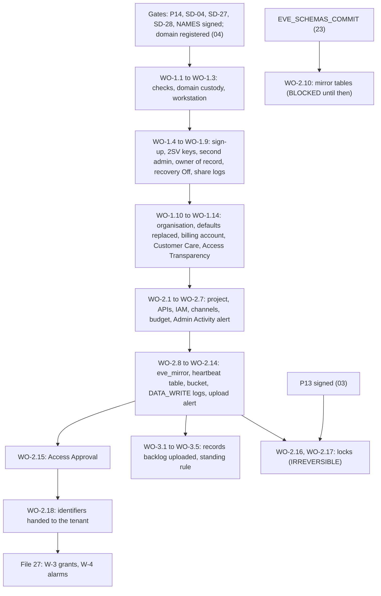

# 8. The witness organisation: tenant, project and records

## Status
- Owner: the platform owner
- Last reviewed: 2026-09-15
- Last executed: never
- Stage: review §2 stage 7 (W-1, W-2 and the records step). W-3 (the member constraint and the two grants to `eve-export@`) and W-4 (the absence alarms) are [27-witness-grants-and-alarms.md](27-witness-grants-and-alarms.md). This file can start as soon as P14 is signed (03) and the witness domain is registered (04); it runs in parallel with 06 to 18 and waits on no platform file.
- Step prefix: WO. Steps: 38 (W-1: 15, W-2: 18, records: 5). BLOCKED steps: WO-2.10 (the mirror tables, until Eve's schema files are committed at `EVE_SCHEMAS_COMMIT` by file 23). Gated but not BLOCKED: WO-2.16 and WO-2.17 (the two retention locks, until P13 is signed), WO-2.15 (Access Approval, until the Customer Care subscription of WO-1.13 is active or recorded as unavailable).
- Replaces: `project-topology.md` §7.5 rows W-1 and W-2, the "IT security created the tenant…" precondition of `eve/07-build-runbook.md` Phase 10b and its "Witness tenant (IT security)" row, and the witness half of `wall-e/PREREQUISITES.md` §9. Decisions applied: SD-04 (witness administrators are not tenant super admins), SD-27 (paper records until W-2, then the records step), SD-28 (billing, support, domain), SD-07 (the heartbeat contract the table carries), SD-43 (row tampering detected, not prevented).
- Closes: S005 (the W-1 and W-2 half; W-3, W-4 and the export are 26 and 27), X-ORG-05 (the witness half: who administers, owner of record, recovery design), X-ORG-08 (billing), X-ORG-09 (domain custody and edition grounds), X-ORG-11 (the upload of earlier records and the standing records rule), X-RQB-06 (billing account, Customer Care, Access Transparency; the `billingEnabled` alarm is 27 and the tenant-side push-failure alert is 26). Detail in "Findings this file closes".
- Elapsed time: 2 to 3 days hands-on across two or three sittings; 2 to 6 weeks elapsed, driven by the billing route and the support subscription (04 PU-2.4, PU-3.1, PU-3.2) and by the up-to-7-day wait before a new security key is usable at sign-in (the figure file 06 records).

## What this part builds

A second Google Cloud organisation, `org-witness`, that no tenant principal can administer, and inside it the one project that holds what has already left the tenant's reach ([../01-hld.md](../01-hld.md) §13.2; [../../eve/01-hld.md](../../eve/01-hld.md) structural choice 1).

1. **W-1, the tenant.** A separately registered domain whose registrar and DNS sit outside the tenant's Cloud organisation and outside the Digital Workplace line. A Cloud Identity account on it (Free or Premium, as P14 records). Two witness super admins, `WITNESS_SA_1` and `WITNESS_SA_2`, held by the two IT security people of 03 who are not tenant super admins, each with two security keys, super-admin self-recovery Off and no recovery email or phone. A non-administrator account for the second human, `SECOND_HUMAN_WITNESS_ACCOUNT`, as owner of record. The organisation resource with its creation defaults replaced by named grants. A billing account parented by `org-witness` and administered only by the witness administrators. A Customer Care subscription, or Access Approval recorded as unavailable. Access Transparency confirmed.
2. **W-2, the project.** `EVE_WITNESS_PROJECT` billed by that account, with its APIs. Three email channels (`WITNESS_EMAIL_CHANNEL`). A budget. An organisation-wide Admin Activity alert to both witness administrators and the second human, fed by an aggregated sink that also carries the witness tenant's own Admin log events. Dataset `eve_mirror` with the heartbeat table. The witness bucket with a retention policy, per-object retention for records, uniform access and public access prevention, and Cloud Storage `DATA_WRITE` audit logs with an alert on every upload, change or delete. Access Approval. The two locks as separate **IRREVERSIBLE** steps gated on P13.
3. **The records step.** The prefixes `custody/`, `rota/` and `drills/`, the name form `<date>-<record>-v<n>`, never overwritten. The upload of every paper record made since 06 after a dated safe inspection, and the standing rule that every later custody, rota and drill record goes straight to the witness the same day.

What the witness holds, from Eve 10b and eve/01 §1, and where each part is made:

| Held in the witness | Made in |
|---|---|
| The append-only mirror of `eve.findings`, `eve.verdicts`, `eve.incidents`, `eve.pages` in `eve_mirror` | dataset and heartbeat table here (WO-2.8, WO-2.9); mirror tables here once Eve's schemas exist (WO-2.10); rows by `eve-export@` from 26 under 27's grant |
| The hourly heartbeat with counts, configuration fingerprint and cumulative per-table counts (SD-07, SD-12) | table contract here (WO-2.9); rows from 26 and 27 |
| The copy of Eve's evidence-bucket exports | bucket here (WO-2.11); objects from 27's grant |
| K5 and K6 rota records, key-custody records (P69, SK-8), drill records | records step here (WO-3) |
| Severity 1 and 2 channels to individuals, absence alarms | email channels here (WO-2.4); SMS, alarms and the `billingEnabled` check in 27 |
| Access Approval and Access Transparency on the project | WO-1.14, WO-2.15 |

What the old text got wrong, and must not come back:

| Old text | Why it fails | Here instead |
|---|---|---|
| Topology §7.5: "the second human is one of the two administrators"; HLD §13.2 and eve/05 G-1: the second human "administrator of the witness" (X-ORG-05) | The second human holds `sa-2-admin@`, a tenant super admin, and topology §2 excludes tenant super admins from the witness. G3, G-1 and the exclusion cannot all be signed true | Two witness super admins from IT security who are neither tenant super admins nor the platform owner, the second human or the second operator (WO-1.1). The second human holds a non-administrator account as owner of record (WO-1.8) |
| Topology §2 and eve/01: "whether the platform's billing account may fund the witness" is open (X-ORG-08, X-RQB-06) | A billing account inherits IAM from its parent organisation, so a tenant Organization Administrator can close it or unlink the project, which stops the witness; linking would also need a cross-organisation grant | A billing account whose parent is `org-witness`, no tenant principal on it (WO-1.12); the platform billing account is never used |
| eve/01: "Cloud Identity Free on a distinct domain", nothing on who holds the domain (X-ORG-09) | DNS control is a documented recovery path into a managed account (CNAME proof of domain ownership) | Registrar and DNS custody checked (WO-1.2); self-recovery Off and no recovery channels (WO-1.5, WO-1.7) |
| Review finding text: "multi-party approval on the witness needs Cloud Identity Premium" | Multi-party approval is not offered for any Cloud Identity edition and does not govern Cloud resources | Edition chosen on other grounds (WO-1.1); "one administrator cannot remove the alarm alone" comes from the Admin Activity alert to three people (WO-2.7) |
| 04 §8.3: custody records "copied to the witness bucket same day" for keys enrolled before the witness exists (X-ORG-11) | No witness exists, and no tenant identity may write to it | Paper and a same-day scan until W-2 (06, SD-27); upload after a safe inspection (WO-3.2, WO-3.3) |
| Eve 10b and topology W-2: "a bucket with a retention lock" in one line; `buckets create … --lock-retention-period` (S005 verdict) | A lock is irreversible and waits on the DPO's ceiling (P13) | Retention set in WO-2.11; bucket lock WO-2.16 and record locks WO-2.17, each **IRREVERSIBLE**, each gated on the signed P13 record |
| "`eve-export@` can add rows and objects but cannot delete or rewrite them" (topology rows 32-33, eve/01) | `roles/bigquery.dataEditor` includes `bigquery.tables.delete` and `bigquery.tables.updateData` (BigQuery access-control page, read 2026-09-15) | Not granted here. Recorded as a hand-over to 27 (custom role without table delete, as SD-43 does for Eve's own tables) |



## Preconditions

- [ ] File 03 has signed records, each passing `tools/decision-need.sh`: **P14 / SD-04 / SD-28** (`<date>-witness-organisation.md`: administrators, domain custody, edition and its grounds, billing route, support), **SD-27** (paper records until W-2), **NAMES** (`<date>-names-register.md` with `EVE_WITNESS_PROJECT` and `WITNESS_BUCKET` signed by both witness administrators, with the fallback suffix rule), and the appointments PPL-WA1 and PPL-WA2. **P13** is needed only by WO-2.16 and WO-2.17.
- [ ] File 03 has set `WITNESS_ADMIN_1_EMAIL`, `WITNESS_ADMIN_2_EMAIL` and `SECOND_HUMAN_EMAIL` (the tenant daily addresses, used for contact and for the email channels only).
- [ ] File 04 has handed over `WITNESS_DOMAIN` (PU-2.4) with `clientTransferProhibited` shown, the registrar and DNS accounts administered only by the two witness administrators with 2SV on, finance's approval of the billing route (PU-2.4, PU-3.2) and procurement's approval of the Customer Care subscription; Google's written answer to PU-3.1 is on file.
- [ ] Four security keys received by the witness administrators directly from procurement (04 §8 count: two each), plus the two keys the second human already holds for `sa-2-admin@` (a FIDO security key can be registered on more than one account; if the second human prefers separate keys, two spares are drawn and 04 PU-4.1 re-orders).
- [ ] Each witness administrator's own workstation (IT security managed, not administered by the Digital Workplace line) with `gcloud`, `bq`, `jq`, `openssl`, `git`, `dig`, `whois` and a clean browser profile per witness account, following file 01's workstation and credential rules.
- [ ] A read-only clone of `PLATFORM_REPO_REMOTE` on each witness workstation, for `tools/decision-need.sh` and `tools/decision-value.sh` only. Nothing is committed to it from the witness side except build-log lines through a pull request (see "Evidence and the build log").
- [ ] For the records step: file 06 done up to its custody records (`<date>-custody-*` scans in `EVIDENCE_INTERIM_LOCATION`), read access for both witness administrators to that folder, and the safe log available.

## People

| Role | Does | Present when |
|---|---|---|
| Witness administrator 1 (IT security, PPL-WA1; tenant contact `WITNESS_ADMIN_1_EMAIL`; witness account `WITNESS_SA_1`) | Performs sign-up and most W-1 and W-2 steps; custodian of `WITNESS_SA_2`'s recovery (resets it if needed) | every sitting |
| Witness administrator 2 (IT security, PPL-WA2; `WITNESS_ADMIN_2_EMAIL`; `WITNESS_SA_2`) | Reviews and witnesses every step of administrator 1; performs WO-1.6 and the second half of every two-person check; custodian of `WITNESS_SA_1`'s recovery | every sitting |
| Second human (`SECOND_HUMAN_EMAIL`; witness account `SECOND_HUMAN_WITNESS_ACCOUNT`) | Present for all of W-1; enrols his own witness account; confirms receipt of every test alert without help; present for both locks; carries the four tenant-side identifiers to the platform owner | W-1; WO-2.7, WO-2.14, WO-2.16, WO-2.17, WO-2.18 |
| Key custodian and other-line witness of each earlier record (06, 04) | Stand at the safe inspection and sign the re-witness record | WO-3.2 |
| Platform owner | **Performs nothing in this file** and holds no witness account. Receives four identifiers in WO-2.18 | never |

Separation checked in WO-1.1 and re-checked in 42 quarterly: neither witness administrator is a tenant super admin, the platform owner, the second human or the second operator; no tenant account holds any role in `org-witness`; the second human holds no administrator role in the witness Cloud Identity account and no IAM role above viewer in `org-witness`.

## Sittings

| Sitting | Steps | Present | Hands-on | Waits after it |
|---|---|---|---|---|
| 1 | WO-1.1 to WO-1.5 | both witness administrators, second human | half a day | up to 7 days before a new key is usable at sign-in |
| 2 | WO-1.6 to WO-1.11 | both witness administrators, second human | half a day | the second administrator's and owner of record's key wait |
| 3 | WO-1.12 to WO-1.15 | both witness administrators, second human; finance's named payer for payment details only | half a day | the billing route and the Customer Care activation (days to weeks) |
| 4 | WO-2.1 to WO-2.9, WO-2.11 to WO-2.14, WO-2.18 | both witness administrators; second human for WO-2.7, WO-2.14, WO-2.18 | one day | none |
| 5 | WO-3.1 to WO-3.5 | a witness administrator, custodians and other-line witnesses at the safe, second human | half a day | none |
| Later | WO-2.10 (on `EVE_SCHEMAS_COMMIT`), WO-2.15 (on Customer Care), WO-2.16 and WO-2.17 (on P13), WO-3.3 (on every new record) | as each step | one hour each | none |

## How the witness resists the people it watches

The witness exists because a tenant super admin can reach everything inside the tenant's organisation ([../01-hld.md](../01-hld.md) §13.2). The monitored administrators include the platform owner, who installs Eve (SD-12). Each way to silence the witness, and what this file does about it:

| Way to silence or bend the witness | Who could try | Control here | Residual, and where it is covered |
|---|---|---|---|
| Close or unlink the billing account | a tenant Organization Administrator, if the account were the tenant's | account parented by `org-witness`, no tenant principal (WO-1.12) | a witness administrator could; notified by WO-2.7 and 27's `billingEnabled` check; Eve's push-failure alert from the tenant side (26) |
| Recover a witness super admin through DNS or a recovery address | whoever controls the witness domain's DNS or a tenant mailbox | registrar and DNS held by the two witness administrators (WO-1.2); self-recovery Off and no recovery channels (WO-1.5, WO-1.7) | support-assisted recovery by proof of domain ownership remains; custody reviewed quarterly (WO-3.5, 42) |
| A tenant principal granted a role in the witness | a tenant administrator working through a witness administrator | security-baseline domain restriction read (WO-1.10); IAM checks with no tenant principal (WO-1.11, WO-1.12, WO-2.3); W-3's managed constraint (27) | only `eve-export@` is ever admitted (27) |
| One witness administrator deletes an alarm, a sink or a record | a coerced or compromised witness administrator | three-person Admin Activity alert (WO-2.7); three-person write alert (WO-2.14); bucket lock and record locks (WO-2.16, WO-2.17) | deleting the alert policy itself is noticed only if it evaluates first; the second human's monthly check (WO-3.5) |
| Change a custody record after the fact | a custodian, or anyone with access to `EVIDENCE_INTERIM_LOCATION` | safe inspection against paper before upload (WO-3.2); SHA-256 and MD5 in the manifest (WO-3.3); per-object retention (WO-2.12) | the paper original in the safe stays authoritative |
| Interfere with mail delivered into the tenant | a tenant super admin | incidents are also visible in the witness console to the owner of record (WO-2.3); SMS channels (27) | email is a secondary route by design (SD-08) |
| Feed the witness a false or quiet heartbeat | a platform owner who edits Eve | configuration fingerprint and cumulative counts in the heartbeat contract (WO-2.9) | the alarms on change and decrease are 27's; the blind proof is 28's |

## If something goes wrong in the middle

| Situation | Do |
|---|---|
| The domain is "already in use" at WO-1.4 | Stop. 04 PU-2.4 finds out which Google account holds it; after its removal wait 24 hours (7 days if bought through a third party) and restart WO-1.4. |
| A witness administrator loses a key before WO-1.6 is done | Only one super admin exists and self-recovery is Off: the remaining key signs in; if both keys of `WITNESS_SA_1` are lost before `WITNESS_SA_2` exists, use support-assisted recovery by proof of domain ownership, with the second human present, and record it as a custody incident. |
| A witness administrator loses a key after WO-1.6 | The other witness administrator resets 2SV for the account in front of the second human (Menu > Directory > Users > user > Security), the key is re-enrolled from a spare, and a custody record goes through WO-3.3 the same day. |
| The billing route is not ready at WO-1.12 | W-1 pauses after WO-1.11. Never link the witness project to any tenant billing account, even for a day. |
| WO-2.7's test does not fire within an hour | Check the sink's writer binding (WO-2.6), the metric's bucket name and the policy's filter; do not continue to WO-2.8 until the alert fires, because every later change relies on it. |
| An IRREVERSIBLE step (WO-2.1, WO-2.8, WO-2.11, WO-2.16, WO-2.17) has START and no DONE after an interruption | Never re-run it. Read the resource's state (`gcloud projects describe`, `bq show`, `gcloud storage buckets describe`), record it, and ask both witness administrators and the second human before going on (README resume rule 3). |
| A safe inspection finds a mismatch or a broken seal | Do not upload that record. Report to the incident commander the same day; the key is re-enrolled (04 §7.1); the new custody record and the inspection report go to the witness through WO-3.3. |
| A tenant principal appears in any witness IAM policy | Remove it, report a severity 1 to the incident commander with the WO-2.7 incident, and re-run WO-1.11, WO-1.12 and WO-2.3's checks. |

## Evidence and the build log

- **Checkpoint lines** (README §4 format) are written by the performing witness administrator to a local `witness-build-log.txt` on his workstation during the sitting, counter-signed by the other, and delivered at the end of each sitting as a pull request to `BUILD_LOG_DIR` under `witness/`, reviewed by the second human. Values held only in the witness copy (`WITNESS_BILLING_ACCOUNT_ID`, `WITNESS_SA_1`, `WITNESS_SA_2`, `SECOND_HUMAN_WITNESS_ACCOUNT`, payment details) are written as `set (witness copy)`, never as values.
- **Records** (screenshots, signed forms) made before WO-2.11 stay with the witness administrators and are uploaded in WO-3.3 under `custody/`: the setup of the witness organisation is custody of the witness itself. From WO-2.11 on, records go straight to the witness bucket.
- **Register lines**: each EVIDENCE line below becomes one line in `EVIDENCE_REGISTER` (01) in the same pull request, with the E-xx id of [../10-eu-ai-act.md](../10-eu-ai-act.md) §5 and the control group of [../11-tisax.md](../11-tisax.md) §13.

## The witness copy of the variables file

Each witness administrator keeps, on his own workstation, a `~/.platform-env` holding **only** the witness section, file 01's helpers (`penv_set`, `need`) and the read-only clone path. It never holds a secret, and it is never copied to a tenant workstation.

| Variable | Set in | Witness copy | Tenant copy (WO-2.18) |
|---|---|---|---|
| `WITNESS_DOMAIN` | 04, re-entered WO-1.3 | yes | yes (04) |
| `WITNESS_ADMIN_1_EMAIL`, `WITNESS_ADMIN_2_EMAIL`, `SECOND_HUMAN_EMAIL` | 03, re-entered WO-1.3 | yes | yes (03) |
| `PLATFORM_REPO_DIR` (the witness workstation's read-only clone) | WO-1.3 | yes | its own value |
| `WITNESS_SA_1`, `WITNESS_SA_2`, `SECOND_HUMAN_WITNESS_ACCOUNT` | WO-1.4, WO-1.6, WO-1.8 | yes | **no** |
| `WITNESS_ORG_ID`, `WITNESS_CUSTOMER_ID` | WO-1.10 | yes | no (27 runs on the witness side) |
| `WITNESS_BILLING_ACCOUNT_ID` | WO-1.12 | yes | **no** |
| `EVE_WITNESS_PROJECT` | WO-2.1 | yes | yes |
| `EVE_WITNESS_PROJECT_NUMBER` | WO-2.1 | yes | no |
| `WITNESS_EMAIL_CHANNEL` | WO-2.4 | yes | no |
| `WITNESS_MIRROR_DS`, `WITNESS_HEARTBEAT_TABLE` | WO-2.8, WO-2.9 | yes | yes |
| `WITNESS_BUCKET` | WO-2.11 | yes | yes |

`WITNESS_EMAIL_CHANNEL` holds **three** channel resource names separated by commas (both witness administrators and the second human), not one. One address cannot reach three people without a mailing list, and any list the tenant hosts can be edited by a tenant super admin. 27 and every alert policy here read the list.

A dedicated gcloud configuration named `witness` with no project is used for every command. The session variable `CLOUDSDK_ACTIVE_CONFIG_NAME=witness` is exported by the witness copy; `CLOUDSDK_CORE_PROJECT` is never exported, and every command passes `--project`, `--organization` or `--billing-account`.

## Steps: W-1, the tenant

### WO-1.1 Check the gates and the separation of people

- **WHO:** Witness administrator 1 performs; witness administrator 2 and the second human check. No platform owner.
- **WHERE:** Witness workstation, shell with the witness copy of `~/.platform-env` sourced (for the first run, the read-only clone and file 01's helpers only). Tenant Admin console as `sa-2-admin@` for the super-admin check, in the second human's browser.
- **ACTION:**

```bash
need PLATFORM_REPO_DIR WITNESS_ADMIN_1_EMAIL WITNESS_ADMIN_2_EMAIL SECOND_HUMAN_EMAIL
git -C "$PLATFORM_REPO_DIR" pull --ff-only
"$PLATFORM_REPO_DIR/tools/decision-need.sh" P14 SD-04 SD-27 SD-28 NAMES PPL-WA1 PPL-WA2
"$PLATFORM_REPO_DIR/tools/decision-value.sh" NAMES EVE_WITNESS_PROJECT
"$PLATFORM_REPO_DIR/tools/decision-value.sh" NAMES WITNESS_BUCKET
```

  Then the second human, signed in to the tenant Admin console as `sa-2-admin@`, opens Menu > Account > Admin roles, points to Super Admin, clicks View admins, and confirms that neither `WITNESS_ADMIN_1_EMAIL` nor `WITNESS_ADMIN_2_EMAIL` is listed. He also confirms from 03's separation record (DC-2.8) that neither is the platform owner, the second human or the second operator. Witness administrator 1 reads the P14 record's **Edition** line aloud and both confirm it states grounds other than multi-party approval (for example: Free, because three accounts, security-key 2SV, Admin log events and sharing to Cloud Logging are in Free; or Premium, for the 24x7 support and 99.9 % SLA of the editions page).
- **VERIFY:** `decision-need.sh` prints `SIGNED` for every id; both `decision-value.sh` lines print a value, not `*tbd*`; the second human's statement "neither witness administrator holds Super Admin in the tenant on <date>" is written on the sitting form and signed by all three.
- **ROLLBACK:** None needed; the step only reads. A failed check stops the file.
- **EVIDENCE:** Sitting form `<date>-WO-1.1-gates-and-separation-v1` (uploaded in WO-3.3 under `custody/`). Build log WO-1.1. EU AI Act E-08 (oversight roster). TISAX 1.1-1.2, 4.2.1.

### WO-1.2 Confirm custody of the witness domain

- **WHO:** Both witness administrators; the second human watches.
- **WHERE:** The registrar's and DNS provider's consoles (outside Google), and the witness workstation shell.
- **ACTION:**
  1. In the registrar account: confirm registrar lock (transfer lock) is on, 2SV is on for every user, and the only users are the two witness administrators. Screenshot each page.
  2. In the DNS provider account: the same three checks. Confirm the zone is not hosted in Cloud DNS in any project of the tenant's organisation and is not delegated from a tenant domain.
  3. From the shell:

```bash
need WITNESS_DOMAIN
whois "$WITNESS_DOMAIN" | grep -iE 'Registrar:|Domain Status:'
dig +short NS "$WITNESS_DOMAIN"
dig +short SOA "$WITNESS_DOMAIN"
```

- **VERIFY:** `Domain Status:` includes `clientTransferProhibited`. The NS and SOA names belong to the DNS provider on the P14 record. `WITNESS_DOMAIN` is not equal to, and does not end with `.<tenant domain>`, for any domain of the tenant (checked by the second human against the tenant's Menu > Account > Domains > Manage domains list). Registrar and DNS users lists show exactly the two witness administrators.
- **ROLLBACK:** None; the step only reads. A failed check goes back to 04 PU-2.4 before any sign-up.
- **EVIDENCE:** Screenshots and the command output as `<date>-WO-1.2-domain-custody-v1` (uploaded in WO-3.3). The record names the registrar and DNS custodians as witness roles. EU AI Act E-06 (the witness copy's independence). TISAX 6.1, 4.1.

### WO-1.3 Prepare the witness workstation copy

- **WHO:** Each witness administrator on his own workstation; the other watches.
- **WHERE:** Witness workstation shell.
- **ACTION:**

```bash
gcloud config configurations create witness --no-activate
gcloud config configurations list --filter="name=witness" --format="value(name,is_active)"
penv_set WITNESS_DOMAIN "<value handed over in 04 PU-2.4>"
penv_set WITNESS_ADMIN_1_EMAIL "<value from 03>"
penv_set WITNESS_ADMIN_2_EMAIL "<value from 03>"
penv_set SECOND_HUMAN_EMAIL "<value from 03>"
penv_set PLATFORM_REPO_DIR "<absolute path of the read-only clone>"
printf 'export CLOUDSDK_ACTIVE_CONFIG_NAME=witness\n' >> "$HOME/.platform-env"
```

- **VERIFY:** In a new shell with the file sourced, `gcloud config get project` prints nothing (and `(unset)` on stderr), `gcloud config configurations list --filter="is_active=true" --format="value(name)"` prints `witness`, and `grep -c CLOUDSDK_CORE_PROJECT ~/.platform-env` prints `0`.
- **ROLLBACK:** `gcloud config configurations delete witness` (after activating another configuration) and remove the lines from the witness copy.
- **EVIDENCE:** Build log WO-1.3 (no values beyond the domain). TISAX 5.2.

### WO-1.4 Sign up for Cloud Identity on the witness domain

- **WHO:** Witness administrator 1; witness administrator 2 and the second human present.
- **WHERE:** A clean browser profile. Cloud Identity Free: `https://workspace.google.com/gcpidentity/signup?sku=identitybasic`. Cloud Identity Premium: `https://workspace.google.com/gcpidentity/signup?sku=identitypremium`. Use the one the P14 record names.
- **ACTION:**
  1. Business name: the witness organisation's name from the P14 record. Country: as the P14 record.
  2. Current email (the sign-up contact and initial recovery address, which Google requires to differ from the new admin address): `WITNESS_ADMIN_1_EMAIL`. WO-1.7 removes it from the account's recovery information.
  3. Domain: `WITNESS_DOMAIN`. Admin username: *Assumption:* `wadmin-1@<WITNESS_DOMAIN>`, unless the P14 record names another. The password is typed by witness administrator 1 directly into the page from his own password manager; it is never spoken, written or pasted into any file.
  4. Verify the domain with the DNS record the setup wizard shows, added in the DNS provider console of WO-1.2 by witness administrator 2.
  5. Record the address:

```bash
penv_set WITNESS_SA_1 "wadmin-1@${WITNESS_DOMAIN}"
```

- **VERIFY:** Signed in as `WITNESS_SA_1` at `admin.google.com`, Menu > Account > Domains > Manage domains shows `WITNESS_DOMAIN` as primary and verified. Menu > Billing > Subscriptions shows Cloud Identity Free or Premium, matching the P14 record. If the wizard reports that the domain is already in use, stop: the domain is attached to another Google account (a 24-hour or 7-day wait applies after removal) and 04 PU-2.4 is re-opened.
- **ROLLBACK:** Before WO-1.10, cancel the Cloud Identity subscription in Menu > Billing and remove the verification record. After WO-1.10 the organisation exists; treat as **not reversible in this file** and open a superseding P14 record.
- **EVIDENCE:** Screenshots of the verified domain and the subscription as `<date>-WO-1.4-sign-up-v1` (uploaded in WO-3.3). Build log: `WITNESS_SA_1 set (witness copy)`. EU AI Act E-06. TISAX 4.1, 6.1.

### WO-1.5 Enrol the first administrator's keys, then enforce security-key 2SV and turn self-recovery Off

- **WHO:** Witness administrator 1; witness administrator 2 witnesses each key serial.
- **WHERE:** `https://myaccount.google.com/signinoptions/two-step-verification` as `WITNESS_SA_1`, then the witness Admin console.
- **ACTION:**
  1. As `WITNESS_SA_1`, turn on 2-Step Verification and add both of his security keys (label each with the key label from the 04 inventory, never the serial).
  2. Menu > Security > Authentication > 2-step verification (`https://admin.google.com/ac/security/2sv`), top organisational unit: tick "Allow users to turn on 2-Step Verification"; Enforcement "On"; New user enrollment period "2 weeks" (*Assumption:* long enough for the key-availability wait file 06 records); Methods "Only security key". Save.
  3. Menu > Security > Authentication > Account recovery > Super admin account recovery: Off. Save.
  4. Menu > Security > Authentication > Account recovery > User account recovery: Off. Save.
- **VERIFY:** Menu > Reporting > Audit and investigation > Admin log events shows the three setting changes by `WITNESS_SA_1`. Signing out and back in as `WITNESS_SA_1` asks for a security key and accepts each of the two keys in turn (repeat after the wait if a new key is refused). On the sign-in page, "Forgot password?" for `WITNESS_SA_1` shows the message to contact an administrator, not a recovery flow.
- **ROLLBACK:** Reverse each setting in the same pages. Do not reverse self-recovery Off without a superseding P14 record.
- **EVIDENCE:** Screenshots of the three settings pages and the Admin log events rows as `<date>-WO-1.5-2sv-and-recovery-v1`; key custody form (label, serial, account, holder, witness, date) as `<date>-custody-wadmin-1-keys-v1` (both uploaded in WO-3.3). EU AI Act E-08. TISAX 3.1, 4.1.2.

### WO-1.6 Create the second witness super admin

- **WHO:** Witness administrator 1 creates and assigns; witness administrator 2 enrols his own keys; the second human watches.
- **WHERE:** Witness Admin console as `WITNESS_SA_1`; then a clean profile on witness administrator 2's workstation.
- **ACTION:**
  1. Menu > Directory > Users > Add new user: *Assumption:* `wadmin-2@<WITNESS_DOMAIN>`. Let the console generate the first password and hand it over on screen only (witness administrator 2 reads it from administrator 1's screen and changes it at first sign-in); never write, send or paste it.
  2. Menu > Account > Admin roles > Super Admin > Admins > Assign users: `wadmin-2@`.
  3. Witness administrator 2 signs in, sets his own password, turns on 2SV with his two keys within the enrolment period.
  4. Record:

```bash
penv_set WITNESS_SA_2 "wadmin-2@${WITNESS_DOMAIN}"
```

- **VERIFY:** Menu > Account > Admin roles > Super Admin > View admins lists exactly `WITNESS_SA_1` and `WITNESS_SA_2`. Menu > Directory > Users > `WITNESS_SA_2` > Security shows 2-Step Verification enrolled with two security keys. A sign-in as `WITNESS_SA_2` after the key wait asks for a key and accepts each.
- **ROLLBACK:** Before the enrolment is proven: unassign the role and delete the user in Menu > Directory > Users. After: no rollback in this file; replacement of a witness administrator is a superseding PPL record and a repeat of this step.
- **EVIDENCE:** Screenshot of View admins; `<date>-custody-wadmin-2-keys-v1` custody form (uploaded in WO-3.3). Build log: `WITNESS_SA_2 set (witness copy)`. EU AI Act E-08. TISAX 3.1, 4.1.2, 4.2.1.

### WO-1.7 Remove recovery channels and record the recovery design

- **WHO:** Witness administrator 2 edits `WITNESS_SA_1`; witness administrator 1 edits `WITNESS_SA_2`; the second human witnesses and co-signs the design record.
- **WHERE:** Witness Admin console.
- **ACTION:**
  1. Menu > Directory > Users > `WITNESS_SA_1` > Security > Recovery information: delete the recovery email (the sign-up contact address) and any recovery phone. Save.
  2. The same for `WITNESS_SA_2`.
  3. Write and sign the recovery design record: (a) super-admin and user self-recovery Off (WO-1.5); (b) a locked-out witness super admin is reset only by the other witness super admin, in front of the second human, followed by key re-enrolment; (c) if both are locked out, support-assisted recovery through proof of domain ownership (a CNAME or TXT record in the DNS provider of WO-1.2, whose only administrators are the two witness administrators); (d) therefore custody of the registrar and DNS accounts is part of the witness's security and is reviewed quarterly in 42; (e) no backup codes are generated for witness accounts, so no envelope holds a witness sign-in secret.
- **VERIFY:** Both users' Security > Recovery information pages show no email and no phone. The design record carries three signatures. Admin log events shows the two recovery-information edits.
- **ROLLBACK:** Re-add recovery information only under a superseding P14 record.
- **EVIDENCE:** Screenshots and `<date>-WO-1.7-witness-recovery-design-v1` (uploaded in WO-3.3). EU AI Act E-06. TISAX 4.1.2, 1.6.

### WO-1.8 Create the second human's owner-of-record account

- **WHO:** Witness administrator 1 creates; the second human enrols his keys; witness administrator 2 watches.
- **WHERE:** Witness Admin console; a clean browser profile on the second human's workstation.
- **ACTION:**
  1. Menu > Directory > Users > Add new user: *Assumption:* `owner-of-record@<WITNESS_DOMAIN>`, first name and last name of the second human. No admin role is assigned.
  2. The second human signs in, sets his own password and registers the two security keys he holds (or two spares, see Preconditions), within the enrolment period.
  3. Remove any recovery email or phone the sign-in prompts added (Security > Recovery information).
  4. Record:

```bash
penv_set SECOND_HUMAN_WITNESS_ACCOUNT "owner-of-record@${WITNESS_DOMAIN}"
```

- **VERIFY:** Menu > Directory > Users > the account > Admin roles and privileges shows no role. Security shows two security keys. Menu > Account > Admin roles > Super Admin > View admins still lists only the two witness administrators.
- **ROLLBACK:** Delete the user in Menu > Directory > Users before WO-2.3 grants it anything.
- **EVIDENCE:** Screenshots; the second human's signed line "I hold `SECOND_HUMAN_WITNESS_ACCOUNT` as owner of record; I hold no administrator role in `org-witness`" as `<date>-WO-1.8-owner-of-record-v1` (uploaded in WO-3.3). Build log: `SECOND_HUMAN_WITNESS_ACCOUNT set (witness copy)`. EU AI Act E-08. TISAX 4.2.1.

### WO-1.9 Share the witness tenant's log events with Google Cloud

- **WHO:** Witness administrator 1 (super admin required); witness administrator 2 watches.
- **WHERE:** Witness Admin console, Menu > Account > Account settings > Legal and compliance > Sharing options.
- **ACTION:** Select "Enabled" for sharing data with Google Cloud services. Save. This puts the witness tenant's Admin log events (role grants, 2SV and recovery changes, user creation) into Cloud Logging at the organisation, where WO-2.6 routes them.
- **VERIFY:** The page shows Enabled after reload. The verification of the log flow is WO-2.7's test.
- **ROLLBACK:** Select Disabled. Doing so blinds WO-2.7's alert to Cloud Identity changes and is itself reported by that alert, if made after WO-2.7.
- **EVIDENCE:** Screenshot `<date>-WO-1.9-sharing-options-v1` (uploaded in WO-3.3). TISAX 4.1.2, 5.2.

### WO-1.10 Record the organisation and grant the second Organization Administrator

- **WHO:** Witness administrator 1; witness administrator 2 watches.
- **WHERE:** `https://console.cloud.google.com` signed in as `WITNESS_SA_1` (accept the Google Cloud terms of service on first visit only after both administrators have read them), then the witness workstation shell signed in as `WITNESS_SA_1` under file 01's credential rules.
- **ACTION:**

```bash
need WITNESS_SA_1 WITNESS_SA_2 WITNESS_DOMAIN
gcloud auth login "$WITNESS_SA_1"
gcloud organizations list --format="table(displayName,name,owner.directoryCustomerId)"
penv_set WITNESS_ORG_ID "<digits of organizations/N whose displayName is WITNESS_DOMAIN>"
penv_set WITNESS_CUSTOMER_ID "$(gcloud organizations describe "$WITNESS_ORG_ID" --format='value(owner.directoryCustomerId)')"
gcloud organizations add-iam-policy-binding "$WITNESS_ORG_ID" --member="user:${WITNESS_SA_2}" --role=roles/resourcemanager.organizationAdmin --condition=None
gcloud org-policies describe iam.allowedPolicyMemberDomains --organization="$WITNESS_ORG_ID" --effective --format=json
```

- **VERIFY:** `gcloud organizations list` shows exactly one organisation, display name `WITNESS_DOMAIN`, lifecycle `ACTIVE`. `WITNESS_CUSTOMER_ID` is not `DIRECTORY_CUSTOMER_ID` of the tenant (the second human compares it with his own copy). `gcloud organizations get-iam-policy "$WITNESS_ORG_ID" --format=json | jq -r '.bindings[] | select(.role=="roles/resourcemanager.organizationAdmin") | .members[]'` prints exactly `user:WITNESS_SA_1` and `user:WITNESS_SA_2`. The effective `iam.allowedPolicyMemberDomains` output is saved: for an organisation created after 2024-05-03 it is enforced by the security baseline with the witness's own customer id, which 27 depends on (W-3).
- **ROLLBACK:** `gcloud organizations remove-iam-policy-binding "$WITNESS_ORG_ID" --member="user:${WITNESS_SA_2}" --role=roles/resourcemanager.organizationAdmin`.
- **EVIDENCE:** The command output as `<date>-WO-1.10-organisation-v1` (uploaded in WO-3.3; the org id and customer id are identifiers, not secrets). EU AI Act E-06. TISAX 4.1-4.2.

### WO-1.11 Replace the organisation-creation defaults with named grants

- **WHO:** Witness administrator 1; witness administrator 2 watches.
- **WHERE:** Witness workstation shell.
- **ACTION:** The organisation grants Project Creator and Billing Account Creator to every user of the domain on creation. Grant them to the two administrators by name, then remove the domain grant, so the owner-of-record account cannot create projects or billing accounts. Organization Administrator does not include `resourcemanager.projects.create`, so the named grants are needed for WO-1.12 and WO-2.1.

```bash
need WITNESS_ORG_ID WITNESS_SA_1 WITNESS_SA_2 WITNESS_DOMAIN
gcloud organizations get-iam-policy "$WITNESS_ORG_ID" --format=json > "$(mktemp -d)/org-policy-before.json"
gcloud organizations add-iam-policy-binding "$WITNESS_ORG_ID" --member="user:${WITNESS_SA_1}" --role=roles/resourcemanager.projectCreator --condition=None
gcloud organizations add-iam-policy-binding "$WITNESS_ORG_ID" --member="user:${WITNESS_SA_2}" --role=roles/resourcemanager.projectCreator --condition=None
gcloud organizations add-iam-policy-binding "$WITNESS_ORG_ID" --member="user:${WITNESS_SA_1}" --role=roles/billing.creator --condition=None
gcloud organizations add-iam-policy-binding "$WITNESS_ORG_ID" --member="user:${WITNESS_SA_2}" --role=roles/billing.creator --condition=None
gcloud organizations remove-iam-policy-binding "$WITNESS_ORG_ID" --member="domain:${WITNESS_DOMAIN}" --role=roles/resourcemanager.projectCreator
gcloud organizations remove-iam-policy-binding "$WITNESS_ORG_ID" --member="domain:${WITNESS_DOMAIN}" --role=roles/billing.creator
```

- **VERIFY:** The next command prints no line:

```bash
gcloud organizations get-iam-policy "$WITNESS_ORG_ID" --format=json | jq -r '.bindings[] | .role as $r | .members[] | "\($r) \(.)"' | grep -vE "user:(${WITNESS_SA_1}|${WITNESS_SA_2})$" | grep -vE 'serviceAccount:.*@gcp-sa-[a-z0-9-]+\.iam\.gserviceaccount\.com$'
```

  (The second filter admits Google-managed service agents only; any line printed is investigated before continuing.)
- **ROLLBACK:** Re-add the domain bindings with `gcloud organizations add-iam-policy-binding "$WITNESS_ORG_ID" --member="domain:${WITNESS_DOMAIN}" --role=<role> --condition=None` and remove the user bindings.
- **EVIDENCE:** Before and after policy JSON as `<date>-WO-1.11-org-defaults-v1` (uploaded in WO-3.3). TISAX 4.1-4.2. EU AI Act E-08.

### WO-1.12 Create the witness billing account

- **WHO:** Witness administrator 1 creates; witness administrator 2 is the second Billing Account Administrator; finance is informed of the account's display name only.
- **WHERE:** `https://console.cloud.google.com/billing` > Create account, signed in as `WITNESS_SA_1`; then the witness workstation shell.
- **ACTION:**
  1. Follow the route finance approved in 04 (PU-2.4, PU-3.2): self-serve, or the invoiced account Google set up after the application. Organization: select `WITNESS_DOMAIN` from the drop-down (the console requires it for organisation members). Country and currency: as the P14 record; **the currency cannot be changed later**. Payments profile: a business profile whose users are only the two witness administrators; payment details are entered by the person finance names directly into the Google page, never into a file or message.
  2. Record and grant:

```bash
gcloud billing accounts list --format="table(name,displayName,open,parent,currencyCode)"
penv_set WITNESS_BILLING_ACCOUNT_ID "<the XXXXXX-XXXXXX-XXXXXX id whose parent is organizations/WITNESS_ORG_ID>"
gcloud billing accounts add-iam-policy-binding "$WITNESS_BILLING_ACCOUNT_ID" --member="user:${WITNESS_SA_2}" --role=roles/billing.admin
```

- **VERIFY:**

```bash
gcloud billing accounts describe "$WITNESS_BILLING_ACCOUNT_ID" --format="value(open,parent,currencyCode,masterBillingAccount)"
gcloud billing accounts get-iam-policy "$WITNESS_BILLING_ACCOUNT_ID" --format=json | jq -r '.bindings[] | .role as $r | .members[] | "\($r) \(.)"'
```

  The first prints `True`, `organizations/<WITNESS_ORG_ID>`, the P14 currency, and an empty sub-account field (not a reseller sub-account). The second prints only `roles/billing.admin` for `WITNESS_SA_1` and `WITNESS_SA_2`: **no principal of the tenant's domain and no other principal**. In Google Payments (`https://payments.google.com` > Settings > Payments users) the users are the two witness administrators only. The second human confirms that the tenant's `ORG_ID` does not appear anywhere on the account page.
- **ROLLBACK:** Before WO-2.1 links a project: close the account at Billing > Account management > Close billing account. After: see WO-2.1.
- **EVIDENCE:** Screenshots of the account overview and payments users, the describe and IAM output with the billing account id masked to its last six characters, as `<date>-WO-1.12-witness-billing-v1` (uploaded in WO-3.3). Build log: `WITNESS_BILLING_ACCOUNT_ID set (witness copy)`. EU AI Act E-06. TISAX 6.1, 4.1.

### WO-1.13 Subscribe to Customer Care for the witness organisation, or record Access Approval as unavailable

- **WHO:** Witness administrator 1 purchases; witness administrator 2 witnesses; procurement's approval from 04 is on file.
- **WHERE:** Witness workstation shell; then the Cloud console as `WITNESS_SA_1`, Support > Overview > Support Information card > View Customer Care services.
- **ACTION:**

```bash
need WITNESS_ORG_ID WITNESS_SA_1
gcloud organizations add-iam-policy-binding "$WITNESS_ORG_ID" --member="user:${WITNESS_SA_1}" --role=roles/cloudsupport.admin --condition=None
```

  Then, under Standard Support (or the tier procurement approved), click Buy Now; select the organisation `WITNESS_DOMAIN`; select the billing account of WO-1.12 for the base fee; both administrators read the terms of service before the purchase is completed. Access Approval is included with Standard, Enhanced and Premium Support, and the subscription is bought for one organisation resource, so the tenant's own subscription does not cover the witness.

  If procurement did not approve a subscription, or Google's PU-3.1 answer says Access Approval is not available to this organisation: do not buy; write the record `<date>-WO-1.13-access-approval-unavailable-v1` stating the answer, its date and the residual (Google personnel access to witness data is logged by Access Transparency but not gated). WO-2.15 then records N/A.
- **VERIFY:** Support > Overview shows the subscription active on the witness organisation. Or the unavailability record is signed by both witness administrators and the second human.
- **ROLLBACK:** Cancel under the subscription's terms (Support > Overview > Manage). `gcloud organizations remove-iam-policy-binding "$WITNESS_ORG_ID" --member="user:${WITNESS_SA_1}" --role=roles/cloudsupport.admin` once no longer needed.
- **EVIDENCE:** Order confirmation screenshot (no payment detail) or the unavailability record, uploaded in WO-3.3. EU AI Act E-06, E-11 (supplier file). TISAX 6.1.

### WO-1.14 Confirm Access Transparency on the witness organisation

- **WHO:** Witness administrator 2; witness administrator 1 watches.
- **WHERE:** Cloud console as `WITNESS_SA_2`, organisation `WITNESS_DOMAIN` selected, IAM & Admin > Settings (organisation-level Access Transparency settings); the shell for the role grant.
- **ACTION:** Access Transparency is documented as a default control for every Google Cloud organisation. Read its state; if the page offers to enable it, enable it. The viewer needs Access Approval Viewer or Access Transparency Admin:

```bash
need WITNESS_ORG_ID WITNESS_SA_2
gcloud organizations add-iam-policy-binding "$WITNESS_ORG_ID" --member="user:${WITNESS_SA_2}" --role=roles/axt.admin --condition=None
```

- **VERIFY:** The settings page states that Access Transparency is enabled for the organisation. A screenshot is taken with the date visible.
- **ROLLBACK:** None for the confirmation. `gcloud organizations remove-iam-policy-binding "$WITNESS_ORG_ID" --member="user:${WITNESS_SA_2}" --role=roles/axt.admin` removes the role.
- **EVIDENCE:** `<date>-WO-1.14-access-transparency-v1` (uploaded in WO-3.3). EU AI Act E-06. TISAX 6.1, 5.2.

### WO-1.15 Close W-1 with an interim Admin log review

- **WHO:** Witness administrator 2 exports; the second human reads, without the witness administrators' commentary.
- **WHERE:** Witness Admin console as `WITNESS_SA_2`, Menu > Reporting > Audit and investigation > Admin log events.
- **ACTION:** The Admin Activity alert needs the project and is created in WO-2.7. Cloud Identity Free has no activity rules (Cloud Identity Premium has them). Until WO-2.7 passes, at the start of each W-2 sitting witness administrator 2 filters Admin log events from the sign-up date, exports to CSV and hands the file to the second human, who checks every event against the build log of W-1. If the edition is Premium, witness administrator 1 additionally creates an activity rule (Security > Investigation tool > Create activity rule) on Admin log events, actor any, email to the two witness administrators; the second human's witness account has no mailbox, so the rule's email recipient is `SECOND_HUMAN_EMAIL` added as an external recipient if the builder allows it (*Assumption:*; record what the builder offers).
- **VERIFY:** The second human signs "every Admin log event from <sign-up date> to <export time> matches a W-1 step". A W-1 build log with 15 DONE lines.
- **ROLLBACK:** None; the step only reads.
- **EVIDENCE:** The CSV and the signed line as `<date>-WO-1.15-interim-admin-log-review-v1` (uploaded in WO-3.3). EU AI Act E-08. TISAX 1.5, 4.2.1.

## Steps: W-2, the project and its stores

### WO-2.1 Create `EVE_WITNESS_PROJECT` and link the witness billing account

- **WHO:** Witness administrator 1; witness administrator 2 checks the id against the names register before Enter.
- **WHERE:** Witness workstation shell, witness copy sourced.
- **ACTION:** No factory exists in `org-witness` and none is planned: this is the one project outside the platform organisation (topology §2), so there is no bootstrap deviation to record. Labels follow the platform's label keys for the drift inventory.

```bash
need WITNESS_ORG_ID WITNESS_BILLING_ACCOUNT_ID
"$PLATFORM_REPO_DIR/tools/decision-need.sh" NAMES P14
penv_set EVE_WITNESS_PROJECT "$("$PLATFORM_REPO_DIR/tools/decision-value.sh" NAMES EVE_WITNESS_PROJECT)"
gcloud projects create "$EVE_WITNESS_PROJECT" --organization="$WITNESS_ORG_ID" --name="eve witness" --labels=agp-role=witness,agp-owner=it-security,agp-env=prod
gcloud billing projects link "$EVE_WITNESS_PROJECT" --billing-account="$WITNESS_BILLING_ACCOUNT_ID"
penv_set EVE_WITNESS_PROJECT_NUMBER "$(gcloud projects describe "$EVE_WITNESS_PROJECT" --format='value(projectNumber)')"
```

- **VERIFY:**

```bash
gcloud projects describe "$EVE_WITNESS_PROJECT" --format="value(parent.type,parent.id,lifecycleState,labels)"
gcloud billing projects describe "$EVE_WITNESS_PROJECT" --format="value(billingEnabled,billingAccountName)"
```

  prints `organization`, `WITNESS_ORG_ID`, `ACTIVE` and the three labels; then `True` and `billingAccounts/<WITNESS_BILLING_ACCOUNT_ID>`. If the id is taken, apply the names register's signed fallback suffix, record it, and repeat.
- **ROLLBACK:** **IRREVERSIBLE as a name**: a project id can never be reused, even after deletion. Confirm before running: the id equals the NAMES record value, both witness administrators have read it aloud, and P14 is signed. A project created wrongly is shut down with `gcloud projects delete "$EVE_WITNESS_PROJECT"` only before WO-2.16 (a locked bucket places a lien) and the name is recorded as burnt.
- **EVIDENCE:** Output as `<date>-WO-2.1-project-v1` (uploaded in WO-3.3). EU AI Act E-06. TISAX 1.3 (asset register), 4.1.

### WO-2.2 Enable the APIs

- **WHO:** Witness administrator 1.
- **WHERE:** Witness workstation shell.
- **ACTION:**

```bash
need EVE_WITNESS_PROJECT
gcloud services enable bigquery.googleapis.com --project="$EVE_WITNESS_PROJECT"
gcloud services enable storage.googleapis.com --project="$EVE_WITNESS_PROJECT"
gcloud services enable logging.googleapis.com --project="$EVE_WITNESS_PROJECT"
gcloud services enable monitoring.googleapis.com --project="$EVE_WITNESS_PROJECT"
gcloud services enable accessapproval.googleapis.com --project="$EVE_WITNESS_PROJECT"
gcloud services enable cloudbilling.googleapis.com --project="$EVE_WITNESS_PROJECT"
gcloud services enable billingbudgets.googleapis.com --project="$EVE_WITNESS_PROJECT"
gcloud services enable orgpolicy.googleapis.com --project="$EVE_WITNESS_PROJECT"
gcloud services enable cloudresourcemanager.googleapis.com --project="$EVE_WITNESS_PROJECT"
gcloud services enable iam.googleapis.com --project="$EVE_WITNESS_PROJECT"
```

  `cloudbilling` is for 27's `billingEnabled` check, `orgpolicy` for 27's W-3. No compute, run, cloudbuild, artifactregistry or aiplatform API is enabled: nothing in the witness can execute.
- **VERIFY:** `gcloud services list --enabled --project="$EVE_WITNESS_PROJECT" --format="value(config.name)" | sort` contains the ten names above and no `run`, `cloudfunctions`, `compute`, `cloudbuild`, `artifactregistry` or `aiplatform` entry (APIs Google enables by default on a new project, such as `bigquerystorage` or `cloudtrace`, are recorded as found).
- **ROLLBACK:** `gcloud services disable <api> --project="$EVE_WITNESS_PROJECT"`.
- **EVIDENCE:** The sorted list in the build log WO-2.2. TISAX 5.2.

### WO-2.3 Set the project's human IAM

- **WHO:** Witness administrator 1 grants; witness administrator 2 reviews the diff; the second human watches.
- **WHERE:** Witness workstation shell.
- **ACTION:** The creator already holds `roles/owner`. The second administrator gets the same, plus Storage Admin for per-object retention. The second human gets read-only roles to see alerts, logs, the mirror and the records.

```bash
need EVE_WITNESS_PROJECT WITNESS_SA_1 WITNESS_SA_2 SECOND_HUMAN_WITNESS_ACCOUNT
gcloud projects add-iam-policy-binding "$EVE_WITNESS_PROJECT" --member="user:${WITNESS_SA_2}" --role=roles/owner --condition=None
gcloud projects add-iam-policy-binding "$EVE_WITNESS_PROJECT" --member="user:${WITNESS_SA_1}" --role=roles/storage.admin --condition=None
gcloud projects add-iam-policy-binding "$EVE_WITNESS_PROJECT" --member="user:${WITNESS_SA_2}" --role=roles/storage.admin --condition=None
gcloud projects add-iam-policy-binding "$EVE_WITNESS_PROJECT" --member="user:${SECOND_HUMAN_WITNESS_ACCOUNT}" --role=roles/monitoring.viewer --condition=None
gcloud projects add-iam-policy-binding "$EVE_WITNESS_PROJECT" --member="user:${SECOND_HUMAN_WITNESS_ACCOUNT}" --role=roles/logging.viewer --condition=None
gcloud projects add-iam-policy-binding "$EVE_WITNESS_PROJECT" --member="user:${SECOND_HUMAN_WITNESS_ACCOUNT}" --role=roles/bigquery.jobUser --condition=None
```

  Owner is held by exactly two humans. `roles/owner` on a new project is refused by the organisation for any member outside the witness customer (the enforced domain restriction of WO-1.10).
- **VERIFY:**

```bash
gcloud projects get-iam-policy "$EVE_WITNESS_PROJECT" --format=json | jq -r '.bindings[] | .role as $r | .members[] | select(startswith("user:") or startswith("group:") or startswith("domain:")) | "\($r) \(.)"' | sort
```

  prints exactly seven user bindings: `roles/owner` and `roles/storage.admin` for each of the two administrators, and `roles/monitoring.viewer`, `roles/logging.viewer` and `roles/bigquery.jobUser` for the owner of record. No `domain:` or `group:` member, and no tenant address.
- **ROLLBACK:** `gcloud projects remove-iam-policy-binding "$EVE_WITNESS_PROJECT" --member=<member> --role=<role>` for each added binding.
- **EVIDENCE:** The sorted list as `<date>-WO-2.3-project-iam-v1` (uploaded in WO-3.3). EU AI Act E-08. TISAX 4.1-4.2.

### WO-2.4 Create the witness email channels

- **WHO:** Witness administrator 1; the second human confirms his address.
- **WHERE:** Witness workstation shell.
- **ACTION:** Email channels need no verification. The addresses are the three people's tenant mailboxes: the witness accounts have no mailbox. Residual recorded in the evidence: a tenant super admin can interfere with mail delivered into the tenant, which is why 27 adds SMS channels and the second human reads incidents in the witness console directly.

```bash
need EVE_WITNESS_PROJECT WITNESS_ADMIN_1_EMAIL WITNESS_ADMIN_2_EMAIL SECOND_HUMAN_EMAIL
gcloud beta monitoring channels create --project="$EVE_WITNESS_PROJECT" --type=email --display-name="witness-email-admin-1" --channel-labels=email_address="$WITNESS_ADMIN_1_EMAIL"
gcloud beta monitoring channels create --project="$EVE_WITNESS_PROJECT" --type=email --display-name="witness-email-admin-2" --channel-labels=email_address="$WITNESS_ADMIN_2_EMAIL"
gcloud beta monitoring channels create --project="$EVE_WITNESS_PROJECT" --type=email --display-name="witness-email-second-human" --channel-labels=email_address="$SECOND_HUMAN_EMAIL"
penv_set WITNESS_EMAIL_CHANNEL "$(gcloud beta monitoring channels list --project="$EVE_WITNESS_PROJECT" --filter='displayName:witness-email-' --format='value(name)' | sort | paste -sd, -)"
```

- **VERIFY:** `printf '%s\n' "$WITNESS_EMAIL_CHANNEL" | tr ',' '\n' | wc -l` prints `3`, and `gcloud beta monitoring channels list --project="$EVE_WITNESS_PROJECT" --format="table(displayName,type,labels.email_address,enabled)"` shows three enabled email channels to the three addresses. In the console, Monitoring > Alerting > Edit notification channels > Email, "Send test notification" on each; each person confirms receipt by replying to the sitting, not by forwarding.
- **ROLLBACK:** `gcloud beta monitoring channels delete <channel> --project="$EVE_WITNESS_PROJECT"`.
- **EVIDENCE:** Channel list and three receipt confirmations as `<date>-WO-2.4-email-channels-v1` (uploaded in WO-3.3). EU AI Act E-10 (incident routing). TISAX 1.6.

### WO-2.5 Set the witness budget

- **WHO:** Witness administrator 2 (Billing Account Administrator); witness administrator 1 watches.
- **WHERE:** Witness workstation shell.
- **ACTION:** Budget alerts accept email channels only, up to five. The amount is the P14 record's figure (*tbd* until finance states it; eve/01 prices the witness at hours of work, not a second platform). Default recipients (the two Billing Account Administrators) stay on.

```bash
need WITNESS_BILLING_ACCOUNT_ID EVE_WITNESS_PROJECT WITNESS_EMAIL_CHANNEL
CUR="$(gcloud billing accounts describe "$WITNESS_BILLING_ACCOUNT_ID" --format='value(currencyCode)')"
gcloud billing budgets create --billing-project="$EVE_WITNESS_PROJECT" --billing-account="$WITNESS_BILLING_ACCOUNT_ID" --display-name="witness-budget" --budget-amount="<amount from the P14 record>${CUR}" --calendar-period=month --threshold-rule=percent=0.5 --threshold-rule=percent=0.9 --threshold-rule=percent=1.0 --notifications-rule-monitoring-notification-channels="$WITNESS_EMAIL_CHANNEL"
```

- **VERIFY:** `gcloud billing budgets list --billing-project="$EVE_WITNESS_PROJECT" --billing-account="$WITNESS_BILLING_ACCOUNT_ID" --format=json | jq '.[] | {displayName, amount, thresholdRules, notificationsRule}'` shows `witness-budget`, the amount in `CUR`, three thresholds and the three channels. Billing > Budgets & alerts in the console shows the same.
- **ROLLBACK:** `gcloud billing budgets delete <budget id> --billing-project="$EVE_WITNESS_PROJECT" --billing-account="$WITNESS_BILLING_ACCOUNT_ID"`.
- **EVIDENCE:** The JSON (billing account id masked) as `<date>-WO-2.5-budget-v1` (uploaded in WO-3.3). TISAX 6.1.

### WO-2.6 Route every Admin Activity entry of `org-witness` to a witness log bucket

- **WHO:** Witness administrator 1; witness administrator 2 reviews the filter.
- **WHERE:** Witness workstation shell.
- **ACTION:** An aggregated organisation sink with `--include-children` carries Admin Activity entries of the organisation and its project, including the witness tenant's own Admin log events shared by WO-1.9. A bucket-scoped metric on its destination feeds WO-2.7, because a log-based alerting policy is documented only for entries routed by a project-level sink.

```bash
need WITNESS_ORG_ID EVE_WITNESS_PROJECT
gcloud logging buckets create witness-admin-activity --project="$EVE_WITNESS_PROJECT" --location=europe-west1 --retention-days=400 --description="Admin Activity of org-witness, for the witness change alert"
gcloud logging sinks create witness-admin-activity "logging.googleapis.com/projects/${EVE_WITNESS_PROJECT}/locations/europe-west1/buckets/witness-admin-activity" --organization="$WITNESS_ORG_ID" --include-children --log-filter='logName:"cloudaudit.googleapis.com%2Factivity"'
SINK_WRITER="$(gcloud logging sinks describe witness-admin-activity --organization="$WITNESS_ORG_ID" --format='value(writerIdentity)')"
gcloud projects add-iam-policy-binding "$EVE_WITNESS_PROJECT" --member="$SINK_WRITER" --role=roles/logging.bucketWriter --condition=None
```

- **VERIFY:** `gcloud logging sinks describe witness-admin-activity --organization="$WITNESS_ORG_ID" --format="value(destination,filter,includeChildren,disabled)"` shows the bucket, the filter, `True` and an empty or `False` disabled field. Within about ten minutes of WO-2.7's test change, Logs Explorer in `EVE_WITNESS_PROJECT`, scope set to the bucket `witness-admin-activity`, shows the test entry.
- **ROLLBACK:** `gcloud logging sinks delete witness-admin-activity --organization="$WITNESS_ORG_ID"`; remove the writer binding; `gcloud logging buckets delete witness-admin-activity --project="$EVE_WITNESS_PROJECT" --location=europe-west1` (the bucket enters a pending-deletion period).
- **EVIDENCE:** Describe output as `<date>-WO-2.6-admin-activity-sink-v1` (uploaded in WO-3.3). EU AI Act E-06. TISAX 5.2 (audit-log retention settings).

### WO-2.7 Alert both witness administrators and the second human on any Admin Activity

- **WHO:** Witness administrator 1 creates; witness administrator 2 makes the test change; the second human confirms receipt without help.
- **WHERE:** Witness workstation shell.
- **ACTION:** Every Admin Activity entry in `org-witness` notifies three people, so neither witness administrator can change an alert, a grant, the bucket, the sink or a Cloud Identity role alone and unnoticed. The deletion of this policy or of the sink is itself an Admin Activity entry, delivered only if the policy still exists at evaluation; that residual is covered by the second human's monthly check in 42.

```bash
need EVE_WITNESS_PROJECT WITNESS_EMAIL_CHANNEL
gcloud logging metrics create witness-admin-activity --project="$EVE_WITNESS_PROJECT" --bucket-name="projects/${EVE_WITNESS_PROJECT}/locations/europe-west1/buckets/witness-admin-activity" --description="Count of Admin Activity entries in org-witness" --log-filter='logName:"cloudaudit.googleapis.com%2Factivity"'
POL="$(mktemp -d)/witness-admin-activity-policy.json"
jq -n --arg ch "$WITNESS_EMAIL_CHANNEL" '{displayName:"witness-admin-activity", combiner:"OR", conditions:[{displayName:"Any Admin Activity entry in org-witness", conditionThreshold:{filter:"metric.type=\"logging.googleapis.com/user/witness-admin-activity\" AND resource.type=\"logging_bucket\"", comparison:"COMPARISON_GT", thresholdValue:0, duration:"0s", aggregations:[{alignmentPeriod:"300s", perSeriesAligner:"ALIGN_SUM"}]}}], notificationChannels:($ch|split(",")), documentation:{content:"An administrative change was made in org-witness. Each recipient checks the Admin Activity entry against the witness build log. An unexplained change is a severity 1 report to the incident commander.", mimeType:"text/markdown"}}' > "$POL"
gcloud monitoring policies create --project="$EVE_WITNESS_PROJECT" --policy-from-file="$POL"
```

  Test: witness administrator 2 adds and then removes a label on the project.

```bash
gcloud projects update "$EVE_WITNESS_PROJECT" --update-labels=agp-alert-test=wo-2-7
gcloud projects update "$EVE_WITNESS_PROJECT" --remove-labels=agp-alert-test
```

- **VERIFY:** `gcloud monitoring policies list --project="$EVE_WITNESS_PROJECT" --format="table(displayName,enabled,notificationChannels.len())"` shows `witness-admin-activity`, enabled, 3. Within 30 minutes (*Assumption:* metric and alert latency) Monitoring > Alerting > Incidents shows an incident, and each of the three people confirms the email in writing with its timestamp; the second human confirms from his own mailbox before anyone tells him it was sent. A second test by witness administrator 1 on the Cloud Identity side (Menu > Security > Authentication > 2-step verification: open and Save with no change is not logged, so instead change the New user enrollment period to 1 week and back) also produces an incident; if it does not, record that Cloud Identity Admin log events do not reach the alert and keep WO-1.15's review as a monthly standing check in `DRILL_CALENDAR`.
- **ROLLBACK:** `gcloud monitoring policies delete <policy name> --project="$EVE_WITNESS_PROJECT"`; `gcloud logging metrics delete witness-admin-activity --project="$EVE_WITNESS_PROJECT"`. Each deletion notifies the three recipients while the policy exists.
- **EVIDENCE:** Policy JSON, the incident screenshots and the three receipt lines as `<date>-WO-2.7-admin-activity-alert-v1` (uploaded in WO-3.3). EU AI Act E-08, E-10. TISAX 4.2.1, 1.5.

### WO-2.8 Create the dataset `eve_mirror`

- **WHO:** Witness administrator 1; witness administrator 2 checks the name and location.
- **WHERE:** Witness workstation shell.
- **ACTION:** Google-managed encryption, never a tenant key (P112, 08 S6), location `EU` (08 S6), no default table or partition expiration, so nothing expires by itself.

```bash
need EVE_WITNESS_PROJECT SECOND_HUMAN_WITNESS_ACCOUNT
"$PLATFORM_REPO_DIR/tools/decision-need.sh" NAMES
penv_set WITNESS_MIRROR_DS "eve_mirror"
bq --project_id="$EVE_WITNESS_PROJECT" --location=EU mk --dataset --description="Witness mirror of Eve evidence, pushed by eve-export@ (27)" --label=agp-role:witness "${EVE_WITNESS_PROJECT}:${WITNESS_MIRROR_DS}"
```

  Then add the owner of record as a dataset reader through the access array (mktemp, read back, diff, as file 01 prescribes):

```bash
D="$(mktemp -d)"
bq --project_id="$EVE_WITNESS_PROJECT" show --format=prettyjson "${EVE_WITNESS_PROJECT}:${WITNESS_MIRROR_DS}" > "$D/before.json"
jq --arg u "$SECOND_HUMAN_WITNESS_ACCOUNT" '.access += [{"role":"READER","userByEmail":$u}] | {access}' "$D/before.json" > "$D/update.json"
bq --project_id="$EVE_WITNESS_PROJECT" update --source="$D/update.json" "${EVE_WITNESS_PROJECT}:${WITNESS_MIRROR_DS}"
bq --project_id="$EVE_WITNESS_PROJECT" show --format=prettyjson "${EVE_WITNESS_PROJECT}:${WITNESS_MIRROR_DS}" > "$D/after.json"
diff <(jq -S .access "$D/before.json") <(jq -S .access "$D/after.json")
```

- **VERIFY:** `bq --project_id="$EVE_WITNESS_PROJECT" show --format=prettyjson "${EVE_WITNESS_PROJECT}:${WITNESS_MIRROR_DS}" | jq '{location, defaultTableExpirationMs, defaultPartitionExpirationMs, defaultEncryptionConfiguration}'` prints `"EU"` and three nulls. The diff shows only the added READER entry.
- **ROLLBACK:** **IRREVERSIBLE as a name and location**: a dataset's name and location cannot change. Confirm before running: the NAMES record says `eve_mirror`, and the P14 record does not name another location. An empty wrongly created dataset is removed with `bq --project_id="$EVE_WITNESS_PROJECT" rm -d "${EVE_WITNESS_PROJECT}:${WITNESS_MIRROR_DS}"` and recreated; a dataset holding pushed rows is never removed.
- **EVIDENCE:** Show output as `<date>-WO-2.8-eve-mirror-v1`. EU AI Act E-06. TISAX 1.3, 5.2.

### WO-2.9 Create the heartbeat table (contract version 1)

- **WHO:** Witness administrator 1; the second human reviews the contract against SD-07 and SD-12.
- **WHERE:** Witness workstation shell.
- **ACTION:** The heartbeat is the witness side's contract with Eve's export code (B-08 in the README's BLOCKED index), which does not exist yet. The witness owns the table and fixes version 1 here; 26 writes to it and 27 alarms on it. If Eve's committed code needs another shape, a `heartbeat_v2` table is created beside it before 27's grants, and this one is left empty: nothing is altered in place. SD-07: an hourly row with the last hour's counts (feed silence becomes a value condition); SD-12: the configuration fingerprint and cumulative per-table counts (a quiet edit or a row deletion becomes visible).

```bash
need EVE_WITNESS_PROJECT WITNESS_MIRROR_DS
penv_set WITNESS_HEARTBEAT_TABLE "heartbeat"
S="$(mktemp -d)/heartbeat-v1.json"
cat > "$S" <<'EOF'
[
  {"name":"heartbeat_ts","type":"TIMESTAMP","mode":"REQUIRED","description":"When eve-export@ wrote the row"},
  {"name":"kind","type":"STRING","mode":"REQUIRED","description":"hourly, export or incident"},
  {"name":"window_start","type":"TIMESTAMP","mode":"REQUIRED"},
  {"name":"window_end","type":"TIMESTAMP","mode":"REQUIRED"},
  {"name":"source_project","type":"STRING","mode":"REQUIRED","description":"EVE_PROJECT id"},
  {"name":"run_id","type":"STRING","mode":"REQUIRED","description":"Idempotency key: job execution and window"},
  {"name":"config_fingerprint","type":"STRING","mode":"REQUIRED","description":"SHA-256 hex of sink filter, job specs and digests, scheduler states, eve@ privileges, roster hash"},
  {"name":"ws_log_rows_window","type":"INT64","mode":"REQUIRED","description":"eve_workspace_logs rows ingested in the window"},
  {"name":"table_counts","type":"RECORD","mode":"REPEATED","fields":[
    {"name":"table_name","type":"STRING","mode":"REQUIRED"},
    {"name":"rows_window","type":"INT64","mode":"NULLABLE"},
    {"name":"rows_cumulative","type":"INT64","mode":"REQUIRED"}]},
  {"name":"first_run_record","type":"STRING","mode":"NULLABLE","description":"EVE_FIRST_RUN_RECORD path"},
  {"name":"schema_version","type":"STRING","mode":"REQUIRED","description":"1"}
]
EOF
bq --project_id="$EVE_WITNESS_PROJECT" mk --table --description="Eve witness heartbeat, contract v1 (08 WO-2.9)" --time_partitioning_field=heartbeat_ts --time_partitioning_type=DAY --clustering_fields=kind,source_project "${EVE_WITNESS_PROJECT}:${WITNESS_MIRROR_DS}.${WITNESS_HEARTBEAT_TABLE}" "$S"
shasum -a 256 "$S"
```

- **VERIFY:** `bq --project_id="$EVE_WITNESS_PROJECT" show --format=prettyjson "${EVE_WITNESS_PROJECT}:${WITNESS_MIRROR_DS}.${WITNESS_HEARTBEAT_TABLE}" | jq '{timePartitioning, clustering, expirationTime, n: (.schema.fields|length)}'` shows DAY on `heartbeat_ts` with no `expirationMs`, clustering `kind, source_project`, no expiration time, 11 fields. The schema file's SHA-256 is written into the contract record.
- **ROLLBACK:** Before 27's grants and while the table is empty: `bq --project_id="$EVE_WITNESS_PROJECT" rm -t "${EVE_WITNESS_PROJECT}:${WITNESS_MIRROR_DS}.${WITNESS_HEARTBEAT_TABLE}"`. After any row lands: never; add `heartbeat_v2`.
- **EVIDENCE:** The schema file and its hash as `<date>-WO-2.9-heartbeat-contract-v1`, uploaded under `custody/` in WO-3.3 (it is the witness's contract of custody for Eve's evidence); a copy goes to the second human for 26. EU AI Act E-06. TISAX 5.2.

### WO-2.10 Create the mirror tables from Eve's committed schemas (BLOCKED)

- **BLOCKED** until file 23 sets `EVE_SCHEMAS_COMMIT` (Eve's nine schema files committed in the Eve repository with green CI; README BLOCKED index, Eve schemas row). The gate that waits: 27's first push of rows (the heartbeat of WO-2.9 does not wait). Run this step as soon as the commit exists; it is a re-run point in README §9.
- **WHO:** Witness administrator 1; the second human confirms the commit id from Eve's repository himself.
- **WHERE:** Witness workstation shell with a read-only clone of the Eve repository at `EVE_SCHEMAS_COMMIT` (path *tbd* by 23).
- **ACTION:** For each of `findings`, `verdicts`, `incidents` and `pages` whose schema file exists at that commit (in Eve-H, `verdicts` may not exist until Eve-W; then it is created when it appears), with the partitioning the schema file names:

```bash
need EVE_WITNESS_PROJECT WITNESS_MIRROR_DS
git -C "<eve clone>" rev-parse HEAD
bq --project_id="$EVE_WITNESS_PROJECT" mk --table --description="Mirror of eve.<table> at schema commit <EVE_SCHEMAS_COMMIT>" --time_partitioning_field=<partition column from the schema file> --time_partitioning_type=DAY "${EVE_WITNESS_PROJECT}:${WITNESS_MIRROR_DS}.<table>" "<eve clone>/<schema path of table>"
```

- **VERIFY:** `git rev-parse HEAD` equals `EVE_SCHEMAS_COMMIT` as the second human read it. `bq --project_id="$EVE_WITNESS_PROJECT" ls "${EVE_WITNESS_PROJECT}:${WITNESS_MIRROR_DS}"` lists the heartbeat and each created table; for each, `bq show --schema` equals the committed file (`diff <(jq -S . schema.json) <(bq --project_id="$EVE_WITNESS_PROJECT" show --schema --format=json "${EVE_WITNESS_PROJECT}:${WITNESS_MIRROR_DS}.<table>" | jq -S .)` prints nothing). No table has an expiration.
- **ROLLBACK:** While empty: `bq --project_id="$EVE_WITNESS_PROJECT" rm -t <table>`. Once rows exist: never.
- **EVIDENCE:** Commit id and schema diffs as `<date>-WO-2.10-mirror-tables-v1` under `custody/`. EU AI Act E-06. TISAX 5.2.

### WO-2.11 Create the witness bucket with retention, uniform access and per-object retention

- **WHO:** Witness administrator 1; witness administrator 2 checks name and location aloud before Enter; the second human watches.
- **WHERE:** Witness workstation shell.
- **ACTION:** Location `EU` and Google-managed encryption (08 S6, P112). Retention is set now and **not** locked (WO-2.16 locks). The value is `EVIDENCE_RETENTION_DAYS` if P13 is signed, otherwise the R2 proposal of 400 days, recorded as interim. Per-object retention is enabled so that custody, rota and drill records can carry their own 10-year retention (08 R11 and R12; 10-eu-ai-act E-08), which the bucket-level 400 days does not give; **once enabled it cannot be disabled**. The organisation already enforces uniform bucket-level access; the flag is explicit anyway.

```bash
need EVE_WITNESS_PROJECT
"$PLATFORM_REPO_DIR/tools/decision-need.sh" NAMES
penv_set WITNESS_BUCKET "$("$PLATFORM_REPO_DIR/tools/decision-value.sh" NAMES WITNESS_BUCKET)"
RDAYS="$("$PLATFORM_REPO_DIR/tools/decision-value.sh" P13 EVIDENCE_RETENTION_DAYS 2>/dev/null || true)"
case "$RDAYS" in ''|*tbd*) RDAYS=400; echo "retention interim 400 days (P13 unsigned)";; esac
gcloud storage buckets create "$WITNESS_BUCKET" --project="$EVE_WITNESS_PROJECT" --location=EU --default-storage-class=STANDARD --uniform-bucket-level-access --public-access-prevention --enable-per-object-retention --retention-period="P${RDAYS}D"
gcloud storage buckets add-iam-policy-binding "$WITNESS_BUCKET" --member="user:${SECOND_HUMAN_WITNESS_ACCOUNT}" --role=roles/storage.objectViewer
```

- **VERIFY:**

```bash
gcloud storage buckets describe "$WITNESS_BUCKET" --format="json(location,uniform_bucket_level_access,public_access_prevention,retention_policy,object_retention,soft_delete_policy,default_kms_key)"
gcloud storage buckets get-iam-policy "$WITNESS_BUCKET" --format=json | jq -r '.bindings[] | .role as $r | .members[] | "\($r) \(.)"'
```

  Location `EU`; uniform access true; public access prevention `enforced`; `retention_policy.retentionPeriod` equals `RDAYS × 86400` seconds and `isLocked` is absent or false; object retention enabled; no default KMS key. The IAM list holds the project convenience bindings (`projectOwner`, `projectEditor`, `projectViewer`) and the owner-of-record's objectViewer only. If the name is taken, apply the signed fallback suffix and record it.
- **ROLLBACK:** **IRREVERSIBLE as a name, location and per-object-retention switch.** Confirm before running: the NAMES record value, location `EU` per 08 S6, and the decision to enable per-object retention written in the P14 or SD-27 record. An empty bucket without a locked policy can be deleted with `gcloud storage buckets delete "$WITNESS_BUCKET"`; its name may not be available again.
- **EVIDENCE:** The describe and IAM output as `<date>-WO-2.11-witness-bucket-v1` (the first object uploaded in WO-3.3). EU AI Act E-06. TISAX 5.2 (bucket lock states), 1.3.

### WO-2.12 Write the records convention into the bucket

- **WHO:** Witness administrator 1 writes; witness administrator 2 and the second human sign.
- **WHERE:** Witness workstation shell.
- **ACTION:** Write `custody/<date>-records-convention-v1.md` with this content, sign it (initials and date in the file's signature table after both have read it), and upload it with the convention it defines:
  1. Prefixes: `custody/` (key and envelope custody, safe inspections, the witness organisation's own setup records, contracts such as the heartbeat), `rota/` (the K5 and K6 rota and every change of it, the `oncall.yaml` rota section as merged), `drills/` (drill records: break-glass drills, the witness part of G-2, Eve's proofs of 28, K6 and K7 drills, alert tests).
  2. Name: `<prefix><date>-<record>-v<n>.<ext>`, where `<date>` is the date the record was made (not the upload date), `<record>` is lowercase letters, digits and hyphens, `v<n>` starts at 1. A correction is a new object `v<n+1>` whose first line names what it supersedes. Nothing is ever overwritten; the retention policy refuses it anyway.
  3. Each upload carries custom metadata `sha256=<hex>`, `source=<paper|scan|export>`, `signed-by=<initials>` and per-object retention until `<record date + 10 years>`, mode `Unlocked` until WO-2.17.
  4. Each upload batch adds `custody/<upload date>-upload-manifest-v<n>.txt` listing object name, SHA-256 and MD5.
  5. Uploaders: the two witness administrators only. No tenant identity ever writes here except `eve-export@` under 27's grant, and only under the export prefix 27 defines.

  Upload it (the first object of the bucket; the upload alert does not exist yet, so the second human watches the upload on screen):

```bash
need WITNESS_BUCKET
C="<local path>/$(date -u +%F)-records-convention-v1.md"
gcloud storage cp --no-clobber --retain-until="$(date -u -v+10y +%FT%TZ)" --retention-mode=Unlocked --custom-metadata=sha256="$(shasum -a 256 "$C" | cut -d' ' -f1)",source=export,signed-by=wa1-wa2-sh "$C" "${WITNESS_BUCKET}/custody/"
```

- **VERIFY:** `gcloud storage ls -l "${WITNESS_BUCKET}/custody/"` lists `<date>-records-convention-v1.md`, and `gcloud storage objects describe "${WITNESS_BUCKET}/custody/<date>-records-convention-v1.md" --format="value(md5_hash)"` equals `openssl dgst -md5 -binary "$C" | openssl base64`.
- **ROLLBACK:** Supersede with `v2`; never delete.
- **EVIDENCE:** The object itself. EU AI Act E-08. TISAX 1.1-1.2, 3.1.

### WO-2.13 Turn on Cloud Storage `DATA_WRITE` audit logs

- **WHO:** Witness administrator 1; witness administrator 2 reviews the diff.
- **WHERE:** Witness workstation shell (console equivalent: IAM & Admin > Audit Logs > Google Cloud Storage > Data Write).
- **ACTION:** Data Access logs are off by default; object creation, change and deletion are `DATA_WRITE`, not Admin Activity. The policy's `bindings` and `etag` are kept unchanged.

```bash
need EVE_WITNESS_PROJECT
D="$(mktemp -d)"
gcloud projects get-iam-policy "$EVE_WITNESS_PROJECT" --format=json > "$D/before.json"
jq '.auditConfigs = ((.auditConfigs // []) | map(select(.service != "storage.googleapis.com")) + [{"service":"storage.googleapis.com","auditLogConfigs":[{"logType":"DATA_WRITE"}]}])' "$D/before.json" > "$D/after.json"
diff <(jq -S 'del(.auditConfigs)' "$D/before.json") <(jq -S 'del(.auditConfigs)' "$D/after.json")
gcloud projects set-iam-policy "$EVE_WITNESS_PROJECT" "$D/after.json"
```

- **VERIFY:** The `diff` printed nothing (bindings and etag unchanged) before `set-iam-policy` ran. `gcloud projects get-iam-policy "$EVE_WITNESS_PROJECT" --format=json | jq '.auditConfigs'` shows `storage.googleapis.com` with `DATA_WRITE`. The `set-iam-policy` did not fail on an etag conflict (if it did, start again from `get-iam-policy`).
- **ROLLBACK:** Repeat with the storage entry removed from `auditConfigs`. Doing so blinds WO-2.14 and is itself notified by WO-2.7.
- **EVIDENCE:** `auditConfigs` output as `<date>-WO-2.13-storage-data-write-v1`. EU AI Act E-06. TISAX 5.2.

### WO-2.14 Alert on every upload, change or delete in the witness bucket

- **WHO:** Witness administrator 1 creates; witness administrator 2 uploads the test object; the second human confirms receipt without help.
- **WHERE:** Witness workstation shell.
- **ACTION:** A log-based alerting policy scans entries that originate in the project, so it sees the bucket's `DATA_WRITE` entries. Notifications are rate-limited to one per 5 minutes per policy; a batch of uploads is one notification, and each recipient reads the full list in Logs Explorer.

```bash
need EVE_WITNESS_PROJECT WITNESS_BUCKET WITNESS_EMAIL_CHANNEL
B="${WITNESS_BUCKET#gs://}"
POL="$(mktemp -d)/witness-bucket-writes-policy.json"
jq -n --arg ch "$WITNESS_EMAIL_CHANNEL" --arg f "resource.type=\"gcs_bucket\" AND resource.labels.bucket_name=\"${B}\" AND logName=\"projects/${EVE_WITNESS_PROJECT}/logs/cloudaudit.googleapis.com%2Fdata_access\" AND protoPayload.methodName=(\"storage.objects.create\" OR \"storage.objects.delete\" OR \"storage.objects.update\")" '{displayName:"witness-bucket-writes", combiner:"OR", conditions:[{displayName:"Object created, changed or deleted in the witness bucket", conditionMatchedLog:{filter:$f, labelExtractors:{object:"EXTRACT(protoPayload.resourceName)", method:"EXTRACT(protoPayload.methodName)", principal:"EXTRACT(protoPayload.authenticationInfo.principalEmail)"}}}], alertStrategy:{notificationRateLimit:{period:"300s"}, autoClose:"604800s"}, notificationChannels:($ch|split(",")), documentation:{content:"A write reached the witness bucket. Check the object against the upload manifest or the export schedule (27). A delete or an unexplained write is a severity 1 report to the incident commander.", mimeType:"text/markdown"}}' > "$POL"
gcloud monitoring policies create --project="$EVE_WITNESS_PROJECT" --policy-from-file="$POL"
```

  Test: witness administrator 2 uploads the first real drill record, the test itself (never a throwaway object: it cannot be deleted for the retention period):

```bash
T="$(mktemp -d)/$(date -u +%F)-upload-alert-test-v1.txt"
printf 'Witness upload alert test, WO-2.14, %s, by witness administrator 2\n' "$(date -u +%FT%TZ)" > "$T"
gcloud storage cp --no-clobber --retain-until="$(date -u -v+10y +%FT%TZ)" --retention-mode=Unlocked --custom-metadata=sha256="$(shasum -a 256 "$T" | cut -d' ' -f1)",source=export,signed-by=wa2 "$T" "${WITNESS_BUCKET}/drills/"
```

- **VERIFY:** `gcloud monitoring policies list --project="$EVE_WITNESS_PROJECT" --format="value(displayName)"` lists `witness-bucket-writes`. Within 15 minutes (*Assumption:* log-based alert latency) an incident shows object `drills/<date>-upload-alert-test-v1.txt`, method `storage.objects.create` and the uploader; all three recipients confirm the email in writing, the second human first. (`date -u -v+10y` is the macOS form; on Linux use `date -u -d '+10 years' +%FT%TZ`.)
- **ROLLBACK:** `gcloud monitoring policies delete <policy name> --project="$EVE_WITNESS_PROJECT"` (notified by WO-2.7). The test object stays; it is a drill record.
- **EVIDENCE:** The object `drills/<date>-upload-alert-test-v1.txt`, the policy JSON and the receipt lines as `<date>-WO-2.14-upload-alert-v1` under `drills/`. EU AI Act E-08 (drill record). TISAX 1.5, 5.2.

### WO-2.15 Enrol `EVE_WITNESS_PROJECT` in Access Approval

- **WHO:** Witness administrator 2; witness administrator 1 watches.
- **WHERE:** Witness workstation shell (console equivalent: Security > Access Approval > Enroll, project selected).
- **ACTION:** Only if WO-1.13 bought Customer Care. Access Transparency is confirmed (WO-1.14). Approval requests notify both witness administrators' tenant mailboxes (the witness accounts have none); approvals are made in the witness console by a witness administrator.

```bash
need EVE_WITNESS_PROJECT WITNESS_SA_1 WITNESS_SA_2 WITNESS_ADMIN_1_EMAIL WITNESS_ADMIN_2_EMAIL
gcloud projects add-iam-policy-binding "$EVE_WITNESS_PROJECT" --member="user:${WITNESS_SA_1}" --role=roles/accessapproval.approver --condition=None
gcloud projects add-iam-policy-binding "$EVE_WITNESS_PROJECT" --member="user:${WITNESS_SA_2}" --role=roles/accessapproval.approver --condition=None
gcloud access-approval settings update --project="$EVE_WITNESS_PROJECT" --enrolled_services=all --notification_emails="${WITNESS_ADMIN_1_EMAIL},${WITNESS_ADMIN_2_EMAIL}"
```

  If WO-1.13 recorded Access Approval as unavailable: write `N/A` with a pointer to that record in the build log and skip.
- **VERIFY:** `gcloud access-approval settings get --project="$EVE_WITNESS_PROJECT" --format=json | jq '{enrolledServices, notificationEmails, enrolledAncestor}'` shows `all` enrolled and the two addresses. Security > Access Approval in the console shows the project enrolled.
- **ROLLBACK:** `gcloud access-approval settings delete --project="$EVE_WITNESS_PROJECT"` (*Assumption:* the delete subcommand; confirm with `gcloud access-approval settings --help` on the day) and remove the two approver bindings.
- **EVIDENCE:** The settings JSON or the N/A pointer as `<date>-WO-2.15-access-approval-v1`. EU AI Act E-06. TISAX 6.1.

### WO-2.16 Lock the witness bucket's retention policy

- **WHO:** Witness administrator 1 runs the command; witness administrator 2 reads the confirmation list aloud; **the second human is present** and signs.
- **WHERE:** Witness workstation shell.
- **ACTION:** Run only when every line below is checked and written on the sitting form:
  1. `"$PLATFORM_REPO_DIR/tools/decision-need.sh" P13` prints `SIGNED`, and `decision-value.sh P13 EVIDENCE_RETENTION_DAYS` is an integer (not `*tbd*`).
  2. `gcloud storage buckets describe "$WITNESS_BUCKET" --format="default(retention_policy)"` shows exactly that integer × 86400 seconds; if not, set it first with `gcloud storage buckets update "$WITNESS_BUCKET" --retention-period="P<days>D"` and re-read.
  3. Location `EU` and the bucket name match the NAMES record (WO-2.11 output).
  4. The bucket holds only intended objects (`gcloud storage ls -r "${WITNESS_BUCKET}/**"` read by the second human): every object will be undeletable for the period.

```bash
need WITNESS_BUCKET EVE_WITNESS_PROJECT
"$PLATFORM_REPO_DIR/tools/decision-need.sh" P13
gcloud storage buckets update "$WITNESS_BUCKET" --lock-retention-period
```

- **VERIFY:** `gcloud storage buckets describe "$WITNESS_BUCKET" --format="json(retention_policy)"` shows `isLocked: true` and the P13 period. `gcloud alpha resource-manager liens list --project="$EVE_WITNESS_PROJECT"` shows a lien with origin Cloud Storage (*Assumption:* the lien is listed under this command; Google documents the lien, and if the command is unavailable on the day, record the describe output only). The WO-2.7 alert fires for the bucket update.
- **ROLLBACK:** **IRREVERSIBLE.** A locked policy cannot be removed or shortened, the bucket cannot be deleted until every object has met the period, and the project cannot be deleted (lien). Gated on the signed P13 record (DPO) and the four checks above. If P13 is not signed when W-2 ends, this step is `PENDING` in the README re-run index, and 27 and 42 read `isLocked` until it is done.
- **EVIDENCE:** The sitting form with three signatures and the describe output as `<date>-WO-2.16-bucket-lock-v1` under `custody/`. EU AI Act E-06. TISAX 5.2 (bucket lock states).

### WO-2.17 Lock the per-object retention of the records uploaded so far

- **WHO:** Witness administrator 2 runs; witness administrator 1 reads each object name aloud; the second human is present and signs.
- **WHERE:** Witness workstation shell.
- **ACTION:** Run only when: P13 is signed (as WO-2.16) and states that custody, rota and drill records are kept 10 years, or states another period that replaces "10 years" below; and WO-3.4 has verified the objects to lock. For every object under `custody/`, `rota/` and `drills/` whose retention mode is `Unlocked`:

```bash
need WITNESS_BUCKET
"$PLATFORM_REPO_DIR/tools/decision-need.sh" P13
gcloud storage objects list "${WITNESS_BUCKET}/custody/**" "${WITNESS_BUCKET}/rota/**" "${WITNESS_BUCKET}/drills/**" --format=json > "$(mktemp -d)/records-before-lock.json"
gcloud storage objects update "${WITNESS_BUCKET}/<prefix>/<object>" --retain-until="<same retain-until as uploaded>" --retention-mode=Locked --override-unlocked-retention
```

  (one `objects update` line per object, read from the listing; no wildcard, so every locked object is named on the form).
- **VERIFY:** `gcloud storage objects describe "${WITNESS_BUCKET}/<prefix>/<object>" --format=json | jq '.retention_settings // .retention'` shows mode `Locked` and the retain-until time for each object on the form. The WO-2.14 alert fires with `storage.objects.update` entries.
- **ROLLBACK:** **IRREVERSIBLE.** A Locked object retention cannot be removed or shortened. Gated on the signed P13 record and on WO-3.4's verification of each object (a wrong object locked for 10 years is superseded, never removed).
- **EVIDENCE:** The before listing and the signed form as `<date>-WO-2.17-record-locks-v1` under `custody/`. From this step on, WO-3.3 uploads with `--retention-mode=Locked` directly. EU AI Act E-08. TISAX 3.1, 5.2.

### WO-2.18 Hand the tenant-side identifiers over and close W-2

- **WHO:** Witness administrator 1 writes the hand-over; the second human carries it to the platform owner; the platform owner writes four variables and nothing else.
- **WHERE:** A signed paper or PDF hand-over; the platform owner's shell with the tenant `~/.platform-env` sourced (the only tenant-side action of this file, performed by the receiver).
- **ACTION:** The hand-over names exactly `EVE_WITNESS_PROJECT`, `WITNESS_MIRROR_DS`, `WITNESS_HEARTBEAT_TABLE` and `WITNESS_BUCKET`, the heartbeat contract hash of WO-2.9, and the state of WO-2.10, WO-2.15, WO-2.16 and WO-2.17 (DONE, PENDING or N/A). It does not name the billing account, the witness accounts, the organisation id or the customer id. On receipt the platform owner runs:

```bash
penv_set EVE_WITNESS_PROJECT "<from the hand-over>"
penv_set WITNESS_MIRROR_DS "eve_mirror"
penv_set WITNESS_HEARTBEAT_TABLE "heartbeat"
penv_set WITNESS_BUCKET "<from the hand-over>"
```

- **VERIFY:** The second human compares the four tenant values with the witness copy on witness administrator 1's screen. `grep -cE 'WITNESS_BILLING_ACCOUNT_ID|WITNESS_SA_|SECOND_HUMAN_WITNESS_ACCOUNT|WITNESS_ORG_ID' ~/.platform-env` on the tenant workstation prints `0`. The witness build log for W-2 has 18 lines, each DONE, BLOCKED (WO-2.10) or PENDING (WO-2.16, WO-2.17 only while P13 is unsigned).
- **ROLLBACK:** `penv_set --force` with a build-log line if a value was mistyped.
- **EVIDENCE:** The signed hand-over as `<date>-WO-2.18-handover-v1` under `custody/`; README re-run index lines for any PENDING or BLOCKED step. EU AI Act E-06. TISAX 1.3.

## Steps: the records

### WO-3.1 List what exists and has not reached the witness

- **WHO:** Witness administrator 1 lists; the second human confirms the list against the safe log and the build log.
- **WHERE:** `EVIDENCE_INTERIM_LOCATION` (read access), the safe log, the W-1 and W-2 sitting records held by the witness administrators, and the tenant build log.
- **ACTION:** Build the backlog table: record name (as it will be uploaded), prefix, record date, source (paper original in the safe, scan in `EVIDENCE_INTERIM_LOCATION`, or witness sitting record), the step that made it, custodian, other-line witness. It includes at least: 06's `<date>-custody-<account>-spare-v<n>` and `<date>-custody-brk-gcp-<n>-v<n>` scans; 04 PU-4.2 key-inventory records; 04 PU-2.4 witness domain and billing approvals; every `WO-1.*` and `WO-2.*` record above; 06 OB-8.4 monthly interim-rule check scans (under `drills/`); any K5 or K6 rota record already merged (under `rota/`).
- **VERIFY:** Every envelope in the safe log has a custody record in the table; every `EVIDENCE:` line of W-1 and W-2 has a row; the second human signs the table.
- **ROLLBACK:** None; the step only lists.
- **EVIDENCE:** `custody/<date>-records-backlog-v1` (uploaded first in WO-3.3). EU AI Act E-08. TISAX 3.1, 1.5.

### WO-3.2 Re-witness the paper records at the safe

- **WHO:** A witness administrator; for each envelope, its custodian and an other-line witness (as 06 defines); the second human for records whose custodian is the platform owner.
- **WHERE:** The safe, with its sign-out log.
- **ACTION:** For each paper custody record in the backlog: take the paper record out (never the envelope contents); compare it with its scan in `EVIDENCE_INTERIM_LOCATION` line by line (account, key labels and serials, envelope serial, date, signatures); inspect the envelope seal and serial; write a re-witness line "paper matches scan <file name>; envelope <serial> sealed intact; <date> <time>", signed by the witness administrator, the custodian and the other-line witness. A mismatch or a broken seal stops the upload of that record and is reported to the incident commander the same day as a custody incident (04 §7.1: re-enrol the key).
- **VERIFY:** Every backlog row with a paper source has a signed re-witness line or an incident reference.
- **ROLLBACK:** None; the inspection is itself a record.
- **EVIDENCE:** `custody/<date>-safe-inspection-v1` (a scan of the re-witness sheet), uploaded in WO-3.3. EU AI Act E-08. TISAX 3.1.

### WO-3.3 Upload the backlog, and every later record the same day

- **WHO:** A witness administrator uploads; the other witness administrator checks the manifest. This step is **repeatable**: it is run at the end of W-2 for the backlog, and from then on on the day any custody, rota or drill record is made anywhere in the set (06 re-seals, 10, 24, 30, 37 key custody, 27 rota, 28 proofs, 37 and 42 drills).
- **WHERE:** Witness workstation shell; source files copied from `EVIDENCE_INTERIM_LOCATION` or scanned from paper on the witness workstation.
- **ACTION:** For each file, with its name already in the convention of WO-2.12 and its prefix from the backlog:

```bash
need WITNESS_BUCKET
F="<local path>/<date>-<record>-v<n>.<ext>"
P="<custody|rota|drills>"
RD="<record date YYYY-MM-DD>"
MODE="<Unlocked before WO-2.17, Locked after>"
SHA="$(shasum -a 256 "$F" | cut -d' ' -f1)"
MD5="$(openssl dgst -md5 -binary "$F" | openssl base64)"
gcloud storage cp --no-clobber --retain-until="$(date -u -j -f %F -v+10y "$RD" +%FT00:00:00Z)" --retention-mode="$MODE" --custom-metadata=sha256="$SHA",source="<paper|scan|export>",signed-by="<initials>" "$F" "${WITNESS_BUCKET}/${P}/"
printf '%s  %s  %s\n' "${P}/$(basename "$F")" "$SHA" "$MD5" >> "<local path>/$(date -u +%F)-upload-manifest.txt"
```

  (`date -u -j -f %F -v+10y` is macOS; on Linux use `date -u -d "$RD +10 years" +%FT00:00:00Z`.) After the batch, upload the manifest itself as `custody/<upload date>-upload-manifest-v<n>.txt` with the same command. Files are never renamed after upload; a wrong name is corrected by a `v<n+1>` object whose first line says what it supersedes. After upload, the local copy on the witness workstation is deleted; the source in `EVIDENCE_INTERIM_LOCATION` stays.
- **VERIFY:** For each object, `gcloud storage objects describe "${WITNESS_BUCKET}/${P}/$(basename "$F")" --format="value(md5_hash)"` equals `MD5`, and `--format=json | jq '.custom_metadata.sha256'` equals `SHA`. `gcloud storage cp --no-clobber` reports a skip, never an overwrite, for any name that already exists (and the retention policy refuses a replacement with `retentionPolicyNotMet`). The WO-2.14 alert has delivered one notification per batch to all three recipients.
- **ROLLBACK:** None for an uploaded object: it is retained. Supersede with `v<n+1>`.
- **EVIDENCE:** The objects and the manifest. The build-log line `WO-3.3 <batch date> <n objects> <manifest object>`; one `EVIDENCE_REGISTER` line per object with its E-xx (E-08 for custody, rota and drills; E-06 for contracts) and TISAX id (3.1 for key custody, 1.5 for drills, 1.6 for rota). G18 reads these objects.

### WO-3.4 Verify the full set in the witness

- **WHO:** The second human, alone, from `SECOND_HUMAN_WITNESS_ACCOUNT`; then a witness administrator counter-signs.
- **WHERE:** The Cloud console signed in as `SECOND_HUMAN_WITNESS_ACCOUNT` (Cloud Storage > Buckets > the witness bucket), or his own workstation shell under a separate gcloud configuration signed in as that account.
- **ACTION:**

```bash
gcloud storage ls -l "${WITNESS_BUCKET}/custody/**" "${WITNESS_BUCKET}/rota/**" "${WITNESS_BUCKET}/drills/**"
gcloud storage cat "${WITNESS_BUCKET}/custody/<upload date>-upload-manifest-v<n>.txt"
```

  He compares the listing with the signed backlog table of WO-3.1 and the manifest, opens a sample of at least three records (every custody record of `sa-1-admin@`'s spare and `brk-gcp-1@`, whose custodian or password holder is the platform owner) and compares them with the paper he saw in WO-3.2.
- **VERIFY:** Every backlog row has exactly one object at `v1` (or a documented later version); no object is outside the three prefixes; every object's retention shows the record date plus 10 years. The second human signs "full set present in the witness on <date>".
- **ROLLBACK:** None; the step only reads. A missing object goes back to WO-3.3.
- **EVIDENCE:** `custody/<date>-records-full-set-verified-v1`. This is G18's evidence for records made up to this date. EU AI Act E-08. TISAX 3.1, 1.5.

### WO-3.5 Put the standing rule into the drill calendar and the re-run index

- **WHO:** A witness administrator writes; the second human reviews the pull request.
- **WHERE:** The pull request to `BUILD_LOG_DIR` (witness lines), and file 01's `DRILL_CALENDAR` and README re-run index through the same pull request.
- **ACTION:** Add:
  1. `DRILL_CALENDAR`: monthly, a witness administrator lists objects uploaded in the month and the second human checks them against the month's custody, rota and drill events in the build log; quarterly, WO-1.2's domain custody checks, WO-1.11's organisation IAM check, WO-1.12's billing IAM check and WO-2.3's project IAM check are re-run and recorded under `drills/`.
  2. README re-run index: "any custody, rota or drill record made in files 06, 10, 24, 27, 28, 30, 37, 38, 39, 42 → WO-3.3 the same day by a witness administrator"; "`EVE_SCHEMAS_COMMIT` set (23) → WO-2.10"; "P13 signed (03) → WO-2.16, then WO-2.17"; "Eve's export code shape differs from heartbeat contract v1 (26) → WO-2.9 `heartbeat_v2`".
  3. A note in the pull request to 27's writer: `WITNESS_EMAIL_CHANNEL` is a comma-separated list of three channels; `roles/bigquery.dataEditor` includes `bigquery.tables.delete` and `bigquery.tables.update`, so row 32's grant should be a custom role holding `bigquery.tables.updateData`, `bigquery.tables.get` and `bigquery.datasets.get` (*Assumption:* the minimum for streaming or Storage Write API inserts; 27 verifies) without table delete or update, with detection of DML as SD-43 does for Eve's tables.
- **VERIFY:** The merged pull request shows the calendar entries and the four re-run lines; the second human is the approver.
- **ROLLBACK:** Revert by a new pull request.
- **EVIDENCE:** Merge commit id in the build log WO-3.5. EU AI Act E-08. TISAX 1.5, 5.2.

## Findings this file closes

| Finding | Severity | What closes it here | Other files |
|---|---|---|---|
| S005 | blocking | `org-witness`, `EVE_WITNESS_PROJECT`, `eve_mirror`, the heartbeat table, the retention bucket with its gated lock, Access Approval and Access Transparency, each with commands and a VERIFY (WO-1.4 to WO-2.17) | 27 (W-3 member constraint, rows 32-33, W-4 alarms, `billingEnabled`), 26 (export job and heartbeat writer) |
| X-ORG-05 | blocking | Two witness super admins who are not tenant super admins, checked by the second human in the tenant console (WO-1.1, WO-1.6); the second human as a non-administrator owner of record (WO-1.8); the recovery design recorded (WO-1.5, WO-1.7) | 03 (appointments, count of five), 38 (G-1 wording at the gate) |
| X-ORG-08 | major | Billing account parented by `org-witness`, administered only by the two witness administrators, no tenant principal (WO-1.12 VERIFY), budget to the witness email channels (WO-2.5); the platform billing account is never used | 03 (signed P14 billing line), 04 (billing route and lead time) |
| X-ORG-09 | major | Registrar and DNS custody, registrar lock, 2SV, not a tenant subdomain (WO-1.2); self-recovery Off and no recovery channels (WO-1.5, WO-1.7); edition decided on other grounds (WO-1.1); "one administrator cannot remove the alarm alone" given by the three-person Admin Activity alert (WO-2.7) | 03 (P14 criteria) |
| X-ORG-11 | major | The records step: prefixes, names, never overwritten, per-object 10-year retention (WO-2.12); `DATA_WRITE` logs and an upload alert to both witness administrators and the second human (WO-2.13, WO-2.14); the backlog since 06 re-witnessed and uploaded (WO-3.1 to WO-3.4); the same-day standing rule (WO-3.3, WO-3.5) | 06 (paper and same-day scans) |
| X-RQB-06 | major | Witness-owned billing (WO-1.12), Customer Care or Access Approval recorded as unavailable (WO-1.13), Access Transparency confirmed before W-2 (WO-1.14), Access Approval enrolled (WO-2.15) | 04 (purchase and lead times), 26 (tenant-side push-failure alert), 27 (`billingEnabled` check) |

Deferred: none of the six. The parts named in the last column belong to those files by the plan, not by deferral.

## Verification checklist for the whole part

- [ ] WO-1.1: P14, SD-04, SD-27, SD-28, NAMES and both appointments signed; neither witness administrator is a tenant super admin, the platform owner, the second human or the second operator (signed by three people).
- [ ] WO-1.2: registrar lock `clientTransferProhibited`; registrar and DNS users are the two witness administrators with 2SV; not a tenant subdomain.
- [ ] WO-1.5 to WO-1.8: exactly two Super Admins (`WITNESS_SA_1`, `WITNESS_SA_2`), each with two security keys; security-key-only 2SV enforced; super-admin and user self-recovery Off; no recovery email or phone on either; `SECOND_HUMAN_WITNESS_ACCOUNT` with no admin role and two keys.
- [ ] WO-1.10 and WO-1.11: one organisation; Organization Administrator held by the two administrators only; no `domain:` grant; no tenant principal in the organisation policy.
- [ ] WO-1.12: billing account open, parent `organizations/WITNESS_ORG_ID`, not a sub-account, IAM and payments users the two administrators only.
- [ ] WO-1.13 and WO-1.14: Customer Care active on the witness organisation, or Access Approval recorded as unavailable; Access Transparency confirmed enabled.
- [ ] WO-2.1 to WO-2.3: project under `org-witness`, billed by the witness account, no execution API enabled, Owner held by two humans only, the owner of record read-only.
- [ ] WO-2.4 to WO-2.7: three email channels received tests; budget with three thresholds; Admin Activity alert fired on a test change and the second human confirmed receipt first.
- [ ] WO-2.8 and WO-2.9: `eve_mirror` in `EU` with no expirations; `heartbeat` contract v1 with its hash handed to 26.
- [ ] WO-2.10: mirror tables created at `EVE_SCHEMAS_COMMIT`, or BLOCKED with a re-run index line.
- [ ] WO-2.11 to WO-2.14: bucket in `EU`, uniform access, public access prevention enforced, per-object retention enabled, retention set; convention written; `DATA_WRITE` on for storage; upload alert fired on the test drill record.
- [ ] WO-2.15: Access Approval enrolled for all services, or N/A with its record.
- [ ] WO-2.16 and WO-2.17: `isLocked: true` and record retentions `Locked` with three signatures each, or PENDING on P13 with a re-run index line.
- [ ] WO-2.18: the tenant copy holds only the four identifiers.
- [ ] WO-3.1 to WO-3.5: every record since 06 re-witnessed and present in the witness with matching hashes; the monthly and quarterly checks and the same-day rule are in `DRILL_CALENDAR` and the re-run index.
- [ ] The platform owner performed no step, holds no witness account, and appears in no witness IAM policy.

## What the next files need from this one

| Consumer | Needs | Form |
|---|---|---|
| 26 Eve reporting and witness export | `EVE_WITNESS_PROJECT`, `WITNESS_MIRROR_DS`, `WITNESS_HEARTBEAT_TABLE`, `WITNESS_BUCKET`; the heartbeat contract v1 and its hash; the mirror table names and schema commit when WO-2.10 is done | tenant copy (WO-2.18); `custody/<date>-WO-2.9-heartbeat-contract-v1` |
| 27 Witness grants and alarms | `WITNESS_ORG_ID`, `WITNESS_CUSTOMER_ID`, `EVE_WITNESS_PROJECT`, `EVE_WITNESS_PROJECT_NUMBER`, `WITNESS_MIRROR_DS`, `WITNESS_HEARTBEAT_TABLE`, `WITNESS_BUCKET`, `WITNESS_EMAIL_CHANNEL` (three channels, comma-separated), `WITNESS_BILLING_ACCOUNT_ID`, `WITNESS_SA_1`, `WITNESS_SA_2`, `SECOND_HUMAN_WITNESS_ACCOUNT`; the effective `iam.allowedPolicyMemberDomains` read in WO-1.10; the `cloudbilling` and `orgpolicy` APIs; the dataEditor note of WO-3.5 | witness copy only |
| 28 Eve independent proof | A home for the proof and drill records (`drills/`) and the uploader rule; the owner-of-record account to read the witness alone | WO-2.12, WO-3.3 |
| 06, 10, 24, 30, 37 key custody; 27 rota; 28, 37, 42 drills | The same-day upload by a witness administrator | WO-3.3 re-run index line |
| 38 Super-admin gate | G18 (custody records in the witness), the G-1 witness-administrator separation, the bucket lock state, Access Approval state | WO-3.4, WO-1.1, WO-2.16, WO-2.15 records |
| 42 Gates, drills and evidence | Monthly and quarterly witness checks, the recovery design review, the lock states | `DRILL_CALENDAR` (WO-3.5) |
| README | BLOCKED WO-2.10; PENDING WO-2.16 and WO-2.17 until P13; the heartbeat v2 re-run point | re-run index (WO-3.5) |

Consumes: `WITNESS_DOMAIN` (04); `WITNESS_ADMIN_1_EMAIL`, `WITNESS_ADMIN_2_EMAIL`, `SECOND_HUMAN_EMAIL`, P13 (`EVIDENCE_RETENTION_DAYS`), P14, SD-04, SD-27, SD-28, NAMES, PPL-WA1, PPL-WA2 and the decision tools (03); the billing route, support approval, PU-3.1 answer and key delivery (04); the interim custody scans and safe log (06); `EVE_SCHEMAS_COMMIT` (23, for WO-2.10 only); `BUILD_LOG_DIR`, `EVIDENCE_REGISTER`, `DRILL_CALENDAR`, `EVIDENCE_INTERIM_LOCATION` and the helpers (01).

## Related

- [README.md](README.md) (order, re-run index, BLOCKED index)
- [../01-hld.md](../01-hld.md) §13.2 (trust root: the witness); [../../project-topology.md](../../project-topology.md) §2 witness row, rows 32-33, §7.5
- [../../eve/01-hld.md](../../eve/01-hld.md) structural choice 1 and the cost section; [../../eve/07-build-runbook.md](../../eve/07-build-runbook.md) Phase 10b (superseded for the witness)
- [../08-data-logging-retention-sovereignty.md](../08-data-logging-retention-sovereignty.md) S6, R2, R11, R12; [../10-eu-ai-act.md](../10-eu-ai-act.md) §5; [../11-tisax.md](../11-tisax.md) §6.3, §13
- [../12-open-decisions.md](../12-open-decisions.md) P13, P14; [../13-setup-procedure-review.md](../13-setup-procedure-review.md) M5, S005, X-ORG-05, X-ORG-08, X-ORG-09, X-ORG-11, X-RQB-06
- [03-decisions-and-people.md](03-decisions-and-people.md) DC-2.5, DC-4.6, DC-4.8, DC-5.1; [04-purchases-and-lead-times.md](04-purchases-and-lead-times.md) PU-2.4, PU-3.1, PU-3.2, PU-4.2; [06-organisation-bootstrap-and-roster.md](06-organisation-bootstrap-and-roster.md) custody records; [23-eve-project-and-evidence-stores.md](23-eve-project-and-evidence-stores.md); [26-eve-reporting-and-witness-export.md](26-eve-reporting-and-witness-export.md); [27-witness-grants-and-alarms.md](27-witness-grants-and-alarms.md); [28-eve-independent-proof-and-sandbox-drills.md](28-eve-independent-proof-and-sandbox-drills.md); [42-gates-drills-and-evidence.md](42-gates-drills-and-evidence.md)

## Sources checked on 2026-09-15

- Cloud Identity, "Set up Cloud Identity as a Google Cloud administrator": sign-up URLs for Free (`sku=identitybasic`) and Premium (`sku=identitypremium`); the recovery address must differ from the admin address; domain already in use and the 24-hour or 7-day wait.
- Cloud Identity, "Compare Cloud Identity features and editions": security keys and Admin log events in both editions; Premium support and SLA.
- Resource Manager, "Creating and managing organization resources": the organisation is created for the Cloud Identity account; Project Creator and Billing Account Creator granted to all domain users; the creating super admin gets Organization Administrator. Resource Manager REST reference: `owner.directoryCustomerId`, `lifecycleState`.
- Resource Manager, "Organization policy security baseline": constraints enforced for organisations created on or after 2024-05-03, including `iam.allowedPolicyMemberDomains` and `storage.uniformBucketLevelAccess`.
- Workspace Admin Help: "Deploy 2-Step Verification" (Menu > Security > Authentication > 2-step verification; Only security key; New user enrollment period 1 day to 6 months); "Allow super administrators to recover their password" (Security > Authentication > Account recovery > Super admin account recovery); "Recovering administrator access to your account" (another super admin; support-assisted recovery with proof of domain ownership); "Add recovery information for admins and users" (Directory > Users > user > Security > Recovery information); "Assign specific admin roles" (Account > Admin roles; Super Admin cannot go to a group); "Share data with Google Cloud services" (Account > Account settings > Legal and compliance > Sharing options; super admin; Cloud Identity included); Workspace Updates 2025-09 "Reporting rules are now activity rules" (Security > Investigation tool; Cloud Identity Premium listed, Free not).
- Cloud Billing: "Create a self-serve Cloud Billing account" (organisation drop-down, Billing Account Creator, currency cannot be changed); "Overview of Cloud Billing access control" (creator is Billing Account Administrator; the account inherits IAM from its parent organisation and can pay for projects in other organisations); REST `billingAccounts` (`parent`, `currencyCode`, `masterBillingAccount`); gcloud `billing accounts describe`, `get-iam-policy`, `add-iam-policy-binding` (GA); `gcloud billing budgets create` and `update` (up to five channels, `--disable-default-iam-recipients`, `--calendar-period`); "Customize budget notification recipients" (email channels only).
- Customer Care, "Purchasing and setting up Standard Support" (Support > Overview > View Customer Care services; per organisation resource; Organization Administrator and Support Account Administrator). Access Approval pricing (included with Standard, Enhanced and Premium Support). Access Approval overview (Access Transparency first). Access Transparency, "Enable Access Transparency" (a default control for every organisation; viewer roles). `gcloud access-approval settings update` and `get` (`--enrolled_services`, `--notification_emails`). "Enable Access Approval" (roles `accessapproval.configEditor`, `approver`, `viewer`).
- Cloud Storage: "Use and lock retention policies" and "Bucket Lock" (update `--retention-period`, `--lock-retention-period`; irreversible; lien on the project; objects not replaced before the period; per-object retention coexists); "Use object retention lock" and "Object Retention Lock" (`--enable-per-object-retention` cannot be disabled; `objects update --retain-until --retention-mode`; Locked is irreversible; `storage.objects.overrideUnlockedRetention`); gcloud `storage buckets create`, `buckets update`, `cp` (`--no-clobber`, `--retain-until`, `--retention-mode`, `--custom-metadata`), `hash`; "Cloud Audit Logs with Cloud Storage" (DATA_WRITE for object creation, deletion and modification; Data Access off by default).
- Cloud Logging: "Configure Data Access audit logs" (IAM & Admin > Audit Logs; `auditConfigs`; keep `bindings` and `etag`); "Aggregated sinks" (`--organization --include-children`; `roles/logging.bucketWriter` for the writer identity); `gcloud logging buckets create` (location immutable, `--retention-days`); "Bucket-scoped log-based metrics" (entries routed to a bucket regardless of origin; resource type `logging_bucket`); `gcloud logging metrics create --bucket-name`; "Configure log-based alerting policies" (`conditionMatchedLog`, `notificationRateLimit`, scans entries originating in the project; `gcloud monitoring policies create --policy-from-file`, GA); "Google Workspace audit logs" (organisation-level `cloudaudit.googleapis.com%2Factivity`; available for Cloud Identity).
- Cloud Monitoring: `gcloud beta monitoring channels create` (email example); "Notification options" (SMS needs verification; email is not stated to).
- gcloud `projects create` (6 to 30 characters, `--organization`, `--labels`). BigQuery "Access control" (`roles/bigquery.dataEditor` includes `bigquery.tables.create`, `delete`, `updateData`).

## Unverified on 2026-09-15, and what closes each

| Item | Where | Closes it |
|---|---|---|
| `gcloud access-approval settings delete` as the rollback subcommand | WO-2.15 | `gcloud access-approval settings --help` on the day; recorded in the build log |
| `gcloud alpha resource-manager liens list` shows the Cloud Storage lien | WO-2.16 | run on the day; if absent, the describe output alone is the evidence |
| Whether Cloud Identity Admin log events reach the bucket-scoped metric of WO-2.7 through the organisation sink | WO-2.7 | WO-2.7's second test; fallback: WO-1.15's review as a monthly standing check |
| Whether the Premium activity-rule builder accepts an external recipient address | WO-1.15 | read the builder on the day, if the edition is Premium |
| Metric and log-based alert latency (30 and 15 minutes assumed) | WO-2.7, WO-2.14 | the measured times in each VERIFY record |
| `--retention-period="P<days>D"` accepted as ISO 8601 days by `gcloud storage buckets create` (Google's example is `P1Y1M1DT5S`) | WO-2.11, WO-2.16 | the describe output in seconds; if refused, use the seconds form Google's bucket-lock page gives |
| The field name of object retention in `gcloud storage objects describe` JSON (`retention_settings` or `retention`) | WO-2.17, WO-3.4 | the jq expression reads both; record which appears |
| The minimum custom-role permissions for `eve-export@`'s inserts without table delete | WO-3.5 note to 27 | 27's negative test |
| Access Approval availability for the witness without Customer Care | WO-1.13 | Google's PU-3.1 answer (04) |
| New-key availability wait (up to 7 days) | WO-1.5, WO-1.6, WO-1.8 | as recorded by file 06; the sign-in test in each VERIFY |
