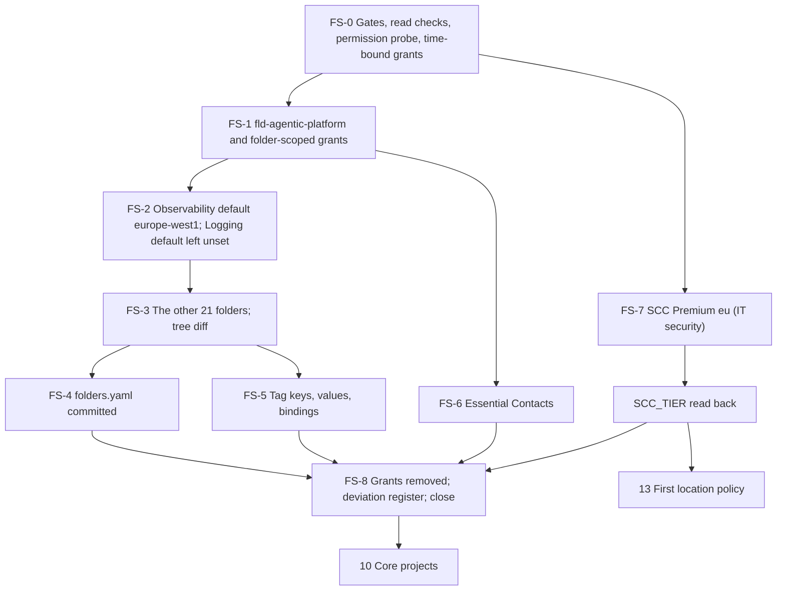

# 9. Folder tree, observability location and Security Command Center

## Status
- Owner: the platform owner
- Last reviewed: 2026-09-15
- Last executed: never
- Stage: review §2 stages 8 and 9 ([../13-setup-procedure-review.md](../13-setup-procedure-review.md)). Runs after [07](07-billing-account.md) and before [10](10-core-projects-and-ci-identities.md). Nothing in the platform exists before this file, and no project may exist under `fld-agentic-platform` until FS-2.1 has a checkpoint line.
- Step prefix: FS. Steps: 33. BLOCKED steps: none (no code is needed). One step, FS-7.8, is a re-run point that runs in [14](14-central-logging-and-billing-export.md) once the billing export exists.
- Replaces: nothing executable. The folder tree, tags and Security Command Center (SCC) existed only as design in [../02-landing-zone-and-tiers.md](../02-landing-zone-and-tiers.md) §2.1, §2.2, §3.6, §3.7 and [../07-monitoring-detection-incident-response.md](../07-monitoring-detection-incident-response.md) §3. The read checks of [../../wall-e/PREREQUISITES.md](../../wall-e/PREREQUISITES.md) §4.2 are salvaged into FS-0.3, moved to organisation scope because no project exists yet.
- Decisions applied: SD-01 (bootstrap deviation from the factory), SD-15 (SCC payer and activation before any location policy), SD-17 (observability location, no Cloud Logging folder default), SD-38 (evidence home during the build); P11, P37, P38, P40, P94 of [../12-open-decisions.md](../12-open-decisions.md).
- Closes: S001 for the folder tree and SCC activation; S003 for SCC Premium activation; X-RQB-03 for the folder-level half; X-RQB-04 for activation order, payer and residency. The table in "Findings this file answers" gives the parts other files close.
- Commands verified against Google's documentation on 2026-09-15. The pages are cited at each step. Anything not confirmed on a Google page is marked `Assumption:`.

## What this part builds

This part builds the platform boundary and the Google-run detection desk above it. The factory is meant to build these and does not exist yet (S001), so the platform owner builds them by hand as a recorded bootstrap deviation (SD-01).

1. **The folder tree of [02 §2.1](../02-landing-zone-and-tiers.md): 22 folders** under the tenant's organisation. Each numeric id is recorded in `~/.platform-env` as a `FLD_*` variable and committed to the register as `register/folders.yaml`.
2. **Three organisation-level tag keys** and their folder bindings: `agp-tier`, `agp-tisax-scope` and `agp-env`. The design names all three ([02 §3.6](../02-landing-zone-and-tiers.md), P38). The plan's variable list and 03's names register name only the first two. `TAG_KEY_ENV` is added here and reported back for plan §5, and `agp-env` is created only once a superseding names record signs it (FS-0.2). Folders cannot carry labels, so these tags are the folders' only classification.
3. **Essential Contacts** at `fld-agentic-platform`: the security and technical categories go to `platform-security@` and `platform-owners@` ([02 §3.7](../02-landing-zone-and-tiers.md)).
4. **The observability default storage location `europe-west1`** on `fld-agentic-platform`. It is set before any project exists, so every later project's `_Trace` observability bucket defaults to Belgium. **The Cloud Logging folder default storage location is not set.** It would also move each new project's `_Required` bucket out of `global`, and Google states that Sensitive Actions then cannot scan those logs (SD-17, X-RQB-03). Each project instead routes `_Default` to a regional bucket ([10](10-core-projects-and-ci-identities.md), [17](17-factory-module-equivalents-and-tier-r-gate.md)).
5. **SCC Premium activated at the organisation with `eu` data residency**, under the payer named in P11. It is activated before any location policy exists ([13](13-organisation-policies-deny-and-pab.md) applies the first). The tier and residency are read back into `SCC_TIER`, and the SCC service agent is recorded.

What this file does **not** do:

| Not here | Where |
|---|---|
| Any organisation policy, deny policy or principal access boundary (B1 to B22, including B14 for contact domains and the `fld-` naming constraint) | [13](13-organisation-policies-deny-and-pab.md) |
| Standing grants on folders (`factory-apply@` Project Creator on tier folders, PAM entitlements) | [10](10-core-projects-and-ci-identities.md), [12](12-privileged-access-catalogue.md) |
| Aggregated sinks, Data Access audit configuration, Workspace log sharing (needed by the Workspace findings of Event Threat Detection) | [14](14-central-logging-and-billing-export.md) |
| SCC notification config, paging route, H-3 synthetic finding, SIEM | [15](15-pager-siem-and-detections.md) |
| SCC custom modules, Sensitive Actions and service configuration for `fld-agentic-platform` beyond reading what activation turned on | [17](17-factory-module-equivalents-and-tier-r-gate.md) (monitoring baseline), [15](15-pager-siem-and-detections.md) |
| Each project's `europe-west1` `_Default` bucket and explicit `_Trace` bucket | [10](10-core-projects-and-ci-identities.md), [17](17-factory-module-equivalents-and-tier-r-gate.md) |
| Purchase of SCC Premium (subscription contract) and the notice to cost-centre owners | [04](04-purchases-and-lead-times.md), [03](03-decisions-and-people.md) |



## Preconditions

- [ ] [01](01-prerequisites-and-conventions.md) is done: `~/.platform-env` holds `ORG_ID`, `DOMAIN`, `REGION` (`europe-west1`), `GCLOUD_CONFIG_NAME`, `PLATFORM_REPO_DIR`, `BUILD_LOG_DIR`, `EVIDENCE_INTERIM_LOCATION`, `EVIDENCE_REGISTER` and `DEVIATION_REGISTER`, with the helpers `penv_set`, `need`, `penv_guard`, `checkpoint`, `evidence_add` and `sitting_end`. The gcloud configuration has no default project.
- [ ] [03](03-decisions-and-people.md) records are signed: SD-01, SD-15, SD-17, P11 (the SCC payer, with `SCC_BILLING_MODEL` set), P94 (residency `eu`, carried in the P11/SD-15 record) and **NAMES**, the names register holding the tag keys (03 DC-5.1); `tools/decision-need.sh` exists. `PLATFORM_REPO_REMOTE` exists, or FS-4.2 commits locally with a signed review record (SD-14).
- [ ] [06](06-organisation-bootstrap-and-roster.md) is done: `SA_1_ADMIN` holds Organization Administrator, Folder Creator, Project Creator and PAM Admin under the dated exception, and today is before `BOOTSTRAP_EXCEPTION_EXPIRY`. `GRP_PLATFORM_SECURITY` and `GRP_PLATFORM_OWNERS` exist.
- [ ] [07](07-billing-account.md) is done. This file creates no project, but 10 follows it directly.
- [ ] For FS-7 only: the IT security person who signed P11 is available for a 1 to 2 hour sitting and holds, or can witness a time-bound grant of, Security Center Admin and Organization Administrator at the organisation. If `SCC_BILLING_MODEL=subscription`, the contract from [04](04-purchases-and-lead-times.md) is in hand. If `payg-org`, 03's record shows that finance signed and that cost-centre owners were notified. Google charges organisation-level pay-as-you-go usage "to the billing accounts associated with the projects in your organization" ([activate Premium](https://docs.cloud.google.com/security-command-center/docs/activate-scc-for-an-organization), checked 2026-09-15).
- [ ] Workstation: gcloud with the `beta` component (FS-2.1 uses `gcloud beta observability`), `curl`, `python3`, `git`. Two browser profiles: `SA_1_ADMIN`, and the IT security person's own account for FS-7.

## People

| Role | Does | Present when |
|---|---|---|
| Platform owner, signed in as `SA_1_ADMIN` | Every step except FS-7.1 and the activation itself when IT security performs it | Whole file (about 1 day) |
| IT security, the P11 signatory | Confirms payer and residency (FS-7.1). Activates SCC from its own account, or witnesses the platform owner doing it (FS-7.3, FS-7.4). Co-signs the SCC evidence (FS-7.5) | FS-7, 1 to 2 hours, plus the first-scan wait of up to 24 hours |
| Reviewers of `register/folders.yaml` named by CODEOWNERS in the platform repository (03) | Review the pull request. This is not a sitting | FS-4.2 |

No second person is needed for folders, tags, contacts or the observability location: SD-01 records them as a one-person bootstrap, reviewed at [42](42-gates-drills-and-evidence.md). Every grant, folder and tag made here lands in the organisation's Admin Activity audit log, which Eve reads from [25](25-eve-human-super-admin-detections.md).

## Expected tree

FS-3.4 diffs the live organisation against this table. FS-4.1 generates `folders.yaml` from the live organisation, never by hand.

| # | Display name | Parent | Variable | `agp-tier` | `agp-env` | `agp-tisax-scope` |
|---|---|---|---|---|---|---|
| 1 | `fld-agentic-platform` | organisation `ORG_ID` | `FLD_AGENTIC_PLATFORM` | — | — | `in` (bound) |
| 2 | `fld-platform-core` | 1 | `FLD_PLATFORM_CORE` | `core` | — | inherited `in` |
| 3 | `fld-gemini-enterprise` | 1 | `FLD_GEMINI_ENTERPRISE` | `ge` | — | inherited |
| 4 | `fld-agents-r` | 1 | `FLD_AGENTS_R` | `r` | — | inherited |
| 5 | `fld-agents-r-prod` | 4 | `FLD_AGENTS_R_PROD` | inherited `r` | `prod` | inherited |
| 6 | `fld-agents-r-nonprod` | 4 | `FLD_AGENTS_R_NONPROD` | inherited `r` | `nonprod` | inherited |
| 7 | `fld-agents-w` | 1 | `FLD_AGENTS_W` | `w` | — | inherited |
| 8 | `fld-agents-w-prod` | 7 | `FLD_AGENTS_W_PROD` | inherited `w` | `prod` | inherited |
| 9 | `fld-agents-w-nonprod` | 7 | `FLD_AGENTS_W_NONPROD` | inherited `w` | `nonprod` | inherited |
| 10 | `fld-agents-p` | 1 | `FLD_AGENTS_P` | `p` | — | inherited |
| 11 | `fld-agents-p-prod` | 10 | `FLD_AGENTS_P_PROD` | inherited `p` | `prod` | inherited |
| 12 | `fld-agents-p-nonprod` | 10 | `FLD_AGENTS_P_NONPROD` | inherited `p` | `nonprod` | inherited |
| 13 | `fld-agents-p-sa` | 10 | `FLD_AGENTS_P_SA` | `p-sa` (overrides `p`) | — | inherited |
| 14 | `fld-agents-p-sa-prod` | 13 | `FLD_AGENTS_P_SA_PROD` | inherited `p-sa` | `prod` | inherited |
| 15 | `fld-agents-p-sa-nonprod` | 13 | `FLD_AGENTS_P_SA_NONPROD` | inherited `p-sa` | `nonprod` | inherited |
| 16 | `fld-agents-x` | 1 | `FLD_AGENTS_X` | `x` | — | `out` (overrides `in`) |
| 17 | `fld-controllers` | 1 | `FLD_CONTROLLERS` | `ctl` | — | inherited |
| 18 | `fld-controllers-prod` | 17 | `FLD_CONTROLLERS_PROD` | inherited `ctl` | `prod` | inherited |
| 19 | `fld-controllers-nonprod` | 17 | `FLD_CONTROLLERS_NONPROD` | inherited `ctl` | `nonprod` | inherited |
| 20 | `fld-improvers` | 1 | `FLD_IMPROVERS` | `imp` | — | inherited |
| 21 | `fld-improvers-prod` | 20 | `FLD_IMPROVERS_PROD` | inherited `imp` | `prod` | inherited |
| 22 | `fld-improvers-nonprod` | 20 | `FLD_IMPROVERS_NONPROD` | inherited `imp` | `nonprod` | inherited |

Facts behind the table, checked 2026-09-15:
- Folder display names may contain letters, digits, spaces, hyphens and underscores. They must start and end with a letter or digit, be 3 to 30 characters long and be distinct among siblings. Nesting is limited to 10 levels and 300 child folders per parent ([create and manage folders](https://docs.cloud.google.com/resource-manager/docs/creating-managing-folders)). The longest name here is 23 characters, and the tree is four levels deep.
- A descendant overrides an inherited tag value by binding "a different tag value" of "the same tag key" ([tags overview](https://docs.cloud.google.com/resource-manager/docs/tags/tags-overview)).
- `agp-tier=c` is created as a value but bound nowhere, because Tier C has no project. `agp-env` is not bound on `fld-platform-core` or `fld-gemini-enterprise`. `Assumption:` 02 gives singleton folders no environment, and 13 or 17 adds a binding if a condition ever needs one.

## Steps

Conventions of [01](01-prerequisites-and-conventions.md) apply to every step. Each step starts with `checkpoint <id> START` and ends with `checkpoint <id> DONE [witness] [evidence id]`. A "build-log line" below is that checkpoint line with its note. Every saved file is registered with `evidence_add <step> <slug> <E-id> <TISAX id> <location> [file]`. Command outputs are saved under `BUILD_LOG_DIR/records/` and scans under `EVIDENCE_INTERIM_LOCATION`, both named `<date>-<step>-<slug>-v<n>`.

### FS-0.1 Open the sitting and check the inputs

- **WHO:** Platform owner as `SA_1_ADMIN`. No witness.
- **WHERE:** The shell with `~/.platform-env` sourced, gcloud configuration `GCLOUD_CONFIG_NAME` active.
- **ACTION:**

```bash
source ~/.platform-env
checkpoint FS-0.1 START
need ORG_ID DOMAIN REGION GCLOUD_CONFIG_NAME PLATFORM_ENV_FILE PLATFORM_REPO_DIR BUILD_LOG_DIR EVIDENCE_INTERIM_LOCATION EVIDENCE_REGISTER DEVIATION_REGISTER SA_1_ADMIN BOOTSTRAP_EXCEPTION_EXPIRY GRP_PLATFORM_SECURITY GRP_PLATFORM_OWNERS SCC_BILLING_MODEL
gcloud auth login "$SA_1_ADMIN"
penv_guard && echo "guard: ok" || echo "FAIL: guard"
test "$(gcloud config get account)" = "$SA_1_ADMIN" && echo "account: ok" || echo "FAIL: wrong account"
python3 -c 'import sys,datetime as d; e=d.date.fromisoformat(sys.argv[1]); t=d.date.today(); print("exception valid until", e) if t < e else (print("FAIL: exception expired", e), sys.exit(1))' "$BOOTSTRAP_EXCEPTION_EXPIRY"
test "$REGION" = "europe-west1" && echo "region: ok" || echo "FAIL: REGION is not europe-west1"
```

- **VERIFY:** `need` prints no `MISSING` line; then four `ok` or `valid` lines and no `FAIL`. Any `FAIL` stops the file. An expired exception goes back to 06 for a new dated exception; it is never extended silently.
- **ROLLBACK:** None. The step only reads, apart from the sign-in.
- **EVIDENCE:** Build-log line `FS-0.1` with the date and the exception expiry read. TISAX 1.4.1, 5.2.1. EU AI Act E-05 (technical documentation, build record).

### FS-0.2 Check the signed gates

- **WHO:** Platform owner.
- **WHERE:** The shell, in `PLATFORM_REPO_DIR`.
- **ACTION:** Check the signed records with 03's tool, which reads `decisions/TRACKER.md` and each record's signature hashes. P94 (residency `eu`) is carried inside the P11/SD-15 record (03 DC-4.5). Then read the signed names register (NAMES, 03 DC-5.1) for the tag keys.

```bash
"$PLATFORM_REPO_DIR/tools/decision-need.sh" SD-01 SD-15 SD-17 SD-38 P11 NAMES
rec=$(awk -F'|' '{k=$2; gsub(/ /,"",k); if (k=="NAMES") {r=$4; gsub(/ /,"",r); print r}}' "$PLATFORM_REPO_DIR/decisions/TRACKER.md" | head -n 1)
grep -o "agp-[a-z-]*" "$PLATFORM_REPO_DIR/decisions/$rec" | sort -u
```

- **VERIFY:** Six `SIGNED` lines. The names register lists `agp-tier` and `agp-tisax-scope`. If it does not list `agp-env`, FS-5.1 creates only the two signed keys, and FS-5.4 is recorded `checkpoint FS-5.4 PENDING` with a line in the re-run index, until a superseding NAMES record adds `agp-env` (a tag key's short name cannot be changed, so it is created only once signed). Folder display names are not in the names register: they come from [02 §2.1](../02-landing-zone-and-tiers.md), which NAMES and SD-01 adopt, and a folder can be renamed. Any `UNSIGNED`, `MISMATCH` or `INVALID` line stops the file. SD-15 and P11 gate FS-7, SD-17 gates FS-2, and NAMES gates FS-5.1.
- **ROLLBACK:** None. The step only reads.
- **EVIDENCE:** Build-log line `FS-0.2` listing the six record paths. TISAX 1.4.1; E-03 (decision records).

### FS-0.3 Read the organisation as it is

- **WHO:** Platform owner.
- **WHERE:** The shell.
- **ACTION:** These read checks are salvaged from PREREQUISITES §4.2 and moved to the organisation, because no project exists yet. They catch what would make a later step wrong.

```bash
gcloud resource-manager folders list --organization="$ORG_ID" --format="table(displayName,name.basename())"
gcloud resource-manager tags keys list --parent="organizations/$ORG_ID" --format="table(shortName,name)"
gcloud logging settings describe --organization="$ORG_ID"
gcloud beta observability settings describe --organization="$ORG_ID" --location=global
gcloud org-policies describe gcp.resourceLocations --organization="$ORG_ID" --effective
gcloud org-policies describe iam.allowedPolicyMemberDomains --organization="$ORG_ID" --effective
gcloud org-policies describe essentialcontacts.managed.allowedContactDomains --organization="$ORG_ID" --effective
```

- **VERIFY:** Record each output in the build log. A permission error on one of the organisation-level describes (logging or observability settings) is recorded, not a stop; ask the organisation's owner of that setting for the value and its date instead. Then check these conditions:

| Output | Expected | If not |
|---|---|---|
| Folders | No folder whose display name starts with `fld-` | Stop. A same-named folder elsewhere under the organisation would make FS-3.4 ambiguous. Record the finding, and have 03 decide whether to rename, reuse or move it. |
| Tag keys | No `agp-tier`, `agp-env` or `agp-tisax-scope` | If one exists, compare its values with the expected table. Reuse it only if identical, recorded as a deviation. Otherwise stop. |
| Logging settings | No `storageLocation`, or `global` | Stop. An organisation default outside `global` already blinds Sensitive Actions for new projects ([Sensitive Actions overview](https://docs.cloud.google.com/security-command-center/docs/concepts-sensitive-actions-overview), updated 2026-09-14). Raise a decision with the organisation's Cloud Logging owner. Setting `global` explicitly on `fld-agentic-platform` is one option for that decision. It is not taken here. |
| Observability settings | No `defaultStorageLocation`, or one in the EU | A non-EU organisation default is still overridden at the folder by FS-2.1. Record it. |
| `gcp.resourceLocations` | No policy at the organisation | If one exists, record it: Google warns that a location policy deployed after an automatic Standard activation "might" deactivate SCC ([data residency](https://docs.cloud.google.com/security-command-center/docs/data-residency-support), updated 2026-09-14). Tell IT security before FS-7. |
| `iam.allowedPolicyMemberDomains` | Record the allowed customer ids | SCC's activation grants roles to Google service agents. Under domain restriction, "service accounts must be in allowed domains" ([activate Premium](https://docs.cloud.google.com/security-command-center/docs/activate-premium-tier)). Tell IT security before FS-7. |
| `essentialcontacts.managed.allowedContactDomains` | Absent, or includes `DOMAIN` | Stop FS-6 until the organisation's owner of that policy confirms. |

- **ROLLBACK:** None. The step only reads.
- **EVIDENCE:** The seven outputs saved as `<date>-FS-0.3-org-read-v1.txt` in `EVIDENCE_INTERIM_LOCATION`, and one line in `EVIDENCE_REGISTER`. TISAX 1.5.1, 5.2.4. EU AI Act E-05.

### FS-0.4 Probe the permissions at the organisation

- **WHO:** Platform owner.
- **WHERE:** The shell.
- **ACTION:** Ask Resource Manager which of the needed permissions `SA_1_ADMIN` already holds at the organisation. The access token goes straight into the header and is never printed.

```bash
curl -sS -X POST -H "Authorization: Bearer $(gcloud auth print-access-token)" -H "Content-Type: application/json" -d '{"permissions":["resourcemanager.folders.create","resourcemanager.organizations.setIamPolicy","resourcemanager.tagKeys.create","resourcemanager.tagValues.create","resourcemanager.tagValueBindings.create","resourcemanager.hierarchyNodes.createTagBinding"]}' "https://cloudresourcemanager.googleapis.com/v3/organizations/${ORG_ID}:testIamPermissions"
```

- **VERIFY:** The response echoes back the permissions held. `resourcemanager.folders.create` and `resourcemanager.organizations.setIamPolicy` must both be present (Folder Creator and Organization Administrator from 06). If either is absent, stop and return to 06. The tag permissions are expected to be absent: the design gives them to Tag Administrator and Tag User ([create and manage tags](https://docs.cloud.google.com/resource-manager/docs/tags/tags-creating-and-managing)). If Google answers `400` naming a permission as invalid for this resource, remove that permission from the list, re-run, and record which one.
- **ROLLBACK:** None. The step only reads.
- **EVIDENCE:** The JSON response in the build log under `FS-0.4`. TISAX 4.1.3, 4.2.1.

### FS-0.5 Time-bound organisation grants the exception does not cover

- **WHO:** Platform owner. No witness. Each grant is a self-grant through Organization Administrator, so it is recorded as an extension of the SD-01 exception.
- **WHERE:** The shell.
- **ACTION:** The design creates tag keys "through PAM (`roles/resourcemanager.tagAdmin`)" ([02 §3.6](../02-landing-zone-and-tiers.md)), but no PAM entitlement exists until 12. Grant only the roles FS-0.4 showed missing, each with an IAM condition that ends the grant within 12 hours and never after `BOOTSTRAP_EXCEPTION_EXPIRY`.

```bash
GRANT_UNTIL=$(python3 -c 'import datetime as d;print((d.datetime.now(d.timezone.utc)+d.timedelta(hours=12)).strftime("%Y-%m-%dT%H:%M:%SZ"))')
echo "grants end at $GRANT_UNTIL; exception ends $BOOTSTRAP_EXCEPTION_EXPIRY"
gcloud organizations add-iam-policy-binding "$ORG_ID" --member="user:$SA_1_ADMIN" --role="roles/resourcemanager.tagAdmin" --condition="expression=request.time < timestamp(\"$GRANT_UNTIL\"),title=fs-bootstrap-tagadmin,description=09 FS-0.5 SD-01 bootstrap"
gcloud organizations add-iam-policy-binding "$ORG_ID" --member="user:$SA_1_ADMIN" --role="roles/resourcemanager.tagUser" --condition="expression=request.time < timestamp(\"$GRANT_UNTIL\"),title=fs-bootstrap-taguser,description=09 FS-0.5 SD-01 bootstrap"
```

- **VERIFY:** Wait a few minutes for IAM propagation (`Assumption:` usually under 7 minutes), then re-run FS-0.4. All six permissions are echoed. The next command prints the two roles, each with its condition title:

```bash
gcloud organizations get-iam-policy "$ORG_ID" --flatten="bindings[].members" --filter="bindings.members:user:$SA_1_ADMIN AND bindings.condition.title:fs-bootstrap" --format="table(bindings.role,bindings.condition.title,bindings.condition.expression)"
```

- **ROLLBACK:** FS-8.1 removes both grants. To remove them early:

```bash
gcloud organizations remove-iam-policy-binding "$ORG_ID" --member="user:$SA_1_ADMIN" --role="roles/resourcemanager.tagAdmin" --all
gcloud organizations remove-iam-policy-binding "$ORG_ID" --member="user:$SA_1_ADMIN" --role="roles/resourcemanager.tagUser" --all
```

- **EVIDENCE:** The get-iam-policy table in the build log under `FS-0.5`. Input to deviation row `BD-09-2` (kind DEV: time-bound self-grants instead of PAM), written in FS-8.2. TISAX 4.1.3, 4.2.1. EU AI Act E-05.

### FS-1.1 Create `fld-agentic-platform`

- **WHO:** Platform owner.
- **WHERE:** The shell.
- **ACTION:** Define the folder helper once per shell. It first looks for an active folder with the exact display name under the parent, and creates one only if none is found. A resumed sitting therefore never creates a duplicate. Then create the root folder.

```bash
mkfld() {
  local var="$1" name="$2" kind="$3" pid="$4" have id
  have=$(printenv "$var")
  if [ -n "$have" ]; then echo "$var=$have (recorded earlier)"; return 0; fi
  id=$(gcloud resource-manager folders list --"$kind"="$pid" --format="value(displayName,name.basename())" | awk -F'\t' -v n="$name" '$1==n{print $2}')
  if [ -z "$id" ]; then
    gcloud resource-manager folders create --display-name="$name" --"$kind"="$pid" || return 1
    id=$(gcloud resource-manager folders list --"$kind"="$pid" --format="value(displayName,name.basename())" | awk -F'\t' -v n="$name" '$1==n{print $2}')
  fi
  case "$id" in ""|*[!0-9]*) echo "FAIL: $name gave id '$id'"; return 1;; esac
  penv_set "$var" "$id" && export "$var=$id" && echo "$var=$id"
}
mkfld FLD_AGENTIC_PLATFORM fld-agentic-platform organization "$ORG_ID"
```

- **VERIFY:** One `FLD_AGENTIC_PLATFORM=<digits>` line is printed, and the next command prints `fld-agentic-platform organizations/<ORG_ID> ACTIVE`. `Assumption:` the v3 field is `state`; if it prints empty, use `--format=yaml` and read the `state` or `lifecycleState` field.

```bash
gcloud resource-manager folders describe "$FLD_AGENTIC_PLATFORM" --format="value(displayName,parent,state)"
```

- **ROLLBACK:** A folder can be deleted only when empty. It is soft-deleted (`DELETE_REQUESTED`) for about 30 days and can be restored in that time. Deletion needs Folder Admin or Folder Editor, which Folder Creator does not include ([manage folders](https://docs.cloud.google.com/resource-manager/docs/manage-folders)). Grant Folder Admin time-bound as in FS-0.5, then:

```bash
gcloud resource-manager folders delete "$FLD_AGENTIC_PLATFORM"
```

  Remove the variable with `penv_set --force FLD_AGENTIC_PLATFORM ""` and add a build-log line. `Assumption:` a soft-deleted folder may still reserve its display name among siblings, so a re-create may need `gcloud alpha resource-manager folders undelete` instead.
- **EVIDENCE:** The describe line in the build log under `FS-1.1`. Input to deviation row `BD-09-1` (kind MOD), written in FS-8.2. TISAX 1.3.1. EU AI Act E-05.

### FS-1.2 Time-bound grants on `fld-agentic-platform`

- **WHO:** Platform owner (self-grant under the SD-01 exception).
- **WHERE:** The shell.
- **ACTION:** Probe first. Grant only what is missing, on this folder alone, until the same `GRANT_UNTIL`. If the shell was closed, recompute `GRANT_UNTIL` as in FS-0.5.

```bash
curl -sS -X POST -H "Authorization: Bearer $(gcloud auth print-access-token)" -H "Content-Type: application/json" -d '{"permissions":["observability.settings.get","observability.settings.update","logging.settings.get","essentialcontacts.contacts.create","essentialcontacts.contacts.list","resourcemanager.hierarchyNodes.createTagBinding"]}' "https://cloudresourcemanager.googleapis.com/v3/folders/${FLD_AGENTIC_PLATFORM}:testIamPermissions"
gcloud resource-manager folders add-iam-policy-binding "$FLD_AGENTIC_PLATFORM" --member="user:$SA_1_ADMIN" --role="roles/observability.editor" --condition="expression=request.time < timestamp(\"$GRANT_UNTIL\"),title=fs-bootstrap-obs,description=09 FS-1.2 SD-01 bootstrap"
gcloud resource-manager folders add-iam-policy-binding "$FLD_AGENTIC_PLATFORM" --member="user:$SA_1_ADMIN" --role="roles/essentialcontacts.admin" --condition="expression=request.time < timestamp(\"$GRANT_UNTIL\"),title=fs-bootstrap-contacts,description=09 FS-1.2 SD-01 bootstrap"
gcloud resource-manager folders add-iam-policy-binding "$FLD_AGENTIC_PLATFORM" --member="user:$SA_1_ADMIN" --role="roles/logging.viewer" --condition="expression=request.time < timestamp(\"$GRANT_UNTIL\"),title=fs-bootstrap-logview,description=09 FS-1.2 SD-01 bootstrap"
```

  Skip any `add-iam-policy-binding` line whose permissions the probe already echoed. Observability Editor carries `observability.settings.update` ([observability bucket defaults](https://docs.cloud.google.com/stackdriver/docs/observability/set-defaults-for-observability-buckets)). Essential Contacts Admin manages contacts ([manage Essential Contacts](https://docs.cloud.google.com/resource-manager/docs/manage-essential-contacts)). `Assumption:` Logs Viewer carries `logging.settings.get`; the re-probe proves it, and if it does not, use `roles/logging.configWriter` with the same condition, **used for describe only**.
- **VERIFY:** After propagation, re-run the curl line. All six permissions are echoed.
- **ROLLBACK:** FS-8.1 removes these grants. Early removal uses the same `remove-iam-policy-binding ... --all` form on the folder.
- **EVIDENCE:** Probe outputs before and after, in the build log under `FS-1.2`. Input to `BD-09-2`. TISAX 4.1.3, 4.2.1.

### FS-2.1 Set the observability default storage location to `europe-west1`

- **WHO:** Platform owner.
- **WHERE:** The shell.
- **ACTION:** This step must run before any project exists under `fld-agentic-platform`. Google applies the default to "all projects that are descendants" and creates buckets only for new resources; it does not move existing buckets ([set defaults for observability buckets](https://docs.cloud.google.com/stackdriver/docs/observability/set-defaults-for-observability-buckets), updated 2026-09-10). `europe-west1` is a supported observability bucket location and `global` is not ([observability bucket locations](https://docs.cloud.google.com/stackdriver/docs/observability/observability-bucket-locations), updated 2026-09-09). `europe-west1` rather than `eu` is chosen because the Mo-10 join links `_Trace` at `REGION` (SD-17, S154).

```bash
gcloud projects list --filter="parent.type=folder AND parent.id=$FLD_AGENTIC_PLATFORM" --format="value(projectId)"
gcloud beta observability settings update --default-storage-location="$REGION" --update-mask=defaultStorageLocation --location=global --folder="$FLD_AGENTIC_PLATFORM"
```

  If the first line prints any project, stop: that project keeps its system-chosen location, and 03 must record it as a dated exception in 08 R9. If gcloud refuses the update with a message about a quota project or a disabled service on a project, stop and do not pass `--billing-project` with a project picked on the spot. `Assumption:` the gcloud shared project serves this call. Google says it is used "sometimes" ([set the quota project](https://docs.cloud.google.com/docs/quotas/set-quota-project)). Raise a decision in 03 naming an existing project outside `fld-agentic-platform` as quota project for bootstrap calls.
- **VERIFY:** The next command prints `europe-west1`. `Assumption:` the output field is `defaultStorageLocation`, as the update mask names it; if the value prints empty, read the full YAML.

```bash
gcloud beta observability settings describe --location=global --folder="$FLD_AGENTIC_PLATFORM" --format="value(defaultStorageLocation)"
```

  The final proof comes in 10: the first core project's `_Trace` bucket describes in `europe-west1`.
- **ROLLBACK:** Re-run the update with the previous value from FS-0.3. With no previous value, record that the setting stays until 03 decides, because leaving it unset sends traces to a system-chosen location. No project exists yet, so nothing has been created in the wrong place.
- **EVIDENCE:** The describe output as `<date>-FS-2.1-observability-default-v1.txt`, and an `EVIDENCE_REGISTER` line. TISAX 7.1.2 (closest row: the residency table), 5.2.4. EU AI Act E-05. It also answers 08 R9 for traces.

### FS-2.2 Leave the Cloud Logging folder default unset, and prove it

- **WHO:** Platform owner.
- **WHERE:** The shell.
- **ACTION:** **Do not run `gcloud logging settings update --folder=... --storage-location=...` on this folder or any folder under it, in this file or later.** That setting decides where new projects' `_Required` and `_Default` buckets go ([default resource settings](https://docs.cloud.google.com/logging/docs/default-settings), updated 2026-09-09). Google states that "if you have specified a storage location for the `_Required` logs bucket in a certain project, folder, or organization, logs from that project, folder, or organization cannot be scanned for sensitive actions" ([Sensitive Actions overview](https://docs.cloud.google.com/security-command-center/docs/concepts-sensitive-actions-overview), updated 2026-09-14). 07 §3 relies on Sensitive Actions. Regional `_Default` logs come from each project's own bucket and sink redirect in 10 and 17. Only a read is run:

```bash
gcloud logging settings describe --folder="$FLD_AGENTIC_PLATFORM"
```

- **VERIFY:** The output has no `storageLocation`, or shows `global`, and has no `kmsKeyName` (CMEK also blinds Sensitive Actions, same page). Any other value means someone set it: stop, and restore the organisation's value or `global` through a decision record.
- **ROLLBACK:** None. The step only reads.
- **EVIDENCE:** The output as `<date>-FS-2.2-logging-default-unset-v1.txt`. `EVIDENCE_REGISTER` line. TISAX 5.2.4. EU AI Act E-06 (Art. 12 logs depend on the audit streams staying readable).

### FS-3.1 Create the eight second-level folders

- **WHO:** Platform owner.
- **WHERE:** The shell, same sitting as FS-1.1 (re-paste `mkfld` if the shell was closed).
- **ACTION:**

```bash
mkfld FLD_PLATFORM_CORE fld-platform-core folder "$FLD_AGENTIC_PLATFORM"
mkfld FLD_GEMINI_ENTERPRISE fld-gemini-enterprise folder "$FLD_AGENTIC_PLATFORM"
mkfld FLD_AGENTS_R fld-agents-r folder "$FLD_AGENTIC_PLATFORM"
mkfld FLD_AGENTS_W fld-agents-w folder "$FLD_AGENTIC_PLATFORM"
mkfld FLD_AGENTS_P fld-agents-p folder "$FLD_AGENTIC_PLATFORM"
mkfld FLD_AGENTS_X fld-agents-x folder "$FLD_AGENTIC_PLATFORM"
mkfld FLD_CONTROLLERS fld-controllers folder "$FLD_AGENTIC_PLATFORM"
mkfld FLD_IMPROVERS fld-improvers folder "$FLD_AGENTIC_PLATFORM"
```

- **VERIFY:** Eight `FLD_...=<digits>` lines, and `gcloud resource-manager folders list --folder="$FLD_AGENTIC_PLATFORM" --format="value(displayName)" | sort` prints exactly the eight names.
- **ROLLBACK:** As FS-1.1, one folder at a time, children first.
- **EVIDENCE:** Build-log line `FS-3.1` with the eight ids. Input to `BD-09-1`. TISAX 1.3.1. EU AI Act E-05.

### FS-3.2 Create the eleven third-level folders

- **WHO:** Platform owner.
- **WHERE:** The shell.
- **ACTION:**

```bash
mkfld FLD_AGENTS_R_PROD fld-agents-r-prod folder "$FLD_AGENTS_R"
mkfld FLD_AGENTS_R_NONPROD fld-agents-r-nonprod folder "$FLD_AGENTS_R"
mkfld FLD_AGENTS_W_PROD fld-agents-w-prod folder "$FLD_AGENTS_W"
mkfld FLD_AGENTS_W_NONPROD fld-agents-w-nonprod folder "$FLD_AGENTS_W"
mkfld FLD_AGENTS_P_PROD fld-agents-p-prod folder "$FLD_AGENTS_P"
mkfld FLD_AGENTS_P_NONPROD fld-agents-p-nonprod folder "$FLD_AGENTS_P"
mkfld FLD_AGENTS_P_SA fld-agents-p-sa folder "$FLD_AGENTS_P"
mkfld FLD_CONTROLLERS_PROD fld-controllers-prod folder "$FLD_CONTROLLERS"
mkfld FLD_CONTROLLERS_NONPROD fld-controllers-nonprod folder "$FLD_CONTROLLERS"
mkfld FLD_IMPROVERS_PROD fld-improvers-prod folder "$FLD_IMPROVERS"
mkfld FLD_IMPROVERS_NONPROD fld-improvers-nonprod folder "$FLD_IMPROVERS"
```

- **VERIFY:** Eleven `FLD_...=<digits>` lines. FS-3.4 checks placement.
- **ROLLBACK:** As FS-1.1, children first.
- **EVIDENCE:** Build-log line `FS-3.2` with the eleven ids. Input to `BD-09-1`. TISAX 1.3.1.

### FS-3.3 Create the two fourth-level folders

- **WHO:** Platform owner.
- **WHERE:** The shell.
- **ACTION:**

```bash
mkfld FLD_AGENTS_P_SA_PROD fld-agents-p-sa-prod folder "$FLD_AGENTS_P_SA"
mkfld FLD_AGENTS_P_SA_NONPROD fld-agents-p-sa-nonprod folder "$FLD_AGENTS_P_SA"
```

- **VERIFY:** Two `FLD_...=<digits>` lines.
- **ROLLBACK:** As FS-1.1.
- **EVIDENCE:** Build-log line `FS-3.3`. Input to `BD-09-1`. TISAX 1.3.1.

### FS-3.4 Diff the live tree against the expected tree

- **WHO:** Platform owner.
- **WHERE:** The shell.
- **ACTION:** This is the zero-diff check for the folder half of the module (SD-01). It walks the live tree from `fld-agentic-platform` and compares every display name, parent, id and variable against the expected table. It also checks that no project sits anywhere in the tree, so FS-2.1 still holds for every future project.

```bash
python3 - "$ORG_ID" <<'PY'
import json, os, subprocess, sys
org = sys.argv[1]
expected = [  # display name, parent display name, variable
 ("fld-agentic-platform","ORG","FLD_AGENTIC_PLATFORM"),
 ("fld-platform-core","fld-agentic-platform","FLD_PLATFORM_CORE"),("fld-gemini-enterprise","fld-agentic-platform","FLD_GEMINI_ENTERPRISE"),
 ("fld-agents-r","fld-agentic-platform","FLD_AGENTS_R"),("fld-agents-r-prod","fld-agents-r","FLD_AGENTS_R_PROD"),("fld-agents-r-nonprod","fld-agents-r","FLD_AGENTS_R_NONPROD"),
 ("fld-agents-w","fld-agentic-platform","FLD_AGENTS_W"),("fld-agents-w-prod","fld-agents-w","FLD_AGENTS_W_PROD"),("fld-agents-w-nonprod","fld-agents-w","FLD_AGENTS_W_NONPROD"),
 ("fld-agents-p","fld-agentic-platform","FLD_AGENTS_P"),("fld-agents-p-prod","fld-agents-p","FLD_AGENTS_P_PROD"),("fld-agents-p-nonprod","fld-agents-p","FLD_AGENTS_P_NONPROD"),
 ("fld-agents-p-sa","fld-agents-p","FLD_AGENTS_P_SA"),("fld-agents-p-sa-prod","fld-agents-p-sa","FLD_AGENTS_P_SA_PROD"),("fld-agents-p-sa-nonprod","fld-agents-p-sa","FLD_AGENTS_P_SA_NONPROD"),
 ("fld-agents-x","fld-agentic-platform","FLD_AGENTS_X"),
 ("fld-controllers","fld-agentic-platform","FLD_CONTROLLERS"),("fld-controllers-prod","fld-controllers","FLD_CONTROLLERS_PROD"),("fld-controllers-nonprod","fld-controllers","FLD_CONTROLLERS_NONPROD"),
 ("fld-improvers","fld-agentic-platform","FLD_IMPROVERS"),("fld-improvers-prod","fld-improvers","FLD_IMPROVERS_PROD"),("fld-improvers-nonprod","fld-improvers","FLD_IMPROVERS_NONPROD")]
def run(*a): return json.loads(subprocess.run(["gcloud",*a,"--format=json"],check=True,capture_output=True,text=True).stdout or "[]")
root = os.environ["FLD_AGENTIC_PLATFORM"]
live, queue = {"fld-agentic-platform": (root, "ORG")}, [(root, "fld-agentic-platform")]
while queue:
    fid, fname = queue.pop()
    for f in run("resource-manager","folders","list",f"--folder={fid}"):
        cid = f["name"].split("/")[-1]; live[f["displayName"]] = (cid, fname); queue.append((cid, f["displayName"]))
bad = 0
for name, parent, var in expected:
    got = live.get(name)
    if not got or got[1] != parent or os.environ.get(var) != got[0]:
        print("DIFF", name, "expected parent", parent, "var", var, os.environ.get(var), "live", got); bad += 1
extra = set(live) - {e[0] for e in expected}
for x in sorted(extra): print("EXTRA", x, live[x]); bad += 1
top = [f for f in run("resource-manager","folders","list",f"--organization={org}") if f["displayName"]=="fld-agentic-platform"]
if len(top) != 1 or top[0]["name"].split("/")[-1] != root: print("DIFF root under organisation", top); bad += 1
ids = [v[0] for v in live.values()]
projects = run("projects","list",f"--filter=parent.type=folder AND parent.id:({' '.join(ids)})")
for p in projects: print("PROJECT IN TREE", p["projectId"]); bad += 1
print("zero diff: 22 folders, 0 projects" if bad == 0 else f"FAIL: {bad} differences"); sys.exit(1 if bad else 0)
PY
```

- **VERIFY:** The script prints `zero diff: 22 folders, 0 projects` and exits 0. Any `DIFF`, `EXTRA` or `PROJECT IN TREE` line stops the file until it is repaired (move, rename with `gcloud resource-manager folders update --display-name`, or delete as in FS-1.1) and this step runs clean.
- **ROLLBACK:** None. The step only reads.
- **EVIDENCE:** The script output as `<date>-FS-3.4-tree-diff-v1.txt`. It is the zero-diff checker output of `BD-09-1`. TISAX 1.3.1, 1.5.1. EU AI Act E-05.

### FS-4.1 Generate `register/folders.yaml`

- **WHO:** Platform owner.
- **WHERE:** The shell, in `PLATFORM_REPO_DIR`.
- **ACTION:** [02 §2.1](../02-landing-zone-and-tiers.md) says the numeric ids are "published to the register as `folders.yaml`". `Assumption:` the register lives under `register/` in the platform repository (16 builds its CI). The file is generated from the variables that FS-3.4 has just proven, never typed.

```bash
mkdir -p "$PLATFORM_REPO_DIR/register"
git -C "$PLATFORM_REPO_DIR" switch -c "folders-$(date +%Y%m%d)"
python3 - "$PLATFORM_REPO_DIR/register/folders.yaml" <<'PY'
import os, sys, datetime as d
rows = ["AGENTIC_PLATFORM:fld-agentic-platform:","PLATFORM_CORE:fld-platform-core:AGENTIC_PLATFORM","GEMINI_ENTERPRISE:fld-gemini-enterprise:AGENTIC_PLATFORM",
 "AGENTS_R:fld-agents-r:AGENTIC_PLATFORM","AGENTS_R_PROD:fld-agents-r-prod:AGENTS_R","AGENTS_R_NONPROD:fld-agents-r-nonprod:AGENTS_R",
 "AGENTS_W:fld-agents-w:AGENTIC_PLATFORM","AGENTS_W_PROD:fld-agents-w-prod:AGENTS_W","AGENTS_W_NONPROD:fld-agents-w-nonprod:AGENTS_W",
 "AGENTS_P:fld-agents-p:AGENTIC_PLATFORM","AGENTS_P_PROD:fld-agents-p-prod:AGENTS_P","AGENTS_P_NONPROD:fld-agents-p-nonprod:AGENTS_P",
 "AGENTS_P_SA:fld-agents-p-sa:AGENTS_P","AGENTS_P_SA_PROD:fld-agents-p-sa-prod:AGENTS_P_SA","AGENTS_P_SA_NONPROD:fld-agents-p-sa-nonprod:AGENTS_P_SA",
 "AGENTS_X:fld-agents-x:AGENTIC_PLATFORM","CONTROLLERS:fld-controllers:AGENTIC_PLATFORM","CONTROLLERS_PROD:fld-controllers-prod:CONTROLLERS",
 "CONTROLLERS_NONPROD:fld-controllers-nonprod:CONTROLLERS","IMPROVERS:fld-improvers:AGENTIC_PLATFORM","IMPROVERS_PROD:fld-improvers-prod:IMPROVERS","IMPROVERS_NONPROD:fld-improvers-nonprod:IMPROVERS"]
e = os.environ
out = ["# Generated by setup 09 FS-4.1 from ~/.platform-env after FS-3.4 zero diff. Do not edit by hand.",
       f"# generated: {d.date.today().isoformat()}", "# made_by: hand (bootstrap deviation SD-01), to be superseded by the factory", "folders:"]
for r in rows:
    k, name, parent = r.split(":")
    pid = f'organizations/{e["ORG_ID"]}' if not parent else f'folders/{e["FLD_"+parent]}'
    out += [f"  - variable: FLD_{k}", f"    display_name: {name}", f"    id: \"{e['FLD_'+k]}\"", f"    parent: {pid}"]
open(sys.argv[1], "w").write("\n".join(out) + "\n")
print(len(rows), "folders written")
PY
```

- **VERIFY:** The script prints `22 folders written`. `grep -c 'variable: FLD_' "$PLATFORM_REPO_DIR/register/folders.yaml"` prints `22`, and `grep -c 'id: "[0-9]*"$'` on the same file prints `22`.
- **ROLLBACK:** Before commit, delete the file and the branch: `git -C "$PLATFORM_REPO_DIR" switch - && git -C "$PLATFORM_REPO_DIR" branch -D "folders-<date>"`.
- **EVIDENCE:** The file itself, through FS-4.2. TISAX 1.3.1.

### FS-4.2 Commit `folders.yaml` under review

- **WHO:** Platform owner commits. The reviewers named by CODEOWNERS approve (03).
- **WHERE:** The shell, then the git host.
- **ACTION:**

```bash
git -C "$PLATFORM_REPO_DIR" add register/folders.yaml
git -C "$PLATFORM_REPO_DIR" commit -m "register: folders.yaml from setup 09 (22 folders, bootstrap deviation SD-01)"
git -C "$PLATFORM_REPO_DIR" push -u origin HEAD
```

  Open a pull request whose description links the FS-3.4 output. Until `PLATFORM_REPO_REMOTE` exists (SD-14), skip the push. Keep the local commit and write the review record as 03 DC-1.3 does: `BUILD_LOG_DIR/reviews/<commit>.md`, with the reviewer's approval mail quoting the commit hash saved to `EVIDENCE_INTERIM_LOCATION`. 03 DC-9.1 refuses to push a commit without that record.
- **VERIFY:** The pull request is merged under branch protection, or the local commit id is written in the signed review record. `git -C "$PLATFORM_REPO_DIR" log --oneline -1 -- register/folders.yaml` shows the commit.
- **ROLLBACK:** A revert commit through the same review. A merged file is never rewritten.
- **EVIDENCE:** The merge commit id, or the local commit id and the review record `<date>-FS-4.2-folders-review-v1`, in the build log. TISAX 1.3.1, 5.2.1. EU AI Act E-05.

### FS-5.1 Create the tag keys

- **WHO:** Platform owner (Tag Administrator from FS-0.5).
- **WHERE:** The shell.
- **ACTION:** Tag keys are created at the organisation ([create and manage tags](https://docs.cloud.google.com/resource-manager/docs/tags/tags-creating-and-managing), checked 2026-09-15). A short name cannot be changed after creation.

```bash
gcloud resource-manager tags keys create agp-tier --parent="organizations/$ORG_ID" --description="Platform tier of the folder (02 3.6, P38): c r w p p-sa x ctl imp core ge"
gcloud resource-manager tags keys create agp-env --parent="organizations/$ORG_ID" --description="Environment of the folder (02 3.6, P38): prod nonprod"
gcloud resource-manager tags keys create agp-tisax-scope --parent="organizations/$ORG_ID" --description="TISAX scope (02 3.6, P38): in out"
penv_set TAG_KEY_TIER "$(gcloud resource-manager tags keys describe "$ORG_ID/agp-tier" --format='value(name)')"
penv_set TAG_KEY_ENV "$(gcloud resource-manager tags keys describe "$ORG_ID/agp-env" --format='value(name)')"   # only if agp-env was created
penv_set TAG_KEY_TISAX "$(gcloud resource-manager tags keys describe "$ORG_ID/agp-tisax-scope" --format='value(name)')"
. "$PLATFORM_ENV_FILE"
```

- **VERIFY:** `echo "$TAG_KEY_TIER $TAG_KEY_ENV $TAG_KEY_TISAX"` prints three `tagKeys/<digits>` values, and `gcloud resource-manager tags keys list --parent="organizations/$ORG_ID" --format="value(shortName)" | grep -c '^agp-'` prints `3`.
  Skip the `agp-env` lines if FS-0.2 found `agp-env` missing from NAMES.
- **ROLLBACK:** **IRREVERSIBLE as a name** (03 DC-5.1): a tag key's short name cannot be changed. The key itself can be deleted: before any value exists, `gcloud resource-manager tags keys delete "$TAG_KEY_TIER"` (and the same for the others). After values exist, run FS-5.2's rollback first. **Confirm before running:** FS-0.2 printed `SIGNED NAMES`, and the three short names above match the names register character for character.
- **EVIDENCE:** Build-log line `FS-5.1` with the three key names. Input to `BD-09-1` and `BD-09-2` (keys made under a time-bound self-grant instead of PAM `roles/resourcemanager.tagAdmin`). TISAX 1.3.1. EU AI Act E-05.

### FS-5.2 Create the tag values

- **WHO:** Platform owner.
- **WHERE:** The shell.
- **ACTION:** A value's parent may be the permanent key id or the namespaced name (same page).

```bash
for v in c r w p p-sa x ctl imp core ge; do gcloud resource-manager tags values create "$v" --parent="$TAG_KEY_TIER" --description="agp-tier=$v"; done
for v in prod nonprod; do gcloud resource-manager tags values create "$v" --parent="$TAG_KEY_ENV" --description="agp-env=$v"; done
for v in in out; do gcloud resource-manager tags values create "$v" --parent="$TAG_KEY_TISAX" --description="agp-tisax-scope=$v"; done
```

- **VERIFY:** The three list commands print `c core ctl ge imp p p-sa r w x`, `nonprod prod` and `in out` (sorted):

```bash
gcloud resource-manager tags values list --parent="$TAG_KEY_TIER" --format="value(shortName)" | sort | tr '\n' ' '; echo
gcloud resource-manager tags values list --parent="$TAG_KEY_ENV" --format="value(shortName)" | sort | tr '\n' ' '; echo
gcloud resource-manager tags values list --parent="$TAG_KEY_TISAX" --format="value(shortName)" | sort | tr '\n' ' '; echo
```

- **ROLLBACK:** Remove bindings first (FS-5.3 to FS-5.5 rollbacks), then `gcloud resource-manager tags values delete "$ORG_ID/agp-tier/<value>"`. Google notes that a value in use may also carry tag holds that must be removed first (same page).
- **EVIDENCE:** The three list outputs in the build log under `FS-5.2`. TISAX 1.3.1.

### FS-5.3 Bind `agp-tier` on the tier folders

- **WHO:** Platform owner (Tag User from FS-0.5).
- **WHERE:** The shell.
- **ACTION:** Bind one value per tier folder. The `-prod` and `-nonprod` children inherit it. `fld-agents-p-sa` binds `p-sa`, which overrides the `p` it inherits.

```bash
F=//cloudresourcemanager.googleapis.com/folders
gcloud resource-manager tags bindings create --tag-value="$ORG_ID/agp-tier/core" --parent="$F/$FLD_PLATFORM_CORE"
gcloud resource-manager tags bindings create --tag-value="$ORG_ID/agp-tier/ge" --parent="$F/$FLD_GEMINI_ENTERPRISE"
gcloud resource-manager tags bindings create --tag-value="$ORG_ID/agp-tier/r" --parent="$F/$FLD_AGENTS_R"
gcloud resource-manager tags bindings create --tag-value="$ORG_ID/agp-tier/w" --parent="$F/$FLD_AGENTS_W"
gcloud resource-manager tags bindings create --tag-value="$ORG_ID/agp-tier/p" --parent="$F/$FLD_AGENTS_P"
gcloud resource-manager tags bindings create --tag-value="$ORG_ID/agp-tier/p-sa" --parent="$F/$FLD_AGENTS_P_SA"
gcloud resource-manager tags bindings create --tag-value="$ORG_ID/agp-tier/x" --parent="$F/$FLD_AGENTS_X"
gcloud resource-manager tags bindings create --tag-value="$ORG_ID/agp-tier/ctl" --parent="$F/$FLD_CONTROLLERS"
gcloud resource-manager tags bindings create --tag-value="$ORG_ID/agp-tier/imp" --parent="$F/$FLD_IMPROVERS"
```

- **VERIFY:** FS-5.6.
- **ROLLBACK:** Per binding: `gcloud resource-manager tags bindings delete --tag-value="$ORG_ID/agp-tier/<value>" --parent="$F/<folder id>"`.
- **EVIDENCE:** Build-log line `FS-5.3`. Input to `BD-09-1` (bindings made by hand instead of Terraform at Stage 0, 02 §3.6). TISAX 1.3.1.

### FS-5.4 Bind `agp-env` on the environment folders

- **WHO:** Platform owner.
- **WHERE:** The shell (set `F` as in FS-5.3 if the shell is new).
- **ACTION:**

```bash
for id in "$FLD_AGENTS_R_PROD" "$FLD_AGENTS_W_PROD" "$FLD_AGENTS_P_PROD" "$FLD_AGENTS_P_SA_PROD" "$FLD_CONTROLLERS_PROD" "$FLD_IMPROVERS_PROD"; do gcloud resource-manager tags bindings create --tag-value="$ORG_ID/agp-env/prod" --parent="$F/$id"; done
for id in "$FLD_AGENTS_R_NONPROD" "$FLD_AGENTS_W_NONPROD" "$FLD_AGENTS_P_NONPROD" "$FLD_AGENTS_P_SA_NONPROD" "$FLD_CONTROLLERS_NONPROD" "$FLD_IMPROVERS_NONPROD"; do gcloud resource-manager tags bindings create --tag-value="$ORG_ID/agp-env/nonprod" --parent="$F/$id"; done
```

- **VERIFY:** FS-5.6.
- **ROLLBACK:** Per binding, as FS-5.3 with key `agp-env`.
- **EVIDENCE:** Build-log line `FS-5.4`. TISAX 1.3.1.

### FS-5.5 Bind `agp-tisax-scope`

- **WHO:** Platform owner.
- **WHERE:** The shell.
- **ACTION:** The design binds `in` at `fld-agentic-platform` and overrides it with `out` at `fld-agents-x` ([02 §3.6](../02-landing-zone-and-tiers.md)).

```bash
gcloud resource-manager tags bindings create --tag-value="$ORG_ID/agp-tisax-scope/in" --parent="$F/$FLD_AGENTIC_PLATFORM"
gcloud resource-manager tags bindings create --tag-value="$ORG_ID/agp-tisax-scope/out" --parent="$F/$FLD_AGENTS_X"
```

- **VERIFY:** FS-5.6.
- **ROLLBACK:** Per binding, as FS-5.3 with key `agp-tisax-scope`.
- **EVIDENCE:** Build-log line `FS-5.5`. TISAX 1.3.1.

### FS-5.6 Verify the effective tags on all 22 folders

- **WHO:** Platform owner.
- **WHERE:** The shell.
- **ACTION:** Read the effective tags, inherited ones included (`--effective`, same page), and compare them with the expected table.

```bash
python3 - "$ORG_ID" <<'PY'
import json, os, subprocess, sys
org = sys.argv[1]
T = {"AGENTIC_PLATFORM":(None,None,"in"),"PLATFORM_CORE":("core",None,"in"),"GEMINI_ENTERPRISE":("ge",None,"in"),
 "AGENTS_R":("r",None,"in"),"AGENTS_R_PROD":("r","prod","in"),"AGENTS_R_NONPROD":("r","nonprod","in"),
 "AGENTS_W":("w",None,"in"),"AGENTS_W_PROD":("w","prod","in"),"AGENTS_W_NONPROD":("w","nonprod","in"),
 "AGENTS_P":("p",None,"in"),"AGENTS_P_PROD":("p","prod","in"),"AGENTS_P_NONPROD":("p","nonprod","in"),
 "AGENTS_P_SA":("p-sa",None,"in"),"AGENTS_P_SA_PROD":("p-sa","prod","in"),"AGENTS_P_SA_NONPROD":("p-sa","nonprod","in"),
 "AGENTS_X":("x",None,"out"),"CONTROLLERS":("ctl",None,"in"),"CONTROLLERS_PROD":("ctl","prod","in"),"CONTROLLERS_NONPROD":("ctl","nonprod","in"),
 "IMPROVERS":("imp",None,"in"),"IMPROVERS_PROD":("imp","prod","in"),"IMPROVERS_NONPROD":("imp","nonprod","in")}
bad = 0
for k, (tier, env, tisax) in T.items():
    fid = os.environ["FLD_"+k]
    out = subprocess.run(["gcloud","resource-manager","tags","bindings","list",f"--parent=//cloudresourcemanager.googleapis.com/folders/{fid}","--effective","--format=json"],check=True,capture_output=True,text=True).stdout
    got = {t["namespacedTagKey"].split("/",1)[1]: t["namespacedTagValue"].rsplit("/",1)[1] for t in json.loads(out or "[]") if t["namespacedTagKey"].split("/")[0]==org and t["namespacedTagKey"].split("/",1)[1].startswith("agp-")}
    want = {kk: vv for kk, vv in (("agp-tier",tier),("agp-env",env),("agp-tisax-scope",tisax)) if vv}
    if got != want: print("DIFF", k, "want", want, "got", got); bad += 1
print("tags: 22 folders match" if not bad else f"FAIL: {bad} folders differ"); sys.exit(1 if bad else 0)
PY
```

- **VERIFY:** The script prints `tags: 22 folders match`. If `agp-env` is PENDING (FS-0.2), the only accepted `DIFF` lines are the twelve environment folders missing `agp-env`; record them, and re-run this step when FS-5.4 is done. `Assumption:` effective-tag entries carry `namespacedTagKey` and `namespacedTagValue` as in the Resource Manager `EffectiveTag` resource. If the script fails with `KeyError`, run one `--effective --format=yaml` by hand and adjust the two field names.
- **ROLLBACK:** None. The step only reads.
- **EVIDENCE:** The output as `<date>-FS-5.6-effective-tags-v1.txt`. `EVIDENCE_REGISTER` line. TISAX 1.3.1. EU AI Act E-05.

### FS-6.1 Essential Contacts at `fld-agentic-platform`

- **WHO:** Platform owner (Essential Contacts Admin from FS-1.2).
- **WHERE:** The shell.
- **ACTION:** [02 §3.7](../02-landing-zone-and-tiers.md) sends the security and technical categories to `platform-security@` and `platform-owners@`. Category names come from [manage Essential Contacts](https://docs.cloud.google.com/resource-manager/docs/manage-essential-contacts) (checked 2026-09-15). Both addresses are groups on `DOMAIN`, as B14 will require (13).

```bash
gcloud essential-contacts create --email="$GRP_PLATFORM_SECURITY" --notification-categories=security,technical --language=en --folder="$FLD_AGENTIC_PLATFORM"
gcloud essential-contacts create --email="$GRP_PLATFORM_OWNERS" --notification-categories=security,technical --language=en --folder="$FLD_AGENTIC_PLATFORM"
```

- **VERIFY:** The list shows both groups with `SECURITY` and `TECHNICAL`. Computing the contacts on the deepest folder shows both groups inherited:

```bash
gcloud essential-contacts list --folder="$FLD_AGENTIC_PLATFORM"
gcloud essential-contacts compute --notification-categories=security --folder="$FLD_AGENTS_P_SA_PROD"
```

- **ROLLBACK:** `gcloud essential-contacts delete <CONTACT_ID> --folder="$FLD_AGENTIC_PLATFORM"`, with the id taken from the list output.
- **EVIDENCE:** Both outputs in the build log under `FS-6.1`. TISAX 1.6.2, 6.1.1. EU AI Act E-10 (the trigger of 07's incident path is an Essential Contacts security notice).

### FS-7.1 Confirm the payer, the residency and what residency disables

- **WHO:** IT security (the P11 signatory) confirms. The platform owner records. This person is the only second person in the file.
- **WHERE:** A short meeting, with the P11 and P94 records open.
- **ACTION:** Confirm and record each item. **Do not start FS-7.3 on a verbal answer.**
  1. The payer: `SCC_BILLING_MODEL` is `payg-org` or `subscription`, with the payer written in P11. Pay-as-you-go at organisation level is charged to every project's billing account in the organisation, not to the platform's. The subscription is a sales contract (5 % of annualised spend, minimum 15,000 USD a year, 12 months), per [SCC pricing](https://cloud.google.com/security-command-center/pricing) as verified by the review on 2026-09-15 (X-RQB-04).
  2. For `payg-org`: finance's signature and the dated notice to cost-centre owners exist (03). Activation from the console starts a 30-day Premium free trial that "automatically converts to pay-as-you-go" ([activate Premium](https://docs.cloud.google.com/security-command-center/docs/activate-premium-tier), updated 2026-09-14). For `subscription`: the order from 04 is in hand. *tbd*: the activation instruction Google sales supplies with a subscription order, recorded here as received.
  3. Residency `eu` (P94). Premium in `eu` loses only the Security Health Analytics "resources scanned" counts on the Compliance page. AI Discovery, the Gemini inventory and Model Armor are restricted only in KSA ([data residency](https://docs.cloud.google.com/security-command-center/docs/data-residency-support), updated 2026-09-14).
  4. Google's page says some Cloud Run Threat Detection and Container Threat Detection detectors "can't be enabled" with residency, without naming them. IT security records the list from the account team, or records it as *tbd*, to be taken from FS-7.7's read.
  5. The Model Armor allowance, recorded against `GEMINI_PROJECT`'s Model Armor line: 2 million tokens a month included with organisation-level Premium, 3 billion with a subscription (pricing page, as verified by the review on 2026-09-15).
  6. Who activates: IT security from its own account (path A), or the platform owner with IT security watching (path B). Under path B, `SA_1_ADMIN` needs a time-bound `roles/securitycenter.admin` at the organisation. Google requires Security Center Admin and Organization Administrator (same page).
- **VERIFY:** A record `decisions/<date>-scc-activation-sitting.md` listing items 1 to 6 with their answers, signed by IT security and the platform owner.
- **ROLLBACK:** None needed. The step makes a record only.
- **EVIDENCE:** The signed record scanned to `EVIDENCE_INTERIM_LOCATION` as `<date>-FS-7.1-scc-sitting-v1`, and an `EVIDENCE_REGISTER` line. TISAX 6.1.1, 7.1.2. EU AI Act E-11 (supplier file).

### FS-7.2 Read SCC's current state in the organisation

- **WHO:** IT security, with the platform owner present.
- **WHERE:** Console, jurisdictional EU console `https://console.eu.cloud.google.com` ([regional endpoints](https://docs.cloud.google.com/security-command-center/docs/regional-endpoints), checked 2026-09-15). Security Command Center, organisation `ORG_ID` selected, **Settings > Tier details**, then **Settings > Setup details**.
- **ACTION:** Read the **Tier** and **Billing status** rows on Tier details ([activate SCC for an organisation](https://docs.cloud.google.com/security-command-center/docs/activate-scc-for-an-organization)), and the data residency and encryption shown on Setup details. Choose the branch:

| State read | Branch |
|---|---|
| SCC not activated for the organisation (the welcome page appears) | FS-7.3 |
| Standard, no data residency | FS-7.4 (modify residency to `eu` first, then upgrade to Premium) |
| Standard or Premium with residency `eu` | FS-7.4 upgrade only, or straight to FS-7.5 if already Premium |
| Premium with residency `us` or `sa`, or none | FS-7.4 modify residency. This changes the whole organisation's SCC, so it needs IT security's written approval of the migration window |
| Enterprise | Stop. Enterprise is deprecated since 2026-05-21 and shuts down 2027-05-21 (07 §3). Open a decision in 03 with IT security; 13 waits |
| Project-level activations only | Stop. Organisation-level activation is what 07 §3 needs, and residency modification is "not supported for project-level activations only" ([modify data residency](https://docs.cloud.google.com/security-command-center/docs/modify-data-residency-encryption)). Open a decision in 03 |

- **VERIFY:** Screenshots of Tier details and Setup details, and the branch written in the build log.
- **ROLLBACK:** None. The step only reads.
- **EVIDENCE:** Screenshots as `<date>-FS-7.2-scc-before-v1`. TISAX 1.5.1. EU AI Act E-05.

### FS-7.3 Activate SCC Premium with `eu` data residency (branch: not activated)

- **WHO:** Path A: IT security activates from its own account, and the platform owner watches. Path B: the platform owner as `SA_1_ADMIN` activates with a time-bound Security Center Admin grant, and IT security watches. Either way, one performs and the other witnesses.
- **WHERE:** Console. **Use the EU jurisdictional console `https://console.eu.cloud.google.com`.** Google says: "If you want to enable data residency, then you must use the jurisdictional Google Cloud console" ([activation overview](https://docs.cloud.google.com/security-command-center/docs/activate-scc-overview), updated 2026-09-14). Path: Security Command Center welcome page (`/projectselector2/security/command-center/welcome?supportedpurview=organizationId` on that host).
- **ACTION:** Path B only, first:

```bash
GRANT_UNTIL=$(python3 -c 'import datetime as d;print((d.datetime.now(d.timezone.utc)+d.timedelta(hours=4)).strftime("%Y-%m-%dT%H:%M:%SZ"))')
gcloud organizations add-iam-policy-binding "$ORG_ID" --member="user:$SA_1_ADMIN" --role="roles/securitycenter.admin" --condition="expression=request.time < timestamp(\"$GRANT_UNTIL\"),title=fs-bootstrap-sccadmin,description=09 FS-7.3 SD-15 witnessed by IT security"
```

  Then, in the console (steps from [activate Premium](https://docs.cloud.google.com/security-command-center/docs/activate-premium-tier), updated 2026-09-14):
  1. Select the organisation `ORG_ID`, then **Select**.
  2. On the welcome page, select **Start a Premium free trial**. For `subscription`, follow the instruction recorded in FS-7.1 item 2.
  3. Click **Show more**. Under **Data residency**, choose **Enable**; the location field shows the jurisdiction of the console, which must read **European Union (eu)**. Leave **Data encryption** on Google-managed keys. `Assumption:` P112 and P119 put no CMEK on SCC; a Cloud KMS key here would need a decision first.
  4. Check that the shown location is `eu` once more, then click **Activate**.
- **VERIFY:** The console confirms activation. FS-7.5 reads it back. The first scan completes within 24 hours (same page).
- **ROLLBACK:** **IRREVERSIBLE** in effect. Activation fixes the organisation's first residency choice, creates service agents with organisation roles, and starts charging (at trial end for pay-as-you-go). Residency can be modified later, but only once a week, with 4 to 24 hours of SCC API downtime, and it renames findings ([modify data residency](https://docs.cloud.google.com/security-command-center/docs/modify-data-residency-encryption)). A downgrade to Standard before the trial ends avoids charges. **Before clicking Activate, confirm:** SD-15 and P11 are signed (FS-0.2); FS-7.1's record is signed; the console host is `console.eu.cloud.google.com`; the location shown is `eu`; no `gcp.resourceLocations` policy is planned before FS-7.5 completes.
- **EVIDENCE:** Screenshots of the Show more panel with `eu` and of the activation confirmation, as `<date>-FS-7.3-scc-activation-v1`, co-signed by the witness. Build-log line with path A or B. TISAX 1.5.1, 7.1.2. EU AI Act E-05, E-10.

### FS-7.4 Upgrade from Standard, or modify residency to `eu` (other branches)

- **WHO:** As FS-7.3 (one performs, the other witnesses; path B needs the time-bound grant of FS-7.3).
- **WHERE:** Console: Security Command Center > **Settings > Setup details** > select the organisation > **Manage data residency and encryption** for residency. **Settings > Tier details** for the tier.
- **ACTION:**
  1. If residency is not `eu`: on Manage data residency and encryption, enable data residency, choose `eu`, keep Google-managed keys, review, start the migration and confirm by typing the organisation id. Security Center Admin is required. Google allows one migration a week; SCC APIs return `FAILED_PRECONDITION` for 4 to 24 hours, and finding names and mute rule ids change (same page). Announce the window to whoever in the organisation uses SCC findings or exports.
  2. After the migration completes, and only then: upgrade the tier to Premium from Tier details under the payer of FS-7.1. `Assumption:` Tier details offers the upgrade for an organisation already on Standard. Record the exact button text.
- **VERIFY:** Setup details shows `eu`, and Tier details shows Premium. FS-7.5 reads both back.
- **ROLLBACK:** **IRREVERSIBLE** in effect for the same reasons as FS-7.3, plus an organisation-wide migration. **Confirm before starting:** SD-15 and P11 signed; IT security's written approval of the migration window; no migration in the last 7 days.
- **EVIDENCE:** Before and after screenshots and the migration confirmation, as `<date>-FS-7.4-scc-residency-tier-v1`. TISAX 1.5.1, 7.1.2. EU AI Act E-05.

### FS-7.5 Read back the tier and residency and record `SCC_TIER`

- **WHO:** Platform owner, with IT security co-signing.
- **WHERE:** EU console, **Settings > Tier details** and **Settings > Setup details**, then the shell.
- **ACTION:** Read the Tier and Billing status rows and the residency location. Then corroborate from the shell through the EU regional endpoint. With residency enabled, findings must be read through `securitycenter.eu.rep.googleapis.com` with `--location=eu` (same page):

```bash
gcloud config set api_endpoint_overrides/securitycenter https://securitycenter.eu.rep.googleapis.com/
gcloud scc findings list "$ORG_ID" --location=eu --limit=1 --format="value(finding.name)"
gcloud config unset api_endpoint_overrides/securitycenter
```

- **VERIFY:** Tier details shows **Premium** and a billing status consistent with FS-7.1 (trial or pay-as-you-go, or subscription). Setup details shows data residency **eu**. The `findings list` command exits 0; it may print nothing before the first scan, and a returned name contains `/locations/eu/`. `Assumption:` a call with `--location=eu` fails where residency is not `eu`; the console reading is the authority. Only when both readings agree:

```bash
penv_set SCC_TIER "PREMIUM/eu"
```

- **ROLLBACK:** `penv_set --force SCC_TIER ""` with a build-log line, if a later reading disagrees. The endpoint override is always unset in the same step.
- **EVIDENCE:** Screenshots `<date>-FS-7.5-scc-after-v1` signed by IT security and the platform owner, and the command output in the build log. `EVIDENCE_REGISTER` line. TISAX 1.5.1, 7.1.2. EU AI Act E-05. It is also the Tier C detection-desk evidence that 20 cites.

### FS-7.6 Record the SCC service agents and their roles

- **WHO:** Platform owner.
- **WHERE:** The shell.
- **ACTION:** Activation creates service agents and grants them roles, including the Cloud Security Command Center Service Agent (same page). Its address has the form `service-org-ORGANIZATION_ID@security-center-api.iam.gserviceaccount.com` and it holds `roles/securitycenter.serviceAgent` ([IAM for organisation-level activations](https://docs.cloud.google.com/security-command-center/docs/access-control-org)). Record every service agent binding at the organisation, so 13's deny policies and principal access boundaries, and Eve's roster of expected principals, know them.

```bash
gcloud organizations get-iam-policy "$ORG_ID" --flatten="bindings[].members" --filter="bindings.members:service-org-${ORG_ID}@security-center-api.iam.gserviceaccount.com" --format="value(bindings.role)"
gcloud organizations get-iam-policy "$ORG_ID" --flatten="bindings[].members" --filter="bindings.role:serviceAgent" --format="table(bindings.role,bindings.members)"
```

- **VERIFY:** The first command prints `roles/securitycenter.serviceAgent`. The second lists it among the other Google service agents activation created (compliance, Container Threat Detection, Data Security Posture Management). If the first prints nothing, check FS-0.3's domain restriction record with IT security; SCC cannot discover assets without the grant.
- **ROLLBACK:** None. Never remove a service agent grant; SCC stops working.
- **EVIDENCE:** Both outputs as `<date>-FS-7.6-scc-service-agents-v1.txt`. TISAX 4.1.3, 4.2.1. EU AI Act E-05.

### FS-7.7 Record the enabled services and the residency detector diff

- **WHO:** Platform owner, with IT security for the diff.
- **WHERE:** The shell.
- **ACTION:** List the SCC services and their enablement at the organisation ([gcloud scc manage services list](https://docs.cloud.google.com/sdk/gcloud/reference/scc/manage/services/list)). Compare Cloud Run Threat Detection and Container Threat Detection modules against FS-7.1 item 4.

```bash
gcloud scc manage services list --organization="organizations/$ORG_ID" --format=yaml > "$BUILD_LOG_DIR/FS-7.7-scc-services.yaml"
grep -E "name:|EnablementState" "$BUILD_LOG_DIR/FS-7.7-scc-services.yaml"
```

- **VERIFY:** The file lists Event Threat Detection, Security Health Analytics and the other Premium services with an enablement state. Premium turns on "nine detection services" (activate Premium page). Every detector that FS-7.1 named as disabled by residency, or that the file shows disabled, is written into a list. For each one that 07's catalogue relies on, 15 or 17 moves the rule to the SIEM over Cloud Audit Logs as a dated row in the compliance mapping (07 §3).
- **ROLLBACK:** None. The step only reads.
- **EVIDENCE:** `FS-7.7-scc-services.yaml` and the disabled-detector list as `<date>-FS-7.7-scc-detector-diff-v1`. TISAX 1.5.1. EU AI Act E-05. It is also the supplier file row for Preview services outside the Data Location terms (07 §3, E-11).

### FS-7.8 Re-run point: the SCC SKU query on the billing export

- **WHO:** Platform owner, in 14.
- **WHERE:** The shell, after 14 has created `BILLING_EXPORT_DS` in `LOGGING_PROJECT` and the first export day has landed.
- **ACTION:** This step is written here, runs in 14 and is listed in the README re-run index. It gives the platform its view of what SCC costs the platform's projects (X-RQB-04). Charges on other projects' billing accounts are visible only to finance's own exports, and finance reports them. `Assumption:` the export's service description is `Security Command Center`; confirm on the first result.

```bash
need LOGGING_PROJECT BILLING_EXPORT_DS
bq query --project_id="$LOGGING_PROJECT" --use_legacy_sql=false 'SELECT invoice.month AS month, project.id AS project, sku.description AS sku, ROUND(SUM(cost),2) AS cost, currency FROM `'"$LOGGING_PROJECT.$BILLING_EXPORT_DS"'.gcp_billing_export_v1_*` WHERE service.description = "Security Command Center" GROUP BY month, project, sku, currency ORDER BY month DESC'
```

- **VERIFY:** The query runs. Rows appear once SCC charges start (at trial end for pay-as-you-go). An empty result after the first charged month is a finding to IT security.
- **ROLLBACK:** None. The step only reads.
- **EVIDENCE:** The query and its first result in the build log under `FS-7.8` (in 14). TISAX 6.1.1. EU AI Act E-11.

### FS-8.1 Remove every time-bound grant

- **WHO:** Platform owner.
- **WHERE:** The shell.
- **ACTION:** The conditions expire by themselves, but an expired conditional binding still sits in the policy. Remove each one explicitly so that 12's check finds no leftover binding.

```bash
for r in roles/resourcemanager.tagAdmin roles/resourcemanager.tagUser roles/securitycenter.admin; do gcloud organizations remove-iam-policy-binding "$ORG_ID" --member="user:$SA_1_ADMIN" --role="$r" --all 2>/dev/null || echo "not bound: $r"; done
for r in roles/observability.editor roles/essentialcontacts.admin roles/logging.viewer roles/logging.configWriter; do gcloud resource-manager folders remove-iam-policy-binding "$FLD_AGENTIC_PLATFORM" --member="user:$SA_1_ADMIN" --role="$r" --all 2>/dev/null || echo "not bound: $r"; done
```

  **Only remove bindings that carry an `fs-bootstrap-*` condition.** Before running the loop, check with the VERIFY commands that `SA_1_ADMIN` holds none of these roles unconditionally from 06. If one does, remove that role from the loop, because `--all` would also remove the standing binding.
- **VERIFY:** Both commands print nothing:

```bash
gcloud organizations get-iam-policy "$ORG_ID" --flatten="bindings[].members" --filter="bindings.condition.title:fs-bootstrap" --format="value(bindings.role)"
gcloud resource-manager folders get-iam-policy "$FLD_AGENTIC_PLATFORM" --flatten="bindings[].members" --filter="bindings.members:user:$SA_1_ADMIN" --format="value(bindings.role)"
```

- **ROLLBACK:** Re-grant as in FS-0.5 or FS-1.2 if a step must be repeated.
- **EVIDENCE:** Both empty outputs in the build log under `FS-8.1`. The removal date goes into `BD-09-2`, written in FS-8.2 (the register is append-only). TISAX 4.1.3, 4.2.1.

### FS-8.2 Write the bootstrap deviation register rows

- **WHO:** Platform owner.
- **WHERE:** The shell. `DEVIATION_REGISTER` is the append-only table that 01 PR-4.1 created, with ids `BD-<file>-<n>`.
- **ACTION:** Append two rows: one for what the factory would have produced and was produced by hand (MOD), one for the time-bound self-grants that stood in for PAM (DEV). Replace each `<...>` with the values of this sitting before running. No value contains a `|`.

```bash
need DEVIATION_REGISTER FLD_AGENTIC_PLATFORM BOOTSTRAP_EXCEPTION_EXPIRY
d=$(date -u +%Y-%m-%d)
printf '| BD-09-1 | %s | 09 FS-1.1 to FS-6.1 | MOD | platform-core: folder tree, tags, Essential Contacts, observability default (02 2.1, 3.6, 3.7; SD-17) | organisation %s; folder %s and descendants | 02 2.1 tree; P38 vocabulary; NAMES record; folders.yaml commit <commit> | 22 folders; tag keys agp-tier, agp-tisax-scope, agp-env <or PENDING>; 14 values; 23 bindings; 2 contacts; observability default europe-west1; Logging folder default unset; labels, APIs, policies and grants none (folders carry no labels; policies 13; grants 10 and 12) | BUILD_LOG_DIR/records/<date>-FS-3.4-tree-diff-v1.txt; <date>-FS-5.6-effective-tags-v1.txt; FS-2.1 and FS-2.2 describes | n/a (no project) | none: SD-01 one-person bootstrap, reviewed at 42 | superseded by terraform import and an empty plan when the factory exists (B-01); Tier W gate at the latest | open |\n' "$d" "$ORG_ID" "$FLD_AGENTIC_PLATFORM" >> "$DEVIATION_REGISTER"
printf '| BD-09-2 | %s | 09 FS-0.5, FS-1.2, FS-7.3 | DEV | time-bound self-grants through Organization Administrator instead of PAM (no entitlement before 12) | organisation %s; folder %s | FS-0.4 and FS-1.2 probes | tagAdmin, tagUser (organisation); observability.editor, essentialcontacts.admin, logging viewer (folder); securitycenter.admin (organisation, path B only); each with an fs-bootstrap-* condition of at most 12 hours | FS-8.1 empty get-iam-policy outputs | n/a | none: SD-01; FS-7.3 witnessed by IT security | removed <date of FS-8.1>; within BOOTSTRAP_EXCEPTION_EXPIRY %s | closed |\n' "$d" "$ORG_ID" "$FLD_AGENTIC_PLATFORM" "$BOOTSTRAP_EXCEPTION_EXPIRY" >> "$DEVIATION_REGISTER"
git -C "$BUILD_LOG_DIR" add "$DEVIATION_REGISTER"
git -C "$BUILD_LOG_DIR" commit -m "registers: BD-09-1, BD-09-2 (setup 09)"
```

  SCC activation is not a factory output. It is recorded in `EVIDENCE_REGISTER` (FS-7.1 to FS-7.7), not here. If 01's register asks for a closure line for a DEV row, add `BD-09-2` under "Closures" with FS-8.1 as the verifying step.
- **VERIFY:** `grep -c '^| BD-09-' "$DEVIATION_REGISTER"` prints `2`, and the file is in the last commit of `BUILD_LOG_DIR`. The paths in `BD-09-1` open, and their contents match FS-3.4 and FS-5.6.
- **ROLLBACK:** The register is append-only. An erroneous row is corrected by a superseding row `BD-09-3` that names the one it replaces, never by editing.
- **EVIDENCE:** The commit in `BUILD_LOG_DIR`. TISAX 1.4.1, 5.2.1. EU AI Act E-05.

### FS-8.3 Close the sitting

- **WHO:** Platform owner.
- **WHERE:** The shell.
- **ACTION:**

```bash
gcloud config get api_endpoint_overrides/securitycenter
checkpoint FS-8.3 DONE
sitting_end
```

  Before `sitting_end`, check that every record named in this file's EVIDENCE lines has a row in `EVIDENCE_REGISTER`, and add any missing row with `evidence_add`.
- **VERIFY:** The first command prints nothing (the override is unset). `sitting_end` prints `SITTING-END OK`.
- **ROLLBACK:** None.
- **EVIDENCE:** The checkpoint line. TISAX 4.1.3 (closest row).

## Findings this file answers

| Finding | Severity | What this file does | What other files close |
|---|---|---|---|
| S001 (no executable platform procedure) | blocking | Folder tree with numeric ids recorded (fix item P1, verdict B1) and SCC activation (verdict B11/B12), with commands, verify, rollback and evidence | Break-glass and roster (06), core projects and WIF (10), keys (11), PAM (12), policies, deny and PAB (13), logging (14), SIEM (15), registry (16), modules and Tier R (17), K7 (18), GE (19, 20), witness (08) |
| S003 (no SIEM, MDR, pager or SCC procedure) | blocking | SCC Premium activated at the organisation, with `eu` residency chosen at first activation, the payer confirmed and the disabled-detector list recorded (FS-7.1 to FS-7.7) | Purchases of SecOps, MDR and pager (04); notification config, paging route, H-3, SIEM feeds and rules, 24x7 acknowledgement (15) |
| X-RQB-03 (global `_Default` and `_Trace` locations) | major | Observability default `europe-west1` on `fld-agentic-platform` before any project, with a verify (FS-2.1). The Cloud Logging folder default is explicitly not set, and its absence is proven (FS-2.2) | Per-project `europe-west1` `_Default` bucket, sink redirect and explicit `_Trace` (10, 17). Correcting 08 R9, S11 and wall-e/ARCHITECTURE l.659 is a wiki edit owned by the platform owner, recorded in 03's SD-17 record |
| X-RQB-04 (SCC payer and activation order) | major | Payer and model confirmed before activation (FS-7.1); Premium with `eu` residency activated or migrated before any location policy (FS-7.3, FS-7.4); `SCC_TIER` read back for 13 (FS-7.5); Model Armor allowance recorded (FS-7.1); SCC SKU billing query written as a re-run in 14 (FS-7.8) | P11 closed at stage 1 with finance and the cost-centre notice (03); purchase (04); the folder-scoped location-policy test with SCC read before and after (13) |

## Verification checklist for the whole part

- [ ] FS-0.1 to FS-0.4: gates signed, organisation read, permissions probed. The build log has each output.
- [ ] FS-3.4 prints `zero diff: 22 folders, 0 projects`, and every `FLD_*` variable is in `~/.platform-env`.
- [ ] `register/folders.yaml` is merged under review, or committed locally with a signed review record (FS-4.2).
- [ ] FS-2.1: `gcloud beta observability settings describe --location=global --folder="$FLD_AGENTIC_PLATFORM"` shows `europe-west1`.
- [ ] FS-2.2: `gcloud logging settings describe --folder="$FLD_AGENTIC_PLATFORM"` shows no `storageLocation` other than `global`, and no `kmsKeyName`.
- [ ] FS-5.6 prints `tags: 22 folders match`. `TAG_KEY_TIER`, `TAG_KEY_ENV` and `TAG_KEY_TISAX` are set.
- [ ] FS-6.1: `gcloud essential-contacts compute --notification-categories=security --folder="$FLD_AGENTS_P_SA_PROD"` lists both groups.
- [ ] FS-7.5: `SCC_TIER=PREMIUM/eu`, from two agreeing readings co-signed by IT security.
- [ ] FS-7.6 and FS-7.7: service agents and services recorded, and the disabled-detector list handed to 15.
- [ ] FS-8.1: no `fs-bootstrap-*` binding remains at the organisation or on `fld-agentic-platform`.
- [ ] FS-8.2: the deviation register entry is complete. FS-7.8 is listed in the README re-run index against 14.
- [ ] No organisation policy was created or changed by this file (compare `gcloud org-policies list --organization="$ORG_ID"` with FS-0.3).

## What the next files need from this part

| File | Needs | Condition |
|---|---|---|
| [10](10-core-projects-and-ci-identities.md) | `FLD_PLATFORM_CORE`; the observability default already on `fld-agentic-platform` | 10 creates each core project's `europe-west1` `_Default` bucket and explicit `_Trace`, and verifies that `_Trace` describes in `europe-west1`. **Never** a Cloud Logging folder default |
| [12](12-privileged-access-catalogue.md) | Every `FLD_*` id for entitlement scopes (`ent-folder-admin`, `ent-factory-singleton` on `fld-agents-p-sa-*` and `fld-controllers-*`, `ent-bootstrap-module` on `fld-agents-r-nonprod`, `fld-improvers-prod`, `fld-improvers-nonprod`) | No `fs-bootstrap-*` binding left (FS-8.1) |
| [13](13-organisation-policies-deny-and-pab.md) | `FLD_*`; `SCC_TIER`; `TAG_KEY_TIER`, `TAG_KEY_ENV` and `TAG_KEY_TISAX` for policy conditions; the SCC service agents of FS-7.6 | **13 applies no `gcp.resourceLocations` policy anywhere until `SCC_TIER=PREMIUM/eu`**. Its first location policy goes on a nonprod folder, with SCC tier and residency read before and after. B1's value must include `europe-west1` and `eu`, so the observability and SCC locations stay valid |
| [14](14-central-logging-and-billing-export.md) | `FLD_AGENTIC_PLATFORM` for S-folder and Data Access audit configuration; FS-7.8 re-run | Workspace log sharing is turned on there, which the Workspace findings of Event Threat Detection need (07 §3) |
| [15](15-pager-siem-and-detections.md) | `SCC_TIER`; FS-7.7's disabled-detector list | With `eu` residency, notification and continuous export configurations are regional resources: create them through `securitycenter.eu.rep.googleapis.com` with location `eu` ([regional endpoints](https://docs.cloud.google.com/security-command-center/docs/regional-endpoints)) |
| [17](17-factory-module-equivalents-and-tier-r-gate.md) | `register/folders.yaml`; the FS-8.2 entry format | Each module equivalent places its project by the folder id in `folders.yaml`, never by a typed id |
| [19](19-gemini-enterprise-import-and-baseline.md) | `FLD_GEMINI_ENTERPRISE` | The move target of the import |
| [25](25-eve-human-super-admin-detections.md) | The FS-0.5, FS-1.2 and FS-7.3 grant records | Eve's self-grant and organisation-IAM detections treat these dated, removed grants as known bootstrap events, not as silence |

## Sources

Google pages, all checked 2026-09-15:
- https://docs.cloud.google.com/resource-manager/docs/creating-managing-folders — create, naming rules, limits
- https://docs.cloud.google.com/resource-manager/docs/manage-folders — delete, soft delete, restore
- https://docs.cloud.google.com/resource-manager/docs/tags/tags-creating-and-managing — keys, values, bindings, `--effective`, roles
- https://docs.cloud.google.com/resource-manager/docs/tags/tags-overview — inheritance and override
- https://docs.cloud.google.com/resource-manager/docs/manage-essential-contacts — create, list, compute, categories, roles
- https://docs.cloud.google.com/stackdriver/docs/observability/set-defaults-for-observability-buckets — `gcloud beta observability settings update` and `describe`, Observability Editor
- https://docs.cloud.google.com/sdk/gcloud/reference/beta/observability/settings/describe — `--organization`, `--folder`, `--location`
- https://docs.cloud.google.com/stackdriver/docs/observability/observability-bucket-locations — supported locations, inheritance
- https://docs.cloud.google.com/logging/docs/default-settings and https://docs.cloud.google.com/sdk/gcloud/reference/logging/settings/describe — the setting that is not set, and its read
- https://docs.cloud.google.com/security-command-center/docs/concepts-sensitive-actions-overview — the `global` and CMEK limitations
- https://docs.cloud.google.com/security-command-center/docs/activate-premium-tier — roles, console steps, trial, service agents
- https://docs.cloud.google.com/security-command-center/docs/activate-scc-for-an-organization and https://docs.cloud.google.com/security-command-center/docs/activate-scc-overview — payer sentence, Tier details, jurisdictional console
- https://docs.cloud.google.com/security-command-center/docs/data-residency-support — locations, restrictions, deactivation warning
- https://docs.cloud.google.com/security-command-center/docs/modify-data-residency-encryption — migration rules
- https://docs.cloud.google.com/security-command-center/docs/regional-endpoints — EU endpoint and console
- https://docs.cloud.google.com/security-command-center/docs/access-control-org — the service agent address and role
- https://docs.cloud.google.com/sdk/gcloud/reference/scc/manage/services/list
- https://docs.cloud.google.com/docs/quotas/set-quota-project — the quota-project caveat of FS-2.1
- https://cloud.google.com/security-command-center/pricing — as verified by the review on 2026-09-15 (X-RQB-04)

Design: [../02-landing-zone-and-tiers.md](../02-landing-zone-and-tiers.md) §2.1, §2.2, §3.6, §3.7; [../07-monitoring-detection-incident-response.md](../07-monitoring-detection-incident-response.md) §3; [../08-data-logging-retention-sovereignty.md](../08-data-logging-retention-sovereignty.md) R9, S11; [../12-open-decisions.md](../12-open-decisions.md) P11, P37, P38, P40, P94; [../10-eu-ai-act.md](../10-eu-ai-act.md) §5; [../11-tisax.md](../11-tisax.md) §13; [../../project-topology.md](../../project-topology.md); [../../wall-e/PREREQUISITES.md](../../wall-e/PREREQUISITES.md) §4.2; [README.md](README.md).
