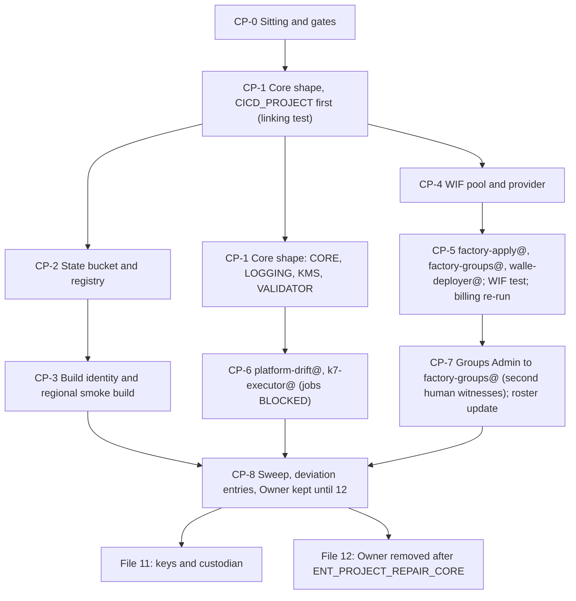

# 10. Core projects and CI identities

## Status
- Owner: the platform owner
- Last reviewed: 2026-09-15
- Last executed: never
- Stage: review §2 stage 10 (the five core projects, the CI supply-chain base and the platform's machine identities). Runs after file 09 and before file 11.
- Step prefix: CP. Steps: 39. BLOCKED steps: CP-6.2 (the drift, reconciliation and K7 jobs have no code). Steps run once per core project: CP-1.1 to CP-1.12, five passes.
- Replaces: the Phase 6 manual fallback of `wall-e/SETUP.md` for the platform's own projects, and the "factory call" prose that assumed `CICD_PROJECT`, `factory-apply@` and the WIF pool already existed. What was salvaged: the API-enable and service-account creation patterns (now with `--project` on every command), the budget filter lesson (`projects/<id>`, never the number) and the verify-by-listing habit. What was not copied: projects under `FOLDER_ID` (S019), builds in agent projects (S006), a standing Owner nobody removes (S018), `gcloud config set project` (S071).
- Applies decisions: SD-01 (bootstrap deviation), SD-14 (git host before Tier R), SD-16 (billing), SD-17 (regional `_Default`, global `_Required`, explicit `_Trace`), SD-18 (maker of `factory-groups@`), SD-34 (`walle-deployer@` as the ladder publisher), SD-44 (`exists_or_pending`, `--project` everywhere).
- Closes: S001 (core-project half), S006 (build-location half), S019, S022, S049 (`factory-groups@` half), S051 (WIF half), S130, X-RQB-03 (core-project half), S018 (recorded-exception half). See "Findings" at the end.

## What this part builds

Five projects under `fld-platform-core`, each made by hand to the shape the factory's `platform-core` module would produce and recorded as a bootstrap deviation (SD-01): `CICD_PROJECT`, `CORE_PROJECT`, `LOGGING_PROJECT`, `KMS_PROJECT` and `VALIDATOR_PROJECT`. Each gets a permanent id from the signed names record, a billing link, labels, inherited tags, only the APIs of the core allow-list it needs, a user-defined `europe-west1` log bucket that receives the `_Default` sink, `_Required` left in `global`, an explicit `_Trace` observability bucket in `europe-west1` (not in `KMS_PROJECT`, §1), a budget and Essential Contacts.

In `CICD_PROJECT`: the Terraform state bucket, the shared Artifact Registry repository `platform`, a keyless build identity with a regional staging bucket (so no build ever needs a US bucket or the Compute Engine default service account), proven by one smoke build; the Workload Identity Federation pool `wif-factory` with one provider for the git host, conditioned on the platform repository's numeric ids and `main`; the identities `factory-apply@`, `factory-groups@` and `walle-deployer@`. In `CORE_PROJECT`: the identities `platform-drift@` and `k7-executor@` (their jobs are BLOCKED on code). In the Workspace tenant: the **Groups Admin** role assigned to `factory-groups@` by a super admin, witnessed by the second human, and the roster updated so Eve's roster check expects it. On the billing account: the two billing roles for `factory-apply@` (the re-run of 07 BA-3.1).

What this part deliberately does **not** do:
- It does not remove the creator's Owner on the five projects. File 11 still has to create key rings in `KMS_PROJECT`, the attestor in `CICD_PROJECT` and the custodian dataset in `VALIDATOR_PROJECT`, and no PAM entitlement exists before file 12. The Owner binding is kept under the dated bootstrap exception, written to `DEVIATION_REGISTER` in CP-8.2, and removed in 12 once `ENT_PROJECT_REPAIR_CORE` is proven.
- It grants `factory-apply@` nothing at folder level (no Project Creator, no conditional `projectIamAdmin`). The factory code does not exist (B-01), and those grants wait for `pab-core-ci` and deny rule R6 (13) and the factory's first run (17). See "Deferred halves".
- It applies no organisation policy. Folder allow-lists, B19 and the Cloud Build constraints are file 13's.
- It builds no platform image. The `k7-executor` and drift images are 18's and 16's, BLOCKED on code.

What the old text got wrong, and must not come back:

| Old text | Why it fails | Here instead |
|---|---|---|
| `gcloud projects create "$PROJECT" --folder="<numeric id ...>"` then `gcloud config set project` (SETUP l.580-581) | The placeholder had no source, `FOLDER_ID` pointed at the wrong folder (S019), and a default project silently redirects later commands (S071). | CP-1.1 uses `FLD_PLATFORM_CORE` from 09 and the id from the signed names record; every command passes `--project`; CP-0.1 refuses a default project. |
| `gcloud builds submit ... --tag` with no region, account or bucket option, in the agent's project (SETUP l.1225, l.1370; Eve Phase 10) | The build stages to `gs://PROJECT_cloudbuild`, a US bucket that `gcp.resourceLocations` refuses, and runs as the Compute Engine default service account, which does not exist without the Compute API (S022). Builds in agent projects contradict "builds run in `CICD_PROJECT`" (S006). | §3: builds run only in `CICD_PROJECT`, with `--region`, `--default-buckets-behavior=regional-user-owned-bucket` and `--service-account`, proven by CP-3.5. |
| "standing `roles/owner` is removed" only on the factory path; the fallback keeps it and says nothing (SETUP l.571, S018) | The creator keeps Owner for ever, and removing it early breaks the next file. | The Owner is kept by name, dated, with its removal step named (12) and verified there; CP-1.11 snapshots it. |
| `SA_WALLE_CI="<ci-deployer-service-account>"`, empty on the default path (Eve 07 l.107) | Eve's `ladder/` grant goes to `serviceAccount:` and fails (S130). | CP-5.5 creates `walle-deployer@` and sets `SA_WALLE_DEPLOYER`; 23 guards it with `need`. |
| P22 (git host) gated at Tier W | The WIF provider needs the issuer and repository ids before Tier R (S051). | CP-4.1 refuses to run without the signed P22/SD-14 record and the created repository. |
| "a Cloud Logging folder default storage location" as the regional-logs fix | It would also move `_Required` and blind Sensitive Actions (X-RQB-03 verdict). | CP-1.7 redirects `_Default` per project; `_Required` stays global; CP-1.8 creates `_Trace`. |



## Preconditions

- [ ] File 09 is complete: `FLD_PLATFORM_CORE`, `TAG_KEY_TIER`, `TAG_KEY_TISAX` are set; the tag values `agp-tier=core` (on `fld-platform-core`) and `agp-tisax-scope=in` (on `fld-agentic-platform`) are bound; the observability default storage location `europe-west1` is set on `fld-agentic-platform`; no Cloud Logging folder default storage location is set.
- [ ] File 07 is complete: `BILLING_ACCOUNT_ID` and `BILLING_CURRENCY` are set; `sa-1-admin@` holds Billing Account User and Billing Account Costs Manager on that account only; the project-quota request of BA-6 is filed (about 20 projects) or approved.
- [ ] File 06 is complete: `SA_1_ADMIN`, `SA_2_ADMIN`, `GRP_PLATFORM_OWNERS`, `GRP_PLATFORM_SECURITY`, `ROSTER_FILE` and `BOOTSTRAP_EXCEPTION_EXPIRY` are set; `sa-1-admin@` holds Organization Administrator and Project Creator at the organisation under the dated exception, and the exception has not expired.
- [ ] File 03 has signed: the topology §6 names record with the five core project ids (the gate of every **IRREVERSIBLE** create in CP-1.1); P22 and SD-14 (git host), with `GIT_HOST`, `GIT_OIDC_ISSUER` and `PLATFORM_REPO_REMOTE` set and the repository created with branch protection and CODEOWNERS (the second human a required reviewer on `ROSTER_FILE`); SD-01, SD-16, SD-17, SD-18 and SD-34; `SECOND_HUMAN_EMAIL` and `BILLING_ADMIN_EMAIL` named.
- [ ] File 01's `~/.platform-env` holds `PLATFORM_ENV_FILE` (its own path, read back by CP-1.2, CP-4.1 and CP-5.5), `ORG_ID`, `REGION` (`europe-west1`), `PLATFORM_REPO_DIR`, `BUILD_LOG_DIR`, `EVIDENCE_INTERIM_LOCATION`, `EVIDENCE_REGISTER`, `DEVIATION_REGISTER` and the helpers `penv_set`, `need` and `exists_or_pending`; the gcloud configuration `GCLOUD_CONFIG_NAME` has no default project.
- [ ] The platform owner's workstation has the gcloud `alpha` and `beta` components (CP-1.3 uses `alpha`; CP-1.8's read-back uses `beta`), `curl` (CP-1.8 creates the `_Trace` bucket through the Observability REST API, which has no gcloud command), `jq` (CP-3.2, CP-5.2, CP-6.1 and CP-8.1 test IAM members with it, because the gcloud filter grammar cannot), and the git host's CLI (`gh` for GitHub, `glab` for GitLab) signed in as a repository administrator.
- [ ] A 45-minute slot is booked with the second human for §7 (they must be present or on a shared screen), and with the billing administrator for CP-5.6.

## People

| Role | Does | Present at |
|---|---|---|
| Platform owner (as `sa-1-admin@`) | Every GCP step; the Workspace role assignment as the super admin | every step |
| Second human (`SECOND_HUMAN_EMAIL`, holder of `sa-2-admin@`) | Witnesses the Groups Admin assignment and its verify; required reviewer of the `ROSTER_FILE` change; reads the kept-Owner row `BD-10-6` before leaving | CP-7.1 to CP-7.4, CP-8.2 |
| Billing administrator (`BILLING_ADMIN_EMAIL`) | Grants the two billing roles to `factory-apply@`; adds Billing Account Viewer to `sa-1-admin@` only if the linking test is refused on the billing side | CP-1.4 (on refusal only), CP-5.6 |

Nobody else. Separation rules checked in CP-0.1: the platform owner never approves his own roster change; the billing administrator is not `SA_1_ADMIN`.

Hands-on time about 1.5 days, elapsed 2 to 3 days (the WIF test in CP-5.3 needs a merged pull request; the roster change needs the second human's review).

Conventions of [01](01-prerequisites-and-conventions.md) apply to every step. Each step starts with `checkpoint <id> START` and ends with `checkpoint <id> DONE [witness] [evidence id]`; steps of §1 carry the project variable in the id (`checkpoint CP-1.7@LOGGING_PROJECT DONE`). Every saved record is registered with `evidence_add <step> <slug> <E-id> <TISAX id> <location> [file]`; command outputs go under `BUILD_LOG_DIR/records/`, screenshots under `EVIDENCE_INTERIM_LOCATION`, both named `<date>-<step>-<slug>-v<n>`. Deviation rows use 01 PR-4.1's table with ids `BD-10-<n>`.

## 0. The sitting

### CP-0.1 Open the sitting and check the gates

- **WHO:** Platform owner.
- **WHERE:** Shell with `~/.platform-env` sourced, gcloud configuration `GCLOUD_CONFIG_NAME` active, signed in as `sa-1-admin@`.
- **ACTION:**

```bash
source ~/.platform-env
checkpoint CP-0.1 START
penv_guard
"$PLATFORM_REPO_DIR/tools/decision-need.sh" NAMES SD-01 SD-14 SD-16 SD-17 SD-18 SD-34 P22
for v in CICD_PROJECT CORE_PROJECT LOGGING_PROJECT KMS_PROJECT VALIDATOR_PROJECT TF_STATE_BUCKET; do printf '%s=%s\n' "$v" "$("$PLATFORM_REPO_DIR/tools/decision-value.sh" NAMES "$v")"; done
need PLATFORM_ENV_FILE ORG_ID REGION FLD_PLATFORM_CORE TAG_KEY_TIER TAG_KEY_TISAX BILLING_ACCOUNT_ID BILLING_CURRENCY SA_1_ADMIN SA_2_ADMIN GRP_PLATFORM_OWNERS GRP_PLATFORM_SECURITY ROSTER_FILE BOOTSTRAP_EXCEPTION_EXPIRY GIT_HOST GIT_OIDC_ISSUER PLATFORM_REPO_REMOTE PLATFORM_REPO_DIR BUILD_LOG_DIR EVIDENCE_INTERIM_LOCATION EVIDENCE_REGISTER DEVIATION_REGISTER SECOND_HUMAN_EMAIL BILLING_ADMIN_EMAIL
test -f "$PLATFORM_ENV_FILE" || { echo "PLATFORM_ENV_FILE does not point at a file: stop"; false; }
test -z "$(gcloud config get project 2>/dev/null)" || { echo "a default project is set: stop"; false; }
test "$(gcloud config get account 2>/dev/null)" = "$SA_1_ADMIN" || { echo "not signed in as sa-1-admin@: stop"; false; }
test "$(date -u +%F)" \< "$BOOTSTRAP_EXCEPTION_EXPIRY" || { echo "bootstrap exception expired: stop"; false; }
test "$BILLING_ADMIN_EMAIL" != "$SA_1_ADMIN" || { echo "billing administrator is sa-1-admin@: stop"; false; }
gcloud resource-manager folders describe "$FLD_PLATFORM_CORE" --format="value(displayName,parent)"
gcloud projects list --filter="parent.type=folder AND parent.id=${FLD_PLATFORM_CORE}" --format="value(projectId)"
```

  `PLATFORM_ENV_FILE` is 01's own variable naming the path of the variables file (`~/.platform-env`); CP-1.2, CP-4.1 and CP-5.5 read it back with `grep`, so it is checked here rather than failing three steps later. `tools/decision-need.sh` and `tools/decision-value.sh` are 03's: the first refuses an unsigned or altered record, the second reads a value only from the signed NAMES register (03 DC-5.1). Copy the five project ids and the state bucket name into the table of §1 and CP-2.1; nothing is typed from memory. Each id matches `agp-core-<purpose>` (02 §3.6; for example `agp-core-logging`), is 6 to 30 characters of lowercase letters, digits and hyphens, starts with a letter and does not end with a hyphen (Create projects page, read 2026-09-15).
- **VERIFY:** `penv_guard` prints nothing; `decision-need.sh` exits 0; `decision-value.sh` prints six non-empty values, none `*tbd*`; every `need` passes; no default project; the account is `sa-1-admin@`; today is before `BOOTSTRAP_EXCEPTION_EXPIRY`; the folder describe prints `fld-platform-core` and `folders/<FLD_AGENTIC_PLATFORM>`; the project list under the folder is empty (or holds only core projects from an earlier, resumed sitting whose checkpoints say so). The five ids in the signed record are distinct and well-formed.
- **ROLLBACK:** Read only.
- **EVIDENCE:** Checkpoint line `CP-0.1 DONE`; the folder describe output as `<date>-CP-0.1-folder-core-describe-v1` in `BUILD_LOG_DIR`. TISAX 1.3.1 (asset inventory: the parent is known before any asset exists).

## 1. The platform-core shape, once per core project

Run CP-1.1 to CP-1.12 as one pass per row of the table below, **in row order**. `CICD_PROJECT` comes first because it is the quota project for budget and contact calls (`--billing-project`) and its link is the linking test of 07. Start each pass by setting the row's values in the shell; every command of the pass reads them.

| Row | Variable | Id (from the signed record) | Display name | `agent` label | `owner` label | `recovery_class` | APIs enabled | Budget (EUR/month, 02 §2.2) | `_Trace` |
|---|---|---|---|---|---|---|---|---|---|
| 1 | `CICD_PROJECT` | *tbd* (form `agp-core-cicd`) | `Platform CICD core prod` | `platform-cicd` | `platform-owners` | `r-d` | `serviceusage`, `cloudresourcemanager`, `iam`, `iamcredentials`, `sts`, `logging`, `monitoring`, `storage`, `cloudbuild`, `artifactregistry`, `containeranalysis`, `containerscanning`, `binaryauthorization`, `cloudkms`, `billingbudgets`, `essentialcontacts`, `observability` | 300 | yes |
| 2 | `CORE_PROJECT` | *tbd* (form `agp-core-core`) | `Platform core prod` | `platform-core` | `platform-owners` | `r-d` | `serviceusage`, `cloudresourcemanager`, `iam`, `iamcredentials`, `logging`, `monitoring`, `storage`, `bigquery`, `pubsub`, `run`, `cloudscheduler`, `binaryauthorization`, `agentregistry`, `apphub`, `cloudasset`, `policyanalyzer`, `orgpolicy`, `iap`, `observability` | 300 | yes |
| 3 | `LOGGING_PROJECT` | *tbd* (form `agp-core-logging`) | `Platform logging core prod` | `platform-logging` | `platform-owners` | `r-d` | `serviceusage`, `cloudresourcemanager`, `iam`, `logging`, `monitoring`, `storage`, `bigquery`, `pubsub`, `dlp`, `observability` | 300 | yes |
| 4 | `KMS_PROJECT` | *tbd* (form `agp-core-kms`) | `Platform KMS core prod` | `platform-kms` | `platform-owners` | `r-k` | `cloudresourcemanager`, `cloudkms`, `logging` | 300 | **no** |
| 5 | `VALIDATOR_PROJECT` | *tbd* (form `agp-core-validator`) | `Platform validator core prod` | `platform-validator` | `platform-security` | `r-d` | `serviceusage`, `cloudresourcemanager`, `iam`, `logging`, `monitoring`, `storage`, `bigquery`, `cloudkms`, `observability` | 300 | yes |

All service names are `<name>.googleapis.com`. Why these and nothing more:
- Every name except `observability` is on the `fld-platform-core` allow-list of 02 §4.2; a project enables only the subset its later steps call (11 to 18). A later file that needs another allow-listed service enables it at its own step and records it. `cloudapis` is not on the allow-list, so CP-1.1 passes `--no-enable-cloud-apis`.
- `observability.googleapis.com` is required to create `_Trace` by hand ("Enable the Observability API", Cloud Trace create-observability-buckets page, read 2026-09-15) and is **not** on 02 §4.2's core list. Recorded as a deviation in CP-8.2 and handed to 13, which adds it to the core allow-list by pull request before the allow-list is applied.
- `cloudkms.googleapis.com` is on three rows, not one. Row 4 is the key project. Row 1 is added because 11 KV-5.1 creates the key ring `supply-chain` and KV-5.2 the two attestor keys **in `CICD_PROJECT`**, and Google requires the API on the project that holds the key ring: "Enable the Cloud KMS API on your key project" (Create a key ring, read 2026-09-15). Row 5 is added because 11 KV-8.6 asks Autokey for a key handle with `VALIDATOR_PROJECT` as the quota project, and Autokey needs the API "on each project where you want to use Autokey" (Enable Autokey, read 2026-09-15). Enabling it here, rather than as a remedy inside 11, keeps CP-1.6's VERIFY ("any extra name … is disabled") and 02 §4.2's allow-list honest: 11 finds the API already on and only checks it. Both additions are recorded in CP-8.2's `BD-10-7` and handed to 13 for the core allow-list.
- `KMS_PROJECT`'s list is `cloudresourcemanager`, `cloudkms`, `logging`, which amends 02 §4.2's P118 "cloudkms only" by one name. Cloud Resource Manager is **not** enabled by default: it is absent from the default-enabled table of the Service Usage "Enabled services" page (read 2026-09-15), and `gcloud projects create --no-enable-cloud-apis` enables nothing anyway, yet this project's own pass calls Resource Manager against it in CP-1.3 (lien create), CP-1.5 (tag bindings list), CP-1.11 and CP-8.1 (get-iam-policy) and CP-1.12 (describe). Without the row the file would contradict its own rule that a project enables only the subset its later steps call. The amendment to P118 is recorded in CP-8.2's `BD-10-7` and handed to 13. Logging is enabled because the `_Default` redirect is a Logging API call; Google states that Logging cannot be restricted by `gcp.restrictServiceUsage` (restricting-resources page as cited by 02 §4.2). No `_Trace` is created there: nothing that emits spans ever runs in the key project, and creating one would need `observability`, which that list excludes. Recorded as a dated deviation in CP-8.2 against SD-17's "every project".
- `recovery_class` for `KMS_PROJECT` is `r-k` and for the others `r-d` (09 §3.1 classes R-D shared services and R-K keys). 02 §3.6 lists only `r-a r-b r-c`; *Assumption:* the vocabulary gains `r-d` and `r-k`, corrected in 02 §3.6 by the pass that 17 makes.
- `VALIDATOR_PROJECT` is owned by the security reviewer's line (11); until that person is named, the owner label is `platform-security`.
- Display names follow the Project resource rule: 4 to 30 characters of "lowercase and uppercase letters, numbers, hyphen, single-quote, double-quote, space, and exclamation point" (Resource Manager v3 `Project` reference, read 2026-09-15). 02 §3.6's pattern `<Agent> (<tier>, <env>)` uses parentheses and a comma, which that rule does not allow; the correction is recorded in CP-8.2 for 17.

Labels applied to each core project, from 02 §3.6 (P38), with the keys that describe an agent left out because platform-core has no manifest: `agent`, `owner`, `tier=core`, `env=prod`, `data_class=confidential` (*Assumption:* 02 §3.6's default until the organisation's scheme is named), `ai_act_class=not-ai-system`, `recovery_class`, `cost_centre=tbd` (a label value cannot hold `*tbd*`; replaced when P31 names the code), `created_by=bootstrap-hand` and `factory_run=dev-10-<purpose>` (so the hand-made-project detection of 02 §1.3 R1 recognises a recorded deviation). Not applied: `risk_class`, `autonomy_ceiling`, `model_pin`, `verifier`.

Start of each pass:

```bash
P_VAR="CICD_PROJECT"          # row 1; then CORE_PROJECT, LOGGING_PROJECT, KMS_PROJECT, VALIDATOR_PROJECT
P_ID="$("$PLATFORM_REPO_DIR/tools/decision-value.sh" NAMES "$P_VAR")"
P_NAME="<display name of this row>"
P_PURPOSE="<cicd | core | logging | kms | validator>"
P_OWNER_LABEL="<platform-owners | platform-security>"
P_RECOVERY="<r-d | r-k>"
```

### CP-1.1 Create the project under `fld-platform-core`

- **WHO:** Platform owner.
- **WHERE:** Shell with `~/.platform-env` sourced and the row's values set.
- **ACTION:**

```bash
need FLD_PLATFORM_CORE P_ID P_NAME P_PURPOSE P_OWNER_LABEL P_RECOVERY
gcloud projects describe "$P_ID" --format="value(projectId)" 2>/dev/null && { echo "id already exists: go to the resume rule, do not create"; false; }
gcloud projects create "$P_ID" --folder="$FLD_PLATFORM_CORE" --name="$P_NAME" --no-enable-cloud-apis --labels="agent=platform-${P_PURPOSE},owner=${P_OWNER_LABEL},tier=core,env=prod,data_class=confidential,ai_act_class=not-ai-system,recovery_class=${P_RECOVERY},cost_centre=tbd,created_by=bootstrap-hand,factory_run=dev-10-${P_PURPOSE}"
```

  `--folder`, `--name`, `--labels` and `--no-enable-cloud-apis` are documented flags of `gcloud projects create`; `--set-as-default` is never passed (gcloud reference, read 2026-09-15). `--tags` exists but is Preview, and the tier and scope tags are inherited from the folders bound in 09, so no project-level tag is bound.
  Label keys: the gcloud reference allows underscores in keys; the Resource Manager v3 `Project` reference gives the key regex `[a-z]([-a-z0-9]*[a-z0-9])?`, which does not. If the create is refused naming a label key, **nothing is created**: stop the pass, record the error, and change the six underscore keys to hyphens (`data-class`, `ai-act-class`, `recovery-class`, `cost-centre`, `created-by`, `factory-run`) for all five rows under a dated amendment to 02 §3.6 made in CP-8.2. Do not mix spellings between rows.
- **VERIFY:**

```bash
gcloud projects describe "$P_ID" --format="yaml(projectId,projectNumber,name,parent,labels,lifecycleState)"
```

  `parent` is `type: folder`, `id: <FLD_PLATFORM_CORE>`; `lifecycleState: ACTIVE`; the ten labels are present with the values above. A parent other than `fld-platform-core` means the wrong folder: stop and see ROLLBACK.
- **ROLLBACK:** **IRREVERSIBLE** as a name. A project id "cannot be in use or previously used; this includes deleted projects" (Create projects page, read 2026-09-15), so a deleted project's id is lost for ever. Before running, confirm: (1) the id is character for character the value `decision-value.sh NAMES "$P_VAR"` printed; (2) `FLD_PLATFORM_CORE` is the numeric id of `fld-platform-core` (CP-0.1's describe). Gate: the signed NAMES register (03 DC-5.1), checked by `tools/decision-need.sh NAMES` in CP-0.1 and read by `decision-value.sh` at the start of the pass. If the project was created under the wrong parent, it is moved, never deleted and re-created: that move needs `roles/resourcemanager.projectMover` on the source and destination, taken as a time-bound conditional self-grant under the SD-01 exception in the form of 09 FS-1.2 and removed afterwards; record it as a `DEV` row. Labels are corrected with `gcloud projects update "$P_ID" --update-labels=...`.
- **EVIDENCE:** The describe YAML as `<date>-CP-1.1-${P_VAR}-describe-v1`; a line in `EVIDENCE_REGISTER`. TISAX 1.3.1 (asset created with owner and classification labels). EU AI Act E-05 (infrastructure item in the Annex IV index).

### CP-1.2 Record the id and number

- **WHO:** Platform owner.
- **WHERE:** Shell.
- **ACTION:**

```bash
P_NUM="$(gcloud projects describe "$P_ID" --format='value(projectNumber)')"
penv_set "$P_VAR" "$P_ID"
penv_set "${P_VAR}_NUMBER" "$P_NUM"
```

- **VERIFY:** `grep -E "^export (${P_VAR}|${P_VAR}_NUMBER)=" "$PLATFORM_ENV_FILE"` prints exactly two lines, the id and a string of digits equal to CP-1.1's `projectNumber`.
- **ROLLBACK:** `penv_set --force` with a build-log line, only if a typing error is found; the project itself does not change.
- **EVIDENCE:** Checkpoint `CP-1.2@<P_VAR> DONE`. TISAX 1.3.1.

### CP-1.3 Place a deletion lien

- **WHO:** Platform owner.
- **WHERE:** Shell (gcloud `alpha` component).
- **ACTION:**

```bash
gcloud alpha resource-manager liens create --project="$P_ID" --restrictions=resourcemanager.projects.delete --reason="Core platform project; deletion only by a signed decision (10, SD-01)" --origin="setup-10-core-projects"
```

  The command, the restriction string and the role `roles/resourcemanager.lienModifier` (permission `resourcemanager.projects.updateLiens`) are on the project-liens page (read 2026-09-15); the command is in the alpha track. The creator's Owner holds the permission.
- **VERIFY:** `gcloud alpha resource-manager liens list --project="$P_ID" --format="table(name,restrictions,origin)"` shows one lien with `resourcemanager.projects.delete` and origin `setup-10-core-projects`.
- **ROLLBACK:** `gcloud alpha resource-manager liens delete <LIEN_NAME>`, only under a signed decision. From file 12, lien removal on a core project is an act under `ENT_PROJECT_REPAIR_CORE`.
- **EVIDENCE:** The list output as `<date>-CP-1.3-${P_VAR}-lien-v1`. TISAX 1.3.1, 5.3 (continuity: R-D shared services cannot be deleted by accident).

### CP-1.4 Link billing (the linking test on row 1)

- **WHO:** Platform owner; the billing administrator only if the link is refused on the billing side.
- **WHERE:** Shell.
- **ACTION:**

```bash
need BILLING_ACCOUNT_ID
gcloud billing projects link "$P_ID" --billing-account="$BILLING_ACCOUNT_ID"
```

- **VERIFY:**

```bash
gcloud billing projects describe "$P_ID" --format="value(billingAccountName,billingEnabled)"
```

  Prints `billingAccounts/<BILLING_ACCOUNT_ID>` and `True`. On **row 1 only**, this is the linking test of 07 BA-2.2: if the link is refused with a permission error on the billing account (not on the project), the billing administrator adds `roles/billing.viewer` for `sa-1-admin@` on the account, writes the SD-16 note of BA-2.2, and the link is retried; then 07 BA-2.3's `testIamPermissions` call is repeated with `-H "x-goog-user-project: ${CICD_PROJECT}"` if it had failed for want of a quota project. A refusal naming a project quota means 07 BA-6's request is not yet granted: stop all passes until it is.
- **ROLLBACK:** `gcloud billing projects unlink "$P_ID"`. Unlinking disables billing and shuts down paid resources in the project (gcloud `billing projects link` reference, read 2026-09-15); before the APIs are enabled there are none.
- **EVIDENCE:** The describe output as `<date>-CP-1.4-${P_VAR}-billing-v1`; on row 1 also the linking-test result (passed, or passed after `billing.viewer`) in 07's evidence folder. TISAX 1.3.3. Closes the linking-test half of X-RQB-05 named in 07.

### CP-1.5 Confirm the inherited tags

- **WHO:** Platform owner.
- **WHERE:** Shell.
- **ACTION:**

```bash
P_NUM="$(gcloud projects describe "$P_ID" --format='value(projectNumber)')"
gcloud resource-manager tags bindings list --parent="//cloudresourcemanager.googleapis.com/projects/${P_NUM}" --effective --format=yaml
gcloud resource-manager tags bindings list --parent="//cloudresourcemanager.googleapis.com/projects/${P_NUM}" --format=yaml
```

  `--effective` shows bindings inherited from parents; `--location` is not used for projects (gcloud `tags bindings list` reference, read 2026-09-15).
- **VERIFY:** The effective list holds a value under `TAG_KEY_TIER` whose short name is `core` and a value under `TAG_KEY_TISAX` whose short name is `in`, both inherited. The second, non-effective list is **empty**: no tag is bound directly on a core project, so a project-level binding can never diverge from its folder (02 §3.6). If either inherited value is missing, stop: the binding belongs to 09 and is fixed there, not here.
- **ROLLBACK:** Read only.
- **EVIDENCE:** Both outputs as `<date>-CP-1.5-${P_VAR}-tags-v1`. TISAX 1.3.2 (classification by scope tag).

### CP-1.6 Enable the row's APIs, and nothing else

- **WHO:** Platform owner.
- **WHERE:** Shell.
- **ACTION:** One command per service, in the row's order, so a refusal names the service. Run only the block of the current row.

  Row 1, `CICD_PROJECT`:

```bash
gcloud services enable serviceusage.googleapis.com --project="$P_ID"
gcloud services enable cloudresourcemanager.googleapis.com --project="$P_ID"
gcloud services enable iam.googleapis.com --project="$P_ID"
gcloud services enable iamcredentials.googleapis.com --project="$P_ID"
gcloud services enable sts.googleapis.com --project="$P_ID"
gcloud services enable logging.googleapis.com --project="$P_ID"
gcloud services enable monitoring.googleapis.com --project="$P_ID"
gcloud services enable storage.googleapis.com --project="$P_ID"
gcloud services enable cloudbuild.googleapis.com --project="$P_ID"
gcloud services enable artifactregistry.googleapis.com --project="$P_ID"
gcloud services enable containeranalysis.googleapis.com --project="$P_ID"
gcloud services enable containerscanning.googleapis.com --project="$P_ID"
gcloud services enable binaryauthorization.googleapis.com --project="$P_ID"
gcloud services enable cloudkms.googleapis.com --project="$P_ID"
gcloud services enable billingbudgets.googleapis.com --project="$P_ID"
gcloud services enable essentialcontacts.googleapis.com --project="$P_ID"
gcloud services enable observability.googleapis.com --project="$P_ID"
```

  `cloudkms` is enabled here, not in 11: 11 KV-5.1 creates the key ring `supply-chain` in this project and KV-5.2 the attestor keys in it, and the key ring create refuses a project whose Cloud KMS API is off.

  Row 2, `CORE_PROJECT`:

```bash
gcloud services enable serviceusage.googleapis.com --project="$P_ID"
gcloud services enable cloudresourcemanager.googleapis.com --project="$P_ID"
gcloud services enable iam.googleapis.com --project="$P_ID"
gcloud services enable iamcredentials.googleapis.com --project="$P_ID"
gcloud services enable logging.googleapis.com --project="$P_ID"
gcloud services enable monitoring.googleapis.com --project="$P_ID"
gcloud services enable storage.googleapis.com --project="$P_ID"
gcloud services enable bigquery.googleapis.com --project="$P_ID"
gcloud services enable pubsub.googleapis.com --project="$P_ID"
gcloud services enable run.googleapis.com --project="$P_ID"
gcloud services enable cloudscheduler.googleapis.com --project="$P_ID"
gcloud services enable binaryauthorization.googleapis.com --project="$P_ID"
gcloud services enable agentregistry.googleapis.com --project="$P_ID"
gcloud services enable apphub.googleapis.com --project="$P_ID"
gcloud services enable cloudasset.googleapis.com --project="$P_ID"
gcloud services enable policyanalyzer.googleapis.com --project="$P_ID"
gcloud services enable orgpolicy.googleapis.com --project="$P_ID"
gcloud services enable iap.googleapis.com --project="$P_ID"
gcloud services enable observability.googleapis.com --project="$P_ID"
```

  Row 3, `LOGGING_PROJECT`:

```bash
gcloud services enable serviceusage.googleapis.com --project="$P_ID"
gcloud services enable cloudresourcemanager.googleapis.com --project="$P_ID"
gcloud services enable iam.googleapis.com --project="$P_ID"
gcloud services enable logging.googleapis.com --project="$P_ID"
gcloud services enable monitoring.googleapis.com --project="$P_ID"
gcloud services enable storage.googleapis.com --project="$P_ID"
gcloud services enable bigquery.googleapis.com --project="$P_ID"
gcloud services enable pubsub.googleapis.com --project="$P_ID"
gcloud services enable dlp.googleapis.com --project="$P_ID"
gcloud services enable observability.googleapis.com --project="$P_ID"
```

  Row 4, `KMS_PROJECT`:

```bash
gcloud services enable cloudresourcemanager.googleapis.com --project="$P_ID"
gcloud services enable cloudkms.googleapis.com --project="$P_ID"
gcloud services enable logging.googleapis.com --project="$P_ID"
```

  `cloudresourcemanager` is first because CP-1.3, CP-1.5, CP-1.11, CP-1.12 and CP-8.1 call Resource Manager against this project and it is not enabled by default (§1). If the enable itself is refused because Resource Manager is disabled on the project it must act on, enable it from the console instead: **APIs & Services > Enabled APIs & services > + Enable APIs and services**, search `Cloud Resource Manager API`, **Enable**, with the project selector on `KMS_PROJECT`; record the console route in `BD-10-7`.

  Row 5, `VALIDATOR_PROJECT`:

```bash
gcloud services enable serviceusage.googleapis.com --project="$P_ID"
gcloud services enable cloudresourcemanager.googleapis.com --project="$P_ID"
gcloud services enable iam.googleapis.com --project="$P_ID"
gcloud services enable logging.googleapis.com --project="$P_ID"
gcloud services enable monitoring.googleapis.com --project="$P_ID"
gcloud services enable storage.googleapis.com --project="$P_ID"
gcloud services enable bigquery.googleapis.com --project="$P_ID"
gcloud services enable cloudkms.googleapis.com --project="$P_ID"
gcloud services enable observability.googleapis.com --project="$P_ID"
```

  `cloudkms` is enabled here, not in 11: 11 KV-8.6 creates an Autokey key handle with this project as the quota project, and Autokey requires the Cloud KMS API on every resource project where it is used.

- **VERIFY:**

```bash
gcloud services list --enabled --project="$P_ID" --format="value(config.name)" | sort > "${BUILD_LOG_DIR}/$(date -u +%F)-CP-1.6-${P_VAR}-services-v1.txt"
cat "${BUILD_LOG_DIR}/$(date -u +%F)-CP-1.6-${P_VAR}-services-v1.txt"
```

  Every service of the row is listed. Enabling a service can enable its dependencies; each extra name is classified in the record as either (a) on 02 §4.2's core allow-list, or (b) a dependency Google enabled with a named parent (read from the service's page on the day). The (b) names are handed to 13 so the allow-list does not refuse a dependency the core needs.

  Any extra name that is neither (a) nor (b) is disabled — but **not blindly**. `gcloud services disable` refuses a service that other enabled services depend on unless `--force` is passed, and `--force` "will proceed even if there are enabled services which depend on the service to be disabled … the services which depend on the service to be disabled will also be disabled" (`gcloud services disable` reference, read 2026-09-15). So a forced disable can silently switch off a service of the row. The rule at this step:

```bash
gcloud services disable <name> --project="$P_ID"
```

  If that is refused naming dependants, **do not add `--force` yet**: record the refusal and the dependants it names, work out which enabled service pulled the name in (read that service's own page on the day), and only then either classify it as a (b) dependency and keep it, or run:

```bash
gcloud services disable <name> --force --project="$P_ID"
```

  and immediately re-read the enabled list to prove every service of the row is still on. A forced disable is recorded in `BD-10-7` with the dependants it took with it.

  `compute.googleapis.com` must not appear on any row. If it does, **do not disable it as a reflex**: Google warns that the Compute Engine default service account it carries must not be deleted, because "Deleting this service account is irreversible and can have unintended consequences either on Cloud Build or other services" (Cloud Build service-account-updates page, read 2026-09-15), and on row 1 Cloud Build and, later, Cloud Run depend on it. Instead record it, identify the parent service that enabled it, and decide with the second human before disabling anything Cloud Build or Cloud Run depends on; the decision and its outcome go in `BD-10-7`. On rows 2 to 5, where no build runs, disabling it after the parent is identified is the normal outcome. Either way, `--service-account` on every build (§3) is what keeps the Compute default account out of use, not the absence of the API.
- **ROLLBACK:** `gcloud services disable <name> --project="$P_ID"` per service, in the reverse of the row's order so a dependency is disabled after its dependants; add `--force` only when the refusal has been read and the dependants it names are themselves services this step enabled. Nothing outside this file depends on them yet.
- **EVIDENCE:** The services file named above; a line in `EVIDENCE_REGISTER`. TISAX 5.2.1 (change management: the enabled set is recorded), 1.3.1.

### CP-1.7 Route `_Default` to a regional bucket; leave `_Required` global

- **WHO:** Platform owner.
- **WHERE:** Shell.
- **ACTION:**

```bash
need REGION
gcloud logging buckets create default-europe-west1 --location="$REGION" --retention-days=30 --description="Regional destination of the _Default sink (SD-17, file 10)" --project="$P_ID"
gcloud logging sinks update _Default "logging.googleapis.com/projects/${P_ID}/locations/${REGION}/buckets/default-europe-west1" --log-filter='NOT LOG_ID("cloudaudit.googleapis.com/activity") AND NOT LOG_ID("externalaudit.googleapis.com/activity") AND NOT LOG_ID("cloudaudit.googleapis.com/system_event") AND NOT LOG_ID("externalaudit.googleapis.com/system_event") AND NOT LOG_ID("cloudaudit.googleapis.com/access_transparency") AND NOT LOG_ID("externalaudit.googleapis.com/access_transparency")' --description="Updated the _Default sink to route logs to the europe-west1 region" --project="$P_ID"
```

  The bucket create and the sink update with this filter are the commands of the regionalised-logs page (read 2026-09-15): "After you create your bucket, you can't change your bucket's location", and "You can't change the `_Required` sink". Retention is 30 days, the `ops` class of 08 R9 (the `gcloud logging buckets create` default is also 30 days). No CMEK: `ops` logs carry no key requirement in 08, and the logging key does not exist before 11. No Log Analytics: `--enable-analytics` cannot be undone and nothing needs it. Folder-level Cloud Logging default settings are deliberately not used (SD-17; they would move `_Required` too and blind Sensitive Actions).
- **VERIFY:**

```bash
gcloud logging buckets describe default-europe-west1 --location="$REGION" --project="$P_ID" --format="yaml(name,retentionDays,lifecycleState)"
gcloud logging sinks describe _Default --project="$P_ID" --format="yaml(destination,filter)"
gcloud logging sinks describe _Required --project="$P_ID" --format="value(destination)"
```

  The bucket is `.../locations/europe-west1/buckets/default-europe-west1`, `retentionDays: 30`, `ACTIVE`. `_Default`'s destination is that bucket and its filter is the one above. `_Required`'s destination still ends `locations/global/buckets/_Required`. Then write one test entry and read it back from the regional bucket:

```bash
gcloud logging write cp-1-7-routing-test "CP-1.7 routing test ${P_VAR}" --project="$P_ID"
gcloud logging read 'logName:"cp-1-7-routing-test"' --project="$P_ID" --bucket=default-europe-west1 --location="$REGION" --view=_AllLogs --freshness=10m --format="value(textPayload)"
```

  The read (after up to a few minutes) prints the test text. *Assumption:* `--bucket`, `--location` and `--view` on `gcloud logging read` select the bucket view; if the flags are refused, read the entry in the console **Logging > Logs Explorer > Refine scope > Log view**, choosing `default-europe-west1 / _AllLogs`, and record a screenshot instead.
- **ROLLBACK:** Point `_Default` back: `gcloud logging sinks update _Default "logging.googleapis.com/projects/${P_ID}/locations/global/buckets/_Default" --project="$P_ID"`; then `gcloud logging buckets delete default-europe-west1 --location="$REGION" --project="$P_ID"` (a deleted bucket stays pending deletion for a period before removal; its id cannot be reused meanwhile).
- **EVIDENCE:** The three describe outputs and the read-back as `<date>-CP-1.7-${P_VAR}-log-routing-v1`. TISAX 5.2.4 (event logging), 7.1 (residency table: `_Default` logs in europe-west1). EU AI Act E-06 (log placement for the Art. 12 record's supporting stores). Closes X-RQB-03 for this project.

### CP-1.8 Create the `_Trace` bucket in `europe-west1` (rows 1, 2, 3 and 5)

- **WHO:** Platform owner.
- **WHERE:** Shell (`curl` for the create; gcloud `beta` component for the read-back). Row 4 (`KMS_PROJECT`): write `CP-1.8@KMS_PROJECT N/A` with the reason from §1 and go to CP-1.9.
- **ACTION:** There is **no gcloud create command** for observability buckets. Under `gcloud beta observability buckets` only `describe` and `list` (plus the `datasets` group) are defined (gcloud reference, read 2026-09-15), and the Cloud Trace page creates the bucket through the Observability REST API. Create it with the documented REST call:

```bash
need REGION
curl -sS -X POST -H "Authorization: Bearer $(gcloud auth print-access-token)" -H "Content-Type: application/json" -H "x-goog-user-project: ${P_ID}" -d '{}' "https://observability.googleapis.com/v1/projects/${P_ID}/locations/${REGION}/buckets?bucketId=_Trace"
```

  The method is `POST https://observability.googleapis.com/v1/{parent=projects/*/locations/*}/buckets` with the required query parameter `bucketId` and a `Bucket` body (`projects.locations.buckets.create` reference, read 2026-09-15). Read that reference again on the day and add any field it has made required; an empty body is sent here because every field of `Bucket` is optional and `name` is derived from `parent` and `bucketId`. From the Cloud Trace create-observability-buckets page (read 2026-09-15): "The BUCKET_ID must be `_Trace`"; "Data is stored for 30 days. You must either omit the retention period or set it to `30`" — so no retention field is sent; the Observability API must be enabled (CP-1.6) and the role is Observability Editor (`roles/observability.editor`), which the creator's Owner covers. `x-goog-user-project` makes `P_ID` the quota project, which matters because the caller has no default project (CP-0.1).

  The response is the created `Bucket` resource; a non-2xx response prints an error object instead, and the step stops there. Cloud Run span data does not cause the bucket to be created, so without this step the spans of the drift and K7 jobs would be dropped (X-RQB-03 verdict, storage-overview page). File 09 set the folder's observability default location to `europe-west1`; creating the bucket explicitly removes any doubt about which location was inherited. The REST form is recorded in `BD-10-7`, because it is the one place in this file where a console or gcloud path does not exist.
- **VERIFY:**

```bash
gcloud beta observability buckets list --location="$REGION" --project="$P_ID"
```

  `gcloud beta observability buckets list` does exist (it is one of the two commands in that group) and is the read-back for the REST create: one bucket `_Trace` in `europe-west1`, and the project's `_Trace` appears nowhere else. If the create is refused because a `_Trace` bucket already exists (a project holds at most one), list without `--location` filtering to find where it is: a `_Trace` outside `europe-west1` is a residency deviation for 13 and 42, recorded in CP-8.2, because an observability bucket's location cannot be changed.
- **ROLLBACK:** None. Neither `gcloud beta observability buckets` nor the Cloud Trace page documents a delete, and an observability bucket's location cannot be changed. A wrong location is recorded as a dated residency exception instead; the project does not emit traces before 16 or 18, so the exposure is nil until then. Confirm `REGION` is `europe-west1` and `P_ID` is this row's project before running the POST.
- **EVIDENCE:** The REST response body and the list output as `<date>-CP-1.8-${P_VAR}-trace-bucket-v1` (the access token is never written to the record: `gcloud auth print-access-token` is substituted inside the command and appears in no output). TISAX 7.1 (residency). Closes X-RQB-03's `_Trace` half for this project.

### CP-1.9 Create the project budget

- **WHO:** Platform owner (Billing Account Costs Manager on the account, from 07).
- **WHERE:** Shell. Rows 2 to 5 require row 1 to be complete (`CICD_PROJECT` is the quota project).
- **ACTION:** 07 §8's contract, with `CICD_PROJECT` recorded here as its `--billing-project` (07 §8 left that choice to this file):

```bash
need BILLING_ACCOUNT_ID BILLING_CURRENCY CICD_PROJECT
test "$(gcloud billing accounts describe "$BILLING_ACCOUNT_ID" --format='value(currencyCode)')" = "$BILLING_CURRENCY" || { echo "currency changed: stop"; false; }
gcloud billing budgets create --billing-account="$BILLING_ACCOUNT_ID" --display-name="${P_ID}-budget" --budget-amount=300 --filter-projects="projects/${P_ID}" --threshold-rule=percent=0.5 --threshold-rule=percent=0.9 --threshold-rule=percent=1.0 --threshold-rule=percent=1.0,basis=forecasted-spend --billing-project="$CICD_PROJECT"
```

  300 is 02 §2.2's `fld-platform-core` default, without a currency suffix (the budget takes the account's currency; convert under a signed SD-16 amendment if `BILLING_CURRENCY` is not EUR). The `platform-budgets` channel and the `budget-events` topic of 02 §3.7 do not exist yet; the budget emails the billing account's administrators and users until file 15 adds the channel (re-run point listed in CP-8.2).
- **VERIFY:**

```bash
gcloud billing budgets list --billing-account="$BILLING_ACCOUNT_ID" --billing-project="$CICD_PROJECT" --filter="displayName=${P_ID}-budget" --format="yaml(displayName,amount,budgetFilter.projects,thresholdRules)"
```

  One budget; four threshold rules; and `budgetFilter.projects` holds exactly one entry for this project and is **never empty** — an empty filter scopes the budget to the whole billing account, which is the real failure this check exists to catch. Accept the entry as either `projects/<id>` or `projects/<number>`: the documented form is the id ("Set of projects in the form `projects/{project_id}`", `gcloud billing budgets create` reference, read 2026-09-15), and a read-back of the project number is the API's own normalisation, not a failure. Whichever form comes back, resolve it and confirm it names this project and no other.
- **ROLLBACK:** `gcloud billing budgets delete <BUDGET_ID> --billing-account="$BILLING_ACCOUNT_ID" --billing-project="$CICD_PROJECT"`.
- **EVIDENCE:** The YAML as `<date>-CP-1.9-${P_VAR}-budget-v1`. TISAX 1.3.3. Closes S023's budget contract for the core projects (with 07).

### CP-1.10 Set Essential Contacts

- **WHO:** Platform owner.
- **WHERE:** Shell.
- **ACTION:**

```bash
need GRP_PLATFORM_OWNERS GRP_PLATFORM_SECURITY CICD_PROJECT
gcloud essential-contacts create --email="$GRP_PLATFORM_OWNERS" --notification-categories=technical,technical-incidents,suspension,security --language=en --project="$P_ID" --billing-project="$CICD_PROJECT"
gcloud essential-contacts create --email="$GRP_PLATFORM_SECURITY" --notification-categories=security --language=en --project="$P_ID" --billing-project="$CICD_PROJECT"
```

  Categories and the required `--language` flag are those of the `gcloud essential-contacts create` reference (read 2026-09-15). Billing notices stay with the billing account's own contacts. B14 (13) later limits contact domains to the tenant domain; both groups are on it. *Assumption:* the Essential Contacts API is called against the quota project `CICD_PROJECT`; if the call fails naming the API as disabled on the target project, enable `essentialcontacts.googleapis.com` on that project (it is on the core allow-list), except on `KMS_PROJECT`, where the contacts are instead left to the folder contacts of 09 and the gap is recorded in CP-8.2.
- **VERIFY:** `gcloud essential-contacts list --project="$P_ID" --billing-project="$CICD_PROJECT" --format="table(email,notificationCategorySubscriptions)"` shows the two contacts with the categories above.
- **ROLLBACK:** `gcloud essential-contacts delete <CONTACT_ID> --project="$P_ID" --billing-project="$CICD_PROJECT"`.
- **EVIDENCE:** The table as `<date>-CP-1.10-${P_VAR}-contacts-v1`. TISAX 1.6.1 (incident contact reachable).

### CP-1.11 Snapshot IAM: the creator's Owner is kept, and nothing else is human

- **WHO:** Platform owner.
- **WHERE:** Shell.
- **ACTION:**

```bash
gcloud projects get-iam-policy "$P_ID" --format=json > "${BUILD_LOG_DIR}/$(date -u +%F)-CP-1.11-${P_VAR}-iam-v1.json"
gcloud projects get-iam-policy "$P_ID" --flatten="bindings[].members" --format="table(bindings.role,bindings.members)"
```

- **VERIFY:** The only `user:` or `group:` member is `user:<SA_1_ADMIN>` with `roles/owner` (the creator's grant: "When you create a project, you receive the roles/owner role", Resource Manager access-control page, as cited in S018's evidence). All other members are Google service agents of the enabled APIs (`service-<P_NUM>@...` forms). No `domain:`, `allUsers`, `allAuthenticatedUsers`, `roles/editor` or agent principal. Anything else is removed before continuing.
- **ROLLBACK:** Read only. The Owner is **not** removed here (see "What this part builds"); CP-8.2 records it.
- **EVIDENCE:** The JSON file above. TISAX 4.1.3, 4.2.1 (access rights recorded at creation). Closes S018 for this file's scope.

### CP-1.12 Check the shape and write the deviation row

- **WHO:** Platform owner.
- **WHERE:** Shell; `DEVIATION_REGISTER` in `BUILD_LOG_DIR` (01 PR-4.1).
- **ACTION:** Compare the project with the platform-core shape by hand (the zero-diff checker is file 17's and does not exist yet), then append one `MOD` row. Row numbers: `BD-10-1` for `CICD_PROJECT` to `BD-10-5` for `VALIDATOR_PROJECT`, in table order. No value contains a `|`.

```bash
gcloud projects describe "$P_ID" --format="value(parent.id,labels.tier,labels.created_by)"
gcloud billing projects describe "$P_ID" --format="value(billingEnabled)"
gcloud logging sinks describe _Default --project="$P_ID" --format="value(destination)"
need DEVIATION_REGISTER FLD_PLATFORM_CORE BOOTSTRAP_EXCEPTION_EXPIRY
BD_N="<1 to 5, the row number of this project>"
d=$(date -u +%Y-%m-%d)
printf '| BD-10-%s | %s | 10 CP-1.1 to CP-1.11 (%s) | MOD | platform-core: one core project (02 2.2, 3.6, 3.7, 4.2; SD-17) | folder %s; project %s | NAMES record; row %s of the 10 section 1 table | parent fld-platform-core; 10 labels; tags inherited, none bound; APIs of the row; _Default to default-europe-west1 (30 d), _Required global; _Trace europe-west1 or N/A for KMS_PROJECT; budget 300; 2 Essential Contacts; deletion lien; policies none (13); grants none beyond service agents | BLOCKED (checker is 17): manual, BUILD_LOG_DIR/records/<date>-CP-1.1 to CP-1.11-%s-* | not removed: kept under BD-10-6 until 12 | none: SD-01 one-person bootstrap, reviewed at 42 | superseded by terraform import and an empty plan (B-01); Tier W gate at the latest | open |\n' "$BD_N" "$d" "$P_VAR" "$FLD_PLATFORM_CORE" "$P_ID" "$BD_N" "$P_VAR" >> "$DEVIATION_REGISTER"
git -C "$BUILD_LOG_DIR" add "$DEVIATION_REGISTER"
git -C "$BUILD_LOG_DIR" commit -m "registers: BD-10-${BD_N} (setup 10, ${P_VAR})"
```

- **VERIFY:** The three reads print `<FLD_PLATFORM_CORE>`, `core`, `bootstrap-hand`, `True` and the regional bucket path; `grep -c "^| BD-10-${BD_N} |" "$DEVIATION_REGISTER"` prints `1`; the row is in the last commit of `BUILD_LOG_DIR`.
- **ROLLBACK:** The register is append-only: an erroneous row is corrected by a superseding row that names the one it replaces, never by editing.
- **EVIDENCE:** The commit. E-xx: E-05. TISAX 1.4.1 (deviation record), 5.2.1. Closes S001 and S019 for this project: a documented, verified hand run of the core module, under the right folder.

After row 5, write `checkpoint CP-1 DONE - - "five core projects"`.

## 2. `CICD_PROJECT`: Terraform state and the shared registry

### CP-2.1 Create the Terraform state bucket

- **WHO:** Platform owner.
- **WHERE:** Shell.
- **ACTION:**

```bash
need CICD_PROJECT REGION
TF_BUCKET="$("$PLATFORM_REPO_DIR/tools/decision-value.sh" NAMES TF_STATE_BUCKET)"
gcloud storage buckets create "$TF_BUCKET" --project="$CICD_PROJECT" --location="$REGION" --uniform-bucket-level-access --public-access-prevention --soft-delete-duration=30d
gcloud storage buckets update "$TF_BUCKET" --versioning
penv_set TF_STATE_BUCKET "$TF_BUCKET"
```

  Flags as in the `gcloud storage buckets create` reference and the versioning, public access prevention and soft delete pages (read 2026-09-15); versioning is set with `update --versioning`, since `create` has no versioning flag. 30 days of soft delete matches 09 §3.4's R-D recovery (Assumption: 30 days; 09 names soft delete without a duration). No CMEK: 08 S22 gives the state bucket no key requirement, and no key exists before 11. The bucket name is the NAMES value (03 DC-5.1; *Assumption:* signed in the form `gs://<CICD_PROJECT>-tf-state`, so it cannot collide with another organisation's bucket). A bucket name already taken fails the create with nothing made; the NAMES record's fallback rule then applies.
- **VERIFY:**

```bash
gcloud storage buckets describe "$TF_STATE_BUCKET" --format="default(location,uniform_bucket_level_access,public_access_prevention,versioning_enabled,soft_delete_policy)"
```

  `location: EUROPE-WEST1`; `uniform_bucket_level_access: true`; `public_access_prevention: enforced`; `versioning_enabled: true`; a soft delete policy of 2592000 seconds.
- **ROLLBACK:** `gcloud storage buckets delete "$TF_STATE_BUCKET"` while empty. A deleted bucket name can be claimed by anyone, so do not delete it once 17 refers to it.
- **EVIDENCE:** The describe output as `<date>-CP-2.1-tf-state-bucket-v1`. TISAX 5.3 (continuity), 7.1 (residency). EU AI Act E-05.

### CP-2.2 Test 09 §3.4's retention policy, then clear it

- **WHO:** Platform owner.
- **WHERE:** Shell.
- **ACTION:**

```bash
need TF_STATE_BUCKET
gcloud storage buckets update "$TF_STATE_BUCKET" --retention-period=30d
printf 'v1\n' | gcloud storage cp - "${TF_STATE_BUCKET}/cp-2-2-test/default.tfstate"
printf 'v2\n' | gcloud storage cp - "${TF_STATE_BUCKET}/cp-2-2-test/default.tfstate"
printf 'lock\n' | gcloud storage cp - "${TF_STATE_BUCKET}/cp-2-2-test/default.tflock"
gcloud storage rm "${TF_STATE_BUCKET}/cp-2-2-test/default.tflock"
gcloud storage ls --all-versions "${TF_STATE_BUCKET}/cp-2-2-test/"
gcloud storage buckets update "$TF_STATE_BUCKET" --clear-retention-period
```

  Read the last line before running the block: **the step ends with no retention policy on the state bucket, and that is the intended end state, not a fallback.** 09 §3.4 asks for "a retention policy (unlocked, 30 days — locking would block state rewrites)". Its reason is wrong twice over. Google's Bucket Lock page (read 2026-09-15) says that under a retention policy, locked or not, "Attempts to delete or replace objects whose age is less than the retention period fail with a `403 - retentionPolicyNotMet` error" — so the documented outcome of lines 3 and 5 of the block (the replace of `default.tfstate` and the delete of a seconds-old `default.tflock`) is **failure**, and an unlocked policy blocks exactly what a locked one blocks. The same page's versioning sentence — "In buckets that use Object Versioning, a live object version that has a retention expiration date in the future can still be made noncurrent" — covers only the noncurrent transition, and is the one reason the two operations might instead succeed here. Rather than leave a policy in place whose behaviour under Terraform is settled by a sentence that could be read either way, the step runs the test for the record and then clears the policy, so that every state write from 17 onwards is protected by versioning plus the 30-day soft delete of CP-2.1 and by nothing that can refuse a write. **This policy is never locked, and never re-applied.**
- **VERIFY:** The two writes of `v1` and of `default.tflock` succeed (new objects, not replacements). The **documented result** of the replace (`v2`) and of the `rm` is `403 - retentionPolicyNotMet`; record whichever occurs verbatim. Then, after the last line:

```bash
gcloud storage buckets describe "$TF_STATE_BUCKET" --format="default(retention_policy,versioning_enabled,soft_delete_policy)"
printf 'v3\n' | gcloud storage cp - "${TF_STATE_BUCKET}/cp-2-2-test/default.tfstate"
gcloud storage rm "${TF_STATE_BUCKET}/cp-2-2-test/default.tfstate"
```

  `retention_policy` is absent or empty; `versioning_enabled: true`; the soft delete policy is 2592000 seconds. The post-clear replace and delete both succeed — that is the proof that Terraform's state rewrite and lock-file delete work on this bucket. Pass condition: the bucket ends with versioning and soft delete and **no** retention policy, and the two post-clear operations succeeded. Record which of the two branches the in-policy test took:
  - `retentionPolicyNotMet` on either operation — the documented branch. `BD-10-7` item (8) reads `retention policy refused the state rewrite; cleared`, and 17 corrects 09 §3.4 to "versioning plus 30-day soft delete, no retention policy".
  - all four succeeded — the versioning-noncurrent branch. The policy is still cleared (it protects nothing Terraform needs and would refuse a rewrite the day versioning is ever turned off), `BD-10-7` item (8) reads `versioning absorbed the rewrite; policy cleared anyway`, and 17 makes the same correction to 09 §3.4 with that note.
- **ROLLBACK:** Nothing to undo: the step's own last line removes the only change it makes to the bucket's configuration, and it is possible because the policy was never locked. The test objects under `cp-2-2-test/` are removed by the VERIFY block; any generation left behind is harmless and is cleaned up by 42. If the clear is somehow refused, stop: a locked policy on the state bucket cannot be removed, and 17 must be told before any state is written.
- **EVIDENCE:** The command output including the error text of any `retentionPolicyNotMet`, the version listing, and the post-clear describe as `<date>-CP-2.2-tf-state-retention-test-v1`. TISAX 5.3, 5.2.1. Records the correction to 09 §3.4 for 17 as `BD-10-7` item (8).

### CP-2.3 Create the shared Artifact Registry repository `platform`

- **WHO:** Platform owner.
- **WHERE:** Shell.
- **ACTION:**

```bash
need CICD_PROJECT REGION
gcloud artifacts repositories create platform --repository-format=docker --location="$REGION" --immutable-tags --description="Platform images (k7-executor, drift, reconciliation); agent images live in per-agent repositories (09 §1.3)" --project="$CICD_PROJECT"
penv_set AR_PLATFORM "${REGION}-docker.pkg.dev/${CICD_PROJECT}/platform"
```

  Flags from the `gcloud artifacts repositories create` reference (read 2026-09-15). Vulnerability scanning is left at its default (on, with `containerscanning` enabled). The per-agent repositories and the remote and virtual repositories of 09 §1.3 are not made here (see "Deferred halves").
- **VERIFY:** `gcloud artifacts repositories describe platform --location="$REGION" --project="$CICD_PROJECT" --format="yaml(name,format,dockerConfig,mode)"` shows `DOCKER`, `dockerConfig.immutableTags: true`, `STANDARD_REPOSITORY`, and a name under `locations/europe-west1`.
- **ROLLBACK:** `gcloud artifacts repositories delete platform --location="$REGION" --project="$CICD_PROJECT"` while it holds no image.
- **EVIDENCE:** The YAML as `<date>-CP-2.3-ar-platform-v1`. TISAX 5.2.2 (supply chain). EU AI Act E-05.

## 3. `CICD_PROJECT`: the build identity and regional builds

### CP-3.1 Create the build identity

- **WHO:** Platform owner.
- **WHERE:** Shell.
- **ACTION:**

```bash
need CICD_PROJECT
gcloud iam service-accounts create platform-build --display-name="platform-build" --description="Cloud Build identity for platform images; writes AR_PLATFORM only (10, 09 §1.2)" --project="$CICD_PROJECT"
penv_set SA_CI_BUILD "platform-build@${CICD_PROJECT}.iam.gserviceaccount.com"
```

  09 §1.2 gives each agent its own build account `<agent>-build@CICD_PROJECT`; this is the platform's, following the same pattern. Keyless: `iam.managed.disableServiceAccountKeyCreation` is B2 (13), and no key is ever created.
- **VERIFY:** `gcloud iam service-accounts describe "$SA_CI_BUILD" --project="$CICD_PROJECT" --format="value(email,disabled)"` prints the email and nothing for `disabled` (false). `gcloud iam service-accounts keys list --iam-account="$SA_CI_BUILD" --managed-by=user --project="$CICD_PROJECT"` prints no key.
- **ROLLBACK:** `gcloud iam service-accounts delete "$SA_CI_BUILD" --project="$CICD_PROJECT"`. A deleted service account's email can be re-created later but is a different principal; nothing refers to it yet.
- **EVIDENCE:** Checkpoint and describe output as `<date>-CP-3.1-sa-ci-build-v1`. TISAX 4.1.1 (identity per duty).

### CP-3.2 Create the regional staging bucket and grant the build identity its three roles

- **WHO:** Platform owner.
- **WHERE:** Shell.
- **ACTION:**

```bash
need CICD_PROJECT REGION SA_CI_BUILD
STAGING="gs://${CICD_PROJECT}_${REGION}_cloudbuild"
gcloud storage buckets create "$STAGING" --project="$CICD_PROJECT" --location="$REGION" --uniform-bucket-level-access --public-access-prevention
gcloud storage buckets add-iam-policy-binding "$STAGING" --member="serviceAccount:${SA_CI_BUILD}" --role="roles/storage.objectUser"
gcloud artifacts repositories add-iam-policy-binding platform --location="$REGION" --member="serviceAccount:${SA_CI_BUILD}" --role="roles/artifactregistry.writer" --project="$CICD_PROJECT"
gcloud projects add-iam-policy-binding "$CICD_PROJECT" --member="serviceAccount:${SA_CI_BUILD}" --role="roles/logging.logWriter"
```

  The bucket name is the one Cloud Build uses for **source staging** with `REGIONAL_USER_OWNED_BUCKET`: "`gs://[PROJECT_ID]_[builds/region]_cloudbuild/source`" (`gcloud builds submit` reference, read 2026-09-15). Pre-creating it keeps its location and settings ours. A user-specified build account needs `logging.logWriter` to write build logs (configure-user-specified-service-accounts page, read 2026-09-15), and Storage access to the staged source (S022 verdict). `artifactregistry.writer` is granted on the `platform` repository only, never on the project (09 §1.3 "writers").

  The same flag also changes the **logs** default, to a different bucket: "`gs://[PROJECT_NUMBER]-[builds/region]-cloudbuild-logs`" (same reference). This file's builds set `options.logging: CLOUD_LOGGING_ONLY` (CP-3.4, CP-3.5), so logs go to Cloud Logging and that bucket should never be needed. If CP-3.5's bucket list shows it anyway, it is Cloud Build's, not a US bucket, and it is regional: accept it, and grant the build identity access to it so a build cannot fail on log upload:

```bash
gcloud storage buckets add-iam-policy-binding "gs://${CICD_PROJECT_NUMBER}-${REGION}-cloudbuild-logs" --member="serviceAccount:${SA_CI_BUILD}" --role="roles/storage.objectUser"
```

  Run that only if the bucket exists (`need CICD_PROJECT_NUMBER` first, from CP-1.2), and record it in `BD-10-7`.
- **VERIFY:**

```bash
gcloud storage buckets describe "$STAGING" --format="default(location,uniform_bucket_level_access,public_access_prevention)"
gcloud storage buckets get-iam-policy "$STAGING" --format=json | jq -r '.bindings[] | select(.members[] | contains("platform-build@")) | .role'
gcloud artifacts repositories get-iam-policy platform --location="$REGION" --project="$CICD_PROJECT" --format=json | jq -r '.bindings[] | select(.members[] | contains("platform-build@")) | .role'
gcloud projects get-iam-policy "$CICD_PROJECT" --flatten="bindings[].members" --filter="bindings.members:${SA_CI_BUILD}" --format="value(bindings.role)"
```

  `EUROPE-WEST1`, uniform access true, public access prevention enforced; then `roles/storage.objectUser`, `roles/artifactregistry.writer`, and exactly `roles/logging.logWriter` at project level.
- **ROLLBACK:** The matching `remove-iam-policy-binding` commands; `gcloud storage buckets delete "$STAGING"` while empty.
- **EVIDENCE:** The four outputs as `<date>-CP-3.2-build-grants-v1`. TISAX 4.2.1 (least privilege), 7.1.

### CP-3.3 Read the Cloud Build defaults and confirm the Compute Engine default account cannot be used

- **WHO:** Platform owner.
- **WHERE:** Shell.
- **ACTION:**

```bash
gcloud builds get-default-service-account --region="$REGION" --project="$CICD_PROJECT"
gcloud services list --enabled --project="$CICD_PROJECT" --filter="config.name=compute.googleapis.com" --format="value(config.name)"
gcloud iam service-accounts list --project="$CICD_PROJECT" --format="value(email)"
```

- **VERIFY:** Record the default account printed by the first command. For projects created after Google's 2024 change it is the Compute Engine default service account ("Cloud Build now uses the Compute Engine default service account as the default service account", Cloud Build service-account-updates page, read 2026-09-15). The second command prints nothing (Compute is not enabled, and is not on the core allow-list), and the third lists no `-compute@developer.gserviceaccount.com` account, so a build that omits `--service-account` has no identity to run as and fails rather than running with a broad default. No `set-default-service-account` command is documented in the gcloud reference on 2026-09-15 (the page returns 404), so the control is: every build and trigger names `SA_CI_BUILD` or another named account (CP-3.4), and 13 is handed the proposal to enforce `constraints/cloudbuild.disableCreateDefaultServiceAccount` at `fld-platform-core`.
- **ROLLBACK:** Read only.
- **EVIDENCE:** Outputs as `<date>-CP-3.3-build-defaults-v1`. TISAX 4.2.1. Closes S022's "no Compute default account" half.

### CP-3.4 Commit the build contract

- **WHO:** Platform owner; any two human reviewers under branch protection (03).
- **WHERE:** `PLATFORM_REPO_DIR`, a branch, then a pull request to `PLATFORM_REPO_REMOTE`.
- **ACTION:** Create `ci/BUILD-CONTRACT.md` with the rule every build config and trigger in the platform follows, and open the pull request:

```bash
mkdir -p "${PLATFORM_REPO_DIR}/ci"
cat > "${PLATFORM_REPO_DIR}/ci/BUILD-CONTRACT.md" <<'EOF'
# Build contract (file 10, CP-3.4)
- Builds run only in CICD_PROJECT, never in an agent, controller or improver project (S006).
- gcloud builds submit always passes: --project, --region=europe-west1, --default-buckets-behavior=regional-user-owned-bucket, --service-account=projects/CICD_PROJECT/serviceAccounts/<named build account>. That flag is for the SOURCE staging bucket (gs://[PROJECT_ID]_europe-west1_cloudbuild/source), pre-created in CP-3.2.
- Every cloudbuild.yaml sets options.logging: CLOUD_LOGGING_ONLY, and sets no options.defaultLogsBucketBehavior. The two are alternatives, not a pair: with CLOUD_LOGGING_ONLY the build writes no logs bucket at all, so naming a logs-bucket behaviour alongside it is contradictory. A build that must keep a logs bucket instead drops CLOUD_LOGGING_ONLY, sets defaultLogsBucketBehavior: REGIONAL_USER_OWNED_BUCKET, and its build account is granted roles/storage.objectUser on gs://[PROJECT_NUMBER]-europe-west1-cloudbuild-logs before the first run.
- Every trigger names its service account; no build uses the Compute Engine default account.
- Images are pushed through the images: field to Artifact Registry in europe-west1, and deployed by digest (09 §1.2, §1.5).
EOF
git -C "$PLATFORM_REPO_DIR" switch -c cp-3-4-build-contract
git -C "$PLATFORM_REPO_DIR" add ci/BUILD-CONTRACT.md
git -C "$PLATFORM_REPO_DIR" commit -m "ci: build contract for CICD_PROJECT (setup 10, CP-3.4)"
git -C "$PLATFORM_REPO_DIR" push -u origin cp-3-4-build-contract
```

- **VERIFY:** The pull request is merged with two human approvals; `git -C "$PLATFORM_REPO_DIR" log --oneline -1 origin/main -- ci/BUILD-CONTRACT.md` shows the merge.
- **ROLLBACK:** Revert the commit by pull request.
- **EVIDENCE:** The merge commit id in the build log. TISAX 5.2.1, 5.3 (secure development statement).

### CP-3.5 Run one smoke build and delete its image

- **WHO:** Platform owner.
- **WHERE:** Shell, in a scratch directory outside the repository.
- **ACTION:**

```bash
need CICD_PROJECT REGION SA_CI_BUILD AR_PLATFORM
SMOKE="$(mktemp -d)"
SMOKE_TAG="$(date -u +%Y%m%d%H%M)"
printf 'cp-3.5 smoke\n' > "${SMOKE}/smoke.txt"
printf 'FROM scratch\nCOPY smoke.txt /smoke.txt\n' > "${SMOKE}/Dockerfile"
cat > "${SMOKE}/cloudbuild.yaml" <<EOF
steps:
- name: 'gcr.io/cloud-builders/docker'
  args: ['build', '-t', '${AR_PLATFORM}/cp-3-5-smoke:${SMOKE_TAG}', '.']
images:
- '${AR_PLATFORM}/cp-3-5-smoke:${SMOKE_TAG}'
options:
  logging: CLOUD_LOGGING_ONLY
  requestedVerifyOption: VERIFIED
EOF
BUILD_ID="$(gcloud builds submit "$SMOKE" --config="${SMOKE}/cloudbuild.yaml" --region="$REGION" --default-buckets-behavior=regional-user-owned-bucket --service-account="projects/${CICD_PROJECT}/serviceAccounts/${SA_CI_BUILD}" --project="$CICD_PROJECT" --format='value(id)')"
printf 'BUILD_ID=%s\n' "$BUILD_ID"
```

  `options.logging: CLOUD_LOGGING_ONLY` is set **alone**: with it the build writes no logs bucket, so `defaultLogsBucketBehavior` (which names one) would be a contradictory second setting in the same block. `--default-buckets-behavior=regional-user-owned-bucket` stays on the submit, where it governs the *source* staging bucket pre-created in CP-3.2. `requestedVerifyOption: VERIFIED` is what makes Cloud Build produce provenance and the `built-by-cloud-build` attestation when a region is set (09 §1.2). The builder image is pulled from Google's `gcr.io/cloud-builders`; the virtual repositories that will be the only pull path (09 §1.3) do not exist yet, recorded as a deviation for 18.

  `BUILD_ID` is captured **from the submit itself**, never from `gcloud builds list --limit=1`: that list is ordered by create time and carries no link to this invocation, so a retried submit, a concurrent build, or a build another operator started in the same sitting would be described instead and the evidence would belong to a different build. *Assumption:* the synchronous submit honours the global `--format` on the returned Build resource; if it prints nothing, re-run with `--async --format='value(id)'`, record that id, and poll `gcloud builds describe` until the status is terminal.
- **VERIFY:**

```bash
need BUILD_ID
gcloud builds describe "$BUILD_ID" --region="$REGION" --project="$CICD_PROJECT" --format="yaml(id,status,serviceAccount,options.logging,source.storageSource.bucket,results.images)"
gcloud storage buckets list --project="$CICD_PROJECT" --format="value(name,location)"
gcloud artifacts docker images list "$AR_PLATFORM" --include-tags --format="value(package,tags,version)"
```

  `id` equals the `BUILD_ID` the submit printed; `status: SUCCESS`; `serviceAccount` ends `serviceAccounts/platform-build@<CICD_PROJECT>.iam.gserviceaccount.com`; logging `CLOUD_LOGGING_ONLY`; the source bucket is `<CICD_PROJECT>_europe-west1_cloudbuild`; the image is listed.

  The bucket list is checked by name, not by count. Expected: the state bucket, `<CICD_PROJECT>_europe-west1_cloudbuild`, and — permitted, though `CLOUD_LOGGING_ONLY` should prevent it — `<CICD_PROJECT_NUMBER>-europe-west1-cloudbuild-logs`, the regional logs bucket the `--default-buckets-behavior` flag names. Every bucket listed is `EUROPE-WEST1`. The pass condition is that **no `<CICD_PROJECT>_cloudbuild` bucket exists** (the US source staging bucket of S022's failure scenario) and no bucket is outside `EUROPE-WEST1`. If the logs bucket is present, run CP-3.2's conditional `objectUser` grant on it now and record it in `BD-10-7`; any other unexpected bucket stops the step until it is explained.
- **ROLLBACK:** Delete the smoke image (the step's own clean-up, run after VERIFY):

```bash
gcloud artifacts packages delete cp-3-5-smoke --repository=platform --location="$REGION" --project="$CICD_PROJECT"
rm -r "$SMOKE"
```

  Deleting the package removes its versions and tags (*Assumption:* immutable tags do not block a package delete); if the delete is refused, record the image as a harmless test artefact for 42's cleanup.
- **EVIDENCE:** The describe and list outputs as `<date>-CP-3.5-smoke-build-v1`. TISAX 5.2.2, 7.1. EU AI Act E-05. Closes S022 (region, bucket, identity) and S006's "builds run in `CICD_PROJECT`" half.

## 4. Workload Identity Federation for the platform repository

### CP-4.1 Check the git-host gate and read the repository's numeric ids

- **WHO:** Platform owner (repository administrator on the git host).
- **WHERE:** Shell with the git host's CLI signed in.
- **ACTION:** Confirm the signed P22/SD-14 record exists in `decisions/` and that `GIT_HOST` is one of the four hosts Google's deployment-pipelines page supports (GitHub Actions, GitLab SaaS, Azure DevOps, HCP Terraform; read 2026-09-15). Then read the ids from the host, never from memory:

```bash
need GIT_HOST GIT_OIDC_ISSUER PLATFORM_REPO_REMOTE
REPO_PATH="<owner>/<repository> of PLATFORM_REPO_REMOTE"
gh api "repos/${REPO_PATH}" --jq '"repo_id=\(.id) owner_id=\(.owner.id) default_branch=\(.default_branch)"'
```

  GitLab SaaS instead:

```bash
glab api "projects/<URL-encoded group%2Frepository>" | jq -r '"project_id=\(.id) namespace_id=\(.namespace.id) default_branch=\(.default_branch)"'
```

  Write the two numbers into the variables file, not just into this shell:

```bash
penv_set WIF_REPO_ID "<repo_id or project_id read above>"
penv_set WIF_OWNER_ID "<owner_id or namespace_id read above>"
```

  They are public identifiers, not secrets — the provider created in CP-4.3 stores them in an attribute condition anyone with `iam.viewer` can read — and CP-4.3 and CP-5.2 consume them two and three steps later, so keeping them as variables of one sitting would break the file's own resume rule: a sitting cut after CP-4.1 would resume into a `need WIF_REPO_ID` failure with no instruction to go back to the git host. `penv_set` refuses a different value for a name already written, so a resumed sitting that re-runs CP-4.1 also proves the ids have not changed under the repository. Google recommends numeric ids over names "because names can be re-registered" (02 §3.4 citing the deployment-pipelines page).
- **VERIFY:** `grep -E '^export (WIF_REPO_ID|WIF_OWNER_ID)=' "$PLATFORM_ENV_FILE"` prints exactly two lines. Both values are digit strings; `default_branch` is `main`; the repository shows branch protection on `main` requiring two reviews (`gh api "repos/${REPO_PATH}/branches/main/protection" --jq '.required_pull_request_reviews.required_approving_review_count'` prints `2` on GitHub; on GitLab read **Settings > Repository > Protected branches** and the project's merge request approval rules). `GIT_OIDC_ISSUER` is `https://token.actions.githubusercontent.com` for GitHub (the issuer in GitHub's OIDC reference, read 2026-09-15; Google's page writes it with a trailing slash) or `https://gitlab.com` for GitLab SaaS. If the host is Azure DevOps or HCP Terraform, stop: this file gives no provider form for them, and 03 is re-opened.
- **ROLLBACK:** Read only.
- **EVIDENCE:** The id output and the protection read as `<date>-CP-4.1-repo-ids-v1`; the path of the signed P22/SD-14 record. TISAX 5.2.1 (change control on the source of infrastructure). Closes S051 for the WIF half.

### CP-4.2 Create the pool `wif-factory`

- **WHO:** Platform owner.
- **WHERE:** Shell.
- **ACTION:**

```bash
need CICD_PROJECT
gcloud iam workload-identity-pools create wif-factory --location="global" --display-name="wif-factory" --description="Platform repository CI only (02 §3.4, P36)" --project="$CICD_PROJECT"
penv_set WIF_POOL "wif-factory"
```

  `--location="global"` is required for pools and providers (deployment-pipelines page, read 2026-09-15).
- **VERIFY:** `gcloud iam workload-identity-pools describe wif-factory --location=global --project="$CICD_PROJECT" --format="value(name,state)"` prints `projects/<CICD_PROJECT_NUMBER>/locations/global/workloadIdentityPools/wif-factory` and `ACTIVE`.
- **ROLLBACK:** `gcloud iam workload-identity-pools delete wif-factory --location=global --project="$CICD_PROJECT"`. *Assumption:* a deleted pool can be undeleted for 30 days and its id is not reusable meanwhile; do not delete once CP-4.3 has run unless re-created by decision.
- **EVIDENCE:** Describe output as `<date>-CP-4.2-wif-pool-v1`. TISAX 4.1.1.

### CP-4.3 Create the provider with the repository condition

- **WHO:** Platform owner.
- **WHERE:** Shell.
- **ACTION:** GitHub Actions (provider id `github`):

```bash
need CICD_PROJECT CICD_PROJECT_NUMBER GIT_OIDC_ISSUER WIF_REPO_ID WIF_OWNER_ID
gcloud iam workload-identity-pools providers create-oidc github --location="global" --workload-identity-pool="wif-factory" --issuer-uri="$GIT_OIDC_ISSUER" --attribute-mapping="google.subject=assertion.sub,attribute.repository_id=assertion.repository_id,attribute.repository_owner_id=assertion.repository_owner_id,attribute.ref=assertion.ref" --attribute-condition="assertion.repository_owner_id=='${WIF_OWNER_ID}' && assertion.repository_id=='${WIF_REPO_ID}' && assertion.ref=='refs/heads/main'" --display-name="platform repository" --project="$CICD_PROJECT"
penv_set WIF_PROVIDER "projects/${CICD_PROJECT_NUMBER}/locations/global/workloadIdentityPools/wif-factory/providers/github"
```

  GitLab SaaS (provider id `gitlab`):

```bash
gcloud iam workload-identity-pools providers create-oidc gitlab --location="global" --workload-identity-pool="wif-factory" --issuer-uri="$GIT_OIDC_ISSUER" --attribute-mapping="google.subject=assertion.sub,attribute.project_id=assertion.project_id,attribute.namespace_id=assertion.namespace_id,attribute.ref=assertion.ref" --attribute-condition="assertion.namespace_id=='${WIF_OWNER_ID}' && assertion.project_id=='${WIF_REPO_ID}' && assertion.ref_type=='branch' && assertion.ref=='main'" --display-name="platform repository" --project="$CICD_PROJECT"
penv_set WIF_PROVIDER "projects/${CICD_PROJECT_NUMBER}/locations/global/workloadIdentityPools/wif-factory/providers/gitlab"
```

  The mappings and the numeric-id conditions are Google's recommended forms for each host (deployment-pipelines page, read 2026-09-15); `ref` pinning to `main` is P36's third term, using the claim names in GitHub's OIDC reference (`ref` is `refs/heads/<branch>`) and GitLab's ID-token reference (`ref` is the branch name, `ref_type` is `branch` or `tag`). No `--allowed-audiences`: the default audience is "the full canonical resource name of the workload identity pool provider" (`create-oidc` reference). The issuer passed here must equal the value that 13 writes into B19 (`iam.managed.workloadIdentityPoolProviders`) character for character.
- **VERIFY:**

```bash
gcloud iam workload-identity-pools providers describe "${WIF_PROVIDER##*/}" --workload-identity-pool=wif-factory --location=global --project="$CICD_PROJECT" --format="yaml(name,state,oidc.issuerUri,attributeMapping,attributeCondition)"
gcloud iam workload-identity-pools providers list --workload-identity-pool=wif-factory --location=global --project="$CICD_PROJECT" --format="value(name)"
```

  `ACTIVE`; the issuer equals `GIT_OIDC_ISSUER`; the condition contains both numeric ids and the ref; the list shows exactly one provider. The end-to-end proof is CP-5.3.
- **ROLLBACK:** `gcloud iam workload-identity-pools providers update-oidc <id> --workload-identity-pool=wif-factory --location=global --attribute-condition=... --project="$CICD_PROJECT"` to correct, or `providers delete` to remove.
- **EVIDENCE:** The YAML as `<date>-CP-4.3-wif-provider-v1`. TISAX 4.1.1, 5.2.1. Closes S051 (provider, condition and issuer from a signed decision before Tier R).

## 5. `CICD_PROJECT`: the factory, group-factory and deploy identities

### CP-5.1 Create `factory-apply@`

- **WHO:** Platform owner.
- **WHERE:** Shell.
- **ACTION:**

```bash
need CICD_PROJECT
gcloud iam service-accounts create factory-apply --display-name="factory-apply" --description="Factory routine identity, impersonated only through wif-factory (02 §3.4, P36)" --project="$CICD_PROJECT"
penv_set SA_FACTORY_APPLY "factory-apply@${CICD_PROJECT}.iam.gserviceaccount.com"
```

- **VERIFY:** `gcloud iam service-accounts describe "$SA_FACTORY_APPLY" --project="$CICD_PROJECT" --format="value(email)"` prints the email; `gcloud iam service-accounts keys list --iam-account="$SA_FACTORY_APPLY" --managed-by=user --project="$CICD_PROJECT"` prints nothing.
- **ROLLBACK:** `gcloud iam service-accounts delete "$SA_FACTORY_APPLY" --project="$CICD_PROJECT"` before any grant.
- **EVIDENCE:** Describe output as `<date>-CP-5.1-factory-apply-v1`. TISAX 4.1.1.

### CP-5.2 Let only the platform repository impersonate `factory-apply@`, and give it the state bucket

- **WHO:** Platform owner.
- **WHERE:** Shell.
- **ACTION:** GitHub form (GitLab: replace `attribute.repository_id` with `attribute.project_id`):

```bash
need SA_FACTORY_APPLY CICD_PROJECT CICD_PROJECT_NUMBER TF_STATE_BUCKET WIF_REPO_ID
gcloud iam service-accounts add-iam-policy-binding "$SA_FACTORY_APPLY" --role="roles/iam.workloadIdentityUser" --member="principalSet://iam.googleapis.com/projects/${CICD_PROJECT_NUMBER}/locations/global/workloadIdentityPools/wif-factory/attribute.repository_id/${WIF_REPO_ID}" --project="$CICD_PROJECT"
gcloud storage buckets add-iam-policy-binding "$TF_STATE_BUCKET" --member="serviceAccount:${SA_FACTORY_APPLY}" --role="roles/storage.objectAdmin"
```

  The `principalSet` form and role are those of the deployment-pipelines page (read 2026-09-15). The provider's condition already refuses other repositories and branches; the principal set narrows the grant to the same repository id a second time. `roles/storage.objectAdmin` on the state bucket is 02 §3.4's routine-identity row. Nothing else is granted now (see "Deferred halves" for the folder roles and `roles/cloudbuild.builds.builder`).
- **VERIFY:**

```bash
gcloud iam service-accounts get-iam-policy "$SA_FACTORY_APPLY" --project="$CICD_PROJECT" --format=json | jq -r '.bindings[] | "\(.role) \(.members[])"'
gcloud storage buckets get-iam-policy "$TF_STATE_BUCKET" --format=json | jq -r '.bindings[] | select(.members[] | contains("factory-apply@")) | .role'
```

  Exactly one binding on the account: `roles/iam.workloadIdentityUser` for the repository principal set. Exactly `roles/storage.objectAdmin` on the bucket.
- **ROLLBACK:** `gcloud iam service-accounts remove-iam-policy-binding` and `gcloud storage buckets remove-iam-policy-binding` with the same arguments.
- **EVIDENCE:** Outputs as `<date>-CP-5.2-factory-apply-grants-v1`. TISAX 4.2.1. EU AI Act E-05.

### CP-5.3 Prove the federation from `main`, and its refusal from another branch

- **WHO:** Platform owner opens the pull request; two human reviewers merge it.
- **WHERE:** `PLATFORM_REPO_DIR` and the git host's web interface.
- **ACTION:** GitHub Actions: add `.github/workflows/wif-smoke.yml`, run only by hand:

```yaml
name: wif-smoke
on: workflow_dispatch
permissions:
  contents: read
  id-token: write
jobs:
  smoke:
    runs-on: ubuntu-latest
    steps:
      - uses: google-github-actions/auth@<full commit SHA of the v3 release, read on the day>
        with:
          workload_identity_provider: "<WIF_PROVIDER>"
          service_account: "<SA_FACTORY_APPLY>"
      - run: gcloud storage ls "<TF_STATE_BUCKET>/"
```

  The inputs `workload_identity_provider` and `service_account`, the `id-token: write` permission and the v3 major version are from the action's README (read 2026-09-15); pinning to a commit SHA instead of the tag is the supply-chain rule of 09 §1.7. The three values in angle brackets are identifiers, not secrets. Merge by pull request, then on the host: **Actions > wif-smoke > Run workflow**, branch `main`. Then create a branch `cp-5-3-negative` from `main` and run the same workflow on that branch.
  GitLab SaaS: a job with `id_tokens: GCP_ID_TOKEN: aud: "https://iam.googleapis.com/<WIF_PROVIDER>"` that writes the token to a file, runs `gcloud iam workload-identity-pools create-cred-config "<WIF_PROVIDER>" --service-account="<SA_FACTORY_APPLY>" --credential-source-file=<token file> --output-file=<cred file>`, `gcloud auth login --cred-file=<cred file>` and the same `gcloud storage ls`; *Assumption:* the job form follows GitLab's ID-token page and the `create-cred-config` reference (both read 2026-09-15); run it as a manual job on `main`, then on the negative branch.
- **VERIFY:** The `main` run succeeds: the `gcloud storage ls` step exits 0 against the state bucket, which proves the exchange and the `objectAdmin` grant. It lists nothing, because CP-2.2's test objects were removed there and no state exists before 17; an empty listing with exit 0 is the pass, a permission or credential error is the failure. The branch run fails at the token exchange (an STS error saying the credential is rejected by the attribute condition). Then read the Data Access proof that the exchange happened only once:

```bash
gcloud logging read 'protoPayload.serviceName="sts.googleapis.com"' --project="$CICD_PROJECT" --freshness=1h --format="table(timestamp,protoPayload.methodName,protoPayload.status.code)"
```

  *Assumption:* STS token exchanges appear in the project's logs only if Data Access audit logs for `sts.googleapis.com` are on, which 14 configures; before 14 this read may be empty, and the two workflow run pages (success and refusal) are the evidence.
- **ROLLBACK:** Delete the negative branch. The workflow stays (manual trigger only) as the re-runnable proof for 17 and 42; remove it by pull request if the reviewers prefer.
- **EVIDENCE:** The two run URLs and their logs (no token appears in them; the action masks credentials) as `<date>-CP-5.3-wif-proof-v1`; the merge commit. TISAX 4.1.1, 5.2.1. EU AI Act E-05. Closes S001's "CICD_PROJECT WIF pool and factory-apply@" item.

### CP-5.4 Create `factory-groups@`

- **WHO:** Platform owner.
- **WHERE:** Shell.
- **ACTION:**

```bash
need CICD_PROJECT
gcloud iam service-accounts create factory-groups --display-name="factory-groups" --description="Group-factory identity; Workspace Groups Admin; agent groups only, control groups refused in code (04 §2.4, P65)" --project="$CICD_PROJECT"
penv_set SA_FACTORY_GROUPS "factory-groups@${CICD_PROJECT}.iam.gserviceaccount.com"
```

  No Google Cloud role and no impersonation binding are granted: the `group-factory` job does not exist (B-01), and 04 §2.4 makes this a Tier-P-class credential that runs only from CI. Its Workspace role is §7.
- **VERIFY:** `gcloud iam service-accounts get-iam-policy "$SA_FACTORY_GROUPS" --project="$CICD_PROJECT" --format=json` shows no `bindings`; `keys list --managed-by=user` prints nothing; `gcloud iam service-accounts describe "$SA_FACTORY_GROUPS" --project="$CICD_PROJECT" --format="value(uniqueId)"` prints a number, recorded for §7.
- **ROLLBACK:** `gcloud iam service-accounts delete "$SA_FACTORY_GROUPS" --project="$CICD_PROJECT"` before §7.
- **EVIDENCE:** Describe output as `<date>-CP-5.4-factory-groups-v1`. TISAX 4.1.1. Closes S049's "factory-groups@ has no creating step" half.

### CP-5.5 Create `walle-deployer@`, the ladder publisher

- **WHO:** Platform owner.
- **WHERE:** Shell.
- **ACTION:**

```bash
need CICD_PROJECT
gcloud iam service-accounts create walle-deployer --display-name="walle-deployer" --description="Wall-E deploy identity and ladder publisher; publishes only from a merged two-human commit (SD-34, P142)" --project="$CICD_PROJECT"
penv_set SA_WALLE_DEPLOYER "walle-deployer@${CICD_PROJECT}.iam.gserviceaccount.com"
```

  SD-34 places it in `CICD_PROJECT` (*Assumption* recorded there, following P142's deploy identities), while topology row 16 still names `walle-deployer@` of `WALLE_PROJECT`; the row is corrected in the rename pass of 17. It is created now so that 23 can grant it `objectCreator` on `ladder/` of Eve's evidence bucket **before** that bucket's retention lock. Its impersonation by Wall-E's release pipeline and its deploy grants are made in 31 and 33, under PAM.
- **VERIFY:** `gcloud iam service-accounts get-iam-policy "$SA_WALLE_DEPLOYER" --project="$CICD_PROJECT" --format=json` shows no bindings; `keys list --managed-by=user` prints nothing; `grep '^export SA_WALLE_DEPLOYER=' "$PLATFORM_ENV_FILE"` prints a non-empty email (the empty-variable failure of S130 cannot recur).
- **ROLLBACK:** Delete the account before 23 uses it; after 23, never (the ladder grant names it).
- **EVIDENCE:** Describe output as `<date>-CP-5.5-walle-deployer-v1`; a PENDING line for 23 in the README re-run index (already listed there). TISAX 4.1.1. Closes S130.

### CP-5.6 Billing roles for `factory-apply@` (re-run of 07 BA-3.1)

- **WHO:** Billing administrator grants; the platform owner checks existence first and verifies.
- **WHERE:** Platform owner's shell; the billing administrator's console **Billing > Account management > Permissions > Add principal**, or their shell.
- **ACTION:** Run 07 BA-3.1 as written:

```bash
need BILLING_ACCOUNT_ID SA_FACTORY_APPLY
exists_or_pending "serviceAccount:${SA_FACTORY_APPLY}" "07/BA-3.1"
```

  The principal exists, so the helper prints no PENDING. The billing administrator then adds `serviceAccount:<SA_FACTORY_APPLY>` with **Billing Account User** and **Billing Account Costs Manager** on `BILLING_ACCOUNT_ID` only, or runs:

```bash
gcloud billing accounts add-iam-policy-binding "$BILLING_ACCOUNT_ID" --member="serviceAccount:${SA_FACTORY_APPLY}" --role="roles/billing.user"
gcloud billing accounts add-iam-policy-binding "$BILLING_ACCOUNT_ID" --member="serviceAccount:${SA_FACTORY_APPLY}" --role="roles/billing.costsManager"
```

- **VERIFY:** The billing administrator reads back `gcloud billing accounts get-iam-policy "$BILLING_ACCOUNT_ID" --flatten="bindings[].members" --format="table(bindings.role,bindings.members)"`: `serviceAccount:factory-apply@...` appears under exactly those two roles and no other. 07 BA-3.1's checkpoint is written `DONE` with this step's id, and the README re-run row for `factory-apply@` is closed.
- **ROLLBACK:** `gcloud billing accounts remove-iam-policy-binding` for each role, by the billing administrator.
- **EVIDENCE:** The table as `<date>-CP-5.6-factory-apply-billing-v1` (also filed under 07's BA-3.1). TISAX 4.1.3, 4.2.1. Closes 07's re-run point.

## 6. `CORE_PROJECT`: the drift and kill identities

### CP-6.1 Create `platform-drift@` and `k7-executor@`

- **WHO:** Platform owner.
- **WHERE:** Shell.
- **ACTION:**

```bash
need CORE_PROJECT
gcloud iam service-accounts create platform-drift --display-name="platform-drift" --description="Drift and reconciliation jobs (P73, topology row 36); roles made in file 16" --project="$CORE_PROJECT"
gcloud iam service-accounts create k7-executor --display-name="k7-executor" --description="K7 fleet-kill job; no standing role, activates ent-k7-executor (04 §9)" --project="$CORE_PROJECT"
penv_set SA_PLATFORM_DRIFT "platform-drift@${CORE_PROJECT}.iam.gserviceaccount.com"
penv_set SA_K7_EXECUTOR "k7-executor@${CORE_PROJECT}.iam.gserviceaccount.com"
```

  02 §3.6 lists the platform's service account as `k7-kill@`; 04 §9, topology row 35 and plan §5 name `k7-executor@`, which is used here. 02 §3.6 is corrected by 17's rename pass. No role is granted: `platform-drift@`'s folder-level `iam.securityReviewer` and P73 roles are file 16's (with the security reviewer's signature), and `k7-executor@` holds nothing standing by design; it is the requester of `ent-k7-executor` (12).
- **VERIFY:** For each account: `gcloud iam service-accounts get-iam-policy <email> --project="$CORE_PROJECT" --format=json` shows no bindings; `gcloud iam service-accounts keys list --iam-account=<email> --managed-by=user --project="$CORE_PROJECT"` prints nothing. Then prove neither account holds a project role:

```bash
gcloud projects get-iam-policy "$CORE_PROJECT" --format=json | jq -r --arg d "$SA_PLATFORM_DRIFT" --arg k "$SA_K7_EXECUTOR" '.bindings[] | .role as $r | .members[] | select(. == "serviceAccount:\($d)" or . == "serviceAccount:\($k)") | "\($r) \(.)"'
```

  This prints nothing. The check is done in `jq` on the full member string, not with `--filter="bindings.members:(platform-drift@ OR k7-executor@)"`: in the gcloud filter grammar `:` is the has operator and matches whole words, so an `@`-suffixed fragment does not match a full member string such as `serviceAccount:platform-drift@<CORE_PROJECT>.iam.gserviceaccount.com`, and the check would print nothing whether or not a role were held (filters topic, read 2026-09-15). To prove the expression is live rather than vacuous, run it once with `--arg d "$SA_1_ADMIN"` and `serviceAccount:` replaced by `user:` in the `select`: it must then print the Owner line. Restore the command before recording its output.
- **ROLLBACK:** `gcloud iam service-accounts delete <email> --project="$CORE_PROJECT"` before 12 names them.
- **EVIDENCE:** Outputs as `<date>-CP-6.1-core-identities-v1`. TISAX 4.1.1. EU AI Act E-08 (K7 oversight lever's identity exists).

### CP-6.2 The jobs that run as these identities — BLOCKED

- **WHO:** Platform owner.
- **WHERE:** —
- **ACTION:** **BLOCKED.** No code exists for the drift job, the reconciliation job, the Data Access canary or the `k7-executor` job (README B-02, B-04). This step creates nothing. It records, with a `BLOCKED` checkpoint line, what each needs before any job can be deployed in `CORE_PROJECT`:
  - the job source committed to `PLATFORM_REPO_REMOTE` with green CI (drift and reconciliation: B-02, deployed in 16; K7: B-04, deployed in 18);
  - an image built under `ci/BUILD-CONTRACT.md` by `SA_CI_BUILD`, pushed to `AR_PLATFORM`, attested (the attestor is 11's), and deployed by digest with `--binary-authorization=default` (B18 covers `fld-platform-core`);
  - `CORE_PROJECT`'s Cloud Run service agent granted `roles/artifactregistry.reader` on the `platform` repository, made at the deploy step;
  - Direct VPC egress where B17 later applies to core (it does not in 02 §4.1; recorded, no action).
- **VERIFY:** `gcloud run jobs list --region="$REGION" --project="$CORE_PROJECT"` prints nothing, and the BLOCKED line is in the README BLOCKED index against B-02 and B-04.
- **ROLLBACK:** Nothing to undo.
- **EVIDENCE:** The BLOCKED checkpoint line. TISAX 1.4 (known gap recorded).

## 7. Groups Admin for `factory-groups@`

### CP-7.1 Prepare the witnessed assignment

- **WHO:** Platform owner; the second human present (in person or on a shared screen for the whole of §7).
- **WHERE:** `PLATFORM_REPO_DIR`; a clean browser profile signed in as `sa-1-admin@`.
- **ACTION:** Open the roster change first, so the second human reviews the intended state before the role exists. `ROSTER_FILE` is `identity/super-admin-roster.json` (06 OB-5.1); 06 put `factory-groups@` in `expected_later[]` with the literal `<CICD_PROJECT>`. Move that row into `accounts[]` with the real address, kind `service_account_admin` (06's contract), and the fields Eve's roster check reads:

```bash
need ROSTER_FILE SA_FACTORY_GROUPS CICD_PROJECT SECOND_HUMAN_EMAIL
git -C "$PLATFORM_REPO_DIR" switch main
git -C "$PLATFORM_REPO_DIR" pull --ff-only
git -C "$PLATFORM_REPO_DIR" switch -c cp-7-roster-factory-groups
UNIQUE_ID="$(gcloud iam service-accounts describe "$SA_FACTORY_GROUPS" --project="$CICD_PROJECT" --format='value(uniqueId)')"
python3 - "$PLATFORM_REPO_DIR/$ROSTER_FILE" "$SA_FACTORY_GROUPS" "$UNIQUE_ID" <<'PY'
import json, sys, datetime
path, email, uid = sys.argv[1], sys.argv[2], sys.argv[3]
r = json.load(open(path))
r["expected_later"] = [x for x in r.get("expected_later", []) if not x["email"].startswith("factory-groups@")]
if any(a["email"] == email for a in r["accounts"]):
    sys.exit("already in accounts: stop and read the file")
r["accounts"].append({"email": email, "kind": "service_account_admin", "unique_id": uid, "workspace_roles": ["Groups Admin"], "scope": "organisation", "register_privilege": "workspace_role:groups_admin", "decision": "P65; SD-18", "assigned_in": "file 10 CP-7.2", "assigned_by": "sa-1-admin@", "witness": "second human", "limits": "agent groups only; control groups refused in code (04 section 2.4)", "eve_reports_poll": True})
r["as_of"] = datetime.date.today().isoformat()
json.dump(r, open(path, "w"), indent=2); open(path, "a").write("\n")
print("moved", email, "into accounts")
PY
python3 -m json.tool "$PLATFORM_REPO_DIR/$ROSTER_FILE" > /dev/null
git -C "$PLATFORM_REPO_DIR" add "$ROSTER_FILE"
git -C "$PLATFORM_REPO_DIR" commit -m "roster: factory-groups@ holds Groups Admin (setup 10, CP-7)"
git -C "$PLATFORM_REPO_DIR" push -u origin cp-7-roster-factory-groups
```

  Open the pull request, marked "do not merge before CP-7.3". Confirm with the second human that 06's interim Admin console activity rule is still active (it mails the second human on roster-account activity).
- **VERIFY:** The JSON parses; `expected_later[]` no longer holds `factory-groups@`; `accounts[]` holds it once. The pull request exists and CODEOWNERS requests the second human's review; the second human confirms in the pull request that the row matches 04 §2.4 and P65.
- **ROLLBACK:** Close the pull request.
- **EVIDENCE:** The pull request URL in the build log. TISAX 4.1.3 (approval before grant).

### CP-7.2 Assign Groups Admin to `factory-groups@`

- **WHO:** Platform owner as super admin (`sa-1-admin@`); **second human witnesses**.
- **WHERE:** Google Admin console, **Menu > Account > Admin roles**.
- **ACTION:** Point to **Groups Admin**, click **Assign admin**, then **Assign service accounts**; enter the email `SA_FACTORY_GROUPS`; confirm. "You can assign any prebuilt or custom role except Super Admin to a service account"; enter "the email address of the service account" (Assign specific admin roles, Workspace Admin Help, read 2026-09-15). Assign no other role. Do not select an organisational-unit scope: Groups Admin is organisation-wide, and 04 §2.4's refusal of control groups is enforced in the group-factory's code (B-01), watched by Eve's tenant-integrity rules.
- **VERIFY:** CP-7.3.
- **ROLLBACK:** **Menu > Account > Admin roles > Groups Admin > View admins**, select the service account, **Unassign role**; record the removal and revert the roster pull request. Assigning the role "counts toward your role assignment limit" (same page); removal frees it.
- **EVIDENCE:** A screenshot of the confirmation with the date, taken by the second human, as `<date>-CP-7.2-groups-admin-assigned-v1` in `EVIDENCE_INTERIM_LOCATION`. TISAX 4.1.3 (privileged role granted with a witness). EU AI Act E-08.

### CP-7.3 Verify the assignment and its audit record

- **WHO:** Second human reads; platform owner operates the screen.
- **WHERE:** Admin console **Menu > Account > Admin roles**, point to **Groups Admin**, **View admins**; then **Menu > Reporting > Audit and investigation > Admin log events**.
- **ACTION:** Read the admins list of Groups Admin. In Admin log events, filter on the last hour and the actor `sa-1-admin@`; open the role-assignment event. Then check that no other admin role holds the service account: for each role listed under **Admin roles** with a non-zero admin count, **View admins** and look for the service account (*Assumption:* the console has no per-principal view for service accounts; the Directory API `roleAssignments.list` read that would do this needs an admin-scoped OAuth token, which this file does not mint and which Eve's roster check performs from 25).
- **VERIFY:** `factory-groups@...` appears under Groups Admin; the audit log shows exactly one assignment event for it, by `sa-1-admin@`, at the time of CP-7.2 ("In the Admin audit log, you can see when an admin role was applied to a service account", same Help page); it appears under no other role; `gcloud iam service-accounts keys list --iam-account="$SA_FACTORY_GROUPS" --managed-by=user --project="$CICD_PROJECT"` still prints nothing, and its IAM policy still has no bindings, so no principal other than the Owner of `CICD_PROJECT` can act as it (see residual risk in CP-8.2). The second human writes "verified" with the time in the pull request.
- **ROLLBACK:** As CP-7.2.
- **EVIDENCE:** Screenshots of both screens as `<date>-CP-7.3-groups-admin-verify-v1`. TISAX 4.1.3, 5.2.4. Closes S049's "assigns Groups Admin with a verify" half.

### CP-7.4 Merge the roster change (re-run of 06)

- **WHO:** Second human approves as required reviewer; a second reviewer as branch protection requires; the platform owner merges.
- **WHERE:** The git host.
- **ACTION:** The second human approves the pull request of CP-7.1 after CP-7.3; merge.
- **VERIFY:** `git -C "$PLATFORM_REPO_DIR" fetch && git -C "$PLATFORM_REPO_DIR" log --oneline -1 origin/main -- "$ROSTER_FILE"` shows the merge; the approvals on the pull request include the second human; the README re-run row "`factory-groups@` gets Groups Admin" is closed with this step's id. From file 25, Eve's roster check expects this principal and reports any divergence to the second human.
- **ROLLBACK:** Revert by pull request, only together with CP-7.2's rollback.
- **EVIDENCE:** Merge commit id and approvals as `<date>-CP-7.4-roster-merge-v1`. TISAX 4.1.3, 1.3.1. Supports G3 (roster) evidence for 38.

## 8. Close the part

### CP-8.1 Sweep the five projects

- **WHO:** Platform owner.
- **WHERE:** Shell.
- **ACTION:**

```bash
need CICD_PROJECT CORE_PROJECT LOGGING_PROJECT KMS_PROJECT VALIDATOR_PROJECT
for P in "$CICD_PROJECT" "$CORE_PROJECT" "$LOGGING_PROJECT" "$KMS_PROJECT" "$VALIDATOR_PROJECT"; do
  echo "== $P"
  gcloud projects describe "$P" --format="value(parent.id,labels.tier,lifecycleState)"
  gcloud iam service-accounts list --project="$P" --format="value(email)"
  for SA in $(gcloud iam service-accounts list --project="$P" --format="value(email)"); do gcloud iam service-accounts keys list --iam-account="$SA" --managed-by=user --project="$P" --format="value(name)"; done
  gcloud projects get-iam-policy "$P" --format=json | jq -r '.bindings[] | .role as $r | .members[] | select(startswith("user:") or startswith("group:") or startswith("domain:") or . == "allUsers" or . == "allAuthenticatedUsers") | "\($r) \(.)"'
done
```

  The member test is done in `jq`, not in a gcloud `--filter`. `--filter="bindings.members:(user: OR group: OR domain: OR ...)"` does not work: in the gcloud filter grammar `:` is the has operator and matches whole words, so `user:` inside a parenthesised value list is an operator character in an unquoted value with nothing on its right, and the expression either fails to parse or matches nothing (filters topic, read 2026-09-15). A sweep that is meant to **prove** no human principal holds a project role must not be able to pass vacuously. `jq`'s `startswith` is exact prefix matching on the full member string and is the form 12 PA-9.1 already uses for the same check. A `--filter="bindings.members ~ ^(user|group|domain):"` regex comparison is the gcloud-only alternative if `jq` is unavailable, with `allUsers` and `allAuthenticatedUsers` checked separately.

- **VERIFY:** Every project: parent `FLD_PLATFORM_CORE`, tier `core`, `ACTIVE`. Service accounts: `CICD_PROJECT` holds exactly `platform-build@`, `factory-apply@`, `factory-groups@`, `walle-deployer@`; `CORE_PROJECT` holds exactly `platform-drift@`, `k7-executor@`; the others hold none (Google-managed service agents do not appear in this list). No user-managed key anywhere. The `jq` line prints exactly one line per project — `roles/owner user:<SA_1_ADMIN>` — and nothing else: no other `user:`, no `group:`, no `domain:`, no `allUsers`, no `allAuthenticatedUsers`. An empty output from the `jq` line is a **failure**, not a pass: the creator's Owner is known to be there (CP-1.11), so an empty result means the read or the expression is wrong, and the step is re-run before anything is concluded from it.
- **ROLLBACK:** Read only; any surplus is removed and the sweep re-run.
- **EVIDENCE:** Output as `<date>-CP-8.1-core-sweep-v1`. TISAX 4.2.1, 1.3.1.

### CP-8.2 Record the kept Owner and the deviations; update the re-run index

- **WHO:** Platform owner writes; the second human reads the `EXC` row before leaving the §7 sitting and initials the build-log line (a reader, not an approver: SD-01's bootstrap is one-person, reviewed at 42).
- **WHERE:** Shell; `DEVIATION_REGISTER` in `BUILD_LOG_DIR`; README's re-run index.
- **ACTION:** Append the `EXC` row for the kept Owner and one `DEV` row covering the recorded deviations. Replace each `<...>` before running.

```bash
need DEVIATION_REGISTER BOOTSTRAP_EXCEPTION_EXPIRY SA_1_ADMIN CICD_PROJECT CORE_PROJECT LOGGING_PROJECT KMS_PROJECT VALIDATOR_PROJECT
d=$(date -u +%Y-%m-%d)
printf '| BD-10-6 | %s | 10 CP-1.11, CP-8.1 | EXC | creator roles/owner kept on the five core projects (SD-01 exception of 06) | projects %s, %s, %s, %s, %s | CP-1.11 IAM snapshots | user:%s roles/owner on each; residual: the Owner of CICD_PROJECT can impersonate factory-apply@, factory-groups@ (Groups Admin) and walle-deployer@, no escalation beyond the super admin already held | BUILD_LOG_DIR/records/<date>-CP-1.11-*-iam-v1.json | not removed: 11 needs it (key rings, attestor, custodian dataset); removed in 12 after ENT_PROJECT_REPAIR_CORE is proven | none: SD-01; second human read the row at CP-7.4 | 12, no later than %s | open |\n' "$d" "$CICD_PROJECT" "$CORE_PROJECT" "$LOGGING_PROJECT" "$KMS_PROJECT" "$VALIDATOR_PROJECT" "$SA_1_ADMIN" "$BOOTSTRAP_EXCEPTION_EXPIRY" >> "$DEVIATION_REGISTER"
printf '| BD-10-7 | %s | 10 CP-1.6 to CP-3.5 | DEV | recorded differences from the design during the core hand run | the five core projects | CP-1.6 services files; CP-1.8 REST response; CP-2.2 test; CP-3.5 build | (1) observability enabled though not on the 02 4.2 core list (13 adds it); (2) no _Trace in KMS_PROJECT (42 reviews); (3) display names differ from 02 3.6 pattern, which the Project resource refuses (17 corrects 02); (4) recovery_class values r-d, r-k (17 corrects 02); (5) label keys used: <underscore or hyphen>; (6) dependency services <list or none>, forced disables <list or none> and the dependants each took with it (13); (7) smoke build pulled gcr.io/cloud-builders/docker directly (18 builds virtual repositories); (8) 09 3.4 retention policy tested then cleared: <retentionPolicyNotMet, the documented branch | versioning absorbed the rewrite>; state bucket ends with versioning plus 30-day soft delete and no retention policy (17 corrects 09 3.4); (9) budgets email default recipients until 15; (10) KMS_PROJECT contacts <project or folder fallback>; (11) cloudkms enabled on CICD_PROJECT and VALIDATOR_PROJECT, not only KMS_PROJECT, because 11 KV-5.1 puts the supply-chain key ring in CICD_PROJECT and 11 KV-8.6 asks Autokey against VALIDATOR_PROJECT (13 adds both to the core allow-list); (12) cloudresourcemanager added to KMS_PROJECT, amending 02 4.2 P118 cloudkms-only, because CP-1.3, CP-1.5, CP-1.11, CP-1.12 and CP-8.1 call Resource Manager against it and it is not enabled by default (13 amends the allow-list); (13) _Trace created by REST POST to observability.googleapis.com, no gcloud create command exists (42 re-checks whether one has shipped); (14) regional Cloud Build logs bucket <present and granted to SA_CI_BUILD | absent> | as inputs | n/a | none: SD-01 | each item closed by the file named | open |\n' "$d" >> "$DEVIATION_REGISTER"
git -C "$BUILD_LOG_DIR" add "$DEVIATION_REGISTER"
git -C "$BUILD_LOG_DIR" commit -m "registers: BD-10-6, BD-10-7 (setup 10)"
```

  Then add to README's re-run index, if not already there: "12: remove the creator's Owner on the five core projects after `ENT_PROJECT_REPAIR_CORE`; close BD-10-6; lien removal on a core project becomes an `ENT_PROJECT_REPAIR_CORE` act"; "13: `observability` on the core allow-list and any CP-1.6 dependency; `cloudkms` on the core allow-list for `CICD_PROJECT` and `VALIDATOR_PROJECT`, and `cloudresourcemanager` for `KMS_PROJECT`, amending 02 §4.2's P118 `cloudkms`-only row; propose `constraints/cloudbuild.disableCreateDefaultServiceAccount` at `fld-platform-core`; B19 value equals `GIT_OIDC_ISSUER` as used in CP-4.3";
"11: `cloudkms` is already enabled on `KMS_PROJECT`, `CICD_PROJECT` and `VALIDATOR_PROJECT` by CP-1.6, so KV-1.1 checks it as a precondition and stops if it is off, rather than enabling it as a remedy"; "15 part A: add the `platform-budgets` channel to the five core budgets"; "17: `factory-apply@` folder roles and `roles/cloudbuild.builds.builder` at the factory's first run"; "18: virtual and remote repositories before the first image; `SA_CI_BUILD` impersonation by the pipeline".
- **VERIFY:** `grep -c '^| BD-10-' "$DEVIATION_REGISTER"` prints `7`, and both commits are in `BUILD_LOG_DIR`. `BD-10-6` names an end condition and a date. `BD-10-7` has no `<...>` placeholder left unreplaced (`grep '^| BD-10-7 |' "$DEVIATION_REGISTER" | grep -c '<'` prints `0`). The README re-run index holds the six lines above.
- **ROLLBACK:** Append-only: a superseding row, never an edit.
- **EVIDENCE:** The commits. E-xx: E-05. TISAX 1.4.1 (deviation record), 4.1.3. Closes S018 for this file's scope.

### CP-8.3 End the sitting

- **WHO:** Platform owner.
- **WHERE:** Shell.
- **ACTION:**

```bash
penv_guard
checkpoint CP-8.3 DONE - - "file 10 complete except CP-6.2 BLOCKED and CP-1.8@KMS_PROJECT N/A"
sitting_end
```

  Sign out of the Admin console profile used in §7.
- **VERIFY:** `sitting_end` prints `SITTING-END OK`; `checkpoints.tsv` in `BUILD_LOG_DIR` holds a `DONE` line for every step of this file except CP-6.2 (`BLOCKED`) and CP-1.8@KMS_PROJECT (`N/A`).
- **ROLLBACK:** None needed.
- **EVIDENCE:** The final checkpoint line. E-xx: E-05. TISAX 4.1.2 (session credentials not left cached).

## Deferred halves, with owners

These are parts of the design's `platform-core` and `CICD_PROJECT` rows that this file does not make, each with the reason and the file that owns it. None is a review finding left open (see "Findings").

| Item | Why not here | Owner and file |
|---|---|---|
| `factory-apply@` folder roles: Project Creator, Service Usage Admin, Service Account Creator, Role Admin and the conditional `projectIamAdmin` bindings on `fld-agents-r-*`, `-w-*`, `-p-*`, `fld-improvers-*` (02 §3.4) | No factory code uses them (B-01); they must follow `pab-core-ci` and deny rule R6 (13) and the negative test (17). A standing Project Creator on a machine with no code is surplus privilege. | Platform owner, file 17, at the factory's first nonprod run |
| `roles/cloudbuild.builds.builder` for `factory-apply@` in `CICD_PROJECT` (02 §3.4) | The predefined role includes Artifact Registry writes, which contradicts 09 §1.3 ("the per-agent build account writes `agents/<agent>` only"); the conflict is resolved with the factory's build configuration. | Platform owner, file 17 |
| `roles/agentregistry.admin` for `factory-apply@` on the shared registry | The registry does not exist yet. | Platform owner, file 16 |
| Impersonation of `SA_CI_BUILD` by the pipeline, per-agent build accounts and `agents/<agent>` repositories | No image code exists; each agent's accounts come with its module equivalent. | Platform owner, files 18 (platform images) and 17 (agents) |
| Remote and virtual Artifact Registry repositories; private build pool (09 §1.3) | Upstream choices and the pool's egress are unverified (09 marks them *tbd* at build). | Platform owner, file 18, before the first platform image |
| Binary Authorization attestors `built-by-cloud-build` (created by Cloud Build), `vuln-gated`, `promoted-to-prod` and their keys | Keys are HSM keys created in 11. | Platform owner, file 11 |
| Storage Transfer Service copy of the state bucket to a second EU region (09 §3.4) | `storagetransfer` is not on the core allow-list, and the target region is an Assumption in 09. | Platform owner, files 13 (allow-list) and 17 |
| `platform-pager-key` secret and `secretmanager` on `CORE_PROJECT` alone | A dated factory input tied to the paging service. | Platform owner, file 15 part A |
| `budget-events` topic and `platform-budgets` channel | Built with central logging and paging. | Platform owner, files 14 and 15 |
| Removal of the creator's Owner and of the organisation exception | 11 needs the Owner; no entitlement exists before 12. | Platform owner, file 12 (second human reviews) |

## Verification checklist for this part

- [ ] Five projects under `fld-platform-core` with the signed ids; `CICD_PROJECT`, `CORE_PROJECT`, `LOGGING_PROJECT`, `KMS_PROJECT`, `VALIDATOR_PROJECT` and their `_NUMBER` variables set (CP-1.1, CP-1.2).
- [ ] Each has a deletion lien, a billing link (the linking test passed on `CICD_PROJECT`), ten labels, inherited `agp-tier=core` and `agp-tisax-scope=in` and no project-level tag (CP-1.3 to CP-1.5).
- [ ] Each enables only its row's services, including `cloudkms` on `CICD_PROJECT`, `KMS_PROJECT` and `VALIDATOR_PROJECT` (11 needs all three) and `cloudresourcemanager` on `KMS_PROJECT`; no `compute.googleapis.com` anywhere, or its presence explained and decided with the second human; dependencies and any forced disable recorded for 13 (CP-1.6).
- [ ] Each routes `_Default` to `default-europe-west1` (30 days), keeps `_Required` in `global`, and the routing test read back (CP-1.7).
- [ ] `_Trace` exists in `europe-west1` on four projects, created by the Observability REST call and read back with `gcloud beta observability buckets list`; `KMS_PROJECT` recorded N/A (CP-1.8).
- [ ] A 300-per-month budget filtered on each project, four thresholds, created with `--billing-project="$CICD_PROJECT"` (CP-1.9).
- [ ] Essential Contacts to `platform-owners@` and `platform-security@` (CP-1.10).
- [ ] IAM snapshot per project: only `sa-1-admin@` Owner plus service agents (CP-1.11); `MOD` rows `BD-10-1` to `BD-10-5` (CP-1.12).
- [ ] `TF_STATE_BUCKET` in `europe-west1`, uniform access, public access prevention, versioning, 30-day soft delete, and **no retention policy**: 09 §3.4's policy was applied, tested, recorded and cleared, and a post-clear replace and delete both succeeded (CP-2.1, CP-2.2).
- [ ] `AR_PLATFORM` Docker repository with immutable tags in `europe-west1` (CP-2.3).
- [ ] `SA_CI_BUILD` with exactly three grants (four if the regional logs bucket exists); regional staging bucket; build contract merged; smoke build identified by the id its own submit returned, succeeded as `platform-build@`, source bucket `<CICD_PROJECT>_europe-west1_cloudbuild`, no `<CICD_PROJECT>_cloudbuild` US bucket, image deleted (CP-3.1 to CP-3.5).
- [ ] `WIF_POOL` `wif-factory` and one `WIF_PROVIDER` with the issuer of 03 and the numeric-id and `main` condition; `WIF_REPO_ID` and `WIF_OWNER_ID` written to the variables file so a cut sitting can resume (CP-4.1 to CP-4.3).
- [ ] `SA_FACTORY_APPLY` with `workloadIdentityUser` for the repository and `objectAdmin` on the state bucket only; federation succeeded from `main` and was refused from another branch (CP-5.1 to CP-5.3).
- [ ] `SA_FACTORY_GROUPS` and `SA_WALLE_DEPLOYER` exist with no bindings and no keys (CP-5.4, CP-5.5).
- [ ] `factory-apply@` holds Billing Account User and Costs Manager on `BILLING_ACCOUNT_ID`; 07 BA-3.1 closed (CP-5.6).
- [ ] `SA_PLATFORM_DRIFT` and `SA_K7_EXECUTOR` exist with no bindings; CP-6.2 BLOCKED line indexed (CP-6.1, CP-6.2).
- [ ] Groups Admin assigned to `factory-groups@` with the second human witnessing, verified in the admins list and the Admin log; `ROSTER_FILE` merged with the second human's approval (CP-7.1 to CP-7.4).
- [ ] Sweep clean; `BD-10-1` to `BD-10-7` committed in `BUILD_LOG_DIR`, `BD-10-6` read by the second human; re-run index updated; `sitting_end` OK (CP-8.1 to CP-8.3).
- [ ] Every EVIDENCE record listed in `EVIDENCE_REGISTER`.

## What the next files need from this part

| File | Needs | Step |
|---|---|---|
| 07 | BA-3.1 closed by CP-5.6; the linking-test outcome; the BA-2.3 repeat with `x-goog-user-project` if it was needed | CP-1.4, CP-5.6 |
| 11 | `KMS_PROJECT` (with `cloudresourcemanager`, `cloudkms`), `VALIDATOR_PROJECT` (with `bigquery` and `cloudkms`, for KV-8.6's Autokey key handle), `CICD_PROJECT` (with `binaryauthorization`, `containeranalysis` and `cloudkms`, for KV-5.1's `supply-chain` key ring and KV-5.2's keys); the creator's Owner kept on all three. KV-1.1 reads these as a precondition and stops if any is off; it never enables `cloudkms` itself, because an enable there would be a second bootstrap deviation outside CP-1.6's recorded set and would slip past CP-1.6's "any extra name is disabled" verify | CP-1.6, CP-8.2 |
| 12 | All five project ids for `ENT_PROJECT_REPAIR_CORE`; `SA_FACTORY_APPLY` (requester of `ent-factory-singleton`); `SA_K7_EXECUTOR` (requester of `ent-k7-executor`); `BD-10-6` to close; the liens | CP-1.2, CP-1.3, CP-5.1, CP-6.1, CP-8.2 |
| 13 | `GIT_OIDC_ISSUER` exactly as used in the provider (B19); the service dependency list, `observability`, `cloudkms` on `CICD_PROJECT` and `VALIDATOR_PROJECT`, and `cloudresourcemanager` on `KMS_PROJECT` (the P118 amendment) for the core allow-list; the Cloud Build default-account proposal; `SA_FACTORY_APPLY` and `SA_PLATFORM_DRIFT` for `pab-core-ci`; the CI principals for the deny policies' exceptions | CP-1.6, CP-3.3, CP-4.3, CP-5.1, CP-6.1 |
| 14 | `LOGGING_PROJECT` with `logging`, `bigquery`, `pubsub`, `storage`; its `_Default` already regional | CP-1 |
| 15 | `CORE_PROJECT` and `LOGGING_PROJECT` with `monitoring` and `pubsub`; the budgets to attach `platform-budgets` to | CP-1.9 |
| 16 | `CORE_PROJECT` with `agentregistry`, `apphub`, `run`, `cloudscheduler`, `cloudasset`, `policyanalyzer`; `SA_FACTORY_APPLY` (registry writer); `SA_PLATFORM_DRIFT` (row 36); `ci/BUILD-CONTRACT.md`; `AR_PLATFORM` | CP-1, CP-3.4, CP-5.1, CP-6.1 |
| 17 | `BD-10-1` to `BD-10-5` to supersede and `BD-10-7`'s corrections; `TF_STATE_BUCKET`; `WIF_PROVIDER` and the `wif-smoke` workflow as the pattern for the factory pipeline; the deferred folder roles; the corrections to 02 §3.6 and 09 §3.4 | CP-1.12, CP-2.1, CP-2.2, CP-5.3, CP-8.2 |
| 18 | `AR_PLATFORM`, `SA_CI_BUILD`, the build contract and the staging bucket for the `k7-executor` image; `SA_K7_EXECUTOR`; `CORE_PROJECT` with `run`, `orgpolicy`, `binaryauthorization` | CP-2.3, CP-3, CP-6.1 |
| 22 | Nothing directly; `MO_PROJECT` is made by FM-IMPROVER (17) | — |
| 23 | `SA_WALLE_DEPLOYER` for `objectCreator` on `ladder/` before the retention lock | CP-5.5 |
| 25 | `factory-groups@` on the merged `ROSTER_FILE` as a Groups Admin holder | CP-7.4 |
| 31, 33 | `SA_WALLE_DEPLOYER`; `AR_PLATFORM` and the build contract for Wall-E's images (in its own `agents/walle` repository) | CP-3.4, CP-5.5 |
| 40 | `WIF_POOL` for `SA_MO_INGEST`'s federation (a second provider or principal set, decided there) | CP-4.2 |
| 42 | `BD-10-1` to `BD-10-7` for the quarterly review; the `wif-smoke` workflow as a re-runnable proof | CP-8.2, CP-5.3 |

## Findings

| Id | Severity | Outcome here | How, and owner of any remainder |
|---|---|---|---|
| S001 | blocking | Closed for this file's scope | The five core projects, the CI supply-chain base, the WIF pool and `factory-apply@` exist as verified, human-executed steps with deviation entries (CP-1 to CP-5, CP-8.2). Folder tree and SCC are 09; policies 13; logging 14; registry 16; module equivalents and the Tier R gate 17 (platform owner), as plan §7 assigns. |
| S006 | blocking | Closed for this file's scope | Builds run only in `CICD_PROJECT`, into a shared regional registry, under a merged build contract and a proven smoke build (CP-2.3, CP-3.4, CP-3.5). Removing `cloudbuild` and `artifactregistry` from agent and controller projects and deploying by digest with `--binary-authorization=default` belong to 13 (allow-lists), 23 (Eve) and 33 (Wall-E), owner platform owner. |
| S018 | blocking | Closed for this file's scope | The creator's Owner is not left silent: it is snapshotted (CP-1.11), recorded under the dated bootstrap exception with its end condition and residual risk (CP-8.2), and its removal is a named step of 12 (after `ENT_PROJECT_REPAIR_CORE`). Removal on agent projects is 17 and 31; Stage 0's check is 39 (platform owner). |
| S019 | blocking | Closed | Projects are parented under `FLD_PLATFORM_CORE` from 09, never `FOLDER_ID`, and each parent is verified (CP-0.1, CP-1.1, CP-1.12, CP-8.1). Agent projects' parents are 17 and 31. |
| S022 | blocking | Closed | A named build identity with log, staging-bucket and repository grants; a pre-created regional staging bucket; `--region`, `--default-buckets-behavior=regional-user-owned-bucket` and `--service-account` on every build; no Compute default account; proven by a smoke build (CP-3.1 to CP-3.5). Wall-E's own builds follow the same contract in 33. |
| S049 | major | Closed for this file's scope | `factory-groups@` is created (CP-5.4) and given Groups Admin by a super admin with the second human witnessing and verifying (CP-7.2, CP-7.3), and the roster records it (CP-7.4). `ge-admins@` is created by hand in 06; the GE-5 split is 19. |
| S051 | major | Closed for this file's scope | The provider is created only after the signed P22/SD-14 record, with the issuer from 03 and the repository's numeric ids read from the host (CP-4.1, CP-4.3). Moving P22's gate is 03's; B19's value is 13's. |
| S130 | major | Closed | `walle-deployer@` exists in `CICD_PROJECT` and `SA_WALLE_DEPLOYER` is set non-empty before 23 (CP-5.5). 23 guards its grant with `need` and grants before the lock. |
| X-RQB-03 | major | Closed for this file's scope | Each core project gets a user-defined `europe-west1` bucket receiving `_Default`, `_Required` left global, and an explicit `_Trace` in `europe-west1` created through the Observability REST API — there is no gcloud create command for observability buckets — and read back with `gcloud beta observability buckets list` (CP-1.7, CP-1.8), with the one recorded exception of `KMS_PROJECT`'s `_Trace`. The folder observability default is 09; agent projects are 17. |

No finding assigned to this file is deferred.

## Unverified on 2026-09-15, to settle at the step

- Whether Project label keys may contain underscores (the gcloud reference says yes, the Resource Manager v3 reference regex says no). CP-1.1 settles it with a create that fails safely.
- Whether `gcloud logging read` accepts `--bucket`, `--location` and `--view` to read a specific bucket (CP-1.7 has a console fallback).
- Whether the Essential Contacts API needs enabling on the target project as well as on the quota project (CP-1.10).
- The exact read-back form of `budgetFilter.projects` (number or id). The documented create form is `projects/{project_id}`; CP-1.9 accepts either read-back and tests only that the filter names this project and is not empty.
- The exact `Bucket` body the Observability `projects.locations.buckets.create` method requires; CP-1.8 sends `{}` with `?bucketId=_Trace` and the reference is re-read on the day.
- Whether the synchronous `gcloud builds submit` honours `--format='value(id)'`; CP-3.5 falls back to `--async` and a poll.
- Whether a versioned bucket's retention policy lets Terraform's state rewrite through; CP-2.2 tests it and clears the policy either way, so the answer changes only the record, not the end state.
- Whether a deleted workload identity pool's id is reserved for 30 days (CP-4.2 ROLLBACK).
- Whether GitHub's issuer must be written with or without the trailing slash Google's page shows (CP-4.3; CP-5.3's run proves the chosen form).
- The GitLab job form for WIF (CP-5.3), assembled from the GitLab ID-token and `create-cred-config` pages rather than one Google example.
- Whether STS token exchanges are visible before 14 turns on Data Access logs (CP-5.3).
- Whether any console view lists every admin role held by one service account (CP-7.3).
- That no documented `gcloud builds set-default-service-account` exists (its reference URL returned 404 on 2026-09-15).

## Sources

Read on 2026-09-15: [gcloud projects create](https://docs.cloud.google.com/sdk/gcloud/reference/projects/create); [Resource Manager v3 Project resource](https://docs.cloud.google.com/resource-manager/reference/rest/v3/projects); [Create and manage projects](https://docs.cloud.google.com/resource-manager/docs/creating-managing-projects); [Project liens](https://docs.cloud.google.com/resource-manager/docs/project-liens); [gcloud billing projects link](https://docs.cloud.google.com/sdk/gcloud/reference/billing/projects/link); [gcloud resource-manager tags bindings list](https://docs.cloud.google.com/sdk/gcloud/reference/resource-manager/tags/bindings/list); [Regionalize your project's logs](https://docs.cloud.google.com/logging/docs/regionalized-logs); [gcloud logging buckets create](https://docs.cloud.google.com/sdk/gcloud/reference/logging/buckets/create); [Default resource settings for Logging](https://docs.cloud.google.com/logging/docs/default-settings); [Create observability buckets](https://docs.cloud.google.com/trace/docs/create-observability-buckets); [Observability API](https://docs.cloud.google.com/stackdriver/docs/reference/observability/api/rest); [Method: projects.locations.buckets.create](https://docs.cloud.google.com/stackdriver/docs/reference/observability/api/rest/v1/projects.locations.buckets/create); [gcloud beta observability buckets](https://docs.cloud.google.com/sdk/gcloud/reference/beta/observability/buckets/); [gcloud services disable](https://docs.cloud.google.com/sdk/gcloud/reference/services/disable); [Enabled services (default-enabled list)](https://docs.cloud.google.com/service-usage/docs/enabled-service); [Create a key ring](https://docs.cloud.google.com/kms/docs/create-key-ring); [Enable Autokey](https://docs.cloud.google.com/kms/docs/enable-autokey); [gcloud billing budgets create](https://docs.cloud.google.com/sdk/gcloud/reference/billing/budgets/create); [gcloud topic filters](https://docs.cloud.google.com/sdk/gcloud/reference/topic/filters); [gcloud essential-contacts create](https://docs.cloud.google.com/sdk/gcloud/reference/essential-contacts/create); [gcloud storage buckets create](https://docs.cloud.google.com/sdk/gcloud/reference/storage/buckets/create); [gcloud storage buckets update](https://docs.cloud.google.com/sdk/gcloud/reference/storage/buckets/update); [Object versioning](https://docs.cloud.google.com/storage/docs/using-object-versioning); [Public access prevention](https://docs.cloud.google.com/storage/docs/using-public-access-prevention); [Uniform bucket-level access](https://docs.cloud.google.com/storage/docs/using-uniform-bucket-level-access); [Soft delete](https://docs.cloud.google.com/storage/docs/use-soft-delete); [Bucket Lock](https://docs.cloud.google.com/storage/docs/bucket-lock); [Use retention policies](https://docs.cloud.google.com/storage/docs/using-bucket-lock); [gcloud artifacts repositories create](https://docs.cloud.google.com/sdk/gcloud/reference/artifacts/repositories/create); [Cloud Build default service account change](https://docs.cloud.google.com/build/docs/cloud-build-service-account-updates); [gcloud builds get-default-service-account](https://docs.cloud.google.com/sdk/gcloud/reference/builds/get-default-service-account); [gcloud builds submit](https://docs.cloud.google.com/sdk/gcloud/reference/builds/submit); [Configure user-specified service accounts](https://docs.cloud.google.com/build/docs/securing-builds/configure-user-specified-service-accounts); [Workload Identity Federation with deployment pipelines](https://docs.cloud.google.com/iam/docs/workload-identity-federation-with-deployment-pipelines); [gcloud iam workload-identity-pools providers create-oidc](https://docs.cloud.google.com/sdk/gcloud/reference/iam/workload-identity-pools/providers/create-oidc); [gcloud iam workload-identity-pools create-cred-config](https://docs.cloud.google.com/sdk/gcloud/reference/iam/workload-identity-pools/create-cred-config); [GitHub Actions OIDC reference](https://docs.github.com/en/actions/reference/security/oidc); [GitLab ID token authentication](https://docs.gitlab.com/ci/secrets/id_token_authentication/); [google-github-actions/auth](https://github.com/google-github-actions/auth); [Assign specific admin roles (Workspace Admin Help)](https://knowledge.workspace.google.com/admin/users/assign-specific-admin-roles). Cited through the design pages and review verdicts, not re-read here: the Resource Manager access-control page (creator receives Owner, S018), the storage-overview page (Cloud Run spans and `_Trace`, X-RQB-03), 07's billing sources.

## Related

- [README](README.md) (order, BLOCKED index B-01, B-02, B-04, re-run index); [01 Prerequisites and conventions](01-prerequisites-and-conventions.md); [03 Decisions and people](03-decisions-and-people.md); [06 Organisation bootstrap and roster](06-organisation-bootstrap-and-roster.md); [07 Billing account](07-billing-account.md); [09 Folders and SCC](09-folders-and-security-command-center.md); [11 Keys and validator custodian](11-keys-and-validator-custodian.md); [12 PAM catalogue](12-privileged-access-catalogue.md); [13 Policies, deny and PAB](13-organisation-policies-deny-and-pab.md); [14 Central logging](14-central-logging-and-billing-export.md); [16 Register and registry](16-register-and-shared-registry.md); [17 Factory module equivalents](17-factory-module-equivalents-and-tier-r-gate.md); [18 Floor, spikes and K7](18-model-armor-floor-spikes-and-kill-switch.md); [23 Eve project and stores](23-eve-project-and-evidence-stores.md)
- Design: [../01-hld.md](../01-hld.md) §3; [../02-landing-zone-and-tiers.md](../02-landing-zone-and-tiers.md) §2.2, §3.4, §3.6, §3.7, §4.2, §5; [../04-identity-and-privileged-access.md](../04-identity-and-privileged-access.md) §2.4, §9; [../08-data-logging-retention-sovereignty.md](../08-data-logging-retention-sovereignty.md) S11, S22, R9; [../09-supply-chain-secrets-recovery.md](../09-supply-chain-secrets-recovery.md) §1.2-§1.5, §3.4; [../../project-topology.md](../../project-topology.md) §2, §3 rows 35-37, §6; review [../13-setup-procedure-review.md](../13-setup-procedure-review.md)
