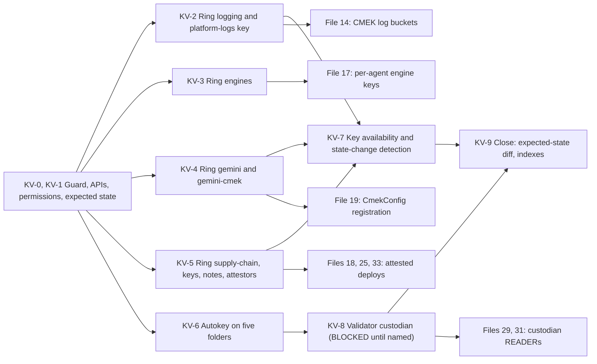

# 11. Keys and the validator custodian

## Status
- Owner: the platform owner
- Last reviewed: 2026-09-17
- Last executed: never
- Stage: review §2 stage 10 (the `KMS_PROJECT` keys, the Binary Authorization attestors in `CICD_PROJECT`) and the Tier W row "validator custodian" (review §3 M8).
- Step prefix: KV. Steps: 37.
- BLOCKED steps: KV-8.1 to KV-8.12 wait on a person (B-13 of the [README](README.md) BLOCKED index: the security reviewer and the validator custodian named in 03); KV-8.7 also waits on the signed E-21 decision; KV-8.9 also waits on code (the committed `grades_eve` schema file). PENDING by design: KV-5.5 (the release account for `promoted-to-prod`), KV-8.10 (row 45, the approval surface's grading identity, file 33) and KV-8.11 (row 46, `mo-metrics@`, file 22).
- Runs under: the dated bootstrap exception of 06 (`BOOTSTRAP_EXCEPTION_EXPIRY`) and the creator's Owner on the five core projects kept from 10 (SD-01). Both are withdrawn at the end of 12. A custodian step run after 12 uses `ENT_PROJECT_REPAIR_CORE` (12), approved by the second human.
- Replaces: nothing executable. The old sets had no key procedure. Wall-E's `SETUP.md` Phase 7 carried only a comment for the validator's read (l.859-860), and no procedure made `VALIDATOR_PROJECT`, `eve_grades` or `grades_eve`.
- Closes: S055 for its validator-custodian half; X-GE-05 for its key half. See "Findings" at the end.

## What this part builds

This file creates every customer-managed key that a later store needs at its creation, because CMEK on a log bucket or an Autokey-protected dataset cannot be added afterwards. It also creates the validator custodian's home, which lets Mo's numbers about Eve come from a source that neither Mo nor Eve can write.

| Resource | Where | Why now |
|---|---|---|
| Ring `logging`, key `platform-logs-europe-west1` (HSM, symmetric) | `KMS_PROJECT`, `europe-west1` | File 14 creates `platform-evidence-logs` and `platform-identity-logs` with it. "Once created, CMEK cannot be removed or modified" on a bucket, only its key changed (Logging CMEK page, read 2026-09-15), the lesson of S080 |
| Ring `engines` (no key) | `KMS_PROJECT`, `europe-west1` | Each module equivalent (17) creates `<agent>-engine-cmek` in it before the engine exists |
| Ring `gemini`, key `gemini-cmek` (HSM, symmetric, manual rotation) | `KMS_PROJECT`, `europe` multi-region | File 19 registers it as the tenant app's `CmekConfig`. Google requires a `europe` multi-region key for an EU app and rotation "Never (Manual rotation)" |
| Ring `supply-chain`, keys `binauthz-vuln-gated` and `binauthz-promoted` (HSM, `EC_SIGN_P256_SHA256`), attestors `vuln-gated` and `promoted-to-prod` with their notes | `CICD_PROJECT`, `europe-west1` | Files 18, 25 and 33 deploy Cloud Run jobs by digest under Binary Authorization; the policy names these attestors |
| Autokey configuration pointing at `KMS_PROJECT` | `fld-platform-core`, `fld-agents-w`, `fld-agents-p`, `fld-controllers`, `fld-improvers` | Autokey covers only resources created after it is configured, and only when their creator requests a key handle |
| Validator custodian `validator-custodian@`, dataset `eve_grades`, custom role `gradesEveWriter` | `VALIDATOR_PROJECT` | Topology rows 21, 29, 45 and 46 need an identity, a dataset and a writer role; M8 |

Eve's keys (`eve-approval`, `eve-evidence`, `eve-evidence-eu`) are not made here. They stay in `EVE_PROJECT`, so that no `KMS_PROJECT` administrator can brick Eve's copy (09 §2.4; file 23; SD-47).

What the design text got wrong or left open, and what this file does instead:

| Design text | Why it fails | Here instead |
|---|---|---|
| 09 §2.4 `gemini-cmek`: "automatic, 90 days set explicitly by the factory" | The Gemini Enterprise CMEK page (updated 2026-09-03) says to set the rotation period to "Never (Manual rotation)" (X-GE-05, part 2) | KV-4.2 creates the key with no rotation period; the key table amendment is a precondition |
| 09 §2.4 `gemini-cmek`: "HSM availability in `europe` … unverified" | Now verified: Cloud KMS locations page (updated 2026-09-03) lists `europe` with Cloud HSM "multi-tenant only" | `--protection-level=hsm` (multi-tenant) in KV-4.2 |
| 09 §2.4: one attestor key "the" Binary Authorization key; the plan's single `KEY_BINAUTHZ` | 09 §1.4-§1.5 and topology §2 name two signing keys and two non-Google attestors (`vuln-gated`, `promoted-to-prod`) | Both are made (KV-5.2 to KV-5.4). `BINAUTHZ_ATTESTOR` and `KEY_BINAUTHZ` name `vuln-gated`; two added variables name `promoted-to-prod` |
| The plan's Autokey scope "W, P and controllers folders" | 09 §2.2 puts every BigQuery dataset and bucket of the platform on Autokey, including `platform_logs` (`LOGGING_PROJECT`), `eve_grades` (`VALIDATOR_PROJECT`) and Mo's datasets. Those sit under `fld-platform-core` and `fld-improvers`, which that list omits | KV-6.3 adds `fld-platform-core` and `fld-improvers`, gated on the signed key table naming the five folders. `fld-agents-r` and `fld-gemini-enterprise` are excluded: R has no `cloudkms` in its allow-list (02 §4.2), and the app uses the explicit `gemini-cmek` |
| Topology row 45: "an insert-only custom role" | BigQuery has no insert-only permission: `bigquery.tables.updateData` also permits DML DELETE and UPDATE (plan §9, BigQuery access-control page, read 2026-09-15; SD-43) | KV-8.4 creates a role without delete, update or IAM permissions. KV-8.12 makes row tampering detectable; the security reviewer signs the limit in KV-8.5 |
| Wall-E SETUP l.859-860: "The validator custodian's identity (decision 37, identity tbd) gets READER" | No identity, no project and no command (S055) | KV-8.2 creates the identity. Its READERs on `walle_audit` and `eve_quality` are re-run points in 31 and 29 |



## Preconditions

- [ ] File 10 is complete: `KMS_PROJECT`, `KMS_PROJECT_NUMBER`, `CICD_PROJECT`, `CICD_PROJECT_NUMBER`, `VALIDATOR_PROJECT`, `VALIDATOR_PROJECT_NUMBER`, `LOGGING_PROJECT` and `SA_CI_BUILD` are set. The creator's Owner is still bound on the five core projects, and its `DEVIATION_REGISTER` line is open.
- [ ] File 09 is complete: `FLD_PLATFORM_CORE`, `FLD_AGENTS_W`, `FLD_AGENTS_P`, `FLD_CONTROLLERS` and `FLD_IMPROVERS` are set (the five Autokey folders of KV-6), and `FLD_AGENTS_R` is set as well — KV-6.3's VERIFY reads it to prove that the folder which must **not** have Autokey has none.
- [ ] File 06: `SA_1_ADMIN` holds the dated organisation exception, and `BOOTSTRAP_EXCEPTION_EXPIRY` is after today.
- [ ] File 05: `GEMINI_PROJECT_NUMBER` is recorded (for KV-4.3).
- [ ] File 03 has merged the **signed key table**: 09 §2.4 with ring names, locations and protection levels. It must carry the amendments this file needs: `gemini-cmek` rotation manual; two attestor keys and their two attestors; the five Autokey folders; and no third-party-connector keys unless a third-party connector is in scope. Its path in `PLATFORM_REPO_REMOTE` goes into the shell as `KEY_TABLE_RECORD` for the sitting. Every ring create is gated on it.
- [ ] File 03 has merged the signed topology names (key-ring and dataset names are permanent).
- [ ] For section 8 only: 03 has named `SECURITY_REVIEWER_EMAIL` and `VALIDATOR_CUSTODIAN_EMAIL` (neither `*tbd*`). E-21 is signed for KV-8.7, and the `grades_eve` schema file is committed for KV-8.9.
- [ ] File 01's helpers `penv_set`, `need` and `exists_or_pending` exist; `DEVIATION_REGISTER`, `EVIDENCE_REGISTER`, `BUILD_LOG_DIR`, `PLATFORM_REPO_DIR` and `EVIDENCE_INTERIM_LOCATION` are set.
- [ ] The shell uses file 01's gcloud configuration with no default project, signed in as `sa-1-admin@`; `jq` and `python3` are installed. Section 6 is run under **bash**, not zsh: its loops depend on word splitting (KV-6.2).
- [ ] `BUILD_LOG_DIR/records/` exists (KV-0.1 creates it). KV-1.2, KV-4.4, KV-5.3 and KV-5.5 write records there that later steps and rollbacks read back.

## People

| Role | Does | Present at |
|---|---|---|
| Platform owner (as `sa-1-admin@`) | Performs sections 1 to 7 and 9; performs section 8 once the custodian part is unblocked | every step |
| Second human | Reviews the key-state detection pull request (KV-7.1). Approves the `ENT_PROJECT_REPAIR_CORE` grant if section 8 runs after 12. Not a witness for key creation | KV-7.1; section 8 after 12 |
| Security reviewer | Takes ownership of `VALIDATOR_PROJECT` (KV-8.1), signs the SD-43 accepted limit for `grades_eve` (KV-8.5), reviews KV-8.12 | KV-8.1, KV-8.5, KV-8.12 |
| Validator custodian (human owner of `validator-custodian@`) | Confirms the identity and its grants, and holds the custodian's resources from here on | KV-8.1, KV-8.3, KV-8.8 |

Separation checked in KV-8.1: the security reviewer is not the Wall-E owner; the validator custodian is not the Mo owner (README §6 roles table; 11-tisax §7.1). The platform owner is the Mo owner until 03 names another, so he cannot be the custodian while he is.

Checkpoint lines follow README §4: `START` when a step begins and `DONE` when its VERIFY passes, each with operator, witness and evidence path. For an **IRREVERSIBLE** step that has `START` and no `DONE`, never re-run it: read the resource's state first (README §4, resume rule 3).

## 0. The sitting

### KV-0.1 Guard the shell and the exception

- **WHO:** Platform owner.
- **WHERE:** Shell, `~/.platform-env` sourced.
- **ACTION:**

```bash
source ~/.platform-env
need KMS_PROJECT KMS_PROJECT_NUMBER CICD_PROJECT CICD_PROJECT_NUMBER VALIDATOR_PROJECT VALIDATOR_PROJECT_NUMBER LOGGING_PROJECT REGION BQ_LOCATION BOOTSTRAP_EXCEPTION_EXPIRY SA_1_ADMIN PLATFORM_REPO_DIR BUILD_LOG_DIR DEVIATION_REGISTER EVIDENCE_REGISTER
need FLD_PLATFORM_CORE FLD_AGENTS_W FLD_AGENTS_P FLD_CONTROLLERS FLD_IMPROVERS FLD_AGENTS_R
mkdir -p "$BUILD_LOG_DIR/records"
test -z "$(gcloud config get project 2>/dev/null)" || { echo "a default project is set: stop"; false; }
test "$(gcloud config get account 2>/dev/null)" = "$SA_1_ADMIN" || { echo "not signed in as SA_1_ADMIN: stop"; false; }
test "$(date -u +%F)" \< "$BOOTSTRAP_EXCEPTION_EXPIRY" || { echo "bootstrap exception expired: stop, re-sign SD-01 in 03"; false; }
KEY_TABLE_RECORD="<path of the signed key table in the platform repository, from 03>"
git -C "$PLATFORM_REPO_DIR" fetch origin
git -C "$PLATFORM_REPO_DIR" cat-file -e "origin/main:${KEY_TABLE_RECORD}" && echo "key table merged"
```

- **VERIFY:** Every test passes and `key table merged` is printed. `REGION` is `europe-west1` and `BQ_LOCATION` is `EU` (plan §5). If any line fails, stop the sitting; nothing has been changed.
- **ROLLBACK:** Nothing changed.
- **EVIDENCE:** The checkpoint line with the key-table commit id (`git -C "$PLATFORM_REPO_DIR" log -1 --format=%H origin/main -- "$KEY_TABLE_RECORD"`). TISAX 5.2.1 (change management: the signed input).

## 1. Readiness in the three projects

### KV-1.1 Confirm the APIs this file uses are enabled

- **WHO:** Platform owner.
- **WHERE:** Shell, `~/.platform-env` sourced.
- **ACTION:**

```bash
gcloud services list --enabled --project="$KMS_PROJECT" --format="value(config.name)" | sort
gcloud services list --enabled --project="$CICD_PROJECT" --format="value(config.name)" | sort
gcloud services list --enabled --project="$VALIDATOR_PROJECT" --format="value(config.name)" | sort
```

- **VERIFY:** `KMS_PROJECT` shows `cloudkms.googleapis.com`. `CICD_PROJECT` shows `cloudkms.googleapis.com`, `binaryauthorization.googleapis.com` and `containeranalysis.googleapis.com`. `VALIDATOR_PROJECT` shows `bigquery.googleapis.com` and `iam.googleapis.com`. All are in the core allow-list of 02 §4.2, and Autokey needs the Cloud KMS API on the key project ("Enable the Cloud KMS API on your key project", Autokey enable page, updated 2026-09-01). If one is missing, file 10 left a gap: enable it with `gcloud services enable <api> --project=<project>`, and add a line to 10's `DEVIATION_REGISTER` entry so that 17's zero-diff checker expects it. `KMS_PROJECT` must show no API outside `cloudkms` and the defaults 10 recorded, because it holds keys and nothing else (P118).
- **ROLLBACK:** `gcloud services disable <api> --project=<project>` for an API enabled here, only before any resource uses it.
- **EVIDENCE:** The three lists as `<date>-KV-1.1-apis-v1` in the build log. TISAX 1.3.1. EU AI Act E-05.

### KV-1.2 Prove the permissions before the first create

- **WHO:** Platform owner.
- **WHERE:** Shell.
- **ACTION:** **Gate: KV-1.1 must be DONE.** A permission this probe asks for is reported absent when the service API is not enabled on the project, so an unenabled API reads exactly like a missing role. Re-assert the three API facts before probing, and stop if one fails. The endpoint is the Resource Manager **v3** `projects.testIamPermissions` (`POST https://cloudresourcemanager.googleapis.com/v3/{resource=projects/*}:testIamPermissions`, v3 reference, read 2026-09-15), the same version 12 PA-0.2 uses.

```bash
gcloud services list --enabled --project="$KMS_PROJECT" --format="value(config.name)" | grep -qx cloudkms.googleapis.com || { echo "cloudkms not enabled on KMS_PROJECT: stop, close KV-1.1 first"; false; }
gcloud services list --enabled --project="$CICD_PROJECT" --format="value(config.name)" | grep -qx cloudkms.googleapis.com || { echo "cloudkms not enabled on CICD_PROJECT: stop, close KV-1.1 first"; false; }
gcloud services list --enabled --project="$VALIDATOR_PROJECT" --format="value(config.name)" | grep -qx bigquery.googleapis.com || { echo "bigquery not enabled on VALIDATOR_PROJECT: stop, close KV-1.1 first"; false; }
TOKEN_HDR="Authorization: Bearer $(gcloud auth print-access-token)"
curl -sS -X POST -H "$TOKEN_HDR" -H "Content-Type: application/json" -H "x-goog-user-project: ${KMS_PROJECT}" -d '{"permissions":["cloudkms.keyRings.create","cloudkms.cryptoKeys.create","cloudkms.cryptoKeys.setIamPolicy","resourcemanager.projects.setIamPolicy"]}' "https://cloudresourcemanager.googleapis.com/v3/projects/${KMS_PROJECT}:testIamPermissions" | tee "$BUILD_LOG_DIR/records/$(date -u +%F)-KV-1.2-kms-permissions-v1.json"
curl -sS -X POST -H "$TOKEN_HDR" -H "Content-Type: application/json" -H "x-goog-user-project: ${CICD_PROJECT}" -d '{"permissions":["cloudkms.keyRings.create","cloudkms.cryptoKeys.create","binaryauthorization.attestors.create","containeranalysis.notes.create","containeranalysis.notes.setIamPolicy"]}' "https://cloudresourcemanager.googleapis.com/v3/projects/${CICD_PROJECT}:testIamPermissions" | tee "$BUILD_LOG_DIR/records/$(date -u +%F)-KV-1.2-cicd-permissions-v1.json"
curl -sS -X POST -H "$TOKEN_HDR" -H "Content-Type: application/json" -H "x-goog-user-project: ${VALIDATOR_PROJECT}" -d '{"permissions":["iam.serviceAccounts.create","iam.roles.create","bigquery.datasets.create","cloudkms.keyHandles.create"]}' "https://cloudresourcemanager.googleapis.com/v3/projects/${VALIDATOR_PROJECT}:testIamPermissions" | tee "$BUILD_LOG_DIR/records/$(date -u +%F)-KV-1.2-validator-permissions-v1.json"
unset TOKEN_HDR
```

- **VERIFY:** Each response echoes every permission requested. When a permission is **absent**, test the causes in this order, and never conclude "missing role" before the first two are excluded:
  1. **The service API is not enabled on that project.** `cloudkms.keyHandles.create` and `cloudkms.keyRings.create` come back absent whenever `cloudkms.googleapis.com` is off; `cloudkms` is on `KMS_PROJECT`'s list (10 §1 row 4) but **not** on `CICD_PROJECT`'s row 1 or `VALIDATOR_PROJECT`'s row 5, so both are likely to be off on a first run. Enable the missing API as KV-1.1's VERIFY instructs, add the line to 10's `DEVIATION_REGISTER` entry, and re-run this step.
  2. **The propagation delay** of a binding made minutes earlier: wait and re-run once.
  3. **A missing role.** Only then: if `cloudkms.keyHandles.create` is still missing on `VALIDATOR_PROJECT`, KV-8.6 adds a time-bound `roles/cloudkms.autokeyUser` binding there, using the same pattern as KV-6.2.

  Folder permissions for Autokey are checked in KV-6.2, since the exception does not carry them. The token only travels in a header and is never printed; only permission names are saved.
- **ROLLBACK:** Nothing changed (an API enabled under cause 1 is rolled back with KV-1.1's ROLLBACK).
- **EVIDENCE:** The three saved responses `<date>-KV-1.2-{kms,cicd,validator}-permissions-v1.json` under `BUILD_LOG_DIR/records/`. TISAX 4.2.1.

### KV-1.3 Commit the expected state and open the deviation entry

- **WHO:** Platform owner; the second human reviews the pull request (CODEOWNERS of 03).
- **WHERE:** Shell, in `PLATFORM_REPO_DIR`.
- **ACTION:** Write `bootstrap/expected/11-keys.yaml` with the rows of this file's "What this part builds" table. For each row give the resource name, location, protection level, purpose, algorithm, rotation, labels and IAM members. Commit it on a branch, then open the pull request.

```bash
git -C "$PLATFORM_REPO_DIR" switch -c bootstrap/11-keys
git -C "$PLATFORM_REPO_DIR" add bootstrap/expected/11-keys.yaml
git -C "$PLATFORM_REPO_DIR" commit -m "11: expected state of the core keys, attestors, Autokey and validator custodian"
git -C "$PLATFORM_REPO_DIR" push -u origin bootstrap/11-keys
printf '%s | 11 platform-core and tenant-app key rows by hand | inputs %s | approver second human | superseded by terraform import and an empty plan (SD-01)\n' "$(date -u +%FT%TZ)" "$KEY_TABLE_RECORD" >> "$DEVIATION_REGISTER"
```

- **VERIFY:** The pull request is merged with the second human's approval. `DEVIATION_REGISTER` gains one line naming file 11. Section 9 diffs live state against this file.
- **ROLLBACK:** Revert the commit before any create; remove the register line with a build-log note.
- **EVIDENCE:** Merge commit id; `DEVIATION_REGISTER` line. TISAX 5.2.1. EU AI Act E-05.

## 2. The logging key

### KV-2.1 Create the key ring `logging` in `europe-west1`

- **WHO:** Platform owner.
- **WHERE:** Shell.
- **ACTION:**

```bash
gcloud kms keyrings create logging --location=europe-west1 --project="$KMS_PROJECT"
penv_set KR_LOGGING "projects/${KMS_PROJECT}/locations/europe-west1/keyRings/logging"
```

  `penv_set` follows the create in the ACTION, not the VERIFY, so that a sitting cut between the two does not resume with the ring made and the variable unset (README §4, resume rule 3, forbids re-running the create). `penv_set` refuses a different value, so a repeated ACTION is safe.

- **VERIFY:**

```bash
gcloud kms keyrings describe logging --location=europe-west1 --project="$KMS_PROJECT" --format="value(name)"
```

  The printed name equals `KR_LOGGING`. The VERIFY is read-only.
- **ROLLBACK:** **IRREVERSIBLE.** "Key rings can't be deleted" and "Key rings and the resources that they contain can't be moved to a different location after they are created" (Cloud KMS resource hierarchy and key-ring pages, updated 2026-09-01 and 2026-09-03). Before running, confirm that the ring name `logging`, its location `europe-west1` and its project `KMS_PROJECT` match the signed key table row (gate: `KEY_TABLE_RECORD`, KV-0.1). A wrong ring is left empty and recorded as retired in the key table.
- **EVIDENCE:** The describe output as `<date>-KV-2.1-kr-logging-v1`. TISAX 5.1.1. EU AI Act E-05, E-06 (the Art. 12 log's store key).

### KV-2.2 Create the HSM key `platform-logs-europe-west1`

- **WHO:** Platform owner.
- **WHERE:** Shell.
- **ACTION:** The 90-day rotation is 09 §2.4's value (`Assumption:` the crypto standard, *tbd*).

```bash
NEXT_ROT="$(python3 -c 'import datetime as d;print((d.datetime.now(d.timezone.utc)+d.timedelta(days=90)).strftime("%Y-%m-%dT%H:%M:%SZ"))')"
gcloud kms keys create platform-logs-europe-west1 --keyring=logging --location=europe-west1 --purpose=encryption --default-algorithm=google-symmetric-encryption --protection-level=hsm --rotation-period=90d --next-rotation-time="$NEXT_ROT" --destroy-scheduled-duration=30d --labels=class=c,owner-role=platform-owner,store=platform-logs --project="$KMS_PROJECT"
penv_set KEY_PLATFORM_LOGS "${KR_LOGGING}/cryptoKeys/platform-logs-europe-west1"
```

- **VERIFY:**

```bash
gcloud kms keys describe platform-logs-europe-west1 --keyring=logging --location=europe-west1 --project="$KMS_PROJECT" --format="yaml(name,purpose,versionTemplate,rotationPeriod,nextRotationTime,destroyScheduledDuration,primary.state,labels)"
```

  Expected: `purpose: ENCRYPT_DECRYPT`, `versionTemplate.protectionLevel: HSM`, `algorithm: GOOGLE_SYMMETRIC_ENCRYPTION`, `rotationPeriod: 7776000s`, `destroyScheduledDuration: 2592000s`, `primary.state: ENABLED`.
- **ROLLBACK:** **IRREVERSIBLE as a name:** "names of deleted keys can't be reused" (resource hierarchy page), and a key can be deleted only after its versions are destroyed. Confirm the name, ring and location against the signed key table first. A mis-configured key is fixed in place where possible (`gcloud kms keys update` for rotation or labels). Otherwise its version is disabled and scheduled for destruction, and a new name is signed into the key table before file 14 runs.
- **EVIDENCE:** Describe output as `<date>-KV-2.2-key-platform-logs-v1`. TISAX 5.1.1. EU AI Act E-06.

### KV-2.3 Grant the logging service account of `LOGGING_PROJECT` on the key

- **WHO:** Platform owner.
- **WHERE:** Shell.
- **ACTION:** Google names this account from the bucket project's Logging settings: "gcloud logging settings describe --project=BUCKET_PROJECT_ID", field `kmsServiceAccountId` (Logging CMEK page, updated 2026-09-09).

```bash
need LOGGING_PROJECT KEY_PLATFORM_LOGS
LOG_KMS_SA="$(gcloud logging settings describe --project="$LOGGING_PROJECT" --format='value(kmsServiceAccountId)')"
printf '%s\n' "$LOG_KMS_SA"
gcloud kms keys add-iam-policy-binding platform-logs-europe-west1 --keyring=logging --location=europe-west1 --member="serviceAccount:${LOG_KMS_SA}" --role=roles/cloudkms.cryptoKeyEncrypterDecrypter --project="$KMS_PROJECT"
```

- **VERIFY:** `LOG_KMS_SA` ends in `@gcp-sa-logging.iam.gserviceaccount.com`. Then:

```bash
gcloud kms keys get-iam-policy platform-logs-europe-west1 --keyring=logging --location=europe-west1 --project="$KMS_PROJECT" --format=json | jq -c '.bindings'
```

  Exactly one binding appears: `roles/cloudkms.cryptoKeyEncrypterDecrypter` with that one member, which makes it the sole Encrypter/Decrypter as 09 §2.4 requires. The bucket's location must match the key's region; file 14 creates both buckets in `europe-west1`.
- **ROLLBACK:** `gcloud kms keys remove-iam-policy-binding platform-logs-europe-west1 --keyring=logging --location=europe-west1 --member="serviceAccount:${LOG_KMS_SA}" --role=roles/cloudkms.cryptoKeyEncrypterDecrypter --project="$KMS_PROJECT"`, and only before file 14 creates a bucket on the key. After that, removing the grant makes the evidence unreadable at once (§7).
- **EVIDENCE:** The policy JSON as `<date>-KV-2.3-key-platform-logs-iam-v1`. TISAX 5.1.1, 4.2.1. EU AI Act E-06.

## 3. The engines ring

### KV-3.1 Create the key ring `engines` in `europe-west1`

- **WHO:** Platform owner.
- **WHERE:** Shell.
- **ACTION:**

```bash
gcloud kms keyrings create engines --location=europe-west1 --project="$KMS_PROJECT"
penv_set KR_ENGINES "projects/${KMS_PROJECT}/locations/europe-west1/keyRings/engines"
```

- **VERIFY:**

```bash
gcloud kms keyrings describe engines --location=europe-west1 --project="$KMS_PROJECT" --format="value(name)"
gcloud kms keys list --keyring=engines --location=europe-west1 --project="$KMS_PROJECT" --format="value(name)"
```

  The ring exists and holds no key. Each `<agent>-engine-cmek` (single-region, HSM, rotation 90 days, the agent project's Agent Runtime service agent as sole Encrypter/Decrypter) is created by the module equivalent in 17 before its engine. Agent Runtime is not on Autokey's list (09 §2.2).
- **ROLLBACK:** **IRREVERSIBLE** (a ring cannot be deleted). Gate: the signed key table row `engines`, checked in KV-0.1.
- **EVIDENCE:** Output as `<date>-KV-3.1-kr-engines-v1`. TISAX 5.1.1. EU AI Act E-05.

## 4. The Gemini Enterprise key

This section makes the key only. Registering it as the app's `CmekConfig` is a separate decided step in 19, by `ge-admins@` through `ent-ge-admin`. `discoveryengine.cmekConfigs.update` sits in `discoveryengine.agentspaceAdmin`, not in `discoveryengine.editor` (X-GE-05, part 5). What the key will protect, as the verdicts of X-GE-05 corrected it: data stores and apps created after registration, and end-user data (personalisation, UI preferences, connector credentials), which "always follows the current default CmekConfig". The imported app's chat sessions stay under Google-managed encryption.

### KV-4.1 Create the key ring `gemini` in the `europe` multi-region

- **WHO:** Platform owner.
- **WHERE:** Shell.
- **ACTION:**

```bash
gcloud kms keyrings create gemini --location=europe --project="$KMS_PROJECT"
penv_set KR_GEMINI "projects/${KMS_PROJECT}/locations/europe/keyRings/gemini"
```

- **VERIFY:**

```bash
gcloud kms keyrings describe gemini --location=europe --project="$KMS_PROJECT" --format="value(name)"
```

  The printed name equals `KR_GEMINI`.

- **ROLLBACK:** **IRREVERSIBLE.** Confirm first that `GE_LOCATION` is `eu` (file 05 recorded `GEMINI_APP_LOCATION`). For an EU app Google requires "a multi-region symmetric Cloud KMS key" with location `europe` (Gemini Enterprise CMEK page, updated 2026-09-03). Gate: the signed key table row `gemini` (KV-0.1). Handoff to file 13: the value group `in:eu-locations` lists `EU`, `eu`, `eur3`, `eur4`, `eur8` and `europe-west` but not `europe` (resource-locations page, updated 2026-09-09). A `gcp.resourceLocations` policy built only from that group would refuse later KMS resources in `europe`: Eve's `eve-eu` ring (23) and Autokey keys for EU datasets.
- **EVIDENCE:** Output as `<date>-KV-4.1-kr-gemini-v1`. TISAX 5.1.1, 7.1 (residency). EU AI Act E-05.

### KV-4.2 Create the HSM key `gemini-cmek`, manual rotation

- **WHO:** Platform owner.
- **WHERE:** Shell.
- **ACTION:** The command passes no `--rotation-period` and no `--next-rotation-time`. Google says to set the rotation period to "Never (Manual rotation)" (Gemini Enterprise CMEK page, updated 2026-09-03).

```bash
gcloud kms keys create gemini-cmek --keyring=gemini --location=europe --purpose=encryption --default-algorithm=google-symmetric-encryption --protection-level=hsm --destroy-scheduled-duration=30d --labels=class=c,owner-role=platform-owner,registrar-role=ge-admin,store=gemini-enterprise --project="$KMS_PROJECT"
penv_set KEY_GEMINI_CMEK "${KR_GEMINI}/cryptoKeys/gemini-cmek"
```

- **VERIFY:**

```bash
gcloud kms keys describe gemini-cmek --keyring=gemini --location=europe --project="$KMS_PROJECT" --format=json | jq '{purpose, protection: .versionTemplate.protectionLevel, algorithm: .versionTemplate.algorithm, rotationPeriod, nextRotationTime, state: .primary.state}'
```

  Expected: `ENCRYPT_DECRYPT`, `HSM`, `GOOGLE_SYMMETRIC_ENCRYPTION`, `rotationPeriod: null`, `nextRotationTime: null`, `ENABLED`.
- **ROLLBACK:** **IRREVERSIBLE as a name.** Gate: the key table amendment "gemini-cmek rotation manual" is merged (precondition). Until file 19 registers the key, a mistake is corrected by disabling this version and signing a new name into the key table. After registration there is no safe rollback: "Data that is stored under the previous key isn't migrated and becomes inaccessible" (X-GE-05 verdict).
- **EVIDENCE:** Describe output as `<date>-KV-4.2-key-gemini-cmek-v1`. TISAX 5.1.1. EU AI Act E-05.

### KV-4.3 Grant the two Gemini Enterprise service agents on the key

- **WHO:** Platform owner.
- **WHERE:** Shell.
- **ACTION:** Both agents need `roles/cloudkms.cryptoKeyEncrypterDecrypter` on the key. Without the Cloud Storage agent's grant, "data import for CMEK-protected apps and data connectors will fail". The email forms come from the IAM service agents page (updated 2026-09-14). The grant is made on the key in `KMS_PROJECT` only, and nothing is changed in the live app's project. If an agent does not exist, the binding is refused: record PENDING, and file 19 creates it under `ent-ge-admin`. A Cloud Storage agent comes from `gcloud storage service-agent --project="$GEMINI_PROJECT"`, which "creates one" if absent (gcloud reference, updated 2026-05-27).

```bash
need GEMINI_PROJECT GEMINI_PROJECT_NUMBER KEY_GEMINI_CMEK
GE_DE_SA="service-${GEMINI_PROJECT_NUMBER}@gcp-sa-discoveryengine.iam.gserviceaccount.com"
GE_GCS_SA="service-${GEMINI_PROJECT_NUMBER}@gs-project-accounts.iam.gserviceaccount.com"
gcloud kms keys add-iam-policy-binding gemini-cmek --keyring=gemini --location=europe --member="serviceAccount:${GE_DE_SA}" --role=roles/cloudkms.cryptoKeyEncrypterDecrypter --project="$KMS_PROJECT" || echo "PENDING 11/KV-4.3 ${GE_DE_SA}" | tee -a "$BUILD_LOG_DIR/pending.log"
gcloud kms keys add-iam-policy-binding gemini-cmek --keyring=gemini --location=europe --member="serviceAccount:${GE_GCS_SA}" --role=roles/cloudkms.cryptoKeyEncrypterDecrypter --project="$KMS_PROJECT" || echo "PENDING 11/KV-4.3 ${GE_GCS_SA}" | tee -a "$BUILD_LOG_DIR/pending.log"
```

- **VERIFY:**

```bash
gcloud kms keys get-iam-policy gemini-cmek --keyring=gemini --location=europe --project="$KMS_PROJECT" --format=json | jq -c '.bindings'
```

  The output is one binding holding exactly the two members above, or one member plus a PENDING line that is copied to the README re-run index against file 19. No other member, and no `roles/cloudkms.admin` on the key. The three single-region keys for third-party connectors (`europe-west1`, `europe-west4`, `europe-north1`) are **not** created: 03 §12 limits the allow-list to first-party sources. A third-party connector needs a key table amendment and three new rings first.
- **ROLLBACK:** `gcloud kms keys remove-iam-policy-binding gemini-cmek --keyring=gemini --location=europe --member="serviceAccount:<agent>" --role=roles/cloudkms.cryptoKeyEncrypterDecrypter --project="$KMS_PROJECT"`, and only before 19 registers the key. Afterwards a revoked grant stops serving "within 15 minutes" (§7).
- **EVIDENCE:** Policy JSON as `<date>-KV-4.3-key-gemini-iam-v1`. TISAX 5.1.1, 4.2.1. EU AI Act E-05.

### KV-4.4 Check the HSM quota headroom for `europe`

- **WHO:** Platform owner.
- **WHERE:** **Console** (the primary path), signed in as `sa-1-admin@` in the clean browser profile, with `KMS_PROJECT` selected in the project picker: **IAM & Admin > Quotas & System Limits**, filter **Service** = `Cloud Key Management Service (KMS) API`, then **Metric** = `HSM symmetric cryptographic requests`. The per-API page **APIs & Services > Enabled APIs & services > Cloud Key Management Service (KMS) API > Quotas & System Limits** shows the same rows.
- **ACTION:** For HSM keys, Google requires at least "1,000 QPM of headroom" for encrypt and decrypt, and turns the `CmekConfig` down after 12 hours of "persistent out-of-quota issues". The quota `cloudkms.googleapis.com/hsm_symmetric_requests` is "HSM symmetric cryptographic requests per region", charged to the hosting project, default "500 QPS" (Cloud KMS quotas page, updated 2026-09-03). It is therefore shared by every HSM key in `KMS_PROJECT` in that location, Autokey keys included.

  In the console, read the row whose **Dimension** is `region: europe` (or, if no per-location row is shown, the unqualified default row) and record three values by hand: the **limit**, the **current usage** and the dimension the row carries. **Take a screenshot of that filtered page**; it is the named evidence of this step, because no command path is available without adding an API (below).

  The screenshot is saved as `<date>-KV-4.4-hsm-quota-v1.png` under `EVIDENCE_INTERIM_LOCATION`, and the three values are transcribed into `$BUILD_LOG_DIR/records/$(date -u +%F)-KV-4.4-hsm-quota-v1.txt` with the page URL and the read time.

  **Why not gcloud.** `gcloud quotas info list --service=cloudkms.googleapis.com --project=<p>` is served by the Cloud Quotas API (`cloudquotas.googleapis.com`), which must be enabled on the project used for quota. That API is **not** enabled on `KMS_PROJECT` (10 §1 row 4 enables `cloudkms` and `logging` only), is **not** on 02 §4.2's core allow-list, and P118 forbids adding an API to `KMS_PROJECT` that is not a key API. So the command cannot be run against `KMS_PROJECT` as its own quota project, and this step does not attempt it.

  **Optional shell path, only under a recorded deviation.** If a machine-readable record is wanted, the quota project may be `CICD_PROJECT` while the target stays `KMS_PROJECT`. It requires enabling `cloudquotas.googleapis.com` on `CICD_PROJECT` — which is not on 02 §4.2's core allow-list either — so it is taken only with a `DEVIATION_REGISTER` line handed to 13 for the allow-list pull request, exactly as 10 does for `observability.googleapis.com`:

```bash
gcloud services enable cloudquotas.googleapis.com --project="$CICD_PROJECT"
printf '%s | 11/KV-4.4 cloudquotas.googleapis.com enabled on CICD_PROJECT as the quota project for a KMS_PROJECT quota read | not on 02 section 4.2 core allow-list | approver second human | handed to 13 for the allow-list pull request\n' "$(date -u +%FT%TZ)" >> "$DEVIATION_REGISTER"
gcloud quotas info list --service=cloudkms.googleapis.com --project="$KMS_PROJECT" --billing-project="$CICD_PROJECT" --format=json | jq '.[] | select(.metric=="cloudkms.googleapis.com/hsm_symmetric_requests") | {quotaId, metric, dimensionsInfos}' | tee "$BUILD_LOG_DIR/records/$(date -u +%F)-KV-4.4-hsm-quota-v1.json"
```

- **VERIFY:** The recorded `europe` limit (or the default, if no location-specific row exists) is written down with its usage, and the screenshot is filed. Headroom is the limit minus current usage, which is zero today because no key is yet in use. The value must leave at least 1,000 QPM of headroom for file 19. Add the re-check to file 19 (before `CmekConfig` registration) and to file 42 (quarterly): peak usage from Cloud Monitoring must stay at least 1,000 QPM below the limit. `Assumption:` on the optional path, the `dimensionsInfos` field lists the per-location value, as the Cloud Quotas `QuotaInfo` reference describes; the console page is authoritative if it does not.
- **ROLLBACK:** Nothing changed on the console path. On the optional path, `gcloud services disable cloudquotas.googleapis.com --project="$CICD_PROJECT"` after the read, and close the `DEVIATION_REGISTER` line — do this in the same sitting unless 13 has already accepted the API.
- **EVIDENCE:** The screenshot `<date>-KV-4.4-hsm-quota-v1.png` (`EVIDENCE_INTERIM_LOCATION`) and the transcribed values `<date>-KV-4.4-hsm-quota-v1.txt` (`BUILD_LOG_DIR/records/`); on the optional path also the JSON of the same name; a `DRILL_CALENDAR` line for the quarterly re-check. TISAX 5.2.8 (continuity). Closes X-GE-05's quota half.

## 5. Binary Authorization in `CICD_PROJECT`

The design has three attestors in `CICD_PROJECT`. `built-by-cloud-build` is created by Cloud Build itself on the first build that produces images (09 §1.2), so it is not made here. `vuln-gated` is signed by the pipeline's scan step with `binauthz-vuln-gated`, and `promoted-to-prod` by the release account with `binauthz-promoted` (09 §1.4, §2.4; topology §2 row CI/CD). Cloud KMS does "not support automatic rotation of asymmetric keys"; rotation is annual and manual (09 §2.5, class B).

### KV-5.1 Create the key ring `supply-chain` in `europe-west1`

- **WHO:** Platform owner.
- **WHERE:** Shell.
- **ACTION:**

```bash
gcloud kms keyrings create supply-chain --location=europe-west1 --project="$CICD_PROJECT"
penv_set KR_SUPPLY_CHAIN "projects/${CICD_PROJECT}/locations/europe-west1/keyRings/supply-chain"
```

- **VERIFY:** `gcloud kms keyrings describe supply-chain --location=europe-west1 --project="$CICD_PROJECT" --format="value(name)"` prints the ring name, and it equals `$KR_SUPPLY_CHAIN`. The variable is recorded as KV-2.1, KV-3.1 and KV-4.1 record their rings; a proof-of-value build sets the same value first, so `penv_set` prints it unchanged.
- **ROLLBACK:** **IRREVERSIBLE.** Gate: the signed key table rows for class B (`CICD_PROJECT`, ring `supply-chain`, `europe-west1`), checked in KV-0.1.
- **EVIDENCE:** Output as `<date>-KV-5.1-kr-supply-chain-v1`. TISAX 5.1.1, 5.3.1. EU AI Act E-05.

### KV-5.2 Create the two attestor signing keys

- **WHO:** Platform owner.
- **WHERE:** Shell.
- **ACTION:**

```bash
gcloud kms keys create binauthz-vuln-gated --keyring=supply-chain --location=europe-west1 --purpose=asymmetric-signing --default-algorithm=ec-sign-p256-sha256 --protection-level=hsm --destroy-scheduled-duration=30d --labels=class=b,owner-role=platform-owner,attestor=vuln-gated --project="$CICD_PROJECT"
gcloud kms keys create binauthz-promoted --keyring=supply-chain --location=europe-west1 --purpose=asymmetric-signing --default-algorithm=ec-sign-p256-sha256 --protection-level=hsm --destroy-scheduled-duration=30d --labels=class=b,owner-role=platform-owner,attestor=promoted-to-prod --project="$CICD_PROJECT"
penv_set KEY_BINAUTHZ "projects/${CICD_PROJECT}/locations/europe-west1/keyRings/supply-chain/cryptoKeys/binauthz-vuln-gated/cryptoKeyVersions/1"
penv_set KEY_BINAUTHZ_PROMOTED "projects/${CICD_PROJECT}/locations/europe-west1/keyRings/supply-chain/cryptoKeys/binauthz-promoted/cryptoKeyVersions/1"
```

  As in KV-2.1, the two `penv_set` calls sit in the ACTION so that a cut sitting never resumes with the keys made and the variables unset.

- **VERIFY:**

```bash
for K in binauthz-vuln-gated binauthz-promoted; do gcloud kms keys versions list --key="$K" --keyring=supply-chain --location=europe-west1 --project="$CICD_PROJECT" --format="value(name,state,protectionLevel,algorithm)"; done
```

  Each key shows one version, `.../cryptoKeyVersions/1 ENABLED HSM EC_SIGN_P256_SHA256`. `KEY_BINAUTHZ_PROMOTED` and `BINAUTHZ_ATTESTOR_PROMOTED` (KV-5.4) are two variables this file adds to plan §5, because the design has two attestor keys. The README variables list takes both.
- **ROLLBACK:** **IRREVERSIBLE as names.** Gate: the key table rows. A wrong key is disabled (`gcloud kms keys versions disable 1 --key=<key> --keyring=supply-chain --location=europe-west1 --project="$CICD_PROJECT"`) before any attestor trusts it.
- **EVIDENCE:** Output as `<date>-KV-5.2-attestor-keys-v1`. TISAX 5.1.1. EU AI Act E-05.

### KV-5.3 Create the two Artifact Analysis notes and let the attestor project's agent read them

- **WHO:** Platform owner.
- **WHERE:** Shell.
- **ACTION:** The request forms below follow Google's "Create attestors with the gcloud CLI" page (updated 2026-09-03), which writes both request bodies to files on disk (`/tmp/note_payload.json`, `/tmp/iam_request.json`) and sends them with `--data-binary @<file>`. Here the files go to `BUILD_LOG_DIR/records/` instead of `mktemp`, and the read-back policy is saved beside them: a note IAM policy holds no secret, and **KV-5.5's ROLLBACK needs the `vuln-gated-note` policy as it stood after this step**. Nothing is deleted at the end of the loop.

  The Binary Authorization service agent is `service-${CICD_PROJECT_NUMBER}@gcp-sa-binaryauthorization.iam.gserviceaccount.com`. `Assumption:` the agent exists once the API is enabled (KV-1.1). If `setIamPolicy` refuses the member, run `gcloud beta services identity create --service=binaryauthorization.googleapis.com --project="$CICD_PROJECT"` and retry.

```bash
need CICD_PROJECT CICD_PROJECT_NUMBER BUILD_LOG_DIR
BA_SA="service-${CICD_PROJECT_NUMBER}@gcp-sa-binaryauthorization.iam.gserviceaccount.com"
D="$(date -u +%F)"; R="$BUILD_LOG_DIR/records"
for N in vuln-gated promoted-to-prod; do
  jq -n --arg name "projects/${CICD_PROJECT}/notes/${N}-note" --arg d "${N} attestation authority (09 section 1.4)" '{name:$name, attestation:{hint:{human_readable_name:$d}}}' > "$R/${D}-KV-5.3-${N}-note-body-v1.json"
  jq -n --arg res "projects/${CICD_PROJECT}/notes/${N}-note" --arg m "serviceAccount:${BA_SA}" '{resource:$res, policy:{bindings:[{role:"roles/containeranalysis.notes.occurrences.viewer", members:[$m]}]}}' > "$R/${D}-KV-5.3-${N}-note-setiam-body-v1.json"
  curl -sS -X POST -H "Content-Type: application/json" -H "Authorization: Bearer $(gcloud auth print-access-token)" -H "x-goog-user-project: ${CICD_PROJECT}" --data-binary @"$R/${D}-KV-5.3-${N}-note-body-v1.json" "https://containeranalysis.googleapis.com/v1/projects/${CICD_PROJECT}/notes/?noteId=${N}-note"
  curl -sS -X POST -H "Content-Type: application/json" -H "Authorization: Bearer $(gcloud auth print-access-token)" -H "x-goog-user-project: ${CICD_PROJECT}" --data-binary @"$R/${D}-KV-5.3-${N}-note-setiam-body-v1.json" "https://containeranalysis.googleapis.com/v1/projects/${CICD_PROJECT}/notes/${N}-note:setIamPolicy"
  curl -sS -X POST -H "Authorization: Bearer $(gcloud auth print-access-token)" -H "x-goog-user-project: ${CICD_PROJECT}" "https://containeranalysis.googleapis.com/v1/projects/${CICD_PROJECT}/notes/${N}-note:getIamPolicy" > "$R/${D}-KV-5.3-${N}-note-policy-v1.json"
done
```

- **VERIFY:**

```bash
for N in vuln-gated promoted-to-prod; do jq -c '.bindings' "$BUILD_LOG_DIR/records/$(date -u +%F)-KV-5.3-${N}-note-policy-v1.json"; done
test -s "$BUILD_LOG_DIR/records/$(date -u +%F)-KV-5.3-vuln-gated-note-policy-v1.json" || { echo "KV-5.5 has no policy to roll back to: stop and re-read the policy"; false; }
```

  Each note returns exactly one binding: `roles/containeranalysis.notes.occurrences.viewer` for `BA_SA`. The `vuln-gated-note` policy file must be non-empty, because KV-5.5's ROLLBACK names it. Note ids are `Assumption:` names (the design names the attestors, not their notes) and are added to the key table with this record.
- **ROLLBACK:** Before KV-5.4, `curl -sS -X DELETE -H "Authorization: Bearer $(gcloud auth print-access-token)" -H "x-goog-user-project: ${CICD_PROJECT}" "https://containeranalysis.googleapis.com/v1/projects/${CICD_PROJECT}/notes/<N>-note"`. Keep the saved policy files; they are the only record of the notes' original IAM.
- **EVIDENCE:** The six files under `BUILD_LOG_DIR/records/` — per note the request body, the `setIamPolicy` body and the read-back policy — registered as `<date>-KV-5.3-notes-v1`. The read-back policies are also the rollback input of KV-5.5. TISAX 5.3.1. EU AI Act E-05.

### KV-5.4 Create the attestors and add their KMS public keys

- **WHO:** Platform owner.
- **WHERE:** Shell.
- **ACTION:**

```bash
gcloud container binauthz attestors create vuln-gated --attestation-authority-note=vuln-gated-note --attestation-authority-note-project="$CICD_PROJECT" --description="In-build scan passed: no CRITICAL (09 section 1.4)" --project="$CICD_PROJECT"
gcloud container binauthz attestors public-keys add --attestor=vuln-gated --keyversion-project="$CICD_PROJECT" --keyversion-location=europe-west1 --keyversion-keyring=supply-chain --keyversion-key=binauthz-vuln-gated --keyversion=1 --project="$CICD_PROJECT"
gcloud container binauthz attestors create promoted-to-prod --attestation-authority-note=promoted-to-prod-note --attestation-authority-note-project="$CICD_PROJECT" --description="Release promoted to prod (09 section 1.5)" --project="$CICD_PROJECT"
gcloud container binauthz attestors public-keys add --attestor=promoted-to-prod --keyversion-project="$CICD_PROJECT" --keyversion-location=europe-west1 --keyversion-keyring=supply-chain --keyversion-key=binauthz-promoted --keyversion=1 --project="$CICD_PROJECT"
penv_set BINAUTHZ_ATTESTOR "projects/${CICD_PROJECT}/attestors/vuln-gated"
penv_set BINAUTHZ_ATTESTOR_PROMOTED "projects/${CICD_PROJECT}/attestors/promoted-to-prod"
```

- **VERIFY:**

```bash
gcloud container binauthz attestors list --project="$CICD_PROJECT" --format="table(name,userOwnedGrafeasNote.noteReference,userOwnedGrafeasNote.publicKeys[].id)"
```

  Two attestors appear, each with one public key whose id is the `//cloudkms.googleapis.com/v1/...cryptoKeyVersions/1` path of its own key. `built-by-cloud-build` may be absent until the first build (09 §1.2).
- **ROLLBACK:** `gcloud container binauthz attestors delete <attestor> --project="$CICD_PROJECT"`, and only before any project's policy names it (17, 18).
- **EVIDENCE:** List output as `<date>-KV-5.4-attestors-v1`. TISAX 5.3.1, 5.2.3. EU AI Act E-05, E-15 (CI artefacts).

### KV-5.5 Grant signing on each key to its one signer

- **WHO:** Platform owner.
- **WHERE:** Shell.
- **ACTION:** On an attestor key, "exactly the pipeline's release account" signs (09 §2.3). Here that means one member per key: `SA_CI_BUILD` signs `binauthz-vuln-gated`, because it runs the in-build scan step (file 10). The release account does not exist yet, so the `binauthz-promoted` grant is PENDING. Signing an attestation also needs `roles/containeranalysis.notes.attacher` on the note and `roles/containeranalysis.occurrences.editor` on the attestation project (Binary Authorization "Create attestations" page, updated 2026-09-03).

  The note edit follows 01's access-array rule and Google's own request form: the `setIamPolicy` body carries **both** `resource` and `policy` (`{"resource": "projects/PROJECT_ID/notes/NOTE_ID", "policy": {"bindings": [...]}}`, "Create attestors with the gcloud CLI", read 2026-09-15). The edit is **idempotent**: it adds `SA_CI_BUILD` to the existing `containeranalysis.notes.attacher` binding when one is present and appends a binding only when none is, so a re-run after a partial failure cannot write a second binding for the same role. A `-before.json` snapshot is taken first and is what the ROLLBACK restores.

```bash
need SA_CI_BUILD CICD_PROJECT BUILD_LOG_DIR
D="$(date -u +%F)"; R="$BUILD_LOG_DIR/records"; NOTE="projects/${CICD_PROJECT}/notes/vuln-gated-note"
gcloud kms keys add-iam-policy-binding binauthz-vuln-gated --keyring=supply-chain --location=europe-west1 --member="serviceAccount:${SA_CI_BUILD}" --role=roles/cloudkms.signer --project="$CICD_PROJECT"
curl -sS -X POST -H "Authorization: Bearer $(gcloud auth print-access-token)" -H "x-goog-user-project: ${CICD_PROJECT}" "https://containeranalysis.googleapis.com/v1/${NOTE}:getIamPolicy" > "$R/${D}-KV-5.5-vuln-gated-note-before.json"
jq --arg res "$NOTE" --arg m "serviceAccount:${SA_CI_BUILD}" --arg role "roles/containeranalysis.notes.attacher" '{resource:$res, policy:(.bindings = (if ([.bindings[]? | select(.role==$role)] | length) > 0 then [.bindings[] | if .role==$role then .members = ((.members + [$m]) | unique) else . end] else ((.bindings // []) + [{role:$role, members:[$m]}]) end))}' "$R/${D}-KV-5.5-vuln-gated-note-before.json" > "$R/${D}-KV-5.5-vuln-gated-note-setiam-body-v1.json"
curl -sS -X POST -H "Content-Type: application/json" -H "Authorization: Bearer $(gcloud auth print-access-token)" -H "x-goog-user-project: ${CICD_PROJECT}" --data-binary @"$R/${D}-KV-5.5-vuln-gated-note-setiam-body-v1.json" "https://containeranalysis.googleapis.com/v1/${NOTE}:setIamPolicy"
curl -sS -X POST -H "Authorization: Bearer $(gcloud auth print-access-token)" -H "x-goog-user-project: ${CICD_PROJECT}" "https://containeranalysis.googleapis.com/v1/${NOTE}:getIamPolicy" > "$R/${D}-KV-5.5-vuln-gated-note-after.json"
gcloud projects add-iam-policy-binding "$CICD_PROJECT" --member="serviceAccount:${SA_CI_BUILD}" --role=roles/containeranalysis.occurrences.editor --condition=None
exists_or_pending "serviceAccount:<release account, named in 17>" "11/KV-5.5 signer on binauthz-promoted, attacher on promoted-to-prod-note"
```

- **VERIFY:** The key policy, then the before/after diff of the note policy, as KV-8.8 diffs a BigQuery `access` array:

```bash
gcloud kms keys get-iam-policy binauthz-vuln-gated --keyring=supply-chain --location=europe-west1 --project="$CICD_PROJECT" --format=json | jq -c '.bindings'
gcloud kms keys get-iam-policy binauthz-promoted --keyring=supply-chain --location=europe-west1 --project="$CICD_PROJECT" --format=json | jq -e '(.bindings // []) | length == 0'
diff <(jq -S '.bindings' "$BUILD_LOG_DIR/records/$(date -u +%F)-KV-5.5-vuln-gated-note-before.json") <(jq -S '.bindings' "$BUILD_LOG_DIR/records/$(date -u +%F)-KV-5.5-vuln-gated-note-after.json")
jq -e '[.bindings[] | select(.role=="roles/containeranalysis.notes.attacher")] | length == 1' "$BUILD_LOG_DIR/records/$(date -u +%F)-KV-5.5-vuln-gated-note-after.json"
```

  `binauthz-vuln-gated` shows one binding, `roles/cloudkms.signer` for `SA_CI_BUILD`. `binauthz-promoted` has no binding (the `jq -e` prints `true`). The diff shows exactly one change — `SA_CI_BUILD` gained on `containeranalysis.notes.attacher` — with the KV-5.3 viewer binding untouched and nothing removed; any other difference means a concurrent edit, so restore the `-before.json` and repeat. The last check proves there is exactly **one** `notes.attacher` binding, which is what makes a re-run safe. A PENDING line for the release account is in the README re-run index against file 17. The first real attestation proves the set, in file 18 (the `k7-executor` image). If signing refuses for a missing `cloudkms.cryptoKeyVersions.viewPublicKey`, 18 records it and switches the role to `roles/cloudkms.signerVerifier` under a dated change.
- **ROLLBACK:** `gcloud kms keys remove-iam-policy-binding binauthz-vuln-gated --keyring=supply-chain --location=europe-west1 --member="serviceAccount:${SA_CI_BUILD}" --role=roles/cloudkms.signer --project="$CICD_PROJECT"`; `gcloud projects remove-iam-policy-binding "$CICD_PROJECT" --member="serviceAccount:${SA_CI_BUILD}" --role=roles/containeranalysis.occurrences.editor --condition=None`; then restore the note policy from **`$BUILD_LOG_DIR/records/<date>-KV-5.5-vuln-gated-note-before.json`** (this step's own snapshot), falling back to `<date>-KV-5.3-vuln-gated-note-policy-v1.json` if the snapshot is missing:

```bash
BEFORE="$BUILD_LOG_DIR/records/<date>-KV-5.5-vuln-gated-note-before.json"
jq --arg res "projects/${CICD_PROJECT}/notes/vuln-gated-note" '{resource:$res, policy:.}' "$BEFORE" > "${BEFORE%.json}-restore-body.json"
curl -sS -X POST -H "Content-Type: application/json" -H "Authorization: Bearer $(gcloud auth print-access-token)" -H "x-goog-user-project: ${CICD_PROJECT}" --data-binary @"${BEFORE%.json}-restore-body.json" "https://containeranalysis.googleapis.com/v1/projects/${CICD_PROJECT}/notes/vuln-gated-note:setIamPolicy"
curl -sS -X POST -H "Authorization: Bearer $(gcloud auth print-access-token)" -H "x-goog-user-project: ${CICD_PROJECT}" "https://containeranalysis.googleapis.com/v1/projects/${CICD_PROJECT}/notes/vuln-gated-note:getIamPolicy" | jq -c '.bindings'
```

  The read-back must equal the `-before.json` bindings. The saved policy carries its `etag`, which is passed back with the restore; a rejected `etag` means the note was edited since, so re-read and re-apply.
- **EVIDENCE:** The key policy output, and the three saved note files (`-before.json`, `-setiam-body-v1.json`, `-after.json`) with the diff, as `<date>-KV-5.5-signers-v1` under `BUILD_LOG_DIR/records/`. The `-before.json` is retained until file 18's first attestation, because it is the rollback input. TISAX 5.3.1, 1.2.2 (two accounts, two keys). EU AI Act E-15.

## 6. Autokey with `KMS_PROJECT` as key project

Autokey "only applies to newly created resources", and only when the creator requests a key handle at creation (console "Cloud KMS with Autokey", Terraform `google_kms_key_handle`, or the REST `keyHandles` call; Autokey pages updated 2026-09-01 and 2026-09-03). A `bq mk` or `gcloud storage buckets create` without a handle gets Google-managed encryption, even under an Autokey folder. Every later file that creates a dataset or bucket in these folders therefore requests a handle first (see "What the next files need"). Autokey keys are HSM, rotate after one year by default, and sit in a ring named `autokey` in the key project.

### KV-6.1 Let the Cloud KMS service agent of `KMS_PROJECT` administer its keys

- **WHO:** Platform owner.
- **WHERE:** Shell.
- **ACTION:** These are the two commands of the Autokey enable page for dedicated-project key storage.

```bash
gcloud beta services identity create --service=cloudkms.googleapis.com --project="$KMS_PROJECT_NUMBER"
gcloud projects add-iam-policy-binding "$KMS_PROJECT_NUMBER" --role=roles/cloudkms.admin --member="serviceAccount:service-${KMS_PROJECT_NUMBER}@gcp-sa-cloudkms.iam.gserviceaccount.com" --condition=None
```

- **VERIFY:** `gcloud projects get-iam-policy "$KMS_PROJECT" --format=json | jq -c '.bindings[] | select(.role=="roles/cloudkms.admin")'` shows that service agent as the only member of `roles/cloudkms.admin`. A human member here fails the step. The creator's Owner stays until 12 and is recorded; no human is given `cloudkms.admin`.
- **ROLLBACK:** `gcloud projects remove-iam-policy-binding "$KMS_PROJECT_NUMBER" --role=roles/cloudkms.admin --member="serviceAccount:service-${KMS_PROJECT_NUMBER}@gcp-sa-cloudkms.iam.gserviceaccount.com" --condition=None`, and only before any Autokey key exists.
- **EVIDENCE:** Binding JSON as `<date>-KV-6.1-kms-agent-v1`. TISAX 4.2.1, 5.1.1.

### KV-6.2 Give `sa-1-admin@` a four-hour Autokey Admin binding on the five folders

- **WHO:** Platform owner, under the dated organisation exception. Organization Administrator can set folder IAM but does not carry `cloudkms.autokeyConfigs.update`, which sits in `roles/cloudkms.autokeyAdmin` (IAM Cloud KMS roles page, updated 2026-09-14).
- **WHERE:** Shell.
- **ACTION:**

  `AK_FOLDERS` is **derived from the five `need`-checked variables at the start of every step that uses it** (KV-6.2, KV-6.3, KV-6.4 and KV-9.1), never carried between steps. A sitting cut between KV-6.2 and KV-6.4 would otherwise resume with an empty `AK_FOLDERS`, and KV-6.4 would remove nothing while its VERIFY passed over an empty list — leaving a standing `roles/cloudkms.autokeyAdmin` on five folders that the step claimed to have removed.

  Every derivation is followed by the same assertion that the list holds exactly five entries. Run section 6 in **bash** (the fences are bash): the `for F in $AK_FOLDERS` loops rely on word splitting, which zsh does not do on an unquoted parameter. The assertion fails closed under a shell that does not split — the step stops rather than configuring one folder and reporting five.

```bash
need FLD_PLATFORM_CORE FLD_AGENTS_W FLD_AGENTS_P FLD_CONTROLLERS FLD_IMPROVERS
AK_FOLDERS="$FLD_PLATFORM_CORE $FLD_AGENTS_W $FLD_AGENTS_P $FLD_CONTROLLERS $FLD_IMPROVERS"
test "$(printf '%s\n' $AK_FOLDERS | wc -l | tr -d ' ')" -eq 5 || { echo "AK_FOLDERS is not five folders: stop"; false; }
AK_EXP="$(python3 -c 'import datetime as d;print((d.datetime.now(d.timezone.utc)+d.timedelta(hours=4)).strftime("%Y-%m-%dT%H:%M:%SZ"))')"
for F in $AK_FOLDERS; do gcloud resource-manager folders add-iam-policy-binding "$F" --member="user:${SA_1_ADMIN}" --role=roles/cloudkms.autokeyAdmin --condition="expression=request.time < timestamp('${AK_EXP}'),title=kv-6-2-autokey-bootstrap,description=KV-6.2 bootstrap exception"; done
printf '%s | 11/KV-6.2 roles/cloudkms.autokeyAdmin to %s on %s until %s | removed in KV-6.4\n' "$(date -u +%FT%TZ)" "$SA_1_ADMIN" "$AK_FOLDERS" "$AK_EXP" >> "$DEVIATION_REGISTER"
```

- **VERIFY:** For each folder, `gcloud resource-manager folders get-iam-policy "$F" --format=json | jq -c '.bindings[] | select(.role=="roles/cloudkms.autokeyAdmin")'` shows one conditional binding with the expiry timestamp. No unconditional binding may exist. Basic roles cannot take a condition; this is a predefined role, so the condition applies.
- **ROLLBACK:** KV-6.4's removal command; the condition expires on its own after four hours.
- **EVIDENCE:** The five bindings and the `DEVIATION_REGISTER` line as `<date>-KV-6.2-autokey-admin-v1`. TISAX 4.1.3 (time-bound approval), 4.2.1.

### KV-6.3 Configure Autokey on each folder

- **WHO:** Platform owner.
- **WHERE:** Shell. Console alternative, per folder: **Security > Key management**, the **Autokey** section, **Manage > Configure** (Autokey enable page).
- **ACTION:** One configuration file per folder, in the form Google gives, and one update per folder. `--billing-project` names the quota project, since the shell has no default project.

```bash
need FLD_PLATFORM_CORE FLD_AGENTS_W FLD_AGENTS_P FLD_CONTROLLERS FLD_IMPROVERS FLD_AGENTS_R
AK_FOLDERS="$FLD_PLATFORM_CORE $FLD_AGENTS_W $FLD_AGENTS_P $FLD_CONTROLLERS $FLD_IMPROVERS"
test "$(printf '%s\n' $AK_FOLDERS | wc -l | tr -d ' ')" -eq 5 || { echo "AK_FOLDERS is not five folders: stop"; false; }
for F in $AK_FOLDERS; do
  AK_YAML="$(mktemp)"
  printf 'name: folders/%s/autokeyConfig\nkeyProjectResolutionMode: DEDICATED_KEY_PROJECT\nkeyProject: projects/%s\n' "$F" "$KMS_PROJECT" > "$AK_YAML"
  gcloud kms autokey-config update "$AK_YAML" --billing-project="$KMS_PROJECT"
  rm -f "$AK_YAML"
done
```

- **VERIFY:**

```bash
test "$(for F in $AK_FOLDERS; do gcloud kms autokey-config describe --folder="$F" --billing-project="$KMS_PROJECT" --format="value(keyProject)"; done | grep -c "projects/${KMS_PROJECT}$")" -eq 5
for F in $AK_FOLDERS; do gcloud kms autokey-config describe --folder="$F" --billing-project="$KMS_PROJECT" --format="yaml(name,keyProject,keyProjectResolutionMode,state)"; done
gcloud kms autokey-config show-effective-config --project="$VALIDATOR_PROJECT" --billing-project="$KMS_PROJECT"
gcloud kms autokey-config show-effective-config --project="$LOGGING_PROJECT" --billing-project="$KMS_PROJECT"
```

  The first line asserts a count of exactly **five** folders naming `KMS_PROJECT`, so the check cannot pass over a short or empty `AK_FOLDERS`. Each folder shows `keyProject: projects/<KMS_PROJECT>` and `DEDICATED_KEY_PROJECT`. The effective configuration of `VALIDATOR_PROJECT` and `LOGGING_PROJECT` names `KMS_PROJECT`. Also check a folder that must not have it: `gcloud kms autokey-config describe --folder="$FLD_AGENTS_R" --billing-project="$KMS_PROJECT"` shows no key project. Google allows the key project inside the folder it serves ("The key project can be created inside the same folder where you plan to enable Autokey"), provided it holds no other resources. `KMS_PROJECT` holds keys only (KV-1.1).
- **ROLLBACK:** Per folder, write the same file with `keyProjectResolutionMode` unset, or use the console **Manage > Disable**, only before any key handle exists in that folder. Existing Autokey keys stay in force either way.
- **EVIDENCE:** Describe and effective-config output as `<date>-KV-6.3-autokey-config-v1`. TISAX 5.1.1. EU AI Act E-05. The `UpdateAutokeyConfig` Admin Activity entries (method `google.cloud.kms.v1.AutokeyAdmin.UpdateAutokeyConfig`, Cloud KMS audit logging page) are the Google-side record.

### KV-6.4 Remove the Autokey Admin bindings

- **WHO:** Platform owner.
- **WHERE:** Shell.
- **ACTION:**

```bash
need FLD_PLATFORM_CORE FLD_AGENTS_W FLD_AGENTS_P FLD_CONTROLLERS FLD_IMPROVERS
AK_FOLDERS="$FLD_PLATFORM_CORE $FLD_AGENTS_W $FLD_AGENTS_P $FLD_CONTROLLERS $FLD_IMPROVERS"
test "$(printf '%s\n' $AK_FOLDERS | wc -l | tr -d ' ')" -eq 5 || { echo "AK_FOLDERS is not five folders: stop, the removal would be silently partial"; false; }
for F in $AK_FOLDERS; do gcloud resource-manager folders remove-iam-policy-binding "$F" --member="user:${SA_1_ADMIN}" --role=roles/cloudkms.autokeyAdmin --all; done
```

- **VERIFY:** The check counts results; it does not loop over a list that may be empty. A vacuous pass here would leave a standing `roles/cloudkms.autokeyAdmin` on five folders that this step claims to have removed.

```bash
test "$(for F in $AK_FOLDERS; do gcloud resource-manager folders get-iam-policy "$F" --format=json | jq '[.bindings[]? | select(.role=="roles/cloudkms.autokeyAdmin")] | length'; done | grep -cx 0)" -eq 5
for F in $AK_FOLDERS; do printf '%s ' "$F"; gcloud resource-manager folders get-iam-policy "$F" --format=json | jq '[.bindings[]? | select(.role=="roles/cloudkms.autokeyAdmin")] | length'; done
```

  The first command must exit `0`: **exactly five** folders each returning a zero count. Five zeroes, no more and no fewer. The second prints them against their folder ids for the record. Then close the KV-6.2 `DEVIATION_REGISTER` line with the time.
- **ROLLBACK:** None needed. A later Autokey change goes through `ENT_FOLDER_ADMIN` (12). If the assertion fails, re-run the ACTION for the folders still showing a binding before closing the sitting; the conditional binding also expires on its own four hours after KV-6.2.
- **EVIDENCE:** The five folder-and-zero lines as `<date>-KV-6.4-autokey-admin-removed-v1`. TISAX 4.1.3 (revocation).

## 7. Key availability and state-change detection

A key failure is an outage of what it protects. The table below records what Google documents for each failure, so that the key-state rule and the runbooks of 09 §3.5 (R-K) cite the same facts. This answers X-GE-05's key-availability row.

| Key | What stops when the key is disabled, destroyed or its grant revoked | Recovery window | Source |
|---|---|---|---|
| `platform-logs-europe-west1` | The two central log buckets: logs unreadable at once. Logging buffers "approximately three hours" of recent logs; keys must stay accessible "for at least 24 consecutive hours within 48 hours of log creation" | re-enable within the buffer; destroyed = unreadable for good | Logging CMEK page, updated 2026-09-09 |
| `gemini-cmek` (after 19 registers it) | CMEK data stores and apps created after registration, and end-user data and connector credentials: the app "stops serving data within 15 minutes". An HSM `CmekConfig` is turned down after 12 hours of billing, quota or reachability problems | "re-enable your key within 30 days" before data "is permanently deleted" | Gemini Enterprise CMEK page, updated 2026-09-03 |
| `binauthz-vuln-gated`, `binauthz-promoted` | New attestations cannot be signed, so new Cloud Run revisions in W, P, controllers and core are refused; serving revisions keep serving ("the service continues to serve the previously serving healthy revision", 09 §1.5) | re-enable; old digests keep verifying with the public key | 09 §1.5, §2.5 |
| `<agent>-engine-cmek` (17) | The agent's Agent Runtime engine | per 17 | 09 §2.2 |
| Autokey keys | The one dataset, bucket, registry, topic or project-location service each protects | Google's default destroy window, floored at 30 days by B21 (13) | Autokey overview; 09 §2.3 |

Rules that hold from now: disable, never destroy, inside the evidence horizon. No human holds `roles/cloudkms.admin` outside PAM after 12. `cloudkms.disableBeforeDestroy`, `cloudkms.minimumDestroyScheduledDuration` at 30 days and `cloudkms.allowedProtectionLevels` = HSM are applied by 13 (B21). Every key created here is HSM and uses a 30-day destroy window, so B21 finds nothing to refuse.

### KV-7.1 Commit the key-state detection specification

- **WHO:** Platform owner writes; the second human reviews (CODEOWNERS); IT security owns the rule once file 15 deploys it.
- **WHERE:** Shell, in `PLATFORM_REPO_DIR`.
- **ACTION:** Write `detections/kms-key-state.yaml` with severity 1, recipients the paging service and the second human, and this Logging query over `KMS_PROJECT` and `CICD_PROJECT`. The method names are the short forms in the Cloud KMS audit logging page (updated 2026-09-03). All are Admin Activity, which is always written.

```text
resource.type="cloudkms_cryptokey" OR resource.type="cloudkms_cryptokeyversion" OR resource.type="cloudkms_keyring"
protoPayload.methodName=("DestroyCryptoKeyVersion" OR "UpdateCryptoKeyVersion" OR "UpdateCryptoKey" OR "UpdateCryptoKeyPrimaryVersion" OR "DeleteCryptoKey" OR "DeleteCryptoKeyVersion" OR "SetIamPolicy" OR "google.cloud.kms.v1.AutokeyAdmin.UpdateAutokeyConfig")
```

```bash
git -C "$PLATFORM_REPO_DIR" add detections/kms-key-state.yaml
git -C "$PLATFORM_REPO_DIR" commit -m "11: severity 1 detection on key state, IAM and Autokey changes (X-GE-05, 09 section 2.4)"
git -C "$PLATFORM_REPO_DIR" push
```

- **VERIFY:** Merged with the second human's approval. `Assumption:` the three `resource.type` values; the dry search below proves the query returns this file's own creates and grants before 15 deploys it.

```bash
gcloud logging read 'protoPayload.serviceName="cloudkms.googleapis.com" AND protoPayload.methodName=("SetIamPolicy" OR "CreateCryptoKey")' --project="$KMS_PROJECT" --freshness=1d --limit=20 --format="table(timestamp,resource.type,protoPayload.methodName,protoPayload.authenticationInfo.principalEmail)"
```

  At least the KV-2.3 and KV-4.3 `SetIamPolicy` entries appear. The `resource.type` values printed are the ones the committed query uses; correct the file if they differ.
- **ROLLBACK:** Revert the commit.
- **EVIDENCE:** Merge commit and search output as `<date>-KV-7.1-kms-detection-v1`; a re-run line in the README index for 15 part A (deploy as an alert policy). TISAX 5.2.4, 1.6.1. EU AI Act E-10.

### KV-7.2 Run the interim key-state check weekly until file 15's alert is live

- **WHO:** Platform owner runs it; the second human receives the output.
- **WHERE:** Shell.
- **ACTION:**

```bash
for P in "$KMS_PROJECT" "$CICD_PROJECT"; do gcloud logging read 'protoPayload.serviceName="cloudkms.googleapis.com" AND protoPayload.methodName=("DestroyCryptoKeyVersion" OR "UpdateCryptoKeyVersion" OR "UpdateCryptoKey" OR "UpdateCryptoKeyPrimaryVersion" OR "DeleteCryptoKey" OR "DeleteCryptoKeyVersion" OR "SetIamPolicy" OR "google.cloud.kms.v1.AutokeyAdmin.UpdateAutokeyConfig")' --project="$P" --freshness=8d --format="table(timestamp,protoPayload.methodName,resource.labels,protoPayload.authenticationInfo.principalEmail)"; done
```

- **VERIFY:** Every entry matches a step of 11, 12, 17 or 23 with a build-log line. Any unexplained entry opens a severity 1 incident with the incident commander. The check stops when 15 part A records the alert as live.
- **ROLLBACK:** Nothing changed.
- **EVIDENCE:** Weekly output as `<date>-KV-7.2-kms-weekly-v<n>`, mailed to the second human; a `DRILL_CALENDAR` line. TISAX 5.2.4.

## 8. The validator custodian (M8)

**BLOCKED (person, B-13) until 03 names `SECURITY_REVIEWER_EMAIL` and `VALIDATOR_CUSTODIAN_EMAIL`.** Every step of this section checks both at its start and writes a `BLOCKED` checkpoint otherwise. If it runs after file 12, the creator's Owner is gone. The platform owner then works through a grant on `ENT_PROJECT_REPAIR_CORE`, approved by the second human, as file 12 shows. The design this section builds: the custodian re-derives every number a promotion or a Mo proposal cites, from dataset-level reads, with "no binding of any kind in any agent project or in `MO_PROJECT`" (HLD §12.4). Numbers about Eve come from `grades_eve` in `eve_grades` (HLD §13.3; E-21). The approval surface writes the grades; no Eve, Mo or Wall-E enforcement identity writes them (topology row 45).

### KV-8.1 Record the security reviewer's ownership of `VALIDATOR_PROJECT` and check separation

- **WHO:** Platform owner prepares; the security reviewer signs; the validator custodian confirms.
- **WHERE:** Shell; the signed record in `PLATFORM_REPO_REMOTE`.
- **ACTION:**

```bash
need SECURITY_REVIEWER_EMAIL VALIDATOR_CUSTODIAN_EMAIL MO_OWNER_EMAIL SA_1_ADMIN OWNER_DAILY_ACCOUNT VALIDATOR_PROJECT CICD_PROJECT DEVIATION_REGISTER
test "$VALIDATOR_CUSTODIAN_EMAIL" != "$MO_OWNER_EMAIL" || { echo "custodian is the Mo owner: stop (11-tisax 7.1)"; false; }
test "$VALIDATOR_CUSTODIAN_EMAIL" != "$OWNER_DAILY_ACCOUNT" || { echo "custodian is the platform owner: stop while he is Mo owner"; false; }
gcloud essential-contacts create --email="$SECURITY_REVIEWER_EMAIL" --notification-categories=security,technical --language=en --project="$VALIDATOR_PROJECT" --billing-project="$CICD_PROJECT"
gcloud essential-contacts create --email="$VALIDATOR_CUSTODIAN_EMAIL" --notification-categories=security,technical --language=en --project="$VALIDATOR_PROJECT" --billing-project="$CICD_PROJECT"
```

  Three points on those two commands, each matching [10](10-core-projects-and-ci-identities.md) CP-1.10 so that the two files do not disagree:
  - `--language` is `en`, not `en-US`. The flag is required and its value "Must be a valid ISO 639-1 language code" (`gcloud essential-contacts create` reference, read 2026-09-15). `en-US` is a BCP-47 tag and is rejected.
  - `--billing-project="$CICD_PROJECT"` names the quota project, because KV-0.1 enforces a shell with **no** default project and the call would otherwise have none. `CICD_PROJECT` is the quota project 10 uses for every contact and budget call, and it is the one core project whose API list carries `essentialcontacts` (10 §1 table row 1).
  - **Precondition, checked here:** `essentialcontacts.googleapis.com` is **not** on `VALIDATOR_PROJECT`'s API list (10 §1 table row 5, which enables `serviceusage`, `cloudresourcemanager`, `iam`, `logging`, `monitoring`, `storage`, `bigquery`, `observability`). If either command fails naming the API as disabled on the target project, take the same fallback CP-1.10 records for `KMS_PROJECT`: **do not enable the API here**. Leave `VALIDATOR_PROJECT`'s contacts to the Essential Contacts set on `fld-platform-core` and `fld-agentic-platform` in 09, and record the gap as a dated deviation naming 10 CP-1.10 and 10 §1 row 5, so that 13's allow-list pass and 17's zero-diff checker both expect it. Then name the security reviewer and the custodian in the ownership record below instead, which is the binding artefact.

```bash
printf '%s | 11/KV-8.1 essentialcontacts not enabled on VALIDATOR_PROJECT (10 section 1 row 5); project contacts left to the folder contacts of 09, as 10 CP-1.10 does for KMS_PROJECT | owner platform owner | superseded when 13 settles the core allow-list\n' "$(date -u +%FT%TZ)" >> "$DEVIATION_REGISTER"
```

  Then commit `decisions/<date>-validator-project-ownership.md`, signed by the security reviewer. It names the owner role and the custodian, and states that no standing human IAM role is granted on `VALIDATOR_PROJECT`. Ownership is exercised through `ENT_PROJECT_REPAIR_CORE` with the security reviewer as approver (a re-run row for 12). The record also adds a CODEOWNERS entry making the security reviewer the required reviewer on `validator/` and `bootstrap/expected/11-keys.yaml`.
- **VERIFY:** `gcloud essential-contacts list --project="$VALIDATOR_PROJECT" --billing-project="$CICD_PROJECT" --format="table(email,notificationCategorySubscriptions)"` lists both emails with `SECURITY` and `TECHNICAL`. If the fallback above was taken, this list is empty and the deviation line, the folder contacts of 09 and the merged ownership record stand in its place. The record is merged with the security reviewer's approval. The security reviewer is not the Wall-E owner (03 people record).
- **ROLLBACK:** `gcloud essential-contacts delete <contact-id> --project="$VALIDATOR_PROJECT" --billing-project="$CICD_PROJECT"`; revert the record.
- **EVIDENCE:** Contact list and merge commit as `<date>-KV-8.1-validator-ownership-v1`. TISAX 1.2.2, 1.3.1 (asset owner). EU AI Act E-05.

### KV-8.2 Create the custodian identity with `jobUser` at home

- **WHO:** Platform owner; the validator custodian confirms the identity name.
- **WHERE:** Shell.
- **ACTION:**

```bash
gcloud iam service-accounts create validator-custodian --display-name="Validator custodian" --description="Re-derives cited numbers; owned by the security reviewer (HLD 12.4, topology rows 21, 29, 45, 46)" --project="$VALIDATOR_PROJECT"
penv_set SA_VALIDATOR_CUSTODIAN "validator-custodian@${VALIDATOR_PROJECT}.iam.gserviceaccount.com"
gcloud projects add-iam-policy-binding "$VALIDATOR_PROJECT" --member="serviceAccount:${SA_VALIDATOR_CUSTODIAN}" --role=roles/bigquery.jobUser --condition=None
```

- **VERIFY:** `gcloud projects get-iam-policy "$VALIDATOR_PROJECT" --format=json | jq -c --arg m "serviceAccount:${SA_VALIDATOR_CUSTODIAN}" '[.bindings[] | select(.members[]==$m) | .role]'` prints `["roles/bigquery.jobUser"]` and nothing else. Query jobs therefore run and bill at home, and the reads it needs are dataset-level entries on the data projects (rows 21, 29).
- **ROLLBACK:** `gcloud projects remove-iam-policy-binding "$VALIDATOR_PROJECT" --member="serviceAccount:${SA_VALIDATOR_CUSTODIAN}" --role=roles/bigquery.jobUser --condition=None`; `gcloud iam service-accounts delete "$SA_VALIDATOR_CUSTODIAN" --project="$VALIDATOR_PROJECT"`, only before 29 or 31 grant it anything.
- **EVIDENCE:** Output as `<date>-KV-8.2-custodian-identity-v1`. TISAX 4.1.1, 4.2.1. EU AI Act E-05.

### KV-8.3 Prove nobody can act as the custodian yet

- **WHO:** Platform owner; the validator custodian confirms.
- **WHERE:** Shell.
- **ACTION:**

```bash
gcloud iam service-accounts get-iam-policy "$SA_VALIDATOR_CUSTODIAN" --project="$VALIDATOR_PROJECT" --format=json
gcloud iam service-accounts keys list --iam-account="$SA_VALIDATOR_CUSTODIAN" --managed-by=user --project="$VALIDATOR_PROJECT"
gcloud projects get-iam-policy "$VALIDATOR_PROJECT" --format=json | jq -c '[.bindings[] | select(.role=="roles/iam.serviceAccountUser" or .role=="roles/iam.serviceAccountTokenCreator")]'
```

- **VERIFY:** The account policy has no bindings. There are no user-managed keys. No project-level `serviceAccountUser` or `serviceAccountTokenCreator` binding exists. The creator's Owner still implies the permissions until 12 removes it, and 12's VERIFY re-reads this. "Run by CI" (HLD §12.4) is the WIF impersonation made in file 40 from the `CICD_PROJECT` pool, never a key.
- **ROLLBACK:** Nothing changed.
- **EVIDENCE:** Three outputs as `<date>-KV-8.3-custodian-no-actas-v1`. TISAX 4.1.1 (keyless).

### KV-8.4 Create the grader role, append-capable and without delete, update or IAM permissions

- **WHO:** Platform owner; the security reviewer reviews the permission list.
- **WHERE:** Shell.
- **ACTION:** Topology row 45 gives the permissions `bigquery.tables.updateData` and `getData`. `bigquery.tables.get` and `bigquery.datasets.get` are the metadata reads a client needs to write, as in Wall-E's `walleAuditWriter`. The role deliberately leaves out `bigquery.tables.delete`, `bigquery.tables.update`, `bigquery.tables.setIamPolicy`, `bigquery.datasets.update` and `bigquery.datasets.delete`. It is **not** insert-only: `updateData` also permits DML DELETE and UPDATE (SD-43), which KV-8.12 detects.

```bash
gcloud iam roles create gradesEveWriter --project="$VALIDATOR_PROJECT" --title="grades_eve writer (append; not insert-only, SD-43)" --description="Approval surface writes grades_eve. No table delete or update, no IAM, no dataset change. DML is detected, not prevented." --permissions=bigquery.tables.updateData,bigquery.tables.getData,bigquery.tables.get,bigquery.datasets.get --stage=GA
penv_set ROLE_GRADER_INSERT "projects/${VALIDATOR_PROJECT}/roles/gradesEveWriter"
```

- **VERIFY:**

```bash
gcloud iam roles describe gradesEveWriter --project="$VALIDATOR_PROJECT" --format=json | jq -e '(.includedPermissions | sort) == ["bigquery.datasets.get","bigquery.tables.get","bigquery.tables.getData","bigquery.tables.updateData"]'
```

  The command prints `true`. The variable name `ROLE_GRADER_INSERT` is kept from plan §5, although the role is not insert-only; its title says so.
- **ROLLBACK:** `gcloud iam roles delete gradesEveWriter --project="$VALIDATOR_PROJECT"`, before KV-8.10 grants it. A deleted custom role id cannot be reused while it is pending deletion.
- **EVIDENCE:** Describe output as `<date>-KV-8.4-grader-role-v1`. TISAX 4.2.1, 5.2.4. EU AI Act E-07 (the source of Eve accuracy figures).

### KV-8.5 The security reviewer signs the accepted limit for `grades_eve`

- **WHO:** Security reviewer signs; the platform owner files the record.
- **WHERE:** `PLATFORM_REPO_REMOTE`, `decisions/`.
- **ACTION:** Commit `decisions/<date>-sd-43-grades-eve-accepted-limit.md`, which states:
  1. BigQuery has no insert-only permission.
  2. The grading identity can delete or rewrite grades with DML.
  3. The controls are detection only: KV-8.12's severity 1 rule on DML against `eve_grades`, plus Mo's A10 source rule, which refuses Eve figures without an independent source.
  4. The residual: a tampered grade is detected, not undone, until a locked off-tenant export of `grades_eve` exists (*tbd*, owner security reviewer, before any Eve figure is evidence-eligible at Wall-E's Stage 1).
- **VERIFY:** The record is merged with the security reviewer's approval and is listed in 03's tracker as SD-43 signed for file 11.
- **ROLLBACK:** A superseding record; never an edit.
- **EVIDENCE:** Merge commit as `<date>-KV-8.5-sd43-grades-v1`. TISAX 1.4.1 (risk acceptance). EU AI Act E-03.

### KV-8.6 Request the Autokey key for `eve_grades`

- **WHO:** Platform owner.
- **WHERE:** Shell.
- **ACTION:** The request is the REST `keyHandles` call from Google's "Create protected resources with Autokey" page (updated 2026-09-03). BigQuery gets "one key per resource", the dataset default key. `Assumption:` the key-handle location for a BigQuery `EU` dataset is the Cloud KMS multi-region `europe`, matching the BigQuery CMEK rule ("a dataset in region EU should be protected with a key ring from region europe", BigQuery CMEK page, updated 2026-09-03). A key handle cannot be deleted, so this step is taken only when KV-8.7 is ready to run the same day. If KV-1.2 showed `cloudkms.keyHandles.create` missing, first add a four-hour `roles/cloudkms.autokeyUser` binding on `VALIDATOR_PROJECT`, as in KV-6.2, and remove it after KV-8.7.

```bash
KH_OP="$(curl -sS -X POST -H "Content-Type: application/json" -H "Authorization: Bearer $(gcloud auth print-access-token)" -H "X-Goog-User-Project: ${VALIDATOR_PROJECT}" -d '{"resource_type_selector": "bigquery.googleapis.com/Dataset"}' "https://cloudkms.googleapis.com/v1/projects/${VALIDATOR_PROJECT}/locations/europe/keyHandles" | jq -r '.name')"
printf '%s\n' "$KH_OP"
GRADES_KEY="$(curl -sS -H "Authorization: Bearer $(gcloud auth print-access-token)" -H "X-Goog-User-Project: ${VALIDATOR_PROJECT}" "https://cloudkms.googleapis.com/v1/${KH_OP}" | jq -r '.response.kmsKey')"
printf '%s\n' "$GRADES_KEY"
```

- **VERIFY:** `KH_OP` is an operation name, and the second call's `done` is `true` (repeat it until then). `GRADES_KEY` has the form `projects/<KMS_PROJECT>/locations/europe/keyRings/autokey/cryptoKeys/<name>`. If the POST is refused on the location, stop: record the error, create no dataset, and open a key-table amendment (explicit key or other location) for 03. Write `GRADES_KEY` into `bootstrap/expected/11-keys.yaml`.
- **ROLLBACK:** **IRREVERSIBLE:** "You can't delete KeyHandle resources." An unused handle only leaves an unused Autokey key, which is disabled after 30 days if KV-8.7 never runs.
- **EVIDENCE:** Operation JSON as `<date>-KV-8.6-grades-keyhandle-v1`. TISAX 5.1.1. EU AI Act E-07.

### KV-8.7 Create the dataset `eve_grades` in `EU` with the Autokey key

- **WHO:** Platform owner.
- **WHERE:** Shell.
- **ACTION:** **BLOCKED (decision) until E-21 is signed** ([../../eve/09-open-decisions.md](../../eve/09-open-decisions.md) E-21: `eve_grades` in `VALIDATOR_PROJECT`, made by the validator custodian). E-21 has no row in 03's tracker today, so 03 adds one. The dataset has no default table expiration: retention of grades follows P13 and E-07's 400 days, set on the table by its schema file (KV-8.9).

```bash
need GRADES_KEY BQ_LOCATION
bq show --encryption_service_account --project_id="$VALIDATOR_PROJECT"
bq --location="$BQ_LOCATION" mk --dataset --default_kms_key="$GRADES_KEY" --description="grades_eve: human grades of Eve verdicts, written by the approval surface (E-21, topology rows 45-46)" --label=owner-role:security-reviewer --label=agp-store:validator "${VALIDATOR_PROJECT}:eve_grades"
penv_set GRADES_EVE_DS eve_grades
```

- **VERIFY:**

```bash
bq show --format=prettyjson "${VALIDATOR_PROJECT}:eve_grades" | jq '{location, defaultEncryptionConfiguration, defaultTableExpirationMs, labels, access}'
```

  Expected: `location: "EU"`, `defaultEncryptionConfiguration.kmsKeyName` equal to `GRADES_KEY`, no `defaultTableExpirationMs`, and `access` holding only the creator's default entries. Autokey granted the BigQuery encryption account `bq-${VALIDATOR_PROJECT_NUMBER}@bigquery-encryption.iam.gserviceaccount.com` on the key. Confirm with `gcloud kms keys get-iam-policy <name from GRADES_KEY> --keyring=autokey --location=europe --project="$KMS_PROJECT"` (`Assumption:` Autokey makes that grant; topology §9).
- **ROLLBACK:** **IRREVERSIBLE as a name and location:** a dataset's location cannot change, and the name is fixed by E-21 and the signed topology names (gate). Before any table exists, `bq rm -d "${VALIDATOR_PROJECT}:eve_grades"` removes a mistaken dataset, recorded in the build log. After grades exist, never: the rows are evidence.
- **EVIDENCE:** Show output as `<date>-KV-8.7-eve-grades-v1`. TISAX 1.3.1, 5.1.1. EU AI Act E-07.

### KV-8.8 Give the custodian its read on `eve_grades`

- **WHO:** Platform owner; the validator custodian confirms.
- **WHERE:** Shell.
- **ACTION:** "The custodian reads it at home (no crossing)" (topology row 46). Dataset access is changed through the dataset's `access` array. `bq add-iam-policy-binding` "does not support datasets" (bq reference, updated 2026-09-03). The edit follows 01's access-array rule: temporary file, read back, diff.

```bash
need SA_VALIDATOR_CUSTODIAN
DS_BEFORE="$(mktemp)"; DS_EDIT="$(mktemp)"; DS_AFTER="$(mktemp)"
bq show --format=prettyjson "${VALIDATOR_PROJECT}:eve_grades" > "$DS_BEFORE"
jq --arg sa "$SA_VALIDATOR_CUSTODIAN" '.access += [{"role":"READER","userByEmail":$sa}]' "$DS_BEFORE" > "$DS_EDIT"
bq update --source "$DS_EDIT" "${VALIDATOR_PROJECT}:eve_grades"
bq show --format=prettyjson "${VALIDATOR_PROJECT}:eve_grades" > "$DS_AFTER"
diff <(jq -S '.access' "$DS_BEFORE") <(jq -S '.access' "$DS_AFTER")
```

- **VERIFY:** The diff shows exactly one added entry, `READER` for `SA_VALIDATOR_CUSTODIAN`, and nothing removed. Any other difference means a concurrent edit: restore `DS_BEFORE` and repeat.
- **ROLLBACK:** `bq update --source "$DS_BEFORE" "${VALIDATOR_PROJECT}:eve_grades"`, then the same diff.
- **EVIDENCE:** Diff as `<date>-KV-8.8-custodian-reader-v1`. TISAX 4.2.1.

### KV-8.9 Create the table `grades_eve` from its committed schema

- **WHO:** Platform owner; the security reviewer approves the schema commit.
- **WHERE:** Shell.
- **ACTION:** **BLOCKED (code) until the schema file exists.** It needs `validator/schemas/grades_eve.json` committed to `PLATFORM_REPO_REMOTE`, reviewed by the security reviewer and the approval surface's owner. It carries the join keys `run_id` and item from eve/03 §8, the grade, the grader surrogate, the sample seed and the time column, plus the partitioning and the 400-day expiry the file chooses. No such file exists on 2026-09-15. Gate that waits: Mo's E1-E3 and A10 (29) and Wall-E's Stage 1. When it exists:

```bash
SCHEMA="$PLATFORM_REPO_DIR/validator/schemas/grades_eve.json"
test -s "$SCHEMA" || { echo "BLOCKED 11/KV-8.9 schema missing"; false; }
bq mk --table --schema="$SCHEMA" --description="Human grades of Eve verdicts (E-21)" "${VALIDATOR_PROJECT}:eve_grades.grades_eve"
```

  Partitioning and expiry flags are taken from the schema file's header once it is committed. They are not invented here.
- **VERIFY:** `bq show --format=prettyjson "${VALIDATOR_PROJECT}:eve_grades.grades_eve" | jq '{encryptionConfiguration, schema: (.schema.fields | map(.name))}'` shows the dataset key inherited and the committed field list.
- **ROLLBACK:** `bq rm -t "${VALIDATOR_PROJECT}:eve_grades.grades_eve"` before the first grade; never afterwards.
- **EVIDENCE:** Schema commit id and show output as `<date>-KV-8.9-grades-eve-table-v1`. TISAX 1.3.1. EU AI Act E-04, E-07.

### KV-8.10 Row 45: the grading identity's writer entry (PENDING until file 33)

- **WHO:** Platform owner on the custodian's resources; the security reviewer approves.
- **WHERE:** Shell.
- **ACTION:** The grading identity is the approval surface's service account, whose name is *tbd* and which file 33 creates in `WALLE_PROJECT` for Wall-E. Until then the grant prints PENDING. When it exists, apply the KV-8.8 edit with the custom role:

```bash
exists_or_pending "serviceAccount:<grading identity from 33>" "11/KV-8.10 row 45 ROLE_GRADER_INSERT on eve_grades"
DS_BEFORE="$(mktemp)"; DS_EDIT="$(mktemp)"; DS_AFTER="$(mktemp)"
bq show --format=prettyjson "${VALIDATOR_PROJECT}:eve_grades" > "$DS_BEFORE"
jq --arg sa "<grading identity from 33>" --arg role "$ROLE_GRADER_INSERT" '.access += [{"role":$role,"userByEmail":$sa}]' "$DS_BEFORE" > "$DS_EDIT"
```

  Then run `bq update --source`, read back and diff, as in KV-8.8. Wall-E's own `SETUP.md` Phase 8.4 used the same access-array entry with a project custom role path. `Assumption:` BigQuery accepts it here too, and the read-back proves it. The console path **BigQuery > Explorer > dataset > Sharing > Permissions > Add principal**, which lists "a predefined role or a custom role" (BigQuery IAM page, updated 2026-09-03), is the fallback.
- **VERIFY:** The diff shows one added entry with `projects/<VALIDATOR_PROJECT>/roles/gradesEveWriter`. No Eve, Mo or Wall-E enforcement identity appears in `access` (row 45). The grader then holds `jobUser` at home only (file 33).
- **ROLLBACK:** Restore `DS_BEFORE` with `bq update --source`.
- **EVIDENCE:** PENDING line in the README re-run index against 33; later the diff as `<date>-KV-8.10-row45-v1`. TISAX 4.2.1. EU AI Act E-07.

### KV-8.11 Row 46: `mo-metrics@`'s READER on `eve_grades` (PENDING until file 22)

- **WHO:** Platform owner on the custodian's resources; the validator custodian confirms.
- **WHERE:** Shell.
- **ACTION:**

```bash
exists_or_pending "serviceAccount:${SA_MO_METRICS:-mo-metrics@<MO_PROJECT>.iam.gserviceaccount.com}" "11/KV-8.11 row 46 READER on eve_grades"
```

  When `SA_MO_METRICS` exists (22), apply the KV-8.8 edit with `{"role":"READER","userByEmail":"$SA_MO_METRICS"}`. `mo-metrics@` holds `jobUser` in `MO_PROJECT` only and gains no write in `VALIDATOR_PROJECT`.
- **VERIFY:** The diff shows one READER entry for `SA_MO_METRICS`. `mo-metrics@` has no project-level binding in `VALIDATOR_PROJECT` (`gcloud projects get-iam-policy "$VALIDATOR_PROJECT"`). The Mo-side assertion that the Eve pack fails when `grades_eve` is unreadable belongs to 29.
- **ROLLBACK:** Restore the saved `access` array.
- **EVIDENCE:** PENDING line against 22 and 29; later the diff as `<date>-KV-8.11-row46-v1`. TISAX 4.2.1. EU AI Act E-09.

### KV-8.12 Commit the DML-tampering detection on `eve_grades`

- **WHO:** Platform owner writes; the security reviewer reviews; file 15 deploys it.
- **WHERE:** Shell, in `PLATFORM_REPO_DIR`.
- **ACTION:** Write `detections/validator-grades-dml.yaml`, severity 1, recipients the security reviewer and the second human, with this query over `VALIDATOR_PROJECT`. Data changes are logged as `TableDataChange` events on `resource.type="bigquery_dataset"`, with `reason` `QUERY` for "a DML or DDL query". Storage Write API appends "don't generate TableDataChange log entries" (BigQuery audit logs page, updated 2026-09-03; `TableDataChange.Reason` reference). So any `QUERY`-reason change on `eve_grades` is a statement nobody should run. A second clause catches table deletion.

```text
resource.type="bigquery_dataset" AND resource.labels.dataset_id="eve_grades"
AND (protoPayload.metadata.tableDataChange.reason="QUERY" OR protoPayload.metadata.tableDataChange.truncated=true OR protoPayload.metadata.tableDeletion:*)
```

```bash
git -C "$PLATFORM_REPO_DIR" add detections/validator-grades-dml.yaml
git -C "$PLATFORM_REPO_DIR" commit -m "11: severity 1 on DML or deletion against eve_grades (SD-43)"
git -C "$PLATFORM_REPO_DIR" push
```

- **VERIFY:** Merged with the security reviewer's approval. File 33's grading code must write with the Storage Write API or streaming inserts, never DML; that is a condition on 33 and a line in its code review. The first proof is a seeded DML on a scratch copy in 15's rule test. `Assumption:` `resource.labels.dataset_id` is the label name; 15 corrects it against the first entry.
- **ROLLBACK:** Revert the commit.
- **EVIDENCE:** Merge commit as `<date>-KV-8.12-grades-dml-detection-v1`; re-run line for 15. TISAX 5.2.4. EU AI Act E-07.

## 9. Close the part

### KV-9.1 Diff the live state against the expected state and record the variables

- **WHO:** Platform owner; the second human reviews the diff.
- **WHERE:** Shell.
- **ACTION:**

```bash
need FLD_PLATFORM_CORE FLD_AGENTS_W FLD_AGENTS_P FLD_CONTROLLERS FLD_IMPROVERS
AK_FOLDERS="$FLD_PLATFORM_CORE $FLD_AGENTS_W $FLD_AGENTS_P $FLD_CONTROLLERS $FLD_IMPROVERS"
{
gcloud kms keys list --keyring=logging --location=europe-west1 --project="$KMS_PROJECT" --format="value(name,purpose,versionTemplate.protectionLevel,rotationPeriod)"
gcloud kms keys list --keyring=engines --location=europe-west1 --project="$KMS_PROJECT" --format="value(name)"
gcloud kms keys list --keyring=gemini --location=europe --project="$KMS_PROJECT" --format="value(name,purpose,versionTemplate.protectionLevel,rotationPeriod)"
gcloud kms keys list --keyring=supply-chain --location=europe-west1 --project="$CICD_PROJECT" --format="value(name,purpose,versionTemplate.protectionLevel,versionTemplate.algorithm)"
gcloud container binauthz attestors list --project="$CICD_PROJECT" --format="value(name)"
for F in $AK_FOLDERS; do gcloud kms autokey-config describe --folder="$F" --billing-project="$KMS_PROJECT" --format="value(name,keyProject)"; done
} > "$BUILD_LOG_DIR/$(date -u +%F)-KV-9.1-live-state.txt"
grep -E '^export (KR_LOGGING|KEY_PLATFORM_LOGS|KR_GEMINI|KEY_GEMINI_CMEK|KR_ENGINES|BINAUTHZ_ATTESTOR|BINAUTHZ_ATTESTOR_PROMOTED|KEY_BINAUTHZ|KEY_BINAUTHZ_PROMOTED|SA_VALIDATOR_CUSTODIAN|GRADES_EVE_DS|ROLE_GRADER_INSERT)=' ~/.platform-env
```

- **VERIFY:** Every row of `bootstrap/expected/11-keys.yaml` has a matching live line, and no live key, ring or attestor is missing from the file. `rotationPeriod` is empty for `gemini-cmek` and `7776000s` for `platform-logs-europe-west1`. Before section 8 runs, the variables grep shows the nine key and attestor variables; after it, all twelve (the custodian three are BLOCKED until then). File 17's zero-diff checker re-reads the same expected file when it exists.
- **ROLLBACK:** Nothing changed.
- **EVIDENCE:** The live-state file; `DEVIATION_REGISTER` line of KV-1.3 updated with the diff result. TISAX 1.3.1, 5.1.1. EU AI Act E-05.

### KV-9.2 Write the index lines and close the sitting

- **WHO:** Platform owner.
- **WHERE:** Shell; README re-run and BLOCKED indexes (by pull request).
- **ACTION:** Append the PENDING and BLOCKED lines of this sitting to the README indexes:
  - KV-4.3 (a Gemini agent absent, file 19);
  - KV-5.5 (the release account, file 17);
  - KV-8.1 to KV-8.12 (B-13 while people are unnamed);
  - KV-8.7 (E-21);
  - KV-8.9 (schema);
  - KV-8.10 (33);
  - KV-8.11 (22);
  - the 12 re-run: `ENT_PROJECT_REPAIR_CORE` with the security reviewer as approver on `VALIDATOR_PROJECT`.

  Then end the sitting with 01's credential clean-up:

```bash
gcloud auth revoke "$SA_1_ADMIN"
```

- **VERIFY:** The README pull request is merged. `gcloud auth list` no longer lists `SA_1_ADMIN` as credentialed.
- **ROLLBACK:** Not applicable.
- **EVIDENCE:** Merge commit id and the build-log `DONE` line. TISAX 4.1.3.

## Verification checklist for this part

- [ ] KV-0.1 guard passed; key table merged and its commit recorded.
- [ ] APIs present in the three projects; `KMS_PROJECT` holds keys only (KV-1.1).
- [ ] Permissions proven; expected-state file merged; deviation line open (KV-1.2, KV-1.3).
- [ ] `KR_LOGGING`, `KEY_PLATFORM_LOGS`: HSM, `europe-west1`, 90-day rotation, sole Encrypter/Decrypter the Logging service account of `LOGGING_PROJECT` (KV-2).
- [ ] `KR_ENGINES` exists, empty (KV-3.1).
- [ ] `KR_GEMINI`, `KEY_GEMINI_CMEK`: HSM, `europe`, no rotation period; the two Gemini Enterprise service agents granted or PENDING against 19; HSM quota read in the console, **screenshot filed** and the limit and usage transcribed, with the re-checks booked for 19 and 42 (KV-4).
- [ ] Ring `supply-chain`; `KEY_BINAUTHZ`, `KEY_BINAUTHZ_PROMOTED` HSM `EC_SIGN_P256_SHA256`; notes with the viewer binding, their request bodies and read-back policies **kept under `BUILD_LOG_DIR/records/`**; `BINAUTHZ_ATTESTOR`, `BINAUTHZ_ATTESTOR_PROMOTED` with their public keys; signer on `vuln-gated` only, with exactly one `notes.attacher` binding and a `-before.json` snapshot retained for rollback; release account PENDING (KV-5).
- [ ] Autokey on the five folders pointing at `KMS_PROJECT` (count asserted as five, not looped); not on `fld-agents-r`; KMS service agent holds `cloudkms.admin`; time-bound Autokey Admin removed and proven by **five** zero counts (KV-6).
- [ ] `detections/kms-key-state.yaml` merged; weekly check running until 15 (KV-7).
- [ ] Custodian part DONE or BLOCKED with index lines: ownership record, contacts, `SA_VALIDATOR_CUSTODIAN` with `jobUser` only, no actAs, `ROLE_GRADER_INSERT` with exactly four permissions, SD-43 limit signed, `eve_grades` in `EU` on its Autokey key, custodian READER, table BLOCKED on schema, rows 45 and 46 PENDING, DML detection merged (KV-8).
- [ ] Live-state diff clean; every EVIDENCE record in `EVIDENCE_REGISTER` (KV-9).

## What the next files need from this part

| File | Needs | Step |
|---|---|---|
| 12 | Removal of the creator's Owner on `KMS_PROJECT`, `CICD_PROJECT`, `VALIDATOR_PROJECT` only after this file is DONE or its section 8 is BLOCKED and indexed; `ENT_PROJECT_REPAIR_CORE` with the security reviewer as approver on `VALIDATOR_PROJECT`; no human `cloudkms.admin` (KV-6.1 shows the only holder) | KV-6.1, KV-8.1 |
| 13 | B21 (`cloudkms.allowedProtectionLevels` HSM, `disableBeforeDestroy`, 30-day minimum destroy): every key here complies. **`gcp.resourceLocations` must admit the Cloud KMS location `europe`**, which `in:eu-locations` does not list; test with a refused and an admitted `keyrings create` on nonprod. Two allow-list questions this file hands over: `cloudquotas.googleapis.com` on `CICD_PROJECT` if KV-4.4's optional shell path was taken (it is not on 02 §4.2's core list, and P118 keeps it off `KMS_PROJECT` outright); `essentialcontacts.googleapis.com` on `VALIDATOR_PROJECT` if 13 prefers project contacts to the folder-contacts fallback of KV-8.1 | KV-4.1, KV-4.4, KV-8.1 |
| 14 | `KEY_PLATFORM_LOGS` with its grant, for `gcloud logging buckets create ... --location=europe-west1 --cmek-kms-key-name="$KEY_PLATFORM_LOGS"`; an Autokey key handle before `platform_logs` is created (Autokey on `fld-platform-core`) | KV-2.3, KV-6.3 |
| 15 part A | `detections/kms-key-state.yaml` and `detections/validator-grades-dml.yaml` deployed as alert policies; then stop KV-7.2 | KV-7.1, KV-8.12 |
| 17 | `KR_ENGINES` for each `<agent>-engine-cmek`; ring `logging` for `<agent>-content-logs`; `BINAUTHZ_ATTESTOR` and `BINAUTHZ_ATTESTOR_PROMOTED` in each project's policy with the attestorsVerifier grants; the release account and KV-5.5's PENDING grant; key handles for every dataset and bucket in the Autokey folders; this expected-state file for the zero-diff checker | KV-3.1, KV-5.4, KV-5.5, KV-6.3, KV-1.3 |
| 18 | The first attestation with `KEY_BINAUTHZ` proves KV-5.5's role choice | KV-5.5 |
| 19 | `KEY_GEMINI_CMEK` for the `CmekConfig`, registered by `ge-admins@` through `ent-ge-admin` after its decision record; PENDING service-agent grant if any; the HSM headroom re-check; the key-availability row of §7 for the change notice | KV-4.2 to KV-4.4, §7 |
| 22, 23, 31 | A key handle requested before every dataset or bucket in `fld-improvers`, `fld-controllers` and `fld-agents-p` (Eve's evidence stores stay on their explicit keys, SD-47); 22 re-runs KV-8.11 | KV-6.3, KV-8.11 |
| 29 | `SA_VALIDATOR_CUSTODIAN` for the `eve_quality` READER (row 29); `GRADES_EVE_DS` for the Eve-pack source and the unreadable-source assertion | KV-8.2, KV-8.7 |
| 31 | `SA_VALIDATOR_CUSTODIAN` for the `walle_audit` READER (row 21) through `exists_or_pending` | KV-8.2 |
| 33 | `ROLE_GRADER_INSERT` and KV-8.10's re-run for the grading identity; writes by Storage Write API or streaming inserts, never DML | KV-8.4, KV-8.10, KV-8.12 |
| 40 | WIF impersonation of `SA_VALIDATOR_CUSTODIAN` by CI; the custodian recompute | KV-8.3 |
| 42 | Quarterly HSM quota re-check; key rotation records (class B annual); the deviation line's supersession | KV-4.4, KV-5.2, KV-1.3 |
| README, plan §5 | Two added variables, `BINAUTHZ_ATTESTOR_PROMOTED` and `KEY_BINAUTHZ_PROMOTED`; Autokey folder set corrected to five folders; E-21 row for 03's tracker | KV-5.2, KV-5.4, KV-6.3, KV-8.7 |

## Findings

| Id | Outcome here | Reason, and owner of the remainder |
|---|---|---|
| S055 | Closed for this file's scope | The validator custodian now has a maker. `VALIDATOR_PROJECT` ownership recorded against the security reviewer (KV-8.1). The identity with `jobUser` at home and no key or actAs (KV-8.2, KV-8.3). `eve_grades` gated on E-21 (KV-8.7), with `grades_eve` BLOCKED on its schema (KV-8.9). The grader role without delete, update or IAM permissions, honestly titled as not insert-only, with tampering detected (KV-8.4, KV-8.5, KV-8.12; SD-43). Rows 45 and 46 are PENDING with exact re-run steps (KV-8.10, KV-8.11). Remainder, per plan §7: row 21's READER on `walle_audit` is file 31 (platform owner); row 29's READER on `eve_quality` and the Mo-4 `grades_eve` source and assertion are file 29 (Eve owner side, Mo owner); the grading identity itself is file 33 (Wall-E owner); the S4 re-pointing of Mo's reads to `eve_audit_mirror` and CI running the custodian are file 40 (Mo owner, security reviewer). |
| X-GE-05 | Closed for its key half | `gemini-cmek` is HSM in `europe`, verified available for multi-tenant HSM (KV-4.1, KV-4.2), with manual rotation as Google requires, replacing 09's automatic 90 days (part 2). Both service agents are granted, and the three connector keys are excluded while no third-party connector is in scope (KV-4.3, part 6). The 1,000 QPM HSM headroom is checked with its re-checks (KV-4.4). The key-availability table covers the 15-minute stop, the 30-day deletion and the 12-hour turndown, and a severity 1 key-state rule is committed (§7, KV-7.1, part 3). Remainder, file 19 (platform owner as a `ge-admins@` member): the `CmekConfig` registration as its own step after a decision record on the default, the named actor through `ent-ge-admin` (part 5), and the rollback "none safe" (part 4). The key table and P50 wording correction is file 03 (platform owner). |

## Unverified on 2026-09-15, and what closes each

| Item | Closes when |
|---|---|
| The key-handle location for a BigQuery `EU` dataset is `europe` | KV-8.6's first call; a refusal stops the step and opens a key-table amendment |
| Autokey grants the BigQuery encryption account on the key it creates (topology §9) | KV-8.7's key policy read |
| A dataset `access` entry accepts a project custom role path | KV-8.10's read-back; console fallback named |
| `roles/cloudkms.signer` suffices for `sign-and-create` with a KMS key | 18's first attestation |
| The Binary Authorization service agent of `CICD_PROJECT` exists after API enablement | KV-5.3's `setIamPolicy`; the identity-create fallback |
| The `resource.type` values in `detections/kms-key-state.yaml` and `resource.labels.dataset_id` for `bigquery_dataset` | KV-7.1's dry search; 15's rule test |
| That `gcp.resourceLocations` accepts the explicit value `europe` for Cloud KMS | 13's nonprod test |
| The note ids `vuln-gated-note` and `promoted-to-prod-note` (design names attestors only) | key table amendment at KV-5.3 |
| The `dimensionsInfos` field carries per-location quota values | KV-4.4's optional shell path; the console page is authoritative and is KV-4.4's primary ACTION |
| Whether `gcloud essential-contacts create` against `VALIDATOR_PROJECT` succeeds with `CICD_PROJECT` as the quota project, given that `essentialcontacts` is not on 10 §1 row 5's API list | KV-8.1's first call; a refusal takes the folder-contacts fallback and writes the deviation line |
| That `bigquery.tables.updateData` permits DML DELETE and UPDATE: taken from plan §9's reading of the BigQuery access-control page on 2026-09-15; the DML page's permission section did not render in this writer's fetch | re-read before 23, as plan §9 asks |

## Sources

Read on 2026-09-15:
- **Cloud KMS:** [Autokey overview](https://docs.cloud.google.com/kms/docs/autokey-overview); [Enable Autokey](https://docs.cloud.google.com/kms/docs/enable-autokey); [Create protected resources with Autokey](https://docs.cloud.google.com/kms/docs/create-resource-with-autokey); [Cloud KMS locations](https://docs.cloud.google.com/kms/docs/locations); [Resource hierarchy](https://docs.cloud.google.com/kms/docs/resource-hierarchy); [Create a key ring](https://docs.cloud.google.com/kms/docs/create-key-ring); [Delete Cloud KMS resources](https://docs.cloud.google.com/kms/docs/delete-kms-resources); [Cloud KMS quotas](https://docs.cloud.google.com/kms/quotas); [Cloud KMS audit logging](https://docs.cloud.google.com/kms/docs/audit-logging); [Cloud KMS roles](https://docs.cloud.google.com/iam/docs/roles-permissions/cloudkms).
- **gcloud reference:** [kms keys create](https://docs.cloud.google.com/sdk/gcloud/reference/kms/keys/create); [kms keys add-iam-policy-binding](https://docs.cloud.google.com/sdk/gcloud/reference/kms/keys/add-iam-policy-binding); [kms keys versions list](https://docs.cloud.google.com/sdk/gcloud/reference/kms/keys/versions/list); [kms autokey-config update](https://docs.cloud.google.com/sdk/gcloud/reference/kms/autokey-config/update); [describe](https://docs.cloud.google.com/sdk/gcloud/reference/kms/autokey-config/describe); [show-effective-config](https://docs.cloud.google.com/sdk/gcloud/reference/kms/autokey-config/show-effective-config); [resource-manager folders add-iam-policy-binding](https://docs.cloud.google.com/sdk/gcloud/reference/resource-manager/folders/add-iam-policy-binding); [remove-iam-policy-binding](https://docs.cloud.google.com/sdk/gcloud/reference/resource-manager/folders/remove-iam-policy-binding); [projects add-iam-policy-binding](https://docs.cloud.google.com/sdk/gcloud/reference/projects/add-iam-policy-binding); [projects update](https://docs.cloud.google.com/sdk/gcloud/reference/projects/update); [beta services identity create](https://docs.cloud.google.com/sdk/gcloud/reference/beta/services/identity/create); [essential-contacts create](https://docs.cloud.google.com/sdk/gcloud/reference/essential-contacts/create); [iam roles create](https://docs.cloud.google.com/sdk/gcloud/reference/iam/roles/create); [iam service-accounts create](https://docs.cloud.google.com/sdk/gcloud/reference/iam/service-accounts/create); [iam service-accounts get-iam-policy](https://docs.cloud.google.com/sdk/gcloud/reference/iam/service-accounts/get-iam-policy); [logging settings describe](https://docs.cloud.google.com/sdk/gcloud/reference/logging/settings/describe); [quotas info list](https://docs.cloud.google.com/sdk/gcloud/reference/quotas/info/list); [storage service-agent](https://docs.cloud.google.com/sdk/gcloud/reference/storage/service-agent).
- **Binary Authorization:** [Create attestors with the gcloud CLI](https://docs.cloud.google.com/binary-authorization/docs/creating-attestors-cli); [Create attestations](https://docs.cloud.google.com/binary-authorization/docs/making-attestations); [attestors create](https://docs.cloud.google.com/sdk/gcloud/reference/container/binauthz/attestors/create); [attestors public-keys add](https://docs.cloud.google.com/sdk/gcloud/reference/container/binauthz/attestors/public-keys/add).
- **Logging and Gemini Enterprise:** [Logging CMEK for log buckets](https://docs.cloud.google.com/logging/docs/routing/managed-encryption-storage); [Gemini Enterprise CMEK](https://docs.cloud.google.com/gemini/enterprise/docs/cmek).
- **BigQuery:** [BigQuery CMEK](https://docs.cloud.google.com/bigquery/docs/customer-managed-encryption); [BigQuery IAM access to resources](https://docs.cloud.google.com/bigquery/docs/control-access-to-resources-iam); [DCL statements](https://docs.cloud.google.com/bigquery/docs/reference/standard-sql/data-control-language); [bq reference](https://docs.cloud.google.com/bigquery/docs/reference/bq-cli-reference); [Datasets resource](https://docs.cloud.google.com/bigquery/docs/reference/rest/v2/datasets); [BigQuery audit logs](https://docs.cloud.google.com/bigquery/docs/reference/auditlogs); [BigQueryAuditMetadata](https://docs.cloud.google.com/bigquery/docs/reference/auditlogs/rest/Shared.Types/BigQueryAuditMetadata); [BigQuery roles](https://docs.cloud.google.com/iam/docs/roles-permissions/bigquery).
- **IAM and Resource Manager:** [Service agents](https://docs.cloud.google.com/iam/docs/service-agents); [Resource locations value groups](https://docs.cloud.google.com/resource-manager/docs/organization-policy/defining-locations); [supported services](https://docs.cloud.google.com/resource-manager/docs/organization-policy/defining-locations-supported-services); [Resource Manager v3 `projects.testIamPermissions`](https://docs.cloud.google.com/resource-manager/reference/rest/v3/projects/testIamPermissions) (the endpoint KV-1.2 uses, matching 12 PA-0.2).

## Related

- **Setup set:** [README](README.md) (order, BLOCKED and re-run indexes); [01 Prerequisites and conventions](01-prerequisites-and-conventions.md); [03 Decisions and people](03-decisions-and-people.md); [05 Gemini Enterprise inventory](05-gemini-enterprise-inventory.md); [06 Organisation bootstrap](06-organisation-bootstrap-and-roster.md); [09 Folders and SCC](09-folders-and-security-command-center.md); [10 Core projects](10-core-projects-and-ci-identities.md); [12 PAM catalogue](12-privileged-access-catalogue.md); [13 Policies](13-organisation-policies-deny-and-pab.md); [14 Central logging](14-central-logging-and-billing-export.md); [15 Paging and detections](15-pager-siem-and-detections.md); [17 Module equivalents](17-factory-module-equivalents-and-tier-r-gate.md); [19 Gemini Enterprise import and baseline](19-gemini-enterprise-import-and-baseline.md); [22 Mo foundations](22-mo-foundations.md); [23 Eve project and stores](23-eve-project-and-evidence-stores.md); [29 Mo Eve quality pack](29-mo-eve-quality-pack.md); [31 Wall-E data plane](31-wall-e-project-and-data-plane.md); [33 Wall-E action services](33-wall-e-action-services-and-approval-surfaces.md); [40 Mo after Stage 0](40-mo-after-stage-0.md); [42 Gates, drills and evidence](42-gates-drills-and-evidence.md).
- **Design:** [09 Supply chain, secrets and keys](../09-supply-chain-secrets-recovery.md) §1.2-§1.5, §2.2-§2.5, §3.5; [02 Landing zone](../02-landing-zone-and-tiers.md) §4; [03 Gemini Enterprise environment](../03-gemini-enterprise-environment.md) §5.2; [01 HLD](../01-hld.md) §12.4, §13.3; [project topology](../../project-topology.md) §2, §3 rows 21, 29, 45, 46; [Eve LLD](../../eve/03-lld.md) §8; [Eve open decisions](../../eve/09-open-decisions.md) E-21; [Mo metrics contract](../../mo/03-metrics-contract.md) A10, E1-E3; [10 EU AI Act](../10-eu-ai-act.md) §5; [11 TISAX](../11-tisax.md) §5.5, §13; [12 Open decisions](../12-open-decisions.md) P50, P112, P118; [13 Setup procedure review](../13-setup-procedure-review.md) (S055, X-GE-05, M8).
- **Superseded:** [wall-e/SETUP.md](../../wall-e/SETUP.md) Phase 7 l.859-860 (the custodian comment).
