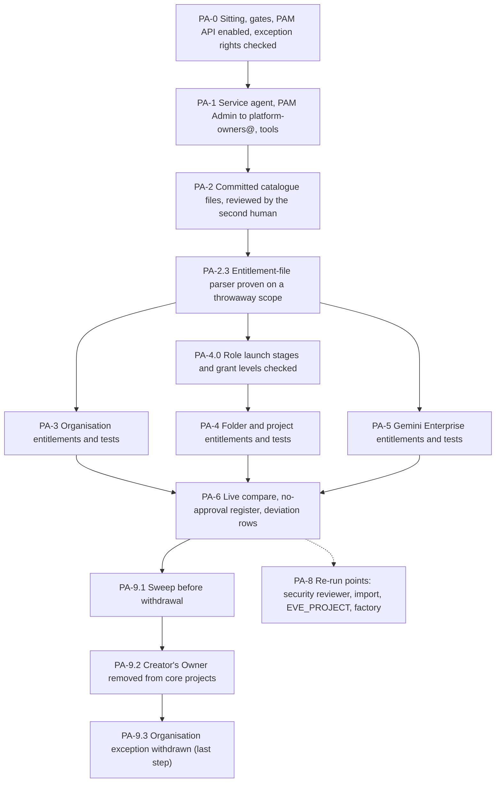

# 12. Privileged Access Manager catalogue

## Status
- Owner: the platform owner
- Last reviewed: 2026-09-15
- Last executed: never
- Stage: review §2 stage 11. Runs after files 09, 10 and 11 and before file 13. It is the file that ends the organisation bootstrap: its last two steps remove the creator's Owner from the five core projects and withdraw the dated organisation exception of file 06.
- Step prefix: `PA`. Steps: 40 (PA-2.3 and PA-4.0 added on 2026-09-16). BLOCKED: PA-4.7 (the security reviewer is not named, README B-20), PA-8.1 (same person), PA-8.5 (the factory does not exist, README B-01). IRREVERSIBLE: PA-9.3 (the withdrawal leaves the platform owner no standing path back; only break-glass or an approved grant restores it).
- Replaces: nothing executable. The design is [04 §5.1-§5.2](../04-identity-and-privileged-access.md#5-privileged-access-manager-the-entitlement-catalogue); no runbook ever created an entitlement (S002). It supersedes `wall-e/PREREQUISITES.md` §4.1's standing organisation roles for the builder (S059) and the standing `user:` actAs grants of `eve/07-build-runbook.md` (S143, this file's half).
- Decisions applied: SD-01 (exception withdrawn here), SD-12 (controller and witness-export entitlements approved by the second human, never the platform owner), SD-18 (`ent-org-sink` with approval), SD-19 (`ent-ge-admin` without approval at Tier C), SD-42 (singleton variants), SD-46 (`ent-bootstrap-module`), all from the signed record `decisions/<date>-platform-model-and-privilege.md` of [03](03-decisions-and-people.md) DC-6.1.
- Closes: S002 (PAM half), S011, S059, S142 (the entitlement half), S143 (the catalogue and core-project half), X-GE-12 (the creation half), S018 (the core-project half). See "Findings closed and deferred".
- Every command, flag, role, API field and console path was read on Google's pages on 2026-09-15 ("Sources"). Nothing was run against the live organisation while writing.
- Review corrections applied on 2026-09-16, with the pages re-read that day: the PAM API is enabled before the permission test it is needed for (PA-0.2); `sweep.py` now checks basic roles, Folder Creator and PAM Admin at every scope against a written allow-list, not by omission (PA-1.5, PA-2.1); the pre-withdrawal active-grant search covers every entitlement in the index and the actAs read covers project-level bindings (PA-9.1); `pam_wait` waits the request's own lifetime instead of 20 minutes (PA-1.5); the `--entitlement-file` parser and every role's launch stage are proven before the organisation and core creates (PA-2.3, PA-4.0); `tip()` is committed in `pam.sh`; and no gate uses `grep -P`, which the macOS workstation's BSD grep refuses — the two irreversible removals now run only inside a gate function.

## What this part builds

The Privileged Access Manager (PAM) catalogue of [04 §5.2](../04-identity-and-privileged-access.md#52-the-catalogue), built by hand from committed files, each entitlement proven by one real grant, and then the removal of every standing human privilege the bootstrap needed. After this file, every later privileged step in files 13 to 42 names an entitlement, and no human or group holds any role from any Role column standing — basic roles, Folder Creator and PAM Admin included, at the organisation and on every folder as well as on projects — except the two exceptions written into `pam/role-allow.tsv` and proven by the sweep: PAM Admin for `platform-owners@` (04 §5.1, PAM cannot bootstrap itself) and the break-glass group `gcp-organization-admins@` (04 §7.1, by design).

| Built | Where | Variable |
|---|---|---|
| PAM API enabled in the quota project; the organisation's PAM service agent granted its role; PAM Admin to `platform-owners@` (the one standing administrative role, 04 §5.1) | `CICD_PROJECT`; organisation | none |
| The committed catalogue: one JSON file per entitlement, four templates, an index, the swept-role list and its two-row allow-list, and three small tools (catalogue writer, live compare, standing-role sweep) | `pam/` in the platform repository | `ENT_PROJECT_REPAIR_TEMPLATE`, `ENT_DEPLOY_CREDENTIAL_HOLDER_TEMPLATE` |
| Organisation entitlements: `ent-platform-policy`, `ent-org-sink`, `ent-k7-human`, `ent-k7-executor`, `ent-pam-catalogue-org` | organisation | `ENT_PLATFORM_POLICY`, `ENT_ORG_SINK`, `ENT_K7_HUMAN`, `ENT_K7_EXECUTOR`, `ENT_PAM_CATALOGUE_ORG` |
| Folder entitlements: `ent-folder-admin`, `ent-k7-human-scheduler`, `ent-k7-executor-scheduler`, `ent-project-repair-core`, the four `ent-factory-singleton-*`, three `ent-bootstrap-module-*`, `ent-witness-export-repair` | `fld-agentic-platform`, `fld-platform-core`, `fld-agents-p-sa-*`, `fld-controllers-*`, `fld-agents-r-nonprod`, `fld-improvers-*` | `ENT_FOLDER_ADMIN`, `ENT_K7_HUMAN_SCHEDULER`, `ENT_K7_EXECUTOR_SCHEDULER`, `ENT_PROJECT_REPAIR_CORE`, `ENT_FACTORY_SINGLETON_*`, `ENT_BOOTSTRAP_MODULE_*`, `ENT_WITNESS_EXPORT_REPAIR` |
| Project entitlements: `ent-deploy-credential-holder-core`, `ent-secret-read-platform-pager-key`, `ent-ge-admin`, the `ent-project-move` pair (source parent and `fld-gemini-enterprise`) | `CORE_PROJECT`, `GEMINI_PROJECT`, `GE_CURRENT_PARENT` | `ENT_DEPLOY_CREDENTIAL_HOLDER_CORE`, `ENT_SECRET_READ`, `ENT_GE_ADMIN`, `ENT_PROJECT_MOVE_SRC`, `ENT_PROJECT_MOVE_DST` |
| The no-approval register: every entitlement that activates without an approver, with its reason and end | `pam/no-approval.json`; `DEVIATION_REGISTER` | none |
| The creator's Owner removed from the five core projects; the organisation exception withdrawn from `sa-1-admin@` | core projects; organisation | closes `BOOTSTRAP_EXCEPTION_EXPIRY` |

Five names are new against plan §5 and are handed to README's variable list: `ENT_K7_HUMAN_SCHEDULER` and `ENT_K7_EXECUTOR_SCHEDULER` (04 §5.2 says each K7 entitlement is "two entitlements activated together", and PAM binds an entitlement to one resource), `ENT_PAM_CATALOGUE_ORG` (see PA-3.6 for why it must exist), `ENT_DEPLOY_CREDENTIAL_HOLDER_CORE` (the proven instance of the deploy template, needed by 18 for the K7 job). Plan §5 lists `ENT_PROJECT_REPAIR_TEMPLATE` as "entitlement resource name"; an entitlement cannot be a template, so here it is the template's path, exactly like `ENT_DEPLOY_CREDENTIAL_HOLDER_TEMPLATE`, and `ENT_PROJECT_REPAIR_CORE` is its proven instance.

What the old text got wrong, and must not come back:

| Old text | Why it fails | Here instead |
|---|---|---|
| "fld-agentic-platform is made by the platform owner through PAM `roles/resourcemanager.folderAdmin`" (02 §2.2) | A folder-scoped entitlement cannot exist before its folder; nothing created the first entitlement (S002). | Folders exist (09) under the dated exception (06); entitlements are created here; the exception ends here. |
| Standing `orgpolicy.policyAdmin`, `iam.denyAdmin`, organisation `logging.configWriter`, `projectCreator` for the builder (PREREQUISITES §4.1, eve/07 l.80, mo/07 l.100) | The levers of K7 and of evidence silencing held standing, without approval or expiry (S059, S142). | `ent-platform-policy`, `ent-org-sink`, `ent-bootstrap-module-*`, each approved by the second human. |
| "At Tier C with one person the approver is the same person" (03 §4, P49) | PAM: "You can't approve your own request" (X-GE-12). | `ent-ge-admin` activates without approval, justification required, 1 hour (SD-19). |
| `ent-factory-singleton` on `fld-agents-p-sa-*`: "two named approvers" with no one-person variant (04 §5.2, SETUP Phase 6) | The security reviewer does not exist before Tier W, so neither twin nor production can be built (S011). | Dated no-approval variant on `-nonprod` only; `-prod` waits for two named approvers (PA-4.7, BLOCKED). |
| "Tier R with one person: activate without approvals" applied to every entitlement (04 §5.2 preamble) | Two humans exist from file 06; an unapproved sink or policy grant is the evidence-silencing lever (SD-18 revision). | Only the entitlements the signed decisions name are unapproved (PA-6.2); every other one has the second human as approver until the security reviewer exists. |
| `gcloud iam service-accounts add-iam-policy-binding ... --member="user:$(gcloud config get-value account)" --role=roles/iam.serviceAccountUser`, never removed (eve/07 Phase 10, 11) | Standing actAs on credential holders for the builder (S143). | `ent-deploy-credential-holder-<agent>` from the template; PA-9.1 proves no `user:` or `group:` member holds actAs on any core service account. |
| `gcloud projects create` as the operator, Owner kept (walle_setup.py `ensure_project`, S018) | The creator's Owner defeats the two-principal check and is a standing basic role. | The creator's Owner on the five core projects is removed in PA-9.2, after `ENT_PROJECT_REPAIR_CORE` is proven. Module equivalents (17) remove it per project. |



## Preconditions

- [ ] File 01: `~/.platform-env` with `penv_set`, `need`, `exists_or_pending`, `penv_guard`, `checkpoint`, `evidence_add`, `sitting_end`; `DEVIATION_REGISTER`, `EVIDENCE_REGISTER`; the gcloud configuration with no default project; python 3.12, jq, git.
- [ ] File 03: the record `decisions/<date>-platform-model-and-privilege.md` signed, so that `tools/decision-need.sh SD-01 SD-18 SD-19 SD-42 SD-46` prints `SIGNED` for each; `PPL-SH` signed (`SECOND_HUMAN_EMAIL`); SD-12 signed in the Eve-H record (`tools/decision-need.sh SD-12`); `PLATFORM_REPO_REMOTE` exists with branch protection and CODEOWNERS (DC-9.4).
- [ ] File 05: `GEMINI_PROJECT`, `GEMINI_PROJECT_NUMBER`, `GE_CURRENT_PARENT` set.
- [ ] File 06: `SA_1_ADMIN`, `SA_2_ADMIN`, every `GRP_*` set; OB-3.7 `DONE` with `EXCEPTION EXACT` (four conditioned roles on `sa-1-admin@`); `BOOTSTRAP_EXCEPTION_EXPIRY` later than the planned end of this file; `CONTROL_GROUPS_FILE` and `ROSTER_FILE` merged; the condition file `identity/bootstrap-exception-condition.yaml` present in `PLATFORM_REPO_DIR`.
- [ ] File 09: all 22 `FLD_*` set; `SCC_TIER` reads `PREMIUM/eu` (needed only for the two-approver entitlement of PA-4.7 and PA-8.1).
- [ ] File 10: the five core project ids and numbers, `SA_FACTORY_APPLY`, `SA_K7_EXECUTOR` set; CP-8.2 `DONE` (the kept-Owner entry exists in `DEVIATION_REGISTER`).
- [ ] File 11: `DONE` for every step it could run (key rings, attestor, custodian dataset), because the creator's Owner it relies on is removed here.
- [ ] The gcloud `alpha` component is installed (`gcloud components list --filter="id=alpha" --format="value(state.name)"` prints `Installed`); only PA-4.7 and PA-8.1 use it.
- [ ] The shell is the macOS workstation's own (01 PR-1.1, PR-1.2): bash 3.2 or zsh, BSD `grep`, BSD `awk`. No step of this file uses `grep -P`, which BSD grep refuses (`invalid option -- P`, exit 2); every checkpoint gate reads `checkpoints.tsv` with `awk -F'\t'`. Prove it once before the sitting: `printf 'x\tPA-0.0\tDONE\n' | awk -F'\t' '$2=="PA-0.0" && $3=="DONE"{print "awk gate OK"}'` prints `awk gate OK`, and `grep -P x /dev/null; echo "grep -P exit $?"` prints a non-zero exit (which is why it is not used).
- [ ] The second human is available for two sittings: the review of PA-2 and the approval sitting of PA-3 to PA-5 and PA-9 (about three hours, one day).

## People

| Role | Does | Present at |
|---|---|---|
| Platform owner, as `sa-1-admin@` (member of `platform-owners@`, `platform-approvers@`, `ge-admins@`) | Performs every step; requests every test grant; revokes it | every step |
| Second human, as `sa-2-admin@` for approvals and `SECOND_HUMAN_EMAIL` for review and mail | Reviews the catalogue pull request; approves every test grant of an entitlement that names an approver; confirms each notification mail; witnesses PA-9.2 and PA-9.3 | PA-2.2, PA-3 to PA-5 (approvals), PA-9 |
| Security reviewer (`SECURITY_REVIEWER_EMAIL`) | Second approver where 04 §5.2 names one, once appointed | PA-4.7 and PA-8.1 only (BLOCKED until PPL-SR is signed) |

The platform owner never approves a grant here, and never appears in an approver set of a controller, witness-export or singleton entitlement (SD-12). Google refuses self-approval in any case ("You can't approve your own request", approve-grants page).

Each step writes `checkpoint <id> START` before its ACTION and `checkpoint <id> DONE <witness> <evidence>` when its VERIFY passes (01 §1). Evidence files go to `$BUILD_LOG_DIR/evidence/12/`. A cut sitting resumes at the first step without `DONE`; PA-9.3 with `START` and no `DONE` is never re-run blind: run its VERIFY first.

## Facts this file relies on, read on 2026-09-15

| Fact | Source | Consequence here |
|---|---|---|
| `gcloud pam entitlements create ENTITLEMENT --organization=… \| --folder=… \| --project=… --location=global --entitlement-file=PATH` is GA; `update`, `describe`, `export`, `list`, `search`, `delete` exist; `gcloud pam check-onboarding-status` exists | gcloud reference, `pam` group and `pam entitlements create` | the create form of X-GE-12's evidence is used verbatim |
| Update "Requires full YAML file with ETAG"; an update "only applies to grants requested after the update"; an entitlement with active grants cannot be deleted | view, update, delete entitlements page (updated 2026-09-14) | PA-8 re-runs export, edit and update; revoke before delete |
| "Activate access without approvals" is the absence of `approvalWorkflow`; `requesterJustificationConfig` is required, `unstructured: {}` makes justification mandatory | create-entitlements page; REST `Entitlement` reference | no-approval entitlements omit `approvalWorkflow`; every file carries `unstructured` |
| v1 REST reference: `steps[]` "Only 1 step is supported"; `approvalsNeeded` "1 is the only supported value". The how-to page: with SCC Premium or Enterprise "up to two levels of sequential approvals … up to five approvals per level", shown with `gcloud alpha pam` | REST reference; create-entitlements page | single-approver files use GA; the two-approver file (PA-4.7) uses the alpha track and proves the read-back |
| Creating entitlements needs PAM Admin plus, at the organisation, Security Admin; the permissions listed are `resourcemanager.organizations.get`, `resourcemanager.organizations.setIamPolicy`, `privilegedaccessmanager.entitlements.create`; at a folder, Folder IAM Admin; at a project, Project IAM Admin | create-entitlements and setup pages | Organization Administrator holds `organizations.get`, `organizations.setIamPolicy`, `folders.setIamPolicy` and `projects.setIamPolicy` (resourcemanager roles page), which PA-0.2 tests before relying on it (06's assumption) |
| Service agent `service-org-ORGANIZATION_NUMBER@gcp-sa-pam.iam.gserviceaccount.com` gets `roles/privilegedaccessmanager.serviceAgent`, through Privileged Access Manager, "Set up PAM", "Grant role"; requesters and approvers need no PAM permission; add `pam-noreply@google.com` to mail allow-lists | setup page | PA-1.2, PA-1.4 |
| Grants: create with `--entitlement` (id or full name), `--requested-duration` (for example `1800s`), `--justification`; approve and deny in the console under Approve grants, Pending approval, or with `gcloud pam grants approve GRANT --reason`; `revoke GRANT --reason`; requests expire within 24 hours; states include `APPROVAL_AWAITED`, `ACTIVE`, `REVOKED`, `ENDED`; a grant carries `timeline.events` and `externallyModified` | request, approve pages; gcloud `pam grants` reference; REST `Grant` reference | the one-grant test of PA-1.5 |
| PAM "doesn't support legacy basic roles (Owner, Editor, and Viewer)"; grants are "time-based IAM Conditions subject to standard access change propagation" | PAM overview; request page | `roles/owner` is replaced by bundles; tests wait for the conditional binding |
| Project Mover "on both the source folder and the destination folder", and `resourcemanager.projects.move` on the organisation when the project is not in a folder | moving projects page (updated 2026-09-09) | the `ent-project-move` pair |
| IAM Conditions resource attributes list `projects/project-number/secrets/secret-id` for Secret Manager; no `iam.googleapis.com` service-account type is listed | conditions resource attributes page (updated 2026-09-14) | the deploy entitlement cannot be conditioned to named accounts from documentation (PA-4.3); the secret condition is tested (PA-8.4) |
| Automated approvals (service accounts and agent identities as approvers) default to disabled; settings under Privileged Access Manager, Settings | configure-settings page | PA-1.4 confirms the default |
| Roles exist with these ids: `privilegedaccessmanager.admin`, `privilegedaccessmanager.serviceAgent`, `orgpolicy.policyAdmin`, `iam.denyAdmin` (lowest level Organization), `iam.principalAccessBoundaryAdmin`, `logging.configWriter`, `modelarmor.floorSettingsAdmin`, `agentregistry.admin` (Beta), `cloudscheduler.admin`, `discoveryengine.agentspaceAdmin` ("Gemini Enterprise Admin"), `resourcemanager.projectMover`, `projectCreator`, `folderAdmin`, `organizationAdmin`, `lienModifier`, `iam.serviceAccountCreator`, `serviceAccountAdmin`, `serviceAccountUser`, `workloadIdentityPoolAdmin` (Beta), `serviceusage.serviceUsageAdmin`, `serviceUsageConsumer`, `run.admin`, `run.developer`, `aiplatform.admin`, `secretmanager.admin`, `secretAccessor`, `datastore.owner`, `bigquery.admin`, `storage.admin`, `pubsub.admin`, `cloudkms.admin`, `logging.admin`, `artifactregistry.admin`, `monitoring.admin`, `binaryauthorization.attestorsAdmin` | IAM roles reference pages per service | every role in `pam/` is one of these |
| The gcloud property `billing/quota_project` defaults to the current project; `--billing-project` takes precedence | gcloud topic configurations | with no default project (01), every PAM call passes `--billing-project="$CICD_PROJECT"`, the quota project file 10 chose |

## The catalogue as built

"SH" is the second human (`user:sa-2-admin@`), "SR" the security reviewer. "Later" is the approver set after PA-8.1.

| Entitlement id | Scope | Roles | Max | Requesters | Approvers now | Later | Test |
|---|---|---|---|---|---|---|---|
| `ent-platform-policy` | organisation | `orgpolicy.policyAdmin`, `iam.denyAdmin`, `iam.principalAccessBoundaryAdmin` | 1 h | `platform-owners@` | SH | SR and SH, both needed | PA-3.2 |
| `ent-org-sink` | organisation | `logging.configWriter` | 1 h | `platform-owners@` | SH | SH or SR | PA-3.3 |
| `ent-k7-human` + `ent-k7-human-scheduler` | organisation + `fld-agentic-platform` | the three policy roles + `cloudscheduler.admin` | 1 h | `platform-approvers@` | **none** (04 §5.2) | none | PA-3.4 |
| `ent-k7-executor` + `ent-k7-executor-scheduler` | organisation + `fld-agentic-platform` | as above | 30 min | `serviceAccount:k7-executor@` | **none** (04 §5.2) | none | 18 (PA-3.5) |
| `ent-pam-catalogue-org` | organisation | `resourcemanager.organizationAdmin` | 1 h | `platform-owners@` | SH | SH or SR | PA-3.6, PA-9.3 |
| `ent-folder-admin` | `fld-agentic-platform` | `folderAdmin`, `logging.configWriter`, `modelarmor.floorSettingsAdmin`, `cloudscheduler.admin` | 1 h | `platform-owners@` | SH | SR; two at Tier P | PA-4.1 |
| `ent-project-repair-core` | `fld-platform-core` | the 04 bundle + `cloudkms.admin`, `logging.admin`, `artifactregistry.admin`, `iam.workloadIdentityPoolAdmin`, `monitoring.admin`, `binaryauthorization.attestorsAdmin`, `resourcemanager.lienModifier`, `agentregistry.admin` | 2 h | `platform-owners@` | SH | SH or SR | PA-4.2, PA-9.2 |
| `ent-deploy-credential-holder-core` | `CORE_PROJECT` | `run.developer`, `iam.serviceAccountUser` | 1 h | `platform-owners@` | SH | the deployer second reviewer (33) | PA-4.3 |
| `ent-secret-read-platform-pager-key` | `CORE_PROJECT` | `secretmanager.secretAccessor`, conditioned to one secret | 30 min | `platform-owners@` | SH | SR | PA-4.4; condition in 15 |
| `ent-factory-singleton-psa-nonprod` | `fld-agents-p-sa-nonprod` | `projectCreator`, `serviceUsageAdmin`, `serviceAccountCreator`, `projectIamAdmin` | 1 h | `factory-apply@`, `platform-owners@` (bootstrap) | **none, dated** (SD-42) | SH, at the date | PA-4.5 |
| `ent-factory-singleton-psa-prod` | `fld-agents-p-sa-prod` | as above | 1 h | as above | SR and SH, both needed | same | PA-4.7 (BLOCKED) |
| `ent-factory-singleton-ctl-prod`, `-ctl-nonprod` | `fld-controllers-prod`, `-nonprod` | as above | 1 h | as above | SH, never the platform owner | SH or SR | PA-4.6 |
| `ent-bootstrap-module-r-nonprod`, `-improvers-prod`, `-improvers-nonprod` | `fld-agents-r-nonprod`, `fld-improvers-prod`, `fld-improvers-nonprod` | as above | 1 h | `platform-owners@` | SH | deleted at supersession | PA-4.8 |
| `ent-witness-export-repair` | `fld-controllers-prod` until `EVE_PROJECT` exists, then `EVE_PROJECT` | `iam.serviceAccountAdmin` | 1 h | `eve-owners@`, `platform-owners@` | SH | SH or SR | PA-4.9 |
| `ent-ge-admin` | `GEMINI_PROJECT` | `discoveryengine.agentspaceAdmin` | 1 h | `ge-admins@` | **none, Tier C** (SD-19) | SR, dated change | PA-5.1 |
| `ent-project-move-src`, `-dst` | `GE_CURRENT_PARENT`; `fld-gemini-enterprise` | `resourcemanager.projectMover` | 1 h | `platform-owners@` | SH | deleted after the import | PA-5.2 |

Every entitlement: requester justification mandatory (it must carry a ticket or incident id, 04 §5.2), approver justification required where approvers exist, `platform-security@` notified when a grant activates, `SECOND_HUMAN_EMAIL` notified when a grant awaits approval.

## 0. The sitting and the rights it relies on

### PA-0.1 Open the sitting and check the gates

- **WHO:** Platform owner as `sa-1-admin@`.
- **WHERE:** Shell, `~/.platform-env` sourced.
- **ACTION:**

```bash
need ORG_ID DOMAIN SA_1_ADMIN SA_2_ADMIN SECOND_HUMAN_EMAIL GRP_PLATFORM_OWNERS GRP_PLATFORM_SECURITY GRP_PLATFORM_APPROVERS GRP_GE_ADMINS GRP_EVE_OWNERS GRP_GCP_ORG_ADMINS BOOTSTRAP_EXCEPTION_EXPIRY
need FLD_AGENTIC_PLATFORM FLD_PLATFORM_CORE FLD_GEMINI_ENTERPRISE FLD_AGENTS_R_NONPROD FLD_AGENTS_P_SA_PROD FLD_AGENTS_P_SA_NONPROD FLD_CONTROLLERS_PROD FLD_CONTROLLERS_NONPROD FLD_IMPROVERS_PROD FLD_IMPROVERS_NONPROD
need CICD_PROJECT CORE_PROJECT CORE_PROJECT_NUMBER LOGGING_PROJECT KMS_PROJECT KMS_PROJECT_NUMBER VALIDATOR_PROJECT SA_FACTORY_APPLY SA_K7_EXECUTOR GEMINI_PROJECT GE_CURRENT_PARENT REGION PLATFORM_REPO_DIR BUILD_LOG_DIR DEVIATION_REGISTER EVIDENCE_REGISTER
penv_guard
checkpoint PA-0.1 START
gcloud auth list --filter=status:ACTIVE --format="value(account)"
"$PLATFORM_REPO_DIR/tools/decision-need.sh" SD-01 SD-12 SD-18 SD-19 SD-42 SD-46 PPL-SH
awk -F'\t' '$3=="DONE"{d[$2]=1} END{n=split("OB-3.7 CP-8.2 FS-7.5",w," "); miss=""; for(i=1;i<=n;i++){ if(d[w[i]]) print w[i]"\tDONE"; else miss=miss" "w[i] } if(miss!=""){ print "STOP: not DONE:"miss; exit 1 }}' "$BUILD_LOG_DIR/checkpoints.tsv"
date -u +%F
mkdir -p "$BUILD_LOG_DIR/evidence/12"
```

- **VERIFY:** `penv_guard` prints nothing and returns 0; the active account is exactly `SA_1_ADMIN`; `decision-need.sh` prints `SIGNED` seven times; the `awk` gate prints the three `<id>\tDONE` lines and no `STOP:` line (a `STOP:` line, or a non-zero exit from the `awk`, ends the sitting: the missing file's step runs first); today's date is before `BOOTSTRAP_EXCEPTION_EXPIRY` with at least three working days to spare. Otherwise stop: an expired exception stops granting on its date (06 OB-3.7 rollback note), and only a signed SD-01 extension continues.
- **ROLLBACK:** Read only.
- **EVIDENCE:** the checkpoint line. E-xx: none. TISAX: none.

### PA-0.2 Prove that the organisation exception carries the permissions PAM setup needs

- **WHO:** Platform owner as `sa-1-admin@`.
- **WHERE:** Shell, `~/.platform-env` sourced.
- **ACTION:** Google's create-entitlements page names Security Admin at the organisation, Folder IAM Admin at a folder and Project IAM Admin at a project, and lists the permissions it checks. File 06 assumed Organization Administrator covers them. Test the permissions, not the role names.

  The PAM API is enabled in `CICD_PROJECT` **first**, in this step, before anything asks about `privilegedaccessmanager.entitlements.create`. Every call below passes `x-goog-user-project: $CICD_PROJECT`, which names the quota project (gcloud topic configurations, the same rule as `--billing-project`); a service that is not enabled for the quota project is not reachable for the caller, so `testIamPermissions` would omit the PAM permission whatever the caller holds, and the answer would say nothing about PAM Admin. Enabling an API is not a privileged act: it uses the kept Owner of `CICD_PROJECT` (10 CP-8.2), not the organisation exception. PA-1.1 re-runs the same `services enable` (it is idempotent) and adds the group binding and the `BD-12-01` deviation row.

```bash
checkpoint PA-0.2 START
gcloud services enable privilegedaccessmanager.googleapis.com --project="$CICD_PROJECT"
gcloud services list --enabled --project="$CICD_PROJECT" --filter="config.name=privilegedaccessmanager.googleapis.com" --format="value(config.name)"
tok="$(gcloud auth print-access-token)"
curl -sS -X POST -H "Authorization: Bearer $tok" -H "x-goog-user-project: $CICD_PROJECT" -H "Content-Type: application/json" -d '{"permissions":["resourcemanager.organizations.get","resourcemanager.organizations.setIamPolicy","resourcemanager.organizations.getIamPolicy","privilegedaccessmanager.entitlements.create"]}' "https://cloudresourcemanager.googleapis.com/v3/organizations/${ORG_ID}:testIamPermissions" | tee "$BUILD_LOG_DIR/evidence/12/PA-0.2-org.json"
curl -sS -X POST -H "Authorization: Bearer $tok" -H "x-goog-user-project: $CICD_PROJECT" -H "Content-Type: application/json" -d '{"permissions":["resourcemanager.folders.get","resourcemanager.folders.setIamPolicy"]}' "https://cloudresourcemanager.googleapis.com/v3/folders/${FLD_AGENTIC_PLATFORM}:testIamPermissions" | tee "$BUILD_LOG_DIR/evidence/12/PA-0.2-folder.json"
curl -sS -X POST -H "Authorization: Bearer $tok" -H "x-goog-user-project: $CICD_PROJECT" -H "Content-Type: application/json" -d '{"permissions":["resourcemanager.projects.get","resourcemanager.projects.setIamPolicy"]}' "https://cloudresourcemanager.googleapis.com/v3/projects/${GEMINI_PROJECT_NUMBER}:testIamPermissions" | tee "$BUILD_LOG_DIR/evidence/12/PA-0.2-gemini.json"
unset tok
```

- **VERIFY:** `gcloud services list` prints `privilegedaccessmanager.googleapis.com`. The organisation response lists all four permissions; the folder response lists both; the `GEMINI_PROJECT` response lists both. If `privilegedaccessmanager.entitlements.create` is missing at the organisation, read the branches in this order and stop at the first that applies:
  1. **The PAM API is not enabled in the quota project.** `gcloud services list` above printed nothing, or the enable returned an error. Nothing is wrong with the exception: re-run the enable, wait a minute for it to take effect, and re-run the three `curl` calls. This is the most likely cause and must be excluded before any other.
  2. **The quota project header is wrong.** `CICD_PROJECT` is not the project the API was enabled in, or the account has no `serviceusage.services.use` there. Check `gcloud projects get-iam-policy "$CICD_PROJECT"` shows the kept Owner of 10 CP-8.2 for `SA_1_ADMIN`.
  3. **PAM Admin from 06 OB-3.7 is not effective.** Only after 1 and 2 are excluded: stop and re-run 06's OB-3.7 VERIFY.

  If a `setIamPolicy` permission is missing, stop: 06's assumption failed, and the owner and the second human sign an SD-01 amendment adding `roles/iam.securityAdmin` to the conditioned exception before continuing (withdrawn in PA-9.3 with the rest). The access token lives only in the shell variable and is unset.
- **ROLLBACK:** The permission tests are read only. The API enable is undone by `gcloud services disable privilegedaccessmanager.googleapis.com --project="$CICD_PROJECT"`, only while no entitlement exists.
- **EVIDENCE:** the three JSON responses and the `services list` line; `evidence_add PA-0.2 exception-permissions E-05 4.2.1 "build-log:evidence/12" "$BUILD_LOG_DIR/evidence/12/PA-0.2-org.json"`. Closes 06's open item "Organization Administrator covers the PAM setup grant".

## 1. Set up Privileged Access Manager

### PA-1.1 Enable the PAM API in the quota project and let the requester group use it

- **WHO:** Platform owner as `sa-1-admin@` (still Owner of `CICD_PROJECT` under the kept-Owner entry of 10).
- **WHERE:** Shell, `~/.platform-env` sourced.
- **ACTION:** Every PAM call passes `--billing-project="$CICD_PROJECT"`, so the API must be enabled there, and the requester group needs `serviceusage.services.use` there once the creator's Owner is gone (PA-9.2). The enable already ran in PA-0.2, because the permission test of that step is served only when the quota project has the API; the line below is the idempotent re-run that pairs the enable with its deviation row, so this step stands alone if the catalogue is ever rebuilt. `privilegedaccessmanager.googleapis.com` is not on 02 §4.2's `fld-platform-core` allow-list: this is recorded as a deviation and handed to 13, which adds it to the list by pull request before applying it (the same route as 10's `observability`).

```bash
checkpoint PA-1.1 START
gcloud services enable privilegedaccessmanager.googleapis.com --project="$CICD_PROJECT"
gcloud projects add-iam-policy-binding "$CICD_PROJECT" --member="group:$GRP_PLATFORM_OWNERS" --role="roles/serviceusage.serviceUsageConsumer" --condition=None
printf '| BD-12-01 | %s | 12 PA-1.1 | DEV | privilegedaccessmanager API outside the core allow-list | %s | - | API enabled; serviceUsageConsumer to %s | n/a | n/a | second human (PA-2.2 review) | until 13 adds it to the fld-platform-core allow-list | open |\n' "$(date -u +%F)" "projects/$CICD_PROJECT" "$GRP_PLATFORM_OWNERS" >> "$DEVIATION_REGISTER"
```

- **VERIFY:**

```bash
gcloud services list --enabled --project="$CICD_PROJECT" --filter="config.name=privilegedaccessmanager.googleapis.com" --format="value(config.name)"
gcloud projects get-iam-policy "$CICD_PROJECT" --flatten="bindings[].members" --filter="bindings.role=roles/serviceusage.serviceUsageConsumer" --format="value(bindings.members)"
```

  The first prints `privilegedaccessmanager.googleapis.com`; the second includes `group:platform-owners@…`. `roles/serviceusage.serviceUsageConsumer` is in no Role column of 04 §5.2, so it is not a standing privileged role.
- **ROLLBACK:** `gcloud projects remove-iam-policy-binding "$CICD_PROJECT" --member="group:$GRP_PLATFORM_OWNERS" --role="roles/serviceusage.serviceUsageConsumer"`; `gcloud services disable privilegedaccessmanager.googleapis.com --project="$CICD_PROJECT"` only while no entitlement exists.
- **EVIDENCE:** both outputs; the `BD-12-01` row. `evidence_add PA-1.1 pam-api E-05 5.2.1 "build-log:evidence/12"`.

### PA-1.2 Set up PAM at the organisation: the service agent's role

- **WHO:** Platform owner as `sa-1-admin@`.
- **WHERE:** Google Cloud console (the `sa-1-admin@` browser profile of 01 PR-1.3) → IAM & Admin → Privileged Access Manager → resource picker: the organisation → **Set up PAM** → **Grant role**; then the shell.
- **ACTION:** Google's setup page gives the console route and no gcloud command for this grant. The service agent is Google-provisioned (`service-org-ORGANIZATION_NUMBER@gcp-sa-pam.iam.gserviceaccount.com`); the console grants it `roles/privilegedaccessmanager.serviceAgent`. Do not create or grant anything else on that page. Then:

```bash
checkpoint PA-1.2 START
gcloud organizations get-iam-policy "$ORG_ID" --format=json > "$BUILD_LOG_DIR/evidence/12/PA-1.2-org-policy.json"
jq -r --arg m "serviceAccount:service-org-${ORG_ID}@gcp-sa-pam.iam.gserviceaccount.com" '.bindings[] | select(.members | index($m)) | .role' "$BUILD_LOG_DIR/evidence/12/PA-1.2-org-policy.json"
gcloud pam check-onboarding-status --organization="$ORG_ID" --location=global --billing-project="$CICD_PROJECT" | tee "$BUILD_LOG_DIR/evidence/12/PA-1.2-onboarding-org.txt"
gcloud pam check-onboarding-status --folder="$FLD_AGENTIC_PLATFORM" --location=global --billing-project="$CICD_PROJECT" | tee "$BUILD_LOG_DIR/evidence/12/PA-1.2-onboarding-folder.txt"
gcloud pam check-onboarding-status --project="$GEMINI_PROJECT" --location=global --billing-project="$CICD_PROJECT" | tee "$BUILD_LOG_DIR/evidence/12/PA-1.2-onboarding-gemini.txt"
```

- **VERIFY:** The `jq` line prints exactly `roles/privilegedaccessmanager.serviceAgent`, unconditioned. The three onboarding outputs report no finding; record them verbatim. Google's reference does not document the output fields, so any line naming a missing permission or an unset service agent is a stop. The service agent's binding is the one PAM binding the sweep of PA-9 excepts (04 §5.2).
- **ROLLBACK:** Remove the binding with `gcloud organizations remove-iam-policy-binding "$ORG_ID" --member="serviceAccount:service-org-${ORG_ID}@gcp-sa-pam.iam.gserviceaccount.com" --role="roles/privilegedaccessmanager.serviceAgent"`, only while no entitlement exists (every entitlement stops working without it).
- **EVIDENCE:** the policy JSON and the three outputs. `evidence_add PA-1.2 pam-service-agent E-05 4.1.3 "build-log:evidence/12" "$BUILD_LOG_DIR/evidence/12/PA-1.2-org-policy.json"`.

### PA-1.3 PAM Admin to `platform-owners@`, standing

- **WHO:** Platform owner as `sa-1-admin@`; the second human is told (not present).
- **WHERE:** Shell, `~/.platform-env` sourced.
- **ACTION:** 04 §5.1: PAM Admin "is held by `platform-owners@` standing — it is the one standing administrative role on the platform, because PAM cannot bootstrap itself". It gives no access by itself: creating or changing an entitlement also needs the IAM-admin permission on the scope, which after PA-9.3 exists only through an approved grant (`ent-folder-admin`, `ent-project-repair-*`, `ent-pam-catalogue-org`). `sa-1-admin@` keeps its conditioned PAM Admin from 06 until PA-9.3.

```bash
checkpoint PA-1.3 START
gcloud identity groups memberships list --group-email="$GRP_PLATFORM_OWNERS" --format="value(preferredMemberKey.id)"
gcloud organizations add-iam-policy-binding "$ORG_ID" --member="group:$GRP_PLATFORM_OWNERS" --role="roles/privilegedaccessmanager.admin" --condition=None
```

- **VERIFY:** The membership list is exactly `SA_1_ADMIN`, as `CONTROL_GROUPS_FILE` says (a difference is a severity 1 control-group drift: stop). Then:

```bash
gcloud organizations get-iam-policy "$ORG_ID" --flatten="bindings[].members" --filter="bindings.role=roles/privilegedaccessmanager.admin" --format="table(bindings.members,bindings.condition.title)"
```

  prints `group:platform-owners@…` with no condition, `group:gcp-organization-admins@…` (06 OB-7.1) with no condition, and `user:sa-1-admin@…` with `bootstrap-exception-sd-01`. Nothing else.
- **ROLLBACK:** `gcloud organizations remove-iam-policy-binding "$ORG_ID" --member="group:$GRP_PLATFORM_OWNERS" --role="roles/privilegedaccessmanager.admin"`.
- **EVIDENCE:** both outputs. `evidence_add PA-1.3 pam-admin-group E-05 4.2.1 "build-log:evidence/12"`. File 06's roster already lists this binding under `gcp_org_roles_via_group` ("standing PAM Admin from file 12"); PA-9.3 checks it.

### PA-1.4 Read the PAM settings and prove mail delivery

- **WHO:** Platform owner; the second human confirms a mail.
- **WHERE:** Console → IAM & Admin → Privileged Access Manager → organisation → **Settings** tab.
- **ACTION:**
  1. Read "Automated approvals" (service accounts and agent identities as approvers). It must be disabled, Google's default. Do not change it: approvers stay human (04 §5.1). Screenshot it.
  2. Read the email notification preferences: every row must read "Inherit from parent" or be enabled for the approver on "Grant requires approval" and for the admin on "Grants activated", "Grants ended", "Grants externally modified" and "Grants activation failed". Do not change them; a disabled row is a stop and a question to the second human.
  3. Ask the Workspace mail administrator (a super admin) to confirm that mail from `pam-noreply@google.com` is not quarantined for `DOMAIN`. *Assumption:* no allow-list change is needed for a Google sender; the first test grant (PA-3.2) proves delivery. If that mail does not arrive, the super admin adds the address to the Gmail email allowlist (Admin console → Apps → Google Workspace → Gmail → Spam, Phishing and Malware; *Assumption:* the label on the day) as a recorded change.
- **VERIFY:** The screenshot shows Automated approvals disabled; the notification rows are as listed. Mail delivery is verified at PA-3.2.
- **ROLLBACK:** Read only.
- **EVIDENCE:** `screencapture -i "$BUILD_LOG_DIR/evidence/12/PA-1.4-settings.png"`; `evidence_add PA-1.4 pam-settings E-05 4.1.3 "build-log:evidence/12" "$BUILD_LOG_DIR/evidence/12/PA-1.4-settings.png"`.

### PA-1.5 Commit the PAM tools: the grant helpers, the live compare and the standing sweep

- **WHO:** Platform owner writes; the second human reviews in PA-2.2.
- **WHERE:** Shell, `~/.platform-env` sourced, in `PLATFORM_REPO_DIR`.
- **ACTION:** Four small files with the standard library only. `pam.sh` is sourced by the sitting; `compare.py` diffs every live entitlement against its committed file; `sweep.py` lists standing bindings of any catalogue role held by a human, group or domain.

```bash
checkpoint PA-1.5 START
mkdir -p "$PLATFORM_REPO_DIR/pam/tools" "$PLATFORM_REPO_DIR/pam/entitlements" "$PLATFORM_REPO_DIR/pam/templates"
cat > "$PLATFORM_REPO_DIR/pam/tools/pam.sh" <<'EOF'
# Source after ~/.platform-env. PAM grant helpers for the one-grant test (setup/12 PA-1.5).
pam_request() { # ENTITLEMENT_NAME JUSTIFICATION [DURATION_S]: prints the grant name
  gcloud pam grants create --entitlement="$1" --requested-duration="${3:-1800}s" --justification="$2" --billing-project="$CICD_PROJECT" --format="value(name)"
}
pam_state() { gcloud pam grants describe "$1" --billing-project="$CICD_PROJECT" --format="value(state)"; }
pam_wait() { # GRANT STATE [TIMEOUT_S]: polls every 20 s, printing the state each time.
  # Default ceiling 86400 s: a grant request expires within 24 hours (approve-grants page), and T2 is a
  # human approval in the console, so a wait of minutes or hours is normal and is not a failure.
  # Returns 0 reached, 2 a terminal state that is not the one asked for, 3 timed out (the grant may still be live:
  # run pam_state, and pam_revoke it if it is not the state you wanted. Never re-request on a 3).
  end=$(( $(date +%s) + ${3:-86400} )); s=""
  while :; do
    s="$(pam_state "$1")"
    [ "$s" = "$2" ] && { echo "STATE $2"; return 0; }
    case "$s" in
      DENIED|REVOKED|ENDED|EXPIRED) echo "STATE $s (terminal, not $2)"; return 2;;
    esac
    [ "$(date +%s)" -ge "$end" ] && { echo "TIMEOUT waiting for $2; last state $s; run pam_state and, if it is not $2, pam_revoke"; return 3; }
    echo "waiting for $2: state $s"
    sleep 20
  done
}
tip() { # RESOURCE_PATH '"perm","perm"': Resource Manager testIamPermissions. Prints the permissions the caller holds.
  # The access token is consumed inline: it is never assigned to a variable, printed or written to disk.
  curl -sS -X POST -H "Authorization: Bearer $(gcloud auth print-access-token)" -H "x-goog-user-project: $CICD_PROJECT" -H "Content-Type: application/json" -d "{\"permissions\":[$2]}" "https://cloudresourcemanager.googleapis.com/v3/$1:testIamPermissions"
}
pam_policy() { # organizations|folders|projects ID OUTFILE
  case "$1" in
    organizations) gcloud organizations get-iam-policy "$2" --format=json > "$3";;
    folders) gcloud resource-manager folders get-iam-policy "$2" --format=json > "$3";;
    projects) gcloud projects get-iam-policy "$2" --format=json > "$3";;
  esac
}
pam_binding() { # POLICY_FILE MEMBER ROLE: prints the conditioned binding PAM made, or NO-BINDING
  jq -r --arg m "$2" --arg r "$3" '[.bindings[] | select(.role==$r and (.members|index($m)) and .condition != null) | .condition.expression] | if length==0 then "NO-BINDING" else .[] end' "$1"
}
pam_revoke() { gcloud pam grants revoke "$1" --reason="setup 12 one-grant test complete" --billing-project="$CICD_PROJECT"; }
pam_record() { # GRANT OUTFILE: the grant with its timeline (requester, approver, activation, end)
  gcloud pam grants describe "$1" --billing-project="$CICD_PROJECT" --format=json > "$2"
  jq -r '.state, .requester, ([.timeline.events[] | keys[] | select(.!="eventTime")] | join(",")), (.externallyModified // false)' "$2"
}
EOF
cat > "$PLATFORM_REPO_DIR/pam/tools/compare.py" <<'EOF'
#!/usr/bin/env python3
"""Compare every entitlement in pam/index.tsv with the live entitlement. Prints DIFF lines, EXTRA lines
for live entitlements not in the index, and 'CATALOGUE ZERO DIFF' when clean. Stdlib only (setup/12 PA-1.5)."""
import json, os, subprocess, sys, pathlib
root = pathlib.Path(__file__).resolve().parents[1]
bp = os.environ["CICD_PROJECT"]
def run(args):
    r = subprocess.run(["gcloud", *args, f"--billing-project={bp}", "--format=json"], capture_output=True, text=True)
    if r.returncode: sys.exit(f"ERROR gcloud {' '.join(args)}: {r.stderr.strip()}")
    return json.loads(r.stdout or "null")
def norm(d, alt):
    d = json.loads(json.dumps(d))
    for k in ("name", "createTime", "updateTime", "state", "etag"):
        d.pop(k, None)
    g = d["privilegedAccess"]["gcpIamAccess"]
    g["resource"] = g["resource"].rsplit("/", 1)[0] + "/" + alt.get(g["resource"].rsplit("/", 1)[1], g["resource"].rsplit("/", 1)[1])
    g["roleBindings"] = sorted(({k: v for k, v in b.items() if k != "id"} for b in g["roleBindings"]), key=lambda b: (b["role"], b.get("conditionExpression", "")))
    for e in d.get("eligibleUsers", []):
        e["principals"] = sorted(e.get("principals", []))
    for s in d.get("approvalWorkflow", {}).get("manualApprovals", {}).get("steps", []):
        s.pop("id", None)
        for a in s.get("approvers", []):
            a["principals"] = sorted(a.get("principals", []))
        s["approverEmailRecipients"] = sorted(s.get("approverEmailRecipients", []))
    t = d.setdefault("additionalNotificationTargets", {})
    for k in ("adminEmailRecipients", "requesterEmailRecipients"):
        t[k] = sorted(t.get(k, []))
    return d
rc, seen = 0, {}
for line in (root / "index.tsv").read_text().splitlines()[1:]:
    eid, kind, ident, alt, var, path = line.split("\t")
    flag = {"organizations": "--organization", "folders": "--folder", "projects": "--project"}[kind]
    seen.setdefault((kind, ident), set()).add(eid)
    live = run(["pam", "entitlements", "describe", eid, f"{flag}={ident}", "--location=global"])
    want = json.loads((root / path).read_text())
    amap = {alt: ident} if alt != "-" else {}
    if norm(live, amap) != norm(want, amap):
        rc = 1; print(f"DIFF {eid} {kind}/{ident}")
for (kind, ident), ids in seen.items():
    flag = {"organizations": "--organization", "folders": "--folder", "projects": "--project"}[kind]
    for e in run(["pam", "entitlements", "list", f"{flag}={ident}", "--location=global"]) or []:
        if e["name"].rsplit("/", 1)[1] not in ids:
            rc = 1; print(f"EXTRA {e['name']}")
print("CATALOGUE ZERO DIFF" if rc == 0 else "CATALOGUE DIFFERS")
sys.exit(rc)
EOF
cat > "$PLATFORM_REPO_DIR/pam/tools/sweep.py" <<'EOF'
#!/usr/bin/env python3
"""Standing-role sweep (04 section 5.2 'verified'). Reads live IAM policies of the organisation, every FLD_* folder,
the five core projects and GEMINI_PROJECT; prints VIOLATION for any user:, group: or domain: member bound to a role
listed in pam/role-columns.txt, conditioned or not, AT EVERY SCOPE, except (a) GRP_GCP_ORG_ADMINS at the organisation
(break-glass, 04 section 7.1, printed as ALLOWED-BREAKGLASS so what break-glass holds is never silent), (b) an explicit row of
pam/role-allow.tsv, printed as ALLOWED, and (c) the conditioned binding of SWEEP_GRANT_MEMBER for SWEEP_GRANT_ROLE
while that grant is active. Only VIOLATION and OWNER lines set the exit code; the ALLOWED lines are the evidence
that the tolerated set is exactly the written-down set.
roles/owner, roles/editor, roles/resourcemanager.folderCreator and roles/privilegedaccessmanager.admin are in
role-columns.txt, so a standing basic role, Folder Creator or PAM Admin on a human, group or domain fails the sweep
at the organisation and on every folder too, not only on projects; the documented exceptions (PAM Admin for
platform-owners@ and gcp-organization-admins@) are allow-list rows, never omissions. Basic roles print with the tag
OWNER rather than VIOLATION so they read at a glance; both set the exit code. The pre-existing Owner of
GEMINI_PROJECT (removed in 19) prints OWNER-TOLERATED and does not fail. Stdlib only (setup/12 PA-1.5)."""
import json, os, subprocess, sys, pathlib
E = os.environ; root = pathlib.Path(__file__).resolve().parents[1]
roles = {l.strip() for l in (root / "role-columns.txt").read_text().splitlines() if l.strip()}
allow = set()  # role, kind, ident (or "*"), member; the fifth column is the reason and is not matched on
for l in (root / "role-allow.tsv").read_text().splitlines()[1:]:
    if l.strip():
        allow.add(tuple(l.split("\t")[:4]))
BASIC = ("roles/owner", "roles/editor")
allow_group = "group:" + E["GRP_GCP_ORG_ADMINS"]
gm, gr = E.get("SWEEP_GRANT_MEMBER", ""), E.get("SWEEP_GRANT_ROLE", "")
scopes = [("organizations", E["ORG_ID"])] + [("folders", E[k]) for k in sorted(E) if k.startswith("FLD_")] \
       + [("projects", E[k]) for k in ("CICD_PROJECT", "CORE_PROJECT", "LOGGING_PROJECT", "KMS_PROJECT", "VALIDATOR_PROJECT", "GEMINI_PROJECT")]
cmd = {"organizations": ["organizations"], "folders": ["resource-manager", "folders"], "projects": ["projects"]}
bad = 0
for kind, ident in scopes:
    r = subprocess.run(["gcloud", *cmd[kind], "get-iam-policy", ident, "--format=json"], capture_output=True, text=True)
    if r.returncode:
        print(f"UNREADABLE {kind}/{ident}: {r.stderr.strip()[:160]}"); bad = 1; continue
    for b in json.loads(r.stdout).get("bindings", []):
        for m in b["members"]:
            if not m.split(":", 1)[0] in ("user", "group", "domain"):
                continue
            cond = (b.get("condition") or {}).get("title", "") or ("conditioned" if b.get("condition") else "")
            if b["role"] not in roles:
                continue
            if (b["role"], kind, ident, m) in allow or (b["role"], kind, "*", m) in allow:
                print(f"ALLOWED {kind}/{ident} {b['role']} {m} {cond}"); continue
            if kind == "organizations" and m == allow_group:
                print(f"ALLOWED-BREAKGLASS {kind}/{ident} {b['role']} {m} {cond}"); continue
            if m == gm and b["role"] == gr and b.get("condition"):
                continue
            if b["role"] in BASIC and kind == "projects" and ident == E["GEMINI_PROJECT"]:
                print(f"OWNER-TOLERATED {kind}/{ident} {b['role']} {m} {cond}"); continue
            print(f"{'OWNER' if b['role'] in BASIC else 'VIOLATION'} {kind}/{ident} {b['role']} {m} {cond}"); bad = 1
print("SWEEP CLEAN" if bad == 0 else "SWEEP NOT CLEAN")
sys.exit(bad)
EOF
chmod +x "$PLATFORM_REPO_DIR/pam/tools/compare.py" "$PLATFORM_REPO_DIR/pam/tools/sweep.py"
grep -q '^/pam/' "$PLATFORM_REPO_DIR/.github/CODEOWNERS" || printf '/pam/              %s\n' "$SECOND_HUMAN_EMAIL" >> "$PLATFORM_REPO_DIR/.github/CODEOWNERS"
python3 -m py_compile "$PLATFORM_REPO_DIR/pam/tools/compare.py" "$PLATFORM_REPO_DIR/pam/tools/sweep.py" && echo "TOOLS COMPILE"
```

- **VERIFY:** `TOOLS COMPILE` prints; `bash -n "$PLATFORM_REPO_DIR/pam/tools/pam.sh" && echo ok` prints `ok`; `grep -c '^/pam/' "$PLATFORM_REPO_DIR/.github/CODEOWNERS"` prints `1`. The files are committed in PA-2.2 with the catalogue, in one pull request.
- **ROLLBACK:** `git -C "$PLATFORM_REPO_DIR" checkout -- .github/CODEOWNERS && rm -rf "$PLATFORM_REPO_DIR/pam"` before PA-2.2.
- **EVIDENCE:** committed with PA-2.2. E-xx: E-05. TISAX: 5.2.1.

**The one-grant test.** Every entitlement below is proven by the same five moves, with the parameters its step gives. The helpers print states only; no token, key or secret is printed.

| Move | Command | Pass |
|---|---|---|
| T1 request | `source "$PLATFORM_REPO_DIR/pam/tools/pam.sh"; g="$(pam_request "$ENT" "setup-12 <step id> one-grant test")"; echo "$g"` | a grant name ending `/grants/<id>` |
| T2 approve (skipped for no-approval entitlements) | the second human, as `sa-2-admin@`: console → IAM & Admin → Privileged Access Manager → **Approve grants** → **Pending approval** → the grant → Approve, reason "setup 12 test" | the second human received the "requires approval" mail at `SECOND_HUMAN_EMAIL` before approving; the platform owner never opens this tab |
| T3 active | `pam_wait "$g" ACTIVE`, then `pam_policy <kind> <id> "$BUILD_LOG_DIR/evidence/12/<step>-policy.json"` and `pam_binding <file> "user:$SA_1_ADMIN" <role>` for each role | `STATE ACTIVE`; each role prints a condition expression containing `request.time`, never `NO-BINDING`. *Assumption:* PAM binds the requesting user, not the group; if `NO-BINDING` prints, read the policy for the role and record the member form PAM used |
| T4 end | `pam_revoke "$g"; pam_wait "$g" REVOKED`; re-read the policy | `STATE REVOKED`; each role prints `NO-BINDING` |
| T5 record | `pam_record "$g" "$BUILD_LOG_DIR/evidence/12/<step>-grant.json"` | prints `REVOKED`, requester `sa-1-admin@…`, events `requested,approved,activated,revoked` (no `approved` for no-approval entitlements; `scheduled` may also appear), `false` |

A grant stuck in `APPROVAL_AWAITED` expires within 24 hours; nothing needs cleaning. A test that fails at T3 is revoked (T4) before the step is re-tried.

**Waiting for a human approval is not a failure.** `pam_wait` prints the grant's state on every poll and waits up to the request's own lifetime (24 hours, the approve-grants page's expiry), because T2 is a person opening a console. Its exit code says what to do next, and no exit code means "request it again":

| Exit | Means | Do |
|---|---|---|
| 0 | the state asked for was reached | continue the step |
| 2 | a terminal state that is not the one asked for (`DENIED`, `REVOKED`, `ENDED`, `EXPIRED`) | stop; record the state; if it is `DENIED`, the second human says why before anything is re-requested |
| 3 | the ceiling passed; the grant may still be perfectly valid | run `pam_state "$g"`. If it is `ACTIVE`, carry on from T3. If it is anything else, run `pam_revoke "$g"` and record it. **Never re-request** — a second request leaves the first one to activate unwatched, which is the stale active grant PA-9.1 must not find |

Any wait that ends at 2 or 3 is written into the build log with the grant name, so PA-9.1's sweep of every entitlement has something to reconcile against.

## 2. The committed catalogue

### PA-2.1 Write every entitlement file, the templates, the index and the role list

- **WHO:** Platform owner.
- **WHERE:** Shell, `~/.platform-env` sourced, in `PLATFORM_REPO_DIR`.
- **ACTION:** One generator writes the files from the variables, so nothing is typed twice. Files are JSON: JSON is valid YAML, and `--entitlement-file` reads YAML. *Assumption:* gcloud's YAML reader accepts the JSON form; PA-3.1's create and PA-6.1's compare prove it on the first file. The field names are those of the v1 `Entitlement` resource. The expiry date of the no-approval variant is read by hand from the signed SD-42 record and passed as `PSA_NONPROD_NOAPPROVAL_UNTIL` for this command only (not a variable of the file); if the record gives no date, stop and have SD-42 amended.

```bash
checkpoint PA-2.1 START
need SECURITY_REVIEWER_EMAIL || echo "SR not named: ent-factory-singleton-psa-prod is written but not created (PA-4.7 BLOCKED)"
export PSA_NONPROD_NOAPPROVAL_UNTIL="<YYYY-MM-DD from the signed SD-42 record>"
cat > "$PLATFORM_REPO_DIR/pam/tools/catalogue.py" <<'EOF'
#!/usr/bin/env python3
"""Writes pam/entitlements/*.json, pam/templates/*.json, pam/index.tsv, pam/role-columns.txt, pam/role-allow.tsv
and pam/no-approval.json from ~/.platform-env values (setup/12 PA-2.1). Stdlib only. Re-running rewrites the same bytes."""
import json, os, re, sys, pathlib
E = os.environ; root = pathlib.Path(__file__).resolve().parents[1]
def v(n, optional=False):
    x = E.get(n, "")
    if not x or x == "*tbd*" or re.search(r"<.*>", x):
        if optional: return None
        sys.exit(f"MISSING {n}")
    return x
RM = "cloudresourcemanager.googleapis.com"
TYPES = {"organizations": "Organization", "folders": "Folder", "projects": "Project"}
SH = "user:" + v("SA_2_ADMIN"); SR = ("user:" + v("SECURITY_REVIEWER_EMAIL", True)) if v("SECURITY_REVIEWER_EMAIL", True) else None
OWNERS = "group:" + v("GRP_PLATFORM_OWNERS"); NOTIFY = [v("GRP_PLATFORM_SECURITY")]
def doc(kind, ident, roles, max_s, requesters, approvers=None, n=1, conds=None):
    rb = [dict({"role": r}, **({"conditionExpression": conds[r]} if conds and r in conds else {})) for r in roles]
    d = {"eligibleUsers": [{"principals": sorted(requesters)}],
         "privilegedAccess": {"gcpIamAccess": {"resourceType": f"{RM}/{TYPES[kind]}", "resource": f"//{RM}/{kind}/{ident}", "roleBindings": rb}},
         "maxRequestDuration": f"{max_s}s",
         "requesterJustificationConfig": {"unstructured": {}},
         "additionalNotificationTargets": {"adminEmailRecipients": NOTIFY}}
    if approvers:
        d["approvalWorkflow"] = {"manualApprovals": {"requireApproverJustification": True, "steps": [
            {"approvalsNeeded": n, "approvers": [{"principals": sorted(approvers)}], "approverEmailRecipients": [v("SECOND_HUMAN_EMAIL")]}]}}
    return d
POLICY = ["roles/orgpolicy.policyAdmin", "roles/iam.denyAdmin", "roles/iam.principalAccessBoundaryAdmin"]
SINGLETON = ["roles/resourcemanager.projectCreator", "roles/serviceusage.serviceUsageAdmin", "roles/iam.serviceAccountCreator", "roles/resourcemanager.projectIamAdmin"]
REPAIR = ["roles/resourcemanager.projectIamAdmin", "roles/run.admin", "roles/aiplatform.admin", "roles/secretmanager.admin", "roles/datastore.owner",
          "roles/bigquery.admin", "roles/storage.admin", "roles/pubsub.admin", "roles/cloudscheduler.admin", "roles/iam.serviceAccountAdmin", "roles/serviceusage.serviceUsageAdmin"]
CORE_EXTRA = ["roles/cloudkms.admin", "roles/logging.admin", "roles/artifactregistry.admin", "roles/iam.workloadIdentityPoolAdmin", "roles/monitoring.admin",
              "roles/binaryauthorization.attestorsAdmin", "roles/resourcemanager.lienModifier", "roles/agentregistry.admin"]
ORG, FAP, CORE, CORE_N, REG = v("ORG_ID"), v("FLD_AGENTIC_PLATFORM"), v("CORE_PROJECT"), v("CORE_PROJECT_NUMBER"), v("REGION")
FACT = "serviceAccount:" + v("SA_FACTORY_APPLY")
par_kind, par_id = v("GE_CURRENT_PARENT").split("/")
sec = "platform-pager-key"
sec_cond = (f'resource.name == "projects/{CORE_N}/secrets/{sec}" || resource.name.startsWith("projects/{CORE_N}/secrets/{sec}/versions/") || '
            f'resource.name == "projects/{CORE_N}/locations/{REG}/secrets/{sec}" || resource.name.startsWith("projects/{CORE_N}/locations/{REG}/secrets/{sec}/versions/")')
rows = [  # id, var, kind, ident, alt, doc
 ("ent-platform-policy", "ENT_PLATFORM_POLICY", "organizations", ORG, "-", doc("organizations", ORG, POLICY, 3600, [OWNERS], [SH])),
 ("ent-org-sink", "ENT_ORG_SINK", "organizations", ORG, "-", doc("organizations", ORG, ["roles/logging.configWriter"], 3600, [OWNERS], [SH])),
 ("ent-k7-human", "ENT_K7_HUMAN", "organizations", ORG, "-", doc("organizations", ORG, POLICY, 3600, ["group:" + v("GRP_PLATFORM_APPROVERS")])),
 ("ent-k7-human-scheduler", "ENT_K7_HUMAN_SCHEDULER", "folders", FAP, "-", doc("folders", FAP, ["roles/cloudscheduler.admin"], 3600, ["group:" + v("GRP_PLATFORM_APPROVERS")])),
 ("ent-k7-executor", "ENT_K7_EXECUTOR", "organizations", ORG, "-", doc("organizations", ORG, POLICY, 1800, ["serviceAccount:" + v("SA_K7_EXECUTOR")])),
 ("ent-k7-executor-scheduler", "ENT_K7_EXECUTOR_SCHEDULER", "folders", FAP, "-", doc("folders", FAP, ["roles/cloudscheduler.admin"], 1800, ["serviceAccount:" + v("SA_K7_EXECUTOR")])),
 ("ent-pam-catalogue-org", "ENT_PAM_CATALOGUE_ORG", "organizations", ORG, "-", doc("organizations", ORG, ["roles/resourcemanager.organizationAdmin"], 3600, [OWNERS], [SH])),
 ("ent-folder-admin", "ENT_FOLDER_ADMIN", "folders", FAP, "-", doc("folders", FAP, ["roles/resourcemanager.folderAdmin", "roles/logging.configWriter", "roles/modelarmor.floorSettingsAdmin", "roles/cloudscheduler.admin"], 3600, [OWNERS], [SH])),
 ("ent-project-repair-core", "ENT_PROJECT_REPAIR_CORE", "folders", v("FLD_PLATFORM_CORE"), "-", doc("folders", v("FLD_PLATFORM_CORE"), REPAIR + CORE_EXTRA, 7200, [OWNERS], [SH])),
 ("ent-deploy-credential-holder-core", "ENT_DEPLOY_CREDENTIAL_HOLDER_CORE", "projects", CORE, CORE_N, doc("projects", CORE, ["roles/run.developer", "roles/iam.serviceAccountUser"], 3600, [OWNERS], [SH])),
 ("ent-secret-read-platform-pager-key", "ENT_SECRET_READ", "projects", CORE, CORE_N, doc("projects", CORE, ["roles/secretmanager.secretAccessor"], 1800, [OWNERS], [SH], conds={"roles/secretmanager.secretAccessor": sec_cond})),
 ("ent-factory-singleton-psa-nonprod", "ENT_FACTORY_SINGLETON_PSA_NONPROD", "folders", v("FLD_AGENTS_P_SA_NONPROD"), "-", doc("folders", v("FLD_AGENTS_P_SA_NONPROD"), SINGLETON, 3600, [FACT, OWNERS])),
 ("ent-factory-singleton-ctl-prod", "ENT_FACTORY_SINGLETON_CTL_PROD", "folders", v("FLD_CONTROLLERS_PROD"), "-", doc("folders", v("FLD_CONTROLLERS_PROD"), SINGLETON, 3600, [FACT, OWNERS], [SH])),
 ("ent-factory-singleton-ctl-nonprod", "ENT_FACTORY_SINGLETON_CTL_NONPROD", "folders", v("FLD_CONTROLLERS_NONPROD"), "-", doc("folders", v("FLD_CONTROLLERS_NONPROD"), SINGLETON, 3600, [FACT, OWNERS], [SH])),
 ("ent-bootstrap-module-r-nonprod", "ENT_BOOTSTRAP_MODULE_R_NONPROD", "folders", v("FLD_AGENTS_R_NONPROD"), "-", doc("folders", v("FLD_AGENTS_R_NONPROD"), SINGLETON, 3600, [OWNERS], [SH])),
 ("ent-bootstrap-module-improvers-prod", "ENT_BOOTSTRAP_MODULE_IMPROVERS_PROD", "folders", v("FLD_IMPROVERS_PROD"), "-", doc("folders", v("FLD_IMPROVERS_PROD"), SINGLETON, 3600, [OWNERS], [SH])),
 ("ent-bootstrap-module-improvers-nonprod", "ENT_BOOTSTRAP_MODULE_IMPROVERS_NONPROD", "folders", v("FLD_IMPROVERS_NONPROD"), "-", doc("folders", v("FLD_IMPROVERS_NONPROD"), SINGLETON, 3600, [OWNERS], [SH])),
 ("ent-witness-export-repair", "ENT_WITNESS_EXPORT_REPAIR", "folders", v("FLD_CONTROLLERS_PROD"), "-", doc("folders", v("FLD_CONTROLLERS_PROD"), ["roles/iam.serviceAccountAdmin"], 3600, ["group:" + v("GRP_EVE_OWNERS"), OWNERS], [SH])),
 ("ent-ge-admin", "ENT_GE_ADMIN", "projects", v("GEMINI_PROJECT"), v("GEMINI_PROJECT_NUMBER"), doc("projects", v("GEMINI_PROJECT"), ["roles/discoveryengine.agentspaceAdmin"], 3600, ["group:" + v("GRP_GE_ADMINS")])),
 ("ent-project-move-src", "ENT_PROJECT_MOVE_SRC", par_kind, par_id, "-", doc(par_kind, par_id, ["roles/resourcemanager.projectMover"], 3600, [OWNERS], [SH])),
 ("ent-project-move-dst", "ENT_PROJECT_MOVE_DST", "folders", v("FLD_GEMINI_ENTERPRISE"), "-", doc("folders", v("FLD_GEMINI_ENTERPRISE"), ["roles/resourcemanager.projectMover"], 3600, [OWNERS], [SH])),
]
if SR:
    rows.append(("ent-factory-singleton-psa-prod", "ENT_FACTORY_SINGLETON_PSA_PROD", "folders", v("FLD_AGENTS_P_SA_PROD"), "-", doc("folders", v("FLD_AGENTS_P_SA_PROD"), SINGLETON, 3600, [FACT, OWNERS], [SR, SH], n=2)))
T = lambda roles, max_s, req, appr, conds=None: doc("projects", "${PROJECT_ID}", roles, max_s, req, appr, conds=conds)
templates = {
 "ent-project-repair": T(REPAIR, 7200, [OWNERS, "group:${AGENT_OWNERS_GROUP}"], ["user:${APPROVER}"]),
 "ent-deploy-credential-holder": T(["roles/run.developer", "roles/iam.serviceAccountUser"], 3600, [OWNERS, "group:${AGENT_OWNERS_GROUP}"], ["user:${APPROVER}"]),
 "ent-secret-read": T(["roles/secretmanager.secretAccessor"], 1800, [OWNERS], ["user:${APPROVER}"],
     conds={"roles/secretmanager.secretAccessor": 'resource.name == "projects/${PROJECT_NUMBER}/locations/${SECRET_LOCATION}/secrets/${SECRET_ID}" || resource.name.startsWith("projects/${PROJECT_NUMBER}/locations/${SECRET_LOCATION}/secrets/${SECRET_ID}/versions/")'}),
 "ent-bootstrap-module": doc("folders", "${FOLDER_ID}", SINGLETON, 3600, [OWNERS], ["user:${APPROVER}"]),
}
w = lambda p, o: (root / p).write_text(json.dumps(o, indent=2, sort_keys=True) + "\n")
idx = ["id\tkind\tident\talt\tvar\tfile"]
for eid, var, kind, ident, alt, d in rows:
    w(f"entitlements/{eid}.json", d); idx.append(f"{eid}\t{kind}\t{ident}\t{alt}\t{var}\tentitlements/{eid}.json")
for name, d in templates.items():
    w(f"templates/{name}.template.json", d)
(root / "index.tsv").write_text("\n".join(idx) + "\n")
# role-columns.txt is what sweep.py refuses to see bound standing to a human, group or domain at any scope.
# Beyond the entitlement and template roles it carries: serviceAccountTokenCreator (S143, actAs by token);
# the two basic roles PAM cannot grant and therefore no entitlement lists (S018) - a standing roles/owner or
# roles/editor at the organisation or on a folder is exactly what the sweep must catch, so it is a Role-column
# role and not a special case of the project loop; resourcemanager.folderCreator and privilegedaccessmanager.admin,
# the two organisation rights the bootstrap exception carried (06 OB-3.7) and PA-9.3 withdraws.
EXTRA_SWEPT = {"roles/iam.serviceAccountTokenCreator", "roles/owner", "roles/editor",
               "roles/resourcemanager.folderCreator", "roles/privilegedaccessmanager.admin"}
roles = sorted({b["role"] for *_, d in rows for b in d["privilegedAccess"]["gcpIamAccess"]["roleBindings"]} |
               {b["role"] for d in templates.values() for b in d["privilegedAccess"]["gcpIamAccess"]["roleBindings"]} | EXTRA_SWEPT)
(root / "role-columns.txt").write_text("\n".join(roles) + "\n")
# role-allow.tsv: the documented standing exceptions, written down rather than left out of role-columns.txt.
# Break-glass at the organisation is handled generically by sweep.py for every role; these are the named ones.
# 04 section 5.1: PAM Admin held by platform-owners@ standing is "the one standing administrative role".
allow_rows = [("roles/privilegedaccessmanager.admin", "organizations", ORG, OWNERS, "04 section 5.1: PAM cannot bootstrap itself"),
              ("roles/privilegedaccessmanager.admin", "organizations", ORG, "group:" + v("GRP_GCP_ORG_ADMINS"), "04 section 7.1: break-glass")]
(root / "role-allow.tsv").write_text("role\tkind\tident\tmember\treason\n" + "".join("\t".join(r) + "\n" for r in allow_rows))
noappr = [{"id": eid, "scope": f"{kind}/{ident}", "reason": r, "ends": e} for eid, _, kind, ident, _, d in rows if "approvalWorkflow" not in d
          for r, e in [{"ent-ge-admin": ("SD-19: Tier C, PAM refuses self-approval; justification mandatory", "switch to SR approval as a dated change after PPL-SR (PA-8.1)"),
                        "ent-factory-singleton-psa-nonprod": ("SD-42: the twin can be built before two approvers exist", E["PSA_NONPROD_NOAPPROVAL_UNTIL"]),
                        }.get(eid, ("04 section 5.2: a fleet stop must not wait for an approver; activation pages the second human (15)", "none: by design"))]]
w("no-approval.json", {"schema": "pam-no-approval/v1", "entitlements": noappr})
print(len(rows), "entitlement files;", len(templates), "templates;", len(roles), "roles;", len(allow_rows), "allow rows;", len(noappr), "no-approval")
EOF
python3 "$PLATFORM_REPO_DIR/pam/tools/catalogue.py"
penv_set ENT_PROJECT_REPAIR_TEMPLATE "$PLATFORM_REPO_DIR/pam/templates/ent-project-repair.template.json"
penv_set ENT_DEPLOY_CREDENTIAL_HOLDER_TEMPLATE "$PLATFORM_REPO_DIR/pam/templates/ent-deploy-credential-holder.template.json"
```

- **VERIFY:** The script prints `21 entitlement files; 4 templates; <n> roles; 2 allow rows; 6 no-approval` (22 files once the security reviewer is named). Then:

```bash
jq -r '.entitlements[].id' "$PLATFORM_REPO_DIR/pam/no-approval.json"
for f in "$PLATFORM_REPO_DIR"/pam/entitlements/ent-factory-singleton-ctl-*.json "$PLATFORM_REPO_DIR"/pam/entitlements/ent-witness-export-repair.json; do jq -r --arg o "user:$SA_1_ADMIN" --arg g "group:$GRP_PLATFORM_OWNERS" '[.approvalWorkflow.manualApprovals.steps[].approvers[].principals[] | select(.==$o or .==$g)] | length' "$f"; done
grep -c . "$PLATFORM_REPO_DIR/pam/index.tsv"
for r in roles/owner roles/editor roles/resourcemanager.folderCreator roles/privilegedaccessmanager.admin roles/iam.serviceAccountTokenCreator; do printf '%s ' "$r"; grep -qx "$r" "$PLATFORM_REPO_DIR/pam/role-columns.txt" && echo swept || echo MISSING; done
cat "$PLATFORM_REPO_DIR/pam/role-allow.tsv"
```

  The first prints exactly `ent-k7-human`, `ent-k7-human-scheduler`, `ent-k7-executor`, `ent-k7-executor-scheduler`, `ent-factory-singleton-psa-nonprod`, `ent-ge-admin`. The loop prints `0` three times: the platform owner is in no controller or witness-export approver set (SD-12). The index has 22 lines (header plus 21). The five-role loop prints `swept` five times, never `MISSING`: those roles are bound by no entitlement, so without this check they would fall out of the sweep entirely (04 §5.2's "verified" claim depends on them). `role-allow.tsv` has exactly two rows, both `roles/privilegedaccessmanager.admin` at the organisation, for `platform-owners@` and `gcp-organization-admins@`; any other row is a standing privilege being granted by omission and is a stop. No file holds a secret: emails, group names, folder and project ids only.
- **ROLLBACK:** `git -C "$PLATFORM_REPO_DIR" checkout -- pam` or delete the untracked files, before PA-2.2.
- **EVIDENCE:** committed in PA-2.2. E-xx: E-05. TISAX: 4.1.3, 4.2.1.

**Deviations from 04 §5.2 written into these files, each recorded as a `BD-12-*` row in PA-6.3:**

| Deviation | Why | Ends |
|---|---|---|
| Approver is the second human wherever 04 names the security reviewer | The security reviewer does not exist before Tier W; the "Tier R with one person" branch never applies because two humans exist from 06 (SD-18's revision, applied to every non-K7 entitlement) | PA-8.1 adds the security reviewer |
| `ent-project-repair-core` is one entitlement on `fld-platform-core`, with eight roles beyond the agent bundle, including `agentregistry.admin` | An entitlement binds to one resource; the core projects hold keys, log buckets, WIF, attestor, liens and the shared registry that the agent bundle does not administer; 04's "`agentregistry.admin` on `CORE_PROJECT`" cannot sit in a folder entitlement without inheriting everywhere, so it moved here | 42's quarterly review; a 04 amendment |
| `ent-deploy-credential-holder` grants `iam.serviceAccountUser` on the whole project, unconditioned | 04 assumed a `resource.name` condition to named accounts; Google's resource-attributes page lists no service-account resource type (read 2026-09-15). In an agent project every service account is the agent's own; in `CORE_PROJECT` that is `platform-drift@` and `k7-executor@` | when Google documents the attribute (deferred, platform owner) |
| `ent-factory-singleton-*` also lists `platform-owners@` as requester | The factory does not exist; hand module runs (17) are made by the platform owner (SD-01, SD-46) | PA-8.5 at supersession |
| `ent-witness-export-repair` on `fld-controllers-prod` | `EVE_PROJECT` does not exist until 23 | PA-8.3 re-scopes it |
| `ent-pam-catalogue-org` added | Changing or deleting an organisation entitlement needs `resourcemanager.organizations.setIamPolicy`, which no one holds after PA-9.3 except break-glass; PA-8.1 and PA-8.2 need it | ratified by the 04 amendment; approved use only |

### PA-2.2 Review and merge the catalogue

- **WHO:** Platform owner opens the pull request; **approver: the second human** (CODEOWNERS on `/pam/` and `/.github/`).
- **WHERE:** Shell; the git host's pull request page.
- **ACTION:**

```bash
checkpoint PA-2.2 START
git -C "$PLATFORM_REPO_DIR" checkout -b setup-12-pam-catalogue
git -C "$PLATFORM_REPO_DIR" add pam .github/CODEOWNERS
git -C "$PLATFORM_REPO_DIR" commit -m "setup 12: PAM catalogue, templates, tools (04 section 5.2; SD-18, SD-19, SD-42, SD-46)"
git -C "$PLATFORM_REPO_DIR" push -u origin setup-12-pam-catalogue
```

  The second human reads, for every file: the scope, the roles against the table above, the requesters, the approver set, the no-approval list, `role-columns.txt`, `role-allow.tsv`, and the deviation table. They approve only if no approver set contains `sa-1-admin@` or `platform-owners@`, the no-approval list has exactly six entries, `role-columns.txt` carries `roles/owner`, `roles/editor`, `roles/resourcemanager.folderCreator`, `roles/privilegedaccessmanager.admin` and `roles/iam.serviceAccountTokenCreator`, and `role-allow.tsv` has exactly the two PAM Admin rows. `role-allow.tsv` is the file that says which standing privilege is tolerated; every later change to it is a privilege decision and needs the same review (16's drift job reads it daily). Then merge and pull `main`.
- **VERIFY:** The pull request shows the second human's approval and is merged; `git -C "$PLATFORM_REPO_DIR" log -1 --format=%H origin/main -- pam` prints a commit id, recorded as the catalogue commit; `git -C "$PLATFORM_REPO_DIR" status --porcelain pam` prints nothing.
- **ROLLBACK:** A revert pull request, reviewed, while no entitlement exists.
- **EVIDENCE:** the pull request URL and merge commit. `evidence_add PA-2.2 pam-catalogue-merge E-05 5.2.1 "$PLATFORM_REPO_REMOTE"`. TISAX 4.2.1 (approval of access rights).

### PA-2.3 Prove that gcloud's `--entitlement-file` parser accepts the committed JSON, on a throwaway scope

- **WHO:** Platform owner as `sa-1-admin@`. No witness.
- **WHERE:** Shell, `~/.platform-env` sourced, `PLATFORM_REPO_DIR` on the merged `main`.
- **ACTION:** `gcloud pam entitlements create --entitlement-file` is documented as "YAML file containing the configuration of the entitlement" (gcloud reference, read 2026-09-16); JSON is a subset of YAML, but the parser has not been run. Without this step the first proof would be PA-3.1, an **organisation**-scoped create: the highest-privilege scope in the catalogue would be where a parser refusal first lands, and the recovery (regenerate as YAML) would need a reviewed pull request in the middle of the approval sitting.
  Prove it instead on the cheapest, most deletable scope there is: a copy of `ent-bootstrap-module-improvers-nonprod` created under a throwaway id on `fld-improvers-nonprod` — the lowest folder in the tree, holding nothing — and deleted at once. No grant is ever requested against it.

```bash
checkpoint PA-2.3 START
cp "$PLATFORM_REPO_DIR/pam/entitlements/ent-bootstrap-module-improvers-nonprod.json" "$BUILD_LOG_DIR/evidence/12/PA-2.3-probe.json"
gcloud pam entitlements create ent-parser-probe --folder="$FLD_IMPROVERS_NONPROD" --location=global --entitlement-file="$BUILD_LOG_DIR/evidence/12/PA-2.3-probe.json" --billing-project="$CICD_PROJECT" 2>&1 | tee "$BUILD_LOG_DIR/evidence/12/PA-2.3-create.txt"
gcloud pam entitlements describe ent-parser-probe --folder="$FLD_IMPROVERS_NONPROD" --location=global --billing-project="$CICD_PROJECT" --format="yaml(state,maxRequestDuration,eligibleUsers,privilegedAccess.gcpIamAccess.roleBindings)" | tee "$BUILD_LOG_DIR/evidence/12/PA-2.3-readback.txt"
gcloud pam entitlements delete ent-parser-probe --folder="$FLD_IMPROVERS_NONPROD" --location=global --billing-project="$CICD_PROJECT"
gcloud pam entitlements list --folder="$FLD_IMPROVERS_NONPROD" --location=global --billing-project="$CICD_PROJECT" --format="value(name)"
```

- **VERIFY:** The create succeeds. The read-back shows `state: AVAILABLE`, `maxRequestDuration: 3600s`, the four singleton roles and the requester `group:platform-owners@…` — that is, the parser did not merely accept the bytes, it produced the document the file describes. The `list` after the delete prints nothing.
  If the create is refused with a parse error, **stop before PA-3.1** and do not create anything at an organisation or core scope. Change `catalogue.py` to emit a `.yaml` extension and a plain `key: value` writer (`yaml.safe_dump` is not in the standard library, and 01's tool list has no PyYAML), re-run PA-2.1 and PA-2.2 as one reviewed pull request, then re-run this probe. Record the exact error text: it closes the "Unverified" row.
- **ROLLBACK:** The delete is part of the ACTION. If the delete fails, `gcloud pam entitlements delete ent-parser-probe --folder="$FLD_IMPROVERS_NONPROD" --location=global --billing-project="$CICD_PROJECT"` again after revoking any grant; an entitlement with active grants cannot be deleted (view/update/delete page), and this probe has none.
- **EVIDENCE:** `PA-2.3-create.txt`, `PA-2.3-readback.txt` and the empty `list`. `evidence_add PA-2.3 entitlement-file-parser E-05 5.2.1 "build-log:evidence/12" "$BUILD_LOG_DIR/evidence/12/PA-2.3-readback.txt"`. Closes the "Unverified" row "gcloud's `--entitlement-file` accepts a JSON document".

## 3. Organisation entitlements

Every create below has the same shape: `need`, the gate check, `gcloud pam entitlements create` with the committed file, `penv_set` of the returned name. Creation waits for the operation; "newly created entitlements might take a few minutes to propagate" (create page), so each test starts at least five minutes after its create.

### PA-3.1 Create `ent-platform-policy`

- **WHO:** Platform owner as `sa-1-admin@`.
- **WHERE:** Shell, `~/.platform-env` sourced, `PLATFORM_REPO_DIR` on the merged `main`.
- **ACTION:**

  Gate: PA-2.3 `DONE` — the `--entitlement-file` parser was proven on a throwaway folder scope, so a parse error cannot first appear here, at the organisation.

```bash
checkpoint PA-3.1 START
awk -F'\t' '$2=="PA-2.3" && $3=="DONE"{ok=1} END{exit ok?0:1}' "$BUILD_LOG_DIR/checkpoints.tsv" || echo "STOP: PA-2.3 not DONE - run the parser probe before any organisation-scoped create"
"$PLATFORM_REPO_DIR/tools/decision-need.sh" SD-18
gcloud pam entitlements create ent-platform-policy --organization="$ORG_ID" --location=global --entitlement-file="$PLATFORM_REPO_DIR/pam/entitlements/ent-platform-policy.json" --billing-project="$CICD_PROJECT"
penv_set ENT_PLATFORM_POLICY "$(gcloud pam entitlements describe ent-platform-policy --organization="$ORG_ID" --location=global --billing-project="$CICD_PROJECT" --format='value(name)')"
```

- **VERIFY:** `gcloud pam entitlements describe "$ENT_PLATFORM_POLICY" --billing-project="$CICD_PROJECT" --format="yaml(state,maxRequestDuration,approvalWorkflow,eligibleUsers,privilegedAccess)"` shows `state: AVAILABLE`, `3600s`, one step with `approvalsNeeded: 1` and approver `user:sa-2-admin@…`, requester `group:platform-owners@…`, the three roles on `//cloudresourcemanager.googleapis.com/organizations/<ORG_ID>`. The `awk` gate prints no `STOP:` line. A parse refusal here after PA-2.3 passed would mean the organisation scope rejects what the folder scope accepted, which no page read documents: stop, convert nothing by hand, record the error and take it back to PA-2.3's recovery (regenerate as YAML by the same generator, one reviewed pull request as in PA-2.2).
- **ROLLBACK:** `gcloud pam entitlements delete ent-platform-policy --organization="$ORG_ID" --location=global --billing-project="$CICD_PROJECT"` (revoke any active grant first).
- **EVIDENCE:** the describe output. `evidence_add PA-3.1 ent-platform-policy E-05 4.1.3 "build-log:evidence/12"`.

### PA-3.2 One-grant test of `ent-platform-policy`, and the first proof of mail delivery

- **WHO:** Platform owner requests; **approver: the second human** as `sa-2-admin@`.
- **WHERE:** Shell; the second human's console (T2).
- **ACTION:** Baseline first: the exception gives Organization Administrator, which holds no organisation-policy or deny permission, so the test shows the grant's effect.

```bash
checkpoint PA-3.2 START
source "$PLATFORM_REPO_DIR/pam/tools/pam.sh"
tip "organizations/$ORG_ID" '"orgpolicy.policies.update","iam.denypolicies.create"'
g="$(pam_request "$ENT_PLATFORM_POLICY" "setup-12 PA-3.2 one-grant test")"; echo "$g"
```

  T2 by the second human, then T3 on `organizations "$ORG_ID"` for the three roles, then `tip "organizations/$ORG_ID" '"orgpolicy.policies.update","iam.denypolicies.create"'` again, then T4 and T5 with `<step>` = `PA-3.2`.
- **VERIFY:** The baseline prints `{}` (no permission). The second human confirms the approval mail arrived at `SECOND_HUMAN_EMAIL` from `pam-noreply@google.com` before approving (else PA-1.4 item 3). T3 prints three conditions; the second `tip` lists both permissions; T4 shows `NO-BINDING` three times; T5 shows events including `approved`. `platform-security@` received the "Grants activated" mail (the second human confirms, as a member).
- **ROLLBACK:** `pam_revoke "$g"` if the test stops after T3.
- **EVIDENCE:** `PA-3.2-grant.json`, the two policy reads, the mail headers' date lines as a screenshot. `evidence_add PA-3.2 ent-platform-policy-test E-08 4.1.3 "build-log:evidence/12" "$BUILD_LOG_DIR/evidence/12/PA-3.2-grant.json"`. TISAX 4.2.1.

### PA-3.3 Create and test `ent-org-sink`

- **WHO:** Platform owner requests; **approver: the second human**.
- **WHERE:** Shell; the second human's console.
- **ACTION:** The organisation entitlement S142 asked for: the only lawful path to an organisation sink (14's S-org, 24's Eve sink). Never without approval (SD-18).

```bash
checkpoint PA-3.3 START
gcloud pam entitlements create ent-org-sink --organization="$ORG_ID" --location=global --entitlement-file="$PLATFORM_REPO_DIR/pam/entitlements/ent-org-sink.json" --billing-project="$CICD_PROJECT"
penv_set ENT_ORG_SINK "$(gcloud pam entitlements describe ent-org-sink --organization="$ORG_ID" --location=global --billing-project="$CICD_PROJECT" --format='value(name)')"
tip "organizations/$ORG_ID" '"logging.sinks.create"'
g="$(pam_request "$ENT_ORG_SINK" "setup-12 PA-3.3 one-grant test")"; echo "$g"
```

  Wait five minutes after the create before `pam_request`. Then T2, T3 (`roles/logging.configWriter` on the organisation), `tip` again, T4, T5.
- **VERIFY:** `describe` shows `AVAILABLE`, approver `user:sa-2-admin@…`, `approvalsNeeded: 1`; baseline `tip` prints `{}`; after T3 it lists `logging.sinks.create`; T4 `NO-BINDING`; T5 `approved` present. No sink is created in this test.
- **ROLLBACK:** `pam_revoke "$g"`; `gcloud pam entitlements delete ent-org-sink --organization="$ORG_ID" --location=global --billing-project="$CICD_PROJECT"`.
- **EVIDENCE:** `PA-3.3-grant.json`. `evidence_add PA-3.3 ent-org-sink E-08 4.1.3 "build-log:evidence/12" "$BUILD_LOG_DIR/evidence/12/PA-3.3-grant.json"`. TISAX 5.2.4 (the evidence-silencing lever is approved).

`pam_request`, `pam_wait`, `pam_policy`, `pam_binding`, `pam_revoke`, `pam_record` and `tip` all live in the committed `pam/tools/pam.sh` (PA-1.5). Every step of this file that uses one — PA-3.2 and PA-3.3 above, every step of §4 and §5, PA-9.1, PA-9.2 and PA-9.3 — begins with the same line, and a restarted shell or a new sitting needs nothing else. `tip` in particular is no longer defined inside PA-3.2's ACTION, so PA-9.2's use of it in the withdrawal sitting, most likely a different day and a different shell, needs no back-reference:

```bash
source "$PLATFORM_REPO_DIR/pam/tools/pam.sh"
```

### PA-3.4 Create and test the `ent-k7-human` pair (no approval)

- **WHO:** Platform owner as a member of `platform-approvers@`; the second human confirms the activation mail (not an approver: none exists by design).
- **WHERE:** Shell.
- **ACTION:** 04 §5.2: "a fleet stop must not wait for an approver at 03:00"; the two-person property is the page on activation (file 15 builds the page on the `ActivateGrant` audit entry; until then the mail to `platform-security@`) and the two-human lift (04 §9.5). Both entitlements are requested together.

```bash
checkpoint PA-3.4 START
gcloud pam entitlements create ent-k7-human --organization="$ORG_ID" --location=global --entitlement-file="$PLATFORM_REPO_DIR/pam/entitlements/ent-k7-human.json" --billing-project="$CICD_PROJECT"
gcloud pam entitlements create ent-k7-human-scheduler --folder="$FLD_AGENTIC_PLATFORM" --location=global --entitlement-file="$PLATFORM_REPO_DIR/pam/entitlements/ent-k7-human-scheduler.json" --billing-project="$CICD_PROJECT"
penv_set ENT_K7_HUMAN "$(gcloud pam entitlements describe ent-k7-human --organization="$ORG_ID" --location=global --billing-project="$CICD_PROJECT" --format='value(name)')"
penv_set ENT_K7_HUMAN_SCHEDULER "$(gcloud pam entitlements describe ent-k7-human-scheduler --folder="$FLD_AGENTIC_PLATFORM" --location=global --billing-project="$CICD_PROJECT" --format='value(name)')"
g1="$(pam_request "$ENT_K7_HUMAN" "setup-12 PA-3.4 one-grant test, no incident")"; g2="$(pam_request "$ENT_K7_HUMAN_SCHEDULER" "setup-12 PA-3.4 one-grant test, no incident")"; echo "$g1 $g2"
```

  T3 for `g1` on the organisation (three roles) and `g2` on `folders "$FLD_AGENTIC_PLATFORM"` (`roles/cloudscheduler.admin`); `tip "folders/$FLD_AGENTIC_PLATFORM" '"cloudscheduler.jobs.pause"'` while active; T4 and T5 for both.
- **VERIFY:** Both `describe` outputs have no `approvalWorkflow`, `requesterJustificationConfig.unstructured`, requester `group:platform-approvers@…`. Both grants reach `ACTIVE` without T2; the folder `tip` lists `cloudscheduler.jobs.pause`; T4 `NO-BINDING`; T5 events have no `approved`. The second human confirms the two "Grants activated" mails at `SECOND_HUMAN_EMAIL` (as a `platform-security@` member) within five minutes. A request without justification is refused: `gcloud pam grants create --entitlement="$ENT_K7_HUMAN" --requested-duration=1800s --billing-project="$CICD_PROJECT"` returns an error naming the justification (nothing is granted).
- **ROLLBACK:** `pam_revoke` on both; delete both entitlements.
- **EVIDENCE:** both grant records, the refused request's error. `evidence_add PA-3.4 ent-k7-human E-08 4.1.3 "build-log:evidence/12" "$BUILD_LOG_DIR/evidence/12/PA-3.4-grant.json"`.

### PA-3.5 Create the `ent-k7-executor` pair; its test is file 18's

- **WHO:** Platform owner.
- **WHERE:** Shell.
- **ACTION:** The requester is `k7-executor@CORE_PROJECT` (a service account is a documented requester, 04 §5.1). No human can request it, and no human here impersonates the account, so the one-grant test runs from the job in 18 (KS, first dry-run drill), which is BLOCKED on the job image (README B-04). The create is not blocked.

```bash
checkpoint PA-3.5 START
gcloud pam entitlements create ent-k7-executor --organization="$ORG_ID" --location=global --entitlement-file="$PLATFORM_REPO_DIR/pam/entitlements/ent-k7-executor.json" --billing-project="$CICD_PROJECT"
gcloud pam entitlements create ent-k7-executor-scheduler --folder="$FLD_AGENTIC_PLATFORM" --location=global --entitlement-file="$PLATFORM_REPO_DIR/pam/entitlements/ent-k7-executor-scheduler.json" --billing-project="$CICD_PROJECT"
penv_set ENT_K7_EXECUTOR "$(gcloud pam entitlements describe ent-k7-executor --organization="$ORG_ID" --location=global --billing-project="$CICD_PROJECT" --format='value(name)')"
penv_set ENT_K7_EXECUTOR_SCHEDULER "$(gcloud pam entitlements describe ent-k7-executor-scheduler --folder="$FLD_AGENTIC_PLATFORM" --location=global --billing-project="$CICD_PROJECT" --format='value(name)')"
printf '%s\t%s\t%s\t%s\t%s\t%s\n' "$(date -u +%F)" "PA-3.5" "serviceAccount:$SA_K7_EXECUTOR" "one-grant test of ENT_K7_EXECUTOR and ENT_K7_EXECUTOR_SCHEDULER from the k7-executor job (18)" "PENDING" "job image BLOCKED B-04" >> "$BUILD_LOG_DIR/rerun-index.tsv"
```

- **VERIFY:** Both `describe` outputs show `AVAILABLE`, `1800s`, requester exactly `serviceAccount:k7-executor@…`, no `approvalWorkflow`. `gcloud pam grants create --entitlement="$ENT_K7_EXECUTOR" --requested-duration=1800s --justification="negative test" --billing-project="$CICD_PROJECT"` as `sa-1-admin@` is refused (not eligible). The re-run line is in `rerun-index.tsv`.
- **ROLLBACK:** delete both entitlements.
- **EVIDENCE:** both describes and the refusal. `evidence_add PA-3.5 ent-k7-executor E-05 4.1.3 "build-log:evidence/12"`.

### PA-3.6 Create and test `ent-pam-catalogue-org`

- **WHO:** Platform owner requests; **approver: the second human**.
- **WHERE:** Shell; the second human's console.
- **ACTION:** After PA-9.3 nobody but break-glass holds `resourcemanager.organizations.setIamPolicy`, which Google requires to change or delete an organisation entitlement (the update page requires Security Admin at the organisation). Without this entitlement, adding the security reviewer as approver (PA-8.1), deleting `ent-project-move-src` when it is organisation-scoped (PA-8.2) and the final sweep's organisation read (PA-9.3) would each need break-glass, which 04 §7.1 reserves for "PAM itself is unavailable". The role is Organization Administrator, the same one the exception gave, now time-boxed and approved. It is an addition to 04 §5.2, recorded in PA-6.3 and ratified by a 04 amendment. Its use outside a catalogue change or a sweep is a severity 2 detection (15).

```bash
checkpoint PA-3.6 START
gcloud pam entitlements create ent-pam-catalogue-org --organization="$ORG_ID" --location=global --entitlement-file="$PLATFORM_REPO_DIR/pam/entitlements/ent-pam-catalogue-org.json" --billing-project="$CICD_PROJECT"
penv_set ENT_PAM_CATALOGUE_ORG "$(gcloud pam entitlements describe ent-pam-catalogue-org --organization="$ORG_ID" --location=global --billing-project="$CICD_PROJECT" --format='value(name)')"
g="$(pam_request "$ENT_PAM_CATALOGUE_ORG" "setup-12 PA-3.6 one-grant test")"; echo "$g"
```

  T2, T3 (`roles/resourcemanager.organizationAdmin` on the organisation), T4, T5.
- **VERIFY:** `describe` shows `AVAILABLE`, approver `user:sa-2-admin@…`, requester `group:platform-owners@…`. T3 prints a `request.time` condition for `user:sa-1-admin@…` on `roles/resourcemanager.organizationAdmin`, beside the unexpired `bootstrap-exception-sd-01` binding of the same role (two bindings, different conditions). T4 removes only the PAM binding: `jq -r --arg m "user:$SA_1_ADMIN" '.bindings[] | select(.role=="roles/resourcemanager.organizationAdmin" and (.members|index($m))) | .condition.title' "$BUILD_LOG_DIR/evidence/12/PA-3.6-policy.json"` then prints only `bootstrap-exception-sd-01`. The access effect is proven in PA-9.3, when this grant is the only way the read succeeds.
- **ROLLBACK:** `pam_revoke "$g"`; delete the entitlement only by decision (PA-8.1 and PA-9.3 depend on it).
- **EVIDENCE:** `PA-3.6-grant.json`, policy reads. `evidence_add PA-3.6 ent-pam-catalogue-org E-08 4.1.3 "build-log:evidence/12" "$BUILD_LOG_DIR/evidence/12/PA-3.6-grant.json"`. TISAX 4.2.1, 1.4.1 (addition recorded).

## 4. Folder and project entitlements

### PA-4.0 Check every folder-entitlement role for launch stage and lowest grant level, before any folder create

- **WHO:** Platform owner as `sa-1-admin@`. No witness.
- **WHERE:** Shell, `~/.platform-env` sourced.
- **ACTION:** `ent-project-repair-core` carries 19 roles on a **folder**, and two of them are known risks: `roles/agentregistry.admin` is marked `(Beta)` in this file's Facts table, and `roles/resourcemanager.lienModifier` is a project-level role. If either is refused at create, PA-4.2's only recourse would be a reviewed pull request in the middle of the approval sitting — on the entitlement that PA-9.2's irreversible Owner removal depends on. Check the metadata first. `gcloud iam roles describe roles/<id>` prints a predefined role's `stage` (`GA`, `BETA`, `ALPHA`, `DEPRECATED`); the *lowest grant level* is not in that output and is read from the role's page in the IAM roles reference.

```bash
checkpoint PA-4.0 START
for f in "$PLATFORM_REPO_DIR"/pam/entitlements/*.json "$PLATFORM_REPO_DIR"/pam/templates/*.json; do jq -r '.privilegedAccess.gcpIamAccess.roleBindings[].role' "$f"; done | sort -u > "$BUILD_LOG_DIR/evidence/12/PA-4.0-roles.txt"
printf 'role\tstage\n' > "$BUILD_LOG_DIR/evidence/12/PA-4.0-role-stages.tsv"
while read -r r; do
  printf '%s\t%s\n' "$r" "$(gcloud iam roles describe "$r" --format='value(stage)' 2>&1 | tr '\n' ' ')" >> "$BUILD_LOG_DIR/evidence/12/PA-4.0-role-stages.tsv"
done < "$BUILD_LOG_DIR/evidence/12/PA-4.0-roles.txt"
awk -F'\t' 'NR>1 && $2!="GA"{print "NON-GA "$0}' "$BUILD_LOG_DIR/evidence/12/PA-4.0-role-stages.tsv"
jq -r '.privilegedAccess.gcpIamAccess.roleBindings[].role' "$PLATFORM_REPO_DIR/pam/entitlements/ent-project-repair-core.json" | wc -l
```

  Then, by hand, for every role the `awk` line printed and for `roles/resourcemanager.lienModifier`, open its page in the IAM roles reference (https://docs.cloud.google.com/iam/docs/roles-permissions/<service>) and read the **lowest grant level**. Record one row per role in the build log: role, stage, lowest grant level, the entitlement that carries it, and the decision.

| If the role is | Then, before PA-4.2 |
|---|---|
| GA, lowest grant level Folder or Organization | keep it in the folder entitlement; nothing to do |
| GA, lowest grant level Project | move it out of `ent-project-repair-core` into a project-scoped companion entitlement in `catalogue.py` (`ent-project-repair-core-<project>`), one reviewed pull request **before** the approval sitting, and add its own one-grant test to PA-4.2's VERIFY |
| BETA or ALPHA | keep it only if its page shows it may be bound at a folder and the second human accepts the stage in the PA-2.2 review; otherwise remove it from `catalogue.py` in the same pull request and record the removal as a `BD-12-*` row with the file that will need it (16 for `agentregistry.admin`) |
| DEPRECATED, or `describe` errors | remove it; a deprecated role is not bound by a new entitlement |

- **VERIFY:** `PA-4.0-role-stages.tsv` has one row per role in `PA-4.0-roles.txt` and no empty `stage` cell. The `wc -l` line prints the number of roles PA-4.2's VERIFY will expect (19 before any decision here, fewer if a role was moved or removed) — carry that number into PA-4.2. Every row the `awk` line printed as `NON-GA` has a decision recorded, and every role whose lowest grant level is Project has been moved out of a folder-scoped entitlement or removed. `git -C "$PLATFORM_REPO_DIR" status --porcelain pam` prints nothing: any change this step decided is already merged (PA-2.1 and PA-2.2 re-run), so PA-4.2 creates from the reviewed files and needs no mid-sitting pull request.
- **ROLLBACK:** Read only. A catalogue change decided here is rolled back the way PA-2.1 is.
- **EVIDENCE:** `PA-4.0-roles.txt`, `PA-4.0-role-stages.tsv`, the hand-read lowest grant levels. `evidence_add PA-4.0 role-launch-stages E-05 4.1.3 "build-log:evidence/12" "$BUILD_LOG_DIR/evidence/12/PA-4.0-role-stages.tsv"`. The Beta stage of `agentregistry.admin` in the technical documentation (E-05) is the reason 16's registry admin path may change.

### PA-4.1 Create and test `ent-folder-admin` on `fld-agentic-platform`

- **WHO:** Platform owner requests; **approver: the second human**.
- **WHERE:** Shell; the second human's console.
- **ACTION:** The entitlement files 13 (floors are 18's), 14 (folder sinks, audit configuration) and 16 (registry repair is `ENT_PROJECT_REPAIR_CORE`) name. Folder Admin also carries `resourcemanager.folders.setIamPolicy`, so with standing PAM Admin it is the path for creating or changing any folder or project entitlement under the tree after PA-9.3 (the create page requires Folder IAM Admin at a folder). Per-tier instances of 04 §5.2 ("and, separately, each tier folder") are not created now: no file before Tier P needs a narrower grant, and the template is the same file with another folder id (deferred, see "Findings closed and deferred").

```bash
checkpoint PA-4.1 START
gcloud pam entitlements create ent-folder-admin --folder="$FLD_AGENTIC_PLATFORM" --location=global --entitlement-file="$PLATFORM_REPO_DIR/pam/entitlements/ent-folder-admin.json" --billing-project="$CICD_PROJECT"
penv_set ENT_FOLDER_ADMIN "$(gcloud pam entitlements describe ent-folder-admin --folder="$FLD_AGENTIC_PLATFORM" --location=global --billing-project="$CICD_PROJECT" --format='value(name)')"
tip "folders/$FLD_AGENTIC_PLATFORM" '"logging.sinks.create","resourcemanager.folders.update"'
g="$(pam_request "$ENT_FOLDER_ADMIN" "setup-12 PA-4.1 one-grant test")"; echo "$g"
```

  T2, T3 on `folders "$FLD_AGENTIC_PLATFORM"` for the four roles, `tip` again, T4, T5.
- **VERIFY:** Baseline `tip` prints `{}` (Organization Administrator has neither permission); after T3 both are listed; four conditions at T3; `NO-BINDING` four times at T4; `approved` in T5.
- **ROLLBACK:** `pam_revoke "$g"`; `gcloud pam entitlements delete ent-folder-admin --folder="$FLD_AGENTIC_PLATFORM" --location=global --billing-project="$CICD_PROJECT"`.
- **EVIDENCE:** `PA-4.1-grant.json`. `evidence_add PA-4.1 ent-folder-admin E-08 4.1.3 "build-log:evidence/12" "$BUILD_LOG_DIR/evidence/12/PA-4.1-grant.json"`.

### PA-4.2 Create and test `ent-project-repair-core` on `fld-platform-core`

- **WHO:** Platform owner requests; **approver: the second human**.
- **WHERE:** Shell; the second human's console.
- **ACTION:** The replacement for the creator's Owner on the five core projects (S018, SD-01). The platform owner still holds Owner, so T3's binding is the proof here and PA-9.2 proves the access after the Owner is gone.
  Gate: PA-4.0 `DONE` — every role in this entitlement has a recorded launch stage and lowest grant level, and any role that cannot be bound at a folder was already moved or removed by a merged pull request. Without that gate this step would discover a bad role at create time, on the entitlement PA-9.2's irreversible removal depends on.

```bash
checkpoint PA-4.2 START
awk -F'\t' '$2=="PA-4.0" && $3=="DONE"{ok=1} END{exit ok?0:1}' "$BUILD_LOG_DIR/checkpoints.tsv" || echo "STOP: PA-4.0 not DONE - check the 19 role stages and grant levels before creating this entitlement"
gcloud pam entitlements create ent-project-repair-core --folder="$FLD_PLATFORM_CORE" --location=global --entitlement-file="$PLATFORM_REPO_DIR/pam/entitlements/ent-project-repair-core.json" --billing-project="$CICD_PROJECT"
penv_set ENT_PROJECT_REPAIR_CORE "$(gcloud pam entitlements describe ent-project-repair-core --folder="$FLD_PLATFORM_CORE" --location=global --billing-project="$CICD_PROJECT" --format='value(name)')"
g="$(pam_request "$ENT_PROJECT_REPAIR_CORE" "setup-12 PA-4.2 one-grant test" 1800)"; echo "$g"
```

  T2; T3 on `folders "$FLD_PLATFORM_CORE"`, looping the check over the roles: `for r in $(jq -r '.privilegedAccess.gcpIamAccess.roleBindings[].role' "$PLATFORM_REPO_DIR/pam/entitlements/ent-project-repair-core.json"); do printf '%s ' "$r"; pam_binding "$BUILD_LOG_DIR/evidence/12/PA-4.2-policy.json" "user:$SA_1_ADMIN" "$r"; done`; T4 with the same loop; T5.
- **VERIFY:** The `awk` gate prints no `STOP:` line. `describe` shows `7200s` and exactly the number of roles PA-4.0's `wc -l` printed (19 unless PA-4.0 moved or removed one). T3 prints a condition for each of them; T4 prints `NO-BINDING` the same number of times; T5 `approved`. A role refused at create after PA-4.0 passed is a contradiction between the role's published metadata and the PAM create: stop, do not edit anything in the sitting, record the exact error with the role's `PA-4.0-role-stages.tsv` row, and take it back to PA-4.0's decision table with the second human. The pull request that follows re-runs PA-2.1, PA-2.2, PA-4.0 and then this step.
- **ROLLBACK:** `pam_revoke "$g"`; delete the entitlement only before PA-9.2.
- **EVIDENCE:** `PA-4.2-grant.json`. `evidence_add PA-4.2 ent-project-repair-core E-08 4.1.3 "build-log:evidence/12" "$BUILD_LOG_DIR/evidence/12/PA-4.2-grant.json"`. TISAX 4.2.1.

### PA-4.3 Create and test `ent-deploy-credential-holder-core` in `CORE_PROJECT`

- **WHO:** Platform owner requests; **approver: the second human** (the deployer second reviewer is named only in 33).
- **WHERE:** Shell; the second human's console.
- **ACTION:** The proven instance of `ENT_DEPLOY_CREDENTIAL_HOLDER_TEMPLATE`, used by 18 to deploy the `k7-executor` job outside CI. It replaces every standing `user:` actAs (S143).

```bash
checkpoint PA-4.3 START
gcloud pam entitlements create ent-deploy-credential-holder-core --project="$CORE_PROJECT" --location=global --entitlement-file="$PLATFORM_REPO_DIR/pam/entitlements/ent-deploy-credential-holder-core.json" --billing-project="$CICD_PROJECT"
penv_set ENT_DEPLOY_CREDENTIAL_HOLDER_CORE "$(gcloud pam entitlements describe ent-deploy-credential-holder-core --project="$CORE_PROJECT" --location=global --billing-project="$CICD_PROJECT" --format='value(name)')"
g="$(pam_request "$ENT_DEPLOY_CREDENTIAL_HOLDER_CORE" "setup-12 PA-4.3 one-grant test")"; echo "$g"
```

  T2, T3 on `projects "$CORE_PROJECT"` for `roles/run.developer` and `roles/iam.serviceAccountUser`, T4, T5.
- **VERIFY:** T3 prints both conditions; T4 `NO-BINDING` twice; T5 `approved`. Nothing is deployed.
- **ROLLBACK:** `pam_revoke "$g"`; delete the entitlement.
- **EVIDENCE:** `PA-4.3-grant.json`. `evidence_add PA-4.3 ent-deploy-credential-holder-core E-08 5.2.1 "build-log:evidence/12" "$BUILD_LOG_DIR/evidence/12/PA-4.3-grant.json"`.

### PA-4.4 Create `ent-secret-read-platform-pager-key` and test its binding

- **WHO:** Platform owner requests; **approver: the second human**.
- **WHERE:** Shell; the second human's console.
- **ACTION:** 04 §5.2 scopes `ent-secret-read` to one secret. The one secret the core holds is `CORE_PROJECT`'s `platform-pager-key` (02 §4.2, created in 15). The condition names it in both the global and the regional resource form; only the global form is on Google's resource-attributes page, so the effect of the condition is tested when the secret exists (PA-8.4). Here the binding is tested.

```bash
checkpoint PA-4.4 START
gcloud pam entitlements create ent-secret-read-platform-pager-key --project="$CORE_PROJECT" --location=global --entitlement-file="$PLATFORM_REPO_DIR/pam/entitlements/ent-secret-read-platform-pager-key.json" --billing-project="$CICD_PROJECT"
penv_set ENT_SECRET_READ "$(gcloud pam entitlements describe ent-secret-read-platform-pager-key --project="$CORE_PROJECT" --location=global --billing-project="$CICD_PROJECT" --format='value(name)')"
g="$(pam_request "$ENT_SECRET_READ" "setup-12 PA-4.4 one-grant test")"; echo "$g"
```

  T2, T3 on `projects "$CORE_PROJECT"` for `roles/secretmanager.secretAccessor`, T4, T5.
- **VERIFY:** T3 prints an expression that contains both `request.time` and `platform-pager-key` (PAM combines the time condition with the entitlement's condition; *Assumption:* combined in one expression; if two bindings appear, record the form). T4 `NO-BINDING`; T5 `approved`. `rerun-index.tsv` gains the line of PA-8.4.
- **ROLLBACK:** `pam_revoke "$g"`; delete the entitlement.
- **EVIDENCE:** `PA-4.4-grant.json`. `evidence_add PA-4.4 ent-secret-read E-08 4.1.3 "build-log:evidence/12" "$BUILD_LOG_DIR/evidence/12/PA-4.4-grant.json"`.

```bash
printf '%s\t%s\t%s\t%s\t%s\t%s\n' "$(date -u +%F)" "PA-4.4" "secret platform-pager-key" "PA-8.4 condition test of ENT_SECRET_READ once 15 creates the secret" "PENDING" "secret not yet created" >> "$BUILD_LOG_DIR/rerun-index.tsv"
```

### PA-4.5 Create and test `ent-factory-singleton-psa-nonprod` (dated, no approval)

- **WHO:** Platform owner.
- **WHERE:** Shell.
- **ACTION:** SD-42: the twin (37) and nonprod P-SA drills (18) can be built before two approvers exist. Justification is mandatory and must name the register row. PAM has no expiry on an entitlement, so the date lives in `pam/no-approval.json` and `DEVIATION_REGISTER`, and PA-8.1 converts the entitlement to an approved one on that date or at the security reviewer's appointment, whichever is first.

```bash
checkpoint PA-4.5 START
"$PLATFORM_REPO_DIR/tools/decision-need.sh" SD-42
gcloud pam entitlements create ent-factory-singleton-psa-nonprod --folder="$FLD_AGENTS_P_SA_NONPROD" --location=global --entitlement-file="$PLATFORM_REPO_DIR/pam/entitlements/ent-factory-singleton-psa-nonprod.json" --billing-project="$CICD_PROJECT"
penv_set ENT_FACTORY_SINGLETON_PSA_NONPROD "$(gcloud pam entitlements describe ent-factory-singleton-psa-nonprod --folder="$FLD_AGENTS_P_SA_NONPROD" --location=global --billing-project="$CICD_PROJECT" --format='value(name)')"
g="$(pam_request "$ENT_FACTORY_SINGLETON_PSA_NONPROD" "setup-12 PA-4.5 one-grant test, no register row, no project created")"; echo "$g"
```

  T3 on `folders "$FLD_AGENTS_P_SA_NONPROD"` for the four singleton roles, T4, T5. No project is created.
- **VERIFY:** `describe` shows no `approvalWorkflow` and requesters exactly `serviceAccount:factory-apply@…` and `group:platform-owners@…`. T3 four conditions; T4 `NO-BINDING` four times; T5 no `approved`. `jq -r '.entitlements[] | select(.id=="ent-factory-singleton-psa-nonprod") | .ends' "$PLATFORM_REPO_DIR/pam/no-approval.json"` prints a date.
- **ROLLBACK:** `pam_revoke "$g"`; delete the entitlement.
- **EVIDENCE:** `PA-4.5-grant.json`. `evidence_add PA-4.5 ent-factory-singleton-psa-nonprod E-08 1.4.1 "build-log:evidence/12" "$BUILD_LOG_DIR/evidence/12/PA-4.5-grant.json"`. Closes S011's nonprod half.

### PA-4.6 Create and test `ent-factory-singleton-ctl-prod` and `-ctl-nonprod`

- **WHO:** Platform owner requests; **approver: the second human, never the platform owner** (SD-12 item 2).
- **WHERE:** Shell; the second human's console.
- **ACTION:** `EVE_PROJECT` (23) and its twin are built under these. The approver set was checked in PA-2.1 to hold neither `sa-1-admin@` nor `platform-owners@`.

```bash
checkpoint PA-4.6 START
"$PLATFORM_REPO_DIR/tools/decision-need.sh" SD-12
for s in prod nonprod; do
  f=$([ "$s" = prod ] && echo "$FLD_CONTROLLERS_PROD" || echo "$FLD_CONTROLLERS_NONPROD")
  gcloud pam entitlements create "ent-factory-singleton-ctl-$s" --folder="$f" --location=global --entitlement-file="$PLATFORM_REPO_DIR/pam/entitlements/ent-factory-singleton-ctl-$s.json" --billing-project="$CICD_PROJECT"
done
penv_set ENT_FACTORY_SINGLETON_CTL_PROD "$(gcloud pam entitlements describe ent-factory-singleton-ctl-prod --folder="$FLD_CONTROLLERS_PROD" --location=global --billing-project="$CICD_PROJECT" --format='value(name)')"
penv_set ENT_FACTORY_SINGLETON_CTL_NONPROD "$(gcloud pam entitlements describe ent-factory-singleton-ctl-nonprod --folder="$FLD_CONTROLLERS_NONPROD" --location=global --billing-project="$CICD_PROJECT" --format='value(name)')"
g1="$(pam_request "$ENT_FACTORY_SINGLETON_CTL_PROD" "setup-12 PA-4.6 one-grant test")"; g2="$(pam_request "$ENT_FACTORY_SINGLETON_CTL_NONPROD" "setup-12 PA-4.6 one-grant test")"; echo "$g1 $g2"
```

  T2 for both, T3 on each folder for the four roles, T4, T5.
- **VERIFY:** In both `describe` outputs the only approver principal is `user:sa-2-admin@…`. Both grants show `approved` by the second human in T5; T3 and T4 as in PA-4.5.
- **ROLLBACK:** `pam_revoke` both; delete both entitlements.
- **EVIDENCE:** both grant records. `evidence_add PA-4.6 ent-factory-singleton-ctl E-08 4.2.1 "build-log:evidence/12" "$BUILD_LOG_DIR/evidence/12/PA-4.6-grant.json"`. SD-12 evidence for 28's independence record.

### PA-4.7 Create and test `ent-factory-singleton-psa-prod` (two named approvers)

> **BLOCKED**: Needs: the security reviewer named (PPL-SR signed, `SECURITY_REVIEWER_EMAIL` set). Commit it in: `decisions/` of the platform repository (03 DC-2.3). Unblocked by: `tools/decision-need.sh PPL-SR` printing `SIGNED`. Gate waiting: file 31 (Wall-E's project) and G19. Until then: `checkpoint PA-4.7 BLOCKED - - "security reviewer not named (B-20)"`, and README's BLOCKED index row B-20. This is a re-run point, not a silent gap: nothing may create `WALLE_PROJECT` without it.

- **WHO:** Platform owner requests; **approvers: the security reviewer and the second human, both needed**.
- **WHERE:** Shell; each approver's console.
- **ACTION:** The v1 API reference says one approval per step; Google's how-to shows more than one approval per level through `gcloud alpha pam` when SCC Premium or Enterprise is active (09 recorded `SCC_TIER`). So this file is created on the alpha track and its read-back is the proof. Re-run PA-2.1 first (the generator adds the file when `SECURITY_REVIEWER_EMAIL` is set) and merge it as in PA-2.2.

```bash
checkpoint PA-4.7 START
"$PLATFORM_REPO_DIR/tools/decision-need.sh" PPL-SR SD-42
need SECURITY_REVIEWER_EMAIL SCC_TIER
test "$SCC_TIER" = "PREMIUM/eu" || echo "STOP: SCC tier is not Premium"
gcloud alpha pam entitlements create ent-factory-singleton-psa-prod --folder="$FLD_AGENTS_P_SA_PROD" --location=global --entitlement-file="$PLATFORM_REPO_DIR/pam/entitlements/ent-factory-singleton-psa-prod.json" --billing-project="$CICD_PROJECT"
penv_set ENT_FACTORY_SINGLETON_PSA_PROD "$(gcloud pam entitlements describe ent-factory-singleton-psa-prod --folder="$FLD_AGENTS_P_SA_PROD" --location=global --billing-project="$CICD_PROJECT" --format='value(name)')"
g="$(pam_request "$ENT_FACTORY_SINGLETON_PSA_PROD" "setup-12 PA-4.7 one-grant test")"; echo "$g"
```

  The second human approves first; then `pam_state "$g"` must still print `APPROVAL_AWAITED`; then the security reviewer approves; then T3, T4, T5.
- **VERIFY:** `gcloud pam entitlements describe "$ENT_FACTORY_SINGLETON_PSA_PROD" --billing-project="$CICD_PROJECT" --format="value(approvalWorkflow.manualApprovals.steps[0].approvalsNeeded)"` prints `2`. After one approval the grant is `APPROVAL_AWAITED`; after the second it becomes `ACTIVE`; T5 shows two `approved` events. If the create is refused or the read-back prints `1`, stop: the two-person rule on this folder cannot be expressed by PAM on the day. Record the error and take it to the owner and the security reviewer as an amendment to SD-42 (for example two sequential steps, which the how-to also shows); do not create a one-approver variant.
- **ROLLBACK:** `pam_revoke "$g"`; delete the entitlement.
- **EVIDENCE:** describe, `PA-4.7-grant.json`. `evidence_add PA-4.7 ent-factory-singleton-psa-prod E-08 4.2.1 "build-log:evidence/12" "$BUILD_LOG_DIR/evidence/12/PA-4.7-grant.json"`. Closes S011's production half.

### PA-4.8 Create and test the three `ent-bootstrap-module-*` entitlements

- **WHO:** Platform owner requests; **approver: the second human**.
- **WHERE:** Shell; the second human's console.
- **ACTION:** SD-46: the only lawful way to create `canary-r` (18, `fld-agents-r-nonprod`) and `MO_PROJECT` and its twin (22, `fld-improvers-prod`, `fld-improvers-nonprod`) once PA-9.3 has withdrawn Project Creator. Each grant's justification names the register row. Another folder is added when a register row needs it (PA-8.4 table).

```bash
checkpoint PA-4.8 START
"$PLATFORM_REPO_DIR/tools/decision-need.sh" SD-46
gcloud pam entitlements create ent-bootstrap-module-r-nonprod --folder="$FLD_AGENTS_R_NONPROD" --location=global --entitlement-file="$PLATFORM_REPO_DIR/pam/entitlements/ent-bootstrap-module-r-nonprod.json" --billing-project="$CICD_PROJECT"
gcloud pam entitlements create ent-bootstrap-module-improvers-prod --folder="$FLD_IMPROVERS_PROD" --location=global --entitlement-file="$PLATFORM_REPO_DIR/pam/entitlements/ent-bootstrap-module-improvers-prod.json" --billing-project="$CICD_PROJECT"
gcloud pam entitlements create ent-bootstrap-module-improvers-nonprod --folder="$FLD_IMPROVERS_NONPROD" --location=global --entitlement-file="$PLATFORM_REPO_DIR/pam/entitlements/ent-bootstrap-module-improvers-nonprod.json" --billing-project="$CICD_PROJECT"
penv_set ENT_BOOTSTRAP_MODULE_R_NONPROD "$(gcloud pam entitlements describe ent-bootstrap-module-r-nonprod --folder="$FLD_AGENTS_R_NONPROD" --location=global --billing-project="$CICD_PROJECT" --format='value(name)')"
penv_set ENT_BOOTSTRAP_MODULE_IMPROVERS_PROD "$(gcloud pam entitlements describe ent-bootstrap-module-improvers-prod --folder="$FLD_IMPROVERS_PROD" --location=global --billing-project="$CICD_PROJECT" --format='value(name)')"
penv_set ENT_BOOTSTRAP_MODULE_IMPROVERS_NONPROD "$(gcloud pam entitlements describe ent-bootstrap-module-improvers-nonprod --folder="$FLD_IMPROVERS_NONPROD" --location=global --billing-project="$CICD_PROJECT" --format='value(name)')"
g="$(pam_request "$ENT_BOOTSTRAP_MODULE_IMPROVERS_PROD" "setup-12 PA-4.8 one-grant test")"; echo "$g"
```

  One full test (T2 to T5) on `ent-bootstrap-module-improvers-prod`; for the other two, T1, T2, T3 and T4 in the same approval sitting.
- **VERIFY:** Three `describe` outputs, `AVAILABLE`, requester `group:platform-owners@…` only, approver `user:sa-2-admin@…`. Each T3 prints four conditions on its own folder and `NO-BINDING` on the other two folders; each T4 `NO-BINDING`.
- **ROLLBACK:** `pam_revoke`; delete the three entitlements.
- **EVIDENCE:** three grant records. `evidence_add PA-4.8 ent-bootstrap-module E-08 1.4.1 "build-log:evidence/12" "$BUILD_LOG_DIR/evidence/12/PA-4.8-grant.json"`.

### PA-4.9 Create and test `ent-witness-export-repair` (interim scope)

- **WHO:** Platform owner requests; **approver: the second human**.
- **WHERE:** Shell; the second human's console.
- **ACTION:** 04 §5.2 scopes it to `EVE_PROJECT`, which 23 creates. Until then it sits on `fld-controllers-prod`, the folder that will hold `EVE_PROJECT`, and grants Service Account Admin on every service account below it (none exists yet). PA-8.3 re-scopes it to the project. If the second human (the only member of `eve-owners@`) requests it, nobody can approve until the security reviewer is added (PA-8.1); the platform owner requests it and the second human approves.

```bash
checkpoint PA-4.9 START
gcloud pam entitlements create ent-witness-export-repair --folder="$FLD_CONTROLLERS_PROD" --location=global --entitlement-file="$PLATFORM_REPO_DIR/pam/entitlements/ent-witness-export-repair.json" --billing-project="$CICD_PROJECT"
penv_set ENT_WITNESS_EXPORT_REPAIR "$(gcloud pam entitlements describe ent-witness-export-repair --folder="$FLD_CONTROLLERS_PROD" --location=global --billing-project="$CICD_PROJECT" --format='value(name)')"
g="$(pam_request "$ENT_WITNESS_EXPORT_REPAIR" "setup-12 PA-4.9 one-grant test")"; echo "$g"
printf '%s\t%s\t%s\t%s\t%s\t%s\n' "$(date -u +%F)" "PA-4.9" "EVE_PROJECT" "PA-8.3 re-scope ent-witness-export-repair to EVE_PROJECT" "PENDING" "project made in 23" >> "$BUILD_LOG_DIR/rerun-index.tsv"
```

  T2, T3 on `folders "$FLD_CONTROLLERS_PROD"` for `roles/iam.serviceAccountAdmin`, T4, T5.
- **VERIFY:** approver only `user:sa-2-admin@…`; T3 one condition; T4 `NO-BINDING`; T5 `approved`.
- **ROLLBACK:** `pam_revoke "$g"`; delete the entitlement.
- **EVIDENCE:** `PA-4.9-grant.json`. `evidence_add PA-4.9 ent-witness-export-repair E-08 4.2.1 "build-log:evidence/12" "$BUILD_LOG_DIR/evidence/12/PA-4.9-grant.json"`.

## 5. Gemini Enterprise entitlements

### PA-5.1 Create and test `ent-ge-admin` (Tier C, no approval)

- **WHO:** Platform owner as a member of `ge-admins@`.
- **WHERE:** Shell.
- **ACTION:** X-GE-12 and SD-19: at Tier C the entitlement activates without approval, requester `ge-admins@`, 1 hour, justification required, because Google refuses self-approval; the switch to security-reviewer approval is a dated change (PA-8.1). This file obtains the first grant; standing `agentspaceAdmin` is removed only in 19 (GE-5), after that grant is proven. Creation uses the exception's `projects.setIamPolicy` on `GEMINI_PROJECT`, which sits in the organisation (05 `GE_CURRENT_PARENT`).

```bash
checkpoint PA-5.1 START
"$PLATFORM_REPO_DIR/tools/decision-need.sh" SD-19
gcloud pam entitlements create ent-ge-admin --project="$GEMINI_PROJECT" --location=global --entitlement-file="$PLATFORM_REPO_DIR/pam/entitlements/ent-ge-admin.json" --billing-project="$CICD_PROJECT"
penv_set ENT_GE_ADMIN "$(gcloud pam entitlements describe ent-ge-admin --project="$GEMINI_PROJECT" --location=global --billing-project="$CICD_PROJECT" --format='value(name)')"
g="$(pam_request "$ENT_GE_ADMIN" "setup-12 PA-5.1 one-grant test, no app change")"; echo "$g"
```

  T3 on `projects "$GEMINI_PROJECT"` for `roles/discoveryengine.agentspaceAdmin`, T4, T5. No app setting is changed.
- **VERIFY:** `describe` shows no `approvalWorkflow`, `3600s`, requester `group:ge-admins@…`, `requesterJustificationConfig.unstructured`. T3 one condition (a standing unconditioned `agentspaceAdmin` from 05's inventory may also be present: record it for 19, do not remove it here); T4 the condition is gone; T5 no `approved`.
- **ROLLBACK:** `pam_revoke "$g"`; delete the entitlement only before 19 GE-5.
- **EVIDENCE:** `PA-5.1-grant.json`. `evidence_add PA-5.1 ent-ge-admin E-08 4.1.3 "build-log:evidence/12" "$BUILD_LOG_DIR/evidence/12/PA-5.1-grant.json"`. Closes X-GE-12's creation half; 19 closes the removal order.

### PA-5.2 Create and test the `ent-project-move` pair

- **WHO:** Platform owner requests; **approver: the second human** for both.
- **WHERE:** Shell; the second human's console.
- **ACTION:** Google requires Project Mover on the source and the destination, and `resourcemanager.projects.move` on the organisation when the project is not in a folder (moving-projects page). The source is `GE_CURRENT_PARENT` from 05. Nothing is moved here (the move is 19 GE-3, in its change window).

```bash
checkpoint PA-5.2 START
case "$GE_CURRENT_PARENT" in organizations/*) SRC_FLAG="--organization=${GE_CURRENT_PARENT#organizations/}";; folders/*) SRC_FLAG="--folder=${GE_CURRENT_PARENT#folders/}";; *) echo "STOP: bad GE_CURRENT_PARENT";; esac
gcloud pam entitlements create ent-project-move-src "$SRC_FLAG" --location=global --entitlement-file="$PLATFORM_REPO_DIR/pam/entitlements/ent-project-move-src.json" --billing-project="$CICD_PROJECT"
gcloud pam entitlements create ent-project-move-dst --folder="$FLD_GEMINI_ENTERPRISE" --location=global --entitlement-file="$PLATFORM_REPO_DIR/pam/entitlements/ent-project-move-dst.json" --billing-project="$CICD_PROJECT"
penv_set ENT_PROJECT_MOVE_SRC "$(gcloud pam entitlements describe ent-project-move-src "$SRC_FLAG" --location=global --billing-project="$CICD_PROJECT" --format='value(name)')"
penv_set ENT_PROJECT_MOVE_DST "$(gcloud pam entitlements describe ent-project-move-dst --folder="$FLD_GEMINI_ENTERPRISE" --location=global --billing-project="$CICD_PROJECT" --format='value(name)')"
g1="$(pam_request "$ENT_PROJECT_MOVE_SRC" "setup-12 PA-5.2 one-grant test, no move")"; g2="$(pam_request "$ENT_PROJECT_MOVE_DST" "setup-12 PA-5.2 one-grant test, no move")"; echo "$g1 $g2"
```

  T2 for both; T3 on the source parent (`organizations` or `folders`, as `GE_CURRENT_PARENT`) and on `folders "$FLD_GEMINI_ENTERPRISE"` for `roles/resourcemanager.projectMover`; T4; T5.
- **VERIFY:** Both conditions at T3; both gone at T4; both `approved`. If the source parent is a folder outside `fld-agentic-platform`, the create needed Folder IAM Admin there, which the exception's Organization Administrator gives; after PA-9.3 its deletion (PA-8.2) runs under `ent-pam-catalogue-org`.
- **ROLLBACK:** `pam_revoke` both; delete both entitlements.
- **EVIDENCE:** both grant records. `evidence_add PA-5.2 ent-project-move E-08 4.2.1 "build-log:evidence/12" "$BUILD_LOG_DIR/evidence/12/PA-5.2-grant.json"`.

## 6. The live catalogue, the no-approval register and the deviation rows

### PA-6.1 Prove the live catalogue equals the committed files

- **WHO:** Platform owner.
- **WHERE:** Shell, `PLATFORM_REPO_DIR` on `main`.
- **ACTION:**

```bash
checkpoint PA-6.1 START
python3 "$PLATFORM_REPO_DIR/pam/tools/compare.py" | tee "$BUILD_LOG_DIR/evidence/12/PA-6.1-compare.txt"
```

- **VERIFY:** The last line is `CATALOGUE ZERO DIFF`; no `DIFF` or `EXTRA` line. A `DIFF` means the live entitlement was built from another file or edited: export it (`gcloud pam entitlements export <id> --<scope flag> --location=global --billing-project="$CICD_PROJECT"`), find the difference, and fix the live side from the committed file with `gcloud pam entitlements update` (full file with the etag, update page), never the other way without a reviewed pull request. An `EXTRA` is an entitlement nobody committed: stop and tell the second human.
- **ROLLBACK:** Read only.
- **EVIDENCE:** the compare output. `evidence_add PA-6.1 catalogue-zero-diff E-05 4.2.1 "build-log:evidence/12" "$BUILD_LOG_DIR/evidence/12/PA-6.1-compare.txt"`. File 16's drift job takes over this compare (handoff).

### PA-6.2 Record every no-approval entitlement

- **WHO:** Platform owner; the second human reviews the register pull request.
- **WHERE:** Shell.
- **ACTION:** 04 §5.2 requires no-approval entitlements to be "recorded as such in the register". The register of record is 16's; until it exists, `pam/no-approval.json` (merged in PA-2.2) is that record, and each entry also gets a deviation row. 16 imports the file into the register.

```bash
checkpoint PA-6.2 START
jq -r '.entitlements[] | [.id, .scope, .reason, .ends] | @tsv' "$PLATFORM_REPO_DIR/pam/no-approval.json" | while IFS="$(printf '\t')" read -r id scope reason ends; do
  n=$(( $(grep -c '^| BD-12-' "$DEVIATION_REGISTER") + 1 ))
  printf '| BD-12-%02d | %s | 12 PA-6.2 | DEV | no-approval PAM entitlement %s | %s | pam/no-approval.json | activation without approver; justification mandatory; platform-security@ notified | n/a | n/a | second human (PA-2.2) | %s | open |\n' "$n" "$(date -u +%F)" "$id" "$scope" "$ends" >> "$DEVIATION_REGISTER"
done
grep -c 'no-approval PAM entitlement' "$DEVIATION_REGISTER"
```

- **VERIFY:** The count is `6`. For each live entitlement, `gcloud pam entitlements describe <name> --billing-project="$CICD_PROJECT" --format="value(approvalWorkflow)"` is empty for exactly the six ids of the file and non-empty for every other id in `pam/index.tsv`:

```bash
tail -n +2 "$PLATFORM_REPO_DIR/pam/index.tsv" | while IFS="$(printf '\t')" read -r id kind ident alt var file; do
  a="$(gcloud pam entitlements describe "$(eval echo "\$$var")" --billing-project="$CICD_PROJECT" --format='value(approvalWorkflow.manualApprovals.steps[0].approvalsNeeded)')"
  printf '%s %s\n' "$id" "${a:-NO-APPROVAL}"
done | tee "$BUILD_LOG_DIR/evidence/12/PA-6.2-approval-matrix.txt"
```

  prints `NO-APPROVAL` on exactly those six lines.
- **ROLLBACK:** Remove the appended rows by a reviewed commit before PA-9.
- **EVIDENCE:** the matrix. `evidence_add PA-6.2 no-approval-register E-05 1.4.1 "build-log:evidence/12" "$BUILD_LOG_DIR/evidence/12/PA-6.2-approval-matrix.txt"`. TISAX 4.2.1.

### PA-6.3 Record the catalogue deviations and commit the registers

- **WHO:** Platform owner; **approver: the second human** reviews the build-log commit.
- **WHERE:** Shell.
- **ACTION:** One `BD-12-*` row per deviation of PA-2.1's table (six rows: interim approver, core bundle, unconditioned deploy actAs, factory requesters, witness-export interim scope, `ent-pam-catalogue-org`), each with its end, in 01's column order. Then commit the build log.

```bash
checkpoint PA-6.3 START
for d in "approver second human where 04 names the security reviewer|all entitlements with approvalWorkflow|PA-8.1" \
         "ent-project-repair-core: one folder entitlement, 04 bundle plus eight core roles|folders/$FLD_PLATFORM_CORE|04 amendment; 42 quarterly review" \
         "ent-deploy-credential-holder: serviceAccountUser unconditioned on the project|template and projects/$CORE_PROJECT|Google documents a service-account resource attribute" \
         "ent-factory-singleton-*: platform-owners@ as bootstrap requester|fld-agents-p-sa-*, fld-controllers-*|PA-8.5 at supersession, Tier W at the latest" \
         "ent-witness-export-repair on fld-controllers-prod|folders/$FLD_CONTROLLERS_PROD|PA-8.3 when EVE_PROJECT exists" \
         "ent-pam-catalogue-org added to 04 section 5.2|organizations/$ORG_ID|04 amendment ratifies"; do
  n=$(( $(grep -c '^| BD-12-' "$DEVIATION_REGISTER") + 1 ))
  IFS='|' read -r what scope ends <<< "$d"
  printf '| BD-12-%02d | %s | 12 PA-6.3 | DEV | %s | %s | catalogue commit | see setup/12 PA-2.1 | n/a | n/a | second human (PA-2.2) | %s | open |\n' "$n" "$(date -u +%F)" "$what" "$scope" "$ends" >> "$DEVIATION_REGISTER"
done
git -C "$BUILD_LOG_DIR" add "$DEVIATION_REGISTER" rerun-index.tsv
git -C "$BUILD_LOG_DIR" commit -m "setup 12: PAM catalogue deviations and no-approval rows"
```

- **VERIFY:** `grep -c '^| BD-12-' "$DEVIATION_REGISTER"` prints `13` (BD-12-01 of PA-1.1, six no-approval rows, six deviation rows); the second human signs the review record of the commit (01 convention).
- **ROLLBACK:** `git -C "$BUILD_LOG_DIR" revert HEAD`, reviewed.
- **EVIDENCE:** the commit. `evidence_add PA-6.3 pam-deviations E-05 1.4.1 "build-log:registers"`.

## 7. Handover to logging and detection

### PA-7.1 Record what the audit trail and the detections must watch

- **WHO:** Platform owner.
- **WHERE:** Shell.
- **ACTION:** Grants and entitlement changes are Admin Activity audit entries under `privilegedaccessmanager.googleapis.com` (04 §5.1: `CreateGrant`, `ApproveGrant`, `DenyGrant`, `RevokeGrant`, `CreateEntitlement`, `UpdateEntitlement`, `DeleteEntitlement`). No sink exists yet, so the grant records of this file are the evidence; files 14, 15, 16 and 25 must pick these up. Write the re-run lines:

```bash
checkpoint PA-7.1 START
for l in "14|S-org carries privilegedaccessmanager.googleapis.com Admin Activity entries; verify one PA-8 grant arrives in platform-evidence-logs" \
         "15|page the second human and the desk on any activation of ENT_K7_HUMAN or ENT_K7_HUMAN_SCHEDULER; severity 2 on ENT_PAM_CATALOGUE_ORG or ENT_FOLDER_ADMIN use outside a change window; severity 1 on CreateEntitlement, UpdateEntitlement or DeleteEntitlement not matching a merged pam/ commit" \
         "16|drift job runs pam/tools/compare.py and pam/tools/sweep.py daily; register imports pam/no-approval.json" \
         "25|Eve self-integrity: any entitlement change on EVE_PROJECT or fld-controllers-* scopes, and any grant whose externallyModified is true"; do
  IFS='|' read -r f what <<< "$l"
  printf '%s\t%s\t%s\t%s\t%s\t%s\n' "$(date -u +%F)" "PA-7.1" "file $f" "$what" "PENDING" "file not yet run" >> "$BUILD_LOG_DIR/rerun-index.tsv"
done
grep -c $'\tPA-7.1\t' "$BUILD_LOG_DIR/rerun-index.tsv"
```

- **VERIFY:** The count is `4`.
- **ROLLBACK:** Remove the four lines by a commit.
- **EVIDENCE:** the re-run index lines. E-xx: E-06 (the logging chain that will carry PAM entries). TISAX 5.2.4.

## 8. Re-run steps (not part of this sitting)

These run later, when the event in their title happens. Each is written in full so that nothing needs re-deciding. None of them runs before PA-9.3; all run through entitlements created above.

### PA-8.1 When the security reviewer is appointed: add them to the approver sets

> **BLOCKED**: Needs: the security reviewer named (PPL-SR). Commit it in: `decisions/` (03 DC-2.3). Unblocked by: `tools/decision-need.sh PPL-SR` printing `SIGNED`. Gate waiting: G19, file 31, and the dated end of `ent-factory-singleton-psa-nonprod`'s no-approval variant. Until then: `checkpoint PA-8.1 BLOCKED - - "security reviewer not named (B-20)"`.

- **WHO:** Platform owner; **approver: the second human** for each `ent-pam-catalogue-org` or `ent-folder-admin` grant used; the security reviewer confirms the result.
- **WHERE:** Shell.
- **ACTION:**
  1. Run PA-4.7 (`ent-factory-singleton-psa-prod`).
  2. Change `catalogue.py` by a reviewed pull request: `ent-platform-policy` approvers `[SR, SH]` with `n=2` (alpha track, as PA-4.7); `ent-org-sink`, `ent-pam-catalogue-org`, `ent-project-repair-core`, `ent-factory-singleton-ctl-*`, `ent-witness-export-repair` approvers `[SH, SR]`, `n=1`; `ent-folder-admin`, `ent-secret-read-platform-pager-key` approvers `[SR]` plus SH, `n=1`; `ent-factory-singleton-psa-nonprod` approvers `[SH, SR]` (the dated no-approval variant ends); `ent-ge-admin` approvers `[SR]` as the dated change SD-19 names, announced to `ge-admins@` a week ahead. Re-run the generator and merge.
  3. Update each live entitlement under the grant its scope needs (organisation: `ent-pam-catalogue-org`; folders and projects under the tree: `ent-folder-admin`; `GEMINI_PROJECT` before 19's move: `ent-pam-catalogue-org`, which covers every project IAM policy):

```bash
source "$PLATFORM_REPO_DIR/pam/tools/pam.sh"
g="$(pam_request "$ENT_PAM_CATALOGUE_ORG" "PA-8.1 approver change, catalogue commit <sha>")"; pam_wait "$g" ACTIVE
gcloud pam entitlements export ent-org-sink --organization="$ORG_ID" --location=global --destination="$BUILD_LOG_DIR/evidence/12/PA-8.1-ent-org-sink-before.yaml" --billing-project="$CICD_PROJECT"
jq --arg e "$(gcloud pam entitlements describe "$ENT_ORG_SINK" --billing-project="$CICD_PROJECT" --format='value(etag)')" '. + {etag: $e}' "$PLATFORM_REPO_DIR/pam/entitlements/ent-org-sink.json" > "$BUILD_LOG_DIR/evidence/12/PA-8.1-ent-org-sink-update.json"
gcloud pam entitlements update ent-org-sink --organization="$ORG_ID" --location=global --entitlement-file="$BUILD_LOG_DIR/evidence/12/PA-8.1-ent-org-sink-update.json" --billing-project="$CICD_PROJECT"
pam_revoke "$g"
```

  Repeat the export, etag and update lines for each entitlement of item 2 (use `gcloud alpha pam entitlements update` for `ent-platform-policy`), then the README re-run rows "Security reviewer appointed" of 13 and 11.
- **VERIFY:** `python3 "$PLATFORM_REPO_DIR/pam/tools/compare.py"` prints `CATALOGUE ZERO DIFF`; `jq` on `no-approval.json` lists only the four K7 entitlements; one test grant on `ent-org-sink` is approved by the security reviewer (T1 to T5).
- **ROLLBACK:** update back from the exported `-before.yaml` files under the same grants.
- **EVIDENCE:** before and after exports, compare output, the SR-approved grant. E-08; TISAX 4.2.1. The no-approval rows of `ent-ge-admin` and `ent-factory-singleton-psa-nonprod` are closed in `DEVIATION_REGISTER`.

### PA-8.2 After the Gemini Enterprise import (19 GE-3): delete the move pair

- **WHO:** Platform owner; **approver: the second human** for the grant used.
- **WHERE:** Shell.
- **ACTION:** 04 §5.2: "the entitlement is deleted after the import". Revoke any active grant, then delete; an organisation-scoped source needs an `ent-pam-catalogue-org` grant, a folder-scoped one `ent-folder-admin` if under the tree, else `ent-pam-catalogue-org`.

```bash
gcloud pam entitlements delete ent-project-move-src "$SRC_FLAG" --location=global --billing-project="$CICD_PROJECT"
gcloud pam entitlements delete ent-project-move-dst --folder="$FLD_GEMINI_ENTERPRISE" --location=global --billing-project="$CICD_PROJECT"
git -C "$PLATFORM_REPO_DIR" rm pam/entitlements/ent-project-move-src.json pam/entitlements/ent-project-move-dst.json
```

  Remove the two rows from `catalogue.py` in the same reviewed pull request.
- **VERIFY:** `compare.py` prints `CATALOGUE ZERO DIFF` with neither id listed.
- **ROLLBACK:** recreate from the committed files at the previous commit.
- **EVIDENCE:** the delete output and the merge. E-05; TISAX 4.2.1.

### PA-8.3 When `EVE_PROJECT` exists (23): re-scope `ent-witness-export-repair`

- **WHO:** Platform owner; **approver: the second human** for the `ent-folder-admin` grant.
- **WHERE:** Shell.
- **ACTION:** In `catalogue.py` change the row to `("projects", EVE_PROJECT)` (id unchanged), merge with the second human's review, then under an `ent-folder-admin` grant: create the project-scoped entitlement from the new file with `--project="$EVE_PROJECT"`, `penv_set --force ENT_WITNESS_EXPORT_REPAIR` to its name with a build-log line, test it (T1 to T5 on `projects "$EVE_PROJECT"`), delete the folder-scoped one with `--folder="$FLD_CONTROLLERS_PROD"`, and close its `BD-12` row.
- **VERIFY:** `compare.py` zero diff; `gcloud pam entitlements list --folder="$FLD_CONTROLLERS_PROD" --location=global --billing-project="$CICD_PROJECT" --format="value(name)"` no longer lists it.
- **ROLLBACK:** recreate the folder-scoped entitlement from the previous commit.
- **EVIDENCE:** grant record. E-08; TISAX 4.2.1. SD-12 item 2.

### PA-8.4 When a secret, an agent project or a folder needs its entitlement

- **WHO:** The file that creates the resource; **approver** as that file's row names.
- **WHERE:** Shell.
- **ACTION:** Instantiate a template with the values, never by hand-editing JSON:

```bash
python3 - "$ENT_PROJECT_REPAIR_TEMPLATE" "$PLATFORM_REPO_DIR/pam/entitlements/ent-project-repair-<agent>.json" PROJECT_ID="<project id>" AGENT_OWNERS_GROUP="<agent>-owners@$DOMAIN" APPROVER="$SA_2_ADMIN" <<'PY'
import json, re, string, sys
text = open(sys.argv[1]).read(); vals = dict(a.split("=", 1) for a in sys.argv[3:])
out = string.Template(text).safe_substitute(vals)
left = re.findall(r"\$\{[A-Z_]+\}", out)
if left: sys.exit(f"UNRESOLVED {left}")
json.loads(out); open(sys.argv[2], "w").write(out); print("wrote", sys.argv[2])
PY
```

  | Event | Template | Values | Approver | Made in |
  |---|---|---|---|---|
  | `platform-pager-key` created (15) | none: test `ENT_SECRET_READ` | a second secret in `CORE_PROJECT` for the negative, if one exists; otherwise the negative is the same call before the grant | SH | 15 re-run of PA-4.4: under an active grant, `testIamPermissions` on the named secret (`POST https://secretmanager.googleapis.com/v1/projects/$CORE_PROJECT/secrets/platform-pager-key:testIamPermissions`, or the `secretmanager.$REGION.rep.googleapis.com` endpoint with `locations/$REGION` for a regional secret) lists `secretmanager.versions.access`, and before the grant it does not. Never call `versions access`: it would print the secret. If the permission is missing under the grant, the condition form is wrong: stop and record |
  | Agent project created by a hand module | `ent-project-repair`, `ent-deploy-credential-holder` | `PROJECT_ID`, `AGENT_OWNERS_GROUP`, `APPROVER` | SH for `EVE_PROJECT`; the deployer second reviewer for deploy entitlements, never the agent owner | 17, 22, 23, 31 |
  | An agent secret needs a read path | `ent-secret-read` | `PROJECT_ID`, `PROJECT_NUMBER`, `SECRET_LOCATION`, `SECRET_ID`, `APPROVER` | SR, or SH until PPL-SR | 24, 32 |
  | A register row needs a new non-singleton folder before the factory | `ent-bootstrap-module` | `FOLDER_ID`, `APPROVER` | SH | 17 (SD-46) |

  Then create under the scope's IAM-admin grant, test (T1 to T5), add the row to `pam/index.tsv` and, for templates of agent projects, to the file's own variable (`ENT_PROJECT_REPAIR_<AGENT>`).
- **VERIFY:** `compare.py` zero diff including the new id; the approver is not a member of the requester groups (`gcloud identity groups memberships list --group-email=<agent>-owners@… --format="value(preferredMemberKey.id)"` does not print the approver).
- **ROLLBACK:** delete the new entitlement and revert the file.
- **EVIDENCE:** grant record in the creating file's evidence. E-08; TISAX 4.1.3.

### PA-8.5 When the factory exists: supersede the bootstrap entitlements

> **BLOCKED**: Needs: the Terraform factory modules and their first empty plan (README B-01). Commit it in: the factory repository (*tbd*). Unblocked by: the empty-plan record of 17. Gate waiting: the Tier W gate closes the deviation register. Until then: `checkpoint PA-8.5 BLOCKED - - "factory not committed (B-01)"`.

- **WHO:** Platform owner; **approver: the second human** for the `ent-folder-admin` grant.
- **WHERE:** Shell.
- **ACTION:** `terraform import` each entitlement into `google_privileged_access_manager_entitlement` resources (04 §15 [S14]) and require an empty plan; delete `ent-bootstrap-module-*` (SD-46); remove `group:platform-owners@` from the `ent-factory-singleton-*` requesters (factory-apply@ stays the only requester); close `BD-12` rows accordingly.
- **VERIFY:** `terraform plan` empty; `compare.py` zero diff against the updated files; `gcloud pam entitlements list` on the three improver and R folders lists no `ent-bootstrap-module-*`.
- **ROLLBACK:** recreate from the last committed files.
- **EVIDENCE:** plan output, closures. E-05; TISAX 5.2.1.

## 9. Withdrawal: the last steps of this file

### PA-9.1 Sweep before the withdrawal

- **WHO:** Platform owner as `sa-1-admin@`; the second human present from here to PA-9.3.
- **WHERE:** Shell.
- **ACTION:** Read-only. The exception still gives the organisation, folder and project reads; the creator's Owner still gives the service-account reads.
  `gcloud pam grants search` is per-entitlement (`--caller-relationship` accepts `can-approve`, `had-approved`, `had-created`; gcloud reference, read 2026-09-16), so one call proves nothing about the other nineteen. Twenty entitlements were tested in the same sitting; a grant left `ACTIVE` on `ent-platform-policy` or `ent-folder-admin` would survive PA-9.2 and PA-9.3 and keep an organisation-level privilege standing in all but name, after the exception is withdrawn. The loop below searches every id in the committed index.
  The actAs read has two halves. `roles/iam.serviceAccountUser` and `roles/iam.serviceAccountTokenCreator` granted **on a project** confer actAs on every service account in it (service-account permissions page), and this file creates exactly such a path: `ent-deploy-credential-holder-core` binds `roles/iam.serviceAccountUser` on the whole project, unconditioned (the deviation at PA-2.1). A loop over per-account policies alone therefore cannot support the S143 claim.

```bash
checkpoint PA-9.1 START "$SA_2_ADMIN"
source "$PLATFORM_REPO_DIR/pam/tools/pam.sh"
python3 "$PLATFORM_REPO_DIR/pam/tools/compare.py" | tail -n 1
: > "$BUILD_LOG_DIR/evidence/12/PA-9.1-active-grants.txt"
tail -n +2 "$PLATFORM_REPO_DIR/pam/index.tsv" > "$PLATFORM_REPO_DIR/pam/index.tsv.body"
while IFS=$'\t' read -r eid kind ident alt var file; do
  ent="$(eval echo "\"\${$var:-}\"")"
  [ -n "$ent" ] || { echo "SKIP $eid ($var unset)" >> "$BUILD_LOG_DIR/evidence/12/PA-9.1-active-grants.txt"; continue; }
  for g in $(gcloud pam grants search --entitlement="$ent" --caller-relationship=had-created --billing-project="$CICD_PROJECT" --filter="state=ACTIVE" --format="value(name)"); do
    echo "ACTIVE GRANT $eid $g" >> "$BUILD_LOG_DIR/evidence/12/PA-9.1-active-grants.txt"
  done
  echo "SEARCHED $eid" >> "$BUILD_LOG_DIR/evidence/12/PA-9.1-active-grants.txt"
done < "$PLATFORM_REPO_DIR/pam/index.tsv.body"
cat "$BUILD_LOG_DIR/evidence/12/PA-9.1-active-grants.txt"
python3 "$PLATFORM_REPO_DIR/pam/tools/sweep.py" | tee "$BUILD_LOG_DIR/evidence/12/PA-9.1-sweep.txt"
for p in "$CICD_PROJECT" "$CORE_PROJECT" "$LOGGING_PROJECT" "$KMS_PROJECT" "$VALIDATOR_PROJECT"; do
  gcloud projects get-iam-policy "$p" --format=json | jq -r --arg p "$p" '.bindings[]? | select(.role=="roles/iam.serviceAccountUser" or .role=="roles/iam.serviceAccountTokenCreator") as $b | $b.members[] | select(startswith("user:") or startswith("group:") or startswith("domain:")) | "ACTAS-PROJECT \($p) \($b.role) \(.) \($b.condition.title // "no-condition")"'
  for sa in $(gcloud iam service-accounts list --project="$p" --format="value(email)"); do
    gcloud iam service-accounts get-iam-policy "$sa" --project="$p" --format=json | jq -r --arg sa "$sa" '.bindings[]? | select(.role=="roles/iam.serviceAccountUser" or .role=="roles/iam.serviceAccountTokenCreator") as $b | $b.members[] | select(startswith("user:") or startswith("group:") or startswith("domain:")) | "ACTAS-ACCOUNT \($sa) \($b.role) \(.) \($b.condition.title // "no-condition")"'
  done
done | tee "$BUILD_LOG_DIR/evidence/12/PA-9.1-actas.txt"
```

  `index.tsv.body` is `index.tsv` without its header line, written to a file rather than piped because a `while read` loop fed by a pipe runs in a subshell in some shells. It is derived: delete it when the step ends, and keep it out of the repository.

```bash
rm -f "$PLATFORM_REPO_DIR/pam/index.tsv.body"
git -C "$PLATFORM_REPO_DIR" status --porcelain pam
```

- **VERIFY:**
  1. `CATALOGUE ZERO DIFF`. `PA-9.1-active-grants.txt` holds one `SEARCHED <id>` line per entitlement in the index and **no `ACTIVE GRANT` line at all**. `SKIP` lines are allowed only for an entitlement this sitting never created — `ENT_FACTORY_SINGLETON_PSA_PROD` while PA-4.7 is BLOCKED — and each one is named in the checkpoint; a `SKIP` for anything else means a variable was lost and the search did not happen, which is a stop, not a pass. An `ACTIVE GRANT` line is a stop: `pam_revoke` it with the second human watching, record why it was still live (a `pam_wait` that exited 3 is the usual reason), and re-run this step from the top. `git status --porcelain pam` prints nothing after `index.tsv.body` is deleted.
  2. The sweep prints exactly these lines and no other `VIOLATION` or `OWNER`: `VIOLATION organizations/<ORG_ID> roles/resourcemanager.organizationAdmin user:sa-1-admin@… bootstrap-exception-sd-01`, the same for `roles/resourcemanager.projectCreator`, `roles/resourcemanager.folderCreator` and `roles/privilegedaccessmanager.admin` (all four are Role-column roles and all four carry the `bootstrap-exception-sd-01` condition, so all four are listed, and PA-9.3 removes all four), and one `OWNER projects/<id> roles/owner user:sa-1-admin@…` for each of the five core projects. Two `ALLOWED organizations/<ORG_ID> roles/privilegedaccessmanager.admin group:…` lines print, for `platform-owners@` and `gcp-organization-admins@`, matching the two rows of `role-allow.tsv` and nothing else; any `ALLOWED-BREAKGLASS` line names a Role-column role `gcp-organization-admins@` holds at the organisation, and the set of them is read against 06 OB-7.1 (a role that group should not hold is a stop even though the sweep does not fail on it). `OWNER-TOLERATED` lines on `GEMINI_PROJECT` are listed for 19 and do not fail the sweep. The last line is therefore `SWEEP NOT CLEAN`, expected here.
  3. `PA-9.1-actas.txt` is empty. That is now the whole claim of S143: **no standing project-level or account-level actAs**, because the file reads both the five project policies and every service-account policy in them. The one line that may legitimately appear is an `ACTAS-PROJECT` row carrying a PAM condition title while a grant of `ent-deploy-credential-holder-core` is active — and item 1 has just proved no grant is active, so in this step the file is empty or the step stops. An unconditioned `ACTAS-PROJECT` row is the standing grant S143 exists to forbid, whatever account it names.
  Any other line is a stop: remove it by the path its entitlement gives, with the second human watching, and re-run this step.
- **ROLLBACK:** Read only.
- **EVIDENCE:** all three files — `PA-9.1-active-grants.txt` (the per-entitlement grant search, which is the evidence that no standing-equivalent grant survived the sitting), `PA-9.1-sweep.txt`, `PA-9.1-actas.txt`. `evidence_add PA-9.1 sweep-before-withdrawal E-05 4.2.1 "build-log:evidence/12" "$BUILD_LOG_DIR/evidence/12/PA-9.1-sweep.txt"`; `evidence_add PA-9.1 active-grant-search E-05 4.2.1 "build-log:evidence/12" "$BUILD_LOG_DIR/evidence/12/PA-9.1-active-grants.txt"`.

### PA-9.2 Remove the creator's Owner from the five core projects, and prove the repair path

- **WHO:** Platform owner removes and requests; **approver and witness: the second human**.
- **WHERE:** Shell; the second human's console.
- **ACTION:** Gate: PA-4.2 `DONE` (the repair entitlement proven) and the kept-Owner entry of 10 CP-8.2. The removals use the exception's `projects.setIamPolicy`, not the Owner itself.

  The gate is a shell function, and the removal loop runs only when the function returns 0. It is written that way on purpose: the old form (`grep -P … || echo "STOP"`) both failed on the workstation's BSD grep, which has no `-P`, and only *printed* on failure while the loop below ran regardless. Nothing here may run unless PA-4.2 is `DONE`.

```bash
checkpoint PA-9.2 START "$SA_2_ADMIN"
source "$PLATFORM_REPO_DIR/pam/tools/pam.sh"
gate_pa42() { awk -F'\t' '$2=="PA-4.2" && $3=="DONE"{ok=1} END{exit ok?0:1}' "$BUILD_LOG_DIR/checkpoints.tsv"; }
gate_pa42 && echo "GATE OK: PA-4.2 DONE" || echo "STOP: PA-4.2 is not DONE - the repair path is unproven; do not run the removals"
gate_pa42 && ( set -e
for p in "$CICD_PROJECT" "$CORE_PROJECT" "$LOGGING_PROJECT" "$KMS_PROJECT" "$VALIDATOR_PROJECT"; do
  gcloud projects get-iam-policy "$p" --format=json > "$BUILD_LOG_DIR/evidence/12/PA-9.2-before-$p.json"
  gcloud projects remove-iam-policy-binding "$p" --member="user:$SA_1_ADMIN" --role="roles/owner" --condition=None --format="value(etag)"
done
)
tip "projects/$KMS_PROJECT_NUMBER" '"cloudkms.keyRings.create","resourcemanager.projects.setIamPolicy"'
g="$(pam_request "$ENT_PROJECT_REPAIR_CORE" "setup-12 PA-9.2 repair path proof after Owner removal")"; echo "$g"
```

  The second human approves; then `pam_wait "$g" ACTIVE`, then the same `tip` again, then T4 and T5 with `<step>` = `PA-9.2`.
- **VERIFY:**
  0. The gate printed `GATE OK: PA-4.2 DONE` and no `STOP:` line. If it printed `STOP:`, the subshell did not run and no binding was touched: stop the sitting and run PA-4.2 first.
  1. For each project, `gcloud projects get-iam-policy "$p" --flatten="bindings[].members" --filter="bindings.role=roles/owner" --format="value(bindings.members)"` prints no `user:`, `group:` or `domain:` member. If Google refuses a removal because the project would have no owner, stop and record the error: it is not documented on the pages read (see "Unverified"), and the owner and the second human decide the replacement before continuing.
  2. The first `tip` lists `resourcemanager.projects.setIamPolicy` (still the exception) but **not** `cloudkms.keyRings.create`; under the grant the second `tip` lists both. That proves the Owner is gone and the repair path works.
  3. T4 and T5 as usual.
- **ROLLBACK:** before PA-9.3 only: `gcloud projects add-iam-policy-binding "$p" --member="user:$SA_1_ADMIN" --role="roles/owner" --condition=None` for the affected project, with a build-log line. After PA-9.3, restoration is an `ENT_PROJECT_REPAIR_CORE` act (never Owner again).
- **EVIDENCE:** before policies, the two `tip` outputs, `PA-9.2-grant.json`. Close the kept-Owner entry of 10 in `DEVIATION_REGISTER`'s Closures: `| <10's id> | <date> | withdrawal: 12 PA-9.2 | 12 PA-9.3 |`. `evidence_add PA-9.2 core-owner-removed E-05 4.2.1 "build-log:evidence/12" "$BUILD_LOG_DIR/evidence/12/PA-9.2-grant.json"`. Closes S018 for the core projects.

### PA-9.3 Withdraw the organisation exception from `sa-1-admin@`

- **WHO:** Platform owner; **witness: the second human**, who then approves the verification grant and reviews the roster change.
- **WHERE:** Shell; the second human's console; the git host.
- **ACTION:**

> **IRREVERSIBLE**: after the last command, `sa-1-admin@` holds no standing organisation role; only an approved grant or break-glass (04 §7.1) gives any organisation-level right back, and the platform owner cannot undo this step alone. Confirm before running: PA-9.1 and PA-9.2 `DONE`; `CATALOGUE ZERO DIFF`; PA-3.6's `ent-pam-catalogue-org` test `DONE` (the only lawful way to run this step's VERIFY); the second human present and available to approve within the next hour; PA-9.1's `PA-9.1-active-grants.txt` carrying no `ACTIVE GRANT` line for **any** of the twenty entitlements, not only the repair one. Gate: the signed SD-01 record (`tools/decision-need.sh SD-01`) and the checked prerequisite PA-9.2 `DONE`, enforced by the `gate_pa92` function below — the removals do not run when it returns non-zero.

  The four removals run inside a gate function and a `set -e` subshell. The gate is not decoration: these are the commands that strip `sa-1-admin@`'s last standing organisation roles, and the banner above says the platform owner cannot undo them alone. The earlier form (`grep -P … || echo "STOP"`) let them run whatever the checkpoint file said, and on the workstation's BSD grep it *always* took the failure branch, so the gate never validated at all. `set -e` also stops at the first failed removal, so a half-withdrawn exception is never left behind by a typo.

```bash
checkpoint PA-9.3 START "$SA_2_ADMIN"
source "$PLATFORM_REPO_DIR/pam/tools/pam.sh"
"$PLATFORM_REPO_DIR/tools/decision-need.sh" SD-01
gate_pa92() { awk -F'\t' '$2=="PA-9.2" && $3=="DONE"{ok=1} END{exit ok?0:1}' "$BUILD_LOG_DIR/checkpoints.tsv"; }
gate_pa92 && echo "GATE OK: PA-9.2 DONE" || echo "STOP: PA-9.2 is not DONE - do not run the removals below"
c="$PLATFORM_REPO_DIR/identity/bootstrap-exception-condition.yaml"
gcloud organizations get-iam-policy "$ORG_ID" --format=json > "$BUILD_LOG_DIR/evidence/12/PA-9.3-before.json"
gate_pa92 && ( set -e
gcloud organizations remove-iam-policy-binding "$ORG_ID" --member="user:$SA_1_ADMIN" --role="roles/resourcemanager.folderCreator" --condition-from-file="$c" --format="value(etag)"
gcloud organizations remove-iam-policy-binding "$ORG_ID" --member="user:$SA_1_ADMIN" --role="roles/resourcemanager.projectCreator" --condition-from-file="$c" --format="value(etag)"
gcloud organizations remove-iam-policy-binding "$ORG_ID" --member="user:$SA_1_ADMIN" --role="roles/privilegedaccessmanager.admin" --condition-from-file="$c" --format="value(etag)"
gcloud organizations remove-iam-policy-binding "$ORG_ID" --member="user:$SA_1_ADMIN" --role="roles/resourcemanager.organizationAdmin" --condition-from-file="$c" --format="value(etag)"
)
```

  Organization Administrator is removed last, because it is what permits the other three removals. If 06 recorded an SD-01 amendment adding Security Admin (PA-0.2), remove that binding before Organization Administrator, with the same condition file. Then the verification, which needs an approved grant:

```bash
g="$(pam_request "$ENT_PAM_CATALOGUE_ORG" "setup-12 PA-9.3 final standing-role sweep")"; echo "$g"
```

  The second human approves; `pam_wait "$g" ACTIVE`; then:

```bash
SWEEP_GRANT_MEMBER="user:$SA_1_ADMIN" SWEEP_GRANT_ROLE="roles/resourcemanager.organizationAdmin" python3 "$PLATFORM_REPO_DIR/pam/tools/sweep.py" | tee "$BUILD_LOG_DIR/evidence/12/PA-9.3-sweep.txt"
gcloud organizations get-iam-policy "$ORG_ID" --format=json > "$BUILD_LOG_DIR/evidence/12/PA-9.3-after.json"
jq -r --arg m "user:$SA_1_ADMIN" '.bindings[] | select(.members|index($m)) | "\(.role) \(.condition.title // "no-condition")"' "$BUILD_LOG_DIR/evidence/12/PA-9.3-after.json"
pam_revoke "$g"; pam_record "$g" "$BUILD_LOG_DIR/evidence/12/PA-9.3-grant.json"
python3 - "$ROSTER_FILE" "$SA_1_ADMIN" <<'PY'
import json, sys
p = sys.argv[1]; d = json.load(open(p))
for a in d["accounts"]:
    if a["email"] == sys.argv[2]:
        a["gcp_org_roles"] = []
json.dump(d, open(p, "w"), indent=2); open(p, "a").write("\n"); print("roster: exception rows removed for", sys.argv[2])
PY
git -C "$PLATFORM_REPO_DIR" checkout -b setup-12-exception-withdrawn
git -C "$PLATFORM_REPO_DIR" add "$ROSTER_FILE"
git -C "$PLATFORM_REPO_DIR" commit -m "setup 12 PA-9.3: SD-01 organisation exception withdrawn; roster updated"
git -C "$PLATFORM_REPO_DIR" push -u origin setup-12-exception-withdrawn
```

  The second human reviews and merges the roster pull request. Then close the exception in the deviation register and write the checkpoint:

```bash
printf '| DEV-06-01 (06 OB-3.2) | %s | withdrawal: 12 PA-9.3; Owner on core projects: 12 PA-9.2 | 12 PA-9.3 VERIFY (sweep clean) |\n' "$(date -u +%F)" >> "$DEVIATION_REGISTER"
git -C "$BUILD_LOG_DIR" add "$DEVIATION_REGISTER" && git -C "$BUILD_LOG_DIR" commit -m "setup 12: SD-01 exception closed"
checkpoint PA-9.3 DONE "$SA_2_ADMIN" "build-log:evidence/12/PA-9.3-sweep.txt" "organisation exception withdrawn"
```

- **VERIFY:**
  0. The gate printed `GATE OK: PA-9.2 DONE`. A `STOP:` line means no binding was removed and the step did not start.
  1. The sweep's last line is `SWEEP CLEAN`. What that sentence is now worth, exactly: `role-columns.txt` carries every entitlement and template role **plus** `roles/owner`, `roles/editor`, `roles/resourcemanager.folderCreator`, `roles/privilegedaccessmanager.admin` and `roles/iam.serviceAccountTokenCreator`, and `sweep.py` checks every one of them at every scope — so `SWEEP CLEAN` means no role from any Role column, and no basic role, Folder Creator or PAM Admin, is bound — conditioned or not — to any `user:`, `group:` or `domain:` member on the organisation, the 22 folders, the five core projects or `GEMINI_PROJECT`. The exceptions are those written down and no others: `group:gcp-organization-admins@…` at the organisation (break-glass, 04 §7.1, each of its bindings printed as `ALLOWED-BREAKGLASS`), the two `ALLOWED` PAM Admin rows of `role-allow.tsv`, this sweep's own PAM grant (`SWEEP_GRANT_MEMBER`/`SWEEP_GRANT_ROLE`), and `OWNER-TOLERATED` lines on `GEMINI_PROJECT` only (19's removal). Read those lines before accepting `SWEEP CLEAN`, with the second human: exactly two `ALLOWED` lines, both PAM Admin at the organisation. A third `ALLOWED` line means someone widened `role-allow.tsv`, and that is a standing privilege granted by a file edit — stop, and take it to the second human as a catalogue change. The `ALLOWED-BREAKGLASS` lines must match the roles 06 OB-7.1 gave `gcp-organization-admins@` and no others.
  2. The `jq` line prints only `roles/resourcemanager.organizationAdmin` with a PAM condition (this grant). After `pam_revoke`, re-reading is impossible without another grant, which is the proof that nothing standing remains; the `PA-9.3-after.json` taken during the grant shows no `bootstrap-exception-sd-01` title anywhere.
  3. `PA-9.3-after.json` shows `roles/privilegedaccessmanager.admin` held by `group:platform-owners@…` and `group:gcp-organization-admins@…` only, and the PAM service agent's role.
  4. The roster pull request is merged with the second human's approval, and `jq -r --arg e "$SA_1_ADMIN" '.accounts[] | select(.email==$e) | .gcp_org_roles | length' "$ROSTER_FILE"` prints `0`.
  5. A negative: as `sa-1-admin@` with no active grant, `gcloud resource-manager folders create --display-name=pa-negative-test --folder="$FLD_AGENTS_R_NONPROD"` is refused with a permission error (nothing is created).
- **ROLLBACK:** **IRREVERSIBLE** for the platform owner alone. If a needed right turns out to have no entitlement, the path is: add the entitlement to `catalogue.py` by a reviewed pull request and create it under `ent-pam-catalogue-org` or `ent-folder-admin` approved by the second human. Break-glass is opened only if PAM itself fails (04 §7.1), with its custody record.
- **EVIDENCE:** before and after policies, the sweep, the grant record, the negative test output, the roster merge, the closure line. `evidence_add PA-9.3 exception-withdrawn E-05 4.2.1 "build-log:evidence/12" "$BUILD_LOG_DIR/evidence/12/PA-9.3-sweep.txt"`; TISAX 1.4.1 (exception closed), 4.2.1 (least privilege, access review). EU AI Act E-05 (the platform's access architecture in the technical documentation). SD-12 item 7: Eve-H counts as live only after this step (28 reads this checkpoint).

## Verification checklist for the whole part

- [ ] PA-0.2: the PAM API was enabled in `CICD_PROJECT` before the permission test, so a missing `privilegedaccessmanager.entitlements.create` could only mean a missing right; the exception carried every permission PAM creation needs, tested, not assumed.
- [ ] PA-2.3: `--entitlement-file` proven to accept the committed JSON on a throwaway folder scope, before any organisation-scoped create.
- [ ] PA-4.0: every role in the catalogue has a recorded launch stage, and no role whose lowest grant level is Project sits in a folder-scoped entitlement.
- [ ] No gate in this file uses `grep -P`; every checkpoint gate is `awk -F'\t'`, and the two irreversible steps run their commands only inside `gate_pa42`/`gate_pa92`.
- [ ] PAM API enabled in `CICD_PROJECT`; the organisation's PAM service agent holds `roles/privilegedaccessmanager.serviceAgent`; `platform-owners@` holds PAM Admin standing; Automated approvals disabled (PA-1).
- [ ] `pam/` merged with the second human's approval; CODEOWNERS covers `/pam/` (PA-1.5, PA-2.2).
- [ ] 21 entitlements `AVAILABLE`; `compare.py` prints `CATALOGUE ZERO DIFF` (PA-6.1).
- [ ] A one-grant test record (`PA-*-grant.json`) with `REVOKED` and the right events for every entitlement except `ent-k7-executor*` (18) and `ent-factory-singleton-psa-prod` (BLOCKED).
- [ ] Exactly six no-approval entitlements, each with a `BD-12` row and an end (PA-6.2); the approval matrix shows approvers on every other one.
- [ ] No controller, witness-export or singleton approver set contains the platform owner (PA-2.1, PA-4.6).
- [ ] Six deviation rows and `BD-12-01` committed and reviewed (PA-6.3); the kept-Owner entry of 10 and `DEV-06-01` closed (PA-9.2, PA-9.3).
- [ ] No `user:`, `group:` or `domain:` member holds actAs or token creation on any core service account **or standing on any of the five core projects** (PA-9.1, both halves of the read).
- [ ] The active-grant search covered every id in `pam/index.tsv`, not one entitlement, and found none (PA-9.1).
- [ ] `role-columns.txt` carries the two basic roles, Folder Creator, PAM Admin and `serviceAccountTokenCreator`; `role-allow.tsv` has exactly two rows (PA-2.1, PA-2.2).
- [ ] No human Owner on the five core projects; the repair path proven after removal (PA-9.2).
- [ ] `SWEEP CLEAN` during the approved `ent-pam-catalogue-org` grant; `sa-1-admin@` holds no standing organisation role; the roster merged (PA-9.3).
- [ ] Re-run lines written: PA-3.5 (18), PA-4.4 (15), PA-4.9 (23), PA-7.1 (14, 15, 16, 25); PA-4.7 and PA-8.1 `BLOCKED` checkpoints; PA-8.5 `BLOCKED`.
- [ ] Every step has a `DONE` or `BLOCKED` checkpoint; `sitting_end` prints `SITTING-END OK`.

## What the next files need from this one

| File | Needs | Condition |
|---|---|---|
| [13](13-organisation-policies-deny-and-pab.md) | `ENT_PLATFORM_POLICY` for every policy, deny and PAB change; `ENT_FOLDER_ADMIN` for folder-level work | Add `privilegedaccessmanager.googleapis.com` to the `fld-platform-core` allow-list for `CICD_PROJECT` before applying it (BD-12-01), or every PAM call fails |
| [14](14-central-logging-and-billing-export.md) | `ENT_ORG_SINK` (S-org, approved by the second human), `ENT_FOLDER_ADMIN` (S-folder, audit configuration), `ENT_PROJECT_REPAIR_CORE` (buckets, locks and views in `LOGGING_PROJECT`) | PA-7.1 line: prove a PAM entry reaches the evidence bucket |
| [15](15-pager-siem-and-detections.md) | `ENT_SECRET_READ` for `platform-pager-key`; the K7 activation page and the PAM detections of PA-7.1 | Run PA-8.4's condition test when the secret exists |
| [16](16-register-and-shared-registry.md) | `pam/no-approval.json`, `pam/tools/compare.py`, `pam/tools/sweep.py`, `pam/role-columns.txt`, `pam/role-allow.tsv`; `ENT_PROJECT_REPAIR_CORE` for registry repair | The drift job runs both tools daily, and alerts on any change to `role-allow.tsv` (a new row is a new standing privilege) |
| [17](17-factory-module-equivalents-and-tier-r-gate.md) | `ENT_FACTORY_SINGLETON_CTL_*`, `ENT_FACTORY_SINGLETON_PSA_NONPROD`, `ENT_BOOTSTRAP_MODULE_*`, `ENT_PROJECT_REPAIR_TEMPLATE`, `ENT_DEPLOY_CREDENTIAL_HOLDER_TEMPLATE`, PA-8.4's instantiation | `ENT_FACTORY_SINGLETON_PSA_PROD` is BLOCKED until PPL-SR |
| [18](18-model-armor-floor-spikes-and-kill-switch.md) | `ENT_K7_HUMAN` with `ENT_K7_HUMAN_SCHEDULER`, `ENT_K7_EXECUTOR` with `ENT_K7_EXECUTOR_SCHEDULER`, `ENT_FOLDER_ADMIN`, `ENT_BOOTSTRAP_MODULE_R_NONPROD`, `ENT_DEPLOY_CREDENTIAL_HOLDER_CORE` | First one-grant test of `ent-k7-executor*` from the job (PA-3.5 line) |
| [19](19-gemini-enterprise-import-and-baseline.md), [20](20-gemini-enterprise-gateway-and-tier-c-gate.md) | `ENT_GE_ADMIN` (a grant proven in PA-5.1 before any standing `agentspaceAdmin` is removed), `ENT_PROJECT_MOVE_SRC` and `_DST` | PA-8.2 after the move |
| [22](22-mo-foundations.md) | `ENT_BOOTSTRAP_MODULE_IMPROVERS_PROD` and `_NONPROD`; the two templates | — |
| [23](23-eve-project-and-evidence-stores.md) to [28](28-eve-independent-proof-and-sandbox-drills.md) | `ENT_FACTORY_SINGLETON_CTL_PROD` (approved by the second human), `ENT_WITNESS_EXPORT_REPAIR`, `ENT_ORG_SINK` for Eve's organisation sink; PA-9.3 `DONE` (SD-12 item 7) | PA-8.3 re-scope when `EVE_PROJECT` exists |
| [31](31-wall-e-project-and-data-plane.md) | `ENT_FACTORY_SINGLETON_PSA_PROD` | After PA-4.7 |
| [42](42-gates-drills-and-evidence.md) | the catalogue commit, all grant records, the `BD-12` rows, the no-approval register for the quarterly access review | — |
| README | five new variables (`ENT_K7_HUMAN_SCHEDULER`, `ENT_K7_EXECUTOR_SCHEDULER`, `ENT_PAM_CATALOGUE_ORG`, `ENT_DEPLOY_CREDENTIAL_HOLDER_CORE`, and `ENT_PROJECT_REPAIR_TEMPLATE` read as a path); BLOCKED rows PA-4.7, PA-8.1 (B-20) and PA-8.5 (B-01) | — |

## Findings closed and deferred

| Id | Severity | Closed here | What remains, and where |
|---|---|---|---|
| S002 | blocking | The PAM half: the API, the service agent, PAM Admin to `platform-owners@`, every 04 §5.2 entitlement from a committed file with a test, and the end of the exception (PA-1 to PA-6, PA-9.3). | The organisation, break-glass and control-group half is 06's. Exit "drift job zero diff" is 16's job running this file's tools. |
| S011 | blocking | The nonprod half: the dated no-approval variant (PA-4.5). The production half is written with its two approvers and its read-back (PA-4.7). | **Deferred with owner:** PA-4.7 runs when PPL-SR is signed (ISMS appoints; platform owner runs). 31 is ordered after it. |
| S059 | major | No standing policy, deny, PAB, sink, floor or project-creation role for any human: each is an entitlement with the second human as approver, and the dated exception is withdrawn and swept (PA-3, PA-4, PA-9). | — |
| S142 | major | `ent-org-sink` exists, approved by the second human, never unapproved, tested (PA-3.3). | 14 and 24 create the sinks under it. |
| S143 | major | The catalogue half: `ent-deploy-credential-holder` template and a proven instance replace standing actAs; PA-9.1 proves no human or group holds actAs or token creation standing on any of the five core projects **or** on any service account in them — both reads, because project-level Service Account User confers actAs on every account in the project, and this file's own deploy entitlement uses that form. | 25 and 26 run the same check on Eve's accounts and obtain actAs only through `ENT_DEPLOY_CREDENTIAL_HOLDER_EVE`. |
| X-GE-12 | major | `ent-ge-admin` created with the file and the GA command form, no approval, `ge-admins@`, 1 hour, justification required, and a first grant obtained (PA-5.1). | 19 removes standing `agentspaceAdmin` only after that grant; PA-8.1 makes the dated switch to security-reviewer approval. |
| S018 | blocking | The core-project half: the creator's Owner removed from the five core projects after the replacement is proven, and access re-proven after removal (PA-4.2, PA-9.2). | 17 (every hand module run), 31 and 39 (Wall-E). |

Deferred items that are not findings, each with reason and owner: per-tier `ent-folder-admin` instances (no file before Tier P needs them; platform owner, at the Tier P gate); the deploy entitlement's condition to named service accounts (no documented resource attribute on 2026-09-15; platform owner, 42's quarterly re-read); `ent-k7-executor*` test (job image, 18).

**Deferred outside this file, with owner.** The `grep -P` gate construct corrected here (PA-0.1, PA-9.2, PA-9.3) also appears at [17](17-factory-module-equivalents-and-tier-r-gate.md) FM, where it degrades a verify rather than a gate. It fails the same way on the macOS workstation of 01 PR-1.1, which ships BSD grep and no `-P`. **Owner: platform owner**, in 17's own revision; **when:** before 17 is executed. The whole set is re-scanned for `grep -P` at the same time, and 01 §3 is left unchanged: no GNU coreutils row is added, because banning the construct is cheaper than adding a prerequisite tool to every operator's workstation. This file's Preconditions carry the check that proves the workstation's `awk` gate works.

## Unverified on 2026-09-15, and what closes each

| Item | Why not verified | Closed by |
|---|---|---|
| gcloud's `--entitlement-file` accepts a JSON document | The reference says "YAML file containing the configuration of the entitlement" (re-read 2026-09-16); JSON is valid YAML, but the parser was not run | PA-2.3's throwaway create on `fld-improvers-nonprod`, then PA-3.1 and PA-6.1's compare |
| The launch stage and lowest grant level of `roles/agentregistry.admin`, and whether `roles/resourcemanager.lienModifier` can be bound at a folder | The Facts table marks `agentregistry.admin` as Beta from its roles page; the lowest grant level of neither was confirmed on 2026-09-16 | PA-4.0, before `ent-project-repair-core` is created |
| Two approvals in one step on the alpha track for `ent-factory-singleton-psa-prod` | The v1 and v1beta REST references say "1 is the only supported value"; the how-to page shows more with SCC Premium | PA-4.7's read-back and two-approval grant |
| The member form PAM writes into the allow policy (the requesting `user:`), and one combined condition for an entitlement with its own condition | Not stated on the pages read | T3 in PA-3.2 and PA-4.4 |
| The output fields of `gcloud pam check-onboarding-status` | The reference does not list them | PA-1.2 records the output verbatim |
| Whether a project may be left without any `roles/owner` member when the creator's binding is removed | No page read states a last-owner rule for projects in an organisation | PA-9.2 VERIFY item 1 |
| The regional form of a Secret Manager resource name in an IAM condition | The resource-attributes page lists only the global form | PA-8.4's condition test in 15 |
| Whether the Gmail allowlist is needed for `pam-noreply@google.com`, and its console label | Setup page says to add it; tenant mail policy unknown | PA-3.2's mail check |
| The exact refusal message for a grant request without justification | Not documented | PA-3.4 records it |

## Sources

Google pages, all read on 2026-09-15:
- https://docs.cloud.google.com/iam/docs/pam-create-entitlements — required roles and permissions, console path, YAML fields, "Activate access without approvals", approvals per level with SCC Premium, the alpha create form; updated 2026-09-14
- https://docs.cloud.google.com/iam/docs/pam-permissions-and-setup — setup roles per scope, service agent and `roles/privilegedaccessmanager.serviceAgent`, "Set up PAM", "Grant role", `pam-noreply@google.com`; updated 2026-09-14
- https://docs.cloud.google.com/iam/docs/pam-view-update-delete-entitlements — update with the full file and etag, active grants and delete; updated 2026-09-14
- https://docs.cloud.google.com/iam/docs/pam-request-temporary-elevated-access — grant request, states, propagation; updated 2026-09-14
- https://docs.cloud.google.com/iam/docs/pam-approve-deny-grants — "You can't approve your own request", Approve grants and Pending approval tabs, 24-hour expiry; updated 2026-09-14
- https://docs.cloud.google.com/iam/docs/pam-configure-settings — Automated approvals default, notification preferences; updated 2026-09-14
- https://docs.cloud.google.com/iam/docs/reference/pam/rest/v1/folders.locations.entitlements and .../v1beta/... — `Entitlement` fields, `approvalsNeeded`, `requesterJustificationConfig`, `additionalNotificationTargets`, name formats
- https://docs.cloud.google.com/iam/docs/reference/pam/rest/v1/folders.locations.entitlements.grants — `Grant` fields, states, timeline, `externallyModified`
- https://docs.cloud.google.com/sdk/gcloud/reference/pam, .../pam/entitlements/create, .../update, .../export, .../pam/grants/create, .../approve, .../describe, .../revoke, .../search, .../pam/check-onboarding-status
- https://docs.cloud.google.com/sdk/gcloud/reference/identity/groups/memberships/list
- https://docs.cloud.google.com/sdk/gcloud/reference/topic/configurations — `billing/quota_project`, `--billing-project`
- https://docs.cloud.google.com/iam/docs/roles-permissions/resourcemanager, /iam, /orgpolicy, /logging, /modelarmor, /agentregistry, /cloudscheduler, /discoveryengine, /privilegedaccessmanager, /serviceusage, /run, /secretmanager, /cloudkms, /artifactregistry, /monitoring, /binaryauthorization, /aiplatform, /datastore, /bigquery, /storage, /pubsub — role ids, permissions, lowest grant levels
- https://docs.cloud.google.com/iam/docs/conditions-resource-attributes — resource name formats; no service-account type listed; updated 2026-09-14
- https://docs.cloud.google.com/resource-manager/docs/moving-projects-folders — Project Mover on source and destination; updated 2026-09-09
- https://docs.cloud.google.com/secret-manager/regional-secrets/manage-access-regional-secrets — regional secret IAM commands; updated 2026-09-10

Re-read on 2026-09-16 for the review corrections:
- https://docs.cloud.google.com/sdk/gcloud/reference/pam/entitlements/create — `--entitlement-file`: "YAML file containing the configuration of the entitlement. Use a full or relative path to a local file"; JSON is not named, which is why PA-2.3 exists
- https://docs.cloud.google.com/sdk/gcloud/reference/pam/grants/search — `--caller-relationship` is required and accepts `can-approve`, `had-approved`, `had-created`; the search is per-entitlement, which is why PA-9.1 loops the index
- https://docs.cloud.google.com/iam/docs/pam-approve-deny-grants — a grant request expires within 24 hours; approval is a manual console action, which is why `pam_wait`'s ceiling is the request's lifetime
- https://docs.cloud.google.com/iam/docs/pam-permissions-and-setup — required roles per scope; PAM permissions are evaluated by the PAM service, so the API must be enabled in the quota project before `testIamPermissions` can report `privilegedaccessmanager.entitlements.create`
- https://docs.cloud.google.com/sdk/gcloud/reference/iam/roles/describe — a predefined role is described without a scope flag; the output carries the role's launch `stage` (PA-4.0). The lowest grant level is not in that output and is read from the role's page in the roles reference
- https://docs.cloud.google.com/iam/docs/service-account-permissions — project-level Service Account User and Service Account Token Creator apply to every service account in the project (PA-9.1's project half)

## Related

- [README](README.md) — order, BLOCKED index (B-01, B-04, B-20), re-run index
- [01 Prerequisites and conventions](01-prerequisites-and-conventions.md) — step format, helpers, registers
- [03 Decisions and people](03-decisions-and-people.md) — SD-01, SD-12, SD-18, SD-19, SD-42, SD-46, PPL-SH, PPL-SR
- [06 Organisation bootstrap and roster](06-organisation-bootstrap-and-roster.md) — the exception withdrawn here
- [10 Core projects and CI identities](10-core-projects-and-ci-identities.md) — the kept Owner removed here
- [04 Identity, privileged access and the fleet kill switch](../04-identity-and-privileged-access.md) §5, §7, §9
- [13 Setup procedure review](../13-setup-procedure-review.md) — findings S002, S011, S018, S059, S142, S143, X-GE-12
- [Project topology](../../project-topology.md) §3, §7.6
