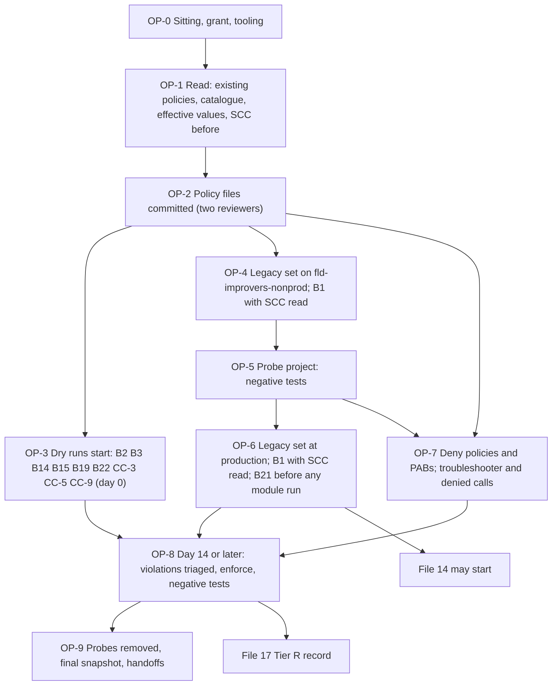

# 13. Organisation policies, deny policies and principal access boundaries

## Status
- Owner: the platform owner
- Last reviewed: 2026-09-15
- Last executed: never
- Stage: review §2 stage 12, the folder baseline, one of the four Tier R gate items. Runs after file 12 and before file 14. Files 14 to 16 may start once §6 is done; the enforcement in §8, 14 days after §3, must be done before 17 writes the Tier R record.
- Step prefix: OP. Steps: 54 (OP-8.5b was added so that the destruction of any key the B2 negative test creates is a step with its own verification, not a sentence). BLOCKED steps: none. Two proofs are re-run points, not gaps: the agent-principal entries (made by 17's module equivalents, first proven by 18's P8 spike) and the conditioned `deny-improvers` rules (proven by the denial test of 36).
- Replaces: nothing executable. Salvages only the read commands of `wall-e/PREREQUISITES.md` §4.2, with `--folder` in place of `--project`. Builds the design of [02 §4.1-§4.4](../02-landing-zone-and-tiers.md) and [04 §3-§4](../04-identity-and-privileged-access.md), corrected where Google's pages of 2026-09-14 differ (see "What the design and the old text got wrong").
- Applies decisions SD-01 (hand-made factory work is a deviation), SD-15 (SCC before any location policy), SD-22 (deny principal form), SD-24 (`deny-improvers`), SD-25 (sandbox customer id, made in 21) and SD-46 (`ent-bootstrap-module`), all signed in 03.
- Closes: S001 (the policy, deny and PAB half), S006 (the folder allow-list half), S072 (the platform half), S119 (the allow-list half), X-RQB-04 (the folder-scoped SCC check). See "Findings".

## What this part builds

1. **The organisation-policy baseline B1 to B22** of 02 §4.1, every constraint by exact name, from policy files committed to the platform repository under two-person review. Each policy is applied under `ENT_PLATFORM_POLICY`. The policy it replaces is saved first as its rollback.
2. **Dry run where Google supports it, and only there.** Google's dry-run page (updated 2026-09-09) supports dry run for custom constraints, managed constraints and four legacy constraints: `gcp.restrictServiceUsage`, `gcp.restrictEndpointUsage`, `gcp.restrictTLSVersion` and `gcp.restrictTLSCipherSuites`. "Attempting to create an organization policy in dry-run mode using any other constraint results in an error." Those constraints run for at least 14 days in dry run, then are enforced. Every other (legacy) constraint is applied to a nonprod folder first, proven there on a throwaway probe project, then applied at its production attachment point.
3. **The `gcp.restrictServiceUsage` allow-lists** per folder, holding only services the constraint governs. The P-SA list includes every governed Agent Gateway required API. Controllers have no `cloudbuild` or `artifactregistry`. Improvers have no `aiplatform` or `modelarmor` until S4.
4. **The first location policy on a nonprod folder**, with SCC tier and residency read before and after, then the same at `fld-agentic-platform`.
5. **B21, the three Cloud KMS constraints**, before the first module run (17). **B19, the WIF issuer constraint** at `fld-platform-core`, equal to the provider 10 created.
6. **Three deny policies** (`deny-agents-platform`, `deny-core-agents`, `deny-improvers`) and **two principal access boundary policies** (`pab-agents`, `pab-core-ci`). Each holds only the entries whose principals exist today, in the documented principal form. Each entry is proven by a denied call where a call can be made, and by Policy Troubleshooter always.
7. **Three custom constraints** that Google's pages make verifiable today: CC-3 (Binary Authorization on Cloud Run services), CC-5 (project id prefix) and CC-9 (folder display-name prefix), in dry run.

What this part does not build, and who does:

| Item | Where |
|---|---|
| Deny entries naming agent principals (`principal://agents.global.org-ORG_ID.system.id.goog/resources/aiplatform/projects/N`), the per-project service-account entries and action-service exceptions of 04 §3 R1-R5, R3b; the per-project `pab-agents` bindings | 17 (module equivalents), first proven by 18's P8 spike on `canary-r` |
| `deny-agents-platform` and `deny-improvers` entries for `mo-*` | 22 (FM-IMPROVER) |
| The sandbox customer id in B5 on nonprod folders holding twin components | 21 (SD-25) |
| `fld-gemini-enterprise`'s allow-list, B1's `eu` check for the app, CC-12, the two managed Gemini Enterprise constraints | 19 (the union with the app's enabled services, X-GE-03) |
| CC-1, CC-2, CC-6, CC-8, CC-11 (spikes) and CC-7 | 18 and 34 |
| `pab-agents-p-sa` (its only resources are `WALLE_PROJECT` and the approval surface) | 31 |
| B16 and CC-4 (held until P3) | 18 records P3; 35 applies them |
| B20 (held until P12) | 42, only after a dated P12 decision |
| `CORE_PROJECT`'s one-project `secretmanager` exception for `platform-pager-key` | 15 part A, as a dated project-level input |

### What the design and the old text got wrong, and must not come back

| Text | Why it fails (checked 2026-09-15) | Here instead |
|---|---|---|
| "Rule for every new constraint: dry-run first, 14 days minimum" (02 §4.1); "org-policy baseline B1-B22 ... dry-run 14 days first" (S001 fix) | Dry run is refused for legacy constraints other than the four named above (dry-run page, updated 2026-09-09; S001 facts verdict). B1, B4-B6, B8-B13, B17, B18 and B21 cannot be dry-run. | §3 dry-runs the supported set (B2, B3, B14, B15, B19, B22, CC-3, CC-5, CC-9). §4 to §6 apply the legacy set to `fld-improvers-nonprod` first, prove it on a probe, then apply it at production. |
| `principalSet://agents.global.org-${ORG_ID}.system.id.goog/*` in a deny policy (SETUP 12b step 7); `principalSet://.../attribute.platformContainer/aiplatform/projects/N` as the denied agent principal (04 §3) | Google's principals overview (updated 2026-09-14) lists Deny among policy types that "don't support sets of agent identities", and gives the deny form for all agents in a project as `principal://agents.global.org-ORG_ID.system.id.goog/resources/aiplatform/projects/PROJECT_NUMBER`. The principal-identifiers page, same date, still lists the `principalSet` forms in its deny table: the two pages conflict (S072). | SD-22: the `principal://` form, written by 17 per project, proven by 18's P8 spike with a denied call. 13 creates no agent entry. |
| `agentregistry`, `admin`, `iam`, `logging`, `monitoring`, `essentialcontacts`, `billingbudgets`, `observability`, `telemetry`, `agentidentity`, `gmail` and others inside `gcp.restrictServiceUsage` allow-lists (02 §4.2); P71's "agentregistry is refused by the P-SA allow-list" (SETUP l.2048) | None of these is on Google's list of services supported by the constraint (updated 2026-09-09). A service that is not on the list is neither allowed nor refused by it. Listing it creates a false control. | Committed allow-lists hold only governed services. The rest is listed per folder as "not governed, fenced by" (deny rule, IAM, CI). `agentregistry` is fenced by project IAM in the agent projects (05 §2.2) and the shared registry's admission rules enforced by the register's CI (16): it is neither on the `gcp.restrictServiceUsage` supported list nor on the deny-policy supported list, so no deny rule can name it either (OP-2.5). |
| `pab-agents` rules listing "the aggregated Pub/Sub topics in `CORE_PROJECT` and the approval surface ... never a whole core project" (04 §4.3) | A PAB rule's `resources` accepts "Resource Manager resources (projects, folders, and organizations)" only (PAB policies page, updated 2026-09-14). A topic cannot be listed. | `pab-agents` has one rule, `fld-agentic-platform`, which already contains `fld-platform-core`. The topic-level fence is IAM on the topic. |
| "`pab-core-ci`, a second PAB binding `factory-apply@` and `platform-drift@`" (02 §4.4) | A PAB binds a principal set (a workload pool, a Workspace domain, a project, folder or organisation principal set, or a project's agent identities). No single service account can be a target. | Two bindings on the project principal sets of `CICD_PROJECT` and `CORE_PROJECT`, each with a condition on `principal.subject`, so only those two accounts are subject to the policy (conditions attribute reference). |
| B1 `in:eu-locations` alone (02 §4.1) | The `eu-locations` value group holds `EU`, `eu` and the EU regions, but not `europe`. `europe` is only in `europe-locations`, which also holds the UK and Switzerland (defining-locations page, updated 2026-09-09). Eve's key ring `eve-eu` (SD-47) and the `gemini` key ring use Cloud KMS location `europe`, so 23 would be refused. | B1 = `in:eu-locations` plus the single value `is:europe`, with the residency note passed to 08's table. |
| Eve Phase 9 enabling `cloudbuild` and `artifactregistry` in `EVE_PROJECT` (S006) | Builds run in `CICD_PROJECT`. B18 needs `binaryauthorization` in the project that runs the service, and B17 needs a VPC network, so `compute`. Neither was in the controllers list. | Controllers list: no `cloudbuild` or `artifactregistry`; adds `binaryauthorization` and `compute`. The 14-day dry run shows whether a cross-project image pull needs `artifactregistry` (Assumption below). |
| SETUP 12c enabling three of the 22 Agent Gateway APIs, and a P-SA allow-list holding "exactly the services the Wall-E set names" (S119) | Any missing name makes the import or its data path fail once the list is enforced. | The P-SA list includes every governed name from Google's Required APIs list. Whether each is enabled in `WALLE_PROJECT` is 34's decision. |
| `gcloud org-policies describe <c> --project="$PROJECT" --effective` after Phase 6 (PREREQUISITES §4.2) | A per-project check after the project exists is too late, and `$PROJECT` is a retired name. | The same read, `--folder=<FLD_*>`, before and after each change (OP-1.3, OP-7.4). |



## Preconditions

- [ ] File 12 is complete: `ENT_PLATFORM_POLICY`, `ENT_PROJECT_REPAIR_CORE` and `ENT_BOOTSTRAP_MODULE_IMPROVERS_NONPROD` exist and each passed its one-grant test. The organisation exception is withdrawn, so nothing here runs on standing roles.
- [ ] File 09 is complete: every `FLD_*` variable is set; `SCC_TIER` reads `PREMIUM/eu`; `TAG_KEY_TIER` is set and `agp-tier` values are bound as in 09's folder table. **No `gcp.resourceLocations` policy exists anywhere** (09's last checklist line).
- [ ] File 10 is complete: `CICD_PROJECT`, `CORE_PROJECT`, `LOGGING_PROJECT`, `KMS_PROJECT`, `VALIDATOR_PROJECT`, `SA_FACTORY_APPLY`, `SA_PLATFORM_DRIFT`, `SA_K7_EXECUTOR`, `WIF_PROVIDER` and `TF_STATE_BUCKET` are set. The `wif-smoke` workflow of CP-5.3 ran green on `main`, and `factory-apply@` holds its billing roles (CP-5.6).
- [ ] File 03 has signed SD-15, SD-22, SD-24, SD-25 and SD-46, and set `GIT_OIDC_ISSUER`, `PLATFORM_REPO_REMOTE`, `SECOND_HUMAN_EMAIL` and `SECURITY_REVIEWER_EMAIL` (a value or `*tbd*`). Branch protection on `main` requires two human reviewers.
- [ ] File 01 values: `ORG_ID`, `DIRECTORY_CUSTOMER_ID`, `DOMAIN`, `REGION`, `PLATFORM_REPO_DIR`, `BUILD_LOG_DIR`, `EVIDENCE_REGISTER`, `DEVIATION_REGISTER`, `DRILL_CALENDAR`, and its helpers.
- [ ] File 07 values: `BILLING_ACCOUNT_ID`, and a `BOOTSTRAP_BILLING_EXPIRY` at least 20 days away. The probe project of §5 is linked under `sa-1-admin@`'s Billing Account User.
- [ ] Workstation: gcloud with the `beta` component (Policy Troubleshooter is `gcloud beta`), `jq`, `curl`, `git`. The gcloud configuration has no default project.
- [ ] The second human (and the security reviewer, if appointed) can be reached to approve PAM grants in each sitting window, and to review two pull requests.

## People

| Role | Does | Present at |
|---|---|---|
| Platform owner, as `sa-1-admin@` | Requests every grant; writes the files; runs every command; records evidence | Every step |
| Approver of `ENT_PLATFORM_POLICY` recorded in 12: the second human, plus the security reviewer as a second approver once appointed | Approves each 1-hour grant against the pull request it names; never approves a grant whose justification lacks a merged commit. PAM refuses self-approval (04 §5.1) | OP-0.2 in each sitting |
| Second human, as approver of `ENT_BOOTSTRAP_MODULE_IMPROVERS_NONPROD` | Approves the probe project's creation grant | OP-5.1 |
| Required reviewers of the platform repository: the second human, and the security reviewer where appointed | Review and merge the policy pull request (OP-2.6), the probe workflow (OP-7.2) and the enforcement changes (OP-8.2) | Not a sitting |

Nobody else. Separation rule: the platform owner authors and applies, and never approves. Where the security reviewer is not yet appointed, the grant and the reviews are recorded as one-approver mode, dated. That mode ends the day 03 names the security reviewer (re-run point in OP-9.2).

Hands-on time about 2.5 days: day 0 (§0 to §3), day 1 (§4, §5, §7), day 2 (§6, after the nonprod observation), day 14 or later (§8, §9). Elapsed about 3 weeks.

Conventions of [01](01-prerequisites-and-conventions.md) apply to every step. Each step starts with `checkpoint <id> START` and ends with `checkpoint <id> DONE [witness] [evidence id]`. Records go under `BUILD_LOG_DIR/records/` as `<date>-<step>-<slug>-v<n>` and are registered with `evidence_add`. Deviation rows use 01 PR-4.1's table with ids `BD-13-<n>`. The EU AI Act id for every record here is E-05 (technical documentation, infrastructure record of the Annex IV index); TISAX ids are given per step.

## The constraint plan

Kind, dry-run support and parameters are read from Google's API in OP-1.2 and must match this table, or the file stops.

| # | Constraint | Kind | Value | Attachment | Path | Proof |
|---|---|---|---|---|---|---|
| B1 | `constraints/gcp.resourceLocations` | legacy list | `in:eu-locations`, `is:europe` | `fld-agentic-platform` | nonprod first, SCC read before and after (OP-4.1, OP-6.1) | probe bucket in `us-central1` refused (OP-5.3) |
| B2 | `constraints/iam.managed.disableServiceAccountKeyCreation` | managed | enforce | `fld-agentic-platform` | dry run 14 days | probe key creation refused (OP-8.5) |
| B3 | `constraints/iam.managed.disableServiceAccountKeyUpload` | managed | enforce | `fld-agentic-platform` | dry run 14 days | effective read |
| B4 | `constraints/iam.automaticIamGrantsForDefaultServiceAccounts` | legacy boolean | enforce | `fld-agentic-platform` | nonprod first | probe's Compute Engine default account holds no project role (OP-5.4) |
| B5 | `constraints/iam.allowedPolicyMemberDomains` | legacy list | `DIRECTORY_CUSTOMER_ID` | `fld-agentic-platform` | nonprod first | `domain:example.com` binding refused on the probe (OP-5.3) |
| B6 | `constraints/iam.disableCrossProjectServiceAccountUsage` | legacy boolean, Google-managed default already restricts | enforce | `fld-agentic-platform` | nonprod first | effective read |
| B7 | `constraints/iam.managed.disableAccessPolicyBinding` (singular: constraints reference, updated 2026-09-14) | managed, Google-managed default already restricts | enforce; `enforce: false` on `fld-agents-r`, `fld-agents-w`, `fld-agents-p`, `fld-controllers` | as value | direct (OP-4.4): the platform-folder policy restates the default, and the four lifts deny nothing, so a dry run proves nothing | effective read on all six |
| B8 | `constraints/storage.uniformBucketLevelAccess` | legacy boolean | enforce | `fld-agentic-platform` | nonprod first | fine-grained probe bucket refused (OP-5.3) |
| B9 | `constraints/storage.publicAccessPrevention` | legacy boolean | enforce | `fld-agentic-platform` | nonprod first | `--no-public-access-prevention` on the probe bucket refused, command (6) of OP-5.3. Not the `allUsers` binding, which B5 refuses first |
| B10 | `constraints/gcp.detailedAuditLoggingMode` | legacy boolean | enforce | `fld-agentic-platform` | nonprod first | effective read; log detail checked in 14 |
| B11 | `constraints/compute.vmExternalIpAccess` | legacy list | `denyAll` | `fld-agentic-platform` | nonprod first | effective read (no VM is created) |
| B12 | `constraints/compute.skipDefaultNetworkCreation` | legacy boolean | enforce | `fld-agentic-platform` | nonprod first | probe has no `default` network (OP-5.4) |
| B13 | `constraints/sql.restrictPublicIp` | legacy boolean | enforce | `fld-agentic-platform` | nonprod first | effective read |
| B14 | `constraints/essentialcontacts.managed.allowedContactDomains` | managed, parameter `allowedDomains` | `@DOMAIN` | `fld-agentic-platform` | dry run 14 days | effective read; dry-run log |
| B15 | `constraints/gcp.restrictServiceUsage` | legacy list, dry run supported | allow-lists below | every folder except `fld-gemini-enterprise` (19); project-level on `KMS_PROJECT` | dry run 14 days | probe `compute` call refused after enforcement (OP-8.5) |
| B16 | `constraints/run.allowedIngress` | legacy list | held until P3 | — | not applied | absent (OP-6.5) |
| B17 | `constraints/run.allowedVPCEgress` | legacy list | `private-ranges-only`; whether it should be `all-traffic` is a dated decision raised in OP-5.6 | `fld-agents-w`, `fld-agents-p`, `fld-controllers` | nonprod children first, and the probe | probe Cloud Run deploy with a wrong egress value refused; a deploy with no VPC egress at all is a recorded observation, not a stop (OP-5.6) |
| B18 | `constraints/run.allowedBinaryAuthorizationPolicies` | legacy list | `default` | `fld-agents-w`, `fld-agents-p`, `fld-controllers`, `fld-platform-core` | nonprod children first, and the probe | probe deploy without Binary Authorization refused (OP-5.6) |
| B19 | `constraints/iam.managed.workloadIdentityPoolProviders` | managed, one list parameter read in OP-1.2 | `GIT_OIDC_ISSUER`, character for character as CP-4.3 | `fld-platform-core` | dry run 14 days | effective read; 10's provider still `ACTIVE` and `wif-smoke` still green after enforcement (OP-8.3). A refused second provider needs Workload Identity Pool Admin, which no entitlement of 12 carries, so it joins 17's negative test |
| B20 | `constraints/gcp.restrictNonCmekServices`, `constraints/gcp.restrictCmekCryptoKeyProjects` | legacy lists | held until P12 | — | not applied | absent (OP-6.5) |
| B21 | `constraints/cloudkms.allowedProtectionLevels`, `constraints/cloudkms.disableBeforeDestroy`, `constraints/cloudkms.minimumDestroyScheduledDuration` | legacy list, boolean, list | `is:HSM`; enforce; `in:30d` | `fld-agentic-platform`, before the first module run | nonprod first | SOFTWARE key and a 1-day destroy duration refused on the probe (OP-5.5) |
| B22 | `constraints/gcp.restrictTLSVersion` | legacy list, dry run supported | denied `TLS_VERSION_1`, `TLS_VERSION_1_1` | `fld-agentic-platform` | dry run 14 days | effective read; client test (OP-8.5) |
| CC-3 | `custom.runBinaryAuthorizationRequired` | custom, `run.googleapis.com/Service`, CREATE and UPDATE | Google's example condition | `fld-agents-w`, `fld-agents-p`, `fld-controllers` | dry run 14 days | dry-run entry from OP-5.6's deploy |
| CC-5 | `custom.agpProjectIdPrefix` | custom, `cloudresourcemanager.googleapis.com/Project`, CREATE (Preview) | `resource.projectId.startsWith("agp-")` | `fld-agentic-platform` | dry run 14 days | dry-run log empty for the probe, which complies |
| CC-9 | `custom.fldFolderNaming` | custom, `cloudresourcemanager.googleapis.com/Folder`, CREATE and UPDATE (Preview) | `resource.displayName.startsWith("fld-")` | `fld-agentic-platform` | dry run 14 days | effective read |

Legacy constraints are "nonprod first" on `fld-improvers-nonprod`, which is empty, carries no twin, and has the probe entitlement of SD-46. B17 and B18, whose production attachment is not the platform folder, go first on `fld-agents-w-nonprod`, `fld-agents-p-nonprod` and `fld-controllers-nonprod`, and on the probe project itself.

## The allow-lists

All values are `<name>.googleapis.com`. "Governed" is Google's list of services supported by `gcp.restrictServiceUsage` (updated 2026-09-09). IAM, Cloud Logging and Cloud Monitoring are always allowed (restricting-resources page, updated 2026-09-09).

**Platform control set, added to every list except `fld-agents-x`:** `securitycenter`, `securitycentermanagement`, `privilegedaccessmanager`, `policyanalyzer`. Reason: SCC Premium scans every project (07 §3); project- and folder-scoped PAM entitlements (`ent-project-repair-<agent>`, `ent-bootstrap-module`, `ENT_PROJECT_REPAIR_CORE`) are resources inside these folders (04 §5.2); the drift job reads Policy Analyzer at folder scope (02 §6). `Assumption:` these four are the control-plane services the lists need. The dry run is the check, and a denial logged for any other service is triaged in OP-8.1.

| Folder (policy at) | Governed allow-list committed | In the design list but not governed, and the fence that applies instead |
|---|---|---|
| `fld-platform-core` | `bigquery`, `bigquerydatatransfer`, `storage`, `cloudbuild`, `artifactregistry`, `containeranalysis`, `binaryauthorization`, `apphub`, `pubsub`, `run`, `cloudscheduler`, `iap`, `cloudkms`, `dlp`, + control set | `containerscanning`, `iam`, `iamcredentials`, `sts`, `monitoring`, `cloudasset`, `cloudresourcemanager`, `serviceusage`, `orgpolicy`, `essentialcontacts`, `billingbudgets`: IAM; deny `deny-core-agents` (OP-7.5); `pab-core-ci`. `agentregistry`: IAM and 16's registry admission only, since no deny policy may name it. `secretmanager` stays absent (the 15 part A project exception is separate) |
| `KMS_PROJECT` (project-level, replaces the folder list) | `cloudkms`, + control set | `logging`: always allowed |
| `fld-agents-r` | `aiplatform`, `apphub`, `modelarmor`, `iap`, `networkservices`, `networksecurity`, `dns`, `compute`, `discoveryengine`, `storage`, `bigquery`, `cloudtrace`, `apptopology`, `cloudapiregistry`, `notebooks`, `texttospeech`, `dataform`, `pubsub`, + control set | `agentidentity`, `agentidentitycredentials`, `observability`, `telemetry`, `essentialcontacts`, `billingbudgets`, `logging`, `monitoring`: IAM and the agent's manifest check (16). `agentregistry` (P71) is fenced by project IAM and the registry admission of 16, not by this list and not by a deny rule (it is on neither supported list) |
| `fld-agents-r-nonprod` (merges with parent) | `run` | — |
| `fld-agents-w` (parent `fld-agentic-platform` carries no list) | R's governed list + `run`, `secretmanager`, `cloudkms`, `firestore`, `cloudtasks`, `cloudscheduler`, `cloudbuild`, `artifactregistry`, `binaryauthorization`, + control set | `admin`, `licensing`, `groupssettings`, `gmail`, `chat`, `calendar-json` (the system-of-record APIs of 02 §4.2): not governed, fenced by the OAuth client's scopes, consent and the manifest (32, 33) |
| `fld-agents-p` (parent carries no list) | W's governed list + `accessapproval`, + control set | as W |
| `fld-agents-p-sa` (replaces `fld-agents-p`'s list: "exactly") | `aiplatform`, `discoveryengine`, `run`, `cloudbuild`, `artifactregistry`, `binaryauthorization`, `secretmanager`, `firestore`, `cloudscheduler`, `cloudtasks`, `pubsub`, `bigquery`, `cloudkms`, `storage`, `modelarmor`, `networkservices`, `networksecurity`, `compute`, `dns`, `iap`, `apphub`, `apptopology`, `cloudapiregistry`, `notebooks`, `texttospeech`, `dataform`, `cloudtrace`, `accessapproval`, + control set | From the Wall-E set and Google's 22 Agent Gateway Required APIs (set-up page, read 2026-09-15): `iam`, `observability`, `telemetry`, `logging`, `monitoring`, `agentregistry`, `agentidentity`, `iamcredentials`, `billingbudgets`, `admin`, `licensing`, `gmail`, `chat`, `calendar-json`, `groupssettings`: not governed. 31 compares this list with Wall-E's register row; 34 decides which are enabled |
| `fld-agents-x` | none: `denyAll` | — |
| `fld-controllers` | `run`, `cloudscheduler`, `bigquery`, `bigquerydatatransfer`, `storage`, `cloudkms`, `secretmanager`, `iap`, `pubsub`, `aiplatform`, `modelarmor`, `binaryauthorization` (B18 and S006), `compute` (B17's Direct VPC egress, S006), + control set. **No `cloudbuild`, no `artifactregistry`** | `admin`, `logging`, `monitoring`, `essentialcontacts`, `billingbudgets`: not governed. `aiplatform` is refused again on `EVE_PROJECT` by 23's project-level denylist |
| `fld-improvers` | `bigquery`, `bigquerydatatransfer`, `storage`, `run`, `cloudscheduler`, `artifactregistry`, `pubsub`, + control set. **No `aiplatform`, no `modelarmor`** (added at S4 by a dated pull request, 40) | `logging`, `monitoring`, `essentialcontacts`, `billingbudgets`: not governed. `secretmanager`, `cloudkms`, `firestore`, `iap` absent, as designed |

`Assumption:` for controllers, pulling an image stored in `CICD_PROJECT`'s registry is governed by `CICD_PROJECT`'s folder policy, not by the project that runs the service. Binary Authorization's Cloud Run page lists Artifact Registry among the APIs to enable (updated 2026-09-03). The 14-day dry run settles this with 23's first deploy: a logged `artifactregistry` denial on a controller project becomes a pull request adding it, with the reason, before OP-8.4.

Every list except `fld-agents-r-nonprod`'s sets `inheritFromParent: false`, so it is exactly what the table says; this matters for `fld-agents-p-sa`, whose parent `fld-agents-p` carries a longer list. `fld-agents-r-nonprod` sets `inheritFromParent: true` to add `run` to R's list.

## 0. The sitting

### OP-0.1 Open the sitting and check the gates

- **WHO:** Platform owner.
- **WHERE:** Shell with `~/.platform-env` sourced, gcloud configuration `GCLOUD_CONFIG_NAME` active, signed in as `sa-1-admin@`.
- **ACTION:**

```bash
penv_guard
need ORG_ID DIRECTORY_CUSTOMER_ID DOMAIN REGION PLATFORM_REPO_DIR BUILD_LOG_DIR EVIDENCE_REGISTER DEVIATION_REGISTER
need FLD_AGENTIC_PLATFORM FLD_PLATFORM_CORE FLD_AGENTS_R FLD_AGENTS_R_NONPROD FLD_AGENTS_W FLD_AGENTS_W_NONPROD FLD_AGENTS_P FLD_AGENTS_P_NONPROD FLD_AGENTS_P_SA FLD_AGENTS_X FLD_CONTROLLERS FLD_CONTROLLERS_NONPROD FLD_IMPROVERS FLD_IMPROVERS_NONPROD
need FLD_GEMINI_ENTERPRISE FLD_AGENTS_R_PROD FLD_AGENTS_W_PROD FLD_AGENTS_P_PROD FLD_AGENTS_P_SA_PROD FLD_AGENTS_P_SA_NONPROD FLD_CONTROLLERS_PROD FLD_IMPROVERS_PROD PLATFORM_ENV_FILE DRILL_CALENDAR SA_1_ADMIN
need SCC_TIER TAG_KEY_TIER CICD_PROJECT CORE_PROJECT LOGGING_PROJECT KMS_PROJECT VALIDATOR_PROJECT SA_FACTORY_APPLY SA_PLATFORM_DRIFT SA_K7_EXECUTOR WIF_PROVIDER TF_STATE_BUCKET GIT_OIDC_ISSUER BILLING_ACCOUNT_ID
need ENT_PLATFORM_POLICY ENT_PROJECT_REPAIR_CORE ENT_BOOTSTRAP_MODULE_IMPROVERS_NONPROD SECOND_HUMAN_EMAIL PLATFORM_REPO_REMOTE
test "$SCC_TIER" = "PREMIUM/eu" && echo "SCC gate OK"
for d in SD-15 SD-22 SD-24 SD-25 SD-46; do ls "$PLATFORM_REPO_DIR"/decisions/*"$d"* >/dev/null 2>&1 && echo "SIGNED $d" || echo "UNSIGNED $d"; done
grep -E $'\t(PA-[0-9.]+)\tDONE\t' "$BUILD_LOG_DIR/checkpoints.tsv" | tail -1
gcloud auth list --filter=status:ACTIVE --format="value(account)"
checkpoint OP-0.1 START
```

- **VERIFY:** No `MISSING` line; `SCC gate OK`; five `SIGNED` lines; the last file-12 checkpoint is `DONE` for its closing step; the active account is `SA_1_ADMIN`. Any other result stops the file. `SECURITY_REVIEWER_EMAIL` may be `*tbd*`: then write `checkpoint OP-0.1 DONE - - "one-approver mode: security reviewer not appointed"`.
- **ROLLBACK:** Read only.
- **EVIDENCE:** The output as `<date>-OP-0.1-gates-v1.txt`. TISAX 1.2.2 (separation of duties recorded).

### OP-0.2 Request the `ENT_PLATFORM_POLICY` grant for this window

Repeat this step at the start of each 1-hour window; every later step that changes a policy says "under the grant of OP-0.2".

- **WHO:** Platform owner requests; the approver recorded in 12 approves (the second human; the security reviewer too once appointed). Never the platform owner.
- **WHERE:** Requester's shell; approver's own shell or the console at **IAM & Admin > Privileged Access Manager > Approve grants**.
- **ACTION:** Requester:

```bash
PR_URL="<URL of the merged pull request this window applies, from OP-2.6 or OP-8.2>"
gcloud pam grants create --entitlement="$ENT_PLATFORM_POLICY" --requested-duration=3600s --justification="setup 13 ${PR_URL}"
gcloud pam grants search --entitlement="$ENT_PLATFORM_POLICY" --caller-relationship=had-created --format="table(name,state,createTime)"
```

  Approver, after opening `PR_URL` and checking the merge commit:

```bash
gcloud pam grants search --entitlement="<ENT_PLATFORM_POLICY value>" --caller-relationship=can-approve --format="table(name,justification.unstructuredJustification)"
gcloud pam grants approve "<grant name from the search>" --reason="checked merged commit of <PR_URL>"
```

- **VERIFY:** The requester's search shows the grant `ACTIVE`. Then, after up to a few minutes:

```bash
curl -sS -X POST -H "Authorization: Bearer $(gcloud auth print-access-token)" -H "Content-Type: application/json" -d '{"permissions":["orgpolicy.policies.create","iam.denypolicies.create","iam.principalaccessboundarypolicies.create"]}' "https://cloudresourcemanager.googleapis.com/v3/organizations/${ORG_ID}:testIamPermissions"
```

  echoes the three permissions. The same call before approval echoes none, which proves nothing is standing.
- **ROLLBACK:** At the end of the window, revoke the grant. `gcloud pam grants` has no `withdraw` subcommand (its subcommands are `approve`, `create`, `deny`, `describe`, `list`, `revoke` and `search`: `gcloud pam grants` reference, read 2026-09-15); the name `gcloud pam grants search` returns is already fully qualified, so no `--location` or `--organization` flag is passed:

```bash
G="$(gcloud pam grants search --entitlement="$ENT_PLATFORM_POLICY" --caller-relationship=had-created --filter="state=ACTIVE" --format="value(name)")"
test -n "$G" && gcloud pam grants revoke "$G" --reason="setup 13 window closed"
```

  Otherwise the grant expires after 1 hour.
- **EVIDENCE:** The grant name and state in the build log. PAM's `CreateGrant` and `ApproveGrant` audit entries are the primary record (04 §5.1). TISAX 4.1.3, 4.2.1.

### OP-0.3 Commit the apply and read-back script

- **WHO:** Platform owner writes; the required reviewers merge with the policy files in OP-2.6.
- **WHERE:** `PLATFORM_REPO_DIR`.
- **ACTION:** One script applies a policy file, saving the predecessor first and reading the result back. It is procedure text, reviewed like the policies it applies.

```bash
mkdir -p "$PLATFORM_REPO_DIR/policies/tools"
cat > "$PLATFORM_REPO_DIR/policies/tools/op-set.sh" <<'SCRIPT'
#!/usr/bin/env bash
# op-set.sh POLICY_FILE.json : save predecessor, set with update mask *, read back and diff. Setup 13.
set -euo pipefail
f="$1"; : "${PLATFORM_REPO_DIR:?}" "${CORE_PROJECT:?}"
name="$(jq -r .name "$f")"; res="${name%%/policies/*}"; con="${name##*/policies/}"
kind="${res%%/*}"; id="${res#*/}"
case "$kind" in folders) flag="--folder=$id";; projects) flag="--project=$id";; *) echo "refused: $name (13 sets folder and project policies only)" >&2; exit 2;; esac
day="$(date -u +%Y-%m-%d)"; d="$PLATFORM_REPO_DIR/policies/predecessors/$day"; mkdir -p "$d"
pre="$d/${kind}-${id}-${con}.json"
# Predecessor probe: gcloud, not curl. NOT_FOUND means no policy; any other error stops the script.
if probe="$(gcloud org-policies describe "$con" "$flag" --format=json 2>"$d/probe.err")"; then
  printf '%s' "$probe" > "$pre"
elif grep -qE 'NOT_FOUND|was not found' "$d/probe.err"; then
  echo '{"predecessor":"none"}' > "$pre"
else
  echo "PROBE-ERROR $name: predecessor could not be read; nothing applied" >&2; cat "$d/probe.err" >&2; exit 4
fi
rm -f "$d/probe.err"
gcloud org-policies set-policy "$f" --update-mask='*'
sleep 5
gcloud org-policies describe "$con" "$flag" --format=json | jq -S 'del(.etag,.spec.etag,.spec.updateTime,.dryRunSpec.etag,.dryRunSpec.updateTime)' > "$d/${kind}-${id}-${con}.applied.json"
if jq -S . "$f" | diff -u - "$d/${kind}-${id}-${con}.applied.json"; then echo "APPLIED $name"; else echo "READBACK-DIFF $name: read the diff; a value format difference is acceptable only if the meaning is identical" >&2; exit 3; fi
SCRIPT
chmod 755 "$PLATFORM_REPO_DIR/policies/tools/op-set.sh"
```

  Rollback of any applied file is the predecessor: `{"predecessor":"none"}` means `gcloud org-policies delete <constraint> --folder=<id>` (or `--project=<id>`); otherwise `gcloud org-policies set-policy <predecessor file> --update-mask='*'` after removing its `etag` fields with `jq 'del(.etag,.spec.etag,.spec.updateTime,.dryRunSpec.etag,.dryRunSpec.updateTime)'`. Commands and fields: `set-policy` reference (JSON or YAML file; update mask `*`), dry-run page, `gcloud org-policies describe` reference (all read 2026-09-15).

  Exit codes, which every caller in this file relies on: `0` applied and read back identical; `2` an attachment point this file does not set; `3` read-back difference; `4` the predecessor could not be read, so nothing was applied. The predecessor is probed with `gcloud org-policies describe`, never with an unchecked `curl`: an HTTP error must never be read as "no predecessor", because the rollback of every later step is that file, and a false `{"predecessor":"none"}` turns a rollback into a `delete` of an inherited or hand-made policy.

  Every caller loops as below, so one bad file stops the batch instead of being passed over:

```bash
n=0; for f in <the files of the step>; do policies/tools/op-set.sh "$f" || { echo "STOP at $f (exit $?)"; break; }; n=$((n+1)); done; echo "APPLIED-COUNT $n"
```

- **VERIFY:** `bash -n "$PLATFORM_REPO_DIR/policies/tools/op-set.sh" && echo syntax-ok`. Then the four exit codes are read from the script text by the reviewers of OP-2.6, and the `exit 3` and `exit 4` lines are present: `grep -c 'exit [34]' "$PLATFORM_REPO_DIR/policies/tools/op-set.sh"` prints `2`.
- **ROLLBACK:** `git -C "$PLATFORM_REPO_DIR" checkout -- policies/tools` before the pull request.
- **EVIDENCE:** Part of the OP-2.6 merge commit. TISAX 5.2.1.

## 1. Read before any change

### OP-1.1 Snapshot every existing policy on the organisation and the platform folders

- **WHO:** Platform owner.
- **WHERE:** Shell. No grant needed if `platform-readers@` holds `roles/orgpolicy.policyViewer` (12); otherwise under the grant of OP-0.2.
- **ACTION:**

```bash
S="$BUILD_LOG_DIR/records/$(date -u +%Y-%m-%d)-OP-1.1-policy-snapshot-v1"; mkdir -p "$S"
TOKEN_HDR="Authorization: Bearer $(gcloud auth print-access-token)"
curl -sS --fail-with-body -H "$TOKEN_HDR" -H "x-goog-user-project: $CORE_PROJECT" "https://orgpolicy.googleapis.com/v2/organizations/${ORG_ID}/policies" > "$S/organization.json" || { echo "READ-ERROR organization"; false; }
for v in FLD_AGENTIC_PLATFORM FLD_PLATFORM_CORE FLD_GEMINI_ENTERPRISE FLD_AGENTS_R FLD_AGENTS_R_PROD FLD_AGENTS_R_NONPROD FLD_AGENTS_W FLD_AGENTS_W_PROD FLD_AGENTS_W_NONPROD FLD_AGENTS_P FLD_AGENTS_P_PROD FLD_AGENTS_P_NONPROD FLD_AGENTS_P_SA FLD_AGENTS_P_SA_PROD FLD_AGENTS_P_SA_NONPROD FLD_AGENTS_X FLD_CONTROLLERS FLD_CONTROLLERS_PROD FLD_CONTROLLERS_NONPROD FLD_IMPROVERS FLD_IMPROVERS_PROD FLD_IMPROVERS_NONPROD; do
  curl -sS --fail-with-body -H "$TOKEN_HDR" -H "x-goog-user-project: $CORE_PROJECT" "https://orgpolicy.googleapis.com/v2/folders/$(eval echo \$$v)/policies" > "$S/$v.json" || { echo "READ-ERROR $v"; false; }
done
for p in CICD_PROJECT CORE_PROJECT LOGGING_PROJECT KMS_PROJECT VALIDATOR_PROJECT; do
  curl -sS --fail-with-body -H "$TOKEN_HDR" -H "x-goog-user-project: $CORE_PROJECT" "https://orgpolicy.googleapis.com/v2/projects/$(eval echo \$$p)/policies" > "$S/$p.json" || { echo "READ-ERROR $p"; false; }
done
# One shape for every file, folder and project alike; the REST call returns {"policies":[...]}.
jq -r 'if type=="array" then .[] else .policies[]? end | .name' "$S"/*.json | tee "$S/all-policy-names.txt"
FOUND="$(grep -c . "$S/all-policy-names.txt" || true)"
ORGLOC="$(grep -c 'gcp.resourceLocations' "$S/all-policy-names.txt" || true)"
NONORG="$(grep -vc '^organizations/' "$S/all-policy-names.txt" || true)"
test "$NONORG" -eq 0 || echo "STOP: a folder or core project already holds a policy"
test "$ORGLOC" -eq 0 || echo "STOP: a gcp.resourceLocations policy already exists (SD-15 order broken)"
echo "policies found: $FOUND"
unset TOKEN_HDR
```

  The five core projects are read through the same REST call as the folders, so every file has the shape `{"policies":[...]}`; `gcloud org-policies list --format=json` returns a bare array and cannot be indexed with `.policies`, which would have made the five project files silently contribute nothing to the stop check and unusable as day-0 predecessors. `--fail-with-body` makes an HTTP error a non-zero exit instead of an empty result.

- **VERIFY:** No `READ-ERROR` line and no `STOP:` line. 23 files exist (organisation, 22 folders) plus the five project files; the folder and project files hold no policy (09 and 10 created none). The organisation file lists what the organisation already has. Read especially `iam.allowedPolicyMemberDomains`, `iam.automaticIamGrantsForDefaultServiceAccounts`, `iam.disableServiceAccountKeyCreation`, `storage.uniformBucketLevelAccess` and `essentialcontacts.allowedContactDomains`: organisations created on or after 2024-05-03 have these as a security baseline (constraints reference, updated 2026-09-14). Write them into the build log. Either `STOP:` line ends the file: SD-15's order is then already broken, and IT security re-reads SCC before anything else.
- **ROLLBACK:** Read only.
- **EVIDENCE:** The directory, registered: `evidence_add OP-1.1 policy-snapshot E-05 5.2.1 "build-log:records/<dir>"`. These files are the day-0 predecessors. TISAX 5.2.1, 1.5.1.

### OP-1.2 Read the constraint catalogue from Google, and stop on any mismatch

- **WHO:** Platform owner.
- **WHERE:** Shell.
- **ACTION:** The organization-policy API returns, per constraint, `supportsDryRun` and, for managed constraints, the parameter schema (`ListConstraintsResponse` reference, read 2026-09-15). Read it at the platform folder, so the answer is the one that applies there.

```bash
C="$BUILD_LOG_DIR/records/$(date -u +%Y-%m-%d)-OP-1.2-catalogue-v1.json"
curl -sS -H "Authorization: Bearer $(gcloud auth print-access-token)" -H "x-goog-user-project: $CORE_PROJECT" "https://orgpolicy.googleapis.com/v2/folders/${FLD_AGENTIC_PLATFORM}/constraints?pageSize=1000" > "$C"
for c in gcp.resourceLocations iam.managed.disableServiceAccountKeyCreation iam.managed.disableServiceAccountKeyUpload iam.automaticIamGrantsForDefaultServiceAccounts iam.allowedPolicyMemberDomains iam.disableCrossProjectServiceAccountUsage iam.managed.disableAccessPolicyBinding storage.uniformBucketLevelAccess storage.publicAccessPrevention gcp.detailedAuditLoggingMode compute.vmExternalIpAccess compute.skipDefaultNetworkCreation sql.restrictPublicIp essentialcontacts.managed.allowedContactDomains gcp.restrictServiceUsage run.allowedIngress run.allowedVPCEgress run.allowedBinaryAuthorizationPolicies iam.managed.workloadIdentityPoolProviders gcp.restrictNonCmekServices gcp.restrictCmekCryptoKeyProjects cloudkms.allowedProtectionLevels cloudkms.disableBeforeDestroy cloudkms.minimumDestroyScheduledDuration gcp.restrictTLSVersion; do
  jq -r --arg c "$c" '.constraints[]? | select(.name|endswith("/constraints/"+$c)) | "\($c)\tdryRun=\(.supportsDryRun // false)\ttype=\(if .listConstraint then "list" elif .booleanConstraint then "boolean" else "other" end)\tparams=\((.booleanConstraint.customConstraintDefinition.parameters // {}) | keys | join(","))"' "$C" | grep . || echo "$c	NOT-LISTED"
done
```

  If the response carries `nextPageToken`, repeat with `&pageToken=<token>` into a second file and include it in the loop.
- **VERIFY:** Every line prints, none `NOT-LISTED`. `dryRun=true` for exactly B2, B3, B7, B14, B15, B19 and B22 of the list, `dryRun=false` for the rest. B14 shows `params=allowedDomains`. B19 shows exactly one parameter name: write it into the build log as a `checkpoint OP-1.2 DONE - - "B19 parameter <name>"` note (it is not a variable of plan §5) and use it in OP-2.3. The `type` column is informational: the API may describe a managed constraint through another field. **Stop** on any `dryRun` or `params` difference from "The constraint plan": the plan is then out of date, and a pull request against this page comes first.
- **ROLLBACK:** Read only.
- **EVIDENCE:** `evidence_add OP-1.2 constraint-catalogue E-05 5.2.1 "build-log:records/<file>" "$C"`. TISAX 5.2.1.

### OP-1.3 Read the effective values on the platform folder

- **WHO:** Platform owner.
- **WHERE:** Shell.
- **ACTION:** The read commands of PREREQUISITES §4.2, at the folder:

```bash
E="$BUILD_LOG_DIR/records/$(date -u +%Y-%m-%d)-OP-1.3-effective-before-v1.txt"
for c in gcp.resourceLocations iam.allowedPolicyMemberDomains iam.managed.disableAccessPolicyBinding iam.managed.disableServiceAccountKeyCreation iam.managed.disableServiceAccountKeyUpload iam.automaticIamGrantsForDefaultServiceAccounts iam.disableCrossProjectServiceAccountUsage storage.uniformBucketLevelAccess storage.publicAccessPrevention gcp.restrictServiceUsage cloudkms.allowedProtectionLevels gcp.restrictTLSVersion; do
  echo "== $c" >> "$E"
  gcloud org-policies describe "$c" --folder="$FLD_AGENTIC_PLATFORM" --effective --format=json >> "$E" 2>&1
done
```

- **VERIFY:** The file shows, per constraint, either an inherited organisation value (matching OP-1.1) or the default. Each later step compares against it.
- **ROLLBACK:** Read only.
- **EVIDENCE:** `evidence_add OP-1.3 effective-before E-05 5.2.1 "build-log:records/<file>" "$E"`. TISAX 1.5.1.

### OP-1.4 Confirm no deny policy or PAB exists yet

- **WHO:** Platform owner.
- **WHERE:** Shell.
- **ACTION:**

```bash
B="$BUILD_LOG_DIR/records/$(date -u +%Y-%m-%d)-OP-1.4-deny-pab-before-v1.txt"; : > "$B"
for a in "organizations/$ORG_ID" "folders/$FLD_AGENTIC_PLATFORM" "folders/$FLD_PLATFORM_CORE"; do
  echo "== deny $a" >> "$B"
  gcloud iam policies list --attachment-point="cloudresourcemanager.googleapis.com/$a" --kind=denypolicies --format="value(name)" >> "$B" || { echo "STOP: deny list failed on $a"; false; }
done
echo "== pab organisation" >> "$B"
gcloud iam principal-access-boundary-policies list --organization="$ORG_ID" --location=global --format="value(name)" >> "$B" || { echo "STOP: PAB list failed"; false; }
echo "== pab bindings targeting the organisation" >> "$B"
gcloud iam policy-bindings search-target-policy-bindings --organization="$ORG_ID" --location=global --target="//cloudresourcemanager.googleapis.com/organizations/$ORG_ID" --format="value(name)" >> "$B" || { echo "STOP: binding search failed on the organisation"; false; }
for p in CICD_PROJECT CORE_PROJECT; do
  echo "== pab bindings targeting $p" >> "$B"
  gcloud iam policy-bindings search-target-policy-bindings --organization="$ORG_ID" --location=global --target="//cloudresourcemanager.googleapis.com/projects/$(eval echo \$$p)" --format="value(name)" >> "$B" || { echo "STOP: binding search failed on $p"; false; }
done
grep -c '^[a-z]' "$B" || true
```

  `search-target-policy-bindings` requires `--target`, `--location` and one of `--organization` or `--folder`; it has no `--project` flag, and the parent flag names where the search runs, not the target's own parent (its reference, read 2026-09-15; the reference's own example is `--organization=123 --location=global --target=//cloudresourcemanager.googleapis.com/organizations/123`). Each call is followed by `|| { echo STOP...; false; }`, because an errored call prints nothing on stdout and would otherwise read as "empty, therefore proven".
- **VERIFY:** No `STOP:` line; every call exited 0; the `grep -c` count of listed names is `0`, or the only names are policies the organisation already had, which are recorded and left untouched. An empty result from a call that errored proves nothing, so a `STOP:` line ends the file. A policy named `deny-agents-platform`, `deny-core-agents`, `deny-improvers`, `pab-agents` or `pab-core-ci` already present also stops the file: a hand edit happened outside this procedure.
- **ROLLBACK:** Read only.
- **EVIDENCE:** `$B`, registered: `evidence_add OP-1.4 deny-pab-before E-05 4.2.1 "build-log:records/<file>" "$B"`. TISAX 4.2.1.

### OP-1.5 Read SCC before any location policy

- **WHO:** Platform owner; IT security co-signs the screenshots (the P11 signatory of 09).
- **WHERE:** EU console **Security Command Center > Settings > Tier details** and **Setup details** for the organisation; then the shell.
- **ACTION:** Screenshot both tabs. Then:

```bash
gcloud scc manage services describe security-health-analytics --organization="$ORG_ID" --format="value(effectiveEnablementState)"
gcloud scc manage services describe event-threat-detection --organization="$ORG_ID" --format="value(effectiveEnablementState)"
gcloud config set api_endpoint_overrides/securitycenter https://securitycenter.eu.rep.googleapis.com/
gcloud scc findings list "$ORG_ID" --location=eu --limit=1 --format="value(finding.name)"
gcloud config unset api_endpoint_overrides/securitycenter
```

- **VERIFY:** Tier details: **Premium**. Setup details: residency **eu**. Both services `ENABLED`. The findings call exits 0 (it may print nothing). This equals 09 FS-7.5; any difference stops the file and returns to 09. The same five readings are repeated in OP-4.2 and OP-6.2. `gcloud scc manage services describe` reference and the regional endpoint rule, read 2026-09-15.
- **ROLLBACK:** The endpoint override is unset in the same step.
- **EVIDENCE:** `<date>-OP-1.5-scc-before-v1` (screenshots, signed) and the command output. TISAX 1.5.1, 7.1.2. Closes X-RQB-04's "read before".

## 2. The policy files

Layout in the platform repository, merged in one pull request: `policies/org/<folder-variable>/<constraint>.json` (live policies), `policies/dryrun/<folder-variable>/<constraint>.json` (dry-run form, promoted in §8), `policies/custom/<constraint>.yaml`, `policies/deny/<policy-id>.json`, `policies/pab/<policy-id>.rules.json`, `policies/predecessors/<date>/` (written by `op-set.sh`), `policies/tools/`. CODEOWNERS (03) makes the second human, and the security reviewer where appointed, required reviewers of `policies/`.

### OP-2.1 Write the legacy-constraint files

- **WHO:** Platform owner.
- **WHERE:** `PLATFORM_REPO_DIR`, shell.
- **ACTION:** One small function writes one file; it lives only in this sitting. First the platform-wide set, once for the nonprod folder and once for production:

```bash
cd "$PLATFORM_REPO_DIR"
pol() { mkdir -p "$(dirname "$1")"; jq -n --arg name "$2" --argjson spec "$3" '{name:$name, spec:$spec}' > "$1"; }
for T in FLD_IMPROVERS_NONPROD FLD_AGENTIC_PLATFORM; do
  F="$(eval echo \$$T)"; D="policies/org/$T"
  pol "$D/gcp.resourceLocations.json" "folders/$F/policies/gcp.resourceLocations" '{"rules":[{"values":{"allowedValues":["in:eu-locations","is:europe"]}}]}'
  pol "$D/iam.automaticIamGrantsForDefaultServiceAccounts.json" "folders/$F/policies/iam.automaticIamGrantsForDefaultServiceAccounts" '{"rules":[{"enforce":true}]}'
  pol "$D/iam.allowedPolicyMemberDomains.json" "folders/$F/policies/iam.allowedPolicyMemberDomains" "{\"rules\":[{\"values\":{\"allowedValues\":[\"$DIRECTORY_CUSTOMER_ID\"]}}]}"
  pol "$D/iam.disableCrossProjectServiceAccountUsage.json" "folders/$F/policies/iam.disableCrossProjectServiceAccountUsage" '{"rules":[{"enforce":true}]}'
  pol "$D/storage.uniformBucketLevelAccess.json" "folders/$F/policies/storage.uniformBucketLevelAccess" '{"rules":[{"enforce":true}]}'
  pol "$D/storage.publicAccessPrevention.json" "folders/$F/policies/storage.publicAccessPrevention" '{"rules":[{"enforce":true}]}'
  pol "$D/gcp.detailedAuditLoggingMode.json" "folders/$F/policies/gcp.detailedAuditLoggingMode" '{"rules":[{"enforce":true}]}'
  pol "$D/compute.vmExternalIpAccess.json" "folders/$F/policies/compute.vmExternalIpAccess" '{"rules":[{"denyAll":true}]}'
  pol "$D/compute.skipDefaultNetworkCreation.json" "folders/$F/policies/compute.skipDefaultNetworkCreation" '{"rules":[{"enforce":true}]}'
  pol "$D/sql.restrictPublicIp.json" "folders/$F/policies/sql.restrictPublicIp" '{"rules":[{"enforce":true}]}'
  pol "$D/cloudkms.allowedProtectionLevels.json" "folders/$F/policies/cloudkms.allowedProtectionLevels" '{"rules":[{"values":{"allowedValues":["is:HSM"]}}]}'
  pol "$D/cloudkms.disableBeforeDestroy.json" "folders/$F/policies/cloudkms.disableBeforeDestroy" '{"rules":[{"enforce":true}]}'
  pol "$D/cloudkms.minimumDestroyScheduledDuration.json" "folders/$F/policies/cloudkms.minimumDestroyScheduledDuration" '{"rules":[{"values":{"allowedValues":["in:30d"]}}]}'
done
```

  Then B17 and B18, at the three nonprod children, their parents and `fld-platform-core` (B18 only):

```bash
for T in FLD_AGENTS_W_NONPROD FLD_AGENTS_P_NONPROD FLD_CONTROLLERS_NONPROD FLD_AGENTS_W FLD_AGENTS_P FLD_CONTROLLERS; do
  F="$(eval echo \$$T)"; D="policies/org/$T"
  pol "$D/run.allowedVPCEgress.json" "folders/$F/policies/run.allowedVPCEgress" '{"rules":[{"values":{"allowedValues":["private-ranges-only"]}}]}'
  pol "$D/run.allowedBinaryAuthorizationPolicies.json" "folders/$F/policies/run.allowedBinaryAuthorizationPolicies" '{"rules":[{"values":{"allowedValues":["default"]}}]}'
done
pol "policies/org/FLD_PLATFORM_CORE/run.allowedBinaryAuthorizationPolicies.json" "folders/$FLD_PLATFORM_CORE/policies/run.allowedBinaryAuthorizationPolicies" '{"rules":[{"values":{"allowedValues":["default"]}}]}'
PROBE="agp-imp-opprobe-nonprod"
pol "policies/probe/run.allowedVPCEgress.json" "projects/$PROBE/policies/run.allowedVPCEgress" '{"rules":[{"values":{"allowedValues":["private-ranges-only"]}}]}'
pol "policies/probe/run.allowedBinaryAuthorizationPolicies.json" "projects/$PROBE/policies/run.allowedBinaryAuthorizationPolicies" '{"rules":[{"values":{"allowedValues":["default"]}}]}'
ls policies/org/*/ policies/probe/ | head -60
```

  Value forms: `in:` value groups and `is:` values for `gcp.resourceLocations` (defining-locations page); `denyAll`, `enforce`, `allowedValues` in the policy JSON of the `set-policy` reference and the organization-policy REST reference; `HSM` and `in:30d` on the Cloud KMS constraint rows, `private-ranges-only` and `default` on the Cloud Run rows of the constraints reference (all read 2026-09-15). B16 and B20 get no file, only `policies/HELD.md` naming P3 and P12.
- **VERIFY:** `jq -e . policies/org/*/*.json policies/probe/*.json >/dev/null && echo json-ok`; 13 files under each of the two platform-wide folders, 2 under each of the six tier folders, 1 under `FLD_PLATFORM_CORE`, 2 under `policies/probe/` (the probe project of §5, whose id is fixed here so its policies are reviewed with the rest).
- **ROLLBACK:** `git -C "$PLATFORM_REPO_DIR" checkout -- policies` before the pull request.
- **EVIDENCE:** Part of the OP-2.6 merge commit. TISAX 5.2.1.

### OP-2.2 Write the B7 files and the dry-run managed files

- **WHO:** Platform owner.
- **WHERE:** `PLATFORM_REPO_DIR`.
- **ACTION:**

```bash
cd "$PLATFORM_REPO_DIR"
pol "policies/org/FLD_AGENTIC_PLATFORM/iam.managed.disableAccessPolicyBinding.json" "folders/$FLD_AGENTIC_PLATFORM/policies/iam.managed.disableAccessPolicyBinding" '{"rules":[{"enforce":true}]}'
for T in FLD_AGENTS_R FLD_AGENTS_W FLD_AGENTS_P FLD_CONTROLLERS; do
  pol "policies/org/$T/iam.managed.disableAccessPolicyBinding.json" "folders/$(eval echo \$$T)/policies/iam.managed.disableAccessPolicyBinding" '{"rules":[{"enforce":false}]}'
done
dry() { mkdir -p "$(dirname "$1")"; jq -n --arg name "$2" --argjson spec "$3" '{name:$name, dryRunSpec:$spec}' > "$1"; }
P=policies/dryrun/FLD_AGENTIC_PLATFORM
dry "$P/iam.managed.disableServiceAccountKeyCreation.json" "folders/$FLD_AGENTIC_PLATFORM/policies/iam.managed.disableServiceAccountKeyCreation" '{"rules":[{"enforce":true}]}'
dry "$P/iam.managed.disableServiceAccountKeyUpload.json" "folders/$FLD_AGENTIC_PLATFORM/policies/iam.managed.disableServiceAccountKeyUpload" '{"rules":[{"enforce":true}]}'
dry "$P/essentialcontacts.managed.allowedContactDomains.json" "folders/$FLD_AGENTIC_PLATFORM/policies/essentialcontacts.managed.allowedContactDomains" "{\"rules\":[{\"enforce\":true,\"parameters\":{\"allowedDomains\":[\"@$DOMAIN\"]}}]}"
dry "$P/gcp.restrictTLSVersion.json" "folders/$FLD_AGENTIC_PLATFORM/policies/gcp.restrictTLSVersion" '{"rules":[{"values":{"deniedValues":["TLS_VERSION_1","TLS_VERSION_1_1"]}}]}'
```

  The dry-run form (`dryRunSpec` alone) and the managed `parameters` block are from the dry-run and using-constraints pages; `allowedDomains` of the form `@example.com` is from the constraints reference row of B14; `TLS_VERSION_1` and `TLS_VERSION_1_1` "can only be specified in the denied list" (constraints reference, B22 row). All read 2026-09-15.
- **VERIFY:** `jq -e . policies/org/*/iam.managed.disableAccessPolicyBinding.json policies/dryrun/*/*.json >/dev/null && echo json-ok`.
- **ROLLBACK:** As OP-2.1.
- **EVIDENCE:** Part of the OP-2.6 merge commit. TISAX 5.2.1, 5.1.2 (B22), 4.1.1 (B2, B3).

### OP-2.3 Write B19 from the catalogue's parameter name

- **WHO:** Platform owner.
- **WHERE:** `PLATFORM_REPO_DIR`.
- **ACTION:** Use the one parameter name OP-1.2 printed for `iam.managed.workloadIdentityPoolProviders`. The constraints reference describes the values as "specified by URI/URLs"; the issuer is the value 10 CP-4.3 passed to `--issuer-uri`, character for character (including a trailing slash, if any).

```bash
cd "$PLATFORM_REPO_DIR"
B19_PARAM="<the single parameter name printed by OP-1.2>"
ISSUER_IN_PROVIDER="$(gcloud iam workload-identity-pools providers describe "${WIF_PROVIDER##*/}" --workload-identity-pool=wif-factory --location=global --project="$CICD_PROJECT" --format='value(oidc.issuerUri)')"
test "$ISSUER_IN_PROVIDER" = "$GIT_OIDC_ISSUER" && echo issuer-match
mkdir -p policies/dryrun/FLD_PLATFORM_CORE
jq -n --arg name "folders/$FLD_PLATFORM_CORE/policies/iam.managed.workloadIdentityPoolProviders" --arg p "$B19_PARAM" --arg v "$GIT_OIDC_ISSUER" '{name:$name, dryRunSpec:{rules:[{enforce:true, parameters:{($p):[$v]}}]}}' > policies/dryrun/FLD_PLATFORM_CORE/iam.managed.workloadIdentityPoolProviders.json
```

  The `mkdir -p` is not decorative: `policies/dryrun/FLD_PLATFORM_CORE/` is otherwise first created by OP-2.4's `rsu` helper, which runs after this step, so the bare redirect would fail with "No such file or directory", B19's file would never be committed, and B19 would be silently absent from the 14-day dry run and from OP-8.3's enforcement list.
- **VERIFY:** `issuer-match`; `jq -e . policies/dryrun/FLD_PLATFORM_CORE/iam.managed.workloadIdentityPoolProviders.json >/dev/null && echo b19-file-ok`. A mismatch stops the step: 03 and 10 are reconciled first, because B19 would refuse the platform's own provider on its next update.
- **ROLLBACK:** As OP-2.1.
- **EVIDENCE:** Part of the OP-2.6 merge commit. TISAX 4.1.1, 5.2.1.

### OP-2.4 Write the `gcp.restrictServiceUsage` dry-run files

- **WHO:** Platform owner.
- **WHERE:** `PLATFORM_REPO_DIR`.
- **ACTION:** From "The allow-lists" table, exactly. A list is a space-separated string turned into `allowedValues`.

```bash
cd "$PLATFORM_REPO_DIR"
CTRL="securitycenter securitycentermanagement privilegedaccessmanager policyanalyzer"
R_LIST="aiplatform apphub modelarmor iap networkservices networksecurity dns compute discoveryengine storage bigquery cloudtrace apptopology cloudapiregistry notebooks texttospeech dataform pubsub"
W_LIST="$R_LIST run secretmanager cloudkms firestore cloudtasks cloudscheduler cloudbuild artifactregistry binaryauthorization"
rsu() { # rsu VAR RESOURCE INHERIT "svc svc ..."
  mkdir -p "policies/dryrun/$1"
  vals="$(for s in $4; do printf '%s.googleapis.com\n' "$s"; done | sort -u | jq -R . | jq -s .)"
  jq -n --arg name "$2/policies/gcp.restrictServiceUsage" --argjson inh "$3" --argjson v "$vals" '{name:$name, dryRunSpec:{inheritFromParent:$inh, rules:[{values:{allowedValues:$v}}]}}' > "policies/dryrun/$1/gcp.restrictServiceUsage.json"
}
rsu FLD_PLATFORM_CORE "folders/$FLD_PLATFORM_CORE" false "bigquery bigquerydatatransfer storage cloudbuild artifactregistry containeranalysis binaryauthorization apphub pubsub run cloudscheduler iap cloudkms dlp $CTRL"
rsu KMS_PROJECT "projects/$KMS_PROJECT" false "cloudkms $CTRL"
rsu FLD_AGENTS_R "folders/$FLD_AGENTS_R" false "$R_LIST $CTRL"
rsu FLD_AGENTS_R_NONPROD "folders/$FLD_AGENTS_R_NONPROD" true "run"
rsu FLD_AGENTS_W "folders/$FLD_AGENTS_W" false "$W_LIST $CTRL"
rsu FLD_AGENTS_P "folders/$FLD_AGENTS_P" false "$W_LIST accessapproval $CTRL"
rsu FLD_AGENTS_P_SA "folders/$FLD_AGENTS_P_SA" false "aiplatform discoveryengine run cloudbuild artifactregistry binaryauthorization secretmanager firestore cloudscheduler cloudtasks pubsub bigquery cloudkms storage modelarmor networkservices networksecurity compute dns iap apphub apptopology cloudapiregistry notebooks texttospeech dataform cloudtrace accessapproval $CTRL"
rsu FLD_CONTROLLERS "folders/$FLD_CONTROLLERS" false "run cloudscheduler bigquery bigquerydatatransfer storage cloudkms secretmanager iap pubsub aiplatform modelarmor binaryauthorization compute $CTRL"
rsu FLD_IMPROVERS "folders/$FLD_IMPROVERS" false "bigquery bigquerydatatransfer storage run cloudscheduler artifactregistry pubsub $CTRL"
mkdir -p policies/dryrun/FLD_AGENTS_X
jq -n --arg name "folders/$FLD_AGENTS_X/policies/gcp.restrictServiceUsage" '{name:$name, dryRunSpec:{rules:[{denyAll:true}]}}' > policies/dryrun/FLD_AGENTS_X/gcp.restrictServiceUsage.json
```

  Then check every value against Google's list. Save the page's value list once, by hand, as `policies/tools/restrict-services-supported-<date>.txt` (one `*.googleapis.com` per line, from the "Services that support restricting service usage" reference, updated 2026-09-09), and run:

```bash
SUP="policies/tools/restrict-services-supported-$(date -u +%Y-%m-%d).txt"
jq -r '.dryRunSpec.rules[].values.allowedValues[]?' policies/dryrun/*/gcp.restrictServiceUsage.json | sort -u | while read -r s; do grep -qx "$s" "$SUP" || echo "NOT-GOVERNED $s"; done
```

- **VERIFY:** No `NOT-GOVERNED` line. Ten files. `fld-agents-p-sa`'s list contains every governed name of the 22 Agent Gateway Required APIs (`compute`, `networksecurity`, `networkservices`, `dns`, `iap`, `aiplatform`, `discoveryengine`, `storage`, `modelarmor`, `cloudtrace`, `apphub`, `apptopology`, `cloudapiregistry`, `notebooks`, `texttospeech`, `dataform`): `jq -r '.dryRunSpec.rules[0].values.allowedValues[]' policies/dryrun/FLD_AGENTS_P_SA/gcp.restrictServiceUsage.json | grep -c -E '^(compute|networksecurity|networkservices|dns|iap|aiplatform|discoveryengine|storage|modelarmor|cloudtrace|apphub|apptopology|cloudapiregistry|notebooks|texttospeech|dataform)\.googleapis\.com$'` prints `16`. The controllers file contains neither `cloudbuild` nor `artifactregistry`; the improvers file contains neither `aiplatform` nor `modelarmor`.
- **ROLLBACK:** As OP-2.1.
- **EVIDENCE:** Part of the OP-2.6 merge commit, with the saved supported-services list. TISAX 1.3.3 (approved services), 5.2.2.

### OP-2.5 Write the custom constraints, the deny policies and the PAB rules

- **WHO:** Platform owner.
- **WHERE:** `PLATFORM_REPO_DIR`.
- **ACTION:** Run in the same shell as OP-2.1 and OP-2.2, whose `pol` and `dry` functions it uses; after a cut, paste their two definition lines again first. Custom constraints (format and command: create-custom-constraints page; CC-3's condition is Google's "Require Binary Authorization to be set to default" example on the Cloud Run custom constraints page; Project and Folder fields on the Resource Manager custom constraints page; all read 2026-09-15):

```bash
cd "$PLATFORM_REPO_DIR"; mkdir -p policies/custom policies/deny policies/pab
cat > policies/custom/custom.runBinaryAuthorizationRequired.yaml <<EOF
name: organizations/${ORG_ID}/customConstraints/custom.runBinaryAuthorizationRequired
resourceTypes:
- run.googleapis.com/Service
methodTypes:
- CREATE
- UPDATE
condition: "'run.googleapis.com/binary-authorization' in resource.metadata.annotations && resource.metadata.annotations['run.googleapis.com/binary-authorization'] == 'default'"
actionType: ALLOW
displayName: runBinaryAuthorizationRequired
description: CC-3 of 02 4.3. Cloud Run services must set Binary Authorization to default.
EOF
cat > policies/custom/custom.agpProjectIdPrefix.yaml <<EOF
name: organizations/${ORG_ID}/customConstraints/custom.agpProjectIdPrefix
resourceTypes:
- cloudresourcemanager.googleapis.com/Project
methodTypes:
- CREATE
condition: "resource.projectId.startsWith(\"agp-\")"
actionType: ALLOW
displayName: agpProjectIdPrefix
description: CC-5 of 02 4.3 and P37. Project ids under the platform start with agp-.
EOF
cat > policies/custom/custom.fldFolderNaming.yaml <<EOF
name: organizations/${ORG_ID}/customConstraints/custom.fldFolderNaming
resourceTypes:
- cloudresourcemanager.googleapis.com/Folder
methodTypes:
- CREATE
- UPDATE
condition: "resource.displayName.startsWith(\"fld-\")"
actionType: ALLOW
displayName: fldFolderNaming
description: CC-9 of 02 4.3. Folder display names under the platform start with fld-.
EOF
for T in FLD_AGENTS_W FLD_AGENTS_P FLD_CONTROLLERS; do dry "policies/dryrun/$T/custom.runBinaryAuthorizationRequired.json" "folders/$(eval echo \$$T)/policies/custom.runBinaryAuthorizationRequired" '{"rules":[{"enforce":true}]}'; done
dry "policies/dryrun/FLD_AGENTIC_PLATFORM/custom.agpProjectIdPrefix.json" "folders/$FLD_AGENTIC_PLATFORM/policies/custom.agpProjectIdPrefix" '{"rules":[{"enforce":true}]}'
dry "policies/dryrun/FLD_AGENTIC_PLATFORM/custom.fldFolderNaming.json" "folders/$FLD_AGENTIC_PLATFORM/policies/custom.fldFolderNaming" '{"rules":[{"enforce":true}]}'
```

  Deny policies. Principal identifiers for deny policies (principal-identifiers page, updated 2026-09-14): one service account is `principal://iam.googleapis.com/projects/-/serviceAccounts/EMAIL`; all service accounts in a folder's projects is `principalSet://cloudresourcemanager.googleapis.com/folders/NUMBER/type/ServiceAccount`, a set Google's principals overview lists as supported by Deny. Every permission name below must be on Google's "Permissions supported in deny policies" list (updated 2026-09-14); OP-2.6 re-checks every name with `grep` and refuses the commit on any miss, because `gcloud iam policies create` rejects a whole policy that carries one unrecognised permission, and a rejected `deny-core-agents` would leave OP-7.5 with nothing to create and OP-7.7 with nothing to prove.

Two consequences of that rule, applied above:

- Permission names take the form SERVICE_FQDN/RESOURCE.ACTION, and Resource Manager's FQDN is `cloudresourcemanager.googleapis.com`, not `resourcemanager.googleapis.com`. `CORE_GOV` therefore reads `cloudresourcemanager.googleapis.com/projects.setIamPolicy` and `cloudresourcemanager.googleapis.com/folders.setIamPolicy` (deny-permissions-support page, read 2026-09-15).
- `agentregistry.googleapis.com/services.create|update|delete` is **not** written into any deny policy: Agent Registry is a new surface and is not on the deny-support list, so the three names would make the `deny-core-agents` create call fail outright. The fence for Agent Registry is project IAM in the agent projects (05 §2.2) and the shared registry's own admission rules (16), which the register's CI enforces; it is neither a deny rule nor `gcp.restrictServiceUsage`, which does not govern the service either.

A deny condition may use only resource-tag functions (deny page), so each conditioned rule carries one `resource.matchTag` call.

```bash
R1='"secretmanager.googleapis.com/versions.access","secretmanager.googleapis.com/versions.add","secretmanager.googleapis.com/secrets.setIamPolicy"'
R2='"cloudkms.googleapis.com/cryptoKeyVersions.useToSign","cloudkms.googleapis.com/cryptoKeyVersions.useToDecrypt","cloudkms.googleapis.com/cryptoKeys.setIamPolicy"'
R3='"iam.googleapis.com/serviceAccountKeys.create","iam.googleapis.com/serviceAccounts.getAccessToken","iam.googleapis.com/serviceAccounts.getOpenIdToken","iam.googleapis.com/serviceAccounts.signBlob","iam.googleapis.com/serviceAccounts.signJwt","iam.googleapis.com/serviceAccounts.implicitDelegation","iam.googleapis.com/serviceAccounts.setIamPolicy"'
R6='"secretmanager.googleapis.com/versions.access","secretmanager.googleapis.com/versions.add","secretmanager.googleapis.com/secrets.setIamPolicy","cloudkms.googleapis.com/cryptoKeyVersions.useToSign","cloudkms.googleapis.com/cryptoKeyVersions.useToDecrypt","cloudkms.googleapis.com/cryptoKeys.setIamPolicy","iam.googleapis.com/serviceAccounts.getAccessToken","iam.googleapis.com/serviceAccounts.signBlob","iam.googleapis.com/serviceAccounts.signJwt","iam.googleapis.com/serviceAccounts.implicitDelegation","iam.googleapis.com/serviceAccounts.actAs","iam.googleapis.com/serviceAccounts.setIamPolicy"'
CORE_GOV='"iam.googleapis.com/serviceAccounts.actAs","run.googleapis.com/services.create","run.googleapis.com/services.update","run.googleapis.com/services.delete","run.googleapis.com/services.setIamPolicy","run.googleapis.com/jobs.create","run.googleapis.com/jobs.update","run.googleapis.com/jobs.setIamPolicy","artifactregistry.googleapis.com/repositories.uploadArtifacts","cloudbuild.googleapis.com/builds.create","logging.googleapis.com/sinks.create","logging.googleapis.com/sinks.update","logging.googleapis.com/sinks.delete","logging.googleapis.com/buckets.update","logging.googleapis.com/buckets.delete","storage.googleapis.com/buckets.setIamPolicy","bigquery.googleapis.com/datasets.setIamPolicy","cloudresourcemanager.googleapis.com/projects.setIamPolicy","cloudresourcemanager.googleapis.com/folders.setIamPolicy","iam.googleapis.com/roles.create","iam.googleapis.com/roles.update","iam.googleapis.com/roles.delete"'
set_of() { printf '"principalSet://cloudresourcemanager.googleapis.com/folders/%s/type/ServiceAccount"' "$1"; }
cat > policies/deny/deny-agents-platform.json <<EOF
{"displayName":"deny-agents-platform","rules":[
 {"denyRule":{"deniedPrincipals":["principal://iam.googleapis.com/projects/-/serviceAccounts/${SA_FACTORY_APPLY}"],"deniedPermissions":[${R6}]}}
]}
EOF
cat > policies/deny/deny-core-agents.json <<EOF
{"displayName":"deny-core-agents","rules":[
 {"denyRule":{"deniedPrincipals":[$(set_of "$FLD_AGENTS_R"),$(set_of "$FLD_AGENTS_W"),$(set_of "$FLD_AGENTS_P"),$(set_of "$FLD_AGENTS_X"),$(set_of "$FLD_CONTROLLERS"),$(set_of "$FLD_IMPROVERS")],"deniedPermissions":[${R1},${R2},${R3},${CORE_GOV}]}}
]}
EOF
TIER_KEY="${ORG_ID}/agp-tier"
cat > policies/deny/deny-improvers.json <<EOF
{"displayName":"deny-improvers","rules":[
 {"denyRule":{"deniedPrincipals":[$(set_of "$FLD_IMPROVERS")],"deniedPermissions":[${R1},${R2},${R3}]}},
 {"denyRule":{"deniedPrincipals":[$(set_of "$FLD_IMPROVERS")],"deniedPermissions":["run.googleapis.com/routes.invoke"],"denialCondition":{"title":"credential holders tier w","expression":"resource.matchTag('${TIER_KEY}', 'w')"}}},
 {"denyRule":{"deniedPrincipals":[$(set_of "$FLD_IMPROVERS")],"deniedPermissions":["run.googleapis.com/routes.invoke"],"denialCondition":{"title":"credential holders tier p","expression":"resource.matchTag('${TIER_KEY}', 'p')"}}},
 {"denyRule":{"deniedPrincipals":[$(set_of "$FLD_IMPROVERS")],"deniedPermissions":["run.googleapis.com/routes.invoke"],"denialCondition":{"title":"credential holders tier p-sa","expression":"resource.matchTag('${TIER_KEY}', 'p-sa')"}}},
 {"denyRule":{"deniedPrincipals":[$(set_of "$FLD_IMPROVERS")],"deniedPermissions":["run.googleapis.com/routes.invoke"],"denialCondition":{"title":"credential holders controllers","expression":"resource.matchTag('${TIER_KEY}', 'ctl')"}}}
]}
EOF
jq -n --arg f "//cloudresourcemanager.googleapis.com/folders/$FLD_AGENTIC_PLATFORM" '[{description:"agents are eligible only inside fld-agentic-platform (04 4.3, P60)", resources:[$f], effect:"ALLOW"}]' > policies/pab/pab-agents.rules.json
jq -n --arg f "//cloudresourcemanager.googleapis.com/folders/$FLD_AGENTIC_PLATFORM" '[{description:"factory-apply@ and platform-drift@ only inside fld-agentic-platform (02 4.4)", resources:[$f], effect:"ALLOW"}]' > policies/pab/pab-core-ci.rules.json
```

  What each deny policy holds today, and why nothing more:
  - `deny-agents-platform`: rule R6 of 04 §3 only. R1-R5 and R3b name agent-project principals and action-service exceptions that do not exist; 17 adds them per project under `ENT_PLATFORM_POLICY`, in SD-22's `principal://agents.global.org-${ORG_ID}.system.id.goog/resources/aiplatform/projects/${PROJECT_NUMBER}` form beside the project's `principalSet://cloudresourcemanager.googleapis.com/projects/N/type/ServiceAccount`. 22 adds `MO_PROJECT`'s entry.
  - `deny-core-agents` at `fld-platform-core`: one rule over the service accounts of every agent, controller and improver folder, for credential, impersonation, deployment and governance permissions on core resources. It does not deny Pub/Sub publishing, BigQuery reads or registry reads, which agents legitimately use in core (04 §4.3). It denies no Agent Registry permission, for the reason above. `iam.googleapis.com/serviceAccounts.actAs` is denied here, because no agent account acts as a core account. The "every permission to every agent principal form" rule of 02 §2.3 needs agent principals: 17 adds an agent-identity rule per project, and 18's P8 spike proves it.
  - `deny-improvers` at `fld-agentic-platform`: credential and impersonation permissions for improver accounts everywhere, unconditioned. No `actAs`: Mo's per-project deployer needs it, as R3b allows. `run.googleapis.com/routes.invoke` is denied only on resources tagged `agp-tier` = `w`, `p`, `p-sa` or `ctl` (09's tag values), so Mo can still invoke its own services under `fld-improvers` (SD-24).
- **VERIFY:** `jq -e . policies/deny/*.json policies/pab/*.json >/dev/null && echo json-ok`; `yq`-free check of the custom constraints: `grep -c '^name: organizations/' policies/custom/*.yaml` prints `1` per file. Then, with Google's deny-support list already saved as OP-2.6 describes, run OP-2.6's `NOT-DENIABLE` loop here, before the branch is pushed:

```bash
DS="policies/tools/deny-supported-$(date -u +%Y-%m-%d).txt"
test -s "$DS" || { echo "STOP: save the deny-supported list first (OP-2.6)"; false; }
jq -r '.rules[].denyRule.deniedPermissions[]' policies/deny/*.json | sort -u | while read -r p; do grep -qxF "$p" "$DS" || echo "NOT-DENIABLE $p"; done
```

  No `NOT-DENIABLE` line. Any name that appears moves out of the deny file and into the fence that does apply (project IAM, the register's CI, or `pab-core-ci`), recorded in the pull request description and in BD-13-2 (OP-9.2); it is never left in the file to be discovered by a rejected `create` call in §7.
- **ROLLBACK:** As OP-2.1.
- **EVIDENCE:** Part of the OP-2.6 merge commit. TISAX 4.2.1, 5.3.1 (CC-3).

### OP-2.6 Check permission names, open the pull request, merge under two reviewers

- **WHO:** Platform owner opens; the required reviewers (the second human; the security reviewer where appointed) review and merge. The platform owner never merges.
- **WHERE:** `PLATFORM_REPO_DIR` and the git host.
- **ACTION:** Save Google's deny-supported permission list once, by hand, as `policies/tools/deny-supported-<date>.txt` (one permission per line from the "Permissions supported in deny policies" page). Then:

```bash
cd "$PLATFORM_REPO_DIR"
DS="policies/tools/deny-supported-$(date -u +%Y-%m-%d).txt"
test -s "$DS" || { echo "STOP: deny-supported list missing"; false; }
jq -r '.rules[].denyRule.deniedPermissions[]' policies/deny/*.json | sort -u | while read -r p; do grep -qxF "$p" "$DS" || echo "NOT-DENIABLE $p"; done > /tmp/op-notdeniable.txt
cat /tmp/op-notdeniable.txt
test ! -s /tmp/op-notdeniable.txt || { echo "STOP: unsupported deny permission; fix policies/deny before committing"; rm -f /tmp/op-notdeniable.txt; false; }
rm -f /tmp/op-notdeniable.txt
git checkout -b setup-13-policies
git add policies
git commit -m "policies: B1-B22, allow-lists, CC-3/5/9, deny and PAB (setup 13 OP-2)"
git push -u origin setup-13-policies
```

  Open the pull request against `main`. Its description lists: the constraint plan table; the allow-list table with the "not governed" column; the corrections to 02 §4.1-§4.4 and 04 §3-§4 made here; the Assumption on controllers and `artifactregistry`; the platform control set. Reviewers check each file against those tables.
- **VERIFY:** No `NOT-DENIABLE` and no `STOP:` line; the branch is not pushed when either appears, because `gcloud iam policies create` rejects a policy carrying one unrecognised permission and §7 would then have no policy to create. The pull request is merged with two human approvals and none from a bot or service account (CODEOWNERS of 03). `git -C "$PLATFORM_REPO_DIR" pull && git -C "$PLATFORM_REPO_DIR" log -1 --format=%H` prints the merge commit; record it in the build log as the policy commit.
- **ROLLBACK:** Close the pull request unmerged; nothing is applied until it merges.
- **EVIDENCE:** Pull request URL, approvers and merge commit: `evidence_add OP-2.6 policy-files-merged E-05 5.2.1 "git:<merge commit>"`. TISAX 5.2.1, 1.2.2.

## 3. Start the dry runs (day 0)

Every step here runs under the grant of OP-0.2, whose justification is the OP-2.6 pull request.

### OP-3.1 Create the three custom constraints

- **WHO:** Platform owner.
- **WHERE:** Shell, `PLATFORM_REPO_DIR` at the policy commit.
- **ACTION:**

```bash
cd "$PLATFORM_REPO_DIR"
for f in policies/custom/*.yaml; do gcloud org-policies set-custom-constraint "$f"; done
gcloud org-policies list-custom-constraints --organization="$ORG_ID" --format="value(name)"
```

- **VERIFY:** The list shows `custom.runBinaryAuthorizationRequired`, `custom.agpProjectIdPrefix` and `custom.fldFolderNaming`. A constraint definition enforces nothing until a policy uses it.
- **ROLLBACK:** `gcloud org-policies delete-custom-constraint custom.<name> --organization="$ORG_ID"`, after deleting any policy that uses it.
- **EVIDENCE:** `gcloud org-policies describe-custom-constraint custom.<name> --organization="$ORG_ID" --format=json` for each, saved as `<date>-OP-3.1-custom-constraints-v1.json`. TISAX 5.2.1.

### OP-3.2 Apply the dry-run policies

- **WHO:** Platform owner.
- **WHERE:** Shell.
- **ACTION:**

```bash
cd "$PLATFORM_REPO_DIR"
n=0; for f in policies/dryrun/*/*.json; do policies/tools/op-set.sh "$f" || { echo "STOP at $f (exit $?)"; break; }; n=$((n+1)); done; echo "APPLIED-COUNT $n"
ls policies/dryrun/*/*.json | wc -l
```

- **VERIFY:** `APPLIED-COUNT 20` and the file count is `20` (6 on the platform folder, 2 on `fld-platform-core`, 1 on `KMS_PROJECT`, 8 other allow-lists, 3 CC-3), so every file applied and none was passed over. No `STOP at` line and no `READBACK-DIFF` on stderr; `op-set.sh` exits 3 on a read-back difference and 4 when the predecessor could not be read, and the loop breaks on either, so a policy that did not apply as written is never built on. Then, for one live-mode check that nothing is enforced:

```bash
gcloud org-policies describe gcp.restrictServiceUsage --folder="$FLD_IMPROVERS" --format="yaml(spec,dryRunSpec)"
```

  shows `dryRunSpec` and no `spec`.
- **ROLLBACK:** Per file, from its predecessor (OP-0.3). For these, all predecessors are `none`, so `gcloud org-policies delete <constraint> --folder=<id>` (or `--project="$KMS_PROJECT"`).
- **EVIDENCE:** `policies/predecessors/<date>/` committed: `git add policies/predecessors && git commit -m "predecessors: dry-run apply (setup 13 OP-3.2)" && git push`; the pull request for this commit carries the same two reviewers. `evidence_add OP-3.2 dryrun-applied E-05 5.2.1 "git:<commit>"`. TISAX 5.2.1, 1.3.3.

### OP-3.3 Take the day-0 reading of dry-run entries in the core projects

- **WHO:** Platform owner.
- **WHERE:** Shell. One hour after OP-3.2.
- **ACTION:** The core projects are the only live projects under the platform folder today. Any entry here is an allow-list gap to decide early, before the 14 days run out.

```bash
for p in CICD_PROJECT CORE_PROJECT LOGGING_PROJECT KMS_PROJECT VALIDATOR_PROJECT; do
  echo "== $p"
  gcloud logging read 'protoPayload.metadata.dryRunResult="DENIED" AND protoPayload.metadata.liveResult="ALLOWED"' --project="$(eval echo \$$p)" --freshness=2h --limit=20 --format="table(timestamp,protoPayload.serviceName,protoPayload.methodName)"
done
```

  The filter is the dry-run page's (updated 2026-09-09). The positive proof that dry-run entries reach the log is OP-5.4, on the probe, where a violation is made on purpose. A core project cannot serve: each has only the APIs of its allow-list enabled (10 CP-1.6), so a call outside the list fails as `SERVICE_DISABLED` before any policy is evaluated.
- **VERIFY:** The reading is saved. An entry for a governed service used by the core projects (for example a dependency 10 enabled implicitly) is noted for OP-8.1. No entry is also a valid result.
- **ROLLBACK:** Read only.
- **EVIDENCE:** Output as `<date>-OP-3.3-dryrun-day0-v1.txt`. TISAX 5.2.4.

### OP-3.4 Record the dry-run window

- **WHO:** Platform owner.
- **WHERE:** `DRILL_CALENDAR` and the build log.
- **ACTION:**

```bash
START="$(date -u +%Y-%m-%d)"; END="$(date -u -v+14d +%Y-%m-%d 2>/dev/null || date -u -d '+14 days' +%Y-%m-%d)"
printf '| 13-dryrun | %s | %s | OP-8.1 review and enforcement of B2 B3 B14 B15 B19 B22 CC-3 CC-5 CC-9 | platform owner; second human reviews | open |\n' "$START" "$END" >> "$DRILL_CALENDAR"
git -C "$BUILD_LOG_DIR" add "$DRILL_CALENDAR" && git -C "$BUILD_LOG_DIR" commit -m "calendar: setup 13 dry-run window"
checkpoint OP-3.4 DONE - - "dry-run window $START to $END"
```

- **VERIFY:** The row is in the committed calendar. OP-8 refuses to start before `END`.
- **ROLLBACK:** None needed; a later window adds a new row.
- **EVIDENCE:** The commit. TISAX 5.2.1.

## 4. Legacy constraints on the nonprod folder, with the SCC check

### OP-4.1 Apply B1, the first location policy, to `fld-improvers-nonprod`

- **WHO:** Platform owner; IT security informed of the time (it co-signs OP-4.2).
- **WHERE:** Shell, under the grant of OP-0.2.
- **ACTION:**

```bash
cd "$PLATFORM_REPO_DIR"
date -u +%Y-%m-%dT%H:%M:%SZ
policies/tools/op-set.sh policies/org/FLD_IMPROVERS_NONPROD/gcp.resourceLocations.json || { echo "STOP (exit $?)"; false; }
gcloud org-policies describe gcp.resourceLocations --folder="$FLD_IMPROVERS_NONPROD" --effective --format=json
```

- **VERIFY:** One `APPLIED` line and no `STOP`. The effective policy lists `in:eu-locations` and `is:europe`. Changes can take up to 15 minutes to be enforced (using-constraints page, updated 2026-09-09).
- **ROLLBACK:** `gcloud org-policies delete gcp.resourceLocations --folder="$FLD_IMPROVERS_NONPROD"` (predecessor `none`). This is also the first action if OP-4.2 finds SCC changed.
- **EVIDENCE:** The time, `APPLIED` line and effective JSON as `<date>-OP-4.1-b1-nonprod-v1`. TISAX 7.1.1 (residency). Gate recorded: `SCC_TIER=PREMIUM/eu` checked in OP-0.1 and OP-1.5 (SD-15).

### OP-4.2 Read SCC after the nonprod location policy

- **WHO:** Platform owner; IT security co-signs.
- **WHERE:** As OP-1.5.
- **ACTION:** Repeat OP-1.5's screenshots and commands at +1 hour and again at +24 hours after OP-4.1. Google's warning covers an organisation policy deployed after an automatic Standard activation; whether a folder-scoped policy has the same effect is not documented (SCC data residency page, updated 2026-09-14; X-RQB-04).
- **VERIFY:** Both readings equal OP-1.5: Premium, residency eu, both services `ENABLED`, findings call exits 0. If any reading differs: run OP-4.1's rollback at once, ask IT security to reactivate from the EU console, record the result, and stop the file until IT security and the security reviewer sign a decision on where B1 may be set.
- **ROLLBACK:** Read only (the rollback of B1 is OP-4.1's).
- **EVIDENCE:** `<date>-OP-4.2-scc-after-nonprod-v1` (both readings, signed). TISAX 1.5.1, 7.1.2. Closes X-RQB-04's folder-scoped check on nonprod.

### OP-4.3 Apply the other platform-wide legacy constraints to `fld-improvers-nonprod`

- **WHO:** Platform owner.
- **WHERE:** Shell, under the grant of OP-0.2.
- **ACTION:**

```bash
cd "$PLATFORM_REPO_DIR"
n=0
for f in policies/org/FLD_IMPROVERS_NONPROD/*.json; do
  case "$f" in */gcp.resourceLocations.json) continue;; esac
  policies/tools/op-set.sh "$f" || { echo "STOP at $f (exit $?)"; break; }
  n=$((n+1))
done
echo "APPLIED-COUNT $n"
```

- **VERIFY:** `APPLIED-COUNT 12` and no `STOP at` line: twelve `APPLIED` lines (B4, B5, B6, B8, B9, B10, B11, B12, B13 and the three B21 constraints). A lower count means the loop broke on a read-back difference or an unreadable predecessor, and the remaining files are not applied until that one is understood. `gcloud org-policies list --folder="$FLD_IMPROVERS_NONPROD" --format="value(constraint)"` lists 13 constraints with B1.
- **ROLLBACK:** `gcloud org-policies delete <constraint> --folder="$FLD_IMPROVERS_NONPROD"` for each (predecessors `none`).
- **EVIDENCE:** The predecessors committed; `<date>-OP-4.3-legacy-nonprod-v1`. TISAX 5.2.2 (nonprod first), 4.1.1, 5.1.1, 5.2.7.

### OP-4.4 Apply B7, and B17 and B18 to the nonprod tier folders

- **WHO:** Platform owner.
- **WHERE:** Shell, under the grant of OP-0.2.
- **ACTION:**

```bash
cd "$PLATFORM_REPO_DIR"
n=0
for f in policies/org/FLD_AGENTIC_PLATFORM/iam.managed.disableAccessPolicyBinding.json \
         policies/org/FLD_AGENTS_R/iam.managed.disableAccessPolicyBinding.json \
         policies/org/FLD_AGENTS_W/iam.managed.disableAccessPolicyBinding.json \
         policies/org/FLD_AGENTS_P/iam.managed.disableAccessPolicyBinding.json \
         policies/org/FLD_CONTROLLERS/iam.managed.disableAccessPolicyBinding.json \
         policies/org/FLD_AGENTS_W_NONPROD/run.allowedVPCEgress.json \
         policies/org/FLD_AGENTS_W_NONPROD/run.allowedBinaryAuthorizationPolicies.json \
         policies/org/FLD_AGENTS_P_NONPROD/run.allowedVPCEgress.json \
         policies/org/FLD_AGENTS_P_NONPROD/run.allowedBinaryAuthorizationPolicies.json \
         policies/org/FLD_CONTROLLERS_NONPROD/run.allowedVPCEgress.json \
         policies/org/FLD_CONTROLLERS_NONPROD/run.allowedBinaryAuthorizationPolicies.json; do
  policies/tools/op-set.sh "$f" || { echo "STOP at $f (exit $?)"; break; }
  n=$((n+1))
done
echo "APPLIED-COUNT $n"
for v in FLD_AGENTIC_PLATFORM FLD_PLATFORM_CORE FLD_IMPROVERS FLD_AGENTS_R FLD_AGENTS_P_SA; do echo "== $v"; gcloud org-policies describe iam.managed.disableAccessPolicyBinding --folder="$(eval echo \$$v)" --effective --format="value(spec.rules)"; done
```

  B7 goes directly to its final form. `iam.managed.disableAccessPolicyBinding` has a Google-managed default that already restricts (constraints reference, updated 2026-09-14), so the platform-folder policy restates today's behaviour, and the four lifts only remove a restriction. B17 and B18 are legacy: nonprod first.
- **VERIFY:** `APPLIED-COUNT 11` and no `STOP at` line. The effective B7 read shows `enforce: true` on the platform folder, `fld-platform-core` and `fld-improvers`; `enforce: false` on `fld-agents-r`; `fld-agents-p-sa` inherits `enforce: false` from `fld-agents-p`.
- **ROLLBACK:** Delete each policy (predecessors `none`). Deleting a B7 lift restores the Google-managed restriction, which breaks nothing before 18's first gateway.
- **EVIDENCE:** `<date>-OP-4.4-b7-b17-b18-nonprod-v1`. TISAX 5.2.7, 5.3.1.

## 5. The probe project: proving the legacy constraints on nonprod

Every shell sitting from here to OP-9.1 starts with `PROBE="agp-imp-opprobe-nonprod"` (a fixed id, set in the shell only, not a variable of plan §5).

A throwaway project under `fld-improvers-nonprod` is the only way to see a legacy constraint refuse something before it reaches production, because the nonprod folders are empty. Its id `agp-imp-opprobe-nonprod` follows 02 §3.6. It lives until OP-9.1, so §8 can reuse it after enforcement. Its cost is one HSM key version and a few API calls.

### OP-5.1 Create the probe project

- **WHO:** Platform owner requests `ENT_BOOTSTRAP_MODULE_IMPROVERS_NONPROD`; the second human approves.
- **WHERE:** Shell.
- **ACTION:**

```bash
PROBE="agp-imp-opprobe-nonprod"
gcloud pam grants create --entitlement="$ENT_BOOTSTRAP_MODULE_IMPROVERS_NONPROD" --requested-duration=3600s --justification="setup 13 OP-5.1 probe project for legacy constraint proofs; deviation BD-13-1; no register row (throwaway)"
# after the second human's approval:
gcloud projects create "$PROBE" --folder="$FLD_IMPROVERS_NONPROD" --labels="agent=opprobe,tier=imp,env=nonprod,created_by=setup-13"
gcloud billing projects link "$PROBE" --billing-account="$BILLING_ACCOUNT_ID"
gcloud projects describe "$PROBE" --format="value(parent.type,parent.id,lifecycleState)"
printf '| BD-13-1 | %s | 13 OP-5.1 | DEV | throwaway probe project for legacy-constraint, deny and PAB proofs (SD-46 entitlement used without a register row) | folder %s; project %s | policy commit of OP-2.6 | parent fld-improvers-nonprod; 4 labels; APIs storage, compute, cloudkms, run, iam; probe service accounts; no data | n/a (throwaway) | deleted with the project in OP-9.1 | PAM grant on ENT_BOOTSTRAP_MODULE_IMPROVERS_NONPROD, approver second human | OP-9.1 | open |\n' "$(date -u +%Y-%m-%d)" "$FLD_IMPROVERS_NONPROD" "$PROBE" >> "$DEVIATION_REGISTER"
git -C "$BUILD_LOG_DIR" add "$DEVIATION_REGISTER" && git -C "$BUILD_LOG_DIR" commit -m "registers: BD-13-1 probe project (setup 13)"
```

- **VERIFY:** `folder <FLD_IMPROVERS_NONPROD> ACTIVE`. `gcloud billing projects describe "$PROBE" --format="value(billingEnabled)"` prints `True`. The deviation row is committed.
- **ROLLBACK:** **IRREVERSIBLE** as a name: a project id is never reusable. The project itself is removed by OP-9.1. Before running, confirm: the id is not in 03's names record for any real project, and the deviation row is written in the same step.
- **EVIDENCE:** The describe output and grant name as `<date>-OP-5.1-probe-project-v1`. TISAX 5.2.2, 1.4.1.

### OP-5.2 Put B17 and B18 on the probe, and create its service accounts

- **WHO:** Platform owner, under the grant of OP-0.2 for the two policies.
- **WHERE:** Shell.
- **ACTION:** `fld-improvers` carries no B17 or B18 by design, so the probe gets the two values at project level, from files merged in OP-2.6 (`policies/probe/`):

```bash
cd "$PLATFORM_REPO_DIR"
n=0; for f in policies/probe/run.allowedVPCEgress.json policies/probe/run.allowedBinaryAuthorizationPolicies.json; do policies/tools/op-set.sh "$f" || { echo "STOP at $f (exit $?)"; break; }; n=$((n+1)); done; echo "APPLIED-COUNT $n"
gcloud services enable iam.googleapis.com storage.googleapis.com --project="$PROBE"
gcloud iam service-accounts create op-probe --display-name="op-probe (setup 13)" --project="$PROBE"
gcloud iam service-accounts create op-probe-target --display-name="op-probe-target, holds no role (setup 13)" --project="$PROBE"
```

- **VERIFY:** `APPLIED-COUNT 2` and no `STOP at` line. `gcloud iam service-accounts list --project="$PROBE" --format="value(email)"` lists the two accounts.
- **ROLLBACK:** Removed with the project in OP-9.1.
- **EVIDENCE:** Output in the build log. TISAX 5.2.2.

### OP-5.3 Storage and member tests: B1, B5, B8, B9

- **WHO:** Platform owner (creator of the probe, so its Owner).
- **WHERE:** Shell. Wait 15 minutes after OP-4.3.
- **ACTION:** Each command below is expected to fail except the third. The failures are the proof.

```bash
gcloud storage buckets create "gs://${PROBE}-us" --project="$PROBE" --location=us-central1 --uniform-bucket-level-access
gcloud storage buckets create "gs://${PROBE}-fine" --project="$PROBE" --location="$REGION" --no-uniform-bucket-level-access
gcloud storage buckets create "gs://${PROBE}-ok" --project="$PROBE" --location="$REGION" --uniform-bucket-level-access
gcloud storage buckets add-iam-policy-binding "gs://${PROBE}-ok" --member=allUsers --role=roles/storage.objectViewer
gcloud projects add-iam-policy-binding "$PROBE" --member="domain:example.com" --role="roles/browser" --condition=None
gcloud storage buckets update "gs://${PROBE}-ok" --no-public-access-prevention
```

  Command (6) is B9's own proof and (4) is not: an `allUsers` member is refused by B5's domain restriction before public-access prevention is ever reached, so in practice only `constraints/iam.allowedPolicyMemberDomains` appears in (4)'s error and B9 would go to production untested. `--no-public-access-prevention` sets public access prevention to `inherited`, which is exactly what the enforced constraint forbids (`gcloud storage buckets update` reference, read 2026-09-15).
- **VERIFY:** (1) refused, the error names `constraints/gcp.resourceLocations`; (2) refused, naming `constraints/storage.uniformBucketLevelAccess`; (3) created; (4) refused, naming `constraints/iam.allowedPolicyMemberDomains` (B5's second proof; if it instead names `constraints/storage.publicAccessPrevention`, record which fence fired first, and (6) still stands as B9's proof); (5) refused, naming `constraints/iam.allowedPolicyMemberDomains`; (6) refused, naming `constraints/storage.publicAccessPrevention`. A command that succeeds where refusal is expected stops the file: roll back (5) or (4) at once with the matching `remove-iam-policy-binding`, delete a bucket made by (1) or (2), re-run `gcloud storage buckets update "gs://${PROBE}-ok" --public-access-prevention` if (6) succeeded, and re-read the effective policy.
- **ROLLBACK:** Nothing to undo when the results are as expected; `gs://${PROBE}-ok` goes with the project.
- **EVIDENCE:** The six outputs as `<date>-OP-5.3-storage-member-tests-v1.txt`, with (4) and (6) labelled B5 and B9. TISAX 7.1.1, 4.2.1, 5.2.7.

### OP-5.4 Compute tests: B12, B4, and the first real dry-run entry

- **WHO:** Platform owner.
- **WHERE:** Shell.
- **ACTION:**

```bash
gcloud services enable compute.googleapis.com --project="$PROBE"
gcloud compute networks list --project="$PROBE" --format="value(name)"
PROBE_NUMBER="$(gcloud projects describe "$PROBE" --format='value(projectNumber)')"
gcloud projects get-iam-policy "$PROBE" --flatten="bindings[].members" --filter="bindings.members:${PROBE_NUMBER}-compute@developer.gserviceaccount.com" --format="value(bindings.role)"
sleep 300
gcloud logging read 'protoPayload.metadata.dryRunResult="DENIED" AND protoPayload.metadata.liveResult="ALLOWED"' --project="$PROBE" --freshness=30m --limit=5 --format="table(timestamp,protoPayload.serviceName,protoPayload.methodName)"
```

- **VERIFY:** The network list prints nothing: no `default` network (B12). The IAM read prints nothing: the Compute Engine default service account received no project role (B4). The log read shows at least one `compute.googleapis.com` entry: `compute` is not in `fld-improvers`'s allow-list, so the dry run of OP-3.2 records the call without refusing it (dry-run page filter). If the log read is still empty after 15 minutes, stop: the 14-day window is blind.
- **ROLLBACK:** Goes with the project.
- **EVIDENCE:** Output as `<date>-OP-5.4-compute-tests-v1.txt`. TISAX 5.2.7, 4.2.1, 5.2.4.

### OP-5.5 Cloud KMS tests: B21

- **WHO:** Platform owner.
- **WHERE:** Shell.
- **ACTION:**

```bash
gcloud services enable cloudkms.googleapis.com --project="$PROBE"
gcloud kms keyrings create op-probe --location="$REGION" --project="$PROBE"
gcloud kms keys create sw-probe --keyring=op-probe --location="$REGION" --purpose=encryption --protection-level=software --project="$PROBE"
gcloud kms keys create hsm-short --keyring=op-probe --location="$REGION" --purpose=encryption --protection-level=hsm --destroy-scheduled-duration=1d --project="$PROBE"
gcloud kms keys create hsm-ok --keyring=op-probe --location="$REGION" --purpose=encryption --protection-level=hsm --project="$PROBE"
gcloud kms keys versions destroy 1 --key=hsm-ok --keyring=op-probe --location="$REGION" --project="$PROBE"
```

  Flags and values: `gcloud kms keys create` reference (`--protection-level` `software` or `hsm`; `--destroy-scheduled-duration` with a `d` suffix), read 2026-09-15.
- **VERIFY:** The SOFTWARE key is refused (`constraints/cloudkms.allowedProtectionLevels`); the 1-day key is refused (`constraints/cloudkms.minimumDestroyScheduledDuration`); `hsm-ok` is created; the destroy of its enabled version is refused (`constraints/cloudkms.disableBeforeDestroy`). If the destroy is accepted, run `gcloud kms keys versions restore 1 --key=hsm-ok --keyring=op-probe --location="$REGION" --project="$PROBE"` and stop.
- **ROLLBACK:** **IRREVERSIBLE** for the key ring and the HSM key, which cannot be deleted; they end with the probe project. Confirm before running: the project is `agp-imp-opprobe-nonprod`, not a core or agent project.
- **EVIDENCE:** Output as `<date>-OP-5.5-kms-tests-v1.txt`. TISAX 5.1.1. This is the first run of 02 §4.1 B21's "monthly negative test", whose recurrence 42 schedules.

### OP-5.6 Cloud Run tests: B17, B18, CC-3 in dry run

- **WHO:** Platform owner.
- **WHERE:** Shell.
- **ACTION:**

```bash
gcloud services enable run.googleapis.com --project="$PROBE"
gcloud run deploy op-probe --image=us-docker.pkg.dev/cloudrun/container/hello --region="$REGION" --no-allow-unauthenticated --service-account="op-probe@${PROBE}.iam.gserviceaccount.com" --project="$PROBE"
gcloud run deploy op-probe --image=us-docker.pkg.dev/cloudrun/container/hello --region="$REGION" --no-allow-unauthenticated --service-account="op-probe@${PROBE}.iam.gserviceaccount.com" --binary-authorization=default --project="$PROBE"
gcloud run services list --project="$PROBE" --region="$REGION" --format="value(metadata.name)"
```

- **VERIFY:** The first deploy is refused and the error names `constraints/run.allowedBinaryAuthorizationPolicies` (it may also name `constraints/run.allowedVPCEgress`). That refusal is B18's proof and it is the one this step must see; a first deploy that succeeds stops the file.

  The second deploy, with `--binary-authorization=default` (Binary Authorization for Cloud Run page, updated 2026-09-03) and no Direct VPC egress, is a **recorded observation, not a stop**. Google documents `run.allowedVPCEgress` as restricting the *value* of a service's VPC egress setting and says nothing about a service with no VPC connectivity at all, so both outcomes are legitimate:
  - refused, naming `constraints/run.allowedVPCEgress`: B17 also fences a service with no VPC egress. Record it; no service exists.
  - deployed: record that `run.allowedVPCEgress` does not fence a service that sets no VPC egress at all, delete the service with `gcloud run services delete op-probe --region="$REGION" --project="$PROBE"`, and carry a CC-style custom constraint requiring a VPC egress setting on `run.googleapis.com/Service` into 18's spike list (OP-9.2). B17 still proves itself against a *wrong* value, which is what it is documented to do.

  Separately, raise as a dated decision for 03's tracker, before 33's and 23's first production deploys: whether B17's value should be `all-traffic` rather than `private-ranges-only` on `fld-agents-w`, `fld-agents-p` and `fld-controllers`. `private-ranges-only` routes only RFC 1918 traffic through the VPC; Google's own guidance for forcing *all* egress through the VPC, which is the containment 02 §4.1 intends, is `all-traffic` (Cloud Run VPC Service Controls page, read 2026-09-15). Until that decision is signed, `private-ranges-only` stands as committed, and the gap is recorded in BD-13-2.
- **ROLLBACK:** Nothing is created when the first deploy is refused. If the second deploys, the `services delete` above, re-run before OP-5.7 is signed.
- **EVIDENCE:** Output as `<date>-OP-5.6-run-tests-v1.txt`, with the second deploy's outcome stated in words and carried into OP-5.7's verdict. TISAX 5.3.1, 5.2.7. Closes S006's refusal proof for the platform half.

### OP-5.7 Sign the nonprod verdict

- **WHO:** Platform owner writes; the second human reads the outputs of OP-4.2 and OP-5.3 to OP-5.6 and signs. The security reviewer signs too where appointed.
- **WHERE:** `BUILD_LOG_DIR/records/`.
- **ACTION:** One page: per legacy constraint, the nonprod result (refused as expected, or effective-read only for B6, B10, B11 and B13), both SCC readings of OP-4.2, anything unexpected, and the decision "apply at production" or "stop".
- **VERIFY:** Signed, dated, committed; the +24-hour SCC reading of OP-4.2 is at least 24 hours old.
- **ROLLBACK:** A "stop" verdict ends this sitting; §6 does not run.
- **EVIDENCE:** `evidence_add OP-5.7 nonprod-verdict E-05 5.2.2 "build-log:records/<file>" "<file>"`. TISAX 5.2.2, 1.5.1. This signed verdict is the gate of §6.

## 6. Legacy constraints at production

Gate: OP-5.7 signed "apply at production". Every step under the grant of OP-0.2.

### OP-6.1 Apply B1 at `fld-agentic-platform`

- **WHO:** Platform owner; IT security told the time.
- **WHERE:** Shell.
- **ACTION:**

```bash
cd "$PLATFORM_REPO_DIR"
date -u +%Y-%m-%dT%H:%M:%SZ
policies/tools/op-set.sh policies/org/FLD_AGENTIC_PLATFORM/gcp.resourceLocations.json || { echo "STOP (exit $?)"; false; }
for v in FLD_PLATFORM_CORE FLD_AGENTS_P_SA FLD_CONTROLLERS FLD_GEMINI_ENTERPRISE; do echo "== $v"; gcloud org-policies describe gcp.resourceLocations --folder="$(eval echo \$$v)" --effective --format="value(spec.rules)"; done
```

- **VERIFY:** One `APPLIED` line, no `STOP`; every folder inherits `in:eu-locations` and `is:europe`. B1 applies only to new resources (defining-locations page), so the core projects' `global` `_Required` buckets and the existing `gemini` key ring are untouched.
- **ROLLBACK:** `gcloud org-policies delete gcp.resourceLocations --folder="$FLD_AGENTIC_PLATFORM"`. First action if OP-6.2 finds SCC changed.
- **EVIDENCE:** `<date>-OP-6.1-b1-production-v1`. TISAX 7.1.1.

### OP-6.2 Read SCC after the production location policy

- **WHO:** Platform owner; IT security co-signs.
- **WHERE:** As OP-1.5.
- **ACTION:** OP-1.5's readings at +1 hour and +24 hours after OP-6.1.
- **VERIFY:** As OP-4.2. On any difference, OP-6.1's rollback, IT security reactivates, the file stops.
- **ROLLBACK:** Read only.
- **EVIDENCE:** `<date>-OP-6.2-scc-after-production-v1`, signed. TISAX 1.5.1, 7.1.2. Closes X-RQB-04's check at the platform folder.

### OP-6.3 Apply the other platform-wide legacy constraints, B21 included, at `fld-agentic-platform`

- **WHO:** Platform owner.
- **WHERE:** Shell.
- **ACTION:** B21 must precede the first module run (02 §4.1, 09 §2.3, P118). Check that none has happened, then apply:

```bash
cut -f2,3 "$BUILD_LOG_DIR/checkpoints.tsv" | grep -E '^FM-' | head -3
cd "$PLATFORM_REPO_DIR"
n=0
for f in policies/org/FLD_AGENTIC_PLATFORM/*.json; do
  case "$f" in */gcp.resourceLocations.json|*/iam.managed.disableAccessPolicyBinding.json) continue;; esac
  policies/tools/op-set.sh "$f" || { echo "STOP at $f (exit $?)"; break; }
  n=$((n+1))
done
echo "APPLIED-COUNT $n"
```

- **VERIFY:** The `FM-` search prints nothing (no module equivalent has run). `APPLIED-COUNT 12` and no `STOP at` line. If an `FM-` line exists, stop: B21 did not precede a module run, and 17's projects are checked for non-HSM keys before continuing.
- **ROLLBACK:** `gcloud org-policies delete <constraint> --folder="$FLD_AGENTIC_PLATFORM"` for each.
- **EVIDENCE:** `<date>-OP-6.3-legacy-production-v1`; predecessors committed. TISAX 4.1.1, 5.1.1, 5.2.7, 7.1.1.

### OP-6.4 Apply B17 and B18 at the tier folders and B18 at `fld-platform-core`

- **WHO:** Platform owner.
- **WHERE:** Shell.
- **ACTION:**

```bash
cd "$PLATFORM_REPO_DIR"
n=0
for f in policies/org/FLD_AGENTS_W/run.allowedVPCEgress.json policies/org/FLD_AGENTS_W/run.allowedBinaryAuthorizationPolicies.json \
         policies/org/FLD_AGENTS_P/run.allowedVPCEgress.json policies/org/FLD_AGENTS_P/run.allowedBinaryAuthorizationPolicies.json \
         policies/org/FLD_CONTROLLERS/run.allowedVPCEgress.json policies/org/FLD_CONTROLLERS/run.allowedBinaryAuthorizationPolicies.json \
         policies/org/FLD_PLATFORM_CORE/run.allowedBinaryAuthorizationPolicies.json; do
  policies/tools/op-set.sh "$f" || { echo "STOP at $f (exit $?)"; break; }
  n=$((n+1))
done
echo "APPLIED-COUNT $n"
gcloud run services list --project="$CORE_PROJECT" --region="$REGION" --format="value(metadata.name)"
gcloud run jobs list --project="$CORE_PROJECT" --region="$REGION" --format="value(metadata.name)"
```

- **VERIFY:** `APPLIED-COUNT 7` and no `STOP at` line. `CORE_PROJECT` has no Cloud Run service or job yet (10 CP-6.2 is BLOCKED), so B18 there refuses nothing today and binds 16's and 18's first jobs to Binary Authorization. `fld-agents-p-sa` inherits both from `fld-agents-p`.
- **ROLLBACK:** Delete each policy.
- **EVIDENCE:** `<date>-OP-6.4-b17-b18-production-v1`. TISAX 5.3.1, 5.2.7.

### OP-6.5 Remove the nonprod duplicates and confirm the held constraints are absent

- **WHO:** Platform owner.
- **WHERE:** Shell.
- **ACTION:** The nonprod folders now inherit identical values from their parents. Their own copies are deleted so there is one source per constraint, except where a nonprod value must differ later (21 adds the sandbox customer id to B5 with `inheritFromParent: true`).

```bash
for c in gcp.resourceLocations iam.automaticIamGrantsForDefaultServiceAccounts iam.allowedPolicyMemberDomains iam.disableCrossProjectServiceAccountUsage storage.uniformBucketLevelAccess storage.publicAccessPrevention gcp.detailedAuditLoggingMode compute.vmExternalIpAccess compute.skipDefaultNetworkCreation sql.restrictPublicIp cloudkms.allowedProtectionLevels cloudkms.disableBeforeDestroy cloudkms.minimumDestroyScheduledDuration; do
  gcloud org-policies delete "$c" --folder="$FLD_IMPROVERS_NONPROD"
done
for v in FLD_AGENTS_W_NONPROD FLD_AGENTS_P_NONPROD FLD_CONTROLLERS_NONPROD; do
  gcloud org-policies delete run.allowedVPCEgress --folder="$(eval echo \$$v)"
  gcloud org-policies delete run.allowedBinaryAuthorizationPolicies --folder="$(eval echo \$$v)"
done
for v in FLD_AGENTIC_PLATFORM FLD_PLATFORM_CORE FLD_AGENTS_W FLD_AGENTS_P FLD_CONTROLLERS; do
  for c in run.allowedIngress gcp.restrictNonCmekServices gcp.restrictCmekCryptoKeyProjects; do
    gcloud org-policies describe "$c" --folder="$(eval echo \$$v)" --format="value(name)" 2>/dev/null && echo "PRESENT $c on $v"
  done
done
gcloud org-policies describe gcp.resourceLocations --folder="$FLD_IMPROVERS_NONPROD" --effective --format="value(spec.rules)"
```

- **VERIFY:** The effective read on `fld-improvers-nonprod` still shows B1's two values (inherited). No `PRESENT` line: B16 and B20 are held (P3, P12). The probe's OP-5.3 command (1) is still refused when re-run.
- **ROLLBACK:** Re-apply a nonprod copy with `op-set.sh` from its file.
- **EVIDENCE:** `<date>-OP-6.5-dedup-held-v1`. TISAX 5.2.1.

## 7. Deny policies and principal access boundaries

Every step under the grant of OP-0.2, and, where it touches a core project, a grant on `ENT_PROJECT_REPAIR_CORE` requested the same way (its approver is the one 12 recorded). Deny changes "take effect within 2 minutes" in general but "can take 7 minutes or more" (deny page, updated 2026-09-14). Proofs wait 10 minutes.

These are the highest-privilege policy objects the platform has: three IAM deny policies at two folders and two principal access boundary policies at the organisation. Each of the five create steps (OP-7.4, OP-7.5, OP-7.6, OP-7.8, OP-7.9) names the second human's approval in its WHO line, and each starts by asserting that the grant is live, so that a residual standing role cannot be used to create one of them outside an approved window without the procedure noticing. Define the guard once per sitting:

```bash
op_grant_guard() {
  local got
  got="$(curl -sS --fail-with-body -X POST -H "Authorization: Bearer $(gcloud auth print-access-token)" -H "Content-Type: application/json" -d '{"permissions":["iam.denypolicies.create","iam.principalaccessboundarypolicies.create"]}' "https://cloudresourcemanager.googleapis.com/v3/organizations/${ORG_ID}:testIamPermissions" | jq -r '[.permissions[]?] | length')"
  test "$got" = "2" || { echo "STOP: no ACTIVE grant on ENT_PLATFORM_POLICY (OP-0.2); nothing created"; return 1; }
  gcloud pam grants search --entitlement="$ENT_PLATFORM_POLICY" --caller-relationship=had-created --filter="state=ACTIVE" --format="value(name,requestTime)" | grep . || { echo "STOP: no ACTIVE grant listed"; return 1; }
}
```

  The `testIamPermissions` echo is the one OP-0.2 already uses; the grant search adds the grant name that the step's evidence records, so each policy object is tied to one approved window and to the merged pull request that window's justification names.

### OP-7.1 Create the probe fixtures

- **WHO:** Platform owner, under `ENT_PROJECT_REPAIR_CORE` for the core half.
- **WHERE:** Shell.
- **ACTION:** Each fixture grants a probe permission on a target that is harmless if a deny fails: service accounts that hold no role, and an empty bucket.

```bash
gcloud services enable policytroubleshooter.googleapis.com --project="$CORE_PROJECT"
gcloud iam service-accounts create op-probe-target --display-name="op-probe-target, holds no role (setup 13)" --project="$CORE_PROJECT"
gcloud iam service-accounts add-iam-policy-binding "op-probe-target@${CORE_PROJECT}.iam.gserviceaccount.com" --member="serviceAccount:${SA_FACTORY_APPLY}" --role="roles/iam.serviceAccountTokenCreator" --project="$CORE_PROJECT"
gcloud storage buckets create "gs://${CORE_PROJECT}-op-probe" --project="$CORE_PROJECT" --location="$REGION" --uniform-bucket-level-access
gcloud storage buckets add-iam-policy-binding "gs://${CORE_PROJECT}-op-probe" --member="serviceAccount:op-probe@${PROBE}.iam.gserviceaccount.com" --role="roles/storage.admin"
gcloud iam service-accounts add-iam-policy-binding "op-probe-target@${PROBE}.iam.gserviceaccount.com" --member="serviceAccount:op-probe@${PROBE}.iam.gserviceaccount.com" --role="roles/iam.serviceAccountTokenCreator" --project="$PROBE"
gcloud iam service-accounts add-iam-policy-binding "op-probe@${PROBE}.iam.gserviceaccount.com" --member="user:${SA_1_ADMIN}" --role="roles/iam.serviceAccountTokenCreator" --project="$PROBE"
```

  `policytroubleshooter` is not governed by `gcp.restrictServiceUsage`; enabling it is recorded in BD-13-2 (OP-9.2).
- **VERIFY:** `gcloud iam service-accounts get-iam-policy "op-probe-target@${CORE_PROJECT}.iam.gserviceaccount.com" --project="$CORE_PROJECT" --format=json | jq -r '.bindings[]|"\(.role) \(.members[])"'` shows exactly the token-creator binding for `factory-apply@`; the two probe-project bindings read back the same way; the core bucket shows `roles/storage.admin` for `op-probe@` only.
- **ROLLBACK:** OP-9.1 removes every fixture; before that, the matching `remove-iam-policy-binding` and `delete` commands.
- **EVIDENCE:** Read-backs as `<date>-OP-7.1-fixtures-v1.txt`. TISAX 4.2.1.

### OP-7.2 Merge the probe workflow that runs as `factory-apply@`, and take the baseline

- **WHO:** Platform owner opens the pull request; the required reviewers merge; the platform owner triggers the run.
- **WHERE:** `PLATFORM_REPO_DIR` and the git host.
- **ACTION:** GitHub Actions form, next to 10's `wif-smoke` (same authentication step, pinned to the same commit SHA). GitLab SaaS uses 10 CP-5.3's ID-token job with the same three `run` lines.

```yaml
name: op-deny-probe
on: workflow_dispatch
permissions:
  contents: read
  id-token: write
jobs:
  probe:
    runs-on: ubuntu-latest
    steps:
      - uses: google-github-actions/auth@<same commit SHA as wif-smoke>
        with:
          workload_identity_provider: "<WIF_PROVIDER>"
          service_account: "<SA_FACTORY_APPLY>"
      - run: |
          if gcloud auth print-access-token --impersonate-service-account="op-probe-target@<CORE_PROJECT>.iam.gserviceaccount.com" >/dev/null 2>r6.err; then echo "R6-PROBE: MINTED (token discarded)"; else echo "R6-PROBE: REFUSED"; grep -o 'Permission [^.]*' r6.err | head -2; fi
      - run: |
          gcloud storage ls "<TF_STATE_BUCKET>/" >/dev/null && echo "INSIDE: state bucket readable" || echo "INSIDE: REFUSED"
      - run: |
          if gcloud billing budgets list --billing-account="<BILLING_ACCOUNT_ID>" --billing-project="<CICD_PROJECT>" --format="value(name)" >/dev/null 2>b.err; then echo "BUDGETS: readable"; else echo "BUDGETS: REFUSED"; head -c 300 b.err; fi
```

  After the merge: **Actions > op-deny-probe > Run workflow** on `main`. The access token printed by `print-access-token` goes to `/dev/null`; only the words above reach the log.
- **VERIFY:** The baseline run prints `R6-PROBE: MINTED (token discarded)`, `INSIDE: state bucket readable` and `BUDGETS: readable`. A baseline refusal means the fixture or the billing role is wrong, and any later refusal would prove nothing: fix it first.
- **ROLLBACK:** Remove the workflow by pull request in OP-9.1.
- **EVIDENCE:** Run URL and log as `<date>-OP-7.2-probe-baseline-v1`. TISAX 4.2.1, 5.2.1.

### OP-7.3 Take the baseline as `op-probe@`

- **WHO:** Platform owner.
- **WHERE:** Shell.
- **ACTION:** The response body is filtered by `jq` so that a minted token is never printed.

```bash
IMP="op-probe@${PROBE}.iam.gserviceaccount.com"
curl -sS -X POST -H "Authorization: Bearer $(gcloud auth print-access-token --impersonate-service-account="$IMP")" -H "Content-Type: application/json" -d '{"scope":["https://www.googleapis.com/auth/cloud-platform"],"lifetime":"300s"}' "https://iamcredentials.googleapis.com/v1/projects/-/serviceAccounts/op-probe-target@${PROBE}.iam.gserviceaccount.com:generateAccessToken" | jq -r 'if .error then "DI-PROBE REFUSED \(.error.code) \(.error.message)" else "DI-PROBE MINTED (token discarded)" end'
gcloud storage buckets add-iam-policy-binding "gs://${CORE_PROJECT}-op-probe" --member="serviceAccount:${IMP}" --role="roles/storage.objectViewer" --impersonate-service-account="$IMP" --format="value(etag)" && echo "DCA-PROBE: binding set"
gcloud storage buckets remove-iam-policy-binding "gs://${CORE_PROJECT}-op-probe" --member="serviceAccount:${IMP}" --role="roles/storage.objectViewer" --format="value(etag)"
```

  `generateAccessToken` request body and URL: Service Account Credentials API reference, read 2026-09-15.
- **VERIFY:** `DI-PROBE MINTED (token discarded)` and `DCA-PROBE: binding set`. Otherwise fix the fixtures before §7 continues.
- **ROLLBACK:** The third command removes the baseline binding.
- **EVIDENCE:** Output as `<date>-OP-7.3-human-probe-baseline-v1.txt`. TISAX 4.2.1.

### OP-7.4 Create `deny-agents-platform` at `fld-agentic-platform`

- **WHO:** Platform owner, under the grant of OP-0.2 (approver: the second human, and the security reviewer once appointed; the grant's justification names the merged pull request `<PR_URL>` of OP-2.6). The platform owner never approves.
- **WHERE:** Shell, `PLATFORM_REPO_DIR` at the policy commit.
- **ACTION:**

```bash
op_grant_guard || false
cd "$PLATFORM_REPO_DIR"
AP="cloudresourcemanager.googleapis.com/folders/$FLD_AGENTIC_PLATFORM"
gcloud iam policies create deny-agents-platform --attachment-point="$AP" --kind=denypolicies --policy-file=policies/deny/deny-agents-platform.json --format=json > /dev/null
gcloud iam policies get deny-agents-platform --attachment-point="$AP" --kind=denypolicies --format=json > "$BUILD_LOG_DIR/records/$(date -u +%Y-%m-%d)-OP-7.4-deny-agents-platform-v1.json"
jq -S '.rules' policies/deny/deny-agents-platform.json > /tmp/op-a.json; jq -S '.rules' "$BUILD_LOG_DIR/records/$(date -u +%Y-%m-%d)-OP-7.4-deny-agents-platform-v1.json" > /tmp/op-b.json; diff /tmp/op-a.json /tmp/op-b.json && echo rules-equal; rm -f /tmp/op-a.json /tmp/op-b.json
penv_set DENY_AGENTS_PLATFORM "$(gcloud iam policies get deny-agents-platform --attachment-point="$AP" --kind=denypolicies --format='value(name)')"
```

  Commands: `gcloud iam policies create`, `get` with `--attachment-point` and `--kind=denypolicies` (deny page, updated 2026-09-14). The files hold no secret; `/tmp` copies are removed in the same line.
- **VERIFY:** `op_grant_guard` printed no `STOP:` and the grant name it listed is recorded with this step; `rules-equal`; `DENY_AGENTS_PLATFORM` has the form `policies/cloudresourcemanager.googleapis.com%2Ffolders%2F<id>/denypolicies/deny-agents-platform`. The live proof is OP-7.7.
- **ROLLBACK:** `gcloud iam policies delete deny-agents-platform --attachment-point="$AP" --kind=denypolicies`, then `penv_set --force DENY_AGENTS_PLATFORM ""` with a build-log line.
- **EVIDENCE:** `evidence_add OP-7.4 deny-agents-platform E-05 4.2.1 "build-log:records/<file>" "<file>"`, with the grant name and the approver's PAM `ApproveGrant` entry beside it. TISAX 4.2.1, 4.1.3.

### OP-7.5 Create `deny-core-agents` at `fld-platform-core`

- **WHO:** Platform owner, under the grant of OP-0.2 (approver: the second human, against the merged pull request `<PR_URL>` of OP-2.6).
- **WHERE:** Shell.
- **ACTION:** As OP-7.4, with:

```bash
op_grant_guard || false
AP="cloudresourcemanager.googleapis.com/folders/$FLD_PLATFORM_CORE"
gcloud iam policies create deny-core-agents --attachment-point="$AP" --kind=denypolicies --policy-file=policies/deny/deny-core-agents.json --format=json > /dev/null
gcloud iam policies get deny-core-agents --attachment-point="$AP" --kind=denypolicies --format=json > "$BUILD_LOG_DIR/records/$(date -u +%Y-%m-%d)-OP-7.5-deny-core-agents-v1.json"
penv_set DENY_CORE_AGENTS "$(gcloud iam policies get deny-core-agents --attachment-point="$AP" --kind=denypolicies --format='value(name)')"
```

  Then the same `jq -S '.rules'` comparison as OP-7.4.
- **VERIFY:** `op_grant_guard` printed no `STOP:`; its grant name is recorded with this step. Rules equal the file. The create call did not fail on an unrecognised permission (OP-2.6's `NOT-DENIABLE` hard stop is what makes that impossible; if it fails anyway, the named permission is removed by pull request and §7 resumes). None of `k7-executor@`, `platform-drift@`, `factory-apply@` or the core service agents is in the denied set: the principal sets name only agent, controller and improver folders (04 §3: K7's machines must keep working).
- **ROLLBACK:** `gcloud iam policies delete deny-core-agents --attachment-point="$AP" --kind=denypolicies`.
- **EVIDENCE:** `evidence_add OP-7.5 deny-core-agents E-05 4.2.1 ...`. TISAX 4.2.1.

### OP-7.6 Create `deny-improvers` at `fld-agentic-platform`

- **WHO:** Platform owner, under the grant of OP-0.2 (approver: the second human, against the merged pull request `<PR_URL>` of OP-2.6).
- **WHERE:** Shell.
- **ACTION:**

```bash
op_grant_guard || false
AP="cloudresourcemanager.googleapis.com/folders/$FLD_AGENTIC_PLATFORM"
gcloud iam policies create deny-improvers --attachment-point="$AP" --kind=denypolicies --policy-file=policies/deny/deny-improvers.json --format=json > /dev/null
gcloud iam policies get deny-improvers --attachment-point="$AP" --kind=denypolicies --format=json > "$BUILD_LOG_DIR/records/$(date -u +%Y-%m-%d)-OP-7.6-deny-improvers-v1.json"
penv_set DENY_IMPROVERS "$(gcloud iam policies get deny-improvers --attachment-point="$AP" --kind=denypolicies --format='value(name)')"
gcloud resource-manager tags keys describe "${ORG_ID}/agp-tier" --format="value(name)"
gcloud resource-manager tags values list --parent="$TAG_KEY_TIER" --format="value(shortName)"
```

  Then the `jq -S '.rules'` comparison.
- **VERIFY:** `op_grant_guard` printed no `STOP:`; its grant name is recorded with this step. Rules equal the file. The tag key's namespaced name resolves to `TAG_KEY_TIER`, and the value list contains `w`, `p`, `p-sa` and `ctl`, so the four conditions can match (the `resource.matchTag` function takes the namespaced key name and the value's short name: conditions attribute reference, read 2026-09-15).
- **ROLLBACK:** `gcloud iam policies delete deny-improvers --attachment-point="$AP" --kind=denypolicies`.
- **EVIDENCE:** `evidence_add OP-7.6 deny-improvers E-05 4.2.1 ...`. TISAX 4.2.1. Applies SD-24.

### OP-7.7 Prove the three deny policies

- **WHO:** Platform owner runs; the second human reads the outputs and initials the record.
- **WHERE:** Shell and the git host. Wait 10 minutes after OP-7.6.
- **ACTION:** First the evaluation, then the denied calls. Troubleshooter command: `gcloud policy-intelligence troubleshoot-policy iam RESOURCE --principal-email --permission`, whose `beta` version adds PAB (Policy Troubleshooter page, read 2026-09-15). `denyAccessState` is read from the response.

```bash
TS() { gcloud beta policy-intelligence troubleshoot-policy iam "$1" --principal-email="$2" --permission="$3" --billing-project="$CORE_PROJECT" --format=json | jq -r '[.. | .denyAccessState? // empty] | unique | join(",")'; }
TS "//iam.googleapis.com/projects/${CORE_PROJECT}/serviceAccounts/op-probe-target@${CORE_PROJECT}.iam.gserviceaccount.com" "$SA_FACTORY_APPLY" iam.serviceAccounts.getAccessToken
TS "//iam.googleapis.com/projects/${PROBE}/serviceAccounts/op-probe-target@${PROBE}.iam.gserviceaccount.com" "op-probe@${PROBE}.iam.gserviceaccount.com" iam.serviceAccounts.getAccessToken
TS "//storage.googleapis.com/projects/_/buckets/${CORE_PROJECT}-op-probe" "op-probe@${PROBE}.iam.gserviceaccount.com" storage.buckets.setIamPolicy
TS "//cloudresourcemanager.googleapis.com/projects/${CORE_PROJECT}" "$SA_PLATFORM_DRIFT" resourcemanager.projects.get
TS "//iam.googleapis.com/projects/${CORE_PROJECT}/serviceAccounts/op-probe-target@${CORE_PROJECT}.iam.gserviceaccount.com" "$SA_FACTORY_APPLY" iam.serviceAccounts.actAs
TS "//iam.googleapis.com/projects/${PROBE}/serviceAccounts/op-probe-target@${PROBE}.iam.gserviceaccount.com" "$SA_FACTORY_APPLY" iam.serviceAccounts.actAs
```

  Then run **op-deny-probe** again on `main`, and repeat OP-7.3's first two commands.
- **VERIFY:**
  1. Troubleshooter: the first three lines contain a denied state (`DENY_ACCESS_STATE_DENIED`; `Assumption:` the enum spelling beside `DENY_ACCESS_STATE_NOT_DENIED`, which the page shows); the fourth, a control, contains only `DENY_ACCESS_STATE_NOT_DENIED`.
  2. `actAs`, troubleshooter lines 5 and 6: both show a denied state. R6 denies `iam.googleapis.com/serviceAccounts.actAs` to `factory-apply@` on the whole of `fld-agentic-platform`, and `actAs` is the permission a factory needs to attach a runtime service account to a Cloud Run service or job, a Cloud Scheduler job or a Cloud Build trigger. This is a deliberate consequence, proved here rather than discovered by 17: file 17's FM-AGENT and FM-IMPROVER module equivalents cannot attach runtime service accounts as `factory-apply@`, and must do it under a privileged-phase identity. It is written into OP-9.2's re-run line for 17. If either line shows `DENY_ACCESS_STATE_NOT_DENIED`, record it: R6 is then not reaching that project and 17 must re-test before it relies on the denial.
  3. Workflow: `R6-PROBE: REFUSED` with a `Permission 'iam.serviceAccounts.getAccessToken' denied` line; `INSIDE: state bucket readable`; `BUDGETS: readable`. With OP-7.2's baseline, this is R6 proven for `factory-apply@`, in the `principal://iam.googleapis.com/projects/-/serviceAccounts/` form.
  4. Human probes: `DI-PROBE REFUSED 403 ...` (deny-improvers rule 1 over `folders/<FLD_IMPROVERS>/type/ServiceAccount`); the bucket binding refused with 403 (deny-core-agents over the same folder set, on `storage.googleapis.com/buckets.setIamPolicy`, which deny-improvers does not hold). With OP-7.3's baseline, both principal-set entries are proven.
  5. Not provable today, recorded as re-run points: deny-improvers rules 2 to 5 (no resource tagged `w`, `p`, `p-sa` or `ctl` runs a service yet; proven by 36's MD-3 denial test, SD-24); every agent-identity entry (17 and 18's P8 spike).
  If any expected refusal succeeded: delete no policy, remove the fixture that allowed it (the matching `remove-iam-policy-binding`), and stop. The policy is kept for diagnosis.
- **ROLLBACK:** Read and probe only.
- **EVIDENCE:** Troubleshooter outputs, run URL and probe outputs as `<date>-OP-7.7-deny-proof-v1`, initialled by the second human. TISAX 4.2.1, 1.5.1. Closes S072 for the platform policies' existing principals.

### OP-7.8 Create `pab-agents`

- **WHO:** Platform owner, under the grant of OP-0.2 (approver: the second human, against the merged pull request `<PR_URL>` of OP-2.6). A principal access boundary policy is an organisation-level object; it is never created outside an approved window.
- **WHERE:** Shell.
- **ACTION:**

```bash
op_grant_guard || false
cd "$PLATFORM_REPO_DIR"
gcloud iam principal-access-boundary-policies create pab-agents --organization="$ORG_ID" --location=global --display-name="pab-agents" --details-rules=policies/pab/pab-agents.rules.json --details-enforcement-version=4
gcloud iam principal-access-boundary-policies describe pab-agents --organization="$ORG_ID" --location=global --format=json > "$BUILD_LOG_DIR/records/$(date -u +%Y-%m-%d)-OP-7.8-pab-agents-v1.json"
gcloud iam principal-access-boundary-policies search-policy-bindings pab-agents --organization="$ORG_ID" --location=global --format="value(name)"
penv_set PAB_AGENTS "organizations/${ORG_ID}/locations/global/principalAccessBoundaryPolicies/pab-agents"
```

  Commands and flags: create-and-apply, view pages and the `gcloud iam principal-access-boundary-policies` reference (updated 2026-09-14). Enforcement version pinned to `4`: chosen deliberately over the current default `3`, because each version can block every permission of the versions before it plus more, and the OP-7.10 proof depends on Resource Manager permissions being blockable (enforcement-version reference, read 2026-09-15). Never `latest`, and never left unset: `latest` and an unset value both track the default, so the set of blocked permissions would change under the platform without a decision (04 §4.3). The gcloud reference illustrates the flag with `1` or `latest`; an explicit number is what this file uses.
- **VERIFY:** `details.enforcementVersion` is `4`; one rule, `//cloudresourcemanager.googleapis.com/folders/<FLD_AGENTIC_PLATFORM>`; the binding search prints nothing. With no binding, the policy affects no principal: 17 binds it per agent project to `//agents.global.org-${ORG_ID}.system.id.goog/attribute.container/projects/N` (principal-identifiers page), and 18 proves the first binding on `canary-r`.
- **ROLLBACK:** `gcloud iam principal-access-boundary-policies delete pab-agents --organization="$ORG_ID" --location=global` while no binding exists.
- **EVIDENCE:** `evidence_add OP-7.8 pab-agents E-05 4.2.1 ...`. TISAX 4.2.1.

### OP-7.9 Create `pab-core-ci` and bind it to `factory-apply@` and `platform-drift@`

- **WHO:** Platform owner, under the grant of OP-0.2 on `ENT_PLATFORM_POLICY` (PAB create and bind at the organisation; approver: the second human, against the merged pull request `<PR_URL>` of OP-2.6) **and** a grant on `ENT_PROJECT_REPAIR_CORE` (a binding on a project's principal set needs Project IAM Admin on that project: create-and-apply page), whose approver is the one 12 recorded.
- **WHERE:** Shell.
- **ACTION:**

```bash
op_grant_guard || false
cd "$PLATFORM_REPO_DIR"
gcloud iam principal-access-boundary-policies create pab-core-ci --organization="$ORG_ID" --location=global --display-name="pab-core-ci" --details-rules=policies/pab/pab-core-ci.rules.json --details-enforcement-version=4
gcloud iam policy-bindings create pab-core-ci-factory-apply --project="$CICD_PROJECT" --location=global --policy="organizations/${ORG_ID}/locations/global/principalAccessBoundaryPolicies/pab-core-ci" --target-principal-set="//cloudresourcemanager.googleapis.com/projects/${CICD_PROJECT}" --condition-title="factory-apply only" --condition-description="02 4.4: only factory-apply@ is bound" --condition-expression="principal.type == 'iam.googleapis.com/ServiceAccount' && principal.subject == '${SA_FACTORY_APPLY}'" --display-name="pab-core-ci factory-apply"
gcloud iam policy-bindings create pab-core-ci-platform-drift --project="$CORE_PROJECT" --location=global --policy="organizations/${ORG_ID}/locations/global/principalAccessBoundaryPolicies/pab-core-ci" --target-principal-set="//cloudresourcemanager.googleapis.com/projects/${CORE_PROJECT}" --condition-title="platform-drift only" --condition-description="02 4.4: only platform-drift@ is bound" --condition-expression="principal.type == 'iam.googleapis.com/ServiceAccount' && principal.subject == '${SA_PLATFORM_DRIFT}'" --display-name="pab-core-ci platform-drift"
gcloud iam principal-access-boundary-policies search-policy-bindings pab-core-ci --organization="$ORG_ID" --location=global --format=json > "$BUILD_LOG_DIR/records/$(date -u +%Y-%m-%d)-OP-7.9-pab-core-ci-bindings-v1.json"
penv_set PAB_CORE_CI "organizations/${ORG_ID}/locations/global/principalAccessBoundaryPolicies/pab-core-ci"
```

  The project principal set "contains all service accounts, workload identity pools, and agent identities in the specified project"; a binding condition may use only `principal.type` and `principal.subject`, with up to 10 logical operators and 250 characters; "if the condition evaluates to false, IAM doesn't enforce the policy for the principal" (PAB policies page and conditions attribute reference, updated 2026-09-14). So `walle-deployer@`, `factory-groups@`, the build identity and `k7-executor@` stay outside the boundary: K7 must be able to replace PAB policies, which are organisation resources outside the folder (04 §9.3). `gcloud iam policy-bindings create` flags: its reference, read 2026-09-15; `--project` is the gcloud-wide flag selecting a project parent (create-and-apply page: resource type `project`).
- **VERIFY:** `op_grant_guard` printed no `STOP:`; both grant names (`ENT_PLATFORM_POLICY` and `ENT_PROJECT_REPAIR_CORE`) are recorded with this step. Two bindings, each with its condition text exactly as above; `details.enforcementVersion` `4`, for the reason given in OP-7.8.
- **ROLLBACK:** `gcloud iam policy-bindings delete pab-core-ci-factory-apply --project="$CICD_PROJECT" --location=global` (and the drift binding with `--project="$CORE_PROJECT"`), then `gcloud iam principal-access-boundary-policies delete pab-core-ci --organization="$ORG_ID" --location=global`. Deleting the binding restores the principal's access to everything its roles allow.
- **EVIDENCE:** Bindings file and describe: `evidence_add OP-7.9 pab-core-ci E-05 4.2.1 ...`. TISAX 4.2.1.

### OP-7.10 Prove `pab-core-ci`, and record what it costs

- **WHO:** Platform owner; the second human initials.
- **WHERE:** Shell and the git host. Wait 30 minutes after OP-7.9 (`Assumption:` PAB propagation time; no figure on Google's pages).
- **ACTION:**

```bash
TSP() { gcloud beta policy-intelligence troubleshoot-policy iam "$1" --principal-email="$2" --permission="$3" --billing-project="$CORE_PROJECT" --format=json | jq '{overall: .overallAccessState, pab: .pabPolicyExplanation}'; }
TSP "//cloudresourcemanager.googleapis.com/organizations/${ORG_ID}" "$SA_FACTORY_APPLY" resourcemanager.organizations.get
TSP "//cloudresourcemanager.googleapis.com/projects/${CICD_PROJECT}" "$SA_FACTORY_APPLY" resourcemanager.projects.get
TSP "//cloudresourcemanager.googleapis.com/organizations/${ORG_ID}" "$SA_PLATFORM_DRIFT" resourcemanager.organizations.getIamPolicy
TSP "//cloudresourcemanager.googleapis.com/organizations/${ORG_ID}" "$SA_K7_EXECUTOR" resourcemanager.organizations.get
```

  Then run **op-deny-probe** once more.
- **VERIFY:**
  1. Lines 1 and 3: the PAB explanation shows `pab-core-ci` applying and the principal not eligible (`PAB_ACCESS_STATE_NOT_ALLOWED`), because the organisation resource is outside `fld-agentic-platform` and Resource Manager permissions are blockable under enforcement version 4 (enforcement-version reference, updated 2026-09-14). Line 2: not blocked by PAB. Line 4, the control: `pab-core-ci` not enforced for `k7-executor@`.
  2. Workflow: `INSIDE: state bucket readable` (the boundary does not break the factory inside the folder). `BUDGETS:` is either `readable` or `REFUSED`. Budgets on the billing account are a `billing.googleapis.com/budgets.*` permission blockable by PAB, and whether a billing account counts as inside a Resource Manager rule is not documented. If `REFUSED`: that is a live PAB denial for `factory-apply@`, and 02 §3.4's own fallback applies ("the billing link and the budgets move into the privileged phase"), recorded for 17 as a re-run point. If `readable`: the live out-of-boundary denial for `factory-apply@` is not yet shown, and 17's negative test adds one.
  3. Recorded consequence for 16: `platform-drift@` cannot read organisation-level policy or IAM while bound (line 3). 04 §5.2's "no role bound standing at the organisation" assertion needs a separate reader identity that `pab-core-ci` does not bind, holding only `roles/iam.securityReviewer` at the organisation, decided in 16. The drift job is BLOCKED on code, so nothing breaks today.
- **ROLLBACK:** Read only. If 16 decides otherwise, OP-7.9's rollback removes the drift binding.
- **EVIDENCE:** Outputs and run URL as `<date>-OP-7.10-pab-proof-v1`, initialled. TISAX 4.2.1, 1.5.1.

## 8. Enforcement after the dry-run window (day 14 or later)

Gate: `DRILL_CALENDAR`'s `13-dryrun` end date has passed, and OP-7.7 and OP-7.10 are initialled.

### OP-8.1 Collect every dry-run violation of the window

- **WHO:** Platform owner.
- **WHERE:** Shell.
- **ACTION:** Violations are written to the audit log of the resource concerned, so read every project under the platform folder and the folders themselves.

```bash
V="$BUILD_LOG_DIR/records/$(date -u +%Y-%m-%d)-OP-8.1-dryrun-violations-v1"; mkdir -p "$V"
FILTER='protoPayload.metadata.dryRunResult="DENIED" AND protoPayload.metadata.liveResult="ALLOWED"'
for v in $(grep -o '^export FLD_[A-Z_]*' "$PLATFORM_ENV_FILE" | cut -d' ' -f2); do
  F="$(eval echo \$$v)"
  gcloud logging read "$FILTER" --folder="$F" --freshness=16d --format=json > "$V/folder-$v.json"
  for p in $(gcloud projects list --filter="parent.type=folder AND parent.id=$F" --format="value(projectId)"); do
    gcloud logging read "$FILTER" --project="$p" --freshness=16d --format=json > "$V/project-$p.json"
  done
done
jq -r '.[] | [(.resource.labels.project_id // "folder"), .protoPayload.serviceName, .protoPayload.methodName] | @tsv' "$V"/*.json | sort | uniq -c | sort -rn > "$V/summary.tsv"
cat "$V/summary.tsv"
for p in CICD_PROJECT CORE_PROJECT LOGGING_PROJECT KMS_PROJECT VALIDATOR_PROJECT; do gcloud services list --enabled --project="$(eval echo \$$p)" --format="value(config.name)" > "$V/enabled-$p.txt"; done
```

  If 14's platform log view exists by now, run the same filter once against it as a cross-check.
- **VERIFY:** `summary.tsv` exists. Every row is one of: the probe project's expected entries (`compute`, `cloudkms` on `agp-imp-opprobe-nonprod`); or an entry needing a decision. Also compare each `enabled-*.txt` with the core allow-list: an enabled, governed service missing from the list (for example a dependency 10 CP-1.6 enabled implicitly) needs a decision too.
- **ROLLBACK:** Read only.
- **EVIDENCE:** `evidence_add OP-8.1 dryrun-violations E-05 1.5.1 "build-log:records/<dir>"`. TISAX 1.5.1, 5.2.4.

### OP-8.2 Decide each violation, and merge the enforcement files

- **WHO:** Platform owner proposes; the required reviewers (the second human; the security reviewer where appointed) decide by merging, or not.
- **WHERE:** `PLATFORM_REPO_DIR`, git host.
- **ACTION:** For each non-probe row of `summary.tsv`: add the service to the folder's allow-list with its reason (for example `artifactregistry` on `fld-controllers`, if 23's deploy logged it), or record why the call must stay refused. Then write the enforcement files from the (amended) dry-run files:

```bash
cd "$PLATFORM_REPO_DIR" && git checkout -b setup-13-enforce
for f in policies/dryrun/*/*.json; do
  o="policies/org/${f#policies/dryrun/}"; mkdir -p "$(dirname "$o")"
  jq '{name: .name, spec: .dryRunSpec}' "$f" > "$o"
done
git add policies && git commit -m "policies: promote dry runs to enforcement after 14 days (setup 13 OP-8.2)" && git push -u origin setup-13-enforce
```

  The pull request links OP-8.1's summary and lists each decision.
- **VERIFY:** Merged with two human approvals. Every `policies/dryrun/` file has a `policies/org/` twin with `spec` and no `dryRunSpec`. Any allow-list change is repeated in the "The allow-lists" table of this page by the same pull request against the wiki.
- **ROLLBACK:** Close unmerged; nothing is enforced.
- **EVIDENCE:** Pull request, approvers, merge commit: `evidence_add OP-8.2 enforcement-files-merged E-05 5.2.1 "git:<commit>"`. TISAX 5.2.1, 1.3.3.

### OP-8.3 Enforce the managed, TLS, WIF and custom constraints

- **WHO:** Platform owner, under a grant of OP-0.2 whose justification is OP-8.2's pull request.
- **WHERE:** Shell.
- **ACTION:**

```bash
cd "$PLATFORM_REPO_DIR" && git checkout main && git pull
n=0
for f in policies/org/FLD_AGENTIC_PLATFORM/iam.managed.disableServiceAccountKeyCreation.json policies/org/FLD_AGENTIC_PLATFORM/iam.managed.disableServiceAccountKeyUpload.json policies/org/FLD_AGENTIC_PLATFORM/essentialcontacts.managed.allowedContactDomains.json policies/org/FLD_AGENTIC_PLATFORM/gcp.restrictTLSVersion.json policies/org/FLD_PLATFORM_CORE/iam.managed.workloadIdentityPoolProviders.json policies/org/FLD_AGENTIC_PLATFORM/custom.agpProjectIdPrefix.json policies/org/FLD_AGENTIC_PLATFORM/custom.fldFolderNaming.json policies/org/FLD_AGENTS_W/custom.runBinaryAuthorizationRequired.json policies/org/FLD_AGENTS_P/custom.runBinaryAuthorizationRequired.json policies/org/FLD_CONTROLLERS/custom.runBinaryAuthorizationRequired.json; do
  policies/tools/op-set.sh "$f" || { echo "STOP at $f (exit $?)"; break; }
  n=$((n+1))
done
echo "APPLIED-COUNT $n"
```

  `op-set.sh` sets with update mask `*`, so `dryRunSpec` is cleared as `spec` is set (set-policy reference).
- **VERIFY:** `APPLIED-COUNT 10` and no `STOP at` line; each read-back has `spec` and no `dryRunSpec`. `gcloud iam workload-identity-pools providers describe "${WIF_PROVIDER##*/}" --workload-identity-pool=wif-factory --location=global --project="$CICD_PROJECT" --format="value(state)"` still prints `ACTIVE`, and 10's `wif-smoke` run succeeds (B19 limits creating and updating providers, not using them).
- **ROLLBACK:** Per file from its predecessor: `op-set.sh` saved the dry-run form as the predecessor, so setting it back restores dry run.
- **EVIDENCE:** Predecessors committed; `<date>-OP-8.3-enforced-managed-v1`. TISAX 4.1.1, 5.1.2, 5.3.1.

### OP-8.4 Enforce the allow-lists, least exposed folder first

- **WHO:** Platform owner, under the grant of OP-8.3.
- **WHERE:** Shell.
- **ACTION:** One folder at a time, reading `gcloud logging read` for live refusals (`protoPayload.status.code=7` with the constraint name) for 10 minutes between folders that hold projects:

```bash
cd "$PLATFORM_REPO_DIR"
n=0
for T in FLD_AGENTS_X FLD_IMPROVERS FLD_AGENTS_R FLD_AGENTS_R_NONPROD FLD_AGENTS_W FLD_AGENTS_P FLD_AGENTS_P_SA FLD_CONTROLLERS KMS_PROJECT FLD_PLATFORM_CORE; do
  policies/tools/op-set.sh "policies/org/$T/gcp.restrictServiceUsage.json" || { echo "STOP at $T (exit $?)"; break; }
  n=$((n+1))
done
echo "APPLIED-COUNT $n"
```

  After `KMS_PROJECT` and again after `fld-platform-core`: re-run 10's `wif-smoke`, list keys in `KMS_PROJECT` (`gcloud kms keyrings list --location="$REGION" --project="$KMS_PROJECT"`) and run op-deny-probe's `INSIDE` step.
- **VERIFY:** `APPLIED-COUNT 10` and no `STOP at` line: the order is least exposed folder first, and `KMS_PROJECT` and `fld-platform-core` last, so a break leaves the core untouched. The core checks pass. Any live refusal of a platform service rolls back that one folder at once (below) and returns to OP-8.2.
- **ROLLBACK:** `op-set.sh` on the folder's predecessor file (its dry-run form). This is also K7's KF-1 lever in reverse: the committed files are the pre-written policies 18 uses.
- **EVIDENCE:** `<date>-OP-8.4-enforced-allowlists-v1` with the between-folder log reads. TISAX 1.3.3, 5.2.2.

### OP-8.5 Negative tests after enforcement

- **WHO:** Platform owner.
- **WHERE:** Shell.
- **ACTION:**

```bash
gcloud compute networks list --project="$PROBE" --format="value(name)"
gcloud iam service-accounts keys create /dev/null --iam-account="op-probe@${PROBE}.iam.gserviceaccount.com" --project="$PROBE"
curl -sS --tlsv1.0 --tls-max 1.1 -o /dev/null -w '%{http_code}\n' "https://storage.googleapis.com/storage/v1/b/${PROBE}-ok" -H "Authorization: Bearer $(gcloud auth print-access-token)"
```

  Command (2) is a deliberate attempt to create a user-managed service-account key. It is run only because B2 should refuse it — but the case the test exists to detect is exactly the case where B2 is not in force, and then a real, live credential is created against `op-probe@`. The key material goes to `/dev/null` and is never stored or printed, but the key itself is registered on the account until it is destroyed. OP-8.5b destroys it, unconditionally, in the same sitting; it is not optional and it is not a sentence inside this VERIFY.
- **VERIFY:** (1) refused, naming `constraints/gcp.restrictServiceUsage` (`compute` is not on `fld-improvers`'s list). (2) refused, naming `constraints/iam.managed.disableServiceAccountKeyCreation`. (3) The TLS 1.0/1.1 request fails at the handshake or with an error. `Assumption:` Cloud Storage's endpoint is in scope of `gcp.restrictTLSVersion` for this bucket, and the local `curl` build can offer TLS 1.1; if the client cannot, record "not testable from this workstation" and keep the effective read as the proof. Whatever (2) returns, OP-8.5b runs next, before any other step.
- **ROLLBACK:** Nothing is created when (2) is refused. If (2) succeeded, the rollback is OP-8.5b, run at once.
- **EVIDENCE:** Output as `<date>-OP-8.5-post-enforcement-tests-v1.txt`, with (2)'s outcome stated in words. TISAX 1.3.3, 4.1.1, 5.1.2.

### OP-8.5b Destroy any key the negative test created, and prove none remains

- **WHO:** Platform owner. Runs immediately after OP-8.5, whatever OP-8.5 (2) returned.
- **WHERE:** Shell.
- **ACTION:**

```bash
IA="op-probe@${PROBE}.iam.gserviceaccount.com"
gcloud iam service-accounts keys list --iam-account="$IA" --managed-by=user --project="$PROBE" --format="value(name,validAfterTime)"
for k in $(gcloud iam service-accounts keys list --iam-account="$IA" --managed-by=user --project="$PROBE" --format="value(name)"); do
  echo "DESTROYING ${k##*/}"
  gcloud iam service-accounts keys delete "${k##*/}" --iam-account="$IA" --project="$PROBE" --quiet
done
gcloud iam service-accounts keys list --iam-account="$IA" --managed-by=user --project="$PROBE" --format="value(name)"
```

  Only `--managed-by=user` keys are touched: Google-managed keys are not user credentials and cannot be deleted. The key id is recorded; the key material never existed outside `/dev/null`.
- **VERIFY:** The second listing prints nothing: no user-managed key remains on `op-probe@`. If the first listing was already empty, B2 refused the creation and this step records that, which is the expected result. **If a `keys delete` fails for any reason, the probe project is deleted in this same sitting** — run OP-9.1's `gcloud projects delete "$PROBE" --quiet` immediately rather than leave a throwaway project holding a live credential, and record that §8's remaining probe tests are done on a fresh probe or not at all.
- **ROLLBACK:** None, and none wanted: a deleted service-account key cannot be restored, which is the point. Deleting a key that OP-8.5 created breaks nothing, because no system was ever given it.
- **EVIDENCE:** Both listings and every `DESTROYING <key id>` line as `<date>-OP-8.5b-probe-key-destroyed-v1.txt`, registered: `evidence_add OP-8.5b probe-key-destroyed E-05 4.1.1 "build-log:records/<file>"`. The record names the key id that was created and destroyed, or states that none was created. TISAX 4.1.1, 4.1.3, 5.1.2.

### OP-8.6 Read the effective baseline on every folder

- **WHO:** Platform owner.
- **WHERE:** Shell.
- **ACTION:**

```bash
X="$BUILD_LOG_DIR/records/$(date -u +%Y-%m-%d)-OP-8.6-effective-after-v1.txt"; : > "$X"
FOLDERS="$(grep -o '^export FLD_[A-Z_]*' "$PLATFORM_ENV_FILE" | cut -d' ' -f2)"
CONSTRAINTS="gcp.resourceLocations iam.allowedPolicyMemberDomains iam.managed.disableServiceAccountKeyCreation iam.managed.disableAccessPolicyBinding storage.publicAccessPrevention gcp.restrictServiceUsage run.allowedBinaryAuthorizationPolicies run.allowedVPCEgress cloudkms.allowedProtectionLevels gcp.restrictTLSVersion iam.managed.workloadIdentityPoolProviders"
for v in $FOLDERS; do
  for c in $CONSTRAINTS; do
    if out="$(gcloud org-policies describe "$c" --folder="$(eval echo \$$v)" --effective --format=json 2>&1)"; then
      printf '%s\t%s\t%s\n' "$v" "$c" "$(printf '%s' "$out" | jq -c '{spec: .spec.rules, dry: (.dryRunSpec != null)}')" >> "$X"
    else
      printf '%s\t%s\tERROR\n' "$v" "$c" >> "$X"
    fi
  done
done
EXPECTED=$(( $(echo $FOLDERS | wc -w) * $(echo $CONSTRAINTS | wc -w) ))
echo "rows $(grep -c . "$X") expected $EXPECTED"
echo "errors $(grep -c 'ERROR$' "$X")"
echo "still-dry $(grep -c '"dry":true' "$X")"
```

  The describe runs first and the row is written whole, so a failed read can never leave a dangling half-row: the row prefix and the result are one `printf`. A read can fail for a missing permission, an unknown constraint, or a 1-hour grant that expired part-way through 242 calls, and `ERROR` says so instead of printing nothing.
- **VERIFY:** `rows` equals `expected` (folders × constraints), `errors` is `0`, and only then `still-dry` is `0`: no constraint of the plan is left in dry run (02 §6: "a constraint found in dry-run past its 14-day window is severity 2"). A bare `still-dry 0` proves nothing on its own, because it also prints `0` when every read failed. Every row matches "The constraint plan" and "The allow-lists" (as amended in OP-8.2). `fld-gemini-enterprise` inherits the platform-folder values and has no allow-list (19). If the run is long enough that the grant of OP-0.2 may expire, request a fresh one and re-run the whole step rather than patching the file.
- **ROLLBACK:** Read only.
- **EVIDENCE:** `evidence_add OP-8.6 effective-after E-05 5.2.1 "build-log:records/<file>" "$X"`. This file is the folder-baseline item of 17's Tier R record. TISAX 5.2.1, 1.5.1.

## 9. Close the part

### OP-9.1 Remove the probes

- **WHO:** Platform owner, under `ENT_PROJECT_REPAIR_CORE` for the core fixtures; the required reviewers merge the workflow removal.
- **WHERE:** Shell and the git host.
- **ACTION:**

```bash
gcloud iam service-accounts remove-iam-policy-binding "op-probe-target@${CORE_PROJECT}.iam.gserviceaccount.com" --member="serviceAccount:${SA_FACTORY_APPLY}" --role="roles/iam.serviceAccountTokenCreator" --project="$CORE_PROJECT"
gcloud iam service-accounts delete "op-probe-target@${CORE_PROJECT}.iam.gserviceaccount.com" --project="$CORE_PROJECT" --quiet
gcloud storage rm --recursive "gs://${CORE_PROJECT}-op-probe"
gcloud projects delete "$PROBE" --quiet
gcloud services disable policytroubleshooter.googleapis.com --project="$CORE_PROJECT"
```

  Remove `.github/workflows/op-deny-probe.yml` (or the GitLab job) by pull request. `gcloud projects delete` marks the project for deletion; it can be restored for 30 days (create-and-manage projects page, read 2026-09-15). Keep `policytroubleshooter` enabled instead if 16 or 42 will use it; record which.
- **VERIFY:** `gcloud projects describe "$PROBE" --format="value(lifecycleState)"` prints `DELETE_REQUESTED`; `gcloud iam service-accounts list --project="$CORE_PROJECT" --format="value(email)" | grep -c op-probe` prints `0`; the bucket is gone; the workflow file is absent on `main`. The deny and PAB policies stay: they no longer have a probe principal to deny, which is expected.
- **ROLLBACK:** `gcloud projects undelete "$PROBE"` within 30 days if a proof must be repeated.
- **EVIDENCE:** Output as `<date>-OP-9.1-probes-removed-v1`; closure line for BD-13-1 in `DEVIATION_REGISTER`'s Closures table. TISAX 4.2.1, 1.4.1.

### OP-9.2 Record deviations, handoffs and the re-run index

- **WHO:** Platform owner writes; the second human reads the rows and initials the build-log line.
- **WHERE:** `DEVIATION_REGISTER`, README's re-run index, the build log.
- **ACTION:**

```bash
d=$(date -u +%Y-%m-%d)
printf '| BD-13-2 | %s | 13 OP-2 to OP-8 | DEV | recorded differences from 02 4.1-4.4 and 04 3-4 | fld-agentic-platform and children | policy commits of OP-2.6 and OP-8.2 | (1) allow-lists hold governed services only; (2) platform control set added to every list; (3) controllers add binaryauthorization and compute; (4) B1 adds is:europe; (5) pab-agents rule is the folder only; (6) pab-core-ci binds project principal sets with principal.subject conditions; (7) deny-core-agents and deny-improvers hold folder service-account sets now, agent entries later; (8) B7 applied directly; (9) policytroubleshooter enabled in CORE_PROJECT <kept or disabled>; (10) one-approver mode <yes until DATE, or no>; (11) no agentregistry permission is written into a deny policy (not on Googles deny-support list); the fence is project IAM and the registry admission of 16; (12) B17 stands at private-ranges-only; the all-traffic question of OP-5.6 is open as a dated decision for 03; (13) OP-5.6 second deploy outcome <refused, or deployed and recorded> | n/a | n/a | second human initialled OP-9.2 | wiki pages 02 and 04 corrected by pull request; Tier W gate at the latest | open |\n' "$d" >> "$DEVIATION_REGISTER"
git -C "$BUILD_LOG_DIR" add "$DEVIATION_REGISTER" && git -C "$BUILD_LOG_DIR" commit -m "registers: BD-13-2 (setup 13)"
```

  Then add these lines to README's re-run index, if not already there:
  - "16: `platform-drift@` is bound by `pab-core-ci` and cannot read organisation-level IAM or policy; decide a separate organisation reader for 04 §5.2's assertion; live PAB proof for `platform-drift@` when its job exists".
  - "17: add R1-R5, R3b entries per agent project to `DENY_AGENTS_PLATFORM` (SD-22 form) and the agent rule to `DENY_CORE_AGENTS`; bind `PAB_AGENTS` per project; add a live out-of-boundary denial for `factory-apply@` and a refused second WIF provider (B19) to the factory negative test; R6 denies `factory-apply@` both `getAccessToken` **and** `iam.googleapis.com/serviceAccounts.actAs` across `fld-agentic-platform` (both proved in OP-7.7), so from the routine phase `factory-apply@` can neither impersonate a runtime account nor attach one to a Cloud Run service or job, a Cloud Scheduler job or a Cloud Build trigger: 02 §3.4's 'first revision as the project deployer' and every `--service-account` attachment move to the privileged phase, or R6 gains a recorded `exceptionPermissions` entry for `actAs` by pull request under `ENT_PLATFORM_POLICY`; if OP-7.10 showed `BUDGETS: REFUSED`, budgets move to the privileged phase too".
  - "18: P8 spike proves the agent-principal deny form and the first `pab-agents` binding on `canary-r`; KF-1 uses the `policies/org/*/gcp.restrictServiceUsage.json` files as its restore set; if OP-5.6's second deploy succeeded, add to the spike list a custom constraint on `run.googleapis.com/Service` requiring a VPC egress setting, because `run.allowedVPCEgress` fences a wrong value but not the absence of VPC connectivity".
  - "19: `fld-gemini-enterprise` allow-list as the union of enabled governed services and the design list; confirm B1 admits the app's `eu` location".
  - "21: B5 on `fld-agents-p-nonprod`, `fld-agents-p-sa-nonprod`, `fld-controllers-nonprod` (and `fld-improvers-nonprod` if Mo reads sandbox data): child policy with `inheritFromParent: true` and `SANDBOX_CUSTOMER_ID`, under `ENT_PLATFORM_POLICY`".
  - "22: `deny-agents-platform` entries for `MO_PROJECT`; `deny-improvers` entries for `mo-*` by FM-IMPROVER".
  - "23: watch for `artifactregistry` dry-run or live refusals on controller deploys; `EVE_PROJECT`'s project-level `aiplatform` denylist; `eve-eu` key ring location `europe` is admitted by B1's `is:europe`".
  - "31: compare `fld-agents-p-sa`'s allow-list with Wall-E's register row; create `pab-agents-p-sa`".
  - "34: decide which of the governed Agent Gateway APIs are enabled in `WALLE_PROJECT`".
  - "35: apply B16 and CC-4 after P3".
  - "36: MD-3 denial test proves `deny-improvers` rules 2 to 5".
  - "40: add `aiplatform` and `modelarmor` to `fld-improvers` at S4 by a dated pull request, under `ENT_PLATFORM_POLICY`".
  - "42: B21 negative test monthly on a nonprod project; B20 only after P12; quarterly read of OP-8.6's file".
  - "03 names the security reviewer: add them as second approver of `ENT_PLATFORM_POLICY` and required reviewer of `policies/`; end one-approver mode".
  - "Answer to 10's re-run lines: `observability` is not governed by `gcp.restrictServiceUsage`, so it needs no allow-list entry; `constraints/cloudbuild.disableCreateDefaultServiceAccount` already has a restricting Google-managed default (constraints reference), so no policy is added; B19 equals `GIT_OIDC_ISSUER` (OP-2.3)".
- **VERIFY:** `grep -c '^| BD-13-' "$DEVIATION_REGISTER"` prints `2`; the README lines exist; `need DENY_AGENTS_PLATFORM DENY_CORE_AGENTS DENY_IMPROVERS PAB_AGENTS PAB_CORE_CI` passes.
- **ROLLBACK:** Append-only.
- **EVIDENCE:** The commits. TISAX 1.4.1, 5.2.1.

### OP-9.3 End the sitting

- **WHO:** Platform owner.
- **WHERE:** Shell.
- **ACTION:**

```bash
for G in $(gcloud pam grants search --entitlement="$ENT_PLATFORM_POLICY" --caller-relationship=had-created --filter="state=ACTIVE" --format="value(name)"); do
  gcloud pam grants revoke "$G" --reason="setup 13 complete"
done
for G in $(gcloud pam grants search --entitlement="$ENT_PROJECT_REPAIR_CORE" --caller-relationship=had-created --filter="state=ACTIVE" --format="value(name)"); do
  gcloud pam grants revoke "$G" --reason="setup 13 complete"
done
gcloud pam grants search --entitlement="$ENT_PLATFORM_POLICY" --caller-relationship=had-created --filter="state=ACTIVE" --format="value(name)"
penv_guard
checkpoint OP-9.3 DONE - - "file 13 complete; dry runs enforced; deny and PAB created and proven for existing principals"
sitting_end
```

  Revoke, not withdraw: `gcloud pam grants` has no `withdraw` subcommand, and the grant names the search returns are already fully qualified, so `revoke` takes the name and `--reason` alone (its reference, read 2026-09-15).
- **VERIFY:** The final search prints nothing, so no grant is active; `SITTING-END OK`; a `DONE` line for every OP step in `checkpoints.tsv`, OP-8.5b included.
- **ROLLBACK:** None needed.
- **EVIDENCE:** The final checkpoint line. TISAX 4.1.2.

## Verification checklist for this part

- [ ] OP-1.1 to OP-1.5: day-0 snapshots, catalogue, effective values, no prior deny or PAB, SCC Premium/eu read.
- [ ] OP-2.6: one merged pull request with every policy file, the script and the saved Google lists; no `NOT-GOVERNED` and no `NOT-DENIABLE` line.
- [ ] OP-3: 20 dry-run policies applied; the dry-run window recorded; dry-run entries proven to reach the log (OP-5.4).
- [ ] OP-4.1, OP-4.2: B1 on `fld-improvers-nonprod`, with SCC unchanged at +1 h and +24 h.
- [ ] OP-5.3 to OP-5.6: B1, B5, B8, B9 (command (6), not the `allUsers` binding), B12, B4, B21, B17 (wrong value) and B18 refused as expected on the probe; OP-5.6's second deploy recorded either way; OP-5.7 verdict signed.
- [ ] OP-6.1, OP-6.2: B1 at `fld-agentic-platform`, with SCC unchanged at +1 h and +24 h.
- [ ] OP-6.3: B21 applied before any `FM-` checkpoint.
- [ ] OP-6.5: nonprod duplicates removed; B16 and B20 absent.
- [ ] OP-7.4 to OP-7.7: each of the five create steps ran with `op_grant_guard` clean and records its grant name and approver; three deny policies equal their files; troubleshooter shows denial for each existing principal entry, including `actAs` for `factory-apply@`; live denied calls for R6 (`factory-apply@`), `deny-improvers` rule 1 and `deny-core-agents`.
- [ ] OP-7.8 to OP-7.10: `pab-agents` unbound; `pab-core-ci` bound by condition to `factory-apply@` and `platform-drift@`, proven by troubleshooter, the factory's inside-folder access intact.
- [ ] OP-8.1, OP-8.2: every violation decided in a merged pull request.
- [ ] OP-8.3 to OP-8.6: `APPLIED-COUNT` equals the expected number in every apply loop; negative tests after enforcement; OP-8.5b proves no user-managed key remains on `op-probe@`; OP-8.6's row count equals folders × constraints with zero `ERROR` rows, and only then zero left in dry run.
- [ ] OP-9.1: probes removed; OP-9.2: BD-13-1 closed, BD-13-2 open, re-run lines written; OP-9.3: no active grant.
- [ ] `DENY_AGENTS_PLATFORM`, `DENY_CORE_AGENTS`, `DENY_IMPROVERS`, `PAB_AGENTS`, `PAB_CORE_CI` set.
- [ ] Every record registered in `EVIDENCE_REGISTER`.

## What the next files need from this part

| File | Needs | From |
|---|---|---|
| 14 | B1, B8, B9, B10 in force at `fld-agentic-platform` before the evidence and identity buckets and datasets; `LOGGING_PROJECT` inside the core allow-list (`storage`, `bigquery`, `pubsub`, `dlp`); B5 admits the sink writer identities (same customer); if a BigQuery sink writer needs the `gcp-sa-logging` exception, 14 proposes it by pull request | OP-6.3, OP-8.4 |
| 15 part A | Deny, PAB and organisation-policy changes as SIEM and alert inputs (Cloud Asset `ORG_POLICY` feed); `CORE_PROJECT`'s one-project `secretmanager` exception as a project-level policy by pull request | OP-7, OP-8 |
| 16 | `policies/` as a CODEOWNERS path; the drift job's expected-state files are `policies/org/`, `policies/deny/`, `policies/pab/`; the `platform-drift@` organisation-reader decision | OP-2.6, OP-7.10 |
| 17 | `DENY_AGENTS_PLATFORM`, `DENY_CORE_AGENTS`, `PAB_AGENTS` to extend per project; `PAB_CORE_CI`'s effect on the routine phase; OP-8.6's effective-after file as the folder-baseline evidence of the Tier R record; B21 in force; CC-5 in force (every hand project id starts `agp-`) | OP-7, OP-8.6 |
| 18 | `policies/org/*/gcp.restrictServiceUsage.json` as KF-1's restore set; `PAB_AGENTS` for KF-4; B7 lifted on `fld-agents-r` for `canary-r`'s gateway; B18 on `fld-platform-core` for `k7-executor` | OP-4.4, OP-6.4, OP-8.4 |
| 19 | `FLD_GEMINI_ENTERPRISE` inherits B1 to B14, B21, B22; no allow-list there yet | OP-6, OP-8 |
| 21 | B5 files and `op-set.sh` for the sandbox customer id | OP-2.1, OP-0.3 |
| 22, 23 | Improver and controller allow-lists; `DENY_IMPROVERS`; CC-3, B17, B18 for Eve's Cloud Run services (`--binary-authorization=default` and Direct VPC egress on every deploy, S006) | OP-8.4, OP-7.6 |
| 31, 34, 35 | The P-SA allow-list; B16 and CC-4 held | OP-2.4 |
| 42 | OP-8.6's file for the quarterly review; the B21 monthly negative test | OP-8.6, OP-5.5 |

## Findings

| Id | Outcome here | Reason, and owner of the remainder |
|---|---|---|
| S001 | Closed for this file's scope | B1-B22 by exact name from committed files, applied through PAM with predecessors saved (OP-2, OP-3, OP-4, OP-6, OP-8); dry run only where Google supports it (the facts verdict's correction); legacy constraints on a nonprod folder first, proven on a probe (OP-4, OP-5); the per-folder allow-lists (OP-2.4); `deny-agents-platform` and `pab-agents` created (OP-7). Other halves by plan §7: folders and SCC (09), core projects and WIF (10), PAM (12), central logging (14), registry and drift (16), factory modules and Tier R (17), K7 (18). |
| S006 | Closed for the folder half | The controllers allow-list has no `cloudbuild` or `artifactregistry` and adds `binaryauthorization` and `compute`, which B18 and B17 require (OP-2.4); B17, B18 and CC-3 are in force on W, P and controllers, and the refusal of a deploy without Binary Authorization or VPC egress is proven (OP-5.6). The `artifactregistry` Assumption is settled by the dry run with 23's first deploy (OP-8.1). Remaining halves: builds only in `CICD_PROJECT` (10), Eve's enable list and deploys by digest with the flags (23), Wall-E's deploys (33). |
| S072 | Closed for the platform policies | No `principalSet://agents...` form is written; the deny policies hold only principals that exist, in the documented forms, proven with troubleshooter and denied calls (OP-7.7). The agent-identity entries use SD-22's `principal://agents.global.org-ORG_ID.system.id.goog/resources/aiplatform/projects/N` form, are written by 17 and first proven by 18's P8 spike; Wall-E's use of them is 35 (plan §7). The conflict between Google's two pages is recorded (Unverified). |
| S119 | Closed for the allow-list half | The P-SA allow-list includes every Agent Gateway Required API that `gcp.restrictServiceUsage` governs, checked by count (OP-2.4); the ungoverned ones (`agentregistry`, `iam`, `observability`, `telemetry`) cannot be refused by it. Which APIs are enabled in `WALLE_PROJECT`, and the resolution of Phase 6's `discoveryengine` absence, is 34 (owner: platform owner, plan §7). |
| X-RQB-04 | Closed for this file's scope | SCC tier and residency read before any location policy (OP-1.5), at +1 h and +24 h after the first location policy on `fld-improvers-nonprod` (OP-4.2) and after the platform-folder policy (OP-6.2), with a rollback and a stop on any change. P11's payer is 03; activation with `eu` residency before any location policy is 09; the SCC SKU billing query is 14 (plan §7 and SD-15). |

## Unverified on 2026-09-15, and what settles each

| Item | Settled by |
|---|---|
| Google's principals overview says Deny does not support sets of agent identities; the principal-identifiers page lists `principalSet://.../attribute.platformContainer/...` in its deny table (both updated 2026-09-14) | 18's P8 spike, with SD-22's `principal://` form first |
| Whether a folder-scoped `gcp.resourceLocations` policy can deactivate SCC | OP-4.2 and OP-6.2 readings |
| The exact `denyAccessState` and PAB state enum values in troubleshooter output | OP-7.7 and OP-7.10 outputs, read against the Policy Troubleshooter page's sample |
| The parameter name of `iam.managed.workloadIdentityPoolProviders` (not shown on the constraints reference) | OP-1.2's catalogue read |
| That the platform control set (`securitycenter`, `securitycentermanagement`, `privilegedaccessmanager`, `policyanalyzer`) is what the lists need, and that controllers need no `artifactregistry` for cross-project image pulls | OP-8.1's 14-day violations |
| Whether a billing account's budgets are inside or outside a PAB rule of Resource Manager resources | OP-7.10 step 2 |
| PAB propagation time (no figure on Google's pages) | OP-7.10's 30-minute wait, re-read if needed |
| Whether `gcp.restrictTLSVersion` is observable from a local `curl` against Cloud Storage | OP-8.5 (3) |
| That a deny-policy condition accepts one `resource.matchTag` call per rule (the deny page says only tag functions are supported, and does not show `||`) | OP-7.6's create call; each rule uses a single call |
| That `gcloud iam policy-bindings create` accepts `--project` for a project parent (its reference lists `--folder` and `--organization`; the create-and-apply page names resource type `project`). `search-target-policy-bindings`, by contrast, is confirmed to take only `--organization` or `--folder`, which is why OP-1.4 searches project targets from the organisation | OP-7.9's create call |
| Which enforcement version first blocks the Resource Manager permissions OP-7.10 reads (version 4 is a superset of the default 3, but the per-version tables were not read line by line on 2026-09-15) | OP-7.10's output: if `pab-core-ci` does not block `resourcemanager.organizations.get`, the pin is re-decided by pull request |
| Whether `constraints/run.allowedVPCEgress` refuses a Cloud Run service that sets no VPC egress at all (Google documents it as restricting the *value*) | OP-5.6's second deploy, recorded either way; a custom constraint goes to 18's spike list if it does not |
| Whether B17 should be `all-traffic` rather than `private-ranges-only` on `fld-agents-w`, `fld-agents-p` and `fld-controllers` (Google's guidance for forcing all egress through the VPC is `all-traffic`) | A dated decision raised in OP-5.6, signed in 03 before 23's and 33's first production deploys |

## Sources

Google pages, all read on 2026-09-15 (last-updated dates as shown on the page): [Organization policy dry run](https://docs.cloud.google.com/resource-manager/docs/organization-policy/dry-run-policy) (2026-09-09); [Organization policy constraints reference](https://docs.cloud.google.com/organization-policy/reference/org-policy-constraints) (2026-09-14); [Restricting resource service usage](https://docs.cloud.google.com/resource-manager/docs/organization-policy/restricting-resources) (2026-09-09); [Services supported by restrict service usage](https://docs.cloud.google.com/organization-policy/reference/restrict-services-supported-services) (2026-09-09); [Restricting resource locations](https://docs.cloud.google.com/resource-manager/docs/organization-policy/defining-locations) (2026-09-09); [Restricting identities by domain](https://docs.cloud.google.com/resource-manager/docs/organization-policy/restricting-domains); [Creating and managing organization policies](https://docs.cloud.google.com/resource-manager/docs/organization-policy/using-constraints) (2026-09-09); [gcloud org-policies set-policy](https://docs.cloud.google.com/sdk/gcloud/reference/org-policies/set-policy); [Organization Policy API v2 policies](https://docs.cloud.google.com/resource-manager/docs/reference/orgpolicy/rest/v2/organizations.policies) and [ListConstraintsResponse](https://docs.cloud.google.com/resource-manager/docs/reference/orgpolicy/rest/v2/ListConstraintsResponse); [Creating custom constraints](https://docs.cloud.google.com/organization-policy/create-custom-constraints) (2026-09-09); [Resource Manager custom constraints](https://docs.cloud.google.com/resource-manager/docs/custom-constraints); [Cloud Run custom constraints](https://docs.cloud.google.com/run/docs/securing/custom-constraints) (2026-09-01); [Binary Authorization for Cloud Run](https://docs.cloud.google.com/binary-authorization/docs/run/enabling-binauthz-cloud-run) (2026-09-03); [Deny access](https://docs.cloud.google.com/iam/docs/deny-access) (2026-09-14); [Permissions supported in deny policies](https://docs.cloud.google.com/iam/docs/deny-permissions-support) (2026-09-14); [Principal identifiers](https://docs.cloud.google.com/iam/docs/principal-identifiers) (2026-09-14); [Principals overview](https://docs.cloud.google.com/iam/docs/principals-overview) (2026-09-14); [Principal Access Boundary policies](https://docs.cloud.google.com/iam/docs/principal-access-boundary-policies) (2026-09-14); [Create and apply PAB policies](https://docs.cloud.google.com/iam/docs/principal-access-boundary-policies-create) (2026-09-14); [View PAB policies](https://docs.cloud.google.com/iam/docs/principal-access-boundary-policies-view) and [Remove PAB policies](https://docs.cloud.google.com/iam/docs/principal-access-boundary-policies-remove) (2026-09-14); [PAB enforcement versions](https://docs.cloud.google.com/iam/docs/pab-blocked-permissions) (2026-09-14); [gcloud iam policy-bindings create](https://docs.cloud.google.com/sdk/gcloud/reference/iam/policy-bindings/create); [gcloud iam principal-access-boundary-policies update](https://docs.cloud.google.com/sdk/gcloud/reference/iam/principal-access-boundary-policies/update); [IAM conditions attribute reference](https://docs.cloud.google.com/iam/docs/conditions-attribute-reference); [IAM roles: iam](https://docs.cloud.google.com/iam/docs/roles-permissions/iam); [Policy Troubleshooter: troubleshoot access](https://docs.cloud.google.com/policy-intelligence/docs/troubleshoot-access); [gcloud policy-intelligence troubleshoot-policy iam](https://docs.cloud.google.com/sdk/gcloud/reference/policy-intelligence/troubleshoot-policy/iam); [gcloud pam grants create](https://docs.cloud.google.com/sdk/gcloud/reference/pam/grants/create), [search](https://docs.cloud.google.com/sdk/gcloud/reference/pam/grants/search), [approve](https://docs.cloud.google.com/sdk/gcloud/reference/pam/grants/approve), [revoke](https://docs.cloud.google.com/sdk/gcloud/reference/pam/grants/revoke) and the [subcommand list](https://docs.cloud.google.com/sdk/gcloud/reference/pam/grants) (no `withdraw`); [gcloud iam policy-bindings search-target-policy-bindings](https://docs.cloud.google.com/sdk/gcloud/reference/iam/policy-bindings/search-target-policy-bindings); [gcloud org-policies describe](https://docs.cloud.google.com/sdk/gcloud/reference/org-policies/describe); [gcloud storage buckets update](https://docs.cloud.google.com/sdk/gcloud/reference/storage/buckets/update); [gcloud iam service-accounts keys list](https://docs.cloud.google.com/sdk/gcloud/reference/iam/service-accounts/keys/list) and [delete](https://docs.cloud.google.com/sdk/gcloud/reference/iam/service-accounts/keys/delete); [Cloud Run with VPC Service Controls](https://docs.cloud.google.com/run/docs/securing/using-vpc-service-controls); [SCC data residency](https://docs.cloud.google.com/security-command-center/docs/data-residency-support) (2026-09-14); [SCC activation overview](https://docs.cloud.google.com/security-command-center/docs/activate-scc-overview) (2026-09-14); [gcloud scc manage services describe](https://docs.cloud.google.com/sdk/gcloud/reference/scc/manage/services/describe); [gcloud scc findings list](https://docs.cloud.google.com/sdk/gcloud/reference/scc/findings/list); [gcloud kms keys create](https://docs.cloud.google.com/sdk/gcloud/reference/kms/keys/create); [Agent Gateway set-up, Required APIs](https://docs.cloud.google.com/gemini-enterprise-agent-platform/govern/gateways/set-up-agent-gateway); [Manage workload identity pools and providers](https://docs.cloud.google.com/iam/docs/manage-workload-identity-pools-providers).

## Related

- Set: [README](README.md) (order, BLOCKED and re-run indexes); [01 Prerequisites and conventions](01-prerequisites-and-conventions.md); [03 Decisions and people](03-decisions-and-people.md) (SD-15, SD-22, SD-24, SD-25, SD-46); [09 Folders and SCC](09-folders-and-security-command-center.md); [10 Core projects and CI identities](10-core-projects-and-ci-identities.md) (WIF provider, `wif-smoke`). Files 12, 14, 16, 17, 18, 19, 21, 22, 23, 31, 34, 36 and 42 are named by number where they consume or extend this part.
- Design: [02 Landing zone §4](../02-landing-zone-and-tiers.md); [04 Identity and privileged access §3-§5, §9](../04-identity-and-privileged-access.md); [08 Data, logging and sovereignty](../08-data-logging-retention-sovereignty.md) (residency table); [09 Supply chain and keys](../09-supply-chain-secrets-recovery.md) (B21, P118); [11 TISAX](../11-tisax.md) §13; [10 EU AI Act](../10-eu-ai-act.md) §5; [12 Open decisions](../12-open-decisions.md) (P41, P42, P60, P61, P71); [13 Setup procedure review](../13-setup-procedure-review.md) (S001, S006, S072, S119, X-RQB-04); [project topology](../../project-topology.md).
- Superseded reads: [wall-e/PREREQUISITES.md](../../wall-e/PREREQUISITES.md) §4.2.
