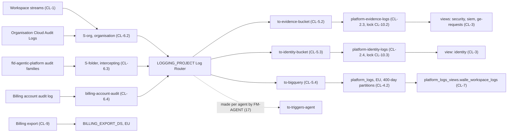

# 14. Central logging, audit configuration and the billing export

## Status
- Owner: the platform owner
- Last reviewed: 2026-09-15
- Last executed: never
- Stage: review §2 stage 13, central logging, one of the four Tier R items (HLD §0.4). Runs after [13](13-organisation-policies-deny-and-pab.md) §6 (OP-6.5 `DONE`) and before files 15 to 17, which read `SINK_S_ORG`, `SINK_S_FOLDER` and the Tier R evidence this file records.
- Consumes: `ORG_ID`, `DOMAIN`, `DIRECTORY_CUSTOMER_ID`, `REGION`, `BQ_LOCATION`, `WORKSPACE_EDITION`, `PLATFORM_REPO_DIR`, `BUILD_LOG_DIR`, `EVIDENCE_REGISTER`, `DEVIATION_REGISTER`, `EVIDENCE_INTERIM_LOCATION` (01); NAMES (log bucket, dataset and `BILLING_EXPORT_DS` names), KEYS, P13 (`EVIDENCE_RETENTION_DAYS`, `IDENTITY_RETENTION_DAYS`, may be unsigned at the first run), SD-11, SD-12, SD-16, SD-18, SD-38, SD-40, `SECOND_HUMAN_EMAIL`, `SECURITY_REVIEWER_EMAIL` (`*tbd*` allowed) (03); `PU-5.2` volume method (04); `GEMINI_PROJECT` (05); `GRP_PLATFORM_SECURITY`, `GRP_GE_ADMINS`, `SA_2_ADMIN` (06); `BILLING_ACCOUNT_ID`, `BILLING_ADMIN_EMAIL`, BA-1.2 branch, BA-4 source B (07); `FLD_AGENTIC_PLATFORM`, `FLD_PLATFORM_CORE`, observability default storage location (09); `LOGGING_PROJECT`, `LOGGING_PROJECT_NUMBER`, `CORE_PROJECT`, `KMS_PROJECT`, the `_Default` redirect (10); `KEY_PLATFORM_LOGS` (11); `ENT_ORG_SINK`, `ENT_FOLDER_ADMIN`, `ENT_PROJECT_REPAIR_CORE` (12); B1, B8, B9, B10 in force at `fld-agentic-platform` and the committed `fld-platform-core` allow-list, at OP-6.3 and OP-6.5 (13).
- Produces: `LOG_BUCKET_EVIDENCE`, `LOG_BUCKET_IDENTITY`, `SINK_S_ORG`, `SINK_S_FOLDER`, `PLATFORM_LOGS_DS`, `PLATFORM_LOGS_VIEWS_DS`, `BILLING_EXPORT_DS`, `KMS_KEY_BQ_LOGS` (branch (a) of CL-4.1 only, otherwise `*tbd*`); the committed `logging/filters/*.txt`, `logging/sinks-expected.yaml`, `logging/audit-config-fld-agentic-platform.json` and `logging/audit-config-projects.json`; the log views `security`, `siem`, `ge-requests`, `identity`; the Tier R "central logging" record of CL-11.2 with its watch list; the PENDING re-run rows CL-3.3, CL-3.4, CL-7.3, CL-10.1 to CL-10.3 and the BLOCKED row CL-8.5.
- Step prefix: CL. Steps: 47. Run order note: **CL-2.5 runs before CL-2.3 and CL-2.4** (the throwaway probe of CMEK with Log Analytics, and of locking); every other step runs in numeric order. **IRREVERSIBLE** steps, each with its own confirmation list and gate: CL-2.5 (the `--locked` line on the throwaway), CL-2.3 and CL-2.4 (location, CMEK, and for the evidence bucket the Log Analytics opt-in), CL-4.2, CL-4.3 and CL-9.1 (dataset names and location), CL-10.2 and CL-10.3 (the two locks, second human present). CL-6.3's enabling of interception is not irreversible but is not replayable either, so it carries a confirm-before-running table and the second human as approver. BLOCKED steps: CL-8.5 (the Data Access canary job, README B-02). Steps that wait on a decision or a later identity, not on code, and are recorded PENDING: CL-10.1 to CL-10.3 (retention values and the two locks, on P13), CL-3.3 (`eve-verifier@`, the SIEM ingestion principal), CL-3.4 (the security reviewer) and CL-7.3 (`mo-metrics@`, `eve-verifier@`).
- Replaces: `wall-e/SETUP.md` Phase 5 (Workspace audit-log sharing), whose steps and verify are salvaged into CL-1 with the Data Access reading rule of S181; the interim organisation sinks of SETUP 11.3, which are **not** carried over (S094, S157); the dataset-before-sink order and partitioned tables of `eve/07-build-runbook.md` Phase 7, applied here to `platform_logs`. Eve's own sink `eve-workspace-audit` stays Eve's (file 24).
- Decisions applied: SD-40 (no interim or agent organisation sinks; the platform sinks come first), SD-18 (rows 40 and 41 have a maker here; `ent-org-sink` is approved by the second human), SD-16 (the export by the billing administrator; the shared-account view), SD-38 (evidence copies after this file), SD-11 (the identity bucket's readers), SD-12 (the monitored administrator cannot silence the logging path unnoticed).
- Closes: S159, S094 and S157 (for the platform sinks), S048 (rows 40 and 41), the central-logging part of S001, the export and billing-account-sink parts of X-RQB-05. See "Findings" at the end.
- Hands-on: about two days. Elapsed: three to five days, because Workspace logs can take up to 24 hours to appear after sharing is turned on, and the authorised view needs the first rows; the locks wait for P13.

## What this part builds

The platform's evidence path for everything that happens in the Workspace tenant, in the organisation's Cloud IAM and inside `fld-agentic-platform`, stored once, in the EU, on a platform key, readable only through named views:

1. **The Workspace feed.** "Share data with Google Cloud services" turned on by a super admin after the organisation's Cloud Logging owner is consulted, and proven at organisation scope for the Admin, Groups, Login, OAuth token and SAML streams (Data Access streams read with `roles/logging.privateLogViewer`, S181).
2. **Two locked log buckets in `LOGGING_PROJECT`.** `platform-evidence-logs` (audit families of the folder, organisation-level entries, the billing account's audit log) and `platform-identity-logs` (Login, SAML and OAuth-token Data Access entries of every tenant account), both in `europe-west1` on `KEY_PLATFORM_LOGS`, created unlocked at the floor only after a throwaway bucket has proved that this tenant accepts CMEK together with Log Analytics and has recorded what a lock still allows (CL-2.5, run first), and locked in two separate **IRREVERSIBLE** steps on P13's signed values with the second human present.
3. **Two aggregated sinks and one billing-account sink.** `S-org` (organisation, no include-children) and `S-folder` (`fld-agentic-platform`, include-children, intercepting), both into the project destination `LOGGING_PROJECT`; `billing-account-audit` for 07's source B.
4. **Three fan-out sinks.** `to-evidence-bucket`, `to-identity-bucket`, `to-bigquery` (partitioned tables, into `platform_logs`, created with its 400-day partition expiry first), and an exclusion on `LOGGING_PROJECT`'s own `_Default` sink so rerouted entries are not stored twice.
5. **Views and readers.** Log views `security`, `siem`, `ge-requests` and `identity` with conditional `roles/logging.viewAccessor` bindings; the authorised view `platform_logs_views.walle_workspace_logs` and the dataset `READER` grants of topology row 40, PENDING until `mo-metrics@` and `eve-verifier@` exist.
6. **Data Access audit configuration** at `fld-agentic-platform` (and the two project-level `storage` configurations and the registry's `ADMIN_READ`), merged into the live policy with its etag and a diff. The daily canary job that proves the path is **BLOCKED** on code.
7. **The billing export**, standard and detailed usage cost, into an EU dataset in `LOGGING_PROJECT`, enabled by the billing administrator.
8. **The expected-sink inventory** committed with the second human as reviewer, and a census that fails on any organisation sink the platform did not make. `to-triggers-<agent>` sinks are not made here: each is made in `LOGGING_PROJECT` by the module equivalent FM-AGENT (file 17), so no agent procedure ever creates an organisation sink.

What the old text got wrong, and must not come back:

| Old text | Why it fails | Here instead |
|---|---|---|
| Sharing turned on only in Wall-E's Phase 5, after the platform (S159) | S-org and Eve's sink would be created with nothing to route; their verifies pass on empty or fail without naming the cause | CL-1 is the precondition of every sink; SETUP Phase 5 and Eve Phase 7 become verifications (files 30, 24) |
| "If admin events appear and login events do not, the edition is not sharing the login log" (SETUP Phase 5 verify, S181) | Login and SAML are Data Access entries; a reader without `roles/logging.privateLogViewer` sees none and draws the wrong conclusion | CL-1.5 reads them with `privateLogViewer` before concluding anything |
| `walle deploy` creating `walle-workspace-audit` and `walle-audit-bq` at the organisation; the interim fallback of SETUP 11.3 (S094, S157) | A second publisher into `walle-triggers` doubles every trigger; retired rows 23 and the logs half of row 6 are rebuilt; organisation `configWriter` in an agent runbook | No organisation sink but `S-org` (and Eve's in 24, and the billing-account sink); `to-triggers-<agent>` is made in `LOGGING_PROJECT` by FM-AGENT; CL-6.6's census fails on the retired names |
| 08 §3.2 identity filter on `token.googleapis.com` and `saml.googleapis.com` | Google's Workspace audit page names `login.googleapis.com` for both Login and SAML, and `oauth2.googleapis.com` for OAuth token (read 2026-09-15). The old filter matches nothing, so the identity bucket would be empty and every sign-in would land in the evidence bucket and BigQuery | CL-5.3's filter uses the documented names; 08 §3.2 is corrected in the same pass |
| 08 §3.3 view filters on `protoPayload.serviceName` and on the robot's `principalEmail` (`ge-requests`, `verifier-<agent>`) | A log view filter supports only `source()`, `log_id()`, `resource.type`, resource labels and labels (logs-views page, read 2026-09-15) | `ge-requests` is `SOURCE` plus `LOG_ID`; per-agent verifier views are file 17's, re-shaped there to a `SOURCE` filter plus the BigQuery view for actor filtering |
| "`platform-core` module" as maker of rows 40 and 41 (S048) | No such module exists | CL-6.2, CL-6.3 (row 41) and CL-7.1 to CL-7.3 (row 40) are named steps with commands and verifies |
| Eve Phase 7: dataset, then expiry, then sink, with `/tmp/ewl.json` | The order is right; the fixed `/tmp` path and a missing read-back are not | CL-4.2 sets the partition expiry at creation, before CL-5.4 creates the sink; access arrays are edited through `mktemp`, read back and diffed |



## Preconditions

- [ ] File 13 **§6 is complete** (OP-6.5 `DONE`): B1, B8, B9 and B10 are in force at `fld-agentic-platform` (the member constraint admits Google's service agents, proven by 13's first grant) and SCC tier and residency were read after the first location policy (OP-6.2). 13 §8 **may still be open**; record the date of this run against 13's checkpoint list, because `gcp.restrictServiceUsage` on `fld-platform-core` is only enforced at OP-8.4 — until then CL-2.1's `gcloud services list` is a dry-run-era reading and proves the APIs are enabled, not that the allow-list admits them. If this file runs after OP-8.4, CL-2.1's reading is the enforced one and any missing API is a 13 re-run under `ENT_PLATFORM_POLICY`, never an enable made here. 13's hand-over row for this file cites OP-8.4 for "`LOGGING_PROJECT` inside the core allow-list"; that part is the later re-run, not a gate on starting (13's owner corrects the row).
- [ ] File 12 is complete: `ENT_ORG_SINK` (organisation `roles/logging.configWriter`, approver the second human), `ENT_FOLDER_ADMIN` (on `fld-agentic-platform`) and `ENT_PROJECT_REPAIR_CORE` exist and each had its one-grant test; the organisation exception and the creator's Owner on the five core projects are withdrawn.
- [ ] File 11 has created `KEY_PLATFORM_LOGS` (`platform-logs-europe-west1`, ring `logging`, `europe-west1`, HSM) in `KMS_PROJECT`.
- [ ] File 10 has created `LOGGING_PROJECT` and `CORE_PROJECT`, linked to `BILLING_ACCOUNT_ID`, with `logging.googleapis.com`, `bigquery.googleapis.com` and `cloudkms.googleapis.com` on the allow-list, and `_Default` redirected to a regional bucket.
- [ ] File 09 has set `FLD_AGENTIC_PLATFORM`, `FLD_PLATFORM_CORE` and the observability default storage location; no Cloud Logging folder default storage location is set (SD-17).
- [ ] File 07 has set `BILLING_ACCOUNT_ID` and `BILLING_ADMIN_EMAIL`, and recorded whether BA-1.2 took branch (a) dedicated or (b) shared.
- [ ] File 03 has signed NAMES (log bucket and dataset names, `BILLING_EXPORT_DS`), KEYS, SD-11, SD-16, SD-18, SD-40, and appointed the second human; P13 may still be unsigned (the locks then wait).
- [ ] File 05 has set `GEMINI_PROJECT` (named in the `ge-requests` view filter).
- [ ] File 06 has created `GRP_PLATFORM_SECURITY` and `GRP_GE_ADMINS`; `SECOND_HUMAN_EMAIL`, `SA_2_ADMIN` are set.
- [ ] `~/.platform-env` is sourced, `penv_guard` is silent, and the shell is signed in as `sa-1-admin@`.

```bash
need ORG_ID DOMAIN DIRECTORY_CUSTOMER_ID REGION BQ_LOCATION GEMINI_PROJECT LOGGING_PROJECT LOGGING_PROJECT_NUMBER CORE_PROJECT KMS_PROJECT FLD_AGENTIC_PLATFORM FLD_PLATFORM_CORE KEY_PLATFORM_LOGS ENT_ORG_SINK ENT_FOLDER_ADMIN ENT_PROJECT_REPAIR_CORE BILLING_ACCOUNT_ID BILLING_ADMIN_EMAIL SECOND_HUMAN_EMAIL SA_2_ADMIN GRP_PLATFORM_SECURITY GRP_GE_ADMINS PLATFORM_REPO_DIR BUILD_LOG_DIR EVIDENCE_REGISTER DEVIATION_REGISTER
"$PLATFORM_REPO_DIR/tools/decision-need.sh" NAMES KEYS SD-11 SD-16 SD-18 SD-40
```

## People

| Role | Does | Present at |
|---|---|---|
| Platform owner (`sa-1-admin@`) | Requests the PAM grants and performs every GCP step; commits the expected-sink inventory and the audit configuration | every section |
| Second human (`sa-2-admin@`, IT security) | Approves `ENT_ORG_SINK` grants; **approves the enabling of the intercepting folder sink** (CL-6.3); reviews the expected-sink inventory and the audit configuration; reads the folder and organisation IAM outputs of CL-3.5; reads the seeded proofs through the views (the platform owner, a monitored subject, does not prove his own evidence path); **present for each lock** | CL-1.3 (performs or witnesses the toggle), CL-2.5 (told the result), CL-3.5, CL-5.1, CL-6.2, CL-6.3, CL-6.5, CL-6.6, CL-8.1, CL-10.2, CL-10.3 |
| A super admin | Turns sharing on. `Assumption:` the second human as `sa-2-admin@`, so that the change's actor is not the monitored platform owner; otherwise `sa-1-admin@` with the second human watching | CL-1.3 |
| The organisation's Cloud Logging owner | Consulted before the toggle; holds `roles/logging.viewer` and `roles/logging.privateLogViewer` at the organisation and reads the streams, unless `ENT_ORG_SINK`'s committed bundle already carries both | CL-1.1, CL-1.4, CL-1.5, CL-1.6 |
| Billing administrator (finance) | Creates nothing in GCP but the export: enables standard and detailed usage cost export; creates the billing-account sink | CL-6.4, CL-9.2, CL-9.3 |
| Approver of `ENT_FOLDER_ADMIN` and `ENT_PROJECT_REPAIR_CORE` | As file 12 recorded (the second human until the security reviewer is appointed, `Assumption:`) | CL-2.1 |

Sittings that cannot start without two people: CL-6 (the second human approves `S-org` and the enabling of the intercepting `S-folder`, and reads the proofs) and CL-10 (the locks). Steps whose run order is not their numeric order: **CL-2.5 runs before CL-2.3 and CL-2.4** (it probes CMEK with Log Analytics, and locking, on a throwaway bucket). Every step writes `checkpoint <id> START` before its ACTION and `checkpoint <id> DONE` when its VERIFY passes (01 §1). Temporary files hold IAM policies and filters, never a secret, and are removed at the end of each step.

## 1. Workspace audit-log sharing

Google: "If you don't enable Google Workspace data sharing with Google Cloud, then you can't see audit logs for Google Workspace in Google Cloud." Workspace entries are organisation-level (`logName` `organizations/ORG_ID/logs/...`), their storage region is not selectable, and they are not covered by the Workspace Data Region Policy (Workspace audit logging page, read 2026-09-15). The service names this file relies on, from the same page:

| Stream | `protoPayload.serviceName` | Audit log type | Shared on |
|---|---|---|---|
| Admin | `admin.googleapis.com` | Admin Activity | every edition |
| Enterprise Groups | `cloudidentity.googleapis.com` | Admin Activity | every edition |
| Login | `login.googleapis.com` | Data Access | every edition ("User log events") |
| SAML | `login.googleapis.com` | Data Access | Enterprise Standard or Plus, Education Standard or Plus, Voice Premier, Cloud Identity Premium |
| OAuth token | `oauth2.googleapis.com` | Admin Activity and Data Access | as SAML |
| Access Transparency | none named on the page | Admin Activity | Enterprise Plus and Education editions |

### CL-1.1 Consult the organisation's Cloud Logging owner and record the organisation's logging state

- **WHO:** Platform owner asks; the organisation's Cloud Logging owner answers and runs the reads. Not a witness step.
- **WHERE:** A dated meeting note; the Cloud Logging owner's shell.
- **ACTION:** Ask, and record the answers: does anything already consume Workspace logs (a SIEM export, an existing organisation sink); does the organisation `_Default` sink carry exclusions; who pays the organisation-level ingestion; may sharing be turned on, and what would make them turn it off. The Cloud Logging owner runs:

```bash
gcloud logging sinks list --organization="$ORG_ID" --format="table(name,destination,includeChildren,interceptChildren,disabled,filter)"
gcloud logging sinks describe _Default --organization="$ORG_ID" --format="yaml(filter,exclusions,disabled)"
gcloud logging buckets list --organization="$ORG_ID" --location=global --format="table(name,retentionDays,locked)"
```

- **VERIFY:** A table in the build log with every pre-existing organisation sink (name, destination, owner, purpose) and the organisation `_Default` exclusions. Any pre-existing sink with `includeChildren` that also copies `fld-agentic-platform` entries elsewhere is recorded by name with its owner, because interception at the folder (CL-6.3) does not stop a parent's sink. The Cloud Logging owner's written consent to CL-1.3 is attached.
- **ROLLBACK:** Read only.
- **EVIDENCE:** `<date>-CL-1.1-org-logging-consultation-v1` (note and outputs) in `EVIDENCE_INTERIM_LOCATION`; `evidence_add CL-1.1 org-logging-consultation E-05 5.2.4 EVIDENCE_INTERIM_LOCATION`. TISAX 5.2.4 (event logging), 6.1 (internal supplier of the service). EU AI Act E-05.

### CL-1.2 Read the sharing setting before touching it

- **WHO:** A super admin (see People). Solo.
- **WHERE:** Admin console → Account → Account settings → Legal and compliance → Sharing options. Browser profile of the super-admin account (01 PR-1.3).
- **ACTION:** Read the state. If it is already **Enabled**, do not touch it: open Reporting → Audit and investigation → Admin log events and find who enabled it and when (`Assumption:` the change is an Admin log event; if no event is found, record "enabler not found in the audit log" and the date range searched). Skip CL-1.3.
- **VERIFY:** A screenshot of Sharing options with the date; the state and, if enabled, the enabling actor and date in the build log.
- **ROLLBACK:** Read only.
- **EVIDENCE:** `<date>-CL-1.2-sharing-state-v1`. TISAX 5.2.4. EU AI Act E-05.

### CL-1.3 Turn on "Share data with Google Cloud services"

- **WHO:** A super admin; witness: the second human if the super admin is `sa-1-admin@`. "You must be signed in as a super administrator for this task" (Workspace Help, read 2026-09-15).
- **WHERE:** Admin console → Account → Account settings → Legal and compliance.
- **ACTION:** Click **Sharing options**, select **Enabled**, click **Save**. Write the time (UTC) in the build log; it is the start of every Workspace copy the platform keeps.
- **VERIFY:** Sharing options shows **Enabled** after a page reload. Admin log events show the change with the actor and time, or the absence is recorded as in CL-1.2. The streams themselves are proven in CL-1.4 and CL-1.5.
- **ROLLBACK:** Select **Disabled**, **Save**. Google: "No new data is shared with Google Cloud services. Existing shared data is deleted according to the Google Cloud admin activity audit log retention period." Rolling back silences `S-org`, Eve's sink and the SIEM feed at once, so it is never done without the second human and the Cloud Logging owner agreeing in writing; after file 25 Eve raises it as a self-integrity finding (SD-12 (9)).
- **EVIDENCE:** Screenshot and build-log line `<date>-CL-1.3-sharing-enabled-v1`. The residency exception "Workspace logs, region not selectable" is added to the records of processing by the DPO (08 §7.2). TISAX 5.2.4, 7.1 (legal register). EU AI Act E-06 (the source of the Art. 12 log's Workspace half).

### CL-1.4 Prove the Admin Activity streams at organisation scope

- **WHO:** The organisation's Cloud Logging owner (holds `roles/logging.viewer` at the organisation); the platform owner records.
- **WHERE:** Their shell; or Cloud console → Logging → Logs Explorer with the organisation selected as scope (not a project).
- **ACTION:** Wait until 24 hours after CL-1.3 if the first try is empty. Output goes to the terminal only.

```bash
gcloud logging read 'logName:"organizations/'"$ORG_ID"'/logs/" AND protoPayload.serviceName="admin.googleapis.com"' --organization="$ORG_ID" --freshness=1d --limit=3 --format="table(timestamp,protoPayload.methodName,logName)"
gcloud logging read 'logName:"organizations/'"$ORG_ID"'/logs/" AND protoPayload.serviceName="cloudidentity.googleapis.com"' --organization="$ORG_ID" --freshness=7d --limit=3 --format="table(timestamp,protoPayload.methodName)"
```

- **VERIFY:** The Admin query returns at least one row dated after CL-1.3 (the platform owner's own recent console work is enough). The Groups query returns a row if any group changed in the last 7 days; if none did, a super admin adds and removes a test member on a non-control group, and the query is repeated. Empty after 24 hours: sharing is off, the scope is a project, or the Workspace account is attached to a different Cloud organisation; stop and resolve before CL-6.
- **ROLLBACK:** Read only.
- **EVIDENCE:** Row counts and the method names (no actor emails) as `<date>-CL-1.4-admin-streams-v1`. TISAX 5.2.4. EU AI Act E-06.

### CL-1.5 Prove the Data Access streams with the right role (S181)

- **WHO:** The organisation's Cloud Logging owner, holding `roles/logging.privateLogViewer` at the organisation. Alternative: the platform owner through `ENT_ORG_SINK`, only if file 12's committed entitlement file lists `roles/logging.privateLogViewer`; read it first.
- **WHERE:** As CL-1.4.
- **ACTION:**

```bash
gcloud pam entitlements describe "${ENT_ORG_SINK##*/}" --location=global --organization="$ORG_ID" --format="value(privilegedAccess.gcpIamAccess.roleBindings[].role)"
gcloud logging read 'logName:"organizations/'"$ORG_ID"'/logs/cloudaudit.googleapis.com%2Fdata_access" AND protoPayload.serviceName="login.googleapis.com"' --organization="$ORG_ID" --freshness=1d --limit=3 --format="table(timestamp,protoPayload.methodName)"
gcloud logging read 'logName:"organizations/'"$ORG_ID"'/logs/cloudaudit.googleapis.com%2Fdata_access" AND protoPayload.serviceName="oauth2.googleapis.com"' --organization="$ORG_ID" --freshness=1d --limit=3 --format="table(timestamp,protoPayload.methodName)"
```

- **VERIFY:** Login rows present (every edition shares them). OAuth token Data Access rows present, or `WORKSPACE_EDITION` (01) is outside the editions of the table above and that is written down. SAML rows appear under `login.googleapis.com` only if a SAML application was used in the window; their absence proves nothing and is recorded as "not exercised". **An empty Login result is never concluded to be an edition problem until the reader has confirmed `roles/logging.privateLogViewer`**: Data Access entries are invisible to `roles/logging.viewer` (Cloud Logging access-control page). If the reader lacks the role, stop and get the right reader; do not grant it to the platform owner outside PAM.
- **ROLLBACK:** Read only.
- **EVIDENCE:** Counts only, as `<date>-CL-1.5-data-access-streams-v1`; the reader's role recorded. TISAX 5.2.4, 4.2.1. EU AI Act E-06.

### CL-1.6 Measure one day of Workspace log volume (re-run of 04 PU-5.2)

- **WHO:** The organisation's Cloud Logging owner; platform owner records.
- **WHERE:** Their shell, 24 hours or more after CL-1.3.
- **ACTION:** Run the five commands of [04 PU-5.2](04-purchases-and-lead-times.md) unchanged (counts piped to `wc`, nothing stored).
- **VERIFY:** Four counts and one byte figure recorded with the date; the estimate is sent to finance for `LOGGING_PROJECT`'s budget line and to the DPO as the size of the identity store; PU-5.2's "not measurable" line, if any, is closed in the re-run index.
- **ROLLBACK:** Read only.
- **EVIDENCE:** `<date>-CL-1.6-workspace-log-volume-v1` (numbers only). TISAX 1.3. EU AI Act E-09.

## 2. The sitting, the key and the log buckets

### CL-2.1 Open the sitting and request the project and folder grants

- **WHO:** Platform owner requests; approver as file 12 recorded for each entitlement.
- **WHERE:** Shell with `~/.platform-env` sourced; the approver uses Cloud console → IAM & Admin → Privileged Access Manager, or `gcloud pam grants approve`.
- **ACTION:** Define the request helper for this sitting (not added to the variables file), then request the two grants. An entitlement variable holds its full resource name, `organizations/N/locations/global/entitlements/ID`, `folders/N/...` or `projects/P/...`.

```bash
pam_req() {
  _pe="$1"; _pid="${_pe##*/}"; _ps="${_pe%%/locations/*}"
  case "$_ps" in organizations/*) _pf="--organization=${_ps#organizations/}";; folders/*) _pf="--folder=${_ps#folders/}";; projects/*) _pf="--project=${_ps#projects/}";; *) echo "pam_req: bad entitlement name $_pe" >&2; return 2;; esac
  gcloud pam grants create --entitlement="$_pid" --requested-duration="${2}s" --justification="$3" --location=global "$_pf" --format="value(name,state)"
}
need ENT_FOLDER_ADMIN ENT_PROJECT_REPAIR_CORE
pam_req "$ENT_FOLDER_ADMIN" 3600 "14 CL-2 to CL-5: log buckets, views, fan-out sinks in LOGGING_PROJECT"
pam_req "$ENT_PROJECT_REPAIR_CORE" 7200 "14 CL-2 to CL-5: BigQuery datasets and dataset grants in LOGGING_PROJECT"
gcloud services list --enabled --project="$LOGGING_PROJECT" --format="value(config.name)" | grep -E '^(logging|bigquery|cloudkms)\.googleapis\.com$'
gcloud billing projects describe "$LOGGING_PROJECT" --format="value(billingAccountName,billingEnabled)"
```

- **VERIFY:** `gcloud pam grants describe <grant name> --format="value(state)"` prints `ACTIVE` for both after approval. The services list prints the three APIs; record beside it whether 13 OP-8.4 has run (if not, this is a dry-run-era reading: the APIs are enabled, but the `fld-platform-core` allow-list is not yet enforced, so a later enforcement can still surface a missing service — that is 13's re-run, not a change made here). The billing line prints `billingAccounts/<BILLING_ACCOUNT_ID>` and `True`. A grant in `APPROVAL_AWAITED` for more than the sitting is withdrawn and the sitting rescheduled; no step below runs on a standing role.
- **ROLLBACK:** `gcloud pam grants revoke <grant name> --location=global <scope flag>` by an approver, or let the grant expire.
- **EVIDENCE:** Grant names and states in the build log; PAM's own audit entries are the record. TISAX 4.1.3, 4.2.1. EU AI Act E-08.

### CL-2.2 Check that Logging's key service account can use `KEY_PLATFORM_LOGS`

- **WHO:** Platform owner; the key's owner per the signed key table if a grant is missing.
- **WHERE:** Shell.
- **ACTION:** CMEK on a log bucket is set at creation and "After a log bucket is created, you can't reconfigure the log bucket to change or remove CMEK" (Cloud Logging CMEK page, read 2026-09-15), so this is checked before CL-2.3.

```bash
need LOGGING_PROJECT KEY_PLATFORM_LOGS KMS_PROJECT
LOG_KMS_SA="$(gcloud logging settings describe --project="$LOGGING_PROJECT" --format='value(kmsServiceAccountId)')"
printf '%s\n' "$LOG_KMS_SA"
gcloud kms keys describe "$KEY_PLATFORM_LOGS" --format="yaml(name,primary.state,primary.protectionLevel)"
gcloud kms keys get-iam-policy "$KEY_PLATFORM_LOGS" --flatten="bindings[].members" --format="table(bindings.role,bindings.members)"
```

- **VERIFY:** The key name contains `locations/europe-west1/keyRings/logging`, state `ENABLED`, protection level `HSM`. The policy table shows `serviceAccount:<LOG_KMS_SA>` under `roles/cloudkms.cryptoKeyEncrypterDecrypter` and no other member under any role that can encrypt or decrypt. If the binding is missing, it is made by the holder of key IAM on `KMS_PROJECT` under the key table (file 11's re-run, recorded in the re-run index); the command is Google's:

```bash
gcloud kms keys add-iam-policy-binding "$KEY_PLATFORM_LOGS" --member="serviceAccount:${LOG_KMS_SA}" --role="roles/cloudkms.cryptoKeyEncrypterDecrypter"
```

  and it is proven by repeating the policy table. CL-2.3 does not start until it is present.
- **ROLLBACK:** Read only, or remove the binding before any bucket uses the key.
- **EVIDENCE:** The key description and policy table as `<date>-CL-2.2-logging-key-v1`. TISAX 5.1 (cryptography table). EU AI Act E-05.

### CL-2.5 Prove what a locked bucket still allows, and that CMEK with Log Analytics is accepted, on a throwaway bucket

> **Run this step before CL-2.3 and CL-2.4**, out of numeric order. The id stays `CL-2.5` because CL-3.1, CL-10.1, the checklist and files 17 and 24 cite it; the run order is what matters, and the checkpoint line records it. CL-2.3 does not start until this step's record exists.

- **WHO:** Platform owner under the `ENT_FOLDER_ADMIN` grant; the second human is told the result before CL-2.3 and again before CL-10.
- **WHERE:** Shell.
- **ACTION:** Two questions are answered at once on one empty one-day bucket, because both answers are otherwise learned on a production bucket that cannot be undone.
  1. **Locking.** Google says locking "is irreversible", that the retention "can't be changed", and that a locked bucket cannot be deleted "unless empty" (buckets page and `buckets update --locked` reference, read 2026-09-15). It does not say whether a log view can be created on a locked bucket, which files 17 and 24 need for per-agent views after CL-10.
  2. **CMEK together with Log Analytics.** CL-2.3 sets `--cmek-kms-key-name` and `--enable-analytics` on the same bucket and neither can be changed afterwards ("After a log bucket is created, you can't reconfigure the log bucket to change or remove CMEK", CMEK page; "Once opted in, the bucket cannot be opted out of Log Analytics", gcloud reference). The Log Analytics page carries CMEK caveats — a join reads across storage resources only when they use the same key or share an ancestor default key, and temporary join data is encrypted with that key (Log Analytics page, read 2026-09-15). If the combination is refused or degrades, it must fail here and not on the evidence bucket.

  The throwaway therefore carries the same key and the same analytics opt-in as CL-2.3 will:

```bash
need LOGGING_PROJECT REGION KEY_PLATFORM_LOGS
T="cl-lock-test-$(date -u +%Y%m%d)"
gcloud logging buckets create "$T" --location="$REGION" --retention-days=1 --cmek-kms-key-name="$KEY_PLATFORM_LOGS" --enable-analytics --description="Throwaway probe of CMEK + Log Analytics + locking (14 CL-2.5); delete same day" --project="$LOGGING_PROJECT"; echo "create exit $?"
gcloud logging buckets describe "$T" --location="$REGION" --project="$LOGGING_PROJECT" --format="yaml(name,retentionDays,analyticsEnabled,cmekSettings.kmsKeyName,lifecycleState)" || { echo "STOP: no throwaway bucket; record the create error and raise it with the second human before CL-2.3"; false; }
gcloud logging buckets update "$T" --location="$REGION" --locked --project="$LOGGING_PROJECT"; echo "lock exit $?"
gcloud logging views create probe --bucket="$T" --location="$REGION" --log-filter='LOG_ID("cloudaudit.googleapis.com/activity")' --project="$LOGGING_PROJECT"; echo "view create exit $?"
gcloud logging buckets update "$T" --location="$REGION" --retention-days=2 --project="$LOGGING_PROJECT"; echo "retention increase exit $?"
gcloud logging buckets delete "$T" --location="$REGION" --project="$LOGGING_PROJECT" --quiet; echo "delete exit $?"
```

- **VERIFY:** Record the five exit codes and the describe output.
  - **Before CL-2.3 may run:** `create exit 0`, and the describe shows `analyticsEnabled: true` **and** `cmekSettings.kmsKeyName` equal to `KEY_PLATFORM_LOGS`. If the create is refused, or either field is missing, CL-2.3 does not run as written: record which of the two the tenant refuses, raise it with the second human, and take the CMEK-only bucket (drop `--enable-analytics`, with a `DEVIATION_REGISTER` line against 08 S12) or the analytics-only bucket (never: SK-7 and 08 §5 require the key) as the signed choice.
  - **For CL-10:** the delete of the empty bucket succeeds. If the view create fails, CL-3.1 must create every view the platform will ever need on these buckets before CL-10, and file 17's per-agent views move to per-tier buckets created unlocked (08 §3.3's cap rule) — write that into the re-run index before going on. The retention result tells CL-10 whether a later P13 increase is possible after the lock.
- **ROLLBACK:** **IRREVERSIBLE** from the `--locked` line onwards: the lock cannot be removed and the bucket's retention cannot be changed downwards. Confirm before running that line: the bucket name starts `cl-lock-test-`, its retention is 1 day, it is in `LOGGING_PROJECT`, and no sink writes to it (nothing in CL-5 or CL-6 exists yet, or names it). The bucket is deletable only once empty; if the delete is refused it persists for its 1-day retention and is deleted the next day — recorded in the build log, not a finding. Nothing before the lock line needs a rollback beyond that delete.
- **EVIDENCE:** The five results and the describe output as `<date>-CL-2.5-lock-and-cmek-behaviour-v1`; the line "CMEK+analytics accepted" (or the refusal and the signed choice) is quoted in CL-2.3's confirmation. TISAX 5.2.4, 5.1. EU AI Act E-05.

### CL-2.3 Create `platform-evidence-logs`

- **WHO:** Platform owner under the `ENT_FOLDER_ADMIN` grant (its `roles/logging.configWriter` reaches `LOGGING_PROJECT` by inheritance).
- **WHERE:** Shell.
- **ACTION:** Created unlocked, at the evidence floor of 400 days (08 §5.1), with Log Analytics on (08 S12). Location, key and the Log Analytics opt-in cannot be changed afterwards: "Once opted in, the bucket cannot be opted out of Log Analytics" (gcloud reference, read 2026-09-15).

```bash
"$PLATFORM_REPO_DIR/tools/decision-need.sh" NAMES KEYS
need LOGGING_PROJECT REGION KEY_PLATFORM_LOGS
gcloud logging buckets create platform-evidence-logs --location="$REGION" --retention-days=400 --cmek-kms-key-name="$KEY_PLATFORM_LOGS" --enable-analytics --description="Platform evidence: folder audit families, organisation-level entries, billing-account audit log (08 S12)" --project="$LOGGING_PROJECT"
penv_set LOG_BUCKET_EVIDENCE "projects/${LOGGING_PROJECT}/locations/${REGION}/buckets/platform-evidence-logs"
```

- **VERIFY:**

```bash
gcloud logging buckets describe platform-evidence-logs --location="$REGION" --project="$LOGGING_PROJECT" --format="yaml(name,retentionDays,locked,analyticsEnabled,cmekSettings.kmsKeyName,lifecycleState)"
```

  `retentionDays: 400`, `locked` absent or false, `analyticsEnabled: true`, `cmekSettings.kmsKeyName` equal to `KEY_PLATFORM_LOGS`, `lifecycleState: ACTIVE`, and the name in `europe-west1`.
- **ROLLBACK:** **IRREVERSIBLE** as to location, CMEK and the Log Analytics opt-in. Confirm before running, each read aloud from its record: CL-2.2's policy table; **CL-2.5 recorded "CMEK+analytics accepted"** (`create exit 0`, `analyticsEnabled: true`, `cmekSettings.kmsKeyName` equal to the key) on the throwaway, so the combination is not being tried for the first time here; `REGION` is `europe-west1`; and the name matches the signed NAMES record. Gate: `tools/decision-need.sh NAMES KEYS` prints `SIGNED` twice. A bucket made wrong before any sink writes to it is deleted with `gcloud logging buckets delete platform-evidence-logs --location="$REGION" --project="$LOGGING_PROJECT"`; the name then stays reserved while the bucket is pending deletion, so the fix waits.
- **EVIDENCE:** The describe output as `<date>-CL-2.3-evidence-bucket-v1`. TISAX 5.2.4, 5.1. EU AI Act E-06.

### CL-2.4 Create `platform-identity-logs`

- **WHO:** Platform owner under the `ENT_FOLDER_ADMIN` grant.
- **WHERE:** Shell.
- **ACTION:** The densest personal-data store of the platform (08 S13): every employee's sign-ins. No Log Analytics (nothing needs SQL over it; `Assumption:` the DPO prefers the smallest reading surface; 08 does not require it). Created at 400 days unless P13 is already signed with a lower value.

```bash
"$PLATFORM_REPO_DIR/tools/decision-need.sh" NAMES KEYS
need LOGGING_PROJECT REGION KEY_PLATFORM_LOGS
ID_DAYS=400
case "${IDENTITY_RETENTION_DAYS-}" in ''|'*tbd*') ;; *[!0-9]*) echo "STOP: IDENTITY_RETENTION_DAYS is not an integer"; false;; *) ID_DAYS="$IDENTITY_RETENTION_DAYS";; esac
gcloud logging buckets create platform-identity-logs --location="$REGION" --retention-days="$ID_DAYS" --cmek-kms-key-name="$KEY_PLATFORM_LOGS" --description="Login, SAML and OAuth-token Data Access entries of every tenant account (08 S13); readers through the identity view only" --project="$LOGGING_PROJECT"
penv_set LOG_BUCKET_IDENTITY "projects/${LOGGING_PROJECT}/locations/${REGION}/buckets/platform-identity-logs"
```

- **VERIFY:** The describe command of CL-2.3 for `platform-identity-logs` shows `retentionDays` equal to `ID_DAYS`, not locked, `analyticsEnabled` absent or false, the key, `ACTIVE`.
- **ROLLBACK:** **IRREVERSIBLE** as to location and CMEK. Same confirmation and gate as CL-2.3. Delete before any sink writes, as CL-2.3.
- **EVIDENCE:** `<date>-CL-2.4-identity-bucket-v1`. TISAX 5.2.4, 7.1. EU AI Act E-06.

## 3. Log views and their readers

Cloud Logging has no bucket-level IAM; access is by log view, at most 30 per bucket, through `roles/logging.viewAccessor`. A view filter supports only `SOURCE()`, `LOG_ID()`, `resource.type`, resource labels and labels, with `OR` in flexible filters; `NOT` applies to single elements only (logs-views page, read 2026-09-15). The binding used here is a project-level `roles/logging.viewAccessor` with the condition `resource.name == "projects/PROJECT_ID/locations/LOCATION/buckets/BUCKET/views/VIEW"`, Google's documented form, which `ENT_FOLDER_ADMIN`'s `roles/resourcemanager.folderAdmin` can set. Principals with `logging.views.access` at project level read every view, which is why CL-3.5 proves nobody holds it.

### CL-3.1 Create the four views

- **WHO:** Platform owner under the `ENT_FOLDER_ADMIN` grant.
- **WHERE:** Shell.
- **ACTION:** `ge-requests` reads the Gemini Enterprise app project's Data Access entries once file 19 moves it under the folder; its filter names the project now. Per-agent `agent-<agent>` and `verifier-<agent>` views are made by FM-AGENT (17).

```bash
need LOGGING_PROJECT REGION GEMINI_PROJECT
gcloud logging views create security --bucket=platform-evidence-logs --location="$REGION" --description="Everything; platform-security@ (08 §3.3)" --project="$LOGGING_PROJECT"
gcloud logging views create siem --bucket=platform-evidence-logs --location="$REGION" --description="Everything; the SIEM ingestion principal (P10)" --project="$LOGGING_PROJECT"
gcloud logging views create ge-requests --bucket=platform-evidence-logs --location="$REGION" --log-filter='SOURCE("projects/'"$GEMINI_PROJECT"'") AND LOG_ID("cloudaudit.googleapis.com/data_access")' --description="Gemini Enterprise Data Access entries (03 §13)" --project="$LOGGING_PROJECT"
gcloud logging views create identity --bucket=platform-identity-logs --location="$REGION" --description="Login, SAML, OAuth-token Data Access; security reviewer, eve-verifier@, SIEM; no agent owner" --project="$LOGGING_PROJECT"
```

- **VERIFY:**

```bash
gcloud logging views list --bucket=platform-evidence-logs --location="$REGION" --project="$LOGGING_PROJECT" --format="table(name,filter)"
gcloud logging views list --bucket=platform-identity-logs --location="$REGION" --project="$LOGGING_PROJECT" --format="table(name,filter)"
```

  The evidence bucket lists `_AllLogs`, `security`, `siem`, `ge-requests` with the filter above; the identity bucket lists `_AllLogs` and `identity`. Nobody is ever bound to `_AllLogs` (CL-3.5 proves it).
- **ROLLBACK:** `gcloud logging views delete <view> --bucket=<bucket> --location="$REGION" --project="$LOGGING_PROJECT"`.
- **EVIDENCE:** Both tables as `<date>-CL-3.1-log-views-v1`. TISAX 4.2.1, 5.2.4. EU AI Act E-06.

### CL-3.2 Bind the readers that exist

- **WHO:** Platform owner under the `ENT_FOLDER_ADMIN` grant; the second human is told the identity-view binding is his until the security reviewer is appointed.
- **WHERE:** Shell.
- **ACTION:** `security`: `platform-security@`. `ge-requests`: `ge-admins@` and `platform-security@`. `identity`: the security reviewer when appointed; until then the second human as interim reader, because SD-11 names him a recipient of administrator-monitoring data and the platform owner, a subject, must not be the one who reads sign-ins. The platform owner is bound to no view.

```bash
need LOGGING_PROJECT REGION GRP_PLATFORM_SECURITY GRP_GE_ADMINS SECOND_HUMAN_EMAIL
vcond() { printf 'expression=resource.name == "projects/%s/locations/%s/buckets/%s/views/%s",title=view-%s' "$LOGGING_PROJECT" "$REGION" "$1" "$2" "$2"; }
gcloud projects add-iam-policy-binding "$LOGGING_PROJECT" --member="group:${GRP_PLATFORM_SECURITY}" --role="roles/logging.viewAccessor" --condition="$(vcond platform-evidence-logs security)"
gcloud projects add-iam-policy-binding "$LOGGING_PROJECT" --member="group:${GRP_PLATFORM_SECURITY}" --role="roles/logging.viewAccessor" --condition="$(vcond platform-evidence-logs ge-requests)"
gcloud projects add-iam-policy-binding "$LOGGING_PROJECT" --member="group:${GRP_GE_ADMINS}" --role="roles/logging.viewAccessor" --condition="$(vcond platform-evidence-logs ge-requests)"
if need SECURITY_REVIEWER_EMAIL 2>/dev/null; then IDR="user:${SECURITY_REVIEWER_EMAIL}"; else IDR="user:${SECOND_HUMAN_EMAIL}"; fi
gcloud projects add-iam-policy-binding "$LOGGING_PROJECT" --member="$IDR" --role="roles/logging.viewAccessor" --condition="$(vcond platform-identity-logs identity)"
```

- **VERIFY:**

```bash
gcloud projects get-iam-policy "$LOGGING_PROJECT" --flatten="bindings[].members" --filter="bindings.role=roles/logging.viewAccessor" --format="table(bindings.members,bindings.condition.expression)"
```

  Exactly four rows, each with a condition naming one view; no unconditioned `roles/logging.viewAccessor`. If the second human was bound as interim reader, the re-run index gets "security reviewer appointed → 14 CL-3.2: bind the security reviewer to `identity`, then remove the second human", with the DPO informed.
- **ROLLBACK:** `gcloud projects remove-iam-policy-binding "$LOGGING_PROJECT" --member=<member> --role="roles/logging.viewAccessor" --condition="$(vcond <bucket> <view>)"`.
- **EVIDENCE:** The table as `<date>-CL-3.2-view-readers-v1`. TISAX 4.2.1, 7.1. EU AI Act E-06.

### CL-3.3 Record the readers that do not exist yet as PENDING

- **WHO:** Platform owner.
- **WHERE:** Shell.
- **ACTION:** `eve-verifier@` (file 24) reads `identity` for the robots' logins (08 §3.3); the SIEM ingestion principal (file 15 part B) reads `siem` and `identity`. Neither exists; nothing is granted.

```bash
if [ -n "${SA_EVE_VERIFIER-}" ]; then exists_or_pending "serviceAccount:${SA_EVE_VERIFIER}" CL-3.3 "14 CL-3.3: viewAccessor on identity view"; else exists_or_pending --pending "serviceAccount:eve-verifier@EVE_PROJECT.iam.gserviceaccount.com" CL-3.3 "14 CL-3.3: viewAccessor on identity view (after 24)"; fi
if [ -n "${SIEM_INGEST_PRINCIPAL-}" ] && [ "$SIEM_INGEST_PRINCIPAL" != '*tbd*' ]; then exists_or_pending "serviceAccount:${SIEM_INGEST_PRINCIPAL}" CL-3.3 "14 CL-3.3: viewAccessor on siem and identity views"; else exists_or_pending --pending "serviceAccount:SIEM_INGEST_PRINCIPAL" CL-3.3 "14 CL-3.3: viewAccessor on siem and identity views (after 15 part B)"; fi
```

  When a principal exists (a re-run), the grant is the CL-3.2 form with `--member="serviceAccount:<email>"` and `vcond platform-identity-logs identity` (and `vcond platform-evidence-logs siem` for the SIEM).
- **VERIFY:** `grep -c 'CL-3.3' "$BUILD_LOG_DIR/rerun-index.tsv"` is 2 on the first run. On a re-run, CL-3.2's table shows the new conditioned row and the PENDING lines are closed.
- **ROLLBACK:** None (nothing granted); on a re-run, as CL-3.2.
- **EVIDENCE:** `checkpoint CL-3.3 PENDING` lines; the re-run rows match README §9 (`eve-verifier@` from 24). TISAX 4.2.1. EU AI Act E-06.

### CL-3.4 Record the security reviewer's identity binding as a re-run

- **WHO:** Platform owner.
- **WHERE:** Build log.
- **ACTION:** If `SECURITY_REVIEWER_EMAIL` is `*tbd*`, `checkpoint CL-3.4 PENDING - - "security reviewer to identity view; remove interim second human"` and append the row to `rerun-index.tsv` by hand. If set, CL-3.2 bound them already and this step is `N/A`.
- **VERIFY:** One of the two checkpoint lines exists.
- **ROLLBACK:** None.
- **EVIDENCE:** The checkpoint line. TISAX 4.2.1. EU AI Act E-08.

### CL-3.5 Prove that nobody reads every view

- **WHO:** Platform owner runs the three reads; the second human reads the three files and signs the folder and organisation ones (they are above the platform owner's own scope).
- **WHERE:** Shell. The folder read needs the `ENT_FOLDER_ADMIN` grant of CL-2.1 (still active) or the second human's own reader; the organisation read is the second human's, or the platform owner's under `ENT_ORG_SINK` if its committed bundle carries `resourcemanager.organizations.getIamPolicy` — read file 12's entitlement file first and record which.
- **ACTION:** All three reads use the same `--flatten`, `--filter` and `--format`, so the outputs are comparable line by line and are the drift job's first expected set. `grep` exits 1 when it matches nothing, which here is the wanted result, so each pipeline ends with `|| true` and the match count is printed separately.

```bash
need LOGGING_PROJECT FLD_AGENTIC_PLATFORM ORG_ID BUILD_LOG_DIR
D="$BUILD_LOG_DIR/records/$(date -u +%Y-%m-%d)-CL-3.5"
R='roles/(owner|editor|viewer|logging\.(viewer|privateLogViewer|admin|viewAccessor))'
gcloud projects get-iam-policy "$LOGGING_PROJECT" --flatten="bindings[].members" --format="table(bindings.role,bindings.members,bindings.condition.title)" > "${D}-project.txt"
gcloud resource-manager folders get-iam-policy "$FLD_AGENTIC_PLATFORM" --flatten="bindings[].members" --format="table(bindings.role,bindings.members,bindings.condition.title)" > "${D}-folder.txt"
gcloud organizations get-iam-policy "$ORG_ID" --flatten="bindings[].members" --format="table(bindings.role,bindings.members,bindings.condition.title)" > "${D}-org.txt"
for f in "${D}-project.txt" "${D}-folder.txt" "${D}-org.txt"; do
  echo "== $f"; grep -E "$R" "$f" || true; echo "matching rows: $(grep -cE "$R" "$f" || true)"
done
```

- **VERIFY:** In `${D}-project.txt`, every matching row is one of CL-3.2's conditioned `viewAccessor` rows: no human or group holds `roles/owner`, `roles/editor`, `roles/viewer`, `roles/logging.viewer`, `roles/logging.privateLogViewer` or `roles/logging.admin` on `LOGGING_PROJECT` outside an active PAM grant (the platform owner's `ENT_FOLDER_ADMIN` and `ENT_PROJECT_REPAIR_CORE` grants appear only while active, and carry no logging reader role), and no unconditioned `roles/logging.viewAccessor`. In `${D}-folder.txt` and `${D}-org.txt`, read by the second human, any standing holder of the same roles other than `gcp-organization-admins@` (break-glass, 06) is a finding to the second human the same day, recorded with the holder's name and the granting date. A non-zero `grep` status is not a failure: `matching rows: 0` on the folder and organisation files is the wanted result.
- **ROLLBACK:** Read only.
- **EVIDENCE:** The three files `<date>-CL-3.5-project.txt`, `-folder.txt`, `-org.txt`, committed together as `<date>-CL-3.5-no-standing-log-readers-v1` with the second human's signature on the folder and organisation ones; the drift job's expected set (16) starts from this record. TISAX 4.2.1. EU AI Act E-06.

## 4. The BigQuery datasets

### CL-4.1 Decide the datasets' encryption from what exists, not from the design alone

- **WHO:** Platform owner.
- **WHERE:** Shell.
- **ACTION:** 09 §2.2 puts `platform_logs` on an Autokey key "configured at `fld-agentic-platform`". Plan file 11 configures Autokey only on the W, P and controllers folders, and a BigQuery dataset's default key must be in place before the sink creates its tables. Read what applies to `LOGGING_PROJECT`:

```bash
need FLD_PLATFORM_CORE FLD_AGENTIC_PLATFORM LOGGING_PROJECT
gcloud kms autokey-config describe --folder="$FLD_PLATFORM_CORE" --format=json; echo "exit $?"
gcloud kms autokey-config describe --folder="$FLD_AGENTIC_PLATFORM" --format=json; echo "exit $?"
```

- **VERIFY:** Record one branch:
  - **(a) An Autokey configuration naming `KMS_PROJECT` applies** to `LOGGING_PROJECT`'s folder or its parent. Then each dataset of CL-4.2, CL-4.3 and CL-9.1 first gets its own key handle, and that handle's `kmsKey` is the `--default_kms_key`. A key handle is created per dataset, one at a time, with an explicit id (never `--generate-key-handle-id`, so a re-run is idempotent and the id names the dataset); `gcloud kms key-handles create` triggers provisioning and does not necessarily return the key, so the handle is polled until `kmsKey` is set (Autokey page: the operation "response includes ... `done`: true", and a KeyHandle carries "`kmsKey`: the full resource ID of the key created by Autokey for this resource"; `gcloud kms key-handles create --location --resource-type --key-handle-id` and `key-handles describe`, both read 2026-09-15):

```bash
need LOGGING_PROJECT
kms_key_for_dataset() {                       # $1 = dataset name, used as the key-handle id
  _kh="kh-$1"
  gcloud kms key-handles create --key-handle-id="$_kh" --location=europe --resource-type=bigquery.googleapis.com/Dataset --project="$LOGGING_PROJECT" >/dev/null 2>&1 || echo "key-handle create returned non-zero (already exists, or still provisioning); polling"
  _n=0
  while [ "$_n" -lt 30 ]; do
    _k="$(gcloud kms key-handles describe "$_kh" --location=europe --project="$LOGGING_PROJECT" --format='value(kmsKey)' 2>/dev/null)"
    case "$_k" in *locations/europe/*) printf '%s\n' "$_k"; return 0;; esac
    _n=$((_n+1)); sleep 10
  done
  echo "STOP: key handle $_kh has no kmsKey in locations/europe after 5 minutes" >&2; return 1
}
KMS_KEY_BQ_LOGS="$(kms_key_for_dataset platform_logs)" || false
printf '%s\n' "$KMS_KEY_BQ_LOGS"
penv_set KMS_KEY_BQ_LOGS "$KMS_KEY_BQ_LOGS"
```

    CL-4.2 then uses `KMS_FLAG="--default_kms_key=${KMS_KEY_BQ_LOGS}"`, and CL-4.3 and CL-9.1 call `kms_key_for_dataset platform_logs_views` and `kms_key_for_dataset "$BDS"` for their own handles (`penv_set KMS_KEY_BQ_VIEWS` and `KMS_KEY_BQ_BILLING`). Nothing is pasted by hand. If `gcloud kms key-handles` is unavailable in the installed SDK, the same handle is created with the documented REST call and the operation polled:

```bash
OP="$(curl -sS -X POST -H "Authorization: Bearer $(gcloud auth print-access-token)" -H "X-Goog-User-Project: ${LOGGING_PROJECT}" -H "Content-Type: application/json" -d '{"resource_type_selector":"bigquery.googleapis.com/Dataset"}' "https://cloudkms.googleapis.com/v1/projects/${LOGGING_PROJECT}/locations/europe/keyHandles?key_handle_id=kh-platform_logs" | jq -r .name)"
until curl -sS -H "Authorization: Bearer $(gcloud auth print-access-token)" -H "X-Goog-User-Project: ${LOGGING_PROJECT}" "https://cloudkms.googleapis.com/v1/${OP}" | jq -e '.done == true' >/dev/null; do sleep 10; done
curl -sS -H "Authorization: Bearer $(gcloud auth print-access-token)" -H "X-Goog-User-Project: ${LOGGING_PROJECT}" "https://cloudkms.googleapis.com/v1/${OP}" | jq -r '.response.kmsKey'
```

    `Assumption:` the key-handle location for an `EU` dataset is `europe` ("a dataset in region `EU` should be protected with a key ring from region `europe`", BigQuery CMEK page, read 2026-09-15); the key name must contain `locations/europe/`, which the loop asserts, else the step stops and no dataset is created.
  - **(b) No Autokey configuration applies.** The datasets use Google-managed encryption. `DEVIATION_REGISTER` gets: "platform_logs, platform_logs_views and BILLING_EXPORT_DS Google-managed, against 09 §2.2; reason: no Autokey on fld-platform-core and the default key must exist before the sink's tables; owner platform owner; closed by recreating under a signed change only if the key table is amended". This does not breach SK-7, which requires CMEK in W+ folders only. `Assumption:` branch (b) is what 11 as planned produces.
- **VERIFY (branch (a) only):** `printenv KMS_KEY_BQ_LOGS` is non-empty and contains `locations/europe/`; `gcloud kms keys describe "$KMS_KEY_BQ_LOGS" --format="yaml(name,primary.state)"` shows `ENABLED`. CL-4.2 does not run until this holds, and the same is repeated per dataset for CL-4.3 and CL-9.1.
- **ROLLBACK:** Read only in branch (b). In branch (a) a key handle is not deletable and an unused Autokey key is recorded, not removed; it is harmless (no dataset points at it) and its name is written in the build log so 11's key table stays complete.
- **EVIDENCE:** Both `autokey-config describe` outputs, the branch, and in branch (a) the key names of every handle made, as `<date>-CL-4.1-dataset-encryption-v1`; the deviation row in branch (b). TISAX 5.1. EU AI Act E-05.

### CL-4.2 Create `platform_logs` with its 400-day partition expiry, before any sink

- **WHO:** Platform owner under the `ENT_PROJECT_REPAIR_CORE` grant.
- **WHERE:** Shell.
- **ACTION:** Eve's runbook proved the order (Phase 7): a sink creates date-sharded tables unless `--use-partitioned-tables` is given, and a default partition expiration binds only tables created after it is set. 400 days is 34,560,000 seconds.

```bash
"$PLATFORM_REPO_DIR/tools/decision-need.sh" NAMES
need LOGGING_PROJECT BQ_LOCATION
KMS_FLAG=""; [ -n "${KMS_KEY_BQ_LOGS-}" ] && KMS_FLAG="--default_kms_key=${KMS_KEY_BQ_LOGS}"   # set in branch (a) of CL-4.1, empty in branch (b); never typed by hand
bq --location="$BQ_LOCATION" mk --dataset --default_partition_expiration=34560000 --description="Central audit copy for SQL: folder audit families and organisation-level entries, identity services excluded (08 S14)" --label=agp-store:s14 $KMS_FLAG "${LOGGING_PROJECT}:platform_logs"
penv_set PLATFORM_LOGS_DS platform_logs
```

- **VERIFY:**

```bash
bq show --format=prettyjson "${LOGGING_PROJECT}:platform_logs" | jq '{location, defaultPartitionExpirationMs, defaultTableExpirationMs, defaultEncryptionConfiguration, access}'
```

  `location: "EU"`, `defaultPartitionExpirationMs: "34560000000"`, no `defaultTableExpirationMs`, the encryption of the CL-4.1 branch, and an `access` array holding only the project's default owner, writer and reader special groups.
- **ROLLBACK:** **IRREVERSIBLE** as a name (plan §2: dataset names are permanent). Confirm before running: `BQ_LOCATION` is `EU`, the name matches NAMES, CL-4.1's branch is recorded. Gate: `tools/decision-need.sh NAMES`. A dataset made wrong before CL-5.4 is deleted with `bq rm -d "${LOGGING_PROJECT}:platform_logs"` and the name is not reused without a NAMES amendment.
- **EVIDENCE:** The JSON as `<date>-CL-4.2-platform-logs-dataset-v1`. TISAX 5.2.4, 1.3.1. EU AI Act E-06.

### CL-4.3 Create `platform_logs_views`

- **WHO:** Platform owner under the `ENT_PROJECT_REPAIR_CORE` grant.
- **WHERE:** Shell.
- **ACTION:** The source and authorised-view datasets must be in the same location (authorised views page, read 2026-09-15). Views hold no rows, so no expiry.

```bash
"$PLATFORM_REPO_DIR/tools/decision-need.sh" NAMES
need LOGGING_PROJECT BQ_LOCATION
KMS_FLAG=""   # branch (a): KMS_KEY_BQ_VIEWS="$(kms_key_for_dataset platform_logs_views)"; penv_set KMS_KEY_BQ_VIEWS "$KMS_KEY_BQ_VIEWS"; KMS_FLAG="--default_kms_key=${KMS_KEY_BQ_VIEWS}"
bq --location="$BQ_LOCATION" mk --dataset --description="Authorised views over platform_logs, one per agent; readers dataset-level (topology row 40)" --label=agp-store:s14-views $KMS_FLAG "${LOGGING_PROJECT}:platform_logs_views"
penv_set PLATFORM_LOGS_VIEWS_DS platform_logs_views
```

- **VERIFY:** `bq show --format=prettyjson "${LOGGING_PROJECT}:platform_logs_views" | jq '{location, defaultTableExpirationMs, access}'` shows `EU`, no table expiry, default access only.
- **ROLLBACK:** **IRREVERSIBLE** as a name; same confirmation and gate as CL-4.2.
- **EVIDENCE:** `<date>-CL-4.3-platform-logs-views-dataset-v1`. TISAX 1.3.1, 4.2.1. EU AI Act E-06.

## 5. The fan-out sinks in `LOGGING_PROJECT`

Entries that an aggregated sink sends to a project destination are rerouted by that project's sinks "to any supported destination except a project", and the destination project's `_Default` sink "routes log entries that match its inclusion filter and don't match any exclusion filter" (routing overview, read 2026-09-15). So the fan-out sinks must exist before `S-org` and `S-folder`, and `_Default` needs an exclusion or every rerouted Data Access entry is stored a second time. A sink to a log bucket in the same project "is automatically authorized"; the BigQuery writer needs `roles/bigquery.dataEditor` on the dataset (configure-export page, read 2026-09-15).

### CL-5.1 Commit the filters and the expected-sink inventory

- **WHO:** Platform owner writes; the second human is a required reviewer.
- **WHERE:** `PLATFORM_REPO_DIR`, branch `cl-logging-sinks`, files `logging/filters/*.txt` and `logging/sinks-expected.yaml`.
- **ACTION:** Write one filter file per sink with the commands below, never by hand: each file holds exactly one filter on one line, with the placeholders `ORG_ID`, `BILLING_ACCOUNT_ID` and `LOGGING_PROJECT` left in place and substituted by `sed` at use. The here-documents are quoted (`<<'EOF'`), so nothing in them is expanded at write time.

```bash
need PLATFORM_REPO_DIR
mkdir -p "$PLATFORM_REPO_DIR/logging/filters"
cat > "$PLATFORM_REPO_DIR/logging/filters/audit-families.txt" <<'EOF'
LOG_ID("cloudaudit.googleapis.com/activity") OR LOG_ID("cloudaudit.googleapis.com/data_access") OR LOG_ID("cloudaudit.googleapis.com/system_event") OR LOG_ID("cloudaudit.googleapis.com/policy") OR LOG_ID("cloudaudit.googleapis.com/access_transparency")
EOF
cat > "$PLATFORM_REPO_DIR/logging/filters/s-org.txt" <<'EOF'
logName:"organizations/ORG_ID/logs/"
EOF
cat > "$PLATFORM_REPO_DIR/logging/filters/identity.txt" <<'EOF'
logName:"organizations/ORG_ID/logs/" AND (protoPayload.serviceName="login.googleapis.com" OR (protoPayload.serviceName="oauth2.googleapis.com" AND LOG_ID("cloudaudit.googleapis.com/data_access")))
EOF
cat > "$PLATFORM_REPO_DIR/logging/filters/evidence.txt" <<'EOF'
(LOG_ID("cloudaudit.googleapis.com/activity") OR LOG_ID("cloudaudit.googleapis.com/data_access") OR LOG_ID("cloudaudit.googleapis.com/system_event") OR LOG_ID("cloudaudit.googleapis.com/policy") OR LOG_ID("cloudaudit.googleapis.com/access_transparency") OR logName:"organizations/ORG_ID/logs/" OR logName:"billingAccounts/BILLING_ACCOUNT_ID/logs/") AND NOT (logName:"organizations/ORG_ID/logs/" AND (protoPayload.serviceName="login.googleapis.com" OR (protoPayload.serviceName="oauth2.googleapis.com" AND LOG_ID("cloudaudit.googleapis.com/data_access"))))
EOF
cat > "$PLATFORM_REPO_DIR/logging/filters/default-exclusion.txt" <<'EOF'
NOT logName:"projects/LOGGING_PROJECT/logs/"
EOF
cat > "$PLATFORM_REPO_DIR/logging/filters/billing-account.txt" <<'EOF'
logName:"billingAccounts/BILLING_ACCOUNT_ID/logs/"
EOF
```

  Which sink each file serves: `audit-families.txt` → `S-folder` (CL-6.3); `s-org.txt` → `S-org` (CL-6.2); `identity.txt` → `to-identity-bucket` (CL-5.3); `evidence.txt` → `to-evidence-bucket` (CL-5.2) and `to-bigquery` (CL-5.4); `default-exclusion.txt` → the `_Default` exclusion of CL-5.5; `billing-account.txt` → `billing-account-audit` (CL-6.4).

  Every consumer reads its file the same way, and a filter is never retyped into a command:

```bash
F="$(mktemp)"
sed -e "s/ORG_ID/${ORG_ID}/g" -e "s/BILLING_ACCOUNT_ID/${BILLING_ACCOUNT_ID}/g" -e "s/LOGGING_PROJECT/${LOGGING_PROJECT}/g" "$PLATFORM_REPO_DIR/logging/filters/<name>.txt" | grep -v '^#' | tr '\n' ' ' > "$F"
```

  `tr '\n' ' '` (not `tr -d '\n'`), so a filter later split over several lines still substitutes into one valid filter instead of running its words together; the trailing space is harmless.

  Then write the inventory, `logging/sinks-expected.yaml`, whose `filter:` and `exclusion:` values name the files just written — it is the authoritative expected state that CL-6.6's census, 16's drift job and Eve (25) compare against:

```yaml
# logging/sinks-expected.yaml: any sink not listed is a finding (CL-6.6, drift job 16, Eve 25)
organization:
  S-org: {destination: "logging.googleapis.com/projects/LOGGING_PROJECT", includeChildren: false, filter: s-org.txt, maker: "14 CL-6.2"}
  eve-workspace-audit: {destination: "bigquery.googleapis.com/projects/EVE_PROJECT/datasets/eve_workspace_logs", includeChildren: true, maker: "24", state: reserved}
  pre-existing: []   # every sink recorded in CL-1.1, by name, owner and purpose
folder_fld-agentic-platform:
  S-folder: {destination: "logging.googleapis.com/projects/LOGGING_PROJECT", includeChildren: true, interceptChildren: true, filter: audit-families.txt, maker: "14 CL-6.3"}
billing_account:
  billing-account-audit: {destination: "logging.googleapis.com/projects/LOGGING_PROJECT", filter: billing-account.txt, maker: "14 CL-6.4"}
project_LOGGING_PROJECT:
  to-evidence-bucket: {filter: evidence.txt, maker: "14 CL-5.2"}
  to-identity-bucket: {filter: identity.txt, maker: "14 CL-5.3"}
  to-bigquery: {filter: evidence.txt, usePartitionedTables: true, maker: "14 CL-5.4"}
  _Default: {exclusion: default-exclusion.txt, maker: "10 redirect; 14 CL-5.5 exclusion"}
  to-triggers-<agent>: {maker: "17 FM-AGENT only", destination: "pubsub topic <agent>-triggers in the agent project"}
never:
  - walle-workspace-audit   # retired, S094
  - walle-audit-bq          # retired, S157
  - any organisation or folder sink whose destination is an agent project
```

```bash
git -C "$PLATFORM_REPO_DIR" switch -c cl-logging-sinks
git -C "$PLATFORM_REPO_DIR" add logging/filters logging/sinks-expected.yaml
git -C "$PLATFORM_REPO_DIR" commit -m "logging: platform sink filters and expected-sink inventory (setup 14 CL-5.1)"
git -C "$PLATFORM_REPO_DIR" push -u origin cl-logging-sinks
```

  Open the pull request; add `logging/` to CODEOWNERS with the second human as required reviewer in the same pull request, so a later filter change needs him.
- **VERIFY:** Each filter file exists and holds exactly one filter, so no consumer can concatenate two:

```bash
for f in audit-families s-org identity evidence default-exclusion billing-account; do
  n="$(grep -vc '^#' "$PLATFORM_REPO_DIR/logging/filters/$f.txt")"
  printf '%s lines:%s\n' "$f" "$n"; [ "$n" = "1" ] || { echo "STOP: $f.txt does not hold exactly one filter"; false; }
done
grep -rn 'tr -d' "$PLATFORM_REPO_DIR/logging" || echo "no tr -d in committed helpers"
```

  Then `git -C "$PLATFORM_REPO_DIR" log --oneline origin/main -- logging/sinks-expected.yaml` shows the merge; the pull request shows the second human's approval; `grep -n 'logging/' "$PLATFORM_REPO_DIR/CODEOWNERS"` names him.
- **ROLLBACK:** A revert pull request under the same review.
- **EVIDENCE:** Merge commit and pull request URL in `EVIDENCE_REGISTER` as `<date>-CL-5.1-sink-inventory-v1`. TISAX 5.2.1 (change management), 5.2.4. EU AI Act E-05.

### CL-5.2 Create `to-evidence-bucket`

- **WHO:** Platform owner under the `ENT_FOLDER_ADMIN` grant.
- **WHERE:** Shell, at the merged commit of CL-5.1.
- **ACTION:**

```bash
need LOGGING_PROJECT REGION ORG_ID BILLING_ACCOUNT_ID
F="$(mktemp)"
sed -e "s/ORG_ID/${ORG_ID}/g" -e "s/BILLING_ACCOUNT_ID/${BILLING_ACCOUNT_ID}/g" "$PLATFORM_REPO_DIR/logging/filters/evidence.txt" | grep -v '^#' | tr '\n' ' ' > "$F"
gcloud logging sinks create to-evidence-bucket "logging.googleapis.com/projects/${LOGGING_PROJECT}/locations/${REGION}/buckets/platform-evidence-logs" --log-filter="$(cat "$F")" --description="Fan-out: evidence copy (08 §3.2)" --project="$LOGGING_PROJECT"
rm -f "$F"
```

- **VERIFY:** `gcloud logging sinks describe to-evidence-bucket --project="$LOGGING_PROJECT" --format="yaml(destination,filter,disabled)"` shows the bucket destination, `disabled` absent or false, and a filter equal to the substituted file (compare with `diff`).
- **ROLLBACK:** `gcloud logging sinks delete to-evidence-bucket --project="$LOGGING_PROJECT"` before CL-6; after CL-6 a delete is an evidence gap and needs the second human's written agreement.
- **EVIDENCE:** Describe output as `<date>-CL-5.2-to-evidence-bucket-v1`. TISAX 5.2.4. EU AI Act E-06.

### CL-5.3 Create `to-identity-bucket`

- **WHO:** Platform owner under the `ENT_FOLDER_ADMIN` grant.
- **WHERE:** Shell.
- **ACTION:**

```bash
need LOGGING_PROJECT REGION ORG_ID
F="$(mktemp)"
sed -e "s/ORG_ID/${ORG_ID}/g" "$PLATFORM_REPO_DIR/logging/filters/identity.txt" | grep -v '^#' | tr '\n' ' ' > "$F"
gcloud logging sinks create to-identity-bucket "logging.googleapis.com/projects/${LOGGING_PROJECT}/locations/${REGION}/buckets/platform-identity-logs" --log-filter="$(cat "$F")" --description="Fan-out: Login, SAML, OAuth-token Data Access (08 §5.3)" --project="$LOGGING_PROJECT"
rm -f "$F"
```

- **VERIFY:** As CL-5.2 for `to-identity-bucket`. The filter contains `login.googleapis.com` and `oauth2.googleapis.com` and neither `token.googleapis.com` nor `saml.googleapis.com`.
- **ROLLBACK:** As CL-5.2.
- **EVIDENCE:** `<date>-CL-5.3-to-identity-bucket-v1`. TISAX 5.2.4, 7.1. EU AI Act E-06.

### CL-5.4 Create `to-bigquery` with partitioned tables, then grant its writer on the dataset only

- **WHO:** Platform owner under both grants (`ENT_FOLDER_ADMIN` for the sink, `ENT_PROJECT_REPAIR_CORE` for the dataset access array).
- **WHERE:** Shell.
- **ACTION:** Created disabled so that no table is attempted before its writer can write; enabled at the end.

```bash
need LOGGING_PROJECT ORG_ID BILLING_ACCOUNT_ID PLATFORM_LOGS_DS
F="$(mktemp)"
sed -e "s/ORG_ID/${ORG_ID}/g" -e "s/BILLING_ACCOUNT_ID/${BILLING_ACCOUNT_ID}/g" "$PLATFORM_REPO_DIR/logging/filters/evidence.txt" | grep -v '^#' | tr '\n' ' ' > "$F"
gcloud logging sinks create to-bigquery "bigquery.googleapis.com/projects/${LOGGING_PROJECT}/datasets/${PLATFORM_LOGS_DS}" --use-partitioned-tables --disabled --log-filter="$(cat "$F")" --description="Fan-out: SQL copy, identity services excluded (08 §3.2)" --project="$LOGGING_PROJECT"
rm -f "$F"
W="$(gcloud logging sinks describe to-bigquery --project="$LOGGING_PROJECT" --format='value(writerIdentity)')"; W="${W#serviceAccount:}"; printf '%s\n' "$W"
A="$(mktemp)"; B="$(mktemp)"
bq show --format=prettyjson "${LOGGING_PROJECT}:${PLATFORM_LOGS_DS}" > "$A"
jq --arg w "$W" '.access += [{"role":"WRITER","userByEmail":$w}] | .access |= unique' "$A" > "$B"
diff <(jq -S .access "$A") <(jq -S .access "$B")
bq update --source="$B" "${LOGGING_PROJECT}:${PLATFORM_LOGS_DS}"
gcloud logging sinks update to-bigquery --no-disabled --project="$LOGGING_PROJECT"
rm -f "$A" "$B"
```

  If `--no-disabled` is refused, enable through the API: `curl -sS -X PATCH -H "Authorization: Bearer $(gcloud auth print-access-token)" -H "Content-Type: application/json" -d '{"disabled":false}' "https://logging.googleapis.com/v2/projects/${LOGGING_PROJECT}/sinks/to-bigquery?updateMask=disabled"`.
- **VERIFY:** The `diff` showed exactly one added `WRITER` entry. `bq show --format=prettyjson "${LOGGING_PROJECT}:${PLATFORM_LOGS_DS}" | jq '.access[] | select(.userByEmail != null)'` lists the writer identity as `WRITER` and nobody else. `gcloud logging sinks describe to-bigquery --project="$LOGGING_PROJECT" --format="yaml(destination,bigqueryOptions,disabled,filter)"` shows `usePartitionedTables: true`, not disabled, and the filter. No project-level BigQuery role is granted to the writer (`gcloud projects get-iam-policy "$LOGGING_PROJECT" --flatten="bindings[].members" --filter="bindings.members:${W}"` is empty).
- **ROLLBACK:** Disable the sink (`--disabled`), then remove the access entry by the same `mktemp`, `jq`, `diff`, `bq update` pattern with `del(.access[] | select(.userByEmail == $w))`.
- **EVIDENCE:** The diff, the access list and the describe output as `<date>-CL-5.4-to-bigquery-v1`. TISAX 5.2.4, 4.2.1. EU AI Act E-06.

### CL-5.5 Exclude rerouted entries from `LOGGING_PROJECT`'s own `_Default` sink

- **WHO:** Platform owner under the `ENT_FOLDER_ADMIN` grant.
- **WHERE:** Shell.
- **ACTION:** `_Default` keeps `LOGGING_PROJECT`'s own operational logs (sink errors, bucket notices), redirected by file 10 to its regional bucket.

  The exclusion filter is the committed `default-exclusion.txt`, substituted the same way as every other filter, so `sinks-expected.yaml` names the file that was actually applied and 16's drift job compares like with like:

```bash
need LOGGING_PROJECT
gcloud logging sinks describe _Default --project="$LOGGING_PROJECT" --format="yaml(destination,filter,exclusions)"
F="$(mktemp)"
sed -e "s/LOGGING_PROJECT/${LOGGING_PROJECT}/g" "$PLATFORM_REPO_DIR/logging/filters/default-exclusion.txt" | grep -v '^#' | tr '\n' ' ' > "$F"
gcloud logging sinks update _Default --add-exclusion=name=rerouted-entries,filter="$(cat "$F")" --project="$LOGGING_PROJECT"
rm -f "$F"
```

- **VERIFY:** The describe run again lists the exclusion `rerouted-entries` with a filter equal to the substituted file (compare with `diff`, as CL-5.2), the destination unchanged from file 10 (a regional bucket, not `global`). After CL-6.5, a query on `_Default`'s bucket for `logName:"organizations/"` returns nothing newer than the exclusion (run by the second human through a PAM-granted reader if one is needed, or recorded as "checked by storage metrics": Cloud console → Logging → Logs Storage shows the `_Default` bucket's volume flat while `platform-evidence-logs` grows).
- **ROLLBACK:** `gcloud logging sinks update _Default --remove-exclusions=rerouted-entries --project="$LOGGING_PROJECT"`.
- **EVIDENCE:** Before and after describe outputs as `<date>-CL-5.5-default-exclusion-v1`. TISAX 5.2.4. EU AI Act E-05.

## 6. The aggregated sinks, the billing-account sink and the proofs

An organisation or folder sink needs `roles/logging.configWriter` (or Logging Admin, or Owner) at that level; its writer identity needs `roles/logging.logWriter` on a project destination; an intercepting sink's destination must be a project; "Maximum 200 sinks per folder or organization" (aggregated sinks page, read 2026-09-15). An intercepting sink "prevents log entries from being routed to sinks in child resources, except for the `_Required` sinks" (08 §12). Sinks are created disabled, their writer granted, then enabled, because a sink is not retroactive and an intercepting sink whose writer cannot deliver loses the intercepted Data Access entries.

### CL-6.1 Check what interception will take from child projects

- **WHO:** Platform owner; the second human reads the result.
- **WHERE:** Shell.
- **ACTION:** List every project under the folder and every sink in it. On 2026-09-15 the set expects only the five core projects under `fld-platform-core` (the Gemini Enterprise app is moved in by file 19, which re-runs this check).

```bash
need FLD_AGENTIC_PLATFORM
for f in $(env | sed -n 's/^\(FLD_[A-Z_]*\)=\([0-9][0-9]*\)$/\2/p' | sort -u); do
  for p in $(gcloud projects list --filter="parent.type=folder AND parent.id=${f}" --format="value(projectId)"); do
    echo "== ${p} (folder ${f})"
    gcloud logging sinks list --project="$p" --format="table(name,destination,filter)"
  done
done
```

- **VERIFY:** Every project listed is expected. Every sink other than `_Default`, `_Required` and CL-5's three either matches none of the five audit log ids (so interception does not touch it) or is recorded with its owner and the consequence ("stops receiving audit families after CL-6.3"), with the owner's agreement. Re-run index row: "19 GE-3 move → re-run 14 CL-6.1 for `GEMINI_PROJECT` before the move".
- **ROLLBACK:** Read only.
- **EVIDENCE:** The listing as `<date>-CL-6.1-child-sinks-v1`. TISAX 5.2.4, 1.3.1. EU AI Act E-05.

### CL-6.2 Create `S-org`

- **WHO:** Platform owner through `ENT_ORG_SINK`; approver: the second human (SD-18), who approves only after reading the filter file of CL-5.1 at the merged commit.
- **WHERE:** Shell; the second human in Cloud console → IAM & Admin → Privileged Access Manager.
- **ACTION:**

```bash
"$PLATFORM_REPO_DIR/tools/decision-need.sh" SD-18 SD-40
need ORG_ID LOGGING_PROJECT ENT_ORG_SINK
pam_req "$ENT_ORG_SINK" 3600 "14 CL-6.2 to CL-6.6: S-org at the organisation, merged filter logging/filters/s-org.txt"
```

  Once the grant is `ACTIVE`:

```bash
gcloud logging sinks create S-org "logging.googleapis.com/projects/${LOGGING_PROJECT}" --organization="$ORG_ID" --disabled --log-filter='logName:"organizations/'"$ORG_ID"'/logs/"' --description="Organisation-level entries only, no children (08 §3.2); maker setup 14 CL-6.2"
W="$(gcloud logging sinks describe S-org --organization="$ORG_ID" --format='value(writerIdentity)')"; printf '%s\n' "$W"
gcloud projects add-iam-policy-binding "$LOGGING_PROJECT" --member="$W" --role="roles/logging.logWriter" --condition=None
gcloud logging sinks update S-org --organization="$ORG_ID" --no-disabled
penv_set SINK_S_ORG "organizations/${ORG_ID}/sinks/S-org"
```

  The `logWriter` binding is made by the platform owner under `ENT_FOLDER_ADMIN` (project IAM through `folderAdmin`), still active from CL-2.1; if it has expired, request it again. If the member constraint of file 13 refuses the writer identity, stop: do not relax the constraint here; file 13's owner resolves it under `ENT_PLATFORM_POLICY` and this step resumes.
- **VERIFY:**

```bash
gcloud logging sinks describe S-org --organization="$ORG_ID" --format="yaml(destination,filter,includeChildren,interceptChildren,disabled,writerIdentity)"
gcloud projects get-iam-policy "$LOGGING_PROJECT" --flatten="bindings[].members" --filter="bindings.role=roles/logging.logWriter" --format="table(bindings.members)"
```

  Destination the project, filter as the file, `includeChildren` absent or false, `disabled` absent or false; the writer identity listed under `roles/logging.logWriter`. The end-to-end proof is CL-6.5.
- **ROLLBACK:** Under a new `ENT_ORG_SINK` grant approved by the second human: `gcloud logging sinks update S-org --organization="$ORG_ID" --disabled`, then delete if intended, with the evidence gap recorded.
- **EVIDENCE:** Describe and policy outputs as `<date>-CL-6.2-s-org-v1`; the PAM grant name. Topology row 41 (organisation half). TISAX 5.2.4, 4.1.3. EU AI Act E-06.

### CL-6.3 Create `S-folder`, intercepting

- **WHO:** Platform owner under the `ENT_FOLDER_ADMIN` grant (configWriter on the folder); **approver: the second human**, as for `S-org` in CL-6.2. He approves the `--no-disabled` line specifically, after reading the confirmation list below and the filter file at the merged commit; the platform owner does not enable interception alone, because it is the step that takes every child project's own copy of the audit families away.
- **WHERE:** Shell; the second human beside the operator (or on a call with the terminal shared) for the enabling line.
- **ACTION:** Interception is authorised by SD-40 (the platform sinks come first, no agent or interim organisation sink) together with the folder-sink design of 08 §3.2; the gate below refuses to run if either record is unsigned.

  **Confirm before running the `--no-disabled` line**, each item read aloud from its record and ticked in the build log:

  | Confirm | Where it was proven |
  |---|---|
  | The destination project is `LOGGING_PROJECT`, and it is the project named in `logging/sinks-expected.yaml` | CL-5.1 merged commit |
  | `platform_logs` exists with its 400-day partition expiry, and `to-evidence-bucket`, `to-identity-bucket` and `to-bigquery` are enabled in `LOGGING_PROJECT`, so an intercepted entry has somewhere to land | CL-4.2, CL-5.2 to CL-5.4 |
  | The writer identity of `S-folder` holds `roles/logging.logWriter` on `LOGGING_PROJECT` (the line above this one, read back) | this step |
  | Every child project's own sinks were listed and every owner who loses a copy agreed | CL-6.1 |
  | The filter is the committed `audit-families.txt` at the merged commit, not typed here | CL-5.1 |

  **Consequence, not undone by the rollback:** from the moment the sink is enabled, every current and future project under `fld-agentic-platform` keeps only `_Required` copies of the five audit families in its own `_Default` bucket. If the destination, the filter or the writer is wrong, the entries of that window are routed nowhere and **cannot be replayed**: they are lost, not delayed. That is why the enable is a two-person line and why CL-6.5 proves the path within the same sitting.

```bash
"$PLATFORM_REPO_DIR/tools/decision-need.sh" SD-40
need FLD_AGENTIC_PLATFORM LOGGING_PROJECT SECOND_HUMAN_EMAIL
F="$(mktemp)"; grep -v '^#' "$PLATFORM_REPO_DIR/logging/filters/audit-families.txt" | tr '\n' ' ' > "$F"
gcloud logging sinks create S-folder "logging.googleapis.com/projects/${LOGGING_PROJECT}" --folder="$FLD_AGENTIC_PLATFORM" --include-children --intercept-children --disabled --log-filter="$(cat "$F")" --description="Audit families of every project under fld-agentic-platform, intercepting (08 §3.2); maker setup 14 CL-6.3"
rm -f "$F"
W="$(gcloud logging sinks describe S-folder --folder="$FLD_AGENTIC_PLATFORM" --format='value(writerIdentity)')"; printf '%s\n' "$W"
gcloud projects add-iam-policy-binding "$LOGGING_PROJECT" --member="$W" --role="roles/logging.logWriter" --condition=None
gcloud logging sinks describe S-folder --folder="$FLD_AGENTIC_PLATFORM" --format="yaml(destination,filter,includeChildren,interceptChildren,disabled,writerIdentity)"
```

  The sink now exists, disabled and harmless. **Stop here**, walk the confirmation table with the second human against that describe output, write his name in the checkpoint's approver field, and only then run the enabling line with him present:

```bash
checkpoint CL-6.3 START "$SECOND_HUMAN_EMAIL" - "enable interception on fld-agentic-platform"
gcloud logging sinks update S-folder --folder="$FLD_AGENTIC_PLATFORM" --no-disabled
penv_set SINK_S_FOLDER "folders/${FLD_AGENTIC_PLATFORM}/sinks/S-folder"
```

- **VERIFY:** `gcloud logging sinks describe S-folder --folder="$FLD_AGENTIC_PLATFORM" --format="yaml(destination,filter,includeChildren,interceptChildren,disabled,writerIdentity)"` shows `includeChildren: true`, `interceptChildren: true`, not disabled, the five-log-id filter; the writer under `roles/logging.logWriter` on `LOGGING_PROJECT`. The checkpoint line carries the second human's address as approver, and the UTC minute of the enable is written down: it is the start of the interception window that CL-6.5 must prove within the same sitting.
- **ROLLBACK:** `gcloud logging sinks update S-folder --folder="$FLD_AGENTIC_PLATFORM" --disabled` restores normal routing to child `_Default` buckets from that moment. **Nothing intercepted meanwhile is replayed**: the entries routed while the sink was enabled and misconfigured are lost, which is why the confirmation table is walked before the enable and not after. Deleting the sink is the same, plus the loss of the writer identity; it needs the second human's written agreement, as CL-5.2's.
- **EVIDENCE:** Both describe outputs (disabled, then enabled), the confirmation table ticked, the checkpoint line with the approver and the enabling minute, as `<date>-CL-6.3-s-folder-v1`. Topology row 41 (folder half). TISAX 5.2.4, 5.2.1. EU AI Act E-06.

### CL-6.4 Create `billing-account-audit` (07's source B)

- **WHO:** Billing administrator; the platform owner prepares the commands and grants the writer on `LOGGING_PROJECT`.
- **WHERE:** The billing administrator's shell with `BILLING_ACCOUNT_ID` and `LOGGING_PROJECT` exported by hand; the platform owner's shell for the grant.
- **ACTION:** An organisation sink does not include the billing account's audit log (07 §4). Billing Account Administrator carries `logging.logEntries.list` and `logging.privateLogEntries.list` but no `logging.sinks.*` (billing-access page, read 2026-09-15), so the billing administrator adds `roles/logging.configWriter` on the billing account to himself for this step and removes it after. `Assumption:` that role can be bound on a billing account and a billing-account sink accepts a project destination; the VERIFY proves both, and if either is refused the destination becomes the bucket `platform-evidence-logs` directly with the writer granted `roles/logging.bucketWriter` (configure-export page).

```bash
gcloud billing accounts add-iam-policy-binding "$BILLING_ACCOUNT_ID" --member="user:<BILLING_ADMIN_EMAIL>" --role="roles/logging.configWriter"
gcloud logging sinks create billing-account-audit "logging.googleapis.com/projects/${LOGGING_PROJECT}" --billing-account="$BILLING_ACCOUNT_ID" --disabled --log-filter='logName:"billingAccounts/'"$BILLING_ACCOUNT_ID"'/logs/"' --description="Billing account audit log to the platform evidence path (07 BA-4, source B)"
gcloud logging sinks describe billing-account-audit --billing-account="$BILLING_ACCOUNT_ID" --format='value(writerIdentity)'
```

  Platform owner, with the printed writer identity: `gcloud projects add-iam-policy-binding "$LOGGING_PROJECT" --member="<writer>" --role="roles/logging.logWriter" --condition=None`. Billing administrator:

```bash
gcloud logging sinks update billing-account-audit --billing-account="$BILLING_ACCOUNT_ID" --no-disabled
gcloud billing accounts remove-iam-policy-binding "$BILLING_ACCOUNT_ID" --member="user:<BILLING_ADMIN_EMAIL>" --role="roles/logging.configWriter"
```

- **VERIFY:** The sink describes as enabled with the filter. `gcloud billing accounts get-iam-policy "$BILLING_ACCOUNT_ID" --flatten="bindings[].members" --filter="bindings.role=roles/logging.configWriter"` is empty at the end. After CL-6.5's seed, a `SetIamPolicy` on the billing account is visible through the `security` view (the billing administrator adds and removes `roles/billing.viewer` for a test group, as 07 BA-4.2). Re-run index row from 07 ("14: billing-account sink for source B") closed.
- **ROLLBACK:** Billing administrator: `gcloud logging sinks delete billing-account-audit --billing-account="$BILLING_ACCOUNT_ID"` (with the configWriter role re-added for the step); platform owner removes the `logWriter` binding.
- **EVIDENCE:** Outputs as `<date>-CL-6.4-billing-account-sink-v1`. TISAX 5.2.4, 4.2.1. EU AI Act E-05.

### CL-6.5 Prove the path end to end with seeded events, read by the second human

- **WHO:** Platform owner seeds; **the second human reads and signs**. The platform owner does not verify his own evidence path (SD-12).
- **WHERE:** Seeds: Admin console and shell. Reads: the second human's shell, as a member of `platform-security@` (the `security` view) and as the `identity` view's interim reader.
- **ACTION:** Seeds, each written with its UTC time in the build log:
  1. Workspace Admin: a super admin creates the organisational unit `/cl-seed-<YYYYMMDD>` and deletes it (Admin console → Directory → Organizational units).
  2. Organisation Cloud audit: none needed; the `ENT_ORG_SINK` grant of CL-6.2 wrote an organisation `SetIamPolicy`.
  3. Folder audit (Admin Activity): `gcloud logging buckets update platform-evidence-logs --location="$REGION" --description="Platform evidence (seed <YYYYMMDD>)" --project="$LOGGING_PROJECT"`.
  4. Login: the second human signs in to the Admin console with `sa-2-admin@`.
  5. Billing account: 07 BA-4.2's add and remove of `roles/billing.viewer`.

  After 15 minutes the second human runs:

```bash
need LOGGING_PROJECT REGION BQ_LOCATION ORG_ID
V="--bucket=platform-evidence-logs --location=${REGION} --view=security --project=${LOGGING_PROJECT}"
gcloud logging read 'logName:"organizations/'"$ORG_ID"'/logs/" AND protoPayload.serviceName="admin.googleapis.com"' $V --freshness=2h --limit=5 --format="table(timestamp,protoPayload.methodName)"
gcloud logging read 'logName:"organizations/'"$ORG_ID"'/logs/" AND protoPayload.methodName="SetIamPolicy"' $V --freshness=3h --limit=3 --format="table(timestamp,protoPayload.serviceName)"
gcloud logging read 'logName:"projects/'"$LOGGING_PROJECT"'/logs/cloudaudit.googleapis.com%2Factivity" AND protoPayload.methodName:"UpdateBucket"' $V --freshness=2h --limit=3 --format="table(timestamp,protoPayload.methodName)"
gcloud logging read 'logName:"billingAccounts/"' $V --freshness=2h --limit=3 --format="table(timestamp,protoPayload.methodName)"
gcloud logging read 'protoPayload.serviceName="login.googleapis.com"' $V --freshness=2h --limit=3 --format="table(timestamp)"
gcloud logging read 'protoPayload.serviceName="login.googleapis.com"' --bucket=platform-identity-logs --location="$REGION" --view=identity --project="$LOGGING_PROJECT" --freshness=2h --limit=3 --format="table(timestamp,protoPayload.methodName)"
```

  The platform owner, under `ENT_PROJECT_REPAIR_CORE`, reads BigQuery (the second human reads the output):

```bash
bq --location="$BQ_LOCATION" query --use_legacy_sql=false --format=pretty 'SELECT protopayload_auditlog.serviceName AS svc, COUNT(*) AS n FROM `'"$LOGGING_PROJECT"'.platform_logs.cloudaudit_googleapis_com_activity` WHERE timestamp > TIMESTAMP_SUB(CURRENT_TIMESTAMP(), INTERVAL 3 HOUR) GROUP BY svc ORDER BY n DESC'
bq --location="$BQ_LOCATION" query --use_legacy_sql=false --format=pretty 'SELECT COUNT(*) AS identity_rows FROM `'"$LOGGING_PROJECT"'.platform_logs.cloudaudit_googleapis_com_data_access` WHERE protopayload_auditlog.serviceName IN ("login.googleapis.com") AND timestamp > TIMESTAMP_SUB(CURRENT_TIMESTAMP(), INTERVAL 3 HOUR)'
```

- **VERIFY:** In the `security` view: the seeded OU create and delete (1), an organisation `SetIamPolicy` (2), the `UpdateBucket` (3) and the billing-account `SetIamPolicy` (5) each appear at their seeded times. The fifth read in the `security` view returns **no** Login row (identity services are excluded from the evidence bucket), and the `identity` view returns the second human's sign-in (4). In BigQuery, `admin.googleapis.com` and `logging.googleapis.com` rows are present and `identity_rows` is `0` (the second query fails with "not found" if no Data Access table exists yet, which also proves no identity row reached BigQuery). The actor exclusion is absent everywhere: every seeded actor appears. The second human signs the proof record. Any miss: stop, CL-6.2 to CL-6.4's sinks stay enabled, and the cause is found before CL-7.
- **ROLLBACK:** The OU is already deleted. The bucket description is set back at once, before the lock, with CL-2.3's description text and the same `gcloud logging buckets update ... --description=` command (CL-10.1 sets it again).
- **EVIDENCE:** The outputs (timestamps and method names only) and the second human's signature as `<date>-CL-6.5-end-to-end-proof-v1` in `EVIDENCE_INTERIM_LOCATION`. Tier R item "central logging exists" (17). TISAX 5.2.4, 1.5 (control test). EU AI Act E-06.

### CL-6.6 Take the sink census: no interim or agent organisation sink (S094, S157)

- **WHO:** Platform owner runs; the second human compares with `logging/sinks-expected.yaml` and signs. Repeated weekly by the second human until file 25's rule on sink changes is live, then Eve owns it.
- **WHERE:** Shell (the organisation list needs the `ENT_ORG_SINK` grant or `logging.sinks.list` at the organisation; the second human as `sa-2-admin@` requests his own reader only through PAM if he has none).
- **ACTION:**

```bash
gcloud logging sinks list --organization="$ORG_ID" --format="table(name,destination,includeChildren,interceptChildren,disabled)"
gcloud logging sinks list --folder="$FLD_AGENTIC_PLATFORM" --format="table(name,destination,includeChildren,interceptChildren,disabled)"
gcloud logging sinks list --project="$LOGGING_PROJECT" --format="table(name,destination,disabled)"
gcloud logging sinks list --organization="$ORG_ID" --format="value(name)" | grep -E '^(walle-workspace-audit|walle-audit-bq)$' && echo "FINDING: retired sink present" || echo "no retired sink"
```

- **VERIFY:** Every row is in the inventory (`eve-workspace-audit` only after file 24; `to-triggers-<agent>` only in `LOGGING_PROJECT` and only after an FM-AGENT run). The last line prints `no retired sink`. No organisation or folder sink has a destination in an agent project. Any other sink is a finding to the second human the same day, and no agent procedure may create one (SD-40). File 39 repeats this census before Stage 0.
- **ROLLBACK:** Read only.
- **EVIDENCE:** The three tables signed, as `<date>-CL-6.6-sink-census-v<n>` (one version per weekly run). TISAX 5.2.4, 4.2.1. EU AI Act E-05.

## 7. The authorised view and topology row 40

### CL-7.1 Create `platform_logs_views.walle_workspace_logs`

- **WHO:** Platform owner under the `ENT_PROJECT_REPAIR_CORE` grant.
- **WHERE:** Shell, after CL-6.5 proved that `cloudaudit_googleapis_com_activity` exists (a view over a missing table is refused).
- **ACTION:** The view replaces Wall-E's retired `walle_workspace_logs` dataset (08 §3.2, P104, P107). It carries no actor filter: reconciliation needs the robot's own writes.

```bash
need LOGGING_PROJECT BQ_LOCATION PLATFORM_LOGS_DS PLATFORM_LOGS_VIEWS_DS
bq --location="$BQ_LOCATION" mk --use_legacy_sql=false --description="Workspace Admin events over platform_logs; no actor exclusion (topology row 40)" --view='SELECT * FROM `'"$LOGGING_PROJECT"'.'"$PLATFORM_LOGS_DS"'.cloudaudit_googleapis_com_activity` WHERE protopayload_auditlog.serviceName = "admin.googleapis.com"' "${LOGGING_PROJECT}:${PLATFORM_LOGS_VIEWS_DS}.walle_workspace_logs"
```

- **VERIFY:** `bq show --format=prettyjson "${LOGGING_PROJECT}:${PLATFORM_LOGS_VIEWS_DS}.walle_workspace_logs" | jq '{type, view: .view.query}'` shows `VIEW` and the query with no `principalEmail`.
- **ROLLBACK:** `bq rm -t "${LOGGING_PROJECT}:${PLATFORM_LOGS_VIEWS_DS}.walle_workspace_logs"`.
- **EVIDENCE:** `<date>-CL-7.1-walle-workspace-logs-view-v1`. TISAX 5.2.4. EU AI Act E-09 (source of the audit-completeness metric).

### CL-7.2 Authorise the view on `platform_logs`

- **WHO:** Platform owner under the `ENT_PROJECT_REPAIR_CORE` grant.
- **WHERE:** Shell.
- **ACTION:** Access-array edit (01 convention: `mktemp`, show, edit, diff, update, read back).

```bash
A="$(mktemp)"; B="$(mktemp)"
bq show --format=prettyjson "${LOGGING_PROJECT}:${PLATFORM_LOGS_DS}" > "$A"
jq --arg p "$LOGGING_PROJECT" --arg d "$PLATFORM_LOGS_VIEWS_DS" '.access += [{"view":{"projectId":$p,"datasetId":$d,"tableId":"walle_workspace_logs"}}] | .access |= unique' "$A" > "$B"
diff <(jq -S .access "$A") <(jq -S .access "$B")
bq update --source="$B" "${LOGGING_PROJECT}:${PLATFORM_LOGS_DS}"
bq show --format=prettyjson "${LOGGING_PROJECT}:${PLATFORM_LOGS_DS}" | jq '.access[] | select(.view != null)'
rm -f "$A" "$B"
```

- **VERIFY:** The diff shows one added `view` entry; the read-back lists it; the `WRITER` entry of CL-5.4 is still present.
- **ROLLBACK:** The same pattern with `del(.access[] | select(.view.tableId == "walle_workspace_logs"))`.
- **EVIDENCE:** Diff and read-back as `<date>-CL-7.2-authorised-view-v1`. TISAX 4.2.1. EU AI Act E-09.

### CL-7.3 Grant the row 40 readers, or record them PENDING

- **WHO:** Platform owner under the `ENT_PROJECT_REPAIR_CORE` grant.
- **WHERE:** Shell.
- **ACTION:** Topology row 40: dataset-level `READER` on `platform_logs_views` for `mo-metrics@` (22) and `eve-verifier@` (24); `bigquery.jobUser` stays in their home projects. Neither exists at this file's first run. Neither gets a log view: row 40 is queried from BigQuery, never from Cloud Logging. `eve-verifier@`'s `identity` view binding is CL-3.3's.

```bash
grant_views_reader() {
  _m="$1"; A="$(mktemp)"; B="$(mktemp)"
  bq show --format=prettyjson "${LOGGING_PROJECT}:${PLATFORM_LOGS_VIEWS_DS}" > "$A"
  jq --arg m "$_m" '.access += [{"role":"READER","userByEmail":$m}] | .access |= unique' "$A" > "$B"
  diff <(jq -S .access "$A") <(jq -S .access "$B"); bq update --source="$B" "${LOGGING_PROJECT}:${PLATFORM_LOGS_VIEWS_DS}"; rm -f "$A" "$B"
}
if [ -n "${SA_MO_METRICS-}" ]; then exists_or_pending "serviceAccount:${SA_MO_METRICS}" CL-7.3 "14 CL-7.3: READER on platform_logs_views (row 40)" && grant_views_reader "$SA_MO_METRICS"; else exists_or_pending --pending "serviceAccount:mo-metrics@MO_PROJECT.iam.gserviceaccount.com" CL-7.3 "14 CL-7.3: READER on platform_logs_views (row 40), after 22"; fi
if [ -n "${SA_EVE_VERIFIER-}" ]; then exists_or_pending "serviceAccount:${SA_EVE_VERIFIER}" CL-7.3 "14 CL-7.3: READER on platform_logs_views (row 40)" && grant_views_reader "$SA_EVE_VERIFIER"; else exists_or_pending --pending "serviceAccount:eve-verifier@EVE_PROJECT.iam.gserviceaccount.com" CL-7.3 "14 CL-7.3: READER on platform_logs_views (row 40), after 24"; fi
```

- **VERIFY:** First run: two PENDING lines in `rerun-index.tsv` for CL-7.3, matching README §9's rows for `mo-metrics@` (22) and `eve-verifier@` (24). Re-run: `bq show --format=prettyjson "${LOGGING_PROJECT}:${PLATFORM_LOGS_VIEWS_DS}" | jq '.access[] | select(.role=="READER" and .userByEmail!=null)'` lists the identity, and a query as that identity (run in its home project by its owner, file 22 or 24) selects one row from the view and is refused on `platform_logs` directly.
- **ROLLBACK:** Remove the entry with the access-array pattern.
- **EVIDENCE:** PENDING lines, or on re-run the read-back and the two query results, as `<date>-CL-7.3-row-40-readers-v<n>`. TISAX 4.2.1. EU AI Act E-09.

## 8. Data Access audit configuration

The configuration of 08 §4.1, applied on the IAM policy of `fld-agentic-platform`: "the resulting configuration for the service is the union", a child "cannot disable" what a parent enabled, the `etag` must be preserved, and setting it needs `resourcemanager.folders.setIamPolicy` (Folder Admin or Folder IAM Admin) (configure-data-access page, read 2026-09-15). BigQuery Data Access logs cannot be disabled and are not configured. `exemptedMembers` is empty everywhere.

### CL-8.1 Commit the desired configuration

- **WHO:** Platform owner writes; the second human reviews (CODEOWNERS `logging/`).
- **WHERE:** `PLATFORM_REPO_DIR`, branch `cl-audit-config`.
- **ACTION:** Write `logging/audit-config-fld-agentic-platform.json` and `logging/audit-config-projects.json`:

```json
{"auditConfigs": [
  {"service": "secretmanager.googleapis.com", "auditLogConfigs": [{"logType": "DATA_READ"}, {"logType": "DATA_WRITE"}]},
  {"service": "cloudkms.googleapis.com", "auditLogConfigs": [{"logType": "DATA_READ"}, {"logType": "DATA_WRITE"}]},
  {"service": "iap.googleapis.com", "auditLogConfigs": [{"logType": "DATA_READ"}, {"logType": "DATA_WRITE"}]},
  {"service": "firestore.googleapis.com", "auditLogConfigs": [{"logType": "DATA_READ"}, {"logType": "DATA_WRITE"}]},
  {"service": "aiplatform.googleapis.com", "auditLogConfigs": [{"logType": "DATA_READ"}, {"logType": "DATA_WRITE"}]},
  {"service": "discoveryengine.googleapis.com", "auditLogConfigs": [{"logType": "DATA_READ"}, {"logType": "DATA_WRITE"}]},
  {"service": "sts.googleapis.com", "auditLogConfigs": [{"logType": "DATA_READ"}, {"logType": "DATA_WRITE"}]},
  {"service": "agentidentity.googleapis.com", "auditLogConfigs": [{"logType": "DATA_READ"}, {"logType": "DATA_WRITE"}]},
  {"service": "logging.googleapis.com", "auditLogConfigs": [{"logType": "DATA_READ"}]},
  {"service": "iam.googleapis.com", "auditLogConfigs": [{"logType": "ADMIN_READ"}]},
  {"service": "orgpolicy.googleapis.com", "auditLogConfigs": [{"logType": "ADMIN_READ"}]}
]}
```

```json
{"LOGGING_PROJECT": [{"service": "storage.googleapis.com", "auditLogConfigs": [{"logType": "DATA_READ"}, {"logType": "DATA_WRITE"}]}],
 "CORE_PROJECT": [{"service": "storage.googleapis.com", "auditLogConfigs": [{"logType": "DATA_READ"}, {"logType": "DATA_WRITE"}]},
                  {"service": "agentregistry.googleapis.com", "auditLogConfigs": [{"logType": "ADMIN_READ"}]}]}
```

  `EVE_PROJECT`'s `storage` configuration is file 23's; `discoveryengine`'s `ADMIN_READ` on `GEMINI_PROJECT` is file 19's. Commit, push, pull request, merge after the second human's review, as CL-5.1.
- **VERIFY:** The merge commit exists; `jq -e '[.auditConfigs[].auditLogConfigs[] | select(has("exemptedMembers"))] | length == 0' "$PLATFORM_REPO_DIR/logging/audit-config-fld-agentic-platform.json"` prints `true`.
- **ROLLBACK:** Revert pull request.
- **EVIDENCE:** Merge commit as `<date>-CL-8.1-audit-config-committed-v1`. TISAX 5.2.1, 5.2.4. EU AI Act E-05.

### CL-8.2 Merge the configuration into the folder policy with its etag and a diff

- **WHO:** Platform owner under the `ENT_FOLDER_ADMIN` grant; the second human reads the diff before the `set-iam-policy` line runs.
- **WHERE:** Shell, at the merged commit.
- **ACTION:**

```bash
need FLD_AGENTIC_PLATFORM
P0="$(mktemp)"; P1="$(mktemp)"
gcloud resource-manager folders get-iam-policy "$FLD_AGENTIC_PLATFORM" --format=json > "$P0"
jq -e '.etag' "$P0"
jq '[.auditConfigs[]?.auditLogConfigs[]? | select(has("exemptedMembers"))]' "$P0"
jq --slurpfile want "$PLATFORM_REPO_DIR/logging/audit-config-fld-agentic-platform.json" '.auditConfigs = ([(.auditConfigs // [])[], $want[0].auditConfigs[]] | group_by(.service) | map({service: .[0].service, auditLogConfigs: ([.[].auditLogConfigs[]] | unique_by(.logType))}))' "$P0" > "$P1"
diff <(jq -S . "$P0") <(jq -S . "$P1")
cp "$P0" "$BUILD_LOG_DIR/records/$(date -u +%Y-%m-%d)-CL-8.2-folder-policy-before.json"
gcloud resource-manager folders set-iam-policy "$FLD_AGENTIC_PLATFORM" "$P1" --format="value(etag)"
rm -f "$P0" "$P1"
```

- **VERIFY:** The exemptions query printed `[]` (else stop: an existing exemption is a finding to the second human, not something to merge). The diff changes only `auditConfigs`; `bindings` and `etag` are identical. `set-iam-policy` printed a new etag; a concurrent change makes it fail on the stale etag, and the step restarts from `get-iam-policy`. Read back:

```bash
gcloud resource-manager folders get-iam-policy "$FLD_AGENTIC_PLATFORM" --format=json | jq -e --slurpfile want "$PLATFORM_REPO_DIR/logging/audit-config-fld-agentic-platform.json" '[$want[0].auditConfigs[] as $w | .auditConfigs[] | select(.service == $w.service) | ([.auditLogConfigs[].logType] | sort) == ([$w.auditLogConfigs[].logType] | sort)] | all and length == ($want[0].auditConfigs | length)'
```

  The second command prints `true`.
- **ROLLBACK:** Fetch the policy again, set `.auditConfigs` to the saved "before" file's value with `jq --slurpfile old <before.json> '.auditConfigs = ($old[0].auditConfigs // [])'`, diff, and `set-iam-policy`; the removal is itself an Admin Activity entry that file 15's rule and Eve (25) report.
- **EVIDENCE:** The before file, the diff and the read-back as `<date>-CL-8.2-folder-audit-config-v1`. TISAX 5.2.4, 4.2.1. EU AI Act E-06.

### CL-8.3 Merge the project-level configurations

- **WHO:** Platform owner under the `ENT_PROJECT_REPAIR_CORE` grant (`roles/resourcemanager.projectIamAdmin`).
- **WHERE:** Shell.
- **ACTION:** For `LOGGING_PROJECT` and `CORE_PROJECT`, the CL-8.2 pattern with `gcloud projects get-iam-policy` and `gcloud projects set-iam-policy`, the wanted list read with `jq --arg k LOGGING_PROJECT '.[$k]'` (and `CORE_PROJECT`):

```bash
for K in LOGGING_PROJECT CORE_PROJECT; do
  PRJ="$(printenv "$K")"; P0="$(mktemp)"; P1="$(mktemp)"; WANT="$(mktemp)"
  jq --arg k "$K" '{auditConfigs: .[$k]}' "$PLATFORM_REPO_DIR/logging/audit-config-projects.json" > "$WANT"
  gcloud projects get-iam-policy "$PRJ" --format=json > "$P0"
  jq --slurpfile want "$WANT" '.auditConfigs = ([(.auditConfigs // [])[], $want[0].auditConfigs[]] | group_by(.service) | map({service: .[0].service, auditLogConfigs: ([.[].auditLogConfigs[]] | unique_by(.logType))}))' "$P0" > "$P1"
  echo "== $PRJ"; diff <(jq -S . "$P0") <(jq -S . "$P1")
  cp "$P0" "$BUILD_LOG_DIR/records/$(date -u +%Y-%m-%d)-CL-8.3-${K}-policy-before.json"
  gcloud projects set-iam-policy "$PRJ" "$P1" --format="value(etag)"
  rm -f "$P0" "$P1" "$WANT"
done
```

- **VERIFY:** Each diff changes only `auditConfigs`. `gcloud projects get-iam-policy "$CORE_PROJECT" --format=json | jq '.auditConfigs'` lists `storage.googleapis.com` (both types) and `agentregistry.googleapis.com` (`ADMIN_READ`); `LOGGING_PROJECT` lists `storage.googleapis.com`.
- **ROLLBACK:** As CL-8.2, per project, from the saved "before" files.
- **EVIDENCE:** `<date>-CL-8.3-project-audit-config-v1`. TISAX 5.2.4. EU AI Act E-06.

### CL-8.4 Prove one Data Access entry arrives centrally (the hand canary)

- **WHO:** Platform owner makes the call; the second human reads.
- **WHERE:** Shell; the second human's shell with the `security` view.
- **ACTION:** Until CL-8.5's job exists, a hand-run canary on a service the folder configuration covers: a Cloud Logging read (`logging.googleapis.com` `DATA_READ`) in `CORE_PROJECT` by the platform owner under `ENT_PROJECT_REPAIR_CORE`, and an IAM policy read (`iam.googleapis.com` `ADMIN_READ`).

```bash
gcloud logging buckets list --project="$CORE_PROJECT" --location="$REGION" --format="value(name)"
gcloud iam service-accounts get-iam-policy "k7-executor@${CORE_PROJECT}.iam.gserviceaccount.com" --format="value(etag)"
```

  After 15 minutes, the second human:

```bash
gcloud logging read 'logName:"projects/'"$CORE_PROJECT"'/logs/cloudaudit.googleapis.com%2Fdata_access" AND protoPayload.serviceName=("logging.googleapis.com" OR "iam.googleapis.com")' --bucket=platform-evidence-logs --location="$REGION" --view=security --project="$LOGGING_PROJECT" --freshness=1h --limit=5 --format="table(timestamp,protoPayload.serviceName,protoPayload.methodName)"
```

- **VERIFY:** At least one `logging.googleapis.com` and one `iam.googleapis.com` Data Access row from `CORE_PROJECT` in the central bucket. `Assumption:` `ListBuckets` is typed Data Access for `logging.googleapis.com`; if it does not appear, the second human records which of the two did and the step is re-run with `gcloud logging read` in `CORE_PROJECT` as the call. `CORE_PROJECT`'s own `_Default` bucket holds no copy (interception).
- **ROLLBACK:** Read only.
- **EVIDENCE:** Output as `<date>-CL-8.4-hand-canary-v1`; one row in `DRILL_CALENDAR`: "hand Data Access canary, weekly, second human, until CL-8.5 unblocks". TISAX 5.2.4, 1.5. EU AI Act E-06.

### CL-8.5 Deploy the daily Data Access canary job

> **BLOCKED**: Needs: the canary job code of 08 §4.3 (one `AccessSecretVersion` on `platform-canary` in a canary project per tier folder, one folder `GetIamPolicy`, one canary Firestore read, one `ListServices` on the shared registry, then a query of `platform-evidence-logs` through the `security` view for the four entries marked with a nonce; heartbeat row in `platform_logs.canary`; absence alert). Commit it in: `PLATFORM_REPO_REMOTE`, path `jobs/logging-canary/`, with green CI. Unblocked by: that commit id recorded in the build log. Gate waiting: DL-4.3 evidence for Tier R's "central logging" row becomes "last fired" rather than a hand record; G19's drift evidence. Until then: `checkpoint CL-8.5 BLOCKED - - "canary code B-02"`, README B-02, and CL-8.4 weekly.

- **WHO:** Platform owner; the second human confirms the first alert test.
- **WHERE:** Shell; `CORE_PROJECT`.
- **ACTION (when unblocked):** Create `platform-logging-canary@${CORE_PROJECT}` with no role beyond: `roles/secretmanager.secretAccessor` on each `platform-canary` secret (made by FM-AGENT in the canary projects, file 17/18), `roles/agentregistry.viewer` on `CORE_PROJECT`, and `roles/logging.viewAccessor` conditioned on the `security` view (CL-3.2 form); deploy the image by digest from `AR_PLATFORM` as a Cloud Run job in `REGION` with a daily Cloud Scheduler trigger; create the log-based absence alert to `NOTIF_CH_PAGER_CORE` (file 15). Exact commands are written with the code, against the job's README, and reviewed by the second human.
- **VERIFY (when unblocked):** Two consecutive daily heartbeat rows in `platform_logs.canary`; a deliberate skip of one run pages within the alert window and the second human confirms receipt.
- **ROLLBACK:** Pause the scheduler job; CL-8.4 resumes weekly.
- **EVIDENCE:** Commit id, first two heartbeats and the alert test as `<date>-CL-8.5-canary-v1`. TISAX 5.2.4, 1.5. EU AI Act E-06.

## 9. The billing export

Google (export setup page, read 2026-09-15): usage cost export needs "Billing Account Costs Manager role or the Billing Account Administrator role" and "BigQuery User role for the Google Cloud project"; the dataset is created first, in `EU` or `US` multi-region or a listed region, and "after you create the dataset, the location can't be changed"; "Ensure that the Enable table expiration option is cleared", because deleted export tables "can't" be backfilled; a multi-region dataset includes data "from the start of the previous month" of first enablement; CMEK must be set at dataset level; `billing-export-bigquery@system.gserviceaccount.com` is added as dataset owner; the project "should be linked to the same Cloud Billing account"; standard and detailed exports may share a dataset.

### CL-9.1 Create `BILLING_EXPORT_DS`

- **WHO:** Platform owner under the `ENT_PROJECT_REPAIR_CORE` grant.
- **WHERE:** Shell.
- **ACTION:**

```bash
"$PLATFORM_REPO_DIR/tools/decision-need.sh" NAMES SD-16
need LOGGING_PROJECT BQ_LOCATION BILLING_ACCOUNT_ID
BDS="$("$PLATFORM_REPO_DIR/tools/decision-value.sh" NAMES BILLING_EXPORT_DS)"
KMS_FLAG=""   # branch (a): KMS_KEY_BQ_BILLING="$(kms_key_for_dataset "$BDS")"; penv_set KMS_KEY_BQ_BILLING "$KMS_KEY_BQ_BILLING"; KMS_FLAG="--default_kms_key=${KMS_KEY_BQ_BILLING}"
test "$(gcloud billing projects describe "$LOGGING_PROJECT" --format='value(billingAccountName)')" = "billingAccounts/${BILLING_ACCOUNT_ID}" || { echo "STOP: LOGGING_PROJECT not on BILLING_ACCOUNT_ID"; false; }
bq --location="$BQ_LOCATION" mk --dataset --description="Cloud Billing standard and detailed usage cost export for BILLING_ACCOUNT_ID (08 S26); no table or partition expiry" --label=agp-store:s26 $KMS_FLAG "${LOGGING_PROJECT}:${BDS}"
penv_set BILLING_EXPORT_DS "$BDS"
```

- **VERIFY:** `bq show --format=prettyjson "${LOGGING_PROJECT}:${BILLING_EXPORT_DS}" | jq '{location, defaultTableExpirationMs, defaultPartitionExpirationMs, defaultEncryptionConfiguration}'` shows `EU`, no table expiry, no partition expiry, and the encryption of CL-4.1's branch.
- **ROLLBACK:** **IRREVERSIBLE** as a name and a location. Confirm before running: the NAMES value, `BQ_LOCATION=EU`, CL-4.1's branch, the billing link. Gate: `tools/decision-need.sh NAMES SD-16`. Before CL-9.3 a wrong dataset is removed with `bq rm -d`.
- **EVIDENCE:** `<date>-CL-9.1-billing-export-dataset-v1`. TISAX 1.3.1. EU AI Act E-05.

### CL-9.2 Give the billing administrator BigQuery User on `LOGGING_PROJECT` for the sitting

- **WHO:** Platform owner under the `ENT_PROJECT_REPAIR_CORE` grant; the billing administrator is present.
- **WHERE:** Shell.
- **ACTION:**

```bash
need LOGGING_PROJECT BILLING_ADMIN_EMAIL
gcloud projects add-iam-policy-binding "$LOGGING_PROJECT" --member="user:${BILLING_ADMIN_EMAIL}" --role="roles/bigquery.user" --condition=None
```

- **VERIFY:** `gcloud projects get-iam-policy "$LOGGING_PROJECT" --flatten="bindings[].members" --filter="bindings.members:${BILLING_ADMIN_EMAIL}" --format="table(bindings.role)"` shows only `roles/bigquery.user`. A line in `DEVIATION_REGISTER`: "temporary bigquery.user to billing administrator on LOGGING_PROJECT, removed in CL-9.4".
- **ROLLBACK:** `gcloud projects remove-iam-policy-binding "$LOGGING_PROJECT" --member="user:${BILLING_ADMIN_EMAIL}" --role="roles/bigquery.user" --condition=None`.
- **EVIDENCE:** `<date>-CL-9.2-billing-admin-bq-user-v1`. TISAX 4.1.3. EU AI Act E-05.

### CL-9.3 Enable the standard and detailed usage cost export

- **WHO:** Billing administrator; the platform owner watches and records.
- **WHERE:** Cloud console → Billing export ("In the Google Cloud console, go to the Billing export page"), choose the account `BILLING_ACCOUNT_ID`, tab **BigQuery export**.
- **ACTION:** For **Standard usage cost**: click **Enable Standard usage cost export** (or **Edit settings** if a previous export exists: stop and record it first, because moving an export does not backfill the new dataset), select project `LOGGING_PROJECT`, dataset `BILLING_EXPORT_DS`, **Save**. Repeat for **Detailed usage cost** with the same project and dataset. Pricing export is not enabled (it needs Billing Account Administrator and BigQuery Admin and nothing in the set reads it).
- **VERIFY:** The tab shows both exports **Enabled** with `LOGGING_PROJECT` and `BILLING_EXPORT_DS`. `bq show --format=prettyjson "${LOGGING_PROJECT}:${BILLING_EXPORT_DS}" | jq '.access[] | select(.userByEmail=="billing-export-bigquery@system.gserviceaccount.com")'` shows the export service account as owner. Within 24 hours `bq ls "${LOGGING_PROJECT}:${BILLING_EXPORT_DS}"` lists a standard and a detailed export table (`Assumption:` names starting `gcp_billing_export_v1_` and `gcp_billing_export_resource_v1_`); full backfill from the start of the previous month can take up to five days.
- **ROLLBACK:** The billing administrator disables each export on the same tab. Exported tables stay; nothing is backfilled on re-enable to another dataset.
- **EVIDENCE:** Screenshot of the tab and the `bq ls` output as `<date>-CL-9.3-billing-export-enabled-v1`. The change is an Admin Activity entry on the billing account, visible through `billing-account-audit` (`Assumption:` export configuration changes are logged there; checked by searching the `security` view for the minute of **Save**, result recorded). Closes 07's handoff row "14: export". TISAX 5.2.4, 6.1. EU AI Act E-05.

### CL-9.4 Remove the temporary role, prove the export keeps running, and read the SCC SKUs

- **WHO:** Platform owner; the billing administrator confirms.
- **WHERE:** Shell, 48 hours or more after CL-9.3.
- **ACTION:**

```bash
need LOGGING_PROJECT BQ_LOCATION BILLING_ADMIN_EMAIL BILLING_EXPORT_DS
gcloud projects remove-iam-policy-binding "$LOGGING_PROJECT" --member="user:${BILLING_ADMIN_EMAIL}" --role="roles/bigquery.user" --condition=None
bq --location="$BQ_LOCATION" query --use_legacy_sql=false --format=pretty 'SELECT DATE(usage_start_time) AS d, COUNT(*) AS n FROM `'"$LOGGING_PROJECT"'.'"$BILLING_EXPORT_DS"'.gcp_billing_export_v1_*` WHERE usage_start_time > TIMESTAMP_SUB(CURRENT_TIMESTAMP(), INTERVAL 3 DAY) GROUP BY d ORDER BY d'
bq --location="$BQ_LOCATION" query --use_legacy_sql=false --format=pretty 'SELECT service.description AS service, sku.description AS sku, ROUND(SUM(cost),2) AS cost FROM `'"$LOGGING_PROJECT"'.'"$BILLING_EXPORT_DS"'.gcp_billing_export_v1_*` WHERE service.description LIKE "%Security Command Center%" AND usage_start_time > TIMESTAMP_SUB(CURRENT_TIMESTAMP(), INTERVAL 35 DAY) GROUP BY 1,2 ORDER BY cost DESC'
```

- **VERIFY:** The role is gone (CL-9.2's policy read is empty). Rows for the last two days keep arriving after the removal (`Assumption:` the export does not need the enabling user's BigQuery role to continue; if rows stop, the role is restored under a signed SD-16 note and the finding recorded). The SCC query result (possibly empty if SCC is billed to another account under P11's subscription branch) is recorded for SD-15. **Shared account (07 BA-1.2 branch b):** create an authorised view `platform_logs_views.billing_platform` selecting only rows whose `project.id` is one of the platform's projects from the register, authorise it on `BILLING_EXPORT_DS` with the CL-7.2 pattern, and grant readers only on the view; nobody but the export service account and PAM-granted repair holds anything on the raw dataset.
- **ROLLBACK:** Re-grant as CL-9.2 under a signed note.
- **EVIDENCE:** The two query outputs (aggregates, no personal data) as `<date>-CL-9.4-billing-export-running-v1`; the deviation line of CL-9.2 closed. TISAX 4.1.3, 6.1. EU AI Act E-05.

## 10. The locks

Locking a log bucket "is irreversible"; after it "you can't delete the bucket until every log entry in the bucket has fulfilled the bucket's retention period"; the retention of a locked bucket "can't be changed" (Cloud Logging buckets page, read 2026-09-15; CL-2.5 recorded what this tenant's buckets actually allow). The design's lock trigger is P106: stores are created unlocked at the floor and locked on the day the DPO's ceiling is recorded, never before. Until then the compensating controls are PAM on `logging.buckets.update` (no standing `configWriter` on `LOGGING_PROJECT`, CL-3.5), the second human's weekly census (CL-6.6) and, from file 15 part A, a severity-1 alert on `UpdateBucket`, `DeleteBucket` or any sink change in `LOGGING_PROJECT`. Tier R does not wait for the locks; the Tier W gate does (08 §5.1: before Stage 1 of any Tier W agent).

### CL-10.1 Set the signed retention values and read everything back before locking

- **WHO:** Platform owner under a fresh `ENT_FOLDER_ADMIN` grant; the second human present.
- **WHERE:** Shell.
- **ACTION:** Runs only when P13 is signed. If it is not, `checkpoint CL-10.1 PENDING - - "P13 unsigned"` and a re-run row "P13 signed → 14 CL-10.1 to CL-10.3".

```bash
"$PLATFORM_REPO_DIR/tools/decision-need.sh" P13
need LOGGING_PROJECT REGION EVIDENCE_RETENTION_DAYS IDENTITY_RETENTION_DAYS
case "$EVIDENCE_RETENTION_DAYS" in ''|*[!0-9]*) echo "STOP: not an integer"; false;; esac
case "$IDENTITY_RETENTION_DAYS" in ''|*[!0-9]*) echo "STOP: not an integer"; false;; esac
[ "$EVIDENCE_RETENTION_DAYS" -ge 400 ] && [ "$EVIDENCE_RETENTION_DAYS" -le 3650 ] || { echo "STOP: evidence value outside 400..3650"; false; }
[ "$IDENTITY_RETENTION_DAYS" -ge 183 ] && [ "$IDENTITY_RETENTION_DAYS" -le 3650 ] || { echo "STOP: identity value outside 183..3650"; false; }
gcloud logging buckets update platform-evidence-logs --location="$REGION" --retention-days="$EVIDENCE_RETENTION_DAYS" --description="Platform evidence: folder audit families, organisation-level entries, billing-account audit log (08 S12)" --project="$LOGGING_PROJECT"
gcloud logging buckets update platform-identity-logs --location="$REGION" --retention-days="$IDENTITY_RETENTION_DAYS" --project="$LOGGING_PROJECT"
for b in platform-evidence-logs platform-identity-logs; do gcloud logging buckets describe "$b" --location="$REGION" --project="$LOGGING_PROJECT" --format="yaml(name,retentionDays,locked,cmekSettings.kmsKeyName,analyticsEnabled)"; gcloud logging views list --bucket="$b" --location="$REGION" --project="$LOGGING_PROJECT" --format="value(name)"; done
gcloud logging sinks list --project="$LOGGING_PROJECT" --format="table(name,destination,disabled)"
```

- **VERIFY:** 400 is the evidence floor (08 §5.1); 183 days is the six-month minimum of Art. 19 and Art. 26(6), and a signed identity value below 400 must say so explicitly in the P13 record (the second human reads that line aloud). Both buckets show the signed `retentionDays`, `locked` absent or false, the key, and every view the platform needs (if CL-2.5 showed views cannot be added after a lock, the per-tier plan of CL-2.5 is in the re-run index). `to-evidence-bucket` and `to-identity-bucket` are enabled and CL-6.5's proof is less than 7 days old (else repeat it). The P13 record's commit id is written in the build log.
- **ROLLBACK:** Retention can be changed again before the lock with the same command.
- **EVIDENCE:** Outputs and the P13 commit id as `<date>-CL-10.1-pre-lock-readback-v1`. TISAX 5.2.4, 7.1. EU AI Act E-06.

### CL-10.2 Lock `platform-evidence-logs`

- **WHO:** Platform owner; **witness: the second human**, who must be physically or visibly present and whose name goes in the checkpoint's witness field.
- **WHERE:** Shell.
- **ACTION:**

```bash
"$PLATFORM_REPO_DIR/tools/decision-need.sh" P13
test "$(gcloud logging buckets describe platform-evidence-logs --location="$REGION" --project="$LOGGING_PROJECT" --format='value(retentionDays)')" = "$EVIDENCE_RETENTION_DAYS" || { echo "STOP: retention differs from P13"; false; }
checkpoint CL-10.2 START "$SECOND_HUMAN_EMAIL" - "lock evidence bucket at ${EVIDENCE_RETENTION_DAYS} days"
gcloud logging buckets update platform-evidence-logs --location="$REGION" --locked --project="$LOGGING_PROJECT"
```

- **VERIFY:** `gcloud logging buckets describe platform-evidence-logs --location="$REGION" --project="$LOGGING_PROJECT" --format="value(locked,retentionDays)"` prints `True` and the signed value. A retention change attempt with a different value is refused (run once, by the second human's choice of value, and its error recorded).
- **ROLLBACK:** **IRREVERSIBLE**: the lock cannot be removed, the retention cannot be changed, and the bucket cannot be deleted while any entry is within its retention; a mistake costs up to `EVIDENCE_RETENTION_DAYS` of storage. Confirm before running: CL-10.1's read-back (location `europe-west1`, the key, the views), the retention equals the signed P13 value, the second human is present. Gate: `tools/decision-need.sh P13` prints `SIGNED` and CL-10.1 has a `DONE` line.
- **EVIDENCE:** The describe output and the refused change as `<date>-CL-10.2-evidence-bucket-locked-v1`, signed by both, in `EVIDENCE_INTERIM_LOCATION`, copied to the platform evidence bucket under SD-38; `EVIDENCE_REGISTER` row. TISAX 5.2.4. EU AI Act E-06.

### CL-10.3 Lock `platform-identity-logs`

- **WHO:** Platform owner; **witness: the second human**.
- **WHERE:** Shell. A separate step from CL-10.2, so each lock has its own confirmation.
- **ACTION:**

```bash
"$PLATFORM_REPO_DIR/tools/decision-need.sh" P13
test "$(gcloud logging buckets describe platform-identity-logs --location="$REGION" --project="$LOGGING_PROJECT" --format='value(retentionDays)')" = "$IDENTITY_RETENTION_DAYS" || { echo "STOP: retention differs from P13"; false; }
checkpoint CL-10.3 START "$SECOND_HUMAN_EMAIL" - "lock identity bucket at ${IDENTITY_RETENTION_DAYS} days"
gcloud logging buckets update platform-identity-logs --location="$REGION" --locked --project="$LOGGING_PROJECT"
```

- **VERIFY:** As CL-10.2 for `platform-identity-logs`, with the identity value.
- **ROLLBACK:** **IRREVERSIBLE**, as CL-10.2; in addition, a locked identity bucket answers a data-subject erasure request by disclosure, not deletion, which the P13 record states (08 §5.1). Confirm before running: the DPO's signature on the identity value in P13, the second human present, CL-10.1 `DONE`. Gate: `tools/decision-need.sh P13`.
- **EVIDENCE:** `<date>-CL-10.3-identity-bucket-locked-v1`, signed by both. TISAX 5.2.4, 7.1. EU AI Act E-06.

## 11. Closing the sitting

### CL-11.1 End every grant and every credential

- **WHO:** Platform owner; approvers revoke anything still active.
- **WHERE:** Shell.
- **ACTION:**

```bash
gcloud pam grants search --caller-relationship=had-created --location=global --organization="$ORG_ID" --format="table(name,state)"
gcloud pam grants search --caller-relationship=had-created --location=global --folder="$FLD_AGENTIC_PLATFORM" --format="table(name,state)"
sitting_end
```

- **VERIFY:** No grant created by this sitting is `ACTIVE` (revoked by an approver with `gcloud pam grants revoke`, or expired). `sitting_end` prints `SITTING-END OK`. The platform owner holds no role on `LOGGING_PROJECT`, the folder or the organisation from this file.
- **ROLLBACK:** None.
- **EVIDENCE:** The two tables and the `SITTING-END OK` line in the build log. TISAX 4.1.3. EU AI Act E-08.

### CL-11.2 Write the Tier R "central logging" record and the handoffs

- **WHO:** Platform owner writes; the second human co-signs the Eve and alert handoff list.
- **WHERE:** `BUILD_LOG_DIR/records/<date>-CL-11.2-tier-r-central-logging.md`; the re-run index.
- **ACTION:** Record: the checkpoints CL-1.1 to CL-9.4 with `DONE`; CL-8.5 `BLOCKED`; CL-10.x `DONE` or `PENDING` on P13; the evidence ids of CL-6.5 and CL-8.4; the variables produced. Write the watch list that files 15 part A (alerts, now) and 25 (Eve's self-integrity and detection rules, later) must cover, each as a filter on the central copy or on Eve's own sink:

| Event | Where it is logged | Watched by |
|---|---|---|
| "Share data with Google Cloud services" changed | Workspace Admin log (`Assumption:` event present, CL-1.3) and the sudden silence of every Workspace stream | 15 part A absence alert on `S-org` volume; 25 self-integrity rule; Eve's own sink goes silent at the same time |
| Any `CreateSink`, `UpdateSink`, `DeleteSink` at the organisation, on `fld-agentic-platform`, on the billing account or in `LOGGING_PROJECT` | Admin Activity (Cloud Logging's own audit logs) | 15 part A severity 1; 25; CL-6.6 weekly census until 25 is live |
| `UpdateBucket`, `DeleteBucket`, view create or delete, `SetIamPolicy` on `LOGGING_PROJECT` | Admin Activity in `LOGGING_PROJECT` | 15 part A severity 1 (PL-11); 16 drift job |
| `SetIamPolicy` on `fld-agentic-platform` changing `auditConfigs` | Admin Activity on the folder (`policyDelta.auditConfigDeltas`) | 15 part A severity 1 (SG-02); 25 |
| `_Default` exclusion changed in `LOGGING_PROJECT` | Admin Activity | 15 part A; 16 drift |
| Billing export disabled or moved | Billing account audit log through `billing-account-audit` (`Assumption:`, CL-9.3) | 15 part A (SG-BILL-01 of 07) |
| Key state change on `KEY_PLATFORM_LOGS` | Cloud KMS Admin Activity in `KMS_PROJECT` | 15 part A severity 1 |

  Re-run rows to add or confirm in `rerun-index.tsv`: CL-3.3 (`eve-verifier@`, SIEM principal), CL-3.4 (security reviewer), CL-7.3 (`mo-metrics@`, `eve-verifier@`), CL-6.1 before 19's move, CL-10.1 to CL-10.3 on P13, CL-8.5 on B-02, CL-6.6 weekly until 25.
- **VERIFY:** The record commits; the second human's co-signature is on the watch list; `grep -c 'CL-' "$BUILD_LOG_DIR/rerun-index.tsv"` counts every row named above that is still open.
- **ROLLBACK:** A superseding record.
- **EVIDENCE:** The record as `<date>-CL-11.2-tier-r-central-logging-v1`, cited by 17's `TIER_R_RECORD`. TISAX 1.5, 5.2.4. EU AI Act E-05.

## Verification checklist for this part

- [ ] Sharing enabled, consented by the Cloud Logging owner; Admin and Groups streams proven; Login and OAuth-token Data Access streams proven by a reader holding `roles/logging.privateLogViewer` (CL-1.1 to CL-1.5).
- [ ] Workspace log volume measured and sent to finance and the DPO (CL-1.6).
- [ ] `KEY_PLATFORM_LOGS` usable by Logging's key service account only (CL-2.2).
- [ ] The throwaway probe run **before** the production buckets: CMEK with Log Analytics accepted (exit code and read-back), lock behaviour and view-after-lock recorded, throwaway deleted or its 1-day persistence noted (CL-2.5).
- [ ] `platform-evidence-logs` and `platform-identity-logs` in `europe-west1`, CMEK, unlocked at the floor or the signed value, each created only after its confirmation list was ticked (CL-2.3, CL-2.4).
- [ ] Views `security`, `siem`, `ge-requests`, `identity`; conditioned readers bound; PENDING readers indexed; no standing project-level log reader, and the folder and organisation policies read the same way and signed by the second human (CL-3, three files from CL-3.5).
- [ ] Encryption branch recorded; `platform_logs` in `EU` with a 400-day default partition expiry set before any sink; `platform_logs_views` created (CL-4).
- [ ] Filters written by the committed `cat > ... <<'EOF'` commands, each file holding exactly one filter, and `logging/sinks-expected.yaml` merged with the second human's review and CODEOWNERS on `logging/`; every sink and exclusion below built by substituting a file, never by retyping a filter (CL-5.1).
- [ ] `to-evidence-bucket`, `to-identity-bucket` (documented service names), `to-bigquery` (partitioned, writer `WRITER` on the dataset only), and the `_Default` exclusion (CL-5.2 to CL-5.5).
- [ ] Child-project sinks checked; `S-org` (no children) approved by the second human under `ENT_ORG_SINK`, and `S-folder` (children, intercepting) created disabled, its confirmation table ticked and its enabling approved by the second human with the UTC minute recorded; both writers on `LOGGING_PROJECT`; `billing-account-audit` enabled, temporary role removed (CL-6.1 to CL-6.4).
- [ ] End-to-end proof read and signed by the second human, including "no identity row in the evidence bucket or BigQuery" (CL-6.5).
- [ ] Sink census clean, no retired sink, weekly run scheduled (CL-6.6).
- [ ] `walle_workspace_logs` authorised view created and authorised; row 40 readers granted or PENDING (CL-7).
- [ ] Folder and project Data Access configurations merged with etag and diff, read back; hand canary proven; canary job BLOCKED with its README row (CL-8).
- [ ] `BILLING_EXPORT_DS` in `EU` with no expiry; standard and detailed exports enabled; rows arriving after the temporary role is removed; SCC SKU query recorded; shared-account view if branch (b) (CL-9).
- [ ] Locks done with the second human present, or PENDING on P13 with the re-run row (CL-10).
- [ ] Grants ended, `SITTING-END OK`, Tier R central-logging record and watch list co-signed (CL-11).
- [ ] Every EVIDENCE line listed in `EVIDENCE_REGISTER`.

## What the next files need from this part

| File | Needs | From |
|---|---|---|
| 15 part A | `SINK_S_ORG`, `SINK_S_FOLDER`, `LOGGING_PROJECT` for the alert policies and channels; CL-11.2's watch list; 07's SG-BILL-01 over `billing-account-audit` | CL-6, CL-11.2 |
| 15 part B | The `siem` and `identity` views; the re-run of CL-3.3 when `SIEM_INGEST_PRINCIPAL` exists | CL-3 |
| 16 | `logging/sinks-expected.yaml`, CL-3.5's expected bindings on `LOGGING_PROJECT`, CL-8's committed audit configuration, as the drift job's expected set; the canary job code (B-02). Row 41 is made here, so 16 verifies it rather than making it (SD-18's text is read that way) | CL-3.5, CL-5.1, CL-6.2, CL-6.3, CL-8.1 |
| 17 | FM-AGENT creates `to-triggers-<agent>` in `LOGGING_PROJECT` only (project sink into the agent project's topic, robot excluded, writer `roles/pubsub.publisher` on that topic; permitted because a destination project's sinks may route "to any supported destination except a project"), and per-agent views on `platform-evidence-logs` with `SOURCE()` filters (no `protoPayload` fields in view filters); `TIER_R_RECORD` cites CL-11.2 | CL-5, CL-2.5, CL-11.2 |
| 19 | CL-6.1 re-run before `GEMINI_PROJECT` moves under the folder; the `ge-requests` view already names it | CL-3.1, CL-6.1 |
| 22 | `PLATFORM_LOGS_VIEWS_DS`; CL-7.3 re-run when `mo-metrics@` exists | CL-7.3 |
| 23 | The central copy is not Eve's copy; `EVE_PROJECT`'s `storage` Data Access configuration is 23's | CL-8.1 |
| 24 | Eve's `eve-workspace-audit` is reserved in the inventory; CL-3.3 and CL-7.3 re-runs for `eve-verifier@`; the Workspace streams and service names proven in CL-1 | CL-1, CL-5.1 |
| 25 | CL-11.2's watch list for the self-integrity rules (Share data off, sink edits); the census moves from the second human to Eve | CL-6.6, CL-11.2 |
| 31, 33, 39 | No Wall-E organisation sink and no `walle_workspace_logs` dataset; `platform_logs_views.walle_workspace_logs` exists; 39 repeats the census | CL-6.6, CL-7.1 |
| 42 | Lock records, census history, hand-canary history, billing-export records | CL-6.6, CL-8.4, CL-9, CL-10 |
| All | Evidence copies from `EVIDENCE_INTERIM_LOCATION` into the platform evidence bucket once it exists (SD-38) | README §4 |

Not produced here, and unowned at 2026-09-15: `CORE_PROJECT`'s project-level `gcp.restrictServiceUsage` exception for `secretmanager`, which [15](15-pager-siem-and-detections.md) PS-4.2 needs for `platform-pager-key`. File [13](13-organisation-policies-deny-and-pab.md) defers it to 15 and 15 PS-4.2 defers it back to 13, so once 13 §8 has enforced the `fld-platform-core` allow-list (where `secretmanager` is deliberately absent) PS-4.2's `services enable` is refused and part A stops — and with it the paging channels that 17, 18, 20 and 26 depend on. Nothing in this file creates, consumes or can repair that exception; it is recorded here only so the gap is not lost between the two files that defer it. Owner: the platform owner, either in **13** as `policies/org/CORE_PROJECT/gcp.restrictServiceUsage.json` (the core list plus `secretmanager`, at project level, in the OP-2.6 pull request, with its own check that the folder list still excludes `secretmanager`), or in **15** as an explicit step under `ENT_PLATFORM_POLICY` with the pull request and approver named. Whichever is chosen, the deferral in the other file is deleted.

## Findings

| Id | Outcome here | Reason, and owner of the remainder |
|---|---|---|
| S159 | Closed | Sharing is turned on in CL-1.3, as the precondition of every sink, after consulting the Cloud Logging owner; CL-1.4 and CL-1.5 prove both Admin and Data Access streams at organisation scope before `S-org` exists. SETUP Phase 5 and Eve Phase 7 become verifications in files 30 and 24. The S181 half (reading Login with `privateLogViewer`) is closed in CL-1.5. |
| S094 | Closed for the platform side | No organisation sink but `S-org`, `billing-account-audit` and Eve's reserved `eve-workspace-audit`; the expected-sink inventory lists `walle-workspace-audit` and `walle-audit-bq` under `never`; CL-6.6's census fails on them and runs weekly until Eve owns it; `to-triggers-<agent>` is 17's in `LOGGING_PROJECT`. The script half (`walle_setup.py` still calling `phase_11_sinks`) is README B-18 and file 33's: the script path stays BLOCKED under SD-37 until fixed (owner: Wall-E owner). |
| S157 | Closed for the platform side | `walle_workspace_logs` exists only as the authorised view of CL-7.1; no interim sink or dataset is created; `LOGS_DATASET` is a retired name (01). Eve's dataset and writer grant remain file 23 and 24's under FM-VERIFIER (owner: platform owner under the second human's approval). |
| S048 | Closed for rows 40 and 41 | Row 41 (writer grants of `S-org` and `S-folder`) is CL-6.2 and CL-6.3; row 40 (authorised view and readers) is CL-7.1 to CL-7.3 with PENDING handling. Rows 36 and 44 are file 16's (owner: platform owner; security reviewer signs row 36). |
| S001 | Closed for central logging | Buckets, aggregated and fan-out sinks, views, `platform_logs` and `platform_logs_views`, the Data Access configuration and the billing export now have executable steps with verify, rollback and evidence, and CL-11.2 is the Tier R "central logging" evidence. The rest of S001 is closed by files 09, 10, 13, 16 and 17. The canary job's code is README B-02 (owner: platform owner). |
| X-RQB-05 | Closed for this file's scope | The standard and detailed export to an EU dataset in `LOGGING_PROJECT` by the billing administrator (CL-9.3), with no table expiry (CL-9.1), the project's billing link checked, the shared-account label-filtered view (CL-9.4), and the billing-account sink that 07's detection needs (CL-6.4). The account, roles, currency and quota halves were closed by file 07; `billing_project` on Terraform is file 17's. |

Design corrections this file makes, for the same pass on the design pages: 08 §3.2's identity services (`login.googleapis.com` and `oauth2.googleapis.com`, not `token.googleapis.com` and `saml.googleapis.com`); 08 §3.3's view filters (no `protoPayload` fields; `ge-requests` re-shaped, `verifier-<agent>` to be re-shaped in 17); 09 §2.2's Autokey scope against file 11 (CL-4.1); README §9's "log view viewAccessor" on `mo-metrics@` (row 40 is BigQuery-only; `mo-metrics@` gets no log view).

## Sources

Read on 2026-09-15: [Workspace audit logs in Cloud Logging](https://docs.cloud.google.com/logging/docs/audit/gsuite-audit-logging); [Share data with Google Cloud services](https://knowledge.workspace.google.com/admin/getting-started/share-data-with-google-cloud-services); [Route logs to supported destinations](https://docs.cloud.google.com/logging/docs/export/configure_export_v2); [Routing overview](https://docs.cloud.google.com/logging/docs/routing/overview); [Aggregated sinks](https://docs.cloud.google.com/logging/docs/export/aggregated_sinks); [gcloud logging sinks create](https://docs.cloud.google.com/sdk/gcloud/reference/logging/sinks/create); [gcloud logging sinks update](https://docs.cloud.google.com/sdk/gcloud/reference/logging/sinks/update); [gcloud logging buckets create](https://docs.cloud.google.com/sdk/gcloud/reference/logging/buckets/create); [gcloud logging buckets update](https://docs.cloud.google.com/sdk/gcloud/reference/logging/buckets/update); [Configure log buckets](https://docs.cloud.google.com/logging/docs/buckets); [CMEK for log buckets](https://docs.cloud.google.com/logging/docs/routing/managed-encryption-storage); [Configure log views](https://docs.cloud.google.com/logging/docs/logs-views); [gcloud logging read](https://docs.cloud.google.com/sdk/gcloud/reference/logging/read); [Cloud Logging access control](https://docs.cloud.google.com/logging/docs/access-control); [Route logs to BigQuery](https://docs.cloud.google.com/logging/docs/export/bigquery); [Configure Data Access audit logs](https://docs.cloud.google.com/logging/docs/audit/configure-data-access); [Request temporary elevated access (PAM)](https://docs.cloud.google.com/iam/docs/pam-request-temporary-elevated-access); [gcloud pam grants](https://docs.cloud.google.com/sdk/gcloud/reference/pam/grants); [gcloud pam grants approve](https://docs.cloud.google.com/sdk/gcloud/reference/pam/grants/approve); [Set up Cloud Billing data export to BigQuery](https://docs.cloud.google.com/billing/docs/how-to/export-data-bigquery-setup); [Cloud Billing access control](https://docs.cloud.google.com/billing/docs/how-to/billing-access); [BigQuery authorised views](https://docs.cloud.google.com/bigquery/docs/authorized-views); [Control access to BigQuery resources with IAM](https://docs.cloud.google.com/bigquery/docs/control-access-to-resources-iam); [bq command-line reference](https://docs.cloud.google.com/bigquery/docs/reference/bq-cli-reference); [BigQuery customer-managed keys](https://docs.cloud.google.com/bigquery/docs/customer-managed-encryption); [Create protected resources using Autokey](https://docs.cloud.google.com/kms/docs/create-resource-with-autokey); [gcloud kms autokey-config describe](https://docs.cloud.google.com/sdk/gcloud/reference/kms/autokey-config/describe).

## Related

- [README](README.md) (order, BLOCKED index B-02, re-run index); [01 Prerequisites and conventions](01-prerequisites-and-conventions.md); [03 Decisions and people](03-decisions-and-people.md) (NAMES, KEYS, P13, SD-16, SD-18, SD-40); [04 Purchases](04-purchases-and-lead-times.md) (PU-5.2); [07 Billing account](07-billing-account.md) (BA-4 source B, BA-1.2); [13 Organisation policies](13-organisation-policies-deny-and-pab.md); [15 Paging and detections](15-pager-siem-and-detections.md); [16 Register and registry](16-register-and-shared-registry.md); [17 Factory module equivalents](17-factory-module-equivalents-and-tier-r-gate.md); [24 Eve identity and feeds](24-eve-workspace-identity-and-audit-feeds.md); [25 Eve detections](25-eve-human-super-admin-detections.md)
- Design: [08 Data, logging, retention](../08-data-logging-retention-sovereignty.md) §3 to §5; [09 Supply chain and keys](../09-supply-chain-secrets-recovery.md) §2.2, §2.4; [04 Identity and privileged access](../04-identity-and-privileged-access.md) §5.2; [07 Monitoring](../07-monitoring-detection-incident-response.md) §6; [project topology](../../project-topology.md) rows 39 to 41; [10 EU AI Act](../10-eu-ai-act.md) §5; [11 TISAX](../11-tisax.md) §13; [13 Setup procedure review](../13-setup-procedure-review.md) (S001, S048, S094, S157, S159, X-RQB-05)
- Superseded: [wall-e/SETUP.md](../../wall-e/SETUP.md) Phase 5 and 11.3's interim sinks; [eve/07-build-runbook.md](../../eve/07-build-runbook.md) Phase 7 order (salvaged)
