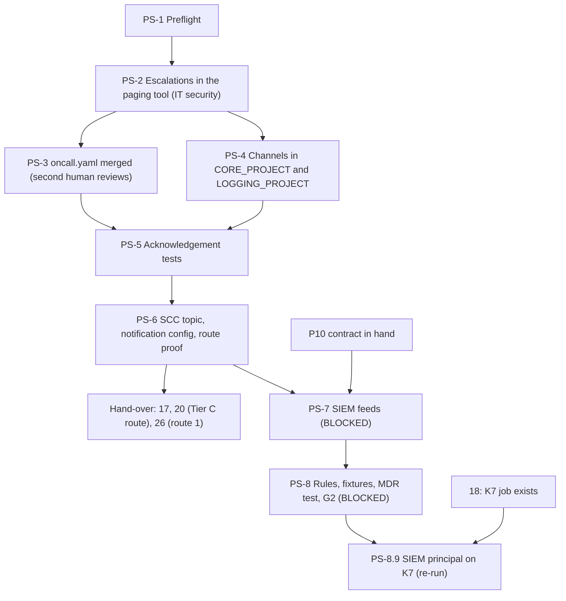

# 15. Paging, SCC notifications, the SIEM and the super-admin detections

## Status
- Owner: the platform owner
- Last reviewed: 2026-09-15
- Last executed: never
- Stage: review §2 stage 28 pulled forward for part A (Eve's route 1 needs the paging service in file 26), the tail of stage 9 (the SCC notification config and its route), and gate line G2 for part B. Part A runs after file 14 and before file 17; part B waits for P10's contract and only G2 and Tier P wait on it.
- Step prefix: PS. Steps: 53 (part A 37, part B 16). BLOCKED steps: PS-2.6 (paging audit forwarder code), PS-6.10 (H-3 code), PS-6.11 (SCC notifier code), and every part B step PS-7.1 to PS-8.10 (P10 contract; SIEM rule code for PS-8.2 to PS-8.4; H-2 code for PS-8.6; file 18's K7 job for PS-8.9). PS-5.4 waits on a value (`BUSINESS_HOURS`) if 03 has not set it.
- Replaces: nothing executable existed. It answers review item M3 ([../13-setup-procedure-review.md](../13-setup-procedure-review.md) §3), the "paste yours" channel lines of [../../wall-e/SETUP.md](../../wall-e/SETUP.md) Phase 16, the "witness channels" route of [../../eve/07-build-runbook.md](../../eve/07-build-runbook.md) Phase 10b step 3, and SETUP's G2 line, which only read a SIEM that nothing built.
- Closes: S003 (the activation-to-page half of SCC and every SIEM, MDR and paging step; the purchase half is [04](04-purchases-and-lead-times.md), the activation [09](09-folders-and-security-command-center.md)), S050 (the Tier C detection route re-scoped to SCC findings routed with a test finding, SIEM rules moved to Tier P; the GE-13 and GE-14 wording and README l.127 are [20](20-gemini-enterprise-gateway-and-tier-c-gate.md)'s half), X-ORG-07 (route 1: the organisation-owned paging service with the second human as parallel recipient, plus email; route 2 is [26](26-eve-reporting-and-witness-export.md) and [27](27-witness-grants-and-alarms.md)), X-ORG-15 (synthetic fixtures with production values, the sandbox export only for live fixtures, the super-administrator correction to 07 F1). §"Findings" at the end says how.
- Decisions applied (pending signature in [03](03-decisions-and-people.md)): SD-06, SD-08, SD-10, SD-12, SD-13, SD-15; design decisions P92 to P99 of [../07-monitoring-detection-incident-response.md](../07-monitoring-detection-incident-response.md).
- Commands, roles, API methods and console paths checked against Google's documentation on 2026-09-15 (§"Sources"); paging-tool facts are the vendor's documentation on the same day and are marked as such. What could not be verified is listed in §"Not verified".
- Elapsed time: part A, one working day of hands-on over about a week (a business-hours and an out-of-hours acknowledgement test, and a merge that waits for the second human). Part B, three to five days of hands-on once the SIEM contract exists, which is months away (P10).

## What this part builds

**Part A, before Eve (Tier R).**

1. **The escalations in the organisation's paging tool.** On the service `PAGER_SERVICE_NAME` (`agentic-platform`, reserved in 04): an escalation policy L1 detection desk plus the second human in parallel, L2 platform owner, L3 incident commander, signed by the incident commander. On the subject-report service `PAGER_SUBJECT_SERVICE_NAME` and a second subject service `PAGER_SUBJECT_SH_SERVICE_NAME`: escalations administered by IT security on which the platform owner is neither administrator nor responder; reports about the platform owner reach the second human only, reports about the second human reach the security reviewer (or the incident commander until appointed) only. The paging tool's own configuration-change log goes to the second human.
2. **`oncall.yaml`** (`ONCALL_FILE`) committed under `/oncall/`, merged with the second human as required reviewer.
3. **Cloud Monitoring channels** in `CORE_PROJECT` and `LOGGING_PROJECT`: the paging service, email to the second human, SMS to the second human. The service key reaches the channel from Secret Manager through a pipe; it is never displayed.
4. **An acknowledgement test**, in and out of business hours, measured against the §9.2 targets, with the second human confirming receipt, and a negative test proving the platform owner cannot acknowledge a subject report.
5. **SCC notifications**: the topic `scc-findings` and the desk subscription in `CORE_PROJECT`, one organisation-level notification config in location `eu`, an alert policy that pages while a finding waits, and the Tier C detection route proven end to end with an SCC test finding. H-3 (the weekly synthetic finding) runs by hand weekly (PS-6.9); its automation is BLOCKED on code (PS-6.10).

**Part B, Tier P (BLOCKED until P10's contract).** The SIEM feeds (Google Cloud ingestion and SCC findings from the organisation, the Workspace native SecOps export connected by a super admin), the reference lists, SA-01..SA-09 and SG-01..SG-07 deployed as detection-as-code with synthetic fixtures carrying production values and passing Test Rule, the SIEM's paging targets, the H-2 canary pair, the MDR 24x7 acknowledgement test, and the SIEM principal on the K7 job as a re-run after 18. The G2 record.

What the old text got wrong, and must not come back:

| Old text | Why it fails | Here instead |
|---|---|---|
| eve/03 §15 row 1, eve/07 10b step 3: severity 1 "through the witness channels" (X-ORG-07) | Nothing in the tenant can drive a channel in the witness organisation; the only identity with a witness grant pushes on a schedule, so the witness learns of a severity 1 hours later | Route 1 is the paging service built here, second human in parallel, plus email; route 2 (the witness backstop) is 26 and 27 |
| 07 §3 filter `state="ACTIVE" AND severity="CRITICAL" OR severity="HIGH"` | Without brackets the `OR` binds loosely, so every HIGH finding pages whatever its state | `state="ACTIVE" AND (severity="CRITICAL" OR severity="HIGH" OR category="AGP_ROUTE_TEST")` (PS-6.3) |
| 07 §3 "a Cloud Run job subscribes and posts to the channel" | No such code exists | A codeless route: an alert policy on the desk subscription's backlog pages; the content-bearing notifier is BLOCKED (PS-6.11) |
| 03 §16 GE-13 "detections in the SIEM with a CI test each" at Tier C (S050) | The SIEM is bought at Tier P | Tier C route = SCC findings to the pager with a test finding (PS-6.8); SIEM rules are part B |
| 07 §1.1 F1 "needs the Reports administrator privilege" (X-ORG-15) | Google: connecting Workspace to SecOps needs super administrator privileges; the Reports privilege only opens the page | A super admin connects it (PS-7.5) |
| 07 §6.2 fixtures "on the sandbox tenant" for SA-02..SA-08 (X-ORG-15) | Sandbox events never reach the production export or `LOGGING_PROJECT`, and carry the twin's address | Synthetic UDM fixtures with production values, imported and checked with Test Rule; sandbox events only through the sandbox's own export, tagged `env=nonprod` (PS-8.3, PS-8.8) |
| SETUP Phase 16: `notificationChannels: projects/PROJECT_ID/notificationChannels/CHANNEL_ID # paste yours` | A policy with a pasted placeholder has no channel | Channel names are variables set by PS-4, read back before any policy |
| SETUP Phase 16's absence condition on a daily writer (S123) | An absence condition never fires before the first data point and cannot exceed 23.5 hours | Absence conditions only on continuous series, created after data is seen; weekly checks (H-3) are positive checks in `DRILL_CALENDAR` |
| 07 §9.2 "SMS and mobile app to individuals in the witness" | The witness is not reachable from the tenant | SMS to the second human from the tenant's own projects here; the witness's own SMS is 27 |



## Preconditions

Part A:

- [ ] File 01 complete: `~/.platform-env` with `need`, `penv_set`, `checkpoint`, `evidence_add`, `exists_or_pending`, `sitting_end`; `BUILD_LOG_DIR`, `EVIDENCE_REGISTER`, `DRILL_CALENDAR`, `DEVIATION_REGISTER`, `REGION`, `ORG_ID`, `DOMAIN`.
- [ ] File 03: `SECOND_HUMAN_EMAIL` set; `INCIDENT_COMMANDER_EMAIL` set (PS-2.7 and PS-2.4's subject escalation wait for a person otherwise); `SECURITY_REVIEWER_EMAIL` set or `*tbd*`; `BUSINESS_TZ` and `BUSINESS_HOURS` set or `*tbd*` (PS-5.4 waits); `PLATFORM_REPO_REMOTE` with CODEOWNERS putting the second human on `/oncall/` (DC-9.4); `SIEM_KIND` recorded. Decision files for SD-08, SD-10, SD-12 and SD-13 exist (signed or recorded pending with the owner's note that part A may proceed).
- [ ] File 04: `PAGER_SERVICE_NAME` and `PAGER_SUBJECT_SERVICE_NAME` set; PU-2.6 and PU-2.7 have `DONE` lines (tool with role separation and an audit trail; the platform owner proven absent from the subject service).
- [ ] File 06: `SA_1_ADMIN`, `SA_2_ADMIN`, `GRP_PLATFORM_SECURITY`, `ROSTER_FILE`.
- [ ] File 09: SCC Premium active at the organisation with data residency `eu` (`SCC_TIER` reads `PREMIUM/eu`), and the IT security person who administers SCC is named in the 09 record.
- [ ] File 10: `CORE_PROJECT`, `CORE_PROJECT_NUMBER`, `LOGGING_PROJECT`, `LOGGING_PROJECT_NUMBER`; `logging`, `monitoring` and `pubsub` enabled in both (CP-1.6). `secretmanager.googleapis.com` is not enabled by 10: 02 §4.2 denies it on `fld-platform-core` by absence, with `CORE_PROJECT`'s `platform-pager-key` ([../09-supply-chain-secrets-recovery.md](../09-supply-chain-secrets-recovery.md) §2.4 row E) as the one dated exception, which PS-4.2 enables.
- [ ] File 12: `ENT_PROJECT_REPAIR_CORE` and `ENT_SECRET_READ` exist and their one-grant tests passed. `Assumption:` the core repair bundle includes Monitoring notification-channel and alert-policy editing, Pub/Sub topic and subscription administration, Secret Manager administration and Logging configuration writes on the core projects; PS-1.1 checks it, and a missing role is a re-run of 12, never a direct grant.
- [ ] File 13: the member constraint on `fld-platform-core` is known (PS-6.2 grants to a tenant user; PS-6.3 relies on the SCC notification service agent being admitted).
- [ ] File 14: `SINK_S_ORG`, `SINK_S_FOLDER` exist; `LOG_BUCKET_EVIDENCE` and `LOG_BUCKET_IDENTITY` exist. PS-5.5 reads `LOGGING_PROJECT`'s own Admin Activity log, which S-folder's intercept does not remove from `_Required`.

Part B, in addition:

- [ ] PU-2.1 `DONE`: the SIEM order with an EU location and retention of at least 400 days (or the signed S1-S9 assessment of the organisation's SIEM) and the MDR retainer with 24x7 acknowledgement.
- [ ] The SIEM instance exists and IT security holds its administration; `siem-readers@` and `siem-content@` are administered by IT security, not by the platform owner (07 §2.2, S9).
- [ ] IT security's rule repository exists with the SA-01..SA-09 and SG-01..SG-07 rule files and fixtures at a named commit with green CI (README B-06).
- [ ] For PS-7.5: the tenant edition supports the SecOps export (Frontline Plus, Enterprise Standard or Plus, Education Standard or Plus).
- [ ] For PS-8.9: file 18 has created the K7 job (`K7_JOB`).

Every step writes `checkpoint <id> START` before its ACTION and `checkpoint <id> DONE` after its VERIFY (01 §1). A step whose WHO names a second person is `BLOCKED` until that person is present.

## People needed

| Person | Does | Present when |
|---|---|---|
| IT security paging administrator (IT security; never the platform owner) | Builds every escalation, schedule and integration in the paging tool; adds the service-key version to Secret Manager; creates the manual subject test incident | PS-1.3, PS-2.1 to PS-2.6, PS-4.2, PS-5.3 |
| IT security SCC administrator (named in the 09 record) | Creates the notification config and the route-test source and findings | PS-1.2, PS-6.3, PS-6.7, PS-6.8, PS-6.9 interim |
| Platform owner (`sa-1-admin@` for the Cloud steps) | Creates topics, subscriptions, secrets, channels and alert policies under PAM; runs the tests; acknowledges L1 and L2 test pages at Tier C-W | PS-1.1, PS-3, PS-4, PS-5, PS-6 |
| Second human (IT security, `SECOND_HUMAN_EMAIL`) | Parallel L1 recipient; confirms receipt of every test page; required reviewer of `oncall.yaml`; receives the configuration-change log; approves PAM grants where 12 names them; reads the SMS verification codes | PS-2.5, PS-3.2, PS-4.6, PS-5.2 to PS-5.5, PS-6.8; part B PS-7.5, PS-8.7 |
| Incident commander (IT security, not a tenant super admin) | Signs the escalation record; L3 and interim sole recipient for reports about the second human; confirms the L3 test page | PS-2.4, PS-2.7, PS-5.2 |
| Security reviewer (when appointed) | Sole recipient on `PAGER_SUBJECT_SH_SERVICE_NAME`; reviews the rule code (part B) | PS-2.4 (re-run at appointment), PS-8.2 |
| MDR desk lead (part B) | Joins L1 on the platform escalation; acknowledges the 24x7 test | PS-8.7 |
| Sandbox super admin (part B, optional) | Connects the sandbox tenant's own SecOps export if live fixtures are wanted | PS-8.8 |

## Decisions applied

| Decision | Applied here as | If 03 records it refused |
|---|---|---|
| SD-08 severity 1 routes | Route 1 on `PAGER_SERVICE_NAME` with the second human in parallel plus email (PS-2.2, PS-4) | 26 uses its dated fallback channels in `EVE_PROJECT`; part A's platform route still stands |
| SD-10, SD-12 sole recipient; subject escalation administered by IT security | PS-2.4, PS-5.3 | Eve's reports about roster humans have no route; 26 does not start |
| SD-13 Tier C detection desk is SCC routed with a test finding | PS-6.8 is the record 20 cites | 20 cannot close Tier C without a SIEM |
| SD-06 sandbox organisation logging | Live sandbox fixtures only through the sandbox's own export (PS-8.8) | Fixtures stay synthetic only |
| SD-15 SCC Premium with `eu` residency, activated in 09 | Every SCC command here uses location `eu` and the regional endpoint | Stop: the location of a notification config cannot be changed after creation |
| P99 tool, escalation, targets | PS-2.2 timeouts; PS-5 measures them | Targets stay `Assumption:` values until the MDR contract fixes them |

---

## Part A — before Eve

### PS-1 Preflight

### PS-1.1 Preflight: variables, decisions, APIs and the PAM bundle

- **WHO:** Platform owner, alone.
- **WHERE:** Shell, `~/.platform-env` sourced.
- **ACTION:**

```bash
source ~/.platform-env
need ORG_ID DOMAIN REGION CORE_PROJECT CORE_PROJECT_NUMBER LOGGING_PROJECT LOGGING_PROJECT_NUMBER SINK_S_ORG SINK_S_FOLDER PAGER_SERVICE_NAME PAGER_SUBJECT_SERVICE_NAME SIEM_KIND SECOND_HUMAN_EMAIL INCIDENT_COMMANDER_EMAIL PLATFORM_REPO_DIR PLATFORM_REPO_REMOTE SA_1_ADMIN ENT_PROJECT_REPAIR_CORE ENT_SECRET_READ BUILD_LOG_DIR EVIDENCE_REGISTER DRILL_CALENDAR SCC_TIER
penv_guard && echo "GUARD OK"
mkdir -p "$BUILD_LOG_DIR/evidence/15"
ls "$PLATFORM_REPO_DIR"/decisions/ | grep -Ei 'sd-08|sd-10|sd-12|sd-13|eve-h-scope|billing-scc-and-siem'
grep -E '^/oncall/' "$PLATFORM_REPO_DIR/.github/CODEOWNERS"
for P in "$CORE_PROJECT" "$LOGGING_PROJECT"; do
  gcloud services list --enabled --project="$P" --format='value(config.name)' | grep -E '^(monitoring|pubsub|logging|secretmanager)\.googleapis\.com$' | sort | tr '\n' ' '; echo " <- $P"
done
gcloud pam entitlements describe "$ENT_PROJECT_REPAIR_CORE" --format='yaml(privilegedAccess.gcpIamAccess.roleBindings,approvalWorkflow)'
test "$SCC_TIER" = "PREMIUM/eu" && echo "SCC OK" || echo "STOP: SCC is not Premium with eu residency (09)"
```

- **VERIFY:** `GUARD OK`; the decision files are listed; the CODEOWNERS line names `SECOND_HUMAN_EMAIL`; each project line lists `logging`, `monitoring` and `pubsub` (10 CP-1.6 rows 2 and 3), and `secretmanager` is absent from both until PS-4.2; the entitlement's role bindings include roles that grant `monitoring.notificationChannels.create`, `monitoring.alertPolicies.create`, `pubsub.topics.create`, `pubsub.topics.setIamPolicy`, `secretmanager.secrets.create` and `logging.views.create` on the core projects (read each role's permissions with `gcloud iam roles describe <role>` if unsure); `SCC OK`. Any other miss: stop, and re-run the owning file (10 for APIs, 12 for the bundle, 09 for SCC); granting a role by hand here is refused. Also open 09's FS-7.7 detector diff: a detector the catalogue relies on that residency disables is carried into part B as a SIEM rule over Cloud Audit Logs (07 §3).
- **ROLLBACK:** None needed; the step only reads.
- **EVIDENCE:** Build-log line under PS-1.1 with the output saved as `evidence/15/<date>-PS-1.1-preflight-v1.txt`. E-05. TISAX 1.1-1.2.

### PS-1.2 Read the SCC state and the SCC administrator's roles

- **WHO:** IT security SCC administrator performs; platform owner records.
- **WHERE:** IT security administrator's workstation, gcloud signed in as that person; Google Cloud console → Security → Security Command Center → Settings (organisation selected).
- **ACTION:**

```bash
ORG_ID=<ORG_ID from the platform owner>
gcloud organizations get-iam-policy "$ORG_ID" --flatten='bindings[].members' --filter='bindings.members:"user:<IT security SCC administrator email>"' --format='value(bindings.role)'
CLOUDSDK_API_ENDPOINT_OVERRIDES_SECURITYCENTER="https://securitycenter.eu.rep.googleapis.com/" gcloud scc notifications list "organizations/$ORG_ID" --location=eu --format='table(name,pubsubTopic,streamingConfig.filter)'
```

  In the console, read the tier and the data residency location, and take a screenshot.
- **VERIFY:** The administrator holds `roles/securitycenter.admin` at the organisation, or at least `roles/securitycenter.notificationConfigEditor`, `roles/securitycenter.sourcesAdmin` and `roles/securitycenter.findingsEditor`. The list shows no existing notification config (or each existing one is recorded with its owner and topic; none may point at a platform project). The console shows Premium and location `eu`. Google requires regional endpoints for SCC resources subject to data residency; the environment variable sets the gcloud property `api_endpoint_overrides/securitycenter` for that one command, so the persistent configuration is not changed.
- **ROLLBACK:** None needed; the step only reads.
- **EVIDENCE:** Screenshot and output as `<date>-PS-1.2-scc-state-v1`. E-05. TISAX 5.2.4.

### PS-1.3 Re-read the paging tool's role separation

- **WHO:** IT security paging administrator; the second human reads the export. Witness: the second human.
- **WHERE:** The paging tool, signed in with the administrator's own account (PagerDuty: People → Users; People → Teams).
- **ACTION:**
  1. Export the user list with base roles and team memberships, and hand it to the second human (not to the platform owner).
  2. Confirm the plan still includes role separation per team and an audit trail (04 PU-2.6: on PagerDuty, Advanced Permissions and Audit Trail Reporting, Business plan or higher).
  3. Confirm the teams: `agp-platform` (owns `PAGER_SERVICE_NAME`), `itsec-subject-reports` (owns both subject services, members: IT security only).
- **VERIFY:** In the export, the platform owner's base role is neither Account Owner nor Global Admin (or the tool's equivalent), he is on `agp-platform` and not on `itsec-subject-reports`, and no account-wide role reaches the subject services. The second human signs the export.
- **ROLLBACK:** None needed; the step only reads. A deviation is fixed by IT security before PS-2 starts.
- **EVIDENCE:** `<date>-PS-1.3-paging-roles-v1`, signed by the second human. E-08. TISAX 4.1-4.2.

### PS-2 The escalations in the paging tool

### PS-2.1 Users, notification rules and the L1 desk schedule

- **WHO:** IT security paging administrator; each responder sets their own contact methods.
- **WHERE:** The paging tool (PagerDuty: People → Users → user → Contact Information and Notification Rules; People → Schedules → New On-Call Schedule).
- **ACTION:**
  1. Confirm or create user accounts for the platform owner, the second human, the incident commander and, when appointed, the security reviewer. Each person enters their own phone and push contact methods; nobody records a phone number in the platform repository, the variables file or the build log.
  2. Each responder sets high-urgency notification rules to notify immediately by push and by phone call, then SMS after 2 minutes.
  3. Create the schedule `agp-l1-desk` in `BUSINESS_TZ` (or the tool's default time zone with a note if `*tbd*`), with one layer: the platform owner, 24x7, starting today. At Tier P, PS-8.7 replaces this layer with the MDR desk.
- **VERIFY:** Each responder opens their own profile and sends themselves a test notification from the tool (PagerDuty: user profile → Contact Information → Send test notification, where the plan offers it); each confirms receipt in the build-log sheet by initials and time. The schedule shows the platform owner on call now.
- **ROLLBACK:** Delete the schedule; remove the contact methods (each person).
- **EVIDENCE:** `<date>-PS-2.1-responders-v1` (names, roles, confirmation times; no phone numbers). E-08. TISAX 1.6.

### PS-2.2 The platform escalation policy L1-L3

- **WHO:** IT security paging administrator builds; the incident commander reviews on screen. Witness: the incident commander.
- **WHERE:** The paging tool (PagerDuty: People → Escalation Policies → New Escalation Policy; vendor page "Escalation policies", read 2026-09-15).
- **ACTION:** Create `agp-platform-escalation`, owned by team `agp-platform`:

| Level | Notify at once | Escalates after | Why |
|---|---|---|---|
| 1 | schedule `agp-l1-desk` **and** the second human (user) | 15 minutes | 07 §9.2: severity 1 pages L1 and the second human in parallel; 15 min is the Tier P business-hours target (`Assumption:` until the MDR contract) |
| 2 | the platform owner (user) | 15 minutes | L2; at Tier C-W the same person as L1, kept so that PS-8.7 changes L1 only |
| 3 | the incident commander (user) | — | L3 at twice the target |

  Tick "If no one acknowledges, repeat this policy" with 2 repeats. The vendor states that a level with multiple targets needs an escalation timeout of at least three minutes; 15 satisfies it.
- **VERIFY:** The policy page shows three levels with the targets above; the second human's user appears on level 1 beside the schedule, not on a later level. The incident commander initials a screenshot.
- **ROLLBACK:** Delete the policy before PS-2.3 attaches it (the vendor warns that deleting an attached policy detaches its users from the service).
- **EVIDENCE:** Screenshot as `<date>-PS-2.2-platform-escalation-v1`. E-08, E-10. TISAX 1.6.

### PS-2.3 Attach the escalation to `agentic-platform` and add the Cloud Monitoring integration

- **WHO:** IT security paging administrator.
- **WHERE:** The paging tool (PagerDuty: Services → Service Directory → `agentic-platform` → Settings, then Integrations → Add an integration); Cloud Monitoring's PagerDuty instructions ([notification options](https://docs.cloud.google.com/monitoring/support/notification-options), read 2026-09-15).
- **ACTION:**
  1. Set the service's escalation policy to `agp-platform-escalation`; urgency "High" for all incidents (`Assumption:` Cloud Monitoring and SCC pages are all treated as severity 1 at Tier C-R; the SIEM's severity 2 route is PS-8.5); acknowledgement timeout off, so an acknowledged incident does not silently re-trigger.
  2. Add an integration of the type Google's page names for Cloud Monitoring, **Events API v1**, named `cloud-monitoring`. Do not copy the key yet; PS-4.2 moves it.
  3. Do not add any other integration or any team member who is not in `oncall.yaml` (PS-3.1).
- **VERIFY:** The service page shows the escalation policy `agp-platform-escalation`, urgency High, and exactly one integration `cloud-monitoring` of type Events API v1.
- **ROLLBACK:** Remove the integration; restore the previous escalation policy (none existed before PS-2.2).
- **EVIDENCE:** Screenshot without the key (PagerDuty shows the key on the integration page; crop it out before saving) as `<date>-PS-2.3-service-wiring-v1`. E-08. TISAX 1.6.

### PS-2.4 The subject-report escalations

- **WHO:** IT security paging administrator builds; the incident commander reviews; the second human verifies alone afterwards. The platform owner is not present.
- **WHERE:** The paging tool, team `itsec-subject-reports`; tenant shell for the variable.
- **ACTION:**
  1. On `PAGER_SUBJECT_SERVICE_NAME` (reports whose subject is the platform owner or any roster human other than the second human), create and attach `agp-subject-po-escalation`: level 1 the second human only, escalates after 15 minutes; level 2 the incident commander only. Never the platform owner.
  2. Create a second service, `agentic-platform-roster-subject-sh`, owned by `itsec-subject-reports`, for reports whose subject is the second human (`sa-2-admin@`, or a break-glass account in the second human's custody). One service cannot serve both, because its escalation would reach the subject. Attach `agp-subject-sh-escalation`: level 1 the security reviewer if `SECURITY_REVIEWER_EMAIL` is set, otherwise the incident commander (SD-10, SD-12); level 2 the incident commander if level 1 is the security reviewer, otherwise `*tbd*` (the ISMS contact 03 names; until then one level, repeated 2 times). Never the second human, never the platform owner.
  3. Urgency High on both; no integration yet: Eve's integrations and their keys are created in 26 straight into `EVE_PROJECT`'s Secret Manager, so no subject-service key passes through a platform project.
  4. Record the second service name:

```bash
need INCIDENT_COMMANDER_EMAIL
penv_set PAGER_SUBJECT_SH_SERVICE_NAME "agentic-platform-roster-subject-sh"
```

- **VERIFY:** The second human, signed in alone, opens both services: `PAGER_SUBJECT_SERVICE_NAME` shows `agp-subject-po-escalation` whose targets are the second human and the incident commander only; `agentic-platform-roster-subject-sh` shows `agp-subject-sh-escalation` whose targets exclude the second human and the platform owner. Negative proof is PS-5.3.
- **ROLLBACK:** IT security deletes the second service and the policies; `penv_set --force` with a build-log line. Until they exist, 26 does not start for reports about roster humans.
- **EVIDENCE:** Screenshots as `<date>-PS-2.4-subject-escalations-v1`, initialled by the incident commander and the second human. E-08. TISAX 4.1-4.2, 1.6. Re-run point: at the security reviewer's appointment, level 1 of `agp-subject-sh-escalation` switches to the security reviewer (README §9).

### PS-2.5 The configuration-change log to the second human (interim)

- **WHO:** IT security paging administrator grants read; the second human reviews weekly.
- **WHERE:** The paging tool (PagerDuty: Services → Service Directory → service → More → View Audit Trail Reporting; People → Escalation Policies → policy → View Audit Trail Reporting; vendor page "Audit Trail Reporting", read 2026-09-15: Business plan or higher, users, teams, escalation policies, schedules, services and incident workflows are covered, 12 months on demand, 31 days per query).
- **ACTION:**
  1. Give the second human a non-administrator role that can view the audit trail of all three services, their escalation policies, `agp-l1-desk` and both teams (the vendor states that all users except Limited Stakeholders can view audit trail reports, Restricted Access users only for objects they are authorised on).
  2. Add a weekly entry to `DRILL_CALENDAR`:

```bash
need DRILL_CALENDAR SECOND_HUMAN_EMAIL
printf '| DR-15-1 | Paging-tool audit trail review: agentic-platform, both subject services, their escalation policies, agp-l1-desk and both teams; a change not made by IT security under a ticket is a finding to the incident commander | weekly, Mondays, until PS-2.6 is live | second human | — | 15 | %s | | | SD-12 |\n' "$(date -u +%Y-%m-%d)" >> "$DRILL_CALENDAR"
git -C "$BUILD_LOG_DIR" add "$DRILL_CALENDAR" && git -C "$BUILD_LOG_DIR" commit -m "PS-2.5 weekly paging audit review"
```

  3. The second human performs the first review now.
- **VERIFY:** The second human's first review record lists the creation events of PS-2.2 to PS-2.4 with IT security as actor and no event by the platform owner.
- **ROLLBACK:** Remove the calendar row only when PS-2.6 is `DONE`.
- **EVIDENCE:** `<date>-PS-2.5-audit-review-v1`, and one record per week after. E-08. TISAX 1.5, 4.1-4.2.

### PS-2.6 The configuration-change forwarder (BLOCKED)

> **BLOCKED**: Needs: a job owned by IT security that reads the paging tool's audit records (PagerDuty REST "List audit records") every hour and mails every change to any of the objects in PS-2.5 to `SECOND_HUMAN_EMAIL`, with its own absence alarm. It runs in IT security's own environment, never in a platform project, and its tool API key is IT security's. Commit it in: IT security's tooling repository. Unblocked by: a commit with green CI and one forwarded test change. Gate waiting: none (PS-2.5's weekly review applies meanwhile); recorded in README's BLOCKED index beside B-05. Until then: `checkpoint PS-2.6 BLOCKED - - "paging audit forwarder code"`.

- **WHO:** IT security paging administrator; the second human confirms the test mail.
- **WHERE:** IT security's environment.
- **ACTION:** Deploy the committed forwarder; make one harmless change (rename the description of `agp-l1-desk`) and revert it.
- **VERIFY:** The second human receives two mails naming the actor, object and action within the job's interval.
- **ROLLBACK:** Disable the job; PS-2.5's weekly review resumes.
- **EVIDENCE:** `<date>-PS-2.6-forwarder-test-v1`. E-08. TISAX 1.5.

### PS-2.7 The incident commander signs the escalation record

- **WHO:** Platform owner writes; the incident commander signs; the second human co-signs the subject-report part.
- **WHERE:** Shell; the platform repository.
- **ACTION:**

```bash
need PLATFORM_REPO_DIR PAGER_SERVICE_NAME PAGER_SUBJECT_SERVICE_NAME PAGER_SUBJECT_SH_SERVICE_NAME INCIDENT_COMMANDER_EMAIL SECOND_HUMAN_EMAIL
mkdir -p "$PLATFORM_REPO_DIR/oncall"
cat > "$PLATFORM_REPO_DIR/oncall/escalation-record.md" <<EOF
# Escalation record (setup 15 PS-2.7)

- Date: $(date -u +%Y-%m-%d)
- Services: ${PAGER_SERVICE_NAME} (agp-platform-escalation), ${PAGER_SUBJECT_SERVICE_NAME} (agp-subject-po-escalation), ${PAGER_SUBJECT_SH_SERVICE_NAME} (agp-subject-sh-escalation)
- Targets (Assumption until the MDR contract): severity 1 acknowledgement 15 min in business hours, 60 min outside; Tiers C-W next business morning for everything except the tests in PS-5.
- Sole-recipient rule (SD-10): reports about the platform owner reach the second human only; reports about the second human reach the security reviewer, or the incident commander until appointed.
- The platform owner holds no administrator or responder role on either subject service (PU-2.7, PS-1.3).
- Signed, incident commander: ${INCIDENT_COMMANDER_EMAIL}, date:
- Co-signed for the subject-report part, second human: ${SECOND_HUMAN_EMAIL}, date:
EOF
git -C "$PLATFORM_REPO_DIR" switch -c ps-2.7-escalation-record
git -C "$PLATFORM_REPO_DIR" add oncall/escalation-record.md
git -C "$PLATFORM_REPO_DIR" commit -m "PS-2.7 escalation record for signature"
```

  The incident commander and the second human sign by approving the pull request opened in PS-3.2 together with `oncall.yaml`, and by adding their dates in a follow-up commit in that branch.
- **VERIFY:** Part of PS-3.2's merge verify: both approvals present on the merged commit.
- **ROLLBACK:** `git revert` of the merge commit, reviewed by the second human.
- **EVIDENCE:** The merged commit id as `<date>-PS-2.7-escalation-signed-v1`. E-10. TISAX 1.6.

### PS-3 `oncall.yaml`

### PS-3.1 Write `oncall.yaml`

- **WHO:** Platform owner writes.
- **WHERE:** Shell, `~/.platform-env` sourced; branch of PS-2.7.
- **ACTION:**

```bash
need PLATFORM_REPO_DIR PAGER_SERVICE_NAME PAGER_SUBJECT_SERVICE_NAME PAGER_SUBJECT_SH_SERVICE_NAME SECOND_HUMAN_EMAIL INCIDENT_COMMANDER_EMAIL OWNER_DAILY_ACCOUNT
if need SECURITY_REVIEWER_EMAIL 2>/dev/null; then SH_SUBJECT_RECIPIENT="$SECURITY_REVIEWER_EMAIL"; else SH_SUBJECT_RECIPIENT="$INCIDENT_COMMANDER_EMAIL"; fi
cat > "$PLATFORM_REPO_DIR/oncall/oncall.yaml" <<EOF
# The platform rota file (07 §9.2; eve/03 §15). Setup 15 PS-3.1. No phone numbers here.
version: 1
tier_now: R
business_tz: "${BUSINESS_TZ:-*tbd*}"
business_hours: "${BUSINESS_HOURS:-*tbd*}"
services:
  platform:
    name: "${PAGER_SERVICE_NAME}"
    escalation: agp-platform-escalation
    levels:
      - {level: 1, targets: ["schedule:agp-l1-desk", "user:${SECOND_HUMAN_EMAIL}"], escalate_after_min: 15}
      - {level: 2, targets: ["user:${OWNER_DAILY_ACCOUNT}"], escalate_after_min: 15}
      - {level: 3, targets: ["user:${INCIDENT_COMMANDER_EMAIL}"]}
  subject_platform_owner:
    name: "${PAGER_SUBJECT_SERVICE_NAME}"
    escalation: agp-subject-po-escalation
    administered_by: itsec-subject-reports
    sole_recipient: "user:${SECOND_HUMAN_EMAIL}"
    then: "user:${INCIDENT_COMMANDER_EMAIL}"
  subject_second_human:
    name: "${PAGER_SUBJECT_SH_SERVICE_NAME}"
    escalation: agp-subject-sh-escalation
    administered_by: itsec-subject-reports
    sole_recipient: "user:${SH_SUBJECT_RECIPIENT}"
primary: "user:${SECOND_HUMAN_EMAIL}"
secondary: "user:${INCIDENT_COMMANDER_EMAIL}"
timeouts_min:
  severity_1: {business_hours: 15, outside: 60}
  severity_2: {business_hours: 240}
  severity_3: next_review
never_recipient_of_reports_about_self: true
k5_k6_rota: []   # filled in 38; records held in the witness (08 records step)
EOF
python3 -c "import yaml,sys; d=yaml.safe_load(open(sys.argv[1])); assert d['services']['subject_platform_owner']['sole_recipient'].endswith(sys.argv[2]); assert sys.argv[3] not in str(d['services']['subject_platform_owner']); print('ONCALL OK')" "$PLATFORM_REPO_DIR/oncall/oncall.yaml" "$SECOND_HUMAN_EMAIL" "$OWNER_DAILY_ACCOUNT"
git -C "$PLATFORM_REPO_DIR" add oncall/oncall.yaml
git -C "$PLATFORM_REPO_DIR" commit -m "PS-3.1 oncall.yaml"
```

- **VERIFY:** `ONCALL OK` (PyYAML from 01's workstation tools; if absent, read the file by eye against PS-2.2 and PS-2.4 and record that). The platform owner's address appears in `platform` level 2 only.
- **ROLLBACK:** `git -C "$PLATFORM_REPO_DIR" reset --hard HEAD~1` before the push.
- **EVIDENCE:** Commit id in the build log. E-08. TISAX 1.6, 5.2.1.

### PS-3.2 Merge with the second human as required reviewer

- **WHO:** Platform owner opens; the second human approves (required by CODEOWNERS); the incident commander approves (signature of PS-2.7).
- **WHERE:** Shell; the git host. The commands are for a GitHub host, which 03 DC-9.3 uses; on another host use its equivalent and record the commands.
- **ACTION:**

```bash
need PLATFORM_REPO_DIR
git -C "$PLATFORM_REPO_DIR" push -u origin ps-2.7-escalation-record
( cd "$PLATFORM_REPO_DIR" && gh pr create --base main --head ps-2.7-escalation-record --title "oncall.yaml and escalation record (setup 15)" --body "PS-2.7 and PS-3.1. Second human: required review. Incident commander: signature." )
```

  After both approvals and the signature commit, merge through the host (never with an administrator bypass), then:

```bash
( cd "$PLATFORM_REPO_DIR" && gh pr view ps-2.7-escalation-record --json mergedAt,mergeCommit,reviews --jq '{mergedAt, commit: .mergeCommit.oid, approvers: [.reviews[] | select(.state=="APPROVED") | .author.login]}' )
git -C "$PLATFORM_REPO_DIR" switch main && git -C "$PLATFORM_REPO_DIR" pull --ff-only
penv_set ONCALL_FILE "oncall/oncall.yaml"
```

- **VERIFY:** `mergedAt` is set; `approvers` contains the second human's and the incident commander's logins; `oncall/oncall.yaml` is on `main`. A merge without the second human's approval is refused by branch protection; if it happened, that is a finding against the repository settings (03).
- **ROLLBACK:** A revert pull request, reviewed by the second human.
- **EVIDENCE:** Merge commit and approvals as `<date>-PS-3.2-oncall-merged-v1`. E-08. TISAX 5.2.1, 1.6.

### PS-4 Cloud Monitoring channels

### PS-4.1 Obtain the core-project grant

- **WHO:** Platform owner requests; approver as 12 set on `ENT_PROJECT_REPAIR_CORE`.
- **WHERE:** Shell, `~/.platform-env` sourced, gcloud signed in as `sa-1-admin@`.
- **ACTION:**

```bash
need ENT_PROJECT_REPAIR_CORE SECOND_HUMAN_EMAIL
gcloud pam grants create --entitlement="$ENT_PROJECT_REPAIR_CORE" --requested-duration=3600s --justification="setup 15 PS-4 to PS-6: channels, topic, secret, alert policies in the core projects" --additional-email-recipients="$SECOND_HUMAN_EMAIL"
```

- **VERIFY:** `gcloud pam grants list --entitlement="$ENT_PROJECT_REPAIR_CORE" --filter='state=ACTIVE' --format='value(name,requester,state)'` shows one active grant with the platform owner as requester. Repeat this step whenever a later PS step outlives the hour; each grant is its own log line.
- **ROLLBACK:** `gcloud pam grants revoke <grant name> --reason="done"` when the sitting ends early.
- **EVIDENCE:** Grant names in the build log. E-08. TISAX 4.1-4.2.

### PS-4.2 The `platform-pager-key` secret, filled by IT security

- **WHO:** Platform owner enables the API, creates the secret and a time-bound adder grant; IT security paging administrator adds the version from the tool's copy button on their own workstation.
- **WHERE:** Shell (platform owner); IT security's workstation with gcloud (administrator); the paging tool's integration page. The secret is 09-supply-chain §2.4 row E: `platform-pager-key`, regional, in `CORE_PROJECT`, the one exception to "no secret in the core" of 02 §4.2.
- **ACTION (platform owner):**

```bash
need CORE_PROJECT REGION DEVIATION_REGISTER
gcloud services enable secretmanager.googleapis.com --project="$CORE_PROJECT"
ROW="| BD-15-1 | $(date -u +%Y-%m-%d) | 15 PS-4.2 | DEV | secretmanager.googleapis.com enabled on CORE_PROJECT only, for platform-pager-key (02 §4.2 exception; 09-supply-chain §2.4 row E) | ${CORE_PROJECT} | 02 §4.2 row fld-platform-core | one API on one project; one regional secret | gcloud services list output in evidence/15 | n/a | ENT_PROJECT_REPAIR_CORE grant id | superseded by the platform-core module input | open |"
awk -v row="$ROW" '/^\| Id \| Opened/ {t=1} t && !d && $0 !~ /^\|/ {print row; d=1} {print} END {if (!d) print row}' "$DEVIATION_REGISTER" > "$DEVIATION_REGISTER.tmp" && mv "$DEVIATION_REGISTER.tmp" "$DEVIATION_REGISTER"
git -C "$BUILD_LOG_DIR" add "$DEVIATION_REGISTER" && git -C "$BUILD_LOG_DIR" commit -m "PS-4.2 deviation: secretmanager on CORE_PROJECT"
gcloud secrets create platform-pager-key --project="$CORE_PROJECT" --location="$REGION" --labels=owner=platform,purpose=pager-key
EXP="$(date -u -v+1d +%Y-%m-%dT%H:%M:%SZ)"
gcloud secrets add-iam-policy-binding platform-pager-key --project="$CORE_PROJECT" --location="$REGION" --member="user:<IT security paging administrator email>" --role=roles/secretmanager.secretVersionAdder --condition="expression=request.time < timestamp(\"${EXP}\"),title=ps-4-2-until-${EXP%%T*}"
```

  If the enable is refused by 13's `gcp.restrictServiceUsage` on `fld-platform-core`, stop: the project-level exception for `CORE_PROJECT` is a re-run of 13 under `ENT_PLATFORM_POLICY`, never a change made here.
- **ACTION (IT security, own workstation):** open the integration `cloud-monitoring` of PS-2.3, press the tool's copy button for the integration key, then in the terminal, without displaying it:

```bash
pbpaste | gcloud secrets versions add platform-pager-key --project=<CORE_PROJECT> --location=europe-west1 --data-file=- --format='value(name)'
pbcopy < /dev/null
```

- **VERIFY:** `gcloud secrets versions list platform-pager-key --project="$CORE_PROJECT" --location="$REGION" --format='value(name,state)'` shows version 1 `ENABLED`; the printed version name is recorded. `gcloud secrets get-iam-policy platform-pager-key --project="$CORE_PROJECT" --location="$REGION"` shows the conditioned binding only. Nothing was echoed; IT security confirms the clipboard was cleared.
- **ROLLBACK:** `gcloud secrets delete platform-pager-key --project="$CORE_PROJECT" --location="$REGION"`, IT security regenerates the integration key in the tool, and the deviation row is closed.
- **EVIDENCE:** Secret name and version number (never the value), the deviation row, as `<date>-PS-4.2-pager-key-secret-v1`. E-05. TISAX 5.1.1, 4.1-4.2.

### PS-4.3 The paging channel in `CORE_PROJECT`

- **WHO:** Platform owner, under an `ENT_SECRET_READ` grant approved as 12 set.
- **WHERE:** Shell, `~/.platform-env` sourced.
- **ACTION:** Google's channel reference says fields containing sensitive information are only partially populated on retrieval, and `gcloud beta monitoring channels create` reads channel content only from a flag or a file path, so the key is piped through `jq` into the REST `create` call and only the resource name is printed.

```bash
need CORE_PROJECT REGION PAGER_SERVICE_NAME ENT_SECRET_READ
gcloud pam grants create --entitlement="$ENT_SECRET_READ" --requested-duration=1800s --justification="setup 15 PS-4.3 and PS-4.4: pager service key into two Monitoring channels"
# wait until the approver has approved: the next line must print ACTIVE before anything else runs
gcloud pam grants list --entitlement="$ENT_SECRET_READ" --filter='state=ACTIVE' --format='value(state)'
CH="$(gcloud secrets versions access 1 --secret=platform-pager-key --project="$CORE_PROJECT" --location="$REGION" \
  | jq -Rn --arg dn "${PAGER_SERVICE_NAME} (core)" '{type:"pagerduty", displayName:$dn, description:"setup 15 PS-4.3", labels:{service_key: input}}' \
  | curl -sS --fail-with-body -X POST -H "Authorization: Bearer $(gcloud auth print-access-token)" -H "Content-Type: application/json" --data-binary @- "https://monitoring.googleapis.com/v3/projects/${CORE_PROJECT}/notificationChannels" \
  | jq -r '.name // empty')"
case "$CH" in projects/*/notificationChannels/*) penv_set NOTIF_CH_PAGER_CORE "$CH";; *) echo "STOP: channel not created; read the API error (it does not contain the key)";; esac
```

- **VERIFY:** `gcloud beta monitoring channels describe "$NOTIF_CH_PAGER_CORE" --project="$CORE_PROJECT" --format='value(type,displayName,enabled)'` prints `pagerduty`, the display name and `True`. Do not print the full resource: the key is partially shown.
- **ROLLBACK:** `gcloud beta monitoring channels delete "$NOTIF_CH_PAGER_CORE" --project="$CORE_PROJECT"`.
- **EVIDENCE:** Channel name as `<date>-PS-4.3-channel-pager-core-v1`. E-08. TISAX 1.6.

### PS-4.4 The paging channel in `LOGGING_PROJECT`

- **WHO:** Platform owner, same grants.
- **WHERE:** Shell.
- **ACTION:**

```bash
need CORE_PROJECT LOGGING_PROJECT REGION PAGER_SERVICE_NAME
CH="$(gcloud secrets versions access 1 --secret=platform-pager-key --project="$CORE_PROJECT" --location="$REGION" \
  | jq -Rn --arg dn "${PAGER_SERVICE_NAME} (logging)" '{type:"pagerduty", displayName:$dn, description:"setup 15 PS-4.4", labels:{service_key: input}}' \
  | curl -sS --fail-with-body -X POST -H "Authorization: Bearer $(gcloud auth print-access-token)" -H "Content-Type: application/json" --data-binary @- "https://monitoring.googleapis.com/v3/projects/${LOGGING_PROJECT}/notificationChannels" \
  | jq -r '.name // empty')"
case "$CH" in projects/*/notificationChannels/*) penv_set NOTIF_CH_PAGER_LOGGING "$CH";; *) echo "STOP: channel not created";; esac
gcloud pam grants list --entitlement="$ENT_SECRET_READ" --filter='state=ACTIVE' --format='value(name)' | while read -r G; do gcloud pam grants revoke "$G" --reason="PS-4.4 done"; done
```

- **VERIFY:** As PS-4.3 on `NOTIF_CH_PAGER_LOGGING` in `LOGGING_PROJECT`; the `ENT_SECRET_READ` grant is no longer active.
- **ROLLBACK:** `gcloud beta monitoring channels delete "$NOTIF_CH_PAGER_LOGGING" --project="$LOGGING_PROJECT"`.
- **EVIDENCE:** `<date>-PS-4.4-channel-pager-logging-v1`. E-08. TISAX 1.6.

### PS-4.5 Email channels to the second human

- **WHO:** Platform owner.
- **WHERE:** Shell. Google's page gives no verification step for email channels; group addresses must accept mail from `alerting-noreply@google.com`, which is why an individual address is used here.
- **ACTION:**

```bash
need CORE_PROJECT LOGGING_PROJECT SECOND_HUMAN_EMAIL
for P in "$CORE_PROJECT" "$LOGGING_PROJECT"; do
  gcloud beta monitoring channels create --project="$P" --display-name="email second human" --description="setup 15 PS-4.5; route 1 secondary (SD-08)" --type=email --channel-labels=email_address="$SECOND_HUMAN_EMAIL"
done
penv_set NOTIF_CH_EMAIL_CORE "$(gcloud beta monitoring channels list --project="$CORE_PROJECT" --filter='type="email" AND displayName="email second human"' --format='value(name)')"
penv_set NOTIF_CH_EMAIL_LOGGING "$(gcloud beta monitoring channels list --project="$LOGGING_PROJECT" --filter='type="email" AND displayName="email second human"' --format='value(name)')"
```

- **VERIFY:** Each variable holds exactly one `projects/.../notificationChannels/...` name (a blank or two lines is a stop). Delivery is proven in PS-5.2.
- **ROLLBACK:** `gcloud beta monitoring channels delete <name> --project=<project>` for each.
- **EVIDENCE:** `<date>-PS-4.5-channels-email-v1`. E-08. TISAX 1.6.

### PS-4.6 SMS channels to the second human

- **WHO:** Platform owner creates; the second human enters their own number and reads the verification code from their phone. Witness: the second human.
- **WHERE:** Google Cloud console → Monitoring → Alerting → Edit notification channels → SMS → Add new, once with `CORE_PROJECT` selected and once with `LOGGING_PROJECT` selected. Google states that SMS is not a fully reliable channel type and might not be available in certain regions.
- **ACTION:**
  1. Display name `sms second human`. The second human types the number; the platform owner does not record it.
  2. Enter the code the second human reads out, and save.
  3. Read the names back:

```bash
need CORE_PROJECT LOGGING_PROJECT
penv_set NOTIF_CH_SMS_SECOND_HUMAN "$(gcloud beta monitoring channels list --project="$CORE_PROJECT" --filter='type="sms" AND displayName="sms second human"' --format='value(name)')"
penv_set NOTIF_CH_SMS_SECOND_HUMAN_LOGGING "$(gcloud beta monitoring channels list --project="$LOGGING_PROJECT" --filter='type="sms" AND displayName="sms second human"' --format='value(name)')"
gcloud beta monitoring channels list --project="$CORE_PROJECT" --filter='type="sms"' --format='value(displayName,verificationStatus)'
gcloud beta monitoring channels list --project="$LOGGING_PROJECT" --filter='type="sms"' --format='value(displayName,verificationStatus)'
```

- **VERIFY:** Both lists print `sms second human VERIFIED`. If SMS is not offered for the number's country, record it; route 1 then rests on the paging tool's own phone and SMS contact methods (PS-2.1) and the email channel, and the gap is a dated deviation in `DEVIATION_REGISTER`.
- **ROLLBACK:** Delete each channel in the console or with `gcloud beta monitoring channels delete`.
- **EVIDENCE:** `<date>-PS-4.6-channels-sms-v1` (no number). E-08. TISAX 1.6.

### PS-4.7 Channel inventory read-back

- **WHO:** Platform owner; the second human reads the output.
- **WHERE:** Shell.
- **ACTION:**

```bash
need CORE_PROJECT LOGGING_PROJECT NOTIF_CH_PAGER_CORE NOTIF_CH_EMAIL_CORE NOTIF_CH_SMS_SECOND_HUMAN NOTIF_CH_PAGER_LOGGING NOTIF_CH_EMAIL_LOGGING NOTIF_CH_SMS_SECOND_HUMAN_LOGGING
for P in "$CORE_PROJECT" "$LOGGING_PROJECT"; do echo "== $P"; gcloud beta monitoring channels list --project="$P" --format='table(name.basename(),type,displayName,enabled,verificationStatus)'; done | tee "$BUILD_LOG_DIR/evidence/15/$(date -u +%Y-%m-%d)-PS-4.7-channels.txt"
```

- **VERIFY:** Each project has exactly three channels (pagerduty, email, sms), all enabled, SMS verified, and the names equal the six variables. Any other channel in either project is investigated and recorded before PS-5.
- **ROLLBACK:** None needed; the step only reads.
- **EVIDENCE:** The saved table, `evidence_add PS-4.7 channel-inventory E-08 1.6 "$BUILD_LOG_DIR/evidence/15" <file>`. E-08. TISAX 1.6.

### PS-5 Acknowledgement tests

### PS-5.1 The acknowledgement-test policy in `CORE_PROJECT`

- **WHO:** Platform owner.
- **WHERE:** Shell. Log-based alerting policy structure from [log-based alerts](https://docs.cloud.google.com/logging/docs/alerting/log-based-alerts) (read 2026-09-15): one `conditionMatchedLog` condition, combiner `OR`, `notificationRateLimit` required, autoclose minimum 1,800 seconds.
- **ACTION:**

```bash
need CORE_PROJECT NOTIF_CH_PAGER_CORE NOTIF_CH_EMAIL_CORE NOTIF_CH_SMS_SECOND_HUMAN
W="$(mktemp -d)"
cat > "$W/ack-test.yaml" <<EOF
displayName: "agp-ack-test (setup 15 PS-5)"
combiner: OR
severity: CRITICAL
documentation:
  mimeType: text/markdown
  content: "Acknowledgement test of setup file 15. Acknowledge in the paging tool and record the time. No action on any system."
conditions:
  - displayName: "agp-page-test entry written"
    conditionMatchedLog:
      filter: 'logName="projects/${CORE_PROJECT}/logs/agp-page-test"'
alertStrategy:
  notificationRateLimit:
    period: 300s
  autoClose: 1800s
notificationChannels:
  - ${NOTIF_CH_PAGER_CORE}
  - ${NOTIF_CH_EMAIL_CORE}
  - ${NOTIF_CH_SMS_SECOND_HUMAN}
EOF
gcloud monitoring policies create --project="$CORE_PROJECT" --policy-from-file="$W/ack-test.yaml"
cp "$W/ack-test.yaml" "$BUILD_LOG_DIR/evidence/15/" && rm -rf "$W"
```

- **VERIFY:** `gcloud monitoring policies list --project="$CORE_PROJECT" --filter='displayName="agp-ack-test (setup 15 PS-5)"' --format='value(name,enabled,notificationChannels.len())'` prints one policy, `True`, `3`.
- **ROLLBACK:** `gcloud monitoring policies delete <name> --project="$CORE_PROJECT"`.
- **EVIDENCE:** The policy file in the build log. E-08. TISAX 1.6.

### PS-5.2 Business-hours acknowledgement test on the platform escalation

- **WHO:** Platform owner fires and acknowledges only at L2; the second human confirms receipt at L1 and does **not** acknowledge; the incident commander acknowledges at L3. Witness: the second human records times.
- **WHERE:** Shell; the paging tool on each person's phone.
- **ACTION:**
  1. Announce the test to the three people and agree that the L1 schedule member (the platform owner at Tier C-W) and the second human let L1 time out, the platform owner acknowledges nothing until L3 has been paged, and the incident commander acknowledges.
  2. Fire:

```bash
need CORE_PROJECT
gcloud logging write agp-page-test "setup 15 PS-5.2 acknowledgement test $(date -u +%Y%m%dT%H%M%SZ)" --severity=ERROR --project="$CORE_PROJECT"
date -u +%Y-%m-%dT%H:%M:%SZ
```

  3. Record T0 (the printed time), T1 (page on the platform owner's and the second human's phones), T2 (SMS and email at the second human), T3 (L2 page, after 15 minutes), T4 (L3 page to the incident commander, after 30 minutes), T5 (incident commander's acknowledgement).
- **VERIFY:** The second human confirms, from their own phone and mailbox, the paging-tool notification, the SMS and the email, each carrying the policy name; the incident in the tool shows the escalation through levels 1, 2 and 3 in that order; T1 - T0 is under 5 minutes (`Assumption:` Google's log-based alert latency is not published; record the value); T4 - T1 is 30 minutes ± 2. A second firing within 5 minutes produces no new incident, which Google's page describes, so wait before any repeat.
- **ROLLBACK:** Resolve the incident in the tool and close the Monitoring incident (Google: resolving in the tool does not close the Monitoring incident; autoclose is 30 minutes).
- **EVIDENCE:** Time sheet and screenshots of the three notifications at the second human, as `<date>-PS-5.2-ack-test-business-hours-v1`, signed by the second human. E-08, E-10. TISAX 1.6.

### PS-5.3 Subject-report escalation test and the platform owner's negative test

- **WHO:** IT security paging administrator creates the incidents; the second human and the incident commander receive; the platform owner performs the negative test while the second human watches. Witness: the second human.
- **WHERE:** The paging tool (PagerDuty: Incidents → New Incident, service and title chosen by hand).
- **ACTION:**
  1. On `PAGER_SUBJECT_SERVICE_NAME`, create an incident titled `setup 15 PS-5.3 test: subject platform owner`. The second human receives it and acknowledges.
  2. On `PAGER_SUBJECT_SH_SERVICE_NAME`, create `setup 15 PS-5.3 test: subject second human`. The incident commander (or the security reviewer) receives it and acknowledges.
  3. The platform owner, signed in with his own account on his own device, opens the incidents list and the service directory while the second human watches.
- **VERIFY:** (a) Test 1 notified the second human only; the incident's timeline shows no notification to the platform owner. (b) Test 2 notified the incident commander (or security reviewer) only; no notification to the second human or the platform owner. (c) In step 3 neither incident nor either subject service is listed, or opening one offers no acknowledge, resolve, reassign or edit action. (d) The platform owner received nothing on any contact method during the test.
- **ROLLBACK:** IT security resolves both incidents.
- **EVIDENCE:** Both incident timelines exported by IT security and the second human's statement on (c) and (d), as `<date>-PS-5.3-subject-escalation-test-v1`. E-08. TISAX 4.1-4.2, 1.6.

### PS-5.4 Out-of-hours acknowledgement test

- **WHO:** As PS-5.2; the time is chosen by the second human outside `BUSINESS_HOURS` and not announced to the platform owner in advance beyond the week.
- **WHERE:** As PS-5.2. BLOCKED on a person if `BUSINESS_HOURS` is `*tbd*`: record `WAITING business hours (03)`.
- **ACTION:** The second human asks the platform owner, by message at the chosen time, to run the PS-5.2 fire command (or runs it from a platform-owner-free path: the second human holds no role in `CORE_PROJECT`, so the platform owner runs it on request). Nobody acknowledges at L1 or L2; the incident commander acknowledges at L3.
- **VERIFY:** As PS-5.2, with T5 - T1 against the 60-minute out-of-hours target (`Assumption:`); the result is recorded whatever it is. A miss is not a failure of this step: it is the honest number for Tier C-W (07 §9.2 "next business morning") and an input to the MDR contract (PS-8.7).
- **ROLLBACK:** As PS-5.2.
- **EVIDENCE:** `<date>-PS-5.4-ack-test-out-of-hours-v1`. E-08, E-10. TISAX 1.6.

### PS-5.5 A tamper policy and its test in `LOGGING_PROJECT`

- **WHO:** Platform owner; the second human confirms receipt.
- **WHERE:** Shell. Logging query language `=~` regular-expression match ([query language](https://docs.cloud.google.com/logging/docs/view/logging-query-language), read 2026-09-15). Google's log-based alert page states that entries routed by a project-level sink to a log bucket are scanned by that project's policies. `LOGGING_PROJECT`'s own Admin Activity entries reach its buckets by two project-level sinks: `_Required`, and 14's `to-evidence-bucket` fan-out after S-folder intercepts them into the project destination `LOGGING_PROJECT` (14 CL-5, CL-6.3).
- **ACTION:**

```bash
need LOGGING_PROJECT NOTIF_CH_PAGER_LOGGING NOTIF_CH_EMAIL_LOGGING NOTIF_CH_SMS_SECOND_HUMAN_LOGGING
W="$(mktemp -d)"
cat > "$W/logging-tamper.yaml" <<EOF
displayName: "agp-logging-config-change (setup 15 PS-5.5)"
combiner: OR
severity: CRITICAL
documentation:
  mimeType: text/markdown
  content: "A Cloud Logging configuration method ran in LOGGING_PROJECT (bucket, view, sink, exclusion or settings). Outside a PAM-granted change this is severity 1 (07 SG-02, PL-11). Runbook RB-04."
conditions:
  - displayName: "logging config write in LOGGING_PROJECT"
    conditionMatchedLog:
      filter: 'logName="projects/${LOGGING_PROJECT}/logs/cloudaudit.googleapis.com%2Factivity" AND protoPayload.serviceName="logging.googleapis.com" AND protoPayload.methodName=~"ConfigServiceV2\\.(Create|Update|Delete|Undelete)(Bucket|View|Sink|Exclusion|Link)|ConfigServiceV2\\.UpdateSettings"'
      labelExtractors:
        actor: 'EXTRACT(protoPayload.authenticationInfo.principalEmail)'
        method: 'EXTRACT(protoPayload.methodName)'
alertStrategy:
  notificationRateLimit:
    period: 300s
  autoClose: 1800s
notificationChannels:
  - ${NOTIF_CH_PAGER_LOGGING}
  - ${NOTIF_CH_EMAIL_LOGGING}
  - ${NOTIF_CH_SMS_SECOND_HUMAN_LOGGING}
EOF
gcloud monitoring policies create --project="$LOGGING_PROJECT" --policy-from-file="$W/logging-tamper.yaml"
cp "$W/logging-tamper.yaml" "$BUILD_LOG_DIR/evidence/15/" && rm -rf "$W"
```

  Test, under the active `ENT_PROJECT_REPAIR_CORE` grant: create and delete a throwaway view on the `_Default` bucket (global), which touches no evidence bucket:

```bash
gcloud logging views create agp-alert-test --bucket=_Default --location=global --project="$LOGGING_PROJECT" --description="setup 15 PS-5.5 test, deleted at once" --log-filter='severity>=ERROR'
gcloud logging views delete agp-alert-test --bucket=_Default --location=global --project="$LOGGING_PROJECT" --quiet
```

- **VERIFY:** `gcloud logging read 'logName="projects/'"$LOGGING_PROJECT"'/logs/cloudaudit.googleapis.com%2Factivity" AND protoPayload.methodName=~"CreateView|DeleteView"' --project="$LOGGING_PROJECT" --freshness=30m --limit=2 --format='value(protoPayload.methodName)'` prints the two methods (this also proves the exact method spelling; if it differs from the filter, fix the filter, re-create the policy, and re-test). The second human receives the page, SMS and email naming `actor` and `method`. If no page arrives within 15 minutes while the entries exist, the scan rule differs from the reading above: record it, keep the policy, and carry the detection as SIEM-only (SG-02, part B) with a dated row in `DEVIATION_REGISTER`; until part B, the second human's weekly review of PS-2.5 adds a read of this log.
- **ROLLBACK:** `gcloud monitoring policies delete <name> --project="$LOGGING_PROJECT"`.
- **EVIDENCE:** Read output, policy file, the second human's receipt, as `<date>-PS-5.5-logging-tamper-test-v1`. E-06 (evidence-store integrity), E-08. TISAX 5.2.4, 1.6.

### PS-5.6 Keep the test policy, disabled

- **WHO:** Platform owner.
- **WHERE:** Shell.
- **ACTION:**

```bash
need CORE_PROJECT
POL="$(gcloud monitoring policies list --project="$CORE_PROJECT" --filter='displayName="agp-ack-test (setup 15 PS-5)"' --format='value(name)')"
gcloud monitoring policies update "$POL" --project="$CORE_PROJECT" --no-enabled
printf '| DR-15-2 | Acknowledgement drill: enable agp-ack-test, fire, record T0-T5, disable | quarterly and after any change to the escalations | platform owner fires | second human confirms receipt | 15 | %s | | | P99; G2 |\n' "$(date -u -v+3m +%Y-%m-%d)" >> "$DRILL_CALENDAR"
git -C "$BUILD_LOG_DIR" add "$DRILL_CALENDAR" && git -C "$BUILD_LOG_DIR" commit -m "PS-5.6 acknowledgement drill row"
```

- **VERIFY:** `gcloud monitoring policies describe "$POL" --project="$CORE_PROJECT" --format='value(enabled)'` prints `False`; the calendar row is committed.
- **ROLLBACK:** `--enabled`.
- **EVIDENCE:** Build-log line. E-08. TISAX 1.5.

### PS-6 SCC notifications and the Tier C detection route

### PS-6.1 Topic `scc-findings` and the desk subscription

- **WHO:** Platform owner under `ENT_PROJECT_REPAIR_CORE`.
- **WHERE:** Shell. Flags from `gcloud pubsub topics create` and `gcloud pubsub subscriptions create` references (read 2026-09-15).
- **ACTION:**

```bash
need CORE_PROJECT REGION
gcloud pubsub topics create scc-findings --project="$CORE_PROJECT" --message-storage-policy-allowed-regions="$REGION" --message-storage-policy-enforce-in-transit --message-retention-duration=7d --labels=owner=platform,purpose=scc-notifications
gcloud pubsub subscriptions create scc-findings-desk --project="$CORE_PROJECT" --topic=scc-findings --ack-deadline=60 --message-retention-duration=7d --expiration-period=never --labels=owner=platform,purpose=scc-desk
penv_set SCC_TOPIC "projects/${CORE_PROJECT}/topics/scc-findings"
```

  `Assumption:` 13's B21 KMS constraints do not require CMEK for Pub/Sub topics in `CORE_PROJECT`; if the create is refused by a CMEK constraint, stop, record the refusal, and re-run with `--topic-encryption-key` naming a key 11 creates for it (a re-run of 11, not a key made here).
- **VERIFY:** `gcloud pubsub topics describe scc-findings --project="$CORE_PROJECT" --format='yaml(messageStoragePolicy,messageRetentionDuration)'` shows `allowedPersistenceRegions: [europe-west1]` and `enforceInTransit: true`; `gcloud pubsub subscriptions describe scc-findings-desk --project="$CORE_PROJECT" --format='value(topic,expirationPolicy)'` shows the topic and no expiry.
- **ROLLBACK:** Delete the subscription, then the topic (before PS-6.3).
- **EVIDENCE:** `<date>-PS-6.1-scc-topic-v1`. E-05. TISAX 5.2.4.

### PS-6.2 A temporary topic grant for the SCC administrator

- **WHO:** Platform owner under `ENT_PROJECT_REPAIR_CORE`.
- **WHERE:** Shell. Google's notification-config pages say the creator needs `pubsub.topics.setIamPolicy` on the topic, so that the SCC notification service agent is granted its role automatically when the config is created. `gcloud pubsub topics add-iam-policy-binding` has no condition flag, so the grant is unconditioned and PS-6.4 removes it in the same sitting.
- **ACTION:**

```bash
need CORE_PROJECT
gcloud pubsub topics add-iam-policy-binding scc-findings --project="$CORE_PROJECT" --member="user:<IT security SCC administrator email>" --role=roles/pubsub.admin
checkpoint PS-6.2 PENDING - - "temporary pubsub.admin on scc-findings; PS-6.4 removes it today"
```

- **VERIFY:** `gcloud pubsub topics get-iam-policy scc-findings --project="$CORE_PROJECT" --format=json` shows the one binding for the administrator.
- **ROLLBACK:** `gcloud pubsub topics remove-iam-policy-binding scc-findings --project="$CORE_PROJECT" --member="user:<IT security SCC administrator email>" --role=roles/pubsub.admin`.
- **EVIDENCE:** Policy JSON before and after in the build log. E-05. TISAX 4.1-4.2.

### PS-6.3 The organisation notification config

- **WHO:** IT security SCC administrator performs; platform owner watches and records.
- **WHERE:** IT security administrator's workstation, gcloud as that person. [Enable finding notifications for Pub/Sub](https://docs.cloud.google.com/security-command-center/docs/how-to-notifications) and [regional endpoints](https://docs.cloud.google.com/security-command-center/docs/regional-endpoints), read 2026-09-15: location `eu` when data residency is enabled; regional endpoints are required; the location of a notification config cannot be changed after creation.
- **ACTION:**

```bash
ORG_ID=<ORG_ID>; CORE_PROJECT=<CORE_PROJECT>
export CLOUDSDK_API_ENDPOINT_OVERRIDES_SECURITYCENTER="https://securitycenter.eu.rep.googleapis.com/"
gcloud scc notifications create agp-scc-to-pager --organization="$ORG_ID" --location=eu --description="setup 15 PS-6.3: active CRITICAL and HIGH findings, and the route test, to the platform pager" --pubsub-topic="projects/${CORE_PROJECT}/topics/scc-findings" --filter='state="ACTIVE" AND (severity="CRITICAL" OR severity="HIGH" OR category="AGP_ROUTE_TEST")'
gcloud scc notifications describe agp-scc-to-pager --organization="$ORG_ID" --location=eu
unset CLOUDSDK_API_ENDPOINT_OVERRIDES_SECURITYCENTER
```

  Muted findings are not excluded: muting is itself a silencing lever, and a muted CRITICAL finding still pages (`Assumption:` accepted noise; the security reviewer may add an exclusion as a dated change).
- **VERIFY:** The describe output shows the topic, the filter exactly as written and a `serviceAccount` of the form `service-org-<ORG_ID>@gcp-sa-scc-notification.iam.gserviceaccount.com`. `gcloud pubsub topics get-iam-policy scc-findings --project=<CORE_PROJECT>` (platform owner) shows that service agent with the role Google grants automatically (`roles/securitycenter.notificationServiceAgent`). If the create is refused because the service agent is outside 13's member constraint, stop and record: the fix is 13's constraint admitting Google service agents, never a broader exception here.

```bash
penv_set SCC_NOTIFICATION_CONFIG "organizations/${ORG_ID}/locations/eu/notificationConfigs/agp-scc-to-pager"
```

- **ROLLBACK:** `gcloud scc notifications delete agp-scc-to-pager --organization=<ORG_ID> --location=eu` with the endpoint override set.
- **EVIDENCE:** Describe output and topic policy as `<date>-PS-6.3-scc-notification-config-v1`. E-05. TISAX 5.2.4.

### PS-6.4 Remove the temporary grant

- **WHO:** Platform owner.
- **WHERE:** Shell.
- **ACTION:**

```bash
need CORE_PROJECT
gcloud pubsub topics remove-iam-policy-binding scc-findings --project="$CORE_PROJECT" --member="user:<IT security SCC administrator email>" --role=roles/pubsub.admin
gcloud pubsub topics get-iam-policy scc-findings --project="$CORE_PROJECT" --format='table(bindings.role,bindings.members)'
```

- **VERIFY:** The policy holds only the SCC notification service agent binding (and any binding 10 or 12 placed deliberately, each named in the record). No user principal remains.
- **ROLLBACK:** None needed.
- **EVIDENCE:** Policy table in the build log. E-05. TISAX 4.1-4.2.

### PS-6.5 The page on a waiting finding

- **WHO:** Platform owner.
- **WHERE:** Shell. Metric `pubsub.googleapis.com/subscription/num_undelivered_messages`: GAUGE, sampled every 60 seconds, not visible for up to 120 seconds ([Google Cloud metrics P-Z](https://docs.cloud.google.com/monitoring/api/metrics_gcp_p_z), read 2026-09-15).
- **ACTION:** The policy pages while an SCC notification sits unread in `scc-findings-desk`; the responder reads it with `gcloud pubsub subscriptions pull` (PS-6.8) and acknowledges it, which ends the condition. Missing data is inactive (S123's lesson: gaps must not page, and absence is handled separately).

```bash
need CORE_PROJECT NOTIF_CH_PAGER_CORE NOTIF_CH_EMAIL_CORE NOTIF_CH_SMS_SECOND_HUMAN
W="$(mktemp -d)"
cat > "$W/scc-waiting.yaml" <<EOF
displayName: "agp-scc-finding-waiting (setup 15 PS-6.5)"
combiner: OR
severity: CRITICAL
documentation:
  mimeType: text/markdown
  content: "An SCC finding matching agp-scc-to-pager is waiting in scc-findings-desk. Read it: gcloud pubsub subscriptions pull scc-findings-desk --project=${CORE_PROJECT} --limit=10 --format=json, record it, then ack. PL-09 severity 2 unless the finding is in the auto-K7 set of 07 §6.5."
conditions:
  - displayName: "undelivered SCC notifications > 0"
    conditionThreshold:
      filter: 'resource.type = "pubsub_subscription" AND resource.labels.subscription_id = "scc-findings-desk" AND metric.type = "pubsub.googleapis.com/subscription/num_undelivered_messages"'
      comparison: COMPARISON_GT
      thresholdValue: 0
      duration: 60s
      evaluationMissingData: EVALUATION_MISSING_DATA_INACTIVE
      aggregations:
        - alignmentPeriod: 60s
          perSeriesAligner: ALIGN_MAX
alertStrategy:
  autoClose: 1800s
notificationChannels:
  - ${NOTIF_CH_PAGER_CORE}
  - ${NOTIF_CH_EMAIL_CORE}
  - ${NOTIF_CH_SMS_SECOND_HUMAN}
EOF
gcloud monitoring policies create --project="$CORE_PROJECT" --policy-from-file="$W/scc-waiting.yaml"
cp "$W/scc-waiting.yaml" "$BUILD_LOG_DIR/evidence/15/" && rm -rf "$W"
```

- **VERIFY:** The policy exists, enabled, three channels. In Metrics Explorer (`CORE_PROJECT`, metric above, subscription `scc-findings-desk`), a series at 0 is visible after 5 minutes. **No absence condition is added now**: Google's absence condition is never met before a first data point, and a Pub/Sub gauge may not report continuously; PS-6.8 checks after a week whether the series is continuous, and only then adds an absence condition of at most 23.5 hours, recorded as a change.
- **ROLLBACK:** Delete the policy.
- **EVIDENCE:** Policy file as `<date>-PS-6.5-scc-waiting-policy-v1`. E-05, E-10. TISAX 5.2.4, 1.6.

### PS-6.6 The route-test source (IRREVERSIBLE)

- **WHO:** IT security SCC administrator; the platform owner records.
- **WHERE:** IT security administrator's workstation. [Managing security sources](https://docs.cloud.google.com/security-command-center/docs/how-to-api-create-manage-security-sources), read 2026-09-15: gcloud has no `sources create`; the v2 REST method creates a source; sources cannot be deleted or disabled; a source is not visible in the console until it has findings.

> **IRREVERSIBLE**: a security source in the organisation cannot be deleted or disabled. Confirm before running: no source named `agp-route-test` exists (list below), and the display name and description are as written. Gate: PS-6.3 `DONE` and the security reviewer's (or, until appointed, the incident commander's) note in the build log accepting one permanent test source.

- **ACTION:**

```bash
ORG_ID=<ORG_ID>
curl -sS -H "Authorization: Bearer $(gcloud auth print-access-token)" "https://securitycenter.googleapis.com/v2/organizations/${ORG_ID}/sources" | jq -r '.sources[]? | [.name,.displayName] | @tsv'
printf '%s' '{"displayName":"agp-route-test","description":"Setup 15 PS-6.6: synthetic findings that prove the SCC to pager route (Tier C) and the weekly H-3 check. Category AGP_ROUTE_TEST only."}' \
  | curl -sS --fail-with-body -X POST -H "Authorization: Bearer $(gcloud auth print-access-token)" -H "Content-Type: application/json" --data-binary @- "https://securitycenter.googleapis.com/v2/organizations/${ORG_ID}/sources" | jq -r '.name'
```

  `Assumption:` sources are created on the global endpoint as Google's page shows; if the call is refused under data residency, retry on `https://securitycenter.eu.rep.googleapis.com/v2/...` and record which worked.
- **VERIFY:** The POST prints `organizations/<ORG_ID>/sources/<SOURCE_ID>`; the list, run again, shows it once.

```bash
penv_set SCC_ROUTE_TEST_SOURCE "organizations/<ORG_ID>/sources/<SOURCE_ID>"
```

- **ROLLBACK:** **IRREVERSIBLE**. The display name and description can be updated; the source stays.
- **EVIDENCE:** Source name as `<date>-PS-6.6-route-test-source-v1`. E-05. TISAX 5.2.4.

### PS-6.7 Findings Editor for the route test

- **WHO:** IT security SCC administrator (already holds it if `roles/securitycenter.admin` was read in PS-1.2).
- **WHERE:** —
- **ACTION:** None if PS-1.2 showed `roles/securitycenter.admin` or `roles/securitycenter.findingsEditor`. Otherwise stop: the grant at the organisation needs Organization Administrator, which after 12 only break-glass holds, so the path is a re-run of 09's SCC administration record, not a grant here.
- **VERIFY:** PS-1.2's output.
- **ROLLBACK:** None.
- **EVIDENCE:** Reference to PS-1.2's record. TISAX 4.1-4.2. E-xx: none.

### PS-6.8 Prove the Tier C detection route with an SCC test finding

- **WHO:** IT security SCC administrator raises the finding; platform owner reads the desk subscription; the second human confirms receipt. Witness: the second human.
- **WHERE:** IT security administrator's workstation; the platform owner's shell. [Managing findings](https://docs.cloud.google.com/security-command-center/docs/how-to-api-create-manage-findings), read 2026-09-15 (`gcloud scc findings create` with `--location`, `--source`, `--state`, `--category`, `--event-time`, `--resource-name`; update with `--state`).
- **ACTION (IT security):**

```bash
ORG_ID=<ORG_ID>; SOURCE_ID=<SOURCE_ID>; CORE_PROJECT_NUMBER=<CORE_PROJECT_NUMBER>
export CLOUDSDK_API_ENDPOINT_OVERRIDES_SECURITYCENTER="https://securitycenter.eu.rep.googleapis.com/"
F="agproute$(date -u +%Y%m%d%H%M)"
gcloud scc findings create "$F" --organization="$ORG_ID" --location=eu --source="$SOURCE_ID" --state=ACTIVE --category=AGP_ROUTE_TEST --event-time="$(date -u +%Y-%m-%dT%H:%M:%SZ)" --resource-name="//cloudresourcemanager.googleapis.com/projects/${CORE_PROJECT_NUMBER}"
echo "finding id $F at $(date -u +%Y-%m-%dT%H:%M:%SZ)"
```

- **ACTION (platform owner, after the page):**

```bash
need CORE_PROJECT
gcloud pubsub subscriptions pull scc-findings-desk --project="$CORE_PROJECT" --limit=10 --format=json > "$BUILD_LOG_DIR/evidence/15/$(date -u +%Y-%m-%d)-PS-6.8-pulled.json"
jq -r '.[] | .message.data | @base64d | fromjson | .finding | [.name,.category,.state] | @tsv' "$BUILD_LOG_DIR/evidence/15/$(date -u +%Y-%m-%d)-PS-6.8-pulled.json"
jq -r '.[].ackId' "$BUILD_LOG_DIR/evidence/15/$(date -u +%Y-%m-%d)-PS-6.8-pulled.json" | xargs -I{} gcloud pubsub subscriptions ack scc-findings-desk --project="$CORE_PROJECT" --ack-ids={}
```

- **ACTION (IT security, after the acknowledgement):**

```bash
gcloud scc findings update "organizations/${ORG_ID}/sources/${SOURCE_ID}/locations/eu/findings/${F}" --state=INACTIVE
unset CLOUDSDK_API_ENDPOINT_OVERRIDES_SECURITYCENTER
```

- **VERIFY:** (1) The pulled message carries `category AGP_ROUTE_TEST` and state `ACTIVE`, proving SCC → notification config → topic. (2) The page reached the L1 responders and the second human's SMS and email within 10 minutes of the finding's creation time (`Assumption:` SCC delivery is near real time; record the value), proving topic → policy → channels. (3) After the ack, the Monitoring incident closes when the backlog returns to 0. (4) Updating the finding to INACTIVE produces no second page (the filter requires ACTIVE); if a second message arrives, record it and ack it. The second human signs (2).
- **ROLLBACK:** None needed; the finding is inactive.
- **EVIDENCE:** Pulled JSON, time sheet, second human's receipt, as `<date>-PS-6.8-scc-route-test-v1`. This is the Tier C detection-route record that 20 (GE-13, `TIER_C_RECORD`) cites. E-05, E-10. TISAX 5.2.4, 1.6.

### PS-6.9 H-3 interim: the weekly manual synthetic finding

- **WHO:** IT security SCC administrator raises; the second human confirms the page; platform owner pulls and acks.
- **WHERE:** As PS-6.8; `DRILL_CALENDAR`.
- **ACTION:** Add the weekly row, then repeat PS-6.8 each week until PS-6.10 is live. A weekly writer cannot be watched by a Cloud Monitoring absence condition (at most 23.5 hours, and never met before a first data point, S123), so H-3 is a positive check: a week without a record is itself the alarm, read by the second human.

```bash
need DRILL_CALENDAR
printf '| DR-15-3 | H-3 interim: IT security raises an AGP_ROUTE_TEST finding; platform owner pulls and acks; a missed week is a severity 2 finding raised by the second human | weekly, Wednesdays, until PS-6.10 is live | IT security SCC administrator | second human confirms the page | 15 | %s | | | H-3; G2 evidence |\n' "$(date -u -v+7d +%Y-%m-%d)" >> "$DRILL_CALENDAR"
git -C "$BUILD_LOG_DIR" add "$DRILL_CALENDAR" && git -C "$BUILD_LOG_DIR" commit -m "PS-6.9 H-3 interim weekly row"
```

  After the first week, read the desk subscription's `num_undelivered_messages` series over 7 days in Metrics Explorer; if it is continuous, add to PS-6.5's policy a `conditionAbsent` of `84600s` (23.5 hours) on the same filter with `gcloud monitoring policies update <policy> --project="$CORE_PROJECT" --policy-from-file=<edited file>`, and record the change. If it is not continuous, add nothing and record that.
- **VERIFY:** The calendar row is committed; the first weekly record exists 7 days later.
- **ROLLBACK:** The row is removed only when PS-6.10 is live and its first automatic record exists.
- **EVIDENCE:** One record per week, `<date>-PS-6.9-h3-weekly-v<n>`. E-08. TISAX 1.5, 5.2.4.

### PS-6.10 H-3: the automatic weekly synthetic finding (BLOCKED)

> **BLOCKED**: Needs: the drift job's H-3 routine that raises a synthetic finding weekly in `SCC_ROUTE_TEST_SOURCE` (07 §7 H-3 names a synthetic SHA custom-module finding; either form proves the route) and records that the page reached the desk (README B-05). Commit it in: the platform repository, drift job code (B-02, B-05). Unblocked by: a commit with green CI, recorded in the build log. Gate waiting: G2 evidence. Until then: `checkpoint PS-6.10 BLOCKED - - "H-3 synthetic finding code"`; PS-6.9 runs meanwhile.

- **WHO:** Platform owner deploys under `ENT_PROJECT_REPAIR_CORE`; IT security grants the job's identity `roles/securitycenter.findingsEditor` scoped as 09's SCC administration allows.
- **WHERE:** Shell.
- **ACTION:** Deploy the committed routine by digest; run it once by hand.
- **VERIFY:** PS-6.8's checks (1) to (4) pass for the job's finding without IT security raising it; the job writes its own record.
- **ROLLBACK:** Disable the routine; PS-6.9 resumes.
- **EVIDENCE:** `<date>-PS-6.10-h3-automatic-v1`. E-08. TISAX 5.2.4.

### PS-6.11 The SCC notifier with finding content (BLOCKED)

> **BLOCKED**: Needs: a notifier that reads `scc-findings-desk`, opens a paging-tool incident per finding carrying category, resource and severity, routes findings whose principal is a roster human to the subject service, and acks (07 §3 "Paging"). Commit it in: the platform repository, with IT security as code owner of the routing table. Unblocked by: commit with green CI; image in `AR_PLATFORM` attested (10, 11). Gate waiting: none at Tier C-R (PS-6.5 pages without content); Tier P adds the SIEM's F3 route (PS-7.3). Until then: `checkpoint PS-6.11 BLOCKED - - "SCC notifier code"`.

- **WHO:** Platform owner deploys under `ENT_PROJECT_REPAIR_CORE`; IT security reviews routing.
- **WHERE:** Shell.
- **ACTION:** Deploy the committed job by digest with its own service account holding `roles/pubsub.subscriber` on `scc-findings-desk` only; PS-6.5's policy stays as the backstop.
- **VERIFY:** PS-6.8 repeated: the incident carries the finding's category and resource; the backstop does not fire because the notifier acks within 60 seconds.
- **ROLLBACK:** Delete the job; PS-6.5 alone pages.
- **EVIDENCE:** `<date>-PS-6.11-notifier-test-v1`. E-05. TISAX 5.2.4.

### PS-6.12 Close part A

- **WHO:** Platform owner; the second human signs.
- **WHERE:** Shell.
- **ACTION:**

```bash
need ENT_PROJECT_REPAIR_CORE ONCALL_FILE NOTIF_CH_PAGER_CORE NOTIF_CH_EMAIL_CORE NOTIF_CH_SMS_SECOND_HUMAN NOTIF_CH_PAGER_LOGGING NOTIF_CH_EMAIL_LOGGING NOTIF_CH_SMS_SECOND_HUMAN_LOGGING SCC_TOPIC SCC_NOTIFICATION_CONFIG SCC_ROUTE_TEST_SOURCE PAGER_SUBJECT_SH_SERVICE_NAME
grep -E 'PS-(1\.[1-3]|2\.[1-5]|2\.7|3\.[12]|4\.[1-7]|5\.[1-6]|6\.[1-9])\s+DONE' "$BUILD_LOG_DIR/checkpoints.tsv" | awk -F'\t' '{print $2}' | sort -u | wc -l
grep -E 'PS-(2\.6|6\.10|6\.11)\s+BLOCKED' "$BUILD_LOG_DIR/checkpoints.tsv" | awk -F'\t' '{print $2}' | sort -u
gcloud pam grants list --entitlement="$ENT_PROJECT_REPAIR_CORE" --filter='state=ACTIVE' --format='value(name)' | while read -r G; do gcloud pam grants revoke "$G" --reason="setup 15 part A closed"; done
sitting_end
```

- **VERIFY:** The count prints `33` (every part A step before this one except the three BLOCKED ones; `32` when PS-5.4 still waits on `BUSINESS_HOURS`, which is then recorded as `BLOCKED` with that reason and does not hold the hand-over, and PS-6.9 counts from its first weekly record); the three BLOCKED steps PS-2.6, PS-6.10 and PS-6.11 are listed; `SITTING-END OK`.
- **ROLLBACK:** None.
- **EVIDENCE:** `<date>-PS-6.12-part-a-record-v1`, signed by the second human. E-05, E-08. TISAX 1.6, 5.2.4.

---

## Part B — the SIEM, Tier P (BLOCKED until P10's contract)

> **BLOCKED** (every step PS-7.1 to PS-8.10): Needs: the P10 decision and PU-2.1's SIEM order and MDR retainer (contract); for PS-8.2 to PS-8.4 the SA-01..SA-09 and SG-01..SG-07 rule files with synthetic fixtures (README B-06, IT security's rule repository); for PS-8.6 the H-2 canary code (B-05); for PS-8.9 file 18's `K7_JOB`. Unblocked by: the signed order and retainer in the evidence register, and a rule-repository commit with green CI. Gate waiting: G2 and the Tier P gate only; nothing in files 16 to 37 waits (README §3). Until then: `checkpoint PS-7.x BLOCKED - - "P10 contract"`.

The steps below are for `SIEM_KIND=secops`, the default of 07 §2.2. If `SIEM_KIND=existing`, IT security writes the same steps in that product's terms against the S1-S9 contract, and each VERIFY keeps its meaning.

### PS-7 Feeds

### PS-7.1 Gate check and instance facts

- **WHO:** IT security SIEM administrator; platform owner records.
- **WHERE:** SecOps console; the evidence register.
- **ACTION:**
  1. Confirm PU-2.1's records: order (location, retention at least 400 days), retainer (24x7 acknowledgement of severity 1).
  2. Read the instance's location (Europe multi-region expected, P93; the API endpoint for it is `https://eu-chronicle.googleapis.com`, `Assumption:` location id `eu`) and the project the instance is bound to.
  3. List who holds SecOps roles and confirm `siem-readers@` (IT security, the second human) and `siem-content@` (security reviewer, MDR) are administered by IT security and hold no agent principal or `mo-*` group (S9).
- **VERIFY:** A record with order id, location, retention, bound project, access groups and their administrators. Retention below 400 days or a location outside the EU stops part B (S1, S2).
- **ROLLBACK:** None; the step reads.
- **EVIDENCE:** `<date>-PS-7.1-siem-facts-v1`. E-11 (supplier file). TISAX 6.1, 5.2.4.

### PS-7.2 F2: Google Cloud ingestion at the organisation

- **WHO:** IT security SIEM administrator holding Chronicle Service Admin (`roles/chroniclesm.admin`) at the organisation; the platform owner watches.
- **WHERE:** Google Cloud console → Google SecOps → Ingestion Settings (instance bound to a customer-owned project), or Google SecOps → Overview → Ingestion tab → Manage organization ingestion settings (Google-managed project) ([Ingest Google Cloud logs](https://docs.cloud.google.com/chronicle/docs/ingestion/default-parsers/ingest-gcp-logs), read 2026-09-15).
- **ACTION:**
  1. Select the tenant's organisation. Turn on "Sending data to Google Security Operations" and select **Google Cloud Logging**.
  2. Under Customer export filter settings, keep Google's filter text unmodified (Google: "Use the text of the individual export filters without modification") and include at least `log_id("cloudaudit.googleapis.com/activity")`, `log_id("cloudaudit.googleapis.com/system_event")`, `log_id("cloudaudit.googleapis.com/policy")` and `log_id("cloudaudit.googleapis.com/access_transparency")`. Data Access families are included only after IT security reads Google's burst-limit caution on the same page and tunes them; the decision is recorded.
  3. Record the ingestion principal. Direct ingestion is organisation-wide and reads Cloud Logging directly, so no platform grant on `LOGGING_PROJECT` is needed; if IT security instead chooses a Cloud Storage feed from a `LOGGING_PROJECT` export (Google's Option 2), the feed's unique service account from "Get service account" is the principal and gets `roles/storage.objectViewer` on that export bucket through an `exists_or_pending` grant by the platform owner, and the SecOps customer id Google names for domain-restricted sharing is added to 13's member constraint as a dated change.

```bash
penv_set SIEM_INGEST_PRINCIPAL "<feed service account email, or the literal direct-ingestion-google-managed>"
```

- **VERIFY:** PS-7.6 observes an entry.
- **ROLLBACK:** Turn the toggle off (IT security); remove the bucket grant if Option 2.
- **EVIDENCE:** Screenshots of the settings and filters, `<date>-PS-7.2-f2-ingestion-v1`. E-06. TISAX 5.2.4.

### PS-7.3 F3: SCC Premium findings into SecOps

- **WHO:** IT security SIEM administrator.
- **WHERE:** The same Ingestion Settings page as PS-7.2.
- **ACTION:** Select **Security Center Premium findings**. The notification config of PS-6.3 stays: SecOps ingestion and the pager route are two independent paths (07 §1.1 F3).
- **VERIFY:** PS-7.6 finds the next PS-6.9 weekly `AGP_ROUTE_TEST` finding in SecOps.
- **ROLLBACK:** Clear the option.
- **EVIDENCE:** `<date>-PS-7.3-f3-scc-ingestion-v1`. E-06. TISAX 5.2.4.

### PS-7.4 Access groups on the instance

- **WHO:** IT security SIEM administrator.
- **WHERE:** SecOps console (feature and data RBAC).
- **ACTION:** Grant `siem-readers@` read, `siem-content@` rule editing; nobody from the platform owner's line holds rule editing or deployment rights; the platform owner may hold read only if IT security decides and records it.
- **VERIFY:** The role list, read by the second human, shows no platform-owner write role and no agent principal.
- **ROLLBACK:** Remove the grants.
- **EVIDENCE:** `<date>-PS-7.4-siem-access-v1`, signed by the second human. E-08. TISAX 4.1-4.2.

### PS-7.5 F1: the Workspace native SecOps export, connected by a super admin

- **WHO:** The second human as `sa-2-admin@` (a super admin, IT security, not the monitored platform owner) connects; the IT security SIEM administrator generates the token. Witness: the incident commander.
- **WHERE:** Admin console → Menu → Reporting → Data integrations → Google Security Operations export → Edit; SecOps → Settings → Google Workspace ([export log events to Google SecOps](https://knowledge.workspace.google.com/admin/reports/export-log-events-to-google-security-operations-to-monitor-insider-risk), read 2026-09-15: super administrator privileges are needed to connect; the Reports privilege opens the page; up to 24 hours before data; only events after connection; no selective export).
- **ACTION:**
  1. The second human copies the customer ID from Admin console → Account → Account settings → Profile.
  2. The SIEM administrator enters it in SecOps → Settings → Google Workspace and generates the token.
  3. The token and the instance ID are entered in the Admin console's Connect page in the same sitting, then Connect. Google gives no other method; the token is never written to a file, a ticket, the build log or chat, and the transfer is recorded as such.
- **VERIFY:** The Data integrations page shows the export connected. After 24 hours, PS-7.6 observes a Workspace Admin event. The connection itself is an Admin log event; its exact event name is recorded for SA-03 (07 §6.2 left it unverified).
- **ROLLBACK:** Admin console → Reporting → Data integrations → Google Security Operations export → Disconnect (Google: exported events are not deleted by disconnecting).
- **EVIDENCE:** Screenshot of the connected state and the event name, `<date>-PS-7.5-f1-workspace-export-v1`. E-06. TISAX 5.2.4.

### PS-7.6 Observe one event from each feed

- **WHO:** IT security SIEM administrator searches; the second human performs the Workspace test change; platform owner performs the Cloud test change under PAM.
- **WHERE:** SecOps search; Admin console; shell.
- **ACTION:**
  1. F1: the second human adds and removes their own account on a test group `agp-siem-canary@` (not a control group, not in SA-09's list).
  2. F2: the platform owner re-runs PS-5.5's view create and delete under `ENT_PROJECT_REPAIR_CORE`.
  3. F3: the next PS-6.9 weekly finding.
  4. The administrator searches SecOps for each within its lag budget (07 §1.1: F1 `Assumption:` 15 min steady state after the first 24 hours; F2 `Assumption:` 5 min).
- **VERIFY:** Three search results, each with ingestion time and event time; the lags are recorded as the measured budgets for H-2 and `thresholds.yaml`.
- **ROLLBACK:** None.
- **EVIDENCE:** `<date>-PS-7.6-feed-observation-v1`. E-06. TISAX 5.2.4.

### PS-8 Detections, desk and the gate record

### PS-8.1 Reference lists for the super-admin set

- **WHO:** IT security rule owner, through the rule repository's CI; the second human reviews the roster list.
- **WHERE:** IT security's rule repository; Chronicle API `projects.locations.instances.referenceLists` (create, get, list, patch) or data tables, as the rule code chooses.
- **ACTION:** Commit and deploy the lists the rules key on, each generated from a committed source, never typed:

| List | Source | Note |
|---|---|---|
| `agp_roster_humans` | `ROSTER_FILE` (06), human accounts | the owner asked that the super-admin set watch every human super admin from Eve's first day |
| `agp_robot_accounts` | `ROSTER_FILE` expected accounts | `eve@` from 24; `walle@` from 30; `factory-groups@` from 10 |
| `agp_twin_accounts` | 21, 24, 37 | tagged `env=nonprod`; a match never pages production severity 1 (X-ORG-15) |
| `agp_oauth_clients` | 24 and 32 committed client ids | SA-05 |
| `agp_control_groups` | `CONTROL_GROUPS_FILE` (06) plus 07 §6.2 SA-09's groups | SA-09 |
| `agp_reports_privilege_holders` | Eve's roster check output (25) | SA-06 |

- **VERIFY:** CI compares each deployed list with its source and prints zero diff.
- **ROLLBACK:** Revert the commit; CI redeploys the previous version.
- **EVIDENCE:** CI run id, `<date>-PS-8.1-reference-lists-v1`. E-08. TISAX 4.1-4.2.

### PS-8.2 Rule code for SA-01..SA-09 and SG-01..SG-07

- **WHO:** IT security (code owner) writes; the security reviewer reviews; the platform owner reviews only the platform resource names.
- **WHERE:** IT security's rule repository.
- **ACTION:** Each rule file carries id, severity, source feed, runbook, the reference lists it reads, and a fixture directory. Rules key on the actor lists above, so SA-01..SA-09 fire for any roster human as well as the robot accounts; the rules' output carries a `subject` field (the actor) that PS-8.5 routes on. SA-03's Sharing options and export event names come from PS-7.5 and the sandbox observation (07 §6.2).
- **VERIFY:** CI lints every rule with the API's `verifyRuleText` method and refuses a rule without a fixture.
- **ROLLBACK:** Revert.
- **EVIDENCE:** Commit id with green CI, `<date>-PS-8.2-rule-code-v1`. E-10. TISAX 5.2.4, 5.2.1.

### PS-8.3 Fixtures with production values, imported and run with Test Rule

- **WHO:** IT security rule owner.
- **WHERE:** SecOps Rules Editor (Test Rule); Chronicle API `events:import` and `rules.retrohunts.create`.
- **ACTION:**
  1. Each fixture is a synthetic UDM event set carrying **production** values: the production account addresses from the lists, the committed client ids, the production project and folder names (X-ORG-15). Where a real event shape is needed, capture it once from the sandbox tenant (PS-8.8) and rewrite it to production values before commit.
  2. Create each rule with alerting **off**; import its fixture (`POST https://eu-chronicle.googleapis.com/v1/projects/<p>/locations/<l>/instances/<i>/events:import` with `inlineSource.events`); run Test Rule in the Rules Editor over a window containing the fixture, and a retrohunt over the same window.
  3. Each imported fixture event carries a description naming the fixture id, and the desk is told the window before import.
- **VERIFY:** Every rule's Test Rule and retrohunt return exactly the detections its fixture expects, and a negative fixture (the same event by a non-listed actor, or a twin account) returns none where the rule requires it. The results are exported per rule.
- **ROLLBACK:** None for imported data (recorded as fixture data in the SIEM); delete a rule that failed.
- **EVIDENCE:** Per-rule results, `<date>-PS-8.3-fixtures-<rule id>-v1`. E-04 (test data), E-10. TISAX 5.2.6.

### PS-8.4 Deploy the rules live

- **WHO:** IT security rule owner through CI; the security reviewer approves the pull request.
- **WHERE:** Chronicle API `rules.updateDeployment` (`PATCH https://eu-chronicle.googleapis.com/v1/{ruleDeployment.name}` with `updateMask`), permission `chronicle.ruleDeployments.update`.
- **ACTION:** CI sets `enabled` and `alerting` true for each rule that passed PS-8.3, from the merged commit only.
- **VERIFY:** `rules.deployments.list` output shows all 16 rules enabled with alerting; each rule's revision id equals the tested revision.
- **ROLLBACK:** CI sets `alerting` false for the rule; a disabled super-admin rule is itself reported to the second human.
- **EVIDENCE:** Deployment listing, `<date>-PS-8.4-rules-live-v1`. E-10. TISAX 5.2.4.

### PS-8.5 The SIEM's paging targets

- **WHO:** IT security SIEM administrator and paging administrator; the incident commander signs the routing table; the second human reviews.
- **WHERE:** SecOps case and alerting configuration; the paging tool (integrations added by IT security; keys stay in IT security's SecOps configuration, never in a platform project).
- **ACTION:**
  1. Severity 1 detections whose `subject` is in `agp_roster_humans` and is not the second human → `PAGER_SUBJECT_SERVICE_NAME`; whose `subject` is the second human → `PAGER_SUBJECT_SH_SERVICE_NAME`.
  2. Every other severity 1 detection → `PAGER_SERVICE_NAME`; severity 2 → `PAGER_SERVICE_NAME` at low urgency.
  3. The routing table is committed beside `ONCALL_FILE` as `oncall/siem-routing.yaml` and merged with the second human as required reviewer.
- **VERIFY:** Re-import one SA-06 fixture (actor the platform owner) with alerting on: the second human alone is paged on the subject service. Re-import one SG-02 fixture (actor a platform service account): the platform escalation is paged. Recorded as PS-5.3's checks (a) to (d).
- **ROLLBACK:** Revert the routing commit; IT security restores the previous targets.
- **EVIDENCE:** `<date>-PS-8.5-siem-routing-test-v1`. E-08, E-10. TISAX 1.6.

### PS-8.6 H-2: the canary pair

- **WHO:** Platform owner deploys; IT security writes the SIEM absence rule.
- **WHERE:** `CORE_PROJECT`; SecOps.
- **ACTION:** Per 07 §7 H-2: every 15 minutes a Workspace event (F1) and a Cloud Audit Logs entry (F2) are produced by a canary identity without domain-wide delegation; a SIEM absence rule at 45 minutes; the SIEM posts a receipt to a Pub/Sub topic in `CORE_PROJECT`, and a Cloud Monitoring absence policy (continuous series, created only after the first receipt, at most 23.5 hours, here 45 minutes) pages `NOTIF_CH_PAGER_CORE`, `NOTIF_CH_EMAIL_CORE` and `NOTIF_CH_SMS_SECOND_HUMAN`. The Workspace half needs an identity that can make a harmless Groups change without delegation; its design is part of the code.
- **VERIFY:** Receipts arrive for 24 hours; pausing the canary for 60 minutes fires both the SIEM rule and the Monitoring policy; resuming clears both.
- **ROLLBACK:** Pause the canary and disable both alarms, recorded as a severity 2 gap.
- **EVIDENCE:** `<date>-PS-8.6-h2-canary-v1`. E-06, E-08. TISAX 5.2.4.

### PS-8.7 MDR 24x7 acknowledgement test

- **WHO:** IT security (retainer owner) and the MDR desk lead; paging administrator changes L1; the second human confirms; the incident commander signs.
- **WHERE:** The paging tool; SecOps.
- **ACTION:**
  1. Replace the `agp-l1-desk` layer with the MDR desk (users or the desk's own escalation), keeping the second human on level 1 in parallel; update `ONCALL_FILE` (`tier_now: P`) through a pull request the second human approves.
  2. Two unannounced drills in a week chosen by the second human: one in business hours, one outside, each by re-importing an SA-04 fixture with alerting on.
- **VERIFY:** The desk acknowledges within 15 minutes (business hours) and 60 minutes (outside), or the retainer's own figures when signed; the second human is paged in parallel both times; the case carries the correlation keys (07 §5).
- **ROLLBACK:** Restore `agp-l1-desk` and `tier_now: R` by reverting the commit.
- **EVIDENCE:** `<date>-PS-8.7-mdr-ack-test-v1`, signed by the incident commander. E-08, E-10. TISAX 1.6, 6.1.

### PS-8.8 Optional: the sandbox tenant's own export for live fixtures

- **WHO:** A sandbox super admin connects; IT security generates the token.
- **WHERE:** The sandbox Admin console, as PS-7.5; SD-06, SD-29.
- **ACTION:** Only if live sandbox events are wanted: connect the sandbox's export with the sandbox customer ID (edition Enterprise Standard or higher, 21), at least 24 hours before any capture; capture event shapes for PS-8.3; twin accounts stay in `agp_twin_accounts`.
- **VERIFY:** A sandbox event appears in SecOps and matches no production-severity rule.
- **ROLLBACK:** Disconnect in the sandbox Admin console.
- **EVIDENCE:** `<date>-PS-8.8-sandbox-export-v1`. E-04. TISAX 5.2.2.

### PS-8.9 The SIEM principal on the K7 job (re-run after 18)

- **WHO:** Platform owner under `ENT_K7_EXECUTOR`'s administration path as 18 defines; IT security names the outbound principal.
- **WHERE:** Shell.
- **ACTION:** When 18 has created `K7_JOB` and IT security has proven which principal makes the SIEM's outbound call (07 §2.2: *tbd* on 2026-09-13):

```bash
need K7_JOB CORE_PROJECT REGION
exists_or_pending "serviceAccount:<SIEM outbound principal>" PS-8.9 "15 PS-8.9 run.invoker on K7_JOB for the SIEM outbound principal (after 18)" && gcloud run jobs add-iam-policy-binding "$(basename "$K7_JOB")" --project="$CORE_PROJECT" --region="$REGION" --member="serviceAccount:<SIEM outbound principal>" --role=roles/run.invoker
```

  Until it runs, the auto-K7 subset of 07 §6.5 stays dry-run (`k7_would_fire` case and page).
- **VERIFY:** 18's one-grant test: the SIEM's drill call reaches the nonprod K7 job in dry-run mode; `gcloud run jobs get-iam-policy` lists the one binding.
- **ROLLBACK:** `gcloud run jobs remove-iam-policy-binding` with the same member and role.
- **EVIDENCE:** `<date>-PS-8.9-siem-k7-invoker-v1`. E-08. TISAX 4.1-4.2.

### PS-8.10 The G2 record

- **WHO:** IT security; the security reviewer signs; the second human co-signs.
- **WHERE:** The platform repository, `gates/` as 42 keeps it.
- **ACTION:** Write the G2 record citing PS-7.1 to PS-8.9 records: SIEM location and retention, three feeds observed, 16 rules live with per-rule fixture results, routing test, H-2 live, MDR test times, K7 invoker or its dry-run status.
- **VERIFY:** 38's checklist parser (or the signed manual parse, SD-36) accepts G2 with a date and signer.
- **ROLLBACK:** Revert the record; G2 returns to open.
- **EVIDENCE:** `<date>-PS-8.10-g2-record-v1`. E-05, E-10. TISAX 1.6, 5.2.4.

---

## Verification checklist for the whole file

Part A:

- [ ] `PAGER_SERVICE_NAME` uses `agp-platform-escalation` with the second human on level 1 beside the desk, L2 platform owner, L3 incident commander, signed (PS-2.2, PS-2.7).
- [ ] `PAGER_SUBJECT_SERVICE_NAME` and `PAGER_SUBJECT_SH_SERVICE_NAME` exist under `itsec-subject-reports`; neither reaches its subject; the platform owner holds no role on either (PS-2.4, PS-5.3).
- [ ] The configuration-change log reaches the second human weekly (PS-2.5); the forwarder is in README's BLOCKED index (PS-2.6).
- [ ] `ONCALL_FILE` merged on `main` with the second human's and the incident commander's approvals (PS-3.2).
- [ ] Six channels, three per core project, SMS verified, no other channel (PS-4.7).
- [ ] Business-hours and out-of-hours acknowledgement times recorded (PS-5.2, PS-5.4); the logging tamper page proven (PS-5.5).
- [ ] `SCC_NOTIFICATION_CONFIG` in location `eu` with the bracketed filter; topic policy holds only the service agent (PS-6.3, PS-6.4).
- [ ] The Tier C route record `<date>-PS-6.8-scc-route-test-v1` exists, signed by the second human.
- [ ] H-3 weekly interim running (PS-6.9), its automation indexed as BLOCKED (PS-6.10); no `ENT_PROJECT_REPAIR_CORE` or `ENT_SECRET_READ` grant left active; `SITTING-END OK`.

Part B (when unblocked):

- [ ] SIEM in the EU with retention of at least 400 days; access groups administered by IT security (PS-7.1, PS-7.4).
- [ ] F1, F2 and F3 each observed with measured lag (PS-7.6); F1 connected by a super admin other than the platform owner (PS-7.5).
- [ ] SA-01..SA-09 and SG-01..SG-07 live, each with passing Test Rule and retrohunt on production-valued fixtures (PS-8.3, PS-8.4).
- [ ] Subject detections page only their sole recipient (PS-8.5); H-2 fires on a paused canary (PS-8.6); MDR acknowledgement in and out of hours (PS-8.7).
- [ ] SIEM outbound principal holds `run.invoker` on `K7_JOB`, or the auto-K7 subset is recorded as dry-run (PS-8.9); G2 signed (PS-8.10).

## What the next files need from this one

| File | Needs | From |
|---|---|---|
| [17](17-factory-module-equivalents-and-tier-r-gate.md) | `NOTIF_CH_PAGER_CORE`, `NOTIF_CH_EMAIL_CORE`, `NOTIF_CH_SMS_SECOND_HUMAN` as the channels every module equivalent's monitoring baseline copies into its project; the Tier R record cites part A | PS-4, PS-6.12 |
| [18](18-model-armor-floor-spikes-and-kill-switch.md) | The channels for K7 drill alerts; PS-8.9 is its re-run once `K7_JOB` exists | PS-4, PS-8.9 |
| [20](20-gemini-enterprise-gateway-and-tier-c-gate.md) | The SCC route record for GE-13 and `TIER_C_RECORD`; `SCC_NOTIFICATION_CONFIG`, `SCC_ROUTE_TEST_SOURCE` for any Gemini Enterprise route test | PS-6.8 |
| [25](25-eve-human-super-admin-detections.md) | `ONCALL_FILE`; the `agp_roster_humans` rule shape to mirror; the SA-03 event name when PS-7.5 has run | PS-3.2, PS-8.1 |
| [26](26-eve-reporting-and-witness-export.md) | `PAGER_SERVICE_NAME` with `agp-platform-escalation` (route 1, SD-08); `PAGER_SUBJECT_SERVICE_NAME` and `PAGER_SUBJECT_SH_SERVICE_NAME` with IT security as administrator, where 26 adds Eve's integrations with keys straight into `EVE_PROJECT`; `ONCALL_FILE`, which 26 extends | PS-2.3, PS-2.4, PS-3.2 |
| [27](27-witness-grants-and-alarms.md) | Nothing technical; the escalation record for the witness backstop's recipients | PS-2.7 |
| [28](28-eve-independent-proof-and-sandbox-drills.md) | The subject-escalation proof (PS-5.3) as the model for the second human's confirmation | PS-5.3 |
| [38](38-super-admin-gate-and-grant.md) | G2 | PS-8.10 |
| [42](42-gates-drills-and-evidence.md) | Drill rows PS-2.5, PS-5.6, PS-6.9 in `DRILL_CALENDAR` | PS-2.5, PS-5.6, PS-6.9 |
| [README](README.md) | BLOCKED rows: PS-2.6 (paging audit forwarder, IT security), PS-6.10 and PS-8.6 (B-05), PS-6.11 (SCC notifier, platform owner), PS-7.1 to PS-8.10 (B-06); re-run rows: security reviewer appointed → PS-2.4 level 1 of the second-human subject escalation; `K7_JOB` → PS-8.9 | this file |

Variables produced: `ONCALL_FILE`, `NOTIF_CH_PAGER_CORE`, `NOTIF_CH_EMAIL_CORE`, `NOTIF_CH_SMS_SECOND_HUMAN`, `SCC_TOPIC`, `SCC_NOTIFICATION_CONFIG`, `SIEM_INGEST_PRINCIPAL` (part B). Added by this file beyond the plan's table, for the plan's next revision: `NOTIF_CH_PAGER_LOGGING`, `NOTIF_CH_EMAIL_LOGGING`, `NOTIF_CH_SMS_SECOND_HUMAN_LOGGING` (the scope puts channels in `LOGGING_PROJECT` too), `PAGER_SUBJECT_SH_SERVICE_NAME` (one subject service cannot serve both sole recipients), `SCC_ROUTE_TEST_SOURCE` (the permanent test source).

## Findings

| Finding | Severity | How this file closes it |
|---|---|---|
| S003 | blocking | SCC notification config at Tier C with a test-finding verify (PS-6.3 to PS-6.8); pager routing and acknowledgement tests (PS-2, PS-5); SIEM feeds F1-F3 (PS-7), rules SA-01..SA-09 and SG-01..SG-07 as code with fixtures (PS-8.1 to PS-8.4), 24x7 acknowledgement (PS-8.7), the K7 outbound principal (PS-8.9) and the G2 record (PS-8.10). Purchases are 04, activation is 09. Part B is written in full and BLOCKED on P10's contract and IT security's rule code, each named with its owner, so the finding is closed as a procedure; the contract itself is IT security's (04 PU-2.1). |
| S050 | major | The Tier C detection desk is SCC findings routed to the pager, proven with a test finding and recorded for 20 (PS-6.8); SIEM detections are Tier P (part B); the platform owner performs Tier C with IT security confirming receipt, not a SIEM. The GE-13 and GE-14 text and README l.127 are 20's half. |
| X-ORG-07 | blocking | Route 1 (minutes) is the organisation-owned paging service with the second human in parallel on level 1, plus email and SMS channels in the tenant's own projects (PS-2.2, PS-4, PS-5.2); acknowledgement tracking stays in the tool; reports about roster humans travel on IT security's subject escalations (PS-2.4). Route 2 (the witness backstop) is 26 and 27; 09's "witness paging keys" have no home here: the only service key is in `CORE_PROJECT` (PS-4.2). |
| X-ORG-15 | minor | Fixtures are synthetic UDM with production values, checked with Test Rule and retrohunt (PS-8.3); the sandbox's own export is optional and only for event-shape capture, with twin accounts tagged `env=nonprod` (PS-8.1, PS-8.8); F1 is connected by a super admin, correcting 07 F1 (PS-7.5). |

Deferred: none of the four. S123 is not assigned here; its lesson is applied (PS-6.5, PS-6.9) and its closure stays with the Wall-E file that owns the Gmail watch.

## Not verified

- Whether an SCC source can be created on the global v2 endpoint when data residency is on, or needs the `eu` regional endpoint (PS-6.6 tries global first and records the result).
- The latency from an SCC finding to a Pub/Sub message, and from a log entry to a log-based alert notification; Google publishes neither figure (PS-5.2, PS-6.8 record them).
- Whether `pubsub.googleapis.com/subscription/num_undelivered_messages` reports continuously at 0 for an idle subscription (PS-6.9 checks before adding an absence condition).
- Whether IAM conditions are accepted on a Pub/Sub topic binding (PS-6.2 falls back to a same-day removal).
- Whether the S-folder intercept leaves `LOGGING_PROJECT`'s own Admin Activity entries scannable by a log-based alert in that project (PS-5.5 tests it, with a stated fallback).
- The exact Cloud Logging method names for view creation and deletion (PS-5.5 reads them back before relying on the filter).
- Whether 13's member constraint admits the SCC notification service agent (PS-6.3 stops and records if not).
- The Chronicle location id for the Europe multi-region (`eu` assumed from the `eu-chronicle.googleapis.com` endpoint) and the SecOps outbound principal for K7 (07 §2.2 *tbd*).
- Paging-tool facts are the vendor's documentation (escalation policies, audit trail reporting, manual incidents), not Google's; if IT security's own tool is used, the equivalents are recorded at PS-1.3.
- The Events API v1 integration type is taken from Google's Cloud Monitoring page; the vendor's own support status for v1 on the day was not checked.

## Sources

Google, read 2026-09-15:

- Enable finding notifications for Pub/Sub: https://docs.cloud.google.com/security-command-center/docs/how-to-notifications
- Creating and managing notification configs: https://docs.cloud.google.com/security-command-center/docs/how-to-api-manage-notifications
- SCC data residency: https://docs.cloud.google.com/security-command-center/docs/data-residency-support
- SCC regional endpoints: https://docs.cloud.google.com/security-command-center/docs/regional-endpoints
- Managing findings: https://docs.cloud.google.com/security-command-center/docs/how-to-api-create-manage-findings
- Managing security sources: https://docs.cloud.google.com/security-command-center/docs/how-to-api-create-manage-security-sources
- SCC IAM roles: https://docs.cloud.google.com/iam/docs/roles-permissions/securitycenter
- Notification options (PagerDuty Events API v1, SMS, email, single point of failure, no test option): https://docs.cloud.google.com/monitoring/support/notification-options
- Channels via API and gcloud: https://docs.cloud.google.com/monitoring/alerts/using-channels-api ; https://docs.cloud.google.com/sdk/gcloud/reference/beta/monitoring/channels/create ; https://docs.cloud.google.com/monitoring/api/ref_v3/rest/v3/projects.notificationChannels
- Alert policies: https://docs.cloud.google.com/sdk/gcloud/reference/monitoring/policies/create ; https://docs.cloud.google.com/monitoring/api/ref_v3/rest/v3/projects.alertPolicies ; https://docs.cloud.google.com/monitoring/alerts/metric-absence
- Log-based alerts: https://docs.cloud.google.com/logging/docs/alerting/log-based-alerts ; query language: https://docs.cloud.google.com/logging/docs/view/logging-query-language
- Pub/Sub metrics: https://docs.cloud.google.com/monitoring/api/metrics_gcp_p_z ; topics and subscriptions: https://docs.cloud.google.com/sdk/gcloud/reference/pubsub/topics/create ; https://docs.cloud.google.com/sdk/gcloud/reference/pubsub/subscriptions/create
- PAM grants: https://docs.cloud.google.com/sdk/gcloud/reference/pam/grants/create
- SecOps Google Cloud ingestion: https://docs.cloud.google.com/chronicle/docs/ingestion/default-parsers/ingest-gcp-logs ; feeds: https://docs.cloud.google.com/chronicle/docs/administration/feed-management ; Chronicle API: https://docs.cloud.google.com/chronicle/docs/reference/rest (rules.create, rules.updateDeployment, rules.retrohunts.create, events.import, referenceLists, verifyRuleText)
- Workspace export to SecOps: https://knowledge.workspace.google.com/admin/reports/export-log-events-to-google-security-operations-to-monitor-insider-risk

Vendor (paging tool), read 2026-09-15: escalation policies https://support.pagerduty.com/main/docs/escalation-policies ; audit trail reporting https://support.pagerduty.com/main/docs/audit-trail-reporting.

Design: [../07-monitoring-detection-incident-response.md](../07-monitoring-detection-incident-response.md) §1-§4, §6-§9; [../../eve/03-lld.md](../../eve/03-lld.md) §14-§15; [../13-setup-procedure-review.md](../13-setup-procedure-review.md) §2, §3 M3, findings S003, S050, X-ORG-07, X-ORG-15; [../10-eu-ai-act.md](../10-eu-ai-act.md) §5; [../11-tisax.md](../11-tisax.md) §5, §13; [../../project-topology.md](../../project-topology.md).
