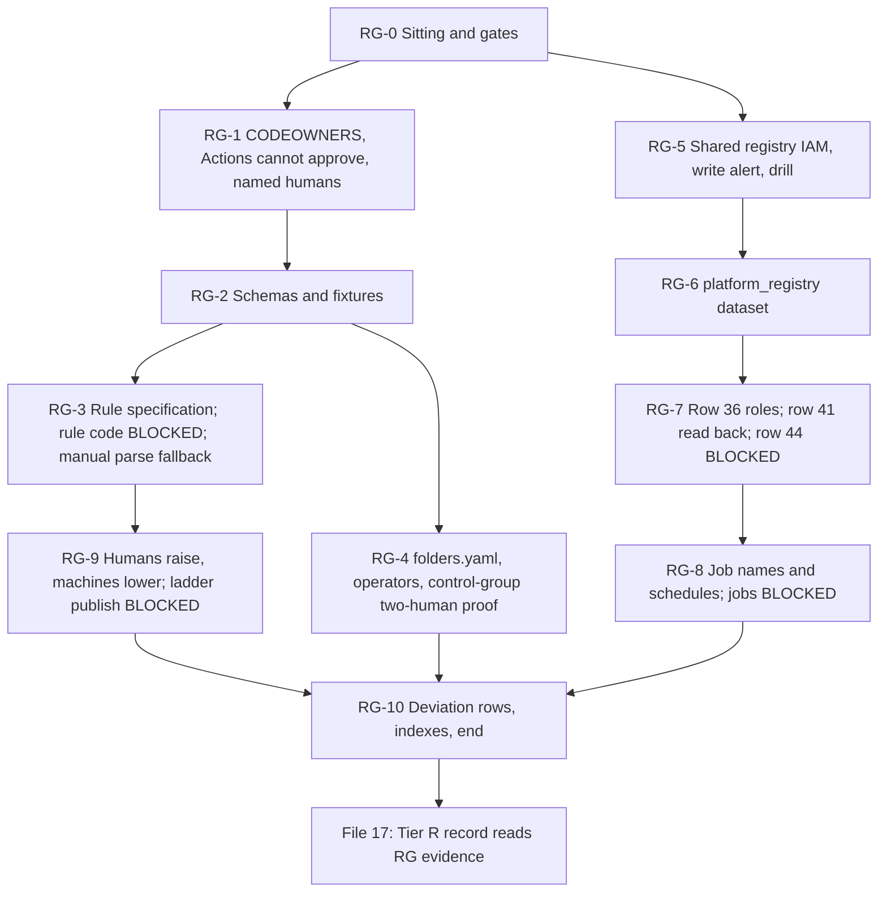

# 16. The register, its CI rules and the shared registry

## Status
- Owner: the platform owner
- Last reviewed: 2026-09-17
- Last executed: never
- Stage: review §2 stage 14 (shared registry, a Tier R item). Runs after 14 and before 17; 15 part A may run beside it (the registry write alert takes its channels from 15, or waits PENDING).
- Step prefix: RG. Steps: 43. BLOCKED steps: RG-3.3, RG-3.4, RG-3.5, RG-7.6, RG-8.2, RG-8.3, RG-9.2 (the register CI rules, the gate-checklist parser, the drift and reconciliation jobs, the ladder-publish workflow and the SDP discovery configuration have no code or no lawful path yet). The signed manual parse of RG-3.6 is the fallback while they are BLOCKED.
- Replaces: nothing executable existed. SETUP Phase 6 step 1 ("open a pull request in the register repository adding Wall-E's row … CI runs the schema checks") and Phase 13b's registry commands assumed a register, a CI and a registry that no procedure made. Salvaged from the design only: [05](../05-registry-and-autonomy-contract.md) §2 to §7 (topology, card metadata, governance, reconciliation, admission) and the §9.2 manifest example; [02](../02-landing-zone-and-tiers.md) §1.3 P1 and PSA1 as corrected by SD-02. Not copied: P1's "the row does not merge; no project is made" (S008), the "twin first" alternative (X-ORG-13), a registry in the agent's own project (S057), a K7 or Tier W check left to prose (S085), `platform-core` as an unwritten module (S048).
- Applies decisions: SD-01 (hand work as a deviation), SD-02 (gate split; PSA1 counts `env=prod` rows only), SD-09 (model pin, 90-day retirement refusal), SD-14 (the repository exists from 03), SD-18 (row 36 made here), SD-34 (the ladder publisher), SD-36 (G1-G21; the enforceable gate; manual parse fallback), SD-44 (`exists_or_pending`), SD-48 (no machine approves).
- Closes: S001 (registry and register half), S008 (CI half), S048 (rows 36 and 41 half), S057 (register-before-project half), S085 (CI and gate-line half), X-ORG-13. See "Findings".

## What this part builds

1. **The register as files with schemas.** In the platform repository (`PLATFORM_REPO_REMOTE`, made in 03): `register/<agent_id>.yaml` (one file per agent, one row per `env`), `register/operators/<agent_id>.yaml` (membership source of the agent's operator group, 04 §2.4), `register/folders.yaml` (made in 09, validated here), `register/models.yaml` (model retirement dates read from Google's pages) and their JSON Schemas under `register/schema/`; the agent-manifest schema at `contract/1.0.0/manifest.schema.json` (05 §9.1). `REGISTER_PATH` and `MANIFEST_SCHEMA_PATH` point at them. The schemas encode what a schema can: the mandatory fields per tier of 05 §3.2, the group-name patterns of 04 §2.4, SD-02's gate split (an `env=prod` P-SA row may carry `privilege: super_admin_pending` with every `gate_checklist` line `pending`; `privilege: super_admin` requires all 21 lines green; an `env=nonprod` row carries no checklist).
2. **The CI rules, specified, fixtured and BLOCKED for their code.** `ci/register-rules.md` lists twelve rules (R-01 to R-12) with the fixture that must fail each: schema; PSA1 counting only `env=prod` rows; P1 gating only the production Super Admin assignment and the Stage 0 record; `env=nonprod` P-SA rows merging without a checklist; the G1-G21 parse; the 90-day model-pin refusal; two human reviewers on the control-group list; approvals by service accounts or bot users never counted; a ladder raise needing two human approvals and published by `walle-deployer@` only from that merged commit; Mo's identities never counting as approvers. Their implementation is B-03 (README BLOCKED index). Until it is committed, a parse signed by the security reviewer and the second human stands in (RG-3.6).
3. **The git host set so machines cannot approve.** GitHub Actions may not approve pull requests; the named-human list `identity/git-humans.yaml`; CODEOWNERS extended to `/identity/` (where 06 put the roster and the control-group list, which 03's CODEOWNERS did not cover), `/register/schema/`, `/contract/` and `/ci/`.
4. **The shared Agent Registry** in `CORE_PROJECT`, location `europe-west1` (`AGENT_REGISTRY`): `roles/agentregistry.admin` held by `factory-apply@` and nobody else standing; `roles/agentregistry.viewer` for `platform-readers@`, `eve-owners@` and `platform-drift@`; no editor or user role anywhere; the registry write alert; one drill write under PAM that proves the alert.
5. **The drift and reconciliation identities and schedules.** Topology row 36: `platform-drift@`'s folder-level `roles/iam.securityReviewer` and P73's read roles, under a dated exception record; row 41 read back from 14 into the drift job's expected set; the dataset `platform_registry`; the job names `DRIFT_JOB` and `RECONCILE_JOB` and their schedules committed. The jobs themselves (B-02) and the SDP discovery configuration of row 44 are BLOCKED.

What this part deliberately does **not** do:
- It creates no project and no register row for any agent. Rows for canary-r (18), Mo (22), Eve (23) and Wall-E (31) are merged by those files, each before its project exists (D1, S057), through 17's module equivalents.
- It does not write the rule code, the parser, the validator or the jobs (plan §8). Every such step is written in full and marked **BLOCKED**.
- It does not make the Data Access configuration (14) or the paging channels (15); it verifies the first and waits PENDING on the second.

What the old text got wrong, and must not come back:

| Old text | Why it fails | Here instead |
|---|---|---|
| 02 §1.3 P1 "the admission gate refuses a `tier: P` row whose checklist has an empty line … the row does not merge; no project is made" | G10, G12, G13 and G14 need the project's services, so the row could never merge (S008) | R-03: the row merges with `super_admin_pending` and pending lines; only the Super Admin assignment and the Stage 0 record are refused |
| PSA1 "a second P-SA register row fails CI"; S008's "build the twin first" | The twin has its own `env=nonprod` row, refused as a second P-SA row; the loop never ends (X-ORG-13) | R-02 counts `env=prod` rows only; R-04 lets `env=nonprod` P-SA rows merge without a checklist |
| SETUP Phase 13b `registries: … projects/%s … "$PROJECT"` and local `agent-registry services create` | A registry in the agent project cannot exist (the tier allow-list excludes the API) (S057) | One registry in `CORE_PROJECT`; only `factory-apply@` writes |
| G1-G18 only; "CI refuses any P-SA promotion citing a K7 drill older than 30 days" with no CI | Tier W rows and the K7 age were checked by nobody (S085) | R-05 parses G1-G21, including G19 (Tier W rows) and G20 (K7 drill younger than 30 days) |
| Topology §7.6 "Factory `platform-core` module" for rows 36, 40, 41, 44 | No such module is written anywhere (S048) | Row 36 here as named steps; row 40 in 14; row 41 read back here; row 44 BLOCKED with its owner |
| "Branch protection, two reviewers" as the only merge control | The git host counts any account with write access; a bot or an Actions token can approve | RG-1.3, RG-1.4 and R-08 to R-10 |



## Preconditions

- [ ] File 03: `PLATFORM_REPO_REMOTE` exists with DC-9.6's protection (two approvals, code owners, last-push approval, administrators included) and DC-9.4's CODEOWNERS; `GIT_HOST` is GitHub (if P22 chose GitLab, §12.1 of 03 applies and this file is re-issued as a dated revision before execution); SD-02, SD-09, SD-18, SD-34, SD-36 and NAMES are signed (`tools/decision-need.sh`); `SECOND_HUMAN_EMAIL` is set; `SECURITY_REVIEWER_EMAIL` is set or `*tbd*` (RG-1.2 and RG-3.6 say what changes).
- [ ] File 06: `ROSTER_FILE`, `CONTROL_GROUPS_FILE`, `GRP_PLATFORM_READERS`, `GRP_EVE_OWNERS`, `GRP_PLATFORM_SECURITY` are set and merged.
- [ ] File 09: every `FLD_*` is set and `register/folders.yaml` is merged (FS-4.2).
- [ ] File 10 (CP-1.6, row 2): `CORE_PROJECT` with `agentregistry`, `apphub`, `bigquery`, `run`, `cloudscheduler`, `cloudasset`, `policyanalyzer` and `monitoring` enabled — RG-0.1 checks all eight and stops on any missing one. `securitycenter.googleapis.com` in `CORE_PROJECT` is needed only from RG-8.2 (the drift job's S4 source); RG-0.1 checks it and writes a re-run line on 10 CP-1.6 if absent, which must be closed before B-02 is unblocked. `SA_FACTORY_APPLY`, `SA_PLATFORM_DRIFT`, `SA_WALLE_DEPLOYER` exist with no bindings.
- [ ] File 12 is complete: the creator's Owner is removed from the core projects; `ENT_PROJECT_REPAIR_CORE` (PA-4.2, folder-scoped at `fld-platform-core`, carrying `agentregistry.admin` and `monitoring.admin`), `ENT_FOLDER_ADMIN` (PA-4.1) and `ENT_DEPLOY_CREDENTIAL_HOLDER_CORE` (PA-4.3, `run.developer` and `iam.serviceAccountUser` on `CORE_PROJECT`) exist and their one-grant tests passed; `FLD_PLATFORM_CORE` is set (09). (Not in the plan's consume list for 16; needed because every IAM change here is a PAM act after 12, and because RG-5.7, RG-8.2 and RG-8.3 name these three entitlements exactly.)
- [ ] File 14 is complete: the Data Access configuration at `fld-agentic-platform` is merged; `SINK_S_ORG`, `SINK_S_FOLDER` exist.
- [ ] File 15 part A: `NOTIF_CH_PAGER_CORE` and `NOTIF_CH_EMAIL_CORE` exist, or RG-5.6 records PENDING and 15 re-runs it.
- [ ] Workstation: `gh` signed in as a repository administrator; `pipx` available (RG-2.1 installs the schema checker).

## People

| Role | Does | Present at |
|---|---|---|
| Platform owner (`sa-1-admin@` for GCP, daily git-host account for commits) | Every step unless named otherwise; requests every PAM grant | all |
| Second human (`SECOND_HUMAN_EMAIL`) | Approves every PAM grant this file takes — `ENT_PROJECT_REPAIR_CORE` (RG-5.2, RG-5.7, RG-6.1, RG-7.3, RG-8.3), `ENT_FOLDER_ADMIN` (RG-7.2, RG-8.3's feed) and `ENT_DEPLOY_CREDENTIAL_HOLDER_CORE` (RG-8.2, RG-8.3's `actAs`); required reviewer on `/identity/`, `/.github/` and, while the security reviewer is not appointed, `/ci/`, `/contract/` and `/register/schema/`; approves the control-group negative test; co-signs every manual parse; confirms the drill page | RG-1.2, RG-1.4, RG-2.6, RG-3.1, RG-4.3, RG-5.2, RG-5.7, RG-7.1, RG-7.2 |
| Security reviewer (`SECURITY_REVIEWER_EMAIL`) | Reviews the CI rules and schemas; signs the row-36 exception (ratification if appointed later, RATIFY-SR); co-signs manual parses for P-SA rows, gate checklists, ladder raises and contract changes | RG-2.6, RG-3.1, RG-3.6, RG-7.1 |
| Second operator (`SECOND_OPERATOR_EMAIL`) | Gives the single approval in the negative test of RG-4.3 | RG-4.3 |

Separation rules: the platform owner never approves his own grant (PAM refuses it: "You can't approve your own request", PAM approve-grants page, read 2026-09-15) and never counts as a reviewer of his own pull request. Hands-on about 2 days; elapsed 3 to 5 days (reviews and the drill).

Conventions of [01](01-prerequisites-and-conventions.md) apply to every step: `checkpoint <id> START` before the action, `checkpoint <id> DONE [witness] [evidence]` after the verify; `evidence_add` for every record; records named `<date>-<step>-<slug>-v<n>`; deviation rows `BD-16-<n>` in 01 PR-4.1's table. Every pull request below is opened with `gh pr create --repo "$PLATFORM_REPO_SLUG"` from a branch named after the step. `PLATFORM_REPO_SLUG` (the `owner/name` of 03 §12) is **persisted with `penv_set` in RG-0.1**, not held in the shell: this part runs over 3 to 5 days across pull-request reviews and a drill, and a step resumed in a fresh shell must not build `repos//…`. Every fence that uses it begins with `source ~/.platform-env` or follows one in the same shell, and `need PLATFORM_REPO_SLUG` fails loudly if it is unset.

## 0. The sitting

### RG-0.1 Open the sitting and check the gates

- **WHO:** Platform owner.
- **WHERE:** Shell with `~/.platform-env` sourced, gcloud configuration `GCLOUD_CONFIG_NAME` active, signed in as `sa-1-admin@`.
- **ACTION:**

```bash
source ~/.platform-env
checkpoint RG-0.1 START
penv_guard
"$PLATFORM_REPO_DIR/tools/decision-need.sh" SD-02 SD-09 SD-14 SD-18 SD-34 SD-36 NAMES
need SA_1_ADMIN GIT_HOST PLATFORM_REPO_REMOTE PLATFORM_REPO_DIR BUILD_LOG_DIR EVIDENCE_REGISTER DEVIATION_REGISTER DRILL_CALENDAR SECOND_HUMAN_EMAIL ORG_ID REGION BQ_LOCATION DOMAIN
need CORE_PROJECT CORE_PROJECT_NUMBER CICD_PROJECT SA_FACTORY_APPLY SA_PLATFORM_DRIFT SA_WALLE_DEPLOYER FLD_AGENTIC_PLATFORM FLD_PLATFORM_CORE ROSTER_FILE CONTROL_GROUPS_FILE GRP_PLATFORM_READERS GRP_EVE_OWNERS ENT_PROJECT_REPAIR_CORE ENT_FOLDER_ADMIN ENT_DEPLOY_CREDENTIAL_HOLDER_CORE
penv_set PLATFORM_REPO_SLUG "$(printf '%s' "$PLATFORM_REPO_REMOTE" | sed -E 's#^https://github.com/##; s#\.git$##')"
need PLATFORM_REPO_SLUG
case "$PLATFORM_REPO_SLUG" in */*) : ;; *) echo "PLATFORM_REPO_SLUG is not owner/name: stop"; false;; esac
test "$GIT_HOST" = "github.com" || { echo "git host is not GitHub: stop, 03 section 12.1 re-issue"; false; }
test "$(gcloud config get account 2>/dev/null)" = "$SA_1_ADMIN" || { echo "not sa-1-admin@: stop"; false; }
git -C "$PLATFORM_REPO_DIR" switch main && git -C "$PLATFORM_REPO_DIR" pull --ff-only
test -s "$PLATFORM_REPO_DIR/register/folders.yaml" || { echo "folders.yaml missing: 09 FS-4.2 first"; false; }
gcloud services list --enabled --project="$CORE_PROJECT" --format="value(config.name)" | grep -E '^(agentregistry|apphub|bigquery|run|cloudscheduler|cloudasset|policyanalyzer|monitoring)\.googleapis\.com$' | sort | tee "$BUILD_LOG_DIR/records/$(date -u +%F)-RG-0.1-core-apis-v1.txt" | wc -l
gcloud services list --enabled --project="$CORE_PROJECT" --format="value(config.name)" | grep -qx 'securitycenter.googleapis.com' || printf '%s\tRG-0.1\tsecuritycenter.googleapis.com on CORE_PROJECT\t10 CP-1.6 enables it (row 2): re-run before 16 RG-8.2\tPENDING\t-\n' "$(date -u +%F)" >> "$BUILD_LOG_DIR/rerun-index.tsv"
gcloud projects get-iam-policy "$CORE_PROJECT" --flatten="bindings[].members" --filter="bindings.members:user:" --format="table(bindings.role,bindings.members)"
printf 'SECURITY_REVIEWER_EMAIL=%s\n' "${SECURITY_REVIEWER_EMAIL:-*tbd*}"
```

  `GIT_HOST`'s value form is 03's; if 03 recorded it differently (for example `GitHub`), compare against that record, not this literal. Eight services are required in this sitting: the seven the register and registry work uses, and `monitoring.googleapis.com`, which RG-5.6's alert policy needs (10 CP-1.6 enables it on every core row). `securitycenter.googleapis.com` is needed only from RG-8.2, when the drift job reads findings through the SCC API as source S4 with `CORE_PROJECT` as its quota project (RG-7.3's `serviceusage.serviceUsageConsumer`); it is not enabled here — if the check above wrote the re-run line, 10 CP-1.6 must enable it in `CORE_PROJECT` before B-02 is unblocked.
- **VERIFY:** `penv_guard` prints nothing; `decision-need.sh` exits 0; every `need` passes; `PLATFORM_REPO_SLUG` is persisted (`grep PLATFORM_REPO_SLUG ~/.platform-env`); the services count prints `8` and the recorded file holds the eight names; a missing name is a stop, not a workaround (re-run 10 CP-1.6 for that project); the user-member listing on `CORE_PROJECT` is empty (12 removed the creator's Owner). Whether the security reviewer is appointed is written in the checkpoint note; it decides the reviewer column of RG-1.2 and RG-3.6.
- **ROLLBACK:** Read only.
- **EVIDENCE:** Output as `<date>-RG-0.1-gates-v1` in `BUILD_LOG_DIR/records/`. E-xx: E-05. TISAX 5.2.1.

## 1. The repository: code owners and machine approvals

### RG-1.1 Read the control paths against CODEOWNERS

- **WHO:** Platform owner.
- **WHERE:** Shell, in `PLATFORM_REPO_DIR`.
- **ACTION:** 03 DC-9.4 fixed `/roster/` and `/control-groups/` as the second human's paths and asked 06 and 16 to check that the control files sit under them; 06 OB-5.1 and OB-5.2 committed them under `identity/`. This step also reads the **git-host logins** RG-1.2 and RG-1.4 need: CODEOWNERS entries are written as logins, never as email addresses, because GitHub's About code owners page says "You cannot use an email address to refer to a managed user account" (read 2026-09-15), and an entry that owns nothing fails silently — the `/identity/` line would then not require the second human at all, and RG-4.3's proof would fail for the wrong reason.

```bash
need ROSTER_FILE CONTROL_GROUPS_FILE PLATFORM_REPO_SLUG
cat "$PLATFORM_REPO_DIR/.github/CODEOWNERS"
printf '%s\n%s\n' "$ROSTER_FILE" "$CONTROL_GROUPS_FILE"
gh api "repos/$PLATFORM_REPO_SLUG/codeowners/errors" --jq '.errors | length'
gh api "repos/$PLATFORM_REPO_SLUG/collaborators?affiliation=all" --paginate --jq '.[] | [.login, .type, .role_name] | @tsv' | tee "$BUILD_LOG_DIR/records/$(date -u +%F)-RG-1.1-collaborators-v1.tsv"
gh api "orgs/${PLATFORM_REPO_SLUG%%/*}" --jq '[.login, .type, (.plan.name // "n/a")] | @tsv'
ls "$PLATFORM_REPO_DIR" "$PLATFORM_REPO_DIR/register"
```

  The collaborator listing is the only source of a login for RG-1.2 and RG-1.4 (never memory, never an email guessed from a name). The organisation read plus the git-host administrator's statement settle one question the operator writes into the record: whether the organisation uses Enterprise Managed Users. The procedure writes logins either way, so the answer changes nothing here; it is recorded because 03's own CODEOWNERS, written with whatever form it chose, must be re-read if the answer is yes.
- **VERIFY:** The output shows which paths lack the second human. Expected on 2026-09-15's plan: `identity/super-admin-roster.json` and `identity/control-groups.json` are covered only by the `*` line (the platform owner), so the second human is **not** a required reviewer on them; `codeowners/errors` prints `0`. Any other uncovered control file found is added to RG-1.2's list. The collaborator file holds a `User` row for the platform owner, the second human and the second operator; the managed-user answer is written in the checkpoint note.
- **ROLLBACK:** Read only.
- **EVIDENCE:** Output as `<date>-RG-1.1-codeowners-gap-v1`. TISAX 5.2.1, 4.1.3. E-xx: none.

### RG-1.2 Extend CODEOWNERS

- **WHO:** Platform owner writes; the second human approves as code owner of `/.github/`; a second human reviewer as branch protection requires.
- **WHERE:** Shell, then the git host.
- **ACTION:** One owner per path, as 03 does, written as `@login` from the RG-1.1 listing — not as an email address (RG-1.1's ACTION says why). The reviewer of CI rules and schemas is the security reviewer once appointed, the second human until then (a re-run line is written in RG-10.1). Replace the two placeholders with logins read in RG-1.1 before running the fence; the `case` guard refuses to write a CODEOWNERS file that still holds one.

```bash
need SECOND_HUMAN_EMAIL PLATFORM_REPO_SLUG
SH_LOGIN="<second human git-host login, from the RG-1.1 listing>"
SR_LOGIN="<security reviewer login, from the RG-1.1 listing; the second human's login while unappointed>"
case "${SH_LOGIN}${SR_LOGIN}" in *'<'*) echo "replace the placeholders with the logins read in RG-1.1"; false;; esac
grep -Fxq "$SH_LOGIN" <(cut -f1 "$BUILD_LOG_DIR/records/$(date -u +%F)-RG-1.1-collaborators-v1.tsv") || { echo "$SH_LOGIN is not a collaborator: stop"; false; }
grep -Fxq "$SR_LOGIN" <(cut -f1 "$BUILD_LOG_DIR/records/$(date -u +%F)-RG-1.1-collaborators-v1.tsv") || { echo "$SR_LOGIN is not a collaborator: stop"; false; }
git -C "$PLATFORM_REPO_DIR" switch main && git -C "$PLATFORM_REPO_DIR" pull --ff-only
git -C "$PLATFORM_REPO_DIR" switch -c rg-1-2-codeowners
cat >> "$PLATFORM_REPO_DIR/.github/CODEOWNERS" <<EOF
/identity/         @$SH_LOGIN
/register/schema/  @$SR_LOGIN
/register/models.yaml @$SR_LOGIN
/contract/         @$SR_LOGIN
/ci/               @$SR_LOGIN
EOF
git -C "$PLATFORM_REPO_DIR" add .github/CODEOWNERS
git -C "$PLATFORM_REPO_DIR" commit -m "RG-1.2 CODEOWNERS: identity/ to the second human; schemas, contract and CI to the security reviewer"
git -C "$PLATFORM_REPO_DIR" push -u origin rg-1-2-codeowners
gh api "repos/$PLATFORM_REPO_SLUG/codeowners/errors?ref=rg-1-2-codeowners" --jq '.errors'
gh pr create --repo "$PLATFORM_REPO_SLUG" --head rg-1-2-codeowners --title "RG-1.2 CODEOWNERS for identity, schemas, contract, CI" --body "Closes the gap read in RG-1.1: the roster and control-group list were not owned by the second human."
```

  In CODEOWNERS "the last matching pattern takes the most precedence" (GitHub Docs, About code owners, read 2026-09-15), so the lines are appended after 03's. The errors read is taken **on the branch, before the pull request is opened** (`?ref=` selects the branch): an owner that does not resolve is a silent failure once merged, and this is the only check that catches it before it is the merge control.
- **VERIFY:** Before the merge: the branch errors read prints `[]`. After the merge: `gh api "repos/$PLATFORM_REPO_SLUG/codeowners/errors" --jq '.errors | length'` prints `0`; `gh pr view rg-1-2-codeowners --repo "$PLATFORM_REPO_SLUG" --json reviews --jq '[.reviews[] | select(.state=="APPROVED") | .author.login]'` includes `$SH_LOGIN`; opening any later pull request that touches `identity/control-groups.json` shows the second human as a requested code owner (proven in RG-4.3). A non-empty errors array before the merge is a stop: correct the login and force nothing.
- **ROLLBACK:** A reverting pull request under the same protection.
- **EVIDENCE:** Merge commit and approvals as `<date>-RG-1.2-codeowners-merge-v1`. E-xx: none. TISAX 5.2.1, 4.1.3.

### RG-1.3 GitHub Actions may not approve pull requests

- **WHO:** Platform owner as repository administrator; IT security (the second human) confirms the organisation setting.
- **WHERE:** Shell with `gh`.
- **ACTION:** The endpoint and body are GitHub's REST "Set default workflow permissions" for a repository and an organisation, parameter `can_approve_pull_request_reviews` ("Whether GitHub Actions can approve pull requests"), read 2026-09-15.

```bash
gh api "repos/$PLATFORM_REPO_SLUG/actions/permissions/workflow"
gh api -X PUT "repos/$PLATFORM_REPO_SLUG/actions/permissions/workflow" -F default_workflow_permissions=read -F can_approve_pull_request_reviews=false
gh api "orgs/${PLATFORM_REPO_SLUG%%/*}/actions/permissions/workflow"
```

  If the organisation-level read shows `can_approve_pull_request_reviews: true`, the second human asks the git-host organisation owner to set it to `false` there as well (same body on `orgs/{org}/actions/permissions/workflow`); the repository setting is not relied on alone.
- **VERIFY:** `gh api "repos/$PLATFORM_REPO_SLUG/actions/permissions/workflow" --jq '[.default_workflow_permissions, .can_approve_pull_request_reviews] | @tsv'` prints `read	false`; the organisation read prints `false` for the second field.
- **ROLLBACK:** The same PUT with the previous values read in the first command, only under a reviewed decision.
- **EVIDENCE:** Both reads as `<date>-RG-1.3-actions-cannot-approve-v1`. E-xx: none. TISAX 5.2.1, 4.1.3.

### RG-1.4 Commit the named-human list and the machine-account list

- **WHO:** Platform owner writes; second human approves (code owner of `/identity/`).
- **WHERE:** Shell, then the git host.
- **ACTION:** The list is the only source R-08 to R-10 accept for "a human approval". Logins come from 03's appointment records and DC-9.3's collaborator listing, never from memory. No email or other personal data beyond the role and the login.

```bash
git -C "$PLATFORM_REPO_DIR" switch main && git -C "$PLATFORM_REPO_DIR" pull --ff-only
git -C "$PLATFORM_REPO_DIR" switch -c rg-1-4-git-humans
gh api "repos/$PLATFORM_REPO_SLUG/collaborators?affiliation=all" --paginate --jq '.[] | [.login, .type, .role_name] | @tsv' > "$BUILD_LOG_DIR/records/$(date -u +%F)-RG-1.4-collaborators-v1.tsv"
cat > "$PLATFORM_REPO_DIR/identity/git-humans.yaml" <<'EOF'
# Named humans whose approvals count (R-08). Changed only by a merged pull request with the second human as code owner.
schema: git-humans/v1
humans:
  - {login: "<platform owner login>", role: platform_owner, appointment: "decisions/<date>-appointment-platform-owner.md"}
  - {login: "<second human login>", role: second_human, appointment: "decisions/<date>-appointment-second-human.md"}
  - {login: "<second operator login>", role: second_operator, appointment: "decisions/<date>-appointment-second-operator.md"}
# security_reviewer, mo_owner, wall_e_owner, validator_custodian: added when appointed (re-run index)
machine_accounts:          # approvals and reviews by these never count; they may never hold write access
  - {login: "github-actions[bot]", kind: actions_token}
  - {login: "<Mo ingestion bot login, *tbd* at 40>", kind: mo_ingestion}
mo_identities:             # Google identities of Mo; none may have a git-host account (R-10)
  - "mo-metrics@<MO_PROJECT>.iam.gserviceaccount.com"
  - "mo-analyst@<MO_PROJECT>.iam.gserviceaccount.com"
  - "mo-reporter@<MO_PROJECT>.iam.gserviceaccount.com"
  - "mo-narrator@<MO_PROJECT>.iam.gserviceaccount.com"
  - "SA_MO_INGEST principal of CICD_PROJECT's pool (40)"
EOF
```

  Replace every `<...>` that is known today with the value from its record; placeholders for principals not yet created stay as written and are re-run by 22 and 40 (RG-10.1). Then commit, push and open the pull request as in RG-1.2.
- **VERIFY:** Every `humans[].login` appears in the collaborator listing with type `User` and has its appointment record in `decisions/`; no login in `machine_accounts` appears in the listing with a role other than `read`; the pull request is merged with the second human's approval.
- **ROLLBACK:** A reverting pull request.
- **EVIDENCE:** Listing and merge as `<date>-RG-1.4-git-humans-v1`. E-xx: E-08 (the humans allowed to approve). TISAX 4.1.3, 1.2.2.

## 2. The schemas

### RG-2.1 Install the schema checker

- **WHO:** Platform owner.
- **WHERE:** macOS terminal.
- **ACTION:** `check-jsonschema` is "a JSON Schema CLI and pre-commit hook built on jsonschema", installable with `pipx install check-jsonschema`, usage `check-jsonschema --schemafile schema.json instance.json`; version 0.38.0 was the latest on PyPI (released 2026-08-09), read 2026-09-15. It reads YAML instances. PyYAML 6.0.3 (PyPI, read 2026-09-15) is used only by the reading aid of RG-3.6.

```bash
pipx install check-jsonschema==0.38.0
python3.12 -m venv "$HOME/platform/venv-register"
"$HOME/platform/venv-register/bin/pip" install PyYAML==6.0.3
{ check-jsonschema --version; "$HOME/platform/venv-register/bin/python" -c 'import yaml; print("PyYAML", yaml.__version__)'; } | tee -a "$BUILD_LOG_DIR/records/tools.txt"
```

- **VERIFY:** The two version lines print `0.38.0` and `PyYAML 6.0.3`.
- **ROLLBACK:** `pipx uninstall check-jsonschema`; `rm -rf "$HOME/platform/venv-register"`.
- **EVIDENCE:** The appended `tools.txt` lines. E-xx: E-05. TISAX 5.3.1.

### RG-2.2 Write the register-row schema

- **WHO:** Platform owner writes; security reviewer (the second human until appointed) reviews in RG-2.6.
- **WHERE:** Shell, in `PLATFORM_REPO_DIR`, branch `rg-2-schemas`.
- **ACTION:** Fields and per-tier rules from 05 §3.2; the `gate_checklist`, `privilege` and `env` rules from SD-02 and SD-36. The file is one agent: `agent_id` and `rows[]`, one row per `env` (05: "one row per env, same `agent_id`"). What a schema cannot hold (counting rows across files, reading records, dates against today) is a rule of RG-3.1.

```bash
git -C "$PLATFORM_REPO_DIR" switch main && git -C "$PLATFORM_REPO_DIR" pull --ff-only
git -C "$PLATFORM_REPO_DIR" switch -c rg-2-schemas
mkdir -p "$PLATFORM_REPO_DIR/register/schema" "$PLATFORM_REPO_DIR/register/operators" "$PLATFORM_REPO_DIR/register/fixtures" "$PLATFORM_REPO_DIR/contract/1.0.0"
mkdir -p "$PLATFORM_REPO_DIR/register/fixtures/schema" "$PLATFORM_REPO_DIR/register/operators/fixtures" "$PLATFORM_REPO_DIR/contract/1.0.0/fixtures"
cat > "$PLATFORM_REPO_DIR/register/schema/register-row.schema.json" <<'JSON'
{
  "$schema": "https://json-schema.org/draft/2020-12/schema",
  "$id": "register-row/v1",
  "title": "Agent register file: one agent, one row per env (05 section 3.2; SD-02; SD-36)",
  "type": "object",
  "required": ["agent_id", "rows"],
  "additionalProperties": false,
  "properties": {
    "agent_id": {"type": "string", "pattern": "^[a-z][a-z0-9-]{2,30}$", "not": {"enum": ["folders", "models", "operators", "schema", "fixtures", "export"]}},
    "rows": {"type": "array", "minItems": 1, "maxItems": 2, "items": {"$ref": "#/$defs/row"}}
  },
  "$defs": {
    "group": {"type": "string", "pattern": "^[a-z][a-z0-9-]*-(owners|operators|readers|users)@[a-z0-9.-]+$"},
    "gateLine": {
      "type": "object", "required": ["status", "date", "signer", "record"], "additionalProperties": false,
      "properties": {
        "status": {"enum": ["pending", "green"]},
        "date": {"type": ["string", "null"], "format": "date"},
        "signer": {"type": ["string", "null"]},
        "record": {"type": ["string", "null"]}
      },
      "if": {"properties": {"status": {"const": "green"}}},
      "then": {"properties": {"date": {"type": "string"}, "signer": {"type": "string", "minLength": 3}, "record": {"type": "string", "minLength": 3}}}
    },
    "gateChecklist": {
      "type": "object", "additionalProperties": false,
      "patternProperties": {"^G([1-9]|1[0-9]|2[01])$": {"$ref": "#/$defs/gateLine"}},
      "required": ["G1","G2","G3","G4","G5","G6","G7","G8","G9","G10","G11","G12","G13","G14","G15","G16","G17","G18","G19","G20","G21"]
    },
    "row": {
      "type": "object",
      "required": ["display_name", "purpose", "owner_group", "cost_centre", "tier", "risk_class", "data_classes", "tisax_class", "ai_act_class", "ai_act_role", "model_pin", "supplier_rows", "publish_to_gemini", "audience_groups", "review_date", "status", "privilege", "metric_pack", "verifier"],
      "properties": {
        "display_name": {"type": "string", "maxLength": 63},
        "purpose": {"type": "string", "minLength": 40},
        "owner_group": {"type": "string", "pattern": "^[a-z][a-z0-9-]*-owners@[a-z0-9.-]+$", "not": {"pattern": "^(platform|eve|mo)-owners@"}},
        "cost_centre": {"type": "string"},
        "tier": {"enum": ["C", "R", "W", "P", "P-SA", "X"]},
        "env": {"enum": ["prod", "nonprod"]},
        "folder": {"type": "string", "pattern": "^FLD_[A-Z_]+$"},
        "risk_class": {"enum": ["READ", "WRITE_LOW", "WRITE_HIGH", "SUPER"]},
        "autonomy_ceiling": {"type": "string", "pattern": "^(L0|F[0-9]+-(T[0-3]|agent)-L[0-5])$"},
        "data_classes": {"type": "array", "minItems": 1, "items": {"enum": ["evidence", "content", "control", "record", "secret", "ops"]}},
        "tisax_class": {"type": "string"},
        "ai_act_class": {"enum": ["not_ai_system", "minimal", "limited_art50", "annex_iii_adjacent", "high_risk"]},
        "ai_act_role": {"enum": ["provider", "deployer", "both"]},
        "art_6_4_assessment": {"type": "string"},
        "art_49_registration": {"type": "string"},
        "model_pin": {"type": "string", "minLength": 3},
        "framework_version": {"type": "string"},
        "armor_template": {"type": "string"},
        "gateway_id": {"type": "string"},
        "principal": {"type": "string", "pattern": "^principal://agents\\.global\\.org-[0-9]+\\.system\\.id\\.goog/"},
        "verifier": {"enum": ["none", "platform-verifier", "eve"]},
        "verifier_owner": {"type": "string", "pattern": "^[a-z][a-z0-9-]*-owners@[a-z0-9.-]+$"},
        "capability_eval_ref": {"type": "string"},
        "tisax_dp_scope": {"type": "boolean"},
        "metric_pack": {"enum": ["light", "full", "full+eve-quality"]},
        "privilege": {"type": "string", "pattern": "^(none|super_admin_pending|super_admin|workspace_role:[a-z_]+)$"},
        "gate_checklist": {"$ref": "#/$defs/gateChecklist"},
        "supplier_rows": {"type": "array", "minItems": 1, "items": {"type": "string"}},
        "publish_to_gemini": {"type": "boolean"},
        "audience_groups": {"type": "array", "items": {"type": "string"}},
        "peers": {"type": "array", "items": {"type": "string"}},
        "grader": {"type": "string"},
        "recovery_class": {"enum": ["R-A", "R-B", "R-C", "R-D", "R-K"]},
        "manifest_sha": {"type": "string", "pattern": "^[0-9a-f]{64}$"},
        "contract_version": {"type": "string", "pattern": "^[0-9]+\\.[0-9]+\\.[0-9]+$"},
        "review_date": {"type": "string", "format": "date"},
        "status": {"enum": ["idea", "poc", "pilot", "prod", "retired", "suspended"]}
      },
      "allOf": [
        {"if": {"properties": {"tier": {"enum": ["R", "W", "P", "P-SA", "X"]}}}, "then": {"required": ["env", "folder", "framework_version", "armor_template", "gateway_id", "principal", "recovery_class"]}},
        {"if": {"properties": {"tier": {"enum": ["W", "P", "P-SA", "X"]}}}, "then": {"required": ["autonomy_ceiling", "verifier_owner", "manifest_sha", "contract_version"]}},
        {"if": {"properties": {"tier": {"enum": ["W", "P", "P-SA"]}}}, "then": {"required": ["grader"]}},
        {"if": {"properties": {"tier": {"enum": ["C", "R"]}}}, "then": {"properties": {"verifier": {"const": "none"}, "metric_pack": {"const": "light"}, "privilege": {"const": "none"}, "risk_class": {"const": "READ"}}}},
        {"if": {"properties": {"tier": {"const": "W"}}}, "then": {"properties": {"verifier": {"const": "platform-verifier"}, "metric_pack": {"const": "full"}, "privilege": {"const": "none"}}}},
        {"if": {"properties": {"tier": {"enum": ["P", "P-SA"]}}}, "then": {"properties": {"verifier": {"const": "eve"}, "metric_pack": {"const": "full+eve-quality"}}}},
        {"if": {"properties": {"tier": {"const": "P"}}}, "then": {"properties": {"privilege": {"pattern": "^(none|workspace_role:[a-z_]+)$"}}}},
        {"if": {"properties": {"tier": {"const": "X"}}}, "then": {"properties": {"autonomy_ceiling": {"const": "L0"}, "publish_to_gemini": {"const": false}}}},
        {"if": {"properties": {"ai_act_class": {"const": "annex_iii_adjacent"}}}, "then": {"required": ["art_6_4_assessment", "art_49_registration"]}},
        {"if": {"properties": {"ai_act_class": {"const": "high_risk"}}}, "then": {"required": ["art_49_registration"]}},
        {"if": {"properties": {"art_49_registration": {"const": "pending"}}, "required": ["art_49_registration"]}, "then": {"properties": {"status": {"not": {"const": "prod"}}}}},
        {"if": {"properties": {"tier": {"const": "P-SA"}, "env": {"const": "prod"}}, "required": ["tier", "env"]},
         "then": {"required": ["gate_checklist"], "properties": {"privilege": {"enum": ["super_admin_pending", "super_admin"]}}}},
        {"if": {"properties": {"tier": {"const": "P-SA"}, "env": {"const": "prod"}, "privilege": {"const": "super_admin"}}, "required": ["tier", "env", "privilege"]},
         "then": {"properties": {"gate_checklist": {"patternProperties": {"^G": {"properties": {"status": {"const": "green"}}}}}}}},
        {"if": {"properties": {"env": {"const": "nonprod"}}, "required": ["env"]}, "then": {"not": {"required": ["gate_checklist"]}}},
        {"if": {"properties": {"tier": {"const": "P-SA"}, "env": {"const": "nonprod"}}, "required": ["tier", "env"]}, "then": {"properties": {"privilege": {"enum": ["super_admin_pending", "super_admin"]}}}}
      ]
    }
  }
}
JSON
python3 -m json.tool "$PLATFORM_REPO_DIR/register/schema/register-row.schema.json" > /dev/null && echo "schema parses"
check-jsonschema --check-metaschema "$PLATFORM_REPO_DIR/register/schema/register-row.schema.json"
```

  Reading SD-02 into the schema: `super_admin_pending` is the value an `env=prod` P-SA row merges with while any line is pending, so the project and every pre-grant deployment can be built; changing it to `super_admin` requires all 21 lines green in the same pull request (the line-level `then` also requires a date, a signer and a record). An `env=nonprod` row may not carry a checklist and may carry `super_admin` (the twin's sandbox Super Admin is granted by the sandbox super admins, 37). `review_date` "≤ 90 days ahead", `purpose` signature in the merge commit, and every cross-file rule are R-01 to R-12, not schema. Groups: `owner_group` and `verifier_owner` follow 04 §2.4's `<agent>-owners@` pattern; `owner_group` refuses the platform and controller owner groups (`platform-owners@`, `eve-owners@`, `mo-owners@`), which own no agent row except their own agents' rows, where 22 and 23 amend this pattern by pull request if their signed rows name them (*Assumption:* Eve's and Mo's rows use `eve-owners@` and `mo-owners@` as `verifier_owner` only).
- **VERIFY:** `schema parses`; `check-jsonschema --check-metaschema` prints `ok -- validation done` (*Assumption:* the flag name and message, read from the tool's `--help` on the day; if absent, `check-jsonschema --schemafile https://json-schema.org/draft/2020-12/schema <file>` is the equivalent and needs network access to json-schema.org only).
- **ROLLBACK:** Delete the uncommitted file.
- **EVIDENCE:** Through RG-2.6. E-xx: E-05. TISAX 1.3.1, 1.3.2.

### RG-2.3 Write the agent-manifest schema

- **WHO:** Platform owner writes; security reviewer (or second human) reviews in RG-2.6.
- **WHERE:** Shell, branch `rg-2-schemas`.
- **ACTION:** The shape of 05 §9.2's example. The validator's rules beyond the schema (ceilings against the platform defaults, monotonicity, the appended protected set) are the platform validator's (plan §8, B-03) and are not written here.

```bash
cat > "$PLATFORM_REPO_DIR/contract/1.0.0/manifest.schema.json" <<'JSON'
{
  "$schema": "https://json-schema.org/draft/2020-12/schema",
  "$id": "agent-manifest/1.0.0",
  "title": "agent-manifest.yaml (05 section 9.2)",
  "type": "object",
  "required": ["contract_version", "identity", "families", "trigger_classes", "ceilings", "protected_principals", "hard_denied", "egress", "capabilities", "peers", "invokers", "stores", "data_classes", "recovery_class", "compliance", "fingerprint", "verifier", "metric_pack"],
  "additionalProperties": false,
  "$defs": {
    "level": {"enum": ["L0", "L1", "L2", "L3", "L4", "L5"]},
    "sha": {"type": "string", "pattern": "^([0-9a-f]{64}|…)$"}
  },
  "properties": {
    "contract_version": {"type": "string", "pattern": "^1\\.[0-9]+\\.[0-9]+$"},
    "identity": {"type": "object", "required": ["agent_id", "tier", "owner_group", "env", "principal"], "additionalProperties": false,
      "properties": {
        "agent_id": {"type": "string", "pattern": "^[a-z][a-z0-9-]{2,30}$"},
        "tier": {"enum": ["C", "R", "W", "P", "P-SA", "X"]},
        "owner_group": {"type": "string", "pattern": "^[a-z][a-z0-9-]*-owners@"},
        "env": {"enum": ["prod", "nonprod"]},
        "principal": {"type": "string", "pattern": "^principal://agents\\.global\\.org-"}}},
    "families": {"type": "array", "minItems": 1, "items": {"type": "object", "required": ["id", "description", "risk_tier", "reversible", "inverse", "pre_state", "taint_fields"], "additionalProperties": false,
      "properties": {
        "id": {"type": "string", "pattern": "^F[0-9]+$"},
        "description": {"type": "string"},
        "risk_tier": {"enum": ["READ", "WRITE_LOW", "WRITE_HIGH", "SUPER", "WRITE_GENERIC"]},
        "reversible": {"type": "boolean"},
        "inverse": {"type": "string"},
        "pre_state": {"type": "string", "pattern": "^(none|snapshot|predicate:[a-z_]+)$"},
        "taint_fields": {"type": "array", "items": {"type": "string"}}},
      "if": {"properties": {"risk_tier": {"not": {"const": "READ"}}}},
      "then": {"properties": {"pre_state": {"not": {"const": "none"}}}}}},
    "trigger_classes": {"const": [{"id": "T0", "name": "chat"}, {"id": "T1", "name": "scheduled"}, {"id": "T2", "name": "event"}, {"id": "T3", "name": "inbox"}]},
    "ceilings": {"type": "object", "additionalProperties": false, "patternProperties": {"^F[0-9]+$": {"type": "object", "required": ["T0", "T1", "T2", "T3", "agent"], "additionalProperties": false,
      "properties": {"T0": {"$ref": "#/$defs/level"}, "T1": {"$ref": "#/$defs/level"}, "T2": {"$ref": "#/$defs/level"}, "T3": {"$ref": "#/$defs/level"}, "agent": {"enum": ["L0", "L5"]}}}}},
    "protected_principals": {"type": "array", "items": {"type": "string"}},
    "hard_denied": {"type": "array", "minItems": 1, "items": {"type": "string"}},
    "egress": {"type": "array", "items": {"type": "string", "pattern": "^[a-z0-9.-]+\\.[a-z]{2,}$"}},
    "capabilities": {"type": "object", "required": ["code_execution"], "properties": {"code_execution": {"const": false}}},
    "peers": {"type": "array", "items": {"type": "string"}},
    "invokers": {"type": "object", "additionalProperties": {"type": "array", "items": {"type": "string", "pattern": "^[a-z][a-z0-9-]*@[A-Za-z0-9_-]+(\\.iam\\.gserviceaccount\\.com)?$"}}},
    "stores": {"type": "array", "items": {"type": "object", "required": ["name", "kind", "class", "retention_row"], "additionalProperties": false,
      "properties": {"name": {"type": "string"}, "kind": {"enum": ["bigquery", "log_bucket", "firestore", "gcs"]}, "class": {"enum": ["evidence", "content", "control", "record", "secret", "ops"]}, "retention_row": {"type": "string", "pattern": "^R[0-9]+$"}}}},
    "data_classes": {"type": "array", "minItems": 1, "items": {"enum": ["evidence", "content", "control", "record", "secret", "ops"]}},
    "recovery_class": {"enum": ["R-A", "R-B", "R-C", "R-D", "R-K"]},
    "compliance": {"type": "object", "required": ["ai_act_entry", "ai_act_class", "purpose_sha256", "tisax_class", "register_row"],
      "properties": {
        "ai_act_entry": {"type": "string"},
        "ai_act_class": {"enum": ["not_ai_system", "minimal", "limited_art50", "annex_iii_adjacent", "high_risk"]},
        "purpose_sha256": {"$ref": "#/$defs/sha"},
        "art_50": {"type": "object", "required": ["template_ids", "header_value", "text_sha256"]},
        "tisax_class": {"type": "string"},
        "register_row": {"type": "string", "pattern": "^register/[a-z][a-z0-9-]{2,30}\\.yaml$"},
        "input_data_relevance": {"type": "object"}},
      "if": {"properties": {"ai_act_class": {"enum": ["limited_art50", "annex_iii_adjacent", "high_risk"]}}},
      "then": {"required": ["art_50"]}},
    "fingerprint": {"type": "object", "required": ["prompt_sha256", "model_pin", "framework_version", "armor_template_version"], "additionalProperties": false,
      "properties": {"prompt_sha256": {"$ref": "#/$defs/sha"}, "model_pin": {"type": "string"}, "framework_version": {"type": "string"}, "armor_template_version": {"type": "string"}}},
    "verifier": {"enum": ["none", "platform-verifier", "eve"]},
    "metric_pack": {"enum": ["light", "full", "full+eve-quality"]}
  }
}
JSON
check-jsonschema --check-metaschema "$PLATFORM_REPO_DIR/contract/1.0.0/manifest.schema.json"
```

  The `…` alternative in `sha` exists only so that 05 §9.2's example (which writes `"…"` for hashes) validates as a fixture; R-01 refuses `…` in any file outside `register/fixtures/`. The `agent` column is restricted to L0 or L5; that READ families are L5 and every other family L0 is the validator's rule (05 §9.2), because it compares two blocks.
- **VERIFY:** `check-jsonschema --check-metaschema` passes. In RG-2.5 the §9.2 example, copied verbatim into `contract/1.0.0/fixtures/pass-05-9-2-example.yaml`, validates.
- **ROLLBACK:** Delete the uncommitted file.
- **EVIDENCE:** Through RG-2.6. E-xx: E-05 (Annex IV technical documentation: the contract of every agent). TISAX 1.3.1.

### RG-2.4 Write the folders, operators and models schemas, and `register/models.yaml`

- **WHO:** Platform owner writes; security reviewer (or second human) reviews in RG-2.6.
- **WHERE:** Shell, branch `rg-2-schemas`.
- **ACTION:** `folders.yaml` is 09 FS-4.1's format. `operators/<agent_id>.yaml` is 04 §2.4's membership source ("one `operators.yaml` per agent in the register, two-reviewer merge"). `models.yaml` holds the retirement dates R-06 reads; Google publishes them on the model pages and release notes, which no API serves, so a human copies each row with its source and read date.

```bash
cat > "$PLATFORM_REPO_DIR/register/schema/folders.schema.json" <<'JSON'
{"$schema": "https://json-schema.org/draft/2020-12/schema", "$id": "folders/v1", "type": "object", "required": ["folders"], "additionalProperties": false,
 "properties": {"folders": {"type": "array", "minItems": 22, "maxItems": 22, "items": {"type": "object", "required": ["variable", "display_name", "id", "parent"], "additionalProperties": false,
   "properties": {"variable": {"type": "string", "pattern": "^FLD_[A-Z_]+$"}, "display_name": {"type": "string", "pattern": "^fld-[a-z0-9-]+$"}, "id": {"type": "string", "pattern": "^[0-9]+$"}, "parent": {"type": "string", "pattern": "^(organizations|folders)/[0-9]+$"}}}}}}
JSON
cat > "$PLATFORM_REPO_DIR/register/schema/operators.schema.json" <<'JSON'
{"$schema": "https://json-schema.org/draft/2020-12/schema", "$id": "operators/v1", "type": "object", "required": ["agent_id", "group", "members"], "additionalProperties": false,
 "properties": {
   "agent_id": {"type": "string", "pattern": "^[a-z][a-z0-9-]{2,30}$"},
   "group": {"type": "string", "pattern": "^[a-z][a-z0-9-]*-operators@[a-z0-9.-]+$",
             "not": {"pattern": "^(platform-owners|platform-security|platform-approvers|platform-readers|ge-admins|ge-users|eve-owners|walle-operators|walle-protected|walle-super-approvers|gcp-organization-admins)@"}},
   "members": {"type": "array", "minItems": 1, "uniqueItems": true, "items": {"type": "string", "pattern": "^[^@]+@[a-z0-9.-]+$", "not": {"pattern": "gserviceaccount\\.com$"}}}}}
JSON
cat > "$PLATFORM_REPO_DIR/register/schema/models.schema.json" <<'JSON'
{"$schema": "https://json-schema.org/draft/2020-12/schema", "$id": "models/v1", "type": "object", "required": ["models"], "additionalProperties": false,
 "properties": {"models": {"type": "array", "items": {"type": "object", "required": ["model_id", "location", "retirement_date", "source", "read_on", "read_by"], "additionalProperties": false,
   "properties": {"model_id": {"type": "string"}, "location": {"type": "string"}, "retirement_date": {"type": ["string", "null"], "format": "date"}, "source": {"type": "string", "pattern": "^https://"}, "read_on": {"type": "string", "format": "date"}, "read_by": {"type": "string"}}}}}}
JSON
cat > "$PLATFORM_REPO_DIR/register/models.yaml" <<'EOF'
# Retirement dates copied by hand from Google's model pages and release notes (R-06). One row per model and location.
# A row is added or corrected only by a pull request that cites the page and the read date. Never guessed: an unknown date is null and R-06 then refuses the pin.
models:
  - model_id: gemini-2.5-flash
    location: europe-west1
    retirement_date: "2026-10-16"
    source: "https://docs.cloud.google.com/vertex-ai/generative-ai/docs/release-notes"
    read_on: "2026-09-15"
    read_by: "review finding X-RQB-01 (verified); re-read on the day this file is committed"
EOF
```

  Then add one row per location for `MODEL_ID` from 03's signed WDEC-6 / SD-09 record (model id, `eu`, the retirement date as that record states it, the page, the date). If `MODEL_ID` is still `*tbd*`, no row is added and R-06 refuses every non-fixture row naming a model, which is correct: no agent may pin a model before decision 6 is signed. The 2.5 row is kept as the refusal fixture of R-06 (SD-09: 2026-10-16 by the Vertex AI release note of 2026-04-02; the model pages say 2026-10-20; the earlier date is written).
- **VERIFY:**

```bash
for s in folders operators models; do check-jsonschema --check-metaschema "$PLATFORM_REPO_DIR/register/schema/$s.schema.json"; done
check-jsonschema --schemafile "$PLATFORM_REPO_DIR/register/schema/folders.schema.json" "$PLATFORM_REPO_DIR/register/folders.yaml"
check-jsonschema --schemafile "$PLATFORM_REPO_DIR/register/schema/models.schema.json" "$PLATFORM_REPO_DIR/register/models.yaml"
```

  Three metaschema passes; `folders.yaml` and `models.yaml` validate. A failure on `folders.yaml` is a fault in 09's file or in this schema: read both, correct by pull request, never by hand-editing ids.
- **ROLLBACK:** Delete the uncommitted files.
- **EVIDENCE:** Through RG-2.6. E-xx: E-11 (model pin and supplier facts). TISAX 1.3.1, 1.3.3.

### RG-2.5 Write the schema fixtures and prove each one

- **WHO:** Platform owner.
- **WHERE:** Shell, branch `rg-2-schemas`.
- **ACTION:** Fixtures are data: `pass-*` must validate, `fail-*` must be refused. They are the regression set the CI of RG-3.3 runs, and RG-3.2's rule fixtures are built on top of them, so an empty fixture directory here would make both vacuous.

  **Write the files first.** The three `pass-*` files are written by hand from 05 §3.2's tier table and SD-02 (the `pass-05-9-2-example.yaml` manifest fixture is 05 §9.2 copied verbatim). Every `fail-*` file is then produced by copying its `pass-*` parent and making **exactly the one change** the "Built from" column names — nothing else — so a refusal can only come from the rule under test:

```bash
cd "$PLATFORM_REPO_DIR"
cp register/fixtures/schema/pass-psa-prod-pending.yaml register/fixtures/schema/fail-psa-prod-super-admin-one-pending.yaml
"${EDITOR:-vi}" register/fixtures/schema/fail-psa-prod-super-admin-one-pending.yaml   # privilege: super_admin; G20 stays pending
```

  and so on for each `fail-*` row of the table (parent: `pass-psa-prod-pending.yaml` for the four `fail-psa-prod-*` and `fail-art49-pending-prod`; `pass-psa-nonprod-twin.yaml` for `fail-psa-nonprod-with-checklist`; `pass-canary-r.yaml` for `fail-tier-w-no-grader`, `fail-tier-p-verifier-platform`, `fail-owner-group-pattern`, `fail-tier-x-publish`, `fail-reserved-agent-id`; `pass-05-9-2-example.yaml` for the two contract failures). The operators fixture is the one file under `register/operators/fixtures/`. `git status` after the writes must list 18 new fixture files and nothing else.

| Fixture file under `register/fixtures/schema/` | Built from | Expected |
|---|---|---|
| `pass-canary-r.yaml` | Tier R, `env: nonprod`, `privilege: none`, `verifier: none`, `metric_pack: light` | pass |
| `pass-psa-prod-pending.yaml` | Tier P-SA, `env: prod`, `privilege: super_admin_pending`, 21 lines `pending` with nulls | pass (SD-02: the row merges; the project is built) |
| `pass-psa-nonprod-twin.yaml` | Tier P-SA, `env: nonprod`, `privilege: super_admin`, no `gate_checklist` | pass (X-ORG-13) |
| `fail-psa-prod-super-admin-one-pending.yaml` | as `pass-psa-prod-pending` with `privilege: super_admin` and G20 `pending` | fail |
| `fail-psa-prod-green-no-record.yaml` | G7 `green` with `record: null` | fail |
| `fail-psa-prod-no-checklist.yaml` | P-SA prod row without `gate_checklist` | fail |
| `fail-psa-nonprod-with-checklist.yaml` | nonprod P-SA row carrying `gate_checklist` | fail |
| `fail-psa-prod-privilege-none.yaml` | P-SA prod with `privilege: none` | fail |
| `fail-tier-w-no-grader.yaml` | Tier W without `grader` | fail |
| `fail-tier-p-verifier-platform.yaml` | Tier P with `verifier: platform-verifier` | fail |
| `fail-owner-group-pattern.yaml` | `owner_group: platform-owners@<domain>` | fail |
| `fail-art49-pending-prod.yaml` | `annex_iii_adjacent`, `art_49_registration: pending`, `status: prod` | fail |
| `fail-tier-x-publish.yaml` | Tier X with `publish_to_gemini: true` | fail |
| `fail-reserved-agent-id.yaml` | `agent_id: operators` | fail |
| `../../contract/1.0.0/fixtures/pass-05-9-2-example.yaml` | 05 §9.2 verbatim | pass |
| `../../contract/1.0.0/fixtures/fail-code-execution.yaml` | §9.2 with `code_execution: true` | fail |
| `../../contract/1.0.0/fixtures/fail-write-no-prestate.yaml` | §9.2 with F3 `pre_state: none` | fail |
| `../operators/fixtures/fail-control-group.yaml` | `group: eve-owners@<domain>` | fail |

```bash
cd "$PLATFORM_REPO_DIR"
shopt -s nullglob          # an empty directory must expand to nothing, never to the unexpanded glob
n_reg=$(ls register/fixtures/schema/*.yaml 2>/dev/null | wc -l | tr -d ' ')
n_con=$(ls contract/1.0.0/fixtures/*.yaml 2>/dev/null | wc -l | tr -d ' ')
n_ops=$(ls register/operators/fixtures/*.yaml 2>/dev/null | wc -l | tr -d ' ')
test "$n_reg" = 14 && test "$n_con" = 3 && test "$n_ops" = 1 || { echo "fixture count is $n_reg/$n_con/$n_ops, expected 14/3/1: STOP, the run below would prove nothing"; false; }
for f in register/fixtures/schema/pass-*.yaml; do check-jsonschema --schemafile register/schema/register-row.schema.json "$f" >/dev/null && echo "PASS-OK $f" || echo "WRONG $f"; done
for f in register/fixtures/schema/fail-*.yaml; do test -s "$f" || { echo "WRONG $f (empty)"; continue; }; check-jsonschema --schemafile register/schema/register-row.schema.json "$f" >/dev/null 2>&1 && echo "WRONG $f" || echo "FAIL-OK $f"; done
for f in contract/1.0.0/fixtures/pass-*.yaml; do check-jsonschema --schemafile contract/1.0.0/manifest.schema.json "$f" >/dev/null && echo "PASS-OK $f" || echo "WRONG $f"; done
for f in contract/1.0.0/fixtures/fail-*.yaml; do test -s "$f" || { echo "WRONG $f (empty)"; continue; }; check-jsonschema --schemafile contract/1.0.0/manifest.schema.json "$f" >/dev/null 2>&1 && echo "WRONG $f" || echo "FAIL-OK $f"; done
test -s register/operators/fixtures/fail-control-group.yaml || { echo "WRONG operators fixture (missing)"; false; }
check-jsonschema --schemafile register/schema/operators.schema.json register/operators/fixtures/fail-control-group.yaml >/dev/null 2>&1 && echo "WRONG operators fixture" || echo "FAIL-OK operators fixture"
shopt -u nullglob
cd - >/dev/null
```

  Writer's check, not evidence: on 2026-09-15 the five schemas passed the Draft 2020-12 metaschema under `jsonschema` 4.23.0, 05 §9.2's example validated against the manifest schema, and the register-row cases of this table (pending P-SA row, flip with one pending line, green line without record, nonprod twin, nonprod with checklist, Tier W without grader, Tier P with the platform verifier, Art. 49 pending at prod, reserved id, owner-group pattern) gave the expected result. The operator repeats the run on the day; only that run is evidence.
  Each `fail-*` fixture changes exactly one thing from its `pass-*` parent, so a refusal can only come from the rule under test; check it by reading the checker's message for each (`check-jsonschema` without `>/dev/null`).
- **VERIFY:** The count assertion passes (14 register, 3 contract, 1 operators fixture files, the table's 18 rows); the run prints **18 lines**, every one starting `PASS-OK` or `FAIL-OK`, four of them `PASS-OK`; no `WRONG`. Each failing fixture's message names the field the table names. A run that prints fewer than 18 lines, or a line naming a path that still holds a `*`, is a stop: the fixtures were not written, and a green run over an empty directory proves nothing.
- **ROLLBACK:** Correct the schema or the fixture; never delete a failing fixture to make the run green.
- **EVIDENCE:** The run output as `<date>-RG-2.5-schema-fixtures-v1`. E-xx: none (01 §7.2: a CI result carries E-15 only when it is an Article 50 content test, and a schema fixture run is not). TISAX 5.2.1.

### RG-2.6 Merge the schemas and record the paths

- **WHO:** Platform owner opens; the security reviewer approves as code owner (the second human until appointed); a second human reviewer as protection requires.
- **WHERE:** Shell, then the git host.
- **ACTION:**

```bash
git -C "$PLATFORM_REPO_DIR" add register/schema register/fixtures register/models.yaml register/operators contract/1.0.0
git -C "$PLATFORM_REPO_DIR" commit -m "RG-2 register, folders, operators, models and manifest schemas with fixtures (05 3.2, 9.2; SD-02; SD-09; SD-36)"
git -C "$PLATFORM_REPO_DIR" push -u origin rg-2-schemas
gh pr create --repo "$PLATFORM_REPO_SLUG" --head rg-2-schemas --title "RG-2 register and manifest schemas" --body "Fixture run: <record id of RG-2.5>. Reviewer checks: tier table of 05 3.2; SD-02 gate split; nonprod P-SA rule; control-group refusal in operators."
```

  After the merge:

```bash
git -C "$PLATFORM_REPO_DIR" switch main && git -C "$PLATFORM_REPO_DIR" pull --ff-only
penv_set REGISTER_PATH "register"
penv_set MANIFEST_SCHEMA_PATH "contract/1.0.0/manifest.schema.json"
```

- **VERIFY:** `need REGISTER_PATH MANIFEST_SCHEMA_PATH`; `test -f "$PLATFORM_REPO_DIR/$MANIFEST_SCHEMA_PATH" && test -d "$PLATFORM_REPO_DIR/$REGISTER_PATH/schema" && echo paths-ok`; the pull request shows two human approvals including the code owner.
- **ROLLBACK:** A reverting pull request; `penv_set --force` with a build-log line only if the path changes.
- **EVIDENCE:** Merge commit as `<date>-RG-2.6-schemas-merge-v1`. E-xx: E-05. TISAX 1.3.1, 5.2.1.

## 3. The CI rules

### RG-3.1 Commit the rule specification

- **WHO:** Platform owner writes; the security reviewer approves as code owner of `/ci/` (the second human until appointed, then ratified in RATIFY-SR).
- **WHERE:** Shell, branch `rg-3-rules`, then the git host.
- **ACTION:** Commit `ci/register-rules.md` holding exactly this table. It is a specification, not code: every rule names its refusal message and its failing fixture, so the implementation (RG-3.3) is checked against it.

| Rule | Refuses a merge when | Scope | Failing fixture (`register/fixtures/rules/`) | Source |
|---|---|---|---|---|
| R-01 Schema | any file under `register/`, `contract/` or an agent's `agent-manifest.yaml` fails its schema; `…` appears outside fixtures; `review_date` more than 90 days after the merge date; a row's `folder` variable is not in `folders.yaml`; `manifest_sha` differs from the manifest's SHA-256 | every pull request | `r01-review-date-120-days`, `r01-unknown-folder` | 05 §3.2, §7.1 step 3 |
| R-02 PSA1 singleton | more than one row across all register files has `tier: P-SA`, `env: prod`, `privilege` in {`super_admin_pending`, `super_admin`} and `status` not `retired`. `env: nonprod` rows are not counted | every pull request touching `register/` | `r02-second-prod-psa` (must fail); `r02-prod-plus-nonprod-twin` (must pass) | 02 PSA1 as corrected by SD-02; X-ORG-13 |
| R-03 P1 gates the credential, not the project | (a) a change of an `env: prod` P-SA row's `privilege` to `super_admin` unless R-05 passes on the merged checklist; (b) any file added under `decisions/` whose name contains `stage-0` for a P-SA agent unless R-05 passes and the row is `super_admin`. It never refuses an `env: prod` P-SA row with `super_admin_pending` and pending lines | every pull request touching the P-SA row or `decisions/` | `r03-flip-with-pending-g11`, `r03-stage0-record-while-pending`; `r03-pending-row-merges` (must pass) | SD-02, SD-36; S008 |
| R-04 Nonprod P-SA | an `env: nonprod` P-SA row carrying `gate_checklist` (schema) or refused for lack of one (the rule must not); a nonprod row whose `folder` is not `FLD_AGENTS_P_SA_NONPROD` | register | `r04-nonprod-no-checklist` (must pass) | SD-02; X-ORG-13 |
| R-05 G1-G21 parse | the checklist lacks any of G1 to G21; a `green` line lacks a date, signer or record; the record path does not exist on `main`; the signer is not in `identity/git-humans.yaml` or the appointment records; the record is older than its freshness limit (G11 and G20: 30 days on the day of the assignment; G19: every Tier W row dated); a line is signed by the platform owner alone | the P-SA row; the Stage 0 record | `r05-missing-g21`, `r05-g20-35-days`, `r05-record-absent`, `r05-signer-owner-only` | SD-36; S085; README G-line map |
| R-06 Model pin retirement | a row's or manifest's `model_pin` has no `models.yaml` row for its location, a null date, or a retirement date less than 90 days after the merge date; a model id in the Gemini 2.5 family | register, manifests | `r06-gemini-2-5-flash` | SD-09 |
| R-07 Group names and control groups | a group name outside 04 §2.4's patterns; an `operators/` file naming a control group; any change to `CONTROL_GROUPS_FILE` or `ROSTER_FILE` with fewer than two approvals from `identity/git-humans.yaml`, one of them the second human | `register/operators/`, `identity/` | `r07-control-group-one-human` | 04 §2.4; P65; SD-12 |
| R-08 Machines never approve | counting approvals, any review whose author is not in `humans[]`, is in `machine_accounts[]`, has `user.type` other than `User`, or is the pull request's author or last pusher; the pull request then needs two remaining human approvals | every pull request (required check) | `r08-approved-by-actions-bot`, `r08-approved-by-unlisted-user` | SD-48; DC-9.9 |
| R-09 Humans raise | any `ladder.yaml` change that raises a cell, adds a cell above L0 or widens a ceiling, unless two distinct humans approved (R-08 counting), neither is the author, and for any cell above L3 one is the security reviewer and the other is not the agent owner; a raise without `decision_record` or, above L2, without `evidence` | `ladder/`, agent `config/ladder.yaml` through the reusable check | `r09-raise-one-human`, `r09-l4-no-security-reviewer`; `r09-lowering-one-human` (must pass R-09: lowering needs no raise conditions; branch protection still applies) | 05 §9.3, §9.5, W11; SD-34 |
| R-10 Mo never approves | any approval, review or merge action by an account mapped to `mo_identities[]` or `machine_accounts[].kind: mo_ingestion`; a Mo proposal bundle touching a path outside 05 §9.6's allow-list | every pull request | `r10-mo-bot-approval`, `r10-mo-path-outside-allow-list` | 05 §9.6; HLD §13.3 |
| R-11 Ladder publication | (not a merge rule) the publish job of RG-9.2 publishes a ladder file only from a commit on `main` that is the merge of a pull request whose R-08 and R-09 checks passed; it refuses a workflow run on any other ref, a re-run on an older commit, or a file whose SHA-256 differs from the merged blob | the publish workflow | `r11-publish-from-branch`, `r11-publish-stale-commit` | SD-34 |
| R-12 Register before project | a module-equivalent input (17) whose `agent_id` has no merged row for its `env`; a row whose `status` is above `poc` with no project label match (read by the drift job, B-02) | 17's pull requests | `r12-module-without-row` | D1; S057 |

```bash
mkdir -p "$PLATFORM_REPO_DIR/ci"
git -C "$PLATFORM_REPO_DIR" switch main && git -C "$PLATFORM_REPO_DIR" pull --ff-only
git -C "$PLATFORM_REPO_DIR" switch -c rg-3-rules
"${EDITOR:-vi}" "$PLATFORM_REPO_DIR/ci/register-rules.md"
git -C "$PLATFORM_REPO_DIR" add ci/register-rules.md
git -C "$PLATFORM_REPO_DIR" commit -m "RG-3.1 register CI rule specification R-01 to R-12"
git -C "$PLATFORM_REPO_DIR" push -u origin rg-3-rules
gh pr create --repo "$PLATFORM_REPO_SLUG" --head rg-3-rules --title "RG-3.1 register CI rules (specification)" --body "Implementation is B-03 (BLOCKED). Fallback: RG-3.6 signed manual parse."
```

- **VERIFY:** The merged file holds twelve rows (`grep -c '^| R-' "$PLATFORM_REPO_DIR/ci/register-rules.md"` prints `12`); the pull request carries the code owner's approval; the reviewer's comment states that R-02, R-03 and R-04 read SD-02 exactly.
- **ROLLBACK:** A reverting pull request.
- **EVIDENCE:** Merge commit as `<date>-RG-3.1-rules-spec-v1`. E-xx: none (01 §7.2). TISAX 5.2.1, 1.4.1.

### RG-3.2 Write the rule fixtures

- **WHO:** Platform owner writes; same reviewers as RG-3.1.
- **WHERE:** Shell, branch `rg-3-fixtures`.
- **ACTION:** For each fixture named in RG-3.1, commit a directory `register/fixtures/rules/<fixture>/` holding the files the rule reads (register files, a `ladder.yaml` before and after, a `reviews.json` in the shape of GitHub's "List reviews for a pull request" response with `user.login`, `user.type` and `state`, a `decisions/` stub) and `expect.txt` with `pass` or `fail: <rule id>`. Every register file in a fixture must itself pass the schema (RG-2.5's loop run over `register/fixtures/rules/*/register/*.yaml`), so that a rule fixture fails for the rule, never for the schema.
- **VERIFY:** `ls "$PLATFORM_REPO_DIR/register/fixtures/rules" | wc -l` equals the number of fixture names in RG-3.1 (24); `grep -L . "$PLATFORM_REPO_DIR"/register/fixtures/rules/*/expect.txt` prints nothing; the schema loop prints only `PASS-OK`.
- **ROLLBACK:** A reverting pull request.
- **EVIDENCE:** Merge commit as `<date>-RG-3.2-rule-fixtures-v1`. E-xx: none (01 §7.2). TISAX 5.2.1.

### RG-3.3 Implement the register CI — **BLOCKED**

- **WHO:** Platform owner writes the code; the security reviewer reviews it as code owner of `/ci/`.
- **WHERE:** Platform repository, `ci/register/` and `.github/workflows/register-ci.yml`.
- **ACTION:** **BLOCKED**: Needs: the implementation of R-01 to R-10 and R-12 (the register CI rules, the G1-G21 gate-checklist parser, the bot-approval and ladder-raise rules; plan §8 "Gate-checklist parser, bot-approval and ladder-raise CI rules" and "Register CI rules and the platform validator"). Commit it in: `PLATFORM_REPO_REMOTE`, `ci/register/`, with a workflow on `pull_request` and `pull_request_review` events that runs every fixture of RG-2.5 and RG-3.2 before the rules and fails when any fixture result differs from `expect.txt`. The workflow runs with `permissions: contents: read, pull-requests: read`, never `write`, and pins every action by commit SHA (09 §1.7). Unblocked by: the merge commit with green CI on all fixtures, recorded in the build log as `REGISTER_CI_COMMIT` (a local sitting value; not a plan variable). Gate waiting: the Tier R record's "shared registry" row names this as a BLOCKED item (17), 31's P-SA row merge and 38's parse use RG-3.6 until then. Until then: `checkpoint RG-3.3 BLOCKED - - "B-03 register CI code"`.
- **VERIFY:** Once unblocked: the workflow run on the merge commit lists every fixture with its expected result; a pull request adding `r02-second-prod-psa`'s files outside `fixtures/` is refused with R-02's message.
- **ROLLBACK:** Revert the workflow by pull request; RG-3.6 applies again.
- **EVIDENCE:** Workflow run URL and commit as `<date>-RG-3.3-register-ci-v1`. E-xx: none (01 §7.2). TISAX 5.2.1.

### RG-3.4 Make the checks required — **BLOCKED**

- **WHO:** Platform owner applies; the second human witnesses on screen.
- **WHERE:** Shell with `gh`.
- **ACTION:** **BLOCKED**: Needs: RG-3.3 merged; the check names it reports. Commit it in: branch protection of `main` (03 DC-9.6). Unblocked by: `REGISTER_CI_COMMIT`. Gate waiting: DC-9.9 of 03 (bot-approval rule required). Until then: `checkpoint RG-3.4 BLOCKED - - "needs RG-3.3"`. The command, from GitHub REST "Update status check protection" (`PATCH /repos/{owner}/{repo}/branches/{branch}/protection/required_status_checks`, body `strict` and `checks[].context`, read 2026-09-15), to run once unblocked:

  **The PATCH replaces the stored list**: `checks` is "The list of status checks to require in order to merge into this branch" (GitHub REST, Update status check protection, read 2026-09-15), so a body holding only the three new contexts silently drops every check 03 DC-9.6 already requires on `main`. The current list is therefore read into a record file first, the new contexts are merged into it, and the merged body is what is sent.

```bash
need PLATFORM_REPO_SLUG BUILD_LOG_DIR
b="$BUILD_LOG_DIR/records/$(date -u +%F)-RG-3.4-required-checks-before-v1.json"
gh api "repos/$PLATFORM_REPO_SLUG/branches/main/protection/required_status_checks" > "$b"
jq -r '[.strict, (.checks | map(.context) | join(","))] | @tsv' "$b"
p=$(mktemp)
jq '{strict: true, checks: ((.checks // []) + [{"context": "register-ci / schema"}, {"context": "register-ci / rules"}, {"context": "register-ci / approvals"}] | unique_by(.context))}' "$b" > "$p"
jq -r '.checks | map(.context) | join(",")' "$p"
gh api -X PATCH "repos/$PLATFORM_REPO_SLUG/branches/main/protection/required_status_checks" --input "$p"
cp "$p" "$BUILD_LOG_DIR/records/$(date -u +%F)-RG-3.4-required-checks-sent-v1.json"; rm "$p"
```

  The three context names are placeholders for the job names RG-3.3 commits; they are read from a run of that workflow, never typed. `strict` is set to `true` deliberately ("Require branches to be up to date before merging"); if 03 recorded `false`, keep 03's value (`(.strict)` instead of `true`) and raise it only by a reviewed decision on 03.
- **VERIFY:** `gh api "repos/$PLATFORM_REPO_SLUG/branches/main/protection/required_status_checks" --jq '.checks | map(.context) | sort'` prints the three new names **and every context listed in the before file** — check it mechanically: `diff <(jq -r '.checks[].context' "$b" | sort) <(gh api "repos/$PLATFORM_REPO_SLUG/branches/main/protection/required_status_checks" --jq '.checks[].context' | sort) | grep '^<'` prints nothing (no pre-existing check was lost). DC-9.6's verify still passes.
- **ROLLBACK:** The same PATCH with the body rebuilt from the before file this step wrote (`$b` in `BUILD_LOG_DIR/records/`, the only saved previous value): `jq '{strict: .strict, checks: (.checks // [] | map({context, app_id}))}' "$b" | gh api -X PATCH "repos/$PLATFORM_REPO_SLUG/branches/main/protection/required_status_checks" --input -` — the GET response also carries `url`, `contexts_url` and the deprecated `contexts`, which the PATCH body must not repeat. Under a reviewed decision; the change is in 03 DC-9.8's audit query.
- **EVIDENCE:** The read as `<date>-RG-3.4-required-checks-v1`. E-xx: none. TISAX 5.2.1.

### RG-3.5 Negative tests on the git host — **BLOCKED**

- **WHO:** Platform owner opens the test pull requests; the second human and the second operator play the reviewers; the security reviewer observes.
- **WHERE:** A scratch clone, then the git host.
- **ACTION:** **BLOCKED**: Needs: RG-3.3 and RG-3.4. Commit it in: nothing is committed; every test pull request is closed unmerged. Unblocked by: `REGISTER_CI_COMMIT` and the RG-3.4 read. Gate waiting: G12 and G15's "16 (CI)" half, 31's P-SA row, 38's parse. Until then: `checkpoint RG-3.5 BLOCKED - - "needs RG-3.3, RG-3.4"`. The tests, each a pull request titled `RG-3.5 <rule> negative test (do not merge)` built from its fixture: a second `env=prod` P-SA row (R-02); the P-SA row flipped to `super_admin` with G20 at 35 days (R-03, R-05); a `stage-0` decision file while pending (R-03); a control-group membership change approved by the second operator only (R-07); a ladder raise approved by one human (R-09); a Model pin of `gemini-2.5-flash` (R-06). And one positive test: an `env=nonprod` P-SA row without a checklist passes every check (R-04).
- **VERIFY:** Each negative pull request shows the named check failed and `mergeStateStatus` `BLOCKED` (`gh pr view <branch> --repo "$PLATFORM_REPO_SLUG" --json mergeStateStatus,statusCheckRollup`); the positive one shows the checks green (and stays unmerged).
- **ROLLBACK:** Each pull request is closed and its branch deleted (`gh pr close <branch> --repo "$PLATFORM_REPO_SLUG" --delete-branch`).
- **EVIDENCE:** Each pull request URL and check output as `<date>-RG-3.5-negative-tests-v1`. E-xx: none (01 §7.2). TISAX 5.2.1, 4.1.3.

### RG-3.6 The signed manual parse while the rules are BLOCKED

- **WHO:** For a pull request that touches an `env=prod` P-SA row, a `gate_checklist`, a `stage-0` record, a ladder raise or `contract/`: the **security reviewer and the second human**, each separately; the platform owner never signs. For any other pull request under `register/` or `identity/`: the second human, until the security reviewer is appointed; then both.
- **WHERE:** The pull request page and the reading aid below, in a clone of `main` plus the pull request's branch.
- **ACTION:** This is the control in force until RG-3.5 passes, recorded as deviation `BD-16-2` (RG-10.1). The two signers run the reading aid, compare every line against the rule table of RG-3.1 by eye, open each cited record, and write `decisions/register-parses/<date>-pr<number>-parse.md` (rule by rule: `pass`, `fail` or `n/a`, with the reason) signed through 03's decision-record tooling. Branch protection then requires the parse file in the same pull request (the second human is its code owner under `/decisions/`). The reading aid only prints; it decides nothing.

```bash
"$HOME/platform/venv-register/bin/python" - "$PLATFORM_REPO_DIR" <<'PY'
import sys, glob, yaml, datetime, os
root = sys.argv[1]; today = datetime.date.today()
prod_psa = []
for f in sorted(glob.glob(f"{root}/register/*.yaml")):
    if os.path.basename(f) in ("folders.yaml", "models.yaml"): continue
    d = yaml.safe_load(open(f))
    for r in d.get("rows", []):
        print(f"{d['agent_id']:<16} env={r.get('env','-'):<8} tier={r['tier']:<5} privilege={r.get('privilege'):<20} status={r['status']:<9} model={r.get('model_pin')}")
        if r["tier"] == "P-SA" and r.get("env") == "prod" and r["status"] != "retired": prod_psa.append(d["agent_id"])
        for g, l in sorted((r.get("gate_checklist") or {}).items(), key=lambda x: int(x[0][1:])):
            age = (today - datetime.date.fromisoformat(str(l["date"]))).days if l.get("date") else None
            exists = os.path.exists(os.path.join(root, l["record"])) if l.get("record") else False
            print(f"    {g:<4} {l['status']:<8} date={l.get('date')} age_days={age} signer={l.get('signer')} record_exists={exists}")
print("env=prod P-SA rows not retired (R-02 allows 1):", len(prod_psa), prod_psa)
PY
PR=<pull request number>          # replace before running; the guard below refuses the placeholder
case "$PR" in *'<'*|'') echo "set PR to the pull request number under parse"; false;; esac
gh pr view "$PR" --repo "$PLATFORM_REPO_SLUG" --json reviews,author --jq '.author.login, (.reviews[] | [.author.login, .state] | @tsv)'
```

  Set `PR` on the first line of the second fence before pasting it; nothing else in this step is typed. This is the most-run step in the file — it is the control in force for every `env=prod` P-SA row, gate checklist, Stage 0 record, ladder raise and contract change until B-03 lands — and it is run by two signers who did not write this procedure, so no `<…>` may reach a shell.

- **VERIFY:** The parse file exists in the pull request, names every rule of RG-3.1 with a result, and carries both required signatures (`tools/decision-check.sh` of 03 prints `OK` for it); for a P-SA flip or a Stage 0 record, R-02, R-03 and R-05 are `pass` and each G line's record was opened by both signers. No `<` placeholder remains in anything that was run or written (`grep -n '<' decisions/register-parses/<date>-pr$PR-parse.md` shows only prose, never a command). A parse by one person, or by the platform owner, is refused at review.
- **ROLLBACK:** A parse found wrong is superseded by a new parse file; the merged change it allowed is reverted by pull request until the new parse passes.
- **EVIDENCE:** Each parse file (append-only) as `<date>-RG-3.6-parse-pr<number>-v1`. E-xx: E-03 (decision record). TISAX 5.2.1, 1.4.1.

## 4. Folders, operators and the control-group list under the rules

### RG-4.1 Prove `folders.yaml` equals the live organisation

- **WHO:** Platform owner.
- **WHERE:** Shell.
- **ACTION:** A read-only comparison. The drift job repeats it daily once B-02 exists.

```bash
need FLD_AGENTIC_PLATFORM ORG_ID
"$HOME/platform/venv-register/bin/python" - "$PLATFORM_REPO_DIR/register/folders.yaml" > "$BUILD_LOG_DIR/records/$(date -u +%F)-RG-4.1-folders-committed-v1.tsv" <<'PY'
import sys, yaml
for f in yaml.safe_load(open(sys.argv[1]))["folders"]: print(f"{f['id']}\t{f['display_name']}\t{f['parent']}")
PY
{ gcloud resource-manager folders list --organization="$ORG_ID" --format="value(name.basename(),displayName,parent)"; for id in $(cut -f1 "$BUILD_LOG_DIR/records/$(date -u +%F)-RG-4.1-folders-committed-v1.tsv"); do gcloud resource-manager folders list --folder="$id" --format="value(name.basename(),displayName,parent)"; done; } | grep -E $'\tfld-' | sort -u > "$BUILD_LOG_DIR/records/$(date -u +%F)-RG-4.1-folders-live-v1.tsv"
diff <(sort "$BUILD_LOG_DIR/records/$(date -u +%F)-RG-4.1-folders-committed-v1.tsv") "$BUILD_LOG_DIR/records/$(date -u +%F)-RG-4.1-folders-live-v1.tsv" && echo "FOLDERS MATCH"
```

  `gcloud resource-manager folders list` takes exactly one of `--organization` or `--folder` and lists direct children (gcloud reference, as used by 09). The `parent` field prints as `organizations/N` or `folders/N`, the form 09 wrote. If the form differs on the day, normalise both files the same way and record it.
- **VERIFY:** `FOLDERS MATCH`, 22 lines in each file.
- **ROLLBACK:** Read only. A difference is fixed in 09 (live side) or by a pull request regenerating the file with FS-4.1 (committed side), never by editing ids.
- **EVIDENCE:** Both files, registered with `evidence_add RG-4.1 folders-match E-05 1.3.1 "build-log:records/..."`. TISAX 1.3.1.

### RG-4.2 Place the operators convention

- **WHO:** Platform owner.
- **WHERE:** Shell, branch `rg-4-operators`.
- **ACTION:** No agent exists yet, so no `operators/<agent_id>.yaml` is committed. Commit `register/operators/README.md` with four lines: the file per agent, the schema, "members are named humans on `DOMAIN`, never service accounts", and "the group factory (`factory-groups@`, B-01) creates and reconciles `<agent>-operators@` from this file only; control groups are refused (R-07)". The first file is 30's `walle` operators file (and 18's canary-r if it has operators).
- **VERIFY:** The README is merged; `check-jsonschema --schemafile register/schema/operators.schema.json register/operators/fixtures/fail-control-group.yaml` still refuses.
- **ROLLBACK:** A reverting pull request.
- **EVIDENCE:** Merge commit as `<date>-RG-4.2-operators-convention-v1`. E-xx: none. TISAX 4.1.3.

### RG-4.3 Prove the control-group list needs the second human and a second human reviewer

- **WHO:** Platform owner opens; the second operator approves once; the second human observes and does **not** approve.
- **WHERE:** A scratch clone, then the git host.
- **ACTION:** Branch protection (two approvals, code owners) and RG-1.2's `/identity/` line already enforce this without code; this proves it. R-07's "approvals from listed humans only" half waits for RG-3.3.

```bash
need CONTROL_GROUPS_FILE
w=$(mktemp -d)
git clone "$PLATFORM_REPO_REMOTE" "$w/r"
git -C "$w/r" checkout -b rg-4-3-negative-test
python3 - "$w/r/$CONTROL_GROUPS_FILE" <<'PY'
import json, sys
p = sys.argv[1]; d = json.load(open(p)); d["as_of"] = "RG-4.3-negative-test"; json.dump(d, open(p, "w"), indent=2); open(p, "a").write("\n")
PY
git -C "$w/r" commit -am "RG-4.3 negative test: control-group list (do not merge)"
git -C "$w/r" push origin rg-4-3-negative-test
gh pr create --repo "$PLATFORM_REPO_SLUG" --head rg-4-3-negative-test --title "RG-4.3 negative test (do not merge)" --body "Expect BLOCKED after one approval by the second operator: the second human is the code owner."
```

  The second operator approves. Then:

```bash
gh pr view rg-4-3-negative-test --repo "$PLATFORM_REPO_SLUG" --json mergeStateStatus,reviewDecision,reviewRequests --jq '[.mergeStateStatus, .reviewDecision, (.reviewRequests | map(.login // .name) | join(","))] | @tsv'
gh pr close rg-4-3-negative-test --repo "$PLATFORM_REPO_SLUG" --delete-branch
rm -rf "$w"
```

- **VERIFY:** Before closing: `BLOCKED`, `REVIEW_REQUIRED`, and the review requests include the second human's login. The change to `as_of` touches no group, so nothing live is at stake.
- **ROLLBACK:** Closed and deleted in the action.
- **EVIDENCE:** The output and pull request URL as `<date>-RG-4.3-control-groups-two-humans-v1`. E-xx: none. TISAX 4.1.3, 5.2.1.

## 5. The shared Agent Registry in `CORE_PROJECT`

### RG-5.1 Read the registry's state and record its name

- **WHO:** Platform owner.
- **WHERE:** Shell.
- **ACTION:** "No separate resource creation is needed—the registry exists per project once you enable the API" (Agent Registry setup page, read 2026-09-15); 10 enabled it. Manual registration works in single regions including `europe-west1` and "You can't manually register agents, MCP servers, and endpoints, or create bindings in the `us` and `eu` multi-region locations" (locations page, read 2026-09-15).

```bash
need CORE_PROJECT REGION
test "$REGION" = "europe-west1" || { echo "REGION is not europe-west1: stop (P71)"; false; }
gcloud services list --enabled --project="$CORE_PROJECT" --filter="config.name=(agentregistry.googleapis.com apphub.googleapis.com)" --format="value(config.name)"
gcloud agent-registry services list --location="$REGION" --project="$CORE_PROJECT" --format="table(name,displayName)"
gcloud agent-registry agents list --location="$REGION" --project="$CORE_PROJECT" --format="table(name)"
penv_set AGENT_REGISTRY "projects/${CORE_PROJECT}/locations/${REGION}"
```

  `services list`, `agents list` and their `--location` flag are in the `gcloud agent-registry` reference (GA, read 2026-09-15).
- **VERIFY:** Both services are enabled; both lists are empty (no entry exists before the factory's first registration); `need AGENT_REGISTRY` passes.
- **ROLLBACK:** `penv_set --force` only for a typing error.
- **EVIDENCE:** Output as `<date>-RG-5.1-registry-empty-v1`. E-xx: E-05. TISAX 1.3.1.

### RG-5.2 Obtain a repair grant on `CORE_PROJECT`

- **WHO:** Platform owner requests; **approver: the second human** (as 12 configured `ENT_PROJECT_REPAIR_CORE`).
- **WHERE:** Shell (request); the second human's console **Privileged Access Manager → Approve grants → Pending approval → Approve/deny** (PAM approve-grants page, read 2026-09-15).
- **ACTION:**

```bash
need ENT_PROJECT_REPAIR_CORE
gcloud pam grants create --entitlement="$ENT_PROJECT_REPAIR_CORE" --requested-duration=3600s --justification="setup 16 RG-5.3 to RG-7.3: registry IAM on CORE_PROJECT (P71) and row 36 project roles"
```

  `--entitlement` accepts a fully qualified entitlement name, and `--requested-duration`, `--justification` are the documented flags (`gcloud pam grants create`, GA, read 2026-09-15). The second human reads the justification before approving; PAM refuses self-approval.
- **VERIFY:** `gcloud pam grants search --entitlement="$ENT_PROJECT_REPAIR_CORE" --caller-relationship=had-created --format="table(name,state,createTime)"` shows the newest grant `ACTIVE`.
- **ROLLBACK:** The grant expires after one hour; end it earlier with `gcloud pam grants revoke <grant name> --reason="setup 16: work finished early"`, taking `<grant name>` (fully qualified) from the VERIFY table. The synopsis is `gcloud pam grants revoke (GRANT : --entitlement=ENTITLEMENT --folder=FOLDER --location=LOCATION --organization=ORGANIZATION) [--async] [--reason=REASON]` (`gcloud pam grants revoke` reference, read 2026-09-15): with a short grant id instead of the full name, add the scope flags that match the entitlement — for `ENT_PROJECT_REPAIR_CORE`, `--entitlement=ent-project-repair-core --folder="$FLD_PLATFORM_CORE" --location=global` (12 scopes it at `fld-platform-core`). There is no `withdraw` subcommand; 17 and 18 use `revoke` for the same purpose.
- **EVIDENCE:** Grant name and approver as `<date>-RG-5.2-pam-grant-v1`. E-xx: E-06. TISAX 4.1.3, 4.2.1.

### RG-5.3 Bind the registry roles

- **WHO:** Platform owner under the RG-5.2 grant.
- **WHERE:** Shell.
- **ACTION:** 05 §4 "Only CI writes": `roles/agentregistry.admin` "held by the routine factory identity `factory-apply@CICD_PROJECT` … and by nobody else standing"; `roles/agentregistry.editor` "to nobody, ever"; `roles/agentregistry.user` to nobody. Viewers: `platform-readers@`, `eve-owners@`, and `platform-drift@` (row 36 extension). The detection desk's principal (15 part B) and the `gemini-egress` policy generator (20) are foreign principals made later.

```bash
need CORE_PROJECT SA_FACTORY_APPLY SA_PLATFORM_DRIFT GRP_PLATFORM_READERS GRP_EVE_OWNERS
exists_or_pending "serviceAccount:${SA_FACTORY_APPLY}" RG-5.3 "16 RG-5.3 agentregistry.admin for factory-apply@" && gcloud projects add-iam-policy-binding "$CORE_PROJECT" --member="serviceAccount:${SA_FACTORY_APPLY}" --role="roles/agentregistry.admin" --condition=None
exists_or_pending "serviceAccount:${SA_PLATFORM_DRIFT}" RG-5.3 "16 RG-5.3 agentregistry.viewer for platform-drift@" && gcloud projects add-iam-policy-binding "$CORE_PROJECT" --member="serviceAccount:${SA_PLATFORM_DRIFT}" --role="roles/agentregistry.viewer" --condition=None
exists_or_pending "group:${GRP_PLATFORM_READERS}" RG-5.3 "16 RG-5.3 agentregistry.viewer for platform-readers@" && gcloud projects add-iam-policy-binding "$CORE_PROJECT" --member="group:${GRP_PLATFORM_READERS}" --role="roles/agentregistry.viewer" --condition=None
exists_or_pending "group:${GRP_EVE_OWNERS}" RG-5.3 "16 RG-5.3 agentregistry.viewer for eve-owners@" && gcloud projects add-iam-policy-binding "$CORE_PROJECT" --member="group:${GRP_EVE_OWNERS}" --role="roles/agentregistry.viewer" --condition=None
exists_or_pending --pending "SIEM detection desk principal" RG-5.3 "15 part B: agentregistry.viewer on CORE_PROJECT for the detection desk principal"
exists_or_pending --pending "gemini-egress policy generator" RG-5.3 "20: agentregistry.viewer on CORE_PROJECT for the gemini-egress policy generator"
```

  Roles and their project-level scope are on the Agent Registry roles page ("Agent Registry API Admin", "Editor", "Viewer", "User", all project-level; "avoid granting these roles directly to agents"), read 2026-09-15. No agent principal ever receives a registry role (05 §2.2); an agent principal with `agentregistry.viewer` is a drift finding.
- **VERIFY:** RG-5.4.
- **ROLLBACK:** `gcloud projects remove-iam-policy-binding "$CORE_PROJECT" --member=<member> --role=<role> --condition=None` per binding, under a grant.
- **EVIDENCE:** Through RG-5.4. E-xx: E-06. TISAX 4.2.1.

### RG-5.4 Verify that only `factory-apply@` can write the registry

- **WHO:** Platform owner; the second human reads the output before the grant ends.
- **WHERE:** Shell.
- **ACTION:**

```bash
gcloud projects get-iam-policy "$CORE_PROJECT" --flatten="bindings[].members" --filter="bindings.role:roles/agentregistry." --format="table(bindings.role,bindings.members)" | tee "$BUILD_LOG_DIR/records/$(date -u +%F)-RG-5.4-registry-iam-v1.txt"
gcloud projects get-iam-policy "$CORE_PROJECT" --flatten="bindings[].members" --filter="bindings.role:(roles/owner OR roles/editor OR roles/admin OR roles/writer)" --format="table(bindings.role,bindings.members)"
```

- **VERIFY:** The first table has exactly four rows: `roles/agentregistry.admin` → `serviceAccount:factory-apply@…`; `roles/agentregistry.viewer` → `platform-drift@…`, `platform-readers@…`, `eve-owners@…`. No `roles/agentregistry.editor` or `roles/agentregistry.user` row. The second table is empty (a basic role would carry `agentregistry.*`). The only other principal that can write the registry is a human holding an active `ENT_PROJECT_REPAIR_CORE` grant: 12 PA-4.2 lists `roles/agentregistry.admin` in that bundle, folder-scoped at `fld-platform-core`, which contains `CORE_PROJECT`. `ENT_FOLDER_ADMIN` does **not** carry it (12's `ent-folder-admin` is `resourcemanager.folderAdmin`, `logging.configWriter`, `modelarmor.floorSettingsAdmin`, `cloudscheduler.admin`). RG-5.7 proves that this one lawful human write is alerted.
- **ROLLBACK:** Read only.
- **EVIDENCE:** The file above, `evidence_add RG-5.4 registry-iam E-06 4.2.1 ...`. TISAX 4.2.1. Closes S001's "shared Agent Registry in CORE_PROJECT" item.

### RG-5.5 Confirm registry reads are logged (P80)

- **WHO:** Platform owner.
- **WHERE:** Shell.
- **ACTION:** 14 owns the Data Access configuration; 08 §4.1's row sets `ADMIN_READ` for `agentregistry.googleapis.com` scoped to `CORE_PROJECT`. This step only reads it.

```bash
gcloud projects get-iam-policy "$CORE_PROJECT" --format=json | jq '.auditConfigs // [] | map(select(.service=="agentregistry.googleapis.com" or .service=="allServices"))'
gcloud resource-manager folders get-iam-policy "$FLD_AGENTIC_PLATFORM" --format=json | jq '.auditConfigs // [] | map(select(.service=="agentregistry.googleapis.com" or .service=="allServices"))'
gcloud agent-registry services list --location="$REGION" --project="$CORE_PROJECT" --format="value(name)" >/dev/null
gcloud logging read 'protoPayload.serviceName="agentregistry.googleapis.com" AND logName:"cloudaudit.googleapis.com%2Fdata_access"' --project="$CORE_PROJECT" --freshness=15m --limit=5 --format="table(timestamp,protoPayload.methodName,protoPayload.authenticationInfo.principalEmail)"
```

  Run the `logging read` after five minutes (log ingestion is not immediate; use a Monitor loop, not a foreground sleep).
- **VERIFY:** One of the two policies holds an `auditLogConfigs` entry with `logType: ADMIN_READ` for `agentregistry.googleapis.com`; the log read shows the `ListServices` call by `sa-1-admin@`. If the configuration is absent, stop: re-run 14's Data Access step (re-run index), do not add it here. If the configuration is present and no entry arrives, record "registry reads unlogged" in `EVIDENCE_REGISTER` as 05 §4 requires; 08 §8 already lists this as unverified.
- **ROLLBACK:** Read only.
- **EVIDENCE:** Output as `<date>-RG-5.5-registry-read-audit-v1`. E-xx: E-06. TISAX 5.2.4.

### RG-5.6 Create the registry write alert

- **WHO:** Platform owner under the RG-5.2 grant. The alert policy is created inside that grant: 12 PA-4.2's `ent-project-repair-core` bundle is the 04 project-repair bundle **plus** `roles/monitoring.admin`, which carries alert-policy creation; the precondition on 12 above names it. If the create is still refused for permission, stop, record PENDING and re-run 12 with `roles/monitoring.alertPolicyEditor` added to that entitlement — never widen a role here.
- **WHERE:** Shell.
- **ACTION:** 05 §4 "Every write is seen": an alert on `agentregistry.googleapis.com` Admin Activity writes whose principal is not the CI identity. The design places it in `LOGGING_PROJECT` on the aggregated sink; Google's log-based alert page says "when a project-level sink routes a log entry that originates in a project to a log bucket, log-based alerting policies defined in that project scan the log entry" (read 2026-09-15), which does not promise that routed-in entries from an aggregated sink are scanned. The policy is therefore made in `CORE_PROJECT`, where the entries originate, and recorded as a deviation from 05 §4 (`BD-16-3`). The second half of 05's condition (a CI write without a `pipeline_run_id` justification) needs the factory pipeline (B-01) and is added by 17.

```bash
need CORE_PROJECT SA_FACTORY_APPLY
if [ -z "${NOTIF_CH_PAGER_CORE-}" ] || [ -z "${NOTIF_CH_EMAIL_CORE-}" ]; then
  checkpoint RG-5.6 PENDING - - "channels of 15 part A missing"
  printf '%s\tRG-5.6\tNOTIF_CH_PAGER_CORE\t15 part A done: re-run 16 RG-5.6 and RG-5.7\tPENDING\t-\n' "$(date -u +%F)" >> "$BUILD_LOG_DIR/rerun-index.tsv"
else
W="$(mktemp -d)"
cat > "$W/policy.json" <<EOF
{
  "displayName": "agentregistry write by a principal other than factory-apply@ (05 section 4)",
  "documentation": {"content": "Severity 2. A write to the shared Agent Registry in CORE_PROJECT by anyone but factory-apply@. Open an incident; check for an active ENT_PROJECT_REPAIR_CORE grant (the only lawful human path, 12 PA-4.2); the reconciliation deletes shadow cards through CI. Setup 16 RG-5.6.", "mimeType": "text/markdown"},
  "conditions": [{
    "displayName": "agentregistry ADMIN_WRITE not by factory-apply@",
    "conditionMatchedLog": {
      "filter": "protoPayload.serviceName=\"agentregistry.googleapis.com\" AND logName:\"cloudaudit.googleapis.com%2Factivity\" AND protoPayload.authenticationInfo.principalEmail!=\"${SA_FACTORY_APPLY}\""
    }
  }],
  "alertStrategy": {"notificationRateLimit": {"period": "300s"}, "autoClose": "604800s"},
  "combiner": "OR",
  "notificationChannels": ["${NOTIF_CH_PAGER_CORE}", "${NOTIF_CH_EMAIL_CORE}"]
}
EOF
gcloud monitoring policies create --policy-from-file="$W/policy.json" --project="$CORE_PROJECT" --format="value(name)"
cp "$W/policy.json" "$BUILD_LOG_DIR/records/$(date -u +%F)-RG-5.6-registry-write-alert-v1.json"
rm -rf "$W"
fi
```

  `gcloud monitoring policies create --policy-from-file` and the `conditionMatchedLog` and `alertStrategy.notificationRateLimit` fields are the log-based alert page's (GA, read 2026-09-15). Every long-running registry write produces two entries (05 §2.1); the 300-second rate limit keeps that to one page.
- **VERIFY:** `gcloud monitoring policies list --project="$CORE_PROJECT" --filter='displayName:"agentregistry write"' --format="value(name,enabled)"` prints one policy, `True`. The proof is RG-5.7.
- **ROLLBACK:** `gcloud monitoring policies delete <policy name> --project="$CORE_PROJECT"`.
- **EVIDENCE:** The policy JSON above. E-xx: E-06. TISAX 5.2.4, 1.6.1.

### RG-5.7 Prove the alert with one witnessed repair write

- **WHO:** Platform owner under a **fresh `ENT_PROJECT_REPAIR_CORE` grant** (separate from RG-5.2's, with its own justification, so the drill's write stands alone in the audit log); **approver and witness: the second human**, who confirms the page on the paging service.
- **WHERE:** Shell; the second human's paging-service application.
- **ACTION:** A human write is lawful only as registry repair under PAM (05 §4). The entitlement that carries it is `ENT_PROJECT_REPAIR_CORE`: 12 PA-4.2 lists `roles/agentregistry.admin` in that bundle, folder-scoped at `fld-platform-core`, which contains `CORE_PROJECT`, and the same bundle's `monitoring.admin` covers any correction to RG-5.6's policy during the drill. `ENT_FOLDER_ADMIN` is **not** the entitlement for this: 12's `ent-folder-admin` is `resourcemanager.folderAdmin`, `logging.configWriter`, `modelarmor.floorSettingsAdmin` and `cloudscheduler.admin` only, so a guard written against it would never pass and the alert would never be proven. The entry is an endpoint that no agent resolves (the `.invalid` top-level domain), deleted in the same sitting. Before requesting, read that the entitlement carries the registry role; if it does not, stop with PENDING on 12 (amend `ent-project-repair-core`, approver the second human) and do not substitute another entitlement.

```bash
need ENT_PROJECT_REPAIR_CORE CORE_PROJECT REGION FLD_PLATFORM_CORE
gcloud pam entitlements describe "$ENT_PROJECT_REPAIR_CORE" --format="yaml(privilegedAccess.gcpIamAccess.roleBindings)" | grep -q "roles/agentregistry.admin" || { echo "ENT_PROJECT_REPAIR_CORE lacks agentregistry.admin: PENDING on 12 PA-4.2"; false; }
gcloud pam grants create --entitlement="$ENT_PROJECT_REPAIR_CORE" --requested-duration=3600s --justification="setup 16 RG-5.7: registry write-alert drill, one test endpoint created and deleted"
D="rg-drill-$(date -u +%Y%m%d)"
gcloud agent-registry services create "$D" --location="$REGION" --display-name="RG-5.7 alert drill" --description="meta: drill=RG-5.7 not_an_agent=true" --endpoint-spec-type=no-spec --interfaces="url=https://drill.invalid/,protocolBinding=http-json" --project="$CORE_PROJECT"
date -u +%Y-%m-%dT%H:%M:%SZ
```

  The `services create` flags (`--location`, `--display-name`, `--description` up to 2,048 characters, `--interfaces=[protocolBinding=…],[url=…]`, `--endpoint-spec-type=no-spec`) are the GA reference's (read 2026-09-15); `protocolBinding=http-json` is the value of the reference's example (*Assumption:* accepted for an endpoint; if refused, read the error's allowed values). The second human times the page. Then:

```bash
gcloud agent-registry services delete "$D" --location="$REGION" --project="$CORE_PROJECT" --quiet
gcloud agent-registry services list --location="$REGION" --project="$CORE_PROJECT" --format="value(name)"
gcloud logging read "protoPayload.serviceName=\"agentregistry.googleapis.com\" AND logName:\"cloudaudit.googleapis.com%2Factivity\"" --project="$CORE_PROJECT" --freshness=1h --format="table(timestamp,protoPayload.methodName,protoPayload.authenticationInfo.principalEmail)"
```

  Then open the drill row in `DRILL_CALENDAR`: `| DR-16-1 | Registry write alert: one repair write under ENT_PROJECT_REPAIR_CORE pages within 5 minutes | monthly (05 §4) | platform owner | second human | 16 | <today> | <record id> | <today + 1 month> | Tier R shared registry; 05 §4 |`. Replace `<today>`, `<today + 1 month>` and `<record id>` with absolute dates and the record id before writing the row.
- **VERIFY:** The page reaches the paging service and the email channel within 5 minutes of the create (the second human writes the arrival time); the audit read shows `CreateService` and `DeleteService` by `sa-1-admin@`; the services list is empty again. No page within 5 minutes is a severity 2 on the monitoring baseline (05 §4): fix and repeat before RG-10.
- **ROLLBACK:** The entry is deleted in the action; the grant expires within the hour, and is ended as soon as the page is confirmed with `gcloud pam grants revoke <grant name> --reason="setup 16 RG-5.7 drill finished"` (RG-5.2's rollback note).
- **EVIDENCE:** Audit read, page time and the second human's line as `<date>-RG-5.7-registry-alert-drill-v1`; the `DR-16-1` row. E-xx: E-08 (drill). TISAX 5.2.6, 1.6.1.

## 6. The `platform_registry` dataset

### RG-6.1 Create `platform_registry` in `CORE_PROJECT`

- **WHO:** Platform owner under a fresh `ENT_PROJECT_REPAIR_CORE` grant (RG-5.2 form).
- **WHERE:** Shell.
- **ACTION:** Topology §2 names "the dataset `platform_registry` (row 36)" in `CORE_PROJECT`; 05 §6 reads S1 and S3 into it and writes `reconciliation` there with a 400-day expiry. The name must be in the signed NAMES register.

> **IRREVERSIBLE**: a dataset name and location cannot be changed after creation (03 §16, BigQuery "Introduction to datasets"). Confirm before running: the name printed by `decision-value.sh` is exactly `platform_registry`; `BQ_LOCATION` is `EU`. Gate: the signed NAMES record (`tools/decision-need.sh NAMES` in RG-0.1).

```bash
"$PLATFORM_REPO_DIR/tools/decision-need.sh" NAMES || { echo "STOP: gate record missing"; false; }
REG_DS="$("$PLATFORM_REPO_DIR/tools/decision-value.sh" NAMES PLATFORM_REGISTRY_DS)"
test "$REG_DS" = "platform_registry" || { echo "NAMES does not hold PLATFORM_REGISTRY_DS=platform_registry: amend NAMES in 03 first"; false; }
need CORE_PROJECT BQ_LOCATION
bq --project_id="$CORE_PROJECT" mk --dataset --location="$BQ_LOCATION" --description="Register copy, CAI export and reconciliation results (05 section 6; topology row 36). Setup 16 RG-6.1." --label=tier:core --label=data_class:evidence "${CORE_PROJECT}:${REG_DS}"
```

  No default table expiration on the dataset: `register` and `cai_resources` are rewritten, and `reconciliation` gets its 400-day expiry at table creation with the job (RG-8.2). No CMEK: 09 §2.4's key table names no key for `platform_registry` (*Assumption:* Google-managed encryption, as for the other core datasets; the key table is corrected if 08 classes it otherwise). `PLATFORM_REGISTRY_DS` is a NAMES key, read each time, not a plan variable.
- **VERIFY:** `bq --project_id="$CORE_PROJECT" show --format=prettyjson "${CORE_PROJECT}:platform_registry" | jq '{location, labels, access: [.access[] | keys[0]]}'` shows `EU`, both labels, and the default access entries only.
- **ROLLBACK:** **IRREVERSIBLE** as a name. An empty dataset can be deleted (`bq rm --dataset`), but the name is then reused only after its deletion completes; never delete once a job writes it.
- **EVIDENCE:** The show output as `<date>-RG-6.1-platform-registry-v1`. E-xx: E-06. TISAX 1.3.1, 5.2.4.

### RG-6.2 Give `platform-drift@` WRITER on `platform_registry`

- **WHO:** Platform owner under the RG-6.1 grant.
- **WHERE:** Shell, following 01 §8.1's dataset access-array pattern exactly.
- **ACTION:**

  Two things to know before pasting. **The etag test is advisory, not a lock:** `bq update --source` sends no `If-Match` header, so the comparison below only narrows the window in which another writer could be overwritten; it does not make this a compare-and-set. Nobody else should be touching the dataset in this sitting — if the test ever fails, re-read and start the step again rather than forcing it. **The submitted file is narrowed** to `datasetReference` and `access` (01 §8.1's pattern): the `bq show` document also carries the output-only fields `etag`, `id`, `selfLink`, `creationTime`, `lastModifiedTime` and `type`, which are not input and must not be sent back.

```bash
need CORE_PROJECT SA_PLATFORM_DRIFT
W="$(mktemp -d)"
bq --project_id="$CORE_PROJECT" show --format=prettyjson "${CORE_PROJECT}:platform_registry" > "$W/before.json"
jq --arg sa "$SA_PLATFORM_DRIFT" '{datasetReference, access: ((.access + [{"role":"WRITER","userByEmail":$sa}]) | unique)}' "$W/before.json" > "$W/after.json"
jq -S '.access | sort_by(tostring)' "$W/after.json" > "$W/expected.json"
[ "$(bq --project_id="$CORE_PROJECT" show --format=prettyjson "${CORE_PROJECT}:platform_registry" | jq -r .etag)" = "$(jq -r .etag "$W/before.json")" ] && bq --project_id="$CORE_PROJECT" update --source "$W/after.json" "${CORE_PROJECT}:platform_registry" || echo "STOP: the dataset changed since it was read, or the update failed"
bq --project_id="$CORE_PROJECT" show --format=prettyjson "${CORE_PROJECT}:platform_registry" | jq -S '.access | sort_by(tostring)' | diff "$W/expected.json" - && echo "ACCESS MATCHES"
bq --project_id="$CORE_PROJECT" show --format=prettyjson "${CORE_PROJECT}:platform_registry" | jq '{location, labels, description}'
cp "$W/before.json" "$BUILD_LOG_DIR/records/$(date -u +%F)-RG-6.2-access-before-v1.json"; rm -rf "$W"
```

  If `bq update --source` with the narrowed file is refused (it must not be: `datasetReference` plus `access` is a complete dataset patch), re-run with the whole `after.json` and record the reason; the last read above proves that the narrowing dropped no `location`, label or description.
- **VERIFY:** `ACCESS MATCHES`; the access array holds `WRITER` for `platform-drift@` and no other service account; `location`, both labels and the description are unchanged by the update. **An unmitigated limit:** WRITER maps to `dataEditor` and can delete rows (SD-43's finding), so until B-02 lands, the only copy of `reconciliation` is the one `platform-drift@` itself can delete. The daily export to the evidence lake that would mitigate it is part of the job (B-02, BLOCKED); `BD-16-4` records the risk as open, not as mitigated, and 17's Tier R record must not read it as closed.
- **ROLLBACK:** The same pattern with the entry removed.
- **EVIDENCE:** The before file and the read-back. E-xx: E-06. TISAX 4.2.1.

## 7. Topology row 36: the drift and reconciliation identity

### RG-7.1 Sign the row-36 exception record

- **WHO:** Platform owner drafts; **signatories: IT security (the second human) and ISMS**; the security reviewer ratifies through RATIFY-SR when appointed (03 DC-8.4).
- **WHERE:** Platform repository `decisions/`, through 03's decision-record tooling.
- **ACTION:** Topology row 36: "`roles/iam.securityReviewer`, folder-level — the named exception to the one rule (D7) … Made by the platform owner … the security reviewer signing the exception", extended by P73. Write `decisions/<date>-row-36-platform-drift-exception.md` (id `ROW36-EXC`) with: the principal `SA_PLATFORM_DRIFT`; the exact bindings of RG-7.2 and RG-7.3; two corrections read on 2026-09-15 and stated in the record: (1) `roles/cloudasset.viewer` "permits viewing assets only" and feed create, update and delete need `cloudasset.feeds.*` under Cloud Asset Owner (Cloud Asset Inventory roles page), so the folder feed of 05 §6.1 S3 is created by a human under `ENT_FOLDER_ADMIN` at the job deploy (RG-8.3), and `platform-drift@` holds no feed permission; (2) `roles/securitycenter.findingsViewer` ("Security Center Findings Viewer", "Read access to findings", SCC access-control page) is granted on `fld-agentic-platform`, not the organisation: the job reads findings of projects under the folder, and no entitlement of 12 carries organisation IAM administration; an organisation-level grant, if ever needed, is a new record. Add the drift job to Eve's drift job's expected foreign-principal set (row 36 text; made in 25).

  **The record must also settle one question, because RG-7.4 locks the folder set and RG-7.5 commits it as the drift job's expected-principal file, after which nothing can be added without re-opening this signed record: does the job read the folder's resources by search, or by export?** Google's Cloud Asset Inventory roles page (read 2026-09-15) grants Cloud Asset Viewer viewing of asset metadata — `cloudasset.assets.searchAllResources` and `cloudasset.assets.searchAllIamPolicies` — and **not** `cloudasset.assets.exportResource`, which sits with Cloud Asset Owner together with the `cloudasset.feeds.*` permissions this record deliberately withholds. The two options, one of which the record names:

  | Option | What `platform-drift@` gets | What it costs |
  |---|---|---|
  | **Search** (written as the default, `cai_access: search`) | `roles/cloudasset.viewer` only, as RG-7.2 binds; the job calls `searchAllResources` over `fld-agentic-platform` and writes the rows itself into `platform_registry.cai_resources` | Search returns indexed metadata, not the full resource JSON an export gives; RG-8.1's contract must say `search-all-resources`, and B-02's code must match |
  | **Export** (`cai_access: export`) | a role carrying `cloudasset.assets.exportResource` — a **custom role holding only that permission**, never `roles/cloudasset.owner`, whose feed permissions this record excludes | Creating an organisation custom role needs a role administrator, which no entitlement in 12 carries after the bootstrap exception is withdrawn (the same lawful-path problem as RG-7.6); the record must then name the amendment to 12 and the approver, and the role must be added to RG-7.2's loop, RG-7.4's expected set and `ci/drift/expected-principals.yaml` before RG-7.5 is merged |

  Default recorded on 2026-09-15: **search**, because it needs no role beyond the three RG-7.2 binds and no amendment to 12. If the record signs **export** instead, RG-7.2, RG-7.4, RG-7.5 and RG-8.1's `reads:` line are all changed in the same sitting, and `BD-16-4` records which was signed.
- **VERIFY:** `tools/decision-need.sh ROW36-EXC` prints `SIGNED`; the record lists exactly the bindings RG-7.4 later reads, and names `cai_access` as `search` or `export` with the consequences above.
- **ROLLBACK:** A superseding record; the bindings are removed first.
- **EVIDENCE:** The record. E-xx: E-03. TISAX 4.2.1, 1.4.1.

### RG-7.2 Bind the folder-level roles

- **WHO:** Platform owner under an `ENT_FOLDER_ADMIN` grant; **approver: the second human**.
- **WHERE:** Shell.
- **ACTION:** Folder IAM changes are `ent-folder-admin` acts (04 §5.2, `roles/resourcemanager.folderAdmin`).

```bash
need FLD_AGENTIC_PLATFORM SA_PLATFORM_DRIFT ENT_FOLDER_ADMIN
"$PLATFORM_REPO_DIR/tools/decision-need.sh" ROW36-EXC
gcloud pam grants create --entitlement="$ENT_FOLDER_ADMIN" --requested-duration=3600s --justification="setup 16 RG-7.2: topology row 36 folder roles for platform-drift@ (ROW36-EXC)"
for r in roles/iam.securityReviewer roles/cloudasset.viewer roles/securitycenter.findingsViewer; do
  gcloud resource-manager folders add-iam-policy-binding "$FLD_AGENTIC_PLATFORM" --member="serviceAccount:${SA_PLATFORM_DRIFT}" --role="$r" --condition=None --format="value(etag)"
done
gcloud iam roles describe roles/cloudasset.viewer --format="value(includedPermissions)" | tr ',' '\n' | grep -E 'searchAllResources|exportResource' || true
gcloud iam roles describe roles/iam.securityReviewer --format="yaml(includedPermissions)" > "$BUILD_LOG_DIR/records/$(date -u +%F)-RG-7.2-securityreviewer-permissions-v1.yaml"
```

  Folder-level inheritance: "IAM roles granted on a folder resource are inherited by all project and folder resources in that folder" (Resource hierarchy page, cited by topology row 36). `roles/cloudasset.viewer` with `roles/serviceusage.serviceUsageConsumer` is what the Cloud Asset Inventory roles page names for **viewing** asset metadata: it carries `cloudasset.assets.searchAllResources` and `cloudasset.assets.searchAllIamPolicies`, and it does **not** carry `cloudasset.assets.exportResource`, which the folder export for the `RESOURCE` content type would need and which sits with Cloud Asset Owner alongside the `cloudasset.feeds.*` permissions `ROW36-EXC` withholds (same page, read 2026-09-15). That is why RG-7.1 makes the search-or-export choice before this binding is made: if the record signed **export**, the custom role it names is added to the loop above and to RG-7.4's expected set in this same sitting. The read-back above proves on the day which permissions the role actually holds. That `roles/iam.securityReviewer` holds the `getIamPolicy` permissions across resource types is from the Resource Manager access-control pages as found on 2026-09-15; its full permission list is read on the day by the second command and attached to the record.
- **VERIFY:** RG-7.4.
- **ROLLBACK:** `gcloud resource-manager folders remove-iam-policy-binding "$FLD_AGENTIC_PLATFORM" --member="serviceAccount:${SA_PLATFORM_DRIFT}" --role=<role> --condition=None` under a grant.
- **EVIDENCE:** Through RG-7.4; the `gcloud iam roles describe` output attached to `ROW36-EXC`. E-xx: E-06. TISAX 4.2.1.

### RG-7.3 Bind the project-level roles in `CORE_PROJECT`

- **WHO:** Platform owner under an `ENT_PROJECT_REPAIR_CORE` grant (second human approves).
- **WHERE:** Shell.
- **ACTION:** `roles/agentregistry.viewer` was bound in RG-5.3. Here the job's query role and its quota-project use; the per-action-service `run.invoker` on `/v1/control/halt` is generated per agent from each manifest by the module equivalent (17) and is listed PENDING.

```bash
need CORE_PROJECT SA_PLATFORM_DRIFT
gcloud projects add-iam-policy-binding "$CORE_PROJECT" --member="serviceAccount:${SA_PLATFORM_DRIFT}" --role="roles/bigquery.jobUser" --condition=None --format="value(etag)"
gcloud projects add-iam-policy-binding "$CORE_PROJECT" --member="serviceAccount:${SA_PLATFORM_DRIFT}" --role="roles/serviceusage.serviceUsageConsumer" --condition=None --format="value(etag)"
exists_or_pending --pending "run.invoker on each Tier W+ action service for platform-drift@" RG-7.3 "17 FM-AGENT per agent: resource-level run.invoker on <agent>-actions for platform-drift@ from the manifest's invokers.halt"
```

- **VERIFY:** RG-7.4.
- **ROLLBACK:** `gcloud projects remove-iam-policy-binding` with the same member, role and `--condition=None`.
- **EVIDENCE:** Through RG-7.4. E-xx: E-06. TISAX 4.2.1.

### RG-7.4 Verify `platform-drift@`'s exact role set

- **WHO:** Platform owner; the second human reads.
- **WHERE:** Shell.
- **ACTION:**

```bash
need FLD_AGENTIC_PLATFORM CORE_PROJECT ORG_ID SA_PLATFORM_DRIFT
{ echo "== folder"; gcloud resource-manager folders get-iam-policy "$FLD_AGENTIC_PLATFORM" --flatten="bindings[].members" --filter="bindings.members:serviceAccount:${SA_PLATFORM_DRIFT}" --format="value(bindings.role)" | sort
  echo "== CORE_PROJECT"; gcloud projects get-iam-policy "$CORE_PROJECT" --flatten="bindings[].members" --filter="bindings.members:serviceAccount:${SA_PLATFORM_DRIFT}" --format="value(bindings.role)" | sort
  echo "== organisation"; gcloud organizations get-iam-policy "$ORG_ID" --flatten="bindings[].members" --filter="bindings.members:serviceAccount:${SA_PLATFORM_DRIFT}" --format="value(bindings.role)" | sort
  echo "== keys"; gcloud iam service-accounts keys list --iam-account="$SA_PLATFORM_DRIFT" --managed-by=user --project="$CORE_PROJECT" --format="value(name)"
  echo "== who can act as it"; gcloud iam service-accounts get-iam-policy "$SA_PLATFORM_DRIFT" --project="$CORE_PROJECT" --format=json | jq -c '.bindings // []'
} | tee "$BUILD_LOG_DIR/records/$(date -u +%F)-RG-7.4-platform-drift-roles-v1.txt"
```

- **VERIFY:** Folder: exactly `roles/cloudasset.viewer`, `roles/iam.securityReviewer`, `roles/securitycenter.findingsViewer` — plus the export custom role only if `ROW36-EXC` signed `cai_access: export` (RG-7.1). `CORE_PROJECT`: exactly `roles/agentregistry.viewer`, `roles/bigquery.jobUser`, `roles/serviceusage.serviceUsageConsumer`. Organisation: nothing. No user-managed key. **No binding on the account itself**, and this is the end state that holds for the life of the platform: nobody standing can impersonate `platform-drift@`, and its jobs run as it through Cloud Run's attachment (RG-8.2). The `iam.serviceAccounts.actAs` that deploying such a job and creating its scheduler job need is **not** an exception to this line: it arrives as a **project-level `roles/iam.serviceAccountUser` on `CORE_PROJECT` inside a PAM grant** (`ENT_DEPLOY_CREDENTIAL_HOLDER_CORE`, 12 PA-4.3: `roles/run.developer` and `roles/iam.serviceAccountUser`), held by a human for an hour and never by a binding on this account. Before RG-8.2 is unblocked, confirm that entitlement still carries `iam.serviceAccountUser` (`gcloud pam entitlements describe "$ENT_DEPLOY_CREDENTIAL_HOLDER_CORE" --format="yaml(privilegedAccess.gcpIamAccess.roleBindings)"`); if a binding on `platform-drift@` itself is ever found here instead, it is a drift finding and is removed. The set equals `ROW36-EXC`; `WRITER` on `platform_registry` was proven in RG-6.2. No write role on any registry (05 §6.3).
- **ROLLBACK:** Read only.
- **EVIDENCE:** The file, `evidence_add RG-7.4 platform-drift-roles E-06 4.2.1 ...`. TISAX 4.2.1. Closes S048 for row 36.

### RG-7.5 Read row 41 back into the drift job's expected set

- **WHO:** Platform owner.
- **WHERE:** Shell, branch `rg-7-expected`.
- **ACTION:** 14 created `S-org` and `S-folder` and granted their writer identities (row 41). This step reads the writer identities and commits the drift job's expected-principal file `ci/drift/expected-principals.yaml`, which B-02's job compares daily.

```bash
need ORG_ID FLD_AGENTIC_PLATFORM LOGGING_PROJECT SINK_S_ORG SINK_S_FOLDER SA_FACTORY_APPLY SA_PLATFORM_DRIFT
WO="$(gcloud logging sinks describe "${SINK_S_ORG##*/}" --organization="$ORG_ID" --format='value(writerIdentity)')"
WF="$(gcloud logging sinks describe "${SINK_S_FOLDER##*/}" --folder="$FLD_AGENTIC_PLATFORM" --format='value(writerIdentity)')"
gcloud projects get-iam-policy "$LOGGING_PROJECT" --flatten="bindings[].members" --filter="bindings.members:(${WO#serviceAccount:} OR ${WF#serviceAccount:})" --format="table(bindings.role,bindings.members)"
mkdir -p "$PLATFORM_REPO_DIR/ci/drift"
cat > "$PLATFORM_REPO_DIR/ci/drift/expected-principals.yaml" <<EOF
# Expected platform principals and their exact bindings; the drift job (B-02) fails on any difference. Setup 16 RG-7.5.
# cai_access records ROW36-EXC's signed choice (RG-7.1): search = roles/cloudasset.viewer only (searchAllResources);
# export = that plus the custom role holding cloudasset.assets.exportResource, which must then also appear in folder[].
row_36: {principal: "serviceAccount:${SA_PLATFORM_DRIFT}", cai_access: search, folder: [roles/cloudasset.viewer, roles/iam.securityReviewer, roles/securitycenter.findingsViewer], core_project: [roles/agentregistry.viewer, roles/bigquery.jobUser, roles/serviceusage.serviceUsageConsumer], datasets: {platform_registry: WRITER}, act_as: "none standing; ENT_DEPLOY_CREDENTIAL_HOLDER_CORE at deploy time only"}
row_41: {s_org_writer: "${WO}", s_folder_writer: "${WF}", logging_project: [roles/logging.logWriter]}
registry: {admin: ["serviceAccount:${SA_FACTORY_APPLY}"], editor: [], user: []}
row_44: {status: BLOCKED, see: "RG-7.6"}
EOF
```

  `gcloud logging sinks describe` with `--organization` or `--folder` and the `writerIdentity` field are 14's commands. The pull request is reviewed as RG-2.6 (code owner of `/ci/`).
- **VERIFY:** Both writer identities hold `roles/logging.logWriter` on `LOGGING_PROJECT` (topology row 41: "as the recording page specifies for a project destination"); the committed file names them; `row_36.cai_access` equals what `ROW36-EXC` signed and `row_36.folder` lists exactly the roles RG-7.4 read; merged with the code owner's approval. A writer identity without its role is a fault in 14: stop and re-run 14's grant. **This file is the lock**: once merged, adding a role to `platform-drift@` means re-opening the signed `ROW36-EXC` and amending this file in the same pull request, so a role the job will need must be settled at RG-7.1, not later.
- **ROLLBACK:** A reverting pull request.
- **EVIDENCE:** Table and merge as `<date>-RG-7.5-row-41-readback-v1`. E-xx: E-06. TISAX 5.2.4. Closes S048 for row 41 (made in 14, now asserted).

### RG-7.6 Row 44: the SDP discovery configurations — **BLOCKED**

- **WHO:** Platform owner; approver the second human; the DPO reads the scope.
- **WHERE:** Console **Security → Sensitive Data Protection → Create scan configuration** (the create page is `console.cloud.google.com/security/sensitive-data-protection/create/discoveryConfiguration`, from Google's folder-profiling page, read 2026-09-15).
- **ACTION:** **BLOCKED**: Needs: (1) a lawful path for the creator: Google requires "Organization Administrator (`roles/resourcemanager.organizationAdmin`), or Security Admin (`roles/iam.securityAdmin`)" to create a folder-level discovery configuration or grant its service agent access (SDP "profile-org-folder" page), and no entitlement in 12's catalogue carries either after the bootstrap exception is withdrawn; (2) the pricing record: "If you have an organization-level discovery subscription—including one through Security Command Center—use an organization-level discovery configuration" (same page), which depends on P11's SCC payer and is not signed for SDP; (3) the declared-versus-discovered reconcile job `platform-class-reconcile` (08 §6.1), code that does not exist. Commit it in: 12's catalogue (an `ent-sdp-discovery` amendment, approver the second human) and a decision record `SDP-DISCOVERY` in 03; the job in `PLATFORM_REPO_REMOTE`. Unblocked by: both records signed and the entitlement's one-grant test. Gate waiting: topology row 44 "Gate: Tier R" (17's Tier R record lists it BLOCKED with this owner). Until then: `checkpoint RG-7.6 BLOCKED - - "row 44: entitlement, SDP pricing record, reconcile job"`. When unblocked: two configurations at `fld-agentic-platform`, BigQuery and Cloud Storage, location `europe-west1`, service-agent container `LOGGING_PROJECT`, `secret`-class stores excluded, publish to SCC and to `LOGGING_PROJECT`; the service agent is added to Eve's expected foreign principals (row 44).
- **VERIFY:** Once unblocked: both configurations listed at the folder with status running; the service agent's grants read back; `ci/drift/expected-principals.yaml` `row_44` filled by pull request.
- **ROLLBACK:** Pause or delete the configuration.
- **EVIDENCE:** The BLOCKED checkpoint now; the configuration export later. E-xx: E-06. TISAX 1.3.2.

## 8. The jobs: names and schedules now, code BLOCKED

### RG-8.1 Commit the job contract and record the names

- **WHO:** Platform owner writes; security reviewer (or second human) approves as code owner of `/ci/`.
- **WHERE:** Shell, branch `rg-8-jobs`, then the git host.
- **ACTION:** Both jobs are Cloud Run jobs in `CORE_PROJECT`, region `europe-west1`, running as `platform-drift@` (05 §6.3: the reconciliation is "a second schedule of the drift job's Cloud Run job family … under the same principal"). Commit `ci/jobs/platform-jobs.yaml`:

```yaml
# Setup 16 RG-8.1. Contract for B-02; the code must match it.
jobs:
  - name: platform-drift            # DRIFT_JOB
    project: CORE_PROJECT
    region: europe-west1
    service_account: platform-drift@CORE_PROJECT.iam.gserviceaccount.com
    image: "AR_PLATFORM/platform-drift@sha256:<digest>"   # built under ci/BUILD-CONTRACT.md (10 CP-3.4), attested
    binary_authorization: default
    schedules:
      - {name: platform-drift-daily, cron: "30 5 * * *", time_zone: Europe/Paris}   # Assumption: before the reconciliation
      - {name: feed, trigger: "CAI folder feed on IAM_POLICY, ORG_POLICY, RESOURCE via Pub/Sub", latency: minutes}
    checks: "04 section 2.6 and the per-agent assertions; ci/drift/expected-principals.yaml"
    absence_alarm: "no drift report for 26 hours -> platform-security@ (04 section 2.6)"
  - name: platform-reconcile        # RECONCILE_JOB
    project: CORE_PROJECT
    region: europe-west1
    service_account: platform-drift@CORE_PROJECT.iam.gserviceaccount.com
    image: "AR_PLATFORM/platform-reconcile@sha256:<digest>"
    binary_authorization: default
    schedules:
      - {name: platform-reconcile-daily, cron: "0 6 * * *", time_zone: Europe/Paris}   # 05 section 6.2
      - {name: incremental, trigger: "within 15 minutes of an S3 feed event"}
    # S3 follows ROW36-EXC's cai_access (16 RG-7.1). With cai_access: search the job calls
    # cloudasset.assets.searchAllResources over the folder and writes the rows itself; it has no
    # cloudasset.assets.exportResource and must never call the export API. With cai_access: export,
    # this line becomes "CAI folder export" and the custom role is in expected-principals.yaml.
    reads: [S1 register -> platform_registry.register, S2 AGENT_REGISTRY, S3 CAI folder search-all-resources -> platform_registry.cai_resources, S4 SCC findings through the SCC API with CORE_PROJECT as quota project, S5 tbd]
    writes: [platform_registry.reconciliation (400-day expiry, daily export to the evidence lake), SIEM, ladder-state page, automated pull request setting status suspended]
    never: [any registry write (deletion of a shadow card is a CI pipeline run), any model call]
    heartbeat: "organisation channel; the witness while any Tier P row exists (05 section 6.2)"
```

```bash
git -C "$PLATFORM_REPO_DIR" add ci/jobs/platform-jobs.yaml
git -C "$PLATFORM_REPO_DIR" commit -m "RG-8.1 platform-drift and platform-reconcile job contract and schedules"
git -C "$PLATFORM_REPO_DIR" push -u origin rg-8-jobs
gh pr create --repo "$PLATFORM_REPO_SLUG" --head rg-8-jobs --title "RG-8.1 drift and reconciliation job contract" --body "Code is B-02 (BLOCKED)."
penv_set DRIFT_JOB "platform-drift"
penv_set RECONCILE_JOB "platform-reconcile"
```

- **VERIFY:** Merged with the code owner's approval; `need DRIFT_JOB RECONCILE_JOB`; `gcloud run jobs list --region="$REGION" --project="$CORE_PROJECT" --format="value(name)"` prints nothing yet.
- **ROLLBACK:** A reverting pull request; `penv_set --force` for a renamed job with a build-log line.
- **EVIDENCE:** Merge commit as `<date>-RG-8.1-job-contract-v1`. E-xx: E-05. TISAX 5.2.1.

### RG-8.2 Deploy the two jobs — **BLOCKED**

- **WHO:** Platform owner under an `ENT_DEPLOY_CREDENTIAL_HOLDER_CORE` grant (12 PA-4.3: `roles/run.developer` and `roles/iam.serviceAccountUser` on `CORE_PROJECT`), which is the entitlement that carries both the deploy right and the `actAs` on `platform-drift@`; second human approves.
- **WHERE:** Shell.
- **ACTION:** **BLOCKED**: Needs: the drift job and reconciliation job code, their table schemas for `platform_registry` (`register`, `cai_resources`, `reconciliation` with 400-day expiry) and their images built under `ci/BUILD-CONTRACT.md` and attested (plan §8 "Drift job, reconciliation job, Data Access canary"; README B-02). Commit it in: `PLATFORM_REPO_REMOTE`, `jobs/platform-drift/`, `jobs/platform-reconcile/`. Unblocked by: the image digests in `AR_PLATFORM` with green CI. Gate waiting: drift evidence for G3 and G19 (38); the reconciliation report the TISAX export attaches (05 §8.1). Until then: `checkpoint RG-8.2 BLOCKED - - "B-02 drift and reconciliation code"`. The commands, from the `gcloud run jobs deploy` reference (GA; `--image`, `--region`, `--service-account`, `--task-timeout`, `--max-retries`, `--binary-authorization` "must be set to 'default'", `--labels`; read 2026-09-15), to run once unblocked:

```bash
need CORE_PROJECT REGION SA_PLATFORM_DRIFT AR_PLATFORM DRIFT_JOB RECONCILE_JOB
gcloud run jobs deploy "$DRIFT_JOB" --image="${AR_PLATFORM}/platform-drift@sha256:<digest>" --region="$REGION" --service-account="$SA_PLATFORM_DRIFT" --task-timeout=3600s --max-retries=1 --binary-authorization=default --labels=tier=core,agent=platform-drift --project="$CORE_PROJECT"
gcloud run jobs deploy "$RECONCILE_JOB" --image="${AR_PLATFORM}/platform-reconcile@sha256:<digest>" --region="$REGION" --service-account="$SA_PLATFORM_DRIFT" --task-timeout=3600s --max-retries=1 --binary-authorization=default --labels=tier=core,agent=platform-reconcile --project="$CORE_PROJECT"
```

  Deploying a job that runs as `platform-drift@` needs `iam.serviceAccounts.actAs` on it for the deployer. It comes from the **project-level** `roles/iam.serviceAccountUser` inside the `ENT_DEPLOY_CREDENTIAL_HOLDER_CORE` grant, for the hour of the deploy — **never** as a binding on `platform-drift@` itself, which RG-7.4 forbids and the drift job's expected-principal file (RG-7.5, `act_as: none standing`) would flag. Check the entitlement before requesting: `gcloud pam entitlements describe "$ENT_DEPLOY_CREDENTIAL_HOLDER_CORE" --format="yaml(privilegedAccess.gcpIamAccess.roleBindings)" | grep -q "roles/iam.serviceAccountUser" || { echo "PENDING on 12 PA-4.3"; false; }`. Also at this step: `securitycenter.googleapis.com` must be enabled in `CORE_PROJECT` (RG-0.1's re-run line on 10 CP-1.6) or the job's S4 read fails at the first run; and 10 CP-6.2's Artifact Registry reader for `CORE_PROJECT`'s Cloud Run service agent must be in place.
- **VERIFY:** `gcloud run jobs describe "$DRIFT_JOB" --region="$REGION" --project="$CORE_PROJECT" --format="value(template.template.serviceAccount)"` prints `SA_PLATFORM_DRIFT` for both jobs; one manual execution of each writes its first report and `platform_registry.reconciliation` holds a zero-difference row set for the empty fleet.
- **ROLLBACK:** `gcloud run jobs delete <job> --region="$REGION" --project="$CORE_PROJECT"`.
- **EVIDENCE:** Describe output and first run as `<date>-RG-8.2-jobs-deploy-v1`. E-xx: E-06. TISAX 5.2.4, 1.3.1.

### RG-8.3 Schedules, invoker, folder feed and absence alarm — **BLOCKED**

- **WHO:** Platform owner under `ENT_PROJECT_REPAIR_CORE` (the scheduler jobs and the invoker bindings: its bundle carries `roles/cloudscheduler.admin`), `ENT_DEPLOY_CREDENTIAL_HOLDER_CORE` (the `actAs` on `platform-drift@` that `--oauth-service-account-email` needs, exactly as RG-8.2) and `ENT_FOLDER_ADMIN` (the folder feed); approver the second human.
- **WHERE:** Shell.
- **ACTION:** **BLOCKED**: Needs: RG-8.2 deployed. Commit it in: nothing beyond RG-8.1's contract. Unblocked by: RG-8.2's verify. Gate waiting: the "reconciliation live" part of the Tier R record (17 lists it BLOCKED). Until then: `checkpoint RG-8.3 BLOCKED - - "needs RG-8.2"`. Commands, from "Execute jobs on a schedule" (Cloud Run page, read 2026-09-15: `gcloud scheduler jobs create http … --uri="https://run.googleapis.com/v2/projects/PROJECT-ID/locations/CLOUD_RUN_REGION/jobs/JOB-NAME:run" --http-method POST --oauth-service-account-email …`; the account needs `roles/run.invoker`) and `gcloud asset feeds create` (`--folder`, `--asset-types`, `--content-type`, `--pubsub-topic`; read 2026-09-15):

```bash
need CORE_PROJECT CORE_PROJECT_NUMBER REGION SA_PLATFORM_DRIFT DRIFT_JOB RECONCILE_JOB FLD_AGENTIC_PLATFORM ENT_DEPLOY_CREDENTIAL_HOLDER_CORE
gcloud run jobs add-iam-policy-binding "$DRIFT_JOB" --region="$REGION" --member="serviceAccount:${SA_PLATFORM_DRIFT}" --role="roles/run.invoker" --project="$CORE_PROJECT"
gcloud run jobs add-iam-policy-binding "$RECONCILE_JOB" --region="$REGION" --member="serviceAccount:${SA_PLATFORM_DRIFT}" --role="roles/run.invoker" --project="$CORE_PROJECT"
gcloud scheduler jobs create http platform-drift-daily --location="$REGION" --schedule="30 5 * * *" --time-zone="Europe/Paris" --uri="https://run.googleapis.com/v2/projects/${CORE_PROJECT}/locations/${REGION}/jobs/${DRIFT_JOB}:run" --http-method=POST --oauth-service-account-email="$SA_PLATFORM_DRIFT" --project="$CORE_PROJECT"
gcloud scheduler jobs create http platform-reconcile-daily --location="$REGION" --schedule="0 6 * * *" --time-zone="Europe/Paris" --uri="https://run.googleapis.com/v2/projects/${CORE_PROJECT}/locations/${REGION}/jobs/${RECONCILE_JOB}:run" --http-method=POST --oauth-service-account-email="$SA_PLATFORM_DRIFT" --project="$CORE_PROJECT"
gcloud pubsub topics create platform-cai-feed --project="$CORE_PROJECT"
gcloud asset feeds create platform-drift-folder --folder="$FLD_AGENTIC_PLATFORM" --content-type=iam-policy --asset-types=".*" --pubsub-topic="projects/${CORE_PROJECT}/topics/platform-cai-feed" --billing-project="$CORE_PROJECT"
```

  Two identity facts settle before the scheduler jobs are created, read on 2026-09-15 from Cloud Scheduler's "Use authentication with HTTP targets" page. (1) Attaching a service account to a scheduler job with `--oauth-service-account-email` needs `iam.serviceAccounts.actAs` on that account for the operator ("To get the permission that you need to attach a service account to a resource, ask your administrator to grant you the Service Account User (`roles/iam.serviceAccountUser`) IAM role on the service account") — taken here from `ENT_DEPLOY_CREDENTIAL_HOLDER_CORE`'s project-level role, never as a binding on `platform-drift@` (RG-7.4). (2) The Cloud Scheduler **service agent** must keep its own role: "Don't revoke the Cloud Scheduler Service Agent role (`roles/cloudscheduler.serviceAgent`) from the Cloud Scheduler service agent on your project. Doing so results in `403` responses to endpoints requiring authentication, even if your job's service account has the appropriate role." Check it before the create and record the output, because 13's member constraints and 12's standing-role sweep both touch service agents:

```bash
gcloud projects get-iam-policy "$CORE_PROJECT" --flatten="bindings[].members" --filter="bindings.members:service-${CORE_PROJECT_NUMBER}@gcp-sa-cloudscheduler.iam.gserviceaccount.com" --format="value(bindings.role)"
```

  It must print `roles/cloudscheduler.serviceAgent`. Nothing on that page requires `roles/iam.serviceAccountTokenCreator` for the service agent on an OAuth HTTP target; if the forced run in VERIFY returns `403` with a token error, read the page again on the day before granting anything, and record what was needed. Also at this step: a resource-content feed restricted to the asset types of 05 §6.1 S3; the Cloud Asset service agent's publish right on the topic (*unverified* on 2026-09-15: the feed page did not name the role or the service agent's project; read it on the day); the 26-hour absence alert of 04 §2.6 on the drift report metric to `platform-security@`'s channel (15); the witness heartbeat from the first Tier P row (27's pattern).
- **VERIFY:** `gcloud scheduler jobs list --location="$REGION" --project="$CORE_PROJECT"` shows both, `ENABLED`; a forced run (`gcloud scheduler jobs run platform-drift-daily --location="$REGION" --project="$CORE_PROJECT"`) starts an execution; `gcloud asset feeds list --folder="$FLD_AGENTIC_PLATFORM"` shows the feed; an IAM change on a nonprod folder produces a feed message within minutes.
- **ROLLBACK:** `gcloud scheduler jobs delete`, `gcloud asset feeds delete`, `gcloud pubsub topics delete`, remove the invoker bindings.
- **EVIDENCE:** Lists and the forced run as `<date>-RG-8.3-schedules-v1`. E-xx: E-06. TISAX 5.2.4.

## 9. Humans raise, machines lower

### RG-9.1 Commit the ladder publication contract

- **WHO:** Platform owner writes; the second human approves as code owner of `/ladder/`; the security reviewer (or second human) of `/ci/`.
- **WHERE:** Shell, branch `rg-9-ladder`, then the git host.
- **ACTION:** Commit `ci/ladder-publish.md` and an empty `ladder/README.md`. The contract, from SD-34, 05 §9.3 and §9.5:
  1. A ladder file for an agent lives at `ladder/<agent_id>/ladder.yaml` in the platform repository (03's CODEOWNERS path). An agent repository's `config/ladder.yaml` is a copy that the agent CI compares by hash; it is never published from there.
  2. **Raise** (any cell up, any new cell above L0): a pull request passing R-08 and R-09; two distinct humans from `identity/git-humans.yaml`, neither the author; above L3 one is the security reviewer and the other not the agent owner; `decision_record` present; `evidence` above L2.
  3. **Publish:** only `walle-deployer@` writes the published copy (`ladder/` prefix of Eve's evidence bucket, 23), only from the workflow `.github/workflows/ladder-publish.yml` on `refs/heads/main`, only for the merge commit of a pull request whose R-08 and R-09 checks passed (R-11). `walle-deployer@`'s impersonation grant is conditioned on that workflow and `main` (31 makes it; *Assumption:* on GitHub the provider maps `assertion.workflow_ref`; 31 verifies the mapping form against Google's deployment-pipelines page on the day).
  4. **Lower:** `POST /v1/ladder/lower` on the action service, by any operator, Eve, a breaker or the reconciliation job; no validator, no review; paperwork follows as a pull request that lowers the committed file; R-09's raise conditions do not apply to it, and branch protection's two approvals still do. There is no raise API (05 §9.3).
  5. No model, no Mo identity and no service account approves a raise (R-08, R-10; SD-48).
- **VERIFY:** Merged with both code owners; `grep -c 'walle-deployer@' "$PLATFORM_REPO_DIR/ci/ladder-publish.md"` is at least `1`.
- **ROLLBACK:** A reverting pull request.
- **EVIDENCE:** Merge commit as `<date>-RG-9.1-ladder-contract-v1`. E-xx: E-08 (human oversight of autonomy). TISAX 5.2.1, 4.1.3.

### RG-9.2 The ladder-publish workflow and its identity binding — **BLOCKED**

- **WHO:** Platform owner writes; security reviewer reviews; the second human approves `/ladder/` and `/.github/` changes.
- **WHERE:** Platform repository; `CICD_PROJECT`.
- **ACTION:** **BLOCKED**: Needs: the ladder-raise rule (R-09, RG-3.3), the workflow `.github/workflows/ladder-publish.yml` implementing R-11, and Eve's evidence bucket `ladder/` prefix with `walle-deployer@`'s `objectCreator` grant (23). Commit it in: `PLATFORM_REPO_REMOTE`. Unblocked by: `REGISTER_CI_COMMIT`, the workflow merge commit, 23's grant and 31's `workloadIdentityUser` binding for `walle-deployer@` conditioned on the workflow. Gate waiting: 39's verification of the first published ladder commit; any raise after Stage 0. Until then: `checkpoint RG-9.2 BLOCKED - - "R-09, R-11 code; 23 grant; 31 binding"`. No ladder file is published by any other path meanwhile; before Stage 0 every cell is L0 or L1 and no raise exists.
- **VERIFY:** Once unblocked: a run from a branch is refused at the token exchange (10 CP-5.3's negative pattern); a run on `main` for a merge whose R-09 check failed publishes nothing; the published object's SHA-256 equals the merged blob.
- **ROLLBACK:** Disable the workflow by pull request; remove 31's binding.
- **EVIDENCE:** Run URLs as `<date>-RG-9.2-ladder-publish-v1`. E-xx: E-08. TISAX 5.2.1.

### RG-9.3 Prove no machine and no Mo identity holds write on the repository

- **WHO:** Platform owner runs; the second human (IT security) runs the organisation read.
- **WHERE:** Shell with `gh`.
- **ACTION:** Mo acts only through a merged pull request with two human reviewers (05 §9.6, plan §2); its ingestion bot (40) may open pull requests and may never approve or hold write.

```bash
gh api "repos/$PLATFORM_REPO_SLUG/collaborators?affiliation=all" --paginate --jq '.[] | select(.type != "User" or (.role_name | test("write|maintain|admin"))) | [.login, .type, .role_name] | @tsv'
gh api "orgs/${PLATFORM_REPO_SLUG%%/*}/installations" --jq '.installations[] | [.app_slug, .repository_selection, (.permissions | tostring)] | @tsv'
gh api "repos/$PLATFORM_REPO_SLUG/actions/permissions/workflow" --jq '.can_approve_pull_request_reviews'
```

  `GET /orgs/{org}/installations` needs an organisation owner; the second human runs it if the platform owner is not one.
- **VERIFY:** The first listing shows only logins that are in `identity/git-humans.yaml` `humans[]`; none of type other than `User`. No installed app holds `pull_requests: write` or `contents: write` on this repository unless it is on a reviewed allow-list (none on 2026-09-15). The last read prints `false`. Mo's Google identities have no git-host account by construction; 40 adds the ingestion bot's login to `machine_accounts[]` before it exists (re-run index).
- **ROLLBACK:** Read only; a finding removes the access through DC-9.3's rollback.
- **EVIDENCE:** Output as `<date>-RG-9.3-no-machine-write-v1`; the weekly repeat joins 03 DC-9.8's `DRILL_CALENDAR` entry. E-xx: E-08. TISAX 4.1.3, 4.2.1.

## 10. Close the part

### RG-10.1 Deviation rows, the re-run index and the BLOCKED index

- **WHO:** Platform owner writes; the second human reads `BD-16-2` (the manual parse) and initials the build-log line.
- **WHERE:** Shell; `DEVIATION_REGISTER`; README.
- **ACTION:**

```bash
need DEVIATION_REGISTER CORE_PROJECT FLD_AGENTIC_PLATFORM
d=$(date -u +%Y-%m-%d)
printf '| BD-16-1 | %s | 16 RG-5.3 to RG-7.5 | MOD | platform-core by hand: registry IAM, write alert, platform_registry, row 36 roles, expected principals | project %s; folder %s | RG-2.6, RG-3.1, RG-8.1 merge commits; ROW36-EXC | registry admin factory-apply@ only; viewers platform-readers@, eve-owners@, platform-drift@; alert policy; dataset platform_registry EU; row 36 folder and project roles | BLOCKED: zero-diff checker is 17 | n/a (no project created) | PAM grants RG-5.2, RG-5.7, RG-7.2 | superseded by terraform import and an empty plan (B-01) | open |\n' "$d" "$CORE_PROJECT" "$FLD_AGENTIC_PLATFORM" >> "$DEVIATION_REGISTER"
printf '| BD-16-2 | %s | 16 RG-3.6 | DEV | register CI rules R-01 to R-12 not implemented (B-03); signed manual parse by the security reviewer and the second human in force | platform repository | RG-3.1 | parse files under decisions/register-parses/ | n/a | n/a | second human; security reviewer when appointed | closed by RG-3.5 passing | open |\n' "$d" >> "$DEVIATION_REGISTER"
printf '| BD-16-3 | %s | 16 RG-5.6 | DEV | registry write alert in CORE_PROJECT, not LOGGING_PROJECT as 05 section 4 writes; pipeline_run_id half missing | project %s | log-based alert page read 2026-09-15 | one policy | n/a | n/a | none: SD-01 | 17 adds the CI half; 05 section 4 corrected | open |\n' "$d" "$CORE_PROJECT" >> "$DEVIATION_REGISTER"
printf '| BD-16-4 | %s | 16 RG-6.2, RG-7.1 | DEV | open limits: WRITER on platform_registry can delete rows and NOTHING mitigates it yet (the daily export to the evidence lake is inside B-02, BLOCKED: this row closes only when that export runs); platform-drift@ reads folder resources by searchAllResources, not by export, because cloudasset.viewer does not carry cloudasset.assets.exportResource (ROW36-EXC cai_access); findingsViewer at folder not organisation; CAI feed created by a human under ENT_FOLDER_ADMIN, not by platform-drift@ | %s | ROW36-EXC | as RG-7.4 | n/a | n/a | ROW36-EXC signatories | B-02 export live, then security reviewer ratification (RATIFY-SR) | open |\n' "$d" "$FLD_AGENTIC_PLATFORM" >> "$DEVIATION_REGISTER"
printf '| BD-16-5 | %s | 16 RG-1.2 | DEV | CODEOWNERS for /ci/, /contract/, /register/schema/ name the second human until the security reviewer is appointed | platform repository | RG-1.2 merge | CODEOWNERS lines | n/a | n/a | second human | security reviewer appointed: CODEOWNERS pull request | open |\n' "$d" >> "$DEVIATION_REGISTER"
git -C "$BUILD_LOG_DIR" add "$DEVIATION_REGISTER"
git -C "$BUILD_LOG_DIR" commit -m "registers: BD-16-1 to BD-16-5 (setup 16)"
```

  Then add to README's re-run index, if absent: "Security reviewer appointed (03) → 16 RG-1.2 CODEOWNERS to the security reviewer; RG-3.6 parses need both signatures; RATIFY-SR covers ROW36-EXC and BD-16-4"; "15 part A channels → 16 RG-5.6 and RG-5.7"; "Mo ingestion bot login (40) and `MO_PROJECT` identities (22) → 16 RG-1.4 `identity/git-humans.yaml`"; "Each Tier W+ agent (17 FM-AGENT) → `run.invoker` for `platform-drift@` on the action service (RG-7.3)"; "SIEM detection desk principal (15 part B) and `gemini-egress` generator (20) → `agentregistry.viewer` on `CORE_PROJECT` (RG-5.3)"; "`REGISTER_CI_COMMIT` (B-03) → 16 RG-3.4, RG-3.5, RG-9.2; 03 DC-9.9"; "B-02 → 16 RG-8.2, RG-8.3". And check README's BLOCKED index rows B-02 and B-03 name 16 (they do on 2026-09-15); add RG-7.6 under a new row if 17 has not: "Row 44 SDP discovery: entitlement, pricing record, reconcile job".
- **VERIFY:** `grep -c '^| BD-16-' "$DEVIATION_REGISTER"` prints `5`; `grep -c $'\tRG-' "$BUILD_LOG_DIR/rerun-index.tsv"` counts the PENDING lines RG-5.3 and RG-7.3 wrote; README holds the lines above.
- **ROLLBACK:** Append-only: a superseding row.
- **EVIDENCE:** The commit. E-xx: E-05. TISAX 1.4.1, 5.2.1.

### RG-10.2 End the sitting

- **WHO:** Platform owner.
- **WHERE:** Shell.
- **ACTION:**

```bash
penv_guard
checkpoint RG-10.2 DONE - - "file 16 complete except RG-3.3, RG-3.4, RG-3.5, RG-7.6, RG-8.2, RG-8.3, RG-9.2 BLOCKED"
sitting_end
```

- **VERIFY:** `sitting_end` prints `SITTING-END OK`; `checkpoints.tsv` holds `DONE` for every other RG step (RG-5.6 and RG-5.7 may be `PENDING` on 15).
- **ROLLBACK:** None.
- **EVIDENCE:** The final checkpoint line. E-xx: E-05. TISAX 4.1.2.

## Verification checklist for this part

- [ ] CODEOWNERS covers `/identity/` (second human) and `/ci/`, `/contract/`, `/register/schema/`, `register/models.yaml` (security reviewer or second human), written as `@login` from the collaborator listing, never as an email; the errors read on the branch **before** the merge printed `[]` and the read after the merge prints `0` (RG-1.1, RG-1.2).
- [ ] GitHub Actions cannot approve pull requests, at repository and organisation level (RG-1.3).
- [ ] `identity/git-humans.yaml` merged; every human login has an appointment record (RG-1.4).
- [ ] Register, folders, operators, models and manifest schemas merged; the 18 fixture files exist (14 register, 3 contract, 1 operators — the count assertion passed) and the run printed 18 lines, each `PASS-OK` or `FAIL-OK`; `REGISTER_PATH`, `MANIFEST_SCHEMA_PATH` set (RG-2.1 to RG-2.6).
- [ ] `ci/register-rules.md` (R-01 to R-12) and the 24 rule fixtures merged (RG-3.1, RG-3.2); RG-3.3 to RG-3.5 BLOCKED and indexed; the manual parse procedure in force (RG-3.6, `BD-16-2`).
- [ ] `folders.yaml` equals the live organisation; the operators convention merged; the control-group list needs the second human and a second approval (RG-4.1 to RG-4.3).
- [ ] `AGENT_REGISTRY` set; only `factory-apply@` holds `agentregistry.admin`; viewers exactly `platform-readers@`, `eve-owners@`, `platform-drift@`; no editor or user; registry reads configured for audit (RG-5.1 to RG-5.5).
- [ ] The write alert exists and paged within 5 minutes on the drill, which was run under a fresh `ENT_PROJECT_REPAIR_CORE` grant (the only entitlement carrying `agentregistry.admin`), witnessed by the second human; `DR-16-1` opened (RG-5.6, RG-5.7) — or both `PENDING` on 15 with the re-run line.
- [ ] `platform_registry` exists in `EU` with `WRITER` for `platform-drift@` only (RG-6.1, RG-6.2).
- [ ] `ROW36-EXC` signed, naming `cai_access` (search or export) and the consequences of that choice; `platform-drift@` holds exactly the six roles and the dataset writer, with **no binding on the account itself** (`actAs` comes from `ENT_DEPLOY_CREDENTIAL_HOLDER_CORE` at deploy time only); row 41 and `cai_access` asserted in `ci/drift/expected-principals.yaml`; row 44 BLOCKED and indexed (RG-7.1 to RG-7.6).
- [ ] Job contract merged; `DRIFT_JOB`, `RECONCILE_JOB` set; deploy and schedules BLOCKED (RG-8.1 to RG-8.3).
- [ ] Ladder publication contract merged; publish workflow BLOCKED; no machine or Mo identity holds write (RG-9.1 to RG-9.3).
- [ ] `BD-16-1` to `BD-16-5` committed; re-run and BLOCKED indexes updated; `sitting_end` OK (RG-10.1, RG-10.2).

## What the next files need from this part

| File | Needs | Step |
|---|---|---|
| 17 | `REGISTER_PATH`, `MANIFEST_SCHEMA_PATH`, R-12 (row before module run, by manual parse until RG-3.3), `AGENT_REGISTRY` with `factory-apply@` as admin, the write alert's CI half to add, `BD-16-1` for the Tier R record's "shared registry" row with RG-3.3 to RG-3.5, RG-7.6, RG-8.2, RG-8.3 listed BLOCKED, `ci/drift/expected-principals.yaml` | RG-2.6, RG-3.1, RG-5.3, RG-5.6, RG-7.5, RG-10.1 |
| 18 | Canary-r's register row validated by the schema (manual parse by the second human) before its project | RG-2.6, RG-3.6 |
| 20 | `agentregistry.viewer` for the `gemini-egress` generator (PENDING line) | RG-5.3 |
| 22, 23 | Mo's and Eve's rows (`verifier_owner` pattern, `metric_pack`, tier P for Eve's controllers as signed) merged before FM-IMPROVER and FM-VERIFIER; Mo identities added to `identity/git-humans.yaml` `mo_identities[]` | RG-2.2, RG-1.4 |
| 25 | `platform-drift@`'s folder role in Eve's expected foreign-principal set (`ROW36-EXC`) | RG-7.1 |
| 30 | `register/operators/walle.yaml` against the operators schema | RG-2.4, RG-4.2 |
| 31 | The Wall-E `env=prod` row with `privilege: super_admin_pending` and 21 pending lines; the nonprod twin row without a checklist (37); R-02 by manual parse signed by the security reviewer and the second human; `walle-deployer@`'s workflow-conditioned binding | RG-2.2, RG-3.6, RG-9.1 |
| 38 | R-03 and R-05: the checklist parse (CI, or RG-3.6 signed parse) before the second human's approval of the assignment | RG-3.1, RG-3.6 |
| 39 | R-03(b) before the Stage 0 record; RG-9.2 publish verified on the first ladder commit | RG-3.1, RG-9.2 |
| 40 | The Mo ingestion bot in `machine_accounts[]`; R-10; two-human merge of the first proposal | RG-1.4, RG-3.1 |
| 42 | `DR-16-1` monthly; `BD-16-*` in the quarterly review; parse files | RG-5.7, RG-10.1 |

## Findings

| Id | Severity | Outcome here | How, and owner of any remainder |
|---|---|---|---|
| S001 | blocking | Closed for this file's scope | The register repository's schemas and CI rules, the shared Agent Registry in `CORE_PROJECT`, `platform-drift@`'s roles and the drift and reconciliation contract exist as human-executed, verified steps (RG-1 to RG-8). The job code (B-02) and rule code (B-03) are BLOCKED with the manual fallback. Module equivalents and the Tier R record: 17 (platform owner). |
| S008 | blocking | Closed for this file's scope | R-03 and the schema let the P-SA `env=prod` row merge with `super_admin_pending` and pending lines and refuse only the flip to `super_admin` and the Stage 0 record (RG-2.2, RG-2.5 fixtures `pass-psa-prod-pending`, `fail-psa-prod-super-admin-one-pending`; RG-3.1). The row itself is merged in 31; the assignment gate is 38 (platform owner; second human approves). |
| S048 | major | Closed for rows 36 and 41; row 44 deferred (below) | Row 36 made with its exception record and verified (RG-7.1 to RG-7.4); row 41 asserted from 14's sinks (RG-7.5); row 40 is 14's. |
| S057 | major | Closed for this file's scope | One registry in `CORE_PROJECT`, `factory-apply@` its only writer (RG-5.3, RG-5.4); R-12 refuses a module run without a merged row, by manual parse until RG-3.3. The Eve and Mo rows are merged in 22 and 23; Wall-E's registry entry and meta-line verify are 35. |
| S085 | major | Closed for this file's scope | The schema requires G1-G21 on the P-SA row and all green for `super_admin`; R-05 checks G19 (Tier W rows) and G20 (K7 drill younger than 30 days) with record freshness (RG-2.2, RG-3.1). Tier R precondition lines are 17; the drills are 18 and 37; the gate is 38. |
| X-ORG-13 | major | Closed | R-02 counts `env=prod` rows only; R-04 and the schema let an `env=nonprod` P-SA row merge without a checklist and with `super_admin` (fixture `pass-psa-nonprod-twin`, `r02-prod-plus-nonprod-twin`); the "twin first" alternative is not used (RG-2.2, RG-2.5, RG-3.1). The twin's rows and grant: 21, 37. |

Deferred:

| Id | Part deferred | Reason | Owner | By |
|---|---|---|---|---|
| S048 | Row 44, the SDP discovery configurations at `fld-agentic-platform` (RG-7.6) | No PAM entitlement carries the Organization Administrator or Security Admin role Google requires; the SDP pricing mode is unsigned; the reconcile job has no code | Platform owner (entitlement amendment in 12, second human approves; decision record in 03 with IT security and finance) | Before 17's Tier R record, or listed there as a BLOCKED Tier R item |

## Unverified on 2026-09-15, to settle at the step

- `check-jsonschema --check-metaschema` flag name and its success message (RG-2.2).
- Whether `protocolBinding=http-json` is accepted for an endpoint entry (RG-5.7).
- Settled on 2026-09-15, kept here as what each step reads on the day: `ENT_PROJECT_REPAIR_CORE` carries `roles/monitoring.admin` (RG-5.6's alert policy) and `roles/agentregistry.admin` (RG-5.7's drill write), and `ENT_DEPLOY_CREDENTIAL_HOLDER_CORE` carries `roles/iam.serviceAccountUser` (RG-8.2 and RG-8.3's `actAs`) — all three read from 12's catalogue, all three re-read by their step's guard before the grant is requested. `ENT_FOLDER_ADMIN` does not carry `roles/agentregistry.admin`, whatever 04 §5.2's prose says.
- Whether the Cloud Scheduler service agent needs anything beyond `roles/cloudscheduler.serviceAgent` for an OAuth HTTP target: the authentication page names no token-creator requirement (read 2026-09-15); RG-8.3 checks the service-agent role and records what a `403` needs, if one comes.
- The full permission list of `roles/iam.securityReviewer` (Google's role reference page did not render for the writer; RG-7.2 attaches `gcloud iam roles describe` output).
- Whether registry `ADMIN_READ` Data Access entries arrive (08 §8 already lists it; RG-5.5 records the result).
- The Cloud Asset service agent and role needed to publish a folder feed to a topic in `CORE_PROJECT` (RG-8.3).
- The WIF attribute mapping form for GitHub's `workflow_ref` claim on `walle-deployer@`'s binding (RG-9.1, settled in 31).
- The review `state` value `APPROVED` in `gh pr view --json reviews` output and GitHub REST review lists (RG-1.2, RG-3.6); the REST page read lists the submit events `APPROVE`, `REQUEST_CHANGES`, `COMMENT`.
- The drift job's daily time (`30 5 * * *` Europe/Paris) is an Assumption; 04 §2.6 fixes only the 26-hour absence limit.

## Sources

Read on 2026-09-15: [gcloud agent-registry](https://docs.cloud.google.com/sdk/gcloud/reference/agent-registry); [gcloud agent-registry services create](https://docs.cloud.google.com/sdk/gcloud/reference/agent-registry/services/create); [services delete](https://docs.cloud.google.com/sdk/gcloud/reference/agent-registry/services/delete); [Agent Registry setup](https://docs.cloud.google.com/agent-registry/setup); [Agent Registry roles and permissions](https://docs.cloud.google.com/agent-registry/roles-permissions); [Agent Registry locations](https://docs.cloud.google.com/agent-registry/locations); [gcloud pam grants create](https://docs.cloud.google.com/sdk/gcloud/reference/pam/grants/create); [gcloud pam grants search](https://docs.cloud.google.com/sdk/gcloud/reference/pam/grants/search); [gcloud pam grants revoke](https://docs.cloud.google.com/sdk/gcloud/reference/pam/grants/revoke); [Cloud Scheduler: use authentication with HTTP targets](https://docs.cloud.google.com/scheduler/docs/http-target-auth); [gcloud pam entitlements create](https://docs.cloud.google.com/sdk/gcloud/reference/pam/entitlements/create); [PAM create entitlements](https://docs.cloud.google.com/iam/docs/pam-create-entitlements); [PAM approve or deny grants](https://docs.cloud.google.com/iam/docs/pam-approve-deny-grants); [Log-based alerting policies](https://docs.cloud.google.com/logging/docs/alerting/log-based-alerts); [Cloud Asset Inventory roles and permissions](https://docs.cloud.google.com/asset-inventory/docs/roles-permissions); [gcloud asset feeds create](https://docs.cloud.google.com/sdk/gcloud/reference/asset/feeds/create); [Monitoring asset changes](https://docs.cloud.google.com/asset-inventory/docs/monitoring-asset-changes); [SCC access control](https://docs.cloud.google.com/security-command-center/docs/access-control-org); [SDP profiling at organisation and folder level](https://docs.cloud.google.com/sensitive-data-protection/docs/profile-org-folder); [Execute Cloud Run jobs on a schedule](https://docs.cloud.google.com/run/docs/execute/jobs-on-schedule); [gcloud run jobs deploy](https://docs.cloud.google.com/sdk/gcloud/reference/run/jobs/deploy); [bq command-line reference](https://docs.cloud.google.com/bigquery/docs/reference/bq-cli-reference); GitHub REST [workflow permissions](https://docs.github.com/en/rest/actions/permissions), [pull request reviews](https://docs.github.com/en/rest/pulls/reviews), [branch protection status checks](https://docs.github.com/en/rest/branches/branch-protection) (`checks` is "The list of status checks to require in order to merge into this branch" and replaces the stored list), [About code owners](https://docs.github.com/en/repositories/managing-your-repositorys-settings-and-features/customizing-your-repository/about-code-owners) ("You cannot use an email address to refer to a managed user account"; "the last matching pattern takes the most precedence"); PyPI [check-jsonschema](https://pypi.org/project/check-jsonschema/) and [PyYAML](https://pypi.org/project/PyYAML/). Cited through 03 and 10, not re-read: WIF deployment pipelines, the Resource Manager folder access-control page, BigQuery dataset naming.

## Related

- [README](README.md) (order, BLOCKED index B-02, B-03, re-run index, G-line map); [01 Prerequisites and conventions](01-prerequisites-and-conventions.md); [03 Decisions and people](03-decisions-and-people.md) (§12 the repository); [06 Organisation bootstrap and roster](06-organisation-bootstrap-and-roster.md); [09 Folders and SCC](09-folders-and-security-command-center.md); [10 Core projects and CI identities](10-core-projects-and-ci-identities.md); [12 PAM catalogue](12-privileged-access-catalogue.md); [14 Central logging](14-central-logging-and-billing-export.md); [15 Paging and SIEM](15-pager-siem-and-detections.md); [17 Factory module equivalents and Tier R](17-factory-module-equivalents-and-tier-r-gate.md); [31 Wall-E project and data plane](31-wall-e-project-and-data-plane.md); [38 Super-admin gate](38-super-admin-gate-and-grant.md); [39 Stage 0](39-wall-e-stage-0.md); [40 Mo after Stage 0](40-mo-after-stage-0.md)
- Design: [../01-hld.md](../01-hld.md) §4.7, §5; [../02-landing-zone-and-tiers.md](../02-landing-zone-and-tiers.md) §1.3 (P1, PSA1); [../04-identity-and-privileged-access.md](../04-identity-and-privileged-access.md) §2.4, §2.6, §5.2; [../05-registry-and-autonomy-contract.md](../05-registry-and-autonomy-contract.md) §2 to §9; [../08-data-logging-retention-sovereignty.md](../08-data-logging-retention-sovereignty.md) §4.1, §6.1; [../11-tisax.md](../11-tisax.md) §6.3; [../../project-topology.md](../../project-topology.md) rows 36, 40, 41, 44 and §7.6; review [../13-setup-procedure-review.md](../13-setup-procedure-review.md)
