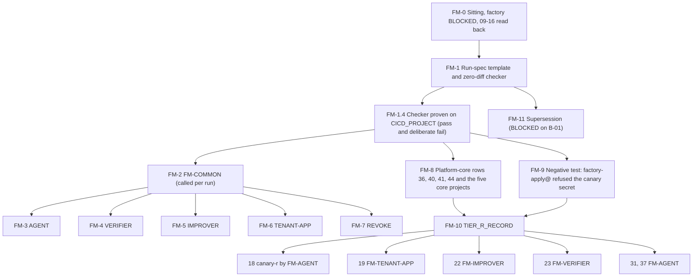

# 17. Factory module equivalents and the Tier R gate

## Status
- Owner: the platform owner
- Last reviewed: 2026-09-15
- Last executed: never
- Stage: review §2 stage 15, "Tier R open", opened here **under the bootstrap deviation** (SD-01). Runs after files 09 to 16 and before 18. Its FM procedures are then called with parameters by 18 (canary-r), 19 (the Gemini Enterprise import), 22 (Mo), 23 (Eve), 31 and 37 (Wall-E and its twin), and by any later agent until the factory exists.
- Step prefix: FM. Steps: 74. BLOCKED steps: FM-0.2 (the factory's automation), FM-6.5 (row 38, the factory CI's standing editor grant), FM-7.3 (`halt_all` for a Tier W+ agent whose code is not committed), FM-8.6 (the factory's deferred folder roles), FM-11.1, FM-11.2 and FM-11.3 (supersession by `terraform import` and an empty plan). Steps that run once per call: FM-2.1 to FM-2.22, plus the module section of the module being called.
- Replaces: the Phase 6 "factory call" and "manual fallback" of `wall-e/SETUP.md`, Eve's Phase 1 project creation (`eve/07-build-runbook.md`) and Mo-1 step 0 (`mo/07-build-runbook.md`). Salvaged: the verify reads of those three (project parent, enabled API list, service-account list, the `aiplatform` absence check on Eve, the IAM read for standing roles), now inside the zero-diff checker of §1. Not copied: project creation under `FOLDER_ID` (S019, S027, S042), a standing creator Owner nobody removes (S018), `gcloud config set project` (S071), a budget filtered by project number (S158), the "Absent = stop" verify that expected a factory nobody ran (S027).
- Applies decisions (pending signature in 03): SD-01 (bootstrap deviation), SD-12 (the second human approves every elevation on `EVE_PROJECT`), SD-17 (regional `_Default`, global `_Required`, explicit `_Trace`), SD-18 (platform-core rows), SD-22 (deny-policy principal form; see the conflict recorded in FM-3.2), SD-40 (no agent organisation sink), SD-41 (floors), SD-42 (singleton approvers), SD-44 (`exists_or_pending`), SD-46 (`ent-bootstrap-module`).
- Closes: S001 (module-equivalent, negative-test and Tier R half), S018 (every module project), S019, S027, S042, S048, S085 (Tier R half), S102, S156, S158, X-RQB-03 (module-project half). Defers nothing without an owner; see §13.

## What this part builds

**The Terraform factory does not exist.** Decision P35 (02 §3.2) makes it Cloud Foundation Fabric's `project-factory` module wrapped by `agent-project`, `verifier-project`, `improver-project`, `tenant-app` and `revoke`, run by Cloud Build in `CICD_PROJECT` as `factory-apply@` through `wif-factory`. No line of that code is committed (README B-01). Its automation is therefore **BLOCKED** (FM-0.2), and until it exists every project the design says "the factory makes" is made by the platform owner **by hand, from this file**, recorded in `DEVIATION_REGISTER` (01 PR-4.1) and proven equal to what the module would make by a checker, not by eye.

This file produces:

1. **The run spec and the zero-diff checker** (§1). A run spec is a JSON file, `factory/runs/<agent_id>-<env>.json` in the platform repository, written from the merged register row and manifest and reviewed like code. It states what the module would produce: project id, parent folder, labels, inherited tags, the exact API set, log routing, `_Trace`, budget, Essential Contacts, service accounts, project bindings, notification channels, the trigger sink, deny and PAB entries, project-level policies, per-project entitlements, the lien, and the items other files make. `tools/fm-zero-diff.py inputs` checks the spec against its sources; `tools/fm-zero-diff.py live` compares the live project with the spec and exits 0 only on zero difference. Until the drift job exists (B-02) this is the "every run ends with zero diff" of HLD §3.2.
2. **FM-COMMON** (§2): the steps every module equivalent performs, in the module's order, parameterised by the run spec.
3. **The five module equivalents** (§3 to §7): FM-AGENT (`agent-project`), FM-VERIFIER (`verifier-project`), FM-IMPROVER (`improver-project`), FM-TENANT-APP (`tenant-app`, the import) and FM-REVOKE (`revoke`). Each names its PAM entitlement (SD-46), its approvers and its module-specific steps.
4. **The platform-core rows** (§8): topology rows 36, 40, 41 and 44, which no module defines (S048). Their makers are 14 and 16 (SD-18); here they are given a run spec, checked with the same checker, and recorded as one platform-core deviation. The five core projects of 10 are re-checked with the checker, which replaces 10's manual shape check.
5. **The negative test** (§9): `factory-apply@`, running from the platform repository's `main` branch, is refused a read of a canary secret even while an allow binding on that secret names it, proving deny rule R6.
6. **`TIER_R_RECORD`** (§10): the Tier R gate record. HLD §0.4's four items (factory, folder baseline, central logging, shared registry) each carry evidence; the factory item is carried by the module equivalents, the checker's proof and the negative test, with the automation BLOCKED and the deviation stated.
7. **The supersession path** (§11): per deviation row, `terraform import` and an empty plan when the factory exists (BLOCKED).
8. **The design corrections pass** (§12) that 10 handed on and S048 and S156 ask for.

Who is called with what:

| Procedure | Module it stands in for | Called by (file, project) | Entitlement for the run (SD-46, 12) | Approver of the run |
|---|---|---|---|---|
| FM-AGENT | `agent-project` | 18 (`CANARY_R_PROJECT` in `fld-agents-r-nonprod`); 31 (`WALLE_PROJECT` in `fld-agents-p-sa-prod`); 37 (`WALLE_TWIN_PROJECT` in `fld-agents-p-sa-nonprod`); later agents | `ENT_BOOTSTRAP_MODULE_R_NONPROD` (canary-r); `ENT_FACTORY_SINGLETON_PSA_PROD` (Wall-E); `ENT_FACTORY_SINGLETON_PSA_NONPROD` (twin, dated no-approval variant); a new `ent-bootstrap-module` per other folder, added to 12 before the run | second human (bootstrap-module); **two named approvers**, the security reviewer and the second human (P-SA prod); none with mandatory justification (P-SA nonprod) |
| FM-VERIFIER | `verifier-project` | 23 (`EVE_PROJECT` in `fld-controllers-prod`, `EVE_TWIN_PROJECT` in `fld-controllers-nonprod`) | `ENT_FACTORY_SINGLETON_CTL_PROD`, `ENT_FACTORY_SINGLETON_CTL_NONPROD` | **the second human**, never the platform owner (SD-12) |
| FM-IMPROVER | `improver-project` | 22 (`MO_PROJECT` in `fld-improvers-prod`; `MO_TWIN_PROJECT` if P40 requires it) | `ENT_BOOTSTRAP_MODULE_IMPROVERS_PROD`, `ENT_BOOTSTRAP_MODULE_IMPROVERS_NONPROD` | second human |
| FM-TENANT-APP | `tenant-app` | 19 GE-2 (spec, repair entitlement, labels and contacts) and GE-3 (move, then log routing) | `ENT_PROJECT_MOVE_SRC` and `ENT_PROJECT_MOVE_DST` for the move; `ENT_PROJECT_REPAIR_GEMINI` for the reconciliation | as 12 created them (security reviewer, or the recorded Tier C variant) |
| FM-REVOKE | `revoke` | any file retiring a project (first expected use: canary-r after its last K7 drill) | the project's `ENT_PROJECT_REPAIR_<AGENT>`; `ENT_PLATFORM_POLICY` for deny and PAB removal | as those entitlements name |
| FM-CORE | the undefined `platform-core` (S048) | this file only (§8) | `ENT_PROJECT_REPAIR_CORE`, `ENT_FOLDER_ADMIN` for any repair | as 12 created them |

Every run also instantiates `ENT_PROJECT_REPAIR_<AGENT>` and `ENT_DEPLOY_CREDENTIAL_HOLDER_<AGENT>` from 12's templates, with the approvers the register row names (the second human for `EVE_PROJECT`; the second reviewer, never the agent's owner, for deploy entitlements), proves the repair entitlement with one grant, and only then removes the creator's Owner.

What the old text got wrong, and must not come back:

| Old text | Why it fails | Here instead |
|---|---|---|
| `gcloud projects create "$EVE_PROJECT" --folder="$FOLDER_ID"` (Eve Phase 1) and `gcloud projects create "$MO_PROJECT" --folder="$FOLDER_ID"` (Mo-1 step 0) | `FOLDER_ID` is `fld-agentic-platform`, which holds no project (02 §2.2, a severity 2 finding), outside the controllers and improvers allow-lists, deny entries and budgets (S027, S042) | FM-2.3 reads the parent from the run spec's `parent_folder_variable`, cross-checked against `register/folders.yaml`; FM-4 and FM-5 place Eve and Mo under `fld-controllers-*` and `fld-improvers-*` |
| "`roles/resourcemanager.projectCreator` on `FOLDER_ID`" as a standing human role (Eve, Mo access tables) | The design gives Project Creator to `factory-apply@` only; a human builds only through PAM (SD-46) | FM-2.2 activates the folder's `ent-bootstrap-module` or `ent-factory-singleton` grant for one hour |
| The manual fallback keeps the creator's `roles/owner` (SETUP Phase 6; `walle verify` then fails `engine_two_principals` forever, S018) | Owner is the one binding the design forbids after a run; removing it without a replacement breaks the next file | FM-2.17 and FM-2.18 instantiate and prove `ENT_PROJECT_REPAIR_<AGENT>` first; FM-2.19 removes the Owner; FM-2.20 proves no human binding remains |
| `--filter-projects=projects/${MO_PROJECT_NUMBER}`; no budget at all for Eve (S158) | The gcloud reference documents `projects/{project_id}`; Eve's project ran unbudgeted | FM-2.10 uses `projects/<project id>` for every module project, Eve included |
| "Verify expects a factory-set `restrictServiceUsage` denylist. Absent = stop" (Eve Phase 1) | Nothing set it, so the verify halted every attempt (S027) | FM-4.2 sets the project-level denylist under `ENT_PLATFORM_POLICY`, then the checker reads it back |
| `walle gcp` re-runs Phase 6 writes on any project and never records the exception (S102) | Drift on a module-made project; no deviation record | `WALLE_PROJECT` is made only by FM-AGENT from 31; the script's Phase 6 stays BLOCKED for script use (SD-37, B-18); its future read-only mode is this checker |
| Rows 36, 40, 41, 44 "made by the factory's `platform-core` module" (topology §7.6) | No such module is defined (S048) | §8 gives them a run spec, a checker pass and a deviation row; §12 corrects 02 §3.3 and topology §7.6 |



## Preconditions

- [ ] 09 complete: every `FLD_*` variable set; `register/folders.yaml` merged; tag keys `agp-tier`, `agp-env`, `agp-tisax-scope` bound on the folders; the observability default storage location `europe-west1` set on `fld-agentic-platform`; no Cloud Logging folder default storage location; `SCC_TIER` recorded.
- [ ] 10 complete: the five core projects with `DONE` lines; `SA_FACTORY_APPLY` with `workloadIdentityUser` for the platform repository and the `wif-smoke` workflow proven (CP-5.3); `SA_PLATFORM_DRIFT`, `SA_K7_EXECUTOR`, `SA_WALLE_DEPLOYER`; deviation rows `BD-10-1` to `BD-10-7` merged.
- [ ] 11 complete for `KMS_PROJECT` keys (the custodian half may be BLOCKED on B-13).
- [ ] 12 complete: `ENT_PROJECT_REPAIR_TEMPLATE`, `ENT_DEPLOY_CREDENTIAL_HOLDER_TEMPLATE`, `ENT_PROJECT_REPAIR_CORE`, `ENT_FOLDER_ADMIN`, `ENT_PLATFORM_POLICY`, `ENT_SECRET_READ`, `ENT_BOOTSTRAP_MODULE_R_NONPROD`, `ENT_BOOTSTRAP_MODULE_IMPROVERS_PROD`, `ENT_BOOTSTRAP_MODULE_IMPROVERS_NONPROD`, `ENT_FACTORY_SINGLETON_CTL_PROD`, `ENT_FACTORY_SINGLETON_CTL_NONPROD`, `ENT_FACTORY_SINGLETON_PSA_NONPROD` set and each proven by one grant; `ENT_FACTORY_SINGLETON_PSA_PROD` set or recorded as a re-run point awaiting the security reviewer; the organisation exception withdrawn and the creator's Owner removed from the five core projects (BD-10-6 closed).
- [ ] 13 complete: B1-B22 in force as 13 records (dry runs past their window or recorded as still running); the folder allow-lists of 02 §4.2 applied; `DENY_AGENTS_PLATFORM` with rule R6 naming `factory-apply@` proven by a denied call; `DENY_CORE_AGENTS`, `DENY_IMPROVERS`, `PAB_AGENTS`, `PAB_CORE_CI` set.
- [ ] 14 complete: `LOG_BUCKET_EVIDENCE`, `LOG_BUCKET_IDENTITY`, `SINK_S_ORG`, `SINK_S_FOLDER`, `PLATFORM_LOGS_DS`, `PLATFORM_LOGS_VIEWS_DS`, `BILLING_EXPORT_DS`; Data Access audit configuration at `fld-agentic-platform` merged (the negative test reads `secretmanager` Data Access entries).
- [ ] 15 part A complete: `NOTIF_CH_PAGER_CORE`, `NOTIF_CH_EMAIL_CORE`, `SCC_TOPIC`; the method 15 used to create the paging channel is recorded (FM-2.13 repeats it).
- [ ] 16 complete: `REGISTER_PATH`, `MANIFEST_SCHEMA_PATH`, `AGENT_REGISTRY`; rows 36, 41 and 44 made (SD-18) or their PENDING lines in the re-run index; `DRIFT_JOB` and `RECONCILE_JOB` recorded BLOCKED on B-02.
- [ ] 03 signed: SD-01, SD-12, SD-17, SD-18, SD-22, SD-40, SD-41, SD-42, SD-44, SD-46; the NAMES register (topology §6 project ids; gate of every **IRREVERSIBLE** project create); `SECOND_HUMAN_EMAIL`, `BILLING_ADMIN_EMAIL`; `SECURITY_REVIEWER_EMAIL` named or `*tbd*` (P-SA production runs refuse `*tbd*`).
- [ ] 07: `BILLING_ACCOUNT_ID`, `BILLING_CURRENCY`, `BOOTSTRAP_BILLING_EXPIRY`. After that date `sa-1-admin@` no longer holds billing roles, and FM-2.5 and FM-2.10 are performed by the billing administrator.
- [ ] Workstation: gcloud with the `alpha` and `beta` components, `python3.12`, `jq`, `git`, the git host's CLI; `~/.platform-env` sourced; no default project (01 §6).

## People needed

| Role | Does | Present at |
|---|---|---|
| Platform owner (as `sa-1-admin@`) | Writes the run specs and the checker; performs every FM step; requests every grant; writes deviation rows | every step |
| Second human (`SECOND_HUMAN_EMAIL`) | Approves `ENT_BOOTSTRAP_MODULE_*` and `ENT_FACTORY_SINGLETON_CTL_*` grants and the one-grant tests of per-project entitlements on `EVE_PROJECT`; required reviewer of Eve's run specs, of the negative-test workflow and of `TIER_R_RECORD`; one of the two named approvers of a P-SA production run | FM-2.2 and FM-2.18 on their runs; FM-9.2; FM-10.2 |
| Security reviewer (`SECURITY_REVIEWER_EMAIL`) | Second named approver of a P-SA production run; approver of `ENT_PLATFORM_POLICY` once appointed; reviews the checker and `TIER_R_RECORD` when appointed | FM-2.2 (P-SA prod), FM-2.15, FM-10.2 |
| Second reviewer (branch protection) | Second human approval on the checker, template and workflow pull requests | FM-1.2, FM-9.2 |
| Billing administrator (`BILLING_ADMIN_EMAIL`) | Links billing and creates budgets once `BOOTSTRAP_BILLING_EXPIRY` has passed | FM-2.5, FM-2.10 (after expiry only) |
| Paging-service administrator (IT security) | Creates a key-bearing paging channel in an agent project when 15's method needs a key, so the platform owner never handles it | FM-2.13 (only in that case) |

Hands-on time for this file's own sittings: about 2 to 3 days (checker, core re-check, negative test, record). Elapsed: about one week (pull-request reviews, the workflow merge, the second human's review of the record). One FM run afterwards: about half a day hands-on, plus approval waits.

Conventions of [01](01-prerequisites-and-conventions.md) apply. Checkpoints for per-run steps carry the run: `checkpoint FM-2.7@mo-prod DONE`. Deviation rows written by a run use the calling file's id block (`BD-22-<n>` for Mo), with kind `MOD`; rows opened by this file's own sittings are `BD-17-<n>`. Run ids, also written to the `factory_run` label, are `dev-<file>-<module>-<agent_id>-<env>`, for example `dev-22-improver-mo-prod`.

## 0. The sitting

### FM-0.1 Open the sitting and check files 09 to 16 and the gates

- **WHO:** Platform owner.
- **WHERE:** Shell with `~/.platform-env` sourced, gcloud configuration `GCLOUD_CONFIG_NAME`, signed in as `sa-1-admin@`.
- **ACTION:**

```bash
source ~/.platform-env
checkpoint FM-0.1 START
penv_guard
need ORG_ID REGION PLATFORM_REPO_DIR BUILD_LOG_DIR DEVIATION_REGISTER EVIDENCE_REGISTER SA_1_ADMIN SECOND_HUMAN_EMAIL BILLING_ACCOUNT_ID BILLING_CURRENCY CICD_PROJECT CORE_PROJECT LOGGING_PROJECT KMS_PROJECT VALIDATOR_PROJECT SA_FACTORY_APPLY SA_PLATFORM_DRIFT FLD_AGENTIC_PLATFORM FLD_PLATFORM_CORE ENT_PROJECT_REPAIR_CORE ENT_FOLDER_ADMIN ENT_PLATFORM_POLICY DENY_AGENTS_PLATFORM PAB_AGENTS SINK_S_ORG SINK_S_FOLDER PLATFORM_LOGS_VIEWS_DS AGENT_REGISTRY REGISTER_PATH MANIFEST_SCHEMA_PATH NOTIF_CH_PAGER_CORE
"$PLATFORM_REPO_DIR/tools/decision-need.sh" NAMES SD-01 SD-12 SD-17 SD-18 SD-22 SD-40 SD-41 SD-42 SD-44 SD-46
for f in 09 10 11 12 13 14 15 16; do printf '%s ' "$f"; awk -F'\t' -v p="$(echo "$f" | sed 's/09/FS/;s/10/CP/;s/11/KV/;s/12/PA/;s/13/OP/;s/14/CL/;s/15/PS/;s/16/RG/')" '$2 ~ "^"p"-" {print $2"\t"$3}' "$BUILD_LOG_DIR/checkpoints.tsv" | sort -u -k1,1 | awk -F'\t' '{c[$2]++} END {for (k in c) printf "%s=%d ", k, c[k]; print ""}'; done
awk -F'\t' '$3=="BLOCKED" || $3=="PENDING" {print $2"\t"$3"\t"$7}' "$BUILD_LOG_DIR/checkpoints.tsv" | sort -u
test -z "$(gcloud config get project 2>/dev/null)" || { echo "default project set: stop"; false; }
test "$(gcloud config get account 2>/dev/null)" = "$SA_1_ADMIN" || { echo "not sa-1-admin@: stop"; false; }
grep -E '^\| BD-10-6 ' "$DEVIATION_REGISTER"
grep -E '^\| BD-10-6 \|' "$DEVIATION_REGISTER" >/dev/null && grep -A200 '^## Closures' "$DEVIATION_REGISTER" | grep -E '^\| BD-10-6 '
```

- **VERIFY:** `decision-need.sh` prints `SIGNED` for each id. For each of 09 to 16, the status count shows `DONE` for every step, except the BLOCKED steps README's BLOCKED index lists for that file (for example CP-6.2 on B-02 and B-04) and PENDING grants listed in the re-run index; the BLOCKED and PENDING listing contains nothing that is not in those two indexes. `BD-10-6` has a row in "Closures" (the creator's Owner was removed from the core projects in 12). Any other state: stop and finish the earlier file.
- **ROLLBACK:** Read only.
- **EVIDENCE:** The output as `<date>-FM-0.1-inputs-v1` in `BUILD_LOG_DIR/records`, registered with `evidence_add FM-0.1 inputs E-05 1.4.1 build-log:records/...`. TISAX 1.4.1.

### FM-0.2 Record that the factory's automation is BLOCKED

- **WHO:** Platform owner.
- **WHERE:** Shell; README BLOCKED index.
- **ACTION:** **BLOCKED**: Needs: the factory repository with the five modules of HLD §3.2 plus a platform-core module (§8), each wrapping Fabric `project-factory` pinned at v58.0.0 (P35); the Cloud Build pipeline in `CICD_PROJECT` running `terraform plan` and the routine apply as `factory-apply@` through `wif-factory`, and the privileged apply under PAM; the schema, singleton and `tier_mismatch` checks of 02 §3.4; the factory's own negative test at every release (§9 is its hand form). One design point the code must settle, handed on by 13 OP-9.2: R6 denies `factory-apply@` `iam.serviceAccounts.getAccessToken`, so 02 §3.4's "first engine and action-service revision as the project deployer" cannot be done by impersonation from the routine phase; it moves to the privileged phase or needs a recorded decision. Commit it in: the platform repository (`PLATFORM_REPO_REMOTE`), path `factory/`. Unblocked by: a commit with green CI and a nonprod run on canary-r whose `terraform plan` after import is empty (FM-11). Gate waiting: none of Tier R (the hand equivalents run instead); the deviation register's expiry at the Tier W gate. Until then:

```bash
checkpoint FM-0.2 BLOCKED - - "B-01 factory code: automation of every FM procedure; hand equivalents run under SD-01"
git -C "$PLATFORM_REPO_DIR" ls-tree -r --name-only origin/main -- factory/ | grep -E '\.tf$' | head -n 5
```

  Nothing in this step is executed beyond the two lines above. The design facts it relies on (routine and privileged phases, the conditioned `projectIamAdmin`, R6) are 02 §3.4 and 04 §3.
- **VERIFY:** The `ls-tree` line prints no `.tf` file (if it prints any, the factory has started to exist: read FM-11 before any further hand run). README's BLOCKED index row B-01 names "17 automation" and this step id.
- **ROLLBACK:** None needed.
- **EVIDENCE:** The BLOCKED checkpoint line. E-05 (the technical documentation records how projects are made). TISAX 1.4.1 (known gap recorded), 5.2.1.

### FM-0.3 Read back the platform the module equivalents stand on

- **WHO:** Platform owner.
- **WHERE:** Shell.
- **ACTION:** Read, never write, the four things every run consumes: the folder allow-lists, the deny policy's rule set, the PAB, the aggregated sinks.

```bash
need FLD_AGENTS_R_NONPROD FLD_AGENTS_P_SA_PROD FLD_AGENTS_P_SA_NONPROD FLD_CONTROLLERS_PROD FLD_CONTROLLERS_NONPROD FLD_IMPROVERS_PROD FLD_IMPROVERS_NONPROD FLD_GEMINI_ENTERPRISE
for F in FLD_AGENTS_R_NONPROD FLD_AGENTS_P_SA_PROD FLD_AGENTS_P_SA_NONPROD FLD_CONTROLLERS_PROD FLD_CONTROLLERS_NONPROD FLD_IMPROVERS_PROD FLD_IMPROVERS_NONPROD FLD_GEMINI_ENTERPRISE; do
  echo "== $F"; gcloud org-policies describe gcp.restrictServiceUsage --folder="$(printenv "$F")" --effective --format=json | jq -r '[.spec.rules[]?.values.allowedValues[]?] | length'
done
gcloud iam policies get deny-agents-platform --attachment-point="cloudresourcemanager.googleapis.com/folders/${FLD_AGENTIC_PLATFORM}" --kind=denypolicies --format=json | jq -r '.rules[] | "\(.description // "(no description)")\t\(.denyRule.deniedPrincipals | join(","))"'
gcloud iam principal-access-boundary-policies describe pab-agents --organization="$ORG_ID" --location=global --format="value(name,details.enforcementVersion)"
gcloud logging sinks describe "${SINK_S_FOLDER##*/}" --folder="$FLD_AGENTIC_PLATFORM" --format="value(destination,includeChildren,interceptChildren)"
```

  13 OP-2.5 created `deny-agents-platform` with rule R6 only, without a description, and left R1 to R5 and R3b to the module equivalents because their principals do not exist yet; the first FM-AGENT or FM-IMPROVER run adds them (FM-2.15). The PAB read is the view page's `describe` with `--organization` and `--location=global` (read 2026-09-15).
- **VERIFY:** Every listed folder prints a non-zero allow-list length (`fld-agents-x` is not listed: its list is empty by design). The deny policy prints, before the first agent run, exactly one rule, whose denied principal is `principal://iam.googleapis.com/projects/-/serviceAccounts/<SA_FACTORY_APPLY>` (R6); after it, also rules described `R1 ` to `R5 ` and `R3b `. The PAB prints its name and enforcement version `4`. `S-folder` prints a `logging.googleapis.com/projects/<LOGGING_PROJECT>` destination, `True` and `True`.
- **ROLLBACK:** Read only.
- **EVIDENCE:** Output as `<date>-FM-0.3-platform-readback-v1`. E-05. TISAX 5.2.1.

## 1. The run spec and the zero-diff checker

### FM-1.1 Commit the run-spec template

- **WHO:** Platform owner; two human reviewers merge (branch protection of 03).
- **WHERE:** `PLATFORM_REPO_DIR`.
- **ACTION:** The template names every key the checker reads. Values in angle brackets are replaced per run; lists may be empty; a key is never removed.

```bash
mkdir -p "$PLATFORM_REPO_DIR/factory/runs"
git -C "$PLATFORM_REPO_DIR" switch -c fm-1-runspec-template
cat > "$PLATFORM_REPO_DIR/factory/runs/_template.json" <<'JSON'
{
  "spec_version": 1,
  "module": "<agent-project | verifier-project | improver-project | tenant-app | platform-core>",
  "run_id": "dev-<file>-<module short>-<agent_id>-<env>",
  "calling_file_step": "<for example 22 MO-1.2>",
  "register_row": "<path under REGISTER_PATH>",
  "register_commit": "<merge commit sha on main>",
  "manifest": "<path or null>",
  "agent_id": "<agent_id>",
  "env": "<prod | nonprod>",
  "register_tier": "<C | R | W | P | P-SA | X, exactly as in the row; controllers and improvers as the row says>",
  "project_variable": "<MO_PROJECT>",
  "project_id": "<from the signed NAMES register>",
  "create": true,
  "parent_folder_variable": "<FLD_IMPROVERS_PROD>",
  "labels": {"agent": "<agent_id>", "owner": "<owner group local part>", "tier": "<r w p p-sa ctl imp ge>", "env": "<prod | nonprod>", "data_class": "<value>", "ai_act_class": "<value>", "recovery_class": "<value>", "cost_centre": "<value or tbd>", "created_by": "bootstrap-hand", "factory_run": "<run_id>"},
  "tags_effective": {"agp-tier": "<value>", "agp-env": "<prod | nonprod>", "agp-tisax-scope": "in"},
  "services": ["<name>.googleapis.com"],
  "service_dependencies": [],
  "log_routing": {"default_bucket": "default-europe-west1", "location": "europe-west1", "retention_days": 30, "trace_bucket": true},
  "budget": {"display_name": "<project id>-budget", "amount": 0, "reason_if_not_tier_default": null},
  "essential_contacts": [{"email": "<owner group>", "categories": ["SECURITY", "SUSPENSION", "TECHNICAL", "TECHNICAL_INCIDENTS"]}],
  "service_accounts": [],
  "project_bindings": [],
  "allowed_human_members": [],
  "notification_channels": [{"type": "email", "display_name": "<agent_id>-<env>-owners-email"}],
  "trigger_sink": null,
  "deny_entries": [],
  "pab_bindings": [],
  "project_org_policies": [],
  "project_deny_policies": [],
  "entitlements": ["ent-project-repair-<agent_id>", "ent-deploy-credential-holder-<agent_id>"],
  "lien": true,
  "made_elsewhere": [],
  "pending": []
}
JSON
git -C "$PLATFORM_REPO_DIR" add factory/runs/_template.json
git -C "$PLATFORM_REPO_DIR" commit -m "factory: run-spec template for hand module equivalents (setup 17 FM-1.1, SD-01)"
git -C "$PLATFORM_REPO_DIR" push -u origin HEAD
```

  Key meanings, fixed here: `made_elsewhere[]` lists what the module would make but another file makes (for example Eve's datasets in 23, Wall-E's engine in 35), each `{"item", "file", "step"}`; the calling file appends a revised spec (`spec_version` unchanged, a new commit) when it makes them, so the checker's scope grows with the project. `pending[]` lists checks that cannot pass yet, each `{"check", "reason", "owner", "rerun_in"}`; a pending check prints `PENDING` and the checker still exits non-zero unless `--accept-pending` is passed, and the report says so. Category names in `essential_contacts` are the API enum values the list read returns (`SECURITY`, `TECHNICAL` and so on); the create command takes them in lower case with hyphens (10 CP-1.10). `labels` keys follow the spelling 10 CP-1.1 settled (underscores, or hyphens if the create refused them); read it from `BD-10-7` item 5 and change the template in this pull request if hyphens won.
- **VERIFY:** `python3.12 -m json.tool "$PLATFORM_REPO_DIR/factory/runs/_template.json" >/dev/null && echo JSON-OK` prints `JSON-OK`; the pull request is merged with two human approvals; `git -C "$PLATFORM_REPO_DIR" log --oneline -1 origin/main -- factory/runs/_template.json` shows the merge.
- **ROLLBACK:** A revert by pull request.
- **EVIDENCE:** Merge commit id as `<date>-FM-1.1-runspec-template-v1`. E-05. TISAX 5.2.1.

### FM-1.2 Commit the zero-diff checker

- **WHO:** Platform owner writes; two human reviewers merge, one of them the security reviewer once appointed (otherwise the second human).
- **WHERE:** `PLATFORM_REPO_DIR`.
- **ACTION:** The checker is Python 3.12 standard library plus gcloud; it only reads (`describe`, `list`, `get`), never reads a secret payload, and prints no credential. It writes a JSON report and exits 0 only when every check is `PASS`.

```bash
git -C "$PLATFORM_REPO_DIR" switch main && git -C "$PLATFORM_REPO_DIR" pull --ff-only
git -C "$PLATFORM_REPO_DIR" switch -c fm-1-zero-diff-checker
cat > "$PLATFORM_REPO_DIR/tools/fm-zero-diff.py" <<'PY'
#!/usr/bin/env python3.12
"""fm-zero-diff: compare a hand-made module equivalent with its run spec (setup 17, SD-01).

  fm-zero-diff.py inputs SPEC.json [--report FILE]
      the spec against the register row, register/folders.yaml, the signed NAMES register,
      the parent folder's effective gcp.restrictServiceUsage allow-list and the tier budget table.
  fm-zero-diff.py live SPEC.json [--report FILE] [--accept-pending]
      the live project and its platform entries against the spec.

Exit 0 only when every check is PASS (or PENDING with --accept-pending, recorded in the report).
Read-only. Never reads a secret payload. Environment: ~/.platform-env sourced.
"""
import json, os, re, subprocess, sys, hashlib, datetime, pathlib

ENV = os.environ
REPO = pathlib.Path(ENV["PLATFORM_REPO_DIR"])
BUDGET = {("r", "prod"): 100, ("r", "nonprod"): 50, ("w", "prod"): 300, ("w", "nonprod"): 150,
          ("p", "prod"): 500, ("p", "nonprod"): 250, ("p-sa", "prod"): 500, ("p-sa", "nonprod"): 250,
          ("ctl", "prod"): 200, ("ctl", "nonprod"): 100, ("imp", "prod"): 200, ("imp", "nonprod"): 100,
          ("core", "prod"): 300}
ALWAYS_ALLOWED = {"iam.googleapis.com", "logging.googleapis.com", "monitoring.googleapis.com"}
results = []

def gc(*args):
    p = subprocess.run(["gcloud", *args, "--format=json"], capture_output=True, text=True)
    if p.returncode != 0:
        return None, (p.stderr.strip().splitlines() or ["error"])[-1][:300]
    out = p.stdout.strip()
    return (json.loads(out) if out else []), None

def rec(check, ok, expected, actual, spec):
    pend = [x for x in spec.get("pending", []) if x.get("check") == check]
    status = "PASS" if ok else ("PENDING" if pend else "FAIL")
    results.append({"check": check, "status": status, "expected": expected, "actual": actual,
                    "pending": pend[0] if pend else None})

def row_scalars(path, env):
    text = (REPO / path).read_text()
    docs = [d for d in re.split(r"^---\s*$", text, flags=re.M) if d.strip()]
    out = []
    for d in docs:
        kv = {}
        for line in d.splitlines():
            m = re.match(r"^([a-z_][a-z0-9_]*):\s*(.*?)\s*(#.*)?$", line)
            if m and m.group(2) not in ("", "|", ">"):
                kv[m.group(1)] = m.group(2).strip("\"'")
        out.append(kv)
    match = [kv for kv in out if kv.get("env", env) == env]
    return match[0] if len(match) == 1 else None

def folders_yaml():
    ids, cur = {}, None
    for line in (REPO / "register/folders.yaml").read_text().splitlines():
        m = re.match(r"\s*- variable:\s*(\S+)", line)
        if m: cur = m.group(1)
        m = re.match(r'\s*id:\s*"(\d+)"', line)
        if m and cur: ids[cur] = m.group(1)
    return ids

def check_inputs(s):
    row = row_scalars(s["register_row"], s["env"])
    rec("row.found", row is not None, "one document for env", "found" if row else "none or several", s)
    row = row or {}
    for k, sk in (("agent_id", "agent_id"), ("env", "env"), ("tier", "register_tier")):
        rec(f"row.{k}", row.get(k) == s[sk], s[sk], row.get(k), s)
    anc = subprocess.run(["git", "-C", str(REPO), "merge-base", "--is-ancestor", s["register_commit"], "origin/main"])
    rec("row.commit_on_main", anc.returncode == 0, "ancestor of origin/main", anc.returncode, s)
    if s.get("manifest"):
        sha = hashlib.sha256((REPO / s["manifest"]).read_bytes()).hexdigest()
        rec("manifest.sha", row.get("manifest_sha") == sha, sha, row.get("manifest_sha"), s)
    if s["create"]:
        p = subprocess.run([str(REPO / "tools/decision-value.sh"), "NAMES", s["project_variable"]], capture_output=True, text=True)
        rec("names.project_id", p.stdout.strip() == s["project_id"], s["project_id"], p.stdout.strip(), s)
        pid = s["project_id"]
        rec("project_id.form", bool(re.fullmatch(r"agp-(r|w|p|psa|x|ctl|imp|core|ge)-[a-z0-9-]*[a-z0-9]", pid)) and 6 <= len(pid) <= 30,
            "agp-<tiercode>-..., 6-30 chars (02 3.6)", pid, s)
    fid = ENV.get(s["parent_folder_variable"], "")
    rec("parent.folders_yaml", folders_yaml().get(s["parent_folder_variable"]) == fid and fid != "", fid, folders_yaml().get(s["parent_folder_variable"]), s)
    pol, err = gc("org-policies", "describe", "gcp.restrictServiceUsage", f"--folder={fid}", "--effective")
    allowed = set()
    for r in (pol or {}).get("spec", {}).get("rules", []):
        allowed |= set(r.get("values", {}).get("allowedValues", []))
    extra = sorted(set(s["services"]) - allowed - ALWAYS_ALLOWED)
    rec("services.subset_of_folder_allowlist", not extra and err is None, "no service outside the allow-list", extra or err, s)
    for k, v in s["labels"].items():
        rec(f"label.{k}.alphabet", bool(re.fullmatch(r"[a-z0-9_-]{0,63}", v)), "label alphabet, 63 chars", v, s)
    key = (s["labels"]["tier"], s["env"])
    want = BUDGET.get(key)
    ok = s["budget"]["amount"] == want or bool(s["budget"].get("reason_if_not_tier_default"))
    rec("budget.tier_default", ok, want, s["budget"]["amount"], s)
    rec("labels.factory_run", s["labels"].get("factory_run") == s["run_id"], s["run_id"], s["labels"].get("factory_run"), s)

def check_live(s):
    pid, reg = s["project_id"], ENV["REGION"]
    p, err = gc("projects", "describe", pid)
    p = p or {}
    num = p.get("projectNumber", "")
    fid = ENV.get(s["parent_folder_variable"], "")
    rec("project.parent", p.get("parent", {}) == {"type": "folder", "id": fid}, f"folder {fid}", p.get("parent") or err, s)
    rec("project.state", p.get("lifecycleState") == "ACTIVE", "ACTIVE", p.get("lifecycleState"), s)
    rec("project.labels", p.get("labels", {}) == s["labels"], s["labels"], p.get("labels"), s)
    eff, _ = gc("resource-manager", "tags", "bindings", "list", f"--parent=//cloudresourcemanager.googleapis.com/projects/{num}", "--effective")
    got = {}
    for t in eff or []:
        parts = t.get("namespacedTagValue", "").split("/")
        if len(parts) >= 3: got[parts[-2]] = parts[-1]
    rec("tags.effective", all(got.get(k) == v for k, v in s["tags_effective"].items()), s["tags_effective"], got, s)
    direct, _ = gc("resource-manager", "tags", "bindings", "list", f"--parent=//cloudresourcemanager.googleapis.com/projects/{num}")
    rec("tags.none_direct", not direct, [], direct, s)
    b, err = gc("billing", "projects", "describe", pid)
    rec("billing.link", (b or {}).get("billingEnabled") is True and (b or {}).get("billingAccountName") == f"billingAccounts/{ENV['BILLING_ACCOUNT_ID']}",
        ENV["BILLING_ACCOUNT_ID"], b or err, s)
    sv, err = gc("services", "list", "--enabled", f"--project={pid}")
    enabled = {x["config"]["name"] for x in sv or []}
    want = set(s["services"])
    rec("services.exact", enabled - set(s["service_dependencies"]) == want, sorted(want), sorted(enabled) if sv is not None else err, s)
    lr = s["log_routing"]
    d, err = gc("logging", "sinks", "describe", "_Default", f"--project={pid}")
    rec("logging.default_route", (d or {}).get("destination") == f"logging.googleapis.com/projects/{pid}/locations/{lr['location']}/buckets/{lr['default_bucket']}", lr, (d or {}).get("destination") or err, s)
    bk, err = gc("logging", "buckets", "describe", lr["default_bucket"], f"--location={lr['location']}", f"--project={pid}")
    rec("logging.default_bucket_retention", (bk or {}).get("retentionDays") == lr["retention_days"], lr["retention_days"], (bk or {}).get("retentionDays") or err, s)
    rq, err = gc("logging", "sinks", "describe", "_Required", f"--project={pid}")
    rec("logging.required_global", str((rq or {}).get("destination", "")).endswith("/locations/global/buckets/_Required"), "global _Required", (rq or {}).get("destination") or err, s)
    if lr["trace_bucket"]:
        tb, err = gc("beta", "observability", "buckets", "list", f"--location={reg}", f"--project={pid}")
        rec("trace.bucket", any(str(x.get("name", "")).endswith(f"/locations/{reg}/buckets/_Trace") for x in tb or []), f"_Trace in {reg}", tb if tb is not None else err, s)
    bu, err = gc("billing", "budgets", "list", f"--billing-account={ENV['BILLING_ACCOUNT_ID']}", f"--billing-project={ENV['CICD_PROJECT']}")
    mine = [x for x in bu or [] if x.get("displayName") == s["budget"]["display_name"]]
    ok = len(mine) == 1 and str(mine[0].get("amount", {}).get("specifiedAmount", {}).get("units")) == str(s["budget"]["amount"]) \
        and mine[0].get("budgetFilter", {}).get("projects") in ([f"projects/{pid}"], [f"projects/{num}"]) and len(mine[0].get("thresholdRules", [])) == 4
    rec("budget", ok, s["budget"], mine or err, s)
    ec, err = gc("essential-contacts", "list", f"--project={pid}", f"--billing-project={ENV['CICD_PROJECT']}")
    have = {(x["email"], tuple(sorted(x.get("notificationCategorySubscriptions", [])))) for x in ec or []}
    wantc = {(c["email"], tuple(sorted(c["categories"]))) for c in s["essential_contacts"]}
    rec("essential_contacts", have == wantc, sorted(wantc), sorted(have) if ec is not None else err, s)
    sa, err = gc("iam", "service-accounts", "list", f"--project={pid}")
    emails = {x["email"].split("@")[0] for x in sa or []}
    rec("service_accounts.exact", emails == set(s["service_accounts"]), sorted(s["service_accounts"]), sorted(emails) if sa is not None else err, s)
    for e in sorted(emails):
        k, _ = gc("iam", "service-accounts", "keys", "list", f"--iam-account={e}@{pid}.iam.gserviceaccount.com", "--managed-by=user", f"--project={pid}")
        rec(f"service_account.{e}.no_user_keys", not k, [], k, s)
    pol, err = gc("projects", "get-iam-policy", pid)
    humans, unexpected = [], []
    want_b = {(x["role"], x["member"]) for x in s["project_bindings"]}
    seen = set()
    for bnd in (pol or {}).get("bindings", []):
        for m in bnd.get("members", []):
            seen.add((bnd["role"], m))
            if m.split(":")[0] in ("user", "group", "domain") or m in ("allUsers", "allAuthenticatedUsers"):
                if m not in s["allowed_human_members"]: humans.append((bnd["role"], m))
            elif m.startswith("serviceAccount:") and (bnd["role"], m) not in want_b:
                if not re.search(r"@(gcp-sa-[a-z0-9-]+|cloudservices|container-engine-robot|cloudbuild|serverless-robot-prod)\.iam\.gserviceaccount\.com$|@cloudservices\.gserviceaccount\.com$", m):
                    unexpected.append((bnd["role"], m))
            if bnd["role"] in ("roles/owner", "roles/editor") and m not in s["allowed_human_members"]:
                humans.append((bnd["role"], m))
    rec("iam.no_human_or_basic_role", not humans, [], humans if pol is not None else err, s)
    rec("iam.no_unexpected_service_account", not unexpected, [], unexpected, s)
    rec("iam.spec_bindings_present", want_b <= seen, sorted(want_b), sorted(want_b - seen), s)
    if s["lien"]:
        li, err = gc("alpha", "resource-manager", "liens", "list", f"--project={pid}")
        rec("lien", any("resourcemanager.projects.delete" in x.get("restrictions", []) for x in li or []), "delete lien", li if li is not None else err, s)
    ch, err = gc("beta", "monitoring", "channels", "list", f"--project={pid}")
    have_ch = {(x.get("type"), x.get("displayName")) for x in ch or []}
    rec("channels", {(c["type"], c["display_name"]) for c in s["notification_channels"]} <= have_ch, s["notification_channels"], sorted(have_ch) if ch is not None else err, s)
    ts = s.get("trigger_sink")
    if ts:
        sk, err = gc("logging", "sinks", "describe", ts["name"], f"--project={ENV['LOGGING_PROJECT']}")
        dest = f"pubsub.googleapis.com/projects/{pid}/topics/{ts['topic']}"
        fsha = hashlib.sha256((sk or {}).get("filter", "").encode()).hexdigest()
        rec("trigger_sink.destination_filter", (sk or {}).get("destination") == dest and fsha == ts["filter_sha256"], [dest, ts["filter_sha256"]], [(sk or {}).get("destination"), fsha] if sk else err, s)
        tp, err = gc("pubsub", "topics", "get-iam-policy", ts["topic"], f"--project={pid}")
        pubs = [m for b2 in (tp or {}).get("bindings", []) if b2["role"] == "roles/pubsub.publisher" for m in b2["members"]]
        rec("trigger_sink.writer_publisher", (sk or {}).get("writerIdentity") in pubs, (sk or {}).get("writerIdentity"), pubs or err, s)
    for de in s["deny_entries"]:
        dp, err = gc("iam", "policies", "get", de["policy_id"], f"--attachment-point={de['attachment_point']}", "--kind=denypolicies")
        for rid in de["rules"]:
            rules = [r for r in (dp or {}).get("rules", []) if r.get("description", "").startswith(rid + " ")]
            ok = len(rules) == 1 and de["principal"] in rules[0].get("denyRule", {}).get("deniedPrincipals", [])
            rec(f"deny.{de['policy_id']}.{rid}", ok, de["principal"], "present" if ok else (err or "absent"), s)
            for ex in de.get("exceptions", {}).get(rid, []):
                ok2 = len(rules) == 1 and ex in rules[0].get("denyRule", {}).get("exceptionPrincipals", [])
                rec(f"deny.{de['policy_id']}.{rid}.exception", ok2, ex, "present" if ok2 else "absent", s)
    for pb in s["pab_bindings"]:
        bd, err = gc("iam", "policy-bindings", "describe", pb["binding_id"], f"--{pb['parent_type']}={pb['parent_id']}", "--location=global")
        ok = (bd or {}).get("policy") == pb["policy"] and (bd or {}).get("target", {}).get("principalSet") == pb["principal_set"]
        rec(f"pab.{pb['binding_id']}", ok, pb, bd or err, s)
    for op in s["project_org_policies"]:
        po, err = gc("org-policies", "describe", op["constraint"], f"--project={pid}")
        denied = {v for r in (po or {}).get("spec", {}).get("rules", []) for v in r.get("values", {}).get("deniedValues", [])}
        inherit = (po or {}).get("spec", {}).get("inheritFromParent") is True
        rec(f"orgpolicy.{op['constraint']}", set(op["denied"]) <= denied and inherit, op, [sorted(denied), inherit] if po else err, s)
    for dp_ in s["project_deny_policies"]:
        dd, err = gc("iam", "policies", "get", dp_["policy_id"], f"--attachment-point=cloudresourcemanager.googleapis.com/projects/{pid}", "--kind=denypolicies")
        body = json.dumps({"rules": (dd or {}).get("rules", [])}, sort_keys=True)
        committed = json.dumps({"rules": json.loads((REPO / dp_["file"]).read_text())["rules"]}, sort_keys=True)
        rec(f"project_deny.{dp_['policy_id']}", body == committed, dp_["file"], "equal" if body == committed else (err or "differs"), s)
    en, err = gc("pam", "entitlements", "list", f"--project={pid}", "--location=global", f"--billing-project={ENV['CICD_PROJECT']}")
    names = {x["name"].split("/")[-1] for x in en or []}
    rec("entitlements", set(s["entitlements"]) <= names, s["entitlements"], sorted(names) if en is not None else err, s)

def main():
    if len(sys.argv) < 3 or sys.argv[1] not in ("inputs", "live"):
        print(__doc__); sys.exit(2)
    spec = json.loads(pathlib.Path(sys.argv[2]).read_text())
    (check_inputs if sys.argv[1] == "inputs" else check_live)(spec)
    accept = "--accept-pending" in sys.argv
    bad = [r for r in results if r["status"] == "FAIL" or (r["status"] == "PENDING" and not accept)]
    report = {"tool": "fm-zero-diff", "mode": sys.argv[1], "spec": sys.argv[2], "run_id": spec["run_id"],
              "at": datetime.datetime.now(datetime.timezone.utc).isoformat(), "accept_pending": accept,
              "summary": {k: sum(1 for r in results if r["status"] == k) for k in ("PASS", "FAIL", "PENDING")},
              "zero_diff": not bad, "results": results}
    if "--report" in sys.argv:
        pathlib.Path(sys.argv[sys.argv.index("--report") + 1]).write_text(json.dumps(report, indent=2))
    for r in results:
        print(f"{r['status']:8} {r['check']}")
    print(json.dumps(report["summary"]), "ZERO-DIFF" if not bad else "DIFF")
    sys.exit(0 if not bad else 1)

if __name__ == "__main__":
    main()
PY
chmod +x "$PLATFORM_REPO_DIR/tools/fm-zero-diff.py"
python3.12 -m py_compile "$PLATFORM_REPO_DIR/tools/fm-zero-diff.py"
git -C "$PLATFORM_REPO_DIR" add tools/fm-zero-diff.py
git -C "$PLATFORM_REPO_DIR" commit -m "tools: fm-zero-diff checker for hand module equivalents (setup 17 FM-1.2)"
git -C "$PLATFORM_REPO_DIR" push -u origin HEAD
```

  Commands the checker calls, each already used by 10, 13 or 14 or verified for this file on 2026-09-15: `gcloud projects describe`, `gcloud resource-manager tags bindings list --effective`, `gcloud billing projects describe`, `gcloud services list --enabled`, `gcloud logging sinks describe`, `gcloud logging buckets describe`, `gcloud beta observability buckets list`, `gcloud billing budgets list`, `gcloud essential-contacts list`, `gcloud iam service-accounts list` and `keys list`, `gcloud projects get-iam-policy`, `gcloud alpha resource-manager liens list`, `gcloud beta monitoring channels list` (no GA track exists for `monitoring channels`; beta reference read 2026-09-15), `gcloud pubsub topics get-iam-policy`, `gcloud iam policies get --kind=denypolicies` (the `update` reference read 2026-09-15 documents `--attachment-point`, `--kind`, `--policy-file`, `--etag`), `gcloud iam policy-bindings describe` (binding create reference and the PAB pages read 2026-09-15), `gcloud org-policies describe [--effective]`, `gcloud pam entitlements list --location=global --billing-project="$CICD_PROJECT"` (GA track; create reference read 2026-09-15). *Assumption:* the JSON field names the checker reads (`namespacedTagValue`, `notificationCategorySubscriptions`, `specifiedAmount.units`, `target.principalSet`, `denyRule.deniedPrincipals`) are those of the underlying REST resources; FM-1.3 runs every branch against a real project and a wrong field name shows as a `FAIL` with the actual value printed, which is corrected by pull request before the checker is trusted.
- **VERIFY:** `py_compile` prints nothing; `python3.12 "$PLATFORM_REPO_DIR/tools/fm-zero-diff.py"` with no arguments prints the usage and exits 2; the pull request is merged with two human approvals.
- **ROLLBACK:** Revert by pull request. The checker writes nothing to Google Cloud.
- **EVIDENCE:** Merge commit id as `<date>-FM-1.2-checker-v1`. E-05 (the verification method of the technical documentation). TISAX 5.2.1, 5.2.4.

### FM-1.3 Write a platform-core run spec for `CICD_PROJECT`

- **WHO:** Platform owner.
- **WHERE:** `PLATFORM_REPO_DIR`.
- **ACTION:** Transcribe 10's row 1 into a spec with `"module": "platform-core"`, `"create": false` (the project exists), the labels and services of 10 CP-1.1 and CP-1.6 (the services file of CP-1.6 is the source), `essential_contacts` for `platform-owners@` (all four categories) and `platform-security@` (`SECURITY`), the four service accounts of 10 CP-8.1 (`platform-build`, `factory-apply`, `factory-groups`, `walle-deployer`), `project_bindings` from the post-12 IAM snapshot of `CICD_PROJECT` (non-human members only), `allowed_human_members: []`, `lien: true`, `entitlements: []` (the core repair entitlement lives at `ENT_PROJECT_REPAIR_CORE`'s scope, recorded in `made_elsewhere`), `notification_channels` as 15 part A made them in that project or `[]` with a `made_elsewhere` line, `register_row` pointing at 16's platform-core row file and its commit. `run_id` is `dev-10-core-cicd`, which is the label 10 wrote.

```bash
need CICD_PROJECT FLD_PLATFORM_CORE
cp "$PLATFORM_REPO_DIR/factory/runs/_template.json" "$PLATFORM_REPO_DIR/factory/runs/platform-core-cicd.json"
gcloud services list --enabled --project="$CICD_PROJECT" --format="value(config.name)" | sort
gcloud projects get-iam-policy "$CICD_PROJECT" --flatten="bindings[].members" --format="table(bindings.role,bindings.members)"
gcloud projects describe "$CICD_PROJECT" --format="json(labels)"
```

  Edit the copy by hand from those reads and 10's records; the reads are for transcription, not a source of truth. A value that differs between 10's record and the live read is a finding, written to the build log and resolved before FM-1.4, never silently copied from the live side.
- **VERIFY:** `python3.12 -m json.tool` accepts the file; `jq -r '.module, .create, .run_id' factory/runs/platform-core-cicd.json` prints `platform-core`, `false`, `dev-10-core-cicd`; the build log lists any 10-versus-live difference with its resolution.
- **ROLLBACK:** Delete the uncommitted file.
- **EVIDENCE:** The spec, committed in FM-1.4. TISAX 1.3.1.

### FM-1.4 Prove the checker: zero diff on `CICD_PROJECT`, then a deliberate diff

- **WHO:** Platform owner; the second human reads the two reports (not present).
- **WHERE:** Shell.
- **ACTION:**

```bash
need CICD_PROJECT BUILD_LOG_DIR
cd "$PLATFORM_REPO_DIR"
R="$BUILD_LOG_DIR/records/$(date -u +%F)-FM-1.4"
python3.12 tools/fm-zero-diff.py live factory/runs/platform-core-cicd.json --report "${R}-cicd-live-v1.json"
echo "exit=$?"
jq '.labels.env = "nonprod" | .services += ["compute.googleapis.com"]' factory/runs/platform-core-cicd.json > "${R}-negative-spec.json"
python3.12 tools/fm-zero-diff.py live "${R}-negative-spec.json" --report "${R}-cicd-negative-v1.json"
echo "exit=$?"
git add factory/runs/platform-core-cicd.json && git commit -m "factory: platform-core run spec for CICD_PROJECT (setup 17 FM-1.4)" && git push
cd - >/dev/null
```

  `inputs` mode skips the NAMES and project-id form checks when `create` is `false`, so it may also be run on this spec; `live` is the proof that matters here.
- **VERIFY:** The first run prints `ZERO-DIFF` and `exit=0`: every check `PASS`, including `iam.no_human_or_basic_role` (proof that 12 removed the creator's Owner) and `logging.default_route`. The second run prints `DIFF`, `exit=1`, and exactly two `FAIL` lines, `project.labels` and `services.exact`. Any other `FAIL` in the first run is either a checker defect (fix the checker by pull request and re-run FM-1.2's review) or a real difference on `CICD_PROJECT` (repair under `ENT_PROJECT_REPAIR_CORE` and record a `DEV` row). Only when both runs behave as stated is the checker trusted by later steps.
- **ROLLBACK:** None needed; nothing was written to Google Cloud.
- **EVIDENCE:** Both reports, registered with `evidence_add FM-1.4 checker-proof E-05 5.2.4 build-log:records/<file> <file>`. TISAX 5.2.4 (verification of controls). This is the checker's proof carried into `TIER_R_RECORD`.

## 2. FM-COMMON: the steps every module equivalent performs

A calling file runs FM-2.1 to FM-2.22 in order, with the module section (§3 to §7) steps inserted where §3 to §7 say. Every step reads the run spec; nothing is typed from memory. Start each run with:

```bash
source ~/.platform-env
RUN_SPEC="$PLATFORM_REPO_DIR/factory/runs/<agent_id>-<env>.json"
RUN="$(jq -r '.agent_id + "-" + .env' "$RUN_SPEC")"
P_VAR="$(jq -r '.project_variable' "$RUN_SPEC")"
P_ID="$(jq -r '.project_id' "$RUN_SPEC")"
P_FLD_VAR="$(jq -r '.parent_folder_variable' "$RUN_SPEC")"
P_FLD="$(printenv "$P_FLD_VAR")"
RUN_ID="$(jq -r '.run_id' "$RUN_SPEC")"
R="$BUILD_LOG_DIR/records/$(date -u +%F)-FM-${RUN}"
```

### FM-2.1 Inputs: the merged register row, the manifest and the run spec

- **WHO:** Platform owner writes the spec; two human reviewers merge it; for `EVE_PROJECT` and `EVE_TWIN_PROJECT` the second human is one of them (CODEOWNERS on `eve/` extends to `factory/runs/eve-*.json`, added in this pull request if 03 did not); for a P-SA production run the security reviewer is the other.
- **WHERE:** `PLATFORM_REPO_DIR`; the git host.
- **ACTION:** Refuse to start without `TIER_R_RECORD` (S085), except for this file's own sittings. Confirm the register row and manifest are merged on `main`. Copy the template to `factory/runs/<agent_id>-<env>.json` and fill it from the row, the manifest, the module section's parameter table and the signed NAMES register. Then check the spec against its sources, and merge it.

```bash
need TIER_R_RECORD PLATFORM_REPO_DIR REGISTER_PATH
test -s "$PLATFORM_REPO_DIR/$TIER_R_RECORD" || { echo "STOP: TIER_R_RECORD missing (S085)"; false; }
git -C "$PLATFORM_REPO_DIR" fetch origin && git -C "$PLATFORM_REPO_DIR" switch main && git -C "$PLATFORM_REPO_DIR" pull --ff-only
git -C "$PLATFORM_REPO_DIR" log --oneline -1 -- "$(jq -r .register_row "$RUN_SPEC")"
git -C "$PLATFORM_REPO_DIR" switch -c "fm-spec-${RUN}"
python3.12 "$PLATFORM_REPO_DIR/tools/fm-zero-diff.py" inputs "$RUN_SPEC" --report "${R}-FM-2.1-inputs-v1.json"
git -C "$PLATFORM_REPO_DIR" add "$RUN_SPEC" && git -C "$PLATFORM_REPO_DIR" commit -m "factory: run spec ${RUN_ID} (setup 17 FM-2.1)" && git -C "$PLATFORM_REPO_DIR" push -u origin HEAD
```

  Filling rules: `services` is the subset of the parent folder's allow-list (02 §4.2) that the manifest's stores, egress and module section need, never the whole list (the `inputs` check refuses anything outside it); `labels` from 02 §3.6 with the row's values (slugged), `created_by=bootstrap-hand`, `factory_run=<run_id>`; `budget.amount` from 02 §2.2 and §3.7 (the checker's table) or the row's `budget_eur` with its reason; `essential_contacts` to the row's `owner_group` (all four categories) and `platform-security@` (`SECURITY`); `service_accounts` and `project_bindings` from the module section; `made_elsewhere` for every module item another file makes; `pending` only with an owner and a re-run file.
- **VERIFY:** `inputs` prints `ZERO-DIFF` and exits 0 (every source agrees: row, NAMES, `folders.yaml`, the allow-list, the budget table). The pull request is merged with the required approvals; `git -C "$PLATFORM_REPO_DIR" log --oneline -1 origin/main -- "factory/runs/${RUN}.json"` shows the merge. `need TIER_R_RECORD` passes.
- **ROLLBACK:** Close the pull request; nothing exists in Google Cloud yet.
- **EVIDENCE:** The inputs report and the merge commit, `evidence_add FM-2.1@${RUN} inputs E-05 1.3.1 ...`. TISAX 1.3.1 (asset has an owner and classification before it exists), 5.2.1. EU AI Act E-05.

### FM-2.2 Activate the run's entitlement

- **WHO:** Platform owner requests; **approver** as the module section names (the second human for `ENT_BOOTSTRAP_MODULE_*` and `ENT_FACTORY_SINGLETON_CTL_*`; the security reviewer **and** the second human for `ENT_FACTORY_SINGLETON_PSA_PROD`; none, with justification, for `ENT_FACTORY_SINGLETON_PSA_NONPROD`). The platform owner never approves; PAM refuses self-approval.
- **WHERE:** Requester's shell; approvers in the console **Security > Privileged Access Manager > Approve grants**, or their own shell.
- **ACTION:**

```bash
ENT="<the entitlement variable's value for this run>"
need ENT RUN_ID
gcloud pam entitlements describe "$ENT" --location=global --billing-project="$CICD_PROJECT" --format="yaml(eligibleUsers,approvalWorkflow,maxRequestDuration,privilegedAccess)"
gcloud pam grants create --entitlement="$ENT" --requested-duration=3600s --justification="${RUN_ID}: hand module equivalent, spec $(git -C "$PLATFORM_REPO_DIR" rev-parse --short origin/main) (setup 17, SD-01, SD-46)" --location=global --billing-project="$CICD_PROJECT"
```

  The approver reads the justification, opens the merged run spec, and approves: `gcloud pam grants approve <GRANT_NAME> --reason="spec reviewed: ${RUN_ID}" --location=global --billing-project="$CICD_PROJECT"` (the `approve` reference, read 2026-09-15, takes the grant name and `--reason`). `create` takes `--entitlement`, `--requested-duration` (for example `3600s`) and `--justification` (GA reference, read 2026-09-15). *Assumption:* passing the entitlement's full resource name to `--entitlement` makes `--folder` unnecessary; if gcloud asks for the parent, add `--folder=<P_FLD>`.
- **VERIFY:** The describe shows `eligibleUsers` including `platform-owners@` (or the platform owner), the role bundle of 04 §5.2 `ent-factory-singleton` (`projectCreator`, `serviceUsageAdmin`, `serviceAccountCreator`, unconditioned `projectIamAdmin`) on this folder, `maxRequestDuration` of 1 hour, and the approvers listed in the module section; for P-SA production, `approvalsNeeded` equals the number of distinct named approvers 12 configured (two approvals, or two named approvers in the set as 12 recorded) and neither is the platform owner. Then `gcloud pam grants list --entitlement="$ENT" --location=global --billing-project="$CICD_PROJECT" --filter="state=ACTIVE" --format="value(name,state,requester)"` shows the grant `ACTIVE` with `requester` = `sa-1-admin@`. A requester that is not eligible, or an approver list containing the platform owner, stops the run: 12 is corrected first.
- **ROLLBACK:** `gcloud pam grants revoke <GRANT_NAME> --reason="run stopped" --location=global --billing-project="$CICD_PROJECT"` (*Assumption:* `revoke` takes `--reason` as `approve` does).
- **EVIDENCE:** The describe YAML and the grant name as `${R}-FM-2.2-grant-v1`; the approval is a `privilegedaccessmanager.googleapis.com` `ApproveGrant` Admin Activity entry in the aggregated sink. TISAX 4.1.3 (privileged access approved by a second person), 4.2.1. EU AI Act E-08.

### FM-2.3 Create the project under its folder

- **WHO:** Platform owner, inside the active grant.
- **WHERE:** Shell. Skipped for FM-TENANT-APP (`"create": false`): write `checkpoint FM-2.3@${RUN} N/A`.
- **ACTION:**

```bash
need P_ID P_FLD RUN_SPEC
test "$(jq -r .create "$RUN_SPEC")" = true || { echo "create is false: N/A"; false; }
test "$("$PLATFORM_REPO_DIR/tools/decision-value.sh" NAMES "$P_VAR")" = "$P_ID" || { echo "STOP: id differs from the signed NAMES register"; false; }
gcloud projects describe "$P_ID" --format="value(projectId)" 2>/dev/null && { echo "id exists: resume rule, do not create"; false; }
gcloud projects create "$P_ID" --folder="$P_FLD" --name="$(jq -r '.agent_id + " " + .env' "$RUN_SPEC" | cut -c1-30)" --no-enable-cloud-apis --labels="$(jq -r '.labels | to_entries | map("\(.key)=\(.value)") | join(",")' "$RUN_SPEC")"
gcloud alpha resource-manager liens create --project="$P_ID" --restrictions=resourcemanager.projects.delete --reason="Module-equivalent project ${RUN_ID}; deletion only through FM-REVOKE" --origin="setup-17-${RUN_ID}"
```

  Flags as 10 CP-1.1 and CP-1.3 verified. The display name is `<agent_id> <env>` because the Project resource refuses 02 §3.6's parentheses and commas (10 CP-1.1; corrected in §12).
- **VERIFY:** `gcloud projects describe "$P_ID" --format="yaml(parent,labels,lifecycleState)"` shows `type: folder`, `id: <P_FLD>`, `ACTIVE` and exactly the spec's labels; `gcloud alpha resource-manager liens list --project="$P_ID"` shows one delete lien.
- **ROLLBACK:** **IRREVERSIBLE** as a name: a project id cannot be reused, even after deletion (Create projects page, read 2026-09-15). Confirm before running: the id equals `decision-value.sh NAMES "$P_VAR"` character for character; `P_FLD` equals the `folders.yaml` id for `P_FLD_VAR` (FM-2.1's `inputs` report says `PASS` on `parent.folders_yaml`). Gate: the signed NAMES register (03 DC-5.1) and FM-2.1's `DONE` line. A wrong parent is corrected by a move under the `ent-project-move` pattern of 12, never by deletion and re-creation.
- **EVIDENCE:** The describe YAML as `${R}-FM-2.3-project-v1`. TISAX 1.3.1. EU AI Act E-05.

### FM-2.4 Record the id and number

- **WHO:** Platform owner.
- **WHERE:** Shell.
- **ACTION:**

```bash
penv_set "$P_VAR" "$P_ID"
penv_set "${P_VAR}_NUMBER" "$(gcloud projects describe "$P_ID" --format='value(projectNumber)')"
```

  In a twin shell `penv_set` accepts only `*TWIN*` names, which the twin variables are (01 PR-2.2).
- **VERIFY:** `grep -E "^export (${P_VAR}|${P_VAR}_NUMBER)=" "$PLATFORM_ENV_FILE"` prints the id and a digit string equal to FM-2.3's `projectNumber`.
- **ROLLBACK:** `penv_set --force` with a build-log line, for a typing error only.
- **EVIDENCE:** Checkpoint line. TISAX 1.3.1.

### FM-2.5 Link billing

- **WHO:** Platform owner while today is before `BOOTSTRAP_BILLING_EXPIRY`; otherwise the billing administrator (the platform owner holds no billing role after that date).
- **WHERE:** Shell of whoever performs it.
- **ACTION:**

```bash
need BILLING_ACCOUNT_ID BOOTSTRAP_BILLING_EXPIRY P_ID
test "$(date -u +%F)" \< "$BOOTSTRAP_BILLING_EXPIRY" || echo "billing roles expired: the billing administrator runs the next line"
gcloud billing projects link "$P_ID" --billing-account="$BILLING_ACCOUNT_ID"
```

- **VERIFY:** `gcloud billing projects describe "$P_ID" --format="value(billingAccountName,billingEnabled)"` prints `billingAccounts/<BILLING_ACCOUNT_ID>` and `True`. A refusal naming a project quota stops the run until 07's quota request is raised again.
- **ROLLBACK:** `gcloud billing projects unlink "$P_ID"` before any paid resource exists.
- **EVIDENCE:** Describe output as `${R}-FM-2.5-billing-v1`. TISAX 1.3.3.

### FM-2.6 Confirm the inherited tags

- **WHO:** Platform owner.
- **WHERE:** Shell.
- **ACTION:**

```bash
P_NUM="$(gcloud projects describe "$P_ID" --format='value(projectNumber)')"
gcloud resource-manager tags bindings list --parent="//cloudresourcemanager.googleapis.com/projects/${P_NUM}" --effective --format="table(namespacedTagValue,inherited)"
gcloud resource-manager tags bindings list --parent="//cloudresourcemanager.googleapis.com/projects/${P_NUM}" --format="value(tagValue)"
jq -r '.tags_effective' "$RUN_SPEC"
```

- **VERIFY:** The effective list shows `agp-tier`, `agp-env` and `agp-tisax-scope` values equal to the spec's `tags_effective`, all inherited; the direct list is empty. A missing or different inherited value stops the run: the binding is 09's.
- **ROLLBACK:** Read only.
- **EVIDENCE:** Output as `${R}-FM-2.6-tags-v1`. TISAX 1.3.2.

### FM-2.7 Enable exactly the spec's services

- **WHO:** Platform owner.
- **WHERE:** Shell.
- **ACTION:** One command per service, so a refusal names the service.

```bash
for S in $(jq -r '.services[]' "$RUN_SPEC"); do gcloud services enable "$S" --project="$P_ID" || { echo "REFUSED $S"; break; }; done
gcloud services list --enabled --project="$P_ID" --format="value(config.name)" | sort > "${R}-FM-2.7-services-v1.txt"
comm -13 <(jq -r '.services[]' "$RUN_SPEC" | sort) "${R}-FM-2.7-services-v1.txt"
```

- **VERIFY:** No `REFUSED` line. The `comm` output (enabled but not in the spec) is empty, or each name in it is a dependency Google enabled and is added to `service_dependencies` by a spec revision (FM-2.21 re-checks). A refusal from `gcp.restrictServiceUsage` means the spec named a service outside the folder list, which FM-2.1 should have caught: stop, correct the spec by pull request, never edit the folder policy from a run. `compute.googleapis.com` appears only where the spec names it (a Tier R+ egress gateway needs it, 02 §4.2).
- **ROLLBACK:** `gcloud services disable <name> --project="$P_ID"`.
- **EVIDENCE:** The services file. TISAX 5.2.1. EU AI Act E-05.

### FM-2.8 Route `_Default` to a regional bucket; leave `_Required` global

- **WHO:** Platform owner.
- **WHERE:** Shell.
- **ACTION:** 10 CP-1.7's commands, with the spec's bucket and location.

```bash
B="$(jq -r .log_routing.default_bucket "$RUN_SPEC")"; L="$(jq -r .log_routing.location "$RUN_SPEC")"; D="$(jq -r .log_routing.retention_days "$RUN_SPEC")"
gcloud logging buckets create "$B" --location="$L" --retention-days="$D" --description="Regional destination of _Default (SD-17, ${RUN_ID})" --project="$P_ID"
gcloud logging sinks update _Default "logging.googleapis.com/projects/${P_ID}/locations/${L}/buckets/${B}" --log-filter='NOT LOG_ID("cloudaudit.googleapis.com/activity") AND NOT LOG_ID("externalaudit.googleapis.com/activity") AND NOT LOG_ID("cloudaudit.googleapis.com/system_event") AND NOT LOG_ID("externalaudit.googleapis.com/system_event") AND NOT LOG_ID("cloudaudit.googleapis.com/access_transparency") AND NOT LOG_ID("externalaudit.googleapis.com/access_transparency")' --project="$P_ID"
```

  Never a Cloud Logging folder default (SD-17: it would move `_Required` and blind Sensitive Actions). A later file that adds a `_Default` exclusion (Wall-E's content logs) keeps this destination.
- **VERIFY:** `gcloud logging sinks describe _Default --project="$P_ID" --format="value(destination)"` ends `/locations/europe-west1/buckets/default-europe-west1`; `gcloud logging sinks describe _Required --project="$P_ID" --format="value(destination)"` ends `/locations/global/buckets/_Required`; the routing test of 10 CP-1.7 (write a test entry and read it back from the regional bucket) passes.
- **ROLLBACK:** As 10 CP-1.7.
- **EVIDENCE:** Outputs as `${R}-FM-2.8-log-routing-v1`. TISAX 5.2.4, 7.1. EU AI Act E-06. Closes X-RQB-03 for this project.

### FM-2.9 Create `_Trace` in `europe-west1`

- **WHO:** Platform owner.
- **WHERE:** Shell (gcloud `beta`). If the spec says `"trace_bucket": false`, write `N/A` with the spec's reason.
- **ACTION:**

```bash
jq -e '.services | index("observability.googleapis.com")' "$RUN_SPEC" >/dev/null || { echo "STOP: observability API not in spec"; false; }
gcloud beta observability buckets create _Trace --location="$REGION" --project="$P_ID"
```

  Required before any traffic: Cloud Run spans do not cause the bucket to be created (X-RQB-03 verdict). `observability.googleapis.com` must be on the parent folder's allow-list (it is on R, W, P lists of 02 §4.2; for controllers and improvers 13 added it, or the spec records `trace_bucket: false` with a `pending` line owned by 13).
- **VERIFY:** `gcloud beta observability buckets list --location="$REGION" --project="$P_ID"` lists `_Trace` in `europe-west1`.
- **ROLLBACK:** None documented for a location; a wrong location is a dated residency exception (10 CP-1.8).
- **EVIDENCE:** Output as `${R}-FM-2.9-trace-v1`. TISAX 7.1.

### FM-2.10 Create the project budget

- **WHO:** Platform owner before `BOOTSTRAP_BILLING_EXPIRY`; the billing administrator after it.
- **WHERE:** Shell.
- **ACTION:**

```bash
need BILLING_ACCOUNT_ID BILLING_CURRENCY CICD_PROJECT
test "$(gcloud billing accounts describe "$BILLING_ACCOUNT_ID" --format='value(currencyCode)')" = "$BILLING_CURRENCY" || { echo "currency changed: stop"; false; }
gcloud billing budgets create --billing-account="$BILLING_ACCOUNT_ID" --display-name="$(jq -r .budget.display_name "$RUN_SPEC")" --budget-amount="$(jq -r .budget.amount "$RUN_SPEC")" --filter-projects="projects/${P_ID}" --threshold-rule=percent=0.5 --threshold-rule=percent=0.9 --threshold-rule=percent=1.0 --threshold-rule=percent=1.0,basis=forecasted-spend --billing-project="$CICD_PROJECT"
```

  `--filter-projects` takes `projects/{project_id}` (gcloud reference, as read 2026-09-15 by the S158 and S042 verdicts); the number form of Mo-1's note is not used (S158). Every module project gets one, `EVE_PROJECT` included. The amount is the tier default of 02 §2.2 and §3.7 (nonprod 50 %), which the `inputs` check enforced.
- **VERIFY:** `gcloud billing budgets list --billing-account="$BILLING_ACCOUNT_ID" --billing-project="$CICD_PROJECT" --filter="displayName=$(jq -r .budget.display_name "$RUN_SPEC")" --format="yaml(amount,budgetFilter.projects,thresholdRules)"` shows one budget, the spec's amount, a project filter naming only this project (never empty: an empty filter covers the whole account) and four thresholds.
- **ROLLBACK:** `gcloud billing budgets delete <BUDGET_ID> --billing-account="$BILLING_ACCOUNT_ID" --billing-project="$CICD_PROJECT"`.
- **EVIDENCE:** The YAML as `${R}-FM-2.10-budget-v1`. TISAX 1.3.3. Closes S158 for this project.

### FM-2.11 Set Essential Contacts

- **WHO:** Platform owner.
- **WHERE:** Shell.
- **ACTION:**

```bash
jq -c '.essential_contacts[]' "$RUN_SPEC" | while read -r C; do
  gcloud essential-contacts create --email="$(echo "$C" | jq -r .email)" --notification-categories="$(echo "$C" | jq -r '.categories | map(ascii_downcase | gsub("_"; "-")) | join(",")')" --language=en --project="$P_ID" --billing-project="$CICD_PROJECT"
done
```

  Flags as 10 CP-1.10. B14 limits contact domains to the tenant domain.
- **VERIFY:** `gcloud essential-contacts list --project="$P_ID" --billing-project="$CICD_PROJECT" --format="table(email,notificationCategorySubscriptions)"` equals the spec.
- **ROLLBACK:** `gcloud essential-contacts delete <CONTACT_ID> --project="$P_ID" --billing-project="$CICD_PROJECT"`.
- **EVIDENCE:** Table as `${R}-FM-2.11-contacts-v1`. TISAX 1.6.1.

### FM-2.12 Create the service accounts and the non-credential project bindings

- **WHO:** Platform owner.
- **WHERE:** Shell.
- **ACTION:** Accounts are keyless (B2, B3). Only bindings listed in `project_bindings` are made, and only those whose role is not a credential role (no secret access, key use, `run.invoker` on a credential holder, token creation, act-as or IAM administration: 02 §3.4). Credential-path bindings are made by the calling file under the project's own `ENT_PROJECT_REPAIR_<AGENT>` (FM-2.18 onwards), never here.

```bash
for SA in $(jq -r '.service_accounts[]' "$RUN_SPEC"); do
  gcloud iam service-accounts create "$SA" --display-name="$SA" --description="${RUN_ID} (setup 17 FM-2.12)" --project="$P_ID"
done
jq -c '.project_bindings[]' "$RUN_SPEC" | while read -r B; do
  case "$(echo "$B" | jq -r .role)" in *secretmanager*|*cloudkms*|*run.invoker*|*serviceAccountTokenCreator*|*serviceAccountUser*|*iam.securityAdmin*|*projectIamAdmin*|roles/owner|roles/editor) echo "REFUSED credential role in spec: $B"; continue;; esac
  gcloud projects add-iam-policy-binding "$P_ID" --member="$(echo "$B" | jq -r .member)" --role="$(echo "$B" | jq -r .role)" --condition=None
done
```

- **VERIFY:** No `REFUSED` line (a refusal means the spec is wrong: fix it by pull request). `gcloud iam service-accounts list --project="$P_ID" --format="value(email)"` lists exactly the spec's accounts; `keys list --managed-by=user` is empty for each; `gcloud projects get-iam-policy "$P_ID" --flatten="bindings[].members" --format="table(bindings.role,bindings.members)"` shows every spec binding.
- **ROLLBACK:** `gcloud projects remove-iam-policy-binding "$P_ID" --member=... --role=...`; `gcloud iam service-accounts delete <email> --project="$P_ID"`.
- **EVIDENCE:** Outputs as `${R}-FM-2.12-identities-v1`. TISAX 4.1.1, 4.2.1.

### FM-2.13 Monitoring baseline channels

- **WHO:** Platform owner; the paging-service administrator (IT security) only for a key-bearing channel.
- **WHERE:** Shell (gcloud `beta`: `monitoring channels` has no GA track, reference read 2026-09-15); for a key-bearing channel, the paging administrator's own console session, **Monitoring > Alerting > Edit notification channels** in `P_ID`.
- **ACTION:** The email channel to the owner group, then the paging channel in the form 15 part A used for `NOTIF_CH_PAGER_CORE`.

```bash
need NOTIF_CH_PAGER_CORE CORE_PROJECT
gcloud beta monitoring channels create --display-name="$(jq -r '.notification_channels[] | select(.type=="email") | .display_name' "$RUN_SPEC")" --type=email --channel-labels=email_address="$(jq -r '.essential_contacts[0].email' "$RUN_SPEC")" --description="Monitoring baseline email channel (07 §4.1), ${RUN_ID}" --project="$P_ID"
gcloud beta monitoring channels describe "$NOTIF_CH_PAGER_CORE" --project="$CORE_PROJECT" --format="value(type)"
```

  07 §4.1 gives every module project one pager channel with email secondary. If the describe prints `pubsub` or `email`, create the same type here with the same non-secret labels 15 used (topic or address), and grant what 15's record says that type needs. If it prints a type whose labels carry a key (`pagerduty`, `slack`, `webhook_basicauth`), the platform owner does **not** create it: the paging administrator creates it in `P_ID` in their own session, typing the key they administer, and tells the platform owner only the channel's display name; the spec's `notification_channels` gains that name. The platform owner never sees, pastes or stores the key.
- **VERIFY:** `gcloud beta monitoring channels list --project="$P_ID" --format="table(displayName,type,verificationStatus)"` lists the spec's channels. Send a test notification from the console (**Monitoring > Alerting > Edit notification channels**, the channel's test action; *Assumption:* console path as of 2026-09-15, read on the day) and the owner group (and, for the pager channel, the paging service) confirms receipt with a time.
- **ROLLBACK:** `gcloud beta monitoring channels delete <CHANNEL> --project="$P_ID"`.
- **EVIDENCE:** The list and the receipt confirmations as `${R}-FM-2.13-channels-v1`. TISAX 1.6.1, 5.2.4. EU AI Act E-08.

### FM-2.14 The `to-triggers-<agent>` sink, where the spec declares one

- **WHO:** Platform owner under `ENT_FOLDER_ADMIN` (organisation-level approval as 12 configured). `N/A` when `trigger_sink` is `null`.
- **WHERE:** Shell.
- **ACTION:** 08 §3.2: a project sink in `LOGGING_PROJECT` (which receives every child's audit logs through `S-folder` and the organisation's through `S-org`) to the topic `<agent>-triggers` in the agent project, filter `protoPayload.serviceName="admin.googleapis.com" AND NOT protoPayload.authenticationInfo.principalEmail="<robot>@<domain>" AND (<the family's event filter from the manifest>)`. No agent procedure creates an organisation sink (SD-40).

```bash
need LOGGING_PROJECT ENT_FOLDER_ADMIN
TS_NAME="$(jq -r .trigger_sink.name "$RUN_SPEC")"; TS_TOPIC="$(jq -r .trigger_sink.topic "$RUN_SPEC")"
jq -r .trigger_sink.filter "$RUN_SPEC" > "${R}-FM-2.14-filter.txt"
test "$(shasum -a 256 "${R}-FM-2.14-filter.txt" | cut -d' ' -f1)" = "$(jq -r .trigger_sink.filter_sha256 "$RUN_SPEC")" || { echo "filter hash differs from spec: stop"; false; }
gcloud pubsub topics create "$TS_TOPIC" --project="$P_ID"
gcloud pam grants create --entitlement="$ENT_FOLDER_ADMIN" --requested-duration=3600s --justification="${RUN_ID}: to-triggers sink (08 §3.2, row 39)" --location=global --billing-project="$CICD_PROJECT"
gcloud logging sinks create "$TS_NAME" "pubsub.googleapis.com/projects/${P_ID}/topics/${TS_TOPIC}" --log-filter="$(cat "${R}-FM-2.14-filter.txt")" --description="Trigger stream of ${RUN_ID} (08 §3.2, topology row 39)" --project="$LOGGING_PROJECT"
WRITER="$(gcloud logging sinks describe "$TS_NAME" --project="$LOGGING_PROJECT" --format='value(writerIdentity)')"
gcloud pubsub topics add-iam-policy-binding "$TS_TOPIC" --member="$WRITER" --role=roles/pubsub.publisher --project="$P_ID"
```

  The spec stores the filter text and its SHA-256 (the checker compares the live filter's hash, so a quiet edit of the robot exclusion is a diff). The create syntax, the `writerIdentity` read and `roles/pubsub.publisher` on the topic are the routing page's (read 2026-09-15); the grant is topic-level, not project-level (row 39). The robot address in the filter is an identifier, not a secret.
- **VERIFY:** `gcloud logging sinks describe "$TS_NAME" --project="$LOGGING_PROJECT" --format="yaml(destination,filter,writerIdentity)"` shows the topic and the spec's filter; `gcloud pubsub topics get-iam-policy "$TS_TOPIC" --project="$P_ID"` shows the writer identity as publisher and nothing else. After an admin event matching the family filter (the calling file names one), `gcloud pubsub subscriptions pull` on a temporary subscription in `P_ID` receives it; the temporary subscription is deleted.
- **ROLLBACK:** `gcloud logging sinks delete "$TS_NAME" --project="$LOGGING_PROJECT"` (under `ENT_FOLDER_ADMIN`), then remove the topic binding.
- **EVIDENCE:** Outputs as `${R}-FM-2.14-trigger-sink-v1`. TISAX 5.2.4. EU AI Act E-06. The calling file records the sink variable (for Wall-E, `SINK_TO_TRIGGERS_WALLE` in 31).

### FM-2.15 Add the project's deny-policy entries

- **WHO:** Platform owner under `ENT_PLATFORM_POLICY` (approvers as 12 configured: the security reviewer and a second named approver once appointed; the second human meanwhile). `N/A` when `deny_entries` is empty (FM-VERIFIER uses FM-4.3 instead).
- **WHERE:** Shell.
- **ACTION:** Read-modify-write with the etag, one policy at a time; the module section says which entries. Each entry adds `principal` to `deniedPrincipals` of the named rules and, where the spec says, to `exceptionPrincipals`. Rules are matched by the rule id at the start of their `description`. **First run only:** if `deny-agents-platform` has no rule described `R1 `, the run first merges `policies/deny/deny-agents-platform-agent-rules.json` into the policy: rules `R1 secrets`, `R2 signing`, `R3 impersonation and keys`, `R3b actAs`, `R4 self-modification` and `R5 governance and evidence`, each with the verified permission list of 04 §3 (13 OP-2.5's `R1`, `R2`, `R3` strings; R3b `iam.googleapis.com/serviceAccounts.actAs`; R4 and R5 exactly as 04 §3's table), empty `deniedPrincipals` replaced by this run's principal, and R6 given the description `R6 factory credential fence` without any other change. That file is committed before the run with the second human's review and re-checked by 13's permission-name `grep` (OP-2.6); the first run's diff shows six added rules and one description added. The same first-run rule applies to `deny-core-agents`: a rule described `CA agent identities` denying 13's `R1`, `R2`, `R3` and `CORE_GOV` permissions to agent principal sets, added by the first FM-AGENT run (13 OP-9.2).

```bash
need ENT_PLATFORM_POLICY
gcloud pam grants create --entitlement="$ENT_PLATFORM_POLICY" --requested-duration=3600s --justification="${RUN_ID}: deny and PAB entries (04 §3, §4)" --location=global --billing-project="$CICD_PROJECT"
jq -c '.deny_entries[]' "$RUN_SPEC" | while read -r DE; do
  PID_="$(echo "$DE" | jq -r .policy_id)"; AP="$(echo "$DE" | jq -r .attachment_point)"
  T="$(mktemp)"
  gcloud iam policies get "$PID_" --attachment-point="$AP" --kind=denypolicies --format=json > "$T.before"
  ETAG="$(jq -r .etag "$T.before")"
  jq --argjson de "$DE" '.rules |= map(. as $r | if ($de.rules | any(. as $id | ($r.description // "") | startswith($id + " "))) then .denyRule.deniedPrincipals = ((.denyRule.deniedPrincipals // []) + [$de.principal] | unique) | .denyRule.exceptionPrincipals = ((.denyRule.exceptionPrincipals // []) + ([$de.exceptions[(($r.description // "") | split(" ")[0])][]?]) | unique) else . end)' "$T.before" > "$T.after"
  diff <(jq -S . "$T.before") <(jq -S . "$T.after")
  cp "$T.before" "${R}-FM-2.15-${PID_}-before-v1.json"
  gcloud iam policies update "$PID_" --attachment-point="$AP" --kind=denypolicies --policy-file="$T.after" --etag="$ETAG"
  rm -f "$T" "$T.before" "$T.after"
done
```

  Read the `diff` before the update runs: it must add only this project's principal (and named exceptions) to the named rules. `--attachment-point`, `--kind=denypolicies`, `--policy-file` and `--etag` are the `gcloud iam policies update` reference's (read 2026-09-15). A deny change takes effect within about 2 minutes, sometimes 7 or more (04 §3).
- **VERIFY:** `gcloud iam policies get <policy> --attachment-point=... --kind=denypolicies --format=json | jq '.rules[] | {d: .description, n: (.denyRule.deniedPrincipals | length)}'` shows each named rule's count up by one and no other rule changed; the before file is saved; the checker's `deny.*` checks pass in FM-2.21.
- **ROLLBACK:** `gcloud iam policies update <policy> --attachment-point=... --kind=denypolicies --policy-file="${R}-FM-2.15-<policy>-before-v1.json"` with the current etag, under a new `ENT_PLATFORM_POLICY` grant.
- **EVIDENCE:** Before file, diff and after read as `${R}-FM-2.15-deny-v1`. TISAX 4.2.1 (access restriction), 5.2.1. EU AI Act E-08 (a fence on the agent principal).

### FM-2.16 Bind the project's PAB entry

- **WHO:** Platform owner under the same `ENT_PLATFORM_POLICY` grant. `N/A` when `pab_bindings` is empty (the module sections say when, and why).
- **WHERE:** Shell.
- **ACTION:**

```bash
jq -c '.pab_bindings[]' "$RUN_SPEC" | while read -r PB; do
  gcloud iam policy-bindings create "$(echo "$PB" | jq -r .binding_id)" --"$(echo "$PB" | jq -r .parent_type)"="$(echo "$PB" | jq -r .parent_id)" --location=global --policy="$(echo "$PB" | jq -r .policy)" --target-principal-set="$(echo "$PB" | jq -r .principal_set)" --display-name="$(echo "$PB" | jq -r .binding_id)"
done
```

  Google's PAB pages (read 2026-09-15) give the agent-identity principal set as `//agents.global.org-ORGANIZATION_ID.system.id.goog/attribute.container/projects/PROJECT_NUMBER` and say its binding is created in **the project**; so `parent_type` is `project` and `parent_id` is `P_ID`. The command form is the `gcloud iam policy-bindings create` reference's. The policy is `organizations/${ORG_ID}/locations/global/principalAccessBoundaryPolicies/pab-agents`, or `pab-agents-p-sa` for a P-SA project (04 §4.3), which 13 OP-9.2 hands to 31 to create before the P-SA run reaches this step; the twin run in 37 binds the same policy only if 31 made it, else `pending` owned by 31.
- **VERIFY:** `gcloud iam policy-bindings describe <binding_id> --project="$P_ID" --location=global --format="yaml(policy,target)"` shows the policy and the principal set; `gcloud iam principal-access-boundary-policies search-policy-bindings pab-agents --organization="$ORG_ID" --location=global` lists the binding.
- **ROLLBACK:** `gcloud iam policy-bindings delete <binding_id> --project="$P_ID" --location=global` (PAB removal page, read 2026-09-15).
- **EVIDENCE:** Outputs as `${R}-FM-2.16-pab-v1`. TISAX 4.2.1. EU AI Act E-08.

### FM-2.17 Instantiate the project's repair and deploy entitlements

- **WHO:** Platform owner (standing PAM admin through `platform-owners@`, 04 §5.1), inside the run's grant (the creator's Owner still covers project-level IAM); the entitlement files are merged with review as 12 PA-8.4 requires.
- **WHERE:** Shell; `PLATFORM_REPO_DIR/pam/`.
- **ACTION:** Run 12 PA-8.4's row "Agent project created by a hand module": instantiate both templates with its generator (never by editing JSON), then check the rendered values against 04 §5.2 before creating them.

```bash
need ENT_PROJECT_REPAIR_TEMPLATE ENT_DEPLOY_CREDENTIAL_HOLDER_TEMPLATE CICD_PROJECT DOMAIN
AG="$(jq -r .agent_id "$RUN_SPEC")"
APPROVER="<SA_2_ADMIN for EVE_PROJECT, its twin, Tier R and improvers; the security reviewer's account for Tier W+ repair; the second reviewer for deploy>"
# 12 PA-8.4's generator, once per template, output pam/entitlements/ent-project-repair-${AG}.json and ent-deploy-credential-holder-${AG}.json
jq -r '.privilegedAccess.gcpIamAccess.resource, ([.privilegedAccess.gcpIamAccess.roleBindings[].role] | join(",")), .maxRequestDuration, ([.approvalWorkflow.manualApprovals.steps[].approvers[].principals[]] | join(","))' "$PLATFORM_REPO_DIR/pam/entitlements/ent-project-repair-${AG}.json"
gcloud pam entitlements create "ent-project-repair-${AG}" --entitlement-file="$PLATFORM_REPO_DIR/pam/entitlements/ent-project-repair-${AG}.json" --location=global --project="$P_ID" --billing-project="$CICD_PROJECT"
gcloud pam entitlements create "ent-deploy-credential-holder-${AG}" --entitlement-file="$PLATFORM_REPO_DIR/pam/entitlements/ent-deploy-credential-holder-${AG}.json" --location=global --project="$P_ID" --billing-project="$CICD_PROJECT"
penv_set "ENT_PROJECT_REPAIR_$(echo "$AG" | tr 'a-z-' 'A-Z_')" "projects/${P_ID}/locations/global/entitlements/ent-project-repair-${AG}"
penv_set "ENT_DEPLOY_CREDENTIAL_HOLDER_$(echo "$AG" | tr 'a-z-' 'A-Z_')" "projects/${P_ID}/locations/global/entitlements/ent-deploy-credential-holder-${AG}"
```

  Expected values (04 §5.2; 12 PA-8.4):

| Entitlement id | Roles | Max | Requesters | Approvers |
|---|---|---|---|---|
| `ent-project-repair-<agent_id>` | `roles/resourcemanager.projectIamAdmin`, `roles/run.admin`, `roles/aiplatform.admin`, `roles/secretmanager.admin`, `roles/datastore.owner`, `roles/bigquery.admin`, `roles/storage.admin`, `roles/pubsub.admin`, `roles/cloudscheduler.admin`, `roles/iam.serviceAccountAdmin`, `roles/serviceusage.serviceUsageAdmin` (as 12's template holds them) | 2 h | `platform-owners@`, `<agent>-owners@` | `EVE_PROJECT` and its twin: **the second human only**; Tier W+: the security reviewer; Tier R and improvers: the second human (two humans exist from 06, so never "no approval") |
| `ent-deploy-credential-holder-<agent_id>` | `roles/run.developer`; `roles/iam.serviceAccountUser` conditioned to the attached accounts (*Assumption* of 04 §5.1, proven in 33) | 1 h | `<agent>-owners@`, `platform-owners@` | the second reviewer, never the agent's owner; for `EVE_PROJECT` the second human |

  The ids are the same in a prod project and its twin (an entitlement id is unique within its project). In a twin shell `penv_set` refuses non-`*TWIN*` names: record the twin's two resource names in the build log instead. Create, `--entitlement-file`, `--location` and the project scope are the GA reference's (read 2026-09-15); `--billing-project` is 12's rule for every PAM call. For `EVE_PROJECT`, 12 PA-8.3 also re-scopes `ent-witness-export-repair` (FM-4.4).
- **VERIFY:** The `jq` line prints `//cloudresourcemanager.googleapis.com/projects/<P_ID>`, the role list above, `7200s` and an approver list that does not contain the platform owner; 12's `compare.py` prints `CATALOGUE ZERO DIFF` including both new ids; `gcloud pam entitlements list --project="$P_ID" --location=global --billing-project="$CICD_PROJECT" --format="table(name,state)"` lists both `AVAILABLE`; the approver is not a member of the requester groups (12 PA-8.4's membership check).
- **ROLLBACK:** `gcloud pam entitlements delete <id> --project="$P_ID" --location=global --billing-project="$CICD_PROJECT"` before any grant; revert the two files.
- **EVIDENCE:** The rendered files' merge and the list as `${R}-FM-2.17-entitlements-v1`. TISAX 4.1.3, 4.2.1. EU AI Act E-08.

### FM-2.18 Prove the repair entitlement with one grant

- **WHO:** Platform owner requests; the repair entitlement's **approver** approves (for Eve, the second human).
- **WHERE:** Requester's shell; approver's console or shell.
- **ACTION:**

```bash
E_REPAIR="projects/${P_ID}/locations/global/entitlements/ent-project-repair-${AG}"
gcloud pam grants create --entitlement="$E_REPAIR" --requested-duration=1800s --justification="${RUN_ID}: one-grant test before the creator Owner is removed (FM-2.18)" --location=global --billing-project="$CICD_PROJECT" --project="$P_ID"
```

  After approval, and after propagation (*Assumption:* up to about 7 minutes):

```bash
curl -sS -X POST -H "Authorization: Bearer $(gcloud auth print-access-token)" -H "Content-Type: application/json" -d '{"permissions":["resourcemanager.projects.setIamPolicy","run.services.update","bigquery.datasets.update","storage.buckets.update","serviceusage.services.enable"]}' "https://cloudresourcemanager.googleapis.com/v3/projects/${P_ID}:testIamPermissions"
gcloud pam grants revoke <GRANT_NAME> --reason="one-grant test complete" --location=global --billing-project="$CICD_PROJECT" --project="$P_ID"
```

  Then run 12's one-grant tests T1 to T5 for this entitlement as 12 wrote them. The access token is used in the request header only and is never printed or stored. The permission probe cannot distinguish the Owner still held from the grant; the proof that matters is the approval flow and the grant's `ACTIVE` state, and FM-2.19 then re-probes without the Owner.
- **VERIFY:** The grant went `APPROVAL_AWAITED` → `ACTIVE` only after the named approver acted (read `gcloud pam grants list --entitlement="$E_REPAIR" --location=global --billing-project="$CICD_PROJECT" --project="$P_ID" --format="table(name,state,requester)"`), and is `REVOKED` or `ENDED` afterwards; the probe echoes all five permissions while active.
- **ROLLBACK:** Revoke the grant.
- **EVIDENCE:** The grant list and probe as `${R}-FM-2.18-repair-test-v1`. TISAX 4.1.3. EU AI Act E-08.

### FM-2.19 Remove the creator's Owner

- **WHO:** Platform owner.
- **WHERE:** Shell. FM-TENANT-APP: `N/A` (no creator; GE-5 in 19 removes standing human roles).
- **ACTION:**

```bash
need SA_1_ADMIN P_ID
gcloud projects get-iam-policy "$P_ID" --format=json > "${R}-FM-2.19-iam-before-v1.json"
gcloud projects remove-iam-policy-binding "$P_ID" --member="user:${SA_1_ADMIN}" --role=roles/owner
gcloud projects get-iam-policy "$P_ID" --flatten="bindings[].members" --filter="bindings.members:(user: OR group: OR domain:)" --format="table(bindings.role,bindings.members)"
curl -sS -X POST -H "Authorization: Bearer $(gcloud auth print-access-token)" -H "Content-Type: application/json" -d '{"permissions":["resourcemanager.projects.setIamPolicy","run.services.update"]}' "https://cloudresourcemanager.googleapis.com/v3/projects/${P_ID}:testIamPermissions"
```

  "When you create a project, you receive the `roles/owner` role" (Resource Manager access-control page, cited by S018); the design's end state is no standing Owner, humans returning only through `ENT_PROJECT_REPAIR_<AGENT>` (HLD §3.2). *Assumption:* removing the last `roles/owner` binding of a project inside an organisation is allowed; if gcloud refuses, stop, keep the Owner, and record a `DEV` row with the refusal text, owner platform owner, closed in 42.
- **VERIFY:** The filtered table is empty (no user, group or domain member at project level); the probe echoes neither permission (the platform owner can no longer change the project without a grant). The still-active run grant is folder-level `projectIamAdmin`, which would still show `setIamPolicy`: run this probe after FM-2.22 revokes the run grant if it is still active, and record that ordering.
- **ROLLBACK:** Re-granting Owner is forbidden; repair access is `ENT_PROJECT_REPAIR_<AGENT>`.
- **EVIDENCE:** The before snapshot, the empty table and the probe as `${R}-FM-2.19-owner-removed-v1`. TISAX 4.2.1, 4.1.3. Closes S018 for this project.

### FM-2.20 Sweep the project for anything the spec does not name

- **WHO:** Platform owner.
- **WHERE:** Shell.
- **ACTION:**

```bash
gcloud asset search-all-resources --scope="projects/${P_ID}" --format="table(assetType,name)" > "${R}-FM-2.20-assets-v1.txt"
gcloud asset search-all-iam-policies --scope="projects/${P_ID}" --format="table(resource,policy.bindings.role,policy.bindings.members)" > "${R}-FM-2.20-iam-v1.txt"
cat "${R}-FM-2.20-assets-v1.txt" "${R}-FM-2.20-iam-v1.txt"
```

  `cloudasset.googleapis.com` is enabled in `CORE_PROJECT`. *Assumption:* the standing viewer rights 12 left the platform owner cover `cloudasset.assets.searchAllResources` on the project (16 granted `cloudasset.viewer` to `platform-drift@`, not to humans); if the search is refused, rely on the checker's `live` output alone and record the gap.
- **VERIFY:** Every asset is either in the spec (the project, its log bucket, the trigger topic, service accounts, channels) or a Google-created default (the `_Required` and `_Default` buckets and sinks, service agents). Anything else is removed or added to the spec by pull request before FM-2.21.
- **ROLLBACK:** Read only.
- **EVIDENCE:** Both files. TISAX 1.3.1.

### FM-2.21 Run the zero-diff checker

- **WHO:** Platform owner.
- **WHERE:** Shell.
- **ACTION:**

```bash
python3.12 "$PLATFORM_REPO_DIR/tools/fm-zero-diff.py" live "$RUN_SPEC" --report "${R}-FM-2.21-live-v1.json"
echo "exit=$?"
jq -r '.results[] | select(.status != "PASS") | "\(.status) \(.check) \(.pending.owner // "") \(.pending.rerun_in // "")"' "${R}-FM-2.21-live-v1.json"
```

  If a check is `PENDING` by design (for example Eve's `_Trace` before 13 allows `observability` on controllers), re-run with `--accept-pending`; the report records it and every pending line goes into README's re-run index with its owner.
- **VERIFY:** `ZERO-DIFF` and `exit=0`, or exit 0 with `--accept-pending` and every non-`PASS` line a `PENDING` with an owner and a re-run file. A `FAIL` is repaired (under the project's repair entitlement for in-project items, `ENT_PLATFORM_POLICY` for deny and PAB) and the checker re-run; a failing run is never recorded as a module equivalent.
- **ROLLBACK:** Read only.
- **EVIDENCE:** The report, `evidence_add FM-2.21@${RUN} zero-diff E-05 5.2.4 build-log:records/... <file>`. TISAX 5.2.4. EU AI Act E-05. This is the per-run "zero diff" of HLD §3.2 until B-02.

### FM-2.22 Write the deviation row, end the grant and close the run

- **WHO:** Platform owner writes; the approver of the run reads the row (for Eve, the second human) and initials the build-log line.
- **WHERE:** Shell; `DEVIATION_REGISTER`.
- **ACTION:** The calling file allocates the id (`BD-<file>-<n>`). One `MOD` row per run, in 01 PR-4.1's columns.

```bash
need DEVIATION_REGISTER RUN_ID P_ID
BD_ID="<BD-xx-n allocated by the calling file>"
GRANT="<run grant name from FM-2.2>"
gcloud pam grants revoke "$GRANT" --reason="${RUN_ID} complete" --location=global --billing-project="$CICD_PROJECT" 2>/dev/null || echo "grant already ended"
printf '| %s | %s | %s via 17 FM-2 | MOD | %s (hand, SD-01) | folder %s, project %s | %s @ %s | parent, labels, inherited tags, %s services, _Default->default-europe-west1, _Trace %s, budget %s, contacts, %s service accounts, channels, trigger sink %s, deny %s, PAB %s, entitlements %s | %s | %s | %s | terraform import + empty plan (17 FM-11), expiry Tier W gate | open |\n' \
  "$BD_ID" "$(date -u +%F)" "$(jq -r .calling_file_step "$RUN_SPEC")" "$(jq -r .module "$RUN_SPEC")" "$P_FLD" "$P_ID" "$(jq -r .register_row "$RUN_SPEC")" "$(jq -r .register_commit "$RUN_SPEC")" \
  "$(jq '.services|length' "$RUN_SPEC")" "$(jq -r .log_routing.trace_bucket "$RUN_SPEC")" "$(jq -r .budget.amount "$RUN_SPEC")" "$(jq '.service_accounts|length' "$RUN_SPEC")" "$(jq -r '.trigger_sink.name // "none"' "$RUN_SPEC")" \
  "$(jq -r '[.deny_entries[].policy_id] | unique | join("+") | if .=="" then "none" else . end' "$RUN_SPEC")" "$(jq -r '[.pab_bindings[].binding_id] | join("+") | if .=="" then "none" else . end' "$RUN_SPEC")" "$(jq -r '.entitlements|join("+")' "$RUN_SPEC")" \
  "build-log:records/$(basename "${R}-FM-2.21-live-v1.json")" "$(date -u +%F) (FM-2.19)" "PAM grant ${GRANT}" >> "$DEVIATION_REGISTER"
git -C "$BUILD_LOG_DIR" add "$DEVIATION_REGISTER" && git -C "$BUILD_LOG_DIR" commit -m "registers: ${BD_ID} ${RUN_ID} (setup 17 FM-2.22)"
checkpoint "FM-2.22@${RUN}" DONE - "build-log:registers/bootstrap-deviation-register.md" "${RUN_ID} zero diff"
```

  Then run the FM-2.19 probe again if the grant was still active at FM-2.19. The row names what the module would have produced; items in `made_elsewhere` are listed in the calling file's own row when it makes them, and the calling file re-runs FM-2.21 after each addition to the spec.
- **VERIFY:** `tail -n 1 "$DEVIATION_REGISTER"` shows the row with a checker path and an Owner-removed date; `gcloud pam grants list --entitlement="$ENT" --location=global --billing-project="$CICD_PROJECT" --filter="state=ACTIVE"` prints nothing; the post-grant FM-2.19 probe echoes neither permission.
- **ROLLBACK:** Append-only: a superseding row, never an edit.
- **EVIDENCE:** The commit. TISAX 1.4.1. EU AI Act E-05.

## 3. FM-AGENT: the `agent-project` module equivalent

Parameters the calling file puts in the run spec:

| Key | Tier R nonprod (canary-r, 18) | P-SA prod (Wall-E, 31) | P-SA nonprod (Wall-E twin, 37) | Other tiers |
|---|---|---|---|---|
| `parent_folder_variable` | `FLD_AGENTS_R_NONPROD` | `FLD_AGENTS_P_SA_PROD` | `FLD_AGENTS_P_SA_NONPROD` | `FLD_AGENTS_<TIER>_<ENV>` |
| Entitlement (FM-2.2) | `ENT_BOOTSTRAP_MODULE_R_NONPROD` | `ENT_FACTORY_SINGLETON_PSA_PROD` | `ENT_FACTORY_SINGLETON_PSA_NONPROD` | a new `ent-bootstrap-module` for that folder, created by re-running 12 first (SD-46) |
| Approvers | second human | security reviewer **and** second human, two named (SD-42) | none; mandatory justification; dated variant | second human; security reviewer from Tier W |
| `labels.tier` / `tags_effective.agp-tier` | `r` | `p-sa` | `p-sa` | `w`, `p` |
| `budget.amount` | 50 | 500 | 250 | 02 §2.2 |
| `service_accounts` | the manifest's duties; `<agent>-deployer` (P142) | `walle-actions`, `walle-actions-super`, `walle-agent`, `walle-dispatcher`, `walle-operators-caller`, `walle-tasks` as 31 lists, plus `walle-deployer` only if 31 keeps a per-project deployer (SD-34 put `walle-deployer@` in `CICD_PROJECT`) | as prod | per manifest |
| `trigger_sink` | `null` | `to-triggers-walle` → `walle-triggers` (row 39) | `null` (the twin's trigger sink lives in the sandbox organisation, 37) | when the manifest declares T2 |
| `deny_entries` | FM-3.2 | FM-3.2 with exceptions for `walle-actions@`, `walle-actions-super@` (R1) and the deployer (R3b, R4) | FM-3.2 | FM-3.2 |
| `pab_bindings` | `pab-agents` | `pab-agents-p-sa` (04 §4.3) | `pab-agents-p-sa` | `pab-agents` |
| `made_elsewhere` | engine, Model Armor project floor, K7 test resources (18) | Firestore, `walle_audit`, secrets, queue (31); services and approval surfaces (33); templates, content-log bucket, floor (34); engine, gateways, registry entry (35) | the same, in 37 | the agent's own files |

### FM-3.1 Refuse a second P-SA production row, and a production run without both approvers

- **WHO:** Platform owner; the security reviewer and the second human confirm they are the named approvers.
- **WHERE:** `PLATFORM_REPO_DIR`. Run before FM-2.2 for P-SA runs; `N/A` otherwise.
- **ACTION:**

```bash
need REGISTER_PATH SECURITY_REVIEWER_EMAIL SECOND_HUMAN_EMAIL ENT_FACTORY_SINGLETON_PSA_PROD
grep -l -E '^tier:\s*P-SA\s*$' "$PLATFORM_REPO_DIR/$REGISTER_PATH"/*.yaml | while read -r f; do awk '/^---/{d++} /^env:/{e[d]=$2} /^status:/{s[d]=$2} /^tier:/{t[d]=$2} END{for(i in t) if(t[i]=="P-SA") print FILENAME, e[i], s[i]}' "$f"; done
gcloud pam entitlements describe "$ENT_FACTORY_SINGLETON_PSA_PROD" --location=global --billing-project="$CICD_PROJECT" --format="yaml(approvalWorkflow)"
```

- **VERIFY:** Exactly one line with `prod` and a status other than `retired` (PSA1 counts only `env=prod` rows, SD-02; the twin's `nonprod` row is expected beside it). The approval workflow lists both `SECURITY_REVIEWER_EMAIL` and `SECOND_HUMAN_EMAIL` (or a group whose only members are those two, as 12 recorded) and not the platform owner. `SECURITY_REVIEWER_EMAIL` is not `*tbd*`: if it is, the production run does not start (31 is ordered after the appointment, SD-42).
- **ROLLBACK:** Read only.
- **EVIDENCE:** Output as `${R}-FM-3.1-singleton-v1`. TISAX 4.1.3. EU AI Act E-08.

### FM-3.2 Write the deny entries into the spec

- **WHO:** Platform owner; reviewed with the spec in FM-2.1.
- **WHERE:** `PLATFORM_REPO_DIR`, before FM-2.1's merge (the entries are applied by FM-2.15).
- **ACTION:** Two principals per agent project on `deny-agents-platform` rules R1 to R5 (04 §3), the project's service accounts and its agent identities, and the agent identities on `deny-core-agents`.

```bash
jq --arg ap "cloudresourcemanager.googleapis.com/folders/${FLD_AGENTIC_PLATFORM}" --arg apc "cloudresourcemanager.googleapis.com/folders/${FLD_PLATFORM_CORE}" --arg org "$ORG_ID" --arg num "<PROJECT_NUMBER after FM-2.4>" '.deny_entries = [
  {"policy_id":"deny-agents-platform","attachment_point":$ap,"rules":["R1","R2","R3","R4","R5"],
   "principal":("principalSet://cloudresourcemanager.googleapis.com/projects/" + $num + "/type/ServiceAccount"),
   "exceptions":{"R1":["principal://iam.googleapis.com/projects/-/serviceAccounts/<agent>-actions@<P_ID>.iam.gserviceaccount.com"],"R3b":[],"R4":["principal://iam.googleapis.com/projects/-/serviceAccounts/<agent>-deployer@<P_ID>.iam.gserviceaccount.com"]}},
  {"policy_id":"deny-agents-platform","attachment_point":$ap,"rules":["R1","R2","R3","R4","R5"],
   "principal":("principalSet://agents.global.org-" + $org + ".system.id.goog/attribute.platformContainer/aiplatform/projects/" + $num)},
  {"policy_id":"deny-core-agents","attachment_point":$apc,"rules":["CA"],
   "principal":("principalSet://agents.global.org-" + $org + ".system.id.goog/attribute.platformContainer/aiplatform/projects/" + $num)}
]' "$RUN_SPEC" > "$RUN_SPEC.tmp" && mv "$RUN_SPEC.tmp" "$RUN_SPEC"
```

  A third entry puts the same agent-identity set on `deny-core-agents` (attachment `cloudresourcemanager.googleapis.com/folders/${FLD_PLATFORM_CORE}`, rule `CA`), as 13 OP-9.2 hands on. The project number exists only after FM-2.3, so this edit is a second spec commit made between FM-2.4 and FM-2.15, reviewed like the first. Principal forms: Google's principal-identifiers page, deny-policy table (read 2026-09-15), lists "All service accounts in a project" as `principalSet://cloudresourcemanager.googleapis.com/projects/PROJECT_NUMBER/type/ServiceAccount` and "All agent identities in a project" as `principalSet://TRUST_DOMAIN/attribute.platformContainer/aiplatform/projects/PROJECT_NUMBER`, and a single service account as `principal://iam.googleapis.com/projects/-/serviceAccounts/EMAIL`.
  **Conflict recorded.** SD-22, and 13 OP-2.5's hand-over after it, say deny policies do not support agent identity sets and prescribes `principal://agents.global.org-ORG_ID.system.id.goog/resources/aiplatform/projects/N`; the page as read on 2026-09-15 lists the `principalSet ... attribute.platformContainer` form in the deny table, and its single-identity form continues to `/locations/L/reasoningEngines/ID`, so the project-only `principal://` form of SD-22 is not on the page. The spec uses the documented set form; 18's P8 spike proves it on canary-r with a denied call and Policy Troubleshooter; if FM-2.15's update refuses it, the entry becomes `pending` (owner platform owner, re-run in 18 or 35) and the per-engine `principal://.../reasoningEngines/ID` is added when the engine exists. SD-22's text is corrected in 03 by the §12 pass once 18 records the result.
  Exceptions: R1 lifts only for the action service's attached account(s) (`<agent>-actions@`, `<agent>-actions-super@`); R3b is a separate rule granting `actAs` exception to `<agent>-deployer@` (13 made R3b); R4 lifts for the deployer. A Tier R project has no action service and no secrets: its R1 and R4 exceptions are empty.
- **VERIFY:** `jq '.deny_entries | length' "$RUN_SPEC"` prints `3`; `jq -r '.deny_entries[].principal' "$RUN_SPEC"` prints the two forms with the real project number; the second spec commit is merged.
- **ROLLBACK:** Revert the spec commit.
- **EVIDENCE:** The merged spec. TISAX 4.2.1.

### FM-3.3 Binary Authorization verifier grants (Tier W and above)

- **WHO:** Platform owner under `ENT_PROJECT_REPAIR_CORE` (the attestors are in `CICD_PROJECT`). `N/A` for Tier R.
- **WHERE:** Shell.
- **ACTION:** Topology row 42: the project's Binary Authorization service agent may verify the three attestors and read their notes.

```bash
need CICD_PROJECT BINAUTHZ_ATTESTOR
BA_SA="service-$(gcloud projects describe "$P_ID" --format='value(projectNumber)')@gcp-sa-binaryauthorization.iam.gserviceaccount.com"
for A in $(gcloud container binauthz attestors list --project="$CICD_PROJECT" --format="value(name)"); do
  gcloud container binauthz attestors add-iam-policy-binding "$A" --member="serviceAccount:${BA_SA}" --role=roles/binaryauthorization.attestorsVerifier --project="$CICD_PROJECT"
done
```

  *Assumption:* the service agent exists once `binaryauthorization.googleapis.com` is enabled in the project (FM-2.7); if the binding is refused as an unknown member, create it with `gcloud beta services identity create --service=binaryauthorization.googleapis.com --project="$P_ID"` and retry. The note-level `roles/containeranalysis.notes.occurrences.viewer` of row 42 is granted on each attestor's note in the same way; the multi-project page of Binary Authorization (cited by row 42, read 2026-09-03 by 09) is the source. Row 43 (Agent Runtime service agent reader on `agents/<agent>`) stays with 33 and 35, its form unverified.
- **VERIFY:** `gcloud container binauthz attestors get-iam-policy <attestor> --project="$CICD_PROJECT"` lists the service agent as `attestorsVerifier` for each attestor.
- **ROLLBACK:** `remove-iam-policy-binding` with the same arguments.
- **EVIDENCE:** Output as `${R}-FM-3.3-binauthz-v1`. TISAX 5.2.1. EU AI Act E-05.

### FM-3.4 Record the agent-project items that belong to other files

- **WHO:** Platform owner.
- **WHERE:** `PLATFORM_REPO_DIR`.
- **ACTION:** Confirm the spec's `made_elsewhere` holds, for this agent, every item of 02 §3.3's `agent-project` rows that this run did not make: the engine (with `AGENT_IDENTITY` and `encryption_spec`), egress and ingress gateways and their access policies, `iap.egressor` bindings, the action service, regional secrets (empty), Firestore, `<agent>_audit` with its writer role and reader ACL, the content-log bucket and log view, Pub/Sub topics other than the trigger topic, the monitoring baseline absence policies, the Model Armor template and the project floor (SD-41), the registry card, and the credential-path bindings. Each names the file and step.
- **VERIFY:** `jq -r '.made_elsewhere[] | "\(.item)\t\(.file)\t\(.step)"' "$RUN_SPEC"` lists each item with a file and step; none reads `*tbd*`.
- **ROLLBACK:** Revert the spec edit.
- **EVIDENCE:** The merged spec. TISAX 1.3.1.

## 4. FM-VERIFIER: the `verifier-project` module equivalent

Called by 23 for `EVE_PROJECT` (`FLD_CONTROLLERS_PROD`) and `EVE_TWIN_PROJECT` (`FLD_CONTROLLERS_NONPROD`). The whole apply runs inside one approved `ent-factory-singleton` grant for the controllers folder (P142); `factory-apply@` holds nothing there.

| Key | `EVE_PROJECT` | `EVE_TWIN_PROJECT` |
|---|---|---|
| Entitlement, approver | `ENT_FACTORY_SINGLETON_CTL_PROD`, **the second human** | `ENT_FACTORY_SINGLETON_CTL_NONPROD`, the second human |
| `labels.tier`, `agp-tier` | `ctl` | `ctl` |
| `services` | from the `fld-controllers-*` list of 02 §4.2 as 23 names them, including `admin.googleapis.com`; never `cloudbuild` or `artifactregistry` (builds run in `CICD_PROJECT`, S006); never `aiplatform` | the same |
| `budget.amount` | 200 | 100 |
| `service_accounts` | `eve-verifier`, `eve-export`, and the other Eve-H identities 23 to 26 name as created by the module; `eve-controller`, `eve-v0` only when 36 adds them | the nonprod identities 24 and 25 name |
| `project_org_policies` | `gcp.restrictServiceUsage` denied `aiplatform.googleapis.com` | the same |
| `project_deny_policies` | `deny-eve-project-foreign` | the same file with the twin's principals |
| `deny_entries` | none: no principal from `fld-controllers` is ever in R1 to R5 (04 §3) | none |
| `pab_bindings` | none (FM-4.5) | none |
| `entitlements` | `ent-project-repair-eve`, `ent-deploy-credential-holder-eve`, and `ent-witness-export-repair` after 12 PA-8.3 (FM-4.4) | the same two ids, in the twin project |
| `made_elsewhere` | key rings `eve` and `eve-eu` and their HSM keys, datasets, tables, writer roles, the evidence bucket and its lock (23); `eve-workspace-audit` sink and `eve@` (24); jobs, console (25); export (26) | the twin halves in 23 to 25 |

### FM-4.1 Confirm the approver is the second human, not the platform owner

- **WHO:** Platform owner; the second human confirms in person or in writing before FM-2.2.
- **WHERE:** Shell.
- **ACTION:**

```bash
need ENT_FACTORY_SINGLETON_CTL_PROD SECOND_HUMAN_EMAIL SA_1_ADMIN OWNER_DAILY_ACCOUNT
gcloud pam entitlements describe "$ENT_FACTORY_SINGLETON_CTL_PROD" --location=global --billing-project="$CICD_PROJECT" --format=json | jq -r '.approvalWorkflow.manualApprovals.steps[].approvers[].principals[]'
```

- **VERIFY:** The approvers are `user:<SECOND_HUMAN_EMAIL>` (or `eve-owners@`, owned by the second human, whose membership 06 recorded) and contain neither `SA_1_ADMIN` nor `OWNER_DAILY_ACCOUNT` (SD-12 item 2). Otherwise stop; 12 is corrected by the second human's review.
- **ROLLBACK:** Read only.
- **EVIDENCE:** Output as `${R}-FM-4.1-approver-v1`. TISAX 4.1.3. EU AI Act E-08.

### FM-4.2 Deny `aiplatform` on the control-path project

- **WHO:** Platform owner under `ENT_PLATFORM_POLICY` (`roles/orgpolicy.policyAdmin` is grantable only at the organisation, 04 §5.1).
- **WHERE:** Shell. Run after FM-2.7, before any job exists.
- **ACTION:**

```bash
need ENT_PLATFORM_POLICY P_ID
cat > "${R}-FM-4.2-policy.yaml" <<YAML
name: projects/${P_ID}/policies/gcp.restrictServiceUsage
spec:
  inheritFromParent: true
  rules:
  - values:
      deniedValues:
      - aiplatform.googleapis.com
YAML
gcloud org-policies describe gcp.restrictServiceUsage --project="$P_ID" --effective --format=yaml > "${R}-FM-4.2-before-v1.yaml"
gcloud org-policies set-policy "${R}-FM-4.2-policy.yaml"
```

  The folder carries an allow-list with `aiplatform` (the reporting path needs it, 02 §2.2); the project merges a denied value, and "when evaluating organization policies with list rules, `DENY` values always take precedence" (hierarchy-evaluation page, read 2026-09-15). `aiplatform.googleapis.com` is a supported service of the constraint (S027 verdict, 2026-09-15).
- **VERIFY:** `gcloud org-policies describe gcp.restrictServiceUsage --project="$P_ID" --format=yaml` shows `inheritFromParent: true` and the denied value; then `gcloud services enable aiplatform.googleapis.com --project="$P_ID"` is refused with an error naming the constraint (a refusal is the pass; nothing is enabled).
- **ROLLBACK:** `gcloud org-policies delete gcp.restrictServiceUsage --project="$P_ID"` under a new grant, only with the second human's approval (it removes CP5's "deterministic by absence").
- **EVIDENCE:** Before, policy file, describe and the refusal as `${R}-FM-4.2-aiplatform-denied-v1`. TISAX 5.2.1. EU AI Act E-08 (the deterministic path cannot call a model). Closes S027's verify that halted every attempt.

### FM-4.3 Attach `deny-eve-project-foreign` from its committed file

- **WHO:** Platform owner under the same `ENT_PLATFORM_POLICY` grant; the policy file is merged beforehand with the second human's review (CODEOWNERS on `eve/`).
- **WHERE:** Shell.
- **ACTION:**

```bash
F="$PLATFORM_REPO_DIR/$(jq -r '.project_deny_policies[0].file' "$RUN_SPEC")"
test -s "$F" || { echo "STOP: deny-eve-project-foreign file not merged (23 commits it under topology decision 48)"; false; }
git -C "$PLATFORM_REPO_DIR" log --oneline -1 origin/main -- "${F#$PLATFORM_REPO_DIR/}"
gcloud iam policies create deny-eve-project-foreign --attachment-point="cloudresourcemanager.googleapis.com/projects/${P_ID}" --kind=denypolicies --policy-file="$F"
```

  The content is topology decision 48 and HLD §4.5 (foreign principals denied in `EVE_PROJECT`), written by 23; the module equivalent only attaches it. *Assumption:* `gcloud iam policies create` takes the same `--attachment-point`, `--kind` and `--policy-file` flags as `update` (verified 2026-09-15); for a project attachment the id in the attachment point may need URL encoding as 04 §3 notes for the API.
- **VERIFY:** `gcloud iam policies get deny-eve-project-foreign --attachment-point="cloudresourcemanager.googleapis.com/projects/${P_ID}" --kind=denypolicies --format=json | jq '.rules | length'` equals the committed file's rule count; the checker's `project_deny.*` check passes in FM-2.21.
- **ROLLBACK:** `gcloud iam policies delete deny-eve-project-foreign --attachment-point=... --kind=denypolicies` under a grant the second human approves.
- **EVIDENCE:** Output as `${R}-FM-4.3-deny-eve-v1`. TISAX 4.2.1. EU AI Act E-08.

### FM-4.4 Re-scope `ent-witness-export-repair` to `EVE_PROJECT` (12 PA-8.3)

- **WHO:** Platform owner; **approver: the second human** for the `ent-folder-admin` grant PA-8.3 uses and for the one-grant test.
- **WHERE:** Shell. `N/A` for the twin.
- **ACTION:** 12 PA-4.9 created the entitlement on `fld-controllers-prod` because `EVE_PROJECT` did not exist, and indexed PA-8.3 as the re-run. Run PA-8.3 as written now that FM-2.4 has recorded `EVE_PROJECT`: change the row in `catalogue.py` to the project scope, merge with the second human's review, create the project-scoped entitlement, test it, delete the folder-scoped one, close its `BD-12` row.

```bash
need EVE_PROJECT FLD_CONTROLLERS_PROD CICD_PROJECT
grep -P "\tPA-4.9\t" "$BUILD_LOG_DIR/rerun-index.tsv"
gcloud pam entitlements list --project="$EVE_PROJECT" --location=global --billing-project="$CICD_PROJECT" --format="value(name)" | grep ent-witness-export-repair
gcloud pam entitlements list --folder="$FLD_CONTROLLERS_PROD" --location=global --billing-project="$CICD_PROJECT" --format="value(name)" | grep ent-witness-export-repair || echo "folder-scoped copy gone"
```

- **VERIFY:** After PA-8.3: the project list prints the entitlement; the folder list prints `folder-scoped copy gone`; `ENT_WITNESS_EXPORT_REPAIR` names the project-scoped resource; the re-run line is closed with PA-8.3's id; the spec's `entitlements` gains `ent-witness-export-repair`.
- **ROLLBACK:** As PA-8.3.
- **EVIDENCE:** PA-8.3's grant record, referenced as `${R}-FM-4.4-witness-repair-v1`. TISAX 4.1.3. EU AI Act E-08.

### FM-4.5 The verifier module's PAB binding: recorded as not applicable to `EVE_PROJECT`

- **WHO:** Platform owner.
- **WHERE:** `PLATFORM_REPO_DIR`.
- **ACTION:** 02 §3.3 lists "the PAB binding" in `verifier-project`'s privileged phase without naming a policy. `pab-agents` binds agent identities (04 §4.3); `EVE_PROJECT` can hold none, because FM-4.2 denies `aiplatform`, so a binding on its agent-identity set fences an empty set. The spec records `pab_bindings: []` and a `made_elsewhere` line: "PAB for the reporting-path project `EVE_ADVISOR_PROJECT` (which keeps `aiplatform`): deferred with the Eve advisor path, owner Eve owner, file 41".
- **VERIFY:** `jq '.pab_bindings | length' "$RUN_SPEC"` prints `0`; the `made_elsewhere` line exists.
- **ROLLBACK:** Revert the spec edit.
- **EVIDENCE:** The merged spec. TISAX 4.2.1.

## 5. FM-IMPROVER: the `improver-project` module equivalent

Called by 22 for `MO_PROJECT` (`FLD_IMPROVERS_PROD`) and, if P40 requires it, `MO_TWIN_PROJECT` (`FLD_IMPROVERS_NONPROD`).

| Key | `MO_PROJECT` | `MO_TWIN_PROJECT` |
|---|---|---|
| Entitlement, approver | `ENT_BOOTSTRAP_MODULE_IMPROVERS_PROD`, second human | `ENT_BOOTSTRAP_MODULE_IMPROVERS_NONPROD`, second human |
| `labels.tier`, `agp-tier` | `imp` | `imp` |
| `services` | from the `fld-improvers-*` list: `bigquery`, `bigquerydatatransfer`, `storage`, `run`, `cloudscheduler`, `artifactregistry`, `pubsub`, `essentialcontacts`, `billingbudgets`, plus `observability` if 13 added it; never `secretmanager`, `cloudkms`, `firestore`, `iap`, `admin`, `aiplatform` (until S4) | the same |
| `budget.amount` | 200 | 100 |
| `service_accounts` | `mo-metrics` (22) | as 22 |
| `deny_entries` | FM-5.1 | FM-5.1 |
| `pab_bindings` | none until S4 (FM-5.2) | none |
| `made_elsewhere` | the four `platform_metrics*` datasets and their IAM seam (22); scheduled queries (29, 36); `mo-proposals` and the `ci_reader` rows 19 and 20 (40); `mo-reporter` job (40) | the same, if built |

### FM-5.1 Write Mo's deny entries into the spec

- **WHO:** Platform owner; reviewed with the spec.
- **WHERE:** `PLATFORM_REPO_DIR`, between FM-2.4 and FM-2.15.
- **ACTION:** `deny-improvers` needs no per-project entry: 13 OP-2.5 attached it at `fld-agentic-platform` with the folder set `principalSet://cloudresourcemanager.googleapis.com/folders/<FLD_IMPROVERS>/type/ServiceAccount`, which covers every project in the folder (principal-identifiers page), and `deny-core-agents` already names the same folder set. What remains is `MO_PROJECT`'s service accounts on the shared `deny-agents-platform` rules R1 to R5 (so "no Mo identity signs", 04 R2, is enforcement), and a checker entry that proves the folder-set coverage.

```bash
jq --arg ap "cloudresourcemanager.googleapis.com/folders/${FLD_AGENTIC_PLATFORM}" --arg set "principalSet://cloudresourcemanager.googleapis.com/folders/${FLD_IMPROVERS}/type/ServiceAccount" --arg num "<PROJECT_NUMBER>" '.deny_entries = [
  {"policy_id":"deny-agents-platform","attachment_point":$ap,"rules":["R1","R2","R3","R4","R5"],"principal":("principalSet://cloudresourcemanager.googleapis.com/projects/" + $num + "/type/ServiceAccount"),"exceptions":{}}
] | .made_elsewhere += [{"item":"deny-improvers and deny-core-agents cover MO_PROJECT through the fld-improvers service-account set","file":"13","step":"OP-7.5, OP-7.6"}]' "$RUN_SPEC" > "$RUN_SPEC.tmp" && mv "$RUN_SPEC.tmp" "$RUN_SPEC"
gcloud iam policies get deny-improvers --attachment-point="cloudresourcemanager.googleapis.com/folders/${FLD_AGENTIC_PLATFORM}" --kind=denypolicies --format=json | jq -r --arg set "principalSet://cloudresourcemanager.googleapis.com/folders/${FLD_IMPROVERS}/type/ServiceAccount" '[.rules[].denyRule.deniedPrincipals[] | select(. == $set)] | length'
```

  This also answers README's re-run note for `mo-analyst@`: a folder set covers accounts created later; a list would not.
- **VERIFY:** The spec has one entry with the real project number and the `made_elsewhere` line; the `deny-improvers` read prints `5` (the folder set in each of its five rules); merged.
- **ROLLBACK:** Revert.
- **EVIDENCE:** The merged spec and the read. TISAX 4.2.1. EU AI Act E-08.

### FM-5.2 The improver module's PAB binding: deferred to S4

- **WHO:** Platform owner.
- **WHERE:** `PLATFORM_REPO_DIR`.
- **ACTION:** Mo holds no agent identity before Mo-11 enables `aiplatform` at S4 (02 §4.2). Record `pab_bindings: []` and a `made_elsewhere` line: "`pab-agents` binding on `//agents.global.org-<ORG_ID>.system.id.goog/attribute.container/projects/<MO_PROJECT_NUMBER>` before the first model call, owner Mo owner, file 40 Mo-11, using FM-2.16".
- **VERIFY:** The line exists; 40's scope lists it (README re-run index row added).
- **ROLLBACK:** Revert.
- **EVIDENCE:** The merged spec. TISAX 4.2.1.

## 6. FM-TENANT-APP: the `tenant-app` module equivalent (the import)

Called by 19: GE-2 runs FM-6.1 to FM-6.3 and records FM-6.5; GE-3 runs FM-6.6 in the announced change window, then FM-6.4. Nothing is created: the module "imports `GEMINI_PROJECT` into state and reconciles it" (02 §3.3). Here "state" is the run spec, and reconciliation touches only settings that cannot interrupt the live app. Access removal, retention and every app-level change are 19's, not this module's.

### FM-6.1 Write the tenant-app spec from the read-only inventory

- **WHO:** Platform owner.
- **WHERE:** `PLATFORM_REPO_DIR`; `GE_INVENTORY_DIR` (05).
- **ACTION:** Copy the template to `factory/runs/gemini-prod.json` with `"module": "tenant-app"`, `"create": false`, `project_variable: GEMINI_PROJECT`, `parent_folder_variable: FLD_GEMINI_ENTERPRISE` (the state after the move), labels per 02 §3.6 with `tier=ge`, `created_by=bootstrap-hand` (the label describes who made the platform's record, not the project), `factory_run=dev-19-tenant-gemini-prod`; `services` equal to the inventory's enabled services (05), each marked in the spec either inside the `fld-gemini-enterprise` allow-list or listed in `pending` with 19 GE-3's allow-list decision as owner; `budget` `amount` 0 with `reason_if_not_tier_default: "licence-driven, *tbd* (02 §2.2)"` and a `pending` line for the budget check; `allowed_human_members` equal to the human members the inventory recorded (GE-5 in 19 reduces them and revises the spec); `lien: false` unless 19 adds one; `entitlements: ["ent-project-repair-gemini-prod"]`; `pab_bindings: []`; `deny_entries: []`.

```bash
need GEMINI_PROJECT GE_INVENTORY_DIR FLD_GEMINI_ENTERPRISE
ls -1 "$GE_INVENTORY_DIR"
gcloud projects describe "$GEMINI_PROJECT" --format="yaml(parent,labels)"
```

- **VERIFY:** `inputs` mode passes except the checks the spec lists as `pending` (budget, and services outside the allow-list until GE-3's decision), run with `--accept-pending`; the spec is merged with two approvals.
- **ROLLBACK:** Close the pull request.
- **EVIDENCE:** The report and merge as `${R}-FM-6.1-tenant-spec-v1`. TISAX 1.3.1. EU AI Act E-05.

### FM-6.2 Instantiate `ENT_PROJECT_REPAIR_GEMINI` before any standing role is touched

- **WHO:** Platform owner; the approver 12's template names for a Tier C project.
- **WHERE:** Shell.
- **ACTION:** FM-2.17 and FM-2.18 with `resource` = `GEMINI_PROJECT`, requesters `platform-owners@` and `ge-admins@`, and only the repair entitlement (no deploy entitlement: nothing is deployed in the app project). The entitlement exists before 19's GE-5 removes standing project roles, so no access gap opens.
- **VERIFY:** As FM-2.17 and FM-2.18; `penv_set ENT_PROJECT_REPAIR_GEMINI` written.
- **ROLLBACK:** As FM-2.17.
- **EVIDENCE:** As FM-2.17. TISAX 4.1.3.

### FM-6.3 Reconcile labels and Essential Contacts

- **WHO:** Platform owner through `ENT_PROJECT_REPAIR_GEMINI` if standing rights do not cover `resourcemanager.projects.update`.
- **WHERE:** Shell.
- **ACTION:**

```bash
gcloud projects update "$GEMINI_PROJECT" --update-labels="$(jq -r '.labels | to_entries | map("\(.key)=\(.value)") | join(",")' "$PLATFORM_REPO_DIR/factory/runs/gemini-prod.json")"
```

  Then FM-2.11 on `GEMINI_PROJECT`, keeping any contact the inventory recorded that belongs to the app's current administrators until 19 decides. Labels and contacts do not change the app's behaviour.
- **VERIFY:** `gcloud projects describe "$GEMINI_PROJECT" --format="json(labels)"` contains every spec label (existing labels are kept and listed in the spec); contacts as FM-2.11.
- **ROLLBACK:** `gcloud projects update "$GEMINI_PROJECT" --remove-labels=<keys>`; delete added contacts.
- **EVIDENCE:** Outputs as `${R}-FM-6.3-reconcile-v1`. TISAX 1.3.1.

### FM-6.4 Regional `_Default` route and `_Trace` on the app project

- **WHO:** Platform owner through `ENT_PROJECT_REPAIR_GEMINI` (whose bundle lacks `logging.configWriter`: use `ENT_FOLDER_ADMIN`, which holds it at `fld-agentic-platform`, **after** the move in FM-6.5; before the move the project is outside that folder, so this step runs after FM-6.5).
- **WHERE:** Shell.
- **ACTION:** FM-2.8 and FM-2.9 on `GEMINI_PROJECT`. Only entries written after the redirect go to the regional bucket; existing `_Default` entries stay in the global bucket until they age out (a bucket's location cannot change), which 19 records.
- **VERIFY:** As FM-2.8 and FM-2.9.
- **ROLLBACK:** As FM-2.8.
- **EVIDENCE:** As FM-2.8. TISAX 7.1. Closes X-RQB-03 for `GEMINI_PROJECT`.

### FM-6.5 Row 38, the factory CI's standing editor on the app project — BLOCKED

- **WHO:** Platform owner.
- **WHERE:** —
- **ACTION:** **BLOCKED**: Needs: the factory code that imports endpoints into `gemini-registry`, writes the gateway access policy and registers agents (topology row 38, P49), with its identity decided (row 38 says "the CI identity of `CICD_PROJECT`", maker `Assumption:`). Commit it in: `factory/` (B-01). Unblocked by: the factory's first nonprod run. Gate waiting: none of Tier C (19 and 20 do these acts by hand through `ENT_GE_ADMIN`). Until then no machine holds `roles/discoveryengine.editor` on `GEMINI_PROJECT`: a standing editor for code that does not exist is surplus privilege. `checkpoint FM-6.5 BLOCKED - - "row 38 waits for B-01"`.
- **VERIFY:** `gcloud projects get-iam-policy "$GEMINI_PROJECT" --flatten="bindings[].members" --filter="bindings.role=roles/discoveryengine.editor AND bindings.members:serviceAccount" --format="value(bindings.members)"` prints nothing from `CICD_PROJECT`.
- **ROLLBACK:** None needed.
- **EVIDENCE:** The BLOCKED line. TISAX 1.4.1.

### FM-6.6 The move under `fld-gemini-enterprise` (performed in 19 GE-3)

- **WHO:** Platform owner through the `ENT_PROJECT_MOVE_SRC` and `ENT_PROJECT_MOVE_DST` pair, activated together; approvers as 12; in 19's announced change window.
- **WHERE:** Shell.
- **ACTION:** Preconditions are 19's (allow-list union dry-run with zero denials, roles re-granted on the destination). Then:

```bash
need GEMINI_PROJECT FLD_GEMINI_ENTERPRISE GE_CURRENT_PARENT ENT_PROJECT_MOVE_SRC ENT_PROJECT_MOVE_DST
gcloud pam grants create --entitlement="$ENT_PROJECT_MOVE_SRC" --requested-duration=3600s --justification="19 GE-3 change window: move GEMINI_PROJECT (FM-6.6)" --location=global --billing-project="$CICD_PROJECT"
gcloud pam grants create --entitlement="$ENT_PROJECT_MOVE_DST" --requested-duration=3600s --justification="19 GE-3 change window: move GEMINI_PROJECT (FM-6.6)" --location=global --billing-project="$CICD_PROJECT"
gcloud beta projects move "$GEMINI_PROJECT" --folder="$FLD_GEMINI_ENTERPRISE"
```

  `roles/resourcemanager.projectMover` on source and destination, and on the organisation when the project is not in a folder (move page, read 2026-09-13 by 04 §5.2). `gcloud beta projects move` is the command the S042 verdict cites (2026-09-15).
- **VERIFY:** `gcloud projects describe "$GEMINI_PROJECT" --format="value(parent.type,parent.id)"` prints `folder <FLD_GEMINI_ENTERPRISE>`; 19's non-admin user test passes; then FM-6.4, FM-2.20 and FM-2.21 with `--accept-pending`; FM-2.22's row is written with kind `MOD`, module `tenant-app`.
- **ROLLBACK:** Move back to `GE_CURRENT_PARENT` in the same window with the same pair.
- **EVIDENCE:** Outputs as `${R}-FM-6.6-move-v1`. TISAX 5.2.1. EU AI Act E-05.

## 7. FM-REVOKE: the `revoke` module equivalent

02 §3.3 and HLD §2.2: remove the engine grant and the `gemini-egress` entry, set the card and the row `retired`, call `halt_all` (W+), and delete the project only after the evidence export is confirmed; the privileged half removes the deny entry and the PAB binding, and the lien. The nonprod project goes with the prod project.

### FM-7.1 Preconditions: the decision, the evidence export, the row

- **WHO:** Platform owner; the agent's owner signs the decision record; the second human co-signs for any P, P-SA or controllers project.
- **WHERE:** `PLATFORM_REPO_DIR`.
- **ACTION:** A signed decision `decisions/<date>-revoke-<agent_id>.md` naming the project ids, the export object paths and their SHA-256 manifests (the platform evidence lake, 02 §5; Eve's bucket for Wall-E), and the retention the evidence keeps. A pull request setting the row `status: retired`.

```bash
"$PLATFORM_REPO_DIR/tools/decision-check.sh" "$PLATFORM_REPO_DIR/decisions/<date>-revoke-<agent_id>.md"
```

- **VERIFY:** `decision-check.sh` prints `OK`; the row pull request is merged; each export path in the record exists and its manifest hash matches (`gcloud storage hash <object>` compared with the manifest).
- **ROLLBACK:** Nothing has changed yet.
- **EVIDENCE:** The record and merge. TISAX 5.3.3 (secure disposal), 1.3.1. EU AI Act E-05, E-06 (logs kept after withdrawal).

### FM-7.2 Unpublish: engine grant, `gemini-egress` entry, registry card

- **WHO:** A `ge-admins@` member through `ENT_GE_ADMIN` for the app side; the platform owner through `ENT_FOLDER_ADMIN` for the registry card.
- **WHERE:** As the agent's own file (35 for Wall-E) performed them, in reverse.
- **ACTION:** Remove the agent's share and the `geEngineQuery` binding on the engine; regenerate the `gemini-egress` access policy from `env == prod` rows (the retired row drops out); set the card's `meta:` line to `status=retired`. The commands are the agent file's registration steps with remove verbs; this file does not restate them.
- **VERIFY:** A colleague in the former audience no longer sees the agent in the app; the engine's IAM policy has no `geEngineQuery` member; the card reads `status=retired`.
- **ROLLBACK:** Re-run the agent file's registration steps under a new decision.
- **EVIDENCE:** Outputs as `${R}-FM-7.2-unpublish-v1`. TISAX 5.3.3. EU AI Act E-05.

### FM-7.3 `halt_all` for a Tier W+ agent — BLOCKED where the agent's code is not committed

- **WHO:** Platform owner (a control invoker the manifest names), or `platform-drift@`.
- **WHERE:** Shell.
- **ACTION:** **BLOCKED** for any agent whose action service code does not exist (for Wall-E, B-16; `WALLE_CODE_COMMIT`): Needs: the `/v1/control/halt` endpoint of the agent's action service. Commit it in: the agent's repository. Unblocked by: the agent's code commit with green CI. Gate waiting: this revoke. For a Tier R project (canary-r) the step is `N/A`: there is no action service. Where the code exists, call the halt endpoint as the agent file documents and read the ladder state back as `halt_all`.
- **VERIFY:** The agent's audit table shows the halt row; no action row after it.
- **ROLLBACK:** The agent's own lift procedure (two humans).
- **EVIDENCE:** The halt row reference. TISAX 1.6.2. EU AI Act E-08.

### FM-7.4 Remove the deny entries and the PAB binding

- **WHO:** Platform owner under `ENT_PLATFORM_POLICY`.
- **WHERE:** Shell.
- **ACTION:** FM-2.15's read-modify-write with the principal **removed** (`jq` `map(select(. != $de.principal))` on the named rules), the before file saved and the diff read; then `gcloud iam policy-bindings delete <binding_id> --project="$P_ID" --location=global` for each `pab_bindings` entry. A project-level deny policy (FM-4.3) goes with the project.
- **VERIFY:** The deny rules' `deniedPrincipals` no longer contain the project's sets; `search-policy-bindings` no longer lists the binding.
- **ROLLBACK:** Re-add from the saved before file.
- **EVIDENCE:** Before files and reads as `${R}-FM-7.4-fences-removed-v1`. TISAX 4.2.1.

### FM-7.5 Remove the trigger sink, the per-project entitlements and the lien

- **WHO:** Platform owner; `ENT_FOLDER_ADMIN` for the sink; the project's repair entitlement for its own entitlements (created by the project's PAM admin rights) and the lien.
- **WHERE:** Shell.
- **ACTION:**

```bash
gcloud logging sinks delete "<to-triggers-agent>" --project="$LOGGING_PROJECT"
gcloud pam entitlements delete "ent-deploy-credential-holder-<agent_id>" --project="$P_ID" --location=global --billing-project="$CICD_PROJECT"
gcloud alpha resource-manager liens list --project="$P_ID" --format="value(name)"
gcloud alpha resource-manager liens delete <LIEN_NAME>
```

  The repair entitlement is deleted last, in FM-7.6, after the project delete is requested. Lien removal needs `resourcemanager.projects.updateLiens` (`roles/resourcemanager.lienModifier`, project-liens page, read 2026-09-15 by 10); *Assumption:* it is not in the 04 §5.2 repair bundle, so a probe decides: `testIamPermissions` for `resourcemanager.projects.updateLiens` under the repair grant; if refused, 12 adds `roles/resourcemanager.lienModifier` to the repair template by pull request before any revoke.
- **VERIFY:** The sink describe returns not found; the entitlements list shows only the repair entitlement; the liens list is empty.
- **ROLLBACK:** Re-create from the run spec's values.
- **EVIDENCE:** Outputs as `${R}-FM-7.5-v1`. TISAX 5.3.3.

### FM-7.6 Delete the project

- **WHO:** Platform owner under `ENT_PROJECT_REPAIR_<AGENT>`; approver as that entitlement names.
- **WHERE:** Shell.
- **ACTION:**

```bash
test -s "$PLATFORM_REPO_DIR/decisions/<date>-revoke-<agent_id>.md" || { echo "STOP: gate record missing"; false; }
gcloud projects delete "$P_ID"
```

- **VERIFY:** `gcloud projects describe "$P_ID" --format="value(lifecycleState)"` prints `DELETE_REQUESTED`. A project in that state can be restored for a period by `gcloud projects undelete` (Create and manage projects page), which 42 records as the last day the decision can be reversed.
- **ROLLBACK:** `gcloud projects undelete "$P_ID"` within the restore period; after it, **IRREVERSIBLE**: every resource and its data, and the id for ever. Confirm before running: FM-7.1's decision is signed and the export manifests matched; FM-7.4 and FM-7.5 are `DONE`. Gate: the signed revoke decision record.
- **EVIDENCE:** The describe output and the deletion date as `${R}-FM-7.6-deleted-v1`. TISAX 5.3.3. EU AI Act E-05.

### FM-7.7 Close the deviation row

- **WHO:** Platform owner.
- **WHERE:** `DEVIATION_REGISTER`.
- **ACTION:** Add a line under "Closures" for the project's `MOD` row: closed by revoke, the decision record path, verified by FM-7.6.
- **VERIFY:** `grep -A500 '^## Closures' "$DEVIATION_REGISTER" | grep '<BD id>'` prints the closure.
- **ROLLBACK:** Append-only.
- **EVIDENCE:** The commit. TISAX 1.4.1.

## 8. FM-CORE: the platform-core rows 36, 40, 41, 44 and the five core projects

`platform-core` is referenced as a maker by topology §7.6 and 02 §3.3 row 22/23 but never defined (S048). SD-18 assigns the makers: rows 36, 41 and 44 in 16, row 40 in 14. This section gives the whole platform-core shape a run spec, checks it with the same checker, and writes the one deviation row that the future `platform-core` module supersedes. It makes nothing that 14 or 16 made; a row they left PENDING is made here only by its re-run procedure, in the file the re-run index names.

### FM-8.1 Check the other four core projects with the checker

- **WHO:** Platform owner.
- **WHERE:** `PLATFORM_REPO_DIR`; shell.
- **ACTION:** As FM-1.3 and FM-1.4 for `CORE_PROJECT`, `LOGGING_PROJECT`, `KMS_PROJECT` (`"trace_bucket": false` with 10's reason; services `cloudkms`, `logging`; contacts as 10 recorded for its fallback) and `VALIDATOR_PROJECT`, one spec each (`factory/runs/platform-core-<purpose>.json`), with the service accounts and non-human bindings that 10 to 16 made in each (for example `platform-drift` and `k7-executor` in `CORE_PROJECT`), and every 11, 14, 15 and 16 resource listed in `made_elsewhere`.

```bash
for P in core logging kms validator; do
  python3.12 "$PLATFORM_REPO_DIR/tools/fm-zero-diff.py" live "$PLATFORM_REPO_DIR/factory/runs/platform-core-${P}.json" --report "$BUILD_LOG_DIR/records/$(date -u +%F)-FM-8.1-${P}-live-v1.json"; echo "${P} exit=$?"
done
```

- **VERIFY:** Four `exit=0` lines. In particular `iam.no_human_or_basic_role` passes on all four (12 removed the creator's Owner) and `logging.default_route` passes (10 CP-1.7). A `FAIL` is repaired under `ENT_PROJECT_REPAIR_CORE` and recorded as a `DEV` row.
- **ROLLBACK:** Read only.
- **EVIDENCE:** Four reports, `evidence_add FM-8.1 core-zero-diff E-05 5.2.4 ...`. TISAX 5.2.4, 1.3.1. The machine check that replaces 10 CP-1.12's manual comparison.

### FM-8.2 Row 36: `platform-drift@` on the platform folder

- **WHO:** Platform owner; the security reviewer's signed exception (row 36) is the gate record 16 used.
- **WHERE:** Shell.
- **ACTION:** Read the bindings 16 made (RG-7). They are recorded in `factory/runs/platform-core-rows.json` and in `BD-17-2` (FM-8.7); the checker's `live` mode checks project resources, so rows 36, 40, 41 and 44 are proven by the reads of FM-8.2 to FM-8.5 until the drift job exists (B-02).

```bash
need FLD_AGENTIC_PLATFORM SA_PLATFORM_DRIFT CORE_PROJECT ORG_ID
gcloud resource-manager folders get-iam-policy "$FLD_AGENTIC_PLATFORM" --flatten="bindings[].members" --filter="bindings.members:serviceAccount:${SA_PLATFORM_DRIFT}" --format="table(bindings.role,bindings.condition.title)"
gcloud projects get-iam-policy "$CORE_PROJECT" --flatten="bindings[].members" --filter="bindings.members:serviceAccount:${SA_PLATFORM_DRIFT}" --format="table(bindings.role)"
gcloud organizations get-iam-policy "$ORG_ID" --flatten="bindings[].members" --filter="bindings.members:serviceAccount:${SA_PLATFORM_DRIFT}" --format="table(bindings.role)"
```

- **VERIFY:** The folder shows `roles/iam.securityReviewer` and `roles/cloudasset.viewer`; `CORE_PROJECT` shows `roles/agentregistry.viewer` and `roles/bigquery.jobUser`; the organisation shows `roles/securitycenter.findingsViewer`, each as 16 recorded (the two role names row 36 marks unverified are whatever 16 proved). Nothing else. The per-service `run.invoker` for halts is not expected before 36. A missing binding that 16 recorded PENDING stays PENDING with 16 as owner; a binding 16 did not record is a finding.
- **ROLLBACK:** Read only.
- **EVIDENCE:** Output as `<date>-FM-8.2-row36-v1`. TISAX 4.2.1, 5.2.4.

### FM-8.3 Row 40: `platform_logs_views` readers

- **WHO:** Platform owner now (read); the re-run is 14 CL-7.3, executed by 22 for `mo-metrics@` and 24 for `eve-verifier@`.
- **WHERE:** Shell.
- **ACTION:**

```bash
need LOGGING_PROJECT PLATFORM_LOGS_VIEWS_DS
bq show --format=prettyjson "${LOGGING_PROJECT}:${PLATFORM_LOGS_VIEWS_DS}" | jq '.access'
grep -E 'CL-7.3' "$BUILD_LOG_DIR/rerun-index.tsv"
```

  14 CL-7.3 grants each reader dataset-level `READER` through `exists_or_pending` and 01 §8.1's access-array rule; this file adds the row to `platform-core-rows.json` as two `pending` checks owned by 22 and 24, so the checker flags a reader that never arrives.
- **VERIFY:** The access list holds 14's entries (the authorised view `walle_workspace_logs` and no reader other than those CL-7.3 recorded); the re-run index holds the two CL-7.3 PENDING lines, or their closures.
- **ROLLBACK:** Read only.
- **EVIDENCE:** The access JSON as `<date>-FM-8.3-row40-v1`. TISAX 4.2.1. EU AI Act E-06.

### FM-8.4 Row 41: the aggregated sinks' writer identities

- **WHO:** Platform owner.
- **WHERE:** Shell.
- **ACTION:**

```bash
need ORG_ID FLD_AGENTIC_PLATFORM LOGGING_PROJECT PLATFORM_LOGS_DS
W_ORG="$(gcloud logging sinks describe "${SINK_S_ORG##*/}" --organization="$ORG_ID" --format='value(writerIdentity)')"
W_FLD="$(gcloud logging sinks describe "${SINK_S_FOLDER##*/}" --folder="$FLD_AGENTIC_PLATFORM" --format='value(writerIdentity)')"
gcloud projects get-iam-policy "$LOGGING_PROJECT" --flatten="bindings[].members" --filter="bindings.role=roles/logging.logWriter" --format="value(bindings.members)"
W_BQ="$(gcloud logging sinks describe to-bigquery --project="$LOGGING_PROJECT" --format='value(writerIdentity)')"
bq show --format=prettyjson "${LOGGING_PROJECT}:${PLATFORM_LOGS_DS}" | jq --arg w "${W_BQ#serviceAccount:}" '.access[] | select(.userByEmail == $w)'
echo "$W_ORG $W_FLD $W_BQ"
```

- **VERIFY:** Both `W_ORG` and `W_FLD` appear as `roles/logging.logWriter` members on `LOGGING_PROJECT` (row 41, for a project destination); `to-bigquery`'s writer holds `WRITER` (dataset-level `dataEditor` equivalent) on `platform_logs` only and appears nowhere else. *Assumption:* a sink routed to a project in the same organisation may not need an explicit writer grant; 14 recorded which it is, and this check follows 14's record.
- **ROLLBACK:** Read only.
- **EVIDENCE:** Output as `<date>-FM-8.4-row41-v1`. TISAX 5.2.4. EU AI Act E-06.

### FM-8.5 Row 44: the Sensitive Data Protection discovery configuration

- **WHO:** Platform owner.
- **WHERE:** Shell.
- **ACTION:** 16 records row 44 as BLOCKED (its discovery configuration has no lawful path yet). Read that record and carry it into the platform-core spec as a `pending` check, owner and re-run file as 16 names them.

```bash
awk -F'\t' '$2 ~ /^RG-/ && $3=="BLOCKED" {print $2"\t"$7}' "$BUILD_LOG_DIR/checkpoints.tsv" | grep -i -E 'SDP|discovery|row 44'
```

- **VERIFY:** One BLOCKED line for row 44 from 16, and the same item in README's BLOCKED index; the spec's `pending` entry names it. If 16 has since made the configuration, read its status the way 16 recorded (console **Security > Sensitive Data Protection > Discovery**, or the read 16 used), and move the check from `pending` to a live check.
- **ROLLBACK:** Read only.
- **EVIDENCE:** The line as `<date>-FM-8.5-row44-v1`. TISAX 1.3.2.

### FM-8.6 The factory identity's deferred roles — BLOCKED

- **WHO:** Platform owner.
- **WHERE:** Shell.
- **ACTION:** **BLOCKED**: Needs: the factory code (B-01) that uses `factory-apply@`'s folder roles (Project Creator, Service Usage Admin, Service Account Creator, Role Admin and the conditioned `projectIamAdmin` bindings on `fld-agents-r-*`, `-w-*`, `-p-*`, `fld-improvers-*`), `roles/cloudbuild.builds.builder` in `CICD_PROJECT` (conflict with 09 §1.3 to resolve with the build configuration), `roles/agentregistry.admin` on the shared registry if 16 did not grant it, and the Storage Transfer copy of the state bucket (09 §3.4). Commit it in: `factory/`. Unblocked by: the factory's first nonprod run with the negative test of §9 re-run from the pipeline. Gate waiting: none of Tier R. Until then the negative assertion runs now:

```bash
gcloud asset search-all-iam-policies --scope="organizations/${ORG_ID}" --query="policy:\"serviceAccount:${SA_FACTORY_APPLY}\"" --format="table(resource,policy.bindings.role)"
checkpoint FM-8.6 BLOCKED - - "B-01: factory-apply@ folder roles, builds.builder, state copy"
```

- **VERIFY:** The search lists only the `roles/iam.workloadIdentityUser` binding on the account itself, `roles/storage.objectAdmin` on `TF_STATE_BUCKET`, the two billing-account roles (billing-account policies are outside Cloud Asset's organisation scope; 10 CP-5.6's read is their proof) and, if 16 made it, `roles/agentregistry.admin` on the registry. No folder-level role.
- **ROLLBACK:** None needed.
- **EVIDENCE:** Search output and the BLOCKED line as `<date>-FM-8.6-factory-apply-v1`. TISAX 4.2.1, 1.4.1.

### FM-8.7 Write the platform-core deviation rows

- **WHO:** Platform owner writes; the second human reads and initials.
- **WHERE:** `DEVIATION_REGISTER`.
- **ACTION:**

```bash
d=$(date -u +%F)
printf '| BD-17-1 | %s | 17 FM-1.3, FM-1.4, FM-8.1 | MOD | platform-core (undefined module, S048): the five core projects | folder %s | factory/runs/platform-core-*.json @ %s | as BD-10-1..5, now machine-checked | build-log:records/%s-FM-1.4-cicd-live-v1.json and FM-8.1 reports | removed in 12 (BD-10-6 closure) | none: SD-01 | terraform import + empty plan (FM-11), expiry Tier W gate | open |\n' "$d" "$FLD_PLATFORM_CORE" "$(git -C "$PLATFORM_REPO_DIR" rev-parse --short origin/main)" "$d" >> "$DEVIATION_REGISTER"
printf '| BD-17-2 | %s | 17 FM-8.2 to FM-8.5 (made in 14 and 16, SD-18) | MOD | platform-core rows 36, 40, 41, 44 | folder %s, organisation %s, project %s | topology rows 36, 40, 41, 44 | row 36 platform-drift@ roles; row 40 readers <made or PENDING>; row 41 writer identities; row 44 SDP discovery <made or PENDING> | build-log:records/%s-FM-8.2..8.5 | n/a | row 36: security reviewer signature (16) | terraform import + empty plan (FM-11), expiry Tier W gate | open |\n' "$d" "$FLD_AGENTIC_PLATFORM" "$ORG_ID" "$LOGGING_PROJECT" "$d" >> "$DEVIATION_REGISTER"
git -C "$BUILD_LOG_DIR" add "$DEVIATION_REGISTER" && git -C "$BUILD_LOG_DIR" commit -m "registers: BD-17-1, BD-17-2 (setup 17 FM-8.7)"
```

  Replace the angle-bracket cells before committing.
- **VERIFY:** `grep -c '^| BD-17-' "$DEVIATION_REGISTER"` prints `2`.
- **ROLLBACK:** Append-only.
- **EVIDENCE:** The commit. TISAX 1.4.1. Closes S048 for the setup procedures.

## 9. The negative test: `factory-apply@` refused a secret read

02 §3.4 grades the factory's credential fence "detection until the factory's negative test passes in nonprod", then enforcement (condition plus R6). The factory does not run, so the test is run by hand from the platform repository's `main` branch as `factory-apply@`, the only way that identity can act (WIF, CP-5.2). To prove **R6** rather than the mere absence of a grant, an allow binding naming `factory-apply@` is placed on the canary secret for the length of the test.

### FM-9.1 Create the canary secret in `CORE_PROJECT`

- **WHO:** Platform owner under `ENT_PROJECT_REPAIR_CORE` (approver as 12 configured).
- **WHERE:** Shell.
- **ACTION:** `CORE_PROJECT` is the one core project where 02 §4.2 allows `secretmanager` (its `platform-pager-key` exception); 15 may already have enabled it. The canary's value is random bytes that protect nothing; it is still piped straight into Secret Manager and never printed.

```bash
need CORE_PROJECT ENT_PROJECT_REPAIR_CORE REGION
gcloud pam grants create --entitlement="$ENT_PROJECT_REPAIR_CORE" --requested-duration=3600s --justification="17 FM-9: negative test canary (02 §3.4, R6)" --location=global --billing-project="$CICD_PROJECT"
gcloud services list --enabled --project="$CORE_PROJECT" --format="value(config.name)" | grep -x secretmanager.googleapis.com || gcloud services enable secretmanager.googleapis.com --project="$CORE_PROJECT"
gcloud secrets create fm-negative-canary --location="$REGION" --labels=purpose=negative-test,owner=platform-owners --project="$CORE_PROJECT"
openssl rand -base64 32 | gcloud secrets versions add fm-negative-canary --location="$REGION" --data-file=- --project="$CORE_PROJECT"
```

  Regional secrets (02 §3.6) use `--location`. *Assumption:* the regional form of `gcloud secrets create` and `versions add` takes `--location` as the Wall-E set and 01 §8.2 use it.
- **VERIFY:** `gcloud secrets versions list fm-negative-canary --location="$REGION" --project="$CORE_PROJECT" --format="value(name,state)"` shows version `1` `ENABLED`. Nothing was printed except resource names.
- **ROLLBACK:** `gcloud secrets delete fm-negative-canary --location="$REGION" --project="$CORE_PROJECT"`.
- **EVIDENCE:** The list output as `<date>-FM-9.1-canary-v1`. TISAX 5.2.1.

### FM-9.2 Commit the negative-test workflow

- **WHO:** Platform owner opens the pull request; two human reviewers merge, one of them the second human (the workflow runs as the factory identity).
- **WHERE:** `PLATFORM_REPO_DIR`; the git host.
- **ACTION:** GitHub Actions form of 10 CP-5.3 (GitLab: the same job shape as CP-5.3's GitLab note). The job succeeds only when **both** attempts are refused.

```yaml
name: fm-negative-test
on: workflow_dispatch
permissions:
  contents: read
  id-token: write
jobs:
  negative:
    runs-on: ubuntu-latest
    steps:
      - uses: google-github-actions/auth@<the same full commit SHA pinned in wif-smoke.yml>
        with:
          workload_identity_provider: "<WIF_PROVIDER>"
          service_account: "<SA_FACTORY_APPLY>"
      - uses: google-github-actions/setup-gcloud@<full commit SHA of the release, read on the day>
      - name: secret read must be refused
        run: |
          if gcloud secrets versions access 1 --secret=fm-negative-canary --location=europe-west1 --project="<CORE_PROJECT>" >/dev/null 2>err.txt; then
            echo "SEVERITY 1: factory-apply@ read the canary secret"; exit 1
          fi
          grep -q -E "PERMISSION_DENIED|Permission .* denied" err.txt && echo "read refused"
      - name: secret IAM change must be refused
        run: |
          if gcloud secrets add-iam-policy-binding fm-negative-canary --location=europe-west1 --member="serviceAccount:<SA_FACTORY_APPLY>" --role=roles/secretmanager.secretVersionManager --project="<CORE_PROJECT>" >/dev/null 2>err2.txt; then
            echo "SEVERITY 1: factory-apply@ changed the canary secret's IAM"; exit 1
          fi
          grep -q -E "PERMISSION_DENIED|Permission .* denied" err2.txt && echo "setIamPolicy refused"
```

  The payload is sent to `/dev/null` so that even a failed fence prints nothing. The values in angle brackets are identifiers, not secrets.
- **VERIFY:** The pull request is merged with the second human's approval; `git -C "$PLATFORM_REPO_DIR" log --oneline -1 origin/main -- .github/workflows/fm-negative-test.yml` shows it.
- **ROLLBACK:** Revert by pull request.
- **EVIDENCE:** Merge commit as `<date>-FM-9.2-workflow-v1`. TISAX 5.2.1.

### FM-9.3 Place the temporary allow binding on the canary

- **WHO:** Platform owner under the FM-9.1 grant.
- **WHERE:** Shell.
- **ACTION:** An allow binding that would let `factory-apply@` read the canary, bounded to two hours, so that only R6 stands between it and the value.

```bash
need SA_FACTORY_APPLY CORE_PROJECT REGION
UNTIL=$(python3.12 -c 'import datetime as d;print((d.datetime.now(d.timezone.utc)+d.timedelta(hours=2)).strftime("%Y-%m-%dT%H:%M:%SZ"))')
gcloud secrets add-iam-policy-binding fm-negative-canary --location="$REGION" --member="serviceAccount:${SA_FACTORY_APPLY}" --role=roles/secretmanager.secretAccessor --condition="expression=request.time < timestamp(\"$UNTIL\"),title=fm-negative-test,description=17 FM-9.3 R6 proof" --project="$CORE_PROJECT"
gcloud beta projects get-ancestors-iam-policy "$CORE_PROJECT" --include-deny --format=json > "$BUILD_LOG_DIR/records/$(date -u +%F)-FM-9.3-ancestors-v1.json"
```

  `get-ancestors-iam-policy ... --include-deny` is the read the Policy Troubleshooter page gives for allow and deny policies affecting a project (read 2026-09-15).
- **VERIFY:** `gcloud secrets get-iam-policy fm-negative-canary --location="$REGION" --project="$CORE_PROJECT"` shows the conditioned binding; the ancestors file contains `deny-agents-platform` with an R6 rule whose `deniedPrincipals` names `factory-apply@` and whose `deniedPermissions` include `secretmanager.googleapis.com/versions.access`. Wait at least 7 minutes after the binding before FM-9.4 (deny and allow propagation, 04 §3).
- **ROLLBACK:** FM-9.5 removes it; the condition ends it after two hours regardless.
- **EVIDENCE:** Both outputs. TISAX 4.2.1.

### FM-9.4 Run the test and read the refusal from both sides

- **WHO:** Platform owner runs the workflow; the second human watches the run page or reads it afterwards.
- **WHERE:** The git host: **Actions > fm-negative-test > Run workflow**, branch `main`; then the shell; then the console **IAM & Admin > Policy Troubleshooter**.
- **ACTION:** Run the workflow. Then read the audit trail and troubleshoot the access.

```bash
gcloud logging read "protoPayload.serviceName=\"secretmanager.googleapis.com\" AND protoPayload.authenticationInfo.principalEmail=\"${SA_FACTORY_APPLY}\"" --project="$CORE_PROJECT" --freshness=1h --format="table(timestamp,protoPayload.methodName,protoPayload.status.code,protoPayload.status.message)"
```

  In Policy Troubleshooter enter principal `SA_FACTORY_APPLY`, resource the canary secret's full resource name, permission `secretmanager.versions.access`.
- **VERIFY:** The run succeeds with `read refused` and `setIamPolicy refused` in its log and no payload. The log read shows the access attempt with status code `7` (`PERMISSION_DENIED`) (*Assumption:* denied requests appear in the Data Access audit log that 14 turned on for `secretmanager`; if absent, the run log and the troubleshooter are the evidence). Policy Troubleshooter reports the allow binding as granting and the deny policy as denying, with access **denied**. A successful read is severity 1: the platform owner removes the binding at once (FM-9.5), pages `platform-security@`, and Tier R does not open until the security reviewer (or, before appointment, the second human) signs the incident note.
- **ROLLBACK:** None needed.
- **EVIDENCE:** The run URL and its log, the audit read, a troubleshooter screenshot as `<date>-FM-9.4-negative-test-v1`; `evidence_add FM-9.4 negative-test E-08 4.2.1 ...`. TISAX 4.2.1, 5.2.4. EU AI Act E-08 (the credential fence on the build identity is enforced).

### FM-9.5 Remove the allow binding and park the canary

- **WHO:** Platform owner under the FM-9.1 grant (request a new one if it ended).
- **WHERE:** Shell.
- **ACTION:**

```bash
gcloud secrets remove-iam-policy-binding fm-negative-canary --location="$REGION" --member="serviceAccount:${SA_FACTORY_APPLY}" --role=roles/secretmanager.secretAccessor --all --project="$CORE_PROJECT"
gcloud secrets versions disable 1 --secret=fm-negative-canary --location="$REGION" --project="$CORE_PROJECT"
```

  The secret stays (disabled) for the factory's release-time re-runs; each re-run enables a new version, repeats FM-9.3 to FM-9.5 and records the result in `DRILL_CALENDAR`'s "factory negative test" row, added here.
- **VERIFY:** `gcloud secrets get-iam-policy fm-negative-canary --location="$REGION" --project="$CORE_PROJECT"` shows no `factory-apply@` member; the version is `DISABLED`; `DRILL_CALENDAR` has the row with this run's date.
- **ROLLBACK:** None needed.
- **EVIDENCE:** Outputs as `<date>-FM-9.5-cleanup-v1`. TISAX 4.2.1.

### FM-9.6 The two negative tests 13 handed on: a second WIF provider and an out-of-boundary call

- **WHO:** Platform owner; the second human reads the outputs.
- **WHERE:** Shell; the git host for 13's probe workflow.
- **ACTION:** 13 OP-9.2 asks the factory negative test to include a refused second WIF provider (B19) and a live out-of-boundary denial for `factory-apply@` (`pab-core-ci`). The first is a human attempt, refused by the constraint; the second re-runs 13 OP-7.10's recorded probe.

```bash
need CICD_PROJECT ENT_PROJECT_REPAIR_CORE
gcloud pam grants create --entitlement="$ENT_PROJECT_REPAIR_CORE" --requested-duration=1800s --justification="17 FM-9.6: B19 negative test" --location=global --billing-project="$CICD_PROJECT"
gcloud iam workload-identity-pools providers create-oidc fm-b19-probe --workload-identity-pool=wif-factory --location=global --issuer-uri="https://accounts.google.com" --attribute-mapping="google.subject=assertion.sub" --project="$CICD_PROJECT"; echo "exit=$?"
gcloud iam workload-identity-pools providers list --workload-identity-pool=wif-factory --location=global --project="$CICD_PROJECT" --format="value(name)"
```

  Then run 13 OP-7.10's probe again exactly as 13 recorded it (its workflow and expected lines).
- **VERIFY:** The create prints an error naming `iam.managed.workloadIdentityPoolProviders` (or the organisation-policy violation for it) and `exit=1`; the list still shows exactly one provider. 13's probe prints the out-of-boundary refusal it printed in OP-7.10. A provider that was created is deleted at once (`gcloud iam workload-identity-pools providers delete fm-b19-probe ...`) and is severity 1 against B19.
- **ROLLBACK:** None needed when refused.
- **EVIDENCE:** Both outputs as `<date>-FM-9.6-b19-pab-v1`. TISAX 4.1.1, 4.2.1. EU AI Act E-08.

## 10. The Tier R gate record

### FM-10.1 Collect the evidence for each Tier R item

- **WHO:** Platform owner.
- **WHERE:** Shell; `BUILD_LOG_DIR`; `EVIDENCE_REGISTER`.
- **ACTION:** HLD §0.4: "Factory, folder baseline, central logging, shared registry exist". For each item, list its records from the evidence register and re-run one live read that proves it still holds today.

```bash
need EVIDENCE_REGISTER FLD_AGENTIC_PLATFORM LOGGING_PROJECT AGENT_REGISTRY
for S in FM-1.4 FM-8.1 FM-9.4 OP- CL- RG- FS-; do grep -E "\| [0-9-]+-${S}" "$EVIDENCE_REGISTER" | cut -d'|' -f2,4,7 ; done > "$BUILD_LOG_DIR/records/$(date -u +%F)-FM-10.1-evidence-index-v1.txt"
gcloud org-policies list --folder="$FLD_AGENTIC_PLATFORM" --format="value(constraint)" | sort
gcloud iam policies list --attachment-point="cloudresourcemanager.googleapis.com/folders/${FLD_AGENTIC_PLATFORM}" --kind=denypolicies --format="value(name)"
gcloud logging sinks list --organization="$ORG_ID" --format="value(name,destination)"
gcloud logging sinks list --folder="$FLD_AGENTIC_PLATFORM" --format="value(name,destination,includeChildren)"
gcloud logging buckets list --location="$REGION" --project="$LOGGING_PROJECT" --format="value(name,retentionDays,locked)"
echo "$AGENT_REGISTRY"
```

  The registry's own read is the one 16 recorded (its console path or command); this step reruns that recorded read rather than a command this file has not verified.
- **VERIFY:** The table below can be filled with a record id in every "Evidence" cell and a `today's read` result that matches it. Folder baseline: every B1-B22 constraint that 13 records as applied appears in the list (B16, B20 held; any dry run still inside its 14 days is named); the deny list shows `deny-agents-platform` and `deny-core-agents`. Central logging: `S-org` and `S-folder` point at `LOGGING_PROJECT`; the evidence and identity buckets have the retention 14 set (locked where 14 locked them). Shared registry: 16's read shows `AGENT_REGISTRY` in `europe-west1` with `factory-apply@` its only writer.

| Tier R item | What makes it true under the deviation | Evidence (record ids) | Today's read |
|---|---|---|---|
| Factory | the module equivalents and the run-spec template (FM-1.1, §2 to §7); the zero-diff checker proven (FM-1.4) and applied to the five core projects (FM-8.1); the platform-core rows (FM-8.2 to FM-8.5); the negative test (FM-9.4); the automation BLOCKED on B-01 (FM-0.2, FM-6.5, FM-8.6) | `FM-1.2`, `FM-1.4`, `FM-8.1`, `FM-9.4`, `BD-17-1`, `BD-17-2` | checker `ZERO-DIFF` on `CICD_PROJECT` re-run today |
| Folder baseline | 09 folders and tags; 13 B1-B22, allow-lists, deny and PAB | 09 `FS-3.4`, `FS-5.6`; 13's apply and proof records | the org-policy and deny lists above |
| Central logging | 14 sinks, buckets, locks, `platform_logs_views`, Data Access audit configuration, billing export; 15 part A paging | 14's records; 15 part A's test page | the sink and bucket lists above |
| Shared registry | 16 register CI and `AGENT_REGISTRY` | 16's records | 16's recorded read |

- **ROLLBACK:** Read only.
- **EVIDENCE:** The evidence index and the reads as `<date>-FM-10.1-tier-r-evidence-v1`. TISAX 5.2.4, 1.4.1. EU AI Act E-05.

### FM-10.2 Write `TIER_R_RECORD`

- **WHO:** Platform owner writes and signs; the second human reviews and co-signs; the security reviewer co-signs when appointed (otherwise a PENDING line for 42's quarterly review).
- **WHERE:** `PLATFORM_REPO_DIR`, `records/gates/`.
- **ACTION:**

```bash
mkdir -p "$PLATFORM_REPO_DIR/records/gates"
F="records/gates/$(date -u +%F)-tier-r-record-v1.md"
git -C "$PLATFORM_REPO_DIR" switch -c "tier-r-record-$(date -u +%Y%m%d)"
```

  Write `$F` with these sections, nothing omitted: **Gate** (Tier R, HLD §0.4); **Opened under** the bootstrap deviation SD-01, with the statement "the Terraform factory does not exist; its automation is BLOCKED on B-01; projects are made by the FM procedures of setup 17 and proven by `tools/fm-zero-diff.py`"; **Items** (the FM-10.1 table with record ids); **Open deviation rows** (every `BD-*` row with status `open`, with expiry: the Tier W gate); **BLOCKED** (FM-0.2, FM-6.5, FM-8.6, FM-11.1 to FM-11.3, and every BLOCKED step of 09 to 16 from README's index); **PENDING** (every open re-run line touching 09 to 17); **What Tier R does not open** (no Tier W agent; no production agent project other than through FM runs whose calling files meet their own gates; the P-SA production run waits for two named approvers); **Signatures** in 03's signature-table form (name, role, date, SHA-256 of the body).
- **VERIFY:** `"$PLATFORM_REPO_DIR/tools/decision-check.sh" "$PLATFORM_REPO_DIR/$F"` prints `OK` (the record uses 03's signed-record format, so the same checker applies); the signature table carries the platform owner and the second human.
- **ROLLBACK:** Close the pull request.
- **EVIDENCE:** The record, committed in FM-10.3. TISAX 1.4.1, 5.2.4. EU AI Act E-05.

### FM-10.3 Merge the record and set `TIER_R_RECORD`

- **WHO:** Platform owner; the second human as required reviewer.
- **WHERE:** `PLATFORM_REPO_DIR`; the git host; shell.
- **ACTION:**

```bash
git -C "$PLATFORM_REPO_DIR" add "$F" && git -C "$PLATFORM_REPO_DIR" commit -m "gates: Tier R record under SD-01 (setup 17 FM-10)" && git -C "$PLATFORM_REPO_DIR" push -u origin HEAD
```

  After the merge:

```bash
git -C "$PLATFORM_REPO_DIR" switch main && git -C "$PLATFORM_REPO_DIR" pull --ff-only
penv_set TIER_R_RECORD "$F"
evidence_add FM-10.3 tier-r-record E-05 1.4.1 "repo:${F}@$(git -C "$PLATFORM_REPO_DIR" rev-parse --short HEAD)" "$PLATFORM_REPO_DIR/$F"
```

- **VERIFY:** `need TIER_R_RECORD` passes; `test -s "$PLATFORM_REPO_DIR/$TIER_R_RECORD"` succeeds; the merge shows the second human's approval; README's gate table row "Tier R open" names the record path.
- **ROLLBACK:** A superseding record, never an edit.
- **EVIDENCE:** The merge commit and the evidence row. TISAX 1.4.1. EU AI Act E-05. Closes S085's "Tier R record exists" precondition: FM-2.1 refuses every later run without it.

### FM-10.4 End the sitting

- **WHO:** Platform owner.
- **WHERE:** Shell.
- **ACTION:**

```bash
penv_guard
checkpoint FM-10.4 DONE - "repo:${TIER_R_RECORD}" "file 17 own sittings complete; FM-0.2, FM-6.5, FM-8.6, FM-11.x BLOCKED"
sitting_end
```

- **VERIFY:** `SITTING-END OK`; `checkpoints.tsv` holds `DONE` for FM-0.1, FM-0.3, FM-1.1 to FM-1.4, FM-8.1 to FM-8.5, FM-8.7, FM-9.1 to FM-9.6, FM-10.1 to FM-10.4 and `BLOCKED` for FM-0.2, FM-8.6 and FM-11.1 to FM-11.3. The per-run steps (§2 to §7) have no lines yet; they are written by the calling files.
- **ROLLBACK:** None needed.
- **EVIDENCE:** The final checkpoint. TISAX 4.1.2.

## 11. The supersession path (BLOCKED on B-01)

Each `MOD` row is closed only by the factory adopting the resource with no change. Until B-01 these three steps are written and not run.

### FM-11.1 Import each hand-made resource into the factory's state — BLOCKED

- **WHO:** Platform owner, from the pipeline (not the laptop), under the factory's privileged phase for P-SA and controllers projects.
- **WHERE:** The factory pipeline in `CICD_PROJECT`.
- **ACTION:** **BLOCKED**: Needs: the module code and a pipeline job that accepts a run spec. Commit it in: `factory/`. Unblocked by: B-01 with green CI. Gate waiting: the Tier W expiry of the deviation register. When unblocked: generate `import` blocks from the run spec (project, services, log bucket and `_Default` sink, `_Trace`, budget, contacts, service accounts, bindings, channels, trigger sink, deny-policy rules, PAB binding, project org policy, entitlements, lien), for example `import { to = module.<agent>.google_project.this  id = "<project id>" }`, one per resource; the import id formats are those of each Terraform resource's documentation, read on the day. `checkpoint FM-11.1 BLOCKED - - "B-01"`.
- **VERIFY:** `terraform plan` shows imports only.
- **ROLLBACK:** `terraform state rm` for a wrong address; nothing in Google Cloud changes.
- **EVIDENCE:** The plan output. TISAX 5.2.1.

### FM-11.2 An empty plan — BLOCKED

- **WHO:** Platform owner; two human reviewers on the pull request that carries the plan.
- **WHERE:** The factory pipeline.
- **ACTION:** **BLOCKED** as FM-11.1. When unblocked: `terraform plan -detailed-exitcode` after the import; exit code `0` means no change.
- **VERIFY:** Exit code `0`; the same run spec passes `fm-zero-diff.py live` on the same day. A non-empty plan means the hand run and the module differ: the difference is reviewed, and either the module or the project is corrected by pull request, never by console.
- **ROLLBACK:** None needed.
- **EVIDENCE:** Plan output and checker report. TISAX 5.2.1, 5.2.4.

### FM-11.3 Close the deviation row and retire the bootstrap entitlements — BLOCKED

- **WHO:** Platform owner; the second human reviews.
- **WHERE:** `DEVIATION_REGISTER`; shell.
- **ACTION:** **BLOCKED** as FM-11.1. When unblocked: add a "Closures" line per `MOD` row (commit of the import, plan output, verified by FM-11.2); when every row a `ent-bootstrap-module` served is closed, delete that entitlement (`gcloud pam entitlements delete <id> --folder=<id> --location=global --billing-project="$CICD_PROJECT"`) and close its README re-run row (SD-46).
- **VERIFY:** No open `MOD` row remains for the closed projects; `gcloud pam entitlements list --folder=<id> --location=global --billing-project="$CICD_PROJECT"` shows no `ent-bootstrap-module`.
- **ROLLBACK:** Append-only.
- **EVIDENCE:** The commit. TISAX 1.4.1.

## 12. The design corrections pass

### FM-12.1 Correct the design pages this file and 10 found wrong

- **WHO:** Platform owner edits the wiki; the second human reviews the diff.
- **WHERE:** The wiki working copy `WIKI_DIR` (design pages only; no procedure writes elsewhere in the wiki).
- **ACTION:** One commit, each change dated 2026-09-15 or the day of the edit, marked "corrected by setup 17":
  - `project-topology.md` §7.4: steps 1-5 moved under a "History (superseded 2026-09-13)" note; the current list is GE-0 to GE-14 in setup 05, 19 and 20 (S156). §7.6: rows 36, 40, 41, 44 made by 16 and 14 (SD-18), checked by setup 17 §8 (S048). Row 16: `walle-deployer@` in `CICD_PROJECT` (SD-34, 10 CP-5.5). Rows 180, 182 and the §7.2, §7.3 makers of `EVE_PROJECT` and `MO_PROJECT`: FM-VERIFIER and FM-IMPROVER until the factory exists (S027, S042).
  - `agentic-platform/02-landing-zone-and-tiers.md` §3.3: a note under the module table that `platform-core` is the name for rows 36, 40, 41, 44 and the core projects, with its maker and checker (S048); §3.6: display-name pattern `<agent_id> <env>` (the Project resource refuses parentheses and commas), `recovery_class` values gain `r-d` and `r-k`, platform service account `k7-executor@` (not `k7-kill@`), label-key spelling as 10 settled.
  - `wall-e/SETUP.md` §1.7, `eve/07-build-runbook.md` and `mo/07-build-runbook.md` shell blocks: the `FOLDER_ID` comment reads "numeric id of `fld-agentic-platform`; projects are parented to their tier or role folder by setup 17", beside README's superseded banner (S156).
  - SD-22's text in 03: the principal form is recorded as "as proven by 18 P8" once 18 records it, with this file's FM-3.2 conflict note as the input.

```bash
need WIKI_DIR
git -C "$WIKI_DIR" diff --stat
grep -n "k7-kill@" "$WIKI_DIR/platform/agentic-platform/02-landing-zone-and-tiers.md"
grep -n "Factory \`platform-core\` module" "$WIKI_DIR/platform/project-topology.md"
```

- **VERIFY:** After the edit, the two `grep` lines print nothing; `git -C "$WIKI_DIR" log -1 --stat` lists the four pages; the second human's review note is in the build log.
- **ROLLBACK:** `git -C "$WIKI_DIR" revert HEAD`.
- **EVIDENCE:** The wiki commit id as `<date>-FM-12.1-design-corrections-v1`. TISAX 5.2.1. EU AI Act E-05 (technical documentation kept consistent). Closes S156; closes S048's design half.

## 13. Findings closed and deferred

| Id | Severity | Outcome | How |
|---|---|---|---|
| S001 | blocking | Closed for this file's scope | The factory's absence is stated and its automation BLOCKED (FM-0.2); every module has an executable hand equivalent with commands, verify, rollback and evidence (§2 to §7); the checker proves zero diff (§1); the negative test runs (§9); the Tier R gate record exists (§10). Folders, core projects, policies, logging and registry are 09, 10, 13, 14 and 16. |
| S018 | blocking | Closed for module projects | Every run instantiates and proves `ENT_PROJECT_REPAIR_<AGENT>` (FM-2.17, FM-2.18), removes the creator's Owner (FM-2.19) and the checker fails on any human or basic role (FM-2.21); the core projects are re-checked (FM-8.1). The `walle verify` script check is Wall-E's (B-18, Wall-E owner, 30's execution table); Stage 0's check is 39. |
| S019 | blocking | Closed | `WALLE_PROJECT`'s parent is `FLD_AGENTS_P_SA_PROD` from `folders.yaml`, checked by `inputs` and `live` (FM-2.1, FM-2.3, FM-2.21); no lookup of an unmade folder, no `FOLDER_ID`. 31 calls FM-AGENT. |
| S027 | blocking | Closed | FM-VERIFIER places `EVE_PROJECT` under `fld-controllers-prod` through `ENT_FACTORY_SINGLETON_CTL_PROD` approved by the second human (FM-4.1), sets the project-level `aiplatform` denial it used to wait for (FM-4.2) and attaches `deny-eve-project-foreign` (FM-4.3); no human Project Creator. 23 calls it. |
| S042 | blocking | Closed | FM-IMPROVER places `MO_PROJECT` under `fld-improvers-prod` through `ENT_BOOTSTRAP_MODULE_IMPROVERS_PROD` (SD-46), with Mo's deny entries (FM-5.1), a `projects/<id>` budget (FM-2.10) and no standing Owner. 22 calls it. |
| S048 | major | Closed | §8 gives rows 36, 40, 41, 44 a spec, a check, a re-run procedure for row 40 and a deviation row; FM-12.1 corrects topology §7.6 and 02 §3.3. |
| S085 | major | Closed for the Tier R half | `TIER_R_RECORD` with evidence per item (FM-10); FM-2.1 refuses every later module run (22, 23, 31) without it. G19 and G20 belong to 37 and 38 as plan §7 assigns. |
| S102 | minor | Closed for the procedure | `WALLE_PROJECT` is made only by FM-AGENT with a deviation row (FM-2.22); the script's future read-only Phase 6 mode is this checker. The script change itself (a `FACTORY_BUILT` mode, the extra API) stays with B-18, owner Wall-E owner, listed in 30's execution table. |
| S156 | minor | Closed | FM-12.1 strikes topology §7.4's superseded steps and corrects the `FOLDER_ID` comments. |
| S158 | minor | Closed | FM-2.10 creates a budget for every module project, `EVE_PROJECT` included, with `--filter-projects=projects/<project id>`; the checker verifies it. |
| X-RQB-03 | major | Closed for module projects | FM-2.8 (regional `_Default`, global `_Required`, never a folder Logging default) and FM-2.9 (explicit `_Trace`) on every module project, checked by the checker; the core projects are 10's and re-checked in FM-8.1; the folder observability default is 09's. |

Nothing assigned to this file is deferred without an owner. Three design items are recorded rather than made, each with an owner: the verifier module's PAB binding (N/A for `EVE_PROJECT`, advisor project with 41, Eve owner, FM-4.5); the improver module's PAB binding (Mo-11 in 40, Mo owner, FM-5.2); row 38 (B-01, platform owner, FM-6.5).

## Verification checklist for the whole part

- [ ] FM-0.1: files 09 to 16 complete except indexed BLOCKED and PENDING lines; `BD-10-6` closed.
- [ ] FM-0.2: B-01 BLOCKED line written; no `.tf` file on `main`.
- [ ] FM-0.3: allow-lists, deny rules R1-R6, `pab-agents` version 4 and `S-folder` read back.
- [ ] FM-1.1, FM-1.2: run-spec template and `tools/fm-zero-diff.py` merged with two human approvals.
- [ ] FM-1.3, FM-1.4: `CICD_PROJECT` spec; checker `ZERO-DIFF` on it and exactly two `FAIL` on the deliberate negative spec.
- [ ] FM-8.1: the four other core projects `ZERO-DIFF`.
- [ ] FM-8.2 to FM-8.5: rows 36, 40, 41, 44 read and matched to 14's and 16's records; row 40 readers PENDING with the re-run procedure indexed for 22 and 24.
- [ ] FM-8.6: `factory-apply@` holds no folder role; BLOCKED line written.
- [ ] FM-8.7: `BD-17-1`, `BD-17-2` committed.
- [ ] FM-9.1 to FM-9.5: canary created without printing; allow binding placed; workflow merged with the second human; run shows both refusals; troubleshooter shows deny; binding removed; canary version disabled; `DRILL_CALENDAR` row added.
- [ ] FM-9.6: a second WIF provider refused by B19; 13's out-of-boundary probe refused again.
- [ ] FM-10.1 to FM-10.3: evidence table filled; `TIER_R_RECORD` signed by the platform owner and the second human, merged, `penv_set`.
- [ ] FM-11.1 to FM-11.3: BLOCKED lines written.
- [ ] FM-12.1: design corrections committed and reviewed.
- [ ] README: BLOCKED index rows for FM-0.2, FM-6.5, FM-7.3, FM-8.6, FM-11.1 to FM-11.3; re-run index rows for row 40 (22, 24), the Mo PAB binding (40), `pab-agents-p-sa` (31), `ent-witness-export-repair` (12 PA-8.3 via FM-4.4), the lien-modifier probe (12, before the first revoke).
- [ ] Every EVIDENCE line of this part registered in `EVIDENCE_REGISTER`.

## What the next files need from this part

| File | Needs | From |
|---|---|---|
| 18 | FM-AGENT for `CANARY_R_PROJECT` under `ENT_BOOTSTRAP_MODULE_R_NONPROD`; the FM-3.2 principal-form conflict to settle with the P8 spike; the checker to re-run after the engine and floor are added to the spec | §2, §3, FM-1.2 |
| 19 | FM-TENANT-APP (FM-6.1 to FM-6.4 at GE-2, FM-6.6 at GE-3); `ENT_PROJECT_REPAIR_GEMINI` before GE-5 | §6 |
| 20 | nothing new; `TIER_R_RECORD` for its precondition line | FM-10.3 |
| 21 | `TIER_R_RECORD`; env=nonprod specs for the twins are written in 23 and 37 | FM-10.3 |
| 22 | FM-IMPROVER; `ENT_PROJECT_REPAIR_MO`, `ENT_DEPLOY_CREDENTIAL_HOLDER_MO` set by FM-2.17; row 40 re-run procedure for `mo-metrics@` | §5, FM-2.17, FM-8.3 |
| 23 | FM-VERIFIER for `EVE_PROJECT` and `EVE_TWIN_PROJECT`; `ENT_PROJECT_REPAIR_EVE`, `ENT_DEPLOY_CREDENTIAL_HOLDER_EVE` with the second human as approver; 12 PA-8.3's re-scope of `ENT_WITNESS_EXPORT_REPAIR` (FM-4.4); `deny-eve-project-foreign` file to commit before FM-4.3 | §4, FM-2.17 |
| 24 | row 40 re-run procedure for `eve-verifier@` | FM-8.3 |
| 25 | Eve's expected foreign-principal set includes the SDP service agent (row 44) and `platform-drift@` (row 36) | FM-8.2, FM-8.5 |
| 31 | FM-AGENT for `WALLE_PROJECT` under `ENT_FACTORY_SINGLETON_PSA_PROD` with two named approvers (FM-3.1); `to-triggers-walle` (FM-2.14) recorded as `SINK_TO_TRIGGERS_WALLE`; `ENT_PROJECT_REPAIR_WALLE`, `ENT_DEPLOY_CREDENTIAL_HOLDER_WALLE` | §3, FM-2.14, FM-2.17 |
| 33, 34, 35 | each addition to Wall-E's spec (`made_elsewhere` items) followed by FM-2.21 | FM-2.21 |
| 37 | FM-AGENT for `WALLE_TWIN_PROJECT` under `ENT_FACTORY_SINGLETON_PSA_NONPROD`, in `twin_shell` | §3 |
| 38 | `TIER_R_RECORD` for the G-line map; the negative-test record for G19's supply-chain row | FM-9.4, FM-10.3 |
| 40 | the Mo PAB binding before Mo-11 (FM-5.2, using FM-2.16) | FM-5.2 |
| 42 | `DEVIATION_REGISTER` rows from every FM run; the negative-test row in `DRILL_CALENDAR`; the supersession path | FM-2.22, FM-9.5, §11 |

## Unverified on 2026-09-15, to settle at the step

- The deny-policy principal form for a project's agent identities: the principal-identifiers page lists `principalSet://TRUST_DOMAIN/attribute.platformContainer/aiplatform/projects/N` for deny policies, contradicting SD-22's `principal://.../projects/N` (FM-3.2); 18's P8 spike settles it.
- The JSON field names the checker reads from several gcloud outputs (FM-1.2); FM-1.4 exposes a wrong one.
- The first-run merge of rules R1 to R5, R3b and the `deny-core-agents` agent rule into policies 13 created with R6 and folder sets only (FM-2.15): 04 §3's R4 and R5 permission names are re-checked against Google's deny-supported list with 13 OP-2.6's `grep` on the day.
- Whether passing a full entitlement name to `gcloud pam grants create --entitlement` makes `--folder` unnecessary, and whether `gcloud pam grants revoke` takes `--reason` (FM-2.2, FM-2.18).
- Whether removing the last project `roles/owner` binding is allowed inside an organisation (FM-2.19).
- Whether the platform owner's standing rights allow `gcloud asset search-all-resources` on a project (FM-2.20).
- Whether a key-bearing paging channel type is what 15 used, and the console's test-notification action for a channel (FM-2.13).
- The creation of the Binary Authorization service agent on API enablement (FM-3.3).
- `gcloud iam policies create` flags for a project attachment and URL encoding of the attachment point (FM-4.3).
- Whether `roles/resourcemanager.lienModifier` must be added to the repair template before a revoke (FM-7.5).
- The regional `--location` form of `gcloud secrets create`, `versions add`, `versions access`, `add-iam-policy-binding` and `versions disable` (FM-9).
- Whether denied Secret Manager requests appear in Data Access audit logs (FM-9.4).
- The REST read of an SDP discovery configuration (FM-8.5).
- Import id formats of each Terraform resource (FM-11.1, BLOCKED).

## Sources

Read on 2026-09-15: [gcloud pam entitlements create](https://docs.cloud.google.com/sdk/gcloud/reference/pam/entitlements/create); [gcloud pam grants create](https://docs.cloud.google.com/sdk/gcloud/reference/pam/grants/create); [gcloud pam grants approve](https://docs.cloud.google.com/sdk/gcloud/reference/pam/grants/approve); [Create PAM entitlements](https://docs.cloud.google.com/iam/docs/pam-create-entitlements); [Principal identifiers](https://docs.cloud.google.com/iam/docs/principal-identifiers); [gcloud iam policies update](https://docs.cloud.google.com/sdk/gcloud/reference/iam/policies/update); [gcloud iam policy-bindings create](https://docs.cloud.google.com/sdk/gcloud/reference/iam/policy-bindings/create); [Principal Access Boundary policies](https://docs.cloud.google.com/iam/docs/principal-access-boundary-policies); [Create and apply PAB policies](https://docs.cloud.google.com/iam/docs/principal-access-boundary-policies-create); [View PAB policies](https://docs.cloud.google.com/iam/docs/principal-access-boundary-policies-view); [Remove PAB policies](https://docs.cloud.google.com/iam/docs/principal-access-boundary-policies-remove); [gcloud beta monitoring channels create](https://docs.cloud.google.com/sdk/gcloud/reference/beta/monitoring/channels/create); [Organization policy hierarchy evaluation](https://docs.cloud.google.com/resource-manager/docs/organization-policy/understanding-hierarchy); [Route logs to supported destinations](https://docs.cloud.google.com/logging/docs/export/configure_export_v2); [Troubleshoot allow and deny policies](https://docs.cloud.google.com/iam/docs/troubleshoot-policies). Relied on through files 09, 10, 13, 14 and the review verdicts (read by them on 2026-09-15): gcloud projects create, project liens, billing projects link, billing budgets create (`projects/{project_id}`), regionalised logs, observability buckets, Essential Contacts, Resource Manager access control (creator receives Owner), restricting-resources supported services, dry-run policy limits.

## Related

- [README](README.md) (order, BLOCKED index B-01, re-run index, gates); [01 Prerequisites and conventions](01-prerequisites-and-conventions.md) (step format, helpers, `DEVIATION_REGISTER`); [03 Decisions and people](03-decisions-and-people.md); [07 Billing account](07-billing-account.md); [09 Folders and SCC](09-folders-and-security-command-center.md); [10 Core projects and CI identities](10-core-projects-and-ci-identities.md); [11 Keys and validator custodian](11-keys-and-validator-custodian.md); [12 PAM catalogue](12-privileged-access-catalogue.md); [13 Policies, deny and PAB](13-organisation-policies-deny-and-pab.md); [14 Central logging](14-central-logging-and-billing-export.md); [15 Paging and SIEM](15-pager-siem-and-detections.md); [16 Register and registry](16-register-and-shared-registry.md); [18 Floor, spikes and K7](18-model-armor-floor-spikes-and-kill-switch.md); [19 GE import](19-gemini-enterprise-import-and-baseline.md); [22 Mo foundations](22-mo-foundations.md); [23 Eve project and stores](23-eve-project-and-evidence-stores.md); [31 Wall-E project](31-wall-e-project-and-data-plane.md); [37 Wall-E rehearsal](37-wall-e-sandbox-rehearsal.md); [42 Gates, drills and evidence](42-gates-drills-and-evidence.md)
- Design: [../01-hld.md](../01-hld.md) §0.4, §3.2; [../02-landing-zone-and-tiers.md](../02-landing-zone-and-tiers.md) §2.2, §3.2-§3.7, §4.2, §4.4, §5; [../04-identity-and-privileged-access.md](../04-identity-and-privileged-access.md) §3, §4, §5.2; [../05-registry-and-autonomy-contract.md](../05-registry-and-autonomy-contract.md) §3.2, §9.2; [../07-monitoring-detection-incident-response.md](../07-monitoring-detection-incident-response.md) §4.1; [../08-data-logging-retention-sovereignty.md](../08-data-logging-retention-sovereignty.md) §3.2; [../../project-topology.md](../../project-topology.md) §3 rows 36-44, §7.6; review [../13-setup-procedure-review.md](../13-setup-procedure-review.md)
