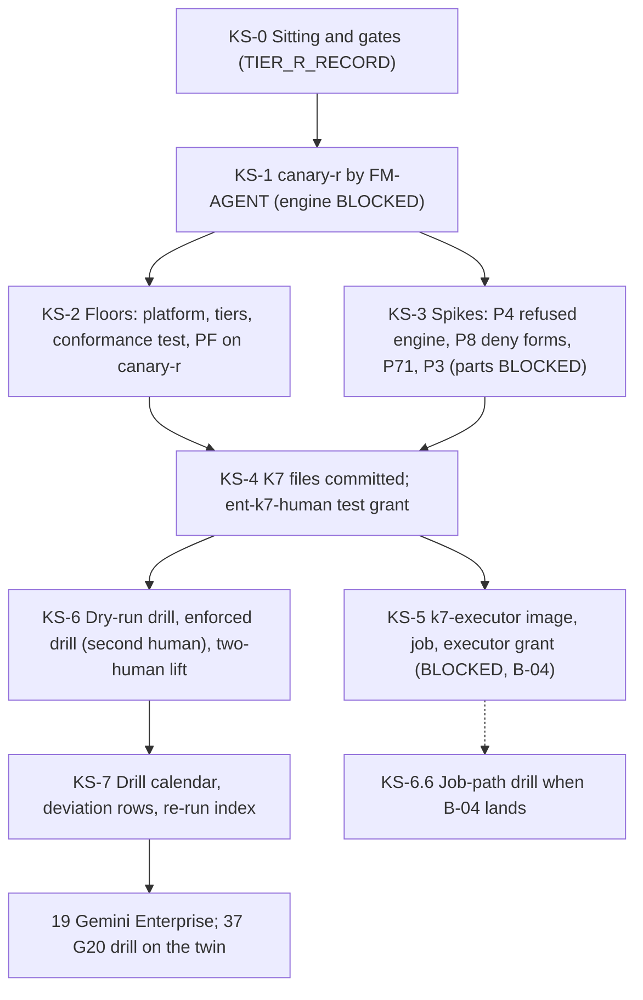

# 18. Model Armor floor, nonprod spikes and the fleet kill switch

## Status
- Owner: the platform owner
- Last reviewed: 2026-09-15
- Last executed: never
- Stage: review §2 stage 16 ([../13-setup-procedure-review.md](../13-setup-procedure-review.md) §2, "Nonprod spikes and K7"). Runs after file 17 (`TIER_R_RECORD`) and before files 19 and 37. It opens the drill history that gate line G20 reads (a K7 drill on `fld-agents-p-sa-nonprod` younger than 30 days at the grant); the drill that G20 finally counts is re-run in file 37.
- Step prefix: `KS`. Steps: 37. BLOCKED: KS-1.5, KS-3.3, KS-3.5, KS-3.6, KS-5.1, KS-5.2, KS-5.3, KS-6.6 (code: README B-04, extended here to the canary and spike engine sources and the P3 stand-in; KS-3.6 also waits on an `ent-bootstrap-module` entitlement for `fld-agents-w-nonprod` that 12 does not create). IRREVERSIBLE: KS-1.3 (the `canary-r` project id).
- Replaces: [../../wall-e/SETUP.md](../../wall-e/SETUP.md) Phase 12c step 7's floor commands (salvaged: the command shape with filters, enforcement and `--vertex-ai-enforcement-type`; not copied: "a stricter project floor wins", a folder floor written by an agent procedure, a project floor without filters or enforcement) and SETUP §5's K7 row ("Not Wall-E's. The platform owner applies the four pre-written levers"), for which no procedure existed (S052).
- Design built: [../06-gateways-model-armor-perimeter.md](../06-gateways-model-armor-perimeter.md) §3.2 (floor hierarchy, P84) and §4.3 (spike 1, P3); [../04-identity-and-privileged-access.md](../04-identity-and-privileged-access.md) §3 (deny policy, P8, P61), §4 (PAB, P60) and §9 (K7, P67, P70); [../02-landing-zone-and-tiers.md](../02-landing-zone-and-tiers.md) §4.2 (allow-lists, P44) and §4.3 (CC-1, P4, P42); [../05-registry-and-autonomy-contract.md](../05-registry-and-autonomy-contract.md) §2.2 (P71).
- Decisions applied: SD-01 (bootstrap deviation), SD-22 (deny principal form), SD-41 (floor precedence), SD-46 (`ent-bootstrap-module`), SD-36 (G20), all from records signed in [03](03-decisions-and-people.md).
- Closes: S052, S073, X-RQB-08 (this file's half), S072 (this file's half), S085 (this file's half). See "Findings closed and deferred".
- Every command, flag, role, API field and console path was read on Google's pages on 2026-09-15 ("Sources"). Nothing was run against the live organisation while writing.

## What this part builds

| Built | Where | Variable or record |
|---|---|---|
| `canary-r`: a Tier R nonprod agent project made by FM-AGENT (17) under `ent-bootstrap-module-r-nonprod`, with a probe service account `canary-probe@` declared in its manifest; its engine is BLOCKED on code | `fld-agents-r-nonprod` | `CANARY_R_PROJECT`, `CANARY_R_PROJECT_NUMBER`, `ENT_PROJECT_REPAIR_CANARY_R`, `ENT_DEPLOY_CREDENTIAL_HOLDER_CANARY_R` |
| Model Armor floors: the platform floor on `fld-agentic-platform` and the four tier floors (`fld-agents-w`, `fld-agents-p`, `fld-agents-p-sa`, `fld-controllers`), written only under `ent-folder-admin`; the conformance-ordering test | folders | `FLOOR_RECORD` |
| The project-floor rule (PF): every project that calls `generateContent` gets a full `Custom` project floor with the `VERTEX_AI` integration, Vertex AI Cloud Logging and the tier's enforcement type, and the Agent Platform service agent gets `roles/modelarmor.user`; first applied to `canary-r` | `canary-r`; re-run points in 34, 40 | the PF block in KS-2.9 |
| Spike records P3, P4 (CC-1), P8, P71, each with what was proven and what is BLOCKED | build log and interim evidence location | `SPIKE_P3_RECORD`, `SPIKE_P4_RECORD`, `SPIKE_P8_RECORD`, `SPIKE_P71_RECORD` |
| The committed K7 lever files, generated from the live policies: `k7/restrict-service-usage/<folder>.json` per tier folder, `k7/scheduler-pause.txt`, `k7/pab-empty.json`, `k7/deny-agents-halt.template.json` with its checked `k7/deny-agents-halt.permissions.txt` | `PLATFORM_REPO_DIR/k7/` | `K7_POLICY_DIR` |
| The `ent-k7-human` pair proven by a test grant; the `ent-k7-executor` pair's first grant (BLOCKED with the job) | organisation and `fld-agentic-platform` | — |
| The `k7-executor` Cloud Run job, image built in `CICD_PROJECT` and attested by `vuln-gated`: BLOCKED on code | `CORE_PROJECT` | `K7_JOB` |
| A dry-run drill, then an enforced drill, on each nonprod tier folder (`fld-agents-r-nonprod`, `-w-nonprod`, `-p-nonprod`, `-p-sa-nonprod`) on the human path, with KF-1 under 60 s and end to end under 5 min measured; the two-human lift with a KF-2 hold probe | tier folders | `K7_FIRST_DRILL_RECORD` |
| The K7 rows of the drill calendar | `DRILL_CALENDAR` | DR-18-1 to DR-18-5 |

Variables new against plan §5, handed to README's variable list: `CANARY_R_PROJECT_NUMBER`, `ENT_PROJECT_REPAIR_CANARY_R`, `ENT_DEPLOY_CREDENTIAL_HOLDER_CANARY_R` (the per-project pattern of plan §5), `FLOOR_RECORD`, `SPIKE_P3_RECORD`, `SPIKE_P4_RECORD`, `SPIKE_P8_RECORD`, `SPIKE_P71_RECORD`, `K7_FIRST_DRILL_RECORD`, `DENY_SA_FORM`.

What the old text got wrong, and must not come back:

| Old text | Why it fails | Here instead |
|---|---|---|
| "folder-level floor settings apply to every project inside the folder, and a stricter project floor wins" (SETUP 12c step 7) | Google: "project-level floor settings override conflicting folder-level floor settings" (S073). A loose project floor silently replaces the folder's. | §2 states Google's rule; "never looser" is held by who may write a project floor (PAM only, deny rule R5) and by the read-back in PF. |
| Project floor with only `--add-integrated-services=VERTEX_AI` and `--enable-vertex-ai-cloud-logging` | No filters, no `--enable-floor-setting-enforcement`, default `INSPECT_ONLY`: screening against an unenforced, filterless floor (S073). | PF writes filters, enforcement, integration, enforcement type and logging in one command, then asserts every field. |
| "The folder's Model Armor floor applies to these calls" (mo/07 Mo-11) | Inline enforcement on `generateContent` is set "only at the project level", and needs `roles/modelarmor.user` for the Agent Platform service agent (X-RQB-08). | PF includes the service identity and the grant; 40 re-runs PF on `MO_PROJECT` at S4. |
| `principalSet://agents.global.org-ORG_ID.system.id.goog/*` in a deny policy | Deny policies "don't support sets of agent identities"; the deny form for all agents of a project is `principal://agents.global.org-ORG_ID.system.id.goog/resources/aiplatform/projects/PROJECT_NUMBER` (S072, SD-22). | KS-3.2 reads the entry back; KS-3.3 proves it with a denied call (BLOCKED on code). |
| K7 "pre-written levers" with no job, no files, no canary, no drill, no gate line (S052) | The fleet stop is absent at the grant. | §4 to §7, and DR-18 rows feeding G20. |



## Preconditions

- [ ] File 17 is complete: `TIER_R_RECORD` exists and is signed; the FM-AGENT procedure and the zero-diff checker are committed in `PLATFORM_REPO_DIR`.
- [ ] File 16: `REGISTER_PATH` and `MANIFEST_SCHEMA_PATH` exist; register CI or its signed manual fallback is in force.
- [ ] File 13: `gcp.restrictServiceUsage` allow-lists applied on every tier folder; `deny-agents-platform` (`DENY_AGENTS_PLATFORM`) at `fld-agentic-platform` with R1 to R6; `pab-agents` (`PAB_AGENTS`) created; the custom constraint `custom.allowlistedEgressAgentGatewaysForAgentEngine` (CC-1) created, in dry run or enforced (KS-3.1 handles both).
- [ ] File 12: `ENT_FOLDER_ADMIN`, `ENT_PLATFORM_POLICY`, `ENT_K7_HUMAN`, `ENT_K7_HUMAN_SCHEDULER`, `ENT_K7_EXECUTOR`, `ENT_K7_EXECUTOR_SCHEDULER`, `ENT_BOOTSTRAP_MODULE_R_NONPROD`, `ENT_DEPLOY_CREDENTIAL_HOLDER_CORE` set and tested (PA-3.4 for `ent-k7-human`; PA-3.5 hands the executor test to this file).
- [ ] Files 10 and 11: `CICD_PROJECT`, `CORE_PROJECT`, `AR_PLATFORM`, `SA_CI_BUILD`, `SA_K7_EXECUTOR`, `BINAUTHZ_ATTESTOR`, `KEY_BINAUTHZ` set; `ci/BUILD-CONTRACT.md` merged.
- [ ] File 14 and 15 part A: central logging live (floor writes, org-policy changes and PAM grants reach `LOGGING_PROJECT`); `NOTIF_CH_EMAIL_CORE` and the paging service exist, so an `ent-k7-human` activation pages the second human.
- [ ] File 03 signed: SD-01, SD-22, SD-36, SD-41, SD-46, P67; the NAMES record lists the `canary-r` project id (Assumption: 03's names record carries it; if not, a signed names amendment comes first, because the id is permanent). `SECOND_HUMAN_EMAIL` named; `SECURITY_REVIEWER_EMAIL` named or *tbd*.
- [ ] File 01: `~/.platform-env` with the helpers; `DRILL_CALENDAR` holds row DR-18-1; `DEVIATION_REGISTER` and `EVIDENCE_REGISTER` exist.
- [ ] Workstation: gcloud with the `beta` component (KS-2.9 and KS-5.1 use it), `jq`, `curl`, `python3`.
- [ ] Two sittings booked with the second human: KS-1.2's two approvals, `ent-bootstrap-module-r-nonprod` and `ent-platform-policy` (20 min), and the enforced drill and lift KS-6.3 to KS-6.5 (half a day, present in person or on a shared screen; the second human reads back KF-2's attachment point and principal list before it is attached). The drill window is announced to IT security's desk at least one business day ahead.

## People needed

| Role | Does | Present at |
|---|---|---|
| Platform owner, as `sa-1-admin@` (member of `platform-owners@` and `platform-approvers@`) | Pulls every lever, runs every step, requests every grant | every step |
| Second human (`SECOND_HUMAN_EMAIL`, approves as `sa-2-admin@`) | Approves `ent-bootstrap-module-r-nonprod`, `ent-folder-admin` and `ent-platform-policy` grants (12's approver sets); required reviewer on `k7/`; present for the enforced drill; receives the activation page; co-signs the lift record | KS-1.2, KS-2.4, KS-3.2, KS-4.1, KS-6.3 to KS-6.5 |
| Security reviewer (`SECURITY_REVIEWER_EMAIL`), once named | Signs the P-SA tier floor content (06 §3.2); witnesses and signs the drill record (04 §9.6); second approver of `ent-platform-policy` after PA-8.1 | KS-2.3, KS-6.5 (until named: the second human signs alone and the gap is recorded) |
| IT security desk | Acknowledges the announced drill; confirms the `ent-k7-human` activation page reached the desk | KS-6.1, KS-6.3 |
| IT security (organisation floor owner, 06 §3.2) | Confirms or sets the organisation floor | KS-2.2 |

Hands-on time about 3 to 4 days; elapsed 1 to 2 weeks (register merge, approvals, the drill window).

Conventions of [01](01-prerequisites-and-conventions.md) apply to every step: `checkpoint <id> START` before ACTION, `checkpoint <id> DONE <witness> <evidence>` after VERIFY; records named `<date>-<step>-<slug>-v<n>` under `BUILD_LOG_DIR/records/` (text) or `EVIDENCE_INTERIM_LOCATION` (screenshots and signed PDFs), each registered with `evidence_add`. Deviation rows use ids `BD-18-<n>`. With no default project (01), every gcloud call passes `--project`, `--folder` or `--organization`, and quota-bound calls pass `--billing-project="$CICD_PROJECT"` (12's quota project). Model Armor calls set the endpoint override for that one command only, through the environment variable form of the `api_endpoint_overrides/modelarmor` property; nothing is written to the gcloud configuration.

## Facts this file relies on, read on 2026-09-15

| Fact | Source | Consequence here |
|---|---|---|
| "if floor settings conflict, the settings lower in the resource hierarchy take precedence. Similarly, project-level floor settings override conflicting folder-level floor settings." Template conformance is defined at organisation and folder; inline enforcement at project. Admin role `roles/modelarmor.floorSettingsAdmin`. Global endpoint override `api_endpoint_overrides/modelarmor "https://modelarmor.googleapis.com/"` | Configure floor settings (updated 2026-09-15) | §2 precedence statement; folder floors are conformance only; PF is the only inline screen |
| `gcloud model-armor floorsettings update --full-uri=...` flags: `--pi-and-jailbreak-filter-settings-enforcement`, `--pi-and-jailbreak-filter-settings-confidence-level`, `--malicious-uri-filter-settings-enforcement`, `--rai-settings-filters`, `--[no-]enable-multi-language-detection`, `--enable-floor-setting-enforcement` (TRUE/FALSE), `--add-integrated-services`, `--vertex-ai-enforcement-type` (`INSPECT_ONLY` default, `INSPECT_AND_BLOCK`), `--[no-]enable-vertex-ai-cloud-logging`; no floor-level Cloud Logging flag; `describe --full-uri` | gcloud reference (updated 2026-05-27) | KS-2.5, KS-2.6, PF. The reference spells values `enable`/`high`, the concept page `ENABLED`/`LOW_AND_ABOVE`; each write is asserted by `describe` |
| REST `FloorSetting`: `filterConfig`, `integratedServices` enum `AI_PLATFORM`, `GOOGLE_MCP_SERVER`; `enableFloorSettingEnforcement`; `aiPlatformFloorSetting` with `enableCloudLogging`, `inspectOnly`, `inspectAndBlock`; `floorSettingMetadata.multiLanguageDetection.enableMultiLanguageDetection` | Model Armor REST reference | the gcloud value `VERTEX_AI` reads back as `AI_PLATFORM`; 06 §3.2's organisation-level `enableCloudLogging` is not a floor-level field (correction for 06) |
| RAI filter types `SEXUALLY_EXPLICIT`, `HATE_SPEECH`, `HARASSMENT`, `DANGEROUS`; confidence `LOW_AND_ABOVE`, `MEDIUM_AND_ABOVE`, `HIGH`; enforcement `ENABLED`, `DISABLED` | Model Armor REST templates reference | filter JSON of §2 |
| Integration: "set floor settings only at the project level"; grant `roles/modelarmor.user` to `service-PROJECT_NUMBER@gcp-sa-aiplatform.iam.gserviceaccount.com`; fail-open when Model Armor is unavailable; verify by a violating `generateContent` returning `blockReason` `MODEL_ARMOR` | Model Armor and Agent Platform integration (updated 2026-09-15) | PF; its live proof runs where a model is called (34, 35, 40) |
| Regional templates use `api_endpoint_overrides/modelarmor "https://modelarmor.LOCATION.rep.googleapis.com/"`; `gcloud model-armor templates create TEMPLATE --project --location --rai-settings-filters=JSON` | Manage templates page; gcloud `templates create` reference | KS-2.8 |
| Agent identities: all agents of a project `principal://agents.global.org-ORG_ID.system.id.goog/resources/aiplatform/projects/PROJECT_NUMBER`; "The following policy types don't support sets of agent identities: Deny"; single service account in deny `principal://iam.googleapis.com/projects/-/serviceAccounts/EMAIL`; `principalSet://cloudresourcemanager.googleapis.com/projects/N/type/ServiceAccount` shown for allow policies | IAM principals (updated 2026-09-14) | KS-3.2 tests whether the service-account set is accepted in deny, with the single-account fallback |
| `gcloud iam policies create\|get\|update\|delete POLICY_ID --attachment-point=cloudresourcemanager.googleapis.com/folders/ID --kind=denypolicies --policy-file=FILE [--etag]`; "policy changes take effect within 2 minutes … can take 7 minutes or more"; role `roles/iam.denyAdmin`; a denied permission is "of the format: `service_fqdn/resource.action`" and "Only some permissions can be denied" (supported list; no wildcard form documented, re-read 2026-09-16) | Deny access page; Permissions supported in deny policies; `gcloud iam policies update` reference | KF-2's permission list is enumerated and checked in KS-4.1, never a wildcard; P8 |
| Policy Troubleshooter: `gcloud policy-intelligence troubleshoot-policy iam RESOURCE --principal-email --permission` (GA: allow and deny; beta adds PAB); the principal "must refer to a user, a single service account, or a service account principal set" | Troubleshoot access page | usable for `canary-probe@`; not documented for agent identities, so P8's agent half rests on a denied call |
| PAB: `gcloud iam principal-access-boundary-policies update … --details-rules \| --clear-details-rules`; `describe`; `search-policy-bindings`; "the resources that a principal is eligible to access are the union of all resources in all Principal Access Boundary policies"; fail closed | PAB create, edit, view and concepts pages (updated 2026-09-14) | KF-4 is `--clear-details-rules` on `pab-agents`; because eligibility is a union, KF-4 cannot be folder-selective (design correction, KS-4.1) |
| `gcp.restrictServiceUsage`: `allowedValues` for allow-list; "Request is disallowed by organization's constraints/gcp.restrictServiceUsage constraint"; excludes IAM, Logging, Monitoring; eventual consistency; `gcloud org-policies set-policy FILE --update-mask` "can be empty, or have values `policy.spec`, `policy.dry_run_spec` or `*`. If the policy does not contain the dry_run_spec and update-mask flag is not provided, then it defaults to `policy.spec`" (re-read 2026-09-16; the short forms `spec` and `dryRunSpec` are **not** documented and must never be used); dry-run violations `protoPayload.metadata.dryRunResult = "DENIED" AND protoPayload.metadata.liveResult = "ALLOWED"`; `gcloud org-policies describe CONSTRAINT --folder=ID [--effective]` | Restricting resources (updated 2026-09-09); dry-run policy page; gcloud `org-policies describe` | KF-1 and its dry-run pass |
| CC-1 YAML (`resource_types: aiplatform.googleapis.com/ReasoningEngine`, condition on `resource.spec.deploymentSpec.agentGatewayConfig.agentToAnywhereConfig.agentGateway`, `CREATE`, `UPDATE`, `ALLOW`); "VPC Service Controls are not supported with Agent Gateway" | Route Agent Runtime traffic through Agent Gateway (updated 2026-09-08) | KS-3.1 |
| An Agent Runtime instance can be created without agent code (`client.agent_engines.create()` for Sessions and Memory Bank); REST `POST https://LOCATION-aiplatform.googleapis.com/v1/projects/P/locations/L/reasoningEngines`, `GET`, `list`, `DELETE` | Memory Bank set-up page; REST `reasoningEngines` reference | KS-3.1 creates a code-less engine that CC-1 must refuse |
| Agent Gateway and connectivity template created by `gcloud network-services agent-connectivity-templates import NAME --source --location` and `gcloud network-services agent-gateways import NAME --source --location`; template fields `accessPath`, `deploymentModel`, `egressNetworkConfig.networkAttachment`, `dnsPeeringConfig`, `vpcEgress` (`PRIVATE_RANGES_ONLY`, `ALL_TRAFFIC`); gateway fields `protocols`, `googleManaged.governedAccessPath`, `agentConnectivityTemplate`, `registries` | Set up VPC connectivity for Agent Gateway (updated 2026-09-11) | KS-3.5, KS-3.6 |
| `gcloud pam grants create --entitlement --requested-duration --justification [--additional-email-recipients] [--organization\|--folder] --location`; `grants search --caller-relationship=had-created`; `revoke`; `pam entitlements list --folder\|--organization --location` | gcloud `pam` reference | every grant here |
| `gcloud run jobs deploy JOB --image --region --service-account --binary-authorization=default --tasks --max-retries --task-timeout`; `gcloud run jobs execute JOB --region --args --wait` | gcloud `run jobs deploy`, `execute` references | KS-5.2, KS-6.6 |
| `sign-and-create` exists in `gcloud beta` and `alpha` only (the GA reference returns 404), with `--artifact-url`, `--attestor`, `--attestor-project`, `--keyversion` (fully qualified) | gcloud beta reference; search result pages | KS-5.1 |

## 0. The sitting

### KS-0.1 Open the sitting and check the gates

- **WHO:** Platform owner.
- **WHERE:** Shell with `~/.platform-env` sourced, signed in as `sa-1-admin@`.
- **ACTION:**

```bash
source ~/.platform-env
checkpoint KS-0.1 START
penv_guard
"$PLATFORM_REPO_DIR/tools/decision-need.sh" NAMES SD-01 SD-22 SD-36 SD-41 SD-46 P67
need SA_1_ADMIN ORG_ID REGION FLD_AGENTIC_PLATFORM FLD_AGENTS_R FLD_AGENTS_R_NONPROD FLD_AGENTS_R_PROD FLD_AGENTS_W FLD_AGENTS_W_NONPROD FLD_AGENTS_W_PROD FLD_AGENTS_P FLD_AGENTS_P_NONPROD FLD_AGENTS_P_PROD FLD_AGENTS_P_SA FLD_AGENTS_P_SA_NONPROD FLD_AGENTS_P_SA_PROD FLD_CONTROLLERS FLD_PLATFORM_CORE FLD_GEMINI_ENTERPRISE CICD_PROJECT CORE_PROJECT AR_PLATFORM SA_CI_BUILD SA_K7_EXECUTOR BINAUTHZ_ATTESTOR KEY_BINAUTHZ ENT_FOLDER_ADMIN ENT_PLATFORM_POLICY ENT_K7_HUMAN ENT_K7_HUMAN_SCHEDULER ENT_K7_EXECUTOR ENT_K7_EXECUTOR_SCHEDULER ENT_BOOTSTRAP_MODULE_R_NONPROD ENT_DEPLOY_CREDENTIAL_HOLDER_CORE DENY_AGENTS_PLATFORM PAB_AGENTS TIER_R_RECORD REGISTER_PATH GRP_PLATFORM_APPROVERS GRP_PLATFORM_OWNERS SECOND_HUMAN_EMAIL DRILL_CALENDAR DEVIATION_REGISTER EVIDENCE_REGISTER BUILD_LOG_DIR PLATFORM_REPO_DIR
test "$(gcloud config get account 2>/dev/null)" = "$SA_1_ADMIN" || { echo "not sa-1-admin@: stop"; false; }
test -s "$PLATFORM_REPO_DIR/$TIER_R_RECORD" || test -s "$TIER_R_RECORD" || { echo "TIER_R_RECORD missing: stop"; false; }
grep -q '^| DR-18-1 |' "$DRILL_CALENDAR" || { echo "DR-18-1 missing from DRILL_CALENDAR (01 PR-4.3): stop"; false; }
for F in "$FLD_AGENTS_R_NONPROD" "$FLD_AGENTS_W_NONPROD" "$FLD_AGENTS_P_NONPROD" "$FLD_AGENTS_P_SA_NONPROD"; do
  printf '%s ' "$F"; gcloud org-policies describe gcp.restrictServiceUsage --folder="$F" --effective --format=json | jq -c '[.spec.rules[].values.allowedValues[]?] | length'
done
gcloud iam policies get "$(basename "$DENY_AGENTS_PLATFORM")" --attachment-point="cloudresourcemanager.googleapis.com/folders/${FLD_AGENTIC_PLATFORM}" --kind=denypolicies --format="value(name,etag)"
gcloud iam principal-access-boundary-policies describe "$(basename "$PAB_AGENTS")" --organization="$ORG_ID" --location=global --format="value(name,details.enforcementVersion)"
```

- **VERIFY:** `penv_guard` silent; `decision-need.sh` prints `SIGNED` for every id; every `need` passes; the account check passes; each of the four nonprod tier folders prints a non-zero allow-list length (13 applied the allow-lists); the deny policy and `pab-agents` describe without error, and `pab-agents` shows enforcement version `4`. Also read `SECURITY_REVIEWER_EMAIL`: if `*tbd*`, write it in the checkpoint note, because KS-2.3 and KS-6.5 record the missing signature.
- **ROLLBACK:** Read only.
- **EVIDENCE:** The outputs as `<date>-KS-0.1-gates-v1` in `BUILD_LOG_DIR/records/`. E-xx: E-05. TISAX: 1.3.1 (the Tier R assets exist before the spikes use them).

## 1. `canary-r`: the drill canary project

`canary-r` is the canary 04 §9.6 keeps "in `fld-agents-r/nonprod`" so that a K7 drill has something to stop. It is an agent project like any other, so it is made by FM-AGENT (17) from a merged register row, under the non-singleton bootstrap entitlement (SD-46), never by `gcloud projects create` from this page. It also hosts the P4, P8 and P71 spikes, so no second throwaway project is needed for them.

### KS-1.1 Merge the `canary-r` register row and manifest

- **WHO:** Platform owner writes; two human reviewers under branch protection (the second human is one).
- **WHERE:** `PLATFORM_REPO_DIR`, a branch, then a pull request to `PLATFORM_REPO_REMOTE`.
- **ACTION:** Add the row and manifest in the shapes 16 committed (`REGISTER_PATH`, `MANIFEST_SCHEMA_PATH`). The values that matter to this file:

| Field | Value | Why |
|---|---|---|
| `agent_id` | `canary-r` | 04 §9.6 |
| `tier`, `env` | `R`, `nonprod` | parent `fld-agents-r-nonprod` |
| `owner` | `platform-owners@` | platform asset, not a business agent |
| `purpose` | K7 drill canary and nonprod spike host (P4, P8, P71); no business data, no users | 10 §3 (not an AI system in service: `ai_act_class=not-ai-system`) |
| `apis` | the Tier R subset `aiplatform`, `modelarmor`, `logging`, `monitoring`, `iap`, `networkservices`, `networksecurity`, `dns`, `compute`, `agentidentity`, `agentidentitycredentials`, `storage`, `observability`; **not** `agentregistry` (P71) | 02 §4.2 row `fld-agents-r-*` (every name is on it; `observability` as 10 CP-1.6 recorded) |
| `service_accounts` | `canary-probe` (drill and spike fixture, holds no standing role) | KS-3.2, KS-6.4 |
| `publish_to_gemini`, `machine_callers`, `model_pin` | `false`, empty, none | nothing may call it or publish it |
| `project_floor` | `Custom`, `INSPECT_ONLY` (Tier R) | 06 §3.2, PF |
| `budget` | the Tier R nonprod value of 02 §2.2 | — |

```bash
need PLATFORM_REPO_DIR REGISTER_PATH
git -C "$PLATFORM_REPO_DIR" switch main && git -C "$PLATFORM_REPO_DIR" pull --ff-only
git -C "$PLATFORM_REPO_DIR" switch -c ks-1-1-canary-r
# edit REGISTER_PATH and the manifest file for canary-r as the table says, in 16's schema
git -C "$PLATFORM_REPO_DIR" add -A
git -C "$PLATFORM_REPO_DIR" commit -m "register: canary-r (Tier R nonprod, K7 canary; setup 18 KS-1.1)"
git -C "$PLATFORM_REPO_DIR" push -u origin ks-1-1-canary-r
```

- **VERIFY:** Register CI (16) passes, or its signed manual parse is attached; the pull request merges with two human approvals including the second human; `git -C "$PLATFORM_REPO_DIR" log --oneline -1 origin/main -- "$REGISTER_PATH"` shows the merge.
- **ROLLBACK:** Revert by pull request before KS-1.3.
- **EVIDENCE:** Merge commit id as `<date>-KS-1.1-canary-r-row-v1`. E-xx: E-05. TISAX: 1.3.1, 5.2.1.

### KS-1.2 Obtain the `ent-bootstrap-module-r-nonprod` **and** `ent-platform-policy` grants

- **WHO:** Platform owner requests; **approver: the second human** for both (as `sa-2-admin@`, 12's approver set; `ent-platform-policy` also names the security reviewer once appointed, 12 PA-8.1).
- **WHERE:** Shell; the second human in the console, Privileged Access Manager → Approve grants → Pending approval.
- **ACTION:** One FM-AGENT run needs **two** entitlements, not one. `ent-bootstrap-module-r-nonprod` is the folder bundle (`projectCreator`, `serviceUsageAdmin`, `serviceAccountCreator`, `projectIamAdmin` on `fld-agents-r-nonprod`, 12 line 119) that builds the project; but 17 FM-2.15 (the deny entries — the FM-3 table gives `canary-r` three entries through FM-3.2) and 17 FM-2.16 (`pab_bindings: pab-agents`) both run **under `ENT_PLATFORM_POLICY`** at the organisation (`orgpolicy.policyAdmin`, `iam.denyAdmin`, `iam.principalAccessBoundaryAdmin`, 12 line 107). Without it the run stops after the project, budget and service accounts exist, leaving the deny fence and the PAB binding missing — and KS-3.2 then has nothing to read back.

```bash
need ENT_BOOTSTRAP_MODULE_R_NONPROD ENT_PLATFORM_POLICY FLD_AGENTS_R_NONPROD CICD_PROJECT SECOND_HUMAN_EMAIL
checkpoint KS-1.2 START
gcloud pam grants create --entitlement="$ENT_BOOTSTRAP_MODULE_R_NONPROD" --requested-duration=3600s --justification="register row canary-r (merge <commit>); setup 18 KS-1.3 FM-AGENT" --additional-email-recipients="$SECOND_HUMAN_EMAIL" --billing-project="$CICD_PROJECT"
gcloud pam grants create --entitlement="$ENT_PLATFORM_POLICY" --requested-duration=3600s --justification="register row canary-r (merge <commit>); setup 18 KS-1.3 FM-2.15 deny entries and FM-2.16 pab-agents binding" --additional-email-recipients="$SECOND_HUMAN_EMAIL" --billing-project="$CICD_PROJECT"
```

  `ent-platform-policy` lasts one hour like the bootstrap grant; if FM-AGENT reaches FM-2.15 after it has expired, re-request it there rather than extending the run.
- **VERIFY:** For **each** entitlement, `gcloud pam grants search --entitlement=<id> --caller-relationship=had-created --billing-project="$CICD_PROJECT" --format="table(name.basename(),state,createTime)"` shows the grant `ACTIVE` after the second human's approval; each approval event names `sa-2-admin@`.
- **ROLLBACK:** `gcloud pam grants revoke <grant> --reason="not needed" --billing-project="$CICD_PROJECT"` for both.
- **EVIDENCE:** Both grant names and approvers in `<date>-KS-1.2-bootstrap-grant-v1`. E-xx: none. TISAX: 4.1.3, 4.2.1.

### KS-1.3 Run FM-AGENT for `canary-r`

- **WHO:** Platform owner, inside the KS-1.2 grant.
- **WHERE:** Shell; 17's FM-AGENT procedure.
- **ACTION:** > **IRREVERSIBLE**: the project id is permanent. Confirm before running: the id printed below equals the NAMES record, is unused (`gcloud projects describe <id>` returns NOT_FOUND or permission denied, never an existing project), and the KS-1.2 grant is `ACTIVE`. Gate: the signed NAMES record of 03 and KS-1.1 `DONE`.

```bash
test -n "$("$PLATFORM_REPO_DIR/tools/decision-value.sh" NAMES CANARY_R_PROJECT)" || { echo "STOP: canary-r id not in the signed NAMES record"; false; }
CANARY_ID="$("$PLATFORM_REPO_DIR/tools/decision-value.sh" NAMES CANARY_R_PROJECT)"; echo "$CANARY_ID"
checkpoint KS-1.3 START
```

  Then run 17's FM-AGENT steps in order with: register row `canary-r`, parent `FLD_AGENTS_R_NONPROD`, tier `R`, env `nonprod`, **both** entitlements of KS-1.2 (`ENT_BOOTSTRAP_MODULE_R_NONPROD` for FM-2.1 to FM-2.14 and FM-2.17 onwards, `ENT_PLATFORM_POLICY` for FM-2.15 and FM-2.16), and the checkpoint prefix `KS-1.3/`. FM-AGENT produces what the `agent-project` module would: placement, labels, tags, the manifest's APIs only, budget, Essential Contacts, regional `_Default` and `_Trace`, the `canary-probe@` account, the deny and PAB entries (SD-22 principal form), the monitoring baseline, the project floor (PF, §2) and the two per-project entitlements from 12's templates, then removes the creator's Owner. This page does not restate 17's commands.
- **VERIFY:** FM-AGENT's own VERIFY lines pass; `gcloud projects describe "$CANARY_ID" --format="value(parent.id,lifecycleState,labels.tier,labels.env)"` prints `FLD_AGENTS_R_NONPROD ACTIVE r nonprod` (label values as 17 writes them).
- **ROLLBACK:** **IRREVERSIBLE** for the project id (confirm and gate as in ACTION). Everything else is removed by 17's FM-REVOKE if the project must go; the id stays reserved.
- **EVIDENCE:** 17's FM-AGENT records under `KS-1.3/`; the deviation row 17 appends (`MOD`). E-xx: E-05. TISAX: 5.2.2 (nonprod environment), 1.3.1.

### KS-1.4 Record `canary-r` and run the zero-diff checker

- **WHO:** Platform owner.
- **WHERE:** Shell.
- **ACTION:**

```bash
need CANARY_ID
penv_set CANARY_R_PROJECT "$CANARY_ID"
penv_set CANARY_R_PROJECT_NUMBER "$(gcloud projects describe "$CANARY_R_PROJECT" --format='value(projectNumber)')"
penv_set ENT_PROJECT_REPAIR_CANARY_R "$(gcloud pam entitlements list --project="$CANARY_R_PROJECT" --location=global --filter="name~project-repair" --format='value(name)' --billing-project="$CICD_PROJECT")"
penv_set ENT_DEPLOY_CREDENTIAL_HOLDER_CANARY_R "$(gcloud pam entitlements list --project="$CANARY_R_PROJECT" --location=global --filter="name~deploy-credential-holder" --format='value(name)' --billing-project="$CICD_PROJECT")"
# 17's zero-diff checker, with the canary-r manifest as input; output to the records directory
```

  The `--project` form of `pam entitlements list` is shown in the reference's examples. Run the checker exactly as 17 committed it, writing `records/<date>-KS-1.4-canary-r-zero-diff-v1.txt`.
- **VERIFY:** `need CANARY_R_PROJECT CANARY_R_PROJECT_NUMBER ENT_PROJECT_REPAIR_CANARY_R ENT_DEPLOY_CREDENTIAL_HOLDER_CANARY_R` passes; each entitlement variable holds exactly one name; the checker reports zero differences — a difference on the FM-2.15 deny entries or the FM-2.16 PAB binding means `ENT_PLATFORM_POLICY` was missing or had expired during the run (KS-1.2): re-request it and re-run those two FM steps, never accept them as `pending` here, because KS-3.2 reads the entries back and KS-6.3's KF-2 principal list is built from them; `gcloud projects get-iam-policy "$CANARY_R_PROJECT" --flatten="bindings[].members" --filter="bindings.role=roles/owner" --format="value(bindings.members)"` prints nothing; `gcloud services list --enabled --project="$CANARY_R_PROJECT" --filter="config.name=agentregistry.googleapis.com" --format="value(config.name)"` prints nothing.
- **ROLLBACK:** Variables: `penv_set --force` with a build-log line. A checker difference is repaired through FM-AGENT, never by hand here.
- **EVIDENCE:** Checker output and variable names in `<date>-KS-1.4-canary-r-zero-diff-v1`. E-xx: E-05. TISAX: 1.3.1, 4.2.1.

### KS-1.5 The canary engine — BLOCKED

- **WHO:** Platform owner.
- **WHERE:** —
- **ACTION:** > **BLOCKED**: Needs: the canary engine source (a minimal agent that answers one fixed query and makes no tool call), its gateway file, and its deploy configuration with `identity_type` `AGENT_IDENTITY` and `agent_gateway_config.agent_to_anywhere_config.agent_gateway` naming the `canary-r` egress gateway (the SDK form on the Agent Gateway runtime page). Commit it in: `PLATFORM_REPO_REMOTE`, `k7/canary/`, with green CI. Unblocked by: that commit id, recorded in the build log against README B-04 (extended by this file). Gate waiting: KS-3.5 (P71 part b), KS-6.6 (the job-path drill that measures a refused engine query). Until then: `checkpoint KS-1.5 BLOCKED - - "canary engine code, B-04"`.

  When unblocked, the sequence is: import the egress gateway `canary-r-egress` in `REGION` with `gcloud network-services agent-gateways import canary-r-egress --source=k7/canary/gateway.yaml --location="$REGION" --project="$CANARY_R_PROJECT"` (Tier R: default `PRIVATE_RANGES_ONLY`, no connectivity template, 06 §4.2; `registries` naming `AGENT_REGISTRY` in `CORE_PROJECT`); add the gateway to CC-1's allowed list under `ent-platform-policy` (13's constraint file, pull request); deploy the engine in `REGION` with the engine key from `KR_ENGINES` that FM-AGENT created; record the engine resource name in the build log; confirm one query answers.
- **VERIFY:** Until unblocked: the BLOCKED line exists and README's BLOCKED index row B-04 lists "18 KS-1.5 canary engine".
- **ROLLBACK:** Nothing created.
- **EVIDENCE:** The BLOCKED checkpoint line. E-xx: none. TISAX: 1.4.1 (known gap recorded).

## 2. Model Armor floors

**Google's precedence rule, stated once for every file.** "If floor settings conflict, the settings lower in the resource hierarchy take precedence. Similarly, project-level floor settings override conflicting folder-level floor settings" (Configure floor settings, read 2026-09-15). Consequences the procedures rely on:

1. Organisation and folder floors are **template conformance** only: a new template below them is refused. They screen no traffic.
2. Inline screening of `generateContent` exists only through a **project** floor with the `VERTEX_AI` integration, and it fails open when Model Armor is unavailable. It is detection-grade in every mode (06 §3.1).
3. A project floor overrides its folders, so "never looser than the tier" is not a property of the hierarchy. It is held by three things only: nobody holds `roles/modelarmor.floorSettingsAdmin` standing on any project (PAM only, 12); deny rule R5 denies `modelarmor.googleapis.com/floorSettings.update` to every agent-project principal (13); and PF's read-back, repeated by the drift job daily (16, BLOCKED on code until then: 42's monthly manual read).
4. Folder floor writes happen **only in this file**, under `ent-folder-admin`. No agent procedure (Wall-E 34, Eve, Mo) writes a folder floor; they read folder floors and fail when their project floor is looser than the tier standard (SD-41).

The content, from 06 §3.2 and §3.3 (P84):

| Level | Resource | Prompt injection and jailbreak | Malicious URI | Responsible AI | Multi-language | Enforcement of the floor | Owner |
|---|---|---|---|---|---|---|---|
| Organisation | `organizations/ORG_ID` | enabled, `HIGH` | enabled | none | on | `TRUE` | IT security (KS-2.2) |
| Platform | `folders/FLD_AGENTIC_PLATFORM` | enabled, `HIGH` | enabled | four types at `MEDIUM_AND_ABOVE` | on | `TRUE` | platform owner |
| Tier W, P, P-SA, controllers | `folders/FLD_AGENTS_W`, `FLD_AGENTS_P`, `FLD_AGENTS_P_SA`, `FLD_CONTROLLERS` | enabled, the tier's **measured** level; `HIGH` until the benign corpus has run (*tbd* per tier) | enabled | as platform | on | `TRUE` | platform owner; P-SA content signed by the security reviewer |
| R, X, improvers, core, Gemini Enterprise folders | — | inherit the platform floor | | | | | platform owner |

Why `HIGH` and not a stricter level: `LOW_AND_ABOVE` is the most restrictive setting and `HIGH` the least, so a floor at `MEDIUM_AND_ABOVE` would forbid a later measured choice of `HIGH` (06 §3.2). KS-2.8 proves the ordering.

### KS-2.1 Read every floor before writing any

> **Run order: KS-2.1 runs after KS-2.4, not before it.** Every read below passes `--billing-project="$CANARY_R_PROJECT"`, and a quota project requires `serviceusage.services.use` on it. 17 FM-2.19 removed the creator's Owner from `canary-r` in KS-1.3 and no standing role replaces it, so the only way back in is `ENT_PROJECT_REPAIR_CANARY_R`, which KS-2.4 activates. The numbering keeps the reading step first because it is the rollback source for KS-2.5, KS-2.6 and KS-2.9; the execution order is KS-2.2, KS-2.3, KS-2.4, **KS-2.1**, KS-2.5, …

- **WHO:** Platform owner, inside the `ENT_PROJECT_REPAIR_CANARY_R` grant of KS-2.4.
- **WHERE:** Shell.
- **PRECONDITION:** `gcloud pam grants search --entitlement="$ENT_PROJECT_REPAIR_CANARY_R" --caller-relationship=had-created --filter="state=ACTIVE" --billing-project="$CICD_PROJECT" --format="value(name)"` prints a grant. Without it the reads fail on the quota project and the write steps below have **no rollback source**.
- **ACTION:**

```bash
need ORG_ID FLD_AGENTIC_PLATFORM FLD_AGENTS_W FLD_AGENTS_P FLD_AGENTS_P_SA FLD_CONTROLLERS FLD_AGENTS_R CANARY_R_PROJECT BUILD_LOG_DIR
checkpoint KS-2.1 START
OUT="$BUILD_LOG_DIR/records/$(date -u +%F)-KS-2.1-floors-before-v1.txt"
for R in "organizations/$ORG_ID" "folders/$FLD_AGENTIC_PLATFORM" "folders/$FLD_AGENTS_R" "folders/$FLD_AGENTS_W" "folders/$FLD_AGENTS_P" "folders/$FLD_AGENTS_P_SA" "folders/$FLD_CONTROLLERS" "projects/$CANARY_R_PROJECT"; do
  echo "== $R"
  CLOUDSDK_API_ENDPOINT_OVERRIDES_MODELARMOR="https://modelarmor.googleapis.com/" gcloud model-armor floorsettings describe --full-uri="$R/locations/global/floorSetting" --billing-project="$CANARY_R_PROJECT" --format=json 2>&1
done | tee "$OUT"
```

  The environment variable sets the `api_endpoint_overrides/modelarmor` property for that one command (gcloud properties can be set as `CLOUDSDK_<SECTION>_<PROPERTY>`), so the global endpoint Google's floor page requires is used without writing the gcloud configuration. `--billing-project` names `canary-r` because the quota project must have `modelarmor.googleapis.com` enabled, and no core project enables it (02 §4.2). Assumption: a floor call with user credentials needs a quota project; if Google accepts the call without one, drop the flag and record that.
- **VERIFY:** Eight blocks, each either a floor JSON or a documented "not found / empty" answer. **A permission error in any block is a failure of this step, not a recorded observation**: `grep -ci 'PERMISSION_DENIED\|does not have permission\|serviceusage.services.use' "$OUT"` must print `0`. Re-request the KS-2.4 grants and re-run; a floor write with no saved predecessor has no rollback, and KS-2.5's ROLLBACK is "re-apply the KS-2.1 values". Record for each block: `enableFloorSettingEnforcement`, `filterConfig`, `integratedServices`, `updateTime`. The `canary-r` block shows the project floor FM-AGENT wrote in KS-1.3 (or nothing, in which case KS-2.9 writes it).
- **ROLLBACK:** Read only. This file is the rollback source for KS-2.5 and KS-2.6.
- **EVIDENCE:** `<date>-KS-2.1-floors-before-v1`. E-xx: E-05. TISAX: 5.2.1 (state before a change).

### KS-2.2 The organisation floor: IT security confirms or sets it

- **WHO:** IT security (the organisation floor's owner, 06 §3.2); the platform owner records.
- **WHERE:** IT security's own sitting and entitlement. No platform entitlement grants `modelarmor.floorSettingsAdmin` at the organisation, and this file does not create one.
- **ACTION:** Send IT security the organisation row of the table above and the KS-2.1 output. IT security either confirms the existing organisation floor meets the row, or sets it, or records that it will not be set before a named date.
- **VERIFY:** A signed note from IT security with one of the three outcomes and, if set, its `describe` output. If the organisation floor is absent, the platform floor of KS-2.5 carries the organisation content, so template conformance under `fld-agentic-platform` does not depend on it; the gap outside the platform folder is IT security's.
- **ROLLBACK:** Not this file's.
- **EVIDENCE:** The note as `<date>-KS-2.2-org-floor-note-v1` in `EVIDENCE_INTERIM_LOCATION`. E-xx: none. TISAX: 1.2.2 (ownership), 5.2.1.

### KS-2.3 Commit the floor file

- **WHO:** Platform owner writes; the second human and one other reviewer approve; the security reviewer signs the P-SA row when named.
- **WHERE:** `PLATFORM_REPO_DIR`, branch and pull request.
- **ACTION:** Commit `model-armor/floors.json`, the one source the writes and the drift read use.

  **Two spellings, one file.** The REST reference spells filter values `ENABLED`, `HIGH`, `MEDIUM_AND_ABOVE`, and `describe` prints them in that form; the gcloud reference spells the same values `enable`/`disable` (enforcement), `high`/`medium-and-above`/`low-and-above` (confidence) and `enabled`/`disabled` for `--malicious-uri-filter-settings-enforcement` (re-read 2026-09-16). A file holding only one spelling either fails the write or fails every later `describe` comparison — 17, 34, 40 and 16's drift job all compare against this file. So each floor carries a `rest` block (the comparison form) and a `gcloud` block (the write form), the second derived from the first by one mapping, so the two cannot drift apart.

```bash
need PLATFORM_REPO_DIR FLD_AGENTIC_PLATFORM FLD_AGENTS_W FLD_AGENTS_P FLD_AGENTS_P_SA FLD_CONTROLLERS
mkdir -p "$PLATFORM_REPO_DIR/model-armor"
RAI='[{"filterType":"HATE_SPEECH","confidenceLevel":"MEDIUM_AND_ABOVE"},{"filterType":"HARASSMENT","confidenceLevel":"MEDIUM_AND_ABOVE"},{"filterType":"DANGEROUS","confidenceLevel":"MEDIUM_AND_ABOVE"},{"filterType":"SEXUALLY_EXPLICIT","confidenceLevel":"MEDIUM_AND_ABOVE"}]'
jq -n --arg p "$FLD_AGENTIC_PLATFORM" --arg w "$FLD_AGENTS_W" --arg pp "$FLD_AGENTS_P" --arg psa "$FLD_AGENTS_P_SA" --arg c "$FLD_CONTROLLERS" --argjson rai "$RAI" '
def g: ascii_downcase | gsub("_"; "-");
def floor($level; $uri): {level:$level, full_uri:($uri+"/locations/global/floorSetting"), pi_measured:false, multi_language:true, enforce:true,
  rest: {pi:"HIGH", malicious_uri:"ENABLED", rai:$rai},
  gcloud: {pi:("HIGH"|g), pi_enforcement:"enable", malicious_uri:"enabled", rai:($rai | map({filterType:.filterType, confidenceLevel:(.confidenceLevel|g)})), enforce_floor:"TRUE"}};
{precedence: "project-level floor settings override conflicting folder-level floor settings (Configure floor settings, 2026-09-15); folder floors are template conformance only",
 spellings: {rest: "the form describe prints and every later comparison uses (ENABLED, HIGH, MEDIUM_AND_ABOVE)",
             gcloud: "the form the gcloud flags take (enable, high, medium-and-above, enabled); recorded as accepted in FLOOR_RECORD at KS-2.10",
             accepted: "tbd until KS-2.5 runs"},
 floors: [
  floor("platform",    "folders/"+$p),
  floor("tier-w",      "folders/"+$w),
  floor("tier-p",      "folders/"+$pp),
  floor("tier-p-sa",   "folders/"+$psa) + {signed_by:"security reviewer (tbd until named)"},
  floor("controllers", "folders/"+$c)
 ],
 project_floor_rule: {applies_to:"every project that calls generateContent", mode:"Custom", integrated_service:"VERTEX_AI", vertex_ai_cloud_logging:true,
   enforcement_type:{R:"INSPECT_ONLY", W:"INSPECT_ONLY until the tier benign-corpus measurement, then INSPECT_AND_BLOCK", P:"as W", controllers:"as W", "P-SA":"INSPECT_AND_BLOCK always"},
   service_agent_role:"roles/modelarmor.user on service-PROJECT_NUMBER@gcp-sa-aiplatform.iam.gserviceaccount.com"}}' > "$PLATFORM_REPO_DIR/model-armor/floors.json"
git -C "$PLATFORM_REPO_DIR" switch -c ks-2-3-floors
git -C "$PLATFORM_REPO_DIR" add model-armor/floors.json
git -C "$PLATFORM_REPO_DIR" commit -m "model-armor: platform and tier floors, project-floor rule (setup 18 KS-2.3; P84, SD-41)"
git -C "$PLATFORM_REPO_DIR" push -u origin ks-2-3-floors
```

- **VERIFY:** `jq '.floors | length' model-armor/floors.json` prints `5`; `jq -e '.floors | all((.rest.rai | length) == 4 and (.gcloud.rai | length) == 4 and (.gcloud.pi == (.rest.pi | ascii_downcase)) and all(.gcloud.rai[]; .confidenceLevel == "medium-and-above"))' model-armor/floors.json` exits `0` (both spellings present and consistent); the pull request merges with two human approvals, the second human among them. If `SECURITY_REVIEWER_EMAIL` is `*tbd*`, the pull request carries the sentence "P-SA floor content unsigned by the security reviewer; identical to the platform floor until measured; re-signed at PA-8.1's appointment", and KS-7.2 opens a deviation row for it.
- **ROLLBACK:** Revert by pull request before KS-2.5.
- **EVIDENCE:** Merge commit as `<date>-KS-2.3-floors-file-v1`. E-xx: E-05. TISAX: 5.2.1.

### KS-2.4 Obtain the `ent-folder-admin` and `canary-r` repair grants

> **This step runs before KS-2.1.** The repair grant is what lets KS-2.1 use `canary-r` as the quota project after 17 FM-2.19 removed the Owner; `ent-folder-admin` carries `roles/modelarmor.floorSettingsAdmin` for KS-2.5, KS-2.6 and KS-2.9.

- **WHO:** Platform owner requests; **approver: the second human** (both entitlements name the second human in 12 and 17).
- **WHERE:** Shell; the second human in the PAM console.
- **ACTION:**

```bash
need ENT_FOLDER_ADMIN ENT_PROJECT_REPAIR_CANARY_R CICD_PROJECT SECOND_HUMAN_EMAIL
checkpoint KS-2.4 START
gcloud pam grants create --entitlement="$ENT_FOLDER_ADMIN" --requested-duration=3600s --justification="setup 18 KS-2.5/KS-2.6: floors per model-armor/floors.json merge <commit>" --additional-email-recipients="$SECOND_HUMAN_EMAIL" --billing-project="$CICD_PROJECT"
gcloud pam grants create --entitlement="$ENT_PROJECT_REPAIR_CANARY_R" --requested-duration=3600s --justification="setup 18 KS-2.1 to KS-2.9: quota project for Model Armor calls; roles/modelarmor.user and the service identity on canary-r" --additional-email-recipients="$SECOND_HUMAN_EMAIL" --billing-project="$CICD_PROJECT"
```

- **VERIFY:** Both grants show `ACTIVE` in `gcloud pam grants search --entitlement=<each> --caller-relationship=had-created --billing-project="$CICD_PROJECT"`; each approval names `sa-2-admin@`; `platform-security@` received the activation mail.
- **ROLLBACK:** `gcloud pam grants revoke <grant> --reason="aborted" --billing-project="$CICD_PROJECT"`.
- **EVIDENCE:** Both grant names as `<date>-KS-2.4-floor-grants-v1`. E-xx: none. TISAX: 4.1.3.

### KS-2.5 Write the platform floor on `fld-agentic-platform`

- **WHO:** Platform owner, inside the KS-2.4 grants.
- **WHERE:** Shell.
- **ACTION:**

```bash
need FLD_AGENTIC_PLATFORM CANARY_R_PROJECT PLATFORM_REPO_DIR
checkpoint KS-2.5 START
F="$PLATFORM_REPO_DIR/model-armor/floors.json"
URI="$(jq -r '.floors[] | select(.level=="platform") | .full_uri' "$F")"
RAI_G="$(jq -c '.floors[] | select(.level=="platform") | .gcloud.rai' "$F")"
RAI_R="$(jq -c '.floors[] | select(.level=="platform") | .rest.rai' "$F")"
ma_write() { # $1 full_uri, $2 rai JSON, $3 pi level, $4 pi enforcement, $5 malicious-uri enforcement, $6+ extra flags
  local U="$1" R="$2" PI="$3" PIE="$4" MU="$5"; shift 5
  CLOUDSDK_API_ENDPOINT_OVERRIDES_MODELARMOR="https://modelarmor.googleapis.com/" gcloud model-armor floorsettings update --full-uri="$U" --pi-and-jailbreak-filter-settings-enforcement="$PIE" --pi-and-jailbreak-filter-settings-confidence-level="$PI" --malicious-uri-filter-settings-enforcement="$MU" --rai-settings-filters="$R" --enable-multi-language-detection --enable-floor-setting-enforcement=TRUE --billing-project="$CANARY_R_PROJECT" "$@"
}
ma_write "$URI" "$RAI_G" high enable enabled && SPELLING=gcloud || { ma_write "$URI" "$RAI_R" HIGH ENABLED ENABLED && SPELLING=rest; }
echo "accepted spelling: ${SPELLING:-NONE}"; test -n "$SPELLING" || { echo "STOP: neither spelling accepted; read the error, do not guess a third"; false; }
```

  The gcloud reference spells these values `enable`/`disable`, `high`/`medium-and-above`/`low-and-above` and `enabled`/`disabled` (malicious URI); the concept and REST pages spell them `ENABLED`, `HIGH`, `MEDIUM_AND_ABOVE`. The `gcloud` block of `floors.json` is tried first because it matches the flag reference; the `rest` block is the documented fallback. `$SPELLING` is recorded in `FLOOR_RECORD` at KS-2.10 and used unchanged by KS-2.6, KS-2.9 and by 17, 34 and 40. Whichever spelling is written, **the comparison form is always `rest`**: `describe` prints `ENABLED`, `HIGH`, `MEDIUM_AND_ABOVE`, and that is what the VERIFY below, KS-2.6, KS-2.10 and 16's drift job compare against.
- **VERIFY:**

```bash
CLOUDSDK_API_ENDPOINT_OVERRIDES_MODELARMOR="https://modelarmor.googleapis.com/" gcloud model-armor floorsettings describe --full-uri="$URI" --billing-project="$CANARY_R_PROJECT" --format=json | jq '{enforce: .enableFloorSettingEnforcement, pi: .filterConfig.piAndJailbreakFilterSettings, uri: .filterConfig.maliciousUriFilterSettings, rai: [.filterConfig.raiSettings.raiFilters[]? | .filterType + ":" + .confidenceLevel] | sort, ml: .floorSettingMetadata.multiLanguageDetection.enableMultiLanguageDetection}'
```

  Expected, in the REST spelling whichever write form was accepted: `enforce: true`; PI `ENABLED` at `HIGH`; malicious URI `ENABLED`; the four RAI types at `MEDIUM_AND_ABOVE` (that is, equal to `.floors[] | select(.level=="platform") | .rest`); `ml: true`. Any other value: run the ROLLBACK and stop. If `describe` prints a spelling other than the REST one, record it in `FLOOR_RECORD` and correct `floors.json`'s `rest` block by pull request before KS-2.6, because every later comparison reads it.
- **ROLLBACK:** Re-apply the KS-2.1 values for this resource with the same command (field by field from the saved JSON). A floor that did not exist before is set back to `--enable-floor-setting-enforcement=FALSE`, recorded as such; Assumption: no delete method exists for a floor setting (none is listed in the gcloud group read on 2026-09-15).
- **EVIDENCE:** The describe JSON as `<date>-KS-2.5-platform-floor-v1`. E-xx: E-05. TISAX: 5.2.1, 5.2.6.

### KS-2.6 Write the four tier floors

- **WHO:** Platform owner, inside the KS-2.4 grants.
- **WHERE:** Shell.
- **ACTION:** The same command per tier row. The tier floors equal the platform floor until each tier's benign corpus has been measured (06 §3.3); a later measured change is a pull request against `floors.json` and a re-run of this step.

```bash
need CANARY_R_PROJECT PLATFORM_REPO_DIR
checkpoint KS-2.6 START
F="$PLATFORM_REPO_DIR/model-armor/floors.json"
test -n "$SPELLING" || { echo "STOP: KS-2.5 must have recorded the accepted spelling in this shell"; false; }
for L in tier-w tier-p tier-p-sa controllers; do
  URI="$(jq -r --arg l "$L" '.floors[] | select(.level==$l) | .full_uri' "$F")"
  echo "== $L $URI"
  if [ "$SPELLING" = gcloud ]; then
    ma_write "$URI" "$(jq -c --arg l "$L" '.floors[] | select(.level==$l) | .gcloud.rai' "$F")" "$(jq -r --arg l "$L" '.floors[] | select(.level==$l) | .gcloud.pi' "$F")" enable enabled
  else
    ma_write "$URI" "$(jq -c --arg l "$L" '.floors[] | select(.level==$l) | .rest.rai' "$F")" "$(jq -r --arg l "$L" '.floors[] | select(.level==$l) | .rest.pi' "$F")" ENABLED ENABLED
  fi
done
```

  `ma_write` and `$SPELLING` come from KS-2.5's shell; this step runs in the same sitting and the same shell.
- **VERIFY:** The KS-2.5 `describe | jq` read for each of the four URIs prints the same six values, in the REST spelling. Then the four describes agree field by field with each floor's `rest` block: `for L in tier-w tier-p tier-p-sa controllers; do diff <(jq -S --arg l "$L" '.floors[] | select(.level==$l) | {pi: .rest.pi, uri: .rest.malicious_uri, rai: ([.rest.rai[] | .filterType + ":" + .confidenceLevel] | sort)}' "$F") <(CLOUDSDK_API_ENDPOINT_OVERRIDES_MODELARMOR="https://modelarmor.googleapis.com/" gcloud model-armor floorsettings describe --full-uri="$(jq -r --arg l "$L" '.floors[] | select(.level==$l) | .full_uri' "$F")" --billing-project="$CANARY_R_PROJECT" --format=json | jq -S '{pi: .filterConfig.piAndJailbreakFilterSettings.confidenceLevel, uri: .filterConfig.maliciousUriFilterSettings.filterEnforcement, rai: ([.filterConfig.raiSettings.raiFilters[]? | .filterType + ":" + .confidenceLevel] | sort)}'); done` prints nothing (write the comparison output to the record).
- **ROLLBACK:** As KS-2.5, per tier, from KS-2.1's saved JSON.
- **EVIDENCE:** Four describe outputs as `<date>-KS-2.6-tier-floors-v1`. E-xx: E-05. TISAX: 5.2.1.

### KS-2.7 Read the audit entry of a floor write

- **WHO:** Platform owner.
- **WHERE:** Shell.
- **ACTION:** 06 §3.4 left the floor-update `methodName` as an Assumption to confirm against a real entry; 15 (SG-03) and 25 (Eve's self-integrity and posture rules) need the exact string.

  A folder read returns only the entries stored **at that folder**, never at its descendants. The five floor writes sit on five different folders (`fld-agentic-platform` from KS-2.5; `fld-agents-w`, `fld-agents-p`, `fld-agents-p-sa`, `fld-controllers` from KS-2.6), so read all five — then read once from the central destination, where `S-folder` (14 CL-6.3, `includeChildren: true`, intercepting) aggregates every child folder's Admin Activity entry.

```bash
need LOGGING_PROJECT FLD_AGENTIC_PLATFORM FLD_AGENTS_W FLD_AGENTS_P FLD_AGENTS_P_SA FLD_CONTROLLERS BUILD_LOG_DIR
OUT="$BUILD_LOG_DIR/records/$(date -u +%F)-KS-2.7-floor-write-audit-v1.txt"
FILTER='protoPayload.serviceName="modelarmor.googleapis.com" AND logName:"cloudaudit.googleapis.com%2Factivity"'
for F in "$FLD_AGENTIC_PLATFORM" "$FLD_AGENTS_W" "$FLD_AGENTS_P" "$FLD_AGENTS_P_SA" "$FLD_CONTROLLERS"; do
  echo "== folder $F"
  gcloud logging read "$FILTER" --folder="$F" --freshness=2h --limit=10 --format="table(timestamp,protoPayload.methodName,protoPayload.resourceName,protoPayload.authenticationInfo.principalEmail)"
done | tee "$OUT"
echo "== central destination $LOGGING_PROJECT (S-folder aggregate)" | tee -a "$OUT"
gcloud logging read "$FILTER" --project="$LOGGING_PROJECT" --freshness=2h --limit=20 --format="table(timestamp,protoPayload.methodName,protoPayload.resourceName,protoPayload.authenticationInfo.principalEmail)" | tee -a "$OUT"
grep -c 'FloorSetting\|floorSetting' "$OUT" || true
```

- **VERIFY:** **Five entries across the five folders** — one per folder — plus the same five in the central destination's read; **one** `methodName` value across all of them; the five resource names; `sa-1-admin@` as principal. Fewer than five is a failure, not a partial pass: a `methodName` recorded from one write is not evidence for the other four, and 15 SG-03 and 25's detections depend on the exact string. If a folder read is empty while the central read shows its entry, record that the entry was found centrally and why (interception by `S-folder`); if an entry is missing from both, stop and re-read after the Admin Activity delay, then treat a still-missing entry as a logging finding for 14.
- **ROLLBACK:** Read only.
- **EVIDENCE:** The table as `<date>-KS-2.7-floor-write-audit-v1`; the `methodName` is added to README's re-run index for 15 (SG-03) and 25. E-xx: E-06. TISAX: 5.2.4.

### KS-2.8 Prove the conformance ordering in `canary-r`

- **WHO:** Platform owner, inside the `canary-r` repair grant.
- **WHERE:** Shell.
- **ACTION:** Create two throwaway templates in `canary-r` under the platform floor inherited through `fld-agents-r`: one with Responsible AI at `HIGH` (looser than the floor's `MEDIUM_AND_ABOVE`; must be refused), one at `MEDIUM_AND_ABOVE` with PI at `HIGH` (must be accepted). Both use the regional endpoint.

```bash
need CANARY_R_PROJECT REGION
EP="https://modelarmor.${REGION}.rep.googleapis.com/"
LOOSE='[{"filterType":"HATE_SPEECH","confidenceLevel":"HIGH"},{"filterType":"HARASSMENT","confidenceLevel":"HIGH"},{"filterType":"DANGEROUS","confidenceLevel":"HIGH"},{"filterType":"SEXUALLY_EXPLICIT","confidenceLevel":"HIGH"}]'
OK='[{"filterType":"HATE_SPEECH","confidenceLevel":"MEDIUM_AND_ABOVE"},{"filterType":"HARASSMENT","confidenceLevel":"MEDIUM_AND_ABOVE"},{"filterType":"DANGEROUS","confidenceLevel":"MEDIUM_AND_ABOVE"},{"filterType":"SEXUALLY_EXPLICIT","confidenceLevel":"MEDIUM_AND_ABOVE"}]'
CLOUDSDK_API_ENDPOINT_OVERRIDES_MODELARMOR="$EP" gcloud model-armor templates create ks-conformance-loose --project="$CANARY_R_PROJECT" --location="$REGION" --rai-settings-filters="$LOOSE" --pi-and-jailbreak-filter-settings-enforcement=enabled --pi-and-jailbreak-filter-settings-confidence-level=high --malicious-uri-filter-settings-enforcement=enabled; echo "exit $?"
CLOUDSDK_API_ENDPOINT_OVERRIDES_MODELARMOR="$EP" gcloud model-armor templates create ks-conformance-ok --project="$CANARY_R_PROJECT" --location="$REGION" --rai-settings-filters="$OK" --pi-and-jailbreak-filter-settings-enforcement=enabled --pi-and-jailbreak-filter-settings-confidence-level=high --malicious-uri-filter-settings-enforcement=enabled; echo "exit $?"
```

- **VERIFY:** The first create exits non-zero with an error naming the floor setting; the second succeeds. If the loose template is **accepted**, the floor is not enforcing conformance: delete it, record the result, and stop §2 until the cause is understood (06 §3.2's ordering claim is then wrong and 34 must not rely on it).
- **ROLLBACK:** `CLOUDSDK_API_ENDPOINT_OVERRIDES_MODELARMOR="$EP" gcloud model-armor templates delete ks-conformance-ok --project="$CANARY_R_PROJECT" --location="$REGION"` (and `ks-conformance-loose` if it was created). Run it as the step's own clean-up.
- **EVIDENCE:** Both outputs, error text included, as `<date>-KS-2.8-conformance-order-v1`. E-xx: E-05. TISAX: 5.2.6.

### KS-2.9 The project-floor rule (PF), first applied to `canary-r`

**PF** is called with three parameters: `PF_PROJECT`, `PF_PROJECT_NUMBER`, `PF_TIER` (`R`, `W`, `P`, `P-SA`, `controllers`). It is run by FM-AGENT and FM-VERIFIER (17) for every agent and controller project, by 34 for `WALLE_PROJECT`, and by 40 for `MO_PROJECT` at S4 (the Mo-11 narrator), and by any file whose project calls `generateContent`. It is always the full floor, never the integration flags alone (S073, X-RQB-08).

| `PF_TIER` | `--vertex-ai-enforcement-type` |
|---|---|
| `R` | `INSPECT_ONLY` |
| `W`, `P`, `controllers` | `INSPECT_ONLY` until the tier's benign-corpus measurement, then `INSPECT_AND_BLOCK` by pull request |
| `P-SA` | `INSPECT_AND_BLOCK`, always (06 §3.2, P84) |

- **WHO:** Platform owner, inside **two** grants, because PF touches two scopes:
  - the **floor write** needs `roles/modelarmor.floorSettingsAdmin`, which only `ENT_FOLDER_ADMIN` carries (12 line 112: `ent-folder-admin` on `fld-agentic-platform` = `folderAdmin`, `logging.configWriter`, `modelarmor.floorSettingsAdmin`, `cloudscheduler.admin`; the binding is at `fld-agentic-platform` and is inherited by every project below it, including every agent project). Approver: the second human;
  - the **`roles/modelarmor.user` binding and the service-identity create** need project IAM and Service Usage on the project, which is `ent-project-repair-<agent_id>` (here KS-2.4's `ENT_PROJECT_REPAIR_CANARY_R`).

  `ent-project-repair-<agent_id>` carries **no** Model Armor role (17's bundle: `projectIamAdmin`, `run.admin`, `aiplatform.admin`, `secretmanager.admin`, `datastore.owner`, `bigquery.admin`, `storage.admin`, `pubsub.admin`, `cloudscheduler.admin`, `iam.serviceAccountAdmin`, `serviceusage.serviceUsageAdmin`). Any caller of PF — 17 FM-AGENT and FM-VERIFIER, 34, 40 — requests **both**, never the repair grant alone.
- **WHERE:** Shell.
- **PRECONDITION:** `ENT_FOLDER_ADMIN` and the project's repair entitlement both hold an `ACTIVE` grant. In this file that is KS-2.4; a caller elsewhere requests the pair before running PF.

```bash
for E in "$ENT_FOLDER_ADMIN" "$ENT_PROJECT_REPAIR_CANARY_R"; do
  gcloud pam grants search --entitlement="$E" --caller-relationship=had-created --filter="state=ACTIVE" --billing-project="$CICD_PROJECT" --format="value(name)" | grep -q . || { echo "STOP: no active grant on $E (KS-2.4)"; false; }
done
```

- **ACTION:** If FM-AGENT already ran PF in KS-1.3 (KS-2.1's `canary-r` block shows `integratedServices` and filters), run only the VERIFY and write `checkpoint KS-2.9 N/A - - "PF run by 17 in KS-1.3"`. Otherwise:

```bash
PF_PROJECT="$CANARY_R_PROJECT"; PF_PROJECT_NUMBER="$CANARY_R_PROJECT_NUMBER"; PF_TIER=R
need PF_PROJECT PF_PROJECT_NUMBER PF_TIER PLATFORM_REPO_DIR
checkpoint KS-2.9 START
case "$PF_TIER" in R) ET=INSPECT_ONLY;; P-SA) ET=INSPECT_AND_BLOCK;; W|P|controllers) ET="$(jq -r --arg t "$PF_TIER" '.measured_flip[$t] // "INSPECT_ONLY"' "$PLATFORM_REPO_DIR/model-armor/floors.json")";; *) echo "bad tier"; false;; esac
SPELLING="$(jq -r '.spellings.accepted' "$PLATFORM_REPO_DIR/model-armor/floors.json")"   # gcloud | rest, from FLOOR_RECORD / KS-2.10
case "$SPELLING" in gcloud) PI=high; PIE=enable; MU=enabled; RAI="$(jq -c '.floors[] | select(.level=="platform") | .gcloud.rai' "$PLATFORM_REPO_DIR/model-armor/floors.json")";;
                    rest)   PI=HIGH; PIE=ENABLED; MU=ENABLED; RAI="$(jq -c '.floors[] | select(.level=="platform") | .rest.rai' "$PLATFORM_REPO_DIR/model-armor/floors.json")";;
                    *) echo "STOP: floors.json .spellings.accepted is not set; KS-2.5 records it and KS-2.10 commits it"; false;; esac
gcloud services list --enabled --project="$PF_PROJECT" --filter="config.name=(aiplatform.googleapis.com OR modelarmor.googleapis.com)" --format="value(config.name)"
gcloud beta services identity create --service=aiplatform.googleapis.com --project="$PF_PROJECT"
gcloud projects add-iam-policy-binding "$PF_PROJECT" --member="serviceAccount:service-${PF_PROJECT_NUMBER}@gcp-sa-aiplatform.iam.gserviceaccount.com" --role=roles/modelarmor.user --condition=None
CLOUDSDK_API_ENDPOINT_OVERRIDES_MODELARMOR="https://modelarmor.googleapis.com/" gcloud model-armor floorsettings update --full-uri="projects/${PF_PROJECT}/locations/global/floorSetting" --pi-and-jailbreak-filter-settings-enforcement="$PIE" --pi-and-jailbreak-filter-settings-confidence-level="$PI" --malicious-uri-filter-settings-enforcement="$MU" --rai-settings-filters="$RAI" --enable-multi-language-detection --enable-floor-setting-enforcement=TRUE --add-integrated-services=VERTEX_AI --vertex-ai-enforcement-type="$ET" --enable-vertex-ai-cloud-logging --billing-project="$PF_PROJECT"
```

  The PI level is the tier's (platform `HIGH` until measured); a project floor is never `Inherit` or `Disable` (06 §3.2). The spelling is the one KS-2.5 proved and KS-2.10 committed into `floors.json`; the read-back below is always in the REST spelling. The service identity command makes the Agent Platform service agent exist before the grant, as X-RQB-08's fix requires. `measured_flip` is absent from `floors.json` today, so W, P and controllers get `INSPECT_ONLY` until a pull request adds the tier's flip.
- **VERIFY:**

```bash
CLOUDSDK_API_ENDPOINT_OVERRIDES_MODELARMOR="https://modelarmor.googleapis.com/" gcloud model-armor floorsettings describe --full-uri="projects/${PF_PROJECT}/locations/global/floorSetting" --billing-project="$PF_PROJECT" --format=json | jq '{enforce: .enableFloorSettingEnforcement, integrated: .integratedServices, ai: .aiPlatformFloorSetting, pi: .filterConfig.piAndJailbreakFilterSettings.filterEnforcement, uri: .filterConfig.maliciousUriFilterSettings.filterEnforcement, rai: ([.filterConfig.raiSettings.raiFilters[]?] | length)}'
gcloud projects get-iam-policy "$PF_PROJECT" --flatten="bindings[].members" --filter="bindings.role=roles/modelarmor.user" --format="value(bindings.members)"
```

  Expected: `enforce: true`; `integrated` contains `AI_PLATFORM` (the REST name of gcloud's `VERTEX_AI`); `ai.enableCloudLogging: true` and `ai.inspectOnly: true` for `R` (`ai.inspectAndBlock: true` for `P-SA`); PI and URI `ENABLED`; `rai: 4`; exactly one `modelarmor.user` member, `serviceAccount:service-<number>@gcp-sa-aiplatform.iam.gserviceaccount.com`. The PF assertion for "not looser than the tier": the project's PI level, as `describe` prints it, is equal to or stricter than the tier floor's `rest.pi` in `floors.json`, and its RAI list covers the four types at `MEDIUM_AND_ABOVE` or stricter (compare REST spelling with REST spelling; never compare a `describe` output with the `gcloud` block). The **live** proof (a violating `generateContent` producing a sanitize log entry, or `blockReason` `MODEL_ARMOR` under `INSPECT_AND_BLOCK`) needs a model call and `MODEL_ID`; `canary-r` calls no model, so the live proof is a re-run point in 35 (Wall-E, first `generateContent`) and 40 (Mo at S4).
- **ROLLBACK:** `gcloud model-armor floorsettings update --full-uri=... --remove-integrated-services=VERTEX_AI` with the override, then re-apply KS-2.1's saved values; `gcloud projects remove-iam-policy-binding "$PF_PROJECT" --member="serviceAccount:service-${PF_PROJECT_NUMBER}@gcp-sa-aiplatform.iam.gserviceaccount.com" --role=roles/modelarmor.user --condition=None`.
- **EVIDENCE:** Describe and IAM outputs as `<date>-KS-2.9-pf-canary-r-v1`. E-xx: E-05. TISAX: 5.2.6. Closes S073's project-floor half and X-RQB-08's rule.

### KS-2.10 Record the floor state and the PF re-run points

- **WHO:** Platform owner.
- **WHERE:** Shell; README's re-run index.
- **ACTION:**

```bash
need BUILD_LOG_DIR
REC="records/$(date -u +%F)-KS-2.10-floor-record-v1.md"
{
  echo "# Floor record (setup 18)"
  echo "Precedence: project-level floor settings override conflicting folder-level floor settings."
  echo "Folder floors written: platform, tier-w, tier-p, tier-p-sa, controllers (KS-2.5, KS-2.6). Organisation floor: KS-2.2 outcome."
  echo "Conformance ordering: KS-2.8 result. Floor-write methodName: KS-2.7 result."
  echo "PF applied: canary-r (KS-2.9). PF due: WALLE_PROJECT (34, P-SA, INSPECT_AND_BLOCK; live proof 35); EVE_TWIN and controller projects (17 FM-VERIFIER); MO_PROJECT at S4 (40, with modelarmor and aiplatform added to fld-improvers by dated pull request); EVE_ADVISOR_PROJECT (deferred with the advisor path, plan 7)."
  echo "Accepted gcloud enum spelling: <gcloud | rest> (KS-2.5). Comparison spelling: rest, always."
  echo "PF grants: ENT_FOLDER_ADMIN (roles/modelarmor.floorSettingsAdmin, scoped at fld-agentic-platform and inherited by every project below it) for the floor write, plus the project's ent-project-repair-<agent_id> for roles/modelarmor.user and the service identity. The repair bundle carries no Model Armor role."
} > "$BUILD_LOG_DIR/$REC"
penv_set FLOOR_RECORD "$REC"
# commit the proven spelling into the one source the writes and the drift read use
jq --arg s "<gcloud | rest>" '.spellings.accepted = $s' "$PLATFORM_REPO_DIR/model-armor/floors.json" > /tmp/floors.json && mv /tmp/floors.json "$PLATFORM_REPO_DIR/model-armor/floors.json"
git -C "$PLATFORM_REPO_DIR" switch -c ks-2-10-floor-spelling && git -C "$PLATFORM_REPO_DIR" add model-armor/floors.json && git -C "$PLATFORM_REPO_DIR" commit -m "model-armor: record the accepted gcloud enum spelling (setup 18 KS-2.10)" && git -C "$PLATFORM_REPO_DIR" push -u origin ks-2-10-floor-spelling
evidence_add KS-2.10 floor-record E-05 5.2.6 "build-log:$REC" "$BUILD_LOG_DIR/$REC"
```

  Add to README's re-run index, each line naming the grant pair: "34: PF with `PF_TIER=P-SA` on `WALLE_PROJECT`, under `ENT_FOLDER_ADMIN` **and** `ent-project-repair-walle`; read, never write, folder floors; fail when the project floor is looser than `floors.json`'s `rest` block"; "35: live PF proof on the first `generateContent`"; "40: PF on `MO_PROJECT` at S4, under `ENT_FOLDER_ADMIN` and `ent-project-repair-mo`"; "17 FM-AGENT and FM-VERIFIER: PF (`PF_TIER=controllers` for the verifier) needs `ENT_FOLDER_ADMIN` beside the run's own grants — the repair bundle has no Model Armor role"; "15 and 25: floor-write `methodName` from KS-2.7"; "16: the drift job compares `describe` output with `floors.json`'s `rest` block only".
- **VERIFY:** `FLOOR_RECORD` set; the record holds the eight lines with the placeholders replaced; `jq -r '.spellings.accepted' "$PLATFORM_REPO_DIR/model-armor/floors.json"` prints `gcloud` or `rest` and the pull request merges; the README rows exist.
- **ROLLBACK:** A superseding `-v2` record.
- **EVIDENCE:** The record itself. E-xx: E-05. TISAX: 5.2.1.

## 3. Nonprod spikes

Each spike ends in a written record with its result, what it proves and what it does not, and the design row it settles. Where half a spike needs code that does not exist, the code-free half runs now and the other half is BLOCKED; the record says which half a later file may rely on. Grants expire after one hour: re-request KS-2.4's `canary-r` repair grant when a step needs it and it has ended.

### KS-3.1 P4 / CC-1: a throwaway engine is refused by the custom constraint

- **WHO:** Platform owner, inside the `canary-r` repair grant; for the project-level enforcement below, **approver: the second human** on `ent-platform-policy`.
- **WHERE:** Shell.
- **ACTION:** Read how 13 left CC-1 at `fld-agentic-platform`. If its `spec` is enforced, test directly. If only its `dryRunSpec` is set (13's 14-day dry run), set an enforced copy on `canary-r` alone for the test, then delete it. Then create a **code-less** engine, which carries no `agentGatewayConfig` and must be refused.

```bash
need FLD_AGENTIC_PLATFORM CANARY_R_PROJECT REGION ORG_ID ENT_PLATFORM_POLICY CICD_PROJECT
checkpoint KS-3.1 START
C=custom.allowlistedEgressAgentGatewaysForAgentEngine
gcloud org-policies describe "$C" --folder="$FLD_AGENTIC_PLATFORM" --format=json | tee "$BUILD_LOG_DIR/records/$(date -u +%F)-KS-3.1-cc1-folder-policy-v1.json" | jq '{spec: .spec, dryRunSpec: .dryRunSpec}'
# only when the folder policy is dry-run only:
gcloud pam grants create --entitlement="$ENT_PLATFORM_POLICY" --requested-duration=1800s --justification="setup 18 KS-3.1 P4 spike: enforce CC-1 on canary-r only" --billing-project="$CICD_PROJECT"
printf 'name: projects/%s/policies/%s\nspec:\n  rules:\n  - enforce: true\n' "$CANARY_R_PROJECT" "$C" > /tmp/ks-3-1-cc1-project.yaml
gcloud org-policies set-policy /tmp/ks-3-1-cc1-project.yaml --update-mask=policy.spec
# wait for propagation, then the probe:
sleep 120
curl -sS -o "$BUILD_LOG_DIR/records/$(date -u +%F)-KS-3.1-p4-create-response-v1.json" -w '%{http_code}\n' -X POST -H "Authorization: Bearer $(gcloud auth print-access-token)" -H "Content-Type: application/json" --data '{"displayName":"ks-p4-cc1-probe"}' "https://${REGION}-aiplatform.googleapis.com/v1/projects/${CANARY_R_PROJECT}/locations/${REGION}/reasoningEngines"
```

  `/tmp` here holds a policy file with no secret; delete it at the end of the step. Foreground `sleep` is part of a human sitting, not of an unattended script. The access token is passed in a header and never printed.
- **VERIFY:** The HTTP code is `400` (or another 4xx) and the saved response names `constraints/custom.allowlistedEgressAgentGatewaysForAgentEngine`. Then `curl -sS -H "Authorization: Bearer $(gcloud auth print-access-token)" "https://${REGION}-aiplatform.googleapis.com/v1/projects/${CANARY_R_PROJECT}/locations/${REGION}/reasoningEngines" | jq '[.reasoningEngines[]? | select(.displayName=="ks-p4-cc1-probe")] | length'` prints `0`. **P4 passes**: CC-1 is enforcement-grade on `ReasoningEngine` although the resource type is absent from the supported-services reference (02 §4.3). **P4 fails** if the response is an operation (the engine was created): run the ROLLBACK's delete, record CC-1 as detection-grade, and hand the result to 13 and 35 (the gateway binding rests on CI and the drift job). A refusal for any other reason (for example "spec required") is **not tested**: record the message and repeat with a minimal body only after reading the REST `ReasoningEngine` reference again; never fall back to deploying code.
- **ROLLBACK:** `gcloud org-policies delete "$C" --project="$CANARY_R_PROJECT"` (the project copy only; run it as the step's clean-up and read back `gcloud org-policies describe "$C" --project="$CANARY_R_PROJECT"` returning not found); if an engine was created, `curl -X DELETE` on its resource name with the same header. `rm /tmp/ks-3-1-cc1-project.yaml`.
- **EVIDENCE:** The folder policy, the create response and the list count as `<date>-KS-3.1-p4-*`; the PAM grant name if used. E-xx: E-05. TISAX: 5.2.6, 5.2.1.

### KS-3.2 P8 part a: the deny entries for `canary-r`, and a denied call from a service account

- **WHO:** Platform owner; **approver: the second human** on `ent-platform-policy` if an entry must be added; `canary-r` repair grant for the probe bindings.
- **WHERE:** Shell.
- **ACTION:** 13 left agent entries to the module equivalents (SD-22). Read what FM-AGENT added for `canary-r` to `deny-agents-platform`; add the missing forms only if absent; then prove the service-account half with a real denied call. The probe uses R5's `iam.googleapis.com/roles.create`, a write whose accidental success creates one harmless custom role.

```bash
need ORG_ID FLD_AGENTIC_PLATFORM DENY_AGENTS_PLATFORM CANARY_R_PROJECT CANARY_R_PROJECT_NUMBER SA_1_ADMIN
checkpoint KS-3.2 START
AP="cloudresourcemanager.googleapis.com/folders/${FLD_AGENTIC_PLATFORM}"
DP="$(basename "$DENY_AGENTS_PLATFORM")"
AGENT_P="principal://agents.global.org-${ORG_ID}.system.id.goog/resources/aiplatform/projects/${CANARY_R_PROJECT_NUMBER}"
SA_SET="principalSet://cloudresourcemanager.googleapis.com/projects/${CANARY_R_PROJECT_NUMBER}/type/ServiceAccount"
PROBE="canary-probe@${CANARY_R_PROJECT}.iam.gserviceaccount.com"
SA_ONE="principal://iam.googleapis.com/projects/-/serviceAccounts/${PROBE}"
gcloud iam policies get "$DP" --attachment-point="$AP" --kind=denypolicies --format=json > /tmp/ks-3-2-deny-before.json
jq --arg a "$AGENT_P" --arg s "$SA_SET" --arg o "$SA_ONE" '[.rules[] | {desc: .description, agent: (.denyRule.deniedPrincipals | index($a) != null), sa_set: (.denyRule.deniedPrincipals | index($s) != null), sa_one: (.denyRule.deniedPrincipals | index($o) != null)}]' /tmp/ks-3-2-deny-before.json
```

  If every rule R1 to R5 already lists `AGENT_P` and one service-account form, skip to the probe. Otherwise, inside an `ent-platform-policy` grant approved by the second human, add them to R1 to R5 (never R3b, never R6) and update with the etag the file carries:

```bash
jq --arg a "$AGENT_P" --arg s "$SA_SET" '.rules |= map(if (.description // "" | test("^R[1-5] ")) then .denyRule.deniedPrincipals += [$a, $s] | .denyRule.deniedPrincipals |= unique else . end) | {displayName, rules, etag}' /tmp/ks-3-2-deny-before.json > /tmp/ks-3-2-deny-after.json
diff <(jq -S . /tmp/ks-3-2-deny-before.json) <(jq -S . /tmp/ks-3-2-deny-after.json)
gcloud iam policies update "$DP" --attachment-point="$AP" --kind=denypolicies --policy-file=/tmp/ks-3-2-deny-after.json
```

  Assumption: 13 wrote each rule's `description` starting `R1 `…`R6 ` (read the before file; adjust the selector to what 13 wrote, never to a guess). If the update is **refused because of `SA_SET`**, replace `$s` by one `principal://iam.googleapis.com/projects/-/serviceAccounts/EMAIL` per service account of `canary-r` and set `DENY_SA_FORM=single`; otherwise `DENY_SA_FORM=set`. Record the error text. The probe, code-free:

```bash
EXP="$(date -u -v+1H +%Y-%m-%dT%H:%M:%SZ 2>/dev/null || date -u -d '+1 hour' +%Y-%m-%dT%H:%M:%SZ)"
gcloud projects add-iam-policy-binding "$CANARY_R_PROJECT" --member="serviceAccount:${PROBE}" --role=roles/iam.roleAdmin --condition="expression=request.time < timestamp('${EXP}'),title=ks-3-2-p8-probe"
gcloud iam service-accounts add-iam-policy-binding "$PROBE" --project="$CANARY_R_PROJECT" --member="user:${SA_1_ADMIN}" --role=roles/iam.serviceAccountTokenCreator --condition="expression=request.time < timestamp('${EXP}'),title=ks-3-2-p8-probe"
sleep 420
curl -sS -o "$BUILD_LOG_DIR/records/$(date -u +%F)-KS-3.2-p8-sa-probe-v1.json" -w '%{http_code}\n' -X POST -H "Authorization: Bearer $(gcloud auth print-access-token --impersonate-service-account="$PROBE")" -H "Content-Type: application/json" --data '{"roleId":"ksP8Probe","role":{"title":"ks p8 probe","includedPermissions":["resourcemanager.projects.get"],"stage":"ALPHA"}}' "https://iam.googleapis.com/v1/projects/${CANARY_R_PROJECT}/roles"
gcloud policy-intelligence troubleshoot-policy iam "//cloudresourcemanager.googleapis.com/projects/${CANARY_R_PROJECT}" --principal-email="$PROBE" --permission=iam.roles.create > "$BUILD_LOG_DIR/records/$(date -u +%F)-KS-3.2-p8-troubleshooter-v1.txt"
```

  The 420-second wait covers the "7 minutes or more" propagation note for deny policies. The conditioned bindings end on their own after an hour and are removed explicitly below.
- **VERIFY:** The probe returns `403` and the saved body says the permission is denied by a deny policy (not merely missing), and the Troubleshooter output shows the deny policy `deny-agents-platform` denying `iam.roles.create` for `canary-probe@`. `gcloud iam roles describe ksP8Probe --project="$CANARY_R_PROJECT"` returns not found. A `200` means the service-account form **denies nothing**: delete the role, record P8 part a as failed, and stop K7 §6's KF-2 until 13 corrects the form. `penv_set DENY_SA_FORM set` (or `single`).
- **ROLLBACK:** `gcloud projects remove-iam-policy-binding "$CANARY_R_PROJECT" --member="serviceAccount:${PROBE}" --role=roles/iam.roleAdmin --condition="expression=request.time < timestamp('${EXP}'),title=ks-3-2-p8-probe"`; `gcloud iam service-accounts remove-iam-policy-binding "$PROBE" --project="$CANARY_R_PROJECT" --member="user:${SA_1_ADMIN}" --role=roles/iam.serviceAccountTokenCreator --condition="expression=request.time < timestamp('${EXP}'),title=ks-3-2-p8-probe"` (both run as the step's clean-up); the deny policy is restored from `/tmp/ks-3-2-deny-before.json` with `gcloud iam policies update` (etag refreshed by a new `get`) only if the added entries break something. Delete the `/tmp/ks-3-2-*` files after copying them to the records directory.
- **EVIDENCE:** Before and after deny JSON, the diff, the probe response and the Troubleshooter output as `<date>-KS-3.2-p8-*`. E-xx: E-05. TISAX: 4.2.1, 5.2.6. Closes S072's service-account half for this file.

### KS-3.3 P8 part b: a denied call from the agent principal — BLOCKED

- **WHO:** Platform owner.
- **WHERE:** —
- **ACTION:** > **BLOCKED**: Needs: the spike engine source (one tool that calls a named Google API as the engine's own Agent Identity and returns the HTTP status and error body, never a token) and its deploy configuration with `AGENT_IDENTITY` and the `canary-r` egress gateway. Commit it in: `PLATFORM_REPO_REMOTE`, `k7/spike/`, green CI. Unblocked by: that commit, recorded against README B-04 (extended). Gate waiting: KF-2 counted as enforcement for agent principals (04 §9.3); 35's deny verify on Wall-E's principal. Until then: `checkpoint KS-3.3 BLOCKED - - "spike engine code, B-04"`.

  When unblocked: deploy the spike engine in `canary-r` (it shares the `canary-r` project number, so `AGENT_P` of KS-3.2 already covers it); bind `roles/iam.roleAdmin` on `canary-r` to the engine's single-agent principal (`principal://agents.global.org-ORG_ID.system.id.goog/resources/aiplatform/projects/N/locations/REGION/reasoningEngines/ID`, the allow form on the principals page) with the one-hour condition; call the tool twice: a control on `resourcemanager.projects.get` (expect `200`, proving the identity and its allow grant work) and `projects.roles.create` (expect `403` naming the deny policy); remove the binding; delete the spike engine. A `200` on the create means the SD-22 form denies nothing for agents: 13, 17 and 04 §3 are corrected before any Tier W agent, and KF-2 stays "a second copy of KF-1".
- **VERIFY:** Until unblocked, the BLOCKED line and its README index row.
- **ROLLBACK:** Nothing created.
- **EVIDENCE:** The BLOCKED checkpoint line. E-xx: none. TISAX: 1.4.1.

### KS-3.4 P71 part a: no local registry can exist in `canary-r`

- **WHO:** Platform owner.
- **WHERE:** Shell.
- **ACTION:**

```bash
need CANARY_R_PROJECT
gcloud org-policies describe gcp.restrictServiceUsage --project="$CANARY_R_PROJECT" --effective --format=json | jq '[.spec.rules[].values.allowedValues[]?] | {count: length, agentregistry: (index("agentregistry.googleapis.com") != null)}'
gcloud services list --enabled --project="$CANARY_R_PROJECT" --format="value(config.name)" | grep -c '^agentregistry' || true
gcloud asset search-all-resources --scope="projects/${CANARY_R_PROJECT}" --format="value(assetType)" | sort -u
```

- **VERIFY:** `agentregistry: false`; the enabled-services count is `0`; no asset type starting `agentregistry.googleapis.com` is listed. This proves the design's premise (the API cannot be used in a Tier R project). It does **not** prove that automatic registration has nowhere to land, nor that a gateway works with the API disabled: that is KS-3.5.
- **ROLLBACK:** Read only.
- **EVIDENCE:** Outputs as `<date>-KS-3.4-p71-part-a-v1`. E-xx: E-05. TISAX: 1.3.1.

### KS-3.5 P71 part b: engine and gateway with the API disabled; the cross-project registry — BLOCKED

- **WHO:** Platform owner.
- **WHERE:** —
- **ACTION:** > **BLOCKED**: Needs: KS-1.5 (the canary engine and its gateway). Unblocked by: KS-1.5 `DONE`. Gate waiting: P71 "a Tier R gate item" is recorded open in `TIER_R_RECORD`'s annex until then; 31 and 35 (Wall-E's gateway points at the shared registry). Until then: `checkpoint KS-3.5 BLOCKED - - "needs KS-1.5"`.

  When unblocked, assert on `canary-r` with `agentregistry.googleapis.com` disabled: (1) the engine answers its query, writes telemetry to its project, and its egress through `canary-r-egress` returns no `498`; (2) no `Service` for the canary appears in any registry: `gcloud asset search-all-resources --scope="organizations/${ORG_ID}" --query="canary-r" --format="value(assetType,name)"` lists nothing of an `agentregistry` type except the entry CI made in `AGENT_REGISTRY`; (3) the gateway's `registries` points at `AGENT_REGISTRY` in `CORE_PROJECT`, and a destination registered there is allowed while an unregistered hostname is refused in the gateway's dry-run log. If (1) or (3) fails, P71's fallback applies (a CI-generated working-set registry per agent project, by a dated row in 12-open-decisions overturning the exclusion), never a console enablement.
- **VERIFY:** Until unblocked, the BLOCKED line.
- **ROLLBACK:** Nothing created.
- **EVIDENCE:** The BLOCKED checkpoint line. E-xx: none. TISAX: 1.4.1.

### KS-3.6 P3 spike 1: engine reach to an internal-ingress stand-in — BLOCKED

- **WHO:** Platform owner; the security reviewer co-owns P3.
- **WHERE:** —
- **ACTION:** > **BLOCKED**: Needs: (a) a throwaway Tier W nonprod project, which 06 §4.3 requires ("a throwaway Tier W nonprod project made by the factory"); FM-AGENT can make it only under an `ent-bootstrap-module` entitlement for `fld-agents-w-nonprod`, which 12 does not create (SD-46 says one is added "when a register row needs them"), so 12 must re-run PA-4.8 for that folder; (b) the stand-in action-service image (any service that echoes the verified ID-token claims `sub`, `email`, `aud` and nothing else) built under `ci/BUILD-CONTRACT.md` and attested; (c) the spike engine source of KS-3.3. Commit (b) and (c) in `PLATFORM_REPO_REMOTE` under `spikes/p3/`, green CI. Unblocked by: the commits (README B-04, extended) and a `DONE` for 12's re-run. Gate waiting: G9 (perimeter decision, 38) and the day B16 `run.allowedIngress` is applied (13, P90). Until then: `checkpoint KS-3.6 BLOCKED - - "W nonprod bootstrap entitlement; stand-in and spike code"`.

  When unblocked, in the throwaway project `ks-p3` (its own register row, `env=nonprod`, tier W), the protocol of 06 §4.3, in order:
  1. Deploy the stand-in in `REGION` with `--ingress=internal-and-cloud-load-balancing`, `--no-allow-unauthenticated` and `--binary-authorization=default`; `run.invoker` for the spike engine's agent principal only.
  2. A VPC with a `/28` subnet with Private Google Access, a proxy-only subnet (`gcloud compute networks subnets create … --purpose=REGIONAL_MANAGED_PROXY --role=ACTIVE --region="$REGION"`), a serverless NEG (`gcloud compute network-endpoint-groups create … --region="$REGION" --network-endpoint-type=serverless --cloud-run-service=<stand-in>`), a regional internal Application Load Balancer (`INTERNAL_MANAGED` backend service, URL map, target HTTPS proxy, forwarding rule), and a private Cloud DNS name. The TLS certificate source is *tbd* at unblock (a regional certificate without a private key file on the workstation; decided and recorded before the step runs).
  3. A PSC network attachment; `gcloud network-services agent-connectivity-templates import ks-p3-template --source=spikes/p3/template.yaml --location="$REGION" --project=<ks-p3>` with `accessPath: AGENT_TO_ANYWHERE`, `vpcEgress: ALL_TRAFFIC`, the attachment and DNS peering for the load-balancer zone; `gcloud network-services agent-gateways import ks-p3-egress --source=spikes/p3/gateway.yaml --location="$REGION" --project=<ks-p3>` referencing the template; register the load-balancer hostname as an endpoint; bind `roles/iap.egressor` for the engine's principal on it.
  4. Deploy the spike engine bound to `ks-p3-egress`; call the stand-in through the load-balancer name.
  5. Pass, all three: the call succeeds with `sub`, `email`, `aud` intact at the stand-in; a direct call to the stand-in's `run.app` URL from the engine and from the workstation is refused; the gateway's dry-run log shows only the registered destination. If the load-balancer route fails, repeat with a PSC endpoint to a service attachment published from the load balancer, and record which route the `agent-project` module emits.
  6. Delete the engine, gateway, template, load balancer and network pieces; FM-REVOKE the project. Spike 2 (VPC Service Controls) is not in this file: it is the Tier W perimeter gate's (see "Findings closed and deferred").
- **VERIFY:** Until unblocked, the BLOCKED line and the README re-run row for 12 (PA-4.8 on `fld-agents-w-nonprod`).
- **ROLLBACK:** Nothing created.
- **EVIDENCE:** The BLOCKED checkpoint line. E-xx: none. TISAX: 1.4.1, 5.2.7.

### KS-3.7 Write the four spike records

- **WHO:** Platform owner writes; the second human reads and initials each record.
- **WHERE:** Shell; the build log.
- **ACTION:** One record per spike, same five headings: result (`passed`, `failed`, `not tested`, `part a passed / part b BLOCKED`), evidence ids, what it proves, what it does not prove, design rows settled or corrected.

```bash
need BUILD_LOG_DIR
D="$(date -u +%F)"
for S in P3 P4 P8 P71; do
  REC="records/${D}-KS-3.7-spike-$(echo "$S" | tr 'A-Z' 'a-z')-v1.md"
  printf '# Spike %s (setup 18)\n\n## Result\n<fill>\n\n## Evidence\n<record ids>\n\n## Proves\n<fill>\n\n## Does not prove\n<fill>\n\n## Design rows settled or corrected\n<fill>\n' "$S" > "$BUILD_LOG_DIR/$REC"
  echo "$REC"
done
```

  Fill each file before registering it. The minimum content: **P4** the constraint name and the refusal text, CC-1 grade (enforcement or detection) for 13 and 35; **P8** `DENY_SA_FORM`, the probe's 403 text, the agent half BLOCKED, KF-2's grade ("enforcement for per-project service-account sets; agent principal sets pending KS-3.3"); **P71** part a passed, part b BLOCKED; **P3** BLOCKED with the two dependencies. Then:

```bash
penv_set SPIKE_P3_RECORD "records/${D}-KS-3.7-spike-p3-v1.md"
penv_set SPIKE_P4_RECORD "records/${D}-KS-3.7-spike-p4-v1.md"
penv_set SPIKE_P8_RECORD "records/${D}-KS-3.7-spike-p8-v1.md"
penv_set SPIKE_P71_RECORD "records/${D}-KS-3.7-spike-p71-v1.md"
for S in p3 p4 p8 p71; do R="records/${D}-KS-3.7-spike-${S}-v1.md"; if grep -q '<fill>' "$BUILD_LOG_DIR/$R"; then echo "UNFILLED $R"; else evidence_add KS-3.7 "spike-${S}" E-05 5.2.6 "build-log:$R" "$BUILD_LOG_DIR/$R"; fi; done
```

- **VERIFY:** No `UNFILLED` line; four evidence rows; the second human's initials on each (a build-log line `checkpoint KS-3.7 DONE <SECOND_HUMAN_EMAIL> ...`). A pull request against [../12-open-decisions.md](../12-open-decisions.md) rows P4, P8 and P71 cites the records (their state column changes only through that reviewed edit).
- **ROLLBACK:** A `-v2` record supersedes; never edited in place.
- **EVIDENCE:** The four records. E-xx: E-05. TISAX: 5.2.6, 1.4.1.

## 4. K7: the lever files and the human entitlement

K7 stops every agent in the selected tier folders at Google's API layer, from outside every agent project, by a human or by a deterministic job, never by a model (04 §9.1). It never touches `fld-controllers`, `fld-platform-core` or `fld-gemini-enterprise`. The four levers, in order: **KF-1** replace the tier folder's `gcp.restrictServiceUsage` policy by the allow-list without `aiplatform` and `run` (target 60 s); **KF-3** pause every Cloud Scheduler job and detach push subscriptions under the folders (2 min); **KF-4** clear the rules of `pab-agents` (and `pab-agents-p-sa` once it exists) (2 min); **KF-2** attach `deny-agents-halt` at `fld-agentic-platform` for the selected folders' projects (2 to 7 min).

**A design correction this file records (for 04 §9.3, owner platform owner).** PAB eligibility "is the union of all resources in all Principal Access Boundary policies that the principal is subject to" (PAB concepts page, 2026-09-14). `pab-agents` is one organisation policy bound to every agent project, so clearing its rules stops every bound agent of every tier and environment; KF-4 cannot be folder-selective, and a second, empty PAB bound to one folder's projects stops nothing while `pab-agents` still lists resources. Until 04 decides (per-tier-and-environment PAB policies, or KF-4 used only for a whole-fleet stop), the procedures apply KF-4 only when the selection is the whole fleet **or** when `search-policy-bindings` shows that every project bound to `pab-agents` is inside the selection. In this file's first drill that holds (only `canary-r` is bound); from the first production agent onwards the monthly nonprod drill skips KF-4 and says so in its record. KS-7.2 opens the deviation row and the README re-run line for 04.

### KS-4.1 Generate and commit the `k7/` files

- **WHO:** Platform owner writes; **the second human is a required reviewer** (added to CODEOWNERS for `k7/` in the same pull request) and a second human reviewer approves.
- **WHERE:** Shell; `PLATFORM_REPO_DIR`, branch and pull request.
- **ACTION:** The KF-1 files are generated from the live effective policy of each tier folder, so they are exactly "the tier's allow-list minus `aiplatform.googleapis.com` and `run.googleapis.com`" on the day of the commit; the drift job (16) later compares them with 13's committed allow-lists.

```bash
need PLATFORM_REPO_DIR ORG_ID FLD_AGENTIC_PLATFORM FLD_AGENTS_R_PROD FLD_AGENTS_R_NONPROD FLD_AGENTS_W_PROD FLD_AGENTS_W_NONPROD FLD_AGENTS_P_PROD FLD_AGENTS_P_NONPROD FLD_AGENTS_P_SA_PROD FLD_AGENTS_P_SA_NONPROD PAB_AGENTS
checkpoint KS-4.1 START
K="$PLATFORM_REPO_DIR/k7"; mkdir -p "$K/restrict-service-usage"
repo="$(git -C "$PLATFORM_REPO_DIR" remote get-url origin | sed -E 's#(git@[^:]+:|https://[^/]+/)##; s#\.git$##')"   # the `repo` of 16's gh calls, owner/name
git -C "$PLATFORM_REPO_DIR" switch main && git -C "$PLATFORM_REPO_DIR" pull --ff-only
git -C "$PLATFORM_REPO_DIR" switch -c ks-4-1-k7-files
for PAIR in "fld-agents-r-prod:$FLD_AGENTS_R_PROD" "fld-agents-r-nonprod:$FLD_AGENTS_R_NONPROD" "fld-agents-w-prod:$FLD_AGENTS_W_PROD" "fld-agents-w-nonprod:$FLD_AGENTS_W_NONPROD" "fld-agents-p-prod:$FLD_AGENTS_P_PROD" "fld-agents-p-nonprod:$FLD_AGENTS_P_NONPROD" "fld-agents-p-sa-prod:$FLD_AGENTS_P_SA_PROD" "fld-agents-p-sa-nonprod:$FLD_AGENTS_P_SA_NONPROD"; do
  N="${PAIR%%:*}"; ID="${PAIR##*:}"
  gcloud org-policies describe gcp.restrictServiceUsage --folder="$ID" --effective --format=json \
  | jq --arg id "$ID" '([.spec.rules[].values.allowedValues[]?]) as $a
      | if ($a | length) == 0 then error("no allow-list on folder " + $id) else . end
      | {name: ("folders/" + $id + "/policies/gcp.restrictServiceUsage"),
         spec: {rules: [{values: {allowedValues: ($a | map(select(. != "aiplatform.googleapis.com" and . != "run.googleapis.com")) | unique)}}]}}' \
  > "$K/restrict-service-usage/${N}.json"
done
printf '%s\n' "# KF-3: pause every cloudscheduler.googleapis.com/Job and detach every push subscription under the selected folders." "# Listed with: gcloud asset search-all-resources --scope=folders/<id> --asset-types=cloudscheduler.googleapis.com/Job" "# Re-list after 60 s and pause any job created meanwhile. Never applied to fld-controllers, fld-platform-core or fld-gemini-enterprise." > "$K/scheduler-pause.txt"
echo '[]' > "$K/pab-empty.json"
# Deny policies take one permission per entry, in the form service_fqdn/resource.action, and only
# permissions on Google's supported list may be denied; no wildcard form is documented (Deny access,
# re-read 2026-09-16). Enumerate them, then keep only those the supported list actually contains.
KF2_PERMS='["aiplatform.googleapis.com/reasoningEngines.query", "aiplatform.googleapis.com/reasoningEngines.create", "aiplatform.googleapis.com/reasoningEngines.update", "aiplatform.googleapis.com/reasoningEngines.delete", "aiplatform.googleapis.com/reasoningEngines.list", "aiplatform.googleapis.com/reasoningEngines.get", "run.googleapis.com/routes.invoke", "run.googleapis.com/jobs.run", "run.googleapis.com/jobs.runWithOverrides", "pubsub.googleapis.com/topics.publish"]'
echo "$KF2_PERMS" | jq -r '.[]' | tee "$K/deny-agents-halt.permissions.txt"
echo "$KF2_PERMS" | jq -e 'all(test("^[a-z0-9.-]+\\.googleapis\\.com/[A-Za-z]+\\.[A-Za-z]+$"))' >/dev/null || { echo "STOP: a KF-2 permission is not in the form service_fqdn/resource.action (wildcards are not supported)"; false; }
jq -n --argjson perms "$KF2_PERMS" '{displayName: "deny-agents-halt (K7 KF-2)",
  rules: [{description: "KF-2 halt: selected tier folders only; no exception principals",
    denyRule: {deniedPrincipals: ["@AGENT_AND_SA_PRINCIPALS@"],
      deniedPermissions: $perms}}]}' > "$K/deny-agents-halt.template.json"
cat > "$K/README.md" <<'K7README'
# K7 fleet kill switch: lever files (setup 18 KS-4.1; design 04 section 9)
Order: KF-1, KF-3, KF-4, KF-2. Scope: tier folders only. Never fld-controllers, fld-platform-core, fld-gemini-enterprise.
KF-1: gcloud org-policies set-policy restrict-service-usage/<folder>.json --update-mask=policy.spec (dry run: the same content as dryRunSpec, --update-mask=policy.dry_run_spec). The mask values are policy.spec, policy.dry_run_spec or * (set-policy reference, re-read 2026-09-16); the short forms spec and dryRunSpec are not documented and are rejected.
KF-3: scheduler-pause.txt.
KF-4: gcloud iam principal-access-boundary-policies update pab-agents --organization=ORG_ID --location=global --clear-details-rules. PAB eligibility is a union: only when the selection covers every project bound to pab-agents.
KF-2: deny-agents-halt.template.json with @AGENT_AND_SA_PRINCIPALS@ replaced, per selected project, by the agent form principal://agents.global.org-ORG_ID.system.id.goog/resources/aiplatform/projects/N and the service-account form proven by P8 (DENY_SA_FORM), attached with gcloud iam policies create deny-agents-halt at cloudresourcemanager.googleapis.com/folders/FLD_AGENTIC_PLATFORM.
KF-2 permissions: one entry per permission, service_fqdn/resource.action, from Google's supported-permissions list only; no wildcard form exists. The list this repository ships is deny-agents-halt.permissions.txt, checked against that page at every re-run.
Lift: a two-human pull request with the incident or drill note; applied under ent-platform-policy; exit when every folder policy equals its saved predecessor.
K7README
CO="$(jq -r '.codeowners_path // empty' "$PLATFORM_REPO_DIR/identity/git-humans.yaml" 2>/dev/null)"; : "${CO:=.github/CODEOWNERS}"
test -f "$PLATFORM_REPO_DIR/$CO" || { echo "STOP: CODEOWNERS path not found (03 DC-9.4 / 16 RG-1.2 created it)"; false; }
SH_HANDLE="$(python3 -c 'import sys,re;t=open(sys.argv[1]).read();m=re.search(r"second_human[^\n]*handle:\s*([^\s#]+)",t);print(m.group(1) if m else "")' "$PLATFORM_REPO_DIR/identity/git-humans.yaml")"
test -n "$SH_HANDLE" || { echo "STOP: the second human's git handle is not in identity/git-humans.yaml (16 RG-1.4); do not type a handle by hand"; false; }
printf '/k7/ %s\n' "$SH_HANDLE" >> "$PLATFORM_REPO_DIR/$CO"
git -C "$PLATFORM_REPO_DIR" add k7 "$CO"
git -C "$PLATFORM_REPO_DIR" commit -m "k7: lever files generated from live allow-lists (setup 18 KS-4.1; P67)"
git -C "$PLATFORM_REPO_DIR" push -u origin ks-4-1-k7-files
gh pr create --repo "$repo" --head ks-4-1-k7-files --title "KS-4.1 k7 lever files and CODEOWNERS for /k7/" --body "K7 lever files generated from the live effective allow-lists (setup 18 KS-4.1; P67). /k7/ is added to CODEOWNERS with the second human as required reviewer, taking the handle from identity/git-humans.yaml (16 RG-1.4)."
```

  The CODEOWNERS path and the handle are read, never typed: 16 RG-1.2 owns the file and 16 RG-1.4 owns `identity/git-humans.yaml`. *Assumption:* `git-humans.yaml` carries the second human's `handle:` key under a `second_human` entry as 16 RG-1.4 wrote it; if the key is spelled otherwise, adjust the reader to the committed file, never to a literal. The P-SA files reflect whatever 13 applied; when Wall-E's register row regenerates the P-SA allow-list (13 re-run), this step is re-run for the two P-SA files (README re-run index).

  **Before the pull request is opened, check every KF-2 permission against Google's supported-permissions list** ([Permissions supported in deny policies](https://docs.cloud.google.com/iam/docs/deny-permissions-support), read on the day): a permission absent from that list cannot be denied at all. Record, in the KS-4.1 evidence, which of the `reasoningEngines.*` permissions the list contains and delete from `deny-agents-halt.permissions.txt` (and the template) every one it does not. If `aiplatform.googleapis.com/reasoningEngines.query` is **not** deniable, say so in the evidence and **re-grade KF-2 before KS-6.3**: KF-2 then stops engine management, not engine traffic, the drill's hold probe (KS-6.4) is re-specified against a permission the list does carry, and BD-18-3's row gains a second line for 04 §9.3.
- **VERIFY:**

```bash
ls "$K/restrict-service-usage" | wc -l
for f in "$K"/restrict-service-usage/*.json; do printf '%s ' "$(basename "$f")"; jq -r '[.spec.rules[0].values.allowedValues | length, (index("aiplatform.googleapis.com") != null), (index("run.googleapis.com") != null)] | @tsv' "$f"; done
jq -r '.rules[0].denyRule.deniedPermissions[]' "$K/deny-agents-halt.template.json"
jq -e '.rules[0].denyRule.deniedPermissions | (length > 0) and all(test("\\*") | not) and all(test("^[a-z0-9.-]+\\.googleapis\\.com/[A-Za-z]+\\.[A-Za-z]+$"))' "$K/deny-agents-halt.template.json"
diff <(jq -r '.rules[0].denyRule.deniedPermissions[]' "$K/deny-agents-halt.template.json" | sort) <(sort "$K/deny-agents-halt.permissions.txt")
gcloud iam principal-access-boundary-policies search-policy-bindings "$(basename "$PAB_AGENTS")" --organization="$ORG_ID" --location=global --format=json | jq '[.policyBindings[]?.target] | length'
gh api "repos/$repo/codeowners/errors" --jq '.errors | length'
```

  Expected: `8` files; each line shows a non-zero count and `false false`; the permission list prints one `service_fqdn/resource.action` per line with **no `*`** and the `jq -e` assertion exits `0`; the `diff` is empty (the template and the checked list agree); the PAB binding count recorded (at this stage `1`, `canary-r`); after the merge `codeowners/errors` prints `0` (16 RG-1.2's check, on the directory that holds the fleet kill switch) and `gh pr view ks-4-1-k7-files --repo "$repo" --json reviews --jq '[.reviews[] | select(.state=="APPROVED") | .author.login]'` includes the second human's handle. `penv_set K7_POLICY_DIR "k7"` after the merge.
- **ROLLBACK:** Revert by pull request. The files change nothing live.
- **EVIDENCE:** Merge commit and the VERIFY output as `<date>-KS-4.1-k7-files-v1`. E-xx: E-08 (a human-oversight stop lever exists, Art. 14(4)(e)). TISAX: 5.2.1, 1.6.2.

### KS-4.2 Prove `ent-k7-human`: activate the pair, see the page, end it

- **WHO:** Platform owner as a member of `platform-approvers@`; the second human confirms the page arrived; the IT security desk confirms its copy.
- **WHERE:** Shell; the second human's mailbox and the paging service (15 part A).
- **ACTION:** No approver exists by design (04 §5.2, "a fleet stop must not wait for an approver at 03:00"); the two-person property is the page on activation and the two-human lift.

```bash
need ENT_K7_HUMAN ENT_K7_HUMAN_SCHEDULER ORG_ID FLD_AGENTIC_PLATFORM CICD_PROJECT SECOND_HUMAN_EMAIL SA_1_ADMIN
checkpoint KS-4.2 START
T0="$(date -u +%FT%TZ)"
gcloud pam grants create --entitlement="$ENT_K7_HUMAN" --requested-duration=900s --justification="DRILL-KS-4.2 test grant, no lever pulled" --additional-email-recipients="$SECOND_HUMAN_EMAIL" --billing-project="$CICD_PROJECT"
gcloud pam grants create --entitlement="$ENT_K7_HUMAN_SCHEDULER" --requested-duration=900s --justification="DRILL-KS-4.2 test grant, no lever pulled" --additional-email-recipients="$SECOND_HUMAN_EMAIL" --billing-project="$CICD_PROJECT"
sleep 90
gcloud organizations get-iam-policy "$ORG_ID" --flatten="bindings[].members" --filter="bindings.members:user:${SA_1_ADMIN}" --format="table(bindings.role,bindings.condition.title)"
gcloud resource-manager folders get-iam-policy "$FLD_AGENTIC_PLATFORM" --flatten="bindings[].members" --filter="bindings.members:user:${SA_1_ADMIN}" --format="table(bindings.role,bindings.condition.title)"
```

- **VERIFY:** Both grants reach `ACTIVE` without any approval; the organisation policy shows `roles/orgpolicy.policyAdmin`, `roles/iam.denyAdmin` and `roles/iam.principalAccessBoundaryAdmin` for `sa-1-admin@` with a PAM condition, and the folder shows `roles/cloudscheduler.admin`; the second human confirms in writing the activation notification (mail from `pam-noreply@google.com`, and the page 15 part A routes for a K7 entitlement activation) with its time, and the desk confirms its copy. If no page arrived, the step fails: an unpaged K7 activation removes the two-person property; 15 is re-run before §6.
- **ROLLBACK:** The step's clean-up: `gcloud pam grants revoke <grant> --reason="DRILL-KS-4.2 complete" --billing-project="$CICD_PROJECT"` for both grants (the requester may end an active grant, a Preview feature per 04 §9.4; if refused, the 15-minute duration ends it). VERIFY afterwards that neither binding remains.
- **EVIDENCE:** Grant names, the two binding tables and the second human's confirmation as `<date>-KS-4.2-k7-human-test-v1`. E-xx: E-08. TISAX: 4.1.3, 1.6.2.

## 5. The `k7-executor` job — BLOCKED on code

The design's job (04 §9.4): Cloud Run job `k7-executor` in `CORE_PROJECT`, `europe-west1`, image attested through Binary Authorization, reading the four `k7/` files from the image only, input `{scope, case_id, dry_run}`, identity `k7-executor@` holding nothing standing and activating `ent-k7-executor` itself. No code exists (README B-04). The three steps are written in full so nothing is re-decided when it lands; none is executed before then.

### KS-5.1 Build and attest the `k7-executor` image — BLOCKED

- **WHO:** Platform owner starts the build; the build identity `SA_CI_BUILD` signs (11 KV-5.5 made it the one signer of `vuln-gated`).
- **WHERE:** Shell; `CICD_PROJECT`.
- **ACTION:** > **BLOCKED**: Needs: the `k7-executor` source (lever application in the fixed order, idempotent, per-lever timing rows, PAM self-activation, end of grant) with a `cloudbuild.yaml` that follows `ci/BUILD-CONTRACT.md` and ends with an attestation step. Commit it in: `PLATFORM_REPO_REMOTE`, `k7/executor/`, green CI, image content hash-pinned. Unblocked by: that commit id, recorded against README B-04. Gate waiting: G20 (37), KS-5.2. Until then: `checkpoint KS-5.1 BLOCKED - - "k7-executor code, B-04"`.

  When unblocked:

```bash
need CICD_PROJECT REGION SA_CI_BUILD AR_PLATFORM BINAUTHZ_ATTESTOR KEY_BINAUTHZ PLATFORM_REPO_DIR
gcloud builds submit "$PLATFORM_REPO_DIR/k7" --config="$PLATFORM_REPO_DIR/k7/executor/cloudbuild.yaml" --region="$REGION" --default-buckets-behavior=regional-user-owned-bucket --service-account="projects/${CICD_PROJECT}/serviceAccounts/${SA_CI_BUILD}" --project="$CICD_PROJECT"
```

  The configuration's last step runs, as `SA_CI_BUILD`, `gcloud beta container binauthz attestations sign-and-create --artifact-url="${AR_PLATFORM}/k7-executor@<digest>" --attestor="$BINAUTHZ_ATTESTOR" --attestor-project="$CICD_PROJECT" --keyversion="$KEY_BINAUTHZ"` (beta track: the GA reference page does not exist on 2026-09-15).
- **VERIFY:** When unblocked: build `SUCCESS` as `platform-build@`; `gcloud artifacts docker images list "$AR_PLATFORM" --include-tags --filter="package~k7-executor" --format="value(version)"` prints the digest; `gcloud beta container binauthz attestations list --attestor="$BINAUTHZ_ATTESTOR" --attestor-project="$CICD_PROJECT" --artifact-url="${AR_PLATFORM}/k7-executor@<digest>"` lists one attestation. This is the first real attestation with `KEY_BINAUTHZ`, the proof 11 KV-5.5 hands here; if signing is refused for a missing `cloudkms.cryptoKeyVersions.viewPublicKey`, record it and switch the key role to `roles/cloudkms.signerVerifier` by dated change (11's instruction).
- **ROLLBACK:** `gcloud artifacts docker images delete "${AR_PLATFORM}/k7-executor@<digest>" --project="$CICD_PROJECT"` before any deploy.
- **EVIDENCE:** Until unblocked, the BLOCKED line. Then build describe and attestation list as `<date>-KS-5.1-k7-image-v1`. E-xx: E-05. TISAX: 5.2.1, 5.3.1.

### KS-5.2 Deploy `K7_JOB` and bind its invokers — BLOCKED

- **WHO:** Platform owner inside `ENT_DEPLOY_CREDENTIAL_HOLDER_CORE` (approver as 12 set it: the second human).
- **WHERE:** Shell; `CORE_PROJECT`.
- **ACTION:** > **BLOCKED**: Needs: KS-5.1 `DONE`. Unblocked by: the attested digest. Gate waiting: KS-5.3, KS-6.6, G20. Until then: `checkpoint KS-5.2 BLOCKED - - "needs KS-5.1"`.

  When unblocked:

```bash
need CORE_PROJECT CORE_PROJECT_NUMBER CICD_PROJECT REGION AR_PLATFORM SA_K7_EXECUTOR GRP_PLATFORM_APPROVERS
gcloud artifacts repositories add-iam-policy-binding platform --location="$REGION" --project="$CICD_PROJECT" --member="serviceAccount:service-${CORE_PROJECT_NUMBER}@serverless-robot-prod.iam.gserviceaccount.com" --role=roles/artifactregistry.reader
gcloud run jobs deploy k7-executor --image="${AR_PLATFORM}/k7-executor@<digest>" --region="$REGION" --service-account="$SA_K7_EXECUTOR" --binary-authorization=default --tasks=1 --max-retries=0 --task-timeout=900s --project="$CORE_PROJECT"
gcloud run jobs add-iam-policy-binding k7-executor --region="$REGION" --member="group:${GRP_PLATFORM_APPROVERS}" --role=roles/run.invoker --project="$CORE_PROJECT"
exists_or_pending "serviceAccount:<SIEM_INGEST_PRINCIPAL outbound identity, 15 part B>" "18/KS-5.2" "roles/run.invoker on k7-executor (topology row 35)"
penv_set K7_JOB "projects/${CORE_PROJECT}/locations/${REGION}/jobs/k7-executor"
```

  `--max-retries=0`: a lever job must not re-run by itself; a failed execution is re-triggered by a human. The Cloud Run service agent email form `service-PROJECT_NUMBER@serverless-robot-prod.iam.gserviceaccount.com` is Cloud Run's documented service agent (Assumption: re-read on the day on the Cloud Run IAM page).
- **VERIFY:** When unblocked: `gcloud run jobs describe k7-executor --region="$REGION" --project="$CORE_PROJECT" --format="yaml(spec.template.spec.template.spec.serviceAccountName,metadata.annotations)"` shows `k7-executor@` and `run.googleapis.com/binary-authorization: default`; `gcloud run jobs get-iam-policy k7-executor --region="$REGION" --project="$CORE_PROJECT"` shows `roles/run.invoker` for `platform-approvers@` only (plus the SIEM principal once 15 part B runs); `gcloud projects get-iam-policy "$CORE_PROJECT" --flatten="bindings[].members" --filter="bindings.members:${SA_K7_EXECUTOR}"` prints nothing (no standing role).
- **ROLLBACK:** `gcloud run jobs delete k7-executor --region="$REGION" --project="$CORE_PROJECT"`; remove the reader binding.
- **EVIDENCE:** Until unblocked, the BLOCKED line. Then describe and IAM outputs as `<date>-KS-5.2-k7-job-v1`. E-xx: E-08. TISAX: 5.2.1, 4.2.1.

### KS-5.3 First `ent-k7-executor` grant: a dry-run job execution, and the contingency decision — BLOCKED

- **WHO:** Platform owner executes; the security reviewer (or, until named, the second human) co-decides the contingency.
- **WHERE:** Shell.
- **ACTION:** > **BLOCKED**: Needs: KS-5.2 `DONE`. Gate waiting: 12 PA-3.5 (the executor entitlement's test, handed here), KS-6.6. Until then: `checkpoint KS-5.3 BLOCKED - - "needs KS-5.2"`.

  When unblocked: `gcloud run jobs execute k7-executor --region="$REGION" --project="$CORE_PROJECT" --args="<scope fld-agents-r-nonprod>,<case id DRILL-KS-5.3>,<dry_run true>" --wait` (argument syntax as the committed code defines). Then read the grant: `gcloud pam grants list --entitlement="$ENT_K7_EXECUTOR" --organization="$ORG_ID" --location=global --billing-project="$CICD_PROJECT" --format="table(name.basename(),requester,state,createTime)"`.
- **VERIFY:** When unblocked: one grant on each of `ENT_K7_EXECUTOR` and `ENT_K7_EXECUTOR_SCHEDULER`, requester `k7-executor@`, justification the case id; KF-1 applied as `dryRunSpec` only (`gcloud org-policies describe gcp.restrictServiceUsage --folder="$FLD_AGENTS_R_NONPROD" --format=json | jq '.dryRunSpec != null and .spec == <saved spec>'`); the job's per-lever timing rows written. If the job **cannot** activate its grant, 04 §9.4's contingency is decided now and recorded: (a) a Workload Identity Federation principal, or (b) the standing custom role `k7Executor` at the organisation as a dated residual signed by the security reviewer.
- **ROLLBACK:** Clear the dry-run spec by restoring the saved policy (§6's restore block).
- **EVIDENCE:** Until unblocked, the BLOCKED line. Then execution, grant table and decision as `<date>-KS-5.3-k7-executor-first-grant-v1`. E-xx: E-08. TISAX: 4.1.3, 1.6.2.

## 6. The first K7 drills: human path, dry run then enforced, and the two-human lift

The job does not exist, so the first drills use the **human path** of 04 §9.4 ("activate `ent-k7-human`, run the pipeline's `k7 apply` stage by hand from a managed device (the four files), time recorded"). They are timed against the job-path targets anyway (KF-1 under 60 s, end to end under 5 min) because the lever mechanics are the same; the human path's own target is under 15 min (04 §9.6). **G20 counts only a job-path drill** (04 §9.6's monthly drill is the job path): these records open the drill history and prove the levers; KS-6.6 and 37 produce what G20 reads.

Scope of both drills: the four nonprod tier folders `fld-agents-r-nonprod`, `fld-agents-w-nonprod`, `fld-agents-p-nonprod`, `fld-agents-p-sa-nonprod`. Only `fld-agents-r-nonprod` holds a project today (`canary-r`), so only it can show a refused call; on the other three the drill measures lever application and read-back, and the record says so. The P-SA refusal is measured on the twin in 37.

Probes, code-free until KS-1.5 lands:

| Probe | Caller | Call | Before | Under KF-1 | Under KF-2 alone |
|---|---|---|---|---|---|
| `probe_owner` | `sa-1-admin@` inside the `canary-r` repair grant | `GET …/projects/CANARY_R_PROJECT/locations/REGION/reasoningEngines` | `200` | `403` "disallowed by organization's constraints/gcp.restrictServiceUsage" | `200` (the human is not a denied principal) |
| `probe_sa` | `canary-probe@`, impersonated, holding a one-hour `roles/aiplatform.viewer` on `canary-r` | same | `200` | `403` (restrictServiceUsage) | `403` naming `deny-agents-halt` |

The KF-2-alone column holds only if the call's permission is one KF-2 actually denies. `probe_sa` lists engines, so KF-2 must carry `aiplatform.googleapis.com/reasoningEngines.list`; KS-4.1 checks that against Google's supported-permissions list and, if it is absent, re-points the probe at a `reasoningEngines` permission the list does carry, recording the change in `SPIKE_P8_RECORD` and BD-18-7 before KS-6.3 runs.

### KS-6.1 Prepare the drill

- **WHO:** Platform owner; the IT security desk acknowledges the announcement.
- **WHERE:** Shell (keep this shell for all of §6); the organisation's paging service or mail.
- **ACTION:** Announce the window (date, start, expected end, scope, "drill, no incident") to the desk and the second human one business day ahead. Then, in the sitting, save every predecessor and define the probes:

```bash
need ORG_ID REGION CANARY_R_PROJECT FLD_AGENTIC_PLATFORM FLD_AGENTS_R_NONPROD FLD_AGENTS_W_NONPROD FLD_AGENTS_P_NONPROD FLD_AGENTS_P_SA_NONPROD FLD_PLATFORM_CORE FLD_CONTROLLERS FLD_GEMINI_ENTERPRISE PAB_AGENTS PLATFORM_REPO_DIR BUILD_LOG_DIR SA_1_ADMIN DENY_SA_FORM
checkpoint KS-6.1 START
DRILL="$(date -u +%F)-K7-DRILL"; DR="$BUILD_LOG_DIR/records/$DRILL"; mkdir -p "$DR"
SEL="fld-agents-r-nonprod:$FLD_AGENTS_R_NONPROD fld-agents-w-nonprod:$FLD_AGENTS_W_NONPROD fld-agents-p-nonprod:$FLD_AGENTS_P_NONPROD fld-agents-p-sa-nonprod:$FLD_AGENTS_P_SA_NONPROD"
for PAIR in $SEL; do N="${PAIR%%:*}"; ID="${PAIR##*:}"; gcloud org-policies describe gcp.restrictServiceUsage --folder="$ID" --format=json > "$DR/before-rsu-$N.json" 2> "$DR/before-rsu-$N.err" || : ; done
gcloud iam principal-access-boundary-policies describe "$(basename "$PAB_AGENTS")" --organization="$ORG_ID" --location=global --format=json > "$DR/before-pab-agents.json"
jq '.details.rules' "$DR/before-pab-agents.json" > "$DR/before-pab-agents-rules.json"
gcloud iam policies list --attachment-point="cloudresourcemanager.googleapis.com/folders/${FLD_AGENTIC_PLATFORM}" --kind=denypolicies --format="value(name)" > "$DR/before-deny-list.txt"
PROBE="canary-probe@${CANARY_R_PROJECT}.iam.gserviceaccount.com"
EXP="$(date -u -v+4H +%Y-%m-%dT%H:%M:%SZ 2>/dev/null || date -u -d '+4 hours' +%Y-%m-%dT%H:%M:%SZ)"
gcloud projects add-iam-policy-binding "$CANARY_R_PROJECT" --member="serviceAccount:${PROBE}" --role=roles/aiplatform.viewer --condition="expression=request.time < timestamp('${EXP}'),title=k7-drill-probe"
gcloud iam service-accounts add-iam-policy-binding "$PROBE" --project="$CANARY_R_PROJECT" --member="user:${SA_1_ADMIN}" --role=roles/iam.serviceAccountTokenCreator --condition="expression=request.time < timestamp('${EXP}'),title=k7-drill-probe"
URL="https://${REGION}-aiplatform.googleapis.com/v1/projects/${CANARY_R_PROJECT}/locations/${REGION}/reasoningEngines"
probe_owner() { curl -sS -o "$DR/probe-owner-last.json" -w '%{http_code}' -H "Authorization: Bearer $(gcloud auth print-access-token)" "$URL"; }
probe_sa() { curl -sS -o "$DR/probe-sa-last.json" -w '%{http_code}' -H "Authorization: Bearer $(gcloud auth print-access-token --impersonate-service-account="$PROBE")" "$URL"; }
stamp() { printf '%s\t%s\t%s\n' "$(date -u +%s)" "$(date -u +%FT%TZ)" "$1" | tee -a "$DR/timeline.tsv"; }
sleep 120; echo "owner $(probe_owner) sa $(probe_sa)"
```

  The `canary-r` repair grant (KS-2.4 form) must be active for `probe_owner`. Tokens go straight into a request header and are never printed or stored. `before-rsu-<folder>.err` holding NOT_FOUND means the folder inherits its policy from its parent; its restore is a delete (KS-6.4).
- **VERIFY:** Four `before-rsu-*` files (each a policy or a NOT_FOUND error), `before-pab-agents-rules.json` a non-empty array, `before-deny-list.txt` without `deny-agents-halt`; the probe line prints `owner 200 sa 200`; the desk and the second human have acknowledged the announcement.
- **ROLLBACK:** Remove the two conditioned bindings (the KS-3.2 `remove-iam-policy-binding` form with title `k7-drill-probe`); nothing else changed.
- **EVIDENCE:** The `before-*` files and the acknowledgements as `<date>-KS-6.1-drill-prep-v1`. E-xx: E-08. TISAX: 5.2.6.

### KS-6.2 Dry-run drill

- **WHO:** Platform owner as `platform-approvers@` member.
- **WHERE:** The §6 shell.
- **ACTION:**

```bash
need ENT_K7_HUMAN ENT_K7_HUMAN_SCHEDULER CICD_PROJECT SECOND_HUMAN_EMAIL K7_POLICY_DIR
checkpoint KS-6.2 START
stamp "dry: trigger (activation requested)"
gcloud pam grants create --entitlement="$ENT_K7_HUMAN" --requested-duration=3600s --justification="${DRILL} dry run" --additional-email-recipients="$SECOND_HUMAN_EMAIL" --billing-project="$CICD_PROJECT"
gcloud pam grants create --entitlement="$ENT_K7_HUMAN_SCHEDULER" --requested-duration=3600s --justification="${DRILL} dry run" --additional-email-recipients="$SECOND_HUMAN_EMAIL" --billing-project="$CICD_PROJECT"
sleep 60; stamp "dry: grants active"
for PAIR in $SEL; do N="${PAIR%%:*}"
  jq '{name: .name, dryRunSpec: .spec}' "$PLATFORM_REPO_DIR/$K7_POLICY_DIR/restrict-service-usage/$N.json" > "$DR/dry-$N.json"
  gcloud org-policies set-policy "$DR/dry-$N.json" --update-mask=policy.dry_run_spec && stamp "dry: KF-1 dryRunSpec set $N"
done
for i in $(seq 1 24); do probe_owner > /dev/null; sleep 5; done; stamp "dry: probes sent"
gcloud logging read 'protoPayload.metadata.dryRunResult="DENIED" AND protoPayload.metadata.liveResult="ALLOWED"' --project="$CANARY_R_PROJECT" --freshness=15m --limit=5 --format="table(timestamp,protoPayload.methodName,protoPayload.serviceName)" | tee "$DR/dry-kf1-log.txt"
for PAIR in $SEL; do ID="${PAIR##*:}"; gcloud asset search-all-resources --scope="folders/$ID" --asset-types=cloudscheduler.googleapis.com/Job,pubsub.googleapis.com/Subscription --format="value(assetType,name)"; done | tee "$DR/dry-kf3-inventory.txt"; stamp "dry: KF-3 inventory"
gcloud iam principal-access-boundary-policies search-policy-bindings "$(basename "$PAB_AGENTS")" --organization="$ORG_ID" --location=global --format=json | jq -r '.policyBindings[]?.target.principalSet' | tee "$DR/dry-kf4-bound.txt"; stamp "dry: KF-4 bindings read"
```

  KF-4 and KF-2 have no dry-run mode. The dry run proves their inputs: the bound principal sets (every line must be a `canary-r` set for KF-4 to be applied in KS-6.3) and the rendered KF-2 file (KS-6.3 renders it; here render it to `$DR/dry-kf2.json` with the same block and read it without attaching).
- **VERIFY:** Four `KF-1 dryRunSpec set` lines; `probe_owner` still `200` (the live policy is unchanged); `dry-kf1-log.txt` shows at least one `DENIED` entry for `aiplatform.googleapis.com`, and the time from the `canary-r` folder's `dryRunSpec set` stamp to the first entry is recorded; the KF-3 inventory is empty or listed; `dry-kf4-bound.txt` lists only `canary-r` principal sets (otherwise KS-6.3 skips KF-4). Then restore the four `dryRunSpec`s with KS-6.4's KF-1 restore loop and read back that `dryRunSpec` is absent on each folder. End both grants with `gcloud pam grants revoke`.
- **ROLLBACK:** KS-6.4's KF-1 restore loop.
- **EVIDENCE:** `timeline.tsv` and the `dry-*` files as `<date>-KS-6.2-k7-dry-run-v1`. E-xx: E-08. TISAX: 5.2.6.

### KS-6.3 Enforced drill

- **WHO:** Platform owner pulls; **the second human is present** for the whole of KS-6.3 and KS-6.4 and watches the timeline; the desk is on the line.
- **WHERE:** The §6 shell, shared screen.
- **ACTION:** Not irreversible (every lever is reversed in KS-6.4), but the step stops every agent in four folders: confirm before running that the scope is exactly `$SEL`, no production folder id appears in it, the KS-6.2 dry run passed, and the second human says "go".

```bash
checkpoint KS-6.3 START "$SECOND_HUMAN_EMAIL"
stamp "enf: trigger"
gcloud pam grants create --entitlement="$ENT_K7_HUMAN" --requested-duration=3600s --justification="${DRILL} enforced" --additional-email-recipients="$SECOND_HUMAN_EMAIL" --billing-project="$CICD_PROJECT"
gcloud pam grants create --entitlement="$ENT_K7_HUMAN_SCHEDULER" --requested-duration=3600s --justification="${DRILL} enforced" --additional-email-recipients="$SECOND_HUMAN_EMAIL" --billing-project="$CICD_PROJECT"
until gcloud organizations get-iam-policy "$ORG_ID" --flatten="bindings[].members" --filter="bindings.members:user:${SA_1_ADMIN} AND bindings.role=roles/orgpolicy.policyAdmin" --format="value(bindings.role)" | grep -q policyAdmin; do sleep 5; done; stamp "enf: grants effective"
# KF-1
stamp "enf: KF-1 start"
for PAIR in $SEL; do N="${PAIR%%:*}"; gcloud org-policies set-policy "$PLATFORM_REPO_DIR/$K7_POLICY_DIR/restrict-service-usage/$N.json" --update-mask=policy.spec && stamp "enf: KF-1 set $N"; done
KF1_REFUSED=no
for i in $(seq 1 24); do if [ "$(probe_owner)" = "403" ]; then KF1_REFUSED=yes; break; fi; sleep 5; done
if [ "$KF1_REFUSED" = yes ]; then stamp "enf: KF-1 first refused call canary-r"; grep -o 'constraints/gcp.restrictServiceUsage' "$DR/probe-owner-last.json" | head -1
else stamp "enf: KF-1 NOT REFUSED after 120 s"; gcloud org-policies describe gcp.restrictServiceUsage --folder="$FLD_AGENTS_R_NONPROD" --format=json | tee "$DR/kf1-not-refused-policy.json" | jq -c '{etag: .spec.etag, updateTime: .spec.updateTime, count: ([.spec.rules[].values.allowedValues[]?] | length)}'; fi
# KF-3
for PAIR in $SEL; do ID="${PAIR##*:}"
  gcloud asset search-all-resources --scope="folders/$ID" --asset-types=cloudscheduler.googleapis.com/Job --format="value(name)" | while read -r J; do
    P="$(echo "$J" | sed -n 's#.*/projects/\([^/]*\)/locations/\([^/]*\)/jobs/\(.*\)#\1 \2 \3#p')"; set -- $P
    gcloud scheduler jobs pause "$3" --location="$2" --project="$1" && echo "$J" >> "$DR/kf3-paused.txt"; done
  gcloud asset search-all-resources --scope="folders/$ID" --asset-types=pubsub.googleapis.com/Subscription --format="value(name)" >> "$DR/kf3-subscriptions.txt"
done; sleep 60; stamp "enf: KF-3 paused, re-list after 60 s done"
# KF-4
if [ -s "$DR/dry-kf4-bound.txt" ] && ! grep -qv "projects/${CANARY_R_PROJECT_NUMBER}\$" "$DR/dry-kf4-bound.txt"; then
  gcloud iam principal-access-boundary-policies update "$(basename "$PAB_AGENTS")" --organization="$ORG_ID" --location=global --clear-details-rules && stamp "enf: KF-4 rules cleared"
else stamp "enf: KF-4 SKIPPED (pab-agents binds projects outside the selection; union rule)"; fi
# KF-2
PRINC="$(for PAIR in $SEL; do ID="${PAIR##*:}"; for NUM in $(gcloud projects list --filter="parent.type=folder AND parent.id=$ID" --format="value(projectNumber)"); do
  echo "principal://agents.global.org-${ORG_ID}.system.id.goog/resources/aiplatform/projects/${NUM}"
  if [ "$DENY_SA_FORM" = set ]; then echo "principalSet://cloudresourcemanager.googleapis.com/projects/${NUM}/type/ServiceAccount"
  else PID="$(gcloud projects list --filter="projectNumber=${NUM}" --format='value(projectId)')"; gcloud iam service-accounts list --project="$PID" --format="value(email)" | sed 's#^#principal://iam.googleapis.com/projects/-/serviceAccounts/#'; fi
done; done | jq -R . | jq -s .)"
jq --argjson p "$PRINC" '.rules[0].denyRule.deniedPrincipals = $p' "$PLATFORM_REPO_DIR/$K7_POLICY_DIR/deny-agents-halt.template.json" > "$DR/kf2-deny-agents-halt.json"
# --- KF-2 scope assertion: run BEFORE the create. A deny policy has no dry run; a wrong principal list
# --- attached at fld-agentic-platform halts production. Fail closed on anything unexpected.
: > "$DR/kf2-allowed-numbers.txt"
for PAIR in $SEL; do ID="${PAIR##*:}"; gcloud projects list --filter="parent.type=folder AND parent.id=$ID" --format="value(projectNumber)" >> "$DR/kf2-allowed-numbers.txt"; done
: > "$DR/kf2-forbidden-numbers.txt"
for ID in "$FLD_PLATFORM_CORE" "$FLD_CONTROLLERS" "$FLD_GEMINI_ENTERPRISE"; do
  gcloud asset search-all-resources --scope="folders/$ID" --asset-types=cloudresourcemanager.googleapis.com/Project --format="value(project)" | sed 's#^projects/##' >> "$DR/kf2-forbidden-numbers.txt"
done
sort -u -o "$DR/kf2-allowed-numbers.txt" "$DR/kf2-allowed-numbers.txt"; sort -u -o "$DR/kf2-forbidden-numbers.txt" "$DR/kf2-forbidden-numbers.txt"
jq -r '.rules[0].denyRule.deniedPrincipals[]' "$DR/kf2-deny-agents-halt.json" | tee "$DR/kf2-principals.txt" | while read -r PR; do
  case "$PR" in
    principal://agents.global.org-*/resources/aiplatform/projects/*) NUM="${PR##*/}";;
    principalSet://cloudresourcemanager.googleapis.com/projects/*/type/ServiceAccount) NUM="$(echo "$PR" | sed -n 's#.*/projects/\([0-9]*\)/type/ServiceAccount#\1#p')";;
    principal://iam.googleapis.com/projects/-/serviceAccounts/*) NUM="$(gcloud projects describe "$(echo "$PR" | sed -n 's#.*@\([^.]*\)\.iam\.gserviceaccount\.com$#\1#p')" --format='value(projectNumber)')";;
    *) echo "UNRECOGNISED PRINCIPAL FORM: $PR"; exit 1;;
  esac
  grep -qx "$NUM" "$DR/kf2-allowed-numbers.txt" || { echo "OUT OF SCOPE: $PR (project $NUM is not under a selected folder)"; exit 1; }
  grep -qx "$NUM" "$DR/kf2-forbidden-numbers.txt" && { echo "PRODUCTION PRINCIPAL: $PR (project $NUM is under core, controllers or Gemini Enterprise)"; exit 1; }
  echo "ok $NUM $PR"
done > "$DR/kf2-scope-check.txt" 2>&1
tail -20 "$DR/kf2-scope-check.txt"
grep -q 'OUT OF SCOPE\|PRODUCTION PRINCIPAL\|UNRECOGNISED' "$DR/kf2-scope-check.txt" && { stamp "enf: KF-2 HALTED, scope check failed"; echo "STOP: do not attach KF-2"; false; }
test "$(wc -l < "$DR/kf2-principals.txt")" -eq "$(grep -c '^ok ' "$DR/kf2-scope-check.txt")" || { stamp "enf: KF-2 HALTED, scope check incomplete"; false; }
# --- the second human reads the attachment point and the full principal list aloud from the screen, as GT-6.6 does for the grant
echo "attachment point: cloudresourcemanager.googleapis.com/folders/${FLD_AGENTIC_PLATFORM}"; cat "$DR/kf2-principals.txt"
read -r -p "second human has read back the attachment point and every principal; type GO to attach KF-2: " OK; test "$OK" = GO || { stamp "enf: KF-2 not attached (no read-back)"; false; }
gcloud iam policies create deny-agents-halt --attachment-point="cloudresourcemanager.googleapis.com/folders/${FLD_AGENTIC_PLATFORM}" --kind=denypolicies --policy-file="$DR/kf2-deny-agents-halt.json" && stamp "enf: KF-2 attached"
gcloud iam policies get deny-agents-halt --attachment-point="cloudresourcemanager.googleapis.com/folders/${FLD_AGENTIC_PLATFORM}" --kind=denypolicies --format=json | tee "$DR/kf2-readback.json" | jq -c '{name, principals: .rules[0].denyRule.deniedPrincipals, permissions: .rules[0].denyRule.deniedPermissions}' && stamp "enf: KF-2 read back"
```

  If `PRINC` is an empty array (no project in any selected folder) KF-2 is not attached and the stamp says so. **The prose assurance that the file lists only selected-folder principals is not enough**: the policy is attached at `fld-agentic-platform`, production included, and deny policies have no dry run, so the scope check above is what keeps a drill from halting production. `FLD_PLATFORM_CORE`, `FLD_CONTROLLERS` and `FLD_GEMINI_ENTERPRISE` come from KS-6.1's `need` list. Any unrecognised principal form halts the drill rather than being skipped.
- **VERIFY:** From `timeline.tsv`: (1) **KF-1**: "first refused call" minus "KF-1 set fld-agents-r-nonprod" is under 60 s, and the response names `constraints/gcp.restrictServiceUsage`; (2) **end to end**: "KF-2 read back" (or the last lever stamp) minus "trigger" is under 300 s; (3) human path under 15 min; (4) `gcloud org-policies describe gcp.restrictServiceUsage --folder=<each>` equals the `k7/` file; KF-4 describe shows no rules (or the SKIPPED stamp); (5) **KF-2 scope**: `kf2-scope-check.txt` holds one `ok` line per principal and no `OUT OF SCOPE`, `PRODUCTION PRINCIPAL` or `UNRECOGNISED` line; the read-back `kf2-readback.json` shows the attachment point `cloudresourcemanager.googleapis.com/folders/${FLD_AGENTIC_PLATFORM}`, the same principal list as `kf2-principals.txt` (compare with `diff`), and the checked permission list of KS-4.1; the second human confirms in the checkpoint witness field that they read the attachment point and every principal before the `GO`. The second human reads the timeline on screen and confirms the activation page arrived at the trigger time. A target missed is a finding against the platform recorded in KS-6.5, not a reason to repeat silently. If the timeline holds `enf: KF-1 NOT REFUSED after 120 s`, the drill **continues** through KF-3, KF-4 and KF-2 to KS-6.4's lift — the levers must still be lifted and the folders must not be left on the kill list — and the miss, with `kf1-not-refused-policy.json`, is the first finding in KS-6.5; the usual causes to check there are a rejected `--update-mask`, an expired grant, and a folder that inherits rather than carries the policy. "Running instance finished or died": not measurable (no engine), recorded N/A.
- **ROLLBACK:** KS-6.4 (the lift), never a partial undo during the drill.
- **EVIDENCE:** `timeline.tsv`, probe bodies, `kf2-deny-agents-halt.json`, `kf2-principals.txt`, `kf2-scope-check.txt`, `kf2-readback.json`, `kf1-not-refused-policy.json` if written, describes as `<date>-KS-6.3-k7-enforced-v1`. E-xx: E-08. TISAX: 5.2.6, 1.6.3.

### KS-6.4 The two-human lift, with the KF-2 hold probe

- **WHO:** Platform owner applies; **approver: the second human** on `ent-platform-policy` and `ent-folder-admin`, and required reviewer of the lift pull request (P-SA nonprod is in scope, 04 §9.5); the security reviewer reviews too once named.
- **WHERE:** The §6 shell; the git host.
- **ACTION:** Lifting K7 is a change, never a button (04 §9.5). While CI does not apply policies, the merged pull request is applied by hand under `ent-platform-policy`, which is the recorded deviation. Open the pull request first, with the drill note `k7/lifts/<date>-drill.md` (scope, trigger time, levers applied, restore plan = the `before-*` files); merge after the second human approves. Then:

```bash
need ENT_PLATFORM_POLICY ENT_FOLDER_ADMIN CICD_PROJECT
checkpoint KS-6.4 START "$SECOND_HUMAN_EMAIL"
gcloud pam grants create --entitlement="$ENT_PLATFORM_POLICY" --requested-duration=3600s --justification="${DRILL} lift, PR <url>" --billing-project="$CICD_PROJECT"
gcloud pam grants create --entitlement="$ENT_FOLDER_ADMIN" --requested-duration=3600s --justification="${DRILL} lift, PR <url>" --billing-project="$CICD_PROJECT"
# after both approvals:
stamp "lift: start"
# KF-1 restore (also used by KS-6.2 to clear dryRunSpec)
for PAIR in $SEL; do N="${PAIR%%:*}"; ID="${PAIR##*:}"
  if [ -s "$DR/before-rsu-$N.json" ]; then
    # The concurrency token lives at spec.etag (with spec.updateTime), not at the top level; the token read in
    # KS-6.1 was invalidated by KS-6.3's write, so every etag and updateTime is stripped before the restore.
    jq 'del(.spec.etag, .spec.updateTime, .dryRunSpec.etag, .dryRunSpec.updateTime, .etag, .updateTime)' "$DR/before-rsu-$N.json" > "$DR/restore-rsu-$N.json"
    gcloud org-policies set-policy "$DR/restore-rsu-$N.json" --update-mask='*' 2> "$DR/restore-rsu-$N.err" || { echo "RESTORE FAILED $N"; cat "$DR/restore-rsu-$N.err"; stamp "lift: KF-1 RESTORE FAILED $N"; }
  else gcloud org-policies delete gcp.restrictServiceUsage --folder="$ID"; fi && stamp "lift: KF-1 restored $N"
done
grep -il 'etag\|concurren\|aborted' "$DR"/restore-rsu-*.err 2>/dev/null && { echo "STOP: a restore was refused on concurrency; re-read the live policy, replace its spec with the saved one, and re-apply"; false; } || echo "restores applied without a concurrency error"
# KF-3 resume
[ -s "$DR/kf3-paused.txt" ] && while read -r J; do P="$(echo "$J" | sed -n 's#.*/projects/\([^/]*\)/locations/\([^/]*\)/jobs/\(.*\)#\1 \2 \3#p')"; set -- $P; gcloud scheduler jobs resume "$3" --location="$2" --project="$1"; done < "$DR/kf3-paused.txt"; stamp "lift: KF-3 resumed"
# KF-4 restore (only if cleared)
grep -q "KF-4 rules cleared" "$DR/timeline.tsv" && gcloud iam principal-access-boundary-policies update "$(basename "$PAB_AGENTS")" --organization="$ORG_ID" --location=global --details-rules="$DR/before-pab-agents-rules.json" && stamp "lift: KF-4 restored"
# KF-2 hold probe: KF-1 is lifted, KF-2 still attached
sleep 120; stamp "lift: hold probe owner=$(probe_owner) sa=$(probe_sa)"
grep -o 'deny' "$DR/probe-sa-last.json" | head -1
gcloud iam policies delete deny-agents-halt --attachment-point="cloudresourcemanager.googleapis.com/folders/${FLD_AGENTIC_PLATFORM}" --kind=denypolicies && stamp "lift: KF-2 detached"
sleep 420; stamp "lift: after detach owner=$(probe_owner) sa=$(probe_sa)"
```

  Assumption: `--details-rules` takes the JSON array saved from `details.rules` (the edit page names a rules file without printing its outer form); if refused, write the file in the form the error names and record it. Assumption: `set-policy --update-mask='*'` with a file that has no `dryRunSpec` clears the dry-run spec; KS-6.2's VERIFY reads it back.
- **VERIFY:** Every KF-1 restore applied **without a concurrency error** (`restore-rsu-*.err` empty, the line `restores applied without a concurrency error` printed, four `lift: KF-1 restored` stamps and no `RESTORE FAILED`). The hold probe prints `owner=200 sa=403` with a body naming the deny policy: KF-2 alone keeps the service-account set stopped after a KF-1 revert, which is the reason KF-2 exists (04 §9.3). After the detach and the propagation wait, `owner=200 sa=200`. **Zero diff**: for each folder, `gcloud org-policies describe gcp.restrictServiceUsage --folder=<id> --format=json | jq -S 'del(.etag, .updateTime)'` equals the saved predecessor with the same deletions (or NOT_FOUND where it was NOT_FOUND); `pab-agents` rules equal `before-pab-agents-rules.json`; `gcloud iam policies list` at the folder equals `before-deny-list.txt`; no scheduler job is left paused. Tier W and P agents would return demoted (K1) and Tier P at `no_writes` (K0): none exists, recorded N/A. Remove the two `k7-drill-probe` bindings; revoke all grants.
- **ROLLBACK:** If a restore fails, re-apply by hand under the same grants: re-read the live policy (`gcloud org-policies describe gcp.restrictServiceUsage --folder=<id> --format=json > live.json`), replace its `spec` with the saved predecessor's (`jq --slurpfile b "$DR/before-rsu-<N>.json" '.spec = ($b[0].spec | del(.etag, .updateTime))' live.json > fixed.json`), and `set-policy fixed.json --update-mask=policy.spec` with the freshly read etag in place. Record the failure and the repair; never leave a folder on the KF-1 list at the end of the sitting.
- **EVIDENCE:** Merged lift pull request, timeline lines, zero-diff outputs as `<date>-KS-6.4-k7-lift-v1`. E-xx: E-08. TISAX: 5.2.1, 1.6.3.

### KS-6.5 Write and sign the first drill record

- **WHO:** Platform owner writes; **the second human co-signs**; the security reviewer witnesses and signs when named (04 §9.6), otherwise the record states the gap.
- **WHERE:** Shell; `EVIDENCE_INTERIM_LOCATION` for the signed PDF; the witness `drills/` prefix through the witness administrators (08).
- **ACTION:**

```bash
need BUILD_LOG_DIR DRILL
REC="records/$(date -u +%F)-KS-6.5-k7-first-drill-v1.md"
T() { awk -F'\t' -v k="$1" 'index($3,k)==1{print $1; exit}' "$DR/timeline.tsv"; }
{
  echo "# K7 first drill record (human path), $(date -u +%F)"
  echo "Scope: fld-agents-r-nonprod, fld-agents-w-nonprod, fld-agents-p-nonprod, fld-agents-p-sa-nonprod. Path: human (ent-k7-human pair). Job path: BLOCKED (B-04)."
  echo "| Measure | Seconds | Target | Pass |"; echo "|---|---|---|---|"
  echo "| KF-1 set on fld-agents-r-nonprod to first refused call | $(( $(T 'enf: KF-1 first refused') - $(T 'enf: KF-1 set fld-agents-r-nonprod') )) | < 60 | <yes/no> |"
  echo "| Trigger to last lever read back | $(( $(T 'enf: KF-2 read back') - $(T 'enf: trigger') )) | < 300 (job path); < 900 (human path) | <yes/no> |"
  echo "| Trigger to grants effective | $(( $(T 'enf: grants effective') - $(T 'enf: trigger') )) | — | — |"
  echo "| Lift start to zero diff | <from KS-6.4> | — | — |"
  echo "KF-3 jobs paused: $(wc -l < "$DR/kf3-paused.txt" 2>/dev/null || echo 0). KF-4: <cleared | skipped and why>. KF-2 hold probe: <owner/sa codes>. Dry-run KF-1 time to first DENIED log entry: <s>."
  echo "KF-2 scope check: $(grep -c '^ok ' "$DR/kf2-scope-check.txt" 2>/dev/null || echo 0) principals, all under the selected folders, none under fld-platform-core, fld-controllers or fld-gemini-enterprise; attachment point and principal list read back by the second human before the attach. KF-2 permissions as checked in KS-4.1: <list, and whether reasoningEngines.query is deniable>."
  echo "KF-1 refusal: $(grep -q 'KF-1 NOT REFUSED' "$DR/timeline.tsv" && echo 'NOT SEEN within 120 s — finding, cause: <rejected update-mask | expired grant | inherited policy | other>' || echo 'seen'). KF-1 restores: $(grep -q 'RESTORE FAILED' "$DR/timeline.tsv" && echo 'one or more failed, see KS-6.4 ROLLBACK' || echo 'all applied without a concurrency error')."
  echo "Not measured: refused engine query (no canary engine, KS-1.5); running instance behaviour; refused invocation (no Cloud Run service); refusals on W, P, P-SA nonprod (no project; P-SA measured on the twin in 37)."
  echo "Findings: <none | list>. Signed: platform owner; second human; security reviewer <name | not yet appointed>."
} > "$BUILD_LOG_DIR/$REC"
penv_set K7_FIRST_DRILL_RECORD "$REC"
evidence_add KS-6.5 k7-first-drill E-08 5.2.6 "build-log:$REC" "$BUILD_LOG_DIR/$REC"
```

  Replace every `<…>` before signing. Export the record to PDF, both humans sign, upload to `EVIDENCE_INTERIM_LOCATION`, and send the file name to the witness administrators for `drills/<date>-k7-first-drill-v1` (08's records step).
- **VERIFY:** No `<` placeholder left (`grep -c '<' "$BUILD_LOG_DIR/$REC"` prints `0` after filling); the signed PDF is in the interim location with its SHA-256 registered; the witness administrators confirm the upload.
- **ROLLBACK:** A `-v2` record supersedes.
- **EVIDENCE:** The record, its PDF and the witness confirmation. E-xx: E-08. TISAX: 5.2.6. Supports G20's history (37, 38).

### KS-6.6 Job-path drill — BLOCKED

- **WHO:** Platform owner triggers; the second human present when `fld-agents-p-sa-nonprod` is in scope.
- **WHERE:** —
- **ACTION:** > **BLOCKED**: Needs: KS-5.3 `DONE` and KS-1.5 `DONE` (a live canary engine to measure a refused query). Gate waiting: G20 (37 repeats it on `fld-agents-p-sa-nonprod` with the twin and records `K7_PSA_DRILL_RECORD`), DR-18-1's monthly cadence. Until then: `checkpoint KS-6.6 BLOCKED - - "needs KS-5.3 and KS-1.5"`.

  When unblocked: the same scope, the same probes plus a query to the canary engine, KS-6.1's preparation, then `gcloud run jobs execute k7-executor --region="$REGION" --project="$CORE_PROJECT" --args=<scope, case id, dry_run=true> --wait`, then the enforced execution with `dry_run=false`, then KS-6.4's lift and KS-6.5's record with the job's per-lever timing rows. Pass: KF-1 under 60 s from trigger to the first refused engine query; all four levers under 5 min; evidence row in the evidence bucket and the witness (04 §9.6).
- **VERIFY:** Until unblocked, the BLOCKED line.
- **ROLLBACK:** Nothing created.
- **EVIDENCE:** The BLOCKED checkpoint line. E-xx: none. TISAX: 1.4.1.

## 7. Close the part

### KS-7.1 Open the K7 rows of the drill calendar

- **WHO:** Platform owner; the second human reviews the commit.
- **WHERE:** Shell; `DRILL_CALENDAR`.
- **ACTION:** Fill DR-18-1 (created by 01 PR-4.3 with *tbd* values) and add the four other K7 drills of 04 §9.6. The monthly row's next due date is the enforced drill date plus 30 days, so the 30-day rule of G20 and 04 §9.6 is visible from today.

```bash
need DRILL_CALENDAR K7_FIRST_DRILL_RECORD BUILD_LOG_DIR
D0="<date of KS-6.3, YYYY-MM-DD>"
NEXT="$(date -u -j -v+30d -f %Y-%m-%d "$D0" +%F 2>/dev/null || date -u -d "$D0 +30 days" +%F)"
python3 - "$DRILL_CALENDAR" "$D0" "$NEXT" "$K7_FIRST_DRILL_RECORD" <<'PY'
import sys
path, d0, nxt, rec = sys.argv[1:5]
rows = {
 "DR-18-1": f"| DR-18-1 | K7 full drill, dry run then enforced, on every nonprod tier folder including fld-agents-p-sa-nonprod; job path once B-04 lands (human path until then, not counted for G20) | monthly | platform owner | second human for the enforced drill; security reviewer signs when named | 18 | {d0} | {rec} | {nxt} | G20; 04 section 9.6 (a drill older than 30 days freezes every raise) |",
}
extra = [
 "| DR-18-2 | K7 human path from a managed device (ent-k7-human pair, the k7/ files by hand) | quarterly | platform owner | second human | 18 | " + d0 + " | " + rec + " | *tbd* (quarter after first) | 04 section 9.6, under 15 min |",
 "| DR-18-3 | K7 SIEM path: synthetic severity-1 event to the job (BLOCKED on 15 part B and B-04) | quarterly, with the tabletop | IT security | platform owner | 18 | *tbd* | | | 07 section 6.5; under 10 min |",
 "| DR-18-4 | KF-3 alone in production on fld-agents-r-prod, in a change window | quarterly | platform owner | security reviewer | 18 | *tbd* (after the first production Tier R project) | | | 04 section 9.6, no run lost |",
 "| DR-18-5 | KF-1 in production on fld-agents-r-prod, dry run then five minutes enforced, announced to agent owners | semi-annually | platform owner | security reviewer | 18 | *tbd* (after the first production Tier R project) | | | 04 section 9.6; never on P-SA production |",
]
lines = open(path).read().split("\n")
out, done = [], False
for l in lines:
    if l.startswith("| DR-18-1 |"):
        out.append(rows["DR-18-1"]); out.extend(extra); done = True
    else:
        out.append(l)
if not done: sys.exit("DR-18-1 not found: stop")
open(path, "w").write("\n".join(out))
print("calendar updated")
PY
git -C "$BUILD_LOG_DIR" add "$DRILL_CALENDAR"
git -C "$BUILD_LOG_DIR" commit -m "registers: K7 drill rows DR-18-1 to DR-18-5 (setup 18 KS-7.1)"
```

- **VERIFY:** `grep -c '^| DR-18-' "$DRILL_CALENDAR"` prints `5`; DR-18-1 shows the first due date, the record and a next due date 30 days later; the second human has read the diff (checkpoint witness field).
- **ROLLBACK:** `git -C "$BUILD_LOG_DIR" revert HEAD`.
- **EVIDENCE:** The commit. E-xx: E-08. TISAX: 5.2.6.

### KS-7.2 Deviation rows, re-run index and BLOCKED index

- **WHO:** Platform owner; the second human reads the rows.
- **WHERE:** Shell; `DEVIATION_REGISTER`; README's re-run and BLOCKED indexes.
- **ACTION:**

```bash
need DEVIATION_REGISTER
d=$(date -u +%F)
{
printf '| BD-18-1 | %s | 18 KS-6.2 to KS-6.5 | DEV | first K7 drills on the human path; the job path is BLOCKED (B-04) | four nonprod tier folders | k7/ merge; K7_FIRST_DRILL_RECORD | levers applied and lifted by hand under ent-k7-human and ent-platform-policy | zero-diff outputs of KS-6.4 | n/a | second human co-signed the record | KS-6.6 job-path drill; G20 read in 37 | open |\n' "$d"
printf '| BD-18-2 | %s | 18 KS-6.4 | DEV | K7 lift applied by hand from a merged pull request, not by CI (04 section 9.5 says CI applies) | organisation, fld-agentic-platform, four tier folders | lift pull request | restored predecessors | KS-6.4 zero diff | n/a | ent-platform-policy approved by the second human | the factory pipeline (B-01) | open |\n' "$d"
printf '| BD-18-3 | %s | 18 KS-4, KS-6.3 | DEV | KF-4 cannot be folder-selective: PAB eligibility is a union (PAB concepts page 2026-09-14); KF-4 applied only when every project bound to pab-agents is in the selection | pab-agents | KS-6.2 dry-kf4-bound | none | n/a | n/a | none: design correction for 04 section 9.3 | 04 decision (per-tier PAB or fleet-only KF-4) | open |\n' "$d"
printf '| BD-18-4 | %s | 18 KS-2.3, KS-2.6 | DEV | tier floors equal the platform floor until each tier benign corpus is measured; P-SA floor content <signed | unsigned> by the security reviewer | tier folders | floors.json merge | five folder floors | KS-2.6 compare | n/a | second human review | measured flips per tier (06 section 3.3); PA-8.1 signature | open |\n' "$d"
printf '| BD-18-5 | %s | 18 KS-1.1, KS-2.1 | DEV | canary-r used as the quota project for Model Armor calls; canary-probe@ fixture account in an agent project with conditioned, expiring grants only | canary-r | register row | canary-probe@; expired conditioned bindings | KS-1.4 checker | n/a | second human merged the row | a platform quota project with modelarmor enabled, if 13 allow-lists one | open |\n' "$d"
printf '| BD-18-6 | %s | 18 KS-3.1 to KS-3.7 | DEV | spikes partly BLOCKED: P8 agent half, P71 part b, P3 spike 1; CC-1 grade from P4 = <enforcement | detection> | canary-r | spike records | none | n/a | n/a | second human initialled the records | KS-3.3, KS-3.5, KS-3.6 when unblocked | open |\n' "$d"
printf '| BD-18-7 | %s | 18 KS-4.1, KS-6.3 | DEV | KF-2 denies only permissions on Google IAM deny-support list, one service_fqdn/resource.action entry each: no wildcard form exists. Deniable reasoningEngines permissions found: <list>. reasoningEngines.query deniable: <yes | no>; if no, KF-2 stops engine management, not engine traffic, and the hold probe is re-specified | deny-agents-halt | k7/deny-agents-halt.permissions.txt | KF-2 permission list | KS-4.1 VERIFY; KS-6.3 KF-2 read back | n/a | second human reviewed the k7/ pull request | 04 section 9.3 re-grade of KF-2 if query is not deniable | open |\n' "$d"
} >> "$DEVIATION_REGISTER"
git -C "$BUILD_LOG_DIR" add "$DEVIATION_REGISTER"
git -C "$BUILD_LOG_DIR" commit -m "registers: BD-18-1 to BD-18-7 (setup 18)"
```

  Replace the two `<…>` choices before running. Then add to README's **re-run index**: "12: PA-4.8 for `fld-agents-w-nonprod` (P3 spike project, KS-3.6)"; "13: CC-1 grade from `SPIKE_P4_RECORD`; `DENY_SA_FORM` for `deny-agents-platform` and `deny-core-agents`; re-run KS-4.1 for the P-SA files whenever the P-SA allow-list changes"; "15 part A and 25: floor-write `methodName` (KS-2.7); page on any `ent-k7-*` activation proven in KS-4.2"; "15 part B: SIEM outbound principal `run.invoker` on `K7_JOB` (PENDING in KS-5.2)"; "16: drift compares `k7/restrict-service-usage/*.json` with 13's allow-lists and `model-armor/floors.json` with every folder and project floor"; "17: FM-AGENT and FM-VERIFIER call PF under `ENT_FOLDER_ADMIN` **and** the project's `ent-project-repair-<agent_id>` (the repair bundle carries no `roles/modelarmor.floorSettingsAdmin`); deny entries use `DENY_SA_FORM`"; "34: PF `P-SA` on `WALLE_PROJECT` under the same grant pair, folder floors read only"; "35: PF live proof; deny verify on Wall-E's agent principal after KS-3.3"; "37: G20 job-path drill on `fld-agents-p-sa-nonprod` with the twin"; "40: PF on `MO_PROJECT` at S4, same grant pair"; "04 and 06 owners: the design corrections of this file". Add to README's **BLOCKED index**, row B-04: "18 KS-1.5 (canary engine), KS-3.3 and KS-3.6 (spike engine, P3 stand-in), KS-5.1 to KS-5.3, KS-6.6"; and a person/record line for KS-3.6's missing `ent-bootstrap-module-w-nonprod`.
- **VERIFY:** `grep -c '^| BD-18-' "$DEVIATION_REGISTER"` prints `7`; no `<` placeholder in the new rows; the README rows exist in the README commit.
- **ROLLBACK:** Append-only: a superseding row.
- **EVIDENCE:** The commits. E-xx: E-05. TISAX: 1.4.1.

### KS-7.3 End the sitting

- **WHO:** Platform owner.
- **WHERE:** Shell.
- **ACTION:**

```bash
for E in "$ENT_K7_HUMAN" "$ENT_K7_HUMAN_SCHEDULER" "$ENT_PLATFORM_POLICY" "$ENT_FOLDER_ADMIN" "$ENT_PROJECT_REPAIR_CANARY_R"; do gcloud pam grants search --entitlement="$E" --caller-relationship=had-created --filter="state=ACTIVE" --billing-project="$CICD_PROJECT" --format="value(name)"; done
penv_guard
checkpoint KS-7.3 DONE - - "file 18 complete except BLOCKED KS-1.5, KS-3.3, KS-3.5, KS-3.6, KS-5.1, KS-5.2, KS-5.3, KS-6.6"
sitting_end
```

- **VERIFY:** The grant search prints nothing (every grant ended or revoked); `sitting_end` prints `SITTING-END OK`; `checkpoints.tsv` holds a `DONE` (or `N/A` for KS-2.9 if 17 ran PF) for every other step of this file.
- **ROLLBACK:** None needed.
- **EVIDENCE:** The final checkpoint line. E-xx: E-05. TISAX: 4.1.2.

## Verification checklist for this part

- [ ] `TIER_R_RECORD` present and the gates signed (KS-0.1).
- [ ] `canary-r` in `fld-agents-r-nonprod` from a merged row, made by FM-AGENT under approved `ent-bootstrap-module-r-nonprod` **and** `ent-platform-policy` grants (FM-2.15's deny entries and FM-2.16's PAB binding present, not pending); zero diff; no Owner; no `agentregistry`; `CANARY_R_PROJECT`, its number and its two entitlements recorded (KS-1.1 to KS-1.4). Canary engine BLOCKED and indexed (KS-1.5).
- [ ] Every floor read before any write, inside the `canary-r` repair grant and with no permission error in any of the eight blocks (KS-2.1, run after KS-2.4); organisation floor outcome from IT security (KS-2.2); `model-armor/floors.json` merged with the precedence rule and both enum spellings (KS-2.3).
- [ ] Platform and four tier floors written under `ent-folder-admin` approved by the second human, in the spelling KS-2.5 proved, each asserted field by field against the file's `rest` block (KS-2.4 to KS-2.6); floor-write `methodName` recorded from five entries across five folders and the central destination (KS-2.7).
- [ ] A template looser than the floor refused and a conforming one accepted in `canary-r` (KS-2.8).
- [ ] PF on `canary-r`, under `ENT_FOLDER_ADMIN` **and** `ENT_PROJECT_REPAIR_CANARY_R`: `Custom` floor with filters, enforcement, `AI_PLATFORM` integration, `INSPECT_ONLY`, Vertex AI Cloud Logging; `roles/modelarmor.user` for the Agent Platform service agent; `FLOOR_RECORD` with the accepted spelling, the grant pair and the PF re-run points (KS-2.9, KS-2.10).
- [ ] P4: a code-less engine refused by CC-1, or CC-1 recorded detection-grade (KS-3.1).
- [ ] P8 part a: `canary-r` agent and service-account entries in R1 to R5; a `403` deny on `iam.roles.create` from `canary-probe@`; `DENY_SA_FORM` set (KS-3.2). Part b BLOCKED (KS-3.3).
- [ ] P71 part a passed; part b BLOCKED (KS-3.4, KS-3.5). P3 spike 1 BLOCKED with both dependencies (KS-3.6).
- [ ] Four spike records filled, registered and initialled; the P4, P8, P71 rows of 12-open-decisions updated by pull request (KS-3.7).
- [ ] `k7/` merged with eight KF-1 files (none containing `aiplatform` or `run`), `scheduler-pause.txt`, `pab-empty.json`, the KF-2 template whose permissions are enumerated, wildcard-free and checked against Google's supported list, its `deny-agents-halt.permissions.txt`, and the README with the `policy.spec` mask spelling; the second human in CODEOWNERS for `k7/` with the handle taken from `identity/git-humans.yaml` and `codeowners/errors` printing `0` after the merge; `K7_POLICY_DIR` set (KS-4.1).
- [ ] `ent-k7-human` pair activated without approval, roles seen, activation page confirmed by the second human and the desk, grants ended (KS-4.2).
- [ ] `k7-executor` image, job and first executor grant BLOCKED and indexed against B-04 (KS-5.1 to KS-5.3).
- [ ] Dry-run drill: four `dryRunSpec`s, a `DENIED` dry-run log entry in `canary-r`, KF-3 and KF-4 inputs read, dry-run specs cleared (KS-6.2).
- [ ] Enforced drill with the second human present: KF-1 first refused call under 60 s, the wait bounded at 120 s and a miss stamped and carried to KS-6.5 rather than hanging the sitting; trigger to last lever under 5 min (human path under 15 min); KF-2's scope check green (every principal under a selected folder, none under core, controllers or Gemini Enterprise) and its attachment point and principal list read back by the second human before the attach; KF-4 cleared or skipped with the union reason (KS-6.3).
- [ ] Two-human lift from a merged pull request: every KF-1 restore applied without a concurrency error (`spec.etag` and `spec.updateTime` stripped); hold probe `owner=200 sa=403`; after detach `200 200`; zero diff on every folder policy, `pab-agents` and the deny list (KS-6.4).
- [ ] `K7_FIRST_DRILL_RECORD` signed by both humans, in the interim location and the witness `drills/` (KS-6.5). Job-path drill BLOCKED (KS-6.6).
- [ ] DR-18-1 to DR-18-5 in `DRILL_CALENDAR`, DR-18-1's next due date 30 days after the enforced drill (KS-7.1).
- [ ] BD-18-1 to BD-18-7, the re-run lines and the B-04 BLOCKED extension committed; no active grant; `sitting_end` OK (KS-7.2, KS-7.3).

## What the next files need from this part

| File | Needs | Step |
|---|---|---|
| README | variables `CANARY_R_PROJECT_NUMBER`, `ENT_PROJECT_REPAIR_CANARY_R`, `ENT_DEPLOY_CREDENTIAL_HOLDER_CANARY_R`, `FLOOR_RECORD`, `SPIKE_P3_RECORD`, `SPIKE_P4_RECORD`, `SPIKE_P8_RECORD`, `SPIKE_P71_RECORD`, `K7_FIRST_DRILL_RECORD`, `DENY_SA_FORM`; B-04 extended to the canary and spike engines and the P3 stand-in; the re-run lines of KS-7.2 | KS-7.2 |
| 12 | PA-3.5's executor test is KS-5.3 (BLOCKED); PA-4.8 re-run for `fld-agents-w-nonprod` | KS-3.6, KS-5.3 |
| 13 | CC-1 grade (P4); `DENY_SA_FORM`; the P-SA allow-list regeneration triggers a KS-4.1 re-run | KS-3.1, KS-3.2, KS-4.1 |
| 15, 25 | Floor-write `methodName`; K7 activation page proven; SIEM invoker on `K7_JOB` PENDING | KS-2.7, KS-4.2, KS-5.2 |
| 16 | `model-armor/floors.json` and `k7/` as drift inputs | KS-2.3, KS-4.1 |
| 17 | PF as the project-floor step of FM-AGENT and FM-VERIFIER; `DENY_SA_FORM` for deny entries | KS-2.9, KS-3.2 |
| 19, 20 | Nothing from K7; the Gemini Enterprise console templates (19) are regional `eu` templates, not floors, and must conform to the organisation floor (KS-2.2) | KS-2.2 |
| 34, 35 | PF with `P-SA` (`INSPECT_AND_BLOCK`) on `WALLE_PROJECT`; folder floors read, never written; the live PF proof on the first `generateContent`; the agent-principal deny proof (KS-3.3) before counting KF-2 for Wall-E; the P3 decision for G9 | KS-2.9, KS-3.3, KS-3.6 |
| 37 | `K7_POLICY_DIR`, the drill procedure of §6 and, once unblocked, `K7_JOB`, to produce `K7_PSA_DRILL_RECORD` on `fld-agents-p-sa-nonprod` for G20; DR-18-1's next due date | §6, KS-7.1 |
| 38 | G20 reads 37's job-path record; this file's `K7_FIRST_DRILL_RECORD` is history, not G20 evidence; G9 reads `SPIKE_P3_RECORD` | KS-6.5, KS-3.7 |
| 40 | PF on `MO_PROJECT` at S4 (Mo-11), after `aiplatform` and `modelarmor` join the `fld-improvers` allow-list by dated pull request | KS-2.10 |
| 42 | `DRILL_CALENDAR` rows DR-18-1 to DR-18-5; BD-18-1 to BD-18-7 | KS-7.1, KS-7.2 |

## Findings closed and deferred

| Id | Severity | Outcome here | How, and owner of any remainder |
|---|---|---|---|
| S052 | major | Closed for this file's scope | The K7 phase exists as executable steps: `k7/*` files generated and committed under the second human's review (KS-4.1); `ent-k7-human` proven with its page (KS-4.2); `canary-r` by FM-AGENT in `fld-agents-r-nonprod` (KS-1); a dry-run then an enforced drill on each nonprod tier folder including `fld-agents-p-sa-nonprod`, times recorded against KF-1 < 60 s and < 5 min (KS-6.2, KS-6.3); the two-human lift (KS-6.4); the record (KS-6.5); monthly rows (KS-7.1). The `k7-executor` image, job, first executor grant and job-path drill are written in full and BLOCKED on code (README B-04, owner platform owner). The gate line G20 is read in 38 from 37's job-path drill; 11 §6.3's K0-K6 wording is 38's and 42's to correct. |
| S073 | major | Closed | Google's precedence rule is stated (§2); folder floors are written only here under `ent-folder-admin` (KS-2.4 to KS-2.6); PF gives the full project floor with filters, `--enable-floor-setting-enforcement`, `--add-integrated-services=VERTEX_AI`, `--vertex-ai-enforcement-type` (`INSPECT_AND_BLOCK` always at P-SA, per the facts verdict) and `--enable-vertex-ai-cloud-logging`, then asserts each field by `describe` (KS-2.9). Wall-E's use of PF is 34 (platform owner). |
| X-RQB-08 | major | Closed for this file's scope | The rule "every project calling `generateContent` gets a full project floor with `VERTEX_AI` and `roles/modelarmor.user` for `service-N@gcp-sa-aiplatform`, after `gcloud beta services identity create`" is PF (KS-2.9), proven on `canary-r` and named as the step 17, 34 and 40 call (KS-2.10). The Mo-11 application is 40 (Mo owner) and the Eve advisor project follows the advisor-path deferral of plan §7 (Eve owner, P34 and P19). |
| S072 | major (partial) | Closed for this file's half; agent-principal proof BLOCKED | The deny form of SD-22 is read back on `canary-r` and the service-account half is proven by a real `403` from `canary-probe@` plus Policy Troubleshooter, with the documented single-account fallback and `DENY_SA_FORM` (KS-3.2). The agent-principal denied call needs spike engine code (KS-3.3, B-04, platform owner). 13 owns the policy; 35 verifies Wall-E's entry. |
| S085 | major | Closed for this file's half | This file creates the K7 drill record and the calendar row whose 30-day age G20 reads (KS-6.5, KS-7.1) and checks the Tier R record before running (KS-0.1). G19, G20 as gate lines and the checklist parse are 38's; the P-SA job-path drill is 37's (platform owner). |

Deferred, not a review finding of this file: P3 **spike 2** (VPC Service Controls over a nonprod project, 06 §4.3). Reason: it gates the Tier W perimeter backstop, not Tier R or the grant, and it needs spike 1's project and a gateway with an `ALL_TRAFFIC` template, both BLOCKED here. Owner: platform owner with the security reviewer, at the Tier W gate (42 records it).

## Design corrections raised by this file

| Page | Correction | Evidence |
|---|---|---|
| [../04-identity-and-privileged-access.md](../04-identity-and-privileged-access.md) §9.3 | KF-4 on the one `pab-agents` policy stops every bound agent; PAB eligibility is a union, so KF-4 is not folder-selective. Decide per-tier-and-environment PAB policies or a fleet-only KF-4. | PAB concepts page, 2026-09-14; BD-18-3 |
| 04 §9.3 | KF-2 cannot be written as a wildcard. A deny policy takes one `service_fqdn/resource.action` permission per entry, only from Google's supported list, and no wildcard form is documented; `aiplatform.googleapis.com/reasoningEngines.*` would either be rejected or deny nothing. KF-2's permissions are enumerated and checked in KS-4.1, and KF-2 is re-graded if `reasoningEngines.query` turns out not to be deniable. | Deny access and Permissions supported in deny policies, 2026-09-16; BD-18-7 |
| 04 §9.4 | `sign-and-create` is a `gcloud beta` command on 2026-09-15; the human path's "Terraform `k7 apply` stage" does not exist, so the first drills apply the files with gcloud. | gcloud references; BD-18-1 |
| [../06-gateways-model-armor-perimeter.md](../06-gateways-model-armor-perimeter.md) §3.2 | `enableCloudLogging` is not a floor-level field at organisation or folder; logging is `aiPlatformFloorSetting.enableCloudLogging` on a project floor. gcloud's `VERTEX_AI` reads back as `AI_PLATFORM`. | Model Armor REST `FloorSetting`; KS-2.9 |
| [../02-landing-zone-and-tiers.md](../02-landing-zone-and-tiers.md) §4.4 and 04 §3 | Agent principals in deny policies use `principal://…/resources/aiplatform/projects/N`, not `principalSet://…attribute.platformContainer…`; whether `principalSet://cloudresourcemanager…/type/ServiceAccount` is accepted in deny is settled by KS-3.2. | IAM principals page, 2026-09-14; SD-22 |
| [../05-registry-and-autonomy-contract.md](../05-registry-and-autonomy-contract.md) §2.2 | P71's spike "at the first factory run" splits into a code-free part (KS-3.4) and an engine part (KS-3.5, BLOCKED). | KS-3.4 |

## Unverified on 2026-09-15, to settle at the step

- Whether a Model Armor floor call with user credentials needs a quota project, and whether `canary-r` as `--billing-project` is accepted (KS-2.1).
- Whether the environment-variable form `CLOUDSDK_API_ENDPOINT_OVERRIDES_MODELARMOR` is honoured exactly like `gcloud config set api_endpoint_overrides/modelarmor` (KS-2.1; fallback: set and unset the property within the step, recorded).
- Which enum spelling gcloud accepts for floor filters. The flag reference (re-read 2026-09-16) gives `enable`/`disable` for the PI enforcement, `high`/`medium-and-above`/`low-and-above` for confidence and `enabled`/`disabled` for `--malicious-uri-filter-settings-enforcement`; the concept and REST pages give `ENABLED`, `HIGH`, `MEDIUM_AND_ABOVE`, and the reference does not enumerate the values inside `--rai-settings-filters`. `floors.json` therefore carries both blocks and KS-2.5 tries the `gcloud` block first, falls back to the `rest` block, and records which was accepted (KS-2.10 commits it). The comparison form is always `rest` (KS-2.5, KS-2.6, KS-2.9, and 16's drift job).
- The `--update-mask` spelling for `gcloud org-policies set-policy`. Corrected on 2026-09-16 from the reference to `policy.spec`, `policy.dry_run_spec` or `*`; the short forms `spec` and `dryRunSpec` this file used are not documented. Re-read the reference on the day of the drill before KS-6.2 and KS-6.3, because every KF-1 application depends on it (KS-3.1, KS-6.2, KS-6.3, `k7/README.md`).
- Which `aiplatform.googleapis.com/reasoningEngines.*` permissions appear on [Permissions supported in deny policies](https://docs.cloud.google.com/iam/docs/deny-permissions-support). Deny policies take one `service_fqdn/resource.action` entry each, no wildcard is documented, and only listed permissions may be denied; KS-4.1 enumerates them, checks each against that page and re-grades KF-2 if `reasoningEngines.query` is not deniable.
- Whether a folder floor can be removed rather than set to enforcement `FALSE` (no delete command found) (KS-2.5 ROLLBACK).
- The exact audit `methodName` of a floor update (KS-2.7).
- The error text a floor returns when it refuses a non-conforming template (no Google page documents it) (KS-2.8).
- Whether the REST create accepts a `ReasoningEngine` with only `displayName` (the SDK creates code-less instances; the REST reference does not say `spec` is optional) (KS-3.1).
- Whether CC-1 is evaluated on `ReasoningEngine` creation at all, given the resource type is absent from the custom-constraint supported-services list (KS-3.1 settles it).
- Whether `principalSet://cloudresourcemanager.googleapis.com/projects/N/type/ServiceAccount` is accepted in a deny policy (KS-3.2 settles it).
- Whether Policy Troubleshooter evaluates deny policies naming agent principals (not documented; not relied on).
- Whether `gcloud iam principal-access-boundary-policies update --details-rules` takes the saved `details.rules` array as its file form, and whether an update with `--clear-details-rules` is accepted on a bound policy (KS-6.4, KS-6.3).
- Whether `gcloud org-policies set-policy --update-mask='*'` with a file lacking `dryRunSpec` clears the dry-run spec (KS-6.2 reads it back).
- The Cloud Run service agent address form used in KS-5.2 (re-read on the Cloud Run IAM page when unblocked).
- Whether a requester may end an active PAM grant (Preview per 04 §9.4); the grant durations are short enough that expiry ends them.
- Whether `gcloud asset search-all-resources` indexes a new Scheduler job within the KF-3 re-list window (a missed job is found by the 60-second re-list or reported).

## Sources

Re-read on 2026-09-16, after the setup-procedure review: `gcloud org-policies set-policy` (the `--update-mask` values), `gcloud model-armor floorsettings update` and `gcloud model-armor templates create` (the enum spellings), Deny access and Permissions supported in deny policies (the permission format and the absence of a wildcard form). Read on 2026-09-15: [Configure floor settings](https://docs.cloud.google.com/model-armor/configure-floor-settings); [gcloud model-armor floorsettings update](https://docs.cloud.google.com/sdk/gcloud/reference/model-armor/floorsettings/update); [gcloud model-armor floorsettings describe](https://docs.cloud.google.com/sdk/gcloud/reference/model-armor/floorsettings/describe); [Model Armor REST FloorSetting](https://docs.cloud.google.com/model-armor/reference/rest/v1/FloorSetting); [Model Armor REST templates](https://docs.cloud.google.com/model-armor/reference/rest/v1/projects.locations.templates); [Model Armor and Agent Platform integration](https://docs.cloud.google.com/model-armor/model-armor-vertex-integration); [Manage Model Armor templates](https://docs.cloud.google.com/model-armor/manage-templates); [gcloud model-armor templates create](https://docs.cloud.google.com/sdk/gcloud/reference/model-armor/templates/create); [IAM principals](https://docs.cloud.google.com/iam/docs/principals-overview); [Deny access](https://docs.cloud.google.com/iam/docs/deny-access); [Permissions supported in deny policies](https://docs.cloud.google.com/iam/docs/deny-permissions-support); [gcloud iam policies update](https://docs.cloud.google.com/sdk/gcloud/reference/iam/policies/update); [Troubleshoot IAM permissions](https://docs.cloud.google.com/policy-intelligence/docs/troubleshoot-access); [Principal access boundary policies](https://docs.cloud.google.com/iam/docs/principal-access-boundary-policies); [Create PAB policies](https://docs.cloud.google.com/iam/docs/principal-access-boundary-policies-create); [Edit PAB policies](https://docs.cloud.google.com/iam/docs/principal-access-boundary-policies-edit); [View PAB policies](https://docs.cloud.google.com/iam/docs/principal-access-boundary-policies-view); [Restricting resource usage](https://docs.cloud.google.com/resource-manager/docs/organization-policy/restricting-resources); [Dry-run organization policies](https://docs.cloud.google.com/resource-manager/docs/organization-policy/dry-run-policy); [gcloud org-policies describe](https://docs.cloud.google.com/sdk/gcloud/reference/org-policies/describe); [gcloud org-policies set-policy](https://docs.cloud.google.com/sdk/gcloud/reference/org-policies/set-policy); [Route Agent Runtime traffic through Agent Gateway](https://docs.cloud.google.com/gemini-enterprise-agent-platform/scale/runtime/agent-gateway-runtime-deploy); [Set up VPC connectivity for Agent Gateway](https://docs.cloud.google.com/gemini-enterprise-agent-platform/govern/gateways/set-up-vpc-connectivity); [Set up Memory Bank](https://docs.cloud.google.com/gemini-enterprise-agent-platform/scale/memory-bank/setup); [REST reasoningEngines](https://docs.cloud.google.com/vertex-ai/generative-ai/docs/reference/rest/v1/projects.locations.reasoningEngines/create); [gcloud pam grants create](https://docs.cloud.google.com/sdk/gcloud/reference/pam/grants/create); [gcloud pam grants search](https://docs.cloud.google.com/sdk/gcloud/reference/pam/grants/search); [gcloud pam entitlements list](https://docs.cloud.google.com/sdk/gcloud/reference/pam/entitlements/list); [gcloud run jobs deploy](https://docs.cloud.google.com/sdk/gcloud/reference/run/jobs/deploy); [gcloud run jobs execute](https://docs.cloud.google.com/sdk/gcloud/reference/run/jobs/execute); [gcloud beta container binauthz attestations sign-and-create](https://cloud.google.com/sdk/gcloud/reference/beta/container/binauthz/attestations/sign-and-create). Cited through the design pages and not re-read here: Cloud Scheduler `jobs pause` and `resume`, Cloud Asset `search-all-resources` asset types, serverless NEG and internal Application Load Balancer commands (06 §8 rows R2, R3), the Cloud Run IAM service agent.

## Related

- [README](README.md) (order, BLOCKED index B-04, re-run index, G20 map); [01 Prerequisites and conventions](01-prerequisites-and-conventions.md) (step format, helpers, `DRILL_CALENDAR`); [03 Decisions and people](03-decisions-and-people.md); [10 Core projects](10-core-projects-and-ci-identities.md) (`SA_K7_EXECUTOR`, `AR_PLATFORM`, build contract); [11 Keys](11-keys-and-validator-custodian.md) (`BINAUTHZ_ATTESTOR`, `KEY_BINAUTHZ`); [12 PAM catalogue](12-privileged-access-catalogue.md) (`ent-k7-*`, `ent-folder-admin`, `ent-bootstrap-module-r-nonprod`); 13 Policies, deny and PAB (`13-organisation-policies-deny-and-pab.md`); [14 Central logging](14-central-logging-and-billing-export.md); [15 Paging and SIEM](15-pager-siem-and-detections.md); 16 Register and registry (`16-register-and-shared-registry.md`); 17 Factory module equivalents (`17-factory-module-equivalents-and-tier-r-gate.md`).
- Design: [../01-hld.md](../01-hld.md) §11.4; [../02-landing-zone-and-tiers.md](../02-landing-zone-and-tiers.md) §4.2-§4.4; [../04-identity-and-privileged-access.md](../04-identity-and-privileged-access.md) §3, §4, §5.2, §9; [../05-registry-and-autonomy-contract.md](../05-registry-and-autonomy-contract.md) §2.2; [../06-gateways-model-armor-perimeter.md](../06-gateways-model-armor-perimeter.md) §3, §4.3; [../07-monitoring-detection-incident-response.md](../07-monitoring-detection-incident-response.md) §6.5; [../12-open-decisions.md](../12-open-decisions.md) P3, P4, P8, P60, P67, P71, P84; [../13-setup-procedure-review.md](../13-setup-procedure-review.md); [../../project-topology.md](../../project-topology.md) row 35.
- Superseded for this scope: [../../wall-e/SETUP.md](../../wall-e/SETUP.md) Phase 12c step 7 and §5's K7 row; [../../mo/07-build-runbook.md](../../mo/07-build-runbook.md) Mo-11's floor sentence.
