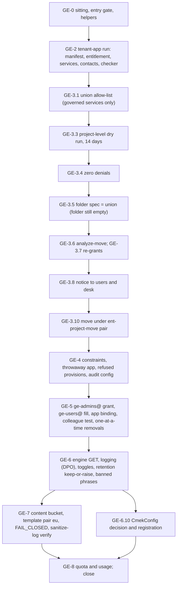

# 19. Gemini Enterprise: import, move and live-app-safe baseline

## Status
- Owner: the platform owner
- Last reviewed: 2026-09-15
- Stage: review §2 stages 17 and 18: GE-2 to GE-8 of [03 §16](../03-gemini-enterprise-environment.md#16-runbook-bringing-the-environment-to-baseline), rewritten as executable steps. Runs after the Tier R record (file `17-factory-module-equivalents-and-tier-r-gate.md`, SD-13) and in parallel with files 21 to 29. File `20-gemini-enterprise-gateway-and-tier-c-gate.md` continues from GE-9.
- Step prefix: `GE`. 63 steps. Section GE-0 is this file's sitting and entry gate; it is not 03's GE-0, which file 05 performed as `GI`.
- BLOCKED: GE-2.6 (the Terraform import: the factory's `tenant-app` module does not exist) and GE-6.7 (a retention reduction: waits on a signed P13 value lower than today's and a notice period; it may never run). GE-8.3's standing drift read is BLOCKED on the drift job (README B-02) and is written as a manual read until then.
- IRREVERSIBLE: GE-4.1 (deletion of a data store outside the allow-list, only with its owner's agreement and a witness at each click), GE-6.7 (retention reduction), GE-6.12 (the `CmekConfig` registration: no safe rollback).
- WITNESSED: GE-4.1 (each **Delete**) and GE-6.6 (before **Save and publish** on the live assistant) need `GE_WITNESS` at the screen; GE-6.6 also needs an announced change window and a named `GE_ROLLBACK_OPERATOR`.
- Replaces: the GE-2 to GE-8 rows of 03 §16. Kept from them: the step list and intent. Not copied: GE-6's 30-day retention as a value to set (X-GE-01), GE-5's removal of access before `ge-users@` is filled (X-GE-02), a folder dry run before the move, which shows nothing for a project not yet in the folder (X-GE-03), 'verify in SCC' (X-GE-07), the unreachable-template test on the production app (X-GE-08). Salvaged: the sanitize-log verify of `wall-e/SETUP.md` l.1992 (as a `SanitizeOperation` log read) and the regional host rule of `wall-e/setup/walle_setup.py` (`<location>-discoveryengine.googleapis.com`).
- Closes: S047 (GE-2 onwards), S049 (the use of the hand-made `ge-admins@`), S053, X-GE-01, X-GE-02, X-GE-03, X-GE-05 (the registration half), X-GE-06, X-GE-07, X-GE-08 (the production half), X-GE-10, X-GE-11 (the `ADMIN_READ` half), X-GE-12 (the grant-before-removal half), X-GE-14, X-GE-15, X-GE-17, X-GE-18 (the non-Plus branch), X-GE-21. Partial remainders are in §9 with owners.
- Every command, flag, field, role, constraint and console path was read on Google's pages on 2026-09-15, and the `org-policies set-policy`, `pam grants`, `pam entitlements`, `logging read` and dry-run-audit pages were re-read on 2026-09-16 after the setup-procedure review (§10). Nothing was run against the live tenant while writing. What could not be verified is listed at the end of §10 and marked `Assumption:` at its step.
- Review findings closed in this revision: R2-19-01 to R2-19-12 in §9 (one blocking, five major, two medium, four minor), including the `--update-mask` values that would have failed every organisation-policy write, the unproven dry-run gate, the scraped allow-list, and the unwitnessed changes to the live assistant and to live data stores.

---

## 1. What this part builds

The live, tenant-wide Gemini Enterprise app is brought under the platform without cutting any
user off, deleting any chat, refusing any service it uses, or opening a window in which access
is wider than today. At the end:

| Result | How it is proven | Step |
|---|---|---|
| `GEMINI_PROJECT` recorded as the `tenant-app` module run (bootstrap deviation), with its labels, Essential Contacts, per-project repair entitlement and additive services | the zero-diff check against the committed manifest; a deviation-register row | GE-2 |
| A `gcp.restrictServiceUsage` allow-list that is the union of what the project uses and what the design needs, restricted to the services the constraint governs, and 14 days of project-level dry run with zero denials | dry-run audit query returning nothing | GE-3.1 to GE-3.5 |
| Roles the project loses on the move re-granted (or replaced, or dropped with a signature) before the move | `gcloud asset analyze-move` with no blocker; a decision table per lost binding | GE-3.6, GE-3.7 |
| The project under `fld-gemini-enterprise`, moved under the `ent-project-move` pair in an announced window | parent read back; a colleague's test question; `StreamAssist` in `LOGGING_PROJECT` | GE-3.8 to GE-3.12 |
| `allowedDataSources` and `allowedEgressFqdns` written in the `enforcedProjects` form each page gives, proven by refused provisions on a throwaway app | `Operation denied by org policy` naming each constraint | GE-4.2 to GE-4.7 |
| `discoveryengine.googleapis.com` `ADMIN_READ` and `DATA_READ` audit logs on the project, merged with the etag | a `GetEngine` entry in `LOGGING_PROJECT` | GE-4.8, GE-4.9 |
| `ge-users@` filled from its source and counted; `ent-ge-admin` proven; app-level binding added keeping every existing binding; project-level user and basic roles removed one at a time after a non-admin colleague's test | counts; grants; the colleague's test after each removal; saved policies | GE-5 |
| Engine read before and after; `sensitiveLoggingEnabled` false with the DPO's signature; retention kept or raised, never lowered; banned phrases tested on real operator questions and written with the other two `CustomerPolicy` fields | GET diffs; the signed record; the test file | GE-6.1 to GE-6.9 |
| The `CmekConfig` decision and, if decided, the registration of `gemini-cmek` | decision record; `state` and `isDefault` read back | GE-6.10 to GE-6.13 |
| Template pair `ge-console-standard` in `eu` with sanitize logging to a 30-day content bucket; Model Armor on the assistant with `FAIL_CLOSED` | GET assertion; `SanitizeOperation` entries with `MATCH_FOUND` for three injection prompts | GE-7 |
| Quota values and measured usage for the assistant path | Cloud Quotas and Monitoring reads in the quota register | GE-8 |



## 2. Preconditions

- [ ] File `01-prerequisites-and-conventions.md`: `~/.platform-env` with `penv_set`, `need`, `exists_or_pending`, `penv_guard`, `checkpoint`, `evidence_add`, `sitting_end`; `DEVIATION_REGISTER`, `EVIDENCE_REGISTER`, `BUILD_LOG_DIR`, `PLATFORM_REPO_DIR`, `GE_LOCATION` (`eu`), `REGION` (`europe-west1`), `DOMAIN`, `ORG_ID`.
- [ ] File [05](05-gemini-enterprise-inventory.md): `GEMINI_PROJECT`, `GEMINI_PROJECT_NUMBER`, `GEMINI_APP_ID`, `GEMINI_APP_LOCATION` (`eu`), `GE_EDITION`, `GE_CURRENT_PARENT`, `GE_RETENTION_CURRENT_DAYS`, `GE_INVENTORY_DIR`; the fact sheet's gate lines `ORG`, `LOCATION`, `SECOND-APP`, `EDITION` read `clear`; no PENDING re-run of GI-1.5, GI-5.3 or GI-6.2 left open.
- [ ] File [06](06-organisation-bootstrap-and-roster.md): `SA_1_ADMIN` (the platform owner's admin account, member of `ge-admins@`), `GRP_GE_ADMINS`, `GRP_GE_USERS` (a security group, empty, membership source recorded in `CONTROL_GROUPS_FILE`), `GRP_PLATFORM_SECURITY`, `GRP_PLATFORM_OWNERS`.
- [ ] File [09](09-folders-and-security-command-center.md): `FLD_GEMINI_ENTERPRISE`, with the tag `agp-tier=ge` bound.
- [ ] File [10](10-core-projects-and-ci-identities.md): `LOGGING_PROJECT`, `CORE_PROJECT` (Cloud Asset API enabled there, used as the quota project of the move analysis).
- [ ] File [11](11-keys-and-validator-custodian.md): `KEY_GEMINI_CMEK` (HSM, `europe`, no rotation period), and KV-4.3's two service-agent grants `DONE` or PENDING.
- [ ] File `12-privileged-access-catalogue.md`: `ENT_GE_ADMIN` (activation without approval, justification required, 1 h, requester `ge-admins@`, SD-19), `ENT_PROJECT_MOVE_SRC` (on `GE_CURRENT_PARENT`), `ENT_PROJECT_MOVE_DST` (on `FLD_GEMINI_ENTERPRISE`), `ENT_PLATFORM_POLICY`, `ENT_FOLDER_ADMIN`; the approver named on each entitlement is appointed.
- [ ] File `13-organisation-policies-deny-and-pab.md`: the `fld-gemini-enterprise` policy files committed, with their saved predecessors, including the design `gcp.restrictServiceUsage` list and the two managed constraints. This file amends three of them.
- [ ] File `14-central-logging-and-billing-export.md`: `S-folder` intercepting the audit families on `fld-agentic-platform`; the folder `auditConfigs` for `discoveryengine.googleapis.com` `DATA_READ` and `DATA_WRITE`.
- [ ] File `15-pager-siem-and-detections.md` part A: the paging route exists, so the `MoveProject` and org-policy write alerts reach someone during the window.
- [ ] File `17-factory-module-equivalents-and-tier-r-gate.md`: the FM-TENANT-APP hand procedure, the zero-diff checker, `TIER_R_RECORD`.
- [ ] File [03](03-decisions-and-people.md): SD-13, SD-19, SD-20, SD-21 signed or recorded as pending with this file named; P48, P52, P53, P55, P58 rows present; `DPO_CONTACT`, `SECOND_HUMAN_EMAIL` set.
- [ ] A register row `agent_id: tenant-app` merged in `REGISTER_PATH` (file `16-register-and-shared-registry.md`) with `tier: ge`, `env: prod`, owner group `ge-admins`, `data_class`, `ai_act_class` and `cost_centre` values.
- [ ] A witness is named and available: `GE_WITNESS` (the security reviewer, or the second human until the security reviewer is appointed) for GE-4.1's deletions and GE-6.6's publish, and `GE_ROLLBACK_OPERATOR`, a second `ge-admins@` member, for the hour after GE-6.6. Neither is the operator. Both are set with `penv_set` in GE-0.2 and appear in `records/19-people.md`.
- [ ] A named non-admin colleague agrees to run the user tests: holds a Gemini Enterprise licence today, holds no `discoveryengine` role, is in no group bound on `GEMINI_PROJECT`, and is not in `ge-admins@`.
- [ ] The DPO has the GE-6 logging question in writing at least five business days before GE-6.
- [ ] Workstation: `gcloud` with the `beta` component (for `gcloud beta projects move`), `curl` 7.76 or later, `jq`, `yq` (the jq wrapper for YAML, which prints JSON by default; `Assumption:` 01's tool list gains it), `git`, `shasum`, `comm`.

## 3. People and time

| Role | Who | Does | Present when |
|---|---|---|---|
| Platform owner | The platform owner, signed in as `sa-1-admin@` in its own browser profile | every step; requests every PAM grant | throughout |
| Approver of `ent-platform-policy`, `ent-project-move` | the approvers named on the entitlements in file 12 (the security reviewer, or the second human until the security reviewer is appointed); never the requester, because PAM refuses self-approval | approves GE-3.3, GE-3.5, GE-3.10, GE-4.2, GE-4.3, GE-4.7 grants | on call during those steps |
| Witness at the screen (`GE_WITNESS`) | the security reviewer, or the second human until the security reviewer is appointed; never the operator | reads the resource name and the value aloud from the console before an irreversible or user-visible click, and confirms it against the record | GE-4.1 (each Delete), GE-6.6 (before **Save and publish**), GE-6.7 if it ever runs |
| Rollback operator (`GE_ROLLBACK_OPERATOR`) | a second `ge-admins@` member, named in the checkpoint | reachable for the hour after a user-visible publish, and reverses it on the owner's word | GE-6.6, GE-6.7 |
| Non-admin colleague | named in GE-0.2 | the test question before and after the move, after the app-level binding, after each removal; the injection prompts | GE-3.9, GE-3.11, GE-5.6, GE-5.8, GE-7.5 |
| DPO | `DPO_CONTACT` | signs the `sensitiveLoggingEnabled` record (GE-6.2) and the notice text of any retention or CMEK change | GE-6.2, GE-6.10 |
| Data-store owners | named per row of GI-7.3 | agree or refuse a deletion | GE-4.1 |
| IT security desk | the paging service responders (file 15) | acknowledge the announced window, so the `MoveProject` and org-policy alerts are expected, not ignored | GE-3.8 to GE-3.12 |
| Operator volunteers | two members of the operators and helpdesk admin teams | give real questions for the banned-phrase test | GE-6.8 |

Hands-on: 3 to 4 days. Elapsed: 2 to 3 weeks, dominated by the 14-day dry run (GE-3.4), the
notice period before the window (GE-3.8) and the DPO turnaround (GE-6.2).

## 4. Rules for this file

**The live app comes first.** Every step that can change what a user sees names its window, its
notice, its test by the non-admin colleague, and a rollback proven from a saved file. No step
disables a service, removes a binding, lowers retention or deletes a data store without the
saved state and the test in hand.

**Order that protects users.** Fill before removal; grant before revoke; dry run before
enforcement; the throwaway app before the production app. The unreachable-template test is
never run on the production app; it is file 20's, on `GE_THROWAWAY_APP_ID` (X-GE-08).

**Hosts.** The `eu` app is called on `https://eu-discoveryengine.googleapis.com` (Gemini
Enterprise locations page; the same rule as `walle_setup.py`'s regional host). Model Armor `eu`
templates are called on `https://modelarmor.eu.rep.googleapis.com/` (Model Armor data residency
page), set per command with the environment variable `CLOUDSDK_API_ENDPOINT_OVERRIDES_MODELARMOR`
inside a subshell, never with `gcloud config set`.

**`CustomerPolicy` is written whole.** The assistant's `customerPolicy` has three fields,
`bannedPhrases`, `modelArmorConfig` and `dataProtectionPolicy` (REST reference). Google's
documented call patches it with `update_mask=customerPolicy`. Every write here first GETs the
assistant, changes one field in the copy, and writes all three back; the VERIFY compares the two
untouched fields before and after (X-GE-17).

**Organisation-policy writes.** `gcloud org-policies set-policy` takes `--update-mask` with one of
`policy.spec`, `policy.dry_run_spec`, `*` or empty, and nothing else: 'If the policy does not
contain the dry_run_spec and update-mask flag is not provided, then it defaults to `policy.spec`'
(gcloud reference). So in this file a **live** spec is written with no `--update-mask` flag at all
(the file carries only `spec:`, and the default applies), and a **dry run** is written with
`--update-mask=policy.dry_run_spec`. The values `spec` and `dryRunSpec` are not accepted and must
never be written; an earlier draft used them and every org-policy write in GE-3, GE-4 and file 20's
GG-5.7 would have failed at the first apply, inside a time-boxed approved grant.

**Access-array edits.** IAM policies and audit configurations are read to a file with their
etag, changed with `jq`, diffed, written, and read back. Google: 'You must preserve the
`bindings:` and `etag:` sections without changes' (Data Access audit page) and 'The
`setIamPolicy` method replaces the existing policy' (app IAM page).

**PAM.** Privileged acts run under a grant whose name is recorded. The pattern:

```bash
GRANT="$(gcloud pam grants create --entitlement="$ENT_GE_ADMIN" --requested-duration=3600s --justification="setup 19 GE-5.5 app-level binding" --format='value(name)')"
gcloud pam grants describe "$GRANT" --format='value(state)'
```

The second line must print `ACTIVE` before the step's ACTION runs. A grant that needs approval
prints `APPROVAL_AWAITED` until the approver acts. At the end of the step:
`gcloud pam grants revoke "$GRANT" --reason="step done"`. **Every step that takes a grant revokes
it in its own ACTION**; no step leaves a grant to expire, because an unrevoked grant keeps
privilege past the act the PAM record is supposed to bound (PAM revoke page: a grant stays active
until it expires or is revoked).

**Why no `--location` or `--project` on the PAM commands.** `gcloud pam grants create` documents
`--location` and the parent flag as the ways to set the entitlement's location and project, *or*:
'provide the argument `--entitlement` on the command line with a fully specified name'. The same
sentence appears on `grants describe`, `grants revoke`, `grants list`, `entitlements describe` and
`entitlements delete` for their own resource argument. Every `ENT_*` variable in this file holds a
fully specified name (`projects/<id>/locations/global/entitlements/<id>`, or the folder or
organisation form), and `pam_grant` returns the grant's fully specified `name`, so location and
parent are read from the name and the flags are not needed. GE-0.3's `pam_fq` guard asserts this
before the first grant: a short id in an `ENT_*` variable is a stop, not a silent default to
`core/project`. Where a short id is used on purpose — GE-2.3's `entitlements create|describe|delete`
— the `--project` and `--location=global` flags are written out.
`Assumption:` the parser behaviour was read on the gcloud reference on 2026-09-15 and not run; if a
command on the day complains that the location or project is missing, add `--location=global` and
`--project="$GEMINI_PROJECT"` (or `--folder=` / `--organization=` as the name reads) and record the
correction in `$GE_DIR/gcloud-corrections.md`.

**Personal data.** Member lists, licence lists and question corpora go under
`$GE_DIR/restricted/`, which the build log ignores; only counts and SHA-256 hashes are committed.

**No secrets.** No step prints, stores or pastes a token, key or credential. The access token is
used only inside a request header, as Google's pages show. No third-party credential is entered
anywhere in this file.

**Files.** `GE_DIR="$BUILD_LOG_DIR/ge-baseline"`, file names `<date>-<step>-<record>-v<n>.<ext>`,
never overwritten.

## 5. Corrections to the design this file applies

The design pages stay as they are until the platform owner edits them; the procedure follows the
right-hand column.

| Design says | Google's page says (read 2026-09-15) | This file does |
|---|---|---|
| 03 §4: nobody holds a Gemini Enterprise user role at project level | App IAM page, 'Before you begin': 'Confirm that all Gemini Enterprise users with a valid license have the Gemini Enterprise Restricted User role'. The roles page: `roles/discoveryengine.agentspaceRestrictedUser` is for 'fine-grained control over multiple Gemini Enterprise instances in the same project', and its holders 'will need to be granted an unrestricted user-level role (e.g. /agentspaceUser) on an Engine policy' | GE-5.4 grants `agentspaceRestrictedUser` to `ge-users@` on the project; `agentspaceUser` stays app-level only. `Assumption:` the project is where that role is granted, since it carries project-level permissions such as `resourcemanager.projects.get` and the app IAM page does not name the level |
| 02 §4.2 allow-list for `fld-gemini-enterprise`, 're-checked at the import' | `agentregistry`, `agentidentity`, `agentidentitycredentials`, `logging`, `monitoring`, `cloudtrace` are not on the supported-services list; the constraint 'controls the runtime access to all in-scope resources' | GE-3.1 builds the union and keeps only governed services; the others are recorded as inert |
| 03 §3 label `tier=C` | 02 §3.6 label alphabet is lower case; the tier vocabulary is `c r w p p-sa x ctl imp core ge`; 09 bound `agp-tier=ge` on the folder | label `tier=ge` (GE-3.10) |
| 03 §5.2: 'Google-managed encryption for the imported app' | CMEK page: end-user data (personalisation, UI preferences, connector credentials) 'always follows the current default CmekConfig'; unsetting 'removes CMEK protection from end-user data' | GE-6.10 records the end-user data effect before any registration |
| 03 §5.3: banned phrases as a 'detection-grade screen' carrying control-group names | 'the query is blocked if any of the configured banned phrases are present'; a banned phrase 'is not allowed to appear in the user query or the LLM response' | GE-6.8: enforcement, word-boundary match, only strings no legitimate question or answer contains |
| 03 §8: 'Enable model selector: off' plus 'Model availability: the pinned model set' | 'To enable model selection, you must turn on the Enable model selector toggle'; GA models 'you can't turn the toggle off' | GE-6.4 writes the selector row as off and the model row as 'GA models Google-fixed; preview models left disabled' |
| 03 §13, 06 §3.5: every `MATCH_FOUND` on the assistant path is an SCC finding | SCC Model Armor findings are documented for floor-setting violations; the verdict is in the `SanitizeOperation` log when `logSanitizeOperations` is on | GE-7.5 verifies on the sanitize log |
| 03 §15: retention drift read with `GetAssistant` | the Assistant resource has no retention field; `Engine.sessionConfig.sessionTtl` 'If unset, the default value is 60 days' | GE-6.1 and GE-6.9 read `sessionConfig`; the console value is read by hand (`Assumption:` the two are one setting) |
| 03 §16 GE-4 and 02 §4.1: `enforcedProjects` = `GEMINI_PROJECT_NUMBER` for both constraints | data sources page: 'project names in the format `projects/<project_name>/`'; egress page: 'add the project numbers' | GE-4.2 and GE-4.3 each use its page's form; a refused provision decides |

---

## 6. Steps

### GE-0 The sitting and the entry gate

#### GE-0.1 Open the shell under the guard

- **WHO:** platform owner. Solo.
- **WHERE:** shell, `~/.platform-env` sourced; browser profile of `sa-1-admin@`.
- **ACTION:**
```bash
source ~/.platform-env
penv_guard
need GCLOUD_CONFIG_NAME BUILD_LOG_DIR PLATFORM_REPO_DIR EVIDENCE_REGISTER DEVIATION_REGISTER DOMAIN ORG_ID GE_LOCATION REGION SA_1_ADMIN
test "$GE_LOCATION" = eu || echo "STOP: GE_LOCATION must be eu (SD-21)"
gcloud auth login "$SA_1_ADMIN"
gcloud auth list --filter=status:ACTIVE --format='value(account)'
checkpoint "SITTING-$(date -u +%Y%m%d%H%M)" START - - "19 GE baseline"
checkpoint GE-0.1 DONE
```
- **VERIFY:** `penv_guard` prints nothing and returns 0; the last `gcloud` line prints exactly `SA_1_ADMIN`.
- **ROLLBACK:** none needed; `sitting_end` closes the sitting (GE-8.4).
- **EVIDENCE:** the checkpoint lines. E-xx: none. TISAX: 4.1.2.

#### GE-0.2 Check the entry gate and name the colleague

- **WHO:** platform owner. Solo.
- **WHERE:** shell.
- **ACTION:**
```bash
need GEMINI_PROJECT GEMINI_PROJECT_NUMBER GEMINI_APP_ID GEMINI_APP_LOCATION GE_EDITION GE_CURRENT_PARENT GE_RETENTION_CURRENT_DAYS GE_INVENTORY_DIR FLD_GEMINI_ENTERPRISE GRP_GE_ADMINS GRP_GE_USERS KEY_GEMINI_CMEK ENT_GE_ADMIN ENT_PROJECT_MOVE_SRC ENT_PROJECT_MOVE_DST ENT_PLATFORM_POLICY ENT_FOLDER_ADMIN LOGGING_PROJECT CORE_PROJECT TIER_R_RECORD REGISTER_PATH DPO_CONTACT
test "$GEMINI_APP_LOCATION" = eu || echo "STOP: app location is not eu"
facts="$(ls -t "$GE_INVENTORY_DIR"/*-GI-10.2-facts-v*.md | head -1)"
grep -E '^(ORG|LOCATION|SECOND-APP|EDITION): ' "$facts"
grep -qE '^(ORG|LOCATION|SECOND-APP|EDITION): STOP' "$facts" && echo "STOP: inventory gate not clear"
grep -E 'GI-(1\.5|5\.3|6\.2)	PENDING' "$BUILD_LOG_DIR/checkpoints.tsv" "$BUILD_LOG_DIR/05-gemini-enterprise-inventory.log" 2>/dev/null
test -s "$TIER_R_RECORD" && echo "Tier R record present"
find "$GE_INVENTORY_DIR" -name '*-GI-2.2-engine-v*.json' -mtime -30 | head -1
GE_TEST_USER="<non-admin colleague's email, read from the agreement mail>"
penv_set GE_WITNESS "<the security reviewer's account, or the second human's, from SECOND_HUMAN_EMAIL>"
penv_set GE_ROLLBACK_OPERATOR "<a second ge-admins@ member, not the operator and not the witness>"
penv_set GE_CHANGE_NOTICE_DATE ""   # set in GE-3.8 / GE-6.6 when the notice is sent
test "$GE_WITNESS" != "$SA_1_ADMIN" || echo "STOP: the witness cannot be the operator"
test "$GE_ROLLBACK_OPERATOR" != "$SA_1_ADMIN" || echo "STOP: the rollback operator cannot be the operator"
gcloud projects get-iam-policy "$GEMINI_PROJECT" --format=json | jq -r --arg u "user:$GE_TEST_USER" '.bindings[] | select(.members | index($u)) | .role'
gcloud identity groups memberships check-transitive-membership --group-email="$GRP_GE_ADMINS" --member-email="$GE_TEST_USER" --format='value(hasMembership)'
checkpoint GE-0.2 DONE - - "colleague named in records/19-people.md"
```
If the `find` line prints nothing, the inventory is older than 30 days: re-run GI-2.2, GI-3.1, GI-3.2, GI-5.1 and GI-5.2 of file 05 before continuing (file 05 §8 rule).
- **VERIFY:** no `STOP` line; the `grep` for PENDING prints nothing; 'Tier R record present'; the colleague holds no project role (empty output) and `hasMembership` is `False`; `need GE_WITNESS GE_ROLLBACK_OPERATOR` passes and both differ from `SA_1_ADMIN` and from each other.
- **ROLLBACK:** none needed.
- **EVIDENCE:** the colleague's, the witness's and the rollback operator's name, team and date of agreement in `records/19-people.md` of the build log (name, team and remit only); `evidence_add GE-0.2 entry-gate E-05 5.2.1 "build-log:checkpoints.tsv"`.

#### GE-0.3 Create the working directory and helpers

- **WHO:** platform owner. Solo.
- **WHERE:** shell.
- **ACTION:**
```bash
GE_DIR="$BUILD_LOG_DIR/ge-baseline"
mkdir -p "$GE_DIR/restricted"
grep -qxF 'ge-baseline/restricted/' "$BUILD_LOG_DIR/.gitignore" || printf '%s\n' 'ge-baseline/restricted/' >> "$BUILD_LOG_DIR/.gitignore"
cat > "$GE_DIR/ge-helpers.sh" <<'EOF'
GE_DIR="$BUILD_LOG_DIR/ge-baseline"
GE_DATE="$(date -u +%F)"
GE_API="https://eu-discoveryengine.googleapis.com/v1/projects/${GEMINI_PROJECT}/locations/eu"
GE_APP="${GE_API}/collections/default_collection/engines/${GEMINI_APP_ID}"
ge_file() { local d="$GE_DIR" n=1; [ "${4-}" = restricted ] && d="$GE_DIR/restricted"; while [ -e "$d/${GE_DATE}-$1-$2-v${n}.$3" ]; do n=$((n+1)); done; printf '%s\n' "$d/${GE_DATE}-$1-$2-v${n}.$3"; }
ge_latest() { ls -t "$1"/*-"$2"-v*."$3" 2>/dev/null | head -1; }
ge_call() { if [ -n "${3-}" ]; then curl -sS --fail-with-body -X "$1" -H "Authorization: Bearer $(gcloud auth print-access-token)" -H "Content-Type: application/json" -H "X-Goog-User-Project: ${GEMINI_PROJECT}" --data-binary @"$3" "$2"; else curl -sS --fail-with-body -X "$1" -H "Authorization: Bearer $(gcloud auth print-access-token)" -H "X-Goog-User-Project: ${GEMINI_PROJECT}" "$2"; fi; }
# PAM: the entitlement and grant names below are fully specified
# (projects|folders|organizations/<id>/locations/<loc>/entitlements/<id>[/grants/<id>]).
# gcloud reads location and parent from a fully specified name, so no --location/--project flag
# is written; pam_fq refuses a short id rather than letting gcloud default to core/project.
pam_fq() { case "$1" in projects/*/locations/*/entitlements/*|folders/*/locations/*/entitlements/*|organizations/*/locations/*/entitlements/*) return 0;; *) echo "STOP: entitlement '$1' is not a fully specified name; add --location and the parent flag or fix the variable" >&2; return 1;; esac; }
pam_grant() { pam_fq "$1" || return 1; gcloud pam grants create --entitlement="$1" --requested-duration="${2:-3600s}" --justification="$3" --format='value(name)'; }
pam_active() { local s; case "$1" in */grants/*) :;; *) echo "STOP: '$1' is not a fully specified grant name" >&2; return 1;; esac; s="$(gcloud pam grants describe "$1" --format='value(state)')"; echo "$s"; [ "$s" = ACTIVE ]; }
pam_revoke() { case "$1" in */grants/*) :;; *) echo "STOP: '$1' is not a fully specified grant name" >&2; return 1;; esac; gcloud pam grants revoke "$1" --reason="$2"; }
ma_eu() { ( export CLOUDSDK_API_ENDPOINT_OVERRIDES_MODELARMOR="https://modelarmor.eu.rep.googleapis.com/"; gcloud "$@" ); }
EOF
source "$GE_DIR/ge-helpers.sh"
checkpoint GE-0.3 DONE
```
Then prove the PAM name guard before any grant is taken:
```bash
for v in ENT_GE_ADMIN ENT_PROJECT_MOVE_SRC ENT_PROJECT_MOVE_DST ENT_PLATFORM_POLICY ENT_FOLDER_ADMIN; do eval "n=\$$v"; pam_fq "$n" && printf '%s\tfully specified\n' "$v"; done
```
- **VERIFY:** `type ge_file ge_latest ge_call pam_fq pam_grant pam_active pam_revoke ma_eu` names eight functions; the `for` loop prints `fully specified` for all five variables and no `STOP` line (§4 'Why no `--location`'); `git -C "$BUILD_LOG_DIR" check-ignore "$GE_DIR/restricted/x"` prints the path; `echo "$GE_APP"` ends with `/engines/$GEMINI_APP_ID`.
- **ROLLBACK:** none needed. On resume, run only `source ~/.platform-env; source "$BUILD_LOG_DIR/ge-baseline/ge-helpers.sh"`.
- **EVIDENCE:** none. E-xx: none. TISAX: none.

### GE-2 The `tenant-app` module run (FM-TENANT-APP, by hand)

The factory's `tenant-app` module does not exist (S001). Under SD-01 the platform owner performs
FM-TENANT-APP of file 17 by hand on the existing project. The import of a live project differs
from a new project in four ways, and file 17's procedure is called with these parameters: no
project create, no parent change here (GE-3 does it), no service is disabled (GE-3 governs
runtime access), no binding is removed (GE-5 does it one at a time).

#### GE-2.1 Write the manifest from the merged register row

- **WHO:** platform owner. Solo; the second operator reviews the pull request.
- **WHERE:** shell; platform repository.
- **ACTION:**
```bash
need PLATFORM_REPO_DIR REGISTER_PATH GEMINI_PROJECT GEMINI_PROJECT_NUMBER FLD_GEMINI_ENTERPRISE
git -C "$PLATFORM_REPO_DIR" pull --ff-only
grep -n 'tenant-app' "$PLATFORM_REPO_DIR/$REGISTER_PATH"
mkdir -p "$PLATFORM_REPO_DIR/bootstrap/manifests"
cat > "$PLATFORM_REPO_DIR/bootstrap/manifests/tenant-app.yaml" <<EOF
module: tenant-app
mode: import
project_id: ${GEMINI_PROJECT}
project_number: "${GEMINI_PROJECT_NUMBER}"
parent: folders/${FLD_GEMINI_ENTERPRISE}
labels: {agent: tenant-app, owner: ge-admins, tier: ge, env: prod, data_class: "<from register row>", ai_act_class: "<from register row>", cost_centre: "<from register row>", created_by: hand-bootstrap, factory_run: "<deviation id, lower case>"}
essential_contacts: [{email: "platform-security@${DOMAIN}", categories: [security, technical]}, {email: "platform-owners@${DOMAIN}", categories: [technical]}]
services_additive: [discoveryengine.googleapis.com, modelarmor.googleapis.com, logging.googleapis.com, monitoring.googleapis.com, cloudquotas.googleapis.com]
services_never_disabled_here: true
restrict_service_usage: "GE-3.1 union"
budget: "*tbd* (licence-driven, 03 §3)"
entitlements: [ent-project-repair-tenant-app]
bindings_removed_here: none
EOF
git -C "$PLATFORM_REPO_DIR" checkout -b setup-19-tenant-app-manifest
git -C "$PLATFORM_REPO_DIR" add bootstrap/manifests/tenant-app.yaml
git -C "$PLATFORM_REPO_DIR" commit -m "19 GE-2.1 tenant-app manifest (import)"
git -C "$PLATFORM_REPO_DIR" push -u origin setup-19-tenant-app-manifest
checkpoint GE-2.1 START
```
Replace each `<from register row>` with the row's slug value before committing. `Assumption:` file 17 fixes `created_by` and `factory_run` for hand runs; if it names other values, 17 wins and the manifest follows it.
- **VERIFY:** the pull request is merged by two human reviewers; `grep -c '<' "$PLATFORM_REPO_DIR/bootstrap/manifests/tenant-app.yaml"` prints `0` after the merge; `checkpoint GE-2.1 DONE`.
- **ROLLBACK:** revert the merge commit; nothing in the cloud has changed.
- **EVIDENCE:** `repo:bootstrap/manifests/tenant-app.yaml@<commit>`; `evidence_add GE-2.1 tenant-app-manifest E-05 1.3.1 "repo:bootstrap/manifests/tenant-app.yaml@<commit>"`.

#### GE-2.2 Open the deviation-register row

- **WHO:** platform owner. Solo.
- **WHERE:** shell.
- **ACTION:**
```bash
need DEVIATION_REGISTER GEMINI_PROJECT
printf '| BD-19-1 | %s | 19 GE-2 | MOD | tenant-app (import) | %s | register row tenant-app; manifest @<commit> | labels, contacts, additive services, ent-project-repair-tenant-app; move (GE-3), policies (GE-3, GE-4), audit config (GE-4.8), IAM (GE-5) | pending GE-2.7 | n/a: existing project, basic roles removed in GE-5.8 | pending | superseded by terraform import and empty plan (GE-2.6) | open |\n' "$(date -u +%F)" "$GEMINI_PROJECT" >> "$DEVIATION_REGISTER"
git -C "$BUILD_LOG_DIR" add "$DEVIATION_REGISTER"
git -C "$BUILD_LOG_DIR" commit -m "BD-19-1 tenant-app import opened"
checkpoint GE-2.2 DONE - "build-log:registers/bootstrap-deviation-register.md"
```
- **VERIFY:** `grep -c '^| BD-19-1 |' "$DEVIATION_REGISTER"` prints `1`.
- **ROLLBACK:** none; the register is append-only. A wrong row is closed under 'Closures' with the reason.
- **EVIDENCE:** the row. E-xx: E-05. TISAX: 5.2.1, 1.4.1.

#### GE-2.3 Create the per-project repair entitlement, or read back the one FM-6.2 made

- **WHO:** platform owner as a PAM administrator (`platform-owners@`, file 12). Solo.
- **WHERE:** shell.

**One entitlement, one name.** This step is the hand run of file 17's **FM-6.2**. 17's FM-2.17
generator derives the id from the register `agent_id`, and this project's register row is
`agent_id: tenant-app` (§2), so the generated pair is the id `ent-project-repair-tenant-app` and the
variable `ENT_PROJECT_REPAIR_TENANT_APP`. That is the canonical name for this file, for file 12's
catalogue and for file 20. 17's FM-6.2 heading writes it as `ENT_PROJECT_REPAIR_GEMINI`, which its
own generator would not produce, and file 20 carries a fallback
`ENT_REPAIR="${ENT_PROJECT_REPAIR_TENANT_APP:-$ENT_PROJECT_REPAIR_GEMINI}"`; both are corrections
owned by those files and are in §8's hand-forward rows. **Nothing here creates a second
entitlement:** the precondition below refuses to run if either id already exists, and reads the
existing one back instead, so 17 and 19 in either order leave exactly one.

- **PRECONDITION:**
```bash
need GEMINI_PROJECT GRP_PLATFORM_OWNERS
gcloud pam entitlements list --project="$GEMINI_PROJECT" --location=global --format='value(name)' | sed 's|.*/||' | grep -E '^ent-project-repair-(tenant-app|gemini)$' || echo "none yet"
```
If it printed `ent-project-repair-gemini`, FM-6.2 ran first under its heading's name: do not create a
second one. Record the id it made, set `penv_set ENT_PROJECT_REPAIR_TENANT_APP
"projects/${GEMINI_PROJECT}/locations/global/entitlements/ent-project-repair-gemini"`, raise the
rename against file 17 (§8), skip to this step's VERIFY, and note the deviation in BD-19-1. If it
printed `ent-project-repair-tenant-app`, skip the create and go to VERIFY. If it printed `none yet`,
run the ACTION.

- **ACTION:** the tenant-app variant of 12's template. It carries only what this file needs on the project: project IAM (GE-3.7, GE-4.8, GE-5), services (GE-2.4), Essential Contacts (GE-2.5), logging configuration (GE-7.1) and Model Armor templates (GE-7.2). No `run`, `aiplatform`, `secretmanager`, `datastore`, `bigquery`, `pubsub` or `cloudscheduler` role, because the app project hosts none of those (03 §3). Tier C, like `ent-ge-admin`: no approval, justification required.
```bash
f="$(ge_file GE-2.3 ent-project-repair-tenant-app yaml)"
cat > "$f" <<EOF
privilegedAccess:
  gcpIamAccess:
    resourceType: cloudresourcemanager.googleapis.com/Project
    resource: //cloudresourcemanager.googleapis.com/projects/${GEMINI_PROJECT}
    roleBindings:
    - role: roles/resourcemanager.projectIamAdmin
    - role: roles/serviceusage.serviceUsageAdmin
    - role: roles/essentialcontacts.admin
    - role: roles/logging.configWriter
    - role: roles/modelarmor.admin
maxRequestDuration: 3600s
eligibleUsers:
- principals:
  - group:${GRP_PLATFORM_OWNERS}
requesterJustificationConfig:
  unstructured: {}
EOF
gcloud pam entitlements create ent-project-repair-tenant-app --project="$GEMINI_PROJECT" --location=global --entitlement-file="$f"
penv_set ENT_PROJECT_REPAIR_TENANT_APP "projects/${GEMINI_PROJECT}/locations/global/entitlements/ent-project-repair-tenant-app"
GRANT="$(pam_grant "$ENT_PROJECT_REPAIR_TENANT_APP" 1800s "setup 19 GE-2.3 one-grant test")"
pam_active "$GRANT"
pam_revoke "$GRANT" "GE-2.3 test done"
```
- **VERIFY:** `gcloud pam entitlements describe "$ENT_PROJECT_REPAIR_TENANT_APP" --format=json | jq '{roles: [.privilegedAccess.gcpIamAccess.roleBindings[].role], approval: (.approvalWorkflow // "none"), max: .maxRequestDuration}'` shows the five roles, `"none"` and `"3600s"`; `gcloud pam entitlements list --project="$GEMINI_PROJECT" --location=global --format='value(name)' | sed 's|.*/||' | grep -cE '^ent-project-repair-'` prints `1`, so only one repair entitlement exists on the project; `pam_active` printed `ACTIVE`; `gcloud pam grants describe "$GRANT" --format='value(state)'` now prints `REVOKED` or `ENDED`; `checkpoint GE-2.3 DONE - - "id $(basename "$ENT_PROJECT_REPAIR_TENANT_APP")"`.
- **ROLLBACK:** revoke every non-terminal grant first (`gcloud pam grants list --entitlement="$ENT_PROJECT_REPAIR_TENANT_APP" --filter='state=ACTIVE OR state=APPROVAL_AWAITED' --format='value(name)'`, then `pam_revoke <name> "GE-2.3 rollback"`), then `gcloud pam entitlements delete "$ENT_PROJECT_REPAIR_TENANT_APP" --async` — the delete is a long-running operation and the entitlement stays readable in state `DELETING` until it finishes, so confirm with `gcloud pam entitlements describe "$ENT_PROJECT_REPAIR_TENANT_APP" --format='value(state)'` printing `DELETING` and, after the operation completes, `NOT_FOUND`. Do not re-run the delete because `describe` still answers.
- **EVIDENCE:** the YAML, the precondition listing and the describe output; `evidence_add GE-2.3 ent-project-repair-tenant-app E-06 4.1.3 "build-log:ge-baseline/<file>" "$f"`. The variable `ENT_PROJECT_REPAIR_TENANT_APP` follows plan §5's per-project pattern; README's variable index gains the row, file 12's catalogue gains the entitlement row under this id, and file 03's names register records that `ent-project-repair-gemini` is not used.

#### GE-2.4 Enable the additive services, never disable

- **WHO:** platform owner under `ENT_PROJECT_REPAIR_TENANT_APP`. Solo.
- **WHERE:** shell.
- **ACTION:**
```bash
GRANT="$(pam_grant "$ENT_PROJECT_REPAIR_TENANT_APP" 3600s "setup 19 GE-2.4 additive services")"; pam_active "$GRANT"
before="$(ge_file GE-2.4 services-before json)"
gcloud services list --enabled --project="$GEMINI_PROJECT" --format=json > "$before"
gcloud services enable modelarmor.googleapis.com logging.googleapis.com monitoring.googleapis.com cloudquotas.googleapis.com --project="$GEMINI_PROJECT"
after="$(ge_file GE-2.4 services-after json)"
gcloud services list --enabled --project="$GEMINI_PROJECT" --format=json > "$after"
comm -13 <(jq -r '.[].config.name' "$before" | sort) <(jq -r '.[].config.name' "$after" | sort)
comm -23 <(jq -r '.[].config.name' "$before" | sort) <(jq -r '.[].config.name' "$after" | sort)
gcloud pam grants revoke "$GRANT" --reason="GE-2.4 done"
```
- **VERIFY:** the first `comm` lists only services from the enable line that were not already on; the second `comm` prints nothing (no service went away); `checkpoint GE-2.4 DONE`.
- **ROLLBACK:** `gcloud services disable <service> --project="$GEMINI_PROJECT"` for a service this step added only, and only after checking with `gcloud asset search-all-resources --scope="projects/$GEMINI_PROJECT" --asset-types=<type>` that nothing was created in it.
- **EVIDENCE:** both lists; `evidence_add GE-2.4 services-diff E-05 5.2.1 "build-log:ge-baseline/<after file>" "$after"`.

#### GE-2.5 Set Essential Contacts

- **WHO:** platform owner under `ENT_PROJECT_REPAIR_TENANT_APP`. Solo.
- **WHERE:** shell.
- **ACTION:**
```bash
GRANT="$(pam_grant "$ENT_PROJECT_REPAIR_TENANT_APP" 1800s "setup 19 GE-2.5 essential contacts")"; pam_active "$GRANT"
gcloud essential-contacts list --project="$GEMINI_PROJECT" --format=json > "$(ge_file GE-2.5 contacts-before json)"
gcloud essential-contacts create --email="platform-security@${DOMAIN}" --notification-categories=security,technical --language=en --project="$GEMINI_PROJECT"
gcloud essential-contacts create --email="platform-owners@${DOMAIN}" --notification-categories=technical --language=en --project="$GEMINI_PROJECT"
gcloud pam grants revoke "$GRANT" --reason="GE-2.5 done"
```
- **VERIFY:** `gcloud essential-contacts list --project="$GEMINI_PROJECT" --format='value(email,notificationCategorySubscriptions)'` shows both rows; contacts that existed before are still listed; `checkpoint GE-2.5 DONE`.
- **ROLLBACK:** `gcloud essential-contacts delete <contact id> --project="$GEMINI_PROJECT"` for a contact this step created.
- **EVIDENCE:** `evidence_add GE-2.5 essential-contacts E-05 1.3.1 "build-log:ge-baseline/<file>"`.

#### GE-2.6 Import the project into Terraform state

> **BLOCKED**: Needs: the factory repository with the `tenant-app` module (`google_project`
> data or import block, `google_discovery_engine_search_engine` import, and the project and
> engine IAM as non-authoritative members), and the Terraform state bucket `TF_STATE_BUCKET`.
> Commit it in: `PLATFORM_REPO_REMOTE`, path `factory/modules/tenant-app`. Unblocked by: the
> commit with green CI recorded as `FACTORY_COMMIT` (file 17). Gate waiting: the Tier W gate
> closes BD-19-1. Until then: `checkpoint GE-2.6 BLOCKED - - "factory tenant-app module not committed"`, and README's BLOCKED index row B-01.

- **WHO:** platform owner, through CI (`factory-apply@`), approved as file 17 says for factory runs.
- **WHERE:** the factory pipeline.
- **ACTION (when unblocked):** `terraform import` of the project and the app; a plan that shows no change; `lifecycle { prevent_destroy = true }` on the app resource, because the review could not read which engine fields force replacement (X-GE notes), and a replacement would destroy chat history.
- **VERIFY:** `terraform plan` prints 'No changes'; the plan file is stored.
- **ROLLBACK:** `terraform state rm` of the imported addresses; nothing in the cloud changes.
- **EVIDENCE:** the plan output; the BD-19-1 closure line. E-xx: E-05. TISAX: 5.2.1.

#### GE-2.7 Run the zero-diff check before the move

- **WHO:** platform owner. Solo.
- **WHERE:** shell.
- **ACTION:** run file 17's checker against the manifest. Before the move the expected differences are exactly: `parent` (still `GE_CURRENT_PARENT`), `labels` (set in GE-3.10), `restrict_service_usage` (GE-3), bindings (GE-5).
```bash
f="$(ge_file GE-2.7 zero-diff-before-move txt)"
"$PLATFORM_REPO_DIR/bootstrap/zero-diff-check" --manifest "$PLATFORM_REPO_DIR/bootstrap/manifests/tenant-app.yaml" > "$f" 2>&1; echo "exit $?"
cat "$f"
```
If file 17's checker is itself BLOCKED, run its manual equivalent: `gcloud projects describe`, `gcloud services list --enabled`, `gcloud essential-contacts list`, `gcloud pam entitlements list --project --location=global`, each compared by eye with the manifest and written to `$f`.
- **VERIFY:** every difference in `$f` is one of the four expected; any other is a stop and a fix before GE-3; `checkpoint GE-2.7 DONE`.
- **ROLLBACK:** none needed.
- **EVIDENCE:** `$f` referenced in BD-19-1's checker column; `evidence_add GE-2.7 zero-diff-before-move E-05 5.2.1 "build-log:ge-baseline/<file>" "$f"`.

### GE-3 Before and during the move

#### GE-3.1 Build the union allow-list of governed services

- **WHO:** platform owner. Solo; signature of the app owner (the platform owner as Gemini Enterprise admin) for any service dropped.
- **WHERE:** shell.
- **ACTION:**
```bash
need GE_INVENTORY_DIR GEMINI_PROJECT
gov="$(ge_file GE-3.1 governed-services txt)"
curl -sSL "https://docs.cloud.google.com/resource-manager/docs/organization-policy/restricting-resources-supported-services" | grep -oE '[a-z0-9-]+(\.[a-z0-9-]+)*\.googleapis\.com' | sort -u > "$gov"
wc -l < "$gov"
```
**The scrape is not trusted.** The supported-services page is a documentation application, and a
plain `curl` can return the page shell rather than the table; a shell yields a near-empty `$gov`,
which makes the union empty, which would make GE-3.2 commit and GE-3.5 apply an allow-list that
permits nothing. On 2026-09-15 the scrape returned 290 names including
`discoveryengine.googleapis.com`, but that is not a guarantee for the day the operator runs it, so
these assertions are terminal and run **before** anything is written:
```bash
test "$(wc -l < "$gov")" -gt 100 || { echo "STOP: governed list has $(wc -l < "$gov") lines; the page did not render. Use the committed fallback below."; }
grep -qx discoveryengine.googleapis.com "$gov" || echo "STOP: discoveryengine.googleapis.com missing from the governed list"
grep -qx storage.googleapis.com "$gov" || echo "STOP: storage.googleapis.com missing from the governed list"
```
On any `STOP`, do not continue with the scrape. Open the page in the browser, copy its table into
`$PLATFORM_REPO_DIR/register/org-policy-governed-services.txt` (one service per line), have a second
human compare the committed file against the page on screen and approve the pull request, then
`cp "$PLATFORM_REPO_DIR/register/org-policy-governed-services.txt" "$gov"` and re-run the three
assertions. The committed file, not the scrape, is then the record for TISAX.
```bash
enabled="$(ge_file GE-3.1 enabled-now txt)"
gcloud services list --enabled --project="$GEMINI_PROJECT" --format='value(config.name)' | sort -u > "$enabled"
design="$(ge_file GE-3.1 design-list txt)"
printf '%s\n' discoveryengine modelarmor agentregistry agentidentity agentidentitycredentials iap networkservices networksecurity dns compute apphub cloudkms logging monitoring cloudtrace storage | sed 's/$/.googleapis.com/' | sort -u > "$design"
union="$(ge_file GE-3.1 union-governed txt)"
sort -u "$enabled" "$design" | comm -12 - "$gov" > "$union"
inert="$(ge_file GE-3.1 not-governed txt)"
sort -u "$enabled" "$design" | comm -23 - "$gov" > "$inert"
comm -23 "$enabled" "$design" | comm -12 - "$gov"
cat "$union"
test "$(wc -l < "$union")" -gt 5 || echo "STOP: the union has $(wc -l < "$union") entries; the governed list or the enabled list is wrong"
grep -qx discoveryengine.googleapis.com "$union" || echo "STOP: the union does not allow discoveryengine.googleapis.com; the live app would be refused"
```
Do not continue past a `STOP`.
Open the supported-services page in the browser and check that every line of `$union` and none of `$inert` appears in its list (the `grep` over the page can catch example names; the page is the authority). Then, for each service the last `comm` printed (enabled, governed, not in the design list: for example `aiplatform`, `bigquery`, `dialogflow`), decide **keep** or **drop**:
```bash
svc="<service>"
gcloud asset search-all-resources --scope="projects/$GEMINI_PROJECT" --billing-project="$CORE_PROJECT" --format='value(assetType)' | grep -c "^${svc%%.*}\." 
start="$(date -u -v-30d +%FT%TZ)"; end="$(date -u +%FT%TZ)"
flt="$(jq -rn --arg s "$svc" '"metric.type=\"serviceruntime.googleapis.com/api/request_count\" AND resource.type=\"consumed_api\" AND resource.labels.service=\"" + $s + "\"" | @uri')"
curl -sS --fail-with-body -H "Authorization: Bearer $(gcloud auth print-access-token)" "https://monitoring.googleapis.com/v3/projects/${GEMINI_PROJECT}/timeSeries?filter=${flt}&interval.startTime=${start}&interval.endTime=${end}&aggregation.alignmentPeriod=2592000s&aggregation.perSeriesAligner=ALIGN_SUM&aggregation.crossSeriesReducer=REDUCE_SUM" | jq '[.timeSeries[]?.points[]?.value.int64Value // 0 | tonumber] | add // 0'
```
A service with zero assets and zero requests in 30 days may be dropped; write the drop with its two numbers into `decisions/<date>-ge-restrict-service-usage-drops.md`, signed. Any other enabled governed service is kept, with a review date. `aiplatform.googleapis.com` kept here contradicts 03 §3's 'no engine in the app project'; if kept, it is recorded as a dated exception and file 13's deny policy stays the control against an engine create.
```bash
final="$(ge_file GE-3.1 allow-list-final txt)"
cp "$union" "$final"
# remove every signed drop from "$final" with an editor, then:
wc -l < "$final"
grep -qx discoveryengine.googleapis.com "$final" || echo "STOP: discoveryengine.googleapis.com was dropped; the live app would be refused"
comm -12 <(sort -u "$design" ) "$gov" | while read -r s; do grep -qx "$s" "$final" || echo "STOP: design service $s is governed but not in the final list"; done
test "$(wc -l < "$final")" -ge "$(comm -12 <(sort -u "$design") "$gov" | wc -l)" || echo "STOP: the final list is shorter than the governed part of the design list"
checkpoint GE-3.1 DONE - - "final $(wc -l < "$final") of governed $(wc -l < "$gov")"
```
The three lines above are the gate GE-3.2, GE-3.3 and GE-3.5 rely on. A `STOP` from any of them is
a stop for the whole of GE-3.
- **VERIFY:** no `STOP` line was printed by any assertion in this step; `wc -l < "$gov"` is greater than 100 (or the committed fallback was used and approved by two humans); every line of `$enabled` that is on the governed list is in `$final` or in the signed drop record; every design service on the governed list is in `$final`; `$inert` holds only services the constraint cannot restrict (the review found `agentregistry`, `agentidentity`, `agentidentitycredentials`, `logging`, `monitoring`, `cloudtrace` among them on 2026-09-15).
- **ROLLBACK:** none needed; nothing in the cloud changes.
- **EVIDENCE:** the five files and the signed drop record; `evidence_add GE-3.1 allow-list-union E-05 5.2.1 "build-log:ge-baseline/<final>" "$final"`; decision record E-03, 1.4.1.

#### GE-3.2 Commit the union as the folder's allow-list file

- **WHO:** platform owner; the security reviewer (or the second human) reviews. Two human reviewers.
- **WHERE:** platform repository.
- **ACTION:** amend file 13's committed policy for `fld-gemini-enterprise`. `Assumption:` 13 committed it at `policies/folders/fld-gemini-enterprise/gcp.restrictServiceUsage.yaml`; if 13 used another path, use that path.
```bash
p="$PLATFORM_REPO_DIR/policies/folders/fld-gemini-enterprise/gcp.restrictServiceUsage.yaml"
cp "$p" "$(ge_file GE-3.2 folder-rsu-predecessor yaml)"
{ printf 'name: folders/%s/policies/gcp.restrictServiceUsage\nspec:\n  rules:\n  - values:\n      allowedValues:\n' "$FLD_GEMINI_ENTERPRISE"; sed 's/^/      - /' "$(ge_latest "$GE_DIR" GE-3.1-allow-list-final txt)"; } > "$p"
git -C "$PLATFORM_REPO_DIR" checkout -b setup-19-rsu-union
git -C "$PLATFORM_REPO_DIR" add "$p"
git -C "$PLATFORM_REPO_DIR" commit -m "19 GE-3.2 fld-gemini-enterprise restrictServiceUsage = union of enabled and design (X-GE-03)"
git -C "$PLATFORM_REPO_DIR" push -u origin setup-19-rsu-union
```
- **VERIFY:** the merged file lists exactly the lines of `allow-list-final`; `diff` against the predecessor shows only additions and signed drops; `checkpoint GE-3.2 DONE`.
- **ROLLBACK:** revert the merge; nothing is applied yet.
- **EVIDENCE:** the merge commit; `evidence_add GE-3.2 folder-rsu-file E-05 5.2.1 "repo:<path>@<commit>"`. The 02 §4.2 row correction is a design edit owned by the platform owner (§9).

#### GE-3.3 Apply the union as a project-level dry run

- **WHO:** platform owner under `ENT_PLATFORM_POLICY`; approver: as named on the entitlement (file 12).
- **WHERE:** shell.
- **ACTION:** the dry run runs on the project while it still sits under `GE_CURRENT_PARENT`, because a dry run on the empty folder shows nothing for this project (X-GE-03).
```bash
GRANT="$(pam_grant "$ENT_PLATFORM_POLICY" 3600s "setup 19 GE-3.3 project dry run of restrictServiceUsage union")"; pam_active "$GRANT"
gcloud org-policies describe gcp.restrictServiceUsage --project="$GEMINI_PROJECT" --format=json > "$(ge_file GE-3.3 project-rsu-before json)" 2>&1
y="$(ge_file GE-3.3 project-rsu-dryrun yaml)"
{ printf 'name: projects/%s/policies/gcp.restrictServiceUsage\ndryRunSpec:\n  rules:\n  - values:\n      allowedValues:\n' "$GEMINI_PROJECT"; sed 's/^/      - /' "$(ge_latest "$GE_DIR" GE-3.1-allow-list-final txt)"; } > "$y"
gcloud org-policies set-policy "$y" --update-mask=policy.dry_run_spec
pam_revoke "$GRANT" "GE-3.3 done"
date -u +%FT%TZ > "$GE_DIR/dryrun-start.txt"
```
- **VERIFY:** `gcloud org-policies describe gcp.restrictServiceUsage --project="$GEMINI_PROJECT" --format=json | jq '{dry: .dryRunSpec.rules[0].values.allowedValues | length, live: (.spec // "inherited")}'` shows the list length of `allow-list-final` and `"inherited"`; the colleague's test question still gets an answer; `checkpoint GE-3.3 DONE`.
- **ROLLBACK:** `gcloud org-policies delete gcp.restrictServiceUsage --project="$GEMINI_PROJECT"` under the same entitlement (if `project-rsu-before` held a live policy, set that file back instead).
- **EVIDENCE:** the YAML; `evidence_add GE-3.3 project-rsu-dryrun E-05 5.2.1 "build-log:ge-baseline/<file>" "$y"`.

#### GE-3.4 Wait 14 days and prove zero dry-run denials

- **WHO:** platform owner. Solo.
- **WHERE:** shell; every business day a short read, and a full read on day 14 or later.
- **ACTION:**
```bash
start="$(cat "$GE_DIR/dryrun-start.txt")"
POLICY_LOG="projects/${GEMINI_PROJECT}/logs/cloudaudit.googleapis.com%2Fpolicy"
f="$(ge_file GE-3.4 dryrun-denials json)"
gcloud logging read "logName=\"${POLICY_LOG}\" AND protoPayload.metadata.dryRunResult=\"DENIED\" AND protoPayload.metadata.liveResult=\"ALLOWED\" AND timestamp>=\"${start}\"" --project="$GEMINI_PROJECT" --format=json > "$f"
jq 'length' "$f"
jq -r '.[] | [.timestamp, .protoPayload.serviceName, .protoPayload.methodName, (.protoPayload.authenticationInfo.principalEmail // "-")] | @tsv' "$f" | sort | uniq -c | head -50
```
The filter carries its own `timestamp>=`, so `--freshness` is **not** passed: gcloud documents
`--freshness` as working 'only with DESC ordering and filters without a timestamp', and passing both
would silently ignore the flag and leave the reader thinking a window applies that does not. The
`timestamp>=` restriction is what bounds this read. The `logName` is the one Google's dry-run page
names for policy audit entries.

**Positive control — a `length` of `0` is meaningless on its own.** Zero entries is also what a
wrong `logName`, a `_Default` exclusion, a sink routing policy logs away, or a dry run that was
never applied returns. Before the `0` is accepted as the gate, prove entries reach the reader:
```bash
p="$(ge_file GE-3.4 policy-log-positive-control json)"
gcloud logging read "logName=\"${POLICY_LOG}\" AND timestamp>=\"${start}\"" --project="$GEMINI_PROJECT" --limit=20 --format=json > "$p"
jq 'length' "$p"
jq -r '.[] | [.timestamp, (.protoPayload.metadata.dryRunResult // "-"), (.protoPayload.metadata.liveResult // "-"), (.protoPayload.metadata.checkedValue // "-")] | @tsv' "$p"
```
If that `jq 'length'` also prints `0`, seed one deliberate violation rather than accepting the gate:
pick a governed service that is **not** on `allow-list-final` and that nothing uses (for example
`translate.googleapis.com`), call it once from the throwaway identity of GE-0.2's colleague-free
path — `gcloud services list --available --project="$GEMINI_PROJECT" --filter=<that service>` is
enough to produce a check — wait 10 minutes, re-read the positive control, and confirm exactly one
entry for that service with `dryRunResult: DENIED` and `liveResult: ALLOWED`. Record the seeded
value and its entry, then re-run the real read. A seeded violation changes nothing: the dry run
denies nothing, and the service is not added to the list.

Days elapsed: `echo $(( ( $(date -u +%s) - $(date -u -j -f %Y-%m-%dT%H:%M:%SZ "$start" +%s) ) / 86400 ))`.
A denial names a service the app uses: add it to the list (GE-3.1 new version, GE-3.2 amendment), set the dry run again (GE-3.3) and restart the 14 days.
- **VERIFY:** days elapsed ≥ 14; the window covers at least 10 business days; the positive control returned at least one policy audit entry (or the seeded violation returned exactly one `DENIED`/`ALLOWED` pair for the seeded service and nothing else); and, only then, `jq 'length' "$f"` prints `0` on the final read; `checkpoint GE-3.4 DONE - - "control $(jq 'length' "$p") entries, denials 0"`.
- **ROLLBACK:** none needed; the dry run denies nothing. A seeded service is never added to the allow-list.
- **EVIDENCE:** the final read **and** the positive control read, both filed together — the zero is evidence only with the control beside it; `evidence_add GE-3.4 dryrun-zero-denials E-06 5.2.6 "build-log:ge-baseline/<file>" "$f"`; `evidence_add GE-3.4 policy-log-positive-control E-06 5.2.6 "build-log:ge-baseline/<file>" "$p"`.

#### GE-3.5 Make the folder's live allow-list the union, while the folder is empty

- **WHO:** platform owner under `ENT_PLATFORM_POLICY`; approver as named.
- **WHERE:** shell.
- **ACTION:**
- **GATE (an empty allow-list denies everything):** the file about to be applied is the folder's
live spec, and `gcp.restrictServiceUsage` 'controls the runtime access to all in-scope resources',
so a list with no entries, or one missing `discoveryengine.googleapis.com`, would refuse the live
app the moment GE-3.10 moves the project in. This guard is terminal and runs before the grant:
```bash
pol="$PLATFORM_REPO_DIR/policies/folders/fld-gemini-enterprise/gcp.restrictServiceUsage.yaml"
n="$(yq -r '.spec.rules[0].values.allowedValues | length' "$pol")"
echo "allowedValues in the file to apply: $n"
if [ "${n:-0}" -lt 20 ] || ! yq -r '.spec.rules[0].values.allowedValues[]' "$pol" | grep -qx discoveryengine.googleapis.com; then echo "STOP: GE-3.5 refuses to apply this file (fewer than 20 entries, or discoveryengine.googleapis.com absent); re-run GE-3.1 and GE-3.2"; else echo "guard OK"; fi
```
Do not continue past a `STOP` line. Re-run GE-3.1 (whose own assertions catch a failed scrape) and
GE-3.2 before coming back.
```bash
gcloud resource-manager folders describe "$FLD_GEMINI_ENTERPRISE" --format='value(displayName)'
gcloud projects list --filter="parent.id=$FLD_GEMINI_ENTERPRISE" --format='value(projectId)'
GRANT="$(pam_grant "$ENT_PLATFORM_POLICY" 3600s "setup 19 GE-3.5 folder restrictServiceUsage union")"; pam_active "$GRANT"
gcloud org-policies describe gcp.restrictServiceUsage --folder="$FLD_GEMINI_ENTERPRISE" --format=yaml > "$(ge_file GE-3.5 folder-rsu-live-before yaml)"
gcloud org-policies set-policy "$PLATFORM_REPO_DIR/policies/folders/fld-gemini-enterprise/gcp.restrictServiceUsage.yaml"
gcloud org-policies list --folder="$FLD_GEMINI_ENTERPRISE" --format=json > "$(ge_file GE-3.5 folder-policies json)"
pam_revoke "$GRANT" "GE-3.5 done"
```
No `--update-mask` flag: the committed file carries only `spec:`, so `set-policy` defaults to
`policy.spec` (§4 'Organisation-policy writes').
- **VERIFY:** the empty-list guard printed `guard OK` and the `projects list` line printed nothing before the set; `gcloud org-policies describe gcp.restrictServiceUsage --folder="$FLD_GEMINI_ENTERPRISE" --format=json | jq '.spec.rules[0].values.allowedValues | sort'` equals `sort "$(ge_latest "$GE_DIR" GE-3.1-allow-list-final txt)"` as JSON, and `jq '.spec.rules[0].values.allowedValues | length'` is the same number the guard printed, not `0` or `null`; `checkpoint GE-3.5 DONE`.
- **ROLLBACK:** `gcloud org-policies set-policy <folder-rsu-live-before file>` under the same entitlement (the saved file carries only `spec:`, so the default mask applies); if the before file recorded no policy, `gcloud org-policies delete gcp.restrictServiceUsage --folder="$FLD_GEMINI_ENTERPRISE"`. No project is affected while the folder is empty.
- **EVIDENCE:** `evidence_add GE-3.5 folder-rsu-live E-05 5.2.1 "build-log:ge-baseline/<folder-policies file>"`.

#### GE-3.6 Analyse the move

- **WHO:** platform owner. Solo (reads).
- **WHERE:** shell.
- **ACTION:**
```bash
f="$(ge_file GE-3.6 analyze-move json)"
gcloud asset analyze-move --project="$GEMINI_PROJECT" --destination-folder="$FLD_GEMINI_ENTERPRISE" --billing-project="$CORE_PROJECT" --format=json > "$f"
jq '[.. | objects | select(has("blockers"))] | length, [.. | objects | .blockers? // empty] | flatten | length' "$f"
jq -r '.. | objects | select(has("warnings")) | .warnings[]?' "$f"
g="$(ge_file GE-3.6 ancestors-iam json)"
gcloud projects get-ancestors-iam-policy "$GEMINI_PROJECT" --include-deny --format=json > "$g"
jq -r --arg p "$GE_CURRENT_PARENT" '.[] | select(.type=="folder") | .id as $id | (.policy.bindings // [])[] | .role as $r | .members[] | "folders/\($id)\t\($r)\t\(.)"' "$g"
gcloud iam policies list --attachment-point="cloudresourcemanager.googleapis.com/folders/$FLD_GEMINI_ENTERPRISE" --kind=denypolicies --format=json > "$(ge_file GE-3.6 dst-deny json)"
gcloud org-policies list --folder="$FLD_GEMINI_ENTERPRISE" --format='value(name)'
checkpoint GE-3.6 DONE
```
If `GE_CURRENT_PARENT` is `organizations/<ORG_ID>`, nothing is lost: every organisation-level role stays inherited after the move.
- **VERIFY:** the blocker count is `0`; every warning is written into the GE-3.7 table; the `jq` over ancestors lists every binding on the current parent folder chain that will be lost (project-migration page: 'Roles granted at the source organization or folder level are lost').
- **ROLLBACK:** none needed.
- **EVIDENCE:** `evidence_add GE-3.6 analyze-move E-06 4.1.3 "build-log:ge-baseline/<file>" "$f"`.

#### GE-3.7 Decide and make the re-grants for roles the move loses

- **WHO:** platform owner under `ENT_PROJECT_REPAIR_TENANT_APP`. Solo.
- **WHERE:** an editor for the table; shell for grants.
- **ACTION:** write `$(ge_file GE-3.7 lost-roles md)`, one row per binding the move loses:

| Source folder | Role | Member | Needed by the app today (GI-5.4) | Decision | Where |
|---|---|---|---|---|---|
| *folders/N* | *role* | *member* | yes / no | re-grant on the project (removed later in GE-5.8 if it is a user role) / replaced by `ent-ge-admin` or `ent-project-repair-tenant-app` / dropped (signed) | project / none |

Re-grants go on the project, never on `fld-gemini-enterprise`: 04 forbids standing human grants on platform folders, and the project is the only child. Then, per re-grant row:
```bash
GRANT="$(pam_grant "$ENT_PROJECT_REPAIR_TENANT_APP" 3600s "setup 19 GE-3.7 re-grant roles lost on move")"; pam_active "$GRANT"
gcloud projects get-iam-policy "$GEMINI_PROJECT" --format=json > "$(ge_file GE-3.7 project-iam-before json)"
gcloud projects add-iam-policy-binding "$GEMINI_PROJECT" --member="<member>" --role="<role>" --condition=None
gcloud pam grants revoke "$GRANT" --reason="GE-3.7 done"
```
- **VERIFY:** every row has a decision; for each re-grant row, `gcloud projects get-iam-policy "$GEMINI_PROJECT" --format=json | jq -r --arg r "<role>" --arg m "<member>" '.bindings[] | select(.role==$r) | .members | index($m) != null'` prints `true`; every drop has a signature in the table; `checkpoint GE-3.7 DONE`.
- **ROLLBACK:** `gcloud projects remove-iam-policy-binding "$GEMINI_PROJECT" --member="<member>" --role="<role>"` for a re-grant made here.
- **EVIDENCE:** the table and `project-iam-before`; `evidence_add GE-3.7 lost-roles E-06 4.1.3 "build-log:ge-baseline/<table>"`.

#### GE-3.8 Announce the change window

- **WHO:** platform owner writes and sends; IT security desk acknowledges.
- **WHERE:** the organisation's internal communication channel for Gemini Enterprise users; the paging service's change calendar (file 15).
- **ACTION:** choose a window of 2 hours outside business hours, at least five business days ahead (`Assumption:` five days, the organisation's usual change notice; replace with its rule if longer). Send to the users recorded in GI-2.5 (the licence holders) and the helpdesk: the date and time, that the assistant may be briefly unavailable, that chats and data stay, whom to contact. Tell the desk: expected `MoveProject` on `GEMINI_PROJECT`, org-policy writes on `fld-gemini-enterprise`, PAM grants of `projectMover`; the rollback owner.
If the GE-6.6 grounding change is already decided, name it in the same notice and say so at GE-6.6;
otherwise GE-6.6 sends its own notice on the same terms. Then record the date:
```bash
penv_set --force GE_CHANGE_NOTICE_DATE "$(date -u +%F)"
```
- **VERIFY:** the message is sent (its date is at least five business days before the window); the desk's acknowledgement is received in writing; `GE_CHANGE_NOTICE_DATE` is set; `checkpoint GE-3.8 DONE - - "window <date> <time> UTC, notice $GE_CHANGE_NOTICE_DATE"`.
- **ROLLBACK:** a cancellation notice through the same channel.
- **EVIDENCE:** the notice and acknowledgement as PDF in `EVIDENCE_INTERIM_LOCATION`; `evidence_add GE-3.8 change-notice E-12 7.1.2 "interim:<file name>"`.

#### GE-3.9 Re-read the before state at the start of the window

- **WHO:** platform owner; the non-admin colleague on a call.
- **WHERE:** shell; the colleague in the Gemini Enterprise web app.
- **ACTION:**
```bash
ge_call GET "$GE_APP" > "$(ge_file GE-3.9 engine-before-move json)"
ge_call GET "${GE_APP}:getIamPolicy" > "$(ge_file GE-3.9 app-iam-before-move json)"
gcloud projects get-iam-policy "$GEMINI_PROJECT" --format=json > "$(ge_file GE-3.9 project-iam-before-move json)"
gcloud projects describe "$GEMINI_PROJECT" --format='value(parent.type,parent.id)'
```
The colleague asks the assistant one fixed test question (`What is Gemini Enterprise?`) and says whether an answer came back, without sharing the text.
- **VERIFY:** the parent equals `GE_CURRENT_PARENT`; the colleague reports an answer; the three files hold an `etag` or `name`; `checkpoint GE-3.9 DONE - "$GE_TEST_USER"`.
- **ROLLBACK:** none needed.
- **EVIDENCE:** `evidence_add GE-3.9 before-move-state E-06 4.1.3 "build-log:ge-baseline/<files>"`.

#### GE-3.10 Move the project under the `ent-project-move` pair

- **WHO:** platform owner requests both grants; approver as named on the entitlements (never the requester).
- **WHERE:** shell.
- **ACTION:**
```bash
need ENT_PROJECT_MOVE_SRC ENT_PROJECT_MOVE_DST FLD_GEMINI_ENTERPRISE GE_CURRENT_PARENT
G_SRC="$(pam_grant "$ENT_PROJECT_MOVE_SRC" 3600s "setup 19 GE-3.10 move GEMINI_PROJECT, announced window")"
G_DST="$(pam_grant "$ENT_PROJECT_MOVE_DST" 3600s "setup 19 GE-3.10 move GEMINI_PROJECT, announced window")"
pam_active "$G_SRC"; pam_active "$G_DST"
gcloud beta projects move "$GEMINI_PROJECT" --folder="$FLD_GEMINI_ENTERPRISE"
gcloud projects describe "$GEMINI_PROJECT" --format='value(parent.type,parent.id)'
gcloud projects update "$GEMINI_PROJECT" --update-labels="$(yq -r '.labels | to_entries | map("\(.key)=\(.value)") | join(",")' "$PLATFORM_REPO_DIR/bootstrap/manifests/tenant-app.yaml")"
```
Without `yq` (§2), type the label list from the manifest. The label update uses `resourcemanager.projects.update`, which `roles/resourcemanager.projectMover` carries (move-project page); if refused, it runs under `ENT_PROJECT_REPAIR_TENANT_APP` in GE-3.11 with a note.
- **VERIFY:** the `describe` prints `folder` and `FLD_GEMINI_ENTERPRISE`; `gcloud projects describe "$GEMINI_PROJECT" --format=json | jq .labels` equals the manifest's labels; `checkpoint GE-3.10 DONE - - "grants $G_SRC $G_DST"`.
- **ROLLBACK:** within the same grants, `gcloud beta projects move "$GEMINI_PROJECT" --folder=<old folder id>` or `--organization=<ORG_ID>` as `GE_CURRENT_PARENT` reads; both entitlements are on the two parents, and Resource Manager allows a second move. Then re-run GE-3.9's reads and the colleague's question.
- **EVIDENCE:** the two grant names and the describe output; `evidence_add GE-3.10 project-move E-06 4.1.3 "build-log:checkpoints.tsv"`; the PAM grant records are in the organisation's audit logs (E-06, 5.2.4).

#### GE-3.11 Verify the app after the move

- **WHO:** platform owner; the non-admin colleague.
- **WHERE:** shell; the web app.
- **ACTION:**
```bash
gcloud org-policies describe gcp.restrictServiceUsage --project="$GEMINI_PROJECT" --effective --format=json | jq '.spec.rules[0].values.allowedValues | length'
ge_call GET "$GE_APP" > "$(ge_file GE-3.11 engine-after-move json)"
diff <(jq -S 'del(.updateTime)' "$(ge_latest "$GE_DIR" GE-3.9-engine-before-move json)") <(jq -S 'del(.updateTime)' "$(ge_latest "$GE_DIR" GE-3.11-engine-after-move json)")
t0="$(date -u -v-15M +%FT%TZ)"
gcloud logging read "protoPayload.serviceName=\"discoveryengine.googleapis.com\" AND protoPayload.methodName:\"StreamAssist\" AND resource.labels.project_id=\"${GEMINI_PROJECT}\" AND timestamp>=\"${t0}\"" --project="$LOGGING_PROJECT" --bucket=platform-evidence-logs --location="$REGION" --view=_AllLogs --limit=5 --format='value(timestamp,protoPayload.methodName)'
GRANT="$(pam_grant "$ENT_PLATFORM_POLICY" 1800s "setup 19 GE-3.11 remove project dry-run policy after move")"; pam_active "$GRANT"
gcloud org-policies delete gcp.restrictServiceUsage --project="$GEMINI_PROJECT"
gcloud pam grants revoke "$GRANT" --reason="GE-3.11 done"
"$PLATFORM_REPO_DIR/bootstrap/zero-diff-check" --manifest "$PLATFORM_REPO_DIR/bootstrap/manifests/tenant-app.yaml" > "$(ge_file GE-3.11 zero-diff-after-move txt)" 2>&1
```
The colleague asks the test question again, and again 10 minutes later. `Assumption:` `platform-evidence-logs` and its location are file 14's names (`LOG_BUCKET_EVIDENCE`); if 14 used others, read them from that variable.
- **VERIFY:** the effective allow-list length equals `allow-list-final`; the engine diff is empty; at least one `StreamAssist` entry from the colleague's questions appears in `LOGGING_PROJECT` (the folder sink now intercepts the project's audit families); both of the colleague's questions get answers; the zero-diff output leaves only `bindings` (GE-5) as expected differences; `checkpoint GE-3.11 DONE - "$GE_TEST_USER"`.
- **ROLLBACK:** if the colleague gets no answer: GE-3.10's rollback move in the same window, then investigate from `analyze-move` and the dry-run log.
- **EVIDENCE:** `evidence_add GE-3.11 after-move-verify E-06 5.2.4 "build-log:ge-baseline/<files>"`.

#### GE-3.12 Close the window and retire the move entitlements

- **WHO:** platform owner as PAM administrator. Solo.
- **WHERE:** shell; the communication channel.
- **ACTION:**
```bash
pam_revoke "$G_SRC" "GE-3 window closed"
pam_revoke "$G_DST" "GE-3 window closed"
for e in "$ENT_PROJECT_MOVE_SRC" "$ENT_PROJECT_MOVE_DST"; do gcloud pam grants list --entitlement="$e" --filter='state=ACTIVE OR state=APPROVAL_AWAITED' --format='value(name)'; done
gcloud pam entitlements delete "$ENT_PROJECT_MOVE_SRC" --async --format='value(name)'
gcloud pam entitlements delete "$ENT_PROJECT_MOVE_DST" --async --format='value(name)'
for e in "$ENT_PROJECT_MOVE_SRC" "$ENT_PROJECT_MOVE_DST"; do gcloud pam entitlements describe "$e" --format='value(state)' 2>&1 | tail -1; done
printf '%s\tGEMINI_PROJECT parent\tmoved from %s to folders/%s by 19 GE-3.10; GE_CURRENT_PARENT keeps the pre-move value\n' "$(date -u +%F)" "$GE_CURRENT_PARENT" "$FLD_GEMINI_ENTERPRISE" >> "$BUILD_LOG_DIR/variables-changes.tsv"
```
Send the 'window closed' note to users and the desk. The `grants list` line must print nothing for
either entitlement before the deletes: `gcloud pam entitlements delete` documents 'This command can
fail for the following reasons: There are non-terminal grants under the entitlement.'
- **VERIFY:** deletion is a long-running operation, so the entitlement stays readable in state `DELETING` until it completes and only then answers `NOT_FOUND` — do **not** re-run the delete because `describe` still returns the entitlement. Immediately after the ACTION, the `for` loop prints `DELETING` for both; the next business day (or after `gcloud pam operations describe <the fully specified operation name the --async delete printed>` reports `done: true`), `gcloud pam entitlements describe "$ENT_PROJECT_MOVE_SRC"` returns `NOT_FOUND`, same for DST (04 §5.2: 'the entitlement is deleted after the import'). Also: `GE_CURRENT_PARENT` is unchanged (it means the parent before the move, plan §5) and `variables-changes.tsv` records the move; `checkpoint GE-3.12 DONE` is written only after both read `NOT_FOUND`, with `checkpoint GE-3.12 PENDING - - "deletes in DELETING, re-read <date>"` until then.
- **ROLLBACK:** recreate the two entitlements from file 12's committed files if a move back is ever needed.
- **EVIDENCE:** `evidence_add GE-3.12 move-window-closed E-05 5.2.1 "build-log:checkpoints.tsv"`; BD-19-1 gains the move date in a closure-free note line under the register.

### GE-4 Connector constraints, refused provisions and audit configuration

#### GE-4.1 Act on existing data stores outside the future allow-list

- **WHO:** platform owner under `ENT_GE_ADMIN`, **with a witness at the screen for every Delete** — the security reviewer, or the second human until the security reviewer is appointed. Each data store's owner agrees in writing first. The gated decision protects against deleting the wrong *store*; the witness protects against selecting the adjacent *row*, as at OB-2.12, GT-5.2, GT-5.4, WC-3.3 and WC-3.6.
- **WHERE:** Google Cloud console → **Gemini Enterprise** → **Data stores**.
- **ACTION:** read `$(ls -t "$GE_INVENTORY_DIR"/*-GI-7.3-datasource-decisions-v*.md | head -1)`. For each row decided 'keep and propose an allow-list addition', open the pull request on `register/gemini-connectors.yaml` with its supplier row now. For each row decided 'remove', and only with the owner's written agreement: the witness reads the store's display name and id **from the console row about to be selected** aloud against the GI-7.3 row and the agreement, and says the names match; only then select the data store → **Delete**. One store at a time, the after-list re-read between deletions.

> **IRREVERSIBLE**: a deleted data store and its index cannot be restored; the source data stays
> in its source system. Confirm before running: the owner's written agreement is filed; the data
> store is not connected to any agent (Agents page); the store name **and id** on the selected
> console row match the GI-7.3 row, read aloud by the witness and confirmed by the operator. Gate:
> the checked prerequisite GI-7.3 (`DONE` in file 05's log) and the signed agreement in
> `EVIDENCE_INTERIM_LOCATION`. Without a witness present, no Delete is clicked.

The managed constraints act only at provisioning, so a store left in place keeps running (organisation-policy overview: new policies are 'usually not retroactive').
- **VERIFY:** the console's Data stores list, re-read with GI-7.2's command into `$(ge_file GE-4.1 datastores-after json)`, contains every 'keep' row and no 'remove' row, and contains no store that was on neither list; `checkpoint GE-4.1 DONE - "$GE_WITNESS" - "<n> deleted, <n> kept"`.
- **ROLLBACK:** none for a deletion (bold rule above); a pull request is reverted. If the after-list shows a 'keep' store missing, the wrong row was deleted: raise it at once as an incident under file 15's route, tell the store's owner, and re-index from the source system — the store is rebuilt, not restored.
- **EVIDENCE:** agreements, the after-list, and, per deletion, the store name and id the witness read aloud with the witness's name and the time, in `records/19-people.md`; `evidence_add GE-4.1 datastore-decisions E-11 6.1.1 "build-log:ge-baseline/<file>"`; `evidence_add GE-4.1 datastore-deletions-witnessed E-11 6.1.1 "build-log:records/19-people.md"`.

#### GE-4.2 Write `allowedDataSources` in its page's `enforcedProjects` form

- **WHO:** platform owner under `ENT_PLATFORM_POLICY`; approver as named; the security reviewer (or second human) reviews the policy pull request.
- **WHERE:** shell; platform repository.
- **ACTION:** the values are the source ids of the merged `register/gemini-connectors.yaml` (for example `google_drive`, the id Google's overview uses), plus every 'keep' row of GE-4.1. Google's data-sources page: 'add the project names in the format `projects/<project_name>/`'. `Assumption:` 'project name' means the project id; GE-4.6 tests it and switches to the number if the refusal does not come.
```bash
p="$PLATFORM_REPO_DIR/policies/folders/fld-gemini-enterprise/discoveryengine.managed.allowedDataSources.yaml"
mkdir -p "$(dirname "$p")"
cp "$p" "$(ge_file GE-4.2 allowed-data-sources-predecessor yaml)" 2>/dev/null
{ printf 'name: folders/%s/policies/discoveryengine.managed.allowedDataSources\nspec:\n  rules:\n  - enforce: true\n    parameters:\n      allowedDataSources:\n' "$FLD_GEMINI_ENTERPRISE"; yq -r '.sources[].id' "$PLATFORM_REPO_DIR/register/gemini-connectors.yaml" | sed 's/^/      - /'; printf '      enforcedProjects:\n      - projects/%s/\n' "$GEMINI_PROJECT"; } > "$p"
cat "$p"
git -C "$PLATFORM_REPO_DIR" checkout -b setup-19-ge-constraints
git -C "$PLATFORM_REPO_DIR" add "$p"
git -C "$PLATFORM_REPO_DIR" commit -m "19 GE-4.2 allowedDataSources with enforcedProjects projects/<id>/ (X-GE-10)"
```
After merge:
```bash
GRANT="$(pam_grant "$ENT_PLATFORM_POLICY" 3600s "setup 19 GE-4.2 allowedDataSources")"; pam_active "$GRANT"
gcloud org-policies describe discoveryengine.managed.allowedDataSources --folder="$FLD_GEMINI_ENTERPRISE" --format=yaml > "$(ge_file GE-4.2 ads-live-before yaml)" 2>&1
gcloud org-policies set-policy "$p"
pam_revoke "$GRANT" "GE-4.2 done"
```
No `--update-mask`: the file carries only `spec:`, so `set-policy` defaults to `policy.spec` (§4).
`Assumption:` the register file's shape is `sources: [{id: ..., supplier_row: ...}]`; use the shape file 16 fixed.
- **VERIFY:** `gcloud org-policies describe discoveryengine.managed.allowedDataSources --project="$GEMINI_PROJECT" --effective --format=json | jq '.spec.rules[0].parameters'` shows the list and `projects/<GEMINI_PROJECT>/`; the proof is GE-4.6; `checkpoint GE-4.2 DONE`.
- **ROLLBACK:** `gcloud org-policies set-policy <ads-live-before file>` (or `gcloud org-policies delete discoveryengine.managed.allowedDataSources --folder="$FLD_GEMINI_ENTERPRISE"` if none existed) under the same entitlement.
- **EVIDENCE:** `evidence_add GE-4.2 allowed-data-sources E-11 6.1.1 "repo:<path>@<commit>"`.

#### GE-4.3 Write `allowedEgressFqdns` in its page's `enforcedProjects` form

- **WHO:** platform owner under `ENT_PLATFORM_POLICY`; approver as named.
- **WHERE:** shell; platform repository (same pull request as GE-4.2).
- **ACTION:** Google's egress page: 'add the project numbers'; 'Add only the domain (such as `api.cymbal.com`), not the full URL'. The FQDNs are only those a register supplier row declares for a third-party source; first-party sources' well-known FQDNs are allowed automatically (overview page).
```bash
p="$PLATFORM_REPO_DIR/policies/folders/fld-gemini-enterprise/discoveryengine.managed.allowedEgressFqdns.yaml"
mkdir -p "$(dirname "$p")"
cp "$p" "$(ge_file GE-4.3 allowed-egress-predecessor yaml)" 2>/dev/null
{ printf 'name: folders/%s/policies/discoveryengine.managed.allowedEgressFqdns\nspec:\n  rules:\n  - enforce: true\n    parameters:\n      allowedEgressFqdns:\n' "$FLD_GEMINI_ENTERPRISE"; yq -r '.sources[].fqdns[]?' "$PLATFORM_REPO_DIR/register/gemini-connectors.yaml" | sed 's/^/      - /'; printf '      enforcedProjects:\n      - "%s"\n' "$GEMINI_PROJECT_NUMBER"; } > "$p"
cat "$p"
git -C "$PLATFORM_REPO_DIR" add "$p"
git -C "$PLATFORM_REPO_DIR" commit -m "19 GE-4.3 allowedEgressFqdns with enforcedProjects project number (X-GE-10)"
git -C "$PLATFORM_REPO_DIR" push -u origin setup-19-ge-constraints
```
If no supplier row declares an FQDN, the `allowedEgressFqdns` list is empty; if `set-policy` refuses an empty list parameter, record Google's error text and write one FQDN that no connector uses (`ge-egress-none.invalid`), with the reason in the commit message. After merge, set it as in GE-4.2 — `gcloud org-policies set-policy "$p"`, no `--update-mask` flag, because the file carries only `spec:` (§4) — under a new `ENT_PLATFORM_POLICY` grant, saving `aef-live-before` first and revoking the grant with `pam_revoke "$GRANT" "GE-4.3 done"` at the end.
- **VERIFY:** `gcloud org-policies describe discoveryengine.managed.allowedEgressFqdns --project="$GEMINI_PROJECT" --effective --format=json | jq '.spec.rules[0].parameters.enforcedProjects'` prints `["<GEMINI_PROJECT_NUMBER>"]`; the proof is GE-4.7; `checkpoint GE-4.3 DONE`.
- **ROLLBACK:** set the saved `aef-live-before` file, or delete the folder policy if none existed.
- **EVIDENCE:** `evidence_add GE-4.3 allowed-egress-fqdns E-11 6.1.1 "repo:<path>@<commit>"`.

#### GE-4.4 Read the custom-MCP block and the ACL constraint

- **WHO:** platform owner. Solo (reads).
- **WHERE:** Google Cloud console → **IAM & Admin** → **Organization Policies**, project selector `GEMINI_PROJECT`; shell.
- **ACTION:** filter on `Disable custom MCP server connector for Gemini Enterprise` (Google documents this constraint by display name only); open it, note its constraint id and that **Enforcement** is **On** (inherited). Do not click **Manage policy**. Then:
```bash
MCP_CONSTRAINT="<constraint id shown on the policy details page>"
gcloud org-policies describe "$MCP_CONSTRAINT" --project="$GEMINI_PROJECT" --effective --format=json > "$(ge_file GE-4.4 custom-mcp-effective json)"
gcloud org-policies describe custom.geDataStoreAclRequired --folder="$FLD_GEMINI_ENTERPRISE" --format=json > "$(ge_file GE-4.4 acl-constraint json)"
jq '{live: .spec, dry: .dryRunSpec}' "$(ge_latest "$GE_DIR" GE-4.4-acl-constraint json)"
```
- **VERIFY:** the custom-MCP constraint is enforced for the project; `custom.geDataStoreAclRequired` has a `dryRunSpec` and no enforcing `spec` (file 13, P48); `checkpoint GE-4.4 DONE - - "MCP constraint id $MCP_CONSTRAINT"`.
- **ROLLBACK:** none needed.
- **EVIDENCE:** `evidence_add GE-4.4 mcp-and-acl-constraints E-11 6.1.1 "build-log:ge-baseline/<files>"`; the constraint id is written into file 03's P58 row as a design fact.

#### GE-4.5 Create the throwaway app

- **WHO:** platform owner under `ENT_GE_ADMIN` (activation without approval, justification).
- **WHERE:** Google Cloud console → **Gemini Enterprise** → **Apps** → **Create app**; shell.
- **ACTION:** **the grant comes first.** Creating an app needs `roles/discoveryengine.agentspaceAdmin`, and that is what `ENT_GE_ADMIN` carries; the console act must sit inside an `ACTIVE` grant window, not before it, or the PAM record does not cover the act and the create succeeds only on a standing admin binding that GE-5.8 is about to remove. Take the grant and confirm `ACTIVE`, then go to the console:
```bash
GRANT="$(pam_grant "$ENT_GE_ADMIN" 3600s "setup 19 GE-4.5 throwaway app for refused provisions and spike")"; pam_active "$GRANT"
T0="$(date -u +%FT%TZ)"
```
Only with `ACTIVE` printed: in the console, create an app of the Gemini Enterprise type, name `ge-throwaway-<YYYYMMDD>`, location **eu**, company name empty, no data store. It holds no data and no agent; file 20 uses it for the gateway spike and deletes it. Until GE-5.8 removes project-level user roles, anyone holding them can open it (iam-policy-for-apps page: project-level permissions reach every app in the project); its name says it is a test. Back in the shell:
```bash
f="$(ge_file GE-4.5 engines-after json)"
ge_call GET "${GE_API}/collections/default_collection/engines" > "$f"
jq -r '.engines[] | select(.displayName|startswith("ge-throwaway-")) | .name' "$f"
penv_set GE_THROWAWAY_APP_ID "$(jq -r '[.engines[] | select(.displayName|startswith("ge-throwaway-"))][0].name | split("/") | last' "$f")"
b="$(ge_file GE-4.5 throwaway-iam json)"
ge_call GET "${GE_API}/collections/default_collection/engines/${GE_THROWAWAY_APP_ID}:getIamPolicy" | jq --arg g "group:$GRP_GE_ADMINS" '{policy: {etag: .etag, bindings: ((.bindings // []) + [{role: "roles/discoveryengine.agentspaceUser", members: [$g]}])}}' > "$b"
ge_call POST "${GE_API}/collections/default_collection/engines/${GE_THROWAWAY_APP_ID}:setIamPolicy" "$b"
a="$(ge_file GE-4.5 create-engine-audit json)"
gcloud logging read "protoPayload.serviceName=\"discoveryengine.googleapis.com\" AND protoPayload.methodName:\"CreateEngine\" AND resource.labels.project_id=\"${GEMINI_PROJECT}\" AND timestamp>=\"${T0}\"" --project="$LOGGING_PROJECT" --bucket=platform-evidence-logs --location="$REGION" --view=_AllLogs --format=json > "$a"
jq -r '.[] | [.timestamp, .protoPayload.methodName, .protoPayload.authenticationInfo.principalEmail] | @tsv' "$a"
gcloud pam grants describe "$GRANT" --format='value(createTime,requestedDuration,state)'
pam_revoke "$GRANT" "GE-4.5 done"
```
- **VERIFY:** exactly one `ge-throwaway-` engine; `GE_THROWAWAY_APP_ID` is set and differs from `GEMINI_APP_ID`; its `getIamPolicy` shows `ge-admins@` on `agentspaceUser`; the production app's engine GET is unchanged; **the `CreateEngine` entry names `SA_1_ADMIN` as `principalEmail` and its timestamp falls between the grant's `createTime` and `createTime + requestedDuration`**, so the create is inside the grant window and not on a standing binding; `checkpoint GE-4.5 DONE - - "grant $GRANT"`.
- **ROLLBACK:** `ge_call DELETE "${GE_API}/collections/default_collection/engines/${GE_THROWAWAY_APP_ID}"` (the app holds nothing), under a fresh `ENT_GE_ADMIN` grant if this one is already revoked.
- **EVIDENCE:** the engine list and the audit entry with the grant name; `evidence_add GE-4.5 throwaway-app E-05 5.2.2 "build-log:ge-baseline/<file>" "$f"`; `evidence_add GE-4.5 create-engine-under-grant E-06 4.1.3 "build-log:ge-baseline/<file>" "$a"`.

#### GE-4.6 Prove `allowedDataSources` by a refused provision

- **WHO:** platform owner under `ENT_GE_ADMIN`.
- **WHERE:** Google Cloud console → **Gemini Enterprise** → the throwaway app → **Connected data stores** → **New data store**.
- **ACTION:** pick a source that is not in `allowedDataSources` and needs no third-party credential, in this order: a Google source not on the list (for example Google Calendar, if absent from the list), otherwise the Cloud Storage import. Fill the form with test values only (display name `ge-refusal-test`), and click **Create**. Record the exact message. If the store is created instead:
```bash
ge_call GET "${GE_API}/collections/default_collection/dataStores" | jq -r '.dataStores[]? | select(.displayName=="ge-refusal-test") | .name'
```
delete it at once (**Delete** in the console; it holds no data), then switch GE-4.2's `enforcedProjects` value to `projects/<GEMINI_PROJECT_NUMBER>/` in a new commit and grant, and retry.
- **VERIFY:** the console shows `Operation denied by org policy` naming `discoveryengine.managed.allowedDataSources` (data-sources page's verify); the form that worked is written into P48's row; `checkpoint GE-4.6 DONE - - "form: <id or number>"`.
- **ROLLBACK:** delete a created test store; restore GE-4.2's first form if the second also fails, and record both failures as a stop for Tier C (file 20).
- **EVIDENCE:** a dated screenshot of the refusal `screencapture -i "$(ge_file GE-4.6 refusal-data-source png)"`; `evidence_add GE-4.6 refused-data-source E-15 5.2.6 "build-log:ge-baseline/<png>"`.

#### GE-4.7 Prove `allowedEgressFqdns` by a refused provision

- **WHO:** platform owner under `ENT_GE_ADMIN`, plus an `ENT_PLATFORM_POLICY` grant (approver as named) for the temporary allowance.
- **WHERE:** shell; Google Cloud console → **Gemini Enterprise** → the throwaway app → **Connected data stores** → **New data store**.
- **ACTION:** the egress check can only refuse a source that `allowedDataSources` allows. For the test window only (30 minutes), allow one third-party source whose host the administrator types (source id taken from Google's 'Connect a third-party data source' table on the day, *tbd*), on the project, then try to create a store with host `ge-egress-test.invalid`, which no list names:
```bash
GRANT="$(pam_grant "$ENT_PLATFORM_POLICY" 1800s "setup 19 GE-4.7 temporary source allowance for egress refusal test")"; pam_active "$GRANT"
TEST_SOURCE="<source id from Google's third-party table>"
y="$(ge_file GE-4.7 temp-ads-project yaml)"
{ printf 'name: projects/%s/policies/discoveryengine.managed.allowedDataSources\nspec:\n  rules:\n  - enforce: true\n    parameters:\n      allowedDataSources:\n' "$GEMINI_PROJECT"; yq -r '.sources[].id' "$PLATFORM_REPO_DIR/register/gemini-connectors.yaml" | sed 's/^/      - /'; printf '      - %s\n      enforcedProjects:\n      - projects/%s/\n' "$TEST_SOURCE" "$GEMINI_PROJECT"; } > "$y"
gcloud org-policies set-policy "$y"
```
No `--update-mask`: `$y` carries only `spec:`, so the default `policy.spec` applies (§4).
Use the `enforcedProjects` form GE-4.6 proved. In the console create the store for `TEST_SOURCE` with host `ge-egress-test.invalid` and placeholder text in every other field; no real credential is typed. Then, whatever the outcome:
```bash
gcloud org-policies delete discoveryengine.managed.allowedDataSources --project="$GEMINI_PROJECT"
gcloud org-policies describe discoveryengine.managed.allowedDataSources --project="$GEMINI_PROJECT" --effective --format=json | jq '.spec.rules[0].parameters.allowedDataSources | index("'"$TEST_SOURCE"'")'
gcloud pam grants revoke "$GRANT" --reason="GE-4.7 done"
```
If the form cannot reach the create call without a real third-party credential, stop the test: record 'egress refusal not provable without a supplier credential' (§9 remainder of X-GE-10).
- **VERIFY:** the console shows `Operation denied by org policy` naming `discoveryengine.managed.allowedEgressFqdns`, or the recorded 'not provable' line; the project-level policy is gone and the effective list does not contain `TEST_SOURCE` (`null`); `checkpoint GE-4.7 DONE`.
- **ROLLBACK:** the `delete` line is the rollback and runs in every case; a created test store is deleted in the console.
- **EVIDENCE:** the screenshot and the two policy reads; `evidence_add GE-4.7 refused-egress E-15 5.2.6 "build-log:ge-baseline/<png>"`.

#### GE-4.8 Add `ADMIN_READ` and `DATA_READ` for `discoveryengine` on the project

- **WHO:** platform owner under `ENT_PROJECT_REPAIR_TENANT_APP`.
- **WHERE:** shell.
- **ACTION:** the folder (file 14) gives `DATA_READ` and `DATA_WRITE`. `GetEngine`, `ListEngines`, `GetAssistant`, `GetIamPolicy` and `GetAgentCard` are `ADMIN_READ` (audit-logging page), which the folder does not enable (X-GE-11). The project gains `ADMIN_READ` and repeats `DATA_READ`, merged into the existing policy with its etag.
```bash
GRANT="$(pam_grant "$ENT_PROJECT_REPAIR_TENANT_APP" 1800s "setup 19 GE-4.8 discoveryengine audit config")"; pam_active "$GRANT"
cur="$(ge_file GE-4.8 project-iam-before json)"
gcloud projects get-iam-policy "$GEMINI_PROJECT" --format=json > "$cur"
new="$(ge_file GE-4.8 project-iam-new json)"
jq '(.auditConfigs // []) as $ac | ($ac | map(select(.service == "discoveryengine.googleapis.com")) | .[0] // {service: "discoveryengine.googleapis.com", auditLogConfigs: []}) as $de | .auditConfigs = ($ac | map(select(.service != "discoveryengine.googleapis.com"))) + [$de | .auditLogConfigs = ((.auditLogConfigs + [{logType: "ADMIN_READ"}, {logType: "DATA_READ"}]) | unique_by(.logType))]' "$cur" > "$new"
diff <(jq -S . "$cur") <(jq -S . "$new")
gcloud projects set-iam-policy "$GEMINI_PROJECT" "$new" --format=json > "$(ge_file GE-4.8 project-iam-after json)"
gcloud pam grants revoke "$GRANT" --reason="GE-4.8 done"
```
- **VERIFY:** the `diff` shows only the `discoveryengine.googleapis.com` audit block; `jq -S '.bindings' ` of `project-iam-before` equals that of `project-iam-after`; the after file's audit block lists `ADMIN_READ` and `DATA_READ` (and any existing `exemptedMembers` unchanged); `checkpoint GE-4.8 DONE`.
- **ROLLBACK:** read the current policy (new etag), replace its `auditConfigs` with those of `project-iam-before`, and `set-iam-policy`; bindings are never taken from the old file.
- **EVIDENCE:** before, new and after files; `evidence_add GE-4.8 discoveryengine-audit-config E-06 5.2.4 "build-log:ge-baseline/<after>"`.

#### GE-4.9 Verify the admin-read and request entries reach `LOGGING_PROJECT`

- **WHO:** platform owner. Solo.
- **WHERE:** shell.
- **ACTION:**
```bash
t0="$(date -u +%FT%TZ)"
ge_call GET "$GE_APP" > /dev/null
```
The colleague asks the test question. After 10 minutes:
```bash
f="$(ge_file GE-4.9 audit-entries json)"
gcloud logging read "protoPayload.serviceName=\"discoveryengine.googleapis.com\" AND resource.labels.project_id=\"${GEMINI_PROJECT}\" AND timestamp>=\"${t0}\"" --project="$LOGGING_PROJECT" --bucket=platform-evidence-logs --location="$REGION" --view=_AllLogs --format=json > "$f"
jq -r '.[] | [.logName, .protoPayload.methodName] | @tsv' "$f" | sort | uniq -c
```
- **VERIFY:** a `data_access` entry whose method ends in `GetEngine` (from the GET) and one whose method contains `StreamAssist` (from the colleague) are listed; `checkpoint GE-4.9 DONE`.
- **ROLLBACK:** none needed.
- **EVIDENCE:** `evidence_add GE-4.9 audit-entries-seen E-06 5.2.4 "build-log:ge-baseline/<file>" "$f"`.

### GE-5 Access: grant first, fill, bind, test, then remove

#### GE-5.1 Prove `ent-ge-admin` before any standing admin is touched

- **WHO:** platform owner as a `ge-admins@` member. Solo.
- **WHERE:** shell.
- **ACTION:**
```bash
gcloud pam entitlements describe "$ENT_GE_ADMIN" --format=json | jq '{role: .privilegedAccess.gcpIamAccess.roleBindings[].role, requesters: .eligibleUsers[].principals, approval: (.approvalWorkflow // "none"), max: .maxRequestDuration, justification: (.requesterJustificationConfig != null)}'
gcloud identity groups memberships check-transitive-membership --group-email="$GRP_GE_ADMINS" --member-email="$SA_1_ADMIN" --format='value(hasMembership)'
GRANT="$(pam_grant "$ENT_GE_ADMIN" 3600s "setup 19 GE-5.1 prove ent-ge-admin before removal of standing admins")"
pam_active "$GRANT"
ge_call GET "${GE_APP}:getIamPolicy" > /dev/null && echo "admin read OK under grant"
f="$(ge_file GE-5.1 standing-admins txt)"
gcloud projects get-iam-policy "$GEMINI_PROJECT" --format=json | jq -r '.bindings[] | select(.role=="roles/discoveryengine.agentspaceAdmin" or .role=="roles/discoveryengine.admin" or .role=="roles/owner" or .role=="roles/editor") | .role as $r | .members[] | "\($r)\t\(.)"' > "$f"
cat "$f"
pam_revoke "$GRANT" "GE-5.1 proof done"
gcloud pam grants describe "$GRANT" --format='value(state)'
```
The revoke is the last line of the ACTION, not something left to the hour's expiry: this step's
whole point is that the standing admin is about to be removed, and leaving an unrevoked
`agentspaceAdmin` grant running across GE-5.2 and GE-5.3 — both long steps — would replace one
standing admin with another for up to an hour and would stop the PAM record bounding the act it was
taken for (§4 'PAM'). GE-5.5 takes its own grant when it needs one.
- **VERIFY:** the describe shows `roles/discoveryengine.agentspaceAdmin`, requester `group:ge-admins@…`, `"none"`, `"3600s"`, `true` (SD-19, X-GE-12); `hasMembership` is `True`; `pam_active` printed `ACTIVE`; the standing list is written; the final `grants describe` prints `REVOKED` or `ENDED`, not `ACTIVE`; `checkpoint GE-5.1 DONE - - "grant $GRANT revoked"`.
- **ROLLBACK:** none needed; the grant is revoked in the ACTION's last line. If the revoke failed, re-run `pam_revoke "$GRANT" "GE-5.1 proof done"` before starting GE-5.2 — GE-5.2 does not begin while this grant is `ACTIVE`.
- **EVIDENCE:** the describe output and the standing list; `evidence_add GE-5.1 ent-ge-admin-proven E-06 4.1.3 "build-log:ge-baseline/<file>" "$f"`.

#### GE-5.2 Build the `ge-users@` member list from its source

- **WHO:** platform owner. Solo; the population decision for unlicensed members is signed by the platform owner as P55 owner.
- **WHERE:** shell.
- **ACTION:** the source recorded in `CONTROL_GROUPS_FILE` is the licence-holder list of GI-2.5 (file 06). Two populations reach the app today: A, users with an `ASSIGNED` licence; B, members of groups or users holding a project-level or inherited user role (GI-5.4), who may not have a licence yet and would get one automatically at first sign-in.
```bash
lic="$(ls -t "$GE_INVENTORY_DIR"/restricted/*-GI-2.5-user-licences-v*.jsonl | head -1)"
A="$(ge_file GE-5.2 population-a txt restricted)"
jq -r 'select(.licenseAssignmentState=="ASSIGNED") | .userPrincipal' "$lic" | tr 'A-Z' 'a-z' | sort -u > "$A"
B="$(ge_file GE-5.2 population-b txt restricted)"
: > "$B"
for g in $(gcloud projects get-iam-policy "$GEMINI_PROJECT" --format=json | jq -r '.bindings[] | select(.role|test("discoveryengine\\.(agentspaceUser|user)$")) | .members[] | select(startswith("group:")) | sub("^group:";"")'); do gcloud identity groups memberships search-transitive-memberships --group-email="$g" --format='value(preferredMemberKey.id)' >> "$B"; done
gcloud projects get-iam-policy "$GEMINI_PROJECT" --format=json | jq -r '.bindings[] | select(.role|test("discoveryengine\\.(agentspaceUser|user)$")) | .members[] | select(startswith("user:")) | sub("^user:";"")' >> "$B"
sort -u -o "$B" "$B"
wc -l < "$A"; wc -l < "$B"; comm -13 "$A" "$B" | wc -l
```
For the `comm -13` population (in B, not licensed): decide include or exclude as a whole, and write it into `decisions/<date>-ge-users-population.md` with the count and the reason. Default: include, so that nobody the organisation admits today loses the automatic licence (X-GE-02).
```bash
L="$(ge_file GE-5.2 ge-users-target txt restricted)"
sort -u "$A" "$B" > "$L"   # or: cp "$A" "$L" when the decision is exclude
grep -vE "@${DOMAIN}\$" "$L" | wc -l
wc -l < "$L"
```
- **VERIFY:** the target count equals |A| plus the included part of B; the out-of-domain count is `0`, or each out-of-domain address is explained in the decision record (security groups admit only principals of the organisation's customer); `checkpoint GE-5.2 DONE - - "target count <n>"`.
- **ROLLBACK:** none needed.
- **EVIDENCE:** counts and SHA-256 of the three restricted files in `$(ge_file GE-5.2 counts md)`; the decision record (E-03, 1.4.1); `evidence_add GE-5.2 ge-users-population E-06 4.1.3 "build-log:ge-baseline/<counts>"`.

#### GE-5.3 Fill `ge-users@` and count it

- **WHO:** platform owner as `sa-1-admin@` (super admin, a Groups administrator). Solo.
- **WHERE:** shell.
- **ACTION:**
```bash
gcloud identity groups describe "$GRP_GE_USERS" --format=json | jq '{labels, name}'
L="$(ls -t "$GE_DIR"/restricted/*-GE-5.2-ge-users-target-v*.txt | head -1)"
have="$(ge_file GE-5.3 members-before txt restricted)"
gcloud identity groups memberships list --group-email="$GRP_GE_USERS" --format='value(preferredMemberKey.id)' | tr 'A-Z' 'a-z' | sort -u > "$have"
fail="$(ge_file GE-5.3 add-failures txt restricted)"; : > "$fail"
comm -23 "$L" "$have" | while read -r m; do gcloud identity groups memberships add --group-email="$GRP_GE_USERS" --member-email="$m" --roles=MEMBER >/dev/null 2>&1 || echo "$m" >> "$fail"; done
got="$(ge_file GE-5.3 members-after txt restricted)"
gcloud identity groups memberships list --group-email="$GRP_GE_USERS" --format='value(preferredMemberKey.id)' | tr 'A-Z' 'a-z' | sort -u > "$got"
wc -l < "$L"; wc -l < "$got"; wc -l < "$fail"; comm -23 "$L" "$got" | wc -l
```
- **VERIFY:** the group's labels include `cloudidentity.googleapis.com/groups.security` (06); `comm -23 "$L" "$got" | wc -l` prints `0`; the failures file is empty, or each failure is a suspended or deleted account written as such in the counts file; the member count equals the target count less the explained failures; `checkpoint GE-5.3 DONE - - "members <n>"`.
- **ROLLBACK:** `gcloud identity groups memberships delete --group-email="$GRP_GE_USERS" --member-email=<m>` for members this step added (the group gives no access until GE-5.5).
- **EVIDENCE:** counts and hashes appended to the GE-5.2 counts file; `evidence_add GE-5.3 ge-users-filled E-06 4.1.3 "build-log:ge-baseline/<counts>"`.

#### GE-5.4 Grant the Restricted User role to `ge-users@` on the project

- **WHO:** platform owner under `ENT_PROJECT_REPAIR_TENANT_APP`.
- **WHERE:** shell.
- **ACTION:** Google's app IAM page requires every licensed user to hold 'the Gemini Enterprise Restricted User role' before app-level control is used (§5).
```bash
GRANT="$(pam_grant "$ENT_PROJECT_REPAIR_TENANT_APP" 1800s "setup 19 GE-5.4 agentspaceRestrictedUser to ge-users@")"; pam_active "$GRANT"
gcloud projects get-iam-policy "$GEMINI_PROJECT" --format=json > "$(ge_file GE-5.4 project-iam-before json)"
gcloud projects add-iam-policy-binding "$GEMINI_PROJECT" --member="group:${GRP_GE_USERS}" --role=roles/discoveryengine.agentspaceRestrictedUser --condition=None --format=json > "$(ge_file GE-5.4 project-iam-after json)"
gcloud pam grants revoke "$GRANT" --reason="GE-5.4 done"
```
- **VERIFY:** `jq -r '.bindings[] | select(.role=="roles/discoveryengine.agentspaceRestrictedUser") | .members[]' "$(ge_latest "$GE_DIR" GE-5.4-project-iam-after json)"` includes `group:<GRP_GE_USERS>`; every other binding is identical to the before file; `checkpoint GE-5.4 DONE`.
- **ROLLBACK:** `gcloud projects remove-iam-policy-binding "$GEMINI_PROJECT" --member="group:${GRP_GE_USERS}" --role=roles/discoveryengine.agentspaceRestrictedUser`.
- **EVIDENCE:** `evidence_add GE-5.4 restricted-user-grant E-06 4.1.3 "build-log:ge-baseline/<after>"`.

#### GE-5.5 Write the app-level policy, keeping every existing binding

- **WHO:** platform owner under `ENT_GE_ADMIN` (setting app-level access needs the Gemini Enterprise Admin role; `discoveryengine.editor` lacks `engines.setIamPolicy`, so no CI identity can do this: X-GE-06).
- **WHERE:** shell.
- **ACTION:**
```bash
GRANT="$(pam_grant "$ENT_GE_ADMIN" 3600s "setup 19 GE-5.5 app-level agentspaceUser to ge-users@")"; pam_active "$GRANT"
cur="$(ge_file GE-5.5 app-iam-before json)"
ge_call GET "${GE_APP}:getIamPolicy" > "$cur"
GE_BUILDERS="ge-builders@${DOMAIN}"
exists_or_pending "group:${GE_BUILDERS}" GE-5.5 "add ge-builders@ to app-level agentspaceUser when the group factory creates it"; eb=$?
new="$(ge_file GE-5.5 app-iam-new json)"
jq --arg u "group:${GRP_GE_USERS}" --arg b "group:${GE_BUILDERS}" --argjson addb "$([ $eb -eq 0 ] && echo true || echo false)" '{policy: {etag: .etag, bindings: ((.bindings // []) as $bs | ($bs | map(select(.role != "roles/discoveryengine.agentspaceUser"))) + [{role: "roles/discoveryengine.agentspaceUser", members: ((($bs | map(select(.role == "roles/discoveryengine.agentspaceUser")) | .[0].members) // []) + [$u] + (if $addb then [$b] else [] end) | unique)}])}}' "$cur" > "$new"
diff <(jq -S '.bindings // []' "$cur") <(jq -S '.policy.bindings' "$new")
ge_call POST "${GE_APP}:setIamPolicy" "$new" > "$(ge_file GE-5.5 app-iam-after json)"
date -u +%FT%TZ > "$GE_DIR/app-binding-time.txt"
```
- **VERIFY:** the `diff` shows only added members; no member of any before binding is missing after (`comm -23 <(jq -r '(.bindings // [])[] | .role as $r | .members[] | "\($r) \(.)"' "$cur" | sort) <(jq -r '.bindings[] | .role as $r | .members[] | "\($r) \(.)"' "$(ge_latest "$GE_DIR" GE-5.5-app-iam-after json)" | sort)` prints nothing); the after policy shows `group:<GRP_GE_USERS>` on `roles/discoveryengine.agentspaceUser`; `checkpoint GE-5.5 DONE`.
- **ROLLBACK:** GET the current policy (new etag), set `bindings` to those of `app-iam-before` with the new etag, and POST `setIamPolicy`.
- **EVIDENCE:** before, new and after; `evidence_add GE-5.5 app-level-binding E-06 4.1.3 "build-log:ge-baseline/<after>"`.

#### GE-5.6 Wait for propagation and run the non-admin user test

- **WHO:** platform owner; the non-admin colleague.
- **WHERE:** shell; the colleague's browser.
- **ACTION:** the colleague is added to `ge-users@` in GE-5.3 only if licensed; confirm, wait at least 15 minutes after the binding (Google: 'several minutes'; `Assumption:` 15), then the colleague signs out and in again and asks the test question.
```bash
gcloud identity groups memberships check-transitive-membership --group-email="$GRP_GE_USERS" --member-email="$GE_TEST_USER" --format='value(hasMembership)'
echo "elapsed minutes: $(( ( $(date -u +%s) - $(date -u -j -f %Y-%m-%dT%H:%M:%SZ "$(cat "$GE_DIR/app-binding-time.txt")" +%s) ) / 60 ))"
```
- **VERIFY:** `True`; elapsed ≥ 15; the colleague gets an answer. At this point the colleague may still reach the app through a project-level path only if GI-5.4 shows one for them, which GE-0.2 excluded, so the answer proves the app-level path; `checkpoint GE-5.6 DONE - "$GE_TEST_USER"`.
- **ROLLBACK:** GE-5.5's rollback if the colleague cannot use the app and nothing has been removed yet (no user has lost anything).
- **EVIDENCE:** the colleague's written 'answer received, <time>' in `records/19-user-tests.md`; `evidence_add GE-5.6 user-test-app-level E-15 5.2.6 "build-log:records/19-user-tests.md"`.

#### GE-5.7 Grant the viewer role to `ge-readers@`, if it exists

- **WHO:** platform owner under `ENT_PROJECT_REPAIR_TENANT_APP`.
- **WHERE:** shell.
- **ACTION:** `ge-readers@` is an agent-type group made by the group factory (S049 verdict), not by file 06. If it does not exist, the grant is PENDING in the re-run index.
```bash
GE_READERS="ge-readers@${DOMAIN}"
if exists_or_pending "group:${GE_READERS}" GE-5.7 "grant roles/discoveryengine.viewer on GEMINI_PROJECT to ge-readers@"; then
GRANT="$(pam_grant "$ENT_PROJECT_REPAIR_TENANT_APP" 1800s "setup 19 GE-5.7 viewer to ge-readers@")"; pam_active "$GRANT"
gcloud projects add-iam-policy-binding "$GEMINI_PROJECT" --member="group:${GE_READERS}" --role=roles/discoveryengine.viewer --condition=None --format=none
gcloud pam grants revoke "$GRANT" --reason="GE-5.7 done"
fi
```
- **VERIFY:** either the binding appears in `gcloud projects get-iam-policy`, or `grep GE-5.7 "$BUILD_LOG_DIR/rerun-index.tsv"` shows the PENDING line; `checkpoint GE-5.7 DONE` or `checkpoint GE-5.7 PENDING`.
- **ROLLBACK:** `gcloud projects remove-iam-policy-binding "$GEMINI_PROJECT" --member="group:${GE_READERS}" --role=roles/discoveryengine.viewer`.
- **EVIDENCE:** `evidence_add GE-5.7 readers-grant E-06 4.1.3 "build-log:checkpoints.tsv"`.

#### GE-5.8 Remove project-level user and basic roles, one binding at a time

- **WHO:** platform owner under `ENT_PROJECT_REPAIR_TENANT_APP`; the non-admin colleague after each removal.
- **WHERE:** shell.
- **ACTION:** the removal list is every member of `roles/discoveryengine.agentspaceUser`, `roles/discoveryengine.user`, `roles/discoveryengine.editor` (human principals), `roles/discoveryengine.agentspaceAdmin`, `roles/discoveryengine.admin`, `roles/owner`, `roles/editor` and `roles/viewer` on the project, except Google service agents (`@gcp-sa-` and `@*.iam.gserviceaccount.com` of Google-managed agents) and the GE-3.7 re-grants still needed. Standing admin rows go only after GE-5.1 proved the grant.
```bash
q="$(ge_file GE-5.8 removal-queue tsv)"
gcloud projects get-iam-policy "$GEMINI_PROJECT" --format=json | jq -r '.bindings[] | select(.role|test("^roles/(discoveryengine\\.(agentspaceUser|user|editor|agentspaceAdmin|admin)|owner|editor|viewer)$")) | select(.condition == null) | .role as $r | .members[] | select(test("gcp-sa-|@cloudservices\\.gserviceaccount\\.com|serviceAccount:service-")|not) | "\($r)\t\(.)"' > "$q"
cat "$q"
```
Review the queue by eye; delete lines that must stay (with the reason in the build log). Then for each line, one at a time:
```bash
line="<role<TAB>member from the queue>"; role="${line%%	*}"; member="${line#*	}"
GRANT="$(pam_grant "$ENT_PROJECT_REPAIR_TENANT_APP" 1800s "setup 19 GE-5.8 remove $role from project")"; pam_active "$GRANT"
gcloud projects get-iam-policy "$GEMINI_PROJECT" --format=json > "$(ge_file GE-5.8 project-iam-before-removal json)"
gcloud projects remove-iam-policy-binding "$GEMINI_PROJECT" --member="$member" --role="$role" --format=none
gcloud pam grants revoke "$GRANT" --reason="GE-5.8 one removal"
date -u +%FT%TZ
```
Wait 15 minutes; the colleague asks the test question; watch the helpdesk queue for Gemini Enterprise tickets for 30 minutes after a user-role removal (`Assumption:` the helpdesk tags them). Only then the next line.
- **VERIFY:** after each removal the colleague gets an answer and no ticket reports lost access; after the last, `gcloud projects get-iam-policy "$GEMINI_PROJECT" --format=json | jq -r '.bindings[] | select(.role|test("^roles/(discoveryengine\\.(agentspaceUser|user|agentspaceAdmin|admin)|owner|editor)$")) | .members[]' | grep -v 'gserviceaccount.com$'` prints nothing; `gcloud asset analyze-iam-policy --project="$GEMINI_PROJECT" --full-resource-name="//discoveryengine.googleapis.com/projects/${GEMINI_PROJECT_NUMBER}/locations/eu/collections/default_collection/engines/${GEMINI_APP_ID}" --permissions=discoveryengine.engines.setIamPolicy --format=json > "$(ge_file GE-5.8 who-can-set-app-iam json)"` lists no human or group principal except `ge-admins@` members under an active grant and break-glass at the organisation (`Assumption:` the full resource name form; if refused, run with `--full-resource-name=//cloudresourcemanager.googleapis.com/projects/$GEMINI_PROJECT`); `checkpoint GE-5.8 DONE`.
- **ROLLBACK:** per removal, `gcloud projects add-iam-policy-binding "$GEMINI_PROJECT" --member="$member" --role="$role" --condition=None`, exactly as the saved `project-iam-before-removal` file shows it. The saved files, newest first, are the rollback of the whole step.
- **EVIDENCE:** the queue, each before file, the analysis; `evidence_add GE-5.8 project-level-removals E-06 4.1.3 "build-log:ge-baseline/<queue>"`; the colleague's lines in `records/19-user-tests.md` (E-15, 5.2.6).

#### GE-5.9 Read the final access state against 03 §4 as corrected

- **WHO:** platform owner. Solo.
- **WHERE:** shell.
- **ACTION:**
```bash
f="$(ge_file GE-5.9 access-final md)"
{ echo "## project"; gcloud projects get-iam-policy "$GEMINI_PROJECT" --format=json | jq -r '.bindings[] | .role as $r | .members[] | "- \($r) \(.)"'; echo "## app"; ge_call GET "${GE_APP}:getIamPolicy" | jq -r '.bindings[]? | .role as $r | .members[] | "- \($r) \(.)"'; } > "$f"
cat "$f"
```
- **VERIFY:** the project holds `agentspaceRestrictedUser` for `ge-users@`, `viewer` for `ge-readers@` (or PENDING), service agents, GE-3.7 re-grants with their review dates, and no standing admin or basic role for a human; the app holds `agentspaceUser` for `ge-users@` (and `ge-builders@` or PENDING) plus the bindings it held before; the CI identity's `roles/discoveryengine.editor` (03 §4) is absent here and listed for file 20 (§8); `checkpoint GE-5.9 DONE`.
- **ROLLBACK:** none needed.
- **EVIDENCE:** `evidence_add GE-5.9 access-final E-06 4.1.3 "build-log:ge-baseline/<file>" "$f"`; the BD-19-1 row's 'Produced' column is complete for IAM.

### GE-6 Engine and assistant settings, and the CMEK decision

#### GE-6.1 Read the engine and the assistant before any change

- **WHO:** platform owner. Solo.
- **WHERE:** shell.
- **ACTION:**
```bash
E0="$(ge_file GE-6.1 engine-before json)"
ge_call GET "$GE_APP" > "$E0"
A0="$(ge_file GE-6.1 assistant-before json)"
ge_call GET "${GE_APP}/assistants/default_assistant" > "$A0"
jq '{features, modelConfigs, observabilityConfig, sessionConfig, cmekConfig, agentGatewaySetting}' "$E0"
diff <(jq -S '{features, modelConfigs, observabilityConfig, sessionConfig}' "$(ls -t "$GE_INVENTORY_DIR"/*-GI-2.2-engine-v*.json | head -1)") <(jq -S '{features, modelConfigs, observabilityConfig, sessionConfig}' "$E0")
diff <(jq -S '.customerPolicy' "$(ls -t "$GE_INVENTORY_DIR"/*-GI-3.1-assistant-v*.json | head -1)") <(jq -S '.customerPolicy' "$A0")
```
- **VERIFY:** both files parse and name the app; any difference from file 05's reads is written into `$(ge_file GE-6.1 drift-since-inventory md)` with who changed it (from the Admin Activity entries `UpdateEngine` or `UpdateAssistant` in `LOGGING_PROJECT`), and is explained before GE-6.3; `checkpoint GE-6.1 DONE`.
- **ROLLBACK:** none needed.
- **EVIDENCE:** `evidence_add GE-6.1 engine-assistant-before E-06 5.2.4 "build-log:ge-baseline/<files>" "$E0"`. These are the 'before' GETs X-GE-15 asks for.

#### GE-6.2 Obtain the DPO's signature on prompt and response logging

- **WHO:** platform owner writes; DPO signs.
- **WHERE:** platform repository `decisions/`; the DPO's signature process.
- **ACTION:** write `decisions/<date>-ge-sensitive-logging-off.md`: the field `Engine.observabilityConfig.sensitiveLoggingEnabled`, Google's text ('Sensitive logging includes customer core content (e.g. prompts, responses). If false, will sanitize all sensitive fields'), the console name ('Enable logging of prompt inputs and response outputs' in the observability settings), today's value from GE-6.1, the proposed value `false`, the reason (chat content about named employees; the audit of who asked what is the `StreamAssist` entry, 03 §14), and the consequence (trace correlation keeps working without payloads, correlate-model-armor-logs page). The DPO signs yes or no.
```bash
f="$PLATFORM_REPO_DIR/decisions/$(date -u +%F)-ge-sensitive-logging-off.md"
test -s "$f" && grep -qi 'signed' "$f" && echo "record present and signed"
```
- **VERIFY:** the record is merged with the DPO's signature line and date; if the DPO answers no, GE-6.3 is `N/A` with the record's path; `checkpoint GE-6.2 DONE - "$DPO_CONTACT" "repo:decisions/<file>"`.
- **ROLLBACK:** a superseding record.
- **EVIDENCE:** the record. E-xx: E-12. TISAX: 7.1.2.

#### GE-6.3 Set `sensitiveLoggingEnabled` to false

- **WHO:** platform owner under `ENT_GE_ADMIN`.
- **WHERE:** shell.
- **ACTION:**
```bash
test -s "$PLATFORM_REPO_DIR/decisions/$(date -u +%F)-ge-sensitive-logging-off.md" || ls "$PLATFORM_REPO_DIR"/decisions/*-ge-sensitive-logging-off.md
GRANT="$(pam_grant "$ENT_GE_ADMIN" 1800s "setup 19 GE-6.3 sensitiveLoggingEnabled false, DPO record")"; pam_active "$GRANT"
b="$(ge_file GE-6.3 patch-body json)"
jq -n '{observabilityConfig: {sensitiveLoggingEnabled: false}}' > "$b"
ge_call PATCH "${GE_APP}?updateMask=observabilityConfig.sensitiveLoggingEnabled" "$b" > "$(ge_file GE-6.3 engine-after json)"
ge_call GET "$GE_APP" | jq '.observabilityConfig'
gcloud pam grants revoke "$GRANT" --reason="GE-6.3 done"
```
If the PATCH returns `INVALID_ARGUMENT` for the sub-field mask, write `{observabilityConfig: {observabilityEnabled: <value from GE-6.1>, sensitiveLoggingEnabled: false}}` and use `updateMask=observabilityConfig`.
- **VERIFY:** the GET shows `"sensitiveLoggingEnabled": false` (or the field absent, which is false) and `observabilityEnabled` unchanged from GE-6.1; `checkpoint GE-6.3 DONE`.
- **ROLLBACK:** the same PATCH with the value from GE-6.1's file, only under a superseding DPO record.
- **EVIDENCE:** `evidence_add GE-6.3 sensitive-logging-off E-12 7.1.2 "build-log:ge-baseline/<engine-after>"`.

#### GE-6.4 Set the Feature Management toggles from the committed mapping

- **WHO:** platform owner under `ENT_GE_ADMIN`; the pull request reviewed by the security reviewer (or second human).
- **WHERE:** platform repository; Google Cloud console → **Gemini Enterprise** → the app → **Configurations** → **Feature Management** tab.
- **ACTION:** commit `register/gemini-features.yaml` with one row per console toggle of 03 §8, its value, and its `Engine.features` key or 'no API key: quarterly console check' (X-GE-15). Keys are Google's supported-key list (REST reference); the pairing of a console name with a key is `Assumption:` where the names differ, and GE-6.9's read-back after a console change confirms or corrects each pairing.

| Console toggle (Google's name) | Value | `features` key and expected state |
|---|---|---|
| Enable Agent Gallery | on | `agent-gallery` ON |
| Enable chat agents | on | `no-code-agent-builder` ON (`Assumption:` pairing) |
| Enable workflows | on | `workflow-agents` ON (`Assumption:` pairing) |
| Enable model selector | off | `model-selector` OFF. Model rows: GA models are Google-fixed and 'you can't turn the toggle off'; preview models stay disabled (`modelConfigs` empty or OFF) |
| Enable Gemini Notebook | off | `notebook-lm` OFF |
| Enable session sharing | off | `session-sharing` OFF |
| Enable memory and customization | off | `personalization-memory` OFF |
| Enable Canvas | off | `disable-canvas` ON (inverted) |
| Enable projects | off | `disable-projects` ON (inverted) |
| Enable image generation / Enable video generation | off / off | `disable-image-generation` ON, `disable-video-generation` ON |
| Enable OneDrive upload | off | `disable-onedrive-upload` ON |
| Enable talk to content | on | `disable-talk-to-content` OFF |
| Enable Google Drive upload | on | `disable-google-drive-upload` OFF |
| Include cross-domain documents | off | no `features` key: quarterly console check |
| Enable welcome emails | off | `disable-welcome-emails` ON |
| Enable skills / skill sharing / skill sharing without admin approval | off / off / off | `skills` OFF, `skill-sharing` OFF, `skill-sharing-without-admin-approval` OFF |
| Enable agent sharing | on | `disable-agent-sharing` OFF |
| Enable agent sharing without admin approval | off | no `features` key: quarterly console check (the Tier C admission control) |
| Enable End Users to share with Groups | on | `enable-end-user-sharing-with-groups` ON |
| keys 03 §8 never fixed: `people-search`, `people-search-org-chart`, `mobile-app-access`, `cross-product-intelligence`, `single-agent-orchestration`, `multi-agent-orchestration`, `in-app-notifications`, `prompt-gallery`, `bi-directional-audio`, `speech-to-text`, `feedback`, `personalization-suggested-highlights`, `canvas-workspace`, `canvas-app-builder`, `sobi` | recorded as found in GE-6.1, unchanged | a pull request later fixes a value for each |

Toggles that turn a feature users have today off are listed in the GE-3.8 notice, or in a new notice five business days before this step. Then, in the console, set each toggle to the file's value and save.
- **VERIFY:** after 5 minutes, `ge_call GET "$GE_APP" | jq -S '.features'` equals the file's expected keys (a script: `yq -c '.toggles | map(select(.key != null)) | map({(.key): .state}) | add' register/gemini-features.yaml | jq -S .`, compared with `diff`); each 'no key' row has a dated screenshot; `checkpoint GE-6.4 DONE`.
- **ROLLBACK:** set the console toggles back to the values in GE-6.1's `features` map.
- **EVIDENCE:** the merged file and the GET; `evidence_add GE-6.4 feature-toggles E-05 5.2.1 "repo:register/gemini-features.yaml@<commit>"`.

#### GE-6.5 Branch on the edition

- **WHO:** platform owner. Solo.
- **WHERE:** shell; Google Cloud console → **Gemini Enterprise** → the app → **Configurations** → **Assistant** tab.
- **ACTION:** Google: 'Configuration of the assistant requires the Gemini Enterprise Plus edition'.
```bash
echo "GE_EDITION=$GE_EDITION"
```
Open the Assistant tab and note whether the sections **Enable web grounding**, **Banned phrases** and **Chat history retention period** are shown.
- **VERIFY:** if `GE_EDITION` is `Plus` and the sections show: `checkpoint GE-6.5 DONE - - "Plus: GE-6.6 to GE-6.8 apply"`. Otherwise: `checkpoint GE-6.5 DONE - - "not Plus: GE-6.6 and GE-6.8 N/A; R8 fallback"`, write `decisions/<date>-ge-assistant-settings-unavailable.md` (retention: 08 R8's fallback, Google's default stands; grounding and banned phrases: not configurable on this edition, compensating control Model Armor, which works on all editions) and mark GE-6.6 and GE-6.8 `N/A` (X-GE-18).
- **ROLLBACK:** none needed.
- **EVIDENCE:** a dated screenshot of the tab; `evidence_add GE-6.5 edition-branch E-03 1.4.1 "build-log:checkpoints.tsv"`.

#### GE-6.6 Turn grounding off and keep or raise retention

This step changes what every licensed user sees in the live assistant: web grounding stops
answering from the web, and **Save and publish** applies immediately. It is therefore treated like
the move window, not like a configuration read.

- **WHO:** platform owner under `ENT_GE_ADMIN`, **with a witness at the screen** — the security reviewer, or the second human until the security reviewer is appointed, never the requester of the grant. The witness reads the two values aloud from the tab against this step's record before **Save and publish** is clicked, and confirms nothing else on the tab differs from GE-6.1. A **rollback operator** is named in the checkpoint and is reachable for the hour after the publish.
- **WHERE:** Google Cloud console → **Gemini Enterprise** → the app → **Configurations** → **Assistant** tab.
- **GATE (announcement):** web grounding is a feature users have today. Before this step runs, the grounding change is announced to the licence holders of GI-2.5 and to the helpdesk through the GE-3.8 channel, at least five business days ahead (`Assumption:` the same five-day rule as GE-3.8; the organisation's rule wins if longer), saying what changes, when, that chats and data are untouched, and whom to contact. If GE-3.8's notice already named this change, that notice serves; otherwise a second notice goes out and this step waits for it. Record the notice date in the checkpoint. The same gate applies to any toggle of GE-6.4 that removes a feature users have.
```bash
need GE_CHANGE_NOTICE_DATE GE_ROLLBACK_OPERATOR GE_WITNESS
test -n "$GE_CHANGE_NOTICE_DATE" && echo "grounding notice sent $GE_CHANGE_NOTICE_DATE, witness $GE_WITNESS, rollback operator $GE_ROLLBACK_OPERATOR"
```
- **ACTION:** compute the target first. The guard is **terminal** and is the only thing that writes `GE_RETENTION_TARGET`, so the value typed into the console is the value the guard approved, never one read off a printed line:
```bash
P13_DAYS="<the DPO's signed P13 value for R8, or none>"
TARGET="$GE_RETENTION_CURRENT_DAYS"
if [ "$P13_DAYS" != none ] && [ "$P13_DAYS" -gt "$GE_RETENTION_CURRENT_DAYS" ]; then TARGET="$P13_DAYS"; fi
echo "current $GE_RETENTION_CURRENT_DAYS, P13 $P13_DAYS, candidate $TARGET"
if [ "$TARGET" -ge "$GE_RETENTION_CURRENT_DAYS" ]; then penv_set GE_RETENTION_TARGET "$TARGET"; echo "keep-or-raise OK"; else penv_set --force GE_RETENTION_TARGET ""; echo "STOP: candidate $TARGET lowers retention below $GE_RETENTION_CURRENT_DAYS; this step does not run (a reduction is GE-6.7, BLOCKED)"; fi
need GE_RETENTION_TARGET
echo "type this value into the console and nothing else: $GE_RETENTION_TARGET"
```
`need GE_RETENTION_TARGET` fails and stops the shell when the guard refused, so a mis-read `STOP`
line cannot be walked past. In the tab: under **Enable web grounding**, switch the toggle off
(Google marks Google Search grounding 'not Data Residency compliant'; 03 §5.3). Under **Chat history
retention period**, leave the value if `GE_RETENTION_TARGET` equals the current value, or select
`GE_RETENTION_TARGET` — no other value. The witness reads both settings aloud from the screen and
confirms them against the line the guard printed. Read the whole tab once more: nothing else differs
from GE-6.1's state. Then, with the witness watching, click **Save and publish**.
- **VERIFY:** `GE_RETENTION_TARGET` is set and equals the value on screen; after 5 minutes the console shows grounding off and retention `GE_RETENTION_TARGET`; `ge_call GET "${GE_APP}/assistants/default_assistant" | jq '{googleSearchGroundingEnabled, webGroundingType}'` shows grounding disabled; `ge_call GET "$GE_APP" | jq '.sessionConfig'` is recorded and its retention is not lower than `GE_RETENTION_CURRENT_DAYS` (`Assumption:` it mirrors the console retention); the non-admin colleague asks the test question and gets an answer; `checkpoint GE-6.6 DONE - "$GE_WITNESS" - "retention $GE_RETENTION_TARGET, notice $GE_CHANGE_NOTICE_DATE, rollback operator $GE_ROLLBACK_OPERATOR"`.
- **ROLLBACK:** grounding: the named rollback operator switches the toggle back in the same tab and publishes; users see the feature return. Retention: raising back to the previous value after a raise loses nothing; **a lower value is never set here** — that is GE-6.7, which is BLOCKED and IRREVERSIBLE.
- **EVIDENCE:** dated screenshots before and after the save, the notice, and the witness's name and the two values read aloud, written into `records/19-people.md`; `evidence_add GE-6.6 grounding-retention E-12 7.1.2 "build-log:ge-baseline/<png>"`; `evidence_add GE-6.6 grounding-notice E-12 7.1.2 "interim:<notice file>"`. X-GE-01 is closed by the terminal guard, the witness, and this file never lowering the value.

#### GE-6.7 Reduce retention, only after P13 and a notice

> **BLOCKED**: Needs: a signed P13 record for R8 whose value is lower than
> `GE_RETENTION_CURRENT_DAYS`, the works-council path of HLD §14.1 completed, and a user notice
> sent at least one retention period (the current value, in days) before the change. Commit it
> in: `PLATFORM_REPO_REMOTE`, `decisions/<date>-ge-retention-reduction.md`. Unblocked by: the
> merged record with the DPO's signature and the notice date. Gate waiting: none (Tier C does not
> wait for a reduction). Until then: `checkpoint GE-6.7 BLOCKED - - "no signed lower retention"`.

- **WHO:** platform owner under `ENT_GE_ADMIN`; DPO signs; works council informed.
- **WHERE:** the same Assistant tab.
- **ACTION (when unblocked):** confirm today is at least `GE_RETENTION_CURRENT_DAYS` days after the notice date; select the signed value; **Save and publish**.

> **IRREVERSIBLE**: every chat older than the new value, counted from its creation date, is
> deleted 'without warning'; Google documents no recovery. Confirm before running: the signed
> record, the notice date and today's date; the value selected. Gate: `decisions/<date>-ge-retention-reduction.md`.

- **VERIFY:** the console shows the signed value; `penv_set --force GE_RETENTION_CURRENT_DAYS <value>` with a line in `variables-changes.tsv`.
- **ROLLBACK:** **IRREVERSIBLE** for the deleted chats; raising the value again only affects chats kept from then on.
- **EVIDENCE:** record, notice and screenshot. E-xx: E-12. TISAX: 7.1.2.

#### GE-6.8 Test banned phrases on real operator questions, then write them with the other two fields

- **WHO:** platform owner under `ENT_GE_ADMIN`; two operator volunteers supply questions.
- **WHERE:** shell; the throwaway app's assistant for the live test.
- **ACTION:** candidates come from `register/gemini-banned-phrases.yaml`, reviewed by two humans. Rule (X-GE-17): banned phrases are enforcement on the user query and on the assistant's response; list only strings no legitimate question or answer contains; `WORD_BOUNDARY_STRING_MATCH`; no control-group names and no HLD §6.2 vocabulary (those stay in the P-SA templates and the action service). An empty list is a valid outcome. Phrases already on the assistant (GE-6.1) are kept unless the reviewed file removes them with a reason.
```bash
C="$(ge_file GE-6.8 operator-questions txt restricted)"
# paste at least 50 real questions from the two volunteers into "$C", one per line, with their consent; no names of other people
wc -l < "$C"
yq -r '.phrases[].phrase' "$PLATFORM_REPO_DIR/register/gemini-banned-phrases.yaml" > "$GE_DIR/candidates.txt"
while read -r p; do n="$(grep -ciwF -- "$p" "$C")"; printf '%s\t%s\n' "$p" "$n"; done < "$GE_DIR/candidates.txt" | tee "$(ge_file GE-6.8 corpus-hits tsv)"
```
Every candidate with a hit count above `0` is removed from the file or rewritten, and the test is run again. Then the live test on the throwaway app: write the phrases to `GE_THROWAWAY_APP_ID`'s assistant (same merge as below with that app's URL), wait 5 minutes, and ask it five questions from the corpus plus one question containing a phrase. Then the production write:
```bash
GRANT="$(pam_grant "$ENT_GE_ADMIN" 1800s "setup 19 GE-6.8 banned phrases, tested")"; pam_active "$GRANT"
cur="$(ge_file GE-6.8 assistant-before json)"
ge_call GET "${GE_APP}/assistants/default_assistant" > "$cur"
body="$(ge_file GE-6.8 customer-policy-body json)"
yq -c '[.phrases[] | {phrase: .phrase, matchType: "WORD_BOUNDARY_STRING_MATCH", ignoreDiacritics: (.ignoreDiacritics // false)}]' "$PLATFORM_REPO_DIR/register/gemini-banned-phrases.yaml" > "$GE_DIR/phrases.json"
jq --slurpfile bp "$GE_DIR/phrases.json" '{customerPolicy: ((.customerPolicy // {}) | .bannedPhrases = $bp[0])}' "$cur" > "$body"
ge_call PATCH "${GE_APP}/assistants/default_assistant?update_mask=customerPolicy" "$body" > "$(ge_file GE-6.8 assistant-after json)"
gcloud pam grants revoke "$GRANT" --reason="GE-6.8 done"
```
- **VERIFY:** the corpus hit count is `0` for every phrase written; the throwaway app answered the five corpus questions and refused the planted one; `diff <(jq -S '.customerPolicy | del(.bannedPhrases)' "$cur") <(ge_call GET "${GE_APP}/assistants/default_assistant" | jq -S '.customerPolicy | del(.bannedPhrases)')` prints nothing (model armor and data protection policy untouched); the colleague's test question is answered; `checkpoint GE-6.8 DONE`.
- **ROLLBACK:** GET the assistant, set `bannedPhrases` to the list in `assistant-before`, PATCH with `update_mask=customerPolicy`, carrying the current other two fields.
- **EVIDENCE:** the hit table (committed), the corpus hash only, before and after; `evidence_add GE-6.8 banned-phrases-tested E-15 5.2.6 "build-log:ge-baseline/<hits>"`.

#### GE-6.9 Read the engine and assistant after, and check only intended fields changed

- **WHO:** platform owner. Solo.
- **WHERE:** shell.
- **ACTION:**
```bash
E1="$(ge_file GE-6.9 engine-after json)"; ge_call GET "$GE_APP" > "$E1"
A1="$(ge_file GE-6.9 assistant-after json)"; ge_call GET "${GE_APP}/assistants/default_assistant" > "$A1"
diff <(jq -S 'del(.updateTime)' "$(ge_latest "$GE_DIR" GE-6.1-engine-before json)") <(jq -S 'del(.updateTime)' "$E1")
diff <(jq -S 'del(.updateTime)' "$(ge_latest "$GE_DIR" GE-6.1-assistant-before json)") <(jq -S 'del(.updateTime)' "$A1")
```
- **VERIFY:** the engine diff shows only `features` (GE-6.4), `observabilityConfig.sensitiveLoggingEnabled` (GE-6.3) and possibly `sessionConfig` (GE-6.6 raise); the assistant diff shows only grounding fields and `customerPolicy.bannedPhrases`; anything else is investigated before GE-6.10; `checkpoint GE-6.9 DONE`.
- **ROLLBACK:** none needed.
- **EVIDENCE:** `evidence_add GE-6.9 engine-assistant-after E-06 5.2.4 "build-log:ge-baseline/<files>" "$E1"`.

#### GE-6.10 Decide the `CmekConfig`

- **WHO:** platform owner writes; IT security and the DPO sign; the second human co-signs because the key lives in `KMS_PROJECT` outside the app's owners.
- **WHERE:** platform repository `decisions/`.
- **ACTION:** write `decisions/<date>-ge-cmekconfig.md` with every item below, read from Google's CMEK page and file 11 §7:

| Item | Content |
|---|---|
| State today | GI-4.1: no `CmekConfig`, registered not default, or default; the engine's own `cmekConfig` (output only) |
| Options | (a) do not register; (b) register `KEY_GEMINI_CMEK` without `set_default`; (c) register with `set_default=true` |
| Effect on the imported app and its chats | none: 'Apps or data connectors created before a key is registered to the project can't be protected by the key'; chats are app-owned session data, CMEK-protected only 'if the apps and data connectors are CMEK-protected' |
| Effect on new apps and data stores | protected only under (c): 'SET_DEFAULT is required to automatically apply the CmekConfig on subsequent resources' |
| Effect on end-user data | under (c) end-user data (personalisation settings, UI preferences, connector credentials) 'always follows the current default CmekConfig'; data created before the default 'isn't migrated' |
| Failure domain | a disabled key or revoked grant stops CMEK-protected apps, data connectors and end-user data 'within 15 minutes'; re-enable within 30 days or data is permanently deleted; an HSM `CmekConfig` is turned down after 12 hours of billing, quota or reachability problems (file 11 §7) |
| Rollback | none safe: unsetting the default 'removes CMEK protection from end-user data'; 'Data that is stored under the previous key isn't migrated and becomes inaccessible'; users 'might need to authorize their data connectors again' |
| Rotation | key has no rotation period (Google: 'Never (Manual rotation)'), verified in KV-4.2 |
| Actor | `ge-admins@` through `ent-ge-admin` (`discoveryengine.cmekConfigs.update` is held by `agentspaceAdmin`, not by `discoveryengine.editor`) |
| Decision | (a), (b) or (c), signed, with the user notice text if (c) |

- **VERIFY:** the record is merged with three signatures and a decision letter; `checkpoint GE-6.10 DONE - - "decision <a|b|c>"`. With (a), GE-6.11 to GE-6.13 are `N/A`.
- **ROLLBACK:** a superseding record before GE-6.12 runs.
- **EVIDENCE:** the record. E-xx: E-03. TISAX: 5.1.1, 1.4.1.

#### GE-6.11 Check the key, its grants and the notice before registration

- **WHO:** platform owner. Solo; users notified five business days ahead for decision (c).
- **WHERE:** shell; communication channel.
- **ACTION:**
```bash
need KEY_GEMINI_CMEK KMS_PROJECT
gcloud kms keys describe "$KEY_GEMINI_CMEK" --format=json | jq '{purpose, protection: .versionTemplate.protectionLevel, rotationPeriod, primaryState: .primary.state}'
gcloud kms keys get-iam-policy "$KEY_GEMINI_CMEK" --format=json | jq -r '.bindings[] | select(.role=="roles/cloudkms.cryptoKeyEncrypterDecrypter") | .members[]'
grep -E 'KV-4\.3' "$BUILD_LOG_DIR/pending.log" "$BUILD_LOG_DIR/rerun-index.tsv" 2>/dev/null
ge_call GET "${GE_API}/cmekConfigs" | jq '.cmekConfigs // []'
```
If a service agent was PENDING in KV-4.3, create it and re-run KV-4.3's grant now: `gcloud beta services identity create --service=discoveryengine.googleapis.com --project="$GEMINI_PROJECT"` under `ENT_PROJECT_REPAIR_TENANT_APP` (`Assumption:` the Discovery Engine agent can be created this way; file 11 names `gcloud storage service-agent --project` for the Cloud Storage agent), then KV-4.3's two `add-iam-policy-binding` lines by the key's owner. For (c), send the notice: settings and connector authorisations may be reset after the change date only if the default later changes; nothing changes for users on the day (end-user data created before the default isn't migrated). `Assumption:` Google does not say whether existing end-user data becomes inaccessible when a first default is set; the notice asks users to report lost connector authorisations.
- **VERIFY:** `ENCRYPT_DECRYPT`, `HSM`, empty rotation period, `ENABLED`; both `service-<GEMINI_PROJECT_NUMBER>@gcp-sa-discoveryengine…` and `service-<GEMINI_PROJECT_NUMBER>@gs-project-accounts…` hold the role; the notice (for c) is five business days old; file 11's severity 1 key-state alert (KV-7.1) exists; `checkpoint GE-6.11 DONE`.
- **ROLLBACK:** none needed.
- **EVIDENCE:** `evidence_add GE-6.11 cmek-prechecks - 5.1.1 "build-log:checkpoints.tsv"`.

#### GE-6.12 Register the `CmekConfig`

- **WHO:** platform owner under `ENT_GE_ADMIN`.
- **WHERE:** shell.
- **ACTION:** Google's documented call (CMEK page), with `KMS_LOCATION` `europe` and `set_default` from the decision.

> **IRREVERSIBLE**: once registered as default, end-user data follows the key; unsetting or
> changing it leaves stored end-user data inaccessible, and a `CmekConfig` 'can only be deleted if
> no Gemini Enterprise resources are being protected by that CmekConfig resource'. Confirm before
> running: `KEY_GEMINI_CMEK` ends in `/locations/europe/keyRings/gemini/cryptoKeys/gemini-cmek`;
> the decision letter; GE-6.11 `DONE`. Gate: `decisions/<date>-ge-cmekconfig.md` (GE-6.10).

```bash
D="<true for decision c, false for decision b>"
ls "$PLATFORM_REPO_DIR"/decisions/*-ge-cmekconfig.md
GRANT="$(pam_grant "$ENT_GE_ADMIN" 3600s "setup 19 GE-6.12 register gemini-cmek per decision record")"; pam_active "$GRANT"
b="$(ge_file GE-6.12 cmek-body json)"
jq -n --arg k "$KEY_GEMINI_CMEK" '{kmsKey: $k}' > "$b"
op="$(ge_file GE-6.12 cmek-operation json)"
ge_call PATCH "${GE_API}/cmekConfigs/default_cmek_config?set_default=${D}" "$b" > "$op"
jq -r .name "$op"
gcloud pam grants revoke "$GRANT" --reason="GE-6.12 submitted"
```
- **VERIFY:** after a few minutes, `ge_call GET "https://eu-discoveryengine.googleapis.com/v1/$(jq -r .name "$op")" | jq '{done, error}'` shows `done: true` and no error; GE-6.13 reads the result; `checkpoint GE-6.12 DONE`.
- **ROLLBACK:** **IRREVERSIBLE** (no safe rollback, X-GE-05). An unintended default is handled by a new decision record, never by an unset on the day.
- **EVIDENCE:** body and operation; `evidence_add GE-6.12 cmekconfig-registered - 5.1.1 "build-log:ge-baseline/<op>" "$op"`.

#### GE-6.13 Verify the key is ready and the app is unchanged

- **WHO:** platform owner; the non-admin colleague.
- **WHERE:** shell; Google Cloud console → **Gemini Enterprise** → **Settings** → **CMEK** tab.
- **ACTION:**
```bash
ge_call GET "${GE_API}/cmekConfigs" | jq '.cmekConfigs[] | {name, kmsKey, state, isDefault}'
ge_call GET "$GE_APP" | jq '.cmekConfig // "absent"'
```
The colleague asks the test question and opens one existing chat from their history.
- **VERIFY:** the config shows `kmsKey` = `KEY_GEMINI_CMEK`, `state` `ACTIVE`, `isDefault` as decided; the CMEK tab shows the key for `eu`; the engine's `cmekConfig` equals GE-6.1's (the imported app is not protected in place); the colleague's answer and old chat both load; `checkpoint GE-6.13 DONE - "$GE_TEST_USER"`.
- **ROLLBACK:** none (GE-6.12).
- **EVIDENCE:** `evidence_add GE-6.13 cmek-ready - 5.1.1 "build-log:checkpoints.tsv"`; P50's record is corrected to 'end-user data and apps and data stores created after registration as default are CMEK-protected; the imported app and its chats are not' (§9).

### GE-7 The console Model Armor setting

#### GE-7.1 Create the content-log bucket and route sanitize logs to it

- **WHO:** platform owner under `ENT_PROJECT_REPAIR_TENANT_APP`.
- **WHERE:** shell.
- **ACTION:** the sanitize log carries prompts and responses, so its bucket exists before `logSanitizeOperations` is on (06 §3.3). 03 §13: restricted bucket in `GEMINI_PROJECT`, 30 days. `S-folder` intercepts audit families only (08 §3), so this project sink still receives the `SanitizeOperation` entries.
```bash
GRANT="$(pam_grant "$ENT_PROJECT_REPAIR_TENANT_APP" 3600s "setup 19 GE-7.1 ge-content-logs bucket and sink")"; pam_active "$GRANT"
gcloud logging buckets create ge-content-logs --location="$REGION" --retention-days=30 --description="Gemini Enterprise Model Armor sanitize entries (content class, 30 days)" --project="$GEMINI_PROJECT"
gcloud logging sinks create to-ge-content-logs "logging.googleapis.com/projects/${GEMINI_PROJECT}/locations/${REGION}/buckets/ge-content-logs" --log-filter='resource.type="modelarmor.googleapis.com/SanitizeOperation"' --project="$GEMINI_PROJECT"
gcloud logging sinks update _Default --add-exclusion=name=ex-ge-sanitize,filter='resource.type="modelarmor.googleapis.com/SanitizeOperation"' --project="$GEMINI_PROJECT"
gcloud logging views create ge-sanitize-view --bucket=ge-content-logs --location="$REGION" --log-filter='resource.type="modelarmor.googleapis.com/SanitizeOperation"' --project="$GEMINI_PROJECT"
gcloud projects add-iam-policy-binding "$GEMINI_PROJECT" --member="group:${GRP_PLATFORM_SECURITY}" --role=roles/logging.viewAccessor --condition="expression=resource.name == \"projects/${GEMINI_PROJECT}/locations/${REGION}/buckets/ge-content-logs/views/ge-sanitize-view\",title=ge-sanitize-view-only" --format=none
gcloud pam grants revoke "$GRANT" --reason="GE-7.1 done"
```
`Assumption:` Google-managed encryption for this bucket, as 08 S8 names no key for the tenant app's content bucket; a key is added if file 03's key table gains one (`gcloud logging buckets update --cmek-kms-key-name` applies only to a new bucket's future writes, so the decision is taken before GE-7.2 if at all).
- **VERIFY:** `gcloud logging buckets describe ge-content-logs --location="$REGION" --project="$GEMINI_PROJECT" --format='value(retentionDays,lifecycleState)'` prints `30 ACTIVE`; `gcloud logging sinks describe _Default --project="$GEMINI_PROJECT" --format=json | jq '.exclusions[].name'` includes `ex-ge-sanitize`; the sink's destination is the bucket; `checkpoint GE-7.1 DONE`.
- **ROLLBACK:** `gcloud logging sinks delete to-ge-content-logs --project="$GEMINI_PROJECT"`; `gcloud logging sinks update _Default --remove-exclusions=ex-ge-sanitize --project="$GEMINI_PROJECT"`; the bucket is left (a deleted bucket is only recoverable for 7 days and holds nothing yet).
- **EVIDENCE:** `evidence_add GE-7.1 ge-content-logs E-06 5.2.4 "build-log:checkpoints.tsv"`.

#### GE-7.2 Create the template pair `ge-console-standard` in `eu`

- **WHO:** platform owner under `ENT_PROJECT_REPAIR_TENANT_APP` (`roles/modelarmor.admin`).
- **WHERE:** shell.
- **ACTION:** location `eu` because the app is `eu` ('The location of the template and the Gemini Enterprise instance must match'; regions 'can't be changed' after creation; X-GE-14). Content: the Tier C row of 06 §3.3 and §3.5 (prompt injection and jailbreak, malicious URL, four RAI categories, SDP basic, no custom detectors), sanitize logging on. The folder floor refuses a weaker template at create time.
```bash
GRANT="$(pam_grant "$ENT_PROJECT_REPAIR_TENANT_APP" 3600s "setup 19 GE-7.2 ge-console-standard templates eu")"; pam_active "$GRANT"
RAI='[{"filterType":"HATE_SPEECH","confidenceLevel":"MEDIUM_AND_ABOVE"},{"filterType":"HARASSMENT","confidenceLevel":"MEDIUM_AND_ABOVE"},{"filterType":"SEXUALLY_EXPLICIT","confidenceLevel":"MEDIUM_AND_ABOVE"},{"filterType":"DANGEROUS","confidenceLevel":"MEDIUM_AND_ABOVE"}]'
ma_eu model-armor templates create ge-console-standard-prompt --location=eu --project="$GEMINI_PROJECT" --pi-and-jailbreak-filter-settings-enforcement=enabled --pi-and-jailbreak-filter-settings-confidence-level=medium-and-above --malicious-uri-filter-settings-enforcement=enabled --rai-settings-filters="$RAI" --basic-config-filter-enforcement=enabled --template-metadata-log-sanitize-operations
ma_eu model-armor templates create ge-console-standard-response --location=eu --project="$GEMINI_PROJECT" --pi-and-jailbreak-filter-settings-enforcement=enabled --pi-and-jailbreak-filter-settings-confidence-level=medium-and-above --malicious-uri-filter-settings-enforcement=enabled --rai-settings-filters="$RAI" --basic-config-filter-enforcement=enabled --template-metadata-log-sanitize-operations
penv_set GE_ARMOR_TEMPLATE "projects/${GEMINI_PROJECT}/locations/eu/templates/ge-console-standard"
gcloud pam grants revoke "$GRANT" --reason="GE-7.2 done"
```
`GE_ARMOR_TEMPLATE` names the pair: the prompt template is `${GE_ARMOR_TEMPLATE}-prompt` and the response template `${GE_ARMOR_TEMPLATE}-response` (03 §9 left 'one template or a pair' *tbd*; the assistant takes two fields).
- **VERIFY:** `ma_eu model-armor templates describe ge-console-standard-prompt --location=eu --project="$GEMINI_PROJECT" --format=json | jq '{name, meta: .templateMetadata, pi: .filterConfig.piAndJailbreakFilterSettings, uri: .filterConfig.maliciousUriFilterSettings}'` shows `logSanitizeOperations: true`, both filters enabled and a name under `locations/eu`; same for the response template; a refusal quoting the floor is recorded and the template raised to the floor, never the floor lowered; `checkpoint GE-7.2 DONE`.
- **ROLLBACK:** `ma_eu model-armor templates delete ge-console-standard-prompt --location=eu --project="$GEMINI_PROJECT"` (and `-response`) while no assistant names them.
- **EVIDENCE:** both describes; `evidence_add GE-7.2 ge-console-templates E-15 5.2.6 "build-log:ge-baseline/<file>"`.

#### GE-7.3 Turn Model Armor on for the assistant, `FAIL_CLOSED`

- **WHO:** platform owner under `ENT_GE_ADMIN`; users told in the GE-3.8 notice or a new one five business days ahead that injection-like questions may be refused and that an outage of the screen blocks the assistant.
- **WHERE:** shell.
- **ACTION:** the template sits in the same project as the app, so the cross-project `roles/modelarmor.user` grant to the app's service agent is not made (enable-model-armor page names it for cross-project templates; GE-7.5 would show a failure if it were needed).
```bash
GRANT="$(pam_grant "$ENT_GE_ADMIN" 1800s "setup 19 GE-7.3 Model Armor FAIL_CLOSED on assistant")"; pam_active "$GRANT"
cur="$(ge_file GE-7.3 assistant-before json)"
ge_call GET "${GE_APP}/assistants/default_assistant" > "$cur"
body="$(ge_file GE-7.3 customer-policy-body json)"
jq --arg p "${GE_ARMOR_TEMPLATE}-prompt" --arg r "${GE_ARMOR_TEMPLATE}-response" '{customerPolicy: ((.customerPolicy // {}) | .modelArmorConfig = {userPromptTemplate: $p, responseTemplate: $r, failureMode: "FAIL_CLOSED"})}' "$cur" > "$body"
ge_call PATCH "${GE_APP}/assistants/default_assistant?update_mask=customerPolicy" "$body" > "$(ge_file GE-7.3 assistant-after json)"
gcloud pam grants revoke "$GRANT" --reason="GE-7.3 done"
date -u +%FT%TZ > "$GE_DIR/armor-on-time.txt"
```
- **VERIFY:** `diff <(jq -S '.customerPolicy | del(.modelArmorConfig)' "$cur") <(jq -S '.customerPolicy | del(.modelArmorConfig)' "$(ge_latest "$GE_DIR" GE-7.3-assistant-after json)")` prints nothing (banned phrases and data protection policy untouched, X-GE-17); `checkpoint GE-7.3 DONE`.
- **ROLLBACK:** the PATCH with `modelArmorConfig` taken from `assistant-before` (today's value) and the current other two fields. A flip to `FAIL_OPEN` is never a rollback: it is a PAM act with an incident reference (06 §3.5).
- **EVIDENCE:** `evidence_add GE-7.3 model-armor-on E-15 5.2.6 "build-log:ge-baseline/<after>"`.

#### GE-7.4 Assert the setting by GET

- **WHO:** platform owner. Solo.
- **WHERE:** shell; Google Cloud console → the app → **Configurations** → **Assistant** → **Enable Model Armor** (read only).
- **ACTION:**
```bash
ge_call GET "${GE_APP}/assistants/default_assistant" | jq -e --arg p "${GE_ARMOR_TEMPLATE}-prompt" --arg r "${GE_ARMOR_TEMPLATE}-response" '.customerPolicy.modelArmorConfig | .failureMode == "FAIL_CLOSED" and .userPromptTemplate == $p and .responseTemplate == $r'
```
- **VERIFY:** `jq -e` prints `true` and exits 0; the console shows the toggle on with **Block all user interactions**; this read is the production verify of fail-closed. The unreachable-template test is not run on this app (X-GE-08); file 20 runs it on `GE_THROWAWAY_APP_ID` with a throwaway template pair; `checkpoint GE-7.4 DONE`.
- **ROLLBACK:** none needed.
- **EVIDENCE:** `evidence_add GE-7.4 fail-closed-asserted E-15 5.2.6 "build-log:checkpoints.tsv"`.

#### GE-7.5 Verify on the sanitize log with three injection prompts

- **WHO:** the non-admin colleague sends prompts; platform owner reads the log.
- **WHERE:** the colleague's web app; shell.
- **ACTION:** after 10 minutes from `armor-on-time`, the colleague sends the three assistant prompts of the injection suite (`wall-e/11` §6, the Tier C subset) and one benign question, noting the time of each. Then:
```bash
t0="$(cat "$GE_DIR/armor-on-time.txt")"
f="$(ge_file GE-7.5 sanitize-entries json restricted)"
gcloud logging read "resource.type=\"modelarmor.googleapis.com/SanitizeOperation\" AND timestamp>=\"${t0}\"" --project="$GEMINI_PROJECT" --bucket=ge-content-logs --location="$REGION" --view=ge-sanitize-view --limit=50 --format=json > "$f"
jq -r '.[] | [.timestamp, (.labels["modelarmor.googleapis.com/client_correlation_id"] // "-" | split("|")[0]), (.jsonPayload.sanitizationResult.filterMatchState // "-"), (.jsonPayload.sanitizationResult.sanitizationVerdict // "-")] | @tsv' "$f" | tee "$(ge_file GE-7.5 sanitize-summary tsv)"
gcloud logging read "resource.type=\"modelarmor.googleapis.com/SanitizeOperation\" AND timestamp>=\"${t0}\"" --project="$GEMINI_PROJECT" --limit=1 --format='value(timestamp)'
```
- **VERIFY:** the colleague saw the three injection prompts refused and the benign question answered; the summary has at least three rows with `MATCH_FOUND` and an `AS|` correlation prefix (the assistant path, correlate-model-armor-logs page) at the prompt times; the last read of `_Default` prints nothing (the exclusion works). SCC is not a verify source for assistant-path matches (X-GE-07); `checkpoint GE-7.5 DONE - "$GE_TEST_USER"`.
- **ROLLBACK:** if the benign question is refused, GE-7.3's rollback and a template review; the refusal is a finding against the template (06 §3.3).
- **EVIDENCE:** the summary (committed, no payload) and the restricted entries' hash; `evidence_add GE-7.5 sanitize-log-verify E-15 5.2.6 "build-log:ge-baseline/<summary>"`.

#### GE-7.6 Restrict the payload fields after the first real entries

- **WHO:** platform owner under `ENT_PROJECT_REPAIR_TENANT_APP`.
- **WHERE:** shell.
- **ACTION:** the field paths that carry prompt text are read from GE-7.5's entries, not guessed (08 §13: 'confirmed against a real entry').
```bash
jq -r '.[0].jsonPayload | paths(scalars) | map(tostring) | join(".")' "$(ls -t "$GE_DIR"/restricted/*-GE-7.5-sanitize-entries-v*.json | head -1)" | sort -u
FIELDS="<comma-separated jsonPayload paths that hold user or model text, each prefixed jsonPayload.>"
GRANT="$(pam_grant "$ENT_PROJECT_REPAIR_TENANT_APP" 1800s "setup 19 GE-7.6 restricted fields")"; pam_active "$GRANT"
gcloud logging buckets update ge-content-logs --location="$REGION" --restricted-fields="$FIELDS" --project="$GEMINI_PROJECT"
gcloud pam grants revoke "$GRANT" --reason="GE-7.6 done"
```
- **VERIFY:** `gcloud logging buckets describe ge-content-logs --location="$REGION" --project="$GEMINI_PROJECT" --format='value(restrictedFields)'` lists the fields; `checkpoint GE-7.6 DONE`.
- **ROLLBACK:** `gcloud logging buckets update ge-content-logs --location="$REGION" --restricted-fields="" --project="$GEMINI_PROJECT"` (`Assumption:` an empty value clears the list).
- **EVIDENCE:** `evidence_add GE-7.6 restricted-fields E-06 5.2.4 "build-log:checkpoints.tsv"`.

### GE-8 Quota, usage and close

#### GE-8.1 Read the quota values from Cloud Quotas

- **WHO:** platform owner. Solo (reads; Quota Viewer through the project role inherited or `ENT_PROJECT_REPAIR_TENANT_APP`).
- **WHERE:** shell; Google Cloud console → **IAM & Admin** → **Quotas & System Limits**, filtered on the two services.
- **ACTION:**
```bash
f="$(ge_file GE-8.1 quota-modelarmor json)"
gcloud quotas info list --service=modelarmor.googleapis.com --project="$GEMINI_PROJECT" --format=json > "$f"
jq -r '.[] | [.quotaId, .metric, .refreshInterval, (.dimensionsInfos[0].details.value // "-")] | @tsv' "$f"
g="$(ge_file GE-8.1 quota-discoveryengine json)"
gcloud quotas info list --service=discoveryengine.googleapis.com --project="$GEMINI_PROJECT" --format=json > "$g"
jq -r '.[] | [.quotaId, .metric, .refreshInterval, (.dimensionsInfos[0].details.value // "-")] | @tsv' "$g" | head -60
```
- **VERIFY:** the Model Armor 'API queries' row reads its per-minute value (Google's default 1,200 QPM per project; the recorded value is what the read says, not the default); the Gemini Enterprise system quota rows are recorded beside it (X-GE-21); `checkpoint GE-8.1 DONE`.
- **ROLLBACK:** none needed.
- **EVIDENCE:** `evidence_add GE-8.1 quota-values - 5.2.8 "build-log:ge-baseline/<files>" "$f"`.

#### GE-8.2 Measure the consumed rate from Monitoring

- **WHO:** platform owner. Solo.
- **WHERE:** shell.
- **ACTION:** usage from the quota metric `serviceruntime.googleapis.com/quota/rate/net_usage` on `consumer_quota` (Cloud Monitoring quota page), peak per minute over the last 7 days; run 7 days after GE-7.3, so the Model Armor calls exist.
```bash
start="$(date -u -v-7d +%FT%TZ)"; end="$(date -u +%FT%TZ)"
for svc in modelarmor.googleapis.com discoveryengine.googleapis.com; do
flt="$(jq -rn --arg s "$svc" '"metric.type=\"serviceruntime.googleapis.com/quota/rate/net_usage\" AND resource.type=\"consumer_quota\" AND resource.labels.service=\"" + $s + "\"" | @uri')"
f="$(ge_file GE-8.2 usage-${svc%%.*} json)"
curl -sS --fail-with-body -H "Authorization: Bearer $(gcloud auth print-access-token)" "https://monitoring.googleapis.com/v3/projects/${GEMINI_PROJECT}/timeSeries?filter=${flt}&interval.startTime=${start}&interval.endTime=${end}&aggregation.alignmentPeriod=60s&aggregation.perSeriesAligner=ALIGN_SUM" > "$f"
jq -r '.timeSeries[]? | [.metric.labels.quota_metric, ([.points[].value.int64Value | tonumber] | max)] | @tsv' "$f"
done
```
- **VERIFY:** a peak-per-minute number per quota metric is printed for Model Armor; the ratio peak ÷ the GE-8.1 value is computed and written; above 70 % is a quota-increase request and an alert (HLD §3.4); `checkpoint GE-8.2 DONE - - "peak <n>/<limit>"`.
- **ROLLBACK:** none needed.
- **EVIDENCE:** `evidence_add GE-8.2 quota-usage - 5.2.8 "build-log:ge-baseline/<files>"`.

#### GE-8.3 Write the quota register row and the standing read

- **WHO:** platform owner. Solo.
- **WHERE:** platform repository `register/quota-register.yaml` (`Assumption:` file 16's path for P31's register).
- **ACTION:** add the first row (HLD §3.4): `GEMINI_PROJECT`, `modelarmor.googleapis.com` API queries value from GE-8.1, 7-day peak from GE-8.2, the Gemini Enterprise rows beside it, alert at 70 %, review quarterly. Latency with Model Armor on is *tbd*: file 20's synthetic probe measures it.

> **BLOCKED** (standing part only): Needs: the drift job that re-reads engine features, the
> assistant's `customerPolicy`, app and project IAM, the constraints and the quota rows daily.
> Commit it in: `PLATFORM_REPO_REMOTE`, `jobs/drift`. Unblocked by: README B-02 (`DRIFT_JOB`,
> file 16). Gate waiting: none for Tier C. Until then: the platform owner re-runs GE-6.9, GE-7.4,
> GE-5.9 and GE-8.1 on the first business day of each quarter and on any `UpdateEngine`,
> `UpdateAssistant` or `SetIamPolicy` alert, and the check is a `DRILL_CALENDAR` row.

```bash
printf '| DR-19-1 | Gemini Enterprise baseline re-read (19 GE-5.9, GE-6.9, GE-7.4, GE-8.1) until DRIFT_JOB exists | quarterly, first business day | platform owner | — | 19 | %s | | | Tier C (20), P31 |\n' "<first business day of next quarter>" >> "$DRILL_CALENDAR"
git -C "$BUILD_LOG_DIR" add "$DRILL_CALENDAR"
git -C "$BUILD_LOG_DIR" commit -m "drill calendar: GE baseline quarterly re-read"
```
- **VERIFY:** the register row is merged; `grep -c '^| DR-19-1 |' "$DRILL_CALENDAR"` prints `1`; `checkpoint GE-8.3 DONE` (and `checkpoint GE-8.3 BLOCKED - - "drift job"` for the standing part).
- **ROLLBACK:** revert the commit.
- **EVIDENCE:** `evidence_add GE-8.3 quota-register-row E-05 5.2.8 "repo:register/quota-register.yaml@<commit>"`.

#### GE-8.4 Close the part

- **WHO:** platform owner. Solo.
- **WHERE:** shell.
- **ACTION:**
```bash
"$PLATFORM_REPO_DIR/bootstrap/zero-diff-check" --manifest "$PLATFORM_REPO_DIR/bootstrap/manifests/tenant-app.yaml" > "$(ge_file GE-8.4 zero-diff-final txt)" 2>&1; echo "exit $?"
need GE_ARMOR_TEMPLATE GE_THROWAWAY_APP_ID ENT_PROJECT_REPAIR_TENANT_APP
m="$(ge_file GE-8.4 manifest sha256)"
( cd "$GE_DIR" && find . -type f ! -name '*-GE-8.4-manifest-*' -print0 | sort -z | xargs -0 shasum -a 256 ) > "$m"
git -C "$BUILD_LOG_DIR" add .gitignore ge-baseline records
git -C "$BUILD_LOG_DIR" status --short | grep restricted && echo "STOP: restricted file staged"
git -C "$BUILD_LOG_DIR" commit -m "19 GE baseline $(date -u +%F)"
checkpoint GE-8.4 DONE
sitting_end
```
Upload every file under `ge-baseline/restricted/` to `EVIDENCE_INTERIM_LOCATION` by hand, then delete the local operator-questions corpus. Append to BD-19-1's row a note with the zero-diff path; its closure waits for GE-2.6.
- **VERIFY:** the final zero-diff output shows no difference except those BLOCKED on GE-2.6; `git -C "$BUILD_LOG_DIR" ls-files ge-baseline | grep -c restricted` prints `0`; `sitting_end` prints `SITTING-END OK`.
- **ROLLBACK:** `git -C "$BUILD_LOG_DIR" reset --soft HEAD~1` before any push if a restricted file was committed.
- **EVIDENCE:** `evidence_add GE-8.4 part-closed E-05 5.2.1 "build-log:ge-baseline/<manifest>" "$m"`.

---

## 7. Verification checklist for the whole part

- [ ] BD-19-1 is in `DEVIATION_REGISTER` with the manifest commit and the zero-diff paths; GE-2.6 is `BLOCKED` and in README's BLOCKED index.
- [ ] `ENT_PROJECT_REPAIR_TENANT_APP` exists with five roles, no approval, 1 h, and a successful test grant; **exactly one** `ent-project-repair-*` entitlement exists on `GEMINI_PROJECT` (GE-2.3's precondition and VERIFY), and `ent-project-repair-gemini` is either that one entitlement under a recorded rename or absent.
- [ ] Every `gcloud org-policies set-policy` in this file wrote a live spec with **no** `--update-mask` flag, or a dry run with `--update-mask=policy.dry_run_spec`; no call passes `spec` or `dryRunSpec` (§4).
- [ ] Every `ENT_*` variable passed `pam_fq` at GE-0.3; no PAM command silently defaulted its location or parent (§4).
- [ ] Every grant taken in this file was revoked in its own step, GE-5.1's included; `gcloud pam grants list --entitlement=<each entitlement> --filter='state=ACTIVE'` prints nothing at GE-8.4.
- [ ] No service disappeared from `GEMINI_PROJECT` (GE-2.4); the governed-services list had more than 100 entries (or the committed fallback was approved by two humans) and contained `discoveryengine.googleapis.com`; the allow-list equals the union of enabled and design services restricted to governed services, less signed drops, and is never empty (GE-3.1, GE-3.5's guard).
- [ ] 14 days or more of project-level dry run with zero `DENIED`/`ALLOWED` entries (GE-3.4) **beside a positive control proving policy audit entries reach the reader at all**, before the folder spec was set and before the move.
- [ ] `analyze-move` had no blocker; every lost role has a decision row (GE-3.6, GE-3.7).
- [ ] The notice went out five business days before the window; the desk acknowledged (GE-3.8).
- [ ] `gcloud projects describe "$GEMINI_PROJECT" --format='value(parent.id)'` equals `FLD_GEMINI_ENTERPRISE`; labels match the manifest; the two move entitlements read `NOT_FOUND` (not `DELETING`) on a re-read after their async delete completed.
- [ ] Every data store deleted in GE-4.1 had a witness at the screen who read its name and id aloud; the after-list shows every 'keep' row still present.
- [ ] GE-4.5's `CreateEngine` audit entry falls inside its `ENT_GE_ADMIN` grant window and names the operator.
- [ ] GE-6.6 ran with a witness, an announced grounding change, a named rollback operator, and `GE_RETENTION_TARGET` written only by the keep-or-raise guard.
- [ ] The colleague's test question was answered before and after the move, after the app-level binding and after each removal.
- [ ] `allowedDataSources` (form `projects/<id>/` or the number, as GE-4.6 proved) and `allowedEgressFqdns` (project number) are in force, each proven by a refusal or, for egress, a recorded 'not provable' line; the custom-MCP block is enforced; the temporary project-level policy of GE-4.7 is deleted.
- [ ] `discoveryengine.googleapis.com` `ADMIN_READ` and `DATA_READ` are on the project; a `GetEngine` and a `StreamAssist` entry reached `LOGGING_PROJECT`.
- [ ] `ent-ge-admin` was proven before any standing admin was removed; `ge-users@` holds the target count; `agentspaceRestrictedUser` is on the project for `ge-users@`; `agentspaceUser` is app-level only; no human holds a standing admin or basic role on the project (GE-5.9).
- [ ] Engine and assistant GETs before and after are stored; only intended fields changed (GE-6.9).
- [ ] `sensitiveLoggingEnabled` is false under a DPO-signed record, or `N/A` with the DPO's refusal recorded.
- [ ] Retention is equal to or greater than `GE_RETENTION_CURRENT_DAYS`; GE-6.7 is `BLOCKED` unless a signed reduction exists.
- [ ] Banned phrases have a zero corpus hit count and were written with `modelArmorConfig` and `dataProtectionPolicy` unchanged; or the non-Plus branch is recorded.
- [ ] The `CmekConfig` decision is signed; if registered, `state` is `ACTIVE`, `isDefault` as decided, the app's own `cmekConfig` unchanged.
- [ ] `ge-console-standard-prompt` and `-response` exist in `eu` with `logSanitizeOperations`; the assistant GET asserts `FAIL_CLOSED` and both names; three `MATCH_FOUND` sanitize entries are in `ge-content-logs` and none in `_Default`.
- [ ] Quota values and a 7-day peak are in the quota register; the quarterly re-read is in `DRILL_CALENDAR`.
- [ ] `GE_ARMOR_TEMPLATE`, `GE_THROWAWAY_APP_ID`, `ENT_PROJECT_REPAIR_TENANT_APP` pass `need`.
- [ ] Every step from GE-0.1 to GE-8.4 has a `DONE`, `N/A`, `PENDING` or `BLOCKED` checkpoint line.

## 8. What the next files need from this part

| Consumer | Needs | Rule |
|---|---|---|
| `20-gemini-enterprise-gateway-and-tier-c-gate.md` | `GE_THROWAWAY_APP_ID` (with `ge-admins@` on `agentspaceUser`), `GE_ARMOR_TEMPLATE`, the project under `fld-gemini-enterprise`, the union allow-list (add `networkservices`, `networksecurity`, `iap` if GE-3.1 dropped any), `ADMIN_READ` on the project, the CI identity's `roles/discoveryengine.editor` binding not yet made | 20 grants the CI identity when it creates `gemini-registry`; 20 runs the unreachable-template test on the throwaway app with a throwaway template pair and deletes the app at its end; 20 records which audit method an agent share writes (X-GE-11 remainder) |
| `35-wall-e-engine-registration-and-gateways.md` | `GEMINI_PROJECT_NUMBER`, `GEMINI_APP_ID`, app-level binding pattern of GE-5.5, `ENT_GE_ADMIN` proven | shares are `ge-admins@` acts under PAM with the merge-keep-bindings pattern |
| `12-privileged-access-catalogue.md` | `ENT_PROJECT_REPAIR_TENANT_APP` added to the catalogue as the tenant-app variant, under the id `ent-project-repair-tenant-app` and no other; `ENT_PROJECT_MOVE_*` deleted | the catalogue records both facts |
| `17-factory-module-equivalents-and-tier-r-gate.md` | **rename**: FM-6.2's heading and its `penv_set`, and the §"What the next files need" row for 19, read `ENT_PROJECT_REPAIR_GEMINI`, which FM-2.17's own generator (which derives the id from `agent_id`, and this project's row is `agent_id: tenant-app`) would not produce. Change them to `ent-project-repair-tenant-app` / `ENT_PROJECT_REPAIR_TENANT_APP` | one entitlement, one name; GE-2.3's precondition refuses to create a second one whichever file runs first, and reads back what it finds. Owner: platform owner, on file 17 |
| `20-gemini-enterprise-gateway-and-tier-c-gate.md` (naming) | **remove** the fallback `ENT_REPAIR="${ENT_PROJECT_REPAIR_TENANT_APP:-$ENT_PROJECT_REPAIR_GEMINI}"` and read `ENT_PROJECT_REPAIR_TENANT_APP` directly; **fix** GG-5.7's `--update-mask=dryRunSpec` to `--update-mask=policy.dry_run_spec`, and GG-2.7's `--freshness=2h` beside a `timestamp>=` filter (drop one of the two) | the fallback papered over the split this file now closes; the mask and freshness defects are the same ones fixed here. Owner: platform owner, on file 20 |
| `03-decisions-and-people.md` | the names register records `ent-project-repair-tenant-app` as the id in use and `ent-project-repair-gemini` as not used | so a later reader does not recreate the split |
| `13-organisation-policies-deny-and-pab.md` | the amended `fld-gemini-enterprise` files for `gcp.restrictServiceUsage`, `allowedDataSources`, `allowedEgressFqdns` | 13's saved predecessors stay; these are the new versions |
| `16-register-and-shared-registry.md` | `register/gemini-connectors.yaml`, `register/gemini-features.yaml`, `register/gemini-banned-phrases.yaml`, the quota register row; the drift job's read list (GE-8.3) | the drift job reads `Engine.features` keys and marks the 'no key' rows as console checks |
| `15-pager-siem-and-detections.md` part B | the sanitize log bucket and view; `ADMIN_READ` entries; the key-state rule from 11 | PL-10 rules key retention and toggles on `UpdateEngine` |
| `30-wall-e-workspace-side.md` | none from this file beyond file 05's OU reads | — |
| `42-gates-drills-and-evidence.md` | the evidence rows; the quarterly re-read row; BD-19-1 | consolidated |
| README re-run index | PENDING lines: GE-5.5 `ge-builders@`, GE-5.7 `ge-readers@`; GE-6.11 service-agent grant if it ran | re-run when the group factory creates the groups |

## 9. Findings closed and deferred

| Finding | Severity | What the review found | Closed here by | Remaining, reason, owner |
|---|---|---|---|---|
| S047 | major | 03 §16 needs the factory from GE-2 and gives no path, value or evidence | GE-2 to GE-8 as 63 steps with console paths, commands, verifies, rollbacks and evidence ids; the factory import is a BLOCKED step and the hand run a deviation row | GE-13, GE-14: file 20 |
| S049 | major | `ge-admins@` has no maker; GE-5's PAM check cannot pass | `ge-admins@` made by file 06; GE-5.1 verifies membership and the entitlement's settings and obtains a grant before any use | `ge-readers@`, `ge-builders@` wait for the group factory (PENDING at GE-5.5, GE-5.7); owner: platform owner, file 16/17 |
| S053 | major | live app inherits folder policies with no preview; hand folder IAM edit; no PAM | project-level dry run for 14 days (GE-3.3, GE-3.4), `analyze-move` (GE-3.6), move under the `ent-project-move` pair (GE-3.10); the audit configuration is project-level, merged with the etag, saved, diffed (GE-4.8) | — |
| X-GE-01 | blocking | GE-6 lowers retention to 30 days, deleting chats | GE-6.6 keep-or-raise guard against `GE_RETENTION_CURRENT_DAYS`; the reduction is GE-6.7, BLOCKED on P13 and a notice one period ahead, IRREVERSIBLE | — |
| X-GE-02 | blocking | GE-5 removes access before `ge-users@` is filled | GE-5.2 source and population decision; GE-5.3 fill and count; GE-5.4 Restricted User; GE-5.5 binding; GE-5.6 colleague test; GE-5.8 removals one at a time with saved policies | — |
| X-GE-03 | blocking | allow-list refuses used services; move loses inherited roles | GE-3.1 union restricted to governed services with signed drops; GE-3.3 dry run on the project; GE-3.5 folder spec while empty; GE-3.6, GE-3.7 re-grants | 02 §4.2 row wording: design edit, platform owner |
| X-GE-05 | major | CMEK registration's effect, actor and rollback | GE-6.10 decision (end-user data, failure domain, actor), GE-6.11 checks, GE-6.12 IRREVERSIBLE 'no safe rollback', GE-6.13 verify | P50 and 03 §5.2 wording: design edit, platform owner |
| X-GE-06 | major | CI's `editor` cannot write app IAM | the app binding and removals are `ge-admins@` acts under PAM (GE-5.5, GE-5.8); GE-5.8's `analyze-iam-policy` proves no other principal holds `engines.setIamPolicy` | 03 §7 and §15 'removed by CI' wording: design edit, platform owner |
| X-GE-07 | major | GE-7 verifies in SCC, which has no such findings | GE-7.5 verifies `MATCH_FOUND` on `SanitizeOperation` entries in `ge-content-logs` | 06 §3.5 Findings row: design edit, platform owner |
| X-GE-08 | major | unreachable-template test on production | GE-7.4 asserts `FAIL_CLOSED` by GET only; the test belongs to file 20 on the throwaway app | file 20 runs it |
| X-GE-10 | major | `enforcedProjects` formats differ; only one constraint verified; existing connectors keep running | GE-4.2 and GE-4.3 in each page's form; GE-4.6 and GE-4.7 refused provisions; GE-4.1 acts on existing stores | **Deferred if GE-4.7 records 'not provable'**: the egress refusal needs a third-party form that reaches the create call without a supplier credential. Owner: platform owner; re-tested in the first pull request that adds a third-party source, which must show a refusal before the allowance |
| X-GE-11 | major | admin reads not logged; share method unknown; retention rule keyed on the wrong method | `ADMIN_READ` on the project (GE-4.8, GE-4.9) | share audit method and the detections: file 20 (GE-13) and file 15 part B; owner: security reviewer |
| X-GE-12 | major (minor per context verdict) | three approval models; self-approval refused | GE-5.1 reads the entitlement (no approval, justification, 1 h, `ge-admins@`) and obtains a grant before any removal | creation and later switch to security-reviewer approval: file 12 |
| X-GE-14 | nit | template location not named | GE-7.2: `GEMINI_PROJECT`, `eu`, endpoint `modelarmor.eu.rep.googleapis.com` | 06 §3.3 one-sentence exception: design edit, platform owner |
| X-GE-15 | minor | toggles are `Engine.features` keys; model selector contradiction; sensitive logging absent; retention field | GE-6.4 mapping file with keys and 'no key' rows; GE-6.3 `sensitiveLoggingEnabled`; GE-6.1 and GE-6.9 read `sessionConfig` | the drift job's reads: BLOCKED on B-02 (GE-8.3); owner platform owner |
| X-GE-17 | minor | banned phrases are enforcement; whole-object PATCH | GE-6.8 corpus test, throwaway-app test, word-boundary match, merge of all three `CustomerPolicy` fields; GE-7.3 the same merge | 03 §5.3 wording: design edit, platform owner |
| X-GE-18 | minor | editions and licence figures | GE-6.5 non-Plus branch with a decision record (file 05 recorded the edition and three figures) | — |
| X-GE-21 | nit | quota metric unnamed | GE-8.1 Cloud Quotas values; GE-8.2 `quota/rate/net_usage` peak | p99 latency: file 20's probe |
| R2-19-01 | major | one repair entitlement under two names and two ids (`ENT_PROJECT_REPAIR_GEMINI` in 17 FM-6.2, `ENT_PROJECT_REPAIR_TENANT_APP` here), papered over by a fallback in 20; run in order, both would be created on the same project with overlapping roles | GE-2.3 names `ent-project-repair-tenant-app` as canonical (it is what 17's own FM-2.17 generator derives from `agent_id: tenant-app`), adds a precondition that lists existing `ent-project-repair-*` entitlements and reads back rather than creating a second, and a VERIFY asserting exactly one exists | the rename in 17 FM-6.2 and the removal of 20's fallback are §8 hand-forward rows; owner: platform owner, on those files |
| R2-19-02 | blocking | every `org-policies set-policy` passed `--update-mask=spec` or `=dryRunSpec`, neither an accepted value; GE-3, GE-4 and 20's GG-5.7 would fail at the first apply, inside an approved time-boxed grant and, for GE-3.5, just before the announced move window | §4 'Organisation-policy writes' states the rule; live writes (GE-3.5, GE-4.2, GE-4.3, GE-4.7 and their rollbacks) drop the flag and rely on the documented `policy.spec` default; the dry run (GE-3.3) uses `--update-mask=policy.dry_run_spec` | 20 GG-5.7 is a §8 hand-forward row; owner: platform owner, on file 20 |
| R2-19-03 | major | `pam_grant`, `pam_active`, every `grants revoke`, `entitlements describe` and `entitlements delete` omit `--location` and the parent flag, which the reference lists as required | §4 'Why no `--location`' quotes the reference's alternative — a fully specified name sets location and parent — and GE-0.3 adds `pam_fq`, which refuses a short id, plus a loop that proves all five `ENT_*` variables before the first grant; GE-2.3's short-id calls keep their explicit `--project` and `--location=global` | if a command still complains on the day, the flags are added and the correction recorded (§4); the same guard is worth adding to 20's GG-8.1; owner: platform owner |
| R2-19-04 | major | the governed-services list was built by scraping a documentation page; an empty scrape would have produced an empty allow-list, committed by GE-3.2 and applied live by GE-3.5 twenty minutes before the move | GE-3.1 asserts more than 100 governed services, `discoveryengine` and `storage` present, a union of more than 5 entries containing `discoveryengine`, and every governed design service in the final list, with a two-human committed fallback file when the scrape fails; GE-3.5 refuses to apply a file with fewer than 20 entries or without `discoveryengine` | — |
| R2-19-05 | major | the 14-day dry-run gate proved nothing: `length == 0` is also what a wrong `logName`, an exclusion or a never-applied dry run returns | GE-3.4 pins the documented `logName`, adds a positive control read and, when that is empty too, a seeded deliberate violation that must show exactly one `DENIED`/`ALLOWED` pair; both reads are filed as evidence together | — |
| R2-19-06 | medium | GE-4.5 told the operator to create the app in the console before the `ENT_GE_ADMIN` grant the act needs | the `pam_grant`/`pam_active` pair is the first thing in the ACTION, the console instruction runs only on `ACTIVE`, the VERIFY reads the `CreateEngine` audit entry and checks its timestamp against the grant window, and the grant is revoked at the end | — |
| R2-19-07 | medium | GE-5.1 left an `agentspaceAdmin` grant unrevoked across GE-5.2 and GE-5.3 | the revoke is the last line of the ACTION, the state is read back, and GE-5.2 does not begin while the grant is `ACTIVE` | — |
| R2-19-08 | minor | GE-4.2 and GE-4.3 redirect into a directory file 13 may not have created | `mkdir -p "$(dirname "$p")"` before both redirects, as file 20's GG-1.1 and GG-2.6 already do | — |
| R2-19-09 | minor | GE-3.12 asserted `NOT_FOUND` immediately after an async entitlement delete, which a correct deletion fails | the deletes run `--async`, the non-terminal-grant precondition is listed first, `DELETING` is the immediate expectation, `NOT_FOUND` is a later re-read gated on `pam operations describe`, and the step warns against re-running the delete; GE-2.3's rollback says the same | — |
| R2-19-10 | minor | `--freshness` passed beside a `timestamp>=` filter, where the reference says it is ignored | GE-3.4 drops `--freshness` and says the filter's timestamp bounds the read | 20 GG-2.7's `--freshness=2h` is a §8 hand-forward row; owner: platform owner, on file 20 |
| R2-19-11 | major | GE-6.6 changed the live assistant for every user — grounding off, **Save and publish** — with one operator, no witness, no announcement, and a retention guard that only printed a line | witness at the screen, an announced grounding change through GE-3.8's channel five business days ahead, a named rollback operator, and a terminal guard that writes `GE_RETENTION_TARGET` only on the keep-or-raise branch, followed by `need GE_RETENTION_TARGET`, so the console value is the guard's and a mis-read `STOP` cannot be walked past | — |
| R2-19-12 | minor | GE-4.1 deleted live data stores from the console with no second pair of eyes at the click | witness added to WHO and to the IRREVERSIBLE block; the name and id are read aloud from the selected row against the GI-7.3 row, one store at a time, and recorded in the evidence line beside the after-list | — |

## 10. Sources

Read on 2026-09-15; the date after each page is Google's 'last updated'.

- https://docs.cloud.google.com/gemini/enterprise/docs/iam-policy-for-apps — 'Before you begin' (Restricted User role), transition order, `getIamPolicy` GET and `setIamPolicy` POST on `ENDPOINT_LOCATION-discoveryengine.googleapis.com`, 'replaces the existing policy', 'several minutes' propagation; 2026-09-03
- https://docs.cloud.google.com/iam/docs/roles-permissions/discoveryengine — `roles/discoveryengine.agentspaceRestrictedUser` description; `engines.setIamPolicy`, `engines.update`, `assistants.update`, `cmekConfigs.update` holders; 2026-09-14
- https://docs.cloud.google.com/gemini/enterprise/docs/access-control — roles and licence; 2026-09-03
- https://docs.cloud.google.com/gemini/enterprise/docs/connectors/configure-allowed-data-sources — `projects/<project_name>/` form, `Operation denied by org policy` verify; 2026-09-03
- https://docs.cloud.google.com/gemini/enterprise/docs/connectors/configure-allowed-egress-fqdns — project numbers, domain-only values, verify by creating a data store; 2026-09-03
- https://docs.cloud.google.com/gemini/enterprise/docs/connectors/managed-policy-constraints-overview — enforcement table, `google_drive` example, 'Disable custom MCP server connector for Gemini Enterprise'; 2026-09-03
- https://docs.cloud.google.com/resource-manager/docs/organization-policy/using-constraints — policy YAML with `parameters`, `spec` and `dryRunSpec` as the policy's own fields (not as `--update-mask` values); 2026-09-09
- https://docs.cloud.google.com/sdk/gcloud/reference/org-policies/set-policy — '--update-mask ... can be empty, or have values `policy.spec`, `policy.dry_run_spec` or `*`. If the policy does not contain the dry_run_spec and update-mask flag is not provided, then it defaults to `policy.spec`'; re-read 2026-09-16
- https://docs.cloud.google.com/sdk/gcloud/reference/pam/grants/create, /describe, /revoke, /list and .../pam/entitlements/describe, /delete — for each resource argument, 'To set the location attribute: provide the argument … with a fully specified name; provide the argument --location on the command line' (the same for project, folder, organization); `entitlements delete` supports `--async` and 'can fail … There are non-terminal grants under the entitlement'; re-read 2026-09-16
- https://docs.cloud.google.com/sdk/gcloud/reference/logging/read — '--freshness … Works only with DESC ordering and filters without a timestamp'; re-read 2026-09-16
- https://docs.cloud.google.com/iam/docs/pam-revoke-grants — a grant stays active until it expires or is revoked (the rule behind GE-5.1's revoke); 2026-09-14
- https://docs.cloud.google.com/organization-policy/test-policies and https://docs.cloud.google.com/resource-manager/docs/organization-policy/dry-run-policy — dry run supported for 'Restrict service usage'; `protoPayload.metadata.dryRunResult = "DENIED" AND protoPayload.metadata.liveResult = "ALLOWED"`; log name `projects/PROJECT_ID/logs/cloudaudit.googleapis.com%2Fpolicy`, metadata type `OrgPolicyDryRunAuditMetadata` (the `logName` restriction and the positive control of GE-3.4); 2026-09-09, re-read 2026-09-16
- https://docs.cloud.google.com/resource-manager/docs/organization-policy/restricting-resources — runtime control, `spec.rules.values` list form, excluded IAM, Logging, Monitoring; 2026-09-09
- https://docs.cloud.google.com/resource-manager/docs/organization-policy/restricting-resources-supported-services — governed services; 2026-09-09. Scraped on 2026-09-16: 290 service names, including `discoveryengine.googleapis.com`, `modelarmor.googleapis.com` and `storage.googleapis.com`, and not including `logging`, `monitoring`, `agentregistry` or `agentidentity`. The scrape is nonetheless asserted, not trusted, at GE-3.1, and a two-human committed copy is the fallback
- https://docs.cloud.google.com/resource-manager/docs/moving-projects-folders — `gcloud beta projects move`, `roles/resourcemanager.projectMover` on source and destination, includes `resourcemanager.projects.update`; 2026-09-09
- https://docs.cloud.google.com/resource-manager/docs/project-migration — 'Roles granted at the source organization or folder level are lost'; 2026-09-09
- https://docs.cloud.google.com/resource-manager/docs/analyze-move — `gcloud asset analyze-move`, blockers; 2026-09-09
- https://docs.cloud.google.com/iam/docs/pam-create-entitlements — entitlement file fields, 'Activate access without approvals'; 2026-09-14
- gcloud reference (2026-05 to 2026-09): `pam grants create|describe|revoke`, `pam entitlements create|describe|delete`, `asset analyze-move`, `asset analyze-iam-policy`, `beta projects move`, `org-policies set-policy|describe|delete|list`, `logging read --bucket --location --view`, `logging buckets create|update --restricted-fields`, `logging sinks create|update --add-exclusion`, `logging views create`, `essential-contacts create --language`, `identity groups memberships add|list|check-transitive-membership|search-transitive-memberships`, `model-armor templates create` (flags including `--template-metadata-log-sanitize-operations`), `quotas info list|describe` — https://docs.cloud.google.com/sdk/gcloud/reference
- https://docs.cloud.google.com/gemini/enterprise/docs/reference/rest/v1/projects.locations.collections.engines and `/patch` — `features` supported keys, `FeatureState`, `observabilityConfig.sensitiveLoggingEnabled`, `sessionConfig.sessionTtl` default 60 days, `cmekConfig` output only, `updateMask`; 2026-09-08 and 2026-04-21
- https://docs.cloud.google.com/gemini/enterprise/docs/reference/rest/v1/projects.locations.collections.engines.assistants and `/patch` — `CustomerPolicy` three fields, `BannedPhrase` with `matchType` `WORD_BOUNDARY_STRING_MATCH`, `ModelArmorConfig`; 2026-09-08 and 2026-04-21
- https://docs.cloud.google.com/gemini/enterprise/docs/reference/rest/v1/projects.locations.cmekConfigs/patch — `setDefault`; 2026-04-21
- https://docs.cloud.google.com/gemini/enterprise/docs/cmek — registration call, 'Never (Manual rotation)', end-user data table, unsetting caution, deletion precondition; 2026-09-03
- https://docs.cloud.google.com/gemini/enterprise/docs/configure-assistant — Plus edition, Assistant tab, web grounding, banned phrases match types, retention values and deletion, **Save and publish**; 2026-09-03
- https://docs.cloud.google.com/gemini/enterprise/docs/manage-web-app-features — Configurations → Feature Management; 2026-09-04
- https://docs.cloud.google.com/gemini/enterprise/docs/enable-model-armor — region mapping, PATCH `update_mask=customerPolicy`, failure modes, cross-project `modelarmor.user`; 2026-09-14
- https://docs.cloud.google.com/gemini/enterprise/docs/correlate-model-armor-logs — `modelarmor.googleapis.com/SanitizeOperation`, `jsonPayload.sanitizationResult.sanitizationVerdict`, `client_correlation_id` `AS|…`; 2026-09-03
- https://docs.cloud.google.com/gemini/enterprise/docs/create-app — app creation fields; 2026-09-03
- https://docs.cloud.google.com/model-armor/manage-templates — template create example with RAI filters; 2026-09-10
- https://docs.cloud.google.com/model-armor/reference/rest/v1/projects.locations.templates — `DANGEROUS`, `logSanitizeOperations`; https://docs.cloud.google.com/model-armor/data-residency — `modelarmor.LOCATION.rep.googleapis.com`
- https://docs.cloud.google.com/model-armor/quotas — '1200 queries per minute (QPM) per project'; 2026-09-14
- https://docs.cloud.google.com/docs/quotas/view-manage — Quotas & System Limits; https://docs.cloud.google.com/monitoring/alerts/using-quota-metrics — `serviceruntime.googleapis.com/quota/rate/net_usage` on `consumer_quota`; 2026-09-09
- Review evidence reused as read on 2026-09-15: https://docs.cloud.google.com/logging/docs/audit/configure-data-access ('preserve the bindings: and etag: sections'); https://docs.cloud.google.com/gemini/enterprise/docs/audit-logging (`ADMIN_READ` methods); https://docs.cloud.google.com/security-command-center/docs/configure-model-armor-floor-settings (SCC findings for floor violations); https://docs.cloud.google.com/iam/docs/pam-approve-deny-grants ('You can't approve your own request')

Not verified, and how each is handled:
- That gcloud's resource parser actually fills location and parent from a fully specified PAM entitlement or grant name: documented on every PAM reference page but not run. GE-0.3's `pam_fq` proves the names are fully specified; §4 says what to add if a command still refuses.
- Whether a policy audit log entry for `gcp.restrictServiceUsage` reaches the reader on this tenant at all: GE-3.4's positive control and, failing that, its seeded violation decide on the day rather than assuming.
- Whether 'project name' in `enforcedProjects` of `allowedDataSources` means the id or the number: GE-4.6 tests both.
- Whether the console data-store form reaches the policy check without a real third-party credential: GE-4.7 records 'not provable' and §9 defers.
- The level at which `agentspaceRestrictedUser` is granted: `Assumption:` project (§5).
- The pairing of some console toggle names with `features` keys (chat agents, workflows): GE-6.4's read-back confirms.
- That `sessionConfig.sessionTtl` is the console retention setting: read both, change only in the console.
- Whether a first default `CmekConfig` makes existing end-user data inaccessible: the notice asks users to report; GE-6.13's colleague check.
- The exact sanitize-log fields that hold text: read from real entries in GE-7.6.
- `serviceruntime.googleapis.com/api/request_count` as the service-usage evidence in GE-3.1 (not re-read on 2026-09-15); if the query returns nothing, the drop is not signed and the service is kept.
- `gcloud beta services identity create --service=discoveryengine.googleapis.com` creating the Discovery Engine agent (GE-6.11).
- The `analyze-iam-policy` full resource name form for an engine (GE-5.8 gives the project-level fallback).
- The paths file 13 and file 16 use for policy and register files: `Assumption:` at each step, and the other file's path wins.

## Related

- [README](README.md) — order, BLOCKED index, re-run index
- [01 Prerequisites and conventions](01-prerequisites-and-conventions.md) — step format, helpers, evidence mapping
- [03 Decisions and people](03-decisions-and-people.md) — SD-13, SD-19, SD-20, SD-21; P48, P50, P52, P53, P55, P58
- [05 Gemini Enterprise inventory](05-gemini-enterprise-inventory.md) — every 'before' file this part reads
- [06 Organisation bootstrap and roster](06-organisation-bootstrap-and-roster.md) — `ge-admins@`, `ge-users@`
- [09 Folders and SCC](09-folders-and-security-command-center.md) — `FLD_GEMINI_ENTERPRISE`
- [10 Core projects](10-core-projects-and-ci-identities.md) — `LOGGING_PROJECT`, `CORE_PROJECT`
- [11 Keys and validator custodian](11-keys-and-validator-custodian.md) — `KEY_GEMINI_CMEK`, key availability §7
- Files not yet written, named in the steps: `12-privileged-access-catalogue.md`, `13-organisation-policies-deny-and-pab.md`, `14-central-logging-and-billing-export.md`, `15-pager-siem-and-detections.md`, `16-register-and-shared-registry.md`, `17-factory-module-equivalents-and-tier-r-gate.md`, `20-gemini-enterprise-gateway-and-tier-c-gate.md`, `35-wall-e-engine-registration-and-gateways.md`, `42-gates-drills-and-evidence.md`
- [../03-gemini-enterprise-environment.md](../03-gemini-enterprise-environment.md) — §3 to §9, §12, §13, §16 (GE-2 to GE-8 replaced by this file)
- [../02-landing-zone-and-tiers.md](../02-landing-zone-and-tiers.md) — §3.6 labels, §4.2 allow-list row
- [../04-identity-and-privileged-access.md](../04-identity-and-privileged-access.md) — §5.2 `ent-ge-admin`, `ent-project-move`, `ent-project-repair`
- [../06-gateways-model-armor-perimeter.md](../06-gateways-model-armor-perimeter.md) — §3.3, §3.5
- [../08-data-logging-retention-sovereignty.md](../08-data-logging-retention-sovereignty.md) — §3 sinks, R8, S8
- [../13-setup-procedure-review.md](../13-setup-procedure-review.md) — S047, S049, S053, X-GE-01 to X-GE-21
- [../../wall-e/SETUP.md](../../wall-e/SETUP.md) — l.1992 sanitize-log verify, salvaged in GE-7.5
