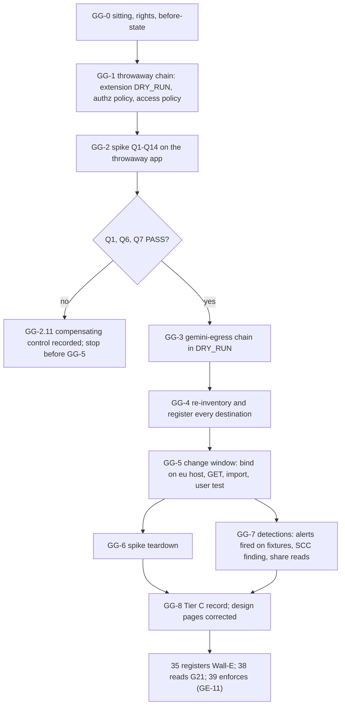

# 20. Gemini Enterprise: the egress gateway and the Tier C gate

## Status
- Owner: the platform owner
- Last reviewed: 2026-09-15
- Last executed: never
- Stage: review §2 stages 19 and 20: GE-9, GE-10, GE-13 and GE-14 of [03 §16](../03-gemini-enterprise-environment.md#16-runbook-bringing-the-environment-to-baseline), rewritten as executable steps. GE-11 (enforcement of the gateway policy) is **not** in this file: it moves to [39](39-wall-e-stage-0.md), once the first agent row is admitted and 30 days of dry-run log are reviewed. GE-12 (per-agent registration and share) is [35](35-wall-e-engine-registration-and-gateways.md) for Wall-E. Runs after [19](19-gemini-enterprise-import-and-baseline.md), in parallel with files 21 to 29, and closes before 35 and before 38 (gate line G21).
- Step prefix: `GG`. 50 steps.
- BLOCKED: GG-2.1's Agent Runtime path (the `canary-r` engine is BLOCKED on code in [18](18-model-armor-floor-spikes-and-kill-switch.md) KS-1.5, README B-04; its no-code path runs when 05's import list holds no Agent Runtime or A2A agent) and GG-7.6 (the reconciliation and drift jobs extended to the app: README B-02; GG-7.5 runs its manual interim meanwhile). Conditional stop, not BLOCKED: GG-5.1 refuses to bind unless spike answers Q1, Q6 and Q7 are PASS.
- IRREVERSIBLE: none. The one step without a documented undo (GG-5.3, the production binding) is gated so that it runs only after its undo is proven on the throwaway app.
- Replaces: the GE-9 to GE-14 rows of 03 §16 and the binding example of 03 §11.1. Kept: the step list, `DRY_RUN` on the authorisation extension (03 §11.1, correct), the three-stage protocol of P57 (spike, dry run, enforce). Not copied: §11.1's global-host PATCH (X-GE-20), GE-10's "with `DRY_RUN`" on the binding and its `Assumption:` unbind (X-GE-04), GE-13's "detections in the SIEM with a CI test each" and GE-14's penetration test as a Tier C condition (S050), 03 §3's "the gateway binding is not a constrainable field" (X-GE-09), 03 §13's "agent sharing" as an Admin Activity entry (X-GE-11).
- Closes: S050 (the GE-13 and GE-14 half; 15 made the SCC route), X-GE-04, X-GE-08 (the spike half; 19 made the production half), X-GE-09 (test and dry run; enforcement handed to 39), X-GE-11 (the share-source and detection-key half; 19 made the `ADMIN_READ` half), X-GE-16, X-GE-20, X-GE-22 (the platform half; 35 applies it to Wall-E's share). §"Findings" says how.
- Decisions applied (pending signature in [03](03-decisions-and-people.md)): SD-13, SD-19, SD-20, SD-21; design decisions P6, P53, P57, P59 of [../12-open-decisions.md](../12-open-decisions.md).
- Every command, flag, field, role, constraint and console path was read on Google's pages on 2026-09-15 (§"Sources"). Nothing was run against the tenant while writing. What could not be verified is listed in §"Not verified" and marked `Assumption:` at its step.
- Elapsed: 1 to 2 weeks to `TIER_C_RECORD` (the spike, a change-window notice of five business days, seven days of dry-run log). The 30-day dry-run review (GG-5.8) continues after the record and is 39's input, not a Tier C condition. Hands-on: 3 days.

---

## 1. What this part builds

1. **The throwaway-app spike (P59, GE-9).** On `GE_THROWAWAY_APP_ID` (made in 19 GE-4.5) and a throwaway gateway chain in `GEMINI_PROJECT`: the authorisation extension with `iamEnforcementMode: DRY_RUN`, its authorisation policy and a starter IAM access policy; one Agent Runtime agent (the `canary-r` engine of 18) registered in the app **before** binding; the binding on the `eu-discoveryengine` host; whether the pre-existing agent keeps working or how its import is proven; the unbind proven; the unreachable-template test with a throwaway template pair; `custom.geEngineGatewayRequired` tested on CREATE and UPDATE; which audit method an agent share writes; `agents.create` by a holder of the user role. Fourteen questions, each answered in one record and carried into 03 §11 and §18.
2. **`gemini-egress` and its registry (GE-9).** The production gateway `gemini-egress` in `europe-west1`, its IAP authorisation extension in `DRY_RUN`, its authorisation policy and access policy; every live agent, endpoint and MCP server from 05's import list re-inventoried and registered in the project's `europe-west1` Agent Registry before any binding.
3. **The binding (GE-10).** In an announced change window with a non-admin colleague's user test: PATCH on `https://eu-discoveryengine.googleapis.com` with the `updateMask`, the project-number gateway name and `X-Goog-User-Project`; GET and a `jq` assertion; the agents imported into the app; the first dry-run read; the gateway constraint in dry run.
4. **Tier C detections (GE-13).** Log-based alert policies in `GEMINI_PROJECT` for the PL-10 rows that have a documented log source, keyed on the method names the spike recorded and each fired once by a fixture on the throwaway app; an SCC test finding on `GEMINI_PROJECT` proven through 15's route; share detection by scheduled reads (manual weekly until B-02).
5. **The Tier C gate record (GE-14).** `TIER_C_RECORD`: register (16), baseline (19), gateway bound in dry run with seven clean days, spike answers, detections fired, SCC route; the penetration test moved to Tier P (37, G8); the design pages corrected.

| Old text | Why it fails | Here instead |
|---|---|---|
| 03 §11.1 binding: `PATCH https://discoveryengine.googleapis.com/v1/projects/PROJECT_NUMBER/locations/eu/...` (X-GE-20) | Google's locations page: for an `eu` app "replace global-discoveryengine or discoveryengine with eu-discoveryengine"; no `updateMask`, no header, no GET | GG-2.2 and GG-5.3: the `eu` host, `?updateMask=agentGatewaySetting.defaultEgressAgentGateway.name`, `X-Goog-User-Project`, GET plus `jq` |
| 03 §16 GE-10 "bind ... with `DRY_RUN`"; rollback "unbind by the same PATCH (`Assumption:`)" (X-GE-04) | `DRY_RUN` is `iamEnforcementMode` on the authorisation extension, which no step created; Google documents no unbind; binding "immediately routes all existing agent traffic" | GG-1 and GG-3 create extension, authorisation policy and access policy; GG-5.1 binds only on proven Q1, Q6, Q7; rollback is the proven method, "none documented" before it |
| 03 §11.2 `gemini-registry` as a created resource | Agent Registry "operates at the project level": no registry is created; entries are `services` in a location; the `eu` multi-region refuses manual registration | `GE_REGISTRY` is `//agentregistry.googleapis.com/projects/GEMINI_PROJECT/locations/europe-west1`; GG-4 registers each destination |
| 03 §16 GE-7 verify "a test with the template temporarily unreachable blocks" (X-GE-08) | Blocks every user of the production app | GG-2.5 on the throwaway app and a throwaway template pair |
| 03 §3 "neither the gateway binding nor the Model Armor setting is a constrainable field" (X-GE-09) | Google's gateway deploy page publishes a custom constraint on `Engine.agentGatewaySetting`; the Gemini Enterprise custom-constraint page does not list the field | GG-2.6 tests it; GG-5.7 applies it in dry run; enforcement is 39's |
| 03 §13 "agent registration and sharing" are Admin Activity; retention on `UpdateAssistant` (X-GE-11) | The audit page lists `AgentService.CreateAgent/UpdateAgent/DeleteAgent` and no agent `SetIamPolicy`; the Assistant has no retention field | GG-2.7 records what a share writes; GG-7.2 keys rules on recorded method names; GG-7.5 reads sharing directly |
| 03 §4 `ge-users@` "use the assistant and shared agents" (X-GE-16) | `agentspaceUser` holds `discoveryengine.agents.create` and `agents.update` | GG-2.8 tests `agents.create` by a holder of that role |
| wall-e SETUP Phase 13 "share it with $OPERATORS only" (X-GE-22) | The share dialog requires "Select a role in the Assign role field"; a Group works only with "the correct IAM role" | GG-2.7 records the role names offered; GG-4.5 writes the containment check 35 applies |
| 03 §16 GE-13 "[security reviewer] Detections of §13 in the SIEM"; GE-14 "penetration test ... before S1" inside the gate (S050) | No SIEM before Tier P (P10); the penetration test is scheduled before the grant | SCC route plus log-based alerts at Tier C (GG-7); SIEM rules in 15 part B; the test in 37 |



## 2. Preconditions

- [ ] File 01: `~/.platform-env` with `need`, `penv_set`, `exists_or_pending`, `penv_guard`, `checkpoint`, `evidence_add`, `sitting_end`; `BUILD_LOG_DIR`, `PLATFORM_REPO_DIR`, `DEVIATION_REGISTER`, `EVIDENCE_REGISTER`, `DRILL_CALENDAR`, `ORG_ID`, `DOMAIN`, `REGION` (`europe-west1`), `GE_LOCATION` (`eu`).
- [ ] File 05: `GEMINI_PROJECT`, `GEMINI_PROJECT_NUMBER`, `GEMINI_APP_ID`, `GEMINI_APP_LOCATION` (`eu`), `GE_INVENTORY_DIR` with `*-GI-8.5-ge10-import-list-v*.csv` and `*-GI-8.4-*` (the app reads "not bound").
- [ ] File 06: `SA_1_ADMIN`, `GRP_GE_ADMINS`, `GRP_GE_USERS`, `GRP_PLATFORM_OWNERS`, `GRP_PLATFORM_SECURITY`.
- [ ] File 09: `SCC_TIER` reads `PREMIUM/eu`; `FLD_GEMINI_ENTERPRISE`.
- [ ] File 10: `CORE_PROJECT`, `LOGGING_PROJECT`, `CICD_PROJECT`, `SA_FACTORY_APPLY`.
- [ ] File 12: `ENT_GE_ADMIN` (no approval, Tier C), `ENT_PLATFORM_POLICY` (approver the second human), `ENT_FOLDER_ADMIN`; `pam/tools/pam.sh`.
- [ ] File 13: `iam.managed.disableAccessPolicyBinding` state on `fld-gemini-enterprise` recorded (row B7); GG-1.1 lifts it on the project if 13 or 19 has not.
- [ ] File 14: `S-folder` intercepting audit families; folder `auditConfigs` include `iap.googleapis.com` `DATA_READ` and `DATA_WRITE` (CL-8.1); the `security` view on `platform-evidence-logs` readable by the platform owner or the second human.
- [ ] File 15 part A: `SCC_NOTIFICATION_CONFIG`, `SCC_ROUTE_TEST_SOURCE`, `NOTIF_CH_PAGER_CORE`, record `<date>-PS-6.8-scc-route-test-v1`.
- [ ] File 16: `AGENT_REGISTRY`, `REGISTER_PATH` with the `tenant-app` row merged.
- [ ] File 17: `TIER_R_RECORD`; FM-2.13's channel procedure.
- [ ] File 18: `CANARY_R_PROJECT`, `ENT_PROJECT_REPAIR_CANARY_R`; KS-1.5's canary engine deployed, or GG-2.1 takes its no-code path (only when 05's import list has no Agent Runtime or A2A agent).
- [ ] File 19: every GE step `DONE` except its listed BLOCKED ones; `GE_THROWAWAY_APP_ID` (shared with `ge-admins@` only), `GE_ARMOR_TEMPLATE`, `ENT_PROJECT_REPAIR_TENANT_APP` (17 FM-6.2 calls the same entitlement `ENT_PROJECT_REPAIR_GEMINI`; GG-0.1 accepts either); `ge-helpers.sh` in `BUILD_LOG_DIR/ge-baseline`; the colleague's agreement record `records/19-people.md`.
- [ ] File 03: SD-13, SD-19, SD-20, SD-21 signed or recorded pending with this file named; `SECOND_HUMAN_EMAIL`, `INCIDENT_COMMANDER_EMAIL`.
- [ ] The non-admin colleague of 19 (or another) agrees again: licensed, in `ge-users@`, holds no `discoveryengine` role other than through `ge-users@`, not in `ge-admins@`.
- [ ] Workstation: `gcloud` with `beta` (for `service-extensions`, `monitoring channels`), `curl`, `jq`, `git`, `shasum`.

## 3. People needed

| Person | Does | Present when |
|---|---|---|
| Platform owner (`sa-1-admin@`, own browser profile) | Every step; a member of `ge-admins@`; requests every grant; self-review recorded as security reviewer at Tier C (HLD §0.3) | throughout |
| Second human (`SECOND_HUMAN_EMAIL`) | Approves `ENT_PLATFORM_POLICY` and `ENT_PROJECT_REPAIR_CANARY_R` grants; confirms the test pages of GG-7.3 and GG-7.4 | GG-1.1, GG-2.1, GG-2.6, GG-5.7, GG-6.1, GG-7.3, GG-7.4 |
| Non-admin colleague (named in 19) | `agents.create` test (GG-2.8); the user test in the change window (GG-5.5) | GG-2.8, GG-5.5 |
| IT security SCC administrator (named in 09) | Raises the SCC test finding on `GEMINI_PROJECT` | GG-7.4 |
| IT security paging administrator | Creates a key-bearing paging channel in `GEMINI_PROJECT` if 15's channel type carries a key (17 FM-2.13) | GG-7.1 |
| Gemini Enterprise administrators' communications contact | Sends the change-window notice (five business days ahead) | GG-4.4 |
| IT security desk | Acknowledges the announced window so the binding alert is expected | GG-5.2 to GG-5.6 |

## 4. Decisions applied and facts that shape the steps

| Decision or fact (source read 2026-09-15) | Applied as |
|---|---|
| SD-13: Tier C after Tier R; Tier C detection desk is SCC findings routed with a test finding | GG-7.4 cites 15's route record; SIEM rules stay in 15 part B |
| SD-19: admin acts on the app by `ge-admins@` through `ent-ge-admin`, no approval at Tier C | Binding, share, Model Armor changes under `ENT_GE_ADMIN` |
| SD-20: the binding waits for the spike's proof of the `DRY_RUN` extension, the import and the unbind | GG-5.1 gate |
| SD-21, P59: `eu` app only; one throwaway app per spike, deleted at the end | GG-6.3 deletes `GE_THROWAWAY_APP_ID` |
| Google: `AgentGatewayReference.name` "Required. Immutable ... Expected format: projects/{projectNumber}/locations/{location}/agentGateways/{agent_gateway}"; the deploy page's example body uses PROJECT_ID | The PATCH sends the project-number form; the spike records what GET returns (Q8) and whether a direct rebind is refused (Q7) |
| Google: `Engine.associatedAgentRegistry` "Output only ... Derived server-side from the linked Agent Gateway's registry" | GG-5.4 asserts it equals `GE_REGISTRY` |
| Google: extension YAML `service: iap.googleapis.com`, `failOpen: false`, `timeout: 1s`, `metadata.iapPolicyVersion: "V2"`, `iamEnforcementMode: "DRY_RUN"`; "Remove the iamEnforcementMode field ... when you're ready to start enforcing" | GG-1.3, GG-3.2; enforcement is 39's |
| Google: "Agent access to destinations always requires an IAM Access policy granting the `iap.resources.egressViaIAP` permission to the agent identity"; rules use `iap.googleapis.com/resources.egressViaIAP` | GG-1.5, GG-3.4 |
| Google: gateway requests log to `networkservices.googleapis.com%2Fgateway_requests` in the project; IAP decisions to `cloudaudit.googleapis.com%2Fdata_access`, filterable by `protoPayload.metadata.iamEnforcementMode="DRY_RUN"` | Gateway log read in `GEMINI_PROJECT`; IAP entries read in `LOGGING_PROJECT`'s `security` view, because `S-folder` intercepts `data_access` (14) |
| Google: `agents.list` "Lists all Agents under an Assistant which were created by the caller" | No API count of agents is trusted; the console list stays authoritative (05 GI-8.2) |
| Google: `roles/discoveryengine.agentspaceUser` holds `agents.create` and `agents.update`, not `agents.setIamPolicy` | GG-2.8 |
| Google: Agent Gateway protocols enum has one value, `MCP`; `governedAccessPath` `AGENT_TO_ANYWHERE` | Gateway YAML in GG-1.2 and GG-3.1 |
| Google: log-based alert policies evaluate entries routed to a bucket in the policy's project; Admin Activity stays in each project's `_Required` bucket, which interception does not touch | Alert policies in `GEMINI_PROJECT` on Admin Activity only (GG-7.2) |

---

## 5. Steps

### GG-0 The sitting and the preflight

#### GG-0.1 Open the sitting and check the gate

- **WHO:** platform owner. Solo.
- **WHERE:** shell, `~/.platform-env` sourced; browser profile of `sa-1-admin@`.
- **ACTION:**
```bash
source ~/.platform-env
penv_guard
need BUILD_LOG_DIR PLATFORM_REPO_DIR EVIDENCE_REGISTER DEVIATION_REGISTER DRILL_CALENDAR ORG_ID DOMAIN REGION GE_LOCATION SA_1_ADMIN GEMINI_PROJECT GEMINI_PROJECT_NUMBER GEMINI_APP_ID GEMINI_APP_LOCATION GE_INVENTORY_DIR GE_THROWAWAY_APP_ID GE_ARMOR_TEMPLATE ENT_GE_ADMIN ENT_PLATFORM_POLICY GRP_GE_ADMINS GRP_GE_USERS CORE_PROJECT LOGGING_PROJECT CICD_PROJECT AGENT_REGISTRY TIER_R_RECORD SCC_ROUTE_TEST_SOURCE SCC_TIER CANARY_R_PROJECT SECOND_HUMAN_EMAIL
test "$GE_LOCATION" = eu && test "$GEMINI_APP_LOCATION" = eu || echo "STOP: not eu (SD-21)"
test "$SCC_TIER" = "PREMIUM/eu" || echo "STOP: SCC not Premium/eu (09)"
test -n "${ENT_PROJECT_REPAIR_TENANT_APP:-${ENT_PROJECT_REPAIR_GEMINI:-}}" || echo "STOP: no repair entitlement for GEMINI_PROJECT (19 GE-2.3 / 17 FM-6.2)"
gcloud auth login "$SA_1_ADMIN"
grep -cE $'\tGE-[0-9.]+\tDONE' "$BUILD_LOG_DIR/checkpoints.tsv"
grep -E $'\tGE-[0-9.]+\tBLOCKED' "$BUILD_LOG_DIR/checkpoints.tsv" | cut -f2 | sort -u
ls "$BUILD_LOG_DIR"/records/*PS-6.8-scc-route-test-v* "$BUILD_LOG_DIR"/evidence/15/*PS-6.8* 2>/dev/null | head -2
checkpoint "SITTING-$(date -u +%Y%m%d%H%M)" START - - "20 GE gateway and Tier C"
```
- **VERIFY:** `penv_guard` silent; no `STOP`; the BLOCKED list from 19 is exactly GE-2.6 and GE-6.7 (and GE-8.3's drift job); PS-6.8's record is listed; `gcloud auth list --filter=status:ACTIVE --format='value(account)'` prints `SA_1_ADMIN`.
- **ROLLBACK:** none needed.
- **EVIDENCE:** checkpoint lines. E-xx: none. TISAX: 4.1.2.

#### GG-0.2 Working directory and helpers

- **WHO:** platform owner. Solo.
- **WHERE:** shell.
- **ACTION:** 19's helpers (`ge_file`, `ge_call`, `pam_grant`, `pam_active`, `ma_eu`) are reused; this file adds the project-number engine path of the deploy page and a spike-record writer.
```bash
source "$BUILD_LOG_DIR/ge-baseline/ge-helpers.sh"
GG_DIR="$BUILD_LOG_DIR/ge-gateway"; mkdir -p "$GG_DIR/restricted" "$BUILD_LOG_DIR/records"
grep -qxF 'ge-gateway/restricted/' "$BUILD_LOG_DIR/.gitignore" || printf '%s\n' 'ge-gateway/restricted/' >> "$BUILD_LOG_DIR/.gitignore"
cat > "$GG_DIR/gg-helpers.sh" <<'EOF'
GG_DIR="$BUILD_LOG_DIR/ge-gateway"
GG_DATE="$(date -u +%F)"
GG_HOST="https://eu-discoveryengine.googleapis.com"
GG_ENGINES="${GG_HOST}/v1/projects/${GEMINI_PROJECT_NUMBER}/locations/eu/collections/default_collection/engines"
gg_file() { local d="$GG_DIR" n=1; [ "${4-}" = restricted ] && d="$GG_DIR/restricted"; while [ -e "$d/${GG_DATE}-$1-$2-v${n}.$3" ]; do n=$((n+1)); done; printf '%s\n' "$d/${GG_DATE}-$1-$2-v${n}.$3"; }
gg_answer() { printf '| %s | %s | %s | %s |\n' "$1" "$2" "$3" "$(date -u +%FT%TZ)" >> "$GG_SPIKE"; git -C "$BUILD_LOG_DIR" add "$GG_SPIKE" && git -C "$BUILD_LOG_DIR" commit -q -m "spike $1 $2"; }
gg_engine_view() { ge_call GET "${GG_ENGINES}/$1" | jq '{name, displayName, agentGatewaySetting, associatedAgentRegistry}'; }
EOF
source "$GG_DIR/gg-helpers.sh"
checkpoint GG-0.2 DONE
```
- **VERIFY:** `type ge_call pam_grant pam_active ma_eu gg_file gg_answer gg_engine_view` names seven functions; `echo "$GG_ENGINES"` contains `projects/<GEMINI_PROJECT_NUMBER>/locations/eu`.
- **ROLLBACK:** none needed. On resume: `source ~/.platform-env; source "$BUILD_LOG_DIR/ge-baseline/ge-helpers.sh"; source "$BUILD_LOG_DIR/ge-gateway/gg-helpers.sh"; GG_SPIKE="$(ls -t "$BUILD_LOG_DIR"/records/*-GG-0.4-ge-spike-record-v*.md | head -1)"`.
- **EVIDENCE:** none. E-xx: none. TISAX: none.

#### GG-0.3 Extend the tenant-app repair entitlement with the gateway roles

- **WHO:** platform owner as PAM administrator (`platform-owners@`). Solo.
- **WHERE:** shell.
- **ACTION:** 19 GE-2.3's bundle has project IAM, services, contacts, logging configuration and Model Armor; the gateway needs the permissions Google's set-up page lists (`networkservices.agentGateways.*`, `networkservices.authzExtensions.*`, `networksecurity.authzPolicies.*`), Agent Registry writes (`roles/agentregistry.editor`, registration pages) and the access policy (`roles/iam.accessPolicyAdmin`, IAM access policies page); alert policies need Monitoring. This is the tenant-app module's own entitlement growing with the module's scope, recorded in the deviation register; no role is granted directly.
```bash
ENT_REPAIR="${ENT_PROJECT_REPAIR_TENANT_APP:-$ENT_PROJECT_REPAIR_GEMINI}"
f="$(gg_file GG-0.3 entitlement-before yaml)"
gcloud pam entitlements describe "$ENT_REPAIR" --format=yaml > "$f"
for r in roles/networkservices.admin roles/networksecurity.admin roles/agentregistry.editor roles/iam.accessPolicyAdmin roles/monitoring.editor roles/logging.viewer; do gcloud iam roles describe "$r" --format='value(name)'; done
g="$(gg_file GG-0.3 entitlement-after yaml)"
yq '.privilegedAccess.gcpIamAccess.roleBindings += [{"role":"roles/networkservices.admin"},{"role":"roles/networksecurity.admin"},{"role":"roles/agentregistry.editor"},{"role":"roles/iam.accessPolicyAdmin"},{"role":"roles/monitoring.editor"},{"role":"roles/logging.viewer"}] | del(.name, .createTime, .updateTime, .state)' "$f" > "$g"
diff "$f" "$g"
gcloud pam entitlements update "$(basename "$ENT_REPAIR")" --project="$GEMINI_PROJECT" --location=global --entitlement-file="$g"
printf '| %s | GG-0.3 | tenant-app | ent-project-repair-tenant-app gains gateway, registry, access-policy and monitoring roles | %s | platform owner |\n' "$(date -u +%F)" "$g" >> "$DEVIATION_REGISTER"
GRANT="$(pam_grant "$ENT_REPAIR" 1800s "setup 20 GG-0.3 one-grant test")"; pam_active "$GRANT"; gcloud pam grants revoke "$GRANT" --reason="GG-0.3 test"
```
  `Assumption:` `yq` (jq-compatible YAML wrapper) is installed, as 19 assumes; without it, edit the copy by hand and keep the `diff`. The `etag` is kept so a concurrent change fails the update; the gcloud reference does not say which fields `update` accepts, so a refusal naming a field is recorded and that field removed.
- **VERIFY:** each `roles describe` prints its role; `gcloud pam entitlements describe "$ENT_REPAIR" --format=json | jq -r '.privilegedAccess.gcpIamAccess.roleBindings[].role'` lists 19's five roles plus the six; `approvalWorkflow` still absent (Tier C, SD-19); `pam_active` printed `ACTIVE`. Confirm the set-up page's permissions by `gcloud iam roles describe roles/networkservices.admin --format=json | jq '.includedPermissions | map(select(startswith("networkservices.agentGateways.") or startswith("networkservices.authzExtensions."))) | length'` (non-zero) and the same for `networksecurity.authzPolicies.` on `roles/networksecurity.admin`.
- **ROLLBACK:** `gcloud pam entitlements update ... --entitlement-file="$f"` (the saved before file, without output-only fields).
- **EVIDENCE:** before and after files; `evidence_add GG-0.3 repair-entitlement-gateway E-05 4.1.3 "build-log:ge-gateway/<after>" "$g"`.

#### GG-0.4 Read the before state and open the spike record

- **WHO:** platform owner. Solo.
- **WHERE:** shell; Google Cloud console → **Gemini Enterprise** → the production app → **Security** → **Configuration** (read only).
- **ACTION:**
```bash
gg_engine_view "$GEMINI_APP_ID" | tee "$(gg_file GG-0.4 prod-engine-before json)"
gg_engine_view "$GE_THROWAWAY_APP_ID" | tee "$(gg_file GG-0.4 throwaway-engine-before json)"
gcloud services list --enabled --project="$GEMINI_PROJECT" --format='value(config.name)' | grep -E '^(networkservices|networksecurity|iap|agentregistry|modelarmor|compute|dns|discoveryengine|logging|monitoring)\.googleapis\.com$' | sort
gcloud network-services agent-gateways list --location=europe-west1 --project="$GEMINI_PROJECT" --format='table(name,googleManaged.governedAccessPath)'
gcloud org-policies describe iam.managed.disableAccessPolicyBinding --project="$GEMINI_PROJECT" --effective --format=json | tee "$(gg_file GG-0.4 access-policy-binding-effective json)"
gcloud projects get-iam-policy "$GEMINI_PROJECT" --format=json | jq '.auditConfigs'
GG_SPIKE="$BUILD_LOG_DIR/records/$(date -u +%F)-GG-0.4-ge-spike-record-v1.md"
cat > "$GG_SPIKE" <<'EOF'
# Gemini Enterprise gateway spike (setup 20, P57 stage 1, P59)
Throwaway app only. Each row: question id, answer, PASS/FAIL/RECORDED, evidence file, time.
| Q | Question | Gates |
|---|---|---|
| Q1 | Does DRY_RUN on the IAP extension log decisions without denying, for an app binding? | GG-5 |
| Q2 | Which principal string does the app present in the IAP decision? | GG-3.4 |
| Q3 | Do the assistant's LLM calls appear as destinations; which hostnames? | GG-3.4 |
| Q4 | Is a call to an Agent Runtime agent routed through the gateway? | 35 |
| Q5 | Added latency: median and p90 of 20 timed questions, unbound vs bound | P57 availability |
| Q6 | Does an agent registered before binding keep working, or how is its import proven? | GG-5 |
| Q7 | Which unbind works (console, PATCH), after how long; is a direct rebind refused? | GG-5 rollback |
| Q8 | Which gateway name form does GET return (project number or id)? | GG-5.4, GG-5.7 |
| Q9 | Unreachable template under FAIL_CLOSED: runtime block, or write-time refusal? | 06 §3.5 |
| Q10 | custom.geEngineGatewayRequired: accepted; CREATE refused; UPDATE unbind refused; UPDATE rebind refused? | GG-5.7, 39 |
| Q11 | What does a share write (methodName, log type, fields) for Group and All users; which roles does Assign role offer? | GG-7.2, 35 |
| Q12 | Can a holder of agentspaceUser create an agent by API; who sees it; does requestReview reach admins? | 03 §4, §10 |
| Q13 | Which API read returns an agent's sharing (sharingConfig, IAM policy)? | GG-7.5, B-02 |
| Q14 | Answers written to 03 §11 and §18 (record id cited) | GG-8.3 |

## Answers
| Q | Answer | Result | Time |
|---|---|---|---|
EOF
git -C "$BUILD_LOG_DIR" add "$GG_SPIKE" && git -C "$BUILD_LOG_DIR" commit -q -m "GG-0.4 spike record opened"
penv_set GE_SPIKE_RECORD "$GG_SPIKE"
checkpoint GG-0.4 DONE - "$GG_SPIKE"
```
- **VERIFY:** the production engine shows no `agentGatewaySetting` (a bound app is a stop: 05 GI-8.4 said "not bound"; open a decision record and do not continue); the service list includes `networkservices`, `networksecurity`, `iap`, `agentregistry`, `modelarmor`, `compute`, `dns` (enabled by 19 GE-2.4 from 03 §3's Hosts row; a missing one is a re-run of GE-2.4, never enabled here); no gateway exists; `auditConfigs` or the folder's (14) cover `iap.googleapis.com`.
- **ROLLBACK:** none needed.
- **EVIDENCE:** the before files; `evidence_add GG-0.4 before-state E-05 5.2.7 "build-log:ge-gateway/"`.

### GG-1 The throwaway gateway chain

#### GG-1.1 Lift the access-policy binding constraint on `GEMINI_PROJECT`, if not already lifted

- **WHO:** platform owner under `ENT_PLATFORM_POLICY`; approver: the second human.
- **WHERE:** shell, in `PLATFORM_REPO_DIR`.
- **ACTION:** Google's set-up page requires the constraint (constraints reference spelling `iam.managed.disableAccessPolicyBinding`; the set-up page writes it in the plural, 02 §4.1 B7) not to be enforced where the access policy is bound. `N/A` when GG-0.4's effective read already shows `enforce: false` for the project.
```bash
f="$PLATFORM_REPO_DIR/policies/projects/gemini/iam.managed.disableAccessPolicyBinding.yaml"; mkdir -p "$(dirname "$f")"
gcloud org-policies describe iam.managed.disableAccessPolicyBinding --project="$GEMINI_PROJECT" --format=yaml > "${f%.yaml}.before.yaml" 2>&1 || true
cat > "$f" <<EOF
name: projects/${GEMINI_PROJECT}/policies/iam.managed.disableAccessPolicyBinding
spec:
  rules:
  - enforce: false
EOF
git -C "$PLATFORM_REPO_DIR" add "$f" "${f%.yaml}.before.yaml" && git -C "$PLATFORM_REPO_DIR" commit -m "GG-1.1 lift access-policy binding constraint on the app project (gateway binding, review 2027-03-15)"
GRANT="$(pam_grant "$ENT_PLATFORM_POLICY" 3600s "setup 20 GG-1.1 lift disableAccessPolicyBinding on GEMINI_PROJECT for gemini-egress")"; pam_active "$GRANT"
gcloud org-policies set-policy "$f"
gcloud pam grants revoke "$GRANT" --reason="GG-1.1 done"
```
- **VERIFY:** `gcloud org-policies describe iam.managed.disableAccessPolicyBinding --project="$GEMINI_PROJECT" --effective --format='value(spec.rules[0].enforce)'` prints `False` after up to 15 minutes; the folder's policy is unchanged.
- **ROLLBACK:** `gcloud org-policies delete iam.managed.disableAccessPolicyBinding --project="$GEMINI_PROJECT"` under a new grant (restores inheritance), only when no access-policy binding remains in the project: after GG-6.1 if GG-2.11 decided the compensating control, never while `gemini-egress-access-binding` exists.
- **EVIDENCE:** the commit; `evidence_add GG-1.1 access-policy-binding-lift E-03 5.2.1 "platform-repo:$f"`.

#### GG-1.2 Import the throwaway gateway

- **WHO:** platform owner under `ENT_PROJECT_REPAIR_TENANT_APP`.
- **WHERE:** shell.
- **ACTION:** Gateway YAML as Google's set-up page shows (egress form), one project-scoped registry (the resource reference: "Currently limited to project-scoped registries").
```bash
GRANT="$(pam_grant "$ENT_REPAIR" 3600s "setup 20 GG-1 throwaway gateway chain (spike, P59)")"; pam_active "$GRANT"
W="$(gg_file GG-1.2 gg-spike-egress yaml)"
cat > "$W" <<EOF
name: gg-spike-egress
protocols:
  - MCP
googleManaged:
  governedAccessPath: AGENT_TO_ANYWHERE
registries:
  - //agentregistry.googleapis.com/projects/${GEMINI_PROJECT}/locations/europe-west1
EOF
gcloud network-services agent-gateways import gg-spike-egress --source="$W" --location=europe-west1 --project="$GEMINI_PROJECT"
gcloud network-services agent-gateways describe gg-spike-egress --location=europe-west1 --project="$GEMINI_PROJECT" --format=yaml | tee "$(gg_file GG-1.2 gg-spike-egress-describe yaml)"
```
- **VERIFY:** `describe` shows `governedAccessPath: AGENT_TO_ANYWHERE`, the registry, `protocols: [MCP]`; `checkpoint GG-1.2 DONE`.
- **ROLLBACK:** `gcloud network-services agent-gateways delete gg-spike-egress --location=europe-west1 --project="$GEMINI_PROJECT"` (GG-6.1 does it).
- **EVIDENCE:** YAML and describe; `evidence_add GG-1.2 spike-gateway E-05 5.2.7 "build-log:ge-gateway/<describe>"`.

#### GG-1.3 Import the IAP authorisation extension in `DRY_RUN`

- **WHO:** platform owner under the same grant.
- **WHERE:** shell.
- **ACTION:**
```bash
W="$(gg_file GG-1.3 gg-spike-iap-authz yaml)"
cat > "$W" <<'EOF'
name: gg-spike-iap-authz
service: iap.googleapis.com
failOpen: false
timeout: 1s
metadata:
  iapPolicyVersion: "V2"
  iamEnforcementMode: "DRY_RUN"
EOF
gcloud beta service-extensions authz-extensions import gg-spike-iap-authz --source="$W" --location=europe-west1 --project="$GEMINI_PROJECT"
gcloud beta service-extensions authz-extensions describe gg-spike-iap-authz --location=europe-west1 --project="$GEMINI_PROJECT" --format=yaml | tee "$(gg_file GG-1.3 gg-spike-iap-authz-describe yaml)"
```
- **VERIFY:** `describe` shows `metadata.iamEnforcementMode: DRY_RUN` and `failOpen: false`.
- **ROLLBACK:** `gcloud beta service-extensions authz-extensions delete gg-spike-iap-authz --location=europe-west1 --project="$GEMINI_PROJECT"` (after GG-1.4's policy is deleted).
- **EVIDENCE:** YAML and describe; `evidence_add GG-1.3 spike-authz-extension E-05 5.2.7 "build-log:ge-gateway/<describe>"`.

#### GG-1.4 Import the authorisation policy for the throwaway gateway

- **WHO:** platform owner under the same grant.
- **WHERE:** shell.
- **ACTION:** Google: "Every Agent Gateway requires an associated authorization policy".
```bash
W="$(gg_file GG-1.4 gg-spike-authz-policy yaml)"
cat > "$W" <<EOF
name: gg-spike-authz-policy
target:
  resources:
    - "projects/${GEMINI_PROJECT}/locations/europe-west1/agentGateways/gg-spike-egress"
policyProfile: REQUEST_AUTHZ
action: CUSTOM
customProvider:
  authzExtension:
    resources:
      - "projects/${GEMINI_PROJECT}/locations/europe-west1/authzExtensions/gg-spike-iap-authz"
EOF
gcloud network-security authz-policies import gg-spike-authz-policy --source="$W" --location=europe-west1 --project="$GEMINI_PROJECT"
gcloud network-security authz-policies describe gg-spike-authz-policy --location=europe-west1 --project="$GEMINI_PROJECT" --format=yaml | tee "$(gg_file GG-1.4 gg-spike-authz-policy-describe yaml)"
```
- **VERIFY:** `describe` shows `action: CUSTOM`, the gateway target and the extension.
- **ROLLBACK:** `gcloud network-security authz-policies delete gg-spike-authz-policy --location=europe-west1 --project="$GEMINI_PROJECT"`.
- **EVIDENCE:** `evidence_add GG-1.4 spike-authz-policy E-05 5.2.7 "build-log:ge-gateway/<describe>"`.

#### GG-1.5 A starter IAM access policy naming the throwaway app

- **WHO:** platform owner under the same grant.
- **WHERE:** shell.
- **ACTION:** The principal is Google's documented form for an `eu` Gemini Enterprise app (IAM access policies page). Which principal the app actually presents is Q2, read from the dry-run entries; no CEL condition is set (`Assumption:` `conditions` is optional; if the create is refused, record the error in the spike record and add `"conditions":{"iap.googleapis.com":{"expression":"true"}}`).
```bash
P="principal://agents.global.org-${ORG_ID}.system.id.goog/resources/discoveryengine/projects/${GEMINI_PROJECT_NUMBER}/locations/eu/engines/${GE_THROWAWAY_APP_ID}/assistants/default_assistant/agents/default/core_assistant"
W="$(gg_file GG-1.5 gg-spike-access-rules json)"
jq -n --arg p "$P" '[{description:"setup 20 spike: throwaway app egress, evaluated in DRY_RUN", effect:"ALLOW", principals:[$p], operation:{permissions:["iap.googleapis.com/resources.egressViaIAP"]}}]' > "$W"
gcloud iam access-policies create gg-spike-access --details-rules="$W" --project="$GEMINI_PROJECT" --location=global
gcloud iam policy-bindings create gg-spike-access-binding --policy="projects/${GEMINI_PROJECT}/locations/global/accessPolicies/gg-spike-access" --target-resource="//cloudresourcemanager.googleapis.com/projects/${GEMINI_PROJECT}" --project="$GEMINI_PROJECT" --location=global
gcloud iam access-policies describe gg-spike-access --project="$GEMINI_PROJECT" --location=global --format=json | tee "$(gg_file GG-1.5 gg-spike-access-describe json)"
gcloud pam grants revoke "$GRANT" --reason="GG-1 chain done"
```
- **VERIFY:** `describe` returns the rule; `gcloud iam policy-bindings describe gg-spike-access-binding --project="$GEMINI_PROJECT" --location=global --format='value(target)'` shows the project; `checkpoint GG-1.5 DONE`.
- **ROLLBACK:** `gcloud iam policy-bindings delete gg-spike-access-binding --project="$GEMINI_PROJECT" --location=global`, then `gcloud iam access-policies delete gg-spike-access --project="$GEMINI_PROJECT" --location=global`.
- **EVIDENCE:** `evidence_add GG-1.5 spike-access-policy E-05 4.1.3 "build-log:ge-gateway/<describe>"`.

### GG-2 The spike questions

On GG-2.1's no-code path, every later reference to `gg-spike-canary-r` means `gg-spike-nocode`, and `AG` in GG-2.9 is read with `ge_call GET "${GG_HOST}/v1alpha/projects/${GEMINI_PROJECT}/locations/eu/collections/default_collection/engines/${GE_THROWAWAY_APP_ID}/assistants/default_assistant/agents" | jq -r '.agents[] | select(.displayName=="gg-spike-nocode") | .name'` (the list returns agents created by the caller, which this one is).

#### GG-2.1 Register the pre-existing agent before binding

- **WHO:** platform owner under `ENT_GE_ADMIN` (registration) and `ENT_PROJECT_REPAIR_CANARY_R` (the cross-project grant; approver the second human).
- **WHERE:** shell.
- **ACTION:** `GEMINI_PROJECT` may never host an engine (03 §3), so the spike's agent is `canary-r`'s engine in `fld-agents-r-nonprod` (18), registered in the throwaway app only, which is shared with `ge-admins@` only.

  > **BLOCKED** (Agent Runtime path): Needs: the `canary-r` engine source and its deployment (18 KS-1.5). Commit it in: `PLATFORM_REPO_REMOTE`, canary engine source (README B-04, as extended by 18). Unblocked by: KS-1.5 `DONE` with the engine listed below. Gate waiting: Q4 and Q6, hence GG-5 when 05's import list holds any Agent Runtime or A2A agent. Until then: `checkpoint GG-2.1 BLOCKED - - "18 KS-1.5 canary engine"`.

  **No-code path** (only when `*-GI-8.5-ge10-import-list-v*.csv` has no `agent-runtime` or `a2a-endpoint` line): in the throwaway app's web app, create one agent with the app's agent builder (`Assumption:` the builder path shown in the web app on the day; record it), named `gg-spike-nocode`, answering from no data store; ask it one question before binding, and time 20 assistant questions for Q5's unbound baseline. Q4 is then recorded "not tested; 35's first engine answers it", and Q6 is answered for the no-code type only. Skip the rest of this ACTION.

  Agent Runtime path: Google documents the cross-project grant as `roles/discoveryengine.serviceAgent` on the agent project (cross-project ADK page); the design's engine-scoped `geEngineQuery` is 35's to prove for Wall-E, so the spike uses Google's documented grant as a dated spike exception, removed in GG-6.2. Stop here if 18 has no deployed `canary-r` engine: `checkpoint GG-2.1 BLOCKED - - "needs 18 canary-r engine"`.
```bash
need CANARY_R_PROJECT ENT_PROJECT_REPAIR_CANARY_R
curl -sS --fail-with-body -H "Authorization: Bearer $(gcloud auth print-access-token)" -H "X-Goog-User-Project: $CANARY_R_PROJECT" "https://europe-west1-aiplatform.googleapis.com/v1/projects/${CANARY_R_PROJECT}/locations/europe-west1/reasoningEngines" | jq -r '.reasoningEngines[].name' | tee "$(gg_file GG-2.1 canary-engines txt)"
penv_set GG_SPIKE_ENGINE "$(head -1 "$(ls -t "$GG_DIR"/*-GG-2.1-canary-engines-v*.txt | head -1)")"
G2="$(pam_grant "$ENT_PROJECT_REPAIR_CANARY_R" 3600s "setup 20 GG-2.1 spike: discoveryengine service agent query grant on canary-r (removed GG-6.2)")"; pam_active "$G2"
gcloud projects add-iam-policy-binding "$CANARY_R_PROJECT" --member="serviceAccount:service-${GEMINI_PROJECT_NUMBER}@gcp-sa-discoveryengine.iam.gserviceaccount.com" --role=roles/discoveryengine.serviceAgent --condition=None --format=none
gcloud pam grants revoke "$G2" --reason="GG-2.1 grant made"
printf '| %s | GG-2.1 | spike | roles/discoveryengine.serviceAgent on %s for the app service agent; removed in GG-6.2 | %s | platform owner |\n' "$(date -u +%F)" "$CANARY_R_PROJECT" "$GE_SPIKE_RECORD" >> "$DEVIATION_REGISTER"
GRANT="$(pam_grant "$ENT_GE_ADMIN" 3600s "setup 20 GG-2.1 register canary-r in the throwaway app before binding")"; pam_active "$GRANT"
B="$(gg_file GG-2.1 agent-create json)"
jq -n --arg e "$GG_SPIKE_ENGINE" '{displayName:"gg-spike-canary-r", description:"Setup 20 spike agent. Responses are generated by an AI system.", adkAgentDefinition:{provisionedReasoningEngine:{reasoningEngine:$e}}}' > "$B"
ge_call POST "${GG_HOST}/v1alpha/projects/${GEMINI_PROJECT}/locations/eu/collections/default_collection/engines/${GE_THROWAWAY_APP_ID}/assistants/default_assistant/agents" "$B" | tee "$(gg_file GG-2.1 agent-created json)"
```
  Then, in the throwaway app's web URL (console → **Gemini Enterprise** → the throwaway app → **Overview**, the app link), select `gg-spike-canary-r` and ask its test prompt (18's canary prompt), and ask the assistant one question. Time 20 assistant questions with a stopwatch for Q5's unbound baseline.
- **VERIFY:** the POST returns an agent `name` (or the no-code agent exists); the agent answers; `checkpoint GG-2.1 DONE - - "<runtime|nocode> path"`.
- **ROLLBACK:** `ge_call DELETE "<agent name>"` on the same host; remove the project binding (GG-6.2).
- **EVIDENCE:** created agent JSON, the answer time, the baseline timings in `restricted/`; `evidence_add GG-2.1 spike-agent-before-binding E-05 5.2.6 "build-log:ge-gateway/"`.

#### GG-2.2 Bind the throwaway app on the `eu` host, then GET

- **WHO:** platform owner under `ENT_GE_ADMIN`.
- **WHERE:** shell.
- **ACTION:** X-GE-20: the `eu` host, the project-number path and name, `updateMask`, `X-Goog-User-Project` (added by `ge_call`).
```bash
T0="$(date -u +%FT%TZ)"
B="$(gg_file GG-2.2 bind json)"
jq -n --arg gw "projects/${GEMINI_PROJECT_NUMBER}/locations/europe-west1/agentGateways/gg-spike-egress" '{agentGatewaySetting:{defaultEgressAgentGateway:{name:$gw}}}' > "$B"
ge_call PATCH "${GG_ENGINES}/${GE_THROWAWAY_APP_ID}?updateMask=agentGatewaySetting.defaultEgressAgentGateway.name" "$B" | tee "$(gg_file GG-2.2 bind-response json)"
gg_engine_view "$GE_THROWAWAY_APP_ID" | tee "$(gg_file GG-2.2 throwaway-after json)"
gg_answer Q8 "GET returns $(gg_engine_view "$GE_THROWAWAY_APP_ID" | jq -r '.agentGatewaySetting.defaultEgressAgentGateway.name'); associatedAgentRegistry $(gg_engine_view "$GE_THROWAWAY_APP_ID" | jq -r '.associatedAgentRegistry')" RECORDED
echo "$T0" > "$GG_DIR/spike-bind-time.txt"
```
  If the regional host refuses the PATCH, record the full response in the spike record, retry once with the body name in project-id form, and record which worked; never retry on the global host without recording it (X-GE-20 verdict).
- **VERIFY:** `jq -e '.agentGatewaySetting.defaultEgressAgentGateway.name | endswith("/agentGateways/gg-spike-egress")'` on the after file prints `true`; the production engine GET is unchanged (`diff` against GG-0.4's file shows nothing).
- **ROLLBACK:** GG-2.4 is the rollback under test.
- **EVIDENCE:** request, response, GET; `evidence_add GG-2.2 spike-bind E-05 5.2.7 "build-log:ge-gateway/<after>"`.

#### GG-2.3 Read the dry-run decisions; test the pre-existing agent

- **WHO:** platform owner; the second human reads the `security` view if the platform owner is not a view accessor (14).
- **WHERE:** shell; the throwaway app's web URL.
- **ACTION:** Ask the assistant five questions (two needing web grounding), and one prompt to `gg-spike-canary-r`, from 15 minutes after the bind. Time 20 assistant questions for Q5. Then read both logs.
```bash
T0="$(cat "$GG_DIR/spike-bind-time.txt")"
gcloud logging read "resource.type=\"networkservices.googleapis.com/Gateway\" AND logName=\"projects/${GEMINI_PROJECT}/logs/networkservices.googleapis.com%2Fgateway_requests\" AND timestamp>=\"${T0}\"" --project="$GEMINI_PROJECT" --limit=200 --format=json > "$(gg_file GG-2.3 gateway-requests json restricted)"
gcloud logging read "protoPayload.serviceName=\"iap.googleapis.com\" AND protoPayload.metadata.iamEnforcementMode=\"DRY_RUN\" AND timestamp>=\"${T0}\"" --bucket=platform-evidence-logs --location=europe-west1 --view=security --project="$LOGGING_PROJECT" --limit=200 --format=json > "$(gg_file GG-2.3 iap-dry-run json restricted)"
F="$(ls -t "$GG_DIR"/restricted/*-GG-2.3-iap-dry-run-v*.json | head -1)"
jq -r '.[] | [.timestamp, (.protoPayload.authenticationInfo.principalSubject // .protoPayload.authenticationInfo.principalEmail // "-"), (.protoPayload.resourceName // "-"), (.protoPayload.metadata | tostring | .[0:160])] | @tsv' "$F" | sort -u | head -50
jq -r '.[] | .jsonPayload | tostring | .[0:200]' "$(ls -t "$GG_DIR"/restricted/*-GG-2.3-gateway-requests-v*.json | head -1)" | head -20
```
  Answer Q1 (entries with `DRY_RUN` exist and no request was refused), Q2 (the principal string; if it differs from GG-1.5's, record it: GG-3.4 uses the observed one), Q3 (hostnames or resource names seen for assistant calls), Q4 (an entry for the `canary-r` call, or none), Q5 (timings), Q6 (the canary prompt answered after the bind: PASS; if not, re-import the agent through **Agents → + Add agent → Custom agent via Agent Runtime** (import page), retry, and record the import as the proven method).
```bash
gg_answer Q1 "<dry-run entries count, denials seen by users: none>" PASS
gg_answer Q2 "<principal string>" RECORDED
gg_answer Q3 "<hostnames>" RECORDED
gg_answer Q4 "<routed yes/no, entry id>" RECORDED
gg_answer Q5 "<median/p90 unbound vs bound, ms>" RECORDED
gg_answer Q6 "<keeps working | re-import via console proven>" PASS
```
- **VERIFY:** the six answers are committed; Q1 FAIL when no `DRY_RUN` entry appears within 60 minutes or any user request was refused; Q6 FAIL when neither the original nor the re-imported agent answers.
- **ROLLBACK:** none needed (reads).
- **EVIDENCE:** restricted log exports (hashes only committed); `evidence_add GG-2.3 spike-dry-run-read E-06 5.2.4 "build-log:ge-gateway/restricted (hashes)" "$F"`.

#### GG-2.4 Prove the unbind and the rebind rule

- **WHO:** platform owner under `ENT_GE_ADMIN`.
- **WHERE:** Google Cloud console → **Gemini Enterprise** → throwaway app → **Security** → **Configuration** tab → **Agent Gateway configuration**; shell.
- **ACTION:** Attempt A (console): clear the gateway field, **Save**. GET. If still bound, attempt B (PATCH clearing the whole setting):
```bash
gg_engine_view "$GE_THROWAWAY_APP_ID" | jq '.agentGatewaySetting' | tee "$(gg_file GG-2.4 after-console json)"
printf '{}' > "$GG_DIR/empty.json"
ge_call PATCH "${GG_ENGINES}/${GE_THROWAWAY_APP_ID}?updateMask=agentGatewaySetting" "$GG_DIR/empty.json" | tee "$(gg_file GG-2.4 patch-clear-response json)"
gg_engine_view "$GE_THROWAWAY_APP_ID" | jq '.agentGatewaySetting' | tee "$(gg_file GG-2.4 after-patch json)"
```
  Then ask one assistant question and the canary prompt (app works unbound). Rebind (GG-2.2's call), GET, then test a direct rebind to a second name while bound (the name is `Immutable`): PATCH with `projects/${GEMINI_PROJECT_NUMBER}/locations/europe-west1/agentGateways/gg-spike-egress-2` (which does not exist) and record the error text. Leave the app bound for GG-2.6.
```bash
gg_answer Q7 "<method that unbound: console|PATCH updateMask=agentGatewaySetting>; minutes to effect; direct rebind: <error text>" PASS
```
- **VERIFY:** after the working attempt `agentGatewaySetting` is absent or has no `defaultEgressAgentGateway.name`; the unbound app answers; after the rebind the name is back. Q7 FAIL if neither attempt unbinds: the production binding (GG-5) does not run, and GG-2.11 records the compensating control.
- **ROLLBACK:** rebind by GG-2.2's call.
- **EVIDENCE:** the GETs and responses; `evidence_add GG-2.4 spike-unbind-proof E-05 5.2.6 "build-log:ge-gateway/"`.

#### GG-2.5 The unreachable-template test on a throwaway template pair

- **WHO:** platform owner under `ENT_PROJECT_REPAIR_TENANT_APP` (templates) and `ENT_GE_ADMIN` (assistant).
- **WHERE:** shell; the throwaway app.
- **ACTION:** X-GE-08: never on the production app or on `GE_ARMOR_TEMPLATE`. The call patterns are 19's (`ma_eu` sets the `eu` endpoint per command; the assistant PATCH is Google's enable-Model-Armor call with `update_mask=customerPolicy`, whole `customerPolicy` written back).
```bash
G1="$(pam_grant "$ENT_REPAIR" 3600s "setup 20 GG-2.5 throwaway template pair")"; pam_active "$G1"
for t in gg-spike-prompt gg-spike-response; do ma_eu model-armor templates create "$t" --location=eu --project="$GEMINI_PROJECT" --pi-and-jailbreak-filter-settings-enforcement=enabled --pi-and-jailbreak-filter-settings-confidence-level=medium-and-above --malicious-uri-filter-settings-enforcement=enabled --template-metadata-log-sanitize-operations; done
G3="$(pam_grant "$ENT_GE_ADMIN" 3600s "setup 20 GG-2.5 throwaway assistant FAIL_CLOSED")"; pam_active "$G3"
A="${GG_HOST}/v1/projects/${GEMINI_PROJECT}/locations/eu/collections/default_collection/engines/${GE_THROWAWAY_APP_ID}/assistants/default_assistant"
ge_call GET "$A" > "$(gg_file GG-2.5 assistant-before json)"
jq --arg p "projects/${GEMINI_PROJECT}/locations/eu/templates/gg-spike-prompt" --arg r "projects/${GEMINI_PROJECT}/locations/eu/templates/gg-spike-response" '{customerPolicy: ((.customerPolicy // {}) + {modelArmorConfig:{userPromptTemplate:$p, responseTemplate:$r, failureMode:"FAIL_CLOSED"}})}' "$(ls -t "$GG_DIR"/*-GG-2.5-assistant-before-v*.json | head -1)" > "$GG_DIR/ma.json"
ge_call PATCH "${A}?update_mask=customerPolicy" "$GG_DIR/ma.json" | jq '.customerPolicy'
```
  Ask one question in the throwaway app (answered). Make the prompt template unreachable: `ma_eu model-armor templates delete gg-spike-prompt --location=eu --project="$GEMINI_PROJECT"`. Wait 10 minutes; ask one question; record block or answer and the message shown. Separately PATCH a `userPromptTemplate` naming `gg-spike-absent` and record whether the write is refused.
```bash
gg_answer Q9 "<runtime: blocked with message X | answered>; write-time: <refused with error | accepted>; 'documented, not tested' if both refused" RECORDED
```
- **VERIFY:** Q9 committed; the production assistant GET (`GE_APP` of 19) still shows `GE_ARMOR_TEMPLATE` and `FAIL_CLOSED`.
- **ROLLBACK:** PATCH the throwaway assistant with `customerPolicy` from `assistant-before`; delete `gg-spike-response` (GG-6.2).
- **EVIDENCE:** assistant before and after, answers; `evidence_add GG-2.5 unreachable-template-test E-15 5.2.6 "build-log:ge-gateway/"`.

#### GG-2.6 Test `custom.geEngineGatewayRequired` on CREATE and UPDATE

- **WHO:** platform owner under `ENT_PLATFORM_POLICY` (approver: the second human) for the constraint and policy; `ENT_GE_ADMIN` for the app writes.
- **WHERE:** shell in `PLATFORM_REPO_DIR`; Google Cloud console → **Gemini Enterprise** → **Apps** → **Create app** for the CREATE test.
- **ACTION:** The field is not in the Gemini Enterprise custom-constraint field list; Google's gateway deploy page constrains it (X-GE-09). The condition names the throwaway engines only (`resource.name` is a listed field), so the production app, which is unbound, is never refused. The policy is set on `GEMINI_PROJECT` and takes up to 15 minutes.
```bash
C="$PLATFORM_REPO_DIR/policies/custom-constraints/custom.geEngineGatewayRequired.yaml"; mkdir -p "$(dirname "$C")"
cat > "$C" <<EOF
name: organizations/${ORG_ID}/customConstraints/custom.geEngineGatewayRequired
resourceTypes:
- discoveryengine.googleapis.com/Engine
methodTypes:
- CREATE
- UPDATE
condition: "(resource.name.endsWith('/engines/${GE_THROWAWAY_APP_ID}') || resource.name.contains('/engines/gg-cc-')) && (!has(resource.agentGatewaySetting.defaultEgressAgentGateway.name) || resource.agentGatewaySetting.defaultEgressAgentGateway.name != 'projects/${GEMINI_PROJECT_NUMBER}/locations/europe-west1/agentGateways/gg-spike-egress')"
actionType: DENY
displayName: "Gemini Enterprise app must be bound to the approved Agent Gateway (spike scope)"
description: "Setup 20 GG-2.6. Spike condition limited to throwaway engines."
EOF
P="$PLATFORM_REPO_DIR/policies/projects/gemini/custom.geEngineGatewayRequired.yaml"
printf 'name: projects/%s/policies/custom.geEngineGatewayRequired\nspec:\n  rules:\n  - enforce: true\n' "$GEMINI_PROJECT" > "$P"
git -C "$PLATFORM_REPO_DIR" add "$C" "$P" && git -C "$PLATFORM_REPO_DIR" commit -m "GG-2.6 spike: custom.geEngineGatewayRequired scoped to throwaway engines"
GRANT="$(pam_grant "$ENT_PLATFORM_POLICY" 3600s "setup 20 GG-2.6 spike custom constraint")"; pam_active "$GRANT"
gcloud org-policies set-custom-constraint "$C" 2>&1 | tee "$(gg_file GG-2.6 set-custom-constraint txt)"
gcloud org-policies set-policy "$P"
```
  After 15 minutes, under `ENT_GE_ADMIN`: (a) UPDATE unbind: GG-2.4's working unbind on the throwaway app; (b) UPDATE rebind to `gg-spike-egress-2` after importing that second gateway with GG-1.2's YAML renamed (the direct rebind error of Q7 is avoided by unbinding first only if (a) was refused: record the sequence); (c) CREATE: console **Create app**, name `gg-cc-create-<YYYYMMDD>`, location eu, no data store. Record each error text (expected "Operation denied by org policy" naming the constraint).
```bash
gg_answer Q10 "<set-custom-constraint accepted|refused: text>; CREATE <refused|allowed>; UPDATE unbind <refused|allowed>; UPDATE rebind <refused|allowed>" RECORDED
```
- **VERIFY:** Q10 committed. PASS only if all three writes are refused; then GG-5.7 applies the production condition in dry run. If the constraint was refused at creation or any write was allowed, the grade stays detection (03 §15) and GG-5.7 is `N/A` with that reason. An allowed CREATE leaves an app: delete it (`ge_call DELETE "${GG_ENGINES}/<id>"`).
- **ROLLBACK:** `gcloud org-policies delete custom.geEngineGatewayRequired --project="$GEMINI_PROJECT"` under a new grant (GG-5.7 does it when Q10 passed, GG-6.1 otherwise); keep the constraint definition for GG-5.7 or delete it with `gcloud org-policies delete-custom-constraint custom.geEngineGatewayRequired --organization="$ORG_ID"` when Q10 failed.
- **EVIDENCE:** constraint, policy, error texts; `evidence_add GG-2.6 gateway-constraint-test E-03 5.2.1 "platform-repo:$C"`.

#### GG-2.7 What a share writes, and which roles the dialog offers

- **WHO:** platform owner under `ENT_GE_ADMIN`.
- **WHERE:** Google Cloud console → **Gemini Enterprise** → throwaway app → **Agents** → `gg-spike-canary-r` → **User permissions** → **Add user**; shell.
- **ACTION:** Record the roles listed in **Assign role** (X-GE-22). Share to member type **Group**, `ge-admins@`, with the role whose name maps to `roles/discoveryengine.agentspaceUser` (record the display name). Wait 10 minutes. Then **All users** with the same role; wait 10 minutes; remove both. Read Admin Activity (in the project's `_Required` bucket) and Data Access (in `LOGGING_PROJECT`).
```bash
T0="<UTC time of the first Save>"
gcloud logging read "protoPayload.serviceName=\"discoveryengine.googleapis.com\" AND timestamp>=\"${T0}\"" --project="$GEMINI_PROJECT" --freshness=2h --format=json > "$(gg_file GG-2.7 activity json restricted)"
gcloud logging read "protoPayload.serviceName=\"discoveryengine.googleapis.com\" AND LOG_ID(\"cloudaudit.googleapis.com/data_access\") AND resource.labels.project_id=\"${GEMINI_PROJECT}\" AND timestamp>=\"${T0}\"" --bucket=platform-evidence-logs --location=europe-west1 --view=security --project="$LOGGING_PROJECT" --format=json > "$(gg_file GG-2.7 data-access json restricted)"
for f in "$(ls -t "$GG_DIR"/restricted/*-GG-2.7-activity-v*.json | head -1)" "$(ls -t "$GG_DIR"/restricted/*-GG-2.7-data-access-v*.json | head -1)"; do jq -r '.[] | [.timestamp, .logName, .protoPayload.methodName, ((.protoPayload.request // {}) | keys | join(","))] | @tsv' "$f"; done
```
```bash
gg_answer Q11 "Group share: <methodName|none> <log>; All users: <methodName> request keys <...> (sharingConfig.scope present: yes/no); Assign role offers: <names>" RECORDED
```
- **VERIFY:** Q11 committed with the exact method names or "none in either stream". The known Google fact stands regardless: no agent `SetIamPolicy` is on the audit page.
- **ROLLBACK:** the shares are removed in this step; confirm the **User permissions** tab lists only the creator.
- **EVIDENCE:** `evidence_add GG-2.7 share-audit-source E-06 5.2.4 "build-log:ge-gateway/restricted (hashes)"`.

#### GG-2.8 `agents.create` by a holder of the user role

- **WHO:** the non-admin colleague performs; the platform owner under `ENT_GE_ADMIN` sets and removes the temporary binding.
- **WHERE:** platform owner's shell; the colleague's own workstation (gcloud signed in as the colleague) or, if the colleague has no gcloud, the platform owner records "API test not possible" and the console result only.
- **ACTION:** X-GE-16. The throwaway app admits `ge-admins@` only, so the colleague's user principal gets app-level `agentspaceUser` on the throwaway app for one hour; the permission tested is the role's, identical for any `ge-users@` member.
```bash
GE_TEST_USER="<colleague email from records/19-people.md>"
GRANT="$(pam_grant "$ENT_GE_ADMIN" 3600s "setup 20 GG-2.8 temporary user binding on throwaway app")"; pam_active "$GRANT"
ge_call GET "${GG_ENGINES}/${GE_THROWAWAY_APP_ID}:getIamPolicy" > "$(gg_file GG-2.8 iam-before json)"
jq --arg u "user:$GE_TEST_USER" '{policy:{etag:.etag, bindings:((.bindings // []) + [{role:"roles/discoveryengine.agentspaceUser", members:[$u]}])}}' "$(ls -t "$GG_DIR"/*-GG-2.8-iam-before-v*.json | head -1)" > "$GG_DIR/iam-new.json"
ge_call POST "${GG_ENGINES}/${GE_THROWAWAY_APP_ID}:setIamPolicy" "$GG_DIR/iam-new.json" | jq '.bindings'
```
  The colleague, 15 minutes later, runs GG-2.1's create call with `displayName` `gg-spike-user-agent` and no `X-Goog-User-Project` change (it names `GEMINI_PROJECT`). If refused with a quota-project or `serviceusage` error, the platform owner grants `roles/serviceusage.serviceUsageConsumer` to the user under `ENT_PROJECT_REPAIR_TENANT_APP` for the test and removes it immediately after; record both lines. The colleague then clicks **Request review** if offered. The platform owner checks whether the agent appears in the console's **Agents** list and in the `ge-admins@` review queue.
```bash
gg_answer Q12 "<create allowed|refused: text>; visible to: <creator only|admins|all>; requestReview reaches admins: <yes/no>" RECORDED
```
  Remove the binding: POST `setIamPolicy` with `iam-before`'s bindings and the current etag; delete the user agent (`ge_call DELETE`).
- **VERIFY:** Q12 committed; `getIamPolicy` equals `iam-before` except the etag; the user agent is gone.
- **ROLLBACK:** as the last paragraph.
- **EVIDENCE:** `evidence_add GG-2.8 user-agent-create-test E-05 4.1.3 "build-log:ge-gateway/"`; the colleague's name stays in `records/19-people.md`.

#### GG-2.9 Which read returns an agent's sharing

- **WHO:** platform owner under `ENT_GE_ADMIN`.
- **WHERE:** shell.
- **ACTION:** Share `gg-spike-canary-r` to `ge-admins@` again (GG-2.7's console path), then try the documented agent GET (the v1alpha Agent carries `sharingConfig`) and, as an undocumented probe clearly recorded as such, the IAM read form used by engines. The probe is a read.
```bash
AG="$(jq -r '.name' "$(ls -t "$GG_DIR"/*-GG-2.1-agent-created-v*.json | head -1)")"
ge_call GET "${GG_HOST}/v1alpha/${AG}" | jq '{name, sharingConfig, state}' | tee "$(gg_file GG-2.9 agent-get json)"
ge_call GET "${GG_HOST}/v1alpha/${AG}:getIamPolicy" 2>&1 | head -c 600 | tee "$(gg_file GG-2.9 agent-getiampolicy-probe txt)"
```
  Remove the share afterwards.
```bash
gg_answer Q13 "agent GET sharingConfig: <value>; :getIamPolicy probe: <policy with ge-admins@ | 404/error text>" RECORDED
```
- **VERIFY:** Q13 committed. If the probe returns the group, GG-7.5 and B-02 read by API; if not, sharing to groups is observable only in the console **User permissions** tab, and GG-7.5 is a manual read.
- **ROLLBACK:** share removed.
- **EVIDENCE:** `evidence_add GG-2.9 agent-sharing-read E-06 4.2.1 "build-log:ge-gateway/"`.

#### GG-2.10 Write the spike answers and carry them into 03

- **WHO:** platform owner; self-review recorded as security reviewer at Tier C (HLD §0.3).
- **WHERE:** build log; the wiki page [../03-gemini-enterprise-environment.md](../03-gemini-enterprise-environment.md) as a normal wiki edit (not a command of this procedure).
- **ACTION:** Close the record with a summary table (question, answer, PASS/FAIL). Edit 03 §11.1 (binding row: `eu` host, `updateMask`, header, name form of Q8), §11.2 (Stage 1 row: answers Q1 to Q7 with the record id; Rollback row: Q7's method), §18 (close the rows on `DRY_RUN`, unbind, principal and routing with the record id; add Q9, Q10, Q11, Q12, Q13), and §3's constraint row per Q10.
```bash
gg_answer Q14 "03 §11.1, §11.2, §18, §3 edited citing $(basename "$GE_SPIKE_RECORD")" RECORDED
grep -c "$(basename "$GE_SPIKE_RECORD" .md)" "$WIKI_DIR/platform/agentic-platform/03-gemini-enterprise-environment.md"
```
- **VERIFY:** the `grep` prints at least 3; the record has a row for each of Q1 to Q14; `checkpoint GG-2.10 DONE - "$GE_SPIKE_RECORD"`.
- **ROLLBACK:** a wiki edit is reverted by commit; the record gets `v2` with the reason.
- **EVIDENCE:** `evidence_add GG-2.10 spike-answers E-03 1.5.1 "build-log:records/$(basename "$GE_SPIKE_RECORD")" "$GE_SPIKE_RECORD"`.

#### GG-2.11 Decide: bind, or record the compensating control

- **WHO:** platform owner; the second human countersigns a "no bind" outcome.
- **WHERE:** build log; `PLATFORM_REPO_DIR/decisions/`.
- **ACTION:**
```bash
grep -E '^\| Q(1|6|7) \|' "$GE_SPIKE_RECORD" | awk -F'|' '{print $2, $4}'
```
  Q6 answered on the no-code path counts as PASS only when 05's import list has no Agent Runtime or A2A agent (GG-2.1). All three PASS: write `decisions/<date>-ge-binding-go.md` (bind in a change window; rollback is Q7's method). Any FAIL: write `decisions/<date>-ge-binding-compensating-control.md` per 03 §11.2 "If Stage 1 fails": the connector allow-list (19 GE-4) and per-engine query grant stand, re-test at each Agent Gateway release note; GG-3 to GG-5 are `N/A`, `TIER_C_RECORD` records the compensating control, and 35's precondition is amended by that record.
- **VERIFY:** exactly one of the two records exists and is merged; `checkpoint GG-2.11 DONE - - "<go|compensating>"`.
- **ROLLBACK:** superseding decision record.
- **EVIDENCE:** `evidence_add GG-2.11 binding-decision E-03 1.4.1 "platform-repo:decisions/"`.

### GG-3 `gemini-egress` in `DRY_RUN`

#### GG-3.1 Import `gemini-egress`

- **WHO:** platform owner under `ENT_PROJECT_REPAIR_TENANT_APP`.
- **WHERE:** shell.
- **ACTION:** As GG-1.2 with the production name; the YAML is committed as the tenant-app module's gateway input.
```bash
GRANT="$(pam_grant "$ENT_REPAIR" 3600s "setup 20 GG-3 gemini-egress chain in DRY_RUN")"; pam_active "$GRANT"
Y="$PLATFORM_REPO_DIR/factory/runs/gemini-prod/gemini-egress.yaml"; mkdir -p "$(dirname "$Y")"
cat > "$Y" <<EOF
name: gemini-egress
protocols:
  - MCP
googleManaged:
  governedAccessPath: AGENT_TO_ANYWHERE
registries:
  - //agentregistry.googleapis.com/projects/${GEMINI_PROJECT}/locations/europe-west1
EOF
gcloud network-services agent-gateways import gemini-egress --source="$Y" --location=europe-west1 --project="$GEMINI_PROJECT"
penv_set GE_REGISTRY "//agentregistry.googleapis.com/projects/${GEMINI_PROJECT}/locations/europe-west1"
penv_set GE_EGRESS_GATEWAY "projects/${GEMINI_PROJECT_NUMBER}/locations/europe-west1/agentGateways/gemini-egress"
```
  If Q8 recorded the project-id form as the one GET returns, set `GE_EGRESS_GATEWAY` in that form instead and note why.
- **VERIFY:** `gcloud network-services agent-gateways describe gemini-egress --location=europe-west1 --project="$GEMINI_PROJECT" --format='value(googleManaged.governedAccessPath,registries)'` prints `AGENT_TO_ANYWHERE` and `GE_REGISTRY`.
- **ROLLBACK:** `gcloud network-services agent-gateways delete gemini-egress --location=europe-west1 --project="$GEMINI_PROJECT"` (only while unbound).
- **EVIDENCE:** the YAML commit and describe; `evidence_add GG-3.1 gemini-egress E-05 5.2.7 "platform-repo:$Y"`.

#### GG-3.2 The IAP extension in `DRY_RUN`

- **WHO:** platform owner under the same grant.
- **WHERE:** shell.
- **ACTION:**
```bash
Y="$PLATFORM_REPO_DIR/factory/runs/gemini-prod/gemini-egress-iap-authz.yaml"
printf 'name: gemini-egress-iap-authz\nservice: iap.googleapis.com\nfailOpen: false\ntimeout: 1s\nmetadata:\n  iapPolicyVersion: "V2"\n  iamEnforcementMode: "DRY_RUN"\n' > "$Y"
gcloud beta service-extensions authz-extensions import gemini-egress-iap-authz --source="$Y" --location=europe-west1 --project="$GEMINI_PROJECT"
penv_set GE_AUTHZ_EXTENSION "projects/${GEMINI_PROJECT}/locations/europe-west1/authzExtensions/gemini-egress-iap-authz"
```
- **VERIFY:** `gcloud beta service-extensions authz-extensions describe gemini-egress-iap-authz --location=europe-west1 --project="$GEMINI_PROJECT" --format='value(metadata.iamEnforcementMode,failOpen)'` prints `DRY_RUN` and `False`.
- **ROLLBACK:** delete after GG-3.3's policy.
- **EVIDENCE:** `evidence_add GG-3.2 gemini-egress-extension E-05 5.2.7 "platform-repo:$Y"`.

#### GG-3.3 The authorisation policy

- **WHO:** platform owner under the same grant.
- **WHERE:** shell.
- **ACTION:** GG-1.4's YAML with `name: gemini-egress-authz-policy`, target `projects/${GEMINI_PROJECT}/locations/europe-west1/agentGateways/gemini-egress`, extension `gemini-egress-iap-authz`, committed as `factory/runs/gemini-prod/gemini-egress-authz-policy.yaml`, then:
```bash
gcloud network-security authz-policies import gemini-egress-authz-policy --source="$PLATFORM_REPO_DIR/factory/runs/gemini-prod/gemini-egress-authz-policy.yaml" --location=europe-west1 --project="$GEMINI_PROJECT"
```
- **VERIFY:** `gcloud network-security authz-policies describe gemini-egress-authz-policy --location=europe-west1 --project="$GEMINI_PROJECT" --format='value(action,target.resources)'` prints `CUSTOM` and the gateway.
- **ROLLBACK:** `gcloud network-security authz-policies delete gemini-egress-authz-policy --location=europe-west1 --project="$GEMINI_PROJECT"` (only while unbound).
- **EVIDENCE:** `evidence_add GG-3.3 gemini-egress-authz-policy E-05 5.2.7 "platform-repo:factory/runs/gemini-prod/"`.

#### GG-3.4 The access policy from the import list

- **WHO:** platform owner under the same grant.
- **WHERE:** shell.
- **ACTION:** One ALLOW rule for the principal Q2 observed. Destinations are listed by the CEL form the spike used if it set one; otherwise the rule has no condition. In `DRY_RUN` nothing is enforced either way, and the dry-run log is the first honest inventory (03 §11.2 Stage 2). The register-generated policy with per-destination conditions is GE-11's (39).
```bash
PRINC="<principal string from spike Q2>"
Y="$PLATFORM_REPO_DIR/factory/runs/gemini-prod/gemini-egress-access-rules.json"
jq -n --arg p "$PRINC" '[{description:"gemini-egress, stage 2 DRY_RUN (P57); per-destination rules generated from the register at GE-11", effect:"ALLOW", principals:[$p], operation:{permissions:["iap.googleapis.com/resources.egressViaIAP"]}}]' > "$Y"
gcloud iam access-policies create gemini-egress-access --details-rules="$Y" --project="$GEMINI_PROJECT" --location=global
gcloud iam policy-bindings create gemini-egress-access-binding --policy="projects/${GEMINI_PROJECT}/locations/global/accessPolicies/gemini-egress-access" --target-resource="//cloudresourcemanager.googleapis.com/projects/${GEMINI_PROJECT}" --project="$GEMINI_PROJECT" --location=global
git -C "$PLATFORM_REPO_DIR" add factory/runs/gemini-prod && git -C "$PLATFORM_REPO_DIR" commit -m "GG-3 gemini-egress chain in DRY_RUN"
penv_set GE_ACCESS_POLICY "projects/${GEMINI_PROJECT}/locations/global/accessPolicies/gemini-egress-access"
gcloud pam grants revoke "$GRANT" --reason="GG-3 done"
```
- **VERIFY:** `gcloud iam access-policies describe gemini-egress-access --project="$GEMINI_PROJECT" --location=global --format=json | jq -r '.details.rules[0].principals[0]'` equals `PRINC`; the binding describes with the project target; `checkpoint GG-3.4 DONE`.
- **ROLLBACK:** delete binding, then policy.
- **EVIDENCE:** `evidence_add GG-3.4 gemini-egress-access-policy E-05 4.1.3 "platform-repo:$Y"`.

### GG-4 Inventory and registration of every destination

#### GG-4.1 Re-read the live app's agents, endpoints and MCP servers on the day

- **WHO:** platform owner. Solo.
- **WHERE:** console → **Gemini Enterprise** → production app → **Agents**; shell.
- **ACTION:** Repeat 05 GI-8.1 to GI-8.3 (console list, `agents.list`, `gcloud agent-registry {agents,endpoints,mcp-servers,services} list` in `europe-west1`, `eu`, `global`) and diff against GI-8.5.
```bash
L="$(ls -t "$GE_INVENTORY_DIR"/*-GI-8.5-ge10-import-list-v*.csv | head -1)"; cp "$L" "$(gg_file GG-4.1 import-list-base csv)"
for kind in agents endpoints mcp-servers services; do gcloud agent-registry $kind list --location=europe-west1 --project="$GEMINI_PROJECT" --format=json > "$(gg_file GG-4.1 registry-$kind json)" 2>&1; done
ge_call GET "${GG_HOST}/v1alpha/projects/${GEMINI_PROJECT}/locations/eu/collections/default_collection/engines/${GEMINI_APP_ID}/assistants/default_assistant/agents?pageSize=1000" | jq -r '.agents[]? | [.name,.displayName,.state] | @tsv' > "$(gg_file GG-4.1 agents-api tsv)"
```
  Write `import-list-today.csv` in GI-8.5's columns: every console agent has a line; new agents since 05 are added and marked `new`.
- **VERIFY:** line count of today's list ≥ console agent count; each `new` line has a register row or an owner named for a row (a shadow agent is a severity 2 finding to `platform-security@`, 03 §10.1).
- **ROLLBACK:** none needed.
- **EVIDENCE:** `evidence_add GG-4.1 import-list-today E-11 1.3.1 "build-log:ge-gateway/<csv>"`.

#### GG-4.2 Register each destination in `GE_REGISTRY`

- **WHO:** platform owner under `ENT_PROJECT_REPAIR_TENANT_APP` (`roles/agentregistry.editor`). Bootstrap deviation: 03 §11.2 makes these writes CI's from the register; row 38's CI identity is BLOCKED (17 FM-6.5).
- **WHERE:** shell.
- **ACTION:** Multi-region `eu` registries refuse manual registration, so every entry is in `europe-west1`. One command per line of the list, by kind (registration pages):
```bash
GRANT="$(pam_grant "$ENT_REPAIR" 3600s "setup 20 GG-4.2 register live destinations in europe-west1 registry")"; pam_active "$GRANT"
# A2A agent with an agent card (card saved from the agent owner under restricted/):
gcloud agent-registry services create <name> --project="$GEMINI_PROJECT" --location=europe-west1 --display-name="<display>" --agent-spec-type=a2a-agent-card --agent-spec-content=@"$GG_DIR/restricted/<name>-agent-card.json"
# REST agent or Agent Runtime engine endpoint:
gcloud agent-registry services create <name> --project="$GEMINI_PROJECT" --location=europe-west1 --display-name="<display>" --agent-spec-type=no-spec --interfaces=url=<endpoint URL>,protocolBinding=http-json
# Endpoint:
gcloud agent-registry services create <name> --project="$GEMINI_PROJECT" --location=europe-west1 --display-name="<display>" --endpoint-spec-type=no-spec --interfaces=url=<URL>,protocolBinding=http-json
# MCP server:
gcloud agent-registry services create <name> --project="$GEMINI_PROJECT" --location=europe-west1 --display-name="<display>" --mcp-server-spec-type=tool-spec --mcp-server-spec-content=@"$GG_DIR/restricted/<name>-toolspec.json" --interfaces=url=<URL>,protocolBinding=jsonrpc
```
  `Assumption:` an Agent Runtime engine is registered as a REST agent with `url=https://europe-west1-aiplatform.googleapis.com/v1/projects/<N>/locations/europe-west1/reasoningEngines/<ID>`; Google's pages do not show that URL; GG-2.1's spike agent in the app used the engine resource name directly, and Q6 records whether a registry entry was also needed. Connectors (`kind=connector`) are not registry entries: they stay under 19 GE-4's allow-list. Append a `registry_service` column to today's list as each line is registered, and write one deviation-register row for the batch.
- **VERIFY:** `gcloud agent-registry services list --project="$GEMINI_PROJECT" --location=europe-west1 --format='value(name)' | wc -l` equals the non-connector lines; `gcloud agent-registry agents list`, `endpoints list` and `mcp-servers list` in `europe-west1` show each projected resource.
- **ROLLBACK:** `gcloud agent-registry services delete <name> --project="$GEMINI_PROJECT" --location=europe-west1` per entry.
- **EVIDENCE:** the completed list; `evidence_add GG-4.2 registry-entries E-11 1.3.1 "build-log:ge-gateway/<csv>"`.

#### GG-4.3 Check the list against the registry

- **WHO:** platform owner. Solo.
- **WHERE:** shell.
- **ACTION:**
```bash
T="$(ls -t "$GG_DIR"/*-GG-4.1-import-list-today-v*.csv | head -1)"
awk -F, 'NR>1 && $1!="connector" {print $NF}' "$T" | sort > "$GG_DIR/want.txt"
gcloud agent-registry services list --project="$GEMINI_PROJECT" --location=europe-west1 --format='value(name.basename())' | sort > "$GG_DIR/have.txt"
comm -3 "$GG_DIR/want.txt" "$GG_DIR/have.txt"
gcloud pam grants revoke "$GRANT" --reason="GG-4 done"
```
- **VERIFY:** `comm` prints nothing; `checkpoint GG-4.3 DONE`. A line in "have" only is a leftover spike entry: delete it.
- **ROLLBACK:** none needed.
- **EVIDENCE:** `evidence_add GG-4.3 registry-complete E-11 1.3.1 "build-log:ge-gateway/"`.

#### GG-4.4 Announce the change window

- **WHO:** platform owner writes; the Gemini Enterprise administrators' communications contact sends.
- **WHERE:** the organisation's user communication channel; the paging tool's announced-change note.
- **ACTION:** Notice at least five business days ahead (`Assumption:` the organisation's change policy; use its value if longer): date and hour (outside business peak), "the assistant and shared agents may be briefly unavailable", the helpdesk route, and that nothing about chats changes. To IT security's desk: the window, the expected `UpdateEngine` alert (GG-7.2 exists by then or not; either way the entry is expected), the rollback owner. Name the colleague for the user test and a second tester.
- **VERIFY:** the sent notice and the desk acknowledgement are saved; `checkpoint GG-4.4 DONE - - "window <date time>"`.
- **ROLLBACK:** a cancellation notice.
- **EVIDENCE:** `evidence_add GG-4.4 change-window-notice E-12 5.2.1 "$EVIDENCE_INTERIM_LOCATION"`.

#### GG-4.5 Record the share containment check for 35

- **WHO:** platform owner. Solo.
- **WHERE:** `PLATFORM_REPO_DIR/tools/ge-share-precheck.sh`.
- **ACTION:** X-GE-22's platform half: before any share to an audience group, every member must reach the app through `ge-users@`'s app-level `agentspaceUser` binding. The role chosen in **Assign role** is the one GG-2.7 recorded.
```bash
cat > "$PLATFORM_REPO_DIR/tools/ge-share-precheck.sh" <<'EOF'
#!/bin/sh
# usage: ge-share-precheck.sh AUDIENCE_GROUP_EMAIL MEMBER_EMAIL...  (setup 20 GG-4.5; X-GE-22)
set -eu
. "$HOME/.platform-env"; . "$BUILD_LOG_DIR/ge-baseline/ge-helpers.sh"
ge_call GET "https://eu-discoveryengine.googleapis.com/v1/projects/${GEMINI_PROJECT}/locations/eu/collections/default_collection/engines/${GEMINI_APP_ID}:getIamPolicy" | jq -e --arg g "group:${GRP_GE_USERS}" '[.bindings[] | select(.role=="roles/discoveryengine.agentspaceUser") | .members[]] | index($g) != null' >/dev/null || { echo "FAIL ge-users@ not bound at app level"; exit 1; }
shift; rc=0
for m in "$@"; do r="$(gcloud identity groups memberships check-transitive-membership --group-email="$GRP_GE_USERS" --member-email="$m" --format='value(hasMembership)')"; echo "$m $r"; [ "$r" = True ] || rc=1; done
exit $rc
EOF
chmod +x "$PLATFORM_REPO_DIR/tools/ge-share-precheck.sh"
git -C "$PLATFORM_REPO_DIR" add tools/ge-share-precheck.sh && git -C "$PLATFORM_REPO_DIR" commit -m "GG-4.5 share precheck (X-GE-22)"
```
  The user-test colleague of any share verify holds no `discoveryengine` role on the project or app; "an administrator sees every agent" stays `Assumption:` until tested.
- **VERIFY:** `ge-share-precheck.sh "$GRP_GE_ADMINS" "$SA_1_ADMIN"` runs and prints one line per member; the script is merged.
- **ROLLBACK:** revert commit.
- **EVIDENCE:** `evidence_add GG-4.5 share-precheck E-15 4.1.3 "platform-repo:tools/ge-share-precheck.sh"`.

### GG-5 The binding (GE-10), in the change window

#### GG-5.1 Gate check at the window's start

- **WHO:** platform owner; colleague and second tester present (or reachable by call).
- **WHERE:** shell.
- **ACTION:**
```bash
ls "$PLATFORM_REPO_DIR"/decisions/*-ge-binding-go.md
grep -E '^\| Q(1|6|7) \|' "$GE_SPIKE_RECORD" | grep -c PASS
grep -E $'\tGG-(3\\.[1-4]|4\\.[1-5])\tDONE' "$BUILD_LOG_DIR/checkpoints.tsv" | cut -f2 | sort -u | wc -l
gg_engine_view "$GEMINI_APP_ID" | tee "$(gg_file GG-5.1 prod-engine-window-start json)" | jq '.agentGatewaySetting'
ge_call GET "${GG_HOST}/v1/projects/${GEMINI_PROJECT}/locations/eu/collections/default_collection/engines/${GEMINI_APP_ID}/assistants/default_assistant" | jq -r '.customerPolicy.modelArmorConfig | [.userPromptTemplate, .responseTemplate, .failureMode] | @tsv'
```
- **VERIFY:** the go record exists; `3` PASS; `9` DONE steps; production `agentGatewaySetting` is `null`; the production assistant names `GE_ARMOR_TEMPLATE`'s pair and `FAIL_CLOSED`, never a `gg-spike` template. Any miss: cancel the window (GG-4.4 rollback). Before this step passes, GG-5.3's rollback reads **none documented**.
- **ROLLBACK:** none needed.
- **EVIDENCE:** `evidence_add GG-5.1 window-gate E-05 5.2.1 "build-log:checkpoints.tsv"`.

#### GG-5.2 User test before the change

- **WHO:** the colleague; platform owner records.
- **WHERE:** the colleague's browser, production app.
- **ACTION:** Three assistant questions (one with web grounding), one question to each shared agent the colleague can see that appears in today's list, one file upload if uploads are on (19 GE-6). Record time and outcome for each.
- **VERIFY:** every item answered; if not, stop: a failure before the change is not caused by it; open a case and reschedule.
- **ROLLBACK:** none needed.
- **EVIDENCE:** `records/20-user-tests.md` (name, team, times, outcomes); `evidence_add GG-5.2 user-test-before E-15 5.2.6 "build-log:records/20-user-tests.md"`.

#### GG-5.3 Bind the production app

- **WHO:** platform owner under `ENT_GE_ADMIN`.
- **WHERE:** shell.
- **ACTION:** Google: "Completing this step immediately routes all existing agent traffic through the specified Agent Gateway."
```bash
GRANT="$(pam_grant "$ENT_GE_ADMIN" 3600s "setup 20 GG-5.3 GE-10 bind tenant app to gemini-egress, change window <date>")"; pam_active "$GRANT"
B="$(gg_file GG-5.3 bind json)"
jq -n --arg gw "$GE_EGRESS_GATEWAY" '{agentGatewaySetting:{defaultEgressAgentGateway:{name:$gw}}}' > "$B"
date -u +%FT%TZ > "$GG_DIR/prod-bind-time.txt"
curl -sS --fail-with-body -X PATCH -H "Authorization: Bearer $(gcloud auth print-access-token)" -H "Content-Type: application/json" -H "X-Goog-User-Project: ${GEMINI_PROJECT}" --data-binary @"$B" "https://eu-discoveryengine.googleapis.com/v1/projects/${GEMINI_PROJECT_NUMBER}/locations/eu/collections/default_collection/engines/${GEMINI_APP_ID}?updateMask=agentGatewaySetting.defaultEgressAgentGateway.name" | tee "$(gg_file GG-5.3 bind-response json)"
```
- **VERIFY:** GG-5.4.
- **ROLLBACK:** the unbind method recorded in spike Q7, under `ENT_GE_ADMIN`; if GG-5.7 has applied the gateway constraint in enforce mode (not at Tier C), lift it under `ENT_PLATFORM_POLICY` first. Before Q7 PASS: **none documented**, which is why GG-5.1 refuses to reach this step. The registry entries, access policy and chats are untouched by an unbind.
- **EVIDENCE:** request, response and time; `evidence_add GG-5.3 prod-bind E-05 5.2.7 "build-log:ge-gateway/<response>"`.

#### GG-5.4 GET and assert

- **WHO:** platform owner.
- **WHERE:** shell.
- **ACTION:** The deploy page's verify, on the `eu` host.
```bash
curl -sS -X GET -H "Authorization: Bearer $(gcloud auth print-access-token)" -H "X-Goog-User-Project: ${GEMINI_PROJECT}" "https://eu-discoveryengine.googleapis.com/v1/projects/${GEMINI_PROJECT_NUMBER}/locations/eu/collections/default_collection/engines/${GEMINI_APP_ID}" | jq '{name: .name, displayName: .displayName, agentGatewaySetting: .agentGatewaySetting, associatedAgentRegistry: .associatedAgentRegistry}' | tee "$(gg_file GG-5.4 prod-engine-bound json)"
jq -e --arg gw "$GE_EGRESS_GATEWAY" '.agentGatewaySetting.defaultEgressAgentGateway.name == $gw' "$(ls -t "$GG_DIR"/*-GG-5.4-prod-engine-bound-v*.json | head -1)"
diff <(jq -S 'del(.agentGatewaySetting, .associatedAgentRegistry)' "$(ls -t "$GG_DIR"/*-GG-5.1-prod-engine-window-start-v*.json | head -1)") <(jq -S 'del(.agentGatewaySetting, .associatedAgentRegistry)' "$(ls -t "$GG_DIR"/*-GG-5.4-prod-engine-bound-v*.json | head -1)")
```
- **VERIFY:** `jq -e` prints `true`; `associatedAgentRegistry` names `GEMINI_PROJECT`'s `europe-west1` registry (`Assumption:` in the `projects/<id or number>/locations/europe-west1` form Q8 recorded); `diff` prints nothing.
- **ROLLBACK:** GG-5.3's.
- **EVIDENCE:** `evidence_add GG-5.4 prod-engine-bound E-05 5.2.7 "build-log:ge-gateway/<file>"`.

#### GG-5.5 Import the agents into the app and run the user test

- **WHO:** platform owner under `ENT_GE_ADMIN`; the colleague and the second tester.
- **WHERE:** console → **Gemini Enterprise** → production app → **Agents** → **+ Add agent** → **Custom agent via Agent Runtime** (import page) for each line Q6 says needs it; the testers' browsers.
- **ACTION:** Import per spike Q6 (none if "keeps working"). Then the colleague repeats GG-5.2 item for item, 15 minutes after the bind. Any failure of an item that passed in GG-5.2: roll back now (GG-5.3 ROLLBACK), re-test, record, and end the window.
- **VERIFY:** every item that passed before passes after; `checkpoint GG-5.5 DONE - "$GE_TEST_USER"`.
- **ROLLBACK:** GG-5.3's.
- **EVIDENCE:** `records/20-user-tests.md` after-rows; `evidence_add GG-5.5 user-test-after-bind E-15 5.2.6 "build-log:records/20-user-tests.md"`.

#### GG-5.6 First dry-run read and window close

- **WHO:** platform owner; the second human for the `security` view if needed.
- **WHERE:** shell.
- **ACTION:** GG-2.3's two reads with `T0` from `prod-bind-time.txt`, saved under `restricted/`, and a summary: destinations by resource name, principal, counts of would-deny decisions. Then revoke the grant and send "window closed" to users and the desk.
```bash
gcloud pam grants revoke "$GRANT" --reason="GE-10 window closed"
```
- **VERIFY:** `DRY_RUN` entries present with the Q2 principal; no user-reported denial; `checkpoint GG-5.6 DONE`.
- **ROLLBACK:** none needed.
- **EVIDENCE:** summary (no personal data) `<date>-GG-5.6-dry-run-day0-v1.md`; `evidence_add GG-5.6 dry-run-day0 E-06 5.2.4 "build-log:ge-gateway/"`.

#### GG-5.7 `custom.geEngineGatewayRequired` on the production condition, dry run

- **WHO:** platform owner under `ENT_PLATFORM_POLICY`; approver the second human.
- **WHERE:** shell in `PLATFORM_REPO_DIR`.
- **ACTION:** `N/A` unless Q10 was PASS. The condition names `GE_EGRESS_GATEWAY` in the exact form the GET returned; the policy goes on `fld-gemini-enterprise` as `dryRunSpec` only. Enforcement ("after 14 clean days", X-GE-09 verdict) is 39's, with GE-11, because enforcing on UPDATE blocks every later change to an unbound or mis-bound app.
```bash
C="$PLATFORM_REPO_DIR/policies/custom-constraints/custom.geEngineGatewayRequired.yaml"
cat > "$C" <<EOF
name: organizations/${ORG_ID}/customConstraints/custom.geEngineGatewayRequired
resourceTypes:
- discoveryengine.googleapis.com/Engine
methodTypes:
- CREATE
- UPDATE
condition: "!has(resource.agentGatewaySetting.defaultEgressAgentGateway.name) || resource.agentGatewaySetting.defaultEgressAgentGateway.name != '${GE_EGRESS_GATEWAY}'"
actionType: DENY
displayName: "Gemini Enterprise app must be bound to gemini-egress"
description: "03 §3, X-GE-09. Dry run at Tier C (setup 20 GG-5.7); enforcement in setup 39."
EOF
P="$PLATFORM_REPO_DIR/policies/folders/gemini-enterprise/custom.geEngineGatewayRequired.yaml"; mkdir -p "$(dirname "$P")"
printf 'name: folders/%s/policies/custom.geEngineGatewayRequired\ndryRunSpec:\n  rules:\n  - enforce: true\n' "$FLD_GEMINI_ENTERPRISE" > "$P"
git -C "$PLATFORM_REPO_DIR" add "$C" "$P" && git -C "$PLATFORM_REPO_DIR" commit -m "GG-5.7 gateway constraint, production condition, dry run"
GRANT="$(pam_grant "$ENT_PLATFORM_POLICY" 3600s "setup 20 GG-5.7 gateway constraint dry run")"; pam_active "$GRANT"
gcloud org-policies delete custom.geEngineGatewayRequired --project="$GEMINI_PROJECT"
gcloud org-policies set-custom-constraint "$C"
gcloud org-policies set-policy "$P" --update-mask=dryRunSpec
gcloud pam grants revoke "$GRANT" --reason="GG-5.7 done"
```
- **VERIFY:** `gcloud org-policies describe custom.geEngineGatewayRequired --folder="$FLD_GEMINI_ENTERPRISE" --format=yaml` shows `dryRunSpec` and no `spec`; the project-level spike policy is gone. Until GG-6.3 deletes the throwaway app, dry-run violation entries for it are expected and recorded as such.
- **ROLLBACK:** `gcloud org-policies delete custom.geEngineGatewayRequired --folder="$FLD_GEMINI_ENTERPRISE"` under a new grant.
- **EVIDENCE:** `evidence_add GG-5.7 gateway-constraint-dry-run E-03 5.2.1 "platform-repo:$P"`.

#### GG-5.8 Dry-run reviews at day 7 and day 30

- **WHO:** platform owner.
- **WHERE:** shell; `DRILL_CALENDAR`.
- **ACTION:** Day 7 (a `TIER_C_RECORD` input) and day 30 (39's input for GE-11): GG-5.6's reads over the period, a table of every destination seen against today's list and the register, each unexpected destination either given a register row and registry entry, or recorded for removal at GE-11.
```bash
printf '| DR-20-1 | gemini-egress dry-run review: destinations vs register | day 7 and day 30 after %s | platform owner | - | 20 | %s | | | TIER_C_RECORD (day 7); 39 GE-11 (day 30) |\n' "$(cat "$GG_DIR/prod-bind-time.txt")" "$(date -u -v+7d +%F)" >> "$DRILL_CALENDAR"
git -C "$BUILD_LOG_DIR" add "$DRILL_CALENDAR" && git -C "$BUILD_LOG_DIR" commit -q -m "GG-5.8 dry-run review rows"
```
- **VERIFY:** day-7 record `<date>-GG-5.8-dry-run-day7-v1.md` with zero unexplained destinations; day-30 record likewise (checked by 39, not by this file's close).
- **ROLLBACK:** none needed.
- **EVIDENCE:** `evidence_add GG-5.8 dry-run-day7 E-06 5.2.7 "build-log:ge-gateway/"`.

### GG-6 Spike teardown

#### GG-6.1 Remove the throwaway gateway chain and the spike policy

- **WHO:** platform owner under `ENT_PROJECT_REPAIR_TENANT_APP` and `ENT_GE_ADMIN`.
- **WHERE:** shell.
- **ACTION:** Unbind the throwaway app by Q7's method, then delete in dependency order.
```bash
gcloud iam policy-bindings delete gg-spike-access-binding --project="$GEMINI_PROJECT" --location=global
gcloud iam access-policies delete gg-spike-access --project="$GEMINI_PROJECT" --location=global
gcloud network-security authz-policies delete gg-spike-authz-policy --location=europe-west1 --project="$GEMINI_PROJECT"
gcloud beta service-extensions authz-extensions delete gg-spike-iap-authz --location=europe-west1 --project="$GEMINI_PROJECT"
for g in gg-spike-egress gg-spike-egress-2; do gcloud network-services agent-gateways delete "$g" --location=europe-west1 --project="$GEMINI_PROJECT"; done
# when GG-5.7 is N/A (Q10 not PASS), under ENT_PLATFORM_POLICY (approver the second human):
gcloud org-policies delete custom.geEngineGatewayRequired --project="$GEMINI_PROJECT"
gcloud org-policies delete-custom-constraint custom.geEngineGatewayRequired --organization="$ORG_ID"
```
- **VERIFY:** `gcloud network-services agent-gateways list --location=europe-west1 --project="$GEMINI_PROJECT" --format='value(name.basename())'` prints only `gemini-egress`; `gcloud iam policy-bindings list --project="$GEMINI_PROJECT" --location=global --format='value(name.basename())'` prints only `gemini-egress-access-binding`.
- **ROLLBACK:** none needed.
- **EVIDENCE:** `evidence_add GG-6.1 spike-chain-removed E-05 5.2.7 "build-log:checkpoints.tsv"`.

#### GG-6.2 Remove the spike grant, templates and agent

- **WHO:** platform owner under `ENT_PROJECT_REPAIR_CANARY_R` (approver the second human), `ENT_PROJECT_REPAIR_TENANT_APP`, `ENT_GE_ADMIN`.
- **WHERE:** shell.
- **ACTION:**
```bash
# Agent Runtime path only (GG-2.1), under a new ENT_PROJECT_REPAIR_CANARY_R grant:
gcloud projects remove-iam-policy-binding "$CANARY_R_PROJECT" --member="serviceAccount:service-${GEMINI_PROJECT_NUMBER}@gcp-sa-discoveryengine.iam.gserviceaccount.com" --role=roles/discoveryengine.serviceAgent
ma_eu model-armor templates delete gg-spike-response --location=eu --project="$GEMINI_PROJECT"
ge_call DELETE "${GG_HOST}/v1alpha/$(jq -r '.name' "$(ls -t "$GG_DIR"/*-GG-2.1-agent-created-v*.json | head -1)")"
printf '| %s | GG-6.2 | spike | closed: GG-2.1 grant removed | %s | platform owner |\n' "$(date -u +%F)" "$GE_SPIKE_RECORD" >> "$DEVIATION_REGISTER"
```
- **VERIFY:** `gcloud projects get-iam-policy "$CANARY_R_PROJECT" --flatten=bindings[].members --filter="bindings.members:gcp-sa-discoveryengine" --format='value(bindings.role)'` prints nothing; no `gg-spike` template listed.
- **ROLLBACK:** none needed.
- **EVIDENCE:** `evidence_add GG-6.2 spike-grant-removed E-05 4.1.3 "build-log:checkpoints.tsv"`.

#### GG-6.3 Delete the throwaway app (after GG-7.3)

- **WHO:** platform owner under `ENT_GE_ADMIN`.
- **WHERE:** shell.
- **ACTION:** Runs only after GG-7.3 has fired every alert on the throwaway app's fixtures (P59: deleted at the end).
```bash
ge_call DELETE "${GG_ENGINES}/${GE_THROWAWAY_APP_ID}" | tee "$(gg_file GG-6.3 delete-op json)"
ge_call GET "${GG_ENGINES}" | jq -r '.engines[].name' | tee "$(gg_file GG-6.3 engines-after txt)"
```
- **VERIFY:** after the operation completes, the list contains `GEMINI_APP_ID` only; `checkpoint GG-6.3 DONE`.
- **ROLLBACK:** **none**: the app held nothing but spike objects, recorded above.
- **EVIDENCE:** `evidence_add GG-6.3 throwaway-app-deleted E-05 5.2.2 "build-log:ge-gateway/<list>"`.

### GG-7 Tier C detections (GE-13)

#### GG-7.1 Notification channels in `GEMINI_PROJECT`

- **WHO:** platform owner under `ENT_PROJECT_REPAIR_TENANT_APP` (`roles/monitoring.editor`); the IT security paging administrator for a key-bearing channel; the second human confirms receipt.
- **WHERE:** shell; for a key-bearing channel, the paging administrator's console session, **Monitoring > Alerting > Edit notification channels** in `GEMINI_PROJECT`.
- **ACTION:** 17 FM-2.13's procedure (FM-TENANT-APP does not run it): an email channel to `platform-security@` and the paging channel in the type 15 used.
```bash
GRANT="$(pam_grant "$ENT_REPAIR" 3600s "setup 20 GG-7 Tier C detections")"; pam_active "$GRANT"
gcloud beta monitoring channels create --display-name="agp gemini email platform-security" --type=email --channel-labels=email_address="$GRP_PLATFORM_SECURITY" --description="setup 20 GG-7.1" --project="$GEMINI_PROJECT"
gcloud beta monitoring channels describe "$NOTIF_CH_PAGER_CORE" --project="$CORE_PROJECT" --format="value(type)"
gcloud beta monitoring channels list --project="$GEMINI_PROJECT" --format="table(name,displayName,type,verificationStatus)"
penv_set NOTIF_CH_EMAIL_GEMINI "<email channel name>"
penv_set NOTIF_CH_PAGER_GEMINI "<paging channel name>"
```
- **VERIFY:** both channels listed; a console test notification reaches `platform-security@` and the paging service; the second human confirms receipt time.
- **ROLLBACK:** `gcloud beta monitoring channels delete <name> --project="$GEMINI_PROJECT"`.
- **EVIDENCE:** `evidence_add GG-7.1 gemini-channels E-08 1.6.1 "build-log:ge-gateway/"`.

#### GG-7.2 Log-based alert policies for the PL-10 rows with a documented source

- **WHO:** platform owner under the same grant.
- **WHERE:** shell.
- **ACTION:** Filters use the method names Q11 and GG-2's own entries recorded; where Q11 recorded "none", no rule is written and GG-7.5 covers it. Admin Activity stays in `GEMINI_PROJECT`'s `_Required` bucket, which log-based alerts in that project scan. The rows:

| Policy | Filter (Admin Activity in `GEMINI_PROJECT`) | Severity |
|---|---|---|
| `pl10-engine-update` | `protoPayload.serviceName="discoveryengine.googleapis.com" AND protoPayload.methodName:"EngineService.UpdateEngine"` (gateway binding, feature toggles, `sessionConfig`) | CRITICAL |
| `pl10-assistant-update` | `protoPayload.serviceName="discoveryengine.googleapis.com" AND protoPayload.methodName:"AssistantService.UpdateAssistant"` (Model Armor, banned phrases) | CRITICAL |
| `pl10-agent-update` | `protoPayload.serviceName="discoveryengine.googleapis.com" AND protoPayload.methodName:"AgentService.UpdateAgent"` (All users share per Q11) | ERROR |
| `pl10-gateway-write` | `protoPayload.serviceName=("networkservices.googleapis.com" OR "networksecurity.googleapis.com" OR "iam.googleapis.com") AND protoPayload.methodName:(<the create, update and delete method names GG-1 and GG-6 wrote, read from the project's activity log>)` | ERROR |

```bash
gcloud logging read 'LOG_ID("cloudaudit.googleapis.com/activity") AND protoPayload.serviceName=("networkservices.googleapis.com" OR "networksecurity.googleapis.com" OR "iam.googleapis.com" OR "discoveryengine.googleapis.com")' --project="$GEMINI_PROJECT" --freshness=30d --format='value(protoPayload.serviceName,protoPayload.methodName)' | sort -u | tee "$(gg_file GG-7.2 method-names txt)"
mk() { jq -n --arg n "$1" --arg f "LOG_ID(\"cloudaudit.googleapis.com/activity\") AND $2" --arg s "$3" --arg c1 "$NOTIF_CH_PAGER_GEMINI" --arg c2 "$NOTIF_CH_EMAIL_GEMINI" '{displayName:$n, documentation:{content:("PL-10 (07 §6.4). Check the change ticket and active ent-ge-admin grant; outside an announced window page the incident commander. setup 20 GG-7.2"), mimeType:"text/markdown"}, conditions:[{displayName:$n, conditionMatchedLog:{filter:$f}}], combiner:"OR", alertStrategy:{notificationRateLimit:{period:"300s"}, autoClose:"1800s"}, severity:$s, notificationChannels:[$c1,$c2]}' > "$GG_DIR/$1.json"; gcloud monitoring policies create --project="$GEMINI_PROJECT" --policy-from-file="$GG_DIR/$1.json"; }
mk pl10-engine-update 'protoPayload.serviceName="discoveryengine.googleapis.com" AND protoPayload.methodName:"EngineService.UpdateEngine"' CRITICAL
mk pl10-assistant-update 'protoPayload.serviceName="discoveryengine.googleapis.com" AND protoPayload.methodName:"AssistantService.UpdateAssistant"' CRITICAL
mk pl10-agent-update 'protoPayload.serviceName="discoveryengine.googleapis.com" AND protoPayload.methodName:"AgentService.UpdateAgent"' ERROR
cp "$GG_DIR"/pl10-*.json "$PLATFORM_REPO_DIR/monitoring/gemini/" 2>/dev/null || { mkdir -p "$PLATFORM_REPO_DIR/monitoring/gemini" && cp "$GG_DIR"/pl10-*.json "$PLATFORM_REPO_DIR/monitoring/gemini/"; }
```
  Write `pl10-gateway-write` with `mk` once the method names are read from the file above. The severity 1 "outside a change window" qualifier cannot be expressed in a filter: every entry pages, the desk checks the ticket (07 §6.4). `StreamAssist` by a robot and engine mutation by the service agent are Data Access and agent-project entries: they are 25's (Eve) and the SIEM's (15 part B), not Tier C alerts.
- **VERIFY:** `gcloud monitoring policies list --project="$GEMINI_PROJECT" --format='value(displayName,enabled)'` lists four enabled policies; policy files committed.
- **ROLLBACK:** `gcloud monitoring policies delete <name> --project="$GEMINI_PROJECT"`.
- **EVIDENCE:** `evidence_add GG-7.2 pl10-alert-policies E-10 5.2.4 "platform-repo:monitoring/gemini/"`.

#### GG-7.3 Fire each alert on a throwaway fixture

- **WHO:** platform owner under `ENT_GE_ADMIN` and the repair grant; the second human confirms receipt.
- **WHERE:** shell; console for the share.
- **ACTION:** Fixtures on the throwaway app only (before GG-6.3): `UpdateEngine` by PATCHing its `displayName` (`?updateMask=displayName`); `UpdateAssistant` by writing its `customerPolicy` back unchanged; `UpdateAgent` by an All users share and removal on a fixture agent in the throwaway app (the no-code path's agent builder, or GG-2.1's body with a new display name while GG-2.1's grant is re-made for the fixture and removed after, recorded); gateway write by importing and deleting a gateway `gg-fixture-egress` with GG-1.2's YAML renamed.
```bash
printf '{"displayName":"ge-throwaway-fixture-%s"}' "$(date -u +%H%M)" > "$GG_DIR/dn.json"
ge_call PATCH "${GG_ENGINES}/${GE_THROWAWAY_APP_ID}?updateMask=displayName" "$GG_DIR/dn.json" | jq .displayName
date -u +%FT%TZ | tee -a "$GG_DIR/fixture-times.txt"
```
- **VERIFY:** within 10 minutes of each fixture (`Assumption:` log-based alert latency; record measured values) an incident opens for the matching policy and reaches both channels; the second human confirms the page and email; incidents close after `autoClose`. A silent policy is fixed and re-fired before GG-8.
- **ROLLBACK:** none needed; the throwaway app is deleted in GG-6.3.
- **EVIDENCE:** fixture times, incident ids, receipt; `evidence_add GG-7.3 pl10-fixtures-fired E-10 1.6.1 "build-log:ge-gateway/fixture-times.txt"`.

#### GG-7.4 An SCC test finding on `GEMINI_PROJECT` through 15's route

- **WHO:** IT security SCC administrator raises; platform owner pulls; the second human confirms. Witness: the second human.
- **WHERE:** IT security administrator's workstation; platform owner's shell.
- **ACTION:** 15 PS-6.8 with the resource set to the app project, so the Tier C route is proven for the front door itself (S050).
```bash
ORG_ID=<ORG_ID>; SOURCE_ID=<id from SCC_ROUTE_TEST_SOURCE>; GEMINI_PROJECT_NUMBER=<GEMINI_PROJECT_NUMBER>
export CLOUDSDK_API_ENDPOINT_OVERRIDES_SECURITYCENTER="https://securitycenter.eu.rep.googleapis.com/"
F="agpgemini$(date -u +%Y%m%d%H%M)"
gcloud scc findings create "$F" --organization="$ORG_ID" --location=eu --source="$SOURCE_ID" --state=ACTIVE --category=AGP_ROUTE_TEST --event-time="$(date -u +%Y-%m-%dT%H:%M:%SZ)" --resource-name="//cloudresourcemanager.googleapis.com/projects/${GEMINI_PROJECT_NUMBER}"
```
  Platform owner: PS-6.8's pull and ack on `scc-findings-desk` in `CORE_PROJECT`. IT security: `gcloud scc findings update "organizations/${ORG_ID}/sources/${SOURCE_ID}/locations/eu/findings/${F}" --state=INACTIVE`, then `unset CLOUDSDK_API_ENDPOINT_OVERRIDES_SECURITYCENTER`.
- **VERIFY:** the pulled message names the `GEMINI_PROJECT_NUMBER` resource and `AGP_ROUTE_TEST`; the page reached L1 and the second human within 10 minutes; no second page on INACTIVE.
- **ROLLBACK:** none needed.
- **EVIDENCE:** `<date>-GG-7.4-scc-route-gemini-v1`; `evidence_add GG-7.4 scc-route-gemini E-10 5.2.4 "build-log:evidence/20/"`.

#### GG-7.5 Share detection by scheduled reads: the manual interim

- **WHO:** platform owner weekly; the second human reads the weekly record.
- **WHERE:** console → **Gemini Enterprise** → production app → **Agents** → each agent → **User permissions**; shell for the API read Q13 found (if any).
- **ACTION:** X-GE-11: no audit method for a group share is documented, so the source is a read. Weekly: for every agent, compare the permissioned members with the register row's `audience_groups`; any member not in the row, any **All users** not in the row, any agent without a row is a severity 2 finding to `platform-security@` (03 §10.1). Private agents created by users (Q12) are counted, not raised.
```bash
printf '| DR-20-2 | Gemini Enterprise share read: members vs audience_groups (manual until B-02) | weekly, Tuesdays | platform owner | second human reads | 20 | %s | | | X-GE-11; PL-10 sev 2 |\n' "$(date -u -v+7d +%F)" >> "$DRILL_CALENDAR"
git -C "$BUILD_LOG_DIR" add "$DRILL_CALENDAR" && git -C "$BUILD_LOG_DIR" commit -q -m "GG-7.5 weekly share read"
```
- **VERIFY:** the first weekly record `<date>-GG-7.5-share-read-v1.md` exists with one line per agent; a week without a record is itself raised by the second human.
- **ROLLBACK:** the row is removed only when GG-7.6 is live and its first automatic record exists.
- **EVIDENCE:** `evidence_add GG-7.5 share-read-weekly E-06 4.2.1 "build-log:ge-gateway/"`.

#### GG-7.6 Reconciliation and drift jobs extended to the app (BLOCKED)

> **BLOCKED**: Needs: the reconciliation and drift jobs (README B-02) extended with the app's agent list, per-agent sharing read (Q13's method), `gemini-egress` access policy and registry entries against the register, feature toggles, `customerPolicy.modelArmorConfig`, `sessionConfig`, and project and app IAM (03 §4, §10.1, §15), all by direct API reads, never by Data Access entries. Commit it in: `PLATFORM_REPO_REMOTE`, drift and reconciliation job code. Unblocked by: a commit with green CI, deployed by digest. Gate waiting: none at Tier C (GG-7.5 runs meanwhile); drift evidence for G19. Until then: `checkpoint GG-7.6 BLOCKED - - "B-02 app reconciliation"`.

- **WHO:** platform owner deploys; the job's identity holds `roles/discoveryengine.viewer` (`agents.getIamPolicy`, `Assumption:` from the roles page read by raw fetch; confirm with `gcloud iam roles describe roles/discoveryengine.viewer`) through `ge-readers@`.
- **WHERE:** shell.
- **ACTION:** deploy; run once; compare with the last GG-7.5 record.
- **VERIFY:** the first nightly run reports zero findings, or the same findings GG-7.5 found.
- **ROLLBACK:** disable the job; GG-7.5 resumes.
- **EVIDENCE:** `<date>-GG-7.6-reconcile-first-run-v1`. E-06. TISAX 5.2.6.

### GG-8 The Tier C gate (GE-14)

#### GG-8.1 Close the detection sitting

- **WHO:** platform owner.
- **WHERE:** shell.
- **ACTION:**
```bash
gcloud pam grants list --entitlement="$ENT_REPAIR" --filter='state=ACTIVE' --format='value(name)' | while read -r G; do gcloud pam grants revoke "$G" --reason="setup 20 GG-7 closed"; done
gcloud pam grants list --entitlement="$ENT_GE_ADMIN" --filter='state=ACTIVE' --format='value(name)' | while read -r G; do gcloud pam grants revoke "$G" --reason="setup 20 GG-7 closed"; done
grep -E $'\tGG-[0-9.]+\t(DONE|BLOCKED|N/A)' "$BUILD_LOG_DIR/checkpoints.tsv" | cut -f2,3 | sort -u
```
- **VERIFY:** no active grant; every GG step before GG-8 has `DONE`, `N/A` with a reason, or (GG-7.6 only) `BLOCKED`; GG-6.3 is `DONE`.
- **ROLLBACK:** none needed.
- **EVIDENCE:** checkpoint lines. TISAX 4.1.3. E-xx: none.

#### GG-8.2 Write and sign `TIER_C_RECORD`

- **WHO:** platform owner signs (self-review recorded as security reviewer, HLD §0.3); the second human acknowledges the detection lines.
- **WHERE:** build log `records/`.
- **ACTION:** HLD §0.4 C: "The register and the Gemini Enterprise baseline exist", re-scoped by SD-13. The record:
```bash
R="$BUILD_LOG_DIR/records/$(date -u +%F)-GG-8.2-tier-c-record-v1.md"
cat > "$R" <<EOF
# Tier C gate record (setup 20 GG-8.2; gate line G21)
| Line | Evidence | Result |
|---|---|---|
| Register and shared registry exist | 16: REGISTER_PATH=${REGISTER_PATH}, AGENT_REGISTRY=${AGENT_REGISTRY}; tenant-app row merged | |
| Tier R record | ${TIER_R_RECORD} | |
| Baseline (GE-2 to GE-8) | 19 checkpoints DONE; BLOCKED GE-2.6, GE-6.7 indexed | |
| SCC Premium, eu | 09 SCC_TIER=${SCC_TIER} | |
| Spike answers Q1-Q14 | ${GE_SPIKE_RECORD}; decision go or compensating control (GG-2.11) | |
| gemini-egress chain in DRY_RUN | ${GE_EGRESS_GATEWAY}; ${GE_AUTHZ_EXTENSION}; ${GE_ACCESS_POLICY}; registry ${GE_REGISTRY} | |
| Every live destination registered | GG-4.3 comm empty | |
| Binding with user test | GG-5.4 GET; GG-5.5 user test | |
| Dry run 7 days reviewed | GG-5.8 day 7 | |
| Gateway constraint dry run | GG-5.7 (or N/A per Q10) | |
| Detections fired | GG-7.3 incidents; GG-7.4 SCC route on GEMINI_PROJECT; 15 PS-6.8 | |
| Share reads running | GG-7.5 first weekly record; GG-7.6 BLOCKED (B-02) | |
| Throwaway app deleted | GG-6.3 | |
| Not Tier C conditions | SIEM rules: 15 part B (Tier P); penetration test of front door and share: 37 (G8, PENTEST_RECORD); GE-11 enforce: 39 | moved |
Signed: platform owner <date>. Acknowledged (detections): second human <date>.
EOF
git -C "$BUILD_LOG_DIR" add "$R" && git -C "$BUILD_LOG_DIR" commit -q -m "GG-8.2 Tier C record"
penv_set TIER_C_RECORD "$R"
```
  Fill each Result cell with PASS and the evidence id, or with the compensating-control decision for the binding lines when GG-2.11 went that way.
- **VERIFY:** no empty Result cell; both signatures present (the second human's by reply mail saved to `EVIDENCE_INTERIM_LOCATION`); `need TIER_C_RECORD` returns 0.
- **ROLLBACK:** a `v2` record with the reason; G21 returns to open.
- **EVIDENCE:** `evidence_add GG-8.2 tier-c-record E-05 1.2.2 "build-log:records/$(basename "$R")" "$R"`.

#### GG-8.3 Correct the design pages the review named

- **WHO:** platform owner, as a normal wiki edit (not a command of this procedure).
- **WHERE:** [../03-gemini-enterprise-environment.md](../03-gemini-enterprise-environment.md), [../README.md](../README.md), [../01-hld.md](../01-hld.md) §0.4.
- **ACTION:** 03 §11.1: binding row on the `eu` host with `updateMask`, header and project-number name, noting that Google's gateway deploy example shows the global host and PROJECT_ID (X-GE-20). 03 §3: the constraint row per Q10 (X-GE-09). 03 §13: share source per Q11; retention on `Engine.sessionConfig` (X-GE-11). 03 §4 and §10.2: `agentspaceUser` creates and updates agents (X-GE-16). 03 §16: GE-13 "SCC findings routed with a test finding and PL-10 log alerts fired on fixtures; SIEM rules at Tier P"; GE-14 "penetration test: 37, not a Tier C condition" (S050). `../README.md` step 7: "needs the folder, `CORE_PROJECT`, `LOGGING_PROJECT` and the tenant-app module (GE-2)" (S050). HLD §0.4 C row: link to `TIER_C_RECORD`.
```bash
grep -n "eu-discoveryengine" "$WIKI_DIR/platform/agentic-platform/03-gemini-enterprise-environment.md" | head -3
grep -c "needs no factory" "$WIKI_DIR/platform/agentic-platform/README.md"
```
- **VERIFY:** the first `grep` shows §11.1's row; the second prints `0`.
- **ROLLBACK:** revert the wiki commit.
- **EVIDENCE:** wiki commit id in the build log under GG-8.3. E-05. TISAX 5.2.1.

#### GG-8.4 End the sitting

- **WHO:** platform owner.
- **WHERE:** shell.
- **ACTION:**
```bash
checkpoint GG-8.4 DONE - "$TIER_C_RECORD"
sitting_end
```
- **VERIFY:** `SITTING-END OK`.
- **ROLLBACK:** none needed.
- **EVIDENCE:** checkpoint line. E-xx: none. TISAX 4.1.2.

---

## 6. Verification checklist for the whole part

- [ ] Spike record: Q1 to Q14 answered; Q1, Q6, Q7 PASS, or the compensating-control decision merged (GG-2.10, GG-2.11).
- [ ] Every spike object gone: gateways other than `gemini-egress`, the spike access policy and binding, `gg-spike-*` templates, the spike agent, the canary grant, the project-level spike constraint policy, the throwaway app (GG-6).
- [ ] `gemini-egress`: `AGENT_TO_ANYWHERE`, registry `GE_REGISTRY`; extension `DRY_RUN`, `failOpen: false`; authorisation policy `CUSTOM`; access policy with the Q2 principal (GG-3).
- [ ] Every non-connector destination of today's list is a `services` entry in `europe-west1` (GG-4.3 `comm` empty).
- [ ] Production GET on the `eu` host shows `defaultEgressAgentGateway.name == GE_EGRESS_GATEWAY`; nothing else in the engine changed; user test before and after identical (GG-5.2 to GG-5.5).
- [ ] Day-0 and day-7 dry-run reviews recorded; the day-30 row is in `DRILL_CALENDAR` for 39 (GG-5.6, GG-5.8).
- [ ] `custom.geEngineGatewayRequired` in `dryRunSpec` on `fld-gemini-enterprise`, or `N/A` with Q10's reason (GG-5.7).
- [ ] Four PL-10 log alerts in `GEMINI_PROJECT`, each fired once with receipt confirmed; the SCC finding on `GEMINI_PROJECT` paged (GG-7.2 to GG-7.4).
- [ ] Weekly share read in `DRILL_CALENDAR`; GG-7.6 in README's BLOCKED index under B-02.
- [ ] `TIER_C_RECORD` signed; design pages corrected; no active grant; `SITTING-END OK` (GG-8).

## 7. What the next files need from this one

| File | Needs | From |
|---|---|---|
| [35](35-wall-e-engine-registration-and-gateways.md) | `TIER_C_RECORD` (precondition); `GE_EGRESS_GATEWAY`, `GE_REGISTRY`, `GE_ACCESS_POLICY`; spike Q4 (is an engine call routed), Q6 (import method), Q8 (name form), Q11 (the role name for **Assign role**), Q13; `tools/ge-share-precheck.sh` before Wall-E's share; the registration pattern of GG-4.2 for Wall-E's endpoint | GG-2, GG-3, GG-4.5, GG-8.2 |
| [38](38-super-admin-gate-and-grant.md) | G21 = `TIER_C_RECORD` | GG-8.2 |
| [39](39-wall-e-stage-0.md) | GE-11: the day-30 dry-run review (DR-20-1), then remove `iamEnforcementMode` from `gemini-egress-iap-authz` and generate per-destination access rules from the register once Wall-E's row is admitted; move `custom.geEngineGatewayRequired` from `dryRunSpec` to `spec` after 14 clean days; the rollback order "lift the constraint under `ent-platform-policy`, then Q7's unbind" | GG-5.7, GG-5.8 |
| [25](25-eve-human-super-admin-detections.md) | The PL-10 method names (`UpdateEngine`, `UpdateAssistant`, `UpdateAgent`, the gateway write methods) for Eve's observation of human super admins acting on the front door | GG-7.2 file `method-names` |
| [15](15-pager-siem-and-detections.md) part B | PL-10 ported to the SIEM with the same fixtures (Tier P) | GG-7.2, GG-7.3 |
| [37](37-wall-e-sandbox-rehearsal.md) | The penetration-test scope includes the front door, the share and `gemini-egress` (G8) | GG-8.2 |
| [42](42-gates-drills-and-evidence.md) | Tier C record; rows DR-20-1, DR-20-2 | GG-5.8, GG-7.5, GG-8.2 |
| [README](README.md) | BLOCKED row GG-7.6 (B-02); variables added: `GE_ACCESS_POLICY`, `GE_SPIKE_RECORD`, `GG_SPIKE_ENGINE`, `NOTIF_CH_EMAIL_GEMINI`, `NOTIF_CH_PAGER_GEMINI`; the entitlement name conflict `ENT_PROJECT_REPAIR_TENANT_APP` (19) versus `ENT_PROJECT_REPAIR_GEMINI` (17) to settle | this file |

Variables produced: `GE_EGRESS_GATEWAY`, `GE_REGISTRY`, `GE_AUTHZ_EXTENSION`, `TIER_C_RECORD`, plus the five above.

## 8. Findings

| Finding | Severity | How this file closes it |
|---|---|---|
| S050 | major | GE-13 at Tier C is SCC findings routed with a test finding on the app project (GG-7.4, on 15's route) plus PL-10 log alerts fired on fixtures (GG-7.2, GG-7.3), performed by the platform owner with self-review recorded; SIEM rules are 15 part B; the penetration test is not a Tier C line (GG-8.2) and sits in 37; the README "needs no factory" sentence is corrected (GG-8.3). SCC activation is 09's; the route is 15's. |
| X-GE-04 | blocking | Extension in `DRY_RUN`, authorisation policy and access policy created for the spike (GG-1) and production (GG-3); one agent registered before binding and its survival or import proven (GG-2.1, GG-2.3 Q6); unbind proven (GG-2.4 Q7); every live destination inventoried and registered before binding (GG-4); binding only on Q1, Q6, Q7 PASS (GG-5.1) in an announced window with a user test (GG-4.4, GG-5.2, GG-5.5); rollback is the proven method, "none documented" before it (GG-5.3). |
| X-GE-08 | major | The unreachable-template test runs on the throwaway app with a throwaway template pair and `FAIL_CLOSED`, recording block or write-time refusal (GG-2.5); the production verify is 19's GET. |
| X-GE-09 | major | `custom.geEngineGatewayRequired` tested on CREATE, UPDATE unbind and UPDATE rebind, scoped by name to throwaway engines (GG-2.6); applied with the production condition in dry run on `fld-gemini-enterprise` only if all three were refused (GG-5.7); 03 §3 corrected (GG-8.3). Enforcement is handed to 39 with GE-11 (deferred half below). |
| X-GE-11 | major | What a group share and an All users share write is recorded from real shares (GG-2.7 Q11); the readable source of sharing is tested (GG-2.9 Q13); rules keyed on `UpdateEngine`, `UpdateAssistant` and `UpdateAgent` as recorded (GG-7.2); group-share detection by scheduled reads, manual weekly now (GG-7.5), automated by B-02 (GG-7.6 BLOCKED). The `ADMIN_READ` half is 19's GE-4.8. |
| X-GE-16 | minor | A holder of `agentspaceUser` calls `agents.create`; visibility and review routing recorded (GG-2.8 Q12); 03 §4 and §10.2 corrected (GG-8.3). |
| X-GE-20 | minor | Binding on `https://eu-discoveryengine.googleapis.com` with `?updateMask=agentGatewaySetting.defaultEgressAgentGateway.name`, the project-number name and `X-Goog-User-Project`, then GET and `jq` (GG-2.2, GG-5.3, GG-5.4); the name-form conflict recorded (Q8); 03 §11.1 corrected (GG-8.3). |
| X-GE-22 | minor | Platform half: the roles offered in **Assign role** recorded (Q11); the containment check `ge-share-precheck.sh` (app-level binding for `ge-users@`, transitive membership per member) committed (GG-4.5); the test colleague holds no `discoveryengine` role; "an admin sees every agent" stays `Assumption:`. Wall-E's Phase 13 share applies it in 35. |

Deferred: the enforcement half of X-GE-09 (move `custom.geEngineGatewayRequired` from dry run to enforce) to [39](39-wall-e-stage-0.md), owner the platform owner, because enforcement on UPDATE would block every later change to the app while GE-11's policy is still in dry run and the 30-day review is not complete.

## 9. Not verified

- Whether an empty `agentGatewaySetting` PATCH or the console clear unbinds; Google documents neither, and the reference marks the gateway name `Immutable` (GG-2.4 tests).
- Whether `DRY_RUN` on the extension applies to Gemini Enterprise app traffic, which principal the app presents, and whether assistant LLM calls and Agent Runtime calls appear as destinations (GG-2.3).
- Whether the IAM access policy accepts a rule without `conditions` (GG-1.5 records the error and the fallback).
- Whether the custom-constraint service accepts `resource.agentGatewaySetting...` for `Engine`, since the Gemini Enterprise field list omits it while the gateway deploy page uses it (GG-2.6).
- The URL and protocol binding under which an Agent Runtime engine is registered in Agent Registry cross-project (GG-4.2 `Assumption:`).
- Whether `agents:getIamPolicy` exists on the v1alpha agent path; it is not in the method list (GG-2.9 probes).
- Which predefined role carries `discoveryengine.agents.getIamPolicy`: the raw-fetched roles page lists it under `roles/discoveryengine.viewer`, but section boundaries in the fetch were not certain (GG-7.6 confirms with `gcloud iam roles describe`).
- Log-based alert latency, and whether Admin Activity for `discoveryengine` carries `sharingConfig.scope` in `request` (GG-7.3, Q11).
- The exact `methodName` strings for `networkservices`, `networksecurity` and IAM v3 access-policy writes (GG-7.2 reads them from the project's own log).
- Whether a user without `serviceusage.services.use` can call the app API with `X-Goog-User-Project` (GG-2.8 fallback).
- The console path **Security** → **Configuration** is the deploy page's; the throwaway app's web-app link location in the console is `Assumption:`.
- `yq` availability (GG-0.3, as in 19).
- The web app's agent-builder path for GG-2.1's no-code agent (`Assumption:` recorded on the day).
- Links to files not yet written on 2026-09-15 (25, 35, 37, 38, 39, 42) resolve when those files are written.

## Sources

Read on 2026-09-15 (page "last updated" date in brackets).

- https://docs.cloud.google.com/gemini-enterprise-agent-platform/govern/gateways/agent-gateway-ge-deploy [2026-09-08] — region table (`eu` app, `europe-west1` gateway, `global`/`eu`/`europe-west1` registries, multi-region registries refuse manual registration); PATCH with `X-Goog-User-Project`, `updateMask=agentGatewaySetting.defaultEgressAgentGateway.name`; GET with `jq`; console **Security** → **Configuration** → **Agent Gateway configuration**; "immediately routes all existing agent traffic"; explicit import; custom constraint `custom.disallowGeminiEnterpriseAgentGatewayBinding` on `discoveryengine.googleapis.com/Engine`.
- https://docs.cloud.google.com/gemini-enterprise-agent-platform/govern/gateways/set-up-agent-gateway [2026-09-10] — gateway YAML (`protocols`, `googleManaged.governedAccessPath: AGENT_TO_ANYWHERE`, `registries` URI form); `gcloud network-services agent-gateways import`; extension YAML with `iamEnforcementMode: "DRY_RUN"`; `gcloud beta service-extensions authz-extensions import`; authorisation policy YAML; `gcloud network-security authz-policies import`; `iap.resources.egressViaIAP`; `constraints/iam.managed.disableAccessPolicyBindings`; required APIs and permissions.
- https://docs.cloud.google.com/gemini-enterprise-agent-platform/govern/policies/configure-iam-policies-uap [2026-09-14] — `gcloud iam access-policies create --details-rules --location=global`; `gcloud iam policy-bindings create --policy --target-resource`; rules JSON with `iap.googleapis.com/resources.egressViaIAP`; Gemini Enterprise `eu` principal example; IAP log filter; `roles/iam.accessPolicyAdmin`.
- https://docs.cloud.google.com/gemini-enterprise-agent-platform/govern/gateways/monitor-agent-gateway [2026-09-03] — `networkservices.googleapis.com/Gateway`, `gateway_requests` and `data_access` logs, IAP audit logging.
- https://docs.cloud.google.com/service-mesh/docs/reference/network-services/rest/v1alpha1/projects.locations.agentGateways — `protocols` enum (`MCP`), `GovernedAccessPath`, registries "limited to project-scoped registries".
- gcloud reference: `network-services agent-gateways` (import, describe, list, delete; GA), `service-extensions authz-extensions` (beta and GA), `network-security authz-policies`, `iam access-policies`, `iam policy-bindings` (GA and beta), `identity groups memberships check-transitive-membership` (GA), `org-policies set-custom-constraint` and `delete-custom-constraint`, `model-armor templates create`.
- https://docs.cloud.google.com/agent-registry/setup [2026-09-03] — project-level, no registry resource to create; roles. https://docs.cloud.google.com/agent-registry/manual-registration [2026-09-10] — `gcloud agent-registry services create --agent-spec-type`, cross-project rules, `agents list`. https://docs.cloud.google.com/agent-registry/register-endpoints [2026-09-10] — `--endpoint-spec-type=no-spec`, `protocolBinding` values. https://docs.cloud.google.com/agent-registry/register-mcp-servers [2026-09-11] and https://docs.cloud.google.com/agent-registry/manage-mcp-tools [2026-09-03] — MCP registration, `services delete`, `mcp-servers list`. https://docs.cloud.google.com/agent-registry/concepts — resource types.
- https://docs.cloud.google.com/gemini/enterprise/docs/locations [2026-09-03] — `eu-discoveryengine` host rule.
- https://docs.cloud.google.com/gemini/enterprise/docs/reference/rest/v1/projects.locations.collections.engines [2026-09-08] — `agentGatewaySetting`, `AgentGatewayReference.name` "Required. Immutable" with project-number format, `associatedAgentRegistry`, `sessionConfig.sessionTtl`; `getIamPolicy` GET, `delete`.
- https://docs.cloud.google.com/gemini/enterprise/docs/reference/rest/v1alpha/projects.locations.collections.engines.assistants.agents [2026-09-03] — methods (no IAM methods), `list` "created by the caller", `sharingConfig.scope` `RESTRICTED`/`ALL_USERS`.
- https://docs.cloud.google.com/gemini/enterprise/docs/register-and-manage-an-adk-agent [2026-09-03] — agent create body with `adkAgentDefinition.provisionedReasoningEngine`.
- https://docs.cloud.google.com/gemini/enterprise/docs/import-govern-agent-registry [2026-09-03] — console import path; gateway prerequisite.
- https://docs.cloud.google.com/gemini/enterprise/docs/share-custom-agents [2026-09-04] — **User permissions** → **Add user**; member types; "Select a role in the Assign role field".
- https://docs.cloud.google.com/gemini/enterprise/docs/audit-logging [2026-09-03] — `v1alpha.AgentService.CreateAgent/UpdateAgent/DeleteAgent` Admin Activity; `SetIamPolicy` only for engines, collections, data stores.
- https://docs.cloud.google.com/gemini/enterprise/docs/org-policy-custom-constraints [2026-09-03] — `resourceTypes`, `methodTypes` CREATE and UPDATE, Engine fields list, dry run with `--update-mask=dryRunSpec`, 15 minutes.
- https://docs.cloud.google.com/gemini/enterprise/docs/enable-model-armor [2026-09-14] — assistant PATCH with `update_mask=customerPolicy`, `FAIL_CLOSED` default.
- https://docs.cloud.google.com/iam/docs/roles-permissions/discoveryengine [2026-09-14] — `agentspaceUser` holds `agents.create`, `agents.update`, not `agents.setIamPolicy` (raw fetch).
- https://docs.cloud.google.com/logging/docs/alerting/log-based-alerts [2026-09-09] — which entries log-based alerts scan; one `conditionMatchedLog`; `autoClose` minimum.
- https://docs.cloud.google.com/security-command-center/docs/how-to-api-create-manage-findings — `gcloud scc findings create` with `--location` under data residency.
- https://docs.cloud.google.com/resource-manager/docs/organization-policy/org-policy-constraints — `constraints/iam.managed.disableAccessPolicyBinding` (reference spelling).
