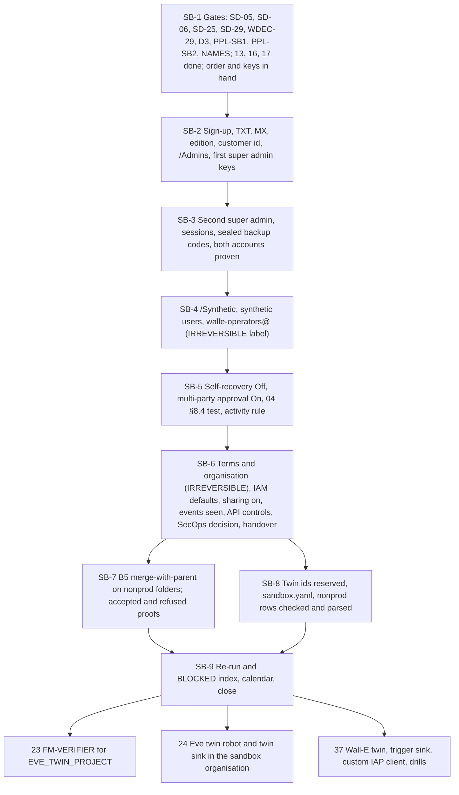

# 21. The sandbox tenant and the non-production foundation

## Status
- Owner: the platform owner
- Last reviewed: 2026-09-15
- Last executed: never
- Stage: review §2 stage 32, tenant half only, pulled before Eve so that nonprod Eve (24, 25, 28) and the Wall-E twin (37) have a tenant to act on. Runs after 17 (Tier R open), in parallel with 19, 20 and 22, and before 24. Decision 29 now reads "before the super-admin grant" (03 DC-4.7); in this set the sandbox also precedes Eve's identity file.
- Step prefix: SB. Steps: 44. BLOCKED: SB-7.6 (the drift job does not exist, README B-02), SB-8.5 (the register CI rules R-02 and R-04 have no code, README B-03; the signed manual parse of SB-8.4 stands in). Gated **IRREVERSIBLE** steps: SB-4.3 (the security label on the sandbox `walle-operators@`), SB-6.1 (acceptance of the Google Cloud terms, which creates the sandbox Cloud organisation).
- Replaces: `wall-e/SETUP.md` Phase 2's "how that copy is built is *tbd* with the factory's `-nonprod` run", `wall-e/PREREQUISITES.md` D3's "the sandbox tenant before the Phase 2 grant" (no procedure), and the Workspace half of what the review calls M6. Salvaged, with corrected paths: SETUP Phase 1 (OU and synthetic-account pattern, group creation), Phase 3 (the key-before-enforcement order and the hygiene rows that apply to admin accounts), Phase 5 (the sharing check, the organisation-scope verify); 02 §3.5 rows 4 and 5; PREREQUISITES D3.
- Decisions applied: SD-05 (twin OAuth clients External, In production, Trusted), SD-06 (the sandbox organisation's own logging), SD-25 (the sandbox customer id on every nonprod folder holding a twin component), SD-29 (timing and edition), SD-02 (an `env=nonprod` row carries no checklist), SD-27 (custody records), SD-35 (mutating tests only on the twin), all from 03.
- Closes: S004 (the tenant and nonprod-foundation half), X-ORG-01 (the rule and the sandbox API-controls precondition), X-ORG-02 (the sandbox organisation, its sharing and `SANDBOX_ORG_ID`), X-ORG-03 (folder admission, sandbox operators, requesters and approvers), X-ORG-04 (edition, domain, seats, administrators, keys in use), X-ORG-13 (the twin rows prepared and checked under R-02 and R-04), X-ORG-14 (timing checked at the gate), X-ORG-15 (the sandbox SecOps export as an explicit, optional decision). Detail in "Findings this file closes".
- Elapsed time: 2 days hands-on over four sittings; 1 to 4 weeks elapsed, driven by DNS propagation (up to 72 hours for TXT and MX), the up-to-7-day wait before a new security key is usable at sign-in (06), the 24-hour wait for the first shared log entries, and the policy pull-request review.
- Every console path, command, flag, role and constraint below was read on Google's pages on 2026-09-15 ("Sources checked"). Nothing was run against a live tenant while writing.

## What this part builds

A second Google Workspace customer, the **sandbox tenant**, on its own domain and with its own Google Cloud organisation, and the platform-side changes that let the non-production twins of Eve and Wall-E live under the platform's folder tree while acting on that tenant. Nothing in the sandbox is ever an OU of production: Super Admin cannot be limited to an organisational unit, so only a separate tenant contains a twin robot that is a super admin ([../02-landing-zone-and-tiers.md](../02-landing-zone-and-tiers.md) §1.3 PSA6, §3.5).

| Built | Where | Who | Variable or record |
|---|---|---|---|
| The sandbox Workspace subscription at the ordered edition (production's, at least Enterprise Standard), domain verified by TXT, mail routed by MX | sandbox tenant | sandbox super admin 1 | `SANDBOX_CUSTOMER_ID` |
| `/Admins` with "Only security key" 2-Step Verification and session controls; two named sandbox super admins, two keys each, admin-generated backup codes sealed with each spare key, no recovery channels | sandbox tenant | both sandbox super admins; second human witnesses keys | `SANDBOX_SA_1_EMAIL`, `SANDBOX_SA_2_EMAIL` (03) |
| `/Synthetic` with synthetic users; `/Automation/Service Identities` left empty for the twin robots of 24 and 37 | sandbox tenant | sandbox super admin 1 | `sandbox/sandbox.yaml` |
| `walle-operators@SANDBOX_DOMAIN` as a security group, members the two sandbox super admins | sandbox tenant | sandbox super admin 1 | `SANDBOX_OPERATORS_GROUP` |
| Super-admin self-recovery Off at the top OU; multi-party approval On for every covered setting; the 04 §8.4 test exercised once | sandbox tenant | both sandbox super admins | `<date>-SB-5.3-mpa-test-v1` |
| An activity rule on sandbox role and security changes | sandbox tenant | sandbox super admin 1 | rule `sandbox-admin-change` |
| The sandbox Cloud organisation, its creation defaults removed, "Share data with Google Cloud services" on, Admin and login events seen at organisation scope | sandbox organisation | sandbox super admins | `SANDBOX_ORG_ID` |
| The twin OAuth client rule (External, In production, Trusted; never Testing) and the sandbox API-controls state recorded for 24 and 37 | `sandbox/sandbox.yaml` | sandbox super admin 1, platform owner | — |
| The sandbox SecOps export decision (connected only if live fixtures are wanted, through 15 PS-8.8) | `sandbox/sandbox.yaml` | IT security, sandbox super admin | — |
| B5 (`iam.allowedPolicyMemberDomains`) on `fld-agents-p-nonprod`, `fld-agents-p-sa-nonprod`, `fld-controllers-nonprod` (and `fld-improvers-nonprod` only if Mo reads sandbox data): merge with parent plus `SANDBOX_CUSTOMER_ID`; proven by an accepted grant on each nonprod folder and a refused grant on its production sibling | platform folders | platform owner under `ENT_PLATFORM_POLICY` and `ENT_FOLDER_ADMIN`, approved by the second human | `policies/org/<FLD>/iam.allowedPolicyMemberDomains.json` |
| The twin project ids reserved from the signed names register | `~/.platform-env` | platform owner | `WALLE_TWIN_PROJECT`, `EVE_TWIN_PROJECT` |
| The `env=nonprod` register rows for the Eve and Wall-E twins, prepared on a pushed branch with a draft pull request, checked against 16's schema and the R-02 and R-04 rules, and signed by manual parse | platform repository | platform owner; second human and security reviewer sign | `register/eve.yaml`, `register/walle.yaml` (nonprod rows) |

What this part deliberately does **not** do:

- It creates **no project** anywhere: not in the sandbox organisation (none ever), and not the twins (`EVE_TWIN_PROJECT` is made in 23 by FM-VERIFIER; `WALLE_TWIN_PROJECT` in 37 by FM-AGENT). Their ids are only reserved.
- It creates **no twin robot**, no OAuth client and no consent: `eve@SANDBOX_DOMAIN` is 24's, `walle@SANDBOX_DOMAIN` 37's.
- It creates **no sink**. The sandbox-organisation sinks are made where their destinations are: Eve's twin sink to the `EVE_TWIN_PROJECT` dataset in 24, Wall-E's twin trigger sink in 37. This file only makes the organisation exist, turns sharing on and hands over `SANDBOX_ORG_ID`, which the tenant copy of the variables file uses only inside `twin_shell --sandbox-org` (01).
- It merges no register row on the default branch. 16 and 17 fix that each agent's file, with both its rows, is merged by the file that runs its module equivalent (23 for Eve, 31 for Wall-E; the twin's FM run is 37). This file prepares the nonprod rows and proves they pass the nonprod rules.

What the old text got wrong, and must not come back:

| Old text | Why it fails | Here instead |
|---|---|---|
| SETUP Phase 1 step 6 "Create the sandbox": an OU `$SANDBOX_OU` in the production tenant, reused for G10, G11, G14 (S004) | Super Admin has no OU scope; a K6 drill or a mutating denial test in production fires SA-06, breaks G3 and touches real super-admin state | A separate tenant (Parts 1 to 6). The production `SANDBOX_OU` of 30 remains a Stage 0 shadow target only |
| Decision 29 and 02 §3.5 "a sandbox tenant before Stage 1" (X-ORG-14) | Stage 1 comes after the grant that G10, G11 and G14 need the sandbox for | SB-1.1 refuses to start unless the signed record reads "before the super-admin grant" |
| PREREQUISITES D3 and §3.1: no edition, domain, seats, administrators or keys (X-ORG-04) | A purchase against nothing; multi-party approval needs Enterprise Standard or higher and two super admins; Essentials editions have no Gmail | SB-1.2 reads the order; SB-2.4 reads the edition in the console; Part 3 makes two super admins with keys |
| 02 §3.5 row 4 "a P-SA nonprod OAuth client is registered in the sandbox tenant"; SETUP Phase 9 and Eve Phase 8 Internal clients (X-ORG-01) | An Internal client refuses a foreign account with `org_internal`; Testing status expires refresh tokens after 7 days | The rule External, In production, Trusted recorded in SB-6.6 for 24 and 37; production stays Internal (32) |
| Eve Phase 7 and SETUP Phase 11 sinks on the production `ORG_ID` expected to see sandbox events (X-ORG-02) | Workspace audit logs land at the sandbox customer's own Cloud organisation | SB-6.1 to SB-6.5: organisation confirmed, sharing on, events seen at sandbox organisation scope |
| 02 B5 "nonprod P folders add the sandbox customer id" (two folders only) (X-ORG-03) | `fld-controllers-nonprod` holds Eve's twin sink destination and console and would refuse sandbox principals | Part 7: every nonprod folder holding a twin component |
| Band A and band B approvers taken from production `walle-operators@` and production super admins (X-ORG-03) | A twin service holding a sandbox token cannot resolve production groups or users | `walle-operators@SANDBOX_DOMAIN`; sandbox super admins as requesters and approvers (SB-4.3, SB-8.2) |
| PSA1 "a second P-SA row fails CI"; P1 refuses the row while a line is empty (X-ORG-13) | The twin row is refused, and only the twin can make G10, G11 and G14 green | SB-8.3 and SB-8.4 check the twin rows under R-02 (count `env=prod` only) and R-04 (no checklist) |
| 07 §6.2 SA fixtures "on the sandbox tenant" (X-ORG-15) | The production SIEM never receives sandbox events | SB-6.7: synthetic fixtures stay the rule (15 PS-8.3); the sandbox export is optional and connected by a super admin |
| SETUP Phase 3 "Less secure app access: Off"; "Account → Account settings → super administrator account recovery" | The row is retired; the path does not exist (S180) | Paths as corrected in 06 |



## Preconditions

- [ ] File 03 has signed records, each passing `tools/decision-need.sh`: `<date>-sandbox-tenant.md` (**WDEC-29**, **SD-29**, **D3**: "before the super-admin grant", edition, domain, seats, P59 closed, twin robots' 2SV decided), `<date>-platform-model-and-privilege.md` (**SD-02**, **SD-05**, **SD-06**, **SD-25**, **SD-35**), **SD-27**, **NAMES** (with `WALLE_TWIN_PROJECT` and `EVE_TWIN_PROJECT` signed and the fallback suffix rule), and the appointments **PPL-SB1** and **PPL-SB2** with the superseding record that carries both sandbox addresses (DC-2.6). `SANDBOX_SA_1_EMAIL`, `SANDBOX_SA_2_EMAIL` and `SECOND_HUMAN_EMAIL` are set.
- [ ] File 04: `SANDBOX_DOMAIN` set (PU-2.5) with DNS editable by the sandbox super admins and no `google-site-verification` TXT value present; the signed order showing the edition, the seat count and the terms signer; four keys for the sandbox super admins received with a custody record (PU-4.2), plus the twin-robot keys only if SD-29 chose them (those are enrolled in 24 and 37, not here).
- [ ] File 12: `ENT_PLATFORM_POLICY` and `ENT_FOLDER_ADMIN` exist and passed their one-grant tests; the second human is their approver.
- [ ] File 13: OP-6.5 `DONE` (B5 lives at `fld-agentic-platform` only; no nonprod folder carries its own B5 copy); `policies/tools/op-set.sh` merged; the `policies/org/` layout merged.
- [ ] File 16: `register/schema/register-row.schema.json` merged (RG-2.6) with the two nonprod clauses; `ci/register-rules.md` lists R-02 and R-04; `check-jsonschema` installed (RG-2.1); RG-3.6's manual-parse form exists.
- [ ] File 17: `TIER_R_RECORD` exists (the sandbox is not needed before Tier R, and 23's twin run needs FM-VERIFIER).
- [ ] File 09: every `FLD_*` variable set. File 10: `CICD_PROJECT` and `CORE_PROJECT` set (quota projects for PAM and the policy script).
- [ ] File 08: W-2 done, so custody records go straight to the witness through WO-3.3; otherwise paper plus a same-day scan to `EVIDENCE_INTERIM_LOCATION` (SD-27) and a line in the WO-3.1 backlog.
- [ ] Each sandbox super admin has a workstation (or, if the platform owner is one of them, a **separate macOS user account** on his workstation) with `gcloud`, `jq`, `yq`, `git`, `dig`, `whois`, file 01's helpers, and a clean browser profile per sandbox account. `yq` is the jq wrapper for YAML that transcodes to JSON, prints JSON by default and forwards every other argument to jq; it is the single YAML tool of this set (19 §2, 20 GG-0.3, *Assumption:* 01's tool list gains it). **No step here uses Ruby**: current macOS no longer ships a Ruby runtime, so nothing load-bearing may depend on one. The platform owner's own workstation needs `yq` as well, for SB-8.2 and SB-8.4.
- [ ] No sandbox credential ever enters the platform owner's `GCLOUD_CONFIG_NAME` configuration. The separation is the one 01 PR-2.2 and PR-3.1 build, not a habit: `~/.platform-env` exports `CLOUDSDK_ACTIVE_CONFIG_NAME="$GCLOUD_CONFIG_NAME"` (which selects the active configuration for every gcloud invocation of that shell, ahead of whatever configuration is activated on the machine) and `CLOUDSDK_CONFIG="$HOME/.config/gcloud-$GCLOUD_CONFIG_NAME"` (which is where that configuration's credentials are written) whenever `GCLOUD_CONFIG_NAME` is set. The sandbox copy's value `sandbox` therefore both selects the configuration and gives it its own credential directory. SB-1.3 proves both, and no sandbox step may run in a shell that did not source the sandbox copy.
- [ ] A corporate safe with its sign-out log; four tamper-evident envelopes and two spares.

## People

| Role | Does | Present at |
|---|---|---|
| Sandbox super admin 1 (PPL-SB1, `SANDBOX_SA_1_EMAIL`) | Performs sign-up, domain, OUs, users, groups, organisation and sharing steps; requester in the multi-party approval test; custodian of super admin 2's spare key and codes | sittings 1 to 4 |
| Sandbox super admin 2 (PPL-SB2, `SANDBOX_SA_2_EMAIL`) | Enrols his own keys; second Organization Administrator; approver (and denier) in the multi-party approval test; custodian of super admin 1's spare key and codes; re-reads every sandbox VERIFY on his own workstation | sittings 2 to 4 |
| Second human (`SECOND_HUMAN_EMAIL`) | Witness from the other line for every key enrolment and envelope; approves the `ENT_PLATFORM_POLICY` and `ENT_FOLDER_ADMIN` grants; required reviewer of the policy and `sandbox/` pull requests; co-signs the manual parse | sittings 1 and 2 (keys), sitting 5 (grants), reviews |
| Platform owner (`sa-1-admin@` for PAM, daily account for git) | Performs Parts 7 and 8 and the handover of identifiers into the tenant copy; never approves his own grants | sitting 5; SB-6.8 |
| Security reviewer (`SECURITY_REVIEWER_EMAIL`, if appointed) | Co-signs the manual parse of SB-8.4 (P-SA rows); second approver on `ENT_PLATFORM_POLICY` once appointed | SB-8.4 |
| IT security (SIEM owner) | Decides whether live sandbox fixtures are wanted (SB-6.7) | SB-6.7 |
| Witness administrator | Uploads custody and test records to the witness the same day (WO-3.3) | same day as SB-2.6, SB-3.1, SB-3.3, SB-5.3 |

DC-2.6 allows the platform owner and the second operator to be the two sandbox super admins. Whoever they are: they are two different humans, the requester in any sandbox two-person act is never its approver, and the second human is never one of them (the witness of a key must be from the other line).

## Sittings

| Sitting | Steps | Present | Hands-on | Waits after it |
|---|---|---|---|---|
| 1 | SB-1.1 to SB-2.6 | sandbox super admin 1, second human | half a day | TXT and MX up to 72 h; up to 7 days before a new key is usable |
| 2 | SB-3.1 to SB-3.5 | both sandbox super admins, second human | half a day | the second admin's key wait |
| 3 | SB-4.1 to SB-5.4 | both sandbox super admins | half a day | none |
| 4 | SB-6.1 to SB-6.8 | both sandbox super admins; platform owner for SB-6.8; IT security for SB-6.7 | 3 hours | up to 24 h for the first shared events (SB-6.5 is finished the next day) |
| 5 | SB-7.1 to SB-8.4, SB-9.1, SB-9.2 | platform owner; second human approves grants and reviews | half a day | policy pull request review |

## The sandbox copy of the variables file

Each sandbox super admin keeps, on his own workstation (or separate macOS user), a `~/.platform-env` installed from the committed template of 01 PR-2.2, holding **only** the sandbox section below and a read-only clone of the platform repository. It holds no secret and is never copied to the platform owner's configuration. A dedicated gcloud configuration named `sandbox` (set as `GCLOUD_CONFIG_NAME` in this copy) with no project is used for every sandbox command. `GCLOUD_CONFIG_NAME` is not a gcloud variable: 01's template turns that one value into the two gcloud does read, `CLOUDSDK_ACTIVE_CONFIG_NAME=sandbox` (the active configuration of every gcloud invocation in the shell) and `CLOUDSDK_CONFIG=$HOME/.config/gcloud-sandbox` (the directory that holds its credentials). So `penv_guard` works unchanged, and a sandbox sign-in cannot land in another configuration — including the platform owner's, when he is one of the two sandbox super admins under DC-2.6.

| Variable | Set in | Sandbox copy | Tenant copy |
|---|---|---|---|
| `SANDBOX_DOMAIN` | 04, re-entered SB-1.3 | yes | yes (04) |
| `SANDBOX_SA_1_EMAIL`, `SANDBOX_SA_2_EMAIL`, `SECOND_HUMAN_EMAIL` | 03, re-entered SB-1.3 | yes | yes (03) |
| `PLATFORM_REPO_DIR`, `BUILD_LOG_DIR`, `GCLOUD_CONFIG_NAME` | SB-1.3 | own values (`sandbox` configuration) | own values |
| `SANDBOX_CUSTOMER_ID` | SB-2.4 | yes | yes (SB-6.8) |
| `SANDBOX_ORG_ID` | SB-6.2 | yes | yes (SB-6.8), used only in `twin_shell --sandbox-org` |
| `SANDBOX_OPERATORS_GROUP` | SB-4.3 | yes | yes (SB-6.8) |
| `WALLE_TWIN_PROJECT`, `EVE_TWIN_PROJECT` | SB-8.1 | no | yes |

Build-log lines from a sandbox workstation go to that workstation's `BUILD_LOG_DIR` clone under `sandbox/` and reach the build-log remote as a pull request reviewed by the second human at the end of each sitting.

## How the sandbox stays apart from production, and from the people it helps watch

The sandbox is a door into the nonprod folders: its customer id is admitted there (Part 7). It is also where the monitored administrator's controls are rehearsed. The ways it could be bent, and what this file does:

| Risk | Who could | Control here | Residual, and where covered |
|---|---|---|---|
| A sandbox principal is granted in a production project | anyone with folder IAM rights | B5 admits the sandbox customer id only on the named nonprod folders; the refused grant on each production sibling is proven (SB-7.5) | drift job reads folder values (SB-7.6, BLOCKED); 02 §3.5 severity 1 |
| A production credential reaches a nonprod project | a builder copying a client id | no client is made here; the rule of SB-6.6 and the CI secret-name assertion (02 §3.5 row 4) | 24, 37 |
| One sandbox super admin changes a covered setting or a role alone | either sandbox super admin | multi-party approval On (SB-5.2), tested (SB-5.3); the other admin is custodian of the first's spare | settings MPA does not cover (sharing, sinks, OU moves) are watched by nonprod Eve (25, 28) and the activity rule (SB-5.4) |
| Sandbox sharing turned off to blind nonprod Eve before a drill | a sandbox super admin | SB-6.4 records the enabling time; nonprod Eve's `log_pipeline_silent` (25) and the drill (28) | the second human runs the sandbox part of the drill (28) |
| The sandbox organisation gets projects outside the platform's controls | any sandbox user | domain-wide Project Creator and Billing Account Creator removed; no billing account in the sandbox organisation (SB-6.3) | quarterly read in `DRILL_CALENDAR` (SB-9.1) |
| A key or backup code used without trace | a custodian | two-person custody with the second human as witness (SB-2.6, SB-3.1, SB-3.3); records to the witness | the witness's upload alert (08 WO-2.14) |
| A platform principal is granted in the sandbox organisation | the platform owner through a sandbox super admin | the sandbox organisation's own security baseline admits only its customer (read in SB-6.3); nothing here asks for such a grant | P40 note of SB-8.2 for the drift inventory of sandbox sinks |

## If something goes wrong in the middle

| Situation | Do |
|---|---|
| `gcloud config configurations list` does not show `sandbox` active, or `gcloud auth list` shows a production address on a sandbox workstation | Stop before any further sandbox command. Run nothing else in that shell; `gcloud auth revoke <the production address>` in it, open a new shell, source the sandbox copy and re-run SB-1.3's VERIFY. If a sandbox credential was obtained while another configuration was active, revoke it there too (`CLOUDSDK_CONFIG` names the directory that holds it), record a build-log entry naming both configurations, and tell the second human: it is a separation failure, not a typing slip. |
| The sign-up says the domain is already in use (SB-2.1) | Stop. 04 PU-2.5 finds out which Google account holds it; after removal wait 24 hours (7 days if bought through a third party) and restart SB-2.1. |
| TXT verification not recognised after 72 hours (SB-2.2) | Re-read the record with `dig`; correct the host (`@` or blank); do not add a second verification method without recording it. |
| Sandbox super admin 1 loses a key before SB-3.1 is done | Only one super admin exists and self-recovery is still On (it is turned Off only in SB-5.1): recover with the remaining key; if both are lost, use the recovery the console offers with the second human present, record a custody incident, and re-run SB-2.6. |
| A key is lost after SB-5.1 | The other sandbox super admin resets 2SV for the account in front of the second human; the spare is drawn from its envelope; a `v2` custody record; with multi-party approval on, the reset itself may need an approval: record whether it did. |
| A multi-party approval request is stuck (SB-5.3) | Record the time; the approver denies it; Google's page states no expiry, so do not leave a request pending past the sitting. |
| B5 apply prints `READBACK-DIFF` (SB-7.4) | Read the diff; if meaning differs, roll back from the predecessor at once, under the same grant, and stop. |
| A sandbox grant on a nonprod folder is refused (SB-7.5) | Read the effective policy; if `SANDBOX_CUSTOMER_ID` is absent, re-run SB-7.4; if present and still refused, stop and open an SD-25 amendment. |
| A grant on a production folder is accepted (SB-7.5) | Remove it immediately under the same grant; severity 1 to the incident commander; re-read B5 at `fld-agentic-platform` and roll back Part 7. |
| An IRREVERSIBLE step (SB-4.3, SB-6.1) has START and no DONE | Never re-run it. Read the state (Groups page labels; `gcloud organizations list`), record it, and ask both sandbox super admins and the second human before going on (README resume rule 3). |

## Evidence and the build log

- Checkpoint lines use 01's `checkpoint`. Sandbox-side lines are written on the sandbox workstation (see the sandbox copy) and merged by pull request; values held only in the sandbox copy are not secrets and may be written.
- Custody records (key enrolment, envelopes) are paper in the safe, signed by the custodian and the second human as other-line witness, uploaded the same day to the witness under `custody/` by a witness administrator (08 WO-3.3), or scanned to `EVIDENCE_INTERIM_LOCATION` if W-2 is not done (SD-27).
- The multi-party approval test record and the B5 proof are drill-class records: `drills/` in the witness, and `BUILD_LOG_DIR/records/`.
- Each EVIDENCE line becomes one `evidence_add` row. E-xx ids from [../10-eu-ai-act.md](../10-eu-ai-act.md) §5, TISAX ids from [../11-tisax.md](../11-tisax.md) §13, mapped by 01 §7.2: sandbox tenant and nonprod folder records are "E-xx: none, TISAX 5.2.2"; key custody E-08, TISAX 3.1, 4.1.2; IAM exports TISAX 4.1.3, 4.2.1; logging configuration E-06, TISAX 5.2.4; decision and deviation records E-03, TISAX 1.4.1; drill records E-08, TISAX 5.2.6.

## Steps

### Part 1 — Gates and the sandbox workstations

### SB-1.1 Check the gates, the order of work and the separation of people

- **WHO:** Platform owner; sandbox super admin 1 reads along. No witness.
- **WHERE:** Platform owner's shell, `~/.platform-env` sourced.
- **ACTION:**

```bash
need PLATFORM_REPO_DIR BUILD_LOG_DIR SANDBOX_DOMAIN SANDBOX_SA_1_EMAIL SANDBOX_SA_2_EMAIL SECOND_HUMAN_EMAIL DOMAIN DIRECTORY_CUSTOMER_ID ORG_ID
penv_guard
checkpoint SB-1.1 START
git -C "$PLATFORM_REPO_DIR" pull --ff-only
"$PLATFORM_REPO_DIR/tools/decision-need.sh" WDEC-29 SD-29 D3 SD-02 SD-05 SD-06 SD-25 SD-27 SD-35 NAMES PPL-SB1 PPL-SB2
grep -il "before the super-admin grant" "$PLATFORM_REPO_DIR"/decisions/*-sandbox-tenant.md
awk -F'\t' '($2=="OP-6.5" || $2=="RG-2.6" || $2=="FM-10.3") && $3=="DONE" {print $2, $3}' "$BUILD_LOG_DIR/checkpoints.tsv"
printf '%s\n' "$SANDBOX_SA_1_EMAIL" "$SANDBOX_SA_2_EMAIL" | grep -vc "@${SANDBOX_DOMAIN}\$"
printf '%s\n' "$SANDBOX_SA_1_EMAIL" "$SANDBOX_SA_2_EMAIL" "$SECOND_HUMAN_EMAIL" | sort | uniq -d
case "$SANDBOX_DOMAIN" in "$DOMAIN"|*".$DOMAIN") echo "STOP: sandbox domain is a production domain or subdomain";; *) echo "domain distinct";; esac
mkdir -p "$BUILD_LOG_DIR/evidence/21"
```

- **VERIFY:** `decision-need.sh` prints `SIGNED` for every id; the `grep -il` prints the sandbox-tenant record (the X-ORG-14 wording; "before Stage 1" alone is a stop); the three `DONE` lines print (13's OP-6.5, 16's RG-2.6, 17's Tier R record step); the count of addresses outside `SANDBOX_DOMAIN` is `0`; `uniq -d` prints nothing; `domain distinct`. The second human confirms, from 03's people records, that he holds neither sandbox role.
- **ROLLBACK:** Read only. A failed check stops the file.
- **EVIDENCE:** Checkpoint line with the decision commit ids. `evidence_add SB-1.1 gates E-03 1.4.1 "build-log:evidence/21"`.

### SB-1.2 Confirm the order, the edition and the keys in hand

- **WHO:** Platform owner; sandbox super admin 1 confirms.
- **WHERE:** 04's records in `EVIDENCE_INTERIM_LOCATION`; the safe log.
- **ACTION:** Open `<date>-PU-2.5-sandbox-order-v1` and `<date>-PU-4.2-key-custody-record-v1`. Read and write on the sitting form: (1) the ordered edition, and that it equals `WORKSPACE_EDITION` (01) and is Enterprise Standard or Enterprise Plus (multi-party approval exists only on Enterprise Standard and Plus, Education Standard and Plus and Enterprise Essentials Plus; Essentials editions carry no Gmail, which the twin robots need; OAuth and SAML log sharing and the SecOps export need Enterprise Standard or Plus); (2) the seat count, which covers two sandbox super admins, the twin robots `eve@` and `walle@` on `SANDBOX_DOMAIN`, and the synthetic users of SB-4.2; (3) the named terms signer for the sandbox Google Cloud organisation (SB-6.1); (4) four keys labelled for the two sandbox super admins, with their custodians.
- **VERIFY:** The sitting form carries four ticked lines, each naming the record it was read from. Edition below Enterprise Standard, or different from production without a signed SD-29 exception, is a stop and goes back to 04.
- **ROLLBACK:** Read only.
- **EVIDENCE:** Sitting form `<date>-SB-1.2-order-and-keys-v1`. E-xx: none. TISAX 5.2.2, 6.1.1.

### SB-1.3 Prepare each sandbox workstation copy

- **WHO:** Each sandbox super admin on his own workstation; the other watches.
- **WHERE:** Sandbox workstation shell.
- **ACTION:**

```bash
test ! -e "$HOME/.platform-env" && install -m 600 "<read-only clone>/env/platform-env.template" "$HOME/.platform-env"
source "$HOME/.platform-env"
penv_set GCLOUD_CONFIG_NAME sandbox
penv_set PLATFORM_REPO_DIR "<absolute path of the read-only clone>"
penv_set BUILD_LOG_DIR "<absolute path of this workstation's build-log clone>"
penv_set SANDBOX_DOMAIN "<value from 04 PU-2.5>"
penv_set SANDBOX_SA_1_EMAIL "<value from 03 DC-2.6>"
penv_set SANDBOX_SA_2_EMAIL "<value from 03 DC-2.6>"
penv_set SECOND_HUMAN_EMAIL "<value from 03>"
source "$HOME/.platform-env"
env -u CLOUDSDK_ACTIVE_CONFIG_NAME gcloud config configurations create sandbox --no-activate
gcloud config unset project
```

  The create runs with `CLOUDSDK_ACTIVE_CONFIG_NAME` removed from its environment because the second `source` already set it to `sandbox`, a configuration that does not exist until this line (01 PR-3.1 runs the same way). `--no-activate` is correct and must stay: the sourced file selects the configuration per shell through `CLOUDSDK_ACTIVE_CONFIG_NAME`, which takes precedence over whatever configuration is activated on the machine, so the machine-wide default is left untouched — on the platform owner's workstation that default is his production configuration, and it must not change. The VERIFY below proves the selection took effect; do not treat sourcing the file as proof on its own.
- **VERIFY:** In a **new** shell with the sandbox copy sourced:

```bash
gcloud config configurations list --format='value(name,is_active)'
gcloud auth list --format='value(account)'
gcloud config get project 2>&1
echo "$CLOUDSDK_CONFIG"
penv_guard && echo "guard clean"
grep -c '^export ORG_ID=\|^export DIRECTORY_CUSTOMER_ID=' "$HOME/.platform-env"
```

  Expected: a line `sandbox` followed by `True`, and every other configuration `False` (if the line reads `False`, or the active one is another name, stop: the file was not sourced in this shell, or `GCLOUD_CONFIG_NAME` was not written); **no account at all** at this point, and from SB-6.2 on only addresses ending in `@SANDBOX_DOMAIN` — a production address in `gcloud auth list` on a sandbox workstation is a stop and a build-log entry; no project value (an empty line or `(unset)`); `CLOUDSDK_CONFIG` is `$HOME/.config/gcloud-sandbox`, so the credentials of this configuration have their own directory; `guard clean`; `0` (no production identifier in the sandbox copy).
- **ROLLBACK:** From a shell that did **not** source the sandbox copy: `CLOUDSDK_CONFIG="$HOME/.config/gcloud-sandbox" gcloud config configurations delete sandbox`, then `rm -rf "$HOME/.config/gcloud-sandbox"`; remove `~/.platform-env`. Nothing outside that directory is touched.
- **EVIDENCE:** Build-log line SB-1.3 listing the names set, with the VERIFY output (configuration name and active flag, empty account list, `CLOUDSDK_CONFIG` path). E-xx: none. TISAX 5.3.1.

### SB-1.4 Confirm DNS custody of the sandbox domain

- **WHO:** Sandbox super admin 1; sandbox super admin 2 watches.
- **WHERE:** Sandbox workstation shell; the DNS provider's console named in PU-2.5.
- **ACTION:**

```bash
need SANDBOX_DOMAIN
whois "$SANDBOX_DOMAIN" | grep -iE 'Registrar:|Domain Status:'
dig +short NS "$SANDBOX_DOMAIN"
dig +short TXT "$SANDBOX_DOMAIN"
dig +short MX "$SANDBOX_DOMAIN"
```

  In the DNS provider console, confirm both sandbox super admins can edit the zone and 2SV is on for every user of the provider account.
- **VERIFY:** The registrant is the organisation; the name servers are the provider's; the TXT output holds no `google-site-verification=` value; the MX output is empty or is an existing mail route the domain owner confirmed may be replaced (Google's page: remove other MX records).
- **ROLLBACK:** Read only. A `google-site-verification` value means another Google account may hold the domain: stop, 04 PU-2.5.
- **EVIDENCE:** Output and screenshot as `<date>-SB-1.4-sandbox-dns-custody-v1`. E-xx: none. TISAX 5.2.2.

### Part 2 — Sign-up, domain and the first sandbox super admin

### SB-2.1 Activate the sandbox subscription with the first super admin

- **WHO:** Sandbox super admin 1; the second human present.
- **WHERE:** A clean browser profile named `sandbox-sa-1`; the provisioning route in the signed order (PU-2.5).
- **ACTION:**
  1. Follow the route the order names (*Assumption:* either the reseller or account team creates the customer and sends the first administrator's sign-in invitation, or Google's sign-up flow is used and the order is applied to it; the order states which). The first administrator's address is `SANDBOX_SA_1_EMAIL`; business name and country as the order.
  2. The password is typed by sandbox super admin 1 from his own password vault into the page only; it is never spoken, written or pasted into a file, chat or ticket. If a recovery email or phone is requested at sign-up, use the sandbox super admin's organisation address; SB-2.6 removes it.
  3. Do not add users, apps or Marketplace items during the setup tool's prompts; skip them.
- **VERIFY:** Signed in as `SANDBOX_SA_1_EMAIL` at `admin.google.com`, Menu > Billing > Subscriptions shows the ordered edition and seat count. Menu > Account > Admin roles > Super Admin > View admins lists only `SANDBOX_SA_1_EMAIL`.
- **ROLLBACK:** Before SB-6.1: cancel the subscription under the order's terms and remove the domain from the account (04 records the reseller's cancellation route). After SB-6.1 the Cloud organisation exists: not reversible in this file.
- **EVIDENCE:** Screenshots of Subscriptions and View admins as `<date>-SB-2.1-sandbox-subscription-v1`. E-xx: none. TISAX 5.2.2, 6.1.1.

### SB-2.2 Verify the domain with a TXT record

- **WHO:** Sandbox super admin 1 reads the value; sandbox super admin 2 adds the record.
- **WHERE:** Admin console: Menu > Account > Domains > Manage domains > Verify domain (or the setup tool); the DNS provider console; the sandbox workstation shell.
- **ACTION:**
  1. Copy the verification value the page shows (`google-site-verification=…`).
  2. In the DNS provider: Type TXT, Name/Host `@` (or blank), Value the copied string, TTL default.
  3. Back on the page: "Come back here and confirm…", Confirm.

```bash
dig +short TXT "$SANDBOX_DOMAIN" | grep -c 'google-site-verification='
```

- **VERIFY:** The `dig` count is `1`; Manage domains shows `SANDBOX_DOMAIN` as primary and verified. Google: recognition can take up to 72 hours; the TXT record stays in DNS permanently (removing it can break verification).
- **ROLLBACK:** Remove the TXT record only together with SB-2.1's rollback.
- **EVIDENCE:** Screenshot of the verified domain; `dig` output. `<date>-SB-2.2-domain-verified-v1`. E-xx: none. TISAX 5.2.2.

### SB-2.3 Route mail with the MX record and activate Gmail

- **WHO:** Sandbox super admin 2 edits DNS; sandbox super admin 1 activates.
- **WHERE:** DNS provider console; Admin console (the "Activate Gmail" prompt after verification).
- **ACTION:** Mail must reach the sandbox mailboxes: the twin robots' Gmail scopes and watch verification (24, 37) and approval notifications need it.
  1. Remove every other MX record of `SANDBOX_DOMAIN`.
  2. Add: Type MX, Name/Host `@` (or blank), Priority `1`, Value `smtp.google.com`.
  3. In the Admin console, click Activate Gmail when offered.

```bash
dig +short MX "$SANDBOX_DOMAIN"
```

- **VERIFY:** `dig` prints exactly `1 smtp.google.com.`. A test mail from the second human's organisation address to `SANDBOX_SA_1_EMAIL` arrives (Google: up to 72 hours for new MX records).
- **ROLLBACK:** Restore the previous MX records from the SB-1.4 output.
- **EVIDENCE:** `dig` output and the received test mail header (no body) as `<date>-SB-2.3-mx-v1`. E-xx: none. TISAX 5.2.2.

### SB-2.4 Read the edition and the customer id

- **WHO:** Sandbox super admin 1; sandbox super admin 2 re-reads on his own profile after SB-3.1.
- **WHERE:** Admin console: Menu > Account > Account settings > Profile (Customer ID); Menu > Billing > Subscriptions; sandbox shell.
- **ACTION:**

```bash
penv_set SANDBOX_CUSTOMER_ID "<Customer ID from Account settings > Profile>"
printf '%s\n' "$SANDBOX_CUSTOMER_ID" | grep -Eq '^C[0-9A-Za-z]+$' && echo "form ok" || echo "STOP: a Workspace customer id begins with C; re-read Account settings > Profile"
```

- **VERIFY:** `form ok`; Subscriptions shows the ordered edition. The shape test is deliberately only "C followed by alphanumerics": Google's page documents where the customer ID is found and that it is the organisation's unique id, and documents **no** `C0` prefix, so a stricter pattern would stop a correctly read id at the head of a five-sitting procedure. The authoritative check is **SB-6.2**, where `gcloud organizations describe "$SANDBOX_ORG_ID" --format='value(owner.directoryCustomerId)'` must print this exact value; SB-6.8 then confirms it differs from `DIRECTORY_CUSTOMER_ID`. Until SB-6.2 has printed it, treat the value as provisional: it is written into the B5 child policies in SB-7.3, so a misread would be applied to folders, and SB-7.4's effective read and SB-7.5's accepted grant are what prove it right.
- **ROLLBACK:** `penv_set --force` with a build-log line if misread. If SB-6.2 or SB-7.5 shows it was misread after SB-7.4 applied it, roll Part 7 back with SB-7.4's ROLLBACK and re-run SB-7.3 with the corrected value.
- **EVIDENCE:** Screenshot of the Profile page as `<date>-SB-2.4-customer-id-v1` (identifier, not a secret). E-xx: none. TISAX 5.2.2, 1.3.1.

### SB-2.5 Create /Admins and enforce "Only security key" there

- **WHO:** Sandbox super admin 1.
- **WHERE:** Admin console: Menu > Directory > Organizational units; Menu > Security > Authentication > 2-step verification with `Admins` selected (paths as 06 OB-2.1 and OB-2.2).
- **ACTION:**
  1. Top organisational unit > Create new organizational unit: name `Admins`, description "Sandbox super admins (21)".
  2. With `Admins` selected on the 2-step verification page: "Allow users to turn on 2-Step Verification" ticked; Enforcement On; New user enrollment period at least 8 days (a new key can take up to 7 days to become usable, 06); Frequency: "Allow user to trust the device" unticked; Methods: Only security key; Security codes: don't allow users to generate security codes. Override.
- **VERIFY:** `/Admins` exists and is empty; re-opened on `Admins`, the 2SV page shows the values; the top OU is unchanged (screenshot both).
- **ROLLBACK:** Inherit on the 2SV page; delete the empty OU.
- **EVIDENCE:** Screenshots as `<date>-SB-2.5-admins-ou-2sv-v1`. E-xx: none. TISAX 4.1.2.

### SB-2.6 Move the first super admin into /Admins, enrol two keys, remove recovery channels

- **WHO:** Sandbox super admin 1; the second human witnesses each key and signs the custody record.
- **WHERE:** `https://myaccount.google.com/signinoptions/two-step-verification` as `SANDBOX_SA_1_EMAIL`; Admin console: Menu > Directory > Users > the user.
- **ACTION:** Keys first, enforcement second: the account enters the enforced OU only with its keys registered.
  1. As `SANDBOX_SA_1_EMAIL`, turn on 2-Step Verification and add both labelled keys (label from the 04 inventory, never the serial).
  2. Directory > Users > `SANDBOX_SA_1_EMAIL` > Change organizational unit: `/Admins`.
  3. Directory > Users > the user > Security > Recovery information: delete any recovery email and phone.
  4. The custody record (account, key labels and serials, holder, witness, date and time) is signed by sandbox super admin 1 and the second human.
- **VERIFY:** Directory > Users > the user shows OU `/Admins`, 2-Step Verification enrolled with two security keys, no recovery information. A sign-out and sign-in asks for a security key and accepts each key in turn (repeat after the wait if a new key is refused).
- **ROLLBACK:** Move the user back to the top OU; keys stay registered. Recovery information is re-added only under a superseding SD-29 record.
- **EVIDENCE:** Screenshots; custody record `<date>-custody-sandbox-sa-1-keys-v1` to the witness same day (WO-3.3). E-08. TISAX 3.1, 4.1.2.

### Part 3 — The second super admin and custody

### SB-3.1 Create the second sandbox super admin and enrol his keys

- **WHO:** Sandbox super admin 1 creates and assigns; sandbox super admin 2 sets his password and enrols; the second human witnesses.
- **WHERE:** Admin console: Menu > Directory > Users > Add new user; Menu > Account > Admin roles > Super Admin > Assign admin; sandbox super admin 2's clean profile `sandbox-sa-2`.
- **ACTION:**
  1. Add new user `SANDBOX_SA_2_EMAIL`, organisational unit `/Admins`, "Automatically generate password", "Ask for a password change at the next sign-in". Do not send the details by email. Sandbox super admin 2 reads the initial password from administrator 1's screen, signs in in his own profile, and sets his password from his own vault.
  2. Within the enrolment period, sandbox super admin 2 registers his two labelled keys at the 2-Step Verification page.
  3. Assign Super Admin to `SANDBOX_SA_2_EMAIL` (multi-party approval is still off here: it is turned on only in SB-5.2, once two proven super admins exist).
  4. Remove any recovery email and phone on the user's Security page.
- **VERIFY:** Super Admin > View admins lists exactly `SANDBOX_SA_1_EMAIL` and `SANDBOX_SA_2_EMAIL`. The user page shows `/Admins`, two security keys, no recovery information. A sign-in as `SANDBOX_SA_2_EMAIL` after the key wait asks for a key and accepts each.
- **ROLLBACK:** Before SB-3.4: unassign the role and delete the user. After: replacement is a superseding PPL-SB2 record and a repeat of this step.
- **EVIDENCE:** Screenshot of View admins; custody record `<date>-custody-sandbox-sa-2-keys-v1` to the witness same day. E-08. TISAX 3.1, 4.1.2, 4.2.1.

### SB-3.2 Session controls on /Admins

- **WHO:** Sandbox super admin 1.
- **WHERE:** Admin console, `Admins` selected: Menu > Security > Access and data control > Google session control; Menu > Security > Access and data control > Google Cloud session control (paths as 06 OB-2.3).
- **ACTION:**
  1. Google session control: web session duration the shortest offered; Override.
  2. Google Cloud session control: "Require reauthentication", every 1 hour, method Security key, "Exempt trusted apps" unticked; Override. The sandbox super admins use gcloud against the sandbox organisation in SB-6, so this applies to them.
- **VERIFY:** Both pages re-opened on `Admins` show the values (Google: up to 24 hours to apply; the gcloud reauthentication is observed in SB-6.2).
- **ROLLBACK:** Inherit on each page.
- **EVIDENCE:** Screenshots as `<date>-SB-3.2-sessions-v1`. E-xx: none. TISAX 4.1.2.

### SB-3.3 Admin-generated backup codes, sealed with each spare key, cross-custodied

- **WHO:** For each account, the **other** sandbox super admin generates the codes; the account holder and the second human witness.
- **WHERE:** Admin console: Menu > Directory > Users > the user > Security > 2-Step Verification > Get backup verification codes (06 OB-2.9: in "Only security key" mode an admin must provide them).
- **ACTION:** For each sandbox super admin account:
  1. Generate the codes and copy them **by hand** onto the inner sheet of the custody form. Never print, photograph, scan, type or paste them.
  2. Put the inner sheet and the account's spare key in a tamper-evident envelope; seal; write account, envelope serial and date on it.
  3. Custodian: the other sandbox super admin. The custodian and the second human sign the outer custody record ("backup codes generated by <admin>, handwritten, sealed").
  4. Envelope into the safe; safe log entry.
- **VERIFY:** The safe log lists two new envelopes; each outer record carries two signatures; each holder keeps only his primary key.
- **ROLLBACK:** Generating new codes voids the old set; an opened or mislabelled envelope is resealed as `v2`, never overwriting `v1`.
- **EVIDENCE:** Outer custody records only (never the contents) as `<date>-custody-sandbox-sa-<n>-spare-v1`, to the witness same day. E-08. TISAX 3.1, 4.1.2.

### SB-3.4 Prove both sandbox super admin accounts

- **WHO:** Each sandbox super admin on his own profile; the other watches.
- **WHERE:** `admin.google.com` sign-in.
- **ACTION:** Each signs out, signs in with his primary key, opens Menu > Account > Admin roles, signs out. Each then signs in once with the spare key under the custodian's supervision (the envelope is opened, used and resealed as `v2` under SB-3.3's rollback). No code from any backup sheet is used.
- **VERIFY:** Four successful sign-ins recorded on the sitting form (two accounts, two keys each), each with a security-key prompt and no code offered.
- **ROLLBACK:** None needed.
- **EVIDENCE:** Sitting form `<date>-SB-3.4-admins-proven-v1`; resealed custody records `v2`. E-08. TISAX 3.1.

### SB-3.5 Read the sandbox super-admin roster

- **WHO:** Sandbox super admin 2, on his own profile.
- **WHERE:** Admin console: Menu > Account > Admin roles (each role > Admins); Menu > Directory > Users.
- **ACTION:** Export or screenshot every role's admins list; list all users.
- **VERIFY:** Super Admin holds exactly the two sandbox super admins; no other role has any admin; the users are exactly the two admins (no synthetic user or robot yet).
- **ROLLBACK:** Read only.
- **EVIDENCE:** `<date>-SB-3.5-sandbox-roster-v1`. It is the first expected state nonprod Eve's roster check (25) is compared with. E-08. TISAX 4.2.1.

### Part 4 — Directory content

### SB-4.1 Create the sandbox organisational units

- **WHO:** Sandbox super admin 1.
- **WHERE:** Admin console: Menu > Directory > Organizational units.
- **ACTION:** Create, under the top organisational unit:
  1. `Synthetic` — description "Synthetic accounts, the only targets of twin tests (21, SD-35)".
  2. `Automation`, and under it `Service Identities` — description "Twin robots, created in 24 and 37". Nothing is enforced here now: 24 and 37 enrol each robot's keys before moving it in and applying their OU settings (the key-before-enforcement order of SETUP Phase 3).
- **VERIFY:** Organizational units shows `/Admins`, `/Synthetic`, `/Automation/Service Identities`, all empty except `/Admins`.
- **ROLLBACK:** Delete the empty OUs.
- **EVIDENCE:** Screenshot as `<date>-SB-4.1-sandbox-ous-v1`. E-xx: none. TISAX 5.2.2.

### SB-4.2 Create the synthetic users

- **WHO:** Sandbox super admin 1; sandbox super admin 2 checks names.
- **WHERE:** Admin console: Menu > Directory > Users > Add new user; sandbox shell.
- **ACTION:** Create the number of synthetic users the order counted (*Assumption:* four, `synthetic-01@` to `synthetic-04@` on `SANDBOX_DOMAIN`, the three to four SETUP §1.4 planned), each in `/Synthetic`, first name "Synthetic", last name the number, automatically generated password not shown or kept (nobody signs in as them except a test that 28 or 37 records and resets), no recovery information. Record the list:

```bash
need SANDBOX_DOMAIN BUILD_LOG_DIR
printf '%s\n' synthetic-01 synthetic-02 synthetic-03 synthetic-04 | sed "s/\$/@${SANDBOX_DOMAIN}/" > "$BUILD_LOG_DIR/evidence/21/synthetic-users.txt"
wc -l < "$BUILD_LOG_DIR/evidence/21/synthetic-users.txt"
```

- **VERIFY:** Directory > Users filtered on `/Synthetic` shows exactly the listed users, each licensed as the order's edition; the file count matches.
- **ROLLBACK:** Delete the users (each holds nothing).
- **EVIDENCE:** The list file as `<date>-SB-4.2-synthetic-users-v1`. E-xx: none. TISAX 5.2.2.

### SB-4.3 Create walle-operators@ on the sandbox domain as a security group

- **WHO:** Sandbox super admin 1 creates; sandbox super admin 2 watches the save.
- **WHERE:** Admin console: Menu > Directory > Groups > Create group (as 06 OB-6.2); sandbox shell.
- **ACTION:** The twin's band-A requester check and the andon cord resolve members in the sandbox tenant, because a twin service holds a sandbox token and cannot read production groups (SD-25).
  1. Group name `walle-operators`, email `walle-operators@SANDBOX_DOMAIN`, description "Twin operators: band-A requesters, IAP audience of the twin (21, 37)".
  2. Owners: none. Labels: tick **Security**.
  3. Access settings: who can join: only invited users; external members: not allowed; who can post: organisation members only (*Assumption:* the option labels as 06 recorded).
  4. Members: `SANDBOX_SA_1_EMAIL`, `SANDBOX_SA_2_EMAIL`. Nobody else.

```bash
penv_set SANDBOX_OPERATORS_GROUP "walle-operators@${SANDBOX_DOMAIN}"
```

- **VERIFY:** Directory > Groups filtered on the Security label lists the group; its Members page lists exactly the two sandbox super admins.
- **ROLLBACK:** **IRREVERSIBLE** for the label: "a security group cannot be changed back to a Google Group". Confirm before saving: the address is free (Directory > Groups and Users search shows nothing), the spelling on screen equals `walle-operators@SANDBOX_DOMAIN`, and the members are the two names of the signed PPL-SB1 and PPL-SB2 records. Gate: SD-25 signed (SB-1.1). A wrongly created group is deleted and re-created; membership changes are reversible.
- **EVIDENCE:** Screenshots of the settings and members pages as `<date>-SB-4.3-sandbox-operators-group-v1`. E-08. TISAX 4.1.1, 4.2.1.

### Part 5 — Tenant-wide two-person controls

### SB-5.1 Turn super-admin self-recovery Off at the top OU

- **WHO:** Sandbox super admin 1; sandbox super admin 2 confirms.
- **WHERE:** Admin console: Menu > Security > Authentication > Account recovery > Super admin account recovery (06's corrected path), top organisational unit selected, then each child OU.
- **ACTION:** The roster-ready state SD-30 requires in production exists here: two super admins, two keys each, sealed codes, the second human's custody records. Set Super admin account recovery to Off at the top OU; Save. Select `Admins`, `Synthetic` and `Service Identities` in turn and confirm each shows Inherited.
- **VERIFY:** The top OU shows Off; every child OU shows Inherited (Off); Admin log events (Menu > Reporting > Audit and investigation > Admin log events) show the change by `SANDBOX_SA_1_EMAIL`. On the sign-in page, "Forgot password?" for either sandbox super admin offers no self-recovery flow.
- **ROLLBACK:** Set On at the top OU (before SB-5.2 this is a single-admin act; after SB-5.2 it needs an approval: record it).
- **EVIDENCE:** Screenshots as `<date>-SB-5.1-self-recovery-off-v1`. E-08. TISAX 4.1.2.

### SB-5.2 Turn multi-party approval On for every covered setting

- **WHO:** Sandbox super admin 1; sandbox super admin 2 watches.
- **WHERE:** Admin console: Menu > Security > Authentication > Multi-party approval settings.
- **ACTION:** Tick "Require multi-party approval for sensitive actions"; select every setting category the page offers (security: 2SV, account recovery, session control, Advanced Protection, login challenges, passwordless, domain-wide delegation, SSO, Context-Aware Access; role assignment and custom role privilege updates; domains; calendar; groups; Vault; and the API-call protections the page lists). Save. Screenshot the full list with its ticks.
- **VERIFY:** The page re-opened shows the box ticked and every category selected. Admin log events show the change.
- **ROLLBACK:** Untick (SB-5.3 item 4 records whether this itself needs approval).
- **EVIDENCE:** Screenshot as `<date>-SB-5.2-mpa-on-v1`. E-08. TISAX 4.1.2, 4.2.1.

### SB-5.3 Exercise multi-party approval once (the 04 §8.4 test)

- **WHO:** Sandbox super admin 1 requests; sandbox super admin 2 approves or denies; each times and records. SD-35 permits these mutating tests because this is the sandbox.
- **WHERE:** Admin console as each admin in his own profile: the page of the covered action; Menu > Security > Authentication > Multi-party approval requests; Admin log events.
- **ACTION:** Each item writes one row on the test form: action, requester, time requested, whether a request was created, what the requester saw on the requests page, approver action, time effective, Admin log event names shown.
  1. **Role assignment approved.** Admin 1: Menu > Account > Admin roles > Help Desk Admin > Assign members: `synthetic-01@`. Admin 1 opens Multi-party approval requests and confirms he cannot approve his own request. Admin 2 approves.
  2. **Role removal (the K6 shape).** Admin 1 unassigns Help Desk Admin from `synthetic-01@`. Record whether a request is created and the minutes until the role is gone. This answers SETUP §5's "confirm that a removal is not blocked for hours waiting for approval".
  3. **Super Admin denied.** Admin 1 assigns Super Admin to `synthetic-02@`. Admin 2 **denies**. Confirm `synthetic-02@` holds no role (Super Admin > View admins still lists two).
  4. **Turning multi-party approval off.** Admin 1 unticks the box and saves. If a request is created, admin 2 denies it. If the change applies at once, admin 1 ticks it again immediately and saves; record the minutes it was off. This answers 04 §8.4's assumption.
  5. **A covered security setting.** Admin 1 changes the 2SV enrolment period on `/Synthetic`. Admin 2 denies.
  6. Read Admin log events for the window and record the event names for request, approval, denial and each change.

  Not tested here, and where they are: `users.makeAdmin` through the Directory API and whether a robot super admin counts toward "two or more super admins" need the twin robot's credential (37); an approval attempt by a robot account needs the twin robot (37, SD-48).
- **VERIFY:** The form has six rows. Items 1, 3 and 5 created requests; the requester could not approve his own; item 3 left `synthetic-02@` without a role; multi-party approval is On at the end (SB-5.2's page re-read). Any "no request created" for items 1, 3 or 5 is a stop: the production gate (38) relies on it, so it goes to the security reviewer and the second human as a finding against 04 §8.4.
- **ROLLBACK:** Unassign any role left on a synthetic user; re-tick multi-party approval if off.
- **EVIDENCE:** The form and screenshots as `<date>-SB-5.3-mpa-test-v1`, to the witness `drills/` the same day; the answers for items 2 and 4 are copied into 03 as a superseding note to P66's assumptions. E-08. TISAX 4.2.1, 5.2.6.

### SB-5.4 An activity rule on sandbox role and security changes

- **WHO:** Sandbox super admin 1; sandbox super admin 2 receives the test mail.
- **WHERE:** Admin console: Home > Rules > Create rule > Activity (06 OB-2.6; email recipients must be internal users of the tenant).
- **ACTION:** Name `sandbox-admin-change`. Data source Admin log events. Filter: the role-assignment, security-setting and multi-party approval events recorded in SB-5.3 item 6. Actions: send to alert center, severity High; email to `SANDBOX_SA_1_EMAIL` and `SANDBOX_SA_2_EMAIL`. The second human cannot be a recipient (external); his view of the sandbox is nonprod Eve (25) and the drill (28).
- **VERIFY:** Admin 2 assigns and then unassigns Help Desk Admin to `synthetic-03@` (admin 1 approves the request); both sandbox super admins receive the mail; the delay is recorded.
- **ROLLBACK:** Delete the rule (record that the sandbox has no Google-hosted change alert).
- **EVIDENCE:** Rule screenshot and received mail as `<date>-SB-5.4-activity-rule-v1`. E-08. TISAX 4.1.2.

### Part 6 — The sandbox Cloud organisation, its logging and the handover

### SB-6.1 Accept the Google Cloud terms, which creates the sandbox organisation

- **WHO:** Sandbox super admin 1 signs in; the terms signer named in the order (SB-1.2) accepts, or has delegated acceptance in writing to sandbox super admin 1; sandbox super admin 2 watches.
- **WHERE:** `https://console.cloud.google.com` in the `sandbox-sa-1` profile.
- **ACTION:** Google: for a Workspace account new to Google Cloud, "the organization resource will be created for you when you log in to the Google Cloud console and accept the terms and conditions". Read the terms with the signer; accept. Do **not** create a project or a billing account; close any setup checklist prompt.
- **VERIFY:** In the console's resource picker an organisation named `SANDBOX_DOMAIN` appears. SB-6.2 reads it with gcloud.
- **ROLLBACK:** **IRREVERSIBLE**: the organisation resource stays bound to the sandbox account for its life. Confirm before accepting: (1) the SD-29 record names the terms signer; (2) SB-2.4's `SANDBOX_CUSTOMER_ID` is read, so the organisation will be matched to the right customer; (3) the profile is `sandbox-sa-1`, not a production account (the avatar shows `SANDBOX_SA_1_EMAIL`). Gate: `<date>-sandbox-tenant.md` (SD-29) signed.
- **EVIDENCE:** The signer's written acceptance or delegation as `<date>-SB-6.1-cloud-terms-v1`. E-03. TISAX 6.1.1, 1.4.1.

### SB-6.2 Record the sandbox organisation id and grant the second Organization Administrator

- **WHO:** Sandbox super admin 1; sandbox super admin 2 watches.
- **WHERE:** Sandbox workstation shell, sandbox copy sourced, `sandbox` configuration.
- **ACTION:**

```bash
need SANDBOX_SA_1_EMAIL SANDBOX_SA_2_EMAIL SANDBOX_DOMAIN SANDBOX_CUSTOMER_ID
penv_guard
checkpoint SB-6.2 START
gcloud auth login "$SANDBOX_SA_1_EMAIL" --no-launch-browser
gcloud organizations list --format="table(displayName,name,owner.directoryCustomerId)"
penv_set SANDBOX_ORG_ID "<digits of organizations/N whose displayName is SANDBOX_DOMAIN>"
gcloud organizations describe "$SANDBOX_ORG_ID" --format="value(owner.directoryCustomerId,lifecycleState)"
gcloud organizations add-iam-policy-binding "$SANDBOX_ORG_ID" --member="user:${SANDBOX_SA_2_EMAIL}" --role=roles/resourcemanager.organizationAdmin --condition=None
```

- **VERIFY:** `organizations list` shows exactly one organisation, display name `SANDBOX_DOMAIN`; `describe` prints `SANDBOX_CUSTOMER_ID` and `ACTIVE`; `gcloud organizations get-iam-policy "$SANDBOX_ORG_ID" --format=json | jq -r '.bindings[] | select(.role=="roles/resourcemanager.organizationAdmin") | .members[]'` prints exactly the two sandbox super admins. The gcloud sign-in asked for a security key (SB-3.2).
- **ROLLBACK:** `gcloud organizations remove-iam-policy-binding "$SANDBOX_ORG_ID" --member="user:${SANDBOX_SA_2_EMAIL}" --role=roles/resourcemanager.organizationAdmin`.
- **EVIDENCE:** Output as `<date>-SB-6.2-sandbox-organisation-v1`. E-xx: none. TISAX 5.2.2, 4.1.3.

### SB-6.3 Remove the creation defaults and read the security baseline

- **WHO:** Sandbox super admin 1; sandbox super admin 2 watches.
- **WHERE:** Sandbox shell.
- **ACTION:** Google grants Project Creator and Billing Account Creator to every user of the domain when the organisation is created. The sandbox organisation must never hold a project or a billing account, so the domain grants are removed and no named grant replaces them. The two sandbox super admins get Logs Viewer to read the shared Workspace audit logs (SB-6.5); sink creation rights are granted by 24 and 37 for their sittings only.

```bash
need SANDBOX_ORG_ID SANDBOX_DOMAIN SANDBOX_SA_1_EMAIL SANDBOX_SA_2_EMAIL BUILD_LOG_DIR
gcloud organizations get-iam-policy "$SANDBOX_ORG_ID" --format=json > "$BUILD_LOG_DIR/evidence/21/SB-6.3-org-policy-before.json"
gcloud organizations remove-iam-policy-binding "$SANDBOX_ORG_ID" --member="domain:${SANDBOX_DOMAIN}" --role=roles/resourcemanager.projectCreator
gcloud organizations remove-iam-policy-binding "$SANDBOX_ORG_ID" --member="domain:${SANDBOX_DOMAIN}" --role=roles/billing.creator
gcloud organizations add-iam-policy-binding "$SANDBOX_ORG_ID" --member="user:${SANDBOX_SA_1_EMAIL}" --role=roles/logging.viewer --condition=None
gcloud organizations add-iam-policy-binding "$SANDBOX_ORG_ID" --member="user:${SANDBOX_SA_2_EMAIL}" --role=roles/logging.viewer --condition=None
gcloud org-policies describe iam.allowedPolicyMemberDomains --organization="$SANDBOX_ORG_ID" --effective --format=json > "$BUILD_LOG_DIR/evidence/21/SB-6.3-sandbox-b5-effective.json"
gcloud projects list --filter="parent.id=${SANDBOX_ORG_ID}" --format="value(projectId)"
```

- **VERIFY:** `gcloud organizations get-iam-policy "$SANDBOX_ORG_ID" --format=json | jq -r '.bindings[] | .role as $r | .members[] | "\($r) \(.)"' | grep -E '^roles/(resourcemanager.projectCreator|billing.creator) '` prints nothing. The effective `iam.allowedPolicyMemberDomains` lists only the sandbox's own customer (the post-2024-05-03 security baseline): no platform principal can be granted in the sandbox organisation, which is intended. `projects list` prints nothing.
- **ROLLBACK:** Re-add the domain bindings with `--condition=None`; remove the `logging.viewer` bindings.
- **EVIDENCE:** Before and after JSON as `<date>-SB-6.3-sandbox-org-iam-v1`. E-xx: none. TISAX 4.1.3, 5.2.2.

### SB-6.4 Turn on "Share data with Google Cloud services" in the sandbox

- **WHO:** Sandbox super admin 1 (super administrator only); sandbox super admin 2 watches.
- **WHERE:** Sandbox Admin console: Menu > Account > Account settings > Legal and compliance > Sharing options.
- **ACTION:** Read the current state and screenshot it. Select Enabled; Save. Write the UTC time in the build log: nonprod Eve's twin feed (24) starts from it. Google: all editions share Groups Enterprise, Admin and User log events; Enterprise Standard and Plus also share OAuth and SAML log events; Access Transparency log events only on Enterprise Plus (and Education). Record which of these the sandbox edition shares.
- **VERIFY:** Sharing options shows Enabled after reload; Admin log events show the change with actor and time.
- **ROLLBACK:** Select Disabled. It blinds nonprod Eve and every twin drill; if made after 24, nonprod Eve's `log_pipeline_silent` fires (25).
- **EVIDENCE:** Screenshots before and after as `<date>-SB-6.4-sandbox-sharing-v1`. E-06. TISAX 5.2.4.

### SB-6.5 See Admin and login events at sandbox organisation scope

- **WHO:** Sandbox super admin 2 on his own workstation and in his own browser profile (a second reader of the first).
- **WHERE:** **Primary:** Google Cloud console > Logging > Logs Explorer (`https://console.cloud.google.com/logs/query`) with the sandbox **organisation** selected in the resource picker. **Optional confirmation only:** the sandbox shell.
- **ACTION:** Up to 24 hours after SB-6.4, and after sandbox super admin 1 has made one harmless Admin console change (for example editing the description of `/Synthetic`) and signed in once.

  1. **The read that counts.** In the `sandbox-sa-2` profile open the Logs Explorer and select `SANDBOX_DOMAIN` — the organisation, not a project — in the resource picker at the top of the page: opened for an organisation, the Logs Explorer searches the log entries that originate in that organisation. Set the time range to the last 2 days and run, in the query editor, one query at a time:

     - `protoPayload.serviceName="admin.googleapis.com"`
     - `protoPayload.serviceName="login.googleapis.com"`

     Screenshot each result showing timestamp, `protoPayload.methodName` and `protoPayload.authenticationInfo.principalEmail`. This path needs no project and no quota project, which is why it is the primary one: the sandbox organisation will never hold a project (SB-6.3).
  2. **Optional shell confirmation.** A Logging API call made with a user credential is billed to a quota project, which must exist and have the API enabled. A sandbox super admin has none — the sandbox organisation holds no project, and `--billing-project` cannot name a platform project he has no access to — so this is a confirmation attempt whose refusal is an expected, recorded outcome, never a reason to grant anything in the sandbox organisation and never a reason to create a project there:

```bash
need SANDBOX_ORG_ID SANDBOX_SA_1_EMAIL SANDBOX_SA_2_EMAIL BUILD_LOG_DIR
gcloud auth login "$SANDBOX_SA_2_EMAIL" --no-launch-browser
gcloud auth list --format='value(account)'
gcloud logging read 'protoPayload.serviceName="admin.googleapis.com"' --organization="$SANDBOX_ORG_ID" --freshness=2d --limit=5 --format="table(timestamp,protoPayload.methodName,protoPayload.authenticationInfo.principalEmail)" 2>&1 | tee "$BUILD_LOG_DIR/evidence/21/SB-6.5-admin-read.txt"
gcloud logging read 'protoPayload.serviceName="login.googleapis.com"' --organization="$SANDBOX_ORG_ID" --freshness=2d --limit=5 --format="table(timestamp,protoPayload.methodName,protoPayload.authenticationInfo.principalEmail)" 2>&1 | tee "$BUILD_LOG_DIR/evidence/21/SB-6.5-login-read.txt"
```

- **VERIFY:** `gcloud auth list` prints only `SANDBOX_SA_2_EMAIL` (SB-1.3). Then read the outcome against this table, which separates the three things an empty screen can mean — do not read them as one:

  | What the reader sees | What it means | Do |
  |---|---|---|
  | Logs Explorer at organisation scope shows the `/Synthetic` change by `SANDBOX_SA_1_EMAIL` and the sign-in | Sharing is on and the sandbox's Workspace events land in the sandbox organisation: this **is** the X-ORG-02 proof, whatever the shell did | Screenshot both; the step is `DONE` |
  | `gcloud logging read` prints an error naming a quota, billing or consumer project (or asks for `--billing-project`) | The documented behaviour for a user credential with no quota project; it says nothing about sharing | Record the error text as an expected outcome in the build log; **do not** retry with `--billing-project`, do not create a project, do not ask for a platform grant |
  | Logs Explorer returns nothing, with the organisation selected and the range covering SB-6.4's recorded UTC time, more than 24 hours after it | Sharing is not on, or the wrong scope was selected | Re-read SB-6.4's state and its recorded time, re-select the organisation in the picker, then resolve before 24, whose twin sink depends on these entries |

  A successful shell read is a welcome extra proof and its output is kept; it is not required.
- **ROLLBACK:** Read only.
- **EVIDENCE:** The two Logs Explorer screenshots (organisation shown in the resource picker, query and time range visible), plus the shell output or the recorded quota-project error, as `<date>-SB-6.5-sandbox-events-at-org-v1`. This is the X-ORG-02 proof that the sandbox's events land in the sandbox organisation and nowhere else. E-06. TISAX 5.2.4.

### SB-6.6 Read the sandbox API controls and record the twin OAuth client rule

- **WHO:** Sandbox super admin 1 reads; platform owner writes the rule into SB-8.2's file.
- **WHERE:** Sandbox Admin console: Menu > Security > Access and data control > API controls; Manage Third-Party App Access; Settings.
- **ACTION:** No twin client exists yet (24 makes Eve's, 37 makes Wall-E's two). Read and screenshot: the configured apps list (expected empty) and the setting for unconfigured third-party apps. Do not change it. Then the rule, from SD-05, is written into `sandbox/sandbox.yaml` in SB-8.2:
  1. Twin OAuth clients (Eve twin; Wall-E twin narrow and broad) are created in the nonprod projects (`EVE_TWIN_PROJECT`, `WALLE_TWIN_PROJECT`), user type **External**, publishing status **In production**, never Testing (Testing authorisations expire seven days after consent).
  2. Before any consent, a sandbox super admin adds each client id under Manage Third-Party App Access > Add app > OAuth App Name or Client ID and sets it to **Trusted** (an app an administrator trusts in the Admin console does not need verification).
  3. Production clients stay **Internal** in production projects (24, 32); a production client id in a nonprod project, or a twin client in Testing, is severity 1 (02 §3.5 row 4).
  4. The twin does not reproduce the `org_internal` refusal an Internal client gives a foreign account; no denial test may rely on it (G13 twin record, 37).
  5. The twin approval surfaces use custom IAP OAuth credentials, because IAP's Google-managed client admits only users of the resource's organisation; recorded as a G14 difference (37).
- **VERIFY:** Screenshots taken; the five rule lines appear in the SB-8.2 pull request.
- **ROLLBACK:** Read only.
- **EVIDENCE:** `<date>-SB-6.6-sandbox-api-controls-v1`. E-xx: none. TISAX 5.2.2, 4.1.3.

### SB-6.7 Decide the sandbox SecOps export

- **WHO:** IT security (SIEM owner) decides; a sandbox super admin performs 15 PS-8.8 only if the answer is yes.
- **WHERE:** A short record in the SB-8.2 pull request; if yes, the sandbox Admin console as 15 PS-8.8.
- **ACTION:** The production SIEM never receives sandbox events, and SA-rule fixtures are synthetic UDM events with production values (15 PS-8.3). Live sandbox events are needed only to capture real event shapes. IT security answers "live sandbox fixtures wanted: yes or no". If yes: a sandbox **super administrator** (not a Reports administrator) connects the sandbox export with `SANDBOX_CUSTOMER_ID` and IT security's token at least 24 hours before any capture (only events after connection are exported); twin accounts go into `agp_twin_accounts` tagged `env=nonprod` (15). If no: nothing is connected.
- **VERIFY:** The answer, date and IT security's name are in `sandbox/sandbox.yaml` (`secops_export`); if yes, PS-8.8's VERIFY line is `DONE`.
- **ROLLBACK:** Disconnect in the sandbox Admin console (PS-8.8).
- **EVIDENCE:** The record; `<date>-PS-8.8-sandbox-export-v1` if connected. E-xx: none. TISAX 5.2.2.

### SB-6.8 Hand the identifiers over to the tenant copy

- **WHO:** Sandbox super admin 1 reads them out from his screen; the platform owner writes them; the second human compares with SB-2.4's and SB-6.2's evidence.
- **WHERE:** Platform owner's shell, `~/.platform-env` sourced.
- **ACTION:**

```bash
need DIRECTORY_CUSTOMER_ID ORG_ID DOMAIN
penv_set SANDBOX_CUSTOMER_ID "<from SB-2.4>"
penv_set SANDBOX_ORG_ID "<from SB-6.2>"
penv_set SANDBOX_OPERATORS_GROUP "<from SB-4.3>"
[ "$SANDBOX_CUSTOMER_ID" != "$DIRECTORY_CUSTOMER_ID" ] && [ "$SANDBOX_ORG_ID" != "$ORG_ID" ] && echo "distinct from production"
case "$SANDBOX_OPERATORS_GROUP" in *"@$DOMAIN") echo "STOP: production domain";; *) echo "sandbox group";; esac
```

- **VERIFY:** `distinct from production`; `sandbox group`; the second human signs "values equal the sandbox evidence of SB-2.4, SB-4.3 and SB-6.2". `SANDBOX_ORG_ID` is read in the tenant copy only through `twin_shell --sandbox-org` (01): no step outside a sandbox-organisation sink step uses it.
- **ROLLBACK:** `penv_set --force` with a build-log line.
- **EVIDENCE:** Build-log line SB-6.8 with the three names and the second human's signature. E-xx: none. TISAX 5.2.2.

### Part 7 — The nonprod folders admit the sandbox customer id

### SB-7.1 Gates and the effective member constraint on every affected folder

- **WHO:** Platform owner as `sa-1-admin@`.
- **WHERE:** Shell, `~/.platform-env` sourced.
- **ACTION:**

```bash
need SA_1_ADMIN ORG_ID DIRECTORY_CUSTOMER_ID SANDBOX_CUSTOMER_ID CICD_PROJECT CORE_PROJECT ENT_PLATFORM_POLICY ENT_FOLDER_ADMIN PLATFORM_REPO_DIR BUILD_LOG_DIR
need FLD_AGENTIC_PLATFORM FLD_AGENTS_P_NONPROD FLD_AGENTS_P_PROD FLD_AGENTS_P_SA_NONPROD FLD_AGENTS_P_SA_PROD FLD_CONTROLLERS_NONPROD FLD_CONTROLLERS_PROD FLD_IMPROVERS_NONPROD FLD_IMPROVERS_PROD
penv_guard
checkpoint SB-7.1 START
gcloud auth login "$SA_1_ADMIN" --no-launch-browser
S="$BUILD_LOG_DIR/evidence/21/SB-7.1"; mkdir -p "$S"
for v in FLD_AGENTIC_PLATFORM FLD_AGENTS_P_NONPROD FLD_AGENTS_P_PROD FLD_AGENTS_P_SA_NONPROD FLD_AGENTS_P_SA_PROD FLD_CONTROLLERS_NONPROD FLD_CONTROLLERS_PROD FLD_IMPROVERS_NONPROD FLD_IMPROVERS_PROD; do
  gcloud org-policies describe iam.allowedPolicyMemberDomains --folder="$(eval echo \$$v)" --effective --format=json > "$S/$v.effective.json"
  printf '%s %s\n' "$v" "$(jq -c '[.spec.rules[]?.values.allowedValues[]?]' "$S/$v.effective.json")"
done
ls "$PLATFORM_REPO_DIR"/policies/org/*/iam.allowedPolicyMemberDomains.json
```

- **VERIFY:** Every folder prints `["<DIRECTORY_CUSTOMER_ID>"]` and nothing else; the `ls` lists only `policies/org/FLD_AGENTIC_PLATFORM/iam.allowedPolicyMemberDomains.json` (13 OP-6.5 removed the nonprod copy). Anything else means 13's state is not what this file builds on: stop.
- **ROLLBACK:** Read only.
- **EVIDENCE:** The directory, `evidence_add SB-7.1 b5-before - 5.2.2 "build-log:evidence/21/SB-7.1"`. They are the predecessors of SB-7.4.

### SB-7.2 Decide whether fld-improvers-nonprod joins

- **WHO:** Platform owner with the Mo owner.
- **WHERE:** 22's records (`MO_TWIN_PROJECT`, P40 answer) and Mo's design ([../../mo/01-hld.md](../../mo/01-hld.md)).
- **ACTION:** SD-25 admits the sandbox customer id on `fld-improvers-nonprod` **only if Mo reads sandbox data**. Read whether 22 set `MO_TWIN_PROJECT` and whether any Mo nonprod dataset reads sandbox-derived rows (the twin's audit or Eve twin datasets). Write `improvers_nonprod_admits_sandbox: true|false` with the reason and the Mo owner's name for SB-8.2.
- **VERIFY:** The value and reason are on the sitting form, signed by the Mo owner. Default, when 22 has not run or `MO_TWIN_PROJECT` is `*tbd*`: `false`, with a re-run line in SB-9.1 ("Mo reads sandbox-derived data → SB-7.3 to SB-7.5 for `FLD_IMPROVERS_NONPROD`").
- **ROLLBACK:** A superseding form.
- **EVIDENCE:** `<date>-SB-7.2-improvers-decision-v1`. E-03. TISAX 1.4.1.

### SB-7.3 Write the B5 child policies and merge them

- **WHO:** Platform owner writes; the second human (and the security reviewer, if appointed) reviews as required code owners of `policies/`.
- **WHERE:** `PLATFORM_REPO_DIR`, branch `sb-7-3-sandbox-b5`.
- **ACTION:** A child policy with `inheritFromParent: true` merges with the parent's effective values, so each nonprod folder admits the tenant customer (from `fld-agentic-platform`) and the sandbox customer, and nothing else. A customer id in this constraint admits the customer's identities, the service accounts in its organisation's projects and the service agents associated with its organisation's resources, which is how the sandbox organisation's sink writer identities in 24 and 37 are admitted without a per-identity exception (the legacy constraint accepts only customer ids or organisation principal sets).

```bash
cd "$PLATFORM_REPO_DIR"
git switch main && git pull --ff-only && git switch -c sb-7-3-sandbox-b5
pol() { mkdir -p "$(dirname "$1")"; jq -n --arg name "$2" --argjson spec "$3" '{name:$name, spec:$spec}' > "$1"; }
# add FLD_IMPROVERS_NONPROD to this list only if SB-7.2 recorded true
for T in FLD_AGENTS_P_NONPROD FLD_AGENTS_P_SA_NONPROD FLD_CONTROLLERS_NONPROD; do
  F="$(eval echo \$$T)"
  pol "policies/org/$T/iam.allowedPolicyMemberDomains.json" "folders/$F/policies/iam.allowedPolicyMemberDomains" "{\"inheritFromParent\":true,\"rules\":[{\"values\":{\"allowedValues\":[\"$SANDBOX_CUSTOMER_ID\"]}}]}"
done
jq -e . policies/org/*/iam.allowedPolicyMemberDomains.json > /dev/null && echo json-ok
git add policies/org
git commit -m "SB-7.3 B5: nonprod twin folders merge with parent and admit the sandbox customer (SD-25)"
git push -u origin sb-7-3-sandbox-b5
gh pr create --title "SB-7.3 B5 sandbox customer on nonprod twin folders" --body "SD-25; setup 21 SB-7.3. Applies under ENT_PLATFORM_POLICY in SB-7.4. Production folders unchanged."
```

- **VERIFY:** `json-ok`; the pull request is merged with the second human's approval (and the security reviewer's where appointed); `git show --stat` on the merge commit lists three (or four) files and no production folder.
- **ROLLBACK:** Revert pull request before SB-7.4.
- **EVIDENCE:** Merge commit id in the build log. E-xx: none. TISAX 5.2.1, 5.2.2.

### SB-7.4 Apply the child policies under ENT_PLATFORM_POLICY

- **WHO:** Platform owner requests and applies; the second human approves the grant against the merged pull request.
- **WHERE:** Shell; the second human in the console at IAM & Admin > Privileged Access Manager > Approve grants.
- **ACTION:**

```bash
need ENT_PLATFORM_POLICY CICD_PROJECT CORE_PROJECT SANDBOX_CUSTOMER_ID DIRECTORY_CUSTOMER_ID
checkpoint SB-7.4 START
git -C "$PLATFORM_REPO_DIR" switch main && git -C "$PLATFORM_REPO_DIR" pull --ff-only
source "$PLATFORM_REPO_DIR/pam/tools/pam.sh"
g="$(pam_request "$ENT_PLATFORM_POLICY" "setup 21 SB-7.4 <merged PR URL of SB-7.3>" 3600)"; echo "$g"
pam_wait "$g" ACTIVE
cd "$PLATFORM_REPO_DIR"
for T in FLD_AGENTS_P_NONPROD FLD_AGENTS_P_SA_NONPROD FLD_CONTROLLERS_NONPROD; do policies/tools/op-set.sh "policies/org/$T/iam.allowedPolicyMemberDomains.json"; done
sleep 900
for T in FLD_AGENTS_P_NONPROD FLD_AGENTS_P_SA_NONPROD FLD_CONTROLLERS_NONPROD FLD_IMPROVERS_NONPROD FLD_AGENTS_P_PROD FLD_AGENTS_P_SA_PROD FLD_CONTROLLERS_PROD FLD_IMPROVERS_PROD; do
  printf '%s %s\n' "$T" "$(gcloud org-policies describe iam.allowedPolicyMemberDomains --folder="$(eval echo \$$T)" --effective --format=json | jq -c '[.spec.rules[]?.values.allowedValues[]?] | sort')"
done
```

  Add `FLD_IMPROVERS_NONPROD` to the first loop only if SB-7.2 recorded `true`. The 15-minute wait is Google's propagation time for organisation policy changes. The grant stays active for SB-7.5 if both fit in its hour; otherwise revoke it now with `pam_revoke "$g"`.
- **VERIFY:** Three (or four) `APPLIED` lines from `op-set.sh`. The effective read prints both customer ids for each target nonprod folder, and only `DIRECTORY_CUSTOMER_ID` for every production folder and for a non-target nonprod folder. The predecessor files are under `policies/predecessors/<date>/`.
- **ROLLBACK:** Under a grant: `gcloud org-policies delete iam.allowedPolicyMemberDomains --folder=<id>` for each target (the predecessor was "none", SB-7.1), then the effective read shows only the tenant customer again.
- **EVIDENCE:** The applied files, predecessors and effective reads; the grant record `pam_record "$g" "$BUILD_LOG_DIR/evidence/21/SB-7.4-grant.json"`. `evidence_add SB-7.4 b5-sandbox-applied - 5.2.2 "build-log:evidence/21"`. TISAX 5.2.1.

### SB-7.5 Prove admission on the nonprod folders and refusal on their production siblings

- **WHO:** Platform owner requests `ENT_FOLDER_ADMIN`; the second human approves; sandbox super admin 1 is told his account is used as the test member (it receives no usable access: Browser on an empty folder, removed at once).
- **WHERE:** Shell.
- **ACTION:** A sandbox identity is bound, read back and removed on each target nonprod folder; the same binding is attempted on the production sibling and must be refused. The group form is tested on `fld-agents-p-sa-nonprod`, because the twin uses `walle-operators@SANDBOX_DOMAIN` as invoker and IAP audience (37).

```bash
need ENT_FOLDER_ADMIN SANDBOX_SA_1_EMAIL SANDBOX_OPERATORS_GROUP FLD_AGENTS_P_NONPROD FLD_AGENTS_P_SA_NONPROD FLD_CONTROLLERS_NONPROD FLD_AGENTS_P_PROD FLD_AGENTS_P_SA_PROD FLD_CONTROLLERS_PROD
checkpoint SB-7.5 START
source "$PLATFORM_REPO_DIR/pam/tools/pam.sh"
g="$(pam_request "$ENT_FOLDER_ADMIN" "setup 21 SB-7.5 SD-25 admission proof" 3600)"; pam_wait "$g" ACTIVE
E="$BUILD_LOG_DIR/evidence/21/SB-7.5"; mkdir -p "$E"
for pair in "FLD_AGENTS_P_NONPROD FLD_AGENTS_P_PROD" "FLD_AGENTS_P_SA_NONPROD FLD_AGENTS_P_SA_PROD" "FLD_CONTROLLERS_NONPROD FLD_CONTROLLERS_PROD"; do
  NV="${pair%% *}"; PV="${pair##* }"; N="$(eval echo \$$NV)"; P="$(eval echo \$$PV)"
  gcloud resource-manager folders add-iam-policy-binding "$N" --member="user:${SANDBOX_SA_1_EMAIL}" --role=roles/browser --condition=None > "$E/$NV.accept.txt" 2>&1; echo "$NV accept exit $?"
  gcloud resource-manager folders remove-iam-policy-binding "$N" --member="user:${SANDBOX_SA_1_EMAIL}" --role=roles/browser > "$E/$NV.remove.txt" 2>&1; echo "$NV remove exit $?"
  gcloud resource-manager folders add-iam-policy-binding "$P" --member="user:${SANDBOX_SA_1_EMAIL}" --role=roles/browser --condition=None > "$E/$PV.refuse.txt" 2>&1; echo "$PV refuse exit $?"
done
gcloud resource-manager folders add-iam-policy-binding "$FLD_AGENTS_P_SA_NONPROD" --member="group:${SANDBOX_OPERATORS_GROUP}" --role=roles/browser --condition=None > "$E/group.accept.txt" 2>&1; echo "group accept exit $?"
gcloud resource-manager folders remove-iam-policy-binding "$FLD_AGENTS_P_SA_NONPROD" --member="group:${SANDBOX_OPERATORS_GROUP}" --role=roles/browser > "$E/group.remove.txt" 2>&1; echo "group remove exit $?"
grep -l "do not belong to a permitted customer" "$E"/*.refuse.txt
pam_revoke "$g"; pam_wait "$g" REVOKED
```

- **VERIFY:** Each `accept` and `remove` line prints `exit 0`; each `refuse` line prints a non-zero exit, and the `grep -l` lists all three `.refuse.txt` files (Google's error: `FAILED_PRECONDITION: One or more users named in the policy do not belong to a permitted customer`). Afterwards `gcloud resource-manager folders get-iam-policy <id> --format=json | jq -r '.bindings[].members[]' | grep -c "$SANDBOX_DOMAIN"` prints `0` on all six folders. An `exit 0` on any production sibling is a severity 1 (see "If something goes wrong"). The service-agent half of SD-25 is proven by the first sandbox sink writer grant in 24; if that grant is refused, 24 stops and SD-25 is amended (never a production-folder exception).
- **ROLLBACK:** Remove any binding that remains, under the same grant.
- **EVIDENCE:** The directory, as `<date>-SB-7.5-b5-admission-proof-v1` (also to the witness `drills/`); the grant record. E-08. TISAX 4.1.3, 5.2.2.

### SB-7.6 Add the sandbox folder values and identifiers to the drift inventory (BLOCKED)

- **WHO:** Platform owner; the second human reviews.
- **WHERE:** The drift job's expected-state file in `PLATFORM_REPO_DIR` (16).
- **ACTION:**
> **BLOCKED**: Needs: the drift job code (README B-02). Commit it in: `PLATFORM_REPO_REMOTE`, the drift job directory of 16. Unblocked by: the commit with green CI recorded by 16 as `DRIFT_JOB`. Gate waiting: G3 and G19 drift evidence (38). Until then: `checkpoint SB-7.6 BLOCKED - - "drift job B-02"`, the row in README's BLOCKED index, and a quarterly manual read in `DRILL_CALENDAR` (SB-9.1).

  When unblocked, add to the expected state: B5 effective values on all nine folders of SB-7.1 as SB-7.4 left them (sandbox customer on the target nonprod folders only); no sandbox-domain member in any production folder, project or dataset policy; the sandbox sinks of 24 and 37 by name with `SANDBOX_ORG_ID` (read by a sandbox-side reader, see the P40 note of SB-8.2).
- **VERIFY:** The drift job's first run reports zero differences for these rows, and a planted sandbox member in a production folder's expected state (a fixture, not a real grant) reports one.
- **ROLLBACK:** Revert the expected-state commit.
- **EVIDENCE:** Merge commit and the first run output. E-06. TISAX 5.2.1.

### Part 8 — Names, the sandbox contract file and the nonprod register rows

### SB-8.1 Reserve the twin project ids

- **WHO:** Platform owner.
- **WHERE:** Shell, `~/.platform-env` sourced.
- **ACTION:** A project id is reserved in Google only at creation; here it is reserved in the signed names register and the variables file, so 23 and 37 create exactly these ids (with the signed fallback suffix if taken).

```bash
need PLATFORM_REPO_DIR
checkpoint SB-8.1 START
"$PLATFORM_REPO_DIR/tools/decision-need.sh" NAMES
penv_set WALLE_TWIN_PROJECT "$("$PLATFORM_REPO_DIR/tools/decision-value.sh" NAMES WALLE_TWIN_PROJECT)"
penv_set EVE_TWIN_PROJECT "$("$PLATFORM_REPO_DIR/tools/decision-value.sh" NAMES EVE_TWIN_PROJECT)"
for v in WALLE_TWIN_PROJECT EVE_TWIN_PROJECT; do printenv "$v" | grep -Eq '^[a-z][a-z0-9-]{4,28}[a-z0-9]$' && echo "$v form ok"; done
[ "$WALLE_TWIN_PROJECT" != "${WALLE_PROJECT:-none}" ] && [ "$EVE_TWIN_PROJECT" != "${EVE_PROJECT:-none}" ] && [ "$WALLE_TWIN_PROJECT" != "$EVE_TWIN_PROJECT" ] && echo "distinct"
```

- **VERIFY:** `SIGNED`; two `form ok` lines (6 to 30 characters, lowercase letters, digits and hyphens, starting with a letter, not ending with a hyphen); `distinct`. `need WALLE_TWIN_PROJECT EVE_TWIN_PROJECT` passes, so `twin_shell` can open (01).
- **ROLLBACK:** A superseding NAMES record before 23 or 37 creates the project; `penv_set --force` with a build-log line.
- **EVIDENCE:** Build-log line with the names record commit. E-05. TISAX 1.3.1.

### SB-8.2 Commit the sandbox contract file

- **WHO:** Platform owner writes; the second human is required reviewer; sandbox super admin 2 confirms the tenant facts.
- **WHERE:** `PLATFORM_REPO_DIR`, branch `sb-8-2-sandbox`.
- **ACTION:** One committed file carries every sandbox fact later files read, so none is re-typed from memory.

```bash
cd "$PLATFORM_REPO_DIR"
git switch main && git pull --ff-only && git switch -c sb-8-2-sandbox
mkdir -p sandbox
cat > sandbox/sandbox.yaml <<YAML
# Sandbox tenant contract (setup 21 SB-8.2). Changed only by a merged pull request with the second human as code owner.
domain: ${SANDBOX_DOMAIN}
customer_id: ${SANDBOX_CUSTOMER_ID}
organisation_id: "${SANDBOX_ORG_ID}"
edition: "<edition read in SB-2.4>"
super_admins: [${SANDBOX_SA_1_EMAIL}, ${SANDBOX_SA_2_EMAIL}]
self_recovery_top_ou: off            # SB-5.1
multi_party_approval: on             # SB-5.2; test record <date>-SB-5.3-mpa-test-v1
ous: {admins: /Admins, synthetic: /Synthetic, service_identities: /Automation/Service Identities}
synthetic_users_file: "build-log:evidence/21/synthetic-users.txt"
operators_group: ${SANDBOX_OPERATORS_GROUP}   # members: the two super admins
band_a: {requesters: operators_group, approver: "a different member of operators_group"}
band_b: {requesters: super_admins, approver: "the other super admin, never the requester"}
twin_projects: {eve: ${EVE_TWIN_PROJECT}, walle: ${WALLE_TWIN_PROJECT}}
twin_robots: {eve: "eve@${SANDBOX_DOMAIN} (24)", walle: "walle@${SANDBOX_DOMAIN} (37)", hardware_key_2sv: "<SD-29 answer>"}
twin_oauth_clients:
  rule: "External, In production (never Testing), Trusted in this tenant's API controls before consent (SD-05)"
  production_counterpart: "Internal (24, 32)"
  org_internal_not_reproduced: true
  iap: "custom OAuth credentials on the twin approval surfaces; G14 difference (37)"
share_data_with_google_cloud: {state: enabled, since_utc: "<SB-6.4 time>"}
sinks_in_sandbox_organisation: {eve_twin: "24 (to EVE_TWIN_PROJECT dataset)", walle_twin_trigger: "37"}
nonprod_folders_admitting_sandbox: [FLD_AGENTS_P_NONPROD, FLD_AGENTS_P_SA_NONPROD, FLD_CONTROLLERS_NONPROD]
improvers_nonprod_admits_sandbox: <SB-7.2 value and reason>
secops_export: {live_fixtures_wanted: <yes|no>, decided_by: "<IT security name>", date: "<date>"}
p40_notes:
  - "No platform principal is granted in the sandbox organisation (its baseline admits only its own customer). The drift inventory of the sandbox sinks is read monthly by a sandbox super admin and committed, until P40 decides otherwise."
  - "Mutating tests run only here (SD-35)."
YAML
grep -q '^/sandbox/' .github/CODEOWNERS || printf '/sandbox/          %s\n' "$SECOND_HUMAN_EMAIL" >> .github/CODEOWNERS
grep -n '<' sandbox/sandbox.yaml
```

  Replace every `<…>` placeholder from the records named in it; the last `grep` must then print nothing. Commit, push and open the pull request.
- **VERIFY:** `grep -n '<' sandbox/sandbox.yaml` prints nothing; `yq -e . sandbox/sandbox.yaml > /dev/null && echo yaml-ok` prints `yaml-ok` (`yq` transcodes the file to JSON and hands it to jq, so a parse failure is a non-zero exit; it is the one YAML tool of this set, see the preconditions — python 3.12 of 01 has no YAML module by default, and no step here may depend on a Ruby runtime that current macOS does not ship); the pull request is merged with the second human's approval; sandbox super admin 2 comments "tenant facts confirmed" on it.
- **ROLLBACK:** Revert pull request.
- **EVIDENCE:** Merge commit. E-05. TISAX 5.2.2, 1.3.1.

### SB-8.3 Prepare the env=nonprod register rows for the Eve and Wall-E twins

- **WHO:** Platform owner writes; the second human reviews.
- **WHERE:** `PLATFORM_REPO_DIR`, branch `sb-8-3-nonprod-rows`, pushed with a **draft** pull request.
- **ACTION:** 16 fixes one file per agent with one row per `env`, merged by the file that runs the agent's module equivalent (23 for Eve, 31 for Wall-E), and 17 takes the twin run inputs from the nonprod row. What only the sandbox decides is written now, so 23 and 31 add the manifest-derived fields and merge both rows together. Values not yet known are written as the YAML comment `# 23` or `# 31`, never as invented values.

```bash
cd "$PLATFORM_REPO_DIR"
git switch main && git pull --ff-only && git switch -c sb-8-3-nonprod-rows
mkdir -p register/drafts
cat > register/drafts/eve.nonprod.yaml <<YAML
# Draft nonprod row for agent eve (setup 21 SB-8.3). Merged into register/eve.yaml by 23 with the prod row.
env: nonprod
# tier: set by 23 from Eve's prod row
folder: FLD_CONTROLLERS_NONPROD
project_id: ${EVE_TWIN_PROJECT}
acts_on_customer: ${SANDBOX_CUSTOMER_ID}
owner_group: eve-owners@${DOMAIN}
status: idea
publish_to_gemini: false
audience_groups: []
# privilege, verifier, verifier_owner, manifest_sha, contract_version, model_pin and the rest: 23
YAML
cat > register/drafts/walle.nonprod.yaml <<YAML
# Draft nonprod row for agent walle (setup 21 SB-8.3). Merged into register/walle.yaml by 31 with the prod row; FM-AGENT run in 37.
env: nonprod
tier: P-SA
folder: FLD_AGENTS_P_SA_NONPROD
project_id: ${WALLE_TWIN_PROJECT}
acts_on_customer: ${SANDBOX_CUSTOMER_ID}
privilege: super_admin              # granted in the sandbox by its super admins (37); no gate_checklist (SD-02, R-04)
verifier: eve
status: idea
publish_to_gemini: false
audience_groups: []
operators_group: ${SANDBOX_OPERATORS_GROUP}
# owner_group, verifier_owner, manifest_sha, contract_version, model_pin, grader, recovery_class and the rest: 31
YAML
grep -c gate_checklist register/drafts/*.nonprod.yaml
git add register/drafts && git commit -m "SB-8.3 draft nonprod rows for the eve and walle twins"
git push -u origin sb-8-3-nonprod-rows
gh pr create --draft --title "SB-8.3 draft nonprod rows (merged by 23 and 31)" --body "setup 21 SB-8.3; SD-02, SD-25. Do not merge: 23 and 31 fold these into register/<agent>.yaml."
```

  Eve's `tier` is left to 23, whose prod row decides it. `acts_on_customer` and `operators_group` are not 16 schema fields: 23 and 31 move them to the manifest or `register/operators/walle.yaml`, whichever 16's schema accepts, and delete them from the row.
- **VERIFY:** `grep -c gate_checklist` prints `0` for both files; the draft pull request exists and is not merged; the files name the reserved ids, the sandbox customer and the nonprod folders.
- **ROLLBACK:** Close the draft pull request and delete the branch.
- **EVIDENCE:** Branch head commit id. E-05. TISAX 1.3.1, 1.3.2.

### SB-8.4 Check the twin rows against R-02 and R-04 and sign the manual parse

- **WHO:** Platform owner runs; the second human and the security reviewer (if appointed; otherwise the second human with one-approver mode dated, as 16 RG-3.6) sign.
- **WHERE:** Shell, `PLATFORM_REPO_DIR` on branch `sb-8-3-nonprod-rows`.
- **ACTION:** The schema cannot pass yet (manifest-derived fields come from 23 and 31), but it can show that nothing about the nonprod rule refuses the rows: no checklist is demanded and `super_admin` is accepted on the nonprod P-SA row. Wrap each draft into a one-row agent file and validate; then read only the errors.

```bash
cd "$PLATFORM_REPO_DIR"
T="$(mktemp -d)"
for a in eve walle; do
  yq --arg a "$a" '{agent_id: $a, rows: [del(.project_id, .acts_on_customer, .operators_group)]}' "register/drafts/$a.nonprod.yaml" > "$T/$a.json"
  jq -e . "$T/$a.json" > /dev/null && echo "$a wrapper ok"
  check-jsonschema --schemafile register/schema/register-row.schema.json "$T/$a.json" > "$T/$a.out" 2>&1; echo "$a exit $?"
  grep -iE "gate_checklist|privilege" "$T/$a.out" || echo "$a: no checklist or privilege error"
done
cp "$T"/*.out "$BUILD_LOG_DIR/evidence/21/"
grep -E "^\| R-0[24] " ci/register-rules.md
```

  `yq` transcodes the draft to JSON and forwards every other argument to jq, so `--arg` and `del()` are jq's own and the output is JSON without a second tool; the transcode drops the YAML comments (`# 23`, `# 31`), which is intended — they are notes to the humans who fill those fields in 23 and 31, not row fields, so the wrapper is read next to the draft file, never instead of it. This step is the fallback the BLOCKED SB-8.5 relies on, so it must run on a tool the preconditions require: if `yq` is missing, install it and re-run; there is no Ruby fallback.

  Then the manual parse, in 16 RG-3.6's form, answers four questions in writing: (1) R-02: counting `env=prod` rows with `tier: P-SA` across `register/*.yaml` gives at most one, and the Wall-E nonprod row is not counted; (2) R-04: the nonprod P-SA row carries no `gate_checklist` and is not refused for it; (3) P1: nothing in the rows asks for the production Super Admin assignment or a Stage 0 record; (4) every remaining schema error is a missing field that 23 or 31 fills from the manifest, listed by name.
- **VERIFY:** Two `wrapper ok` lines (the wrapper is well-formed JSON, so a schema error is the schema's and not the transcode's); both runs print `no checklist or privilege error`; the remaining errors are only "required property" messages for manifest-derived fields; the `grep` prints the R-02 and R-04 rows of `ci/register-rules.md`; the signed parse record names the branch head commit.
- **ROLLBACK:** None; a failed check returns to SB-8.3 or, if the schema itself refuses a nonprod checklist-free row, to 16 as a finding against RG-2.2.
- **EVIDENCE:** The outputs and `<date>-SB-8.4-nonprod-rows-manual-parse-v1`, signed. E-05. TISAX 1.3.1, 5.3.1.

### SB-8.5 The register CI asserts the nonprod rules on the merged rows (BLOCKED)

- **WHO:** Platform owner; the second human reviews the CI result.
- **WHERE:** The pull requests of 23 and 31 that merge `register/eve.yaml` and `register/walle.yaml`.
- **ACTION:**
> **BLOCKED**: Needs: the R-02 and R-04 rule code (README B-03). Commit it in: `PLATFORM_REPO_REMOTE`, `ci/` (16 RG-3.3). Unblocked by: the commit with green CI on 16's failing fixtures. Gate waiting: 31's merge of the Wall-E rows and 37's twin run; nothing is held, because SB-8.4's signed parse is the fallback. Until then: `checkpoint SB-8.5 BLOCKED - - "register CI B-03"` and the README BLOCKED index row.

  When unblocked, re-run the checks of SB-8.4 as CI on the merge pull requests of 23 and 31: the Wall-E file with its `env=prod` row (`super_admin_pending`, all lines pending) and its `env=nonprod` row (`super_admin`, no checklist) passes R-02 and R-04; a fixture adding a second `env=prod` P-SA row in another agent's file fails R-02.
- **VERIFY:** CI green on both merges; the fixture run red on R-02.
- **ROLLBACK:** None (CI result).
- **EVIDENCE:** CI run URLs in the build log. E-15 (content tests). TISAX 5.3.1.

### SB-8.6 Hand the twin accounts and sandbox identifiers to the detection lists

- **WHO:** Platform owner writes; IT security merges into its rule repository.
- **WHERE:** Pull request to 15's reference lists (`agp_twin_accounts`).
- **ACTION:** Add, tagged `env=nonprod`: `SANDBOX_SA_1_EMAIL`, `SANDBOX_SA_2_EMAIL`, `SANDBOX_OPERATORS_GROUP`, the synthetic users of SB-4.2, and the placeholders `eve@SANDBOX_DOMAIN` (24) and `walle@SANDBOX_DOMAIN` (37). A match on these never pages production severity 1 (X-ORG-15); a sandbox-domain principal appearing in any production folder, project or dataset policy is its own severity 1 rule input (02 §3.5 row 5).
- **VERIFY:** The list file in IT security's repository shows the entries with `env=nonprod`; IT security's reviewer approved.
- **ROLLBACK:** Revert pull request.
- **EVIDENCE:** Merge commit id. E-xx: none. TISAX 5.2.2, 5.2.6.

### Part 9 — Close

### SB-9.1 Write the re-run lines, the BLOCKED rows and the calendar entries

- **WHO:** Platform owner writes; the second human reviews the build-log pull request.
- **WHERE:** `BUILD_LOG_DIR/rerun-index.tsv`, README §8 and §9 through a wiki pull request, `DRILL_CALENDAR`.
- **ACTION:** Add:
  1. Re-run index: "first sandbox sink writer grant (24) → proves SD-25's service-agent admission; refused → stop, SD-25 amendment"; "Mo reads sandbox-derived data (22, 40) → SB-7.2 to SB-7.5 for `FLD_IMPROVERS_NONPROD`"; "twin clients created (24, 37) → Trusted in the sandbox before consent (SB-6.6 rule)"; "security reviewer appointed → co-sign SB-8.4 (ratification)"; "23 and 31 merge rows → delete `register/drafts/*.nonprod.yaml`"; "twin robots created (24, 37) → `sandbox/sandbox.yaml` and `agp_twin_accounts` updated"; "`makeAdmin` coverage and robot-as-approver (37) → append to `<date>-SB-5.3-mpa-test-v2`".
  2. README BLOCKED index: SB-7.6 under B-02; SB-8.5 under B-03.
  3. `DRILL_CALENDAR`: quarterly, a sandbox super admin re-reads SB-3.5's roster, SB-5.1 and SB-5.2's settings, SB-6.3's organisation IAM (no project, no domain creator grants) and SB-6.4's sharing state, and the platform owner re-runs SB-7.1's effective read, all recorded under the witness `drills/`; monthly, a sandbox super admin exports the sandbox organisation's sink list (from 24 on) and commits it (the P40 note); a new key-custody check of the four sandbox envelopes at each safe inspection.
- **VERIFY:** The merged pull requests show every line; the second human is the approver.
- **ROLLBACK:** Revert by pull request.
- **EVIDENCE:** Merge commit ids in the build log. E-08. TISAX 1.5.1, 5.2.1.

### SB-9.2 End every sitting without credentials

- **WHO:** Each person who signed in with gcloud (both sandbox super admins, the platform owner).
- **WHERE:** Each workstation shell.
- **ACTION:**

```bash
sitting_end
checkpoint SB-9.2 DONE - "build-log:checkpoints.tsv" "sitting closed on $(hostname -s)"
```

  Browser profiles: sign out of every sandbox and production account; the Admin console session of the sandbox super admins is not left open.
- **VERIFY:** `SITTING-END OK` on every workstation.
- **ROLLBACK:** None.
- **EVIDENCE:** The checkpoint lines. E-xx: none. TISAX 4.1.2.

## Findings this file closes

| Finding | Severity | What closes it here | Other files, by the plan |
|---|---|---|---|
| S004 | blocking | The sandbox tenant exists with its edition, domain, two super admins and keys (Parts 1 to 5); its organisation and logging (Part 6); every nonprod folder holding a twin component admits it, proven (Part 7); the twin ids reserved and the nonprod rows prepared and parsed (Part 8). No production OU stands in for it (SD-35) | 23 (Eve twin project), 24 (Eve twin robot, client, sink), 28 (sandbox drill G-5, G-7), 37 (Wall-E twin, G10, G11, G14) |
| X-ORG-01 | blocking | The rule External, In production (never Testing), Trusted before consent, production Internal, `org_internal` not reproduced, custom IAP credentials: recorded from SD-05 in SB-6.6 and committed in `sandbox/sandbox.yaml` (SB-8.2); the sandbox API-controls state read so 24 and 37 know what trusting a client changes | 24 (Eve twin client and consent), 32 (production Internal, G13), 37 (Wall-E twin clients, G13 twin record) |
| X-ORG-02 | blocking | The sandbox Cloud organisation created and confirmed (SB-6.1, SB-6.2); sharing on (SB-6.4); Admin and login events seen at sandbox organisation scope (SB-6.5); `SANDBOX_ORG_ID` handed to `twin_shell --sandbox-org` for sink creation only (SB-6.8); the sink placement fixed (Eve's twin sink 24, Wall-E's trigger sink 37) and the drift reading of those sinks recorded (SB-8.2, SB-9.1) | 24, 28, 37 |
| X-ORG-03 | major | B5 merge-with-parent on `fld-agents-p-nonprod`, `fld-agents-p-sa-nonprod`, `fld-controllers-nonprod`, and `fld-improvers-nonprod` only on SB-7.2's decision (SB-7.3, SB-7.4); a sandbox user and the sandbox group accepted on each nonprod folder and refused on each production sibling (SB-7.5); no per-writer-identity exception, the service-agent half proven by 24's first sink grant; `walle-operators@SANDBOX_DOMAIN` (SB-4.3); sandbox super admins as band-A and band-B requesters and approvers (SB-8.2); the sandbox organisation's own baseline read and no platform grant sought there (SB-6.3) | 37 (custom IAP client, cross-customer Directory calls fail closed with the twin token) |
| X-ORG-04 | major | Edition read against the floor and production (SB-1.2, SB-2.4); domain with TXT and MX (SB-1.4, SB-2.2, SB-2.3); seats checked (SB-1.2, SB-4.2); two sandbox super admins with two keys each, sealed codes and cross custody (SB-2.6, SB-3.1, SB-3.3); the terms signer (SB-6.1); two humans required throughout (People) | 04 (purchase, key count), 03 (SD-29), 24 and 37 (twin robot keys if SD-29 chose them) |
| X-ORG-13 | major | The twin rows carry no checklist and `super_admin` on the nonprod P-SA row; checked against 16's schema and R-02, R-04 and P1 with a signed manual parse (SB-8.3, SB-8.4); CI assertion BLOCKED on B-03 with that fallback (SB-8.5) | 16 (rules and schema), 31 (merge of Wall-E's rows), 37 (twin FM run and sandbox Super Admin) |
| X-ORG-14 | major | SB-1.1 refuses to run unless the signed sandbox record reads "before the super-admin grant"; the file runs before Eve (24) and far before 38 | 03 (DC-4.7 wording), 38 (G10, G11, G14 freshness) |
| X-ORG-15 | minor | The sandbox SecOps export is an explicit IT security decision, connected only if live fixtures are wanted, by a super administrator with 24 hours' lead (SB-6.7); sandbox identities listed in `agp_twin_accounts` tagged `env=nonprod` (SB-8.6) | 15 (PS-8.3 synthetic fixtures, PS-8.8 the connection) |

Deferred: none. The parts in the last column belong to those files by the plan, not by deferral.

## Verification checklist for the whole part

- [ ] SB-1.1: every gate signed; the sandbox record says "before the super-admin grant"; 13, 16 and 17 done; sandbox domain not a production domain; the second human holds no sandbox role.
- [ ] SB-1.3: on every sandbox workstation, `gcloud config configurations list` shows `sandbox` active, `CLOUDSDK_CONFIG` is `$HOME/.config/gcloud-sandbox`, `gcloud auth list` holds no production address at any point, and the sandbox copy carries no `ORG_ID` or `DIRECTORY_CUSTOMER_ID`.
- [ ] SB-1.2, SB-2.4: edition equals production and is Enterprise Standard or Plus; seats cover admins, twin robots and synthetic users.
- [ ] SB-2.2, SB-2.3: domain verified; `dig MX` prints only `1 smtp.google.com.`; a test mail arrived.
- [ ] SB-2.5 to SB-3.5: exactly two Super Admins, both in `/Admins` with "Only security key" enforced, two keys each proven, no recovery information, backup codes sealed with the spare under the other admin's custody, custody records in the witness.
- [ ] SB-4.1 to SB-4.3: `/Synthetic` with the listed synthetic users; `/Automation/Service Identities` empty; `walle-operators@SANDBOX_DOMAIN` a security group with exactly the two sandbox super admins.
- [ ] SB-5.1, SB-5.2: self-recovery Off at the top OU, inherited below; multi-party approval On for every category.
- [ ] SB-5.3: six-row test record with requests created for role assignment, Super Admin and 2SV; self-approval impossible; removal latency and the off-switch behaviour recorded; record in the witness.
- [ ] SB-5.4: activity rule fired to both sandbox super admins.
- [ ] SB-6.1 to SB-6.3: one sandbox organisation, bound to `SANDBOX_CUSTOMER_ID`; two Organization Administrators; no domain Project Creator or Billing Account Creator; no project; its own member baseline read.
- [ ] SB-6.4, SB-6.5: sharing Enabled with its UTC time; Admin and login events read in the Logs Explorer with the sandbox organisation selected in the resource picker (the shell read is optional and a quota-project refusal is a recorded expected outcome).
- [ ] SB-6.6, SB-6.7: API-controls state recorded; twin OAuth client rule committed; SecOps export decided (and connected through PS-8.8 only if yes).
- [ ] SB-6.8: `SANDBOX_CUSTOMER_ID`, `SANDBOX_ORG_ID`, `SANDBOX_OPERATORS_GROUP` in the tenant copy, distinct from production, signed by the second human.
- [ ] SB-7.1 to SB-7.5: B5 effective values show both customers on each target nonprod folder and only the tenant customer on every production folder; sandbox bindings accepted and removed on nonprod, refused on production; no sandbox member left anywhere.
- [ ] SB-7.6: BLOCKED on B-02 with its README row and the quarterly manual read.
- [ ] SB-8.1: `WALLE_TWIN_PROJECT` and `EVE_TWIN_PROJECT` set from the signed names register, well formed and distinct.
- [ ] SB-8.2: `sandbox/sandbox.yaml` merged with no placeholder, owned by the second human.
- [ ] SB-8.3, SB-8.4: draft nonprod rows on a pushed branch; no checklist; schema errors only for manifest-derived fields; signed manual parse.
- [ ] SB-8.5: BLOCKED on B-03 with its README row.
- [ ] SB-8.6: sandbox identities in `agp_twin_accounts` tagged `env=nonprod`.
- [ ] SB-9.1, SB-9.2: re-run lines, BLOCKED rows and calendar entries merged; `SITTING-END OK` everywhere.

## What the next files need from this one

| Consumer | Needs | Form |
|---|---|---|
| 23 Eve project and stores | `EVE_TWIN_PROJECT` (reserved); `fld-controllers-nonprod` admitting the sandbox customer; the draft nonprod row to merge with Eve's prod row | variables; SB-7.4 record; `register/drafts/eve.nonprod.yaml` |
| 24 Eve identity and feeds | `SANDBOX_DOMAIN`, `SANDBOX_CUSTOMER_ID`, `SANDBOX_ORG_ID` (only in `twin_shell --sandbox-org`), the two sandbox super admins, `/Automation/Service Identities`, sharing on since a known time, the twin OAuth client rule, the fact that sink creation rights in the sandbox organisation are granted by 24 for its sitting | variables; `sandbox/sandbox.yaml`; SB-6.4, SB-6.5 records |
| 25 Eve detections | The sandbox roster expected state (two super admins, no other role) and the synthetic users | SB-3.5 record; `sandbox/sandbox.yaml` |
| 28 Eve proof and sandbox drills | A tenant where a sandbox super admin seeds tenant-integrity events on synthetic users, with multi-party approval behaviour known | SB-4.2, SB-5.3 records |
| 31 Wall-E data plane | The draft Wall-E nonprod row to merge with the prod row (admission needs the nonprod project id) | `register/drafts/walle.nonprod.yaml`; SB-8.4 parse |
| 32 Wall-E consents | The rule that production clients stay Internal while twin clients are External, In production, Trusted (G13) | `sandbox/sandbox.yaml` |
| 37 Wall-E sandbox rehearsal | `WALLE_TWIN_PROJECT`, `SANDBOX_OPERATORS_GROUP`, the sandbox super admins as band-A and band-B requesters and approvers, the custom IAP client rule, `fld-agents-p-sa-nonprod` admitting the sandbox, `SANDBOX_ORG_ID` for the trigger sink, the open multi-party approval questions (`makeAdmin`, robot as approver, robot counted as a super admin), removal latency for K6 | variables; `sandbox/sandbox.yaml`; SB-5.3, SB-7.5 records |
| 15 SIEM | Sandbox identities for `agp_twin_accounts`; the SecOps export decision | SB-8.6; SB-6.7 |
| 16 Register CI | The twin rows as the real case for R-02 and R-04 | SB-8.4, SB-8.5 |
| 38 Gate | X-ORG-14's timing proof; the B5 proof for G19-adjacent drift evidence; the multi-party approval test behind G4 | SB-1.1, SB-7.5, SB-5.3 records |
| 42 Gates, drills and evidence | The quarterly sandbox reads and the monthly sink export | `DRILL_CALENDAR` (SB-9.1) |
| README | BLOCKED SB-7.6 (B-02) and SB-8.5 (B-03); the re-run lines of SB-9.1 | README §8, §9 |

Consumes: `SANDBOX_DOMAIN`, the order and key custody records (04); `SANDBOX_SA_1_EMAIL`, `SANDBOX_SA_2_EMAIL`, `SECOND_HUMAN_EMAIL`, SD-02, SD-05, SD-06, SD-25, SD-27, SD-29, SD-35, WDEC-29, D3, NAMES, PPL-SB1, PPL-SB2 and the decision tools (03); `ENT_PLATFORM_POLICY`, `ENT_FOLDER_ADMIN` and `pam/tools/pam.sh` (12); B5 at `fld-agentic-platform`, `policies/tools/op-set.sh` and the `policies/org/` layout (13); the register schema, `ci/register-rules.md` and `check-jsonschema` (16); `TIER_R_RECORD` (17); every `FLD_*` (09); `CICD_PROJECT`, `CORE_PROJECT` (10); `SA_1_ADMIN` (06); `WORKSPACE_EDITION`, `DOMAIN`, `DIRECTORY_CUSTOMER_ID`, `ORG_ID`, the helpers and registers (01); the witness records step (08).

## Related

- [README.md](README.md) (order, BLOCKED index B-02 and B-03, re-run index)
- [01-prerequisites-and-conventions.md](01-prerequisites-and-conventions.md) (step format, `twin_shell`, evidence mapping); [03-decisions-and-people.md](03-decisions-and-people.md) DC-2.6, DC-4.7, DC-5.1; [04-purchases-and-lead-times.md](04-purchases-and-lead-times.md) PU-2.5, PU-4.2; [06-organisation-bootstrap-and-roster.md](06-organisation-bootstrap-and-roster.md) (paths, custody pattern); [08-witness-organisation.md](08-witness-organisation.md) WO-3.3
- [09-folders-and-security-command-center.md](09-folders-and-security-command-center.md); [12-privileged-access-catalogue.md](12-privileged-access-catalogue.md); [13-organisation-policies-deny-and-pab.md](13-organisation-policies-deny-and-pab.md) B5, OP-0.3, OP-6.5; [15-pager-siem-and-detections.md](15-pager-siem-and-detections.md) PS-8.3, PS-8.8; [16-register-and-shared-registry.md](16-register-and-shared-registry.md) RG-2.2, RG-3.6; [17-factory-module-equivalents-and-tier-r-gate.md](17-factory-module-equivalents-and-tier-r-gate.md)
- [23-eve-project-and-evidence-stores.md](23-eve-project-and-evidence-stores.md); [24-eve-workspace-identity-and-audit-feeds.md](24-eve-workspace-identity-and-audit-feeds.md); [28-eve-independent-proof-and-sandbox-drills.md](28-eve-independent-proof-and-sandbox-drills.md); [31-wall-e-project-and-data-plane.md](31-wall-e-project-and-data-plane.md); [32-wall-e-consents.md](32-wall-e-consents.md); [37-wall-e-sandbox-rehearsal.md](37-wall-e-sandbox-rehearsal.md); [38-super-admin-gate-and-grant.md](38-super-admin-gate-and-grant.md); [42-gates-drills-and-evidence.md](42-gates-drills-and-evidence.md)
- Design: [../02-landing-zone-and-tiers.md](../02-landing-zone-and-tiers.md) §1.3 PSA1, PSA6, §3.5, §4.1 B5; [../04-identity-and-privileged-access.md](../04-identity-and-privileged-access.md) §8.3, §8.4, §8.5; [../05-registry-and-autonomy-contract.md](../05-registry-and-autonomy-contract.md) §3.2; [../07-monitoring-detection-incident-response.md](../07-monitoring-detection-incident-response.md) §6.2; [../12-open-decisions.md](../12-open-decisions.md) P40, P59, P66; [../../project-topology.md](../../project-topology.md) §2 nonprod twins row; [../../wall-e/03-lld.md](../../wall-e/03-lld.md) "Requester, approver, hold"; [../../eve/05-stages.md](../../eve/05-stages.md) G-5, G-7
- Review: [../13-setup-procedure-review.md](../13-setup-procedure-review.md) M6, stage 32, S004, X-ORG-01 to X-ORG-04, X-ORG-13 to X-ORG-15
- Superseded for this scope: [../../wall-e/SETUP.md](../../wall-e/SETUP.md) Phases 1 to 3 and 5 (sandbox), [../../wall-e/PREREQUISITES.md](../../wall-e/PREREQUISITES.md) D3

## Sources checked on 2026-09-15

- Resource Manager, "Restricting identities by domain" (`iam.allowedPolicyMemberDomains`): allowed values are organisation principal sets or Workspace customer ids; a customer id admits identities in the customer's domains, workforce pools, service accounts and workload identity pools in any project of the organisation, and service agents associated with its resources; individual service accounts cannot be added to the legacy constraint; organisations created on or after 2024-05-03 enforce it by default with their own domain; the refusal message "One or more users named in the policy do not belong to a permitted customer"; `gcloud org-policies set-policy` with the `allowedValues` form; `gcloud organizations list` returns `DIRECTORY_CUSTOMER_ID`.
- Resource Manager, "Understanding hierarchy evaluation" (`inheritFromParent`: the parent's effective policy is inherited, merged and reconciled) and "Using constraints" (folder YAML with `inheritFromParent: true`; `gcloud org-policies reset` and `delete --folder`); "Creating and managing organization policies" (policy changes take up to 15 minutes; list rules "Merge with parent"); `gcloud org-policies describe --effective`.
- Resource Manager, "Creating and managing organization resources": the organisation is created when a new Workspace user signs in to the Google Cloud console and accepts the terms (or creates a project or billing account); domain-wide Project Creator and Billing Account Creator on creation; the creating super admin gets Organization Administrator.
- Workspace Admin Help: "Verify your domain with a TXT record" (Menu > Account > Domains > Manage domains > Verify domain; `google-site-verification=`; up to 72 hours; Activate Gmail after verification); "Set up MX records for Google Workspace" (single MX `smtp.google.com`, priority 1, remove other MX records, up to 72 hours); "Find your customer ID" (Menu > Account > Account settings > Profile); "Multi-party approval for sensitive actions" (editions Enterprise Standard and Plus, Education Standard and Plus, Enterprise Essentials Plus; Security > Authentication > Multi-party approval settings, "Require multi-party approval for sensitive actions"; approvals at Security > Authentication > Multi-party approval requests; the requester cannot approve; covered settings and separate API protections; no expiry stated); "Share data with Google Cloud services" (Menu > Account > Account settings > Legal and compliance > Sharing options; super administrator only; data shared by edition); "Control which third-party and internal apps access Google Workspace data" (Security > Access and data control > API controls > Manage Third-Party App Access > Add app > OAuth App Name or Client ID; Trusted, Limited, Blocked; settings for unconfigured apps); and, as read for 06 on the same day, the 2-Step Verification, session control, super-admin account recovery, backup codes, activity rules and group-creation pages cited there.
- Google Cloud Help 15549945 and 13464323 (as cited by SD-05 and the X-ORG-01 verdict, 2026-09-15): Internal user type and the `org_internal` error; Testing authorisations expire after seven days; an app trusted by an administrator in the Admin console does not need verification.
- IAP, "Managed OAuth client" (only users of the resource's organisation) and "Custom OAuth configuration" (as cited by SD-25 and the X-ORG-03 verdict).
- Workspace Admin Help, "Export log events to Google Security Operations" (as cited by 15 PS-7.5 and the X-ORG-15 verdict): super administrator privileges; supported editions; only events after connection; up to 24 hours.
- gcloud references: `organizations list`, `describe`, `add-iam-policy-binding`, `remove-iam-policy-binding`, `get-iam-policy`; `resource-manager folders add-iam-policy-binding`, `remove-iam-policy-binding`, `get-iam-policy`; `logging read` (`--organization`, `--freshness`, `--limit`); `pam grants create`, `describe`, `revoke` (through 12's helpers); `projects list --filter`.
- gcloud named configurations: `config configurations create` ("If true, activate this configuration upon create. Enabled by default, use `--no-activate` to disable"), `config configurations list` (the `IS_ACTIVE` column), and `gcloud topic configurations` ("You can activate a configuration for a single gcloud invocation using flag `--configuration my-config`, or environment variable `CLOUDSDK_ACTIVE_CONFIG_NAME=my-config`"), read with 01 PR-2.2's `CLOUDSDK_CONFIG` pattern. Used by SB-1.3.
- "Quota project" and API system parameters: every request to a Google Cloud API is counted against a quota enforced per project; a call made with a user credential is billed to a quota project, set by `--billing-project` or the `billing/quota_project` property, and a client-based API call without one fails. Used by SB-6.5.
- Cloud Logging, "View and analyze log entries" (Logs Explorer): a project, folder **or organisation** is selected in the resource picker, and "when the Logs Explorer page opens for folders and organizations, it searches for the log entries that originate in the folder or organization". Used by SB-6.5's primary path.
- Workspace Admin Help, "Find your customer ID": Menu > Account > Account settings > Profile, "next to Customer ID, find your organization's unique ID"; the page documents **no** id pattern, in particular no `C0` prefix. Used by SB-2.4.
- `yq` (the jq wrapper for YAML): it transcodes YAML to JSON and passes it to jq, no conversion of jq output is done by default (so it prints JSON), and all other command-line arguments are forwarded to jq (so `--arg` and `-e` are jq's). Used by SB-8.2 and SB-8.4, and already the YAML tool of 19 and 20.
- Apple developer release notes: the scripting language runtimes bundled with macOS (Ruby among them) are deprecated and no longer included by default, which is why no step here depends on Ruby.

## Unverified on 2026-09-15, and what closes each

| Item | Where | Closes it |
|---|---|---|
| The exact provisioning route for a second Workspace customer at Enterprise edition (reseller invitation or sign-up flow) | SB-2.1 | The signed order (04 PU-2.5) names it; recorded on the day |
| Whether multi-party approval creates a request for a role **removal**, and its latency | SB-5.3 item 2 | The test record |
| Whether turning multi-party approval off is itself protected (04 §8.4 assumption) | SB-5.3 item 4 | The test record |
| `users.makeAdmin` coverage by multi-party approval; whether a robot super admin counts toward "two or more super admins"; a robot approval attempt | not tested here | 37, with the twin robot's credential |
| The Admin log event names for multi-party approval requests, approvals and denials, used by SB-5.4's rule filter | SB-5.3 item 6, SB-5.4 | Read in the condition builder on the day |
| That a sandbox organisation sink's writer identity is admitted by the sandbox customer id in B5 (Google's page lists service agents; the grant itself is not made here) | SB-7.3 | 24's first twin sink grant |
| Whether `gcloud logging read --organization` runs at all for a sandbox user credential with no quota project (the documented behaviour is that a user-credential API call needs one, and the sandbox organisation will hold no project) | SB-6.5, optional confirmation only | Recorded on the day as an expected refusal or an extra proof; the X-ORG-02 proof is the Logs Explorer read at organisation scope |
| The label text of group access settings and the "Allow users to turn on 2-Step Verification" checkbox | SB-2.5, SB-4.3 | As 06 records on the day |
| That `check-jsonschema` validates the one-row wrapper and reports missing required properties by name | SB-8.4 | Run on the day; fallback: 16's documented parse path |
| That `yq` is installed on the workstation that runs SB-8.2 and SB-8.4 (19 §2 assumes 01's tool list gains it) | SB-8.2, SB-8.4 | Checked at the preconditions; if missing, install it and re-run — no Ruby fallback exists, and SB-8.4 is the fallback for the BLOCKED SB-8.5 |
| The exact form of the Workspace customer id beyond "begins with C" (Google documents where it is found, not its pattern) | SB-2.4 | SB-6.2's `organizations describe --format='value(owner.directoryCustomerId)'`, then SB-7.4 and SB-7.5 |
| Eve's register `tier` value for the twin row | SB-8.3 | 23's prod row |
| Whether the sandbox organisation's drift inventory can be read by a platform identity without a grant in the sandbox organisation (it cannot under its baseline) | SB-8.2 P40 note | A P40 decision; until then the monthly sandbox-side export |
