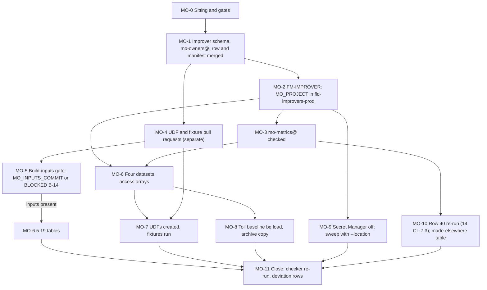

# 22. Mo: project, datasets, identity and golden fixtures

## Status

- Owner: the platform owner
- Last reviewed: 2026-09-15
- Last executed: never
- Stage: review §2 stage 22 (Mo's register row and the FM-IMPROVER run) and the Wall-E-independent half of stage 25 (Mo-1 to Mo-3 of the superseded Mo runbook). Runs after the Tier R record of [17](17-factory-module-equivalents-and-tier-r-gate.md). **This file gates no part of Eve.** It may run before, during or after files 23 to 28; a BLOCKED Mo input never holds Eve-H (plan SD-45, README §3.4). Wall-E (file 30) starts with this file complete or with its BLOCKED steps indexed.
- Step prefix: `MO`. Steps: 38. BLOCKED steps: MO-6.5 (Mo's 19 table schemas), MO-7.5 (verdict fixtures), MO-7.6 (the `z` agreement check against `gates.yaml`). MO-5.2 is the build-inputs gate itself: it writes `MO_INPUTS_COMMIT` or a `BLOCKED` line for README B-14, and MO-6.5, MO-7.5 and MO-7.6 read that line. Steps that record `PENDING` rather than `BLOCKED`: MO-2.4 (the twin, while P40 is unsigned), MO-9.3 (the sweep over `WALLE_PROJECT`, which does not exist until 31), MO-10.2 (grants other files make).
- Replaces: Mo-1 (step 0 and the datasets), Mo-2 and Mo-3 of [../../mo/07-build-runbook.md](../../mo/07-build-runbook.md), and the Mo-0 verify of the loaded baseline. That page is not executed.
- Salvaged: the Mo-1 dataset table and its descriptions (renamed to the `MO_*_DS` names); the Mo-1 location check; Mo-2's identity creation (`mo-metrics@`, `roles/bigquery.jobUser` in `MO_PROJECT` only, dataset-level `WRITER` on Mo's own datasets, exactly one principal on the private dataset) and its project-level negative checks; Mo-3's UDF text and golden fixtures, with the 35/38 constant corrected to 0.7920; Mo-0's verify of the baseline (four ISO weeks, three tasks, a median per task, an operating-hours row).
- Not copied: Mo-1 step 0's `gcloud projects create --folder="$FOLDER_ID"` under a human Project Creator role (S042); the `walle_metrics*` names (S144); `grant_dataset` with no error handling, a fixed `/tmp/ds.json` and no de-duplication (S147, S160); cross-owner grant lines inside executable blocks (S147); the unqualified secrets verify without `--location` (S151); a Workload Identity pool in `MO_PROJECT` (S046: the only CI pool is `WIF_POOL` in `CICD_PROJECT`); a loader scheduled query over the CSV and a 400-day expiry on the baseline (S150); a hand budget of 50 EUR (S212); `grep -c` over service-name fragments (S208); `gcloud projects delete` as rollback (S208).
- Applies decisions (signed in 03 before the step that needs them): SD-01, SD-33, SD-39, SD-44, SD-45, SD-46, M-1, M-5, NAMES.
- Closes: S042 (with 17), S043, S044, S057 (Mo's half), S062 (Mo's foundation half; the query half is 36), S144, S147, S150 (the load half; 02 closed the form), S151, S155 (the grant and check half; the view-creation half is 36), S208, S212. Defers none without an owner (§13).
- Consumes: FM-IMPROVER (17); `MO_METRICS_DS`, `MO_ARCHIVE_DS`, `MO_PRIVATE_DS`, `MO_VIEWS_DS`, M-1, M-5, `MO_OWNER_EMAIL`, NAMES (03); `TOIL_BASELINE_FILE` at a merged commit (02); `PLATFORM_LOGS_VIEWS_DS` and 14 CL-7.3 (14); `ENT_BOOTSTRAP_MODULE_IMPROVERS_PROD`, `ENT_BOOTSTRAP_MODULE_IMPROVERS_NONPROD` (12); `REGISTER_PATH`, `MANIFEST_SCHEMA_PATH` (16); `TIER_R_RECORD` (17).
- Produces: `MO_PROJECT`, `MO_PROJECT_NUMBER`, `SA_MO_METRICS`, `MO_INPUTS_COMMIT`; the four datasets Mo's later phases write; `ENT_PROJECT_REPAIR_MO`, `ENT_DEPLOY_CREDENTIAL_HOLDER_MO`; `MO_TWIN_PROJECT` (a project id if P40 requires the twin, otherwise `*tbd*` with a re-run line).
- Commands checked against Google's documentation on 2026-09-15 (§15). What could not be settled that day is listed in §14.

## What this part builds

Mo is the platform's measurement component: one per platform, keyed on `agent_id`, reading what Wall-E and Eve write and never writing anything that enforces (M-1). This file builds only the part of Mo that needs neither Wall-E nor Eve:

1. **Mo's register row and manifest, merged before any project exists** (§1). The register schema of 16 has no improver shape, so MO-1.1 adds one by reviewed pull request. `mo-owners@`, the owner group the row names, is made by hand (§1, MO-1.2) because the group factory is BLOCKED code.
2. **`MO_PROJECT` by FM-IMPROVER** in `fld-improvers-prod` (§2), under `ENT_BOOTSTRAP_MODULE_IMPROVERS_PROD` approved by the second human, with the module's labels, inherited tags, exact services, regional log routing, 200 EUR budget, deny entries, repair and deploy entitlements, and no standing Owner. The nonprod twin `MO_TWIN_PROJECT` is built only if P40 is signed as requiring it (MO-2.4).
3. **`mo-metrics@`** (§3), the only Mo identity at this stage: keyless, `roles/bigquery.jobUser` in `MO_PROJECT` and nothing at project level anywhere else.
4. **The committed definitions Mo-3 fixes before anyone grades** (§4): the two Wilson UDFs and the golden fixtures, in two separate pull requests, with the corrected constant 0.7920 compared within a tolerance.
5. **The build-inputs gate** (§5): Mo's schemas, SQL files, `gates.yaml`, UDFs and fixtures must be committed at one named commit, counted, and reviewed by the second operator; otherwise the steps that need them are BLOCKED on README B-14.
6. **The four agent-neutral datasets** (§6): `platform_metrics`, `platform_metrics_archive`, `platform_metrics_private`, `platform_metrics_views`, in `EU`, with exact access arrays; the 19 tables once the inputs exist.
7. **The persistent UDFs and the fixture run** (§7).
8. **The toil baseline in BigQuery** (§8): an explicit `bq load` of the merged CSV into a commit-named table in the archive dataset, then a keyed table in `platform_metrics`; no expiry anywhere; no transfer config.
9. **The secrets assertions** (§9): Secret Manager is disabled and not allowed in `MO_PROJECT`; the sweep over other projects' regional secrets runs with `--location` and fails on any non-zero exit.
10. **The grants other files make, as a table** (§10), and the re-run of 14's row 40 grant now that `mo-metrics@` exists.

What the old text got wrong, and must not come back:

| Old text | Why it fails | Here instead |
|---|---|---|
| `gcloud projects create "$MO_PROJECT" --folder="$FOLDER_ID"` with a human Project Creator and a standing Owner (Mo-1 step 0) | Wrong folder, outside the improvers allow-list, deny entries and budget; no human holds Project Creator (S042) | MO-2.2 runs 17's FM-IMPROVER under `ENT_BOOTSTRAP_MODULE_IMPROVERS_PROD` (SD-46); the checker proves the parent and the deny entry |
| No register row or manifest before the project (S057) | D1: nothing exists in a project without a row; reconciliation flags it | MO-1.3 merges both; FM-2.1 refuses the run without them (R-12) |
| `walle_metrics`, `walle_metrics_archive`, `walle_metrics_private`, `walle_metrics_views` (S144) | Dataset names are permanent; the design requires agent-neutral names before Stage 0 | The signed `MO_*_DS` names (SD-33); MO-5.2 refuses any committed input that says `walle_metrics` |
| Schemas, SQL and images assumed to exist (S043) | None is committed; the table loop dies on the first missing file | MO-5.1 and MO-5.2: a committed inputs list, counted at a named commit, or BLOCKED |
| Fixture `SELECT 'lower', 35, 38, 0.7921` with `ROUND(...) = expected` (S044) | The Wilson lower bound of 35/38 is 0.792006; the verify fails for ever | 0.7920, compared as `ABS(actual - expected) < 0.00005`; MO-7.4 also proves the old constant fails |
| `grant_dataset` into `/tmp/ds.json`, no error check, appended twice on re-run; Wall-E's and Eve's grants in the same block (S147, S160) | Out-of-band grants by the wrong owner; a failed read writes garbage back | `mo_ds_access` (MO-6.4) with `mktemp -d`, etag check, `unique`, read-back diff; other owners' grants in a table (§10) |
| `<walle-project-id>.walle_workspace_logs.<table>` (S062) | That dataset is retired; the source is `platform_logs_views.walle_workspace_logs` in `LOGGING_PROJECT` | MO-5.2 refuses SQL naming the retired dataset; MO-10.1 re-runs row 40 |
| Toil baseline "loaded by a scheduled query", 400-day partition expiry (S150) | A scheduled query cannot read git; expiry would delete the irreplaceable baseline | §8: `bq load` on merge, no expiry, a commit-named archive copy |
| `gcloud secrets get-iam-policy "$S" --project=...` without `--location`; `gcloud secrets list` in `MO_PROJECT` (S151) | Regional secrets are not found without `--location`, and an error printed nothing, which read as "no grant" | §9: `--location="$REGION"`, `set -euo pipefail`, expected counts, and a services assertion in `MO_PROJECT` |
| WRITER on the views dataset with no use and no check (S155) | `dataEditor` can create tables; "views only" was never verified | MO-6.4 keeps the WRITER because 36 creates the views as `mo-metrics@` (02 §2.1 of Mo's set); MO-6.6 fails on any object in that dataset that is not a `VIEW` |
| `grep -c -E 'bigquery\|...'` expecting 7; floor check pointing at a closed prerequisite; `gcloud projects delete` (S208) | Dependencies inflate the count; no command; a hand delete fights the lien and the factory | FM-2.7's exact `comm` comparison; MO-2.3's inline floor read; rollback only through FM-REVOKE |
| Budget "50 EUR at S0"; "fifteen transfer configs"; MERGE keyed on `(as_of_hour, cell, fingerprint_sha)` (S212) | The module's budget is 200 EUR; nineteen SQL files; the key must carry `agent_id` | Spec budget 200 (17 §5); MO-5.1 lists 19 SQL files; MO-5.2 refuses a scorecard MERGE without `agent_id` |



## Preconditions

- [ ] 17 complete: `TIER_R_RECORD` set and merged; FM-1.2's checker merged; FM-IMPROVER (§5 of 17) readable.
- [ ] 12: `ENT_BOOTSTRAP_MODULE_IMPROVERS_PROD` (and `ENT_BOOTSTRAP_MODULE_IMPROVERS_NONPROD` if the twin is built) set, `AVAILABLE`, approver the second human, proven by one grant; `ENT_PROJECT_REPAIR_TEMPLATE` and `ENT_DEPLOY_CREDENTIAL_HOLDER_TEMPLATE` merged.
- [ ] 13: `DENY_IMPROVERS` attached at `fld-agentic-platform` with the `fld-improvers` service-account folder set; the `fld-improvers-*` allow-list applied without `secretmanager`, `cloudkms`, `firestore`, `iap`, `admin`, `aiplatform`.
- [ ] 14: `PLATFORM_LOGS_VIEWS_DS` exists with the authorised view `walle_workspace_logs`; the CL-7.3 PENDING line for `mo-metrics@` is in `rerun-index.tsv`.
- [ ] 16: `REGISTER_PATH`, `MANIFEST_SCHEMA_PATH`; RG-3.6's signed manual parse is the register CI while RG-3.3 is BLOCKED.
- [ ] 17 §2 FM-1.1: the run-spec template carries the shape 22 and 23 share — `budget` with `display_name`, `amount`, `currency_from` and `reason_if_not_tier_default`, `service_accounts` as `{id, why}` objects, `entitlement_variable` — and `tools/fm-zero-diff.py` reads `.service_accounts[].id`. MO-2.1 checks both and stops if either is missing.
- [ ] Register-row schema coordination with 23: `owner_group.not.pattern` on `origin/main` is either 16 RG-2.2's original value or `^platform-owners@`. Any value that keeps `mo-owners@` refused (for example `^(platform|mo)-owners@`) is a stop until 23 EP-1.1 is corrected. MO-1.1 and MO-1.3 check it.
- [ ] 03 signed: NAMES (with `MO_PROJECT`), SD-01, SD-33, SD-39, SD-44, SD-45, SD-46, M-1, M-5, PPL-MO; `MO_OWNER_EMAIL`, `MO_METRICS_DS`, `MO_ARCHIVE_DS`, `MO_PRIVATE_DS`, `MO_VIEWS_DS`, `SECOND_OPERATOR_EMAIL`, `SECOND_HUMAN_EMAIL` set. `tools/decision-need.sh` prints `SIGNED` for each.
- [ ] 02: TB-5.1 merged (only for §8; every other section runs without it, and §8 is a re-run point when it lands).
- [ ] 07: `BILLING_ACCOUNT_ID`, `BILLING_CURRENCY`, `BOOTSTRAP_BILLING_EXPIRY` (after that date the billing administrator performs FM-2.5 and FM-2.10).
- [ ] Workstation of 01: gcloud with `alpha` and `beta`, `bq`, `jq`, `python3.12`, `git`, `gh`; `~/.platform-env` sourced; `penv_guard` silent.
- [ ] **Not** a precondition: anything from files 23 to 28. Nothing in this file reads `EVE_PROJECT` except the optional sweep of MO-9.3, which records `PENDING` when the project does not exist.

## People needed

| Role | Does | Present at |
|---|---|---|
| Mo owner (`MO_OWNER_EMAIL`; the platform owner, as `sa-1-admin@`, until 03's PPL-MO names another person) | Writes the row, manifest, run spec, UDF and fixture files and the inputs list; requests every grant; performs every shell step | every step |
| Platform owner (as `sa-1-admin@`, when not the Mo owner) | Performs FM-IMPROVER (17 names the platform owner as performer of every hand module run) and the `mo-owners@` creation as a super admin | MO-1.2, MO-2.2 |
| Second human (`SECOND_HUMAN_EMAIL`) | Approves `ENT_BOOTSTRAP_MODULE_IMPROVERS_*` and `ENT_PROJECT_REPAIR_MO` grants; code owner review of the schema amendment while the security reviewer is not appointed; signs the RG-3.6 manual parse for the register pull request | MO-1.1, MO-1.3, MO-2.2, MO-6.1 |
| Second operator (`SECOND_OPERATOR_EMAIL`) | Reviews every Mo input commit (UDFs, fixtures, inputs list, schemas, SQL) and signs the review record of the gate; first reviewer on those pull requests | MO-4.1, MO-4.2, MO-5.3 |
| A second reviewer who did not author the change | Second human approval on each pull request (branch protection of 03) | MO-1.1, MO-1.3, MO-4.1, MO-4.2, MO-5.1, MO-8.1, MO-9.2 |
| Billing administrator | FM-2.5 and FM-2.10 only if `BOOTSTRAP_BILLING_EXPIRY` has passed | MO-2.2 |

Hands-on: about 2 days. Elapsed: about 1 week once the inputs exist (pull-request reviews, approvals); §6.5 and §7.5 wait on the Mo owner's code (B-14) with no fixed date.

Conventions of [01](01-prerequisites-and-conventions.md) apply. Deviation rows are `BD-22-<n>`. Records go to `BUILD_LOG_DIR/records/` as `<date>-MO-<step>-<slug>-v<n>`. Every shell block starts with:

```bash
source ~/.platform-env
penv_guard
R="$BUILD_LOG_DIR/records/$(date -u +%F)-MO"
```

## 0. The sitting

### MO-0.1 Open the sitting and check the gates

- **WHO:** Mo owner.
- **WHERE:** Shell, `~/.platform-env` sourced, gcloud configuration `GCLOUD_CONFIG_NAME`, signed in as `sa-1-admin@` (or the Mo owner's own admin account once 03 names another person).
- **ACTION:**

```bash
checkpoint MO-0.1 START
need ORG_ID REGION BQ_LOCATION PLATFORM_REPO_DIR BUILD_LOG_DIR DEVIATION_REGISTER EVIDENCE_REGISTER TIER_R_RECORD REGISTER_PATH MANIFEST_SCHEMA_PATH FLD_AGENTIC_PLATFORM FLD_IMPROVERS FLD_IMPROVERS_PROD FLD_IMPROVERS_NONPROD ENT_BOOTSTRAP_MODULE_IMPROVERS_PROD ENT_PROJECT_REPAIR_TEMPLATE ENT_DEPLOY_CREDENTIAL_HOLDER_TEMPLATE DENY_IMPROVERS LOGGING_PROJECT PLATFORM_LOGS_VIEWS_DS CICD_PROJECT CORE_PROJECT MO_METRICS_DS MO_ARCHIVE_DS MO_PRIVATE_DS MO_VIEWS_DS MO_OWNER_EMAIL SECOND_HUMAN_EMAIL SECOND_OPERATOR_EMAIL BILLING_ACCOUNT_ID DOMAIN
"$PLATFORM_REPO_DIR/tools/decision-need.sh" NAMES SD-01 SD-33 SD-39 SD-44 SD-45 SD-46 M-1 M-5 PPL-MO
test -s "$PLATFORM_REPO_DIR/$TIER_R_RECORD" && echo "TIER_R_RECORD present"
test "$("$PLATFORM_REPO_DIR/tools/decision-value.sh" NAMES MO_METRICS_DS)" = "$MO_METRICS_DS" && echo "MO_METRICS_DS matches NAMES"
for v in MO_METRICS_DS MO_ARCHIVE_DS MO_PRIVATE_DS MO_VIEWS_DS; do printenv "$v" | grep -Eq '^platform_metrics(_archive|_private|_views)?$' && echo "$v ok"; done
awk -F'\t' '$2 ~ /^(FM-10\.3|CL-7\.3|RG-2\.6|PA-4\.8|OP-7\.6)$/ {print $2"\t"$3}' "$BUILD_LOG_DIR/checkpoints.tsv" | sort -u
grep -E 'CL-7\.3.*mo-metrics' "$BUILD_LOG_DIR/rerun-index.tsv"
test -z "$(gcloud config get project 2>/dev/null)" && echo "no default project"
```

- **VERIFY:** `decision-need.sh` prints `SIGNED` for each id; `TIER_R_RECORD present`; the NAMES line matches; four `ok` lines; the checkpoint listing shows `DONE` for FM-10.3, RG-2.6, PA-4.8 and OP-7.6 and `PENDING` for CL-7.3; the re-run index has the CL-7.3 line for `mo-metrics@`; `no default project`. Anything else: stop and finish the earlier file. The absence of any Eve checkpoint is expected and is not a stop.
- **ROLLBACK:** Read only.
- **EVIDENCE:** The output as `${R}-0.1-inputs-v1.txt`, `evidence_add MO-0.1 inputs E-05 1.4.1 build-log:records/<file> <file>`. E-05. TISAX 1.4.1.

### MO-0.2 Decide whether the twin is built (P40)

- **WHO:** Mo owner.
- **WHERE:** Shell; `decisions/TRACKER.md`.
- **ACTION:** 02 §3.5 (P40, *proposed*) makes nonprod mandatory for improvers; 03 does not list P40 among the decisions it signs, and SD-25 admits the sandbox customer id on `fld-improvers-nonprod` only if Mo reads sandbox data. Read whether a signed P40 record exists.

```bash
if "$PLATFORM_REPO_DIR/tools/decision-need.sh" P40 >/dev/null 2>&1; then echo "P40 SIGNED: read its Values table for the improver twin"; "$PLATFORM_REPO_DIR/tools/decision-value.sh" P40 MO_TWIN_REQUIRED; else echo "P40 NOT SIGNED"; fi
```

  If P40 is signed and its value `MO_TWIN_REQUIRED` is `yes`, MO-2.4 runs FM-IMPROVER for the twin. Otherwise MO-2.4 records `MO_TWIN_PROJECT=*tbd*` and a re-run line owned by the Mo owner, due at the Tier W gate (P40's gate). *Assumption:* the P40 record, when signed, carries a value named `MO_TWIN_REQUIRED`; if it uses another name, read the record by eye and write the answer in the build log.
- **VERIFY:** One of the two lines is printed and copied to the build log under MO-0.2.
- **ROLLBACK:** Read only.
- **EVIDENCE:** Build-log line. E-05. TISAX 5.2.2 (environments separated).

## 1. The register row and the manifest

### MO-1.1 Add the improver shape to 16's schemas

- **WHO:** Mo owner writes; the security reviewer approves as code owner of `/register/schema/` and `/contract/` (the second human until appointed, per 16 RG-1.2); a second human reviewer.
- **WHERE:** `PLATFORM_REPO_DIR`, branch `mo-1-improver-schema`, then the git host.
- **ACTION:** 16's register-row schema admits tiers `C`, `R`, `W`, `P`, `P-SA`, `X`, and its manifest schema requires agent-only blocks (`families`, an agent `principal`, a model fingerprint). Mo has neither families nor an agent identity before S4, while 02 §3.6 gives improvers their own tier code `imp`. Add `IMP` to the row schema with its own rules, widen two row patterns the Mo row needs (below), and add a separate improver manifest schema. File 23 EP-1.1 adds `CTL` the same way and makes the **same two pattern assignments, character for character**: both files set `owner_group.not.pattern` to `^platform-owners@` and `agent_id.pattern` to `^[a-z][a-z0-9-]{1,30}$`, so that whichever pull request merges second rebases on the first with no semantic conflict and an idempotent result. **Precondition:** read the merged value before opening this pull request — `git -C "$PLATFORM_REPO_DIR" show origin/main:register/schema/register-row.schema.json | jq -r '.["$defs"].row.properties.owner_group.not.pattern'` must print either 16 RG-2.2's original (23 has not merged) or `^platform-owners@` (23 merged first). Any other value, in particular `^(platform|mo)-owners@`, is a stop: it refuses `mo-owners@` for ever and MO-1.3 can never pass; report it to 23's owner as a correction to EP-1.1 before going on.

```bash
git -C "$PLATFORM_REPO_DIR" switch main && git -C "$PLATFORM_REPO_DIR" pull --ff-only
git -C "$PLATFORM_REPO_DIR" switch -c mo-1-improver-schema
S="$PLATFORM_REPO_DIR/register/schema/register-row.schema.json"
jq '(.["$defs"].row.properties.tier.enum) |= ((. + ["IMP"]) | unique)
  | (.["$defs"].row.properties.agent_id.pattern) = "^[a-z][a-z0-9-]{1,30}$"
  | (.["$defs"].row.properties.owner_group.not.pattern) = "^platform-owners@"
  | (.["$defs"].row.allOf) += [{"if":{"properties":{"tier":{"const":"IMP"}},"required":["tier"]},
      "then":{"required":["env","folder","recovery_class","manifest_sha","contract_version"],
              "properties":{"folder":{"enum":["FLD_IMPROVERS_PROD","FLD_IMPROVERS_NONPROD"]},"verifier":{"const":"none"},"privilege":{"const":"none"},
                            "risk_class":{"const":"READ"},"publish_to_gemini":{"const":false},"metric_pack":{"const":"light"}}}}]' "$S" > "$S.new" && mv "$S.new" "$S"
cat > "$PLATFORM_REPO_DIR/contract/1.0.0/improver-manifest.schema.json" <<'JSON'
{
  "$schema": "https://json-schema.org/draft/2020-12/schema",
  "$id": "improver-manifest/1.0.0",
  "title": "Improver manifest (Mo): reads, writes inside its own project, no egress, no model before S4",
  "type": "object",
  "required": ["contract_version", "identity", "reads", "writes", "stores", "egress", "invokers", "capabilities", "model_pin", "data_classes", "recovery_class", "compliance"],
  "additionalProperties": false,
  "properties": {
    "contract_version": {"type": "string", "pattern": "^1\\.[0-9]+\\.[0-9]+$"},
    "identity": {"type": "object", "required": ["agent_id", "kind", "tier", "owner_group", "env"], "additionalProperties": false,
      "properties": {"agent_id": {"type": "string", "pattern": "^[a-z][a-z0-9-]{1,30}$"}, "kind": {"const": "improver"}, "tier": {"const": "IMP"},
                     "owner_group": {"type": "string", "pattern": "^[a-z][a-z0-9-]*-owners@"}, "env": {"enum": ["prod", "nonprod"]}}},
    "reads": {"type": "array", "items": {"type": "object", "required": ["dataset", "topology_row", "made_in"], "additionalProperties": false,
      "properties": {"dataset": {"type": "string"}, "topology_row": {"type": "integer"}, "made_in": {"type": "string", "pattern": "^[0-9]{2}$"}}}},
    "writes": {"type": "array", "items": {"type": "string", "pattern": "^MO_(METRICS|ARCHIVE|PRIVATE|VIEWS)_DS$"}},
    "stores": {"type": "array", "items": {"type": "object", "required": ["name", "kind", "class", "retention_row"], "additionalProperties": false,
      "properties": {"name": {"type": "string"}, "kind": {"enum": ["bigquery", "gcs"]}, "class": {"enum": ["evidence", "record", "ops"]}, "retention_row": {"type": "string", "pattern": "^R[0-9]+$"}}}},
    "egress": {"type": "array", "maxItems": 0},
    "invokers": {"type": "object", "maxProperties": 0},
    "capabilities": {"type": "object", "required": ["code_execution"], "properties": {"code_execution": {"const": false}}},
    "model_pin": {"type": "string", "pattern": "^(none|gemini-[a-z0-9.-]+)$"},
    "data_classes": {"type": "array", "minItems": 1, "items": {"enum": ["evidence", "record", "ops"]}},
    "recovery_class": {"enum": ["R-A", "R-B", "R-C", "R-D", "R-K"]},
    "compliance": {"type": "object", "required": ["ai_act_entry", "ai_act_class", "purpose_sha256", "tisax_class", "register_row"], "additionalProperties": false,
      "properties": {"ai_act_entry": {"type": "string"}, "ai_act_class": {"const": "minimal"}, "purpose_sha256": {"type": "string", "pattern": "^[0-9a-f]{64}$"},
                     "tisax_class": {"type": "string"}, "register_row": {"type": "string", "pattern": "^register/[a-z][a-z0-9-]{1,30}\\.yaml$"}}}
  }
}
JSON
check-jsonschema --check-metaschema "$S"
check-jsonschema --check-metaschema "$PLATFORM_REPO_DIR/contract/1.0.0/improver-manifest.schema.json"
git -C "$PLATFORM_REPO_DIR" add "$S" contract/1.0.0/improver-manifest.schema.json
git -C "$PLATFORM_REPO_DIR" commit -m "register: improver tier IMP and improver manifest schema (setup 22 MO-1.1)"
git -C "$PLATFORM_REPO_DIR" push -u origin mo-1-improver-schema
```

  Also add three fixtures in the same pull request, `register/fixtures/schema/pass-imp-mo.yaml` (the row of MO-1.3 with `manifest_sha` of 64 zeros), `register/fixtures/schema/fail-imp-with-gateway-tier-r.yaml` (tier `R` with no `principal`) and `register/fixtures/schema/fail-owner-group-platform-owners.yaml` (the same `IMP` row with `owner_group: platform-owners@<DOMAIN>`, which must still be refused), and re-run 16 RG-2.5's fixture loop. Why the row rules: `verifier: none` (Mo is recomputed by the validator, not verified by Eve), `privilege: none` and `risk_class: READ` (M-1), `publish_to_gemini: false`, `metric_pack: light` (a placeholder the schema requires; Mo is not measured by a pack).

  The two pattern assignments, and what each releases:

| Row property | 16 RG-2.2's value | This step sets | Why |
|---|---|---|---|
| `agent_id.pattern` | `^[a-z][a-z0-9-]{2,30}$` | `^[a-z][a-z0-9-]{1,30}$` | `mo` is two characters; the old pattern requires three. No existing row changes |
| `owner_group.not.pattern` | refuses `platform-owners@`, `eve-owners@` and `mo-owners@` | `^platform-owners@` | releases `eve-owners@` and `mo-owners@`, each of which owns exactly its own row (16 anticipated the amendment); `platform-owners@` stays refused for ever, which the third fixture tests |

  Without both assignments MO-1.3's `check-jsonschema` refuses the Mo row twice over — on the two-character `agent_id` and on `owner_group: mo-owners@` — so neither is optional.
- **VERIFY:** Both `check-jsonschema --check-metaschema` lines print success; RG-2.5's loop prints `PASS-OK` for `pass-imp-mo.yaml`, `FAIL-OK` for both failing fixtures and unchanged results for every earlier fixture; after the merge

```bash
git -C "$PLATFORM_REPO_DIR" show origin/main:register/schema/register-row.schema.json | jq -r '[.["$defs"].row.properties.agent_id.pattern, .["$defs"].row.properties.owner_group.not.pattern] | @tsv'
```

  prints `^[a-z][a-z0-9-]{1,30}$` and `^platform-owners@` (and prints the same after 23 EP-1.1 merges, in either order); the pull request is merged with the code owner's approval and an RG-3.6 parse file signed by the second human.
- **ROLLBACK:** A reverting pull request before MO-1.3 merges; afterwards a superseding schema change.
- **EVIDENCE:** Merge commit as `<date>-MO-1.1-improver-schema-v1`. E-05. TISAX 1.3.1, 5.2.1.

### MO-1.2 Create `mo-owners@` as a security group

- **WHO:** Platform owner as `sa-1-admin@` (a super admin); the Mo owner confirms the membership. No witness: this is an agent group, not a control group (04 §2.4).
- **WHERE:** Admin console: Menu > Directory > Groups > Create group (the path 06 OB-6.2 verified on 2026-09-15).
- **ACTION:** 04 §2.4 names `mo-owners@` as the improvers' owner group, made by the group factory (`factory-groups@`), whose job is BLOCKED code. Until it exists the group is made by hand and recorded as `BD-22-1`.
  1. Check the address is free: `gcloud identity groups describe "mo-owners@${DOMAIN}" --format="value(groupKey.id)"` prints a not-found error.
  2. Group email `mo-owners@<DOMAIN>`; description "Mo owners: requester group for ent-project-repair-mo and ent-deploy-credential-holder-mo; register owner_group of Mo (setup 22)".
  3. Labels: tick **Security**.
  4. Access settings as 06 OB-6.2 step 4 (invitation only, no external members).
  5. Members: `MO_OWNER_EMAIL` only (Member). Owner: none (04 §2.4: owners of agent groups are the agent's owner group itself).
- **VERIFY:**

```bash
gcloud identity groups describe "mo-owners@${DOMAIN}" --format="json(labels)"
gcloud identity groups memberships list --group-email="mo-owners@${DOMAIN}" --format="value(preferredMemberKey.id)"
```

  The labels include `cloudidentity.googleapis.com/groups.security`; the membership list prints exactly `MO_OWNER_EMAIL`.
- **ROLLBACK:** **IRREVERSIBLE**: a security group cannot be changed back to a Google Group (06 OB-6.2's source). Confirm before saving: the address is free (step 1), the spelling equals `owner_group` in MO-1.3's draft, and 04 §2.4 names it. Gate: 04 §2.4's naming rule and MO-1.1's `DONE` line. A wrongly added member is removed at once and recorded.
- **EVIDENCE:** Screenshot of the settings page and the two outputs as `${R}-1.2-mo-owners-v1`; a `DEV` row `BD-22-1` in `DEVIATION_REGISTER` ("group made by hand instead of the group factory; superseded when `factory-groups@`'s job exists; owner platform owner"). E-08. TISAX 4.1.1, 4.2.1.

### MO-1.3 Write and merge Mo's register row and manifest

- **WHO:** Mo owner writes; the second human signs the RG-3.6 manual parse; two human reviewers merge.
- **WHERE:** `PLATFORM_REPO_DIR`, branch `mo-1-register-row`.
- **ACTION:** One file per agent, one row per `env` (16 RG-2.2). The nonprod row is added only if MO-0.2 printed a signed `yes`. The manifest lives at `mo/agent-manifest.yaml` (*Assumption:* Mo's inputs live under `mo/` in the platform repository, §5; if the Mo owner uses another repository, the same relative paths apply there and the choice is written in the build log).

```bash
git -C "$PLATFORM_REPO_DIR" switch main && git -C "$PLATFORM_REPO_DIR" pull --ff-only
git -C "$PLATFORM_REPO_DIR" switch -c mo-1-register-row
mkdir -p "$PLATFORM_REPO_DIR/mo"
PURPOSE="Mo measures Wall-E and Eve from committed SQL over their audit and quality datasets, publishes scorecards and proposes configuration changes only as pull requests that humans merge; nothing Mo writes is read by anything that enforces (M-1)."
PURPOSE_SHA="$(printf '%s' "$PURPOSE" | shasum -a 256 | cut -d' ' -f1)"
cat > "$PLATFORM_REPO_DIR/mo/agent-manifest.yaml" <<EOF
contract_version: 1.0.0
identity: {agent_id: mo, kind: improver, tier: IMP, owner_group: mo-owners@${DOMAIN}, env: prod}
reads:
  - {dataset: "\${WALLE_PROJECT}:walle_audit", topology_row: 6, made_in: "31"}
  - {dataset: "\${LOGGING_PROJECT}:platform_logs_views", topology_row: 40, made_in: "14"}
  - {dataset: "\${EVE_PROJECT}:eve_quality", topology_row: 28, made_in: "29"}
  - {dataset: "\${VALIDATOR_PROJECT}:eve_grades", topology_row: 46, made_in: "40"}
writes: [MO_METRICS_DS, MO_ARCHIVE_DS, MO_PRIVATE_DS, MO_VIEWS_DS]
stores:
  - {name: platform_metrics, kind: bigquery, class: record, retention_row: R13}
  - {name: platform_metrics_archive, kind: bigquery, class: evidence, retention_row: R13}
  - {name: platform_metrics_private, kind: bigquery, class: record, retention_row: R13}
  - {name: platform_metrics_views, kind: bigquery, class: record, retention_row: R13}
egress: []
invokers: {}
capabilities: {code_execution: false}
model_pin: none
data_classes: [evidence, record]
recovery_class: R-A
compliance: {ai_act_entry: "10-eu-ai-act.md#mo", ai_act_class: minimal, purpose_sha256: ${PURPOSE_SHA}, tisax_class: confidential, register_row: register/mo.yaml}
EOF
MANIFEST_SHA="$(shasum -a 256 "$PLATFORM_REPO_DIR/mo/agent-manifest.yaml" | cut -d' ' -f1)"
cat > "$PLATFORM_REPO_DIR/register/mo.yaml" <<EOF
agent_id: mo
rows:
  - display_name: Mo (improver, prod)
    purpose: "${PURPOSE}"
    owner_group: mo-owners@${DOMAIN}
    cost_centre: "*tbd*"
    tier: IMP
    env: prod
    folder: FLD_IMPROVERS_PROD
    risk_class: READ
    data_classes: [evidence, record]
    tisax_class: confidential
    ai_act_class: minimal
    ai_act_role: both
    model_pin: none
    supplier_rows: [google-cloud-bigquery]
    publish_to_gemini: false
    audience_groups: []
    review_date: "$(python3 -c 'import datetime;print(datetime.date.today()+datetime.timedelta(days=90))')"
    status: poc
    privilege: none
    metric_pack: light
    verifier: none
    recovery_class: R-A
    manifest_sha: ${MANIFEST_SHA}
    contract_version: 1.0.0
EOF
test "$(jq -r '.["$defs"].row.properties.owner_group.not.pattern' "$PLATFORM_REPO_DIR/register/schema/register-row.schema.json")" = '^platform-owners@' && echo "owner_group pattern releases mo-owners@ (MO-1.1)" || echo "STOP: MO-1.1's owner_group amendment is not on main; mo-owners@ would be refused"
test "$(jq -r '.["$defs"].row.properties.agent_id.pattern' "$PLATFORM_REPO_DIR/register/schema/register-row.schema.json")" = '^[a-z][a-z0-9-]{1,30}$' && echo "agent_id pattern admits two characters (MO-1.1)" || echo "STOP: MO-1.1's agent_id amendment is not on main"
check-jsonschema --schemafile "$PLATFORM_REPO_DIR/register/schema/register-row.schema.json" "$PLATFORM_REPO_DIR/register/mo.yaml"
check-jsonschema --schemafile "$PLATFORM_REPO_DIR/contract/1.0.0/improver-manifest.schema.json" "$PLATFORM_REPO_DIR/mo/agent-manifest.yaml"
grep -n 'walle_metrics' "$PLATFORM_REPO_DIR/register/mo.yaml" "$PLATFORM_REPO_DIR/mo/agent-manifest.yaml" && echo "STOP: retired name" || echo "no retired name"
git -C "$PLATFORM_REPO_DIR" add register/mo.yaml mo/agent-manifest.yaml
git -C "$PLATFORM_REPO_DIR" commit -m "register: Mo row and improver manifest before any project (setup 22 MO-1.3, D1, S057)"
git -C "$PLATFORM_REPO_DIR" push -u origin mo-1-register-row
```

  Values that are assumptions, each to be confirmed in review: `tisax_class: confidential` (05 §3.2's default); `data_classes` evidence (the archive is the object promotions cite, E-07) and record; `recovery_class: R-A` (the archive is evidence; 09 §3.1); `supplier_rows` names the row 16 or 03 keeps for BigQuery (use its real id); `cost_centre` stays `*tbd*` until finance names it; `status: poc`. The `${WALLE_PROJECT}` strings in `reads` are literal placeholders, because those projects do not exist yet; the manifest records what Mo will read and which file makes each grant, never a grant. R-01's check of `manifest_sha` is done by eye in the RG-3.6 parse while RG-3.3 is BLOCKED.
- **VERIFY:** Both pattern lines print their `(MO-1.1)` form, never a `STOP` (a `STOP` means MO-1.1 has not merged, or 23 EP-1.1 merged a pattern that keeps `mo-owners@` refused: stop and close that first); both `check-jsonschema` runs print success; `no retired name`; the pull request carries a signed `decisions/register-parses/<date>-pr<number>-parse.md` with R-01 and R-12 `pass`; after merge, `git -C "$PLATFORM_REPO_DIR" log --oneline -1 origin/main -- register/mo.yaml mo/agent-manifest.yaml` shows the merge and `shasum -a 256 mo/agent-manifest.yaml` on `origin/main` equals the row's `manifest_sha`.
- **ROLLBACK:** A reverting pull request, only while no project exists (after MO-2.2 the row stays and moves to `status: retired` through FM-REVOKE).
- **EVIDENCE:** Merge commit and parse file as `<date>-MO-1.3-register-row-v1`. E-05 (Annex IV index of the system), E-02: none (minimal risk, no registration, 10 §3.4). TISAX 1.3.1, 1.3.2. Closes S057 for Mo.

## 2. `MO_PROJECT` by FM-IMPROVER

### MO-2.1 Write Mo's run spec

- **WHO:** Mo owner writes; two human reviewers merge (the second human is one of them, as approver of the run).
- **WHERE:** `PLATFORM_REPO_DIR`, branch `fm-spec-mo-prod` (FM-2.1 creates it).
- **ACTION:** Copy 17's template to `factory/runs/mo-prod.json` and fill it from the merged row, the manifest, 17 §5's parameter table and NAMES. The services are the subset of the `fld-improvers-*` allow-list (02 §4.2) that this file and FM-COMMON use: BigQuery and Data Transfer (datasets, later scheduled queries), Storage (the drop box of 40), Run and Scheduler (the reporter of 40), Artifact Registry (40's images), Pub/Sub, Essential Contacts, Billing Budgets, Logging (FM-2.8) and Monitoring (FM-2.13). 17 §5's table omits `logging` and `monitoring`, which the allow-list holds and FM-2.8 and FM-2.13 need; they are added here and the omission is reported to 17's owner in the pull request.

```bash
need PLATFORM_REPO_DIR DOMAIN
P_ID="$("$PLATFORM_REPO_DIR/tools/decision-value.sh" NAMES MO_PROJECT)"
need P_ID
RUN_SPEC="$PLATFORM_REPO_DIR/factory/runs/mo-prod.json"
REG_COMMIT="$(git -C "$PLATFORM_REPO_DIR" log -1 --format=%H origin/main -- register/mo.yaml)"
jq --arg id "$P_ID" --arg dom "$DOMAIN" --arg rc "$REG_COMMIT" '
  .module="improver-project" | .run_id="dev-22-improver-mo-prod" | .calling_file_step="22 MO-2.2"
  | .register_row="register/mo.yaml" | .register_commit=$rc | .manifest="mo/agent-manifest.yaml"
  | .agent_id="mo" | .env="prod" | .register_tier="IMP" | .project_variable="MO_PROJECT" | .project_id=$id | .create=true
  | .parent_folder_variable="FLD_IMPROVERS_PROD"
  | .entitlement_variable="ENT_BOOTSTRAP_MODULE_IMPROVERS_PROD"
  | .labels={"agent":"mo","owner":"mo-owners","tier":"imp","env":"prod","data_class":"evidence","ai_act_class":"minimal","recovery_class":"r-a","cost_centre":"tbd","created_by":"bootstrap-hand","factory_run":"dev-22-improver-mo-prod"}
  | .tags_effective={"agp-tier":"imp","agp-env":"prod","agp-tisax-scope":"in"}
  | .services=["bigquery.googleapis.com","bigquerydatatransfer.googleapis.com","storage.googleapis.com","run.googleapis.com","cloudscheduler.googleapis.com","artifactregistry.googleapis.com","pubsub.googleapis.com","essentialcontacts.googleapis.com","billingbudgets.googleapis.com","logging.googleapis.com","monitoring.googleapis.com"]
  | .log_routing={"default_bucket":"default-europe-west1","location":"europe-west1","retention_days":30,"trace_bucket":false}
  | .budget={"display_name":($id + "-budget"),"amount":200,"currency_from":"BILLING_CURRENCY","reason_if_not_tier_default":null}
  | .essential_contacts=[{"email":("mo-owners@" + $dom),"categories":["SECURITY","SUSPENSION","TECHNICAL","TECHNICAL_INCIDENTS"]},{"email":("platform-security@" + $dom),"categories":["SECURITY"]}]
  | .service_accounts=[{"id":"mo-metrics","why":"the only Mo identity at S0: reads other owners’ datasets and writes Mo’s own; roles/bigquery.jobUser in MO_PROJECT and nothing at project level anywhere else (22 MO-3.1)"}]
  | .project_bindings=[{"member":("serviceAccount:mo-metrics@" + $id + ".iam.gserviceaccount.com"),"role":"roles/bigquery.jobUser"}]
  | .allowed_human_members=[]
  | .notification_channels=[{"type":"email","display_name":"mo-prod-owners-email"}]
  | .trigger_sink=null | .pab_bindings=[] | .deny_entries=[] | .project_org_policies=[] | .project_deny_policies=[]
  | .project_floor={"applies":false,"vertex_ai":false,"reason":"modelarmor and aiplatform are not on the fld-improvers allow-list of 13 until S4 (02 section 4.2)"}
  | .entitlements=["ent-project-repair-mo","ent-deploy-credential-holder-mo"] | .lien=true
  | .made_elsewhere=[{"item":"platform_metrics, platform_metrics_archive, platform_metrics_private, platform_metrics_views and their access arrays","file":"22","step":"MO-6.3, MO-6.4"},
                     {"item":"scheduled queries (Eve pack; Wall-E pack)","file":"29, 36","step":"-"},
                     {"item":"mo-proposals bucket, ci_reader rows 19 and 20, mo-reporter job","file":"40","step":"-"},
                     {"item":"pab-agents binding before the first model call (FM-5.2)","file":"40","step":"Mo-11"},
                     {"item":"Model Armor project floor (PF of 18 KS-2.9), when aiplatform is enabled at S4","file":"40","step":"Mo-11"}]
  | .pending=[{"check":"_Trace bucket","reason":"observability.googleapis.com is not on the fld-improvers allow-list of 02 section 4.2","owner":"platform owner","rerun_in":"13"}]
' "$PLATFORM_REPO_DIR/factory/runs/_template.json" > "$RUN_SPEC"
python3.12 -m json.tool "$RUN_SPEC" > /dev/null && echo JSON-OK
diff <(jq -r 'keys[]' "$PLATFORM_REPO_DIR/factory/runs/_template.json" | sort) <(jq -r 'keys[]' "$RUN_SPEC" | sort) && echo "KEY-SET EQUALS TEMPLATE" || echo "STOP: the written spec's key set differs from the template's; a key the FM steps read is missing or misspelt"
jq -e '(.budget | has("display_name") and has("amount") and has("currency_from") and has("reason_if_not_tier_default")) and (.service_accounts | type == "array" and (all(.[]; has("id") and has("why")))) and (.entitlement_variable | type == "string")' "$RUN_SPEC" >/dev/null && echo "SHARED SHAPE OK" || echo "STOP: budget, service_accounts or entitlement_variable is not in the shape 17's template and 23 use"
```

  Then run FM-2.1 as 17 writes it (inputs check, commit, push, pull request). `trace_bucket` is `false` with a `pending` line unless 13 added `observability.googleapis.com` to the improvers list; if it did, set `true`, add the service and delete the `pending` line. `service_accounts` holds only `mo-metrics`: `mo-analyst@` is 36's and `mo-narrator@` 40's (S4); deny-improvers covers them through the folder set (17 FM-5.1). The budget is the module's 200 EUR, not a hand budget (S212). `deny_entries` is written empty here and FM-5.1 adds Mo's `deny-agents-platform` entry as a spec revision, each entry carrying the `set_in` key 23 uses (`"set_in": "13 OP-2.5"` for the folder set, `"set_in": "17 FM-5.1"` for Mo's own); `project_org_policies` and `project_deny_policies` stay empty for an improver and are written explicitly rather than left at the template's value, so a missing key is never read as "no module step".

  **One spec shape, shared with 23.** `factory/runs/*.json` is read by one checker, so Mo's spec and Eve's must agree key for key. The shape written here is the one [23](23-eve-project-and-evidence-stores.md) EP-2.1 writes: `budget` `{display_name, amount, currency_from, reason_if_not_tier_default}`, `service_accounts` as objects `{id, why}`, and `entitlement_variable` naming the entitlement the run is performed under. **Precondition, checked before this step runs:**

```bash
jq -e '(.budget | has("currency_from") and has("display_name") and has("reason_if_not_tier_default")) and has("entitlement_variable")' "$PLATFORM_REPO_DIR/factory/runs/_template.json" >/dev/null && echo "template carries the shared shape (17 FM-1.1 amended)" || echo "STOP: 17 FM-1.1's template amendment is not merged; open it before writing this spec"
grep -n 'service_accounts' "$PLATFORM_REPO_DIR/tools/fm-zero-diff.py" | grep -Eq '\.get\("id"\)|\["id"\]' && echo "checker reads service_accounts[].id" || echo "STOP: 17's checker still reads service_accounts as plain strings; it would fail on the object form"
```

  If either line prints `STOP`, the amendment to 17 §2 FM-1.1 (the template) and to `tools/fm-zero-diff.py`'s `service_accounts.exact` check is opened and merged first; it is recorded as a design correction in §13 and reported to 17's and 23's owners in the same pull request (23's spec leaves `budget.display_name` at the template placeholder, which the same amendment must make it set).
- **VERIFY:** `JSON-OK`; `KEY-SET EQUALS TEMPLATE`; `SHARED SHAPE OK`; both precondition lines print their non-`STOP` form; FM-2.1's `inputs` report prints `ZERO-DIFF` (the spec agrees with the row, NAMES, `folders.yaml`, the allow-list and the budget table); the spec is merged with two human approvals, one of them the second human.
- **ROLLBACK:** Close the pull request; nothing exists in Google Cloud.
- **EVIDENCE:** FM-2.1's report and the merge commit, `evidence_add MO-2.1 run-spec E-05 1.3.1 build-log:records/<file> <file>`. TISAX 1.3.1, 5.2.1.

### MO-2.2 Run FM-IMPROVER for `mo-prod`

- **WHO:** Platform owner performs (17); the Mo owner reads along; **approver:** the second human for `ENT_BOOTSTRAP_MODULE_IMPROVERS_PROD` (FM-2.2), for `ENT_PROJECT_REPAIR_MO`'s one-grant test (FM-2.18) and for FM-2.15's `ENT_PLATFORM_POLICY` grant while the security reviewer is not appointed. The billing administrator performs FM-2.5 and FM-2.10 if `BOOTSTRAP_BILLING_EXPIRY` has passed.
- **WHERE:** Shell, with 17 §2's run header (`RUN_SPEC="$PLATFORM_REPO_DIR/factory/runs/mo-prod.json"`).
- **ACTION:** Run the steps of [17](17-factory-module-equivalents-and-tier-r-gate.md) in the order of the table below — 17 §2's FM-2.x with 17 §5's module steps inserted where this table places them — and nothing else. No command is typed for this step: every command is 17's, parameterised by the merged spec. Each row writes its own checkpoint with the per-run id in column 2, so a sitting cut anywhere resumes at the first row with no `DONE`; that id form (`FM-<n>@<run>`) is the resume point README §4's rule reads for a module run, reported to README's owner as a correction (§13).

| Order | Checkpoint id | 17 step | Note for this run |
|---|---|---|---|
| 1 | `FM-2.1@mo-prod` | FM-2.1 Inputs | done at MO-2.1: row, manifest and spec merged |
| 2 | `FM-2.2@mo-prod` | FM-2.2 Activate the run's entitlement | `ENT_BOOTSTRAP_MODULE_IMPROVERS_PROD`, **approver the second human** |
| 3 | `FM-2.3@mo-prod` | FM-2.3 Create the project | **IRREVERSIBLE as a name** (the box below) |
| 4 | `FM-2.4@mo-prod` | FM-2.4 Record id and number | writes `MO_PROJECT`, `MO_PROJECT_NUMBER` |
| 5 | `FM-5.1@mo-prod` | **FM-5.1** (17 §5) | immediately after FM-2.4, because it needs the real `MO_PROJECT_NUMBER`: Mo's `deny-agents-platform` entry written into the spec and merged as a spec revision, before FM-2.15 reads it |
| 6 | `FM-2.5@mo-prod` | FM-2.5 Link billing | the billing administrator performs it after `BOOTSTRAP_BILLING_EXPIRY` |
| 7 | `FM-2.6@mo-prod` | FM-2.6 Inherited tags | `agp-tier=imp`, `agp-env=prod`, `agp-tisax-scope=in` |
| 8 | `FM-2.7@mo-prod` | FM-2.7 Enable exactly the spec's services | eleven names; dependencies recorded in `service_dependencies` |
| 9 | `FM-2.8@mo-prod` | FM-2.8 Route `_Default` regionally | `default-europe-west1` |
| 10 | `FM-2.9@mo-prod` | FM-2.9 `_Trace` | `N/A`: `trace_bucket: false`, `observability` is off the improvers allow-list; the spec's `_Trace` `pending` line owns it |
| 11 | `FM-2.10@mo-prod` | FM-2.10 Budget | 200, `--filter-projects=projects/<project id>`; billing administrator after expiry |
| 12 | `FM-2.11@mo-prod` | FM-2.11 Essential Contacts | `mo-owners@` (four categories), `platform-security@` (`SECURITY`) |
| 13 | `FM-2.12@mo-prod` | FM-2.12 Service accounts and bindings | `mo-metrics` with `roles/bigquery.jobUser`, no key |
| 14 | `FM-2.12a@mo-prod` | FM-2.12a Model Armor project floor | `N/A`: `project_floor.applies: false` with its reason and the `made_elsewhere` line for 40 Mo-11 (17 §5's table) |
| 15 | `FM-2.13@mo-prod` | FM-2.13 Monitoring channels | `mo-prod-owners-email` |
| 16 | `FM-2.14@mo-prod` | FM-2.14 Trigger sink | `N/A`: `trigger_sink: null`; Mo has no family |
| 17 | `FM-2.15@mo-prod` | FM-2.15 Deny-policy entries | FM-5.1's entry; **approver the second human** for the `ENT_PLATFORM_POLICY` grant while the security reviewer is not appointed |
| 18 | `FM-2.16@mo-prod` | FM-2.16 PAB entry | `N/A`: `pab_bindings: []` |
| 19 | `FM-5.2@mo-prod` | **FM-5.2** (17 §5) | immediately after FM-2.16, which it explains: the `made_elsewhere` line for the `pab-agents` binding at S4 (40 Mo-11) |
| 20 | `FM-2.17@mo-prod` | FM-2.17 Repair and deploy entitlements | writes `ENT_PROJECT_REPAIR_MO`, `ENT_DEPLOY_CREDENTIAL_HOLDER_MO` |
| 21 | `FM-2.18@mo-prod` | FM-2.18 One-grant test | **approver the second human** |
| 22 | `FM-2.19@mo-prod` | FM-2.19 Remove the creator's Owner | from here no human holds anything in `MO_PROJECT` without a grant |
| 23 | `FM-2.20@mo-prod` | FM-2.20 Sweep for anything unnamed | records the org-scope read limit if refused |
| 24 | `FM-2.21@mo-prod` | FM-2.21 Zero-diff checker | `--accept-pending` only for the `_Trace` line |
| 25 | `FM-2.22@mo-prod` | FM-2.22 Deviation row, end the grant | writes `BD-22-2` |

  FM-2.3 is the project create:

  > **IRREVERSIBLE** (FM-2.3): a project id can never be reused, even after deletion. Confirm before running: `P_ID` equals `decision-value.sh NAMES MO_PROJECT` character for character; `P_FLD` equals `FLD_IMPROVERS_PROD` from `folders.yaml`; FM-2.1's report says `PASS` on `parent.folders_yaml`. Gate: the signed NAMES record (03 DC-5.1), SD-46, and MO-1.3's and MO-2.1's `DONE` lines.

  FM-2.22 writes the deviation row with the id `BD-22-2`.
- **VERIFY:** `grep -E $'\tFM-2\.(2|3|4|5|6|7|8|10|11|12|13|15|17|18|19|20|21|22)@mo-prod\tDONE' "$BUILD_LOG_DIR/checkpoints.tsv" | wc -l` prints `18`, `grep -cE $'\tFM-5\.(1|2)@mo-prod\t(DONE|N/A)' "$BUILD_LOG_DIR/checkpoints.tsv"` prints `2`, and FM-2.9, FM-2.12a, FM-2.14 and FM-2.16 are `N/A` with the reasons the table gives; FM-2.21 prints `ZERO-DIFF` (or exit 0 with `--accept-pending` and only the `_Trace` pending line); `BD-22-2` is in `DEVIATION_REGISTER`.
- **ROLLBACK:** Per FM step as 17 writes it. The project itself is removed only through FM-REVOKE (17 §7), which lifts the lien under the repair entitlement; never `gcloud projects delete` by hand (S208), and never a re-creation: a wrong parent is corrected by a move under 12's move pattern.
- **EVIDENCE:** Every FM record of the run under `build-log:records/<date>-FM-mo-prod-*`, and `BD-22-2`. E-05. TISAX 1.3.1, 4.1.3, 4.2.1, 5.2.4. Closes S042 with 17.

### MO-2.3 Record the project and prove its placement

- **WHO:** Mo owner.
- **WHERE:** Shell.
- **ACTION:** FM-2.4 and FM-2.17 have written `MO_PROJECT`, `MO_PROJECT_NUMBER`, `ENT_PROJECT_REPAIR_MO` and `ENT_DEPLOY_CREDENTIAL_HOLDER_MO`. Prove the facts the review found missing (S042, S208) with reads that do not rely on the checker alone.

```bash
set -o pipefail
need MO_PROJECT MO_PROJECT_NUMBER ENT_PROJECT_REPAIR_MO ENT_DEPLOY_CREDENTIAL_HOLDER_MO FLD_IMPROVERS_PROD FLD_AGENTIC_PLATFORM BILLING_ACCOUNT_ID CICD_PROJECT
gcloud projects describe "$MO_PROJECT" --format="value(parent.type,parent.id,lifecycleState)"
gcloud services list --enabled --project="$MO_PROJECT" --format="value(config.name)" | sort > "${R}-2.3-services-v1.txt"
jq -r '.services[]' "$PLATFORM_REPO_DIR/factory/runs/mo-prod.json" | sort | comm -23 - "${R}-2.3-services-v1.txt"
grep -xE 'secretmanager\.googleapis\.com|aiplatform\.googleapis\.com|cloudkms\.googleapis\.com|firestore\.googleapis\.com|iap\.googleapis\.com|admin\.googleapis\.com' "${R}-2.3-services-v1.txt" || echo "no forbidden service"
gcloud iam policies get deny-agents-platform --attachment-point="cloudresourcemanager.googleapis.com/folders/${FLD_AGENTIC_PLATFORM}" --kind=denypolicies --format=json | jq -r --arg p "principalSet://cloudresourcemanager.googleapis.com/projects/${MO_PROJECT_NUMBER}/type/ServiceAccount" '[.rules[] | select(.denyRule.deniedPrincipals | index($p)) | (.description // "" | split(" ")[0])] | join(",")'
gcloud projects get-iam-policy "$MO_PROJECT" --format=json > "${R}-2.3-policy-v1.json"; echo "policy read exit=$?"
jq -r '[.bindings[] | .role as $r | .members[] | select($r == "roles/owner" or startswith("user:") or startswith("group:") or startswith("domain:")) | "\($r) \(.)"] | if length == 0 then "no Owner and no human member at project level" else .[] end' "${R}-2.3-policy-v1.json"
gcloud billing budgets list --billing-account="$BILLING_ACCOUNT_ID" --billing-project="$CICD_PROJECT" --filter="displayName=${MO_PROJECT}-budget" --format="yaml(amount.specifiedAmount,budgetFilter.projects)"
gcloud model-armor floorsettings describe --full-uri="folders/${FLD_IMPROVERS_PROD}/locations/global/floorSetting" --format="yaml(name,enableFloorSettingEnforcement)" 2>&1 | head -n 5
gcloud pam entitlements list --project="$MO_PROJECT" --location=global --billing-project="$CICD_PROJECT" --format="table(name,state)"
```

  The floor read is informative at S0: `aiplatform` is not enabled, so no model call exists to screen; the floor that must bind the project is read now so that 40's Mo-11 starts from a recorded state (SD-41). If the folder has no floor of its own, the describe reports the inherited state or an error; record either.
- **VERIFY:** `folder <FLD_IMPROVERS_PROD> ACTIVE`; the `comm` line prints nothing (every spec service enabled; extra enabled names are FM-2.7's recorded `service_dependencies`, compared exactly, never by `grep -c`); `no forbidden service`; the deny read prints `R1,R2,R3,R4,R5`; `policy read exit=0` and the `jq` line prints `no Owner and no human member at project level` (a `gcloud` filter expression is **not** used for this check: a filter value ending in `:` is the filter language's own operator character and needs string-literal quoting, and an unquoted one either errors or silently matches nothing — an empty result would then read as a pass, which is the failure mode S151 recorded; a `jq` assertion over `--format=json`, with `set -o pipefail` and the exit status printed, cannot fail that way); the budget shows `200` in `BILLING_CURRENCY` units and `projects/<number>` of `MO_PROJECT` only (the API returns the number form in a read; *Assumption* recorded in §14); both entitlements `AVAILABLE`.
- **ROLLBACK:** Read only.
- **EVIDENCE:** Output as `${R}-2.3-placement-v1.txt`, `evidence_add MO-2.3 placement E-05 4.2.1 ...`. TISAX 1.3.1, 4.2.1, 1.3.3. Closes S208.

### MO-2.4 The twin, or its recorded absence

- **WHO:** Platform owner (if built), approver the second human for `ENT_BOOTSTRAP_MODULE_IMPROVERS_NONPROD`; otherwise the Mo owner records.
- **WHERE:** Shell.
- **ACTION:** If MO-0.2 printed a signed `yes`: write `factory/runs/mo-nonprod.json` as MO-2.1 with `env` `nonprod`, `parent_folder_variable` `FLD_IMPROVERS_NONPROD`, `project_variable` `MO_TWIN_PROJECT`, `run_id` `dev-22-improver-mo-nonprod`, budget `100` (02 §3.5: nonprod 50 %), labels `env=nonprod`, the nonprod register row added to `register/mo.yaml` by pull request first; then run FM-2.1 to FM-2.22 with entitlement `ENT_BOOTSTRAP_MODULE_IMPROVERS_NONPROD` and deviation id `BD-22-3`. FM-2.4 writes `MO_TWIN_PROJECT` directly (the name contains `TWIN`, so no twin shell is needed). FM-2.17's entitlements in the twin carry the same ids in their own project and are recorded in the build log only. Otherwise:

```bash
penv_set MO_TWIN_PROJECT '*tbd*'
exists_or_pending --pending "group:mo-owners@${DOMAIN}" MO-2.4 "22 MO-2.4: FM-IMPROVER for MO_TWIN_PROJECT when P40 is signed requiring it (gate Tier W)"
checkpoint MO-2.4 PENDING - - "P40 unsigned; Mo twin not built; nothing at S0 reads sandbox data (SD-25)"
```

- **VERIFY:** Built: MO-2.3's reads with `MO_TWIN_PROJECT` print `folder <FLD_IMPROVERS_NONPROD> ACTIVE`, budget `100`, empty human IAM table. Not built: `grep -c 'MO-2.4' "$BUILD_LOG_DIR/rerun-index.tsv"` prints `1` and `need MO_TWIN_PROJECT` prints `MISSING`, which is the intended state.
- **ROLLBACK:** Built: as MO-2.2. Not built: none needed.
- **EVIDENCE:** The FM records or the PENDING line. E-05. TISAX 5.2.2.

## 3. `mo-metrics@`

### MO-3.1 Record `SA_MO_METRICS` and prove it holds nothing else

- **WHO:** Mo owner.
- **WHERE:** Shell.
- **ACTION:** FM-2.12 created the account and its one project binding from the spec. Record it and prove the negatives of Mo's set §2.1 and topology rows 24 and 26 as far as they can be read today.

```bash
need MO_PROJECT ORG_ID
penv_set SA_MO_METRICS "mo-metrics@${MO_PROJECT}.iam.gserviceaccount.com"
gcloud iam service-accounts describe "$SA_MO_METRICS" --project="$MO_PROJECT" --format="value(email,disabled)"
gcloud iam service-accounts keys list --iam-account="$SA_MO_METRICS" --managed-by=user --project="$MO_PROJECT" --format="value(name)"
gcloud projects get-iam-policy "$MO_PROJECT" --flatten="bindings[].members" --filter="bindings.members:${SA_MO_METRICS}" --format="value(bindings.role)"
gcloud asset search-all-iam-policies --scope="organizations/${ORG_ID}" --query="policy:${SA_MO_METRICS}" --format="table(resource,policy.bindings.role)" > "${R}-3.1-org-bindings-v1.txt"
cat "${R}-3.1-org-bindings-v1.txt"
set -o pipefail
gcloud projects get-iam-policy "$MO_PROJECT" --format=json > "${R}-3.1-project-policy-v1.json"; echo "policy read exit=$?"
jq -r '[.bindings[] | .role as $r | .members[] | "\($r) \(.)"] | sort | .[]' "${R}-3.1-project-policy-v1.json" | tee "${R}-3.1-members-v1.txt"
jq -r '[.bindings[].members[] | select(endswith("gserviceaccount.com")) | sub("^[a-z]+:";"") | sub("^[^@]+@";"")] | unique | .[]' "${R}-3.1-project-policy-v1.json" | tee "${R}-3.1-service-agent-domains-v1.txt"
grep -vE " serviceAccount:[^@]+@(${MO_PROJECT}\.iam|gcp-sa-[a-z0-9-]+\.iam|serverless-robot-prod\.iam|bigquery-encryption\.iam|system|cloudservices)\.gserviceaccount\.com$" "${R}-3.1-members-v1.txt" || echo "every project-level member is MO_PROJECT's own service account or a Google service agent"
grep -E "walle-|eve-|gcp-sa-discoveryengine|@${GEMINI_PROJECT:-gemini-project-unset}\.|@${VALIDATOR_PROJECT:-validator-project-unset}\." "${R}-3.1-members-v1.txt" && echo "STOP: an enforcement identity holds a role in MO_PROJECT (topology rows 24 and 26)" || echo "no enforcement identity in MO_PROJECT"
jq -r '[.bindings[] | .role as $r | .members[] | select(startswith("user:") or startswith("group:") or startswith("domain:")) | "\($r) \(.)"] | if length == 0 then "no human member at project level" else .[] end' "${R}-3.1-project-policy-v1.json"
```

- **VERIFY:** The describe prints the email and no `True`; the keys list is empty; the project roles print exactly `roles/bigquery.jobUser` (no `dataViewer`, `dataEditor`, `run.invoker`, `secretmanager.secretAccessor`, `aiplatform.user`); the organisation search lists only `//cloudresourcemanager.googleapis.com/projects/<MO_PROJECT>` with `roles/bigquery.jobUser` (dataset access entries appear after MO-6.4 and MO-10.1, and are read there); `policy read exit=0`; the allow-list grep prints `every project-level member is MO_PROJECT's own service account or a Google service agent`; the enforcement grep prints `no enforcement identity in MO_PROJECT`, never the `STOP` line; and the last line prints `no human member at project level`.

  The allow-list is inverted on purpose: the services MO-2.2 enables (`bigquery`, `bigquerydatatransfer`, `run`, `pubsub`, `artifactregistry`, `storage`, `cloudscheduler`) each add a Google-managed service agent, most of the form `service-<number>@gcp-sa-<service>.iam.gserviceaccount.com`, plus Cloud Run's `service-<number>@serverless-robot-prod.iam.gserviceaccount.com` (granted `roles/run.serviceAgent` at project level when the API is enabled, Cloud Run service-identity reference, §16), `bq-<number>@bigquery-encryption.iam.gserviceaccount.com` and `<number>@cloudservices.gserviceaccount.com` (service-agent reference, §16). The Cloud Run domain is listed by name because it does not follow the `gcp-sa-` form: without it the clean line could never print once `run.googleapis.com` is enabled. A pattern that matched "any `*.iam.gserviceaccount.com` outside this project" would match every one of them and could never print a clean line; the check therefore prints **whatever is outside** the allow-list and names the enforcement identities (`walle-*@`, `eve-*@`, `gcp-sa-discoveryengine`, `GEMINI_PROJECT`, `VALIDATOR_PROJECT`) explicitly. The recorded `${R}-3.1-service-agent-domains-v1.txt` is the real list this project produced, so the allow-list is checked against a read rather than a guess; a new domain in it is read once, understood, and added to the pattern by an edit to this step. If the asset search is refused for lack of `cloudasset.assets.searchAllIamPolicies`, record the refusal and rely on the other reads (17 FM-2.20 records the same limit).
- **ROLLBACK:** `penv_set --force` for a typing error only. The account is removed only by FM-REVOKE.
- **EVIDENCE:** Output as `${R}-3.1-mo-metrics-v1.txt`, with `${R}-3.1-project-policy-v1.json`, `${R}-3.1-members-v1.txt` and `${R}-3.1-service-agent-domains-v1.txt` (the recorded service-agent list the allow-list is derived from), `evidence_add MO-3.1 mo-metrics E-08 4.1.1 ...`. TISAX 4.1.1, 4.2.1.

## 4. The committed definitions of Mo-3: UDFs and golden fixtures

The Mo design fixes both texts in advance (Mo's set 03 §3.1 and §5), so they are written here as the Mo owner's commits rather than waited for. They go in **two pull requests**: the oracle must not travel with the code it tests (Mo's set 03 §5), and each constant cites the page it comes from. The 35/38 constant comes from Mo's set 03 §4, not from Wall-E's 14 C18, which publishes no 35/38 value (S044 verdict).

### MO-4.1 Commit the Wilson UDF file

- **WHO:** Mo owner writes; the second operator is first reviewer; a second human reviewer merges.
- **WHERE:** `PLATFORM_REPO_DIR`, branch `mo-4-udf`.
- **ACTION:** The file is the persistent-routine DDL, parameterised on the dataset so that the same text is used for `CREATE TEMP FUNCTION` by the validator (Mo's set 03 §3).

```bash
git -C "$PLATFORM_REPO_DIR" switch main && git -C "$PLATFORM_REPO_DIR" pull --ff-only
git -C "$PLATFORM_REPO_DIR" switch -c mo-4-udf
mkdir -p "$PLATFORM_REPO_DIR/mo/config/metrics/udf"
cat > "$PLATFORM_REPO_DIR/mo/config/metrics/udf/wilson.sql" <<'SQL'
-- Wilson score interval, z = 1.959964 (Mo set 03 section 3.1). Domain guard: n = 0, k < 0 or k > n return NULL.
-- __DATASET__ is replaced by the dataset name at creation (setup 22 MO-7.1); the validator replaces "FUNCTION `__DATASET__." with "TEMP FUNCTION `".
CREATE OR REPLACE FUNCTION `__DATASET__.wilson_lower`(k INT64, n INT64)
RETURNS FLOAT64 AS (
  IF(n = 0 OR k < 0 OR k > n, NULL,
    ( (k/n) + (1.959964*1.959964)/(2*n)
      - 1.959964 * SQRT( ((k/n)*(1-(k/n)))/n + (1.959964*1.959964)/(4*n*n) )
    ) / (1 + (1.959964*1.959964)/n)
  )
);
CREATE OR REPLACE FUNCTION `__DATASET__.wilson_upper`(k INT64, n INT64)
RETURNS FLOAT64 AS (
  IF(n = 0 OR k < 0 OR k > n, NULL,
    ( (k/n) + (1.959964*1.959964)/(2*n)
      + 1.959964 * SQRT( ((k/n)*(1-(k/n)))/n + (1.959964*1.959964)/(4*n*n) )
    ) / (1 + (1.959964*1.959964)/n)
  )
);
SQL
git -C "$PLATFORM_REPO_DIR" add mo/config/metrics/udf/wilson.sql
git -C "$PLATFORM_REPO_DIR" commit -m "mo: Wilson UDFs (setup 22 MO-4.1; Mo set 03 section 3.1)"
git -C "$PLATFORM_REPO_DIR" push -u origin mo-4-udf
```

- **VERIFY:** The pull request touches only `mo/config/metrics/udf/wilson.sql`; the second operator's review comment states that the text equals Mo's set 03 §3.1; merged with two human approvals. `git -C "$PLATFORM_REPO_DIR" log -1 --format=%H origin/main -- mo/config/metrics/udf/wilson.sql` is recorded as the UDF commit.
- **ROLLBACK:** A reverting pull request before MO-7.1.
- **EVIDENCE:** Merge commit as `<date>-MO-4.1-udf-v1`. E-04 (testing data and fixtures). TISAX 5.3.1.

### MO-4.2 Commit the golden fixtures, separately, with 0.7920 and a tolerance

- **WHO:** Mo owner writes; the second operator recomputes every constant independently and is first reviewer; a second human reviewer merges. The author of MO-4.1 may not be the only approver of this one.
- **WHERE:** `PLATFORM_REPO_DIR`, branch `mo-4-fixtures`, opened only after MO-4.1 is merged.
- **ACTION:** Nine arithmetic fixtures. The comparison is `ABS(actual - expected) < 0.00005`, half a unit of the fourth decimal: every true value lies within it (the largest gap, 16/20 upper, is 0.0000423, recomputed 2026-09-15) and the old 35/38 constant 0.7921 lies 0.0000937 away, so it fails. The margin at the worst row is thin — 0.0000423 against 0.00005 — so a fixture constant is never re-rounded without re-running MO-7.4: widening the tolerance would let the S044 defect back in.

```bash
git -C "$PLATFORM_REPO_DIR" switch main && git -C "$PLATFORM_REPO_DIR" pull --ff-only
git -C "$PLATFORM_REPO_DIR" switch -c mo-4-fixtures
mkdir -p "$PLATFORM_REPO_DIR/mo/config/metrics/fixtures"
cat > "$PLATFORM_REPO_DIR/mo/config/metrics/fixtures/wilson.sql" <<'SQL'
-- Golden fixtures for the Wilson UDFs. Oracle: Mo set 03 section 5 (hand-computed), z = 1.959964.
-- Compared within 0.00005 (half a unit of the fourth decimal), never by ROUND equality on FLOAT64.
-- __DATASET__ is replaced by the dataset holding the UDFs (setup 22 MO-7.4).
WITH fixtures AS (
  SELECT 'lower' AS bound, 30 AS k, 30 AS n, 0.8865 AS expected, 'Mo 03 s5 / Wall-E 14 C18: 30/30 not promotable' AS source UNION ALL
  SELECT 'lower', 35, 35, 0.9011, 'Mo 03 s5 / C18: smallest perfect sample that promotes' UNION ALL
  SELECT 'lower', 39, 40, 0.8712, 'Mo 03 s5 / C18: one wrong at n=40 does not promote' UNION ALL
  SELECT 'lower', 52, 53, 0.9006, 'Mo 03 s5 / C18: smallest sample with one wrong that promotes' UNION ALL
  SELECT 'upper', 18, 20, 0.9721, 'Mo 03 s5 / C18: 2 wrong does not demote' UNION ALL
  SELECT 'upper', 17, 20, 0.9476, 'Mo 03 s5 / C18: 3 wrong demotes one level' UNION ALL
  SELECT 'upper', 16, 20, 0.9193, 'Mo 03 s5 / C18: 4 wrong does not drop to L1' UNION ALL
  SELECT 'upper', 15, 20, 0.8881, 'Mo 03 s5 / C18: 5 wrong drops to L1' UNION ALL
  SELECT 'lower', 35, 38, 0.7920, 'Mo 03 s4 worked example: 35 accepts with 3 unsure (0.7920062841; corrected from 0.7921, S044)'
)
SELECT bound, k, n, expected,
       IF(bound = 'lower', `__DATASET__.wilson_lower`(k, n), `__DATASET__.wilson_upper`(k, n)) AS actual,
       IF(ABS(IF(bound = 'lower', `__DATASET__.wilson_lower`(k, n), `__DATASET__.wilson_upper`(k, n)) - expected) < 0.00005, 'PASS', 'FAIL') AS result,
       source
FROM fixtures
ORDER BY bound, n, k;
SQL
python3.12 - <<'PY'
from math import sqrt
z = 1.959964
def lo(k, n): p = k / n; return (p + z*z/(2*n) - z*sqrt(p*(1-p)/n + z*z/(4*n*n))) / (1 + z*z/n)
def up(k, n): p = k / n; return (p + z*z/(2*n) + z*sqrt(p*(1-p)/n + z*z/(4*n*n))) / (1 + z*z/n)
rows = [("l",30,30,.8865),("l",35,35,.9011),("l",39,40,.8712),("l",52,53,.9006),("u",18,20,.9721),("u",17,20,.9476),("u",16,20,.9193),("u",15,20,.8881),("l",35,38,.7920)]
bad = 0
for b, k, n, e in rows:
    v = lo(k, n) if b == "l" else up(k, n); ok = abs(v - e) < 0.00005; bad += not ok
    print(f"{b} {k}/{n} expected={e} actual={v:.10f} {'PASS' if ok else 'FAIL'}")
print("old constant 0.7921:", "FAIL as required" if abs(lo(35, 38) - 0.7921) >= 0.00005 else "WRONG: tolerance too loose")
print("ALL-PASS" if bad == 0 else f"{bad} FAIL")
PY
git -C "$PLATFORM_REPO_DIR" add mo/config/metrics/fixtures/wilson.sql
git -C "$PLATFORM_REPO_DIR" commit -m "mo: golden Wilson fixtures, 35/38 = 0.7920, tolerance 0.00005 (setup 22 MO-4.2; S044)"
git -C "$PLATFORM_REPO_DIR" push -u origin mo-4-fixtures
```

  The local Python recomputation is the author's check, not the evidence; the evidence is MO-7.4's run in BigQuery and the second operator's independent recomputation. The same pull request must not touch `mo/config/metrics/udf/` (Mo's set 04 §3.4 change-13 groups).
- **VERIFY:** The Python block prints nine `PASS`, `FAIL as required` and `ALL-PASS` (run 2026-09-15 by the writer of this page with the same formula: 0.7920062841 for 35/38). `git -C "$PLATFORM_REPO_DIR" diff --name-only origin/main...mo-4-fixtures` prints only the fixture file. The second operator's review comment lists their nine recomputed values; merged with two human approvals.
- **ROLLBACK:** A reverting pull request.
- **EVIDENCE:** Merge commit and the second operator's values as `<date>-MO-4.2-fixtures-v1`. E-04. TISAX 5.3.1, 5.2.6. Closes S044's committed half; MO-7.4 closes its run.

### MO-4.3 Correct the design constant in Mo's metrics contract

- **WHO:** Mo owner edits the wiki; the second operator reviews the diff.
- **WHERE:** `WIKI_DIR`, a wiki commit (the wiki is the design, not a procedure store).
- **ACTION:** Mo's set 03 carries 0.7921 at two places (§4's worked example and §5's table). Change both to 0.7920 in one commit, add "(0.7920062841; corrected 2026-09-15, S044)" to the §5 row, replace "Hand-computed from the constants C18 published" with "from C18 (eight rows) and §4's worked example (the 35/38 row)", and update that page's `Last reviewed`.

```bash
need WIKI_DIR
grep -n '0\.7921' "$WIKI_DIR/platform/mo/03-metrics-contract.md"
```

  After the edit: `git -C "$WIKI_DIR" add platform/mo/03-metrics-contract.md && git -C "$WIKI_DIR" commit -m "mo/03: 35/38 Wilson lower bound is 0.7920 (S044)"`.
- **VERIFY:** `grep -c '0\.7921' "$WIKI_DIR/platform/mo/03-metrics-contract.md"` prints `0` and `grep -c '0\.7920' ...` prints at least `2`.
- **ROLLBACK:** `git -C "$WIKI_DIR" revert HEAD`.
- **EVIDENCE:** The wiki commit id in the build log under MO-4.3. E-05. TISAX 5.2.1.

## 5. The build-inputs gate

### MO-5.1 Commit Mo's inputs list

- **WHO:** Mo owner writes; the second operator reviews; a second human reviewer merges.
- **WHERE:** `PLATFORM_REPO_DIR`, branch `mo-5-inputs-list`.
- **ACTION:** One committed list of every file Mo's later phases read, each with the file of this set that consumes it, so the gate counts against a reviewed list rather than a remembered number. The names come from Mo's set 03 §7.2, §7.3 and §16 and the superseded runbook's Mo-1 and Mo-4 lists; `toil_baseline_load.sql` is not in it (S150).

  Two groups are Mo's own later output and are therefore **not** required by the gate at §5: `schema22own` (`mo_toil_baseline.json`) and `csvcontract` (`toil_baseline_csv.json`) are written and merged at MO-8.1, three sections further on. They are listed here so the gate counts and rules still apply to them once they exist — MO-8.2's precondition re-runs the gate for exactly these two — and `csvcontract` is its own group because it is the raw nine-column CSV contract of 02: it carries no `agent_id` and no `as_of`, so the schema rules of MO-5.2 (which apply to every group whose name begins with `schema`) must not reach it.

```bash
git -C "$PLATFORM_REPO_DIR" switch main && git -C "$PLATFORM_REPO_DIR" pull --ff-only
git -C "$PLATFORM_REPO_DIR" switch -c mo-5-inputs-list
{
  printf 'group\tpath\tconsumed_by\n'
  for t in scorecard agg_precision_cell agg_verification_cell agg_reliability_playbook agg_invalid_params_cell agg_invariant_denials agg_breaker_trips agg_audit_completeness agg_drill_freshness agg_approval_latency agg_eve_latency agg_sample_coverage agg_regression_attribution agg_cost_operation agg_cost_playbook agg_value_toil agg_capability_gap grading_worklist principal_surrogates; do printf 'schema22\tmo/schemas/mo_%s.json\t22\n' "$t"; done
  printf 'schema22own\tmo/schemas/mo_toil_baseline.json\t22\n'
  printf 'csvcontract\tmo/schemas/toil_baseline_csv.json\t22\n'
  printf 'schema36\tmo/schemas/mo_agg_uncatalogued_admin_events.json\t36\n'
  for t in eve_scorecard agg_eve_false_refusal agg_eve_wrong_accept agg_eve_agreement agg_eve_pages agg_eve_time_to_verdict agg_eve_time_to_ack agg_eve_availability agg_eve_seeded_faults agg_eve_divergence; do printf 'schema29\tmo/schemas/mo_%s.json\t29\n' "$t"; done
  for q in precision_cell verification_cell reliability_playbook invalid_params_cell invariant_denials breaker_trips audit_completeness drill_freshness approval_latency eve_latency sample_coverage capability_gap cost_attribution scorecard uncatalogued_admin_events; do printf 'sql36\tmo/config/metrics/%s.sql\t36\n' "$q"; done
  for q in eve_quality_pack eve_divergence eve_scorecard assert_eve_source_rule; do printf 'sql29\tmo/config/metrics/%s.sql\t29\n' "$q"; done
  printf 'gates\tmo/config/metrics/gates.yaml\t22,29,36,40\n'
  printf 'udf\tmo/config/metrics/udf/wilson.sql\t22\n'
  printf 'fixtures\tmo/config/metrics/fixtures/wilson.sql\t22\n'
  printf 'image40\tmo/reporter/Dockerfile\t40\n'
  printf 'image40\tmo/narrator/Dockerfile\t40\n'
} > "$PLATFORM_REPO_DIR/mo/INPUTS.tsv"
awk -F'\t' 'NR>1 {c[$1]++} END {for (g in c) print g, c[g]}' "$PLATFORM_REPO_DIR/mo/INPUTS.tsv" | sort
git -C "$PLATFORM_REPO_DIR" add mo/INPUTS.tsv
git -C "$PLATFORM_REPO_DIR" commit -m "mo: committed inputs list for the build-inputs gate (setup 22 MO-5.1; S043)"
git -C "$PLATFORM_REPO_DIR" push -u origin mo-5-inputs-list
```

- **VERIFY:** The count prints `csvcontract 1`, `fixtures 1`, `gates 1`, `image40 2`, `schema22 19`, `schema22own 1`, `schema29 10`, `schema36 1`, `sql29 4`, `sql36 15`, `udf 1`: 31 schema files, the raw CSV contract, and 19 SQL files — the counts the S043 verdict corrected, plus the CSV contract the load of MO-8.2 depends on. Merged with two human approvals, the second operator first.
- **ROLLBACK:** A reverting pull request; a later amendment (a renamed file) is a reviewed change to this list, never an edit to the gate.
- **EVIDENCE:** Merge commit as `<date>-MO-5.1-inputs-list-v1`. E-05. TISAX 5.3.1, 1.3.4.

### MO-5.2 Run the gate at a named commit: `MO_INPUTS_COMMIT` or BLOCKED

- **WHO:** Mo owner.
- **WHERE:** Shell, in `PLATFORM_REPO_DIR`.
- **ACTION:** Commit the gate tool once (with MO-5.1's pull request or its own, same reviewers), then run it against `origin/main`. It checks presence and count per group, and the content rules the review found broken: no `walle_metrics` anywhere (S144), no read of the retired `walle_workspace_logs` dataset (S062), `agent_id` in every schema and `as_of` in every partitioned one, `agent_id` in the scorecard MERGE key (S212), and the UDF and fixture blobs unchanged since MO-4.

```bash
cat > "$PLATFORM_REPO_DIR/tools/mo-inputs-check.py" <<'PY'
#!/usr/bin/env python3.12
"""mo-inputs-check COMMIT: exit 0 only when every group of mo/INPUTS.tsv needed before Wall-E is present and passes its rules."""
import csv, io, json, re, subprocess, sys
commit = sys.argv[1]
def git(*a): return subprocess.run(["git", *a], capture_output=True, text=True)
def show(p):
    r = git("show", f"{commit}:{p}"); return r.stdout if r.returncode == 0 else None
rows = list(csv.DictReader(io.StringIO(show("mo/INPUTS.tsv") or ""), delimiter="\t"))
if not rows: print("FAIL mo/INPUTS.tsv absent at", commit); sys.exit(2)
need_now = {"schema22", "schema29", "schema36", "sql29", "sql36", "gates", "udf", "fixtures"}
# Not in need_now, by design: "image40" (file 40, README B-15) and the two groups this file itself
# commits later, at MO-8.1 -- "schema22own" and "csvcontract". Requiring them here would deadlock:
# MO-8.1 is in section 8, after the steps this gate releases. MO-8.2 re-runs the gate for them.
later_expected = {"image40", "schema22own", "csvcontract"}
missing = {}; bad = []
for r in rows:
    body = show(r["path"])
    if body is None: missing.setdefault(r["group"], []).append(r["path"]); continue
    if "walle_metrics" in body: bad.append(f"retired name walle_metrics in {r['path']} (S144)")
    if r["path"].endswith(".sql") and re.search(r"walle_workspace_logs", body) and not re.search(r"platform_logs_views\.walle_workspace_logs", body):
        bad.append(f"retired dataset walle_workspace_logs read in {r['path']} (S062)")
    if r["group"].startswith("schema"):
        try: fields = {f["name"] for f in json.loads(body)}
        except Exception as e: bad.append(f"schema does not parse: {r['path']}: {e}"); continue
        if "agent_id" not in fields: bad.append(f"no agent_id in {r['path']} (SD-33)")
        if "as_of" not in fields and not r["path"].endswith(("mo_toil_baseline.json",)): bad.append(f"no as_of in {r['path']}")
    if r["path"].endswith("/scorecard.sql"):
        m = re.search(r"MERGE[\s\S]*?\bON\b([\s\S]*?)\bWHEN\b", body, re.I)
        if not m or "agent_id" not in m.group(1): bad.append("scorecard MERGE key lacks agent_id (S212)")
for g, ps in sorted(missing.items()):
    tag = "MISSING" if g in need_now else ("LATER  " if g in later_expected else "UNKNOWN")
    if tag == "UNKNOWN": bad.append(f"group {g} of INPUTS.tsv is in neither need_now nor later_expected: amend this tool with the list")
    print(f"{tag} {g}: {len(ps)} file(s): {' '.join(ps)}")
for b in bad: print("FAIL", b)
blocking = [g for g in missing if g in need_now]
print("INPUTS-COMPLETE" if not blocking and not bad else "INPUTS-BLOCKED")
sys.exit(0 if not blocking and not bad else 1)
PY
chmod +x "$PLATFORM_REPO_DIR/tools/mo-inputs-check.py"
git -C "$PLATFORM_REPO_DIR" fetch origin
C="$(git -C "$PLATFORM_REPO_DIR" rev-parse origin/main)"
( cd "$PLATFORM_REPO_DIR" && python3.12 tools/mo-inputs-check.py "$C" ) | tee "${R}-5.2-inputs-gate-v1.txt"
GATE="${PIPESTATUS[0]}"   # zsh: GATE="$pipestatus[1]". Never "$?": that is tee's exit, which is 0 even when the gate fails
echo "gate exit=${GATE}"
test "$(git -C "$PLATFORM_REPO_DIR" rev-parse "$C:mo/config/metrics/udf/wilson.sql")" = "$(git -C "$PLATFORM_REPO_DIR" rev-parse "$(git -C "$PLATFORM_REPO_DIR" log -1 --format=%H origin/main -- mo/config/metrics/udf/wilson.sql):mo/config/metrics/udf/wilson.sql")" && echo "UDF blob as merged in MO-4.1"
if [ "$GATE" = "0" ] && grep -q '^INPUTS-COMPLETE$' "${R}-5.2-inputs-gate-v1.txt"; then penv_set MO_INPUTS_COMMIT "$C"; checkpoint MO-5.2 DONE - "build-log:records/$(basename "${R}-5.2-inputs-gate-v1.txt")" "inputs complete at $C"; else penv_set MO_INPUTS_COMMIT '*tbd*'; checkpoint MO-5.2 BLOCKED - "build-log:records/$(basename "${R}-5.2-inputs-gate-v1.txt")" "B-14 Mo inputs incomplete at $C (gate exit ${GATE})"; fi
```

  **When the gate prints `INPUTS-BLOCKED`** (the expected state on 2026-09-15: no schema or SQL file of Mo's is committed):

  > **BLOCKED**: Needs: the 30 schema files of groups `schema22`, `schema29` and `schema36`, the 19 SQL files of `sql29` and `sql36`, and `gates.yaml` with Mo's set 03 §2's parameters (`retention_floor_days` may stay *tbd* until M-5's value is recorded), each passing the rules above. Commit it in: the platform repository (`PLATFORM_REPO_REMOTE`) under `mo/`, reviewed by the second operator. Unblocked by: a re-run of this step printing `INPUTS-COMPLETE`, which sets `MO_INPUTS_COMMIT`. Gate waiting: MO-6.5, MO-7.5, MO-7.6 here; 29's queries; 36's Wall-E pack. **Not** Eve-H; Wall-E (30) may start with these steps indexed. README row: B-14.

  The `image40`, `schema22own` and `csvcontract` groups are reported as `LATER` and never block this file: `image40` is file 40's (README B-15), and the other two are MO-8.1's, whose merge is three sections further on. A group in neither list is a `FAIL`, so a file added to `mo/INPUTS.tsv` without a decision about the gate cannot pass unnoticed.
- **VERIFY:** Either `INPUTS-COMPLETE` with `gate exit=0`, `UDF blob as merged in MO-4.1`, a `DONE` checkpoint and `grep '^export MO_INPUTS_COMMIT=' "$PLATFORM_ENV_FILE"` showing a 40-character sha; or `INPUTS-BLOCKED` with every `MISSING` and `FAIL` line listed, a `BLOCKED` checkpoint and `MO_INPUTS_COMMIT="*tbd*"`. A `FAIL` line on a committed file (for example `walle_metrics` in a schema) is sent back to the Mo owner as a review finding; it is never waived.
- **ROLLBACK:** None needed; a later re-run supersedes (`penv_set` replaces `*tbd*` freely; a different sha after a completed gate needs `--force` and a build-log line).
- **EVIDENCE:** The gate output, `evidence_add MO-5.2 inputs-gate E-04 5.3.1 build-log:records/<file> <file>`. TISAX 5.3.1, 1.3.4. Closes S043, S144's input half, S212's MERGE and count half.

### MO-5.3 The second operator's review record of the inputs

- **WHO:** Second operator (not the Mo owner). Runs only when MO-5.2 printed `INPUTS-COMPLETE`; otherwise `checkpoint MO-5.3 BLOCKED - - "needs MO-5.2 complete"`.
- **WHERE:** Their own clone at `MO_INPUTS_COMMIT`; `PLATFORM_REPO_DIR/mo/reviews/`.
- **ACTION:** Re-run `tools/mo-inputs-check.py "$MO_INPUTS_COMMIT"` on their own workstation; read the 19 SQL files against Mo's set 06-security rule 1 (no free-text column selected: `params_redacted`, `result_summary`, error strings) and rule 3 (every foreign reference fully qualified; Workspace logs only as `${LOGGING_PROJECT}.platform_logs_views.walle_workspace_logs`); write `mo/reviews/<date>-inputs-review.md` with the commit sha, the gate output, and a pass or refuse per file; merge it by pull request.
- **VERIFY:** The review record exists on `main`, names `MO_INPUTS_COMMIT`, and its gate output line reads `INPUTS-COMPLETE`; `git -C "$PLATFORM_REPO_DIR" log -1 --format=%an origin/main -- mo/reviews/` is not the Mo owner.
- **ROLLBACK:** A refused review sends MO-5.2 back to BLOCKED (`penv_set --force MO_INPUTS_COMMIT '*tbd*'` with a build-log line).
- **EVIDENCE:** The review record as `<date>-MO-5.3-inputs-review-v1`. E-04. TISAX 5.3.1, 5.2.1.

## 6. The four datasets

### MO-6.1 Obtain a repair grant on `MO_PROJECT`

- **WHO:** Mo owner requests; **approver:** the second human (17 FM-2.17: improvers).
- **WHERE:** Requester's shell; approver's console **Security > Privileged Access Manager > Approve grants** or shell.
- **ACTION:** After FM-2.19 no human holds anything in `MO_PROJECT`. Every data-plane step of §6 to §8 runs inside this grant; `roles/bigquery.admin` is in the repair bundle.

```bash
need ENT_PROJECT_REPAIR_MO MO_PROJECT CICD_PROJECT
gcloud pam grants create --entitlement="$ENT_PROJECT_REPAIR_MO" --requested-duration=7200s --justification="22 MO-6 to MO-8: Mo datasets, access arrays, UDFs, fixtures and the toil load (register/mo.yaml)" --location=global --project="$MO_PROJECT" --billing-project="$CICD_PROJECT"
```

- **VERIFY:** `gcloud pam grants list --entitlement="$ENT_PROJECT_REPAIR_MO" --location=global --project="$MO_PROJECT" --billing-project="$CICD_PROJECT" --filter="state=ACTIVE" --format="value(name,requester)"` shows one active grant after the second human approved it.
- **ROLLBACK:** `gcloud pam grants revoke <GRANT_NAME> --reason="sitting stopped" --location=global --project="$MO_PROJECT" --billing-project="$CICD_PROJECT"`.
- **EVIDENCE:** The grant name in the build log; the `ApproveGrant` audit entry. E-08. TISAX 4.1.3.

### MO-6.2 Check locations and names before creating anything

- **WHO:** Mo owner.
- **WHERE:** Shell.
- **ACTION:** All four datasets must be `EU`: an authorised view and its source share a location, and the cross-project reads Mo will make (`walle_audit`, `platform_logs_views`, `eve_quality`) are `EU`. Read the one source that exists today, and prove none of the four names exists.

```bash
need LOGGING_PROJECT PLATFORM_LOGS_VIEWS_DS MO_PROJECT BQ_LOCATION
bq show --format=prettyjson "${LOGGING_PROJECT}:${PLATFORM_LOGS_VIEWS_DS}" | jq -r .location
for DS in "$MO_METRICS_DS" "$MO_ARCHIVE_DS" "$MO_PRIVATE_DS" "$MO_VIEWS_DS"; do bq --project_id="$MO_PROJECT" show "${MO_PROJECT}:${DS}" >/dev/null 2>&1 && echo "EXISTS ${DS}: resume rule, do not create" || echo "free ${DS}"; done
"$PLATFORM_REPO_DIR/tools/decision-need.sh" NAMES SD-33
```

- **VERIFY:** `EU`; four `free` lines (or `EXISTS` for a dataset a previous sitting made, whose MO-6.3 checkpoint has `START` without `DONE`: run MO-6.3's VERIFY for it, never the create); `SIGNED` twice; `BQ_LOCATION` is `EU`.
- **ROLLBACK:** Read only.
- **EVIDENCE:** Output as `${R}-6.2-precheck-v1.txt`. E-05. TISAX 7.1.2 (data location).

### MO-6.3 Create the four datasets

- **WHO:** Mo owner, inside MO-6.1's grant.
- **WHERE:** Shell.
- **ACTION:** Descriptions from the superseded Mo-1 table, renamed. No default table expiration on any dataset: expiry is set per table (§6.5) and never on the baseline (§8).

```bash
need MO_PROJECT BQ_LOCATION MO_METRICS_DS MO_ARCHIVE_DS MO_PRIVATE_DS MO_VIEWS_DS
bq --project_id="$MO_PROJECT" --location="$BQ_LOCATION" mk --dataset --label=agent:mo --label=env:prod --label=data_class:record --description="Mo's computed metrics and the scorecard, every table keyed on agent_id. Written only by mo-metrics@. Read by nothing on any enforcement path (M-1)." "${MO_PROJECT}:${MO_METRICS_DS}"
bq --project_id="$MO_PROJECT" --location="$BQ_LOCATION" mk --dataset --label=agent:mo --label=env:prod --label=data_class:evidence --description="Dated scorecard snapshots and the commit-named toil baseline copies. The citable object a promotion points at (E-07)." "${MO_PROJECT}:${MO_ARCHIVE_DS}"
bq --project_id="$MO_PROJECT" --location="$BQ_LOCATION" mk --dataset --label=agent:mo --label=env:prod --label=data_class:record --description="The surrogate mapping (principal_surrogates), alone. Written only by mo-metrics@. No reader, ever, to any principal." "${MO_PROJECT}:${MO_PRIVATE_DS}"
bq --project_id="$MO_PROJECT" --location="$BQ_LOCATION" mk --dataset --label=agent:mo --label=env:prod --label=data_class:record --description="Agent-facing authorised views over platform_metrics. Views only, no tables; created as mo-metrics@ in setup 36." "${MO_PROJECT}:${MO_VIEWS_DS}"
```

  > **IRREVERSIBLE** as names and locations: a BigQuery dataset cannot be renamed or moved (03 §7). Confirm before running: each variable equals `decision-value.sh NAMES <variable>`; MO-6.2 printed `EU` and four `free`; no `walle_metrics` string in the command line. Gate: the signed NAMES record with SD-33 (03 DC-5.1) and MO-6.2's `DONE` line.

- **VERIFY:**

```bash
for DS in "$MO_METRICS_DS" "$MO_ARCHIVE_DS" "$MO_PRIVATE_DS" "$MO_VIEWS_DS"; do bq --project_id="$MO_PROJECT" show --format=prettyjson "${MO_PROJECT}:${DS}" | jq -r '[.datasetReference.datasetId, .location, (.defaultTableExpirationMs // "no-default-expiry"), (.labels.agent // "-")] | @tsv'; done
```

  Four lines, each `EU`, `no-default-expiry`, `mo`.
- **ROLLBACK:** While a dataset is empty and no other file has granted on it: `bq --project_id="$MO_PROJECT" rm -d "${MO_PROJECT}:<dataset>"` (without `-r`, so a dataset holding a table is refused). The name and its location are not reusable for a different design choice without a superseding NAMES record.
- **EVIDENCE:** Output as `${R}-6.3-datasets-v1.txt`, `evidence_add MO-6.3 datasets E-07 1.3.1 ...`. TISAX 1.3.1, 7.1.2. Closes S144.

### MO-6.4 Set each dataset's access array exactly

- **WHO:** Mo owner, inside MO-6.1's grant.
- **WHERE:** Shell.
- **ACTION:** When a dataset is created without an access list, BigQuery adds default entries (the `projectOwners`, `projectWriters` and `projectReaders` special groups and the creator as `OWNER`, REST `datasets` reference). The creator here is a human admin account, and a later basic role would reach the private dataset through a special group; both are removed. Each array is set to exactly two entries: `mo-owners@` as `OWNER` and `mo-metrics@` as `WRITER`.

  Why two and not one: **a dataset must have at least one entity with the `OWNER` role** (BigQuery primitive-roles reference, §16); an update that removes every owner is refused by the API with "Cannot remove all owners from a dataset", so a single-`WRITER` array would fail on all four datasets and no step of §6 to §8 could run. `mo-owners@` is the surviving owner because it is already the row's `owner_group` (MO-1.3) and a group, not a person: setting it removes the human creator's personal `OWNER` entry, which is the defect this step exists to fix. `WRITER` is dataset-level `roles/bigquery.dataEditor` and carries the `datasets.get` and `datasets.update` the Data Transfer Service needs on a target (Mo's set 02 §2.1). Human repair keeps working through project-level IAM from `ENT_PROJECT_REPAIR_MO`, which dataset arrays do not override. The WRITER on `MO_VIEWS_DS` has a purpose: 36 creates the authorised views as `mo-metrics@` (Mo's set 02 §2.1); MO-6.6 is the check that nothing else lands there (S155). The function follows 01 §8.1 (S147, S160): fresh `mktemp -d`, read failure returns non-zero, etag compared immediately before the write, `unique`, read-back diff.

```bash
need MO_PROJECT SA_MO_METRICS DOMAIN
MO_OWNER_GROUP="mo-owners@${DOMAIN}"
gcloud identity groups describe "$MO_OWNER_GROUP" --format="value(groupKey.id)" >/dev/null 2>&1 && echo "mo-owners@ exists (MO-1.2)" || { echo "STOP: mo-owners@ does not exist; run MO-1.2 first — an access array whose only OWNER is an unknown group is refused"; unset MO_OWNER_GROUP; }
need MO_OWNER_GROUP   # MISSING here stops the block: the function below must never run without a real owner group
mo_ds_access() {   # mo_ds_access DATASET: sets access to exactly [mo-owners@ OWNER, mo-metrics@ WRITER]
  _ds="$1"; W="$(mktemp -d)" || return 1
  bq --project_id="$MO_PROJECT" show --format=prettyjson "${MO_PROJECT}:${_ds}" > "$W/before.json" || { echo "STOP: cannot read ${_ds}"; rm -rf "$W"; return 1; }
  jq -e '.etag and (.access | type == "array")' "$W/before.json" >/dev/null || { echo "STOP: unexpected show output for ${_ds}"; rm -rf "$W"; return 1; }
  jq --arg sa "$SA_MO_METRICS" --arg og "$MO_OWNER_GROUP" '.access = ([{"role":"OWNER","groupByEmail":$og},{"role":"WRITER","userByEmail":$sa}] | unique)' "$W/before.json" > "$W/after.json" || { rm -rf "$W"; return 1; }
  jq -e '[.access[] | select(.role == "OWNER")] | length == 1' "$W/after.json" >/dev/null || { echo "STOP: ${_ds}: the new array has no single OWNER; BigQuery refuses it"; rm -rf "$W"; return 1; }
  diff <(jq -S '.access | sort_by(tostring)' "$W/before.json") <(jq -S '.access | sort_by(tostring)' "$W/after.json")
  _now="$(bq --project_id="$MO_PROJECT" show --format=prettyjson "${MO_PROJECT}:${_ds}" | jq -r .etag)" || { rm -rf "$W"; return 1; }
  [ "$_now" = "$(jq -r .etag "$W/before.json")" ] || { echo "STOP: ${_ds} changed since it was read"; rm -rf "$W"; return 1; }
  bq --project_id="$MO_PROJECT" update --source "$W/after.json" "${MO_PROJECT}:${_ds}" >/dev/null || { echo "STOP: update of ${_ds} failed"; rm -rf "$W"; return 1; }
  bq --project_id="$MO_PROJECT" show --format=prettyjson "${MO_PROJECT}:${_ds}" | jq -S '.access | sort_by(tostring)' > "$W/readback.json" || { rm -rf "$W"; return 1; }
  diff <(jq -S '.access | sort_by(tostring)' "$W/after.json") "$W/readback.json" && echo "ACCESS MATCHES ${_ds}" || { echo "STOP: read-back differs for ${_ds}; record the normalised form"; }
  cp "$W/before.json" "${R}-6.4-${_ds}-before-v1.json"; cp "$W/readback.json" "${R}-6.4-${_ds}-readback-v1.json"; rm -rf "$W"
}
for DS in "$MO_METRICS_DS" "$MO_ARCHIVE_DS" "$MO_PRIVATE_DS" "$MO_VIEWS_DS"; do mo_ds_access "$DS" || break; done
```

  The function is defined in the shell, never committed as a helper that other owners call: every grant on another owner's dataset is made in that owner's file (§10).
- **VERIFY:** Four `ACCESS MATCHES` lines, and:

```bash
for DS in "$MO_METRICS_DS" "$MO_ARCHIVE_DS" "$MO_PRIVATE_DS" "$MO_VIEWS_DS"; do printf '%s\t' "$DS"; bq --project_id="$MO_PROJECT" show --format=prettyjson "${MO_PROJECT}:${DS}" | jq -c '[.access[] | {role, who: (.userByEmail // .groupByEmail // .specialGroup // .domain // .iamMember // "view")}]'; done
```

  Each line prints exactly two entries and no third: `[{"role":"OWNER","who":"mo-owners@<DOMAIN>"},{"role":"WRITER","who":"mo-metrics@<MO_PROJECT>.iam.gserviceaccount.com"}]` — no `projectOwners`, `projectWriters` or `projectReaders` special group, and no personal account. For `MO_PRIVATE_DS` this is the permanent state: no later file adds any entry, and 40's MD-13 tests `MO_PRIVATE_DS` for **exactly these two entries** (reported to 40's owner, whose text says "exactly one entry"; §13).
- **ROLLBACK:** The same function with the `before.json` array (`jq --slurpfile b "${R}-6.4-<ds>-before-v1.json" '.access = $b[0].access'`), inside a repair grant.
- **EVIDENCE:** The before and read-back files, `evidence_add MO-6.4 dataset-access E-08 4.2.1 ...`. TISAX 4.2.1, 4.1.1. Closes S147 and S160 for Mo.

### MO-6.5 Create the 19 tables — **BLOCKED**

- **WHO:** Mo owner, inside a repair grant.
- **WHERE:** Shell, a clean checkout of `MO_INPUTS_COMMIT`.
- **ACTION:** **BLOCKED**: Needs: the 19 `schema22` files of `mo/INPUTS.tsv` passing MO-5.2 (scorecard, the sixteen `agg_*`, `grading_worklist`, `principal_surrogates`), and M-5's partition expiry value. Commit it in: `PLATFORM_REPO_REMOTE`, `mo/schemas/`. Unblocked by: `MO_INPUTS_COMMIT` set and MO-5.3's review record. Gate waiting: 29 and 36 (their transfer configs write these tables). Until then: `checkpoint MO-6.5 BLOCKED - - "B-14: Mo schemas"`. The step once unblocked:

```bash
need MO_INPUTS_COMMIT MO_PROJECT MO_METRICS_DS MO_PRIVATE_DS
EXP_DAYS="$("$PLATFORM_REPO_DIR/tools/decision-value.sh" M-5 MO_PARTITION_EXPIRY_DAYS)"
case "$EXP_DAYS" in ''|*[!0-9]*) echo "STOP: MO_PARTITION_EXPIRY_DAYS is not a plain integer: '${EXP_DAYS}'"; unset EXP_DAYS;; esac
need EXP_DAYS   # MISSING here stops the step: read the M-5 record by eye before going on
T="$(mktemp -d)"; git -C "$PLATFORM_REPO_DIR" archive "$MO_INPUTS_COMMIT" mo/schemas | tar -x -C "$T"
for TB in scorecard agg_precision_cell agg_verification_cell agg_reliability_playbook agg_invalid_params_cell agg_invariant_denials agg_breaker_trips agg_audit_completeness agg_drill_freshness agg_approval_latency agg_eve_latency agg_sample_coverage agg_regression_attribution agg_cost_operation agg_cost_playbook agg_value_toil agg_capability_gap grading_worklist; do
  bq --project_id="$MO_PROJECT" mk --table --time_partitioning_field=as_of --time_partitioning_type=DAY --time_partitioning_expiration="$(( EXP_DAYS * 86400 ))" --label=agent:mo --description="Mo ${TB}, keyed on agent_id (inputs ${MO_INPUTS_COMMIT})" "${MO_PROJECT}:${MO_METRICS_DS}.${TB}" "$T/mo/schemas/mo_${TB}.json" || { echo "STOP at ${TB}: read the error before re-running"; break; }
done
bq --project_id="$MO_PROJECT" mk --table --time_partitioning_field=as_of --time_partitioning_type=DAY --time_partitioning_expiration="$(( EXP_DAYS * 86400 ))" --label=agent:mo --description="Surrogate mapping, alone (inputs ${MO_INPUTS_COMMIT})" "${MO_PROJECT}:${MO_PRIVATE_DS}.principal_surrogates" "$T/mo/schemas/mo_principal_surrogates.json"
rm -rf "$T"
```

  `--time_partitioning_expiration` is in seconds (bq reference). *Assumption:* the M-5 record carries `MO_PARTITION_EXPIRY_DAYS` (400 expected, matching 08 R13); if it does not, the value is read from the record by eye and written in the build log before the loop. `principal_surrogates` is never created in `MO_METRICS_DS`. `bq mk` on an existing table is an error, not an overwrite, so a re-run after a stop is safe once the error has been read.
- **VERIFY:** `bq --project_id="$MO_PROJECT" ls --format=json "${MO_PROJECT}:${MO_METRICS_DS}" | jq '[.[] | select(.type=="TABLE")] | length'` prints `18` before §8 and `19` after it (the baseline); the same on `MO_PRIVATE_DS` prints `1`; `bq show --format=prettyjson "${MO_PROJECT}:${MO_METRICS_DS}.scorecard" | jq '.timePartitioning'` shows `DAY`, field `as_of`, `expirationMs` equal to `EXP_DAYS*86400000`.
- **ROLLBACK:** `bq --project_id="$MO_PROJECT" rm -f -t "${MO_PROJECT}:<dataset>.<table>"` while empty; after 29 or 36 write rows, only with a decision record.
- **EVIDENCE:** The listing as `<date>-MO-6.5-tables-v1`. E-07. TISAX 1.3.1.

### MO-6.6 The views-only and private-only checks

- **WHO:** Mo owner.
- **WHERE:** Shell, inside the grant.
- **ACTION:** IAM cannot enforce "views only" (a view is a table resource and `dataEditor` includes `bigquery.tables.create`), so the claim is a check, run now on the empty dataset, handed to 36 after it creates the views, and to the drift job. Commit the two queries so every later run uses the same text.

```bash
mkdir -p "$PLATFORM_REPO_DIR/mo/checks"
cat > "$PLATFORM_REPO_DIR/mo/checks/views-only.sql" <<'SQL'
-- Any object in the views dataset that is not a VIEW is a finding (S155). Expect zero rows.
SELECT table_name, table_type FROM `__PROJECT__.__VIEWS_DS__.INFORMATION_SCHEMA.TABLES` WHERE table_type != 'VIEW'
SQL
cat > "$PLATFORM_REPO_DIR/mo/checks/private-only.sql" <<'SQL'
-- The private dataset holds principal_surrogates and nothing else. Expect zero rows.
SELECT table_name, table_type FROM `__PROJECT__.__PRIVATE_DS__.INFORMATION_SCHEMA.TABLES` WHERE table_name != 'principal_surrogates'
SQL
for Q in views-only private-only; do
  sed -e "s/__PROJECT__/${MO_PROJECT}/" -e "s/__VIEWS_DS__/${MO_VIEWS_DS}/" -e "s/__PRIVATE_DS__/${MO_PRIVATE_DS}/" "$PLATFORM_REPO_DIR/mo/checks/${Q}.sql" \
    | bq --project_id="$MO_PROJECT" --location=EU query --use_legacy_sql=false --format=json | tee "${R}-6.6-${Q}-v1.json"
done
```

  Commit `mo/checks/` by pull request with the second operator as reviewer.
- **VERIFY:** Both queries print `[]`. The commit is merged. A non-empty result is a stop: the object is removed under a repair grant and the event is recorded as a finding to the Mo owner and the second operator.
- **ROLLBACK:** Read only (the commit is reverted by pull request).
- **EVIDENCE:** Both results, `evidence_add MO-6.6 views-only E-09 4.2.1 ...`. TISAX 4.2.1, 5.2.6. Closes S155's check half; 36 closes the view-creation half.

## 7. The UDFs and the fixture run

### MO-7.1 Create the persistent UDFs from the merged commit

- **WHO:** Mo owner, inside the grant.
- **WHERE:** Shell.
- **ACTION:** The routines live in `MO_METRICS_DS` so the scheduled queries and the assertion queries run the same text (Mo's set 03 §3). The DDL is taken from the merged blob, never retyped.

```bash
need MO_PROJECT MO_METRICS_DS
UDF_COMMIT="$(git -C "$PLATFORM_REPO_DIR" log -1 --format=%H origin/main -- mo/config/metrics/udf/wilson.sql)"
need UDF_COMMIT
git -C "$PLATFORM_REPO_DIR" show "${UDF_COMMIT}:mo/config/metrics/udf/wilson.sql" | sed "s/__DATASET__/${MO_METRICS_DS}/g" \
  | bq --project_id="$MO_PROJECT" --location=EU query --use_legacy_sql=false
```

- **VERIFY:** `bq --project_id="$MO_PROJECT" ls --routines "${MO_PROJECT}:${MO_METRICS_DS}"` lists `wilson_lower` and `wilson_upper`; `bq --project_id="$MO_PROJECT" --location=EU query --use_legacy_sql=false --format=csv "SELECT \`${MO_METRICS_DS}.wilson_lower\`(0, 0) IS NULL AS guard"` prints `true`.
- **ROLLBACK:** `bq --project_id="$MO_PROJECT" rm -f --routine "${MO_PROJECT}:${MO_METRICS_DS}.wilson_lower"` and the same for `wilson_upper`.
- **EVIDENCE:** The listing and `UDF_COMMIT` as `${R}-7.1-udfs-v1.txt`. E-04. TISAX 5.3.1.

### MO-7.2 Record the routines' checksum

- **WHO:** Mo owner.
- **WHERE:** Shell.
- **ACTION:** Record the live routine bodies so that a later silent `CREATE OR REPLACE` is visible to the drift job and to 36.

```bash
bq --project_id="$MO_PROJECT" --location=EU query --use_legacy_sql=false --format=json "SELECT routine_name, routine_body, TO_HEX(SHA256(routine_definition)) AS def_sha256 FROM \`${MO_PROJECT}.${MO_METRICS_DS}.INFORMATION_SCHEMA.ROUTINES\` ORDER BY routine_name" | tee "${R}-7.2-routines-v1.json"
```

- **VERIFY:** Two rows, `routine_body` `SQL`, and two 64-hex checksums, copied into the build log under MO-7.2.
- **ROLLBACK:** Read only.
- **EVIDENCE:** The JSON. E-04. TISAX 5.2.4.

### MO-7.3 Prove the fixture file is the merged, separate commit

- **WHO:** Mo owner; the second operator confirms.
- **WHERE:** Shell.
- **ACTION:**

```bash
FIX_COMMIT="$(git -C "$PLATFORM_REPO_DIR" log -1 --format=%H origin/main -- mo/config/metrics/fixtures/wilson.sql)"
git -C "$PLATFORM_REPO_DIR" show --name-only --format='%H %s' "$FIX_COMMIT"
git -C "$PLATFORM_REPO_DIR" show --name-only --format='%H %s' "$UDF_COMMIT"
git -C "$PLATFORM_REPO_DIR" show "${FIX_COMMIT}:mo/config/metrics/fixtures/wilson.sql" | grep -c "0\.7921" || true
```

- **VERIFY:** The two commits differ; the fixture commit names only the fixture file and the UDF commit only the UDF file (merge commits of 03's branch protection list their own changes; read the pull-request file list if the merge commit is empty); the `grep -c` prints `0`.
- **ROLLBACK:** Read only.
- **EVIDENCE:** Output as `${R}-7.3-separation-v1.txt`. E-04. TISAX 5.3.1.

### MO-7.4 Run the golden fixtures: nine PASS, and the old constant fails

- **WHO:** Mo owner runs; the second operator reads the result.
- **WHERE:** Shell, inside the grant.
- **ACTION:** Run the merged fixture text, then the same text with the 35/38 expectation replaced by the old constant, which must fail. The second run proves the tolerance catches the S044 defect.

```bash
need FIX_COMMIT MO_PROJECT MO_METRICS_DS
git -C "$PLATFORM_REPO_DIR" show "${FIX_COMMIT}:mo/config/metrics/fixtures/wilson.sql" | sed "s/__DATASET__/${MO_METRICS_DS}/g" \
  | bq --project_id="$MO_PROJECT" --location=EU query --use_legacy_sql=false --format=csv | tee "${R}-7.4-fixtures-v1.csv"
git -C "$PLATFORM_REPO_DIR" show "${FIX_COMMIT}:mo/config/metrics/fixtures/wilson.sql" | sed -e "s/__DATASET__/${MO_METRICS_DS}/g" -e "s/35, 38, 0\.7920,/35, 38, 0.7921,/" \
  | bq --project_id="$MO_PROJECT" --location=EU query --use_legacy_sql=false --format=csv | tee "${R}-7.4-negative-v1.csv"
```

- **VERIFY:** The first result has nine data rows and `grep -c ',PASS,' "${R}-7.4-fixtures-v1.csv"` prints `9`; in it the `35,38` row shows `actual` 0.79200628… and `PASS`. The negative run prints exactly one `FAIL`, on `lower,35,38,0.7921`, and eight `PASS`. Anything else: stop; the UDF or the fixtures are wrong, and neither is edited outside a reviewed pull request.
- **ROLLBACK:** Read only.
- **EVIDENCE:** Both CSV files, `evidence_add MO-7.4 golden-fixtures E-04 5.2.6 ...`. E-04 (Art. 10(6) testing data). TISAX 5.2.6, 5.3.1. Closes S044.

### MO-7.5 The verdict fixtures — **BLOCKED**

- **WHO:** Mo owner; the second operator reads.
- **WHERE:** Shell, inside a grant.
- **ACTION:** **BLOCKED**: Needs: the readiness state machine SQL (the `scorecard.sql` verdict `CASE` and its assertion) committed in `sql36`, and the synthetic cells of Mo's set 03 §5 as a committed fixture (34/34 `not_ready` with `sample_below_floor`; 35/35 `ready`; three wrong in a closed block of twenty demotes; the retired block does not demote twice; 35 accepts with 3 `unsure` does not clear the conservative gate; the `unsure` cap boundary), plus the Newcombe and business-day fixtures still *tbd* in Mo's set 03 §5. Commit it in: `PLATFORM_REPO_REMOTE`, `mo/config/metrics/fixtures/verdicts.sql` (a separate change group from `mo/config/metrics/*.sql`). Unblocked by: `MO_INPUTS_COMMIT` including that file and MO-6.5 `DONE`. Gate waiting: criterion 4 of Mo's acceptance test (Mo's set 05), before 36's scorecard transfer config and 40's first report. Until then: `checkpoint MO-7.5 BLOCKED - - "B-14: verdict fixtures and readiness SQL"`.
- **VERIFY:** Once unblocked: every synthetic cell returns the verdict Mo's set 03 §5 names; the run's CSV has no `FAIL`.
- **ROLLBACK:** Read only.
- **EVIDENCE:** The CSV as `<date>-MO-7.5-verdict-fixtures-v1`. E-04. TISAX 5.2.6.

### MO-7.6 `z` in the UDF equals `z` in `gates.yaml` — **BLOCKED**

- **WHO:** Mo owner.
- **WHERE:** Shell.
- **ACTION:** **BLOCKED**: Needs: `mo/config/metrics/gates.yaml` with `z` (Mo's set 03 §2). Commit it in: `PLATFORM_REPO_REMOTE`, `mo/config/metrics/gates.yaml`, in a pull request that does not touch a ladder file (M29). Unblocked by: `MO_INPUTS_COMMIT`. Gate waiting: 29 and 36 (every query reads the gates). Until then: `checkpoint MO-7.6 BLOCKED - - "B-14: gates.yaml"`. Once unblocked:

```bash
need MO_INPUTS_COMMIT
Z_GATES="$(git -C "$PLATFORM_REPO_DIR" show "${MO_INPUTS_COMMIT}:mo/config/metrics/gates.yaml" | python3.12 -c 'import sys,re; m=re.search(r"^\s*z:\s*([0-9.]+)\s*$", sys.stdin.read(), re.M); print(m.group(1) if m else "absent")')"
Z_UDF="$(git -C "$PLATFORM_REPO_DIR" show "${MO_INPUTS_COMMIT}:mo/config/metrics/udf/wilson.sql" | grep -oE '1\.[0-9]{6}' | sort -u)"
[ "$Z_GATES" = "$Z_UDF" ] && echo "Z AGREES $Z_GATES" || echo "Z DIFFERS gates=$Z_GATES udf=$Z_UDF"
```

- **VERIFY:** `Z AGREES 1.959964`.
- **ROLLBACK:** Read only.
- **EVIDENCE:** Output as `<date>-MO-7.6-z-agreement-v1`. E-04. TISAX 5.3.1.

## 8. The toil baseline in BigQuery (re-run point: 02 TB-5.1 merged)

### MO-8.1 Commit the baseline table schemas

- **WHO:** Mo owner writes; the second operator reviews.
- **WHERE:** `PLATFORM_REPO_DIR`, branch `mo-8-toil-schema`.
- **ACTION:** Two schemas from 02's CSV contract: the exact nine CSV columns (the archive copy, loaded as is), and the keyed table (`agent_id`, `source_commit`, `loaded_at` added). `agent_id` is `walle`: the three tasks are Wall-E decision 12's Stage 0 playbooks (02 TB-1.2). *Assumption:* if a later agent takes over a task, its rows are added under that agent's id by a new load, never by editing these.

```bash
git -C "$PLATFORM_REPO_DIR" switch main && git -C "$PLATFORM_REPO_DIR" pull --ff-only
git -C "$PLATFORM_REPO_DIR" switch -c mo-8-toil-schema
mkdir -p "$PLATFORM_REPO_DIR/mo/schemas"
cat > "$PLATFORM_REPO_DIR/mo/schemas/toil_baseline_csv.json" <<'JSON'
[
  {"name": "record_type", "type": "STRING", "mode": "REQUIRED"},
  {"name": "date", "type": "DATE", "mode": "NULLABLE"},
  {"name": "iso_week", "type": "STRING", "mode": "NULLABLE"},
  {"name": "task_id", "type": "STRING", "mode": "NULLABLE"},
  {"name": "handling_minutes", "type": "FLOAT64", "mode": "NULLABLE"},
  {"name": "interrupted", "type": "STRING", "mode": "NULLABLE"},
  {"name": "recorder", "type": "STRING", "mode": "NULLABLE"},
  {"name": "month", "type": "STRING", "mode": "NULLABLE"},
  {"name": "hours", "type": "FLOAT64", "mode": "NULLABLE"}
]
JSON
jq '[{"name":"agent_id","type":"STRING","mode":"REQUIRED"},{"name":"source_commit","type":"STRING","mode":"REQUIRED"},{"name":"loaded_at","type":"TIMESTAMP","mode":"REQUIRED"}] + .' "$PLATFORM_REPO_DIR/mo/schemas/toil_baseline_csv.json" > "$PLATFORM_REPO_DIR/mo/schemas/mo_toil_baseline.json"
git -C "$PLATFORM_REPO_DIR" add mo/schemas/toil_baseline_csv.json mo/schemas/mo_toil_baseline.json
git -C "$PLATFORM_REPO_DIR" commit -m "mo: toil baseline schemas from the 02 CSV contract (setup 22 MO-8.1; S150)"
git -C "$PLATFORM_REPO_DIR" push -u origin mo-8-toil-schema
```

- **VERIFY:** `jq 'length' mo/schemas/toil_baseline_csv.json` prints `9` and the column names in 02's order; `mo_toil_baseline.json` prints `12`; merged with two human approvals.
- **ROLLBACK:** A reverting pull request before MO-8.2.
- **EVIDENCE:** Merge commit as `<date>-MO-8.1-toil-schema-v1`. E-09. TISAX 5.3.1.

### MO-8.2 Load the merged CSV: an archive copy named by commit, then the keyed table

- **WHO:** Mo owner, inside a repair grant. Re-run on every merge that changes `TOIL_BASELINE_FILE` (02 allows later operating-hours rows).
- **WHERE:** Shell.
- **ACTION:** The source is the blob at the merge commit, extracted to a temporary file, never the working tree. The archive table name carries the commit, so a copy is never replaced: `bq load` without `--replace` would append to an existing table, so the step refuses when the name exists. No partitioning and no expiry on either table (S150). No transfer config or scheduled query touches the CSV.

```bash
need TOIL_BASELINE_FILE MO_PROJECT MO_METRICS_DS MO_ARCHIVE_DS PLATFORM_REPO_DIR
git -C "$PLATFORM_REPO_DIR" fetch origin
( cd "$PLATFORM_REPO_DIR" && python3.12 tools/mo-inputs-check.py "$(git rev-parse origin/main)" ) | grep -E '^(MISSING|LATER  |UNKNOWN) (schema22own|csvcontract)' && { echo "STOP: MO-8.1 is not merged; the gate still reports its two schemas absent"; } || echo "MO-8.1's two schemas present at origin/main (MO-5.2's LATER groups closed)"
TOIL_COMMIT="$(git -C "$PLATFORM_REPO_DIR" log -1 --format=%H origin/main -- "$TOIL_BASELINE_FILE")"
printf '%s' "$TOIL_COMMIT" | grep -Eq '^[0-9a-f]{40}$' || { echo "STOP: TOIL_BASELINE_FILE has no commit on origin/main (02 TB-5.1 not merged)"; unset TOIL_COMMIT; }
need TOIL_COMMIT
SHORT="$(printf '%s' "$TOIL_COMMIT" | cut -c1-12)"
T="$(mktemp -d)"
git -C "$PLATFORM_REPO_DIR" show "${TOIL_COMMIT}:${TOIL_BASELINE_FILE}" > "$T/toil.csv"
git -C "$PLATFORM_REPO_DIR" show "origin/main:mo/schemas/toil_baseline_csv.json" > "$T/csv.json"
bq --project_id="$MO_PROJECT" show "${MO_PROJECT}:${MO_ARCHIVE_DS}.toil_baseline_${SHORT}" >/dev/null 2>&1 && { echo "archive copy for ${SHORT} exists: this commit is already loaded"; } || \
bq --project_id="$MO_PROJECT" --location=EU load --source_format=CSV --skip_leading_rows=1 "${MO_PROJECT}:${MO_ARCHIVE_DS}.toil_baseline_${SHORT}" "$T/toil.csv" "$T/csv.json"
bq --project_id="$MO_PROJECT" --location=EU query --use_legacy_sql=false --parameter="commit:STRING:${TOIL_COMMIT}" \
  "CREATE OR REPLACE TABLE \`${MO_PROJECT}.${MO_METRICS_DS}.toil_baseline\` (
     agent_id STRING NOT NULL, source_commit STRING NOT NULL, loaded_at TIMESTAMP NOT NULL,
     record_type STRING NOT NULL, \`date\` DATE, iso_week STRING, task_id STRING, handling_minutes FLOAT64,
     interrupted STRING, recorder STRING, month STRING, hours FLOAT64)
   OPTIONS(description='Toil baseline (02), keyed on agent_id; rebuilt from the commit-named archive copy on each merge; no expiry (S150)', labels=[('agent','mo')])
   AS SELECT 'walle' AS agent_id, @commit AS source_commit, CURRENT_TIMESTAMP() AS loaded_at, * FROM \`${MO_PROJECT}.${MO_ARCHIVE_DS}.toil_baseline_${SHORT}\`"
git -C "$PLATFORM_REPO_DIR" show "origin/main:mo/schemas/mo_toil_baseline.json" > "$T/keyed.json"
bq --project_id="$MO_PROJECT" show --schema "${MO_PROJECT}:${MO_METRICS_DS}.toil_baseline" > "$T/live.json"
NORM='[.[] | {name, mode: (.mode // "NULLABLE"), type: (.type | ascii_upcase | if . == "FLOAT64" then "FLOAT" elif . == "INT64" then "INTEGER" elif . == "BOOL" then "BOOLEAN" else . end)}] | sort_by(.name)'   # a read returns the REST type names (FLOAT, INTEGER, BOOLEAN); the committed file uses the GoogleSQL ones
diff <(jq -S "$NORM" "$T/keyed.json") <(jq -S "$NORM" "$T/live.json") && echo "LIVE SCHEMA EQUALS mo_toil_baseline.json" || echo "STOP: the live table does not match the committed schema; do not go on"
cp "$T/live.json" "${R}-8.2-live-schema-v1.json"
rm -rf "$T"
```

  **Why the DDL carries a column list.** `CREATE TABLE ... AS SELECT` with no column list derives the schema from the query, and a query cannot express `REQUIRED`: every column would be `NULLABLE`, so the live table could never equal `mo/schemas/mo_toil_baseline.json`, whose first four fields are `REQUIRED`, and the schema the review signed off would create nothing. The DDL reference allows a column definition list together with `AS query_statement`; when both are present BigQuery **ignores the names in the query and matches the columns by position**, and `NOT NULL` in the list creates the column in `REQUIRED` mode. The twelve columns are therefore listed in the committed schema's order: the three keys, then the nine CSV columns of `toil_baseline_csv.json` in 02's order, which is the order `SELECT *` returns from the archive copy. If MO-8.1's schema ever changes, this list and the archive schema change with it in the same pull request — the `diff` against `bq show --schema` above is the check that they have not drifted. The alternative form, `bq mk --table "${MO_PROJECT}:${MO_METRICS_DS}.toil_baseline" "$T/keyed.json"` followed by a `bq query --destination_table --append_table`, is equally correct and is the fallback if the column list is refused.

  `labels=[('agent','mo')]` is the documented `CREATE TABLE` option form (DDL reference, `labels` as `ARRAY<STRUCT<STRING,STRING>>`, example `labels=[("org_unit", "development")]`); if the dialect refuses the single quotes, use double quotes, and only if the option itself is refused drop it and set the label with `bq --project_id="$MO_PROJECT" update --set_label agent:mo "${MO_PROJECT}:${MO_METRICS_DS}.toil_baseline"`. `@commit` is a **value** in the select list, which is what query parameters are for; parameters may not stand for identifiers or table names (parameterized-queries reference), and none does here. *Unverified* (§14): whether the job accepts a parameter on a `CREATE OR REPLACE TABLE ... AS SELECT` statement rather than a bare `SELECT`. If it is refused, drop `--parameter` and inline the sha, which the guard above has already proved to be 40 hexadecimal characters: `... SELECT 'walle' AS agent_id, '${TOIL_COMMIT}' AS source_commit, ...`. `CREATE OR REPLACE` removes nothing but the previous keyed table, whose rows are all in an earlier archive copy.
- **VERIFY:**

```bash
for TB in "${MO_ARCHIVE_DS}.toil_baseline_${SHORT}" "${MO_METRICS_DS}.toil_baseline"; do bq --project_id="$MO_PROJECT" show --format=prettyjson "${MO_PROJECT}:${TB}" | jq -r '[.tableReference.tableId, (.numRows), (.expirationTime // "no-expiry"), (.timePartitioning // "unpartitioned" | tostring)] | @tsv'; done
git -C "$PLATFORM_REPO_DIR" show "${TOIL_COMMIT}:${TOIL_BASELINE_FILE}" | tail -n +2 | grep -c .
```

  Both tables show the same `numRows`, equal to the CSV's data-line count, `no-expiry` and `unpartitioned`; the gate precondition printed `MO-8.1's two schemas present at origin/main`, never a `STOP`; and the schema comparison printed `LIVE SCHEMA EQUALS mo_toil_baseline.json` — in particular `agent_id`, `source_commit`, `loaded_at` and `record_type` are `REQUIRED` in the live table:

```bash
bq --project_id="$MO_PROJECT" show --schema "${MO_PROJECT}:${MO_METRICS_DS}.toil_baseline" | jq -r '[.[] | select(.mode == "REQUIRED") | .name] | join(",")'
```

  prints `agent_id,source_commit,loaded_at,record_type`. Then the copy of Mo-0's verify, over BigQuery:

```bash
bq --project_id="$MO_PROJECT" --location=EU query --use_legacy_sql=false --format=csv "SELECT COUNT(DISTINCT IF(record_type='instance', iso_week, NULL)) AS iso_weeks, COUNT(DISTINCT IF(record_type='instance', task_id, NULL)) AS tasks, COUNTIF(record_type='task_median') AS medians, COUNTIF(record_type='operating_hours') AS hours_rows, COUNT(DISTINCT agent_id) AS agents, ANY_VALUE(source_commit) = '${TOIL_COMMIT}' AS commit_ok FROM \`${MO_PROJECT}.${MO_METRICS_DS}.toil_baseline\`"
```

  `iso_weeks` at least 4, `tasks` 3, `medians` 3, `hours_rows` at least 1, `agents` 1, `commit_ok` `true`. A missing operating-hours row is the common failure (Mo-0): stop and return to 02.
- **ROLLBACK:** The keyed table is rebuilt from the previous archive copy with the same `CREATE OR REPLACE`, reading `toil_baseline_<previous short sha>`. The archive copies are never deleted; a wrong copy is superseded by the next commit's copy and the build log records which is authoritative.
- **EVIDENCE:** The show lines, the count and the verify query as `${R}-8.2-toil-load-v1.txt`, `evidence_add MO-8.2 toil-baseline E-09 5.2.4 ...`. E-09 (post-market monitoring denominator). TISAX 5.2.4, 1.3.1. Close the README re-run row "Toil baseline four weeks complete" with this step's `DONE`. Closes S150's load half.

### MO-8.3 Record the baseline as a retention exception

- **WHO:** Mo owner writes; the DPO is informed through 03's retention record (M-5).
- **WHERE:** `DEVIATION_REGISTER`; 08's store inventory is corrected in 17 FM-12.1's next pass.
- **ACTION:** 08 R13 gives Mo's archive snapshots 400 days; the baseline copies have no expiry because the four weeks cannot be re-measured (02). Record row `BD-22-4` of kind `DEV`: "`toil_baseline_<sha>` in `MO_ARCHIVE_DS` and `toil_baseline` in `MO_METRICS_DS` carry no expiry; they hold pseudonymous recorder codes only (02 CSV contract); owner Mo owner; review at the S1 stop-or-continue review".
- **VERIFY:** `grep -c '^| BD-22-4 ' "$DEVIATION_REGISTER"` prints `1`, committed.
- **ROLLBACK:** Append-only; a superseding row.
- **EVIDENCE:** The commit. E-09. TISAX 7.1.2, 5.2.4.

## 9. Secrets: none in `MO_PROJECT`, none readable by Mo elsewhere

### MO-9.1 Assert Secret Manager is disabled and not allowed in `MO_PROJECT`

- **WHO:** Mo owner.
- **WHERE:** Shell.
- **ACTION:** A `gcloud secrets list` in a project with the API disabled fails and prints nothing, which proves nothing (S151). Assert the API state and the effective allow-list instead.

```bash
set -o pipefail
need MO_PROJECT
gcloud services list --enabled --project="$MO_PROJECT" --filter="config.name=secretmanager.googleapis.com" --format="value(config.name)" > "${R}-9.1-sm-enabled-v1.txt"; echo "exit=$?"
test ! -s "${R}-9.1-sm-enabled-v1.txt" && echo "secretmanager NOT enabled"
gcloud org-policies describe gcp.restrictServiceUsage --project="$MO_PROJECT" --effective --format=json > "${R}-9.1-allowlist-v1.json"; echo "exit=$?"
jq -r '[.spec.rules[]?.values.allowedValues[]?] | if length == 0 then "NO ALLOW-LIST: stop" elif (index("secretmanager.googleapis.com")) then "secretmanager ALLOWED: stop" else "secretmanager not in the effective allow-list" end' "${R}-9.1-allowlist-v1.json"
```

- **VERIFY:** Both `exit=0`; `secretmanager NOT enabled`; `secretmanager not in the effective allow-list`. A non-zero exit is a stop, never a pass.
- **ROLLBACK:** Read only.
- **EVIDENCE:** Both files, `evidence_add MO-9.1 no-secret-manager E-08 4.2.1 ...`. TISAX 4.2.1, 5.2.1.

### MO-9.2 Commit the secret sweep

- **WHO:** Mo owner writes; the second operator reviews.
- **WHERE:** `PLATFORM_REPO_DIR`, branch `mo-9-secret-sweep`.
- **ACTION:** The sweep lists **regional** secrets with `--location`, reads each policy with `--location`, fails on any non-zero exit, checks the expected count per project, and flags any member from `MO_PROJECT` (an account email or the project's service-account set). It also lists global secrets, which the platform does not use.

```bash
cat > "$PLATFORM_REPO_DIR/tools/mo-secret-sweep.sh" <<'SH'
#!/usr/bin/env bash
# mo-secret-sweep.sh REGION MO_PROJECT MO_PROJECT_NUMBER PROJECT:EXPECTED_REGIONAL_COUNT...
# Exit 0 only when every read succeeded, every count matches, no global secret exists and no Mo principal is on any secret.
set -euo pipefail
region="$1"; mo="$2"; monum="$3"; shift 3
fail=0
for spec in "$@"; do
  p="${spec%%:*}"; want="${spec#*:}"
  names="$(gcloud secrets list --location="$region" --project="$p" --format='value(name)')"
  n="$(printf '%s\n' "$names" | grep -c . || true)"
  global="$(gcloud secrets list --project="$p" --format='value(name)')"
  echo "PROJECT $p regional=$n expected=$want global=$(printf '%s\n' "$global" | grep -c . || true)"
  [ "$n" = "$want" ] || { echo "FAIL count $p"; fail=1; }
  [ -z "$global" ] || { echo "FAIL global secret in $p: $global"; fail=1; }
  for full in $names; do
    s="${full##*/}"
    pol="$(gcloud secrets get-iam-policy "$s" --location="$region" --project="$p" --format=json)"
    hits="$(printf '%s' "$pol" | jq -r --arg mo "@${mo}.iam.gserviceaccount.com" --arg set "projects/${monum}/type/ServiceAccount" '[.bindings[]? | .role as $r | .members[] | select(endswith($mo) or contains($set)) | "\($r) \(.)"] | .[]')"
    if [ -n "$hits" ]; then echo "FAIL Mo principal on $p/$s: $hits"; fail=1; else echo "ok $p/$s"; fi
  done
done
[ "$fail" -eq 0 ] && echo "SWEEP-CLEAN"
exit "$fail"
SH
chmod +x "$PLATFORM_REPO_DIR/tools/mo-secret-sweep.sh"
git -C "$PLATFORM_REPO_DIR" switch -c mo-9-secret-sweep
git -C "$PLATFORM_REPO_DIR" add tools/mo-secret-sweep.sh
git -C "$PLATFORM_REPO_DIR" commit -m "tools: Mo secret sweep with --location, failing on any error (setup 22 MO-9.2; S151)"
git -C "$PLATFORM_REPO_DIR" push -u origin mo-9-secret-sweep
```

  Proof that it fails closed, before merge: run it against a project id that does not exist (`tools/mo-secret-sweep.sh "$REGION" "$MO_PROJECT" "$MO_PROJECT_NUMBER" agp-does-not-exist-00:0; echo "exit=$?"`), which must print a gcloud error and a non-zero exit without `SWEEP-CLEAN`.
- **VERIFY:** The fail-closed run prints `exit=1` (or another non-zero value) and no `SWEEP-CLEAN`; `bash -n tools/mo-secret-sweep.sh` prints nothing; merged with two human approvals.
- **ROLLBACK:** A reverting pull request.
- **EVIDENCE:** The fail-closed output and merge commit as `<date>-MO-9.2-sweep-tool-v1`. E-08. TISAX 5.2.6.

### MO-9.3 Run the sweep on the projects that exist; PENDING for the others

- **WHO:** Mo owner.
- **WHERE:** Shell.
- **ACTION:** Expected regional counts: `WALLE_PROJECT` five (the narrow pair, the broad pair, the confirmation HMAC; 31 creates them empty), `EVE_PROJECT` two (`eve-oauth-client`, `eve-refresh-token`; 24). Neither may exist when this file runs; the sweep then runs on `CORE_PROJECT`, which holds the platform's canary and pager secrets, with its count read from 17 FM-9.1 and 15's records. *Assumption:* `CORE_PROJECT`'s regional count is what 15 and 17 recorded; write it before running.

```bash
need REGION MO_PROJECT MO_PROJECT_NUMBER CORE_PROJECT
CORE_COUNT="<regional secret count in CORE_PROJECT from 15 and 17 records>"
case "$CORE_COUNT" in ''|*[!0-9]*) echo "STOP: replace CORE_COUNT with the integer recorded in 15 and 17 before running the sweep"; unset CORE_COUNT;; esac
need CORE_COUNT   # the placeholder must never reach the tool: an unparsable count would read as a count mismatch, not as an operator error
ARGS="${CORE_PROJECT}:${CORE_COUNT}"
if [ -n "${EVE_PROJECT-}" ] && gcloud projects describe "$EVE_PROJECT" --format="value(projectId)" >/dev/null 2>&1; then ARGS="$ARGS ${EVE_PROJECT}:2"; else exists_or_pending --pending "serviceAccount:eve-verifier@EVE_PROJECT.iam.gserviceaccount.com" MO-9.3 "22 MO-9.3: mo-secret-sweep over EVE_PROJECT (expected 2), after 24"; fi
exists_or_pending --pending "serviceAccount:walle-actions@WALLE_PROJECT.iam.gserviceaccount.com" MO-9.3 "22 MO-9.3 / 36 MD-10: mo-secret-sweep over WALLE_PROJECT (expected 5), after 31"
"$PLATFORM_REPO_DIR/tools/mo-secret-sweep.sh" "$REGION" "$MO_PROJECT" "$MO_PROJECT_NUMBER" $ARGS | tee "${R}-9.3-sweep-v1.txt"
echo "exit=${PIPESTATUS[0]:-$?}"
```

  In zsh, read the tool's exit from `$pipestatus[1]` instead of `PIPESTATUS[0]`. The `deny-improvers` rule R1 (13 OP-2.5) denies secret permissions to every `fld-improvers` account, so a binding would still be refused; the sweep proves no one tried.
- **VERIFY:** `SWEEP-CLEAN` and `exit=0`; one `PENDING` line for `WALLE_PROJECT` (and one for `EVE_PROJECT` when it did not exist) in `rerun-index.tsv`. A non-zero exit is a stop: read the `FAIL` or gcloud error line.
- **ROLLBACK:** Read only.
- **EVIDENCE:** The sweep output, `evidence_add MO-9.3 secret-sweep E-08 4.2.1 ...`. TISAX 4.2.1, 5.2.6. Closes S151 for this file; 36's MD-10 re-runs the committed tool over `WALLE_PROJECT`.

## 10. Grants made elsewhere

`mo-metrics@` reads other owners' datasets. Mo's builder never makes those grants and no command for them appears in this file's executable blocks (S147). Each is made in the resource owner's file, through `exists_or_pending` (SD-44), and verified there; this file records them.

| Topology row | Principal | Resource (project) | Level | Made in | When | Verified in |
|---|---|---|---|---|---|---|
| 40 | `mo-metrics@` | `platform_logs_views` (`LOGGING_PROJECT`) | dataset `READER`; no log view | 14 CL-7.3, re-run now (MO-10.1) | now: `mo-metrics@` exists | 14 CL-7.3 VERIFY; MO-10.1 |
| 6 | `mo-metrics@` | `walle_audit` (`WALLE_PROJECT`) | dataset `READER` | 31 (granted directly, since `mo-metrics@` exists from this file) | when 31 creates `walle_audit` | 31 testIamPermissions; 36 verifies |
| 28 | `mo-metrics@` | `eve_quality` (`EVE_PROJECT`) | dataset `READER` on authorised views only; never `grades_blind` or `review_queue_blind` | 29 | once both identities and `eve_quality` exist | 29 |
| 46 | `mo-metrics@` | `eve_grades` (`VALIDATOR_PROJECT`) | dataset `READER` | the validator custodian (11's custodian part) | Wall-E's Stage 1 (proposed, E-21) | 40 |
| 18 | `mo-metrics@` | `eve_audit_mirror` (`EVE_PROJECT`) | dataset `READER` | 41 (Eve S4) | S4 | 41 |
| 7 | `mo-metrics@` | linked Spans dataset (`WALLE_PROJECT`) | dataset `READER` | 40 (Mo-10, spike) | S3 | 40 |
| — | the human who creates transfer configs | `mo-metrics@` itself (`MO_PROJECT`) | `iam.serviceAccountUser` for the Data Transfer Service pin, plus `bigquery.transfers.update` | 29 and 36, time-boxed through `ENT_DEPLOY_CREDENTIAL_HOLDER_MO` and `ENT_PROJECT_REPAIR_MO`; never standing | at each transfer-config creation | 29, 36 |
| 24, 26 | every enforcement identity; any Mo identity beyond its rows | `MO_PROJECT`; any other project at project level | none: anti-grants | nobody | always | MO-3.1 now; 36 and 40's denial tests |
| 19, 20 | CI ingestion identity from `WIF_POOL` in `CICD_PROJECT` (never a pool in `MO_PROJECT`, S046) | `mo-proposals`; `MO_ARCHIVE_DS` metadata | bucket `objectViewer`; dataset `metadataViewer` | 40 | after M-7 | 40 |

### MO-10.1 Re-run 14 CL-7.3 for `mo-metrics@` and verify row 40

- **WHO:** Platform owner performs 14's step under `ENT_PROJECT_REPAIR_CORE` (approver the second human); the Mo owner verifies.
- **WHERE:** Shell.
- **ACTION:** Run 14 CL-7.3 exactly as written, now that `SA_MO_METRICS` is set: its `exists_or_pending` prints `EXISTS` and its function adds dataset `READER` for `mo-metrics@` on `PLATFORM_LOGS_VIEWS_DS`. Close the PENDING line with a `DONE` checkpoint `CL-7.3` naming `mo-metrics@`. Then, from this file, read the result without running any grant. 14 gives `mo-metrics@` no log view; README's re-run index row "log view viewAccessor and `platform_logs_views` READER" for `mo-metrics@` overstates it, which this step reports to README's owner.

```bash
need LOGGING_PROJECT PLATFORM_LOGS_VIEWS_DS PLATFORM_LOGS_DS SA_MO_METRICS
bq show --format=prettyjson "${LOGGING_PROJECT}:${PLATFORM_LOGS_VIEWS_DS}" | jq -r --arg m "$SA_MO_METRICS" '[.access[] | select(.userByEmail == $m) | .role] | join(",")'
bq show --format=prettyjson "${LOGGING_PROJECT}:${PLATFORM_LOGS_DS}" | jq -r --arg m "$SA_MO_METRICS" '[.access[] | select(.userByEmail == $m)] | length'
gcloud policy-intelligence troubleshoot-policy iam "//bigquery.googleapis.com/projects/${LOGGING_PROJECT}/datasets/${PLATFORM_LOGS_VIEWS_DS}" --principal-email="$SA_MO_METRICS" --permission=bigquery.tables.getData --format="yaml(overallAccessState)"
gcloud policy-intelligence troubleshoot-policy iam "//bigquery.googleapis.com/projects/${LOGGING_PROJECT}/datasets/${PLATFORM_LOGS_DS}" --principal-email="$SA_MO_METRICS" --permission=bigquery.tables.getData --format="yaml(overallAccessState)"
exists_or_pending --pending "serviceAccount:${SA_MO_METRICS}" MO-10.1 "36: first transfer run as mo-metrics@ selects from platform_logs_views.walle_workspace_logs and is refused on platform_logs (CL-7.3's live query proof)"
```

  The live proof 14 asks for (a query as `mo-metrics@` that reads the view and is refused on `platform_logs`) needs a job running as that identity. This file creates no way for a human to run as `mo-metrics@` (no token-creator grant, no transfer config), so the live proof is the first transfer run in 36, recorded as PENDING above.
- **VERIFY:** The first read prints `READER`; the second prints `0`; the first troubleshooter call reports access granted and the second not granted. *Unverified:* whether Policy Troubleshooter evaluates BigQuery dataset access entries (§14); if it reports an unknown state or refuses the resource, record the output and rely on the two array reads, with the live proof in 36.
- **ROLLBACK:** 14 CL-7.3's rollback, performed in 14's grant.
- **EVIDENCE:** The reads and the troubleshooter output as `${R}-10.1-row40-v1.txt`, `evidence_add MO-10.1 row40 E-09 4.2.1 ...`. TISAX 4.2.1. Closes S062's foundation half.

### MO-10.2 Record the other rows as PENDING in the re-run index

- **WHO:** Mo owner.
- **WHERE:** Shell.
- **ACTION:** One line per row the table above assigns to a later file, so none is forgotten and none is run from here.

```bash
need SA_MO_METRICS
exists_or_pending --pending "serviceAccount:${SA_MO_METRICS}" MO-10.2 "31: walle_audit READER for mo-metrics@ (row 6), granted directly; 36 verifies"
exists_or_pending --pending "serviceAccount:${SA_MO_METRICS}" MO-10.2 "29: eve_quality READER for mo-metrics@ (row 28)"
exists_or_pending --pending "serviceAccount:${SA_MO_METRICS}" MO-10.2 "40: eve_grades READER for mo-metrics@ (row 46) by the validator custodian"
exists_or_pending --pending "serviceAccount:${SA_MO_METRICS}" MO-10.2 "41: eve_audit_mirror READER for mo-metrics@ (row 18) at S4"
exists_or_pending --pending "serviceAccount:${SA_MO_METRICS}" MO-10.2 "36: views in platform_metrics_views created as mo-metrics@; re-run mo/checks/views-only.sql (S155)"
```

  `exists_or_pending --pending` records by hand and runs nothing (01 §8.3).
- **VERIFY:** `grep -c $'\tMO-10.2\t' "$BUILD_LOG_DIR/rerun-index.tsv"` prints `5`.
- **ROLLBACK:** Append-only.
- **EVIDENCE:** The index lines. E-05. TISAX 4.2.1.

## 11. Close

### MO-11.1 Re-run the checker, write the data-plane deviation row, end the grants

- **WHO:** Mo owner; the second human initials the build-log line as approver of the repair grant.
- **WHERE:** Shell; `DEVIATION_REGISTER`.
- **ACTION:** The four datasets were in the spec's `made_elsewhere`; add them to the spec as a revision (keys the checker reads, or a `made_elsewhere` line marked done with MO-6.3's record) and re-run FM-2.21 (17 FM-2.22's note). Then write `BD-22-5` for the data plane made by hand instead of the module, and revoke the repair grant.

```bash
python3.12 "$PLATFORM_REPO_DIR/tools/fm-zero-diff.py" live "$PLATFORM_REPO_DIR/factory/runs/mo-prod.json" --report "${R}-11.1-live-v1.json" --accept-pending; echo "exit=$?"
printf '| BD-22-5 | %s | 22 MO-6, MO-7, MO-8 | DEV | improver-project data plane (hand, SD-01) | project %s | register/mo.yaml | datasets %s %s %s %s with exact access arrays; UDFs from %s; toil baseline from %s | build-log:records/%s | - | PAM %s | terraform import of datasets and routines + empty plan (17 FM-11), expiry Tier W gate | open |\n' \
  "$(date -u +%F)" "$MO_PROJECT" "$MO_METRICS_DS" "$MO_ARCHIVE_DS" "$MO_PRIVATE_DS" "$MO_VIEWS_DS" "${UDF_COMMIT:-tbd}" "${TOIL_COMMIT:-not yet loaded}" "$(basename "${R}-11.1-live-v1.json")" "ENT_PROJECT_REPAIR_MO" >> "$DEVIATION_REGISTER"
git -C "$BUILD_LOG_DIR" add "$DEVIATION_REGISTER" && git -C "$BUILD_LOG_DIR" commit -m "registers: BD-22-5 Mo data plane (setup 22 MO-11.1)"
gcloud pam grants list --entitlement="$ENT_PROJECT_REPAIR_MO" --location=global --project="$MO_PROJECT" --billing-project="$CICD_PROJECT" --filter="state=ACTIVE" --format="value(name)" | while read -r G; do gcloud pam grants revoke "$G" --reason="22 sitting complete" --location=global --project="$MO_PROJECT" --billing-project="$CICD_PROJECT"; done
```

- **VERIFY:** `exit=0` with only the `_Trace` pending line (and none other); `tail -n 1 "$DEVIATION_REGISTER"` shows `BD-22-5`; the grants list with `state=ACTIVE` prints nothing; and

```bash
gcloud projects get-iam-policy "$MO_PROJECT" --format=json | jq -r '[.bindings[] | .role as $r | .members[] | select(startswith("user:") or startswith("group:") or startswith("domain:")) | "\($r) \(.)"] | if length == 0 then "no human member at project level" else .[] end'
```

  prints `no human member at project level` (again a `jq` assertion rather than a `gcloud --filter` whose value ends in `:`, so an error can never read as a clean result).
- **ROLLBACK:** Append-only register; a revoked grant is not restored.
- **EVIDENCE:** The report and the commit, `evidence_add MO-11.1 zero-diff E-05 5.2.4 ...`. TISAX 5.2.4, 1.4.1.

### MO-11.2 End the sitting and hand over

- **WHO:** Mo owner.
- **WHERE:** Shell; the build log; README's indexes.
- **ACTION:** Confirm README's BLOCKED index row B-14 lists MO-6.5, MO-7.5 and MO-7.6 (and MO-5.2 while `MO_INPUTS_COMMIT` is `*tbd*`); confirm the re-run lines of MO-2.4, MO-9.3, MO-10.1 and MO-10.2; write the handover line; end the sitting.

```bash
awk -F'\t' '$2 ~ /^MO-/ {s[$2]=$3} END {for (k in s) print k"\t"s[k]}' "$BUILD_LOG_DIR/checkpoints.tsv" | sort -V
grep -E $'\tMO-(2\\.4|9\\.3|10\\.1|10\\.2)\t' "$BUILD_LOG_DIR/rerun-index.tsv" | cut -f2,4
checkpoint MO-11.2 DONE - - "22 handover: MO_PROJECT, SA_MO_METRICS, datasets; MO_INPUTS_COMMIT=${MO_INPUTS_COMMIT:-tbd}; Eve not gated"
sitting_end
```

- **VERIFY:** Every `MO-` step shows `DONE`, `N/A` (FM-2.9, FM-2.14, FM-2.16 in their own ids), `PENDING` (MO-2.4 when P40 is unsigned) or `BLOCKED` (only MO-5.2's first run, MO-5.3, MO-6.5, MO-7.5, MO-7.6, each in README B-14); `sitting_end` prints `SITTING-END OK`.
- **ROLLBACK:** None needed.
- **EVIDENCE:** The listing as `${R}-11.2-handover-v1.txt`. E-05. TISAX 1.4.1.

## 12. Verification checklist for the whole part

- [ ] MO-0.1: every gate `SIGNED`; `TIER_R_RECORD` present; no Eve checkpoint required.
- [ ] MO-0.2: P40 state recorded.
- [ ] MO-1.1: register schema accepts `IMP`; improver manifest schema merged with fixtures.
- [ ] MO-1.2: `mo-owners@` is a security group with exactly the Mo owner; `BD-22-1` written.
- [ ] MO-1.3: `register/mo.yaml` and `mo/agent-manifest.yaml` merged before any project; `manifest_sha` matches; RG-3.6 parse signed.
- [ ] MO-2.1, MO-2.2: run spec merged, its key set equal to the template's and its `budget`, `service_accounts` and `entitlement_variable` in the shape 23 uses; the twenty-five rows of MO-2.2's ordered run table each with a `FM-<n>@mo-prod` checkpoint (`N/A` where stated), FM-5.1 after FM-2.4 and FM-5.2 after FM-2.16; checker `ZERO-DIFF`; `BD-22-2`.
- [ ] MO-2.3: parent `FLD_IMPROVERS_PROD`; exact services, no forbidden service; deny rules R1-R5 name `MO_PROJECT`'s service-account set; no human binding; budget 200; both entitlements `AVAILABLE`.
- [ ] MO-2.4: twin built (`BD-22-3`) or `MO_TWIN_PROJECT` `*tbd*` with a re-run line.
- [ ] MO-3.1: `SA_MO_METRICS` keyless; only `roles/bigquery.jobUser`, only in `MO_PROJECT`; anti-grants 24 and 26 hold, read against a recorded allow-list of this project's own service-agent domains, with no human member at project level.
- [ ] MO-4.1, MO-4.2: UDF and fixtures merged in separate pull requests; 35/38 is 0.7920; tolerance 0.00005; MO-4.3 design constant corrected.
- [ ] MO-5.1, MO-5.2, MO-5.3: inputs list merged (31 schemas, the CSV contract, 19 SQL); the gate requires neither `schema22own` nor `csvcontract` (MO-8.1 commits them; MO-8.2 re-runs the gate for them) and reports them `LATER`; gate `INPUTS-COMPLETE` with `MO_INPUTS_COMMIT` and the second operator's record, or `INPUTS-BLOCKED` indexed as B-14.
- [ ] MO-6.1 to MO-6.4: four `EU` datasets with the signed names, no default expiry, each access array exactly two entries — `mo-owners@` `OWNER` and `mo-metrics@` `WRITER` — and no special group or personal account.
- [ ] MO-6.5: 19 tables, or BLOCKED on B-14.
- [ ] MO-6.6: views-only and private-only checks committed and returning zero rows.
- [ ] MO-7.1 to MO-7.4: two routines from the merged commit with checksums; nine `PASS`; the old constant fails.
- [ ] MO-7.5, MO-7.6: done, or BLOCKED on B-14.
- [ ] MO-8.1 to MO-8.3: toil baseline loaded from the merge commit into a commit-named archive table and the keyed table, both unpartitioned and without expiry; the keyed table created with the committed column list, so `agent_id`, `source_commit`, `loaded_at` and `record_type` are `REQUIRED` and `bq show --schema` equals `mo/schemas/mo_toil_baseline.json`; Mo-0's counts pass; `BD-22-4`.
- [ ] MO-9.1 to MO-9.3: Secret Manager disabled and not allowed in `MO_PROJECT`; sweep tool fails closed; `SWEEP-CLEAN` on existing projects; PENDING for `WALLE_PROJECT` (and `EVE_PROJECT` if absent).
- [ ] MO-10.1, MO-10.2: row 40 `READER` present, nothing on `platform_logs`; other rows PENDING with their files; no cross-owner grant typed in this file.
- [ ] MO-11.1, MO-11.2: checker re-run clean; `BD-22-5`; no active grant; `SITTING-END OK`.
- [ ] Every EVIDENCE line registered in `EVIDENCE_REGISTER`.

## 13. What the next files need from this part

| File | Needs | From |
|---|---|---|
| 23 to 28 (Eve-H) | Nothing. Eve never waits on this file | — |
| 29 | `MO_PROJECT`, `SA_MO_METRICS`, `MO_METRICS_DS`; the `schema29` tables and `sql29` files at `MO_INPUTS_COMMIT` (B-14); the UDFs in `MO_METRICS_DS`; the time-boxed actAs for transfer configs through `ENT_DEPLOY_CREDENTIAL_HOLDER_MO` | MO-2.3, MO-3.1, MO-5.2, MO-7.1, §10 |
| 30 | This file complete, or its BLOCKED steps indexed (README B-14) | MO-11.2 |
| 31 | `SA_MO_METRICS` for the `walle_audit` READER (row 6), granted directly | MO-3.1, MO-10.2 |
| 36 | `MO_INPUTS_COMMIT` (`schema36`, `sql36`); `MO_VIEWS_DS` with `mo-metrics@` WRITER and `mo/checks/views-only.sql`; the live row 40 proof; the committed `tools/mo-secret-sweep.sh` for MD-10 over `WALLE_PROJECT` (expected 5); the `mo-analyst@` coverage by the `fld-improvers` folder set (no per-account deny entry to re-run) | MO-5.2, MO-6.4, MO-6.6, MO-9.2, MO-10.1, MO-10.2 |
| 40 | `MO_ARCHIVE_DS` (snapshots, rows 19 and 20 metadata grants); `MO_PRIVATE_DS` with exactly two access entries, `mo-owners@` `OWNER` and `mo-metrics@` `WRITER` (MD-13's expectation is corrected from "exactly one entry": a dataset with no owner cannot exist); the toil baseline table and archive copies, whose live schema must equal `mo/schemas/mo_toil_baseline.json`; the FM-5.2 PAB line; `image40` inputs (B-15) | MO-6.4, MO-8.2, MO-2.1 |
| 41 | `SA_MO_METRICS` for row 18 at S4 | MO-10.2 |
| 42 | `BD-22-1` to `BD-22-5`; evidence rows MO-0.1 to MO-11.1; the fixture results for E-04 | §1 to §11 |
| 03 and 17 (design corrections) | the improver tier `IMP` and improver manifest schema; `logging` and `monitoring` in 17 §5's service list; README's row 40 wording for `mo-metrics@` | MO-1.1, MO-2.1, MO-10.1 |
| 17 (§2 FM-1.1, before MO-2.1 runs) | one run-spec shape for every module: `budget` `{display_name, amount, currency_from, reason_if_not_tier_default}`, `service_accounts` as `{id, why}` objects, `entitlement_variable` required — and `tools/fm-zero-diff.py`'s `service_accounts.exact` check reading `.service_accounts[].id` instead of plain strings. MO-2.1's precondition stops until it is merged | MO-2.1 |
| 17 (§5) and README (§4) | 17 §5 publishes the ordered FM run list for `improver-project` as a table with the per-run checkpoint ids, of which MO-2.2's table is this run's copy; README §4's resume rule names the `FM-<n>@<run>` id form as a restart point | MO-2.2 |
| 23 (EP-1.1) | the `owner_group.not.pattern` assignment must read `^platform-owners@`, not `^(platform\|mo)-owners@`: the latter refuses `mo-owners@` for ever and no rebase can reconcile the two. Both files then assign the same two patterns and either merge order is idempotent | MO-1.1 |
| 40 (MD-13) | `MO_PRIVATE_DS` has **two** access entries, not one: `mo-owners@` `OWNER` (BigQuery refuses a dataset with no owner) and `mo-metrics@` `WRITER` | MO-6.4 |

## 14. Findings closed and deferred

| Id | Severity | Outcome | How |
|---|---|---|---|
| S042 | blocking | Closed (with 17) | No human `projectCreator`, no `FOLDER_ID`: FM-IMPROVER under `ENT_BOOTSTRAP_MODULE_IMPROVERS_PROD` approved by the second human (MO-2.2); parent, deny rules R1-R5, budget and no Owner proven (MO-2.3); twin decided on P40 (MO-0.2, MO-2.4) |
| S043 | blocking | Closed | The inputs list with counts (31 schemas, the CSV contract, 19 SQL, `gates.yaml`, UDFs, fixtures) and the gate at a named commit with the second operator's review, the gate requiring only what exists before §6 (`schema22own` and `csvcontract` are MO-8.1's and are re-checked at MO-8.2, so the gate cannot deadlock on this file's own later output); every step needing them BLOCKED on B-14 (MO-5.1 to MO-5.3, MO-6.5, MO-7.5, MO-7.6); the repository and path named (`mo/` in the platform repository) |
| S044 | blocking | Closed | 0.7920 with `ABS(actual - expected) < 0.00005` in a fixture file committed apart from the UDF (MO-4.2); nine PASS in BigQuery and the old constant failing (MO-7.4); the design page corrected (MO-4.3) |
| S057 | major | Closed for Mo | Row and manifest merged before the project (MO-1.3), with the schema shape they need (MO-1.1); FM-2.1 refuses without them. Eve's half is 23's, Wall-E's registry half is 35's |
| S062 | major | Closed for the foundation half | Row 40 made by re-running 14 CL-7.3 and verified (MO-10.1); the gate refuses any SQL reading the retired dataset (MO-5.2); `LOGGING_PROJECT` is in `~/.platform-env`. The query half (metric 9 and 9b SQL, the live proof) is 36 |
| S144 | major | Closed | Signed `platform_metrics*` names created (MO-6.3); `walle_metrics` refused in the row, manifest and every input (MO-1.3, MO-5.2) |
| S147 | major | Closed | No cross-owner command in an executable block; the "made elsewhere" table (§10) with PENDING lines (MO-10.2); `mo_ds_access` with `mktemp -d`, read failure returning non-zero, etag check, `unique`, an OWNER assertion and read-back (MO-6.4). The array written is exactly two entries, `mo-owners@` `OWNER` and `mo-metrics@` `WRITER`: BigQuery refuses a dataset with no owner, and the group owner is what replaces the human creator's personal `OWNER` |
| S150 | major | Closed for the load | Explicit `bq load` from the merge commit into a commit-named archive table, then the keyed table built with the committed column list (so the declared `REQUIRED` modes are real and `bq show --schema` is compared with `mo_toil_baseline.json` at the step), both without expiry; no transfer config (MO-8.1, MO-8.2); retention exception recorded (MO-8.3). 02 closed the CSV form |
| S151 | major | Closed for this file | `MO_PROJECT` asserted by API state and effective allow-list (MO-9.1); committed sweep with `--location`, `set -euo pipefail`, expected counts, fail-closed proof (MO-9.2, MO-9.3). The run over `WALLE_PROJECT` is 36's MD-10, PENDING with the tool it must use |
| S155 | major | Closed for the grant and check half | WRITER on `MO_VIEWS_DS` kept for its purpose (36 creates views as `mo-metrics@`), beside the `mo-owners@` `OWNER` entry BigQuery requires and nothing else; zero-non-VIEW and private-only checks committed and run (MO-6.4, MO-6.6). The view creation and the check after it are 36 |
| S208 | minor | Closed | Exact service comparison (FM-2.7 and MO-2.3); floor read inline (MO-2.3); rollback only through FM-REVOKE with the lien and id-reuse warning (MO-2.2) |
| S212 | minor | Closed | Budget 200 from the spec, no hand budget (MO-2.1); SQL count 19 (MO-5.1); MERGE key must carry `agent_id` (MO-5.2) |

Deferred: none without an owner. Recorded items with an owner and a file: Mo's code for B-14 (Mo owner, unblocks MO-6.5, MO-7.5, MO-7.6, 29, 36); the twin while P40 is unsigned (Mo owner, Tier W gate); the `WALLE_PROJECT` sweep (36); the live row 40 query (36); the views themselves (36).

## 15. Unverified on 2026-09-15, to settle at the step

- Whether `gcloud policy-intelligence troubleshoot-policy iam` evaluates BigQuery dataset access entries for a service account (MO-10.1); the reference documents the full resource name form but no BigQuery page confirms dataset-ACL evaluation.
- The exact default access entries BigQuery adds when a dataset is created without an access list, in particular the creator's `OWNER` entry (MO-6.4); the step reads `before.json` and replaces whatever it holds with the two entries §6 fixes. That a dataset must keep at least one `OWNER` is **not** unverified: it is documented (§16) and is why the array has two entries and not one.
- Whether a budget read returns `projects/<number>` or `projects/<id>` in `budgetFilter.projects` (MO-2.3).
- Whether a `--parameter` may be bound to a `CREATE OR REPLACE TABLE ... AS SELECT` statement rather than a bare `SELECT` (MO-8.2). The parameter is a value in the select list, which the parameterized-queries reference allows (it forbids parameters only as identifiers, column names and table names), but no page confirms the DDL case; the step carries the inlined-sha fallback, gated on the 40-hex guard. The `labels` table option itself was settled on 2026-09-15 and is no longer an assumption (DDL reference).
- The CI-free manual parse can read the new `IMP` rules only by eye until 16's RG-3.3 exists (MO-1.1, MO-1.3).
- The value name `MO_PARTITION_EXPIRY_DAYS` in the M-5 record and `MO_TWIN_REQUIRED` in a future P40 record (MO-6.5, MO-0.2).
- `CORE_PROJECT`'s regional secret count and Eve's two secret names at the time of the sweep (MO-9.3).
- Whether the platform owner's standing rights allow `gcloud asset search-all-iam-policies` at organisation scope (MO-3.1).
- Whether `gcloud pam grants create --entitlement=<full name>` needs `--project` in addition (the steps pass it, as 17 FM-2.18 does).
- Whether `bq show --schema` returns the REST type names (`FLOAT`, `INTEGER`, `BOOLEAN`) or the GoogleSQL ones (`FLOAT64`, `INT64`, `BOOL`) for a table created by DDL (MO-8.2); the comparison normalises both sides, so either answer passes and a real difference still fails. That a column list may be given together with `AS query_statement`, that names are matched by position and that `NOT NULL` creates a `REQUIRED` column were settled on 2026-09-15 (§16) and are no longer assumptions.

## 16. Sources

Read on 2026-09-15: [gcloud secrets list](https://docs.cloud.google.com/sdk/gcloud/reference/secrets/list) (`--location` lists regional secrets); [gcloud secrets get-iam-policy](https://docs.cloud.google.com/sdk/gcloud/reference/secrets/get-iam-policy) (`--location`); [bq command-line tool reference](https://docs.cloud.google.com/bigquery/docs/reference/bq-cli-reference) (`load --source_format --skip_leading_rows --replace`, `mk --dataset --location --description --label --default_table_expiration`, `mk --table --time_partitioning_*`, `query --parameter --use_legacy_sql --location --project_id`, `ls --routines`, `rm --routine -f -t`, `show --format=prettyjson`, `update --source`); [gcloud policy-intelligence troubleshoot-policy iam](https://docs.cloud.google.com/sdk/gcloud/reference/policy-intelligence/troubleshoot-policy/iam); [Troubleshoot IAM permissions in BigQuery](https://docs.cloud.google.com/bigquery/docs/troubleshoot-access-control); [Use service account impersonation](https://docs.cloud.google.com/docs/authentication/use-service-account-impersonation) (why no human runs as `mo-metrics@` here); [gcloud identity groups create](https://docs.cloud.google.com/sdk/gcloud/reference/identity/groups/create) (`--group-type=security`, `--organization`); [gcloud asset search-all-iam-policies](https://docs.cloud.google.com/sdk/gcloud/reference/asset/search-all-iam-policies); [gcloud model-armor floorsettings describe](https://docs.cloud.google.com/sdk/gcloud/reference/model-armor/floorsettings/describe) and [Configure floor settings](https://docs.cloud.google.com/model-armor/configure-floor-settings) (`folders/<id>/locations/global/floorSetting`); [BigQuery IAM roles and permissions](https://docs.cloud.google.com/bigquery/docs/access-control) (`dataEditor` includes `tables.create`); [Data definition language (DDL) statements in GoogleSQL](https://docs.cloud.google.com/bigquery/docs/reference/standard-sql/data-definition-language) (`CREATE OR REPLACE TABLE ... AS SELECT`; a column definition list may be given together with `AS query_statement`, in which case "BigQuery ignores the names in the `AS query_statement` clause and matches the columns with the column list by position", and `NOT NULL` in the list creates the column in `REQUIRED` mode; `OPTIONS(description=..., labels=[("org_unit", "development")])`; `CREATE OR REPLACE FUNCTION`); [BigQuery basic roles](https://docs.cloud.google.com/bigquery/docs/access-control-primitive-roles) ("A dataset must have at least one entity with the `OWNER` role"; the API refuses an update that removes them all); [Service agents](https://docs.cloud.google.com/iam/docs/service-agents) (the `service-<number>@gcp-sa-<service>.iam.gserviceaccount.com`, `bigquery-encryption` and `cloudservices` address forms the MO-3.1 allow-list uses); [Configure service identity for services](https://docs.cloud.google.com/run/docs/configuring/services/service-identity) (read 2026-09-16: the Cloud Run service agent is `service-<number>@serverless-robot-prod.iam.gserviceaccount.com` and holds `roles/run.serviceAgent` by default, so MO-3.1's allow-list names that domain); [Update dataset properties](https://cloud.google.com/bigquery/docs/updating-datasets) (read 2026-09-16: `bq update --source <file>` applies a dataset JSON whose `access` array **overwrites** the existing one, which is why MO-6.4 writes the complete two-entry array and reads it back); [Data types](https://docs.cloud.google.com/bigquery/docs/reference/standard-sql/data-types) (read 2026-09-16: `FLOAT` and `INTEGER` are aliases of `FLOAT64` and `INT64`, which is why MO-8.2's comparison normalises both spellings before the `diff`); [gcloud topic filters](https://docs.cloud.google.com/sdk/gcloud/reference/topic/filters) (a filter value carrying an operator character such as a trailing `:` must be quoted as a filter string literal — why MO-2.3, MO-3.1 and MO-11.1 assert over `--format=json` with `jq` instead); [Run parameterized queries](https://docs.cloud.google.com/bigquery/docs/parameterized-queries) ("Parameters cannot be used as substitutes for identifiers, column names, table names, or other parts of the query"; GoogleSQL only; a parameter value cannot be `NULL`). Relied on through 01, 12, 13, 14, 16 and 17 and their sources (PAM grants, deny policies, project creation and liens, budgets with `projects/{project_id}`, regionalised logs, dataset access-array edits). The Wilson values were recomputed on 2026-09-15 with Mo's set 03 §3.1 formula (35/38 lower bound 0.7920062841; the other eight constants reproduce within 0.00005).

## Related

- [README](README.md) (order, BLOCKED index B-14, re-run index); [01 Prerequisites and conventions](01-prerequisites-and-conventions.md) (step format, helpers, §8.1 access arrays, §8.3 foreign principals); [02 Toil baseline](02-toil-baseline.md) (CSV contract, TB-5.1); [03 Decisions and people](03-decisions-and-people.md) (NAMES, SD-33, M-1, M-5, PPL-MO); [06 Organisation bootstrap](06-organisation-bootstrap-and-roster.md) (group creation path); [12 PAM catalogue](12-privileged-access-catalogue.md) (`ent-bootstrap-module`); [13 Policies, deny and PAB](13-organisation-policies-deny-and-pab.md) (`deny-improvers`, allow-lists); [14 Central logging](14-central-logging-and-billing-export.md) (CL-7.3, row 40); [16 Register and registry](16-register-and-shared-registry.md) (schemas, RG-3.6 parse); [17 Factory module equivalents](17-factory-module-equivalents-and-tier-r-gate.md) (FM-COMMON, FM-IMPROVER). Later files named in the text (23 to 31, 36, 40 to 42) are linked from README once written.
- Design: [../01-hld.md](../01-hld.md) §3.2, §13.3; [../02-landing-zone-and-tiers.md](../02-landing-zone-and-tiers.md) §2.2, §3.3, §3.5, §3.6, §4.2; [../04-identity-and-privileged-access.md](../04-identity-and-privileged-access.md) §2.4, §5.2; [../05-registry-and-autonomy-contract.md](../05-registry-and-autonomy-contract.md) §3.2; [../08-data-logging-retention-sovereignty.md](../08-data-logging-retention-sovereignty.md) R13; [../09-supply-chain-secrets-recovery.md](../09-supply-chain-secrets-recovery.md) §3.1; [../10-eu-ai-act.md](../10-eu-ai-act.md) §3.4, §5; [../11-tisax.md](../11-tisax.md) §13; [../12-open-decisions.md](../12-open-decisions.md) P40; [../../project-topology.md](../../project-topology.md) §3 rows 6, 7, 18-20, 24, 26, 28, 40, 46; Mo's set [../../mo/02-identity-and-access.md](../../mo/02-identity-and-access.md) §2.1, [../../mo/03-metrics-contract.md](../../mo/03-metrics-contract.md) §2-§5, §7, §16, [../../mo/04-artefacts-and-proposals.md](../../mo/04-artefacts-and-proposals.md) §3.4, §3.7; review [../13-setup-procedure-review.md](../13-setup-procedure-review.md).
