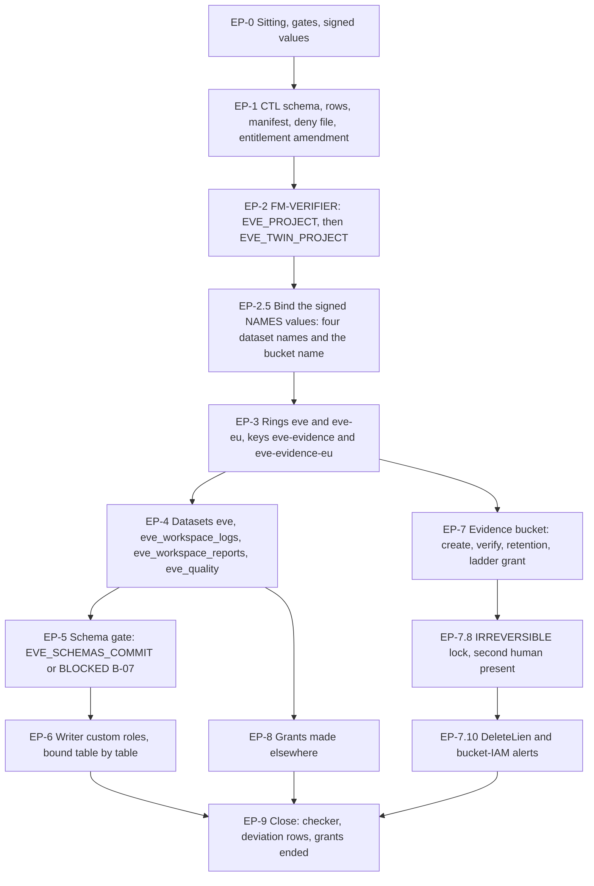

# 23. Eve: project, datasets and the evidence bucket

## Status

- Owner: the platform owner
- Last reviewed: 2026-09-15
- Last executed: never
- Stage: review §2 stage 22 (Eve's register row and the FM-VERIFIER runs), the dataset half of stage 24 and the bucket of stage 30, re-cut as **Eve-H part 1** (plan SD-10). Runs after the Tier R record of [17](17-factory-module-equivalents-and-tier-r-gate.md) and after [21](21-sandbox-tenant-and-nonprod-foundation.md) (the twin's id and the sandbox customer). **It does not wait on [22](22-mo-foundations.md)**, and no BLOCKED Mo input holds it (plan SD-45).
- Step prefix: `EP`. Steps: 45. BLOCKED steps: EP-5.2 on its first run, EP-5.3 (the `eve` tables), EP-6.2 and EP-6.3 (the table-level writer bindings and their negative proof) — all on README **B-07**, which holds nine schema files of which the **eight `eve23` files** gate this file and the ninth (`eve36`) gates 36 (§5). Steps that record `PENDING` rather than `BLOCKED`: EP-3.8 and EP-4.5 (the twin's key and datasets, until the key table names a twin ring), EP-5.4 (the mirror dataset and table, made in 36), EP-7.4's live create-only proof (26) and EP-7.7's `keys/` prefix grant (41).
- Replaces: Phase 1, Phase 3 and the bucket and key parts of Phase 9 and Phase 11 of [../../eve/07-build-runbook.md](../../eve/07-build-runbook.md). That page is not executed.
- Salvaged: Phase 1's three verifies (parent read back as a folder id, the enabled-service list, `aiplatform` absent and the Wall-E-principal negative at both project and folder level); Phase 3's dataset and table commands, with the corrected mirror verify (S202) and the schema pre-check S028 asks for; Phase 9's bucket properties (uniform access, public access prevention, `objectCreator` rather than `objectAdmin`, the three prefixes, the `ladder/` prefix condition) rewritten as S041 requires.
- Not copied: Phase 1's `gcloud projects create --folder="$FOLDER_ID"` under a human Project Creator, and its verify that halts on a deny nothing sets (S027); the bucket in the `EU` multi-region (S135); retention and the lock in the same block as creation, ungated and unwitnessed (S041); dataset-level `WRITER` for a writing identity (S138); `cloudbuild` and `artifactregistry` in the enable list (S006); "deletion is impossible" (S201); the camelCase lock projection (S200); `ROWS` as a column alias (S202); `SA_WALLE_CI` and `<walle-deployer-group>` (S130); `/tmp/eve.json` and a Python edit without an etag check (S160, through 01 §8.1).
- Applies decisions (signed in 03 before the step that needs them): NAMES, KEYS, SD-01, SD-10, SD-12, SD-23, SD-43, SD-44, SD-45, SD-46, SD-47, E-14, P13.
- Closes: S006 (Eve's half), S027 (with 17), S028, S031 (the API half; the ordering half is 24), S041, S057 (Eve's half), S130, S135, S138, S200, S201, S202. Defers none without an owner and a file (§12).
- Consumes, with the file that produces each (this list is the sitting's input checklist; nothing in the file below reads a value that is not on it):
  - **17**: FM-VERIFIER (§4) and FM-COMMON (§2); `TIER_R_RECORD`; `tools/fm-zero-diff.py`.
  - **12**: `ENT_FACTORY_SINGLETON_CTL_PROD`, `ENT_FACTORY_SINGLETON_CTL_NONPROD`, `ENT_PLATFORM_POLICY`, `ENT_PROJECT_REPAIR_TEMPLATE`, `ENT_DEPLOY_CREDENTIAL_HOLDER_TEMPLATE`, `pam/generate.py` and `pam/compare.py`.
  - **10**: `SA_WALLE_DEPLOYER`, `CICD_PROJECT` (the `--billing-project` of every `gcloud pam` call in this file), `CORE_PROJECT`, `LOGGING_PROJECT`.
  - **09**: `FLD_CONTROLLERS_PROD`, `FLD_CONTROLLERS_NONPROD`, `FLD_AGENTS_P_SA`, `FLD_AGENTS_W`, `FLD_IMPROVERS` and their folder **numbers** (EP-1.4's deny principals), `FLD_AGENTIC_PLATFORM`.
  - **13**: the `fld-controllers-*` `gcp.restrictServiceUsage` allow-list (which admits `binaryauthorization` and `compute` and excludes `cloudbuild` and `artifactregistry`), the `deny-core-agents` and `deny-improvers` principal spellings EP-1.4 follows, B5, B17, B18, CC-3, and the effective `gcp.resourceLocations` policy admitting `europe`.
  - **11**: `KEY_TABLE_RECORD` and the HSM key pattern of 11 §3.
  - **07**: `BILLING_ACCOUNT_ID`, `BILLING_CURRENCY`, `BOOTSTRAP_BILLING_EXPIRY` (the FM-COMMON billing link of 17 FM-2.5 and FM-2.10).
  - **06**: `GRP_EVE_OWNERS` (EP-1.2, EP-1.4, EP-1.5, EP-4.4's dataset `OWNER` entry and every `exists_or_pending --pending` owner), `DIRECTORY_CUSTOMER_ID`.
  - **03**, each read with `tools/decision-need.sh` or `tools/decision-value.sh` at the step that needs it: the signed `NAMES` record (EP-0.2, EP-2.5, EP-4.2, EP-7.1) and `KEYS` record (EP-0.2, EP-3.2 to EP-3.6); `SD-01`, `SD-10`, `SD-12`, `SD-23`, `SD-43` (EP-6.1, EP-6.4), `SD-44`, `SD-45`, `SD-46`, `SD-47` (§3), `E-14` and `P13` (EP-4.1, EP-5.3, EP-7.1, EP-7.5); `EVE_EVIDENCE_LOCATION`, `EVIDENCE_RETENTION_DAYS`, `IDENTITY_RETENTION_DAYS`; `SECOND_HUMAN_EMAIL`, `SECOND_OPERATOR_EMAIL`, `SECURITY_REVIEWER_EMAIL`.
  - **21**: `EVE_TWIN_PROJECT`, `register/drafts/eve.nonprod.yaml`, `SANDBOX_CUSTOMER_ID`, `SANDBOX_ORG_ID`, `SANDBOX_DOMAIN`.
  - **16**: `REGISTER_PATH`, `MANIFEST_SCHEMA_PATH`, `register/schema/register-row.schema.json`, the RG-2.5 fixture loop and RG-3.6's signed manual parse.
  - **Sitting-local, not a plan variable**: `EVE_REPO_DIR`, the path of a clone of the Eve repository, recorded in the build log and checked at EP-5.2 and EP-5.3. While no Eve repository exists, EP-5.2 is **BLOCKED** on B-07 before it runs at all.
- Produces: `EVE_PROJECT`, `EVE_PROJECT_NUMBER`, `EVE_TWIN_PROJECT_NUMBER` (EP-2.2, EP-2.4); `EVE_DS`, `EVE_WS_LOGS_DS`, `EVE_WS_REPORTS_DS`, `EVE_QUALITY_DS` and `EVE_EVIDENCE_BUCKET` — **written into `~/.platform-env` by EP-2.5 of this file**, from the signed NAMES record, because 03 DC-5.1's loop sets only `MO_*_DS` and `EVE_EVIDENCE_LOCATION` and no other file sets them (§13 hands the widened loop back to 03); `EVE_KEYRING`, `EVE_EVIDENCE_KEY`, `EVE_KEYRING_EU`, `EVE_EVIDENCE_KEY_EU` (§3); `EVE_SCHEMAS_COMMIT` (EP-5.2); `ENT_PROJECT_REPAIR_EVE`, `ENT_DEPLOY_CREDENTIAL_HOLDER_EVE` (EP-2.2). The service accounts `eve-verifier@` and `eve-export@` **exist in `EVE_PROJECT` from 17 FM-2.12 inside EP-2.2**; the variables `SA_EVE_VERIFIER` and `SA_EVE_EXPORT` are recorded by 24 and 26, so every step here that needs an address derives it from `EVE_PROJECT` and proves it with `exists_or_pending` rather than with `need` (EP-6.2, EP-6.3, EP-7.7).
- Commands checked against Google's documentation on 2026-09-15 (§15). What could not be settled that day is listed in §14. Revised 2026-09-16 against the setup-procedure review: EP-2.5 added (the signed NAMES values were written by no file), EP-1.4's deny principals corrected to the documented identifiers, EP-4.4's access array corrected from `[]` to one `OWNER` entry, EP-6.2 and EP-6.3 freed of a `need` on variables 24 and 26 set, EP-2.3's `comm -3` split into two assertions, EP-6.1's and EP-7.4's permission reads taken off `value(...)`, EP-7.1's `penv_set` replaced by an assertion, EP-7.6's condition derived from the variable, EP-7.2 given a verify of its own, and the schema counts stated once.

## What this part builds

Eve watches the humans who hold the tenant's highest privilege, and the person who installs her is one of them. Everything in this file is therefore built **under grants the second human approves**, in a project the platform owner cannot change afterwards without asking, and ends in stores whose destruction leaves a trace outside his reach.

1. **Eve's register row and manifest, merged before any project exists** (§1). The register schema of 16 has no controller shape, so EP-1.1 adds `CTL` by reviewed pull request, beside the `IMP` shape 22 adds. The deny policy 17 FM-4.3 attaches is written here (EP-1.4), and the repair entitlement 17 FM-2.17 instantiates is amended here to carry the three roles the later steps of this file and of 41 need (EP-1.5).
2. **`EVE_PROJECT` by FM-VERIFIER** in `fld-controllers-prod` (§2), under `ENT_FACTORY_SINGLETON_CTL_PROD` **approved by the second human, never by the platform owner** (SD-12), with the project-level `gcp.restrictServiceUsage` denial of `aiplatform.googleapis.com`, `deny-eve-project-foreign`, exactly the spec's services including `admin.googleapis.com` and neither `cloudbuild` nor `artifactregistry`, and no standing Owner. `EVE_TWIN_PROJECT` follows in `fld-controllers-nonprod`.
3. **Two explicit HSM key rings, and only two keys** (§3), neither from Autokey (SD-47): `eve` in `europe-west1` with `eve-evidence` for the locked bucket, and `eve-eu` in `europe` with `eve-evidence-eu` for the datasets, because BigQuery requires an `EU` dataset to use a key from a `europe` key ring. Both rings are **IRREVERSIBLE** names gated on the signed key table.
4. **Four datasets** (§4): `eve`, `eve_workspace_logs` (with its partition expiry set **before** 24's sink can write a row), `eve_workspace_reports` and `eve_quality`, in `EU`, each with `eve-evidence-eu` as its default key and an access array cut down to **exactly one entry**: `OWNER` for `eve-owners@`, the group the second human owns. BigQuery refuses a dataset with no `OWNER`, so the array cannot be emptied; what goes is the creator's personal `OWNER` and the three `projectOwners`/`projectWriters`/`projectReaders` special groups (EP-4.4).
5. **Eve's tables from committed schema files** (§5), with a presence check that runs first and a step that is **BLOCKED** until the **eight `eve23` schema files** of `eve/SCHEMAS.tsv` are committed (S028, README B-07, which counts all **nine** files in that list; the ninth, `eve_walle_audit_mirror.json`, gates 36, not this file — EP-5.1 states the numbers once).
6. **Writer roles that cannot drop, alter or re-ACL a table** (§6), granted table by table on `findings`, `incidents` and `pages` — and the honest statement that BigQuery has no insert-only permission, so row tampering here is **detected, not prevented** (SD-43).
7. **The locked evidence bucket** (§7), in `europe-west1` with the HSM key, uniform access and public access prevention, its `ladder/` grant made **before** the lock, and the lock itself as a separate **IRREVERSIBLE** step that is refused unless the signed E-14/P13 file exists and the second human is present — followed by the alert that notices the one thing the lock does not prevent: an owner removing the lien.

What the old text got wrong, and must not come back:

| Old text | Why it fails | Here instead |
|---|---|---|
| `gcloud projects create "$EVE_PROJECT" --folder="$FOLDER_ID"` with `roles/resourcemanager.projectCreator` on the platform folder (Eve Phase 1) | Wrong parent, outside the `fld-controllers` allow-list, the B7 lift and the deny policy; a standing human Project Creator contradicts P142 (S027) | EP-2.2 runs 17's FM-VERIFIER under `ENT_FACTORY_SINGLETON_CTL_PROD` approved by the second human; the checker proves the parent |
| Phase 1's verify "expect a denied value `aiplatform.googleapis.com`. Absent = stop" (S027) | Nothing set it, so the verify halted every attempt | 17 FM-4.2 **sets** the project-level denial inside the run; EP-2.3 verifies it and proves a refused `services enable` |
| `gcloud services enable … artifactregistry cloudbuild …` in `EVE_PROJECT` (Eve Phase 9, S006) | The `fld-controllers` allow-list carries neither; builds run in `CICD_PROJECT` | EP-2.1's spec list: no `cloudbuild`, no `artifactregistry`, `binaryauthorization` and `compute` present for B18 and B17; images are pulled by digest in 25 |
| `admin.googleapis.com` never enabled (S031) | Every Directory and Reports call with Eve's client fails `SERVICE_DISABLED`, so 24's verify and 25's poll cannot run | `admin.googleapis.com` is in EP-2.1's service list and proved enabled in EP-2.3 |
| No register row or manifest before the project (S057) | D1: nothing exists in a project without a row; reconciliation flags it | EP-1.3 merges both; 17 FM-2.1 refuses the run without them |
| One key `eve-evidence` in `europe-west1` for the bucket *and* the `eve.*` datasets (09 §2.4) | An `EU` dataset needs a key from a `europe` ring; the dataset create is refused | EP-3.3 to EP-3.6: `eve`/`eve-evidence` for the bucket, `eve-eu`/`eve-evidence-eu` for the datasets (SD-47) |
| `bq mk --table … "./schemas/eve_${T}.json"` for nine tables (S028) | No schema file exists; `bq` reads the path as an inline schema string and fails on the first table | EP-5.1's inputs list and EP-5.2's presence gate at a named commit, or **BLOCKED** on B-07 |
| `eve-v0@` dataset-level `WRITER` on `eve`, described as append-only (S138) | `WRITER` is `dataEditor`: `tables.delete`, `tables.update` and DML `DELETE` on every table in the dataset | EP-6.1's two custom roles, bound table by table; the mirror in its own dataset (EP-5.4); tamper **detection** named as such (EP-6.4) |
| An **empty** dataset access array as the way to remove the defaults (this file's own first draft) | "A dataset must have at least one entity with the `OWNER` role" (BigQuery primitive-roles page, read 2026-09-15); `bq update` from an array of `[]` is refused, so the step could never complete and every verify that asserted `[]` was unreachable | EP-4.4 writes exactly one entry, `OWNER` for `eve-owners@`, and removes the creator's personal `OWNER` and the three special groups |
| `gcloud storage buckets create "$EVE_EVIDENCE" --location="$BQ_LOCATION"` (S135) | `EU` multi-region; a bucket's location is immutable and the lock irreversible | EP-7.2 uses `EVE_EVIDENCE_LOCATION` (`europe-west1`, SD-23) and EP-7.3 reads it back before anything is written |
| `--retention-period=400d` then `--lock-retention-period` in the same block, ungated (S041) | An irreversible lock with a project lien, with no E-14 check, no preview, no key and no second person | EP-7.1 (gate), EP-7.5 (period, read back), EP-7.8 (**IRREVERSIBLE**, witnessed, last command of the sitting) |
| `--format='value(retentionPolicy.isLocked,retentionPolicy.retentionPeriod)'` (S200) | `gcloud storage` standardises the field as `retention_policy`; the camelCase projection prints an empty line, so the lock is never confirmed | EP-7.9 reads `--raw` and `default(retention_policy)` and asserts both |
| "the project cannot be deleted while the lien stands" (S201) | The lien blocks deletion **until an owner or organisation administrator removes it** | EP-7.9 states it correctly; EP-7.10 alerts on `DeleteLien` |
| `"$SA_WALLE_CI"` (empty) and `"<walle-deployer-group>"` in the grant loops (S130) | The grant is issued to `serviceAccount:` and fails; the literal placeholder proves nothing | `SA_WALLE_DEPLOYER` from 10 CP-5.5, guarded by `need`, with a placeholder refusal in EP-2.3 and EP-7.6 |
| `SELECT COUNT(*) rows, MAX(ts) newest` (S202) | `ROWS` is a reserved keyword; the only check that the mirror receives data never returns a number | `COUNT(*) AS row_count` in EP-5.4's handover query |



## Preconditions

- [ ] 17 complete: `TIER_R_RECORD` set and merged; `tools/fm-zero-diff.py` merged; FM-COMMON (§2) and FM-VERIFIER (§4) readable; 17 FM-4.3 expects this file's `deny-eve-project-foreign` file on `main`.
- [ ] 12: `ENT_FACTORY_SINGLETON_CTL_PROD` and `ENT_FACTORY_SINGLETON_CTL_NONPROD` `AVAILABLE` with **the second human** as the only approver; `ENT_PLATFORM_POLICY` available; `ENT_PROJECT_REPAIR_TEMPLATE` and `ENT_DEPLOY_CREDENTIAL_HOLDER_TEMPLATE` merged with their generator; PA-4.9's re-run line for `ent-witness-export-repair` is in `rerun-index.tsv`.
- [ ] 13: the `fld-controllers-*` allow-list applied with `binaryauthorization` and `compute` and **without** `cloudbuild` and `artifactregistry`; B17, B18 and CC-3 in force on `fld-controllers`; B5 on `fld-controllers-nonprod` admitting `SANDBOX_CUSTOMER_ID`; the effective `gcp.resourceLocations` policy admits `europe` as well as `europe-west1` (11 KV-4.1's handoff; EP-3.2 reads it).
- [ ] 11: `KEY_TABLE_RECORD` signed with the two Eve rings (03 DC-5.2); the pattern of 11 §3 for an HSM key with rotation is the one §3 follows.
- [ ] 10: `SA_WALLE_DEPLOYER` set and non-empty; `CICD_PROJECT` and `CORE_PROJECT` set.
- [ ] 09: `FLD_CONTROLLERS_PROD`, `FLD_CONTROLLERS_NONPROD` in `folders.yaml`; `FLD_AGENTS_P_SA`, `FLD_AGENTS_W` and `FLD_IMPROVERS` set **as folder numbers**, which is the only form an IAM deny principal set accepts (EP-1.4); the observability default storage location `europe-west1` on `fld-agentic-platform`.
- [ ] 16: `REGISTER_PATH`, `MANIFEST_SCHEMA_PATH`; RG-3.6's signed manual parse stands in while RG-3.3 is BLOCKED; `register/schema/register-row.schema.json` on `main`.
- [ ] 21: `EVE_TWIN_PROJECT` set from the signed names register; `register/drafts/eve.nonprod.yaml` merged; `SANDBOX_CUSTOMER_ID`, `SANDBOX_ORG_ID`, `SANDBOX_DOMAIN` set.
- [ ] 03 signed, each printing `SIGNED` from `tools/decision-need.sh`: `NAMES` (with `EVE_PROJECT`, `EVE_TWIN_PROJECT`, `EVE_DS`, `EVE_WS_LOGS_DS`, `EVE_WS_REPORTS_DS`, `EVE_QUALITY_DS`, `EVE_EVIDENCE_BUCKET`, `EVE_EVIDENCE_LOCATION`), `KEYS`, `SD-01`, `SD-10`, `SD-12`, `SD-23`, `SD-43`, `SD-46`, `SD-47`, `E-14`, `P13`. `EVIDENCE_RETENTION_DAYS` and `IDENTITY_RETENTION_DAYS` are integers, not `*tbd*`: **every step of §4 and §7 refuses otherwise.** `EVE_WS_REPORTS_DS` is signed with a real value, not `*tbd*` (EP-0.2).
- [ ] **Not** a precondition, and the reason EP-2.5 exists: 03 DC-5.1's `penv_set` loop covers `MO_METRICS_DS`, `MO_ARCHIVE_DS`, `MO_PRIVATE_DS`, `MO_VIEWS_DS` and `EVE_EVIDENCE_LOCATION` only. `EVE_DS`, `EVE_WS_LOGS_DS`, `EVE_WS_REPORTS_DS`, `EVE_QUALITY_DS` and `EVE_EVIDENCE_BUCKET` are rows of the same signed NAMES table but are **not** in that loop and are set by no other file, so **EP-2.5 of this file sets them**. Do not assume they are already in `~/.platform-env` when the sitting opens; §13 hands the widened loop back to 03.
- [ ] Eve repository: a clone at a path the operator records as `EVE_REPO_DIR` in the build log, with `origin` fetchable. While **no Eve repository exists** (the state on 2026-09-15), EP-5.2 does not run at all and is recorded `BLOCKED` on README B-07; EP-5.3, EP-6.2 and EP-6.3 follow it, and EP-9.2 records their BLOCKED lines. Nothing in §1 to §4 and nothing in §7 waits on it.
- [ ] 07: `BILLING_ACCOUNT_ID`, `BILLING_CURRENCY`, `BOOTSTRAP_BILLING_EXPIRY` (after that date the billing administrator performs 17 FM-2.5 and FM-2.10).
- [ ] 06: `GRP_EVE_OWNERS` exists as a security group **owned by the second human**, and the platform owner is not its owner (SD-12 item 1).
- [ ] Workstation of 01: `gcloud` with `alpha` and `beta`, `bq`, `jq`, `python3.12`, `git`, `gh`, `check-jsonschema`; `~/.platform-env` sourced; `penv_guard` silent.
- [ ] **Not** a precondition: anything from 22, 29 or any Wall-E file. `SA_WALLE_DEPLOYER` is the only Wall-E-side name this file reads, and it is a `CICD_PROJECT` identity made in 10.

## People needed

| Role | Does | Present at |
|---|---|---|
| Platform owner (as `sa-1-admin@`) | Writes every file, requests every grant, performs every shell step | every step |
| **Second human** (`SECOND_HUMAN_EMAIL`) | **Approves** `ENT_FACTORY_SINGLETON_CTL_*`, `ENT_PROJECT_REPAIR_EVE` and `ENT_DEPLOY_CREDENTIAL_HOLDER_EVE` grants — the platform owner never approves his own access to Eve (SD-12 item 2); code owner review on `eve/`, `register/eve.yaml`, `factory/runs/eve-*.json` and `pam/`; **is physically present and countersigns the retention lock** | EP-1.1, EP-1.3, EP-1.4, EP-1.5, EP-2.2, EP-2.4, EP-3.1, EP-7.1, **EP-7.8**, EP-9.1 |
| Second operator (`SECOND_OPERATOR_EMAIL`) | Reviews the schema inputs list and the committed schema files | EP-5.1, EP-5.2 |
| Security reviewer (`SECURITY_REVIEWER_EMAIL`, or IT security until appointed, ratified in 03 RATIFY-SR) | Ratifies SD-43's accepted limit before S2; reviews the two custom-role definitions | EP-6.1, EP-6.4 |
| Billing administrator | 17 FM-2.5 and FM-2.10 only if `BOOTSTRAP_BILLING_EXPIRY` has passed | EP-2.2, EP-2.4 |

Hands-on: about 2.5 days across two sittings (the lock is the last command of its sitting). Elapsed: about 1 week (pull-request reviews, two approvers' availability, the second human's presence for the lock). §5 and §6 wait on Eve's schema files (B-07) with no fixed date and hold nothing else in this file.

Conventions of [01](01-prerequisites-and-conventions.md) apply: the step format of §1, the access-array pattern of §8.1, the secret rule of §8.2 (no secret is written in this file at all), foreign principals through `exists_or_pending` (§8.3). Deviation rows are `BD-23-<n>`. Records go to `BUILD_LOG_DIR/records/` as `<date>-EP-<step>-<slug>-v<n>`. Every shell block starts with:

```bash
source ~/.platform-env
penv_guard
R="$BUILD_LOG_DIR/records/$(date -u +%F)-EP"
```

## 0. The sitting

### EP-0.1 Open the sitting and check the gates

- **WHO:** Platform owner.
- **WHERE:** Shell, `~/.platform-env` sourced, gcloud configuration `GCLOUD_CONFIG_NAME`, signed in as `sa-1-admin@`.
- **ACTION:**

```bash
checkpoint EP-0.1 START
need ORG_ID REGION BQ_LOCATION PLATFORM_REPO_DIR PLATFORM_ENV_FILE BUILD_LOG_DIR DEVIATION_REGISTER EVIDENCE_REGISTER TIER_R_RECORD REGISTER_PATH MANIFEST_SCHEMA_PATH FLD_AGENTIC_PLATFORM FLD_CONTROLLERS FLD_CONTROLLERS_PROD FLD_CONTROLLERS_NONPROD FLD_AGENTS_P_SA FLD_AGENTS_W FLD_IMPROVERS ENT_FACTORY_SINGLETON_CTL_PROD ENT_FACTORY_SINGLETON_CTL_NONPROD ENT_PLATFORM_POLICY ENT_PROJECT_REPAIR_TEMPLATE ENT_DEPLOY_CREDENTIAL_HOLDER_TEMPLATE CICD_PROJECT CORE_PROJECT LOGGING_PROJECT SA_WALLE_DEPLOYER SECOND_HUMAN_EMAIL SECOND_OPERATOR_EMAIL GRP_EVE_OWNERS DOMAIN DIRECTORY_CUSTOMER_ID SANDBOX_CUSTOMER_ID EVE_TWIN_PROJECT BILLING_ACCOUNT_ID BILLING_CURRENCY BOOTSTRAP_BILLING_EXPIRY
"$PLATFORM_REPO_DIR/tools/decision-need.sh" NAMES KEYS SD-01 SD-10 SD-12 SD-23 SD-43 SD-46 SD-47 E-14 P13
test -s "$PLATFORM_REPO_DIR/$TIER_R_RECORD" && echo "TIER_R_RECORD present"
awk -F'\t' '$2 ~ /^(FM-10\.3|PA-4\.9|OP-8\.4|CP-5\.5|SB-8\.3|KV-0\.1)$/ {print $2"\t"$3}' "$BUILD_LOG_DIR/checkpoints.tsv" | sort -u
case "$SA_WALLE_DEPLOYER" in ''|*'<'*) echo "STOP: SA_WALLE_DEPLOYER is empty or a placeholder (S130)";; *) echo "SA_WALLE_DEPLOYER ok";; esac
for v in FLD_AGENTS_P_SA FLD_AGENTS_W FLD_IMPROVERS; do printenv "$v" | grep -Eq '^[0-9]{6,}$' && echo "$v is a folder number" || echo "STOP: $v is not a folder number; EP-1.4's deny principals need the number, not folders/<id> and not a display name (09)"; done
test -z "$(gcloud config get project 2>/dev/null)" && echo "no default project"
```

- **VERIFY:** `decision-need.sh` prints `SIGNED` for each of the eleven ids; `TIER_R_RECORD present`; the checkpoint listing shows `DONE` for FM-10.3, CP-5.5, SB-8.3 and KV-0.1, `DONE` or a dated dry-run line for OP-8.4, and a `PENDING` re-run line for PA-4.9 (closed inside EP-2.2 by 17 FM-4.4); `SA_WALLE_DEPLOYER ok`; three `is a folder number` lines; `no default project`. Anything else: stop and finish the earlier file. The absence of any Mo checkpoint is expected and is not a stop (SD-45). `EVE_REPO_DIR` is deliberately **not** in the `need` list: it is a sitting-local path, and its absence blocks only EP-5.2 onwards (README B-07), never the sitting.
- **ROLLBACK:** Read only.
- **EVIDENCE:** The output as `${R}-0.1-inputs-v1.txt`, `evidence_add EP-0.1 inputs E-05 1.4.1 build-log:records/<file> <file>`. E-05. TISAX 1.4.1.

### EP-0.2 Read the signed retention values and the key table, and refuse an unknown

- **WHO:** Platform owner.
- **WHERE:** Shell.
- **ACTION:** Three values decide what §4 and §7 may create, and none may be guessed. `EVIDENCE_RETENTION_DAYS` is the ceiling P13 and E-14 set for the evidence class; it is the retention period the bucket is locked to, because a locked policy can never be reduced (Bucket Lock, read 2026-09-15). `IDENTITY_RETENTION_DAYS` is the ceiling for Workspace identity data, which is what `eve_workspace_logs` and `eve_workspace_reports` hold. `EVE_EVIDENCE_LOCATION` is `europe-west1` (SD-23).

```bash
need EVIDENCE_RETENTION_DAYS IDENTITY_RETENTION_DAYS EVE_EVIDENCE_LOCATION
for v in EVIDENCE_RETENTION_DAYS IDENTITY_RETENTION_DAYS; do case "$(printenv "$v")" in ''|*[!0-9]*) echo "STOP: $v is not an integer; every create in section 4 and every command in section 7 refuses";; *) echo "$v=$(printenv "$v")";; esac; done
[ "$EVE_EVIDENCE_LOCATION" = europe-west1 ] && echo "bucket location ok (SD-23, S135)"
[ "$BQ_LOCATION" = EU ] && echo "dataset location ok"
for v in EVE_DS EVE_WS_LOGS_DS EVE_WS_REPORTS_DS EVE_QUALITY_DS EVE_EVIDENCE_BUCKET; do
  V="$("$PLATFORM_REPO_DIR/tools/decision-value.sh" NAMES "$v")"
  case "$V" in ''|'*tbd*') echo "STOP: NAMES has no signed value for $v; 03 DC-5.1 signs it before this sitting";; *) printf 'NAMES %s = %s\n' "$v" "$V";; esac
done
"$PLATFORM_REPO_DIR/tools/decision-value.sh" KEYS EVE_RINGS
grep -n 'eve-eu' "$PLATFORM_REPO_DIR/decisions/"*-key-table.md | head -5
```

  `EVE_WS_REPORTS_DS` is `*tbd*` in the names register as first drafted (03 DC-5.1). The value this file proposes, and which 03 signs before the sitting, is `eve_workspace_reports`: a dataset of its own rather than a table in `eve`, because 25's Reports-API poll writes it continuously and Eve's readers of `eve` must not thereby read the poll. A `*tbd*` here stops the sitting.

  **These five are read, not set, at this step.** They are rows of the signed NAMES table that 03 DC-5.1's `penv_set` loop does not cover, and no other file sets them; **EP-2.5 writes them into `~/.platform-env`**, after EP-2.2 has set `EVE_PROJECT`, because the NAMES value of `EVE_EVIDENCE_BUCKET` is the template `gs://<EVE_PROJECT>-eve-evidence` and cannot be expanded before the project id exists. Nothing between here and EP-2.5 reads any of the five.
- **VERIFY:** Two integer lines; `bucket location ok`; `dataset location ok`; five `NAMES <variable> = <value>` lines and no `STOP`, with `EVE_EVIDENCE_BUCKET`'s value carrying the literal placeholder `<EVE_PROJECT>` (the form §14 records); the key-table record names both rings and both keys with their locations (`eve`/`europe-west1`/`eve-evidence`, `eve-eu`/`europe`/`eve-evidence-eu`). *Assumption:* the KEYS record carries a value named `EVE_RINGS`; if it uses another name, read the record's table by eye and copy the two rows into the build log under EP-0.2.
- **ROLLBACK:** Read only.
- **EVIDENCE:** The output as `${R}-0.2-signed-values-v1.txt`. E-05. TISAX 5.1, 7.1.2.

## 1. The register row, the manifest and the inputs the run needs

### EP-1.1 Add the controller tier `CTL` to the register schemas

- **WHO:** Platform owner writes; the security reviewer approves as code owner of `/register/schema/` and `/contract/` (the second human until appointed, per 16 RG-1.2); a second human reviewer.
- **WHERE:** `PLATFORM_REPO_DIR`, branch `ep-1-controller-schema`, then the git host.
- **ACTION:** 16's row schema admits tiers `C`, `R`, `W`, `P`, `P-SA`, `X`, and its manifest schema requires agent-only blocks. Eve is neither an agent nor an improver: she has no family, no gateway, no autonomy ceiling and no model pin before S4, and 02 §3.6 gives controllers their own tier code `ctl`. Add `CTL` with its own rules, and a controller manifest schema. 22 MO-1.1 adds `IMP` the same way; **whichever pull request merges second rebases on the first**, and the fixture loop of 16 RG-2.5 is re-run on the merged result.

```bash
git -C "$PLATFORM_REPO_DIR" switch main && git -C "$PLATFORM_REPO_DIR" pull --ff-only
git -C "$PLATFORM_REPO_DIR" switch -c ep-1-controller-schema
S="$PLATFORM_REPO_DIR/register/schema/register-row.schema.json"
jq '(.["$defs"].row.properties.tier.enum) |= ((. + ["CTL"]) | unique)
  | (.["$defs"].row.properties.owner_group.not.pattern) = "^(platform|mo)-owners@"
  | (.["$defs"].row.allOf) += [{"if":{"properties":{"tier":{"const":"CTL"}},"required":["tier"]},
      "then":{"required":["env","folder","recovery_class","manifest_sha","contract_version","verifier_owner"],
              "properties":{"folder":{"enum":["FLD_CONTROLLERS_PROD","FLD_CONTROLLERS_NONPROD"]},
                            "verifier":{"const":"none"},"privilege":{"const":"none"},"risk_class":{"const":"READ"},
                            "publish_to_gemini":{"const":false},"metric_pack":{"const":"light"},"model_pin":{"const":"none"}}}}]' "$S" > "$S.new" && mv "$S.new" "$S"
cat > "$PLATFORM_REPO_DIR/contract/1.0.0/controller-manifest.schema.json" <<'JSON'
{
  "$schema": "https://json-schema.org/draft/2020-12/schema",
  "$id": "controller-manifest/1.0.0",
  "title": "Controller manifest (Eve): reads audit and report streams, writes only inside its own project, no model, no egress before S4",
  "type": "object",
  "required": ["contract_version", "identity", "reads", "writes", "stores", "egress", "invokers", "capabilities", "model_pin", "data_classes", "recovery_class", "compliance"],
  "additionalProperties": false,
  "properties": {
    "contract_version": {"type": "string", "pattern": "^1\\.[0-9]+\\.[0-9]+$"},
    "identity": {"type": "object", "required": ["agent_id", "kind", "tier", "owner_group", "env"], "additionalProperties": false,
      "properties": {"agent_id": {"type": "string", "pattern": "^[a-z][a-z0-9-]{1,30}$"}, "kind": {"const": "controller"}, "tier": {"const": "CTL"},
                     "owner_group": {"type": "string", "pattern": "^[a-z][a-z0-9-]*-owners@"}, "env": {"enum": ["prod", "nonprod"]}}},
    "reads": {"type": "array", "items": {"type": "object", "required": ["source", "kind", "topology_row", "made_in"], "additionalProperties": false,
      "properties": {"source": {"type": "string"}, "kind": {"enum": ["bigquery", "workspace_api", "gcs", "logging"]}, "topology_row": {"type": "integer"}, "made_in": {"type": "string", "pattern": "^[0-9]{2}$"}}}},
    "writes": {"type": "array", "items": {"type": "string", "pattern": "^EVE_(DS|WS_LOGS_DS|WS_REPORTS_DS|QUALITY_DS|EVIDENCE_BUCKET)$"}},
    "stores": {"type": "array", "items": {"type": "object", "required": ["name", "kind", "class", "retention_row"], "additionalProperties": false,
      "properties": {"name": {"type": "string"}, "kind": {"enum": ["bigquery", "gcs", "kms"]}, "class": {"enum": ["evidence", "record", "ops", "secret"]}, "retention_row": {"type": "string", "pattern": "^R[0-9]+$"}}}},
    "egress": {"type": "array", "maxItems": 0},
    "invokers": {"type": "object", "maxProperties": 0},
    "capabilities": {"type": "object", "required": ["code_execution", "may_approve", "holds_credential_of_another_principal"],
      "properties": {"code_execution": {"const": false}, "may_approve": {"const": false}, "holds_credential_of_another_principal": {"const": false}}},
    "model_pin": {"const": "none"},
    "data_classes": {"type": "array", "minItems": 1, "items": {"enum": ["evidence", "record", "ops", "control"]}},
    "recovery_class": {"enum": ["R-A", "R-B", "R-C", "R-D", "R-K"]},
    "compliance": {"type": "object", "required": ["ai_act_entry", "ai_act_class", "purpose_sha256", "tisax_class", "register_row"], "additionalProperties": false,
      "properties": {"ai_act_entry": {"type": "string"}, "ai_act_class": {"enum": ["not_ai_system", "minimal"]}, "purpose_sha256": {"type": "string", "pattern": "^[0-9a-f]{64}$"},
                     "tisax_class": {"type": "string"}, "register_row": {"type": "string", "pattern": "^register/[a-z][a-z0-9-]{1,30}\\.yaml$"}}}
  }
}
JSON
check-jsonschema --check-metaschema "$S"
check-jsonschema --check-metaschema "$PLATFORM_REPO_DIR/contract/1.0.0/controller-manifest.schema.json"
git -C "$PLATFORM_REPO_DIR" add "$S" contract/1.0.0/controller-manifest.schema.json
git -C "$PLATFORM_REPO_DIR" commit -m "register: controller tier CTL and controller manifest schema (setup 23 EP-1.1)"
git -C "$PLATFORM_REPO_DIR" push -u origin ep-1-controller-schema
```

  Two fixtures go in the same pull request: `register/fixtures/schema/pass-ctl-eve.yaml` (EP-1.3's prod row with a `manifest_sha` of 64 zeros) and `register/fixtures/schema/fail-ctl-with-model-pin.yaml` (tier `CTL` carrying `model_pin: gemini-…`, refused because a controller that can call a model is not a deterministic verifier — 17 FM-4.2's denial in policy, restated in the schema). Why the row rules: `verifier: none` (nothing verifies the verifier; the witness copy and the second human's blind proof stand in its place), `privilege: none` and `risk_class: READ` (Eve holds a read-only Workspace role, 24), `publish_to_gemini: false`, `metric_pack: light`, and `verifier_owner` required because Eve is the verifier other rows name. The `owner_group` `not` pattern of 16 RG-2.2 refused `platform-owners@`, `eve-owners@` and `mo-owners@`; 16 anticipated this amendment ("22 and 23 amend this pattern by pull request if their signed rows name them"). Only `eve-owners@` is released, and only because Eve's own row is the one row it owns.
- **VERIFY:** Both `check-jsonschema --check-metaschema` lines print success; 16 RG-2.5's loop prints `PASS-OK` for `pass-ctl-eve.yaml`, `FAIL-OK` for `fail-ctl-with-model-pin.yaml` and unchanged results for every earlier fixture, including 22's `IMP` fixtures if that pull request merged first; `git -C "$PLATFORM_REPO_DIR" show origin/main:register/schema/register-row.schema.json | jq -r '.["$defs"].row.properties.owner_group.not.pattern'` prints `^(platform|mo)-owners@` after the merge. The pull request carries the code owner's approval and an RG-3.6 parse file signed by the second human.
- **ROLLBACK:** A reverting pull request before EP-1.3 merges; afterwards a superseding schema change.
- **EVIDENCE:** Merge commit as `<date>-EP-1.1-controller-schema-v1`. E-05. TISAX 1.3.1, 5.2.1.

### EP-1.2 Confirm `eve-owners@` exists and that the platform owner does not own it

- **WHO:** Platform owner reads; the second human confirms the membership from their own session.
- **WHERE:** Shell; Admin console **Menu > Directory > Groups > eve-owners** for the owner column.
- **ACTION:** SD-12 item 1 puts Eve's owner group under the second human from 06, precisely so that the person Eve watches cannot add himself to it. Nothing is created here: 06 OB-6.2 made it. This step proves it, because every later grant in this file names `eve-owners@` as a requester.

```bash
need GRP_EVE_OWNERS SECOND_HUMAN_EMAIL
gcloud identity groups describe "$GRP_EVE_OWNERS" --format="json(labels,description)"
gcloud identity groups memberships list --group-email="$GRP_EVE_OWNERS" --format="table(preferredMemberKey.id,roles[].name)"
```

- **VERIFY:** The labels include `cloudidentity.googleapis.com/groups.security`; the membership table shows `SECOND_HUMAN_EMAIL` with an `OWNER` role and the platform owner with at most `MEMBER`; **no other owner**. A platform-owner `OWNER` entry is a stop: 06's record is corrected by the second human before this file continues (SD-12 item 1).
- **ROLLBACK:** Read only. A wrong owner is changed by the second human in 06's step, not here.
- **EVIDENCE:** The two outputs as `${R}-1.2-eve-owners-v1.txt`, `evidence_add EP-1.2 eve-owners E-08 4.1.1 build-log:records/<file> <file>`. TISAX 4.1.1, 4.1.3.

### EP-1.3 Write and merge Eve's register rows and manifest

- **WHO:** Platform owner writes; the second human signs the 16 RG-3.6 manual parse and is one of the two reviewers (CODEOWNERS on `eve/` and `register/eve.yaml`); a second reviewer merges.
- **WHERE:** `PLATFORM_REPO_DIR`, branch `ep-1-register-row`.
- **ACTION:** One file per agent, one row per `env` (16 RG-2.2). The nonprod row comes from 21's merged draft `register/drafts/eve.nonprod.yaml`; this step adds the manifest-derived fields and merges both rows together, then deletes the draft. The manifest lives at `eve/agent-manifest.yaml` in the platform repository; Eve's code and schemas live in the Eve repository (B-07, B-08), and §5 reads them from there at a named commit.

```bash
git -C "$PLATFORM_REPO_DIR" switch main && git -C "$PLATFORM_REPO_DIR" pull --ff-only
git -C "$PLATFORM_REPO_DIR" switch -c ep-1-register-row
mkdir -p "$PLATFORM_REPO_DIR/eve"
PURPOSE="Eve observes the tenant's human super administrators and the platform's privileged robots from Google's own audit and report streams, recomputes what the design says must be true, and reports what is wrong to a named human outside the administration line with a copy to a witness organisation; Eve holds no credential of any other principal, calls no model, and can approve nothing."
PURPOSE_SHA="$(printf '%s' "$PURPOSE" | shasum -a 256 | cut -d' ' -f1)"
cat > "$PLATFORM_REPO_DIR/eve/agent-manifest.yaml" <<EOF
contract_version: 1.0.0
identity: {agent_id: eve, kind: controller, tier: CTL, owner_group: ${GRP_EVE_OWNERS}, env: prod}
reads:
  - {source: "organisation Workspace audit streams via eve-workspace-audit", kind: logging, topology_row: 30, made_in: "24"}
  - {source: "Admin SDK Reports API, by actor, for every roster human", kind: workspace_api, topology_row: 31, made_in: "25"}
  - {source: "\${LOGGING_PROJECT}:platform_logs_views", kind: bigquery, topology_row: 40, made_in: "14"}
writes: [EVE_DS, EVE_WS_LOGS_DS, EVE_WS_REPORTS_DS, EVE_QUALITY_DS, EVE_EVIDENCE_BUCKET]
stores:
  - {name: eve, kind: bigquery, class: evidence, retention_row: R14}
  - {name: eve_workspace_logs, kind: bigquery, class: record, retention_row: R15}
  - {name: eve_workspace_reports, kind: bigquery, class: record, retention_row: R15}
  - {name: eve_quality, kind: bigquery, class: record, retention_row: R14}
  - {name: eve-evidence-bucket, kind: gcs, class: evidence, retention_row: R14}
  - {name: eve-evidence-keys, kind: kms, class: secret, retention_row: R14}
egress: []
invokers: {}
capabilities: {code_execution: false, may_approve: false, holds_credential_of_another_principal: false}
model_pin: none
data_classes: [evidence, record, control]
recovery_class: R-K
compliance: {ai_act_entry: "10-eu-ai-act.md#eve", ai_act_class: minimal, purpose_sha256: ${PURPOSE_SHA}, tisax_class: strictly-confidential, register_row: register/eve.yaml}
EOF
MANIFEST_SHA="$(shasum -a 256 "$PLATFORM_REPO_DIR/eve/agent-manifest.yaml" | cut -d' ' -f1)"
python3.12 - "$MANIFEST_SHA" <<'PY' > "$PLATFORM_REPO_DIR/register/eve.yaml"
import os, sys, textwrap
sha = sys.argv[1]
env = os.environ
def row(e, folder, project, customer):
    return textwrap.dedent(f"""\
      - display_name: "Eve (controller, {e})"
        purpose: >-
          {env['EVE_PURPOSE_ONE_LINE']}
        owner_group: {env['GRP_EVE_OWNERS']}
        cost_centre: "{env.get('EVE_COST_CENTRE','*tbd*')}"
        tier: CTL
        env: {e}
        folder: {folder}
        project_id: {project}
        acts_on_customer: {customer}
        risk_class: READ
        data_classes: [evidence, record, control]
        tisax_class: strictly-confidential
        ai_act_class: minimal
        ai_act_role: deployer
        model_pin: none
        supplier_rows: ["google-workspace", "google-cloud"]
        publish_to_gemini: false
        audience_groups: []
        review_date: "{env['EVE_REVIEW_DATE']}"
        status: poc
        privilege: none
        metric_pack: light
        verifier: none
        verifier_owner: {env['GRP_EVE_OWNERS']}
        recovery_class: R-K
        manifest_sha: {sha}
        contract_version: 1.0.0
    """)
print("agent_id: eve")
print("rows:")
print(row("prod", "FLD_CONTROLLERS_PROD", env['EVE_PROJECT_NAME_DRAFT'], env['DIRECTORY_CUSTOMER_ID']), end="")
print(row("nonprod", "FLD_CONTROLLERS_NONPROD", env['EVE_TWIN_PROJECT'], env['SANDBOX_CUSTOMER_ID']), end="")
PY
check-jsonschema --schemafile "$PLATFORM_REPO_DIR/register/schema/register-row.schema.json" "$PLATFORM_REPO_DIR/register/eve.yaml"
git -C "$PLATFORM_REPO_DIR" rm -q register/drafts/eve.nonprod.yaml
git -C "$PLATFORM_REPO_DIR" add register/eve.yaml eve/agent-manifest.yaml
git -C "$PLATFORM_REPO_DIR" commit -m "register: eve row (prod, nonprod) and controller manifest (setup 23 EP-1.3; S057)"
git -C "$PLATFORM_REPO_DIR" push -u origin ep-1-register-row
```

  `EVE_PURPOSE_ONE_LINE`, `EVE_COST_CENTRE`, `EVE_REVIEW_DATE` (at most 90 days ahead, R-01) and `EVE_PROJECT_NAME_DRAFT` (the signed `EVE_PROJECT` id from NAMES, which `~/.platform-env` does not yet hold because the project does not exist) are exported in the shell for this step only and are written in the build log, not in the variables file. `recovery_class: R-K` is the key class of 09 §4: Eve's evidence is recoverable only while both HSM keys live, which is why §3 forbids destroying a key version while the bucket's retention stands. The prod row merges with `status: poc`; 26 raises it to `pilot` when Eve's first scheduled run is recorded, and nothing here raises it.
- **VERIFY:** `check-jsonschema` validates both rows against the amended schema; the pull request merges with two human approvals, one of them the second human as code owner; `git -C "$PLATFORM_REPO_DIR" show origin/main:register/eve.yaml | grep -c 'manifest_sha:'` prints `2`, and both values equal `shasum -a 256 eve/agent-manifest.yaml`; `register/drafts/eve.nonprod.yaml` is gone from `main`; the 16 RG-3.6 parse file is signed and merged.
- **ROLLBACK:** A reverting pull request before EP-2.2 runs; afterwards a superseding row, never an edit that loses history.
- **EVIDENCE:** Merge commit and the two shas as `<date>-EP-1.3-register-row-v1`. E-01 (Art. 11 technical documentation entry), E-05. TISAX 1.3.1, 1.3.2. Closes S057 for Eve.

### EP-1.4 Write and merge `deny-eve-project-foreign`

- **WHO:** Platform owner writes; the second human reviews as code owner of `eve/`; a second reviewer merges.
- **WHERE:** `PLATFORM_REPO_DIR`, branch `ep-1-deny-eve`, file `policies/deny/deny-eve-project-foreign.json`.
- **ACTION:** 17 FM-4.3 attaches this file and refuses the run without it. Its content is topology decision 48 and HLD §4.5: inside `EVE_PROJECT` no principal outside Eve's own set may read data, change IAM or change the stores, whatever a project-level or inherited allow policy says — a deny policy beats every allow (IAM deny page, read 2026-09-15). The exceptions are exactly the three resource-level carve-outs the design names, and they are made on the resource, never at project level: `walle-deployer@`'s `objectCreator` on the `ladder/` prefix (EP-7.6), `walle-actions@`'s `dataViewer` on `EVE_RECEIPTS_DS` (41), and `mo-metrics@`'s `READER` on `eve_quality`'s authorised views (29).

```bash
git -C "$PLATFORM_REPO_DIR" switch main && git -C "$PLATFORM_REPO_DIR" pull --ff-only
git -C "$PLATFORM_REPO_DIR" switch -c ep-1-deny-eve
mkdir -p "$PLATFORM_REPO_DIR/policies/deny"
need ORG_ID GRP_EVE_OWNERS SECOND_HUMAN_EMAIL FLD_AGENTS_P_SA FLD_AGENTS_W FLD_IMPROVERS SA_WALLE_DEPLOYER
for v in FLD_AGENTS_P_SA FLD_AGENTS_W FLD_IMPROVERS; do printenv "$v" | grep -Eq '^[0-9]{6,}$' || { echo "STOP: $v must be a bare folder NUMBER for a principal set"; false; }; done
# Agent-project NUMBERS whose service accounts are fenced out. Empty on the first merge: no agent
# project exists yet. Each project created later adds its number here by pull request (re-run line below).
AGENT_PROJECT_NUMBERS=""
jq -n --arg org "$ORG_ID" --arg own "$GRP_EVE_OWNERS" --arg sh "$SECOND_HUMAN_EMAIL" \
      --arg psa "$FLD_AGENTS_P_SA" --arg w "$FLD_AGENTS_W" --arg imp "$FLD_IMPROVERS" --arg dep "$SA_WALLE_DEPLOYER" \
      --arg nums "$AGENT_PROJECT_NUMBERS" '
{
  rules: [
    { denyRule: {
        deniedPrincipals: (
          ["principalSet://cloudresourcemanager.googleapis.com/folders/\($psa)/type/ServiceAgent",
           "principalSet://cloudresourcemanager.googleapis.com/folders/\($w)/type/ServiceAgent",
           "principalSet://cloudresourcemanager.googleapis.com/folders/\($imp)/type/ServiceAgent"]
          + (($nums | split(" ") | map(select(length > 0)))
             | map("principalSet://cloudresourcemanager.googleapis.com/projects/\(.)/type/ServiceAccount"))),
        deniedPermissions: ["bigquery.googleapis.com/tables.getData", "bigquery.googleapis.com/tables.updateData", "bigquery.googleapis.com/datasets.update", "storage.googleapis.com/objects.get", "storage.googleapis.com/objects.delete", "storage.googleapis.com/buckets.update"],
        exceptionPrincipals: ["principal://iam.googleapis.com/projects/-/serviceAccounts/\($dep)"] } },
    { denyRule: {
        deniedPrincipals: ["principalSet://goog/public:all"],
        exceptionPrincipals: ["principalSet://goog/group/\($own)", "principal://goog/subject/\($sh)"],
        deniedPermissions: ["cloudkms.googleapis.com/cryptoKeyVersions.destroy", "cloudkms.googleapis.com/cryptoKeys.update", "cloudresourcemanager.googleapis.com/projects.deleteLiens"] } }
  ]
}' > "$PLATFORM_REPO_DIR/policies/deny/deny-eve-project-foreign.json"
jq -e '.rules | length == 2' "$PLATFORM_REPO_DIR/policies/deny/deny-eve-project-foreign.json"
# Every principal string must match one of the five documented deny-policy forms; anything else is
# rejected by gcloud iam policies create at 17 FM-4.3, which halts the run (IAM principals overview).
jq -r '[.rules[].denyRule | (.deniedPrincipals // []), (.exceptionPrincipals // [])] | flatten | .[]' "$PLATFORM_REPO_DIR/policies/deny/deny-eve-project-foreign.json" \
  | grep -Ev '^(principal://goog/subject/|principal://iam\.googleapis\.com/projects/-/serviceAccounts/|principalSet://cloudresourcemanager\.googleapis\.com/(projects/[0-9]+/type/ServiceAccount|folders/[0-9]+/type/ServiceAgent)$|principalSet://goog/group/|principalSet://goog/cloudIdentityCustomerId/|principalSet://goog/public:all$)' \
  && echo "STOP: an unsupported principal identifier is in the file" || echo "every principal identifier is a documented deny-policy form"
# Every permission must appear on the supported-permissions list before the file is merged.
jq -r '[.rules[].denyRule.deniedPermissions] | flatten | .[]' "$PLATFORM_REPO_DIR/policies/deny/deny-eve-project-foreign.json" | tee "${R}-1.4-permissions-v1.txt"
git -C "$PLATFORM_REPO_DIR" add policies/deny/deny-eve-project-foreign.json
git -C "$PLATFORM_REPO_DIR" commit -m "policies: deny-eve-project-foreign for EVE_PROJECT (setup 23 EP-1.4; topology decision 48)"
git -C "$PLATFORM_REPO_DIR" push -u origin ep-1-deny-eve
exists_or_pending --pending "group:${GRP_EVE_OWNERS}" EP-1.4 "31, 33, 22 and every later agent project: add the new project NUMBER to AGENT_PROJECT_NUMBERS in policies/deny/deny-eve-project-foreign.json by pull request and re-attach with 17 FM-4.3, because IAM has no folder-wide service-ACCOUNT principal set"
```

  Rule 1 fences the principals of the three folders whose agents must never touch Eve's stores, with the one exception the `ladder/` grant needs. **It is not a single folder-wide rule, and it cannot be.** IAM's deny-policy principal identifiers are `principal://goog/subject/EMAIL`, `principal://iam.googleapis.com/projects/-/serviceAccounts/…`, `principalSet://cloudresourcemanager.googleapis.com/projects/NUMBER/type/ServiceAccount`, `principalSet://cloudresourcemanager.googleapis.com/folders/NUMBER/type/ServiceAgent`, `principalSet://goog/group/EMAIL`, `principalSet://goog/cloudIdentityCustomerId/ID` and `principalSet://goog/public:all` (IAM principals overview, read 2026-09-15). `principalSet://goog/cloudResourceFolder/<id>` — which this file's first draft used — **is not one of them**, and 17 FM-4.3's `gcloud iam policies create` rejects it, halting the run at the step that is meant to fence Wall-E and the improvers out of Eve's stores. There is also **no principal set for all service *accounts* in a folder**: the folder form covers service *agents* only. So the rule is the folder `ServiceAgent` sets **plus one `projects/<number>/type/ServiceAccount` set per agent project** — the same spelling 13's `deny-improvers` and 22 MO-2.3 use — with the re-run obligation recorded above, so each agent project created in 22, 31 and 33 adds its number. §14 records the limitation; until a project number is in the list, that project's service accounts are fenced out by the folder-level `restrictServiceUsage` allow-list and by the absence of any allow binding, not by this deny.

  Rule 2 protects the two acts that would make the evidence unreadable or deletable — destroying a key version and removing the project lien — from everyone except Eve's owner group and the second human, so that the platform owner, who is a subject of Eve-H, cannot perform either alone even while holding a repair grant. *Assumption:* `cloudresourcemanager.googleapis.com/projects.deleteLiens` is the deny-policy spelling of the `resourcemanager.projects.updateLiens` permission the liens API documents; **only a subset of IAM permissions may appear in a deny policy**, and the supported-permissions page did not load on 2026-09-15 (§14). Before merging, open <https://docs.cloud.google.com/iam/docs/deny-permissions-support> and tick every line of `${R}-1.4-permissions-v1.txt` against it; drop any permission that is not listed, record the drop in the build log, and rely on EP-7.10's alert for what the deny cannot cover.
- **VERIFY:** `jq -e` exits 0; `every principal identifier is a documented deny-policy form` is printed and no `STOP`; each of the six permissions of rule 1 and the three of rule 2 is ticked against the supported-permissions page and the ticked list is in the record; the pull request merges with the second human's code-owner approval; 17 FM-4.3's `test -s` finds the file at the path the run spec names; after EP-2.2, `gcloud iam policies get deny-eve-project-foreign --attachment-point="cloudresourcemanager.googleapis.com/projects/${EVE_PROJECT}" --kind=denypolicies --format=json | jq '.rules | length'` prints `2` — **a `create` that fails with an invalid-principal or unsupported-permission error is the signal that this step, not 17, is wrong**; one `PENDING` re-run line naming the agent-project-number obligation.
- **ROLLBACK:** A reverting pull request before EP-2.2; after attachment, 17 FM-4.3's rollback (deletion under a grant the second human approves).
- **EVIDENCE:** Merge commit and `${R}-1.4-permissions-v1.txt` with the tick against the supported-permissions page, as `<date>-EP-1.4-deny-eve-v1`, `evidence_add EP-1.4 deny-eve E-08 4.2.1 build-log:records/<file> <file>`. E-08. TISAX 4.2.1, 5.2.1.

### EP-1.5 Amend the repair entitlement template for controller projects

- **WHO:** Platform owner writes; **the second human approves** as code owner of `pam/`; a second reviewer merges. Runs **before** EP-2.2, because 17 FM-2.17 instantiates the template inside the run.
- **WHERE:** `PLATFORM_REPO_DIR`, branch `ep-1-repair-template-ctl`, files under `pam/`.
- **ACTION:** 04 §5.2's `ent-project-repair` bundle, as 12 PA-8.4 renders it, carries `projectIamAdmin`, `run.admin`, `aiplatform.admin`, `secretmanager.admin`, `datastore.owner`, `bigquery.admin`, `storage.admin`, `pubsub.admin`, `cloudscheduler.admin`, `iam.serviceAccountAdmin` and `serviceusage.serviceUsageAdmin`. Three things this file and 41 must do are outside it, and after 17 FM-2.19 removes the creator's Owner **no human can do them at all**: create and rotate the two HSM key rings and keys (§3, and `eve-approval` in 41), create the two writer custom roles (§6), and create the alert policies that watch the bucket and the lien (EP-7.10). Rather than leave a standing Owner or self-grant through `projectIamAdmin`, the template gains three roles for the `CTL` tier only, each with its reason, and `aiplatform.admin` is removed for that tier because 17 FM-4.2 denies the service outright.

```bash
git -C "$PLATFORM_REPO_DIR" switch main && git -C "$PLATFORM_REPO_DIR" pull --ff-only
git -C "$PLATFORM_REPO_DIR" switch -c ep-1-repair-template-ctl
python3.12 - <<'PY'
import json, pathlib
p = pathlib.Path("pam/templates/ent-project-repair.template.json")
t = json.loads(p.read_text())
t.setdefault("tier_overrides", {})["CTL"] = {
    "add_roles": ["roles/cloudkms.admin", "roles/iam.roleAdmin", "roles/monitoring.editor"],
    "remove_roles": ["roles/aiplatform.admin"],
    "reasons": {
        "roles/cloudkms.admin": "setup 23 section 3 and 41: create and rotate the eve and eve-eu rings and their HSM keys; no other entitlement carries a Cloud KMS role in an agent project",
        "roles/iam.roleAdmin": "setup 23 section 6: create the two SD-43 writer custom roles in EVE_PROJECT",
        "roles/monitoring.editor": "setup 23 EP-7.10 and 26: create the alert policies on the evidence bucket, the lien and the heartbeat",
        "roles/aiplatform.admin": "removed: 17 FM-4.2 denies aiplatform.googleapis.com on EVE_PROJECT, so the role can only mislead"
    }
}
p.write_text(json.dumps(t, indent=2, sort_keys=True) + "\n")
PY
python3.12 "$PLATFORM_REPO_DIR/pam/generate.py" --template ent-project-repair --agent eve --tier CTL --project-variable EVE_PROJECT --approver "user:${SECOND_HUMAN_EMAIL}" --requester "group:${GRP_EVE_OWNERS}"
jq -r '[.privilegedAccess.gcpIamAccess.roleBindings[].role] | sort | join("\n")' "$PLATFORM_REPO_DIR/pam/entitlements/ent-project-repair-eve.json"
git -C "$PLATFORM_REPO_DIR" add pam/templates/ent-project-repair.template.json pam/entitlements/ent-project-repair-eve.json
git -C "$PLATFORM_REPO_DIR" commit -m "pam: CTL overrides on the repair template; rendered ent-project-repair-eve (setup 23 EP-1.5)"
git -C "$PLATFORM_REPO_DIR" push -u origin ep-1-repair-template-ctl
```

  The rendered `ent-deploy-credential-holder-eve.json` is generated in the same pull request with no override: its `run.developer` and conditioned `serviceAccountUser` are what 25 needs to deploy the jobs, and nothing more. Both approver fields are the second human alone (17 FM-2.17's table, Eve's row), and neither requester group contains the approver (12 PA-8.4's membership check).
- **VERIFY:** The `jq` listing shows the eleven template roles minus `roles/aiplatform.admin` plus the three added roles, thirteen in all, and **no** `roles/owner`, `roles/editor` or `roles/iam.securityAdmin`; 12's `compare.py` prints `CATALOGUE ZERO DIFF` including the two new ids; the pull request merges with the second human's approval; `jq -r '[.approvalWorkflow.manualApprovals.steps[].approvers[].principals[]] | join(",")' pam/entitlements/ent-project-repair-eve.json` prints exactly `user:<SECOND_HUMAN_EMAIL>` and does not contain `SA_1_ADMIN` or `OWNER_DAILY_ACCOUNT`.
- **ROLLBACK:** A reverting pull request before EP-2.2; after the entitlements exist, `gcloud pam entitlements delete` (17 FM-2.17's rollback) before any grant, then a corrected render.
- **EVIDENCE:** The role listing and the merge commit as `<date>-EP-1.5-repair-template-ctl-v1`, `evidence_add EP-1.5 repair-template E-08 4.1.3 build-log:records/<file> <file>`. TISAX 4.1.3, 4.2.1. A design correction for 04 §5.2 and 12, handed on in §13.

## 2. `EVE_PROJECT` and `EVE_TWIN_PROJECT` by FM-VERIFIER

### EP-2.1 Write and merge the two run specs

- **WHO:** Platform owner writes; **the second human is one of the two reviewers** (17 FM-2.1, Eve's row: CODEOWNERS on `eve/` extends to `factory/runs/eve-*.json`).
- **WHERE:** `PLATFORM_REPO_DIR`, branches `fm-spec-eve-prod` and `fm-spec-eve-nonprod`.
- **ACTION:** Follow 17 FM-2.1 exactly, once per run, filling the module keys from 17 §4's table. The one thing this file decides is the service list, and it is the list S006 and S031 turn on:

| Service | Why it is in the list | Needed by |
|---|---|---|
| `bigquery`, `bigquerydatatransfer` | the four datasets, Eve's queries and 29's transfer configs | §4, 25, 29 |
| `storage` | the evidence bucket | §7 |
| `cloudkms` | the two rings and keys (SD-47) | §3, 41 |
| `logging`, `monitoring` | the regional `_Default` route, the alert policies, the channels | 17 FM-2.8, FM-2.13, EP-7.10, 26 |
| `essentialcontacts`, `billingbudgets` | 17 FM-2.10 and FM-2.11 | the run |
| **`admin`** | **Admin SDK Directory and Reports, called with Eve's OAuth client, which this project owns (S031)** | 24 verify, 25 poll and roster check |
| `secretmanager` | Eve's two regional secrets | 24 |
| `run`, `cloudscheduler` | the reconciler, export and heartbeat jobs and their schedules | 25, 26 |
| `iap` | `eve-console` behind Identity-Aware Proxy | 25 |
| `pubsub` | the Monitoring pager channel where 15's channel type is `pubsub` | 17 FM-2.13, 26 |
| `binaryauthorization` | B18 refuses a Cloud Run deployment without `--binary-authorization=default` | 25 |
| `compute` | B17's Direct VPC egress (`--network`, `--subnet`, `--vpc-egress=private-ranges-only`) | 25 |
| the platform control set (`securitycenter`, `securitycentermanagement`, `privilegedaccessmanager`, `policyanalyzer`) | 13 OP-2.4 adds it to every folder list; PAM entitlements live in this project | 17 FM-2.17, 12 |

  **Not in the list, at any stage:** `aiplatform` (17 FM-4.2 denies it at project level as well; CP5 is kept true by absence), `modelarmor` (nothing here calls a model), `cloudbuild` and `artifactregistry` (**S006**: every Eve image is built, attested and pushed in `CICD_PROJECT` and deployed by digest in 25; a controller project that could build its own image would let a merge into `eve/config` change what Eve runs without the platform's attestation), `firestore`/`datastore` (Eve keeps no document store).

```bash
RUN_SPEC="$PLATFORM_REPO_DIR/factory/runs/eve-prod.json"
cp "$PLATFORM_REPO_DIR/factory/runs/_template.json" "$RUN_SPEC"
python3.12 - "$RUN_SPEC" <<'PY'
import json, os, sys
p = sys.argv[1]; s = json.load(open(p))
s.update({
  "run_id": "eve-prod-1", "agent_id": "eve", "env": "prod", "module": "verifier-project", "create": True,
  "calling_file_step": "23 EP-2.2",
  "project_variable": "EVE_PROJECT", "project_id": os.environ["EVE_PROJECT_NAME_DRAFT"],
  "parent_folder_variable": "FLD_CONTROLLERS_PROD",
  "entitlement_variable": "ENT_FACTORY_SINGLETON_CTL_PROD",
  "register_row": "register/eve.yaml", "manifest": "eve/agent-manifest.yaml",
  "labels": {"tier": "ctl", "agent": "eve", "env": "prod", "created_by": "bootstrap-hand", "factory_run": "eve-prod-1"},
  "services": ["bigquery.googleapis.com","bigquerydatatransfer.googleapis.com","storage.googleapis.com","cloudkms.googleapis.com",
               "logging.googleapis.com","monitoring.googleapis.com","essentialcontacts.googleapis.com","billingbudgets.googleapis.com",
               "admin.googleapis.com","secretmanager.googleapis.com","run.googleapis.com","cloudscheduler.googleapis.com",
               "iap.googleapis.com","pubsub.googleapis.com","binaryauthorization.googleapis.com","compute.googleapis.com",
               "securitycenter.googleapis.com","securitycentermanagement.googleapis.com","privilegedaccessmanager.googleapis.com","policyanalyzer.googleapis.com"],
  "budget": {"amount": 200, "currency_from": "BILLING_CURRENCY"},
  "service_accounts": [
    {"id": "eve-verifier", "why": "runs eve-reconciler; parses attacker-writable strings; never holds a signing key (24, 25)"},
    {"id": "eve-export",   "why": "the only identity with a cross-organisation grant, to the witness (26, 27)"}],
  "project_bindings": [],
  "project_org_policies": [{"constraint": "gcp.restrictServiceUsage", "denied_values": ["aiplatform.googleapis.com"], "set_in": "17 FM-4.2"}],
  "project_deny_policies": [{"policy_id": "deny-eve-project-foreign", "file": "policies/deny/deny-eve-project-foreign.json", "attached_in": "17 FM-4.3"}],
  "deny_entries": [], "pab_bindings": [],
  "trigger_sink": None,
  "entitlements": ["ent-project-repair-eve", "ent-deploy-credential-holder-eve", "ent-witness-export-repair"],
  "made_elsewhere": [
    {"item": "key rings eve and eve-eu and their HSM keys", "file": "23", "step": "EP-3.3 to EP-3.6"},
    {"item": "datasets eve, eve_workspace_logs, eve_workspace_reports, eve_quality and their tables", "file": "23", "step": "EP-4.2, EP-5.3"},
    {"item": "the locked evidence bucket and its retention lock", "file": "23", "step": "EP-7.2, EP-7.8"},
    {"item": "eve@ and the eve-workspace-audit organisation sink", "file": "24", "step": "EW-*"},
    {"item": "eve-console@ and the Cloud Run jobs and schedules", "file": "25", "step": "EH-*"},
    {"item": "PAB for the reporting-path project EVE_ADVISOR_PROJECT", "file": "41", "step": "deferred with the Eve advisor path, owner Eve owner"}],
  "pending": []})
json.dump(s, open(p, "w"), indent=2, sort_keys=True)
PY
python3.12 "$PLATFORM_REPO_DIR/tools/fm-zero-diff.py" inputs "$RUN_SPEC" --report "${R}-2.1-inputs-prod-v1.json"
jq -r '.services[]' "$RUN_SPEC" | grep -E '^(cloudbuild|artifactregistry|aiplatform|modelarmor)\.googleapis\.com$' && echo "STOP: forbidden service in the spec (S006)" || echo "no forbidden service"
jq -r '.services[]' "$RUN_SPEC" | grep -c '^admin.googleapis.com$'
```

  The nonprod spec is the same file with `env: nonprod`, `project_id: $EVE_TWIN_PROJECT`, `parent_folder_variable: FLD_CONTROLLERS_NONPROD`, `entitlement_variable: ENT_FACTORY_SINGLETON_CTL_NONPROD`, `budget.amount: 100`, the same service list, the same two org and deny policies with the twin's principals, `entitlements` without `ent-witness-export-repair` (the witness exports from production only), and `made_elsewhere` pointing at EP-3.8, EP-4.5 and 24's twin sink.
- **VERIFY:** `inputs` prints `ZERO-DIFF` and exits 0 for both specs (row, NAMES, `folders.yaml`, the `fld-controllers` allow-list and the budget table all agree); `no forbidden service`; the `grep -c` prints `1`; both pull requests merge with the second human as one approver; `git -C "$PLATFORM_REPO_DIR" log --oneline -1 origin/main -- factory/runs/eve-prod.json` shows the merge.
- **ROLLBACK:** Close the pull requests; nothing exists in Google Cloud yet.
- **EVIDENCE:** Both inputs reports and the merge commits, `evidence_add EP-2.1 run-specs E-05 1.3.1 build-log:records/<file> <file>`. TISAX 1.3.1, 5.2.1. Closes S006 for Eve's enable list.

### EP-2.2 Run FM-VERIFIER for `EVE_PROJECT`

- **WHO:** Platform owner performs; **approver of every grant in the run: the second human** (17 FM-4.1 checks this before FM-2.2 and stops the run if the approver list contains the platform owner or his daily account).
- **WHERE:** Shell, with 17 §2's run header sourced for `factory/runs/eve-prod.json`.
- **ACTION:** Run [17](17-factory-module-equivalents-and-tier-r-gate.md) §2 FM-2.1 to FM-2.22 in order, with §4's steps inserted where §4 says:

| Order | Step | Note for this run |
|---|---|---|
| 1 | FM-4.1 | before FM-2.2: the approvers of `ENT_FACTORY_SINGLETON_CTL_PROD` are the second human (or `eve-owners@`, which they own) and nobody else |
| 2 | FM-2.1 to FM-2.7 | FM-2.3 is **IRREVERSIBLE as a name**, gated on the signed NAMES record; FM-2.7 enables exactly EP-2.1's twenty services |
| 3 | **FM-4.2** | immediately after FM-2.7 and before any job exists: the project-level `gcp.restrictServiceUsage` denial of `aiplatform.googleapis.com`, with the refusal proof |
| 4 | **FM-4.3** | attaches EP-1.4's `deny-eve-project-foreign` |
| 5 | FM-2.8 to FM-2.13 | FM-2.9 (`_Trace` in `europe-west1`) may return `PENDING` while 13's controllers allow-list has no `observability` value; `--accept-pending` and a re-run line |
| 6 | FM-2.14 | `N/A`: `trigger_sink` is `null`. Eve has no family and no trigger topic |
| 7 | FM-2.15, FM-2.16 | `N/A`: `deny_entries` and `pab_bindings` are empty (17 FM-4.5) |
| 8 | FM-2.17 | instantiates `ent-project-repair-eve` and `ent-deploy-credential-holder-eve` from EP-1.5's rendered files, **approver the second human**; sets `ENT_PROJECT_REPAIR_EVE` and `ENT_DEPLOY_CREDENTIAL_HOLDER_EVE` |
| 9 | **FM-4.4** | runs 12 PA-8.3: re-scopes `ent-witness-export-repair` from `fld-controllers-prod` to `EVE_PROJECT` and closes PA-4.9's re-run line |
| 10 | FM-2.18, FM-2.19 | the one-grant test with the second human approving; then the creator's Owner is removed, and from here no human holds anything in `EVE_PROJECT` without a grant |
| 11 | FM-2.20 to FM-2.22 | the sweep, the checker, and `BD-23-1` as the deviation id |

```bash
need EVE_PROJECT EVE_PROJECT_NUMBER ENT_PROJECT_REPAIR_EVE ENT_DEPLOY_CREDENTIAL_HOLDER_EVE
grep -E '^export (EVE_PROJECT|EVE_PROJECT_NUMBER|ENT_PROJECT_REPAIR_EVE|ENT_DEPLOY_CREDENTIAL_HOLDER_EVE)=' "$PLATFORM_ENV_FILE"
awk -F'\t' '$2 ~ /@eve-prod$/ {print $2"\t"$3}' "$BUILD_LOG_DIR/checkpoints.tsv" | sort -V
```

- **VERIFY:** Every `FM-*@eve-prod` checkpoint reads `DONE` or `N/A` (FM-2.14, FM-2.15, FM-2.16 are `N/A`; FM-2.9 may be `PENDING` with a re-run line); FM-2.21 printed `ZERO-DIFF` (or exit 0 with `--accept-pending` and only the `_Trace` line pending); the four variables are set; `BD-23-1` is the last row of `DEVIATION_REGISTER`. A `FAIL` from the checker is repaired and the checker re-run; a failing run is never recorded as a module equivalent.
- **ROLLBACK:** Only through 17 §7 FM-REVOKE, which removes the lien first. A project id can never be reused, so a rebuild needs a new signed name.
- **EVIDENCE:** 17's own records for each step, plus this step's checkpoint listing as `${R}-2.2-fm-verifier-prod-v1.txt`. E-05, E-08. TISAX 1.3.1, 4.1.3, 5.2.4. Closes S027 with 17.

### EP-2.3 Read the project back: parent, services, no model, no Wall-E principal

- **WHO:** Platform owner. Runs **after** FM-2.19 has removed the creator's Owner, so that what it reads is the end state.
- **WHERE:** Shell. No grant is needed: every command is a read the platform owner's standing viewer rights cover (12).
- **ACTION:** This is Eve Phase 1's verify block, salvaged, with the halt S027 describes removed (the denial now exists because FM-4.2 set it) and the two empty placeholders replaced by a real, guarded principal list (S130).

```bash
need EVE_PROJECT FLD_CONTROLLERS_PROD SA_WALLE_DEPLOYER CICD_PROJECT
gcloud projects describe "$EVE_PROJECT" --format="yaml(parent,labels,lifecycleState)"
gcloud services list --enabled --project="$EVE_PROJECT" --format="value(config.name)" | sort > "${R}-2.3-services-v1.txt"
jq -r '.services[]' "$PLATFORM_REPO_DIR/factory/runs/eve-prod.json" | sort > "${R}-2.3-spec-services-v1.txt"
# (a) nothing the spec asks for is missing: this must print nothing.
comm -23 "${R}-2.3-spec-services-v1.txt" "${R}-2.3-services-v1.txt" | tee "${R}-2.3-missing-v1.txt"
# (b) everything enabled but not in the spec, compared line for line against the committed always-on
# list plus the dependencies 17 FM-2.7 recorded for this run. Never waved through as "tolerated".
comm -13 "${R}-2.3-spec-services-v1.txt" "${R}-2.3-services-v1.txt" | sort > "${R}-2.3-extra-v1.txt"
sort -u "$PLATFORM_REPO_DIR/factory/always-on-services.txt" \
        <(jq -r '.service_dependencies[]? // empty' "$BUILD_LOG_DIR/records/"*-FM-2.7-services-eve-prod-*.json 2>/dev/null) > "${R}-2.3-allowed-extra-v1.txt"
comm -23 "${R}-2.3-extra-v1.txt" "${R}-2.3-allowed-extra-v1.txt" | tee "${R}-2.3-unexplained-v1.txt"
grep -c '^admin.googleapis.com$' "${R}-2.3-services-v1.txt"
grep -Ec '^(aiplatform|modelarmor|cloudbuild|artifactregistry)\.googleapis\.com$' "${R}-2.3-services-v1.txt" || true
gcloud org-policies describe gcp.restrictServiceUsage --project="$EVE_PROJECT" --format="yaml(spec)"
gcloud services enable aiplatform.googleapis.com --project="$EVE_PROJECT" 2>&1 | tail -3
WALLE_PRINCIPALS="serviceAccount:${SA_WALLE_DEPLOYER}"
for M in $WALLE_PRINCIPALS; do
  case "$M" in *'<'*|'serviceAccount:') echo "STOP: unset placeholder in the principal list (S130)"; break;; esac
  gcloud projects get-iam-policy "$EVE_PROJECT" --flatten='bindings[].members' --filter="bindings.members:${M}" --format='value(bindings.role)'
  gcloud resource-manager folders get-iam-policy "$FLD_CONTROLLERS_PROD" --flatten='bindings[].members' --filter="bindings.members:${M}" --format='value(bindings.role)'
done
gcloud projects get-iam-policy "$EVE_PROJECT" --flatten="bindings[].members" --filter="bindings.members:(user: OR group: OR domain:)" --format="table(bindings.role,bindings.members)"
gcloud pam entitlements list --project="$EVE_PROJECT" --location=global --billing-project="$CICD_PROJECT" --format="table(name,state)"
```

  `factory/always-on-services.txt` is the committed list of services Google enables in every project regardless of the spec (`cloudapis.googleapis.com`, `storage-api.googleapis.com`, `serviceusage.googleapis.com`, `cloudresourcemanager.googleapis.com`, `iam.googleapis.com` and the rest as they are observed). It is created on the first run of any FM-COMMON project — if it does not exist, write it in this sitting from `${R}-2.3-extra-v1.txt` **after** reading every line aloud with the entry justified, commit it by pull request with the second human as reviewer, and record `BD-23-1a`. A tolerance sentence is not a check: the first draft of this step used `comm -3`, which prints the lines unique to **either** file, so it could never both "print nothing" and "allow for the always-on entries", and an operator meeting it would either widen the spec — defeating S006 — or wave the step through.

  `WALLE_PRINCIPALS` holds one name today. When 31 creates `walle-actions@` and 33 its deploy identities, this step is re-run from 36 with the fuller list; the `case` guard refuses to run a filter built from an empty or placeholder variable, which is exactly the defect S130 found. The Wall-E **operators group** is not in the list because topology decision 52 has not named it; that gap is recorded in §14, not papered over with a literal.
- **VERIFY:** `parent` is `type: folder`, `id: <FLD_CONTROLLERS_PROD>`, `lifecycleState: ACTIVE`, labels exactly the spec's; `${R}-2.3-missing-v1.txt` is **empty** (no service the spec asks for is unenabled) and `${R}-2.3-unexplained-v1.txt` is **empty** (every enabled service outside the spec is on the committed always-on list or in 17 FM-2.7's recorded `service_dependencies`); a non-empty unexplained file is a stop — the service is disabled, or the always-on list is amended by pull request with the reason, never by widening the spec; `admin.googleapis.com` count `1`; the forbidden count `0`; the org policy shows `inheritFromParent: true` and `deniedValues: [aiplatform.googleapis.com]`; the `services enable` **fails** with an error naming `constraints/gcp.restrictServiceUsage` (**the refusal is the pass**; nothing is enabled); both principal reads print nothing at both levels; the human-member table is empty; the entitlement list shows `ent-project-repair-eve`, `ent-deploy-credential-holder-eve` and `ent-witness-export-repair`, all `AVAILABLE`.
- **ROLLBACK:** Read only, except the deliberate `services enable`, which is expected to fail. If it **succeeds**, stop everything: the denial is not in force, disable the service at once (`gcloud services disable aiplatform.googleapis.com --project="$EVE_PROJECT"`), re-run 17 FM-4.2 and record a finding.
- **EVIDENCE:** All outputs as `${R}-2.3-project-readback-v1.txt`, together with the five service files (`spec`, `services`, `missing`, `extra`, `unexplained`), `evidence_add EP-2.3 project-readback E-08 4.2.1 build-log:records/<file> <file>`. E-05, E-08. TISAX 4.2.1, 5.2.1. Closes S031's API half, S130's guard half and S027's verify.

### EP-2.4 Run FM-VERIFIER for `EVE_TWIN_PROJECT`

- **WHO:** Platform owner; **approver: the second human** (`ENT_FACTORY_SINGLETON_CTL_NONPROD`).
- **WHERE:** A twin shell: `twin_shell`, then `source ~/.platform-env`, then 17 §2's run header for `factory/runs/eve-nonprod.json`. The prompt reads `[twin]`.
- **ACTION:** The same sequence as EP-2.2 with two differences: FM-4.4 is `N/A`, and `penv_set` inside a twin shell accepts only `*TWIN*` names, so FM-2.4 writes `EVE_TWIN_PROJECT_NUMBER` and the two entitlement resource names go into the build log rather than into the variables file (17 FM-2.17's note). The twin's deviation id is `BD-23-2`.

```bash
need EVE_TWIN_PROJECT SANDBOX_CUSTOMER_ID
gcloud projects describe "$EVE_TWIN_PROJECT" --format="yaml(parent,labels)"
gcloud org-policies describe gcp.restrictServiceUsage --project="$EVE_TWIN_PROJECT" --format="yaml(spec)"
gcloud org-policies describe iam.workloadIdentityPoolProviderAllowedIssuers --folder="$FLD_CONTROLLERS_NONPROD" --effective --format=yaml 2>/dev/null | head -5
gcloud org-policies describe iam.allowedPolicyMemberDomains --folder="$FLD_CONTROLLERS_NONPROD" --effective --format="yaml(spec.rules)"
grep -E '^export EVE_TWIN_PROJECT_NUMBER=' "$PLATFORM_ENV_FILE"
```

- **VERIFY:** `parent` is `FLD_CONTROLLERS_NONPROD`; the project-level `aiplatform` denial is present in the twin too; `iam.allowedPolicyMemberDomains` at `fld-controllers-nonprod` lists `SANDBOX_CUSTOMER_ID` as well as `DIRECTORY_CUSTOMER_ID` (13 B5's child policy, the precondition 21 set), without which 24's twin sink and twin robot cannot be admitted; `EVE_TWIN_PROJECT_NUMBER` is a digit string; every `FM-*@eve-nonprod` checkpoint is `DONE` or `N/A`; `BD-23-2` is written.
- **ROLLBACK:** 17 FM-REVOKE for the twin. The twin holds no evidence at this point, so a revoke costs only the id.
- **EVIDENCE:** The outputs as `${R}-2.4-twin-readback-v1.txt`. E-05. TISAX 5.2.2 (environments separated), 1.3.1.

### EP-2.5 Bind the signed NAMES values into the variables file

- **WHO:** Platform owner. Runs once `EVE_PROJECT` exists (EP-2.2) and **before** anything in §3 to §7; it does not wait on the twin, so it may be run straight after EP-2.3 if the twin run is deferred.
- **WHERE:** Shell.
- **ACTION:** Five names that every later step of this file, and 25, 26, 28, 29, 36, 39 and 41 after it, read as variables are rows of the signed NAMES table that **no step of any file writes into `~/.platform-env`**: 03 DC-5.1's `penv_set` loop covers `MO_METRICS_DS`, `MO_ARCHIVE_DS`, `MO_PRIVATE_DS`, `MO_VIEWS_DS` and `EVE_EVIDENCE_LOCATION` and stops there. Without this step, EP-4.1's `need EVE_DS …` fails, EP-4.2's **IRREVERSIBLE** gate ("each variable equals `decision-value.sh NAMES <variable>`") cannot be evaluated, and every later `need EVE_DS` in 25, 26, 28, 29, 36, 39 and 41 fails. The step takes the values from the signed record and nowhere else; it invents nothing.

  `EVE_EVIDENCE_BUCKET`'s NAMES value is the template `gs://<EVE_PROJECT>-eve-evidence`, which is why this step runs **after** `EVE_PROJECT` exists rather than in §0. The expansion is proved to be the signed template with exactly one substitution, so the stored value is the signed name, not a construction of this file's own (§14 records the form the record uses).

```bash
need EVE_PROJECT PLATFORM_ENV_FILE
"$PLATFORM_REPO_DIR/tools/decision-need.sh" NAMES
for v in EVE_DS EVE_WS_LOGS_DS EVE_WS_REPORTS_DS EVE_QUALITY_DS; do
  V="$("$PLATFORM_REPO_DIR/tools/decision-value.sh" NAMES "$v")"
  case "$V" in ''|'*tbd*') echo "STOP: NAMES has no signed value for $v"; break;; esac
  printf '%s' "$V" | grep -Eq '^[a-zA-Z0-9_]{1,1024}$' || { echo "STOP: $V is not a legal BigQuery dataset id for $v"; break; }
  penv_set "$v" "$V"
done
TPL="$("$PLATFORM_REPO_DIR/tools/decision-value.sh" NAMES EVE_EVIDENCE_BUCKET)"
EXP="${TPL//<EVE_PROJECT>/$EVE_PROJECT}"
test "$EXP" != "$TPL" || { echo "STOP: the NAMES bucket value carries no <EVE_PROJECT> placeholder; read it by eye and record the form in section 14 before continuing"; false; }
printf '%s' "$EXP" | grep -Eq '^gs://[a-z0-9][a-z0-9._-]{1,61}[a-z0-9]$' || { echo "STOP: $EXP is not a legal bucket name"; false; }
penv_set EVE_EVIDENCE_BUCKET "$EXP"
grep -E '^export (EVE_DS|EVE_WS_LOGS_DS|EVE_WS_REPORTS_DS|EVE_QUALITY_DS|EVE_EVIDENCE_BUCKET)=' "$PLATFORM_ENV_FILE" | tee "${R}-2.5-names-v1.txt"
```

- **VERIFY:** Five `export` lines, one per variable; each dataset value equals `"$PLATFORM_REPO_DIR/tools/decision-value.sh" NAMES <variable>` exactly (re-run the comparison from a fresh shell after `source ~/.platform-env`); `EVE_EVIDENCE_BUCKET` equals the NAMES template with `<EVE_PROJECT>` replaced by `EVE_PROJECT` and by nothing else, and begins `gs://`; no `STOP`. A `*tbd*` or an illegal id here stops the sitting: §3 to §7 do not run against a guessed name.
- **ROLLBACK:** Nothing exists in Google Cloud yet. A wrong value is corrected with `penv_set --force` **only before EP-4.2 and EP-7.2**, each of which is irreversible as a name; after either has run, the correction is a superseding NAMES record and a new resource, never an edit of the variable.
- **EVIDENCE:** `${R}-2.5-names-v1.txt` beside the `decision-value.sh` output it was compared against, `evidence_add EP-2.5 signed-names E-05 1.3.1 build-log:records/<file> <file>`. E-05. TISAX 1.3.1. A design correction for 03 DC-5.1, handed on in §13.

## 3. The two key rings and the two HSM keys (SD-47)

09 §2.4 gave Eve one explicit HSM key, `eve-evidence` in `europe-west1`, for the locked bucket **and** the `eve.*` datasets. That cannot work: Google's BigQuery CMEK page (read 2026-09-15) says "a dataset in region `EU` should be protected with a key ring from region `europe`", and a `europe-west1` key is refused. SD-47 therefore gives `EVE_PROJECT` two explicit keys, neither from Autokey:

| Ring | Location | Key | Protects | Rotation |
|---|---|---|---|---|
| `eve` | `europe-west1` | `eve-evidence` | the locked evidence bucket (§7), and later `eve-approval` (41) | 90 days |
| `eve-eu` | `europe` | `eve-evidence-eu` | `eve`, `eve_workspace_logs`, `eve_workspace_reports`, `eve_quality` (§4) | 90 days |

Both ring names are permanent: "Key rings can't be deleted", and neither a ring nor its contents can be moved to another location (Cloud KMS resource hierarchy, read 2026-09-15). Both creates are therefore **IRREVERSIBLE** and gated on the signed key table.

### EP-3.1 Obtain a repair grant on `EVE_PROJECT`

- **WHO:** Platform owner requests; **approver: the second human** (17 FM-2.17's table, Eve's row; SD-12 item 2).
- **WHERE:** Requester's shell; approver's console **Security > Privileged Access Manager > Approve grants**, or their own shell.
- **ACTION:** After 17 FM-2.19 no human holds anything in `EVE_PROJECT`. §3 to §7 all run inside this grant, whose `roles/cloudkms.admin`, `roles/bigquery.admin`, `roles/storage.admin`, `roles/iam.roleAdmin` and `roles/monitoring.editor` come from EP-1.5's amended template. The maximum duration is two hours; the sitting is planned to fit, and a second grant is requested rather than the duration stretched.

```bash
need ENT_PROJECT_REPAIR_EVE EVE_PROJECT CICD_PROJECT
gcloud pam grants create --entitlement="$ENT_PROJECT_REPAIR_EVE" --requested-duration=7200s --justification="23 EP-3 to EP-7: Eve's key rings, datasets, writer roles and the evidence bucket (register/eve.yaml, run eve-prod-1)" --location=global --project="$EVE_PROJECT" --billing-project="$CICD_PROJECT"
```

- **VERIFY:** `gcloud pam grants list --entitlement="$ENT_PROJECT_REPAIR_EVE" --location=global --project="$EVE_PROJECT" --billing-project="$CICD_PROJECT" --filter="state=ACTIVE" --format="value(name,requester,state)"` shows one `ACTIVE` grant whose requester is `sa-1-admin@`, after the second human approved it; the `ApproveGrant` entry names the second human and not the platform owner.
- **ROLLBACK:** `gcloud pam grants revoke <GRANT_NAME> --reason="sitting stopped" --location=global --project="$EVE_PROJECT" --billing-project="$CICD_PROJECT"`.
- **EVIDENCE:** The grant name in the build log; the `ApproveGrant` audit entry in the aggregated sink. E-08. TISAX 4.1.3.

### EP-3.2 Check the key table, the location policy, and that nothing exists

- **WHO:** Platform owner, inside EP-3.1's grant.
- **WHERE:** Shell.
- **ACTION:** Three things are read before an irreversible name is used: the signed key table row, the effective `gcp.resourceLocations` policy (11 KV-4.1 warned that a policy built only from the `in:eu-locations` value group admits `europe-west1` but **not** `europe`, which would refuse the `eve-eu` ring), and whether either ring already exists from an interrupted sitting.

```bash
need EVE_PROJECT REGION EVE_EVIDENCE_LOCATION
"$PLATFORM_REPO_DIR/tools/decision-need.sh" KEYS SD-47
gcloud org-policies describe gcp.resourceLocations --project="$EVE_PROJECT" --effective --format=yaml | tee "${R}-3.2-locations-v1.yaml"
gcloud kms keyrings list --location=europe-west1 --project="$EVE_PROJECT" --format="value(name)"
gcloud kms keyrings list --location=europe --project="$EVE_PROJECT" --format="value(name)"
gcloud kms keys list --location=europe-west1 --keyring=eve --project="$EVE_PROJECT" --format="value(name,purpose,protectionLevel)" 2>/dev/null || echo "ring eve absent"
gcloud kms keys list --location=europe --keyring=eve-eu --project="$EVE_PROJECT" --format="value(name,purpose,protectionLevel)" 2>/dev/null || echo "ring eve-eu absent"
```

- **VERIFY:** `SIGNED` twice; the effective location policy either has no rule, or an `allowedValues` list containing both `in:europe-west1-locations` (or `europe-west1`) **and** `europe` — a policy that admits only the former is a stop, and 13 is amended by pull request before EP-3.5, never worked around here (11 KV-4.1's handoff); both `keyrings list` commands print nothing, or print a ring whose `EP-3.3`/`EP-3.5` checkpoint has `START` without `DONE`, in which case that step's VERIFY is run instead of its ACTION (README §4 resume rule 3). `EVE_EVIDENCE_LOCATION` equals `europe-west1`, which is the ring `eve`'s location, because a bucket's CMEK key must be in the bucket's location.
- **ROLLBACK:** Read only.
- **EVIDENCE:** The policy read and both listings as `${R}-3.2-key-precheck-v1.txt`. E-05. TISAX 5.1, 7.1.2.

### EP-3.3 Create key ring `eve` in `europe-west1`

- **WHO:** Platform owner, inside the grant.
- **WHERE:** Shell.
- **ACTION:**

```bash
need EVE_PROJECT
gcloud kms keyrings create eve --location=europe-west1 --project="$EVE_PROJECT"
penv_set EVE_KEYRING "projects/${EVE_PROJECT}/locations/europe-west1/keyRings/eve"
```

  > **IRREVERSIBLE.** "Key rings can't be deleted" and a ring and its contents "can't be moved to a different location after they are created" (Cloud KMS resource hierarchy and key-ring pages, read 2026-09-15). Confirm before running: the ring name `eve`, the location `europe-west1` and the project `EVE_PROJECT` match the signed key table row read in EP-3.2; `EVE_EVIDENCE_LOCATION` is `europe-west1`. Gate: the signed `KEYS` record (03 DC-5.2) with SD-47, and EP-3.2's `DONE` line. A wrong ring is left empty and recorded as retired in the key table.

- **VERIFY:** `gcloud kms keyrings describe eve --location=europe-west1 --project="$EVE_PROJECT" --format="value(name)"` prints the resource name, and `grep '^export EVE_KEYRING=' "$PLATFORM_ENV_FILE"` matches it exactly.
- **ROLLBACK:** **IRREVERSIBLE** (see above).
- **EVIDENCE:** The describe output as `${R}-3.3-ring-eve-v1.txt`, `evidence_add EP-3.3 ring-eve E-08 5.1 build-log:records/<file> <file>`. TISAX 5.1.1, 5.1.2.

### EP-3.4 Create the HSM key `eve-evidence`

- **WHO:** Platform owner, inside the grant.
- **WHERE:** Shell.
- **ACTION:** The bucket's default key. Flags follow 11 §3's verified pattern: symmetric encryption, HSM protection, 90-day rotation with an explicit next rotation time, a 30-day destroy-scheduled duration so a mistaken destroy can be cancelled, and the class labels 09 §2.4 uses.

```bash
need EVE_PROJECT EVE_KEYRING
NEXT_ROT="$(python3.12 -c "import datetime;print((datetime.datetime.now(datetime.UTC)+datetime.timedelta(days=90)).strftime('%Y-%m-%dT%H:%M:%SZ'))")"
gcloud kms keys create eve-evidence --keyring=eve --location=europe-west1 --purpose=encryption --default-algorithm=google-symmetric-encryption --protection-level=hsm --rotation-period=90d --next-rotation-time="$NEXT_ROT" --destroy-scheduled-duration=30d --labels=class=a,owner-role=eve-owner,store=eve-evidence-bucket --project="$EVE_PROJECT"
penv_set EVE_EVIDENCE_KEY "projects/${EVE_PROJECT}/locations/europe-west1/keyRings/eve/cryptoKeys/eve-evidence"
```

  > **IRREVERSIBLE as a name:** "names of deleted keys can't be reused", and a key can be deleted only after every version is destroyed (Cloud KMS resource hierarchy, read 2026-09-15). Confirm the name, ring and location against the signed key table first. Gate: the `KEYS` record and EP-3.3's `DONE` line.

  **A key version of `eve-evidence` is never destroyed while the bucket's retention policy stands.** Destroying it would make objects that cannot be deleted also impossible to read, which is the worst of both controls: evidence lost, storage paid for. Rotation is safe — new objects use the new primary and old objects keep their version — so the 90-day period stays. EP-1.4's deny rule 2 puts `cryptoKeyVersions.destroy` out of the platform owner's reach; 25 adds a severity 1 detection on the same act, and 42 carries it in the drill calendar.
- **VERIFY:**

```bash
gcloud kms keys describe eve-evidence --keyring=eve --location=europe-west1 --project="$EVE_PROJECT" --format="yaml(purpose,versionTemplate,rotationPeriod,nextRotationTime,destroyScheduledDuration,labels)"
gcloud kms keys versions list --key=eve-evidence --keyring=eve --location=europe-west1 --project="$EVE_PROJECT" --format="table(name,state,protectionLevel)"
```

  `purpose: ENCRYPT_DECRYPT`, `versionTemplate.protectionLevel: HSM`, `versionTemplate.algorithm: GOOGLE_SYMMETRIC_ENCRYPTION`, `rotationPeriod: 7776000s`, a `nextRotationTime` about 90 days ahead, `destroyScheduledDuration: 2592000s`, the three labels; exactly one version, `ENABLED`, `HSM`.
- **ROLLBACK:** **IRREVERSIBLE as a name.** A mis-configured key is corrected in place with `gcloud kms keys update` (rotation, labels) before §7 uses it. If the key must be abandoned, its version is disabled, a new name is signed into the key table, and §7 does not run until then.
- **EVIDENCE:** Both outputs as `${R}-3.4-key-eve-evidence-v1.txt`, `evidence_add EP-3.4 eve-evidence-key E-08 5.1 build-log:records/<file> <file>`. TISAX 5.1.1, 5.1.2, 5.1.3.

### EP-3.5 Create key ring `eve-eu` in `europe`

- **WHO:** Platform owner, inside the grant.
- **WHERE:** Shell.
- **ACTION:**

```bash
need EVE_PROJECT BQ_LOCATION
[ "$BQ_LOCATION" = EU ] || { echo "STOP: BQ_LOCATION is not EU; the europe ring is only right for an EU multi-region dataset"; false; }
gcloud kms keyrings create eve-eu --location=europe --project="$EVE_PROJECT"
penv_set EVE_KEYRING_EU "projects/${EVE_PROJECT}/locations/europe/keyRings/eve-eu"
```

  > **IRREVERSIBLE.** Confirm before running: the signed key table's `eve-eu` row (ring `eve-eu`, project `EVE_PROJECT`, location `europe`); EP-3.2 printed a location policy that admits `europe`; `BQ_LOCATION` is `EU`. Gate: the `KEYS` record with SD-47 (03 DC-5.2) and EP-3.2's `DONE` line.

  Cloud HSM in the `europe` multi-region is "multi-tenant only" (Cloud KMS locations page, as 11 KV-4.1 verified on 2026-09-15 and re-read here); `--protection-level=hsm` in EP-3.6 is therefore accepted, and the multi-tenant qualification is recorded in the key table rather than treated as a failure.
- **VERIFY:** `gcloud kms keyrings describe eve-eu --location=europe --project="$EVE_PROJECT" --format="value(name)"` prints the resource name, matching `EVE_KEYRING_EU`.
- **ROLLBACK:** **IRREVERSIBLE.**
- **EVIDENCE:** The describe output as `${R}-3.5-ring-eve-eu-v1.txt`. E-08. TISAX 5.1.1. Closes the ring half of SD-47.

### EP-3.6 Create the HSM key `eve-evidence-eu`

- **WHO:** Platform owner, inside the grant.
- **WHERE:** Shell.
- **ACTION:**

```bash
need EVE_PROJECT EVE_KEYRING_EU
NEXT_ROT="$(python3.12 -c "import datetime;print((datetime.datetime.now(datetime.UTC)+datetime.timedelta(days=90)).strftime('%Y-%m-%dT%H:%M:%SZ'))")"
gcloud kms keys create eve-evidence-eu --keyring=eve-eu --location=europe --purpose=encryption --default-algorithm=google-symmetric-encryption --protection-level=hsm --rotation-period=90d --next-rotation-time="$NEXT_ROT" --destroy-scheduled-duration=30d --labels=class=a,owner-role=eve-owner,store=eve-datasets --project="$EVE_PROJECT"
penv_set EVE_EVIDENCE_KEY_EU "projects/${EVE_PROJECT}/locations/europe/keyRings/eve-eu/cryptoKeys/eve-evidence-eu"
```

  > **IRREVERSIBLE as a name.** Gate: the `KEYS` record and EP-3.5's `DONE` line. As with `eve-evidence`, **no version is destroyed while a dataset it protects holds rows**: BigQuery cannot read a table whose key version is destroyed, and Eve's findings are the evidence the EU AI Act file and the TISAX register cite.

- **VERIFY:** `gcloud kms keys describe eve-evidence-eu --keyring=eve-eu --location=europe --project="$EVE_PROJECT" --format="yaml(purpose,versionTemplate,rotationPeriod,destroyScheduledDuration,labels)"` shows `ENCRYPT_DECRYPT`, `HSM`, `7776000s`, `2592000s` and the labels; one `ENABLED` version.
- **ROLLBACK:** **IRREVERSIBLE as a name.** Corrections in place with `gcloud kms keys update` before §4 uses it.
- **EVIDENCE:** The describe output as `${R}-3.6-key-eve-evidence-eu-v1.txt`, `evidence_add EP-3.6 eve-evidence-eu-key E-08 5.1 build-log:records/<file> <file>`. TISAX 5.1.1, 5.1.2. Closes the key half of SD-47.

### EP-3.7 Grant the two service agents, and nothing else, on the two keys

- **WHO:** Platform owner, inside the grant.
- **WHERE:** Shell.
- **ACTION:** Each key is used by exactly one Google service agent. Cloud Storage's agent encrypts the bucket's objects; BigQuery's encryption agent encrypts the datasets' tables, in the form `bq-<project number>@bigquery-encryption.iam.gserviceaccount.com` (BigQuery CMEK page, read 2026-09-15). `gcloud storage service-agent` returns the Cloud Storage agent and creates it if it does not exist (gcloud reference, as 11 KV-4.3 verified). Neither agent is granted on the other's key, and no human or Eve identity is granted `cryptoKeyEncrypterDecrypter` at all.

```bash
need EVE_PROJECT EVE_PROJECT_NUMBER
GCS_SA="$(gcloud storage service-agent --project="$EVE_PROJECT")"
BQ_SA="bq-${EVE_PROJECT_NUMBER}@bigquery-encryption.iam.gserviceaccount.com"
echo "$GCS_SA"; echo "$BQ_SA"
gcloud kms keys add-iam-policy-binding eve-evidence --keyring=eve --location=europe-west1 --member="serviceAccount:${GCS_SA}" --role=roles/cloudkms.cryptoKeyEncrypterDecrypter --project="$EVE_PROJECT"
gcloud kms keys add-iam-policy-binding eve-evidence-eu --keyring=eve-eu --location=europe --member="serviceAccount:${BQ_SA}" --role=roles/cloudkms.cryptoKeyEncrypterDecrypter --project="$EVE_PROJECT"
```

  The BigQuery encryption agent is created on first use; if the binding is refused because the account does not exist, run one throwaway CMEK operation in the project (`bq --project_id="$EVE_PROJECT" --location=EU query --use_legacy_sql=false "SELECT 1"` does not create it; the documented way is to call the `projects.getServiceAccount` method) and retry, recording which worked. *Assumption:* the agent exists by the time §4 runs; §14 records that the creation trigger was not settled on the day.
- **VERIFY:**

```bash
for K in "eve-evidence:eve:europe-west1" "eve-evidence-eu:eve-eu:europe"; do
  IFS=: read -r KEY RING LOC <<<"$K"
  gcloud kms keys get-iam-policy "$KEY" --keyring="$RING" --location="$LOC" --project="$EVE_PROJECT" --format="table(bindings.role,bindings.members)"
done
```

  Each key shows exactly one binding, `roles/cloudkms.cryptoKeyEncrypterDecrypter`, with exactly one member: the Cloud Storage agent on `eve-evidence`, the BigQuery encryption agent on `eve-evidence-eu`. Any other member, and in particular any `user:` or an Eve service account, is removed before §4 continues.
- **ROLLBACK:** `gcloud kms keys remove-iam-policy-binding …` with the same arguments, and only before §4 creates a dataset or §7 creates the bucket. Afterwards, removing the grant makes the data unreadable within about 15 minutes (11 §7).
- **EVIDENCE:** Both policies as `${R}-3.7-key-iam-v1.txt`, `evidence_add EP-3.7 key-iam E-08 5.1 build-log:records/<file> <file>`. TISAX 5.1.2, 4.2.1.

### EP-3.8 The twin's key: refused until the key table names it — **PENDING**

- **WHO:** Platform owner.
- **WHERE:** Shell, inside `twin_shell`.
- **ACTION:** The twin's `eve` and `eve_workspace_logs` datasets need a key from a `europe` ring in `EVE_TWIN_PROJECT`, and the signed key table (03 DC-5.2) has no twin row. No key ring name is invented here. The step records the amendment 03 must sign — ring `eve-eu` in `EVE_TWIN_PROJECT`, location `europe`, key `eve-evidence-eu`, class `a`, rotation 90 days — and leaves the twin's datasets to EP-4.5.

```bash
need EVE_TWIN_PROJECT
"$PLATFORM_REPO_DIR/tools/decision-value.sh" KEYS EVE_TWIN_RINGS 2>/dev/null || echo "no twin ring in the signed key table"
exists_or_pending --pending "group:${GRP_EVE_OWNERS}" EP-3.8 "23 EP-3.8 and EP-4.5: create ring eve-eu and key eve-evidence-eu in EVE_TWIN_PROJECT, then the twin's eve and eve_workspace_logs datasets, once 03 DC-5.2 signs the twin rows; owner platform owner; needed by 24's twin sink"
checkpoint EP-3.8 PENDING - - "twin key ring not in the signed key table (03 DC-5.2)"
```

  If the amendment is already signed when this sitting runs, EP-3.3 to EP-3.7 are repeated once in the twin shell with `--project="$EVE_TWIN_PROJECT"`, the same flags and the same **IRREVERSIBLE** gates, and the checkpoint is `DONE` instead.
- **VERIFY:** Either a signed twin row printed and the four key steps repeated in the twin, or one `PENDING` line in `rerun-index.tsv` naming EP-3.8 with an owner and the file that waits (24).
- **ROLLBACK:** Append-only index; nothing was created.
- **EVIDENCE:** The re-run line. E-05. TISAX 5.1.1, 5.2.2.

## 4. The four datasets

| Variable | Name | Holds | Default key | Partition expiry |
|---|---|---|---|---|
| `EVE_DS` | `eve` | Eve's own rows: `findings`, `verdicts`, `attestations`, `review_queue`, `grades_blind`, `pages`, `incidents`, `seeded_fault_runs` (eve/03 §9) | `eve-evidence-eu` | `EVIDENCE_RETENTION_DAYS`, per table |
| `EVE_WS_LOGS_DS` | `eve_workspace_logs` | the six Workspace audit streams, written by 24's organisation sink, which **creates its own tables** | `eve-evidence-eu` | `IDENTITY_RETENTION_DAYS` as a **dataset default**, set now |
| `EVE_WS_REPORTS_DS` | `eve_workspace_reports` | 25's Reports-API poll by actor, one table per application | `eve-evidence-eu` | `IDENTITY_RETENTION_DAYS` as a dataset default |
| `EVE_QUALITY_DS` | `eve_quality` | authorised views over `eve` for Mo and the validator custodian; **never** `grades_blind` or `review_queue_blind` (eve/03 §9) | `eve-evidence-eu` | none: it holds views |

The dataset default partition expiration matters for the two log datasets in a way it does not elsewhere: a Cloud Logging sink to BigQuery creates the tables itself, so there is no `bq mk --table` at which a per-table expiry could be set. `--default_partition_expiration` applies to every partitioned table created afterwards in the dataset, so it must be in place **before 24 creates the sink**. That is why these datasets are built here and not in 24.

### EP-4.1 Check names and locations before creating anything

- **WHO:** Platform owner, inside EP-3.1's grant.
- **WHERE:** Shell.
- **ACTION:**

```bash
awk -F'\t' '$2=="EP-2.5" {print $2"\t"$3}' "$BUILD_LOG_DIR/checkpoints.tsv" | tail -1   # must read EP-2.5 DONE
need EVE_PROJECT BQ_LOCATION EVE_DS EVE_WS_LOGS_DS EVE_WS_REPORTS_DS EVE_QUALITY_DS EVE_EVIDENCE_KEY_EU EVIDENCE_RETENTION_DAYS IDENTITY_RETENTION_DAYS
for DS in "$EVE_DS" "$EVE_WS_LOGS_DS" "$EVE_WS_REPORTS_DS" "$EVE_QUALITY_DS"; do
  bq --project_id="$EVE_PROJECT" show "${EVE_PROJECT}:${DS}" >/dev/null 2>&1 && echo "EXISTS ${DS}: resume rule, run EP-4.3's VERIFY, not the create" || echo "free ${DS}"
done
for v in EVE_DS EVE_WS_LOGS_DS EVE_WS_REPORTS_DS EVE_QUALITY_DS; do printenv "$v" | grep -Eq '^[a-zA-Z0-9_]{1,1024}$' && echo "$v form ok"; done
"$PLATFORM_REPO_DIR/tools/decision-need.sh" NAMES E-14 P13
echo "evidence ${EVIDENCE_RETENTION_DAYS}d = $(( EVIDENCE_RETENTION_DAYS * 86400 ))s; identity ${IDENTITY_RETENTION_DAYS}d = $(( IDENTITY_RETENTION_DAYS * 86400 ))s"
```

- **VERIFY:** `EP-2.5 DONE` (without it the four names are not in `~/.platform-env` and `need` fails — the fix is EP-2.5, never a typed dataset name); four `free` lines (or `EXISTS` for a dataset a previous sitting made, whose EP-4.2 checkpoint has `START` without `DONE`); four `form ok` lines; `SIGNED` three times; the two conversions print integers. `BQ_LOCATION` is `EU`.
- **ROLLBACK:** Read only.
- **EVIDENCE:** The output as `${R}-4.1-dataset-precheck-v1.txt`. E-05. TISAX 7.1.2.

### EP-4.2 Create the four datasets with CMEK

- **WHO:** Platform owner, inside the grant.
- **WHERE:** Shell.
- **ACTION:** `--default_kms_key` sets the dataset's default key, which every table created in it inherits, including the tables a log sink creates. `--default_partition_expiration` is in seconds and applies to partitioned tables created afterwards. No `--default_table_expiration` anywhere: an unpartitioned table in `eve` must not disappear on a timer.

```bash
need EVE_PROJECT BQ_LOCATION EVE_EVIDENCE_KEY_EU
bq --project_id="$EVE_PROJECT" --location="$BQ_LOCATION" mk --dataset --default_kms_key="$EVE_EVIDENCE_KEY_EU" --label=agent:eve --label=env:prod --label=data_class:evidence --description="Eve's own rows: findings, verdicts, attestations, review_queue, grades_blind, pages, incidents, seeded_fault_runs. Written only through the SD-43 writer roles, table by table. No Workspace payload: ids, counts and hashes only (eve/03 section 9)." "${EVE_PROJECT}:${EVE_DS}"
bq --project_id="$EVE_PROJECT" --location="$BQ_LOCATION" mk --dataset --default_kms_key="$EVE_EVIDENCE_KEY_EU" --default_partition_expiration=$(( IDENTITY_RETENTION_DAYS * 86400 )) --label=agent:eve --label=env:prod --label=data_class:record --description="Destination of the eve-workspace-audit organisation sink over the six Workspace audit streams (24). The sink creates its own tables; the dataset default partition expiry set here is what bounds them (P13, E-14)." "${EVE_PROJECT}:${EVE_WS_LOGS_DS}"
bq --project_id="$EVE_PROJECT" --location="$BQ_LOCATION" mk --dataset --default_kms_key="$EVE_EVIDENCE_KEY_EU" --default_partition_expiration=$(( IDENTITY_RETENTION_DAYS * 86400 )) --label=agent:eve --label=env:prod --label=data_class:record --description="Admin SDK Reports API poll by actor, for every super-admin roster human and every live admin-role holder (25). One table per application." "${EVE_PROJECT}:${EVE_WS_REPORTS_DS}"
bq --project_id="$EVE_PROJECT" --location="$BQ_LOCATION" mk --dataset --default_kms_key="$EVE_EVIDENCE_KEY_EU" --label=agent:eve --label=env:prod --label=data_class:record --description="Authorised views over eve for Mo (row 28) and the validator custodian (row 29). Views only; never grades_blind or review_queue_blind (eve/03 section 9)." "${EVE_PROJECT}:${EVE_QUALITY_DS}"
```

  > **IRREVERSIBLE** as names and locations: a BigQuery dataset cannot be renamed or moved (03 §7). Confirm before running: each variable equals `decision-value.sh NAMES <variable>`; EP-4.1 printed four `free` lines and `EU`; `EVE_EVIDENCE_KEY_EU` is the `europe` key of EP-3.6, not `eve-evidence`. Gate: the signed NAMES record (03 DC-5.1) and EP-4.1's `DONE` line.

  A dataset in `EU` protected by a key from `europe-west1` is refused with a location error. If that error appears, the wrong variable was used: stop, re-read EP-3.6, and do **not** create the dataset without a key "just to get past it".
- **VERIFY:**

```bash
for DS in "$EVE_DS" "$EVE_WS_LOGS_DS" "$EVE_WS_REPORTS_DS" "$EVE_QUALITY_DS"; do
  bq --project_id="$EVE_PROJECT" show --format=prettyjson "${EVE_PROJECT}:${DS}" | jq -r '[.datasetReference.datasetId, .location, (.defaultEncryptionConfiguration.kmsKeyName // "NO-CMEK"), (.defaultPartitionExpirationMs // "no-default-partition-expiry"), (.defaultTableExpirationMs // "no-default-table-expiry"), (.labels.agent // "-")] | @tsv'
done
```

  Four lines, each `EU`, the `eve-evidence-eu` key name, `no-default-table-expiry` and `eve`. `eve` and `eve_quality` print `no-default-partition-expiry`; the two log datasets print `IDENTITY_RETENTION_DAYS * 86400000`. A `NO-CMEK` line is a stop: the dataset is dropped while empty and re-created with the key.
- **ROLLBACK:** While a dataset is empty and no other file has granted on it: `bq --project_id="$EVE_PROJECT" rm -d "${EVE_PROJECT}:<dataset>"` (without `-r`, so a dataset holding a table is refused). The name and its location are not reusable for a different design choice without a superseding NAMES record.
- **EVIDENCE:** The output as `${R}-4.2-datasets-v1.txt`, `evidence_add EP-4.2 datasets E-07 1.3.1 build-log:records/<file> <file>`. E-07. TISAX 1.3.1, 7.1.2, 5.1.2.

### EP-4.3 Prove the expiry is in force before any sink can write

- **WHO:** Platform owner, inside the grant.
- **WHERE:** Shell.
- **ACTION:** The claim "400 days" is only true if a table created **by the sink** inherits it. Prove it now with a throwaway partitioned table created the way the sink will, then drop it, so that 24 can create the sink without having to trust a dataset property nobody exercised.

```bash
need EVE_PROJECT EVE_WS_LOGS_DS
bq --project_id="$EVE_PROJECT" --location="$BQ_LOCATION" query --use_legacy_sql=false --format=none \
  "CREATE TABLE \`${EVE_PROJECT}.${EVE_WS_LOGS_DS}._expiry_probe\` (timestamp TIMESTAMP, note STRING) PARTITION BY DATE(timestamp) AS SELECT CURRENT_TIMESTAMP(), 'EP-4.3 probe'"
bq --project_id="$EVE_PROJECT" show --format=prettyjson "${EVE_PROJECT}:${EVE_WS_LOGS_DS}._expiry_probe" | jq -r '[.timePartitioning.type, .timePartitioning.field, (.timePartitioning.expirationMs // "NONE"), (.encryptionConfiguration.kmsKeyName // "NO-CMEK")] | @tsv'
bq --project_id="$EVE_PROJECT" rm -f -t "${EVE_PROJECT}:${EVE_WS_LOGS_DS}._expiry_probe"
bq --project_id="$EVE_PROJECT" ls --format=json "${EVE_PROJECT}:${EVE_WS_LOGS_DS}" | jq 'length'
```

- **VERIFY:** The probe line reads `DAY`, `timestamp`, `IDENTITY_RETENTION_DAYS * 86400000` and the `eve-evidence-eu` key name — proving both the inherited expiry and the inherited CMEK; the final `jq 'length'` prints `0`, so the dataset is empty again and 24's sink will create the first real table. `NONE` or `NO-CMEK` is a stop: EP-4.2 is corrected before 24 runs.
- **ROLLBACK:** The probe table is removed in the same block. If the `rm` fails, remove it by hand and re-run the listing; nothing else is affected.
- **EVIDENCE:** The probe line and the empty listing as `${R}-4.3-expiry-probe-v1.txt`, `evidence_add EP-4.3 expiry-probe E-07 7.1.2 build-log:records/<file> <file>`. TISAX 7.1.2, 1.3.1.

### EP-4.4 Set each dataset's access array exactly

- **WHO:** Platform owner, inside the grant.
- **WHERE:** Shell.
- **ACTION:** A dataset created without an access list receives four default entries: `projectReaders` as `READER`, `projectWriters` as `WRITER`, `projectOwners` as `OWNER`, and **the creator's own email as `OWNER`** (BigQuery primitive roles, read 2026-09-15). Two of those are dangerous here. The special groups would let any future project-level basic role read Eve's evidence, and the creator entry is a human admin account — the very account Eve watches. Both go.

  The array is **not** emptied. BigQuery states plainly that "a dataset must have at least one entity with the `OWNER` role", and `bq update` from an array of `[]` is refused ("cannot remove all owners from a dataset"), so a step that tried to write `[]` could never complete and every verify that asserted `[]` was unreachable. The array is therefore cut to **exactly one entry**: `OWNER` for `GRP_EVE_OWNERS` — the group EP-1.2 proved the second human owns and the platform owner does not. That keeps the ownership BigQuery requires in the hands the design already trusts with it, and out of the hands of the monitored administrator.

  **No writing identity receives a dataset-level role at all** (S138): `eve-verifier@`'s writes are table-level through the custom roles of §6, and its job-running right is project-level `roles/bigquery.jobUser`, granted in 25. A group `OWNER` entry is not a writer entry: it is the dataset's owner of record, held by a group with no service account in it.

```bash
need EVE_PROJECT GRP_EVE_OWNERS
BASELINE="$(jq -nc --arg g "$GRP_EVE_OWNERS" '[{role:"OWNER", groupByEmail:$g}]')"
eve_ds_access() {   # eve_ds_access DATASET JSON_ARRAY: sets access to exactly the given array
  _ds="$1"; _arr="$2"; W="$(mktemp -d)" || return 1
  bq --project_id="$EVE_PROJECT" show --format=prettyjson "${EVE_PROJECT}:${_ds}" > "$W/before.json" || { echo "STOP: cannot read ${_ds}"; rm -rf "$W"; return 1; }
  jq -e '.etag and (.access | type == "array")' "$W/before.json" >/dev/null || { echo "STOP: unexpected show output for ${_ds}"; rm -rf "$W"; return 1; }
  jq -ne --argjson a "$_arr" '($a | map(select(.role == "OWNER")) | length) >= 1' >/dev/null || { echo "STOP: the target array for ${_ds} has no OWNER entry; BigQuery refuses a dataset with no owner (bq update returns \"cannot remove all owners from a dataset\")"; rm -rf "$W"; return 1; }
  jq --argjson a "$_arr" '.access = ($a | unique)' "$W/before.json" > "$W/after.json" || { rm -rf "$W"; return 1; }
  diff <(jq -S '.access | sort_by(tostring)' "$W/before.json") <(jq -S '.access | sort_by(tostring)' "$W/after.json")
  _now="$(bq --project_id="$EVE_PROJECT" show --format=prettyjson "${EVE_PROJECT}:${_ds}" | jq -r .etag)" || { rm -rf "$W"; return 1; }
  [ "$_now" = "$(jq -r .etag "$W/before.json")" ] || { echo "STOP: ${_ds} changed since it was read"; rm -rf "$W"; return 1; }
  bq --project_id="$EVE_PROJECT" update --source "$W/after.json" "${EVE_PROJECT}:${_ds}" >/dev/null || { echo "STOP: update of ${_ds} failed"; rm -rf "$W"; return 1; }
  bq --project_id="$EVE_PROJECT" show --format=prettyjson "${EVE_PROJECT}:${_ds}" | jq -S '.access | sort_by(tostring)' > "$W/readback.json" || { rm -rf "$W"; return 1; }
  diff <(jq -S '.access | sort_by(tostring)' "$W/after.json") "$W/readback.json" && echo "ACCESS MATCHES ${_ds}" || echo "STOP: read-back differs for ${_ds}; record the normalised form"
  cp "$W/before.json" "${R}-4.4-${_ds}-before-v1.json"; cp "$W/readback.json" "${R}-4.4-${_ds}-readback-v1.json"; rm -rf "$W"
}
for DS in "$EVE_DS" "$EVE_WS_LOGS_DS" "$EVE_WS_REPORTS_DS" "$EVE_QUALITY_DS"; do eve_ds_access "$DS" "$BASELINE" || break; done
```

  Every array is cut to the single `eve-owners@` `OWNER` entry. The entries that belong there beyond it are added by the files that create the principal, each in its owner's file: 24 adds the sink's writer identity as `WRITER` on `eve_workspace_logs` **only** — **the array 24 EW-1.6 starts from is this one entry, not an empty array**; 25 adds `eve-console@` as `READER` on `eve` for the blind view; 29 adds `mo-metrics@` as `READER` on `eve_quality`'s authorised views; 41 adds the `eve_receipts` authorised view to `eve`'s access list. This file adds none of them, and no command for them appears in an executable block here (§8, S147's rule applied to Eve).
- **VERIFY:**

```bash
for DS in "$EVE_DS" "$EVE_WS_LOGS_DS" "$EVE_WS_REPORTS_DS" "$EVE_QUALITY_DS"; do printf '%s\t' "$DS"; bq --project_id="$EVE_PROJECT" show --format=prettyjson "${EVE_PROJECT}:${DS}" | jq -c '[.access[]? | {role, who: (.userByEmail // .groupByEmail // .specialGroup // .domain // .iamMember // "view")}]'; done
```

  Four `ACCESS MATCHES` lines, and four identical lines reading exactly `[{"role":"OWNER","who":"<GRP_EVE_OWNERS>"}]`: **exactly one entry, role `OWNER`, who the owner group** — no `specialGroup` (`projectOwners`, `projectWriters`, `projectReaders` all gone), no creator `userByEmail` `OWNER`, no other principal of any kind. A second entry, or a `userByEmail`, is a stop. Human repair keeps working through project-level IAM from `ENT_PROJECT_REPAIR_EVE`, which dataset arrays do not override.
- **ROLLBACK:** The same function with the recorded `before.json` array (`eve_ds_access "<ds>" "$(jq -c '.access' "${R}-4.4-<ds>-before-v1.json")"`), inside a repair grant. The recorded array always contains an `OWNER`, so the restore is accepted.
- **EVIDENCE:** The before and read-back files, `evidence_add EP-4.4 dataset-access E-08 4.2.1 build-log:records/<file> <file>`. TISAX 4.2.1, 4.1.1. Closes the dataset half of S138.

### EP-4.5 The twin's datasets — **PENDING** on EP-3.8

- **WHO:** Platform owner, inside `twin_shell`.
- **WHERE:** Shell.
- **ACTION:** 24 creates a sandbox-organisation sink to a dataset in `EVE_TWIN_PROJECT`, and that dataset must exist with its partition expiry and its key before the sink writes, for the same reason as EP-4.2. The key does not exist while EP-3.8 is `PENDING`, and a twin dataset is not created without one: the sandbox holds seeded events about sandbox super admins, which are still identity data.

```bash
need EVE_TWIN_PROJECT
awk -F'\t' '$2=="EP-3.8" {print $3"\t"$4}' "$BUILD_LOG_DIR/rerun-index.tsv"
exists_or_pending --pending "group:${GRP_EVE_OWNERS}" EP-4.5 "23 EP-4.5: create eve and eve_workspace_logs in EVE_TWIN_PROJECT with the twin eve-evidence-eu key and default_partition_expiration=IDENTITY_RETENTION_DAYS; owner platform owner; needed by 24's twin sink"
checkpoint EP-4.5 PENDING - - "waits on EP-3.8 (twin key ring in the signed key table)"
```

  When EP-3.8 is closed, this step runs EP-4.2's two relevant commands inside `twin_shell` with the twin key, then EP-4.3's probe and EP-4.4's emptying, and its checkpoint becomes `DONE`.
- **VERIFY:** One `PENDING` line in the re-run index naming EP-4.5, its owner and 24 as the file that waits; or, once closed, the EP-4.2 and EP-4.3 verifies passing in the twin.
- **ROLLBACK:** Append-only index.
- **EVIDENCE:** The re-run line. E-05. TISAX 5.2.2.

## 5. Eve's tables, from committed schema files

The superseded Phase 3 ran `bq mk --table … "./schemas/eve_${T}.json"` for nine tables. No `schemas/` directory and no `eve_*.json` file exists anywhere, and `bq` treats a missing path as an inline schema string, so the loop dies on the first table and every later phase reads tables that were never created (S028). This section puts a presence check first, names the repository and the commit, and marks the create **BLOCKED** until they exist.

### EP-5.1 Commit the schema inputs list

- **WHO:** Platform owner writes; **the second operator** reviews as first reviewer; a second reviewer merges.
- **WHERE:** `PLATFORM_REPO_DIR`, branch `ep-5-schema-inputs`, file `eve/SCHEMAS.tsv`.
- **ACTION:** One line per schema file, with the dataset it belongs to and the file that creates the table. Eve's schemas live in the Eve repository (README B-07); this list is the contract between that repository and this file, so a renamed file is a reviewed change to the list, never a silent miss.

```bash
git -C "$PLATFORM_REPO_DIR" switch main && git -C "$PLATFORM_REPO_DIR" pull --ff-only
git -C "$PLATFORM_REPO_DIR" switch -c ep-5-schema-inputs
mkdir -p "$PLATFORM_REPO_DIR/eve"
{
  printf 'group\tpath\ttable\tdataset_variable\tcreated_in\n'
  for T in findings verdicts attestations review_queue grades_blind pages incidents seeded_fault_runs; do
    printf 'eve23\tschemas/eve_%s.json\t%s\tEVE_DS\t23\n' "$T" "$T"
  done
  printf 'eve36\tschemas/eve_walle_audit_mirror.json\twalle_audit_mirror\tEVE_MIRROR_DS\t36\n'
} > "$PLATFORM_REPO_DIR/eve/SCHEMAS.tsv"
awk -F'\t' 'NR>1 {c[$1]++} END {for (g in c) print g, c[g]}' "$PLATFORM_REPO_DIR/eve/SCHEMAS.tsv" | sort
git -C "$PLATFORM_REPO_DIR" add eve/SCHEMAS.tsv
git -C "$PLATFORM_REPO_DIR" commit -m "eve: schema inputs list for the presence gate (setup 23 EP-5.1; S028)"
git -C "$PLATFORM_REPO_DIR" push -u origin ep-5-schema-inputs
```

  Every schema carries `ts TIMESTAMP REQUIRED` as its partition field, the column the S028 verdict names, and the columns eve/03 §9 lists for its table. **The numbers, stated once and used everywhere in this file:** `eve/SCHEMAS.tsv` lists **nine** schema files, which is what README B-07 counts; **eight** of them are group `eve23` and create the eight tables of `eve` here (EP-5.3); **one** is group `eve36`, `eve_walle_audit_mirror.json`, and creates the mirror table in 36 (EP-5.4). EP-5.2's gate passes on the eight `eve23` files alone and prints `LATER` for the ninth, so **the count that releases B-07 for this file is eight, and the count that clears B-07 outright is nine.** README B-07's single figure of nine is correct for the row and is the figure §11 hands back; wherever a step of this file says "eight", it means the `eve23` subset.
- **VERIFY:** The count prints `eve23 8` and `eve36 1` — eight plus one, nine lines after the header (`awk 'NR>1' eve/SCHEMAS.tsv | wc -l` prints `9`); the pull request merges with two human approvals, the second operator first.
- **ROLLBACK:** A reverting pull request; a later rename is a reviewed change to this list.
- **EVIDENCE:** Merge commit as `<date>-EP-5.1-schema-list-v1`. E-05. TISAX 5.3.1, 1.3.4.

### EP-5.2 Run the presence gate: `EVE_SCHEMAS_COMMIT` or **BLOCKED**

- **WHO:** Platform owner; the second operator re-runs it on their own workstation and signs the result.
- **WHERE:** Shell, with a clone of the Eve repository at `EVE_REPO_DIR` (a local sitting value recorded in the build log, not a plan variable — see Preconditions).
- **ACTION:** **BLOCKED before it runs at all while no Eve repository exists** (the state on 2026-09-15): Needs: an Eve repository with a fetchable `origin`, and its clone path recorded as `EVE_REPO_DIR`. Commit it in: the Eve repository, named by the Eve owner and recorded in 03. Unblocked by: `test -d "$EVE_REPO_DIR/.git"` passing. Until then: `checkpoint EP-5.2 BLOCKED - - "B-07: no Eve repository"`. README row: **B-07**.

  Commit the check once, then run it against the Eve repository's `origin/main`. It proves presence, parses each file, and applies the two content rules the design fixes: `ts` is a `TIMESTAMP` and `REQUIRED`, and no schema names a Workspace payload column (eve/03 §9: "ids, counts and hashes only", so no `email`, `displayName`, `description` or `content` field). It reads the inputs list **from the platform repository at `origin/main`**, never from the working tree, so an uncommitted local edit to `eve/SCHEMAS.tsv` cannot change what the gate demands — the same rule 22's `tools/mo-inputs-check.py` follows for `mo/INPUTS.tsv`.

```bash
need EVE_REPO_DIR PLATFORM_REPO_DIR
test -d "$EVE_REPO_DIR/.git" || { echo "STOP: EVE_REPO_DIR is unset or is not a git clone; EP-5.2 is BLOCKED on B-07 and no git -C runs against the wrong repository"; false; }
cat > "$PLATFORM_REPO_DIR/tools/eve-schemas-check.py" <<'PY'
#!/usr/bin/env python3.12
"""eve-schemas-check REPO COMMIT: exit 0 only when every eve23 schema of eve/SCHEMAS.tsv, read from
the platform repository at origin/main, is present at COMMIT in REPO and passes its rules."""
import csv, io, json, os, subprocess, sys
repo, commit = sys.argv[1], sys.argv[2]
plat = os.environ["PLATFORM_REPO_DIR"]
def show(p):
    r = subprocess.run(["git", "-C", repo, "show", f"{commit}:{p}"], capture_output=True, text=True)
    return r.stdout if r.returncode == 0 else None
def plat_show(p):
    r = subprocess.run(["git", "-C", plat, "show", f"origin/main:{p}"], capture_output=True, text=True)
    if r.returncode != 0: return None
    return r.stdout
list_commit = subprocess.run(["git", "-C", plat, "rev-parse", "origin/main"], capture_output=True, text=True).stdout.strip()
body = plat_show("eve/SCHEMAS.tsv")
if body is None: print("FAIL eve/SCHEMAS.tsv absent from the platform repository at origin/main"); sys.exit(2)
print(f"INPUTS-LIST eve/SCHEMAS.tsv at platform origin/main {list_commit}")
rows = list(csv.DictReader(io.StringIO(body), delimiter="\t"))
if not rows: print("FAIL eve/SCHEMAS.tsv is empty"); sys.exit(2)
if sum(1 for r in rows if r["group"] == "eve23") != 8 or sum(1 for r in rows if r["group"] == "eve36") != 1:
    print("FAIL eve/SCHEMAS.tsv does not list exactly 8 eve23 and 1 eve36 rows (EP-5.1)"); sys.exit(2)
banned = {"email", "displayname", "description", "content", "body", "query_text", "params"}
missing, bad = [], []
for r in rows:
    body = show(r["path"])
    if body is None:
        (missing if r["group"] == "eve23" else []).append(r["path"])
        print(("MISSING " if r["group"] == "eve23" else "LATER   ") + r["path"]); continue
    try: fields = json.loads(body)
    except Exception as e: bad.append(f"{r['path']} does not parse: {e}"); continue
    names = {f["name"].lower(): f for f in fields}
    if "ts" not in names: bad.append(f"no ts column in {r['path']}")
    else:
        ts = names["ts"]
        if ts.get("type") != "TIMESTAMP": bad.append(f"ts is not TIMESTAMP in {r['path']}")
        if ts.get("mode") != "REQUIRED": bad.append(f"ts is not REQUIRED in {r['path']}")
    for b in sorted(banned & set(names)): bad.append(f"payload column '{b}' in {r['path']} (eve/03 section 9: ids, counts and hashes only)")
for b in bad: print("FAIL", b)
print("SCHEMAS-COMPLETE" if not missing and not bad else "SCHEMAS-BLOCKED")
sys.exit(0 if not missing and not bad else 1)
PY
chmod +x "$PLATFORM_REPO_DIR/tools/eve-schemas-check.py"
git -C "$PLATFORM_REPO_DIR" fetch origin
git -C "$EVE_REPO_DIR" fetch origin
C="$(git -C "$EVE_REPO_DIR" rev-parse origin/main)"
python3.12 "$PLATFORM_REPO_DIR/tools/eve-schemas-check.py" "$EVE_REPO_DIR" "$C" | tee "${R}-5.2-schema-gate-v1.txt"
if grep -q '^SCHEMAS-COMPLETE$' "${R}-5.2-schema-gate-v1.txt"; then penv_set EVE_SCHEMAS_COMMIT "$C"; checkpoint EP-5.2 DONE - "build-log:records/$(basename "${R}-5.2-schema-gate-v1.txt")" "schemas complete at $C"; else penv_set EVE_SCHEMAS_COMMIT '*tbd*'; checkpoint EP-5.2 BLOCKED - "build-log:records/$(basename "${R}-5.2-schema-gate-v1.txt")" "B-07 Eve schemas incomplete at $C"; fi
```

  **When the gate prints `SCHEMAS-BLOCKED`** (the expected state on 2026-09-15: no Eve repository exists):

  > **BLOCKED**: Needs: `schemas/eve_{findings,verdicts,attestations,review_queue,grades_blind,pages,incidents,seeded_fault_runs}.json` with every column typed, `ts` `TIMESTAMP REQUIRED`, and no payload column, plus `schemas/eve_walle_audit_mirror.json` for 36. Commit it in: the Eve repository (`EVE_REPO_DIR`, whose remote 03 records when the Eve owner names it), reviewed by the second operator. Unblocked by: a re-run of this step printing `SCHEMAS-COMPLETE`, which sets `EVE_SCHEMAS_COMMIT`. Gate waiting: EP-5.3, EP-6.2 and EP-6.3 here; 25's detection writes; 26's `incidents` and `pages` writes and the witness heartbeat's per-table counts; 36's mirror. **Not** EP-7: the evidence bucket and its lock do not wait on Eve's code. README row: **B-07**.

- **VERIFY:** An `INPUTS-LIST … <sha>` line naming the platform-repository commit the inputs list was read from — that sha is recorded beside `EVE_SCHEMAS_COMMIT` in the build log, because the gate is only as good as the list it read; then either `SCHEMAS-COMPLETE`, a `DONE` checkpoint and `grep '^export EVE_SCHEMAS_COMMIT=' "$PLATFORM_ENV_FILE"` showing a 40-character sha, with the second operator's re-run matching **both** shas; or `SCHEMAS-BLOCKED` with every `MISSING` and `FAIL` line listed, a `BLOCKED` checkpoint and `EVE_SCHEMAS_COMMIT="*tbd*"`. A `FAIL` line on a committed file is returned to the Eve owner as a review finding; it is never waived. A run that stopped at the `EVE_REPO_DIR` guard records `BLOCKED` with the reason "no Eve repository" and nothing else.
- **ROLLBACK:** None needed; a later re-run supersedes (`penv_set` replaces `*tbd*` freely; a different sha after a completed gate needs `--force` and a build-log line).
- **EVIDENCE:** The gate output, `evidence_add EP-5.2 schema-gate E-04 5.3.1 build-log:records/<file> <file>`. TISAX 5.3.1, 1.3.4. Closes S028.

### EP-5.3 Create the eight `eve` tables — **BLOCKED**

- **WHO:** Platform owner, inside a repair grant.
- **WHERE:** Shell, a clean checkout of `EVE_SCHEMAS_COMMIT`.
- **ACTION:** **BLOCKED**: Needs: the **eight `eve23` schema files** of `eve/SCHEMAS.tsv` (the list's ninth file, `eve36`, belongs to 36 and does not gate this step) passing EP-5.2, and `EVIDENCE_RETENTION_DAYS` from the signed E-14/P13 record. Commit it in: the Eve repository, `schemas/`. Unblocked by: `EVE_SCHEMAS_COMMIT` set. Gate waiting: EP-6.2, EP-6.3; 25's writes; 26's reporting contract. Until then: `checkpoint EP-5.3 BLOCKED - - "B-07: Eve schemas"`. The step once unblocked:

```bash
need EVE_SCHEMAS_COMMIT EVE_REPO_DIR EVE_PROJECT EVE_DS EVIDENCE_RETENTION_DAYS
test -d "$EVE_REPO_DIR/.git" || { echo "STOP: EVE_REPO_DIR is unset or is not a git clone"; false; }
test "$(git -C "$EVE_REPO_DIR" rev-parse --verify "${EVE_SCHEMAS_COMMIT}^{commit}")" = "$EVE_SCHEMAS_COMMIT" || { echo "STOP: EVE_SCHEMAS_COMMIT is not a commit of this clone"; false; }
T="$(mktemp -d)"; git -C "$EVE_REPO_DIR" archive "$EVE_SCHEMAS_COMMIT" schemas | tar -x -C "$T"
for TB in findings verdicts attestations review_queue grades_blind pages incidents seeded_fault_runs; do
  bq --project_id="$EVE_PROJECT" mk --table --time_partitioning_field=ts --time_partitioning_type=DAY --time_partitioning_expiration=$(( EVIDENCE_RETENTION_DAYS * 86400 )) --require_partition_filter=false --label=agent:eve --description="Eve ${TB} (eve/03 section 9; schemas ${EVE_SCHEMAS_COMMIT})" "${EVE_PROJECT}:${EVE_DS}.${TB}" "$T/schemas/eve_${TB}.json" || { echo "STOP at ${TB}: read the error before re-running"; break; }
done
rm -rf "$T"
```

  `--time_partitioning_expiration` is in seconds (bq reference). The tables inherit `eve-evidence-eu` from the dataset, so no `--destination_kms_key` is passed; EP-5.3's VERIFY proves the inheritance. `bq mk` on an existing table is an error, not an overwrite, so a re-run after a stop is safe once the error has been read. Creating an empty table grants nothing and gates nothing: only `findings` carries rows before S3, and the rest exist now so that the S3-entry sitting adds no DDL (eve/01 §1's argument, kept).
- **VERIFY:**

```bash
bq --project_id="$EVE_PROJECT" ls --format=json "${EVE_PROJECT}:${EVE_DS}" | jq -r '[.[] | select(.type=="TABLE") | .tableReference.tableId] | sort | join(" ")'
bq --project_id="$EVE_PROJECT" show --format=prettyjson "${EVE_PROJECT}:${EVE_DS}.findings" | jq -r '[.timePartitioning.type, .timePartitioning.field, .timePartitioning.expirationMs, (.encryptionConfiguration.kmsKeyName // "NO-CMEK")] | @tsv'
```

  The listing prints the eight names and nothing else (`walle_audit_mirror` is **not** here); the `findings` line reads `DAY`, `ts`, `EVIDENCE_RETENTION_DAYS * 86400000` and the `eve-evidence-eu` key name.
- **ROLLBACK:** `bq --project_id="$EVE_PROJECT" rm -f -t "${EVE_PROJECT}:${EVE_DS}.<table>"` while empty; after 25 or 26 write rows, only with a decision record, because the rows are evidence.
- **EVIDENCE:** The listing as `<date>-EP-5.3-eve-tables-v1`. E-07. TISAX 1.3.1.

### EP-5.4 Record where `walle_audit_mirror` is created, and why not here

- **WHO:** Platform owner.
- **WHERE:** Shell; the build log.
- **ACTION:** The superseded Phase 3 put `walle_audit_mirror` in `eve` beside `findings` and `grades_blind`. eve/03 §9 then says, of the same table: "If `eve.walle_audit_mirror` is later read by Mo from S4 (topology decision 51), the mirror moves to a dataset of its own first, because a dataset-level `READER` covers every table." Topology row 18 does give `mo-metrics@` that read at S4. Creating the table in `eve` now would therefore mean creating it, granting on it, and moving it — three chances to expose `grades_blind` to Mo. It is created once, in its own dataset `EVE_MIRROR_DS` (`eve_audit_mirror`), by 36, which is also where the mirror's first source (`walle_audit`) exists. Nothing in Eve-H reads it.

```bash
exists_or_pending --pending "group:${GRP_EVE_OWNERS}" EP-5.4 "36: create dataset eve_audit_mirror (EVE_MIRROR_DS) in EVE_PROJECT with the eve-evidence-eu key, and the table walle_audit_mirror from schemas/eve_walle_audit_mirror.json at EVE_SCHEMAS_COMMIT; then row 18's READER for mo-metrics@ at S4 (41)"
```

  The handover query 36 runs once the mirror receives data, corrected from the superseded text where `ROWS` is a GoogleSQL reserved keyword and the query never returned a number (S202):

```sql
SELECT COUNT(*) AS row_count, MAX(ts) AS newest FROM `EVE_PROJECT.eve_audit_mirror.walle_audit_mirror`
```

- **VERIFY:** One `PENDING` line naming EP-5.4 and 36; `bq --project_id="$EVE_PROJECT" ls --format=json "${EVE_PROJECT}:${EVE_DS}" | jq -r '[.[] | .tableReference.tableId] | index("walle_audit_mirror") // "absent, as intended"'` prints `absent, as intended`.
- **ROLLBACK:** Append-only index.
- **EVIDENCE:** The re-run line and the corrected query text in the build log. E-05. TISAX 1.3.1. Closes S202; contributes to S138.

## 6. Writer roles that cannot drop, alter or re-ACL a table (SD-43)

**BigQuery has no insert-only permission.** `bigquery.tables.updateData`, which every streaming and load write needs, also permits DML `DELETE` and `UPDATE` (BigQuery access-control page, read 2026-09-15; SD-43). So Eve's stores cannot be made append-only by IAM, and this file does not pretend otherwise. What it does instead:

1. Writing identities get a **custom role with `updateData` and `getData` and nothing else** — no `tables.delete` (no drop), no `tables.update` (no schema, expiry or key change), no `tables.setIamPolicy` (no re-ACL), no `datasets.update` (no dataset-level ACL change).
2. The role is bound **table by table**, not on the dataset, so a writer of `findings` is not a writer of `grades_blind` (S138).
3. Tampering is **detected**: 25 raises a severity 1 finding on any BigQuery `DATA_WRITE` audit entry for a DML `DELETE` or `UPDATE` against an `eve` table, and 26's hourly witness heartbeat carries cumulative per-table row counts on which 27's witness alarm fires at **any decrease**.
4. The residual gap — a deletion between two heartbeats is detected, not undone — is an accepted limit, signed by the second human in 03 DC-6.1 and ratified by the security reviewer before S2 (EP-6.4).

### EP-6.1 Create the two writer custom roles

- **WHO:** Platform owner, inside a repair grant (`roles/iam.roleAdmin` from EP-1.5); the security reviewer reads the two definitions.
- **WHERE:** Shell; the definitions are committed to `PLATFORM_REPO_DIR/eve/roles/` in the same pull request as EP-5.1's list or its own, with the second human as code owner.
- **ACTION:** Two roles, because two identities write different things: `eve-verifier@` writes findings and detections, `eve-export@` writes the delivery result back onto `pages`. Neither may read the other's evidence, and neither is `dataEditor`.

```bash
need EVE_PROJECT
mkdir -p "$PLATFORM_REPO_DIR/eve/roles"
cat > "$PLATFORM_REPO_DIR/eve/roles/eveTableWriter.yaml" <<'YAML'
title: "Eve table writer"
description: "Insert and read rows of one named Eve table. No tables.delete, tables.update, tables.setIamPolicy or datasets.update: no drop, no schema, expiry or key change, no ACL change. BigQuery has no insert-only permission (SD-43), so DML DELETE and UPDATE remain possible and are detected, not prevented."
stage: GA
includedPermissions:
- bigquery.tables.get
- bigquery.tables.getData
- bigquery.tables.updateData
YAML
cat > "$PLATFORM_REPO_DIR/eve/roles/eveTableAppender.yaml" <<'YAML'
title: "Eve table appender"
description: "Insert rows into one named Eve table without reading it back. Used by eve-export@ on pages for the delivery result (26). Same SD-43 limit as eveTableWriter."
stage: GA
includedPermissions:
- bigquery.tables.get
- bigquery.tables.updateData
YAML
gcloud iam roles create eveTableWriter --project="$EVE_PROJECT" --file="$PLATFORM_REPO_DIR/eve/roles/eveTableWriter.yaml"
gcloud iam roles create eveTableAppender --project="$EVE_PROJECT" --file="$PLATFORM_REPO_DIR/eve/roles/eveTableAppender.yaml"
```

- **VERIFY:**

```bash
perms() { gcloud iam roles describe "$1" ${2:+--project="$2"} --format=json | jq -r '.includedPermissions[]' | sort; }
diff <(perms eveTableWriter "$EVE_PROJECT") <(printf '%s\n' bigquery.tables.get bigquery.tables.getData bigquery.tables.updateData | sort) && echo "eveTableWriter is exactly the three permissions"
diff <(perms eveTableAppender "$EVE_PROJECT") <(printf '%s\n' bigquery.tables.get bigquery.tables.updateData | sort) && echo "eveTableAppender is exactly the two permissions"
perms roles/bigquery.dataEditor | tee "${R}-6.1-dataeditor-v1.txt" | grep -E '^bigquery\.(tables\.(create|delete|update)|datasets\.update)$'
```

  Expected output: both `diff`s print **nothing**, and both confirmation lines appear. Anything a `diff` prints is a stop — the role file is corrected and `gcloud iam roles update` re-run before EP-6.2.

  The assertion is a `diff` against the exact expected set, not a `grep` for forbidden names. A `--format="value(includedPermissions)"` read joins the repeated field with a **semicolon**, not a comma ("the string printed between list value items, default `;`" — gcloud topic formats, read 2026-09-15), so the `tr ',' '\n' | sort` of this file's first draft left the whole list on one line, made the `sort` a no-op, and let an anchored `grep -E '…$'` match only the **last** permission in the string: the reassuring "no forbidden permission" line was printed for the wrong reason and would have kept printing it if `bigquery.tables.delete` were added anywhere but the end. `--format=json | jq -r '.includedPermissions[]'` gives one permission per line and is what both `diff`s read.

  The `dataEditor` listing is copied into the record beside them: it carries `tables.create`, `tables.delete`, `tables.update` and `datasets.update`, which is why S138's dataset-level `WRITER` was never append-only.
- **ROLLBACK:** `gcloud iam roles delete <ROLE> --project="$EVE_PROJECT"` (a deleted custom role is recoverable within 7 days with `undelete`, and its id cannot be reused for 37 days after permanent deletion; *Assumption:* the 7/37-day figures from the custom-roles page, re-read on the day).
- **EVIDENCE:** Both role definitions, the two listings and the `dataEditor` comparison as `${R}-6.1-writer-roles-v1.txt`, `evidence_add EP-6.1 writer-roles E-08 4.2.1 build-log:records/<file> <file>`. TISAX 4.2.1, 4.1.1. Closes the role half of S138.

### EP-6.2 Bind the roles table by table — **BLOCKED**

- **WHO:** Platform owner, inside a repair grant.
- **WHERE:** Shell.
- **ACTION:** **BLOCKED**: Needs: EP-5.3 complete (a role cannot be bound to a table that does not exist). Unblocked by: `EVE_SCHEMAS_COMMIT` and EP-5.3 `DONE`. Gate waiting: 25's first write, 26's reporting contract. Until then: `checkpoint EP-6.2 BLOCKED - - "B-07: needs EP-5.3"`.

  The two principals are **not** read with `need`. The accounts `eve-verifier@` and `eve-export@` exist in `EVE_PROJECT` from 17 FM-2.12 inside EP-2.2, but the **variables** `SA_EVE_VERIFIER` and `SA_EVE_EXPORT` are first written by 24 (EW) and 26 (ER) respectively, so a `need SA_EVE_VERIFIER SA_EVE_EXPORT` here hard-fails on every first run and the step could never execute anywhere in this file. Each address is therefore derived from `EVE_PROJECT` if its variable is unset, and each binding is made **per principal** behind `exists_or_pending`: a principal that does not yet exist records a `PENDING` re-run line instead of failing the step, and the other binding still goes in. The re-run points are 24's (for `eve-verifier@`, if it were somehow absent) and 26's (for `eve-export@`); this file's §11 tells 26 that it owns the `eve-export@` half, so the hand-forward is not circular.

```bash
need EVE_PROJECT EVE_DS GRP_EVE_OWNERS
SA_EVE_VERIFIER="${SA_EVE_VERIFIER:-eve-verifier@${EVE_PROJECT}.iam.gserviceaccount.com}"
SA_EVE_EXPORT="${SA_EVE_EXPORT:-eve-export@${EVE_PROJECT}.iam.gserviceaccount.com}"
if exists_or_pending "serviceAccount:${SA_EVE_VERIFIER}" EP-6.2 "23 EP-6.2: eveTableWriter on ${EVE_DS}.findings, .incidents and .pages for eve-verifier@; re-run point 24 (EW), which records SA_EVE_VERIFIER"; then
  for TB in findings incidents pages; do
    bq --project_id="$EVE_PROJECT" add-iam-policy-binding --member="serviceAccount:${SA_EVE_VERIFIER}" --role="projects/${EVE_PROJECT}/roles/eveTableWriter" "${EVE_PROJECT}:${EVE_DS}.${TB}"
  done
fi
if exists_or_pending "serviceAccount:${SA_EVE_EXPORT}" EP-6.2 "23 EP-6.2: eveTableAppender on ${EVE_DS}.pages for eve-export@; re-run point 26 (ER), which records SA_EVE_EXPORT"; then
  bq --project_id="$EVE_PROJECT" add-iam-policy-binding --member="serviceAccount:${SA_EVE_EXPORT}" --role="projects/${EVE_PROJECT}/roles/eveTableAppender" "${EVE_PROJECT}:${EVE_DS}.pages"
fi
for TB in findings incidents pages; do printf '%s\t' "$TB"; bq --project_id="$EVE_PROJECT" get-iam-policy --format=json "${EVE_PROJECT}:${EVE_DS}.${TB}" | jq -c '[.bindings[]? | {role, members}]'; done
```

  The three other writable tables (`verdicts`, `attestations`, `seeded_fault_runs`) are bound in 41, at S3 and S4 entry, by the same pattern; `review_queue` and `grades_blind` are written by `eve-console@` and bound in 25.
- **VERIFY:** For each principal that `exists_or_pending` reported `EXISTS`, its table or tables print exactly the expected binding and no `roles/bigquery.dataEditor`, `roles/bigquery.dataOwner` or `roles/bigquery.admin`; for a principal reported `PENDING`, one re-run line naming EP-6.2, its owner and the file that closes it (24 or 26) and **no** binding for it. `bq --project_id="$EVE_PROJECT" show --format=prettyjson "${EVE_PROJECT}:${EVE_DS}" | jq -c '.access'` still prints exactly `[{"role":"OWNER","groupByEmail":"<GRP_EVE_OWNERS>"}]` — EP-4.4's baseline is unchanged and no dataset-level entry was added for a writer.
- **ROLLBACK:** `bq remove-iam-policy-binding` with the same arguments, per principal.
- **EVIDENCE:** The three policies and any `PENDING` re-run lines as `<date>-EP-6.2-table-bindings-v1`, `evidence_add EP-6.2 table-bindings E-08 4.2.1 build-log:records/<file> <file>`. E-08. TISAX 4.2.1. **Hand-forward:** README §9's re-run index needs a row for each half of this step (`eve-verifier@` → 24; `eve-export@` → 26); §11 records it, and the row is added by the platform owner in the same pull request that records this sitting.

### EP-6.3 Prove a writer cannot drop, alter or re-ACL a table — **BLOCKED**

- **WHO:** Platform owner, inside a repair grant. Runs as a **permission probe**, not as the identity: no human in this file receives `serviceAccountTokenCreator` on an Eve account, which 25 later asserts nobody holds.
- **WHERE:** Shell.
- **ACTION:** **BLOCKED** with EP-6.2, and run only for the half of EP-6.2 that actually bound. `SA_EVE_VERIFIER` is derived from `EVE_PROJECT` if the variable is unset, for the reason EP-6.2 gives; the probe is skipped and recorded `PENDING` if the account is absent. The step once unblocked:

```bash
need EVE_PROJECT EVE_DS
SA_EVE_VERIFIER="${SA_EVE_VERIFIER:-eve-verifier@${EVE_PROJECT}.iam.gserviceaccount.com}"
exists_or_pending "serviceAccount:${SA_EVE_VERIFIER}" EP-6.3 "23 EP-6.3: negative permission probe for eve-verifier@ on the three bound tables; re-run point 24 (EW)" || { echo "eve-verifier@ absent: probe recorded PENDING, not run"; false; }
for TB in findings incidents pages; do
  printf '%s\n' "$TB"
  gcloud policy-intelligence troubleshoot-policy iam "//bigquery.googleapis.com/projects/${EVE_PROJECT}/datasets/${EVE_DS}/tables/${TB}" --principal-email="$SA_EVE_VERIFIER" --permission=bigquery.tables.updateData --format="yaml(overallAccessState)"
  for P in bigquery.tables.delete bigquery.tables.update bigquery.tables.setIamPolicy; do
    gcloud policy-intelligence troubleshoot-policy iam "//bigquery.googleapis.com/projects/${EVE_PROJECT}/datasets/${EVE_DS}/tables/${TB}" --principal-email="$SA_EVE_VERIFIER" --permission="$P" --format="yaml(overallAccessState)"
  done
done
gcloud policy-intelligence troubleshoot-policy iam "//bigquery.googleapis.com/projects/${EVE_PROJECT}/datasets/${EVE_DS}/tables/grades_blind" --principal-email="$SA_EVE_VERIFIER" --permission=bigquery.tables.getData --format="yaml(overallAccessState)"
```

- **VERIFY:** For each of the three tables, `updateData` is granted and all three of `tables.delete`, `tables.update` and `tables.setIamPolicy` are **not** granted; `grades_blind` is **not** readable by `eve-verifier@`. A granted `tables.delete` is a stop: the binding is wrong, or a project-level role leaked in, and EP-6.2 is re-run after the leak is removed. *Unverified:* whether Policy Troubleshooter evaluates BigQuery table-level IAM for a service account (§14); if it refuses the resource, record the output and rely on EP-6.2's policy reads plus 25's first live write and its refusal test.
- **ROLLBACK:** Read only.
- **EVIDENCE:** The outputs as `<date>-EP-6.3-writer-negatives-v1`, `evidence_add EP-6.3 writer-negatives E-09 4.2.1 …`. TISAX 4.2.1, 5.2.6.

### EP-6.4 Record the accepted limit and hand the two detections on

- **WHO:** Platform owner writes; the second human signs the limit in 03 DC-6.1; **the security reviewer ratifies it before S2** (03 RATIFY-SR).
- **WHERE:** Shell; the build log; README's re-run index.
- **ACTION:** Write, in Eve's own words and in the evidence register, what these stores do and do not guarantee, so that no later reader repeats "append-only".

```bash
exists_or_pending --pending "group:${GRP_EVE_OWNERS}" EP-6.4 "25: severity 1 rule (25) on BigQuery DATA_WRITE audit entries whose methodName is a DML job against ${EVE_DS}.* with a DELETE or UPDATE statement type, actor = anyone, including the platform owner"
exists_or_pending --pending "group:${GRP_EVE_OWNERS}" EP-6.4 "26 and 27: cumulative per-table row counts of ${EVE_DS}.* in the hourly witness heartbeat, and a witness alarm on any decrease (27)"
printf '| BD-23-3 | %s | 23 EP-6 | LIMIT | BigQuery has no insert-only permission (SD-43) | project %s dataset %s | register/eve.yaml | writer custom roles hold updateData without tables.delete, tables.update, tables.setIamPolicy or datasets.update; DML DELETE and UPDATE remain possible for a compromised writer and are detected by rule 25 and the heartbeat decrease alarm 27, not prevented; a deletion between two heartbeats is detected, not undone | build-log:records/%s | - | - | ratified by the security reviewer before S2 (03 RATIFY-SR) | open |\n' \
  "$(date -u +%F)" "$EVE_PROJECT" "$EVE_DS" "$(basename "${R}-6.1-writer-roles-v1.txt")" >> "$DEVIATION_REGISTER"
git -C "$BUILD_LOG_DIR" add "$DEVIATION_REGISTER" && git -C "$BUILD_LOG_DIR" commit -m "registers: BD-23-3 SD-43 accepted limit (setup 23 EP-6.4)"
```

- **VERIFY:** Two `PENDING` lines naming 25 and 26/27; `tail -n 1 "$DEVIATION_REGISTER"` shows `BD-23-3`; `tools/decision-need.sh SD-43` prints `SIGNED` and the record's text matches the row's wording.
- **ROLLBACK:** Append-only register; a superseding row when the security reviewer ratifies or refuses.
- **EVIDENCE:** The register commit, `evidence_add EP-6.4 sd43-limit E-09 5.2.6 build-log:registers/bootstrap-deviation-register.md`. E-09 (Art. 15 robustness: the limit is stated). TISAX 5.2.6, 1.4.1. Closes S138 with EP-4.4, EP-5.4, EP-6.1 to EP-6.3.

## 7. The locked evidence bucket

Three prefixes live in this one bucket, and the lock is why there is no second one: `ladder/` for the artefact `walle-deployer@` publishes on every merge to the ladder, `keys/` for the `eve-approval` public-key archive 41 writes at S4 entry, and the attestation bundles and daily reconciliation extracts `eve-verifier@` writes. Nothing under any of them can be deleted or replaced before its retention expires.

The superseded Phase 9 created this bucket in the `EU` multi-region, with Google-managed encryption, and set **and locked** the retention period in the next two lines, with no gate, no preview and no second person (S041, S135). The steps below split that into nine, and the lock is the last command of its sitting.

### EP-7.1 Refuse to continue without the signed retention record and the second human

- **WHO:** Platform owner; **the second human confirms in person** that they will be present for EP-7.8 before EP-7.2 runs.
- **WHERE:** Shell.
- **ACTION:** The bucket's location, its key and its retention period are all immutable once the lock is applied, and the period cannot even be reduced before the lock. The value is not this file's to choose: E-14 must give a floor **and** a ceiling, and P13 must give the ceiling for the evidence class. The lock value is the **ceiling** (03 DC-4.8: "the lock value of every locked store equals the ceiling, because a locked Cloud Storage retention policy cannot be removed or reduced").

```bash
need EVIDENCE_RETENTION_DAYS EVE_EVIDENCE_LOCATION EVE_EVIDENCE_KEY EVE_PROJECT
"$PLATFORM_REPO_DIR/tools/decision-need.sh" E-14 P13 SD-23
RETENTION_RECORD="$(ls -1 "$PLATFORM_REPO_DIR/decisions/"*-retention.md 2>/dev/null | tail -1)"
test -s "$RETENTION_RECORD" || { echo "STOP: no signed retention record; section 7 does not run (S041)"; false; }
grep -E 'EVIDENCE_RETENTION_DAYS|floor|ceiling|DPO' "$RETENTION_RECORD"
test "$("$PLATFORM_REPO_DIR/tools/decision-value.sh" P13 EVIDENCE_RETENTION_DAYS)" = "$EVIDENCE_RETENTION_DAYS" && echo "lock value matches the signed ceiling"
[ "$EVE_EVIDENCE_LOCATION" = europe-west1 ] && echo "location matches SD-23 (S135)"
need EVE_EVIDENCE_BUCKET
TPL="$("$PLATFORM_REPO_DIR/tools/decision-value.sh" NAMES EVE_EVIDENCE_BUCKET)"
test "$EVE_EVIDENCE_BUCKET" = "${TPL//<EVE_PROJECT>/$EVE_PROJECT}" && echo "bucket name matches NAMES" || { echo "STOP: EVE_EVIDENCE_BUCKET does not equal the signed NAMES name expanded for ${EVE_PROJECT}; re-run EP-2.5, do not type a name"; false; }
```

  The bucket name is **read, never written, here**. EP-2.5 set `EVE_EVIDENCE_BUCKET` from the signed NAMES template; this step only proves that what is in `~/.platform-env` is still that value, immediately before EP-7.2 uses it in a step that is **IRREVERSIBLE as a name**. The first draft of this step ran `penv_set EVE_EVIDENCE_BUCKET "gs://${EVE_PROJECT}-eve-evidence"`, which on a normal run either fails (the variable is already set) or silently replaces a signed name with a construction of this file's own. §14 records the form the NAMES record uses, including the `gs://` prefix and the `<EVE_PROJECT>` placeholder.
- **VERIFY:** `SIGNED` three times; the retention record exists, is signed by the DPO as well as the platform owner, and states a floor and a ceiling for the evidence class; `lock value matches the signed ceiling`; `location matches SD-23`; `bucket name matches NAMES`, with no `STOP`. The second human's confirmation of their availability for EP-7.8 is written in the build log with a date. Any miss: §7 does not run, and the sitting ends here — §1 to §6 are complete work and the bucket waits.
- **ROLLBACK:** Read only.
- **EVIDENCE:** The record path, the grep output and the second human's confirmation as `${R}-7.1-retention-gate-v1.txt`, `evidence_add EP-7.1 retention-gate E-06 7.1.1 build-log:records/<file> <file>`. E-06 (Art. 12 record-keeping). TISAX 7.1.1, 1.4.1.

### EP-7.2 Create the bucket

- **WHO:** Platform owner, inside a repair grant (`roles/storage.admin`).
- **WHERE:** Shell.
- **ACTION:** Everything immutable is decided in this one command: the location and the default key. Uniform bucket-level access and public access prevention are set at creation so that no object ever exists under an ACL.

```bash
need EVE_PROJECT EVE_EVIDENCE_BUCKET EVE_EVIDENCE_LOCATION EVE_EVIDENCE_KEY
gcloud storage buckets describe "$EVE_EVIDENCE_BUCKET" --format="value(name)" 2>/dev/null && { echo "bucket exists: resume rule, run EP-7.3's VERIFY, not the create"; false; }
gcloud storage buckets create "$EVE_EVIDENCE_BUCKET" --project="$EVE_PROJECT" --location="$EVE_EVIDENCE_LOCATION" --default-encryption-key="$EVE_EVIDENCE_KEY" --uniform-bucket-level-access --public-access-prevention --default-storage-class=STANDARD
```

  > **IRREVERSIBLE as a name and a location.** A bucket name is globally unique and a bucket's location cannot be changed; the only repair for a wrong location is a second bucket, with the first left to expire (S135). Confirm before running: `EVE_EVIDENCE_LOCATION` is `europe-west1` and equals the location of the `eve` key ring; `EVE_EVIDENCE_KEY` is `eve-evidence` (the `europe-west1` key), **not** `eve-evidence-eu`; the name matches the signed NAMES value. Gate: the signed NAMES record with SD-23 and EP-7.1's `DONE` line. *This step does not set retention and does not lock anything* — those are EP-7.5 and EP-7.8.

- **VERIFY:** In this step, before anything else is run:

```bash
gcloud storage buckets describe "$EVE_EVIDENCE_BUCKET" \
  --format="value[separator='|'](name,location,default_kms_key,uniform_bucket_level_access.enabled,public_access_prevention)"
```

  One line reading `<bucket>|EUROPE-WEST1|<full resource name of eve-evidence in ring eve, europe-west1>|True|enforced`. A different location, `eve-evidence-eu` in the key field, an empty key field, `False` or `inherited`: delete the bucket at once (this step's rollback) and create it again — the bucket is still empty, and this is the last moment at which that is possible. EP-7.3 then records the same properties in both projections and adds the raw-API read; the fuller proof lives there, but this step does not hand its own verification to the next one.
- **ROLLBACK:** `gcloud storage buckets delete "$EVE_EVIDENCE_BUCKET"` while it is empty and **before EP-7.5 sets a retention period**. After EP-7.5, an object cannot be deleted until it meets the period, so the bucket cannot be emptied and therefore cannot be deleted. After EP-7.8, never.
- **EVIDENCE:** This step's one-line read as `${R}-7.2-bucket-created-v1.txt`, and the full property record through EP-7.3. E-07. TISAX 7.1.2, 5.1.2.

### EP-7.3 Verify location, key, access and prevention before anything is written

- **WHO:** Platform owner.
- **WHERE:** Shell.
- **ACTION:** Read back every immutable property while the bucket is still empty and still deletable.

```bash
need EVE_EVIDENCE_BUCKET
gcloud storage buckets describe "$EVE_EVIDENCE_BUCKET" --format="yaml(name,location,location_type,default_kms_key,uniform_bucket_level_access,public_access_prevention,default_storage_class)" | tee "${R}-7.3-bucket-v1.yaml"
gcloud storage buckets describe "$EVE_EVIDENCE_BUCKET" --raw --format="json(location,encryption,iamConfiguration,retentionPolicy)" | tee "${R}-7.3-bucket-raw-v1.json"
jq -r '[.location, (.encryption.defaultKmsKeyName // "NO-CMEK"), (.iamConfiguration.uniformBucketLevelAccess.enabled|tostring), (.iamConfiguration.publicAccessPrevention // "-"), (.retentionPolicy // "no retention policy yet")] | @tsv' "${R}-7.3-bucket-raw-v1.json"
```

  The standardised view (`gcloud storage`'s own field names) and the raw API view are both recorded, because their field names differ and the later lock check depends on knowing which is which (S200).
- **VERIFY:** `location` is `EUROPE-WEST1` (the raw view reports it upper-case), `location_type` `region`; the default key is the full resource name of `eve-evidence` in ring `eve`, `europe-west1` — **not** `eve-evidence-eu` and not `NO-CMEK`; uniform bucket-level access `true`; public access prevention `enforced`; no retention policy yet. Any miss while the bucket is empty: delete it (EP-7.2's rollback) and create it again correctly. This is the last moment at which that is possible.
- **ROLLBACK:** Read only.
- **EVIDENCE:** Both files, `evidence_add EP-7.3 bucket-properties E-07 7.1.2 build-log:records/<file> <file>`. TISAX 7.1.2, 5.1.2, 4.2.1. Closes S135.

### EP-7.4 Prove create-only, and clear the bucket again

- **WHO:** Platform owner, inside the grant.
- **WHERE:** Shell.
- **ACTION:** Two things are proven here, and the order matters: a test object written **after** EP-7.5 could not be removed for the whole retention period, so the proof happens now and the bucket is emptied before retention is set.

```bash
need EVE_EVIDENCE_BUCKET
printf 'EP-7.4 probe %s\n' "$(date -u +%FT%TZ)" | gcloud storage cp - "${EVE_EVIDENCE_BUCKET}/_probe/ep-7-4.txt"
gcloud storage objects describe "${EVE_EVIDENCE_BUCKET}/_probe/ep-7-4.txt" --format="value(kms_key,storage_class)"
gcloud iam roles describe roles/storage.objectCreator --format=json | jq -r '.includedPermissions[]' | sort | tee "${R}-7.4-objectcreator-v1.txt"
grep -Ec '^storage\.objects\.(delete|update)$' "${R}-7.4-objectcreator-v1.txt" | grep -qx 0 && echo "objectCreator cannot delete or overwrite" || echo "STOP: objectCreator now carries a delete or update permission; section 7's whole argument has changed"
grep -qx 'storage.objects.create' "${R}-7.4-objectcreator-v1.txt" && echo "objectCreator can create"
gcloud storage rm "${EVE_EVIDENCE_BUCKET}/_probe/ep-7-4.txt"
gcloud storage ls -r "$EVE_EVIDENCE_BUCKET" | grep -c . || echo "bucket empty"
exists_or_pending --pending "group:${GRP_EVE_OWNERS}" EP-7.4 "26: live create-only proof — eve-export@ writes an export object, then its own delete is refused with a 403; recorded as G-6 evidence"
```

  The **live** proof — a delete attempted by the holder of `objectCreator` and refused by Google — needs a job running as `eve-export@`, and this file creates no way for a human to run as an Eve account: no `serviceAccountTokenCreator` is granted here, because 25 later asserts that no user holds one (S143). The role-content proof stands now; the live proof is 26's first export, recorded as `PENDING` above. `objectCreator` rather than `objectAdmin` is the same argument as Wall-E's insert-only audit role: the process that writes the evidence must not be able to destroy it.
- **VERIFY:** The probe object reports the `eve-evidence` key name (so CMEK is really applied to objects, not only declared on the bucket) and `STANDARD`; `${R}-7.4-objectcreator-v1.txt` holds **one permission per line** — `storage.objects.create` and the `storage.multipartUploads.*` entries and no `storage.objects.delete` or `storage.objects.update` — and the two lines `objectCreator cannot delete or overwrite` and `objectCreator can create` are printed with no `STOP`; the final listing prints `bucket empty`. The one-per-line form matters: a `--format="value(includedPermissions)"` read joins the list with a semicolon, so the earlier `tr ',' '\n'` left it on one line and an anchored grep could only have matched the last entry (gcloud topic formats, read 2026-09-15). A non-empty bucket here is a stop: EP-7.5 does not run until it is empty, because an object left behind is retained for the full period.
- **ROLLBACK:** The probe is removed in the same block.
- **EVIDENCE:** The outputs as `${R}-7.4-create-only-v1.txt`, `evidence_add EP-7.4 create-only E-08 4.2.1 build-log:records/<file> <file>`. TISAX 4.2.1, 5.2.6.

### EP-7.5 Set the retention period and read it back

- **WHO:** Platform owner, inside the grant.
- **WHERE:** Shell.
- **ACTION:** The period is set **unlocked** first, so that it can be read, checked against the signed ceiling, and corrected if it is wrong. An unlocked policy can still be changed; a locked one never can.

```bash
need EVE_EVIDENCE_BUCKET EVIDENCE_RETENTION_DAYS
gcloud storage buckets update "$EVE_EVIDENCE_BUCKET" --retention-period="P${EVIDENCE_RETENTION_DAYS}D"
gcloud storage buckets describe "$EVE_EVIDENCE_BUCKET" --raw --format="json(retentionPolicy)" | tee "${R}-7.5-retention-v1.json"
jq -r '[.retentionPolicy.retentionPeriod, (.retentionPolicy.isLocked // false | tostring), .retentionPolicy.effectiveTime] | @tsv' "${R}-7.5-retention-v1.json"
echo "expected seconds: $(( EVIDENCE_RETENTION_DAYS * 86400 ))"
```

  The duration is written in ISO 8601 form (`P400D` for 400 days), which is the form the `buckets update` reference documents (`--retention-period=P1Y1M1DT5S`). The read-back is in seconds, which is why the expected value is printed beside it rather than trusted.
- **VERIFY:** `retentionPeriod` equals `EVIDENCE_RETENTION_DAYS * 86400` exactly; `isLocked` is `false`; an `effectiveTime` is present. A different number: run `buckets update --retention-period` again with the corrected value — this is still possible, and it is the last step at which it is.
- **ROLLBACK:** `gcloud storage buckets update "$EVE_EVIDENCE_BUCKET" --clear-retention-period` removes an unlocked policy. After EP-7.8, never.
- **EVIDENCE:** The read-back as `${R}-7.5-retention-v1.json`, `evidence_add EP-7.5 retention-period E-06 7.1.1 build-log:records/<file> <file>`. TISAX 7.1.1.

### EP-7.6 Grant `walle-deployer@` create-only on the `ladder/` prefix — **before** the lock

- **WHO:** Platform owner, inside the grant.
- **WHERE:** Shell.
- **ACTION:** Wall-E's release pipeline publishes `ladder/<config_version>.yaml` and its git sha on every merge to the ladder, append-only. That replaces "Eve reads `ladder.yaml` in git": Eve needs no git credential, and the configuration Eve re-derives effective levels from cannot be rewritten by Wall-E's deployers. This is one of exactly three resource-level grants to a foreign principal in `EVE_PROJECT` (topology decision 48, row 16), and it is bucket-level with a prefix condition, never a project-level role. It is made **now**, before EP-7.8, because a locked bucket's IAM can still be changed but the operator should not have to touch a locked bucket at all, and because `walle-deployer@` already exists (10 CP-5.5) while Wall-E's project does not.

```bash
need EVE_EVIDENCE_BUCKET SA_WALLE_DEPLOYER EVE_PROJECT
case "$SA_WALLE_DEPLOYER" in ''|*'<'*|'serviceAccount:') echo "STOP: SA_WALLE_DEPLOYER empty or a placeholder (S130)"; false;; esac
B="${EVE_EVIDENCE_BUCKET#gs://}"   # the same derivation EP-7.10 uses; never a name typed again
gcloud storage buckets describe "$EVE_EVIDENCE_BUCKET" --format="value(name)" | grep -qx "$B" || { echo "STOP: \$B does not name the bucket that exists; the condition would be written against a bucket that is not there"; false; }
exists_or_pending "serviceAccount:${SA_WALLE_DEPLOYER}" EP-7.6 "23 EP-7.6: objectCreator on the ladder/ prefix of Eve's evidence bucket" && \
gcloud storage buckets add-iam-policy-binding "$EVE_EVIDENCE_BUCKET" --member="serviceAccount:${SA_WALLE_DEPLOYER}" --role=roles/storage.objectCreator \
  --condition="expression=resource.name.startsWith(\"projects/_/buckets/${B}/objects/ladder/\"),title=ladder-prefix-only,description=SD-34: the ladder publisher writes only ladder/, create-only, from a merged two-human commit (16 R-09)"
```

  The condition's bucket is derived from `EVE_EVIDENCE_BUCKET`, not written out as `${EVE_PROJECT}-eve-evidence`. A hard-coded spelling that differs from the signed NAMES name — for any reason: a suffix the record chose, a project id that is not the bucket's prefix — conditions the grant on a bucket that does not exist, so `walle-deployer@` gets a binding that can never match while the VERIFY below still reports it as present. The `describe | grep -qx` line refuses to write a condition whose bucket is not the one on screen.

  `exists_or_pending` is what the superseded text lacked: it checks that the principal exists before the grant is issued, prints `PENDING` and records a re-run line if it does not, and never issues a grant to an empty string (S130). `walle-deployer@` lives in `CICD_PROJECT`, not in Wall-E's project — SD-34's placement, following P142's deploy identities — and 17 §12 corrects topology row 16 to say so.
- **VERIFY:**

```bash
gcloud storage buckets get-iam-policy "$EVE_EVIDENCE_BUCKET" --format=json | jq -c '[.bindings[] | {role, members, condition: (.condition.title // "-"), expression: (.condition.expression // "-")}]'
gcloud storage buckets get-iam-policy "$EVE_EVIDENCE_BUCKET" --format=json \
  | jq -e --arg b "${EVE_EVIDENCE_BUCKET#gs://}" '[.bindings[] | select(.condition.title == "ladder-prefix-only") | .condition.expression | contains("projects/_/buckets/" + $b + "/objects/ladder/")] == [true]' \
  && echo "the ladder condition names the bucket that exists"
```

  Exactly one binding beyond the project's own default members: `roles/storage.objectCreator` for `serviceAccount:<SA_WALLE_DEPLOYER>` with condition title `ladder-prefix-only`, and the `jq -e` prints `true` followed by `the ladder condition names the bucket that exists` — the expression is checked against the live bucket name, not merely present. No unconditioned binding for that member, no `objectAdmin`, no `storage.admin` for any principal outside the repair entitlement's grantees. The live proof that a write outside `ladder/` is refused is 39's, recorded there.
- **ROLLBACK:** `gcloud storage buckets remove-iam-policy-binding "$EVE_EVIDENCE_BUCKET" --member="serviceAccount:${SA_WALLE_DEPLOYER}" --role=roles/storage.objectCreator --condition=…` with the identical condition. Removing it after 39 stops the ladder being published, which halts Wall-E's promotions; it is done only on a decision record.
- **EVIDENCE:** The policy as `${R}-7.6-ladder-grant-v1.json`, `evidence_add EP-7.6 ladder-grant E-08 4.2.1 build-log:records/<file> <file>`. TISAX 4.2.1, 5.3.1. Closes S130.

### EP-7.7 Grant `eve-verifier@` create-only, and nothing else

- **WHO:** Platform owner, inside the grant.
- **WHERE:** Shell.
- **ACTION:** The identity that writes attestation bundles and daily reconciliation extracts. It exists from 17 FM-2.12 in EP-2.2, so `exists_or_pending` returns `EXISTS` on a normal run; if 24 has not yet recorded `SA_EVE_VERIFIER`, the address is read from the project rather than typed.

```bash
need EVE_PROJECT EVE_EVIDENCE_BUCKET
SA_EVE_VERIFIER="${SA_EVE_VERIFIER:-eve-verifier@${EVE_PROJECT}.iam.gserviceaccount.com}"
exists_or_pending "serviceAccount:${SA_EVE_VERIFIER}" EP-7.7 "23 EP-7.7: objectCreator on Eve's evidence bucket for eve-verifier@" && \
gcloud storage buckets add-iam-policy-binding "$EVE_EVIDENCE_BUCKET" --member="serviceAccount:${SA_EVE_VERIFIER}" --role=roles/storage.objectCreator
exists_or_pending --pending "group:${GRP_EVE_OWNERS}" EP-7.7 "41: objectCreator for eve-controller@ on the keys/ prefix, for the eve-approval public-key archive at S4 entry"
```

- **VERIFY:** The bucket policy shows `roles/storage.objectCreator` for `eve-verifier@` with no condition, and still no `objectAdmin`, `objectUser` or `storage.admin` for any Eve identity; one `PENDING` line for 41's `keys/` grant.
- **ROLLBACK:** `remove-iam-policy-binding` with the same arguments, before 26 writes the first export.
- **EVIDENCE:** The policy read as `${R}-7.7-verifier-grant-v1.json`. E-08. TISAX 4.2.1.

### EP-7.8 Lock the retention policy — **IRREVERSIBLE**

- **WHO:** Platform owner runs the command; **the second human is physically present, reads the banner aloud, watches the command and countersigns the build-log line.** This is the last command of the sitting: nothing else is run afterwards except EP-7.9's reads.
- **WHERE:** Shell, inside a repair grant.
- **ACTION:**

  > **IRREVERSIBLE.** Locking a retention policy cannot be undone: the policy "cannot be removed" and the period can never be reduced, and Cloud Storage "automatically applies a lien on the project that contains the bucket" which blocks `resourcemanager.projects.delete` (Bucket Lock, read 2026-09-15). Every object written from now until `EVIDENCE_RETENTION_DAYS` have passed cannot be deleted or replaced — by anyone, including a project owner — and the bucket itself cannot be deleted until every object has satisfied the period. If the DPO's ceiling is shorter than the value about to be locked, personal data in attestation bundles and exports is retained beyond it with no way to delete it.
  >
  > **Confirm, out loud, before running, with the second human watching:**
  > 1. `EP-7.1` printed `lock value matches the signed ceiling`, and the signed retention record carries the DPO's signature.
  > 2. `EP-7.3` printed `EUROPE-WEST1`, the `eve-evidence` key name, uniform access `true` and public access prevention `enforced`.
  > 3. `EP-7.5` printed `retentionPeriod` equal to `EVIDENCE_RETENTION_DAYS * 86400` and `isLocked: false`.
  > 4. `EP-7.6` and `EP-7.7` are `DONE`: the `ladder/` grant and `eve-verifier@`'s grant are in place, so no IAM work is left that would want the bucket unlocked.
  > 5. The bucket name is `EVE_EVIDENCE_BUCKET` and no other bucket.
  >
  > **Gate:** the signed E-14/P13 retention record at the path EP-7.1 read, and EP-7.1's `DONE` checkpoint with the second human's name in its witness column.

```bash
need EVE_EVIDENCE_BUCKET EVIDENCE_RETENTION_DAYS SECOND_HUMAN_EMAIL
checkpoint EP-7.8 START "$SECOND_HUMAN_EMAIL" - "about to lock ${EVE_EVIDENCE_BUCKET} at ${EVIDENCE_RETENTION_DAYS} days; irreversible; second human present"
gcloud storage buckets update "$EVE_EVIDENCE_BUCKET" --lock-retention-period
```

  `gcloud storage buckets update --lock-retention-period` prompts for confirmation; the platform owner types the confirmation with the second human watching the bucket name on screen. No `--quiet`, no `--yes`, ever.
- **VERIFY:** In this step, with the second human still at the screen — the same rule as EP-7.2: a VERIFY that only points at the next step cannot be run on its own when a resume finds this step `START` without `DONE`, and an operator who cannot verify an irreversible step is an operator who may run it twice.

```bash
gcloud storage buckets describe "$EVE_EVIDENCE_BUCKET" --raw --format="value(retentionPolicy.isLocked,retentionPolicy.retentionPeriod)"
```

  One line reading `True` and `EVIDENCE_RETENTION_DAYS * 86400`. Anything else — an empty line, `False`, a different number — is **not** a reason to re-run the lock: go straight to EP-7.9, which reads both projections and, failing that, the console at **Cloud Storage > Buckets > the bucket > Protection**. EP-7.9 then records the full proof, the lien listing and this step's `DONE` checkpoint.
- **ROLLBACK:** **IRREVERSIBLE. There is none.** Neither the lock, the period, nor the objects can be undone. The only remaining lever is the lien, which an owner or organisation administrator can remove — which is a control failure, not a rollback, and is what EP-7.10 alerts on.
- **EVIDENCE:** The `START` checkpoint with the second human in the witness column and the `DONE` checkpoint after EP-7.9, `evidence_add EP-7.8 retention-lock E-06 7.1.1 build-log:checkpoints.tsv`. E-06, E-07. TISAX 7.1.1, 1.4.1, 4.1.3. Closes S041 with EP-7.1 to EP-7.5.

### EP-7.9 Read the lock and the lien back, in both projections

- **WHO:** Platform owner; the second human reads the output before leaving.
- **WHERE:** Shell.
- **ACTION:** The superseded verify used `--format='value(retentionPolicy.isLocked,retentionPolicy.retentionPeriod)'` on the standardised output, where `gcloud storage` presents the field as `retention_policy`; the camelCase projection prints an empty line, so the lock the whole forgery argument rests on was never confirmed, and an operator might re-run the irreversible step (S200). Read both views and assert both.

```bash
need EVE_EVIDENCE_BUCKET EVE_PROJECT EVIDENCE_RETENTION_DAYS
gcloud storage buckets describe "$EVE_EVIDENCE_BUCKET" --format="default(retention_policy)" | tee "${R}-7.9-lock-standard-v1.txt"
gcloud storage buckets describe "$EVE_EVIDENCE_BUCKET" --raw --format="value(retentionPolicy.isLocked,retentionPolicy.retentionPeriod)" | tee "${R}-7.9-lock-raw-v1.txt"
grep -q 'True' "${R}-7.9-lock-raw-v1.txt" && grep -q "$(( EVIDENCE_RETENTION_DAYS * 86400 ))" "${R}-7.9-lock-raw-v1.txt" && echo "LOCK CONFIRMED"
gcloud alpha resource-manager liens list --project="$EVE_PROJECT" --format="table(name,origin,reason,restrictions)" | tee "${R}-7.9-liens-v1.txt"
checkpoint EP-7.8 DONE "$SECOND_HUMAN_EMAIL" "build-log:records/$(basename "${R}-7.9-lock-raw-v1.txt")" "retention locked at ${EVIDENCE_RETENTION_DAYS}d; lien listed"
```

- **VERIFY:** The standardised view prints a `retention_policy:` block containing `isLocked: true` and `retentionPeriod: '<seconds>'`; the raw view prints `True` and the same number of seconds; `LOCK CONFIRMED`; the lien list shows **two** liens — 17 FM-2.3's module lien and the one Cloud Storage applied on locking, whose origin names Cloud Storage. If either projection is empty, do **not** re-run EP-7.8: read the bucket in the console (**Cloud Storage > Buckets > the bucket > Protection**) and record what it shows.

  What the lock does, stated correctly (S201): it prevents any object being deleted or replaced before its retention age, it prevents the retention period ever being removed or reduced, and it blocks project deletion **until an owner or organisation administrator removes the lien**. It does not make deletion impossible. That is why EP-7.10 exists.
- **ROLLBACK:** Read only.
- **EVIDENCE:** All three files, `evidence_add EP-7.9 lock-confirmed E-07 7.1.1 build-log:records/<file> <file>`. E-06, E-07. TISAX 7.1.1, 1.4.1. Closes S200 and S201.

### EP-7.10 Alert on lien removal, bucket IAM change and retention change

- **WHO:** Platform owner, inside the grant (`roles/monitoring.editor` from EP-1.5).
- **WHERE:** Shell.
- **ACTION:** One log-based alerting policy over the acts the lock does not prevent. The channel is the module baseline email channel 17 FM-2.13 created in this project; 26 re-points the policy at `NOTIF_CH_EVE_EMAIL_SECOND_HUMAN` and `NOTIF_CH_EVE_SMS_SECOND_HUMAN` once they exist, and 25 turns the same three acts into severity 1 detections whose subject is the actor. Structure from the log-based alerts page (read 2026-09-15): one `conditionMatchedLog` condition, combiner `OR`, a required `notificationRateLimit`, `autoClose` of at least 1,800 seconds.

```bash
need EVE_PROJECT EVE_EVIDENCE_BUCKET
CH="$(gcloud beta monitoring channels list --project="$EVE_PROJECT" --filter='type=email' --format='value(name)' | head -1)"
need CH
B="${EVE_EVIDENCE_BUCKET#gs://}"
W="$(mktemp -d)"
jq -n --arg ch "$CH" --arg b "$B" --arg p "$EVE_PROJECT" '
{displayName: "eve-evidence-protection-changed",
 documentation: {content: "A lien, the evidence bucket'"'"'s IAM, or its retention policy changed in EVE_PROJECT. The retention lock cannot be removed, but an owner or organisation administrator can remove the project lien and then delete the project (setup 23 EP-7.10, S201). Treat as severity 1 and report to the second human; the subject of the report is the actor, never the recipient.", mimeType: "text/markdown"},
 combiner: "OR",
 conditions: [{displayName: "Lien, bucket IAM or retention change",
   conditionMatchedLog: {
     filter: ("logName=\"projects/\($p)/logs/cloudaudit.googleapis.com%2Factivity\" AND ((protoPayload.serviceName=\"cloudresourcemanager.googleapis.com\" AND protoPayload.methodName:\"Lien\") OR (protoPayload.serviceName=\"storage.googleapis.com\" AND protoPayload.resourceName:\"buckets/\($b)\" AND protoPayload.methodName=(\"storage.setIamPermissions\" OR \"storage.buckets.update\")))"),
     labelExtractors: {actor: "EXTRACT(protoPayload.authenticationInfo.principalEmail)", method: "EXTRACT(protoPayload.methodName)", target: "EXTRACT(protoPayload.resourceName)"}}}],
 alertStrategy: {notificationRateLimit: {period: "300s"}, autoClose: "604800s"},
 severity: "CRITICAL",
 notificationChannels: [$ch]}' > "$W/evidence-protection.json"
gcloud monitoring policies create --project="$EVE_PROJECT" --policy-from-file="$W/evidence-protection.json" --format="value(name)"
rm -rf "$W"
```

  `protoPayload.methodName:"Lien"` is a substring match, so it catches `CreateLien` and `DeleteLien` whichever API version writes the entry; §14 records that the exact method string was not settled on the day, which is why a substring is used rather than an equality that could silently match nothing.
- **VERIFY:**

```bash
gcloud monitoring policies list --project="$EVE_PROJECT" --format="table(displayName,enabled,conditions[0].displayName,notificationChannels)"
gcloud logging read "logName=\"projects/${EVE_PROJECT}/logs/cloudaudit.googleapis.com%2Factivity\" AND protoPayload.methodName:\"Lien\"" --project="$EVE_PROJECT" --limit=5 --format="value(timestamp,protoPayload.methodName,protoPayload.authenticationInfo.principalEmail)"
```

  The policy is listed and `enabled: True`; the `logging read` returns the `CreateLien` entries of 17 FM-2.3 and of the retention lock, which proves the filter matches a real entry and names the method strings actually written — those strings are copied into the build log and into 25's rule. An empty read is a stop: the filter is corrected until it matches the lien entries that are known to exist.
- **ROLLBACK:** `gcloud monitoring policies delete <POLICY> --project="$EVE_PROJECT"`; 26 replaces it with the two-channel version.
- **EVIDENCE:** The policy listing and the log read as `${R}-7.10-protection-alert-v1.txt`, `evidence_add EP-7.10 protection-alert E-08 1.6.1 build-log:records/<file> <file>`. TISAX 1.6.1, 5.2.4. Closes S201 with EP-7.9.

## 8. Grants made elsewhere

Eve's identities read other owners' data, and other owners' identities reach exactly three resources of Eve's. **No command for a grant on another owner's resource appears in an executable block in this file**, and no grant on an Eve resource is made from another owner's file. Each row is made where its resource lives, through `exists_or_pending` (SD-44), and verified there; this file records them so none is forgotten.

| Topology row | Principal | Resource (project) | Level | Made in | When | Verified in |
|---|---|---|---|---|---|---|
| 16 | `walle-deployer@` (`CICD_PROJECT`) | `ladder/` prefix of `EVE_EVIDENCE_BUCKET` | bucket `objectCreator` with a prefix condition | **here, EP-7.6** | now: the identity exists from 10 CP-5.5 | EP-7.6; live in 39 |
| 30 | the `eve-workspace-audit` sink's writer identity | `EVE_WS_LOGS_DS` (`EVE_PROJECT`) | dataset `WRITER`, that dataset only | 24 | when the sink exists | 24 |
| 40 | `eve-verifier@` | `platform_logs_views` (`LOGGING_PROJECT`) | dataset `READER`; no log view | 14 CL-7.3, re-run from 25 | once `SA_EVE_VERIFIER` is recorded | 25 |
| 28 | `mo-metrics@` (`MO_PROJECT`) | `eve_quality` (`EVE_PROJECT`) | dataset `READER` on authorised views only; **never** `grades_blind` or `review_queue_blind` | 29 | once both identities and the views exist | 29 |
| 29 | the validator custodian | `eve_quality` (`EVE_PROJECT`) | dataset `READER` | 29 | after B-13 names the custodian | 29, 40 |
| 18 | `mo-metrics@` | `eve_audit_mirror` (`EVE_PROJECT`) | dataset `READER` | 41 | S4 | 41 |
| 48 row 3 | `walle-actions@` (`WALLE_PROJECT`) | `eve_receipts` (`EVE_PROJECT`) | dataset `dataViewer`; **nothing on `eve`** | 41 | S4 entry | 41 |
| — | `eve-export@` | the witness bucket and `eve_mirror` (`EVE_WITNESS_PROJECT`) | the only cross-organisation grant Eve has | 27, by the witness administrators | after 26 records the address | 27, 28 |
| — | `eve-controller@` | `keys/` prefix of `EVE_EVIDENCE_BUCKET` | bucket `objectCreator` | 41 | S4 entry | 41 |
| 24, 26 | every Wall-E and improver principal | `EVE_PROJECT` at project level | none: anti-grants, enforced by `deny-eve-project-foreign` | nobody | always | EP-2.3 now; 36's denial tests |

## 9. Close

### EP-9.1 Re-run the checker, write the data-plane deviation row, end the grants

- **WHO:** Platform owner; **the second human** reads the row as approver of the repair grant and initials the build-log line.
- **WHERE:** Shell; `DEVIATION_REGISTER`.
- **ACTION:** The key rings, the datasets, the custom roles and the bucket were `made_elsewhere` in the run spec. Add them to the spec as a revision (or mark each `made_elsewhere` line done with this file's record) and re-run 17 FM-2.21, so the checker's picture of `EVE_PROJECT` is complete. Then write `BD-23-4` for the data plane made by hand instead of by the module, and end every grant.

```bash
need EVE_PROJECT ENT_PROJECT_REPAIR_EVE CICD_PROJECT DEVIATION_REGISTER
python3.12 "$PLATFORM_REPO_DIR/tools/fm-zero-diff.py" live "$PLATFORM_REPO_DIR/factory/runs/eve-prod.json" --report "${R}-9.1-live-v1.json" --accept-pending; echo "exit=$?"
jq -r '.results[] | select(.status != "PASS") | "\(.status) \(.check) \(.pending.owner // "") \(.pending.rerun_in // "")"' "${R}-9.1-live-v1.json"
printf '| BD-23-4 | %s | 23 EP-3 to EP-7 | DEV | verifier-project data plane (hand, SD-01) | project %s | register/eve.yaml | key rings %s and %s with keys %s and %s; datasets %s %s %s %s with CMEK and empty access arrays; custom roles eveTableWriter and eveTableAppender; bucket %s in %s, CMEK, uniform access, public access prevention, retention %sd LOCKED on %s | build-log:records/%s | %s | PAM %s | terraform import of rings, keys, datasets, roles and bucket + empty plan (17 FM-11); the lock and the lien can never be imported away | open |\n' \
  "$(date -u +%F)" "$EVE_PROJECT" "eve" "eve-eu" "eve-evidence" "eve-evidence-eu" "$EVE_DS" "$EVE_WS_LOGS_DS" "$EVE_WS_REPORTS_DS" "$EVE_QUALITY_DS" "$EVE_EVIDENCE_BUCKET" "$EVE_EVIDENCE_LOCATION" "$EVIDENCE_RETENTION_DAYS" "$(date -u +%F)" \
  "$(basename "${R}-9.1-live-v1.json")" "$SECOND_HUMAN_EMAIL" "$ENT_PROJECT_REPAIR_EVE" >> "$DEVIATION_REGISTER"
git -C "$BUILD_LOG_DIR" add "$DEVIATION_REGISTER" && git -C "$BUILD_LOG_DIR" commit -m "registers: BD-23-4 Eve data plane (setup 23 EP-9.1)"
gcloud pam grants list --entitlement="$ENT_PROJECT_REPAIR_EVE" --location=global --project="$EVE_PROJECT" --billing-project="$CICD_PROJECT" --filter="state=ACTIVE" --format="value(name)" | while read -r G; do gcloud pam grants revoke "$G" --reason="23 sitting complete" --location=global --project="$EVE_PROJECT" --billing-project="$CICD_PROJECT"; done
gcloud projects get-iam-policy "$EVE_PROJECT" --flatten="bindings[].members" --filter="bindings.members:(user: OR group: OR domain:)" --format="value(bindings.role,bindings.members)"
```

- **VERIFY:** `exit=0`, with non-`PASS` lines only where a `PENDING` has an owner and a re-run file (`_Trace` while 13's controllers list has no `observability` value; the twin key of EP-3.8; the table checks while B-07 stands); `tail -n 1 "$DEVIATION_REGISTER"` shows `BD-23-4`; the grants list with `state=ACTIVE` prints nothing; the project IAM read prints **nothing** — no human, group or domain holds anything in `EVE_PROJECT` between grants, which is the property SD-12 item 2 rests on.
- **ROLLBACK:** Append-only register; a revoked grant is not restored.
- **EVIDENCE:** The report and the commit, `evidence_add EP-9.1 zero-diff E-05 5.2.4 build-log:records/<file> <file>`. TISAX 5.2.4, 1.4.1, 4.1.3.

### EP-9.2 End the sitting and hand over

- **WHO:** Platform owner.
- **WHERE:** Shell; the build log; README's indexes.
- **ACTION:** Confirm README's BLOCKED index row B-07 lists EP-5.3, EP-6.2 and EP-6.3 (and EP-5.2 while `EVE_SCHEMAS_COMMIT` is `*tbd*`); confirm the re-run lines of EP-1.4 (agent-project numbers in the deny policy), EP-3.8, EP-4.5, EP-5.4, EP-6.2 (each unbound principal), EP-6.4, EP-7.4, EP-7.6 and EP-7.7; **open a pull request on README §9 adding the two EP-6.2 rows** (`eve-verifier@` → made in 24; `eve-export@` → made in 26) and the EP-1.4 row, because those re-runs are planned, not incidental; write the handover line; end the sitting.

```bash
awk -F'\t' '$2 ~ /^EP-/ {s[$2]=$3} END {for (k in s) print k"\t"s[k]}' "$BUILD_LOG_DIR/checkpoints.tsv" | sort -V
grep -E $'\tEP-(1\\.4|3\\.8|4\\.5|5\\.4|6\\.2|6\\.3|6\\.4|7\\.4|7\\.6|7\\.7)\t' "$BUILD_LOG_DIR/rerun-index.tsv" | cut -f2,4
grep -E '^export (EVE_PROJECT|EVE_PROJECT_NUMBER|EVE_TWIN_PROJECT_NUMBER|EVE_KEYRING|EVE_KEYRING_EU|EVE_EVIDENCE_KEY|EVE_EVIDENCE_KEY_EU|EVE_DS|EVE_WS_LOGS_DS|EVE_WS_REPORTS_DS|EVE_QUALITY_DS|EVE_EVIDENCE_BUCKET|EVE_SCHEMAS_COMMIT|ENT_PROJECT_REPAIR_EVE|ENT_DEPLOY_CREDENTIAL_HOLDER_EVE)=' "$PLATFORM_ENV_FILE"
checkpoint EP-9.2 DONE - - "23 handover: EVE_PROJECT, two rings, four datasets, bucket LOCKED; EVE_SCHEMAS_COMMIT=${EVE_SCHEMAS_COMMIT:-tbd}; 24 may start"
sitting_end
```

- **VERIFY:** Every `EP-` step shows `DONE`, `PENDING` (EP-3.8, EP-4.5) or `BLOCKED` (only EP-5.2's first run, EP-5.3, EP-6.2, EP-6.3, each in README B-07); **EP-2.5 shows `DONE`**, without which the five NAMES variables are absent and 25, 26, 28, 29, 36, 39 and 41 all fail at their first `need`; fifteen `export` lines, of which `EVE_SCHEMAS_COMMIT` may be `*tbd*` and the other fourteen are real values; the README §9 pull request is open or merged; `sitting_end` prints `SITTING-END OK`.
- **ROLLBACK:** None needed.
- **EVIDENCE:** The listing as `${R}-9.2-handover-v1.txt`. E-05. TISAX 1.4.1.

## 10. Verification checklist for the whole part

- [ ] EP-0.1, EP-0.2: eleven decision ids `SIGNED`; `TIER_R_RECORD` present; `SA_WALLE_DEPLOYER` non-empty; `EVIDENCE_RETENTION_DAYS` and `IDENTITY_RETENTION_DAYS` integers; `EVE_EVIDENCE_LOCATION` `europe-west1`; no Mo checkpoint required.
- [ ] EP-1.1: the row schema accepts `CTL` and refuses a `CTL` row with a model pin; the controller manifest schema merged with both fixtures; `owner_group` releases `eve-owners@` only.
- [ ] EP-1.2: `eve-owners@` is a security group owned by the second human, and the platform owner is not an owner.
- [ ] EP-1.3: `register/eve.yaml` (prod and nonprod) and `eve/agent-manifest.yaml` merged **before** any project; both `manifest_sha` values match; the 21 draft removed; the RG-3.6 parse signed.
- [ ] EP-1.4: `deny-eve-project-foreign` merged with two rules, at the path the run spec names; **every principal string is one of the five documented deny-policy forms** (folder `type/ServiceAgent` and project `type/ServiceAccount`, never `principalSet://goog/cloudResourceFolder/…`); every permission ticked against the supported-permissions page; the agent-project-number re-run line written.
- [ ] EP-1.5: the repair template's `CTL` override adds `cloudkms.admin`, `iam.roleAdmin` and `monitoring.editor` and removes `aiplatform.admin`; the rendered entitlements name the second human as the only approver; `CATALOGUE ZERO DIFF`.
- [ ] EP-2.1: both run specs `ZERO-DIFF` on `inputs`; `admin.googleapis.com` present; `cloudbuild`, `artifactregistry`, `aiplatform`, `modelarmor` absent.
- [ ] EP-2.2: every `FM-*@eve-prod` step `DONE` or `N/A`; FM-4.1 proved the approver; FM-4.2's `aiplatform` denial set; FM-4.3 attached; FM-4.4 closed PA-4.9; FM-2.19 removed the creator's Owner; `BD-23-1`.
- [ ] EP-2.3: parent `FLD_CONTROLLERS_PROD`; **nothing missing** (`comm -23` empty) and **nothing unexplained** (`comm -13` minus the committed always-on list and 17 FM-2.7's dependencies, empty); `aiplatform` enable **refused**; no Wall-E principal at project or folder level; no human member; three entitlements `AVAILABLE`.
- [ ] EP-2.4: twin under `FLD_CONTROLLERS_NONPROD` with the same denial; `SANDBOX_CUSTOMER_ID` admitted at the folder; `EVE_TWIN_PROJECT_NUMBER` set; `BD-23-2`.
- [ ] **EP-2.5:** `EVE_DS`, `EVE_WS_LOGS_DS`, `EVE_WS_REPORTS_DS`, `EVE_QUALITY_DS` and `EVE_EVIDENCE_BUCKET` written into `~/.platform-env` from the signed NAMES record, each equal to `decision-value.sh NAMES <variable>` (the bucket after the single `<EVE_PROJECT>` substitution). Nothing in §3 to §7 runs before this.
- [ ] EP-3.2 to EP-3.7: location policy admits `europe`; rings `eve` (`europe-west1`) and `eve-eu` (`europe`) created under the signed key table; both keys HSM, `ENCRYPT_DECRYPT`, 90-day rotation, 30-day destroy delay; exactly one service agent on each key and nothing else.
- [ ] EP-3.8, EP-4.5: the twin key and twin datasets `PENDING` with an owner and 24 named, or done under a signed twin key row.
- [ ] EP-4.1 to EP-4.4: four `EU` datasets with the signed names, each with the `eve-evidence-eu` default key, no default **table** expiry, the two log datasets carrying `IDENTITY_RETENTION_DAYS` as a default **partition** expiry, and every access array cut to **exactly one entry — `OWNER` for `eve-owners@`** (BigQuery refuses a dataset with no `OWNER`): no `projectOwners`, `projectWriters` or `projectReaders` special group, no creator `userByEmail`, no writer.
- [ ] EP-4.3: the probe table inherited both the expiry and the key, and the dataset is empty again **before** 24 creates the sink.
- [ ] EP-5.1, EP-5.2: `eve/SCHEMAS.tsv` merged with **nine** rows, 8 `eve23` + 1 `eve36` (the figure README B-07 carries); the gate read that list from the platform repository at `origin/main`, printed its `INPUTS-LIST` sha, and then printed `SCHEMAS-COMPLETE` with `EVE_SCHEMAS_COMMIT` and the second operator's matching re-run, or `SCHEMAS-BLOCKED` indexed as B-07; `EVE_REPO_DIR` guarded at the top of both steps.
- [ ] EP-5.3: **eight** tables in `eve` (the `eve23` subset), DAY-partitioned on `ts` at `EVIDENCE_RETENTION_DAYS`, CMEK inherited, `walle_audit_mirror` **absent** (it is the ninth, `eve36`, file and belongs to 36); or BLOCKED on B-07.
- [ ] EP-5.4: the mirror recorded as 36's, in `eve_audit_mirror`; the corrected `row_count` query in the build log.
- [ ] EP-6.1 to EP-6.4: two custom roles whose permission sets `diff` **exactly** against the expected lists (read one-per-line from `--format=json | jq`, never through `value(...)`, whose list separator is `;`); bound table by table behind `exists_or_pending` per principal, with a re-run line for any principal 24 or 26 has not yet recorded (or BLOCKED on B-07); the negative probe; `BD-23-3` written and the two detections handed to 25 and 26/27.
- [ ] EP-7.1: the signed E-14/P13 record read, DPO signature present, lock value equal to the ceiling, `bucket name matches NAMES` printed (the name is **read**, never `penv_set` here — EP-2.5 set it), the second human's availability confirmed.
- [ ] EP-7.2, EP-7.3: EP-7.2's own one-line read prints the bucket, `EUROPE-WEST1`, the `eve-evidence` key, `True` and `enforced` **in the step itself**; EP-7.3 records both projections and **no retention policy yet**.
- [ ] EP-7.4: object-level CMEK proved; the `objectCreator` permission list read one-per-line shows `storage.objects.create` and **no** `storage.objects.delete` or `storage.objects.update`; bucket empty again; the live proof `PENDING` for 26.
- [ ] EP-7.5: `retentionPeriod` equals `EVIDENCE_RETENTION_DAYS * 86400`, `isLocked: false`.
- [ ] EP-7.6, EP-7.7: `walle-deployer@` bound with the `ladder-prefix-only` condition and a non-empty guarded member, the condition's bucket **derived from `EVE_EVIDENCE_BUCKET`** and proved to name the bucket that exists; `eve-verifier@` bound `objectCreator`; the `keys/` grant `PENDING` for 41.
- [ ] **EP-7.8:** the lock run as the last command of the sitting, with the second human present and named in the checkpoint's witness column.
- [ ] EP-7.9: `LOCK CONFIRMED` in both projections; two liens listed; the correct statement of what the lien does recorded.
- [ ] EP-7.10: the protection alert `enabled: True`; the `logging read` returned real lien entries and their exact method strings were copied to 25.
- [ ] EP-9.1, EP-9.2: checker re-run clean but for owned `PENDING` lines; `BD-23-4`; no active grant; **no human member in `EVE_PROJECT`**; `SITTING-END OK`.
- [ ] Every EVIDENCE line registered in `EVIDENCE_REGISTER`.

## 11. What the next files need from this part

| File | Needs | From |
|---|---|---|
| 24 | `EVE_PROJECT` with `admin.googleapis.com` and `secretmanager` enabled; `EVE_WS_LOGS_DS` existing, empty, CMEK-protected and **already carrying its partition expiry** (the sink creates the tables), its access array holding **exactly one entry, `OWNER` for `eve-owners@`** — EW-1.6 adds the sink's `WRITER` to *that* array, not to an empty one; `EVE_TWIN_PROJECT` with the same, or the EP-4.5 `PENDING` line closed first; `ENT_PROJECT_REPAIR_EVE` for the sink-side dataset grant. **24 records `SA_EVE_VERIFIER` and closes EP-6.2's and EP-6.3's `eve-verifier@` re-run lines** if the account was not bound in this sitting | EP-2.2, EP-2.3, EP-4.2, EP-4.3, EP-4.4, EP-4.5, EP-6.2 |
| 25 | `EVE_DS`, `EVE_WS_REPORTS_DS` and the other three NAMES variables as real variables; the eight `eve` tables and the writer bindings (or their B-07 BLOCKED lines); `ENT_DEPLOY_CREDENTIAL_HOLDER_EVE` for the job deploys; `binaryauthorization`, `compute`, `run`, `cloudscheduler`, `iap` enabled; the DML-tamper rule and the exact lien method strings handed on by EP-6.4 and EP-7.10; `roles/bigquery.jobUser` to grant, which this file did not give | EP-2.1, EP-2.5, EP-5.3, EP-6.2, EP-6.4, EP-7.10 |
| 26 | `eve.incidents` and `eve.pages` existing with `eveTableAppender` **created** (EP-6.1) and bound for `eve-verifier@` where it applies; **26 records `SA_EVE_EXPORT` and then makes the `eveTableAppender` binding on `eve.pages` for `eve-export@` itself**, closing EP-6.2's `eve-export@` re-run line — 23 does not wait on 26 for it, and 26 does not receive it already made; `EVE_EVIDENCE_BUCKET` locked, with `eve-verifier@` create-only; the per-table row counts the heartbeat carries; the two Monitoring channels to create, which replace EP-7.10's single channel | EP-5.3, EP-6.1, EP-6.2, EP-7.7, EP-7.9, EP-7.10 |
| 27 | the per-table cumulative counts and the decrease alarm named in EP-6.4; the evidence bucket's lock record as the tenant-side half of the witness argument | EP-6.4, EP-7.9 |
| 28 | `BD-23-3`'s accepted limit and `BD-23-4`'s deviation row as inputs to the second human's proof; the "no human member in `EVE_PROJECT`" read of EP-9.1 as the property the anti-silencing drill tests | EP-6.4, EP-9.1 |
| 29 | `EVE_QUALITY_DS` existing and empty, with a one-entry access array (`OWNER` for `eve-owners@`) for 29 to add `mo-metrics@` and the validator custodian to | EP-4.2, EP-4.4 |
| 36 | `EVE_SCHEMAS_COMMIT`'s `eve36` schema; the instruction to create `EVE_MIRROR_DS` (`eve_audit_mirror`) with the `eve-evidence-eu` key rather than a table in `eve`; the corrected `row_count` query | EP-5.1, EP-5.4 |
| 39 | `walle-deployer@`'s conditioned `ladder/` grant to exercise, and the refusal outside the prefix to prove | EP-7.6 |
| 41 | `EVE_KEYRING` (ring `eve`) for `eve-approval`; the `keys/` prefix `PENDING` line; `eve_receipts` to create as a separate dataset with an authorised view on `eve`; the `verdicts`, `attestations` and `seeded_fault_runs` bindings | EP-3.3, EP-5.3, EP-7.7 |
| 42 | `BD-23-1` to `BD-23-4`; evidence rows EP-0.1 to EP-9.1; the key-rotation and lock rows for the drill calendar; SD-43's ratification by the security reviewer | §1 to §9 |
| 03, 04, 12, 17 (design corrections) | the `CTL` tier and controller manifest schema; the `CTL` override on `ent-project-repair` (`cloudkms.admin`, `iam.roleAdmin`, `monitoring.editor`, no `aiplatform.admin`); `EVE_WS_REPORTS_DS` signed as `eve_workspace_reports`; **03 DC-5.1's `penv_set` loop widened to every NAMES row whose variable no file sets** (`EVE_DS`, `EVE_WS_LOGS_DS`, `EVE_WS_REPORTS_DS`, `EVE_QUALITY_DS`, and the rule for expanding `EVE_EVIDENCE_BUCKET`), after which EP-2.5 becomes a verify rather than a write; the twin key-ring rows for the key table; 09 §2.4's single `eve-evidence` row replaced by SD-47's two | EP-1.1, EP-1.5, EP-0.2, EP-2.5, EP-3.8, §3 |
| README (index corrections) | §9 re-run rows for EP-6.2's two halves (`eve-verifier@` in 24, `eve-export@` in 26) and for EP-1.4's agent-project numbers; B-07's figure read as **nine files, of which eight gate 23 and one gates 36** | EP-1.4, EP-5.1, EP-6.2, EP-9.2 |

## 12. Findings closed and deferred

| Id | Severity | Outcome | How |
|---|---|---|---|
| S006 | blocking | Closed for Eve | EP-2.1's service list carries neither `cloudbuild` nor `artifactregistry` and does carry `binaryauthorization` and `compute` for B18 and B17; EP-2.3 proves the enabled set equals the spec's; images are built and attested in `CICD_PROJECT` and deployed by digest in 25. The folder half is 13's, the Wall-E half 33's |
| S027 | blocking | Closed (with 17) | No human `projectCreator` and no `FOLDER_ID`: FM-VERIFIER under `ENT_FACTORY_SINGLETON_CTL_PROD` approved by the second human (EP-2.2), parent `fld-controllers-prod` proved by the checker and by EP-2.3; 17 FM-4.2 **sets** the project-level `aiplatform` denial that Phase 1's verify used to wait for, and EP-2.3 proves a refused enable rather than halting |
| S028 | blocking | Closed | `eve/SCHEMAS.tsv` names the nine files — eight `eve23` for this file, one `eve36` for 36 — with their tables and datasets (EP-5.1, which states the numbers once); `tools/eve-schemas-check.py` reads that list **from the platform repository at `origin/main`**, not from the working tree, prints the list's commit, and proves presence, parsing, `ts TIMESTAMP REQUIRED` and the no-payload rule at a named Eve commit, setting `EVE_SCHEMAS_COMMIT` or **BLOCKED** (EP-5.2, guarded on `EVE_REPO_DIR`); every step that needs them is BLOCKED on B-07 with the repository and path named (EP-5.3, EP-6.2, EP-6.3) |
| S031 | blocking | Closed for the API half | `admin.googleapis.com` is in the run spec's service list and proved enabled before any Directory or Reports call (EP-2.1, EP-2.3), with `secretmanager` beside it so 24's secret versions exist before the verify that reads them. The re-ordering of Phase 8's verify after the secret versions is 24's half |
| S041 | blocking | Closed | Split into nine gated steps: the signed E-14/P13 record and the DPO signature refused-without (EP-7.1); the HSM key first (EP-3.3, EP-3.4); creation with location, key, uniform access and public access prevention (EP-7.2) read back while still deletable (EP-7.3); the create-only proof before any retention exists (EP-7.4); the period set unlocked and compared with the signed ceiling (EP-7.5); the `ladder/` and verifier grants before the lock (EP-7.6, EP-7.7); the lock as a separate **IRREVERSIBLE** step with a five-point banner, the second human present and named in the checkpoint, and no `--quiet` (EP-7.8); the lock read back in both projections (EP-7.9) |
| S057 | major | Closed for Eve | The register row (prod and nonprod) and the manifest merged before any project exists (EP-1.3), with the `CTL` shape they need (EP-1.1); 17 FM-2.1 refuses the run without them. Mo's half is 22's, Wall-E's registry half 35's |
| S130 | major | Closed | `SA_WALLE_DEPLOYER` from 10 CP-5.5 is the single named ladder publisher (SD-34); `need` plus a `case` guard refuse an empty value or any string containing `<` before the grant or the filter is built (EP-2.3, EP-7.6); `exists_or_pending` refuses to issue a grant to a principal that does not exist. The Wall-E operators group is **not** invented: topology decision 52 is still open and is recorded in §14, not replaced by a literal |
| S135 | major | Closed | `EVE_EVIDENCE_LOCATION` is `europe-west1` (SD-23), checked at EP-0.2, used at EP-7.2 and read back as `EUROPE-WEST1` at EP-7.3 **before** anything is written and before the lock; the `eve` key ring is in the same region, which is what makes the bucket's CMEK legal |
| S138 | major | Closed | No dataset-level role for any writer: every access array is cut to the one entry BigQuery insists on — `OWNER` for `eve-owners@`, the group the second human owns — with the creator's personal `OWNER` and the three `project*` special groups removed (EP-4.4); two custom roles hold `updateData` and `getData` without `tables.delete`, `tables.update`, `tables.setIamPolicy` or `datasets.update` (EP-6.1), bound table by table on `findings`, `incidents` and `pages` (EP-6.2) and probed negatively (EP-6.3); the mirror is created in its own dataset in 36, so a dataset-level `READER` for Mo never reaches `grades_blind` (EP-5.4); the expiry is the signed ceiling, not an assumed 400 days (EP-5.3), and the off-project copy is 26's export and heartbeat; the residual gap is stated as `BD-23-3` and ratified by the security reviewer (EP-6.4) |
| S200 | minor | Closed | EP-7.9 reads the lock in both projections — `--format="default(retention_policy)"` for the standardised view and `--raw --format="value(retentionPolicy.isLocked,retentionPolicy.retentionPeriod)"` for the API view — asserts `True` and the expected seconds, and instructs the operator never to re-run EP-7.8 on an empty projection but to read the console instead |
| S201 | minor | Closed | The lock's effect is stated as Google states it: objects immutable until their retention age, the period never removable or reducible, and project deletion blocked **until an owner or organisation administrator removes the lien** (EP-7.8's banner, EP-7.9's text); EP-7.10 adds the log-based alert on lien and bucket changes, whose filter is proved against the lien entries that already exist, and hands the exact method strings to 25's severity 1 rule |
| S202 | minor | Closed | `COUNT(*) AS row_count` replaces the reserved `ROWS` alias, in the handover query EP-5.4 gives to 36 |

Deferred: none without an owner and a file. Recorded items with an owner and a file: Eve's nine schema files (Eve owner; unblocks EP-5.3, EP-6.2, EP-6.3, then 25, 26, 36 — README B-07); the twin key ring and twin datasets (platform owner; 03 DC-5.2 amendment, then EP-3.8 and EP-4.5, needed by 24); the live create-only refusal (26); the `keys/` prefix grant (41); the mirror dataset and table (36); SD-43's ratification (security reviewer, before S2); `EVE_WS_REPORTS_DS` signed into NAMES (platform owner, before this sitting).

## 13. Design corrections this file hands on

| Page | What is wrong | Correction, and who makes it |
|---|---|---|
| [../09-supply-chain-secrets-recovery.md](../09-supply-chain-secrets-recovery.md) §2.4 | One key `eve-evidence` in `europe-west1` for the bucket **and** the `eve.*` datasets | Two rows, as SD-47 and 03 DC-5.2 already record: `eve`/`europe-west1`/`eve-evidence` for the bucket, `eve-eu`/`europe`/`eve-evidence-eu` for the datasets. Platform owner, by pull request |
| [../../eve/01-hld.md](../../eve/01-hld.md) and [../../eve/03-lld.md](../../eve/03-lld.md) §9 | The evidence bucket described as `EU`; the `eve` dataset listed with `walle_audit_mirror` in it; "400-day partition expiry" as a value rather than as E-14's answer | `europe-west1` (SD-23); the mirror in `eve_audit_mirror` from the start (the same page's own argument); the expiry named as `EVIDENCE_RETENTION_DAYS`. Eve owner, by pull request |
| [../04-identity-and-privileged-access.md](../04-identity-and-privileged-access.md) §5.2 and [12](12-privileged-access-catalogue.md) | `ent-project-repair` carries no Cloud KMS, IAM-role or Monitoring role, so after the creator's Owner is removed **no human can create a key ring, a custom role or an alert policy in an agent project** | The `CTL` override of EP-1.5, and the same question asked for Tier W and P projects before 31. Platform owner and the second human, by pull request |
| [../../project-topology.md](../../project-topology.md) row 16 | Names `walle-deployer@` in `WALLE_PROJECT` | `CICD_PROJECT` (SD-34, 10 CP-5.5); 17 §12 already carries this correction |
| [../../eve/07-build-runbook.md](../../eve/07-build-runbook.md) | Superseded as a whole | A "superseded, do not execute" banner pointing here, which the page already carries; no further edit |

## 14. Unverified on 2026-09-15, to settle at the step

- Whether `bigquery.tables.updateData` is the permission BigQuery checks for DML `DELETE` and `UPDATE`. The access-control page describes it as "update table data" without naming the DML statements, and the DML reference page did not load a permissions list on the day. SD-43's reading — that it covers them, so no insert-only role is possible — is the conservative one and is what §6 is built on; if a narrower permission is ever documented, EP-6.1's roles are revised and `BD-23-3` superseded.
- Whether Policy Troubleshooter evaluates BigQuery **table-level** IAM for a service account (EP-6.3); the reference documents the full resource name form but no BigQuery page confirms table-level evaluation.
- The exact `methodName` string Resource Manager writes for a lien deletion (`DeleteLien`, or a fully qualified `google.cloud.resourcemanager.v3.Liens.DeleteLien`). EP-7.10 uses a substring match and EP-7.10's VERIFY reads the real entries to learn the exact string.
- Whether `cloudresourcemanager.googleapis.com/projects.deleteLiens` is a valid deny-policy permission string (EP-1.4 rule 2); the liens API documents the IAM permission as `resourcemanager.projects.updateLiens`. **Only a subset of IAM permissions may appear in a deny policy**, and the supported-permissions page did not load on 2026-09-15, so none of the nine permissions in `deny-eve-project-foreign` is confirmed against it; EP-1.4 prints the list to `${R}-1.4-permissions-v1.txt` and requires the operator to tick each line against <https://docs.cloud.google.com/iam/docs/deny-permissions-support> before merging. If a permission is not listed, drop it from the file, record the drop, and rely on EP-7.10's alert for what the deny cannot cover.
- **Settled on 2026-09-15 and recorded here so it is not re-opened:** `principalSet://goog/cloudResourceFolder/<id>` is **not** a deny-policy principal identifier (IAM principals overview) and was removed from EP-1.4; there is also **no** principal set for all service *accounts* in a folder — the folder form is `type/ServiceAgent` only. EP-1.4 is therefore folder `ServiceAgent` sets plus one `projects/<number>/type/ServiceAccount` set per agent project, with a standing re-run obligation as each agent project is created in 22, 31 and 33. Whether a future IAM release adds a folder-wide service-account principal set is worth re-reading at the Tier W gate; until then the per-project list is the design.
- **Settled on 2026-09-15:** the default `access` entries BigQuery adds to a new dataset are `projectReaders` `READER`, `projectWriters` `WRITER`, `projectOwners` `OWNER` and the creator's own email as `OWNER`; and "a dataset must have at least one entity with the `OWNER` role", so the array cannot be emptied. EP-4.4 writes exactly one `OWNER` entry for `eve-owners@`. What is **not** settled is whether `bq update --source` accepts a group `OWNER` written by a principal who is not itself in that group: if the update is refused, the operator adds the platform owner's grant-held `bigquery.admin` reading to the record and, if that does not suffice, requests the second human to run the one `bq update` from their own session — never by adding the platform owner to `eve-owners@`, which SD-12 item 1 forbids.
- What creates the BigQuery encryption service agent `bq-<number>@bigquery-encryption.iam.gserviceaccount.com` on first use, and whether the binding of EP-3.7 can be made before it exists.
- Whether `gcloud storage buckets update --retention-period` accepts a plain `400d` as well as the ISO form `P400D`; the reference's only example is the ISO form, which is what EP-7.5 uses.
- The exact shape in which the signed NAMES record writes `EVE_EVIDENCE_BUCKET`. 03 DC-5.1's table gives it as `gs://<EVE_PROJECT>-eve-evidence` — **with** the `gs://` prefix and **with** a literal `<EVE_PROJECT>` placeholder — and EP-2.5 and EP-7.1 both expand exactly that placeholder and nothing else. If the record on the day writes the name without the prefix, or with a different placeholder spelling, EP-2.5 stops at its `STOP` line; the operator reads the record by eye, records the real form under EP-2.5 in the build log, and amends the two expansions in the same pull request — a bucket name is **IRREVERSIBLE**, so no name is typed in from memory.
- The committed `factory/always-on-services.txt` (EP-2.3) does not exist on 2026-09-15 and the exact set of services Google enables unasked in an FM-COMMON project was not settled. It is written from the first real run's `${R}-2.3-extra-v1.txt` with each entry justified aloud, reviewed by the second human, and recorded as `BD-23-1a`. Until it exists, EP-2.3's second assertion is performed by reading the extra list line by line against 17 FM-2.7's recorded `service_dependencies` — never by a tolerance sentence.
- The recovery and id-reuse windows for a deleted custom role (EP-6.1's rollback names 7 and 37 days from memory of the custom-roles page; re-read it on the day).
- Whether the Wall-E **operators group** should appear in EP-2.3's negative list; topology decision 52 has not named it, and no literal is used in its place (S130's second half).
- Whether the `fld-controllers` allow-list needs `artifactregistry` for a cross-project image pull; 13 OP-8.1's 14-day dry run settles it with 25's first deploy, and 13 records the Assumption.

## 15. Sources

Read on 2026-09-15, added at this revision: [IAM principals overview](https://docs.cloud.google.com/iam/docs/principals-overview) — the deny-policy principal identifiers are `principal://goog/subject/EMAIL`, `principal://iam.googleapis.com/projects/-/serviceAccounts/…`, `principalSet://cloudresourcemanager.googleapis.com/projects/NUMBER/type/ServiceAccount`, `principalSet://cloudresourcemanager.googleapis.com/folders/NUMBER/type/ServiceAgent`, `principalSet://goog/group/EMAIL`, `principalSet://goog/cloudIdentityCustomerId/ID` and `principalSet://goog/public:all`; `principalSet://goog/cloudResourceFolder/…` is not among them, and there is no folder-wide service-**account** set (EP-1.4); [Permissions supported in deny policies](https://docs.cloud.google.com/iam/docs/deny-permissions-support) — only a subset of IAM permissions may be denied; the page did not render on the day, so EP-1.4 ticks its nine permissions against it before merge (§14); [BigQuery primitive roles and permissions](https://docs.cloud.google.com/bigquery/docs/access-control-primitive-roles) — "a dataset must have at least one entity with the `OWNER` role", "a user with the `OWNER` role can't remove their own `OWNER` role", and the defaults a new dataset receives (`projectReaders` `READER`, `projectWriters` `WRITER`, `projectOwners` `OWNER`, creator `OWNER`) (EP-4.4); [gcloud topic formats](https://docs.cloud.google.com/sdk/gcloud/reference/topic/formats) — the `value` format's `delimiter` attribute is "the string printed between list value items, default `;`", so a repeated field such as `includedPermissions` is **not** comma-joined and is read with `--format=json | jq -r '.includedPermissions[]'` (EP-6.1, EP-7.4); POSIX `comm` — `-3` prints the lines unique to **either** file, `-23` only those unique to the first, `-13` only those unique to the second (EP-2.3).

Read on 2026-09-15: [gcloud storage buckets create](https://docs.cloud.google.com/sdk/gcloud/reference/storage/buckets/create) and [buckets update](https://docs.cloud.google.com/sdk/gcloud/reference/storage/buckets/update) (`--retention-period` in ISO 8601 form, `--lock-retention-period` — "a locked retention policy cannot be removed from a bucket or reduced in duration", `--default-encryption-key`, `--uniform-bucket-level-access`, `--public-access-prevention`, `--clear-retention-period`); [buckets describe](https://docs.cloud.google.com/sdk/gcloud/reference/storage/buckets/describe) (`--raw` "shows metadata in the format returned by the API instead of standardizing it"); [buckets add-iam-policy-binding](https://docs.cloud.google.com/sdk/gcloud/reference/storage/buckets/add-iam-policy-binding) (`--condition` with `expression`, `title`, `description`; `--condition-from-file`); [Bucket Lock](https://docs.cloud.google.com/storage/docs/bucket-lock) (locking "automatically applies a lien on the project that contains the bucket", which "prevents the project from being deleted by blocking the `resourcemanager.projects.delete` permission" and whose removal requires "your project owner or organization administrator"); [BigQuery customer-managed encryption](https://docs.cloud.google.com/bigquery/docs/customer-managed-encryption) ("a dataset in region `EU` should be protected with a key ring from region `europe`"; the service account `bq-PROJECT_NUMBER@bigquery-encryption.iam.gserviceaccount.com`); [bq command-line tool reference](https://docs.cloud.google.com/bigquery/docs/reference/bq-cli-reference) and [Create datasets](https://docs.cloud.google.com/bigquery/docs/datasets) (`mk --dataset --default_kms_key --default_partition_expiration --default_table_expiration --description --label --location`; `mk --table --time_partitioning_field --time_partitioning_type --time_partitioning_expiration`; `ls`, `rm -d`, `rm -f -t`, `show --format=prettyjson`, `update --source`); [Control access to resources with IAM](https://docs.cloud.google.com/bigquery/docs/control-access-to-resources-iam) (`bq add-iam-policy-binding --member --role PROJECT:DATASET.TABLE`); [BigQuery IAM roles and permissions](https://docs.cloud.google.com/bigquery/docs/access-control) (`dataEditor` includes `tables.delete`, `tables.update` and `tables.create`; `tables.setIamPolicy` and `datasets.update` are grantable permissions); [Configure log-based alerting policies](https://docs.cloud.google.com/logging/docs/alerting/log-based-alerts) (one `conditionMatchedLog`, required `notificationRateLimit`, minimum `autoClose`); [gcloud monitoring policies create](https://docs.cloud.google.com/sdk/gcloud/reference/monitoring/policies/create); [Resource Manager audit logging](https://docs.cloud.google.com/resource-manager/docs/audit-logging) and [Method: liens.delete](https://docs.cloud.google.com/resource-manager/reference/rest/v3/liens/delete) (`cloudresourcemanager.googleapis.com`; `resourcemanager.projects.updateLiens`). Relied on through 01, 09, 11, 12, 13, 16 and 17 and their sources, re-read where this file depends on them: Cloud KMS resource hierarchy and key-ring pages ("key rings can't be deleted"; rings and their contents cannot be moved; deleted key names cannot be reused), the Cloud KMS locations page (Cloud HSM in `europe` is multi-tenant only), `gcloud kms keyrings create` / `keys create` / `keys add-iam-policy-binding` / `keys versions list`, `gcloud storage service-agent`, `gcloud iam roles create` / `describe` / `delete`, `gcloud pam grants create|approve|revoke|list` with `--billing-project`, `gcloud org-policies describe|set-policy` and the hierarchy-evaluation rule that `DENY` values win, `gcloud iam policies create|get` for deny policies, and `gcloud alpha resource-manager liens list`.

## Related

- [README](README.md) (order, BLOCKED index B-07, re-run index); [01 Prerequisites and conventions](01-prerequisites-and-conventions.md) (step format, helpers, §8.1 access arrays, §8.3 foreign principals); [03 Decisions and people](03-decisions-and-people.md) (NAMES DC-5.1, KEYS DC-5.2, retention DC-4.8, SD-43 in DC-6.1); [06 Organisation bootstrap](06-organisation-bootstrap-and-roster.md) (`eve-owners@`); [09 Folders and SCC](09-folders-and-security-command-center.md) (`fld-controllers-*`); [10 Core projects](10-core-projects-and-ci-identities.md) (`walle-deployer@`, CP-5.5); [11 Keys and the validator custodian](11-keys-and-validator-custodian.md) (the HSM key pattern, the `europe` location warning); [12 PAM catalogue](12-privileged-access-catalogue.md) (`ent-factory-singleton`, the repair and deploy templates, PA-8.3); [13 Policies, deny and PAB](13-organisation-policies-deny-and-pab.md) (the controllers allow-list, B5, B17, B18, CC-3); [14 Central logging](14-central-logging-and-billing-export.md) (row 40); [16 Register and registry](16-register-and-shared-registry.md) (row and manifest schemas, RG-3.6); [17 Factory module equivalents](17-factory-module-equivalents-and-tier-r-gate.md) (FM-COMMON §2, FM-VERIFIER §4); [21 Sandbox tenant](21-sandbox-tenant-and-nonprod-foundation.md) (`EVE_TWIN_PROJECT`, the nonprod draft row); [22 Mo foundations](22-mo-foundations.md) (the `IMP` schema change this file rebases on; **not** a dependency). Later files named in the text (24 to 29, 36, 39, 41, 42) are linked from README once written.
- Design: [../01-hld.md](../01-hld.md) §3.2, §4.5, §13.2, §13.3; [../02-landing-zone-and-tiers.md](../02-landing-zone-and-tiers.md) §2.2, §3.3, §3.6, §4.2; [../04-identity-and-privileged-access.md](../04-identity-and-privileged-access.md) §2.4, §5.1, §5.2; [../05-registry-and-autonomy-contract.md](../05-registry-and-autonomy-contract.md) §3.2, §9.1; [../08-data-logging-retention-sovereignty.md](../08-data-logging-retention-sovereignty.md) §5.2 (R14, R15); [../09-supply-chain-secrets-recovery.md](../09-supply-chain-secrets-recovery.md) §2.4, §4; [../10-eu-ai-act.md](../10-eu-ai-act.md) §5 (E-01, E-04 to E-09); [../11-tisax.md](../11-tisax.md) §13; [../12-open-decisions.md](../12-open-decisions.md) P13, P142; [../../project-topology.md](../../project-topology.md) §3 rows 16, 18, 28, 29, 30, 40 and decision 48; Eve's set [../../eve/01-hld.md](../../eve/01-hld.md) §1, [../../eve/02-identity-and-auth.md](../../eve/02-identity-and-auth.md) (the identity table), [../../eve/03-lld.md](../../eve/03-lld.md) §8, §9, §13, §14; review [../13-setup-procedure-review.md](../13-setup-procedure-review.md).
