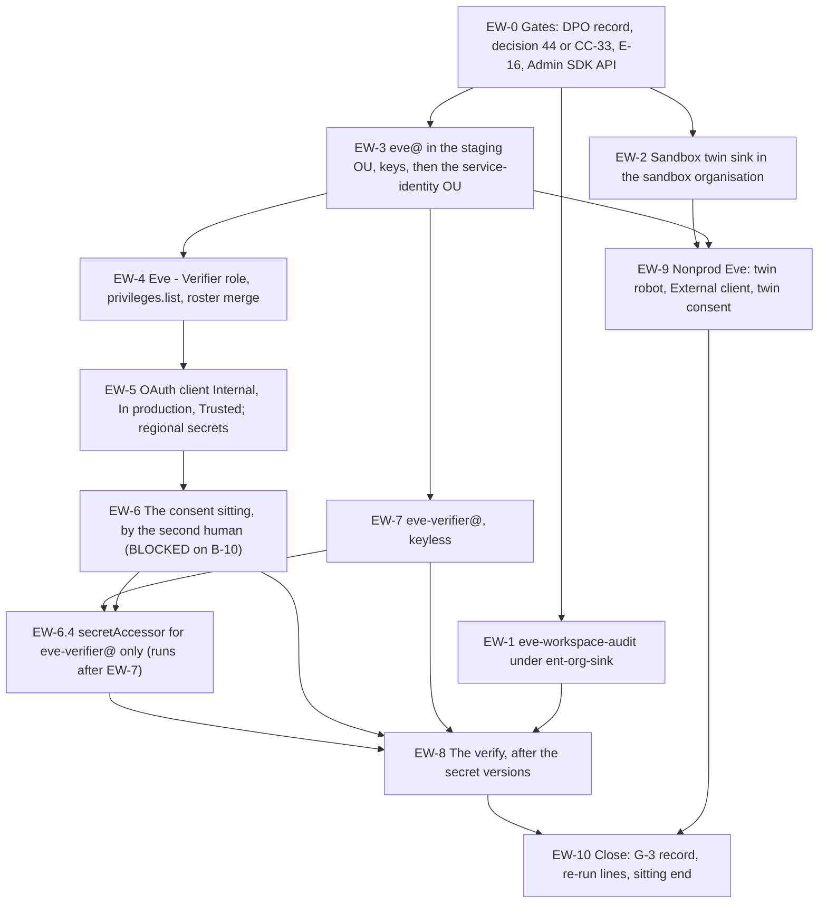

# 24. Eve: the Workspace identity, consent and audit feeds

## Status

- Owner: the platform owner
- Last reviewed: 2026-09-15
- Last executed: never
- Stage: review §2 stage 30, the identity part (the superseded Eve runbook's Phases 7, 8 and 9 identity half), pulled before Wall-E by SD-10. This file is **Eve-H part 2**. It opens gate line **G-3** (`eve@` holds no Super Admin role and exactly the E-16 privilege set). It runs after [23](23-eve-project-and-evidence-stores.md) and after [21](21-sandbox-tenant-and-nonprod-foundation.md); [22](22-mo-foundations.md) is not a precondition of any step here.
- Step prefix: `EW`. Steps: 65. BLOCKED steps: EW-6.1, EW-6.2, EW-6.3, EW-6.5, EW-8.1, EW-9.5 and EW-9.6, all on one piece of code — Eve's consent command (README BLOCKED index row *Eve: the consent command*, `B-10`; if README §8 numbers it differently, the id is corrected here in the same pull request). Steps that record `PENDING` rather than `BLOCKED`: EW-3.9 (`walle-protected@` does not exist until 30), EW-2.8 (the drift inventory, whose job is `B-02`), EW-4.6 (the security reviewer's signature while nobody is appointed).
- Gated **IRREVERSIBLE** steps: EW-1.5 (the sink's filter at creation time — a filter widened later does not backfill, so the history Eve never captured cannot be recovered), EW-3.3 (`eve@` as a permanent address on the roster), EW-5.3 (the OAuth client id, which is frozen with its scope set at consent).
- Replaces: Phase 7, Phase 8 and the identity, secret and service-account half of Phase 9 of [../../eve/07-build-runbook.md](../../eve/07-build-runbook.md). That page is not executed. It also removes `EVE_ROBOT` from anything Wall-E's procedures or `walle_setup.py` do: **this file is the only creator of `eve@` and of Eve's read-only role** (SD-32, S088).
- Salvaged: Phase 7's six-stream sink filter, its dataset-before-sink order, the `--use-partitioned-tables` reasoning and verifies 1, 2, 3 and 5; Phase 8's ten-scope list and the exact-ten scope verify; Phase 9's piped secret-creation commands, the regional `--location` rule and the "never `versions/latest`" pin.
- Not copied: the sink created under a standing organisation `logging.configWriter` (S142 — here it is `ENT_ORG_SINK`, approved by the second human); `eve@` created inside the enforced service-identity OU (S038); the improvised consent with no command, no `userinfo` check and a token file on disk (S040); `shred` (S139 — macOS ships neither `shred` nor a meaningful `rm -P`); Phase 7 check 4's pre-grant expectation of robot-attributed admin activity (S141); the Phase 8 verify placed before the secrets exist (S031); `apps.licensing` and any reliance on `walle_setup.py`'s `EVE_SCOPES` (S060).
- Applies decisions (signed in [03](03-decisions-and-people.md) before the step that needs them): SD-05, SD-10, SD-11, SD-12, SD-31, SD-32, SD-06, SD-25, SD-18, SD-38, SD-43, SD-44, plus Eve's own E-14, E-16 and topology decision 44 or CC-33.
- Closes: S031, S035, S038, S040, S060, S088, S139, S140, S141 (the pre-grant half; the post-grant half is a named re-run point in [39](39-wall-e-stage-0.md)), S142, S203, X-ORG-02 (Eve's half). Defers none without a named owner (§13).
- Consumes: `EVE_PROJECT`, `EVE_PROJECT_NUMBER`, `EVE_WS_LOGS_DS`, `EVE_TWIN_PROJECT`, `EVE_TWIN_PROJECT_NUMBER`, `EVE_EVIDENCE_KEY_EU` (23); `ENT_ORG_SINK`, `ENT_FACTORY_SINGLETON_CTL_NONPROD`, `ENT_PROJECT_REPAIR_EVE`, `pam/tools/pam.sh` (12, 23); `SANDBOX_DOMAIN`, `SANDBOX_CUSTOMER_ID`, `SANDBOX_ORG_ID`, `SANDBOX_SA_1_EMAIL`, `SANDBOX_SA_2_EMAIL`, `sandbox/sandbox.yaml` (21); `ROSTER_FILE`, `CONTROL_GROUPS_FILE`, `SA_1_ADMIN`, `SA_2_ADMIN`, `GRP_EVE_OWNERS`, `ADMIN_OU` (06); `SECOND_HUMAN_EMAIL`, `SECURITY_REVIEWER_EMAIL`, `INCIDENT_COMMANDER_EMAIL`, `DPO_CONTACT`, SD-05, SD-10, SD-11, SD-12, SD-31, SD-32 (03); `SINK_S_ORG`, `SINK_S_FOLDER` and the expected-sink inventory (14); `DOMAIN`, `DIRECTORY_CUSTOMER_ID`, `ORG_ID`, `REGION`, `BQ_LOCATION` and every helper (01).
- Produces: `EVE_ROBOT`, `EVE_STAGING_OU`, `SERVICE_IDENTITY_OU`, `EVE_ROLE_NAME`, `EVE_SINK`, `EVE_TWIN_SINK`, `EVE_OAUTH_CLIENT_SECRET_NAME`, `EVE_REFRESH_TOKEN_SECRET_NAME`, `EVE_TOKEN_VERSION`, `SA_EVE_VERIFIER`, `EVE_TWIN_ROBOT`, `EVE_TWIN_TOKEN_VERSION`.
- Every console path, command, flag, role, API and constraint below was read on Google's pages on 2026-09-15 (§12). What could not be settled that day is in §13. Nothing was run against a live tenant while writing.

## What this part builds

Eve's two feeds and Eve's one identity. After this file Eve can *see* the tenant and *read* it, but it does not yet run: the jobs, the detections and the reporting route are [25](25-eve-human-super-admin-detections.md) and [26](26-eve-reporting-and-witness-export.md), and nothing schedules until a recipient outside the administration line has been tested.

| Built | Where | Who | Variable or record |
|---|---|---|---|
| `eve-workspace-audit`, an organisation sink over the six Workspace audit streams, no actor exclusion, `--include-children`, `--use-partitioned-tables`, into `eve_workspace_logs` | tenant Cloud organisation | platform owner under `ENT_ORG_SINK`, approved by the second human | `EVE_SINK` |
| The sink writer identity's `dataEditor` on `eve_workspace_logs` **only** | `EVE_PROJECT` | platform owner under `ENT_PROJECT_REPAIR_EVE` | EW-1.6 read-back |
| `eve-twin-workspace-audit`, the same sink shape in the **sandbox** organisation, into the twin dataset | sandbox Cloud organisation | sandbox super admin 1 | `EVE_TWIN_SINK` |
| `eve@<domain>`: created in a staging OU with no key-only enforcement, licensed, two keys registered with custodians who are not the platform owner, then moved into the service-identity OU | tenant | platform owner as `sa-1-admin@`, second human present; key custodians present for EW-3.5 | `EVE_ROBOT`, `EVE_STAGING_OU`, `SERVICE_IDENTITY_OU` |
| `Eve - Verifier`, a customer-scoped custom admin role with read privileges only, resolved by `privileges.list`, never Super Admin | tenant | platform owner, second human reviews the committed privilege list | `EVE_ROLE_NAME` |
| `ROSTER_FILE` carrying `eve@` as `robot_non_admin` | platform repository | platform owner writes, second human approves | EW-4.7 merge |
| One Desktop OAuth client, **Internal**, **In production**, marked **Trusted** in the same sitting | `EVE_PROJECT` and the Admin console | platform owner | `EVE_OAUTH_CLIENT_SECRET_NAME` |
| The two regional secrets, created **before** the consent, and the consent itself | `EVE_PROJECT` | the **second human** performs the sign-in with the key they hold | `EVE_REFRESH_TOKEN_SECRET_NAME`, `EVE_TOKEN_VERSION` |
| `eve-verifier@`, keyless, the only Eve service account created here | `EVE_PROJECT` | platform owner | `SA_EVE_VERIFIER` |
| Nonprod Eve: `eve@<sandbox domain>`, its **External / In production / Trusted** client, its own consent and its own pinned token version | sandbox tenant, `EVE_TWIN_PROJECT` | sandbox super admin 1 creates and consents | `EVE_TWIN_ROBOT`, `EVE_TWIN_TOKEN_VERSION` |

What this file deliberately does **not** do:

- It does not create `eve-controller@`, `eve-console@` or `eve-export@`. Those belong to [36](36-wall-e-joins-to-eve-and-mo.md), [25](25-eve-human-super-admin-detections.md) and [26](26-eve-reporting-and-witness-export.md), each with its own grants. Only `eve-verifier@` is needed before a job exists.
- It grants no role in `WALLE_PROJECT`, which does not exist. Every such grant is [31](31-wall-e-project-and-data-plane.md)'s and [36](36-wall-e-joins-to-eve-and-mo.md)'s.
- It deploys nothing, schedules nothing and writes no detection. Eve makes no report until 26.
- It creates **no** key ring and **no** dataset in `EVE_PROJECT`: 23 made them, with `EVE_EVIDENCE_KEY_EU` on the datasets and the 400-day default partition expiry already set (E-14). This file only checks that order held before the first sink write.
- It authorises **no** domain-wide delegation. If a delegation client is found on `eve@`'s client id, it is reported to the second human and never used (01 PR-6.4).

What the old text got wrong, and must not come back:

| Old text | Why it fails | Here instead |
|---|---|---|
| Eve Phase 7 "Access you need" row 3: standing organisation `roles/logging.configWriter` (S142) | No entitlement grants that role at the organisation; a standing binding of a catalogue role is a severity 1 drift finding, and an organisation sink is the evidence-silencing lever | EW-1.4: `ENT_ORG_SINK` (12 PA-3.3), 1 hour, approved by the second human, never a no-approval entitlement (SD-18) |
| Phase 8 step 1: create `eve@` in `/Automation/Service Identities`, then "2SV enforced, hardware key only" (S038) | That OU already enforces "Only security key" with no new-user enrolment period, so `eve@` cannot sign in to register a key; under that enforcement a user cannot generate backup codes either | EW-3.2 to EW-3.7: a staging OU with no enforcement, both keys registered with their custodians, `isEnrolledIn2Sv` proven, **then** the move |
| `walle_setup.py` `phase_1_accounts` and `phase_2_roles` also create `eve@` and the role (S088) | Two creators of one privileged account at two stages; the privilege set frozen by a script before E-16; Phase 8's "create" meets an existing account | EW-3.1 stops the sitting if `eve@` exists; 30 and 39 only read its state; SD-32 and SD-37 |
| Phase 8 step 8: "Consent … requesting exactly these ten scopes" with no command (S040) | The obvious improvisation opens the default browser as the operator's own super admin and nothing compares `userinfo` with `eve@` | EW-6.1 states the command's contract; EW-6.2 is **BLOCKED** until it is committed, and the second human performs the sign-in |
| Phase 9: `--data-file=./eve_token.json` then `shred -u` (S139) | macOS ships no `shred`; its `rm -P` is documented as having no effect; the refresh token of a tenant-wide reader stays on disk, possibly in a synced folder | EW-6.2: the command writes straight into Secret Manager; EW-6.5 proves nothing is on disk |
| Phase 8 verify read `eve-refresh-token` before Phase 9 created it, and `admin.googleapis.com` was never enabled (S031) | The verify cannot run as ordered, and every Directory and Reports call fails `SERVICE_DISABLED` | EW-0.5 enables the Admin SDK API first; the whole verify is EW-8, after the secret versions |
| Phase 7 check 4: "expect `walle@` present … a shadow run is enough" (S141) | Before the grant the robot holds no admin role, the admin audit log records changes only, and a shadow run executes nothing | EW-1.8 (pre-grant): a human's seeded change in the activity table and `eve@`'s own sign-in in the login stream; the robot half is a re-run line for 39 |
| Phase 8 verify: "a `users.update` fails 403 … the difference between a control and a convention" (S203) | The token holds read-only scopes, so the 403 lands on the scope before the role is evaluated; a role created with a write privilege still passes | EW-8.1 keeps the 403 as a **scope** check; EW-8.2 adds a **role** check by `roles.get` against the committed privilege list |
| `walle_setup.py`'s `EVE_SCOPES` as "the frozen reference the runbook must request verbatim" (S060) | It carries `apps.licensing` and lacks `domain.readonly` and `customer.readonly`; scopes freeze at consent | EW-0.4: the scope list is the committed `eve/scopes.txt` at the E-16 commit; EW-6.1 makes the command read that file, and EW-8.1 compares granted against it |
| Phase 9's mid-phase stop on topology decision 44 (S035, S140) | The stop sits after the consent, so the sitting ends with a live tenant-wide read credential and no working Eve | EW-0.3 checks decision 44 or CC-33 **before** the first step, and the discovery read belongs to `eve-gate` in 41, not here |



## Preconditions

- [ ] **23 complete**: `EVE_PROJECT`, `EVE_PROJECT_NUMBER`, `EVE_WS_LOGS_DS` (the dataset exists, in `BQ_LOCATION`, CMEK `EVE_EVIDENCE_KEY_EU`, **default partition expiry already set and nothing written into it yet**), `EVE_TWIN_PROJECT`, `EVE_TWIN_PROJECT_NUMBER`, `ENT_PROJECT_REPAIR_EVE` and `ENT_DEPLOY_CREDENTIAL_HOLDER_EVE` set; Eve's register row and manifest merged; `restrictServiceUsage` on `EVE_PROJECT` denies `aiplatform` and admits `admin`.
- [ ] **21 complete**: `SANDBOX_CUSTOMER_ID`, `SANDBOX_ORG_ID`, `SANDBOX_DOMAIN`, `SANDBOX_OPERATORS_GROUP` set in the tenant copy; "Share data with Google Cloud services" on since a recorded time (SB-6.4) and proven at organisation scope (SB-6.5); `/Automation/Service Identities` exists and is empty in the sandbox; `sandbox/sandbox.yaml` carries the twin OAuth client rule; `fld-controllers-nonprod` admits `SANDBOX_CUSTOMER_ID` with an accepted grant proven (SB-7.5).
- [ ] **12 complete**: `ENT_ORG_SINK` (organisation `roles/logging.configWriter`, 1 h, requester `platform-owners@`, approver the second human) `AVAILABLE` with its one-grant test done (PA-3.3); `ENT_FACTORY_SINGLETON_CTL_NONPROD` available; `pam/tools/pam.sh` sourced; PA-9.3 `DONE` (the platform owner holds no standing `actAs` on Eve identities, SD-12 item 2).
- [ ] **14 complete**: `SINK_S_ORG` and `SINK_S_FOLDER` exist and are enabled; the expected-sink inventory file is merged, so EW-1.9 adds one row rather than inventing the file; no interim organisation sink exists (SD-40).
- [ ] **06 complete**: `ROSTER_FILE` merged with `eve@<domain>` in `expected_later[]`; `GRP_EVE_OWNERS` owned by the second human; the interim Admin console activity rule still live; `ADMIN_OU`, `SA_1_ADMIN`, `SA_2_ADMIN` set.
- [ ] **03 signed**: SD-05, SD-10, SD-11, SD-12, SD-31, SD-32, SD-18, SD-38, SD-44, plus `NAMES`; `SECOND_HUMAN_EMAIL` set; `SECURITY_REVIEWER_EMAIL` and `INCIDENT_COMMANDER_EMAIL` set (at least one of the two must be a real address — see EW-0.6); `DPO_CONTACT` set.
- [ ] **Eve's own decisions**: **E-14** signed (the retention value the 23 dataset already carries); **E-16** signed, with the privilege set and the ten scopes committed at a named commit; **topology decision 44 or CC-33** closed (SD-31). EW-0.2 to EW-0.4 refuse to go on without all three.
- [ ] **SD-11's data-protection record** exists and is dated: purpose, data categories, retention, recipients, and the works-council information where required (EW-0.2). Eve processes the activity metadata of named human administrators; no step in this file runs without it.
- [ ] Hardware keys in hand: two for `eve@` (04 PU-8.1), held by the two custodians named in EW-3.5, plus two for the twin robot **only if** SD-29 decided hardware-key 2SV for twin robots.
- [ ] One Workspace licence free for `eve@` and one on the sandbox tenant for the twin (04).
- [ ] Workstation of [01](01-prerequisites-and-conventions.md): `gcloud` with `alpha` and `beta`, `bq`, `jq`, `python3.12`, `git`, `gh`; `~/.platform-env` sourced; `penv_guard` silent; **one clean browser profile per account**, and a separate clean profile for the second human.
- [ ] **Not** a precondition: anything from 22, 25, 26, 27, 28 or any Wall-E file.

## People needed

| Role | Does | Present at |
|---|---|---|
| Platform owner (as `sa-1-admin@`) | Creates the OU, `eve@`, the custom role and the OAuth client; runs every shell step on the tenant side; requests every PAM grant | every step except EW-2, EW-6.2, EW-9 |
| Second human (`SECOND_HUMAN_EMAIL`, holder of `sa-2-admin@`, owner of `eve-owners@`) | Approves each `ENT_ORG_SINK` and `ENT_PROJECT_REPAIR_EVE` grant; **is present for the whole of EW-3 and EW-4**; holds `eve@` key A; **performs the consent sign-in** (EW-6.2); seeds the human test change of EW-1.8; required reviewer of the roster and of `eve/` | EW-1.4, EW-1.8, EW-3.*, EW-4.*, EW-5.3, EW-6.*, EW-8.*, EW-10.2 |
| Security reviewer (`SECURITY_REVIEWER_EMAIL`), or the incident commander (`INCIDENT_COMMANDER_EMAIL`, IT security, **not** a tenant super admin) until appointed | Holds `eve@` key B; countersigns the custody record; signs the committed privilege list | EW-3.5, EW-4.3, EW-10.2 |
| Sandbox super admin 1 (`SANDBOX_SA_1_EMAIL`) | Creates the twin sink in the sandbox organisation, the twin robot, its role and its client; performs the twin consent | EW-2.*, EW-9.* |
| Sandbox super admin 2 (`SANDBOX_SA_2_EMAIL`) | Reads back every sandbox change as a second pair of eyes; witnesses the twin robot's keys | EW-2.7, EW-9.2, EW-9.4 |
| DPO (`DPO_CONTACT`) | Confirms the SD-11 record covers monitoring of named administrators before any feed is created | EW-0.2 |
| A second reviewer who did not author the change | Second approval on every pull request (branch protection of 03) | EW-0.4, EW-1.2, EW-4.2, EW-4.7, EW-1.9 |

Hands-on: about 2.5 days over four sittings. Elapsed: 1 to 3 weeks, driven by the up-to-7-day wait before a newly enrolled security key is usable at sign-in (06 OB-2.6), the 24-hour wait for the first shared log entries on each organisation, the pull-request reviews, and — for EW-6 and EW-9.5 — the date Eve's consent command is committed.

## Sittings

| Sitting | Steps | Who must be in the room | Cannot be split because |
|---|---|---|---|
| 1. Gates and the two feeds | EW-0, EW-1, EW-2 | platform owner; second human for EW-1.4's approval and EW-1.8; sandbox super admins for EW-2 | the `ENT_ORG_SINK` grant lasts one hour and the sink's filter is fixed at creation |
| 2. The account and the role | EW-3, EW-4 | platform owner, second human, the second key custodian | the account must not sit unhardened between the creation and the key enrolment, and the role must not exist before its privilege list is merged |
| 3. The client, the secrets and the consent | EW-5, EW-6.1 to EW-6.3, **EW-7**, EW-6.4, EW-6.5, EW-8 — in that order, because EW-6.4 grants a principal EW-7.1 creates | platform owner, second human | the client id, the Trusted marking and the scope freeze all happen in one browser session; a half-finished consent leaves a token with the wrong scopes that cannot be widened |
| 4. Nonprod Eve | EW-9 | sandbox super admins; platform owner for the `EVE_TWIN_PROJECT` side | the twin client must be Trusted before its consent (SD-05) |
| Close | EW-10 | platform owner, second human | EW-10.3 revokes every Eve grant and proves no human holds anything in `EVE_PROJECT`; a sitting may not be closed with a live grant |

Sitting 3 may be split at EW-5.4 if the consent command (`B-10`) is not committed: EW-5 leaves a client whose secret is in Secret Manager and no token anywhere, which is a safe resting state. It may **not** be split between EW-6.2 and EW-6.3.

## How the monitored administrator is kept from silencing Eve, in this file

The platform owner is a subject of Eve-H and builds Eve's identity. The ways this file could be bent, and what it does about each:

| Risk | Who could | Control here | Residual, and where it is covered |
|---|---|---|---|
| The sink is created with an actor exclusion that hides one person | the builder | The filter is a merged file read from the repository, never typed at the prompt (EW-1.2); EW-1.6 asserts no `principalEmail!=` clause; the second human approves the grant only after reading the merged filter | a later `UpdateSink` is a severity 1 self-integrity rule (25) and moves the configuration fingerprint (26, 27) |
| The builder holds a key to `eve@` and can act as Eve | the platform owner | Key A goes to the second human, key B to the security reviewer or the incident commander; the platform owner holds neither (SD-12 item 6); the forced password change of EW-3.3 kills the password he saw | a super admin can still reset `eve@`'s password: Eve raises severity 1 on any change to `eve@` (25) and the login rule of EW-3.8 mails the second human |
| The consent is performed by the builder in his own browser | the platform owner | EW-6.2 is performed by the second human, in their own clean profile, with key A, and the command refuses unless `userinfo` is `eve@` | recorded in the login stream, read back in EW-8.3 |
| The token is copied off the machine between consent and storage | anyone in the room | The command writes straight into Secret Manager and prints only a version number (EW-6.1); EW-6.5 proves nothing is on disk | the token is read-only, revocable at `myaccount.google.com/permissions`, and `EVE_TOKEN_VERSION` is pinned, never `latest` |
| The role is created with a write privilege nobody notices | the builder | The privilege list is merged and signed before the role exists (EW-4.2); EW-8.2 reads the live role back and fails on any privilege outside the list | daily by Eve's roster check from 25; G-3 at the gate |
| `eve@` quietly gains Super Admin | any super admin | EW-4.5 asserts `isAdmin false`; EW-4.7 puts `eve@` on the roster as `robot_non_admin` so any role beyond the read-only one is `role_assignment_added` | 25's roster check, SA-06 in 15, G-3 in 38 |
| The whole feed is switched off by turning "Share data with Google Cloud services" off | a super admin | Not settable here, but EW-1.10 records the current state and the time, which 25's `log_pipeline_silent` and the self-integrity rule use as their baseline | 25, 27 |

## What Eve does not see

The feeds this file builds are Eve's whole view of the tenant, and no page states what falls outside them. A residual nobody has written down is a residual nobody owns. This table is the statement; EW-1.12 commits it, and it is carried verbatim into [28](28-eve-independent-proof-and-sandbox-drills.md) EV-8.2's `EVE_H_LIVE_RECORD` under "What is not live, and who owns it", so the second human signs Eve live knowing the shape of the gap.

| Not seen | Why | What a super admin could do inside it | Owner and where it closes |
|---|---|---|---|
| Reports application `mobile` | not in the polled set of [25](25-eve-human-super-admin-detections.md) EH-2.2 | wipe or approve a device, including one holding another person's data | Eve owner; 25 EH-2.2, which adds `mobile` to the polled applications — it is a valid `applicationName` (activities.list, read 2026-09-16) and cheap |
| Reports application `data_migration` | not in the polled set of 25 EH-2.2 | migrate another user's mail into an account the administrator controls — a real exfiltration path that leaves no admin-audit change | Eve owner; 25 EH-2.2, added with `mobile` |
| Reports applications `directory_sync`, `ldap`, `chrome`, `gmail`, `access_evaluation` | not polled; all valid `applicationName` values | sync-source and Chrome-policy changes; Gmail-side settings | Eve owner; 25 EH-2.2 decides each with a reason, and records the ones deliberately excluded. Not silently omitted |
| **Every organisation-level Cloud act by a super admin**: organisation IAM, organisation policy, project creation outside the platform folders, sink changes elsewhere in the organisation | `eve-workspace-audit`'s filter is the Workspace-admin view (four service names plus Access Transparency); Eve reads no Cloud Audit Logs beyond it | grant himself an organisation role, relax an organisation policy, create a project outside the folders, or change another sink | Platform owner; `S-org` (14 CL-6.2) and the SIEM (15) hold these, and [25](25-eve-human-super-admin-detections.md)'s `platform_logs_views` grant is where an Eve rule over them would be added. Until then it is **covered by the SIEM, not by Eve**, and the G-3 record says so |
| The Access Transparency clause's correctness | matched by log id, not by a service name Google publishes; `Assumption:` in EW-1.2 | — | Platform owner; EW-1.8's per-service count on an edition that carries it; the clause is corrected by pull request before anything relies on it (§15) |
| Any stream `WORKSPACE_EDITION` does not carry | edition-conditional (OAuth token, SAML, Access Transparency) | — | Platform owner; the edition is pinned at EW-1.7 and recorded, so the gap is declared rather than discovered. A stream the edition **does** carry and that is absent is a stop, not a residual |
| Anything that leaves no record at all | Google publishes no log for it | — | Second human; a permanent declared limit, restated at every gate |

## If something goes wrong in the middle

| Situation | Do |
|---|---|
| The `ENT_ORG_SINK` grant expires before EW-1.6 (EW-1.5 done, no writer grant) | The sink exists and is exporting to a dataset it cannot write. Request a second grant with the justification "24 EW-1.6 writer grant only"; do **not** delete and recreate the sink — recreating restarts the no-backfill clock and loses the history already routed. |
| EW-1.5 printed an error and `sinks describe` shows a sink anyway | Read the filter. If it matches the merged file, carry on at EW-1.6. If it does not, this is the one case where deleting and recreating is right, and the lost window is recorded in the build log and reported to the second human. |
| `eve@` cannot sign in at EW-3.4 | Check the OU: a newly created user inherits the OU it is created in. If it is already in `SERVICE_IDENTITY_OU`, move it to `EVE_STAGING_OU`, wait for the setting to apply, and retry. Do not set a new-user enrolment period on the enforced OU unless EW-3.2's alternative was chosen and recorded. |
| A key enrolled in EW-3.5 is refused at sign-in | Google may take up to 7 days before a newly added key is usable at sign-in (06 OB-2.6). Record the enrolment time, stop sitting 2 here, and resume at EW-3.6 when the key works. Never fall back to a code or a recovery channel. |
| The consent command prints an `access_denied` or an `org_internal` error | The client is Internal and the signing account is not in the organisation: confirm the profile is signed in as `eve@<domain>` and nothing else. Never widen the client to External on the production tenant (SD-05). |
| The consent succeeds but the granted scope set differs from `eve/scopes.txt` | Do not store the token. Revoke at `myaccount.google.com/permissions` as `eve@`, correct the scope file or the client, and repeat EW-6.2. A wrong scope set cannot be widened after the fact without a new consent. |
| `EVE_TOKEN_VERSION` would be `1` but `versions list` shows more than one enabled version | Somebody consented twice. Disable every version but the newest, record why, and pin the newest. More than 100 live refresh tokens per account per client id silently invalidates the oldest. |
| An **IRREVERSIBLE** step (EW-1.5, EW-3.3, EW-5.3) has `START` and no `DONE` | Never re-run it. Read the live state (`gcloud logging sinks describe`; Admin console Users; the Clients page), record it, and ask the second human before going on (README resume rule 3). |
| The sandbox twin sink writes nothing after 24 hours | In order: sharing on (21 SB-6.4), the sink's organisation is `SANDBOX_ORG_ID` and not `ORG_ID`, the writer identity holds `dataEditor` on the twin dataset, and the nonprod folder admits `SANDBOX_CUSTOMER_ID`. Stop at the first that fails. |

## Evidence and the build log

- Checkpoint lines use 01's `checkpoint`; sandbox-side lines are written on the sandbox workstation and merged by pull request at the end of each sitting (21's rule).
- Key custody records for `eve@` are paper in the safe, signed by the custodian and by a witness from the other administration line, scanned the same day to `EVIDENCE_INTERIM_LOCATION`, and uploaded to the witness under `custody/` by a witness administrator (08 WO-3.3). The platform owner is **not** a custodian and does not hold a copy.
- Every EVIDENCE line becomes one `evidence_add` row. E-xx ids from [../10-eu-ai-act.md](../10-eu-ai-act.md) §5, TISAX ids from [../11-tisax.md](../11-tisax.md) §13, mapped by 01 §7.2: logging configuration E-06, TISAX 5.2.4; identity and role records E-08, TISAX 4.1.3, 4.2.1; key custody E-08, TISAX 3.1, 4.1.2; decision and deviation records E-03, TISAX 1.4.1; the data-protection record E-11, TISAX 6.1.1.
- Deviation rows are `BD-24-<n>`. Records go to `BUILD_LOG_DIR/records/` as `<date>-EW-<step>-<slug>-v<n>`.
- Every shell block on the tenant side starts with:

```bash
source ~/.platform-env
penv_guard
. "$PLATFORM_REPO_DIR/pam/tools/pam.sh"
R="$BUILD_LOG_DIR/records/$(date -u +%F)-EW"
```

## Steps

## 0. Gates, before anything is created

### EW-0.1 Open the sitting and check every input

- **WHO:** Platform owner; the second human joins from EW-1.4.
- **WHERE:** Shell, `~/.platform-env` sourced, gcloud configuration `GCLOUD_CONFIG_NAME`, signed in as `sa-1-admin@`.
- **ACTION:**

```bash
checkpoint EW-0.1 START
need DOMAIN DIRECTORY_CUSTOMER_ID ORG_ID REGION BQ_LOCATION WORKSPACE_EDITION PLATFORM_REPO_DIR BUILD_LOG_DIR EVIDENCE_REGISTER DEVIATION_REGISTER DRILL_CALENDAR EVE_PROJECT EVE_PROJECT_NUMBER EVE_WS_LOGS_DS EVE_TWIN_PROJECT EVE_TWIN_PROJECT_NUMBER IDENTITY_RETENTION_DAYS ENT_ORG_SINK ENT_PROJECT_REPAIR_EVE ENT_DEPLOY_CREDENTIAL_HOLDER_EVE ENT_FACTORY_SINGLETON_CTL_NONPROD SANDBOX_DOMAIN SANDBOX_CUSTOMER_ID SANDBOX_ORG_ID SANDBOX_SA_1_EMAIL SANDBOX_SA_2_EMAIL ROSTER_FILE CONTROL_GROUPS_FILE SA_1_ADMIN SA_2_ADMIN GRP_EVE_OWNERS SECOND_HUMAN_EMAIL DPO_CONTACT LOGGING_PROJECT CICD_PROJECT
case "$IDENTITY_RETENTION_DAYS" in ''|*[!0-9]*) echo "STOP: IDENTITY_RETENTION_DAYS is not an integer; 23 EP-0.2 refuses too, so 23 did not finish"; false;; *) echo "IDENTITY_RETENTION_DAYS=${IDENTITY_RETENTION_DAYS}d = $(( IDENTITY_RETENTION_DAYS * 86400 ))s = $(( IDENTITY_RETENTION_DAYS * 86400000 ))ms";; esac
"$PLATFORM_REPO_DIR/tools/decision-need.sh" NAMES SD-05 SD-10 SD-11 SD-12 SD-18 SD-31 SD-32 SD-38 SD-44 E-14 E-16
awk -F'\t' '$2 ~ /^(EP-|SB-|CL-6\.2|PA-3\.3|PA-9\.3)/ && $3=="DONE" {print $2}' "$BUILD_LOG_DIR/checkpoints.tsv" | sort -u | tail -40
test -z "$(gcloud config get project 2>/dev/null)" && echo "no default project"
```

- **VERIFY:** `decision-need.sh` prints `SIGNED` for each id; `IDENTITY_RETENTION_DAYS` prints as an integer with its three forms (it is the ceiling 23 EP-0.2 signed for Workspace identity data, and the value 23 EP-4.2 already put on `EVE_WS_LOGS_DS`; `EVIDENCE_RETENTION_DAYS` is a **different** ceiling and is used nowhere in this file); the checkpoint listing shows `DONE` for 23's closing step, 21 SB-6.4, SB-6.5, SB-7.5, 12 PA-3.3 and PA-9.3, and 14 CL-6.2; `no default project`. Any `MISSING` line: stop and finish the earlier file. The absence of any Mo or Wall-E checkpoint is expected and is not a stop.
- **ROLLBACK:** Read only.
- **EVIDENCE:** Output as `${R}-0.1-inputs-v1.txt`; `evidence_add EW-0.1 inputs E-05 1.4.1 build-log:records/ "${R}-0.1-inputs-v1.txt"`. TISAX 1.4.1.

### EW-0.2 Check SD-11's data-protection record before any feed exists

- **WHO:** Platform owner reads; the DPO confirms in writing; the second human countersigns.
- **WHERE:** `PLATFORM_REPO_DIR/decisions/`; the D7 letter of 03 DC-2.3.
- **ACTION:** Eve-H processes the activity metadata of named human administrators from its first run. Nothing in this file may be created before a dated record covers it. Read the record and check that each of these appears, in these words or clearer:

  1. **Purpose:** detection of misuse of tenant-wide privilege.
  2. **Data:** admin, login, token, SAML, groups and Reports activity metadata for the accounts on `ROSTER_FILE` and for every live admin-role holder. **No content.**
  3. **Retention:** `eve_workspace_*` at the E-14 value (400 days unless E-14 signed another), and the witness copy.
  4. **Recipients:** the second human; the security reviewer; the incident commander. Never the subject of a report.
  5. **Works-council or employee-representative information** given where the jurisdiction requires it, with a date.

```bash
"$PLATFORM_REPO_DIR/tools/decision-need.sh" SD-11
grep -nE 'purpose|data categories|retention|recipients|works council|employee representative' "$PLATFORM_REPO_DIR"/decisions/*-eve-administrator-monitoring.md
```

- **VERIFY:** Five matches, each with a date and a signature; the DPO's confirmation is in the record or attached to it. If the record is absent or silent on any of the five, **stop the file here**: this is the one precondition that no later step can repair, and 25's jobs are BLOCKED on the same record.
- **ROLLBACK:** None needed; nothing was created.
- **EVIDENCE:** The record path and the DPO's confirmation in the build log as `${R}-0.2-dpo-record-v1`. E-11. TISAX 6.1.1.

### EW-0.3 Check topology decision 44 or CC-33 is closed (SD-31)

- **WHO:** Platform owner.
- **WHERE:** `PLATFORM_REPO_DIR/decisions/`.
- **ACTION:** The superseded runbook put this stop **inside** Phase 9, after the consent, so the sitting ended with a live tenant-wide read credential and no working Eve (S035). It is a gate, and it is checked here, before the first creation.

```bash
"$PLATFORM_REPO_DIR/tools/decision-need.sh" WDEC-44 || "$PLATFORM_REPO_DIR/tools/decision-need.sh" CC-33
"$PLATFORM_REPO_DIR/tools/decision-value.sh" WDEC-44 FORM 2>/dev/null || "$PLATFORM_REPO_DIR/tools/decision-value.sh" CC-33 FORM
```

- **VERIFY:** One of the two prints `SIGNED`, and `FORM` prints either `datastore.viewer under a database-scoped IAM condition` or `GET /v1/plans?state=pending_eve on walle-actions`. Record which. Nothing in this file grants either: the discovery read belongs to `eve-gate` in [41](41-eve-s3-and-s4.md), and the grant itself is made in [36](36-wall-e-joins-to-eve-and-mo.md) once `WALLE_PROJECT` exists. The gate exists so that Eve's credential is never minted for a consumer that has no permitted path.
- **ROLLBACK:** Read only.
- **EVIDENCE:** The chosen form in the build log; it is repeated in 41's preconditions. E-03. TISAX 1.4.1. Closes S035 and the ordering half of S140.

### EW-0.4 Check E-16's privilege set and scope set, and pin the commit

- **WHO:** Platform owner; the second human is the required reviewer of the file; the security reviewer (or the incident commander) signs.
- **WHERE:** `PLATFORM_REPO_DIR/eve/`.
- **ACTION:** Scopes freeze at consent, so the set is decided before the consent and read from a file, never typed. Two files at one commit:

  - `eve/scopes.txt` — exactly ten lines, one scope per line, no blank lines, no comments.
  - `eve/role-privileges.md` — the read privilege set E-16 fixed, with the reason for each and the three deliberate exclusions (no Reports scope beyond `admin.reports.audit.readonly`; no Cloud Identity Policy API scope, which only a super administrator may use; no device or Chrome management scope).

```bash
cat "$PLATFORM_REPO_DIR/eve/scopes.txt"
wc -l < "$PLATFORM_REPO_DIR/eve/scopes.txt"
grep -c . "$PLATFORM_REPO_DIR/eve/scopes.txt"
grep -E 'apps\.licensing|cloud-platform|gmail|drive|chat|calendar|cloud-identity\.policies' "$PLATFORM_REPO_DIR/eve/scopes.txt" && echo "STOP: a forbidden scope is in the file" || echo "no forbidden scope"
penv_set EVE_SCOPES_COMMIT "$(git -C "$PLATFORM_REPO_DIR" log -1 --format=%H -- eve/scopes.txt eve/role-privileges.md)"
```

  The ten lines, from Eve's identity page as widened by E-16 on 2026-09-13, are:

```
https://www.googleapis.com/auth/admin.directory.user.readonly
https://www.googleapis.com/auth/admin.directory.group.readonly
https://www.googleapis.com/auth/admin.directory.orgunit.readonly
https://www.googleapis.com/auth/admin.directory.rolemanagement.readonly
https://www.googleapis.com/auth/admin.reports.audit.readonly
https://www.googleapis.com/auth/admin.reports.usage.readonly
https://www.googleapis.com/auth/admin.directory.domain.readonly
https://www.googleapis.com/auth/admin.directory.customer.readonly
https://www.googleapis.com/auth/userinfo.email
openid
```

- **VERIFY:** `grep -c .` prints `10`; `no forbidden scope`; `EVE_SCOPES_COMMIT` is on the default branch with two approvals, one of them the second human's. **`walle_setup.py`'s `EVE_SCOPES` constant is not consulted at any point in this file and is not the reference** (S060): if a later reader diffs the two and they disagree, this file's committed `eve/scopes.txt` wins and CC-27 corrects the script.
- **ROLLBACK:** Amend by pull request before EW-6.2. After the consent the set cannot be widened without a new consent and a new token version.
- **EVIDENCE:** `EVE_SCOPES_COMMIT` and the two approvals in the build log. E-03, E-08. TISAX 1.4.1, 4.1.3. Closes S060.

### EW-0.5 Enable the Admin SDK API in `EVE_PROJECT`

- **WHO:** Platform owner under `ENT_PROJECT_REPAIR_EVE`, approved by the second human.
- **WHERE:** Shell.
- **ACTION:** `EVE_PROJECT` owns Eve's OAuth client, so every Directory and Reports call made with that client is billed and authorised against this project, and fails `SERVICE_DISABLED` until the API is on (S031). The project-level `restrictServiceUsage` allow-list of `fld-controllers-*` already admits `admin`; enabling is still a separate act.

  The only PAM helper that exists is `pam_request`, committed in `pam/tools/pam.sh` (12 PA-1.5), and its argument order is **entitlement, justification, duration** — not entitlement, duration, justification. There is no `pam_req`. Every PAM call in this file uses this form, and the grant name is always captured, because a grant nothing recorded is a grant nothing can revoke at EW-10.3.

```bash
need ENT_PROJECT_REPAIR_EVE EVE_PROJECT CICD_PROJECT
g_repair="$(pam_request "$ENT_PROJECT_REPAIR_EVE" "24 EW-0.5, EW-1.6, EW-5.2, EW-6.4, EW-7.1: Admin SDK API, dataset access, regional secrets, eve-verifier@" 3600)"
echo "$g_repair" > "${R}-0.5-grant-name-v1.txt"
pam_wait "$g_repair" ACTIVE
gcloud pam grants describe "$g_repair" --billing-project="$CICD_PROJECT" --format='yaml(state,requestedDuration,justification,approvers)' > "${R}-0.5-grant-v1.yaml"
gcloud services enable admin.googleapis.com --project="$EVE_PROJECT"
gcloud services list --enabled --project="$EVE_PROJECT" --format='value(config.name)' | sort > "${R}-0.5-services-v1.txt"
grep -x 'admin.googleapis.com' "${R}-0.5-services-v1.txt"
grep -x 'aiplatform.googleapis.com' "${R}-0.5-services-v1.txt" && echo "STOP: aiplatform is enabled in EVE_PROJECT" || echo "aiplatform absent, as required"
```

- **VERIFY:** `STATE ACTIVE` and the grant record names the second human as approver, the duration as `3600s` and the justification above; `${R}-0.5-grant-name-v1.txt` holds the grant name, which EW-10.3 revokes; `admin.googleapis.com` is listed; `aiplatform absent, as required`. If `gcloud services enable` is refused by the allow-list, read the effective `restrictServiceUsage` policy on `EVE_PROJECT` — 23 set it — and stop rather than widening it here.
- **ROLLBACK:** `gcloud services disable admin.googleapis.com --project="$EVE_PROJECT"`. Doing so after EW-6 breaks every Eve read; it is an act of 42's teardown, not of this file.
- **EVIDENCE:** `${R}-0.5-services-v1.txt`; `evidence_add EW-0.5 admin-sdk-enabled E-06 5.2.4 build-log:records/ "${R}-0.5-services-v1.txt"`. TISAX 5.2.4. Closes the API half of S031.

### EW-0.6 Confirm a recipient exists for reports whose subject is the second human

- **WHO:** Platform owner reads; the second human confirms.
- **WHERE:** `~/.platform-env`; 03's people record.
- **ACTION:** SD-12 makes the second human a key custodian and the performer of the consent. A report about the second human must not reach the second human, and must never reach the platform owner (the subject of most other reports). At least one of `SECURITY_REVIEWER_EMAIL` or `INCIDENT_COMMANDER_EMAIL` must be a named person who is neither.

```bash
need SECOND_HUMAN_EMAIL
for v in SECURITY_REVIEWER_EMAIL INCIDENT_COMMANDER_EMAIL; do printf '%s\t%s\n' "$v" "$(printenv "$v")"; done
python3 - <<'PY'
import os
sh = os.environ["SECOND_HUMAN_EMAIL"]; po = os.environ.get("OWNER_DAILY_ACCOUNT","")
cands = [os.environ.get(v,"") for v in ("SECURITY_REVIEWER_EMAIL","INCIDENT_COMMANDER_EMAIL")]
ok = [c for c in cands if c and c != "*tbd*" and c not in (sh, po)]
print("SECOND-KEY-CUSTODIAN AND REPORT RECIPIENT:", ok[0] if ok else "NONE - STOP")
PY
```

- **VERIFY:** The line names one person. `NONE - STOP`: this file may still build the sinks (EW-1, EW-2), but EW-3.5 has no second key custodian and EW-4.3 has no signatory, so sitting 2 does not open. Record the block as a README re-run line and tell 03 to appoint.
- **ROLLBACK:** Read only.
- **EVIDENCE:** The line in the build log as `${R}-0.6-second-custodian-v1`. E-08. TISAX 4.1.3.

## 1. `eve-workspace-audit`: the organisation sink over the six Workspace streams

### EW-1.1 Prove the dataset order held before the first write

- **WHO:** Platform owner.
- **WHERE:** Shell.
- **ACTION:** A BigQuery sink creates a date-sharded table unless told otherwise, and a dataset's default partition expiration binds only tables created after it is set. Both are one-way: neither can be retrofitted to rows already written. 23 created `eve_workspace_logs` with the expiry already on it; this step proves it is still true and that nothing has been written.

```bash
need EVE_PROJECT EVE_WS_LOGS_DS BQ_LOCATION IDENTITY_RETENTION_DAYS EVE_EVIDENCE_KEY_EU
bq --project_id="$EVE_PROJECT" show --format=prettyjson "${EVE_PROJECT}:${EVE_WS_LOGS_DS}" > "${R}-1.1-dataset-v1.json"
jq -r '{location, defaultPartitionExpirationMs, kms: .defaultEncryptionConfiguration.kmsKeyName, access: [.access[] | {role, who: (.userByEmail // .groupByEmail // .specialGroup // .domain // .iamMember // "view")}]}' "${R}-1.1-dataset-v1.json"
echo "expected defaultPartitionExpirationMs: $(( IDENTITY_RETENTION_DAYS * 86400000 ))"
test "$(jq -r '.defaultPartitionExpirationMs // "NONE"' "${R}-1.1-dataset-v1.json")" = "$(( IDENTITY_RETENTION_DAYS * 86400000 ))" && echo "EXPIRY MATCHES THE SIGNED IDENTITY CEILING" || { echo "STOP: the dataset expiry is not IDENTITY_RETENTION_DAYS; do not create the sink, go back to 23 EP-4.2"; false; }
jq -e '.defaultEncryptionConfiguration.kmsKeyName' "${R}-1.1-dataset-v1.json" > /dev/null || { echo "STOP: NO-CMEK on ${EVE_WS_LOGS_DS}; 23 EP-4.2's rule is that this is a stop, and CMEK cannot be retrofitted to rows already written"; false; }
bq --project_id="$EVE_PROJECT" ls --format=prettyjson "${EVE_PROJECT}:${EVE_WS_LOGS_DS}" | jq 'length'
```

- **VERIFY:** `location` is `EU` (`BQ_LOCATION`); `EXPIRY MATCHES THE SIGNED IDENTITY CEILING` — the value is `IDENTITY_RETENTION_DAYS * 86400000`, the ceiling 23 EP-0.2 signed for Workspace identity data and 23 EP-4.2 set on this dataset, **not** `EVIDENCE_RETENTION_DAYS`, which is the evidence class's ceiling and is used nowhere in this file; `kms` names `EVE_EVIDENCE_KEY_EU`; `ls` prints `0` — the dataset is empty, so the sink's first table will be created under the expiry. A non-zero count is a stop: read what wrote, because nothing should have.
- **ROLLBACK:** Read only.
- **EVIDENCE:** `${R}-1.1-dataset-v1.json`; `evidence_add EW-1.1 dataset-before-sink E-06 5.2.4 build-log:records/ "${R}-1.1-dataset-v1.json"`. TISAX 5.2.4.

### EW-1.2 Merge the sink filter as a file

- **WHO:** Platform owner writes; the second human is the required reviewer (CODEOWNERS covers `eve/`); a second reviewer approves.
- **WHERE:** `PLATFORM_REPO_DIR/eve/`.
- **ACTION:** The filter is never typed at the prompt. It is merged first so that the second human approves the `ENT_ORG_SINK` grant against a text they have already read, and so that EW-1.6 can diff the live filter against the file. Six Workspace audit streams reach Cloud Logging from five clauses, because SAML and Login share one service name.

```bash
mkdir -p "$PLATFORM_REPO_DIR/eve"
cat > "$PLATFORM_REPO_DIR/eve/workspace-audit-filter.txt" <<EOF
protoPayload.serviceName=("admin.googleapis.com" OR "cloudidentity.googleapis.com" OR "login.googleapis.com" OR "oauth2.googleapis.com") OR logName:"organizations/${ORG_ID}/logs/cloudaudit.googleapis.com%2Faccess_transparency"
EOF
grep -E 'principalEmail!=|NOT protoPayload.authenticationInfo' "$PLATFORM_REPO_DIR/eve/workspace-audit-filter.txt" && echo "STOP: an actor exclusion is in the filter" || echo "no actor exclusion"
git -C "$PLATFORM_REPO_DIR" switch -c ew-1-2-eve-sink-filter
git -C "$PLATFORM_REPO_DIR" add eve/workspace-audit-filter.txt
git -C "$PLATFORM_REPO_DIR" commit -m "eve: the six-stream organisation sink filter, no actor exclusion (setup 24, EW-1.2)"
git -C "$PLATFORM_REPO_DIR" push -u origin ew-1-2-eve-sink-filter
```

  The mapping, read on Google's Workspace-audit-logs page on 2026-09-15: Admin Audit is `admin.googleapis.com`; Enterprise Groups Audit is `cloudidentity.googleapis.com`; **Login Audit and SAML Audit are both `login.googleapis.com`**; OAuth Token Audit is `oauth2.googleapis.com`; Access Transparency has no service name of its own on that page and is matched by its log id. `Assumption:` the Access Transparency clause is correct; EW-1.7 reads the first rows and the clause is corrected before anything relies on it. OAuth token, SAML and Access Transparency are edition-conditional; `WORKSPACE_EDITION` decides which of them ever arrive, and a stream the edition carries but that is absent is a finding, not a pass.

  **Do not copy Wall-E's actor exclusion.** `walle-workspace-audit` excludes the robot and must, or every write Wall-E makes triggers a run that writes again. Eve's sink excludes nothing: the robot's own events, and the administrators', are exactly what Eve exists to see.
- **VERIFY:** `no actor exclusion`; the pull request carries two approvals, one the second human's; the merged file is one line.
- **ROLLBACK:** Close the pull request. After EW-1.5 a change to the file is only a change to the *expected* state; the live sink is changed under a fresh `ENT_ORG_SINK` grant, and any such change is a severity 1 self-integrity event from 25.
- **EVIDENCE:** The merged commit sha in the build log. E-06. TISAX 5.2.4.

### EW-1.3 Read what already exists at the organisation

- **WHO:** Platform owner (`logging.sinks.list` at the organisation comes with the `ENT_ORG_SINK` bundle; request the grant first if the read is refused).
- **WHERE:** Shell.
- **ACTION:**

```bash
gcloud logging sinks list --organization="$ORG_ID" --format='table(name,destination,filter,includeChildren,disabled)' > "${R}-1.3-org-sinks-before-v1.txt"
cat "${R}-1.3-org-sinks-before-v1.txt"
grep -c . "${R}-1.3-org-sinks-before-v1.txt"
```

- **VERIFY:** The list holds `_Required`, `_Default`, `S-org` (14 CL-6.2) and nothing else. **Any sink named `walle-workspace-audit`, `to-triggers-walle` or anything interim at the organisation is a stop** (SD-40: no agent procedure creates an organisation sink, and 39 verifies none exists). If `eve-workspace-audit` already exists with the Admin-only filter of before 2026-09-13, do not delete it: go to EW-1.5's alternative, widen the filter under the grant, and record the date of the change as the start of Eve's copy of the other five streams.
- **ROLLBACK:** Read only.
- **EVIDENCE:** `${R}-1.3-org-sinks-before-v1.txt`. E-06. TISAX 5.2.4.

### EW-1.4 Request `ENT_ORG_SINK`, approved by the second human

- **WHO:** Platform owner requests; **the second human approves** and must have read the merged filter of EW-1.2. Never a no-approval grant (SD-18).
- **WHERE:** Shell; the second human approves in the console or with `gcloud pam grants approve`.
- **ACTION:** An organisation sink needs `roles/logging.configWriter` **at the organisation**. No standing binding of that role exists or may exist: it is the evidence-silencing lever, and a standing catalogue role is a severity 1 drift finding (S142, S059).

```bash
need ENT_ORG_SINK ORG_ID
g_sink="$(pam_request "$ENT_ORG_SINK" "24 EW-1.5 to EW-1.7: create eve-workspace-audit at the organisation, filter eve/workspace-audit-filter.txt at the merged commit" 3600)"
echo "$g_sink" > "${R}-1.4-grant-name-v1.txt"
pam_wait "$g_sink" ACTIVE
gcloud pam grants describe "$g_sink" --billing-project="$CICD_PROJECT" --format='yaml(state,requestedDuration,justification,approvers)' > "${R}-1.4-grant-v1.yaml"
```

- **VERIFY:** `STATE ACTIVE`; the grant record names the second human as approver, the duration as `3600s` and the justification above. A grant that activates with no approver is a stop: re-read 12 PA-8.1's catalogue and correct `ent-org-sink` before going on.
- **ROLLBACK:** `pam_revoke "$g_sink"`.
- **EVIDENCE:** `${R}-1.4-grant-v1.yaml`; `evidence_add EW-1.4 org-sink-grant E-08 4.1.3 build-log:records/ "${R}-1.4-grant-v1.yaml"`. TISAX 4.1.3, 5.2.4. Closes S142 for Eve.

### EW-1.5 Create the sink — **IRREVERSIBLE** as history

- **WHO:** Platform owner under the EW-1.4 grant; the second human watches the command and the read-back.
- **WHERE:** Shell.
- **ACTION:** **IRREVERSIBLE.** A filter widened after creation does not backfill. Whatever this filter omits is lost for the window between now and the correction, and the loss is not recoverable from Google. Before running, confirm aloud with the second human: the merged commit is the one in EW-1.2; the filter has no actor exclusion; `--include-children` and `--use-partitioned-tables` are both present; the destination project and dataset are Eve's, not the platform's logging project. The gate is the merged filter file and the signed E-14 retention value.

```bash
need ORG_ID EVE_PROJECT EVE_WS_LOGS_DS
F="$PLATFORM_REPO_DIR/eve/workspace-audit-filter.txt"
git -C "$PLATFORM_REPO_DIR" fetch && git -C "$PLATFORM_REPO_DIR" switch main && git -C "$PLATFORM_REPO_DIR" pull --ff-only
checkpoint EW-1.5 START - - "irreversible: sink filter fixed at creation, no backfill"
gcloud logging sinks create eve-workspace-audit "bigquery.googleapis.com/projects/${EVE_PROJECT}/datasets/${EVE_WS_LOGS_DS}" --organization="$ORG_ID" --include-children --use-partitioned-tables --log-filter="$(cat "$F")" --description="Eve's independent copy of the six Workspace audit streams, no actor exclusion (eve/03 section 13); maker setup 24 EW-1.5"
penv_set EVE_SINK "eve-workspace-audit"
penv_set EVE_SINK_WRITER "$(gcloud logging sinks describe eve-workspace-audit --organization="$ORG_ID" --format='value(writerIdentity)')"
printf '%s\n' "$EVE_SINK_WRITER" | tee "${R}-1.5-writer-v1.txt"
case "$EVE_SINK_WRITER" in ''|*'<'*|'serviceAccount:') echo "STOP: the writer identity is empty or a placeholder; EW-1.6 would grant nobody"; false;; *gcp-sa-logging.iam.gserviceaccount.com) echo "writer shape ok: a Logging service agent";; *) echo "STOP: not a Logging service agent"; false;; esac
checkpoint EW-1.5 DONE "$SECOND_HUMAN_EMAIL" "${R}-1.5-writer-v1.txt"
```

  If EW-1.3 found an existing `eve-workspace-audit` with the old Admin-only filter, replace the create with `gcloud logging sinks update eve-workspace-audit --organization="$ORG_ID" --log-filter="$(cat "$F")" --use-partitioned-tables` and write a `BD-24-1` deviation row recording the date from which the other five streams begin.
- **VERIFY:** `writer shape ok: a Logging service agent` — the identity has the form `serviceAccount:service-<organisation number>@gcp-sa-logging.iam.gserviceaccount.com`. `EVE_SINK` **and `EVE_SINK_WRITER`** are both set in `~/.platform-env`, so EW-1.6 works in a later sitting under a second grant, in a shell that never saw this block.
- **ROLLBACK:** `gcloud logging sinks delete eve-workspace-audit --organization="$ORG_ID"` under a fresh grant. **This does not undo the step**: the history the sink has already captured is kept in the dataset, and the history a wrong filter failed to capture is gone. From this step on, deleting `EVE_PROJECT` is no longer a complete rollback — the organisation sink survives it and keeps exporting to a destination that no longer exists. **Delete the sink first, always.**
- **EVIDENCE:** `${R}-1.5-writer-v1.txt` and the command line; `evidence_add EW-1.5 eve-sink-created E-06 5.2.4 build-log:records/ "${R}-1.5-writer-v1.txt"`. TISAX 5.2.4.

### EW-1.6 Grant the writer identity `dataEditor` on that dataset only

- **WHO:** Platform owner under the `ENT_PROJECT_REPAIR_EVE` grant of EW-0.5.
- **WHERE:** Shell.
- **ACTION:** Dataset level, never project level: the sink's identity must be able to write one dataset and read nothing else in Eve's project. The access array is edited with a read, an etag check and a read-back diff (01 §6.5), never by `bq add-iam-policy-binding` at project level.

```bash
need EVE_PROJECT EVE_WS_LOGS_DS EVE_SINK_WRITER ORG_ID
# Re-read from the live sink rather than trust a variable: this step may run in a later sitting.
EVE_SINK_WRITER="$(gcloud logging sinks describe eve-workspace-audit --organization="$ORG_ID" --format='value(writerIdentity)')"
penv_set --force EVE_SINK_WRITER "$EVE_SINK_WRITER"
case "$EVE_SINK_WRITER" in ''|*'<'*|'serviceAccount:') echo "STOP: no writer identity; nothing to grant"; false;; *gcp-sa-logging.iam.gserviceaccount.com) echo "writer shape ok";; *) echo "STOP: not a Logging service agent"; false;; esac
eve_ds_access() {   # eve_ds_access DATASET MEMBER_EMAIL ROLE: adds one entry, idempotent
  _ds="$1"; _who="$2"; _role="$3"
  case "$_who" in ''|*'<'*|*' '*) echo "STOP: refusing to write member '${_who}' into ${_ds}'s access array"; return 1;; esac
  case "$_who" in *@*) :;; *) echo "STOP: '${_who}' is not an address"; return 1;; esac
  W="$(mktemp -d)" || return 1
  bq --project_id="$EVE_PROJECT" show --format=prettyjson "${EVE_PROJECT}:${_ds}" > "$W/before.json" || { echo "STOP: cannot read ${_ds}"; rm -rf "$W"; return 1; }
  jq -e '.etag and (.access | type == "array")' "$W/before.json" >/dev/null || { echo "STOP: unexpected show output"; rm -rf "$W"; return 1; }
  jq --arg who "$_who" --arg role "$_role" '.access = ((.access + [{"role":$role,"userByEmail":$who}]) | unique)' "$W/before.json" > "$W/after.json" || { rm -rf "$W"; return 1; }
  diff <(jq -S '.access | sort_by(tostring)' "$W/before.json") <(jq -S '.access | sort_by(tostring)' "$W/after.json")
  _now="$(bq --project_id="$EVE_PROJECT" show --format=prettyjson "${EVE_PROJECT}:${_ds}" | jq -r .etag)" || { rm -rf "$W"; return 1; }
  [ "$_now" = "$(jq -r .etag "$W/before.json")" ] || { echo "STOP: ${_ds} changed since it was read"; rm -rf "$W"; return 1; }
  bq --project_id="$EVE_PROJECT" update --source "$W/after.json" "${EVE_PROJECT}:${_ds}" >/dev/null || { echo "STOP: update failed"; rm -rf "$W"; return 1; }
  bq --project_id="$EVE_PROJECT" show --format=prettyjson "${EVE_PROJECT}:${_ds}" | jq -S '.access | sort_by(tostring)' > "$W/readback.json" || { rm -rf "$W"; return 1; }
  diff <(jq -S '.access | sort_by(tostring)' "$W/after.json") "$W/readback.json" && echo "ACCESS MATCHES ${_ds}" || echo "STOP: read-back differs for ${_ds}; record the normalised form"
  cp "$W/before.json" "${R}-1.6-${_ds}-before-v1.json"; cp "$W/readback.json" "${R}-1.6-${_ds}-readback-v1.json"; rm -rf "$W"
}
eve_ds_access "$EVE_WS_LOGS_DS" "${EVE_SINK_WRITER#serviceAccount:}" WRITER
gcloud projects get-iam-policy "$EVE_PROJECT" --format=json | jq -r --arg w "${EVE_SINK_WRITER}" '[.bindings[] | select(.members | index($w)) | .role] | if length==0 then "no project-level role for the writer, as required" else . end'
```

  `WRITER` in a dataset access entry is the legacy name of `roles/bigquery.dataEditor`; it is what `bq` writes and what `bq show` reads back.

  `eve_ds_access` refuses an empty, placeholder or non-address member **before** it writes. Without that guard, a sitting resumed in a fresh shell expands `${EVE_SINK_WRITER#serviceAccount:}` to the empty string, writes `{"role":"WRITER","userByEmail":""}`, and the read-back diff still prints `ACCESS MATCHES` — a grant made to nobody, on Eve's own evidence dataset, with a passing verify. That is the S130 defect, and the two guards above are what close it here.
- **VERIFY:** `writer shape ok`; `ACCESS MATCHES`; the read-back holds **exactly two** entries — the single `OWNER` for `GRP_EVE_OWNERS` that 23 EP-4.4 left, plus this `WRITER` — and the `WRITER` entry's `userByEmail` is the live writer identity, not an empty string; the project policy line prints `no project-level role for the writer, as required`.
- **ROLLBACK:** The same function with `before.json`'s array, under a repair grant.
- **EVIDENCE:** The before and read-back files; `evidence_add EW-1.6 sink-writer-dataset-grant E-08 4.2.1 build-log:records/ "${R}-1.6-${EVE_WS_LOGS_DS}-readback-v1.json"`. TISAX 4.2.1.

### EW-1.7 Verify the sink's shape and its first table

- **WHO:** Platform owner runs; the second human reads the output (the monitored subject does not certify his own evidence path alone).
- **WHERE:** Shell, at least one hour after EW-1.6 and after at least one admin change has happened in the tenant.
- **ACTION:**

```bash
need IDENTITY_RETENTION_DAYS WORKSPACE_EDITION
echo "edition: ${WORKSPACE_EDITION}; expected expirationMs: $(( IDENTITY_RETENTION_DAYS * 86400000 ))"
gcloud logging sinks describe eve-workspace-audit --organization="$ORG_ID" --format='yaml(destination,filter,includeChildren,disabled,writerIdentity)' > "${R}-1.7-sink-v1.yaml"
diff <(gcloud logging sinks describe eve-workspace-audit --organization="$ORG_ID" --format='value(filter)') "$PLATFORM_REPO_DIR/eve/workspace-audit-filter.txt" && echo "FILTER MATCHES THE MERGED FILE"
gcloud logging sinks describe eve-workspace-audit --organization="$ORG_ID" --format='value(includeChildren)'
bq --project_id="$EVE_PROJECT" ls --format=prettyjson "${EVE_PROJECT}:${EVE_WS_LOGS_DS}" | jq -r '.[].tableReference.tableId'
bq --project_id="$EVE_PROJECT" show --format=prettyjson "${EVE_PROJECT}:${EVE_WS_LOGS_DS}.cloudaudit_googleapis_com_activity" | jq '{type: .timePartitioning.type, field: .timePartitioning.field, expirationMs: .timePartitioning.expirationMs}'
```

- **VERIFY:** In order —
  1. `FILTER MATCHES THE MERGED FILE`, and the filter holds no `principalEmail!=` clause. If it does, the sink is wrong: delete and recreate now, while the lost window is minutes rather than months.
  2. `includeChildren` is `True`.
  3. `ls` lists `cloudaudit_googleapis_com_activity` and, once a login has happened, `cloudaudit_googleapis_com_data_access` — **not** a series of `..._activity_YYYYMMDD`. A date-sharded series means `--use-partitioned-tables` was forgotten; recreate at once.
  4. `type` is `DAY` and `expirationMs` equals `IDENTITY_RETENTION_DAYS * 86400000` — the number the `echo` printed, inherited from the dataset default 23 EP-4.2 set. A null `expirationMs` means the dataset default was set after the sink, not before; stop and read EW-1.1's output. A **different** number is not a reason to delete and recreate the sink: it means the dataset carries a ceiling other than the signed identity one, and the repair is in 23 EP-4.2, not here.
  5. **The edition's streams.** `WORKSPACE_EDITION` is printed at the top of the block and is pinned into the record, so a later reader does not have to guess which edition this verify was run on. On an edition that carries the OAuth token, SAML or Access Transparency streams, a stream that is absent at EW-1.8 is a **stop**, not a note: the sink's coverage is the whole premise of Eve-H, and a missing stream is either a wrong filter clause or an edition assumption that has to be corrected before anything relies on the feed. Record the edition and the streams it carries in `${R}-1.7-sink-v1.yaml`'s companion note.
  6. **Write down the partitioning column.** `field` is either a column name or `null`; every later query must filter on that bare column (`timestamp` when a field is named, `_PARTITIONTIME` when it prints null), never wrapped in a function, or nothing prunes. This value is *tbd* until run and is carried into 25's SQL.
- **ROLLBACK:** None; read only. The corrections named above are re-runs of EW-1.5.
- **EVIDENCE:** `${R}-1.7-sink-v1.yaml` and the partitioning read-out, countersigned by the second human; `evidence_add EW-1.7 sink-verify E-06 5.2.4 build-log:records/ "${R}-1.7-sink-v1.yaml"`. TISAX 5.2.4.

### EW-1.8 The pre-grant half of the actor check

- **WHO:** **The second human** makes the seeded change and reads the result; the platform owner does neither.
- **WHERE:** Admin console as `sa-2-admin@`; then the shell.
- **ACTION:** The superseded check expected `walle@` among the actors and said "a shadow run is enough". Before the super-admin grant the robot holds no admin role, the Workspace admin audit log records **changes** only, and a shadow run executes nothing — so that check could never pass where the gate requires this phase to run (S141). It is split in two. The pre-grant half, here, has two parts, both of which exist today:

  1. A **human** administrative change: the second human edits the description of a harmless organisational unit (for example `EVE_STAGING_OU` once EW-3.2 has made it, or `/Automation` before that), noting the UTC time.
  2. A **robot sign-in**: `eve@`'s own interactive sign-in of EW-3.6, which lands in the login stream. Run this step after EW-3.6 if the sitting order allows; otherwise run part 1 now and part 2 at EW-8.3.

```bash
bq query --use_legacy_sql=false --project_id="$EVE_PROJECT" 'SELECT protopayload_auditlog.authenticationInfo.principalEmail AS actor, protopayload_auditlog.serviceName AS svc, COUNT(*) n FROM `eve_workspace_logs.cloudaudit_googleapis_com_activity` WHERE timestamp >= TIMESTAMP_SUB(CURRENT_TIMESTAMP(), INTERVAL 2 DAY) GROUP BY actor, svc ORDER BY n DESC'
bq ls --format=prettyjson "${EVE_PROJECT}:${EVE_WS_LOGS_DS}" | jq -r '.[].tableReference.tableId'
bq query --use_legacy_sql=false --project_id="$EVE_PROJECT" 'SELECT protopayload_auditlog.serviceName AS svc, COUNT(*) n FROM `eve_workspace_logs.cloudaudit_googleapis_com_data_access` WHERE timestamp >= TIMESTAMP_SUB(CURRENT_TIMESTAMP(), INTERVAL 2 DAY) GROUP BY svc ORDER BY n DESC'
```

  Substitute `_PARTITIONTIME` for `timestamp` if EW-1.7 reported no partitioning field.
- **VERIFY:** The first query shows `SA_2_ADMIN` as an actor with `svc = admin.googleapis.com`, within the lag the tenant shows (minutes, not hours). The second shows `login.googleapis.com` and, after EW-6, `oauth2.googleapis.com`. Every service name the edition carries appears across the two tables: `admin`, `cloudidentity`, `login`, `oauth2`, and an Access Transparency entry on an edition that has it. **A stream `WORKSPACE_EDITION` carries and that is absent here is a stop**, not a finding to note and pass: correct the filter clause (or the edition assumption of EW-1.7 item 5) by pull request and re-read before any later file treats this feed as complete. **`walle@` is expected to be absent and its absence is not a failure**: the robot does not exist and holds no admin role.
- **ROLLBACK:** The second human reverts the description edit; the revert is itself an admin event and is left in the log.
- **EVIDENCE:** The two query outputs and the seeded change's time as `${R}-1.8-actor-check-pregrant-v1`; the second human signs "the pre-grant half of check 4 passed; the robot half is deferred to 39". `evidence_add EW-1.8 actor-check-pregrant E-06 5.2.4 build-log:records/`. TISAX 5.2.4. Closes the pre-grant half of S141.

### EW-1.9 Record the post-grant half as a re-run point

- **WHO:** Platform owner writes the line; the second human confirms it is in the README index.
- **WHERE:** `BUILD_LOG_DIR/rerun-index.tsv`; README §9.
- **ACTION:** The robot-actor half of the check is evidence that only exists after `walle@` holds Super Admin and makes a deliberate, attributed change **in the production tenant**. Wall-E's sandbox rehearsal cannot provide it: the sandbox is a different organisation and its events never reach this sink (SD-06, X-ORG-02).

```bash
printf '%s\t%s\t%s\t%s\t%s\t%s\n' "$(date -u +%Y-%m-%d)" "EW-1.9" "walle@$DOMAIN" "post-grant half of Eve check 4: robot-attributed admin activity in eve_workspace_logs, from the deliberate event of file 39" "PENDING" "walle@ does not exist before file 30" >> "$BUILD_LOG_DIR/rerun-index.tsv"
grep EW-1.9 "$BUILD_LOG_DIR/rerun-index.tsv"
```

- **VERIFY:** The line is in `rerun-index.tsv` and README §9 lists it against file 39. 39's own verification list names `EW-1.9` as the query to re-run.
- **ROLLBACK:** Remove the line.
- **EVIDENCE:** The line. E-03. TISAX 1.4.1.

### EW-1.10 Add the sink to the expected inventory and record the sharing state

- **WHO:** Platform owner; a second reviewer approves the pull request.
- **WHERE:** `PLATFORM_REPO_DIR` (14's expected-sink inventory); Admin console for the read.
- **ACTION:** Two records that 25 and 27 use as baselines.

```bash
python3 - "$PLATFORM_REPO_DIR/logging/expected-sinks.json" <<'PY'
import json, sys, os, datetime
p = sys.argv[1]; d = json.load(open(p))
row = {"name": "eve-workspace-audit", "scope": "organization", "org_id": os.environ["ORG_ID"],
       "destination": "bigquery.googleapis.com/projects/%s/datasets/%s" % (os.environ["EVE_PROJECT"], os.environ["EVE_WS_LOGS_DS"]),
       "include_children": True, "use_partitioned_tables": True, "actor_exclusion": False,
       "filter_file": "eve/workspace-audit-filter.txt", "maker": "setup/24 EW-1.5",
       "owner": "eve-owners@", "change_control": "ENT_ORG_SINK, approver the second human; any UpdateSink or DeleteSink is severity 1 (file 25)"}
d.setdefault("sinks", [])
d["sinks"] = [s for s in d["sinks"] if s.get("name") != "eve-workspace-audit"] + [row]
d["as_of"] = datetime.date.today().isoformat()
json.dump(d, open(p, "w"), indent=2); open(p, "a").write("\n")
print("inventory rows:", len(d["sinks"]))
PY
```

  Then read, in the Admin console at Menu > Account > Account settings > Legal and compliance > Sharing options, that "Share data with Google Cloud services" is **Enabled** on the production tenant, and write the reading and its time into the build log. Eve cannot set it; 25's `log_pipeline_silent` and the self-integrity rule "Share data turned off" use this reading as their baseline, and the fleet loses the whole feed if it is switched off.
- **VERIFY:** The inventory parses and holds the new row once; the sharing reading is recorded with a UTC time; the pull request has two approvals.
- **ROLLBACK:** Revert the commit.
- **EVIDENCE:** The merged inventory and `${R}-1.10-sharing-state-v1` (screenshot). E-06. TISAX 5.2.4.

### EW-1.11 Revoke the organisation grant

- **WHO:** Platform owner.
- **WHERE:** Shell.
- **ACTION:**

```bash
pam_revoke "$(cat "${R}-1.4-grant-name-v1.txt")"
gcloud organizations get-iam-policy "$ORG_ID" --format=json | jq -r '[.bindings[] | select(.role=="roles/logging.configWriter") | {members, condition}]'
```

- **VERIFY:** The grant state is `REVOKED` (or already `EXPIRED`); the organisation policy holds **no** unconditioned `roles/logging.configWriter` binding for any human, group or domain. Any standing binding found here is a severity 1 drift finding and is removed before the sitting ends.
- **ROLLBACK:** Not applicable.
- **EVIDENCE:** The policy extract as `${R}-1.11-org-configwriter-v1.json`. TISAX 4.1.3.

### EW-1.12 Commit the residual list, and hand it to 28

- **WHO:** Platform owner writes; **the second human is the required reviewer** (he is the person who signs Eve live in 28, on this list); a second reviewer approves.
- **WHERE:** `PLATFORM_REPO_DIR/eve/`.
- **ACTION:** Copy the "What Eve does not see" table of this file into `eve/residual-coverage.md`, unchanged, with today's date. It is an input to two things: 25 EH-2.2's decision on which Reports applications to poll, and 28 EV-8.2's `EVE_H_LIVE_RECORD`, where it appears verbatim under "What is not live, and who owns it".

```bash
need PLATFORM_REPO_DIR BUILD_LOG_DIR
git -C "$PLATFORM_REPO_DIR" switch main && git -C "$PLATFORM_REPO_DIR" pull --ff-only
git -C "$PLATFORM_REPO_DIR" switch -c ew-1-12-eve-residual-coverage
mkdir -p "$PLATFORM_REPO_DIR/eve"
# Write eve/residual-coverage.md: the table above, with "- Date: <UTC date>" and "- Source: setup/24 EW-1.12".
grep -c '^|' "$PLATFORM_REPO_DIR/eve/residual-coverage.md"
grep -E 'mobile|data_migration|organisation-level Cloud act' "$PLATFORM_REPO_DIR/eve/residual-coverage.md"
git -C "$PLATFORM_REPO_DIR" add eve/residual-coverage.md
git -C "$PLATFORM_REPO_DIR" commit -m "eve: what Eve does not see, with an owner per line (setup 24, EW-1.12)"
git -C "$PLATFORM_REPO_DIR" push -u origin ew-1-12-eve-residual-coverage
printf '%s\t%s\t%s\t%s\t%s\t%s\n' "$(date -u +%Y-%m-%d)" "EW-1.12" "Eve owner" "add mobile and data_migration to the polled applications, and decide directory_sync, ldap, chrome, gmail, access_evaluation each with a reason" "PENDING" "the polled set is 25 EH-2.2" >> "$BUILD_LOG_DIR/rerun-index.tsv"
```

- **VERIFY:** The file holds every row of the table, each with an owner and a file; the pull request carries two approvals, one the second human's; the `PENDING` line is in `rerun-index.tsv` against file 25. 28 EV-8.2's checklist names `eve/residual-coverage.md` as a required input to `EVE_H_LIVE_RECORD`.
- **ROLLBACK:** Close the pull request. The list is not a control; hiding it is.
- **EVIDENCE:** The merged commit sha and the re-run line; `evidence_add EW-1.12 residual-coverage E-03 1.4.1 repo:eve/residual-coverage.md`. E-03. TISAX 1.4.1.

## 2. The sandbox twin sink

Workspace audit logs land at the tenant's **own** Cloud organisation. The sandbox tenant's events therefore never reach `EVE_SINK`, `S-org` or the SIEM, and nonprod Eve would see nothing (X-ORG-02, SD-06). This part gives the sandbox its own sink, to the twin's dataset, and proves it with a seeded event.

### EW-2.1 Gates for the sandbox side

- **WHO:** Sandbox super admin 1; the platform owner on the `EVE_TWIN_PROJECT` side.
- **WHERE:** Sandbox workstation shell (configuration `sandbox`), and the platform owner's shell.
- **ACTION:**

```bash
source ~/.platform-env
penv_guard
need SANDBOX_ORG_ID SANDBOX_CUSTOMER_ID SANDBOX_SA_1_EMAIL
gcloud auth login "$SANDBOX_SA_1_EMAIL" --no-launch-browser
gcloud organizations describe "$SANDBOX_ORG_ID" --format='value(displayName,owner.directoryCustomerId)'
gcloud logging sinks list --organization="$SANDBOX_ORG_ID" --format='table(name,destination,filter)'
```

- **VERIFY:** The organisation's directory customer id equals `SANDBOX_CUSTOMER_ID` and is **not** `DIRECTORY_CUSTOMER_ID`; the sink list holds only `_Required` and `_Default`. 21 SB-6.4's sharing state is Enabled and SB-6.5 proved Admin and login events at this organisation's scope.
- **ROLLBACK:** Read only.
- **EVIDENCE:** Output as `${R}-2.1-sandbox-org-v1.txt` on the sandbox workstation. TISAX 5.2.2.

### EW-2.2 Read the twin dataset back — **BLOCKED** on 23 EP-3.8 and 23 EP-4.5

- **WHO:** Platform owner under the twin repair entitlement recorded in the build log at [23](23-eve-project-and-evidence-stores.md) EP-2.4, approved by the second human.
- **WHERE:** Shell, inside `twin_shell` (so that `EVE_PROJECT` resolves to `EVE_TWIN_PROJECT`).
- **ACTION:** **This file does not create the twin dataset.** [23](23-eve-project-and-evidence-stores.md) EP-4.5 creates it, with the twin `eve-evidence-eu` key and `--default_partition_expiration=$(( IDENTITY_RETENTION_DAYS * 86400 ))`, and holds itself `PENDING` until 23 EP-3.8 signs the twin key-ring row — in its own words, *"a twin dataset is not created without one: the sandbox holds seeded events about sandbox super admins, which are still identity data."* Creating it here without the key would silently discard that control, and CMEK cannot be retrofitted to rows already written. This step is therefore a read-back and a stop, never a create.

  The twin repair entitlement's resource name is **not** in the variables file: `penv_set` inside a twin shell accepts only `*TWIN*` names, so 23 EP-2.4 wrote the two twin entitlement resource names into the build log instead (`${R}-2.4-twin-readback-v1.txt` in 23's records). Read the repair one from there into `ENT_TWIN_REPAIR` for this sitting; it is the entitlement that carries `roles/bigquery.admin` in `EVE_TWIN_PROJECT`. `ENT_FACTORY_SINGLETON_CTL_NONPROD` is the project-**creation** entitlement and is not used for dataset work.

```bash
need EVE_TWIN_PROJECT IDENTITY_RETENTION_DAYS BUILD_LOG_DIR
awk -F'\t' '$2=="EP-4.5" {print $2"\t"$5}' "$BUILD_LOG_DIR/checkpoints.tsv" | tail -1
grep -h 'repair' "$BUILD_LOG_DIR"/records/*-EP-2.4-twin-readback-v1.txt
read -r -p "twin repair entitlement resource name from 23 EP-2.4: " ENT_TWIN_REPAIR
case "$ENT_TWIN_REPAIR" in ''|*'<'*) echo "STOP: no twin repair entitlement; 23 EP-2.4 has not run"; false;; *) :;; esac
g_twin="$(pam_request "$ENT_TWIN_REPAIR" "24 EW-2.2, EW-2.5: read the twin Workspace-log dataset back and grant the sandbox sink's writer identity on it" 3600)"
echo "$g_twin" > "${R}-2.2-grant-name-v1.txt"
pam_wait "$g_twin" ACTIVE
twin_shell
# inside the twin shell:
source ~/.platform-env
penv_guard
need EVE_PROJECT EVE_WS_LOGS_DS BQ_LOCATION IDENTITY_RETENTION_DAYS
bq --project_id="$EVE_PROJECT" show --format=prettyjson "${EVE_PROJECT}:${EVE_WS_LOGS_DS}" > "$HOME/platform/tmp-records/ew-2-2-twin-dataset.json" || { echo "STOP: the twin dataset does not exist; 23 EP-4.5 is still PENDING on EP-3.8. Do not create it here: it needs the twin CMEK key, which cannot be added afterwards."; false; }
jq -r '{location, defaultPartitionExpirationMs, kms: .defaultEncryptionConfiguration.kmsKeyName}' "$HOME/platform/tmp-records/ew-2-2-twin-dataset.json"
echo "expected defaultPartitionExpirationMs: $(( IDENTITY_RETENTION_DAYS * 86400000 ))"
jq -e '.defaultEncryptionConfiguration.kmsKeyName' "$HOME/platform/tmp-records/ew-2-2-twin-dataset.json" > /dev/null || { echo "STOP: NO-CMEK on the twin dataset; 23 EP-4.2's rule applies to the twin too"; false; }
test "$(jq -r '.defaultPartitionExpirationMs // "NONE"' "$HOME/platform/tmp-records/ew-2-2-twin-dataset.json")" = "$(( IDENTITY_RETENTION_DAYS * 86400000 ))" || { echo "STOP: the twin expiry is not IDENTITY_RETENTION_DAYS; correct it in 23 EP-4.5"; false; }
bq --project_id="$EVE_PROJECT" ls --format=prettyjson "${EVE_PROJECT}:${EVE_WS_LOGS_DS}" | jq 'length'
exit
```

  If the read fails, record `checkpoint EW-2.2 BLOCKED - - "23 EP-4.5 PENDING on EP-3.8: no twin key, so no twin dataset"` and stop §2 here. Nothing else in the file waits on it: §1 and §3 to §8 run without the sandbox. A `BD-24-2` deviation row is written only if the second human decides, in writing, to proceed with the sandbox on a dataset 23 built later than planned.
- **VERIFY:** `location` is `EU`; `kms` names the **twin** `eve-evidence-eu` key; `defaultPartitionExpirationMs` equals `IDENTITY_RETENTION_DAYS * 86400000` — the same signed identity ceiling as production, not `EVIDENCE_RETENTION_DAYS`; `ls` prints `0`, so the sink's first table will be created under both the expiry and the key. The `twin_shell` prompt showed `[twin]` for the whole block. Every failing branch above ends in `false`, so the block stops rather than falling through to EW-2.4.
- **ROLLBACK:** Read only. The dataset is 23 EP-4.5's to remove, and only with `bq rm -d` (never `-r`): a non-empty dataset must be refused, because `-r` would delete sink tables that hold identity data under a locked ceiling.
- **EVIDENCE:** The read-out, copied into the build log as `${R}-2.2-twin-dataset-v1.json` and then removed from `tmp-records`. E-06. TISAX 5.2.4.

### EW-2.3 Sandbox sink-creation rights, for this sitting only

- **WHO:** Sandbox super admin 1 grants; sandbox super admin 2 witnesses and reads back.
- **WHERE:** Sandbox workstation shell.
- **ACTION:** The sandbox organisation has no Privileged Access Manager catalogue (21 built none; it is a rehearsal tenant). Organization Administrator does not include `roles/logging.configWriter`, so the right is granted explicitly, used, and removed in the same sitting, recorded as deviation `BD-24-3`.

```bash
gcloud organizations add-iam-policy-binding "$SANDBOX_ORG_ID" --member="user:${SANDBOX_SA_1_EMAIL}" --role="roles/logging.configWriter" --condition="expression=request.time < timestamp(\"$(date -u -v+4H +%Y-%m-%dT%H:%M:%SZ 2>/dev/null || date -u -d '+4 hours' +%Y-%m-%dT%H:%M:%SZ)\"),title=ew-2-sandbox-sink,description=setup 24 EW-2.3"
gcloud organizations get-iam-policy "$SANDBOX_ORG_ID" --format=json | jq -r '[.bindings[] | select(.role=="roles/logging.configWriter")]'
```

- **VERIFY:** The binding exists, carries the four-hour condition and names only `SANDBOX_SA_1_EMAIL`; sandbox super admin 2 reads the same policy from his own workstation and confirms. On macOS use the `date -u -v+4H` form; the `date -u -d` form is the GNU fallback for a Linux workstation.
- **ROLLBACK:** `gcloud organizations remove-iam-policy-binding` with the same `--role` and `--condition` (EW-2.7 does it).
- **EVIDENCE:** The policy extract and the deviation row `BD-24-3` in `DEVIATION_REGISTER`. E-08. TISAX 4.1.3.

### EW-2.4 Create `eve-twin-workspace-audit` in the sandbox organisation — **IRREVERSIBLE** as history

- **WHO:** Sandbox super admin 1 runs; **sandbox super admin 2 witnesses the command and the read-back** (21's two-pairs-of-eyes rule, the same rule EW-1.5 applies on the production side).
- **WHERE:** Sandbox workstation shell, working area `$HOME/platform/tmp-records` (01 PR-1.2), never `$HOME` and never a synced folder.
- **ACTION:** **IRREVERSIBLE**, for the same reason as EW-1.5: a filter widened after creation does **not** backfill, so whatever this filter omits is lost for the window between now and the correction. The gate is the merged `eve/workspace-audit-filter.txt` at the EW-1.2 commit — the same file production uses, with only the sandbox organisation id substituted into the Access Transparency clause. The same shape as production: six streams, no actor exclusion, children included, partitioned tables.

  A `sed` that silently narrowed the filter would not be caught until [28](28-eve-independent-proof-and-sandbox-drills.md)'s independent proof — the very drill that depends on this feed — failed. So the substitution is diffed against the merged file and the block stops unless **only the organisation id changed**.

```bash
need SANDBOX_ORG_ID EVE_TWIN_PROJECT PLATFORM_REPO_DIR
T="$HOME/platform/tmp-records"; mkdir -p "$T"
git -C "$PLATFORM_REPO_DIR" fetch && git -C "$PLATFORM_REPO_DIR" switch main && git -C "$PLATFORM_REPO_DIR" pull --ff-only
sed "s#organizations/[0-9]*/logs#organizations/${SANDBOX_ORG_ID}/logs#" "$PLATFORM_REPO_DIR/eve/workspace-audit-filter.txt" > "$T/ew-2-4-filter.txt"
diff "$PLATFORM_REPO_DIR/eve/workspace-audit-filter.txt" "$T/ew-2-4-filter.txt"
# Only the organisation id may differ: normalise both sides' org ids and require an identical file.
diff <(sed 's#organizations/[0-9]*/logs#organizations/ORGID/logs#' "$PLATFORM_REPO_DIR/eve/workspace-audit-filter.txt") <(sed 's#organizations/[0-9]*/logs#organizations/ORGID/logs#' "$T/ew-2-4-filter.txt") && echo "SUBSTITUTION CHANGED ONLY THE ORGANISATION ID" || { echo "STOP: the sed changed more than the organisation id; do not create the sink"; false; }
grep -q "organizations/${SANDBOX_ORG_ID}/logs" "$T/ew-2-4-filter.txt" || { echo "STOP: the sandbox organisation id is not in the substituted filter"; false; }
grep -E 'principalEmail!=|NOT protoPayload.authenticationInfo' "$T/ew-2-4-filter.txt" && { echo "STOP: an actor exclusion is in the twin filter"; false; } || echo "no actor exclusion"
checkpoint EW-2.4 START - - "irreversible: twin sink filter fixed at creation, no backfill"
gcloud logging sinks create eve-twin-workspace-audit "bigquery.googleapis.com/projects/${EVE_TWIN_PROJECT}/datasets/eve_workspace_logs" --organization="$SANDBOX_ORG_ID" --include-children --use-partitioned-tables --log-filter="$(cat "$T/ew-2-4-filter.txt")" --description="Nonprod Eve's copy of the sandbox tenant's Workspace audit streams (SD-06); maker setup 24 EW-2.4"
gcloud logging sinks describe eve-twin-workspace-audit --organization="$SANDBOX_ORG_ID" --format='value(writerIdentity)' | tee "$T/ew-2-4-writer.txt"
checkpoint EW-2.4 DONE "$SANDBOX_SA_2_EMAIL" "$T/ew-2-4-writer.txt"
```

  Commit `$T/ew-2-4-filter.txt` and `$T/ew-2-4-writer.txt` into the build log by pull request (21's sandbox rule: nothing crosses from the sandbox workstation by being read aloud), then `rm -f "$T/ew-2-4-filter.txt" "$T/ew-2-4-writer.txt"`. EW-2.5 reads the committed writer file, not a spoken address. Neither file is a secret; both leave the working area at the end of the step so nothing stale is picked up on a re-run. The dataset name is written literally here because `EVE_WS_LOGS_DS` lives in the tenant copy of the variables file, not the sandbox copy.
- **VERIFY:** `SUBSTITUTION CHANGED ONLY THE ORGANISATION ID`; `no actor exclusion`; the writer identity has the form `serviceAccount:service-<sandbox organisation number>@gcp-sa-logging.iam.gserviceaccount.com`; `describe` shows `includeChildren: True` and the substituted filter; sandbox super admin 2 confirms he watched both. The sink will report write failures until EW-2.5 grants it; that is expected for a few minutes and Logging retries.
- **ROLLBACK:** `gcloud logging sinks delete eve-twin-workspace-audit --organization="$SANDBOX_ORG_ID"`. **This does not undo the step**: the history a wrong filter failed to capture is gone, exactly as at EW-1.5. And as at EW-1.5, from this step on deleting `EVE_TWIN_PROJECT` is no longer a complete rollback — the sandbox organisation sink survives it and keeps exporting to a destination that no longer exists. **Delete the sink first, always.**
- **EVIDENCE:** The committed `ew-2-4-writer.txt` and the substituted filter, merged to the build log as `${R}-2.4-twin-sink-v1`, with the `SUBSTITUTION CHANGED ONLY` line. E-06. TISAX 5.2.4.

### EW-2.5 Grant the sandbox writer identity on the twin dataset — a cross-organisation grant

- **WHO:** Platform owner under the EW-2.2 twin repair grant (`$g_twin`).
- **WHERE:** Shell, inside `twin_shell`.
- **ACTION:** This is the one grant in Eve's build that names a principal of another organisation. It is admitted because `fld-controllers-nonprod` carries `SANDBOX_CUSTOMER_ID` in its member constraint (21 SB-7.4), and Google's domain-restriction page states that a Workspace customer id in `iam.allowedPolicyMemberDomains` admits "all service agents associated with resources in your organization" — which is what a Logging sink writer identity is (read 2026-09-15). If the organisation uses the managed constraint `iam.managed.allowedPolicyMembers` instead, the writer identity needs the sandbox organisation's principal set in `allowedPrincipalSets`, and the refusal below says so plainly.

  The writer identity is **read from the file sandbox super admin 1 committed in EW-2.4**, never from a placeholder and never from what somebody said out loud. `eve_ds_access` is defined in EW-1.6's block on the tenant shell; this is a new shell, so the function is defined again here — a `command not found` in the middle of a cross-organisation grant is how a twin feed ends up silently never writing.

```bash
twin_shell
source ~/.platform-env
penv_guard
need EVE_PROJECT EVE_WS_LOGS_DS BUILD_LOG_DIR
git -C "$BUILD_LOG_DIR" pull --ff-only
TWIN_SINK_WRITER="$(tr -d ' \t\r\n' < "$BUILD_LOG_DIR"/records/*-EW-2.4-twin-sink-v1/ew-2-4-writer.txt)"
TWIN_SINK_WRITER="${TWIN_SINK_WRITER#serviceAccount:}"
printf 'twin writer: %s\n' "$TWIN_SINK_WRITER"
case "$TWIN_SINK_WRITER" in
  ''|*'<'*) echo "STOP: empty or placeholder writer identity; EW-2.4's file was not committed"; false;;
  *gcp-sa-logging.iam.gserviceaccount.com) echo "shape ok: a Logging service agent";;
  *) echo "STOP: not a Logging service agent"; false;;
esac
eve_ds_access() {   # eve_ds_access DATASET MEMBER_EMAIL ROLE: adds one entry, idempotent (the EW-1.6 body, repeated for this shell)
  _ds="$1"; _who="$2"; _role="$3"
  case "$_who" in ''|*'<'*|*' '*) echo "STOP: refusing to write member '${_who}' into ${_ds}'s access array"; return 1;; esac
  case "$_who" in *@*) :;; *) echo "STOP: '${_who}' is not an address"; return 1;; esac
  W="$(mktemp -d)" || return 1
  bq --project_id="$EVE_PROJECT" show --format=prettyjson "${EVE_PROJECT}:${_ds}" > "$W/before.json" || { echo "STOP: cannot read ${_ds}"; rm -rf "$W"; return 1; }
  jq -e '.etag and (.access | type == "array")' "$W/before.json" >/dev/null || { echo "STOP: unexpected show output"; rm -rf "$W"; return 1; }
  jq --arg who "$_who" --arg role "$_role" '.access = ((.access + [{"role":$role,"userByEmail":$who}]) | unique)' "$W/before.json" > "$W/after.json" || { rm -rf "$W"; return 1; }
  diff <(jq -S '.access | sort_by(tostring)' "$W/before.json") <(jq -S '.access | sort_by(tostring)' "$W/after.json")
  _now="$(bq --project_id="$EVE_PROJECT" show --format=prettyjson "${EVE_PROJECT}:${_ds}" | jq -r .etag)" || { rm -rf "$W"; return 1; }
  [ "$_now" = "$(jq -r .etag "$W/before.json")" ] || { echo "STOP: ${_ds} changed since it was read"; rm -rf "$W"; return 1; }
  bq --project_id="$EVE_PROJECT" update --source "$W/after.json" "${EVE_PROJECT}:${_ds}" >/dev/null || { echo "STOP: update failed"; rm -rf "$W"; return 1; }
  bq --project_id="$EVE_PROJECT" show --format=prettyjson "${EVE_PROJECT}:${_ds}" | jq -S '.access | sort_by(tostring)' > "$W/readback.json" || { rm -rf "$W"; return 1; }
  diff <(jq -S '.access | sort_by(tostring)' "$W/after.json") "$W/readback.json" && echo "ACCESS MATCHES ${_ds}" || echo "STOP: read-back differs for ${_ds}; record the normalised form"
  cp "$W/before.json" "${R}-2.5-${_ds}-before-v1.json"; cp "$W/readback.json" "${R}-2.5-${_ds}-readback-v1.json"; rm -rf "$W"
}
eve_ds_access "$EVE_WS_LOGS_DS" "$TWIN_SINK_WRITER" WRITER || { echo "STOP: the twin writer grant did not happen"; false; }
exit
penv_set EVE_TWIN_SINK "eve-twin-workspace-audit"
```

  Inside the twin shell `EVE_PROJECT` already resolves to `EVE_TWIN_PROJECT`, so the same body writes the twin dataset.
- **VERIFY:** `shape ok: a Logging service agent`; `ACCESS MATCHES`; the read-back holds the sandbox writer identity once, as a real address and not an empty string or a `<...>` placeholder. A refusal naming a permitted customer is the member constraint: read `gcloud org-policies describe iam.allowedPolicyMemberDomains --folder="$FLD_CONTROLLERS_NONPROD" --effective` and stop rather than widening anything here — 21 SB-7.4 owns that policy.
- **ROLLBACK:** The same function with `before.json`'s array.
- **EVIDENCE:** The read-back file; `evidence_add EW-2.5 twin-sink-writer-grant E-08 4.2.1 build-log:records/`. TISAX 4.2.1, 4.1.1.

### EW-2.6 Seed an event and prove the twin feed

- **WHO:** Sandbox super admin 1 seeds; **sandbox super admin 2** reads the result (a second pair of eyes, as in 21 SB-6.5); the platform owner runs the query for them if they hold no BigQuery role in `EVE_TWIN_PROJECT`.
- **WHERE:** Sandbox Admin console, then the shell in `twin_shell`.
- **ACTION:** Sandbox super admin 1 makes one harmless, attributable change on a synthetic user — for example changing the given name of a `/Synthetic` account — and signs out and in once. Note both UTC times. Then, after up to an hour:

```bash
twin_shell
source ~/.platform-env
penv_guard
bq query --use_legacy_sql=false --project_id="$EVE_PROJECT" 'SELECT protopayload_auditlog.authenticationInfo.principalEmail AS actor, protopayload_auditlog.serviceName AS svc, protopayload_auditlog.methodName AS method, COUNT(*) n FROM `eve_workspace_logs.cloudaudit_googleapis_com_activity` WHERE timestamp >= TIMESTAMP_SUB(CURRENT_TIMESTAMP(), INTERVAL 1 DAY) GROUP BY actor, svc, method ORDER BY n DESC'
exit
```

- **VERIFY:** The seeded change appears with `actor = SANDBOX_SA_1_EMAIL` and `svc = admin.googleapis.com`; the sign-in appears in the data-access table with `login.googleapis.com`. Nothing from the **production** tenant appears — if a production actor shows up, the sink was created against `ORG_ID` and not `SANDBOX_ORG_ID`; delete it at once and re-run EW-2.4. This is the X-ORG-02 proof for Eve: the sandbox has its own path, and the two organisations' feeds do not mix.
- **ROLLBACK:** Sandbox super admin 1 reverts the name change; the revert is another event and is left in the log.
- **EVIDENCE:** The query output and the two seeded times as `${R}-2.6-twin-seeded-event-v1`; `evidence_add EW-2.6 twin-feed-proof E-06 5.2.4 build-log:records/`. TISAX 5.2.4. Closes Eve's half of X-ORG-02.

### EW-2.7 Remove the sandbox sink-creation right

- **WHO:** Sandbox super admin 1; sandbox super admin 2 reads back.
- **WHERE:** Sandbox workstation shell.
- **ACTION:**

```bash
gcloud organizations remove-iam-policy-binding "$SANDBOX_ORG_ID" --member="user:${SANDBOX_SA_1_EMAIL}" --role="roles/logging.configWriter" --condition="expression=request.time < timestamp(\"<the same timestamp as EW-2.3>\"),title=ew-2-sandbox-sink,description=setup 24 EW-2.3"
gcloud organizations get-iam-policy "$SANDBOX_ORG_ID" --format=json | jq -r '[.bindings[] | select(.role=="roles/logging.configWriter")] | length'
```

- **VERIFY:** The length prints `0`. A conditional binding must be removed with the identical condition string; if the removal is refused, read the policy, copy the exact condition and retry. Close `BD-24-3` in `DEVIATION_REGISTER` with the removal time.
- **ROLLBACK:** Not applicable.
- **EVIDENCE:** The read-back and the closed deviation row. TISAX 4.1.3.

### EW-2.8 Add both sinks to the drift inventory — **PENDING**

- **WHO:** Platform owner.
- **WHERE:** `PLATFORM_REPO_DIR`; `rerun-index.tsv`.
- **ACTION:** The drift job that would read these values daily does not exist (README `B-02`). Both sinks are added to the committed inventory now, so the job has them on the day it lands, and a `PENDING` line is recorded.

```bash
printf '%s\t%s\t%s\t%s\t%s\t%s\n' "$(date -u +%Y-%m-%d)" "EW-2.8" "drift job" "read eve-workspace-audit at ORG_ID and eve-twin-workspace-audit at SANDBOX_ORG_ID daily; compare filter, includeChildren, destination and writer against logging/expected-sinks.json" "PENDING" "the drift job is README B-02" >> "$BUILD_LOG_DIR/rerun-index.tsv"
```

- **VERIFY:** The line is present and README §9 carries it against file 16. Until the job exists, 25's self-integrity rule on `UpdateSink` and `DeleteSink` is the only detection, and it is live from 26.
- **ROLLBACK:** Remove the line.
- **EVIDENCE:** The line. E-03. TISAX 1.4.1.

## 3. `eve@`: created here, and only here

This part is the whole of SD-32. **`eve@` is created by this file and by nothing else.** Wall-E's `SETUP.md` and `walle_setup.py` must not create it, must not create the `Eve - Verifier` role, and must not check its key enrolment: their verifies read `eve@`'s state and nothing more (S088, SD-37). If `./walle workspace` has already been run against this tenant and made the account, EW-3.1 stops the sitting.

### EW-3.1 Prove that `eve@` does not exist, and read the target OU's enforcement

- **WHO:** Platform owner as `sa-1-admin@`, in his clean browser profile; the second human present from here to the end of §4.
- **WHERE:** Admin console: Menu > Directory > Users; Menu > Security > Authentication > 2-step verification.
- **ACTION:** Search the directory for `eve@<domain>`, including suspended and recently deleted users. Then open the 2-Step Verification settings for `SERVICE_IDENTITY_OU` (`/Automation/Service Identities`) and read three values, with a screenshot of each: **Allow users to turn on 2-Step Verification**, **Enforcement** (expected: On, "Only security key"), and **New user enrollment period** (expected: none set).

```bash
penv_set SERVICE_IDENTITY_OU "/Automation/Service Identities"
penv_set EVE_ROBOT "eve@${DOMAIN}"
```

- **VERIFY:** No user, suspended user or recoverable deleted user named `eve@<domain>` exists. If one does: **stop**. Find out which procedure made it (almost certainly `walle_setup.py` `phase_1_accounts`), record it as an incident, and do not carry on until the second human has read its current roles, licence and 2SV state and decided between adopting it (skipping EW-3.3 and EW-3.4, recording `BD-24-4`) and deleting it. Two creators of one privileged account is the defect S088 names; this file ends it.
  The enforcement read-out matters for EW-3.2: under "Only security key" a user cannot generate their own backup codes, and without an enrolment period a new user in that OU cannot sign in at all.
- **ROLLBACK:** Read only.
- **EVIDENCE:** The three screenshots as `${R}-3.1-svc-ou-2sv-v1`; the directory search result. E-08. TISAX 4.1.3.

### EW-3.2 Create the staging OU

- **WHO:** Platform owner as `sa-1-admin@`; second human present.
- **WHERE:** Admin console: Menu > Directory > Organisational units > Create organisational unit.
- **ACTION:** Create `/Automation/Staging`, parent `/Automation`. Leave 2-Step Verification **not enforced** on it (it may be allowed, and it must be allowed, or no key can be registered), and set the shortest session length the console offers. The OU exists to hold a robot account for hours, never days.

```bash
penv_set EVE_STAGING_OU "/Automation/Staging"
```

  **The alternative, if a staging OU is refused by local policy:** set a **New user enrollment period** of 1 day on `SERVICE_IDENTITY_OU`, create `eve@` there, register both keys, verify enrolment, and remove the enrolment period the same day, with a dated record and the second human's countersignature. Google's page states the period may be set from 1 day to 6 months and that during it users can sign in with just their passwords. The staging OU is preferred because it changes no setting that applies to `walle@`.
- **VERIFY:** The OU exists; its 2-Step Verification page shows enforcement off; the change appears in `eve_workspace_logs` within minutes (it is the first admin event this file generates, and a free check that EW-1 works).
- **ROLLBACK:** Delete the OU after EW-3.7 has moved `eve@` out of it. An empty staging OU left behind is a finding at 42's review.
- **EVIDENCE:** Screenshot as `${R}-3.2-staging-ou-v1`. E-08. TISAX 4.1.3. Closes the OU half of S038.

### EW-3.3 Create `eve@` in the staging OU — **IRREVERSIBLE** as a name

- **WHO:** Platform owner as `sa-1-admin@`; second human present and watching the screen.
- **WHERE:** Admin console: Menu > Directory > Users > Add new user.
- **ACTION:** **IRREVERSIBLE.** The address is permanent in practice: it goes on the committed roster, into Eve's detection rules, into the login activity rule, into the witness records and into every attestation Eve later signs. Renaming it later orphans all of them. The gate is the signed `NAMES` record of 03, which carries `eve@<domain>` as Eve's robot address.

  Confirm before creating: the OU shown in the dialogue is `EVE_STAGING_OU` and not `SERVICE_IDENTITY_OU`; the address is exactly `eve@<domain>`; the second human is present.

  Create the user with these settings:

  | Field | Value | Why |
  |---|---|---|
  | Organisational unit | `/Automation/Staging` | a user inherits the OU it is created in; creating it in the enforced OU is S038 |
  | Password | **Automatically generated**, and **"Ask for a password change at the next sign-in" ticked** | the platform owner sees a password that dies at the second human's first sign-in; he is not a custodian of `eve@` (SD-12 item 6) |
  | Secondary email, phone | none | a recovery channel is a takeover channel nobody monitors |
  | Employee ID, groups | none | — |

  The generated password is read once by the second human from the platform owner's screen and typed by the second human at EW-3.4. **It is not written into the wiki, a ticket, a chat message, the build log or the variables file.** The password the second human sets at the forced change goes straight into the corporate password vault entry shared with the two key custodians and not with the platform owner.

```bash
checkpoint EW-3.3 START "$SECOND_HUMAN_EMAIL" - "irreversible: permanent robot address"
# after the console step
checkpoint EW-3.3 DONE "$SECOND_HUMAN_EMAIL" - "eve@ created in EVE_STAGING_OU, forced password change set"
```

- **VERIFY:** Menu > Directory > Users > `eve@<domain>` shows organisational unit `/Automation/Staging`, status Active, 2-Step Verification "Not enrolled", admin roles none, licences none.
- **ROLLBACK:** Delete the user within the console's recovery window (20 days for a deleted account) and record why. Deleting and recreating at the same address is possible but the address itself is not changed: the irreversibility is the name, not the object.
- **EVIDENCE:** The user page screenshot (with no password visible) as `${R}-3.3-eve-user-v1`; `evidence_add EW-3.3 eve-account-created E-08 4.1.3 build-log:records/`. TISAX 4.1.3.

### EW-3.4 Assign the licence, and the second human's first sign-in

- **WHO:** Platform owner assigns the licence; **the second human** performs the sign-in and the forced password change.
- **WHERE:** Admin console: Menu > Directory > Users > `eve@` > Licences > Edit. Then a **clean browser profile belonging to the second human**.
- **ACTION:** Assign one Workspace licence of the tenant's edition (04 PU-6.2 bought it). A licence is what buys the independent read: without it the account has no Gmail-bearing seat and several Directory reads behave differently.

  The second human then signs in at `https://accounts.google.com` in his own clean profile as `eve@<domain>` with the generated password, is forced to change it, sets a long random password from the vault, and writes it into the vault entry. He does **not** set a recovery email or phone; if the flow offers one, he skips it.
- **VERIFY:** The Licences panel shows one licence assigned. The sign-in succeeds — proving the staging OU's enforcement is genuinely off — and the account lands on the Google account home page, not on a 2SV enrolment wall. The sign-in appears in `eve_workspace_logs`'s data-access table within minutes (this is half of EW-1.8's pre-grant check, and EW-8.3 reads it again).
- **ROLLBACK:** Unassign the licence; reset the password as a super admin (which is itself a severity 1 event from 25 onwards).
- **EVIDENCE:** Licence screenshot `${R}-3.4-eve-licence-v1`; the sign-in time in the build log. E-08. TISAX 4.1.3.

### EW-3.5 Register both hardware keys, with their custodians present

- **WHO:** **Key A: the second human. Key B: the security reviewer, or the incident commander until the security reviewer is appointed** (EW-0.6 named which). A witness from the other administration line signs each envelope. **The platform owner is a custodian of neither key and does not touch either**; he may be in the room for the OU and role steps but must not handle an `eve@` key (SD-12 item 6; this overrides 04 §8.3, which still names him).
- **WHERE:** The second human's clean profile, signed in as `eve@<domain>`: `https://myaccount.google.com/signinoptions/twosv` > Add security key. Then repeat for key B with its custodian present.
- **ACTION:** Register key A, then key B, in one sitting. Label each key physically and in the account's key list (`eve-A`, `eve-B`). Seal each key in its own envelope with a custody record naming the custodian, the witness, the date and the key's label. No recovery email, no recovery phone, no code fallback — under "Only security key" enforcement a user cannot generate their own backup codes anyway, and admin-generated codes are refused for this account by policy: two keys and two custodians are the recovery.

  Write the custody records on paper, signed by the custodian and the other-line witness, scan them the same day to `EVIDENCE_INTERIM_LOCATION`, and hand them to a witness administrator for upload under `custody/` (08 WO-3.3, SD-27).

  **If the security reviewer is appointed later**, the key B envelope is re-custodied at appointment: opened in front of the second human and the new custodian, the key re-labelled if needed, a fresh `v2` custody record signed by both and by an other-line witness, and the interim custodian's record closed. This is a named re-run line (EW-10.3).
- **VERIFY:** The account's 2-Step Verification page lists exactly two security keys with the two labels. Two sealed envelopes exist with two signed records naming two different custodians, neither of whom is the platform owner.
- **ROLLBACK:** Remove a key from the account and destroy its envelope record, with a dated incident note. Never leave the account with one key.
- **EVIDENCE:** The two custody records (paper, scanned, then in the witness bucket); the 2SV page screenshot as `${R}-3.5-eve-keys-v1`; `evidence_add EW-3.5 eve-key-custody E-08 3.1 witness:custody/`. TISAX 3.1, 4.1.2.

### EW-3.6 Harden and prove enrolment

- **WHO:** Second human, signed in as `eve@`; platform owner reads the Admin console side.
- **WHERE:** The second human's clean profile; Admin console Menu > Directory > Users > `eve@` > Security.
- **ACTION:** Confirm and record, one by one: 2-Step Verification enrolled with two keys; no recovery email; no recovery phone; no application-specific passwords; no connected applications other than (later) Eve's own client; "remember this device" not set. Sign out, sign in once using a key, and confirm the key is accepted — not a code, not a prompt.

  Google may take **up to seven days** before a newly added security key is usable at sign-in (06 OB-2.6). If the key is refused, record the enrolment time, stop the sitting here and resume at EW-3.7 when it works. Do not fall back to a code and do not move the account into the enforced OU meanwhile.
- **VERIFY:** The Admin console's user Security panel shows 2-Step Verification **On**, method security key; the Directory API field `isEnrolledIn2Sv` is true (read in EW-8.1 with Eve's own token, and by Eve's roster check daily from 25). The key-based sign-in succeeded.
- **ROLLBACK:** None; this step only reads and proves.
- **EVIDENCE:** Screenshot `${R}-3.6-eve-2sv-v1`; the key sign-in time. E-08. TISAX 4.1.2.

### EW-3.7 Move `eve@` into the service-identity OU

- **WHO:** Platform owner as `sa-1-admin@`; second human present.
- **WHERE:** Admin console: Menu > Directory > Users > `eve@` > More options > Change organisational unit.
- **ACTION:** Move from `EVE_STAGING_OU` to `SERVICE_IDENTITY_OU`. The order — keys first, enforced OU second — is the whole point of EW-3.2 (S038). Then have the second human sign out and in once **from the enforced OU**, with a key, to prove the account still works under enforcement.
- **VERIFY:** The user page shows organisational unit `/Automation/Service Identities`; the 2-Step Verification settings that apply now show enforcement On, "Only security key"; the post-move sign-in with a key succeeds. A failure here means the account is stranded but not lost: a super admin can move it back to the staging OU, and this is the recoverable trap S038 describes, not an irreversible one.
- **ROLLBACK:** Move back to `EVE_STAGING_OU`.
- **EVIDENCE:** Screenshot `${R}-3.7-eve-ou-move-v1` and the second sign-in time. E-08. TISAX 4.1.2, 4.1.3. Closes S038.

### EW-3.8 The login activity rule on `eve@`

- **WHO:** Platform owner creates; the second human confirms he receives the test mail.
- **WHERE:** Admin console: Menu > Rules > Create rule > Reporting (activity rule) on the Login audit log.
- **ACTION:** After bootstrap, an interactive login to this account is by definition an incident. Create a reporting rule with actor `eve@<domain>`, **event type unfiltered** (a run of failed logins is as interesting as a successful one), severity high, action: email to `SECOND_HUMAN_EMAIL` and to `GRP_EVE_OWNERS`. **Not** to the platform owner alone, and **not** to `walle-operators@`, which does not exist and which the platform owner would administer (SD-12 item 10; this corrects the superseded runbook's routing).

  `Assumption:` the tenant's edition supports reporting rules on the login audit log. If it does not, the fallback is a log-based metric over `eve_workspace_logs`'s data-access table with a Cloud Monitoring alert in `EVE_PROJECT` notifying the second human; record which was used, and tell 26 so that the channel is created there rather than twice.
- **VERIFY:** The rule is listed and enabled. The sign-in of EW-3.7 — or one more sign-in now — produces a mail to the second human, who confirms receipt in the build log. The rule itself is a control-plane object: any change to it is one of 25's self-integrity events.
- **ROLLBACK:** Disable the rule (never delete it silently; a deletion is itself reportable).
- **EVIDENCE:** Rule screenshot `${R}-3.8-eve-login-rule-v1` and the second human's confirmation. E-06. TISAX 5.2.4.

### EW-3.9 Protected membership — **PENDING**

- **WHO:** Platform owner.
- **WHERE:** `rerun-index.tsv`.
- **ACTION:** Eve's design puts `eve@` in `walle-protected@` and in the committed floor list, so that Wall-E can never write to Eve's account. Neither exists: `WALLE_PROTECTED_GROUP` is created in [30](30-wall-e-workspace-side.md).

```bash
exists_or_pending --pending "group:walle-protected@${DOMAIN}" "EW-3.9" "add EVE_ROBOT to WALLE_PROTECTED_GROUP and to the committed floor list; re-run from file 30"
```

- **VERIFY:** The `PENDING` line is in `rerun-index.tsv` and README §9 lists it against file 30. File 30's own step list names `EW-3.9` as the line it closes, and 39 verifies that `eve@` is in the floor list before Stage 0.
- **ROLLBACK:** Remove the line.
- **EVIDENCE:** The line. E-03. TISAX 1.4.1.

## 4. `Eve - Verifier`: a read-only custom admin role

### EW-4.1 Resolve the privilege names on this tenant

- **WHO:** Platform owner as `sa-1-admin@`, in his clean browser profile; second human reads the result.
- **WHERE:** Google's Directory API reference page for `privileges.list`, "Try this method" panel, signed in as `sa-1-admin@`.
- **ACTION:** Google publishes no complete catalogue of privilege names, and the console labels are not the API names, so the set is resolved against this tenant before the role is created (E-16). The call is `GET https://admin.googleapis.com/admin/directory/v1/customer/{customer}/roles/ALL/privileges`, scope `admin.directory.rolemanagement.readonly`, with `{customer}` set to `DIRECTORY_CUSTOMER_ID` (never `my_customer` — 01's retired-names rule). It returns `items[]`, each with `privilegeName`, `serviceId`, `serviceName`, `isOuScopable` and nested `childPrivileges[]`.

  **This is the one read in the file with no gcloud form.** Eve's own token does not exist yet, and the alternative — minting a user credential with Admin SDK scopes on the workstation — would leave an administrator's OAuth token in an application-default credentials file, which 01 forbids. So: run it in the reference page's panel, copy the JSON out, and save it.

```bash
mkdir -p "$BUILD_LOG_DIR/evidence/24"
# paste the JSON body from the panel into the file below, then:
python3 -m json.tool "$BUILD_LOG_DIR/evidence/24/EW-4.1-privileges.json" > /dev/null && echo "parses"
jq -r '[.items[] | {privilegeName, serviceName, isOuScopable}] | length' "$BUILD_LOG_DIR/evidence/24/EW-4.1-privileges.json"
jq -r '.items[] | select(.privilegeName | test("READ|VIEW";"i")) | [.privilegeName, .serviceName, (.isOuScopable|tostring)] | @tsv' "$BUILD_LOG_DIR/evidence/24/EW-4.1-privileges.json" | sort
```

- **VERIFY:** The file parses; the count is recorded; the read-privilege listing covers, at minimum, users read, groups read, organisational units read, admin roles read, Reports audit read, Reports usage read, domain settings read and customer settings read. Record the exact `privilegeName` of each — they are *tbd* until this call is run and they are what EW-4.3 and EW-8.2 compare against. Note that Reports and Groups privileges are **not** `isOuScopable`, which is why the role must be assigned customer-scoped.
- **ROLLBACK:** Read only.
- **EVIDENCE:** `EW-4.1-privileges.json`; `evidence_add EW-4.1 privileges-list E-08 4.1.3 build-log:evidence/24 "$BUILD_LOG_DIR/evidence/24/EW-4.1-privileges.json"`. TISAX 4.1.3.

### EW-4.2 Merge the exact privilege list

- **WHO:** Platform owner writes; the second human is required reviewer; the security reviewer (or incident commander) signs.
- **WHERE:** `PLATFORM_REPO_DIR/eve/role-privileges.json`.
- **ACTION:** `eve/role-privileges.md` (EW-0.4) says what E-16 decided and why. This file says it in the API's own names, so that a machine can compare.

```bash
cat > "$PLATFORM_REPO_DIR/eve/role-privileges.json" <<'EOF'
{
  "schema": "eve-role-privileges/v1",
  "role_name": "Eve - Verifier",
  "scope": "customer",
  "rule": "read privileges only, for ever; this table has no future column. Any privilege on the live role that is not listed here is a finding (setup 24 EW-8.2, file 25 roster check, gate line G-3).",
  "decision": "E-16, widened 2026-09-13",
  "privileges": [
    {"privilegeName": "<from EW-4.1: users read>", "serviceName": "<service>", "why": "pre- and post-state re-reads, the OU allow-list checks"},
    {"privilegeName": "<groups read>", "serviceName": "<service>", "why": "classify which groups carry an admin role"},
    {"privilegeName": "<organisational units read>", "serviceName": "<service>", "why": "OU allow-list checks"},
    {"privilegeName": "<admin roles read>", "serviceName": "<service>", "why": "the daily roster check against roleAssignments.list"},
    {"privilegeName": "<Reports audit read>", "serviceName": "<service>", "why": "the Reports API poll by actor, every documented application"},
    {"privilegeName": "<Reports usage read>", "serviceName": "<service>", "why": "the metric series"},
    {"privilegeName": "<domain settings read>", "serviceName": "<service>", "why": "a domain added is read as state, not only as an event (E-16)"},
    {"privilegeName": "<customer settings read>", "serviceName": "<service>", "why": "a customer-level change read as state (E-16)"}
  ],
  "never": ["Super Admin", "any write privilege at any stage", "License Management (indivisible: it carries assign and revoke; F7 is verified from licence events only, verified_partial with licence_event_only)", "Security settings", "Vault", "eDiscovery", "any content privilege"]
}
EOF
python3 -m json.tool "$PLATFORM_REPO_DIR/eve/role-privileges.json" > /dev/null && echo parses
grep -c '<' "$PLATFORM_REPO_DIR/eve/role-privileges.json"
```

  Replace every `<...>` with the names read in EW-4.1 before committing; the `grep -c '<'` must print `0`.
- **VERIFY:** `parses`; `0` placeholders; two approvals on the pull request, one the second human's, plus the security reviewer's or incident commander's signature recorded in the pull request.
- **ROLLBACK:** Close the pull request. After EW-4.3 a change to the file changes only the *expected* state; the live role is changed in the console and that change is a severity 1 self-integrity event from 25.
- **EVIDENCE:** The merged commit sha. E-03, E-08. TISAX 1.4.1, 4.1.3.

### EW-4.3 Create the role and assign it customer-scoped

- **WHO:** Platform owner as `sa-1-admin@`; second human present and reading the tick-boxes with him.
- **WHERE:** Admin console: Menu > Account > Admin roles > Create new role.
- **ACTION:** Name the role `Eve - Verifier`. Tick **only** the privileges in the merged `eve/role-privileges.json`. Tick **no** write privilege, **no** License Management, **no** Security settings, Vault, eDiscovery or content privilege, and never Super Admin. Then assign the role to `eve@<domain>`, **customer-scoped** (Reports and Groups privileges cannot be unit-scoped, and Eve's work is tenant-wide observation by design).

```bash
penv_set EVE_ROLE_NAME "Eve - Verifier"
```

  Record the role's numeric `roleId` from the console URL into the build log; EW-8.2 needs it.

  If the tenant has multi-party approval on for role management, the assignment may be held for a second super admin's approval; the second human approves it and the approval is itself evidence. On this tenant multi-party approval is not turned on until [38](38-super-admin-gate-and-grant.md) (SD-30), so it normally applies only on a re-run.
- **VERIFY:** The role's privileges page lists exactly the merged set, item for item, read aloud by the second human; `eve@`'s user page shows one admin role, `Eve - Verifier`, scope Customer; **`eve@` is not a super admin**. EW-8.2 proves the same through the API.
- **ROLLBACK:** Remove the role assignment, then delete the role. Do this before EW-6: a consented token whose role has been removed is a credential that authorises nothing, which is the safe resting state.
- **EVIDENCE:** The role privileges page and the user's roles page as `${R}-4.3-eve-role-v1`; the `roleId`; `evidence_add EW-4.3 eve-role-created E-08 4.1.3 build-log:records/`. TISAX 4.1.3.

### EW-4.4 Prove `eve@` holds no other role and is not a super admin — **G-3**

- **WHO:** Platform owner runs; **the second human signs the result**, because this line goes on the gate checklist.
- **WHERE:** Admin console: Menu > Account > Admin roles, and the user's page; repeated through the API in EW-8.2 once Eve's token exists.
- **ACTION:** Read, for each of the tenant's admin roles, whether `eve@` is among its assignees, and read the user's own admin panel.
- **VERIFY:** Three facts, all of which G-3 needs:
  1. `eve@` appears as an assignee of `Eve - Verifier` and of **no other role**; in particular not of Super Admin, Groups Admin, User Management, Services Admin or Help Desk.
  2. The user page shows "Admin roles and privileges: Eve - Verifier" and the "Super Admin" toggle off.
  3. The privilege set equals `eve/role-privileges.json` exactly — neither more nor fewer entries.
  Any divergence is a stop, and the role is corrected before the file goes on.
- **ROLLBACK:** None; read only.
- **EVIDENCE:** `${R}-4.4-g3-console-v1` with the second human's signature; it is half of the G-3 record written in EW-10.2, the other half being EW-8.2's API read. E-08. TISAX 4.1.3.

### EW-4.5 Read `isAdmin` and `isDelegatedAdmin`

- **WHO:** Platform owner.
- **WHERE:** The `privileges.list` panel of EW-4.1, switched to `users.get` for `eve@`.
- **ACTION:** `GET https://admin.googleapis.com/admin/directory/v1/users/eve@<domain>` as `sa-1-admin@`; save the JSON body.

```bash
jq '{primaryEmail, orgUnitPath, isAdmin, isDelegatedAdmin, isEnrolledIn2Sv, isEnforcedIn2Sv, suspended, recoveryEmail, recoveryPhone}' "$BUILD_LOG_DIR/evidence/24/EW-4.5-eve-user.json"
```

- **VERIFY:** `isAdmin` is `false`; `isDelegatedAdmin` is `true`; `orgUnitPath` is `/Automation/Service Identities`; `isEnrolledIn2Sv` is `true`; `isEnforcedIn2Sv` is `true`; `suspended` is `false`; `recoveryEmail` and `recoveryPhone` are absent or empty. An `isAdmin` of `true` is a severity 1 incident, not a correction: report it to the second human before touching anything.
- **ROLLBACK:** Read only.
- **EVIDENCE:** `EW-4.5-eve-user.json`; `evidence_add EW-4.5 eve-user-state E-08 4.1.3 build-log:evidence/24`. TISAX 4.1.3.

### EW-4.6 The security reviewer's signature — **PENDING** if nobody is appointed

- **WHO:** Platform owner records; the security reviewer signs when appointed.
- **WHERE:** `rerun-index.tsv`; `ROSTER_FILE`'s `signatures` block.
- **ACTION:** `ROSTER_FILE` reserves a security reviewer's signature (06's contract). If `SECURITY_REVIEWER_EMAIL` is `*tbd*`, record the line; the incident commander's signature on EW-4.2 stands in the meantime, and both are named in the G-3 record.

```bash
[ "$(printenv SECURITY_REVIEWER_EMAIL)" = "*tbd*" ] && printf '%s\t%s\t%s\t%s\t%s\t%s\n' "$(date -u +%Y-%m-%d)" "EW-4.6" "security reviewer" "sign eve/role-privileges.json and ROSTER_FILE; re-custody eve@ key B from the incident commander (EW-3.5)" "PENDING" "not appointed on this date" >> "$BUILD_LOG_DIR/rerun-index.tsv"
```

- **VERIFY:** Either a signature exists in the pull request, or the `PENDING` line is recorded and README §9 lists it.
- **ROLLBACK:** Remove the line once signed.
- **EVIDENCE:** The line or the signature. E-03. TISAX 1.4.1.

### EW-4.7 Move `eve@` into `ROSTER_FILE`

- **WHO:** Platform owner writes; **the second human is the required reviewer** (CODEOWNERS); a second reviewer approves.
- **WHERE:** `PLATFORM_REPO_DIR`.
- **ACTION:** 06 put `eve@` in `expected_later[]`. Eve's own roster check and SIEM rule SA-06 diff against `accounts[]`, so until this merges, Eve does not watch its own account and a role added to `eve@` is not `role_assignment_added` to anyone.

```bash
need ROSTER_FILE EVE_ROBOT EVE_ROLE_NAME SECOND_HUMAN_EMAIL
git -C "$PLATFORM_REPO_DIR" switch main && git -C "$PLATFORM_REPO_DIR" pull --ff-only
git -C "$PLATFORM_REPO_DIR" switch -c ew-4-7-roster-eve
python3 - "$PLATFORM_REPO_DIR/$ROSTER_FILE" "$EVE_ROBOT" "$EVE_ROLE_NAME" <<'PY'
import json, sys, datetime
path, email, role = sys.argv[1], sys.argv[2], sys.argv[3]
r = json.load(open(path))
r["expected_later"] = [x for x in r.get("expected_later", []) if not x["email"].startswith("eve@")]
if any(a["email"] == email for a in r["accounts"]):
    sys.exit("already in accounts: stop and read the file")
r["accounts"].append({
  "email": email, "kind": "robot_non_admin",
  "workspace_roles": [role], "scope": "customer",
  "super_admin": False,
  "rule": "any role on this account beyond the read-only custom role is severity 1 (04 section 8.1); any change to the account itself - password, 2SV, suspension, token revocation, role or privilege edit - is a self-integrity event (file 25)",
  "org_unit": "/Automation/Service Identities",
  "two_sv": "only_security_key", "keys": 2,
  "key_custodians": ["second human", "security reviewer, or the incident commander until appointed (SD-12)"],
  "privilege_file": "eve/role-privileges.json",
  "assigned_in": "setup/24 EW-4.3", "witness": "second human",
  "eve_reports_poll": True})
r["as_of"] = datetime.date.today().isoformat()
json.dump(r, open(path, "w"), indent=2); open(path, "a").write("\n")
print("moved", email, "into accounts")
PY
python3 -m json.tool "$PLATFORM_REPO_DIR/$ROSTER_FILE" > /dev/null
git -C "$PLATFORM_REPO_DIR" add "$ROSTER_FILE"
git -C "$PLATFORM_REPO_DIR" commit -m "roster: eve@ as robot_non_admin with the read-only role (setup 24, EW-4.7)"
git -C "$PLATFORM_REPO_DIR" push -u origin ew-4-7-roster-eve
```

- **VERIFY:** The JSON parses; `expected_later[]` no longer holds `eve@`; `accounts[]` holds it once with `super_admin: false`. The pull request carries the second human's approval, and the second human states in it that the row matches what he saw in EW-4.3 and EW-4.4. The README re-run row "`ROSTER_FILE` update in 24 (`eve@`)" is closed with this step's id. From 25, Eve's roster check expects this principal and reports any divergence, in both directions, to the second human.
- **ROLLBACK:** Revert the merge; Eve then stops watching its own account, so a revert is itself reportable.
- **EVIDENCE:** The merge commit and the pull request URL; `evidence_add EW-4.7 roster-eve E-08 4.2.1 repo:$ROSTER_FILE`. TISAX 4.2.1.

## 5. The OAuth client and the secrets, before the consent

The superseded runbook stored the secrets in Phase 9, **after** Phase 8's consent and after a verify that read a secret version nothing had created. Everything the consent needs is therefore built here, first (S031, S040).

### EW-5.1 Confirm the client's audience and publishing status

- **WHO:** Platform owner.
- **WHERE:** Google Cloud console: APIs & Services > **Google Auth Platform**, project `EVE_PROJECT`; the Branding, Audience and Data Access pages.
- **ACTION:** Read, and screenshot, three things before creating any client:
  - **Audience: Internal.** An external app whose publishing status is Testing is issued a refresh token expiring in **7 days**; an Internal app in an organisation needs no verification and has no test-user cap. Eve's credential must not die weekly.
  - **Publishing status: In production.** If the page offers a "Publish app" button, the app is not yet in production; publish it.
  - **Branding:** an app name and support address that a human reading `myaccount.google.com/permissions` will recognise as Eve, not as a generic project name.

  `Assumption:` the organisation's Cloud organisation and the Workspace tenant are the same customer, so "Internal" covers `eve@<domain>`. EW-6.2's `org_internal` failure mode is what proves it if the assumption is wrong.

  **The production client is Internal. Only the twin's client is External** (SD-05, EW-9.3); an External client in a production project, or a production client id inside a nonprod project, is severity 1 (02 §3.5 row 4).
- **VERIFY:** Audience shows Internal; publishing status shows In production; the Clients page lists **no** existing client in `EVE_PROJECT`. Wall-E's client is never reused: one client, one token, and a revocation of one must not take the other down.
- **ROLLBACK:** Read only.
- **EVIDENCE:** The three screenshots as `${R}-5.1-auth-platform-v1`. E-08. TISAX 4.1.3.

### EW-5.2 Create the two regional secrets

- **WHO:** Platform owner under the `ENT_PROJECT_REPAIR_EVE` grant of EW-0.5 (request a fresh one if it has expired).
- **WHERE:** Shell.
- **ACTION:** `--location` makes the secret **regional**: the payload stays in the region at rest, in use and in transit. Both secrets are created empty, before anything exists to put in them, so that the consent command has somewhere to write and nothing ever waits on disk.

```bash
need EVE_PROJECT REGION
gcloud services enable secretmanager.googleapis.com --project="$EVE_PROJECT"
for S in eve-oauth-client eve-refresh-token; do
  gcloud secrets create "$S" --location="$REGION" --project="$EVE_PROJECT" --labels=agent=eve,tier=controller
done
gcloud secrets list --location="$REGION" --project="$EVE_PROJECT" --format='table(name.basename(),createTime)'
penv_set EVE_OAUTH_CLIENT_SECRET_NAME "eve-oauth-client"
penv_set EVE_REFRESH_TOKEN_SECRET_NAME "eve-refresh-token"
```

- **VERIFY:** The list shows both, and **every later command carries `--location`** — a regional secret is "not found" without it, and an error that prints nothing reads exactly like an empty result (S151's lesson from Mo). No version exists yet in either.
- **ROLLBACK:** `gcloud secrets delete "$S" --location="$REGION" --project="$EVE_PROJECT"` while both are empty.
- **EVIDENCE:** The listing as `${R}-5.2-secrets-v1.txt`; only names and times, never a payload. TISAX 4.1.1.

### EW-5.3 Create the Desktop client and store its JSON — **IRREVERSIBLE** as an identity

- **WHO:** Platform owner; second human present.
- **WHERE:** Google Cloud console: Google Auth Platform > Clients > Create client, project `EVE_PROJECT`. Then the shell.
- **ACTION:** **IRREVERSIBLE.** The client id is frozen together with the scope set at consent; changing it means a new consent, a new token and a new version, and past 100 live refresh tokens per account per client id Google silently invalidates the oldest. The gate is the merged `eve/scopes.txt` at `EVE_SCOPES_COMMIT` and EW-5.1's Internal / In production reading.

  Application type **Desktop app** (the simplest loopback flow for a one-time consent). Name it so that a human reading the account's permissions page recognises it. Download the client JSON **into a directory that is not synced** — not `~/Downloads`, `~/Desktop` or `~/Documents` if iCloud Drive is on — and put it straight into Secret Manager from there:

```bash
D="$(mktemp -d "${TMPDIR:-/tmp}/ew53.XXXXXX")"; chmod 700 "$D"
echo "Save the downloaded client JSON as $D/client.json, then press return"; read -r _
test -s "$D/client.json" || { echo "STOP: no client file"; return 1 2>/dev/null || exit 1; }
jq -e '.installed.client_id and .installed.client_secret' "$D/client.json" > /dev/null || { echo "STOP: not a Desktop client JSON (no .installed.client_id / .installed.client_secret). A Web client carries .web instead, and would be stored as version 1 of Eve's OAuth client secret only to fail at the loopback consent, long after the creation dialogue that showed the secret has closed."; rm -f "$D/client.json"; return 1 2>/dev/null || exit 1; }
echo "shape ok: Desktop client"
gcloud secrets versions add "$EVE_OAUTH_CLIENT_SECRET_NAME" --location="$REGION" --project="$EVE_PROJECT" --data-file="$D/client.json"
rm -f "$D/client.json"; rmdir "$D"
test ! -e "$D/client.json" && echo "client file gone"
ls -1 ~/Downloads/client_secret*.json ~/Downloads/credentials*.json 2>/dev/null && echo "STOP: a copy is still in Downloads" || echo "no copy in Downloads"
gcloud secrets versions list "$EVE_OAUTH_CLIENT_SECRET_NAME" --location="$REGION" --project="$EVE_PROJECT" --format='table(name.basename(),state,createTime)'
```

  **No `shred`.** macOS ships neither `shred` nor `gshred`, and its `rm -P` is documented as having no effect, kept only for compatibility; on APFS an overwrite means nothing anyway. The only control that works is never leaving the plaintext where it can be synced, and deleting it at once (S139).

  Record the **client id** (not the secret) in the build log: EW-5.4 needs it to mark the client Trusted, and 25's self-integrity rules watch for a third client authorised on `eve@`.
- **VERIFY:** `shape ok: Desktop client` printed **before** the `versions add` line ran — both guards terminate the block, so a missing or Web-shaped file stops the step instead of writing a wrong version into an irreversible identity's secret; `client file gone`; `no copy in Downloads`; `versions list` shows exactly one `ENABLED` version. `git status` in every repository on the workstation shows no untracked JSON.
- **ROLLBACK:** Delete the client in the console and destroy the secret version. Before the consent this costs nothing; after it, the token dies with the client.
- **EVIDENCE:** The versions listing and the client id as `${R}-5.3-client-v1.txt`; `evidence_add EW-5.3 eve-oauth-client E-08 4.1.1 build-log:records/`. TISAX 4.1.1, 4.1.3. Closes the storage half of S040 and S139.

### EW-5.4 Mark the client Trusted, in the same sitting

- **WHO:** Platform owner as `sa-1-admin@`; second human present.
- **WHERE:** Admin console: Menu > Security > Access and data control > **API controls** > **Manage Third-Party App Access** > Add app > **OAuth App Name or Client ID**.
- **ACTION:** Paste the client id from EW-5.3, select the app, choose **Trusted**, and apply it to the whole organisation. Skipping this means a future organisation-wide scope restriction silently kills Eve, months later, with no obvious cause — and an app an administrator marks Trusted in the Admin console does not need Google verification.

  While on the page, read and record two other things for 25's baseline: the setting for **unconfigured third-party apps**, and the current list of configured apps. Do not change either.
- **VERIFY:** The client id appears in the configured-apps list with access **Trusted**. The change appears in `eve_workspace_logs` as an admin event within minutes.
- **ROLLBACK:** Set the app back to unconfigured and remove it from the list. Doing so after EW-6 leaves the token alive but at risk of a later restriction.
- **EVIDENCE:** Screenshots of the entry and of the unconfigured-apps setting as `${R}-5.4-trusted-client-v1`. E-08. TISAX 5.2.2.

## 6. The consent sitting

### EW-6.1 The consent command's contract — **BLOCKED** (`B-10`)

- **WHO:** Eve owner writes the code; the second human and the security reviewer (or incident commander) review it; the platform owner does not merge his own reviewer's approval.
- **WHERE:** Eve's repository, at a named commit with green CI; recorded in README §8 as `B-10`.
- **ACTION:** **BLOCKED.** No executable consent step exists anywhere in the procedures. The only consent tool that is written down is Wall-E's `bootstrap/oauth_bootstrap.py`, which has no scope-list flag and whose own `walle_setup.py consent` subcommand explicitly refuses `--eve`; neither file is on disk. The obvious improvisation — a desktop `InstalledAppFlow` — opens the operator's **default browser**, which is signed in as his own super admin, and nothing compares the consenting account with `eve@` (S040).

  Until the command is committed, EW-6.2, EW-6.3, EW-6.5, EW-8.1 and EW-9.5 are BLOCKED, and this file's resting state is: sinks live, `eve@` created and hardened, role assigned, client created and Trusted, secrets created and empty. That state is safe and can stand for weeks.

  The command must, at a minimum:

  | Requirement | Why |
  |---|---|
  | Read the client from `EVE_OAUTH_CLIENT_SECRET_NAME` in `EVE_PROJECT`, `--location=$REGION` | the client JSON is never on disk again after EW-5.3 |
  | Read the scope list from a file (`--scopes-file eve/scopes.txt`) and request exactly those | scopes freeze at consent; the list is the merged one, never a constant in a script (S060) |
  | **Print the authorisation URL and never open a browser** (`--no-browser`) | opening the default browser is the §7.1 failure: consent as the operator's own super admin |
  | Refuse unless the `userinfo` of the consenting account equals `--expect-account` (`EVE_ROBOT`) | the one check that makes the previous line safe |
  | Compare **granted** scopes with requested, and exit non-zero on any extra or missing scope, printing both sets | Google may grant a subset; a silent subset is a verifier that quietly cannot read something |
  | Write the refresh token **straight** into `EVE_REFRESH_TOKEN_SECRET_NAME` with `--data-file=-` and print **only the version number** | no plaintext on disk, no payload in shell history, nothing to delete (S139) |
  | Write nothing else to disk, and create no file under the working directory | `test ! -e` in EW-6.5 must be able to pass trivially |
  | Refuse to run if more than one `ENABLED` version already exists on the target secret | two consents in a row is how a token silently becomes ambiguous |
  | Carry a `--verify` mode: read the pinned version, exchange it, and assert account, scope set, `users.list` success, `users.update` 403 and `users.get isAdmin false` | this is EW-8.1, and it is part of the same commit |

- **VERIFY:** The command exists at a named commit; its tests cover the `userinfo` refusal and the scope-mismatch refusal; `EVE_CONSENT_COMMIT` is recorded. Until then:

```bash
checkpoint EW-6.1 BLOCKED - - "Eve consent command not committed; README B-10"
printf '%s\t%s\t%s\t%s\t%s\t%s\n' "$(date -u +%Y-%m-%d)" "EW-6.1" "Eve owner" "commit the consent command (B-10) and re-run EW-6.2 to EW-6.5, EW-8.1, EW-9.5, EW-9.6" "BLOCKED" "no consent tool exists on 2026-09-15" >> "$BUILD_LOG_DIR/rerun-index.tsv"
```

- **ROLLBACK:** Not applicable.
- **EVIDENCE:** The BLOCKED checkpoint and the README `B-10` row. E-03. TISAX 1.4.1. Closes the procedural half of S040.

### EW-6.2 The consent, performed by the second human — **BLOCKED** on `B-10`

- **WHO:** **The second human**, in his own clean browser profile, signed in as `eve@<domain>` with **key A, which he holds**. The platform owner runs no part of this step and does not touch the keyboard.
- **WHERE:** The second human's workstation, shell with the tenant variables and the Eve repository at `EVE_CONSENT_COMMIT`.
- **ACTION:** **BLOCKED until `B-10` is committed.** When it is:

```bash
source ~/.platform-env
penv_guard
need EVE_PROJECT REGION EVE_ROBOT EVE_OAUTH_CLIENT_SECRET_NAME EVE_REFRESH_TOKEN_SECRET_NAME
checkpoint EW-6.2 START "$SECOND_HUMAN_EMAIL" - "consent performed by the second human, not the platform owner"
eve-consent \
  --project="$EVE_PROJECT" \
  --location="$REGION" \
  --client-secret="$EVE_OAUTH_CLIENT_SECRET_NAME" \
  --target-secret="$EVE_REFRESH_TOKEN_SECRET_NAME" \
  --scopes-file="$PLATFORM_REPO_DIR/eve/scopes.txt" \
  --expect-account="$EVE_ROBOT" \
  --no-browser
```

  The command prints a URL. **Copy it into the clean profile by hand.** Sign in as `eve@<domain>`, present key A, read the consent screen and check that the scopes shown are the ten in `eve/scopes.txt` and nothing else, then approve. Paste the code back. The command prints one number: the secret version.

  If the consent screen shows a scope that is not in the file, **deny it** and stop: the client or the file is wrong, and a wrong set cannot be widened afterwards without a new consent.
- **VERIFY:** The command exits zero and prints a version number. It printed no token, no client secret and no URL parameters containing either. The consent produced a login and an OAuth-token event that EW-8.3 reads back.
- **ROLLBACK:** As `eve@` at `https://myaccount.google.com/permissions`, revoke the app; then disable the secret version. **In that order** — revoking the grant first means a leaked token stops working immediately rather than at the end of the cleanup.
- **EVIDENCE:** The printed version number and the second human's signed statement "I performed this consent as `eve@` with key A; the platform owner was not at the keyboard" as `${R}-6.2-consent-v1`; `evidence_add EW-6.2 eve-consent E-08 4.1.1 build-log:records/`. TISAX 4.1.1, 4.1.3.

### EW-6.3 Pin the version — **BLOCKED** on `B-10`

- **WHO:** Platform owner.
- **WHERE:** Shell.
- **ACTION:** Read the version back rather than trusting the number on the screen, and pin it. **Never `versions/latest`**: `latest` resolves to the newest *enabled* version, so disabling the newest silently falls back to the previous still-valid token and the kill switch does nothing. Do not assume the number is 1.

```bash
gcloud secrets versions list "$EVE_REFRESH_TOKEN_SECRET_NAME" --location="$REGION" --project="$EVE_PROJECT" --format='table(name.basename(),state,createTime)'
n="$(gcloud secrets versions list "$EVE_REFRESH_TOKEN_SECRET_NAME" --location="$REGION" --project="$EVE_PROJECT" --filter=state:ENABLED --sort-by=~createTime --limit=1 --format='value(name.basename())')"
printf 'enabled versions: %s\n' "$(gcloud secrets versions list "$EVE_REFRESH_TOKEN_SECRET_NAME" --location="$REGION" --project="$EVE_PROJECT" --filter=state:ENABLED --format='value(name.basename())' | wc -l | tr -d ' ')"
penv_set EVE_TOKEN_VERSION "$n"
```

- **VERIFY:** `enabled versions: 1` and `EVE_TOKEN_VERSION` is that number. More than one enabled version means somebody consented twice: disable every version but the newest, record why, and re-run. Eve's code reads `.../secrets/eve-refresh-token/versions/$EVE_TOKEN_VERSION` and 25's CI refuses a reference to `latest`.
- **ROLLBACK:** `penv_set --force` with a build-log line, after disabling the wrong version.
- **EVIDENCE:** The versions listing (states and times only) as `${R}-6.3-token-version-v1.txt`. TISAX 4.1.1. Closes the ordering half of S031.

### EW-6.4 Grant `secretAccessor` to `eve-verifier@` only — **BLOCKED on EW-7.1**

> **BLOCKED on EW-7.1.** `eve-verifier@` does not exist until EW-7.1 creates it, so `need SA_EVE_VERIFIER` fails and the sitting stops mid-consent if this step is run in printed order. **Run §7 first, then come back here.** The id is kept because [23](23-eve-project-and-evidence-stores.md) §11, §12's checklist and 25's inputs all name `EW-6.4` as the step that produces the accessor set; the dependency is the ordering rule, not the number. In sitting 3 the order on the day is EW-5, EW-6.1 to EW-6.3, **EW-7**, EW-6.4, EW-6.5, EW-8.

- **WHO:** Platform owner under the `ENT_PROJECT_REPAIR_EVE` grant of EW-0.5 (`$g_repair`; request a fresh one if it has expired).
- **WHERE:** Shell, after EW-7.1 has created the identity and EW-7.2 has proved no human can act as it.
- **ACTION:** One accessor, not three. `eve-controller@` (36) and `eve-console@` (25) are created by their own files and neither needs the Workspace credential: the controller signs, the console reads BigQuery. The process that parses attacker-writable strings out of Google's audit log is `eve-verifier@`, and it is the only one that holds the token.

```bash
need SA_EVE_VERIFIER
for S in "$EVE_OAUTH_CLIENT_SECRET_NAME" "$EVE_REFRESH_TOKEN_SECRET_NAME"; do
  gcloud secrets add-iam-policy-binding "$S" --location="$REGION" --project="$EVE_PROJECT" --member="serviceAccount:${SA_EVE_VERIFIER}" --role=roles/secretmanager.secretAccessor
done
for S in "$EVE_OAUTH_CLIENT_SECRET_NAME" "$EVE_REFRESH_TOKEN_SECRET_NAME"; do
  printf '%s\t' "$S"; gcloud secrets get-iam-policy "$S" --location="$REGION" --project="$EVE_PROJECT" --format=json | jq -c '[.bindings[] | {role, members}]'
done
```

- **VERIFY:** Each secret's policy holds exactly one binding, `roles/secretmanager.secretAccessor`, with exactly one member, `SA_EVE_VERIFIER`. No human, no group, no `walle-actions@` — the last cannot appear, because no Wall-E principal has any standing in this project, which is the project boundary doing the work IAM hygiene used to do. Every command carried `--location`, and a non-zero exit is a failure, not an empty result.
- **ROLLBACK:** `gcloud secrets remove-iam-policy-binding` with the same arguments.
- **EVIDENCE:** The two policies as `${R}-6.4-secret-policies-v1.json`; `evidence_add EW-6.4 secret-accessors E-08 4.1.1 build-log:records/`. TISAX 4.1.1.

### EW-6.5 Prove nothing is left on disk — **BLOCKED** on `B-10`

- **WHO:** Second human on his workstation; platform owner on his.
- **WHERE:** Both workstations.
- **ACTION:**

```bash
test ! -e ./eve_token.json && echo "no eve_token.json"
test ! -e ./eve_client.json && echo "no eve_client.json"
find "$HOME" -maxdepth 3 \( -name 'eve_token*.json' -o -name 'eve_client*.json' -o -name 'client_secret*.json' -o -name 'credentials.json' \) -newermt '-2 days' -print
history | grep -iE 'refresh_token|client_secret|1//|GOCSPX-' && echo "STOP: a secret is in shell history" || echo "history clean"
git -C "$PLATFORM_REPO_DIR" status --porcelain
git -C "$BUILD_LOG_DIR" status --porcelain
```

- **VERIFY:** Both `no ...` lines; `find` prints nothing; `history clean`; both repositories clean. If `find` prints a path, delete the file and record the finding — an overwriting delete is not available on macOS and is not the control; not writing the file was.
- **ROLLBACK:** Not applicable.
- **EVIDENCE:** The output as `${R}-6.5-no-plaintext-v1.txt`, signed by both. TISAX 4.1.1. Closes S139.

## 7. `eve-verifier@`

### EW-7.1 Create the one identity this file needs

- **WHO:** Platform owner under `ENT_PROJECT_REPAIR_EVE`.
- **WHERE:** Shell.
- **ACTION:** Keyless. No service-account key is created here or anywhere in Eve's build; the identity is used through Cloud Run's attached service account from 25.

```bash
need EVE_PROJECT
gcloud iam service-accounts create eve-verifier --project="$EVE_PROJECT" --display-name="Eve verifier: reads the Workspace audit feeds and the Reports API" --description="Runs eve-reconciler (file 25). Holds the Workspace refresh token. Never holds the signing key."
penv_set SA_EVE_VERIFIER "eve-verifier@${EVE_PROJECT}.iam.gserviceaccount.com"
gcloud iam service-accounts keys list --iam-account="$SA_EVE_VERIFIER" --project="$EVE_PROJECT" --managed-by=user --format='value(name)' | wc -l | tr -d ' '
```

  `eve-controller@` is **not** created here. The split exists so that the process parsing attacker-writable strings out of the audit log — display names, group names, OU descriptions — cannot reach the signing key; the key does not exist until 41, and the controller identity is created in 36 with the grants that need it.
- **VERIFY:** The account exists; the user-managed key count is `0`.
- **ROLLBACK:** `gcloud iam service-accounts delete "$SA_EVE_VERIFIER" --project="$EVE_PROJECT"` — possible only while EW-6.4 has not yet granted it `secretAccessor`, which in the sitting order is immediately after EW-7.2.
- **EVIDENCE:** `${R}-7.1-sa-v1.txt`. TISAX 4.1.3.

### EW-7.2 Prove no human can act as Eve

- **WHO:** Platform owner runs; the second human reads.
- **WHERE:** Shell.
- **ACTION:** SD-12 item 2 removes the platform owner's standing `actAs` on Eve's identities; 12 PA-9.3 did it. This is the read-back at the moment the first Eve identity exists.

```bash
gcloud iam service-accounts get-iam-policy "$SA_EVE_VERIFIER" --project="$EVE_PROJECT" --format=json | jq -c '[.bindings[]? | {role, members}]'
gcloud projects get-iam-policy "$EVE_PROJECT" --format=json | jq -r '[.bindings[] | select(.role=="roles/iam.serviceAccountUser" or .role=="roles/iam.serviceAccountTokenCreator" or .role=="roles/owner" or .role=="roles/editor") | {role, members}]'
```

- **VERIFY:** The service account's own policy is empty. The project policy holds **no** `serviceAccountUser`, `serviceAccountTokenCreator`, `owner` or `editor` for any human or group — in particular none for the platform owner, `SA_1_ADMIN` or `GRP_PLATFORM_OWNERS`. Access to this project is through `ENT_PROJECT_REPAIR_EVE` and `ENT_DEPLOY_CREDENTIAL_HOLDER_EVE`, each approved by the second human. Anything else found here is removed now and reported.
- **ROLLBACK:** Not applicable; a removal found necessary here is itself the correction.
- **EVIDENCE:** Both policies as `${R}-7.2-no-actas-v1.json`, countersigned by the second human; `evidence_add EW-7.2 no-human-actas E-08 4.1.3 build-log:records/`. TISAX 4.1.3.

## 8. The verify, after the secret versions

The superseded Phase 8 ran its verify before the secrets, the API and the version existed (S031). Everything below runs last, and the role check is new (S203).

### EW-8.1 The token verify — **BLOCKED** on `B-10`

- **WHO:** Platform owner runs; the second human reads the output.
- **WHERE:** Shell.
- **ACTION:**

```bash
need EVE_PROJECT REGION EVE_REFRESH_TOKEN_SECRET_NAME EVE_TOKEN_VERSION EVE_ROBOT
eve-consent --verify --project="$EVE_PROJECT" --location="$REGION" --target-secret="$EVE_REFRESH_TOKEN_SECRET_NAME" --secret-version="$EVE_TOKEN_VERSION" --expect-account="$EVE_ROBOT" --scopes-file="$PLATFORM_REPO_DIR/eve/scopes.txt" | tee "${R}-8.1-token-verify-v1.txt"
```

- **VERIFY:** The command exits zero and prints, in order:
  1. `account = eve@<domain>` — from `userinfo`, not from what was typed.
  2. The granted scope set matches `eve/scopes.txt` **exactly**: ten scopes, `apps.licensing` absent, no content scope, no `cloud-platform`, no `cloud-identity.policies` scope (the Policy API is super-admin-only and Eve is never one).
  3. A `users.list` succeeds.
  4. A `users.update` fails **403**. This proves the **scope** set and nothing more: the token holds read-only scopes, so the refusal lands on the scope before the admin role is evaluated. It does **not** prove the role has no write privilege — that is EW-8.2 (S203).
  5. `users.get` on `eve@` returns `isAdmin false` and `isEnrolledIn2Sv true`.
  A non-zero exit at any line: do not go on. A scope mismatch means redoing EW-6.2 with a corrected file; there is no way to widen a consented set.
- **ROLLBACK:** Read only.
- **EVIDENCE:** `${R}-8.1-token-verify-v1.txt` with the second human's countersignature; `evidence_add EW-8.1 token-verify E-08 4.1.3 build-log:records/`. TISAX 4.1.3.

### EW-8.2 The role check, against the committed privilege list

- **WHO:** Platform owner; second human reads. Not blocked: it runs as `sa-1-admin@` in the reference panel until Eve's token exists, and is repeated with Eve's token afterwards.
- **WHERE:** The Directory API reference page's "Try this method" panel for `roles.get`, signed in as `sa-1-admin@`; later `eve-consent --verify --role-check` with the `rolemanagement.readonly` scope.
- **ACTION:** A 403 on a write proves the scope. It does not prove the role. A role created with a write privilege by a mis-ticked box passes every check the superseded runbook had (S203). So read the live role back and compare it, privilege by privilege, with the merged file.

  `GET https://admin.googleapis.com/admin/directory/v1/customer/{customer}/roles/{roleId}` with the `roleId` recorded in EW-4.3. Save the body, then:

```bash
python3 - "$BUILD_LOG_DIR/evidence/24/EW-8.2-role.json" "$PLATFORM_REPO_DIR/eve/role-privileges.json" <<'PY'
import json, sys
live = json.load(open(sys.argv[1])); want = json.load(open(sys.argv[2]))
got = {(p["privilegeName"], p.get("serviceId","")) for p in live.get("rolePrivileges", [])}
exp = {(p["privilegeName"], p.get("serviceId","")) for p in want["privileges"]}
print("isSuperAdminRole:", live.get("isSuperAdminRole"))
print("isSystemRole:", live.get("isSystemRole"))
print("extra on the live role:", sorted(got - exp) or "none")
print("missing from the live role:", sorted(exp - got) or "none")
print("VERDICT:", "MATCHES" if got == exp and not live.get("isSuperAdminRole") else "STOP")
PY
```

- **VERIFY:** `isSuperAdminRole: False`; `extra on the live role: none`; `missing from the live role: none`; `VERDICT: MATCHES`. Any extra privilege — even one that looks like a read — is a stop: it is either a mis-ticked box or an edit nobody recorded, and both are severity 1 from 25. Together with EW-4.4 this is the **G-3** evidence: `eve@` holds no Super Admin role and exactly the E-16 privilege set.
- **ROLLBACK:** Correct the role in the console under the second human's eye, then re-run.
- **EVIDENCE:** `EW-8.2-role.json` and the comparison output as `${R}-8.2-role-check-v1.txt`, signed by the second human; `evidence_add EW-8.2 role-check E-08 4.1.3 build-log:records/`. TISAX 4.1.3. Closes S203.

### EW-8.3 Read the robot's own events back out of the sink

- **WHO:** Platform owner runs; second human reads.
- **WHERE:** Shell.
- **ACTION:** The second half of the pre-grant actor check (S141). `eve@`'s sign-ins of EW-3.4, EW-3.6 and EW-3.7, and — once EW-6.2 has run — the consent's OAuth-token event, are robot-attributed entries that genuinely exist before any super-admin grant.

```bash
bq query --use_legacy_sql=false --project_id="$EVE_PROJECT" 'SELECT protopayload_auditlog.serviceName AS svc, protopayload_auditlog.methodName AS method, protopayload_auditlog.authenticationInfo.principalEmail AS actor, COUNT(*) n FROM `eve_workspace_logs.cloudaudit_googleapis_com_data_access` WHERE timestamp >= TIMESTAMP_SUB(CURRENT_TIMESTAMP(), INTERVAL 7 DAY) AND protopayload_auditlog.authenticationInfo.principalEmail = @robot GROUP BY svc, method, actor ORDER BY n DESC' --parameter=robot::"$EVE_ROBOT"
bq query --use_legacy_sql=false --project_id="$EVE_PROJECT" 'SELECT protopayload_auditlog.authenticationInfo.principalEmail AS actor, COUNT(*) n FROM `eve_workspace_logs.cloudaudit_googleapis_com_activity` WHERE timestamp >= TIMESTAMP_SUB(CURRENT_TIMESTAMP(), INTERVAL 7 DAY) GROUP BY actor ORDER BY n DESC'
```

  Substitute `_PARTITIONTIME` for `timestamp` if EW-1.7 reported no partitioning field.
- **VERIFY:** The first query returns rows for `eve@` with `login.googleapis.com` and, after the consent, `oauth2.googleapis.com`. The second lists the human actors of this file's own console work — `SA_1_ADMIN` for the OU, user, role and client changes and `SA_2_ADMIN` for the seeded change of EW-1.8 — which is the "no actor exclusion" proof done with real actors. **`walle@` is absent, and that is correct**: it does not exist. The post-grant half is EW-1.9's re-run line for 39.
- **ROLLBACK:** Read only.
- **EVIDENCE:** Both outputs as `${R}-8.3-robot-events-v1.txt`, signed by the second human as the completion of the pre-grant half of check 4; `evidence_add EW-8.3 pre-grant-actor-check E-06 5.2.4 build-log:records/`. TISAX 5.2.4. Closes S141's pre-grant half.

### EW-8.4 Hand the six-month clock to file 25

- **WHO:** Platform owner.
- **WHERE:** `rerun-index.tsv`; 25's input list.
- **ACTION:** Google invalidates a refresh token that has not been **used** for six months, and a successful token *exchange* — not an API call — resets the clock. From 26 the daily Reports poll uses the token continuously, so the clock never runs down; between this file and that one, nothing exchanges it.

```bash
printf '%s\t%s\t%s\t%s\t%s\t%s\n' "$(date -u +%Y-%m-%d)" "EW-8.4" "file 25" "eve-reconciler performs a monthly token exchange and alerts on failure; invalid_grant is a paging incident, never a retry" "PENDING" "no Eve job exists before file 25" >> "$BUILD_LOG_DIR/rerun-index.tsv"
```

- **VERIFY:** The line is recorded, and 25's preconditions list it. If more than six months pass between EW-6.2 and 26's first run, the token is dead and EW-6.2 is repeated: record that risk in the build log with the consent date.
- **ROLLBACK:** Remove the line.
- **EVIDENCE:** The line and the consent date. E-03. TISAX 1.4.1.

## 9. Nonprod Eve: the twin robot on the sandbox domain

Nonprod Eve exists so that the drills of [28](28-eve-independent-proof-and-sandbox-drills.md) — a seeded tenant-integrity event, a roster diff in both directions, `log_pipeline_silent` — run on a tenant nobody depends on. It is a separate robot on a separate customer, with a separate client and a separate token. **No nonprod identity is ever granted on a witness resource** (SD-26), and no production secret name, client id or token ever appears in a nonprod project.

### EW-9.1 Create `eve@<sandbox domain>`

- **WHO:** Sandbox super admin 1 creates; sandbox super admin 2 witnesses and holds the second key if SD-29 decided hardware-key 2SV for twin robots.
- **WHERE:** Sandbox Admin console: Menu > Directory > Users > Add new user.
- **ACTION:** The same order as EW-3: a staging OU with no key-only enforcement, the account, the licence, the keys, then the move. 21 SB-4.1 left `/Automation/Service Identities` empty in the sandbox for exactly this.

  1. Create `/Automation/Staging` in the sandbox if it does not exist, with 2-Step Verification not enforced.
  2. Create `eve@<sandbox domain>` there, automatically generated password, forced change at next sign-in, no recovery email, no recovery phone.
  3. Assign one sandbox Workspace licence.
  4. Sign in once, change the password into the sandbox vault entry, and register 2SV as SD-29 decided: two hardware keys with the two sandbox super admins as custodians if hardware-key 2SV was chosen for twin robots (04 PU-8.1 bought four extra keys only in that case), otherwise the strongest method the sandbox edition offers, recorded as a difference from production.
  5. Move the account into `/Automation/Service Identities`.

```bash
# tenant copy, after the sandbox super admin reports the address:
twin_shell
source ~/.platform-env
penv_guard
penv_set EVE_TWIN_ROBOT "eve@${SANDBOX_DOMAIN}"
exit
```

  `EVE_TWIN_ROBOT` is written inside the twin shell because `penv_set` admits only `*TWIN*`, `SANDBOX_*` and `*_RECORD` names there (01); `twin_shell` then maps `EVE_ROBOT` to it for every nonprod step.
- **VERIFY:** The sandbox user page shows the account in `/Automation/Service Identities`, active, licensed, 2SV enrolled, no admin role yet. The creation and the sign-in appear in the **twin** dataset (EW-2.6's query, one day later) and in **no** production table.
- **ROLLBACK:** Suspend, then delete the sandbox user.
- **EVIDENCE:** Sandbox screenshots as `${R}-9.1-twin-robot-v1`; the custody record if keys were used. E-08. TISAX 4.1.3, 3.1.

### EW-9.2 The twin's read-only role

- **WHO:** Sandbox super admin 1 creates and assigns; sandbox super admin 2 reads it back.
- **WHERE:** Sandbox Admin console: Menu > Account > Admin roles > Create new role.
- **ACTION:** Create `Eve - Verifier` on the sandbox tenant with the same privilege names as the merged `eve/role-privileges.json`, resolved against the **sandbox** customer id with the same `privileges.list` call as EW-4.1 (privilege names are Google's, not the tenant's, but the service ids differ per customer). Assign it to `eve@<sandbox domain>`, customer-scoped. Never Super Admin, on either tenant.
- **VERIFY:** The sandbox role's privileges equal the production role's, name for name; the twin robot holds that role and no other; `isAdmin` is false. Sandbox super admin 2 confirms from his own workstation. A difference from production is recorded in `sandbox/sandbox.yaml`, because 28's drills compare the two.
- **ROLLBACK:** Remove the assignment, delete the role.
- **EVIDENCE:** `${R}-9.2-twin-role-v1` with both sandbox super admins' names. E-08. TISAX 4.1.3.

### EW-9.3 The twin OAuth client: External, In production, Trusted

- **WHO:** Platform owner creates the client in `EVE_TWIN_PROJECT`; sandbox super admin 1 marks it Trusted in the sandbox Admin console.
- **WHERE:** Google Cloud console, Google Auth Platform, project `EVE_TWIN_PROJECT`; then the sandbox Admin console's API controls.
- **ACTION:** SD-05. The twin's consenting account lives in the **sandbox** customer, and Google refuses a foreign account on an Internal client with `org_internal`. So the twin's client is:

  | Setting | Value | Why |
  |---|---|---|
  | Audience | **External** | the consenting account is not in this Cloud organisation's customer |
  | Publishing status | **In production**, never Testing | a Testing authorisation issues a refresh token expiring in 7 days, and the twin would die weekly |
  | Client type | Desktop app | the same one-time loopback consent |
  | Sandbox API controls | the client id added under Manage Third-Party App Access and set to **Trusted**, before the consent | the same reason as production, and an app an administrator trusts needs no verification |

  Store the client JSON into a regional secret in `EVE_TWIN_PROJECT` exactly as EW-5.3 did, from a `mktemp -d` directory, deleted at once.

```bash
twin_shell
source ~/.platform-env
penv_guard
need EVE_PROJECT REGION
for S in eve-oauth-client eve-refresh-token; do gcloud secrets create "$S" --location="$REGION" --project="$EVE_PROJECT" --labels=agent=eve,env=nonprod; done
gcloud secrets list --location="$REGION" --project="$EVE_PROJECT" --format='table(name.basename())'
exit
```

  The twin does **not** reproduce the `org_internal` refusal that an Internal client gives a foreign account. No denial test on either side may rely on it, and the G13 gate record says so (21 SB-6.6 rule 4, 37).
- **VERIFY:** The client's Audience reads External and its publishing status In production; the sandbox configured-apps list shows the client id as Trusted; two empty regional secrets exist in `EVE_TWIN_PROJECT`; the production client id appears in **no** nonprod project and the twin client id in **no** production project.
- **ROLLBACK:** Delete the client, remove the Trusted entry, delete the secrets while empty.
- **EVIDENCE:** Screenshots of both consoles as `${R}-9.3-twin-client-v1`; the client ids (not the secrets) in the build log. E-08. TISAX 4.1.1, 5.2.2.

### EW-9.4 Prepare the twin scope file

- **WHO:** Platform owner; second reviewer approves.
- **WHERE:** `PLATFORM_REPO_DIR/eve/scopes.txt`.
- **ACTION:** The twin consents to the **same ten scopes**: a drill that runs on a different scope set proves nothing about production. The same merged file is used, unchanged; there is no nonprod variant, and CI refuses one.
- **VERIFY:** `eve/scopes.txt` is the single file both consents read; 25's CI asserts that no second scope file exists in the repository.
- **ROLLBACK:** Not applicable.
- **EVIDENCE:** The assertion in the build log. E-03. TISAX 1.4.1.

### EW-9.5 The twin consent — **BLOCKED** on `B-10`

- **WHO:** Sandbox super admin 1, in his own clean profile, signed in as `eve@<sandbox domain>`.
- **WHERE:** Sandbox workstation shell, inside `twin_shell`.
- **ACTION:** **BLOCKED until the consent command is committed.** When it is, the same command with the twin's values:

```bash
twin_shell
source ~/.platform-env
penv_guard
need EVE_PROJECT REGION EVE_ROBOT
eve-consent --project="$EVE_PROJECT" --location="$REGION" --client-secret=eve-oauth-client --target-secret=eve-refresh-token --scopes-file="$PLATFORM_REPO_DIR/eve/scopes.txt" --expect-account="$EVE_ROBOT" --no-browser
exit
```

  Inside the twin shell `EVE_PROJECT` is `EVE_TWIN_PROJECT` and `EVE_ROBOT` is `EVE_TWIN_ROBOT`, so the command refuses any account but the sandbox robot. The URL is copied by hand into the clean profile; the browser is never opened by the command.
- **VERIFY:** Exit zero; one version number printed; the consent screen showed the same ten scopes. The consent's login and OAuth-token events land in the **twin** dataset within the hour (a second use of EW-2.6's query) and in no production table.
- **ROLLBACK:** Revoke at `myaccount.google.com/permissions` as the twin robot; disable the version.
- **EVIDENCE:** The version number and the sandbox super admin's statement as `${R}-9.5-twin-consent-v1`. TISAX 4.1.1.

### EW-9.6 Pin `EVE_TWIN_TOKEN_VERSION` and grant the twin accessor — **BLOCKED** on `B-10`

- **WHO:** Platform owner.
- **WHERE:** Shell, inside `twin_shell`.
- **ACTION:**

```bash
twin_shell
source ~/.platform-env
penv_guard
n="$(gcloud secrets versions list eve-refresh-token --location="$REGION" --project="$EVE_PROJECT" --filter=state:ENABLED --sort-by=~createTime --limit=1 --format='value(name.basename())')"
gcloud secrets versions list eve-refresh-token --location="$REGION" --project="$EVE_PROJECT" --filter=state:ENABLED --format='value(name.basename())' | wc -l | tr -d ' '
penv_set EVE_TWIN_TOKEN_VERSION "$n"
gcloud iam service-accounts create eve-verifier --project="$EVE_PROJECT" --display-name="Nonprod Eve verifier"
for S in eve-oauth-client eve-refresh-token; do gcloud secrets add-iam-policy-binding "$S" --location="$REGION" --project="$EVE_PROJECT" --member="serviceAccount:eve-verifier@${EVE_PROJECT}.iam.gserviceaccount.com" --role=roles/secretmanager.secretAccessor; done
exit
```

- **VERIFY:** The enabled-version count is `1`; `EVE_TWIN_TOKEN_VERSION` is set in the variables file (the name carries `TWIN`, which is why `penv_set` accepts it inside the twin shell); each twin secret's policy holds exactly one accessor, the twin's own `eve-verifier@`. **No production principal appears in `EVE_TWIN_PROJECT` and no nonprod principal in `EVE_PROJECT`.**
- **ROLLBACK:** Remove the bindings; disable the version.
- **EVIDENCE:** The two policies as `${R}-9.6-twin-secret-policies-v1.json`. TISAX 4.1.1.

## 10. Close

### EW-10.1 Variables, re-run lines, BLOCKED rows and the calendar

- **WHO:** Platform owner; the second human reads the list.
- **WHERE:** Shell; `rerun-index.tsv`; `DRILL_CALENDAR`; README §8 and §9.
- **ACTION:**

```bash
need EVE_ROBOT EVE_STAGING_OU SERVICE_IDENTITY_OU EVE_ROLE_NAME EVE_SINK EVE_TWIN_SINK EVE_OAUTH_CLIENT_SECRET_NAME EVE_REFRESH_TOKEN_SECRET_NAME SA_EVE_VERIFIER EVE_TWIN_ROBOT EVE_SCOPES_COMMIT && echo "24 VARIABLES COMPLETE (except the two token versions, which wait on B-10)"
need EVE_TOKEN_VERSION EVE_TWIN_TOKEN_VERSION && echo "TOKEN VERSIONS PINNED" || echo "TOKEN VERSIONS PENDING on B-10"
awk -F'\t' '$2 ~ /^EW-/ {print $2"\t"$5}' "$BUILD_LOG_DIR/rerun-index.tsv"
awk -F'\t' '$2 ~ /^EW-/ {print $2"\t"$3}' "$BUILD_LOG_DIR/checkpoints.tsv" | sort -u
```

  Then add to `DRILL_CALENDAR`: a **quarterly** read of the sink's filter, `includeChildren` and writer against `logging/expected-sinks.json` until the drift job exists; a **six-monthly** re-read of `eve@`'s role against `eve/role-privileges.json`; and the **re-custody of key B** on the day a security reviewer is appointed (EW-3.5, EW-4.6).
- **VERIFY:** The first line prints `24 VARIABLES COMPLETE`; every `EW-` re-run line is `PENDING` or `BLOCKED` with a named owner; every `EW-` step has a `DONE` or a `BLOCKED` checkpoint and none is left at `START`; README §8 carries `B-10` with this file's five steps, and §9 carries `EW-1.9`, `EW-2.8`, `EW-3.9`, `EW-4.6` and `EW-8.4`.
- **ROLLBACK:** Not applicable.
- **EVIDENCE:** The four outputs as `${R}-10.1-close-v1.txt`. E-03. TISAX 1.4.1.

### EW-10.2 Write the G-3 record

- **WHO:** Platform owner drafts; **the second human signs**; the security reviewer or incident commander countersigns.
- **WHERE:** `PLATFORM_REPO_DIR/gates/`.
- **ACTION:** G-3 is one line on the gate checklist of [38](38-super-admin-gate-and-grant.md): *`eve@` holds no Super Admin role and exactly the E-16 privilege set.* Its record names the evidence, not the conclusion.

```bash
cat > "$PLATFORM_REPO_DIR/gates/G-3-eve-privilege.md" <<EOF
# G-3 — eve@ holds no Super Admin role and exactly the E-16 privilege set

- Date: $(date -u +%F)
- Produced by: setup/24, steps EW-4.3, EW-4.4, EW-4.5, EW-4.7, EW-8.2
- Committed privilege list: eve/role-privileges.json at $(git -C "$PLATFORM_REPO_DIR" log -1 --format=%h -- eve/role-privileges.json)
- Console evidence: EW-4.4 (role assignees; the user's Super Admin toggle off), signed by the second human
- API evidence: EW-4.5 (users.get: isAdmin false, isDelegatedAdmin true), EW-8.2 (roles.get: isSuperAdminRole false, no extra privilege, none missing)
- Roster: eve@ in ROSTER_FILE accounts[] as robot_non_admin, merged with the second human's approval (EW-4.7)
- Standing check: Eve's daily roster check (file 25) reports any divergence, in both directions, to the second human
- Scope evidence (separate, and not a substitute): EW-8.1, ten scopes exactly, users.update 403 on scope
- Signatures: second human; security reviewer or incident commander
EOF
```

- **VERIFY:** The file is merged with both signatures; 38's G-line map points G-3 at this file; 42's gate table carries it.
- **ROLLBACK:** Supersede by a dated `v2`; gate records are append-only.
- **EVIDENCE:** The merged record; `evidence_add EW-10.2 g3-record E-08 4.1.3 repo:gates/G-3-eve-privilege.md`. TISAX 4.1.3.

### EW-10.3 End every sitting without credentials

- **WHO:** Everyone who ran anything: platform owner, second human, both sandbox super admins.
- **WHERE:** Each workstation.
- **ACTION:**

  The sitting does not end while a grant is live. EW-1.11 revoked only the organisation-sink grant; `ENT_PROJECT_REPAIR_EVE` (EW-0.5, re-requested at EW-5.2 and EW-6.4) and `ENT_DEPLOY_CREDENTIAL_HOLDER_EVE` carry `bigquery.admin`, `storage.admin`, `cloudkms.admin`, `iam.roleAdmin` and `monitoring.editor` on the project holding Eve's evidence — held by the administrator Eve monitors. The property SD-12 item 2 rests on, and that [28](28-eve-independent-proof-and-sandbox-drills.md)'s anti-silencing drill tests, is that **between grants no human, group or domain holds anything in `EVE_PROJECT`**. It is asserted here in the same form as 23 EP-9.1.

```bash
need EVE_PROJECT ENT_PROJECT_REPAIR_EVE ENT_DEPLOY_CREDENTIAL_HOLDER_EVE CICD_PROJECT
for E in "$ENT_PROJECT_REPAIR_EVE" "$ENT_DEPLOY_CREDENTIAL_HOLDER_EVE"; do
  gcloud pam grants list --entitlement="$E" --location=global --project="$EVE_PROJECT" --billing-project="$CICD_PROJECT" --filter="state=ACTIVE" --format="value(name)" | while read -r G; do
    gcloud pam grants revoke "$G" --reason="24 sitting complete" --location=global --project="$EVE_PROJECT" --billing-project="$CICD_PROJECT"
  done
done
for E in "$ENT_PROJECT_REPAIR_EVE" "$ENT_DEPLOY_CREDENTIAL_HOLDER_EVE"; do
  gcloud pam grants list --entitlement="$E" --location=global --project="$EVE_PROJECT" --billing-project="$CICD_PROJECT" --filter="state=ACTIVE" --format="value(name,state)"
done
gcloud projects get-iam-policy "$EVE_PROJECT" --flatten="bindings[].members" --filter="bindings.members:(user: OR group: OR domain:)" --format="value(bindings.role,bindings.members)" | tee "${R}-10.3-no-human-in-eve-project-v1.txt"
sitting_end
gcloud auth list --format='value(account)'
```

  Each person signs out of the clean browser profile used for the Admin console and for any consent. Sealed envelopes go back to the safe; the day's paper records are scanned to `EVIDENCE_INTERIM_LOCATION` and handed to a witness administrator.
- **VERIFY:** The grants list with `state=ACTIVE` prints **nothing** for either entitlement; the project IAM read prints **nothing** — no human, group or domain holds anything in `EVE_PROJECT`, which is the property SD-12 item 2 rests on and the baseline 28's drill measures against. Any line printed is removed before the sitting ends and the removal recorded. Then `SITTING-END OK`; `gcloud auth list` prints nothing; no application-default credentials file exists; the browser profiles are signed out. The second human confirms he retains key A and that the platform owner holds no `eve@` key. A sitting **may not be closed with a live grant**.
- **ROLLBACK:** Not applicable.
- **EVIDENCE:** The `sitting_end` output per workstation as `${R}-10.3-sitting-end-v1.txt`, and `${R}-10.3-no-human-in-eve-project-v1.txt` (which must be empty); `evidence_add EW-10.3 no-human-in-eve-project E-08 4.1.3 build-log:records/ "${R}-10.3-no-human-in-eve-project-v1.txt"`. TISAX 4.1.1, 4.1.3.

## 11. Findings this file closes

| Id | Severity | What it said | Closed by |
|---|---|---|---|
| S031 | blocking | `admin.googleapis.com` is never enabled in `EVE_PROJECT`, so every Directory and Reports call with Eve's client fails `SERVICE_DISABLED`; and Phase 8's verify read a secret version that Phase 9 created | EW-0.5 enables the Admin SDK API before any client exists; the whole verify is §8, after the secret and its version (EW-6.3, EW-8.1) |
| S035 | blocking | The stop on topology decision 44 sat inside Phase 9, after the consent, leaving a live tenant-wide read credential and no working Eve | EW-0.3 checks decision 44 or CC-33 before the first creation and records which form was chosen; the discovery read itself belongs to 36 and 41 |
| S038 | blocking | `eve@` created inside an OU that already enforces "Only security key" with no enrolment period, so it cannot sign in to register a key | EW-3.2 creates a staging OU with no enforcement (with the 1-day enrolment period as a recorded alternative); EW-3.5 registers both keys; EW-3.6 proves enrolment; EW-3.7 then moves the account |
| S040 | blocking | No executable consent step; the improvisation consents as the operator's own super admin; the token written to a local file between two phases | EW-6.1 states the command's contract and marks it BLOCKED (`B-10`); EW-6.2 has the second human perform it with `--no-browser` and `--expect-account`; the token goes straight into Secret Manager; EW-6.5 proves nothing is on disk |
| S060 | minor | `walle_setup.py`'s `EVE_SCOPES` carries `apps.licensing` and lacks two scopes, under a comment calling it the frozen reference | EW-0.4 makes the merged `eve/scopes.txt` the only source; EW-6.1 makes the command read it; EW-8.1 compares granted against it; the script's constant is not consulted at any step |
| S088 | major | Two procedures create `eve@` and the `Eve - Verifier` role at different stages | This file is the only creator (SD-32); EW-3.1 stops the sitting if the account already exists and names what to do; 30 and 39 only read its state |
| S139 | major | `shred -u` on a Mac that has no `shred`, leaving the refresh token and client secret in the working directory | EW-5.3 writes the client straight into Secret Manager from a `mktemp -d` outside any synced folder; EW-6.1 forbids the command to write any file; EW-6.5 searches for strays and for secrets in shell history |
| S140 | major | The page said both to hold Phases 8-11 until an L3-L4 promotion and to run them before the grant; the blocking decisions were absent from the decisions table | The Status block and §0 state that this file runs **before** the grant, as Eve-H part 2 (SD-10); EW-0.2, EW-0.3 and EW-0.4 are the decision checks, placed before the first creation |
| S141 | major | Check 4 expected `walle@` among admin actors before the grant, where no robot admin change can exist | EW-1.8 and EW-8.3 are the pre-grant half (a human's seeded change, the robot's own sign-ins and consent events); EW-1.9 records the post-grant half as a re-run line for 39, in the production tenant, because sandbox events never reach this sink |
| S142 | major | The organisation sink needed standing organisation `logging.configWriter`, which no entitlement grants and which may not be held standing | EW-1.4 uses `ENT_ORG_SINK` (12 PA-3.3), 1 hour, approved by the second human; EW-1.11 revokes it and proves no standing binding remains |
| S203 | minor | A `users.update` 403 proves the scope set, not that the role lacks write privileges | EW-8.1 keeps the 403 as a scope check and says so; EW-8.2 reads the live role back with `roles.get` and fails on any privilege outside the merged list, and on `isSuperAdminRole` |
| X-ORG-02 | blocking (Eve's half) | Sandbox audit logs land at the sandbox tenant's own Cloud organisation, so nonprod Eve sees nothing | §2: a sink in the **sandbox** organisation to the twin dataset, its writer identity admitted by `SANDBOX_CUSTOMER_ID` on `fld-controllers-nonprod`, proven by a seeded event (EW-2.6) and by the absence of production actors in the twin tables |

Nothing is deferred without an owner. What is not closed **here** and where it goes:

| Left open | Why | Owner and file |
|---|---|---|
| `B-10`, Eve's consent and verify command | No such code exists on 2026-09-15 | Eve owner; re-run EW-6.2 to EW-6.5, EW-8.1, EW-9.5, EW-9.6 |
| The post-grant half of S141 | Needs `walle@` to hold Super Admin and make an attributed change in the production tenant | Platform owner; [39](39-wall-e-stage-0.md), through re-run line `EW-1.9` |
| `eve@` in `walle-protected@` and the floor list | The group does not exist | Platform owner; [30](30-wall-e-workspace-side.md), through `EW-3.9` |
| The drift read of both sinks | The drift job is `B-02` | Platform owner; [16](16-register-and-shared-registry.md), through `EW-2.8` |
| The security reviewer's signature and the re-custody of key B | Nobody appointed on this date | Platform owner and IT security; [03](03-decisions-and-people.md), through `EW-4.6` |

## 12. Verification checklist for the whole part

- [ ] `eve-workspace-audit` exists at the organisation, `includeChildren: true`, destination `EVE_PROJECT:EVE_WS_LOGS_DS`, filter identical to the merged `eve/workspace-audit-filter.txt`, **no** `principalEmail!=` clause (EW-1.7).
- [ ] The destination is one DAY-partitioned table plus a data-access table, not a date-sharded series, and `expirationMs` is the E-14 value; the partitioning column is written down (EW-1.7).
- [ ] The sink's writer identity holds `WRITER` on `eve_workspace_logs` and no project-level role (EW-1.6).
- [ ] Rows from all the streams the edition carries are arriving, with human actors and no exclusion (EW-1.8, EW-8.3).
- [ ] No standing organisation `logging.configWriter` binding exists for any human, group or domain (EW-1.11).
- [ ] `eve-twin-workspace-audit` exists at `SANDBOX_ORG_ID`, writes into `EVE_TWIN_PROJECT:eve_workspace_logs`, and a seeded sandbox event is visible there; no production actor appears in the twin tables and no sandbox actor in the production tables (EW-2.6).
- [ ] The temporary sandbox `logging.configWriter` binding is gone and `BD-24-3` is closed (EW-2.7).
- [ ] `eve@<domain>` exists once, in `/Automation/Service Identities`, licensed, `isEnrolledIn2Sv true`, `isEnforcedIn2Sv true`, no recovery email or phone (EW-4.5).
- [ ] Two hardware keys, two custodians, neither of them the platform owner, two signed custody records at the witness (EW-3.5).
- [ ] The login activity rule on `eve@` is live and its test mail reached the second human (EW-3.8).
- [ ] **G-3:** `isAdmin false`, `isSuperAdminRole false`, the live role's privileges equal `eve/role-privileges.json` exactly, signed by the second human and by the security reviewer or incident commander (EW-4.4, EW-8.2, EW-10.2).
- [ ] `eve@` is in `ROSTER_FILE` `accounts[]` as `robot_non_admin`, merged with the second human's approval; `expected_later[]` no longer holds it (EW-4.7).
- [ ] The OAuth client in `EVE_PROJECT` is **Internal**, **In production**, Desktop, and marked **Trusted** in API controls; the twin's is **External**, **In production**, Trusted in the sandbox (EW-5.1, EW-5.4, EW-9.3).
- [ ] Two regional secrets exist in `EVE_PROJECT` with `--location`, the client stored, exactly one enabled token version, `EVE_TOKEN_VERSION` pinned and never `latest` (EW-5.2, EW-6.3).
- [ ] `eve-verifier@` is the only accessor of both secrets; no human holds `serviceAccountUser`, `serviceAccountTokenCreator`, `owner` or `editor` in `EVE_PROJECT` (EW-6.4, EW-7.2).
- [ ] The token verify passes on all five lines, with the granted scope set exactly the ten of `eve/scopes.txt` (EW-8.1) — or the step is `BLOCKED` on `B-10` and recorded as such.
- [ ] Nothing is on disk: no `eve_token*.json`, no `eve_client*.json`, no `client_secret*.json`, no secret in shell history, both repositories clean (EW-6.5).
- [ ] The twin robot exists on the sandbox domain with the same role and the same ten scopes, its own client and its own pinned version (EW-9).
- [ ] Every `EW-` step has a `DONE` or `BLOCKED` checkpoint; every re-run line has an owner and a file (EW-10.1).
- [ ] **No grant on `ENT_PROJECT_REPAIR_EVE` or `ENT_DEPLOY_CREDENTIAL_HOLDER_EVE` is `ACTIVE`, and `gcloud projects get-iam-policy "$EVE_PROJECT"` prints no `user:`, `group:` or `domain:` member** (EW-10.3) — the property SD-12 item 2 rests on and 28's drill measures against.
- [ ] The twin Workspace-log dataset carries the twin CMEK key and `IDENTITY_RETENTION_DAYS` as its default partition expiry, and was created by 23 EP-4.5, not by this file (EW-2.2).
- [ ] Every workstation ended the sitting with no credential (EW-10.3).

## 13. What the next files need from this one

| Consumer | Needs | Form |
|---|---|---|
| [25](25-eve-human-super-admin-detections.md) Eve detections | `SA_EVE_VERIFIER`, `EVE_ROBOT`, `EVE_TOKEN_VERSION` and the two secret names; the partitioning column of EW-1.7 for every query; `EVE_SINK`'s name and filter for the self-integrity rules; `ROSTER_FILE` with `eve@` in it; `EVE_TWIN_ROBOT` and `EVE_TWIN_TOKEN_VERSION` for the nonprod deployment; the API-controls and sharing baselines of EW-1.10 and EW-5.4 | variables; `logging/expected-sinks.json`; `${R}-1.7`, `${R}-1.10`, `${R}-5.4` records |
| [26](26-eve-reporting-and-witness-export.md) Reporting | The fact that the feeds are live and the token pinned, so that the first scheduled run has something to read; the login-rule fallback decision of EW-3.8 (whether a Monitoring channel is already needed) | `${R}-3.8` record |
| [27](27-witness-grants-and-alarms.md) Witness | `eve@`'s custody records for `custody/`; the configuration-fingerprint inputs: sink filter, `EVE_ROLE_NAME` and its privilege file, `EVE_TOKEN_VERSION` | custody scans; `eve/role-privileges.json`; `eve/workspace-audit-filter.txt` |
| [28](28-eve-independent-proof-and-sandbox-drills.md) Proof and drills | The twin robot, its consent and its feed; the production feed the second human reads alone; the anti-silencing baseline (what a quiet edit to the sink or the role would change) | `EVE_TWIN_ROBOT`, `EVE_TWIN_SINK`, `EVE_TWIN_TOKEN_VERSION`; EW-2.6 and EW-8.2 records |
| [30](30-wall-e-workspace-side.md) Wall-E Workspace side | That `eve@` already exists and is **not** to be created again; `walle-protected@` must take `eve@` as a member (`EW-3.9`) | this file's Status block; `rerun-index.tsv` |
| [36](36-wall-e-joins-to-eve-and-mo.md) Joins | `SA_EVE_VERIFIER` as the principal of the `platform_logs_views` and `walle_audit` reads; `eve-controller@` is created there, not here | variables |
| [38](38-super-admin-gate-and-grant.md) Gate | The **G-3** record; the roster entry for `eve@`; the evidence that no standing organisation `configWriter` exists | `gates/G-3-eve-privilege.md`; `ROSTER_FILE`; `${R}-1.11` |
| [39](39-wall-e-stage-0.md) Stage 0 | The post-grant half of the actor check, as re-run line `EW-1.9`; the assertion that no interim organisation sink was created | `rerun-index.tsv`; `${R}-1.3` |
| [41](41-eve-s3-and-s4.md) Eve S3 and S4 | Which form of topology decision 44 or CC-33 was closed (EW-0.3), because `eve-gate`'s discovery path follows it | `${R}-0.3` record |
| [42](42-gates-drills-and-evidence.md) Gates and drills | The quarterly sink read, the six-monthly role read and the key B re-custody | `DRILL_CALENDAR` (EW-10.1) |
| README | `B-10` with its five steps; the re-run lines `EW-1.9`, `EW-2.8`, `EW-3.9`, `EW-4.6`, `EW-8.4` | README §8, §9 |

## Related

- [README.md](README.md) (order, BLOCKED index `B-10`, re-run index); [01-prerequisites-and-conventions.md](01-prerequisites-and-conventions.md) (step format, helpers, `twin_shell`, the no-`shred` rule, the no-delegation rule); [03-decisions-and-people.md](03-decisions-and-people.md) (SD-05, SD-10, SD-11, SD-12, SD-31, SD-32; people); [06-organisation-bootstrap-and-roster.md](06-organisation-bootstrap-and-roster.md) (`ROSTER_FILE` contract, `GRP_EVE_OWNERS`, key custody pattern)
- [08-witness-organisation.md](08-witness-organisation.md) WO-3.3 (custody uploads); [12-privileged-access-catalogue.md](12-privileged-access-catalogue.md) PA-3.3 (`ent-org-sink`), PA-9.3; [14-central-logging-and-billing-export.md](14-central-logging-and-billing-export.md) (the expected-sink inventory, `S-org`); [15-pager-siem-and-detections.md](15-pager-siem-and-detections.md) SA-06; [21-sandbox-tenant-and-nonprod-foundation.md](21-sandbox-tenant-and-nonprod-foundation.md) SB-6.4, SB-6.5, SB-6.6, SB-7.4, SB-7.5; [23-eve-project-and-evidence-stores.md](23-eve-project-and-evidence-stores.md) (the datasets and keys)
- [25-eve-human-super-admin-detections.md](25-eve-human-super-admin-detections.md); [26-eve-reporting-and-witness-export.md](26-eve-reporting-and-witness-export.md); [27-witness-grants-and-alarms.md](27-witness-grants-and-alarms.md); [28-eve-independent-proof-and-sandbox-drills.md](28-eve-independent-proof-and-sandbox-drills.md); [30-wall-e-workspace-side.md](30-wall-e-workspace-side.md); [36-wall-e-joins-to-eve-and-mo.md](36-wall-e-joins-to-eve-and-mo.md); [38-super-admin-gate-and-grant.md](38-super-admin-gate-and-grant.md); [39-wall-e-stage-0.md](39-wall-e-stage-0.md); [41-eve-s3-and-s4.md](41-eve-s3-and-s4.md); [42-gates-drills-and-evidence.md](42-gates-drills-and-evidence.md)
- Design: [../01-hld.md](../01-hld.md) §13.1, §13.2; [../02-landing-zone-and-tiers.md](../02-landing-zone-and-tiers.md) §3.5, §4.2; [../04-identity-and-privileged-access.md](../04-identity-and-privileged-access.md) §8.1, §8.2, §8.3; [../07-monitoring-detection-incident-response.md](../07-monitoring-detection-incident-response.md) §6.2; [../08-data-logging-retention-sovereignty.md](../08-data-logging-retention-sovereignty.md) §3.2, §5.3; [../10-eu-ai-act.md](../10-eu-ai-act.md) §5; [../11-tisax.md](../11-tisax.md) §13; [../../project-topology.md](../../project-topology.md) §3, §7.2; [../../eve/02-identity-and-auth.md](../../eve/02-identity-and-auth.md) ("Eve's Workspace robot", "The scopes, and the one that was dropped", "The OAuth client", "The six-month clock"); [../../eve/03-lld.md](../../eve/03-lld.md) §13, §14; [../../eve/05-stages.md](../../eve/05-stages.md) G-3, G-4; [../../eve/09-open-decisions.md](../../eve/09-open-decisions.md) E-14, E-16
- Review: [../13-setup-procedure-review.md](../13-setup-procedure-review.md) stage 30, S031, S035, S038, S040, S060, S088, S139, S140, S141, S142, S203, X-ORG-02
- Superseded for this scope: [../../eve/07-build-runbook.md](../../eve/07-build-runbook.md) Phases 7, 8 and the identity, secret and service-account half of Phase 9

## 14. Sources checked on 2026-09-15

- Cloud Logging: [Workspace audit logs in Cloud Logging](https://docs.cloud.google.com/logging/docs/audit/gsuite-audit-logging) — Admin Audit `admin.googleapis.com`; Enterprise Groups Audit `cloudidentity.googleapis.com`; **Login and SAML Audit both `login.googleapis.com`**; OAuth Token Audit `oauth2.googleapis.com`; Access Transparency for Enterprise customers with no service name of its own on that page; resource type `audited_resource`. [Aggregated sinks](https://docs.cloud.google.com/logging/docs/export/aggregated_sinks) — an organisation sink needs Owner, Logging Admin or **Logs Configuration Writer** on that organisation; the writer identity is `serviceAccount:service-<number>@gcp-sa-logging.iam.gserviceaccount.com`; `--include-children` exports from every child project and folder. [gcloud logging sinks create](https://docs.cloud.google.com/sdk/gcloud/reference/logging/sinks/create) — `--organization`, `--folder`, `--include-children`, `--intercept-children`, `--use-partitioned-tables` ("By default, Logging creates dated tables based on the log entries' timestamps"), `--disabled`, `--log-filter`, `--description`, `--custom-writer-identity`. [Route logs to BigQuery](https://docs.cloud.google.com/logging/docs/export/bigquery) — the default is a date-sharded table.
- BigQuery: [Updating datasets](https://docs.cloud.google.com/bigquery/docs/updating-datasets) — `--default_partition_expiration` sets the default lifetime for partitions in **newly created** partitioned tables. [Control access to BigQuery resources](https://docs.cloud.google.com/bigquery/docs/control-access-to-resources-iam) — dataset access entries, `WRITER` as the legacy name of `roles/bigquery.dataEditor`.
- Resource Manager: [Restricting identities by domain](https://docs.cloud.google.com/resource-manager/docs/organization-policy/restricting-domains) — a Workspace **customer id** in `iam.allowedPolicyMemberDomains` admits the customer's domains, its workforce and workload identity pools, its service accounts **and "all service agents associated with resources in your organization"**; the managed constraint `iam.managed.allowedPolicyMembers` takes `allowedMemberSubjects` and `allowedPrincipalSets` instead. This is the fact EW-2.5 relies on.
- Secret Manager: [gcloud secrets create](https://docs.cloud.google.com/sdk/gcloud/reference/secrets/create) — `--location` for a regional secret; [gcloud secrets versions add](https://docs.cloud.google.com/sdk/gcloud/reference/secrets/versions/add) — `--data-file`, "Set this to '-' to read the secret data from stdin", and `--location`.
- OAuth: [Using OAuth 2.0 to access Google APIs](https://developers.google.com/identity/protocols/oauth2) — an external app with publishing status **Testing** is issued a refresh token expiring in **7 days**; a refresh token is invalidated if it "has not been used for six months"; "a limit of 100 refresh tokens per Google Account per OAuth 2.0 client ID", the oldest invalidated without warning. [Manage app audience](https://support.google.com/cloud/answer/15549945) and [Get started with the Google Auth Platform](https://support.google.com/cloud/answer/15544987) — the console's Branding, Audience, Data Access and Clients pages; Internal needs no verification and has no test-user cap; a project is In production after Publish app.
- Admin SDK: [Reports API Python quickstart](https://developers.google.com/workspace/admin/reports/v1/quickstart/python) — "In the Google Cloud console, enable the Admin SDK API"; Audience **Internal**; Clients > Create client > **Desktop app**. [activities.list](https://developers.google.com/workspace/admin/reports/reference/rest/v1/activities/list) — scope `admin.reports.audit.readonly`; `userKey` may be `all`; the `applicationName` enum includes `admin`, `login`, `token`, `saml`, `groups`, `groups_enterprise`, `user_accounts`, `rules`, `context_aware_access`, `gcp`, `drive`, `vault`, `takeout`, `admin_data_action`, `data_studio` and `access_transparency`. [privileges.list](https://developers.google.com/workspace/admin/directory/reference/rest/v1/privileges/list) — `GET .../customer/{customer}/roles/ALL/privileges`, scope `admin.directory.rolemanagement.readonly`, items carrying `privilegeName`, `serviceId`, `serviceName`, `isOuScopable` and `childPrivileges[]`. [Directory API authorizing](https://developers.google.com/workspace/admin/directory/v1/guides/authorizing) — the read-only Directory scopes, including `admin.directory.domain.readonly` and `admin.directory.customer.readonly`.
- Workspace Admin Help: [Deploy 2-Step Verification](https://knowledge.workspace.google.com/admin/security/deploy-2-step-verification) — "for **New user enrollment period**, select a time frame from 1 day to 6 months. During this period, users can sign in with just their passwords"; under **Only security key** "users cannot generate their own backup verification codes. An admin must provide these codes". [Control which apps access Google Workspace data](https://support.google.com/a/answer/7281227) — Menu > Security > Access and data control > API controls > Manage Third-Party App Access > Add app > OAuth App Name or Client ID; Trusted, Limited, Blocked; [What is a verified third-party app](https://support.google.com/a/answer/9987046) — an app an administrator marks Trusted does not need verification. [Share data with Google Cloud services](https://knowledge.workspace.google.com/admin/getting-started/share-data-with-google-cloud-services) — Menu > Account > Account settings > Legal and compliance > Sharing options, super administrator only, data shared by edition.
- Identity: [Policy API overview](https://docs.cloud.google.com/identity/docs/concepts/overview-policies) — "only a super administrator can use" it, which is why Eve requests no Policy API scope and reads security settings only as events.
- Carried from the files this one consumes, re-read on 2026-09-15: PAM (`gcloud pam entitlements`, `gcloud pam grants create/approve/revoke`) through 12's helpers; `gcloud iam service-accounts create` and `keys list --managed-by=user`; `gcloud services enable` and `list --enabled`.

## 15. Unverified on 2026-09-15, and what closes each

| Item | Where it matters | What closes it |
|---|---|---|
| The Access Transparency clause of the sink filter. Google's Workspace-audit-logs page gives no service name for that stream, so the filter matches it by log id. | EW-1.2, EW-1.7 | EW-1.8's per-service count on an edition that carries the stream; the clause is corrected by pull request before anything relies on it |
| The partitioning column BigQuery reports on the sink's table (`timestamp` or none, meaning `_PARTITIONTIME`). | Every query in 25, 26, 28, 36 | EW-1.7 writes it down on the day; until then no query in this set hard-codes either |
| Whether this tenant's edition carries the OAuth token, SAML and Access Transparency streams. `WORKSPACE_EDITION` is read in 01 but the per-stream mapping is edition-conditional. | EW-1.8's "a stream the edition carries but that is absent is a finding" | The edition read against the sharing page's table, recorded in EW-1.10 |
| Whether the Cloud organisation's customer and the Workspace tenant's customer are the same, which is what makes the production client's **Internal** audience cover `eve@`. | EW-5.1, EW-6.2 | EW-6.2: an `org_internal` refusal would prove otherwise, and the answer is recorded either way |
| The exact `privilegeName` and `serviceId` values of the eight read privileges on this tenant, and whether the licence privileges are `isOuScopable`. | EW-4.1, EW-4.2, EW-8.2 | EW-4.1's `privileges.list` output; the licence question is a permanent declared limit on F7 (`licence_event_only`) either way |
| Whether Google's admin 2SV enforcement rollout has brought this tenant into scope, which would add a 30-day web lockout on an unenrolled robot. | EW-3.5's seven-day key delay | The edition and rollout read of 06 OB-2.6, repeated here if the sitting slips |
| Whether the reporting-rule feature of EW-3.8 exists on this edition. | EW-3.8 | The rule is either created or the Monitoring fallback is recorded, and 26 is told which |
| Whether marking the client Trusted also exempts it from Context-Aware Access levels on this tenant, and whether that is wanted for a robot account. | EW-5.4 | Read the checkbox text on the day; 05's Context-Aware Access re-check (due 2026-09-23) decides |
| Whether a `roles.get` on a custom role returns `serviceId` on every `rolePrivileges` entry, which EW-8.2's comparison assumes. | EW-8.2 | The first run; if `serviceId` is absent, compare on `privilegeName` alone and record the weaker comparison |
