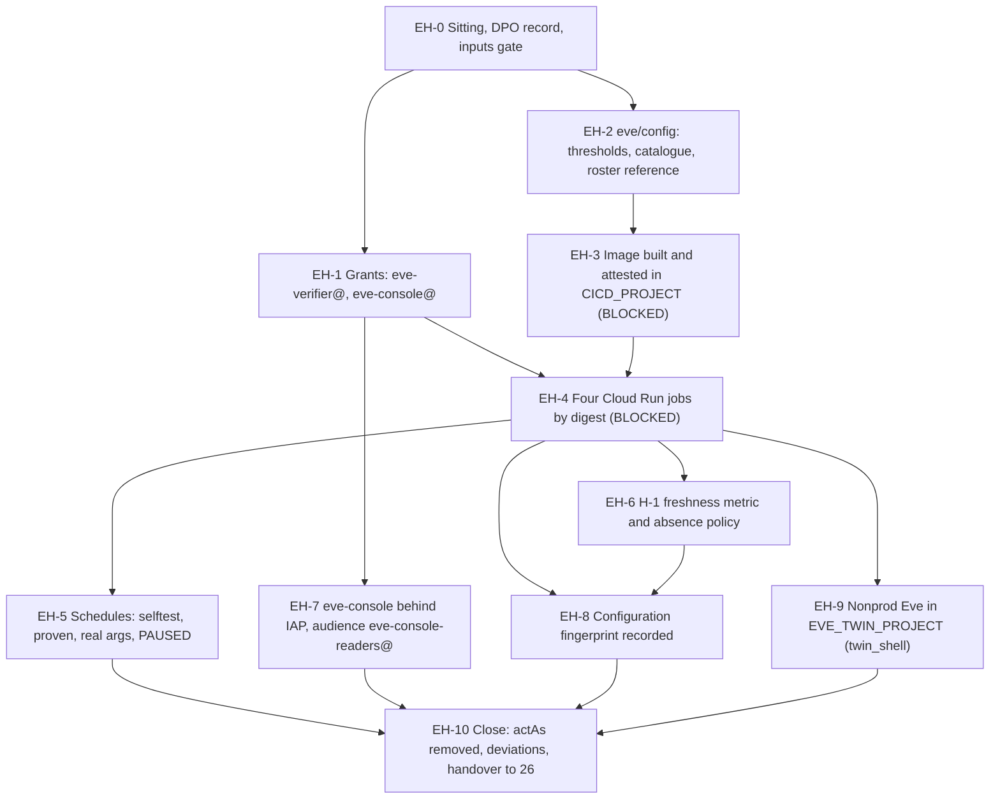

# 25. Eve: detection over the human super admins

## Status

- Owner: the platform owner
- Last reviewed: 2026-09-15
- Last executed: never
- Stage: review §2 stage 30 (Eve Phase 9's grants and Phase 10), re-cut to Eve-H part 3 (SD-10). Runs after 23 and 24, before 26. Gate lines G-4 and G-5 get their production half here; both are closed by the second human's proof in 28, never by this file.
- Step prefix: `EH`. Steps: 52. BLOCKED steps: EH-3.1, EH-3.2, EH-3.4, EH-4.1, EH-4.2, EH-4.3, EH-4.4, EH-4.5, EH-5.2, EH-5.3, EH-5.4, EH-5.5, EH-6.1, EH-6.4, EH-7.3, EH-7.4, EH-7.5, EH-8.2, EH-8.3, EH-9.0, EH-9.1, EH-9.2, EH-9.3, EH-9.4 — every step that needs Eve's code (README B-08) or Eve's committed configuration (B-09). EH-0.2 is BLOCKED while the DPO record of SD-11 does not exist (B-11), and it blocks the whole file: **no Eve job is deployed, and no poll by actor is scheduled, before that record exists.** Rules `SI-02`…`SI-07`, `SI-10` and `SI-11` are committed **BLOCKED inside EH-2.3** while the Cloud Audit Log view they read does not exist (B-12, owed by 14 CL-7.1/CL-7.2; see the precondition below). Steps that record `PENDING` rather than `BLOCKED`: EH-1.4 (the re-run of 14 CL-7.3), EH-4.6 (`halt_target_pending`, wired in 36), EH-6.2 (notification channels, made in 26), EH-4.0 (an Admin SDK quota increase, if the read shows one is needed).
- Replaces: Phase 9's grant half and Phase 10 of [../../eve/07-build-runbook.md](../../eve/07-build-runbook.md), and the Phase 5 absence alert. That page is not executed.
- Salvaged: Phase 10's job-and-scheduler shape (one Cloud Run job per pass, Cloud Scheduler with an **OAuth** token to `run.googleapis.com`, container overrides carrying the entrypoint argument, off-the-hour minutes) with the S033 and S136 corrections; Phase 10's `eve-console` IAP sequence with the S034 and S198 corrections; Phase 5's argument that the alarm must be an **absence** alarm, rewritten onto the data (S132); Phase 10b step 1's Reports-poll-by-actor intent and its application list.
- Not copied: `gcloud builds submit` with no source path (S030); `gcloud services identity create` on the GA track (S034); `bq update --transfer_config --disable_auto_scheduling` (S133); the verify that runs `gcloud run jobs execute` as the owner (S033); the standing `roles/iam.serviceAccountUser` for the human on Eve's accounts (S143); `--max-retries=1` with a schedule-time idempotency key the container never receives (S136); the `${OPERATORS}` group as the console's IAP audience (S198); a log-based metric over every `bigquery_dts_config` entry (S132).
- Applies decisions (signed in 03 before the step that needs them): SD-01, SD-10, SD-11, SD-12, SD-43, SD-44, SD-45, SD-47, SD-48, NAMES.
- Closes: S029 (Eve-H's half), S030, S032, S033, S034, S132, S133, S136, S143, S198. Defers none without an owner (§13).
- Consumes: `EVE_PROJECT`, `EVE_PROJECT_NUMBER`, `EVE_DS`, `EVE_WS_LOGS_DS`, `EVE_WS_REPORTS_DS`, `EVE_EVIDENCE_BUCKET`, `EVE_KEYRING`, `EVE_KEYRING_EU`, `ENT_PROJECT_REPAIR_EVE`, `ENT_DEPLOY_CREDENTIAL_HOLDER_EVE`, `EVE_TWIN_PROJECT`, `EVE_TWIN_PROJECT_NUMBER` (23); `SA_EVE_VERIFIER`, `EVE_ROBOT`, `EVE_ROLE_NAME`, `EVE_SINK`, `EVE_OAUTH_CLIENT_SECRET_NAME`, `EVE_REFRESH_TOKEN_SECRET_NAME`, `EVE_TOKEN_VERSION`, `EVE_TWIN_ROBOT`, `EVE_TWIN_TOKEN_VERSION`, `EVE_TWIN_SINK` (24); `ROSTER_FILE`, `CONTROL_GROUPS_FILE`, `GRP_EVE_OWNERS` (06); `AR_PLATFORM`, `SA_CI_BUILD`, `CICD_PROJECT` (10); `BINAUTHZ_ATTESTOR`, `KEY_BINAUTHZ` (11); `PLATFORM_LOGS_VIEWS_DS`, `LOGGING_PROJECT` (14); `ONCALL_FILE` and the `agp_roster_humans` list shape (15); `BUSINESS_TZ`, `SECOND_HUMAN_EMAIL`, `DPO_CONTACT`, the SD-11 DPO record (03).
- Produces: `SA_EVE_CONSOLE`, `EVE_CONFIG_REPO`, `EVE_RECONCILER_IMAGE`, `EVE_JOB_REPORTS_POLL`, `EVE_JOB_ROSTER`, `EVE_JOB_DETECT`, `EVE_JOB_HEARTBEAT`, `EVE_CONSOLE_URL`, `GRP_EVE_CONSOLE_READERS`, `EVE_CODE_COMMIT`.
- Commands checked against Google's documentation on 2026-09-15 and 2026-09-16 (§15). What could not be settled is listed in §14.

## What this part builds

Eve's detection over the **human** super admins: the machinery that watches every person who
holds tenant-wide privilege, including the person who installs it. Wall-E does not exist yet
and is not needed by anything here (SD-10).

1. **The grants Eve's own identities never had** (§1). The review found that no step gave
   `eve-verifier@` a write on the `eve` dataset, a read on `eve_workspace_logs`,
   `eve_workspace_reports` or `platform_logs_views`, or a read of the ladder prefix; and that
   `eve-console@` had no identity at all (S032). This file creates `eve-console@` and makes
   every one of those grants, through the SD-43 writer roles, with a read-back of each policy.
2. **`eve/config`, the committed configuration** (§2): `thresholds.yaml` with per-application
   lag budgets taken from Google's published lag times, the detection catalogue (the SIEM's
   `SA-01`…`SA-09` mirrored with **actor = any roster human**, `SA-10` over the data-export
   applications, plus Eve's eleven self-integrity rules `SI-01`…`SI-11`), the admin-method
   allow-list `SA-01` fires against, and the roster reference. Every rule carries the Admin SDK
   `eventName` set it matches, so the second human reviews a predicate and not a paragraph of
   English. Branch protection with the second human as required reviewer, and no write path
   from any Eve identity.
3. **The reconciler image** (§3), built from a **named source path** in `CICD_PROJECT`,
   attested with `BINAUTHZ_ATTESTOR`, deployed **by digest** with `--binary-authorization=default`.
   BLOCKED until Eve's code is committed at `EVE_CODE_COMMIT` with green CI.
4. **Four Cloud Run jobs** (§4): the Reports API poll over the union of the committed
   roster and the live admin-role holders — one call per **application** with `userKey=all`,
   not one per actor, so the pass stays inside the Reports API's 250-filter-queries-per-minute
   ceiling (EH-4.0); the roster check, hourly; the detection pass that evaluates the catalogue,
   on two cadences (`detect --fast` every five minutes for the severity-1 admin, login and
   token rules, hourly for the rest); and the heartbeat pass that computes data freshness (H-1)
   and checks Eve's own credential. Each job runs as `eve-verifier@`; each gets
   `roles/run.jobsExecutorWithOverrides` for the token identity the scheduler uses (S033).
5. **Four schedules, created, proven and then left PAUSED** (§5). Eve must never report to
   nobody: the first scheduled run happens in 26, after route 1 to the second human has been
   tested. The invocation path is proven here with a `selftest` argument and
   `gcloud scheduler jobs run`, never by the owner running the job by hand (S033). The
   standing `actAs` the old text left on the owner's account is time-boxed and removed, and a
   check proves no `user:` member holds it (S143).
6. **H-1 as an absence alarm on the data, not on the logs** (§6). A metric fed by the
   heartbeat pass's success line — a pass that fails writes error lines, and the old filter
   counted those too, so the alarm could never fire (S132). Pausing and resuming to observe
   the alarm is done with `gcloud scheduler jobs pause` and `resume`, never with a
   `bq update` flag that does not exist (S133).
7. **`eve-console` behind Identity-Aware Proxy** (§7), with the IAP service agent created on
   the **beta** track (S034) and a named audience group `eve-console-readers@` owned by
   `eve-owners@`, whose membership is a severity-1 rule (S198).
8. **The configuration fingerprint** (§8): sink filter, job specifications and image digests,
   scheduler states, `eve@`'s role privileges, the roster hash, the **notification channels**,
   the two secrets' version states and the project's lien list, hashed each run by a **committed
   script** and carried in the witness heartbeat (26), so that a quiet edit by the monitored
   administrator shows up outside the organisation he administers. The baseline is recomputed
   independently by the second human (EH-8.3) before it is recorded.
9. **Nonprod Eve** (§9) in `EVE_TWIN_PROJECT`, from the same digest, in a `twin_shell`, with
   nonprod channels and no witness contact.

Three corrections run through the whole file, because the person Eve watches is the person who
builds it (SD-12):

| Risk | What the old text did | What this file does |
|---|---|---|
| Eve runs before anyone outside the administration line can receive its reports | Phase 10 created five live schedules | Schedules are created, proven and **paused**; 26 resumes them after the route test and records `EVE_FIRST_RUN_RECORD` |
| A new, unrostered super admin is invisible until the roster file is edited | the poll covered "every super admin on the roster" | The poll retrieves each application with `userKey=all` and the roster check runs hourly, so an unrostered super admin's activity is retrieved from its first action and is matched by the `actors: any` rules at once; the `actors: watched` rules pick it up at the next hourly roster check, and that residual window is stated at EH-2.2 (EH-2.2, EH-4.1, EH-4.2) |
| The installer silences Eve quietly and the heartbeat keeps beating | nothing watched Eve's own configuration | `SI-01`…`SI-11` (severity 1, subject the actor) and the configuration fingerprint (§8), alarmed in the witness by 27 |

What the old text got wrong, and must not come back:

| Old text | Why it fails | Here instead |
|---|---|---|
| `gcloud builds submit --project="$EVE_PROJECT" --tag "${EVE_AR}/reconciler"` (S030) | No source path: the build context is whatever directory the operator stands in. `EVE_PROJECT` has neither `cloudbuild` nor `artifactregistry` (23) | EH-3.2: `gcloud builds submit "$EVE_REPO_DIR/reconciler" --config=… --region --service-account --project="$CICD_PROJECT"`, BLOCKED until `EVE_CODE_COMMIT` |
| No dataset role for `eve-verifier@` or `eve-console@`; no `jobUser` for the console (S032) | Every write and every read fails with Access Denied on the first pass | §1: the SD-43 writer role bound by condition on the three tables; `READER` in the access arrays; `jobUser` per identity; `objectViewer` on `ladder/` |
| Scheduler posts overrides with only `serviceAccountUser` granted (S033) | The token identity needs `run.jobs.runWithOverrides`; all five schedules would 403 | EH-4.5: `roles/run.jobsExecutorWithOverrides` per job for `eve-verifier@` |
| Verify 3 runs `gcloud run jobs execute --args=hourly` as the owner (S033) | Owner rights hide the missing scheduler grant | EH-5.4: `gcloud scheduler jobs run`, then `gcloud run jobs executions list` |
| `gcloud services identity create --service=iap.googleapis.com` (S034) | The command group is `beta` only; the GA reference is a 404 on 2026-09-15 | EH-7.2: `gcloud beta services identity create` |
| `gcloud logging metrics create eve_v0_transfer_runs --log-filter='resource.type="bigquery_dts_config"'` (S132) | Counts failure entries too, so a pass that fails hourly keeps the series alive while no row lands | §6: a metric on the heartbeat pass's **success** line plus a freshness finding; the absence policy guards the data |
| `bq update --transfer_config --disable_auto_scheduling` to observe the alarm (S133) | The flag does not exist; the alarm is never seen to fire | EH-6.4: `gcloud scheduler jobs pause` and `resume`; the REST `PATCH ?updateMask=disabled` form is recorded for the transfer configs 29 creates |
| "The idempotency key is the job name plus the `X-CloudScheduler-ScheduleTime` header"; `--max-retries=1` (S136) | The header reaches `run.googleapis.com`, not the container; a retried task double-writes | EH-4.x: the key is `CLOUD_RUN_EXECUTION` + the pass window; writes are `MERGE`; `--max-retries=0` on every pass that pages |
| `add-iam-policy-binding … --member="user:$(gcloud config get-value account)" --role=roles/iam.serviceAccountUser`, never removed (S143) | The monitored administrator keeps standing `actAs` on Eve's identities | EH-5.1 under PAM (or a two-hour conditional binding), EH-5.5 removes it and proves no `user:` member holds `actAs` or token creator |
| `--member="group:${OPERATORS}"` on the console's IAP binding (S198) | The audience is a group Wall-E's owner line administers | EH-7.1: `eve-console-readers@`, owned by `eve-owners@`, in `CONTROL_GROUPS_FILE`, covered by `SA-09` |
| Twelve BigQuery scheduled queries, `thresholds.yaml` "stubbed", a metric reading Firestore (S029) | None of the files existed; BigQuery cannot read Firestore; the admin-event source did not exist before the sink | Eve-H has **no** scheduled query: every pass is a Cloud Run job over `eve_workspace_logs` and `eve_workspace_reports`, which 24 created; EH-0.3 refuses any committed rule naming Firestore or `walle_audit` |



## Preconditions

- [ ] 23 complete: `EVE_PROJECT` built by FM-VERIFIER with its deny entries and budget; `EVE_DS`, `EVE_WS_LOGS_DS`, `EVE_WS_REPORTS_DS`, `EVE_QUALITY_DS` created with CMEK from `EVE_EVIDENCE_KEY_EU`; the SD-43 writer custom roles created; `EVE_EVIDENCE_BUCKET` locked with the `ladder/` grant made before the lock; `ENT_PROJECT_REPAIR_EVE` and `ENT_DEPLOY_CREDENTIAL_HOLDER_EVE` `AVAILABLE` with the second human as approver.
- [ ] 24 complete: `EVE_SINK` writing the six streams into `EVE_WS_LOGS_DS`; `eve@` in the service-identity OU with `EVE_ROLE_NAME` and **no** Super Admin (G-3 recorded); the two regional secrets with `EVE_TOKEN_VERSION` pinned; `SA_EVE_VERIFIER` created keyless; `EVE_TWIN_ROBOT` and `EVE_TWIN_TOKEN_VERSION` set; `ROSTER_FILE` updated with `eve@` and merged.
- [ ] 06: `ROSTER_FILE` and `CONTROL_GROUPS_FILE` merged; `GRP_EVE_OWNERS` exists and is **owned by the second human**.
- [ ] 10: `AR_PLATFORM`, `SA_CI_BUILD`, `CICD_PROJECT`, `CICD_PROJECT_NUMBER`.
- [ ] 11: `BINAUTHZ_ATTESTOR` and `KEY_BINAUTHZ`, with `SA_CI_BUILD` holding `roles/cloudkms.signer` on the attestor key and `attacher` on its note (KV-5.5).
- [ ] 14: `PLATFORM_LOGS_VIEWS_DS` with the authorised view `walle_workspace_logs`; the CL-7.3 `PENDING` line for `eve-verifier@` in `rerun-index.tsv`.
- [ ] **14, a second authorised view `platform_logs_views.eve_self_integrity`** over `platform_logs`, selecting the organisation-level and `EVE_PROJECT` entries whose `protopayload_auditlog.serviceName` is one of `logging.googleapis.com`, `cloudresourcemanager.googleapis.com`, `run.googleapis.com`, `cloudscheduler.googleapis.com`, `bigquery.googleapis.com`, `storage.googleapis.com`, `cloudkms.googleapis.com`, `secretmanager.googleapis.com`, `iam.googleapis.com`, with **no actor exclusion**, authorised on `platform_logs` with the CL-7.2 pattern. It does not exist: 14 CL-7.1 creates one view only, filtered to `admin.googleapis.com`. Without it `SI-02`…`SI-07`, `SI-10` and `SI-11` have no readable source and are committed BLOCKED at EH-2.3 (README B-12, owner the platform owner as the owner of `LOGGING_PROJECT`, to be added to 14 before 14 is executed). EH-1.4 checks for it and records the gap; **it is not created here**, because `LOGGING_PROJECT`'s view set is 14's to own.
- [ ] 15 part A: `ONCALL_FILE` merged and the subject-report escalation named. Part B may be BLOCKED (B-06); nothing here waits on it. When part B exists, EH-2.3 and PS-8.1's `agp_roster_humans` are generated from the same `ROSTER_FILE` and compared.
- [ ] 03 signed: NAMES, SD-01, SD-10, SD-11, SD-12, SD-43, SD-44, SD-45, SD-47, SD-48; `SECOND_HUMAN_EMAIL`, `DPO_CONTACT`, `BUSINESS_TZ` set (or `BUSINESS_TZ` `*tbd*`, which EH-5.2 handles).
- [ ] **The SD-11 DPO record** covering the monitoring of named administrator accounts (README B-11). Without it EH-0.2 stops the file. It is the only precondition that is a document rather than a resource.
- [ ] Eve's code at `EVE_CODE_COMMIT` with green CI (B-08) and Eve's configuration inputs (B-09). Absent, §3 to §9 are written and BLOCKED; §1 and §2 still run.
- [ ] Workstation of 01: gcloud with `alpha` and `beta`, `bq`, `jq`, `python3.12`, `git`, `gh`; `~/.platform-env` sourced; `penv_guard` silent.
- [ ] **Not** a precondition: anything from 22 (Mo), or from any Wall-E file. Eve-H does not wait on them and they do not wait on it (SD-45).

## People needed

| Role | Does | Present at |
|---|---|---|
| Platform owner (`sa-1-admin@`) | Performs every shell step, under `ENT_PROJECT_REPAIR_EVE` or `ENT_DEPLOY_CREDENTIAL_HOLDER_EVE` where the step says so. He is a **subject** of what he builds; that is why every elevation is approved by another person and ends inside the sitting | every step |
| Second human (`SECOND_HUMAN_EMAIL`, `sa-2-admin@`) | Approves every PAM grant on `EVE_PROJECT`; is the required reviewer on **every** `eve/config` merge; owns `eve-owners@` and therefore `eve-console-readers@`; confirms that EH-5.5's removal happened | EH-0.1, EH-2.1, EH-2.5, EH-3.1, EH-4.x, EH-5.1, EH-5.5, EH-7.1, EH-10.1 |
| DPO (`DPO_CONTACT`) | Holds the SD-11 record; confirms the purpose, the data classes, the retention and the recipients before any poll by actor is scheduled | EH-0.2 |
| Eve owner (the platform owner until 03 names another person) | Writes `thresholds.yaml`, the detection catalogue, the roster reference and the code; owns B-08 and B-09 | EH-2.2 to EH-2.4, §3 |
| Second operator (`SECOND_OPERATOR_EMAIL`) | Second reviewer on the `eve/config` pull requests when the second human is the author | EH-2.2 to EH-2.5 |
| Sandbox super admin | Nothing in this file: nonprod Eve's twin identity and sink were made in 21 and 24. §9 only deploys from a `twin_shell` | — |

Hands-on: about 3 days once the code exists. Elapsed: about 2 weeks (the DPO record, the config
reviews, the 24-hour freshness observation of EH-6.4). §3 to §9 wait on B-08 and B-09 with no
fixed date.

Conventions of [01](01-prerequisites-and-conventions.md) apply. Deviation rows are `BD-25-<n>`.
Records go to `BUILD_LOG_DIR/records/` as `<date>-EH-<step>-<slug>-v<n>`. Every shell block
starts with:

```bash
source ~/.platform-env
penv_guard
R="$BUILD_LOG_DIR/records/$(date -u +%F)-EH"
```

## 0. The sitting, the legal gate and the inputs gate

### EH-0.1 Open the sitting and check every input

- **WHO:** Platform owner; the second human is present for the whole sitting (SD-12: no elevation on `EVE_PROJECT` happens without another person).
- **WHERE:** Shell, `~/.platform-env` sourced, gcloud configuration `GCLOUD_CONFIG_NAME`, signed in as `sa-1-admin@`.
- **ACTION:**

```bash
checkpoint EH-0.1 START
need ORG_ID DOMAIN DIRECTORY_CUSTOMER_ID REGION BQ_LOCATION PLATFORM_REPO_DIR BUILD_LOG_DIR DEVIATION_REGISTER EVIDENCE_REGISTER DRILL_CALENDAR
need EVE_PROJECT EVE_PROJECT_NUMBER EVE_DS EVE_WS_LOGS_DS EVE_WS_REPORTS_DS EVE_QUALITY_DS EVE_EVIDENCE_BUCKET EVE_TWIN_PROJECT EVE_TWIN_PROJECT_NUMBER
need SA_EVE_VERIFIER EVE_ROBOT EVE_ROLE_NAME EVE_SINK EVE_OAUTH_CLIENT_SECRET_NAME EVE_REFRESH_TOKEN_SECRET_NAME EVE_TOKEN_VERSION EVE_TWIN_ROBOT EVE_TWIN_TOKEN_VERSION
need ENT_PROJECT_REPAIR_EVE ENT_DEPLOY_CREDENTIAL_HOLDER_EVE ROSTER_FILE CONTROL_GROUPS_FILE GRP_EVE_OWNERS AR_PLATFORM SA_CI_BUILD CICD_PROJECT CICD_PROJECT_NUMBER BINAUTHZ_ATTESTOR KEY_BINAUTHZ LOGGING_PROJECT PLATFORM_LOGS_VIEWS_DS ONCALL_FILE SECOND_HUMAN_EMAIL DPO_CONTACT
"$PLATFORM_REPO_DIR/tools/decision-need.sh" NAMES SD-01 SD-10 SD-11 SD-12 SD-43 SD-44 SD-45 SD-47 SD-48
awk -F'\t' '$2 ~ /^(EP-|EW-)/ {s[$2]=$3} END {for (k in s) print k"\t"s[k]}' "$BUILD_LOG_DIR/checkpoints.tsv" | sort -V | tail -n 20
gcloud services list --enabled --project="$EVE_PROJECT" --format="value(config.name)" | sort > "${R}-0.1-services.txt"
for S in run.googleapis.com cloudscheduler.googleapis.com iap.googleapis.com binaryauthorization.googleapis.com secretmanager.googleapis.com monitoring.googleapis.com logging.googleapis.com bigquery.googleapis.com admin.googleapis.com; do grep -qx "$S" "${R}-0.1-services.txt" && echo "ok $S" || echo "MISSING $S"; done
for S in cloudbuild.googleapis.com artifactregistry.googleapis.com aiplatform.googleapis.com firestore.googleapis.com; do grep -qx "$S" "${R}-0.1-services.txt" && echo "FORBIDDEN PRESENT $S" || echo "absent $S"; done
gcloud container binauthz policy export --project="$EVE_PROJECT" --format=yaml > "${R}-0.1-binauthz-policy.yaml"
grep -q "$(basename "$BINAUTHZ_ATTESTOR")" "${R}-0.1-binauthz-policy.yaml" && echo "attestor named in EVE_PROJECT policy" || echo "ATTESTOR NOT NAMED: see EH-0.4"
test -z "$(gcloud config get project 2>/dev/null)" && echo "no default project"
```

- **VERIFY:** `decision-need.sh` prints `SIGNED` for each id; every `EP-` and `EW-` step of 23 and 24 shows `DONE` (or `BLOCKED` only for 23's table steps on B-07, which §1 does not need); nine `ok` lines and four `absent` lines; the attestor is named in `EVE_PROJECT`'s Binary Authorization policy; `no default project`. Any `MISSING`, any `FORBIDDEN PRESENT`, or a missing 23/24 step: stop and finish the earlier file. A missing service is repaired in EH-0.4, not by enabling it here.
- **ROLLBACK:** Read only.
- **EVIDENCE:** The three outputs as `${R}-0.1-inputs-v1`, `evidence_add EH-0.1 inputs E-05 1.4.1 build-log:records/<file> <file>`. E-05. TISAX 1.4.1.

### EH-0.2 The SD-11 gate: the DPO record for monitoring named administrators

- **WHO:** Platform owner reads; the DPO holds the record; the second human confirms it covers the second human's own account as well.
- **WHERE:** `PLATFORM_REPO_DIR/decisions/`; the DPO's records of processing.
- **ACTION:** Eve-H processes the activity metadata of **named human administrators** from its first run. No page of the design records a legal basis for that, which is why SD-11 makes this file conditional on a record that does (README B-11). The record must name, at minimum:

| Field | Value this file needs |
|---|---|
| Purpose | Detection of misuse of tenant-wide privilege; evidence for the EU AI Act technical documentation and the TISAX evidence pack |
| Data | Admin, login, token, SAML, groups, user-accounts, rules, context-aware-access, Drive, Vault, Takeout, Data Studio and Access Transparency **activity metadata**; actor, time, method, target, result. **No content of any kind** |
| Subjects | Every account in `ROSTER_FILE` (`human_super_admin`, `delegated_admin`, `break_glass_cloud`) and every live admin-role holder the roster check finds |
| Retention | `eve_workspace_logs` and `eve_workspace_reports` 400 days; the locked bucket and the witness copy per R11/R13 |
| Recipients | The second human; the security reviewer or, until appointed, the incident commander; the two witness administrators. **Never** the subject's own management line where the subject is the platform owner (SD-10's sole-recipient rule) |
| Worker information | The date the information pack was given, and the works-council step of 03 |

```bash
if "$PLATFORM_REPO_DIR/tools/decision-need.sh" SD-11-DPO >/dev/null 2>&1; then
  "$PLATFORM_REPO_DIR/tools/decision-value.sh" SD-11-DPO record_path
  echo "DPO RECORD PRESENT"
else
  checkpoint EH-0.2 BLOCKED - - "SD-11 DPO record, README B-11"
  echo "BLOCKED: no poll by actor is scheduled until the DPO record exists"
fi
```

- **VERIFY:** `DPO RECORD PRESENT` and the six rows above present in the named record, read aloud by the platform owner and confirmed in writing by the DPO and the second human. Otherwise the checkpoint is `BLOCKED` and **§3 to §9 do not run**: §1 and §2 may proceed, because a grant and a committed file process nobody's data.
- **ROLLBACK:** Read only.
- **EVIDENCE:** The record path and the two confirmations as `${R}-0.2-dpo-record-v1`. E-12 (worker information), E-01. TISAX 7.1.1.
- *Assumption:* the decision id is `SD-11-DPO` in `decisions/`. If 03 filed it under another id, substitute it here and in EH-10.2's handover line.

### EH-0.3 The inputs gate: Eve's code and Eve's configuration

- **WHO:** Eve owner declares; the second operator reviews the list; the second human signs the review record.
- **WHERE:** Shell; the Eve repository (`EVE_REPO_DIR`, a local path only — it is not a `~/.platform-env` value).
- **ACTION:** Nothing in §3 to §9 can be executed from a specification. The gate names what must exist, counts it, and writes either `EVE_CODE_COMMIT` or a `BLOCKED` line for README B-08 and B-09.

What Eve's repository must carry at one commit with green CI:

| Path | What it is | Used by |
|---|---|---|
| `reconciler/Dockerfile`, `reconciler/cloudbuild.yaml` | the image, with a final attestation step following `ci/BUILD-CONTRACT.md` | EH-3.2 |
| `reconciler/entrypoints/reports_poll.py` | `activities.list` by actor and application into `eve_workspace_reports`, paging with `pageToken`, `MERGE` on the idempotency key | EH-4.1 |
| `reconciler/entrypoints/roster_check.py` | `roleAssignments.list`, `users.list` with `isAdmin`, the Reports-privilege holders; the diff in both directions | EH-4.2 |
| `reconciler/entrypoints/detect.py` | evaluates `detections.yaml` over `eve_workspace_logs` and `eve_workspace_reports`; writes `eve.findings`; records `halt_target_pending` | EH-4.3 |
| `reconciler/entrypoints/heartbeat.py` | H-1 freshness per stream and per application against `thresholds.yaml`; Eve's credential check; the configuration fingerprint | EH-4.4, EH-6.1, EH-8.2 |
| `reconciler/entrypoints/selftest.py` | reads nothing, writes one build-log line, sends no page, makes no Reports call | EH-5.3 |
| `console/Dockerfile`, `console/cloudbuild.yaml` | the read-only console | EH-7.3 |
| `ci/deny_model_deps.py`, `ci/assert_no_model_import.py`, `ci/callgraph_sign.py`, `ci/golden_replay.py`, `ci/assert_no_aiplatform_iam.py` | the five gates that must pass before the image is admitted | EH-3.1 |
| `tests/fixtures/detections/` | one fixture per catalogue rule, positive and negative | EH-2.3 |

```bash
EVE_REPO_DIR="${EVE_REPO_DIR:?set EVE_REPO_DIR to the local clone; it is not a platform-env value}"
git -C "$EVE_REPO_DIR" fetch --all --tags && git -C "$EVE_REPO_DIR" switch main && git -C "$EVE_REPO_DIR" pull --ff-only
MISS=0
for F in reconciler/Dockerfile reconciler/cloudbuild.yaml reconciler/entrypoints/reports_poll.py reconciler/entrypoints/roster_check.py reconciler/entrypoints/detect.py reconciler/entrypoints/heartbeat.py reconciler/entrypoints/selftest.py console/Dockerfile console/cloudbuild.yaml ci/deny_model_deps.py ci/assert_no_model_import.py ci/callgraph_sign.py ci/golden_replay.py ci/assert_no_aiplatform_iam.py; do
  test -f "$EVE_REPO_DIR/$F" || { echo "MISSING $F"; MISS=1; }
done
grep -RIl --include='*.py' -E 'firestore|datastore|walle_audit' "$EVE_REPO_DIR/reconciler" && { echo "REFUSED: an Eve-H entrypoint names Firestore or walle_audit (S029); neither is readable before 36"; MISS=1; }
if [ "$MISS" -eq 0 ]; then
  gh run list --repo "$(git -C "$EVE_REPO_DIR" remote get-url origin | sed -E 's#.*[:/]([^/]+/[^/]+)(\.git)?$#\1#')" --branch main --limit 1 --json conclusion,headSha --jq '.[0]'
  penv_set EVE_CODE_COMMIT "$(git -C "$EVE_REPO_DIR" rev-parse HEAD)"
else
  checkpoint EH-0.3 BLOCKED - - "Eve code and CI, README B-08"
fi
```

- **VERIFY:** No `MISSING` line; no `REFUSED` line; the last CI run on `main` has `conclusion: success` and its `headSha` equals `EVE_CODE_COMMIT`; the second operator signs a one-page review record naming the commit and the fourteen paths. Otherwise `EVE_CODE_COMMIT` stays `*tbd*` and every step of §3 to §9 records `BLOCKED` against B-08.
- **ROLLBACK:** None: the gate writes a variable or a checkpoint.
- **EVIDENCE:** The listing, the CI result and the review record as `${R}-0.3-inputs-gate-v1`. E-05, E-15. TISAX 5.2.1.

### EH-0.4 Repair a missing service or Binary Authorization policy entry — only if EH-0.1 found one

- **WHO:** Platform owner under `ENT_PROJECT_REPAIR_EVE` (approver the second human).
- **WHERE:** Shell; `EVE_PROJECT`.
- **ACTION:** 23's FM-VERIFIER run is the authority on `EVE_PROJECT`'s service list. A service missing here is a defect in that run, not a decision to take now. Repair it under the entitlement and write the deviation, so the zero-diff checker sees it.

```bash
need EVE_PROJECT ENT_PROJECT_REPAIR_EVE CICD_PROJECT
gcloud pam grants create --entitlement="$ENT_PROJECT_REPAIR_EVE" --requested-duration=3600s --justification="setup 25 EH-0.4: service or Binary Authorization policy repair on EVE_PROJECT" --location=global --project="$EVE_PROJECT" --billing-project="$CICD_PROJECT"
gcloud services enable <the missing service> --project="$EVE_PROJECT"
gcloud container binauthz policy import "$PLATFORM_REPO_DIR/factory/expected/eve-binauthz-policy.yaml" --project="$EVE_PROJECT"
```

  The policy file is 17's module output for a controllers project: `defaultAdmissionRule` with
  `REQUIRE_ATTESTATION`, `enforcementMode: ENFORCED_BLOCK_AND_AUDIT_LOG`, and
  `requireAttestationsBy: [BINAUTHZ_ATTESTOR]`. Do not compose it here.
- **VERIFY:** `gcloud services list --enabled --project="$EVE_PROJECT" --format="value(config.name)" | sort` now matches 17's expected list exactly (`comm -3`); `gcloud container binauthz policy export --project="$EVE_PROJECT"` names the attestor and `ENFORCED_BLOCK_AND_AUDIT_LOG`; the grant is revoked at the end of the step.
- **ROLLBACK:** `gcloud services disable <service> --project="$EVE_PROJECT"` and re-import the saved policy; both only before any deploy.
- **EVIDENCE:** Both outputs and a `BD-25-1` row in `DEVIATION_REGISTER` ("service or policy missing from 23's FM-VERIFIER run, repaired by hand; owner platform owner; closed by re-running the module"). E-05. TISAX 5.2.1, 1.4.1.

## 1. The grants Eve's identities never had (closes S032)

The review found that the old runbook granted `secretAccessor` and `bigquery.jobUser` and
nothing else: no write on `eve`, no read on the two Workspace datasets, none on
`platform_logs_views`, no read of `ladder/`, and no identity at all for the console. Every
grant below is made in `EVE_PROJECT` except EH-1.4, which is a re-run of a step 14 owns.

### EH-1.1 Create `eve-console@`

- **WHO:** Platform owner under `ENT_PROJECT_REPAIR_EVE` (approver the second human).
- **WHERE:** Shell; `EVE_PROJECT`.
- **ACTION:**

```bash
need EVE_PROJECT CICD_PROJECT ENT_PROJECT_REPAIR_EVE
gcloud pam grants create --entitlement="$ENT_PROJECT_REPAIR_EVE" --requested-duration=7200s --justification="setup 25 section 1: Eve runtime grants" --location=global --project="$EVE_PROJECT" --billing-project="$CICD_PROJECT"
gcloud iam service-accounts create eve-console --project="$EVE_PROJECT" --display-name="Eve console: read-only human surface behind IAP" --description="Reads eve and eve_quality; writes only eve.grades_blind. Never a control path (setup 25 EH-1.1)"
penv_set SA_EVE_CONSOLE "eve-console@${EVE_PROJECT}.iam.gserviceaccount.com"
gcloud iam service-accounts keys list --iam-account="$SA_EVE_CONSOLE" --project="$EVE_PROJECT" --managed-by=user --format="value(name)"
```

- **VERIFY:** The account exists; the user-managed key list is **empty** (keyless, as 13's `disableServiceAccountKeyCreation` requires); `penv_set` prints `set SA_EVE_CONSOLE`.
- **ROLLBACK:** `gcloud iam service-accounts delete "$SA_EVE_CONSOLE" --project="$EVE_PROJECT"` before any binding names it. A deleted account's address cannot be reused safely for 30 days; record the date if this is used.
- **EVIDENCE:** Both outputs as `${R}-1.1-eve-console-sa-v1`. E-08. TISAX 4.1.1.

### EH-1.2 Bind the SD-43 writer roles, by condition, on the three tables Eve writes

- **WHO:** Platform owner, inside EH-1.1's grant; the second human reads the condition aloud before it is applied.
- **WHERE:** Shell; `EVE_PROJECT`.
- **ACTION:** BigQuery has no insert-only permission: `bigquery.tables.updateData`, which every write needs, also permits DML `DELETE` and `UPDATE` (SD-43). 23 created custom roles that hold `updateData` **without** `tables.delete`, `tables.update`, `tables.setIamPolicy` or `datasets.update`. Here they are bound at project level with an IAM **condition** naming exactly the tables Eve writes, which BigQuery documents as a supported form for `bigquery.googleapis.com/Table` and `bigquery.googleapis.com/Dataset` resources.

```bash
need EVE_PROJECT EVE_DS SA_EVE_VERIFIER SA_EVE_CONSOLE
ROLE_EVE_WRITER="projects/${EVE_PROJECT}/roles/eveTableWriter"      # Assumption: 23's role id; EH-1.2 fails loudly if it is another
ROLE_EVE_GRADER="projects/${EVE_PROJECT}/roles/eveGradesWriter"     # Assumption: likewise
gcloud iam roles describe eveTableWriter --project="$EVE_PROJECT" --format="value(includedPermissions)" | tr ',' '\n' | sort
gcloud iam roles describe eveGradesWriter --project="$EVE_PROJECT" --format="value(includedPermissions)" | tr ',' '\n' | sort
WRITE_TABLES='resource.type == "bigquery.googleapis.com/Table" && (resource.name == "projects/'"$EVE_PROJECT"'/datasets/'"$EVE_DS"'/tables/findings" || resource.name == "projects/'"$EVE_PROJECT"'/datasets/'"$EVE_DS"'/tables/incidents" || resource.name == "projects/'"$EVE_PROJECT"'/datasets/'"$EVE_DS"'/tables/pages")'
gcloud projects add-iam-policy-binding "$EVE_PROJECT" --member="serviceAccount:${SA_EVE_VERIFIER}" --role="$ROLE_EVE_WRITER" --condition="expression=${WRITE_TABLES},title=eve-writer-three-tables,description=SD-43 append path for the reconciler (setup 25 EH-1.2)"
GRADES='resource.type == "bigquery.googleapis.com/Table" && resource.name == "projects/'"$EVE_PROJECT"'/datasets/'"$EVE_DS"'/tables/grades_blind"'
gcloud projects add-iam-policy-binding "$EVE_PROJECT" --member="serviceAccount:${SA_EVE_CONSOLE}" --role="$ROLE_EVE_GRADER" --condition="expression=${GRADES},title=eve-console-grades-only,description=the console writes grades_blind and nothing else (setup 25 EH-1.2)"
```

  The reconciler also writes `eve_workspace_reports.*`; that dataset's writes go through the
  dataset access entry of EH-1.3, because the sink-fed and poll-fed tables are created by the
  job itself and a table-name condition would refuse a new day's table.
- **VERIFY:**

```bash
gcloud projects get-iam-policy "$EVE_PROJECT" --format=json | jq -r '.bindings[] | select(.role|test("eveTableWriter|eveGradesWriter")) | [.role, (.members|join(",")), .condition.title] | @tsv'
gcloud policy-intelligence troubleshoot-policy iam --principal-email="$SA_EVE_VERIFIER" --resource-name="//bigquery.googleapis.com/projects/${EVE_PROJECT}/datasets/${EVE_DS}/tables/findings" --permission=bigquery.tables.updateData --format="value(access)"
gcloud policy-intelligence troubleshoot-policy iam --principal-email="$SA_EVE_VERIFIER" --resource-name="//bigquery.googleapis.com/projects/${EVE_PROJECT}/datasets/${EVE_DS}/tables/verdicts" --permission=bigquery.tables.updateData --format="value(access)"
```

  Two bindings with their condition titles; neither custom role's permission list contains
  `bigquery.tables.delete`, `bigquery.tables.update`, `bigquery.tables.setIamPolicy` or
  `bigquery.datasets.update`. If `gcloud iam roles describe` fails because 23 used
  other role ids, stop and substitute them — do **not** create a role here.

  **The four access states.** Policy Troubleshooter returns one of `GRANTED`, `NOT_GRANTED`,
  `UNKNOWN_CONDITIONAL` and an unknown-information state (`UNKNOWN_INFO_DENIED` in the v1 API,
  `UNKNOWN_INFO` in v3). `UNKNOWN_CONDITIONAL` means the binding grants the permission **only
  if a condition expression evaluates to true and the request carried no context to evaluate
  it** — which is exactly this call, since no request context is supplied. It is a documented,
  expected outcome, not a pass and not a stop:

  | Result pair | What to record |
  |---|---|
  | `GRANTED` then `NOT_GRANTED` | the condition is doing the work; record both outputs and continue |
  | either call `UNKNOWN_CONDITIONAL` or an unknown-information state | Policy Troubleshooter has not proven anything. Run the functional fallback below and record **which** proof was used |
  | `NOT_GRANTED` on `findings`, or `GRANTED` on `verdicts` | stop: the condition is wrong. Remove the binding by its title and re-apply |

  **The functional fallback**, run in `EVE_TWIN_PROJECT` under a twin shell if the second human
  prefers not to write to production tables, and otherwise in `EVE_PROJECT` with the row deleted
  by the same pass:

```bash
gcloud auth print-access-token --impersonate-service-account="$SA_EVE_VERIFIER" >/dev/null && echo "impersonation available under the section grant"
bq --project_id="$EVE_PROJECT" query --use_legacy_sql=false --impersonate_service_account="$SA_EVE_VERIFIER" \
  "INSERT INTO \`${EVE_PROJECT}.${EVE_DS}.findings\` (rule_id, subject, ts) VALUES ('iam-condition-proof','setup-25-EH-1.2', CURRENT_TIMESTAMP())" && echo "INSERT into findings SUCCEEDED (expected)"
bq --project_id="$EVE_PROJECT" query --use_legacy_sql=false --impersonate_service_account="$SA_EVE_VERIFIER" \
  "INSERT INTO \`${EVE_PROJECT}.${EVE_DS}.verdicts\` (rule_id, subject, ts) VALUES ('iam-condition-proof','setup-25-EH-1.2', CURRENT_TIMESTAMP())" && echo "FAIL: the write outside the condition succeeded" || echo "INSERT into verdicts REFUSED with Access Denied (expected)"
```

  The second line must succeed and the third must fail with `Access Denied`. The seeded row is
  removed by the second human, not by `eve-verifier@` — which cannot delete it, and that is the
  point of the role. If `eve.verdicts` does not exist yet (B-07), name any other table in
  `EVE_DS` that is outside the condition, and record which.
- **ROLLBACK:** `gcloud projects remove-iam-policy-binding "$EVE_PROJECT" --member=… --role=… --condition=<the same title>`. A conditional binding is removed by naming the condition; `--condition=None` removes the unconditioned one and is wrong here.
- **EVIDENCE:** The policy extract, both troubleshoot outputs, **a line naming which of the two proofs was used** (`troubleshooter` or `functional`) and, if the functional one, its two query results as `${R}-1.2-writer-roles-v1`. E-06, E-08. TISAX 4.2.1, 5.2.4.

### EH-1.3 Dataset access entries: the reads Eve makes and the writes the poll makes

- **WHO:** Platform owner, inside EH-1.1's grant.
- **WHERE:** Shell; `EVE_PROJECT`.
- **ACTION:** The access-array pattern of 01 §8.1 exactly: own `mktemp -d`, etag compared immediately before the write, read-back diffed. One helper, used four times, so a re-run cannot append a duplicate.

```bash
need EVE_PROJECT EVE_DS EVE_WS_LOGS_DS EVE_WS_REPORTS_DS EVE_QUALITY_DS SA_EVE_VERIFIER SA_EVE_CONSOLE
eve_ds_access () {   # $1 dataset, $2 role (READER|WRITER), $3 service account email
  W="$(mktemp -d)" || return 1
  bq --project_id="$EVE_PROJECT" show --format=prettyjson "${EVE_PROJECT}:$1" > "$W/before.json" || { echo "read failed for $1"; return 1; }
  jq --argjson add "[{\"role\":\"$2\",\"userByEmail\":\"$3\"}]" '.access = ((.access + $add) | unique)' "$W/before.json" > "$W/after.json" || return 1
  jq -S '.access | sort_by(tostring)' "$W/after.json" > "$W/expected.json"
  [ "$(bq --project_id="$EVE_PROJECT" show --format=prettyjson "${EVE_PROJECT}:$1" | jq -r .etag)" = "$(jq -r .etag "$W/before.json")" ] || { echo "STOP: $1 changed since it was read"; return 1; }
  bq --project_id="$EVE_PROJECT" update --source "$W/after.json" "${EVE_PROJECT}:$1" || return 1
  bq --project_id="$EVE_PROJECT" show --format=prettyjson "${EVE_PROJECT}:$1" | jq -S '.access | sort_by(tostring)' | diff "$W/expected.json" - && echo "ACCESS MATCHES $1 $2 $3"
  cp "$W/before.json" "${R}-1.3-$1-before.json"; rm -rf "$W"
}
eve_ds_access "$EVE_WS_LOGS_DS"    READER "$SA_EVE_VERIFIER"
eve_ds_access "$EVE_WS_REPORTS_DS" WRITER "$SA_EVE_VERIFIER"
eve_ds_access "$EVE_DS"            READER "$SA_EVE_CONSOLE"
eve_ds_access "$EVE_QUALITY_DS"    READER "$SA_EVE_CONSOLE"
```

  Why each: the reconciler reads the sink's copy (`eve_workspace_logs`) and writes the poll's
  copy (`eve_workspace_reports`), whose tables it creates day by day; the console reads `eve`
  and the quality views and writes only `grades_blind` through EH-1.2's conditioned role.
  `WRITER` on `eve_workspace_reports` is `dataEditor`, which can also delete rows; SD-43 accepts
  that limit for this dataset and detects it instead — `SI-07` (§2.3) raises severity 1 on any
  DML `DELETE` or `UPDATE` on an Eve table, and the witness heartbeat's cumulative counts alarm
  on any decrease (26, 27).
- **VERIFY:** Four `ACCESS MATCHES` lines. Then the anti-grants:

```bash
for DS in "$EVE_DS" "$EVE_WS_LOGS_DS" "$EVE_WS_REPORTS_DS"; do bq --project_id="$EVE_PROJECT" show --format=prettyjson "${EVE_PROJECT}:$DS" | jq -r --arg c "$SA_EVE_CONSOLE" '.access[] | select(.userByEmail == $c) | [$c, .role] | @tsv'; done
bq --project_id="$EVE_PROJECT" show --format=prettyjson "${EVE_PROJECT}:${EVE_DS}" | jq -r '.access[] | select(.role == "OWNER") | .userByEmail // .groupByEmail // .specialGroup'
```

  The console appears on `eve` as `READER` and on neither Workspace dataset; no human address
  holds `OWNER` on `eve` (23 left `projectOwners` only, and no user holds Owner on
  `EVE_PROJECT`).
- **ROLLBACK:** The same helper with `del(.access[] | select(.userByEmail == "<email>" and .role == "<role>"))`, then the read-back diff.
- **EVIDENCE:** The four `before.json` files and the read-backs as `${R}-1.3-dataset-access-v1`. E-06. TISAX 4.2.1.

### EH-1.4 Re-run 14 CL-7.3: `READER` on `platform_logs_views` for `eve-verifier@`

- **WHO:** Platform owner (the owner of `LOGGING_PROJECT`; the same performer, so this is a re-run, not a cross-owner request).
- **WHERE:** Shell; `LOGGING_PROJECT`.
- **ACTION:** 14 CL-7.3 recorded a `PENDING` line because `eve-verifier@` did not exist. It exists now (24). Topology row 40 gives the reconciler a dataset-level `READER` on `platform_logs_views`, never on `platform_logs`, and no log view.

```bash
need LOGGING_PROJECT PLATFORM_LOGS_VIEWS_DS PLATFORM_LOGS_DS SA_EVE_VERIFIER PLATFORM_REPO_DIR
exists_or_pending "serviceAccount:${SA_EVE_VERIFIER}" EH-1.4 "14 CL-7.3: READER on platform_logs_views for eve-verifier@ (row 40)" && "$PLATFORM_REPO_DIR/tools/grant-views-reader.sh" "$SA_EVE_VERIFIER"
bq --project_id="$LOGGING_PROJECT" show --format=prettyjson "${LOGGING_PROJECT}:${PLATFORM_LOGS_VIEWS_DS}" | jq -e -r --arg m "$SA_EVE_VERIFIER" '[.access[] | select(.userByEmail == $m)] | if length == 1 and .[0].role == "READER" then "ok READER on platform_logs_views" else error("FAIL: expected exactly one READER entry, got \(.)") end'
bq --project_id="$LOGGING_PROJECT" show --format=prettyjson "${LOGGING_PROJECT}:${PLATFORM_LOGS_DS}" | jq -e -r --arg m "$SA_EVE_VERIFIER" '[.access[] | select(.userByEmail == $m)] | if length == 0 then "ok nothing on platform_logs" else error("FAIL: eve-verifier@ holds \(.) on platform_logs") end'
bq --project_id="$LOGGING_PROJECT" ls --format=prettyjson "${LOGGING_PROJECT}:${PLATFORM_LOGS_VIEWS_DS}" | jq -r '.[].tableReference.tableId'
if bq --project_id="$LOGGING_PROJECT" show "${LOGGING_PROJECT}:${PLATFORM_LOGS_VIEWS_DS}.eve_self_integrity" >/dev/null 2>&1; then
  bq --project_id="$LOGGING_PROJECT" query --use_legacy_sql=false --format=prettyjson \
    "SELECT COUNT(*) AS n FROM \`${LOGGING_PROJECT}.${PLATFORM_LOGS_VIEWS_DS}.eve_self_integrity\` WHERE protopayload_auditlog.methodName LIKE '%SetIamPolicy' AND timestamp > TIMESTAMP_SUB(CURRENT_TIMESTAMP(), INTERVAL 30 DAY)"
  echo "eve_self_integrity present"
else
  exists_or_pending --pending "view ${PLATFORM_LOGS_VIEWS_DS}.eve_self_integrity (file 14 CL-7.1/CL-7.2)" EH-1.4 "14: create the Cloud Audit Log self-integrity view, authorise it on platform_logs, grant eve-verifier@ READER on it, then unblock SI-02..SI-07, SI-10 and SI-11 at EH-2.3 (README B-12)"
  echo "BLOCKED: no self-integrity source; SI-02..SI-07, SI-10 and SI-11 stay BLOCKED in the catalogue"
fi
```

  `tools/grant-views-reader.sh` is 14 CL-7.3's committed helper; it is not retyped here.

  **Why the second view matters here.** `platform_logs_views` today holds one authorised view,
  14 CL-7.1's `walle_workspace_logs`, whose SQL filters
  `protopayload_auditlog.serviceName = "admin.googleapis.com"` — Workspace Admin events only. The
  six self-integrity rules that watch Eve's own plumbing (`SI-02` sinks, `SI-03` project IAM,
  `SI-04` jobs and schedulers, `SI-05` datasets and buckets, `SI-06` KMS, `SI-07` BigQuery DML)
  and the two added by this revision (`SI-10` Secret Manager, `SI-11` liens and project
  lifecycle) read Cloud Audit Logs from **other** services, which that view does not carry and
  which `eve-verifier@` may not read directly — it holds `READER` on the views dataset and
  nothing on `platform_logs`, and EH-1.7 proves it holds nothing else anywhere. The monitored
  administrator's six cheapest silencing moves are therefore undetectable until 14 creates
  `eve_self_integrity`. This step does not create it: creating a view over `platform_logs`
  changes `LOGGING_PROJECT`, which 14 owns, and a view made here would escape 14's zero-diff
  check.
- **VERIFY:** Exactly one access entry for `eve-verifier@` on `platform_logs_views` and its role is `READER` (the `jq -e` fails the step otherwise); **nothing** on `platform_logs` (likewise asserted, not merely printed); the `PENDING` line of CL-7.3 for `eve-verifier@` is closed with a `DONE` line in `rerun-index.tsv`. Either `eve_self_integrity present` **with a non-zero `SetIamPolicy` row count for `EVE_PROJECT`**, or the `PENDING` line against 14 and B-12 — and in that case EH-2.3 commits those eight rules BLOCKED.
- **ROLLBACK:** The helper's `--remove` form; the `PENDING` line is restored.
- **EVIDENCE:** The four outputs, the view listing and either the row count or the `PENDING` line as `${R}-1.4-row40-v1`. E-06. TISAX 4.2.1.

### EH-1.5 `bigquery.jobUser` for each identity, in `EVE_PROJECT` only

- **WHO:** Platform owner, inside EH-1.1's grant.
- **WHERE:** Shell; `EVE_PROJECT`.
- **ACTION:** Query jobs are billed and quota-counted where they run. Eve's jobs run in Eve's project, never in `LOGGING_PROJECT`.

```bash
need EVE_PROJECT LOGGING_PROJECT SA_EVE_VERIFIER SA_EVE_CONSOLE
for M in "$SA_EVE_VERIFIER" "$SA_EVE_CONSOLE"; do gcloud projects add-iam-policy-binding "$EVE_PROJECT" --member="serviceAccount:${M}" --role=roles/bigquery.jobUser --condition=None; done
gcloud projects get-iam-policy "$LOGGING_PROJECT" --flatten="bindings[].members" --filter="bindings.members:${SA_EVE_VERIFIER}" --format="value(bindings.role)"
```

- **VERIFY:** `gcloud projects get-iam-policy "$EVE_PROJECT" --flatten="bindings[].members" --filter="bindings.members:eve-" --format="table(bindings.role,bindings.members,bindings.condition.title)"` shows, for the two accounts, only `roles/bigquery.jobUser` and the two conditioned writer roles of EH-1.2; the `LOGGING_PROJECT` read prints nothing.
- **ROLLBACK:** `remove-iam-policy-binding … --condition=None` per member.
- **EVIDENCE:** Both outputs as `${R}-1.5-jobuser-v1`. E-08. TISAX 4.2.1.

### EH-1.6 `objectViewer` on the ladder prefix, and the secret accessors confirmed

- **WHO:** Platform owner, inside EH-1.1's grant.
- **WHERE:** Shell; `EVE_PROJECT`.
- **ACTION:** The reconciler reads `ladder/<config_version>.yaml` from the locked bucket to
  compile its own ceiling table. It never writes there; `walle-deployer@` publishes it (SD-34,
  granted in 23 before the retention lock). The secrets were created in 24; this step only
  proves the accessor, because a regional secret that the job cannot read fails every pass.

```bash
need EVE_PROJECT EVE_EVIDENCE_BUCKET REGION SA_EVE_VERIFIER EVE_OAUTH_CLIENT_SECRET_NAME EVE_REFRESH_TOKEN_SECRET_NAME
gcloud storage buckets add-iam-policy-binding "$EVE_EVIDENCE_BUCKET" --member="serviceAccount:${SA_EVE_VERIFIER}" --role=roles/storage.objectViewer --condition="expression=resource.name.startsWith(\"projects/_/buckets/${EVE_EVIDENCE_BUCKET#gs://}/objects/ladder/\"),title=ladder-prefix-only,description=the reconciler reads the ladder artefact only (setup 25 EH-1.6)"
for S in "$EVE_OAUTH_CLIENT_SECRET_NAME" "$EVE_REFRESH_TOKEN_SECRET_NAME"; do gcloud secrets get-iam-policy "$S" --location="$REGION" --project="$EVE_PROJECT" --format=json | jq -c '[.bindings[] | {role, members}]'; done
```

- **VERIFY:** `gcloud storage buckets get-iam-policy "$EVE_EVIDENCE_BUCKET" --flatten='bindings[].members' --filter="bindings.members:${SA_EVE_VERIFIER}" --format='table(bindings.role,bindings.condition.title)'` shows `objectCreator` (23) and `objectViewer` with `ladder-prefix-only`, and **no** `objectAdmin`, `objectUser` or `storage.admin`. Each secret's policy shows `roles/secretmanager.secretAccessor` for `eve-verifier@` and for no `user:` member.
- **ROLLBACK:** `remove-iam-policy-binding` naming the condition title.
- **EVIDENCE:** Both outputs as `${R}-1.6-bucket-and-secrets-v1`. E-06. TISAX 4.2.1, 5.1.1.

### EH-1.7 The negative checks, and the end of the section's grant

- **WHO:** Platform owner; the second human witnesses the revocation.
- **WHERE:** Shell.
- **ACTION:**

```bash
need EVE_PROJECT SA_EVE_VERIFIER SA_EVE_CONSOLE CICD_PROJECT ENT_PROJECT_REPAIR_EVE
gcloud projects get-iam-policy "$EVE_PROJECT" --flatten="bindings[].members" --filter="bindings.members:user:" --format="value(bindings.role,bindings.members)"
gcloud projects get-iam-policy "$EVE_PROJECT" --flatten="bindings[].members" --filter="bindings.role:aiplatform OR bindings.role:ml OR bindings.role:discoveryengine" --format="value(bindings.role)"
for M in "$SA_EVE_VERIFIER" "$SA_EVE_CONSOLE"; do gcloud asset search-all-iam-policies --scope="organizations/${ORG_ID}" --query="policy:${M}" --format="value(resource,policy.bindings.role)"; done
gcloud pam grants list --entitlement="$ENT_PROJECT_REPAIR_EVE" --location=global --project="$EVE_PROJECT" --billing-project="$CICD_PROJECT" --filter="state=ACTIVE" --format="value(name)" | while read -r G; do gcloud pam grants revoke "$G" --reason="setup 25 section 1 complete" --location=global --project="$EVE_PROJECT" --billing-project="$CICD_PROJECT"; done
```

- **VERIFY:** No `user:` member holds any role on `EVE_PROJECT` (the PAM grant is gone by the time this is re-read); no `aiplatform`, `ml` or `discoveryengine` role anywhere in the project (Eve holds no model access — enforcement 2 of the deterministic boundary); the organisation-wide search returns only `EVE_PROJECT`, `LOGGING_PROJECT` (row 40) and, for `eve-verifier@`, the bucket and the two secrets; no active grant remains.
- **ROLLBACK:** A revoked grant is not restored; request a new one.
- **EVIDENCE:** The four outputs as `${R}-1.7-negative-checks-v1`. E-08. TISAX 4.2.1, 1.4.1.

## 2. `eve/config`: thresholds, the detection catalogue, the roster reference

`eve/config` is the one place a number or a rule that governs Eve may be changed, and **no Eve
identity has a write path to it**. The second human is a required reviewer on every merge; 28's
anti-silencing drill proves a merge without that review is refused.

### EH-2.1 Create the repository with branch protection and CODEOWNERS

- **WHO:** Platform owner creates; the second human confirms the protection settings from their own account (the settings must not be provable only by the person they constrain).
- **WHERE:** The git host named in 03 (`GIT_HOST`); shell.
- **ACTION:**

```bash
need GIT_HOST SECOND_HUMAN_EMAIL GRP_EVE_OWNERS PLATFORM_REPO_DIR
gh repo create <org>/eve-config --private --description "Eve's committed configuration: thresholds, detection catalogue, roster reference. Human-merged only; no Eve identity can write here (setup 25)."
git clone "git@${GIT_HOST}:<org>/eve-config.git" "$HOME/work/eve-config" && cd "$HOME/work/eve-config"
mkdir -p detections fixtures
printf '* @<second-human-handle>\n/detections/ @<second-human-handle> @<security-reviewer-handle>\n' > CODEOWNERS
git add CODEOWNERS && git commit -m "eve/config: CODEOWNERS, second human required on every path (setup 25 EH-2.1)" && git push
penv_set EVE_CONFIG_REPO "https://${GIT_HOST}/<org>/eve-config"
```

  Branch protection on `main`, set in the host's interface and read back by the second human:
  require a pull request; require **one** approving review from a code owner; dismiss stale
  approvals on push; forbid force-push and deletion; forbid bypass by administrators; require
  the CI status check `fixtures` to pass. The platform owner must not be able to bypass it; if
  the host allows repository administrators to bypass, the second human — not the platform
  owner — holds the administrator role, and that is recorded.
- **VERIFY:** The second human, from their own account, reads the protection settings and confirms in writing; the platform owner attempts `git push --force origin main` and is refused (the refusal is the evidence); `gh api repos/<org>/eve-config/branches/main/protection --jq '{reviews: .required_pull_request_reviews, admins: .enforce_admins.enabled, force: .allow_force_pushes.enabled}'` shows code-owner review required, `admins: true`, `force: false`.
- **ROLLBACK:** Delete the repository before EH-2.5 merges anything; afterwards, only a superseding change reviewed by the second human.
- **EVIDENCE:** The protection read-back, the refused force-push and the second human's confirmation as `${R}-2.1-eve-config-protection-v1`. E-05, E-08. TISAX 5.2.1, 1.3.1.

### EH-2.2 `thresholds.yaml`: the lag budgets, from Google's published lag times

- **WHO:** Eve owner writes; the second operator reviews; the second human approves as code owner.
- **WHERE:** `eve-config`, branch `thresholds-eve-h`.
- **ACTION:** Every control call in Eve's code reads its trigger from a named row of
  `thresholds.yaml`; there is no literal constant on a control path. Eve-H needs four blocks:
  `evidence.reports_poll`, `evidence.heartbeat`, `roster` and `reporting`. The per-application
  budgets are no longer `*tbd*`: Google publishes a lag time per audit log, and the budget is
  that lag plus the poll period plus a margin.

| Application | Google's published lag (read 2026-09-16) | Budget here |
|---|---|---|
| `admin`, `login`, `saml`, `rules`, `context_aware_access`, `access_transparency`, `data_studio` | near real time (a couple of minutes) | 15 minutes |
| `drive`, `vault` | near real time (a couple of minutes) | 30 minutes |
| `user_accounts` | tens of minutes | 90 minutes |
| `groups` | tens of minutes, up to a couple of hours | 240 minutes |
| `groups_enterprise` | not published | 240 minutes (*Assumption:* the same as `groups`; reviewed at S2) |
| `token` | a couple of hours | 240 minutes |
| `takeout` | start near real time; completion may take many days | 30 minutes for the start event; completion is **not** clocked |
| `gcp`, `admin_data_action` | not published | 30 minutes (*Assumption:* both are near-real-time Reports applications; reviewed at S2) |

  **Sixteen budgets are declared and all sixteen are polled.** An earlier draft left `gcp` and
  `admin_data_action` at `*tbd*` "clocked by the sink's stream instead" — which is wrong:
  `EVE_SINK` carries `admin.googleapis.com`, `cloudidentity.googleapis.com`,
  `login.googleapis.com`, `oauth2.googleapis.com` and the Access Transparency log id (24 EW-1.2)
  and nothing else, so neither application reaches the sink and neither was clocked by anything.
  A budget with no clock is a stream whose silence is not a finding, which is the failure H-1
  exists to prevent.

```bash
cat > thresholds.yaml <<'YAML'
version: "eve-h-1"                 # eve_config_version, stamped on every finding and page
evidence:
  reports_poll:
    poll_period_minutes: 5
    retrieval_mode: user_key_all   # one call per application with userKey=all, never one per actor (EH-4.0)
    poll_max_filter_queries_per_minute: 200   # below Google's documented 250/minute for activities.list
    actors:                        # the union, not the roster alone (setup 25 EH-4.1)
      - roster_humans              # ROSTER_FILE kind human_super_admin
      - roster_delegated_admins    # ROSTER_FILE kind delegated_admin
      - roster_break_glass         # ROSTER_FILE kind break_glass_cloud
      - roster_robots              # eve@ today; walle@ from file 38
      - live_admin_role_holders    # from the last roster check, whether or not on the roster
    lag_budget_minutes:
      admin: 15
      login: 15
      saml: 15
      rules: 15
      context_aware_access: 15
      access_transparency: 15
      data_studio: 15
      drive: 30
      vault: 30
      takeout: 30                  # start event only; completion is not clocked
      user_accounts: 90
      groups: 240
      groups_enterprise: 240       # Assumption: same as groups; reviewed at S2
      token: 240
      gcp: 30                      # Assumption: near real time; reviewed at S2
      admin_data_action: 30        # Assumption: near real time; reviewed at S2
  heartbeat:
    workspace_logs_silence_minutes_business_hours: 60
    workspace_logs_silence_minutes_outside: 240
    reports_silence_minutes: 60
    credential_check_minutes: 15   # eve@'s token exchanged; invalid_grant is severity 1
    fingerprint_every_run: true
roster:
  check_cron: "41 * * * *"         # hourly: two Directory calls and one table write
  page_both_directions: true       # role_assignment_added AND role_assignment_missing (P68)
  handover_exception_expired_is_failure: true
  watched_set_residual_window_minutes: 60   # an admin created just after a check is not in `watched` until the next one
reporting:
  severity_1_ack_minutes: 15
  detect_fast_period_minutes: 5    # the severity-1 admin, login and token rules
  detect_full_period_minutes: 60   # every other rule
  detect_to_page_minutes: 25       # Google lag (<=5) + poll (5) + detect --fast (5) + margin; the number 28 EV-2.3 waits
  severity_2_ack_business_hours: 4
  sole_recipient_rule: true        # a report about a human goes to that human's recipient only
  halt_target: pending             # no halt endpoint exists before file 36
YAML
git switch -c thresholds-eve-h && git add thresholds.yaml && git commit -m "eve/config: thresholds.yaml for Eve-H, lag budgets from Google's published lag times (setup 25 EH-2.2)" && git push -u origin thresholds-eve-h
```

  **The two latencies, stated once so that 26 and 28 quote the same numbers.**
  `severity_1_ack_minutes: 15` is how long the recipient has to acknowledge a page **after it
  arrives**. It is not how long Eve takes to page. That figure is
  `reporting.detect_to_page_minutes` and it is the sum of Google's own lag (up to about five
  minutes for the admin, login and token applications), the poll period (five minutes) and the
  fast detection period (five minutes), plus margin — 25 minutes. 28 EV-2.3's blind proof waits
  **`detect_to_page_minutes`**, never the 15-minute admin lag budget, which clocks data
  freshness and not paging.

  **The residual watched-set window.** `actors: watched` resolves against the committed roster
  plus the live admin-role holders the last roster check wrote. The check now runs hourly, so a
  super admin created just after a check is outside `watched` for at most 60 minutes —
  `watched_set_residual_window_minutes`. During that window the person's activity is still
  **retrieved** (the poll asks for `userKey=all`, not for a list of actors) and is still matched
  by every `actors: any` rule, which includes `SA-03`, `SA-09` and all eleven `SI` rules; only
  the `watched`-scoped rules `SA-01`, `SA-02`, `SA-06`, `SA-07` and `SA-10` lag. That residual is
  recorded here and repeated in 28 EV-8.2's residual-risk section for `EVE_H_LIVE_RECORD`.
- **VERIFY:** `python3 -c "import yaml; d=yaml.safe_load(open('thresholds.yaml')); b=d['evidence']['reports_poll']['lag_budget_minutes']; assert not [k for k,v in b.items() if not isinstance(v,int)], b; print(len(b), d['reporting']['halt_target'], d['reporting']['detect_to_page_minutes'], d['roster']['check_cron'])"` prints `16 pending 25 41 * * * *` and raises on any non-integer budget, so no row can be left `tbd`; `detect_to_page_minutes` is present and is the number 28 EV-2.3 quotes; the pull request is merged with the second human's code-owner approval; the merge commit is recorded.
- **ROLLBACK:** A reverting pull request, itself reviewed by the second human.
- **EVIDENCE:** The merge commit and the assertion output as `${R}-2.2-thresholds-v1`. E-05. TISAX 5.2.1.

### EH-2.3 The detection catalogue: `SA-01`…`SA-09` with actor = any roster human, and `SI-01`…`SI-09`

- **WHO:** Eve owner writes; the second human approves as code owner; IT security is shown the file so the SIEM's copy and Eve's can be compared (15 PS-8.2).
- **WHERE:** `eve-config`, branch `detections-eve-h`.
- **ACTION:** Two rule classes live here. The **tenant-integrity** rules carry the SIEM's ids so
  that two independent evaluators exist and their firing is compared; Eve's copy widens the
  actor from `walle@` to **any account in the poll's actor union**, because Wall-E does not
  exist yet and the owner asked that Eve watch the humans from day one. The **self-integrity**
  rules are new: they are what a monitored administrator would have to touch to silence Eve.

**A rule is a predicate, not a paragraph.** The catalogue commits, per rule, the `eventName`
set it matches (and a `parameters` predicate where the event name alone is not enough), the
application it belongs to, and **every** source that can carry it. Three reasons: the second
human is the required reviewer and must be able to read a merged file and say whether
`CHANGE_DATA_SHARING` is covered; the `fixtures` CI check can then assert that each positive
fixture carries an event the rule actually names; and a rule whose only source is the Cloud
Logging sink dies with the sink, which is precisely what a monitored administrator turns off
first. Where the prose names two routes, the YAML carries two sources and the pass fires on
either.

| Id | Fires on | Sources | Severity | Action now |
|---|---|---|---|---|
| SA-01 | an `admin.googleapis.com` method by a watched actor whose `eventName` is not in `detections/admin-method-allowlist.yaml` | admin stream; the poll | 1 | finding, page, `halt_target_pending` |
| SA-02 | any admin-role creation or assignment; any `users.makeAdmin`; any change to another admin's security settings, backup codes or recovery options | admin stream; the poll | 1 | as above |
| SA-03 | a change to Sharing options, the SecOps export, Admin console activity rules, API controls, OAuth app trust, domain-wide delegation, 2SV policy, SSO, super-admin self-recovery or session settings, **by any actor** | admin stream; the poll | 1 | as above |
| SA-04 | any `login` event for `eve@` (and, from 38, `walle@`) — a robot never signs in | login stream; the poll | 1 | as above |
| SA-05 | an OAuth token authorisation on `eve@` from a client id outside the committed one; any consent change on it; a `tokens.delete` on `eve@` not attributed to a K-class action | token stream; the poll | 1 | as above |
| SA-06 | the daily roster diff in either direction, including the Reports-privilege holders | EH-4.2's output | 1 | as above |
| SA-07 | an admin event attributed to a watched actor with no matching record within its lag budget | `eve_workspace_logs` joined to the poll | 1 | as above; before 36 there is no `walle_audit` side, so it fires only on the two evidence routes disagreeing |
| SA-08 | an event by a **robot** actor in an application no catalogue family covers | the poll | 1 | as above |
| SA-09 | a membership change on any group in `CONTROL_GROUPS_FILE`, `eve-owners@`, `eve-console-readers@` or the `mo-*` groups | groups and admin streams; the poll | 1 | as above |
| SA-10 | a **watched human** actor in a data-export application: a Vault export or search export, a Takeout of another person's data, a Drive ownership transfer or bulk download, a Data Studio or `user_accounts` export, or a `gcp` administrative action | the poll (`drive`, `vault`, `takeout`, `data_studio`, `user_accounts`, `gcp`) | 1 for `vault` and `takeout`, 2 for the rest | as above |
| SI-01 | any change to `eve@`: password, 2SV, suspension, deletion, token revocation, role or privilege edit | admin, login, token streams; the poll | 1 | as above |
| SI-02 | `UpdateSink` or `DeleteSink` on `EVE_SINK`; any change to its destination dataset's writer identity | `platform_logs_views.eve_self_integrity` | 1 | **BLOCKED (B-12)** until 14 creates the view |
| SI-03 | `SetIamPolicy` on `EVE_PROJECT`, or any dataset access-array change in it | `platform_logs_views.eve_self_integrity` | 1 | **BLOCKED (B-12)** |
| SI-04 | any `run.jobs.*` or `cloudscheduler.jobs.*` write in `EVE_PROJECT`, or an image digest that differs from the recorded one | `platform_logs_views.eve_self_integrity`; the fingerprint | 1 | **BLOCKED (B-12)**; the fingerprint limb still runs |
| SI-05 | `UpdateDataset`, `DeleteTable`, `UpdateBucket`, or any retention or lock change on Eve's stores | `platform_logs_views.eve_self_integrity` | 1 | **BLOCKED (B-12)** |
| SI-06 | any KMS key state change (disable, destroy, IAM) on `EVE_KEYRING` or `EVE_KEYRING_EU` | `platform_logs_views.eve_self_integrity` | 1 | **BLOCKED (B-12)** |
| SI-07 | a BigQuery DML `DELETE`, `UPDATE`, `MERGE` or `TRUNCATE` whose referenced table is in `eve`, `eve_workspace_logs` or `eve_workspace_reports` | `platform_logs_views.eve_self_integrity` (`data_access`: `protoPayload.metadata.jobChange.job.jobConfig.queryConfig.statementType` and `tableDataChange`) | 1 | **BLOCKED (B-12)** |
| SI-08 | "Share data with Google Cloud services" turned off; a domain-wide delegation client added | admin stream **and the poll** — the poll is the limb that survives the switch this rule reports | 1 | as above |
| SI-09 | multi-party approval or super-admin self-recovery settings changed, or an approval action whose actor is a service identity (SD-48) | admin stream; the poll | 1 | as above |
| SI-10 | a Secret Manager write on either Eve secret in `EVE_PROJECT`: `AddSecretVersion`, `DestroySecretVersion`, `DisableSecretVersion`, `UpdateSecret`, `DeleteSecret`, or `SetIamPolicy` adding a `secretAccessor` | `platform_logs_views.eve_self_integrity` | 1 | **BLOCKED (B-12)** |
| SI-11 | `DeleteLien`, `projects.delete` or a `projects.update` on `EVE_PROJECT` | `platform_logs_views.eve_self_integrity` | 1 | **BLOCKED (B-12)** |
| SI-12 | `monitoring.notificationChannels.update`/`delete`/`create` or `monitoring.alertPolicies.update`/`delete` in `EVE_PROJECT` — the edit that redirects Eve's pages to the person Eve watches without changing any fingerprint component the earlier draft hashed | `platform_logs_views.eve_self_integrity` | 1 | **BLOCKED (B-12)**; the fingerprint's `notification_channels` component (EH-8.1) covers it meanwhile |
| SI-13 | the poll or any pass logging `quotaExceeded`, `rateLimitExceeded` or HTTP 429 from `activities.list` | Eve's own pass logs (metric `eve_reports_quota_exceeded`, EH-6.1) | 1 | as above; a throttled route must be reported, never read as quiet |

```bash
git switch main && git pull --ff-only && git switch -c detections-eve-h
cat > detections/admin-method-allowlist.yaml <<'YAML'
# The admin.googleapis.com event names a watched actor may emit without SA-01 firing.
# Derived from the roster's expected duties (06 ROSTER_FILE). Code owner: the second human.
# An event name absent from this file is a severity-1 finding with the actor as subject.
allowlist_version: "eve-h-1"
by_role:
  human_super_admin:
    - VIEW_TEMP_PASSWORD           # read-only console navigation events
    - DOWNLOAD_USERLIST_AS_CSV
  delegated_admin: []
  break_glass_cloud: []            # a break-glass account is expected to do nothing at all
never_allowlisted:                 # these can never be added, whatever a later merge says
  - CREATE_ROLE
  - ASSIGN_ROLE
  - MAKE_ADMIN
  - CHANGE_DATA_SHARING
  - AUTHORIZE_API_CLIENT_ACCESS
  - TOGGLE_2SV_ENROLLMENT
YAML
cat > detections/catalogue.yaml <<'YAML'
catalogue_version: "eve-h-2"
subject_field: actor            # every finding carries the actor as its subject; file 26 routes on it
default_action:
  finding: true
  page: true
  halt: halt_target_pending     # no halt endpoint exists before file 36 (setup 25 EH-4.6)
actor_sets:
  any: [roster_humans, roster_delegated_admins, roster_break_glass, roster_robots, live_admin_role_holders, unrostered]
  watched: [roster_humans, roster_delegated_admins, roster_break_glass, roster_robots, live_admin_role_holders]
  robots: [roster_robots]
blocked_reason_b12: "platform_logs_views.eve_self_integrity does not exist; file 14 CL-7.1/CL-7.2 owes it (README B-12). A blocked rule is parsed, fixture-tested and reported as blocked; it is never evaluated silently."
rules:
  - id: SA-01
    severity: 1
    actors: watched
    sources: [eve_workspace_logs.admin, eve_workspace_reports.admin]
    event_names: {exclude_file: detections/admin-method-allowlist.yaml}
    fixture: fixtures/sa-01
  - id: SA-02
    severity: 1
    actors: watched
    sources: [eve_workspace_logs.admin, eve_workspace_reports.admin]
    event_names: [CREATE_ROLE, DELETE_ROLE, ADD_PRIVILEGE, REMOVE_PRIVILEGE, ASSIGN_ROLE, UNASSIGN_ROLE, MAKE_ADMIN, REVOKE_ADMIN_PRIVILEGE, GRANT_ADMIN_PRIVILEGE, REVOKE_ADMIN_PRIVILEGE_IN_ROLE, GENERATE_BACKUP_CODES, REVOKE_BACKUP_CODES, CHANGE_RECOVERY_EMAIL, CHANGE_RECOVERY_PHONE, TURN_OFF_2_STEP_VERIFICATION, UNENROLL_USER_FROM_STRONG_AUTH]
    fixture: fixtures/sa-02
  - id: SA-03
    severity: 1
    actors: any
    sources: [eve_workspace_logs.admin, eve_workspace_reports.admin]
    event_names: [CHANGE_DOCS_SETTING, CHANGE_DRIVE_SHARING_SETTING, CHANGE_DATA_SHARING, CHANGE_DATA_LOCALIZATION_SETTING, CREATE_DATA_TRANSFER_REQUEST, CHANGE_APPLICATION_SETTING, AUTHORIZE_API_CLIENT_ACCESS, REMOVE_API_CLIENT_ACCESS, ADD_TRUSTED_DOMAINS, REMOVE_TRUSTED_DOMAINS, TOGGLE_API_ACCESS_ENABLED, TOGGLE_2SV_ENROLLMENT, TOGGLE_2SV_ENFORCEMENT, ENABLE_SSO, DISABLE_SSO, CHANGE_SSO_SETTINGS, TOGGLE_SUPER_ADMIN_PASSWORD_RECOVERY, TOGGLE_USER_PASSWORD_RECOVERY, CHANGE_SESSION_LENGTH, CREATE_ACTIVITY_RULE, UPDATE_ACTIVITY_RULE, DELETE_ACTIVITY_RULE]
    fixture: fixtures/sa-03
  - id: SA-04
    severity: 1
    actors: robots
    sources: [eve_workspace_logs.login, eve_workspace_reports.login]
    event_names: [login_success, login_failure, login_challenge, logout]
    fixture: fixtures/sa-04
  - id: SA-05
    severity: 1
    actors: robots
    sources: [eve_workspace_logs.token, eve_workspace_reports.token]
    event_names: [authorize, activity, revoke]
    parameters: {client_id_not_in: committed_client_id}
    fixture: fixtures/sa-05
  - id: SA-06
    severity: 1
    actors: watched
    sources: [eve.roster_observations]
    event_names: [role_assignment_added, role_assignment_missing, handover_exception_expired]
    fixture: fixtures/sa-06
  - id: SA-07
    severity: 1
    actors: watched
    sources: [join]
    event_names: [evidence_route_disagreement]
    fixture: fixtures/sa-07
  - id: SA-08
    severity: 1
    actors: robots
    sources: [eve_workspace_reports]
    event_names: [any_uncatalogued_application]
    fixture: fixtures/sa-08
  - id: SA-09
    severity: 1
    actors: any
    sources: [eve_workspace_logs.groups, eve_workspace_logs.admin, eve_workspace_reports.groups, eve_workspace_reports.admin]
    event_names: [ADD_GROUP_MEMBER, REMOVE_GROUP_MEMBER, UPDATE_GROUP_MEMBER, CHANGE_GROUP_SETTING, CREATE_GROUP, DELETE_GROUP]
    parameters: {group_in_file: [CONTROL_GROUPS_FILE, eve-owners, eve-console-readers, "mo-*"]}
    fixture: fixtures/sa-09
  - id: SA-10
    severity: {vault: 1, takeout: 1, drive: 2, data_studio: 2, user_accounts: 2, gcp: 2}
    actors: watched
    sources: [eve_workspace_reports.vault, eve_workspace_reports.takeout, eve_workspace_reports.drive, eve_workspace_reports.data_studio, eve_workspace_reports.user_accounts, eve_workspace_reports.gcp]
    event_names: [EXPORT_CREATE, EXPORT_DOWNLOAD, SEARCH_CREATE, MATTER_CREATE, HOLD_CREATE, TAKEOUT_CREATE, TAKEOUT_DOWNLOAD, change_owner, download, transfer_ownership, DATA_EXPORT, DOWNLOAD_USERLIST_AS_CSV]
    subject: actor
    fixture: fixtures/sa-10
  - id: SI-01
    severity: 1
    actors: any
    sources: [eve_workspace_logs.admin, eve_workspace_logs.login, eve_workspace_logs.token, eve_workspace_reports.admin, eve_workspace_reports.token]
    event_names: [CHANGE_PASSWORD, RESET_PASSWORD, SUSPEND_USER, UNSUSPEND_USER, DELETE_USER, TURN_OFF_2_STEP_VERIFICATION, UNENROLL_USER_FROM_STRONG_AUTH, REVOKE_3LO_DEVICE_TOKENS, ASSIGN_ROLE, UNASSIGN_ROLE, ADD_PRIVILEGE, REMOVE_PRIVILEGE]
    parameters: {target_user: EVE_ROBOT}
    fixture: fixtures/si-01
  - {id: SI-02, severity: 1, actors: any, blocked: b12, sources: [platform_logs_views.eve_self_integrity], event_names: ["google.logging.v2.ConfigServiceV2.UpdateSink", "google.logging.v2.ConfigServiceV2.DeleteSink", "google.logging.v2.ConfigServiceV2.CreateSink"], fixture: fixtures/si-02}
  - {id: SI-03, severity: 1, actors: any, blocked: b12, sources: [platform_logs_views.eve_self_integrity], event_names: ["SetIamPolicy", "google.iam.admin.v1.SetIAMPolicy", "google.cloud.bigquery.v2.DatasetService.UpdateDataset"], fixture: fixtures/si-03}
  - {id: SI-04, severity: 1, actors: any, blocked: b12, sources: [platform_logs_views.eve_self_integrity, fingerprint], event_names: ["google.cloud.run.v2.Jobs.UpdateJob", "google.cloud.run.v2.Jobs.DeleteJob", "google.cloud.run.v2.Jobs.CreateJob", "google.cloud.scheduler.v1.CloudScheduler.UpdateJob", "google.cloud.scheduler.v1.CloudScheduler.PauseJob", "google.cloud.scheduler.v1.CloudScheduler.DeleteJob"], fixture: fixtures/si-04}
  - {id: SI-05, severity: 1, actors: any, blocked: b12, sources: [platform_logs_views.eve_self_integrity], event_names: ["google.cloud.bigquery.v2.DatasetService.UpdateDataset", "google.cloud.bigquery.v2.TableService.DeleteTable", "storage.buckets.update", "storage.buckets.setIamPolicy", "storage.setRetentionPolicy", "storage.lockRetentionPolicy"], fixture: fixtures/si-05}
  - {id: SI-06, severity: 1, actors: any, blocked: b12, sources: [platform_logs_views.eve_self_integrity], event_names: ["DestroyCryptoKeyVersion", "UpdateCryptoKeyVersion", "DisableCryptoKeyVersion", "SetIamPolicy"], parameters: {keyring_in: [EVE_KEYRING, EVE_KEYRING_EU]}, fixture: fixtures/si-06}
  - {id: SI-07, severity: 1, actors: any, blocked: b12, sources: [platform_logs_views.eve_self_integrity], event_names: ["google.cloud.bigquery.v2.JobService.InsertJob"], parameters: {statement_type_in: [DELETE, UPDATE, MERGE, TRUNCATE_TABLE], dataset_in: [EVE_DS, EVE_WS_LOGS_DS, EVE_WS_REPORTS_DS]}, fixture: fixtures/si-07}
  - id: SI-08
    severity: 1
    actors: any
    sources: [eve_workspace_logs.admin, eve_workspace_reports.admin]   # the poll is the route that survives the switch this rule reports
    event_names: [CHANGE_DATA_SHARING, TOGGLE_SHARE_DATA_WITH_GOOGLE_CLOUD_SERVICES, AUTHORIZE_API_CLIENT_ACCESS, REMOVE_API_CLIENT_ACCESS]
    fixture: fixtures/si-08
  - id: SI-09
    severity: 1
    actors: any
    sources: [eve_workspace_logs.admin, eve_workspace_reports.admin]
    event_names: [TOGGLE_SUPER_ADMIN_PASSWORD_RECOVERY, CHANGE_MULTI_PARTY_APPROVAL_SETTING, MULTI_PARTY_APPROVAL_REQUEST_APPROVED, MULTI_PARTY_APPROVAL_REQUEST_DENIED]
    fixture: fixtures/si-09
  - {id: SI-10, severity: 1, actors: any, blocked: b12, sources: [platform_logs_views.eve_self_integrity], event_names: ["google.cloud.secretmanager.v1.SecretManagerService.AddSecretVersion", "google.cloud.secretmanager.v1.SecretManagerService.DestroySecretVersion", "google.cloud.secretmanager.v1.SecretManagerService.DisableSecretVersion", "google.cloud.secretmanager.v1.SecretManagerService.UpdateSecret", "google.cloud.secretmanager.v1.SecretManagerService.DeleteSecret", "google.cloud.secretmanager.v1.SecretManagerService.SetIamPolicy"], parameters: {secret_in: [EVE_OAUTH_CLIENT_SECRET_NAME, EVE_REFRESH_TOKEN_SECRET_NAME]}, fixture: fixtures/si-10}
  - {id: SI-11, severity: 1, actors: any, blocked: b12, sources: [platform_logs_views.eve_self_integrity], event_names: ["google.cloud.resourcemanager.v3.Projects.DeleteProject", "google.cloud.resourcemanager.v3.Projects.UpdateProject", "google.cloud.resourcemanager.v3.Liens.DeleteLien"], parameters: {project: EVE_PROJECT}, fixture: fixtures/si-11}
  - {id: SI-12, severity: 1, actors: any, blocked: b12, sources: [platform_logs_views.eve_self_integrity], event_names: ["google.monitoring.v3.NotificationChannelService.UpdateNotificationChannel", "google.monitoring.v3.NotificationChannelService.DeleteNotificationChannel", "google.monitoring.v3.NotificationChannelService.CreateNotificationChannel", "google.monitoring.v3.AlertPolicyService.UpdateAlertPolicy", "google.monitoring.v3.AlertPolicyService.DeleteAlertPolicy"], parameters: {project: EVE_PROJECT}, fixture: fixtures/si-12}
  - {id: SI-13, severity: 1, actors: any, sources: [eve_pass_logs], event_names: [quotaExceeded, rateLimitExceeded, http_429], fixture: fixtures/si-13}
YAML
git add detections/catalogue.yaml detections/admin-method-allowlist.yaml && git commit -m "eve/config: detection catalogue with event-name predicates and dual sources, SA-10, SI-10..SI-13, and the SA-01 admin-method allow-list (setup 25 EH-2.3)" && git push -u origin detections-eve-h
```

  **What changed from the first draft, and why.** Four defects the review found, closed here:

  1. `SA-01` fired against "the committed allow-list" and no allow-list existed anywhere in
     `setup/`. It is committed now, in the same pull request, with the second human as code
     owner and a `never_allowlisted` set no later merge can widen.
  2. Nine rules used `actors: any`, which `actor_sets` did not define. It is defined now, and it
     is deliberately **wider** than `watched`: it includes `unrostered`, so a person who holds
     no roster entry and no admin role yet — a freshly created account, for instance — is still
     matched.
  3. `SA-03`, `SA-04`, `SA-05`, `SA-09`, `SI-01`, `SI-08` and `SI-09` had one source each, the
     Cloud Logging sink, although the prose named two routes. `EVE_SINK` dies the moment a super
     admin turns "Share data with Google Cloud services" off; `SI-08`, whose whole purpose is to
     report that, read only the feed that switch destroys. Each now carries both routes and the
     pass fires on either.
  4. `SI-02` to `SI-07` declared `source: platform_logs_views`, a dataset whose only object is
     14 CL-7.1's `walle_workspace_logs`, filtered to `admin.googleapis.com`. They are re-pointed
     at `platform_logs_views.eve_self_integrity` and carry `blocked: b12` until 14 creates it:
     the catalogue states a source it does not have as blocked rather than asserting one it
     cannot read. `SI-10`, `SI-11` and `SI-12` are new and blocked for the same reason.

  Also new: `SA-10`, because Eve polls `drive`, `vault`, `takeout`, `data_studio`,
  `user_accounts` and `gcp` and, before this revision, no rule fired on a **human** actor in any
  of them — `SA-08`, the only `eve_workspace_reports` rule, was `actors: robots`. A super admin
  who ran a Vault export of another person's mailbox was recorded by Eve and never reported,
  which is exactly the data-export case the owner named. And `SI-13`, so that a poll throttled
  by the Reports API's filter-query ceiling is reported as a failure rather than read as quiet.
- **VERIFY:** The second human's approval is on the merge; IT security acknowledges having the file for PS-8.2; and the `fixtures` CI check, extended in the same pull request, refuses a merge when any of the following holds. Each is a line in the check and each is proven by a deliberately broken fixture in `tests/ci/`:

  | The check refuses | Because |
  |---|---|
  | a rule with no fixture directory, or a fixture directory without a positive and a negative case | the original gate, kept |
  | a rule naming an actor set that `actor_sets` does not define | nine rules named `any` and nothing defined it |
  | a severity-1 rule whose only source is `eve_workspace_logs.*` | the sink is the feed a super admin can switch off; a severity-1 rule may not depend on it alone |
  | a rule whose positive fixture contains no event whose `eventName` is in that rule's `event_names` (or, for `SA-01`, an event that **is** in the allow-list) | a predicate nobody can test is a paragraph |
  | a rule with `blocked:` whose reason key is not defined in the file | a rule may be blocked, never silently |
  | an `admin-method-allowlist.yaml` merge adding any name in `never_allowlisted` | the allow-list is the one file that can blind `SA-01` |

```bash
python3 - <<'PY'
import yaml
d = yaml.safe_load(open('detections/catalogue.yaml'))
sets = set(d['actor_sets'])
blocked = [r['id'] for r in d['rules'] if r.get('blocked')]
sink_only = [r['id'] for r in d['rules'] if r.get('severity') == 1
             and all(str(s).startswith('eve_workspace_logs') for s in r['sources'])]
assert not [r['id'] for r in d['rules'] if r['actors'] not in sets], "unresolvable actor set"
assert not sink_only, f"severity-1 rules with the sink as their only source: {sink_only}"
print(len(d['rules']), d['default_action']['halt'], "blocked:", ",".join(blocked))
PY
```

  prints `23 halt_target_pending blocked: SI-02,SI-03,SI-04,SI-05,SI-06,SI-07,SI-10,SI-11,SI-12`
  while B-12 stands, and `23 halt_target_pending blocked:` once 14 has created the view and
  EH-1.4's read succeeds.
- **ROLLBACK:** A reverting pull request. A rule removed from the catalogue is itself a change the fingerprint (§8) reports.
- **EVIDENCE:** The merge commit, the CI result, the assertion output and the list of blocked rules with B-12 named as their owner as `${R}-2.3-catalogue-v1`. E-05, E-10. TISAX 5.2.4, 1.5.1.
- *Assumption:* the Admin SDK event names above are the current spellings for the settings each rule covers. They are not all individually citable — Google's event-name lists move — so the Eve owner re-reads the Reports API event reference for `admin`, `login`, `token`, `groups`, `drive`, `vault` and `takeout` on the day of the merge and the second human's review covers the diff. A name that no longer exists is a CI failure, not a silent miss, because each rule's positive fixture must carry one of its own names.

### EH-2.4 The roster reference and its hash

- **WHO:** Eve owner; the second human approves.
- **WHERE:** `eve-config`, branch `roster-reference`.
- **ACTION:** `ROSTER_FILE` lives in the platform repository (06) and is edited there under the
  second human's review. `eve/config` must not hold a second copy that can drift, so it holds a
  **reference**: the repository, the path, and the SHA-256 of the file at the commit the
  catalogue was reviewed against. The reconciler reads the live roster from the platform
  repository at start-up and refuses to run if its hash is not the referenced one or a newer
  commit signed by the second human.

```bash
need PLATFORM_REPO_DIR ROSTER_FILE
git switch main && git pull --ff-only && git switch -c roster-reference
ROSTER_SHA="$(shasum -a 256 "$PLATFORM_REPO_DIR/$ROSTER_FILE" | cut -d' ' -f1)"
ROSTER_COMMIT="$(git -C "$PLATFORM_REPO_DIR" rev-parse HEAD)"
cat > roster-reference.yaml <<EOF
source_repo: "\${PLATFORM_REPO_REMOTE}"
path: "${ROSTER_FILE}"
sha256: "${ROSTER_SHA}"
commit: "${ROSTER_COMMIT}"
rule: "the reconciler reads the live file at start-up; a hash that matches neither this value nor a later commit whose merge carries the second human's review is a severity 1 finding (roster_reference_drift) and the pass writes no verdict"
EOF
git add roster-reference.yaml && git commit -m "eve/config: roster reference by hash, not a second copy (setup 25 EH-2.4)" && git push -u origin roster-reference
```

- **VERIFY:** The hash matches `shasum -a 256 "$PLATFORM_REPO_DIR/$ROSTER_FILE"`; the referenced commit is on `main` of the platform repository; the pull request is merged with the second human's approval.
- **ROLLBACK:** A reverting pull request; the reconciler then refuses to run, which is the intended failure.
- **EVIDENCE:** The file and the merge commit as `${R}-2.4-roster-reference-v1`. E-08. TISAX 4.2.1.

### EH-2.5 Record the configuration commit and prove no Eve identity can write to it

- **WHO:** Platform owner; the second human confirms the collaborator list from their own account.
- **WHERE:** Shell; the git host.
- **ACTION:**

```bash
need EVE_CONFIG_REPO SA_EVE_VERIFIER SA_EVE_CONSOLE
cd "$HOME/work/eve-config" && git switch main && git pull --ff-only
git rev-parse HEAD | tee "${R}-2.5-eve-config-commit.txt"
gh api repos/<org>/eve-config/collaborators --jq '.[].login'
gh api repos/<org>/eve-config/actions/permissions --jq '{enabled, allowed_actions}' 2>/dev/null || echo "no Actions configured"
```

- **VERIFY:** The commit id is recorded (it is quoted by every job's environment in §4, and is part of the fingerprint in §8); the collaborator list contains only named humans — no machine account, no Workload Identity principal, and neither Eve service account (they have no git identity at all, which is the point); if the host offers Actions, none has write scope on this repository.
- **ROLLBACK:** None; read only.
- **EVIDENCE:** The three outputs as `${R}-2.5-eve-config-closed-v1`. E-05. TISAX 5.2.1, 4.2.1.

## 3. The reconciler image — BLOCKED on Eve's code (closes S030)

The image is built in `CICD_PROJECT`, from a named source path, attested with
`BINAUTHZ_ATTESTOR`, and deployed **by digest**. `EVE_PROJECT` has neither `cloudbuild` nor
`artifactregistry` enabled (23), so nothing is built or stored there; that is deliberate — a
project whose own occupant can rebuild its own image is not a controlled project.

### EH-3.1 The five CI gates must have passed on `EVE_CODE_COMMIT` — BLOCKED

- **WHO:** Eve owner; the second operator reads the CI output.
- **WHERE:** The Eve repository's CI.
- **ACTION:** > **BLOCKED**: Needs: Eve's code with `ci/deny_model_deps.py`, `ci/assert_no_model_import.py`, `ci/callgraph_sign.py`, `ci/golden_replay.py` and `ci/assert_no_aiplatform_iam.py` running in CI. Commit it in: the Eve repository, `EVE_CODE_COMMIT`, green CI. Unblocked by: EH-0.3 writing `EVE_CODE_COMMIT`. Gate waiting: EH-3.2, G-5. Until then: `checkpoint EH-3.1 BLOCKED - - "Eve code and CI, B-08"`.

  When unblocked: read the CI run for `EVE_CODE_COMMIT` and confirm the five gates ran and
  passed. They are the CI form of the deterministic boundary: gates 1 and 2 prove no model
  client is in the image, gate 3 that the signing call is reachable only from the verdict path,
  gate 4 that archived verdicts recompute bit-identically, gate 5 that no `aiplatform` role
  exists on any Eve identity (EH-1.7 is its live twin).

```bash
need EVE_CODE_COMMIT
gh run list --repo <org>/eve --commit "$EVE_CODE_COMMIT" --json name,conclusion --jq '.[] | [.name, .conclusion] | @tsv'
```

- **VERIFY:** When unblocked: five job names present, each `success`. A skipped gate is a failure. If `golden_replay` has no archive to replay at Eve-H (there is none before Eve's first verdicts), it must report `no-archive` explicitly and the second operator records that, rather than the job passing silently.
- **ROLLBACK:** None; read only.
- **EVIDENCE:** Until unblocked, the BLOCKED line. Then the CI table as `${R}-3.1-ci-gates-v1`. E-15. TISAX 5.2.1.

### EH-3.2 Build and attest `eve-reconciler` and `eve-console` in `CICD_PROJECT` — BLOCKED

- **WHO:** Platform owner starts the build; `SA_CI_BUILD` runs it and signs (11 KV-5.5 made it the only signer of `vuln-gated`).
- **WHERE:** Shell; `CICD_PROJECT`.
- **ACTION:** > **BLOCKED**: Needs: EH-3.1 `DONE`, and `reconciler/cloudbuild.yaml` and `console/cloudbuild.yaml` following `ci/BUILD-CONTRACT.md` with a final attestation step. Unblocked by: the same commit. Gate waiting: EH-3.4, §4, §7. Until then: `checkpoint EH-3.2 BLOCKED - - "needs EH-3.1"`.

  When unblocked. The source path is given explicitly: `gcloud builds submit` with no
  positional argument uploads whatever directory the operator happens to be standing in
  (S030).

```bash
need CICD_PROJECT REGION SA_CI_BUILD AR_PLATFORM BINAUTHZ_ATTESTOR KEY_BINAUTHZ EVE_CODE_COMMIT
EVE_REPO_DIR="${EVE_REPO_DIR:?}"
test "$(git -C "$EVE_REPO_DIR" rev-parse HEAD)" = "$EVE_CODE_COMMIT" || { echo "STOP: the working tree is not at EVE_CODE_COMMIT"; exit 1; }
gcloud builds submit "$EVE_REPO_DIR/reconciler" --config="$EVE_REPO_DIR/reconciler/cloudbuild.yaml" --region="$REGION" --default-buckets-behavior=regional-user-owned-bucket --service-account="projects/${CICD_PROJECT}/serviceAccounts/${SA_CI_BUILD}" --substitutions="_COMMIT=${EVE_CODE_COMMIT}" --project="$CICD_PROJECT"
gcloud builds submit "$EVE_REPO_DIR/console" --config="$EVE_REPO_DIR/console/cloudbuild.yaml" --region="$REGION" --default-buckets-behavior=regional-user-owned-bucket --service-account="projects/${CICD_PROJECT}/serviceAccounts/${SA_CI_BUILD}" --substitutions="_COMMIT=${EVE_CODE_COMMIT}" --project="$CICD_PROJECT"
```

  Each configuration's last step runs, as `SA_CI_BUILD`,
  `gcloud beta container binauthz attestations sign-and-create --artifact-url="${AR_PLATFORM}/<image>@<digest>" --attestor="$BINAUTHZ_ATTESTOR" --attestor-project="$CICD_PROJECT" --keyversion="$KEY_BINAUTHZ"`
  (beta track: the GA reference page does not exist on 2026-09-15, as 18 recorded).
- **VERIFY:** When unblocked: both builds `SUCCESS`, `createdBy` `SA_CI_BUILD`;

```bash
gcloud artifacts docker images list "$AR_PLATFORM" --include-tags --filter="package~eve-" --format="table(package,version,tags,createTime)"
for I in eve-reconciler eve-console; do D="$(gcloud artifacts docker images describe "${AR_PLATFORM}/${I}:${EVE_CODE_COMMIT}" --format='value(image_summary.digest)')"; echo "$I $D"; gcloud beta container binauthz attestations list --attestor="$BINAUTHZ_ATTESTOR" --attestor-project="$CICD_PROJECT" --artifact-url="${AR_PLATFORM}/${I}@${D}" --format="value(resourceUri)"; done
```

  Each image lists exactly one attestation against its digest.
- **ROLLBACK:** `gcloud artifacts docker images delete "${AR_PLATFORM}/<image>@<digest>" --project="$CICD_PROJECT"`, only before any deploy.
- **EVIDENCE:** Until unblocked, the BLOCKED line. Then the build ids, the digest table and the attestation list as `${R}-3.2-images-v1`. E-05, E-15. TISAX 5.2.1, 5.3.1.

### EH-3.3 Let `EVE_PROJECT` and `EVE_TWIN_PROJECT` pull from `AR_PLATFORM`

- **WHO:** Platform owner (the owner of `CICD_PROJECT`).
- **WHERE:** Shell; `CICD_PROJECT`.
- **ACTION:** A Cloud Run deployment in another project pulls as that project's Cloud Run service agent, which must hold `roles/artifactregistry.reader` **on the repository** in the project that holds it. Repository-scoped, never project-scoped.

```bash
need CICD_PROJECT REGION EVE_PROJECT_NUMBER EVE_TWIN_PROJECT_NUMBER
for N in "$EVE_PROJECT_NUMBER" "$EVE_TWIN_PROJECT_NUMBER"; do gcloud artifacts repositories add-iam-policy-binding platform --location="$REGION" --project="$CICD_PROJECT" --member="serviceAccount:service-${N}@serverless-robot-prod.iam.gserviceaccount.com" --role=roles/artifactregistry.reader; done
```

- **VERIFY:** `gcloud artifacts repositories get-iam-policy platform --location="$REGION" --project="$CICD_PROJECT" --format=json | jq -r '.bindings[] | select(.role=="roles/artifactregistry.reader") | .members[]'` lists both service agents and no human. *Assumption:* the service-agent address form `service-PROJECT_NUMBER@serverless-robot-prod.iam.gserviceaccount.com` — re-read on the day on the Cloud Run IAM page, as 18 KS-5.2 also notes. If the agent does not exist yet, `gcloud beta services identity create --service=run.googleapis.com --project="$EVE_PROJECT"` creates it.
- **ROLLBACK:** `remove-iam-policy-binding` per member.
- **EVIDENCE:** The policy read as `${R}-3.3-ar-readers-v1`. E-08. TISAX 4.2.1.

### EH-3.4 Pin `EVE_RECONCILER_IMAGE` — BLOCKED

- **WHO:** Platform owner.
- **WHERE:** Shell.
- **ACTION:** > **BLOCKED**: Needs: EH-3.2 `DONE`. Until then: `checkpoint EH-3.4 BLOCKED - - "needs EH-3.2"`.

```bash
need AR_PLATFORM EVE_CODE_COMMIT
D="$(gcloud artifacts docker images describe "${AR_PLATFORM}/eve-reconciler:${EVE_CODE_COMMIT}" --format='value(image_summary.digest)')"
penv_set EVE_RECONCILER_IMAGE "${AR_PLATFORM}/eve-reconciler@${D}"
printf '%s\n' "console digest: $(gcloud artifacts docker images describe "${AR_PLATFORM}/eve-console:${EVE_CODE_COMMIT}" --format='value(image_summary.digest)')" | tee "${R}-3.4-console-digest.txt"
```

  The console's digest is recorded in the build log rather than in a variable: the plan's
  variable table names one image variable for Eve, and the fingerprint (§8) carries both
  digests, which is where a change must be visible.
- **VERIFY:** `EVE_RECONCILER_IMAGE` ends in `@sha256:` and 64 hexadecimal characters; it is never a tag. `printenv EVE_RECONCILER_IMAGE | grep -Eq '@sha256:[0-9a-f]{64}$' && echo "pinned by digest"`.
- **ROLLBACK:** `penv_set --force` with a build-log line, only if a new build supersedes it.
- **EVIDENCE:** Both values as `${R}-3.4-image-digests-v1`. E-15. TISAX 5.2.1.

## 4. The four Cloud Run jobs (closes S033's grant half and S136)

One job per pass, not one job with four arguments: the retry policy, the timeout and the
invoker set differ per pass, and a pass that pages must never retry itself.

| Job | Entrypoint | Pass | `--max-retries` | Why |
|---|---|---|---|---|
| `eve-reports-poll` | `reports_poll` | every 5 minutes | `1` | idempotent `MERGE`; it writes no finding and sends no page, so one retry is safe and paging over a transient `activities.list` error is not wanted |
| `eve-roster-check` | `roster_check` | daily | `0` | a roster diff pages in both directions; a retried task would page twice |
| `eve-detect` | `detect` | hourly | `0` | writes findings and pages |
| `eve-heartbeat` | `heartbeat` | every 15 minutes | `0` | raises `log_pipeline_silent` and the credential alarm |

**The idempotency key (S136).** Cloud Scheduler's `X-CloudScheduler-ScheduleTime` header reaches
`run.googleapis.com`, the Admin API endpoint that starts the execution; the container never
sees it — `RunJobRequest` carries only `overrides`, `validateOnly` and `etag`. The key is
therefore computed **inside** the job from `CLOUD_RUN_EXECUTION` (a Cloud Run job environment
variable) and a pass window: the execution's start time truncated to the schedule period. Every
write is a `MERGE` on `(pass_window, subject, rule_id)` for findings and on
`(pass_window, actor, application, activity_id)` for the poll. The container contract is cited
at the step because the whole retry argument rests on it.

### EH-4.1 Deploy `eve-reports-poll` — BLOCKED

- **WHO:** Platform owner under `ENT_DEPLOY_CREDENTIAL_HOLDER_EVE` (approver the second human; deploying a job that runs as a credential holder is exactly the act 04 §8.5 reserves for two people).
- **WHERE:** Shell; `EVE_PROJECT`.
- **ACTION:** > **BLOCKED**: Needs: EH-0.2 `DONE` (the DPO record: this job is the one that processes named administrators' activity), EH-3.4 `DONE`, and EH-2.2 and EH-2.3 merged. Until then: `checkpoint EH-4.1 BLOCKED - - "needs EH-0.2, EH-3.4"`.

  When unblocked. The job reads `eve@`'s refresh token **itself**, from the regional secret, at
  the pinned version: Cloud Run does not support regional secrets in `--set-secrets`, so the
  environment carries the secret's **name and version number**, never its value, and the job
  calls Secret Manager with its own credentials (`eve-verifier@` holds `secretAccessor`,
  EH-1.6).

```bash
need EVE_PROJECT REGION EVE_RECONCILER_IMAGE SA_EVE_VERIFIER EVE_DS EVE_WS_LOGS_DS EVE_WS_REPORTS_DS EVE_ROBOT EVE_REFRESH_TOKEN_SECRET_NAME EVE_TOKEN_VERSION EVE_OAUTH_CLIENT_SECRET_NAME EVE_CONFIG_REPO EVE_EVIDENCE_BUCKET CICD_PROJECT ENT_DEPLOY_CREDENTIAL_HOLDER_EVE PLATFORM_REPO_REMOTE LOGGING_PROJECT PLATFORM_LOGS_VIEWS_DS
gcloud pam grants create --entitlement="$ENT_DEPLOY_CREDENTIAL_HOLDER_EVE" --requested-duration=7200s --justification="setup 25 section 4: deploy Eve's four reconciler jobs by digest" --location=global --project="$EVE_PROJECT" --billing-project="$CICD_PROJECT"
COMMON="^;^EVE_PROJECT=${EVE_PROJECT};EVE_DS=${EVE_DS};EVE_WS_LOGS_DS=${EVE_WS_LOGS_DS};EVE_WS_REPORTS_DS=${EVE_WS_REPORTS_DS};LOGGING_PROJECT=${LOGGING_PROJECT};PLATFORM_LOGS_VIEWS_DS=${PLATFORM_LOGS_VIEWS_DS};EVE_ROBOT=${EVE_ROBOT};SECRET_REGION=${REGION};REFRESH_TOKEN_SECRET=${EVE_REFRESH_TOKEN_SECRET_NAME};REFRESH_TOKEN_VERSION=${EVE_TOKEN_VERSION};OAUTH_CLIENT_SECRET=${EVE_OAUTH_CLIENT_SECRET_NAME};EVE_CONFIG_REPO=${EVE_CONFIG_REPO};EVE_CONFIG_COMMIT=$(cat "${R}-2.5-eve-config-commit.txt");ROSTER_SOURCE=${PLATFORM_REPO_REMOTE};EVIDENCE_BUCKET=${EVE_EVIDENCE_BUCKET#gs://};LADDER_PREFIX=ladder/;HALT_TARGET=pending;ENV=prod"
gcloud run jobs deploy eve-reports-poll --project="$EVE_PROJECT" --region="$REGION" --image="$EVE_RECONCILER_IMAGE" --service-account="$SA_EVE_VERIFIER" --binary-authorization=default --args="reports_poll" --tasks=1 --parallelism=1 --max-retries=1 --task-timeout=1800s --set-env-vars="$COMMON" --labels=agp-component=eve,agp-pass=reports-poll
penv_set EVE_JOB_REPORTS_POLL "projects/${EVE_PROJECT}/locations/${REGION}/jobs/eve-reports-poll"
```

  **What the pass does, and why the actor set is a union.** It calls `activities.list` once per
  actor and application, with `userKey` set to the actor's primary email and the
  `admin.reports.audit.readonly` scope `eve@` already holds, paging on `pageToken`. The actor
  set is the union of `ROSTER_FILE`'s human, delegated-admin, break-glass and robot accounts
  **and** the live admin-role holders the last roster check wrote to `eve.roster_observations`.
  A super admin created five minutes ago is therefore polled from the next roster check
  onwards, without anyone editing a file — the gap the review's reading of "every super admin
  on the roster" left open. The applications are the fifteen of `thresholds.yaml`, every one an
  allowed `applicationName` (verified 2026-09-16). It is the route that survives "Share data
  with Google Cloud services" being switched off, which is why it exists at all.
- **VERIFY:** When unblocked:

```bash
gcloud run jobs describe eve-reports-poll --region="$REGION" --project="$EVE_PROJECT" --format="yaml(spec.template.spec.template.spec.serviceAccountName,spec.template.spec.template.spec.containers[0].image,spec.template.spec.template.spec.containers[0].args,spec.template.spec.taskCount,spec.template.spec.template.spec.maxRetries,metadata.annotations)"
```

  Service account `eve-verifier@`; image by digest, equal to `EVE_RECONCILER_IMAGE`; args
  `[reports_poll]`; `maxRetries: 1`; the annotation
  `run.googleapis.com/binary-authorization: default`. No environment variable holds a secret
  value (`gcloud run jobs describe … --format=json | jq -r '..|.env?//empty|.[].value' | grep -E '^(1//|ya29\.|GOCSPX-)' && echo "FAIL: a credential is in the environment" || echo "no credential in the environment"`).
- **ROLLBACK:** `gcloud run jobs delete eve-reports-poll --region="$REGION" --project="$EVE_PROJECT"`.
- **EVIDENCE:** Until unblocked, the BLOCKED line. Then the describe output as `${R}-4.1-reports-poll-v1`. E-06, E-08. TISAX 5.2.1, 4.2.1.

### EH-4.2 Deploy `eve-roster-check` — BLOCKED

- **WHO:** Platform owner, inside EH-4.1's grant.
- **WHERE:** Shell; `EVE_PROJECT`.
- **ACTION:** > **BLOCKED**: Needs: EH-4.1 `DONE`. Until then: `checkpoint EH-4.2 BLOCKED - - "needs EH-4.1"`.

  When unblocked:

```bash
gcloud run jobs deploy eve-roster-check --project="$EVE_PROJECT" --region="$REGION" --image="$EVE_RECONCILER_IMAGE" --service-account="$SA_EVE_VERIFIER" --binary-authorization=default --args="roster_check" --tasks=1 --parallelism=1 --max-retries=0 --task-timeout=900s --set-env-vars="$COMMON" --labels=agp-component=eve,agp-pass=roster-check
penv_set EVE_JOB_ROSTER "projects/${EVE_PROJECT}/locations/${REGION}/jobs/eve-roster-check"
```

  The pass reads, with `eve@`'s credential: `roleAssignments.list` for the customer,
  `users.list` with `isAdmin` and `isDelegatedAdmin`, and the holders of the Reports privilege
  — the people who can switch the SecOps export off. It writes `eve.roster_observations` (the
  live set, which EH-4.1 then polls) and diffs it against the roster file named in
  `roster-reference.yaml`, in **both** directions: an account with a role that is not on the
  roster is `role_assignment_added`; a roster account that lost its role is
  `role_assignment_missing`; a hand-over exception past its date is a failure in its own right
  (06 OB-2.13). All are severity 1 through `SA-06`.
- **VERIFY:** When unblocked: the describe output shows `roster_check`, `maxRetries: 0` and the digest. The functional proof is EH-5.4's `selftest` run plus 28's seeded change; nothing here runs the real pass.
- **ROLLBACK:** `gcloud run jobs delete eve-roster-check --region="$REGION" --project="$EVE_PROJECT"`.
- **EVIDENCE:** Until unblocked, the BLOCKED line. Then the describe output as `${R}-4.2-roster-check-v1`. E-08. TISAX 4.2.1.

### EH-4.3 Deploy `eve-detect` — BLOCKED

- **WHO:** Platform owner, inside EH-4.1's grant.
- **WHERE:** Shell; `EVE_PROJECT`.
- **ACTION:** > **BLOCKED**: Needs: EH-4.1 `DONE` and the catalogue merged (EH-2.3). Until then: `checkpoint EH-4.3 BLOCKED - - "needs EH-4.1, EH-2.3"`.

  When unblocked:

```bash
gcloud run jobs deploy eve-detect --project="$EVE_PROJECT" --region="$REGION" --image="$EVE_RECONCILER_IMAGE" --service-account="$SA_EVE_VERIFIER" --binary-authorization=default --args="detect" --tasks=1 --parallelism=1 --max-retries=0 --task-timeout=1800s --set-env-vars="$COMMON" --labels=agp-component=eve,agp-pass=detect
penv_set EVE_JOB_DETECT "projects/${EVE_PROJECT}/locations/${REGION}/jobs/eve-detect"
```

  The pass evaluates the eighteen rules over `eve_workspace_logs` (the six streams the sink
  carries), `eve_workspace_reports` (the poll) and `platform_logs_views` (Cloud Audit Logs, for
  `SI-02` to `SI-07`), writes `eve.findings` with `MERGE` on the pass window, and records for
  every halting rule a `halt_target_pending` row rather than calling a halt endpoint that does
  not exist (EH-4.6).
- **VERIFY:** When unblocked: describe shows `detect`, `maxRetries: 0`, the digest, the
  `binary-authorization` annotation.
- **ROLLBACK:** `gcloud run jobs delete eve-detect --region="$REGION" --project="$EVE_PROJECT"`.
- **EVIDENCE:** Until unblocked, the BLOCKED line. Then as `${R}-4.3-detect-v1`. E-06, E-10. TISAX 5.2.4.

### EH-4.4 Deploy `eve-heartbeat` — BLOCKED

- **WHO:** Platform owner, inside EH-4.1's grant.
- **WHERE:** Shell; `EVE_PROJECT`.
- **ACTION:** > **BLOCKED**: Needs: EH-4.1 `DONE`. Until then: `checkpoint EH-4.4 BLOCKED - - "needs EH-4.1"`.

  When unblocked:

```bash
gcloud run jobs deploy eve-heartbeat --project="$EVE_PROJECT" --region="$REGION" --image="$EVE_RECONCILER_IMAGE" --service-account="$SA_EVE_VERIFIER" --binary-authorization=default --args="heartbeat" --tasks=1 --parallelism=1 --max-retries=0 --task-timeout=600s --set-env-vars="$COMMON" --labels=agp-component=eve,agp-pass=heartbeat
penv_set EVE_JOB_HEARTBEAT "projects/${EVE_PROJECT}/locations/${REGION}/jobs/eve-heartbeat"
```

  Three duties in one short pass, each reading its number from `thresholds.yaml`:

  1. **H-1, freshness of the data.** For each of the six streams in `eve_workspace_logs` and
     each polled application in `eve_workspace_reports`, the age of the newest row against its
     budget. Silence is what a super admin can manufacture, so the default state of silence is
     a finding (`log_pipeline_silent`), not an absence of findings.
  2. **Eve's credential.** Exchange `eve@`'s refresh token; `invalid_grant` is severity 1 and
     only a human re-bootstrap restores it. The check never prints or stores the token.
  3. **The configuration fingerprint** (§8), written to `eve.config_fingerprint`.

  On success — and only on success — the pass writes one structured log line
  `{"eve_heartbeat":"ok","streams_fresh":N,"applications_fresh":M}` at severity `INFO`. That
  line, not the job's logs in general, feeds the metric of §6. A pass that fails writes error
  lines and **no** `ok` line, which is exactly what the old filter could not distinguish
  (S132).
- **VERIFY:** When unblocked: describe shows `heartbeat`, `maxRetries: 0`, `taskTimeout: 600s`.
- **ROLLBACK:** `gcloud run jobs delete eve-heartbeat --region="$REGION" --project="$EVE_PROJECT"`.
- **EVIDENCE:** Until unblocked, the BLOCKED line. Then as `${R}-4.4-heartbeat-v1`. E-06. TISAX 5.2.4.

### EH-4.5 Grant the scheduler's token identity the right to run each job **with overrides** — BLOCKED (closes S033)

- **WHO:** Platform owner, inside EH-4.1's grant.
- **WHERE:** Shell; `EVE_PROJECT`.
- **ACTION:** > **BLOCKED**: Needs: EH-4.1 to EH-4.4 `DONE`. Until then: `checkpoint EH-4.5 BLOCKED - - "needs EH-4.4"`.

  Cloud Scheduler authenticates to `run.googleapis.com` with an **OAuth** token minted for
  `eve-verifier@` (OIDC is wrong for a `*.googleapis.com` target). That identity must hold
  `run.jobs.run`, and `run.jobs.runWithOverrides` as well, because the request body carries
  container overrides. `roles/run.invoker` contains `run.jobs.run` only;
  `roles/run.jobsExecutorWithOverrides` contains `run.executions.cancel`, `run.jobs.run` and
  `run.jobs.runWithOverrides` (verified 2026-09-15). The old text granted neither, so every
  tick would have returned 403 — and its verify hid that by running the job as the owner.

```bash
need EVE_PROJECT REGION SA_EVE_VERIFIER
for J in eve-reports-poll eve-roster-check eve-detect eve-heartbeat; do gcloud run jobs add-iam-policy-binding "$J" --region="$REGION" --project="$EVE_PROJECT" --member="serviceAccount:${SA_EVE_VERIFIER}" --role=roles/run.jobsExecutorWithOverrides; done
```

- **VERIFY:** When unblocked:

```bash
for J in eve-reports-poll eve-roster-check eve-detect eve-heartbeat; do echo "== $J"; gcloud run jobs get-iam-policy "$J" --region="$REGION" --project="$EVE_PROJECT" --format="value(bindings.role,bindings.members)"; done
gcloud projects get-iam-policy "$EVE_PROJECT" --flatten="bindings[].members" --filter="bindings.role:run." --format="value(bindings.role,bindings.members)"
```

  Each job shows exactly one binding, `roles/run.jobsExecutorWithOverrides` for
  `eve-verifier@`; the project-level read shows **no** Cloud Run role for anyone (the grant is
  per job, never project-wide).
- **ROLLBACK:** `gcloud run jobs remove-iam-policy-binding` per job.
- **EVIDENCE:** Until unblocked, the BLOCKED line. Then the five outputs as `${R}-4.5-job-invokers-v1`. E-08. TISAX 4.2.1.

### EH-4.6 Record that no halt target exists yet

- **WHO:** Platform owner; the second human initials the line.
- **WHERE:** Shell; `BUILD_LOG_DIR/rerun-index.tsv`.
- **ACTION:** Every halting rule in the catalogue declares `halt_target_pending`. There is no
  `walle-actions` and no `walle-actions-super` to call, and there will not be until 36 wires
  them. This is written down rather than left implicit, because a rule that silently does
  nothing is worse than a rule that says it cannot act.

```bash
exists_or_pending --pending "serviceAccount:walle-actions-super (file 33)" EH-4.6 "36: replace halt_target_pending with the halt endpoint; re-run the catalogue's halting rules and re-test one"
exists_or_pending --pending "serviceAccount:walle-actions (file 33)" EH-4.6 "36: run.invoker for eve-verifier@ on walle-actions-super (topology row 27)"
grep -c $'\tEH-4.6\t' "$BUILD_LOG_DIR/rerun-index.tsv"
```

- **VERIFY:** `2`; `thresholds.yaml`'s `reporting.halt_target` is `pending` and the catalogue's `default_action.halt` is `halt_target_pending` (EH-2.2, EH-2.3); no job's environment carries a halt URL.
- **ROLLBACK:** Append-only index.
- **EVIDENCE:** The two lines as `${R}-4.6-halt-pending-v1`. E-05. TISAX 1.5.1.

## 5. The schedules: created, proven, then PAUSED (closes S143, and S136's scheduler half)

The order in this section is the whole point. Eve must be **provably invocable** before the
sitting ends, and must **not run a real pass** until a recipient outside the administration
line has been tested (26). So each schedule is created carrying the `selftest` argument, proven
with `gcloud scheduler jobs run`, paused, and only then rewritten to its real argument.

### EH-5.1 Open a time-boxed `actAs` window (closes S143's first half)

- **WHO:** Platform owner under `ENT_DEPLOY_CREDENTIAL_HOLDER_EVE`, approved by the second human, who notes the start time.
- **WHERE:** Shell; `EVE_PROJECT`.
- **ACTION:** Attaching a service account to a Cloud Scheduler job needs
  `roles/iam.serviceAccountUser` on that account. The old runbook granted it to the operator's
  own address and never removed it, leaving the person Eve watches with standing `actAs` on
  Eve's identity. Here the right is time-boxed twice over: a PAM grant, and — if the entitlement
  does not carry `actAs` on the service account itself — a conditional binding that expires.

```bash
need EVE_PROJECT SA_EVE_VERIFIER SA_1_ADMIN CICD_PROJECT ENT_DEPLOY_CREDENTIAL_HOLDER_EVE
gcloud pam grants list --entitlement="$ENT_DEPLOY_CREDENTIAL_HOLDER_EVE" --location=global --project="$EVE_PROJECT" --billing-project="$CICD_PROJECT" --filter="state=ACTIVE" --format="value(name,requester)"
EXPIRY="$(python3 -c "import datetime;print((datetime.datetime.now(datetime.timezone.utc)+datetime.timedelta(hours=2)).strftime('%Y-%m-%dT%H:%M:%SZ'))")"
gcloud iam service-accounts add-iam-policy-binding "$SA_EVE_VERIFIER" --project="$EVE_PROJECT" --member="user:${SA_1_ADMIN}" --role=roles/iam.serviceAccountUser --condition="expression=request.time < timestamp(\"${EXPIRY}\"),title=job-create-window,description=setup 25 EH-5.1; removed in EH-5.5"
echo "actAs window closes at $EXPIRY"
```

  Use the conditional binding **only** if the active grant does not already carry `actAs`; run
  the first command and read it. Either way the window is recorded and the second human holds
  the expiry time.
- **VERIFY:** `gcloud iam service-accounts get-iam-policy "$SA_EVE_VERIFIER" --project="$EVE_PROJECT" --format=json | jq -r '.bindings[] | [.role, (.members|join(",")), (.condition.title // "-"), (.condition.expression // "-")] | @tsv'` shows at most one `roles/iam.serviceAccountUser` binding, for `sa-1-admin@`, with the `job-create-window` condition and the expiry; and **no** `roles/iam.serviceAccountTokenCreator` for anybody.
- **ROLLBACK:** EH-5.5 is the rollback and it is mandatory, not optional.
- **EVIDENCE:** The policy read and the expiry as `${R}-5.1-actas-window-v1`, initialled by the second human. E-08. TISAX 4.1.3.

### EH-5.2 Create the four schedules with the `selftest` argument — BLOCKED

- **WHO:** Platform owner, inside the window.
- **WHERE:** Shell; `EVE_PROJECT`.
- **ACTION:** > **BLOCKED**: Needs: EH-4.5 `DONE` and a `selftest` entrypoint in the image that reads nothing, writes one build-log line, makes no Reports call and sends no page. Until then: `checkpoint EH-5.2 BLOCKED - - "needs EH-4.5, selftest entrypoint (B-08)"`.

  When unblocked:

```bash
need EVE_PROJECT REGION SA_EVE_VERIFIER
TZ_ARG="Etc/UTC"; if [ -n "${BUSINESS_TZ-}" ] && [ "$BUSINESS_TZ" != '*tbd*' ]; then TZ_ARG="$BUSINESS_TZ"; else exists_or_pending --pending "decision BUSINESS_TZ (03)" EH-5.2 "re-run gcloud scheduler jobs update http --time-zone once BUSINESS_TZ is signed"; fi
make_sched () {   # $1 cloud run job, $2 cron, $3 description
  gcloud scheduler jobs create http "$1-schedule" --project="$EVE_PROJECT" --location="$REGION" --schedule="$2" --time-zone="$TZ_ARG" --description="$3" \
    --uri="https://run.googleapis.com/v2/projects/${EVE_PROJECT}/locations/${REGION}/jobs/$1:run" \
    --http-method=POST --oauth-service-account-email="$SA_EVE_VERIFIER" --headers="Content-Type=application/json" \
    --message-body='{"overrides":{"containerOverrides":[{"args":["selftest"]}]}}' \
    --attempt-deadline=60s --max-retry-attempts=0
}
make_sched eve-reports-poll  "*/5 * * * *"  "Eve: Reports API poll by actor (setup 25 EH-5.2)"
make_sched eve-detect        "13 * * * *"   "Eve: detection pass over the catalogue (setup 25 EH-5.2)"
make_sched eve-heartbeat     "*/15 * * * *" "Eve: H-1 freshness, credential check, fingerprint (setup 25 EH-5.2)"
make_sched eve-roster-check  "41 6 * * *"   "Eve: daily roster check, both directions (setup 25 EH-5.2)"
```

  `--max-retry-attempts=0` at the scheduler and `--max-retries=0` at the job are two different
  retries and both matter: the first stops a second dispatch, the second stops a second task.
  Off-the-hour minutes keep Eve out of the crowded top of the hour. Minutes-level passes take
  no time zone; the daily one does, which is why `BUSINESS_TZ` is read and a re-run recorded
  when it is unsigned.
- **VERIFY:** When unblocked: `gcloud scheduler jobs list --location="$REGION" --project="$EVE_PROJECT" --format="table(name.basename(),schedule,timeZone,state,httpTarget.uri)"` lists four jobs, state `ENABLED`, each pointing at its own `:run` endpoint; `gcloud scheduler jobs describe eve-detect-schedule --location="$REGION" --project="$EVE_PROJECT" --format="value(httpTarget.body)" | base64 --decode` prints the `selftest` body.
- **ROLLBACK:** `gcloud scheduler jobs delete <name> --location="$REGION" --project="$EVE_PROJECT"`.
- **EVIDENCE:** Until unblocked, the BLOCKED line. Then the listing as `${R}-5.2-schedules-selftest-v1`. E-08. TISAX 5.2.1.

### EH-5.3 Pause all four immediately — BLOCKED

- **WHO:** Platform owner.
- **WHERE:** Shell; `EVE_PROJECT`.
- **ACTION:** > **BLOCKED**: Needs: EH-5.2 `DONE`. Until then: `checkpoint EH-5.3 BLOCKED - - "needs EH-5.2"`.

  A schedule created `ENABLED` will fire at its next tick, which for the poll is within five
  minutes. Pause first, prove second.

```bash
for S in eve-reports-poll-schedule eve-detect-schedule eve-heartbeat-schedule eve-roster-check-schedule; do gcloud scheduler jobs pause "$S" --location="$REGION" --project="$EVE_PROJECT"; done
gcloud scheduler jobs list --location="$REGION" --project="$EVE_PROJECT" --format="value(name.basename(),state)"
```

- **VERIFY:** When unblocked: four lines, each `PAUSED`. If a tick fired between EH-5.2 and this step, its execution ran `selftest`, which writes nothing and pages nobody; record it in the build log as an observed self-test execution.
- **ROLLBACK:** `gcloud scheduler jobs resume` — but not in this file: 26 resumes them.
- **EVIDENCE:** Until unblocked, the BLOCKED line. Then the listing as `${R}-5.3-paused-v1`. E-08. TISAX 5.2.1.

### EH-5.4 Prove each invocation path with `gcloud scheduler jobs run` — BLOCKED (closes S033's verify half)

- **WHO:** Platform owner; the second human watches the execution list.
- **WHERE:** Shell; `EVE_PROJECT`.
- **ACTION:** > **BLOCKED**: Needs: EH-5.3 `DONE`. Until then: `checkpoint EH-5.4 BLOCKED - - "needs EH-5.3"`.

  This is the check the old verify got wrong: it ran `gcloud run jobs execute` as the operator,
  whose Owner rights made a missing scheduler grant invisible. Here the **scheduler** dispatches
  with `eve-verifier@`'s OAuth token, exactly as a tick would.

```bash
need EVE_PROJECT REGION
for S in eve-reports-poll eve-detect eve-heartbeat eve-roster-check; do
  gcloud scheduler jobs run "${S}-schedule" --location="$REGION" --project="$EVE_PROJECT" || { echo "run refused for ${S}-schedule while PAUSED"; gcloud scheduler jobs resume "${S}-schedule" --location="$REGION" --project="$EVE_PROJECT" && gcloud scheduler jobs run "${S}-schedule" --location="$REGION" --project="$EVE_PROJECT"; gcloud scheduler jobs pause "${S}-schedule" --location="$REGION" --project="$EVE_PROJECT"; }
  sleep 30
  gcloud run jobs executions list --job="$S" --region="$REGION" --project="$EVE_PROJECT" --format="table(name.basename(),createTime,status.succeededCount,status.failedCount)" --limit=3
done
gcloud scheduler jobs list --location="$REGION" --project="$EVE_PROJECT" --format="value(name.basename(),state,status.code,lastAttemptTime)"
```

  *Assumption:* Google's reference does not say whether `jobs run` dispatches a `PAUSED` job.
  The block above tries it paused and, if refused, resumes, runs and pauses again inside the
  same step — so the schedule is never left enabled and the observed behaviour is recorded
  either way.
- **VERIFY:** When unblocked: each Cloud Run job shows one new execution with
  `succeededCount: 1`; each scheduler job's last attempt has no error code; all four are
  `PAUSED` at the end of the step. A `PERMISSION_DENIED` on any dispatch means EH-4.5 did not
  take: fix it there, never by widening the human's rights.
- **ROLLBACK:** None needed; a `selftest` execution changes nothing.
- **EVIDENCE:** Until unblocked, the BLOCKED line. Then the execution tables and the final state listing as `${R}-5.4-scheduler-proof-v1`. E-06, E-08. TISAX 5.2.1, 1.5.1.

### EH-5.5 Switch each body to its real argument, close the `actAs` window, prove it is closed — BLOCKED (closes S143)

- **WHO:** Platform owner; the second human confirms the removal from **their own** account, since the person being constrained must not be the only witness of the constraint.
- **WHERE:** Shell; `EVE_PROJECT`.
- **ACTION:** > **BLOCKED**: Needs: EH-5.4 `DONE`. Until then: `checkpoint EH-5.5 BLOCKED - - "needs EH-5.4"`.

```bash
need EVE_PROJECT REGION SA_EVE_VERIFIER SA_EVE_CONSOLE SA_1_ADMIN CICD_PROJECT ENT_DEPLOY_CREDENTIAL_HOLDER_EVE
set_body () { gcloud scheduler jobs update http "$1-schedule" --location="$REGION" --project="$EVE_PROJECT" --message-body="{\"overrides\":{\"containerOverrides\":[{\"args\":[\"$2\"]}]}}"; }
set_body eve-reports-poll reports_poll
set_body eve-detect       detect
set_body eve-heartbeat    heartbeat
set_body eve-roster-check roster_check
COND="$(gcloud iam service-accounts get-iam-policy "$SA_EVE_VERIFIER" --project="$EVE_PROJECT" --format=json | jq -r '.bindings[] | select(.role=="roles/iam.serviceAccountUser" and .condition.title=="job-create-window") | .condition.expression')"
if [ -n "$COND" ]; then gcloud iam service-accounts remove-iam-policy-binding "$SA_EVE_VERIFIER" --project="$EVE_PROJECT" --member="user:${SA_1_ADMIN}" --role=roles/iam.serviceAccountUser --condition="expression=${COND},title=job-create-window,description=setup 25 EH-5.1; removed in EH-5.5"; else echo "no job-create-window binding: the PAM grant carried actAs, and revoking it below is the removal"; fi
gcloud pam grants list --entitlement="$ENT_DEPLOY_CREDENTIAL_HOLDER_EVE" --location=global --project="$EVE_PROJECT" --billing-project="$CICD_PROJECT" --filter="state=ACTIVE" --format="value(name)" | while read -r G; do gcloud pam grants revoke "$G" --reason="setup 25 section 5 complete" --location=global --project="$EVE_PROJECT" --billing-project="$CICD_PROJECT"; done
for SA in "$SA_EVE_VERIFIER" "$SA_EVE_CONSOLE"; do echo "== $SA"; gcloud iam service-accounts get-iam-policy "$SA" --project="$EVE_PROJECT" --format=json | jq -r '.bindings[]? | select(.role=="roles/iam.serviceAccountUser" or .role=="roles/iam.serviceAccountTokenCreator") | [.role, (.members|join(","))] | @tsv'; done
gcloud asset search-all-iam-policies --scope="projects/${EVE_PROJECT}" --query='policy:(serviceAccountUser OR serviceAccountTokenCreator)' --format="value(resource,policy.bindings.role,policy.bindings.members)"
```

- **VERIFY:** When unblocked: each schedule's decoded body carries its real entrypoint and all four remain `PAUSED`; the two `get-iam-policy` reads print **nothing** — no `user:` member holds `serviceAccountUser` or `serviceAccountTokenCreator` on either Eve account; the organisation-scoped search returns no human on those two roles anywhere in `EVE_PROJECT`; no PAM grant is active; the second human confirms in writing. **This verify is the one the review asked for (S143) and it is a gate: if any human still holds `actAs`, the sitting does not end.**
- **ROLLBACK:** None: removing the window is the desired end state. A later deploy requests a new grant.
- **EVIDENCE:** Until unblocked, the BLOCKED line. Then the four bodies, both policy reads, the search and the second human's confirmation as `${R}-5.5-actas-closed-v1`. E-08. TISAX 4.1.3, 4.2.1.

## 6. H-1: an absence alarm on the data, not on the logs (closes S132 and S133)

The old alert counted every `bigquery_dts_config` log entry and called it "completed runs". A
pass failing every hour writes error entries, which kept the series alive while nothing landed
in the tables — the alarm could not fire in the one case it existed for. Here the metric counts
the heartbeat pass's **success line**, and a second policy alarms on the freshness findings
themselves, so both "the pass stopped" and "the pass runs but the data is stale" are covered.

### EH-6.1 The success metric — BLOCKED

- **WHO:** Platform owner under `ENT_PROJECT_REPAIR_EVE`.
- **WHERE:** Shell; `EVE_PROJECT`.
- **ACTION:** > **BLOCKED**: Needs: EH-4.4 `DONE` (the pass must have emitted at least one `ok` line, which EH-5.4's `selftest` does not produce). Until then: `checkpoint EH-6.1 BLOCKED - - "needs EH-4.4 and one real heartbeat pass"`.

  A log-based metric is populated only from entries received **after** it is created, so it is
  created now and observed in EH-6.4 after 26 resumes the schedules.

```bash
need EVE_PROJECT
gcloud logging metrics create eve_heartbeat_ok --project="$EVE_PROJECT" --description="Eve heartbeat passes that completed and found the data fresh (setup 25 EH-6.1)" --log-filter='resource.type="cloud_run_job" AND resource.labels.job_name="eve-heartbeat" AND severity=INFO AND jsonPayload.eve_heartbeat="ok"'
gcloud logging metrics create eve_pass_error --project="$EVE_PROJECT" --description="Eve reconciler pass errors, any pass (setup 25 EH-6.1)" --log-filter='resource.type="cloud_run_job" AND resource.labels.job_name=~"^eve-" AND severity>=ERROR'
```

  The two filters are deliberately disjoint: the first can only be written by a pass that
  succeeded **and** found the data fresh; the second exists so a failing pass raises its own
  threshold alarm instead of propping up the first series.
- **VERIFY:** When unblocked: `gcloud logging metrics describe eve_heartbeat_ok --project="$EVE_PROJECT" --format="value(filter)"` prints the filter with `jsonPayload.eve_heartbeat="ok"`; the metric type is `logging.googleapis.com/user/eve_heartbeat_ok`.
- **ROLLBACK:** `gcloud logging metrics delete eve_heartbeat_ok --project="$EVE_PROJECT"` (and the error metric).
- **EVIDENCE:** Until unblocked, the BLOCKED line. Then both describes as `${R}-6.1-metrics-v1`. E-06. TISAX 5.2.4.

### EH-6.2 The absence policy and the error policy, with no channels yet

- **WHO:** Platform owner under `ENT_PROJECT_REPAIR_EVE`.
- **WHERE:** Shell; `EVE_PROJECT`.
- **ACTION:** The policy is written to a file, not composed on the command line, because the
  absence duration is the load-bearing number. Sixty minutes on a fifteen-minute series is three
  missed passes: long enough not to page on one transient error, short enough that a wedged pass
  is found the same working hour. `notificationChannels` is empty here **on purpose**: Eve's
  channels are made in 26, in `EVE_PROJECT` and not in `CORE_PROJECT`, so that the person Eve
  watches does not administer the channel that reports him.

```bash
need EVE_PROJECT
W="$(mktemp -d)"
cat > "$W/eve-h1-absence.json" <<'EOF'
{
  "displayName": "Eve H-1: heartbeat success series stopped",
  "documentation": {"content": "No successful Eve heartbeat pass for 60 minutes. Either the pass stopped, or it is failing (see 'Eve pass errors'), or the data it checks is stale. Runbook RB-03/RB-04. Recipient: the second human only (setup 26).", "mimeType": "text/markdown"},
  "combiner": "OR",
  "conditions": [{
    "displayName": "no successful heartbeat pass in 60 minutes",
    "conditionAbsent": {
      "filter": "metric.type=\"logging.googleapis.com/user/eve_heartbeat_ok\" AND resource.type=\"cloud_run_job\"",
      "duration": "3600s",
      "aggregations": [{"alignmentPeriod": "300s", "perSeriesAligner": "ALIGN_COUNT"}]
    }
  }],
  "notificationChannels": []
}
EOF
cat > "$W/eve-pass-errors.json" <<'EOF'
{
  "displayName": "Eve: reconciler pass errors",
  "documentation": {"content": "An Eve pass logged an error. A failing pass does not keep the H-1 series alive; this policy is why an operator learns of it anyway.", "mimeType": "text/markdown"},
  "combiner": "OR",
  "conditions": [{
    "displayName": "more than 2 pass errors in 30 minutes",
    "conditionThreshold": {
      "filter": "metric.type=\"logging.googleapis.com/user/eve_pass_error\" AND resource.type=\"cloud_run_job\"",
      "comparison": "COMPARISON_GT", "thresholdValue": 2, "duration": "1800s",
      "aggregations": [{"alignmentPeriod": "300s", "perSeriesAligner": "ALIGN_COUNT", "crossSeriesReducer": "REDUCE_SUM"}]
    }
  }],
  "notificationChannels": []
}
EOF
gcloud monitoring policies create --project="$EVE_PROJECT" --policy-from-file="$W/eve-h1-absence.json"
gcloud monitoring policies create --project="$EVE_PROJECT" --policy-from-file="$W/eve-pass-errors.json"
cp "$W"/*.json "$BUILD_LOG_DIR/records/"; rm -rf "$W"
exists_or_pending --pending "NOTIF_CH_EVE_EMAIL_SECOND_HUMAN (file 26)" EH-6.2 "26: attach the Eve channels to both policies and re-verify; an absence policy with no channel warns nobody"
```

- **VERIFY:** `gcloud monitoring policies list --project="$EVE_PROJECT" --format="table(displayName,enabled,conditions[0].conditionAbsent.duration,notificationChannels)"` shows both policies, enabled, the absence duration `3600s`, and empty channel lists with a `PENDING` line recorded against 26. An absence policy is **not** evidence of anything until it has seen data; EH-6.4 is where that is proven.
- **ROLLBACK:** `gcloud monitoring policies delete <policy> --project="$EVE_PROJECT"`.
- **EVIDENCE:** Both policy files and the listing as `${R}-6.2-policies-v1`. E-06. TISAX 5.2.4.

### EH-6.3 The freshness findings are a report, not only an alarm

- **WHO:** Platform owner; the Eve owner confirms the query matches the committed schema.
- **WHERE:** Shell; `EVE_PROJECT`.
- **ACTION:** H-1 exists twice on purpose: as a Monitoring absence policy (EH-6.2) and as rows
  in `eve.findings` that the export carries to the witness (26, 27). A super admin who can
  reach Cloud Monitoring in `EVE_PROJECT` cannot reach the witness copy. Commit the query that
  reads them, so the check is the same every time it is run.

```bash
need EVE_PROJECT EVE_DS
cat > "$PLATFORM_REPO_DIR/eve/checks/h1-freshness.sql" <<'SQL'
-- Latest freshness finding per stream and application (setup 25 EH-6.3)
SELECT rule_id, subject, stream_or_application, observed_lag_minutes, budget_minutes, ts
FROM `EVE_PROJECT_ID.EVE_DS_ID.findings`
WHERE rule_id IN ('log_pipeline_silent', 'reports_poll_stale')
  AND ts >= TIMESTAMP_SUB(CURRENT_TIMESTAMP(), INTERVAL 1 DAY)
ORDER BY ts DESC
SQL
git -C "$PLATFORM_REPO_DIR" add eve/checks/h1-freshness.sql && git -C "$PLATFORM_REPO_DIR" commit -m "eve: committed H-1 freshness check (setup 25 EH-6.3)"
```

- **VERIFY:** The file is merged under two-person review; column names match Eve's committed `findings` schema (B-07, checked by the Eve owner); the query is not run here because no real pass has run yet — 26 runs it after the first scheduled pass and 28 uses its output as G-5 evidence.
- **ROLLBACK:** A reverting pull request.
- **EVIDENCE:** The merge commit as `${R}-6.3-h1-check-v1`. E-05. TISAX 5.2.4.
- *Assumption:* the placeholders `EVE_PROJECT_ID` and `EVE_DS_ID` are substituted by the committed runner, as 16's query convention requires; a literal project id is never committed.

### EH-6.4 Observe the alarm fire, with the schedule pause, never with a `bq` flag that does not exist — BLOCKED (closes S133)

- **WHO:** Platform owner; the second human receives the alert once 26 has attached the channels.
- **WHERE:** Shell; `EVE_PROJECT`.
- **ACTION:** > **BLOCKED**: Needs: EH-6.1 `DONE`, the schedules resumed by 26, and the channels attached by 26. This step is executed **in the 26 sitting**, and is written here because the alarm it proves is built here. Until then: `checkpoint EH-6.4 BLOCKED - - "needs 26: channels and first run"`.

  An alert nobody has seen fire is an assumption, not a control. The old text tried to observe
  it with `bq update --transfer_config --disable_auto_scheduling`, a flag that does not exist:
  the command errors, nothing pauses, and the one detection control of Eve v0 is never
  observed. Eve-H has no transfer config at all; what pauses is a Cloud Scheduler job.

```bash
need EVE_PROJECT REGION
gcloud scheduler jobs pause eve-heartbeat-schedule --location="$REGION" --project="$EVE_PROJECT"
date -u +%FT%TZ | tee "${R}-6.4-pause-time.txt"
# wait out the 60-minute absence duration plus the alignment period
gcloud alpha monitoring policies list --project="$EVE_PROJECT" --filter='displayName:"Eve H-1"' --format="value(name)"
gcloud scheduler jobs resume eve-heartbeat-schedule --location="$REGION" --project="$EVE_PROJECT"
date -u +%FT%TZ | tee "${R}-6.4-resume-time.txt"
```

  For any BigQuery transfer config that 29 creates, the pause form is the REST call, not a `bq`
  flag: `curl -X PATCH -H "Authorization: Bearer $(gcloud auth print-access-token)" -H 'Content-Type: application/json' "https://bigquerydatatransfer.googleapis.com/v1/<config-name>?updateMask=disabled" -d '{"disabled":true}'`, then the same with `false`. It is written here so the wrong command is not copied forward.
- **VERIFY:** When unblocked: the incident opens in `EVE_PROJECT`'s Monitoring within about 65 minutes of the pause; the second human confirms receiving the notification and records the **observed delay** — that delay is Eve-H's detection latency and 28 quotes it; the incident closes after the resume. If nothing arrives, the policy is not a control and the file is not complete.
- **ROLLBACK:** Resume the schedule; the step's own last command.
- **EVIDENCE:** Until unblocked, the BLOCKED line. Then the two timestamps, the incident and the second human's confirmation as `${R}-6.4-h1-observed-v1`. E-06, E-08. TISAX 5.2.4, 1.6.1.

## 7. `eve-console` behind Identity-Aware Proxy (closes S034 and S198)

The console is the only Eve component with an HTTP surface. It serves humans, never decisions:
it cannot approve, veto, halt or demote, and it writes `eve.grades_blind` and nothing else
(EH-1.2's conditioned role is the enforcement, not a convention).

### EH-7.1 Create `eve-console-readers@`, owned by `eve-owners@` (closes S198)

- **WHO:** Platform owner as a super admin creates the group; the second human, who owns `eve-owners@`, sets the owner and the membership. The platform owner does **not** decide who reads Eve's console.
- **WHERE:** Admin console: Menu > Directory > Groups > Create group (the path 06 OB-6.2 verified on 2026-09-15); then shell.
- **ACTION:** The old text bound `walle-operators@` and left a comment saying the audience
  "becomes a dedicated group (name tbd)". A group Wall-E's owner line administers is the wrong
  audience for the surface that shows Eve's findings about that line, and a rule that exists
  only in a comment is not a control. Name it now.

  1. Check the address is free: `gcloud identity groups describe "eve-console-readers@${DOMAIN}" --format="value(groupKey.id)"` prints a not-found error.
  2. Group email `eve-console-readers@<DOMAIN>`; description "Audience of the eve-console IAP resource; membership change is severity 1 (SA-09). Owned by eve-owners@ (setup 25 EH-7.1)".
  3. Labels: tick **Security**.
  4. Access settings as 06 OB-6.2 step 4: invitation only, no external members.
  5. Owner: `eve-owners@<DOMAIN>`. Members: the second human, the Eve owner, and the security reviewer when appointed. **Not** `walle-operators@`, and not the platform owner unless the second human decides so and records it.

```bash
need DOMAIN GRP_EVE_OWNERS
penv_set GRP_EVE_CONSOLE_READERS "eve-console-readers@${DOMAIN}"
gcloud identity groups describe "$GRP_EVE_CONSOLE_READERS" --format="json(labels,groupKey)"
gcloud identity groups memberships list --group-email="$GRP_EVE_CONSOLE_READERS" --format="table(preferredMemberKey.id,roles[].name)"
python3 - "$PLATFORM_REPO_DIR/$CONTROL_GROUPS_FILE" "$GRP_EVE_CONSOLE_READERS" <<'PY'
import json, sys
p, g = sys.argv[1], sys.argv[2]
d = json.load(open(p))
if not any(x.get("email") == g for x in d["groups"]):
    d["groups"].append({"email": g, "purpose": "eve-console IAP audience", "owner": "eve-owners@", "severity_1_on_membership_change": True, "added_in": "25"})
    json.dump(d, open(p, "w"), indent=2); open(p, "a").write("\n")
print("control groups:", len(d["groups"]))
PY
git -C "$PLATFORM_REPO_DIR" add "$CONTROL_GROUPS_FILE" && git -C "$PLATFORM_REPO_DIR" commit -m "control groups: eve-console-readers@, severity 1 on membership change (setup 25 EH-7.1)"
```

- **VERIFY:** The labels include `cloudidentity.googleapis.com/groups.security`; the owner is `eve-owners@`; the membership is exactly the people the second human named and does not include `walle-operators@`; `CONTROL_GROUPS_FILE` carries the new row and is merged under two-person review, so `SA-09` (EH-2.3) and 15 PS-8.1's `agp_control_groups` list both pick it up without a further edit.
- **ROLLBACK:** **IRREVERSIBLE** as a security group: a security group cannot be converted back to an ordinary group (06 OB-6.2's source). Confirm before saving: the address is free, the spelling matches the binding in EH-7.5, and 01 §18 item 15 of the HLD names this audience. Gate: the second human's decision on membership, recorded. A wrongly added member is removed at once and the removal is itself a severity-1 event once Eve runs.
- **EVIDENCE:** The two outputs, a screenshot of the settings page and the merge commit as `${R}-7.1-console-readers-v1`. E-08. TISAX 4.1.1, 4.2.1.

### EH-7.2 Create the IAP service agent — on the **beta** track (closes S034)

- **WHO:** Platform owner under `ENT_PROJECT_REPAIR_EVE`.
- **WHERE:** Shell; `EVE_PROJECT`.
- **ACTION:** The `services identity` command group exists in `gcloud beta` and `gcloud alpha`
  only; the GA reference returns 404 (checked 2026-09-15 and again 2026-09-16), and the GA
  command fails with `Invalid choice: identity`. Without the agent, the next binding names a
  principal that does not exist and the console is unreachable.

```bash
need EVE_PROJECT
gcloud beta services identity create --service=iap.googleapis.com --project="$EVE_PROJECT"
gcloud beta services identity create --service=run.googleapis.com --project="$EVE_PROJECT"
```

- **VERIFY:** The command prints the created identity; `service-${EVE_PROJECT_NUMBER}@gcp-sa-iap.iam.gserviceaccount.com` is accepted as a member by EH-7.4 (a non-existent member is refused, so EH-7.4 is this step's real verify).
- **ROLLBACK:** None: a service agent is not deleted. Disabling `iap.googleapis.com` is the only reversal and it takes the console with it.
- **EVIDENCE:** The command output as `${R}-7.2-iap-identity-v1`. E-08. TISAX 4.1.1.

### EH-7.3 Deploy `eve-console` by digest with IAP on — BLOCKED

- **WHO:** Platform owner under `ENT_DEPLOY_CREDENTIAL_HOLDER_EVE` (approver the second human).
- **WHERE:** Shell; `EVE_PROJECT`.
- **ACTION:** > **BLOCKED**: Needs: EH-3.2 `DONE` (the console image attested) and EH-7.2 `DONE`. Until then: `checkpoint EH-7.3 BLOCKED - - "needs EH-3.2, EH-7.2"`.

  When unblocked:

```bash
need EVE_PROJECT REGION SA_EVE_CONSOLE AR_PLATFORM EVE_CODE_COMMIT EVE_DS EVE_QUALITY_DS
CONSOLE_DIGEST="$(gcloud artifacts docker images describe "${AR_PLATFORM}/eve-console:${EVE_CODE_COMMIT}" --format='value(image_summary.digest)')"
gcloud run deploy eve-console --project="$EVE_PROJECT" --region="$REGION" --image="${AR_PLATFORM}/eve-console@${CONSOLE_DIGEST}" --service-account="$SA_EVE_CONSOLE" --binary-authorization=default --no-allow-unauthenticated --iap --ingress=internal-and-cloud-load-balancing --min-instances=0 --concurrency=8 --timeout=60s --set-env-vars="^;^EVE_PROJECT=${EVE_PROJECT};EVE_DS=${EVE_DS};EVE_QUALITY_DS=${EVE_QUALITY_DS};READ_ONLY=true"
penv_set EVE_CONSOLE_URL "$(gcloud run services describe eve-console --project="$EVE_PROJECT" --region="$REGION" --format='value(status.url)')"
```

  `--ingress=internal-and-cloud-load-balancing` is set because Google's own guidance is to stop
  traffic reaching the service through its `run.app` URL and bypassing IAP; if the console must
  be reachable from outside the network, the alternative Google names is disabling the default
  URL, and whichever is chosen is recorded here as a dated decision, not left to taste.
- **VERIFY:** When unblocked: `gcloud run services describe eve-console --project="$EVE_PROJECT" --region="$REGION" --format="yaml(spec.template.spec.serviceAccountName,spec.template.spec.containers[0].image,metadata.annotations)"` shows `eve-console@`, the image **by digest**, the `binary-authorization: default` annotation and the IAP annotation; an unauthenticated `curl` of `EVE_CONSOLE_URL` returns 403, never the page.
- **ROLLBACK:** `gcloud run services delete eve-console --project="$EVE_PROJECT" --region="$REGION"`.
- **EVIDENCE:** Until unblocked, the BLOCKED line. Then the describe output and the `curl` result as `${R}-7.3-console-v1`. E-08. TISAX 5.2.1, 4.2.1.

### EH-7.4 Let IAP invoke the service — BLOCKED

- **WHO:** Platform owner, inside EH-7.3's grant.
- **WHERE:** Shell; `EVE_PROJECT`.
- **ACTION:** > **BLOCKED**: Needs: EH-7.3 `DONE`. Until then: `checkpoint EH-7.4 BLOCKED - - "needs EH-7.3"`.

```bash
need EVE_PROJECT EVE_PROJECT_NUMBER REGION
gcloud run services add-iam-policy-binding eve-console --project="$EVE_PROJECT" --region="$REGION" --member="serviceAccount:service-${EVE_PROJECT_NUMBER}@gcp-sa-iap.iam.gserviceaccount.com" --role=roles/run.invoker
```

- **VERIFY:** When unblocked: `gcloud run services get-iam-policy eve-console --project="$EVE_PROJECT" --region="$REGION" --format="value(bindings.role,bindings.members)"` shows exactly one binding, `roles/run.invoker` for the IAP service agent — **no** `allUsers`, no group, no human. Humans reach the console through IAP, never through the service's own IAM.
- **ROLLBACK:** `remove-iam-policy-binding` with the same member and role.
- **EVIDENCE:** Until unblocked, the BLOCKED line. Then the policy as `${R}-7.4-iap-invoker-v1`. E-08. TISAX 4.2.1.

### EH-7.5 Bind the audience group on the IAP resource — BLOCKED

- **WHO:** Platform owner, inside EH-7.3's grant; the second human confirms the member is the group of EH-7.1.
- **WHERE:** Shell; `EVE_PROJECT`.
- **ACTION:** > **BLOCKED**: Needs: EH-7.4 `DONE`. Until then: `checkpoint EH-7.5 BLOCKED - - "needs EH-7.4"`.

```bash
need EVE_PROJECT REGION GRP_EVE_CONSOLE_READERS
gcloud iap web add-iam-policy-binding --project="$EVE_PROJECT" --region="$REGION" --resource-type=cloud-run --service=eve-console --member="group:${GRP_EVE_CONSOLE_READERS}" --role=roles/iap.httpsResourceAccessor
```

  `--resource-type` accepts `cloud-run` (verified 2026-09-16). The member is the named group and
  never `walle-operators@`.
- **VERIFY:** When unblocked:

```bash
gcloud iap web get-iam-policy --project="$EVE_PROJECT" --region="$REGION" --resource-type=cloud-run --service=eve-console --format=json | jq -r '.bindings[] | [.role, (.members|join(","))] | @tsv'
```

  Exactly one binding, `roles/iap.httpsResourceAccessor` for `group:eve-console-readers@…`; no
  `walle-operators@`, no `allAuthenticatedUsers`, no individual user. A member of the group
  signs in and sees the four read-only views; a signed-in person who is not a member gets the
  IAP refusal page, and that refusal is recorded as the negative test.
- **ROLLBACK:** `gcloud iap web remove-iam-policy-binding` with the same arguments.
- **EVIDENCE:** Until unblocked, the BLOCKED line. Then the policy, the successful sign-in and the refusal as `${R}-7.5-iap-audience-v1`. E-08. TISAX 4.2.1, 1.5.1.

### EH-7.6 The console's negative properties

- **WHO:** Platform owner; the Eve owner confirms the code side.
- **WHERE:** Shell; `EVE_PROJECT`.
- **ACTION:**

```bash
need EVE_PROJECT SA_EVE_CONSOLE REGION
gcloud projects get-iam-policy "$EVE_PROJECT" --flatten="bindings[].members" --filter="bindings.members:${SA_EVE_CONSOLE}" --format="table(bindings.role,bindings.condition.title)"
gcloud run services describe eve-console --project="$EVE_PROJECT" --region="$REGION" --format="value(spec.template.spec.containers[0].env)"
bq --project_id="$EVE_PROJECT" show --format=prettyjson "${EVE_PROJECT}:${EVE_DS}" | jq -r --arg c "$SA_EVE_CONSOLE" '.access[] | select(.userByEmail==$c) | .role'
```

- **VERIFY:** The console holds `roles/bigquery.jobUser` and the `eve-console-grades-only` conditioned role, and nothing else; its environment carries `READ_ONLY=true` and no secret name; on the `eve` dataset it is `READER`. It holds no `run.invoker` on anything, so it cannot call a halt endpoint even when one exists (36 does not change this).
- **ROLLBACK:** Read only.
- **EVIDENCE:** The three outputs as `${R}-7.6-console-negatives-v1`. E-08. TISAX 4.2.1.

## 8. The configuration fingerprint

The monitored administrator's cheapest attack is not deleting Eve; it is editing Eve quietly —
narrowing the sink filter, swapping an image, pausing one schedule, trimming `eve@`'s
privileges — while every heartbeat keeps beating. The fingerprint is what makes such an edit
visible **outside** the organisation he administers: it travels in the witness heartbeat (26),
and the witness alarms on any change (27, `WITNESS_ALERT_FINGERPRINT`).

### EH-8.1 Commit what the fingerprint covers

- **WHO:** Eve owner writes; the second human approves as code owner of `eve/config`.
- **WHERE:** `eve-config`, branch `fingerprint`.
- **ACTION:** The definition is committed so the fingerprint cannot be quietly narrowed either.

| Component | Read from | Why it is in the hash |
|---|---|---|
| Sink filter and destination | `gcloud logging sinks describe "$EVE_SINK" --organization="$ORG_ID"` | a narrowed filter is the classic self-silencing move |
| Job specifications | each `run jobs describe`: image digest, service account, args, max-retries, env keys (never values) | a swapped image or a changed entrypoint |
| Scheduler states | `scheduler jobs list`: name, schedule, state, target uri, body | a paused schedule, a retargeted body |
| `eve@`'s role privileges | `roleAssignments.list` and `roles.get` for `EVE_ROLE_NAME` | a trimmed privilege set |
| Roster hash | SHA-256 of `ROSTER_FILE` at its current commit | a quietly edited roster |
| Config commit | `EVE_CONFIG_COMMIT` and the catalogue's rule ids | a removed rule |
| Dataset access arrays | the four `bq show` access arrays | a reader or writer added |
| Policy states | Binary Authorization policy, the two Monitoring policies, the log metrics | enforcement turned off |

```bash
git switch main && git pull --ff-only && git switch -c fingerprint
cat > fingerprint.yaml <<'YAML'
fingerprint_version: "eve-h-1"
algorithm: "sha256 over the canonical JSON of the components below, sorted by key"
emit: "every heartbeat pass, into eve.config_fingerprint, and in the witness heartbeat row (setup 26)"
alarm: "the witness alarms on any change of the value (setup 27 WITNESS_ALERT_FINGERPRINT); a change is legitimate only with a merged eve/config change or a recorded deploy"
components: [sink_filter_and_destination, job_specs_with_digests, scheduler_states, eve_role_privileges, roster_sha256, eve_config_commit, catalogue_rule_ids, dataset_access_arrays, binauthz_policy, monitoring_policies, log_metrics]
excluded: ["any secret value", "any token", "row counts (carried separately as cumulative counts)"]
YAML
git add fingerprint.yaml && git commit -m "eve/config: what the configuration fingerprint covers (setup 25 EH-8.1)" && git push -u origin fingerprint
```

- **VERIFY:** Merged with the second human's approval; the eleven components are the ones the heartbeat entrypoint reads (the Eve owner confirms against the code at `EVE_CODE_COMMIT`); no component is a secret.
- **ROLLBACK:** A reverting pull request; removing a component is itself a fingerprint change.
- **EVIDENCE:** The merge commit as `${R}-8.1-fingerprint-definition-v1`. E-05. TISAX 5.2.4.

### EH-8.2 Record the first fingerprint by hand, as the baseline — BLOCKED

- **WHO:** Platform owner computes; the second human keeps a copy **outside** the tenant (their witness account's own store, 08).
- **WHERE:** Shell; `EVE_PROJECT`.
- **ACTION:** > **BLOCKED**: Needs: EH-4.4, EH-5.5, EH-6.2 and EH-7.5 `DONE`, so that there is a configuration to fingerprint. Until then: `checkpoint EH-8.2 BLOCKED - - "needs section 4, 5, 6, 7"`.

  The first value is taken by hand, before any pass runs, so that 26's first automatic value can
  be compared with something the second human already holds. If they differ, something changed
  between this sitting and the first run, and that is exactly what the pair of values is for.

```bash
need EVE_PROJECT ORG_ID EVE_SINK REGION ROSTER_FILE PLATFORM_REPO_DIR EVE_DS EVE_WS_LOGS_DS EVE_WS_REPORTS_DS EVE_QUALITY_DS
F="$(mktemp -d)"
gcloud logging sinks describe "$(basename "$EVE_SINK")" --organization="$ORG_ID" --format=json > "$F/sink.json"
for J in eve-reports-poll eve-roster-check eve-detect eve-heartbeat; do gcloud run jobs describe "$J" --region="$REGION" --project="$EVE_PROJECT" --format=json > "$F/job-$J.json"; done
gcloud scheduler jobs list --location="$REGION" --project="$EVE_PROJECT" --format=json > "$F/schedules.json"
gcloud container binauthz policy export --project="$EVE_PROJECT" --format=json > "$F/binauthz.json"
gcloud monitoring policies list --project="$EVE_PROJECT" --format=json > "$F/monitoring.json"
gcloud logging metrics list --project="$EVE_PROJECT" --format=json > "$F/metrics.json"
for DS in "$EVE_DS" "$EVE_WS_LOGS_DS" "$EVE_WS_REPORTS_DS" "$EVE_QUALITY_DS"; do bq --project_id="$EVE_PROJECT" show --format=prettyjson "${EVE_PROJECT}:${DS}" | jq '{dataset: .datasetReference.datasetId, access: (.access | sort_by(tostring))}' > "$F/ds-$DS.json"; done
shasum -a 256 "$PLATFORM_REPO_DIR/$ROSTER_FILE" | cut -d' ' -f1 > "$F/roster.sha256"
jq -s -S 'map(del(.etag, .creationTime, .lastModifiedTime, .updateTime, .createTime, .status))' "$F"/*.json > "$F/canonical.json"
shasum -a 256 "$F/canonical.json" | cut -d' ' -f1 | tee "${R}-8.2-fingerprint.txt"
cp "$F/canonical.json" "${R}-8.2-fingerprint-input.json"; rm -rf "$F"
```

  Volatile fields are stripped before hashing, so the value changes when the **configuration**
  changes and not when a timestamp moves. The Eve owner confirms the code strips the same set.
- **VERIFY:** When unblocked: a 64-character value; the second human records it in their own store and in the witness record of 08; the input file is in the build log so a later difference can be explained rather than argued about.
- **ROLLBACK:** None; read only.
- **EVIDENCE:** The value and the input as `${R}-8.2-fingerprint-v1`, `evidence_add EH-8.2 fingerprint E-06 5.2.4 …`. E-06. TISAX 5.2.4, 1.5.1.

## 9. Nonprod Eve in `EVE_TWIN_PROJECT`

The twin exists so that 28's sandbox drills can fire real rules without touching production and
without ever contacting the witness (SD-26). It runs the **same image digest**: a twin built
from different code proves nothing about production.

### EH-9.1 Deploy the four jobs on the twin — BLOCKED

- **WHO:** Platform owner in a `twin_shell`.
- **WHERE:** Shell; `EVE_TWIN_PROJECT`.
- **ACTION:** > **BLOCKED**: Needs: EH-3.4 and EH-4.4 `DONE`, and 24's `EVE_TWIN_ROBOT` with its own consent and `EVE_TWIN_TOKEN_VERSION`. Until then: `checkpoint EH-9.1 BLOCKED - - "needs EH-4.4, twin robot (24)"`.

  When unblocked. `twin_shell` maps `EVE_PROJECT` to `EVE_TWIN_PROJECT`, `EVE_ROBOT` to
  `EVE_TWIN_ROBOT`, `EVE_TOKEN_VERSION` to `EVE_TWIN_TOKEN_VERSION`, `DOMAIN` to
  `SANDBOX_DOMAIN` and `DIRECTORY_CUSTOMER_ID` to `SANDBOX_CUSTOMER_ID`, so the commands below
  are the production ones with no edit — which is the point of the helper.

```bash
twin_shell
source ~/.platform-env
penv_guard
need EVE_PROJECT EVE_PROJECT_NUMBER REGION EVE_RECONCILER_IMAGE EVE_ROBOT EVE_TOKEN_VERSION
printenv EVE_PROJECT | grep -q twin && echo "in the twin shell" || { echo "STOP: not a twin shell"; exit 1; }
TWIN_COMMON="^;^EVE_PROJECT=${EVE_PROJECT};EVE_DS=${EVE_DS};EVE_WS_LOGS_DS=${EVE_WS_LOGS_DS};EVE_WS_REPORTS_DS=${EVE_WS_REPORTS_DS};EVE_ROBOT=${EVE_ROBOT};SECRET_REGION=${REGION};REFRESH_TOKEN_SECRET=${EVE_REFRESH_TOKEN_SECRET_NAME};REFRESH_TOKEN_VERSION=${EVE_TOKEN_VERSION};HALT_TARGET=pending;ENV=nonprod;WITNESS=disabled"
for SPEC in "eve-reports-poll reports_poll 1" "eve-roster-check roster_check 0" "eve-detect detect 0" "eve-heartbeat heartbeat 0"; do set -- $SPEC; gcloud run jobs deploy "$1" --project="$EVE_PROJECT" --region="$REGION" --image="$EVE_RECONCILER_IMAGE" --service-account="eve-verifier@${EVE_PROJECT}.iam.gserviceaccount.com" --binary-authorization=default --args="$2" --tasks=1 --parallelism=1 --max-retries="$3" --task-timeout=1800s --set-env-vars="$TWIN_COMMON" --labels=agp-component=eve,agp-env=nonprod; done
```

  `ENV=nonprod` and `WITNESS=disabled` are the two environment values that differ from
  production. A twin finding tagged `env=nonprod` must never reach a production channel or the
  witness (X-ORG-15, SD-26).
- **VERIFY:** When unblocked: each twin job's image digest equals `EVE_RECONCILER_IMAGE` exactly (`gcloud run jobs describe … --format='value(spec.template.spec.template.spec.containers[0].image)'` compared with `printenv EVE_RECONCILER_IMAGE`); the environment carries `ENV=nonprod`; the twin's service account is the twin project's own.
- **ROLLBACK:** `gcloud run jobs delete` per job in the twin project.
- **EVIDENCE:** Until unblocked, the BLOCKED line. Then the four describes as `${R}-9.1-twin-jobs-v1`. E-06. TISAX 5.2.2 (environments separated).

### EH-9.2 The twin's schedules, also paused — BLOCKED

- **WHO:** Platform owner in the same `twin_shell`.
- **WHERE:** Shell; `EVE_TWIN_PROJECT`.
- **ACTION:** > **BLOCKED**: Needs: EH-9.1 `DONE`. Until then: `checkpoint EH-9.2 BLOCKED - - "needs EH-9.1"`.

  The twin's schedules are created and paused for a different reason from production's: not
  because there is no recipient, but because the twin runs **only during a drill** (28). A
  twin that runs continuously burns quota and fills the nonprod tables with noise that hides
  the seeded events a drill needs to find.

```bash
for J in eve-reports-poll eve-detect eve-heartbeat eve-roster-check; do
  gcloud scheduler jobs create http "${J}-schedule" --project="$EVE_PROJECT" --location="$REGION" --schedule="0 3 * * *" --time-zone="Etc/UTC" --description="nonprod Eve: run only during a drill (setup 25 EH-9.2)" --uri="https://run.googleapis.com/v2/projects/${EVE_PROJECT}/locations/${REGION}/jobs/${J}:run" --http-method=POST --oauth-service-account-email="eve-verifier@${EVE_PROJECT}.iam.gserviceaccount.com" --headers="Content-Type=application/json" --message-body="{\"overrides\":{\"containerOverrides\":[{\"args\":[\"$(case $J in *reports*) echo reports_poll;; *roster*) echo roster_check;; *detect*) echo detect;; *) echo heartbeat;; esac)\"]}}" --attempt-deadline=60s --max-retry-attempts=0
  gcloud run jobs add-iam-policy-binding "$J" --region="$REGION" --project="$EVE_PROJECT" --member="serviceAccount:eve-verifier@${EVE_PROJECT}.iam.gserviceaccount.com" --role=roles/run.jobsExecutorWithOverrides
  gcloud scheduler jobs pause "${J}-schedule" --location="$REGION" --project="$EVE_PROJECT"
done
gcloud scheduler jobs list --location="$REGION" --project="$EVE_PROJECT" --format="value(name.basename(),state)"
exit   # leave the twin shell
```

- **VERIFY:** When unblocked: four schedules, all `PAUSED`; each twin job carries exactly one `roles/run.jobsExecutorWithOverrides` binding; after `exit`, `printenv EVE_PROJECT` is the production id again and `penv_guard` is silent.
- **ROLLBACK:** Delete the twin schedules.
- **EVIDENCE:** Until unblocked, the BLOCKED line. Then the listing as `${R}-9.2-twin-schedules-v1`. E-06. TISAX 5.2.2.

### EH-9.3 Prove the twin cannot reach production or the witness — BLOCKED

- **WHO:** Platform owner; the second human reads the result.
- **WHERE:** Shell.
- **ACTION:** > **BLOCKED**: Needs: EH-9.2 `DONE`. Until then: `checkpoint EH-9.3 BLOCKED - - "needs EH-9.2"`.

```bash
need EVE_PROJECT EVE_TWIN_PROJECT EVE_WITNESS_PROJECT REGION EVE_DS
gcloud asset search-all-iam-policies --scope="projects/${EVE_PROJECT}" --query="policy:${EVE_TWIN_PROJECT}" --format="value(resource,policy.bindings.role)"
gcloud projects get-iam-policy "$EVE_TWIN_PROJECT" --flatten="bindings[].members" --filter="bindings.members:${EVE_PROJECT}" --format="value(bindings.role,bindings.members)"
bq --project_id="$EVE_PROJECT" show --format=prettyjson "${EVE_PROJECT}:${EVE_DS}" | grep -c "$EVE_TWIN_PROJECT"
gcloud run jobs describe eve-heartbeat --region="$REGION" --project="$EVE_TWIN_PROJECT" --format=json | grep -c "$EVE_WITNESS_PROJECT"
```

- **VERIFY:** When unblocked: the first two reads print nothing (no principal of either project holds anything in the other); the third and fourth print `0`. The twin has no witness grant and never will: only production `eve-export@` holds the two cross-organisation grants (SD-26).
- **ROLLBACK:** Read only.
- **EVIDENCE:** Until unblocked, the BLOCKED line. Then the four outputs as `${R}-9.3-twin-isolation-v1`. E-06. TISAX 5.2.2, 4.2.1.

## 10. Close

### EH-10.1 Deviation rows, and the state the sitting leaves behind

- **WHO:** Platform owner; the second human initials the line and confirms the two facts that matter to them: no human holds `actAs`, and every schedule is paused.
- **WHERE:** Shell; `DEVIATION_REGISTER`.
- **ACTION:**

```bash
need EVE_PROJECT REGION DEVIATION_REGISTER BUILD_LOG_DIR
printf '| BD-25-2 | %s | 25 EH-4, EH-5, EH-7 | DEV | Eve runtime deployed by hand instead of by the factory and CI (SD-01) | project %s | register/eve.yaml | four Cloud Run jobs and four schedules by digest %s; eve-console behind IAP | build-log:records/%s | - | PAM %s | terraform import of the jobs, schedules and service, plus an empty plan, when the factory exists | open |\n' \
  "$(date -u +%F)" "$EVE_PROJECT" "${EVE_RECONCILER_IMAGE:-tbd}" "$(basename "${R}-5.5-actas-closed-v1.txt" 2>/dev/null || echo pending)" "ENT_DEPLOY_CREDENTIAL_HOLDER_EVE" >> "$DEVIATION_REGISTER"
git -C "$BUILD_LOG_DIR" add "$DEVIATION_REGISTER" && git -C "$BUILD_LOG_DIR" commit -m "registers: BD-25-2 Eve runtime by hand (setup 25 EH-10.1)"
gcloud scheduler jobs list --location="$REGION" --project="$EVE_PROJECT" --format="value(name.basename(),state)"
gcloud projects get-iam-policy "$EVE_PROJECT" --flatten="bindings[].members" --filter="bindings.members:user:" --format="value(bindings.role,bindings.members)"
```

- **VERIFY:** `tail -n 1 "$DEVIATION_REGISTER"` shows `BD-25-2` (and `BD-25-1` earlier if EH-0.4 ran); all four production schedules are `PAUSED`; no `user:` member holds any role on `EVE_PROJECT`. The second human initials both readings.
- **ROLLBACK:** Append-only register.
- **EVIDENCE:** The register commit and the two readings as `${R}-10.1-close-state-v1`. E-05, E-08. TISAX 1.4.1, 4.2.1.

### EH-10.2 End the sitting and hand over to 26

- **WHO:** Platform owner.
- **WHERE:** Shell; the build log; README's indexes.
- **ACTION:**

```bash
awk -F'\t' '$2 ~ /^EH-/ {s[$2]=$3} END {for (k in s) print k"\t"s[k]}' "$BUILD_LOG_DIR/checkpoints.tsv" | sort -V
grep -E $'\tEH-(1\\.4|4\\.6|5\\.2|6\\.2)\t' "$BUILD_LOG_DIR/rerun-index.tsv" | cut -f2,4
for V in SA_EVE_CONSOLE EVE_CONFIG_REPO EVE_RECONCILER_IMAGE EVE_JOB_REPORTS_POLL EVE_JOB_ROSTER EVE_JOB_DETECT EVE_JOB_HEARTBEAT EVE_CONSOLE_URL GRP_EVE_CONSOLE_READERS EVE_CODE_COMMIT; do printf '%s=%s\n' "$V" "$(printenv "$V")"; done
checkpoint EH-10.2 DONE - - "25 handover: four jobs deployed and PAUSED; eve/config merged; console behind IAP; no human holds actAs; 26 resumes the schedules after the route test"
sitting_end
```

- **VERIFY:** Every `EH-` step shows `DONE` or `BLOCKED` (only the steps listed in the Status block, each indexed under README B-08, B-09 or B-11); the four `PENDING` lines are present; the ten produced variables have values or are listed as BLOCKED; `sitting_end` prints `SITTING-END OK`.
- **ROLLBACK:** None needed.
- **EVIDENCE:** The listing as `${R}-10.2-handover-v1`. E-05. TISAX 1.4.1.

## 11. Verification checklist for the whole part

- [ ] EH-0.1: every decision `SIGNED`; 23 and 24 complete; nine required services enabled and four forbidden services absent; the attestor named in `EVE_PROJECT`'s Binary Authorization policy.
- [ ] EH-0.2: the SD-11 DPO record exists and names purpose, data, subjects, retention, recipients and the worker-information date. **No poll job is deployed without it.**
- [ ] EH-0.3: `EVE_CODE_COMMIT` set with green CI and the fourteen paths present, or `BLOCKED` on B-08; no entrypoint names Firestore or `walle_audit`.
- [ ] EH-1.1 to EH-1.7: `eve-console@` keyless; the SD-43 writer roles bound by condition on `findings`, `incidents`, `pages` and `grades_blind`, with a `NOT_GRANTED` proof on a fourth table; `READER`/`WRITER` access entries on the four datasets read back identical; row 40 `READER` on `platform_logs_views` and nothing on `platform_logs`; `jobUser` per identity in `EVE_PROJECT` only; `objectViewer` conditioned to `ladder/`; no `user:` member, no `aiplatform` role.
- [ ] EH-2.1 to EH-2.5: `eve-config` created with code-owner review, `enforce_admins`, no force-push; `thresholds.yaml` with sixteen lag-budget rows and `halt_target: pending`; the catalogue with eighteen rules, each with a fixture, `SA-*` widened to the actor union and `SI-01`…`SI-09` present; the roster held by reference and hash, never copied; no Eve identity and no machine account on the repository.
- [ ] EH-3.1 to EH-3.4: five CI gates passed; both images built from a **named source path** in `CICD_PROJECT`, attested against their digests; both service agents hold `artifactregistry.reader` on the repository; `EVE_RECONCILER_IMAGE` pinned by digest.
- [ ] EH-4.1 to EH-4.6: four jobs by digest, each as `eve-verifier@`, each with `--binary-authorization=default`; `--max-retries=0` on the three passes that page; no secret value in any environment; `roles/run.jobsExecutorWithOverrides` on each job for `eve-verifier@` and no Cloud Run role at project level; `halt_target_pending` recorded with its two re-run lines.
- [ ] EH-5.1 to EH-5.5: the `actAs` window opened with an expiry and **closed**; four schedules created with `selftest`, proven with `gcloud scheduler jobs run` and a new execution each, switched to their real arguments, and left `PAUSED`; no `user:` member holds `serviceAccountUser` or `serviceAccountTokenCreator` on either Eve account, confirmed by the second human.
- [ ] EH-6.1 to EH-6.4: the success metric filters the `ok` line only; the absence policy is `3600s` with an empty channel list and a `PENDING` line for 26; the committed freshness check merged; the alarm **observed** firing on a schedule pause (in the 26 sitting), with the delay recorded.
- [ ] EH-7.1 to EH-7.6: `eve-console-readers@` a security group owned by `eve-owners@`, in `CONTROL_GROUPS_FILE`; the IAP service agent created on the beta track; the console deployed by digest, IAP on, unauthenticated access refused; exactly one `run.invoker` binding (the IAP agent); exactly one `iap.httpsResourceAccessor` binding (the group); `walle-operators@` nowhere.
- [ ] EH-8.1, EH-8.2: the fingerprint's eleven components committed; the first value computed by hand and held by the second human outside the tenant.
- [ ] EH-9.1 to EH-9.3: the twin runs the **same digest**, `ENV=nonprod`, schedules paused, no principal shared with production and no witness reference.
- [ ] EH-10.1, EH-10.2: `BD-25-2` written; all schedules paused; no active grant; `SITTING-END OK`.
- [ ] Every EVIDENCE line registered in `EVIDENCE_REGISTER`.

## 12. What the next files need from this part

| File | Needs | From |
|---|---|---|
| 26 | `EVE_JOB_REPORTS_POLL`, `EVE_JOB_ROSTER`, `EVE_JOB_DETECT`, `EVE_JOB_HEARTBEAT` deployed and paused; the two Monitoring policies with empty channel lists to attach `NOTIF_CH_EVE_EMAIL_SECOND_HUMAN` and `NOTIF_CH_EVE_SMS_SECOND_HUMAN` to; the catalogue's `subject` field and the sole-recipient routing it implies; `thresholds.yaml`'s `reporting` block; the fingerprint definition and its first value; `SA_EVE_CONSOLE` for the `eve_quality` reader set; EH-6.4 to execute after the first run | §4, §5, EH-2.2, EH-2.3, EH-6.2, EH-8.1, EH-8.2 |
| 27 | The fingerprint's shape, so `WITNESS_ALERT_FINGERPRINT` alarms on the right field; the cumulative-count convention that pairs with `SI-07` | EH-8.1, EH-2.3 |
| 28 | The catalogue rule the second human seeds against (`SA-02` or `SA-03` on a test OU); the lag budget the proof is measured against; `EVE_CONFIG_REPO`'s branch protection, whose refusal of an unreviewed merge is the anti-silencing drill; the twin jobs and schedules to resume for the sandbox part; the first fingerprint as the baseline of the anti-silencing drill | EH-2.2, EH-2.3, EH-2.1, §9, EH-8.2 |
| 29 | `SA_EVE_CONSOLE` and the `eve_quality` access array; the REST pause form for transfer configs, never a `bq` flag | EH-1.3, EH-6.4 |
| 36 | The two `halt_target_pending` re-run lines: the halt endpoint replaces `pending` in `thresholds.yaml` and the catalogue, and one halting rule is re-tested | EH-4.6 |
| 38 | `walle@` added to `ROSTER_FILE`, which the roster reference's hash rule then requires a reviewed merge for; `SA-04` and `SA-08` already live against the robot actor set on gate day | EH-2.4, EH-2.3 |
| 15 part B | The `agp_reports_privilege_holders` list, generated from EH-4.2's output; the catalogue, so the SIEM's and Eve's evaluators can be compared | EH-4.2, EH-2.3 |
| 42 | `BD-25-1` (if EH-0.4 ran) and `BD-25-2`; evidence rows EH-0.1 to EH-10.1 | §0 to §10 |
| Design corrections | `eve/03-lld.md` §7's `evidence.reports_poll.lag_budget_minutes` rows are no longer `*tbd*` (EH-2.2); §14's catalogue gains `SI-01`…`SI-09`; §15's console audience is named `eve-console-readers@`; `eve/07`'s Phase 5 and Phase 10 are superseded | EH-2.2, EH-2.3, EH-7.1 |

## 13. Findings closed and deferred

| Id | Severity | Outcome | How |
|---|---|---|---|
| S029 | blocking | Closed for Eve-H | Eve-H has no BigQuery scheduled query and no `bigquery_dts_config` dependency: every pass is a Cloud Run job (§4). `thresholds.yaml` and the detection catalogue are committed, counted and reviewed before anything runs (EH-2.2, EH-2.3), never "stubbed". EH-0.3 refuses any entrypoint naming Firestore or `walle_audit`, the two sources the old metric 10 and metrics 9/11 assumed. The rules that need admin events read `eve_workspace_logs`, which 24 created, and `platform_logs_views`, granted in EH-1.4. The v0 scheduled queries themselves are 29's and 36's |
| S030 | blocking | Closed | A prerequisite gate naming the repository, the commit, the CI state and fourteen paths (EH-0.3); builds run `gcloud builds submit "<path>" --config=<path> --region --service-account --project="$CICD_PROJECT"` (EH-3.2), never from the current directory and never in `EVE_PROJECT`; every step that needs the code is marked BLOCKED with what it needs and who owns it (B-08, B-09) |
| S032 | blocking | Closed | `eve-console@` created (EH-1.1); the SD-43 writer roles bound by IAM condition on `findings`, `incidents`, `pages` and `grades_blind` (EH-1.2); `READER` on `eve_workspace_logs` and `eve`, `WRITER` on `eve_workspace_reports`, `READER` on `eve_quality` (EH-1.3); row 40 `READER` on `platform_logs_views` re-run (EH-1.4); `bigquery.jobUser` for both identities (EH-1.5); `objectViewer` conditioned to `ladder/` (EH-1.6). Each grant is read back and one negative troubleshoot proves the condition bites |
| S033 | blocking | Closed | `roles/run.jobsExecutorWithOverrides` on each of the four jobs for `eve-verifier@`, because the body carries container overrides and `roles/run.invoker` lacks `run.jobs.runWithOverrides` (EH-4.5); the verify dispatches through `gcloud scheduler jobs run` and reads `gcloud run jobs executions list` (EH-5.4), never `gcloud run jobs execute` as the owner |
| S034 | blocking | Closed | `gcloud beta services identity create --service=iap.googleapis.com` (EH-7.2), re-checked on 2026-09-16: the GA reference is still a 404, the beta reference exists. The binding to `service-<number>@gcp-sa-iap.iam.gserviceaccount.com` is EH-7.4 and is this step's real proof |
| S132 | major | Closed | The metric counts the heartbeat pass's success line only (`severity=INFO AND jsonPayload.eve_heartbeat="ok"`), so a pass that fails cannot keep the series alive; a second metric and threshold policy alarm on pass errors; H-1 also lands as rows in `eve.findings` that the witness receives, which no tenant-side edit reaches (EH-6.1 to EH-6.3) |
| S133 | major | Closed | Nothing here uses `bq update --transfer_config --disable_auto_scheduling`. The alarm is observed by pausing and resuming a Cloud Scheduler job (EH-6.4), and the REST `PATCH ?updateMask=disabled` form is written down for the transfer configs 29 creates, so the non-existent flag is not copied forward |
| S136 | major | Closed | The idempotency key is computed in the container from `CLOUD_RUN_EXECUTION` and the pass window, because `RunJobRequest` carries only `overrides`, `validateOnly` and `etag` and the scheduler header never reaches the container; writes are `MERGE` on that key; `--max-retries=0` on every pass that pages and `--max-retry-attempts=0` at the scheduler (§4 table, EH-4.1 to EH-4.4, EH-5.2) |
| S143 | major | Closed | `actAs` is granted under `ENT_DEPLOY_CREDENTIAL_HOLDER_EVE` or as a two-hour conditional binding (EH-5.1), removed explicitly (EH-5.5), and proven gone by a policy read on both Eve accounts plus an asset search for `serviceAccountUser` and `serviceAccountTokenCreator`, confirmed by the second human from their own account. The sitting does not end while a human holds it |
| S198 | minor | Closed | `eve-console-readers@` created as a security group owned by `eve-owners@`, added to `CONTROL_GROUPS_FILE` so `SA-09` and 15's `agp_control_groups` pick it up without another edit, and bound on the IAP resource instead of `walle-operators@` (EH-7.1, EH-7.5), with a verify that `walle-operators@` appears nowhere |

Deferred: none without an owner. Recorded items with an owner and a file: Eve's code for B-08
(Eve owner; unblocks §3 to §9, then 26 and 28); Eve's SQL, `thresholds.yaml` fixtures and
catalogue fixtures for B-09 (Eve owner); the SD-11 DPO record for B-11 (DPO with the platform
owner; unblocks EH-0.2 and therefore the whole of §3 to §9); the halt endpoint (36, two
re-run lines from EH-4.6); the notification channels (26, one `PENDING` line from EH-6.2);
`BUSINESS_TZ` if unsigned (03, one `PENDING` line from EH-5.2); the row 40 re-run if
`eve-verifier@` did not exist at 14's run (closed here, EH-1.4).

## 14. Unverified on 2026-09-15, to settle at the step

- Whether `gcloud scheduler jobs run` dispatches a job whose state is `PAUSED`. Google's reference for the `run` method says only that it forces a run "even if the job is already running". EH-5.4 tries it paused and falls back to resume-run-pause inside the same step, recording which happened.
- The exact role ids of the SD-43 writer custom roles created in 23 (`eveTableWriter`, `eveGradesWriter` are this file's `Assumption:`). EH-1.2 fails loudly on `gcloud iam roles describe` if 23 used others; substitute, never create one here.
- Whether BigQuery `data_access` entries identify the DML statement type precisely enough for `SI-07` on the target table. The fields exist — `protoPayload.metadata.jobChange.job.jobConfig.queryConfig.statementType` and `tableDataChange` — but whether a `MERGE` that deletes rows is distinguishable from one that only inserts is settled when the first fixture is run (28).
- The regional Secret Manager endpoint and resource form the job uses to read `eve@`'s token. Cloud Run does not support regional secrets in `--set-secrets` (verified 2026-09-16), so the job must call the API itself; the exact regional endpoint host is confirmed by the Eve owner against the code at `EVE_CODE_COMMIT`.
- Whether `EVE_PROJECT`'s Binary Authorization policy, as 17's module writes it, admits an image attested in `CICD_PROJECT` by an attestor that lives there (a cross-project attestor reference). EH-0.1 reads the policy; the first deploy (EH-4.1) is the proof, and a refusal is a defect in 17, not a reason to use `--breakglass`.
- Whether `gcloud iap web add-iam-policy-binding --resource-type=cloud-run` requires `--region` in every gcloud version (the reference calls `--region` required only for regional backend services). The step passes it; if it is refused, drop it and record the version.
- Whether the Cloud Run service agent address `service-<number>@serverless-robot-prod.iam.gserviceaccount.com` is still the pull identity on the day (EH-3.3), and whether `gcloud beta services identity create --service=run.googleapis.com` is needed first.
- `groups_enterprise`'s published lag time: Google's lag table does not list it. EH-2.2 uses the `groups` figure as an `Assumption:`, reviewed at S2.
- Whether an `EVE_PROJECT` Monitoring absence policy can be created with an empty `notificationChannels` list in every gcloud version (EH-6.2 relies on it, so that 26 attaches the channels). If creation is refused, create with a placeholder channel that 26 replaces, and record it.
- Whether the git host's branch protection can forbid bypass by repository administrators while the platform owner is an organisation owner (EH-2.1). If it cannot, the second human holds the repository administrator role and that is recorded as a dated deviation.

## 15. Sources

Read on 2026-09-15 and re-read on 2026-09-16: [gcloud run jobs deploy](https://docs.cloud.google.com/sdk/gcloud/reference/run/jobs/deploy) (`--binary-authorization` must be `default`, `--breakglass`, `--max-retries`, `--task-timeout`, `--tasks`, `--parallelism`, `--service-account`, `--set-env-vars`, `--set-secrets`, `--image`, `--labels`); [gcloud run deploy](https://docs.cloud.google.com/sdk/gcloud/reference/run/deploy) (`--[no-]iap`, `--no-allow-unauthenticated`, `--ingress`, `--min-instances`, `--concurrency`, `--timeout`); [gcloud run jobs add-iam-policy-binding](https://docs.cloud.google.com/sdk/gcloud/reference/run/jobs/add-iam-policy-binding); [Cloud Run IAM roles](https://docs.cloud.google.com/run/docs/reference/iam/roles) (`roles/run.jobsExecutorWithOverrides` = `run.executions.cancel` + `run.jobs.run` + `run.jobs.runWithOverrides`; `roles/run.invoker` has `run.jobs.run` only); [Cloud Run container contract](https://docs.cloud.google.com/run/docs/container-contract) (`CLOUD_RUN_EXECUTION`, `CLOUD_RUN_TASK_INDEX`, `CLOUD_RUN_TASK_ATTEMPT`, `CLOUD_RUN_TASK_COUNT`, `CLOUD_RUN_JOB`); [Run jobs on a schedule](https://docs.cloud.google.com/run/docs/execute/jobs-on-schedule); [projects.locations.jobs.run](https://docs.cloud.google.com/run/docs/reference/rest/v2/projects.locations.jobs/run) (`RunJobRequest`: `overrides`, `validateOnly`, `etag`); [gcloud scheduler jobs create http](https://docs.cloud.google.com/sdk/gcloud/reference/scheduler/jobs/create/http) (`--schedule`, `--uri`, `--http-method`, `--oauth-service-account-email`, `--headers`, `--message-body`, `--attempt-deadline`, `--max-retry-attempts` 0-5, `--time-zone` default `Etc/UTC`; **no** flag creates a paused job); [gcloud scheduler jobs run](https://docs.cloud.google.com/sdk/gcloud/reference/scheduler/jobs/run) and the `pause`/`resume` siblings; [Cloud Scheduler HTTP target authentication](https://docs.cloud.google.com/scheduler/docs/http-target-auth) (attaching a service account needs `roles/iam.serviceAccountUser`; the service agent is created when the API is enabled); [gcloud beta services identity create](https://docs.cloud.google.com/sdk/gcloud/reference/beta/services/identity/create) (the GA path `/sdk/gcloud/reference/services/identity/create` returns 404); [Enable IAP for Cloud Run](https://docs.cloud.google.com/run/docs/securing/identity-aware-proxy-cloud-run) (`--iap`, then `run.invoker` for `service-PROJECT_NUMBER@gcp-sa-iap.iam.gserviceaccount.com`); [IAP for Cloud Run overview](https://docs.cloud.google.com/iap/docs/enabling-cloud-run) (disable the default URL or restrict ingress so traffic cannot bypass IAP); [gcloud iap web add-iam-policy-binding](https://docs.cloud.google.com/sdk/gcloud/reference/iap/web/add-iam-policy-binding) (`--resource-type` must be one of `app-engine`, `backend-services`, `forwarding-rule`, `cloud-run`, `agent-registry`); [gcloud builds submit](https://docs.cloud.google.com/sdk/gcloud/reference/builds/submit) (`[SOURCE]`, `--config`, `--region`, `--service-account`, `--substitutions`, `--default-buckets-behavior`); [Artifact Registry access control](https://docs.cloud.google.com/artifact-registry/docs/access-control) (cross-project pulls need `roles/artifactregistry.reader` on the repository for the consuming service's agent); [Binary Authorization for Cloud Run](https://docs.cloud.google.com/binary-authorization/docs/run/overview) (supported for services and jobs; a job's policy check happens at execution); [gcloud logging metrics create](https://docs.cloud.google.com/sdk/gcloud/reference/logging/metrics/create) (`--description` with `--log-filter`, or `--config-from-file`, exactly one); [Log-based metrics](https://docs.cloud.google.com/logging/docs/logs-based-metrics) (user metrics are `logging.googleapis.com/user/NAME`; data comes only from entries received after creation); [BigQuery IAM Conditions](https://docs.cloud.google.com/bigquery/docs/conditions) (conditions on `bigquery.googleapis.com/Table` and `/Dataset` by `resource.name`, attachable at project level); [BigQuery audit logs overview](https://docs.cloud.google.com/bigquery/docs/reference/auditlogs) and [BigQueryAuditMetadata](https://docs.cloud.google.com/bigquery/docs/reference/auditlogs/rest/Shared.Types/BigQueryAuditMetadata) (`jobChange.job.jobConfig.queryConfig.statementType`, `tableDataChange`, in the `data_access` stream); [Reports API activities.list](https://developers.google.com/workspace/admin/reports/reference/rest/v1/activities/list) (the `applicationName` enum including `admin`, `login`, `token`, `saml`, `groups`, `groups_enterprise`, `user_accounts`, `rules`, `context_aware_access`, `gcp`, `drive`, `vault`, `takeout`, `admin_data_action`, `data_studio`, `access_transparency`; `userKey` accepts a primary email; scope `admin.reports.audit.readonly`); [Data retention and lag times](https://knowledge.workspace.google.com/admin/reports/data-retention-and-lag-times) (the per-log lag figures EH-2.2's budgets are built on, and the six-month Reports retention that makes `eve_workspace_reports` the longer copy); [Configure secrets for Cloud Run](https://docs.cloud.google.com/run/docs/configuring/services/secrets) ("Cloud Run does not support regional secrets"). Relied on through 01, 10, 11, 12, 14, 17, 18 and 23 and their sources: PAM grant and revoke, deny policies, `gcloud beta container binauthz attestations sign-and-create` (beta only), attestor and note creation, dataset access-array edits with the etag comparison, regional secrets with `--location`, and the group-creation console path of 06.

## Related

- [README](README.md) (order, BLOCKED index B-08, B-09, B-11, re-run index, G-line map); [01 Prerequisites and conventions](01-prerequisites-and-conventions.md) (step format, helpers, §8.1 access arrays, §8.2 secrets, §8.3 foreign principals); [03 Decisions and people](03-decisions-and-people.md) (SD-10, SD-11, SD-12, SD-43, `BUSINESS_TZ`, `DPO_CONTACT`); [06 Organisation bootstrap](06-organisation-bootstrap-and-roster.md) (`ROSTER_FILE`, `CONTROL_GROUPS_FILE`, `eve-owners@`, the group-creation path, the interim activity rule this file's detections replace); [08 Witness organisation](08-witness-organisation.md) (where the second human's copy of the fingerprint is held); [10 Core projects and CI identities](10-core-projects-and-ci-identities.md) (`AR_PLATFORM`, `SA_CI_BUILD`); [11 Keys and the validator custodian](11-keys-and-validator-custodian.md) (`BINAUTHZ_ATTESTOR`, `KEY_BINAUTHZ`, KV-5.5's signer); [12 PAM catalogue](12-privileged-access-catalogue.md) (the per-project entitlement pattern); [13 Policies, deny and PAB](13-organisation-policies-deny-and-pab.md) (no service-account keys, the controllers allow-list); [14 Central logging](14-central-logging-and-billing-export.md) (CL-7.3, row 40, `platform_logs_views`); [15 Paging, SIEM and detections](15-pager-siem-and-detections.md) (PS-8.1's reference lists, PS-8.2's rules, the subject-report escalation); [16 Register and registry](16-register-and-shared-registry.md) (query conventions); [17 Factory module equivalents](17-factory-module-equivalents-and-tier-r-gate.md) (the controllers module and its Binary Authorization policy); [18 Model Armor, spikes and the kill switch](18-model-armor-floor-spikes-and-kill-switch.md) (the build-attest-deploy pattern this file follows); [21 Sandbox tenant and nonprod foundation](21-sandbox-tenant-and-nonprod-foundation.md) (`EVE_TWIN_PROJECT`, the sandbox organisation); [22 Mo foundations](22-mo-foundations.md) (no dependency in either direction). Files 23, 24 and 26 to 28 are named in the text and linked from README once written.
- Design: [../01-hld.md](../01-hld.md) §13.1, §13.2, §13.3, §18 items 13-15 and 17; [../04-identity-and-privileged-access.md](../04-identity-and-privileged-access.md) §8.1, §8.5, §9.4; [../05-registry-and-autonomy-contract.md](../05-registry-and-autonomy-contract.md) §6.2; [../07-monitoring-detection-incident-response.md](../07-monitoring-detection-incident-response.md) §6.2, §6.3, §7, §8; [../08-data-logging-retention-sovereignty.md](../08-data-logging-retention-sovereignty.md) §3.2, §5.1, §5.4; [../09-supply-chain-secrets-recovery.md](../09-supply-chain-secrets-recovery.md) §1.4, §1.5, §2.4; [../10-eu-ai-act.md](../10-eu-ai-act.md) §5 (E-05, E-06, E-08, E-10, E-12, E-15); [../11-tisax.md](../11-tisax.md) §13; [../12-open-decisions.md](../12-open-decisions.md) P68, P96, P97, P107; [../13-setup-procedure-review.md](../13-setup-procedure-review.md) (S029, S030, S032, S033, S034, S132, S133, S136, S143, S198); [../../project-topology.md](../../project-topology.md) §3 rows 16, 27, 40; Eve's set [../../eve/01-hld.md](../../eve/01-hld.md), [../../eve/02-identity-and-auth.md](../../eve/02-identity-and-auth.md), [../../eve/03-lld.md](../../eve/03-lld.md) §7, §8, §9, §13, §14, §15, [../../eve/05-stages.md](../../eve/05-stages.md) (G-4, G-5), [../../eve/06-failure-modes.md](../../eve/06-failure-modes.md) (paging conditions 5 and 6), [../../eve/07-build-runbook.md](../../eve/07-build-runbook.md) (superseded Phases 5, 9 and 10).


