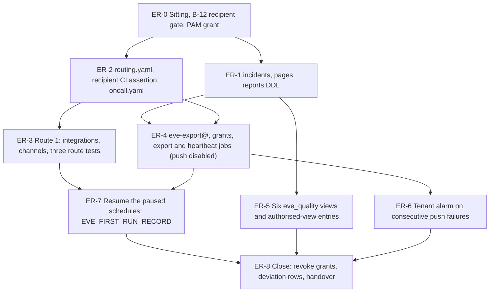

# 26. Eve: the reporting contract and the witness export

## Status

- Owner: the platform owner
- Last reviewed: 2026-09-15
- Last executed: never
- Stage: review §2 stage 30 (Eve Phase 10b steps 1 to 4) re-cut to Eve-H. Opens gate line G-6 (the reporting contract live on both routes); 28 records the drill evidence against it.
- Step prefix: `ER`. Steps: 43. BLOCKED steps: ER-4.4, ER-4.5, ER-4.6 and ER-4.7 (the export and heartbeat entrypoints of Eve's reconciler image, README B-08), ER-5.4 (the four `eve_quality` views whose columns come from Eve's schema files, README B-07), ER-7.1, ER-7.2 and ER-7.3 (Eve's first run, which needs the jobs 25 deploys, README B-08). The whole file is BLOCKED while README B-12 is open: see ER-0.2.
- Replaces: Phase 10b steps 1, 2 (reporting half), 3 and 4 of [../../eve/07-build-runbook.md](../../eve/07-build-runbook.md). That page is not executed. Step 5 (the `eve_quality` readers) is split: this file creates the views and their authorised-view entries, 29 adds the two dataset-level `READER` entries once `mo-metrics@` and the validator custodian exist.
- Salvaged: 10b step 1's `eve_workspace_reports` dataset intent and its 400-day partition bound; step 3's sole-recipient rule and the `oncall.yaml` shape (primary, secondary outside the administration line, per-severity timeouts, the K5/K6 rota section); step 4's `eve-export@` creation, its `bigquery.jobUser`, the dataset `READER` through the access array and the create-only `exports/` condition on the locked bucket; step 5's "authorised views only, no free-text column, never `grades_blind` or `review_queue_blind`"; [../08-data-logging-retention-sovereignty.md](../08-data-logging-retention-sovereignty.md) §5.4's export shape (path, newline-delimited JSON, `MANIFEST.json` with row count, SHA-256 per part, `job_id`, source `last_modified_time`, exporter identity and `config_version`); [../../eve/03-lld.md](../../eve/03-lld.md) §15's contract table with the route corrected.
- Not copied: "witness channels: SMS + mobile app + the third-party pager" as the severity-1 route (X-ORG-07); the daily push and the 26-hour absence window (X-ORG-06); `run_pass` as an undefined shell function (S030, S037); `gcloud builds submit` from the current directory (S030); table and column names left `tbd` (S037); the literal placeholder principal `<validator-custodian-service-account>` in a `bq update --source` (S037); dataset-level `WRITER` for a writer identity (S138, SD-43); a standing `roles/iam.serviceAccountUser` for the operator on an Eve identity (S143); any use of `PAGER_SERVICE_NAME`'s L1-L3 escalation for a report whose subject is a roster human (X-ORG-07, SD-12).
- Applies decisions (signed in 03 before the step that needs them): SD-07, SD-08, SD-10, SD-11, SD-12, SD-38, SD-43, SD-44, SD-45, E-2, P98, P100.
- Closes: S030 (its 26 half), S037, S138 (the off-tenant copy half), S143 (for `eve-export@` and for every identity this file touches), X-ORG-06 (the tenant half of the cadence), X-ORG-07, X-RQB-06 (the tenant half). Defers none without an owner (§11).
- Consumes: 25's outputs (`EVE_RECONCILER_IMAGE`, `EVE_CODE_COMMIT`, `EVE_CONFIG_REPO`, `SA_EVE_CONSOLE`, the four paused jobs and their `<job>-schedule` schedules, EH-1.2's conditional `eveTableWriter` binding and EH-1.3's dataset access entries); `ONCALL_FILE`, `PAGER_SERVICE_NAME`, `PAGER_SUBJECT_SERVICE_NAME`, `PAGER_SUBJECT_SH_SERVICE_NAME` (15 part A); `EVE_EVIDENCE_BUCKET`, `EVE_DS`, `EVE_WS_LOGS_DS`, `EVE_WS_REPORTS_DS`, `EVE_QUALITY_DS`, `EVE_SCHEMAS_COMMIT`, `ENT_PROJECT_REPAIR_EVE`, and EP-6.1's two custom roles `eveTableWriter` and `eveTableAppender` (23); `SA_EVE_VERIFIER`, `EVE_ROBOT` (24); `EVE_WITNESS_PROJECT`, `WITNESS_MIRROR_DS`, `WITNESS_HEARTBEAT_TABLE`, `WITNESS_BUCKET`, and **WO-2.9's heartbeat contract file and its SHA-256** as `WO_2_9_CONTRACT_FILE` and `WO_2_9_CONTRACT_SHA256` (08); `CICD_PROJECT` as the billing project of every PAM call (10); `SECURITY_REVIEWER_EMAIL`, `INCIDENT_COMMANDER_EMAIL`, `SECOND_HUMAN_EMAIL`, `BUSINESS_TZ` (03). **Not consumed:** `ENT_SECRET_READ` — it is a `CORE_PROJECT` entitlement conditioned to `platform-pager-key` and confers nothing in `EVE_PROJECT` (12 PA-4.4), so no step of this file takes it (ER-3.2).
- Produces: `SA_EVE_EXPORT`, `EVE_JOB_EXPORT`, `EVE_JOB_HEARTBEAT_PUSH`, `EVE_INCIDENTS_TABLE`, `EVE_PAGES_TABLE`, `NOTIF_CH_EVE_EMAIL_SECOND_HUMAN`, `NOTIF_CH_EVE_SMS_SECOND_HUMAN`, `EVE_FIRST_RUN_RECORD`; beyond the plan's table (§10): `NOTIF_CH_EVE_PAGER_PLATFORM`, `NOTIF_CH_EVE_PAGER_SUBJECT_PO`, `NOTIF_CH_EVE_PAGER_SUBJECT_SH`, `EVE_REPORTS_TABLE`, `EVE_ROUTING_FILE`.
- Commands checked against Google's documentation on 2026-09-15, and the PAM, Monitoring-role and Cloud Scheduler references re-read on 2026-09-16 after the setup-procedure review (§13). What could not be settled is listed in §12.

## What this part builds

Eve has watched nothing yet. 25 deployed every job with its schedule **paused**, on purpose:
the person Eve reports on is the person who installs Eve, so Eve must not run one pass before a
route exists that reaches somebody outside the administration line. This file builds that route,
the tables the route writes, the copy that leaves the organisation, and then — and only then —
starts Eve.

1. **The reporting tables** (§1). `eve.incidents` and `eve.pages` with a real column list, from
   a schema file merged under two-person review, and `eve_workspace_reports.activities`, which
   25's Reports poll writes into and which had no DDL anywhere (S037). The writer roles are 23's
   custom roles (SD-43), never `dataEditor`.
2. **The routing contract** (§2). `eve/config/routing.yaml` says, per rule class, which route a
   report travels and who receives it; `eve/config/tests/test_recipients.py` asserts the
   sole-recipient rule as a check a machine can fail, not a sentence in a design page; and
   `oncall.yaml` gains its primary, its secondary outside the administration line, per-severity
   timeouts and the K5/K6 rota section.
3. **Route 1** (§3), the minute-latency route (SD-08). For a platform event: the organisation
   paging service `PAGER_SERVICE_NAME` of 15, which already carries the second human on level 1
   beside the desk, plus email. For a report whose **subject is a roster human**: IT security's
   subject escalations `PAGER_SUBJECT_SERVICE_NAME` (subject = the platform owner or any other
   roster human) and `PAGER_SUBJECT_SH_SERVICE_NAME` (subject = the second human) — never the
   L1-L3 escalation, on which the platform owner is a responder. Eve's own Cloud Monitoring
   channels are created in `EVE_PROJECT`, which the second human's approval gates, not in
   `CORE_PROJECT`, which the platform owner administers. Every route is proven by a test page
   the second human alone confirms, before Eve runs.
4. **`eve-export@` and the two cadences** (§4). One identity, two grants out of the
   organisation, two schedules: an **hourly heartbeat** carrying the last hour's counts, the
   cumulative per-table counts and the configuration fingerprint, and a **sub-daily export**
   (every 6 hours) of newline-delimited JSON with SHA-256 manifests into `exports/` of the
   locked bucket, then pushed to the witness. The witness row's shape is 08 WO-2.9's contract,
   copied and diffed here, never authored here; the tenant's own `eve.heartbeats` is the richer
   shape the witness row is projected from, and it carries `sev1_since_last_heartbeat` so that a
   severity-1 report about a roster human leaves the tenant within the hour and not within six.
   Both jobs are created with the push **disabled**; 27 enables it after the witness grants, and
   the first push carries every finding since Eve's first run. Route 2, the witness backstop, is
   an incident-mode run of the same job the **detect pass itself** triggers as its last act on a
   severity-1 subject finding — not something an operator presses, because the person who would
   press it may be the subject.
5. **The six `eve_quality` views** (§5) with their authorised-view entries on `eve`, so that 29
   only has to add two `READER` lines.
6. **A tenant-side alarm on consecutive push failures** (§6), because the witness's absence
   alarms (27) tell the witness, and the tenant must also know its own exporter has stopped.
7. **Eve's first run** (§7): the schedules 25 paused are resumed, the first executions are
   watched, and `EVE_FIRST_RUN_RECORD` is written. From this moment every human super admin is
   observed and every report has a recipient.

What the old text got wrong, and must not come back:

| Old text | Why it fails | Here instead |
|---|---|---|
| Severity 1 goes "through the witness channels: SMS + mobile app + the third-party pager" (eve/03 §15; Phase 10b step 3) | Notification channels are project resources of `EVE_WITNESS_PROJECT`; no Eve identity holds anything in the witness except `eve-export@`'s two grants, and that push is periodic, so the witness would learn of a severity 1 up to a day later (X-ORG-07) | Route 1 in the tenant through the organisation paging service and Eve's own channels in `EVE_PROJECT` (§3); route 2 is the witness backstop on an incident-mode push, whose witness-side policy is 27 |
| Reports about the administrator on the platform escalation | The platform owner is the L2 responder on `agp-platform-escalation`: the subject would be paged about themself and could acknowledge it away (SD-12) | ER-2.1 routes them to `PAGER_SUBJECT_SERVICE_NAME` and `PAGER_SUBJECT_SH_SERVICE_NAME`, administered by IT security; ER-2.2 fails CI if any rule routes a subject report to the platform escalation; ER-3.6 and ER-3.7 prove it |
| Eve's Monitoring channels in `CORE_PROJECT` | `CORE_PROJECT` is the platform owner's; a channel he can delete or re-point is not a report about him | `NOTIF_CH_EVE_*` live in `EVE_PROJECT`, whose every elevation needs the second human's approval (SD-12 item 2); 25's self-integrity rules already page on IAM changes there |
| "a daily schedule off the hour"; `witness_push_absence_hours: 26`; a 60-minute witness alarm | A metric-absence condition allows at most 23.5 hours and never fires before its first data point, and a 60-minute alarm cannot be evaluated from data that arrives once a day (X-ORG-06) | ER-4.5 hourly heartbeat, ER-4.4 export every 6 hours; the witness windows (about 90 minutes and at most 23.5 hours) are 27's |
| `run_pass eve-reports reports "*/5 * * * *"` | A shell function defined in a sitting months earlier and never saved; no image, no job, no scheduler, no grants (S030, S037) | The poll job is 25's; this file writes the table it lands in (ER-1.4) and the export and heartbeat jobs in full (§4), each naming the image digest, the runtime identity, the grants and the schedule |
| `gcloud builds submit --tag ...` from whatever directory is current | Uploads the current directory as the build context (S030) | No build in this file. The image is `EVE_RECONCILER_IMAGE`, built and attested in `CICD_PROJECT` in 25 and deployed here by digest with `--binary-authorization=default` |
| `bq update --source` with `userByEmail: "<validator-custodian-service-account>"` | An invalid member; the update fails and the access array is left half written (S037) | ER-5.2 writes only entries whose principal exists; the two foreign readers are 29's, recorded through `exists_or_pending` (ER-5.5) |
| Dataset-level `WRITER` for the identity that inserts | `WRITER` is `dataEditor`: DML DELETE and UPDATE, table drop, expiry and ACL changes (S138, SD-43) | The writer roles of 23 for the reconciler; `eve-export@` gets `READER` and nothing else in BigQuery, and create-only under `exports/` on the bucket |
| `roles/iam.serviceAccountUser` for the operator on an Eve identity, "never removed, no expiry" (S143) | One person can then deploy a job as Eve's identity and read Eve's credential | ER-4.2 grants `actAs` on `SA_EVE_EXPORT` with an IAM condition expiring the same day, ER-4.8 removes it and proves that no `user:` member holds `serviceAccountUser` or `serviceAccountTokenCreator` on any Eve identity |
| A tenant-authored eighteen-field witness heartbeat schema with `hb_ts` and `tables{table, row_count}` | The witness created `WITNESS_HEARTBEAT_TABLE` at 08 WO-2.9 with eleven fields, `heartbeat_ts`, `kind`, `source_project` and `table_counts{table_name, rows_window, rows_cumulative}`; every column 27 WG-3.8's fingerprint and count-decrease alarm selects was absent from the tenant's version, so the first push — the one channel the monitored administrator cannot reach — would have failed and the alarm would not have compiled | ER-4.3 copies WO-2.9's contract v1 verbatim and **diffs it against the hand-over file and its SHA-256**; the richer tenant shape is a separate file, `eve/schemas/eve_heartbeats.json`, and the witness row is a projection of it |
| The platform owner reading the three Eve pager keys under `ENT_SECRET_READ` | `ENT_SECRET_READ` is a `CORE_PROJECT` entitlement conditioned to one secret in `CORE_PROJECT` (12 PA-4.4): it confers nothing in `EVE_PROJECT`, and had it worked, the person Eve reports on would hold Eve's paging keys | ER-3.2: IT security creates the three channels from their own workstation with the key they minted, inside a time-boxed `notificationChannelEditor` window closed in the same step; no `gcloud secrets versions access` runs anywhere in this file |
| A hard-coded `for J in eve-reports-poll eve-roster eve-detect eve-heartbeat …` resume loop | Four of the six names were wrong — 25 EH-5.2 names its schedules `<job>-schedule` and its roster job `eve-roster-check` — so four resumes would have failed `NOT_FOUND` at the step that constitutes Eve's first run, leaving the detection passes over the human super admins paused while `EVE_FIRST_RUN_RECORD` said Eve was observing | ER-4.6 adopts the `<job>-schedule` convention for its two; ER-7.1 discovers what is `PAUSED`, asserts the count is `6` before and `0` after, and stops rather than printing a table |
| The export "then pushes the day and a heartbeat row to the witness" with no gate | The witness grants do not exist until 27, so the first run would fail and the failure would look like silence | Both jobs are deployed with `WITNESS_PUSH=disabled`; ER-4.9 records the PENDING targets in the re-run index; 27 flips the variable and holds the first-push verify |



## Preconditions

- [ ] 23 complete: `EVE_PROJECT`, `EVE_DS`, `EVE_WS_LOGS_DS`, `EVE_WS_REPORTS_DS`, `EVE_QUALITY_DS` exist with CMEK from `EVE_EVIDENCE_KEY_EU`; `EVE_EVIDENCE_BUCKET` exists in `europe-west1` with its retention policy **locked**; `ENT_PROJECT_REPAIR_EVE` is `AVAILABLE` with the second human as approver; 23 EP-6.1's **two** writer custom roles exist, `eveTableWriter` (`tables.get`, `tables.getData`, `tables.updateData`) and `eveTableAppender` (`tables.get`, `tables.updateData`), and no others (SD-43). 23 EP-6.2, which binds them table by table, is still BLOCKED for `incidents` and `pages` because this file creates those two tables: ER-1.5 performs EP-6.2's bindings for them and EP-6.2 becomes a read-back.
- [ ] 24 complete: `EVE_ROBOT` licensed with its read-only role, `EVE_SINK` writing into `EVE_WS_LOGS_DS`, `SA_EVE_VERIFIER` with its pinned token version. G-3 recorded.
- [ ] 25 complete except its BLOCKED steps: `EVE_RECONCILER_IMAGE` (a digest), `EVE_CODE_COMMIT`, `EVE_CONFIG_REPO` with branch protection and the second human as required reviewer, `EVE_JOB_REPORTS_POLL`, `EVE_JOB_ROSTER`, `EVE_JOB_DETECT`, `EVE_JOB_HEARTBEAT`, each deployed with its **schedule paused** and each schedule named `<job>-schedule` (25 EH-5.2's `make_sched`). §7 is BLOCKED while any of them is.
- [ ] 25 §1 complete, because ER-1.5 reads it back rather than repeating it: EH-1.2's project-level `eveTableWriter` binding for `eve-verifier@`, conditioned on `findings`, `incidents` and `pages` (condition title `eve-writer-three-tables`), and EH-1.3's dataset access entries, of which `WRITER` on `EVE_WS_REPORTS_DS` for `eve-verifier@` is the write path of `activities`. ER-1.5 adds **no** second binding on those tables.
- [ ] 15 part A complete: `PAGER_SERVICE_NAME` with `agp-platform-escalation`; `PAGER_SUBJECT_SERVICE_NAME` with `agp-subject-po-escalation`; `PAGER_SUBJECT_SH_SERVICE_NAME` with `agp-subject-sh-escalation`; `ONCALL_FILE` merged; the escalation record signed by the incident commander (PS-2.7). If part A is not done, ER-3.4's dated deviation applies and §3's pager steps are deferred with a date, never skipped.
- [ ] 08 complete: `EVE_WITNESS_PROJECT`, `WITNESS_MIRROR_DS`, `WITNESS_HEARTBEAT_TABLE`, `WITNESS_BUCKET` exist and their identifiers are in the tenant copy of the variables file. No tenant principal holds anything in the witness yet: that is 27. **08 WO-2.9's heartbeat contract record — the eleven-field schema file and its SHA-256 — has reached the platform owner through the second human** (WO-2.9's EVIDENCE line sends him a copy). ER-4.3 refuses to run without it: the witness owns that table's shape and this file copies it, never invents one.
- [ ] 03 signed: SD-07, SD-08, SD-10, SD-11, SD-12, SD-38, SD-43, SD-44; `SECOND_HUMAN_EMAIL`, `INCIDENT_COMMANDER_EMAIL`, `BUSINESS_TZ` set; **either** `SECURITY_REVIEWER_EMAIL` **or** `INCIDENT_COMMANDER_EMAIL` recorded as the recipient of reports about the second human (README B-12). ER-0.2 refuses the file otherwise.
- [ ] 11: `EVE_EVIDENCE_KEY_EU` usable by the BigQuery service agent of `EVE_PROJECT` (23 proved it on the first table).
- [ ] Workstation of [01](01-prerequisites-and-conventions.md): gcloud with `alpha` and `beta`, `bq`, `jq`, `curl`, `python3.12`, `git`; `~/.platform-env` sourced; `penv_guard` silent.
- [ ] **Not** a precondition: anything from 22, 29 or any Wall-E file. Eve-H never waits on Mo or Wall-E (SD-45).

## People needed

| Role | Does | Present at |
|---|---|---|
| Platform owner (as `sa-1-admin@`) | Performs every shell step under a PAM grant on `EVE_PROJECT`; writes the schema, routing and rota changes; fires the test pages. **Never reads a pager key and never runs `gcloud secrets versions access`** | every step except ER-3.1, ER-3.6, ER-3.7, and the pager-channel half of ER-3.2 |
| Second human (`SECOND_HUMAN_EMAIL`, holder of `eve-owners@`) | Approves `ENT_PROJECT_REPAIR_EVE`; required reviewer on every `EVE_CONFIG_REPO` merge and on `ONCALL_FILE`; **confirms every test page alone**, from their own phone and mailbox; co-signs `EVE_FIRST_RUN_RECORD` | ER-0.3, ER-2.1, ER-2.2, ER-2.3, ER-3.5, ER-3.6, ER-7.3 |
| IT security paging administrator | Creates Eve's three integrations on the three paging services, adds each routing key to `EVE_PROJECT`'s Secret Manager, and creates the three Cloud Monitoring pager channels, all from their own workstation inside one time-boxed `notificationChannelEditor` window; the platform owner never sees a key | ER-3.1, ER-3.2 |
| Incident commander (`INCIDENT_COMMANDER_EMAIL`) | Signs the routing record (`routing.yaml` and the amended `oncall.yaml`); receives the level-2 test page of the subject-owner escalation; stands in as the recipient of reports about the second human until the security reviewer is appointed | ER-2.3, ER-3.6, ER-3.7 |
| Security reviewer (`SECURITY_REVIEWER_EMAIL`), when appointed | Level 1 of `agp-subject-sh-escalation`; confirms ER-3.7's page; re-run point at appointment | ER-3.7 |
| A second reviewer who did not author the change | Second approval on each pull request (branch protection of 03) | ER-1.1, ER-2.1, ER-2.2, ER-2.3, ER-4.10 |

Hands-on: about 2 days. Elapsed: 3 to 5 days (pull-request reviews, the paging administrator's
sitting, the three route tests in and out of business hours). §7 and the BLOCKED steps of §4
wait on Eve's code (B-08) with no fixed date.

Conventions of [01](01-prerequisites-and-conventions.md) apply. Deviation rows are `BD-26-<n>`.
Records go to `BUILD_LOG_DIR/records/` as `<date>-ER-<step>-<slug>-v<n>`. Every shell block
starts with:

```bash
source ~/.platform-env
penv_guard
R="$BUILD_LOG_DIR/records/$(date -u +%F)-ER"
```

## Decisions applied

| Decision | What it settles here | Step |
|---|---|---|
| SD-08 | Route 1 is the organisation paging service plus email and SMS; route 2 is the incident-mode push to the witness; the interim Cloud Monitoring deviation if 15 part A is late | §3, ER-4.4 |
| SD-07 | Hourly heartbeat carrying the last hour's counts; export every 6 hours; the witness windows are 27's | ER-4.4, ER-4.5 |
| SD-10 | The sole-recipient rule and its two recipients; Eve's first run is the first scheduled execution after route 1 is tested | ER-2.1, ER-7.3 |
| SD-12 | Eve's channels in `EVE_PROJECT`; the subject escalations administered by IT security; the configuration fingerprint and cumulative counts in the heartbeat; no standing `actAs` for the operator | ER-3.2, ER-3.3, ER-4.5, ER-4.8 |
| SD-43 | No `dataEditor` for any writer; row tampering is detected by the DML rule of 25 and the count-decrease alarm of 27 | ER-1.5, ER-4.3 |
| SD-38 | Where each record goes and its E-xx and TISAX ids | every EVIDENCE line |
| SD-44 | Foreign principals through `exists_or_pending`; every PENDING line in the re-run index | ER-4.9, ER-5.5 |
| P98, P100 | RP-1 to RP-6; `eve.incidents` reconciled nightly against the SIEM case id | ER-1.2, ER-2.1 |

## 0. The sitting

### ER-0.1 Open the sitting and check the gates

- **WHO:** Platform owner as `sa-1-admin@`. No witness for this step.
- **WHERE:** Shell, `~/.platform-env` sourced, gcloud configuration `GCLOUD_CONFIG_NAME`.
- **ACTION:**

```bash
checkpoint ER-0.1 START
need ORG_ID DOMAIN REGION BQ_LOCATION PLATFORM_REPO_DIR BUILD_LOG_DIR DEVIATION_REGISTER EVIDENCE_REGISTER DRILL_CALENDAR EVE_PROJECT EVE_PROJECT_NUMBER EVE_DS EVE_WS_LOGS_DS EVE_WS_REPORTS_DS EVE_QUALITY_DS EVE_EVIDENCE_BUCKET EVE_EVIDENCE_KEY_EU ENT_PROJECT_REPAIR_EVE SA_EVE_VERIFIER EVE_ROBOT EVE_RECONCILER_IMAGE EVE_CODE_COMMIT EVE_CONFIG_REPO ONCALL_FILE PAGER_SERVICE_NAME PAGER_SUBJECT_SERVICE_NAME PAGER_SUBJECT_SH_SERVICE_NAME EVE_WITNESS_PROJECT WITNESS_MIRROR_DS WITNESS_HEARTBEAT_TABLE WITNESS_BUCKET SECOND_HUMAN_EMAIL INCIDENT_COMMANDER_EMAIL BUSINESS_TZ
"$PLATFORM_REPO_DIR/tools/decision-need.sh" SD-07 SD-08 SD-10 SD-11 SD-12 SD-38 SD-43 SD-44
gcloud storage buckets describe "$EVE_EVIDENCE_BUCKET" --format="value(retention_policy.isLocked)"
gcloud pam entitlements describe "$ENT_PROJECT_REPAIR_EVE" --location=global --format="value(state,approvalWorkflow.manualApprovals.steps[0].approvers[0].principals[0])"
bq show --format=prettyjson "${EVE_PROJECT}:${EVE_DS}" | jq -r '.defaultEncryptionConfiguration.kmsKeyName'
```

- **VERIFY:** `need` prints nothing; every decision prints `SIGNED`; the bucket prints `True`
  (locked, 23 EP-8.3); the entitlement prints `AVAILABLE` and the second human's address as the
  approver; the dataset prints `EVE_EVIDENCE_KEY_EU`. Any other output stops the sitting.
- **ROLLBACK:** None: the step only reads.
- **EVIDENCE:** The four outputs as `${R}-0.1-gates-v1.txt`. E-05. TISAX 1.4.1.

### ER-0.2 The B-12 gate: who receives a report about the second human

- **WHO:** Platform owner reads; the second human confirms the record; **no step of this file
  runs while this gate is open**.
- **WHERE:** Shell; `decisions/` in the platform repository.
- **ACTION:** SD-10 and SD-12 give the sole-recipient rule two recipients. Reports about the
  platform owner go to the second human. Reports about the second human go to the security
  reviewer, or to the incident commander until the security reviewer is appointed. If neither is
  named, a severity-1 report about the second human has nowhere to go, and Eve must not start.

```bash
need PLATFORM_REPO_DIR INCIDENT_COMMANDER_EMAIL
if need SECURITY_REVIEWER_EMAIL 2>/dev/null; then SH_SUBJECT_RECIPIENT="$SECURITY_REVIEWER_EMAIL"; SH_SUBJECT_ROLE="security reviewer"; else SH_SUBJECT_RECIPIENT="$INCIDENT_COMMANDER_EMAIL"; SH_SUBJECT_ROLE="incident commander (standing in until the security reviewer is appointed)"; fi
case "$SH_SUBJECT_RECIPIENT" in ''|'*tbd*') echo "STOP: README B-12 is open; 26 does not start"; checkpoint ER-0.2 BLOCKED - - "B-12: recipient of reports about the second human not named";; *) echo "recipient of reports about the second human: ${SH_SUBJECT_RECIPIENT} (${SH_SUBJECT_ROLE})";; esac
grep -l "recipient-second-human" "$PLATFORM_REPO_DIR"/decisions/*.md
```

  The recipient may be neither the second human nor the platform owner, and must not be a member
  of `platform-owners@`. Record the chosen address and role in the build log; it is written into
  `routing.yaml` at ER-2.1 and asserted by CI at ER-2.2.
- **VERIFY:** The `case` prints a real address; a dated decision file matching
  `recipient-second-human` exists and names the same address; `gcloud identity groups memberships list --group-email="$GRP_PLATFORM_OWNERS" --format='value(preferredMemberKey.id)' | grep -c "$SH_SUBJECT_RECIPIENT"` prints `0`.
- **ROLLBACK:** None. If the address changes later, ER-2.1, ER-2.2, ER-3.1 and ER-3.7 are re-run
  (README §9 already lists the security reviewer's appointment as a re-run point).
- **EVIDENCE:** The decision file path and the printed address as `${R}-0.2-b12-recipient-v1.txt`.
  E-08, E-10. TISAX 1.6, 4.1-4.2.

### ER-0.3 Obtain the `EVE_PROJECT` grant

- **WHO:** Platform owner requests; the second human approves (SD-12 item 2: never the platform
  owner, on any elevation touching Eve).
- **WHERE:** Shell.
- **ACTION:**

  `gcloud pam grants create` resolves the entitlement from the resource-argument group
  `(--entitlement : --folder --location --organization)` plus the gcloud-wide scope flags; a bare
  entitlement id with no `--location` and no scope does not resolve. 12 creates every one of these
  as a **project** entitlement, so the argument set is 25's and 27's exactly —
  `--location=global --project="$EVE_PROJECT" --billing-project="$CICD_PROJECT"` — and it is
  repeated on `create`, `list`, `describe` and `revoke`. Every PAM call in this file uses it.

```bash
need ENT_PROJECT_REPAIR_EVE SECOND_HUMAN_EMAIL EVE_PROJECT CICD_PROJECT
PAMSCOPE=(--location=global --project="$EVE_PROJECT" --billing-project="$CICD_PROJECT")
gcloud pam grants create --entitlement="$ENT_PROJECT_REPAIR_EVE" "${PAMSCOPE[@]}" --requested-duration=3600s --justification="setup 26 ER-1 to ER-6: reporting tables, routing, channels, eve-export@ and its jobs" --additional-email-recipients="$SECOND_HUMAN_EMAIL"
gcloud pam grants list --entitlement="$ENT_PROJECT_REPAIR_EVE" "${PAMSCOPE[@]}" --filter='state=ACTIVE' --format='value(name,requester,state)'
```

  Repeat this step whenever a later `ER` step outlives the hour; each grant is its own build-log
  line and its own record. Nothing in §1 to §6 runs without an `ACTIVE` grant printed first.
  Keep `PAMSCOPE` in the shell for the rest of the sitting, or retype the three flags.
- **VERIFY:** The list prints exactly one `ACTIVE` grant with the platform owner as requester and
  the second human recorded as approver in
  `gcloud pam grants describe <name> "${PAMSCOPE[@]}" --format='value(auditTrail.accessGrantTime,requester)'`.
  An empty list here is a **stop**, not a pass: it means the scope flags did not resolve the
  entitlement, and every later grant, list and revoke in this file would be equally silent.
- **ROLLBACK:** `gcloud pam grants revoke <grant name> "${PAMSCOPE[@]}" --reason="sitting ended"`.
- **EVIDENCE:** Grant names in the build log under ER-0.3. E-08. TISAX 4.1-4.2.

## 1. The reporting tables

Phase 10b assumed `eve.incidents` and `eve.pages` "exist from Phase 3 with the columns of
03-lld §9" and left `eve_workspace_reports` with a *tbd* schema (S037). 23 creates the nine
tables of Eve's own schema files when they are committed (README B-07); these three are written
here instead, because their columns are fixed by the reporting contract and by the Reports API
response shape, not by Eve's code. When Eve's schema files land, ER-1.6 compares them.

### ER-1.1 Merge the three schema files

- **WHO:** Platform owner writes; the second human reviews as code owner of `eve/`; a second
  reviewer approves.
- **WHERE:** `PLATFORM_REPO_DIR`, branch `er-1-reporting-schemas`. The files live under
  `eve/schemas/` beside the ones 23 reads, so that one commit holds every Eve table shape.
- **ACTION:**

```bash
need PLATFORM_REPO_DIR
git -C "$PLATFORM_REPO_DIR" switch main && git -C "$PLATFORM_REPO_DIR" pull --ff-only
git -C "$PLATFORM_REPO_DIR" switch -c er-1-reporting-schemas
mkdir -p "$PLATFORM_REPO_DIR/eve/schemas"
cat > "$PLATFORM_REPO_DIR/eve/schemas/incidents.json" <<'JSON'
[
  {"name":"incident_id","type":"STRING","mode":"REQUIRED","description":"UUIDv4 minted by the reconciler; the join key to the SIEM case and to pages"},
  {"name":"ts","type":"TIMESTAMP","mode":"REQUIRED","description":"When the rule fired; the partition column"},
  {"name":"detected_ts","type":"TIMESTAMP","mode":"NULLABLE","description":"Timestamp of the observed event, from the source stream"},
  {"name":"severity","type":"INT64","mode":"REQUIRED","description":"1, 2 or 3 (eve/03 section 15)"},
  {"name":"rule","type":"STRING","mode":"REQUIRED","description":"Catalogue rule id (SA-01..SA-09, EV-*) or a reason code from reasons.yaml"},
  {"name":"rule_class","type":"STRING","mode":"REQUIRED","description":"tenant_integrity, uncatalogued_write, posture, robot_login, roster, baseline, divergence, self_integrity, evidence_absence"},
  {"name":"source_stream","type":"STRING","mode":"REQUIRED","description":"admin, login, token, saml, groups, mobile, reports_api, bigquery_dml, gcp_audit"},
  {"name":"actor","type":"STRING","mode":"NULLABLE","description":"principalEmail or unique profile id of the actor; an id, never a payload"},
  {"name":"actor_class","type":"STRING","mode":"REQUIRED","description":"roster_human, unrostered_human, robot, service_identity, unknown"},
  {"name":"subject","type":"STRING","mode":"NULLABLE","description":"The person the report is about, when the report is about a person"},
  {"name":"subject_class","type":"STRING","mode":"REQUIRED","description":"platform_owner, second_human, other_roster_human, none; the routing key of routing.yaml"},
  {"name":"targets","type":"STRING","mode":"REPEATED","description":"Affected principals or resources as ids"},
  {"name":"evidence","type":"RECORD","mode":"REPEATED","description":"Pointers only; no Workspace payload","fields":[
    {"name":"kind","type":"STRING","mode":"REQUIRED"},
    {"name":"ref","type":"STRING","mode":"REQUIRED"},
    {"name":"sha256","type":"STRING","mode":"NULLABLE"}]},
  {"name":"narrative","type":"STRING","mode":"NULLABLE","description":"Sourced from eve_advice by eve-advisor@; empty while the reporting path is not built. Never read by the control path, never copied into eve_quality"},
  {"name":"route","type":"STRING","mode":"REQUIRED","description":"platform, subject_po, subject_sh, witness_only, none"},
  {"name":"recipients","type":"STRING","mode":"REPEATED","description":"The addresses routing.yaml resolved; asserted against the sole-recipient rule by CI"},
  {"name":"halt_target","type":"STRING","mode":"REQUIRED","description":"halt_target_pending until 36 wires the halts (SD-10)"},
  {"name":"ack_ts","type":"TIMESTAMP","mode":"NULLABLE"},
  {"name":"ack_by","type":"STRING","mode":"NULLABLE"},
  {"name":"resolution","type":"STRING","mode":"NULLABLE"},
  {"name":"root_cause_link","type":"STRING","mode":"NULLABLE"},
  {"name":"case_id","type":"STRING","mode":"NULLABLE","description":"The SIEM case reconciled nightly (P100); null while 15 part B is BLOCKED"},
  {"name":"eve_config_version","type":"STRING","mode":"REQUIRED"},
  {"name":"config_fingerprint","type":"STRING","mode":"REQUIRED","description":"The fingerprint of the run that raised it (25); the same value the heartbeat carries"},
  {"name":"run_id","type":"STRING","mode":"REQUIRED","description":"Cloud Run execution id of the pass"},
  {"name":"schema_version","type":"INT64","mode":"REQUIRED"}
]
JSON
cat > "$PLATFORM_REPO_DIR/eve/schemas/pages.json" <<'JSON'
[
  {"name":"page_id","type":"STRING","mode":"REQUIRED"},
  {"name":"incident_id","type":"STRING","mode":"REQUIRED"},
  {"name":"ts","type":"TIMESTAMP","mode":"REQUIRED","description":"When the page was sent; the partition column"},
  {"name":"severity","type":"INT64","mode":"REQUIRED"},
  {"name":"reason_code","type":"STRING","mode":"REQUIRED","description":"The input to the page budget (RP-6: more than three a week from one code raises threshold suspect)"},
  {"name":"route","type":"STRING","mode":"REQUIRED","description":"platform, subject_po, subject_sh, witness_backstop"},
  {"name":"service","type":"STRING","mode":"REQUIRED","description":"The paging service the event was sent to, or the Monitoring channel project"},
  {"name":"channel","type":"STRING","mode":"REQUIRED","description":"pager, email, sms, witness_push"},
  {"name":"recipient","type":"STRING","mode":"REQUIRED"},
  {"name":"delivery_result","type":"STRING","mode":"REQUIRED","description":"accepted, rejected, error; from the paging API response or the channel call"},
  {"name":"delivery_detail","type":"STRING","mode":"NULLABLE","description":"Status code and dedup key; never a routing key"},
  {"name":"ack_ts","type":"TIMESTAMP","mode":"NULLABLE"},
  {"name":"ack_by","type":"STRING","mode":"NULLABLE"},
  {"name":"repage_of","type":"STRING","mode":"NULLABLE","description":"page_id this page re-sends (RP-5)"},
  {"name":"escalated_to","type":"STRING","mode":"NULLABLE"},
  {"name":"eve_config_version","type":"STRING","mode":"REQUIRED"},
  {"name":"run_id","type":"STRING","mode":"REQUIRED"},
  {"name":"schema_version","type":"INT64","mode":"REQUIRED"}
]
JSON
cat > "$PLATFORM_REPO_DIR/eve/schemas/reports_activities.json" <<'JSON'
[
  {"name":"event_ts","type":"TIMESTAMP","mode":"REQUIRED","description":"activities.items[].id.time; the partition column"},
  {"name":"unique_qualifier","type":"STRING","mode":"REQUIRED","description":"activities.items[].id.uniqueQualifier; the de-duplication key with application and event_ts"},
  {"name":"application","type":"STRING","mode":"REQUIRED","description":"id.applicationName: admin, login, token, saml, groups_enterprise, mobile"},
  {"name":"customer_id","type":"STRING","mode":"REQUIRED","description":"id.customerId"},
  {"name":"actor_email","type":"STRING","mode":"NULLABLE","description":"actor.email; the userKey the poll asked for"},
  {"name":"actor_profile_id","type":"STRING","mode":"NULLABLE"},
  {"name":"actor_key","type":"STRING","mode":"NULLABLE","description":"actor.key, present for robot and OAuth actors"},
  {"name":"event_type","type":"STRING","mode":"NULLABLE","description":"events[].type"},
  {"name":"event_name","type":"STRING","mode":"NULLABLE","description":"events[].name"},
  {"name":"parameters","type":"JSON","mode":"NULLABLE","description":"events[].parameters as returned; ids, names and counts only. No message body, no file content"},
  {"name":"ip_address","type":"STRING","mode":"NULLABLE"},
  {"name":"poll_actor","type":"STRING","mode":"REQUIRED","description":"The roster account this call polled for"},
  {"name":"poll_window_start","type":"TIMESTAMP","mode":"REQUIRED"},
  {"name":"poll_window_end","type":"TIMESTAMP","mode":"REQUIRED"},
  {"name":"ingested_at","type":"TIMESTAMP","mode":"REQUIRED"},
  {"name":"run_id","type":"STRING","mode":"REQUIRED"},
  {"name":"schema_version","type":"INT64","mode":"REQUIRED"}
]
JSON
python3.12 -c 'import json,sys;[json.load(open(p)) for p in sys.argv[1:]] and print("json ok")' "$PLATFORM_REPO_DIR/eve/schemas/incidents.json" "$PLATFORM_REPO_DIR/eve/schemas/pages.json" "$PLATFORM_REPO_DIR/eve/schemas/reports_activities.json"
grep -n 'message\|body\|content\|subject_line\|file_name' "$PLATFORM_REPO_DIR/eve/schemas/reports_activities.json" && echo "REVIEW: a column may carry a payload" || echo "no payload column"
git -C "$PLATFORM_REPO_DIR" add eve/schemas/incidents.json eve/schemas/pages.json eve/schemas/reports_activities.json
git -C "$PLATFORM_REPO_DIR" commit -m "eve: incidents, pages and reports activities schemas (setup 26 ER-1.1, S037)"
git -C "$PLATFORM_REPO_DIR" push -u origin er-1-reporting-schemas
```

  Two rules the review asks for and the reviewers check by eye: **no column holds a Workspace
  payload** (ids, names, counts and hashes only, eve/03 §9), and **`subject_class` is required**,
  because it is the key `routing.yaml` resolves and the CI assertion of ER-2.2 reads. The
  `parameters` column is the one place a Reports API response could carry more than an id; the
  Eve owner's poll code is required by the same pull request to drop any parameter not on the
  allow-list in `eve/config/reports_parameters_allowlist.yaml`, and the reviewers check the
  allow-list, not the code.
- **VERIFY:** `json ok`; `no payload column`; the pull request is merged with two approvals, one
  the second human's as `eve/` code owner; `git -C "$PLATFORM_REPO_DIR" log --oneline -1 origin/main -- eve/schemas/` shows the merge.
- **ROLLBACK:** A reverting pull request while no table has been created. After ER-1.2 a column
  change is a schema migration: BigQuery allows adding a `NULLABLE` column and relaxing
  `REQUIRED` to `NULLABLE`, and nothing else, so a wrong `REQUIRED` column is corrected by a new
  table and a copy, recorded as a deviation.
- **EVIDENCE:** Merge commit as `<date>-ER-1.1-reporting-schemas-v1`. E-05, E-06. TISAX 5.2.1, 1.3.1.

### ER-1.2 Create `eve.incidents`

- **WHO:** Platform owner, under the ER-0.3 grant.
- **WHERE:** Shell.
- **ACTION:** DAY-partitioned on `ts` with the 400-day expiry of 23's dataset default, stated
  explicitly so that the table does not silently inherit a later change.

```bash
need EVE_PROJECT EVE_DS PLATFORM_REPO_DIR
git -C "$PLATFORM_REPO_DIR" switch main && git -C "$PLATFORM_REPO_DIR" pull --ff-only
bq show --format=none "${EVE_PROJECT}:${EVE_DS}.incidents" 2>/dev/null && echo "EXISTS: 23 created it from the same file; skip to VERIFY" || \
bq mk --table \
  --project_id="$EVE_PROJECT" \
  --description="Eve incidents: one row per rule firing, with its route, recipients and acknowledgement (eve/03 section 9 and 15; setup 26 ER-1.2)" \
  --time_partitioning_field=ts \
  --time_partitioning_type=DAY \
  --time_partitioning_expiration=34560000 \
  --clustering_fields=severity,rule_class,subject_class \
  --label=owner:eve --label=class:evidence \
  "${EVE_PROJECT}:${EVE_DS}.incidents" \
  "$PLATFORM_REPO_DIR/eve/schemas/incidents.json"
penv_set EVE_INCIDENTS_TABLE "${EVE_PROJECT}:${EVE_DS}.incidents"
```

- **VERIFY:**

```bash
bq show --format=prettyjson "$EVE_INCIDENTS_TABLE" | jq -r '{part: .timePartitioning.field, exp: .timePartitioning.expirationMs, cols: (.schema.fields|length), kms: .encryptionConfiguration.kmsKeyName, req: [.schema.fields[]|select(.mode=="REQUIRED")|.name]|length}'
diff <(jq -S '[.[]|{name,type,mode:(.mode//"NULLABLE")}]' "$PLATFORM_REPO_DIR/eve/schemas/incidents.json") \
     <(bq show --format=prettyjson "$EVE_INCIDENTS_TABLE" | jq -S '[.schema.fields[]|{name,type,mode}]') \
  && echo "SCHEMA MATCHES THE COMMITTED FILE"
```

  `part` is `ts`, `exp` is `34560000000`, `kms` ends with `eve-evidence-eu`, and the `diff` prints
  `SCHEMA MATCHES THE COMMITTED FILE`. The `diff` is the check that matters and it is run **now**,
  not deferred to ER-1.6: this is the one table whose column set the routing contract and ER-2.2's
  sole-recipient assertion both depend on, so it is compared against the file merged two steps
  earlier rather than against a number typed into a procedure. For the record, that file has 26
  top-level fields of which 14 are `REQUIRED` — `targets`, `evidence` and `recipients` are
  `REPEATED`, not `REQUIRED` — so `cols` reads `26` and `req` reads `14`; if either differs, the
  `diff` has already said where. A missing `kms` means the dataset default did not apply: stop and
  re-read 23 EP-6.
- **ROLLBACK:** `bq rm -f -t "$EVE_INCIDENTS_TABLE"` while the table is empty. Once Eve has
  written a row the table is evidence: a drop is a severity-1 event of 25's self-integrity rules
  and needs the second human present and a deviation row.
- **EVIDENCE:** The `bq show` output as `${R}-1.2-incidents-v1.json`, `evidence_add ER-1.2 incidents E-06 5.2.1 "$BUILD_LOG_DIR/records" "${R}-1.2-incidents-v1.json"`. E-06. TISAX 5.2.1, 5.2.4.

### ER-1.3 Create `eve.pages`

- **WHO:** Platform owner, same grant.
- **WHERE:** Shell.
- **ACTION:**

```bash
need EVE_PROJECT EVE_DS PLATFORM_REPO_DIR
bq show --format=none "${EVE_PROJECT}:${EVE_DS}.pages" 2>/dev/null && echo "EXISTS; skip to VERIFY" || \
bq mk --table \
  --project_id="$EVE_PROJECT" \
  --description="Eve pages: one row per delivery attempt of a report, with recipient, channel, result and acknowledgement (RP-5, RP-6; setup 26 ER-1.3)" \
  --time_partitioning_field=ts \
  --time_partitioning_type=DAY \
  --time_partitioning_expiration=34560000 \
  --clustering_fields=route,reason_code \
  --label=owner:eve --label=class:evidence \
  "${EVE_PROJECT}:${EVE_DS}.pages" \
  "$PLATFORM_REPO_DIR/eve/schemas/pages.json"
penv_set EVE_PAGES_TABLE "${EVE_PROJECT}:${EVE_DS}.pages"
```

- **VERIFY:** `bq show --format=prettyjson "$EVE_PAGES_TABLE" | jq -r '{part:.timePartitioning.field, cols:(.schema.fields|length), kms:.encryptionConfiguration.kmsKeyName}'` prints `ts`, `18` and the EU key. A page row carries no routing key: `jq -r '[.schema.fields[].name]|map(select(test("key|secret|token")))|length'` prints `0`.
- **ROLLBACK:** As ER-1.2.
- **EVIDENCE:** `${R}-1.3-pages-v1.json`. E-06, E-08. TISAX 5.2.1, 1.6.

### ER-1.4 Create `eve_workspace_reports.activities`

- **WHO:** Platform owner, same grant.
- **WHERE:** Shell. The dataset and its 400-day default partition expiry are 23's; this is the
  table 25's Reports poll writes into, which had no DDL (S037).
- **ACTION:**

```bash
need EVE_PROJECT EVE_WS_REPORTS_DS PLATFORM_REPO_DIR
bq show --format=none "${EVE_PROJECT}:${EVE_WS_REPORTS_DS}.activities" 2>/dev/null && echo "EXISTS; skip to VERIFY" || \
bq mk --table \
  --project_id="$EVE_PROJECT" \
  --description="Reports API activities.list by actor, one row per event, de-duplicated on (application, unique_qualifier) (eve/03 section 13; setup 26 ER-1.4)" \
  --time_partitioning_field=event_ts \
  --time_partitioning_type=DAY \
  --time_partitioning_expiration=34560000 \
  --clustering_fields=application,poll_actor,event_name \
  --label=owner:eve --label=class:evidence \
  "${EVE_PROJECT}:${EVE_WS_REPORTS_DS}.activities" \
  "$PLATFORM_REPO_DIR/eve/schemas/reports_activities.json"
penv_set EVE_REPORTS_TABLE "${EVE_PROJECT}:${EVE_WS_REPORTS_DS}.activities"
```

- **VERIFY:** `bq show --format=prettyjson "$EVE_REPORTS_TABLE" | jq -r '{part:.timePartitioning.field, exp:.timePartitioning.expirationMs, cols:(.schema.fields|length)}'` prints `event_ts`, `34560000000` and `17`; `bq show --format=prettyjson "${EVE_PROJECT}:${EVE_WS_REPORTS_DS}" | jq -r .defaultPartitionExpirationMs` prints `34560000000` (23 set it before any write, which is not retrofittable).
- **ROLLBACK:** `bq rm -f -t "$EVE_REPORTS_TABLE"` while empty; after the first poll, as ER-1.2.
- **EVIDENCE:** `${R}-1.4-reports-activities-v1.json`. E-06. TISAX 5.2.1.

### ER-1.5 Prove the writer path on the three new tables, and add no second grant

- **WHO:** Platform owner, same grant; the second human reads the output.
- **WHERE:** Shell.
- **ACTION:** **There is one writer grant shape and it is not made here.** 23 EP-6.1 creates
  exactly two custom roles — `eveTableWriter` (`tables.get`, `tables.getData`,
  `tables.updateData`) and `eveTableAppender` (`tables.get`, `tables.updateData`) — with no
  `tables.delete`, no `tables.update`, no `tables.setIamPolicy` and no `datasets.update` (SD-43).
  25 EH-1.2 has already bound `eveTableWriter` to `eve-verifier@` at project level with **one**
  IAM condition naming `findings`, `incidents` and `pages`, under the condition title
  `eve-writer-three-tables`; an IAM condition does not require its resource to exist, so that
  binding starts taking effect the moment ER-1.2 and ER-1.3 create the two tables. 25 EH-1.3 has
  already given `eve-verifier@` dataset `WRITER` on `EVE_WS_REPORTS_DS`, which is the write path
  of `activities`, because the poll creates tables day by day and a table-name condition would
  refuse a new day's table.

  So this step **reads those two grants back and asserts them**. It adds nothing. Adding a second
  conditional binding here would leave four writer bindings where 25 EH-1.7's verify expects two,
  and would make the same table writable by two independent paths that must then be revoked
  together.

  Earlier-file dependency, checked before anything else: the role ids and the EH-1.2 binding come
  from **23 EP-6.1** and **25 EH-1.2**. If either read below is empty, stop — the fix is in that
  file, never a new role or a new binding invented here.

```bash
need EVE_PROJECT EVE_DS EVE_WS_REPORTS_DS SA_EVE_VERIFIER
# 1. 23 EP-6.1: the two roles exist with exactly the SD-43 permission sets
for RID in eveTableWriter eveTableAppender; do
  printf '%s\t' "$RID"
  gcloud iam roles describe "$RID" --project="$EVE_PROJECT" --format='value(includedPermissions)' || echo "MISSING: re-run 23 EP-6.1"
done
gcloud iam roles list --project="$EVE_PROJECT" --format='value(name.basename())' | sort
# 2. 25 EH-1.2: one conditional eveTableWriter binding for eve-verifier@, covering incidents and pages
gcloud projects get-iam-policy "$EVE_PROJECT" --format=json \
  | jq -r --arg m "serviceAccount:${SA_EVE_VERIFIER}" '.bindings[]|select(.members[]?==$m)|{role:.role,title:(.condition.title//"-"),expr:(.condition.expression//"-")}'
# 3. the effective answer, per table, rather than the shape of the policy
for T in incidents pages; do
  printf '%s\t' "$T"
  gcloud policy-intelligence troubleshoot-policy iam --principal-email="$SA_EVE_VERIFIER" \
    --resource-name="//bigquery.googleapis.com/projects/${EVE_PROJECT}/datasets/${EVE_DS}/tables/${T}" \
    --permission=bigquery.tables.updateData --format='value(access)'
done
# 4. 25 EH-1.3: the activities write path is the dataset entry, not a table condition
bq show --format=prettyjson "${EVE_PROJECT}:${EVE_WS_REPORTS_DS}" | jq -r --arg m "$SA_EVE_VERIFIER" '[.access[]|select(.userByEmail==$m)|.role]|@csv'
# 5. the anti-grants
gcloud projects get-iam-policy "$EVE_PROJECT" --flatten="bindings[].members" --filter="bindings.role=roles/bigquery.dataEditor" --format="value(bindings.members)"
bq show --format=prettyjson "${EVE_PROJECT}:${EVE_DS}" | jq -r '[.access[]|select(.role=="WRITER" or .role=="OWNER")|(.userByEmail//.groupByEmail//.specialGroup)]|@csv'
```

- **VERIFY:** `eveTableWriter` lists exactly `bigquery.tables.get`, `bigquery.tables.getData`,
  `bigquery.tables.updateData`; `eveTableAppender` lists the first and the third; the role list
  holds **no** `eveWriterFindings`, `eveWriterIncidents`, `eveWriterPages` or `eveWriterReports`
  (those ids never existed — if one is present, 23 was run from a superseded text and the sitting
  stops). Read 2 prints **one** binding for `eve-verifier@` whose role ends `eveTableWriter` and
  whose condition title is `eve-writer-three-tables`, and no second writer binding on `incidents`
  or `pages`. Read 3 prints `GRANTED` for both tables — the proof that EH-1.2's condition now
  resolves, which is the only thing creating the tables could have changed. Read 4 prints
  `"WRITER"` once. Read 5 prints nothing for `dataEditor` and `["projectOwners"]` or nothing for
  `eve`'s dataset-level writers: no writer identity holds a dataset-level `WRITER` on `eve`
  (S138).
- **ROLLBACK:** None: the step only reads. If read 2 or read 3 fails, the binding is repaired in
  **25 EH-1.2** under its own grant and its own record, and ER-1.5 is re-run; if read 1 fails, in
  **23 EP-6.1**. Nothing is bound from this file.
- **EVIDENCE:** All five outputs as `${R}-1.5-writer-roles-v1.txt`, and a line in the build log
  recording that **23 EP-6.2's `incidents` and `pages` bindings are superseded by 25 EH-1.2's
  conditional binding** — EP-6.2 stays BLOCKED for those two tables and is closed as a read-back
  against this record, not by a second `bq add-iam-policy-binding`. Closes S138 for the writer
  half. E-06, E-08. TISAX 4.1-4.2, 5.2.4.

### ER-1.6 Compare with Eve's own schema files when they land (re-run point)

- **WHO:** Platform owner; the Eve owner supplies the commit.
- **WHERE:** Shell; the re-run index.
- **ACTION:** When `EVE_SCHEMAS_COMMIT` is set (README B-07), compare the live tables with the
  Eve owner's files and stop on any difference rather than altering a table that already holds
  evidence.

```bash
need BUILD_LOG_DIR
if need EVE_SCHEMAS_COMMIT 2>/dev/null; then
  for T in incidents pages; do
    bq show --format=prettyjson "${EVE_PROJECT}:${EVE_DS}.${T}" | jq -S '[.schema.fields[]|{name,type,mode}]' > "${R}-1.6-live-${T}.json"
    jq -S '[.[]|{name,type,mode:(.mode//"NULLABLE")}]' "$PLATFORM_REPO_DIR/eve/schemas/${T}.json" > "${R}-1.6-file-${T}.json"
    diff -u "${R}-1.6-file-${T}.json" "${R}-1.6-live-${T}.json" && echo "MATCH ${T}"
  done
else
  exists_or_pending --pending "schema:eve" ER-1.6 "compare eve/schemas with EVE_SCHEMAS_COMMIT when B-07 lands"
fi
```

- **VERIFY:** `MATCH incidents` and `MATCH pages`, or a `PENDING` line in `rerun-index.tsv`
  naming ER-1.6.
- **ROLLBACK:** None: the step reads and records.
- **EVIDENCE:** The diffs or the PENDING line. E-05. TISAX 5.2.1.

## 2. The routing contract

eve/03 §15 states the sole-recipient rule in a sentence. A sentence cannot be executed and
cannot fail. This section turns it into a merged file, a test that fails CI, and a signed record.

### ER-2.1 Write `routing.yaml`

- **WHO:** Platform owner writes; the second human is the required reviewer of `EVE_CONFIG_REPO`
  (25); the incident commander signs the record at ER-2.3.
- **WHERE:** A clone of `EVE_CONFIG_REPO`, branch `er-2-routing`. This file is Eve's, not the
  platform repository's, because a change to it is a change to Eve's configuration and must fire
  25's self-integrity rules and change the configuration fingerprint.
- **ACTION:**

```bash
need EVE_CONFIG_REPO SECOND_HUMAN_EMAIL INCIDENT_COMMANDER_EMAIL PAGER_SERVICE_NAME PAGER_SUBJECT_SERVICE_NAME PAGER_SUBJECT_SH_SERVICE_NAME BUILD_LOG_DIR
if need SECURITY_REVIEWER_EMAIL 2>/dev/null; then SH_SUBJECT_RECIPIENT="$SECURITY_REVIEWER_EMAIL"; else SH_SUBJECT_RECIPIENT="$INCIDENT_COMMANDER_EMAIL"; fi
EVE_CFG="${EVE_CFG:-$HOME/work/eve-config}"
git -C "$EVE_CFG" switch main && git -C "$EVE_CFG" pull --ff-only
git -C "$EVE_CFG" switch -c er-2-routing
mkdir -p "$EVE_CFG/tests"
cat > "$EVE_CFG/routing.yaml" <<EOF
# Eve's reporting contract (eve/03 section 15; setup 26 ER-2.1; SD-08, SD-10, SD-12).
# The subject_class column of eve.incidents is the key. Recipients are addresses, never groups:
# a group's membership is changed by a super admin, who may be the subject.
version: 1
routes:
  platform:
    description: "A platform event with no roster human as subject."
    pager_service: "${PAGER_SERVICE_NAME}"
    escalation: agp-platform-escalation
    monitoring_channels: [eve_pager_platform, eve_email_second_human]
    recipients: ["${SECOND_HUMAN_EMAIL}", "oncall:agp-l1-desk"]
    witness_backstop: true
  subject_po:
    description: "Subject is the platform owner or any roster human other than the second human."
    pager_service: "${PAGER_SUBJECT_SERVICE_NAME}"
    escalation: agp-subject-po-escalation
    monitoring_channels: [eve_pager_subject_po, eve_email_second_human, eve_sms_second_human]
    recipients: ["${SECOND_HUMAN_EMAIL}"]
    sole_recipient: true
    witness_backstop: true
  subject_sh:
    description: "Subject is the second human."
    pager_service: "${PAGER_SUBJECT_SH_SERVICE_NAME}"
    escalation: agp-subject-sh-escalation
    monitoring_channels: [eve_pager_subject_sh]
    recipients: ["${SH_SUBJECT_RECIPIENT}"]
    sole_recipient: true
    witness_backstop: true
  witness_only:
    description: "Recorded and pushed, never paged: severity 3 digest material."
    pager_service: null
    monitoring_channels: []
    recipients: []
    witness_backstop: true
forbidden_recipients:
  subject_po: ["OWNER_DAILY_ACCOUNT", "SA_1_ADMIN", "oncall:agp-l1-desk"]
  subject_sh: ["${SECOND_HUMAN_EMAIL}", "OWNER_DAILY_ACCOUNT", "SA_1_ADMIN", "oncall:agp-l1-desk"]
rules:
  - {class: tenant_integrity, severity: 1, route_by_subject: true, default_route: platform, ack_minutes_business: 15, ack_minutes_outside: 60}
  - {class: uncatalogued_write, severity: 1, route_by_subject: true, default_route: platform, ack_minutes_business: 15, ack_minutes_outside: 60}
  - {class: posture, severity: 1, route_by_subject: true, default_route: platform, ack_minutes_business: 15, ack_minutes_outside: 60}
  - {class: robot_login, severity: 1, route_by_subject: true, default_route: platform, ack_minutes_business: 15, ack_minutes_outside: 60}
  - {class: roster, severity: 1, route_by_subject: true, default_route: platform, ack_minutes_business: 15, ack_minutes_outside: 60}
  - {class: self_integrity, severity: 1, route_by_subject: true, default_route: subject_po, ack_minutes_business: 15, ack_minutes_outside: 60}
  - {class: evidence_absence, severity: 1, route_by_subject: true, default_route: platform, ack_minutes_business: 15, ack_minutes_outside: 60}
  - {class: divergence, severity: 2, route_by_subject: true, default_route: platform, ack_minutes_business: 240, ack_minutes_outside: 240}
  - {class: baseline, severity: 2, route_by_subject: true, default_route: platform, ack_minutes_business: 240, ack_minutes_outside: 240}
  - {class: digest, severity: 3, route_by_subject: false, default_route: witness_only, ack_minutes_business: null, ack_minutes_outside: null}
repage:
  first_after: ack_target
  to: oncall_secondary
  second_after: 2x_ack_target
  to_then: "${INCIDENT_COMMANDER_EMAIL}"
  note: "RP-5. For a sole_recipient route the re-page goes to the same route's next escalation level, never to the platform escalation."
page_budget:
  per_reason_code_per_week: 3
  over_budget_action: threshold_suspect
EOF
```

  `route_by_subject: true` means the reconciler resolves `subject_class` first: `platform_owner`
  and `other_roster_human` select `subject_po`, `second_human` selects `subject_sh`, `none`
  selects the rule's `default_route`. `self_integrity` defaults to `subject_po` because a change
  to Eve is, until proven otherwise, a report about the person who administers Eve. The two
  `oncall:` entries are resolved by `oncall.yaml`, not by this file, so that one rota change does
  not need a routing change.
- **VERIFY:** `python3.12 -c "import yaml,sys; d=yaml.safe_load(open(sys.argv[1])); print(len(d['rules']), sorted(d['routes']))" "$EVE_CFG/routing.yaml"` prints `10` and the four route names; `grep -c 'sole_recipient: true' "$EVE_CFG/routing.yaml"` prints `2`.
- **ROLLBACK:** Delete the branch before the merge of ER-2.2. After the merge, a reverting pull
  request with the same two reviewers; the revert itself is a configuration change and pages
  through `self_integrity` once Eve runs.
- **EVIDENCE:** The file at the merge commit as `<date>-ER-2.1-routing-v1`. E-08, E-10. TISAX 1.6, 4.1-4.2.

### ER-2.2 The recipient-set assertion, and the merge

- **WHO:** Platform owner writes the test; the second human reviews and approves; a second
  reviewer approves the pull request.
- **WHERE:** Same branch. The plan asks for "a CI assertion on recipient sets": this is that
  assertion. While `EVE_CONFIG_REPO`'s CI is not yet wired, it is run by hand and the output is
  signed, exactly as 16 RG-3.6 does for the register parse.
- **ACTION:**

```bash
cat > "$EVE_CFG/tests/test_recipients.py" <<'PY'
"""Assert Eve's sole-recipient rule against routing.yaml (setup 26 ER-2.2; SD-10, SD-12).

Fails, and so fails the merge, when a report could reach its own subject, when a report about a
roster human could travel on the platform escalation, or when a sole-recipient route has other
than exactly one recipient.
"""
import os
import sys

import yaml

CFG = os.environ.get("ROUTING_FILE", "routing.yaml")
OWNER = os.environ["OWNER_DAILY_ACCOUNT"]
OWNER_ADMIN = os.environ["SA_1_ADMIN"]
SECOND = os.environ["SECOND_HUMAN_EMAIL"]
SH_RECIPIENT = os.environ["SH_SUBJECT_RECIPIENT"]
PLATFORM_ESCALATION = "agp-platform-escalation"

d = yaml.safe_load(open(CFG))
routes = d["routes"]
errors = []

def addr(values):
    out = set()
    for v in values or []:
        out.add(OWNER if v == "OWNER_DAILY_ACCOUNT" else OWNER_ADMIN if v == "SA_1_ADMIN" else v)
    return out

# 1. Reports about the platform owner reach the second human, alone.
po = routes["subject_po"]
if addr(po["recipients"]) != {SECOND}:
    errors.append(f"subject_po recipients must be exactly {{{SECOND}}}, found {addr(po['recipients'])}")
if not po.get("sole_recipient"):
    errors.append("subject_po must be sole_recipient")

# 2. Reports about the second human reach the named recipient, alone, and never the second human.
sh = routes["subject_sh"]
if addr(sh["recipients"]) != {SH_RECIPIENT}:
    errors.append(f"subject_sh recipients must be exactly {{{SH_RECIPIENT}}}, found {addr(sh['recipients'])}")
if not sh.get("sole_recipient"):
    errors.append("subject_sh must be sole_recipient")
if SH_RECIPIENT in (SECOND, OWNER, OWNER_ADMIN):
    errors.append("the recipient of reports about the second human may not be the second human or the platform owner")

# 3. No route reaches a forbidden recipient (the subject, or a desk that includes the subject).
for name, forbidden in d.get("forbidden_recipients", {}).items():
    bad = addr(routes[name]["recipients"]) & addr(forbidden)
    if bad:
        errors.append(f"route {name} reaches forbidden recipients {sorted(bad)}")

# 4. Neither subject route may use the platform escalation or the platform paging service.
for name in ("subject_po", "subject_sh"):
    if routes[name].get("escalation") == PLATFORM_ESCALATION:
        errors.append(f"route {name} uses {PLATFORM_ESCALATION}, on which the platform owner is a responder")
    if routes[name]["pager_service"] == routes["platform"]["pager_service"]:
        errors.append(f"route {name} shares the platform paging service")
if routes["subject_po"]["pager_service"] == routes["subject_sh"]["pager_service"]:
    errors.append("one paging service cannot serve both subject routes: its escalation would reach a subject")

# 5. Every severity-1 rule routes by subject, and every route keeps the witness backstop.
for r in d["rules"]:
    if r["severity"] == 1 and not r["route_by_subject"]:
        errors.append(f"severity 1 rule {r['class']} does not route by subject")
for name, r in routes.items():
    if not r.get("witness_backstop"):
        errors.append(f"route {name} has no witness backstop (SD-08 route 2)")

# 6. No Monitoring channel of a subject route lives outside EVE_PROJECT (checked by name prefix;
#    the live check is ER-3.8's inventory).
for name in ("subject_po", "subject_sh"):
    for ch in routes[name]["monitoring_channels"]:
        if not ch.startswith("eve_"):
            errors.append(f"route {name} names channel {ch}, which is not one of Eve's own")

if errors:
    print("RECIPIENT-ASSERTION FAIL")
    for e in errors:
        print(" -", e)
    sys.exit(1)
print("RECIPIENT-ASSERTION PASS")
PY
cd "$EVE_CFG" && ROUTING_FILE="$EVE_CFG/routing.yaml" SH_SUBJECT_RECIPIENT="$SH_SUBJECT_RECIPIENT" python3.12 tests/test_recipients.py | tee "${R}-2.2-assertion-v1.txt"
python3.12 - <<'PY'
# a negative proof: the same test must fail when a subject route is pointed at the platform desk
import os, subprocess, tempfile, shutil, yaml
src = os.environ["EVE_CFG"] + "/routing.yaml"
tmp = tempfile.mkdtemp()
d = yaml.safe_load(open(src))
d["routes"]["subject_po"]["recipients"].append("oncall:agp-l1-desk")
bad = tmp + "/routing.yaml"
yaml.safe_dump(d, open(bad, "w"))
env = dict(os.environ, ROUTING_FILE=bad)
r = subprocess.run(["python3.12", os.environ["EVE_CFG"] + "/tests/test_recipients.py"], env=env, capture_output=True, text=True)
print("negative test exit", r.returncode)
print(r.stdout.strip())
shutil.rmtree(tmp)
PY
git -C "$EVE_CFG" add routing.yaml tests/test_recipients.py
git -C "$EVE_CFG" commit -m "routing: the reporting contract and the sole-recipient assertion (setup 26 ER-2.1, ER-2.2; X-ORG-07)"
git -C "$EVE_CFG" push -u origin er-2-routing
```

  The pull request description carries the pasted output of both runs. The second human approves
  only after reading that the positive run prints `PASS` and the negative run prints exit `1`
  with the reason.
- **VERIFY:** `RECIPIENT-ASSERTION PASS`; `negative test exit 1` with
  `route subject_po reaches forbidden recipients ['oncall:agp-l1-desk']`; the merge commit on
  `main` carries the second human's approval and a second reviewer's; no approval is by a service
  account or bot user (16's rule, checked by eye while RG-3.3 is BLOCKED).

```bash
need EVE_CONFIG_REPO
penv_set EVE_ROUTING_FILE "routing.yaml"
git -C "$EVE_CFG" switch main && git -C "$EVE_CFG" pull --ff-only && git -C "$EVE_CFG" log --oneline -1 -- routing.yaml tests/test_recipients.py
```

- **ROLLBACK:** Reverting pull request, two reviewers.
- **EVIDENCE:** Both outputs and the merge commit as `<date>-ER-2.2-recipient-assertion-v1`,
  `evidence_add ER-2.2 recipient-assertion E-08 1.6 "$BUILD_LOG_DIR/records" "${R}-2.2-assertion-v1.txt"`.
  Closes the executable half of X-ORG-07. E-08, E-10. TISAX 1.6, 5.2.1.

### ER-2.3 Extend and re-merge `oncall.yaml`

- **WHO:** Platform owner writes; the incident commander signs the routing; the second human
  approves as required reviewer on `ONCALL_FILE` (03's CODEOWNERS).
- **WHERE:** `PLATFORM_REPO_DIR`, branch `er-2-oncall`. `ONCALL_FILE` is the platform's rota file
  (15 PS-3), extended here with what eve/03 §15 asks for: a primary, a secondary **outside the
  administration line**, per-severity timeouts, and the K5/K6 rota section whose records live in
  the witness.
- **ACTION:**

```bash
need PLATFORM_REPO_DIR ONCALL_FILE SECOND_HUMAN_EMAIL INCIDENT_COMMANDER_EMAIL BUSINESS_TZ
git -C "$PLATFORM_REPO_DIR" switch main && git -C "$PLATFORM_REPO_DIR" pull --ff-only
git -C "$PLATFORM_REPO_DIR" switch -c er-2-oncall
python3.12 - "$PLATFORM_REPO_DIR/$ONCALL_FILE" <<'PY'
import os, sys, yaml
p = sys.argv[1]
d = yaml.safe_load(open(p))
d.setdefault("eve", {})
d["eve"].update({
    "primary": "oncall:agp-l1-desk",
    "secondary": os.environ["SECOND_HUMAN_EMAIL"],
    "secondary_note": "outside the administration line: never the platform owner, never a member of platform-owners@ (SD-10)",
    "escalate_to": os.environ["INCIDENT_COMMANDER_EMAIL"],
    "timeouts_minutes": {"1": {"business": 15, "outside": 60}, "2": {"business": 240, "outside": 240}, "3": {"business": None, "outside": None}},
    "business_tz": os.environ["BUSINESS_TZ"],
    "routing_file": "eve/config/routing.yaml",
    "subject_reports": "routed by routing.yaml only; this rota is never the recipient of a report whose subject is a roster human",
})
d.setdefault("k5_k6_rota", {
    "purpose": "the two human super admins who execute K5 (credential freeze) and K6 (robot stop)",
    "members": ["SA_1_ADMIN", "SA_2_ADMIN"],
    "records": "witness: rota/<date>-k5k6-rota-v<n> (08 WO-records; SD-27)",
    "review": "monthly, by the second human",
})
yaml.safe_dump(d, open(p, "w"), sort_keys=False)
print("oncall.yaml extended")
PY
python3.12 -c "import yaml,sys;d=yaml.safe_load(open(sys.argv[1]));assert d['eve']['secondary'],'no secondary';assert d['k5_k6_rota'];print('oncall parse ok')" "$PLATFORM_REPO_DIR/$ONCALL_FILE"
git -C "$PLATFORM_REPO_DIR" add "$ONCALL_FILE"
git -C "$PLATFORM_REPO_DIR" commit -m "oncall: Eve primary, secondary outside the administration line, per-severity timeouts, K5/K6 rota (setup 26 ER-2.3)"
git -C "$PLATFORM_REPO_DIR" push -u origin er-2-oncall
```

  The incident commander's signature is a commit on the same branch adding their address and date
  under `eve.signed_by`, mirroring 15 PS-2.7's form; the pull request is not merged without it.
- **VERIFY:** `oncall parse ok`; on `main`, `python3.12 -c "import yaml;d=yaml.safe_load(open('$PLATFORM_REPO_DIR/$ONCALL_FILE'));print(d['eve']['secondary'], d['eve']['timeouts_minutes']['1'], d['eve'].get('signed_by'))"` prints the second human's address, `{'business': 15, 'outside': 60}` and the incident commander's signature block; the merge carries two approvals including the second human's.
- **ROLLBACK:** `git revert` of the merge, reviewed by the second human; 15's rota rows are
  untouched by this change, so the revert cannot break the platform escalation.
- **EVIDENCE:** Merge commit as `<date>-ER-2.3-oncall-eve-v1`. E-08, E-10. TISAX 1.6.

## 3. Route 1: the minute-latency route

Eve's reconciler pages by posting an event to the paging service with the routing key of the
route `routing.yaml` resolved. The keys live in `EVE_PROJECT`'s Secret Manager and only
`eve-verifier@` may read them. The same three keys back three Cloud Monitoring channels in
`EVE_PROJECT`, which are what this file uses to prove each route end to end **before Eve's code
exists**, and what the interim deviation of ER-3.4 falls back on.

Nothing here is created in `CORE_PROJECT`. A channel the platform owner can delete or re-point
is not a report about the platform owner (SD-12 item 10).

### ER-3.1 Eve's three integrations and their keys

- **WHO:** IT security paging administrator creates the integrations and adds each version from
  their own workstation. The platform owner creates the secrets and the time-bound adder
  binding, and never sees a key.
- **WHERE:** The paging tool (Services → the service → Integrations → Add an integration →
  Events API v1, the type Google's Cloud Monitoring page names); shell.
- **ACTION (platform owner):**

```bash
need EVE_PROJECT REGION
gcloud services list --enabled --project="$EVE_PROJECT" --format="value(config.name)" | grep -E '^(secretmanager|monitoring)\.googleapis\.com$'
for S in eve-pager-key-platform eve-pager-key-subject-po eve-pager-key-subject-sh; do
  gcloud secrets create "$S" --project="$EVE_PROJECT" --location="$REGION" --labels=owner=eve,purpose=pager-key
done
EXP="$(python3 -c "import datetime;print((datetime.datetime.now(datetime.timezone.utc)+datetime.timedelta(days=1)).strftime('%Y-%m-%dT%H:%M:%SZ'))")"
case "$EXP" in 20[0-9][0-9]-[0-1][0-9]-[0-3][0-9]T[0-2][0-9]:[0-5][0-9]:[0-5][0-9]Z) :;; *) echo "STOP: EXP is not an RFC 3339 timestamp; an empty or malformed value makes request.time < timestamp(\"\") an invalid or unbounded condition"; exit 1;; esac
for S in eve-pager-key-platform eve-pager-key-subject-po eve-pager-key-subject-sh; do
  gcloud secrets add-iam-policy-binding "$S" --project="$EVE_PROJECT" --location="$REGION" --member="user:<IT security paging administrator email>" --role=roles/secretmanager.secretVersionAdder --condition="expression=request.time < timestamp(\"${EXP}\"),title=er-3-1-until-${EXP%%T*}"
  gcloud secrets add-iam-policy-binding "$S" --project="$EVE_PROJECT" --location="$REGION" --member="serviceAccount:${SA_EVE_VERIFIER}" --role=roles/secretmanager.secretAccessor
done
```

  The expiry is computed with `python3`, the form 25 EH-5.1 uses, and not with `date -u -v+1d`:
  `-v` is a BSD extension. 01 PR-1.1 fixes the platform owner's workstation as macOS, so the BSD
  form would work today, but a `date` that does not understand `-v` returns non-zero and an
  **empty** string, and the binding would then carry `request.time < timestamp("")` — an invalid
  or unbounded condition on exactly the binding S143 exists to time-box. The `case` refuses to go
  on unless the value is a well-formed RFC 3339 timestamp. Every computed date in this file is
  built this way (ER-4.2, ER-8.1).

  If either API is missing from the first command, stop: enabling a service on `EVE_PROJECT` is a
  re-run of 23's API list under `ENT_PROJECT_REPAIR_EVE`, recorded as a deviation row, never a
  change to 13's `restrictServiceUsage` policy made here.

  **ACTION (IT security, own workstation).** For each of the three services
  (`PAGER_SERVICE_NAME`, `PAGER_SUBJECT_SERVICE_NAME`, `PAGER_SUBJECT_SH_SERVICE_NAME`) create an
  integration named `eve`, press the tool's copy button for the integration key, and, without
  displaying it:

```bash
pbpaste | gcloud secrets versions add eve-pager-key-platform --project=<EVE_PROJECT> --location=europe-west1 --data-file=- --format='value(name)'
pbcopy < /dev/null
```

  then the same for `eve-pager-key-subject-po` and `eve-pager-key-subject-sh`. Three keys, three
  services: one key that served two services would let a subject report reach the platform desk.
- **VERIFY:** `gcloud secrets versions list <name> --project="$EVE_PROJECT" --location="$REGION" --format='value(name,state)'` prints version `1` `ENABLED` for each of the three;
  `gcloud secrets get-iam-policy <name> --project="$EVE_PROJECT" --location="$REGION" --format=json | jq -r '.bindings[]|{role,members,cond:(.condition.title//"-"),expr:(.condition.expression//"-")}'`
  shows the conditioned adder binding — whose expression contains a well-formed RFC 3339
  timestamp, read back, not assumed — and the accessor for `SA_EVE_VERIFIER`, and nothing else.
  No key was echoed; IT security confirms the clipboard was cleared. **`gcloud secrets versions
  access` is not run by the platform owner at any point in this file**, and after ER-3.2's
  correction no step of this file runs it at all: the only principal that reads these versions is
  `eve-verifier@`, at run time.
- **ROLLBACK:** `gcloud secrets delete <name> --project="$EVE_PROJECT" --location="$REGION"` and IT security regenerates the integration key in the tool.
- **EVIDENCE:** Secret names and version numbers, never values, as `${R}-3.1-pager-keys-v1.txt`. E-05, E-08. TISAX 5.1.1, 1.6.

### ER-3.2 The three pager channels, built by IT security; the email channel

- **WHO:** **IT security paging administrator** creates the three pager channels, from their own
  workstation, in the same sitting as ER-3.1 while the integration key is still in their
  clipboard. The platform owner creates only the email channel, and never handles a key.
- **WHERE:** IT security's shell for the three pager channels; the platform owner's shell for the
  email channel and for the grant that lets IT security do it.

  **Why not the platform owner under `ENT_SECRET_READ`.** `ENT_SECRET_READ` is
  `ent-secret-read-platform-pager-key`, a **`CORE_PROJECT`** entitlement whose
  `secretmanager.secretAccessor` is conditioned to the single secret `platform-pager-key` in
  `CORE_PROJECT` (12 l.114, PA-4.4). It confers nothing on the three `eve-pager-key-*` secrets in
  `EVE_PROJECT`, so the earlier text's `gcloud secrets versions access` would have failed — and,
  had it succeeded, it would have contradicted both ER-3.1's VERIFY (the three Eve secrets carry
  the conditioned adder binding and `SA_EVE_VERIFIER` **and nothing else**) and this step's own
  rule that the platform owner never reads a pager key. The key never needs to leave IT security:
  they minted it, so they can post it straight into a channel. Two ways were available and this
  is the one that adds no entitlement and no reader:

  | Option | Cost | Chosen |
  |---|---|---|
  | IT security creates the channels from their own workstation | one time-boxed `notificationChannelEditor` binding on `EVE_PROJECT` | yes |
  | A new `ent-secret-read-eve-pager-keys` entitlement in `EVE_PROJECT`, conditioned to the three secrets | a new entitlement in 12, a new accessor on evidence-bearing secrets, and the monitored administrator able to read Eve's paging keys | no |

- **ACTION (platform owner, under the ER-0.3 grant), the window:**

```bash
need EVE_PROJECT SECOND_HUMAN_EMAIL
ITSEC="<IT security paging administrator email>"   # the same person as ER-3.1
EXP="$(python3 -c "import datetime;print((datetime.datetime.now(datetime.timezone.utc)+datetime.timedelta(days=1)).strftime('%Y-%m-%dT%H:%M:%SZ'))")"
case "$EXP" in 20[0-9][0-9]-[0-1][0-9]-[0-3][0-9]T*Z) :;; *) echo "STOP: EXP malformed"; exit 1;; esac
gcloud projects add-iam-policy-binding "$EVE_PROJECT" --member="user:${ITSEC}" --role=roles/monitoring.notificationChannelEditor --condition="expression=request.time < timestamp(\"${EXP}\"),title=er-3-2-itsec-channels,description=setup 26 ER-3.2, removed in the same step" >/dev/null
gcloud projects get-iam-policy "$EVE_PROJECT" --format=json | jq -r --arg m "user:${ITSEC}" '.bindings[]|select(.members[]?==$m)|{role,title:(.condition.title//"-"),expr:(.condition.expression//"-")}'
```

  `roles/monitoring.notificationChannelEditor` carries `notificationChannels.create`, `.get`,
  `.list`, `.update`, `.delete`, `.sendVerificationCode` and `.verify`, and nothing else: it
  cannot read a secret, cannot see Eve's tables and cannot touch an alerting policy.

- **ACTION (IT security, own workstation), for each of the three services:** with the integration
  key from ER-3.1 still in the clipboard, post it into a channel without displaying it.

```bash
mk_pager_channel() {  # $1 display name; the key comes from the clipboard, never from a variable
  pbpaste | jq -Rn --arg dn "$1" '{type:"pagerduty", displayName:$dn, description:"setup 26 ER-3.2 (SD-08 route 1)", labels:{service_key: input}}' \
    | curl -sS --fail-with-body -X POST -H "Authorization: Bearer $(gcloud auth print-access-token)" -H "Content-Type: application/json" --data-binary @- \
      "https://monitoring.googleapis.com/v3/projects/<EVE_PROJECT>/notificationChannels" \
    | jq -r '.name // empty'
  pbcopy < /dev/null
}
mk_pager_channel "eve pager platform"
mk_pager_channel "eve pager subject po"
mk_pager_channel "eve pager subject sh"
```

  IT security reads the three resource names out; they are names, not keys, and the platform owner
  records them.

- **ACTION (platform owner), the email channel, the three names and the close of the window:**

```bash
need EVE_PROJECT SECOND_HUMAN_EMAIL
gcloud beta monitoring channels create --project="$EVE_PROJECT" --display-name="eve email second human" --description="setup 26 ER-3.2; route 1 secondary (SD-08)" --type=email --channel-labels=email_address="$SECOND_HUMAN_EMAIL"
penv_set NOTIF_CH_EVE_EMAIL_SECOND_HUMAN "$(gcloud beta monitoring channels list --project="$EVE_PROJECT" --filter='type="email" AND displayName="eve email second human"' --format='value(name)')"
for PAIR in "eve pager platform:NOTIF_CH_EVE_PAGER_PLATFORM" "eve pager subject po:NOTIF_CH_EVE_PAGER_SUBJECT_PO" "eve pager subject sh:NOTIF_CH_EVE_PAGER_SUBJECT_SH"; do
  DN="${PAIR%%:*}"; VAR="${PAIR##*:}"
  N="$(gcloud beta monitoring channels list --project="$EVE_PROJECT" --filter="type=\"pagerduty\" AND displayName=\"${DN}\"" --format='value(name)')"
  case "$N" in projects/*/notificationChannels/*) penv_set "$VAR" "$N";; *) echo "STOP: ${DN} not created or not unique";; esac
done
gcloud projects remove-iam-policy-binding "$EVE_PROJECT" --member="user:${ITSEC}" --role=roles/monitoring.notificationChannelEditor --condition="expression=request.time < timestamp(\"${EXP}\"),title=er-3-2-itsec-channels,description=setup 26 ER-3.2, removed in the same step" >/dev/null
gcloud projects get-iam-policy "$EVE_PROJECT" --flatten="bindings[].members" --filter="bindings.members:user:" --format="value(bindings.role,bindings.members)"
```

  The email address is the second human's individual address, not a group: Google's page gives no
  verification step for email channels and a group's membership is changed by a super admin, who
  may be the subject.
- **VERIFY:** For each of the four variables, `gcloud beta monitoring channels describe "$VAR" --project="$EVE_PROJECT" --format='value(type,displayName,enabled)'` prints the type, the display name and `True`. Never print the whole channel: the key is partially returned. Each variable holds exactly one name; a blank or two lines is a stop. The last read prints **no** `user:` binding on `EVE_PROJECT` beyond the live PAM grant's own, proving the IT security window is closed. No PAM grant on `ENT_SECRET_READ` is taken, and `gcloud secrets versions access` is not run — the three Eve pager secrets keep exactly the two bindings ER-3.1 left on them, which ER-3.1's VERIFY asserts and ER-8.1 re-reads.
- **ROLLBACK:** `gcloud beta monitoring channels delete <name> --project="$EVE_PROJECT"` for each created channel (IT security for the three pager channels, the platform owner for the email one); the secrets stay. If the window was left open, remove the binding with the identical `--condition` and record a deviation row.
- **EVIDENCE:** The four names, the conditional binding and its removal as `${R}-3.2-eve-channels-v1.txt`, countersigned by IT security as the person who handled the keys. E-08. TISAX 5.1.1, 1.6, 4.1-4.2.

### ER-3.3 The SMS channel to the second human in `EVE_PROJECT`

- **WHO:** Platform owner creates; the second human types their own number and reads the
  verification code from their phone. Witness: the second human, who is also the recipient.
- **WHERE:** Google Cloud console → Monitoring → Alerting → Edit notification channels → SMS →
  Add new, with `EVE_PROJECT` selected. Google states that SMS is not a fully reliable channel
  type and might not be available in certain regions.
- **ACTION:**
  1. Display name `eve sms second human`. The second human types the number; the platform owner
     does not see or record it.
  2. Enter the code the second human reads out, and save.
  3. Read the name back:

```bash
need EVE_PROJECT
penv_set NOTIF_CH_EVE_SMS_SECOND_HUMAN "$(gcloud beta monitoring channels list --project="$EVE_PROJECT" --filter='type="sms" AND displayName="eve sms second human"' --format='value(name)')"
gcloud beta monitoring channels list --project="$EVE_PROJECT" --filter='type="sms"' --format='value(displayName,verificationStatus)'
```

- **VERIFY:** The list prints `eve sms second human VERIFIED`. If SMS is not offered for the
  number's country, record it: route 1 then rests on the paging tool's own phone and SMS contact
  methods (15 PS-2.1) and the email channel, and the gap is a dated row in `DEVIATION_REGISTER`
  as `BD-26-1`.
- **ROLLBACK:** Delete the channel in the console or with `gcloud beta monitoring channels delete`.
- **EVIDENCE:** `${R}-3.3-eve-sms-v1.txt` (no number). E-08. TISAX 1.6.

### ER-3.4 If 15 part A is not done: the dated interim deviation

- **WHO:** Platform owner writes; the second human signs; the incident commander is informed.
- **WHERE:** Shell; `DEVIATION_REGISTER`.
- **ACTION:** SD-08's last sentence: if the organisation paging service is not contracted when
  Eve goes live, route 1 is temporarily the Cloud Monitoring **email and SMS** channels in
  `EVE_PROJECT` to the second human, recorded as a dated deviation until 15 part A is done. Run
  this step only in that case; otherwise record `N/A`.

```bash
need DEVIATION_REGISTER SECOND_HUMAN_EMAIL BUILD_LOG_DIR
ROW="| BD-26-2 | $(date -u +%Y-%m-%d) | 26 ER-3.4 | DEV | route 1 without the organisation paging service: Cloud Monitoring email and SMS in EVE_PROJECT to the second human only; no acknowledgement tracking, no escalation, no separate subject route | ${EVE_PROJECT} | SD-08 | severity 1 reaches one person on two channels; subject reports and platform events are indistinguishable at the recipient | build-log:records | second human | ENT_PROJECT_REPAIR_EVE grant id | closed when 15 part A is DONE and ER-3.1 to ER-3.3 have run | open |"
awk -v row="$ROW" '/^\| Id \| Opened/ {t=1} t && !d && $0 !~ /^\|/ {print row; d=1} {print} END {if (!d) print row}' "$DEVIATION_REGISTER" > "$DEVIATION_REGISTER.tmp" && mv "$DEVIATION_REGISTER.tmp" "$DEVIATION_REGISTER"
git -C "$BUILD_LOG_DIR" add "$DEVIATION_REGISTER" && git -C "$BUILD_LOG_DIR" commit -m "ER-3.4 interim route 1 deviation"
printf '| DR-26-1 | Re-check whether 15 part A is done; if it is, run ER-3.1 to ER-3.3 and close BD-26-2 | fortnightly until closed | platform owner | second human confirms | 26 | %s | | | SD-08 |\n' "$(date -u +%Y-%m-%d)" >> "$DRILL_CALENDAR"
git -C "$BUILD_LOG_DIR" add "$DRILL_CALENDAR" && git -C "$BUILD_LOG_DIR" commit -m "ER-3.4 fortnightly re-check"
```

  Under this deviation ER-3.6 and ER-3.7 cannot be performed as written; the second human instead
  confirms that both test entries reach their mailbox and phone, and the missing separation is
  named in `EVE_FIRST_RUN_RECORD` as an open risk with the incident commander as owner. Eve still
  starts: a report reaching one person outside the administration line is the condition SD-10
  sets, and the paging service improves it rather than enabling it.
- **VERIFY:** The row is in `DEVIATION_REGISTER` with a signature line, or the checkpoint reads
  `ER-3.4 N/A`.
- **ROLLBACK:** Close the row when 15 part A lands.
- **EVIDENCE:** The register row. E-08. TISAX 1.5, 1.6.

### ER-3.5 Prove route 1 for a platform event

- **WHO:** Platform owner creates the policy and writes the test entry; **the second human alone
  confirms** receipt on the pager, in email and by SMS, and records the times; the L1 desk
  acknowledges.
- **WHERE:** Shell. Log-based alerting policy structure from Google's log-based alerts page:
  one `conditionMatchedLog`, combiner `OR`, `notificationRateLimit` required, autoclose at least
  1,800 seconds.
- **ACTION:**

```bash
need EVE_PROJECT NOTIF_CH_EVE_PAGER_PLATFORM NOTIF_CH_EVE_EMAIL_SECOND_HUMAN
W="$(mktemp -d)"
cat > "$W/eve-route-platform.yaml" <<EOF
displayName: "eve-route-test-platform (setup 26 ER-3.5)"
combiner: OR
severity: CRITICAL
documentation:
  mimeType: text/markdown
  content: "Route test of Eve's platform route (SD-08 route 1). Acknowledge in the paging tool and record the time. No action on any system. Subject: none."
conditions:
  - displayName: "eve-route-test entry, route=platform"
    conditionMatchedLog:
      filter: 'logName="projects/${EVE_PROJECT}/logs/eve-route-test" AND jsonPayload.route="platform"'
      labelExtractors:
        route: 'EXTRACT(jsonPayload.route)'
        subject_class: 'EXTRACT(jsonPayload.subject_class)'
alertStrategy:
  notificationRateLimit:
    period: 300s
  autoClose: 1800s
notificationChannels:
  - ${NOTIF_CH_EVE_PAGER_PLATFORM}
  - ${NOTIF_CH_EVE_EMAIL_SECOND_HUMAN}
EOF
gcloud monitoring policies create --project="$EVE_PROJECT" --policy-from-file="$W/eve-route-platform.yaml"
gcloud logging write eve-route-test '{"route":"platform","subject_class":"none","test":"setup 26 ER-3.5"}' --payload-type=json --severity=ERROR --project="$EVE_PROJECT"
date -u +%Y-%m-%dT%H:%M:%SZ
cp "$W"/*.yaml "$BUILD_LOG_DIR/evidence/26/" && rm -rf "$W"
```

  Record T0 (the printed time), T1 (page on the second human's phone and on the desk's), T2
  (email at the second human), T3 (acknowledgement, by whom).
- **VERIFY:** The second human, alone, states that the page named the policy and carried
  `route=platform`; the desk's copy arrived in parallel; the acknowledgement is visible in the
  paging tool with the desk as actor. `gcloud monitoring policies list --project="$EVE_PROJECT" --filter='displayName="eve-route-test-platform (setup 26 ER-3.5)"' --format='value(name,enabled,notificationChannels.len())'` prints one policy, `True` and `2`.
- **ROLLBACK:** `gcloud monitoring policies delete <name> --project="$EVE_PROJECT"`; ER-8.1 keeps
  it disabled instead, as the quarterly drill vehicle.
- **EVIDENCE:** T0 to T3 in the second human's own record `<date>-ER-3.5-route-platform-v1`,
  countersigned by the platform owner only as the person who fired it. E-08. TISAX 1.6, 1.5.

### ER-3.6 Prove the subject route when the subject is the platform owner

- **WHO:** Platform owner fires and then **leaves the room**: the second human confirms alone and
  the incident commander confirms the level-2 page. The platform owner must receive nothing.
- **WHERE:** Shell; the paging tool on the second human's and the incident commander's phones.
- **ACTION:**

```bash
need EVE_PROJECT NOTIF_CH_EVE_PAGER_SUBJECT_PO NOTIF_CH_EVE_EMAIL_SECOND_HUMAN NOTIF_CH_EVE_SMS_SECOND_HUMAN OWNER_DAILY_ACCOUNT
W="$(mktemp -d)"
cat > "$W/eve-route-subject-po.yaml" <<EOF
displayName: "eve-route-test-subject-po (setup 26 ER-3.6)"
combiner: OR
severity: CRITICAL
documentation:
  mimeType: text/markdown
  content: "Route test of Eve's subject route, subject = the platform owner (SD-10 sole-recipient rule). Sole recipient: the second human. Acknowledge and record the time. No action on any system."
conditions:
  - displayName: "eve-route-test entry, route=subject_po"
    conditionMatchedLog:
      filter: 'logName="projects/${EVE_PROJECT}/logs/eve-route-test" AND jsonPayload.route="subject_po"'
      labelExtractors:
        subject_class: 'EXTRACT(jsonPayload.subject_class)'
alertStrategy:
  notificationRateLimit:
    period: 300s
  autoClose: 1800s
notificationChannels:
  - ${NOTIF_CH_EVE_PAGER_SUBJECT_PO}
  - ${NOTIF_CH_EVE_EMAIL_SECOND_HUMAN}
  - ${NOTIF_CH_EVE_SMS_SECOND_HUMAN}
EOF
gcloud monitoring policies create --project="$EVE_PROJECT" --policy-from-file="$W/eve-route-subject-po.yaml"
gcloud logging write eve-route-test '{"route":"subject_po","subject_class":"platform_owner","test":"setup 26 ER-3.6"}' --payload-type=json --severity=ERROR --project="$EVE_PROJECT"
date -u +%Y-%m-%dT%H:%M:%SZ
cp "$W"/*.yaml "$BUILD_LOG_DIR/evidence/26/" && rm -rf "$W"
```

  Nobody acknowledges at level 1 for fifteen minutes, so that the escalation to the incident
  commander is observed as well.
- **VERIFY:** Four statements, each written by the person who makes it:
  1. the second human received the page, the SMS and the email within the target and no other
     recipient appears on the incident in the paging tool;
  2. the incident commander received the level-2 page after fifteen minutes;
  3. **the platform owner received nothing** on any device or mailbox, and their own check
     `gcloud logging read 'logName="projects/'"$EVE_PROJECT"'/logs/eve-route-test"' --project="$EVE_PROJECT" --freshness=1h --limit=2 --format='value(jsonPayload.route)'` shows the entry exists, so the absence is a routing fact, not a missing entry;
  4. the incident in `PAGER_SUBJECT_SERVICE_NAME` lists no responder who is a member of
     `platform-owners@`.
- **ROLLBACK:** Delete the policy, or keep it disabled as ER-8.1 does.
- **EVIDENCE:** The four statements as `<date>-ER-3.6-route-subject-po-v1`, held by the second
  human and copied to the witness by a witness administrator at 27. This is one of G-6's two
  pieces. E-08, E-10. TISAX 1.6, 1.5.

### ER-3.7 Prove the subject route when the subject is the second human

- **WHO:** Platform owner fires; the recipient named at ER-0.2 (the security reviewer, or the
  incident commander until appointed) confirms alone. **The second human must receive nothing**,
  and confirms that.
- **WHERE:** Shell; the recipient's phone.
- **ACTION:**

```bash
need EVE_PROJECT NOTIF_CH_EVE_PAGER_SUBJECT_SH SECOND_HUMAN_EMAIL
W="$(mktemp -d)"
cat > "$W/eve-route-subject-sh.yaml" <<EOF
displayName: "eve-route-test-subject-sh (setup 26 ER-3.7)"
combiner: OR
severity: CRITICAL
documentation:
  mimeType: text/markdown
  content: "Route test of Eve's subject route, subject = the second human (SD-10, SD-12). Sole recipient: the security reviewer, or the incident commander until appointed. Never the second human, never the platform owner."
conditions:
  - displayName: "eve-route-test entry, route=subject_sh"
    conditionMatchedLog:
      filter: 'logName="projects/${EVE_PROJECT}/logs/eve-route-test" AND jsonPayload.route="subject_sh"'
alertStrategy:
  notificationRateLimit:
    period: 300s
  autoClose: 1800s
notificationChannels:
  - ${NOTIF_CH_EVE_PAGER_SUBJECT_SH}
EOF
gcloud monitoring policies create --project="$EVE_PROJECT" --policy-from-file="$W/eve-route-subject-sh.yaml"
gcloud logging write eve-route-test '{"route":"subject_sh","subject_class":"second_human","test":"setup 26 ER-3.7"}' --payload-type=json --severity=ERROR --project="$EVE_PROJECT"
date -u +%Y-%m-%dT%H:%M:%SZ
cp "$W"/*.yaml "$BUILD_LOG_DIR/evidence/26/" && rm -rf "$W"
```

  This policy carries **one** channel. The email and SMS channels of ER-3.2 and ER-3.3 address
  the second human, who is the subject here, so they may not be attached: that is the whole point
  of the rule, and the CI assertion of ER-2.2 item 6 enforces the same thing in `routing.yaml`.
- **VERIFY:** The named recipient states the page arrived and names the escalation
  `agp-subject-sh-escalation`; the second human states that nothing arrived on their phone, SMS
  or mailbox; `gcloud monitoring policies describe <name> --project="$EVE_PROJECT" --format='value(notificationChannels)'` prints exactly one channel and it is `NOTIF_CH_EVE_PAGER_SUBJECT_SH`.
- **ROLLBACK:** Delete the policy, or keep it disabled as ER-8.1 does.
- **EVIDENCE:** Both statements as `<date>-ER-3.7-route-subject-sh-v1`. Re-run point: when the
  security reviewer is appointed, 15 PS-2.4 switches level 1 and this test is repeated
  (README §9). E-08, E-10. TISAX 1.6.

### ER-3.8 Channel and policy inventory in `EVE_PROJECT`

- **WHO:** Platform owner runs; the second human reads the output.
- **WHERE:** Shell.
- **ACTION:**

```bash
need EVE_PROJECT
mkdir -p "$BUILD_LOG_DIR/evidence/26"
gcloud beta monitoring channels list --project="$EVE_PROJECT" --format='table(name.basename(),type,displayName,enabled,verificationStatus)' | tee "$BUILD_LOG_DIR/evidence/26/$(date -u +%F)-ER-3.8-channels.txt"
gcloud monitoring policies list --project="$EVE_PROJECT" --format='table(name.basename(),displayName,enabled,notificationChannels.len())' | tee "$BUILD_LOG_DIR/evidence/26/$(date -u +%F)-ER-3.8-policies.txt"
gcloud beta monitoring channels list --project="$CORE_PROJECT" --filter='displayName~"eve"' --format='value(name,displayName)'
```

- **VERIFY:** `EVE_PROJECT` holds exactly five channels (three `pagerduty`, one `email`, one
  `sms` verified) and no other; the three route-test policies are present; the last command
  prints nothing, proving that no Eve channel was created in `CORE_PROJECT` (X-ORG-07's
  correction). Any other channel or policy in `EVE_PROJECT` is investigated and recorded before
  §7 runs: 25's self-integrity rules will page on it later, and an unexplained one now would make
  the first run noisy.
- **ROLLBACK:** None: the step only reads.
- **EVIDENCE:** Both tables, `evidence_add ER-3.8 eve-channel-inventory E-08 1.6 "$BUILD_LOG_DIR/evidence/26" <file>`. E-08. TISAX 1.6.

## 4. `eve-export@`, the heartbeat and the export

One identity, one duty (P107): `eve-export@` reads Eve's tables, writes `exports/` on the locked
bucket, and is the only tenant principal that will ever hold a grant in the witness organisation
(topology rows 32 and 33). It writes **nothing** in BigQuery inside the tenant.

Two cadences replace the design's daily push (SD-07, X-ORG-06): an **hourly heartbeat** and an
**export every 6 hours**. Both are created here with the witness push **disabled**; 27 enables
it and holds the first-push and heartbeat verify.

### ER-4.1 Create `eve-export@`

- **WHO:** Platform owner, under the ER-0.3 grant.
- **WHERE:** Shell.
- **ACTION:**

```bash
need EVE_PROJECT
gcloud iam service-accounts create eve-export --project="$EVE_PROJECT" --display-name="Eve export and witness push" --description="setup 26; the only tenant principal granted in the witness organisation (topology rows 32, 33)"
penv_set SA_EVE_EXPORT "eve-export@${EVE_PROJECT}.iam.gserviceaccount.com"
gcloud iam service-accounts keys list --iam-account="$SA_EVE_EXPORT" --project="$EVE_PROJECT" --managed-by=user --format='value(name)'
```

- **VERIFY:** `gcloud iam service-accounts describe "$SA_EVE_EXPORT" --project="$EVE_PROJECT" --format='value(email,disabled)'` prints the address and `False`; the key list prints nothing (keyless, as every platform identity).
- **ROLLBACK:** `gcloud iam service-accounts delete "$SA_EVE_EXPORT" --project="$EVE_PROJECT"`, only before 27's witness grants name it; afterwards the witness administrators must remove the grants first, because the address would be re-usable.
- **EVIDENCE:** `${R}-4.1-eve-export-v1.txt`. E-08. TISAX 4.1-4.2.

### ER-4.2 The tenant-side grants, and a time-boxed `actAs`

- **WHO:** Platform owner, same grant; the second human is recorded as approver of the PAM grant
  the whole section runs under.
- **WHERE:** Shell. The `actAs` binding exists only to deploy the two jobs and create their
  schedules; it carries an expiry and ER-4.8 removes it and proves it is gone (S143).
- **ACTION:**

```bash
need EVE_PROJECT EVE_DS EVE_WS_LOGS_DS EVE_WS_REPORTS_DS EVE_QUALITY_DS SA_EVE_EXPORT EVE_EVIDENCE_BUCKET
gcloud projects add-iam-policy-binding "$EVE_PROJECT" --member="serviceAccount:${SA_EVE_EXPORT}" --role=roles/bigquery.jobUser >/dev/null
ds_reader() {  # add a READER access entry, 01 section 8.1: mktemp, etag, read back, diff
  D="$(mktemp -d)"; bq show --format=prettyjson "${EVE_PROJECT}:$1" > "$D/before.json"
  SA="$SA_EVE_EXPORT" python3.12 - "$D/before.json" "$D/after.json" <<'PY'
import json, os, sys
d = json.load(open(sys.argv[1]))
e = {"role": "READER", "userByEmail": os.environ["SA"]}
acc = d.setdefault("access", [])
if e not in acc:
    acc.append(e)
json.dump(d, open(sys.argv[2], "w"))
PY
  bq update --source="$D/after.json" "${EVE_PROJECT}:$1"
  bq show --format=prettyjson "${EVE_PROJECT}:$1" | jq -S '[.access[]|{role,userByEmail}]' > "$D/live.json"
  jq -S '[.access[]|{role,userByEmail}]' "$D/after.json" | diff -u - "$D/live.json" && echo "ACCESS-OK $1"
  rm -rf "$D"
}
ds_reader "$EVE_DS"
ds_reader "$EVE_WS_LOGS_DS"
ds_reader "$EVE_WS_REPORTS_DS"
gcloud storage buckets add-iam-policy-binding "$EVE_EVIDENCE_BUCKET" --member="serviceAccount:${SA_EVE_EXPORT}" --role=roles/storage.objectViewer >/dev/null
gcloud storage buckets add-iam-policy-binding "$EVE_EVIDENCE_BUCKET" --member="serviceAccount:${SA_EVE_EXPORT}" --role=roles/storage.objectCreator --condition="expression=resource.name.startsWith(\"projects/_/buckets/${EVE_EVIDENCE_BUCKET#gs://}/objects/exports/\"),title=exports-prefix-only,description=setup 26 ER-4.2" >/dev/null
ACTAS_EXP="$(python3 -c "import datetime;print((datetime.datetime.now(datetime.timezone.utc)+datetime.timedelta(days=1)).strftime('%Y-%m-%dT%H:%M:%SZ'))")"
case "$ACTAS_EXP" in 20[0-9][0-9]-[0-1][0-9]-[0-3][0-9]T[0-2][0-9]:[0-5][0-9]:[0-5][0-9]Z) :;; *) echo "STOP: ACTAS_EXP is not an RFC 3339 timestamp; refusing to write an unbounded actAs condition"; exit 1;; esac
gcloud iam service-accounts add-iam-policy-binding "$SA_EVE_EXPORT" --project="$EVE_PROJECT" --member="user:$(gcloud config get account)" --role=roles/iam.serviceAccountUser --condition="expression=request.time < timestamp(\"${ACTAS_EXP}\"),title=er-4-deploy-window,description=setup 26 ER-4.2, removed at ER-4.8"
echo "actAs expires ${ACTAS_EXP}"
```

  `eve-export@` gets `READER` on the three datasets it exports and **nothing** on `EVE_QUALITY_DS`
  (views, not sources) and nothing at project level in BigQuery beyond `jobUser`. On the bucket it
  reads and it may **create** under `exports/` only; it holds no delete and no overwrite, and the
  retention lock of 23 makes that redundant, which is the point (08 §5.4).
- **VERIFY:**

```bash
for D in "$EVE_DS" "$EVE_WS_LOGS_DS" "$EVE_WS_REPORTS_DS"; do bq show --format=prettyjson "${EVE_PROJECT}:$D" | jq -r --arg sa "$SA_EVE_EXPORT" '[.access[]|select(.userByEmail==$sa)|.role]|@csv'; done
bq show --format=prettyjson "${EVE_PROJECT}:${EVE_QUALITY_DS}" | jq -r --arg sa "$SA_EVE_EXPORT" '[.access[]|select(.userByEmail==$sa)]|length'
gcloud storage buckets get-iam-policy "$EVE_EVIDENCE_BUCKET" --format=json | jq -r --arg m "serviceAccount:${SA_EVE_EXPORT}" '.bindings[]|select(.members[]?==$m)|{role,cond:(.condition.title//"-")}'
gcloud projects get-iam-policy "$EVE_PROJECT" --flatten="bindings[].members" --filter="bindings.members:${SA_EVE_EXPORT}" --format="value(bindings.role)"
gcloud iam service-accounts get-iam-policy "$SA_EVE_EXPORT" --project="$EVE_PROJECT" --format=json | jq -r '.bindings[]|select(.condition.title=="er-4-deploy-window")|.condition.expression' | grep -Eq 'timestamp\("20[0-9]{2}-[0-1][0-9]-[0-3][0-9]T[0-2][0-9]:[0-5][0-9]:[0-5][0-9]Z"\)' && echo "ACTAS CONDITION WELL FORMED"
for T in incidents pages heartbeats activities; do printf '%s\t' "$T"; bq get-iam-policy --format=json "${EVE_PROJECT}:${EVE_DS}.${T}" 2>/dev/null | jq -r --arg m "serviceAccount:${SA_EVE_EXPORT}" '[.bindings[]?|select(.members[]?==$m)|.role]|@csv'; done
```

  Each dataset prints `"READER"` once; `EVE_QUALITY_DS` prints `0`; the bucket prints
  `objectViewer` unconditioned and `objectCreator` with `exports-prefix-only`; the project policy
  prints only `roles/bigquery.jobUser`. Three `ACCESS-OK` lines were printed by the helper.
  `ACTAS CONDITION WELL FORMED` is printed — a read-back of the expression, not of the variable
  that built it, so an empty or malformed timestamp is caught here and not at ER-4.8. The
  per-table loop prints nothing on `incidents`, `pages` and `activities` (the exporter writes no
  Eve evidence table) and, at this point in the sitting, nothing on `heartbeats` either: the
  append grant on `eve.heartbeats` is made at ER-4.5, beside the job that needs it, and this read
  is repeated there and at ER-8.1.
- **ROLLBACK:** `bq update --source` with `before.json` for each dataset;
  `gcloud storage buckets remove-iam-policy-binding` with the identical condition;
  `gcloud projects remove-iam-policy-binding`.
- **EVIDENCE:** The four outputs as `${R}-4.2-export-grants-v1.txt`. E-06, E-08. TISAX 4.1-4.2, 5.2.4.

### ER-4.3 Copy the witness heartbeat schema, write the tenant one, merge the export contract

- **WHO:** Platform owner writes; the second human reviews **and confirms that the witness file is
  byte-identical to the contract he carried from 08 WO-2.9**; the witness administrators apply it
  in 27.
- **WHERE:** `PLATFORM_REPO_DIR`, branch `er-4-witness-contract`. The heartbeat table lives in the
  witness organisation (08 W-2) and no tenant principal can read its schema, so the contract is a
  committed file the witness administrators compare against `WITNESS_HEARTBEAT_TABLE`.

  **The witness owns that shape; this file copies it.** 08 WO-2.9 created
  `WITNESS_HEARTBEAT_TABLE` with **eleven** fields, partitioned on `heartbeat_ts`, clustered on
  `kind, source_project`, carrying `table_counts{table_name, rows_window, rows_cumulative}` and a
  `STRING` `schema_version`. 27 WG-3.8's integrity query selects `heartbeat_ts`,
  `config_fingerprint`, `table_counts`, `rows_cumulative` and filters `kind = 'hourly'`; 27
  WG-2.3 reads `source_project`, `ws_log_rows_window` and `first_run_record`. An eighteen-field
  tenant shape with `hb_ts`, `tables{table, row_count}` and no `kind` would fail on the **first**
  push — the one channel the monitored administrator cannot reach — and would not compile against
  the alarm either. So there are **two** files, and they are named for what they are:

  | File | Table | Authority | Shape |
  |---|---|---|---|
  | `eve/schemas/witness_heartbeat.json` | `WITNESS_HEARTBEAT_TABLE` in the witness | 08 WO-2.9, contract v1 | 11 fields, copied verbatim, diffed against WO-2.9's SHA-256 |
  | `eve/schemas/eve_heartbeats.json` | `eve.heartbeats` in the tenant | this file | the richer tenant copy; the witness row is a projection of it |

  A field the tenant wants in the witness is **not** added here. It is a schema addition the
  witness administrators make under WO-2.9's rollback rule (a `heartbeat_v2` table beside the
  first, never an alteration in place), requested through the second human, and this file is then
  re-run at the new contract version.
- **ACTION:**

```bash
need PLATFORM_REPO_DIR WO_2_9_CONTRACT_SHA256 WO_2_9_CONTRACT_FILE
git -C "$PLATFORM_REPO_DIR" switch main && git -C "$PLATFORM_REPO_DIR" pull --ff-only
git -C "$PLATFORM_REPO_DIR" switch -c er-4-witness-contract
# The witness table: WO-2.9 contract v1, copied, not authored
cat > "$PLATFORM_REPO_DIR/eve/schemas/witness_heartbeat.json" <<'JSON'
[
  {"name":"heartbeat_ts","type":"TIMESTAMP","mode":"REQUIRED","description":"When eve-export@ wrote the row"},
  {"name":"kind","type":"STRING","mode":"REQUIRED","description":"hourly, export or incident"},
  {"name":"window_start","type":"TIMESTAMP","mode":"REQUIRED"},
  {"name":"window_end","type":"TIMESTAMP","mode":"REQUIRED"},
  {"name":"source_project","type":"STRING","mode":"REQUIRED","description":"EVE_PROJECT id"},
  {"name":"run_id","type":"STRING","mode":"REQUIRED","description":"Idempotency key: job execution and window"},
  {"name":"config_fingerprint","type":"STRING","mode":"REQUIRED","description":"SHA-256 hex of sink filter, job specs and digests, scheduler states, eve@ privileges, roster hash"},
  {"name":"ws_log_rows_window","type":"INT64","mode":"REQUIRED","description":"eve_workspace_logs rows ingested in the window"},
  {"name":"table_counts","type":"RECORD","mode":"REPEATED","fields":[
    {"name":"table_name","type":"STRING","mode":"REQUIRED"},
    {"name":"rows_window","type":"INT64","mode":"NULLABLE"},
    {"name":"rows_cumulative","type":"INT64","mode":"REQUIRED"}]},
  {"name":"first_run_record","type":"STRING","mode":"NULLABLE","description":"EVE_FIRST_RUN_RECORD path"},
  {"name":"schema_version","type":"STRING","mode":"REQUIRED","description":"1"}
]
JSON
# The gate: identical to the contract the witness handed over, or the step stops
diff <(jq -S '[.[]|{name,type,mode:(.mode//"NULLABLE"),fields:(.fields//[]|map({name,type,mode}))}]' "$WO_2_9_CONTRACT_FILE") \
     <(jq -S '[.[]|{name,type,mode:(.mode//"NULLABLE"),fields:(.fields//[]|map({name,type,mode}))}]' "$PLATFORM_REPO_DIR/eve/schemas/witness_heartbeat.json") \
  && echo "WITNESS CONTRACT v1 MATCHES 08 WO-2.9"
shasum -a 256 "$WO_2_9_CONTRACT_FILE" | cut -d' ' -f1 | grep -Fqx "$WO_2_9_CONTRACT_SHA256" && echo "WO-2.9 HAND-OVER HASH MATCHES"
# The tenant table: richer, and separate
cat > "$PLATFORM_REPO_DIR/eve/schemas/eve_heartbeats.json" <<'JSON'
[
  {"name":"hb_ts","type":"TIMESTAMP","mode":"REQUIRED","description":"When the row was written; the partition column. Projected to heartbeat_ts in the witness row"},
  {"name":"kind","type":"STRING","mode":"REQUIRED","description":"hourly, export or incident; the witness's clustering key and WG-3.8's filter"},
  {"name":"window_start","type":"TIMESTAMP","mode":"REQUIRED"},
  {"name":"window_end","type":"TIMESTAMP","mode":"REQUIRED"},
  {"name":"eve_project","type":"STRING","mode":"REQUIRED","description":"Projected to source_project"},
  {"name":"run_id","type":"STRING","mode":"REQUIRED"},
  {"name":"eve_config_version","type":"STRING","mode":"REQUIRED"},
  {"name":"config_fingerprint","type":"STRING","mode":"REQUIRED","description":"SHA-256 over the sink filter, the job specs and image digests, the scheduler states, eve@'s role privileges and the roster hash (25). A change alarms in the witness (27 WITNESS_ALERT_FINGERPRINT)"},
  {"name":"fingerprint_inputs","type":"RECORD","mode":"REPEATED","description":"Tenant-side only: the witness row carries the fingerprint, not its inputs","fields":[
    {"name":"name","type":"STRING","mode":"REQUIRED"},
    {"name":"sha256","type":"STRING","mode":"REQUIRED"}]},
  {"name":"ws_log_rows_window","type":"INT64","mode":"REQUIRED"},
  {"name":"table_counts","type":"RECORD","mode":"REPEATED","description":"One entry per Eve table. table_name and rows_cumulative are the witness's two columns; the rest is tenant-side","fields":[
    {"name":"table_name","type":"STRING","mode":"REQUIRED"},
    {"name":"rows_window","type":"INT64","mode":"NULLABLE","description":"Rows written in the window"},
    {"name":"rows_cumulative","type":"INT64","mode":"REQUIRED","description":"COUNT(*) over the live partitions; a decrease alarms (SD-43, 27 WG-3.8)"},
    {"name":"min_partition","type":"DATE","mode":"NULLABLE","description":"The oldest live partition: a rows_cumulative decrease is only explainable when this moved forward"},
    {"name":"max_ts","type":"TIMESTAMP","mode":"NULLABLE"}]},
  {"name":"sev1_since_last_heartbeat","type":"RECORD","mode":"REPEATED","description":"Every severity-1 finding or incident written since the previous heartbeat whose subject_class is a roster human; pushed in this hour's row so that a report about the platform owner leaves the tenant within the hour, not within six (SD-10)","fields":[
    {"name":"incident_id","type":"STRING","mode":"REQUIRED"},
    {"name":"ts","type":"TIMESTAMP","mode":"REQUIRED"},
    {"name":"rule","type":"STRING","mode":"REQUIRED"},
    {"name":"rule_class","type":"STRING","mode":"REQUIRED"},
    {"name":"subject_class","type":"STRING","mode":"REQUIRED"},
    {"name":"route","type":"STRING","mode":"REQUIRED"},
    {"name":"incident_export_run_id","type":"STRING","mode":"NULLABLE","description":"The route-2 incident-mode export that carried the full row, when one ran"}]},
  {"name":"findings_since_first_run","type":"INT64","mode":"REQUIRED"},
  {"name":"incidents_open","type":"INT64","mode":"REQUIRED"},
  {"name":"pages_last_hour","type":"INT64","mode":"REQUIRED"},
  {"name":"push_mode","type":"STRING","mode":"REQUIRED","description":"heartbeat, backlog or incident (route 2)"},
  {"name":"export_last_ok","type":"TIMESTAMP","mode":"NULLABLE"},
  {"name":"export_last_manifest","type":"STRING","mode":"NULLABLE","description":"gs:// path of the most recent MANIFEST.json"},
  {"name":"first_run_record","type":"STRING","mode":"NULLABLE","description":"EVE_FIRST_RUN_RECORD path, so the witness can see that no finding predates it"},
  {"name":"exporter","type":"STRING","mode":"REQUIRED"},
  {"name":"schema_version","type":"STRING","mode":"REQUIRED","description":"1, matching the witness contract version"}
]
JSON
cat > "$PLATFORM_REPO_DIR/eve/export-contract.md" <<'MD'
# Eve's export and heartbeat contract (setup 26 ER-4.3)

What the two entrypoints of `EVE_RECONCILER_IMAGE` must do. Written before the code so that the
code is reviewed against it, and so that a reviewer can verify an export without trusting the
exporter (08 §5.4).

## `heartbeat-push`, hourly
1. Compute, per Eve table, `rows_window`, `rows_cumulative`, `min_partition`, `max_ts`, and
   `ws_log_rows_window` over `eve_workspace_logs`.
2. Compute `config_fingerprint` over the inputs 25 names, listing each input's SHA-256.
3. Collect `sev1_since_last_heartbeat`: every severity-1 row written to `eve.incidents` since the
   previous heartbeat whose `subject_class` is `platform_owner`, `second_human` or
   `other_roster_human`.
4. Write one row to `eve.heartbeats` in the tenant, in the shape of `eve/schemas/eve_heartbeats.json`.
5. If `WITNESS_PUSH=enabled`: write the **projection** of that row into the witness heartbeat
   table, in the shape of `eve/schemas/witness_heartbeat.json` and no other — `hb_ts` becomes
   `heartbeat_ts`, `eve_project` becomes `source_project`, `table_counts` keeps `table_name`,
   `rows_window` and `rows_cumulative` only, `kind` is `hourly`, `schema_version` is the string
   `"1"` — with a **direct API call on that table** (`tabledata.insertAll` or the Storage Write
   API), never a load or query job, so that the witness's log-based metric can match on the
   table's `resourceName` (X-ORG-06). Refuse to push any field the witness contract does not
   name: an unknown field is a contract change, and a contract change is the witness
   administrators' to make.
6. If `sev1_since_last_heartbeat` is non-empty and `WITNESS_PUSH=enabled`, push those rows in
   full into `eve_mirror` in the same act, with `kind='incident'`. A severity-1 report whose
   subject is the person who administers the tenant must not wait up to six hours for the bulk
   export to carry it out of the project he can repair; the hourly counts tell the witness that
   something happened, and this tells it what was said.
7. On the first enabled run, also push every finding, incident and page since the timestamp of
   `EVE_FIRST_RUN_RECORD` with `push_mode=backlog` and `kind='export'`.
8. Emit one structured log line `{"eve_push":{"mode":..., "result":"ok"|"failure", "reason":...}}`
   whatever happens, on every run, enabled or disabled; ER-6 alarms on it.

## `export`, every 6 hours
1. For each source table, extract the closed partitions not yet exported as newline-delimited
   JSON to `exports/<project>/<dataset>/<table>/dt=YYYY-MM-DD/part-NNNNN.jsonl` in
   `EVE_EVIDENCE_BUCKET`.
2. Write `MANIFEST.json` beside the parts with: row count, SHA-256 per part, the query `job_id`,
   the source table's `last_modified_time`, the exporter's identity and the `config_version` in
   force.
3. Never delete and never overwrite: a part that exists is a failure to report, not to replace.
4. If `WITNESS_PUSH=enabled`: copy the parts and the manifest to `WITNESS_BUCKET` under the same
   relative path.
5. `EXPORT_MODE=incident` (route 2, SD-08): export and push only the incident rows named in the
   `INCIDENT_IDS` override, at once, and return.

## Route 2 is automatic, not a button
The detection pass (`detect`, 25) invokes this job with `EXPORT_MODE=incident` and
`INCIDENT_IDS=<the row it just wrote>` as its **last act** whenever it writes a severity-1 row
whose `subject_class` is `platform_owner`, `second_human` or `other_roster_human`. It is not a
thing an operator triggers after noticing something: the person who would notice may be the
subject. ER-4.7 grants `eve-verifier@` the right this needs and nothing wider. If the incident
export fails, the pass still emits its failure line and the row is carried by the next hourly
heartbeat's `sev1_since_last_heartbeat` and then by the six-hourly export, so a failure delays
the copy, it does not lose it.

## Refusals
- Refuse to start when `WITNESS_PUSH=enabled` and either witness target is unreachable; emit the
  failure line, exit non-zero, and do not mark the window exported.
- Refuse any write outside `exports/`.
- Refuse to write a field the witness contract does not name.
- Never read `eve_advice`, `grades_blind` or `review_queue_blind`.
- Never write to any tenant BigQuery table other than `eve.heartbeats` and the export watermark.
MD
python3.12 -c 'import json,sys;[json.load(open(p)) for p in sys.argv[1:]] and print("json ok")' "$PLATFORM_REPO_DIR/eve/schemas/witness_heartbeat.json" "$PLATFORM_REPO_DIR/eve/schemas/eve_heartbeats.json"
python3.12 - "$PLATFORM_REPO_DIR/eve/schemas/witness_heartbeat.json" "$PLATFORM_REPO_DIR/eve/schemas/eve_heartbeats.json" <<'PY'
import json, sys
w = {f["name"] for f in json.load(open(sys.argv[1]))}
t = json.load(open(sys.argv[2]))
names = {f["name"] for f in t}
rename = {"heartbeat_ts": "hb_ts", "source_project": "eve_project"}
missing = [f for f in w if rename.get(f, f) not in names]
print("PROJECTION COMPLETE" if not missing else f"STOP: the tenant row cannot fill {missing}")
tc = next(f for f in t if f["name"] == "table_counts")
sub = {f["name"] for f in tc["fields"]}
print("TABLE_COUNTS OK" if {"table_name", "rows_window", "rows_cumulative"} <= sub else "STOP: table_counts cannot fill the witness record")
PY
git -C "$PLATFORM_REPO_DIR" add eve/schemas/witness_heartbeat.json eve/schemas/eve_heartbeats.json eve/export-contract.md
git -C "$PLATFORM_REPO_DIR" commit -m "eve: witness heartbeat contract v1 copied from 08 WO-2.9, tenant heartbeat schema, export contract (setup 26 ER-4.3; SD-07, SD-10, SD-43)"
git -C "$PLATFORM_REPO_DIR" push -u origin er-4-witness-contract
```

- **VERIFY:** `WITNESS CONTRACT v1 MATCHES 08 WO-2.9`, `WO-2.9 HAND-OVER HASH MATCHES`,
  `json ok`, `PROJECTION COMPLETE` and `TABLE_COUNTS OK` are all printed. Any of the two `STOP`
  lines ends the step: the contract is the witness's and a mismatch is settled with the witness
  administrators, never by editing the witness file here. The second human states, in his own
  record, that the committed `witness_heartbeat.json` is the file he carried from 08. The merge
  carries two approvals; the file path is sent to the two witness administrators for 27 (the
  platform owner sends the two schema files and `SA_EVE_EXPORT`'s address, and nothing else,
  across the boundary). 27 WG-1.1's gate check repeats the same diff from the witness side, so
  the comparison is made twice from two organisations.
- **ROLLBACK:** Reverting pull request before 27 applies it; afterwards a schema addition in the
  witness, which only the witness administrators can make, as `heartbeat_v2` beside the first
  (WO-2.9's rollback rule). Nothing in the witness is altered in place from the tenant.
- **EVIDENCE:** Merge commit and the five printed lines as `<date>-ER-4.3-witness-contract-v1`,
  with the WO-2.9 SHA-256 quoted in the record. E-05, E-06. TISAX 5.2.1, 1.3.1.

### ER-4.4 Deploy the export job, push disabled (BLOCKED)

> **BLOCKED**: Needs: an `export` entrypoint in Eve's reconciler image implementing
> `eve/export-contract.md`. Commit it in: the Eve repository at `EVE_CODE_COMMIT` with green CI,
> built and attested in `CICD_PROJECT` and published to `AR_PLATFORM` by digest (25 EH-4).
> Unblocked by: a digest in `EVE_RECONCILER_IMAGE` whose image contains the entrypoint.
> Gate waiting: `EVE_FIRST_RUN_RECORD` does not wait on it (§7 runs on 25's jobs), but G-6's
> witness half and 27's first-push verify do. README B-08. Until then:
> `checkpoint ER-4.4 BLOCKED - - "Eve export entrypoint"`.

- **WHO:** Platform owner, under the ER-0.3 grant and the ER-4.2 `actAs` window.
- **WHERE:** Shell.
- **ACTION:**

```bash
need EVE_PROJECT REGION EVE_RECONCILER_IMAGE SA_EVE_EXPORT EVE_EVIDENCE_BUCKET EVE_WITNESS_PROJECT WITNESS_MIRROR_DS WITNESS_HEARTBEAT_TABLE WITNESS_BUCKET
gcloud run jobs deploy eve-export \
  --project="$EVE_PROJECT" --region="$REGION" \
  --image="$EVE_RECONCILER_IMAGE" \
  --args=export \
  --service-account="$SA_EVE_EXPORT" \
  --binary-authorization=default \
  --tasks=1 --parallelism=1 --max-retries=1 --task-timeout=1800s \
  --set-env-vars="WITNESS_PUSH=disabled,EVE_PROJECT=${EVE_PROJECT},EVIDENCE_BUCKET=${EVE_EVIDENCE_BUCKET},WITNESS_PROJECT=${EVE_WITNESS_PROJECT},WITNESS_DATASET=${WITNESS_MIRROR_DS},WITNESS_HEARTBEAT_TABLE=${WITNESS_HEARTBEAT_TABLE},WITNESS_BUCKET=${WITNESS_BUCKET},EXPORT_MODE=scheduled" \
  --labels=owner=eve,purpose=export
penv_set EVE_JOB_EXPORT "projects/${EVE_PROJECT}/locations/${REGION}/jobs/eve-export"
```

  `WITNESS_PUSH=disabled` is the whole reason this step can run before 27: the job writes
  `exports/` inside the tenant and pushes nothing. 27 flips it to `enabled` under
  `ENT_PROJECT_REPAIR_EVE`, and the flip changes the configuration fingerprint, so the witness
  sees it.
- **VERIFY:** Read the job as **JSON and assert**, never as a bare field print. 25 and 27 read the
  same resource through the Knative spelling `spec.template.spec.template.spec.…` and this file
  once used the v2 spelling `template.template.…`; at most one of the two is what
  `gcloud run jobs describe` prints, and a `--format='value(...)'` on the wrong path emits an
  empty line that reads as clean. The block below does not care which spelling is right, because
  it searches the whole document — and it **fails** on an empty read:

```bash
J="$(gcloud run jobs describe eve-export --project="$EVE_PROJECT" --region="$REGION" --format=json)"
echo "$J" | jq -r '..|.serviceAccountName? // empty' | grep -Fqx "$SA_EVE_EXPORT" && echo "IDENTITY OK"
echo "$J" | jq -r '..|.image? // empty' | grep -q '@sha256:' && echo "DIGEST PINNED"
echo "$J" | jq -r '..|.image? // empty' | tee "${R}-4.4-image.txt"
echo "$J" | jq -r '..|.env? // empty | .[]? | "\(.name)=\(.value // "")"' | grep -Fqx 'WITNESS_PUSH=disabled' && echo "PUSH DISABLED"
echo "$J" | jq -r '..|.annotations? // empty | ."run.googleapis.com/binary-authorization" // empty' | grep -Fqx default && echo "BINAUTHZ default"
gcloud run jobs execute eve-export --project="$EVE_PROJECT" --region="$REGION" --wait
gcloud storage ls "${EVE_EVIDENCE_BUCKET}/exports/**/MANIFEST.json" | head -n 3
```

  `IDENTITY OK`, `DIGEST PINNED`, `PUSH DISABLED` and `BINAUTHZ default` are all printed; the
  execution ends `Succeeded`; the manifest listing is not empty. `${R}-4.4-image.txt` is the
  digest 27 WG-2.2 compares against after it flips the push, so it is written here and registered.
  Record on the day, in 01's conventions, which spelling `gcloud run jobs describe` actually
  prints, so that 25 EH-4.1, 25 EH-9.1 and 27 WG-2.2 can be settled to one form.
- **ROLLBACK:** `gcloud run jobs delete eve-export --project="$EVE_PROJECT" --region="$REGION"`. Objects already written under `exports/` are under the retention lock and cannot be removed; that is intended.
- **EVIDENCE:** Job description and the first manifest path as `${R}-4.4-export-job-v1.txt`. E-06. TISAX 5.2.4, 5.3.1.

### ER-4.5 Deploy the hourly heartbeat job, push disabled (BLOCKED)

> **BLOCKED**: same code, `heartbeat-push` entrypoint. README B-08.
> `checkpoint ER-4.5 BLOCKED - - "Eve heartbeat-push entrypoint"`.

- **WHO:** Platform owner, same grant and window.
- **WHERE:** Shell.
- **ACTION:**

```bash
need EVE_PROJECT EVE_DS REGION EVE_RECONCILER_IMAGE SA_EVE_EXPORT PLATFORM_REPO_DIR
bq mk --table --project_id="$EVE_PROJECT" \
  --description="Eve's own copy of every heartbeat row pushed to the witness; the witness row is a projection of it (setup 26 ER-4.3, ER-4.5)" \
  --time_partitioning_field=hb_ts --time_partitioning_type=DAY --time_partitioning_expiration=34560000 \
  --clustering_fields=kind \
  --label=owner:eve --label=class:evidence \
  "${EVE_PROJECT}:${EVE_DS}.heartbeats" "$PLATFORM_REPO_DIR/eve/schemas/eve_heartbeats.json"
# The grant the tenant copy needs, before the job that makes it: 23 EP-6.1's appender role,
# bound on this one table, in 23 EP-6.2's shape. ER-4.2 gave eve-export@ dataset READER and
# project jobUser only, and READER carries no bigquery.tables.updateData: without this binding
# step 4 of eve/export-contract.md fails Access Denied on the first execution, and 27 WG-2.2's
# manual push fails the same way.
gcloud iam roles describe eveTableAppender --project="$EVE_PROJECT" --format='value(includedPermissions)' || { echo "STOP: 23 EP-6.1 has not created eveTableAppender"; exit 1; }
bq --project_id="$EVE_PROJECT" add-iam-policy-binding \
  --member="serviceAccount:${SA_EVE_EXPORT}" \
  --role="projects/${EVE_PROJECT}/roles/eveTableAppender" \
  "${EVE_PROJECT}:${EVE_DS}.heartbeats"
bq --project_id="$EVE_PROJECT" get-iam-policy --format=json "${EVE_PROJECT}:${EVE_DS}.heartbeats" | jq -c '[.bindings[]?|{role,members}]'
gcloud run jobs deploy eve-heartbeat-push \
  --project="$EVE_PROJECT" --region="$REGION" \
  --image="$EVE_RECONCILER_IMAGE" \
  --args=heartbeat-push \
  --service-account="$SA_EVE_EXPORT" \
  --binary-authorization=default \
  --tasks=1 --parallelism=1 --max-retries=1 --task-timeout=600s \
  --set-env-vars="WITNESS_PUSH=disabled,EVE_PROJECT=${EVE_PROJECT},WITNESS_PROJECT=${EVE_WITNESS_PROJECT},WITNESS_DATASET=${WITNESS_MIRROR_DS},WITNESS_HEARTBEAT_TABLE=${WITNESS_HEARTBEAT_TABLE}" \
  --labels=owner=eve,purpose=heartbeat
penv_set EVE_JOB_HEARTBEAT_PUSH "projects/${EVE_PROJECT}/locations/${REGION}/jobs/eve-heartbeat-push"
```

  The heartbeat identity is `eve-export@`, not `eve-verifier@`: the two grants out of the
  organisation belong to one identity with one duty, and a compromised reconciler must not be
  able to write into the witness (topology rows 32, 33). `eveTableAppender` is 23 EP-6.1's
  write-without-read-back role (`tables.get`, `tables.updateData`); bound on this one table it is
  the whole of the exporter's write surface inside the tenant, which is what the contract's last
  refusal states. It is **not** `eveTableWriter`: the exporter has no reason to read heartbeat
  rows back, and no reason to hold `getData` on a table it writes.
- **VERIFY:**

```bash
bq --project_id="$EVE_PROJECT" get-iam-policy --format=json "${EVE_PROJECT}:${EVE_DS}.heartbeats" \
  | jq -r --arg m "serviceAccount:${SA_EVE_EXPORT}" '[.bindings[]?|select(.members[]?==$m)|.role]|@csv'
J="$(gcloud run jobs describe eve-heartbeat-push --project="$EVE_PROJECT" --region="$REGION" --format=json)"
echo "$J" | jq -r '..|.serviceAccountName? // empty' | grep -Fqx "$SA_EVE_EXPORT" && echo "IDENTITY OK"
echo "$J" | jq -r '..|.image? // empty' | grep -q '@sha256:' && echo "DIGEST PINNED"
echo "$J" | jq -r '..|.args? // empty | .[]?' | grep -Fqx 'heartbeat-push' && echo "ENTRYPOINT OK"
echo "$J" | jq -r '..|.env? // empty | .[]? | "\(.name)=\(.value // "")"' | grep -Fqx 'WITNESS_PUSH=disabled' && echo "PUSH DISABLED"
gcloud run jobs execute eve-heartbeat-push --project="$EVE_PROJECT" --region="$REGION" --wait
bq query --use_legacy_sql=false --project_id="$EVE_PROJECT" --format=csv "SELECT COUNT(*) AS n, ANY_VALUE(kind) AS kind, ANY_VALUE(config_fingerprint) AS fp FROM \`${EVE_PROJECT}.${EVE_DS}.heartbeats\`"
```

  The policy read prints `"projects/<EVE_PROJECT>/roles/eveTableAppender"` and nothing else;
  `IDENTITY OK`, `DIGEST PINNED`, `ENTRYPOINT OK` and `PUSH DISABLED` are printed, in the
  spelling-independent form of ER-4.4; the manual execution ends `Succeeded`; the query returns
  `n` = 1, `kind` = `hourly` and a `fp` equal to the `config_fingerprint` 25's last run recorded.
  An `Access Denied` on the query's table during the execution means the appender binding above
  did not take: fix it here, never by widening `eve-export@` to a dataset role.
- **ROLLBACK:** Delete the job; `bq remove-iam-policy-binding` with the same arguments for the
  appender binding; the table stays (it is evidence).
- **EVIDENCE:** The policy read, the four assertions and the query as `${R}-4.5-heartbeat-job-v1.txt`. E-06, E-08. TISAX 5.2.4, 4.1-4.2.

### ER-4.6 The two schedules (BLOCKED with their jobs)

- **WHO:** Platform owner, same grant and window.
- **WHERE:** Shell. Cloud Scheduler calls the Cloud Run Admin API `:run` endpoint with an OAuth
  token, the form Google's "Execute jobs on a schedule" page gives. The caller needs
  `run.jobs.run`; `roles/run.invoker` carries it. The job is not created paused, so it is paused
  immediately after creation (there is no `--paused` flag).

  **Naming.** The two schedules are `eve-heartbeat-push-schedule` and `eve-export-schedule`, with
  the `<job>-schedule` suffix 25 EH-5.2's `make_sched` established for Eve's other four. One
  convention for all six, or ER-7.1's resume loop names jobs that do not exist. Record the
  convention in 01's conventions on the day, so nothing re-invents it.

  **Why `roles/run.invoker` here and `roles/run.jobsExecutorWithOverrides` at 25 EH-4.5 and at
  ER-4.7.** These two schedules post **no** `--message-body`, so no container override is sent
  and the caller needs only `run.jobs.run`, which `roles/run.invoker` carries. 25's four
  schedules post a `containerOverrides` body, and ER-4.7's route 2 overrides `EXPORT_MODE` and
  `INCIDENT_IDS`; both need `run.jobs.runWithOverrides`, which `roles/run.invoker` does **not**
  carry.
- **ACTION:**

```bash
need EVE_PROJECT REGION SA_EVE_EXPORT
gcloud run jobs add-iam-policy-binding eve-export --project="$EVE_PROJECT" --region="$REGION" --member="serviceAccount:${SA_EVE_EXPORT}" --role=roles/run.invoker >/dev/null
gcloud run jobs add-iam-policy-binding eve-heartbeat-push --project="$EVE_PROJECT" --region="$REGION" --member="serviceAccount:${SA_EVE_EXPORT}" --role=roles/run.invoker >/dev/null
gcloud scheduler jobs create http eve-heartbeat-push-schedule --project="$EVE_PROJECT" --location="$REGION" \
  --schedule="7 * * * *" --time-zone="Etc/UTC" \
  --uri="https://run.googleapis.com/v2/projects/${EVE_PROJECT}/locations/${REGION}/jobs/eve-heartbeat-push:run" \
  --http-method=POST --oauth-service-account-email="$SA_EVE_EXPORT" \
  --attempt-deadline=600s --max-retry-attempts=1 \
  --description="Eve hourly witness heartbeat (setup 26 ER-4.6; SD-07)"
gcloud scheduler jobs create http eve-export-schedule --project="$EVE_PROJECT" --location="$REGION" \
  --schedule="17 */6 * * *" --time-zone="Etc/UTC" \
  --uri="https://run.googleapis.com/v2/projects/${EVE_PROJECT}/locations/${REGION}/jobs/eve-export:run" \
  --http-method=POST --oauth-service-account-email="$SA_EVE_EXPORT" \
  --attempt-deadline=1800s --max-retry-attempts=1 \
  --description="Eve export every 6 hours (setup 26 ER-4.6; SD-07, X-ORG-06)"
for S in eve-heartbeat-push-schedule eve-export-schedule; do gcloud scheduler jobs pause "$S" --project="$EVE_PROJECT" --location="$REGION"; done
gcloud scheduler jobs list --project="$EVE_PROJECT" --location="$REGION" --format='table(name.basename(),schedule,state)'
```

  `Etc/UTC` and not `BUSINESS_TZ`: an hourly heartbeat that shifts by an hour twice a year would
  make the witness's 90-minute absence window fire on the clock change. Business hours belong to
  the acknowledgement targets in `oncall.yaml`, not to the cadence.

  **Then dispatch each one once, as 25 EH-5.4 does.** A grant nobody exercised is not a grant,
  and these two schedules are resumed inside ER-7.1 — the step that constitutes Eve's first run —
  so a 403 on the first tick would appear only as absence, and with the push still disabled might
  not appear at all until 27's 90-minute witness alarm.

```bash
for PAIR in "eve-heartbeat-push-schedule:eve-heartbeat-push" "eve-export-schedule:eve-export"; do
  S="${PAIR%%:*}"; J="${PAIR##*:}"
  gcloud scheduler jobs run "$S" --project="$EVE_PROJECT" --location="$REGION" \
    || { echo "run refused for $S while PAUSED (record which happened)"; \
         gcloud scheduler jobs resume "$S" --project="$EVE_PROJECT" --location="$REGION" \
         && gcloud scheduler jobs run "$S" --project="$EVE_PROJECT" --location="$REGION"; \
         gcloud scheduler jobs pause "$S" --project="$EVE_PROJECT" --location="$REGION"; }
  sleep 30
  gcloud run jobs executions list --job="$J" --project="$EVE_PROJECT" --region="$REGION" --limit=1 \
    --format='table(name.basename(),createTime,status.succeededCount,status.failedCount)'
done
gcloud scheduler jobs list --project="$EVE_PROJECT" --location="$REGION" --filter='state=PAUSED' --format='value(name.basename())' | sort
```

  *Assumption:* Google's reference does not say whether `jobs run` dispatches a `PAUSED` job; as
  at 25 EH-5.4, the block tries it paused and, if refused, resumes, runs and pauses again inside
  the same step, so the schedule is never left enabled and the observed behaviour is recorded
  either way.
- **VERIFY:** The first list prints both jobs `PAUSED` with the two schedules;
  `gcloud scheduler jobs describe eve-export-schedule --project="$EVE_PROJECT" --location="$REGION" --format='value(name.basename(),httpTarget.uri,httpTarget.oauthToken.serviceAccountEmail)'`
  prints the `-schedule` name, the `:run` URI and `SA_EVE_EXPORT`. Each dispatch produced **one
  new execution with `succeededCount: 1`** — a `PERMISSION_DENIED` means the invoker binding
  above did not take, and it is fixed here, never by widening the human's rights. The final list
  prints exactly the six paused Eve schedules: `eve-detect-schedule`,
  `eve-export-schedule`, `eve-heartbeat-push-schedule`, `eve-heartbeat-schedule`,
  `eve-reports-poll-schedule`, `eve-roster-check-schedule`. That count of six is what ER-7.1
  checks against. They are resumed in §7.
- **ROLLBACK:** `gcloud scheduler jobs delete <name> --project="$EVE_PROJECT" --location="$REGION"`.
- **EVIDENCE:** Both listings, the two execution tables and the six paused names as
  `${R}-4.6-schedules-v1.txt`. E-06, E-08. TISAX 5.3.1, 1.5.

### ER-4.7 Route 2: the automatic incident-mode export by `eve-verifier@` (BLOCKED with the job)

- **WHO:** Platform owner, same grant.
- **WHERE:** Shell. Route 2 of SD-08 is the witness backstop, and it is **automatic**: the
  detection pass invokes the export job in incident mode as its **last act** whenever it writes a
  severity-1 row whose `subject_class` is a roster human, which streams that row to the witness at
  once; the witness-side log-based policy that turns that row into a page is 27's. It is not
  something an operator triggers on noticing a report — the person who would notice may be the
  subject. `eve/export-contract.md` §"Route 2 is automatic, not a button" (ER-4.3) is what the
  code is reviewed against; this step only grants the right that makes it possible, and grants it
  to nobody else. The same row is also carried by the next hourly heartbeat's
  `sev1_since_last_heartbeat`, so a failed incident export delays the copy out of the tenant by up
  to an hour rather than up to six. Running with an override needs `run.jobs.runWithOverrides`,
  which `roles/run.jobsExecutorWithOverrides` carries and `roles/run.invoker` does not.
- **ACTION:**

```bash
need EVE_PROJECT REGION SA_EVE_VERIFIER
gcloud run jobs add-iam-policy-binding eve-export --project="$EVE_PROJECT" --region="$REGION" --member="serviceAccount:${SA_EVE_VERIFIER}" --role=roles/run.jobsExecutorWithOverrides
gcloud iam service-accounts add-iam-policy-binding "$SA_EVE_EXPORT" --project="$EVE_PROJECT" --member="serviceAccount:${SA_EVE_VERIFIER}" --role=roles/iam.serviceAccountUser --condition=None
gcloud run jobs get-iam-policy eve-export --project="$EVE_PROJECT" --region="$REGION" --format=json | jq -r '.bindings[]|{role,members}'
```

  The reconciler may start the export job as `eve-export@` and may override `EXPORT_MODE` and
  `INCIDENT_IDS`. It may not change the image, the identity or the witness targets, because those
  are job fields and `runWithOverrides` overrides only container args, environment variables,
  task count and timeout. The standing `serviceAccountUser` here is machine-to-machine and
  deliberate; the human one of ER-4.2 is not, and ER-4.8 removes it.
- **VERIFY:** The policy read prints `roles/run.invoker` for `SA_EVE_EXPORT` and
  `roles/run.jobsExecutorWithOverrides` for `SA_EVE_VERIFIER`, and no `user:` member at all. A
  negative test: `gcloud run jobs update eve-export --image=<any other digest>` run as
  `SA_EVE_VERIFIER` (through impersonation, in the sandbox twin of 28) is refused.
- **ROLLBACK:** Remove both bindings; route 2 then rests on the hourly heartbeat, whose worst-case
  latency is one hour, and that is recorded as a deviation.
- **EVIDENCE:** `${R}-4.7-route2-v1.txt`. E-08. TISAX 4.1-4.2, 1.6.

### ER-4.8 Remove the human `actAs` and prove no human can act as an Eve identity

- **WHO:** Platform owner; the second human reads the output. This step closes S143.
- **WHERE:** Shell. Run it at the end of the deploy window, even when ER-4.4 to ER-4.7 are
  BLOCKED: the binding was created at ER-4.2 whatever happened afterwards.
- **ACTION:**

```bash
need EVE_PROJECT SA_EVE_EXPORT SA_EVE_VERIFIER SA_EVE_CONSOLE
# read the condition back rather than trusting a variable from an earlier shell
ACTAS_EXP="$(gcloud iam service-accounts get-iam-policy "$SA_EVE_EXPORT" --project="$EVE_PROJECT" --format=json | jq -r '.bindings[]|select(.condition.title=="er-4-deploy-window")|.condition.expression' | sed -e 's/.*timestamp("//' -e 's/").*//')"
test -n "$ACTAS_EXP" || echo "no er-4-deploy-window binding found: confirm by reading the policy, then skip the removal"
gcloud iam service-accounts remove-iam-policy-binding "$SA_EVE_EXPORT" --project="$EVE_PROJECT" --member="user:$(gcloud config get account)" --role=roles/iam.serviceAccountUser --condition="expression=request.time < timestamp(\"${ACTAS_EXP}\"),title=er-4-deploy-window,description=setup 26 ER-4.2, removed at ER-4.8"
for SA in "$SA_EVE_EXPORT" "$SA_EVE_VERIFIER" "$SA_EVE_CONSOLE"; do
  echo "== $SA"
  gcloud iam service-accounts get-iam-policy "$SA" --project="$EVE_PROJECT" --format=json | jq -r '[.bindings[]?|select(.role=="roles/iam.serviceAccountUser" or .role=="roles/iam.serviceAccountTokenCreator")|.members[]]|map(select(startswith("user:")))|@csv'
done
gcloud projects get-iam-policy "$EVE_PROJECT" --flatten="bindings[].members" --filter="bindings.role:(roles/iam.serviceAccountUser OR roles/iam.serviceAccountTokenCreator) AND bindings.members:user:" --format="value(bindings.role,bindings.members)"
```

- **VERIFY:** Each of the three service accounts prints an empty list, and the project-level read
  prints nothing: **no `user:` member holds `serviceAccountUser` or `serviceAccountTokenCreator`
  on any Eve identity, at any level**. If a line appears, the sitting stops and the binding is
  removed before anything else runs. 25 EH-9 made the same check for the reconciler identities;
  this one covers the identity created here and re-proves the others after a deploy window.
- **ROLLBACK:** None: a removed standing `actAs` is not restored. A later deploy takes a new
  conditional window and removes it again.
- **EVIDENCE:** The three outputs as `${R}-4.8-no-standing-actas-v1.txt`,
  `evidence_add ER-4.8 no-standing-actas E-08 4.1 "$BUILD_LOG_DIR/records" "${R}-4.8-no-standing-actas-v1.txt"`.
  Closes S143. E-08. TISAX 4.1-4.2, 1.6.

### ER-4.9 Record the witness targets as PENDING

- **WHO:** Platform owner.
- **WHERE:** Shell; the re-run index.
- **ACTION:** The two grants `eve-export@` needs are made in the witness organisation by the
  witness administrators (27 W-3). No tenant command can make them and none is attempted here
  (SD-44). The platform owner hands over `SA_EVE_EXPORT`'s address and the ER-4.3 schema file,
  and nothing else.

```bash
need BUILD_LOG_DIR SA_EVE_EXPORT
exists_or_pending --pending "serviceAccount:${SA_EVE_EXPORT}" ER-4.9 "27 W-3: allowedMemberSubjects, bigquery.dataEditor on eve_mirror (row 32), storage.objectCreator on the witness bucket (row 33), negative tests"
exists_or_pending --pending "serviceAccount:${SA_EVE_EXPORT}" ER-4.9 "27 tenant-side: gcloud run jobs update eve-export and eve-heartbeat-push --update-env-vars=WITNESS_PUSH=enabled under ENT_PROJECT_REPAIR_EVE approved by the second human"
exists_or_pending --pending "serviceAccount:${SA_EVE_EXPORT}" ER-4.9 "31: dataset-level READER on walle_audit (row 34), when WALLE_PROJECT exists"
grep -c $'\tER-4.9\t' "$BUILD_LOG_DIR/rerun-index.tsv"
```

- **VERIFY:** The count prints `3`; README §9 already carries the matching rows.
- **ROLLBACK:** Append-only index.
- **EVIDENCE:** The index lines. E-05. TISAX 4.2.1.

### ER-4.10 The accepted limit, signed

- **WHO:** Platform owner writes; the security reviewer signs, or the incident commander until
  appointed; the second human co-signs.
- **WHERE:** `PLATFORM_REPO_DIR/decisions/`.
- **ACTION:** SD-43 requires the residual gap to be recorded and signed, not implied. Write
  `decisions/<date>-eve-append-only-limit.md` stating: BigQuery has no insert-only permission,
  because `bigquery.tables.updateData` (which every write needs) also permits DML `DELETE` and
  `UPDATE`; Eve's writer roles therefore exclude table drop, schema and expiry change and ACL
  change but cannot exclude DML; tampering is made **detectable** by the severity-1 DML rule of
  25 and by the hourly heartbeat's cumulative `rows_cumulative` with the witness alarm of 27; the
  residual is that a deletion between two heartbeats is detected afterwards, not prevented; the
  limit is accepted until S2 and reviewed at the Tier W gate.
- **VERIFY:** The file exists, names SD-43 and S138, and carries two signatures with dates; 03's
  tracker lists it.
- **ROLLBACK:** Append-only: a change of mind is a superseding record.
- **EVIDENCE:** The decision file as `<date>-ER-4.10-append-only-limit-v1`. Closes S138 with
  ER-1.5 and ER-4.5. E-06, E-10. TISAX 5.2.4, 1.3.2.

## 5. The `eve_quality` views

Phase 10b step 5 gave one view of six, with `tbd` columns and a literal placeholder principal in
a `bq update --source` (S037). The views belong to Eve and are made here; the two dataset-level
`READER` entries belong to 29, because `mo-metrics@` and the validator custodian may not exist
yet and an access array written with a non-existent member fails the whole update.

`eve_quality` holds **authorised views only, no free-text column, and never `grades_blind` or
`review_queue_blind`** (platform HLD §13.3).

### ER-5.1 The two views whose columns this file owns

- **WHO:** Platform owner, under the ER-0.3 grant.
- **WHERE:** Shell.
- **ACTION:** `incidents` minus `narrative` (free text, sourced from `eve_advice`) and minus
  `evidence` (pointers that can carry a resource path), and `pages` in full minus
  `delivery_detail`.

```bash
need EVE_PROJECT EVE_DS EVE_QUALITY_DS
bq mk --use_legacy_sql=false --view \
  "SELECT incident_id, ts, detected_ts, severity, rule, rule_class, source_stream, actor_class, subject_class, route, halt_target, ack_ts, ack_by, resolution, case_id, eve_config_version, config_fingerprint FROM \`${EVE_PROJECT}.${EVE_DS}.incidents\`" \
  --description="Eve quality: incidents without narrative, actor, subject, targets or evidence pointers (setup 26 ER-5.1)" \
  "${EVE_PROJECT}:${EVE_QUALITY_DS}.incidents"
bq mk --use_legacy_sql=false --view \
  "SELECT page_id, incident_id, ts, severity, reason_code, route, channel, delivery_result, ack_ts, repage_of, eve_config_version FROM \`${EVE_PROJECT}.${EVE_DS}.pages\`" \
  --description="Eve quality: pages without recipient, service or delivery detail (setup 26 ER-5.1)" \
  "${EVE_PROJECT}:${EVE_QUALITY_DS}.pages"
```

  `actor`, `subject` and `recipient` are named people. Mo measures detection quality and
  time-to-report, which needs the class and the clock, not the person (platform HLD §13.3 and
  SD-11's purpose limitation), so the views drop them.
- **VERIFY:** `bq show --format=prettyjson "${EVE_PROJECT}:${EVE_QUALITY_DS}.incidents" | jq -r '.type, ([.view.query]|length)'` prints `VIEW` and `1`; `bq query --use_legacy_sql=false --project_id="$EVE_PROJECT" 'SELECT * FROM `'"${EVE_PROJECT}"'.'"${EVE_QUALITY_DS}"'.incidents` LIMIT 0'` returns a column list containing none of `narrative`, `actor`, `subject`, `targets`, `evidence`, `recipients`.
- **ROLLBACK:** `bq rm -f -t "${EVE_PROJECT}:${EVE_QUALITY_DS}.<view>"`; a view holds no data.
- **EVIDENCE:** The two column lists as `${R}-5.1-quality-views-v1.txt`. E-06. TISAX 5.2.1, 1.2.

### ER-5.2 Authorise the views on `eve`

- **WHO:** Platform owner, same grant.
- **WHERE:** Shell. An authorised view must live in a different dataset from the one it reads and
  in the same location, and is granted by a `view` entry in the **source** dataset's access array
  (Google's authorised views page).
- **ACTION:**

```bash
need EVE_PROJECT EVE_DS EVE_QUALITY_DS
D="$(mktemp -d)"; bq show --format=prettyjson "${EVE_PROJECT}:${EVE_DS}" > "$D/before.json"
P="$EVE_PROJECT" Q="$EVE_QUALITY_DS" DS="$EVE_DS" python3.12 - "$D/before.json" "$D/after.json" <<'PY'
import json, os, sys
d = json.load(open(sys.argv[1]))
acc = d.setdefault("access", [])
for v in ("incidents", "pages"):
    e = {"view": {"projectId": os.environ["P"], "datasetId": os.environ["Q"], "tableId": v}}
    if e not in acc:
        acc.append(e)
json.dump(d, open(sys.argv[2], "w"))
PY
bq update --source="$D/after.json" "${EVE_PROJECT}:${EVE_DS}"
bq show --format=prettyjson "${EVE_PROJECT}:${EVE_DS}" | jq -S '[.access[]|select(.view)|.view.tableId]'
jq -r '[.access[]|select(.userByEmail)|.userByEmail]|@csv' "$D/before.json"; rm -rf "$D"
```

- **VERIFY:** The view list prints `["incidents","pages"]`; the second output is unchanged from
  `before.json`, proving no user entry was added or lost; a query on
  `eve_quality.incidents` run as a principal holding `READER` on `eve_quality` and nothing on
  `eve` succeeds (proved in 29 with `mo-metrics@`; here it is recorded as the check 29 must run).
- **ROLLBACK:** `bq update --source="$D/before.json"`.
- **EVIDENCE:** Both outputs as `${R}-5.2-authorised-views-v1.txt`. E-06. TISAX 5.2.1.

### ER-5.3 The blindness check, committed

- **WHO:** Platform owner writes; the second human reviews.
- **WHERE:** `EVE_CONFIG_REPO`, branch `er-5-blindness`.
- **ACTION:** Commit `checks/quality_blindness.sql` asserting that `eve_quality` contains only
  `VIEW` objects, that no view reads `grades_blind` or `review_queue_blind`, and that no view
  exposes a free-text column.

```bash
mkdir -p "$EVE_CFG/checks"
cat > "$EVE_CFG/checks/quality_blindness.sql" <<'SQL'
-- setup 26 ER-5.3. Zero rows is a pass. Run in EVE_PROJECT.
SELECT 'non-view object in eve_quality' AS failure, table_name
FROM `EVE_PROJECT.EVE_QUALITY_DS.INFORMATION_SCHEMA.TABLES`
WHERE table_type != 'VIEW'
UNION ALL
SELECT 'view reads a blind table', table_name
FROM `EVE_PROJECT.EVE_QUALITY_DS.INFORMATION_SCHEMA.VIEWS`
WHERE REGEXP_CONTAINS(view_definition, r'grades_blind|review_queue_blind')
UNION ALL
SELECT 'free-text or named-person column exposed', CONCAT(table_name, '.', column_name)
FROM `EVE_PROJECT.EVE_QUALITY_DS.INFORMATION_SCHEMA.COLUMNS`
WHERE column_name IN ('narrative','actor','subject','targets','recipients','evidence','delivery_detail','ack_by','root_cause_link')
SQL
P="$EVE_PROJECT" Q="$EVE_QUALITY_DS" python3.12 - "$EVE_CFG/checks/quality_blindness.sql" <<'PY'
import os, sys
p = sys.argv[1]
s = open(p).read().replace("EVE_PROJECT", os.environ["P"]).replace("EVE_QUALITY_DS", os.environ["Q"])
open(p, "w").write(s)
print("substituted")
PY
bq query --use_legacy_sql=false --project_id="$EVE_PROJECT" --format=csv < "$EVE_CFG/checks/quality_blindness.sql"
git -C "$EVE_CFG" add checks/quality_blindness.sql && git -C "$EVE_CFG" commit -m "checks: eve_quality blindness (setup 26 ER-5.3)" && git -C "$EVE_CFG" push -u origin er-5-blindness
```

  `ack_by` is excluded from the views for the same reason as `actor`: it names a person. If a
  later measurement needs "was it acknowledged", the view exposes `ack_ts IS NOT NULL`, not who.
- **VERIFY:** The query returns the header row only (zero failures); the merge carries the second
  human's approval. Re-run after every change to a view.
- **ROLLBACK:** Reverting pull request.
- **EVIDENCE:** Query output and merge commit as `<date>-ER-5.3-blindness-v1`. E-06. TISAX 1.2, 5.2.1.

### ER-5.4 The four remaining views (BLOCKED)

> **BLOCKED**: Needs: the column lists of `findings`, `verdicts`, `attestations` and
> `seeded_fault_runs`, which come from Eve's schema files at `EVE_SCHEMAS_COMMIT` (README B-07,
> created as tables by 23). Unblocked by: those four tables existing. Gate waiting: 29's Mo
> queries over the Eve pack; nothing in Eve-H or Wall-E. Until then:
> `checkpoint ER-5.4 BLOCKED - - "Eve schema files for findings, verdicts, attestations, seeded_fault_runs"`.

- **WHO:** Platform owner, under an ER-0.3 grant.
- **WHERE:** Shell.
- **ACTION:** For each of the four tables, create a view in `EVE_QUALITY_DS` with an **explicit
  column list** taken from the committed schema, excluding every free-text column and every
  column naming a person, add its `view` entry to `eve`'s access array with the ER-5.2 helper,
  and re-run ER-5.3.

```bash
for T in findings verdicts attestations seeded_fault_runs; do bq show --format=none "${EVE_PROJECT}:${EVE_DS}.${T}" || echo "MISSING ${T}: ER-5.4 stays BLOCKED"; done
```

- **VERIFY:** `bq ls --format=prettyjson "${EVE_PROJECT}:${EVE_QUALITY_DS}" | jq -r '[.[].tableReference.tableId]|sort|@csv'` prints the six names; ER-5.3 returns zero rows; `eve`'s access array holds six `view` entries.
- **ROLLBACK:** Remove the views and their access entries.
- **EVIDENCE:** `${R}-5.4-quality-views-all-v1.txt`. E-06. TISAX 5.2.1.

### ER-5.5 Record the two readers as PENDING for 29

- **WHO:** Platform owner.
- **WHERE:** Shell; the re-run index.
- **ACTION:**

```bash
need BUILD_LOG_DIR
exists_or_pending "serviceAccount:${SA_MO_METRICS:-mo-metrics@pending}" ER-5.5 "29: dataset-level READER on EVE_QUALITY_DS for mo-metrics@ (topology row 28)" || true
exists_or_pending --pending "serviceAccount:${SA_VALIDATOR_CUSTODIAN:-validator-custodian@pending}" ER-5.5 "29: dataset-level READER on EVE_QUALITY_DS for the validator custodian (topology row 29; README B-13)"
bq show --format=prettyjson "${EVE_PROJECT}:${EVE_QUALITY_DS}" | jq -r '[.access[]|select(.userByEmail)|.userByEmail]|@csv'
```

- **VERIFY:** The access array holds no foreign reader yet (only the creator's entry); two
  `ER-5.5` lines exist in `rerun-index.tsv`, or one line and one `EXISTS` when `mo-metrics@`
  already exists — in which case the grant is still 29's, because 29 owns that step and this file
  makes no grant it cannot verify end to end.
- **ROLLBACK:** Append-only index.
- **EVIDENCE:** The index lines. E-05. TISAX 4.2.1.

## 6. The tenant's own alarm on a stopped exporter

The witness's absence alarms (27) tell the **witness** that the feed stopped. The tenant must
also know that its own exporter has stopped, or the first sign of a broken push is a witness
administrator's telephone call. This is the alarm S123's lesson asks for: alert on absence and on
repeated failure, not only on an error.

### ER-6.1 Two log-based metrics in `EVE_PROJECT`

- **WHO:** Platform owner, under the ER-0.3 grant.
- **WHERE:** Shell. The metrics match the structured line `eve/export-contract.md` requires every
  run to emit, whatever happens, so absence of the success metric means the job did not run at
  all and the failure counter means it ran and could not push.
- **ACTION:**

  **No `resource.type` clause.** `jsonPayload.eve_push.result` is already specific to the single
  structured line `eve/export-contract.md` requires Eve to emit on **every** run, so the resource
  clause adds nothing and costs the one thing that matters: a `gcloud logging write` entry carries
  `resource.type="global"`, so a filter pinned to `cloud_run_job` cannot be exercised by any test
  an operator can run, and the alarm would stay unproven until the first real push failure — on
  the tenant's only alarm on a stopped exporter. Dropping the clause makes ER-6.3 a test of the
  **live** filter and the **live** policy.

```bash
need EVE_PROJECT
gcloud logging metrics create eve_push_ok --project="$EVE_PROJECT" \
  --description="Successful Eve heartbeat or export push (setup 26 ER-6.1)" \
  --log-filter='jsonPayload.eve_push.result="ok"'
gcloud logging metrics create eve_push_failure --project="$EVE_PROJECT" \
  --description="Failed Eve heartbeat or export push (setup 26 ER-6.1)" \
  --log-filter='jsonPayload.eve_push.result="failure"'
gcloud logging metrics list --project="$EVE_PROJECT" --format='table(name,filter)'
```

- **VERIFY:** Both metrics are listed with the filters above, and **neither filter names a
  `resource.type`**. A metric can be created before any matching line exists; a metric-absence
  condition, by contrast, is never met until the metric has written at least one point, which is
  why ER-6.2's absence policy is created **after** the first successful push and verified to have
  seen data — the same rule the witness follows at 27.
- **ROLLBACK:** `gcloud logging metrics delete <name> --project="$EVE_PROJECT"`.
- **EVIDENCE:** The table as `${R}-6.1-push-metrics-v1.txt`. E-08. TISAX 1.6.

### ER-6.2 The consecutive-failure policy

- **WHO:** Platform owner; the second human is a recipient.
- **WHERE:** Shell.
- **ACTION:**

```bash
need EVE_PROJECT NOTIF_CH_EVE_PAGER_SUBJECT_PO NOTIF_CH_EVE_EMAIL_SECOND_HUMAN
W="$(mktemp -d)"
cat > "$W/eve-push-failure.yaml" <<EOF
displayName: "eve-push-failure (setup 26 ER-6.2)"
combiner: OR
severity: CRITICAL
documentation:
  mimeType: text/markdown
  content: "Eve's exporter reported two or more failed pushes in an hour. The witness copy is not being written. Runbook: read the job execution logs, check WITNESS_PUSH and the two witness grants (27 W-3), and treat a push that cannot be restored within the day as an evidence-absence incident (eve/03 section 14)."
conditions:
  - displayName: "two failed pushes in an hour"
    conditionThreshold:
      filter: 'metric.type="logging.googleapis.com/user/eve_push_failure"'
      aggregations:
        - alignmentPeriod: 3600s
          perSeriesAligner: ALIGN_SUM
      comparison: COMPARISON_GT
      thresholdValue: 1
      duration: 0s
      trigger:
        count: 1
alertStrategy:
  notificationRateLimit:
    period: 1800s
  autoClose: 3600s
notificationChannels:
  - ${NOTIF_CH_EVE_PAGER_SUBJECT_PO}
  - ${NOTIF_CH_EVE_EMAIL_SECOND_HUMAN}
EOF
gcloud monitoring policies create --project="$EVE_PROJECT" --policy-from-file="$W/eve-push-failure.yaml"
cp "$W"/*.yaml "$BUILD_LOG_DIR/evidence/26/" && rm -rf "$W"
```

  The route is `subject_po`, not `platform`: an exporter that stops is exactly the lever a
  monitored administrator would pull, so the report about it goes to the second human alone
  (SD-12). The condition filter names the metric and **no `resource.type`**, matching ER-6.1: with
  the resource clause the policy would have been blind to any series but `cloud_run_job`'s, and so
  blind to the only entries a test can produce. Without a cross-series reducer each resource's
  series is aligned on its own, so two failures from one job — or two test entries on the `global`
  series — cross the threshold together and neither dilutes the other. The **absence** half — no
  `eve_push_ok` point for 90 minutes — is created in 27 after the first push lands, beside the
  witness's own absence policies, so that both sides fire from the same first data point.
- **VERIFY:** `gcloud monitoring policies list --project="$EVE_PROJECT" --filter='displayName="eve-push-failure (setup 26 ER-6.2)"' --format='value(name,enabled,notificationChannels.len())'` prints one policy, `True`, `2`.
- **ROLLBACK:** `gcloud monitoring policies delete <name> --project="$EVE_PROJECT"`.
- **EVIDENCE:** The policy file as `${R}-6.2-push-failure-policy-v1.yaml`. E-08. TISAX 1.6.

### ER-6.3 Prove the live policy fires

- **WHO:** Platform owner writes the entries; the second human confirms receipt alone.
- **WHERE:** Shell. This step exercises `eve_push_failure` and `eve-push-failure` themselves — the
  metric and the policy that will run for the life of the platform — not a disposable copy. A
  drill that proves a throwaway policy notified two channels proves nothing about the tenant's
  only alarm on a stopped exporter, and a §9 line reading "the test page was confirmed" over such
  a drill would be a false pass on the one alarm the monitored administrator has the means to
  need. Because ER-6.1's filters carry no `resource.type` clause, entries written with
  `gcloud logging write` (which carry `resource.type="global"`) are counted by the live metric.
- **ACTION:**

```bash
need EVE_PROJECT
gcloud logging metrics describe eve_push_failure --project="$EVE_PROJECT" --format='value(filter)' | grep -q 'resource.type' && { echo "STOP: the live filter still pins a resource type; ER-6.1 was not applied and this test would prove nothing"; exit 1; }
for I in 1 2; do gcloud logging write eve-push-test '{"eve_push":{"mode":"heartbeat","result":"failure","reason":"setup 26 ER-6.3 test"}}' --payload-type=json --severity=ERROR --project="$EVE_PROJECT"; sleep 5; done
date -u +%Y-%m-%dT%H:%M:%SZ
gcloud logging read 'logName="projects/'"$EVE_PROJECT"'/logs/eve-push-test"' --project="$EVE_PROJECT" --freshness=10m --limit=2 --format='value(resource.type,jsonPayload.eve_push.result)'
sleep 300
gcloud monitoring policies list --project="$EVE_PROJECT" --filter='displayName="eve-push-failure (setup 26 ER-6.2)"' --format='value(name,enabled)'
gcloud logging read 'protoPayload.methodName="google.monitoring.v3.AlertPolicyService.CreateAlertPolicy" OR logName:"cloudaudit"' --project="$EVE_PROJECT" --freshness=30m --limit=1 --format='value(timestamp)' >/dev/null
```

  The threshold is "more than one failure in a one-hour alignment window", so two entries five
  seconds apart cross it; the `sleep 300` covers the alignment period and the notification rate
  limit before the confirmation is asked for. Then write one `"result":"ok"` entry so that
  `eve_push_ok` has its first data point and 27 can build the absence half on a metric that has
  written at least one point.

```bash
gcloud logging write eve-push-test '{"eve_push":{"mode":"heartbeat","result":"ok","reason":"setup 26 ER-6.3 first point for eve_push_ok"}}' --payload-type=json --severity=INFO --project="$EVE_PROJECT"
```

- **VERIFY:** The read prints two lines, `global` and `failure`. The second human, alone, confirms
  that a page named **`eve-push-failure (setup 26 ER-6.2)`** reached the `subject_po` pager and
  that the email arrived, and records the time; a page naming any other policy is a failure of the
  step. The policy list prints the live policy and `True`. No test policy and no third metric
  exist, because none was created:
  `gcloud monitoring policies list --project="$EVE_PROJECT" --filter='displayName~"test"' --format='value(name)'`
  prints nothing, and
  `gcloud logging metrics list --project="$EVE_PROJECT" --format='value(name)' | sort`
  prints `eve_push_failure` and `eve_push_ok` and no third name.
- **ROLLBACK:** None: the step writes two log entries and fires a live alarm. The alarm autocloses
  after an hour (ER-6.2's `autoClose: 3600s`); the entries age out with the project's retention.
  The policy is **not** disabled afterwards — it is the tenant's live alarm from this moment.
- **EVIDENCE:** The second human's confirmation naming the policy, the read output and the policy
  listing as `<date>-ER-6.3-push-failure-test-v1`,
  `evidence_add ER-6.3 push-failure-alarm E-08 1.6 "$BUILD_LOG_DIR/records" <file>`. E-08. TISAX 1.6, 1.5.

## 7. Eve's first run

25 deployed four jobs with their schedules paused so that Eve would not run one pass before a
recipient outside the administration line existed. That recipient now exists and has confirmed
three test pages. Resuming the schedules is Eve's first run, and it is recorded as such
(SD-10, revision 2): every finding from this moment is in the backlog the first witness push
carries (27).

### ER-7.1 Resume the schedules paused in 25 (BLOCKED with 25's jobs)

> **BLOCKED**: Needs: 25's four jobs deployed, which needs Eve's reconciler at `EVE_CODE_COMMIT`
> (README B-08) and the DPO record of SD-11 (README B-11). Unblocked by: `EVE_JOB_REPORTS_POLL`,
> `EVE_JOB_ROSTER`, `EVE_JOB_DETECT` and `EVE_JOB_HEARTBEAT` existing with paused schedules.
> Gate waiting: `EVE_FIRST_RUN_RECORD`, `EVE_H_LIVE_RECORD` (28) and therefore every Wall-E file.
> Until then: `checkpoint ER-7.1 BLOCKED - - "25 jobs (B-08, B-11)"`.

- **WHO:** Platform owner resumes; **the second human is present** and reads the state before and
  after. This is the moment monitoring of named administrators begins, so it happens in front of
  the person the monitoring reports to.
- **WHERE:** Shell.
- **ACTION:**

  **No hard-coded list.** Four of Eve's six schedules are 25 EH-5.2's, named `<job>-schedule`
  (`eve-reports-poll-schedule`, `eve-detect-schedule`, `eve-heartbeat-schedule`,
  `eve-roster-check-schedule`); two are ER-4.6's, named the same way. A typed list is how a
  detection pass over the human super admins stays paused while `EVE_FIRST_RUN_RECORD` says Eve
  is observing, so the loop **discovers** what is paused and the step **counts** before and after.

```bash
need EVE_PROJECT REGION PLATFORM_REPO_DIR
gcloud scheduler jobs list --project="$EVE_PROJECT" --location="$REGION" --format='table(name.basename(),schedule,state,lastAttemptTime)' | tee "${R}-7.1-before.txt"
"$PLATFORM_REPO_DIR/tools/decision-need.sh" SD-11
gcloud scheduler jobs list --project="$EVE_PROJECT" --location="$REGION" --filter='state=PAUSED' --format='value(name.basename())' | sort | tee "${R}-7.1-paused-before.txt"
BEFORE="$(wc -l < "${R}-7.1-paused-before.txt" | tr -d ' ')"
test "$BEFORE" -eq 6 || { echo "STOP: ${BEFORE} paused Eve schedules, expected the 6 created by 25 EH-5.2 (four) and 26 ER-4.6 (two). Read ${R}-7.1-paused-before.txt against 25's EH-5.3 record before resuming anything."; exit 1; }
while read -r S; do
  gcloud scheduler jobs resume "$S" --project="$EVE_PROJECT" --location="$REGION" || { echo "STOP: resume failed for $S"; exit 1; }
done < "${R}-7.1-paused-before.txt"
date -u +%Y-%m-%dT%H:%M:%SZ | tee "${R}-7.1-first-run-ts.txt"
gcloud scheduler jobs list --project="$EVE_PROJECT" --location="$REGION" --format='table(name.basename(),schedule,state)' | tee "${R}-7.1-after.txt"
gcloud scheduler jobs list --project="$EVE_PROJECT" --location="$REGION" --filter='state=PAUSED' --format='value(name.basename())' | tee "${R}-7.1-paused-after.txt"
AFTER="$(wc -l < "${R}-7.1-paused-after.txt" | tr -d ' ')"
test "$AFTER" -eq 0 || { echo "STOP: ${AFTER} schedule(s) still PAUSED after the resume; Eve is not observing and EVE_FIRST_RUN_RECORD must not be written"; exit 1; }
```

  Resume **every** paused Eve schedule: one left paused is a blind stream that nothing else
  detects until H-1 fires. ER-4.6's two schedules are resumed here too, so that the heartbeat
  starts writing the tenant copy immediately, with its push still disabled.
- **VERIFY:** The before-count is exactly `6` and the after-count is exactly `0` — both asserted
  by the block, which stops rather than printing a table an operator can pass by eye on the two
  that did resume. The six names in `${R}-7.1-paused-before.txt` are read aloud against 25's
  EH-5.3 record and ER-4.6's record and match them one for one. The `after` table shows every Eve
  schedule `ENABLED`; the printed timestamp is the value written into `EVE_FIRST_RUN_RECORD` at
  ER-7.3; the second human initials both tables **and** the two count lines.
- **ROLLBACK:** `gcloud scheduler jobs pause <name>` for each. A pause after the first run is a
  configuration change of Eve, so it is itself a severity-1 self-integrity event (25) and needs a
  declared window and the second human's agreement (28's anti-silencing drill exercises exactly
  this).
- **EVIDENCE:** Both tables and the timestamp as `<date>-ER-7.1-resume-v1`, countersigned by the
  second human. E-05, E-08. TISAX 1.5, 5.3.1.

### ER-7.2 Watch the first executions (BLOCKED with ER-7.1)

- **WHO:** Platform owner runs the reads; the second human reads the output.
- **WHERE:** Shell. Wait for one full cycle of the shortest schedule plus the longest lag budget
  in `thresholds.yaml` before judging.
- **ACTION:**

```bash
need EVE_PROJECT REGION EVE_DS EVE_WS_REPORTS_DS
gcloud run jobs executions list --project="$EVE_PROJECT" --region="$REGION" --format='table(name.basename(),job,creationTimestamp,succeededCount,failedCount)'
bq query --use_legacy_sql=false --project_id="$EVE_PROJECT" --format=csv \
  'SELECT application, poll_actor, COUNT(*) AS rows_, MAX(event_ts) AS latest FROM `'"${EVE_PROJECT}"'.'"${EVE_WS_REPORTS_DS}"'.activities` WHERE ingested_at > TIMESTAMP_SUB(CURRENT_TIMESTAMP(), INTERVAL 2 HOUR) GROUP BY 1,2 ORDER BY 1,2'
bq query --use_legacy_sql=false --project_id="$EVE_PROJECT" --format=csv \
  'SELECT severity, rule_class, subject_class, route, COUNT(*) FROM `'"${EVE_PROJECT}"'.'"${EVE_DS}"'.incidents` GROUP BY 1,2,3,4 ORDER BY 1'
bq query --use_legacy_sql=false --project_id="$EVE_PROJECT" --format=csv \
  'SELECT hb_ts, kind, config_fingerprint, (SELECT SUM(rows_window) FROM UNNEST(table_counts)) AS rows_window, ARRAY_LENGTH(sev1_since_last_heartbeat) AS sev1 FROM `'"${EVE_PROJECT}"'.'"${EVE_DS}"'.heartbeats` ORDER BY hb_ts DESC LIMIT 3'
```

- **VERIFY:** Every execution shows `failedCount` 0; the Reports poll wrote rows for **every**
  roster actor and every application in `thresholds.yaml`'s poll list, including the accounts the
  roster check found live but unrostered; at least one heartbeat row exists and its
  `config_fingerprint` is stable across runs; any incident raised is read with the second human
  and either explained or handled as a real finding — Eve's first pass over an organisation that
  has been built by hand for weeks is expected to raise some, and the routing of each is checked
  against `routing.yaml` by eye. No `narrative` is populated (the reporting path is not built).
- **ROLLBACK:** None: reads only.
- **EVIDENCE:** The four outputs as `<date>-ER-7.2-first-executions-v1`. This is one of G-6's and
  G-4's inputs (28 owns the gate records). E-05, E-06. TISAX 1.5, 5.2.4.

### ER-7.3 Write `EVE_FIRST_RUN_RECORD` (BLOCKED with ER-7.1)

- **WHO:** Platform owner writes; **the second human co-signs**; the incident commander is sent a
  copy.
- **WHERE:** `BUILD_LOG_DIR/records/`; the platform repository's `decisions/` for the signed copy.
- **ACTION:**

```bash
need BUILD_LOG_DIR PLATFORM_REPO_DIR EVE_PROJECT SECOND_HUMAN_EMAIL INCIDENT_COMMANDER_EMAIL
F="$PLATFORM_REPO_DIR/decisions/$(date -u +%F)-eve-first-run.md"
cat > "$F" <<EOF
# Eve's first run (setup 26 ER-7.3)

- Date and time (UTC): $(cat "${R}-7.1-first-run-ts.txt")
- Project: ${EVE_PROJECT}; image digest: ${EVE_RECONCILER_IMAGE}; code commit: ${EVE_CODE_COMMIT}
- Schedules resumed: see <date>-ER-7.1-resume-v1
- Routes proven before this run: platform (ER-3.5), subject_po (ER-3.6), subject_sh (ER-3.7); recipient of reports about the second human: see ER-0.2
- Recipient sets asserted by ER-2.2 at routing.yaml commit: <commit>
- Witness push: DISABLED. 27 enables it; the first push carries every finding since this timestamp (push_mode=backlog)
- Open risks at this date: <the BD-26-n rows open, for example the interim route 1 of ER-3.4>
- From this date, the activity of every account on ROSTER_FILE and every live admin-role holder is observed under the DPO record of SD-11.
- Signed, platform owner: , date:
- Co-signed, second human (${SECOND_HUMAN_EMAIL}): , date:
- Copy sent to the incident commander (${INCIDENT_COMMANDER_EMAIL}): date:
EOF
penv_set EVE_FIRST_RUN_RECORD "decisions/$(basename "$F")"
git -C "$PLATFORM_REPO_DIR" switch -c er-7-first-run && git -C "$PLATFORM_REPO_DIR" add "$F" && git -C "$PLATFORM_REPO_DIR" commit -m "decision: Eve's first run (setup 26 ER-7.3)" && git -C "$PLATFORM_REPO_DIR" push -u origin er-7-first-run
checkpoint ER-7.3 DONE "$SECOND_HUMAN_EMAIL" "$EVE_FIRST_RUN_RECORD" "Eve-H observing from $(cat "${R}-7.1-first-run-ts.txt")"
```

- **VERIFY:** The merged file carries both signatures with dates; `EVE_FIRST_RUN_RECORD` resolves
  to it; 28 refuses `EVE_H_LIVE_RECORD` without it; 27's backlog push is bounded by its
  timestamp.
- **ROLLBACK:** Append-only: a second first run is a superseding record explaining why the first
  was void.
- **EVIDENCE:** The merged decision file, `evidence_add ER-7.3 eve-first-run E-01 1.5 "$PLATFORM_REPO_DIR/decisions" "$F"`. E-01 (the system is in service), E-05, E-10. TISAX 1.5, 1.3.2.

## 8. Close

### ER-8.1 Disable the route-test policies, write the drill rows, revoke the grants

- **WHO:** Platform owner; the second human owns the drill rows.
- **WHERE:** Shell.
- **ACTION:** The three route-test policies are kept, disabled, as the vehicle for the quarterly
  route drill and for the re-test after any change to `routing.yaml`, `oncall.yaml` or the paging
  services.

```bash
need EVE_PROJECT EVE_DS REGION DRILL_CALENDAR BUILD_LOG_DIR DEVIATION_REGISTER ENT_PROJECT_REPAIR_EVE CICD_PROJECT
PAMSCOPE=(--location=global --project="$EVE_PROJECT" --billing-project="$CICD_PROJECT")
for D in "eve-route-test-platform (setup 26 ER-3.5)" "eve-route-test-subject-po (setup 26 ER-3.6)" "eve-route-test-subject-sh (setup 26 ER-3.7)"; do
  POL="$(gcloud monitoring policies list --project="$EVE_PROJECT" --filter="displayName=\"$D\"" --format='value(name)')"
  gcloud monitoring policies update "$POL" --project="$EVE_PROJECT" --no-enabled
done
D3M="$(python3 -c "import datetime;print((datetime.datetime.now(datetime.timezone.utc)+datetime.timedelta(days=91)).date())")"
D1M="$(python3 -c "import datetime;print((datetime.datetime.now(datetime.timezone.utc)+datetime.timedelta(days=30)).date())")"
printf '| DR-26-2 | Route drill: enable the three eve-route-test policies, fire one entry each, confirm the sole-recipient rule holds (the platform owner receives nothing on subject_po, the second human nothing on subject_sh), disable | quarterly, and after any change to routing.yaml, oncall.yaml or a paging service | platform owner fires | second human and the ER-0.2 recipient confirm | 26 | %s | | | SD-08, SD-10, G-6 |\n' "$D3M" >> "$DRILL_CALENDAR"
printf '| DR-26-3 | Re-run ER-2.2 recipient assertion against the live paging services: read each escalation and compare its targets with routing.yaml | monthly | second human | incident commander countersigns | 26 | %s | | | SD-12 |\n' "$D1M" >> "$DRILL_CALENDAR"
git -C "$BUILD_LOG_DIR" add "$DRILL_CALENDAR" && git -C "$BUILD_LOG_DIR" commit -m "ER-8.1 route and recipient drill rows"
ROW="| BD-26-3 | $(date -u +%Y-%m-%d) | 26 ER-1 to ER-6 | DEV | Eve's reporting tables, routing, channels and export identity made by hand instead of by the factory's agent module | ${EVE_PROJECT} | register/eve.yaml | tables incidents, pages, heartbeats, activities; three pager keys; five channels; eve-export@ with two conditional grants | build-log:records | second human | ENT_PROJECT_REPAIR_EVE grant ids | terraform import of the tables, channels and job definitions plus an empty plan (17 FM-11), expiry Tier W gate | open |"
awk -v row="$ROW" '/^\| Id \| Opened/ {t=1} t && !d && $0 !~ /^\|/ {print row; d=1} {print} END {if (!d) print row}' "$DEVIATION_REGISTER" > "$DEVIATION_REGISTER.tmp" && mv "$DEVIATION_REGISTER.tmp" "$DEVIATION_REGISTER"
git -C "$BUILD_LOG_DIR" add "$DEVIATION_REGISTER" && git -C "$BUILD_LOG_DIR" commit -m "ER-8.1 deviation BD-26-3"
gcloud pam grants list --entitlement="$ENT_PROJECT_REPAIR_EVE" "${PAMSCOPE[@]}" --filter="state=ACTIVE" --format="value(name)" | tee "${R}-8.1-active-grants.txt"
test -s "${R}-8.1-active-grants.txt" || echo "WARNING: no ACTIVE grant listed. If a grant was taken in this sitting, the scope flags are wrong and the revoke loop below will revoke nothing: fix the flags and re-read before ending the sitting."
while read -r G; do gcloud pam grants revoke "$G" "${PAMSCOPE[@]}" --reason="26 sitting complete" || { echo "STOP: revoke failed for $G"; exit 1; }; done < "${R}-8.1-active-grants.txt"
gcloud pam grants list --entitlement="$ENT_PROJECT_REPAIR_EVE" "${PAMSCOPE[@]}" --filter="state=ACTIVE" --format="value(name)"
for S in eve-pager-key-platform eve-pager-key-subject-po eve-pager-key-subject-sh; do
  printf '%s\t' "$S"
  gcloud secrets get-iam-policy "$S" --project="$EVE_PROJECT" --location="$REGION" --format=json | jq -c '[.bindings[]|{role,members,cond:(.condition.title//"-")}]'
done
for T in incidents pages heartbeats; do printf '%s\t' "$T"; bq --project_id="$EVE_PROJECT" get-iam-policy --format=json "${EVE_PROJECT}:${EVE_DS}.${T}" | jq -c '[.bindings[]?|{role,members}]'; done
```

- **VERIFY:** The three policies print `enabled: False`; two drill rows and one deviation row are
  committed; the first grant list was **non-empty** (a silent empty list means the scope flags did
  not resolve the entitlement, not that nothing is active) and the second prints nothing.
  **No `ENT_SECRET_READ` grant is checked for, because none is taken**: after ER-3.2's correction
  this file never elevates on a secret, and the three pager secrets print exactly the two bindings
  ER-3.1 left — the conditioned adder, now expired, and `SA_EVE_VERIFIER`'s accessor — and no
  reader for the platform owner. The three table policies print `eveTableAppender` for
  `eve-export@` on `heartbeats` and nothing for `eve-export@` on `incidents` or `pages`.
  `gcloud projects get-iam-policy "$EVE_PROJECT" --flatten="bindings[].members" --filter="bindings.members:user:" --format="value(bindings.role)"` prints nothing — the IT security window of ER-3.2 is closed too.
- **ROLLBACK:** `--enabled` on a policy; a revoked grant is not restored.
- **EVIDENCE:** The three outputs as `${R}-8.1-close-v1.txt`. E-08. TISAX 1.5, 4.1-4.2.

### ER-8.2 End the sitting and hand over

- **WHO:** Platform owner.
- **WHERE:** Shell; the build log; README's indexes.
- **ACTION:**

```bash
awk -F'\t' '$2 ~ /^ER-/ {s[$2]=$3} END {for (k in s) print k"\t"s[k]}' "$BUILD_LOG_DIR/checkpoints.tsv" | sort -V
grep -E $'\tER-(1\\.6|4\\.9|5\\.5)\t' "$BUILD_LOG_DIR/rerun-index.tsv" | cut -f2,4
checkpoint ER-8.2 DONE - - "26 handover: SA_EVE_EXPORT, jobs and schedules (push disabled), routes proven, EVE_FIRST_RUN_RECORD=${EVE_FIRST_RUN_RECORD:-BLOCKED}"
sitting_end
```

- **VERIFY:** Every `ER-` step shows `DONE`, `N/A` (ER-3.4 when 15 part A is done) or `BLOCKED`
  (only ER-4.4 to ER-4.7, ER-5.4 and ER-7.1 to ER-7.3, each in README B-07 or B-08); the re-run
  lines are present; `sitting_end` prints `SITTING-END OK`.
- **ROLLBACK:** None needed.
- **EVIDENCE:** The listing as `${R}-8.2-handover-v1.txt`. E-05. TISAX 1.4.1.

## 9. Verification checklist for the whole part

- [ ] ER-0.1: every decision `SIGNED`; the evidence bucket's retention policy is locked; the
      entitlement's approver is the second human.
- [ ] ER-0.2: the recipient of reports about the second human is named, is neither the second
      human nor the platform owner, and is not in `platform-owners@`; README B-12 closed.
- [ ] ER-1.1 to ER-1.4: three schema files merged with two approvals; `eve.incidents`,
      `eve.pages` and `eve_workspace_reports.activities` exist, DAY-partitioned with a 400-day
      expiry and the EU CMEK key; no column carries a Workspace payload.
- [ ] ER-1.5: 23 EP-6.1's two roles are `eveTableWriter` and `eveTableAppender` and no
      `eveWriter*` id exists; 25 EH-1.2's **single** conditional binding covers `incidents` and
      `pages` and the policy troubleshooter prints `GRANTED` on both; `activities` is written
      through 25 EH-1.3's dataset `WRITER`; **no binding was added by this file**; no
      `roles/bigquery.dataEditor` anywhere in `EVE_PROJECT`; no writer role includes
      `tables.delete` or `tables.update`.
- [ ] ER-2.1 to ER-2.3: `routing.yaml` merged; the recipient assertion passes and its negative
      case fails; `oncall.yaml` carries the Eve block, the secondary outside the administration
      line, the per-severity timeouts, the K5/K6 section and the incident commander's signature.
- [ ] ER-3.1 to ER-3.3: three keys in three secrets in `EVE_PROJECT`, added by IT security,
      accessible only by `eve-verifier@`; the three pager channels created by IT security from
      their own workstation inside a time-boxed `notificationChannelEditor` window that is closed
      in the same step; **no `ENT_SECRET_READ` grant taken and no `gcloud secrets versions access`
      run anywhere in this file**; five channels in `EVE_PROJECT`; SMS verified.
- [ ] ER-3.5 to ER-3.7: three route tests performed; on `subject_po` the platform owner received
      nothing and the incident commander received the level-2 page; on `subject_sh` the second
      human received nothing; each confirmation written by the person who makes it.
- [ ] ER-3.8: exactly five channels and three test policies in `EVE_PROJECT`; **no Eve channel in
      `CORE_PROJECT`**.
- [ ] ER-4.1, ER-4.2: `eve-export@` keyless; `READER` on three datasets, nothing on
      `EVE_QUALITY_DS`, `jobUser` only at project level; bucket `objectCreator` conditioned to
      `exports/`.
- [ ] ER-4.3: `eve/schemas/witness_heartbeat.json` is **byte-equivalent to 08 WO-2.9's contract
      v1** (eleven fields, `heartbeat_ts`, `kind`, `source_project`,
      `table_counts{table_name, rows_window, rows_cumulative}`, `schema_version` as a `STRING`),
      diffed against the hand-over file and its SHA-256; `eve/schemas/eve_heartbeats.json` is the
      separate, richer tenant shape and its projection covers every witness column;
      `eve/export-contract.md` merged and sent to the witness administrators.
- [ ] ER-4.4 to ER-4.7: both jobs deployed by digest with `--binary-authorization=default` and
      `WITNESS_PUSH=disabled`, each read as JSON with four printed assertions rather than a bare
      field print; `eve-export@` holds `eveTableAppender` on `eve.heartbeats` and on no other Eve
      table; both schedules created as `<job>-schedule`, **dispatched once each with a successful
      execution**, and paused; route 2 automatic in the contract and executable by
      `eve-verifier@` and by nobody else — or each BLOCKED in README B-08.
- [ ] ER-4.8: no `user:` member holds `serviceAccountUser` or `serviceAccountTokenCreator` on any
      Eve identity, at any level.
- [ ] ER-4.9: three PENDING lines for 27 and 31.
- [ ] ER-4.10: the append-only limit signed by two people.
- [ ] ER-5.1 to ER-5.3: `eve_quality` holds views only; the blindness check returns zero rows; the
      `eve` access array carries the `view` entries and no new user entry.
- [ ] ER-5.4: six views, or BLOCKED on README B-07.
- [ ] ER-5.5: no foreign reader on `eve_quality` yet; two re-run lines for 29.
- [ ] ER-6.1 to ER-6.3: both metrics exist and **neither filter pins a `resource.type`**; the
      failure policy routes to `subject_po` and email; the second human confirmed a page naming
      **`eve-push-failure (setup 26 ER-6.2)`** — the live policy, not a disposable copy — and no
      test policy or third metric was created; `eve_push_ok` has its first data point; the absence
      policy is recorded as 27's.
- [ ] ER-7.1 to ER-7.3: the paused-schedule count was exactly `6` before the resume and exactly
      `0` after, both asserted by the block and initialled by the second human; the six names
      match 25 EH-5.3's and ER-4.6's records; first executions clean; heartbeat rows in the tenant
      with a stable fingerprint; `EVE_FIRST_RUN_RECORD` merged and co-signed — or BLOCKED on
      README B-08 and B-11.
- [ ] ER-8.1, ER-8.2: route-test policies disabled and kept (the **push-failure** policy stays
      enabled); `DR-26-2` and `DR-26-3` in `DRILL_CALENDAR`; `BD-26-3` in `DEVIATION_REGISTER`;
      the active-grant list was non-empty before the revoke loop and empty after; no `user:`
      binding in `EVE_PROJECT`; `SITTING-END OK`.
- [ ] Every PAM `create`, `list`, `describe` and `revoke` in this file carried
      `--location=global --project="$EVE_PROJECT" --billing-project="$CICD_PROJECT"`, as 25 and 27
      do; no revoke loop ran over a silently empty list.
- [ ] Every computed date was built with `python3` and read back as a well-formed RFC 3339
      timestamp before it entered an IAM condition; no `date -u -v` and no `sed -i ''` remains.
- [ ] Every EVIDENCE line registered in `EVIDENCE_REGISTER`.

## 10. What the next files need from this part

| File | Needs | From |
|---|---|---|
| 27 | `SA_EVE_EXPORT`'s address (the only thing that crosses the boundary) and both schema files for W-3's `allowedMemberSubjects` and rows 32 and 33; `EVE_FIRST_RUN_RECORD` as the lower bound of the backlog push; the tenant-side flip `--update-env-vars=WITNESS_PUSH=enabled` on both jobs under `ENT_PROJECT_REPAIR_EVE` approved by the second human; the `config_fingerprint` and cumulative `rows_cumulative` fields the fingerprint alarm reads; the absence half of ER-6 (no `eve_push_ok` for 90 minutes), created after the first push. **Three corrections 27 must carry:** (a) WG-1.1's gate check repeats ER-4.3's diff of `witness_heartbeat.json` against WO-2.9's contract and its SHA-256, from the witness side; (b) WG-2.2's failure branch must say that a BigQuery permission error naming the **tenant** project is the `eveTableAppender` binding on `eve.heartbeats` (ER-4.5), not the witness appender role, and must read the job as JSON with a `grep -q 'WITNESS_PUSH=enabled'` and a `grep -q '@sha256:'` against `${R}-4.4-image.txt` rather than printing a field path that may be empty; (c) WG-4.1's ten-year retention date needs the portable `python3` form, since the witness workstation's platform is nowhere specified | ER-4.1, ER-4.3, ER-4.4, ER-4.5, ER-4.9, ER-6.1, ER-7.3 |
| 28 | `EVE_FIRST_RUN_RECORD`; the three route-test policies, kept disabled, as the model for the second human's independent proof; the ER-3.6 and ER-3.7 statements as G-6's evidence; `routing.yaml` and the recipient assertion as the thing a merge without the second human's review must fail; the anti-silencing drill's target (pausing one schedule resumed at ER-7.1, and the paused-count assertion that catches it) | ER-2.2, ER-3.5 to ER-3.7, ER-7.1, ER-7.3, ER-8.1 |
| 01 (conventions) | Three conventions this file settled and 01 should carry so nothing re-invents them: every Eve Cloud Scheduler job is named `<cloud run job>-schedule`; every PAM call passes `--location=global --project=<the entitlement's project> --billing-project="$CICD_PROJECT"`; a computed date is built with `python3` and read back as RFC 3339 before it enters an IAM condition. Also, on the day: which format path `gcloud run jobs describe` actually prints, so 25 EH-4.1, 25 EH-9.1, 26 ER-4.4, ER-4.5 and 27 WG-2.2 can settle on one spelling | ER-0.3, ER-3.1, ER-4.4, ER-4.6 |
| 23 and 25 (corrections) | 23 EP-6.2's `incidents` and `pages` bindings are superseded by 25 EH-1.2's single conditional binding, and are closed as a read-back against ER-1.5's record rather than by a second `bq add-iam-policy-binding`; 25 EH-1.2's two `Assumption` role ids are checked against 23 EP-6.1, which creates `eveTableWriter` and `eveTableAppender` — `eveGradesWriter` does not exist there, so EH-1.2's `grades_blind` binding needs 23's real id; 25 EH-1.7's verify count stands, because this file adds no binding | ER-1.5, ER-4.5 |
| 29 | `EVE_QUALITY_DS` with its views and authorised-view entries, so that 29 adds only the two dataset-level `READER` entries (rows 28 and 29); `checks/quality_blindness.sql` to re-run after each grant | ER-5.1 to ER-5.5 |
| 31 | `SA_EVE_EXPORT` for the `walle_audit` `READER` (topology row 34), granted directly when `WALLE_PROJECT` exists | ER-4.9 |
| 36 | `eve.incidents`'s `halt_target` column, which every halting rule fills with `halt_target_pending` until 36 wires the halts; `routing.yaml`'s rule classes, to which 36 adds the Wall-E reconciliation classes under the same recipient assertion | ER-1.2, ER-2.1 |
| 41 | `eve.pages` and `eve.incidents` as the page-budget input for S3's thresholds; `routing.yaml` as the file the S3 gate limb's reports travel on | ER-1.2, ER-1.3, ER-2.1 |
| 42 | `BD-26-1` to `BD-26-3`; drill rows `DR-26-1` to `DR-26-3`; evidence rows ER-0.1 to ER-8.2; the signed append-only limit for the Tier W review | §8, ER-4.10 |
| 03 and 15 (design corrections) | the recipient switch when the security reviewer is appointed (15 PS-2.4 level 1 and ER-3.7 repeated); `oncall.yaml`'s Eve block as the canonical rota for Eve's reports | ER-0.2, ER-2.3 |
| README | BLOCKED rows: ER-4.4 to ER-4.7 and ER-7.1 to ER-7.3 under B-08, ER-5.4 under B-07, the whole file under B-12 until ER-0.2 passes. Re-run rows: ER-1.6 (schema comparison), ER-4.9 (three), ER-5.5 (two) | this file |

Variables produced: `SA_EVE_EXPORT`, `EVE_JOB_EXPORT`, `EVE_JOB_HEARTBEAT_PUSH`,
`EVE_INCIDENTS_TABLE`, `EVE_PAGES_TABLE`, `NOTIF_CH_EVE_EMAIL_SECOND_HUMAN`,
`NOTIF_CH_EVE_SMS_SECOND_HUMAN`, `EVE_FIRST_RUN_RECORD`. Added beyond the plan's table, for the
plan's next revision: `NOTIF_CH_EVE_PAGER_PLATFORM`, `NOTIF_CH_EVE_PAGER_SUBJECT_PO`,
`NOTIF_CH_EVE_PAGER_SUBJECT_SH` (three paging services need three keys and three channels;
one channel serving two services would let a subject report reach the platform desk),
`EVE_REPORTS_TABLE` (the table 25's poll writes into, which had no name), `EVE_ROUTING_FILE`.
Tables created that the plan's store inventory should carry: `eve.heartbeats`.

## 11. Findings closed and deferred

| Id | Severity | Outcome | How |
|---|---|---|---|
| S030 | blocking | Closed for this file's half | No build runs here and no undefined shell function is used: the image is `EVE_RECONCILER_IMAGE`, a digest built and attested in `CICD_PROJECT` at 25, deployed with `--binary-authorization=default` (ER-4.4, ER-4.5). Every step that needs code Eve does not have is **BLOCKED** with the entrypoint, the repository, the commit and the gate that waits named (ER-4.4 to ER-4.7, ER-7.1 to ER-7.3, README B-08), and `eve/export-contract.md` (ER-4.3) states what that code must do so it can be reviewed against a contract. The CI-gate half of S030 (the five `ci/*.py` gates) is 25's. |
| S037 | blocking | Closed | Step 1: `eve_workspace_reports.activities` has a real DDL from a merged schema file (ER-1.1, ER-1.4). Step 3: `eve.incidents` and `eve.pages` likewise (ER-1.2, ER-1.3), and the reporting contract is a merged `routing.yaml` with an executable recipient assertion (ER-2.1, ER-2.2) and an extended `oncall.yaml` (ER-2.3). Step 4 is written out in full: identity (ER-4.1), `bigquery.jobUser` and three dataset `READER` entries and the conditioned `objectCreator` (ER-4.2), both Cloud Run jobs with image, identity, retries and env (ER-4.4, ER-4.5), both Cloud Scheduler jobs with the `:run` URI and the OAuth identity (ER-4.6), the invoker grants (ER-4.6, ER-4.7). Step 5: six views with explicit column lists and `view` access entries, the two foreign readers left to 29 rather than written as a placeholder that fails the update (ER-5.1 to ER-5.5). No `run_pass`, no `tbd` column. |
| S138 | major | Closed for the off-tenant copy and the writer roles | Writer identities hold only 23 EP-6.1's two custom roles, bound to one named table each — `eveTableWriter` for the reconciler through 25 EH-1.2's single condition, `eveTableAppender` for `eve-export@` on `eve.heartbeats` (ER-4.5) — never dataset `WRITER`/`dataEditor`, and the absence of `dataEditor` in `EVE_PROJECT` is verified (ER-1.5). The locked off-tenant copy is brought forward from "Phase 10b, later" to the hour: an hourly heartbeat with cumulative `rows_cumulative` and `min_partition` per table (ER-4.3, ER-4.5) and an export every 6 hours with SHA-256 manifests into the retention-locked bucket (ER-4.4), with the witness alarm on a count decrease in 27. A severity-1 report whose subject is a roster human does not wait for either cadence: the detect pass's automatic incident-mode export carries it at once, and the next heartbeat carries it again in `sev1_since_last_heartbeat` (ER-4.3, ER-4.7). The residual — a deletion between two heartbeats is detected, not undone — is signed as an accepted limit until S2 (ER-4.10). |
| S143 | major | Closed | No standing `actAs` is created. The deploy window is a conditional `roles/iam.serviceAccountUser` with an expiry (ER-4.2), explicitly removed at ER-4.8, which then proves that **no** `user:` member holds `serviceAccountUser` or `serviceAccountTokenCreator` on `eve-export@`, `eve-verifier@` or `eve-console@`, at the service-account level or the project level. The machine-to-machine `actAs` of ER-4.7 is deliberate, named, and lets `eve-verifier@` override only container args and env, never the image, the identity or the witness targets. |
| X-ORG-06 | blocking | Closed for the tenant half | The daily push becomes two cadences under one identity and the same two grants: hourly heartbeat, export every 6 hours (ER-4.4 to ER-4.6), so a 90-minute and a 23.5-hour absence window are both meaningful. The heartbeat is written to the witness table by a **direct API call on that table** (`tabledata.insertAll` or the Storage Write API), never a load or query job, so the witness's log-based metric can match on the table's `resourceName` without depending on `principalEmail` surviving a cross-organisation job (ER-4.3's contract). The policies themselves, their windows and the "created only after the first data point" rule are 27's. |
| X-ORG-07 | blocking | Closed | Route 1 is the organisation paging service, with three integrations, three keys and three channels **in `EVE_PROJECT`** (ER-3.1 to ER-3.3), and each route is proven end to end before Eve runs (ER-3.5 to ER-3.7). A report whose subject is a roster human never travels on `agp-platform-escalation`: `routing.yaml` forbids it, `tests/test_recipients.py` fails the merge if it did, and the negative half of each route test proves the subject received nothing. Route 2 is the incident-mode push `eve-verifier@` can trigger and nothing else can (ER-4.7); its witness-side policy is 27's. No mobile-app channel is used anywhere, so no recipient needs an account in the witness organisation. RP-5's acknowledgement tracking lives in the paging tool, with `eve.pages` as the evidence copy (ER-1.3, ER-2.1's `repage` block). |
| X-RQB-06 | major | Closed for the tenant half | Nothing in this file puts a tenant principal on the witness organisation's billing account, its project or its bucket: the only thing that crosses the boundary is `SA_EVE_EXPORT`'s address and a schema file (ER-4.9), and the two grants are made by the witness administrators in 27. The heartbeat is also what makes a billing stop in the witness visible quickly: the tenant sees its own push failing within the hour (ER-6.2) and the witness's `billingEnabled` check is 27's. The witness's own billing account, its payments profile and its Customer Care subscription are 04 and 08. |

Deferred: none without an owner and a file. Recorded with an owner: Eve's export and
heartbeat entrypoints (Eve owner, README B-08, unblocks ER-4.4 to ER-4.7 and, through 25's jobs,
ER-7.1 to ER-7.3); Eve's four remaining schema files (Eve owner, README B-07, unblocks ER-5.4);
the DPO record for monitoring named administrators (DPO with the platform owner, README B-11,
gates 25's jobs and therefore ER-7.1); the security reviewer's appointment (ISMS, README B-20,
re-runs ER-3.7 and 15 PS-2.4); and the `gcloud run jobs describe` format path, to be
settled empirically at ER-4.4 and recorded in 01 for 25 and 27 (platform owner, on the day).
The ER-6.2 filter is no longer deferred: it names no `resource.type`, so ER-6.3 proves the live
policy on the day and nothing about the tenant's exporter alarm waits for a real failure.

## 12. Not verified on 2026-09-15, to settle at the step

- The exact label values of `run.googleapis.com/job/completed_task_attempt_count` (is the failing
  value `failed`?) and whether a `run.googleapis.com/job/completed_execution_count` exists: ER-6.1
  therefore builds the alarm on Eve's own emitted line, which the contract of ER-4.3 requires,
  and the built-in metric is recorded as an alternative to confirm at the step.
- Whether a `gcloud logging write` entry can carry `resource.type="cloud_run_job"`. Settled by
  removing the question: ER-6.1's two filters name `jsonPayload.eve_push.result` and no resource
  type, so a written entry exercises the **live** filter and the **live** policy, and ER-6.3 needs
  no disposable copy. `gcloud logging write` entries are recorded as `resource.type="global"` and
  ER-6.3 reads that back to show it.
- Which format path `gcloud run jobs describe` prints: 25 and 27 use
  `spec.template.spec.template.spec.…` and this file once used `template.template.…`. Google's
  `run jobs describe` reference gives no example output, so it is settled empirically on the day
  and recorded in 01. Until then ER-4.4 and ER-4.5 read the job as JSON and search the whole
  document with `jq '..'`, asserting rather than printing, so an empty read fails instead of
  passing vacuously.
- Whether BigQuery Data Access audit entries for `tabledata.insertAll` and for the Storage Write
  API's `AppendRows` carry the witness table's `resourceName` in the witness organisation's own
  logs; 27's first heartbeat settles it and chooses the metric filter. The rule this file follows
  — a direct API call on the table, never a load or query job — comes from the review's verdict
  on X-ORG-06, not from a Google page that states it.
- Whether `roles/run.jobsExecutorWithOverrides` allows an override of environment variables on a
  job it does not own beyond container args and task count; the reference lists the permissions,
  not the override surface, so ER-4.7's negative test (an attempted image change) is run in the
  twin at 28.
- The paging tool's integration type name for Cloud Monitoring (Events API v1 is what Google's
  notification-options page names); if IT security uses another tool, ER-3.1's equivalents are
  recorded at the step, as 15 PS-1.3 provides.
- Whether `gcloud secrets create --location` regional secrets are supported in `EVE_PROJECT`'s
  effective service allow-list (23's list) without a re-run; ER-3.1 reads the enabled services
  first and stops rather than enabling anything.
- The exact custom role ids 23 creates for the SD-43 writer roles: **settled**. 23 EP-6.1 creates
  `eveTableWriter` and `eveTableAppender` and no others; `eveWriterFindings`,
  `eveWriterIncidents`, `eveWriterPages` and `eveWriterReports` were never real ids and are gone
  from this file. What is **not** settled and is read on the day is 25 EH-1.2's second id
  (`eveGradesWriter`, marked `Assumption` there and absent from 23 EP-6.1); it is 25's to fix and
  ER-1.5's role listing surfaces it.
- Whether `gcloud secrets get-iam-policy` on a **regional** secret accepts `--location`; ER-3.1
  and ER-8.1 pass it on every secret call for consistency with `create` and `versions add`, and
  the step stops on an unrecognised-flag error rather than dropping the flag and reading a
  different resource.
- Whether a `bq mk --view` in `EVE_QUALITY_DS` can read `eve` before the `view` access entry
  exists (the view is created, the query fails until authorised); ER-5.1 creates then ER-5.2
  authorises, which is the documented order.
- Whether the second human's SMS country is served by Cloud Monitoring SMS channels (ER-3.3
  records `BD-26-1` if not).
- The first-run noise level: how many findings Eve raises on its first pass over an organisation
  built by hand for weeks (ER-7.2 reads them with the second human rather than assuming zero).

## 13. Sources

Google, read 2026-09-15:

- Execute jobs on a schedule: https://docs.cloud.google.com/run/docs/execute/jobs-on-schedule (the `--uri` form `https://run.googleapis.com/v2/projects/PROJECT/locations/REGION/jobs/JOB:run`, `--http-method POST`, `--oauth-service-account-email`, `roles/run.invoker`)
- `gcloud run jobs deploy`: https://docs.cloud.google.com/sdk/gcloud/reference/run/jobs/deploy (`--image`, `--service-account`, `--region`, `--max-retries`, `--task-timeout`, `--set-env-vars`, `--binary-authorization`, `--tasks`, `--parallelism`, `--labels`)
- Cloud Run IAM roles: https://docs.cloud.google.com/run/docs/reference/iam/roles (`roles/run.jobsExecutorWithOverrides` = `run.executions.cancel`, `run.jobs.run`, `run.jobs.runWithOverrides`; `roles/run.invoker` includes `run.jobs.run`)
- `gcloud scheduler jobs create http`: https://docs.cloud.google.com/sdk/gcloud/reference/scheduler/jobs/create/http (`--schedule`, `--uri`, `--http-method`, `--oauth-service-account-email`, `--time-zone`, `--attempt-deadline`, `--max-retry-attempts`, `--location`; **no** flag creates a job paused)
- `gcloud scheduler jobs resume` and `pause`: https://docs.cloud.google.com/sdk/gcloud/reference/scheduler/jobs/resume
- Alert policies and log-based alerts: https://docs.cloud.google.com/sdk/gcloud/reference/monitoring/policies/create ; https://docs.cloud.google.com/logging/docs/alerting/log-based-alerts (one `conditionMatchedLog` condition, `notificationRateLimit` required, `autoClose` at least 1,800 s)
- Metric absence: https://docs.cloud.google.com/monitoring/alerts/metric-absence (maximum trigger absence 23.5 hours; a condition is never met until the metric has written at least one point — the reason ER-6's absence half is created in 27)
- Notification options and channels: https://docs.cloud.google.com/monitoring/support/notification-options (channels are per project; the pager, mobile app, webhooks and chat share one internal service, so email or Pub/Sub is the redundant channel; SMS is not fully reliable and may be unavailable in some regions) ; https://docs.cloud.google.com/monitoring/alerts/using-channels-api ; https://docs.cloud.google.com/monitoring/api/ref_v3/rest/v3/projects.notificationChannels (sensitive labels are only partially returned on read)
- Log-based metrics: https://docs.cloud.google.com/sdk/gcloud/reference/logging/metrics/create ; query language: https://docs.cloud.google.com/logging/docs/view/logging-query-language
- BigQuery: https://docs.cloud.google.com/bigquery/docs/reference/bq-cli-reference (`mk --table` with a schema file, `--time_partitioning_field/_type/_expiration`, `--clustering_fields`, `mk --use_legacy_sql=false --view`, `update --source`, `show --format=prettyjson`) ; https://docs.cloud.google.com/bigquery/docs/access-control (`bigquery.tables.updateData` permits DML `DELETE` and `UPDATE`; no insert-only permission is documented — SD-43) ; https://docs.cloud.google.com/bigquery/docs/authorized-views (an authorised view must be in another dataset in the same location; the grant is a `view` entry in the source dataset's access array) ; https://docs.cloud.google.com/bigquery/docs/customer-managed-encryption (an `EU` dataset needs a key from a `europe` multi-region key ring — SD-47, applied in 23)
- Secret Manager: https://docs.cloud.google.com/sdk/gcloud/reference/secrets/create and `/versions/add` (`--location` for regional secrets, `--data-file=-` to pipe)
- PAM grants: https://docs.cloud.google.com/sdk/gcloud/reference/pam/grants/create (re-read 2026-09-16: the entitlement is a **resource-argument group**, `(--entitlement=ENTITLEMENT : --folder=FOLDER --location=LOCATION --organization=ORGANIZATION)`, resolved with the gcloud-wide `--project` for a project-scoped entitlement; a bare id with no `--location` and no scope does not resolve — the reason every PAM call here carries 25's and 27's argument set)
- Cloud Monitoring access control: https://docs.cloud.google.com/monitoring/access-control (re-read 2026-09-16: `roles/monitoring.notificationChannelEditor` = `notificationChannels.create`, `.delete`, `.get`, `.list`, `.update`, `.sendVerificationCode`, `.verify` plus the two descriptor reads, and nothing else — the window ER-3.2 opens for IT security)
- `gcloud scheduler jobs list`: https://docs.cloud.google.com/sdk/gcloud/reference/scheduler/jobs/list (`--filter`, `--location`; the Job resource's `state` is what `--filter='state=PAUSED'` reads)
- IAM conditions on a service-account binding: https://docs.cloud.google.com/iam/docs/conditions-overview (`request.time < timestamp(...)`; a removal must repeat the identical condition)

Design and review: [../07-monitoring-detection-incident-response.md](../07-monitoring-detection-incident-response.md) §7 (heartbeats, `log_pipeline_silent`), §8 (RP-1 to RP-6), §9.2 (the rota file); [../08-data-logging-retention-sovereignty.md](../08-data-logging-retention-sovereignty.md) §5.4 (the export shape and the manifest), R13, R16; [../01-hld.md](../01-hld.md) §13.2, §13.3; [../04-identity-and-privileged-access.md](../04-identity-and-privileged-access.md) §5.2, §8.5; [../09-supply-chain-secrets-recovery.md](../09-supply-chain-secrets-recovery.md) §2.4; [../10-eu-ai-act.md](../10-eu-ai-act.md) §5; [../11-tisax.md](../11-tisax.md) §13; [../12-open-decisions.md](../12-open-decisions.md) P97, P98, P100, P107; [../../project-topology.md](../../project-topology.md) §3 rows 28, 29, 32, 33, 34, §7.5; [../../eve/03-lld.md](../../eve/03-lld.md) §8, §9, §14, §15; [../../eve/05-stages.md](../../eve/05-stages.md) G-2, G-6; [../../eve/06-failure-modes.md](../../eve/06-failure-modes.md) paging conditions 5 and 6; [../../eve/07-build-runbook.md](../../eve/07-build-runbook.md) Phase 10b (superseded); [../13-setup-procedure-review.md](../13-setup-procedure-review.md) §2, findings S030, S037, S138, S143, X-ORG-06, X-ORG-07, X-RQB-06.

## Related

- [README](README.md) (order, BLOCKED index B-07, B-08, B-11, B-12, re-run index §9);
  [01 Prerequisites and conventions](01-prerequisites-and-conventions.md) (step format, helpers,
  §8.1 access arrays, §8.2 secrets, §8.3 foreign principals);
  [03 Decisions and people](03-decisions-and-people.md) (SD-07, SD-08, SD-10, SD-11, SD-12,
  SD-43, the recipient record ER-0.2 reads);
  [08 The witness organisation](08-witness-organisation.md) (`EVE_WITNESS_PROJECT`,
  `WITNESS_MIRROR_DS`, `WITNESS_HEARTBEAT_TABLE`, `WITNESS_BUCKET`);
  [12 PAM catalogue](12-privileged-access-catalogue.md) (`ENT_PROJECT_REPAIR_EVE`, the
  per-project entitlement pattern and the `--location`/`--project`/`--billing-project` argument
  set; PA-4.4, which shows why `ENT_SECRET_READ` is not usable here);
  [14 Central logging](14-central-logging-and-billing-export.md) (the platform's own sinks, which
  this file does not touch);
  [15 Paging, SIEM and detections](15-pager-siem-and-detections.md) (`PAGER_SERVICE_NAME`,
  `PAGER_SUBJECT_SERVICE_NAME`, `PAGER_SUBJECT_SH_SERVICE_NAME`, `ONCALL_FILE`, the channel and
  policy patterns this file copies);
  [17 Factory module equivalents](17-factory-module-equivalents-and-tier-r-gate.md) (the
  deviation form `BD-26-3` supersedes).
- Files 23, 24, 25, 27, 28 and 29 are named throughout and are linked from README once written;
  this file reads 23's stores, 24's identity and 25's jobs, and hands `SA_EVE_EXPORT`,
  `EVE_FIRST_RUN_RECORD` and the heartbeat schema to 27 and 28.
