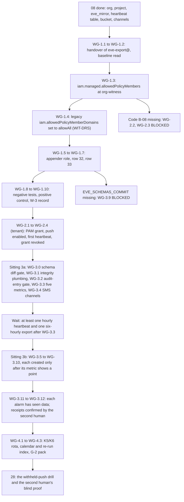

# 27. The witness: grants to the export identity and the absence alarms

## Status
- Owner: the platform owner
- Last reviewed: 2026-09-15
- Last executed: never
- Stage: review §2 stage 29 (W-3, the member constraint and the two grants to `eve-export@`; W-4, the alarms). It opens gate G-2 except for the deliberate withheld-push drill, which belongs to [28-eve-independent-proof-and-sandbox-drills.md](28-eve-independent-proof-and-sandbox-drills.md). W-1, W-2 and the records step are [08-witness-organisation.md](08-witness-organisation.md).
- Step prefix: WG. Steps: 30 (W-3: 10; the tenant-side push: 4; W-4: 13; rota and closing: 3). BLOCKED steps: WG-2.2 and WG-2.3 (Eve's export and heartbeat code, B-08), WG-3.9 (the RP-5 re-page, until the `pages` mirror table exists at `EVE_SCHEMAS_COMMIT`, 08 WO-2.10). Gated but not BLOCKED: every policy step, WG-3.5 to WG-3.10, which is created only in sitting 3b, after its own metric has been shown to carry at least one point — a metric counts only entries received after it was created, and a metric-absence condition never fires until its metric has written one measurement. WG-3.8 and WG-3.9 are additionally gated on WG-3.0's schema diff.
- Replaces: `project-topology.md` §7.5 rows W-3 and W-4 and the witness half of rows 32 and 33; the witness sentences of `eve/07-build-runbook.md` Phase 10b step 4.
- Decisions applied: SD-28 (the W-3 order, witness-owned billing, the `billingEnabled` check), SD-08 (route 1 and route 2), SD-07 and SD-12 (the heartbeat contract, the configuration fingerprint and the cumulative counts), SD-43 (row tampering is detected, not prevented), SD-26 (the withheld-push drill is 28's, on production `eve-export@`, after the first heartbeat and before the super-admin grant), SD-04 (who administers the witness). One new dated decision is written here: **WIT-DRS**, the reset of the legacy domain constraint (WG-1.4).
- Closes: S005 (the W-3 and W-4 half), S061 (the managed constraint instead of a customer id), X-ORG-06 (the two cadences, the 90-minute and 23.5-hour windows, the "at least one measurement" rule), X-ORG-07 (route 2 in the witness, and RP-5 where acknowledgement is really tracked), X-ORG-10 (the legacy constraint reset, in order), X-RQB-06 (the `billingEnabled` check and the billing-change alarm), S138 (no `dataEditor`: a custom role that cannot delete or rewrite). Detail in "Findings this file closes".
- Elapsed time: three sittings of about half a day each on the witness side plus a closing hour, separated by two waits — the first heartbeat after WG-2.2 (one hour, longer if Eve's code is not yet committed) and a full heartbeat-and-export cycle after the metrics are created (WG-3.3 to WG-3.5, overnight); one tenant sitting of about an hour.

## What this part builds

The two cross-organisation grants the whole design rests on, and the alarms that make the witness useful when the tenant goes quiet.

1. **W-3, the way in.** One managed organisation policy at `org-witness` that admits exactly one principal from the tenant's organisation — `eve-export@` — and nothing else; the legacy constraint, enforced by default on a new organisation, reset so that it cannot refuse what the managed one admits; a custom role that can append rows and never delete or rewrite them; that role on `eve_mirror`; `roles/storage.objectCreator` under the `exports/` prefix of the witness bucket; and two negative tests that prove the door is one principal wide.
2. **The push, switched on.** The one tenant-side sitting of this file: under a Privileged Access Manager grant the second human approves, the platform owner enables the push that 26 built disabled, and the first heartbeat and the backlog of findings since Eve's first run reach the witness.
3. **W-4, the alarms.** A field-by-field diff of the live heartbeat table against the committed contract, which gates the two content alarms; five log-based metrics on what `eve-export@` and the witness's own scheduled queries write; a 90-minute absence policy on the hourly heartbeat and a 23.5-hour absence policy on the six-hourly export; the route 2 incident policy to email and SMS for the second human and both witness administrators; an alarm on any change of Eve's configuration fingerprint or any decrease of a cumulative row count; the billing-status check; and RP-5's re-page on the acknowledgement copy, on a metric of its own so that the two can never be confused. The metrics are created in one sitting and the policies in the next, because a policy created over a metric with no point is a policy that cannot fire.
4. **The rota and the records.** The K5 and K6 rota under `rota/`, the standing monthly check, and the calendar entries 28 and 42 read.

| What it produces | Where it lives | Who can change it |
|---|---|---|
| `WITNESS_ALERT_HEARTBEAT` (90 min absence) | `EVE_WITNESS_PROJECT` | the two witness administrators only; any change is an Admin Activity entry to three people (08 WO-2.7) |
| `WITNESS_ALERT_EXPORT` (23.5 h absence) | `EVE_WITNESS_PROJECT` | as above |
| `WITNESS_ALERT_INCIDENT` (two policy names: the route 2 incident policy and the RP-5 re-page) | `EVE_WITNESS_PROJECT` | as above |
| `WITNESS_ALERT_BILLING` (billing change; plus the weekly `billingEnabled` reading on the rota) | `EVE_WITNESS_PROJECT` | as above |
| `WITNESS_ALERT_FINGERPRINT` (configuration fingerprint change, cumulative count decrease) | `EVE_WITNESS_PROJECT` | as above |

What the old text got wrong, and must not come back:

| Old text | Why it fails | Here instead |
|---|---|---|
| Topology row 32 and Eve 10b step 4: "the witness's own `iam.allowedPolicyMemberDomains` listing the tenant's customer id for this principal only" (S061) | A customer id in that constraint admits **all** identities in every domain of that customer and **every** service account in every project of its organisation. It cannot be narrowed to one principal, so it admits exactly what the witness exists to exclude | `constraints/iam.managed.allowedPolicyMembers` with `allowedMemberSubjects` naming `eve-export@` and the witness humans, and `allowedPrincipalSets` naming the witness organisation (WG-1.3) |
| Setting the managed constraint and stopping there (X-ORG-10) | An organisation created on or after 2024-05-03 enforces the legacy constraint by default with its own domain as the only allowed value. Both policies are evaluated, so the legacy default still refuses `eve-export@` and rows 32 and 33 fail at `setIamPolicy` | The legacy constraint is set to `allowAll` at `org-witness` **after** the managed one is in force, as the dated decision WIT-DRS (WG-1.4) |
| Topology row 32: `roles/bigquery.dataEditor` on `eve_mirror`, described as "add rows but cannot delete or rewrite them" (S138) | `dataEditor` holds `bigquery.tables.delete`, `bigquery.tables.update` and `bigquery.tables.updateData`; a compromised `eve-export@` could drop the mirror it fills | A custom role in the witness project with `bigquery.tables.updateData`, `bigquery.tables.get`, `bigquery.tables.list`, `bigquery.datasets.get` and `bigquery.datasets.getIamPolicy` — no create, no delete, no update, no `getData` (WG-1.5, WG-1.6) |
| 07 §7 H-1(b): a 60-minute witness alarm "on the mirrored heartbeat table", and H-4's "26 h (witness push)" on a daily push (X-ORG-06) | A metric-absence condition's maximum trigger absence time is 23.5 hours, so 26 hours cannot be created; a daily push under any window below 24 hours fires every day; and a 60-minute alarm cannot be evaluated from data that arrives once a day | Two cadences under one identity and the same two grants: an hourly heartbeat with a 90-minute absence policy (WG-3.5) and a six-hourly export with a 23.5-hour absence policy (WG-3.6). H-4's "26 h" is corrected to 23.5 h in the record WG-4.2 hands back |
| eve/03 §15 row 1 and Eve 10b step 3: severity 1 pages "through the witness channels" (X-ORG-07) | A notification channel is a project resource; nothing in `EVE_PROJECT` can notify a channel in `EVE_WITNESS_PROJECT`, and the one identity with a witness grant pushes on a schedule | Route 1 is the organisation's paging service (15, 26). Route 2 is here: the incident-mode push lands a row and a log-match policy in the witness notifies email and SMS to three people within minutes (WG-3.7) |
| 07 §8 RP-5: "the witness's Cloud Monitoring policies on the acknowledgement table" (X-ORG-07) | Cloud Monitoring cannot express "unacknowledged past twice the target" over table rows | Acknowledgement is tracked in the paging service (26). The witness holds the copy and re-pages from a scheduled query over it (WG-3.9), which is evidence and a backstop, not the primary tracker |
| Topology §7.5 W-4 and eve/01: "the absence alarm on Eve's heartbeat and on Google's feed" as one alarm (X-ORG-06) | Google's feed silence is Eve's own H-1 condition in `EVE_PROJECT`, evaluated on rows in `eve_workspace_logs`; the witness sees it only as a value inside the heartbeat row | The witness alarms on the **arrival** of heartbeats (WG-3.5) and on their **content** (WG-3.8: fingerprint change, count decrease). Feed silence inside the window is Eve's H-1, and reaches the witness as route 2 (WG-3.7) |
| P14's open billing line (X-RQB-06) | A project paid by a tenant billing account is stopped by anyone who reaches Billing Account Administrator there, and nothing in the witness watches it | Billing is witness-owned (08 WO-1.12); here, a log-match alarm on every Cloud Billing admin action in the witness project and a weekly reading of `billingEnabled` on the rota (WG-3.10) |



## Preconditions

- [ ] **08 is complete** through WO-2.18: `WITNESS_ORG_ID`, `WITNESS_CUSTOMER_ID`, `EVE_WITNESS_PROJECT`, `EVE_WITNESS_PROJECT_NUMBER`, `WITNESS_MIRROR_DS`, `WITNESS_HEARTBEAT_TABLE`, `WITNESS_BUCKET`, `WITNESS_EMAIL_CHANNEL` (three channels, comma-separated) and `WITNESS_BILLING_ACCOUNT_ID` are set in the witness copy of the variables file; `WITNESS_SA_1`, `WITNESS_SA_2` and `SECOND_HUMAN_WITNESS_ACCOUNT` exist and sign in with their keys.
- [ ] **08 WO-2.9** created the heartbeat table at contract version 1, and its schema hash reached 26 (`custody/<date>-WO-2.9-heartbeat-contract-v1`). `WO_2_9_CONTRACT_FILE` and `WO_2_9_CONTRACT_SHA256` are in the witness copy of the variables file: WG-1.1 and WG-3.0 both read them, and the contract is the single definition of the heartbeat shape anywhere in this set — neither this file nor 26 authors a second one.
- [ ] **26 is complete** through the creation of `SA_EVE_EXPORT`, `EVE_JOB_EXPORT` and `EVE_JOB_HEARTBEAT_PUSH` **with the push disabled**, and `EVE_FIRST_RUN_RECORD` exists: Eve's schedules were resumed and Eve has been finding since a dated first run. Without that record there is nothing to push and WG-2.3's backlog check has no meaning.
- [ ] The platform owner has a signed hand-over ready for WG-1.1 naming `SA_EVE_EXPORT` and **one other tenant service account address, for the negative test only** (no grant is ever made to it).
- [ ] `ENT_PROJECT_REPAIR_EVE` exists (23) with the second human as approver, and the second human is available within the sitting to approve WG-2.1.
- [ ] P13 is signed and 08 WO-2.16 has locked the bucket, or the PENDING line is in the README re-run index and the witness administrators accept that objects written under `exports/` before the lock are deletable by a witness administrator until it is done.
- [ ] Both witness administrators have `roles/orgpolicy.policyAdmin` at `org-witness` (held through Organization Administrator from 08 WO-1.10) and `roles/owner` on `EVE_WITNESS_PROJECT` (08 WO-2.3).
- [ ] A mobile telephone number for each of the three SMS recipients, and their consent to receive SMS on it (recorded; the numbers are not written to the variables file or to the build log).
- [ ] The second human can sign in to the witness console with `SECOND_HUMAN_WITNESS_ACCOUNT` unaided, from his own machine.

## People

| Role | Does | Present when |
|---|---|---|
| Witness administrator 1 (`WITNESS_SA_1`) | Performs W-3 and W-4 in the witness organisation | every witness sitting |
| Witness administrator 2 (`WITNESS_SA_2`) | Reads every constraint and grant back before it is applied; performs the negative tests; countersigns | every witness sitting |
| Second human (`SECOND_HUMAN_EMAIL`; witness account `SECOND_HUMAN_WITNESS_ACCOUNT`) | Approves the PAM grant of WG-2.1; **confirms receipt of every alarm test himself**, from his own mailbox and telephone, before anyone tells him it was sent; signs the W-4 record | WG-2.1, WG-3.4, WG-3.11, WG-3.12, WG-4.3 |
| Platform owner | **Hands over the `eve-export@` address and one other tenant service account address, and nothing else.** Performs only WG-2.1 to WG-2.4, in the tenant, under a grant the second human approves. Holds no witness account and appears in no witness IAM policy | WG-1.1 (hand-over only), WG-2.1 to WG-2.4 |
| Incident commander (IT security) | Named in the documentation of the route 2 and RP-5 policies as the escalation past twice the target | reads WG-3.7 and WG-3.9 |

The monitored administrator installs Eve (SD-12). That is why the platform owner performs nothing on the witness side of this file, why the grants are made by people he cannot instruct, and why every alarm here notifies three people of whom he is none.

## Sittings

| Sitting | Steps | Present | Hands-on | Waits after it |
|---|---|---|---|---|
| 1 (witness) | WG-1.1 to WG-1.10 | both witness administrators; the second human carries the hand-over | half a day | none |
| 2 (tenant) | WG-2.1 to WG-2.4 | platform owner; second human as approver | one hour | one hour for the first hourly heartbeat; up to six hours for the first export |
| 3a (witness) | WG-3.0 to WG-3.4 | both witness administrators; the second human for WG-3.4 | half a day | **at least one hourly heartbeat and one six-hourly export cycle after WG-3.3 created the metrics** — in practice the next morning. A user-defined log-based metric counts only entries received after it was created, so nothing before WG-3.3 exists for the policies to measure |
| 3b (witness) | WG-3.5 to WG-3.12 | both witness administrators; the second human for WG-3.11 and WG-3.12 | half a day | 24 hours before WG-3.11's export evidence is complete |
| 4 (witness) | WG-4.1 to WG-4.3 | a witness administrator; the second human signs | one hour | none |
| Later | WG-3.9 on `EVE_SCHEMAS_COMMIT` and 08 WO-2.10; WG-2.2 and WG-2.3 on B-08 | as each step | one hour each | none |

## If something goes wrong in the middle

| Situation | Do |
|---|---|
| WG-1.3 is applied and a later witness-side grant is refused for a **service agent** (for example when enabling an API, or re-creating the sink of 08 WO-2.6) | Domain-restricted sharing applies to automated grants made by service agents. Add that one service agent address to `allowedMemberSubjects` as a dated change countersigned by the second administrator; never widen `allowedPrincipalSets`, and never list a tenant customer id. |
| WG-1.6 or WG-1.7 fails with a domain-restriction error after WG-1.3 and WG-1.4 | The legacy policy is still enforced somewhere: re-read both with `--effective` (WG-1.4 VERIFY). Do not grant anything until both read as intended. |
| A negative test (WG-1.8) **succeeds** | Stop. The door is wider than one principal. Remove the test binding at once, re-read the managed policy, and report a severity 1 to the incident commander. No push is enabled until a repeated test is refused. |
| WG-2.2 has run and no heartbeat row arrives within 90 minutes | Do not create the absence policies (they would never fire, having no measurement). Read the job's execution log in `EVE_PROJECT` (platform owner), check the appender role and the dataset access entry (witness side), and check the table name against the contract of 08 WO-2.9. A shape mismatch is closed by `heartbeat_v2` (08 WO-3.5 re-run line), never by altering the table. |
| A test entry in WG-3.2 shows `principalEmail` redacted | Build every metric on `protoPayload.resourceName` and the method only, and record the deviation: the filters then count writes by any principal to those tables, which is sound because only `eve-export@` and the two administrators can write them. |
| **WG-3.2 returns no entry at all** | The heartbeat did not reach the witness through a table-level API, so no audit entry carries the heartbeat table's `resourceName` and the arrival metric of WG-3.3 would count nothing. This is a breach of 26 ER-4.3's export contract, not a filter to work around. Stop the file, record it as a contract breach, and hand it back to the platform owner through the second human. Only when he confirms in writing that the push uses a load or query job — a deviation he must justify — is WG-3.2's documented fallback filter used instead, and WG-3.3 records which of the two forms was chosen. |
| Enabling `bigquerydatatransfer.googleapis.com` (WG-3.1) fails, or its transfer configs never run, after WG-1.3 | The API provisions a Google-owned service agent outside the witness domain and grants it `roles/bigquerydatatransfer.serviceAgent` automatically; domain-restricted sharing applies to grants made by service agents, so the automatic grant can be refused and the transfer configs then sit failed with no rows and no alarm. WG-3.1's first sub-step adds that one subject to `allowedMemberSubjects` before the API is enabled. If it was missed, add it now as a dated change countersigned by the second administrator, wait for propagation, disable and re-enable the API, and re-read the transfer runs. |
| The SMS channel cannot be verified in the recipient's country | Record it, keep email and the paging service, and raise the gap to the incident commander; the G-2 record states which recipients have SMS. |
| A policy is created before its metric has a data point | It will never fire. This is why sitting 3b is separate and why every policy step begins with a `gcloud monitoring time-series list` pre-check that must return at least one point. If a policy was nevertheless created early, delete it, wait for the metric's first point, and create it again; record both timestamps. |
| Billing on `EVE_WITNESS_PROJECT` is found disabled | Severity 1 to the incident commander and the second human; a witness administrator re-links the witness billing account (08 WO-1.12); every alarm in this file is assumed to have been blind for the outage, and the window is written into the G-2 record. |
| An IRREVERSIBLE-by-name step is interrupted | None here is irreversible: every step of this file can be rolled back. The one exception in effect is a push that has already written rows into the witness, which nobody removes. |

## Evidence and the build log

- Witness-side checkpoint lines go to the local `witness-build-log.txt`, countersigned, and reach `BUILD_LOG_DIR` under `witness/` as a pull request reviewed by the second human, exactly as 08 prescribes. Tenant-side lines (WG-2.x) go to the platform owner's build log.
- Records made here are uploaded by a witness administrator through 08 WO-3.3 the same day: W-3 under `custody/`, the alarm tests and the G-2 pack under `drills/`, the K5 and K6 rota under `rota/`.
- Each EVIDENCE line becomes one line in `EVIDENCE_REGISTER` with the E-xx id of [../10-eu-ai-act.md](../10-eu-ai-act.md) §5 and the control group of [../11-tisax.md](../11-tisax.md) §13.
- No telephone number, no billing account id and no secret value appears in any log line or record; the SMS channels are recorded by channel resource name only.

## Variables this file sets

| Variable | Copy | Meaning |
|---|---|---|
| `SA_EVE_EXPORT` | witness copy (received), tenant copy (set by 26) | `eve-export@<EVE_PROJECT>.iam.gserviceaccount.com`, the only tenant principal ever admitted |
| `WITNESS_ALERT_HEARTBEAT` | witness | policy resource name, 90-minute absence on the heartbeat |
| `WITNESS_ALERT_EXPORT` | witness | policy resource name, 23.5-hour absence on the export objects |
| `WITNESS_ALERT_INCIDENT` | witness | **two** policy resource names, comma-separated: route 2 incident, RP-5 re-page |
| `WITNESS_ALERT_BILLING` | witness | policy resource name, Cloud Billing admin actions on the witness project |
| `WITNESS_ALERT_FINGERPRINT` | witness | policy resource name, configuration-fingerprint change or cumulative-count decrease |

Five witness-local names are used by the commands below and are recorded as an addendum to the plan's variable table, because they never leave the witness organisation: `WITNESS_APPENDER_ROLE` (the custom role id), `WITNESS_INTEGRITY_SA` (the witness-side scheduled-query identity), `WITNESS_SMS_CHANNEL` (up to three SMS channel resource names, comma-separated, in the same order as `WITNESS_EMAIL_CHANNEL`), `WITNESS_CHANNEL_COUNT` (how many channels every policy in this file must carry — computed in WG-3.4, never assumed to be six) and `WITNESS_CUSTODY_DIR` (the local directory whose files are uploaded under `custody/`, set in WG-1.2).

Every witness command runs with `CLOUDSDK_ACTIVE_CONFIG_NAME=witness`, no default project, and `--project`, `--organization` or `--billing-account` written out.

**Baselines are files, not shell variables.** Every baseline this file takes is written at once to `WITNESS_CUSTODY_DIR` under the name the EVIDENCE line promises, and every later diff and rollback reads it from there. A sitting can be cut between any two steps — the "If something goes wrong in the middle" table says so — and a `mktemp -d` path carried in `$B` or `$D` does not survive that. A diff against a path that no longer exists prints nothing, which reads exactly like a pass.

## Steps: W-3, the way in

### WG-1.1 Receive the export identity and check the gates

- **WHO:** Witness administrator 1 receives; witness administrator 2 reads the hand-over aloud; the second human carries it from the platform owner and confirms he did not alter it.
- **WHERE:** A signed paper or PDF hand-over, then the witness workstation shell.
- **ACTION:** The hand-over carries exactly two addresses and nothing else: `SA_EVE_EXPORT` and one other tenant service account address used **only** as the subject of the refused grant in WG-1.8. It also states the date of `EVE_FIRST_RUN_RECORD`, so that the witness knows what backlog to expect, and the six-hourly export cadence agreed in 26.

```bash
  The hand-over also carries the committed `eve/schemas/witness_heartbeat.json` that 26 ER-4.3 merged, and its SHA-256. 26 copies 08 WO-2.9's contract v1 rather than authoring its own shape, and this is the witness side of that check: the witness confirms, before anything is granted, that what the tenant will push matches the table the witness built.

```bash
need WITNESS_ORG_ID EVE_WITNESS_PROJECT WITNESS_MIRROR_DS WITNESS_HEARTBEAT_TABLE WITNESS_BUCKET WITNESS_EMAIL_CHANNEL WO_2_9_CONTRACT_FILE WO_2_9_CONTRACT_SHA256
penv_set SA_EVE_EXPORT "<eve-export@ address from the hand-over>"
printf '%s\n' "$SA_EVE_EXPORT" | grep -Eq '^eve-export@[a-z0-9-]+\.iam\.gserviceaccount\.com$' && echo "form ok"
penv_set WITNESS_CONTRACT_FILE "<path of the witness_heartbeat.json carried in the hand-over>"
shasum -a 256 "$WITNESS_CONTRACT_FILE" | cut -d' ' -f1
diff <(jq -S '[.[]|{name,type,mode:(.mode//"NULLABLE"),fields:(.fields//[]|map({name,type,mode}))}]' "$WO_2_9_CONTRACT_FILE") \
     <(jq -S '[.[]|{name,type,mode:(.mode//"NULLABLE"),fields:(.fields//[]|map({name,type,mode}))}]' "$WITNESS_CONTRACT_FILE") \
  && echo "TENANT CONTRACT MATCHES WO-2.9 v1"
"$PLATFORM_REPO_DIR/tools/decision-need.sh" P14 SD-28 SD-08 SD-43
```

  The second tenant address is written on the sitting form only, never into the variables file.
- **VERIFY:** The form shows two distinct addresses, both ending `.iam.gserviceaccount.com`, and the `grep` prints `form ok`. The `diff` prints `TENANT CONTRACT MATCHES WO-2.9 v1` and the `shasum` equals `WO_2_9_CONTRACT_SHA256`; if either fails, **stop**: the push would fail on the first row, or the alarms of WG-3.8 would not compile, and the fix is 26 ER-4.3's, not a change to the witness table. `decision-need.sh` prints `SIGNED` four times. 08's verification checklist is complete through WO-2.18, and the README re-run index shows no open PENDING line for WO-2.16 other than one the witness administrators have accepted in writing.
- **ROLLBACK:** `penv_set --force` with a build-log line if the address was mistyped. Nothing is granted yet.
- **EVIDENCE:** The signed hand-over, the contract diff output and the two SHA-256 values as `<date>-WG-1.1-export-identity-handover-v1` under `custody/`. EU AI Act E-06. TISAX 1.3, 4.1.

### WG-1.2 Read the baseline: both constraints and the three IAM policies

- **WHO:** Witness administrator 1 reads; witness administrator 2 keeps the output for the diff at WG-1.10.
- **WHERE:** Witness workstation shell.
- **ACTION:** Nothing in this step changes anything. It exists so that every later "the policy now says" has a "the policy said" beside it.

  The five files are written straight into `WITNESS_CUSTODY_DIR` under the names WG-1.6, WG-1.9 and WG-3.1 will read back. Nothing later in this file reads a `mktemp` path.

```bash
need WITNESS_ORG_ID EVE_WITNESS_PROJECT WITNESS_MIRROR_DS WITNESS_BUCKET
penv_set WITNESS_CUSTODY_DIR "$HOME/witness-records/custody"
mkdir -p "$WITNESS_CUSTODY_DIR"
D="$(date -u +%F)"
gcloud org-policies describe constraints/iam.allowedPolicyMemberDomains --organization="$WITNESS_ORG_ID" --effective --format=json > "$WITNESS_CUSTODY_DIR/${D}-WG-1.2-legacy-before.json" 2>&1 || true
gcloud org-policies describe constraints/iam.managed.allowedPolicyMembers --organization="$WITNESS_ORG_ID" --effective --format=json > "$WITNESS_CUSTODY_DIR/${D}-WG-1.2-managed-before.json" 2>&1 || true
gcloud projects get-iam-policy "$EVE_WITNESS_PROJECT" --format=json > "$WITNESS_CUSTODY_DIR/${D}-WG-1.2-project-iam-before.json"
bq --project_id="$EVE_WITNESS_PROJECT" show --format=prettyjson "${EVE_WITNESS_PROJECT}:${WITNESS_MIRROR_DS}" > "$WITNESS_CUSTODY_DIR/${D}-WG-1.2-dataset-before.json"
gcloud storage buckets get-iam-policy "$WITNESS_BUCKET" --format=json > "$WITNESS_CUSTODY_DIR/${D}-WG-1.2-bucket-iam-before.json"
penv_set WITNESS_BASELINE_DATE "$D"
for f in legacy-before managed-before project-iam-before dataset-before bucket-iam-before; do test -s "$WITNESS_CUSTODY_DIR/${D}-WG-1.2-${f}.json" || echo "MISSING OR EMPTY: $f"; done
```

- **VERIFY:** The `for` loop prints nothing: all five baselines exist and are non-empty. `jq '.spec.rules // .rules' "$WITNESS_CUSTODY_DIR/${WITNESS_BASELINE_DATE}-WG-1.2-legacy-before.json"` shows the default for a new organisation: the witness's own customer id or domain as the only allowed value (organisations created on or after 2024-05-03 enforce it by default). `jq -r '.bindings[].members[]' "$WITNESS_CUSTODY_DIR/${WITNESS_BASELINE_DATE}-WG-1.2-project-iam-before.json" | grep -c '@'` matches 08 WO-2.3's count, and no member is a tenant address. The dataset access array holds the owner of record only; the bucket policy holds the project convenience bindings and the owner of record's `objectViewer`.
- **ROLLBACK:** None; the step only reads. If the sitting is resumed on a later date, `WITNESS_BASELINE_DATE` is **not** re-set: the baseline keeps the date it was taken, and this step is not run again.
- **EVIDENCE:** The five files, uploaded as `<date>-WG-1.2-baseline-v1` under `custody/` through 08 WO-3.3 the same day. EU AI Act E-08. TISAX 4.1, 4.2.

### WG-1.3 Set the managed member constraint at `org-witness`

- **WHO:** Witness administrator 1 applies; witness administrator 2 reads every line of the policy file aloud before Enter.
- **WHERE:** Witness workstation shell.
- **ACTION:** `constraints/iam.managed.allowedPolicyMembers` takes `allowedPrincipalSets` (whole principal sets, for example an organisation) and `allowedMemberSubjects` (individual members). The organisation principal set keeps the witness working for its own people and its own service accounts; the one foreign subject is `eve-export@`. The three witness humans are listed as subjects as well, although the principal set already covers them, so that the file states the intent and so that a future narrowing of the principal set does not lock the administrators out.

  **Your own organisation is not allowed automatically**: if `allowedPrincipalSets` is omitted, no witness principal can be granted anything.

```bash
need WITNESS_ORG_ID SA_EVE_EXPORT WITNESS_SA_1 WITNESS_SA_2 SECOND_HUMAN_WITNESS_ACCOUNT
P="$(mktemp -d)/managed-allowed-policy-members.yaml"
cat > "$P" <<EOF
name: organizations/${WITNESS_ORG_ID}/policies/iam.managed.allowedPolicyMembers
spec:
  rules:
  - enforce: true
    parameters:
      allowedPrincipalSets:
      - //cloudresourcemanager.googleapis.com/organizations/${WITNESS_ORG_ID}
      allowedMemberSubjects:
      - serviceAccount:${SA_EVE_EXPORT}
      - user:${WITNESS_SA_1}
      - user:${WITNESS_SA_2}
      - user:${SECOND_HUMAN_WITNESS_ACCOUNT}
EOF
cat "$P"
gcloud org-policies set-policy "$P" --update-mask=spec
```

- **VERIFY:**

```bash
gcloud org-policies describe constraints/iam.managed.allowedPolicyMembers --organization="$WITNESS_ORG_ID" --format=json | jq '.spec.rules'
gcloud org-policies describe constraints/iam.managed.allowedPolicyMembers --organization="$WITNESS_ORG_ID" --effective --format=json | jq '.spec.rules'
```

  Both show `enforce: true`, one principal set (the witness organisation) and exactly four member subjects, one of them `serviceAccount:${SA_EVE_EXPORT}`. No customer id appears anywhere in the output. The console path is IAM & Admin > Organization policies > Domain restricted sharing (managed), scope `org-witness`. One planned amendment follows: WG-3.1 adds a fifth subject, the BigQuery Data Transfer service agent, before that API is enabled. Every other addition is a dated, countersigned change under the service-agent row of "If something goes wrong in the middle".
- **ROLLBACK:** `gcloud org-policies delete constraints/iam.managed.allowedPolicyMembers --organization="$WITNESS_ORG_ID"`, which returns the organisation to the legacy default alone; then WG-1.4 must be reverted too, or the witness is left admitting nothing from outside.
- **EVIDENCE:** The policy file and both describes as `<date>-WG-1.3-managed-member-constraint-v1` under `custody/`. EU AI Act E-08. TISAX 4.1.3, 1.6.

### WG-1.4 Reset the legacy domain constraint, as the dated decision WIT-DRS

- **WHO:** Witness administrator 1 applies; witness administrator 2 countersigns the decision record; the second human is informed the same day.
- **WHERE:** The decision record first, then the witness workstation shell.
- **ACTION:** An organisation created on or after 2024-05-03 enforces `constraints/iam.allowedPolicyMemberDomains` by default with its own domain as the only allowed value. Both policies are evaluated, so leaving it as it is would refuse `eve-export@` at `setIamPolicy` however the managed constraint is written; and setting it to the tenant's customer id would admit every identity and every service account of the tenant's organisation — the thing the witness exists to exclude. It is therefore set to allow all principals, and the narrowing is done entirely by the managed constraint of WG-1.3, which **must already be in force**.

  Write `decisions/<date>-wit-drs.md` first, signed by both witness administrators: what is reset, why, what carries the restriction instead, and the quarterly check that WG-1.3's policy still reads as written (08 WO-3.5 calendar, 42).

```bash
need WITNESS_ORG_ID
gcloud org-policies describe constraints/iam.managed.allowedPolicyMembers --organization="$WITNESS_ORG_ID" --effective --format='value(spec.rules)' | grep -q "$SA_EVE_EXPORT" && echo "managed constraint in force"
L="$(mktemp -d)/legacy-allowed-policy-member-domains.yaml"
cat > "$L" <<EOF
name: organizations/${WITNESS_ORG_ID}/policies/iam.allowedPolicyMemberDomains
spec:
  rules:
  - allowAll: true
EOF
gcloud org-policies set-policy "$L" --update-mask=spec
```

- **VERIFY:** `gcloud org-policies describe constraints/iam.allowedPolicyMemberDomains --organization="$WITNESS_ORG_ID" --effective --format=json | jq '.spec.rules'` shows `allowAll: true` and no `allowedValues`; the managed describe of WG-1.3 is unchanged. The Admin Activity alert of 08 WO-2.7 fires for both policy writes and all three recipients confirm.
- **ROLLBACK:** `gcloud org-policies delete constraints/iam.allowedPolicyMemberDomains --organization="$WITNESS_ORG_ID"` restores the inherited default (own domain only). Do this at once if WG-1.3 is ever deleted.
- **EVIDENCE:** `decisions/<date>-wit-drs.md` with two signatures, and the describe output, as `<date>-WG-1.4-legacy-constraint-reset-v1` under `custody/`. EU AI Act E-08. TISAX 1.6, 4.1.3.

### WG-1.5 Create the appender role that cannot delete or rewrite

- **WHO:** Witness administrator 1; witness administrator 2 checks the permission list against the finding S138 text.
- **WHERE:** Witness workstation shell.
- **ACTION:** `roles/bigquery.dataEditor` includes `bigquery.tables.delete`, `bigquery.tables.update` and `bigquery.tables.updateData`, so topology row 32's role would let a compromised `eve-export@` drop the mirror it fills. The custom role holds the one write permission that inserts rows and nothing that removes or alters them. `bigquery.datasets.getIamPolicy` is included because a custom role granting `bigquery.datasets.get` must also grant it to keep working (BigQuery dataset-access change dated 2026-03-17). `bigquery.tables.getData` is **not** granted: the tenant's identity writes the witness copy and cannot read it back.

```bash
need EVE_WITNESS_PROJECT
penv_set WITNESS_APPENDER_ROLE "witnessMirrorAppender"
gcloud iam roles create "$WITNESS_APPENDER_ROLE" --project="$EVE_WITNESS_PROJECT" --title="Witness mirror appender" --description="Insert rows into witness mirror tables. No create, delete, update or read." --permissions=bigquery.tables.updateData,bigquery.tables.get,bigquery.tables.list,bigquery.datasets.get,bigquery.datasets.getIamPolicy --stage=GA
```

- **VERIFY:**

```bash
gcloud iam roles describe "$WITNESS_APPENDER_ROLE" --project="$EVE_WITNESS_PROJECT" --format="json(includedPermissions,stage,deleted)"
```

  prints exactly the five permissions, `GA`, and no `deleted` field. `grep -E 'tables.delete|tables.update"|tables.create|tables.getData|jobs.create'` over that output returns nothing.
- **ROLLBACK:** `gcloud iam roles delete "$WITNESS_APPENDER_ROLE" --project="$EVE_WITNESS_PROJECT"` (a deleted custom role can be undeleted for seven days; the id cannot be reused for a different role in that time).
- **EVIDENCE:** The describe output as `<date>-WG-1.5-appender-role-v1` under `custody/`. Closes S138 on the witness side. EU AI Act E-08. TISAX 4.1.2.

### WG-1.6 Row 32: grant the appender role on `eve_mirror`

- **WHO:** Witness administrator 1 edits; witness administrator 2 reads the diff.
- **WHERE:** Witness workstation shell.
- **ACTION:** The grant is made on the dataset, through the access array, with the read-back-and-diff pattern of file 01. A BigQuery access entry's `userByEmail` maps to a `user:` or `serviceAccount:` IAM member, so a service account is written there. This is the moment the managed constraint is exercised for the first time: if it were wrong, this command fails.

```bash
need EVE_WITNESS_PROJECT WITNESS_MIRROR_DS WITNESS_HEARTBEAT_TABLE SA_EVE_EXPORT WITNESS_APPENDER_ROLE WITNESS_CUSTODY_DIR
D="$(date -u +%F)"
bq --project_id="$EVE_WITNESS_PROJECT" show --format=prettyjson "${EVE_WITNESS_PROJECT}:${WITNESS_MIRROR_DS}" > "$WITNESS_CUSTODY_DIR/${D}-WG-1.6-dataset-before.json"
test -s "$WITNESS_CUSTODY_DIR/${D}-WG-1.6-dataset-before.json" || { echo "NO BASELINE: stop"; }
jq --arg r "projects/${EVE_WITNESS_PROJECT}/roles/${WITNESS_APPENDER_ROLE}" --arg u "$SA_EVE_EXPORT" '.access += [{"role":$r,"userByEmail":$u}] | {access}' "$WITNESS_CUSTODY_DIR/${D}-WG-1.6-dataset-before.json" > "$WITNESS_CUSTODY_DIR/${D}-WG-1.6-dataset-update.json"
bq --project_id="$EVE_WITNESS_PROJECT" update --source="$WITNESS_CUSTODY_DIR/${D}-WG-1.6-dataset-update.json" "${EVE_WITNESS_PROJECT}:${WITNESS_MIRROR_DS}"
bq --project_id="$EVE_WITNESS_PROJECT" show --format=prettyjson "${EVE_WITNESS_PROJECT}:${WITNESS_MIRROR_DS}" > "$WITNESS_CUSTODY_DIR/${D}-WG-1.6-dataset-after.json"
diff <(jq -S .access "$WITNESS_CUSTODY_DIR/${D}-WG-1.6-dataset-before.json") <(jq -S .access "$WITNESS_CUSTODY_DIR/${D}-WG-1.6-dataset-after.json")
penv_set WITNESS_WG16_DATE "$D"
```

- **VERIFY:** The diff shows one added entry and nothing else, with the custom role path and `eve-export@`. `jq -r '.access[] | "\(.role) \(.userByEmail // .groupByEmail // .specialGroup // .iamMember)"' "$WITNESS_CUSTODY_DIR/${WITNESS_WG16_DATE}-WG-1.6-dataset-after.json"` shows no `WRITER`, no `roles/bigquery.dataEditor` and no `OWNER` for any tenant address. If the update is refused with a domain-restriction error, stop and re-read WG-1.3 and WG-1.4.

  **If a custom role is refused in a dataset access entry**, the fallback is a **table-level** binding on the mirror tables only, never a project-level grant. `bq` supports table and view IAM directly:

```bash
for T in $(bq --project_id="$EVE_WITNESS_PROJECT" ls --format=json "${EVE_WITNESS_PROJECT}:${WITNESS_MIRROR_DS}" | jq -r '.[].tableReference.tableId'); do
  case "$T" in integrity_alerts|rp5_repage) echo "skip $T (witness-only alert table)"; continue;; esac
  bq add-iam-policy-binding --project_id="$EVE_WITNESS_PROJECT" --member="serviceAccount:${SA_EVE_EXPORT}" --role="projects/${EVE_WITNESS_PROJECT}/roles/${WITNESS_APPENDER_ROLE}" --table "${EVE_WITNESS_PROJECT}:${WITNESS_MIRROR_DS}.${T}"
done
bq get-iam-policy --project_id="$EVE_WITNESS_PROJECT" --table --format=prettyjson "${EVE_WITNESS_PROJECT}:${WITNESS_MIRROR_DS}.${WITNESS_HEARTBEAT_TABLE}"
```

  That is **narrower** than the dataset entry, not wider: it closes the residual WG-3.1 records, because `eve-export@` then cannot insert into `integrity_alerts` or `rp5_repage` at all. Record it as a deviation and tell WG-3.12 to close open item 3 rather than hand it to 42. A **project-level** grant of the appender role is refused as a fallback: `bigquery.tables.updateData` at project level reaches every table in the project — the alert tables, the heartbeat table and every mirror table 08 WO-2.10 or 41 adds — which is materially broader than the residual this file records. If a project-level grant is ever the only option that works, it needs the same two-administrator countersignature every other grant in W-3 carries, a dated deviation record beside the WIT-DRS decision, and an immediate re-run of WG-3.12's open-item list to record the widened residual before the push is enabled.
- **ROLLBACK:** Re-apply the baseline with `bq --project_id="$EVE_WITNESS_PROJECT" update --source=<(jq '{access}' "$WITNESS_CUSTODY_DIR/${WITNESS_WG16_DATE}-WG-1.6-dataset-before.json") "${EVE_WITNESS_PROJECT}:${WITNESS_MIRROR_DS}"`, after `test -s` on that file; under the table-level fallback, `bq remove-iam-policy-binding` with the same `--member`, `--role` and `--table`. The pushed rows stay.
- **EVIDENCE:** Before, after and the diff as `<date>-WG-1.6-row32-grant-v1` under `custody/`. Closes topology row 32 as corrected. EU AI Act E-08. TISAX 4.1.2, 4.1.3.

### WG-1.7 Row 33: `objectCreator` on the witness bucket, under `exports/` only

- **WHO:** Witness administrator 1 grants; witness administrator 2 reads the condition expression aloud.
- **WHERE:** Witness workstation shell.
- **ACTION:** `roles/storage.objectCreator` allows creating objects and gives no permission to view, delete or overwrite them, which is the whole property row 33 wants. The IAM condition restricts even creation to the `exports/` prefix, so the custody, rota and drill prefixes stay beyond the tenant's reach. Conditions on bucket bindings need uniform bucket-level access, which 08 enforced.

```bash
need WITNESS_BUCKET SA_EVE_EXPORT
BN="${WITNESS_BUCKET#gs://}"
gcloud storage buckets add-iam-policy-binding "$WITNESS_BUCKET" --member="serviceAccount:${SA_EVE_EXPORT}" --role=roles/storage.objectCreator --condition="expression=resource.name.startsWith(\"projects/_/buckets/${BN}/objects/exports/\"),title=exports-prefix-only,description=Create-only under exports/ (topology row 33)"
```

- **VERIFY:**

```bash
gcloud storage buckets get-iam-policy "$WITNESS_BUCKET" --format=json | jq '.bindings[] | select(.members[]? | test("eve-export@"))'
```

  shows one binding, `roles/storage.objectCreator`, with the condition title `exports-prefix-only` and the bucket name inside the expression. No `objectAdmin`, `objectUser`, `storage.admin` or unconditioned binding names `eve-export@`. Console: Cloud Storage > the bucket > Permissions, the row shows "1 condition".
- **ROLLBACK:** `gcloud storage buckets remove-iam-policy-binding "$WITNESS_BUCKET" --member="serviceAccount:${SA_EVE_EXPORT}" --role=roles/storage.objectCreator --all` (or repeat the exact `--condition` to remove that one binding); objects already written stay, and under a locked retention policy they cannot be removed by anyone.
- **EVIDENCE:** The policy extract as `<date>-WG-1.7-row33-grant-v1` under `custody/`. EU AI Act E-06, E-08. TISAX 4.1.2, 5.2.

### WG-1.8 Negative test: another tenant service account is refused

- **WHO:** Witness administrator 2 runs the refused command; witness administrator 1 records the exact error.
- **WHERE:** Witness workstation shell.
- **ACTION:** The second tenant address from WG-1.1's hand-over is used once, here, as the subject of a grant that must fail. It is an existing account, so that the refusal cannot be confused with "no such service account".

```bash
need EVE_WITNESS_PROJECT
gcloud projects add-iam-policy-binding "$EVE_WITNESS_PROJECT" --member="serviceAccount:<the other tenant service account from the hand-over>" --role=roles/bigquery.metadataViewer --condition=None
```

- **VERIFY:** The command **fails**, and the error names the domain restriction (for example, "One or more users named in the policy do not belong to a permitted customer", or a message naming `constraints/iam.managed.allowedPolicyMembers`). `gcloud projects get-iam-policy "$EVE_WITNESS_PROJECT" --format=json | grep -c "<that address>"` prints `0`. If the error instead says the service account does not exist, the test is inconclusive: ask for a different existing address through the second human and repeat. *Assumption:* the constraint is evaluated before existence; the recorded error text settles it on the day.
- **ROLLBACK:** None needed: nothing was granted. If the command unexpectedly succeeds, remove the binding immediately with `remove-iam-policy-binding` and follow "If something goes wrong in the middle".
- **EVIDENCE:** The full error text and the `grep` count as `<date>-WG-1.8-negative-tenant-sa-v1` under `drills/`. EU AI Act E-08. TISAX 4.1.3, 1.6.

### WG-1.9 Negative test: an unlisted human is refused; and the positive control

- **WHO:** Witness administrator 2 runs both; witness administrator 1 records; the second human is told afterwards that his tenant address was refused.
- **WHERE:** Witness workstation shell.
- **ACTION:** The unlisted human is the second human's **tenant** address, `SECOND_HUMAN_EMAIL`: a person with every reason to be in the witness, whose witness identity is `SECOND_HUMAN_WITNESS_ACCOUNT` and whose tenant identity must never be. The positive control proves the constraint is not simply refusing everything.

```bash
need EVE_WITNESS_PROJECT SECOND_HUMAN_EMAIL SECOND_HUMAN_WITNESS_ACCOUNT
gcloud projects add-iam-policy-binding "$EVE_WITNESS_PROJECT" --member="user:${SECOND_HUMAN_EMAIL}" --role=roles/browser --condition=None
gcloud projects add-iam-policy-binding "$EVE_WITNESS_PROJECT" --member="user:${SECOND_HUMAN_WITNESS_ACCOUNT}" --role=roles/browser --condition=None
gcloud projects remove-iam-policy-binding "$EVE_WITNESS_PROJECT" --member="user:${SECOND_HUMAN_WITNESS_ACCOUNT}" --role=roles/browser --condition=None
```

- **VERIFY:** The first command fails with a domain-restriction error; the second succeeds; the third removes it, leaving the project policy identical to WG-1.2's baseline plus nothing. The baseline is read from its custody path, and a missing baseline **fails the step** rather than printing an empty diff that reads as a pass:

```bash
need WITNESS_CUSTODY_DIR WITNESS_BASELINE_DATE EVE_WITNESS_PROJECT
BASE="$WITNESS_CUSTODY_DIR/${WITNESS_BASELINE_DATE}-WG-1.2-project-iam-before.json"
test -s "$BASE" || { echo "WG-1.9 FAILS: no WG-1.2 baseline at $BASE; re-take it and re-run WG-1.2 before trusting any diff in this file"; }
gcloud projects get-iam-policy "$EVE_WITNESS_PROJECT" --format=json | jq -S '.bindings' > "$WITNESS_CUSTODY_DIR/$(date -u +%F)-WG-1.9-project-iam-after.json"
diff -q <(jq -S '.bindings' "$BASE") "$WITNESS_CUSTODY_DIR/$(date -u +%F)-WG-1.9-project-iam-after.json" && echo "project policy equals baseline"
```

  The step passes only when both `test -s` is silent and the `diff -q` prints `project policy equals baseline`.
  **Residual, recorded and not hidden:** because `allowedPrincipalSets` names the witness organisation, a **new** witness-domain account could be granted a role in the witness. That is deliberate — the administrators must be able to run their own organisation — and it is covered by the three-person Admin Activity alert of 08 WO-2.7 and the quarterly IAM re-read of 08 WO-3.5, not by this constraint.
- **ROLLBACK:** The third command is the rollback of the second; it is part of the step.
- **EVIDENCE:** Both error texts, the successful control and the empty diff as `<date>-WG-1.9-negative-unlisted-human-v1` under `drills/`. EU AI Act E-08. TISAX 4.1.3.

### WG-1.10 Close W-3 and tell the tenant the door is open

- **WHO:** Witness administrator 1 writes; witness administrator 2 countersigns; the second human carries the note to the platform owner.
- **WHERE:** The sitting form, then the pull request to `BUILD_LOG_DIR`.
- **ACTION:** The W-3 record states: the managed constraint's four subjects and one principal set; the legacy reset and its decision id; the custom role and its five permissions; the two grants with their scopes; both refusals with their error text; the positive control. The note to the platform owner says one sentence only — "the two grants for `eve-export@` are in place; the push may be enabled" — with the date and both signatures. It carries no witness identifier that 08 WO-2.18 did not already hand over.

```bash
"$PLATFORM_REPO_DIR/tools/decision-need.sh" WIT-DRS
```

- **VERIFY:** `decision-need.sh` prints `SIGNED` for the new record. The witness build log holds ten W-3 lines, each DONE. The second human confirms the note names no new identifier (he reads it before carrying it).
- **ROLLBACK:** A record is superseded by `v2`, never edited.
- **EVIDENCE:** `<date>-WG-1.10-w3-record-v1` under `custody/`, and the one-sentence note as `<date>-WG-1.10-push-may-be-enabled-v1`. EU AI Act E-06, E-08. TISAX 1.5, 4.1.

## Steps: the tenant side, enabling the push

### WG-2.1 Take the repair grant on `EVE_PROJECT`

- **WHO:** Platform owner requests; **the second human approves** (`ENT_PROJECT_REPAIR_EVE`'s approver, 23). The second human refuses the request if the note of WG-1.10 has not reached him.
- **WHERE:** Platform owner's shell, tenant `~/.platform-env` sourced.
- **ACTION:** The platform owner holds no standing right that edits Eve (the drift check of 28 proves it). Everything in WG-2.2 and WG-2.3 happens inside one time-boxed grant whose justification names this step.

```bash
need ENT_PROJECT_REPAIR_EVE EVE_PROJECT CICD_PROJECT
gcloud pam grants create --entitlement="$ENT_PROJECT_REPAIR_EVE" --requested-duration=3600s --justification="27 WG-2.2 and WG-2.3: enable the witness push after W-3; confirm the first heartbeat and the backlog" --location=global --project="$EVE_PROJECT" --billing-project="$CICD_PROJECT"
```

- **VERIFY:** `gcloud pam grants list --entitlement="$ENT_PROJECT_REPAIR_EVE" --location=global --project="$EVE_PROJECT" --billing-project="$CICD_PROJECT" --filter="state=ACTIVE" --format="value(name,requester,requestedDuration)"` shows one active grant, requester the platform owner, one hour. The approval's `ApproveGrant` audit entry names the second human.
- **ROLLBACK:** `gcloud pam grants revoke <GRANT_NAME> --reason="sitting stopped" --location=global --project="$EVE_PROJECT" --billing-project="$CICD_PROJECT"`.
- **EVIDENCE:** Grant name and the approval entry in the build log WG-2.1. EU AI Act E-08. TISAX 4.1.3.

### WG-2.2 Enable the push on the heartbeat and export jobs (BLOCKED)

- **BLOCKED** until Eve's export and heartbeat code is committed and 26 has deployed `EVE_JOB_HEARTBEAT_PUSH` and `EVE_JOB_EXPORT` from a pinned digest (README BLOCKED index, B-08: Eve's export job, its manifest writer and the heartbeat writer; repository and commit *tbd* by 26). The gate that waits: G-2, and with it the whole of W-4 in this file, 28's proof and the super-admin grant.
- **WHO:** Platform owner, inside the grant of WG-2.1; the second human watches the screen.
- **WHERE:** Platform owner's shell.
- **ACTION:** 26 deploys both jobs with the push switched off, so that nothing can write to the witness before the grants exist. This step flips exactly that switch and changes nothing else: not the image digest, not the identity, not the schedules Eve is already running on. 26 (ER-4.4, ER-4.9) deploys both jobs with `WITNESS_PUSH=disabled` and leaves the flip here, so the variable name below is the one 26 set.

```bash
need EVE_PROJECT EVE_JOB_HEARTBEAT_PUSH EVE_JOB_EXPORT REGION EVE_WITNESS_PROJECT WITNESS_MIRROR_DS WITNESS_HEARTBEAT_TABLE WITNESS_BUCKET
gcloud run jobs update "$EVE_JOB_HEARTBEAT_PUSH" --project="$EVE_PROJECT" --region="$REGION" --update-env-vars=WITNESS_PUSH=enabled,WITNESS_PROJECT="$EVE_WITNESS_PROJECT",WITNESS_DATASET="$WITNESS_MIRROR_DS",WITNESS_HEARTBEAT_TABLE="$WITNESS_HEARTBEAT_TABLE"
gcloud run jobs update "$EVE_JOB_EXPORT" --project="$EVE_PROJECT" --region="$REGION" --update-env-vars=WITNESS_PUSH=enabled,WITNESS_PROJECT="$EVE_WITNESS_PROJECT",WITNESS_DATASET="$WITNESS_MIRROR_DS",WITNESS_BUCKET="$WITNESS_BUCKET"
gcloud run jobs execute "$EVE_JOB_HEARTBEAT_PUSH" --project="$EVE_PROJECT" --region="$REGION" --wait
```

- **VERIFY:** `gcloud run jobs describe "$EVE_JOB_HEARTBEAT_PUSH" --project="$EVE_PROJECT" --region="$REGION" --format="value(spec.template.spec.template.spec.containers[0].env)"` shows `WITNESS_PUSH=enabled` and the four witness identifiers, and the image digest is unchanged from 26's record (compare the recorded SHA-256). The manual execution ends `Succeeded`. `gcloud run jobs executions list --job="$EVE_JOB_HEARTBEAT_PUSH" --project="$EVE_PROJECT" --region="$REGION" --limit=1` shows it. If the execution fails with a permission error naming BigQuery, the appender role is missing a permission: record the exact message, hand it to the witness administrators (it is theirs to fix in WG-1.5), and do not widen anything from the tenant side.
- **ROLLBACK:** `gcloud run jobs update "$EVE_JOB_HEARTBEAT_PUSH" --project="$EVE_PROJECT" --region="$REGION" --update-env-vars=WITNESS_PUSH=disabled` (and the same for the export job). Rows already pushed stay in the witness.
- **EVIDENCE:** The describe outputs with digests, and the execution id, as `<date>-WG-2.2-push-enabled-v1` in the tenant build log and in `EVIDENCE_REGISTER`. EU AI Act E-06, E-11. TISAX 5.2.

### WG-2.3 Confirm the first heartbeat and the backlog push (BLOCKED)

- **BLOCKED** with WG-2.2, on B-08.
- **WHO:** Platform owner reads the tenant side; a witness administrator reads the witness side on the telephone at the same time; the second human hears both.
- **WHERE:** Platform owner's shell (tenant side) and the witness workstation shell (witness side), at the same time.
- **ACTION:** Two readings of the same event from two organisations. The backlog is everything Eve has found since `EVE_FIRST_RUN_RECORD`: the first export run carries it, which is why its object count is larger than a steady six-hourly run.

  Tenant side:

```bash
need EVE_PROJECT EVE_JOB_EXPORT REGION
gcloud run jobs execute "$EVE_JOB_EXPORT" --project="$EVE_PROJECT" --region="$REGION" --wait
gcloud logging read "resource.type=\"cloud_run_job\" AND resource.labels.job_name=\"${EVE_JOB_EXPORT}\" AND severity>=WARNING" --project="$EVE_PROJECT" --freshness=2h --limit=20 --format="value(timestamp,severity,textPayload)"
```

  Witness side. Every column below is named in 08 WO-2.9's contract v1, which WG-1.1 diffed against the file 26 ER-4.3 committed; the query names no column the contract does not define, and WG-3.0 proves the live table still carries them before any alarm is built on them.

```bash
need EVE_WITNESS_PROJECT WITNESS_MIRROR_DS WITNESS_HEARTBEAT_TABLE WITNESS_BUCKET
bq --project_id="$EVE_WITNESS_PROJECT" query --use_legacy_sql=false --format=prettyjson "SELECT heartbeat_ts, kind, source_project, schema_version, config_fingerprint, ws_log_rows_window, first_run_record FROM \`${EVE_WITNESS_PROJECT}.${WITNESS_MIRROR_DS}.${WITNESS_HEARTBEAT_TABLE}\` ORDER BY heartbeat_ts DESC LIMIT 5"
gcloud storage ls -l "${WITNESS_BUCKET}/exports/**" | tail -20
```

- **VERIFY:** The query runs at all — an `Unrecognized name` error means the push wrote a shape the contract does not describe, which is a stop, not a query to adjust. At least one row with `kind = 'hourly'` exists, its `schema_version` is the string `1`, its `source_project` is the Eve project named in the hand-over, `first_run_record` matches `EVE_FIRST_RUN_RECORD`, and `config_fingerprint` is a 64-character hexadecimal string. The bucket listing shows objects under `exports/<project>/<dataset>/<table>/dt=YYYY-MM-DD/` including a `MANIFEST.json`, covering every day since the first run. No warning or error appears in the job log. The witness administrator, not the platform owner, states aloud what he sees.
- **ROLLBACK:** None: rows and objects in the witness are never removed. A wrong push is superseded by a corrected one and both are explained in the record.
- **EVIDENCE:** The heartbeat rows, the object listing and the job log as `<date>-WG-2.3-first-heartbeat-and-backlog-v1`, written by the witness administrator (not the platform owner) and uploaded under `drills/`. EU AI Act E-06. TISAX 5.2, 1.5.

### WG-2.4 Revoke the grant and record the push state

- **WHO:** Platform owner; the second human confirms the revocation.
- **WHERE:** Platform owner's shell.
- **ACTION:**

```bash
need ENT_PROJECT_REPAIR_EVE EVE_PROJECT CICD_PROJECT
gcloud pam grants revoke "<GRANT_NAME from WG-2.1>" --reason="27 WG-2.4: push enabled and confirmed" --location=global --project="$EVE_PROJECT" --billing-project="$CICD_PROJECT"
gcloud pam grants list --entitlement="$ENT_PROJECT_REPAIR_EVE" --location=global --project="$EVE_PROJECT" --billing-project="$CICD_PROJECT" --filter="state=ACTIVE" --format="value(name)"
```

- **VERIFY:** The list prints nothing. `gcloud projects get-iam-policy "$EVE_PROJECT" --format=json | jq -r '.bindings[] | select(.members[]? == "user:'"$OWNER_DAILY_ACCOUNT"'")'` shows no standing binding that could edit the jobs. The README re-run index gains no new line: the push switch is not re-run.
- **ROLLBACK:** None; the grant is gone by design. A further change needs a new request with its own justification.
- **EVIDENCE:** The revoke entry and the empty list in the build log WG-2.4. EU AI Act E-08. TISAX 4.1.3.

## Steps: W-4, the alarms

### WG-3.0 The schema gate: the live table, field by field, against the contract

- **WHO:** Witness administrator 2 runs it; witness administrator 1 reads the contract file back field by field. Neither may amend the contract; a mismatch goes to the second human.
- **WHERE:** Witness workstation shell.
- **ACTION:** Everything from WG-3.8 onwards is SQL over `WITNESS_HEARTBEAT_TABLE`. A query that names a column the table does not have fails with `Unrecognized name`, the scheduled query writes nothing into `integrity_alerts`, and `WITNESS_ALERT_FINGERPRINT` and the count-decrease alarm — the whole of the anti-silencing control of SD-12 and SD-43 — can never fire, silently. There is exactly **one** definition of the heartbeat shape in this set: 08 WO-2.9's contract v1, which 26 ER-4.3 copied into `eve/schemas/witness_heartbeat.json` and which WG-1.1 diffed. This step proves the live table still is that shape, and is the gate for creating WG-3.8 and WG-3.9.

```bash
need EVE_WITNESS_PROJECT WITNESS_MIRROR_DS WITNESS_HEARTBEAT_TABLE WO_2_9_CONTRACT_FILE WITNESS_CONTRACT_FILE WITNESS_CUSTODY_DIR
D="$(date -u +%F)"
bq --project_id="$EVE_WITNESS_PROJECT" show --schema --format=prettyjson "${EVE_WITNESS_PROJECT}:${WITNESS_MIRROR_DS}.${WITNESS_HEARTBEAT_TABLE}" > "$WITNESS_CUSTODY_DIR/${D}-WG-3.0-live-schema.json"
NORM='[.[]|{name,type,mode:(.mode//"NULLABLE"),fields:(.fields//[]|map({name,type,mode:(.mode//"NULLABLE")}))}]|sort_by(.name)'
diff <(jq -S "$NORM" "$WO_2_9_CONTRACT_FILE") <(jq -S "$NORM" "$WITNESS_CUSTODY_DIR/${D}-WG-3.0-live-schema.json") && echo "LIVE TABLE MATCHES WO-2.9 CONTRACT v1"
diff <(jq -S "$NORM" "$WITNESS_CONTRACT_FILE") <(jq -S "$NORM" "$WITNESS_CUSTODY_DIR/${D}-WG-3.0-live-schema.json") && echo "LIVE TABLE MATCHES THE COMMITTED TENANT COPY"
for C in heartbeat_ts kind source_project config_fingerprint ws_log_rows_window first_run_record schema_version table_counts; do
  jq -e --arg c "$C" 'map(select(.name==$c))|length==1' "$WITNESS_CUSTODY_DIR/${D}-WG-3.0-live-schema.json" >/dev/null && echo "column present: $C" || echo "COLUMN MISSING: $C"
done
jq -r '.[]|select(.name=="table_counts")|.fields[].name' "$WITNESS_CUSTODY_DIR/${D}-WG-3.0-live-schema.json"
bq --project_id="$EVE_WITNESS_PROJECT" query --use_legacy_sql=false --dry_run "SELECT heartbeat_ts, config_fingerprint, c.table_name, c.rows_cumulative FROM \`${EVE_WITNESS_PROJECT}.${WITNESS_MIRROR_DS}.${WITNESS_HEARTBEAT_TABLE}\`, UNNEST(table_counts) AS c WHERE kind = 'hourly'"
penv_set WITNESS_SCHEMA_GATE_DATE "$D"
```

- **VERIFY:** Both `diff`s print their MATCHES line; the loop prints `column present` eight times and `COLUMN MISSING` none; the `table_counts` field listing is exactly `table_name`, `rows_window`, `rows_cumulative`; and the `--dry_run` succeeds, which is the compile-time proof that WG-3.8's SQL will parse against this table. A `kind` value of `hourly` is read back from a real row (WG-2.3 saw one). **Nothing in WG-3.8 or WG-3.9 is created until this step passes.**
- **ROLLBACK:** None; the step only reads. A mismatch is **not** repaired here: the witness never alters `WITNESS_HEARTBEAT_TABLE` in place (08 WO-2.9's rollback rule is a `heartbeat_v2` table beside the first), and a tenant-side shape change is 26 ER-4.3's to correct and re-push. The second human carries the mismatch back, the file stops at this step, and the re-run index gains a line.
- **EVIDENCE:** The live schema, both diffs and the dry-run output as `<date>-WG-3.0-schema-gate-v1` under `custody/`. EU AI Act E-06, E-08. TISAX 5.2, 1.6.

### WG-3.1 Add what the witness needs to evaluate its own rows

- **WHO:** Witness administrator 1; witness administrator 2 reviews the two table schemas.
- **WHERE:** Witness workstation shell.
- **ACTION:** Two alarms in this file are about the **content** of rows, not their arrival: the fingerprint change and count decrease (WG-3.8) and the RP-5 re-page (WG-3.9). Cloud Monitoring cannot express either over table rows, so the witness evaluates them itself with scheduled queries and alarms on the alert rows they write. That needs the BigQuery Data Transfer API, one witness-side identity, and two destination tables. Nothing here can execute a container or reach the tenant: no Cloud Run, Cloud Build, Compute or Vertex AI API is enabled, and 08's check on that list still holds after this step.

  **First, the service agent, before the API.** Enabling `bigquerydatatransfer.googleapis.com` provisions a Google-owned service agent, `service-<project number>@gcp-sa-bigquerydatatransfer.iam.gserviceaccount.com`, and Google grants it `roles/bigquerydatatransfer.serviceAgent` automatically. That address is outside the witness domain and outside the witness organisation's principal set, and domain-restricted sharing applies to grants made by service agents — so with WG-1.3 already in force the automatic grant can be refused. Nothing announces that: the transfer configs of WG-3.8 and WG-3.9 are simply created and never run, no row reaches `integrity_alerts`, and the fingerprint alarm is dead while looking healthy. So the subject is admitted **before** the API is enabled, as a dated change countersigned by witness administrator 2, exactly as the "If something goes wrong in the middle" table prescribes for any service agent.

```bash
need WITNESS_ORG_ID EVE_WITNESS_PROJECT EVE_WITNESS_PROJECT_NUMBER SA_EVE_EXPORT WITNESS_SA_1 WITNESS_SA_2 SECOND_HUMAN_WITNESS_ACCOUNT WITNESS_CUSTODY_DIR
penv_set WITNESS_DTS_AGENT "service-${EVE_WITNESS_PROJECT_NUMBER}@gcp-sa-bigquerydatatransfer.iam.gserviceaccount.com"
P="$WITNESS_CUSTODY_DIR/$(date -u +%F)-WG-3.1-managed-allowed-policy-members-v2.yaml"
cat > "$P" <<EOF
name: organizations/${WITNESS_ORG_ID}/policies/iam.managed.allowedPolicyMembers
spec:
  rules:
  - enforce: true
    parameters:
      allowedPrincipalSets:
      - //cloudresourcemanager.googleapis.com/organizations/${WITNESS_ORG_ID}
      allowedMemberSubjects:
      - serviceAccount:${SA_EVE_EXPORT}
      - serviceAccount:${WITNESS_DTS_AGENT}
      - user:${WITNESS_SA_1}
      - user:${WITNESS_SA_2}
      - user:${SECOND_HUMAN_WITNESS_ACCOUNT}
EOF
cat "$P"
gcloud org-policies set-policy "$P" --update-mask=spec
gcloud org-policies describe constraints/iam.managed.allowedPolicyMembers --organization="$WITNESS_ORG_ID" --effective --format=json | jq '.spec.rules'
```

  Witness administrator 2 reads the five subjects aloud and countersigns the change. Wait for the policy to propagate before the next command (Google states organisation policy changes can take up to fifteen minutes); re-read the `--effective` describe until `${WITNESS_DTS_AGENT}` appears in it.

```bash
need EVE_WITNESS_PROJECT WITNESS_MIRROR_DS WITNESS_SA_1 WITNESS_SA_2 WITNESS_DTS_AGENT
gcloud services enable bigquerydatatransfer.googleapis.com --project="$EVE_WITNESS_PROJECT"
gcloud projects get-iam-policy "$EVE_WITNESS_PROJECT" --format=json | jq -r '.bindings[]|select(.role=="roles/bigquerydatatransfer.serviceAgent")|.members[]'
penv_set WITNESS_INTEGRITY_SA "witness-integrity@${EVE_WITNESS_PROJECT}.iam.gserviceaccount.com"
gcloud iam service-accounts create witness-integrity --project="$EVE_WITNESS_PROJECT" --display-name="Witness integrity scheduled queries"
gcloud projects add-iam-policy-binding "$EVE_WITNESS_PROJECT" --member="serviceAccount:${WITNESS_INTEGRITY_SA}" --role=roles/bigquery.jobUser --condition=None
```

  Two alert tables, owned by the witness and written only by the integrity identity:

```bash
S="$(mktemp -d)"
cat > "$S/integrity_alerts.json" <<'EOF'
[
  {"name":"detected_at","type":"TIMESTAMP","mode":"REQUIRED"},
  {"name":"reason","type":"STRING","mode":"REQUIRED","description":"config_fingerprint_changed or cumulative_count_decreased"},
  {"name":"detail","type":"STRING","mode":"REQUIRED"},
  {"name":"heartbeat_ts","type":"TIMESTAMP","mode":"REQUIRED"},
  {"name":"previous_heartbeat_ts","type":"TIMESTAMP","mode":"NULLABLE"}
]
EOF
cat > "$S/rp5_repage.json" <<'EOF'
[
  {"name":"detected_at","type":"TIMESTAMP","mode":"REQUIRED"},
  {"name":"page_id","type":"STRING","mode":"REQUIRED"},
  {"name":"severity","type":"INT64","mode":"REQUIRED"},
  {"name":"minutes_unacknowledged","type":"INT64","mode":"REQUIRED"},
  {"name":"escalation","type":"STRING","mode":"REQUIRED","description":"secondary or incident_commander"}
]
EOF
bq --project_id="$EVE_WITNESS_PROJECT" mk --table --description="Witness integrity alerts (27 WG-3.8)" --time_partitioning_field=detected_at --time_partitioning_type=DAY "${EVE_WITNESS_PROJECT}:${WITNESS_MIRROR_DS}.integrity_alerts" "$S/integrity_alerts.json"
bq --project_id="$EVE_WITNESS_PROJECT" mk --table --description="Witness RP-5 re-page rows (27 WG-3.9)" --time_partitioning_field=detected_at --time_partitioning_type=DAY "${EVE_WITNESS_PROJECT}:${WITNESS_MIRROR_DS}.rp5_repage" "$S/rp5_repage.json"
```

  Then give the integrity identity the ability to read the mirror and append to the two alert tables, through the dataset access array (read-back-and-diff, as WG-1.6):

```bash
need WITNESS_CUSTODY_DIR
D="$(date -u +%F)"
bq --project_id="$EVE_WITNESS_PROJECT" show --format=prettyjson "${EVE_WITNESS_PROJECT}:${WITNESS_MIRROR_DS}" > "$WITNESS_CUSTODY_DIR/${D}-WG-3.1-dataset-before.json"
test -s "$WITNESS_CUSTODY_DIR/${D}-WG-3.1-dataset-before.json" || echo "NO BASELINE: stop before editing the access array"
jq --arg u "$WITNESS_INTEGRITY_SA" '.access += [{"role":"roles/bigquery.dataEditor","userByEmail":$u}] | {access}' "$WITNESS_CUSTODY_DIR/${D}-WG-3.1-dataset-before.json" > "$WITNESS_CUSTODY_DIR/${D}-WG-3.1-dataset-update.json"
bq --project_id="$EVE_WITNESS_PROJECT" update --source="$WITNESS_CUSTODY_DIR/${D}-WG-3.1-dataset-update.json" "${EVE_WITNESS_PROJECT}:${WITNESS_MIRROR_DS}"
bq --project_id="$EVE_WITNESS_PROJECT" show --format=prettyjson "${EVE_WITNESS_PROJECT}:${WITNESS_MIRROR_DS}" > "$WITNESS_CUSTODY_DIR/${D}-WG-3.1-dataset-after.json"
diff <(jq -S .access "$WITNESS_CUSTODY_DIR/${D}-WG-3.1-dataset-before.json") <(jq -S .access "$WITNESS_CUSTODY_DIR/${D}-WG-3.1-dataset-after.json")
penv_set WITNESS_WG31_DATE "$D"
```

- **VERIFY:** The `--effective` describe of the managed constraint shows **five** member subjects, one of them `${WITNESS_DTS_AGENT}`, and still one principal set and no customer id. The `get-iam-policy` extract shows `roles/bigquerydatatransfer.serviceAgent` bound to that same address — proof the automatic grant was **not** refused; if that binding is absent, stop and follow the service-agent row of "If something goes wrong in the middle" before creating any transfer config. `gcloud services list --enabled --project="$EVE_WITNESS_PROJECT" --format="value(config.name)" | grep -E 'run|cloudbuild|artifactregistry|compute|aiplatform'` prints nothing, and `bigquerydatatransfer.googleapis.com` is present. `bq ls "${EVE_WITNESS_PROJECT}:${WITNESS_MIRROR_DS}"` lists the heartbeat table, `integrity_alerts`, `rp5_repage` and any mirror tables of 08 WO-2.10. The access diff shows exactly one added entry, for the integrity identity.
  **Residual, recorded:** `eve-export@`'s appender role is granted at dataset level, so it can insert rows into `integrity_alerts` and `rp5_repage` as well. It can add, never remove: a forged alert is noise that three people investigate, not silence. Making it narrower means the table-level bindings of WG-1.6's fallback (`bq add-iam-policy-binding --table`, skipping the two alert tables); if that fallback was taken, this residual does not exist and WG-3.12 records it closed rather than open.
- **ROLLBACK:** `bq rm -t` each table while empty; `gcloud iam service-accounts delete "$WITNESS_INTEGRITY_SA" --project="$EVE_WITNESS_PROJECT"`; re-apply the baseline with `bq update --source=<(jq '{access}' "$WITNESS_CUSTODY_DIR/${WITNESS_WG31_DATE}-WG-3.1-dataset-before.json")` after `test -s` on it; `gcloud services disable bigquerydatatransfer.googleapis.com --project="$EVE_WITNESS_PROJECT"`; and re-apply WG-1.3's four-subject policy file from `custody/<date>-WG-1.3-managed-member-constraint-v1` to remove the service-agent subject.
- **EVIDENCE:** The v2 constraint file with both signatures, the service-agent binding extract, the API list, the table list and the access diff as `<date>-WG-3.1-integrity-plumbing-v1` under `custody/`. EU AI Act E-06, E-08. TISAX 5.2, 4.1.2, 4.1.3.

### WG-3.2 Read one real audit entry: the contract gate on how the push writes, and whether `principalEmail` may be used

- **WHO:** Witness administrator 1; witness administrator 2 confirms the field value character by character.
- **WHERE:** Witness workstation shell (console equivalent: Logging > Logs Explorer in `EVE_WITNESS_PROJECT`).
- **ACTION:** Every metric below is built on BigQuery and Cloud Storage audit entries written in the witness project. BigQuery Data Access audit logs are on by default and cannot be switched off, which is why the arrival of a row is observable at all; Cloud Storage `DATA_WRITE` was turned on in 08 WO-2.13. Audit logging does not redact the caller's principal email for a write that succeeds, so the push should appear with its address in full — but the filters are keyed on it, so it is read once before it is relied on.

  There are **two** things to settle here, and the first is a gate. `witness-heartbeat-insert` keys on `protoPayload.resourceName:"datasets/<ds>/tables/<heartbeat>"`, which carries the table only when the push writes through a table-level API. 26 ER-4.3's export contract requires exactly that — "a direct API call on that table (`tabledata.insertAll` or the Storage Write API), never a load or query job" — and 26 records as unverified whether those entries reach the witness organisation's logs with the table's `resourceName`. This step is where that is verified, on real data, before anything is built on it.

```bash
need EVE_WITNESS_PROJECT WITNESS_MIRROR_DS WITNESS_HEARTBEAT_TABLE SA_EVE_EXPORT
gcloud logging read "logName=\"projects/${EVE_WITNESS_PROJECT}/logs/cloudaudit.googleapis.com%2Fdata_access\" AND protoPayload.serviceName=\"bigquery.googleapis.com\" AND protoPayload.resourceName:\"datasets/${WITNESS_MIRROR_DS}/tables/${WITNESS_HEARTBEAT_TABLE}\"" --project="$EVE_WITNESS_PROJECT" --freshness=6h --limit=3 --format="value(timestamp,protoPayload.methodName,protoPayload.authenticationInfo.principalEmail,protoPayload.resourceName)" | tee /dev/stderr | grep -cq . && echo "CONTRACT HONOURED: table-level write entries present" || echo "STOP: no table-level audit entry for the heartbeat table"
```

- **VERIFY, and this is a hard gate:**

  1. **Zero entries stops the file.** It means the push did not write through a table-level API, so no audit entry carries the heartbeat table's `resourceName`, `witness-heartbeat-insert` would count nothing, WG-3.5's absence policy could never fire, and WG-3.11's chart would read "no data" — which looks exactly like an alarm with nothing to report. That is a **breach of the ER-4.3 export contract**, recorded as such and handed back to the platform owner through the second human. It is not worked around from the witness side, and W-4 does not continue on the fallback filter unless the platform owner confirms the deviation in writing with his reason.
  2. **The documented fallback, used only on that written confirmation.** A load or query job writes the table change as a `BigQueryAuditMetadata` event: the entry carries `protoPayload.metadata.tableDataChange` with the table as `protoPayload.resourceName`, and the job entry carries `jobChange` with the destination table inside its configuration. Its own VERIFY, run before WG-3.3 is allowed to use it:

```bash
gcloud logging read "logName=\"projects/${EVE_WITNESS_PROJECT}/logs/cloudaudit.googleapis.com%2Fdata_access\" AND protoPayload.serviceName=\"bigquery.googleapis.com\" AND protoPayload.metadata.tableDataChange:* AND protoPayload.resourceName:\"tables/${WITNESS_HEARTBEAT_TABLE}\"" --project="$EVE_WITNESS_PROJECT" --freshness=6h --limit=3 --format="value(timestamp,protoPayload.methodName,protoPayload.resourceName,protoPayload.metadata.tableDataChange.reason)"
```

   At least one entry must return, and its `resourceName` must end in the heartbeat table's id. WG-3.3 then states in its build-log line **which of the two filter forms was used**, and the choice is repeated for `witness-incident-insert` and the two alert-table metrics.
  3. **The principal.** In whichever form, at least one entry's `principalEmail` equals `$SA_EVE_EXPORT` exactly, with no `...` and no `google-internal`. Record the `methodName` seen (the filters accept any method on the table, so they hold whichever it is). If `principalEmail` is redacted or empty, write that into the build log and build every metric on `resourceName` alone, as "If something goes wrong in the middle" says.
- **ROLLBACK:** None; the step only reads.
- **EVIDENCE:** The entries, redacted of nothing, the filter form chosen, and — if the fallback was taken — the platform owner's written confirmation of the contract deviation, as `<date>-WG-3.2-principal-email-check-v1` under `drills/`. EU AI Act E-06. TISAX 5.2.

### WG-3.3 Create the four log-based metrics

- **WHO:** Witness administrator 1; witness administrator 2 reads each filter.
- **WHERE:** Witness workstation shell.
- **ACTION:** User-defined log-based metrics are calculated from all logs received by the Logging API for the project, whatever any inclusion or exclusion filter does, which is what makes Data Access entries usable here even though the `_Default` sink does not store them. A counter metric writes no point when nothing matches, which is exactly what a metric-absence condition needs.

```bash
need EVE_WITNESS_PROJECT WITNESS_MIRROR_DS WITNESS_HEARTBEAT_TABLE WITNESS_BUCKET SA_EVE_EXPORT
BN="${WITNESS_BUCKET#gs://}"
gcloud logging metrics create witness-heartbeat-insert --project="$EVE_WITNESS_PROJECT" --description="Rows written by eve-export@ into the witness heartbeat table (27 WG-3.3)" --log-filter="logName=\"projects/${EVE_WITNESS_PROJECT}/logs/cloudaudit.googleapis.com%2Fdata_access\" AND protoPayload.serviceName=\"bigquery.googleapis.com\" AND protoPayload.authenticationInfo.principalEmail=\"${SA_EVE_EXPORT}\" AND protoPayload.resourceName:\"datasets/${WITNESS_MIRROR_DS}/tables/${WITNESS_HEARTBEAT_TABLE}\" AND NOT protoPayload.status.code:*"
gcloud logging metrics create witness-export-object --project="$EVE_WITNESS_PROJECT" --description="Objects created by eve-export@ under exports/ in the witness bucket (27 WG-3.3)" --log-filter="logName=\"projects/${EVE_WITNESS_PROJECT}/logs/cloudaudit.googleapis.com%2Fdata_access\" AND protoPayload.serviceName=\"storage.googleapis.com\" AND protoPayload.methodName=\"storage.objects.create\" AND protoPayload.authenticationInfo.principalEmail=\"${SA_EVE_EXPORT}\" AND protoPayload.resourceName:\"buckets/${BN}/objects/exports/\""
gcloud logging metrics create witness-incident-insert --project="$EVE_WITNESS_PROJECT" --description="Rows written into the witness incidents mirror (route 2 backstop, 27 WG-3.3)" --log-filter="logName=\"projects/${EVE_WITNESS_PROJECT}/logs/cloudaudit.googleapis.com%2Fdata_access\" AND protoPayload.serviceName=\"bigquery.googleapis.com\" AND protoPayload.resourceName:\"datasets/${WITNESS_MIRROR_DS}/tables/incidents\" AND NOT protoPayload.status.code:*"
gcloud logging metrics create witness-integrity-alert --project="$EVE_WITNESS_PROJECT" --description="Rows written into integrity_alerts or rp5_repage by the witness scheduled queries (27 WG-3.3)" --log-filter="logName=\"projects/${EVE_WITNESS_PROJECT}/logs/cloudaudit.googleapis.com%2Fdata_access\" AND protoPayload.serviceName=\"bigquery.googleapis.com\" AND (protoPayload.resourceName:\"datasets/${WITNESS_MIRROR_DS}/tables/integrity_alerts\" OR protoPayload.resourceName:\"datasets/${WITNESS_MIRROR_DS}/tables/rp5_repage\") AND NOT protoPayload.status.code:*"
```

- **VERIFY:** `gcloud logging metrics list --project="$EVE_WITNESS_PROJECT" --format="table(name,filter.len())"` shows the four names. In Logs Explorer, each filter pasted as a query returns the entries it is meant to count over the last six hours (`witness-incident-insert` and `witness-integrity-alert` may legitimately return none yet). The metrics are created **before** the policies, so that they have points by the time WG-3.5 and WG-3.6 run.
- **ROLLBACK:** `gcloud logging metrics delete <name> --project="$EVE_WITNESS_PROJECT"` for each.
- **EVIDENCE:** The metric list and the four filters as `<date>-WG-3.3-log-metrics-v1` under `custody/`. EU AI Act E-06, E-08. TISAX 5.2, 1.6.

### WG-3.4 Create and verify the three SMS channels

- **WHO:** Witness administrator 1 creates; each recipient verifies his own number; the second human verifies his.
- **WHERE:** Witness workstation shell, then the console (Monitoring > Alerting > Edit notification channels > SMS) for verification, which cannot be done from `gcloud`.
- **ACTION:** Route 2 must reach three people on a path the tenant's administrators do not control. Email is already there (08 WO-2.4); SMS is the second path. SMS is not fully reliable and is not available in every region, so it is a second path and never the only one.

```bash
need EVE_WITNESS_PROJECT
gcloud beta monitoring channels create --project="$EVE_WITNESS_PROJECT" --type=sms --display-name="witness-sms-admin-1" --channel-labels=number="<+CC number, read from the recipient, never written to a record>"
gcloud beta monitoring channels create --project="$EVE_WITNESS_PROJECT" --type=sms --display-name="witness-sms-admin-2" --channel-labels=number="<+CC number>"
gcloud beta monitoring channels create --project="$EVE_WITNESS_PROJECT" --type=sms --display-name="witness-sms-second-human" --channel-labels=number="<+CC number>"
penv_set WITNESS_SMS_CHANNEL "$(gcloud beta monitoring channels list --project="$EVE_WITNESS_PROJECT" --filter='displayName:witness-sms-' --format='value(name)' | sort | paste -sd, -)"
```

  Then, in the console, for each channel: send the verification code and have the owner of that number enter it.
- **VERIFY:** `printf '%s\n' "$WITNESS_SMS_CHANNEL" | tr ',' '\n' | wc -l` prints `3`. `gcloud beta monitoring channels list --project="$EVE_WITNESS_PROJECT" --filter='displayName:witness-sms-' --format="table(displayName,type,enabled,verificationStatus)"` shows three enabled channels with `VERIFIED`. Each person states, in the sitting, that he entered his own code. A channel that cannot be verified is recorded with its country and left out of the policies, and the gap goes into the G-2 record.
- **ROLLBACK:** `gcloud beta monitoring channels delete <channel> --project="$EVE_WITNESS_PROJECT"`.
- **EVIDENCE:** The channel table **without** numbers as `<date>-WG-3.4-sms-channels-v1` under `custody/`; the three verification statements on the sitting form. EU AI Act E-10. TISAX 1.6.

### WG-3.5 The heartbeat absence policy, about 90 minutes

- **WHO:** Witness administrator 1 creates; the second human confirms the receipt of the test in WG-3.11.
- **WHERE:** Witness workstation shell.
- **ACTION:** Run only after WG-2.3 confirmed a heartbeat row and `gcloud logging metrics list` shows the metric exists: **a metric-absence condition requires at least one successful measurement before it can ever trigger**, so a policy created over an empty metric is a policy that never fires. The heartbeat is hourly (SD-07), so 90 minutes allows one late beat and no more. There is no business-hours window in Cloud Monitoring: the window is flat, all day, every day, which is what the witness wants — silence at 03:00 on a Sunday is exactly the case the design cares about.

```bash
need EVE_WITNESS_PROJECT WITNESS_EMAIL_CHANNEL WITNESS_SMS_CHANNEL
POL="$(mktemp -d)/witness-heartbeat-absence.json"
jq -n --arg ch "${WITNESS_EMAIL_CHANNEL},${WITNESS_SMS_CHANNEL}" '{displayName:"witness-heartbeat-absence", combiner:"OR", severity:"CRITICAL", conditions:[{displayName:"No heartbeat row from eve-export@ for 90 minutes", conditionAbsent:{filter:"metric.type=\"logging.googleapis.com/user/witness-heartbeat-insert\" AND resource.type=\"bigquery_dataset\"", duration:"5400s", aggregations:[{alignmentPeriod:"300s", perSeriesAligner:"ALIGN_SUM"}], trigger:{count:1}}}], notificationChannels:($ch|split(",")), documentation:{content:"Eve has stopped writing its hourly heartbeat into the witness. Treat as severity 1: the tenant may be silent, Eve may be stopped, or the push may be withheld. Do not ask the platform owner first. Confirm from this project only, then call the second human and the incident commander. RB-03.", mimeType:"text/markdown"}}' > "$POL"
gcloud monitoring policies create --project="$EVE_WITNESS_PROJECT" --policy-from-file="$POL"
penv_set WITNESS_ALERT_HEARTBEAT "$(gcloud monitoring policies list --project="$EVE_WITNESS_PROJECT" --filter='displayName="witness-heartbeat-absence"' --format='value(name)')"
```

- **VERIFY:** `gcloud monitoring policies describe "$WITNESS_ALERT_HEARTBEAT" --project="$EVE_WITNESS_PROJECT" --format="json(displayName,enabled,conditions,notificationChannels)"` shows `5400s`, six channels and `enabled: true`. In the console, Monitoring > Alerting > Policies > the policy, the condition's chart shows data points (not "no data"); if it shows no data, the metric has not yet written a point and the policy is deleted and created again after WG-3.11's reading. *Assumption:* the resource type carried by a BigQuery Data Access log-based metric is `bigquery_dataset`; WG-3.11 reads the actual label set in Metrics Explorer and the filter is corrected to it on the day if it differs.
- **ROLLBACK:** `gcloud monitoring policies delete "$WITNESS_ALERT_HEARTBEAT" --project="$EVE_WITNESS_PROJECT"`; the deletion is an Admin Activity entry to three people (08 WO-2.7).
- **EVIDENCE:** The policy JSON as `<date>-WG-3.5-heartbeat-absence-v1` under `custody/`. Closes H-1(b) as corrected. EU AI Act E-06, E-10. TISAX 1.6, 5.2.

### WG-3.6 The export absence policy, at most 23.5 hours

- **WHO:** Witness administrator 1; witness administrator 2 checks the number against the cadence in the hand-over.
- **WHERE:** Witness workstation shell.
- **ACTION:** The maximum configurable trigger absence time is 23.5 hours, so the "26 h" of 07 §7 H-4 and eve/03's `witness_push_absence_hours: 26` cannot be created and are corrected here. A daily export with any window under 24 hours fires every day, which is why 26 exports every six hours: with four exports a day, 23.5 hours of silence means three consecutive misses and is never normal.

```bash
need EVE_WITNESS_PROJECT WITNESS_EMAIL_CHANNEL WITNESS_SMS_CHANNEL
POL="$(mktemp -d)/witness-export-absence.json"
jq -n --arg ch "${WITNESS_EMAIL_CHANNEL},${WITNESS_SMS_CHANNEL}" '{displayName:"witness-export-absence", combiner:"OR", severity:"CRITICAL", conditions:[{displayName:"No export object from eve-export@ for 23.5 hours", conditionAbsent:{filter:"metric.type=\"logging.googleapis.com/user/witness-export-object\" AND resource.type=\"gcs_bucket\"", duration:"84600s", aggregations:[{alignmentPeriod:"600s", perSeriesAligner:"ALIGN_SUM"}], trigger:{count:1}}}], notificationChannels:($ch|split(",")), documentation:{content:"No export objects have reached the witness bucket for 23.5 hours; the expected cadence is every six hours. Severity 1. Check the heartbeat policy first: a live heartbeat with a dead export points at the bucket grant or the manifest writer; both dead point at Eve or at the tenant.", mimeType:"text/markdown"}}' > "$POL"
gcloud monitoring policies create --project="$EVE_WITNESS_PROJECT" --policy-from-file="$POL"
penv_set WITNESS_ALERT_EXPORT "$(gcloud monitoring policies list --project="$EVE_WITNESS_PROJECT" --filter='displayName="witness-export-absence"' --format='value(name)')"
```

- **VERIFY:** The describe shows `84600s` (23.5 hours) and six channels. The condition chart shows the objects of WG-2.3's backlog push. `gcloud storage ls "${WITNESS_BUCKET}/exports/**" | wc -l` grows by the next scheduled export, read again at WG-3.11.
- **ROLLBACK:** `gcloud monitoring policies delete "$WITNESS_ALERT_EXPORT" --project="$EVE_WITNESS_PROJECT"`.
- **EVIDENCE:** The policy JSON and the corrected number as `<date>-WG-3.6-export-absence-v1` under `custody/`; the correction of H-4 goes back to 07 §7 through WG-4.2. EU AI Act E-06. TISAX 1.6.

### WG-3.7 Route 2: the incident policy that pages three people in minutes

- **WHO:** Witness administrator 1 creates; the incident commander approves the documentation text; the second human confirms receipt in WG-3.11.
- **WHERE:** Witness workstation shell.
- **ACTION:** A notification channel belongs to one project and can only be used by policies in that project, so nothing in `EVE_PROJECT` can page a witness channel: route 1 (minutes) is the organisation's paging service of 15, and route 2 is here. On every severity 1, 26's incident-mode push writes the incident row at once; this policy is a log-based alerting policy that fires on that write. Log-based alerting policies require a notification rate limit, which is set to five minutes so that a storm does not become a hundred messages.

```bash
need EVE_WITNESS_PROJECT WITNESS_MIRROR_DS WITNESS_EMAIL_CHANNEL WITNESS_SMS_CHANNEL SA_EVE_EXPORT
POL="$(mktemp -d)/witness-incident-route2.json"
jq -n --arg ch "${WITNESS_EMAIL_CHANNEL},${WITNESS_SMS_CHANNEL}" --arg p "$SA_EVE_EXPORT" --arg pr "$EVE_WITNESS_PROJECT" --arg ds "$WITNESS_MIRROR_DS" '{displayName:"witness-incident-route2", combiner:"OR", severity:"CRITICAL", conditions:[{displayName:"An incident row reached the witness", conditionMatchedLog:{filter:("logName=\"projects/"+$pr+"/logs/cloudaudit.googleapis.com%2Fdata_access\" AND protoPayload.serviceName=\"bigquery.googleapis.com\" AND protoPayload.authenticationInfo.principalEmail=\""+$p+"\" AND protoPayload.resourceName:\"datasets/"+$ds+"/tables/incidents\" AND NOT protoPayload.status.code:*")}}], notificationChannels:($ch|split(",")), alertStrategy:{notificationRateLimit:{period:"300s"}}, documentation:{content:"Route 2 backstop: Eve pushed a severity 1 incident row to the witness. Route 1 (the paging service) should already have paged; if it did not, that is itself a severity 1. Read the row in eve_mirror.incidents from this project. If the subject of the report is the platform owner, the sole recipient is the second human; if it is the second human, it is the security reviewer, or the incident commander until one is appointed. Escalate past twice the acknowledgement target to the incident commander.", mimeType:"text/markdown"}}' > "$POL"
gcloud monitoring policies create --project="$EVE_WITNESS_PROJECT" --policy-from-file="$POL"
penv_set WITNESS_ALERT_INCIDENT "$(gcloud monitoring policies list --project="$EVE_WITNESS_PROJECT" --filter='displayName="witness-incident-route2"' --format='value(name)')"
```

- **VERIFY:** The describe shows `conditionMatchedLog`, the rate limit of `300s` and six channels. A test: at WG-3.11 the platform owner raises one harmless severity 1 test incident through 26's incident-mode path (never by writing a row by hand from the witness side), and the three recipients confirm the message. *Assumption:* the incidents mirror table exists (08 WO-2.10); until it does, the policy is created and simply never matches, and WG-3.11 records the test as deferred with the BLOCKED line of WG-3.9.
- **ROLLBACK:** `gcloud monitoring policies delete <name> --project="$EVE_WITNESS_PROJECT"`.
- **EVIDENCE:** The policy JSON and, at WG-3.11, the three receipts as `<date>-WG-3.7-route2-incident-v1` under `drills/`. Closes X-ORG-07 on the witness side. EU AI Act E-10, E-08. TISAX 1.6, 1.5.

### WG-3.8 The fingerprint and count-decrease alarm

- **WHO:** Witness administrator 1 writes the query; witness administrator 2 reads the SQL; the second human is named in the documentation as a recipient.
- **WHERE:** Witness workstation shell.
- **ACTION:** The heartbeat carries a configuration fingerprint and cumulative per-table row counts (SD-12, 08 WO-2.9). A quiet edit to Eve — a changed sink filter, a paused schedule, a narrowed privilege set — changes the fingerprint; a deleted or rewritten row makes a cumulative count go down. BigQuery has no insert-only permission (SD-43), so row tampering is **detected, not prevented**, and this is where it is detected. A scheduled query every fifteen minutes compares each hourly heartbeat with the one before it and writes a row into `integrity_alerts`; the metric of WG-3.3 turns that row into a page.

```bash
need EVE_WITNESS_PROJECT WITNESS_MIRROR_DS WITNESS_HEARTBEAT_TABLE WITNESS_INTEGRITY_SA BQ_LOCATION
Q="$(mktemp -d)/integrity.sql"
cat > "$Q" <<SQL
INSERT INTO \`${EVE_WITNESS_PROJECT}.${WITNESS_MIRROR_DS}.integrity_alerts\` (detected_at, reason, detail, heartbeat_ts, previous_heartbeat_ts)
WITH h AS (
  SELECT heartbeat_ts, config_fingerprint, table_counts,
         LAG(heartbeat_ts) OVER (ORDER BY heartbeat_ts) AS prev_ts,
         LAG(config_fingerprint) OVER (ORDER BY heartbeat_ts) AS prev_fp,
         LAG(table_counts) OVER (ORDER BY heartbeat_ts) AS prev_counts
  FROM \`${EVE_WITNESS_PROJECT}.${WITNESS_MIRROR_DS}.${WITNESS_HEARTBEAT_TABLE}\`
  WHERE kind = 'hourly' AND heartbeat_ts > TIMESTAMP_SUB(CURRENT_TIMESTAMP(), INTERVAL 6 HOUR)
),
fp AS (
  SELECT CURRENT_TIMESTAMP() AS detected_at, 'config_fingerprint_changed' AS reason,
         CONCAT(prev_fp, ' -> ', config_fingerprint) AS detail, heartbeat_ts, prev_ts AS previous_heartbeat_ts
  FROM h WHERE prev_fp IS NOT NULL AND prev_fp != config_fingerprint
),
dec AS (
  SELECT CURRENT_TIMESTAMP() AS detected_at, 'cumulative_count_decreased' AS reason,
         CONCAT(c.table_name, ': ', CAST(p.rows_cumulative AS STRING), ' -> ', CAST(c.rows_cumulative AS STRING)) AS detail,
         h.heartbeat_ts, h.prev_ts AS previous_heartbeat_ts
  FROM h, UNNEST(h.table_counts) AS c, UNNEST(h.prev_counts) AS p
  WHERE c.table_name = p.table_name AND c.rows_cumulative < p.rows_cumulative
)
SELECT * FROM (SELECT * FROM fp UNION ALL SELECT * FROM dec) AS n
WHERE NOT EXISTS (
  SELECT 1 FROM \`${EVE_WITNESS_PROJECT}.${WITNESS_MIRROR_DS}.integrity_alerts\` a
  WHERE a.heartbeat_ts = n.heartbeat_ts AND a.reason = n.reason AND a.detail = n.detail)
SQL
cat "$Q"
bq --project_id="$EVE_WITNESS_PROJECT" mk --transfer_config --data_source=scheduled_query --display_name="witness-integrity" --schedule="every 15 minutes" --service_account_name="$WITNESS_INTEGRITY_SA" --location="$BQ_LOCATION" --params="$(jq -n --arg q "$(cat "$Q")" '{query:$q}')"
```

  Then the policy that pages on any row it writes:

```bash
POL="$(mktemp -d)/witness-integrity-alert.json"
jq -n --arg ch "${WITNESS_EMAIL_CHANNEL},${WITNESS_SMS_CHANNEL}" '{displayName:"witness-integrity-alert", combiner:"OR", severity:"CRITICAL", conditions:[{displayName:"Eve configuration fingerprint changed, or a cumulative count went down", conditionThreshold:{filter:"metric.type=\"logging.googleapis.com/user/witness-integrity-alert\" AND resource.type=\"bigquery_dataset\"", comparison:"COMPARISON_GT", thresholdValue:0, duration:"0s", aggregations:[{alignmentPeriod:"300s", perSeriesAligner:"ALIGN_SUM"}]}}], notificationChannels:($ch|split(",")), alertStrategy:{notificationRateLimit:{period:"300s"}}, documentation:{content:"Either Eve's configuration changed (fingerprint) or evidence rows were removed or rewritten (a cumulative count went down). Read eve_mirror.integrity_alerts from this project. A fingerprint change is expected only when an eve/config merge reviewed by the second human is in flight; anything else is a severity 1 report about the administrator, whose sole recipient is the second human.", mimeType:"text/markdown"}}' > "$POL"
gcloud monitoring policies create --project="$EVE_WITNESS_PROJECT" --policy-from-file="$POL"
penv_set WITNESS_ALERT_FINGERPRINT "$(gcloud monitoring policies list --project="$EVE_WITNESS_PROJECT" --filter='displayName="witness-integrity-alert"' --format='value(name)')"
```

- **VERIFY:** `bq --project_id="$EVE_WITNESS_PROJECT" ls --transfer_config --transfer_location="$BQ_LOCATION" --format=prettyjson | jq '.[] | {displayName, schedule, serviceAccountName, state}'` shows `witness-integrity`, every 15 minutes, the integrity identity. A seeded proof, done here and repeated by 28: a witness administrator inserts one **synthetic** heartbeat row with `kind='hourly'`, the same counts and a different `config_fingerprint`, into a copy table `heartbeat_seed`, points a one-off run of the same SQL at it, and confirms a row appears in `integrity_alerts` and the policy fires. The synthetic row is never written into the real heartbeat table.
- **ROLLBACK:** `bq rm --transfer_config <config name>`; `gcloud monitoring policies delete "$WITNESS_ALERT_FINGERPRINT" --project="$EVE_WITNESS_PROJECT"`.
- **EVIDENCE:** The SQL, the transfer config, the policy JSON and the seeded proof as `<date>-WG-3.8-fingerprint-and-count-alarm-v1` under `drills/`. Answers SD-12 and SD-43. EU AI Act E-06, E-08. TISAX 5.2, 1.6.

### WG-3.9 RP-5: the re-page on the acknowledgement copy (BLOCKED)

- **BLOCKED** until 08 WO-2.10 has created the `pages` mirror table from Eve's committed schemas at `EVE_SCHEMAS_COMMIT` (B-08's sibling: Eve's nine schema files, 23). The gate that waits: RP-5's row in the G-2 pack; nothing in file 28 waits on it.
- **WHO:** Witness administrator 1; the incident commander approves the escalation text.
- **WHERE:** Witness workstation shell.
- **ACTION:** Acknowledgement is tracked where the page is acknowledged — the organisation's paging service (15, SD-08) — because Cloud Monitoring cannot express "unacknowledged past twice the target" over table rows. The witness holds the **copy** and re-pages from it, so that a page swallowed inside the tenant is still escalated by a system the tenant does not administer. The targets come from `oncall.yaml` (26): 15 minutes in business hours, 60 outside (*Assumption:* until the incident commander signs other numbers).

```bash
need EVE_WITNESS_PROJECT WITNESS_MIRROR_DS WITNESS_INTEGRITY_SA BQ_LOCATION
Q="$(mktemp -d)/rp5.sql"
cat > "$Q" <<SQL
INSERT INTO \`${EVE_WITNESS_PROJECT}.${WITNESS_MIRROR_DS}.rp5_repage\` (detected_at, page_id, severity, minutes_unacknowledged, escalation)
SELECT CURRENT_TIMESTAMP(), p.page_id, p.severity,
       CAST(TIMESTAMP_DIFF(CURRENT_TIMESTAMP(), p.sent_at, MINUTE) AS INT64),
       IF(TIMESTAMP_DIFF(CURRENT_TIMESTAMP(), p.sent_at, MINUTE) > 2 * <target minutes from oncall.yaml>, 'incident_commander', 'secondary')
FROM \`${EVE_WITNESS_PROJECT}.${WITNESS_MIRROR_DS}.pages\` p
WHERE p.severity <= 2
  AND p.acknowledged_at IS NULL
  AND p.sent_at > TIMESTAMP_SUB(CURRENT_TIMESTAMP(), INTERVAL 24 HOUR)
  AND TIMESTAMP_DIFF(CURRENT_TIMESTAMP(), p.sent_at, MINUTE) > <target minutes from oncall.yaml>
  AND NOT EXISTS (SELECT 1 FROM \`${EVE_WITNESS_PROJECT}.${WITNESS_MIRROR_DS}.rp5_repage\` r
                  WHERE r.page_id = p.page_id AND r.escalation = IF(TIMESTAMP_DIFF(CURRENT_TIMESTAMP(), p.sent_at, MINUTE) > 2 * <target minutes>, 'incident_commander', 'secondary'))
SQL
bq --project_id="$EVE_WITNESS_PROJECT" mk --transfer_config --data_source=scheduled_query --display_name="witness-rp5-repage" --schedule="every 15 minutes" --service_account_name="$WITNESS_INTEGRITY_SA" --location="$BQ_LOCATION" --params="$(jq -n --arg q "$(cat "$Q")" '{query:$q}')"
POL="$(mktemp -d)/witness-rp5-repage.json"
jq -n --arg ch "${WITNESS_EMAIL_CHANNEL},${WITNESS_SMS_CHANNEL}" '{displayName:"witness-rp5-repage", combiner:"OR", severity:"WARNING", conditions:[{displayName:"A page copied to the witness is still unacknowledged past its target", conditionThreshold:{filter:"metric.type=\"logging.googleapis.com/user/witness-integrity-alert\" AND resource.type=\"bigquery_dataset\"", comparison:"COMPARISON_GT", thresholdValue:0, duration:"0s", aggregations:[{alignmentPeriod:"300s", perSeriesAligner:"ALIGN_SUM"}]}}], notificationChannels:($ch|split(",")), alertStrategy:{notificationRateLimit:{period:"900s"}}, documentation:{content:"RP-5: a severity 1 or 2 page has not been acknowledged in the paging service past its target, as seen from the witness copy. Read eve_mirror.rp5_repage. escalation=secondary means call the oncall secondary; escalation=incident_commander means call the incident commander. Acknowledging in the witness is not acknowledging: the record of record is the paging service.", mimeType:"text/markdown"}}' > "$POL"
gcloud monitoring policies create --project="$EVE_WITNESS_PROJECT" --policy-from-file="$POL"
penv_set WITNESS_ALERT_INCIDENT "${WITNESS_ALERT_INCIDENT},$(gcloud monitoring policies list --project="$EVE_WITNESS_PROJECT" --filter='displayName="witness-rp5-repage"' --format='value(name)')"
```

- **VERIFY:** `printf '%s\n' "$WITNESS_ALERT_INCIDENT" | tr ',' '\n' | wc -l` prints `2`. A seeded page row (inserted by a witness administrator into a copy table, as in WG-3.8, never into the mirror) produces a row in `rp5_repage` with `escalation='secondary'` and a message to three people. The column names used above are read from Eve's committed `pages` schema at `EVE_SCHEMAS_COMMIT` and corrected to it; the SQL as written assumes `page_id`, `severity`, `sent_at` and `acknowledged_at`.
- **ROLLBACK:** `bq rm --transfer_config <config name>`; delete the policy; `penv_set --force WITNESS_ALERT_INCIDENT` back to the single name.
- **EVIDENCE:** The SQL, the transfer config and the seeded proof as `<date>-WG-3.9-rp5-repage-v1` under `drills/`. Closes RP-5 as corrected by X-ORG-07. EU AI Act E-10. TISAX 1.5, 1.6.

### WG-3.10 The billing check: an alarm on every billing action, and a weekly reading

- **WHO:** Witness administrator 2 creates; witness administrator 1 reviews; the rota entry is made in WG-4.1.
- **WHERE:** Witness workstation shell.
- **ACTION:** A project whose billing is disabled stops: "some resources might be deleted and might not be fully recoverable". The witness's billing account is its own (08 WO-1.12), so no tenant principal can close it — but a coerced witness administrator, a failed payment or an expired card can. Two controls, because neither alone is enough: an alarm on every Cloud Billing admin action touching this project, which fires in minutes and while the project still runs; and a weekly human reading of `billingEnabled`, which is the only check that still works when the project has already stopped and its own alarms with it.

```bash
need EVE_WITNESS_PROJECT WITNESS_EMAIL_CHANNEL WITNESS_SMS_CHANNEL
POL="$(mktemp -d)/witness-billing-change.json"
jq -n --arg ch "${WITNESS_EMAIL_CHANNEL},${WITNESS_SMS_CHANNEL}" --arg pr "$EVE_WITNESS_PROJECT" '{displayName:"witness-billing-change", combiner:"OR", severity:"CRITICAL", conditions:[{displayName:"A Cloud Billing admin action touched the witness project", conditionMatchedLog:{filter:("logName=\"projects/"+$pr+"/logs/cloudaudit.googleapis.com%2Factivity\" AND protoPayload.serviceName=\"cloudbilling.googleapis.com\"")}}], notificationChannels:($ch|split(",")), alertStrategy:{notificationRateLimit:{period:"300s"}}, documentation:{content:"Somebody changed the billing of the witness project. If billing has been unlinked or the account closed, the project stops and every alarm in it goes with it. Read: gcloud billing projects describe <project>. Severity 1 to the incident commander and the second human; re-link the witness billing account at once; write the blind window into the G-2 record.", mimeType:"text/markdown"}}' > "$POL"
gcloud monitoring policies create --project="$EVE_WITNESS_PROJECT" --policy-from-file="$POL"
penv_set WITNESS_ALERT_BILLING "$(gcloud monitoring policies list --project="$EVE_WITNESS_PROJECT" --filter='displayName="witness-billing-change"' --format='value(name)')"
```

  The weekly reading, run by the witness administrator on duty and recorded under `rota/`:

```bash
gcloud billing projects describe "$EVE_WITNESS_PROJECT" --format="value(billingEnabled,billingAccountName)"
gcloud billing accounts describe "$WITNESS_BILLING_ACCOUNT_ID" --format="value(open,displayName)"
```

- **VERIFY:** The policy describe shows `conditionMatchedLog` and six channels. The two readings print `True` with the witness billing account, and `True` for the account being open. A test: witness administrator 1 re-applies the same budget as 08 WO-2.5 with `gcloud billing budgets update` (a harmless Cloud Billing write) and the three recipients confirm the message. *Assumption:* the budget write is logged against the project as `cloudbilling.googleapis.com` Admin Activity; if it is not, the test is repeated with a re-link of the same billing account (`gcloud billing projects link` with the account already linked), and the result recorded either way.
- **ROLLBACK:** `gcloud monitoring policies delete "$WITNESS_ALERT_BILLING" --project="$EVE_WITNESS_PROJECT"`.
- **EVIDENCE:** The policy JSON, the two readings and the test receipts as `<date>-WG-3.10-billing-check-v1` under `drills/`. Closes X-RQB-06's W-4 half. EU AI Act E-06. TISAX 6.1, 1.6.

### WG-3.11 Prove that every alarm has seen data

- **WHO:** Witness administrator 1 reads; **the second human confirms each receipt from his own mailbox and telephone before anyone tells him it was sent**; witness administrator 2 records the times.
- **WHERE:** Witness workstation shell and the console (Monitoring > Metrics explorer, and Alerting > Policies).
- **ACTION:** A metric-absence policy is only as good as its first measurement: until the metric has written one point, the policy cannot fire, and a policy that cannot fire looks exactly like a policy with nothing to report. Each of the five policies is read for evidence that its condition has data.

```bash
need EVE_WITNESS_PROJECT WITNESS_ALERT_HEARTBEAT WITNESS_ALERT_EXPORT WITNESS_ALERT_INCIDENT WITNESS_ALERT_BILLING WITNESS_ALERT_FINGERPRINT
for P in "$WITNESS_ALERT_HEARTBEAT" "$WITNESS_ALERT_EXPORT" "$WITNESS_ALERT_FINGERPRINT" "$WITNESS_ALERT_BILLING" $(printf '%s' "$WITNESS_ALERT_INCIDENT" | tr ',' ' '); do gcloud monitoring policies describe "$P" --project="$EVE_WITNESS_PROJECT" --format="value(displayName,enabled,notificationChannels.len())"; done
gcloud logging read "logName=\"projects/${EVE_WITNESS_PROJECT}/logs/cloudaudit.googleapis.com%2Fdata_access\"" --project="$EVE_WITNESS_PROJECT" --freshness=24h --limit=5 --format="value(timestamp,protoPayload.methodName,protoPayload.resourceName)"
```

- **VERIFY:** Each policy prints its name, `True` and `6`. In Metrics explorer, each of `logging.googleapis.com/user/witness-heartbeat-insert` and `.../witness-export-object` shows at least one point in the last 24 hours (the heartbeat: at least 20 points after a day). The fingerprint, incident, RP-5 and billing policies each have the seeded or test firing of WG-3.7, WG-3.8, WG-3.9 and WG-3.10 recorded with its delivery time to each of the three people. The second human writes, in his own words and from his own devices, what he received and when, for each test; a receipt relayed by anyone else is not a receipt.
  The **deliberate withheld heartbeat** — the drill G-2 asks for — is not run here: it is 28's, on production `eve-export@`, after this file's first heartbeat and before the super-admin grant (SD-26), so that the person who proves it is the one outside the administration line.
- **ROLLBACK:** None; the step only reads and records.
- **EVIDENCE:** The policy table, the metric charts and the second human's signed receipts as `<date>-WG-3.11-alarms-have-seen-data-v1` under `drills/`. EU AI Act E-10, E-06. TISAX 1.6, 1.5.

### WG-3.12 Close W-4 and record what is still open

- **WHO:** Witness administrator 1 writes; witness administrator 2 and the second human sign.
- **WHERE:** The sitting form, then the pull request to `BUILD_LOG_DIR`.
- **ACTION:** The W-4 record names the five alert variables and their policy names, the two windows (5400s and 84600s) with the sentence that 23.5 hours is a documented maximum and not a preference, the channels (three email, three SMS or fewer with the reason), the tests and their receipts, and the open items:
  1. The withheld-heartbeat drill, owned by 28.
  2. WG-3.9, until `EVE_SCHEMAS_COMMIT` and 08 WO-2.10.
  3. Table-level narrowing of the appender role so that `eve-export@` cannot insert into `integrity_alerts` and `rp5_repage` — for 42 to review, with the residual as it stands.
  4. Any SMS recipient without a verified channel.
- **VERIFY:** The witness build log holds twelve W-4 lines, each DONE, BLOCKED (WG-3.9) or PENDING with a re-run index line. The second human's signature is on the record, not only on the receipts.
- **ROLLBACK:** Superseded by `v2`; never edited.
- **EVIDENCE:** `<date>-WG-3.12-w4-record-v1` under `custody/`. EU AI Act E-06, E-08. TISAX 1.5.

## Steps: the rota, the calendar and the G-2 pack

### WG-4.1 Put the K5 and K6 rota into the witness

- **WHO:** The incident commander names the rota; a witness administrator uploads it; the second human confirms it matches `oncall.yaml`.
- **WHERE:** The rota document, then the witness workstation shell.
- **ACTION:** K5 (a human super admin suspends the robot account) and K6 (a human super admin removes Super Admin from the robot) stay human acts on a two-person rota. The rota lives where the people it constrains cannot quietly edit it: under `rota/` in the witness bucket, uploaded through 08 WO-3.3, with per-object retention. The document names, for each period: the two people who can perform K5 and K6, their telephone numbers held by the incident commander (not in the object), the acknowledgement targets, and the escalation to the incident commander past twice the target (RP-5).

```bash
need WITNESS_BUCKET
R="<local path>/$(date -u +%F)-k5-k6-rota-v1.md"
gcloud storage cp --no-clobber --retain-until="$(date -u -v+10y +%FT%TZ)" --retention-mode=Unlocked --custom-metadata=sha256="$(shasum -a 256 "$R" | cut -d' ' -f1)",source=export,signed-by=ic-wa1-sh "$R" "${WITNESS_BUCKET}/rota/"
```

  (From 08 WO-2.17 on, `--retention-mode=Locked` is used directly.)
- **VERIFY:** `gcloud storage ls -l "${WITNESS_BUCKET}/rota/"` lists the object; its `md5_hash` matches the local file; the second human confirms the two names for the current period match the `oncall.yaml` merged in 26 and that neither is the platform owner alone. The 08 WO-2.14 upload alert fires and three people confirm.
- **ROLLBACK:** Supersede with `v2`; never delete.
- **EVIDENCE:** The object itself, plus the upload alert receipts, as `<date>-WG-4.1-k5-k6-rota-v1` under `rota/`. EU AI Act E-08. TISAX 1.5, 3.1.

### WG-4.2 Write the calendar entries, the re-run lines and the corrections other pages owe

- **WHO:** A witness administrator writes; the second human reviews the pull request; the platform owner applies the two wiki corrections in his own repository.
- **WHERE:** The pull request to `BUILD_LOG_DIR` and `DRILL_CALENDAR`; a separate note to the platform owner for the design-page corrections.
- **ACTION:** Add to `DRILL_CALENDAR`:
  1. **Weekly**: the `billingEnabled` and account-open reading of WG-3.10, by the witness administrator on duty, recorded under `rota/`.
  2. **Monthly**: a witness administrator re-reads the managed constraint (WG-1.3), the legacy reset (WG-1.4), the appender role's five permissions (WG-1.5) and both grants (WG-1.6, WG-1.7), and the second human confirms the five alert policies are enabled with six channels each.
  3. **Quarterly**: the negative tests of WG-1.8 and WG-1.9 are run again, with fresh error text.
  4. **After every `eve/config` merge**: 28's drill, which must see a fingerprint change in `integrity_alerts` (WG-3.8) within two heartbeats.

  Add to the README re-run index:
  - `EVE_SCHEMAS_COMMIT` set (23) and 08 WO-2.10 done → **WG-3.9**.
  - Eve's export code committed (B-08) → **WG-2.2 and WG-2.3**.
  - A new tenant identity ever needing witness access → **refused by default**; it would be a new decision amending SD-28, not a re-run.
  - A service agent refused by WG-1.3 → add that one subject, dated, countersigned.

  Corrections the design pages owe, sent to the platform owner with the evidence:
  - 07 §7 H-4: "26 h (witness push)" becomes "23.5 h maximum, on a six-hourly export" (X-ORG-06).
  - 07 §7 H-1(b): the witness alarm is on the arrival of the hourly heartbeat (90 minutes, flat), not on a 60-minute business-hours window; the feed-silence rule stays Eve's H-1(a).
  - eve/03 §14 `witness_push_absence_hours: 26` becomes `23.5`.
  - topology §7.5 W-3 and rows 32, 33: the managed constraint and the appender role, not a customer id and not `dataEditor`.
  - 08 (this set) WO-2.6: the sink writer identity is a Google-owned service account outside the witness domain; under the legacy default constraint that grant can be refused. If it was made before WG-1.4, it stands; if it is ever re-made, the writer identity must be listed in `allowedMemberSubjects` first.
- **VERIFY:** The merged pull request shows four calendar entries and four re-run lines, with the second human as approver. The platform owner acknowledges the five corrections in writing; each becomes a dated edit in the wiki with this file cited.
- **ROLLBACK:** Revert by a new pull request.
- **EVIDENCE:** Merge commit id in the build log WG-4.2; the acknowledgement as `<date>-WG-4.2-design-corrections-v1` under `custody/`. EU AI Act E-06. TISAX 1.5, 5.2.

### WG-4.3 Assemble the G-2 pack, minus the drill

- **WHO:** Witness administrator 1 assembles; the second human signs what he verified himself; witness administrator 2 countersigns.
- **WHERE:** The witness bucket, under `drills/`.
- **ACTION:** G-2 reads: the witness organisation exists with its project, locked bucket and `eve_mirror`; the two create-only grants to `eve-export@`; Access Approval and Access Transparency on; **the first push landed**; and **the absence alarm fires when the push is withheld in a drill**. Everything but the last line is evidenced here; the last line is 28's, by SD-26. The pack lists, for each element, the record that proves it and who signed it.

| G-2 element | Record | From |
|---|---|---|
| Organisation, project, `eve_mirror`, locked bucket, Access Approval, Access Transparency | `WO-1.*`, `WO-2.*` records | 08 |
| The member constraint admits one tenant principal; two refusals recorded | `WG-1.3`, `WG-1.4`, `WG-1.8`, `WG-1.9` | here |
| The two create-only grants, with no delete or rewrite anywhere | `WG-1.5`, `WG-1.6`, `WG-1.7` | here |
| The first heartbeat and the backlog landed | `WG-2.3` | here (written by a witness administrator) |
| Alarms exist, are enabled, notify six channels and have seen data | `WG-3.5` to `WG-3.11` | here |
| The alarm fires when the push is withheld | **open** | 28 |
| Eve's monitoring of the human super admins is independently proven | **open** | 28, `EVE_H_LIVE_RECORD` |

- **VERIFY:** Every row but the last two has a record id and a date; the last two name the file and the owner. `gcloud storage ls "${WITNESS_BUCKET}/drills/"` lists every record this file made. The second human signs only the rows he verified himself.
- **ROLLBACK:** Superseded by `v2` when 28 completes the last two rows.
- **EVIDENCE:** `<date>-WG-4.3-g2-pack-v1` under `drills/`; one line per row in `EVIDENCE_REGISTER`. EU AI Act E-06, E-08, E-10. TISAX 1.5, 1.6, 4.1.

## Findings this file closes

| Finding | Severity | What closes it here | Other files |
|---|---|---|---|
| S005 | blocking | The W-3 and W-4 half: the member constraint, the appender role, rows 32 and 33 with commands and negative tests (WG-1.3 to WG-1.9); the metrics, the two absence policies, route 2, the fingerprint alarm and the billing check, each with a VERIFY that shows data (WG-3.3 to WG-3.11) | 08 (tenant, project, stores, records), 26 (the export and heartbeat jobs) |
| S061 | major | `constraints/iam.managed.allowedPolicyMembers` with `allowedMemberSubjects` naming `eve-export@` and the three witness humans, and `allowedPrincipalSets` naming the witness organisation (WG-1.3). No customer id appears anywhere; WG-1.8 proves another tenant service account is refused | — |
| X-ORG-06 | blocking | Two cadences and two windows: 90 minutes on the hourly heartbeat (WG-3.5) and 84600 s, the documented maximum, on the six-hourly export (WG-3.6); metrics created before policies and each policy proven to have a measurement (WG-3.3, WG-3.11); the 26-hour figure corrected in 07 and eve/03 through WG-4.2 | 26 (the two cadences in the jobs), 28 (the withheld-push drill) |
| X-ORG-07 | blocking | Route 2 in the witness: the incident-mode row raises a log-match policy to email and SMS for the second human and both witness administrators within minutes (WG-3.7); RP-5 re-pages from the witness copy while acknowledgement stays in the paging service (WG-3.9); SMS channels created and verified (WG-3.4) | 15 (route 1, the paging service), 26 (route 1 wiring and the incident-mode push) |
| X-ORG-10 | major | The order: managed constraint first (WG-1.3), legacy `iam.allowedPolicyMemberDomains` set to `allowAll` as the dated decision WIT-DRS second (WG-1.4), grants third (WG-1.6, WG-1.7), negative tests fourth (WG-1.8, WG-1.9); both policies read back with `--effective` | — |
| X-RQB-06 | major | The `billingEnabled` and account-open check, weekly on the rota, plus a minutes-latency alarm on every Cloud Billing admin action against the witness project (WG-3.10); the blind-window rule when billing has been off | 04 (the purchase), 08 (witness-owned billing), 26 (the tenant-side push-failure alert) |
| S138 | major | No `dataEditor` on `eve_mirror`: a custom role with `bigquery.tables.updateData`, `tables.get`, `tables.list`, `datasets.get`, `datasets.getIamPolicy` and nothing else (WG-1.5, WG-1.6), so the pushing identity cannot delete, rewrite or even read back the witness copy; the residual (it can append to the two alert tables) is recorded in WG-3.1 and WG-3.12 | 23 (Eve's own writer roles, SD-43), 26 (the exporter's roles in the tenant) |

Deferred: none of the seven. The parts named in the last column belong to those files by the plan, not by deferral. Two things this file deliberately does **not** do, each with its owner: the deliberate withheld-push drill (28, SD-26) and the table-level narrowing of the appender role (42, recorded in WG-3.12).

## Verification checklist for the whole part

- [ ] WG-1.1: the hand-over carries two addresses and nothing else; P14, SD-28, SD-08 and SD-43 are signed.
- [ ] WG-1.2: the baseline of both constraints and the three IAM policies is captured before any change.
- [ ] WG-1.3: `iam.managed.allowedPolicyMembers` at `org-witness` shows `enforce: true`, one principal set (the witness organisation) and four member subjects, one of them `eve-export@`; no customer id anywhere.
- [ ] WG-1.4: `iam.allowedPolicyMemberDomains` at `org-witness` reads `allowAll: true`, and `decisions/<date>-wit-drs.md` is signed by both witness administrators.
- [ ] WG-1.5: the custom role holds exactly five permissions, none of them `tables.delete`, `tables.update`, `tables.create`, `tables.getData` or `jobs.create`.
- [ ] WG-1.6: the `eve_mirror` access array holds one entry for `eve-export@`, with the custom role; no `WRITER`, no `dataEditor`, no `OWNER` for any tenant address.
- [ ] WG-1.7: one conditioned `roles/storage.objectCreator` binding for `eve-export@`, restricted to `objects/exports/`; no other binding names it.
- [ ] WG-1.8 and WG-1.9: an existing tenant service account and the second human's tenant address are both refused with the domain-restriction error, recorded verbatim; the positive control succeeds and is removed; the project policy equals its baseline.
- [ ] WG-2.1 to WG-2.4: the push was enabled inside a one-hour grant the second human approved, and the grant is gone.
- [ ] WG-2.3: a witness administrator, not the platform owner, read the first heartbeat row (`schema_version` 1, the right `source_project`, a 64-character fingerprint) and the backlog objects under `exports/`.
- [ ] WG-3.2: `principalEmail` was seen unredacted, or the deviation to `resourceName`-only filters is recorded.
- [ ] WG-3.3: four log-based metrics exist and their filters return entries in Logs Explorer.
- [ ] WG-3.4: three SMS channels are `VERIFIED`, or each missing one is recorded with its reason.
- [ ] WG-3.5 and WG-3.6: `5400s` and `84600s`; both policies enabled, six channels each, condition charts showing data.
- [ ] WG-3.7: route 2 fires on an incident row and three people confirmed receipt themselves.
- [ ] WG-3.8: the integrity scheduled query runs every 15 minutes as the witness identity, and a seeded fingerprint change produced a row and a page.
- [ ] WG-3.9: done, or BLOCKED with its re-run index line.
- [ ] WG-3.10: the billing alarm fired on a test billing write; the weekly reading is on the rota.
- [ ] WG-3.11: the second human's own receipts, with times, for every test.
- [ ] WG-4.1 to WG-4.3: the K5/K6 rota is in the witness under `rota/`; four calendar entries and four re-run lines are merged; the five design corrections are acknowledged; the G-2 pack names its two open rows and their owner.
- [ ] The platform owner performed nothing on the witness side, holds no witness account, and appears in no witness IAM policy or notification channel.

## What the next files need from this one

| Consumer | Needs | Form |
|---|---|---|
| 28 Eve independent proof and sandbox drills | `WITNESS_ALERT_HEARTBEAT` (the alarm it withholds a push against), `WITNESS_ALERT_FINGERPRINT` (the anti-silencing drill's alarm), the `drills/` prefix and the uploader rule, the second human's witness account for reading the witness alone, and the G-2 pack with two open rows | witness copy; `drills/<date>-WG-4.3-g2-pack-v1` |
| 26 Eve reporting and witness export (re-run points) | Confirmation that the two grants exist and the appender role's exact permission list, so that the export code never attempts a create, delete, update or read in the witness; the six-hourly export cadence and the hourly heartbeat as the contract the alarms assume | `custody/<date>-WG-1.10-w3-record-v1` |
| 38 The super-admin gate | G-2 minus 28's two rows; the negative-test records; the constraint and grant re-reads from the monthly calendar entry | `drills/<date>-WG-4.3-g2-pack-v1` |
| 41 Eve S3 and S4 | The witness-side alarms as they stand when Eve's authority grows: any new Eve table that the heartbeat counts needs a row in `table_counts`, or the count-decrease alarm is blind to it | WG-3.8 record |
| 42 Gates, drills and evidence | The weekly billing reading, the monthly constraint and grant re-read, the quarterly negative tests, the after-every-merge fingerprint drill; and the one open design question (table-level narrowing of the appender role) | `DRILL_CALENDAR` (WG-4.2), `WG-3.12` |
| 08 (this set), 07 and eve/03 | The five corrections of WG-4.2, with the evidence for each | `custody/<date>-WG-4.2-design-corrections-v1` |
| README | BLOCKED WG-2.2, WG-2.3 (B-08) and WG-3.9 (`EVE_SCHEMAS_COMMIT`); the four re-run lines | re-run index (WG-4.2) |

Consumes: `SA_EVE_EXPORT` (26); `WITNESS_ORG_ID`, `WITNESS_CUSTOMER_ID`, `EVE_WITNESS_PROJECT`, `EVE_WITNESS_PROJECT_NUMBER`, `WITNESS_MIRROR_DS`, `WITNESS_HEARTBEAT_TABLE`, `WITNESS_BUCKET`, `WITNESS_EMAIL_CHANNEL`, `WITNESS_BILLING_ACCOUNT_ID`, `WITNESS_SA_1`, `WITNESS_SA_2`, `SECOND_HUMAN_WITNESS_ACCOUNT` (08); `DIRECTORY_CUSTOMER_ID` (01, read in WG-1.3's review only, to confirm that no customer id is used); `ENT_PROJECT_REPAIR_EVE` (23); `EVE_FIRST_RUN_RECORD`, `EVE_JOB_EXPORT`, `EVE_JOB_HEARTBEAT_PUSH` (26); `SECOND_HUMAN_EMAIL`, `INCIDENT_COMMANDER_EMAIL`, P13, P14, SD-04, SD-07, SD-08, SD-12, SD-26, SD-28, SD-43 (03); `BQ_LOCATION`, `REGION`, `BUILD_LOG_DIR`, `EVIDENCE_REGISTER`, `DRILL_CALENDAR` and the helpers (01).

Produces: `WITNESS_ALERT_HEARTBEAT`, `WITNESS_ALERT_EXPORT`, `WITNESS_ALERT_INCIDENT` (two policy names), `WITNESS_ALERT_BILLING`, `WITNESS_ALERT_FINGERPRINT`; witness-local `WITNESS_APPENDER_ROLE`, `WITNESS_INTEGRITY_SA`, `WITNESS_SMS_CHANNEL`; the decision record WIT-DRS; the G-2 pack minus 28's two rows.

## Related

- [README.md](README.md) (order, re-run index, BLOCKED index); [08-witness-organisation.md](08-witness-organisation.md) (W-1, W-2, the records step); [26-eve-reporting-and-witness-export.md](26-eve-reporting-and-witness-export.md) (the export and heartbeat jobs, route 1); [28-eve-independent-proof-and-sandbox-drills.md](28-eve-independent-proof-and-sandbox-drills.md) (the withheld-push drill and the blind proof)
- [03-decisions-and-people.md](03-decisions-and-people.md) (P13, P14, SD-04, SD-07, SD-08, SD-12, SD-26, SD-28, SD-43); [15-pager-siem-and-detections.md](15-pager-siem-and-detections.md) (route 1 and the subject-report escalation); [23-eve-project-and-evidence-stores.md](23-eve-project-and-evidence-stores.md) (`ENT_PROJECT_REPAIR_EVE`, Eve's schemas); [42-gates-drills-and-evidence.md](42-gates-drills-and-evidence.md)
- [../01-hld.md](../01-hld.md) §13.2 (the trust root); [../07-monitoring-detection-incident-response.md](../07-monitoring-detection-incident-response.md) §7 (H-1, H-4) and §8 (RP-1 to RP-6); [../08-data-logging-retention-sovereignty.md](../08-data-logging-retention-sovereignty.md) §5.4 (the export layout), S6, R11
- [../../project-topology.md](../../project-topology.md) §7.5 (W-3, W-4) and rows 32, 33; [../../eve/01-hld.md](../../eve/01-hld.md) (what the witness holds); [../../eve/03-lld.md](../../eve/03-lld.md) §14, §15; [../../eve/05-stages.md](../../eve/05-stages.md) G-1, G-2; [../../eve/07-build-runbook.md](../../eve/07-build-runbook.md) Phase 10b (superseded for the witness)
- [../10-eu-ai-act.md](../10-eu-ai-act.md) §5; [../11-tisax.md](../11-tisax.md) §6.3, §13; [../12-open-decisions.md](../12-open-decisions.md) P13, P14, P97, P98; [../13-setup-procedure-review.md](../13-setup-procedure-review.md) §2 stage 29, S005, S061, S138, X-ORG-06, X-ORG-07, X-ORG-10, X-RQB-06

## Sources checked on 2026-09-15

- Resource Manager, "Restricting identities by domain" / "Domain-restricted sharing": `constraints/iam.managed.allowedPolicyMembers` with `allowedMemberSubjects` (individual members, for example `user:example-user@example.com`) and `allowedPrincipalSets` (for example `//cloudresourcemanager.googleapis.com/organizations/0123456789012`); the policy YAML shape with `spec.rules[].enforce` and `parameters`, applied with `gcloud org-policies set-policy POLICY_FILE --update-mask=spec`; "If your organization was created on or after May 3, 2024, then the constraint is enforced by default, with your domain listed as the only allowed value"; the legacy constraint turned off with `spec.rules[].allowAll: true`; "Your organization principal set and Google Workspace ID are not automatically allowed"; entering a Workspace customer id allows all identities in all its domains and all service accounts in its organisation; the constraint applies to automated grants made by service agents, which must be excepted by name.
- `gcloud org-policies describe CONSTRAINT (--organization | --folder | --project) [--effective]`; `set-policy`, `delete`, `list`, `reset`.
- Cloud Monitoring, "Alerting policies with metric absence": "The maximum configurable trigger absence time is 23.5 hours"; a metric-absence condition requires "at least one successful measurement — one that retrieves data — within the maximum period of time after the policy was installed or modified".
- Cloud Monitoring, `projects.alertPolicies` REST reference: `conditionAbsent` with `filter`, `duration`, `aggregations`, `trigger`; policy fields `displayName`, `combiner`, `conditions`, `notificationChannels`, `documentation`, `alertStrategy.notificationRateLimit.period`, `alertStrategy.autoClose`, `severity`.
- Cloud Monitoring, "Create and manage notification channels": SMS needs a verification code entered in the console and "isn't a fully reliable notification channel type, and it might not be available in certain regions"; email channels need no verification; channels are configured per project. `gcloud beta monitoring channels create --type --channel-labels --display-name --description --user-labels`, with `list`, `describe`, `update`, `delete` and no verification subcommand; the SMS channel type is `sms` with the label `number`.
- Cloud Logging, "Overview of log-based metrics": "By default, user-defined log-based metrics are calculated from all logs received by the Logging API for the Google Cloud project, regardless of any inclusion filters or exclusion filters"; project-scoped metrics count entries only while "Billing is enabled on the project"; "When the aggregated count for an interval is zero, a value of zero is written to the time series when an adjacent interval has a non-zero value", otherwise there is a data gap. `gcloud logging metrics create --description --log-filter [--bucket-name] --project`.
- Cloud Logging, "Cloud Audit Logs overview": "Audit logging doesn't redact the caller's principal email address for any access that succeeds or for any write operation"; redaction cases named for VPC Service Controls and Organization Policy; `callerIp` redacted to `private` for internal calls. "Enable Data Access audit logs": Data Access audit logs are disabled by default except for BigQuery, where they are enabled by default and cannot be disabled.
- BigQuery, "Access control": `roles/bigquery.dataEditor` includes `bigquery.tables.create`, `bigquery.tables.delete`, `bigquery.tables.update` and `bigquery.tables.updateData` — hence the custom role here. "Introduction to the Storage Write API" and "Use the legacy streaming API": the writer needs `bigquery.tables.updateData` on the target table. "Changes to dataset-level access controls": a custom role granting `bigquery.datasets.get` must also grant `bigquery.datasets.getIamPolicy` to keep working (dated 2026-03-17). "Control access to resources with IAM": dataset access may name a predefined or a custom role; `bq show` then `bq update --source` is the documented way to edit the access array. Dataset `access[].userByEmail` maps to a `user:` or `serviceAccount:` IAM member.
- BigQuery, "Scheduling queries": `bq mk --transfer_config --data_source=scheduled_query --display_name --schedule --service_account_name --location --params`, with `bigquerydatatransfer.googleapis.com` enabled; the creating user needs `iam.serviceAccounts.actAs` on the named identity; the identity needs `bigquery.jobs.create` and access to the datasets.
- Cloud Storage, "IAM roles": `roles/storage.objectCreator` — "Allows users to create objects. Does not give permission to view, delete, or overwrite objects" — permissions `storage.objects.create` and the multipart-upload set. IAM conditions on bucket bindings need uniform bucket-level access. `gcloud storage buckets add-iam-policy-binding --member --role --condition`.
- Cloud Billing, "Verify the billing status of your projects": `gcloud billing projects describe PROJECT_ID --format='value(billingEnabled)'`. "Modify a project's billing settings": "While billing is disabled on a project, some resources might be deleted and might not be fully recoverable". "Cloud Billing audit logging": service name `cloudbilling.googleapis.com`; Admin Activity methods include `CloseBillingAccount`, `AssignResourceToBillingAccount`, `UpdateProjectBillingInfo`, `SetIamPolicy`.
- Privileged Access Manager: `gcloud pam grants create --entitlement --requested-duration --justification --location --project --billing-project`, `grants list --filter`, `grants revoke --reason` (as files 12, 17 and 22 use them).
- Relied on through 08 and its sources: aggregated sinks and bucket-scoped metrics, bucket lock and per-object retention, Access Approval and Access Transparency, `gcloud storage cp --retain-until --retention-mode --custom-metadata`.

## Unverified on 2026-09-15, and what closes each

| Item | Where | Closes it |
|---|---|---|
| Whether a **custom** role is accepted in a BigQuery dataset access entry (the console offers custom roles; the REST `access[].role` wording was not read in full) | WG-1.6 | the command's own result on the day; the recorded fallback is the same custom role at project level on `EVE_WITNESS_PROJECT`, with the deviation written down |
| The monitored resource type carried by a BigQuery Data Access log-based metric (`bigquery_dataset` assumed) and by a Cloud Storage one (`gcs_bucket` assumed) | WG-3.5, WG-3.6, WG-3.8 | Metrics Explorer on the day; the filters are corrected to what the metric actually carries before the policies are kept |
| Whether the domain restriction is evaluated before the "service account does not exist" check, so that WG-1.8's refusal is unambiguous | WG-1.8 | the recorded error text; if ambiguous, repeat with another existing tenant service account |
| Whether a `gcloud billing budgets update` on the witness billing account produces a `cloudbilling.googleapis.com` Admin Activity entry **against the project** | WG-3.10 | the test on the day; fallback test is a re-link of the already-linked account |
| The insert method Eve's export code uses (the metric filters accept any method on the table, so they hold whichever it is) | WG-3.2, WG-3.3 | WG-3.2 reads the method from a real entry. The switch name itself is settled: 26 ER-4.4 and ER-4.9 deploy both jobs with `WITNESS_PUSH=disabled` and leave the flip to this file |
| The column names of Eve's `pages` schema used by the RP-5 query | WG-3.9 | `EVE_SCHEMAS_COMMIT` (23) and 08 WO-2.10 |
| Whether Cloud Monitoring alerting policies continue to evaluate after billing is disabled on the project | WG-3.10 | assumed not: that is why the weekly human reading exists; the behaviour is recorded if it is ever observed |
| Acknowledgement targets for RP-5 (15 and 60 minutes assumed, from `oncall.yaml`) | WG-3.9 | the incident commander's signature on the routing record (26) |
| SMS availability in each recipient's country | WG-3.4 | the verification attempt; each failure is recorded in the G-2 record |
