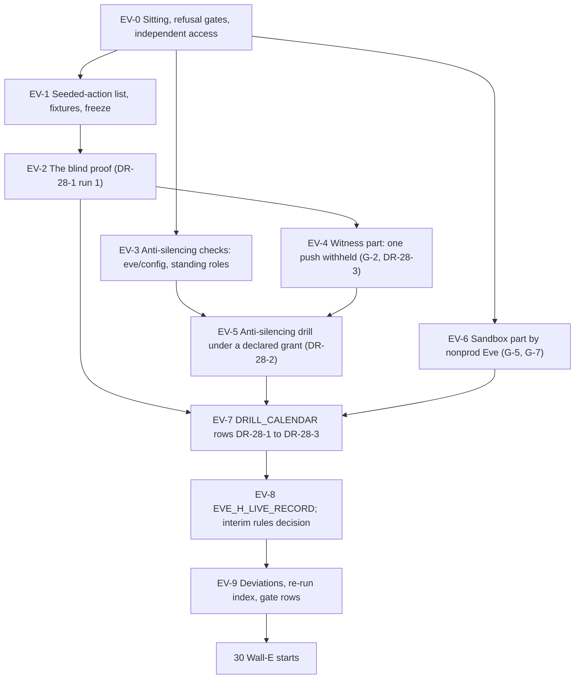

# 28. Eve: the second human's independent proof and the sandbox drills

## Status

- Owner: the platform owner
- Last reviewed: 2026-09-16
- Last executed: never
- Stage: review §2 stage 30 (the Eve 10b drill, re-cut to Eve-H) and the Eve part of stage 32 (the sandbox tenant). It is the last file of the Eve-H block and the one that produces `EVE_H_LIVE_RECORD`, on which [30](30-wall-e-workspace-side.md) and every later Wall-E file depend.
- Step prefix: `EV`. Steps: 50. BLOCKED: EV-5.3 (Eve's self-integrity rules and the configuration fingerprint, README B-08), EV-6.2, EV-6.3 and EV-6.4 (the twin reconciler and the detection catalogue, README B-08 and B-09; they run as written the day [25](25-eve-human-super-admin-detections.md)'s twin deploy is `DONE`). **IRREVERSIBLE:** EV-2.10, EV-4.5, EV-5.6 and EV-6.6 — each writes a record into the witness bucket, whose retention policy is locked, so the object cannot be removed before its retention period ends.
- Revised 2026-09-16 against the second-round review of this file: the PAM grants of §4 and §5 are sized to the whole drill and checked before each wait (EV-4.2, EV-4.3, EV-4.4, EV-5.1); every `gcloud pam grants` call carries `--project` and `--billing-project`; the platform owner's negative tests in §3 use his own clone and a pull-request number, and a refusal is accepted only for the right reason; the four witness uploads carry the upload command, a no-clobber guard and a hash read-back; `T0` is persisted as `EVE_PROOF_T0`; EV-4.1 reads the Monitoring time series, not the policy list; seeded action 5 no longer needs an assignee; EV-1.3 reads the committed keys of `thresholds.yaml` and `detections/catalogue.yaml`; the twin shell is opened in its own step; the sandbox drill has its own seeded-action list (EV-6.0) covering the `SA-03` and `SI-08` classes; `protopayload_auditlog.metadataJson` is cited, not assumed.
- Replaces: the drill paragraph of [../../eve/07-build-runbook.md](../../eve/07-build-runbook.md) Phase 10b (l.1597-1602) and the evidence columns of G-2, G-4, G-5, G-6 and G-7 in [../../eve/05-stages.md](../../eve/05-stages.md). Neither page is executed.
- Salvaged: the intent of the 10b drill (a tenant-integrity event, a roster diff in both directions, `log_pipeline_silent`, a withheld export, a halt clear reaching one recipient, a dated record in the witness); the G-2 to G-7 rows of `eve/05`, with their evidence columns rewritten by SD-03 (G-4) and SD-26 (G-5, G-6, G-7).
- Not copied: "rows in `eve_workspace_reports` for `walle@`'s shadow runs" as G-4 evidence (S039: circular, and the admin application records changes only); "expect rows for `walle@`'s shadow runs" in the 10b verify (S039); Phase 7 check 4's pre-grant expectation of a robot actor and "a shadow run is enough" (S141); one drill that runs "on the sandbox tenant" and at the same time expects the witness alarm, the witness channels and a witness record (X-ORG-12, SD-26); any nonprod identity granted on a witness resource (X-ORG-12); a sandbox drill run against an OU of the production tenant (S004, X-ORG-02).
- Applies decisions (signed in [03](03-decisions-and-people.md) before the step that needs them): SD-03, SD-07, SD-08, SD-10, SD-11, SD-12, SD-26, SD-27, SD-29, SD-43, SD-45.
- Closes: S004 (the Eve half: the sandbox drills run against the sandbox tenant and its own organisation sink, never an OU of production; the Wall-E half is [37](37-wall-e-sandbox-rehearsal.md), the tenant itself [21](21-sandbox-tenant-and-nonprod-foundation.md)), S039, S141 (the drill half; the pre-grant/post-grant split of check 4 is [24](24-eve-workspace-identity-and-audit-feeds.md), the post-grant half [39](39-wall-e-stage-0.md)), X-ORG-02 (the Eve half), X-ORG-12. Defers nothing without an owner (§13).
- Consumes: `EVE_PROJECT`, `EVE_DS`, `EVE_WS_LOGS_DS`, `EVE_WS_REPORTS_DS`, `EVE_EVIDENCE_BUCKET`, `EVE_SCHEMAS_COMMIT`, `ENT_PROJECT_REPAIR_EVE` ([23](23-eve-project-and-evidence-stores.md)); `EVE_ROBOT`, `EVE_SINK`, `EVE_TWIN_SINK`, `EVE_TWIN_ROBOT`, `SA_EVE_VERIFIER`, `EVE_REFRESH_TOKEN_SECRET_NAME`, `EVE_TOKEN_VERSION` ([24](24-eve-workspace-identity-and-audit-feeds.md)); `EVE_CONFIG_REPO`, `EVE_JOB_REPORTS_POLL`, `EVE_JOB_ROSTER`, `EVE_JOB_DETECT`, `EVE_JOB_HEARTBEAT`, `EVE_CODE_COMMIT`, `SA_EVE_CONSOLE`, `EVE_CONSOLE_URL`, `GRP_EVE_CONSOLE_READERS` ([25](25-eve-human-super-admin-detections.md)); `SA_EVE_EXPORT`, `EVE_JOB_EXPORT`, `EVE_JOB_HEARTBEAT_PUSH`, `EVE_INCIDENTS_TABLE`, `EVE_PAGES_TABLE`, `NOTIF_CH_EVE_EMAIL_SECOND_HUMAN`, `NOTIF_CH_EVE_SMS_SECOND_HUMAN`, `EVE_FIRST_RUN_RECORD` ([26](26-eve-reporting-and-witness-export.md)); `WITNESS_ALERT_HEARTBEAT`, `WITNESS_ALERT_EXPORT`, `WITNESS_ALERT_INCIDENT`, `WITNESS_ALERT_FINGERPRINT` ([27](27-witness-grants-and-alarms.md)); `EVE_WITNESS_PROJECT`, `WITNESS_MIRROR_DS`, `WITNESS_HEARTBEAT_TABLE`, `WITNESS_BUCKET` ([08](08-witness-organisation.md)); `SANDBOX_DOMAIN`, `SANDBOX_CUSTOMER_ID`, `SANDBOX_ORG_ID`, `EVE_TWIN_PROJECT` ([21](21-sandbox-tenant-and-nonprod-foundation.md)); `ROSTER_FILE`, `SA_1_ADMIN`, `SA_2_ADMIN`, `GRP_EVE_OWNERS` ([06](06-organisation-bootstrap-and-roster.md)); `PAGER_SUBJECT_SERVICE_NAME` ([04](04-purchases-and-lead-times.md), [15](15-pager-siem-and-detections.md)); `DRILL_CALENDAR`, `DEVIATION_REGISTER`, `EVIDENCE_REGISTER` ([01](01-prerequisites-and-conventions.md)).
- Produces: `EVE_H_LIVE_RECORD`; the drill records `EVE_PROOF_RECORD`, `WITNESS_WITHHOLD_RECORD`, `ANTI_SILENCING_RECORD`, `SANDBOX_DRILL_RECORD`; the G-2, G-4 (production half), G-5, G-6 and G-7 rows of the gate table; rows DR-28-1, DR-28-2 and DR-28-3 of `DRILL_CALENDAR`.
- Variables new against plan §5, handed to README's variable list: `EVE_PROOF_ROLE`, `EVE_PROOF_OU`, `EVE_PROOF_ACCOUNT`, `SEEDED_ACTION_LIST`, `SANDBOX_SEEDED_ACTION_LIST`, `EVE_PROOF_T0`, `EVE_PROOF_RECORD`, `WITNESS_WITHHOLD_RECORD`, `ANTI_SILENCING_RECORD`, `SANDBOX_DRILL_RECORD`, `NOTIF_CH_EVE_TWIN_EMAIL`, `NOTIF_CH_EVE_TWIN_SA1`, `NOTIF_CH_EVE_TWIN_SA2`, `EVE_H_LIVE_RECORD`.
- Commands checked against Google's documentation on 2026-09-15 (§15). What could not be settled that day is in §14.

## What this part builds

Nothing new is deployed here. This file is the proof that what files 23 to 27 built actually watches the person who built it, performed by the one person in the programme who is outside the administration line, and the drills that turn Eve's gate rows green.

1. **The seeded-action list and the proof fixtures** (§1). Five harmless, reversible super-admin actions on objects that exist only for this purpose — a proof role with no assignment, a proof OU with no real users, and a proof account that no action touches (it is suspended, and a suspended account cannot be assigned a role from the console, so no seeded action needs an assignee) — each with the exact Admin log event it must produce and the lag budget it must meet. The list is committed so that a later reader can repeat the proof; which action is used, and when, is not.
2. **The blind proof** (§2), which is the owner's question answered: the second human picks an unannounced window and one action from the list; the platform owner performs it and nothing else; the second human alone confirms the page on her own device, the row in `eve_workspace_logs`, the row in `eve_workspace_reports`, the `eve.incidents` and `eve.pages` rows, the sole recipient, the witness copy, and that nobody touched Eve's configuration or held a grant on `EVE_PROJECT` during the window. A witness administrator, not the platform owner, uploads the record.
3. **The anti-silencing checks that do not need a drill** (§3): a merge to `eve/config` without the second human's review is refused; a direct push to its default branch is refused; the platform owner holds no standing role that can edit Eve, proven from the drift output and from live reads.
4. **The witness part of the drill** (§4, gate row G-2, calendar row DR-28-3): after the first heartbeat has landed and long before the super-admin grant, production `eve-export@` misses exactly one push; the witness absence alarm fires; the backlog push carries what was withheld and the cumulative counts do not go backwards.
5. **The anti-silencing drill** (§5, DR-28-2): the platform owner makes one *declared*, visible change to Eve — pausing a single schedule for a named window — under a grant the second human approves; the second human confirms that Eve's self-integrity page and the witness fingerprint or absence alarm reach her without the platform owner's help.
6. **The sandbox part** (§6, gate rows G-5 and G-7): nonprod Eve, against the sandbox tenant and the sandbox organisation's own sink, sees a seeded tenant-integrity event, a roster diff in both directions and `log_pipeline_silent`; it pages nonprod channels only and never touches the witness. §6 carries its **own** seeded-action list (EV-6.0), separate from §2's: the production list is deliberately confined to role and organisational-unit fixtures, so it can prove `SA-02` and no more. The classes that carry the real risk — Sharing options, OAuth app trust, 2-step verification enforcement, domain-wide delegation, API controls, `SA-03` and `SI-08` — are exercised where they can be exercised safely, on the sandbox tenant, and `EVE_H_LIVE_RECORD` requires at least one of each class proven on the twin or a signed residual risk with an owner and a date (EV-8.2).
7. **The recurrence** (§7): DR-28-1 (monthly blind proof, and after every `eve/config` merge), DR-28-2 and DR-28-3 written into `DRILL_CALENDAR` here, not deferred to [42](42-gates-drills-and-evidence.md).
8. **`EVE_H_LIVE_RECORD`** (§8), refused unless the organisation exception is withdrawn, the break-glass envelopes are sealed and the witness alarms have seen data; and the second human's decision on whether [06](06-organisation-bootstrap-and-roster.md)'s interim Admin console activity rules are retired (recommended: kept).

**The residual risk this file states rather than removes** (SD-12 item 8). An Organization Administrator, or a super admin willing to break the rules, can still reach Eve inside the tenant: pause a job, edit a sink, revoke `eve@`. Nothing here makes that impossible. What it makes is *noticed*: by the self-integrity rules ([25](25-eve-human-super-admin-detections.md)), by the configuration fingerprint and cumulative counts in every witness heartbeat ([26](26-eve-reporting-and-witness-export.md), [27](27-witness-grants-and-alarms.md)), by the witness alarms in an organisation the platform owner has no account in, and by this file's unannounced proof. The second human signs that she has read this paragraph before `EVE_H_LIVE_RECORD` is written.

What the old text got wrong, and must not come back:

| Old text | Why it fails | Here instead |
|---|---|---|
| G-4 evidence: "rows in `eve_workspace_reports` for `walle@`'s shadow runs" (`eve/05` l.310); 10b verify 1 "expect rows for `walle@`'s shadow runs" | Circular: the grant needs G-4, G-4 needs shadow runs, shadow runs need the grant and Stage 0. The admin application records changes, not reads, so a shadow run leaves no admin row anyway (S039) | SD-03's three pieces: §2's seeded human super-admin change in both `eve_workspace_logs` and `eve_workspace_reports` within the lag budget (this file); the twin robot's seeded change in the nonprod datasets (§6 and [37](37-wall-e-sandbox-rehearsal.md)); the production robot's consent login event ([32](32-wall-e-consents.md)). `walle@` admin rows move to the post-grant list in [39](39-wall-e-stage-0.md) |
| Phase 7 check 4: "expect `walle@` present. If it is absent, the exclusion was copied by mistake", and "a shadow run is enough" (S141) | Before the grant the robot holds no admin role; absence is expected. A follower deletes and recreates the sink, and sinks do not backfill | [24](24-eve-workspace-identity-and-audit-feeds.md) splits the check; here, §2 proves the same filter with a **human** actor, and EV-2.4 says in terms that a missing robot row before the grant is expected and is never a reason to touch the sink |
| One drill "on the sandbox tenant" that also expects the witness alarm, pages "through the witness channels" and a record "in the witness" (X-ORG-12) | Nonprod Eve has no grant in the witness organisation, and the design allows exactly two cross-organisation grants, both to production `eve-export@` | SD-26's split: §6 is the sandbox part (nonprod channels only, no witness contact); §4 is the witness part (production `eve-export@`); a witness administrator records both |
| Sandbox drills run against a sandbox **OU** of the production tenant (`SETUP` Phase 1 step 6; S004) | 02 §1.3 PSA6 and §3.5 forbid it; a drill in production's OU proves nothing about a separate tenant and risks real users | [21](21-sandbox-tenant-and-nonprod-foundation.md)'s tenant; §6 runs in `twin_shell`, against `SANDBOX_ORG_ID`'s own sink ([24](24-eve-workspace-identity-and-audit-feeds.md)'s `EVE_TWIN_SINK`) |
| Sandbox events expected in the production organisation sink (X-ORG-02) | Workspace audit logs land in the **tenant's own** Cloud organisation; `--organization=$ORG_ID` never sees them | EV-6.1 asserts the twin sink's organisation is `SANDBOX_ORG_ID` and that the production datasets contain **no** sandbox rows |
| The drill performed and recorded by the person Eve watches | The proof is worthless if its subject runs it | The second human runs every verification; the platform owner's only action is the seeded one (§2) and the declared change (§5); a witness administrator uploads every record |



## Preconditions

- [ ] [23](23-eve-project-and-evidence-stores.md) to [27](27-witness-grants-and-alarms.md) complete, or their open steps indexed: `checkpoints.tsv` shows `DONE` for the closing step of each, and `EVE_FIRST_RUN_RECORD` is set and committed.
- [ ] [26](26-eve-reporting-and-witness-export.md): route 1 tested to the second human; `NOTIF_CH_EVE_EMAIL_SECOND_HUMAN` and `NOTIF_CH_EVE_SMS_SECOND_HUMAN` exist in `EVE_PROJECT`; the subject-report escalation `PAGER_SUBJECT_SERVICE_NAME` of [15](15-pager-siem-and-detections.md) part A is live, or the dated Cloud Monitoring deviation is open and named in the record.
- [ ] [27](27-witness-grants-and-alarms.md): the push is enabled, the first heartbeat has landed, and every witness alert policy **has seen data** (a metric-absence condition cannot fire before its first data point). `WITNESS_ALERT_FINGERPRINT` exists.
- [ ] [21](21-sandbox-tenant-and-nonprod-foundation.md): the sandbox tenant exists with two sandbox super admins; `SANDBOX_ORG_ID` set; the nonprod folder constraint admits `SANDBOX_CUSTOMER_ID`.
- [ ] [24](24-eve-workspace-identity-and-audit-feeds.md): `EVE_TWIN_SINK` created in the **sandbox** organisation to the twin dataset, with its seeded-event verify passed.
- [ ] [25](25-eve-human-super-admin-detections.md): the four production jobs and their twin counterparts deployed at `EVE_CODE_COMMIT` with green CI; `eve/config` has branch protection with `SECOND_HUMAN_EMAIL` as required reviewer; the platform owner's standing `actAs` on Eve's accounts removed.
- [ ] [12](12-privileged-access-catalogue.md): `PA-9.3` shows `DONE` (the organisation exception withdrawn). Checked again in EV-8.1; a missing `DONE` refuses `EVE_H_LIVE_RECORD`, not this file's drills.
- [ ] [06](06-organisation-bootstrap-and-roster.md): `OB-7.3` shows `DONE` (break-glass envelopes sealed); the interim activity rules A to D exist and their mail reaches the second human.
- [ ] Workstations: the **second human's** workstation has gcloud (with `alpha`), `bq`, `jq`, `curl`, `python3.12` with PyYAML, `git` and the git host's CLI, her own `~/.platform-env` copy, and the browser profile of `sa-2-admin@`. The witness administrators use their own witness copies ([08](08-witness-organisation.md)). The platform owner's workstation is **not** used for any verification in this file; it is used only for his seeded action (EV-2.2), his negative tests (EV-3.1, EV-3.2, from a clone of his own) and the two declared changes (§4, §5).
- [ ] [12](12-privileged-access-catalogue.md) PA-2.1: the `ent-project-repair` template carries `maxRequestDuration` of `7200s`. Every grant in this file is sized inside that maximum (EV-4.2, EV-5.1); a request above it is refused by PAM, not by this file.
- [ ] [08](08-witness-organisation.md) WO-3.3: the witness upload form (`--no-clobber`, `--retain-until`, `--retention-mode`, `--custom-metadata=sha256=…`) and the current retention mode (`Unlocked` before WO-2.17, `Locked` after) are known to witness administrator 1, who types every upload in this file.
- [ ] [10](10-core-projects-and-ci-identities.md): `CICD_PROJECT` set — it is the billing project of every `gcloud pam` call, as in [23](23-eve-project-and-evidence-stores.md) and [26](26-eve-reporting-and-witness-export.md).
- [ ] Two sittings booked: the proof review (EV-2.3 to EV-2.10, about two hours, second human and one witness administrator) and the sandbox drill (§6, half a day, second human and both sandbox super admins). The seeded window of EV-2.1 is **not** booked and **not** announced.
- [ ] **Not** a precondition: anything from [22](22-mo-foundations.md), [29](29-mo-eve-quality-pack.md) or any Wall-E file. Eve-H is proven without Mo and without Wall-E (SD-45).

## People needed

| Role | Does | Present at |
|---|---|---|
| Second human (`SECOND_HUMAN_EMAIL`, admin account `SA_2_ADMIN`; owner of `GRP_EVE_OWNERS`; IT security line) | Leads the file. Chooses the window and the action; performs every verification; approves the one grant of §5; signs `EVE_H_LIVE_RECORD`; decides on the interim rules | every step except EV-1.2, EV-2.2, EV-5.1, EV-5.2 |
| Platform owner (as `SA_1_ADMIN`) | Creates the proof fixtures (EV-1.2); performs the one seeded action (EV-2.2); attempts the two negative tests from his own clone (EV-3.1, EV-3.2); requests and performs the withhold of §4 and the declared change of §5; performs nothing else and verifies nothing | EV-1.2, EV-2.2, EV-3.1, EV-3.2, EV-4.2, EV-4.4, EV-5.1, EV-5.2, EV-5.5 |
| Witness administrator 1 (`WITNESS_ADMIN_1_EMAIL`, working as `WITNESS_SA_1`) | Runs every witness-side query with the second human watching; uploads every drill record to `WITNESS_BUCKET` | EV-2.8, EV-2.10, EV-4.3, EV-4.5, EV-5.4, EV-5.6, EV-6.6 |
| Witness administrator 2 (`WITNESS_ADMIN_2_EMAIL`) | Confirms receipt of the witness alarms on a second device; countersigns the records | EV-4.3, EV-4.5, EV-5.4 |
| Sandbox super admin 1 (`SANDBOX_SA_1_EMAIL`) | Confirms the sandbox edition supports S1 to S4 (EV-6.0); seeds the sandbox events (§6) in the sandbox tenant | EV-6.0, EV-6.1a, EV-6.1b, EV-6.2, EV-6.3, EV-6.4 |
| Sandbox super admin 2 (`SANDBOX_SA_2_EMAIL`) | Second actor for the roster diff; countersigns the sandbox record | EV-6.3, EV-6.6 |
| Incident commander (`INCIDENT_COMMANDER_EMAIL`) | Confirms the subject-report escalation behaved as signed in [15](15-pager-siem-and-detections.md); co-signs G-6 | EV-2.3, EV-9.3 |
| Security reviewer (`SECURITY_REVIEWER_EMAIL`), once named | Reads the residual-risk paragraph and countersigns `EVE_H_LIVE_RECORD`. Until named, the second human signs alone and EV-8.2 records the gap | EV-8.2 |

Hands-on: about 3 days spread over 2 to 4 weeks, because the blind window must be genuinely unannounced and the witness absence alarm needs a full window to fire. Elapsed: 3 to 4 weeks from EV-0.1 to `EVE_H_LIVE_RECORD`.

Conventions of [01](01-prerequisites-and-conventions.md) apply to every step: `checkpoint <id> START` before ACTION and `checkpoint <id> DONE <witness> <evidence>` after VERIFY; records named `<date>-<step>-<slug>-v<n>` under `BUILD_LOG_DIR/records/` (text) or `EVIDENCE_INTERIM_LOCATION` (screenshots and signed PDFs), each registered with `evidence_add`. Deviation rows use ids `BD-28-<n>`. With no default project, every gcloud call passes `--project`, `--folder` or `--organization`. `ENT_*` values are entitlement **ids**, as [23](23-eve-project-and-evidence-stores.md) records them, so every `gcloud pam grants` call in this file carries `--location=global --project="$EVE_PROJECT" --billing-project="$CICD_PROJECT"`. `WITNESS_BUCKET` is a `gs://` name ([08](08-witness-organisation.md) WO-2.11), so objects are written as `${WITNESS_BUCKET}/drills/<name>`. A value that must survive from one shell block to a later one (the seeded minute `T0`, a pull-request number) is persisted with `penv_set` or in a file under `$R`, never left in shell memory: the proof review spans terminal sessions. Every shell block in this file, unless the step says otherwise, starts as:

```bash
source ~/.platform-env
penv_guard
R="$BUILD_LOG_DIR/records/$(date -u +%F)-EV"
```

**Who types what.** Steps whose WHO is the second human are typed on her workstation, signed in as her own account or `SA_2_ADMIN`. The platform owner must not type, dictate or watch a verification command in this file; if he does, the run is void and is repeated from EV-2.1 with a new window.

## Facts this file relies on, read on 2026-09-15

| Fact | Source | Consequence here |
|---|---|---|
| Admin log events: lag "Near real time (couple of minutes)", retention 6 months. User (login) log events: same lag. OAuth Token log events: "A couple of hours". Groups: "Tens of minutes (can also go up to a couple of hours)". SAML: near real time | Workspace admin help, *Data retention and lag times for Google services* | The seeded actions of §1 are all **admin** application events, the only stream fast enough for a same-sitting proof; a token or groups event would make a lag-budget failure meaningless. EV-1.1 records the published lag beside Eve's budget |
| `activities.list` path `GET .../activity/users/{userKey or all}/applications/{applicationName}`; `applicationName` includes `admin`, `login`, `token`, `groups`, `saml`, `access_transparency`; query parameters `eventName`, `startTime`, `endTime`, `filters`, `actorIpAddress`, `maxResults` | Reports API v1, `activities.list` reference | Eve's poll by actor (25) is expected to carry `application`, `event_name` and `actor` columns; EV-2.5 reads the committed schema at `EVE_SCHEMAS_COMMIT` rather than assuming column names |
| Delegated admin settings events: `ASSIGN_ROLE`, `CREATE_ROLE`, `DELETE_ROLE`, `ADD_PRIVILEGE`, `REMOVE_PRIVILEGE`, `RENAME_ROLE`, `UPDATE_ROLE`, `UNASSIGN_ROLE`, with parameters `USER_EMAIL`, `ROLE_NAME`, `ROLE_ID`, `ORG_UNIT_NAME`, `PRIVILEGE_NAME`, `NEW_VALUE` | Reports API appendix, admin activity events, delegated admin settings | Seeded actions 1, 4 and 5 of §1 and their exact expected `eventName` values. Action 5 is `CREATE_ROLE` then `DELETE_ROLE`: it needs no assignee, so the suspended proof account is never a dependency of a blind window |
| Security settings events: `ENFORCE_STRONG_AUTHENTICATION` (`ORG_UNIT_NAME`, `SETTING_NAME`, `OLD_VALUE`, `NEW_VALUE`), `ADD_TO_TRUSTED_OAUTH2_APPS` / `REMOVE_FROM_TRUSTED_OAUTH2_APPS` (`OAUTH2_APP_ID`, `OAUTH2_APP_NAME`, `ORG_UNIT_NAME`). Domain settings events: `AUTHORIZE_API_CLIENT_ACCESS` (`API_CLIENT_NAME`, `API_SCOPES`), `REMOVE_API_CLIENT_ACCESS` (`API_CLIENT_NAME`) | Reports API appendix, admin activity events, security settings and domain settings | The sandbox seeded-action list of EV-6.0; where [25](25-eve-human-super-admin-detections.md)'s catalogue spells a name differently (`TOGGLE_2SV_ENFORCEMENT`), EV-6.2 records the documented name beside the catalogue's and turns a missed page into a finding against 25 EH-2.3 |
| Admin console paths: domain-wide delegation, Menu → Security → Access and data control → API controls → Manage Domain Wide Delegation (Add new / client → Delete); third-party app access, Menu → Security → Access and data control → API controls → Manage App Access → Change access; 2-step verification, Menu → Security → Authentication → 2-step verification, per organisational unit, enforcement Off / On / On from date; Share data with Google Cloud services, Menu → Account → Account settings → Legal and compliance → Sharing options — "No new data is shared with Google Cloud services" once off | Workspace admin help, read 2026-09-16 | The four sandbox actions of EV-6.0 and their exact console paths; the last one silences the sandbox organisation sink, which is why it is ordered last and doubles as EV-6.4's canary |
| `ent-project-repair` template: `maxRequestDuration` 7200 s | [12](12-privileged-access-catalogue.md) PA-2.1 | Every grant in §4 and §5 is requested at `7200s` and sized to the whole drill; a longer request is refused by PAM |
| Org unit settings events: `CREATE_ORG_UNIT` (`ORG_UNIT_NAME`), `EDIT_ORG_UNIT_NAME` (`ORG_UNIT_NAME`, `NEW_VALUE`), `EDIT_ORG_UNIT_DESCRIPTION` (`ORG_UNIT_NAME`), `MOVE_ORG_UNIT`, `REMOVE_ORG_UNIT`; all `type=ORG_SETTINGS` | Reports API appendix, admin activity events, org settings | Seeded actions 2 and 3 |
| Workspace audit logs are provided **at the Google Cloud organisation level** of that Workspace customer; admin audit is an Admin Activity log (`admin.googleapis.com`), login and SAML are Data Access logs (`login.googleapis.com`), OAuth token produces both (`oauth2.googleapis.com`), enterprise groups is `cloudidentity.googleapis.com` | Cloud Logging, *Audit logs for Google Workspace* | EV-2.4 queries the `cloudaudit_googleapis_com_activity` table with `serviceName = "admin.googleapis.com"`; EV-6.1 proves the sandbox tenant's events reach only `SANDBOX_ORG_ID`'s sink (X-ORG-02) |
| Audit-log entries can be filtered on `protoPayload.metadata.event.eventName` with `resource.type="audited_resource"`; the Workspace event sits in `protoPayload.metadata` | Cloud Logging audit documentation and the Workspace log samples | The filters of EV-2.4 and EV-6.2 |
| In a BigQuery log export, `protoPayload` becomes `protopayload_auditlog`, and "the `request`, `response`, and `metadata` fields are treated as JSON data. That is, their BigQuery schema names are their field names with `Json` appended": `protoPayload.metadata` → `protopayload_auditlog.metadataJson`. Partitioned tables keep the base name (`cloudaudit_googleapis_com_activity`) | Cloud Logging, *Route logs to BigQuery*, field mapping | The column path of EV-2.4's assertion query is documented, not assumed. What the page does **not** give is the shape *inside* `metadataJson` for a Workspace event (the `event[]` array and its `eventName` / `eventType` / `parameter[]` members, shown by sample only); EV-2.4 prints one raw row for that, and BD-28-3 carries only that |
| Admin console: Menu → Reporting → Audit and investigation → Admin log events | Workspace admin help, *Admin log events* | The second human's independent read, which needs no Eve component and no platform-owner help |
| `gcloud pam grants create --requested-duration= (--entitlement= : --location= [--folder\|--organization]) [--justification] [--additional-email-recipients]`, `--project` and `--billing-project` as gcloud-wide flags; `--requested-duration` is required and takes seconds (`5400s`); the grant ends at that duration. `gcloud pam grants approve GRANT --entitlement= --location= --reason=`; `gcloud pam grants list` and `describe GRANT` take the same `--entitlement= --location=` pair, with the project from `--project` | gcloud PAM reference, `grants create`, `describe`, `list` | The grants of §4 and §5, sized to the whole drill inside the entitlement's 7200 s maximum; the anti-collusion check of EV-2.7; the lifetime check before each wait (EV-4.3, EV-5.2) |
| `gcloud scheduler jobs pause JOB --location=` and its `resume` counterpart | gcloud Scheduler reference | EV-4.2 and EV-5.2 |
| `gcloud monitoring` has `dashboards`, `policies`, `snoozes` and `uptime`; **no command lists alerting incidents and none lists time series** | gcloud Monitoring reference | The second human reads incidents in the Monitoring console and, above all, on her own device and in the paging service; a row Eve wrote is never the proof that a page arrived. Time series are read through the API (next row) |
| Monitoring API `GET https://monitoring.googleapis.com/v3/projects/{id}/timeSeries` with query parameters `filter`, `interval.startTime`, `interval.endTime`, `view`; the response is `timeSeries[].points[].interval.endTime`, most recent first | Cloud Monitoring API v3, `projects.timeSeries.list` | EV-4.1 proves that the metrics behind the witness absence policies have written a point, which is the only fact a metric-absence condition depends on |
| `gcloud logging read`: `--freshness` "works only with DESC ordering and filters without a timestamp"; `--limit` caps the returned entries; ordering is by timestamp descending | gcloud Logging reference, `logging read` | EV-2.7 filters on the actor and the window with `timestamp` predicates and drops `--freshness`, so a low limit cannot truncate the window under test |
| `gcloud storage cp --no-clobber` "Do not overwrite existing files or objects at the destination. Skipped items will be printed"; `--print-created-message` "Prints the version-specific URL for each copied object"; `--retain-until`, `--retention-mode`, `--custom-metadata`; `gcloud storage objects describe URL --format=…` returns `generation` and `md5_hash` | gcloud Storage reference, `cp` and `objects describe`; [08](08-witness-organisation.md) WO-3.3 | The four witness uploads of this file: EV-2.10, EV-4.5, EV-5.6, EV-6.6 |
| `gh pr create --head <branch> --base <branch> --repo …` prints the pull request URL; `gh pr merge [<number> \| <url> \| <branch>]` and `gh pr view` infer the pull request "from the current branch" when none is given; `gh pr view <n> --json number --jq .number` | GitHub CLI manual, `gh pr create`, `gh pr merge`, `gh pr view` | EV-3.1 names the head branch and the pull-request number explicitly and runs inside the clone, so a tooling error can never read as a policy refusal |
| `twin_shell` opens an **interactive child shell** (`PLATFORM_SHELL_MODE=… "${SHELL:-/bin/zsh}" -i`) and blocks; inside it `penv_set` accepts only `*TWIN*`, `SANDBOX_*` and `*_RECORD` names | [01](01-prerequisites-and-conventions.md) PR-2.3 (`twin_shell`, `penv_set` in `~/.platform-env`) and §6 | EV-6.1a is the one line that opens the shell; EV-6.1b and every later §6 fence are typed inside it and begin with a mode guard |
| A metric-absence condition is not met until the measured stream has written at least one data point; the longest window is 23.5 hours | Cloud Monitoring, metric absence | EV-4.1 refuses the withhold drill until [27](27-witness-grants-and-alarms.md)'s alarms show data |
| Under a **locked** retention policy the policy can never be removed or shortened, and objects cannot be deleted until they meet the retention period | Cloud Storage bucket lock | The four upload steps are **IRREVERSIBLE**; §10 says what to confirm before each |
| `gcloud storage ls [--recursive\|-r] [--long\|-l] [--json\|-j]`, `--project` available as a wide flag | gcloud Storage reference | The witness-side listing of EV-2.8 |

## 0. The sitting, the gates and independent access

### EV-0.1 Open the sitting and read the inputs

- **WHO:** Second human, on her own workstation, signed in as her own account.
- **WHERE:** Shell, her copy of `~/.platform-env` sourced.
- **ACTION:**

```bash
checkpoint EV-0.1 START
need ORG_ID DOMAIN DIRECTORY_CUSTOMER_ID REGION BQ_LOCATION BUILD_LOG_DIR PLATFORM_REPO_DIR DRILL_CALENDAR DEVIATION_REGISTER EVIDENCE_REGISTER \
     EVE_PROJECT EVE_DS EVE_WS_LOGS_DS EVE_WS_REPORTS_DS EVE_EVIDENCE_BUCKET EVE_SCHEMAS_COMMIT EVE_CODE_COMMIT EVE_CONFIG_REPO \
     EVE_ROBOT EVE_SINK EVE_TWIN_SINK EVE_TWIN_ROBOT EVE_TWIN_PROJECT EVE_JOB_REPORTS_POLL EVE_JOB_ROSTER EVE_JOB_DETECT EVE_JOB_HEARTBEAT \
     SA_EVE_EXPORT EVE_JOB_EXPORT EVE_JOB_HEARTBEAT_PUSH EVE_INCIDENTS_TABLE EVE_PAGES_TABLE EVE_FIRST_RUN_RECORD \
     NOTIF_CH_EVE_EMAIL_SECOND_HUMAN NOTIF_CH_EVE_SMS_SECOND_HUMAN PAGER_SUBJECT_SERVICE_NAME \
     EVE_WITNESS_PROJECT WITNESS_MIRROR_DS WITNESS_HEARTBEAT_TABLE WITNESS_BUCKET \
     SANDBOX_DOMAIN SANDBOX_CUSTOMER_ID SANDBOX_ORG_ID ROSTER_FILE SA_1_ADMIN SA_2_ADMIN OWNER_DAILY_ACCOUNT GRP_EVE_OWNERS GRP_EVE_CONSOLE_READERS ENT_PROJECT_REPAIR_EVE \
     SA_EVE_VERIFIER SA_EVE_CONSOLE EVE_REFRESH_TOKEN_SECRET_NAME EVE_TOKEN_VERSION EVE_CONSOLE_URL SECOND_HUMAN_EMAIL \
     WITNESS_ADMIN_1_EMAIL WITNESS_ADMIN_2_EMAIL SANDBOX_SA_1_EMAIL SANDBOX_SA_2_EMAIL BUSINESS_TZ CICD_PROJECT
case "$WITNESS_BUCKET" in gs://*) echo "WITNESS_BUCKET is a gs:// name";; *) echo "STOP: WITNESS_BUCKET must be a gs:// name (08 WO-2.11)";; esac
printf 'reports about the second human go to: '; printenv SECURITY_REVIEWER_EMAIL || printenv INCIDENT_COMMANDER_EMAIL || echo "NOBODY NAMED: see README B-12"
awk -F'\t' '$2 ~ /^(EP|EW|EH|ER|WG)-/ && $3 == "DONE" {n[substr($2,1,2)]++} END {for (p in n) print p, n[p]}' "$BUILD_LOG_DIR/checkpoints.tsv"
awk -F'\t' '$3 == "BLOCKED" {print $2"\t"$7}' "$BUILD_LOG_DIR/checkpoints.tsv" | sort -u
test -s "$PLATFORM_REPO_DIR/$EVE_FIRST_RUN_RECORD" && echo "EVE_FIRST_RUN_RECORD present"
test -z "$(gcloud config get project 2>/dev/null)" && echo "no default project"
```

- **VERIFY:** Each of the five Eve prefixes shows at least one `DONE`; the `EVE_FIRST_RUN_RECORD` file exists; `no default project`; `WITNESS_BUCKET is a gs:// name`. Read the BLOCKED list: `B-08` and `B-09` entries are expected and decide whether §5 and §6 run in full or are recorded BLOCKED here; a BLOCKED step in 26 or 27 that has not been replaced by a dated deviation stops the file.
- **ROLLBACK:** Read only.
- **EVIDENCE:** The output as `${R}-0.1-inputs-v1.txt`; `evidence_add EV-0.1 inputs E-05 1.4.1 build-log:records/<file> <file>`. E-05. TISAX 1.4.1.

### EV-0.2 Read the three refusal gates now, not at the end

- **WHO:** Second human.
- **WHERE:** Shell; `BUILD_LOG_DIR/checkpoints.tsv`.
- **ACTION:** SD-12 items 7 and 8 make `EVE_H_LIVE_RECORD` conditional on three facts that belong to other files. They are read here so that a gap is known before three weeks of drills, and read again in EV-8.1.

```bash
for S in PA-9.3 OB-7.3 OB-2.9; do
  printf '%s\t' "$S"; awk -F'\t' -v s="$S" '$2==s {print $3" "$1}' "$BUILD_LOG_DIR/checkpoints.tsv" | tail -1
done
awk -F'\t' '$2 ~ /^WG-/ && $3 == "DONE" {print $2"\t"$7}' "$BUILD_LOG_DIR/checkpoints.tsv"
```

  Then ask witness administrator 1 for the state of the four alert policies: each must have **seen data** (27's own verify), not merely exist.
- **VERIFY:** `PA-9.3 DONE` (the organisation exception withdrawn), `OB-7.3 DONE` and `OB-2.9 DONE` (break-glass and admin envelopes sealed), and the witness administrator's written statement that `WITNESS_ALERT_HEARTBEAT`, `WITNESS_ALERT_EXPORT`, `WITNESS_ALERT_INCIDENT` and `WITNESS_ALERT_FINGERPRINT` have each received at least one measurement. A gap is recorded, the drills continue, and EV-8.1 refuses the record until it closes.
- **ROLLBACK:** Read only.
- **EVIDENCE:** `${R}-0.2-refusal-gates-v1.txt` with the witness statement attached. E-05. TISAX 1.4.1.

### EV-0.3 Prove the second human can see Eve and the witness without the platform owner

- **WHO:** Second human; witness administrator 1 for the witness half.
- **WHERE:** Shell; browser profile of `SA_2_ADMIN`; the witness administrator's own shell.
- **ACTION:** The proof is worth nothing if she has to ask the subject for access.

```bash
gcloud projects get-iam-policy "$EVE_PROJECT" --format=json \
  | jq -r --arg g "group:$GRP_EVE_OWNERS" '.bindings[] | select(.members[]? == $g) | .role'
bq query --project_id="$EVE_PROJECT" --location="$BQ_LOCATION" --use_legacy_sql=false --format=csv \
  'SELECT COUNT(*) AS n FROM `'"$EVE_PROJECT"'.'"$EVE_DS"'.INFORMATION_SCHEMA.TABLES`'
gcloud scheduler jobs list --project="$EVE_PROJECT" --location="$REGION" --format='table(name,state,schedule)'
```

  In the browser: open the Admin console as `SA_2_ADMIN` → Menu → Reporting → Audit and investigation → Admin log events, and confirm the search returns results. Witness administrator 1 runs, in the witness organisation, a `SELECT` of the last five heartbeat rows and a `gcloud storage ls -l "${WITNESS_BUCKET}/exports/"`, with the second human watching the screen.
- **VERIFY:** `GRP_EVE_OWNERS` holds at least `roles/bigquery.dataViewer` and `roles/bigquery.jobUser` (or the reader role 23 granted); the count query returns; the scheduler list prints the four jobs and their state. The Admin console search returns rows. The witness queries return rows. Any missing read is a **re-run line against [23](23-eve-project-and-evidence-stores.md)** (`rerun-index.tsv`, member `group:$GRP_EVE_OWNERS`), not a grant made here, and until it is closed the second human uses `EVE_CONSOLE_URL` behind IAP as her read path and says so in the record.
- **ROLLBACK:** Read only.
- **EVIDENCE:** `${R}-0.3-independent-access-v1.txt` plus one console screenshot to `EVIDENCE_INTERIM_LOCATION`. E-06. TISAX 4.2.1.

### EV-0.4 Agree what may be announced, and what may not

- **WHO:** Second human; the platform owner is told only the parts that concern him.
- **WHERE:** A short written note, committed to the build log.
- **ACTION:** Write and have both parties initial a note stating: (a) the platform owner is told **that** a proof will happen in the next 30 days and that he will be asked to perform exactly one action from the committed list; (b) he is **not** told the date, the hour or which action, until the moment of EV-2.1; (c) he will not query Eve, the witness, the paging service or the audit log about the proof, and will not open a PAM grant on `EVE_PROJECT` during the window; (d) if he is paged for anything unrelated during the window he answers it normally and tells the second human afterwards; (e) the drill is announced to nobody else, including the IT security desk, because the subject-report escalation is exercised exactly as it would be in earnest.
- **VERIFY:** Both initials on the note; the note names the 30-day span and nothing more precise.
- **ROLLBACK:** Tear up and rewrite before EV-2.1; after EV-2.1 the note is part of the record.
- **EVIDENCE:** `${R}-0.4-blind-window-note-v1.pdf` in `EVIDENCE_INTERIM_LOCATION`. E-08. TISAX 5.2.6.

## 1. The seeded-action list and the proof fixtures

### EV-1.1 Commit the seeded-action list

- **WHO:** Second human writes; a second reviewer approves under branch protection; the platform owner does **not** review it.
- **WHERE:** `PLATFORM_REPO_DIR`, branch `eve-proof-actions`, then `PLATFORM_REPO_REMOTE`.
- **ACTION:** Five actions, all in the `admin` application (the only stream whose published lag is minutes), all reversible, none touching a real user, a real role assignment or a production setting. `PRIV` is any harmless read privilege chosen at EV-1.2 and recorded there.

```bash
mkdir -p "$PLATFORM_REPO_DIR/eve"
cat > "$PLATFORM_REPO_DIR/eve/seeded-actions.md" <<'LIST'
# Seeded super-admin actions for Eve's independent proof

Owner: the second human. Changed only by a reviewed pull request that the platform owner does
not review. One action is chosen per proof; which one, and when, is never announced.

| # | Action, performed in the Admin console by the platform owner as sa-1-admin@ | Expected Admin log event(s) | Reversal | Touches a real object? |
|---|---|---|---|---|
| 1 | Add privilege PRIV to the custom role EVE_PROOF_ROLE, then remove it | ADD_PRIVILEGE then REMOVE_PRIVILEGE (parameters ROLE_NAME, PRIVILEGE_NAME) | the removal is part of the action | no: the role is assigned to nobody |
| 2 | Edit the description of the OU EVE_PROOF_OU to the drill token, then restore it | EDIT_ORG_UNIT_DESCRIPTION (parameter ORG_UNIT_NAME) | restore the previous description | no: the OU holds only EVE_PROOF_ACCOUNT |
| 3 | Create a child OU under EVE_PROOF_OU named with the drill token, then remove it | CREATE_ORG_UNIT then REMOVE_ORG_UNIT (parameter ORG_UNIT_NAME) | the removal is part of the action | no |
| 4 | Rename EVE_PROOF_ROLE to the drill token, then rename it back | RENAME_ROLE (parameters ROLE_NAME, NEW_VALUE) | the second rename | no |
| 5 | Create a custom admin role named with the drill token, with the same privilege set as EVE_PROOF_ROLE (none, or the one harmless read privilege EV-1.2 recorded), then delete it | CREATE_ROLE then DELETE_ROLE (parameter ROLE_NAME) | the deletion is part of the action | no: the role is never assigned |

Google's published lag for Admin log events is "near real time (couple of minutes)"
(admin help, Data retention and lag times, read 2026-09-15). Eve's own budget per application
is evidence.reports_poll.lag_budget_minutes.admin in thresholds.yaml of the eve/config
repository, and the page budget is reporting.detect_to_page_minutes; the drill uses Eve's
numbers, and records Google's beside them.

No action on this list needs an assignee: the proof account zz-eve-proof@ is suspended, and a
suspended account cannot be given a role from the console, so a window can never be burned
on an action the console refuses. Actions 1 and 5 are in SA-02's event set; actions 2, 3 and 4
are admin events outside the SA-01 allow-list.

Never on this list: anything that changes a real user's access, a tenant-wide security setting,
a super-admin assignment, an OU that holds real users, or anything a rollback cannot undo in
the same sitting. The classes this list deliberately leaves out (Sharing options, OAuth app
trust, 2-step verification enforcement, domain-wide delegation, API controls) are exercised on
the sandbox tenant by eve/sandbox-seeded-actions.md (setup 28 EV-6.0).
LIST
git -C "$PLATFORM_REPO_DIR" checkout -b eve-proof-actions
git -C "$PLATFORM_REPO_DIR" add eve/seeded-actions.md
git -C "$PLATFORM_REPO_DIR" commit -m "setup 28 EV-1.1: seeded-action list for Eve's independent proof"
git -C "$PLATFORM_REPO_DIR" push -u origin eve-proof-actions
penv_set SEEDED_ACTION_LIST "eve/seeded-actions.md"
```

- **VERIFY:** The pull request is merged with one approval that is not the platform owner's; `git -C "$PLATFORM_REPO_DIR" log --oneline -1 -- eve/seeded-actions.md` shows the merge; `SEEDED_ACTION_LIST` is set.
- **ROLLBACK:** `git revert` the merge before EV-2.1.
- **EVIDENCE:** The merge commit and the approvals page as `${R}-1.1-seeded-actions-v1`. E-08. TISAX 5.2.6.

### EV-1.2 Create the proof fixtures

- **WHO:** Platform owner as `SA_1_ADMIN`; second human present (in person or on a shared screen) and recording.
- **WHERE:** Admin console, signed in as `SA_1_ADMIN`: Menu → Account → Admin roles, and Menu → Directory → Organizational units, Menu → Directory → Users.
- **ACTION:** These objects are created **now**, well before any window, so that their creation is not confused with a seeded action.
  1. Create an organisational unit `Eve-Proof` under `/Automation` (path `/Automation/Eve-Proof`), description `fixtures for Eve's independent proof; no real users`.
  2. Create a user `zz-eve-proof@$DOMAIN` in that OU: no licence beyond what the tenant assigns automatically, suspended immediately after creation, never signed in, never given any role. It exists so that the OU is a real, populated fixture for actions 2 and 3 and so that the roster check sees a suspended non-admin in `/Automation`; **no seeded action touches it**, because the Admin console withdraws the Admin roles and privileges panel from a suspended user and the Directory API's behaviour for a suspended assignee is undocumented (§14). If a later edit of the list wants an assignee, it must first decide whether this account is unsuspended, and record why.
  3. Create a custom admin role named `zz-eve-proof-role`, description `drill fixture; assigned to nobody in normal state`, **with no privileges selected**. If the console refuses a role with zero privileges, select exactly one harmless read privilege, record which, and make that the role's normal state.
  4. Choose `PRIV` for action 1: a read-only privilege the role does not already hold (for example an "Organizational Units → Read" privilege). Record the exact label shown in the console.
  5. Record the three names.

```bash
penv_set EVE_PROOF_OU "/Automation/Eve-Proof"
penv_set EVE_PROOF_ACCOUNT "zz-eve-proof@$DOMAIN"
penv_set EVE_PROOF_ROLE "zz-eve-proof-role"
```

- **VERIFY:** The second human, from her own browser as `SA_2_ADMIN`, sees the OU with one suspended user and the role with its recorded privilege set, and confirms the role appears in no assignment. She also confirms in Admin log events that the four creation events (`CREATE_ORG_UNIT`, a user-creation event, `CREATE_ROLE`, and any `ADD_PRIVILEGE`) are present — which is itself a first, non-blind sanity check that the stream is alive.
- **ROLLBACK:** Delete the role, the user and the OU in that order. Deleting them removes nothing Eve has already recorded.
- **EVIDENCE:** Screenshots of the three objects and the privilege label as `${R}-1.2-proof-fixtures-v1` in `EVIDENCE_INTERIM_LOCATION`; the three variable names in the build log. E-08. TISAX 4.2.1.

### EV-1.3 Read Eve's coverage of the chosen classes, and set the mode

- **WHO:** Second human.
- **WHERE:** Shell, a clone of `EVE_CONFIG_REPO` at its merged head.
- **ACTION:** The proof has two modes. **Full mode**: the detection catalogue covers the class of the chosen action, so a page is expected. **Evidence mode**: it does not, so only the two rows and the witness copy are expected. `EVE_H_LIVE_RECORD` is written only after a run in full mode (EV-8.1).

```bash
git clone "$EVE_CONFIG_REPO" "$HOME/eve-config" 2>/dev/null || git -C "$HOME/eve-config" pull --ff-only
python3 - "$HOME/eve-config/thresholds.yaml" "$HOME/eve-config/detections/catalogue.yaml" "$HOME/eve-config/detections/admin-method-allowlist.yaml" <<'PY' | tee "$R-1.3-coverage-and-mode-v1.txt"
import sys
try:
    import yaml
except ImportError:
    sys.exit("STOP: PyYAML absent; install it, do not read the files by eye")
t = yaml.safe_load(open(sys.argv[1])); c = yaml.safe_load(open(sys.argv[2])); a = yaml.safe_load(open(sys.argv[3]))
try:
    admin_budget = t["evidence"]["reports_poll"]["lag_budget_minutes"]["admin"]
    page_budget = t["reporting"]["detect_to_page_minutes"]
except KeyError as e:
    sys.exit(f"STOP: thresholds.yaml lacks the committed key {e} (25 EH-2.2); MODE cannot be decided")
print(f"admin lag budget minutes: {admin_budget}; detect_to_page_minutes: {page_budget}")
# the five seeded actions of eve/seeded-actions.md and the admin events each must produce
actions = {1: ["ADD_PRIVILEGE", "REMOVE_PRIVILEGE"], 2: ["EDIT_ORG_UNIT_DESCRIPTION"],
           3: ["CREATE_ORG_UNIT", "REMOVE_ORG_UNIT"], 4: ["RENAME_ROLE"], 5: ["CREATE_ROLE", "DELETE_ROLE"]}
allow = set()
for v in (a.get("by_role") or {}).values(): allow.update(v or [])
rules = [r for r in c["rules"] if r.get("actors") in ("watched", "any") and any(s.startswith("eve_workspace_") for s in r.get("sources", []))]
full = True
for k, evs in actions.items():
    hits = []
    for r in rules:
        en = r.get("event_names")
        if isinstance(en, dict) and "exclude_file" in en:
            if any(e not in allow for e in evs): hits.append(r["id"])
        elif isinstance(en, list) and any(e in en for e in evs):
            hits.append(r["id"])
    print(f"action {k} {evs}: rules {hits or 'NONE'}")
    full = full and bool(hits)
print("MODE=full" if full else "MODE=evidence")
PY
```

- **VERIFY:** The admin lag budget and `detect_to_page_minutes` print as numbers (a `STOP` line means 25 EH-2.2 is not merged as written: stop, do not guess a budget); every one of the five actions prints at least one rule id, and the file ends with `MODE=full`. `MODE=evidence` for any action means that action may not be drawn in EV-2.1 and is a finding against [25](25-eve-human-super-admin-detections.md) EH-2.3 with a re-run line owned by the Eve owner (README B-09); `EVE_H_LIVE_RECORD` needs a run whose drawn action printed a rule id (EV-8.1 reads this file). The mode is derived from the committed files, never eyeballed.
- **ROLLBACK:** Read only.
- **EVIDENCE:** `${R}-1.3-coverage-and-mode-v1.txt`. E-05. TISAX 1.4.1.

### EV-1.4 Freeze Eve's configuration for the window

- **WHO:** Second human declares; the platform owner acknowledges in writing.
- **WHERE:** The note of EV-0.4; `EVE_CONFIG_REPO`.
- **ACTION:** From this step until EV-2.10 closes: no merge to `eve/config`, no PAM grant on `EVE_PROJECT`, no change to the schedules, no redeploy. A genuine operational need during the freeze is met, and the run is restarted from EV-2.1 with a new window; the need and the restart are both recorded. The second human records the head commit of `eve/config` and the current fingerprint from the last heartbeat row so that any change is visible afterwards.

```bash
git -C "$HOME/eve-config" rev-parse HEAD | tee "$R-1.4-config-head.txt"
```

  Witness administrator 1 records, from the witness side, the latest heartbeat row's configuration fingerprint and cumulative counts, and gives the second human a copy. The platform owner is not shown either value.
- **VERIFY:** The commit id and the fingerprint are written down before the window opens.
- **ROLLBACK:** Lift the freeze by writing a dated line in the record.
- **EVIDENCE:** `${R}-1.4-freeze-v1.txt` with the fingerprint attached. E-06. TISAX 5.2.4.

## 2. The blind proof (DR-28-1, run 1)

This section is the owner's question — *does Eve actually watch the human super admin?* — answered by the only person who can answer it.

### EV-2.1 Open the window and name the action

- **WHO:** Second human alone.
- **WHERE:** Any channel she chooses; the time is recorded from her own device.
- **ACTION:** At a moment of her choosing inside the 30-day span, and with no prior notice, she sends the platform owner one message: "Perform seeded action *k* now, and nothing else. Reply with the exact UTC minute when you have finished." She records, on paper or in a private note: the UTC time she sent it, *k*, and the drill token (`eve-proof-<YYYYMMDD-HHMM>`) she will look for in the event parameters.
- **VERIFY:** Her note exists before the platform owner's reply. The chosen hour is inside business hours in `BUSINESS_TZ` for the first run (an out-of-hours run is a later drill, recorded as such, because H-1's business-hours rule changes the expected route).
- **ROLLBACK:** Not applicable; a cancelled window is simply not used and a new one chosen.
- **EVIDENCE:** Her note, scanned after EV-2.10, as part of `${R}-2.10-proof-record-v1`. E-08. TISAX 5.2.6.

### EV-2.2 The seeded action

- **WHO:** Platform owner as `SA_1_ADMIN`, alone, from his normal workstation and browser profile.
- **WHERE:** Admin console, the path the chosen action needs (Menu → Account → Admin roles, or Menu → Directory → Organizational units).
- **ACTION:** Perform action *k* from `SEEDED_ACTION_LIST` exactly as written, using the drill token as the new value where the action has one (the OU description, the child OU name, the role's temporary name). Note the UTC minute of each half of the action. Reverse it as the list prescribes. Perform nothing else in the console during the window: no other change, no audit search, no query against Eve, no grant request.
- **VERIFY:** He replies to the second human with the two UTC minutes and the token used, and nothing else. He does **not** check whether Eve noticed.
- **ROLLBACK:** The reversal is part of the action. If he mistypes and produces an extra event, he says so in the same reply; the extra event becomes part of the expected set and the run continues.
- **EVIDENCE:** His reply, kept by the second human; the console screenshots are **not** taken by him (they would be his evidence, not hers). E-08. TISAX 5.2.6.

### EV-2.3 The page, on her own device

- **WHO:** Second human; the incident commander confirms the escalation's behaviour afterwards.
- **WHERE:** Her phone and mailbox; the paging service `PAGER_SUBJECT_SERVICE_NAME`; Cloud Monitoring console of `EVE_PROJECT` (Alerting) as a cross-check.
- **ACTION:** Wait for Eve's budget from EV-1.3 plus the published Google lag, and record what arrived and when:
  1. the page on the subject-report escalation of [15](15-pager-siem-and-detections.md) — time received, severity, subject, the text of the finding, whether the platform owner is named as subject;
  2. the email on `NOTIF_CH_EVE_EMAIL_SECOND_HUMAN` and, for a severity 1, the SMS on `NOTIF_CH_EVE_SMS_SECOND_HUMAN`;
  3. the acknowledgement she gives in the paging service, and its timestamp;
  4. in the Monitoring console, the incident for the policy that fired (there is no gcloud command that lists incidents, so this is a console read).
- **VERIFY:** In **full mode**: at least one of (1) and (2) arrived within the budget, the subject is the platform owner, and the recipient set contains her and nobody in the administration line — in particular the platform owner is not a recipient and is not a responder on that escalation (SD-12 item 10). In **evidence mode**: nothing arrives, which is the expected result, and the record says so. Either way she records the observed delta in minutes between the seeded minute and the page.
- **ROLLBACK:** None; acknowledge and close the page in the paging service as a drill.
- **EVIDENCE:** Screenshots of the page, the mail headers and the acknowledgement, as `${R}-2.3-page-v1` in `EVIDENCE_INTERIM_LOCATION`. E-10. TISAX 1.6.2.

### EV-2.4 The `eve_workspace_logs` row

- **WHO:** Second human.
- **WHERE:** Shell on her workstation; and the Admin console for the independent read.
- **ACTION:** First the independent read that needs no Eve component: Menu → Reporting → Audit and investigation → Admin log events, filtered on the event name of action *k* and the drill token, as `SA_2_ADMIN`. Then Eve's copy:

```bash
penv_set EVE_PROOF_T0 '2026-__-__T__:__:00Z'   # the minute the platform owner reported; persisted, because EV-2.5 to EV-2.9 run in later shells
need EVE_PROOF_T0 && T0="$EVE_PROOF_T0"
bq query --project_id="$EVE_PROJECT" --location="$BQ_LOCATION" --use_legacy_sql=false --format=prettyjson \
 'SELECT TO_JSON_STRING(t) AS raw
  FROM `'"$EVE_PROJECT"'.'"$EVE_WS_LOGS_DS"'.cloudaudit_googleapis_com_activity` t
  WHERE timestamp >= TIMESTAMP("'"$T0"'") - INTERVAL 10 MINUTE
    AND protopayload_auditlog.serviceName = "admin.googleapis.com"
  ORDER BY timestamp LIMIT 3'
bq query --project_id="$EVE_PROJECT" --location="$BQ_LOCATION" --use_legacy_sql=false --format=csv \
 'SELECT timestamp,
         protopayload_auditlog.authenticationInfo.principalEmail AS actor,
         JSON_VALUE(protopayload_auditlog.metadataJson, "$.event[0].eventName") AS event_name,
         JSON_VALUE(protopayload_auditlog.metadataJson, "$.event[0].eventType") AS event_type
  FROM `'"$EVE_PROJECT"'.'"$EVE_WS_LOGS_DS"'.cloudaudit_googleapis_com_activity`
  WHERE timestamp BETWEEN TIMESTAMP("'"$T0"'") - INTERVAL 10 MINUTE AND TIMESTAMP("'"$T0"'") + INTERVAL 60 MINUTE
    AND protopayload_auditlog.serviceName = "admin.googleapis.com"
  ORDER BY timestamp'
```

  `penv_set` refuses a second value for `EVE_PROOF_T0` without `--force` and a build-log line, which is wanted: a repeated run (new window) is a recorded event. The column `protopayload_auditlog.metadataJson` is Google's documented mapping of `protoPayload.metadata` (§15); the first query prints a whole row only so that the shape **inside** that JSON string — the `event` array and its `eventName` / `eventType` / `parameter` members, which Google shows by sample rather than by schema — can be checked by eye. If the raw row shows another inner shape, rewrite the second query's `JSON_VALUE` paths from the raw row and record the correction as `BD-28-3`.
- **VERIFY:** A row exists whose `actor` is `SA_1_ADMIN` and whose `event_name` is the expected event of action *k*, within Eve's sink budget of the seeded minute. The reversal's event is there too. **Absence of any `walle@` row in this window is expected and is never a reason to delete or recreate the sink** — sinks do not backfill, and the robot holds no admin role before the grant (S141).
- **ROLLBACK:** Read only.
- **EVIDENCE:** Both query outputs and the Admin console screenshot as `${R}-2.4-ws-logs-v1`. E-06. TISAX 5.2.4.

### EV-2.5 The `eve_workspace_reports` row

- **WHO:** Second human.
- **WHERE:** Shell.
- **ACTION:** The Reports poll by actor is a second, independent path over the same event: it reaches the admin application through the Reports API rather than the sink, so a broken sink filter and a broken poll cannot hide each other. Read the committed schema first, so no column name is invented:

```bash
need EVE_PROOF_T0 && T0="$EVE_PROOF_T0"
git -C "$PLATFORM_REPO_DIR" show "$EVE_SCHEMAS_COMMIT" --stat | grep -i report
bq show --schema --format=prettyjson "$EVE_PROJECT:$EVE_WS_REPORTS_DS.activities" | jq -r '.[].name'
bq query --project_id="$EVE_PROJECT" --location="$BQ_LOCATION" --use_legacy_sql=false --format=csv \
 'SELECT * EXCEPT(raw)
  FROM `'"$EVE_PROJECT"'.'"$EVE_WS_REPORTS_DS"'.activities`
  WHERE actor = "'"$SA_1_ADMIN"'"
    AND ts BETWEEN TIMESTAMP("'"$T0"'") - INTERVAL 10 MINUTE AND TIMESTAMP("'"$T0"'") + INTERVAL 2 HOUR
  ORDER BY ts'
```

  If the schema names the columns differently, use the printed names; the step's requirement is the content, not the spelling.
- **VERIFY:** At least one row for actor `SA_1_ADMIN`, application `admin`, with the event name of action *k*, inside the poll budget (poll period plus the published lag). She records the observed delta. She also confirms that the table holds rows for **other** roster accounts in the same day, which proves the poll is by actor over the union of the roster and the live admin-role holders and not a one-account fixture.
- **ROLLBACK:** Read only.
- **EVIDENCE:** `${R}-2.5-ws-reports-v1.csv` and the schema listing. E-06. TISAX 5.2.4. This output, with EV-2.4's, is the production half of **G-4** under SD-03.

### EV-2.6 The `eve.incidents` and `eve.pages` rows and the sole recipient

- **WHO:** Second human.
- **WHERE:** Shell.
- **ACTION:**

```bash
need EVE_PROOF_T0 && T0="$EVE_PROOF_T0"
bq query --project_id="$EVE_PROJECT" --location="$BQ_LOCATION" --use_legacy_sql=false --format=prettyjson \
 'SELECT * FROM `'"$EVE_PROJECT"'.'"$EVE_DS"'.'"${EVE_INCIDENTS_TABLE##*.}"'`
  WHERE detected_at >= TIMESTAMP("'"$T0"'") - INTERVAL 10 MINUTE ORDER BY detected_at'
bq query --project_id="$EVE_PROJECT" --location="$BQ_LOCATION" --use_legacy_sql=false --format=prettyjson \
 'SELECT * FROM `'"$EVE_PROJECT"'.'"$EVE_DS"'.'"${EVE_PAGES_TABLE##*.}"'`
  WHERE sent_at >= TIMESTAMP("'"$T0"'") - INTERVAL 10 MINUTE ORDER BY sent_at'
```

- **VERIFY:** In full mode, one incident row whose subject is `SA_1_ADMIN`, whose rule id matches EV-1.3's rule, and whose `halt_target` field records `halt_target_pending` (no halt target exists before Wall-E, SD-10); one page row whose recipient set is exactly the sole recipient for a report about the platform owner — the second human — plus the subject-report escalation, and which contains **no** address inside the administration line. Cross-check the page row's recipients against what actually arrived in EV-2.3: a page row that names a recipient who received nothing, or an arrival at an address no row names, is a severity-1 finding on the reporting contract and stops the file. In evidence mode both queries return nothing and the record says so.
- **ROLLBACK:** Read only. The rows stay; they are evidence, and Eve's writer roles cannot delete them (SD-43).
- **EVIDENCE:** `${R}-2.6-incident-and-page-v1.json`. E-10. TISAX 1.6.2. This is the production half of **G-6**.

### EV-2.7 Nobody touched Eve during the window

- **WHO:** Second human.
- **WHERE:** Shell.
- **ACTION:** The anti-collusion check: prove that the result was not arranged.

```bash
need EVE_PROOF_T0 CICD_PROJECT && T0="$EVE_PROOF_T0"
T1="$(date -u +%FT%TZ)"   # the window under test runs from T0 - 10 min to now
git -C "$HOME/eve-config" fetch --all && git -C "$HOME/eve-config" rev-parse origin/HEAD
diff <(cat "$R-1.4-config-head.txt") <(git -C "$HOME/eve-config" rev-parse origin/HEAD) && echo "eve/config unchanged during the window"
gcloud pam grants list --entitlement="$ENT_PROJECT_REPAIR_EVE" --location=global --project="$EVE_PROJECT" --billing-project="$CICD_PROJECT" \
  --format='table(name,requester,state,requestedDuration,createTime)'
gcloud scheduler jobs list --project="$EVE_PROJECT" --location="$REGION" --format='table(name,state,lastAttemptTime)'
for ACTOR in "$SA_1_ADMIN" "$OWNER_DAILY_ACCOUNT"; do
  printf 'writes by %s in the window:\n' "$ACTOR"
  gcloud logging read 'logName="projects/'"$EVE_PROJECT"'/logs/cloudaudit.googleapis.com%2Factivity" AND protoPayload.authenticationInfo.principalEmail="'"$ACTOR"'" AND timestamp>="'"$T0"'" AND timestamp<="'"$T1"'"' \
    --project="$EVE_PROJECT" --limit=50 --format='table(timestamp,protoPayload.methodName,protoPayload.resourceName)'
done
```

  The admin-activity read carries a `timestamp` predicate on both ends, so `--freshness` is not used (it "works only with … filters without a timestamp") and `--limit=50` cannot hide the window: the query is scoped to one actor and one window and is expected to return nothing at all.
- **VERIFY:** `eve/config unchanged during the window`; no PAM grant on `ENT_PROJECT_REPAIR_EVE` was created or approved inside the window (she is the approver, so any grant would have needed her, but the list is read anyway); every scheduler job is `ENABLED`; **both actor reads return no rows** — a single row for `SA_1_ADMIN` or `OWNER_DAILY_ACCOUNT` in `EVE_PROJECT`'s Admin Activity log between `T0` and now is interference. Any exception voids the run: it is recorded, the cause is investigated as a finding, and the proof is repeated with a new window.
- **ROLLBACK:** Read only.
- **EVIDENCE:** `${R}-2.7-no-interference-v1.txt`. E-06. TISAX 4.2.1.

### EV-2.8 The witness copy

- **WHO:** Witness administrator 1 types; the second human watches; the platform owner is absent.
- **WHERE:** The witness administrator's own workstation, witness organisation.
- **ACTION:**

```bash
bq query --project_id="$EVE_WITNESS_PROJECT" --use_legacy_sql=false --format=prettyjson \
 'SELECT * FROM `'"$EVE_WITNESS_PROJECT"'.'"$WITNESS_MIRROR_DS"'.'"$WITNESS_HEARTBEAT_TABLE"'`
  ORDER BY ts DESC LIMIT 6'
gcloud storage ls -l "${WITNESS_BUCKET}/exports/**" | tail -20
gcloud storage cat "${WITNESS_BUCKET}/exports/<the export covering T0>/MANIFEST.sha256" | head
```

- **VERIFY:** A heartbeat row exists for the hour containing `T0`; its cumulative per-table counts for the incidents, pages and `eve_workspace_reports` tables are **greater than** the values witness administrator 1 recorded at EV-1.4; its configuration fingerprint is **unchanged** from EV-1.4; and the export covering `T0` contains the finding, with a manifest whose SHA-256 matches the object. The second human reads the values herself from the screen and copies them into her record.
- **ROLLBACK:** Read only.
- **EVIDENCE:** The three outputs, exported by the witness administrator to `${R}-2.8-witness-copy-v1.txt` in the witness organisation's own record area. E-06. TISAX 5.2.4. This is the witness half of **G-2**.

### EV-2.9 The reversal is reported too

- **WHO:** Second human.
- **WHERE:** Shell.
- **ACTION:** Repeat the queries of EV-2.4 and EV-2.5 for the reversal half of action *k* (the `REMOVE_PRIVILEGE`, the second `RENAME_ROLE`, the `REMOVE_ORG_UNIT`, the `DELETE_ROLE`, or the restored description), opening the block with `need EVE_PROOF_T0 && T0="$EVE_PROOF_T0"` as EV-2.5 does.
- **VERIFY:** Both rows exist. A pipeline that reports the change but not the undo would let an administrator hide the shape of what he did; this step is the check that it does not.
- **ROLLBACK:** Read only.
- **EVIDENCE:** Appended to `${R}-2.4-ws-logs-v1` and `${R}-2.5-ws-reports-v1`. E-06. TISAX 5.2.4.

### EV-2.10 The record, uploaded by the witness

- **WHO:** Second human writes and signs; witness administrator 1 uploads; witness administrator 2 countersigns.
- **WHERE:** `BUILD_LOG_DIR/records/`, then `${WITNESS_BUCKET}/drills/`.
- **ACTION:** **IRREVERSIBLE** — the witness bucket's retention policy is locked, so the uploaded object cannot be deleted before its retention period ends. Before uploading, confirm: the date in the name is today's; the version suffix is not already used (the `ls` guard below); the file contains no secret, no key material, no personal data beyond the named administrators the DPO record of SD-11 covers. The second human writes the record on her workstation:

```bash
cat > "$R-2.10-proof-record-v1.md" <<'REC'
# Eve independent proof — run 1

- Date, window opened (UTC): ...
- Mode: full | evidence (EV-1.3 rule id: ...)
- Seeded action: # ... ; drill token: ...
- Performed by: sa-1-admin@ at ...:...Z; reversed at ...:...Z
- Page received by the second human: yes/no, at ...:...Z, delta ... minutes, severity ...
- Sole recipient respected: yes/no (recipients observed: ...)
- eve_workspace_logs row: yes/no, delta ... minutes
- eve_workspace_reports row: yes/no, delta ... minutes; other roster actors present: yes/no
- eve.incidents / eve.pages rows: ... / ...; halt_target: halt_target_pending
- Witness heartbeat for the hour: counts increased, fingerprint unchanged: yes/no
- Witness export containing the finding: object ..., manifest verified: yes/no
- Interference check (EV-2.7): clean / voided because ...
- Residual risk paragraph of this file read and accepted: second human ..., security reviewer ...
- Signatures: second human ...; witness administrator 1 ...; witness administrator 2 ...
REC
test -s "$R-2.10-proof-record-v1.md" && shasum -a 256 "$R-2.10-proof-record-v1.md"
penv_set EVE_PROOF_RECORD "records/$(basename "$R-2.10-proof-record-v1.md")"
```

  She hands the signed file to witness administrator 1 by a channel of her choosing and reads its SHA-256 aloud. **Witness administrator 1 then uploads it**, on the witness workstation with the witness copy of `~/.platform-env` sourced, in the form of [08](08-witness-organisation.md) WO-3.3 (`RMODE` is `Unlocked` before WO-2.17 and `Locked` after; the second human watches the screen):

```bash
F="<the handed-over file>"; N="$(date -u +%F)-eve-independent-proof-v1.md"; RMODE="<Unlocked | Locked, per 08 WO-2.17>"
test -s "$F" || { echo "STOP: the record file is empty or absent"; false; }
shasum -a 256 "$F"                                   # must equal what the second human read aloud
gcloud storage ls "${WITNESS_BUCKET}/drills/" | grep -F "$N" && { echo "STOP: $N exists; the version suffix goes to v2"; false; }
gcloud storage cp --no-clobber --print-created-message --retain-until="$(date -u -v+10y +%FT%TZ 2>/dev/null || date -u -d '+10 years' +%FT%TZ)" --retention-mode="$RMODE" \
  --custom-metadata=sha256="$(shasum -a 256 "$F" | cut -d' ' -f1)",source=export,signed-by=sh-wa1-wa2 "$F" "${WITNESS_BUCKET}/drills/$N"
gcloud storage objects describe "${WITNESS_BUCKET}/drills/$N" --format='value(generation,md5_hash)'
openssl dgst -md5 -binary "$F" | openssl base64      # must equal the md5_hash just printed
```

  He returns the object name, its generation number and its `md5_hash` to the second human, who writes them into the build log. The platform owner is given the fact that the drill passed, and nothing else.
- **VERIFY:** `--print-created-message` printed one version-specific URL (a "Skipping" line means the name existed and nothing was written: stop and use `v2`); `gcloud storage ls -l "${WITNESS_BUCKET}/drills/"` lists the object with today's date; the printed `md5_hash` equals the local `openssl` digest, and the `sha256` custom metadata equals the SHA-256 the second human read aloud; `test -s "$BUILD_LOG_DIR/$EVE_PROOF_RECORD"` succeeds on her workstation; `checkpoint EV-2.10 DONE "$WITNESS_ADMIN_1_EMAIL" "witness:drills/$N generation <n>"`.
- **ROLLBACK:** **None for the upload.** A wrong record is superseded by a `v2` object; `v1` stays for ever, which is the point of the witness.
- **EVIDENCE:** The object name, generation and hash in the build log. E-08. TISAX 5.2.6, 5.2.4. Feeds **G-4**, **G-6** and, with EV-2.8, **G-2**.

## 3. The anti-silencing checks that need no drill

### EV-3.1 A merge to `eve/config` without the second human's review is refused

- **WHO:** Platform owner attempts, as himself, on **his own workstation and his own clone** (`$HOME/eve-config-owner`; the `$HOME/eve-config` clone of EV-1.3 is the second human's and does not exist on his machine); second human observes the result from her own session.
- **WHERE:** `EVE_CONFIG_REPO` on the git host, from inside the clone (the git host's CLI infers the pull request from the current branch of the current repository, so the commands run inside it and name the head branch and the pull-request number explicitly).
- **ACTION:** He opens a pull request that changes one harmless line of `thresholds.yaml` (a comment), then tries to merge it with no review, and then tries to approve it himself and merge. A refusal counts only when its message names the protection; a refusal for any other reason (network, authentication, a wrong repository name) is a tooling failure and proves nothing.

```bash
git clone "$EVE_CONFIG_REPO" "$HOME/eve-config-owner" 2>/dev/null || git -C "$HOME/eve-config-owner" pull --ff-only
cd "$HOME/eve-config-owner"
git switch -c anti-silencing-negative-test
printf '\n# negative test %s: this branch must not be mergeable without the second human\n' "$(date -u +%F)" >> thresholds.yaml
git commit -am "negative test: unreviewed change to thresholds"
git push -u origin anti-silencing-negative-test
gh pr create --repo "$EVE_CONFIG_REPO" --head anti-silencing-negative-test --base main --title "negative test (do not merge)" --body "setup 28 EV-3.1"
PR="$(gh pr view anti-silencing-negative-test --repo "$EVE_CONFIG_REPO" --json number --jq .number)"
test -n "$PR" || { echo "STOP: no pull request number; the create failed for a tooling reason"; false; }
printf '%s\n' "$PR" > .ev-3.1-pr-number
merge_attempt() {
  if out=$(gh pr merge "$PR" --repo "$EVE_CONFIG_REPO" --merge 2>&1); then
    echo "STOP: the merge succeeded; branch protection is not enforcing the code-owner review"; printf '%s\n' "$out"; return 1
  elif printf '%s\n' "$out" | grep -qiE 'review|protected|not mergeable|required|rule'; then
    echo "refused for the right reason:"; printf '%s\n' "$out"
  else
    echo "STOP: refused for an unrelated reason:"; printf '%s\n' "$out"; return 1
  fi
}
merge_attempt                                                     # attempt 1: no review at all
gh pr review "$PR" --repo "$EVE_CONFIG_REPO" --approve --body "self-approval negative test" 2>&1 | tee .ev-3.1-self-approve.txt
merge_attempt                                                     # attempt 2: after his own approval
```

  If the CLI refuses the URL form of `EVE_CONFIG_REPO`, pass it as `[HOST/]OWNER/REPO`; record which.
- **VERIFY:** Both attempts print `refused for the right reason` and the message names the missing required review (CODEOWNERS: the second human); his self-approval either is refused outright or does not satisfy the requirement. Any `STOP` line stops the file: a successful merge is a severity-1 finding against [25](25-eve-human-super-admin-detections.md) EH-2.1's branch protection; an unrelated refusal is repaired and the step repeated. The second human reads the refusal in the pull request's own timeline (`gh pr view "$PR" --repo "$EVE_CONFIG_REPO" --comments` from her own workstation, or the git host's page), not from a screenshot he sends her. Close the pull request without merging and delete the branch.
- **ROLLBACK:** `gh pr close "$PR" --repo "$EVE_CONFIG_REPO" --delete-branch`; nothing is merged.
- **EVIDENCE:** The pull request URL, its timeline and the refusal message as `${R}-3.1-config-merge-refused-v1`. E-15. TISAX 5.3.1, 5.2.1.

### EV-3.2 A direct push to the default branch is refused, and a bypass would be audited

- **WHO:** Platform owner attempts, from his own clone of EV-3.1; second human reads the result.
- **WHERE:** `EVE_CONFIG_REPO`, inside `$HOME/eve-config-owner`.
- **ACTION:**

```bash
cd "$HOME/eve-config-owner"
git switch main && git pull --ff-only
printf '\n# direct push negative test %s\n' "$(date -u +%F)" >> thresholds.yaml
git commit -am "negative test: direct push"
if out=$(git push origin main 2>&1); then
  echo "STOP: the push succeeded; the default branch is not protected"; printf '%s\n' "$out"
elif printf '%s\n' "$out" | grep -qiE 'protected|GH006|rule|review|rejected'; then
  echo "refused for the right reason:"; printf '%s\n' "$out"
else
  echo "STOP: refused for an unrelated reason (network, authentication):"; printf '%s\n' "$out"
fi
git reset --hard origin/main
```

  The second human then confirms in the repository settings that administrator bypass is either disabled or audited, and that the audit log of the git host is readable by her.
- **VERIFY:** `refused for the right reason`, with the host's protected-branch message in the output (on GitHub, `GH006: Protected branch update failed`); no `STOP` line; local branch reset clean; the settings show the branch protection with "require a pull request", "require review from code owners" and either no admin bypass or an audited one; she can open the git host's audit log herself.
- **ROLLBACK:** `git reset --hard origin/main`, already in the action.
- **EVIDENCE:** Terminal output and the settings screenshot as `${R}-3.2-direct-push-refused-v1`. E-15. TISAX 5.3.1.

### EV-3.3 The platform owner holds no standing role that can edit Eve

- **WHO:** Second human.
- **WHERE:** Shell.
- **ACTION:**

```bash
gcloud projects get-iam-policy "$EVE_PROJECT" --format=json > "$R-3.3-eve-iam.json"
jq -r '.bindings[] | select(.members[]? | test("^user:")) | "\(.role)\t\(.members|join(","))"' "$R-3.3-eve-iam.json"
jq -r '.bindings[] | select(.members[]? == "user:'"$SA_1_ADMIN"'" or .members[]? == "user:'"$OWNER_DAILY_ACCOUNT"'") | .role' "$R-3.3-eve-iam.json"
for SA in "$SA_EVE_EXPORT" "$SA_EVE_VERIFIER" "$SA_EVE_CONSOLE"; do
  printf '%s\n' "$SA"
  gcloud iam service-accounts get-iam-policy "$SA" --project="$EVE_PROJECT" --format=json \
    | jq -r '.bindings[]? | "\(.role)\t\(.members|join(","))"'
done
gcloud asset search-all-iam-policies --scope="projects/$EVE_PROJECT" \
  --query="policy:\"$SA_1_ADMIN\"" --format='table(resource,policy.bindings.role)' 2>/dev/null || echo "asset search unavailable: record and use the two reads above"
```

  Then read the most recent drift-job output for `EVE_PROJECT` ([16](16-register-and-shared-registry.md)), or, while the drift job is BLOCKED (README B-02), record that the two reads above are the drift evidence for this row.
- **VERIFY:** No binding on `EVE_PROJECT` names `SA_1_ADMIN` or `OWNER_DAILY_ACCOUNT`; no `roles/iam.serviceAccountUser` or `roles/iam.serviceAccountTokenCreator` on any Eve service account names a human (S143, SD-12 item 2); every human principal on the project is a member of `GRP_EVE_OWNERS` or `GRP_EVE_CONSOLE_READERS`. A finding here is a stop: the file does not continue until the binding is removed and the removal is itself reported by Eve's self-integrity rule.
- **ROLLBACK:** Read only.
- **EVIDENCE:** `${R}-3.3-eve-iam.json` and the printed tables. E-06. TISAX 4.2.1, 4.1.3.

### EV-3.4 Eve's own paths out are intact

- **WHO:** Second human.
- **WHERE:** Shell.
- **ACTION:**

```bash
gcloud logging sinks describe "$(basename "$EVE_SINK")" --organization="$ORG_ID" \
  --format='value(destination,filter,writerIdentity,disabled)' | tee "$R-3.4-sink.txt"
gcloud scheduler jobs list --project="$EVE_PROJECT" --location="$REGION" --format='table(name,state,schedule,timeZone)'
gcloud secrets versions list "$EVE_REFRESH_TOKEN_SECRET_NAME" --project="$EVE_PROJECT" --location="$REGION" \
  --format='table(name,state,createTime)'
```

- **VERIFY:** The sink is not `disabled`, its filter still carries the six streams and **no** actor exclusion, and its writer identity is unchanged from what [24](24-eve-workspace-identity-and-audit-feeds.md) recorded; the four jobs are `ENABLED`; the pinned token version `EVE_TOKEN_VERSION` is `ENABLED` and no newer version has appeared without a recorded reason. Any difference is a severity-1 finding that Eve should already have reported — and if Eve did not report it, that is the finding.
- **ROLLBACK:** Read only.
- **EVIDENCE:** `${R}-3.4-sink.txt` and the two tables. E-06. TISAX 5.2.4.

## 4. The witness part of the drill (G-2, DR-28-3)

### EV-4.1 Refuse the withhold until the alarms have seen data

- **WHO:** Second human with witness administrator 1.
- **WHERE:** Witness organisation, Monitoring console and shell.
- **ACTION:** A metric-absence condition is never met until the stream has written at least one data point, so a withhold run before the first heartbeat proves nothing and teaches the wrong lesson. The policy list shows only that a policy exists and is enabled, and the heartbeat **table** is a different pipeline from the Monitoring time series the absence condition watches: a witness project where rows land but the log-based metric never wrote a point would pass both and then produce a drill in which the alarm cannot fire — which EV-4.3 would record as a false finding against [27](27-witness-grants-and-alarms.md). The decisive check therefore reads the time series behind each absence policy through the Monitoring API (`gcloud monitoring` has no command for time series), using the policy's own condition filter:

```bash
need EVE_WITNESS_PROJECT WITNESS_ALERT_HEARTBEAT WITNESS_ALERT_EXPORT WITNESS_ALERT_FINGERPRINT WITNESS_ALERT_INCIDENT
END="$(date -u +%FT%TZ)"; START="$(date -u -v-24H +%FT%TZ 2>/dev/null || date -u -d '24 hours ago' +%FT%TZ)"
gcloud monitoring policies list --project="$EVE_WITNESS_PROJECT" --format='table(displayName,enabled,conditions[].displayName)'
for P in "$WITNESS_ALERT_HEARTBEAT" "$WITNESS_ALERT_EXPORT"; do
  F="$(gcloud monitoring policies describe "$P" --project="$EVE_WITNESS_PROJECT" --format='value(conditions[0].conditionAbsent.filter)')"
  printf '%s\n  filter: %s\n  latest point: ' "$P" "$F"
  curl -sS -G "https://monitoring.googleapis.com/v3/projects/$EVE_WITNESS_PROJECT/timeSeries" \
    -H "Authorization: Bearer $(gcloud auth print-access-token)" \
    --data-urlencode "filter=$F" --data-urlencode "interval.startTime=$START" --data-urlencode "interval.endTime=$END" --data-urlencode "view=FULL" \
    | jq -r '[.timeSeries[]?.points[0].interval.endTime] | if length == 0 then "NO DATA in the last 24 h: the absence policy cannot fire" else max end'
done
bq query --project_id="$EVE_WITNESS_PROJECT" --use_legacy_sql=false --format=csv \
 'SELECT MAX(ts) AS last_heartbeat FROM `'"$EVE_WITNESS_PROJECT"'.'"$WITNESS_MIRROR_DS"'.'"$WITNESS_HEARTBEAT_TABLE"'`'
```

  Witness administrator 1 types this in the witness project; the second human reads the screen. The fingerprint and incident policies are not absence conditions (a threshold on `witness-integrity-alert` and a log-match policy) and need no prior point; their "seen data" evidence is 27 WG-3.8's seeded proof and WG-3.7's test, which the witness administrator's written statement of EV-0.2 cites.
- **VERIFY:** For **each** of the two absence policies a `latest point` timestamp prints, within the last 24 hours and, for the heartbeat, within the last 90 minutes; a `NO DATA` line stops this section — the metric has never written a point (27 WG-3.4 / WG-3.11), the drill would be meaningless, and the cause is a finding against 27, not a reason to run the withhold. Both policies are `enabled`; the last heartbeat row is inside its expected cadence, and it agrees with the time-series point to within one alignment period. Also confirm the drill runs **before** the super-admin grant of [38](38-super-admin-gate-and-grant.md): no `walle@` holds Super Admin yet, so a blind window in Eve's export costs nothing.
- **ROLLBACK:** Read only.
- **EVIDENCE:** `${R}-4.1-alarms-ready-v1.txt`. E-06. TISAX 5.2.4.

### EV-4.2 Withhold exactly one push

- **WHO:** Platform owner performs the pause under a grant the second human approves; she times it.
- **WHERE:** Shell; `EVE_PROJECT`.
- **ACTION:** The withhold is a pause of the push schedule for one window, not a deletion and not an IAM change. **The grant is sized to the whole drill, not to the pause:** the same grant must still be active when EV-4.4 resumes the push, otherwise the resume fails with a permission error and the push stays paused with the witness alarm firing and nobody holding access to clear it. The arithmetic: [27](27-witness-grants-and-alarms.md)'s heartbeat absence window is 90 minutes, plus 15 minutes for the alarm to be observed on three devices, plus 15 minutes for EV-4.4's backlog check — 120 minutes, which is exactly the entitlement's maximum (`ent-project-repair`, `maxRequestDuration: 7200s`, [12](12-privileged-access-catalogue.md) PA-2.1; a longer request is refused by PAM). So the grant is requested at `7200s`, the second human approves it **at once**, and the pause is issued **within five minutes of the approval**; the grant's remaining lifetime is checked before the wait (EV-4.3) and again before the resume (EV-4.4), and a second grant is the documented fallback.

```bash
need ENT_PROJECT_REPAIR_EVE EVE_PROJECT CICD_PROJECT EVE_JOB_HEARTBEAT_PUSH REGION
# the platform owner requests (7200s = the 90-minute absence window + 15 min alarm margin + 15 min backlog check; the entitlement maximum):
gcloud pam grants create --entitlement="$ENT_PROJECT_REPAIR_EVE" --location=global --project="$EVE_PROJECT" --billing-project="$CICD_PROJECT" \
  --requested-duration=7200s --justification="setup 28 EV-4.2 witness withhold drill DR-28-3: pause and resume $(basename "$EVE_JOB_HEARTBEAT_PUSH") only" \
  --format='value(name)' | tee "$R-4.2-grant.txt"
# the second human approves, from her own workstation, without delay:
gcloud pam grants approve "$(basename "$(cat "$R-4.2-grant.txt")")" --entitlement="$ENT_PROJECT_REPAIR_EVE" --location=global --project="$EVE_PROJECT" --billing-project="$CICD_PROJECT" \
  --reason="approved for DR-28-3, one window, resume within 120 minutes"
# the platform owner, within five minutes of the approval:
gcloud pam grants describe "$(basename "$(cat "$R-4.2-grant.txt")")" --entitlement="$ENT_PROJECT_REPAIR_EVE" --location=global --project="$EVE_PROJECT" --billing-project="$CICD_PROJECT" \
  --format='value(state,createTime,requestedDuration)'
gcloud scheduler jobs pause "$(basename "$EVE_JOB_HEARTBEAT_PUSH")" --location="$REGION" --project="$EVE_PROJECT"
gcloud scheduler jobs describe "$(basename "$EVE_JOB_HEARTBEAT_PUSH")" --location="$REGION" --project="$EVE_PROJECT" --format='value(state)'
date -u +%FT%TZ | tee "$R-4.2-pause-minute.txt"
```

  The grant name is written to `$R-4.2-grant.txt` (a grant id is not a credential) because EV-4.3 and EV-4.4 run in later shells; the second human keeps her own copy of the pause minute.
- **VERIFY:** The grant `describe` prints `ACTIVE` and `7200s`; `state` prints `PAUSED`; the pause minute is written and the second human notes it on her own device. The export job `EVE_JOB_EXPORT` is left running, so only the heartbeat's absence is under test in this run; the export absence alarm is exercised in a later semi-annual run and the calendar row says so.
- **ROLLBACK:** `gcloud scheduler jobs resume ...` at any moment under the same grant (EV-4.4 does it on schedule). If the grant has ended before the resume, the fallback of EV-4.4 applies; the push is never left paused past the drill.
- **EVIDENCE:** The grant id, the approval and the two command outputs as `${R}-4.2-withhold-v1.txt`. E-06. TISAX 5.2.6.

### EV-4.3 The witness alarm fires

- **WHO:** Witness administrators 1 and 2 receive; second human receives; none of them tells the platform owner.
- **WHERE:** Their own mail and phones; the witness Monitoring console.
- **ACTION:** **Before the wait begins**, the second human confirms the grant will outlive the window: she reads the grant and computes the remaining lifetime (grant end ≈ `createTime` + `requestedDuration`; the absence window plus the alarm margin is 105 minutes from the pause minute).

```bash
need CICD_PROJECT
gcloud pam grants describe "$(basename "$(cat "$R-4.2-grant.txt")")" --entitlement="$ENT_PROJECT_REPAIR_EVE" --location=global --project="$EVE_PROJECT" --billing-project="$CICD_PROJECT" \
  --format='value(state,createTime,requestedDuration)'
cat "$R-4.2-pause-minute.txt"; date -u +%FT%TZ
```

  Then wait out the absence window (90 minutes for the heartbeat policy, per [27](27-witness-grants-and-alarms.md) WG-3.5, from the pause minute). Record what arrived, on which channel, at what time, on how many devices.
- **VERIFY:** Before the wait: the grant is `ACTIVE` and its remaining lifetime exceeds 105 minutes from the pause minute; if it does not (the approval was slow, or the pause was late), **resume the push now**, revoke the grant, and restart the drill from EV-4.2 with a fresh grant — never start a wait the grant cannot cover. After the wait: the heartbeat absence alarm fired within its window; it reached both witness administrators **and** the second human; the platform owner received nothing on a witness channel (he has no account in the witness organisation, which is the design, and the record states that it held). If nothing arrives within the window plus 15 minutes, that is the finding: the witness alarm does not work, G-2 stays red, and the file stops until [27](27-witness-grants-and-alarms.md) is repaired.
- **ROLLBACK:** Acknowledge the alarm as a drill in the witness console.
- **EVIDENCE:** Screenshots of the alarm on two devices as `${R}-4.3-witness-alarm-v1`. E-10. TISAX 1.6.2, 5.2.6.

### EV-4.4 Resume and prove the backlog

- **WHO:** Platform owner resumes under the same grant; second human verifies.
- **WHERE:** Shell; then the witness side.
- **ACTION:** First the grant is read; the resume is issued only under an `ACTIVE` grant.

```bash
need CICD_PROJECT
G="$(basename "$(cat "$R-4.2-grant.txt")")"
S="$(gcloud pam grants describe "$G" --entitlement="$ENT_PROJECT_REPAIR_EVE" --location=global --project="$EVE_PROJECT" --billing-project="$CICD_PROJECT" --format='value(state)')"
test "$S" = ACTIVE || echo "grant $G is $S: request the fallback grant below before resuming"
gcloud scheduler jobs resume "$(basename "$EVE_JOB_HEARTBEAT_PUSH")" --location="$REGION" --project="$EVE_PROJECT"
gcloud scheduler jobs run "$(basename "$EVE_JOB_HEARTBEAT_PUSH")" --location="$REGION" --project="$EVE_PROJECT"
gcloud scheduler jobs describe "$(basename "$EVE_JOB_HEARTBEAT_PUSH")" --location="$REGION" --project="$EVE_PROJECT" --format='value(state)'
date -u +%FT%TZ | tee "$R-4.4-resume-minute.txt"
```

  **Fallback if the grant has ended** (the only case in which the push may be paused for longer than the drill): the platform owner requests a second grant of `3600s` with the justification `setup 28 EV-4.4 resume the withheld push after DR-28-3`, the second human approves it at once, and the resume is issued under it. The second grant is recorded in the drill record as a deviation from the planned timing, with the reason.

  Witness administrator 1, with the second human watching, reads the heartbeat table again.
- **VERIFY:** `state` prints `ENABLED`; a new heartbeat row lands; its cumulative counts are **greater than or equal to** the last pre-withhold row (a decrease is the tampering signal `WITNESS_ALERT_FINGERPRINT` exists for, and would be a severity-1 finding); its configuration fingerprint equals the pre-withhold fingerprint, because a paused schedule that has been resumed is not a configuration change — *and if it differs, the difference is expected to be exactly the schedule state, which the record names*; the gap in the series is visible and matches the withheld window exactly (the pause and resume minutes of `$R-4.2-pause-minute.txt` and `$R-4.4-resume-minute.txt`). The PAM grant expires or is revoked: `gcloud pam grants list --entitlement="$ENT_PROJECT_REPAIR_EVE" --location=global --project="$EVE_PROJECT" --billing-project="$CICD_PROJECT" --format='table(name,state,createTime)'` shows no `ACTIVE` grant.
- **ROLLBACK:** None needed; the pause is undone here.
- **EVIDENCE:** `${R}-4.4-backlog-v1.txt` with both heartbeat rows. E-06. TISAX 5.2.4.

### EV-4.5 Record DR-28-3 in the witness

- **WHO:** Second human writes; witness administrator 1 uploads; witness administrator 2 countersigns.
- **WHERE:** `${WITNESS_BUCKET}/drills/`.
- **ACTION:** **IRREVERSIBLE** (locked retention). Confirm before uploading: today's date in the name, an unused version suffix, no secret, no grant id that is also a credential (a PAM grant id is not a credential and may be recorded). The second human writes the record:

```bash
cat > "$R-4.5-witness-withhold-v1.md" <<'REC'
# DR-28-3 — witness push withheld, run 1

- Paused job: ... ; grant: ... ; approver: ... ; second grant used: no | yes, because ...
- Pause minute (UTC): ... ; resume minute (UTC): ... ; withheld window: ... minutes
- Absence alarm: fired at ...:...Z; received by witness administrator 1 (device ...), witness administrator 2 (device ...), second human (device ...)
- Platform owner received on a witness channel: nothing (confirmed by ...)
- Backlog: heartbeat row at ...:...Z; cumulative counts before ... / after ... (no decrease); fingerprint unchanged | differs by exactly the schedule state
- Signatures: second human ...; witness administrator 1 ...; witness administrator 2 ...
REC
test -s "$R-4.5-witness-withhold-v1.md" && shasum -a 256 "$R-4.5-witness-withhold-v1.md"
penv_set WITNESS_WITHHOLD_RECORD "records/$(basename "$R-4.5-witness-withhold-v1.md")"
```

  Witness administrator 1 uploads it exactly as in EV-2.10 — the same guard, `cp` and `describe` lines — with `N="$(date -u +%F)-EV-4.5-witness-withhold-v1.md"` and `signed-by=sh-wa1-wa2`, and returns the object name, generation and `md5_hash`.
- **VERIFY:** `--print-created-message` printed one version-specific URL and no "Skipping" line; the object is listed in `${WITNESS_BUCKET}/drills/`; `md5_hash` equals the local digest; `test -s "$BUILD_LOG_DIR/$WITNESS_WITHHOLD_RECORD"`; `checkpoint EV-4.5 DONE "$WITNESS_ADMIN_1_EMAIL" "witness:drills/$N generation <n>"`.
- **ROLLBACK:** **None.** A correction is a `v2` object.
- **EVIDENCE:** Object name, generation and hash. E-08. TISAX 5.2.6. This closes **G-2**.

## 5. The anti-silencing drill (DR-28-2)

The question this section answers is narrower and harder than §2's: *when the monitored administrator legitimately changes Eve, does the second human learn of it without his help?*

### EV-5.1 The declared change, requested and approved

- **WHO:** Platform owner requests; second human approves, and starts a stopwatch.
- **WHERE:** Shell.
- **ACTION:** He declares, in the justification, exactly what he will change and for how long: pause `EVE_JOB_ROSTER` for 30 minutes. He tells her nothing else, and in particular does not tell her when inside the grant he will act. **The grant covers the pause and the resume**, which are 30 minutes apart by declaration; the page (EV-5.3) and the witness read (EV-5.4) need no grant and may complete after the resume. The arithmetic: up to 60 minutes of latitude for him to choose the pause minute, 30 minutes of declared pause, 15 minutes of margin — 105 minutes, inside the entitlement's `7200s` maximum, which is what is requested.

```bash
need ENT_PROJECT_REPAIR_EVE EVE_PROJECT CICD_PROJECT EVE_JOB_ROSTER REGION
gcloud pam grants create --entitlement="$ENT_PROJECT_REPAIR_EVE" --location=global --project="$EVE_PROJECT" --billing-project="$CICD_PROJECT" \
  --requested-duration=7200s \
  --justification="DR-28-2 anti-silencing drill: pause $(basename "$EVE_JOB_ROSTER") for 30 minutes at a minute of my choosing inside the first hour, then resume; no other change" \
  --format='value(name)' | tee "$R-5.1-grant.txt"
# the second human approves and starts her stopwatch at the approval:
gcloud pam grants approve "$(basename "$(cat "$R-5.1-grant.txt")")" --entitlement="$ENT_PROJECT_REPAIR_EVE" --location=global --project="$EVE_PROJECT" --billing-project="$CICD_PROJECT" \
  --reason="DR-28-2 approved; scope limited to pausing and resuming $(basename "$EVE_JOB_ROSTER") within 120 minutes"
gcloud pam grants describe "$(basename "$(cat "$R-5.1-grant.txt")")" --entitlement="$ENT_PROJECT_REPAIR_EVE" --location=global --project="$EVE_PROJECT" --billing-project="$CICD_PROJECT" --format=json | tee "$R-5.1-declared-grant-v1.json"
```

- **VERIFY:** The grant JSON shows `state: ACTIVE`, `requestedDuration: 7200s`, the approval by `SECOND_HUMAN_EMAIL` and nobody else, and a justification that names the single change and its duration.
- **ROLLBACK:** Revoke the grant.
- **EVIDENCE:** The grant JSON as `${R}-5.1-declared-grant-v1.json`. E-06. TISAX 4.1.3.

### EV-5.2 The change

- **WHO:** Platform owner alone.
- **WHERE:** Shell.
- **ACTION:**

```bash
need CICD_PROJECT
gcloud pam grants describe "$(basename "$(cat "$R-5.1-grant.txt")")" --entitlement="$ENT_PROJECT_REPAIR_EVE" --location=global --project="$EVE_PROJECT" --billing-project="$CICD_PROJECT" \
  --format='value(state,createTime,requestedDuration)'
gcloud scheduler jobs pause "$(basename "$EVE_JOB_ROSTER")" --location="$REGION" --project="$EVE_PROJECT"
gcloud scheduler jobs describe "$(basename "$EVE_JOB_ROSTER")" --location="$REGION" --project="$EVE_PROJECT" --format='value(state)'
date -u +%FT%TZ > "$R-5.2-pause-minute.txt"
```

  He pauses inside the first hour of the grant, so that at least 45 minutes remain for the declared 30-minute pause and its resume; he notes the minute and says nothing until EV-5.5.
- **VERIFY:** The grant is `ACTIVE` with at least 45 minutes of lifetime left (grant end ≈ `createTime` + `requestedDuration`); if less remains, he does not pause, the grant is revoked and EV-5.1 is repeated — a declared 30-minute pause must never outlive its grant. `state` prints `PAUSED`.
- **ROLLBACK:** Resume (EV-5.5).
- **EVIDENCE:** His noted minute, handed over at EV-5.5. E-06. TISAX 5.2.6.

### EV-5.3 Eve reports her own pause — **BLOCKED** until the self-integrity rules exist

- **WHO:** Second human.
- **WHERE:** Her phone and mailbox; the paging service.
- **ACTION:** **BLOCKED (README B-08).** This step needs Eve's self-integrity rules and configuration fingerprint — the rule set of [25](25-eve-human-super-admin-detections.md) that treats a scheduler, job, IAM, sink, dataset, bucket, key or `eve@` change on `EVE_PROJECT` as severity 1 with the actor as subject. It needs: that rule set and the fingerprint computation committed in Eve's repository at a named commit with green CI, deployed at `EVE_CODE_COMMIT`. Until then the step records `BLOCKED`, the drill continues at EV-5.4 (the witness half, which does not need the rule), and the missing half is listed in README's BLOCKED index against `EVE_H_LIVE_RECORD`.

  When unblocked: wait for the detection period plus the budget, and record the page exactly as EV-2.3 does.
- **VERIFY:** A severity-1 page reaches the second human naming `SA_1_ADMIN` as the actor and the paused job as the object, **without** the platform owner telling her. The page arrives even though the change was declared: Eve does not read the PAM justification and must not be taught to suppress declared changes — the approval record, not the detector, is what makes it benign.
- **ROLLBACK:** Acknowledge as a drill.
- **EVIDENCE:** `${R}-5.3-self-integrity-page-v1` or a `BLOCKED` checkpoint with the B-08 reference. E-10. TISAX 1.6.2.

### EV-5.4 The witness sees it

- **WHO:** Witness administrator 1 types; second human watches; both witness administrators watch their channels.
- **WHERE:** Witness organisation.
- **ACTION:** Read the heartbeat rows spanning the pause.
- **VERIFY:** Either the configuration fingerprint changes between the two heartbeats and `WITNESS_ALERT_FINGERPRINT` fires to the second human and both witness administrators, **or** — if the fingerprint does not include scheduler state — the roster-derived counts stop increasing and the second human can see the flat line. One of the two must be true; if neither is, the fingerprint's definition is too narrow, and that is a finding against [26](26-eve-reporting-and-witness-export.md) recorded here with an owner (Eve owner) and a due date (before the super-admin grant), because a quiet pause that leaves no witness trace is exactly the failure this drill exists to find.
- **ROLLBACK:** Acknowledge the alarm as a drill.
- **EVIDENCE:** `${R}-5.4-witness-fingerprint-v1.txt`, the alarm screenshots. E-06, E-10. TISAX 5.2.4, 1.6.2.

### EV-5.5 Resume, close the grant, compare notes

- **WHO:** Platform owner resumes; second human closes.
- **WHERE:** Shell.
- **ACTION:** The resume is issued **at the pause minute plus 30 minutes, whatever the state of EV-5.3 and EV-5.4** — the declared window is the contract, and the witness read of EV-5.4 compares heartbeats spanning the pause, which it can do after the resume. The notes are compared once EV-5.4 has completed.

```bash
need CICD_PROJECT
gcloud scheduler jobs resume "$(basename "$EVE_JOB_ROSTER")" --location="$REGION" --project="$EVE_PROJECT"
gcloud scheduler jobs run "$(basename "$EVE_JOB_ROSTER")" --location="$REGION" --project="$EVE_PROJECT"
gcloud scheduler jobs describe "$(basename "$EVE_JOB_ROSTER")" --location="$REGION" --project="$EVE_PROJECT" --format='value(state)'
date -u +%FT%TZ > "$R-5.5-resume-minute.txt"
gcloud pam grants revoke "$(basename "$(cat "$R-5.1-grant.txt")")" --entitlement="$ENT_PROJECT_REPAIR_EVE" --location=global --project="$EVE_PROJECT" --billing-project="$CICD_PROJECT" --reason="DR-28-2 change complete"
gcloud pam grants list --entitlement="$ENT_PROJECT_REPAIR_EVE" --location=global --project="$EVE_PROJECT" --billing-project="$CICD_PROJECT" --format='table(name,state,createTime)'
```

  Only now does he tell her the minute he paused. She compares it with the page time (EV-5.3) and the fingerprint change (EV-5.4) and records both deltas.
- **VERIFY:** `state` prints `ENABLED` and the job's next run completed; the grant list shows no `ACTIVE` grant (revoked, or ended); the roster check's output for the skipped window is either backfilled or explicitly absent, and the absence is recorded (a paused roster check is a blind window in the roster, which is why the drill window is short and declared).
- **ROLLBACK:** None needed.
- **EVIDENCE:** `${R}-5.5-resume-v1.txt`. E-06. TISAX 5.2.6.

### EV-5.6 Record DR-28-2 in the witness

- **WHO:** Second human writes; witness administrator 1 uploads.
- **WHERE:** `${WITNESS_BUCKET}/drills/`.
- **ACTION:** **IRREVERSIBLE** (locked retention); the same pre-upload confirmations as EV-2.10. The second human writes the record:

```bash
cat > "$R-5.6-anti-silencing-v1.md" <<'REC'
# DR-28-2 — anti-silencing drill, run 1

- Declared change: pause ... for 30 minutes; grant ... ; approver ...
- Pause minute (UTC, from the platform owner's note, disclosed at EV-5.5): ... ; resume minute: ...
- Self-integrity page (EV-5.3): arrived at ...:...Z naming ... as actor and ... as object | BLOCKED (README B-08, owner ..., due before 38)
- Witness (EV-5.4): fingerprint changed and WITNESS_ALERT_FINGERPRINT fired to ... at ...:...Z | counts flat-lined and visible | neither (finding against 26, owner ..., due ...)
- Deltas: pause to page ... minutes; pause to witness signal ... minutes
- Verdict, in the second human's words: did I learn of it without his help? ...
- Signatures: second human ...; witness administrator 1 ...
REC
test -s "$R-5.6-anti-silencing-v1.md" && shasum -a 256 "$R-5.6-anti-silencing-v1.md"
penv_set ANTI_SILENCING_RECORD "records/$(basename "$R-5.6-anti-silencing-v1.md")"
```

  Witness administrator 1 uploads it exactly as in EV-2.10, with `N="$(date -u +%F)-EV-5.6-anti-silencing-v1.md"` and `signed-by=sh-wa1`, and returns the object name, generation and `md5_hash`.
- **VERIFY:** One version-specific URL printed, no "Skipping" line; the object is listed; `md5_hash` equals the local digest; `test -s "$BUILD_LOG_DIR/$ANTI_SILENCING_RECORD"`; `checkpoint EV-5.6 DONE "$WITNESS_ADMIN_1_EMAIL" "witness:drills/$N generation <n>"`.
- **ROLLBACK:** **None.**
- **EVIDENCE:** Object name, generation and hash. E-08. TISAX 5.2.6.

## 6. The sandbox part, by nonprod Eve (G-5, G-7 sandbox half)

Under SD-26 this part **never touches the witness**: no nonprod identity is granted on a witness resource, no page goes to a witness channel, and no row reaches `eve_mirror`. It pages nonprod channels only.

The production list of §1 is confined, on purpose, to role and organisational-unit fixtures: it can prove `SA-02` (and `SA-01`) and nothing about the settings that carry the real risk. Those are exercised here, on the sandbox tenant, where a Sharing-options toggle, a domain-wide delegation client or a 2-step-verification change harms nobody. `EVE_H_LIVE_RECORD` requires at least one `SA-03`-class and one `SI-08`-class detection proven on the twin, or a signed residual risk with an owner and a date (EV-8.1, EV-8.2).

### EV-6.0 Commit the sandbox seeded-action list

- **WHO:** Second human writes; a second reviewer approves; sandbox super admin 1 reads it before the sitting.
- **WHERE:** `PLATFORM_REPO_DIR`, branch `eve-sandbox-actions`.
- **ACTION:** Four actions, each on the **sandbox** tenant only, each reversible in the same sitting, each with the event name Google documents, the class it exercises, the catalogue rule expected to fire, and the twin's expected page. Where the committed catalogue of [25](25-eve-human-super-admin-detections.md) EH-2.3 spells a name differently from Google's appendix, both are written down and the sitting settles which one the tenant emits.

```bash
mkdir -p "$PLATFORM_REPO_DIR/eve"
cat > "$PLATFORM_REPO_DIR/eve/sandbox-seeded-actions.md" <<'LIST'
# Seeded actions for nonprod Eve on the sandbox tenant (setup 28 §6)

Performed by a sandbox super admin in the sandbox Admin console, never in production.
Each is reversed in the same sitting. Console paths read from the Workspace admin help on 2026-09-16.

| # | Action (sandbox tenant) | Console path | Documented Admin log event(s) | Class | Catalogue rule expected (25 EH-2.3) | Expected twin page | Reversal |
|---|---|---|---|---|---|---|---|
| S1 | Add a domain-wide delegation client (a throwaway sandbox OAuth client id, one read-only scope), then delete it | Menu > Security > Access and data control > API controls > Manage Domain Wide Delegation > Add new; then the client > Delete | AUTHORIZE_API_CLIENT_ACCESS (API_CLIENT_NAME, API_SCOPES), REMOVE_API_CLIENT_ACCESS (API_CLIENT_NAME) | SA-03 and SI-08 | SA-03 and SI-08 (both carry these names) | severity 1, subject = sandbox super admin 1, on NOTIF_CH_EVE_TWIN_* | the deletion is part of the action |
| S2 | Mark a sandbox-only third-party app Trusted, then set it back to Limited | Menu > Security > Access and data control > API controls > Manage App Access > Change access | ADD_TO_TRUSTED_OAUTH2_APPS, REMOVE_FROM_TRUSTED_OAUTH2_APPS (OAUTH2_APP_ID, OAUTH2_APP_NAME, ORG_UNIT_NAME) | SA-03 (OAuth app trust) | SA-03 — its committed event_names do not carry these two documented names; a missed page is a finding against 25 EH-2.3 | severity 1 if the rule matches; otherwise the finding | the second change is part of the action |
| S3 | Turn 2-step verification enforcement On for one empty sandbox OU, then Off | Menu > Security > Authentication > 2-step verification, the OU selected, Enforcement On / Off | ENFORCE_STRONG_AUTHENTICATION (ORG_UNIT_NAME, SETTING_NAME, OLD_VALUE, NEW_VALUE) | SA-03 (2SV policy) | SA-03 — committed as TOGGLE_2SV_ENFORCEMENT, which Google's appendix does not list; the sitting records the name the tenant emits, and a missed page is a finding against 25 EH-2.3 | severity 1 if the rule matches; otherwise the finding | the second change is part of the action |
| S4 | Turn "Share data with Google Cloud services" Off, then On, last of all | Menu > Account > Account settings > Legal and compliance > Sharing options | not listed on the appendix pages read; read on the day from the sandbox Admin log events (25's catalogue commits CHANGE_DATA_SHARING and TOGGLE_SHARE_DATA_WITH_GOOGLE_CLOUD_SERVICES) | SI-08 (the poll limb: the sink goes silent, the Reports poll must still see the event) | SI-08 through eve_workspace_reports, and log_pipeline_silent (H-1) on the sandbox sink | severity 1 from the poll; log_pipeline_silent after the freshness window | Sharing options On; events during the Off window are lost in the sink and are expected only in the poll table |

Ordered S1, S2, S3, S4 because S4 silences the sandbox organisation sink for its whole window and
therefore doubles as EV-6.4's canary. Never on this list: a super-admin assignment (the sandbox has
exactly two super admins by 21), anything on the production tenant, anything that changes a sandbox
super admin's own credentials.
LIST
git -C "$PLATFORM_REPO_DIR" switch -c eve-sandbox-actions
git -C "$PLATFORM_REPO_DIR" add eve/sandbox-seeded-actions.md
git -C "$PLATFORM_REPO_DIR" commit -m "setup 28 EV-6.0: sandbox seeded-action list for nonprod Eve"
git -C "$PLATFORM_REPO_DIR" push -u origin eve-sandbox-actions
penv_set SANDBOX_SEEDED_ACTION_LIST "eve/sandbox-seeded-actions.md"
```

- **VERIFY:** The pull request is merged with one approval; `SANDBOX_SEEDED_ACTION_LIST` is set; sandbox super admin 1 confirms in writing that the sandbox edition supports S1 to S4 (SD-29, P66) or names the ones it cannot run, which then go into §14 and the record.
- **ROLLBACK:** `git revert` the merge before the sitting.
- **EVIDENCE:** The merge commit as `${R}-6.0-sandbox-actions-v1`. E-08. TISAX 5.2.6.

### EV-6.1a Open the twin shell

- **WHO:** Second human; sandbox super admin 1 present.
- **WHERE:** Shell on her workstation. `twin_shell` opens an **interactive child shell** and blocks until `exit`; it is the only line of this step, and nothing is pasted after it in the same block — lines pasted behind it would be fed to the child's stdin in an unspecified order and, on exit, run in the parent shell against **production** names.

```bash
twin_shell --sandbox-org
```

- **VERIFY:** The line `Opening a twin-sandbox-org shell …` printed and a new prompt appeared; `echo "$PLATFORM_SHELL_MODE"` typed at that prompt prints `twin-sandbox-org`.
- **ROLLBACK:** `exit`.
- **EVIDENCE:** The prompt line in `${R}-6.1-twin-separation-v1.txt`. E-06.

### EV-6.1b Prove the separation, inside the twin shell

- **WHO:** Second human; sandbox super admin 1 present.
- **WHERE:** **Typed inside the twin shell opened at EV-6.1a.** Every §6 fence from here on starts with the mode guard below and is void if it prints `STOP`.
- **ACTION:**

```bash
test "$PLATFORM_SHELL_MODE" = twin-sandbox-org || { echo 'STOP: not inside a sandbox-org twin shell (EV-6.1a)'; false; }
source ~/.platform-env
penv_guard
need EVE_PROJECT EVE_TWIN_PROJECT ORG_ID SANDBOX_ORG_ID SANDBOX_CUSTOMER_ID EVE_TWIN_SINK EVE_TWIN_ROBOT
echo "EVE_PROJECT resolves to: $EVE_PROJECT ; ORG_ID resolves to: $ORG_ID"
gcloud logging sinks describe "$(basename "$EVE_TWIN_SINK")" --organization="$SANDBOX_ORG_ID" \
  --format='value(name,destination,writerIdentity,disabled)'
gcloud projects get-iam-policy "$EVE_TWIN_PROJECT" --format=json \
  | jq -r '[.bindings[].members[]] | map(select(test("witness|eve-export"))) | length'
```

  If the nonprod notification channels do not exist yet, create them here, in the twin project, to the second human and the two sandbox super admins only — capturing each returned resource name, because a placeholder in `penv_set` is refused by `need` and leaves the variable unusable:

```bash
test "$PLATFORM_SHELL_MODE" = twin-sandbox-org || { echo 'STOP: not inside a sandbox-org twin shell'; false; }
need SECOND_HUMAN_EMAIL SANDBOX_SA_1_EMAIL SANDBOX_SA_2_EMAIL
mk_channel() { gcloud beta monitoring channels create --project="$EVE_TWIN_PROJECT" --display-name="$1" --type=email --channel-labels="email_address=$2" --format='value(name)'; }
penv_set NOTIF_CH_EVE_TWIN_EMAIL "$(mk_channel eve-twin-drill-email-second-human "$SECOND_HUMAN_EMAIL")"
penv_set NOTIF_CH_EVE_TWIN_SA1   "$(mk_channel eve-twin-drill-email-sandbox-sa1 "$SANDBOX_SA_1_EMAIL")"
penv_set NOTIF_CH_EVE_TWIN_SA2   "$(mk_channel eve-twin-drill-email-sandbox-sa2 "$SANDBOX_SA_2_EMAIL")"
gcloud beta monitoring channels list --project="$EVE_TWIN_PROJECT" --format='table(name,displayName,labels.email_address)'
```

  (`penv_set` accepts these names inside a twin shell because they contain `TWIN`.)
- **VERIFY:** No `STOP` line; `EVE_PROJECT` resolves to the twin id and `ORG_ID` to `SANDBOX_ORG_ID` (the twin shell's `--sandbox-org` mode); the twin sink's parent organisation is the **sandbox** organisation and its destination is the twin dataset; the jq count prints `0` (no witness or export principal anywhere in the twin project); the channel list shows three `projects/<twin>/notificationChannels/<id>` names, one per recipient, and `need NOTIF_CH_EVE_TWIN_EMAIL NOTIF_CH_EVE_TWIN_SA1 NOTIF_CH_EVE_TWIN_SA2` passes. This is the check X-ORG-02 asked for: sandbox events reach the sandbox organisation's own sink and nothing else.
- **ROLLBACK:** `gcloud beta monitoring channels delete <name> --project="$EVE_TWIN_PROJECT"` for a channel created in error; `exit` the twin shell.
- **EVIDENCE:** `${R}-6.1-twin-separation-v1.txt`. E-06. TISAX 5.2.2, 5.2.4.

### EV-6.2 The sandbox seeded actions — **BLOCKED** while B-08 or B-09 is open

- **WHO:** Sandbox super admin 1 seeds; second human verifies; nonprod Eve detects.
- **WHERE:** Sandbox Admin console; then the twin shell of EV-6.1a.
- **ACTION:** **BLOCKED (README B-08, B-09)** exactly as [25](25-eve-human-super-admin-detections.md)'s twin deploy is: it runs as written the day the twin reconciler and the detection catalogue are deployed at `EVE_CODE_COMMIT`. When unblocked: sandbox super admin 1 performs S1, S2, S3 and then S4 of `SANDBOX_SEEDED_ACTION_LIST`, in that order, in the **sandbox** tenant, using the drill token in any name the action accepts, noting the UTC minute of each half. After each of S1 to S3, and again after S4's restore, the second human reads the twin dataset and the twin's poll table:

```bash
test "$PLATFORM_SHELL_MODE" = twin-sandbox-org || { echo 'STOP: not inside a sandbox-org twin shell (EV-6.1a)'; false; }
bq query --project_id="$EVE_TWIN_PROJECT" --location="$BQ_LOCATION" --use_legacy_sql=false --format=csv \
 'SELECT timestamp, protopayload_auditlog.authenticationInfo.principalEmail AS actor,
         JSON_VALUE(protopayload_auditlog.metadataJson, "$.event[0].eventName") AS event_name
  FROM `'"$EVE_TWIN_PROJECT"'.'"$EVE_WS_LOGS_DS"'.cloudaudit_googleapis_com_activity`
  WHERE timestamp >= TIMESTAMP_SUB(CURRENT_TIMESTAMP(), INTERVAL 2 HOUR)
  ORDER BY timestamp DESC LIMIT 40'
bq query --project_id="$EVE_TWIN_PROJECT" --location="$BQ_LOCATION" --use_legacy_sql=false --format=csv \
 'SELECT * EXCEPT(raw) FROM `'"$EVE_TWIN_PROJECT"'.'"$EVE_WS_REPORTS_DS"'.activities`
  WHERE ts >= TIMESTAMP_SUB(CURRENT_TIMESTAMP(), INTERVAL 2 HOUR) ORDER BY ts DESC LIMIT 40'
bq query --project_id="$EVE_TWIN_PROJECT" --location="$BQ_LOCATION" --use_legacy_sql=false --format=prettyjson \
 'SELECT * FROM `'"$EVE_TWIN_PROJECT"'.'"$EVE_DS"'.'"${EVE_INCIDENTS_TABLE##*.}"'`
  WHERE detected_at >= TIMESTAMP_SUB(CURRENT_TIMESTAMP(), INTERVAL 2 HOUR) ORDER BY detected_at'
```

  For each action she records a row: the event name the tenant **actually emitted** (from the sandbox Admin console's Admin log events and from the twin dataset), the name the list expected, the rule that fired or did not, and the page that arrived or did not. S4 is expected to reach the twin **only through the poll table** while sharing is off; the sink rows for that window never arrive, which is the point of SI-08.
- **VERIFY:** S1 produced `AUTHORIZE_API_CLIENT_ACCESS` and `REMOVE_API_CLIENT_ACCESS`, and nonprod Eve raised `SA-03` **and** `SI-08` with the sandbox super admin as subject, paging `NOTIF_CH_EVE_TWIN_EMAIL`, `NOTIF_CH_EVE_TWIN_SA1` and `NOTIF_CH_EVE_TWIN_SA2`; S4 produced an `SI-08` finding from the poll table. Those two lines are the **minimum** for `EVE_H_LIVE_RECORD`: at least one `SA-03`-class and one `SI-08`-class detection proven on the twin. S2 and S3 either page under `SA-03` or expose a catalogue predicate that does not match the tenant's real event name — each such miss is a finding against [25](25-eve-human-super-admin-detections.md) EH-2.3, owner the Eve owner, due before the super-admin gate of [38](38-super-admin-gate-and-grant.md), and is written into the record with the emitted name so the fix is a one-line catalogue change. **No** page reaches the production paging service, the witness channels or the incident commander; the production `eve_workspace_logs` contains **no** row for the sandbox actors (queried from a separate, non-twin shell). Every action is reversed before the sitting ends.
- **ROLLBACK:** Each action's reversal is part of the action; if S4's restore fails, stop and repair before leaving the sitting — a sandbox with sharing off is a sandbox nonprod Eve cannot see.
- **EVIDENCE:** `${R}-6.2-sandbox-seeded-actions-v1.txt` (the per-action table) and the nonprod page screenshots. E-10. TISAX 1.6.2, 5.2.2.

### EV-6.3 A roster diff in both directions — **BLOCKED** on the same code

- **WHO:** Sandbox super admins 1 and 2; second human verifies.
- **WHERE:** Sandbox Admin console; the twin shell of EV-6.1a (every fence begins with the mode guard of EV-6.1b).
- **ACTION:** **BLOCKED (README B-08)**, as above. When unblocked, in the sandbox tenant: (a) **addition** — grant a delegated admin role to a synthetic account that is not on the sandbox roster file, wait for the nonprod roster check to run, then revoke it; (b) **removal** — remove a role that *is* on the sandbox roster file from its holder, wait, then restore it. Both directions must page: an unrostered new admin, and a rostered admin who has quietly lost or gained privilege.
- **VERIFY:** Two distinct findings, one per direction, each naming the actor and the account, each paging the nonprod channel only. A catalogue that pages only on additions is a finding against [25](25-eve-human-super-admin-detections.md), recorded with an owner and a date before the grant.
- **ROLLBACK:** Both changes are reversed as part of the action; the sandbox roster file returns to its committed state.
- **EVIDENCE:** `${R}-6.3-roster-diff-v1.txt`. E-06, E-10. TISAX 4.2.1, 1.6.2.

### EV-6.4 `log_pipeline_silent` on the nonprod sinks — **BLOCKED** on the same code

- **WHO:** Second human, with sandbox super admin 1.
- **WHERE:** The twin shell of EV-6.1a.
- **ACTION:** **BLOCKED (README B-08, B-09)**. When unblocked: withhold the twin sink's rows for longer than the freshness window — S4 of EV-6.0 (Sharing options Off) already does this from the tenant side and is the preferred canary; if S4 could not run on the sandbox edition, disable the twin sink for one window instead — and confirm that Eve's H-1 freshness rule raises `log_pipeline_silent`.

```bash
test "$PLATFORM_SHELL_MODE" = twin-sandbox-org || { echo 'STOP: not inside a sandbox-org twin shell (EV-6.1a)'; false; }
gcloud logging sinks update "$(basename "$EVE_TWIN_SINK")" --organization="$SANDBOX_ORG_ID" --disabled
# wait out the freshness window, then:
gcloud logging sinks update "$(basename "$EVE_TWIN_SINK")" --organization="$SANDBOX_ORG_ID" --no-disabled
```

- **VERIFY:** `log_pipeline_silent` fires within the freshness window plus its grace, on the nonprod channel only; after the sink is re-enabled, new events land again and the finding clears with an explicit clear message. Note in the record that a disabled sink does **not** backfill: events during the window are lost in the twin, which is acceptable in nonprod and is the reason the same test is never run against the production sink.
- **ROLLBACK:** `--no-disabled`, in the action. If the re-enable fails, stop and repair before leaving the sitting.
- **EVIDENCE:** `${R}-6.4-log-pipeline-silent-v1.txt`. E-06. TISAX 5.2.4.

### EV-6.5 Nonprod pages only, and the witness heard nothing

- **WHO:** Second human; witness administrator 1 confirms the negative.
- **WHERE:** Twin project's Monitoring; the production paging service; the witness.
- **ACTION:** List what fired where during §6's window and, on the witness side, confirm that no drill row, no page and no export entry arrived from a nonprod source.
- **VERIFY:** Every §6 page is on the three nonprod channels `NOTIF_CH_EVE_TWIN_EMAIL`, `NOTIF_CH_EVE_TWIN_SA1` and `NOTIF_CH_EVE_TWIN_SA2` and reached the second human and both sandbox super admins; `PAGER_SUBJECT_SERVICE_NAME` shows no incident for the §6 window; the witness heartbeat rows for the window carry the production fingerprint and no nonprod marker; `${WITNESS_BUCKET}/exports/` gained no object attributable to the twin. This is the positive statement of SD-26: no nonprod identity is ever granted on witness resources, and the drill proves the separation as well as the detection.
- **ROLLBACK:** Read only.
- **EVIDENCE:** `${R}-6.5-nonprod-only-v1.txt` with the witness administrator's counter-signature on the negative. E-06. TISAX 5.2.2.

### EV-6.6 Record the sandbox drill

- **WHO:** Second human writes; sandbox super admin 2 countersigns; witness administrator 1 uploads.
- **WHERE:** `${WITNESS_BUCKET}/drills/`.
- **ACTION:** **IRREVERSIBLE** (locked retention); same pre-upload confirmations as EV-2.10. The record of a *nonprod* drill is uploaded to the witness because it is a **record**, not a nonprod identity: a human uploads it under their own witness account, which is not a cross-organisation grant. The second human writes the record **outside the twin shell** (`exit` first: §6 is over, and §7 and §8 run in the production shell):

```bash
test -z "${PLATFORM_SHELL_MODE-}" || { echo 'STOP: exit the twin shell first'; false; }
cat > "$R-6.6-sandbox-drill-v1.md" <<'REC'
# Sandbox drill by nonprod Eve — run 1

- Twin separation (EV-6.1b): twin sink parent = sandbox organisation; witness/export principals in the twin project: 0
- S1 domain-wide delegation: emitted ... at ...:...Z / ...:...Z; rules fired: SA-03 ..., SI-08 ...; page: yes/no
- S2 OAuth app trust: emitted ... ; rule fired: ... | catalogue miss (finding against 25 EH-2.3, owner ..., due ...)
- S3 2SV enforcement: emitted ... ; rule fired: ... | catalogue miss (finding ..., owner ..., due ...)
- S4 Sharing options: emitted ... ; SI-08 from the poll table: yes/no; log_pipeline_silent: fired at ...:...Z, cleared at ...:...Z
- SA-03 class proven on the twin: yes/no.  SI-08 class proven on the twin: yes/no.
- RESIDUAL-RISK (only if a class is not proven): class ..., owner ..., date by which it is proven ...
- Roster diff both ways (EV-6.3): addition paged ...; removal paged ...
- Negatives (EV-6.5): production pager, witness channels, witness heartbeat, witness exports — nothing from the twin, countersigned by ...
- BLOCKED steps at this date with B ids: ...
- Signatures: second human ...; sandbox super admin 2 ...
REC
test -s "$R-6.6-sandbox-drill-v1.md" && shasum -a 256 "$R-6.6-sandbox-drill-v1.md"
penv_set SANDBOX_DRILL_RECORD "records/$(basename "$R-6.6-sandbox-drill-v1.md")"
```

  Witness administrator 1 uploads it exactly as in EV-2.10, with `N="$(date -u +%F)-EV-6.6-sandbox-drill-v1.md"` and `signed-by=sh-ssa2`, and returns the object name, generation and `md5_hash`.
- **VERIFY:** One version-specific URL printed, no "Skipping" line; the object is listed; `md5_hash` equals the local digest; `test -s "$BUILD_LOG_DIR/$SANDBOX_DRILL_RECORD"`; the two `class proven` lines say `yes`, or a `RESIDUAL-RISK` line names an owner and a date; `checkpoint EV-6.6 DONE "$SANDBOX_SA_2_EMAIL" "witness:drills/$N generation <n>"`.
- **ROLLBACK:** **None.**
- **EVIDENCE:** Object name, generation and hash. E-08. TISAX 5.2.6, 5.2.2. Closes the sandbox half of **G-5** and **G-7**.

## 7. The recurrence, written here

### EV-7.1 Fill DR-28-1, DR-28-2 and DR-28-3

- **WHO:** Second human writes; a second reviewer approves the commit.
- **WHERE:** Shell; `DRILL_CALENDAR`.
- **ACTION:** The three rows exist as skeletons from [01](01-prerequisites-and-conventions.md) PR-4.3 with `*tbd*` values. They are completed here — not in [42](42-gates-drills-and-evidence.md), which only reviews them — so that the cadence is in force from the day Eve is live.

```bash
need DRILL_CALENDAR EVE_PROOF_RECORD WITNESS_WITHHOLD_RECORD ANTI_SILENCING_RECORD BUILD_LOG_DIR
D0="<date of EV-2.2, YYYY-MM-DD>"
NEXT="$(date -u -j -v+1m -f %Y-%m-%d "$D0" +%F 2>/dev/null || date -u -d "$D0 +1 month" +%F)"
python3 - "$DRILL_CALENDAR" "$D0" "$NEXT" "$EVE_PROOF_RECORD" "$ANTI_SILENCING_RECORD" "$WITNESS_WITHHOLD_RECORD" <<'PY'
import sys
path, d0, nxt, rec1, rec2, rec3 = sys.argv[1:7]
rows = {
 "DR-28-1": f"| DR-28-1 | Second human's blind proof: an unannounced window, one seeded super-admin action from eve/seeded-actions.md, verified by her alone from the paging service, the two tables and the witness | monthly, and within five business days of every merge to eve/config | second human (platform owner performs the seeded action only) | a witness administrator records | 28 | {d0} | {rec1} | {nxt} | G-4, G-6; SD-12 item 5 |",
 "DR-28-2": f"| DR-28-2 | Anti-silencing drill: one declared change to Eve by the platform owner under an approved grant; the second human confirms the self-integrity page and the witness fingerprint arrive without his help | quarterly, and after any change to Eve's self-integrity rules or fingerprint definition | second human | a witness administrator | 28 | {d0} | {rec2} | *tbd* (quarter after the first) | SD-12 item 12 |",
 "DR-28-3": f"| DR-28-3 | Witness push withheld for one window; the absence alarm fires; the backlog push restores the series and the counts do not decrease | once before the super-admin grant, then semi-annually, alternating heartbeat and export | platform owner pauses under an approved grant; second human times | both witness administrators | 28 | {d0} | {rec3} | *tbd* (six months after the first) | G-2; SD-07 |",
}
lines = open(path).read().split("\n")
out, seen = [], set()
for l in lines:
    k = l[2:9] if l.startswith("| DR-28-") else None
    if k in rows:
        out.append(rows[k]); seen.add(k)
    else:
        out.append(l)
missing = set(rows) - seen
if missing: sys.exit("rows not found in the calendar: " + ", ".join(sorted(missing)))
open(path, "w").write("\n".join(out))
print("calendar updated")
PY
git -C "$BUILD_LOG_DIR" add "$DRILL_CALENDAR"
git -C "$BUILD_LOG_DIR" commit -m "registers: DR-28-1 to DR-28-3 filled (setup 28 EV-7.1)"
```

- **VERIFY:** `grep -c '^| DR-28-' "$DRILL_CALENDAR"` prints `3`; each row carries a first due date, a record id and either a next due date or a dated `*tbd*` with its rule; no row still says `*tbd* by 28`.
- **ROLLBACK:** `git -C "$BUILD_LOG_DIR" revert HEAD`.
- **EVIDENCE:** The commit. E-08. TISAX 5.2.6.

### EV-7.2 Wire the "after every `eve/config` merge" trigger

- **WHO:** Second human; the Eve owner implements the reminder.
- **WHERE:** `EVE_CONFIG_REPO` settings; `DRILL_CALENDAR`.
- **ACTION:** A cadence nobody is reminded of is a cadence that lapses. Add to `eve/config`'s pull-request template a checkbox — "a DR-28-1 proof is due within five business days of this merge; second human to schedule" — and, where the git host supports it, a rule that notifies the second human on every merge to the default branch. While CI is BLOCKED (README B-03) the checkbox plus her own calendar entry is the mechanism, recorded as such.
- **VERIFY:** A test pull request shows the checkbox; the merge notification reaches her (confirmed on the EV-3.1 negative test's close, or on the next real merge).
- **ROLLBACK:** Revert the template change.
- **EVIDENCE:** The template commit and one notification as `${R}-7.2-config-merge-trigger-v1`. E-15. TISAX 5.2.6.

## 8. `EVE_H_LIVE_RECORD`

### EV-8.1 The refusal gates, read for the last time

- **WHO:** Second human.
- **WHERE:** Shell.
- **ACTION:**

```bash
FAIL=0
for S in PA-9.3 OB-7.3 OB-2.9; do
  awk -F'\t' -v s="$S" '$2==s && $3=="DONE" {found=1} END {exit !found}' "$BUILD_LOG_DIR/checkpoints.tsv" \
    || { echo "REFUSED: $S is not DONE"; FAIL=1; }
done
for V in EVE_PROOF_RECORD WITNESS_WITHHOLD_RECORD ANTI_SILENCING_RECORD SANDBOX_DRILL_RECORD; do
  need "$V" && test -s "$BUILD_LOG_DIR/$(printenv "$V")" || { echo "REFUSED: $V missing, or its file is absent or empty"; FAIL=1; }
done
grep -q '^MODE=full$' "$BUILD_LOG_DIR"/records/*EV-1.3* || { echo "REFUSED: the proof ran in evidence mode only"; FAIL=1; }
grep -q 'Mode: full' "$BUILD_LOG_DIR/$EVE_PROOF_RECORD" || { echo "REFUSED: the proof record does not say the drawn action ran in full mode"; FAIL=1; }
SB="$BUILD_LOG_DIR/$SANDBOX_DRILL_RECORD"
for CLS in SA-03 SI-08; do
  grep -q "^- $CLS class proven on the twin: yes" "$SB" \
    || grep -qE "^- RESIDUAL-RISK.*$CLS.*owner [^.]+.*date [0-9]{4}-[0-9]{2}-[0-9]{2}" "$SB" \
    || { echo "REFUSED: $CLS neither proven on the twin nor carried as a signed residual risk with owner and date"; FAIL=1; }
done
test "$FAIL" = 0 && echo "gates clear"
```

  Then the two facts that no local file can prove: witness administrator 1 states in writing that all four witness alert policies have **seen data** (EV-4.1's time-series read is attached), and the second human states that she has read the residual-risk paragraph at the head of this file.
- **VERIFY:** `gates clear`, both written statements present. A `RESIDUAL-RISK` line for `SA-03` or `SI-08` is accepted only with the second human's signature on it and is repeated verbatim in `EVE_H_LIVE_RECORD`. Any `REFUSED` line stops the step: `EVE_H_LIVE_RECORD` is not written, `checkpoint EV-8.1 BLOCKED` names which gate is open, and README's BLOCKED index gains a line — Wall-E does not start (SD-12 item 13).
- **ROLLBACK:** Read only.
- **EVIDENCE:** `${R}-8.1-refusal-gates-v1.txt`. E-05, E-08. TISAX 1.4.1.

### EV-8.2 Write and sign `EVE_H_LIVE_RECORD`

- **WHO:** Second human writes and signs; security reviewer countersigns once named; the platform owner is informed, not a signatory.
- **WHERE:** `PLATFORM_REPO_DIR/decisions/`, then `${WITNESS_BUCKET}/drills/`.
- **ACTION:**

```bash
D="$(date -u +%F)"
cat > "$PLATFORM_REPO_DIR/decisions/${D}-eve-h-live.md" <<'REC'
# Eve-H is live and independently proven

## Status
- Owner: the platform owner
- Last reviewed: <date>

## What is live
The six-stream organisation sink, the Reports API poll by actor over the union of the committed
roster and the live admin-role holders, the daily roster check, the tenant-integrity and posture
rules with the actor set to any roster human, H-1, the Eve credential check, the self-integrity
rules (or their BLOCKED state, named below), eve.incidents and eve.pages, route 1 and route 2,
the witness export, the heartbeat with its configuration fingerprint and cumulative counts, and
the witness absence and fingerprint alarms.

## What is not live, and who owns it
- Halt targets: none exist before Wall-E; every halting rule pages severity 1 and records
  halt_target_pending (SD-10). Wired in file 36.
- BLOCKED steps at this date: <list with B ids and owners>.

## The proof
- Blind proof (DR-28-1) run on <date>, record <EVE_PROOF_RECORD>, mode full, rule <id>,
  observed deltas: page <n> min, sink <n> min, reports <n> min.
- Anti-silencing drill (DR-28-2) on <date>, record <ANTI_SILENCING_RECORD>.
- Witness withhold (DR-28-3) on <date>, record <WITNESS_WITHHOLD_RECORD>.
- Sandbox drill on <date>, record <SANDBOX_DRILL_RECORD>: SA-03 class proven on the twin by
  <S1 | S2 | S3>, SI-08 class proven by <S1 | S4>; or RESIDUAL-RISK <class>, owner <name>, proven by <date>.
- Anti-silencing checks EV-3.1 to EV-3.4: passed on <date>.

## Residual risk, accepted
An Organization Administrator can still alter Eve inside the tenant. The witness alarms, the
configuration fingerprint, the self-integrity rules and the monthly blind proof make that
noticed, not impossible. Accepted by: second human <name, date>; security reviewer
<name, date | not yet appointed>.

## Consequence
File 30 (Wall-E) may start. The interim Admin console activity rules of file 06 are
<kept | retired> per EV-8.3.

## Signatures
Second human: ...   Security reviewer: ...   Informed: platform owner on <date>.
REC
penv_set EVE_H_LIVE_RECORD "decisions/${D}-eve-h-live.md"
git -C "$PLATFORM_REPO_DIR" checkout -b eve-h-live
git -C "$PLATFORM_REPO_DIR" add "decisions/${D}-eve-h-live.md"
git -C "$PLATFORM_REPO_DIR" commit -m "setup 28 EV-8.2: Eve-H live and independently proven"
git -C "$PLATFORM_REPO_DIR" push -u origin eve-h-live
```

  Witness administrator 1 then uploads the signed PDF as `${WITNESS_BUCKET}/drills/${D}-eve-h-live-v1.pdf`, with the guard, `cp` and `describe` lines of EV-2.10 (**IRREVERSIBLE**, locked retention; confirm the date, the version and that no signature image is a scanned credential).
- **VERIFY:** The pull request is merged with the second human's approval and one other; `EVE_H_LIVE_RECORD` is set and the file parses (`test -s`); the witness object is listed; `checkpoint EV-8.2 DONE "$SECOND_HUMAN_EMAIL" "$EVE_H_LIVE_RECORD"`.
- **ROLLBACK:** The commit can be reverted before Wall-E starts; the witness object cannot be removed, so a withdrawal is a `v2` record saying so.
- **EVIDENCE:** The merge commit, the witness object. E-08, E-05. TISAX 5.2.6, 1.4.1.

### EV-8.3 The interim activity rules: kept or retired

- **WHO:** Second human decides alone (she is their recipient).
- **WHERE:** Admin console as `SA_2_ADMIN`: Menu → Rules; `06`'s OB-2.6 rules A to D.
- **ACTION:** [06](06-organisation-bootstrap-and-roster.md) OB-2.6 created four activity rules that mail her on roster-account logins and admin-role changes, "until the second human retires them, never before `EVE_H_LIVE_RECORD`". Now she may. **Recommended: keep them.** They cost nothing, they run inside Workspace rather than inside anything the platform owner administers, and they are the only detector that survives the loss of `EVE_PROJECT` entirely — which is precisely the scenario Eve cannot report on. If she retires any rule, she records which, why, and what now covers it.
- **VERIFY:** A dated line in `EVE_H_LIVE_RECORD` stating `kept` or `retired: <rules>, covered by <what>`; if kept, a screenshot showing the four rules still enabled; README's re-run index line for the interim rules is closed or annotated.
- **ROLLBACK:** Re-create a retired rule from OB-2.6's text.
- **EVIDENCE:** `${R}-8.3-interim-rules-decision-v1`. E-08. TISAX 4.1.2.

### EV-8.4 Hand over to Wall-E

- **WHO:** Second human tells the platform owner; both update README.
- **WHERE:** `README.md` of this set.
- **ACTION:** Record in README's stage table that stage 30 may begin, naming `EVE_H_LIVE_RECORD`; add any BLOCKED step of this file to README's BLOCKED index with its B id; add to the re-run index the lines this file opened (an EV-2.5 repeat after each `eve/config` merge; the EV-3.3 IAM read after every new Eve identity, in particular after [36](36-wall-e-joins-to-eve-and-mo.md) and [41](41-eve-s3-and-s4.md)).
- **VERIFY:** README shows the record path; `grep -c 'EV-' "$BUILD_LOG_DIR/rerun-index.tsv"` is at least 2.
- **ROLLBACK:** Revert the README commit.
- **EVIDENCE:** The commit. E-05. TISAX 1.4.1.

## 9. Close

### EV-9.1 Deviation rows

- **WHO:** Second human; the platform owner reads the rows.
- **WHERE:** `DEVIATION_REGISTER`.
- **ACTION:**

```bash
need DEVIATION_REGISTER
d=$(date -u +%F)
{
printf '| BD-28-1 | %s | 28 EV-5.3 | DEV | the anti-silencing drill ran without its self-integrity half: Eve'"'"'s self-integrity rules and configuration fingerprint are not committed (B-08) | EVE_PROJECT | eve repository | witness fingerprint half only | EV-5.4 output | n/a | second human signed the partial record | re-run EV-5.3 when B-08 lands, before the super-admin grant | open |\n' "$d"
printf '| BD-28-2 | %s | 28 EV-6.2 to EV-6.4 | DEV | the sandbox half of G-5 and G-7 ran <in full | not at all>: the twin reconciler and detection catalogue depend on B-08 and B-09 | EVE_TWIN_PROJECT, sandbox organisation | 25 twin deploy | nonprod findings and pages | EV-6.x outputs | n/a | second human and sandbox super admin 2 | re-run the three steps when 25'"'"'s twin deploy is DONE | open |\n' "$d"
printf '| BD-28-3 | %s | 28 EV-2.4 | DEV | the shape inside protopayload_auditlog.metadataJson for a Workspace admin event (the event[] array and its eventName/eventType/parameter[] members) was <confirmed | corrected> from a raw row; Google documents the column, not the inner shape | EVE_PROJECT eve_workspace_logs | n/a | the JSON_VALUE paths of the assertion query | EV-2.4 raw row | n/a | second human | close when the row confirmed the committed paths, or when Google publishes the inner schema | open |\n' "$d"
printf '| BD-28-4 | %s | 28 EV-6.2 | DEV | a sandbox seeded action <S2 | S3 | S4> emitted an event name the committed catalogue does not carry: <emitted name> against <catalogue name> | EVE_TWIN_PROJECT, eve/config detections/catalogue.yaml | 25 EH-2.3 | the catalogue predicate | EV-6.2 per-action table | n/a | Eve owner | a reviewed one-line catalogue merge and an EV-6.2 re-run before the super-admin gate of 38 | open |\n' "$d"
} >> "$DEVIATION_REGISTER"
git -C "$BUILD_LOG_DIR" add "$DEVIATION_REGISTER"
git -C "$BUILD_LOG_DIR" commit -m "registers: BD-28-1 to BD-28-3 (setup 28)"
```

  Rows whose condition did not occur are deleted before the commit rather than left open.
- **VERIFY:** `grep -c '^| BD-28-' "$DEVIATION_REGISTER"` matches the number of rows that actually apply; each open row names an owner and a closing condition.
- **ROLLBACK:** `git revert`.
- **EVIDENCE:** The commit. E-05. TISAX 5.2.1, 1.4.1.

### EV-9.2 Re-run index and BLOCKED index

- **WHO:** Second human.
- **WHERE:** `BUILD_LOG_DIR/rerun-index.tsv`; README.
- **ACTION:** Record: (a) EV-5.3 to be re-run when B-08 lands; (b) EV-6.2 to EV-6.4 when [25](25-eve-human-super-admin-detections.md)'s twin deploy completes; (c) EV-2.5's poll check to be repeated after [39](39-wall-e-stage-0.md) so that the post-grant `walle@` rows land on the post-grant verification list where SD-03 put them, not here; (d) EV-3.3 after every new Eve identity; (e) EV-6.2 for each `BD-28-4` row, after the one-line catalogue merge that closes it, before the super-admin gate of [38](38-super-admin-gate-and-grant.md).
- **VERIFY:** At least four lines with `PENDING` status and named owners (five when a `BD-28-4` row exists); README's BLOCKED index carries the same B ids.
- **ROLLBACK:** Not applicable; the index is append-only.
- **EVIDENCE:** The committed index. E-05. TISAX 1.4.1.

### EV-9.3 Write the gate rows

- **WHO:** Second human; the incident commander co-signs G-6; the Eve owner reads.
- **WHERE:** The gate table README and [38](38-super-admin-gate-and-grant.md) share.
- **ACTION:** Replace the evidence columns of Eve's rows with what this file actually produced.

| Row | Green when | Evidence produced here |
|---|---|---|
| G-2 | The witness exists, the first push landed, and the absence alarm fires on a withheld push | EV-2.8 (heartbeat and export containing a finding), EV-4.3 (alarm fired to three recipients), `WITNESS_WITHHOLD_RECORD` |
| G-4 | The six-stream sink and the Reports poll by actor are running with lag budgets set (SD-03) | EV-2.4 and EV-2.5 (production half: a seeded human super-admin change in both tables within the budget); [37](37-wall-e-sandbox-rehearsal.md) and §6 (twin robot half); [32](32-wall-e-consents.md) (the robot's consent login event). **Not** `walle@` shadow runs |
| G-5 | Reconciliation, tenant-integrity rules, roster check and heartbeat live | EV-6.2 to EV-6.4 (sandbox part: tenant-integrity event, roster diff both ways, `log_pipeline_silent`), EV-2.8 (heartbeat) |
| G-6 | The reporting contract live on both routes | EV-2.3 (route 1 page and acknowledgement), EV-2.6 (rows and the sole-recipient check), EV-4.3 (route 2 through the witness) |
| G-7 | The layer exercised end to end before the grant | `EVE_PROOF_RECORD`, `SANDBOX_DRILL_RECORD`, `ANTI_SILENCING_RECORD`, `WITNESS_WITHHOLD_RECORD`, all four in the witness; split per SD-26 into a sandbox part and a witness part |

- **VERIFY:** Every row names a record that exists in the witness bucket; no row cites a `walle@` shadow run; [38](38-super-admin-gate-and-grant.md)'s copy of the table matches this one.
- **ROLLBACK:** Revert the commit.
- **EVIDENCE:** The commit and the incident commander's signature on G-6. E-08. TISAX 5.2.6.

## 10. What to confirm before each irreversible step

| Step | What is irreversible | Confirm first | Gated on |
|---|---|---|---|
| EV-2.10 | The proof record in `${WITNESS_BUCKET}/drills/` cannot be deleted before its retention period | today's date in the name; the version suffix is unused; no secret, key, token or backup code; personal data limited to the named administrators the SD-11 DPO record covers | the DPO record (SD-11), P13 retention signed ([03](03-decisions-and-people.md)) |
| EV-4.5 | Same, for the withhold record | as above, plus: the PAM grant id is recorded but no credential is | SD-07 |
| EV-5.6 | Same, for the anti-silencing record | as above, plus: the BLOCKED state of EV-5.3 is stated rather than omitted | SD-12 item 12 |
| EV-6.6 | Same, for the sandbox record | as above, plus: no sandbox user's personal data beyond synthetic accounts | SD-26, SD-29 |
| EV-8.2 | The signed `EVE_H_LIVE_RECORD` PDF in the witness | every refusal gate of EV-8.1 clear; the mode was full; the residual-risk paragraph accepted and signed | SD-12 items 7, 8 and 13 |

No step in this file prints, pastes or stores a secret value. The only credentials touched are PAM grants, which expire, and no token, key or backup code is read, copied or displayed.

## 11. Verification checklist for the whole part

- [ ] `EVE_FIRST_RUN_RECORD` existed before the first window opened; Eve had a recipient outside the administration line from her first run.
- [ ] The seeded-action list is merged, and the platform owner did not review it.
- [ ] The proof fixtures exist and hold no real user, no real role assignment and no production setting.
- [ ] The window was unannounced; the second human's note predates the platform owner's reply.
- [ ] The platform owner performed exactly one action and verified nothing.
- [ ] A page reached the second human on her own device within the recorded budget (full mode), and the recipient set contained nobody in the administration line.
- [ ] The event is in `eve_workspace_logs` with actor `SA_1_ADMIN`, and the absence of `walle@` rows was recorded as expected and not acted on.
- [ ] The event is in `eve_workspace_reports` through the Reports poll, and the table holds rows for other roster actors.
- [ ] `eve.incidents` and `eve.pages` rows match what actually arrived; `halt_target_pending` is recorded.
- [ ] The reversal is reported as well as the change.
- [ ] No `eve/config` merge, no PAM grant and no scheduler change happened inside the window.
- [ ] The witness heartbeat for the hour shows increased counts and an unchanged fingerprint; the export containing the finding verifies against its manifest.
- [ ] A merge to `eve/config` without the second human is refused; a direct push is refused; bypass is disabled or audited and she can read the audit.
- [ ] No human principal on `EVE_PROJECT` outside `GRP_EVE_OWNERS` and `GRP_EVE_CONSOLE_READERS`; no human `actAs` or token-creator on any Eve service account.
- [ ] The sink is enabled, its filter carries no actor exclusion, and the pinned token version is unchanged.
- [ ] One push was withheld after the alarms had seen data and before the grant; the absence alarm fired to both witness administrators and the second human; the backlog restored the series and no count decreased.
- [ ] The declared change was reported without the platform owner's help — or EV-5.3 is recorded BLOCKED against B-08 with an owner and a date before the grant.
- [ ] The sandbox drills ran against the sandbox tenant and `SANDBOX_ORG_ID`'s own sink, paged nonprod channels only, and left no trace in the witness or in production — or are recorded BLOCKED against B-08 and B-09.
- [ ] The sandbox seeded-action list (EV-6.0) is merged; at least one `SA-03`-class and one `SI-08`-class detection is proven on the twin, or a signed residual risk names an owner and a date; every catalogue name that did not match the tenant's emitted event is a `BD-28-4` row.
- [ ] The twin shell was opened alone (EV-6.1a) and every §6 fence began with the mode guard; the four witness uploads printed a version-specific URL, never a "Skipping" line, and their `md5_hash` matched the local files.
- [ ] Every PAM grant of §4 and §5 was still `ACTIVE` at its resume; no push or job was left paused past its drill.
- [ ] DR-28-1, DR-28-2 and DR-28-3 carry real dates, records and next-due values; the `eve/config` merge trigger exists.
- [ ] Every refusal gate of EV-8.1 is clear; `EVE_H_LIVE_RECORD` is merged and in the witness; the interim rules decision is recorded (recommended: kept).
- [ ] Every record in this file was uploaded by a witness administrator, never by the platform owner.
- [ ] Deviation rows, re-run lines and the five gate rows are committed.

## 12. What the next file needs from this one

| Needs it | What it takes | Where |
|---|---|---|
| [30](30-wall-e-workspace-side.md) and every later Wall-E file | `EVE_H_LIVE_RECORD` merged; Wall-E does not start without it (SD-12 item 13, SD-45) | EV-8.2 |
| [36](36-wall-e-joins-to-eve-and-mo.md) | The knowledge that every halting rule currently records `halt_target_pending`; 36 wires the targets and re-runs EV-3.3's identity check for the new principals | EV-2.6, EV-9.2 |
| [37](37-wall-e-sandbox-rehearsal.md) | The twin sink separation proven in EV-6.1b, the nonprod channels `NOTIF_CH_EVE_TWIN_EMAIL`, `NOTIF_CH_EVE_TWIN_SA1` and `NOTIF_CH_EVE_TWIN_SA2`, and the twin-shell rule (open it alone at EV-6.1a; guard every fence), so the Wall-E twin's drills page the same way and run in the right shell | EV-6.0, EV-6.1a, EV-6.1b |
| [38](38-super-admin-gate-and-grant.md) | The five gate rows G-2, G-4, G-5, G-6, G-7 with their evidence, and the statement that `walle@` shadow-run rows belong to the post-grant list | EV-9.3 |
| [39](39-wall-e-stage-0.md) | The post-grant re-run line: the first robot-attributed admin change in the production tenant must appear in `eve_workspace_logs` with actor `walle@` within the lag budget; absence is a severity-1 evidence-perimeter finding, never a reason to recreate the sink (S141) | EV-9.2 |
| [41](41-eve-s3-and-s4.md) | The monthly DR-28-1 cadence, which continues across S3 and S4 and is re-run after every `eve/config` merge | EV-7.1 |
| [42](42-gates-drills-and-evidence.md) | `DRILL_CALENDAR` rows DR-28-1 to DR-28-3, already dated; 42 reviews them and does not open them | EV-7.1 |

## 13. Review findings this file closes

| Id | Severity | How it is closed here | Deferred part |
|---|---|---|---|
| S004 | blocking | The Eve half: §6 runs every sandbox drill against the sandbox **tenant** of [21](21-sandbox-tenant-and-nonprod-foundation.md) and its own organisation sink, in `twin_shell --sandbox-org`, never against an OU of production; EV-6.1 proves the separation and EV-6.5 proves the negative | The tenant itself is [21](21-sandbox-tenant-and-nonprod-foundation.md); the Wall-E twin drills (G10, G11, G14, K6) are [37](37-wall-e-sandbox-rehearsal.md) |
| S039 | blocking | G-4's circularity is gone: EV-2.4 and EV-2.5 evidence a **seeded human super-admin change** in both tables within the lag budget; EV-9.3 rewrites the gate row; `walle@` shadow-run rows move to the post-grant list ([39](39-wall-e-stage-0.md)) | The twin-robot piece of SD-03 is [37](37-wall-e-sandbox-rehearsal.md); the consent login piece is [32](32-wall-e-consents.md) |
| S141 | major | EV-2.4 states that a missing `walle@` row before the grant is expected, forbids deleting or recreating the sink on that basis (sinks do not backfill), and EV-9.2 writes the post-grant robot-actor check into [39](39-wall-e-stage-0.md)'s list | The pre-grant/post-grant split of Phase 7 check 4 itself is [24](24-eve-workspace-identity-and-audit-feeds.md) |
| X-ORG-02 | blocking | The Eve half: EV-6.1 asserts that the twin sink's parent is `SANDBOX_ORG_ID`, that the production datasets hold no sandbox rows, and that no witness or export principal appears in the twin project; the drills read only the twin dataset | The sandbox sink creation is [24](24-eve-workspace-identity-and-audit-feeds.md); Wall-E's sandbox trigger sink is [37](37-wall-e-sandbox-rehearsal.md); the SIEM fixtures are [15](15-pager-siem-and-detections.md) part B |
| X-ORG-12 | major | SD-26's split is executed: §6 is the sandbox part (nonprod channels only, no witness contact, no row in `eve_mirror`), §4 is the witness part (production `eve-export@`, after the first heartbeat, before the grant), and a witness administrator uploads both records under their own witness account, which is not a cross-organisation grant | Nothing |

Nothing is deferred without an owner and a date. The two conditional deferrals inside the file — EV-5.3 (B-08) and EV-6.2 to EV-6.4 (B-08, B-09) — are owned by the Eve owner and due before the super-admin gate of [38](38-super-admin-gate-and-grant.md), and are carried in README's BLOCKED index and in `DEVIATION_REGISTER`.

## 14. What could not be verified on 2026-09-15

- The shape **inside** `protopayload_auditlog.metadataJson` for a Workspace admin event. The column itself is documented (Cloud Logging, *Route logs to BigQuery*: `protoPayload.metadata` → `protopayload_auditlog.metadataJson`), and the Cloud Logging filter form `protoPayload.metadata.event.eventName` is documented; what Google shows only by sample is the `event[]` array and its `eventName` / `eventType` / `parameter[]` members. EV-2.4 therefore prints one raw row first and corrects the `JSON_VALUE` paths by eye, recording the result as `BD-28-3`.
- The Admin log event name emitted when "Share data with Google Cloud services" is turned off or on. It is on none of the Reports API appendix pages read on 2026-09-15 and 2026-09-16 (security settings, domain settings, application settings); [25](25-eve-human-super-admin-detections.md)'s catalogue commits `CHANGE_DATA_SHARING` and `TOGGLE_SHARE_DATA_WITH_GOOGLE_CLOUD_SERVICES`. S4 of EV-6.0 reads the name the sandbox tenant actually emits and records it; a mismatch is `BD-28-4`.
- Whether the sandbox tenant emits `ENFORCE_STRONG_AUTHENTICATION` (documented) or the catalogue's `TOGGLE_2SV_ENFORCEMENT` (not found on the appendix) for S3, and whether OAuth app trust emits `ADD_TO_TRUSTED_OAUTH2_APPS` (documented) rather than any name the catalogue carries for S2. Settled at EV-6.2 on the day; a miss is a finding against 25 EH-2.3.
- Whether the Directory API's `roleAssignments.insert` accepts a suspended assignee, and how the Admin console behaves for one (the Admin roles and privileges panel is withdrawn from a suspended user). Neither is documented on the pages read. EV-1.2 settles it by design: the proof account stays suspended and **no seeded action needs an assignee** (action 5 is `CREATE_ROLE` / `DELETE_ROLE`), so the question never gates a blind window.
- The exact remaining lifetime of a PAM grant. `gcloud pam grants describe` prints `createTime` and `requestedDuration`; the clock starts at activation, which follows approval within seconds for the entitlements of this file. EV-4.3 and EV-5.2 compute the end as `createTime` + `requestedDuration` and keep a 15-minute margin.
- The column names of `eve_workspace_reports` and of `eve.incidents` / `eve.pages`. They come from Eve's committed schemas (`EVE_SCHEMAS_COMMIT`, README B-07) and are read at the step, never assumed.
- Whether the organisation's paging service can show the second human an incident's full recipient list and its configuration-change log without an administrator role on that service. Asked of IT security in [04](04-purchases-and-lead-times.md); if it cannot, EV-2.3's recipient check falls back to the mail headers plus `eve.pages`, and the gap is recorded.
- Whether Eve's configuration fingerprint includes scheduler state. EV-5.4 tests both outcomes and turns "neither" into a dated finding against [26](26-eve-reporting-and-witness-export.md).
- Whether the Admin console refuses a custom role with zero privileges. EV-1.2 handles both cases, and action 5 of the list creates its throwaway role with the same privilege set EV-1.2 recorded, so the answer is settled once, at EV-1.2, for both fixtures.
- The sandbox tenant's edition eligibility for every SA-rule fixture (SD-29, P66). §6 uses only fixtures the sandbox edition supports and names any it cannot run.

## 15. Sources read on 2026-09-15

| Fact used | Page |
|---|---|
| Audit-log lag and retention per Workspace stream | Workspace admin help, *Data retention and lag times for Google services* |
| `activities.list` path, `applicationName` values and query parameters | Workspace Admin SDK, *Reports API v1, activities.list* |
| `ASSIGN_ROLE`, `CREATE_ROLE`, `ADD_PRIVILEGE`, `REMOVE_PRIVILEGE`, `RENAME_ROLE`, `UNASSIGN_ROLE` and their parameters | Reports API appendix, *Admin activity events — delegated admin settings* |
| `CREATE_ORG_UNIT`, `EDIT_ORG_UNIT_NAME`, `EDIT_ORG_UNIT_DESCRIPTION`, `MOVE_ORG_UNIT`, `REMOVE_ORG_UNIT` | Reports API appendix, *Admin activity events — org settings* |
| Workspace audit logs at Cloud organisation level; service names per stream | Cloud Logging, *Audit logs for Google Workspace* |
| `protoPayload.metadata.event.eventName` filtering with `resource.type="audited_resource"` | Cloud Logging audit documentation and the Workspace login samples |
| Admin console path to Admin log events | Workspace admin help, *Admin log events* |
| `gcloud pam grants create` (`--requested-duration` required, seconds; `--entitlement` with `--location` and `--project`), `approve`, `describe`, `list`, `revoke` flags | gcloud reference, `pam grants create`, `pam grants describe`, `pam grants list` (docs.cloud.google.com/sdk/gcloud/reference/pam/grants/…), read 2026-09-16 |
| `gcloud scheduler jobs pause` and `resume` | gcloud reference, `scheduler jobs pause` |
| No gcloud command lists Monitoring incidents or time series; groups are dashboards, policies, snoozes, uptime | gcloud reference, `monitoring` (docs.cloud.google.com/sdk/gcloud/reference/monitoring), read 2026-09-16 |
| `projects.timeSeries.list`: `GET https://monitoring.googleapis.com/v3/{name}/timeSeries` with `filter`, `interval.startTime`, `interval.endTime`, `view`; response `timeSeries[].points[].interval.endTime`, most recent first | Cloud Monitoring API v3 reference, `projects.timeSeries.list`, read 2026-09-16 |
| Metric absence needs a first data point; window at most 23.5 hours | Cloud Monitoring, *Metric-absence conditions* |
| `--freshness` "works only with DESC ordering and filters without a timestamp"; `--limit` caps the returned entries | gcloud reference, `logging read`, read 2026-09-16 |
| A locked retention policy can never be removed or shortened; objects are held until they meet the period | Cloud Storage, *Bucket Lock* |
| `gcloud storage ls` flags; `gcloud storage cp --no-clobber` ("Skipped items will be printed"), `--print-created-message` ("Prints the version-specific URL for each copied object"), `--retain-until`, `--retention-mode`, `--custom-metadata`; `gcloud storage objects describe URL --format=…` | gcloud reference, `storage ls`, `storage cp`, `storage objects describe`, read 2026-09-16 |
| `protoPayload` → `protopayload_auditlog`; "the `request`, `response`, and `metadata` fields are treated as JSON data. That is, their BigQuery schema names are their field names with `Json` appended to them"; `protoPayload.metadata` → `protopayload_auditlog.metadataJson`; partitioned tables keep the base log name | Cloud Logging, *Route logs to BigQuery* — BigQuery schema for routed logs (docs.cloud.google.com/logging/docs/export/bigquery), read 2026-09-16 |
| `gh pr create --head --base --repo` prints the pull request URL; `gh pr merge [<number> \| <url> \| <branch>]` selects "the pull request that belongs to the current branch" when none is given; `gh pr view <n> --json number --jq .number` | GitHub CLI manual, `gh pr create`, `gh pr merge`, `gh pr view`, read 2026-09-16 |
| `gcloud beta monitoring channels create --display-name --type --channel-labels`, `--format` as a gcloud-wide flag | gcloud reference, `beta monitoring channels create`, read 2026-09-16 |
| `ENFORCE_STRONG_AUTHENTICATION`, `ADD_TO_TRUSTED_OAUTH2_APPS`, `REMOVE_FROM_TRUSTED_OAUTH2_APPS` and their parameters | Reports API appendix, *Admin activity events — security settings*, read 2026-09-16 |
| `AUTHORIZE_API_CLIENT_ACCESS`, `REMOVE_API_CLIENT_ACCESS` and their parameters; no "share data" event on the page | Reports API appendix, *Admin activity events — domain settings*, read 2026-09-16 |
| Admin console paths for domain-wide delegation, third-party app access, 2-step verification and Sharing options; "No new data is shared with Google Cloud services" once sharing is off | Workspace admin help: *Control API access with domain-wide delegation*, *Control which third-party & internal apps access Google Workspace data*, *Deploy 2-Step Verification*, *Share data with Google Cloud services*, read 2026-09-16 |

## Related

- [README.md](README.md) — the order, the BLOCKED index and the re-run index
- [25-eve-human-super-admin-detections.md](25-eve-human-super-admin-detections.md), [26-eve-reporting-and-witness-export.md](26-eve-reporting-and-witness-export.md), [27-witness-grants-and-alarms.md](27-witness-grants-and-alarms.md) — what this file proves
- [21-sandbox-tenant-and-nonprod-foundation.md](21-sandbox-tenant-and-nonprod-foundation.md) — the tenant §6 runs against
- [37-wall-e-sandbox-rehearsal.md](37-wall-e-sandbox-rehearsal.md) — the Wall-E half of the sandbox drills
- [38-super-admin-gate-and-grant.md](38-super-admin-gate-and-grant.md) — the gate that reads G-2 to G-7
- [42-gates-drills-and-evidence.md](42-gates-drills-and-evidence.md) — reviews DR-28-1 to DR-28-3
- [../../eve/05-stages.md](../../eve/05-stages.md) — the superseded gate table
- [../../eve/07-build-runbook.md](../../eve/07-build-runbook.md) — the superseded Phase 10b drill
- [../13-setup-procedure-review.md](../13-setup-procedure-review.md) — the review this answers
