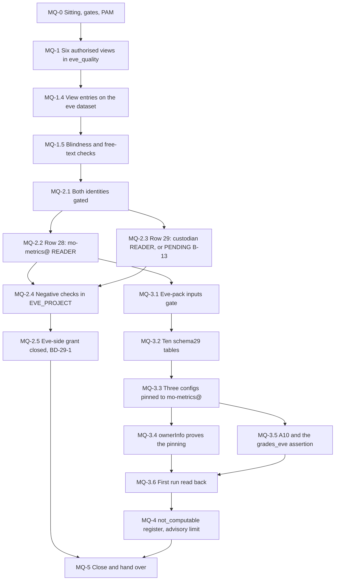

# 29. Mo: the Eve quality pack

## Status

- Owner: the platform owner
- Last reviewed: 2026-09-15
- Last executed: never
- Stage: review §2 stage 30 (Eve Phase 10b step 5 — the `eve_quality` authorised views and their two readers) and the Eve half of stage 25 (the Eve-pack queries of the superseded Mo-4). It has two halves with two performers and one join: Eve's side gives the reads, Mo's side computes on them.
- **This file gates nothing in Wall-E.** It may start while [30](30-wall-e-workspace-side.md) runs and finish after it. Nothing in files 30 to 39 waits on `MO_EVE_PACK_CONFIGS` (plan SD-45; [README](README.md) §3.4).
- Step prefix: `MQ`. Steps: 23. BLOCKED steps: MQ-1.1 and MQ-1.3 (Eve's view definitions and the six source tables, README B-07 and B-09); MQ-3.1, MQ-3.2, MQ-3.3 and MQ-3.5 (Mo's `schema29` and `sql29` files, README B-14). PENDING by design: MQ-2.3 (row 29, while the validator custodian is unnamed, README B-13); MQ-4.1 (the cells that need Wall-E, re-run in [36](36-wall-e-joins-to-eve-and-mo.md)).
- Replaces: step 5 of Phase 10b of [../../eve/07-build-runbook.md](../../eve/07-build-runbook.md), and the four Eve-pack lines of Phase Mo-4 of [../../mo/07-build-runbook.md](../../mo/07-build-runbook.md). Neither page is executed.
- Salvaged: Eve 10b step 5's intent and its dataset description (authorised views only, no free-text column, over `findings`, `verdicts`, `attestations`, `pages`, `incidents` minus narrative and `seeded_fault_runs`; never `grades_blind` or `review_queue_blind`); its "Mo's and the custodian's query jobs run and are billed in their own projects" rule; Mo-4's `create_metric` shape with `--service_account_name`, the `:07` schedule and the three query rules; Mo-4's rollback with its "check what that lists first" warning.
- Not copied: the fixed `/tmp/eq.json` access edit with no error check, no etag and no read-back (S160); the literal `$SA_VALIDATOR="<validator-custodian-service-account>"` placeholder, which makes `bq update --source` fail on an invalid member (S037); "column names follow the committed schemas and are tbd until those files exist" written as though the step could still run (S037); `c.get('serviceAccountName','USER CREDENTIALS')` over `bq ls --transfer_config`, which prints `USER CREDENTIALS` for a correctly pinned config and never performs the independence check (S148); an Eve pack computed from `eve_quality` alone, with no `grades_eve` source and no assertion (S055).
- Applies decisions (signed in [03](03-decisions-and-people.md) before the step that needs them): SD-01, SD-33, SD-43, SD-44, SD-45, P30, E-21, M-1, A10, NAMES.
- Closes: S037 (the step 5 half; steps 1 to 4 are [26](26-eve-reporting-and-witness-export.md)), S055 (the row 29, `grades_eve` source and assertion half; the custodian's own resources are [11](11-keys-and-validator-custodian.md), row 21 is [31](31-wall-e-project-and-data-plane.md), the S4 re-point and the CI recompute are [40](40-mo-after-stage-0.md)). Defers none without an owner (§7).
- Consumes: `SA_MO_METRICS`, `MO_PROJECT`, `MO_METRICS_DS`, `MO_INPUTS_COMMIT`, `ENT_PROJECT_REPAIR_MO`, `ENT_DEPLOY_CREDENTIAL_HOLDER_MO` ([22](22-mo-foundations.md)); `EVE_PROJECT`, `EVE_DS`, `EVE_WS_LOGS_DS`, `EVE_WS_REPORTS_DS`, `EVE_QUALITY_DS`, `EVE_SCHEMAS_COMMIT`, `ENT_PROJECT_REPAIR_EVE` ([23](23-eve-project-and-evidence-stores.md)); `SA_VALIDATOR_CUSTODIAN`, `GRADES_EVE_DS`, `VALIDATOR_PROJECT` ([11](11-keys-and-validator-custodian.md)); `EVE_CONFIG_REPO` ([25](25-eve-human-super-admin-detections.md)); `SECOND_HUMAN_EMAIL`, `MO_OWNER_EMAIL`, `VALIDATOR_CUSTODIAN_EMAIL` ([03](03-decisions-and-people.md)).
- Produces: `MO_EVE_PACK_CONFIGS` (the transfer-config resource names of the Eve pack); the `eve_quality` views and their two dataset readers; the ten `schema29` tables in `MO_METRICS_DS`; Eve detection-quality and time-to-report metrics, each carrying its source and its computability label.
- Two names are new against plan §5 and are handed to README's variable list: `EVE_CONFIG_DIR` (the local clone of `EVE_CONFIG_REPO`, which 25 names only as a remote) and `EVE_CONFIG_COMMIT` (the commit the view definitions and the column allow-list were read at, recorded so 40's recompute and 42's control run against the same text). Both are set in MQ-1.1.
- Commands checked against Google's documentation on 2026-09-15 (§9). What could not be settled that day is in §8.

## What this part builds

Mo measures Eve as well as Wall-E. This file builds the one seam between them, in the one direction the design allows: Eve exposes a narrow, column-listed surface, Mo reads it and computes, and **nothing of Mo's is readable by Eve** ([../../mo/01-hld.md](../../mo/01-hld.md) §1; topology row 24).

1. **The six authorised views in `eve_quality`** (§1), created on Eve's side from Eve's committed view definitions, and authorised on the `eve` dataset one view at a time.
2. **The two dataset readers** (§2): `mo-metrics@` (topology row 28) and the validator custodian's identity (topology row 29, platform decision P30), both `READER` on `eve_quality` only, both gated on the identity existing, with the negative check that neither appears anywhere else in `EVE_PROJECT`.
3. **The ten Eve-pack tables and the three Eve-pack queries** (§3), in `MO_PROJECT`, pinned to `mo-metrics@`, reading `eve_quality` and `grades_eve` fully qualified, with the `ownerInfo` check that actually proves the pinning.
4. **The source rule as a running assertion** (§3.5): a number about Eve that cites no independent source can never be marked evidence-eligible, and the pack fails outright when `grades_eve` is unreadable.
5. **An honest register of what cannot be computed yet** (§4): every cell that needs Wall-E's `walle_audit` is labelled `not_computable` here and re-run in [36](36-wall-e-joins-to-eve-and-mo.md); every Eve figure stays advisory until the custodian's `READER` exists.

What the superseded text got wrong, and must not come back:

| Old text | Why it fails | Here instead |
|---|---|---|
| `bq show ... > /tmp/eq.json`, a Python append, `bq update --source` (Eve 10b step 5) | Fixed path shared with two other runbooks; no error check, no etag, no de-duplication, no read-back; a stale file silently drops another owner's entry (S160) | `eq_access` (MQ-2.2) with `mktemp -d`, a read failure returning non-zero, the etag compared immediately before the write, `unique`, and a read-back diff (01 §8.1) |
| `B="$SA_VALIDATOR"` with `SA_VALIDATOR="<validator-custodian-service-account>"` | A literal placeholder is an invalid member: `bq update --source` fails, and the `mo-metrics@` entry in the same write fails with it (S037) | MQ-2.1 gates each entry on its own identity through `exists_or_pending`; MQ-2.2 and MQ-2.3 are separate writes, so a missing custodian never blocks row 28 |
| "column names ... tbd until those files exist", with the commands printed as though runnable | The one view given is an example; five are missing; the step cannot be executed (S037) | MQ-1.1 is **BLOCKED** on B-09 with the file names, the repository and the gate that waits; MQ-1.3 creates all six from the committed definitions and nothing by hand |
| "authorise each view on `eve` ... as in Phase 11 step 2" | Phase 11 is a later sitting on a different dataset; nothing here says what the entry is | MQ-1.4 writes one `{"view": {projectId, datasetId, tableId}}` entry per view and proves each one |
| `c.get('serviceAccountName','USER CREDENTIALS')` over `bq ls --transfer_config` (Mo-4 verify) | `serviceAccountName` is a create and patch request parameter, not a resource field; every row prints `USER CREDENTIALS` even when correctly pinned, so the independence check is never performed (S148) | MQ-3.4 loops over config names with `bq show --transfer_config` and reads `ownerInfo.email`, which the reference says is populated only on a get |
| An Eve pack over `eve_quality` alone (Mo-4, Mo-1) | Numbers about Eve would come from Eve's own account of itself; `grades_eve` and `VALIDATOR_PROJECT` appear in no procedure (S055) | MQ-3.3 reads `grades_eve` fully qualified; MQ-3.5 runs A10 and fails the pack when `grades_eve` is unreadable |
| Nothing said which Eve-pack cells need Wall-E | E2, E5 and E7 read `walle_audit`, which does not exist before [31](31-wall-e-project-and-data-plane.md) | §4's table: each cell is `computable` or `not_computable`, with the re-run step in 36 |



## Preconditions

- [ ] [23](23-eve-project-and-evidence-stores.md) complete for the dataset half: `EVE_PROJECT`, `EVE_DS`, `EVE_QUALITY_DS` set; `eve_quality` exists, `EU`, on `EVE_EVIDENCE_KEY_EU`; the six source tables exist in `eve` from `EVE_SCHEMAS_COMMIT`, or MQ-1.3 is BLOCKED on B-07.
- [ ] [25](25-eve-human-super-admin-detections.md): `EVE_CONFIG_REPO` exists with the second human as required reviewer, so the view definitions are merged under review.
- [ ] [22](22-mo-foundations.md): `MO_PROJECT`, `SA_MO_METRICS`, `MO_METRICS_DS` set; `MO_INPUTS_COMMIT` set with `sql29` (4 files) and `schema29` (10 files) present, or §3 is BLOCKED on B-14; `ENT_PROJECT_REPAIR_MO` and `ENT_DEPLOY_CREDENTIAL_HOLDER_MO` `AVAILABLE`.
- [ ] [11](11-keys-and-validator-custodian.md): `VALIDATOR_PROJECT` exists; `SA_VALIDATOR_CUSTODIAN` and `GRADES_EVE_DS` set, or MQ-2.3 and part of §3 record PENDING against B-13.
- [ ] [12](12-privileged-access-catalogue.md): `ENT_PROJECT_REPAIR_EVE` `AVAILABLE` with the second human as approver, proven by one grant (23).
- [ ] [03](03-decisions-and-people.md) signed: NAMES (with `EVE_QUALITY_DS`, `MO_METRICS_DS`), SD-01, SD-33, SD-43, SD-44, SD-45, P30, M-1. E-21 signed, or MQ-2.3 and the `grades_eve` source record PENDING.
- [ ] Workstation of [01](01-prerequisites-and-conventions.md): gcloud with `alpha` and `beta`, `bq`, `jq`, `python3.12`, `git`; `~/.platform-env` sourced; `penv_guard` silent.
- [ ] **Not** a precondition: `WALLE_PROJECT`, `walle_audit` or anything from files 30 to 39. §4 records their absence; it never waits on them.
- [ ] **Not** a precondition: `EVE_H_LIVE_RECORD`. This file may run before or after [28](28-eve-independent-proof-and-sandbox-drills.md); it changes nothing Eve reports on.

## People needed

| Role | Does | Present at |
|---|---|---|
| Platform owner (as `sa-1-admin@`) | Performs every step on Eve's side, inside a grant of `ENT_PROJECT_REPAIR_EVE` | MQ-0.3, §1, §2 |
| Second human (`SECOND_HUMAN_EMAIL`; Eve owner of record, owner of `eve-owners@`) | Approves the `ENT_PROJECT_REPAIR_EVE` grant; reviews and merges the view definitions in `EVE_CONFIG_REPO`; confirms MQ-1.5 and MQ-2.4 outputs before the grant is closed | MQ-0.3, MQ-1.2, MQ-1.5, MQ-2.4 |
| Mo owner (`MO_OWNER_EMAIL`) | Performs every step in §3 and §4; requests the two Mo grants | §3, §4 |
| Second operator (`SECOND_OPERATOR_EMAIL`) | Reviews the Eve-pack SQL commit against the three query rules and the source rule, as first reviewer | MQ-3.1 |
| Validator custodian (`VALIDATOR_CUSTODIAN_EMAIL`) | Confirms row 29 once named, and that the pack is re-derivable from `eve_quality` and `grades_eve` at its pinned commit | MQ-2.3, MQ-4.2 |

Hands-on: about half a day for Eve's side, half a day for Mo's. Elapsed: 1 to 2 days once the inputs exist; indefinite while B-07, B-09, B-13 or B-14 stand.

Conventions of [01](01-prerequisites-and-conventions.md) apply. Deviation rows are `BD-29-<n>`. Records go to `BUILD_LOG_DIR/records/` as `<date>-MQ-<step>-<slug>-v<n>`. Every shell block starts with:

```bash
source ~/.platform-env
penv_guard
R="$BUILD_LOG_DIR/records/$(date -u +%F)-MQ"
```

## 0. The sitting

### MQ-0.1 Open the sitting and check the gates

- **WHO:** Platform owner (Eve side); the Mo owner repeats it before §3.
- **WHERE:** Shell, `~/.platform-env` sourced, gcloud configuration `GCLOUD_CONFIG_NAME`, signed in as `sa-1-admin@`.
- **ACTION:**

```bash
checkpoint MQ-0.1 START
need ORG_ID BQ_LOCATION PLATFORM_REPO_DIR BUILD_LOG_DIR DEVIATION_REGISTER EVIDENCE_REGISTER EVE_PROJECT EVE_DS EVE_QUALITY_DS MO_PROJECT MO_METRICS_DS SA_MO_METRICS ENT_PROJECT_REPAIR_EVE ENT_PROJECT_REPAIR_MO ENT_DEPLOY_CREDENTIAL_HOLDER_MO SECOND_HUMAN_EMAIL MO_OWNER_EMAIL CICD_PROJECT
"$PLATFORM_REPO_DIR/tools/decision-need.sh" NAMES SD-01 SD-33 SD-43 SD-44 SD-45 P30 M-1
bq --project_id="$EVE_PROJECT" show --format=prettyjson "${EVE_PROJECT}:${EVE_QUALITY_DS}" | jq '{location, defaultEncryptionConfiguration: .defaultEncryptionConfiguration.kmsKeyName, access: [.access[] | {role, who: (.userByEmail // .groupByEmail // .specialGroup // .domain // .iamMember // "view")}]}'
bq --project_id="$MO_PROJECT" show --format=prettyjson "${MO_PROJECT}:${MO_METRICS_DS}" | jq -r '.location'
test -z "$(gcloud config get project 2>/dev/null)" && echo "no default project"
```

- **VERIFY:** `decision-need.sh` prints `SIGNED` for each id. `eve_quality` shows `location: "EU"`, the `EVE_EVIDENCE_KEY_EU` key name, and an access array holding only Eve's own owners (no `view` entry, no foreign `userByEmail`). `MO_METRICS_DS` prints `EU`: the two must match, because a cross-location join fails outright and an authorised view and its source dataset must share a location. `no default project`. Anything else: stop and finish 22 or 23.
- **ROLLBACK:** Read only.
- **EVIDENCE:** The output as `${R}-0.1-gates-v1.txt`; `evidence_add MQ-0.1 gates E-05 1.4.1 build-log:records/<file> <file>`. E-05. TISAX 1.4.1.

### MQ-0.2 Record which of the four blocked inputs stand today

- **WHO:** Platform owner.
- **WHERE:** Shell; the build log.
- **ACTION:** This file has four independent blockers and they fail differently. Record the state of each before any write, so a half-run sitting resumes at the right step.

```bash
checkpoint MQ-0.2 START
printf 'B-07 eve schemas\t%s\n' "${EVE_SCHEMAS_COMMIT:-tbd}"
git -C "$PLATFORM_REPO_DIR" ls-tree -r --name-only "${EVE_CONFIG_COMMIT:-origin/main}" -- eve/quality 2>/dev/null | sort || echo "B-09: no eve/quality view definitions"
printf 'B-13 validator custodian\t%s\n' "${SA_VALIDATOR_CUSTODIAN:-tbd}"
printf 'B-14 mo inputs\t%s\n' "${MO_INPUTS_COMMIT:-tbd}"
for T in findings verdicts attestations pages incidents seeded_fault_runs; do printf '%s\t' "$T"; bq --project_id="$EVE_PROJECT" show --format=prettyjson "${EVE_PROJECT}:${EVE_DS}.${T}" >/dev/null 2>&1 && echo present || echo MISSING; done
```

- **VERIFY:** Six lines for the source tables, each `present` or `MISSING`; four blocker lines with a value or `tbd`. A `MISSING` source table makes MQ-1.3 BLOCKED on B-07 for that view only — the other views are still created. `tbd` for B-13 makes MQ-2.3 PENDING, nothing else. `tbd` for B-14 makes all of §3 BLOCKED and none of §1 or §2.
- **ROLLBACK:** Read only.
- **EVIDENCE:** The listing as `${R}-0.2-blockers-v1.txt`. E-05. TISAX 1.4.1.

### MQ-0.3 Open the Eve-side grant

- **WHO:** Platform owner requests; **approver: the second human**.
- **WHERE:** Shell; the second human's console.
- **ACTION:** Every write in §1 and §2 is inside one grant. The platform owner holds no standing role that edits `EVE_PROJECT` ([28](28-eve-independent-proof-and-sandbox-drills.md)'s drift check depends on that staying true), so the grant is the only path and its record is the evidence.

```bash
source "$PLATFORM_REPO_DIR/pam/tools/pam.sh"
g_eve="$(pam_request "$ENT_PROJECT_REPAIR_EVE" "setup-29 MQ-1 and MQ-2: eve_quality views and the two dataset readers")"; echo "$g_eve"
```

- **VERIFY:** `pam_request` ([12](12-privileged-access-catalogue.md) PA-1.5) runs `gcloud pam grants create ... --format="value(name)"`, so it prints the **fully qualified** grant name `projects/<project>/locations/global/entitlements/<entitlement>/grants/<id>`, not a bare id. A fully qualified name is the whole resource argument, and `--entitlement`, `--location` and `--project` are then neither needed nor accepted alongside it (the grant resource argument is `(GRANT : --entitlement --folder --location --organization)`, and any one of that group requires the others):

```bash
gcloud pam grants describe "$g_eve" --billing-project="$CICD_PROJECT" --format='value(state,requestedDuration)'
```

  `ACTIVE` and the entitlement's duration. If `$g_eve` is a bare id — check with `case "$g_eve" in projects/*) : ;; *) echo "bare id";; esac` — re-run the describe as `gcloud pam grants describe "$g_eve" --entitlement="$ENT_PROJECT_REPAIR_EVE" --location=global --project="$EVE_PROJECT" --billing-project="$CICD_PROJECT" --format='value(state,requestedDuration)'` and record which form the installed gcloud needed. The second human's approval is recorded against their own account, not the platform owner's.
- **ROLLBACK:** `pam_revoke "$g_eve"`; the grant expires on its own duration in any case.
- **EVIDENCE:** The grant record as `${R}-0.3-eve-grant-v1.json`; `evidence_add MQ-0.3 eve-grant E-08 4.2.1 build-log:records/<file> <file>`. TISAX 4.2.1.

## 1. The `eve_quality` views

### MQ-1.1 Read the committed view definitions — **BLOCKED**

- **WHO:** Platform owner; the second human merged the definitions.
- **WHERE:** A clean checkout of `EVE_CONFIG_REPO`.
- **ACTION:** **BLOCKED (code)**: Needs six view-definition files, `eve/quality/<view>.sql` for `findings`, `verdicts`, `attestations`, `pages`, `incidents` and `seeded_fault_runs`, each an explicit column list over `` `${EVE_PROJECT}.${EVE_DS}.<table>` `` and nothing else, plus `eve/quality/ALLOWED_COLUMNS.tsv` naming every column each view may expose. Commit them in: `EVE_CONFIG_REPO`, merged with the second human as required reviewer (25). Unblocked by: the files existing at a named commit recorded as `EVE_CONFIG_COMMIT`. Gate waiting: MQ-1.3, and through it every Eve-pack number. Until then: `checkpoint MQ-1.1 BLOCKED - - "B-09: eve/quality view definitions and column allow-list"`.

  What the definitions must satisfy, because no IAM control enforces it:

  | Rule | Why | Checked by |
  |---|---|---|
  | An explicit column list; never `SELECT *` | A column added to a source table would otherwise appear in Mo's read without review | MQ-1.5's allow-list diff |
  | `incidents` excludes `narrative` | The narrative is free text written from `eve_advice`; Mo canonicalises nothing, so there must be nothing to canonicalise ([../../wall-e/06-security-guardrails.md](../../wall-e/06-security-guardrails.md) N5) | MQ-1.5 |
  | No view reads `grades_blind`, `review_queue`, `review_queue_blind` or `walle_audit_mirror` | Mo is never Eve's grader, and a dataset-level `READER` covers every object in the dataset ([../../eve/03-lld.md](../../eve/03-lld.md) §9) | MQ-1.5's definition scan |
  | Each view's name equals its source table's name | The pack SQL and the topology row name the same six | MQ-1.3's loop |

  When the files exist:

```bash
checkpoint MQ-1.1 START
need EVE_CONFIG_REPO
test -d "${EVE_CONFIG_DIR:-/nonexistent}/.git" || { D="${PLATFORM_REPO_DIR%/*}/eve-config"; git clone "$EVE_CONFIG_REPO" "$D" && penv_set EVE_CONFIG_DIR "$D"; }
git -C "$EVE_CONFIG_DIR" fetch origin && git -C "$EVE_CONFIG_DIR" switch --detach origin/main
penv_set EVE_CONFIG_COMMIT "$(git -C "$EVE_CONFIG_DIR" rev-parse origin/main)"
T="$(mktemp -d)"; git -C "$EVE_CONFIG_DIR" archive "$EVE_CONFIG_COMMIT" eve/quality | tar -x -C "$T"
ls -1 "$T/eve/quality"
grep -rniE 'select[[:space:]]+\*|grades_blind|review_queue|walle_audit_mirror|narrative' "$T/eve/quality" && { echo "STOP: a definition breaks a rule"; false; } || echo "definitions clean"
```

- **VERIFY:** Seven files listed (six views and the allow-list); `definitions clean`. A hit from `grep` is a stop, not a warning: the fix is a reviewed change in `EVE_CONFIG_REPO`, never an edit in the shell.
- **ROLLBACK:** Read only. `$T` holds the checked-out definitions and the allow-list; MQ-1.3 and MQ-1.5 read it, so it is removed with `rm -rf "$T"` only at the end of §1, and a sitting resumed after a break re-runs this step to recreate it.
- **EVIDENCE:** `EVE_CONFIG_COMMIT` and the listing as `${R}-1.1-view-definitions-v1.txt`. E-04. TISAX 5.3.1.

### MQ-1.2 Confirm the dataset is the right shape to hold them

- **WHO:** Platform owner; the second human reads the output.
- **WHERE:** Shell, inside `g_eve`.
- **ACTION:** `eve_quality` was created in 23. Confirm before writing into it that it is `EU`, carries the EU key, has no default table expiration (a view has no data, but an expiry on the dataset would still delete the views), and holds no foreign principal yet.

```bash
bq --project_id="$EVE_PROJECT" show --format=prettyjson "${EVE_PROJECT}:${EVE_QUALITY_DS}" | jq '{location, kms: .defaultEncryptionConfiguration.kmsKeyName, defaultTableExpirationMs, description, access}'
bq --project_id="$EVE_PROJECT" ls --format=json "${EVE_PROJECT}:${EVE_QUALITY_DS}" | jq 'length'
```

- **VERIFY:** `location: "EU"`; the key name ends `/cryptoKeys/eve-evidence-eu`; `defaultTableExpirationMs` absent; the description names the dataset as authorised views for Mo and the custodian; `access` has no `userByEmail` other than Eve's owners; the object count is `0` on the first run.
- **ROLLBACK:** Read only.
- **EVIDENCE:** The output as `${R}-1.2-eve-quality-shape-v1.json`. E-07. TISAX 1.3.1.

### MQ-1.3 Create the six views — **BLOCKED until MQ-1.1**

- **WHO:** Platform owner, inside `g_eve`.
- **WHERE:** Shell.
- **ACTION:** **BLOCKED (code)** with MQ-1.1, and **BLOCKED (code) on B-07** for any source table MQ-0.2 reported `MISSING`. Each view is created from its committed file, never from text typed here. `bq mk --view` takes the query as its argument and `--use_legacy_sql=false` selects GoogleSQL (bq reference). A view in `eve_quality` over `eve` is the shape the design requires: an authorised view must sit in a different dataset from the data it reads, and the two must share a location ([Authorized views](https://docs.cloud.google.com/bigquery/docs/authorized-views)).

```bash
need EVE_PROJECT EVE_DS EVE_QUALITY_DS EVE_CONFIG_COMMIT
for V in findings verdicts attestations pages incidents seeded_fault_runs; do
  F="$T/eve/quality/${V}.sql"
  test -s "$F" || { echo "BLOCKED 29/MQ-1.3 ${V}: no definition"; continue; }
  bq --project_id="$EVE_PROJECT" show --format=prettyjson "${EVE_PROJECT}:${EVE_DS}.${V}" >/dev/null 2>&1 || { echo "BLOCKED 29/MQ-1.3 ${V}: source table missing (B-07)"; continue; }
  bq --project_id="$EVE_PROJECT" mk --use_legacy_sql=false --view "$(cat "$F")" --description="Authorised view for Mo and the validator custodian; no free-text column (definitions ${EVE_CONFIG_COMMIT})" "${EVE_PROJECT}:${EVE_QUALITY_DS}.${V}" || { echo "STOP at ${V}: read the error before re-running"; break; }
done
```

  `bq mk` on an existing view is an error, not an overwrite, so a re-run after a stop is safe once the error has been read. A definition that is later corrected is applied with `bq update --use_legacy_sql=false --view`, from the new commit, never by hand.
- **VERIFY:**

```bash
bq --project_id="$EVE_PROJECT" ls --format=json "${EVE_PROJECT}:${EVE_QUALITY_DS}" | jq -r '.[] | [.type, .tableReference.tableId] | @tsv' | sort
```

  Six rows, each `VIEW`, named exactly `findings`, `verdicts`, `attestations`, `pages`, `incidents`, `seeded_fault_runs`. No `TABLE` row: a table in this dataset would be data Mo reads outside the review, and is a stop.
- **ROLLBACK:** `bq --project_id="$EVE_PROJECT" rm -f -t "${EVE_PROJECT}:${EVE_QUALITY_DS}.<view>"`. A view holds no data, so this is reversible at any time; the readers of §2 then see one fewer object.
- **EVIDENCE:** The listing and the six definitions as `${R}-1.3-views-v1.txt`; `evidence_add MQ-1.3 eve-quality-views E-04 1.3.1 build-log:records/<file> <file>`. E-04. TISAX 1.3.1.

### MQ-1.4 Authorise each view on the `eve` dataset

- **WHO:** Platform owner, inside `g_eve`.
- **WHERE:** Shell.
- **ACTION:** A view queries its source with the **view's** authorisation, not the caller's, only once the view is listed in the source dataset's access array. The entry is `{"view": {"projectId": ..., "datasetId": ..., "tableId": ...}}` and it is added by `bq show --format=prettyjson` → edit → `bq update --source` ([Authorized views](https://docs.cloud.google.com/bigquery/docs/authorized-views)).

  **An authorised dataset is deliberately not used here.** One `{"dataset": {...}, "target_types": "VIEWS"}` entry would authorise every view in `eve_quality`, present and future ([Authorized datasets](https://docs.cloud.google.com/bigquery/docs/authorized-datasets)). That is the wrong default for this seam: a seventh view added later would silently gain the read of `eve`, which holds `grades_blind` and `review_queue`. Six named entries make each addition a reviewed act. Recorded as a design note in the build log, not as a deviation.

```bash
need EVE_PROJECT EVE_DS EVE_QUALITY_DS
W="$(mktemp -d)" || exit 1
bq --project_id="$EVE_PROJECT" show --format=prettyjson "${EVE_PROJECT}:${EVE_DS}" > "$W/before.json" || { echo "STOP: cannot read ${EVE_DS}"; false; }
jq -e '.etag and (.access | type == "array")' "$W/before.json" >/dev/null || { echo "STOP: unexpected show output"; false; }
jq --arg p "$EVE_PROJECT" --arg d "$EVE_QUALITY_DS" '.access = ((.access + ([ "findings","verdicts","attestations","pages","incidents","seeded_fault_runs" ] | map({view:{projectId:$p, datasetId:$d, tableId:.}}))) | unique)' "$W/before.json" > "$W/after.json"
diff <(jq -S '.access | sort_by(tostring)' "$W/before.json") <(jq -S '.access | sort_by(tostring)' "$W/after.json")
_now="$(bq --project_id="$EVE_PROJECT" show --format=prettyjson "${EVE_PROJECT}:${EVE_DS}" | jq -r .etag)" || { echo "STOP: cannot re-read ${EVE_DS}"; false; }
[ "$_now" = "$(jq -r .etag "$W/before.json")" ] || { echo "STOP: ${EVE_DS} changed since it was read"; false; }
bq --project_id="$EVE_PROJECT" update --source "$W/after.json" "${EVE_PROJECT}:${EVE_DS}" || { echo "STOP: update failed; read the error, do not treat it as a race"; false; }
bq --project_id="$EVE_PROJECT" show --format=prettyjson "${EVE_PROJECT}:${EVE_DS}" | jq -S '.access | sort_by(tostring)' > "$W/readback.json"
diff <(jq -S '.access | sort_by(tostring)' "$W/after.json") "$W/readback.json" && echo "ACCESS MATCHES eve"
cp "$W/before.json" "${R}-1.4-eve-before-v1.json"; cp "$W/readback.json" "${R}-1.4-eve-readback-v1.json"; rm -rf "$W"
```

  `unique` removes a duplicate on a re-run; the three separate lines above are deliberate: written as `A && B || C`, a genuine `bq update` failure (permission, quota, a malformed access entry) would be reported as a concurrent-modification race and the natural response — re-read and retry — would be the wrong one. Each command carries its own handler, as `eq_access` does in MQ-2.2. The loop adds only view entries, so no `userByEmail` on `eve` is touched — and none should exist (MQ-2.4 proves it).
- **VERIFY:** The **structural proof** is the access-array read-back: the pre-write diff shows exactly six added `view` entries and nothing removed, and the post-write diff prints `ACCESS MATCHES eve`. That is the proof this step can give.

  A smoke test that the views resolve and are queryable at all:

```bash
bq --project_id="$EVE_PROJECT" query --use_legacy_sql=false --location="$BQ_LOCATION" 'SELECT COUNT(*) AS n FROM `'"${EVE_PROJECT}"'.'"${EVE_QUALITY_DS}"'.incidents`'
```

  **This count is a smoke test only. It is not evidence that the view is authorised.** The platform owner runs it inside `g_eve`, which carries `roles/bigquery.admin` on `EVE_PROJECT` and therefore direct read on the source dataset `eve`; an authorised view's entry only matters to a caller that *lacks* access to the source, so this query returns the same number whether or not the six `view` entries were ever written ([Authorized views](https://docs.cloud.google.com/bigquery/docs/authorized-views): the view lets a principal "run queries on it, but they can't access the source dataset directly"). A permission error here means the *view* is broken, not that the authorisation is missing.

  **The authorisation is proven in [MQ-3.6](#mq-36-run-once-by-hand-and-read-the-rows-back)**, as MQ-2.2's pending proof, by `mo-metrics@` — the one principal that has `READER` on `eve_quality` and, by MQ-2.4's negative check, no role whatever on `eve` or on `EVE_PROJECT`. Its read of `eve_quality` can only come through these entries, so MQ-3.6 is simultaneously the positive and the negative control: before the entries exist that read fails with a permission error naming the source table, and after they exist it returns rows. Record MQ-3.6's outcome against this step.

  Optional direct form, when the Mo owner holds `roles/iam.serviceAccountTokenCreator` on `mo-metrics@` (neither `ENT_PROJECT_REPAIR_MO` nor `ENT_DEPLOY_CREDENTIAL_HOLDER_MO` grants it, so it is normally **unavailable** and recorded as such rather than granted for a test):

```bash
curl -sS -X POST -H "Authorization: Bearer $(gcloud auth print-access-token --impersonate-service-account="$SA_MO_METRICS")" -H "Content-Type: application/json" -d '{"query":"SELECT COUNT(*) AS n FROM `'"${EVE_PROJECT}"'.'"${EVE_QUALITY_DS}"'.incidents`","useLegacySql":false,"location":"'"${BQ_LOCATION}"'"}' "https://bigquery.googleapis.com/bigquery/v2/projects/${MO_PROJECT}/queries"
```

  Run from `MO_PROJECT`, so the job is created and billed where `mo-metrics@` holds `roles/bigquery.jobUser`, never in `EVE_PROJECT`.

  Revoking an authorisation can take up to 24 hours to take effect (Authorized datasets page); granting one is immediate in practice, but a permission error on the first try is retried once after five minutes before it is treated as a failure.
- **ROLLBACK:** `bq --project_id="$EVE_PROJECT" update --source "${R}-1.4-eve-before-v1.json" "${EVE_PROJECT}:${EVE_DS}"`, then the same read-back diff. Note the propagation delay above before concluding that a removal failed.
- **EVIDENCE:** Before, read-back and the query result as `${R}-1.4-authorised-views-v1`; `evidence_add MQ-1.4 authorised-views E-07 4.2.1 build-log:records/<file> <file>`. E-07. TISAX 4.2.1, 1.3.1.

### MQ-1.5 Prove the blindness and the column allow-list

- **WHO:** Platform owner runs; **the second human reads the output and initials it**.
- **WHERE:** Shell.
- **ACTION:** IAM cannot express "no free-text column". The claim is a check, run here and handed to the drift job and to [42](42-gates-drills-and-evidence.md).

```bash
bq --project_id="$EVE_PROJECT" query --use_legacy_sql=false --location="$BQ_LOCATION" --format=csv \
  'SELECT table_name, view_definition FROM `'"${EVE_PROJECT}"'.'"${EVE_QUALITY_DS}"'.INFORMATION_SCHEMA.VIEWS`' > "${R}-1.5-definitions-v1.csv"
grep -niE 'select[[:space:]]+\*|grades_blind|review_queue|walle_audit_mirror|narrative' "${R}-1.5-definitions-v1.csv" && { echo "STOP: a live view breaks a rule"; false; } || echo "live definitions clean"
bq --project_id="$EVE_PROJECT" query --use_legacy_sql=false --location="$BQ_LOCATION" --format=csv \
  'SELECT table_name, column_name FROM `'"${EVE_PROJECT}"'.'"${EVE_QUALITY_DS}"'.INFORMATION_SCHEMA.COLUMNS` ORDER BY 1,2' | tail -n +2 | tr ',' '\t' > "${R}-1.5-columns-v1.tsv"
diff <(sort "$T/eve/quality/ALLOWED_COLUMNS.tsv") <(sort "${R}-1.5-columns-v1.tsv") && echo "COLUMNS MATCH THE ALLOW-LIST"
```

- **VERIFY:** `live definitions clean` and `COLUMNS MATCH THE ALLOW-LIST`. Any difference is a stop: either a source schema changed and the allow-list must be amended by a reviewed pull request in `EVE_CONFIG_REPO`, or a view exposes a column nobody approved. The second human initials the build-log line; the check text is committed to `EVE_CONFIG_REPO` as `eve/quality/checks.md` so later runs use the same words.
- **ROLLBACK:** Read only.
- **EVIDENCE:** Both files and the initialled line as `${R}-1.5-blindness-v1`; `evidence_add MQ-1.5 eve-quality-blindness E-04 1.3.1 build-log:records/<file> <file>`. E-04, E-07. TISAX 1.3.1, 5.2.3.

## 2. The two readers

### MQ-2.1 Gate each entry on its own identity

- **WHO:** Platform owner.
- **WHERE:** Shell.
- **ACTION:** The superseded step wrote both entries in one edit, with a placeholder for the second. Here each is separately gated, so a missing custodian never blocks Mo (S037).

```bash
source "$PLATFORM_REPO_DIR/pam/tools/pam.sh"
exists_or_pending "serviceAccount:${SA_MO_METRICS}" MQ-2.2 "29: eve_quality READER for mo-metrics@ (topology row 28)"
exists_or_pending "serviceAccount:${SA_VALIDATOR_CUSTODIAN:-unset}" MQ-2.3 "29: eve_quality READER for the validator custodian (topology row 29, P30); B-13"
```

- **VERIFY:** The first line prints the account, not `PENDING` — `mo-metrics@` exists from 22 and this file is not run before it. The second prints the account, or `PENDING` with a re-run line naming MQ-2.3 and B-13.
- **ROLLBACK:** Read only; the re-run index is append-only.
- **EVIDENCE:** The two lines. E-05. TISAX 4.2.1.

### MQ-2.2 Row 28: `READER` on `eve_quality` for `mo-metrics@`

- **WHO:** Platform owner, inside `g_eve`.
- **WHERE:** Shell.
- **ACTION:** Dataset-level `READER` (the basic role whose IAM equivalent is `roles/bigquery.dataViewer`) on `eve_quality` **only**. `bq add-iam-policy-binding` does not support datasets, so the access array is edited under 01 §8.1. Mo gains nothing in `EVE_PROJECT` at project level, and Eve gains nothing in `MO_PROJECT` in return (topology rows 24 and 28). Mo's query jobs run and are billed in `MO_PROJECT`, where `mo-metrics@` already holds `roles/bigquery.jobUser`: `bigquery.jobs.create` is needed "on the project from which the query is being run, regardless of where the data is stored".

```bash
need EVE_PROJECT EVE_QUALITY_DS SA_MO_METRICS
eq_access() {   # eq_access EMAIL: adds one READER entry to eve_quality, idempotently
  _sa="$1"; W="$(mktemp -d)" || return 1
  bq --project_id="$EVE_PROJECT" show --format=prettyjson "${EVE_PROJECT}:${EVE_QUALITY_DS}" > "$W/before.json" || { echo "STOP: cannot read ${EVE_QUALITY_DS}"; rm -rf "$W"; return 1; }
  jq -e '.etag and (.access | type == "array")' "$W/before.json" >/dev/null || { echo "STOP: unexpected show output"; rm -rf "$W"; return 1; }
  case "$_sa" in *@*.iam.gserviceaccount.com) : ;; *) echo "STOP: '$_sa' is not a service-account email"; rm -rf "$W"; return 1;; esac
  jq --arg sa "$_sa" '.access = ((.access + [{"role":"READER","userByEmail":$sa}]) | unique)' "$W/before.json" > "$W/after.json" || { rm -rf "$W"; return 1; }
  diff <(jq -S '.access | sort_by(tostring)' "$W/before.json") <(jq -S '.access | sort_by(tostring)' "$W/after.json")
  _now="$(bq --project_id="$EVE_PROJECT" show --format=prettyjson "${EVE_PROJECT}:${EVE_QUALITY_DS}" | jq -r .etag)" || { rm -rf "$W"; return 1; }
  [ "$_now" = "$(jq -r .etag "$W/before.json")" ] || { echo "STOP: ${EVE_QUALITY_DS} changed since it was read"; rm -rf "$W"; return 1; }
  bq --project_id="$EVE_PROJECT" update --source "$W/after.json" "${EVE_PROJECT}:${EVE_QUALITY_DS}" >/dev/null || { echo "STOP: update failed"; rm -rf "$W"; return 1; }
  bq --project_id="$EVE_PROJECT" show --format=prettyjson "${EVE_PROJECT}:${EVE_QUALITY_DS}" | jq -S '.access | sort_by(tostring)' > "$W/readback.json" || { rm -rf "$W"; return 1; }
  diff <(jq -S '.access | sort_by(tostring)' "$W/after.json") "$W/readback.json" && echo "ACCESS MATCHES ${_sa}" || echo "STOP: read-back differs; record the normalised form"
  cp "$W/before.json" "${R}-2-${_sa%%@*}-before-v1.json"; cp "$W/readback.json" "${R}-2-${_sa%%@*}-readback-v1.json"; rm -rf "$W"
}
eq_access "$SA_MO_METRICS"
```

  The email guard is the direct answer to S037: a placeholder such as `<validator-custodian-service-account>` stops the function before any write, instead of failing the whole update.
- **VERIFY:** One added entry in the pre-write diff and `ACCESS MATCHES`. Then the read itself, which only the grantee can prove — run by the Mo owner in §3.6, recorded here as the pending proof.
- **ROLLBACK:** `bq --project_id="$EVE_PROJECT" update --source "${R}-2-mo-metrics-before-v1.json" "${EVE_PROJECT}:${EVE_QUALITY_DS}"`, then the read-back diff. Removal can take up to 24 hours to take effect.
- **EVIDENCE:** Before and read-back as `${R}-2.2-row28-v1`; `evidence_add MQ-2.2 row28-mo-metrics E-09 4.2.1 build-log:records/<file> <file>`. E-09. TISAX 4.2.1.

### MQ-2.3 Row 29: `READER` for the validator custodian, or PENDING

- **WHO:** Platform owner, inside `g_eve`; the validator custodian confirms once named.
- **WHERE:** Shell.
- **ACTION:** **PENDING (person) on B-13** while `SA_VALIDATOR_CUSTODIAN` is unset: the identity is created in [11](11-keys-and-validator-custodian.md) KV-8.2, which is itself blocked on the security reviewer being appointed. This is platform decision P30, the gate that turns Eve figures from advisory into citable (§4.2). When the identity exists:

```bash
need SA_VALIDATOR_CUSTODIAN
eq_access "$SA_VALIDATOR_CUSTODIAN"
```

- **VERIFY:** One added entry and `ACCESS MATCHES`. `gcloud projects get-iam-policy "$EVE_PROJECT" --flatten="bindings[].members" --filter="bindings.members:${SA_VALIDATOR_CUSTODIAN}" --format="value(bindings.role)"` prints nothing: the custodian holds one dataset entry and no project-level role in Eve's project, and `roles/bigquery.jobUser` at home in `VALIDATOR_PROJECT` (11 KV-8.2).
- **ROLLBACK:** Restore the saved `before.json` as in MQ-2.2.
- **EVIDENCE:** Either the PENDING re-run line against B-13, or the diff as `${R}-2.3-row29-v1`; `evidence_add MQ-2.3 row29-custodian E-09 4.2.1 build-log:records/<file> <file>`. E-09. TISAX 4.2.1.

### MQ-2.4 The negative checks in `EVE_PROJECT`

- **WHO:** Platform owner runs; **the second human reads the output before the grant is closed**.
- **WHERE:** Shell.
- **ACTION:** The claim "one `READER`, on `eve_quality` only" is worth exactly what the check is worth. Both readers are looked for everywhere else in Eve's project.

```bash
for DS in "$EVE_DS" "$EVE_WS_LOGS_DS" "$EVE_WS_REPORTS_DS"; do
  printf '%s\t' "$DS"
  bq --project_id="$EVE_PROJECT" show --format=prettyjson "${EVE_PROJECT}:${DS}" | jq -c --arg a "$SA_MO_METRICS" --arg b "${SA_VALIDATOR_CUSTODIAN:-unset}" '[.access[] | select(.userByEmail == $a or .userByEmail == $b)]'
done
gcloud projects get-iam-policy "$EVE_PROJECT" --flatten="bindings[].members" --filter="bindings.members:${SA_MO_METRICS}" --format="value(bindings.role)"
gcloud projects get-iam-policy "$MO_PROJECT" --format=json | jq -r '[.bindings[].members[]] | map(select(test("@'"${EVE_PROJECT}"'\\.iam\\.gserviceaccount\\.com$"))) | .[]'
```

- **VERIFY:** Three `[]` lines; no role printed for `mo-metrics@` in `EVE_PROJECT`; no Eve service account printed in `MO_PROJECT`'s policy (topology row 24, asserted by Mo's MD-9 and re-asserted here from Eve's side). Any output is a stop and a finding, not a note.
- **ROLLBACK:** Read only.
- **EVIDENCE:** The output as `${R}-2.4-negative-checks-v1.txt`; `evidence_add MQ-2.4 eve-mo-anti-grants E-09 4.2.1 build-log:records/<file> <file>`. E-09. TISAX 4.2.1, 5.2.3.

### MQ-2.5 Close the Eve-side grant and write the deviation row

- **WHO:** Platform owner; the second human initials.
- **WHERE:** Shell; `DEVIATION_REGISTER`.
- **ACTION:** The views and the two access entries were made by hand, where the `verifier-project` module would have made them. Record it so the zero-diff checker and 42's supersession see it.

```bash
printf '| BD-29-1 | %s | 29 MQ-1, MQ-2 | DEV | eve_quality views and readers (hand, SD-01) | dataset %s:%s | eve/quality at %s | six authorised views; view entries on %s; READER for %s%s | build-log:records/%s | - | PAM %s | terraform import of the views and both access arrays + empty plan | open |\n' \
  "$(date -u +%F)" "$EVE_PROJECT" "$EVE_QUALITY_DS" "${EVE_CONFIG_COMMIT:-tbd}" "$EVE_DS" "$SA_MO_METRICS" "${SA_VALIDATOR_CUSTODIAN:+ and $SA_VALIDATOR_CUSTODIAN}" "$(basename "${R}-1.4-eve-readback-v1.json")" "ENT_PROJECT_REPAIR_EVE" >> "$DEVIATION_REGISTER"
git -C "$BUILD_LOG_DIR" add "$DEVIATION_REGISTER" && git -C "$BUILD_LOG_DIR" commit -m "registers: BD-29-1 eve_quality views and readers (setup 29 MQ-2.5)"
pam_revoke "$g_eve"
gcloud pam grants list --entitlement="$ENT_PROJECT_REPAIR_EVE" --location=global --project="$EVE_PROJECT" --billing-project="$CICD_PROJECT" --filter="state=ACTIVE" --format="value(name)"
```

- **VERIFY:** `tail -n 1 "$DEVIATION_REGISTER"` shows `BD-29-1`; the grants list prints nothing; `gcloud projects get-iam-policy "$EVE_PROJECT" --flatten="bindings[].members" --filter="bindings.members:user:" --format="value(bindings.role)"` prints nothing, so no human holds a standing role on Eve's project after the sitting.
- **ROLLBACK:** The register is append-only; a revoked grant is not restored.
- **EVIDENCE:** The commit; `evidence_add MQ-2.5 bd-29-1 E-05 5.2.4 build-log:<register> `. TISAX 5.2.4, 4.2.1.

## 3. Mo's Eve-pack queries

### MQ-3.1 The Eve-pack inputs gate

- **WHO:** Mo owner; the second operator reviewed the commit.
- **WHERE:** Shell, in `PLATFORM_REPO_DIR`.
- **ACTION:** **BLOCKED (code) on B-14** while `MO_INPUTS_COMMIT` is `*tbd*`. 22's `mo/INPUTS.tsv` names the four `sql29` files — `eve_quality_pack.sql`, `eve_divergence.sql`, `eve_scorecard.sql`, `assert_eve_source_rule.sql` — and the ten `schema29` files. Check them at the named commit, and check the three query rules the superseded runbook stated but never enforced for the Eve pack.

```bash
checkpoint MQ-3.1 START
need MO_INPUTS_COMMIT
T29="$(mktemp -d)"; git -C "$PLATFORM_REPO_DIR" archive "$MO_INPUTS_COMMIT" mo | tar -x -C "$T29"
awk -F'\t' '$1=="sql29" || $1=="schema29" {print $2}' "$T29/mo/INPUTS.tsv" | while read -r P; do printf '%s\t' "$P"; test -s "$T29/${P#mo/}" 2>/dev/null || test -s "$T29/$P" && echo present || echo MISSING; done
grep -LE "${EVE_PROJECT//./\\.}\.${EVE_QUALITY_DS}\." "$T29"/mo/config/metrics/eve_*.sql
grep -lE 'eve\.verdicts|grades_blind|review_queue|walle_metrics' "$T29"/mo/config/metrics/eve_*.sql "$T29"/mo/config/metrics/assert_eve_source_rule.sql
grep -LE 'source_tables' "$T29"/mo/config/metrics/eve_*.sql
```

- **VERIFY:** Fourteen `present` lines. The first `grep -L` prints nothing except `eve_scorecard.sql` if it reads only Mo's own aggregates — read it and record which. The second `grep -l` prints nothing at all: a direct read of `${EVE_PROJECT}.eve.verdicts`, of a blind table, or of the retired `walle_metrics` names is a stop and a reviewed fix. The third prints nothing: every Eve-pack query stamps `source_tables`. Otherwise `checkpoint MQ-3.1 BLOCKED - - "B-14: sql29 and schema29"` and stop the section.
- **ROLLBACK:** Read only.
- **EVIDENCE:** The listing as `${R}-3.1-inputs-v1.txt`. E-05. TISAX 5.3.1.

### MQ-3.2 Create the ten Eve-pack tables — **BLOCKED with MQ-3.1**

- **WHO:** Mo owner, inside a grant of `ENT_PROJECT_REPAIR_MO`.
- **WHERE:** Shell, a clean checkout of `MO_INPUTS_COMMIT`.
- **ACTION:** 22's MO-6.5 created the nineteen `schema22` tables; the ten `schema29` tables are this file's, because they are written only by the Eve pack. Every one is keyed on `agent_id` and partitioned on `as_of` with M-5's expiry, exactly as MO-6.5's loop.

```bash
source "$PLATFORM_REPO_DIR/pam/tools/pam.sh"
g_mo="$(pam_request "$ENT_PROJECT_REPAIR_MO" "setup-29 MQ-3: Eve-pack tables and transfer configs")"; echo "$g_mo"
EXP_DAYS="$("$PLATFORM_REPO_DIR/tools/decision-value.sh" M-5 MO_PARTITION_EXPIRY_DAYS)"
case "$EXP_DAYS" in ''|*[!0-9]*) echo "STOP: MO_PARTITION_EXPIRY_DAYS is not a plain integer: '${EXP_DAYS}'"; unset EXP_DAYS;; esac
need EXP_DAYS
for TB in eve_scorecard agg_eve_false_refusal agg_eve_wrong_accept agg_eve_agreement agg_eve_pages agg_eve_time_to_verdict agg_eve_time_to_ack agg_eve_availability agg_eve_seeded_faults agg_eve_divergence; do
  bq --project_id="$MO_PROJECT" mk --table --time_partitioning_field=as_of --time_partitioning_type=DAY --time_partitioning_expiration="$(( EXP_DAYS * 86400 ))" --label=agent:mo --description="Mo Eve pack ${TB}, keyed on agent_id (inputs ${MO_INPUTS_COMMIT})" "${MO_PROJECT}:${MO_METRICS_DS}.${TB}" "$T29/mo/schemas/mo_${TB}.json" || { echo "STOP at ${TB}: read the error before re-running"; break; }
done
```

- **VERIFY:** `bq --project_id="$MO_PROJECT" ls --format=json "${MO_PROJECT}:${MO_METRICS_DS}" | jq '[.[] | select(.type=="TABLE")] | length'` prints ten more than MO-6.5's count. `bq show --format=prettyjson "${MO_PROJECT}:${MO_METRICS_DS}.eve_scorecard" | jq '[.schema.fields[].name]'` includes `agent_id`, `as_of`, `source_tables` and `evidence_eligible` — the three columns A10 depends on. A missing one is a stop and a reviewed schema fix, not a hand `bq update`.
- **ROLLBACK:** `bq --project_id="$MO_PROJECT" rm -f -t "${MO_PROJECT}:${MO_METRICS_DS}.<table>"` while empty; after the first run, only with a decision record.
- **EVIDENCE:** The listing as `${R}-3.2-eve-tables-v1.txt`. E-07. TISAX 1.3.1.

### MQ-3.3 Create the three Eve-pack transfer configs, pinned to `mo-metrics@`

- **WHO:** Mo owner, inside `g_mo` and a grant of `ENT_DEPLOY_CREDENTIAL_HOLDER_MO`.
- **WHERE:** Shell.
- **ACTION:** **BLOCKED with MQ-3.1.** A scheduled query calls no model, has no network egress and cannot be prompted: the identity that reads Eve's quality surface is structurally incapable of talking to anything, which is the seam Mo's design rests on. Pinning needs two rights the Mo owner does not hold standing: `bigquery.transfers.update` on `MO_PROJECT` (in `ENT_PROJECT_REPAIR_MO`'s `roles/bigquery.admin`) and Service Account User on `mo-metrics@` (`ENT_DEPLOY_CREDENTIAL_HOLDER_MO`'s `roles/iam.serviceAccountUser`) — "iam.serviceAccountUser to assign a service account to a scheduled query" ([Scheduling queries](https://docs.cloud.google.com/bigquery/docs/scheduling-queries)).

  The schedule is `:07` past the hour because queries "running exactly on the hour (for example, 09:00) might trigger multiple times, which can cause unintended results like data duplication from INSERT operations" (same page); every pack write is additionally a `MERGE` keyed on `(agent_id, as_of_hour, cell, fingerprint_sha)`, so a double fire is a no-op.

```bash
g_dep="$(pam_request "$ENT_DEPLOY_CREDENTIAL_HOLDER_MO" "setup-29 MQ-3.3: pin the Eve-pack transfer configs to mo-metrics@" 3600)"; echo "$g_dep"
create_eve_metric () {   # create_eve_metric <name> <sql-file> <minute>
  bq mk --transfer_config \
    --project_id="$MO_PROJECT" \
    --location="$BQ_LOCATION" \
    --target_dataset="$MO_METRICS_DS" \
    --data_source=scheduled_query \
    --display_name="mo-metric-$1" \
    --service_account_name="$SA_MO_METRICS" \
    --schedule="every 60 mins from 00:$3 to 23:$3" \
    --params="$(python3.12 -c 'import json,sys;print(json.dumps({"query": open(sys.argv[1]).read()}))' "$2")"
}
create_eve_metric eve-quality-pack "$T29/mo/config/metrics/eve_quality_pack.sql" 07
create_eve_metric eve-divergence   "$T29/mo/config/metrics/eve_divergence.sql"   07
create_eve_metric eve-scorecard    "$T29/mo/config/metrics/eve_scorecard.sql"    07
```

  `--target_dataset` is `MO_METRICS_DS` because "the destination dataset and table for a scheduled query must be in the same project as the scheduled query", while "queries can reference tables from different projects and different datasets"; for a `MERGE` the written table is named in the SQL itself, fully qualified. The `eve_quality` and `grades_eve` references are templated into the committed SQL at commit time from one committed variable each, so a project rename is one reviewed edit (rule 3 of the superseded Mo-4, kept).
- **VERIFY:**

```bash
bq ls --transfer_config --transfer_location="$BQ_LOCATION" --project_id="$MO_PROJECT" --format=prettyjson | jq -r '.[] | select(.displayName | startswith("mo-metric-eve-")) | [.displayName, .schedule, .name] | @tsv'
penv_set MO_EVE_PACK_CONFIGS "$(bq ls --transfer_config --transfer_location="$BQ_LOCATION" --project_id="$MO_PROJECT" --format=json | jq -r '[.[] | select(.displayName | startswith("mo-metric-eve-")) | .name] | join(",")')"
```

  Three rows, each `every 60 mins from 00:07 to 23:07`, each name ending `/transferConfigs/<id>`; `MO_EVE_PACK_CONFIGS` holds the three names. The pinning is **not** verified here — see MQ-3.4, which is the whole point of S148.
- **ROLLBACK:** `bq rm -f --transfer_config "<one name from MO_EVE_PACK_CONFIGS>"`, one at a time. Never the loop of the superseded Mo-4 rollback, which deletes every transfer config in `MO_PROJECT` in that location, including 36's Wall-E pack and 40's snapshot.
- **EVIDENCE:** The listing as `${R}-3.3-eve-configs-v1.tsv`; `evidence_add MQ-3.3 eve-pack-configs E-05 5.3.1 build-log:records/<file> <file>`. E-05. TISAX 5.3.1, 4.2.1.

### MQ-3.4 Prove the pinning with `ownerInfo` (S148)

- **WHO:** Mo owner.
- **WHERE:** Shell.
- **ACTION:** `serviceAccountName` is a parameter of the create and patch requests, not a field of the `TransferConfig` resource, so reading it from a list gives `USER CREDENTIALS` for every row however the config was made. The field that shows the identity is `ownerInfo`, which is output-only and "populated only for transferConfigs.get requests" ([TransferConfig reference](https://docs.cloud.google.com/bigquery/docs/reference/datatransfer/rest/v1/projects.locations.transferConfigs)). `bq show --transfer_config` is a get.

```bash
need MO_EVE_PACK_CONFIGS SA_MO_METRICS
echo "$MO_EVE_PACK_CONFIGS" | tr ',' '\n' | while read -r C; do
  printf '%s\t' "$C"
  bq show --format=prettyjson --transfer_config "$C" | jq -r '.ownerInfo.email // "NO OWNERINFO"'
done | tee "${R}-3.4-ownerinfo-v1.tsv"
awk -F'\t' -v sa="$SA_MO_METRICS" '$2 != sa {print "STOP not pinned: " $0; bad=1} END {exit bad+0}' "${R}-3.4-ownerinfo-v1.tsv" && echo "ALL THREE PINNED TO mo-metrics@"
```

- **VERIFY:** `ALL THREE PINNED TO mo-metrics@`. A row showing a human's address is the audit-independence defect this step exists to find: the fix is `bq update --transfer_config --update_credentials --service_account_name="$SA_MO_METRICS" "<name>"`, re-run this check, and record both outputs. `NO OWNERINFO` means the field was not populated — re-read the reference at the step and record what was seen before concluding anything; it is never read as "pinned".
- **ROLLBACK:** Read only.
- **EVIDENCE:** The TSV as `${R}-3.4-ownerinfo-v1.tsv`; `evidence_add MQ-3.4 eve-pack-pinning E-09 4.2.1 build-log:records/<file> <file>`. E-09. TISAX 4.2.1, 1.4.1.

### MQ-3.5 The source rule and the `grades_eve` assertion — **BLOCKED with MQ-3.1**

- **WHO:** Mo owner, inside `g_mo`; the validator custodian confirms the `grades_eve` half once row 46 exists.
- **WHERE:** Shell.
- **ACTION:** "Numbers about Eve come from `grades_eve`, `seeded_fault_runs`, golden-replay results and Wall-E's passive `eve_last_seen` — never from `eve.verdicts` alone" ([../../mo/03-metrics-contract.md](../../mo/03-metrics-contract.md) §7.3, A10). A compromised Eve writes false receipts; a Mo that scored self-reported verdicts would be scoring Eve's own account of itself. The rule is enforced by a committed assertion that runs after the pack and fails its transfer run, not by the reviewer's memory.

  `assert_eve_source_rule.sql` carries two assertions. The first is A10 as the contract writes it, over `eve_scorecard`. The second is the S055 addition: the pack fails when `grades_eve` cannot be read, so an unreadable source is a loud failure and never a silently self-reported number.

```bash
test -s "$T29/mo/config/metrics/assert_eve_source_rule.sql" || { echo "BLOCKED 29/MQ-3.5: assert_eve_source_rule.sql (B-14)"; false; }
grep -qE "${VALIDATOR_PROJECT//./\\.}\.${GRADES_EVE_DS:-eve_grades}\.grades_eve" "$T29/mo/config/metrics/assert_eve_source_rule.sql" || { echo "STOP: the assertion does not read grades_eve"; false; }
create_eve_metric eve-pack-assert "$T29/mo/config/metrics/assert_eve_source_rule.sql" 37
```

  Scheduled at `:37`, half an hour behind the pack, so it asserts over rows the pack has written. `Assumption:` the committed file's two assertions read as:

```sql
-- 1. A10, the source rule
ASSERT (
  SELECT COUNT(*) FROM `__MO_PROJECT__.__MO_METRICS_DS__.eve_scorecard`
  WHERE agent_id = 'eve' AND evidence_eligible
    AND NOT EXISTS (
      SELECT 1 FROM UNNEST(source_tables) t
      WHERE REGEXP_CONTAINS(t, r'(^|\.)(grades_eve|seeded_fault_runs|golden_replay_results)$')
         OR t LIKE '%.walle_audit.%')
) = 0 AS 'an evidence-eligible number about Eve has no independent source';

-- 2. S055: the pack fails when grades_eve is unreadable
ASSERT (
  SELECT COUNT(*) >= 0 FROM `__VALIDATOR_PROJECT__.__GRADES_EVE_DS__.grades_eve`
) AS 'grades_eve is not readable: every Eve number would be self-reported';
```

  The second assertion does not need a row to exist; a permission error or a missing table fails the job, which fails the transfer run, which is the intended behaviour. While row 46 is PENDING (11 KV-8.11), that failure is expected, is recorded against B-13 in §4, and is the reason Eve figures stay advisory.
- **VERIFY:** A fourth config, `mo-metric-eve-pack-assert`, at `:37`, pinned (re-run MQ-3.4 over all four). Then one deliberate proof, in a scratch copy of the SQL against a non-existent dataset, that the assertion fails rather than returning zero rows:

```bash
bq query --use_legacy_sql=false --project_id="$MO_PROJECT" --location="$BQ_LOCATION" 'ASSERT (SELECT COUNT(*) >= 0 FROM `'"${VALIDATOR_PROJECT}"'.no_such_dataset.grades_eve`) AS "fails closed"'; echo "exit=$?"
```

  `exit=1` or another non-zero value with a not-found error. `exit=0` means the assertion form is wrong and the step stops.
- **ROLLBACK:** `bq rm -f --transfer_config "<the assert config name>"`. The assertion file itself is changed only by a reviewed pull request.
- **EVIDENCE:** Both outputs as `${R}-3.5-source-rule-v1.txt`; `evidence_add MQ-3.5 eve-source-rule E-04 5.3.1 build-log:records/<file> <file>`. E-04, E-09. TISAX 5.3.1.

### MQ-3.6 Run once by hand and read the rows back

- **WHO:** Mo owner.
- **WHERE:** Shell.
- **ACTION:** Do not wait an hour for the schedule. Start one run of the pack and read what it wrote; this is also the first proof that `mo-metrics@` can actually read `eve_quality` (MQ-2.2's pending proof).

```bash
bq mk --transfer_run --run_time="$(date -u +%Y-%m-%dT%H:%M:%SZ)" "$(echo "$MO_EVE_PACK_CONFIGS" | cut -d, -f1)"
sleep 120
bq ls --transfer_run --run_attempt=LATEST --max_results=5 "$(echo "$MO_EVE_PACK_CONFIGS" | cut -d, -f1)" --format=prettyjson | jq -r '.[] | [.runTime, .state, (.errorStatus.message // "-")] | @tsv'
bq query --use_legacy_sql=false --project_id="$MO_PROJECT" --location="$BQ_LOCATION" \
  'SELECT cell, computability, evidence_eligible, ARRAY_TO_STRING(source_tables, ",") AS sources FROM `'"${MO_PROJECT}"'.'"${MO_METRICS_DS}"'.eve_scorecard` WHERE agent_id = "eve" ORDER BY cell'
```

- **VERIFY:** The run state is `SUCCEEDED`, or `FAILED` with an error message that is read and recorded — a `grades_eve` permission error while row 46 is PENDING is the expected failure and is recorded as such, not retried blindly. The query returns one row per Eve cell; every row has `evidence_eligible = false` while the custodian's `READER` does not exist (P30), and the `not_computable` cells of §4 say so in `computability`. A `true` in `evidence_eligible` at this point means the source rule is not wired, and is a stop.
- **ROLLBACK:** The rows are recomputable; a wrong run is superseded by the next `MERGE` on the same key. Nothing is deleted by hand.
- **EVIDENCE:** Both outputs as `${R}-3.6-first-run-v1.txt`; `evidence_add MQ-3.6 eve-pack-first-run E-09 1.4.1 build-log:records/<file> <file>`. E-09. TISAX 1.4.1.

## 4. What cannot be computed yet

### MQ-4.1 Record the cells that need Wall-E, and their re-run in 36

- **WHO:** Mo owner.
- **WHERE:** Shell; the re-run index; `PLATFORM_REPO_DIR`.
- **ACTION:** Three of the nine Eve-pack metrics read Wall-E's data, which does not exist before [31](31-wall-e-project-and-data-plane.md) and is not granted to `mo-metrics@` before its row 6 `READER`. Each is labelled at the cell, never left blank or quietly zero.

| Cell | Independent source it needs | State at 29 | Re-run |
|---|---|---|---|
| E1 false-refusal rate | `grades_eve` joined to `eve_quality.verdicts` | computable once row 46 exists; `not_computable` until then | 11 KV-8.11, then MQ-3.6 |
| E2 wrong-accept count | `grades_eve`; Wall-E's `ladder_events` and veto rows | `not_computable` | [36](36-wall-e-joins-to-eve-and-mo.md) |
| E3 agreement | `grades_eve` | computable once row 46 exists | 11 KV-8.11 |
| E4 pages versus budget | `eve_quality.pages`, labelled `self_reported` | computable, never evidence-eligible on this source alone | — |
| E5 time-to-verdict | plan freeze from `walle_audit.plans`; verdict time from `eve_quality.verdicts` | `not_computable` | [36](36-wall-e-joins-to-eve-and-mo.md) |
| E6 time-to-acknowledge | `eve_quality.pages` acknowledgement columns, `self_reported` until the pager's record corroborates them | computable if 26's acknowledgement columns landed; otherwise `not_computable` | [26](26-eve-reporting-and-witness-export.md), then MQ-3.6 |
| E7 availability | Wall-E's passive `eve_last_seen` in `walle_audit` — never Eve's own heartbeat | `not_computable` | [36](36-wall-e-joins-to-eve-and-mo.md) |
| E8 seeded-fault catch | `eve_quality.seeded_fault_runs` | computable; empty until Eve's S3 harness runs ([41](41-eve-s3-and-s4.md)) | 41 |
| E9 `metric_divergence` | Mo's own `walle_audit` computation against `eve_quality.findings` | `not_computable` | [36](36-wall-e-joins-to-eve-and-mo.md) |

```bash
exists_or_pending --pending "dataset:${MO_METRICS_DS}" MQ-4.1 "36: E2, E5, E7 and E9 recomputed once mo-metrics@ holds READER on walle_audit (topology row 6)"
exists_or_pending --pending "dataset:${MO_METRICS_DS}" MQ-4.1 "11 KV-8.11 then 29 MQ-3.6: E1 and E3 recomputed once grades_eve is readable (row 46)"
exists_or_pending --pending "dataset:${MO_METRICS_DS}" MQ-4.1 "41: E8 populated once the seeded-fault harness runs"
```

- **VERIFY:** `grep -c $'\tMQ-4.1\t' "$BUILD_LOG_DIR/rerun-index.tsv"` prints `3`. The `computability` column of `eve_scorecard` (MQ-3.6) agrees with this table row for row; a disagreement is a fault in the committed SQL, fixed by a reviewed change.
- **ROLLBACK:** Append-only.
- **EVIDENCE:** The three index lines and the table as `${R}-4.1-computability-v1.md`. E-09. TISAX 1.4.1.

### MQ-4.2 Record the advisory limit until P30 is satisfied

- **WHO:** Mo owner; the validator custodian countersigns once named; the second human reads it.
- **WHERE:** `PLATFORM_REPO_DIR`, `decisions/`.
- **ACTION:** Until the validator custodian holds `READER` on `eve_quality` (MQ-2.3, P30), no Eve figure may be cited as evidence: the gate cannot re-derive it. Every Mo artefact about Eve is an advisory `eve_incident_note`, stated in its heading, and Mo's ingestion refuses any other Eve bundle type ([../../mo/04-artefacts-and-proposals.md](../../mo/04-artefacts-and-proposals.md) §3.6). Write the dated limit so [40](40-mo-after-stage-0.md) inherits it rather than rediscovering it.

```bash
cat > "$PLATFORM_REPO_DIR/decisions/$(date -u +%F)-eve-pack-advisory-limit.md" <<'MD'
# Eve quality pack: advisory until P30

- Recorded: <date>
- Limit: no Eve-pack figure is evidence_eligible while the validator custodian holds no READER on eve_quality (row 29) or grades_eve is unreadable (row 46).
- Enforced by: the assertion of 29 MQ-3.5 and by Mo's ingestion refusal of any Eve bundle other than eve_incident_note.
- Lifted by: 29 MQ-2.3 and 11 KV-8.11, with a re-run of 29 MQ-3.6 and the custodian's recompute in 40.
- Signatories: Mo owner; validator custodian; second human.
MD
git -C "$PLATFORM_REPO_DIR" add decisions/ && git -C "$PLATFORM_REPO_DIR" commit -m "decisions: Eve pack advisory until P30 (setup 29 MQ-4.2)"
```

- **VERIFY:** The file exists, parses, names both rows and both lifting steps, and carries the date in place of `<date>`. `"$PLATFORM_REPO_DIR/tools/decision-need.sh" P30` still prints the P30 state unchanged: this record is a limit, not a decision that replaces it.
- **ROLLBACK:** A reverting pull request; the limit is lifted by a new dated record, never by deleting this one.
- **EVIDENCE:** The commit; `evidence_add MQ-4.2 eve-pack-advisory E-04 1.4.1 platform-repo:decisions `. E-04. TISAX 1.4.1.

## 5. Close

### MQ-5.1 End the Mo-side grants and record the deviation row

- **WHO:** Mo owner.
- **WHERE:** Shell; `DEVIATION_REGISTER`.
- **ACTION:**

```bash
printf '| BD-29-2 | %s | 29 MQ-3 | DEV | Eve-pack tables and transfer configs (hand, SD-01) | project %s | mo/config/metrics at %s | ten schema29 tables; four configs pinned to %s | build-log:records/%s | - | PAM %s + %s | terraform import of the tables and transfer configs + empty plan | open |\n' \
  "$(date -u +%F)" "$MO_PROJECT" "${MO_INPUTS_COMMIT:-tbd}" "$SA_MO_METRICS" "$(basename "${R}-3.4-ownerinfo-v1.tsv")" "ENT_PROJECT_REPAIR_MO" "ENT_DEPLOY_CREDENTIAL_HOLDER_MO" >> "$DEVIATION_REGISTER"
git -C "$BUILD_LOG_DIR" add "$DEVIATION_REGISTER" && git -C "$BUILD_LOG_DIR" commit -m "registers: BD-29-2 Eve pack (setup 29 MQ-5.1)"
pam_revoke "$g_dep"; pam_revoke "$g_mo"
gcloud projects get-iam-policy "$MO_PROJECT" --flatten="bindings[].members" --filter="bindings.members:user:" --format="value(bindings.role)"
gcloud iam service-accounts get-iam-policy "$SA_MO_METRICS" --project="$MO_PROJECT" --format=json | jq -r '[.bindings[]?.members[]?] | .[]'
```

- **VERIFY:** `tail -n 1 "$DEVIATION_REGISTER"` shows `BD-29-2`; no human role is printed on `MO_PROJECT`; the service-account policy prints nothing, so no standing `actAs` on `mo-metrics@` survives the sitting (S143's rule, applied here).
- **ROLLBACK:** Append-only; a revoked grant is not restored.
- **EVIDENCE:** The commit and both policy outputs as `${R}-5.1-close-v1.txt`; `evidence_add MQ-5.1 bd-29-2 E-05 5.2.4 build-log:<register> `. TISAX 5.2.4, 4.2.1.

### MQ-5.2 End the sitting and hand over

- **WHO:** Platform owner or Mo owner, whoever closes last.
- **WHERE:** Shell; the build log; README's indexes.
- **ACTION:**

```bash
awk -F'\t' '$2 ~ /^MQ-/ {s[$2]=$3} END {for (k in s) print k"\t"s[k]}' "$BUILD_LOG_DIR/checkpoints.tsv" | sort -V
grep -E $'\tMQ-(2\\.1|2\\.3|4\\.1)\t' "$BUILD_LOG_DIR/rerun-index.tsv" | cut -f2,4
checkpoint MQ-5.2 DONE - - "29 handover: eve_quality views and readers; MO_EVE_PACK_CONFIGS=${MO_EVE_PACK_CONFIGS:-tbd}; Wall-E not gated"
sitting_end
```

- **VERIFY:** Every `MQ-` step shows `DONE`, `PENDING` (MQ-2.3 while B-13 stands, MQ-4.1 by design) or `BLOCKED` (MQ-1.1, MQ-1.3 on B-07 or B-09; MQ-3.1, MQ-3.2, MQ-3.3, MQ-3.5 on B-14), each indexed in README. `sitting_end` prints `SITTING-END OK`. README's re-run index carries the MQ-2.3 and MQ-4.1 lines.
- **ROLLBACK:** None needed.
- **EVIDENCE:** The listing as `${R}-5.2-handover-v1.txt`. E-05. TISAX 1.4.1.

## 6. Verification checklist for the whole part

- [ ] MQ-0.1: every gate `SIGNED`; `eve_quality` and `MO_METRICS_DS` both `EU`; no default project.
- [ ] MQ-0.2: the state of B-07, B-09, B-13 and B-14 recorded before any write; the six source tables listed `present` or `MISSING`.
- [ ] MQ-0.3, MQ-2.5: the Eve-side work done inside one grant the second human approved, and the grant closed; no human holds a standing role on `EVE_PROJECT` afterwards.
- [ ] MQ-1.1: six view definitions and the column allow-list merged in `EVE_CONFIG_REPO` at `EVE_CONFIG_COMMIT`; no `SELECT *`, no blind table, no `narrative`; or BLOCKED on B-09.
- [ ] MQ-1.3: exactly six `VIEW` objects in `eve_quality` and no `TABLE`.
- [ ] MQ-1.4: six `view` entries on the `eve` dataset; the read-back diff matches; a count query over `eve_quality.incidents` returns a number.
- [ ] MQ-1.5: live definitions clean; the live column list equals the committed allow-list; the second human initialled it.
- [ ] MQ-2.1 to MQ-2.3: row 28 written with an email guard and a read-back; row 29 written or PENDING against B-13; two separate writes.
- [ ] MQ-2.4: neither reader appears on `eve`, `eve_workspace_logs` or `eve_workspace_reports`; `mo-metrics@` holds no project-level role in `EVE_PROJECT`; no Eve identity appears in `MO_PROJECT`'s policy.
- [ ] MQ-3.1: the four `sql29` and ten `schema29` files present at `MO_INPUTS_COMMIT`; no query reads `eve.verdicts` directly, a blind table, or `walle_metrics`; every query stamps `source_tables`; or BLOCKED on B-14.
- [ ] MQ-3.2: ten tables partitioned on `as_of` with M-5's expiry; `eve_scorecard` carries `agent_id`, `as_of`, `source_tables`, `evidence_eligible`.
- [ ] MQ-3.3: three configs at `:07`, `MO_EVE_PACK_CONFIGS` set; rollback names one config at a time, never the whole project.
- [ ] MQ-3.4: `ownerInfo.email` equals `mo-metrics@` on every config — the check that `bq ls` cannot perform.
- [ ] MQ-3.5: `assert_eve_source_rule.sql` reads `grades_eve` and is scheduled at `:37`; the fail-closed proof returns a non-zero exit.
- [ ] MQ-3.6: one hand run; rows per cell with `computability` and `source_tables`; nothing `evidence_eligible` while P30 is unmet.
- [ ] MQ-4.1: E2, E5, E7 and E9 `not_computable` with the 36 re-run line; E1 and E3 with the row 46 line; E8 with the 41 line.
- [ ] MQ-4.2: the dated advisory limit committed and countersigned.
- [ ] MQ-5.1, MQ-5.2: `BD-29-1` and `BD-29-2` written; every grant closed; no standing `actAs` on `mo-metrics@`; `SITTING-END OK`.
- [ ] Every EVIDENCE line registered in `EVIDENCE_REGISTER`.

## 7. What the next files need from this part

| File | Needs | From |
|---|---|---|
| 30 to 39 (Wall-E) | **Nothing.** Wall-E never waits on this file; it may start while §3 is BLOCKED | — |
| [31](31-wall-e-project-and-data-plane.md) | Nothing from here; it makes row 21 (the custodian on `walle_audit`) and row 6 (`mo-metrics@` on `walle_audit`) itself | — |
| [36](36-wall-e-joins-to-eve-and-mo.md) | `MO_EVE_PACK_CONFIGS`, so the Wall-E pack is created beside it and neither rollback deletes the other; the `not_computable` lines of MQ-4.1 to close for E2, E5, E7 and E9; the `eve_quality.findings` view for the A11 differential check | MQ-3.3, MQ-4.1, MQ-1.3 |
| [40](40-mo-after-stage-0.md) | The advisory limit of MQ-4.2 and what lifts it; `MO_EVE_PACK_CONFIGS` for the reporter's Eve scorecard; the custodian's recompute path (`eve_quality` at `EVE_CONFIG_COMMIT`, `grades_eve` at its schema commit) | MQ-4.2, MQ-3.3, MQ-1.1 |
| [41](41-eve-s3-and-s4.md) | `eve_quality.seeded_fault_runs` and `eve_quality.verdicts` existing before the S3 harness writes; the rule that the S4 mirror read is a new dataset, never a widening of this one | MQ-1.3, MQ-1.4 |
| [42](42-gates-drills-and-evidence.md) | `BD-29-1`, `BD-29-2`; the MQ-1.5 blindness check as a recurring control; evidence rows MQ-0.1 to MQ-5.1 | §1 to §5 |
| [11](11-keys-and-validator-custodian.md) re-run | Confirmation that row 29 is made (MQ-2.3), so KV-8's checklist row closes | MQ-2.3 |

## 8. Findings closed and deferred

| Id | Severity | Outcome | How |
|---|---|---|---|
| S037 | blocking | Closed for step 5 | The six views named, created from committed definitions with explicit column lists, or BLOCKED on B-09 with the files, repository and gate stated (MQ-1.1, MQ-1.3). The authorised-view entries written and proved one per view, with the authorised-dataset alternative declined and the reason recorded (MQ-1.4). The literal placeholder principal replaced by a per-identity gate and an email guard that stops before the write, so a missing custodian cannot fail Mo's entry (MQ-2.1 to MQ-2.3). The access edit uses `mktemp -d`, an etag compared immediately before the write, `unique` and a read-back diff (MQ-2.2; S160's pattern). Blindness and the column allow-list are checked against the live dataset, not asserted (MQ-1.5). Steps 1 to 4 of Phase 10b — the reports table, the export job, the schedule and the export grants — are [26](26-eve-reporting-and-witness-export.md)'s and are not re-stated here |
| S055 | major | Closed for the Eve-pack half | Row 29 has a performing step, gated on the identity, with its PENDING line and re-run against B-13 (MQ-2.3). The Eve pack reads `grades_eve` fully qualified in `VALIDATOR_PROJECT` (MQ-3.1's check, MQ-3.3), and `assert_eve_source_rule.sql` fails the pack when `grades_eve` is unreadable, proved fail-closed before it is trusted (MQ-3.5). A10 runs as a scheduled assertion over `eve_scorecard`, so no number about Eve can be evidence-eligible on `eve.verdicts` alone. The cells that need Wall-E are labelled `not_computable` with their re-run (MQ-4.1), and the advisory limit until P30 is a dated record (MQ-4.2). The remainder of S055 sits where plan §7 puts it: the custodian's own project, identity, `eve_grades` and grader role in [11](11-keys-and-validator-custodian.md); row 21 in [31](31-wall-e-project-and-data-plane.md); the grading identity in [33](33-wall-e-action-services-and-approval-surfaces.md); the S4 re-point to `eve_audit_mirror` and CI running the custodian in [40](40-mo-after-stage-0.md) |
| S148 | major | Closed in passing | `bq ls --transfer_config` never proves pinning; MQ-3.4 loops `bq show --transfer_config` and reads `ownerInfo.email`, with the remedy (`--update_credentials`) named and `NO OWNERINFO` explicitly not read as success |
| S160 | minor | Closed for this file's edits | Every access-array edit uses a fresh `mktemp -d`, returns non-zero on a read failure, compares the etag immediately before the write, de-duplicates with `unique` and diffs the read-back (MQ-1.4, MQ-2.2) |
| S147 | major | Closed for this file's direction | This file **is** the Eve-owner step the Mo runbook wrongly inlined: the `eve_quality` grant is made here, on Eve's side, inside a grant the second human approved, and Mo's file 22 carries it only as a "made elsewhere" row |

Deferred: none without an owner. Recorded items with an owner and a file: Eve's view definitions and column allow-list (Eve owner, B-09); Eve's nine schemas (Eve owner, B-07); Mo's `sql29` and `schema29` files (Mo owner, B-14); the validator custodian's appointment (security reviewer's line, B-13, which holds row 29, E1, E3 and every evidence-eligible Eve number); E2, E5, E7 and E9 (Mo owner, file 36); E8's first rows (Eve owner, file 41).

## 9. Unverified on 2026-09-15, to settle at the step

- Whether `bq mk --transfer_config` accepts `--target_dataset` together with a `MERGE`-only query, and whether it then requires a destination table template. The scheduling page says the destination dataset must be in the same project and that a DML query names its own target; if bq refuses the combination, drop `--target_dataset`, record the refusal in the build log, and re-run MQ-3.4 unchanged.
- The exact default access entries BigQuery writes on `eve_quality` at creation (23), and whether `bq update --source` normalises a `view` entry's field order on read-back (MQ-1.4 records the normalised form rather than treating it as a difference).
- Whether `INFORMATION_SCHEMA.COLUMNS` in a dataset of views returns one row per exposed column with no extra system rows (MQ-1.5); the allow-list diff is the check, and a systematic extra row is recorded and added to the committed allow-list by a reviewed change.
- Whether granting a dataset `READER` is visible to the grantee immediately; the documented delay is on revocation (up to 24 hours). MQ-1.4 and MQ-3.6 retry once after five minutes before treating a permission error as a failure.
- Whether `bq mk --transfer_run` is the current spelling for starting a manual run in the installed bq version (MQ-3.6); if not, the console path **BigQuery > Scheduled queries > the query > Schedule backfill** is the fallback, recorded as used.
- The value name `MO_PARTITION_EXPIRY_DAYS` in the M-5 record (MQ-3.2), inherited from 22 MO-6.5.
- Whether Eve's committed `pages` schema carries the acknowledgement columns by the time this file runs (E6 in §4); [26](26-eve-reporting-and-witness-export.md) settles it.

## 10. Sources

Read on 2026-09-15: [Authorized views](https://docs.cloud.google.com/bigquery/docs/authorized-views) (the view must be in a different dataset from its source; source and view dataset must share a regional location; the access entry's three fields); [Authorized datasets](https://docs.cloud.google.com/bigquery/docs/authorized-datasets) (the `dataset` entry shape and `target_types`; revocation can take up to 24 hours; the 2,500 authorized-resource limit per dataset); [Scheduling queries](https://docs.cloud.google.com/bigquery/docs/scheduling-queries) (`bq mk --transfer_config` with `--target_dataset`, `--display_name`, `--params`, `--data_source=scheduled_query`, `--project_id`, `--schedule`, `--service_account_name`, `--location`; `iam.serviceAccounts.list` and `iam.serviceAccountUser` to pin a config; queries on the exact hour may trigger twice; the destination dataset must be in the same project and a query may reference tables in other projects; `bq ls --transfer_config --transfer_location`, `bq show --transfer_config`); [TransferConfig reference](https://docs.cloud.google.com/bigquery/docs/reference/datatransfer/rest/v1/projects.locations.transferConfigs) (`ownerInfo` is output-only and populated only for get requests; `serviceAccountName` is a create and patch parameter); [BigQuery IAM roles and permissions](https://docs.cloud.google.com/bigquery/docs/access-control) (`READER` is `roles/bigquery.dataViewer`; `roles/bigquery.jobUser` is granted on projects, folders or organisations, never on a dataset); [Run a query](https://docs.cloud.google.com/bigquery/docs/running-queries) (`bigquery.jobs.create` is needed on the project the query runs from, regardless of where the data is stored); [VIEWS view](https://docs.cloud.google.com/bigquery/docs/information-schema-views) (`table_name`, `view_definition`; a query must carry a dataset or region qualifier); [COLUMNS view](https://docs.cloud.google.com/bigquery/docs/information-schema-columns); [bq command-line tool reference](https://docs.cloud.google.com/bigquery/docs/reference/bq-cli-reference) (`mk --view --use_legacy_sql`, `mk --table --time_partitioning_*`, `mk --transfer_config`, `mk --transfer_run`, `ls --transfer_config --transfer_run`, `rm -f --transfer_config`, `show --format=prettyjson`, `update --source`, `update --transfer_config --update_credentials`; `add-iam-policy-binding` does not support datasets). Relied on through [01](01-prerequisites-and-conventions.md) §8.1 (the access-array pattern), [11](11-keys-and-validator-custodian.md) (the custodian and `eve_grades`), [12](12-privileged-access-catalogue.md) (`pam_request`, `pam_revoke`, the repair and deploy templates) and [22](22-mo-foundations.md) (`mo/INPUTS.tsv`, `mo_ds_access`, the M-5 expiry).

## 11. Links

- **Setup set:** [README](README.md) (order, BLOCKED and re-run indexes); [01 Prerequisites and conventions](01-prerequisites-and-conventions.md); [03 Decisions and people](03-decisions-and-people.md); [11 Keys and the validator custodian](11-keys-and-validator-custodian.md); [12 PAM catalogue](12-privileged-access-catalogue.md); [22 Mo foundations](22-mo-foundations.md); [23 Eve project and stores](23-eve-project-and-evidence-stores.md); [25 Eve detections](25-eve-human-super-admin-detections.md); [26 Eve reporting and witness export](26-eve-reporting-and-witness-export.md); [28 Eve independent proof](28-eve-independent-proof-and-sandbox-drills.md); [31 Wall-E data plane](31-wall-e-project-and-data-plane.md); [33 Wall-E action services](33-wall-e-action-services-and-approval-surfaces.md); [36 Joining Eve and Mo to Wall-E](36-wall-e-joins-to-eve-and-mo.md); [40 Mo after Stage 0](40-mo-after-stage-0.md); [41 Eve S3 and S4](41-eve-s3-and-s4.md); [42 Gates, drills and evidence](42-gates-drills-and-evidence.md).
- **Design:** [../01-hld.md](../01-hld.md) §13.3 (numbers about Eve and their independent sources); [../../project-topology.md](../../project-topology.md) §3 rows 24, 28, 29, 45, 46; [../../mo/01-hld.md](../../mo/01-hld.md) §1 and its Eve input table; [../../mo/02-identity-and-access.md](../../mo/02-identity-and-access.md) §2.1 (`mo-metrics@`'s grants and anti-grants); [../../mo/03-metrics-contract.md](../../mo/03-metrics-contract.md) §7.3 (E1 to E9, A10, A11); [../../mo/04-artefacts-and-proposals.md](../../mo/04-artefacts-and-proposals.md) §3.6 (the advisory Eve bundle); [../../eve/03-lld.md](../../eve/03-lld.md) §9 (the `eve` dataset and why `eve_quality` is separate); [../../eve/09-open-decisions.md](../../eve/09-open-decisions.md) E-21 (`eve_grades` in `VALIDATOR_PROJECT`); [../12-open-decisions.md](../12-open-decisions.md) P30.
- **Superseded:** [../../eve/07-build-runbook.md](../../eve/07-build-runbook.md) Phase 10b step 5; [../../mo/07-build-runbook.md](../../mo/07-build-runbook.md) Phase Mo-4 (the four Eve-pack lines).
- **Review:** [../13-setup-procedure-review.md](../13-setup-procedure-review.md) §4 findings S037, S055, S147, S148, S160.
