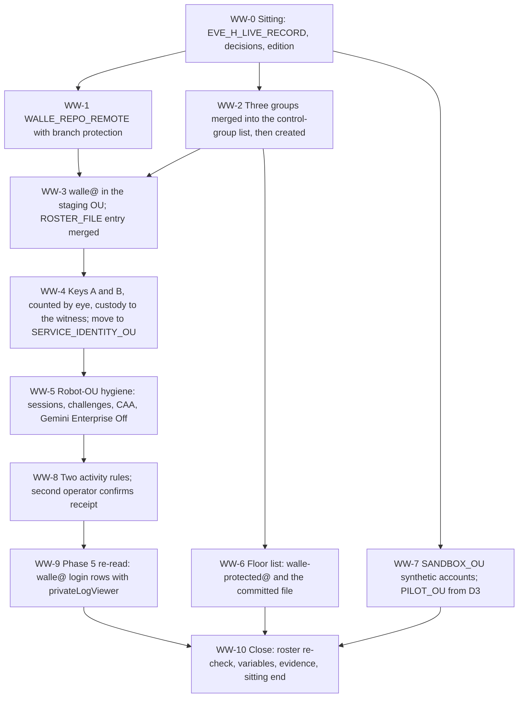

# 30. Wall-E: the Workspace side before the grant

## Status

- Owner: the platform owner
- Last reviewed: 2026-09-15
- Last executed: never
- Stage: review §2 stage 21 — the Workspace half of the superseded `wall-e/SETUP.md`, Phases 1, 3 and 4, with Phase 5 read back as a verify of [14](14-central-logging-and-billing-export.md). Nothing here grants an admin role: Super Admin is [38](38-super-admin-gate-and-grant.md) and nothing else.
- Opens the Wall-E block. It starts only on `EVE_H_LIVE_RECORD` ([28](28-eve-independent-proof-and-sandbox-drills.md)) with [22](22-mo-foundations.md) complete or its BLOCKED steps in the README index (SD-12 (13), SD-45).
- Step prefix: `WW`. Steps: 52. BLOCKED steps: WW-1.6 (branch-protection status checks on `WALLE_REPO_REMOTE`, B-16 and B-03) and WW-6.4 (the floor-list assertion in Wall-E's CI and in the denial suite, B-16). Steps that record `PENDING` rather than `BLOCKED`: WW-7.3 (`PILOT_OU` while D3 leaves the pilot population *tbd*), WW-8.3 (the SA-02 mirror's target-is-an-admin condition if the rule builder cannot express it).
- Replaces: `wall-e/SETUP.md` Phases 1, 3, 4 and 5, and the `M1`, `M2A`, `M2B`, `M3` and `M4` manual blocks of `wall-e/setup/walle_setup.py`. Neither page is executed.
- Salvaged: Phase 1's group purposes and the three-groups-not-one argument; Phase 1's floor-assertion reasoning and the sandbox-OU rule that verification names only synthetic accounts; Phase 3's ordering rule (register the keys, only then enforce) and the "there is no recovery path that preserves the credential" statement; Phase 3's hygiene rows that apply to a robot OU; Phase 4's "highest-value single control" argument, the unfiltered event type, the 24-hour patience rule and the log-based-metric fallback; Phase 5's residency note; `walle_setup.py` M2B and M3 with the two settings and the second rule added (S103).
- Not copied: `eve@`'s creation, its role, its keys and its login rule (S088 — [24](24-eve-workspace-identity-and-audit-feeds.md) is the only creator); the tenant-wide self-recovery and multi-party approval rows (S012, SD-30 — [38](38-super-admin-gate-and-grant.md)); the alert recipients `$OPERATORS` as a group (S113); the "Less secure app access" row (S180, retired by Google on 2025-05-01); `~/Claude/wall-e` as a hard-coded path and a frozen commit date (S163); "reporting rule" and the retired console labels (S164, S180); "contains exactly one user" as the OU verify (S179); `isEnrolledIn2Sv` as the gate before enforcement (S086); `walle_setup.py` as an execution path while B-18 is open (S082, SD-37).
- Applies decisions (signed in [03](03-decisions-and-people.md) before the step that needs them): SD-01, SD-12, SD-30, SD-32, SD-37, SD-38, SD-44, SD-45, SD-48, D1, D3, D5, D11, NAMES.
- Closes: S012 (the "not here" half; 38 sets both rows), S079 (the robot half; 06 closed the human half), S082, S086, S088 (the Wall-E half), S103, S113, S163, S164, S170, S171, S172, S179, S180 (the robot-OU half), S181 (the `walle@` half). Defers none without an owner (§14).
- Consumes: `SA_1_ADMIN`, `SA_2_ADMIN`, `GRP_PLATFORM_OWNERS`, `GRP_PLATFORM_SECURITY`, `GRP_PLATFORM_APPROVERS`, `CONTROL_GROUPS_FILE`, `ROSTER_FILE`, `ADMIN_OU` ([06](06-organisation-bootstrap-and-roster.md)); `SERVICE_IDENTITY_OU`, `EVE_STAGING_OU`, `EVE_ROBOT` ([24](24-eve-workspace-identity-and-audit-feeds.md)); the witness records step and `WITNESS_BUCKET` ([08](08-witness-organisation.md)); D1, D3, D5, D11, `SECOND_OPERATOR_EMAIL`, `SECOND_HUMAN_EMAIL`, `INCIDENT_COMMANDER_EMAIL`, `GIT_HOST`, NAMES ([03](03-decisions-and-people.md)); `EVE_H_LIVE_RECORD` ([28](28-eve-independent-proof-and-sandbox-drills.md)); CL-1.3, CL-1.4, CL-1.5, `LOGGING_PROJECT`, `LOG_BUCKET_IDENTITY` ([14](14-central-logging-and-billing-export.md), the last two only for the WW-8.6 fallback); `NOTIF_CH_EMAIL_LOGGING` ([15](15-pager-siem-and-detections.md) PS-4.5, same fallback); `WORKSPACE_EDITION`, `DOMAIN`, `DIRECTORY_CUSTOMER_ID`, `ORG_ID` ([01](01-prerequisites-and-conventions.md)).
- Produces: `ROBOT`, `WALLE_OPERATORS_GROUP`, `WALLE_READERS_GROUP`, `WALLE_PROTECTED_GROUP`, `PILOT_OU`, `SANDBOX_OU`, `WALLE_REPO_REMOTE`; the committed floor list; the two activity rules (or, under `BD-30-1`, the WW-8.6 metric, policy and `NOTIF_CH_EMAIL_SECOND_OPERATOR_LOGGING`); the `ROSTER_FILE` entry that makes any admin role on `walle@` before [38](38-super-admin-gate-and-grant.md) a page.
- Commands, roles, APIs and console paths checked against Google's documentation on 2026-09-15 (§15). What could not be settled that day is listed in §16.

## What this part builds

Everything on the Workspace side that Wall-E needs and that carries **no admin privilege at all**. At the end of this part the tenant holds a licensed, hardened, watched robot account that can do less than a new joiner, three groups, two organisational units, a floor list and two Google-hosted detectors. The grant that makes it dangerous is nine files away.

1. **`WALLE_REPO_REMOTE`** (§1): Wall-E's own repository on the git host, with the same branch protection and code-owner rules as the platform repository, because the floor list, the scope lists, the ladder and the policy chain all live in it and all of them are two-person artefacts.
2. **The three groups** (§2): `walle-operators@` (halt, demote, veto, approve, reach Wall-E in Gemini Enterprise), `walle-readers@` (ask read-only questions) and `walle-protected@` (every principal Wall-E may never write to). Three and not one, because *reaching* the agent and *approving* what it does are different authorities and a single membership write would grant both.
3. **`walle@`** (§3): the robot, licensed on a Gmail-bearing SKU, created in the enrolment staging OU, with no recovery email and no recovery phone, holding no admin role, and entered in `ROSTER_FILE` as an expected account with an empty role list — so Eve's daily roster diff stays quiet at its creation and pages the moment any role appears on it (§3.5).
4. **Two security keys and the move to the hardened OU** (§4): key A to the platform owner, key B to the second human, custody records witnessed and copied to the witness bucket the same day; the keys are counted **by eye and typed back** before any enforcement is relied on, never inferred from `isEnrolledIn2Sv` (S086).
5. **The robot-OU hygiene set** (§5): session controls, login challenges, the Context-Aware Access level on the Admin console, and Gemini Enterprise service status Off — the two settings the helper script's Phase 3 block silently omitted (S103). The tenant-wide rows are **not** here (S012).
6. **The floor assertion** (§6): every super admin and every delegated admin, in `walle-protected@` and in a committed file, so that an admin enumeration returning nothing becomes a loud refusal instead of a silent widening.
7. **`SANDBOX_OU` and `PILOT_OU`** (§7): the synthetic accounts that are the only targets any verification step in the Wall-E set may name, and the pilot unit the ladder's `ou_allowlist` points at.
8. **The two activity rules** (§8): an interactive login to `walle@`, and `walle@` acting on an administrator. Both mail **named individuals**, never the group (S113), and both are proven by a test the second operator confirms in writing.
9. **Phase 5 as a verify** (§9): the Workspace feed was turned on in [14](14-central-logging-and-billing-export.md); here it is only re-read, with the Data Access reader role that makes the login half visible at all (S181).

What the old text got wrong, and must not come back:

| Old text | Why it fails | Here instead |
|---|---|---|
| Phase 3 sets super-admin self-recovery Off at the top OU and multi-party approval On tenant-wide, before any second admin account exists (S012) | Both apply to every super admin. Self-recovery Off with one person makes a lost key a Google Support case; multi-party approval On makes every later single-person role or security change wait for a second super admin, including K6 | Neither is set here. §5.1 reads them and records the value; [38](38-super-admin-gate-and-grant.md) sets both on gate day after a roster-ready check (SD-30) |
| `walle_setup.py` creates `eve@`, its licence and its customer-scoped custom role in Wall-E's sitting (S088) | A licensed account with a tenant-wide read role months before Eve's privilege set is decided and before her consent; Eve's own step then collides with an existing account | [24](24-eve-workspace-identity-and-audit-feeds.md) is the only creator. This file **reads** `EVE_ROBOT`'s state in WW-4.5 and creates no rule for it (SD-32) |
| Phase 1 Verify: "`/Automation/Service Identities` … contains exactly one user" (S179) | `eve@` lives in the same OU from file 24, so the check fails, or is "fixed" by moving Eve's robot out of the hardened OU | WW-4.5: the OU contains exactly `ROBOT` and `EVE_ROBOT` and no other user |
| M2A passes the 2SV gate on `isEnrolledIn2Sv=true` and prints "both robots have a key enrolled; enforcement is now safe" (S086) | `isEnrolledIn2Sv` is true for any 2SV method. A Google-prompt enrolment passes the gate and the "security key only" enforcement then locks the account out of an account that has no recovery channel by design | WW-4.2: the key count is read by eye on the user's Security page, typed back into the build log, and cross-read in Reporting > User Reports > Security (`accounts:num_security_keys`). `isEnrolledIn2Sv` is kept only as a necessary condition |
| Phase 4 sends the login alert to "you and `$OPERATORS`", with `$OPERATORS` set to "only members can post" in Phase 1 (S113) | The group's own posting setting rejects or moderates mail from Google's alert sender, so the second person never gets the highest-value detection, while the verify passes because the mail reaches the operator directly | §8: named internal recipients only (Google: activity rules "can only be configured to send email to internal domain users"), and the verify is not green until `SECOND_OPERATOR_EMAIL` confirms receipt in writing with a latency |
| "Admin console → Rules → Create rule → Reporting rule", data source "Login audit log" (S164) | Reporting rules became activity rules; the data sources are named "User log events" and "Admin log events". An operator who cannot find the menu concludes the edition lacks the control and takes the slower fallback | §8: Rules > Create activity rule, data source **User log events** (logins) and **Admin log events** (the SA-02 mirror), with the edition list recorded in WW-0.2 |
| Phase 3 row "Less secure app access … Off"; "Account → Account settings → super administrator account recovery"; "Security → Google session control" (S180) | The Less secure apps setting was removed and LSA was switched off for all accounts on 2025-05-01; the other two paths do not exist | The row is deleted with its retirement date; the paths are Security > Authentication > Account recovery and Security > Access and data control > Google session control (§5) |
| Phase 5 Verify: an empty `login.googleapis.com` query means "the edition is not sharing the login audit log" (S181) | Login Audit writes **Data Access** logs; `roles/logging.viewer` cannot see them. The builder blocks Phase 9 for an edition problem that does not exist | WW-9.2 is run by a reader holding `roles/logging.privateLogViewer` at the organisation, and an empty result is re-checked with that role before any conclusion |
| `mkdir -p ~/Claude/wall-e/config`; `git -C ~/Claude/wall-e commit -m "floor assertion … 2026-09-08"` (S163) | The directory does not exist, `git init` is never run, the script writes the same file somewhere else, and every commit carries a frozen date | §1 creates `WALLE_REPO_DIR` and `WALLE_REPO_REMOTE`; §6 commits the floor list by pull request with `$(date -u +%F)` in the message |
| Nothing says which path to follow, SETUP or `walle_setup.py`, per phase (S082) | Following SETUP literally fails at Phase 12 and 13b; mixing the paths creates `eve@` twice and produces a different floor list and phase order from the one the checklist verifies | §"How to execute" below: one column per step, manual always, script only when B-18 closes (SD-37) |



## Preconditions

- [ ] **[28](28-eve-independent-proof-and-sandbox-drills.md): `EVE_H_LIVE_RECORD` exists, merged and signed by the second human.** Wall-E work does not start before it (SD-12 (13)). Eve is watching every human super admin, including the person who runs this file, before the first Wall-E object exists.
- [ ] [22](22-mo-foundations.md) complete, **or** its BLOCKED steps (`MO-6.5`, `MO-7.5`, `MO-7.6`) carry `BLOCKED` checkpoint lines and appear in README §8 under B-14. Nothing in this file reads Mo.
- [ ] [24](24-eve-workspace-identity-and-audit-feeds.md): `SERVICE_IDENTITY_OU` and `EVE_STAGING_OU` exist with their 2SV settings applied and read back; `EVE_ROBOT` exists and is in `SERVICE_IDENTITY_OU`.
- [ ] [06](06-organisation-bootstrap-and-roster.md): `SA_1_ADMIN` and `SA_2_ADMIN` proven, `ROSTER_FILE` and `CONTROL_GROUPS_FILE` merged, the interim activity rules of OB-2.6 still live (they are retired only by the second human, and only after `EVE_H_LIVE_RECORD`).
- [ ] [08](08-witness-organisation.md): `WITNESS_BUCKET` exists and the records step is repeatable, so the custody records of §4 go off-tenant the same day (SD-27).
- [ ] [14](14-central-logging-and-billing-export.md): CL-1.3 `DONE` (the Workspace feed is on), CL-1.4 and CL-1.5 `DONE` with the reader's role recorded. Only if the WW-8.6 fallback is reached: CL-2.4 and CL-5.3 `DONE` so that `LOG_BUCKET_IDENTITY` exists and `to-identity-bucket` delivers, and [15](15-pager-siem-and-detections.md) PS-4.5 `DONE` so that `NOTIF_CH_EMAIL_LOGGING` exists in `LOGGING_PROJECT`.
- [ ] [03](03-decisions-and-people.md) signed: NAMES (the robot address, the three group addresses, the OU paths, the Wall-E repository name and the OAuth app name of D1), D3 (sandbox OU, synthetic accounts, pilot unit), D5 (`SECOND_OPERATOR_EMAIL` named and a second approver from IT security), D11, SD-12, SD-30, SD-32, SD-37, SD-45, SD-48. `tools/decision-need.sh` prints `SIGNED` for each.
- [ ] [04](04-purchases-and-lead-times.md): two hardware security keys for `walle@` in hand, labelled, with the safe and the custody-record template; spare Workspace seats on a **Gmail-bearing** SKU (the frozen scope list carries `gmail.readonly`, `gmail.labels` and `gmail.send`, and the Phase 16 mailbox watch of [39](39-wall-e-stage-0.md) runs `users.watch` on this mailbox: a licence without Gmail gives a clean consent in [32](32-wall-e-consents.md) and an unexplained failure months later).
- [ ] Workstation of [01](01-prerequisites-and-conventions.md): `gcloud`, `gh`, `jq`, `python3.12`, `git`; `~/.platform-env` sourced; `penv_guard` silent; one clean browser profile per account, including a **new** profile for `walle@` signed into nothing.
- [ ] **Not** a precondition: any GCP project of Wall-E's. `WALLE_PROJECT` is [31](31-wall-e-project-and-data-plane.md) and nothing here needs it.

## People needed

| Role | Does | Present at |
|---|---|---|
| Platform owner, as `sa-1-admin@` | Every Admin console step, every shell step, the repository | every step |
| Second human (`SECOND_HUMAN_EMAIL`, as `sa-2-admin@` in the console) | Takes **key B** into custody and signs its record; witnesses the key enrolment and the custody sealing; required reviewer on the control-group amendment, on the roster entry and on CODEOWNERS; observes the branch-protection negative test | WW-1.3, WW-1.5, WW-1.7, WW-2.1, WW-3.5, WW-4.1, WW-4.3, WW-4.4 |
| Second operator (`SECOND_OPERATOR_EMAIL`) | Confirms in writing that each of the two activity-rule test alerts arrived, with the latency; first reviewer on the floor-list pull request | WW-6.3, WW-8.4, WW-8.5 |
| A witness from the other administration line | Countersigns each key-custody record before it is sealed (04 §8.3) | WW-4.3, WW-4.4 |
| Witness administrator (IT security) | Uploads the two custody records to `WITNESS_BUCKET` the same day | WW-4.4 |
| The organisation's Cloud Logging owner, holding `roles/logging.privateLogViewer` at the organisation | Runs the login-stream read of WW-9.2 | WW-9.2 |
| Incident commander (`INCIDENT_COMMANDER_EMAIL`), or the security reviewer once appointed | Second recipient of the "acted on an admin" rule | WW-8.3 |

Hands-on: about 3 hours of console and shell work (the superseded Phases 1, 3, 4 and 5 were costed at 2 hours and did not include the repository, the roster entry or the witnessed custody). Elapsed: about 1 day, because WW-8.4's alert may take up to 24 hours and is not concluded broken before then, and because two pull requests need a second reviewer.

Conventions of [01](01-prerequisites-and-conventions.md) apply. Deviation rows are `BD-30-<n>`. Records go to `BUILD_LOG_DIR/records/` as `<date>-WW-<step>-<slug>-v<n>`. Every shell block starts with:

```bash
source ~/.platform-env
penv_guard
R="$BUILD_LOG_DIR/records/$(date -u +%F)-WW"
```

## How to execute this part (S082, SD-37)

The `setup/` procedures are the canonical manual path. `wall-e/setup/walle_setup.py` is a helper, not a path: a step may cite it only after the blocking defects of that subcommand are fixed **and** its self-test gains a live read-only mode (B-18). Until then every cell in the script column reads BLOCKED and the manual commands stand alone.

| Step | Manual path | Helper script | Why the script cannot be used yet |
|---|---|---|---|
| WW-1.* | `gh` + `git`, §1 | none | The script has no repository subcommand |
| WW-2.* | Admin console, §2; `gcloud identity groups` to verify | `walle workspace` (group creation) | BLOCKED: the same subcommand creates `eve@`, its licence and its customer-scoped role in the same run (S088); `validate_config` refuses the run while `GEMINI_APP_ID`, `FOLDER_ID`, `WALLE_FOLDER_ID` or `CI_DEPLOYER` still hold the shipped `<placeholder>` values, none of which exist on day one (S171); and `walle.env.example` documents neither `LOGGING_PROJECT`, `CICD_PROJECT`, `SDP_PROJECT` nor the overridable derived keys, so a manual operator sourcing it gets empty expansions (S172) |
| WW-3.* | Admin console, §3 | `walle workspace` M1 | BLOCKED: as above; M1 also resets `EVE_ROBOT`'s password in the same block |
| WW-4.* | Admin console + by-eye count, §4 | `walle workspace` M2A/M2B | BLOCKED: the M2A gate passes on `isEnrolledIn2Sv` alone (S086) and M2B omits the Context-Aware Access and Gemini Enterprise rows (S103) |
| WW-5.* | Admin console, §5 | none | The script itself records that self-recovery, CAA and session control "are not readable with this script's scopes" |
| WW-6.* | APIs Explorer read + Admin console + pull request, §6 | none | — |
| WW-7.* | Admin console, §7 | none | — |
| WW-8.* | Admin console, §8 | `walle workspace` M3 | BLOCKED: M3 omits the SA-02 mirror, creates a rule for `EVE_ROBOT` that belongs to Eve's file, and names the group as a recipient (S103, S113) |
| WW-9.* | `gcloud logging read`, §9 | `walle workspace` M4 | BLOCKED: M4 would turn the tenant-wide feed on; [14](14-central-logging-and-billing-export.md) already owns it |
| any rollback | the ROLLBACK line of the step | `walle rollback --phase` | BLOCKED, and in any case `--phase` accepts only 2, 9, 10, 11, 12, 12b and 14; Phases 1, 3, 4 and 5 have no scripted undo (S170), which is exactly this part |

When B-18 closes, this table is the only place that changes; no step text depends on the script.

## Settings applied to `SERVICE_IDENTITY_OU`, and the ones deliberately not applied

Salvaged from `wall-e/SETUP.md` Phase 3 and `walle_setup.py` M2B, with the retired row deleted, the console paths corrected (S180) and the two missing rows added (S103). `SERVICE_IDENTITY_OU` already carries the 2SV rows from [24](24-eve-workspace-identity-and-audit-feeds.md); this file **reads them back** rather than setting them twice, and adds what Eve did not need.

| Control | Value on `SERVICE_IDENTITY_OU` | Console path (checked 2026-09-15) | Set by | Step |
|---|---|---|---|---|
| 2-Step Verification | Enforced, **Only security key**, no security codes, "Allow user to trust the device" off, no new-user enrolment period | Menu > Security > Authentication > 2-step verification | 24 | read back in WW-4.5 |
| Recovery email and phone | none, on every account in the OU | Menu > Directory > Users > user > Security > Recovery information | this file for `ROBOT` | WW-3.3 |
| Password | long, random, generated by and stored only in the corporate vault; **never rotated casually** — with Gmail scopes granted, a password change invalidates both refresh tokens | Menu > Directory > Users > user > Reset password | this file | WW-3.3 |
| Google session control (web session) | the shortest duration offered; no "remember this device" | Menu > Security > Access and data control > Google session control | this file | WW-5.2 |
| Google Cloud session control | Require reauthentication every 1 hour, method Security key, trusted apps not exempted | Menu > Security > Access and data control > Google Cloud session control | this file | WW-5.2 |
| Login challenges | the strictest setting offered | Menu > Security > Authentication > Login challenges | this file | WW-5.3 |
| Context-Aware Access on the **Admin console** | an access level no device satisfies, assigned to the Admin console app for this OU, first in **Monitor**, then Active — recorded as detection-plus-friction, `Assumption:` on super admins (P7), never as "impossible by policy" | Menu > Security > Access and data control > Context-Aware Access > Access levels, then Assign access levels to apps > Admin console | this file | WW-5.4, WW-5.5 |
| Gemini Enterprise service status | **Off** for this OU | Menu > Generative AI > Gemini Enterprise > Service status | this file | WW-5.6 |
| Admin roles on `ROBOT` | **none**, until [38](38-super-admin-gate-and-grant.md) | Menu > Directory > Users > user > Admin roles and privileges | — | asserted in WW-3.4, WW-10.1 |
| Less secure app access | **row deleted** — retired by Google, LSA switched off for all accounts on 2025-05-01 | — | — | — |
| Super-admin self-recovery Off (top OU) | **not set here** (S012, SD-30) | Menu > Security > Authentication > Account recovery > Super admin account recovery | 38 | read in WW-5.1 |
| Multi-party approval On (tenant-wide) | **not set here** (S012, SD-30) | Menu > Security > Authentication > Multi-party approval settings | 38 | read in WW-5.1 |

> **There is no recovery path that preserves the credential.** No recovery email, no recovery phone, no security codes, no self-recovery, and a password reset by another super admin invalidates **both** refresh tokens once Gmail scopes are granted. If both keys are lost after the consent sitting of [32](32-wall-e-consents.md), Wall-E is down until that sitting is re-run in full by a human super admin. That is why two keys are registered in §4, why their custodians are different people (key A the platform owner, key B the second human, 04 §8.3), and why no single person holds both.

## 0. The sitting

### WW-0.1 Open the sitting and check the gates

- **WHO:** Platform owner as `sa-1-admin@`.
- **WHERE:** Shell, `~/.platform-env` sourced, gcloud configuration `GCLOUD_CONFIG_NAME`.
- **ACTION:**

```bash
checkpoint WW-0.1 START
need DOMAIN DIRECTORY_CUSTOMER_ID ORG_ID WORKSPACE_EDITION OWNER_DAILY_ACCOUNT PLATFORM_REPO_DIR BUILD_LOG_DIR DEVIATION_REGISTER EVIDENCE_REGISTER DRILL_CALENDAR SA_1_ADMIN SA_2_ADMIN SECOND_HUMAN_EMAIL SECOND_OPERATOR_EMAIL ADMIN_OU ROSTER_FILE CONTROL_GROUPS_FILE SERVICE_IDENTITY_OU EVE_STAGING_OU EVE_ROBOT WITNESS_BUCKET EVE_H_LIVE_RECORD GIT_HOST PLATFORM_REPO_REMOTE LOGGING_PROJECT LOG_BUCKET_IDENTITY NOTIF_CH_EMAIL_LOGGING
"$PLATFORM_REPO_DIR/tools/decision-need.sh" NAMES D1 D3 D5 D11 SD-12 SD-30 SD-32 SD-37 SD-45 SD-48
test -s "$PLATFORM_REPO_DIR/$EVE_H_LIVE_RECORD" && echo "EVE_H_LIVE_RECORD present"
awk -F'\t' '$2 ~ /^(EV-|CL-1\.3|CL-1\.4|CL-1\.5|EW-|OB-6\.4)/ {print $2"\t"$3}' "$BUILD_LOG_DIR/checkpoints.tsv" | sort -u | tail -40
awk -F'\t' '$2 ~ /^MO-/ && $3 == "BLOCKED" {print "MO BLOCKED: "$2}' "$BUILD_LOG_DIR/checkpoints.tsv" | sort -u
```

- **VERIFY:** `decision-need.sh` prints `SIGNED` for each id. `EVE_H_LIVE_RECORD present`. CL-1.3, CL-1.4, CL-1.5 and OB-6.4 show `DONE`. Every `MO BLOCKED` line printed is already in README §8 under B-14; a Mo line that is not indexed stops the sitting until it is. **No `EVE_H_LIVE_RECORD` means no Wall-E work today**: the person who runs this file is a subject of Eve's monitoring, and the order exists so that the watcher is live and independently proven before the watched thing is built (SD-12 (13)).
- **ROLLBACK:** Read only.
- **EVIDENCE:** Output as `${R}-0.1-gates-v1.txt`; `evidence_add WW-0.1 gates E-05 1.4.1 build-log:records/<file> <file>`.

### WW-0.2 Record the edition's feature set for this part

- **WHO:** Platform owner as `sa-1-admin@`.
- **WHERE:** Admin console, in the `sa-1-admin@` browser profile.
- **ACTION:** Read and write down, without changing anything:
  1. **Activity rules with actions.** Home > Rules: is **Create activity rule** offered? Google supports activity rules with actions and thresholds on Frontline Plus, Enterprise Standard and Enterprise Plus, Education Plus, Enterprise Essentials Plus, Cloud Identity Premium and Chrome Enterprise Premium. Record `WORKSPACE_EDITION` against that list.
  2. **The data sources offered**, from Reporting > Audit and investigation: **User log events** and **Admin log events** must both be present (they are the two §8 needs). Available data sources vary by edition.
  3. **Context-Aware Access.** Security > Access and data control > Context-Aware Access: is the page offered, and is **Admin console** at the top of the application list? Editions: Frontline Standard and Plus, Enterprise Standard and Plus, Education Standard and Plus, Enterprise Essentials Plus, Cloud Identity Premium.
  4. **Gemini Enterprise service status.** Menu > Generative AI > Gemini Enterprise > Service status: is the OU selector offered?
  5. **Licences.** Billing > Subscriptions: free seats on a SKU that includes Gmail.
- **VERIFY:** Each of the five recorded with a yes or no and the date. A **no** on (1) means §8 falls back to the log-based metric of WW-8.6 and the fallback is entered in `DEVIATION_REGISTER` as `BD-30-1`; a **no** on (3) or (4) makes WW-5.4 to WW-5.6 `N/A` with the edition recorded, and the missing control is carried to the gate checklist of [38](38-super-admin-gate-and-grant.md) as a named gap, not silently dropped. A **no** on (5) stops the part: the robot is not created without a Gmail-bearing seat.
- **ROLLBACK:** Read only.
- **EVIDENCE:** Screenshots and the five answers as `${R}-0.2-edition-features-v1`. E-05. TISAX 1.3.

### WW-0.3 Tell the people who will see the alerts

- **WHO:** Platform owner.
- **WHERE:** Mail to `SECOND_HUMAN_EMAIL`, `SECOND_OPERATOR_EMAIL` and the detection desk.
- **ACTION:** Announce, with the change reference: a new account `walle@` will appear in the directory today holding **no admin role**; Eve's roster diff will show it as an *expected* entry once WW-3.5 is merged; two test sign-ins will fire the new rules on purpose; and any admin role appearing on `walle@` before the gate day of [38](38-super-admin-gate-and-grant.md) is a real incident, not this work. Ask the second operator to watch for two test alerts and to reply with the arrival time of each (WW-8.4, WW-8.5).
- **VERIFY:** The mail is sent and its reference recorded before WW-3.1 runs.
- **ROLLBACK:** None; a correction mail if the plan changes.
- **EVIDENCE:** The mail as `${R}-0.3-announcement-v1`. E-08. TISAX 4.2.1.

## 1. Wall-E's repository

The floor list (§6), the two scope lists ([32](32-wall-e-consents.md)), the operation catalogue, the policy chain and the ladder all live here, and every one of them is an artefact that must not change without two humans. The repository is created before the first of them exists, so that no file ever reaches it outside a reviewed pull request. Steps WW-1.2 to WW-1.7 run in one shell sitting that holds `wrepo`; a later shell re-derives it with `wrepo=$(printf '%s' "$WALLE_REPO_REMOTE" | sed -E 's#^https://github.com/##; s#\.git$##')`. The steps are written for GitHub; if P22 chose GitLab, the equivalents of [03](03-decisions-and-people.md) §12.1 are used and this section is re-issued as a dated revision before execution.

### WW-1.1 Create the local working copy

- **WHO:** Platform owner.
- **WHERE:** Shell.
- **ACTION:**

```bash
checkpoint WW-1.1 START
wdir="$HOME/Claude/platform/wall-e-repo"
mkdir -p "$wdir"
git -C "$wdir" rev-parse --git-dir >/dev/null 2>&1 || git -C "$wdir" init -b main
git -C "$wdir" config user.name "$(git -C "$PLATFORM_REPO_DIR" config user.name)"
git -C "$wdir" config user.email "$(git -C "$PLATFORM_REPO_DIR" config user.email)"
mkdir -p "$wdir/config" "$wdir/.github"
printf '.venv/\n*.json.local\n' > "$wdir/.gitignore"
printf '# placeholder; the floor list is written in WW-6.3\n' > "$wdir/config/.gitkeep"
git -C "$wdir" add .gitignore config/.gitkeep && git -C "$wdir" commit -m "WW-1.1 initial commit"
penv_set WALLE_REPO_DIR "$wdir"
```

  The placeholder is not tidiness: git tracks files and not directories, so without a committed file under `config/` the directory does not exist in any clone, and WW-1.7's negative test would write into nothing and silently prove nothing.
- **VERIFY:** `git -C "$WALLE_REPO_DIR" log --oneline` shows one commit and `git -C "$WALLE_REPO_DIR" ls-files` lists both `.gitignore` and `config/.gitkeep`; `git -C "$WALLE_REPO_DIR" config user.email` is a person's address, not empty. The directory is **outside** any synced folder (01 PR-1.2) and outside `WIKI_DIR`.
- **ROLLBACK:** `rm -rf "$WALLE_REPO_DIR"` before the push; `penv_set --force` with a build-log line.
- **EVIDENCE:** Build-log line with the path. E-05. TISAX 5.2.

### WW-1.2 Create the repository on the git host

- **WHO:** Platform owner as organisation owner on the git host.
- **WHERE:** Shell; `gh auth status` green.
- **ACTION:** The repository name is the one in NAMES.

```bash
checkpoint WW-1.2 START
wrepo="<git-org>/<wall-e-name-from-NAMES>"
gh repo create "$wrepo" --private --description "Wall-E: floor list, scope lists, catalogue, policy chain, ladder" --disable-wiki
```

- **VERIFY:** `gh repo view "$wrepo" --json visibility --jq '.visibility'` prints `PRIVATE`.
- **ROLLBACK:** Before any push, `gh repo delete "$wrepo"` (asks for confirmation; permanent). After the push the history is evidence and is not deleted.
- **EVIDENCE:** Build-log line with the URL. E-05. TISAX 5.2.

### WW-1.3 Write access for humans only

- **WHO:** Platform owner; the second human confirms the listing on their own workstation.
- **WHERE:** Shell; git host organisation settings.
- **ACTION:** Grant write only to named humans (platform owner, second human, second operator; the security reviewer and the Wall-E owner when appointed), through a team whose members are those accounts. No bot account, machine user or app installation gets write or maintain — including `walle-deployer@`, which publishes the ladder **object** from a merged commit and never writes to this repository (SD-34).

```bash
gh api "repos/$wrepo/collaborators?affiliation=all" --paginate --jq '.[] | [.login, .type, .role_name] | @tsv'
```

- **VERIFY:** Every row has type `User`; every login with a role other than `read` or `triage` appears on an appointment record in [03](03-decisions-and-people.md). App installations with repository write are read by eye in the organisation settings and any found is written to the build log as a finding.
- **ROLLBACK:** `gh api -X DELETE "repos/$wrepo/collaborators/<login>"`.
- **EVIDENCE:** The listing as `${R}-1.3-collaborators-v1.tsv`. TISAX 4.1, 5.2.

### WW-1.4 CODEOWNERS on the control paths

- **WHO:** Platform owner writes; the second human reviews the commit (review record).
- **WHERE:** Shell.
- **ACTION:** One owner per **control** path: any listed owner's approval satisfies the rule, so listing two on those six paths would weaken it. The catch-all `*` line is the opposite case and carries **two** owners on purpose. CODEOWNERS is last-match-wins, so `*` owns only the paths none of the six lines matches; GitHub never lets a pull request's author satisfy a required code-owner review on their own pull request, and the platform owner authors almost everything here (see the People needed table). With the platform owner as sole `*` owner and `require_code_owner_reviews` plus `enforce_admins` on (WW-1.6), any pull request he opens against a non-control path — a README, a workflow outside `/.github/`, a catalogue file added later — would be permanently unmergeable, because no other principal could ever satisfy `*`. The second operator is therefore listed beside him on that line and on no other.

  **Prerequisite for every entry:** an email address is accepted as a code owner only when it is a **verified** email on a git-host account that also holds **write** on this repository (through the WW-1.3 team). A Workspace address that is not verified on such an account makes the line syntax-valid but inert, and the code-owner requirement can then never be satisfied. If any of the three addresses is not verified, use that person's `@<git-host-handle>` instead, taken from their appointment record in [03](03-decisions-and-people.md), and record in the build log which form was used for whom. WW-1.5's sub-check proves the choice.

```bash
need SECOND_HUMAN_EMAIL OWNER_DAILY_ACCOUNT SECOND_OPERATOR_EMAIL
cat > "$WALLE_REPO_DIR/.github/CODEOWNERS" <<EOF
*                        $OWNER_DAILY_ACCOUNT $SECOND_OPERATOR_EMAIL
/config/protected_floor.txt  $SECOND_HUMAN_EMAIL
/config/scopes/          $SECOND_HUMAN_EMAIL
/config/ladder.yaml      $SECOND_HUMAN_EMAIL
/config/families.yaml    $SECOND_HUMAN_EMAIL
/config/catalogue/       $SECOND_HUMAN_EMAIL
/.github/                $SECOND_HUMAN_EMAIL
EOF
git -C "$WALLE_REPO_DIR" add .github/CODEOWNERS
git -C "$WALLE_REPO_DIR" commit -m "WW-1.4 CODEOWNERS: second human on the control files"
```

  Then the review record, reviewer the second human, as in [03](03-decisions-and-people.md) DC-1.3.
- **VERIFY:** `grep -c "$SECOND_HUMAN_EMAIL" "$WALLE_REPO_DIR/.github/CODEOWNERS"` prints `6` (the six control paths, and the second human on no other line); `grep -c "^\* " "$WALLE_REPO_DIR/.github/CODEOWNERS"` prints `1` and that line names two owners, neither of them the second human. The host-side check that the entries are not inert is WW-1.5's sub-check, because the file has to be pushed before the API can read it.
- **ROLLBACK:** Revert the commit (reviewed).
- **EVIDENCE:** Commit id and review record. TISAX 4.1, 5.2.

### WW-1.5 Push and set the remote

- **WHO:** Platform owner.
- **WHERE:** Shell.
- **ACTION:** The push is the one moment a commit reaches `main` without a pull request; both commits have review records and the push is a deviation entry.

```bash
wremote="https://github.com/$wrepo.git"
git -C "$WALLE_REPO_DIR" remote add origin "$wremote"
git -C "$WALLE_REPO_DIR" push -u origin main
penv_set WALLE_REPO_REMOTE "$wremote"
printf '%s|BD-30-2|WW-1.5|initial push of 2 reviewed commits to %s before branch protection|%s\n' "$(date -u +%F)" "$wremote" "$(git -C "$BUILD_LOG_DIR" config user.email)" >> "$DEVIATION_REGISTER"
```

  Then, immediately and before WW-1.6, the CODEOWNERS entries are proved not to be inert. The API reports an email that is not a verified address on a write-holding account as an error, and an inert owner means the code-owner requirement can never be satisfied:

```bash
git -C "$WALLE_REPO_DIR" fetch origin main
test "$(gh api "repos/$wrepo/codeowners/errors" --jq '.errors | length')" = "0" || { gh api "repos/$wrepo/codeowners/errors" --jq '.errors[] | [.line, .kind, .message] | @tsv'; echo "STOP: CODEOWNERS entries are inert; fix them in WW-1.4 (use @handles) before WW-1.6"; false; }
```

- **VERIFY:** After the fetch, `git -C "$WALLE_REPO_DIR" rev-parse HEAD` equals `git -C "$WALLE_REPO_DIR" rev-parse origin/main` and equals `gh api "repos/$wrepo/branches/main" --jq .commit.sha` — the fetch matters, because `origin/main` in the working copy is updated only by fetch or pull and would otherwise be compared against a stale ref. `need WALLE_REPO_REMOTE`. The errors check prints nothing and exits zero.
- **ROLLBACK:** None for pushed history; mistakes are reverted through pull requests after WW-1.6. An inert CODEOWNERS is corrected by a second reviewed commit and a second push under the same `BD-30-2` row, before WW-1.6 turns protection on.
- **EVIDENCE:** Deviation row `BD-30-2`; the empty errors output as `${R}-1.5-codeowners-errors-v1.txt`; build-log line naming the owner form used for each person. E-05. TISAX 5.2.

### WW-1.6 Branch protection — status checks BLOCKED

- **WHO:** Platform owner applies; the second human witnesses on screen.
- **WHERE:** Shell.
- **ACTION:**

```bash
p=$(mktemp)
cat > "$p" <<'EOF'
{
  "required_status_checks": null,
  "enforce_admins": true,
  "required_pull_request_reviews": {
    "required_approving_review_count": 2,
    "require_code_owner_reviews": true,
    "dismiss_stale_reviews": true,
    "require_last_push_approval": true
  },
  "restrictions": null,
  "allow_force_pushes": false,
  "allow_deletions": false,
  "required_linear_history": true
}
EOF
gh api -X PUT "repos/$wrepo/branches/main/protection" --input "$p"
rm "$p"
gh api "repos/$wrepo/branches/main/protection" --jq '{reviews: .required_pull_request_reviews.required_approving_review_count, codeowners: .required_pull_request_reviews.require_code_owner_reviews, lastpush: .required_pull_request_reviews.require_last_push_approval, admins: .enforce_admins.enabled, force: .allow_force_pushes.enabled, deletions: .allow_deletions.enabled}'
```

- **BLOCKED:** `required_status_checks` stays `null`. The checks this repository needs — the floor-list assertion (WW-6.4), the scope-list hash comparison of [32](32-wall-e-consents.md), the three-bands assertion and the permanent-ceiling assertion of G12 and G15 — are Wall-E's CI (**B-16**, `WALLE_CODE_COMMIT`), and the shared bot-approval and ladder-raise rules are **B-03**. Until both land, the protection is human-only: two approvals, one of them the code owner. The step is re-run by [33](33-wall-e-action-services-and-approval-surfaces.md) when the first CI workflow is merged, and the re-run point is in README §9. What it needs: a workflow file in `WALLE_REPO_REMOTE` whose job names are then listed in `required_status_checks.contexts`.
- **VERIFY:** The JSON prints `reviews` 2, `codeowners` true, `lastpush` true, `admins` true, `force` false, `deletions` false. `checkpoint WW-1.6 BLOCKED - - "status checks await B-16, B-03"`.
- **ROLLBACK:** `gh api -X DELETE "repos/$wrepo/branches/main/protection"` only under a reviewed decision; the deletion is itself audited by the weekly query of [03](03-decisions-and-people.md) DC-9.8, extended to this repository in WW-10.3.
- **EVIDENCE:** The verify JSON as `${R}-1.6-branch-protection-v1.json`; the second human's witness line. E-05. TISAX 5.2.

### WW-1.7 Negative test: a direct push and a one-approval merge are refused

- **WHO:** Platform owner attempts; the second human observes the negative pull request and gives the second approval on the positive one; the second operator gives the single approval on the negative pull request and the code-owner approval on the positive one.
- **WHERE:** Shell, scratch clone.
- **ACTION:**

```bash
w=$(mktemp -d)
git clone "$WALLE_REPO_REMOTE" "$w/r"
git -C "$w/r" commit --allow-empty -m "WW-1.7 negative test: direct push"
git -C "$w/r" push origin HEAD:main; echo "direct push exit=$?"
git -C "$w/r" reset --hard origin/main
git -C "$w/r" checkout -b ww-1-7-negative-test
mkdir -p "$w/r/config"
printf 'negative test\n' > "$w/r/config/protected_floor.txt"
git -C "$w/r" add config/protected_floor.txt
git -C "$w/r" diff --cached --name-only | grep -qx 'config/protected_floor.txt' || { echo "STOP: nothing staged; the test would open an empty pull request and prove nothing"; false; }
git -C "$w/r" commit -m "WW-1.7 negative test: code-owner path"
git -C "$w/r" push origin ww-1-7-negative-test
gh pr create --repo "$wrepo" --head ww-1-7-negative-test --title "WW-1.7 negative test (do not merge)" --body "Expect: blocked without the code owner and a second approval."
```

  The second operator approves once (the second human does not). Then:

```bash
gh pr view ww-1-7-negative-test --repo "$wrepo" --json files --jq '.files[].path'
gh pr view ww-1-7-negative-test --repo "$wrepo" --json mergeStateStatus,reviewDecision --jq '[.mergeStateStatus, .reviewDecision] | @tsv'
gh pr close ww-1-7-negative-test --repo "$wrepo" --delete-branch
rm -rf "$w"
```

  Then the **positive** half, which proves the catch-all rule of WW-1.4 has not made ordinary work unmergeable. The platform owner opens a second pull request touching a non-control path only:

```bash
w2=$(mktemp -d)
git clone "$WALLE_REPO_REMOTE" "$w2/r"
git -C "$w2/r" checkout -b ww-1-7-positive-test
printf '# Wall-E control repository. Contents and rules: setup file 30 §1.\n' > "$w2/r/README.md"
git -C "$w2/r" add README.md && git -C "$w2/r" commit -m "WW-1.7 positive test: a non-control path"
git -C "$w2/r" push origin ww-1-7-positive-test
gh pr create --repo "$wrepo" --head ww-1-7-positive-test --title "WW-1.7 positive test (README)" --body "Expect: mergeable once the second operator (code owner on *) and the second human have both approved."
```

  The second operator approves (as code owner on `*`) and the second human gives the second approval. Then:

```bash
gh pr view ww-1-7-positive-test --repo "$wrepo" --json mergeStateStatus,reviewDecision --jq '[.mergeStateStatus, .reviewDecision] | @tsv'
gh pr merge ww-1-7-positive-test --repo "$wrepo" --squash --delete-branch
rm -rf "$w2"
```

- **VERIFY:** The direct push prints a protected-branch refusal with a non-zero `exit=`. The negative pull request's `files` listing contains `config/protected_floor.txt` — if it is empty the test wrote nothing and must be re-run, because an empty pull request would show `BLOCKED` for the wrong reason — and after the single approval it shows `BLOCKED` and `REVIEW_REQUIRED`. A merge that succeeds there is a stop: the floor list would not be a two-person artefact. The positive pull request shows `CLEAN` and `APPROVED` after the two approvals and merges: a pull request by the platform owner against a non-control path that cannot be merged means the `*` line has only him as owner, and WW-1.4 is re-run before anything else is committed to this repository.
- **ROLLBACK:** The negative pull request is closed and its branch deleted inside the action. The positive pull request is merged on purpose (a README is not a control file); reverting it is an ordinary reviewed revert.
- **EVIDENCE:** The refusal text, the negative pull request's `files` listing and state, and the positive pull request's merged state as `${R}-1.7-negative-test-v1.txt` and `${R}-1.7-positive-test-v1.txt`. E-05. TISAX 5.2.

## 2. The three groups

Three groups and not one, on purpose: being able to **reach** the agent and being able to **approve** what it does are different authorities, and a single group would have made one membership write grant both. They are created as **security** groups because [33](33-wall-e-action-services-and-approval-surfaces.md) binds `walle-operators@` to `roles/iam.serviceAccountTokenCreator` on `walle-operators-caller@` — the only way a human mints an ID token with the right audience — and because a group that carries privilege should not be joinable by its own members.

### WW-2.1 Amend `CONTROL_GROUPS_FILE` with the three addresses

- **WHO:** Platform owner writes; the second human is the required reviewer (CODEOWNERS covers `/control-groups/`).
- **WHERE:** Shell in `PLATFORM_REPO_DIR`, then a pull request.
- **ACTION:** Add three entries to the merged control-group list of [06](06-organisation-bootstrap-and-roster.md) OB-5.2, with the addresses from NAMES:

| Address | Purpose | Members at creation | Owners | Security label |
|---|---|---|---|---|
| `walle-operators@DOMAIN` | May halt, demote, veto, approve, and reach Wall-E in Gemini Enterprise | the platform owner's daily account and `SECOND_OPERATOR_EMAIL` (D5) | none | yes |
| `walle-readers@DOMAIN` | May ask Wall-E read-only questions. Membership alone grants nothing until the agent is shared with the group in Gemini Enterprise ([35](35-wall-e-engine-registration-and-gateways.md)) | the platform owner's daily account | none | yes |
| `walle-protected@DOMAIN` | Every principal Wall-E may never write to | filled in WW-6.2, not here | none | yes |

  Access settings for all three, as in OB-6.2: Who can join — Only invited users; External members — not allowed; Who can post — the organisation's members only; Who can view members — group managers. The posting setting is why §8's alerts go to **individuals**: mail from Google's alert sender is not a member and is not from the organisation (S113).

```bash
checkpoint WW-2.1 START
need DOMAIN SECOND_OPERATOR_EMAIL OWNER_DAILY_ACCOUNT CONTROL_GROUPS_FILE
$EDITOR "$PLATFORM_REPO_DIR/$CONTROL_GROUPS_FILE"
python3 -c 'import json,sys; d=json.load(open(sys.argv[1])); print(len(d["groups"]), "groups"); print([g["email"] for g in d["groups"] if g["email"].startswith("walle-")])' "$PLATFORM_REPO_DIR/$CONTROL_GROUPS_FILE"
```

  Then a branch, a pull request, the second human's approval as code owner and a second approval, and the merge.
- **VERIFY:** The merged file parses, lists eleven groups, and the three new rows carry `security_label: true`. `git -C "$PLATFORM_REPO_DIR" log --oneline -1 -- "$CONTROL_GROUPS_FILE"` shows the merge commit.
- **ROLLBACK:** Revert the pull request before WW-2.2. After WW-2.2 the label is irreversible and only the membership can be undone.
- **EVIDENCE:** The merge commit and the two approvals as `${R}-2.1-control-groups-amendment-v1`. E-08. TISAX 4.1.1, 4.2.1.

### WW-2.2 Check that none of the three addresses is taken

- **WHO:** Platform owner as `sa-1-admin@`.
- **WHERE:** Shell; Admin console Menu > Directory > Groups and Menu > Directory > Users.
- **ACTION:**

```bash
for g in "walle-operators@$DOMAIN" "walle-readers@$DOMAIN" "walle-protected@$DOMAIN"; do
  gcloud identity groups describe "$g" --format="value(name)" >/dev/null 2>&1 && echo "EXISTS $g" || echo "free   $g"
done
```

  Also search each address in the console under Groups **and** Users: an address can already be a user or an alias.
- **VERIFY:** Three `free` lines and nothing found in the console. An address that exists stops WW-2.3 for that group: record its owner, members and labels and decide under a signed record whether to adopt it (WW-2.3 then only adds the label and the members) or to rename it in the list, which is a new WW-2.1 merge.
- **ROLLBACK:** Read only.
- **EVIDENCE:** Output as `${R}-2.2-addresses-free-v1.txt`. TISAX 4.1.1.

### WW-2.3 Create the three groups as security groups — IRREVERSIBLE label

- **WHO:** Platform owner as `sa-1-admin@`; the second human watches each save.
- **WHERE:** Admin console: Menu > Directory > Groups > Create group.
- **ACTION:** For each group, in the list's order: name = the address's local part; email as in the merged list; description = the list's `purpose`; owners: none; **Labels: tick Security** (Mailing stays ticked, because `walle-protected@` and `walle-operators@` are mail destinations); access settings exactly as WW-2.1's table; Create group.
- **VERIFY:** Directory > Groups filtered on the Security label lists the three new groups beside the eight of [06](06-organisation-bootstrap-and-roster.md). WW-2.5 checks labels and members against the merged file.
- **ROLLBACK:** **IRREVERSIBLE.** A security group cannot be changed back to a Google Group. A wrongly created group can be deleted and re-created under a different address, but the address carries the label history in the audit log for ever. Before each save confirm: (1) the WW-2.1 merge commit is on the default branch and lists this group with `security_label: true`; (2) WW-2.2 showed the address free, or a signed adoption record exists; (3) the spelling on screen equals the merged list character for character. Gate: the merged `CONTROL_GROUPS_FILE` and decision SD-18.
- **EVIDENCE:** Screenshot of each group's settings page as `${R}-2.3-groups-created-v1`. E-08. TISAX 4.1.1, 4.2.1.

### WW-2.4 Add the members

- **WHO:** Platform owner as `sa-1-admin@`.
- **WHERE:** Admin console: Menu > Directory > Groups > the group > Members > Add members.
- **ACTION:** Add exactly the `members` of the merged list: the platform owner's daily account and `SECOND_OPERATOR_EMAIL` to `walle-operators@`; the platform owner's daily account to `walle-readers@`. `walle-protected@` stays empty until WW-6.2. Add nobody else, and add no group as a member of another.
- **VERIFY:** WW-2.5. A one-member operators group is legal but means every kill switch depends on one person being awake; if D5 has not named a second operator, that is a stop for this step, not a note: [03](03-decisions-and-people.md) closes D5 before this file runs.
- **ROLLBACK:** Remove the member (Members > tick > Remove member) and record the removal against this step.
- **EVIDENCE:** Build-log line per group. TISAX 4.2.1.

### WW-2.5 Verify the three groups against the merged list

- **WHO:** Platform owner; the second human re-runs it on their own workstation.
- **WHERE:** Shell.
- **ACTION:**

```bash
d="$BUILD_LOG_DIR/evidence/30/WW-2.5"; mkdir -p "$d"
for g in "walle-operators@$DOMAIN" "walle-readers@$DOMAIN" "walle-protected@$DOMAIN"; do
  gcloud identity groups describe "$g" --format=json > "$d/$g.describe.json"
  gcloud identity groups memberships list --group-email="$g" --format=json > "$d/$g.members.json"
done
python3 - "$PLATFORM_REPO_DIR/$CONTROL_GROUPS_FILE" "$d" <<'PY'
import json, os, sys
lst = json.load(open(sys.argv[1])); d = sys.argv[2]; bad = 0
for g in [x for x in lst["groups"] if x["email"].startswith("walle-")]:
    e = g["email"]
    desc = json.load(open(os.path.join(d, e + ".describe.json")))
    mem = json.load(open(os.path.join(d, e + ".members.json")))
    sec = "cloudidentity.googleapis.com/groups.security" in desc.get("labels", {})
    live = {m["preferredMemberKey"]["id"] for m in mem}
    want = set(g["members"]) | set(g["owners"])
    ok = sec and live == want
    bad += not ok
    print("OK  " if ok else "FAIL", e, "security" if sec else "NO-SECURITY-LABEL", sorted(live))
print("WALLE GROUPS MATCH LIST" if bad == 0 else f"{bad} GROUP(S) DIFFER")
PY
penv_set WALLE_OPERATORS_GROUP "walle-operators@$DOMAIN"
penv_set WALLE_READERS_GROUP "walle-readers@$DOMAIN"
penv_set WALLE_PROTECTED_GROUP "walle-protected@$DOMAIN"
```

- **VERIFY:** `WALLE GROUPS MATCH LIST`, with `walle-protected@` empty at this point (its `members` entry in the list is the empty array until WW-6.2 amends it). Three `set` lines from `penv_set`.
- **ROLLBACK:** Read only; a difference returns to WW-2.4.
- **EVIDENCE:** The JSON directory and output as `${R}-2.5-groups-verified-v1`. E-08. TISAX 4.1.1, 4.2.1.

## 3. `walle@`

### WW-3.1 Confirm a free Gmail-bearing seat

- **WHO:** Platform owner as `sa-1-admin@`.
- **WHERE:** Admin console: Menu > Billing > Subscriptions.
- **ACTION:** Read the assigned and total seat counts on the SKU that includes Gmail, and confirm at least one free seat plus the seats WW-7.2's synthetic accounts need. Record the SKU name.
- **VERIFY:** A free seat exists on a Gmail-bearing SKU. If not, stop: the account is not created without it. A licence type without Gmail gives a clean consent in [32](32-wall-e-consents.md) and an unexplained failure at the mailbox watch in [39](39-wall-e-stage-0.md), months later and after the grant.
- **ROLLBACK:** Read only.
- **EVIDENCE:** Screenshot as `${R}-3.1-seats-v1`. TISAX 1.3.

### WW-3.2 Create `walle@` in the enrolment staging OU

- **WHO:** Platform owner as `sa-1-admin@`.
- **WHERE:** Admin console: Menu > Directory > Users > Add new user.
- **ACTION:** The account is created in `EVE_STAGING_OU`, the enrolment staging OU made in [24](24-eve-workspace-identity-and-audit-feeds.md) (named after its first occupant; it is the staging OU for every service identity). If 24 deleted it after Eve's move, re-create it at the same path with the same settings and record the re-creation as `BD-30-3`. The reason is SD-32's: `SERVICE_IDENTITY_OU` enforces "Only security key" with no enrolment period, and an account created directly in it cannot register the key it is about to be forced to use.
  1. First name `walle`, last name `robot`, primary email from NAMES on `DOMAIN`. Secondary email and phone empty.
  2. "Manage user's password, organizational unit, and profile photo": organisational unit `EVE_STAGING_OU`; password "Automatically generate password"; tick "Ask for a password change at the next sign-in".
  3. Add New User. Do **not** send the details to any address.
  4. Assign the Gmail-bearing licence (Menu > Directory > Users > `walle@` > Licenses).

```bash
checkpoint WW-3.2 START
penv_set ROBOT "walle@$DOMAIN"
```

- **VERIFY:** The user page shows `EVE_STAGING_OU`, the Gmail-bearing licence assigned, and **no** admin role. `need ROBOT`.
- **ROLLBACK:** Delete the user (Directory > Users > `walle@` > Delete user). Deletion is recoverable for a limited period through Google's user-restore feature; at this point the account holds nothing. `penv_set --force` with a build-log line.
- **EVIDENCE:** Build-log line with the creation time; the licence screenshot as `${R}-3.2-robot-created-v1`. E-08. TISAX 4.1.2.

### WW-3.3 Set the password from the vault and prove there is no recovery channel

- **WHO:** Platform owner as `sa-1-admin@` in the console; the sign-in in the **new, clean `walle@` browser profile**.
- **WHERE:** Admin console: Menu > Directory > Users > `walle@` > Reset password; then the clean profile.
- **ACTION:**
  1. Reset password, "Automatically generate password", untick "Ask for a password change at the next sign-in" after the first sign-in has happened; copy the generated password once.
  2. In the clean profile sign in as `walle@`, paste the password into the sign-in box only, and set the new password **directly from the corporate vault's generator**, so the value exists only in the vault. It is never typed into a file, a chat, a ticket, the build log or `~/.platform-env` (`penv_set` refuses a name containing `PASSWORD` anyway).
  3. Directory > Users > `walle@` > Security > Recovery information: confirm there is no recovery email and no recovery phone. Remove any that Google added.
  4. Record the **name** of the vault entry, never its content.
- **VERIFY:** The Security page shows no recovery email and no recovery phone. The vault entry exists and opens for the platform owner. Nothing in `BUILD_LOG_DIR` or `~/.platform-env` matches the password: `grep -rl "$(printf 'walle')" "$BUILD_LOG_DIR" >/dev/null` is not a password check — the check is that no step in this file ever wrote one.
- **ROLLBACK:** Reset the password again from the vault. **Never rotate it casually after the consent sitting of [32](32-wall-e-consents.md):** with Gmail scopes granted, a password change invalidates both refresh tokens and Wall-E is down until the sitting is re-run.
- **EVIDENCE:** Screenshot of the Recovery information panel and the vault entry name as `${R}-3.3-no-recovery-v1`. E-08. TISAX 4.1.2.

### WW-3.4 Assert the robot holds no admin role and no delegation

- **WHO:** Platform owner as `sa-1-admin@`.
- **WHERE:** The APIs Explorer panel of the Directory API reference pages, in the `OWNER_DAILY_ACCOUNT` clean profile (the browser holds the token; nothing is cached on the workstation), then the shell.
- **ACTION:** Run `users.get` with `userKey` = `ROBOT`, `projection` = `full`, `viewType` = `admin_view`, and save the JSON:

```bash
pbpaste > "$BUILD_LOG_DIR/evidence/30/WW-3.4-robot-user.json"
python3 - "$BUILD_LOG_DIR/evidence/30/WW-3.4-robot-user.json" <<'PY'
import json, sys
u = json.load(open(sys.argv[1]))
for k in ("primaryEmail", "orgUnitPath", "isAdmin", "isDelegatedAdmin", "isEnrolledIn2Sv", "isEnforcedIn2Sv", "suspended", "archived", "recoveryEmail", "recoveryPhone"):
    print(k, "=", u.get(k))
assert u.get("isAdmin") is not True, "STOP: walle@ already holds Super Admin"
assert u.get("isDelegatedAdmin") is not True, "STOP: walle@ already holds a delegated admin role"
assert not u.get("recoveryEmail") and not u.get("recoveryPhone"), "STOP: a recovery channel exists"
print("robot holds no admin role and no recovery channel")
PY
```

  Also read Menu > Security > Access and data control > API controls > Domain wide delegation and confirm no client is authorised for `walle@`'s scopes. **No step in this set creates or authorises a domain-wide delegation client**; any found is reported to IT security and never used.
- **VERIFY:** `isAdmin` and `isDelegatedAdmin` are false or absent, both recovery fields empty, the assertion line printed, the delegation page listing recorded. Any `True` here is an incident, not a configuration error: it means a role reached the robot outside this procedure.
- **ROLLBACK:** Read only.
- **EVIDENCE:** The JSON and the printed lines as `${R}-3.4-robot-no-role-v1`. E-08. TISAX 4.2.1.

### WW-3.5 Enter `walle@` in `ROSTER_FILE` as an expected account holding no role

- **WHO:** Platform owner writes; **the second human reviews as code owner** (`/roster/`); a second approval merges.
- **WHERE:** Shell in `PLATFORM_REPO_DIR`, then a pull request.
- **ACTION:** This is the re-run point README §9 lists for `walle@`. Eve's daily roster check (file 25) and SIEM rule SA-06 diff the live tenant against this file. Without the entry, the robot's appearance is an unexplained diff and pages on the day it is created; with the entry written as an **empty** `workspace_roles` list, the diff is quiet now and **any** role appearing on `walle@` before [38](38-super-admin-gate-and-grant.md) is a `role_assignment_added` page, which is exactly the property the grant's gate relies on.

  Move `walle@` from `expected_later` into `accounts` with:

```json
{
  "email": "walle@<DOMAIN>",
  "kind": "robot",
  "holder": "Wall-E (agent); no human signs in to it",
  "workspace_roles": [],
  "org_unit": "<SERVICE_IDENTITY_OU>",
  "two_sv": "only_security_key",
  "keys": 2,
  "key_a_custodian": "platform owner",
  "key_b_custodian": "second human",
  "gcp_org_roles": [],
  "eve_reports_poll": true,
  "expected_role_change": {"role": "Super Admin", "not_before": "file 38 gate day", "decision": "P33"},
  "rule": "any workspace_role on this account before the file 38 grant record is role_assignment_added, severity 1"
}
```

  and leave `expected_later` carrying only the `walle@` Super Admin line for file 38.

  This entry is the **roster** half only. Eve's detection configuration keeps `walle@` out of `roster_robots` until [38](38-super-admin-gate-and-grant.md) ([25](25-eve-human-super-admin-detections.md) §"the poll's actor union": "eve@ today; walle@ from file 38"), because SA-04 — "a robot never signs in" — would fire on the deliberate test sign-in of WW-8.4 and on the consent sitting of [32](32-wall-e-consents.md). The two are consistent: the roster says the account is *expected to exist with no role*, and the detection config says it is *not yet a monitored robot*. Both change on gate day, in the same file, as one merged pull request.

```bash
checkpoint WW-3.5 START
$EDITOR "$PLATFORM_REPO_DIR/$ROSTER_FILE"
python3 -m json.tool "$PLATFORM_REPO_DIR/$ROSTER_FILE" > /dev/null && echo "roster parses"
python3 -c 'import json,sys,os; d=json.load(open(sys.argv[1])); a=[x for x in d["accounts"] if x["email"].startswith("walle@")]; assert len(a)==1 and a[0]["workspace_roles"]==[], "walle@ entry missing or already carries a role"; print("walle@ present with no role")' "$PLATFORM_REPO_DIR/$ROSTER_FILE"
```

  Then branch, pull request, the second human's code-owner approval, a second approval, merge.
- **VERIFY:** Both python lines print; the merge commit exists; Eve's next roster run (read from `eve.incidents` by the second human, or from the eve-console) shows **no** `role_assignment_added` for `walle@`. If Eve paged on the creation before this merge, the page is acknowledged against the WW-0.3 announcement and the acknowledgement recorded — a page that is explained is fine; a page that is ignored trains the desk to ignore the next one.
- **ROLLBACK:** Revert the pull request. Reverting leaves `walle@` live and unexpected, so it is done only together with WW-3.2's rollback.
- **EVIDENCE:** The merge commit, the two approvals and Eve's quiet roster run as `${R}-3.5-roster-walle-v1`. E-08. TISAX 4.2.1.

## 4. The two keys, and the move into the hardened OU

**Do these in this order and only in this order.** Enforcing hardware-key-only on an account with no key registered blocks the next sign-in, and by then the recovery email, the recovery phone and the code fallbacks are all gone.

### WW-4.1 Register key A and key B on the account

- **WHO:** Platform owner operates in the clean `walle@` profile; **the second human is present** and takes key B at the end of the sitting.
- **WHERE:** The clean `walle@` browser profile; the two labelled keys from [04](04-purchases-and-lead-times.md); the safe.
- **ACTION:**
  1. Signed in as `walle@`, open the account's security settings and add a passkey/security key. Insert key A, touch it, name it `walle-key-A`.
  2. Add a **second** security key in the same sitting. Insert key B, touch it, name it `walle-key-B`.
  3. Do **not** generate backup verification codes: the OU's 2SV settings disallow security codes, and a code fallback would defeat the whole control. (Contrast the human admin accounts, whose admin-generated codes are sealed with the spare key in [06](06-organisation-bootstrap-and-roster.md) OB-2.9.)
  4. Do not touch any 2SV enforcement setting in this step.
- **VERIFY:** The account's security page lists exactly two security keys, `walle-key-A` and `walle-key-B`. Counted in WW-4.2.
- **ROLLBACK:** Remove a key from the account and re-register it. While the account is still in `EVE_STAGING_OU` this is safe; after WW-4.5 removing a key without replacing it first is a lock-out.
- **EVIDENCE:** Screenshot of the key list (names only) as `${R}-4.1-keys-registered-v1`, countersigned by the second human. E-08. TISAX 4.1.2.

### WW-4.2 Count the keys by eye, and type the count back (S086)

- **WHO:** Platform owner, from `sa-1-admin@`, not from the robot's session.
- **WHERE:** Admin console: Menu > Directory > Users > `walle@` > Security > 2-Step Verification; then Menu > Reporting > User Reports > Security.
- **ACTION:**
  1. On the user's Security page, read the number of registered **security keys**. Type it back:

```bash
read -r -p 'Security keys listed on walle@ Security page (type the number): ' kc
case "$kc" in 2) ;; *) echo "STOP: expected 2 registered security keys, read '${kc:-<empty>}'. Nothing is attested, nothing is enforced, no move is made." >&2; return 1 2>/dev/null || exit 1;; esac
printf '%s\tWW-4.2\tsecurity_keys_observed=%s\tobserver=%s\twitness=%s\n' "$(date -u +%Y-%m-%dT%H:%M:%SZ)" "$kc" "$(git -C "$BUILD_LOG_DIR" config user.email)" "$SECOND_HUMAN_EMAIL" >> "$BUILD_LOG_DIR/attestations.tsv"
git -C "$BUILD_LOG_DIR" add attestations.tsv && git -C "$BUILD_LOG_DIR" commit -q -m "attest WW-4.2 security key count"
```

  The prompt is `read -r -p` and not the `read -r "kc?…"` form: the second is a zsh extension, and under bash — which [01](01-prerequisites-and-conventions.md) also supports — `read` treats `kc?Security` as a variable name and rejects it as not a valid identifier, so nothing is ever read. The guard is a `case` that **returns non-zero**, not a bare `echo`: it stands **before** the attestation write, so a wrong or empty count can never be committed as signed evidence. This is the whole of S086; both halves have to hold.

  2. Cross-read Reporting > User Reports > Security, the `walle@` row, column "number of security keys" (the Admin SDK name for the same figure is `accounts:num_security_keys`). This report lags by up to two days, so it corroborates and never gates.
  3. `isEnrolledIn2Sv` from WW-3.4 is kept only as a **necessary** condition. It is true for any 2SV method — a Google prompt or an authenticator app satisfies it — so it can never be the evidence that a *security key* exists. The superseded helper printed "both robots have a key enrolled; enforcement is now safe" on that field alone.
- **VERIFY:** The typed count is `2`, the attestation line is committed with the second human as witness, and the report row agrees when it appears. Anything other than 2 stops §4: nothing is enforced and no move is made. Read the committed line back and check the figure it actually carries, so that a step that fell through cannot pass as a step that ran:

```bash
awk -F'\t' '$2 == "WW-4.2" && $3 == "security_keys_observed=2" {n++} END {if (n) print "WW-4.2 attestation records 2 keys"; else {print "STOP: no attestation line records security_keys_observed=2"; exit 1}}' "$BUILD_LOG_DIR/attestations.tsv"
git -C "$BUILD_LOG_DIR" log --oneline -1 -- attestations.tsv
```
- **ROLLBACK:** Read only; a wrong count returns to WW-4.1.
- **EVIDENCE:** The attestation line and the report screenshot as `${R}-4.2-key-count-v1`. E-08. TISAX 4.1.2.

### WW-4.3 Custody: key A to the platform owner

- **WHO:** Platform owner as custodian; a witness from the other administration line countersigns.
- **WHERE:** The safe; the paper custody-record template of [06](06-organisation-bootstrap-and-roster.md).
- **ACTION:** Seal key A in a labelled envelope (`walle@ key A`, date, serial). The record names the key, its serial, the account, the custodian, the witness, the date, the reason it may leave the safe (the consent sittings of [32](32-wall-e-consents.md), a band-B client re-consent, K5 recovery) and the signature of both. Scan it the same day.
- **VERIFY:** The envelope is sealed and in the safe; the paper record is signed by two people; the scan exists.
- **ROLLBACK:** None. Opening the envelope is itself an event and is recorded against the step that needed it.
- **EVIDENCE:** The signed record and its scan, `${R}-4.3-key-a-custody-v1`; uploaded to the witness in WW-4.4. E-08. TISAX 4.1.2 (key custody), gate line G18.

### WW-4.4 Custody: key B to the second human, and both records to the witness

- **WHO:** **The second human takes key B**; the same other-line witness countersigns; a witness administrator uploads.
- **WHERE:** The safe; then the witness organisation.
- **ACTION:**
  1. Key B is sealed in its own envelope in the second human's name. No single person holds both envelopes and no single person can open both without the other's presence.
  2. The two records (WW-4.3 and this one) go to a witness administrator, who uploads them the same day under `custody/` in `WITNESS_BUCKET`, named `<date>-walle-key-a-custody-v1` and `<date>-walle-key-b-custody-v1`. Objects under retention are never overwritten; a correction is a new `-v2`.
- **VERIFY:** A witness administrator confirms both objects exist in `WITNESS_BUCKET` under `custody/` with today's date. The upload fires the witness's Cloud Storage `DATA_WRITE` alert to both witness administrators and the second human, which is the expected noise for this step.
- **ROLLBACK:** None: a locked object cannot be replaced. A wrong record is superseded by a `-v2` that says what it corrects.
- **EVIDENCE:** The witness object names and the witness administrator's confirmation as `${R}-4.4-key-custody-witnessed-v1`. E-08. TISAX 4.1.2, gate line G18.

### WW-4.5 Move `walle@` into `SERVICE_IDENTITY_OU` and read the enforcement back

- **WHO:** Platform owner as `sa-1-admin@`.
- **WHERE:** Admin console: Menu > Directory > Users > `walle@` > Change organisational unit; then Menu > Security > Authentication > 2-step verification with `SERVICE_IDENTITY_OU` selected.
- **ACTION:**
  1. Move the account to `SERVICE_IDENTITY_OU`.
  2. Read back, on that OU: Enforcement On; Methods **Only security key**; security codes not allowed; "Allow user to trust the device" unchecked; new-user enrolment period **none** (the account has its keys already). Change nothing: these were set in [24](24-eve-workspace-identity-and-audit-feeds.md); a value that differs is a drift finding recorded and fixed there, not here.
  3. List the OU's users.
- **VERIFY:** The OU contains **exactly `ROBOT` and `EVE_ROBOT`, and no other user** (S179: the superseded text asked for "exactly one user", which fails as soon as Eve's file has run). The 2SV rows read back as above. Google says settings can take up to 24 hours to apply; WW-4.6 is the proof that matters.
- **ROLLBACK:** Move the account back to `EVE_STAGING_OU`. Nothing else has to be undone.
- **EVIDENCE:** The OU user list and the 2SV screenshot as `${R}-4.5-ou-move-v1`. E-08. TISAX 4.1.2.

### WW-4.6 Prove the key is forced, and that the robot can reach nothing

- **WHO:** Platform owner in the clean `walle@` profile, key A in hand; the second human present.
- **WHERE:** The clean profile.
- **ACTION:** Sign out and sign back in as `walle@`. Then, while signed in, attempt to open `admin.google.com`.
- **VERIFY:** The sign-in is **forced through the security key**. If any code-based fallback is offered, 2SV is not enforced correctly for this OU: stop and fix it in [24](24-eve-workspace-identity-and-audit-feeds.md) before continuing. The Admin console attempt fails: the robot holds no admin role (WW-3.4). After the grant of [38](38-super-admin-gate-and-grant.md) that second half becomes false by design, which is why the check is made **now** and why from the consent sitting onward the check is made from an admin account reading the settings, never from the robot's session.
- **ROLLBACK:** None; the step only signs in. The sign-in produces a login event, which WW-8.4 uses as its test.
- **EVIDENCE:** Screenshot of the key prompt and of the Admin console refusal as `${R}-4.6-forced-key-v1`, countersigned by the second human. E-08. TISAX 4.1.2, gate line G6.

## 5. The robot-OU hygiene set

### WW-5.1 Read the two tenant-wide settings, and do not change them (S012)

- **WHO:** Platform owner as `sa-1-admin@`.
- **WHERE:** Admin console: Menu > Security > Authentication > Account recovery > Super admin account recovery (top organisational unit selected); Menu > Security > Authentication > Multi-party approval settings.
- **ACTION:** Read both values and write them down. **Set neither.** Both are tenant-wide and both are gate-day steps in [38](38-super-admin-gate-and-grant.md), after a roster-ready check (SD-30): two admin accounts, two keys each, sealed backup codes, the second human present and a rehearsed recovery. Setting them here would mean that a lost key on the platform owner's account is recoverable only through Google Support, and that every later single-person role or security change — including the K6 removal of the robot's Super Admin — waits for a second super admin's approval, for which Google documents no expiry.
- **VERIFY:** Both values recorded with the date and the OU they were read on; the build log carries the sentence "not set in file 30; set in file 38 under SD-30". If either is already On because someone else set it, record who and when from Admin log events and carry it to [38](38-super-admin-gate-and-grant.md) as an input, and note in `DEVIATION_REGISTER` as `BD-30-4` that every later role assignment in this set needs a second approver.
- **ROLLBACK:** Read only.
- **EVIDENCE:** Screenshots as `${R}-5.1-tenant-wide-not-set-v1`. E-05. TISAX 4.2.1.

### WW-5.2 Session controls on `SERVICE_IDENTITY_OU`

- **WHO:** Platform owner as `sa-1-admin@`.
- **WHERE:** Admin console, `SERVICE_IDENTITY_OU` selected: Menu > Security > Access and data control > Google session control; Menu > Security > Access and data control > Google Cloud session control.
- **ACTION:**
  1. Google session control: web session duration = the shortest duration offered; Override. (The Admin console session itself is Google's fixed one hour and is not a tenant setting.)
  2. Google Cloud session control: Reauthentication policy "Require reauthentication", frequency 1 hour, reauthentication method **Security key**, "Exempt trusted apps" unchecked; Override.
  If [24](24-eve-workspace-identity-and-audit-feeds.md) already set these on this OU, read them back and change nothing.
- **VERIFY:** Both pages, re-opened with the OU selected, show the values as an **Override** (not Inherited). Google says changes can take up to 24 hours to apply.
- **ROLLBACK:** Inherit on each page.
- **EVIDENCE:** Screenshots as `${R}-5.2-sessions-svc-ou-v1`. E-05. TISAX 4.1.2, gate line G6.

### WW-5.3 Login challenges on `SERVICE_IDENTITY_OU`

- **WHO:** Platform owner as `sa-1-admin@`.
- **WHERE:** Admin console, OU selected: Menu > Security > Authentication > Login challenges.
- **ACTION:** Set the strictest setting offered (apply challenges in all cases, including from within the organisation's network). Override.
- **VERIFY:** The page shows the value as an Override on the OU; the top OU is unchanged (screenshot both).
- **ROLLBACK:** Inherit.
- **EVIDENCE:** Screenshots as `${R}-5.3-login-challenges-v1`. E-05. TISAX 4.1.2, gate line G6.

### WW-5.4 Create the access level no device satisfies

- **WHO:** Platform owner as `sa-1-admin@`.
- **WHERE:** Admin console: Menu > Security > Access and data control > Context-Aware Access > Access levels > Create access level.
- **ACTION:** Create one access level, named `al-no-device-admin-console`, whose conditions no device in the estate can satisfy (`Assumption:` the estate has no device in the chosen impossible IP range; the condition used and why it cannot be met are written into the record). It is a **Workspace** access level, distinct from the Access Context Manager levels that IAP uses on the control surfaces (04 §6.3).
- **VERIFY:** The level appears in the list and is assigned to nothing yet.
- **ROLLBACK:** Delete the level while nothing is assigned to it.
- **EVIDENCE:** Screenshot of the level's conditions as `${R}-5.4-access-level-v1`. E-05. TISAX 4.1.2.

### WW-5.5 Assign it to the Admin console for `SERVICE_IDENTITY_OU`, Monitor first

- **WHO:** Platform owner as `sa-1-admin@`.
- **WHERE:** Admin console: Menu > Security > Access and data control > Context-Aware Access > Assign access levels to apps > **Admin console** (at the top of the application list) > Assign.
- **ACTION:**
  1. Select `SERVICE_IDENTITY_OU` on the side, so the assignment applies to the robots only and not to any human admin.
  2. Access level: `al-no-device-admin-console`. Tick **Monitor** first: Google's monitor mode tests the effect without blocking and logs who *would* have been blocked.
  3. Review the effects panel, Assign.
  4. After WW-4.6's sign-in has produced a monitored event (or after a fresh sign-in), re-open the assignment, untick Monitor to make it Active, and Assign again.
- **VERIFY:** The Admin console row shows the level, the OU and state Active. A monitored event exists for `walle@`. This control is recorded as **detection-plus-friction**, `Assumption:` on super admins (P7): Google's page on assigning access levels to the Admin console is silent on whether super admins are subject to it, the product page says Context-Aware Access "controls app access only from end user accounts", and there is no Admin SDK API access level at all. It is never written down as "impossible by policy" — the control that survives Super Admin is §8's rule, "an interactive login is an incident".
  If Google refuses the assignment with "you can't assign these access levels because you currently don't meet any of these conditions, and would lose access", the refusal is recorded and the assignment is re-attempted with the OU selector confirmed on screen; if it still refuses, the step is `N/A` with the refusal text, `BD-30-5` is opened, and the gap is carried to [38](38-super-admin-gate-and-grant.md)'s checklist.
- **ROLLBACK:** Unassign the level from the Admin console for that OU. Do this before any step that needs a human admin in that OU to open the console — there is none in this set.
- **EVIDENCE:** Screenshots of the assignment and of the monitored event as `${R}-5.5-caa-admin-console-v1`. E-05. TISAX 4.1.2, gate line G6.

### WW-5.6 Gemini Enterprise service status Off for `SERVICE_IDENTITY_OU`

- **WHO:** Platform owner as `sa-1-admin@` (the Service Settings administrator privilege is needed; a super admin holds it).
- **WHERE:** Admin console: Menu > Generative AI > Gemini Enterprise > Service status. (The superseded text said "Apps → Gemini Enterprise service status"; the path on 2026-09-15 is under Generative AI.)
- **ACTION:** Select `SERVICE_IDENTITY_OU` on the side and set the service **Off**, Override, Save. The robot is the agent; it is never a *user* of the assistant, and a robot account with a Gemini Enterprise session is a second, unwatched way into the tenant's data.
- **VERIFY:** The page, re-opened with the OU selected, shows Off as an Override; the top OU and `GRP_GE_USERS`' OUs are unchanged. Group settings override organisational units, so also confirm `walle@` is in no configuration group that turns the service on.
- **ROLLBACK:** Inherit.
- **EVIDENCE:** Screenshots as `${R}-5.6-ge-off-svc-ou-v1`. E-05. TISAX 4.1.2, gate line G6.

## 6. The floor assertion

The group is the *runtime* protection; the file is the **assertion** that the group is complete. If the computed protected set does not cover the file, every directory write is refused — so an admin enumeration that returns nothing (attack A7) becomes a loud refusal instead of a silently empty protected set.

### WW-6.1 Inventory every super admin and every delegated admin

- **WHO:** Platform owner as `sa-1-admin@`.
- **WHERE:** The APIs Explorer panel on the Directory API reference pages, in the `OWNER_DAILY_ACCOUNT` clean profile; then the shell.
- **ACTION:** Repeat the reads of [06](06-organisation-bootstrap-and-roster.md) OB-1.3 as of today, because the roster has changed since (the G3 reduction, `factory-groups@`, `eve@`):

  The two reads are **two separate APIs Explorer calls with two separate copies**, and the block stops between them and waits. `pbpaste` reads whatever is on the clipboard at the moment it runs: pasted as one uninterrupted block, both redirects would capture the *same* clipboard and the delegated-admin file would be a duplicate of the super-admin file, so every delegated admin would drop silently out of the floor set — the exact hole denial test 13 exists to catch.

```bash
checkpoint WW-6.1 START
d="$BUILD_LOG_DIR/evidence/30"; mkdir -p "$d"
read -r -p 'Run users.list with customer=<DIRECTORY_CUSTOMER_ID>, query=isAdmin=true, viewType=admin_view, projection=full, maxResults=500; copy the whole JSON response; then press Return: ' _
pbpaste > "$d/WW-6.1-users-isAdmin.json"
read -r -p 'Now run the SAME call with query=isDelegatedAdmin=true, copy that JSON response, then press Return: ' _
pbpaste > "$d/WW-6.1-users-isDelegatedAdmin.json"
cmp -s "$d/WW-6.1-users-isAdmin.json" "$d/WW-6.1-users-isDelegatedAdmin.json" && { echo "STOP: the two files are identical; the clipboard was not replaced between the calls"; false; }
python3 - "$d" <<'PY'
import json, os, sys
d = sys.argv[1]; out = set()
for f in ("WW-6.1-users-isAdmin.json", "WW-6.1-users-isDelegatedAdmin.json"):
    doc = json.load(open(os.path.join(d, f)))
    assert "nextPageToken" not in doc, f"STOP: {f} is paginated; fetch the remaining pages with pageToken and merge them before computing the floor set"
    users = [u["primaryEmail"] for u in doc.get("users", [])]
    print("#", f, len(users), "users")
    out.update(users)
for e in sorted(out):
    print(e)
print("# total", len(out))
PY
```

- **VERIFY:** The two per-file counts are printed **separately** and are not both the same set — a duplicated clipboard shows up as two identical counts over the same addresses, and `cmp` stops the step outright. Neither response carried a `nextPageToken`: `users.list` caps `maxResults` at 500 and returns a token when more exist, and a truncated read is exactly the silent widening this section exists to prevent. The printed set equals, by eye, Menu > Account > Admin roles > Super Admin > Admins plus every delegated role's Admins tab. Denial test 13 requires the runtime check to match `isDelegatedAdmin`, not only `isAdmin`, so a delegated admin left out of the set is a real hole, not a tidiness point.
- **ROLLBACK:** Read only.
- **EVIDENCE:** The two JSON files and the printed list as `${R}-6.1-admin-set-v1`. E-08. TISAX 4.2.1.

### WW-6.2 Populate `walle-protected@`

- **WHO:** Platform owner as `sa-1-admin@`.
- **WHERE:** Admin console: Menu > Directory > Groups > `walle-protected@` > Members > Add members; and the WW-2.1 list amended by the same pull request as WW-6.3.
- **ACTION:** Add every address from WW-6.1, **plus `ROBOT` itself**. The robot is a protected principal under its own rule: anything targeting it is hard-denied in every lane. It reaches the set by two routes once the grant of [38](38-super-admin-gate-and-grant.md) is made — as a listed member and as a super admin that `directory.admins.list` returns — and that is intended; listing it explicitly means the protection does not depend on the grant. `EVE_ROBOT` is added too, for the same reason and because it is a role holder.
- **VERIFY:** The group's member list equals WW-6.1's set plus `ROBOT` and `EVE_ROBOT`; `gcloud identity groups memberships list --group-email="$WALLE_PROTECTED_GROUP" --format='value(preferredMemberKey.id)' | sort` matches the committed file of WW-6.3 exactly.
- **ROLLBACK:** Remove the member and record it. A removal from this group widens what Wall-E may write to and is a two-person change once the agent exists.
- **EVIDENCE:** The membership export as `${R}-6.2-protected-members-v1.txt`. E-08. TISAX 4.2.1.

### WW-6.3 Commit the floor list

- **WHO:** Platform owner writes; the second operator reviews first; the second human approves as code owner.
- **WHERE:** Shell in `WALLE_REPO_DIR`, then a pull request.
- **ACTION:**

```bash
need WALLE_REPO_DIR WALLE_PROTECTED_GROUP
cd "$WALLE_REPO_DIR" && git checkout -b ww-6-3-floor-list
{
  printf '# Wall-E floor assertion: every super admin and every delegated admin.\n'
  printf '# Written %s by %s from WW-6.1 (users.list isAdmin and isDelegatedAdmin).\n' "$(date -u +%F)" "$(git config user.email)"
  printf '# Rule: if the computed protected set does not cover this list, every directory write is refused.\n'
  printf '# Re-issue whenever an admin joins or leaves; review quarterly (DRILL_CALENDAR).\n'
  gcloud identity groups memberships list --group-email="$WALLE_PROTECTED_GROUP" --format='value(preferredMemberKey.id)' | sort
} > config/protected_floor.txt
git add config/protected_floor.txt
git commit -m "WW-6.3 floor assertion: super admins and delegated admins, $(date -u +%F)"
git push origin ww-6-3-floor-list
gh pr create --repo "$wrepo" --head ww-6-3-floor-list --title "WW-6.3 floor assertion" --body "Source: WW-6.1 inventory; group membership WW-6.2. Reviewers: second operator, then the code owner."
```

- **VERIFY:** After the merge, and **after fetching** — `origin/main` in the working copy is updated only by fetch or pull, so without it the read is of a pre-merge ref and, on this first run, of a path that does not exist in it at all:

```bash
git -C "$WALLE_REPO_DIR" fetch origin main
n=$(git -C "$WALLE_REPO_DIR" show origin/main:config/protected_floor.txt | grep -vc '^#')
m=$(gcloud identity groups memberships list --group-email="$WALLE_PROTECTED_GROUP" --format='value(preferredMemberKey.id)' | wc -l | tr -d ' ')
printf 'committed=%s live=%s\n' "$n" "$m"
test "$n" = "$m" || { echo "STOP: the merged floor list and walle-protected@ differ; re-run WW-6.2 and WW-6.3 before anything reads the file"; false; }
```

  The counts must match exactly and the step fails on a mismatch rather than leaving it to the eye. The commit message carries today's date, not a frozen one (S163); the file lives under `WALLE_REPO_DIR`, never `~/Claude/wall-e` and never `WIKI_DIR`.
- **ROLLBACK:** Revert through a pull request. The file existing but stale is worse than absent, because the assertion then passes against yesterday's admins: a revert is always paired with a note in `DRILL_CALENDAR`.
- **EVIDENCE:** The merge commit and the two approvals as `${R}-6.3-floor-list-v1`. E-08. TISAX 4.2.1, gate line G10 input.

### WW-6.4 The floor-list assertion in CI and in the denial suite — BLOCKED

- **WHO:** Wall-E owner (the platform owner until [03](03-decisions-and-people.md) names another).
- **WHERE:** `WALLE_REPO_REMOTE`.
- **ACTION:** **BLOCKED on B-16.** Three things are wanted and none exists: (a) a CI job that fails a pull request whose `config/protected_floor.txt` is older than the most recent admin-role change in the Admin log; (b) the runtime check in the policy chain that refuses every directory write when the computed protected set does not cover the file; (c) denial test 18, which proves (b) by shrinking the computed set on the twin. What it needs: Wall-E's service code committed at `WALLE_CODE_COMMIT` in `WALLE_REPO_REMOTE` with the policy chain and the denial suite; the CI job name then joins WW-1.6's `required_status_checks`. Gates that wait: G10 (the denial suite passing against the sandbox tenant) and therefore the grant.
- **VERIFY (interim):** A quarterly re-issue entry in `DRILL_CALENDAR` naming WW-6.1 to WW-6.3, owner the platform owner, first due three months from today; and Eve's roster check, live since file 25, which pages on any admin-role change and so tells a human that the floor list needs re-issuing. Record `checkpoint WW-6.4 BLOCKED - - "floor assertion needs B-16"`.
- **ROLLBACK:** Not applicable.
- **EVIDENCE:** The `DRILL_CALENDAR` entry and the BLOCKED checkpoint as `${R}-6.4-floor-ci-blocked-v1`. E-05. TISAX 5.2.

## 7. The sandbox OU and the pilot OU

### WW-7.1 Create `SANDBOX_OU`

- **WHO:** Platform owner as `sa-1-admin@`.
- **WHERE:** Admin console: Menu > Directory > Organizational units > Create new organizational unit.
- **ACTION:** Create the unit named in D3, with the description "Synthetic accounts; the only targets any Wall-E verification step may name (D3)".

```bash
penv_set SANDBOX_OU "<path-from-D3>"
```

  This OU is **not** the sandbox tenant. The sandbox *tenant* is a separate Workspace organisation ([21](21-sandbox-tenant-and-nonprod-foundation.md)) and is where every mutating test runs (SD-35); this OU holds the synthetic accounts that production read-only checks may name.
- **VERIFY:** The unit exists and is empty; `need SANDBOX_OU`.
- **ROLLBACK:** Delete the empty unit. A unit that still contains a user cannot be deleted, so the accounts of WW-7.2 are moved or deleted first.
- **EVIDENCE:** Screenshot as `${R}-7.1-sandbox-ou-v1`. E-05. TISAX 4.1.2.

### WW-7.2 Create at least three synthetic accounts in it

- **WHO:** Platform owner as `sa-1-admin@`.
- **WHERE:** Admin console: Menu > Directory > Users > Add new user.
- **ACTION:** Create at least three accounts in `SANDBOX_OU`, named so that nobody can mistake them for staff (for example `walle-test-01@`, `-02@`, `-03@`). They consume licences (WW-3.1 counted them). Any password; they are synthetic and no vault entry is required. Record their addresses in the build log. They are the **only** targets any verification step in the Wall-E set may name: without them the consent verify of [32](32-wall-e-consents.md) has no target, [35](35-wall-e-engine-registration-and-gateways.md) has nothing to ask about, and the ladder's `ou_allowlist` in [39](39-wall-e-stage-0.md) points at an empty unit.
- **VERIFY:** `SANDBOX_OU` contains at least three users, none of them a real person, none with an admin role, none in `walle-protected@`.
- **ROLLBACK:** Delete the accounts (they hold nothing), then WW-7.1's rollback.
- **EVIDENCE:** The address list as `${R}-7.2-synthetic-accounts-v1.txt`. E-05. TISAX 4.1.2.

### WW-7.3 Create `PILOT_OU`, or record it PENDING

- **WHO:** Platform owner as `sa-1-admin@`.
- **WHERE:** Admin console: Menu > Directory > Organizational units.
- **ACTION:** D3 names one small real pilot unit and decision 5 must record its **absolute account count** before Stage 0 opens. If D3 names it, create it (or point `PILOT_OU` at the existing unit) and record the count. If D3 leaves the pilot population *tbd*:

```bash
exists_or_pending --pending "ou:PILOT_OU" WW-7.3 "create PILOT_OU and set the variable; re-run the ladder ou_allowlist in file 39 S0-x"
penv_set PILOT_OU "*tbd*"
```

- **VERIFY:** Either `PILOT_OU` holds a real path and the account count is in the decision record, or a `PENDING` line names WW-7.3 in `rerun-index.tsv` and README §9 carries it. `ou_allowlist` lives in the ladder's `defaults`, so every write family inherits it; a family with no scope list denies every shadow item on scope before its verdict means anything, which would gut exactly the evidence Stage 0 exists to collect. That is why an empty `PILOT_OU` is a recorded PENDING with a named consumer and never an empty string quietly deployed.
- **ROLLBACK:** Delete the unit if it was created here and is empty; `penv_set --force` with a build-log line.
- **EVIDENCE:** The unit or the PENDING line as `${R}-7.3-pilot-ou-v1`. E-05. TISAX 4.1.2.

## 8. The two activity rules

**Why this is the highest-value single control in the design.** After the consent sitting of [32](32-wall-e-consents.md) nobody signs into `walle@` again, ever. An interactive login is by definition an incident: either someone has the vault password and a key from the safe, or the account is compromised. Nothing else in this system detects that as directly. The Alert Center **API** is out of scope entirely, because Google requires domain-wide delegation to call it and this design authorises none; §9's log feed is the substitute for reading alerts programmatically.

The rules are **activity rules**, not Alert Center alerts: Alert Center is where alerts are read, and the rule that generates one is created under Rules (S164). Recipients are **named individuals**, never `walle-operators@` (S113).

### WW-8.1 Confirm the recipients before creating anything

- **WHO:** Platform owner.
- **WHERE:** Shell.
- **ACTION:**

```bash
checkpoint WW-8.1 START
need SECOND_OPERATOR_EMAIL SECOND_HUMAN_EMAIL
printf 'rule 1 recipients: %s, %s\n' "$OWNER_DAILY_ACCOUNT" "$SECOND_OPERATOR_EMAIL"
printf 'rule 2 recipients: %s, %s, %s\n' "$OWNER_DAILY_ACCOUNT" "$SECOND_OPERATOR_EMAIL" "${INCIDENT_COMMANDER_EMAIL:-${SECURITY_REVIEWER_EMAIL:-WAITING}}"
```

- **VERIFY:** No address is empty and none is a group. Google's page states that activity rules "can only be configured to send email to internal domain users. However, admins can still configure external email alerts using Google Groups" — so the constraint is **internal**, not **administrator**: any internal user may be named, and the second operator needs no admin role to receive these alerts. No delegated admin role is created for a recipient here, and none is needed; widening the admin surface to deliver an alert would defeat the floor list of §6. The Groups escape hatch is deliberately not used (S113): a group's own posting setting rejects or moderates mail from Google's alert sender, and an external contact is reached through the paging service of [15](15-pager-siem-and-detections.md) instead. `WAITING` in rule 2's list means neither the incident commander nor the security reviewer is named: create rule 2 with the two available recipients and record the third as a re-run point (README §9, B-12).
- **ROLLBACK:** Read only.
- **EVIDENCE:** The two lines as `${R}-8.1-recipients-v1.txt`. E-08. TISAX 4.2.1.

### WW-8.2 Rule 1: `Wall-E robot interactive login`

- **WHO:** Platform owner as `sa-1-admin@`.
- **WHERE:** Admin console: Home > **Rules** > **Create activity rule**. (Equivalently Reporting > Audit and investigation > User log events > Create activity rule.)
- **ACTION:**
  1. Name: `Wall-E robot interactive login`. Description: the step id and the date.
  2. Data source: **User log events** (this is the login audit stream; the label "Login audit log" is retired).
  3. Condition: `Actor` (user email) **is** `ROBOT`. Leave the event type **unfiltered**, so successful and failed logins both fire — a run of failed logins is as interesting as a successful one.
  4. Actions: send to the alert centre; email notification to the individual addresses of WW-8.1 rule 1.
  5. Severity: **High**. Save and set the rule's status to Active.
  6. Create **no** rule for `EVE_ROBOT`: Eve's login rule is [24](24-eve-workspace-identity-and-audit-feeds.md)'s and creating it here is exactly the duplication S088 records.
- **VERIFY:** The rule appears in Rules with status Active, the condition reads `walle@`, and the recipient list contains no group. Proven in WW-8.4.
- **ROLLBACK:** Delete the rule, and write in the build log that the highest-value detection control is absent — that is not a neutral state, and it is a gate-line G6 regression.
- **EVIDENCE:** Screenshot of the rule as `${R}-8.2-rule-login-v1`. E-08. TISAX 4.2.1, gate line G6.

### WW-8.3 Rule 2: `Wall-E robot acted on an admin` (the SA-02 mirror, S103)

- **WHO:** Platform owner as `sa-1-admin@`.
- **WHERE:** Admin console: Home > Rules > Create activity rule.
- **ACTION:**
  1. Name: `Wall-E robot acted on an admin`.
  2. Data source: **Admin log events**.
  3. Condition: `Actor` **is** `ROBOT` **and** the event targets another administrator — a role, password, 2-step verification, backup-code or recovery change on an admin account.
  4. Actions: alert centre and email to WW-8.1's rule 2 list. Severity **High**. Active.
  It mirrors SIEM rule **SA-02** as rule 1 mirrors **SA-04**, so that a Google-hosted detector exists beside the SIEM-hosted set of [15](15-pager-siem-and-detections.md); one is not a substitute for the other, and the gate counts both.
  `Assumption:` the condition builder can express "the target is an administrator". If it cannot, key the rule on the role and security event names the builder does offer (assign role, unassign role, change password, revoke 2SV, generate backup codes, change recovery), record the exact labels used, and record `PENDING WW-8.3 join` in the re-run index: the join "target is an admin" is then carried by the SIEM rule in [15](15-pager-siem-and-detections.md) part B and re-checked at the gate.
- **VERIFY:** The rule is Active with the recorded condition. It cannot be proven by a live test before the grant — the robot holds no role, so it cannot act on an admin at all — so its proof is the **negative**: WW-8.5's test fires rule 1 and not rule 2, and the positive test runs on the twin in [37](37-wall-e-sandbox-rehearsal.md), where the sandbox robot does hold a role. Record that split here so the gate reviewer does not look for evidence that cannot exist yet.
- **ROLLBACK:** Delete the rule; record the absence as a G6 regression.
- **EVIDENCE:** Screenshot and the recorded condition labels as `${R}-8.3-rule-admin-action-v1`. E-08. TISAX 4.2.1, gate line G6.

### WW-8.4 Prove rule 1 with a real sign-in, and get the second operator's confirmation

- **WHO:** Platform owner signs in; **`SECOND_OPERATOR_EMAIL` confirms receipt in writing**.
- **WHERE:** The clean `walle@` profile; then mail.
- **ACTION:**
  1. Sign in once as `walle@` with key A, in the clean profile, and note the exact UTC time.
  2. Wait. Login audit events can lag.
  3. When the mail arrives, record the arrival time for **each** recipient.
  4. Ask the second operator to reply with their own arrival time; their reply is the evidence, not the platform owner's word for it.

```bash
printf '%s\tWW-8.4\tsignin_utc=%s\towner_alert_utc=%s\tsecond_operator_alert_utc=%s\n' "$(date -u +%Y-%m-%dT%H:%M:%SZ)" "<signin>" "<owner>" "<second-operator>" >> "$BUILD_LOG_DIR/attestations.tsv"
git -C "$BUILD_LOG_DIR" add attestations.tsv && git -C "$BUILD_LOG_DIR" commit -q -m "attest WW-8.4 login alert latency"
```

- **VERIFY:** **Both** recipients received the alert, and the second operator's written confirmation is filed. Expect the alert within an hour; do not conclude the rule is broken until 24 hours have passed. If nothing has arrived by then the rule is not working and it must be resolved **before the consent sitting of [32](32-wall-e-consents.md)**, because after that sitting the login being tested with is the last legitimate one. The observed latency is recorded: it is the detection delay the whole design leans on, and it goes into the gate record.
  A delivery to the platform owner but not to the second operator is a **fail**, not a partial pass — that failure mode is precisely what the superseded text hid behind a group recipient.
- **ROLLBACK:** None; the step only signs in.
- **EVIDENCE:** The attestation line, both alert mails and the second operator's reply as `${R}-8.4-login-alert-proof-v1`. E-08. TISAX 4.2.1, gate line G6.

### WW-8.5 Confirm rule 2 did not fire, and record the split

- **WHO:** Platform owner; the second operator confirms they received **one** alert, not two.
- **WHERE:** Mail; Admin console > Alert centre.
- **ACTION:** Read the alert centre for the WW-8.4 window. Exactly one alert from rule 1 is expected. Record that rule 2's positive proof is deferred to [37](37-wall-e-sandbox-rehearsal.md) on the twin and to [39](39-wall-e-stage-0.md) post-grant.
- **VERIFY:** One alert, from rule 1. Two alerts would mean rule 2's condition is wider than intended and matches a login; narrow it and repeat WW-8.4.
- **ROLLBACK:** Not applicable.
- **EVIDENCE:** The alert-centre listing as `${R}-8.5-alert-split-v1`. E-08. TISAX 4.2.1.

### WW-8.6 The fallback, if the edition offers no activity rules

- **WHO:** Platform owner.
- **WHERE:** Shell, only if WW-0.2 answer (1) was **no**.
- **PRECONDITION:** `LOG_BUCKET_IDENTITY` exists and `to-identity-bucket` is delivering ([14](14-central-logging-and-billing-export.md) CL-2.4 and CL-5.3 `DONE`), and `NOTIF_CH_EMAIL_LOGGING` exists in `LOGGING_PROJECT` ([15](15-pager-siem-and-detections.md) PS-4.5). Check before anything is created:

```bash
need LOGGING_PROJECT LOG_BUCKET_IDENTITY NOTIF_CH_EMAIL_LOGGING SECOND_OPERATOR_EMAIL ORG_ID ROBOT
awk -F'\t' '$2 ~ /^(CL-2\.4|CL-5\.3|PS-4\.5)$/ {print $2"\t"$3}' "$BUILD_LOG_DIR/checkpoints.tsv" | sort -u
```

- **ACTION:** The fallback is a **bucket-scoped** log-based metric on `LOG_BUCKET_IDENTITY` with a Cloud Monitoring alert policy on it, both in `LOGGING_PROJECT`. It is bucket-scoped and not project-scoped, and certainly not organisation-scoped, for a documented reason: Google states that log-based metrics "can apply within a single Google Cloud project or within a log bucket" and that "You can't create log-based metrics for other Google Cloud resources such as Cloud Billing accounts or organizations". A plain project-scoped metric in `LOGGING_PROJECT` would also match nothing, because a project-scoped metric counts only entries **received by that project's Log Router**, and these entries arrive in the bucket through the organisation-level `S-org` sink of [14](14-central-logging-and-billing-export.md) CL-6.2. Bucket-scoped metrics are documented for exactly this case: "logs are routed from one project to a bucket in another project, or logs are routed into a bucket through an aggregated sink". The same form is used in [08](08-witness-organisation.md) WO-2.7.

  The filter needs all three predicates, because login events are written by a **different service** from admin events and the bucket also holds every other account's sign-ins:

```bash
gcloud logging metrics create walle-interactive-login --project="$LOGGING_PROJECT" --bucket-name="$LOG_BUCKET_IDENTITY" --description="Any login audit entry whose actor is walle@ (setup 30 WW-8.6, fallback for BD-30-1)" --log-filter='logName:"organizations/'"$ORG_ID"'/logs/" AND protoPayload.serviceName="login.googleapis.com" AND protoPayload.authenticationInfo.principalEmail="'"$ROBOT"'"'
```

  `--bucket-name` takes the **full** bucket path, which is what `LOG_BUCKET_IDENTITY` already holds (`projects/<LOGGING_PROJECT>/locations/<REGION>/buckets/platform-identity-logs`); there is no `--bucket-location` flag.

  §8's rule is that the alert reaches **two named individuals**, so the second operator needs a channel in the same project — a Monitoring alert policy can only name notification channels of its own project, which is why `NOTIF_CH_EMAIL_CORE` (in `CORE_PROJECT`) is not usable here:

```bash
gcloud beta monitoring channels create --project="$LOGGING_PROJECT" --display-name="email second operator" --description="setup 30 WW-8.6; second named recipient of the walle@ login fallback" --type=email --channel-labels=email_address="$SECOND_OPERATOR_EMAIL"
penv_set NOTIF_CH_EMAIL_SECOND_OPERATOR_LOGGING "$(gcloud beta monitoring channels list --project="$LOGGING_PROJECT" --filter='type="email" AND displayName="email second operator"' --format='value(name)')"
POL="$(mktemp -d)/walle-interactive-login.json"
jq -n --arg a "$NOTIF_CH_EMAIL_LOGGING" --arg b "$NOTIF_CH_EMAIL_SECOND_OPERATOR_LOGGING" '{displayName:"walle-interactive-login", combiner:"OR", conditions:[{displayName:"An interactive login to walle@", conditionThreshold:{filter:"metric.type=\"logging.googleapis.com/user/walle-interactive-login\" AND resource.type=\"logging_bucket\"", comparison:"COMPARISON_GT", thresholdValue:0, duration:"0s", aggregations:[{alignmentPeriod:"300s", perSeriesAligner:"ALIGN_SUM"}]}}], notificationChannels:[$a,$b], documentation:{content:"After the consent sitting of file 32 nobody signs into walle@ again. An entry here is an incident: either the vault password and a key left the safe, or the account is compromised. Do not close it without naming the person and the sitting.", mimeType:"text/markdown"}}' > "$POL"
gcloud monitoring policies create --project="$LOGGING_PROJECT" --policy-from-file="$POL"
rm -f "$POL"
```

- **VERIFY:** `gcloud logging metrics describe walle-interactive-login --project="$LOGGING_PROJECT" --format="value(bucketName,filter)"` names `LOG_BUCKET_IDENTITY` and the three-predicate filter; `gcloud monitoring policies list --project="$LOGGING_PROJECT" --format="table(displayName,enabled,notificationChannels.len())"` shows the policy, enabled, `2`. Then the policy fires on a repeat of WW-8.4's sign-in, with **both** recipients confirming in writing with their own arrival times — a delivery to one is a fail, as in WW-8.4. A metric collects only entries received after it is created, so the test sign-in is made after the metric exists. The latency is longer than the rule's and is recorded as such; the deviation `BD-30-1` stays open until the edition changes.
- **ROLLBACK:** `gcloud monitoring policies delete <policy name> --project="$LOGGING_PROJECT"`; `gcloud logging metrics delete walle-interactive-login --project="$LOGGING_PROJECT"`; `gcloud beta monitoring channels delete "$NOTIF_CH_EMAIL_SECOND_OPERATOR_LOGGING" --project="$LOGGING_PROJECT"`. As in WW-8.2, deleting it leaves the highest-value detection absent and is a gate-line G6 regression, recorded in the build log.
- **EVIDENCE:** The policy definition and the test alert as `${R}-8.6-fallback-metric-v1`. E-08. TISAX 4.2.1.

## 9. Phase 5, as a verify

The Workspace feed is **not** turned on here. It was turned on in [14](14-central-logging-and-billing-export.md) CL-1.3 by a super admin after the organisation's Cloud Logging owner was consulted, because turning it on adds organisation-wide admin activity to ingestion and that is the largest single cost line in the build. This section only proves that the two streams Wall-E depends on carry `walle@`'s own events.

One residency consequence, recorded rather than discovered: Workspace audit logs land in Cloud Logging at **organisation level and their storage region is not selectable**. That is a knowingly accepted exception to the EU residency posture, already written into the records of processing by the DPO at CL-1.3; this step cites it rather than repeating the decision.

### WW-9.1 Re-read the sharing state and the admin stream

- **WHO:** Platform owner as `sa-1-admin@`; read-only.
- **WHERE:** Admin console: Menu > Account > Account settings > Legal and compliance > Sharing options; then the shell.
- **ACTION:**

```bash
checkpoint WW-9.1 START
gcloud logging read 'logName:"organizations/'"$ORG_ID"'/logs/" AND protoPayload.serviceName="admin.googleapis.com"' --organization="$ORG_ID" --freshness=1d --limit=3 --format="table(timestamp,protoPayload.methodName)"
```

- **VERIFY:** Sharing options reads **Enabled** and nobody has changed it since CL-1.3 (Admin log events shows no change event). The query returns at least one row from today — the console work of §2 to §7 is enough. An empty result means the setting was turned off since file 14: that is a severity 1 self-integrity condition for Eve (SD-12 (9)) and a stop for this part.
- **ROLLBACK:** Read only. **Nothing in this file turns the setting off.** Turning it off silences `S-org`, Eve's sink and the SIEM feed at once.
- **EVIDENCE:** The screenshot and the row count as `${R}-9.1-sharing-still-on-v1`. E-06. TISAX 5.2.4.

### WW-9.2 Prove `walle@`'s login rows, with the right reader (S181)

- **WHO:** **The organisation's Cloud Logging owner, holding `roles/logging.privateLogViewer` at the organisation.** Alternative: the platform owner through `ENT_ORG_SINK`, and only if [12](12-privileged-access-catalogue.md)'s committed entitlement file lists that role — read the file first.
- **WHERE:** Their shell.
- **ACTION:**

```bash
gcloud logging read 'logName:"organizations/'"$ORG_ID"'/logs/cloudaudit.googleapis.com%2Fdata_access" AND protoPayload.serviceName="login.googleapis.com" AND protoPayload.authenticationInfo.principalEmail="'"$ROBOT"'"' --organization="$ORG_ID" --freshness=1d --limit=5 --format="table(timestamp,protoPayload.methodName)"
```

- **VERIFY:** The sign-ins of WW-4.6 and WW-8.4 appear. **An empty result is never concluded to be an edition problem until the reader has confirmed `roles/logging.privateLogViewer`**: Login Audit writes Data Access audit logs only, and `roles/logging.viewer` cannot see them — a reader with the wrong role sees admin events and no login events and blocks the build for a problem that does not exist. If the reader lacks the role, stop and get the right reader; do not grant it to the platform owner outside PAM.
- **ROLLBACK:** Read only.
- **EVIDENCE:** Row count and timestamps only, no actor emails beyond the robot's, as `${R}-9.2-robot-login-rows-v1`; the reader's role recorded. E-06. TISAX 5.2.4, 4.2.1.

### WW-9.3 Record which streams this part now depends on

- **WHO:** Platform owner.
- **WHERE:** Build log.
- **ACTION:** Write down that Wall-E's Workspace-side detection depends on the Admin (`admin.googleapis.com`) and Login (`login.googleapis.com`) streams, that Groups (`cloudidentity.googleapis.com`), OAuth token (`oauth2.googleapis.com`) and SAML (under `login.googleapis.com`) are consumed by Eve rather than by Wall-E, and that Drive audit events are not among the shareable types in any edition — which is fine, because Wall-E has no Drive scope.
- **VERIFY:** The note exists and names the file that owns each stream ([14](14-central-logging-and-billing-export.md) for the feed, [25](25-eve-human-super-admin-detections.md) for the detections).
- **ROLLBACK:** Not applicable.
- **EVIDENCE:** `${R}-9.3-stream-dependencies-v1.md`. E-06. TISAX 5.2.4.

## 10. Close

### WW-10.1 Re-assert that the robot still holds nothing

- **WHO:** Platform owner as `sa-1-admin@`; the second human re-runs it independently.
- **WHERE:** APIs Explorer, then shell.
- **ACTION:** Repeat WW-3.4's `users.get` read and the delegation page read, at the end of the sitting.
- **VERIFY:** `isAdmin` and `isDelegatedAdmin` still false; `orgUnitPath` is `SERVICE_IDENTITY_OU`; no recovery channel; no domain-wide delegation client for `walle@`. The second human's independent run agrees. Any drift between WW-3.4 and here happened **during this sitting** and is an incident.
- **ROLLBACK:** Not applicable.
- **EVIDENCE:** The second read and the second human's line as `${R}-10.1-robot-still-unprivileged-v1`. E-08. TISAX 4.2.1.

### WW-10.2 Check the produced variables

- **WHO:** Platform owner.
- **WHERE:** Shell.
- **ACTION:**

```bash
need ROBOT WALLE_OPERATORS_GROUP WALLE_READERS_GROUP WALLE_PROTECTED_GROUP SANDBOX_OU WALLE_REPO_REMOTE WALLE_REPO_DIR
printenv PILOT_OU
grep -E 'WW-7\.3' "$BUILD_LOG_DIR/rerun-index.tsv" || echo "PILOT_OU set, no pending line expected"
```

- **VERIFY:** `need` is silent for the seven names. `PILOT_OU` either holds a path or prints `*tbd*` with a matching `PENDING` line. No variable holds a secret; `penv_set` refused any that looked like one.
- **ROLLBACK:** Not applicable.
- **EVIDENCE:** Output as `${R}-10.2-variables-v1.txt`. E-05.

### WW-10.3 Register evidence, deviations and the re-run points

- **WHO:** Platform owner.
- **WHERE:** Shell.
- **ACTION:**
  1. `evidence_add` one row per record of this part that is not already registered.
  2. Confirm `DEVIATION_REGISTER` carries every `BD-30-n` opened: `BD-30-1` (activity-rule fallback, only if the edition lacks rules), `BD-30-2` (the initial push before branch protection), `BD-30-3` (staging-OU re-creation, if it happened), `BD-30-4` (multi-party approval already on, if it was), `BD-30-5` (the Context-Aware Access assignment refused, if it was).
  3. Extend [03](03-decisions-and-people.md) DC-9.8's weekly administrator-bypass query to `WALLE_REPO_REMOTE`, so that a force-push or a protection change on Wall-E's repository is read by IT security weekly until the SIEM carries it.
  4. Confirm the re-run lines exist for: WW-1.6 (status checks, on B-16/B-03), WW-6.4 (floor assertion, on B-16), WW-7.3 (`PILOT_OU`, consumer [39](39-wall-e-stage-0.md)), WW-8.3 (the target-is-an-admin join, consumer [15](15-pager-siem-and-detections.md) part B), and the `ROSTER_FILE` update for `walle@`'s Super Admin in [38](38-super-admin-gate-and-grant.md).
- **VERIFY:** `grep -c 'BD-30-' "$DEVIATION_REGISTER"` equals the number of deviations actually opened; `grep -c 'WW-' "$BUILD_LOG_DIR/rerun-index.tsv"` equals the number of PENDING lines actually recorded; the evidence register has a row for every `${R}-*` file.
- **ROLLBACK:** Not applicable.
- **EVIDENCE:** The three counts as `${R}-10.3-registers-v1.txt`. E-05. TISAX 5.2.

### WW-10.4 End the sitting

- **WHO:** Platform owner.
- **WHERE:** Shell; the browser profiles.
- **ACTION:**

```bash
checkpoint WW-10.4 START
sitting_end
```

  Then sign out of the clean `walle@` profile and close it. Key A goes back into the safe; key B is already with the second human. Neither key leaves again before the consent sitting of [32](32-wall-e-consents.md), and the opening is recorded there.
- **VERIFY:** `SITTING-END OK`. No gcloud credential, no ADC file, no operator token cache. The `walle@` profile holds no live session.
- **ROLLBACK:** Not applicable.
- **EVIDENCE:** The `sitting_end` output as `${R}-10.4-sitting-end-v1.txt`. E-05. TISAX 4.1.2.

## 11. Verification checklist for the whole part

Every line is proven by a step's VERIFY, not by memory.

- [ ] `EVE_H_LIVE_RECORD` existed before the first step (WW-0.1), and the second operator was told what would appear and what would fire (WW-0.3).
- [ ] `WALLE_REPO_REMOTE` is private, has write for named humans only, has CODEOWNERS with the second human on the six control paths, and refuses a direct push and a one-approval merge (WW-1.3, WW-1.4, WW-1.7). Status checks are BLOCKED and indexed (WW-1.6).
- [ ] The three groups exist as **security** groups, match the merged `CONTROL_GROUPS_FILE`, have the posting and joining settings of WW-2.1, and contain exactly the listed members (WW-2.5).
- [ ] `walle@` exists on a Gmail-bearing licence, has no recovery email and no recovery phone, holds **no admin role and no delegated admin role**, and is in `SERVICE_IDENTITY_OU` (WW-3.2, WW-3.3, WW-3.4, WW-4.5, WW-10.1).
- [ ] `ROSTER_FILE` lists `walle@` with an empty `workspace_roles`, merged with the second human as code owner, and Eve's roster run after the merge is quiet (WW-3.5).
- [ ] Two security keys are registered, **counted by eye and typed back** with the second human as witness, and `isEnrolledIn2Sv` was not used as the gate (WW-4.2).
- [ ] Key A is with the platform owner and key B with the second human; both custody records are countersigned by an other-line witness and are in `WITNESS_BUCKET` under `custody/` dated today (WW-4.3, WW-4.4).
- [ ] The forced-key sign-in works and no code fallback is offered; the robot cannot open the Admin console (WW-4.6).
- [ ] `SERVICE_IDENTITY_OU` contains exactly `walle@` and `eve@` (WW-4.5).
- [ ] Session controls, login challenges, the Context-Aware Access level on the Admin console and Gemini Enterprise service Off are applied to the OU as overrides, or are recorded `N/A` with the edition and carried to the gate (WW-5.2 to WW-5.6).
- [ ] Super-admin self-recovery and multi-party approval were **read and not set**, with the build-log sentence naming [38](38-super-admin-gate-and-grant.md) (WW-5.1).
- [ ] `walle-protected@` holds every super admin, every delegated admin, `walle@` and `eve@`; the committed floor list matches it exactly and carries today's date (WW-6.2, WW-6.3).
- [ ] `SANDBOX_OU` holds at least three obviously synthetic accounts; `PILOT_OU` is set or PENDING with a named consumer (WW-7.2, WW-7.3).
- [ ] Both activity rules are Active with **individual** recipients; rule 1 is proven by a real sign-in that reached the platform owner **and** the second operator, with both latencies recorded and the second operator's written confirmation filed; rule 2's positive proof is recorded as deferred to the twin (WW-8.2 to WW-8.5).
- [ ] The Workspace feed is still on and `walle@`'s login rows are visible to a reader holding `roles/logging.privateLogViewer` (WW-9.1, WW-9.2).
- [ ] Every record is in the evidence register, every deviation in `DEVIATION_REGISTER`, every PENDING in the re-run index, and the sitting ended with no credential left (WW-10.3, WW-10.4).

## 12. What the next files need from this part

| Name | Consumer | Used for |
|---|---|---|
| `ROBOT` | [32](32-wall-e-consents.md), [33](33-wall-e-action-services-and-approval-surfaces.md), [37](37-wall-e-sandbox-rehearsal.md), [38](38-super-admin-gate-and-grant.md), [39](39-wall-e-stage-0.md) | the consent sign-in; the identity the services act as; the twin's mirror; the grant; Stage 0 |
| `WALLE_OPERATORS_GROUP` | [33](33-wall-e-action-services-and-approval-surfaces.md), [35](35-wall-e-engine-registration-and-gateways.md) | `roles/iam.serviceAccountTokenCreator` on `walle-operators-caller@`; the band-A approval surface's IAP audience; the Gemini Enterprise share |
| `WALLE_READERS_GROUP` | [35](35-wall-e-engine-registration-and-gateways.md) | the read-only share of the agent in Gemini Enterprise |
| `WALLE_PROTECTED_GROUP` and the committed floor list | [33](33-wall-e-action-services-and-approval-surfaces.md), [37](37-wall-e-sandbox-rehearsal.md) | the hard-denied list in every lane; denial tests 13 and 18 |
| `SANDBOX_OU` | [32](32-wall-e-consents.md), [35](35-wall-e-engine-registration-and-gateways.md), [39](39-wall-e-stage-0.md) | the only targets a production verification step may name |
| `PILOT_OU` | [39](39-wall-e-stage-0.md) | the ladder's `ou_allowlist` in `defaults` |
| `WALLE_REPO_REMOTE`, `WALLE_REPO_DIR` | [32](32-wall-e-consents.md), [33](33-wall-e-action-services-and-approval-surfaces.md), [35](35-wall-e-engine-registration-and-gateways.md), [39](39-wall-e-stage-0.md) | the scope lists and their hashes; the catalogue and the policy chain; the ladder object's source commit |
| The two activity rules and their recorded latencies | [38](38-super-admin-gate-and-grant.md) | gate line G6 (the hygiene set complete on the service OU) and the detection-delay figure in the gate record |
| The `ROSTER_FILE` entry with the empty role list | [25](25-eve-human-super-admin-detections.md), [38](38-super-admin-gate-and-grant.md) | Eve pages on any role reaching `walle@` before the grant; the grant updates the entry as its own re-run point |
| The two custody records in `WITNESS_BUCKET` | [38](38-super-admin-gate-and-grant.md), [42](42-gates-drills-and-evidence.md) | gate line G18 |

[31](31-wall-e-project-and-data-plane.md) needs none of these except `ROBOT` for its register row; it may start as soon as this part's WW-3 is merged, and does not wait for §8's 24-hour alert window.

## 13. Findings this file closes

| Id | What the review found | Closed by |
|---|---|---|
| S012 | Phase 3 applies tenant-wide self-recovery Off and multi-party approval On before a second admin account exists | WW-5.1 reads both and sets neither, with the reason and the file that does set them; the hygiene table marks both rows "not set here"; [38](38-super-admin-gate-and-grant.md) holds them after a roster-ready check (SD-30) |
| S079 | No procedure creates the separate human admin accounts, removes Super Admin from daily accounts, or names the roster file; Phase 3 hygiene applies to the robot but not to the humans | [06](06-organisation-bootstrap-and-roster.md) closed the human half. Here: WW-3.5 puts the robot in the named `ROSTER_FILE` as an expected account with no role, so the roster diff is meaningful from day one, and WW-6.1's inventory reads the roster as it now stands |
| S082 | Nothing says which path to follow, SETUP or `walle_setup.py`, per phase | The "How to execute this part" table: manual path per step, script column BLOCKED per step with the defect that blocks it (SD-37) |
| S086 | The 2SV gate passes on `isEnrolledIn2Sv`, which is true for any method, then enforces security-key-only | WW-4.2: the key count is read by eye, typed back, committed as an attestation with the second human as witness, and cross-read in User Reports; `isEnrolledIn2Sv` is kept only as a necessary condition |
| S088 | Two procedures create `eve@` and its role at different stages | Nothing here creates `eve@`, its licence, its role or its login rule. WW-4.5 and WW-6.2 only read Eve's robot; WW-8.2 states explicitly that no rule is created for it |
| S103 | The script's Phase 3 block omits the Admin console Context-Aware Access level and the Gemini Enterprise service-off row; its Phase 4 block omits the SA-02 mirror and creates an Eve rule | WW-5.4 and WW-5.5 (CAA, with Monitor first and the console path corrected to Generative AI for WW-5.6), WW-5.6 (service Off), WW-8.3 (the SA-02 mirror with its condition, its recipients and its deferred positive proof); no Eve rule |
| S113 | The login alert goes to `$OPERATORS`, whose own posting setting rejects mail from the alert sender, so the second person never gets it | WW-8.1 lists individual internal recipients and refuses a group; WW-8.4 is not green until the second operator confirms receipt in writing with a latency, and a delivery to the owner alone is a fail |
| S163 | `~/Claude/wall-e` does not exist, `git init` is never run, and every commit carries a frozen date | WW-1.1 creates `WALLE_REPO_DIR` with `git init -b main` and a real identity; WW-6.3 uses `$(date -u +%F)` in the commit message; no path is hard-coded |
| S164 | "Reporting rule" and "Login audit log" are retired labels | §8 uses Rules > Create activity rule, data sources **User log events** and **Admin log events**, with the edition list read in WW-0.2 |
| S170 | `walle rollback --phase` covers none of Phases 1, 3, 4 and 5 | The execution table's last row says so, and every step here carries its own ROLLBACK line; no step depends on a scripted undo |
| S171 | `validate_config` refuses a subcommand while unrelated keys hold shipped placeholders | The execution table's WW-2 row records it as one of the defects that keep the script BLOCKED (B-18); no step sources `~/.walle-env` |
| S172 | `walle.env.example` documents neither the platform handles nor the overridable derived keys | Same row; this part uses `~/.platform-env` only, whose every name is fixed in plan §5, and `walle_shell` exists solely for the helper script when B-18 closes |
| S179 | Phase 1's verify demands "exactly one user" in the service OU, which Eve's runbook breaks | WW-4.5: exactly `ROBOT` and `EVE_ROBOT`, and no other user |
| S180 | A retired Less secure apps row and three wrong console paths | The hygiene table deletes the row with its retirement date and gives the paths checked on 2026-09-15 (Account recovery, Google session control, Multi-party approval settings, Generative AI > Gemini Enterprise) |
| S181 | An empty login query is read as an edition problem, though Login Audit writes Data Access logs | WW-9.2 is run by a reader holding `roles/logging.privateLogViewer` and states that an empty result is re-checked with that role before any conclusion |

## 14. Findings deferred, with a reason and an owner

None. Every finding in this file's scope is closed above. Two steps are **BLOCKED** rather than deferred, which is a different thing: the procedure is written, the code it calls does not exist, and each has a named owner and a named gate.

| Step | Blocked on | Owner | Gate that waits | Interim control |
|---|---|---|---|---|
| WW-1.6 status checks | B-16 (Wall-E CI), B-03 (shared CI rules) | Wall-E owner; platform owner for B-03 | none directly; G12 and G15 rely on CI output | two human approvals with the code owner required, enforced for administrators |
| WW-6.4 floor assertion | B-16 (policy chain, denial suite) | Wall-E owner | G10 | quarterly re-issue in `DRILL_CALENDAR`; Eve's roster check pages on any admin-role change |

## 15. Sources checked on 2026-09-15

Workspace: [Create and manage activity rules](https://knowledge.workspace.google.com/admin/security/create-and-manage-activity-rules) (Rules > Create activity rule; data sources vary by edition; actions and thresholds on Frontline Plus, Enterprise Standard and Plus, Education Plus, Enterprise Essentials Plus, Cloud Identity Premium, Chrome Enterprise Premium; "Activity rules can only be configured to send email to internal domain users. However, admins can still configure external email alerts using Google Groups" — the recipient constraint is internal, not administrator, which closes the §16 row that planned a delegated-admin contingency); [Reporting rules are now activity rules](https://workspaceupdates.googleblog.com/2025/09/reporting-rules-are-now-activity-rules.html); [Admin access to reporting and activity rules](https://knowledge.workspace.google.com/admin/security/admin-access-to-reporting-rules-and-activity-rules); [Protect your business with Context-Aware Access](https://knowledge.workspace.google.com/admin/security/protect-your-business-with-context-aware-access) (editions); [Assign Context-Aware access levels to the Admin console](https://knowledge.workspace.google.com/admin/security/assign-context-aware-access-levels-to-the-admin-console) (Security > Access and data control > Context-Aware Access; Admin console at the top of the application list; the "you would lose access" refusal); [Assign access levels to apps](https://knowledge.workspace.google.com/admin/security/assign-context-aware-access-levels-to-apps) (OU or configuration group on the side; the Monitor box); [Turn Gemini Enterprise on or off for users](https://knowledge.workspace.google.com/admin/generative-ai/gemini-enterprise/turn-gemini-enterprise-on-or-off-for-users) (Menu > Generative AI > Gemini Enterprise > Service status; per OU or configuration group; group settings override OUs; Service Settings privilege); [Deploy 2-Step Verification](https://knowledge.workspace.google.com/admin/security/deploy-2-step-verification); [Manage a user's security settings](https://support.google.com/a/answer/2537800) (Directory > Users > user > Security > 2-Step Verification); [Monitor the health of your security settings](https://support.google.com/a/answer/7492006) (Reporting > User Reports > Security, security-key counts); [Transition from less secure apps to OAuth](https://knowledge.workspace.google.com/admin/sync/transition-from-less-secure-apps-to-oauth) (LSA retired, switched off for all accounts 2025-05-01); [Account recovery for super admins](https://support.google.com/a/answer/9436964) (Security > Authentication > Account recovery); [Multi-party approval for sensitive actions](https://knowledge.workspace.google.com/admin/security/multi-party-approval-for-sensitive-actions) (Security > Authentication > Multi-party approval settings; covers role assignment in the console UI and in the API; no expiry stated); [Create a group in your organisation](https://knowledge.workspace.google.com/admin/groups/create-a-group-in-your-organization); [Options for limiting group access and activity](https://knowledge.workspace.google.com/admin/groups/options-for-limiting-group-access-and-activity); [Creating security groups](https://docs.cloud.google.com/identity/docs/how-to/update-group-to-security-group) ("a security group cannot be changed back to a Google Group"); [Assign specific admin roles](https://knowledge.workspace.google.com/admin/users/assign-specific-admin-roles); [Control API access with domain-wide delegation](https://support.google.com/a/answer/162106); [Share data with Google Cloud services](https://knowledge.workspace.google.com/admin/getting-started/share-data-with-google-cloud-services).

Admin SDK: [users.list](https://developers.google.com/workspace/admin/directory/reference/rest/v1/users/list) and [search for users](https://developers.google.com/workspace/admin/directory/v1/guides/search-users) (`isAdmin=true`, `isDelegatedAdmin=true`, `viewType=admin_view`); [users resource](https://developers.google.com/workspace/admin/directory/reference/rest/v1/users) (`isEnrolledIn2Sv` is "is enrolled in 2-step verification", with no method stated); [user usage report, accounts parameters](https://developers.google.com/workspace/admin/reports/v1/appendix/usage/user/accounts) (`accounts:num_security_keys`, `accounts:is_2sv_enrolled`, `accounts:is_2sv_enforced`).

Google Cloud: [Google Workspace audit logs in Cloud Logging](https://docs.cloud.google.com/logging/docs/audit/gsuite-audit-logging) (Admin `admin.googleapis.com`; Login `login.googleapis.com`, **Data Access only**; Groups `cloudidentity.googleapis.com`; OAuth token `oauth2.googleapis.com`; SAML under `login.googleapis.com`; organisation scope; no Drive audit stream); [Cloud Logging access control](https://docs.cloud.google.com/logging/docs/access-control) (`roles/logging.privateLogViewer` for Data Access entries); [gcloud logging read](https://docs.cloud.google.com/sdk/gcloud/reference/logging/read) (`--organization`, `--freshness`, `--limit`); [gcloud identity groups create](https://docs.cloud.google.com/sdk/gcloud/reference/identity/groups/create) and [describe](https://docs.cloud.google.com/sdk/gcloud/reference/identity/groups/describe); [gcloud identity groups memberships list](https://docs.cloud.google.com/sdk/gcloud/reference/identity/groups/memberships/list); [Overview of log-based metrics](https://docs.cloud.google.com/logging/docs/logs-based-metrics) ("Log-based metrics can apply within a single Google Cloud project or within a log bucket. You can't create log-based metrics for other Google Cloud resources such as Cloud Billing accounts or organizations"; a project-scoped metric counts only entries received by that project; a metric collects only entries received after it is created); [Bucket-scoped log-based metrics](https://docs.cloud.google.com/logging/docs/logs-based-metrics/bucket-lbm) (for the case where "logs are routed from one project to a bucket in another project, or logs are routed into a bucket through an aggregated sink"; resource type `logging_bucket`); [gcloud logging metrics create](https://docs.cloud.google.com/sdk/gcloud/reference/logging/metrics/create) (`--bucket-name` takes the full bucket path; there is no `--bucket-location` flag); [gcloud beta monitoring channels create](https://docs.cloud.google.com/sdk/gcloud/reference/beta/monitoring/channels/create) and [gcloud monitoring policies create](https://docs.cloud.google.com/sdk/gcloud/reference/monitoring/policies/create) (a policy names notification channels of its own project).

Git host: [About code owners](https://docs.github.com/en/repositories/managing-your-repositorys-settings-and-features/customizing-your-repository/about-code-owners) (last-match-wins; an email owner "must be associated with a GitHub account" and every code owner must hold write on the repository; a pull request's author never satisfies a required code-owner review on their own pull request, which is why WW-1.4's `*` line carries two owners) and [branch protection](https://docs.github.com/en/rest/branches/branch-protection) (the API shape used in WW-1.6, identical to [03](03-decisions-and-people.md) DC-9.6); the CODEOWNERS errors endpoint `GET /repos/{owner}/{repo}/codeowners/errors`, which lists inert entries.

Shell: [Bash reference, `read`](https://www.gnu.org/software/bash/manual/bash.html#index-read) (`read [-p prompt] [name …]`; names must be valid identifiers, so the `var?prompt` form is a zsh extension and not portable); [git-fetch](https://git-scm.com/docs/git-fetch) (remote-tracking refs such as `origin/main` are updated only by fetch or pull); [gitignore](https://git-scm.com/docs/gitignore) ("Git does not track directories, only files").

## 16. Unverified on 2026-09-15, and what closes each

| Statement | Why it is not settled | What closes it |
|---|---|---|
| Whether the Admin console Context-Aware Access level applies to **super admins** | Google's page is silent; the product page says Context-Aware Access "controls app access only from end user accounts" and there is no Admin SDK access level at all (P7) | The question to the account team filed in [04](04-purchases-and-lead-times.md); until answered the control is graded detection-plus-friction and §8's rule is the control that survives the grant |
| Whether Google refuses the WW-5.5 assignment because the assigning admin "would lose access", even when the assignment is scoped to an OU the admin is not in | The refusal text is documented; its interaction with OU scoping is not | WW-5.5's own attempt on the day; a refusal becomes `BD-30-5` and a named gap on the gate checklist |
| Whether the activity-rule condition builder can express "the target is an administrator" (WW-8.3) | The builder's condition vocabulary is not documented per data source | WW-8.3 on the day; the fallback keys on the named role and security events and the join moves to the SIEM rule in [15](15-pager-siem-and-detections.md) part B |
| The exact label of the strictest login-challenge setting in this edition (WW-5.3) | Labels vary by edition | Read on screen and recorded in the step's evidence |
| Whether `EVE_STAGING_OU` still exists when this file runs | [24](24-eve-workspace-identity-and-audit-feeds.md) may delete it after Eve's move | WW-3.2 re-creates it at the same path and records `BD-30-3` |
| The Workspace edition's support for each control in WW-0.2 | The tenant's edition is recorded in `WORKSPACE_EDITION` but the per-feature matrix was not read against it | WW-0.2 on the day; each **no** becomes a named gap on the gate checklist of [38](38-super-admin-gate-and-grant.md), never a silent omission |

## Related

- [README.md](README.md) — the order, the BLOCKED index (B-16, B-18, B-03, B-12), the re-run index and the gate map
- [01-prerequisites-and-conventions.md](01-prerequisites-and-conventions.md) — step format, helpers, evidence conventions
- [06-organisation-bootstrap-and-roster.md](06-organisation-bootstrap-and-roster.md) — `ROSTER_FILE`, `CONTROL_GROUPS_FILE`, the human admin accounts, the interim activity rules
- [24-eve-workspace-identity-and-audit-feeds.md](24-eve-workspace-identity-and-audit-feeds.md) — `SERVICE_IDENTITY_OU`, `EVE_STAGING_OU`, `eve@` and its role
- [28-eve-independent-proof-and-sandbox-drills.md](28-eve-independent-proof-and-sandbox-drills.md) — `EVE_H_LIVE_RECORD`, the precondition of this file
- [31-wall-e-project-and-data-plane.md](31-wall-e-project-and-data-plane.md) — the next file
- [32-wall-e-consents.md](32-wall-e-consents.md) — the consent sitting the keys leave the safe for
- [38-super-admin-gate-and-grant.md](38-super-admin-gate-and-grant.md) — the tenant-wide settings, the grant, and the roster update
- [../04-identity-and-privileged-access.md](../04-identity-and-privileged-access.md) — §6.3 the Admin console access level, §8.2 session controls, §8.3 key custodians
- [../01-hld.md](../01-hld.md) — §13.1 the hygiene set and the three bands
- [../../wall-e/02-identity-and-auth.md](../../wall-e/02-identity-and-auth.md) — the account hygiene set, and the Workspace privilege facts
- [../../wall-e/SETUP.md](../../wall-e/SETUP.md) — superseded; Phases 1, 3, 4 and 5 are replaced by this file
