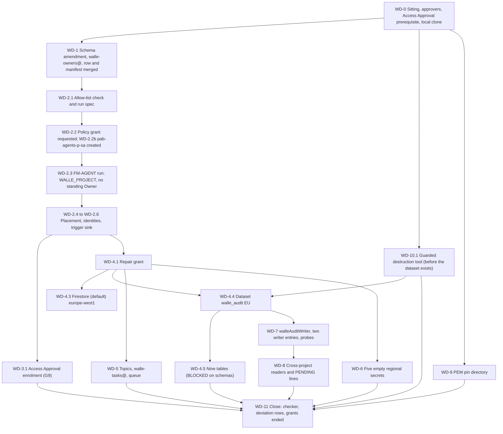

# 31. Wall-E: register row, project and data plane

## Status

- Owner: the platform owner
- Last reviewed: 2026-09-16
- Last executed: never
- Stage: review §2 stage 22 (Wall-E's register row and the FM-AGENT run) and stage 23 (Phases 7 and 8 of the superseded Wall-E runbook). Runs after [30](README.md) (the Workspace side), which itself runs only on `EVE_H_LIVE_RECORD`. It is ordered **after the security reviewer and the second human are appointed**, because the production P-SA singleton entitlement needs two named approvers and neither may be the requester (SD-42, S011).
- Step prefix: `WD`. Steps: 40. BLOCKED steps: WD-4.5 (the nine `walle_audit` table schemas, README B-22, opened by this file). Steps that record `PENDING` rather than `BLOCKED`: WD-5.2 and WD-5.4 (`run.invoker` for `walle-tasks@`, re-run in 33), WD-6.3 (the five secret versions, added in 32), WD-8.2 and WD-8.3 (foreign readers that do not exist yet), WD-9.2 (the pinned PEM files, which arrive at S4).
- Ordering inside the file: WD-10.1 (the audit-destruction guard, a repository commit that touches nothing in Google Cloud) is a **prerequisite of WD-4.4**, because WD-4.4's and WD-4.5's rollbacks invoke it; it is numbered 10 because it is the rollback tool, not because it runs last. WD-4.2 checks it is present before the dataset is created.
- Revised 2026-09-16 against the second-round review of this file: the guard's dataset mode no longer exits under `set -e`, and its export, decision and typed-confirmation checks are unconditional; `WALLE_LOCAL_DIR` is set in WD-0.4 rather than inside the BLOCKED WD-4.5; WD-2.2 is split into a grant request and the policy work; WD-11.1 lists and revokes grants per scope; WD-7.3 is gated on every secret having no version; the custom-role deletion window is stated as Google documents it; WD-5.2 tolerates a service that does not implement the service-identity API; WD-8.2 cannot drop a reader; WD-4.4's and WD-4.5's rollbacks go through the guard.
- Replaces: Phase 6's manual fallback, Phase 7 and Phase 8 of [../../wall-e/SETUP.md](../../wall-e/SETUP.md). That page is not executed.
- Salvaged: Phase 7's Firestore, dataset, table, topic and queue shapes and their verifies; Phase 7's dataset-`READER` mechanic (the access array is read, appended and written back, because `bq add-iam-policy-binding` does not act on datasets) and its anti-grant of authorised views; Phase 8's regional-secret reasoning, the version-pinning rule, the `walleAuditWriter` permission set, the PEM pin directory and the "no KMS role here" assertions; `walle_setup.py`'s `AUDIT_TABLES` once corrected to the nine names of Phase 7's own prose (S093).
- Not copied: the Phase 6 manual fallback and its `--folder="$FOLDER_ID"` (S019); `gcloud config set project` and every later command without `--project` (S071); the standing creator Owner (S018); six audit tables (S093); one writer entry on `walle_audit` (S109); `DELETE ... WHERE FALSE` run as the operator as proof of the insert-only control (S108); three secrets instead of five (S020); the Workspace API list without `iam`, `groupssettings`, `chromepolicy` and `cloudidentity` (S110); `bq rm -r -f -d` on a dataset holding rows (S089); `gcloud iam roles delete` with no undelete path (S183); the advice to run Phase 8 before Phase 7 (S114); `walle_workspace_logs` as a dataset in this project (retired by P104).
- Applies decisions (signed in 03 before the step that needs them): SD-01, SD-02, SD-37, SD-41, SD-42, SD-43, SD-44, SD-46, NAMES, P13, D11, decision 3, decision 48.
- Closes: S008 (with 16 and 38), S011 (with 12), S018 (for `WALLE_PROJECT`, with 17), S019, S020 (the creation half; the values are 32's), S054, S055 (the `walle_audit` half), S070, S071, S089, S093, S107, S108, S109, S110, S114, S183, S186 (the read-back half). Defers none without an owner (§14).
- Consumes: FM-AGENT and FM-COMMON (17); `ENT_FACTORY_SINGLETON_PSA_PROD`, `ENT_PROJECT_REPAIR_TEMPLATE`, `ENT_DEPLOY_CREDENTIAL_HOLDER_TEMPLATE`, `ENT_PLATFORM_POLICY`, `ENT_FOLDER_ADMIN` (12); `SA_MO_METRICS` (22); `SA_EVE_EXPORT` (26); `SA_VALIDATOR_CUSTODIAN` (11); `REGION`, `BQ_LOCATION` (01); `REGISTER_PATH`, `MANIFEST_SCHEMA_PATH` (16); `FLD_AGENTS_P_SA_PROD`, `PAB_AGENTS` inputs (09, 13); `WALLE_REPO_REMOTE`, `ROBOT` (30).
- Produces: `WALLE_PROJECT`, `WALLE_PROJECT_NUMBER`, `WALLE_AUDIT_DS`, `WALLE_LOCAL_DIR`, `SA_ACTIONS`, `SA_ACTIONS_SUPER`, `SA_AGENT`, `SA_DISPATCH`, `SA_OPS_CALLER`, `SA_TASKS`, `WALLE_SECRET_NAMES`, `SINK_TO_TRIGGERS_WALLE`, `ENT_PROJECT_REPAIR_WALLE`, `ENT_DEPLOY_CREDENTIAL_HOLDER_WALLE`, `PAB_AGENTS_P_SA`, `ROLE_WALLE_AUDIT_WRITER`.
- Commands checked against Google's documentation on 2026-09-15 (§16). What could not be settled that day is listed in §15.

## What this part builds

This is the first file that creates anything of Wall-E's inside Google Cloud. It stops exactly where a credential would begin: no OAuth client, no token, no service, no engine. Everything here is the container those later files fill.

1. **The register row and the manifest, merged before any project exists** (§1). The row is `tier: P-SA`, `env: prod`, `privilege: super_admin_pending`, with all twenty-one gate lines `pending`. That is SD-02's answer to the circular gate the review found (S008): the row merges, so the project and every pre-grant deployment may be built; what the gate still refuses is the Workspace Super Admin assignment to `walle@` (38) and the Stage 0 decision record (39).
2. **`WALLE_PROJECT` by FM-AGENT** in `fld-agents-p-sa-prod` (§2), under `ENT_FACTORY_SINGLETON_PSA_PROD` with **two named approvers**, neither of them the requester, and with the creator's Owner removed at the end of the run. The `to-triggers-walle` sink the module makes is recorded as `SINK_TO_TRIGGERS_WALLE`; the run instantiates `ENT_PROJECT_REPAIR_WALLE` and `ENT_DEPLOY_CREDENTIAL_HOLDER_WALLE`; `pab-agents-p-sa` is created here first, because FM-2.16 binds it.
3. **Access Approval on `WALLE_PROJECT`** (§3), gate line G9, after its prerequisite is read rather than assumed.
4. **The control plane and the audit store** (§4): Firestore `(default)` in `europe-west1` with delete protection, and the dataset `walle_audit` in `EU` with its nine partitioned tables. The tables are BLOCKED until the schema files are committed; the dataset is not, because §7's access array is written on the dataset and the review found the opposite order fails (S114).
5. **Topics, the queue and `walle-tasks@`** (§5): four topics, the serialised Cloud Tasks queue, and a dedicated OIDC identity for the queue instead of letting `walle-actions@` impersonate itself.
6. **Five regional secrets, created empty** (§6), three readable by `walle-actions@` and two by `walle-actions-super@`, with the cross-reads proven absent. No value is generated, printed or stored here: every version is added in 32, inside the consent sitting.
7. **The append-only audit rights** (§7): the `walleAuditWriter` custom role with `updateData` and without any delete, update or IAM permission, on the dataset access array with **exactly two** writer entries, proven by `testIamPermissions` run as the service accounts themselves.
8. **The cross-project readers** (§8), each wrapped in `exists_or_pending`: `mo-metrics@` granted directly (it exists from 22), `eve-export@` and the validator custodian granted if they exist, `eve-v0@` recorded PENDING for 36, and the S3 principals deliberately not granted at all.
9. **Eve's public-key pin directory** (§9), empty on purpose until S4, and the assertion that Wall-E holds no KMS role anywhere in its own project.
10. **A rollback that cannot destroy evidence** (§10): a committed guard that refuses to delete a table or dataset holding rows unless the exports are present and a dated decision record is supplied.

What the old text got wrong, and must not come back:

| Old text | Why it fails | Here instead |
|---|---|---|
| Phase 6 manual fallback: `gcloud projects create "$PROJECT" --folder="$FOLDER_ID"` (S019) | `FOLDER_ID` is `fld-agentic-platform`; a project parented straight under the platform folder is a finding, and the fallback made none of the module's labels, tags, policies, budget or entitlements | WD-2.3 runs 17's FM-AGENT under `ENT_FACTORY_SINGLETON_PSA_PROD` into `FLD_AGENTS_P_SA_PROD`, proven by the zero-diff checker and by WD-2.4's own reads |
| "two named approvers approve" with no step and no appointment (S011) | The security reviewer did not exist before Tier W, so the only documented path was blocked | The file is ordered after the appointment (SD-42); WD-0.2 refuses to start while `SECURITY_REVIEWER_EMAIL` is `*tbd*`; FM-3.1 reads the approval workflow before the grant |
| The creator keeps `roles/owner` (S018) | `verify`'s two-principal check fails for ever, and a project-wide Owner defeats every later boundary | FM-2.19 removes it inside the run; WD-2.4 re-reads the policy with no human member; every later step of this file runs inside a time-boxed `ENT_PROJECT_REPAIR_WALLE` grant |
| `gcloud config set project` once, then bare commands (S071) | The gcloud default is machine-global; a Firestore database or a regional secret created in `EVE_PROJECT` cannot be moved | 01's `penv_guard` fails when a default project is set; every command here passes `--project` or `--project_id` |
| Six audit tables in the script, nine in the prose (S093) | The first write to `ladder_events`, `grades` or `generic_requests` fails, and an audit-write failure is a hard invariant, so demotes and every band-B request are denied | WD-4.5 creates the nine names, checked against one committed list; the verify counts nine |
| One writer entry on `walle_audit` (S109) | `walle-actions-super@` serves bands B and C and writes `generic_requests`; without the role every band-B request fails closed | WD-7.2 writes **exactly two** writer entries and the verify fails on one, three, or any other role |
| `DELETE FROM ... WHERE FALSE` as the operator (S108) | It runs as the human, not as the service account, and proves nothing either way | WD-7.3 probes `tables:testIamPermissions` with an impersonated token for `walle-actions@` and `walle-actions-super@`, and the impersonation grant is removed in the same step |
| Three secrets created, five needed (S020) | The broad client's two secrets are missing in the middle of the one irreversible consent sitting | WD-6.1 creates five; WD-6.2 binds three to one reader and two to the other and proves the cross-reads absent |
| Workspace APIs without `iam`, `groupssettings`, `chromepolicy`, `cloudidentity` (S110) | Band-B calls on those surfaces fail `SERVICE_DISABLED` after the irreversible consent, and `gcloud iam service-accounts create` prompts on a fresh project | WD-2.1 puts them in the spec; WD-2.4 compares `services list --enabled` with the spec exactly |
| `bq rm -r -f -d "${PROJECT}:walle_audit"` as rollback (S089) | One command destroys the only Wall-E-side record of what a super-admin credential was asked to do | WD-10.1 commits a guard that refuses while rows exist unless the exports are confirmed and a decision record is given, and prints `IRREVERSIBLE: destroys audit evidence` |
| `gcloud iam roles delete walleAuditWriter` with no undelete (S183) | A deleted custom role can be undeleted for 7 days; after that it enters a permanent-deletion process of up to 30 days during which its id cannot be reused (up to 37 days in all), so the re-run fails `ALREADY_EXISTS` | WD-7.1 reads `deleted` first and undeletes; WD-10.1's rollback disables rather than deletes |
| "run phases 1 to 6 and 8 anyway" (S114) | Phase 8.4 rewrites the access array of a dataset Phase 7 creates | §4 creates the dataset before §6 and §7; only the **tables** wait on the schemas |
| `walle_workspace_logs` as a dataset here | Retired by P104: the reconciliation copy is the authorised view `platform_logs_views.walle_workspace_logs` in `LOGGING_PROJECT` (14) | WD-4.4 asserts the dataset is absent and names row 40 as its replacement |



## Preconditions

- [ ] 30 complete: `ROBOT`, `WALLE_OPERATORS_GROUP`, `WALLE_READERS_GROUP`, `WALLE_PROTECTED_GROUP`, `WALLE_REPO_REMOTE` set; `walle@` in `ROSTER_FILE` as an account holding no admin role.
- [ ] 28: `EVE_H_LIVE_RECORD` exists (30's own precondition; re-checked here because this file is the first to spend money on Wall-E).
- [ ] 22: `MO_PROJECT` and `SA_MO_METRICS` set, or its BLOCKED steps indexed in README. `SA_MO_METRICS` must exist for WD-8.1.
- [ ] 17 complete: `TIER_R_RECORD` merged; FM-1.2's checker merged; FM-COMMON (§2) and FM-AGENT (§3) readable.
- [ ] 12: `ENT_FACTORY_SINGLETON_PSA_PROD` `AVAILABLE` with **two named approvers** (`SECURITY_REVIEWER_EMAIL` and `SECOND_HUMAN_EMAIL`), neither being the platform owner; `ENT_PROJECT_REPAIR_TEMPLATE`, `ENT_DEPLOY_CREDENTIAL_HOLDER_TEMPLATE`, `ENT_PLATFORM_POLICY`, `ENT_FOLDER_ADMIN` merged and proven.
- [ ] 13: `DENY_AGENTS_PLATFORM`, `DENY_CORE_AGENTS` attached; the `fld-agents-p-sa-*` allow-list applied; the re-run line "31: compare `fld-agents-p-sa`'s allow-list with Wall-E's register row; create `pab-agents-p-sa`" present in README's index.
- [ ] 14: `LOGGING_PROJECT`, `PLATFORM_LOGS_VIEWS_DS` with the authorised view `walle_workspace_logs`; `S-org` and `S-folder` landing in `platform_logs`.
- [ ] 16: `REGISTER_PATH`, `MANIFEST_SCHEMA_PATH`; RG-3.6's signed manual parse stands in for the register CI while RG-3.3 is BLOCKED.
- [ ] 03 signed: NAMES (with `WALLE_PROJECT`), SD-01, SD-02, SD-37, SD-41, SD-42, SD-43, SD-44, SD-46, P13, D11, decision 3 (both scope lists, needed by 32 but named in the manifest), decision 48. `SECURITY_REVIEWER_EMAIL`, `SECOND_HUMAN_EMAIL`, `SECOND_OPERATOR_EMAIL`, `BLIND_GRADER_EMAIL`, `MODEL_ID`, `EVIDENCE_RETENTION_DAYS` set; `tools/decision-need.sh` prints `SIGNED` for each.
- [ ] 07: `BILLING_ACCOUNT_ID`, `BILLING_CURRENCY`; after `BOOTSTRAP_BILLING_EXPIRY` the billing administrator performs FM-2.5 and FM-2.10.
- [ ] 04: the account team's answer on Access Approval's prerequisite recorded (PU-3.1), or its absence recorded.
- [ ] Workstation of 01: gcloud with `alpha` and `beta`, `bq`, `jq`, `python3.12`, `openssl`, `git`, `gh`, `check-jsonschema`; `~/.platform-env` sourced; `penv_guard` silent.
- [ ] **Not** a precondition: any Wall-E service code. Nothing here deploys, builds or runs an image. Only WD-4.5 waits on a committed artefact (the nine schemas).

## People needed

| Role | Does | Present at |
|---|---|---|
| Platform owner (as `sa-1-admin@`) | Writes the row, manifest and run spec; requests every grant; performs every shell step | every step |
| Security reviewer (`SECURITY_REVIEWER_EMAIL`) | **First named approver** of `ENT_FACTORY_SINGLETON_PSA_PROD`; code owner review of the register row, the manifest and the schema amendment; first approver of `ENT_PLATFORM_POLICY` for the PAB policy (the grant is requested in WD-2.2 and used in WD-2.2b) | WD-0.2, WD-1.1, WD-1.3, WD-2.2, WD-2.3 |
| Second human (`SECOND_HUMAN_EMAIL`) | **Second named approver** of the same entitlement; second approver of `ENT_PLATFORM_POLICY`; approver of `ENT_PROJECT_REPAIR_WALLE` grants; signs the RG-3.6 manual parse of the P-SA row; present when the audit guard is ever run | WD-0.2, WD-1.3, WD-2.2, WD-2.3, WD-4.1, WD-10.1 |
| Second operator (`SECOND_OPERATOR_EMAIL`) | Reviews the schema-file commit list and the guard tool; second reviewer where the security reviewer authored | WD-4.5, WD-10.1 |
| Billing administrator | FM-2.5 and FM-2.10 only if `BOOTSTRAP_BILLING_EXPIRY` has passed | WD-2.3 |
| Mo owner | Confirms `SA_MO_METRICS` before WD-8.1 grants it; closes the MO-10.2 re-run line afterwards | WD-8.1 |

Neither approver may be the platform owner, and PAM refuses self-approval in any case. If either name is `*tbd*`, the file does not start (WD-0.2); that is SD-42's ordering rule, not an obstacle to be worked around.

Hands-on: about 2 days. Elapsed: about 1 week (two pull-request cycles, two approval cycles, the Access Approval enrolment). WD-4.5 waits on Wall-E's schema files with no fixed date.

Conventions of [01](01-prerequisites-and-conventions.md) apply. Deviation rows are `BD-31-<n>`. Records go to `BUILD_LOG_DIR/records/` as `<date>-WD-<step>-<slug>-v<n>`. Every shell block starts with:

```bash
source ~/.platform-env
penv_guard
R="$BUILD_LOG_DIR/records/$(date -u +%F)-WD"
```

## 0. The sitting

### WD-0.1 Open the sitting and check every gate this file stands on

- **WHO:** Platform owner.
- **WHERE:** Shell, `~/.platform-env` sourced, gcloud configuration `GCLOUD_CONFIG_NAME`, signed in as `sa-1-admin@`.
- **ACTION:**

```bash
checkpoint WD-0.1 START
need ORG_ID REGION BQ_LOCATION DOMAIN PLATFORM_REPO_DIR BUILD_LOG_DIR DEVIATION_REGISTER EVIDENCE_REGISTER TIER_R_RECORD REGISTER_PATH MANIFEST_SCHEMA_PATH FLD_AGENTIC_PLATFORM FLD_PLATFORM_CORE FLD_AGENTS_P_SA FLD_AGENTS_P_SA_PROD ENT_FACTORY_SINGLETON_PSA_PROD ENT_PROJECT_REPAIR_TEMPLATE ENT_DEPLOY_CREDENTIAL_HOLDER_TEMPLATE ENT_PLATFORM_POLICY ENT_FOLDER_ADMIN DENY_AGENTS_PLATFORM DENY_CORE_AGENTS PAB_AGENTS CICD_PROJECT CORE_PROJECT LOGGING_PROJECT KMS_PROJECT PLATFORM_LOGS_VIEWS_DS BILLING_ACCOUNT_ID BILLING_CURRENCY MODEL_ID ROBOT WALLE_OPERATORS_GROUP WALLE_REPO_REMOTE SA_PLATFORM_DRIFT
"$PLATFORM_REPO_DIR/tools/decision-need.sh" NAMES SD-01 SD-02 SD-37 SD-41 SD-42 SD-43 SD-44 SD-46 P13 D11
test -s "$PLATFORM_REPO_DIR/$TIER_R_RECORD" && echo "TIER_R_RECORD present"
grep -E $'\tEV-[0-9.]+\tDONE' "$BUILD_LOG_DIR/checkpoints.tsv" | grep -c EVE_H_LIVE_RECORD
awk -F'\t' '$2 ~ /^(FM-10\.3|WW-[0-9.]+|MO-3\.1|OP-9\.2|CL-7\.3|PA-8\.4)$/ {print $2"\t"$3}' "$BUILD_LOG_DIR/checkpoints.tsv" | sort -u
grep -E '31: compare .fld-agents-p-sa' "$BUILD_LOG_DIR/rerun-index.tsv" || grep -rn "create .pab-agents-p-sa" "$PLATFORM_REPO_DIR/../" 2>/dev/null | head -n 1
test -z "$(gcloud config get project 2>/dev/null)" && echo "no default project"
```

- **VERIFY:** `decision-need.sh` prints `SIGNED` for every id; `TIER_R_RECORD present`; the Eve-H count is `1` (30's precondition, re-read here); the checkpoint listing shows `DONE` for FM-10.3, OP-9.2, PA-8.4 and for 30's `WW-` steps, and `MO-3.1 DONE` or a README B-14 line for Mo; the 13 re-run line is present; `no default project`. Anything else: stop and finish the earlier file.
- **ROLLBACK:** Read only.
- **EVIDENCE:** Output as `${R}-0.1-inputs-v1.txt`, `evidence_add WD-0.1 inputs E-05 1.4.1 build-log:records/<file> <file>`. E-05. TISAX 1.4.1.

### WD-0.2 Refuse to start without two named approvers

- **WHO:** Platform owner reads; the security reviewer and the second human each confirm in writing that they are the named approvers and that they have read 17 §3 and this file.
- **WHERE:** Shell; the build log.
- **ACTION:** This is the step the review asked for (S011): the production singleton entitlement needs two approvers, one of them a security reviewer who did not exist when the old runbook was written, and the old text offered a "manual fallback" that built the wrong thing (S019). There is no fallback here.

```bash
need SECURITY_REVIEWER_EMAIL SECOND_HUMAN_EMAIL ENT_FACTORY_SINGLETON_PSA_PROD CICD_PROJECT SA_1_ADMIN OWNER_DAILY_ACCOUNT
case "${SECURITY_REVIEWER_EMAIL}${SECOND_HUMAN_EMAIL}" in *'*tbd*'*) echo "STOP: 31 does not start until both approvers are named (SD-42, S011)"; false;; esac
gcloud pam entitlements describe "$ENT_FACTORY_SINGLETON_PSA_PROD" --location=global --billing-project="$CICD_PROJECT" --format="yaml(eligibleUsers,approvalWorkflow,maxRequestDuration,privilegedAccess)" | tee "${R}-0.2-singleton-v1.yaml"
grep -cE "(${SECURITY_REVIEWER_EMAIL}|${SECOND_HUMAN_EMAIL})" "${R}-0.2-singleton-v1.yaml"
grep -E "(${OWNER_DAILY_ACCOUNT}|${SA_1_ADMIN})" "${R}-0.2-singleton-v1.yaml" && echo "STOP: the requester is an approver" || echo "requester is not an approver"
```

  Both approvers write one line each in the build log: name, date, "I am a named approver of `ent-factory-singleton-psa-prod` and I approve grants against the merged run spec only".
- **VERIFY:** The describe shows both addresses under `approvalWorkflow` (directly, or as a group whose only members are those two, as 12 recorded), `maxRequestDuration` of one hour, and the `ent-factory-singleton` role bundle on `folders/<FLD_AGENTS_P_SA_PROD>`; `requester is not an approver`; two confirmation lines in the build log. If the workflow needs one approval rather than two, stop: 12 is corrected before this file runs (04 §5.2 requires two named approvers for `fld-agents-p-sa-*`).
- **ROLLBACK:** Read only.
- **EVIDENCE:** The YAML and the two lines as `${R}-0.2-approvers-v1`, `evidence_add WD-0.2 approvers E-08 4.1.3 ...`. TISAX 4.1.3. Closes S011 with 12.

### WD-0.3 Read the Access Approval prerequisite before promising G9

- **WHO:** Platform owner.
- **WHERE:** The 04 purchase record (PU-3.1) and the console, **Support > Overview**.
- **ACTION:** Access Approval is documented as included with Customer Care (Standard, Enhanced, Premium); the overview page names only Access Transparency as its own prerequisite. 08 asked the account team the same question for the witness organisation (PU-3.1). Read the answer now, so that G9 is either performed in §3 or recorded as unavailable with a named residual, and never left as an assumption in the gate checklist.

```bash
ls "$BUILD_LOG_DIR/records/"*access-approval* 2>/dev/null || echo "no PU-3.1 or WO-1.13 record: read Support > Overview and write one today"
gcloud organizations describe "$ORG_ID" --format="value(displayName)"
gcloud access-approval settings get --project="$CORE_PROJECT" --format=json 2>&1 | head -n 5
```

  The read against `CORE_PROJECT` tells whether the API answers at all for this organisation before the new project exists; a `PERMISSION_DENIED` on `accessapproval.settings.get` is about the caller's role, a `FAILED_PRECONDITION` about the subscription. Record which.
- **VERIFY:** A dated record exists stating whether Access Approval is available to this organisation and under which support subscription; the settings read is copied into the build log with its exact error text if it fails.
- **ROLLBACK:** Read only.
- **EVIDENCE:** `${R}-0.3-access-approval-prereq-v1.txt`. E-06. TISAX 6.1.

### WD-0.4 Clone Wall-E's repository and record `WALLE_LOCAL_DIR`

- **WHO:** Platform owner.
- **WHERE:** Shell.
- **ACTION:** Three steps of this file write into Wall-E's own repository (`WALLE_REPO_REMOTE`, created in 30): WD-9.1 and WD-9.2 (the PEM pin directory, which must exist years before the first key) and WD-4.5 (the schema files, BLOCKED). The clone's path is therefore a plan variable set here, where nothing is blocked, not a sitting value invented inside WD-4.5 — the second-round review found `need WALLE_LOCAL_DIR` in §9 failing for exactly that reason.

```bash
need WALLE_REPO_REMOTE PLATFORM_REPO_DIR
WD_CLONE="$(dirname "$PLATFORM_REPO_DIR")/wall-e"
test -d "$WD_CLONE/.git" || git clone "$WALLE_REPO_REMOTE" "$WD_CLONE"
git -C "$WD_CLONE" remote get-url origin
git -C "$WD_CLONE" fetch --prune origin && git -C "$WD_CLONE" switch main && git -C "$WD_CLONE" pull --ff-only
penv_set WALLE_LOCAL_DIR "$WD_CLONE"
need WALLE_LOCAL_DIR
git -C "$WALLE_LOCAL_DIR" status --short --branch | head -n 1
```

- **VERIFY:** `remote get-url` prints exactly `WALLE_REPO_REMOTE`; the status line reads `## main...origin/main` with nothing behind or ahead; `grep -c '^WALLE_LOCAL_DIR=' ~/.platform-env` prints `1`.
- **ROLLBACK:** `penv_set --force WALLE_LOCAL_DIR` to another path; the clone itself is disposable.
- **EVIDENCE:** The remote URL and the status line as `${R}-0.4-walle-clone-v1.txt`. E-05. TISAX 5.2.1.

## 1. The register row and the manifest

### WD-1.1 Two schema amendments the P-SA row needs

- **WHO:** Platform owner writes; the security reviewer approves as code owner of `/register/schema/` and `/contract/`; a second human reviewer merges.
- **WHERE:** `PLATFORM_REPO_DIR`, branch `wd-1-schema`, then the git host.
- **ACTION:** Two things in 16's schemas refuse a correct Wall-E manifest, and one convention has to be written down before the row is used.
  1. The family id pattern is `^F[0-9]+$`, but Wall-E's ladder names `F2b`, `F3b` and `F4b` (05 §"The families"). Widen it to `^F[0-9]+[a-z]?$` in `families[].id` and in `ceilings`' `patternProperties`. No existing manifest changes.
  2. A P-SA row must carry `principal`, `armor_template`, `gateway_id` and `framework_version`, none of which exists until 33, 34 and 35. Rather than inventing values, this set uses the literal marker `pending-<file>` (for example `pending-35`) and the schema's own `…` placeholder for a `sha`. The rule that makes that safe is written into `ci/register-rules.md` as **R-13**: *no row whose `privilege` is `super_admin`, or whose `status` is `prod`, may contain a `pending-` marker or a `…` in any field.* Until RG-3.3's code exists, R-13 is checked by eye in the RG-3.6 parse, like R-01.

```bash
git -C "$PLATFORM_REPO_DIR" switch main && git -C "$PLATFORM_REPO_DIR" pull --ff-only
git -C "$PLATFORM_REPO_DIR" switch -c wd-1-schema
M="$PLATFORM_REPO_DIR/contract/1.0.0/manifest.schema.json"
jq '(.properties.families.items.properties.id.pattern) = "^F[0-9]+[a-z]?$"
  | (.properties.ceilings.patternProperties) |= with_entries(.key = "^F[0-9]+[a-z]?$")' "$M" > "$M.new" && mv "$M.new" "$M"
python3.12 - "$PLATFORM_REPO_DIR/ci/register-rules.md" <<'PY'
import sys
p = sys.argv[1]
row = ("| R-13 no placeholder at the flip | a row with `privilege: super_admin` or `status: prod` "
       "contains a `pending-` marker or `…` in any field | every pull request touching `register/` | "
       "`r13-pending-marker-at-flip` (must fail); `r13-pending-marker-while-pending` (must pass) | "
       "setup 31 WD-1.1; SD-02 |\n")
t = open(p).read()
open(p, "w").write(t if row in t else t.rstrip("\n") + "\n" + row)
PY
check-jsonschema --check-metaschema "$M"
git -C "$PLATFORM_REPO_DIR" add contract/1.0.0/manifest.schema.json ci/register-rules.md
git -C "$PLATFORM_REPO_DIR" commit -m "contract: family ids F<n><letter>; register rule R-13 no placeholder at the flip (setup 31 WD-1.1)"
git -C "$PLATFORM_REPO_DIR" push -u origin wd-1-schema
```

  Add in the same pull request two fixtures for 16 RG-2.5: `register/fixtures/schema/pass-psa-prod-pending-markers.yaml` (the row of WD-1.3, which must pass) and `register/fixtures/schema/fail-psa-prod-super-admin-pending-marker.yaml` (the same row with `privilege: super_admin`, which R-13 must fail), then re-run RG-2.5's loop so every earlier fixture result is unchanged.
- **VERIFY:** `check-jsonschema --check-metaschema` succeeds; RG-2.5's loop prints the expected result for every fixture including the two new ones; the pull request is merged with the code owner's approval.
- **ROLLBACK:** A reverting pull request before WD-1.3 merges; afterwards a superseding schema change.
- **EVIDENCE:** Merge commit as `<date>-WD-1.1-schema-v1`. E-05. TISAX 1.3.1, 5.2.1.

### WD-1.2 Create `walle-owners@` as a security group

- **WHO:** Platform owner as `sa-1-admin@` (a super admin); the second operator confirms the membership. No witness: this is an agent group, not a control group (04 §2.4).
- **WHERE:** Admin console: Menu > Directory > Groups > Create group (the path 06 OB-6.2 verified on 2026-09-15).
- **ACTION:** The register row's `owner_group` must exist and must not be `platform-owners@` (16's schema refuses it). `factory-groups@`'s job is BLOCKED code, so the group is made by hand and recorded as `BD-31-1`.
  1. Check the address is free: `gcloud identity groups describe "walle-owners@${DOMAIN}" --format="value(groupKey.id)"` prints a not-found error.
  2. Group email `walle-owners@<DOMAIN>`; description "Wall-E owners: requester group for ent-project-repair-walle and ent-deploy-credential-holder-walle; register owner_group of Wall-E (setup 31)".
  3. Labels: tick **Security**.
  4. Access settings as 06 OB-6.2 step 4 (invitation only, no external members).
  5. Members: the platform owner's `sa-1-admin@` only, until 03 names a separate Wall-E owner. **Never `walle@`**: the robot is not an owner of itself, and `walle-protected@` (30) already protects it.
- **VERIFY:**

```bash
gcloud identity groups describe "walle-owners@${DOMAIN}" --format="json(labels)"
gcloud identity groups memberships list --group-email="walle-owners@${DOMAIN}" --format="value(preferredMemberKey.id)"
gcloud identity groups memberships list --group-email="walle-owners@${DOMAIN}" --format="value(preferredMemberKey.id)" | grep -x "$ROBOT" && echo "STOP: the robot is in its own owner group" || echo "robot absent"
```

  The labels include `cloudidentity.googleapis.com/groups.security`; the membership list prints exactly `sa-1-admin@`; `robot absent`.
- **ROLLBACK:** **IRREVERSIBLE**: a security group cannot be changed back to a Google Group (06 OB-6.2's source). Confirm before saving: the address is free (step 1), the spelling equals `owner_group` in WD-1.3's draft, and 04 §2.4 names the `<agent>-owners@` pattern. Gate: 04 §2.4 and WD-1.1's `DONE` line. A wrongly added member is removed at once and recorded.
- **EVIDENCE:** Screenshot of the settings page and the three outputs as `${R}-1.2-walle-owners-v1`; a `DEV` row `BD-31-1` in `DEVIATION_REGISTER` ("group made by hand instead of the group factory; superseded when `factory-groups@`'s job exists; owner platform owner"). E-08. TISAX 4.1.1, 4.2.1.

### WD-1.3 Write and merge the P-SA production row and the manifest

- **WHO:** Platform owner writes; the security reviewer reviews as code owner; the second human signs the RG-3.6 manual parse; two human reviewers merge.
- **WHERE:** `PLATFORM_REPO_DIR`, branch `wd-1-register-row`.
- **ACTION:** One file per agent, one row per `env` (16 RG-2.2). Only the `env=prod` row is written here; the twin's `env=nonprod` row is 37's and needs no checklist (SD-02, X-ORG-13). The row merges with `privilege: super_admin_pending` and twenty-one `pending` lines — that is the whole point of SD-02, and it is what unblocks S008: nothing in this file, in 32 to 37, needs a green checklist, and the checklist cannot go green until they have run.

```bash
git -C "$PLATFORM_REPO_DIR" switch main && git -C "$PLATFORM_REPO_DIR" pull --ff-only
git -C "$PLATFORM_REPO_DIR" switch -c wd-1-register-row
mkdir -p "$PLATFORM_REPO_DIR/walle"
W_ID="$("$PLATFORM_REPO_DIR/tools/decision-value.sh" NAMES WALLE_PROJECT)"
need W_ID MODEL_ID
PURPOSE="Wall-E administers Workspace accounts, groups, licences and mailboxes on operator request or on catalogued triggers, inside the hard-denied list and the consented scope sets; every write is a catalogue operation or a two-person approved generic request, and the model holds no credential and cannot approve."
PURPOSE_SHA="$(printf '%s' "$PURPOSE" | shasum -a 256 | cut -d' ' -f1)"
cat > "$PLATFORM_REPO_DIR/walle/agent-manifest.yaml" <<EOF
contract_version: 1.0.0
identity:
  agent_id: walle
  tier: P-SA
  owner_group: walle-owners@${DOMAIN}
  env: prod
  principal: "principal://agents.global.org-${ORG_ID}.system.id.goog/resources/aiplatform/projects/pending-35/locations/${REGION}/reasoningEngines/pending-35"
families:
  - {id: F1, description: "reads of directory, licence, report and mailbox settings", risk_tier: READ, reversible: true, inverse: none, pre_state: none, taint_fields: []}
  - {id: F2, description: "templated operator notification", risk_tier: WRITE_LOW, reversible: false, inverse: none, pre_state: "predicate:recipient_fixed", taint_fields: []}
  - {id: F2b, description: "free-text mail, chat and calendar create", risk_tier: WRITE_LOW, reversible: false, inverse: none, pre_state: "predicate:recipient_fixed", taint_fields: [body, subject]}
  - {id: F3, description: "group membership add and remove, class low", risk_tier: WRITE_LOW, reversible: true, inverse: group.member.remove, pre_state: snapshot, taint_fields: [member]}
  - {id: F3b, description: "group membership, class access", risk_tier: WRITE_HIGH, reversible: true, inverse: group.member.remove, pre_state: snapshot, taint_fields: [member]}
  - {id: F4, description: "user profile update within the safe field set", risk_tier: WRITE_LOW, reversible: true, inverse: directory.user.update, pre_state: snapshot, taint_fields: [fields]}
  - {id: F4b, description: "organisational-unit move inside the allow-list", risk_tier: WRITE_HIGH, reversible: true, inverse: directory.user.move_ou, pre_state: snapshot, taint_fields: [org_unit]}
  - {id: F5, description: "user suspend", risk_tier: WRITE_HIGH, reversible: true, inverse: directory.user.suspend, pre_state: snapshot, taint_fields: [primary_email]}
  - {id: F6, description: "user restore", risk_tier: WRITE_HIGH, reversible: true, inverse: directory.user.suspend, pre_state: snapshot, taint_fields: [primary_email]}
  - {id: F7, description: "licence assignment insert, delete and patch, same SKU", risk_tier: WRITE_LOW, reversible: true, inverse: licensing.assignment.insert, pre_state: snapshot, taint_fields: [sku_id]}
  - {id: F9, description: "labels on the robot's own mailbox", risk_tier: WRITE_LOW, reversible: true, inverse: gmail.label.remove, pre_state: snapshot, taint_fields: [label]}
  - {id: F10, description: "rollback of a recorded run", risk_tier: WRITE_HIGH, reversible: false, inverse: none, pre_state: snapshot, taint_fields: [run_id]}
  - {id: F11, description: "generic request, band B, always two humans", risk_tier: WRITE_GENERIC, reversible: false, inverse: none, pre_state: "predicate:request_hash_bound", taint_fields: [request]}
trigger_classes: [{id: T0, name: chat}, {id: T1, name: scheduled}, {id: T2, name: event}, {id: T3, name: inbox}]
ceilings:
  F1:  {T0: L5, T1: L5, T2: L1, T3: L0, agent: L0}
  F2:  {T0: L1, T1: L1, T2: L1, T3: L0, agent: L0}
  F2b: {T0: L1, T1: L1, T2: L1, T3: L0, agent: L0}
  F3:  {T0: L1, T1: L1, T2: L1, T3: L0, agent: L0}
  F3b: {T0: L1, T1: L1, T2: L1, T3: L0, agent: L0}
  F4:  {T0: L1, T1: L1, T2: L1, T3: L0, agent: L0}
  F4b: {T0: L1, T1: L1, T2: L1, T3: L0, agent: L0}
  F5:  {T0: L0, T1: L0, T2: L0, T3: L0, agent: L0}
  F6:  {T0: L1, T1: L1, T2: L1, T3: L0, agent: L0}
  F7:  {T0: L1, T1: L1, T2: L1, T3: L0, agent: L0}
  F9:  {T0: L1, T1: L1, T2: L1, T3: L0, agent: L0}
  F10: {T0: L1, T1: L1, T2: L1, T3: L0, agent: L0}
  F11: {T0: L1, T1: L1, T2: L0, T3: L0, agent: L0}
protected_principals: ["group:walle-protected@${DOMAIN}", "user:${ROBOT}", "role:super_admin", "role:delegated_admin"]
hard_denied: ["tenant security posture (2SV, SSO, password policy, API controls, session control, login challenges, account recovery, Context-Aware Access)", "domain-wide delegation in any form", "admin role assignment or removal", "any operation on a protected principal", "Google Cloud IAM or settings of any platform project, folder or the organisation", "Gemini Enterprise configuration", "Drive content of other people"]
egress: []
capabilities: {code_execution: false}
peers: []
invokers:
  control: ["walle-operators-caller@${W_ID}.iam.gserviceaccount.com", "platform-drift@${CORE_PROJECT}.iam.gserviceaccount.com"]
  read: []
stores:
  - {name: walle_audit, kind: bigquery, class: evidence, retention_row: R13}
  - {name: firestore-default, kind: firestore, class: control, retention_row: R14}
  - {name: walle-content-logs, kind: log_bucket, class: content, retention_row: R6}
  - {name: walle-oauth-client, kind: gcs, class: secret, retention_row: R15}
data_classes: [evidence, content, control, record, secret]
recovery_class: R-K
compliance:
  ai_act_entry: "10-eu-ai-act.md#wall-e"
  ai_act_class: annex_iii_adjacent
  purpose_sha256: ${PURPOSE_SHA}
  art_50: {template_ids: ["pending-33"], header_value: "pending-33", text_sha256: "…"}
  tisax_class: confidential
  register_row: register/walle.yaml
fingerprint: {prompt_sha256: "…", model_pin: "${MODEL_ID}", framework_version: "pending-33", armor_template_version: "pending-34"}
verifier: eve
metric_pack: full+eve-quality
EOF
MANIFEST_SHA="$(shasum -a 256 "$PLATFORM_REPO_DIR/walle/agent-manifest.yaml" | cut -d' ' -f1)"
python3.12 - "$PLATFORM_REPO_DIR/register/walle.yaml" "$DOMAIN" "$MANIFEST_SHA" "$MODEL_ID" "$BLIND_GRADER_EMAIL" "$ORG_ID" "$REGION" "$PURPOSE" <<'PY'
import sys, datetime
path, domain, sha, model, grader, org, region, purpose = sys.argv[1:9]
lines = [
 "agent_id: walle", "rows:",
 "  - display_name: Wall-E (agent, prod)",
 f'    purpose: "{purpose}"',
 f"    owner_group: walle-owners@{domain}",
 '    cost_centre: "*tbd*"',
 "    tier: P-SA", "    env: prod", "    folder: FLD_AGENTS_P_SA_PROD",
 "    risk_class: SUPER", "    autonomy_ceiling: F1-T1-L5",
 "    data_classes: [evidence, content, control, record, secret]",
 "    tisax_class: confidential", "    ai_act_class: annex_iii_adjacent", "    ai_act_role: both",
 '    art_6_4_assessment: "10-eu-ai-act.md#art-6-4"', '    art_49_registration: "pending"',
 f'    model_pin: "{model}"', '    framework_version: "pending-33"',
 '    armor_template: "pending-34"', '    gateway_id: "pending-35"',
 f'    principal: "principal://agents.global.org-{org}.system.id.goog/resources/aiplatform/projects/pending-35/locations/{region}/reasoningEngines/pending-35"',
 "    verifier: eve", f"    verifier_owner: eve-owners@{domain}",
 "    metric_pack: full+eve-quality", "    privilege: super_admin_pending",
 "    supplier_rows: [google-workspace, google-cloud-run, google-cloud-bigquery, google-vertex-ai]",
 "    publish_to_gemini: true", f"    audience_groups: [walle-operators@{domain}, walle-readers@{domain}]",
 f'    grader: "{grader}"', "    recovery_class: R-K", f"    manifest_sha: {sha}",
 '    contract_version: "1.0.0"',
 f'    review_date: "{datetime.date.today() + datetime.timedelta(days=90)}"',
 "    status: poc", "    gate_checklist:",
]
for n in range(1, 22):
    lines += [f"      G{n}: {{status: pending, date: null, signer: null, record: null}}"]
open(path, "w").write("\n".join(lines) + "\n")
PY
check-jsonschema --schemafile "$PLATFORM_REPO_DIR/register/schema/register-row.schema.json" "$PLATFORM_REPO_DIR/register/walle.yaml"
check-jsonschema --schemafile "$PLATFORM_REPO_DIR/contract/1.0.0/manifest.schema.json" "$PLATFORM_REPO_DIR/walle/agent-manifest.yaml"
grep -nE 'super_admin$|status: prod' "$PLATFORM_REPO_DIR/register/walle.yaml" && echo "STOP: R-13" || echo "R-13 ok while pending"
git -C "$PLATFORM_REPO_DIR" add register/walle.yaml walle/agent-manifest.yaml
git -C "$PLATFORM_REPO_DIR" commit -m "register: Wall-E P-SA prod row, super_admin_pending, 21 pending gate lines (setup 31 WD-1.3, SD-02, S008)"
git -C "$PLATFORM_REPO_DIR" push -u origin wd-1-register-row
```

  Values that are assumptions, each confirmed in review and listed in §15: `autonomy_ceiling` is one string in 16's schema while Wall-E's ceilings are per family and per trigger, so the row carries the single highest cell (`F1-T1-L5`, S0's read ceiling) and the manifest's `ceilings` block is the real table, raised stage by stage by pull request; `recovery_class: R-K`, because the project holds the robot's refresh tokens, whose class is the strictest of anything in it (09 §3.5); `art_49_registration: pending`, which 16's schema then forbids to combine with `status: prod` — correct, because the registration is due before the first write, not before the project; `F11` is the band-B generic family, named here because the manifest schema has a `WRITE_GENERIC` risk tier and the ladder page describes the lane without a family id; `supplier_rows` names the rows 16 or 03 keeps (use their real ids); `cost_centre` stays `*tbd*` until finance names it.
- **VERIFY:** Both `check-jsonschema` runs print success; `R-13 ok while pending`; the pull request carries a signed `decisions/register-parses/<date>-pr<number>-parse.md` recording R-01 (manifest hash), R-02 (this is the only `env=prod` P-SA row that is not `retired`), R-03 (the row is `super_admin_pending`, so the rule must **not** refuse it), R-05 (twenty-one lines present, all `pending`) and R-13 (`pending-` markers allowed while pending); after merge `shasum -a 256 walle/agent-manifest.yaml` on `origin/main` equals the row's `manifest_sha`.
- **ROLLBACK:** A reverting pull request, only while no project exists. After WD-2.3 the row stays and is retired only through FM-REVOKE (17 §7).
- **EVIDENCE:** Merge commit and parse file as `<date>-WD-1.3-register-row-v1`, `evidence_add WD-1.3 register-row E-05 1.3.1 ...`. E-05 (Annex IV index), E-02 (Art. 49 entry, `pending`). TISAX 1.3.1, 1.3.2. Closes S008 with 16 and 38.

## 2. `WALLE_PROJECT` by FM-AGENT

### WD-2.1 Compare the folder allow-list, then write the run spec

- **WHO:** Platform owner writes; the security reviewer and the second human merge (17 FM-2.1: for a P-SA production run the security reviewer is one of the two reviewers).
- **WHERE:** `PLATFORM_REPO_DIR`, branch `fm-spec-walle-prod` (FM-2.1 creates it).
- **ACTION:** 13 handed this file two jobs: compare `fld-agents-p-sa`'s `gcp.restrictServiceUsage` allow-list with what Wall-E's row needs, and create `pab-agents-p-sa` (WD-2.2). Do the comparison **before** the spec is written, because FM-2.1's `inputs` check refuses a spec naming a service outside the folder list, and the repair is a 13 pull request, never an edit from inside a run.

```bash
need FLD_AGENTS_P_SA PLATFORM_REPO_DIR
gcloud resource-manager org-policies describe gcp.restrictServiceUsage --folder="$FLD_AGENTS_P_SA" --effective --format="value(listPolicy.allowedValues[])" | tr ',' '\n' | sed 's/^services\///' | sort > "${R}-2.1-allowlist-v1.txt"
cat > /tmp/wd-services.txt <<'SVC'
iam.googleapis.com
firestore.googleapis.com
bigquery.googleapis.com
pubsub.googleapis.com
cloudtasks.googleapis.com
run.googleapis.com
secretmanager.googleapis.com
aiplatform.googleapis.com
modelarmor.googleapis.com
cloudscheduler.googleapis.com
iap.googleapis.com
storage.googleapis.com
binaryauthorization.googleapis.com
logging.googleapis.com
monitoring.googleapis.com
observability.googleapis.com
essentialcontacts.googleapis.com
billingbudgets.googleapis.com
admin.googleapis.com
licensing.googleapis.com
gmail.googleapis.com
chat.googleapis.com
calendar-json.googleapis.com
groupssettings.googleapis.com
chromepolicy.googleapis.com
cloudidentity.googleapis.com
SVC
sort /tmp/wd-services.txt > "${R}-2.1-wanted-v1.txt"
comm -23 "${R}-2.1-wanted-v1.txt" "${R}-2.1-allowlist-v1.txt"
```

  The `comm` output is what the folder policy would refuse. The four Workspace APIs the review added (`iam`, `groupssettings`, `chromepolicy`, `cloudidentity`, S110) are the ones most likely to be missing, because 13 built the list from the platform design and not from decision 3's broad scope list. Any name printed goes into a 13 pull request under `ENT_PLATFORM_POLICY`, approved as 13 requires, **before** the spec is merged. `artifactregistry` is deliberately absent: images are built and stored in `CICD_PROJECT` (S006, S022), and Cloud Run in this project pulls them by digest through a repository-level reader grant made in 33. `cloudkms` is absent: there is no key ring here (Phase 8.1's rule stands); the content-log key of 34 lives in `KMS_PROJECT` and is used through the log bucket's service agent, not through a role held by Wall-E.

  Then copy 17's template and fill it from the merged row, the manifest, 17 §3's P-SA column and NAMES:

```bash
RUN_SPEC="$PLATFORM_REPO_DIR/factory/runs/walle-prod.json"
REG_COMMIT="$(git -C "$PLATFORM_REPO_DIR" log -1 --format=%H origin/main -- register/walle.yaml)"
jq --arg id "$W_ID" --arg dom "$DOMAIN" --arg rc "$REG_COMMIT" --slurpfile svc <(jq -R . "${R}-2.1-wanted-v1.txt" | jq -s .) '
  .module="agent-project" | .run_id="dev-31-agent-walle-prod" | .calling_file_step="31 WD-2.3"
  | .register_row="register/walle.yaml" | .register_commit=$rc | .manifest="walle/agent-manifest.yaml"
  | .agent_id="walle" | .env="prod" | .register_tier="P-SA" | .project_variable="WALLE_PROJECT" | .project_id=$id | .create=true
  | .parent_folder_variable="FLD_AGENTS_P_SA_PROD"
  | .labels={"agent":"walle","owner":"walle-owners","tier":"p-sa","env":"prod","data_class":"evidence","ai_act_class":"annex-iii-adjacent","recovery_class":"r-k","cost_centre":"tbd","created_by":"bootstrap-hand","factory_run":"dev-31-agent-walle-prod"}
  | .tags_effective={"agp-tier":"p-sa","agp-env":"prod","agp-tisax-scope":"in"}
  | .services=$svc[0]
  | .log_routing={"default_bucket":"default-europe-west1","location":"europe-west1","retention_days":30,"trace_bucket":true}
  | .budget={"display_name":($id + "-budget"),"amount":500,"reason_if_not_tier_default":null}
  | .essential_contacts=[{"email":("walle-owners@" + $dom),"categories":["SECURITY","SUSPENSION","TECHNICAL","TECHNICAL_INCIDENTS"]},{"email":("platform-security@" + $dom),"categories":["SECURITY"]}]
  | .service_accounts=["walle-actions","walle-actions-super","walle-agent","walle-dispatcher","walle-operators-caller","walle-tasks"]
  | .project_bindings=[
      {"member":("serviceAccount:walle-actions@" + $id + ".iam.gserviceaccount.com"),"role":"roles/datastore.user"},
      {"member":("serviceAccount:walle-actions@" + $id + ".iam.gserviceaccount.com"),"role":"roles/pubsub.publisher"},
      {"member":("serviceAccount:walle-actions@" + $id + ".iam.gserviceaccount.com"),"role":"roles/cloudtasks.enqueuer"},
      {"member":("serviceAccount:walle-actions@" + $id + ".iam.gserviceaccount.com"),"role":"roles/monitoring.metricWriter"},
      {"member":("serviceAccount:walle-actions@" + $id + ".iam.gserviceaccount.com"),"role":"roles/logging.logWriter"},
      {"member":("serviceAccount:walle-actions-super@" + $id + ".iam.gserviceaccount.com"),"role":"roles/datastore.user"},
      {"member":("serviceAccount:walle-actions-super@" + $id + ".iam.gserviceaccount.com"),"role":"roles/pubsub.publisher"},
      {"member":("serviceAccount:walle-actions-super@" + $id + ".iam.gserviceaccount.com"),"role":"roles/monitoring.metricWriter"},
      {"member":("serviceAccount:walle-actions-super@" + $id + ".iam.gserviceaccount.com"),"role":"roles/logging.logWriter"},
      {"member":("serviceAccount:walle-dispatcher@" + $id + ".iam.gserviceaccount.com"),"role":"roles/datastore.user"},
      {"member":("serviceAccount:walle-dispatcher@" + $id + ".iam.gserviceaccount.com"),"role":"roles/logging.logWriter"}]
  | .allowed_human_members=[]
  | .notification_channels=[{"type":"email","display_name":"walle-prod-owners-email"},{"type":"pager","display_name":"walle-prod-pager"}]
  | .trigger_sink={"name":"to-triggers-walle","topic":"walle-triggers","filter":"","filter_sha256":""}
  | .pab_bindings=[{"binding_id":"pab-agents-p-sa-walle","parent_type":"project","parent_id":$id,"policy":"PAB_AGENTS_P_SA","principal_set":"PENDING_PROJECT_NUMBER"}]
  | .entitlements=["ent-project-repair-walle","ent-deploy-credential-holder-walle"] | .lien=true
  | .made_elsewhere=[
      {"item":"Firestore (default), walle_audit and its nine tables, topics, queue, walle-tasks@, five empty regional secrets, walleAuditWriter, dataset access array","file":"31","step":"WD-4 to WD-8"},
      {"item":"the two OAuth clients and the five secret versions","file":"32","step":"-"},
      {"item":"walle-actions, walle-actions-super, walle-dispatcher, the two approval surfaces, run.invoker and the in-app allow-lists","file":"33","step":"-"},
      {"item":"Model Armor templates, the project floor, walle-content-logs and its log view","file":"34","step":"-"},
      {"item":"the engine with AGENT_IDENTITY and encryption_spec, the staging bucket, egress and ingress gateways, the registry card","file":"35","step":"-"},
      {"item":"cross-project run.invoker for Eve and Mo, Eve S0 over walle_audit, Mo Wall-E pack","file":"36","step":"-"}]
  | .pending=[{"check":"trigger_sink.filter","reason":"the T2 family filter is written in WD-2.3 from the merged manifest once WALLE_PROJECT_NUMBER and ROBOT are both known","owner":"platform owner","rerun_in":"31"},
              {"check":"pab_bindings[0].principal_set","reason":"the agent principal set needs the project number, which exists only after FM-2.3","owner":"platform owner","rerun_in":"31"}]
' "$PLATFORM_REPO_DIR/factory/runs/_template.json" > "$RUN_SPEC"
python3.12 -m json.tool "$RUN_SPEC" > /dev/null && echo JSON-OK
```

  Then run FM-2.1 as 17 writes it, and FM-3.2 (the deny entries) as a second spec commit after the project number exists. `budget.amount` is 500, the P-SA tier default of 17 §3, not the 200 EUR of the old Phase 6 block. `trace_bucket` is `true` because `observability.googleapis.com` is on the P allow-list (02 §4.2). The `notification_channels` pager entry is created by the paging administrator in their own session if its labels carry a key (17 FM-2.13); the platform owner never sees it.
- **VERIFY:** `JSON-OK`; the `comm` output is empty (or its names are merged into 13's allow-list first); FM-2.1's `inputs` report prints `ZERO-DIFF`; the spec is merged with two human approvals, one of them the security reviewer.
- **ROLLBACK:** Close the pull request; nothing exists in Google Cloud.
- **EVIDENCE:** The allow-list comparison and the inputs report as `${R}-2.1-run-spec-v1`, `evidence_add WD-2.1 run-spec E-05 1.3.1 ...`. TISAX 1.3.1, 5.2.1. Closes S110's spec half.

### WD-2.2 Write the rules file and request the policy grant

- **WHO:** Platform owner writes and requests; **approvers** of `ENT_PLATFORM_POLICY` as 12 configured: the security reviewer, with the second human as the second approver. Neither is the requester.
- **WHERE:** Shell; `PLATFORM_REPO_DIR/policies/pab/`; the approvers' console **Security > Privileged Access Manager > Approve grants** (organisation selected).
- **ACTION:** 13 OP-7.8 created `pab-agents` with the whole platform folder as its resource and handed this file the stricter twin (04 §4.3: "the `-p-sa` singleton binds a stricter twin `pab-agents-p-sa` whose only resource is `WALLE_PROJECT` and the approval surface"). Both the action services and the two approval surfaces live in `WALLE_PROJECT` (P46), so the rule has one resource. The policy is created before the run because FM-2.16 binds it. This step stops at the grant request: the entitlement has approvers, so the grant is not active when the request returns, and the policy work is WD-2.2b, which begins only once the grant reads `ACTIVE` — the same request-then-work shape as WD-4.1 and §4.

```bash
need ORG_ID ENT_PLATFORM_POLICY CICD_PROJECT PLATFORM_REPO_DIR W_ID
mkdir -p "$PLATFORM_REPO_DIR/policies/pab"
cat > "$PLATFORM_REPO_DIR/policies/pab/pab-agents-p-sa.rules.json" <<EOF
[
  {
    "description": "P-SA singleton: agent identities in WALLE_PROJECT are eligible for permissions on WALLE_PROJECT only (04 section 4.3, P60).",
    "resources": ["//cloudresourcemanager.googleapis.com/projects/${W_ID}"],
    "effect": "ALLOW"
  }
]
EOF
python3.12 -m json.tool "$PLATFORM_REPO_DIR/policies/pab/pab-agents-p-sa.rules.json" > /dev/null && echo JSON-OK
git -C "$PLATFORM_REPO_DIR" add policies/pab/pab-agents-p-sa.rules.json
git -C "$PLATFORM_REPO_DIR" commit -m "policies: pab-agents-p-sa rules, one resource (setup 31 WD-2.2, 04 4.3)"
git -C "$PLATFORM_REPO_DIR" push
gcloud pam grants create --entitlement="$ENT_PLATFORM_POLICY" --requested-duration=3600s --justification="31 WD-2.2b: create pab-agents-p-sa (04 4.3, 13 OP-9.2 hand-off)" --location=global --organization="$ORG_ID" --billing-project="$CICD_PROJECT"
```

  The rules file goes into the `fm-spec-walle-prod` branch of WD-2.1 and is merged by the same pull request, reviewed by the security reviewer. The grant is requested against the **organisation**, because `ENT_PLATFORM_POLICY` is organisation-scoped (12); a request scoped to a project would not find it.
- **VERIFY:** `JSON-OK`; the pull request carries the rules file; then, after the approvers have acted, `gcloud pam grants list --entitlement="$ENT_PLATFORM_POLICY" --organization="$ORG_ID" --location=global --billing-project="$CICD_PROJECT" --filter="state=ACTIVE" --format="value(name,requester)"` prints **one** grant whose requester is `sa-1-admin@`. Nothing in WD-2.2b is typed before that line prints.
- **ROLLBACK:** Close the pull request; `gcloud pam grants revoke <GRANT_NAME> --reason="not needed" --location=global --organization="$ORG_ID" --billing-project="$CICD_PROJECT"` if the grant was approved but the work is postponed. Nothing exists in Google Cloud.
- **EVIDENCE:** The rules file's commit and the grant name in the build log; the `ApproveGrant` audit entry in the aggregated sink. E-08. TISAX 4.1.3.

### WD-2.2b Create `pab-agents-p-sa`

- **WHO:** Platform owner, inside WD-2.2's grant.
- **WHERE:** Shell.
- **ACTION:** The enforcement version is pinned to a number, never `latest`, for the reason 13 OP-7.8 recorded for `pab-agents` (04 §4.3): Google's concept page says `latest` "might cause principals to lose access to resources unexpectedly", and a policy whose meaning changes without a pull request is not a control. The number itself is **read on the day** from Google's enforcement-version reference (§16), which lists what each version blocks; on 2026-09-15 the highest documented version was `4`. Both policies must be on the same version, so the value used here is the one 13 OP-7.8 recorded for `pab-agents`, read from that step's record, and the fallback below keeps them aligned if the create rejects it.

```bash
need ORG_ID PAB_AGENTS PLATFORM_REPO_DIR
PAB_VERSION="$(gcloud iam principal-access-boundary-policies describe "$PAB_AGENTS" --format="value(details.enforcementVersion)")"
need PAB_VERSION
echo "pab-agents is on enforcement version ${PAB_VERSION}; pab-agents-p-sa will use the same"
cd "$PLATFORM_REPO_DIR"
gcloud iam principal-access-boundary-policies create pab-agents-p-sa --organization="$ORG_ID" --location=global --display-name="pab-agents-p-sa" --details-rules=policies/pab/pab-agents-p-sa.rules.json --details-enforcement-version="$PAB_VERSION"
gcloud iam principal-access-boundary-policies describe pab-agents-p-sa --organization="$ORG_ID" --location=global --format=json | tee "${R}-2.2b-pab-agents-p-sa-v1.json" | jq '{version: .details.enforcementVersion, rules: [.details.rules[].resources[]]}'
penv_set PAB_AGENTS_P_SA "organizations/${ORG_ID}/locations/global/principalAccessBoundaryPolicies/pab-agents-p-sa"
gcloud iam principal-access-boundary-policies search-policy-bindings pab-agents-p-sa --organization="$ORG_ID" --location=global --format="value(name)"
```

  **Fallback:** if the create rejects the version (`INVALID_ARGUMENT` naming `enforcementVersion`), do not retry with `latest`. Read the enforcement-version reference, record in the build log which version was current and what the rejected number would have blocked beyond it, create with the highest accepted number, and raise a re-run line against 13 OP-7.8 so that `pab-agents` is brought to the same version by pull request — the two policies never stay on different versions. K7's KF-4 replaces this policy's rules with an empty set to make every bound agent principal ineligible (04 §9.3); `k7-executor@` is outside every boundary for exactly that reason, and 18's K7 drill reads this policy name from the variables file.
- **VERIFY:** The describe prints `enforcementVersion` equal to `PAB_VERSION` (and equal to `pab-agents`'s) and one resource, the `WALLE_PROJECT` id; the binding search prints nothing (FM-2.16 makes the only binding, in WD-2.3). If 33 puts an approval surface in another project, its resource is added here by a superseding pull request — recorded as a re-run line for 33.
- **ROLLBACK:** `gcloud iam principal-access-boundary-policies delete pab-agents-p-sa --organization="$ORG_ID" --location=global` while no binding exists; after FM-2.16 the binding is deleted first. Revoke WD-2.2's grant when the step ends: `gcloud pam grants revoke <GRANT_NAME> --reason="31 WD-2.2b complete" --location=global --organization="$ORG_ID" --billing-project="$CICD_PROJECT"`.
- **EVIDENCE:** The describe JSON and the version line, `evidence_add WD-2.2b pab-agents-p-sa E-05 4.2.1 ...`. TISAX 4.2.1.

### WD-2.3 Run FM-AGENT for `walle-prod`

- **WHO:** Platform owner performs; **approvers:** the security reviewer **and** the second human for `ENT_FACTORY_SINGLETON_PSA_PROD` (FM-2.2), the second human for `ENT_PROJECT_REPAIR_WALLE`'s one-grant test (FM-2.18), the security reviewer for `ENT_PLATFORM_POLICY` (FM-2.15, FM-2.16), the second human for `ENT_FOLDER_ADMIN` (FM-2.14). The billing administrator performs FM-2.5 and FM-2.10 if `BOOTSTRAP_BILLING_EXPIRY` has passed.
- **WHERE:** Shell, with 17 §2's run header (`RUN_SPEC="$PLATFORM_REPO_DIR/factory/runs/walle-prod.json"`).
- **ACTION:** Run 17's FM-3.1 first, then FM-2.2 to FM-2.22 in order, each with its checkpoint `FM-<n>@walle-prod`, inserting FM-AGENT's module steps: FM-3.2 (the deny entries, written into the spec between FM-2.4 and FM-2.15 with the real `WALLE_PROJECT_NUMBER` and merged as a spec revision, with R1 excepting `walle-actions@` and `walle-actions-super@` and R3b/R4 excepting `walle-deployer@`) and FM-3.3 (Binary Authorization verifier grants, which a P-SA project needs because 33 deploys with `--binary-authorization=default`). Two spec revisions are made inside the run and are reviewed like the first:

  1. After FM-2.4, fill `pab_bindings[0].principal_set` with `//agents.global.org-${ORG_ID}.system.id.goog/attribute.container/projects/${WALLE_PROJECT_NUMBER}` and `policy` with `PAB_AGENTS_P_SA`'s value, so FM-2.16 binds the stricter policy and not `pab-agents`.
  2. Before FM-2.14, fill `trigger_sink.filter` and its SHA-256 from the merged manifest's T2 family list and the robot's address:

```bash
need ORG_ID ROBOT DOMAIN WALLE_PROJECT_NUMBER RUN_SPEC
cat > "${R}-2.3-trigger-filter.txt" <<EOF
protoPayload.serviceName="admin.googleapis.com"
AND NOT protoPayload.authenticationInfo.principalEmail="${ROBOT}"
AND (protoPayload.methodName:"google.admin.AdminService.delete"
  OR protoPayload.metadata.event.eventName="CREATE_USER"
  OR protoPayload.metadata.event.eventName="DELETE_USER"
  OR protoPayload.metadata.event.eventName="SUSPEND_USER"
  OR protoPayload.metadata.event.eventName="ADD_GROUP_MEMBER"
  OR protoPayload.metadata.event.eventName="REMOVE_GROUP_MEMBER"
  OR protoPayload.metadata.event.eventName="CHANGE_LICENSE_ASSIGNMENT")
EOF
jq --rawfile f "${R}-2.3-trigger-filter.txt" --arg s "$(shasum -a 256 "${R}-2.3-trigger-filter.txt" | cut -d' ' -f1)" \
  '.trigger_sink.filter=$f | .trigger_sink.filter_sha256=$s | .pending |= map(select(.check != "trigger_sink.filter"))' "$RUN_SPEC" > "$RUN_SPEC.tmp" && mv "$RUN_SPEC.tmp" "$RUN_SPEC"
```

  The robot exclusion is the reason the sink exists in this shape: a trigger stream that fed the robot's own writes back to it would loop. The event names are read from the Admin console's audit-log event list on the day and confirmed against 14's `platform_logs` (*Assumption:* the spellings above; the step compares them with one real event in FM-2.14's verify before the spec revision merges). The filter names no secret: `ROBOT` is an address.

  > **IRREVERSIBLE** (FM-2.3): a project id can never be reused, even after deletion. Confirm before running: `P_ID` equals `decision-value.sh NAMES WALLE_PROJECT` character for character; `P_FLD` equals `FLD_AGENTS_P_SA_PROD` from `folders.yaml`; FM-2.1's report says `PASS` on `parent.folders_yaml`; both approvers have approved the singleton grant and the grant is `ACTIVE`. Gate: the signed NAMES record (03 DC-5.1), SD-02's merged row (WD-1.3) and SD-42's two named approvers (WD-0.2).

  FM-2.22 writes the deviation row with the id `BD-31-2`. No other command is typed for this step: every command is 17's, parameterised by the merged spec.
- **VERIFY:** `grep -E $'\tFM-(3\\.1|3\\.2|3\\.3|2\\.(2|3|4|5|6|7|8|9|10|11|12|13|14|15|16|17|18|19|20|21|22))@walle-prod\tDONE' "$BUILD_LOG_DIR/checkpoints.tsv" | wc -l` prints `24`; FM-2.21 prints `ZERO-DIFF` (or exit 0 with `--accept-pending` and no pending line other than ones this file closes in WD-2.6); `BD-31-2` is in `DEVIATION_REGISTER`; FM-2.19's probe echoes neither permission after the run grant is revoked.
- **ROLLBACK:** Per FM step as 17 writes it. The project is removed only through FM-REVOKE (17 §7), which lifts the lien under the repair entitlement; never `gcloud projects delete` by hand, and never a re-creation: a wrong parent is corrected by a move under 12's move pattern.
- **EVIDENCE:** Every FM record of the run under `build-log:records/<date>-FM-walle-prod-*`, and `BD-31-2`. E-05. TISAX 1.3.1, 4.1.3, 4.2.1, 5.2.4. Closes S019 and, with 17, S018 for this project.

### WD-2.4 Record the project and prove what the old fallback never proved

- **WHO:** Platform owner.
- **WHERE:** Shell.
- **ACTION:** FM-2.4 has written `WALLE_PROJECT` and `WALLE_PROJECT_NUMBER`; FM-2.17 has written `ENT_PROJECT_REPAIR_WALLE` and `ENT_DEPLOY_CREDENTIAL_HOLDER_WALLE`. Prove the placement, the exact service set (S110), the absence of a standing Owner (S018) and the deny and PAB entries with reads that do not rely on the checker alone.

```bash
need WALLE_PROJECT WALLE_PROJECT_NUMBER ENT_PROJECT_REPAIR_WALLE ENT_DEPLOY_CREDENTIAL_HOLDER_WALLE FLD_AGENTS_P_SA_PROD FLD_AGENTIC_PLATFORM FLD_PLATFORM_CORE BILLING_ACCOUNT_ID CICD_PROJECT PAB_AGENTS_P_SA
penv_set WALLE_AUDIT_DS walle_audit
gcloud projects describe "$WALLE_PROJECT" --format="value(parent.type,parent.id,lifecycleState)"
gcloud services list --enabled --project="$WALLE_PROJECT" --format="value(config.name)" | sort > "${R}-2.4-services-v1.txt"
comm -23 "${R}-2.1-wanted-v1.txt" "${R}-2.4-services-v1.txt"
comm -13 "${R}-2.1-wanted-v1.txt" "${R}-2.4-services-v1.txt"
grep -xE 'artifactregistry\.googleapis\.com|cloudbuild\.googleapis\.com|cloudkms\.googleapis\.com|discoveryengine\.googleapis\.com' "${R}-2.4-services-v1.txt" && echo "STOP: forbidden service in WALLE_PROJECT" || echo "no forbidden service"
gcloud projects get-iam-policy "$WALLE_PROJECT" --flatten="bindings[].members" --filter="bindings.members:(user: OR group: OR domain:)" --format="table(bindings.role,bindings.members)"
gcloud iam policies get deny-agents-platform --attachment-point="cloudresourcemanager.googleapis.com/folders/${FLD_AGENTIC_PLATFORM}" --kind=denypolicies --format=json | jq -r --arg p "principalSet://cloudresourcemanager.googleapis.com/projects/${WALLE_PROJECT_NUMBER}/type/ServiceAccount" '[.rules[] | select(.denyRule.deniedPrincipals | index($p)) | (.description // "" | split(" ")[0])] | join(",")'
gcloud iam policies get deny-core-agents --attachment-point="cloudresourcemanager.googleapis.com/folders/${FLD_PLATFORM_CORE}" --kind=denypolicies --format=json | jq -r '[.rules[] | select(.denyRule.deniedPrincipals | join(" ") | contains("'"${WALLE_PROJECT_NUMBER}"'")) | (.description // "" | split(" ")[0])] | join(",")'
gcloud iam policy-bindings describe pab-agents-p-sa-walle --project="$WALLE_PROJECT" --location=global --format="yaml(policy,target)"
gcloud billing budgets list --billing-account="$BILLING_ACCOUNT_ID" --billing-project="$CICD_PROJECT" --filter="displayName=${WALLE_PROJECT}-budget" --format="yaml(amount.specifiedAmount,budgetFilter.projects)"
gcloud alpha resource-manager liens list --project="$WALLE_PROJECT" --format="value(restrictions)"
gcloud pam entitlements list --project="$WALLE_PROJECT" --location=global --billing-project="$CICD_PROJECT" --format="table(name,state)"
```

- **VERIFY:** `folder <FLD_AGENTS_P_SA_PROD> ACTIVE`; the first `comm` prints nothing (every wanted service enabled — this is S110's close); the second prints only dependencies Google enabled, each recorded in the spec's `service_dependencies` by FM-2.7; `no forbidden service`; the IAM table is **empty** (no Owner, no user, no group at project level — S018); the `deny-agents-platform` read prints `R1,R2,R3,R3b,R4,R5` and the `deny-core-agents` read prints `CA`; the PAB binding names `pab-agents-p-sa` and the project's agent principal set; the budget shows `500` in `BILLING_CURRENCY` units, filtered to this project only; one delete lien; both entitlements `AVAILABLE`.
- **ROLLBACK:** Read only.
- **EVIDENCE:** Output as `${R}-2.4-placement-v1.txt`, `evidence_add WD-2.4 placement E-05 4.2.1 ...`. TISAX 1.3.1, 4.2.1, 1.3.3. Closes S110 and S018 for `WALLE_PROJECT`.

### WD-2.5 Record the six identities and read back every project role

- **WHO:** Platform owner.
- **WHERE:** Shell.
- **ACTION:** FM-2.12 created the accounts and the eleven non-credential bindings from the spec. Record the six variables and read back **all** of them, including `walle-actions-super@` and `walle-dispatcher@`, which the old Phase 6 verify never read (S186).

```bash
need WALLE_PROJECT
penv_set SA_ACTIONS "walle-actions@${WALLE_PROJECT}.iam.gserviceaccount.com"
penv_set SA_ACTIONS_SUPER "walle-actions-super@${WALLE_PROJECT}.iam.gserviceaccount.com"
penv_set SA_AGENT "walle-agent@${WALLE_PROJECT}.iam.gserviceaccount.com"
penv_set SA_DISPATCH "walle-dispatcher@${WALLE_PROJECT}.iam.gserviceaccount.com"
penv_set SA_OPS_CALLER "walle-operators-caller@${WALLE_PROJECT}.iam.gserviceaccount.com"
penv_set SA_TASKS "walle-tasks@${WALLE_PROJECT}.iam.gserviceaccount.com"
for SA in "$SA_ACTIONS" "$SA_ACTIONS_SUPER" "$SA_AGENT" "$SA_DISPATCH" "$SA_OPS_CALLER" "$SA_TASKS"; do
  printf '%s\t' "$SA"
  gcloud iam service-accounts describe "$SA" --project="$WALLE_PROJECT" --format="value(disabled)"
  gcloud iam service-accounts keys list --iam-account="$SA" --managed-by=user --project="$WALLE_PROJECT" --format="value(name)"
  gcloud projects get-iam-policy "$WALLE_PROJECT" --flatten="bindings[].members" --filter="bindings.members:${SA}" --format="value(bindings.role)" | sort | paste -sd, -
done | tee "${R}-2.5-identities-v1.txt"
gcloud projects get-iam-policy "$WALLE_PROJECT" --flatten="bindings[].members" --filter="bindings.members:${SA_ACTIONS_SUPER} AND bindings.role:cloudtasks" --format="value(bindings.role)"
gcloud projects get-iam-policy "$WALLE_PROJECT" --flatten="bindings[].members" --format="value(bindings.members)" | grep -vE "@${WALLE_PROJECT}\.iam\.gserviceaccount\.com$|gserviceaccount\.com$" || echo "no foreign non-service-agent member"
```

- **VERIFY:** Six lines, none `True` (no account disabled), no user-managed key on any of them, and exactly:

| Account | Expected project roles |
|---|---|
| `walle-actions@` | `roles/datastore.user`, `roles/pubsub.publisher`, `roles/cloudtasks.enqueuer`, `roles/logging.logWriter`, `roles/monitoring.metricWriter` |
| `walle-actions-super@` | `roles/datastore.user`, `roles/pubsub.publisher`, `roles/logging.logWriter`, `roles/monitoring.metricWriter` — and **no** `roles/cloudtasks.enqueuer` (band B has no plan items, no queue and no dispatcher entry) |
| `walle-dispatcher@` | `roles/datastore.user`, `roles/logging.logWriter` |
| `walle-agent@` | none — the model's identity holds no project role, no secret and no key |
| `walle-operators-caller@` | none — it is never a workload identity, only an account a human impersonates |
| `walle-tasks@` | none at project level — its only right is the service-level `run.invoker` of 33 |

  The `cloudtasks` filter prints nothing; `no foreign non-service-agent member`.
- **ROLLBACK:** `penv_set --force` for a typing error only. An account is removed only by FM-REVOKE.
- **EVIDENCE:** The table as `${R}-2.5-identities-v1.txt`, `evidence_add WD-2.5 identities E-08 4.1.1 ...`. TISAX 4.1.1, 4.2.1. Closes S186's read-back half; 33 closes the rollback half.

### WD-2.6 Record `SINK_TO_TRIGGERS_WALLE` and prove the trigger path

- **WHO:** Platform owner; the second operator confirms the received event.
- **WHERE:** Shell.
- **ACTION:** FM-2.14 created the topic `walle-triggers` in `WALLE_PROJECT`, the sink `to-triggers-walle` in `LOGGING_PROJECT` and the topic-level `roles/pubsub.publisher` for its writer identity (topology row 39). No organisation sink was created, by any file, for any agent (SD-40): the old runbook's `walle-workspace-audit` and `walle-audit-bq` are retired.

```bash
need LOGGING_PROJECT WALLE_PROJECT ROBOT
penv_set SINK_TO_TRIGGERS_WALLE "projects/${LOGGING_PROJECT}/sinks/to-triggers-walle"
gcloud logging sinks describe to-triggers-walle --project="$LOGGING_PROJECT" --format="yaml(destination,filter,writerIdentity,disabled)" | tee "${R}-2.6-sink-v1.yaml"
test "$(shasum -a 256 <(gcloud logging sinks describe to-triggers-walle --project="$LOGGING_PROJECT" --format='value(filter)') | cut -d' ' -f1)" = "$(jq -r .trigger_sink.filter_sha256 "$RUN_SPEC")" && echo "filter matches the merged spec" || echo "NOTE: whitespace normalisation; compare by eye and record"
gcloud pubsub topics get-iam-policy walle-triggers --project="$WALLE_PROJECT" --format="yaml(bindings)"
gcloud logging sinks list --organization="$ORG_ID" --format="value(name)" | grep -E '^walle-' && echo "STOP: an organisation sink for Wall-E exists (retired by P104)" || echo "no Wall-E organisation sink"
gcloud pubsub subscriptions create walle-triggers-probe --topic=walle-triggers --project="$WALLE_PROJECT" --expiration-period=1d
```

  Then the second operator makes one real trigger event in the Admin console (add a member to a throwaway group in the pilot OU of 30 and remove it again), waits for the sink's propagation, and:

```bash
gcloud pubsub subscriptions pull walle-triggers-probe --project="$WALLE_PROJECT" --auto-ack --limit=5 --format="value(message.attributes,message.publishTime)"
gcloud pubsub subscriptions delete walle-triggers-probe --project="$WALLE_PROJECT"
```

- **VERIFY:** The sink's `destination` is `pubsub.googleapis.com/projects/<WALLE_PROJECT>/topics/walle-triggers`, `disabled` is absent or false; the topic policy shows the sink's writer identity as `roles/pubsub.publisher` and **nothing else**; `no Wall-E organisation sink`; the pull returns at least one message for the seeded event and none whose actor is `ROBOT` (the robot made no event, so its exclusion is verified again in 37's twin rehearsal); the probe subscription is deleted.
- **ROLLBACK:** FM-2.14's rollback, under `ENT_FOLDER_ADMIN`; the probe subscription is deleted in the step itself and expires in a day if the sitting is cut.
- **EVIDENCE:** The sink YAML, the topic policy and the pulled message id as `${R}-2.6-trigger-v1`, `evidence_add WD-2.6 trigger-sink E-06 5.2.4 ...`. TISAX 5.2.4. EU AI Act E-06.

## 3. Access Approval on `WALLE_PROJECT`

### WD-3.1 Enrol the project, or record G9 as unavailable

- **WHO:** Platform owner; the second human is the second approver contact.
- **WHERE:** Shell (console equivalent: **Security > Access Approval > Enroll**, project selected).
- **ACTION:** Gate line G9 is "Access Approval enrolled on `WALLE_PROJECT`". WD-0.3 read whether it is available. Enrol only if it is; never write G9 green on an assumption.

```bash
need WALLE_PROJECT SECOND_HUMAN_EMAIL SECURITY_REVIEWER_EMAIL
gcloud projects add-iam-policy-binding "$WALLE_PROJECT" --member="user:${SECOND_HUMAN_EMAIL}" --role=roles/accessapproval.approver --condition=None
gcloud projects add-iam-policy-binding "$WALLE_PROJECT" --member="user:${SECURITY_REVIEWER_EMAIL}" --role=roles/accessapproval.approver --condition=None
gcloud access-approval settings update --project="$WALLE_PROJECT" --enrolled_services=all --notification_emails="${SECOND_HUMAN_EMAIL},${SECURITY_REVIEWER_EMAIL}"
gcloud access-approval settings get --project="$WALLE_PROJECT" --format=json | tee "${R}-3.1-access-approval-v1.json" | jq '{enrolledServices, notificationEmails, enrolledAncestor}'
```

  The approvers are deliberately **not** the platform owner: a Google support access request to the project that holds the super-admin credential is approved by the two people who also approve its privileged grants, so that the person who operates Wall-E cannot alone let a third party in. If WD-0.3 recorded Access Approval as unavailable: run nothing, write `N/A` with a pointer to that record, and write the residual into the gate checklist's G9 line as a named, dated exception the security reviewer signs — Access Transparency still logs Google personnel access, but nothing gates it.
- **VERIFY:** The settings read shows `all` enrolled and the two addresses; the console shows the project enrolled. The two approver bindings appear in `gcloud projects get-iam-policy "$WALLE_PROJECT" --flatten="bindings[].members" --filter="bindings.role=roles/accessapproval.approver"` — these are the only standing human bindings the project carries, and WD-2.4's "empty table" check is re-run afterwards and now expects exactly these two rows, recorded as such.
- **ROLLBACK:** `gcloud access-approval settings delete --project="$WALLE_PROJECT"` (the settings group has `delete`, `get` and `update`, and `update` takes `--enrolled_services` and `--notification_emails` with underscores — reference read on 2026-09-16, §16; 08 WO-2.15 carries the same subcommand as an assumption and is corrected by §13's row for 08) and remove the two bindings.
- **EVIDENCE:** The settings JSON or the N/A pointer as `${R}-3.1-access-approval-v1`, `evidence_add WD-3.1 access-approval E-06 6.1 ...`. E-06. TISAX 6.1. Fills gate line G9 (38 records it).

## 4. The control plane and the audit store

### WD-4.1 Obtain a repair grant on `WALLE_PROJECT`

- **WHO:** Platform owner requests; **approver:** the second human (17 FM-2.17 puts the security reviewer on Tier W+ repair; 12 configured both as eligible approvers for `ent-project-repair-walle`, and either may approve — never the requester).
- **WHERE:** Requester's shell; approver's console **Security > Privileged Access Manager > Approve grants** or shell.
- **ACTION:** After FM-2.19 no human holds anything in `WALLE_PROJECT`. Every step of §4 to §9 runs inside this grant, which carries `roles/datastore.owner`, `roles/bigquery.admin`, `roles/pubsub.admin`, `roles/secretmanager.admin`, `roles/iam.securityAdmin`-equivalent project IAM admin and `roles/serviceusage.serviceUsageAdmin` (12's template).

```bash
need ENT_PROJECT_REPAIR_WALLE WALLE_PROJECT CICD_PROJECT
gcloud pam grants create --entitlement="$ENT_PROJECT_REPAIR_WALLE" --requested-duration=7200s --justification="31 WD-4 to WD-9: Firestore, walle_audit, topics, queue, empty secrets, audit writer role and the PEM pin (register/walle.yaml)" --location=global --project="$WALLE_PROJECT" --billing-project="$CICD_PROJECT"
```

- **VERIFY:** `gcloud pam grants list --entitlement="$ENT_PROJECT_REPAIR_WALLE" --location=global --project="$WALLE_PROJECT" --billing-project="$CICD_PROJECT" --filter="state=ACTIVE" --format="value(name,requester)"` shows one active grant after the approver acted. Two hours is the entitlement's maximum; a sitting that runs longer requests a second grant rather than a longer one.
- **ROLLBACK:** `gcloud pam grants revoke <GRANT_NAME> --reason="sitting stopped" --location=global --project="$WALLE_PROJECT" --billing-project="$CICD_PROJECT"`.
- **EVIDENCE:** The grant name in the build log; the `ApproveGrant` audit entry in the aggregated sink. E-08. TISAX 4.1.3.

### WD-4.2 Check locations and names before creating anything

- **WHO:** Platform owner.
- **WHERE:** Shell.
- **ACTION:** Three things in this section are fixed at creation and cannot be moved afterwards: Firestore's location, the dataset's location, and both their names. Read the state first, so a resumed sitting never re-creates.

```bash
need WALLE_PROJECT REGION BQ_LOCATION WALLE_AUDIT_DS LOGGING_PROJECT PLATFORM_LOGS_VIEWS_DS
gcloud firestore databases list --project="$WALLE_PROJECT" --format="table(name,locationId,type,deleteProtectionState)" 2>&1 | head -n 5
bq --project_id="$WALLE_PROJECT" show "${WALLE_PROJECT}:${WALLE_AUDIT_DS}" >/dev/null 2>&1 && echo "EXISTS ${WALLE_AUDIT_DS}: resume rule, do not create" || echo "free ${WALLE_AUDIT_DS}"
bq --project_id="$WALLE_PROJECT" show "${WALLE_PROJECT}:walle_workspace_logs" >/dev/null 2>&1 && echo "STOP: walle_workspace_logs exists and is retired by P104" || echo "walle_workspace_logs absent, as it must be"
bq show --format=prettyjson "${LOGGING_PROJECT}:${PLATFORM_LOGS_VIEWS_DS}" | jq -r '[.location, ([.access[] | select(.view) | .view.tableId] | join(","))] | @tsv'
"$PLATFORM_REPO_DIR/tools/decision-need.sh" NAMES P13
"$PLATFORM_REPO_DIR/tools/decision-value.sh" P13 EVIDENCE_RETENTION_DAYS
git -C "$PLATFORM_REPO_DIR" fetch -q origin && git -C "$PLATFORM_REPO_DIR" ls-tree --name-only origin/main -- tools/walle-audit-guard.sh walle/AUDIT_TABLES
grep -E $'\tWD-10\\.1\tDONE' "$BUILD_LOG_DIR/checkpoints.tsv" | tail -n 1 || echo "STOP: WD-10.1 is not DONE; the guard must be merged before the dataset exists (its rollback is the guard)"
```

- **VERIFY:** The Firestore list is empty (or shows `(default)` in `europe-west1` from a cut sitting, whose WD-4.3 checkpoint has `START` without `DONE`: run WD-4.3's VERIFY for it, never the create); `free walle_audit`; `walle_workspace_logs absent`; `platform_logs_views` is `EU` and holds the authorised view `walle_workspace_logs` (row 40, made in 14 — this is the replacement, and Mo and Eve read it there, not here); `SIGNED` twice; `EVIDENCE_RETENTION_DAYS` is a plain integer, expected `400` (08 R13); `ls-tree` prints both `tools/walle-audit-guard.sh` and `walle/AUDIT_TABLES` on `origin/main` and the WD-10.1 checkpoint line reads `DONE`. Without the guard, WD-4.4 does not run: its only sanctioned rollback would not exist.
- **ROLLBACK:** Read only.
- **EVIDENCE:** Output as `${R}-4.2-precheck-v1.txt`. E-05. TISAX 7.1.2 (data location).

### WD-4.3 Create Firestore `(default)` in the residency region

- **WHO:** Platform owner, inside WD-4.1's grant.
- **WHERE:** Shell.
- **ACTION:** Firestore holds the whole control plane: halt flags, overrides, counters, nonces, plans, grades, leases and drill dates. All of it fails closed, so all of it must be in the residency region — and a Firestore database's location is fixed at creation.

```bash
need WALLE_PROJECT REGION
gcloud firestore databases create --database='(default)' --location="$REGION" --type=firestore-native --delete-protection --project="$WALLE_PROJECT"
gcloud firestore databases describe --database='(default)' --project="$WALLE_PROJECT" --format="yaml(name,locationId,type,deleteProtectionState,concurrencyMode)" | tee "${R}-4.3-firestore-v1.yaml"
```

  `--delete-protection` is set here and was not in the old runbook: a database holding the halt flags is exactly the thing a mistaken `delete` must not remove. `--type=firestore-native` and `--location` are the create reference's (read 2026-09-15); `--edition` is left at its `standard` default. No index, collection or document is created here: the schema is the service's (33).

  > **IRREVERSIBLE** as a location: a Firestore database cannot be moved between locations, and `(default)` is the only database the services address. Confirm before running: `REGION` is `europe-west1` (01), WD-4.2 printed an empty list, and `gcloud config get project` is empty so the database cannot land in Eve's project (S071). Gate: 01's `REGION` and WD-4.2's `DONE` line.

- **VERIFY:** The describe prints `locationId: europe-west1`, `type: FIRESTORE_NATIVE`, `deleteProtectionState: DELETE_PROTECTION_ENABLED`. Anything else, in particular any other `locationId`: stop before a single document is written, and read the rollback.
- **ROLLBACK:** `gcloud firestore databases update --database='(default)' --no-delete-protection --project="$WALLE_PROJECT"` then `gcloud firestore databases delete --database='(default)' --project="$WALLE_PROJECT"` (both flags read on 2026-09-15). This is the corrected form of the old rollback, which told the builder to delete the whole project and burn its id (S183). Deleting the database destroys no evidence — the audit trail is in BigQuery — but it destroys halt state, so it is done only before 33 deploys, or under a decision record afterwards.
- **EVIDENCE:** The YAML as `${R}-4.3-firestore-v1.yaml`, `evidence_add WD-4.3 firestore E-05 7.1.2 ...`. TISAX 7.1.2, 5.2.4.

### WD-4.4 Create the dataset `walle_audit`

- **WHO:** Platform owner, inside the grant.
- **WHERE:** Shell.
- **ACTION:** One dataset, not two. The old Phase 7 made a second dataset `walle_workspace_logs` for Wall-E's own organisation sink; P104 retired both, and 14 replaced them with the authorised view `platform_logs_views.walle_workspace_logs` in `LOGGING_PROJECT`. The reasoning that kept them apart still holds and is why the platform's sink writer holds `dataEditor` on `platform_logs` only and never on an audit dataset: `dataEditor` carries `bigquery.tables.deleteData`-class rights over its destination, and the audit dataset is the answer to "what has the robot done".

```bash
need WALLE_PROJECT BQ_LOCATION WALLE_AUDIT_DS
bq --project_id="$WALLE_PROJECT" --location="$BQ_LOCATION" mk --dataset --label=agent:walle --label=env:prod --label=data_class:evidence --description="Wall-E audit trail. Appended by walle-actions@ and walle-actions-super@ through the walleAuditWriter role; read by Eve, Mo and the validator custodian at dataset level; no authorised view of another project is ever added to this dataset." "${WALLE_PROJECT}:${WALLE_AUDIT_DS}"
bq --project_id="$WALLE_PROJECT" show --format=prettyjson "${WALLE_PROJECT}:${WALLE_AUDIT_DS}" | jq -r '[.datasetReference.datasetId, .location, (.defaultTableExpirationMs // "no-default-expiry"), (.labels.data_class // "-")] | @tsv'
```

  No default table expiration: expiry is set per table in WD-4.5, so a table created later by hand cannot inherit a silent 60-day death.

  > **IRREVERSIBLE** as a name and a location: a BigQuery dataset cannot be renamed or moved (03 §7). Confirm before running: `WALLE_AUDIT_DS` is `walle_audit` and equals `decision-value.sh NAMES WALLE_AUDIT_DS`; `BQ_LOCATION` is `EU`; WD-4.2 printed `free walle_audit`. Gate: the signed NAMES record (03 DC-5.1) and WD-4.2's `DONE` line.

- **VERIFY:** One line: `walle_audit`, `EU`, `no-default-expiry`, `evidence`. The dataset exists **before** §6 and §7 run, which is the ordering the review asked for (S114).
- **ROLLBACK:** Only through the guard, which is the reason WD-10.1 precedes this step: `"$PLATFORM_REPO_DIR/tools/walle-audit-guard.sh" "$WALLE_PROJECT" "$WALLE_AUDIT_DS" dataset --decision decisions/<date>-walle-audit-rollback.md --exports-verified`, run by the platform owner with the second human present to type the confirmation. The guard refuses without the decision record and the export flag whatever the row count says, so an empty dataset created minutes ago still needs a dated record — that is deliberate: a one-line record costs nothing, and no unguarded `bq rm` exists anywhere in this file (S089). No literal `bq rm` is written here on purpose.
- **EVIDENCE:** The line and the full `show` output as `${R}-4.4-dataset-v1.json`, `evidence_add WD-4.4 audit-dataset E-07 1.3.1 ...`. TISAX 1.3.1, 7.1.2.

### WD-4.5 Create the nine audit tables — **BLOCKED**

- **WHO:** Platform owner, inside the grant; the second operator reviews the schema commit.
- **WHERE:** Shell, a clean checkout of Wall-E's repository at a named commit.
- **ACTION:** **BLOCKED**: Needs: the nine schema files `schemas/<table>.json` for `actions`, `runs`, `plans`, `approvals`, `verifications`, `config_versions`, `ladder_events`, `grades`, `generic_requests`, whose columns are Wall-E's LLD "Storage" section. Commit them in: `WALLE_REPO_REMOTE`, `schemas/`, reviewed by the second operator, at a commit recorded as `WALLE_SCHEMAS_COMMIT` in the build log. Unblocked by: that commit plus a presence check of exactly nine files. Gate waiting: 33 (the first audit write), 36 (Eve's S0 queries and Mo's pack read these tables), 38 (G10's denial suite writes `generic_requests`). Until then: `checkpoint WD-4.5 BLOCKED - - "B-22: Wall-E's nine audit schemas"`. README's BLOCKED index has no row for the schemas today — B-16 is the service code, which is a different artefact and a different commit — so this file opens **B-22** and reports it to README's owner.

  The review found the script creating six tables while the prose listed nine, and the check counting the same six, so the build reported green while the first write to `ladder_events`, `grades` or `generic_requests` would fail — and an audit-write failure is a hard invariant, so every demote and every band-B request would be denied (S093). The nine names are therefore written once, here, in a committed list that the step and its verify both read.

```bash
need WALLE_PROJECT WALLE_AUDIT_DS WALLE_LOCAL_DIR PLATFORM_REPO_DIR
EXP_DAYS="$("$PLATFORM_REPO_DIR/tools/decision-value.sh" P13 EVIDENCE_RETENTION_DAYS)"
case "$EXP_DAYS" in ''|*[!0-9]*) echo "STOP: EVIDENCE_RETENTION_DAYS is not a plain integer: '${EXP_DAYS}'"; unset EXP_DAYS;; esac
need EXP_DAYS
git -C "$WALLE_LOCAL_DIR" fetch -q --prune origin
WALLE_SCHEMAS_COMMIT="$(git -C "$WALLE_LOCAL_DIR" rev-parse origin/main)"      # recorded in the build log under WD-4.5
need WALLE_SCHEMAS_COMMIT
wd45_create_tables() {   # every guard returns from this function, so no bq mk runs after a STOP
  local T; T="$(mktemp -d)" || return 1
  git -C "$WALLE_LOCAL_DIR" archive "$WALLE_SCHEMAS_COMMIT" schemas | tar -x -C "$T" || { echo "STOP: schemas/ is not in ${WALLE_SCHEMAS_COMMIT}"; rm -rf "$T"; return 1; }
  local LIST="$PLATFORM_REPO_DIR/walle/AUDIT_TABLES"     # the nine names, committed by WD-10.1
  test "$(wc -l < "$LIST" | tr -d ' ')" = 9 || { echo "STOP: ${LIST} does not hold nine names"; rm -rf "$T"; return 1; }
  test "$(ls "$T/schemas"/*.json 2>/dev/null | wc -l | tr -d ' ')" = 9 || { echo "STOP: expected nine schema files, found $(ls "$T/schemas"/*.json 2>/dev/null | wc -l | tr -d ' ')"; rm -rf "$T"; return 1; }
  local BAD=0 TB
  while read -r TB; do test -f "$T/schemas/${TB}.json" || { echo "STOP: schemas/${TB}.json missing"; BAD=1; }; done < "$LIST"
  [ "$BAD" = 0 ] || { echo "STOP: the schema set does not match walle/AUDIT_TABLES; nothing created"; rm -rf "$T"; return 1; }
  bq --project_id="$WALLE_PROJECT" mk --table --time_partitioning_field=ts --time_partitioning_type=DAY --time_partitioning_expiration="$(( EXP_DAYS * 86400 ))" --clustering_fields=operation --label=agent:walle --description="Wall-E actions (schemas ${WALLE_SCHEMAS_COMMIT})" "${WALLE_PROJECT}:${WALLE_AUDIT_DS}.actions" "$T/schemas/actions.json" || { echo "STOP at actions: read the error before re-running"; rm -rf "$T"; return 1; }
  for TB in $(grep -vx actions "$LIST"); do
    bq --project_id="$WALLE_PROJECT" mk --table --time_partitioning_field=ts --time_partitioning_type=DAY --time_partitioning_expiration="$(( EXP_DAYS * 86400 ))" --label=agent:walle --description="Wall-E ${TB} (schemas ${WALLE_SCHEMAS_COMMIT})" "${WALLE_PROJECT}:${WALLE_AUDIT_DS}.${TB}" "$T/schemas/${TB}.json" || { echo "STOP at ${TB}: read the error before re-running"; rm -rf "$T"; return 1; }
  done
  rm -rf "$T"
}
wd45_create_tables && echo "nine tables created at ${WALLE_SCHEMAS_COMMIT}"
```

  Only `actions` carries an `operation` column, so only `actions` is clustered on it; `bq mk` refuses a clustering field absent from the supplied schema, which is why the loop is split (Phase 7's own reasoning, kept). `--time_partitioning_expiration` is in seconds (bq reference); 400 days is 34,560,000 s. Partitioning is not cosmetic: every ladder metric is a 30-day rolling window over `actions`. If `runs` and `plans` carry `run_id` — the column Eve and Mo join on — add it as a clustering field on those two in the same commit; the schema files decide, not this page. `walle/AUDIT_TABLES` is the list WD-10.1 committed to the platform repository with the guard, so that this step, the guard, Eve's S0 queries (36) and Mo's pack read one list. Both presence guards are terminal: they `return` from the function before the first `bq mk`, so a tree with nine files under the wrong names creates nothing (the earlier form printed STOP and then built anyway — the opposite of S093's fail-fast).
- **VERIFY:** `bq --project_id="$WALLE_PROJECT" ls --format=json "${WALLE_PROJECT}:${WALLE_AUDIT_DS}" | jq '[.[] | select(.type=="TABLE")] | length'` prints `9`; `comm -3 <(bq --project_id="$WALLE_PROJECT" ls --format=json "${WALLE_PROJECT}:${WALLE_AUDIT_DS}" | jq -r '.[].tableReference.tableId' | sort) <(sort "$PLATFORM_REPO_DIR/walle/AUDIT_TABLES")` prints nothing; `bq show --format=prettyjson "${WALLE_PROJECT}:${WALLE_AUDIT_DS}.actions" | jq '{p: .timePartitioning, c: .clustering}'` shows `DAY` on `ts`, `expirationMs` equal to `EXP_DAYS × 86,400,000`, and clustering on `operation`; the same read on `generic_requests` shows the partitioning and no clustering.
- **ROLLBACK:** Only through the guard: `"$PLATFORM_REPO_DIR/tools/walle-audit-guard.sh" "$WALLE_PROJECT" "$WALLE_AUDIT_DS" table <name> --decision decisions/<date>-walle-audit-rollback.md --exports-verified`, one table per invocation, the second human present to type the confirmation. The guard's refusals — no decision record, no export flag, no typed name — apply whatever the row count reads, so "while the table is empty" is enforced by the tool and not by this sentence. No literal `bq rm` is written here on purpose.
- **EVIDENCE:** The listing and the two partition reads as `<date>-WD-4.5-audit-tables-v1`, `evidence_add WD-4.5 audit-tables E-07 1.3.1 ...`. E-07. TISAX 1.3.1, 5.2.6. Closes S093.

## 5. Topics, the queue and `walle-tasks@`

### WD-5.1 The four topics

- **WHO:** Platform owner, inside the grant.
- **WHERE:** Shell.
- **ACTION:** `walle-triggers` already exists (FM-2.14 made it, WD-2.6 recorded it). Three remain.

```bash
need WALLE_PROJECT
for T in walle-events walle-inbox walle-dead-letter; do
  gcloud pubsub topics create "$T" --project="$WALLE_PROJECT" --labels=agent=walle,env=prod
done
gcloud pubsub topics list --project="$WALLE_PROJECT" --format="value(name)" | sed 's|.*/||' | sort
for T in walle-events walle-triggers walle-inbox walle-dead-letter; do printf '%s\t' "$T"; gcloud pubsub topics get-iam-policy "$T" --project="$WALLE_PROJECT" --format=json | jq -c '[.bindings[]? | {role, members}]'; done
```

  What each is for: `walle-events` is the outward stream Eve and Mo may subscribe to **from their own projects** (topology C30, decision 45) — no subscription and no grant exists at Stage 0, and the form a later subscription takes (`roles/pubsub.subscriber` on the topic, which carries `pubsub.topics.attachSubscription`) is 36's, never a project-level Pub/Sub role for a foreign identity. `walle-inbox` receives the Gmail watch of a later stage. `walle-dead-letter` receives what the queue cannot deliver.
- **VERIFY:** The list prints exactly `walle-dead-letter`, `walle-events`, `walle-inbox`, `walle-triggers`; the policy read shows a binding only on `walle-triggers` (the sink writer as publisher) and `[]` for the other three.
- **ROLLBACK:** `gcloud pubsub topics delete <topic> --project="$WALLE_PROJECT"` for the three created here; `walle-triggers` is FM-2.14's and is removed with the sink.
- **EVIDENCE:** Both outputs as `${R}-5.1-topics-v1.txt`. TISAX 5.2.1.

### WD-5.2 `walle-tasks@`: the queue's own OIDC identity

- **WHO:** Platform owner, inside the grant (this is a credential-path binding, which FM-2.12 refuses by design).
- **WHERE:** Shell.
- **ACTION:** A Cloud Tasks HTTP target calls the worker with an OIDC token minted for a named service account. The old runbook used `walle-actions@` for that and gave it `roles/iam.serviceAccountUser` **on itself**, so the service that enqueues could impersonate the identity the callback arrives as. A separate identity removes the loop: `walle-tasks@` holds nothing but the right to invoke the one service, and `walle-actions@` gets `serviceAccountUser` on `walle-tasks@` rather than on itself.

  Google's page is explicit about which principal needs what: "To allow Cloud Tasks to create authentication tokens using the service account you just created, you must grant the Service Account User (`roles/iam.serviceAccountUser`) role to the Cloud Tasks primary service agent on the service account you just created" (`service-<PROJECT_NUMBER>@gcp-sa-cloudtasks.iam.gserviceaccount.com`), and the token's service account needs Cloud Run Invoker on the handler.

```bash
need WALLE_PROJECT WALLE_PROJECT_NUMBER REGION SA_TASKS SA_ACTIONS
CT_AGENT="service-${WALLE_PROJECT_NUMBER}@gcp-sa-cloudtasks.iam.gserviceaccount.com"
if gcloud beta services identity create --service=cloudtasks.googleapis.com --project="$WALLE_PROJECT" 2> "${R}-5.2-identity-create-v1.err"; then
  echo "agent produced by: services identity create" | tee "${R}-5.2-agent-mechanism-v1.txt"
else
  echo "services identity create declined for cloudtasks.googleapis.com (error text recorded); provoking first use of the API"
  gcloud tasks queues create walle-tasks-agent-probe --location="$REGION" --project="$WALLE_PROJECT" >/dev/null 2>&1 || true
  gcloud tasks queues delete walle-tasks-agent-probe --location="$REGION" --project="$WALLE_PROJECT" --quiet >/dev/null 2>&1 || true
  echo "agent produced by: first use (probe queue)" | tee "${R}-5.2-agent-mechanism-v1.txt"
fi
gcloud iam service-accounts add-iam-policy-binding "$SA_TASKS" --member="serviceAccount:${CT_AGENT}" --role=roles/iam.serviceAccountUser --project="$WALLE_PROJECT" 2> "${R}-5.2-bind-agent-v1.err" || { echo "STOP: binding refused — read ${R}-5.2-bind-agent-v1.err; if it says the member ${CT_AGENT} does not exist, the Cloud Tasks service agent is not there yet: wait a minute after the probe queue and re-run this block, nothing has been bound"; false; }
gcloud iam service-accounts add-iam-policy-binding "$SA_TASKS" --member="serviceAccount:${SA_ACTIONS}" --role=roles/iam.serviceAccountUser --project="$WALLE_PROJECT"
gcloud iam service-accounts get-iam-policy "$SA_TASKS" --project="$WALLE_PROJECT" --format="yaml(bindings)" | tee "${R}-5.2-walle-tasks-policy-v1.yaml"
gcloud iam service-accounts get-iam-policy "$SA_ACTIONS" --project="$WALLE_PROJECT" --format="yaml(bindings)"
exists_or_pending --pending "serviceAccount:${SA_TASKS}" WD-5.2 "33: roles/run.invoker for walle-tasks@ on the service walle-actions, service-level, once the service exists"
```

  `gcloud beta services identity create` is documented only as "creates a service identity for a consumer", with no list of the services that implement it (§15, §16), and the Cloud Tasks agent `service-<number>@gcp-sa-cloudtasks.iam.gserviceaccount.com` is normally created on first use of the API. The block therefore tolerates a refusal: it records the error text, provokes first use with a throwaway queue (a queue name is blocked for about seven days after deletion, so the probe name is one this file never reuses), and then relies on the binding itself as the existence proof — IAM refuses `add-iam-policy-binding` with a named error when the service-account member does not exist, and a Google-managed agent cannot be `describe`d from the customer project. The error file is read before anything is retried; if the STOP prints, nothing has been bound and the block is re-run as a whole. Record on the day which of the two mechanisms produced the agent. `walle-actions@` needs the second binding because it is the principal that creates tasks carrying that token.
- **VERIFY:** `walle-tasks@`'s policy holds exactly two `roles/iam.serviceAccountUser` members, the Cloud Tasks service agent and `walle-actions@`, and no other role; `walle-actions@`'s own policy holds **no** `roles/iam.serviceAccountUser` member (the self-impersonation of the old text is gone); `gcloud projects get-iam-policy "$WALLE_PROJECT" --flatten="bindings[].members" --filter="bindings.members:${CT_AGENT}" --format="value(bindings.role)"` prints nothing (the agent holds nothing at project level); `gcloud tasks queues list --location="$REGION" --project="$WALLE_PROJECT" --format="value(name)"` does not show `walle-tasks-agent-probe` as `RUNNING`; the build log names the mechanism (`identity create` or first use); the PENDING line for 33 is in `rerun-index.tsv`.
- **ROLLBACK:** `gcloud iam service-accounts remove-iam-policy-binding "$SA_TASKS" --member=... --role=roles/iam.serviceAccountUser --project="$WALLE_PROJECT"` for each.
- **EVIDENCE:** Both policies as `${R}-5.2-walle-tasks-v1`, `evidence_add WD-5.2 walle-tasks E-08 4.1.1 ...`. TISAX 4.1.1, 4.2.1.

### WD-5.3 The serialised plan-item queue

- **WHO:** Platform owner, inside the grant.
- **WHERE:** Shell.
- **ACTION:** Approving a plan must not execute it inside the request: the queue executes released items one at a time, each with its own halt check and its own pass through the policy chain.

```bash
need WALLE_PROJECT REGION
gcloud tasks queues create walle-plan-items --location="$REGION" --max-dispatches-per-second=1 --max-concurrent-dispatches=1 --max-attempts=3 --project="$WALLE_PROJECT"
gcloud tasks queues describe walle-plan-items --location="$REGION" --project="$WALLE_PROJECT" --format="yaml(name,state,rateLimits,retryConfig)" | tee "${R}-5.3-queue-v1.yaml"
```

  `--max-concurrent-dispatches=1` is a deliberate belt to the durable rate limits' braces: item execution is serialised, so a burst cannot outrun the per-tier rate limit even briefly. Flags read on 2026-09-15.
- **VERIFY:** The describe prints `state: RUNNING`, `maxDispatchesPerSecond: 1`, `maxConcurrentDispatches: 1`, `maxAttempts: 3`, and a name ending `/locations/europe-west1/queues/walle-plan-items`.
- **ROLLBACK:** `gcloud tasks queues delete walle-plan-items --location="$REGION" --project="$WALLE_PROJECT"`. A queue name cannot be reused for about seven days after deletion (queue-management reference): if the sitting must re-run, `gcloud tasks queues purge` and keep the queue rather than deleting it.
- **EVIDENCE:** The YAML as `${R}-5.3-queue-v1.yaml`. TISAX 5.2.1.

### WD-5.4 The operator impersonation binding

- **WHO:** Platform owner, inside the grant; the second operator confirms the group.
- **WHERE:** Shell.
- **ACTION:** `gcloud auth print-identity-token --audiences=` is refused for user credentials, so a human operator mints an audience-scoped token by impersonating `walle-operators-caller@`. Without this binding the control endpoints are unreachable from a terminal at all, and the andon cord has no handle. The binding is on the **one service account**, never a project role, and its holder is the group, never a person.

```bash
need WALLE_PROJECT SA_OPS_CALLER WALLE_OPERATORS_GROUP DOMAIN
gcloud iam service-accounts add-iam-policy-binding "$SA_OPS_CALLER" --member="group:${WALLE_OPERATORS_GROUP}" --role=roles/iam.serviceAccountTokenCreator --project="$WALLE_PROJECT"
gcloud iam service-accounts get-iam-policy "$SA_OPS_CALLER" --project="$WALLE_PROJECT" --format="yaml(bindings)" | tee "${R}-5.4-ops-caller-v1.yaml"
gcloud identity groups memberships list --group-email="$WALLE_OPERATORS_GROUP" --format="value(preferredMemberKey.id)"
gcloud iam service-accounts get-iam-policy "$SA_AGENT" --project="$WALLE_PROJECT" --format="value(bindings.role)" || echo "walle-agent@ has no policy binding"
exists_or_pending --pending "group:${WALLE_OPERATORS_GROUP}" WD-5.4 "33: the in-app control allow-list keys on walle-operators-caller@ and re-checks the human's own membership of walle-operators@ separately"
```

  Because the minted token carries the **impersonated** account's email and not the human's, the service must key its in-app control allow-list on `walle-operators-caller@` and check the human's identity separately, through the group membership check. 33 writes that down and tests it; this file only makes the binding and records the requirement.
- **VERIFY:** The policy holds exactly one binding, `roles/iam.serviceAccountTokenCreator` to `group:walle-operators@<DOMAIN>`, and no user member; the membership list is the operators of 30, each a named human; `walle-agent@` has no binding of any kind; the PENDING line for 33 exists.
- **ROLLBACK:** `remove-iam-policy-binding` with the same arguments; the token path then closes and the approval surface of 33 is the only operator route.
- **EVIDENCE:** The policy and the membership list as `${R}-5.4-ops-caller-v1`, `evidence_add WD-5.4 ops-caller E-08 4.1.3 ...`. TISAX 4.1.1, 4.1.3.

## 6. Five regional secrets, created empty

### WD-6.1 Create all five, not three

- **WHO:** Platform owner, inside the grant.
- **WHERE:** Shell.
- **ACTION:** The review's blocking finding here is simple and expensive: the old Phase 8.2 created three secrets while Phase 9 wrote five, so the broad client's two were missing **in the middle of the one irreversible consent sitting**, with the robot signed in and the hardware key out of the safe (S020). All five are created now, empty, days before that sitting.

```bash
need WALLE_PROJECT REGION
for S in walle-oauth-client walle-refresh-token walle-confirm-hmac walle-super-oauth-client walle-super-refresh-token; do
  gcloud secrets create "$S" --location="$REGION" --project="$WALLE_PROJECT" --labels=agent=walle,env=prod
done
penv_set WALLE_SECRET_NAMES "walle-oauth-client,walle-refresh-token,walle-confirm-hmac,walle-super-oauth-client,walle-super-refresh-token"
gcloud secrets list --location="$REGION" --project="$WALLE_PROJECT" --format="value(name)" | sed 's|.*/||' | sort
gcloud secrets list --project="$WALLE_PROJECT" --format="value(name)" | sed 's|.*/||' | sort
```

  `--location` creates a **regional** secret, whose data stays in the location at rest, in use and in transit; `--replication-policy` is not passed and must never be, because that is the global form. A `gcloud secrets create` without `--location` in any older script is wrong, and the second listing above is the check for it: a global secret in this project is a finding.

  **No value is written here.** Not the client JSON, not a refresh token, and not the confirmation HMAC — which the old text generated in this phase with `openssl rand`. Every version is added in 32, inside the consent sitting, piped straight into `gcloud secrets versions add --data-file=-`, so that no value ever exists in a shell history, a temporary file or a build log. A secret with no version is exactly what the action services should meet before 32: they fail closed.
- **VERIFY:** The regional listing prints the five names and nothing else; the global listing prints nothing; `gcloud secrets versions list walle-refresh-token --location="$REGION" --project="$WALLE_PROJECT" --format="value(name)"` prints nothing for each of the five (no version yet, on purpose).
- **ROLLBACK:** `gcloud secrets delete <name> --location="$REGION" --project="$WALLE_PROJECT"` while no version exists. After 32 a secret is never deleted to "reset": a destroyed version is the K4/K5 path, and the pinned version number changes, which is a deploy.
- **EVIDENCE:** Both listings as `${R}-6.1-secrets-v1.txt`, `evidence_add WD-6.1 secrets E-08 4.2.1 ...`. TISAX 4.2.1, 7.1.2. Closes S020's creation half; 32 closes the values half.

### WD-6.2 One reader each, and prove the cross-reads absent

- **WHO:** Platform owner, inside the grant.
- **WHERE:** Shell.
- **ACTION:** Three secrets to `walle-actions@`, two to `walle-actions-super@`, each at **secret level**, never a project role. The separation is the whole point of two clients: a compromise of the narrow service cannot reach the broad credential.

```bash
need WALLE_PROJECT REGION SA_ACTIONS SA_ACTIONS_SUPER SA_AGENT SA_DISPATCH
for S in walle-oauth-client walle-refresh-token walle-confirm-hmac; do
  gcloud secrets add-iam-policy-binding "$S" --location="$REGION" --project="$WALLE_PROJECT" --member="serviceAccount:${SA_ACTIONS}" --role=roles/secretmanager.secretAccessor
done
for S in walle-super-oauth-client walle-super-refresh-token; do
  gcloud secrets add-iam-policy-binding "$S" --location="$REGION" --project="$WALLE_PROJECT" --member="serviceAccount:${SA_ACTIONS_SUPER}" --role=roles/secretmanager.secretAccessor
done
for S in $(printf '%s' "$WALLE_SECRET_NAMES" | tr ',' ' '); do
  printf '%s\t' "$S"
  gcloud secrets get-iam-policy "$S" --location="$REGION" --project="$WALLE_PROJECT" --format=json | jq -c '[.bindings[]? | {role, members}]'
done | tee "${R}-6.2-secret-policies-v1.txt"
for S in $(printf '%s' "$WALLE_SECRET_NAMES" | tr ',' ' '); do
  for M in "$SA_AGENT" "$SA_DISPATCH"; do
    gcloud secrets get-iam-policy "$S" --location="$REGION" --project="$WALLE_PROJECT" --flatten="bindings[].members" --filter="bindings.members:${M}" --format="value(bindings.members)"
  done
done
gcloud projects get-iam-policy "$WALLE_PROJECT" --flatten="bindings[].members" --filter="bindings.role:secretmanager" --format="table(bindings.role,bindings.members)"
```

- **VERIFY:** The policy table shows exactly one `roles/secretmanager.secretAccessor` member per secret — `walle-actions@` on the first three, `walle-actions-super@` on the last two — and no other role and no other member. The cross-read loop prints **nothing**: `walle-agent@` appears on no secret, which is trust boundary 3 in one command (the credential does not exist in the model's process or its context, so no prompt and no tool can exfiltrate it), and `walle-dispatcher@` appears on none either. The project-level read prints nothing: no `secretmanager` role at project level for anyone. Two further negatives, read from the same file: `walle-actions@` holds nothing on the two super secrets and `walle-actions-super@` nothing on the three narrow ones (S020's second half).
- **ROLLBACK:** `gcloud secrets remove-iam-policy-binding <name> --location="$REGION" --project="$WALLE_PROJECT" --member=... --role=roles/secretmanager.secretAccessor`.
- **EVIDENCE:** The policy file and the empty cross-read output as `${R}-6.2-secret-readers-v1`, `evidence_add WD-6.2 secret-readers E-08 4.2.1 ...`. TISAX 4.2.1, 4.1.1.

### WD-6.3 Record what 32 must add, and the version-pinning rule

- **WHO:** Platform owner.
- **WHERE:** Shell; the build log.
- **ACTION:** The pinned version number is what makes the credential kill switch real, and it is a source of silent failure if it is assumed. The service must read `.../locations/europe-west1/secrets/walle-refresh-token/versions/<n>` and **never `versions/latest`**: `latest` resolves to the newest *enabled* version, so disabling the newest falls back to the previous, still-valid token and the kill switch does nothing. The number is 1 only on a first clean bootstrap; 32's rollback destroys version 1, and every K4 or K5 drill adds another, so each of those paths re-exports the variable and redeploys.

```bash
need WALLE_SECRET_NAMES
for S in $(printf '%s' "$WALLE_SECRET_NAMES" | tr ',' ' '); do
  exists_or_pending --pending "serviceAccount:${SA_ACTIONS}" WD-6.3 "32: add the first version of ${S} inside the consent sitting; record REFRESH_TOKEN_VERSION / SUPER_REFRESH_TOKEN_VERSION, never latest"
done
checkpoint WD-6.3 DONE - - "five empty regional secrets; versions are 32's; no value printed or stored"
```

- **VERIFY:** `grep -c $'\tWD-6.3\t' "$BUILD_LOG_DIR/rerun-index.tsv"` prints `5`; no command in this file has produced a secret value, and `history` for the sitting contains no `openssl rand`, no `--data-file` and no secret literal.
- **ROLLBACK:** Append-only.
- **EVIDENCE:** The index lines. E-08. TISAX 4.2.1.

## 7. Append-only audit rights

### WD-7.1 The `walleAuditWriter` custom role

- **WHO:** Platform owner, inside the grant.
- **WHERE:** Shell.
- **ACTION:** BigQuery has **no insert-only permission**: `bigquery.tables.updateData`, which the Storage Write API and load jobs both need, also permits DML `DELETE` and `UPDATE` (SD-43, and 11 KV-8.4 says the same for the grader role). So the role is append-**capable** and delete-**incapable**: it holds `updateData` and the two metadata reads a writer needs, and deliberately not `bigquery.tables.delete`, `bigquery.tables.update`, `bigquery.tables.setIamPolicy`, `bigquery.datasets.update`, `bigquery.datasets.delete` or `bigquery.tables.getData`. Leaving out `getData` and granting no `bigquery.jobs.create` at project level means the service cannot run DML at all: a DML statement needs a query job, and a `DELETE` needs to read the rows it deletes. Row tampering is therefore made **detectable** as well: BigQuery `DATA_WRITE` audit entries for DML against these tables are a severity-1 rule (15), and Eve's witness heartbeat alarms on any decrease in the cumulative per-table row counts (26, 27).

  A deleted custom role has two phases, as Google documents them (§16): **7 days** in which `gcloud iam roles undelete` restores it, then a permanent-deletion process that can take up to **30 days**, during which the id cannot be reused — so an id can be unavailable for up to 37 days after the delete. The create is therefore guarded by a `deleted` read rather than failing `ALREADY_EXISTS` on a re-run (S183); the guard is correct whatever the exact figure is, and the figure is re-read from the custom-roles page on the day a delete is ever contemplated.

```bash
need WALLE_PROJECT
if gcloud iam roles describe walleAuditWriter --project="$WALLE_PROJECT" --format="value(deleted)" 2>/dev/null | grep -qx True; then
  gcloud iam roles undelete walleAuditWriter --project="$WALLE_PROJECT"
elif ! gcloud iam roles describe walleAuditWriter --project="$WALLE_PROJECT" >/dev/null 2>&1; then
  gcloud iam roles create walleAuditWriter --project="$WALLE_PROJECT" --title="Wall-E audit writer (append; not insert-only, SD-43)" --description="Append audit rows through the Storage Write API. No table delete or update, no dataset change, no IAM change, no row read. DML is prevented by the absence of getData and jobs.create, and detected by the DATA_WRITE rule." --permissions=bigquery.tables.updateData,bigquery.tables.get,bigquery.datasets.get --stage=GA
fi
penv_set ROLE_WALLE_AUDIT_WRITER "projects/${WALLE_PROJECT}/roles/walleAuditWriter"
gcloud iam roles describe walleAuditWriter --project="$WALLE_PROJECT" --format=json | tee "${R}-7.1-role-v1.json" | jq -e '(.includedPermissions | sort) == ["bigquery.datasets.get","bigquery.tables.get","bigquery.tables.updateData"] and .stage == "GA" and (.deleted // false | not)'
```

- **VERIFY:** The `jq -e` line exits 0: three permissions, exactly those, stage `GA`, not deleted. If the service turns out to write with **load jobs** rather than the Storage Write API, it needs `bigquery.jobs.create` at project level: grant that as a second, separate custom role limited to that one permission, record the change as a deviation, and re-run WD-7.3's probe — never reach for `roles/bigquery.jobUser` or `roles/bigquery.dataEditor`, both of which carry far more.
- **ROLLBACK:** Do **not** delete the role: the id is then blocked for up to 37 days (7 days of undelete, then up to 30 days of permanent deletion) and the re-run fails. Remove its entries from the dataset access array instead (WD-7.2's rollback); if the role itself must go, `gcloud iam roles delete walleAuditWriter --project="$WALLE_PROJECT"`, record the date and that the id is blocked, and note `gcloud iam roles undelete walleAuditWriter --project="$WALLE_PROJECT"` as the recovery available for 7 days only.
- **EVIDENCE:** The role JSON as `${R}-7.1-role-v1.json`, `evidence_add WD-7.1 audit-writer-role E-08 4.2.1 ...`. TISAX 4.2.1, 5.2.6. Closes S183's role half.

### WD-7.2 Set the dataset access array: exactly two writer entries

- **WHO:** Platform owner, inside the grant.
- **WHERE:** Shell.
- **ACTION:** `bq add-iam-policy-binding` acts on tables, views and connections, not on datasets, so dataset access is a read-modify-write of the `access` array. The function below is 01 §8.1's shape (fresh `mktemp -d`, a read failure returning non-zero, an etag compared immediately before the write, `unique`, a read-back diff) and it sets the array to a **computed desired state**, so §8 re-runs the same function when a foreign reader appears instead of appending blindly (S147, S160's pattern; S107's PENDING requirement).

  The desired state at the end of this step is: the two writer entries — `walle-actions@` **and** `walle-actions-super@`, because the super service serves bands B and C and writes `generic_requests`, and the old text granted only the first, so every band-B request would have failed its audit write and, that being a hard invariant, the super service would have refused all work (S109).

```bash
need WALLE_PROJECT WALLE_AUDIT_DS SA_ACTIONS SA_ACTIONS_SUPER ROLE_WALLE_AUDIT_WRITER
walle_audit_access() {   # walle_audit_access [READER_EMAIL ...] : sets access to the two writers plus the named readers
  W="$(mktemp -d)" || return 1
  bq --project_id="$WALLE_PROJECT" show --format=prettyjson "${WALLE_PROJECT}:${WALLE_AUDIT_DS}" > "$W/before.json" || { echo "STOP: cannot read ${WALLE_AUDIT_DS}"; rm -rf "$W"; return 1; }
  jq -e '.etag and (.access | type == "array")' "$W/before.json" >/dev/null || { echo "STOP: unexpected show output"; rm -rf "$W"; return 1; }
  printf '%s\n' "$@" | jq -R . | jq -s --arg r "$ROLE_WALLE_AUDIT_WRITER" --arg a "$SA_ACTIONS" --arg s "$SA_ACTIONS_SUPER" \
    '[{"role":$r,"userByEmail":$a},{"role":$r,"userByEmail":$s}] + ([.[] | select(length > 0) | {"role":"READER","userByEmail":.}])' > "$W/desired.json"
  jq --slurpfile d "$W/desired.json" '.access = ($d[0] | unique)' "$W/before.json" > "$W/after.json" || { rm -rf "$W"; return 1; }
  diff <(jq -S '.access | sort_by(tostring)' "$W/before.json") <(jq -S '.access | sort_by(tostring)' "$W/after.json")
  _now="$(bq --project_id="$WALLE_PROJECT" show --format=prettyjson "${WALLE_PROJECT}:${WALLE_AUDIT_DS}" | jq -r .etag)" || { rm -rf "$W"; return 1; }
  [ "$_now" = "$(jq -r .etag "$W/before.json")" ] || { echo "STOP: the dataset changed since it was read"; rm -rf "$W"; return 1; }
  bq --project_id="$WALLE_PROJECT" update --source "$W/after.json" "${WALLE_PROJECT}:${WALLE_AUDIT_DS}" >/dev/null || { echo "STOP: update failed"; rm -rf "$W"; return 1; }
  bq --project_id="$WALLE_PROJECT" show --format=prettyjson "${WALLE_PROJECT}:${WALLE_AUDIT_DS}" | jq -S '.access | sort_by(tostring)' > "$W/readback.json" || { rm -rf "$W"; return 1; }
  diff <(jq -S '.access | sort_by(tostring)' "$W/after.json") "$W/readback.json" && echo "ACCESS MATCHES" || echo "STOP: read-back differs; record the normalised form before going on"
  cp "$W/before.json" "${R}-7.2-before-v1.json"; cp "$W/readback.json" "${R}-7.2-readback-v1.json"; rm -rf "$W"
}
walle_audit_access
```

  Creating a dataset without an access list makes BigQuery add default entries (the `projectOwners`, `projectWriters` and `projectReaders` special groups and the creator as `OWNER`). The creator here was a human admin account inside a time-boxed grant, and a later basic role would reach the audit rows through a special group; both are therefore removed by the assignment above rather than appended to. Human repair keeps working through project-level IAM from `ENT_PROJECT_REPAIR_WALLE`, which a dataset array does not override.
- **VERIFY:** `ACCESS MATCHES`, and:

```bash
bq --project_id="$WALLE_PROJECT" show --format=prettyjson "${WALLE_PROJECT}:${WALLE_AUDIT_DS}" | jq -c '[.access[] | {role, who: (.userByEmail // .groupByEmail // .specialGroup // .domain // .iamMember // "view")}]'
```

  prints exactly two entries, both `projects/<WALLE_PROJECT>/roles/walleAuditWriter`, one for `walle-actions@` and one for `walle-actions-super@`: no `OWNER`, no `WRITER`, no `dataEditor`, no `projectOwners`, no entry with a `view` key. One entry, three entries, or any other role is a failure of this step.
- **ROLLBACK:** The same function with the recorded `before.json` array (`jq --slurpfile b "${R}-7.2-before-v1.json" '.access = $b[0].access'`), inside a repair grant. Removing both writer entries stops every audit write, and since an audit-write failure is a hard invariant, it stops Wall-E — which is a legitimate containment move, recorded as such.
- **EVIDENCE:** The before and read-back files as `${R}-7.2-dataset-access-v1`, `evidence_add WD-7.2 dataset-access E-08 4.2.1 ...`. TISAX 4.2.1, 5.2.6. Closes S109.

### WD-7.3 Prove the control as the service accounts, not as the operator

- **WHO:** Platform owner, inside the grant; the second human reads the result (this step mints impersonated tokens and removes the right to do so in the same step).
- **WHERE:** Shell.
- **ACTION:** The old check ran `DELETE FROM ... WHERE FALSE` **as the operator**, who was a project Owner on the manual path: it succeeded, and the builder was told the insert-only control did not exist; run by someone with no BigQuery rights it failed for the wrong reason and "proved" the control (S108). The right question is what each service account may do to a table, and the right instrument is `tables.testIamPermissions`, which answers for the caller.

  **Gate:** this step mints tokens as `walle-actions@` and `walle-actions-super@`, the two accounts that hold `secretAccessor` on the robot's refresh tokens (WD-6.2). While the impersonation binding exists, the human operator could read `walle-super-refresh-token` — the broad, super-admin credential — through the impersonated account. The step may therefore run **only while every one of the five secrets has no enabled version**, which is the state 31 leaves them in; the first command below proves it and stops otherwise. After 32 has added versions, this block is never re-run as written: see the re-run rule below the block, which 32 WC-7.3 states from its side.

```bash
need WALLE_PROJECT WALLE_AUDIT_DS REGION WALLE_SECRET_NAMES SA_ACTIONS SA_ACTIONS_SUPER SA_AGENT SA_1_ADMIN
for S in $(printf '%s' "$WALLE_SECRET_NAMES" | tr ',' ' '); do
  V="$(gcloud secrets versions list "$S" --location="$REGION" --project="$WALLE_PROJECT" --filter="state=ENABLED" --format="value(name)" | wc -l | tr -d ' ')"
  [ "$V" = 0 ] || { echo "STOP: ${S} has ${V} enabled version(s); WD-7.3 may not mint tokens as a secret-holding account (see the re-run rule)"; false; }
done | tee "${R}-7.3-secrets-empty-v1.txt"
grep -q STOP "${R}-7.3-secrets-empty-v1.txt" && { echo "STOP: not all secrets are empty"; false; } || echo "all five secrets empty: WD-7.3 may run"
for SA in "$SA_ACTIONS" "$SA_ACTIONS_SUPER" "$SA_AGENT"; do
  gcloud iam service-accounts add-iam-policy-binding "$SA" --member="user:${SA_1_ADMIN}" --role=roles/iam.serviceAccountTokenCreator --project="$WALLE_PROJECT"
done
probe() {   # probe SA TABLE
  curl -sS -X POST -H "Authorization: Bearer $(gcloud auth print-access-token --impersonate-service-account="$1")" -H 'Content-Type: application/json' \
    -d '{"permissions":["bigquery.tables.updateData","bigquery.tables.getData","bigquery.tables.get","bigquery.tables.delete","bigquery.tables.update","bigquery.tables.setIamPolicy"]}' \
    "https://bigquery.googleapis.com/bigquery/v2/projects/${WALLE_PROJECT}/datasets/${WALLE_AUDIT_DS}/tables/$2/testIamPermissions"
  echo
}
for SA in "$SA_ACTIONS" "$SA_ACTIONS_SUPER" "$SA_AGENT"; do printf '%s\t' "$SA"; probe "$SA" actions; done | tee "${R}-7.3-probe-v1.txt"
printf '%s\t' "$SA_ACTIONS_SUPER"; probe "$SA_ACTIONS_SUPER" generic_requests
for SA in "$SA_ACTIONS" "$SA_ACTIONS_SUPER" "$SA_AGENT"; do
  gcloud iam service-accounts remove-iam-policy-binding "$SA" --member="user:${SA_1_ADMIN}" --role=roles/iam.serviceAccountTokenCreator --project="$WALLE_PROJECT"
done
gcloud iam service-accounts get-iam-policy "$SA_ACTIONS" --project="$WALLE_PROJECT" --format="value(bindings.role,bindings.members)"
```

  The access token appears in a request header only: it is never echoed, never written to a file and never stored, and the ability to mint it is withdrawn in the same block. If the sitting is interrupted between the grants and the removals, the removals are the first thing the next sitting runs — the checkpoint records it. The probe runs against a table, so it needs WD-4.5; while that step is BLOCKED, run the same probe against the **dataset** endpoint (`.../datasets/${WALLE_AUDIT_DS}:testIamPermissions` is not offered by the v2 API, so instead read the access array of WD-7.2 and record the probe as PENDING on WD-4.5).

  **Re-run rule (after 32):** once any secret holds a version, the probe is never run by impersonating `walle-actions@` or `walle-actions-super@` — that would make 32 WC-7.3's claim ("the operator cannot read the robot's tokens") false for the duration of the binding. If WD-7.1's VERIFY calls for a re-probe (a second role for load jobs), or 36 or 37 needs the same evidence, use one of two paths and record which: (a) `gcloud policy-troubleshoot iam` for each service account against `bigquery.tables.delete`, `bigquery.tables.getData` and `bigquery.tables.updateData` on the table resource, which answers without minting anything; or (b) the same `testIamPermissions` probe run from a **throwaway principal** that holds the `walleAuditWriter` entry on a scratch dataset and no secret access. Either is recorded as a deviation from this step's method. 32 WC-7.3 states the same rule from its side, so the two files agree.
- **VERIFY:** `all five secrets empty: WD-7.3 may run` printed before any binding was made. For `walle-actions@` and `walle-actions-super@` the response echoes `bigquery.tables.updateData` and `bigquery.tables.get` and **nothing else** — no `getData`, no `delete`, no `update`, no `setIamPolicy`. For `walle-agent@` the response is an empty object (`{}`): the model's identity may do nothing at all to the audit tables. `walle-actions-super@` echoes the same two on `generic_requests`, which is the entry the old text left ungranted. The final policy read shows no `serviceAccountTokenCreator` member on any of the three accounts.
- **ROLLBACK:** The impersonation grants are removed inside the step; if the block stopped early, remove them by hand and record the window in the build log as a dated exception.
- **EVIDENCE:** The probe output as `${R}-7.3-probe-v1.txt`, `evidence_add WD-7.3 audit-probe E-09 4.2.1 ...`. E-09. TISAX 4.2.1, 1.5.1. Closes S108.

### WD-7.4 No project-level BigQuery role, no KMS role anywhere here

- **WHO:** Platform owner.
- **WHERE:** Shell.
- **ACTION:** A project-level BigQuery role would undo the dataset array silently, and a KMS role would let the action service touch key material. Neither exists, and this is the read that says so.

```bash
need WALLE_PROJECT SA_ACTIONS SA_ACTIONS_SUPER SA_AGENT
gcloud projects get-iam-policy "$WALLE_PROJECT" --flatten="bindings[].members" --filter="bindings.role:bigquery" --format="table(bindings.role,bindings.members)"
gcloud projects get-iam-policy "$WALLE_PROJECT" --flatten="bindings[].members" --filter="bindings.role:cloudkms" --format="table(bindings.role,bindings.members)"
gcloud kms keyrings list --location="$REGION" --project="$WALLE_PROJECT" --format="value(name)" 2>&1 | head -n 3
gcloud asset search-all-iam-policies --scope="projects/${WALLE_PROJECT}" --query="policy:roles/owner OR policy:roles/editor" --format="table(resource,policy.bindings.role,policy.bindings.members)"
```

- **VERIFY:** The first two tables are empty. The key-ring list is empty or refused because `cloudkms.googleapis.com` is not enabled — either is correct, and the reason is recorded: Eve's signing key is a KMS asymmetric key in `EVE_PROJECT`, and Wall-E verifies against a pinned public key (§9), so it can check Eve's signature and can never produce one. The asset search shows no `roles/owner` or `roles/editor` on any resource in the project. If the asset search is refused for lack of `cloudasset.assets.searchAllIamPolicies`, record the refusal and rely on the two policy reads (17 FM-2.20 records the same limit).
- **ROLLBACK:** Read only.
- **EVIDENCE:** Output as `${R}-7.4-negatives-v1.txt`, `evidence_add WD-7.4 no-project-roles E-08 4.2.1 ...`. TISAX 4.2.1.

## 8. Cross-project readers of `walle_audit`

Every identity below reads `walle_audit` from its own project, with a **dataset-level `READER`** entry against its full email and `roles/bigquery.jobUser` at home — never a project-level role here, because a reader's jobs run and are billed in the reader's own project. The review found three defects in the old block at once: the bash had no handling for a principal that does not exist yet, so the command simply errored mid-phase (S070, S107); it granted S3 identities at S0 if Eve's runbook had run first, which is least privilege out of order (S107); and two rows the design names — `eve-export@` (row 34) and the validator custodian (row 21) — had no command anywhere (S054, S055). This section answers all four.

| Topology row | Principal | Stage it enters | Granted here? | Otherwise |
|---|---|---|---|---|
| 6 | `mo-metrics@` (`MO_PROJECT`) | S0 | **Yes, directly** — it exists from 22 | — |
| 34 | `eve-export@` (`EVE_PROJECT`) | Wall-E Stage 1, made now so the daily export can start the day it opens | Yes if it exists (26 made it) | `exists_or_pending` records it for 36 |
| 21 | the validator custodian (`VALIDATOR_PROJECT`) | Wall-E Stage 1 | Yes if `SA_VALIDATOR_CUSTODIAN` is set (11) | `exists_or_pending` records it for 36 |
| 4 (S0 half) | `eve-v0@` (`EVE_PROJECT`) | S0 | **No** — `SA_EVE_V0` is set in 36 | PENDING for 36 |
| 4 (S3 half) | `eve-controller@`, `eve-verifier@` | **S3 entry** | **No, deliberately** | 36 grants them at S3, with its own verify |
| 5 | `eve-verifier@` on Workspace logs | only if decision 47 lands | **No** — the source is `platform_logs_views` in `LOGGING_PROJECT` (row 40), not a dataset here | 14 and 36 |
| 9 | Mo's or Eve's authorised views | never | **No — anti-grant** | WD-8.4 asserts the absence |

### WD-8.1 Grant `mo-metrics@` directly (row 6)

- **WHO:** Platform owner, inside the grant; the Mo owner confirms the address and closes MO-10.2's re-run line afterwards.
- **WHERE:** Shell.
- **ACTION:** 22 created `mo-metrics@` and recorded a PENDING line saying this file grants row 6 directly. It exists, so it is granted, not recorded.

```bash
need WALLE_PROJECT WALLE_AUDIT_DS SA_MO_METRICS MO_PROJECT
if exists_or_pending "serviceAccount:${SA_MO_METRICS}" WD-8.1 "36: dataset READER on walle_audit for mo-metrics@ (row 6), if 22 had not created it when 31 ran"; then
  walle_audit_access "$SA_MO_METRICS"
else
  echo "STOP: mo-metrics@ does not exist; 22 MO-3.1 has not run. Finish 22 or accept the PENDING line and let 36 grant row 6."
fi
exists_or_pending --pending "serviceAccount:${SA_MO_METRICS}" WD-8.1 "36: verify the row-6 READER from Mo's side with a real query run as mo-metrics@"
```

  `exists_or_pending` prints `EXISTS` and returns 0 when the account is there, and prints `PENDING`, writes the re-run line and returns 1 when it is not; only the first case runs the grant. The second call is the `--pending` form, which records by hand and runs nothing: the live proof needs a job running as `mo-metrics@`, and nothing in this file can produce one. `walle_audit_access` is WD-7.2's function: it recomputes the whole array, so the two writer entries stay exactly two and the reader is added once however often the step is re-run.
- **VERIFY:** `ACCESS MATCHES`; the array read prints three entries — two `walleAuditWriter` and one `READER` for `mo-metrics@`; from Mo's side, `bq show --format=prettyjson "${WALLE_PROJECT}:${WALLE_AUDIT_DS}" | jq -r --arg m "$SA_MO_METRICS" '[.access[] | select(.userByEmail == $m) | .role] | join(",")'` prints `READER`. The live proof (a query run as `mo-metrics@`) is 36's, because nothing here can run a job as that identity.
- **ROLLBACK:** `walle_audit_access` without the argument, which returns the array to two entries.
- **EVIDENCE:** The read-back as `${R}-8.1-row6-v1.json`, `evidence_add WD-8.1 row6 E-09 4.2.1 ...`. TISAX 4.2.1. Closes 22 MO-10.2's row-6 line.

### WD-8.2 `eve-export@` (row 34) and the validator custodian (row 21)

- **WHO:** Platform owner, inside the grant.
- **WHERE:** Shell.
- **ACTION:** Row 34 is the identity that makes the daily newline-JSON export of `walle_audit.*` with SHA-256 manifests into Eve's locked bucket — the Art. 12 immutable copy and the witness push. Row 21 is the validator custodian, which re-executes the evidence SQL at its pinned commit; without it every promotion citing Mo is waved through unchecked. The review found both named in the design and made by nobody (S054, S055). Both are granted here if their identity exists, and recorded for 36 if it does not.

```bash
need WALLE_PROJECT WALLE_AUDIT_DS SA_MO_METRICS
BEFORE_READERS="$(bq --project_id="$WALLE_PROJECT" show --format=prettyjson "${WALLE_PROJECT}:${WALLE_AUDIT_DS}" | jq -r '[.access[] | select(.role == "READER") | .userByEmail] | sort | join(" ")')"
READERS="$BEFORE_READERS"
if exists_or_pending "serviceAccount:${SA_EVE_EXPORT:-none@none.iam.gserviceaccount.com}" WD-8.2 "36: dataset READER on walle_audit for eve-export@ (row 34), gate Wall-E Stage 1"; then READERS="$READERS $SA_EVE_EXPORT"; fi
if exists_or_pending "serviceAccount:${SA_VALIDATOR_CUSTODIAN:-none@none.iam.gserviceaccount.com}" WD-8.2 "36: dataset READER on walle_audit for the validator custodian (row 21), gate Wall-E Stage 1"; then READERS="$READERS $SA_VALIDATOR_CUSTODIAN"; fi
walle_audit_access $READERS
AFTER_READERS="$(bq --project_id="$WALLE_PROJECT" show --format=prettyjson "${WALLE_PROJECT}:${WALLE_AUDIT_DS}" | jq -r '[.access[] | select(.role == "READER") | .userByEmail] | sort | join(" ")')"
comm -23 <(tr ' ' '\n' <<< "$BEFORE_READERS" | sort) <(tr ' ' '\n' <<< "$AFTER_READERS" | sort) | grep . && echo "STOP: a READER was removed by this step" || echo "no reader removed"
```

  `walle_audit_access` sets the array to a computed desired state, so a `READERS` list built from scratch would silently drop the `mo-metrics@` entry WD-8.1 made if `SA_MO_METRICS` were unset in a resumed sitting. `READERS` therefore starts from the **current** `READER` entries and only adds; `SA_MO_METRICS` is in the `need` list so that WD-8.1's STOP branch cannot be skipped past; and the last line refuses a net removal. The placeholder address makes `exists_or_pending` take its not-found branch and record a PENDING line when the variable is unset, instead of the loop erroring on an empty member — which is what the old bash did (S070). `READERS` is unquoted on purpose in the call, so that each address becomes its own argument; every address is a service-account email with no spaces.
- **VERIFY:** `ACCESS MATCHES`; `no reader removed`; the array holds two writers plus one `READER` per identity that exists, `mo-metrics@` still among them; each identity that does not exist has exactly one line in `rerun-index.tsv` naming 36. Neither identity holds any other role in this project: `gcloud projects get-iam-policy "$WALLE_PROJECT" --flatten="bindings[].members" --filter="bindings.members:(${SA_EVE_EXPORT:-none} OR ${SA_VALIDATOR_CUSTODIAN:-none})" --format="value(bindings.role)"` prints nothing.
- **ROLLBACK:** `walle_audit_access $BEFORE_READERS` (the reader set recorded before the step), inside the grant.
- **EVIDENCE:** The read-back and the index lines as `${R}-8.2-rows-34-21-v1`, `evidence_add WD-8.2 rows-34-21 E-09 4.2.1 ...`. TISAX 4.2.1. Closes S054 and S055's `walle_audit` half.

### WD-8.3 Record `eve-v0@` as PENDING and the S3 principals as out of scope

- **WHO:** Platform owner.
- **WHERE:** Shell.
- **ACTION:** `SA_EVE_V0` is set in 36, not here (it is Eve's S0 identity over Wall-E, and Eve-H's files 23 to 28 never touched Wall-E). The S3 identities are a different matter: they are not "not yet created", they are **not entitled yet**, and granting them now because they happen to exist would be least privilege out of order (S107).

```bash
exists_or_pending --pending "serviceAccount:eve-v0@${EVE_PROJECT}.iam.gserviceaccount.com" WD-8.3 "36: dataset READER on walle_audit for eve-v0@ (row 4, S0 half) — re-run walle_audit_access with it"
exists_or_pending --pending "serviceAccount:eve-controller@${EVE_PROJECT}.iam.gserviceaccount.com" WD-8.3 "36 at Eve S3 ENTRY ONLY, never at S0: dataset READER on walle_audit for eve-controller@ (row 4, S3 half)"
exists_or_pending --pending "serviceAccount:eve-verifier@${EVE_PROJECT}.iam.gserviceaccount.com" WD-8.3 "36 at Eve S3 ENTRY ONLY, never at S0: dataset READER on walle_audit for eve-verifier@ (row 4, S3 half)"
checkpoint WD-8.3 DONE - - "S3 principals deliberately not granted at S0 (S107, topology row 4)"
```

- **VERIFY:** Three lines in `rerun-index.tsv` under `WD-8.3`; the access array read of WD-8.4 contains **no** `eve-controller@` and **no** `eve-verifier@` entry — that absence is itself the check, and 36 is the only file that may change it.
- **ROLLBACK:** Append-only.
- **EVIDENCE:** The index lines. E-05. TISAX 4.2.1. Closes S107 with 36.

### WD-8.4 The final array, and the authorised-view anti-grant

- **WHO:** Platform owner; the second human reads the output.
- **WHERE:** Shell.
- **ACTION:** One read that the later files, the drift job and 38's gate all compare against.

```bash
need WALLE_PROJECT WALLE_AUDIT_DS
bq --project_id="$WALLE_PROJECT" show --format=prettyjson "${WALLE_PROJECT}:${WALLE_AUDIT_DS}" | jq -S '.access | sort_by(tostring)' | tee "${R}-8.4-final-access-v1.json"
jq -e '[.[] | select(.view or .routine or .dataset)] | length == 0' "${R}-8.4-final-access-v1.json" && echo "no view, routine or dataset entry"
jq -e '[.[] | select(.role | test("walleAuditWriter"))] | length == 2' "${R}-8.4-final-access-v1.json" && echo "exactly two writers"
jq -e '[.[] | select(.role == "OWNER" or .role == "WRITER" or .specialGroup or .domain)] | length == 0' "${R}-8.4-final-access-v1.json" && echo "no OWNER, WRITER, special group or domain entry"
jq -r '.[] | select(.role == "READER") | .userByEmail' "${R}-8.4-final-access-v1.json" | sort
```

  **No authorised view of another project is ever added to this dataset.** A view runs with its own authorisation and its owner can `CREATE OR REPLACE` it, so a view authorised on `walle_audit` could be redefined to select `params_redacted` and hand raw free text to any reader of the view's dataset. Mo's views are authorised on Mo's own datasets inside `MO_PROJECT` (topology row 9, anti-grant); the cross-project authorised-view form exists and is deliberately not used.
- **VERIFY:** The three `jq -e` lines print their sentences; the reader list contains only addresses from the table above that this file granted, each ending in a foreign project's `.iam.gserviceaccount.com`. A `READER` spelled `@<WALLE_PROJECT>.iam.gserviceaccount.com` for an `eve-*` or `mo-*` account is the old misplacement and a defect: remove it and find who made it.
- **ROLLBACK:** Read only.
- **EVIDENCE:** The JSON as `${R}-8.4-final-access-v1.json`, `evidence_add WD-8.4 final-access E-09 4.2.1 ...`. TISAX 4.2.1, 5.2.6. Closes S070's `walle_audit` half.

## 9. Eve's public-key pin

### WD-9.1 Create the pin directory, empty on purpose

- **WHO:** Platform owner; the Eve owner (the second human) is told the path and the rule.
- **WHERE:** The local clone of `WALLE_REPO_REMOTE` at `WALLE_LOCAL_DIR` (WD-0.4).
- **ACTION:** Eve approves plans at level L4 with a Cloud KMS asymmetric key (`EC_SIGN_P256_SHA256`, key `eve-approval` on ring `eve`, **in `EVE_PROJECT`**); the action service verifies locally against a pinned public key in Wall-E's repository, so it can verify Eve's signature and can never produce one. The interface is fixed now, years before the key exists: the algorithm, the directory, the file naming and the failure mode.

```bash
need WALLE_LOCAL_DIR
mkdir -p "$WALLE_LOCAL_DIR/contracts/eve-public-keys"
cat > "$WALLE_LOCAL_DIR/contracts/eve-public-keys/README" <<'EOF'
Eve approval public keys: one <version>.pem per Cloud KMS key version of eve-approval
(ring eve, EVE_PROJECT), committed by the Eve owner with the fingerprint recorded in both
build logs. The action service loads every file here at start-up and verifies an approval
against the file named by the approval's eve_key_version.

At Stage 0 this directory holds only this README. An approval naming a version with no
pinned PEM is REFUSED. That is the correct fail-closed state for every stage below L4.

Nothing in this directory is a secret: a public key is published on purpose. The private
key never leaves Cloud KMS, and Wall-E holds no KMS role in EVE_PROJECT except, if the
runtime-fetch fallback of decision 48 carve-out 1 is taken, cloudkms.publicKeyViewer on
that one key, granted by Eve's owner in Eve's project and never by this runbook.
EOF
git -C "$WALLE_LOCAL_DIR" add contracts/eve-public-keys/README
git -C "$WALLE_LOCAL_DIR" commit -m "Eve public-key pin directory, empty until S4 (setup 31 WD-9.1)"
git -C "$WALLE_LOCAL_DIR" push
```

- **VERIFY:** `git -C "$WALLE_LOCAL_DIR" ls-tree -r origin/main --name-only -- contracts/eve-public-keys` prints exactly `contracts/eve-public-keys/README`; no `.pem` exists.
- **ROLLBACK:** `git revert` the commit; the directory is recreated by 41 if it is needed then.
- **EVIDENCE:** The commit sha as `${R}-9.1-pin-directory-v1.txt`. E-04. TISAX 5.2.1.

### WD-9.2 The pin check, which runs zero times today

- **WHO:** Platform owner.
- **WHERE:** Shell.
- **ACTION:** The loop is written and run now, so that the check exists before the keys do and 41 has nothing to invent.

```bash
need WALLE_LOCAL_DIR WALLE_PROJECT
for PEM in "$WALLE_LOCAL_DIR"/contracts/eve-public-keys/*.pem; do
  [ -e "$PEM" ] || { echo "no pinned key yet (expected before S4)"; break; }
  openssl pkey -pubin -in "$PEM" -text -noout | head -2
  openssl pkey -pubin -in "$PEM" -outform DER | openssl dgst -sha256
done
gcloud projects get-iam-policy "$WALLE_PROJECT" --flatten="bindings[].members" --filter="bindings.members:${SA_ACTIONS} AND bindings.role:cloudkms" --format="value(bindings.role)"
exists_or_pending --pending "serviceAccount:${SA_ACTIONS}" WD-9.2 "41 (Eve S4): the Eve owner commits <version>.pem here and records the fingerprint in both build logs; re-run this loop and expect P-256"
```

- **VERIFY:** `no pinned key yet (expected before S4)`; the KMS filter prints nothing (`walle-actions@` holds no KMS role in this project, and there is no key ring here); one PENDING line for 41. From S4 the loop prints `Public-Key: (256 bit)` and `NIST CURVE: P-256` per file, and each fingerprint equals the one Eve's runbook recorded.
- **ROLLBACK:** Read only.
- **EVIDENCE:** Output as `${R}-9.2-pin-check-v1.txt`, `evidence_add WD-9.2 pin-check E-04 5.2.6 ...`. TISAX 5.2.6.

## 10. A rollback that cannot destroy evidence

### WD-10.1 Commit the audit-destruction guard

- **WHO:** Platform owner writes; the second operator is first reviewer; the second human approves, because this tool is the only sanctioned path to remove audit rows.
- **WHERE:** `PLATFORM_REPO_DIR`, branch `wd-10-audit-guard`. **Runs before WD-4.4** (WD-4.2 checks it is merged): the guard is the rollback of WD-4.4 and WD-4.5, so it must exist before the dataset does.
- **ACTION:** Once 33 has run, `walle_audit` holds the only Wall-E-side record of what a super-admin credential was asked to do — kept for 400 days, cited by the EU AI Act technical documentation and by TISAX. The old rollback destroyed it with one unguarded command, with no gate and no second person (S089). The factory's own retirement path deletes a project only after the evidence export confirms; this guard is the same rule for a table or a dataset. The same commit carries `walle/AUDIT_TABLES`, the one list of nine names that WD-4.5, the guard's callers, Eve's S0 queries (36) and Mo's pack read.

  The second-round review found two defects in the first draft of this script, both fixed below and both covered by the VERIFY: under `set -e`, the line `[ "$MODE" = "table" ] && TABLES="$TBL"` terminated the script in dataset mode before any check ran; and every refusal sat inside `if [ "$ROWS" -gt 0 ]`, so a zero count — reachable because `numRows` lags streaming inserts and because `bq ls` returns 50 tables by default — fell straight through to the delete with no export check, no decision record and no confirmation.

```bash
need PLATFORM_REPO_DIR
git -C "$PLATFORM_REPO_DIR" switch main && git -C "$PLATFORM_REPO_DIR" pull --ff-only
git -C "$PLATFORM_REPO_DIR" switch -c wd-10-audit-guard
mkdir -p "$PLATFORM_REPO_DIR/tools" "$PLATFORM_REPO_DIR/walle"
printf '%s\n' actions runs plans approvals verifications config_versions ladder_events grades generic_requests > "$PLATFORM_REPO_DIR/walle/AUDIT_TABLES"
cat > "$PLATFORM_REPO_DIR/tools/walle-audit-guard.sh" <<'SH'
#!/usr/bin/env bash
# walle-audit-guard.sh PROJECT DATASET {table <name> | dataset} --decision PATH --exports-verified
# The only sanctioned path to remove Wall-E audit rows. It ALWAYS requires (a) --exports-verified,
# (b) a dated decision record that names the dataset, and (c) the dataset name typed back, whatever
# the row count reads: numRows is metadata that lags streaming inserts, so a zero is "no rows
# recorded", never proof of emptiness. Exit 0 only when the delete actually ran.
set -euo pipefail
P="${1:?project}"; DS="${2:?dataset}"; MODE="${3:?table|dataset}"; shift 3
TBL=""; DEC=""; EXPORTS=0
case "$MODE" in
  table) TBL="${1:?table name}"; shift;;
  dataset) ;;
  *) echo "unknown mode: ${MODE} (expected table <name> or dataset)" >&2; exit 2;;
esac
while [ $# -gt 0 ]; do
  case "$1" in
    --decision) DEC="${2:?path}"; shift 2;;
    --exports-verified) EXPORTS=1; shift;;
    *) echo "unknown argument: $1" >&2; exit 2;;
  esac
done
# Complete table list: bq ls returns 50 entries by default, so ask for the documented maximum and refuse a page that is full.
LISTING="$(bq --project_id="$P" ls --max_results=1000 --format=json "${P}:${DS}")"
COUNT="$(printf '%s' "$LISTING" | jq 'length')"
[ "$COUNT" -lt 1000 ] || { echo "REFUSED: ${DS} lists ${COUNT} objects and the listing may be truncated; page it by hand before deleting anything" >&2; exit 7; }
if [ "$MODE" = "table" ]; then
  TABLES="$TBL"
else
  TABLES="$(printf '%s' "$LISTING" | jq -r '.[] | select(.type=="TABLE") | .tableReference.tableId')"
fi
ROWS=0; UNKNOWN=0
for T in $TABLES; do
  N="$(bq --project_id="$P" show --format=prettyjson "${P}:${DS}.${T}" | jq -r '.numRows // "unknown"')"
  case "$N" in
    ''|unknown|null|0) echo "rows ${T} unknown-or-zero (metadata; not proof of emptiness)"; UNKNOWN=$(( UNKNOWN + 1 ));;
    *[!0-9]*) echo "rows ${T} unparseable (${N})"; UNKNOWN=$(( UNKNOWN + 1 ));;
    *) echo "rows ${T} ${N}"; ROWS=$(( ROWS + N ));;
  esac
done
echo "IRREVERSIBLE: destroys audit evidence (${ROWS} rows recorded, ${UNKNOWN} table(s) with no recorded count); irreversible after time travel, which is seven days and is not a backup"
# The three refusals and the typed confirmation are UNCONDITIONAL: a zero count never skips them.
[ "$EXPORTS" -eq 1 ] || { echo "REFUSED: exports not confirmed. Confirm every partition is present in Eve's locked bucket (exports/) with a matching SHA-256 manifest, or in platform-evidence, then pass --exports-verified" >&2; exit 3; }
[ -n "$DEC" ] && [ -s "$DEC" ] || { echo "REFUSED: no dated decision record. Pass --decision decisions/YYYY-MM-DD-*.md, signed by the security reviewer and the second human" >&2; exit 4; }
grep -qiE 'walle_audit|audit evidence' "$DEC" || { echo "REFUSED: the decision record does not mention this dataset" >&2; exit 5; }
printf 'Type the dataset name to confirm: '; read -r CONFIRM
[ "$CONFIRM" = "$DS" ] || { echo "REFUSED: confirmation did not match" >&2; exit 6; }
if [ "$MODE" = "table" ]; then
  bq --project_id="$P" rm -f -t "${P}:${DS}.${TBL}"
else
  bq --project_id="$P" rm -r -f -d "${P}:${DS}"
fi
echo "deleted ${MODE} ${DS}${TBL:+.$TBL}"
SH
chmod +x "$PLATFORM_REPO_DIR/tools/walle-audit-guard.sh"
bash -n "$PLATFORM_REPO_DIR/tools/walle-audit-guard.sh" && echo "syntax ok"
grep -c 'REFUSED' "$PLATFORM_REPO_DIR/tools/walle-audit-guard.sh"
git -C "$PLATFORM_REPO_DIR" add tools/walle-audit-guard.sh walle/AUDIT_TABLES
git -C "$PLATFORM_REPO_DIR" commit -m "tools: walle-audit-guard refuses to destroy audit evidence; walle/AUDIT_TABLES nine names (setup 31 WD-10.1, S089, S093)"
git -C "$PLATFORM_REPO_DIR" push -u origin wd-10-audit-guard
```

  The guard is deliberately not clever: it lists every table (asking for the documented maximum of 1,000 and refusing a full page), counts what `numRows` records, prints the sentence the review asked for with the count of tables whose count is unknown, and then refuses on three separate grounds and asks a human to type the dataset name — **whether or not** the count is zero. Time travel keeps deleted data for seven days and is not a backup; after that window nothing recovers the rows. The cost of the unconditional checks is that deleting a genuinely empty dataset needs a one-line dated decision record; that is the intended price.

  The same rule applies to the project: FM-REVOKE (17 §7) deletes a project only after the evidence export confirms, and this file's WD-2.3 rollback points there rather than at `gcloud projects delete`.
- **VERIFY:** `syntax ok`; the `grep -c` prints `5` (one REFUSED line per refusal: truncated listing, exports, decision record, record content, typed name); the pull request is merged with the second operator's review and the second human's approval. Then four proofs in the sandbox, against a scratch dataset in the twin's project (37 repeats them on the twin), each output recorded:
  1. **Dataset mode runs at all:** against an empty scratch dataset with `--exports-verified --decision <a one-line test record naming walle_audit>`, the tool prints `rows` lines (or none), prints the `IRREVERSIBLE` sentence, asks for the name, deletes on the typed name and exits `0`. This is the case the first draft could not pass.
  2. **Zero count does not bypass:** against an empty scratch dataset with **no** `--exports-verified`, the tool exits `3` and deletes nothing — `bq show` on the dataset still succeeds afterwards.
  3. **Rows refuse without a record:** against a dataset with one seeded row, with `--exports-verified` but no `--decision`, exit `4`, nothing deleted.
  4. **Unknown mode:** `… bogus` exits `2` before any listing.
- **ROLLBACK:** Revert the commit; the guard removed, no delete path remains except a reviewed emergency, which is the safer failure. Before this step is DONE, no rollback of WD-4.4 or WD-4.5 exists, which is why WD-4.2 refuses to proceed without it.
- **ROLLBACK:** Revert the commit; the guard removed, no delete path remains except a reviewed emergency, which is the safer failure.
- **EVIDENCE:** The merge commit and the two test outputs as `<date>-WD-10.1-audit-guard-v1`, `evidence_add WD-10.1 audit-guard E-07 5.2.6 ...`. E-07. TISAX 5.2.6, 8.1.1. Closes S089.

## 11. Close

### WD-11.1 Re-run the checker, write the data-plane deviation row, end the grants

- **WHO:** Platform owner; the second human initials the build-log line as approver of the repair grant.
- **WHERE:** Shell; `DEVIATION_REGISTER`.
- **ACTION:** Everything §4 to §9 made was in the run spec's `made_elsewhere`. Add it to the spec as a revision (the keys the checker reads, or the `made_elsewhere` lines marked done with this file's record ids) and re-run FM-2.21, as 17 FM-2.22 requires. Then write `BD-31-3` for the data plane made by hand instead of by the module, and revoke every grant.

```bash
need PLATFORM_REPO_DIR WALLE_PROJECT ENT_PROJECT_REPAIR_WALLE CICD_PROJECT DEVIATION_REGISTER
python3.12 "$PLATFORM_REPO_DIR/tools/fm-zero-diff.py" live "$PLATFORM_REPO_DIR/factory/runs/walle-prod.json" --report "${R}-11.1-live-v1.json" --accept-pending; echo "exit=$?"
jq -r '.results[] | select(.status != "PASS") | "\(.status) \(.check) \(.pending.owner // "") \(.pending.rerun_in // "")"' "${R}-11.1-live-v1.json"
printf '| BD-31-3 | %s | 31 WD-4 to WD-9 | DEV | agent-project data plane (hand, SD-01) | project %s | register/walle.yaml | Firestore (default) europe-west1 delete-protected; dataset %s EU with %s tables; topics walle-events, walle-inbox, walle-dead-letter; queue walle-plan-items 1/1/3; walle-tasks@ token path; five empty regional secrets; walleAuditWriter with two writer entries; readers %s | build-log:records/%s | %s (FM-2.19) | PAM %s | terraform import of the data plane + empty plan (17 FM-11), expiry Tier W gate | open |\n' \
  "$(date -u +%F)" "$WALLE_PROJECT" "$WALLE_AUDIT_DS" "$(bq --project_id="$WALLE_PROJECT" ls --format=json "${WALLE_PROJECT}:${WALLE_AUDIT_DS}" | jq '[.[] | select(.type=="TABLE")] | length')" \
  "$(jq -r '[.[] | select(.role == "READER") | .userByEmail] | join("+")' "${R}-8.4-final-access-v1.json")" \
  "$(basename "${R}-11.1-live-v1.json")" "$(date -u +%F)" "ENT_PROJECT_REPAIR_WALLE" >> "$DEVIATION_REGISTER"
git -C "$BUILD_LOG_DIR" add "$DEVIATION_REGISTER" && git -C "$BUILD_LOG_DIR" commit -m "registers: BD-31-3 Wall-E data plane (setup 31 WD-11.1)"
need ORG_ID ENT_PLATFORM_POLICY ENT_FOLDER_ADMIN FLD_AGENTS_P_SA_PROD
# One list and one revoke per scope: a project-scoped list cannot see an organisation- or folder-scoped entitlement.
gcloud pam grants list --entitlement="$ENT_PROJECT_REPAIR_WALLE" --location=global --project="$WALLE_PROJECT" --billing-project="$CICD_PROJECT" --filter="state=ACTIVE" --format="value(name)" | while read -r G; do gcloud pam grants revoke "$G" --reason="31 sitting complete" --location=global --project="$WALLE_PROJECT" --billing-project="$CICD_PROJECT"; done
gcloud pam grants list --entitlement="$ENT_PLATFORM_POLICY" --location=global --organization="$ORG_ID" --billing-project="$CICD_PROJECT" --filter="state=ACTIVE" --format="value(name)" | while read -r G; do gcloud pam grants revoke "$G" --reason="31 sitting complete" --location=global --organization="$ORG_ID" --billing-project="$CICD_PROJECT"; done
gcloud pam grants list --entitlement="$ENT_FOLDER_ADMIN" --location=global --folder="$FLD_AGENTS_P_SA_PROD" --billing-project="$CICD_PROJECT" --filter="state=ACTIVE" --format="value(name)" | while read -r G; do gcloud pam grants revoke "$G" --reason="31 sitting complete" --location=global --folder="$FLD_AGENTS_P_SA_PROD" --billing-project="$CICD_PROJECT"; done
printf 'repair\t';  gcloud pam grants list --entitlement="$ENT_PROJECT_REPAIR_WALLE" --location=global --project="$WALLE_PROJECT" --billing-project="$CICD_PROJECT" --filter="state=ACTIVE" --format="value(name)" | wc -l | tr -d ' '
printf 'policy\t';  gcloud pam grants list --entitlement="$ENT_PLATFORM_POLICY" --location=global --organization="$ORG_ID" --billing-project="$CICD_PROJECT" --filter="state=ACTIVE" --format="value(name)" | wc -l | tr -d ' '
printf 'folder\t';  gcloud pam grants list --entitlement="$ENT_FOLDER_ADMIN" --location=global --folder="$FLD_AGENTS_P_SA_PROD" --billing-project="$CICD_PROJECT" --filter="state=ACTIVE" --format="value(name)" | wc -l | tr -d ' '
gcloud projects get-iam-policy "$WALLE_PROJECT" --flatten="bindings[].members" --filter="bindings.members:user:" --format="table(bindings.role,bindings.members)"
```

  `gcloud pam grants list` resolves the entitlement through exactly one of `--project`, `--folder` or `--organization` (§16), so each entitlement is listed and revoked at its own scope: `ENT_PROJECT_REPAIR_WALLE` on the project, `ENT_PLATFORM_POLICY` on the organisation, `ENT_FOLDER_ADMIN` on the folder 12 attached it to (`FLD_AGENTS_P_SA_PROD` as recorded there; if 12 attached it higher, use that folder and record the difference). The first draft listed all three through `--project`, which returns nothing for the other two scopes, and then asserted "no grant is `ACTIVE`" from a query that never looked — an organisation-scoped policy-administration grant left live overnight is the standing privilege 12 exists to remove.
- **VERIFY:** `exit=0` with no non-`PASS` line other than pending entries this file recorded with an owner and a re-run file; `tail -n 1 "$DEVIATION_REGISTER"` shows `BD-31-3` with a table count of `9` (or `0` while WD-4.5 is BLOCKED, and then the row is superseded when the tables land); the three count lines print `repair 0`, `policy 0` and `folder 0`, each read at its own scope; the final IAM table shows only the two `roles/accessapproval.approver` bindings of WD-3.1 and nothing else.
- **ROLLBACK:** Append-only register; a revoked grant is not restored.
- **EVIDENCE:** The report and the commit, `evidence_add WD-11.1 zero-diff E-05 5.2.4 ...`. TISAX 5.2.4, 1.4.1.

### WD-11.2 End the sitting and hand over

- **WHO:** Platform owner.
- **WHERE:** Shell; the build log; README's indexes.
- **ACTION:** Confirm README's BLOCKED index carries `B-22` (Wall-E's nine audit schema files, distinct from B-16's service code) naming WD-4.5, and the re-run lines of WD-5.2, WD-5.4, WD-6.3, WD-8.2, WD-8.3 and WD-9.2; write the handover line; end the sitting.

```bash
awk -F'\t' '$2 ~ /^WD-/ {s[$2]=$3} END {for (k in s) print k"\t"s[k]}' "$BUILD_LOG_DIR/checkpoints.tsv" | sort -V
grep -E $'\tWD-(5\\.2|5\\.4|6\\.3|8\\.2|8\\.3|9\\.2)\t' "$BUILD_LOG_DIR/rerun-index.tsv" | cut -f2,4
need WALLE_PROJECT WALLE_PROJECT_NUMBER WALLE_AUDIT_DS WALLE_LOCAL_DIR SA_ACTIONS SA_ACTIONS_SUPER SA_AGENT SA_DISPATCH SA_OPS_CALLER SA_TASKS WALLE_SECRET_NAMES SINK_TO_TRIGGERS_WALLE ENT_PROJECT_REPAIR_WALLE ENT_DEPLOY_CREDENTIAL_HOLDER_WALLE PAB_AGENTS_P_SA ROLE_WALLE_AUDIT_WRITER
checkpoint WD-11.2 DONE - - "31 handover: WALLE_PROJECT, walle_audit, five empty secrets, no standing Owner, gate line G9 filled, WALLE_LOCAL_DIR for 32-37"
sitting_end
```

- **VERIFY:** `need` is silent for every variable in the Status "Produces" list, `WALLE_LOCAL_DIR` included (32 to 37 and 41 write into the clone); every `WD-` step shows `DONE`, or `BLOCKED` for WD-4.5 alone (indexed as B-22), or `N/A` for WD-3.1 if Access Approval is unavailable; at least nine re-run lines; `sitting_end` prints `SITTING-END OK`; `gcloud auth revoke` has run (01's end-of-sitting rule) so no admin token is cached.
- **ROLLBACK:** None needed.
- **EVIDENCE:** The listing as `${R}-11.2-handover-v1.txt`. E-05. TISAX 1.4.1.

## 12. Verification checklist for the whole part

- [ ] WD-0.1: every decision `SIGNED`; `TIER_R_RECORD` present; `EVE_H_LIVE_RECORD` present; no default project.
- [ ] WD-0.2: both approvers named, neither the requester; two written confirmations.
- [ ] WD-0.3: a dated record says whether Access Approval is available.
- [ ] WD-0.4: `WALLE_LOCAL_DIR` in `~/.platform-env`, a clean clone of `WALLE_REPO_REMOTE` on `main`.
- [ ] WD-1.1: family ids `F<n><letter>` accepted; rule R-13 committed with its two fixtures.
- [ ] WD-1.2: `walle-owners@` is a security group holding `sa-1-admin@` only, never `walle@`; `BD-31-1`.
- [ ] WD-1.3: `register/walle.yaml` merged with `tier: P-SA`, `env: prod`, `privilege: super_admin_pending`, twenty-one `pending` lines; `walle/agent-manifest.yaml` merged; `manifest_sha` matches; the RG-3.6 parse records R-02, R-03, R-05 and R-13.
- [ ] WD-2.1: the folder allow-list covers every wanted service, the four Workspace APIs of S110 included; spec merged with the security reviewer's approval; budget 500.
- [ ] WD-2.2: the rules file merged; the `ENT_PLATFORM_POLICY` grant `ACTIVE` at organisation scope before any policy command.
- [ ] WD-2.2b: `pab-agents-p-sa` exists, on the same enforcement version as `pab-agents` (read on the day; `4` on 2026-09-15), one resource, no binding before FM-2.16; the grant revoked at the end of the step.
- [ ] WD-2.3: FM-3.1 to FM-3.3 and FM-2.2 to FM-2.22 `DONE@walle-prod`; checker `ZERO-DIFF`; `BD-31-2`.
- [ ] WD-2.4: parent `FLD_AGENTS_P_SA_PROD`; the enabled services equal the spec; no forbidden service; **no human or group at project level**; deny `R1,R2,R3,R3b,R4,R5` and `CA`; PAB binding names `pab-agents-p-sa`; budget 500; one delete lien; both entitlements `AVAILABLE`.
- [ ] WD-2.5: six keyless identities with exactly the roles of the table; `walle-actions-super@` without `cloudtasks.enqueuer`; `walle-agent@`, `walle-operators-caller@` and `walle-tasks@` with nothing.
- [ ] WD-2.6: `SINK_TO_TRIGGERS_WALLE` recorded; publisher binding on the topic only; **no Wall-E organisation sink**; one seeded trigger event received.
- [ ] WD-3.1: Access Approval enrolled with two approver contacts, or `N/A` with the residual signed.
- [ ] WD-4.1 to WD-4.4: repair grant approved by the second human; Firestore `(default)` `europe-west1`, native, delete-protected; `walle_audit` `EU` with no default expiry; `walle_workspace_logs` **absent**.
- [ ] WD-4.5: nine tables matching the committed `AUDIT_TABLES`, `ts` DAY partitioning, 400-day expiry, `actions` clustered on `operation` — or BLOCKED on B-22, which WD-11.2 confirms README carries.
- [ ] WD-5.1 to WD-5.4: four topics with no stray binding; the Cloud Tasks service agent proven to exist before it is bound, the mechanism recorded; `walle-tasks@` with two `serviceAccountUser` members and nothing else; `walle-actions@` with no self-impersonation; queue at 1/1/3; operators' token-creator binding on the group only.
- [ ] WD-6.1 to WD-6.3: five regional secrets, no global secret, **no version**; three readers one way and two the other; `walle-agent@` and `walle-dispatcher@` on none; five PENDING lines for 32.
- [ ] WD-7.1 to WD-7.4: `walleAuditWriter` with exactly three permissions, stage GA; the access array with **exactly two** writer entries; all five secrets proven empty before the probe minted a token; the probe echoing `updateData` and `get` only for both services and `{}` for `walle-agent@`; the impersonation bindings gone; no project-level BigQuery or KMS role; no key ring.
- [ ] WD-8.1 to WD-8.4: `mo-metrics@` `READER` present and never removed by WD-8.2 (`no reader removed`); `eve-export@` and the validator custodian granted or PENDING with 36 named; `eve-v0@` PENDING; **no** `eve-controller@` or `eve-verifier@` entry; no `view` entry; no `OWNER`, `WRITER`, special group or domain entry.
- [ ] WD-9.1, WD-9.2: the pin directory holds only its README; the check runs zero times and says so; no KMS role for `walle-actions@`.
- [ ] WD-10.1: the guard merged **before WD-4.4** and proven four ways (dataset mode deletes an empty dataset with both flags; a zero count without `--exports-verified` exits 3; a seeded row without `--decision` exits 4; an unknown mode exits 2); `walle/AUDIT_TABLES` committed with nine names.
- [ ] WD-11.1, WD-11.2: checker re-run clean; `BD-31-3`; `repair 0`, `policy 0`, `folder 0` — no active grant at any of the three scopes; only the two Access Approval bindings remain; every "Produces" variable set; `SITTING-END OK`.
- [ ] Every EVIDENCE line registered in `EVIDENCE_REGISTER`.

## 13. What the next files need from this part

| File | Needs | From |
|---|---|---|
| 32 | `WALLE_PROJECT`, `WALLE_SECRET_NAMES` (five names, no version), `SA_ACTIONS`, `SA_ACTIONS_SUPER`, `WALLE_LOCAL_DIR`; the projects' Workspace APIs enabled so the consented clients can call them; the rule that every version is added with `--data-file=-` and pinned by number; WD-7.3's re-run rule — once a secret holds a version, no probe impersonates `walle-actions@` or `walle-actions-super@` — which 32 WC-7.3 states from its side | WD-0.4, WD-2.4, WD-6.1, WD-6.2, WD-6.3, WD-7.3 |
| 33 | `SA_ACTIONS`, `SA_ACTIONS_SUPER`, `SA_DISPATCH`, `SA_TASKS`, `SA_OPS_CALLER`; `ENT_DEPLOY_CREDENTIAL_HOLDER_WALLE`; `SINK_TO_TRIGGERS_WALLE` for the dispatcher's subscription; `walle_audit` with its nine tables and the two writer entries; the two PENDING `run.invoker` lines (WD-5.2, WD-5.4); the manifest's `invokers.control` list; `pab-agents-p-sa`'s resource list if an approval surface lands elsewhere | WD-2.5, WD-2.6, WD-4.5, WD-5.2, WD-5.4, WD-7.2 |
| 34 | `WALLE_PROJECT` with `modelarmor` and `observability` enabled; the `_Default` route of FM-2.8, which the content-log exclusion must keep; `walle-agent@` holding nothing | WD-2.4, WD-2.5 |
| 35 | `WALLE_PROJECT_NUMBER` for the engine's agent identity; the row's `principal`, `gateway_id` and `armor_template` `pending-` markers to replace by pull request (R-13 then allows the flip); `aiplatform` enabled; `pab-agents-p-sa` bound | WD-1.3, WD-2.2, WD-2.4 |
| 36 | `WALLE_AUDIT_DS` and the `walle_audit_access` pattern; the PENDING lines for `eve-v0@` (S0) and, **at S3 entry only**, `eve-controller@` and `eve-verifier@`; the `eve-export@` and validator-custodian lines if they were PENDING; `walle-events` for any Eve or Mo subscription made from their own projects | WD-8.1 to WD-8.4, WD-5.1 |
| 37 | This file's shape, re-run in `twin_shell` against `WALLE_TWIN_PROJECT` under `ENT_FACTORY_SINGLETON_PSA_NONPROD` (no approval, mandatory justification); WD-10.1's guard, proven on the twin's empty dataset | §2 to §9, WD-10.1 |
| 38 | The merged row to flip from `super_admin_pending` to `super_admin` with all 21 lines green; gate line G9's record; R-13's "no `pending-` marker at the flip" | WD-1.3, WD-3.1, WD-1.1 |
| 39 | `walle_audit` as the store the Stage 0 record cites; the audit-write hard invariant resting on the two writer entries | WD-4.5, WD-7.2 |
| 40, 41 | `SA_MO_METRICS`'s row-6 `READER` (Mo's metric 9 joins Google's admin events to `walle_audit`); the validator custodian's row-21 `READER` for the recompute check | WD-8.1, WD-8.2 |
| 42 | `BD-31-1` to `BD-31-3`; evidence rows WD-0.1 to WD-11.1; the supersession of the hand data plane by a terraform import | §1 to §11 |
| README (index corrections) | A new BLOCKED row **B-22**, "Wall-E: the nine audit schema files", separate from B-16's service code, naming WD-4.5 and the gates 33, 36 and 38; the re-run lines of WD-5.2, WD-5.4, WD-6.3, WD-8.2, WD-8.3 and WD-9.2 | WD-4.5, WD-11.2 |
| 13, 16, 17 (design corrections) | The four Workspace APIs added to the `fld-agents-p-sa` allow-list; the family-id pattern and rule R-13; 17 §3's note that `walle-tasks` is one of the six accounts and that the P-SA trigger filter is completed inside the run; 13 OP-7.8 re-run if WD-2.2b's fallback had to create `pab-agents-p-sa` on a lower enforcement version than `pab-agents` | WD-2.1, WD-1.1, WD-2.3, WD-2.2b |
| 08 (correction) | WO-2.15's `*Assumption:*` on `gcloud access-approval settings delete` is settled: the subcommand exists (`delete`, `get`, `update`; flags `--enrolled_services`, `--notification_emails`), reference read 2026-09-16 | WD-3.1 |
| 33 | WS-0.3's deploy commands follow their grant request in the same block; split them as WD-2.2 and WD-2.2b are split, with a VERIFY that waits for `state=ACTIVE` | WD-2.2 |

## 14. Findings closed and deferred

| Id | Severity | Outcome | How |
|---|---|---|---|
| S008 | blocking | Closed (with 16 and 38) | The row merges with `privilege: super_admin_pending` and 21 `pending` lines, so the project and every pre-grant deployment are built (WD-1.3); the gate refuses only the Super Admin assignment (38) and the Stage 0 record (39). The "twin first" alternative is not used because it loops |
| S011 | blocking | Closed (with 12) | The file is ordered after the appointment (SD-42); WD-0.2 stops while either approver is `*tbd*`, reads the approval workflow, and proves the requester is not an approver; FM-3.1 re-reads it before the grant |
| S018 | blocking | Closed for `WALLE_PROJECT` (with 17) | FM-2.19 removes the creator's Owner inside the run; WD-2.4's IAM table is empty; every later step runs inside a time-boxed `ENT_PROJECT_REPAIR_WALLE` grant approved by a second person; WD-11.1 re-reads the policy at the end |
| S019 | blocking | Closed | No manual fallback exists. WD-2.3 runs FM-AGENT into `FLD_AGENTS_P_SA_PROD` under the singleton entitlement, with the module's labels, tags, services, log routing, budget, contacts, deny and PAB entries, entitlements and lien, proven by the zero-diff checker and by WD-2.4's own reads |
| S020 | blocking | Closed for creation | Five secrets created empty days before the consent sitting (WD-6.1); three bound to `walle-actions@` and two to `walle-actions-super@`, with both cross-reads proven absent (WD-6.2). The values, the scope comparison and the version pins are 32's |
| S054 | major | Closed | Row 34 has a command: `eve-export@` gets dataset `READER` on `walle_audit` in WD-8.2, or a PENDING line naming 36 if `SA_EVE_EXPORT` is unset |
| S055 | major | Closed for the `walle_audit` half | Row 21 has a command: the validator custodian gets dataset `READER` in WD-8.2, or a PENDING line. Rows 45 and 46 (`eve_grades`, `grades_eve`) are 11's and 40's |
| S070 | major | Closed for this file | Every foreign grant goes through `exists_or_pending`, which records a PENDING line and runs nothing when the principal is absent; the desired-state function makes each re-run idempotent; the interleaving is named per row in §8's table, with the file that completes it |
| S071 | major | Closed | `penv_guard` fails when a gcloud default project is set (WD-0.1); every command in this file passes `--project` or `--project_id`; `CLOUDSDK_CORE_PROJECT` is never exported (01) |
| S089 | major | Closed | WD-10.1 commits a guard, merged before the dataset exists, that lists every table, counts what `numRows` records, prints `IRREVERSIBLE: destroys audit evidence` with the time-travel sentence, and refuses **unconditionally** — whatever the count reads — without confirmed exports, a matching dated decision record and a typed dataset name; WD-4.4's and WD-4.5's rollbacks invoke the guard and print no `bq rm`; the project itself is deleted only through FM-REVOKE after the evidence export confirms |
| S093 | major | Closed | Nine tables from one committed list (`walle/AUDIT_TABLES`), the count checked both ways in the verify; `generic_requests`, `ladder_events` and `grades` are created with the other six |
| S107 | major | Closed (with 36) | Only S0 principals are granted here; `eve-controller@` and `eve-verifier@` are recorded as S3-entry lines for 36 and their absence from the array is part of WD-8.4's verify; every PENDING line is written to the re-run index |
| S108 | major | Closed | The probe runs as the service accounts through an impersonated token against `tables:testIamPermissions`, expects `updateData` and `get` only, expects `{}` for `walle-agent@`, and removes the impersonation grant in the same step (WD-7.3) |
| S109 | major | Closed | The access array carries **exactly two** writer entries, `walle-actions@` and `walle-actions-super@`; one, three or any other role fails WD-7.2's and WD-8.4's verifies |
| S110 | major | Closed | `iam`, `groupssettings`, `chromepolicy` and `cloudidentity` are in the spec's service list, compared against the folder allow-list before the spec merges (WD-2.1) and against `services list --enabled` afterwards (WD-2.4) |
| S114 | major | Closed | The dataset is created in WD-4.4, before the access array of §7 and before §6; only the **tables** wait on the schemas, and nothing later in the file reads them |
| S183 | minor | Closed | WD-7.1 reads `deleted` and undeletes rather than failing `ALREADY_EXISTS`, and its rollback removes the array entries instead of deleting the role; WD-4.3's rollback disables delete protection and deletes the database instead of the project |
| S186 | minor | Closed for the read-back | WD-2.5 reads back every project role of all six accounts, including `walle-actions-super@` (and the absence of `cloudtasks.enqueuer`) and `walle-dispatcher@`. The Cloud Run and Artifact Registry rollback half belongs to 33, which deploys them |

Deferred: none without an owner. Recorded items with an owner and a file: Wall-E's nine audit schema files, README B-22 (Wall-E owner, unblocks WD-4.5, 33, 36, 38); the five secret versions (32); `run.invoker` for `walle-tasks@` and the operator allow-list (33); `eve-v0@` and the S3 readers (36); the pinned PEM files (41); the `pending-` markers in the row and manifest (33, 34, 35, cleared before 38's flip by R-13).

## 15. Unverified on 2026-09-15, to settle at the step

- Whether `bigquery.tables.deleteData` is a documented permission name. The review's fix for S108 named it; the BigQuery access-control page as read on 2026-09-15 does not list it, and `testIamPermissions` errors on an unknown permission rather than omitting it. WD-7.3 therefore probes documented names only (`updateData`, `getData`, `get`, `delete`, `update`, `setIamPolicy`); if the name turns out to exist, add it to the probe and expect it absent.
- The exact Admin console event names in the trigger filter (WD-2.3). They are compared with one real event in FM-2.14's verify before the spec revision merges.
- Whether `gcloud beta services identity create` implements `cloudtasks.googleapis.com` (WD-5.2). The reference documents the command only as "creates a service identity for a consumer", with no supported-service list and no GA variant, and the Cloud Tasks agent is normally created on first use of the API. The step tolerates a refusal, provokes first use, and proves the agent exists before binding it; the mechanism that worked is recorded on the day.
- Which principal-access-boundary enforcement version is current, and what it blocks beyond the previous one (WD-2.2b). The `--details-enforcement-version` flag reference gives only "for example, `1` or `latest`"; the concept page defers to the enforcement-version reference (§16), which on 2026-09-15 documented version 4 without saying it is the default. The step reads the version from `pab-agents` so the two policies match, and the fallback records what was accepted.
- Whether a P-SA row's single `autonomy_ceiling` string is meant to carry the highest cell of the manifest's per-family table, or something else (WD-1.3). 16's schema admits one value; 05 §3.2 does not say which. Settled with 16's owner before 38's flip.
- Whether `recovery_class: R-K` or `R-A` is right for a row whose project holds both the audit evidence and the robot's tokens (WD-1.3). The stricter is used; 09 §3.5 is the source.
- Whether the Cloud Tasks queue name is reusable sooner than seven days after deletion (WD-5.3's rollback); the queue-management page's figure was not re-read on the day.
- Whether `bq update --source` normalises a dataset access array (ordering, added fields) such that the read-back diff needs the recorded normalised form rather than an exact match (WD-7.2); the function prints the difference rather than failing silently.
- Whether the `to-triggers-walle` filter's SHA-256 survives Logging's own normalisation of the filter text (WD-2.6); if it does not, the checker compares the normalised form and the spec records it.
- Whether the platform owner's standing viewer rights cover `cloudasset.assets.searchAllIamPolicies` at project scope (WD-7.4); 17 FM-2.20 records the same limit.
- How far `numRows` on a table written by the Storage Write API lags (WD-10.1). It no longer matters to the guard's safety: the export, decision and typed-confirmation checks run whatever the count reads, and a zero or missing count is printed as "unknown-or-zero". It matters only to the wording of the `IRREVERSIBLE` sentence, which states the recorded count and the number of tables with none.

## 16. Sources

Read on 2026-09-15: [gcloud firestore databases create](https://docs.cloud.google.com/sdk/gcloud/reference/firestore/databases/create) (`--location` required, `--database`, `--type` of `firestore-native` or `datastore-mode`, `--delete-protection`, `--edition` default `standard`, `--project` as a gcloud-wide flag); [update](https://docs.cloud.google.com/sdk/gcloud/reference/firestore/databases/update) (`--delete-protection` / `--no-delete-protection`); [delete](https://docs.cloud.google.com/sdk/gcloud/reference/firestore/databases/delete) (`--database`, `--etag`); [gcloud tasks queues create](https://docs.cloud.google.com/sdk/gcloud/reference/tasks/queues/create) (`--location`, `--max-dispatches-per-second`, `--max-concurrent-dispatches`, `--max-attempts`); [Create HTTP target tasks](https://docs.cloud.google.com/tasks/docs/creating-http-target-tasks) ("grant the Service Account User (`roles/iam.serviceAccountUser`) role to the Cloud Tasks primary service agent on the service account you just created"; the token's service account needs Cloud Run Invoker on the handler); [gcloud secrets create](https://docs.cloud.google.com/sdk/gcloud/reference/secrets/create) (`--location` for a regional secret, `--replication-policy` for the global form, `--regional-kms-key-name`); [gcloud secrets list](https://docs.cloud.google.com/sdk/gcloud/reference/secrets/list) and [get-iam-policy](https://docs.cloud.google.com/sdk/gcloud/reference/secrets/get-iam-policy) (`--location` lists and reads regional secrets); [gcloud iam roles create](https://docs.cloud.google.com/sdk/gcloud/reference/iam/roles/create) and [undelete](https://docs.cloud.google.com/sdk/gcloud/reference/iam/roles/undelete) (`ROLE_ID` with `--project` or `--organization`; a role deleted too long ago cannot be undeleted); [BigQuery tables.testIamPermissions](https://docs.cloud.google.com/bigquery/docs/reference/rest/v2/tables/testIamPermissions) (POST `https://bigquery.googleapis.com/bigquery/v2/projects/{projectId}/datasets/{datasetId}/tables/{tableId}/testIamPermissions`, body `{"permissions":[...]}`, response echoing the subset the caller holds — note the path segment, not a `:` suffix); [BigQuery IAM roles and permissions](https://docs.cloud.google.com/bigquery/docs/access-control) (`bigquery.tables.updateData` and `getData`; no insert-only permission is documented, SD-43); [bq command-line reference](https://docs.cloud.google.com/bigquery/docs/reference/bq-cli-reference) (`mk --dataset --location --description --label`, `mk --table --time_partitioning_field --time_partitioning_type --time_partitioning_expiration --clustering_fields`, `ls --format=json`, `show --format=prettyjson`, `update --source`, `rm -d -f -t -r`); [Access Approval](https://docs.cloud.google.com/assured-workloads/access-approval/docs/overview) with `gcloud access-approval settings update` and `get` (`--enrolled_services`, `--notification_emails`), as 08 read them.

Read on 2026-09-16, for the second-round corrections: [gcloud access-approval settings](https://docs.cloud.google.com/sdk/gcloud/reference/access-approval/settings) (the group has `delete`, `get` and `update`) and [settings update](https://docs.cloud.google.com/sdk/gcloud/reference/access-approval/settings/update) (`--enrolled_services`, `--notification_emails`, `--project | --folder | --organization`, underscores as written); [gcloud pam grants list](https://docs.cloud.google.com/sdk/gcloud/reference/pam/grants/list) (`--entitlement` resolved through exactly one of `--project`, `--folder`, `--organization`, with `--location`; `--filter`); [gcloud beta services identity create](https://docs.cloud.google.com/sdk/gcloud/reference/beta/services/identity/create) ("creates a service identity for a consumer"; `--service`, `--project | --folder | --organization`; no list of supported services); [principal access boundary policies](https://docs.cloud.google.com/iam/docs/principal-access-boundary-policies) ("Periodically, IAM adds new enforcement versions that can block additional permissions"; `latest` is "not recommended" because principals may "lose access to resources unexpectedly"; the default can take up to four weeks to move) and the [enforcement-version reference](https://docs.cloud.google.com/iam/docs/pab-blocked-permissions) (per-version tables; version 4 documented on 2026-09-15); [gcloud iam principal-access-boundary-policies create](https://docs.cloud.google.com/sdk/gcloud/reference/iam/principal-access-boundary-policies/create) (`--details-enforcement-version`, "for example, `1` or `latest`"); [create and manage custom roles](https://docs.cloud.google.com/iam/docs/creating-custom-roles) and [projects.roles.delete](https://docs.cloud.google.com/iam/docs/reference/rest/v1/projects.roles/delete) (7 days to undelete; then permanent deletion, a process of up to 30 days during which the role id cannot be reused — up to 37 days in all); [bq command-line tool reference](https://docs.cloud.google.com/bigquery/docs/reference/bq-cli-reference) (`ls --max_results`, default 50, maximum 1,000). Relied on through 11, 12, 13, 14, 16 and 17 and their sources: PAM `entitlements describe`, `grants create|approve|revoke` with `--billing-project`; `gcloud iam principal-access-boundary-policies create|describe|delete|search-policy-bindings` and `gcloud iam policy-bindings create|describe`; `gcloud iam policies get|update` with `--kind=denypolicies` and `--etag`; `gcloud logging sinks create|describe`; `gcloud pubsub topics create|get-iam-policy|add-iam-policy-binding` and `subscriptions create|pull|delete`; `gcloud beta services identity create`; `gcloud identity groups create|describe|memberships list`; `gcloud billing budgets`; `gcloud alpha resource-manager liens`; `gcloud asset search-all-iam-policies`; project ids, key rings and dataset names being permanent.

## Related

- [README](README.md) (order, BLOCKED index B-22, re-run index); [01 Prerequisites and conventions](01-prerequisites-and-conventions.md) (step format, helpers, §8.1 access arrays, §8.3 foreign principals); [03 Decisions and people](03-decisions-and-people.md) (NAMES, SD-02, SD-42, SD-43, P13, D11); [06 Organisation bootstrap](06-organisation-bootstrap-and-roster.md) (group creation path); [09 Folders and SCC](09-folders-and-security-command-center.md) (`FLD_AGENTS_P_SA_PROD`); [10 Core projects](10-core-projects-and-ci-identities.md) (`CICD_PROJECT`, `walle-deployer@`); [11 Keys and the validator custodian](11-keys-and-validator-custodian.md) (`SA_VALIDATOR_CUSTODIAN`, the same SD-43 role shape); [12 PAM catalogue](12-privileged-access-catalogue.md) (`ent-factory-singleton-psa-prod`, the repair and deploy templates); [13 Policies, deny and PAB](13-organisation-policies-deny-and-pab.md) (`deny-agents-platform`, `pab-agents`, the allow-lists, the hand-off to this file); [14 Central logging](14-central-logging-and-billing-export.md) (`platform_logs_views.walle_workspace_logs`, row 40); [16 Register and registry](16-register-and-shared-registry.md) (row and manifest schemas, R-01 to R-13, the RG-3.6 parse); [17 Factory module equivalents](17-factory-module-equivalents-and-tier-r-gate.md) (FM-COMMON, FM-AGENT); [22 Mo foundations](22-mo-foundations.md) (`SA_MO_METRICS`, MO-10.2's row-6 line). Files 23 to 30 and 32 to 42 are linked from README as they are written.
- Design: [../01-hld.md](../01-hld.md) §3.2, §13.1; [../02-landing-zone-and-tiers.md](../02-landing-zone-and-tiers.md) §1.3, §2.2, §3.3, §3.6, §4.2; [../04-identity-and-privileged-access.md](../04-identity-and-privileged-access.md) §2.4, §3, §4.3, §5.2, §9.3; [../05-registry-and-autonomy-contract.md](../05-registry-and-autonomy-contract.md) §3.2, §9.2; [../08-data-logging-retention-sovereignty.md](../08-data-logging-retention-sovereignty.md) §3.2, §5.4, R13; [../09-supply-chain-secrets-recovery.md](../09-supply-chain-secrets-recovery.md) §3.5; [../10-eu-ai-act.md](../10-eu-ai-act.md) §0, §3.1, §5; [../11-tisax.md](../11-tisax.md) §6.3, §13; [../12-open-decisions.md](../12-open-decisions.md); [../../project-topology.md](../../project-topology.md) §3 rows 4, 6, 9, 21, 34, 39, 42, §7.1; Wall-E's set [../../wall-e/01-hld.md](../../wall-e/01-hld.md), [../../wall-e/02-identity-and-auth.md](../../wall-e/02-identity-and-auth.md) ("Where each secret lives"), [../../wall-e/03-lld.md](../../wall-e/03-lld.md) ("Storage", "GCP resource inventory"), [../../wall-e/05-autonomy-ladder.md](../../wall-e/05-autonomy-ladder.md), [../../wall-e/06-security-guardrails.md](../../wall-e/06-security-guardrails.md) (N1, N7, N8); the superseded [../../wall-e/SETUP.md](../../wall-e/SETUP.md) Phases 6 to 8; review [../13-setup-procedure-review.md](../13-setup-procedure-review.md).

