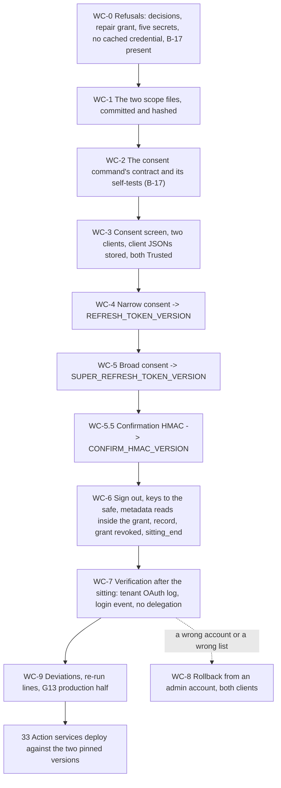

# 32. Wall-E: the OAuth clients and the consent sitting

## Status

- Owner: the platform owner
- Last reviewed: 2026-09-16
- Last executed: never
- Stage: review §2 stage 26 (SETUP Phase 9, both clients, one sitting). It closes the production half of gate line **G13** and produces the two pinned token versions that [33](33-wall-e-action-services-and-approval-surfaces.md) deploys against.
- Step prefix: `WC`. Steps: 46 (WC-5.5 and WC-6.5 added on 2026-09-16; the old WC-7.1 and WC-7.3 folded into WC-6.3, §7 renumbered). Run order: numeric, with one rule that matters — every `gcloud` command in this file runs between WC-0.3 (the repair grant) and WC-6.5 (its revocation and `sitting_end`); §7 is console and paper. **BLOCKED:** WC-2.2 and WC-2.3 (the consent command's self-tests), WC-4.3 and WC-5.2 (the two consent runs) — all on `B-17`, the consent bootstrap with `--scopes-file` and a granted-scope comparison, which must be committed in `WALLE_REPO_REMOTE` before the sitting opens; WC-7.4 (the service-side scope endpoint) on `B-16`, and it is carried as a re-run line into [33](33-wall-e-action-services-and-approval-surfaces.md). **IRREVERSIBLE:** WC-3.3 and WC-3.5 (a client secret is shown and downloadable once, at creation, and never again), WC-4.3 and WC-5.2 (the consented scope set is frozen for the life of the client), WC-8.3 (a destroyed secret version cannot be recovered).
- Replaces: [../../wall-e/SETUP.md](../../wall-e/SETUP.md) Phase 9 in full, and the consent paragraphs of `wall-e/setup/README.md`. Neither page is executed again.
- Salvaged: Phase 9's shape (consent screen, client, store, trust, consent, sign out), its two strongest rules — **never let the script open a browser** and **compare the consented account to `$ROBOT`** — the "one client, one token, never reuse" rule, the frozen-scope warning of §1.2, and the pre-grant tagging of its verify.
- Not copied: the self-comparing scope check (S098: comparing the requested list with itself always passes); the operator token cache (S087); `bootstrap/verify_token.py` and `bootstrap/dump_privileges.py`, which exist in no repository (S176); reading the robot's secrets on the operator's laptop (S104); `shred` (absent on macOS, [01](01-prerequisites-and-conventions.md)); `./client.json` as the download path (S166); a rollback that begins with a robot sign-in (S182); a rollback that touches the narrow client only (S197); a single scope-less bootstrap interface run twice (S111).
- Applies decisions (signed in [03](03-decisions-and-people.md) before the step that needs them): the seven ids of `DC-8.1`'s one `wall-e-scope` record — **D2 final** (the two frozen lists, whose `Values` rows `NARROW_SCOPES` and `SUPER_SCOPES` WC-1.1 reads; there is no separate id for the broad list and this file uses no `WDEC-` id), D4 and P29 (the two lists ratified with the blast-radius rows), **D6** (the inventory of other automation writing the same Workspace objects — consumed by [39](39-wall-e-stage-0.md), but signed in this record, so a record without it is a draft), D10 (operations per band, before D2 is final), D11, SD-48; the broad list's hash in that record is what this file calls `SUPER_SCOPES_DECISION`. Also SD-01 (the deviation register), SD-37 (`walle_shell`), SD-38 (evidence), SD-44 (re-run index).
- Closes: S020 (the consent half: the sitting refuses to open unless all five secrets exist with the right single reader each), S087, S098, S104 (the consent half; the service endpoint itself is [33](33-wall-e-action-services-and-approval-surfaces.md)), S111, S166, S167, S173, S176, S182, S197; and the nine second-round findings of 2026-09-16 on this file (§13, second table). Defers nothing without an owner (§13).
- Consumes: `WALLE_PROJECT`, `WALLE_SECRET_NAMES`, `SA_ACTIONS`, `SA_ACTIONS_SUPER`, `ENT_PROJECT_REPAIR_WALLE` ([31](31-wall-e-project-and-data-plane.md)); `CICD_PROJECT` ([10](10-core-projects-and-ci-identities.md)); `ROBOT`, `WALLE_OPERATORS_GROUP`, `WALLE_REPO_DIR`, `WALLE_REPO_REMOTE` ([30](30-wall-e-workspace-side.md)); D2, D10 and `SECOND_OPERATOR_EMAIL`, with the two hashed scope files ([03](03-decisions-and-people.md)); `REGION`, `BUILD_LOG_DIR`, `PLATFORM_REPO_DIR`, `DEVIATION_REGISTER`, `EVIDENCE_REGISTER` ([01](01-prerequisites-and-conventions.md)); `SA_1_ADMIN`, `SA_2_ADMIN`, `SECOND_HUMAN_EMAIL`, `DIRECTORY_CUSTOMER_ID`, `DOMAIN` ([06](06-organisation-bootstrap-and-roster.md)).
- Produces: `NARROW_CLIENT_SECRET_NAME`, `SUPER_CLIENT_SECRET_NAME`, `REFRESH_TOKEN_VERSION`, `SUPER_REFRESH_TOKEN_VERSION`, `CONFIRM_HMAC_VERSION`; and the new names handed to README's variable list: `REFRESH_TOKEN_SECRET_NAME`, `SUPER_REFRESH_TOKEN_SECRET_NAME`, `CONFIRM_HMAC_SECRET_NAME`, `NARROW_CLIENT_ID`, `SUPER_CLIENT_ID`, `SCOPES_NARROW_FILE`, `SCOPES_SUPER_FILE`, `SCOPES_NARROW_SHA`, `SCOPES_SUPER_SHA`, `WALLE_CLIENTS_FILE`, `CONSENT_SITTING_RECORD`.
- Commands, flags, console paths and API behaviours checked against Google's documentation on 2026-09-15, and the additions of the fix pass on 2026-09-16 (§15). What could not be settled on either day is in §14.

## What this part builds

Two OAuth clients, two consents, one sitting, and nothing else. It is the shortest file in the Wall-E block and the one with the least room for improvisation, because three of its facts do not forgive a second attempt:

1. **A client secret is shown once.** Since June 2025 Google hashes OAuth client secrets: the full value is viewable and downloadable only in the creation dialog. Close it without downloading and the client is waste — you create another.
2. **A scope set freezes at consent.** Widening it later means another interactive sign-in as the robot, which after WC-6.1 is by definition an incident ([30](30-wall-e-workspace-side.md)'s login rule), plus a new secret version and a redeploy.
3. **A client holds at most 100 refresh tokens per account**, and the 101st silently invalidates the oldest. So: one client, one token, never reused across bootstraps.

And one that is not this file's but hangs over it: [30](30-wall-e-workspace-side.md) states that there is no recovery path preserving the credential. Both keys lost after today, or a password reset on `ROBOT` by another super admin, and both refresh tokens die; the only repair is this sitting, run again in full.

What the sitting produces:

| # | Thing | Where it lives afterwards |
|---|---|---|
| 1 | The consent screen for `WALLE_PROJECT`: **Internal** audience, **In production** | Google Auth Platform, `WALLE_PROJECT` |
| 2 | The **narrow** client (band A, read by `walle-actions@`) | client id committed; client JSON in `walle-oauth-client` |
| 3 | The **broad** client (band B, read by `walle-actions-super@`) | client id committed; client JSON in `walle-super-oauth-client` |
| 4 | Both clients marked **Trusted** in API controls, in this same sitting | Admin console, API controls |
| 5 | The robot's narrow refresh token, pinned as `REFRESH_TOKEN_VERSION` | `walle-refresh-token`, read by `walle-actions@` only |
| 6 | The robot's broad refresh token, pinned as `SUPER_REFRESH_TOKEN_VERSION` | `walle-super-refresh-token`, read by `walle-actions-super@` only |
| 7 | The evidence that the **granted** scopes equal the two signed lists, proved twice and never from the laptop | build log; the tenant's own OAuth log events |
| 8 | The statement, checked not assumed, that **no domain-wide delegation client exists for either client id** | build log; Admin console screenshot |

The last one is the point of the whole design in one line: **the robot's reach is exactly its own consented scopes and its own Workspace role, and nothing else.** Domain-wide delegation would let a service identity act as any user in the tenant without that user's consent; the Wall-E design never uses it, so the sitting ends by proving that neither new client id appears on that page.

The twin clients — External, In production, Trusted, in the sandbox tenant — are [37](37-wall-e-sandbox-rehearsal.md)'s, not this file's. Nothing here touches the sandbox.

What the old text got wrong, and must not come back:

| Old text | Why it fails | Here instead |
|---|---|---|
| One bootstrap interface with no scope selector, run twice "once for the narrow client and once for the broad" (SETUP Phase 9, S111) | Nothing tells the command which list to request. A wrong list is caught only after the final robot sign-out, and costs a new client, a new consent and an incident | `--scopes-file` and `--scopes-sha256` are mandatory (WC-2.1); §5 writes the broad run out in full, as its own block |
| `set(creds.scopes)` compared with the requested list (S098) | In the pinned library `creds.scopes` **is** the requested list; the check always passes. A narrowed grant is stored, pinned and deployed | The command compares the token response's own granted `scope` (WC-2.1 rule 11); the tenant's `authorize` event is read independently in WC-7.1 |
| `walle verify` reads `walle-refresh-token` and refreshes it on the operator's machine (S104) | The design says two Cloud Run services are the only processes that ever hold that credential; it also needs a human reader on the robot's secrets, which [31](31-wall-e-project-and-data-plane.md) does not grant | No step here reads a robot secret. WC-6.3 reads metadata only, inside the grant; WC-6.5 revokes the grant and proves the operator **cannot** read them; the scope assertion moves into the services (WC-7.4, [33](33-wall-e-action-services-and-approval-surfaces.md)) |
| `OPERATOR_TOKEN_CACHE=~/.walle/operator-token.json` by default (S087) | A long-lived super-admin refresh token in plaintext on the laptop for the whole build, outside the hardware-key sign-in and outside the robot-attributed detections | WC-0.4 refuses to open the sitting while the file exists; the command holds no operator credential (rule 14); `sitting_end` checks the path again |
| `gcloud secrets versions add walle-oauth-client --data-file=./client.json` then `shred -u` (S166) | The browser saves `client_secret_<id>.json` in `~/Downloads`; `./client.json` stores nothing; `shred` is absent on macOS | WC-3.4 takes exactly one `~/Downloads/client_secret_*.json`, pipes it in, `rm -P`s it and proves the directory is clean; the residual is deviation `BD-32-1` |
| Steps 1–5 repeated for the broad client, whose two secrets no phase creates (S020) | `gcloud secrets versions add` on a missing secret fails `NOT_FOUND` mid-sitting, with the robot signed in and a key out of the safe | WC-0.3 proves all five secrets exist, hold no version, and have exactly one reader each, before any key leaves the safe |
| Attestations M5, M6 and M7 taken before the consent runs (S173) | The operator attests an event that has not happened, and a literal reader signs out of the robot profile before the URL is printed | §4 and §5 print preparation as preparation; every attestation in this file is signed **after** the version number exists (WC-4.5, WC-5.4, WC-6.4) |
| A re-run that mints a second live token, the first left valid (S167) | Two live credentials for one client, one of them unpinned and unwatched | WC-4.1 and WC-5.1 list enabled versions first and refuse without `--rotate`; the command does the same check before anything else |
| Rollback step 1: "sign into `$ROBOT` in the clean profile and revoke the app" (S182) | Every robot login after this sitting is an incident; a human super admin can revoke the grant without one | §8 revokes from an admin account (Admin console, or `tokens.delete`), announces first, and never signs in as the robot |
| Rollback that names the narrow secret only (S197) | A wrong-account or wrong-scope consent on the broad client is left live, with `walle-actions-super@` still reading it | §8 acts on **both** clients by name, in the order revoke → destroy → delete client |
| `python bootstrap/verify_token.py …` and `dump_privileges.py` as the verify (S176) | Neither file exists in any repository; the privilege dump is Eve's need, not Wall-E's | §7 verifies with `gcloud` metadata, the tenant's OAuth log events and the services' own endpoint; the licence probe is deferred to [39](39-wall-e-stage-0.md) (post-grant, §13) |



## Preconditions

- [ ] [31](31-wall-e-project-and-data-plane.md) complete: `checkpoints.tsv` shows `DONE` for its closing step; `WALLE_PROJECT`, `WALLE_SECRET_NAMES` (comma-separated, as WD-6.1 wrote it), `SA_ACTIONS` and `SA_ACTIONS_SUPER` are set; the five regional secrets exist and are **empty**; `ENT_PROJECT_REPAIR_WALLE` is instantiated (WD-2.4) with the second human as an eligible approver, because after WD-11.1 the platform owner holds **nothing** in `WALLE_PROJECT` and every `gcloud` write of this file runs inside a grant of it (WC-0.3). `CICD_PROJECT` ([10](10-core-projects-and-ci-identities.md)) is set: PAM commands bill to it.
- [ ] [30](30-wall-e-workspace-side.md) complete: `ROBOT` exists in the service-identity OU, security-key-only sign-in, both keys custodied (key A with the platform owner, key B with the second human), the vault entry for the robot's password, and the login activity rule live with the second operator's confirmed receipt.
- [ ] [03](03-decisions-and-people.md) `DC-8.1`: the one `wall-e-scope` record with all seven ids signed — **D2 final** (both lists, `cloud-platform` in neither, in `Values` rows `NARROW_SCOPES` and `SUPER_SCOPES`), D4, D6, **D10**, D11, P29, SD-48 — and the broad list's sha256 in it (`SUPER_SCOPES_DECISION`). D2 may have been answered once before [30](30-wall-e-workspace-side.md); this file reads the **latest** record and refuses an unsuperseded draft.
- [ ] `B-17` is `DONE` in README §8: the consent command is committed in `WALLE_REPO_REMOTE` with `--scopes-file`, the granted-scope comparison, the account check, the `--rotate` guard and the four self-tests of WC-2.2. **Until it is, the sitting does not open.** Nothing in §3 onwards is run "to save time": a client created now and consented in three weeks is a client whose creation dialog you can no longer re-open.
- [ ] A clean browser profile for `ROBOT` on the operator's workstation, never signed into any other account, and the separate profile for `SA_1_ADMIN` ([01](01-prerequisites-and-conventions.md)).
- [ ] No operator token cache, no application-default credentials for an admin account (checked in WC-0.4).
- [ ] One sitting booked, 2 hours, both people present for its whole length, calendar entry marked so that neither is paged out of it. The sitting is **not** recorded, not screen-shared and not run under `script` or `tee` (WC-0.4).
- [ ] The safe is reachable during the sitting, so the keys go back the same hour.

## People needed

| Role | Does | Present at |
|---|---|---|
| Platform owner (`SA_1_ADMIN`, holder of key A) | Operates every step: the console work, the two consent runs, the robot sign-in | all |
| Second human (`SA_2_ADMIN`, IT security, holder of key B) | Witnesses the whole sitting; countersigns each attestation; reads the tenant-side scope proof of WC-7.2 on her own workstation; co-signs `CONSENT_SITTING_RECORD` | all, and §7 |

Nobody else is in the room, on the call, or on the screen share — there is no screen share. Two people, one sitting, about 2 hours of hands-on (Phase 9 measured 75 minutes; the added verification and the deviation rows take the rest), plus a 30-minute follow-up the next morning for WC-7.2, which cannot be done sooner because OAuth token log events lag by a couple of hours.

Conventions of [01](01-prerequisites-and-conventions.md) apply to every step: `checkpoint <id> START` before ACTION and `checkpoint <id> DONE <witness> <evidence>` after VERIFY; records named `<date>-<step>-<slug>-v<n>` under `BUILD_LOG_DIR/records/`, scans in `EVIDENCE_INTERIM_LOCATION`, each registered with `evidence_add`. Deviation rows use ids `BD-32-<n>`. Every `gcloud` call passes `--project`; there is no default project. Every shell block in this file, unless the step says otherwise, starts as:

```bash
source ~/.platform-env
penv_guard
R="$BUILD_LOG_DIR/records/$(date -u +%F)-WC"
```

## Facts this file relies on, read on 2026-09-15

| Fact | Source | Consequence here |
|---|---|---|
| OAuth client secrets are hashed: "you will only be able to view and download the full client secret once, at the time of its creation"; afterwards the console shows the last four characters only. New clients since June 2025; existing clients from November 2025 | Cloud console help, *OAuth client secret handling* | WC-3.3 and WC-3.5 are **IRREVERSIBLE**: the download happens in the creation dialog or the client is discarded |
| The OAuth consent screen is now **Google Auth Platform**, with Overview, Branding, Audience, Clients, Data Access and Verification Center; clients at `console.cloud.google.com/auth/clients` | Cloud console help, *Google Auth Platform* | The console paths of §3 |
| A project with an **external** user type and publishing status **Testing** is issued refresh tokens expiring in 7 days | OAuth 2.0 for Google APIs | Both clients are **Internal**; the audience and publishing status are both set, and checked in WC-3.1 |
| "There is currently a limit of 100 refresh tokens per Google Account per OAuth 2.0 client ID. If the limit is reached, creating a new refresh token automatically invalidates the oldest refresh token without warning" | OAuth 2.0 for Google APIs | One client, one token; a rollback creates a **new** client (WC-8.4); the `--rotate` guard exists so a re-run cannot quietly mint a second |
| The out-of-band (manual copy/paste) redirect method "is no longer supported"; desktop apps use a loopback listener on `127.0.0.1` (or `[::1]`) on a random port | OAuth 2.0 for iOS and desktop apps | The consent command runs a loopback listener; the clean profile is on the same machine, so no code is ever pasted. The paste path survives only as a fallback, read with `getpass` (WC-2.1 rule 9) |
| Granular permissions let a consenting account untick individual scopes, **but** "Workspace Enterprise apps with domain-wide delegation of authority or marked as Trusted are not affected by the changes to granular permissions at this time" | *Granular permissions*, Google Identity | Marking both clients Trusted **before** the consent (WC-3.6) removes the untick surface, and the granted-scope comparison stays in place anyway: "at this time" is not a guarantee, and a scope can be missing for other reasons |
| Admin console, app access control: Menu → Security → Access and data control → API controls → **Manage App Access** (older label: Manage third-party app access) → Configure new app → OAuth App Name Or Client ID; "Trusted" means the app "has access to all Google Workspace services (OAuth scopes), including restricted services" | Workspace admin help, *Control which third-party apps access Workspace data* | WC-3.6; the Gmail scopes on the narrow list are restricted, so an untrusted client dies the day someone restricts those services |
| Domain-wide delegation is managed at Menu → **Apps & integrations → Domain-wide delegation**; the API controls page links the same list | Workspace admin help | WC-7.3 checks both client ids against that list. [01](01-prerequisites-and-conventions.md) records the older API-controls path; §14 notes the move |
| OAuth token audit events, `applicationName=token`: `authorize` (parameters `app_name`, `client_id`, `client_type`, `scope`, `scope_data`), `request`, `deny`, `revoke`, `activity`. Console: Menu → Reporting → Audit and investigation → **OAuth log events** | Admin SDK Reports API, *OAuth Token audit activity events* | WC-7.1: the tenant's own record of exactly which scopes were granted to which client id — a proof that does not depend on the command's own comparison (S098) |
| OAuth Token log events lag "a couple of hours"; login events are near real time | Workspace admin help, *Data retention and lag times* | WC-7.1 is the next morning; WC-7.2's login-event check is the same afternoon |
| A user's grants are removed at Menu → Directory → Users → the user → **Security → Connected applications** → hover the app → Remove. "Removing data access for an app doesn't prevent a user from using the app in the future" | Workspace admin help, *Manage a user's security settings* | §8 revokes **and** destroys the version **and** deletes the client: revocation alone is not a rollback |
| `DELETE https://admin.googleapis.com/admin/directory/v1/users/{userKey}/tokens/{clientId}`, scope `admin.directory.user.security`, empty body; `tokens.list` shows the grants first | Directory API, `tokens.delete` | The scripted alternative in WC-8.2, run by an admin account, never by the robot |
| `gcloud secrets versions add [SECRET] --data-file=PATH --location=LOCATION`; `--data-file=-` reads stdin | gcloud reference | WC-3.4, WC-3.5 |
| `gcloud secrets versions list [SECRET] [--location=LOCATION] [--filter=…]`; `gcloud secrets versions destroy [VERSION --secret=SECRET] [--etag] [--location]`, which destroys "a secret version's metadata and secret data" and is irreversible; `gcloud secrets get-iam-policy [SECRET] [--location]` | gcloud reference | WC-0.3, WC-4.1, WC-6.3, WC-8.3 |

## 0. The refusals, before a key leaves the safe

### WC-0.1 Open the sitting and read the inputs

- **WHO:** Platform owner; second human present from this step, not from §3.
- **WHERE:** Shell, `~/.platform-env` sourced.
- **ACTION:**

```bash
checkpoint WC-0.1 START
need WALLE_PROJECT WALLE_SECRET_NAMES SA_ACTIONS SA_ACTIONS_SUPER ENT_PROJECT_REPAIR_WALLE CICD_PROJECT ROBOT WALLE_OPERATORS_GROUP \
     REGION DOMAIN DIRECTORY_CUSTOMER_ID SA_1_ADMIN SA_2_ADMIN SECOND_HUMAN_EMAIL \
     BUILD_LOG_DIR PLATFORM_REPO_DIR WALLE_REPO_DIR DEVIATION_REGISTER EVIDENCE_REGISTER
case "$WALLE_SECRET_NAMES" in *,*,*,*,*) echo "five comma-separated secret names";; *) echo "STOP: WALLE_SECRET_NAMES is not the five-name comma-separated value 31 WD-6.1 wrote";; esac
awk -F'\t' '$2 ~ /^(WW|WD)-/ && $3 == "DONE" {n[substr($2,1,2)]++} END {for (p in n) print p, n[p]}' "$BUILD_LOG_DIR/checkpoints.tsv"
awk -F'\t' '$3 == "BLOCKED" {print $2"\t"$7}' "$BUILD_LOG_DIR/checkpoints.tsv" | sort -u
test -z "$(gcloud config get project 2>/dev/null)" && echo "no default project"
```

- **VERIFY:** `need` is silent; `five comma-separated secret names` prints; both `WW` and `WD` show `DONE` counts; `no default project` prints. A `BLOCKED` line belonging to [30](30-wall-e-workspace-side.md) or [31](31-wall-e-project-and-data-plane.md) that this file consumes stops the sitting here, before anything is created.
- **ROLLBACK:** Read only.
- **EVIDENCE:** `${R}-0.1-inputs-v1.txt`; `evidence_add WC-0.1 inputs E-05 1.4.1 build-log:records/<file> <file>`.

### WC-0.2 Refuse without the signed decisions and the latest D2

- **WHO:** Platform owner; second human reads the records over his shoulder.
- **WHERE:** Shell; `PLATFORM_REPO_DIR/decisions/`.
- **ACTION:** D2 is allowed to be signed twice — a first answer before [30](30-wall-e-workspace-side.md), a superseding final list before this file. Only the latest counts.

```bash
"$PLATFORM_REPO_DIR/tools/decision-need.sh" D2 D4 D6 D10 D11 P29 SD-48
ls -1 "$PLATFORM_REPO_DIR"/decisions/*-wall-e-scope.md | tail -n 1
grep -c 'SUPER_SCOPES_DECISION' "$(ls -1 "$PLATFORM_REPO_DIR"/decisions/*-wall-e-scope.md | tail -n 1)"
```

- **VERIFY:** `decision-need.sh` exits `0` for all seven ids — the seven [03](03-decisions-and-people.md) DC-8.1 signs in the one `wall-e-scope` record: D2 (the two frozen lists, read by WC-1.1), D4 and P29 (the two lists ratified with the blast-radius rows), D6 (the inventory of other writers, needed by [39](39-wall-e-stage-0.md) but signed in the same record, so its absence means the record is a draft), D10 (operations per band, decided before D2 is final), D11 and SD-48. The latest `wall-e-scope` record is dated on or after the record [30](30-wall-e-workspace-side.md) read, names both lists, and contains `SUPER_SCOPES_DECISION` with the broad list's sha256. A record that still says *tbd* for the broad list stops the file: the broad consent cannot be improvised at the screen.
- **ROLLBACK:** Read only. A missing signature is not worked around; the sitting is rebooked.
- **EVIDENCE:** `${R}-0.2-decisions-v1.txt` with the record's path and hash. E-01, E-05. TISAX 1.4, 5.2.

### WC-0.3 Prove the five secrets exist, are empty, and have one reader each (S020)

- **WHO:** Platform owner; second human reads the output.
- **WHERE:** Shell.
- **ACTION:** This is the check whose absence would fail the old runbook `NOT_FOUND` in the middle of the sitting, with the robot signed in and a key out of the safe. It has two halves, and the first exists because [31](31-wall-e-project-and-data-plane.md) leaves the platform owner with **no right at all** in `WALLE_PROJECT` (WD-2.4's IAM table is empty of humans; WD-6.2 grants `secretAccessor` to the two service accounts only; WD-11.1 revokes every grant). Every `gcloud secrets` read below, every `gcloud secrets versions add` in §3, §5 and §6, and the consent command's own two Secret Manager calls (WC-2.1 rule 16) run inside the time-boxed `ENT_PROJECT_REPAIR_WALLE` grant taken here, approved by the second human and revoked in WC-6.5. The grant carries `roles/secretmanager.admin` (12's template, read back in 31 WD-4.1), which covers `secretmanager.versions.add`, `secretmanager.versions.list`, `secretmanager.secrets.getIamPolicy` and — the reason WC-6.5 revokes it before anything else ends and §6 proves it gone — `secretmanager.versions.access`. `WALLE_SECRET_NAMES` is the comma-separated value 31 WD-6.1 wrote; the loops split it exactly as 31 WD-6.2 and WD-6.3 do.

  **First half — the grant.** Two hours is the entitlement's maximum, so the grant is requested only now, after the read-only refusals, and §1 and §2 (which need no grant, no key and no robot) are best completed the day before and re-verified today by their VERIFY lines alone. A sitting that outlives the grant requests a second grant; it never asks for a longer one.

```bash
need ENT_PROJECT_REPAIR_WALLE WALLE_PROJECT CICD_PROJECT
gcloud pam grants create --entitlement="$ENT_PROJECT_REPAIR_WALLE" --requested-duration=7200s --justification="32 WC-0.3 to WC-6.5: consent sitting — secret preflight, four client/token versions, the confirmation HMAC, metadata reads" --location=global --project="$WALLE_PROJECT" --billing-project="$CICD_PROJECT"
gcloud pam grants list --entitlement="$ENT_PROJECT_REPAIR_WALLE" --location=global --project="$WALLE_PROJECT" --billing-project="$CICD_PROJECT" --filter="state=ACTIVE" --format="value(name,requester)"
```

  The second human approves in her own console at **Security → Privileged Access Manager → Approve grants** (or with `gcloud pam grants approve`), never at the operator's screen. The `list` line is re-run until it prints one `ACTIVE` grant with the platform owner as requester; nothing below runs before it does.

  **Second half — the five secrets.**

```bash
penv_set NARROW_CLIENT_SECRET_NAME walle-oauth-client
penv_set REFRESH_TOKEN_SECRET_NAME walle-refresh-token
penv_set CONFIRM_HMAC_SECRET_NAME walle-confirm-hmac
penv_set SUPER_CLIENT_SECRET_NAME walle-super-oauth-client
penv_set SUPER_REFRESH_TOKEN_SECRET_NAME walle-super-refresh-token
for S in $(printf '%s' "$WALLE_SECRET_NAMES" | tr ',' ' '); do
  printf '%s\t' "$S"
  gcloud secrets describe "$S" --location="$REGION" --project="$WALLE_PROJECT" --format='value(name)' || echo MISSING
done
for S in $(printf '%s' "$WALLE_SECRET_NAMES" | tr ',' ' '); do
  printf 'versions %s\t' "$S"
  gcloud secrets versions list "$S" --location="$REGION" --project="$WALLE_PROJECT" --format='value(name,state)' | tr '\n' ' '
  echo
done
for S in $(printf '%s' "$WALLE_SECRET_NAMES" | tr ',' ' '); do
  printf 'readers %s\t' "$S"
  gcloud secrets get-iam-policy "$S" --location="$REGION" --project="$WALLE_PROJECT" --format=json \
    | jq -r '[.bindings[]? | select(.role=="roles/secretmanager.secretAccessor") | .members[]] | sort | join(",")'
done
```

- **VERIFY:** One `ACTIVE` grant, requester the platform owner, approver the second human (her console shows the approval; the `ApproveGrant` audit entry lands in the aggregated sink). Then: five names print, none `MISSING`. Every `versions` line is empty on a first run (a non-empty line means a previous attempt: go to WC-4.1's `--rotate` path and record why). The `readers` lines are exactly: `walle-oauth-client`, `walle-refresh-token`, `walle-confirm-hmac` → `serviceAccount:$SA_ACTIONS`; `walle-super-oauth-client`, `walle-super-refresh-token` → `serviceAccount:$SA_ACTIONS_SUPER`. No line names both; no line names a human, a group or `allUsers`. Anything else is a re-run line against [31](31-wall-e-project-and-data-plane.md), the grant is revoked with the WC-6.5 command, and the sitting is rebooked.
- **ROLLBACK:** The reads are read only. The grant: `gcloud pam grants revoke <GRANT_NAME> --reason="32 sitting stopped" --location=global --project="$WALLE_PROJECT" --billing-project="$CICD_PROJECT"` — always, whatever stopped the sitting.
- **EVIDENCE:** `${R}-0.3-secrets-preflight-v1.txt` (the grant name and the three listings). E-05, E-08. TISAX 5.1, 4.1, 4.1.3.

### WC-0.4 Prove no admin credential is cached, and that nothing records the sitting (S087)

- **WHO:** Platform owner; second human watches the screen.
- **WHERE:** Shell, and the terminal application's own settings.
- **ACTION:**

```bash
test ! -e "$HOME/.walle/operator-token.json" && echo "no operator token cache"
test ! -e "${CLOUDSDK_CONFIG:-$HOME/.config/gcloud}/application_default_credentials.json" && echo "no ADC file"
gcloud auth list --format='value(account)'
printf 'SCRIPT=%s TERM_SESSION_RECORDING=%s\n' "${SCRIPT:-none}" "${TERM_SESSION_RECORDING:-none}"
```

  Then, by hand: terminal logging off, no `script`, no `tee` on any command in this file, no screen share, no meeting recording. The consent URL and the loopback redirect both carry one-time material; the point is that neither ever lands in a scrollback file that outlives the sitting.
- **VERIFY:** Both `test` lines print; `gcloud auth list` prints exactly one account, `SA_1_ADMIN` — the account WC-0.3's grant was requested for — and no daily account, no second admin and no service account beside it. The operator states aloud, and the second human records, that logging is off. A present `~/.walle/operator-token.json` stops the sitting: it is deleted, the grant behind it is removed at Menu → Directory → Users → the operator → Security → Connected applications, and the deletion is recorded as `BD-32-2`.
- **ROLLBACK:** Not applicable.
- **EVIDENCE:** `${R}-0.4-no-cached-credential-v1.txt`, countersigned by the second human. E-05. TISAX 4.1, 5.2.

### WC-0.5 Refuse to open the sitting without the consent command (B-17)

- **WHO:** Platform owner; second human confirms the commit hash independently.
- **WHERE:** Shell, `WALLE_REPO_DIR`.
- **ACTION:**

```bash
git -C "$WALLE_REPO_DIR" fetch --quiet origin
git -C "$WALLE_REPO_DIR" log -1 --format='%H %ci %s' origin/main
git -C "$WALLE_REPO_DIR" checkout --quiet origin/main
./walle consent --help 2>&1 | grep -E -- '--scopes-file|--scopes-sha256|--expect-account|--rotate|--no-browser|--verify' | sort
```

- **VERIFY:** All six flags print. If `./walle consent --help` fails, or any flag is missing, **the sitting does not open**: write `checkpoint WC-0.5 BLOCKED - - "B-17 not committed"`, tell the Wall-E owner what §2 requires, revoke the WC-0.3 grant with its ROLLBACK line, run `sitting_end`, and rebook (the keys are still in the safe: WC-0.6 has not run). No client is created in a sitting that cannot finish.
- **ROLLBACK:** Not applicable.
- **EVIDENCE:** `${R}-0.5-consent-command-v1.txt` with the commit hash; `penv_set WALLE_CODE_COMMIT <hash>` if [33](33-wall-e-action-services-and-approval-surfaces.md) has not set it yet. E-05. TISAX 5.2.

### WC-0.6 Take the two keys out of the safe, together

- **WHO:** Platform owner (key A) and second human (key B); both sign the custody line.
- **WHERE:** The safe; the paper custody register ([30](30-wall-e-workspace-side.md), [01](01-prerequisites-and-conventions.md) SD-27).
- **ACTION:** Both keys leave the safe at the same moment and are signed out on the same line, with the sitting's start time. Neither person holds both keys at any point. The robot's vault entry is opened only in WC-4.2, at the sign-in screen, and closed immediately after.
- **VERIFY:** Two signatures, one timestamp, on the paper register; a photograph of the line for the same-day scan.
- **ROLLBACK:** Keys returned and the line closed; the sitting is void and rebooked.
- **EVIDENCE:** `<date>-WC-0.6-key-custody-out-v1.pdf` in `EVIDENCE_INTERIM_LOCATION`, copied to the witness `custody/` prefix. E-08. TISAX 3.1.

## 1. The two scope lists, committed and hashed

### WC-1.1 Write both lists from the signed decision, never from a wiki page

- **WHO:** Platform owner; second human reads each line aloud against the signed record.
- **WHERE:** `WALLE_REPO_DIR/config/`, branch `consent-scopes`.
- **ACTION:** The lists are the literal strings the command requests. They come from the `wall-e-scope` record of WC-0.2 — not from this page, not from [../../wall-e/02-identity-and-auth.md](../../wall-e/02-identity-and-auth.md), both of which can drift from the signature.

  The record is the one `decision-need.sh D2` accepted in WC-0.2: [03](03-decisions-and-people.md) DC-8.1 signs D2 as "two frozen scope lists" in the single `wall-e-scope` record, so **both** lists are read from `D2` — there is no separate id for the broad list, and `WDEC-` ids are not used by this file. *Assumption:* the record's `Values` table carries the two lists in rows named `NARROW_SCOPES` and `SUPER_SCOPES`, each one cell of space-separated scope strings (`decision-value.sh` prints one cell, 03 §1); if the signed record names the rows differently, the two names below are changed at the step to the record's, the change is written into the sitting record, and nothing else moves. The `v=$(…) && …` form is 03's own empty-value guard: an unsigned record or a missing row leaves the file unwritten and stops the sitting instead of writing an empty list.

```bash
mkdir -p "$WALLE_REPO_DIR/config"
v=$("$PLATFORM_REPO_DIR/tools/decision-value.sh" D2 NARROW_SCOPES) && printf '%s\n' "$v" | tr ' ' '\n' > "$WALLE_REPO_DIR/config/scopes-narrow.txt" || echo "STOP: D2 has no NARROW_SCOPES value; nothing written"
v=$("$PLATFORM_REPO_DIR/tools/decision-value.sh" D2 SUPER_SCOPES)  && printf '%s\n' "$v" | tr ' ' '\n' > "$WALLE_REPO_DIR/config/scopes-super.txt"  || echo "STOP: D2 has no SUPER_SCOPES value; nothing written"
grep -c . "$WALLE_REPO_DIR/config/scopes-narrow.txt"
grep -c . "$WALLE_REPO_DIR/config/scopes-super.txt"
grep -n 'cloud-platform' "$WALLE_REPO_DIR/config/"scopes-*.txt && echo "REFUSED: cloud-platform" || echo "no cloud-platform"
grep -c '^openid$' "$WALLE_REPO_DIR/config/"scopes-*.txt
grep -c 'userinfo.email' "$WALLE_REPO_DIR/config/"scopes-*.txt
comm -12 <(sort "$WALLE_REPO_DIR/config/scopes-narrow.txt") <(sort "$WALLE_REPO_DIR/config/scopes-super.txt")
```

- **VERIFY:** Both files are non-empty, one scope per line, no trailing spaces. `no cloud-platform` prints. Each file contains `openid` and `userinfo.email` exactly once — without them the account check of WC-2.1 rule 10 cannot run, which is the check that stops the operator storing his own credential. The `comm` output is read aloud: shared scopes are expected (`admin.directory.user`, `apps.licensing`, `admin.reports.audit.readonly`, `openid`, `userinfo.email`), and `admin.directory.user.security` must appear in **super only**. Any scope in the narrow file that the second human cannot name a catalogue operation for is removed before consent, not after.
- **ROLLBACK:** `git checkout -- config/` while unmerged.
- **EVIDENCE:** `${R}-1.1-scope-lists-v1.txt` (the two files and the `comm` output). E-05. TISAX 5.2.

### WC-1.2 Hash both files and check the hashes against the signature

- **WHO:** Platform owner; second human recomputes both hashes on her own workstation.
- **WHERE:** Shell.
- **ACTION:**

```bash
penv_set SCOPES_NARROW_FILE config/scopes-narrow.txt
penv_set SCOPES_SUPER_FILE  config/scopes-super.txt
penv_set SCOPES_NARROW_SHA "$(shasum -a 256 "$WALLE_REPO_DIR/$SCOPES_NARROW_FILE" | cut -d' ' -f1)"
penv_set SCOPES_SUPER_SHA  "$(shasum -a 256 "$WALLE_REPO_DIR/$SCOPES_SUPER_FILE"  | cut -d' ' -f1)"
printf 'narrow %s\nsuper  %s\n' "$SCOPES_NARROW_SHA" "$SCOPES_SUPER_SHA"
grep -F "$SCOPES_SUPER_SHA" "$(ls -1 "$PLATFORM_REPO_DIR"/decisions/*-wall-e-scope.md | tail -n 1)"
```

- **VERIFY:** The second human's independently computed hashes equal the two printed values, character for character, read aloud. The `grep` finds the broad hash in the signed record. If the record carries no hash — an early signature — a superseding record is signed **now**, in the sitting, by both people, carrying both hashes; the sitting continues only after it is committed.
- **ROLLBACK:** Re-run after correcting the files; the variables are overwritten with `penv_set --force` and a build-log line.
- **EVIDENCE:** `${R}-1.2-scope-hashes-v1.txt`, countersigned. E-01, E-05. TISAX 1.4, 5.2.

### WC-1.3 Merge both files under review

- **WHO:** Platform owner opens the pull request; the second human is the required reviewer.
- **WHERE:** `WALLE_REPO_REMOTE`.
- **ACTION:** One pull request, two files, no other change. The description carries both hashes and the decision record's path. CI must fail on `cloud-platform` in either file (the rule of [../../wall-e/SETUP.md](../../wall-e/SETUP.md) §1.3, carried forward); if that CI rule does not exist yet, the pull-request description says so and `BD-32-3` records the manual check of WC-1.1 as its stand-in until [16](16-register-and-shared-registry.md)'s CI covers it.
- **VERIFY:** The merge commit exists on `origin/main`; `git -C "$WALLE_REPO_DIR" show --stat` lists exactly the two files; the merged files' hashes still equal `SCOPES_NARROW_SHA` and `SCOPES_SUPER_SHA`.
- **ROLLBACK:** Revert the merge; no consent has happened, so nothing downstream moves.
- **EVIDENCE:** `${R}-1.3-scope-merge-v1.txt` (commit hash, reviewer). E-05. TISAX 5.2.

## 2. What the consent command must do, and its self-tests

### WC-2.1 Read the contract before running anything

- **WHO:** Platform owner and second human read it together, once, aloud.
- **WHERE:** This table; the command's `--help`.
- **ACTION:** This is the specification `B-17` is written against. It is read here because the operator is about to trust it with an irreversible act.

| # | The command must | Because |
|---|---|---|
| 1 | Require `--scopes-file` and read the requested list from that file only; have no built-in default list | Nothing else tells it which of the two lists to request (S111) |
| 2 | Require `--scopes-sha256` and refuse unless the file hashes to it | The file could be edited between WC-1.3 and the run |
| 3 | Refuse any list containing `cloud-platform`, or lacking `openid` or `userinfo.email` | The ceiling the design relies on, and the account check needs the last two |
| 4 | Print the resolved list, the client secret name and the target secret name, then require the operator to type the **target secret name** before the URL appears | So a broad list requested against the narrow secret is caught before, not after |
| 5 | List enabled versions of the target secret **first** and exit non-zero if any exist, unless `--rotate` is given with a reason string | A resumed run must not mint a second live token and leave the first valid (S167) |
| 6 | Perform that check **before** any attestation prompt | The operator is never asked to attest an event that has not happened (S173) |
| 7 | Read the client id and secret from Secret Manager, never from a file on disk | The client secret has one home |
| 8 | Request `access_type=offline` and `prompt=consent` | Otherwise a repeat authorisation returns no refresh token |
| 9 | Print the authorisation URL and wait. **Never** call `webbrowser.open`. Capture the code on a loopback listener on `127.0.0.1`; only if the operator passes `--paste` read the redirect URL with `getpass`, unechoed | A launched browser opens the operator's own signed-in profile and consents as a super admin — the single most likely mistake in the whole build. Out-of-band redirect is no longer supported, so the loopback listener is the flow (S166) |
| 10 | After the exchange call `userinfo` and compare the returned email with `--expect-account`; on mismatch refuse to store, print the mismatch without the token, exit non-zero | The check that stops the operator storing his own credential |
| 11 | Compare the **granted** scope set — the `scope` field of the token response, exposed as `granted_scopes` — with the file, in both directions; refuse to store when it is absent, narrower or wider. Never compare the requested list with itself | The requested list always equals itself; that check is vacuous and passes a narrowed grant straight into the pinned secret (S098) |
| 12 | Write the refresh token straight into the regional secret with one API call; never to a file, never to an environment variable, never to the terminal | No secret value is printed, pasted or stored ([01](01-prerequisites-and-conventions.md)) |
| 13 | Print the version number and nothing else that is sensitive | `REFRESH_TOKEN_VERSION` is `1` only on a clean first bootstrap |
| 14 | Hold no operator or admin credential: no token cache, no `~/.walle/operator-token.json`, no application-default credential written | A human super admin's long-lived token on the laptop is the risk S087 names |
| 15 | Offer `--verify`, which asks the **service** for its granted scope set and compares it with the file; never read the robot's secrets from the operator's machine | The two Cloud Run services are the only processes that ever hold that credential (S104); `bootstrap/verify_token.py` does not exist (S176) |
| 16 | Authenticate its two Secret Manager calls as the **gcloud active account** — the platform owner's `SA_1_ADMIN`, inside the `ENT_PROJECT_REPAIR_WALLE` grant of WC-0.3 — by asking gcloud for a short-lived access token (`gcloud auth print-access-token`, or the SDK's gcloud credential source), and use nothing else: no service-account key, no application-default credential, no token file. The two calls need `secretmanager.versions.access` on the **client** secret (rule 7) and `secretmanager.versions.add` on the **token** secret (rule 12); both are in the grant's `roles/secretmanager.admin`, and no human holds either standing | The command runs with exactly the rights the sitting holds and none after it: the grant is revoked in WC-6.5 and the file's §6 proves the operator can no longer reach the secrets. The old text never said which principal wrote the token, which is why nobody noticed that no principal could |

- **VERIFY:** `./walle consent --help` shows a flag for each of rules 1, 2, 5, 9, 10 and 15, and its help text names the gcloud active account as its only credential source (rule 16); both people initial the printed table.
- **ROLLBACK:** Not applicable.
- **EVIDENCE:** `${R}-2.1-consent-contract-v1.pdf`, initialled. E-05. TISAX 5.2.

### WC-2.2 Run the command's four refusal self-tests — **BLOCKED on B-17**

- **WHO:** Platform owner; second human observes each failure.
- **WHERE:** Shell, `WALLE_REPO_DIR`, offline fixtures only. No network call to Google is made by these tests.
- **ACTION:** The tests feed synthetic token responses; none of them touches `WALLE_PROJECT`.

```bash
./walle selftest --consent --verbose
```

  The four cases that must fail loudly, named in the output:

| Case | Fixture | Expected |
|---|---|---|
| Narrowed grant | token response whose `scope` omits one requested scope | refuse to store, exit non-zero, name the missing scope |
| Absent granted scopes | token response with no `scope` field | refuse to store, exit non-zero |
| Wrong account | `userinfo` returns an address other than `--expect-account` | refuse to store, exit non-zero, print neither token nor code |
| Existing version | target secret already has an enabled version, no `--rotate` | exit non-zero **before** any prompt or URL |

- **VERIFY:** Four `FAIL-AS-EXPECTED` lines and a zero exit for the suite. A passing store in any of the four cases stops the file: the command is not fit and the sitting is rebooked. **BLOCKED** until `B-17` is committed in `WALLE_REPO_REMOTE`; the gate that waits is **G13**.
- **ROLLBACK:** Read only; no cloud resource is touched.
- **EVIDENCE:** `${R}-2.2-consent-selftests-v1.txt`. E-05. TISAX 5.2.

### WC-2.3 Record what the self-tests do not prove — **BLOCKED on B-17**

- **WHO:** Second human writes; platform owner countersigns.
- **WHERE:** `${R}-2.3`.
- **ACTION:** Two sentences, written before the irreversible steps: (a) the self-tests exercise the command's own comparison, so they cannot prove the tenant recorded the same scopes — that is WC-7.1's job, from the OAuth log, the next morning; (b) a Trusted client is currently exempt from granular permissions, which reduces but does not remove the narrowing surface, so rule 11 stays in force regardless.
- **VERIFY:** Both signatures; the note names WC-7.1 as the independent check.
- **ROLLBACK:** Not applicable.
- **EVIDENCE:** `${R}-2.3-what-selftests-do-not-prove-v1.pdf`. E-05. TISAX 1.4.

## 3. The consent screen, the two clients, and trust

**If the sitting is abandoned anywhere in this section** — cut between WC-3.3 and WC-3.4, or between the broad client's dialog and its store in WC-3.5 — a plaintext OAuth client secret is on the disk and a client exists that nothing will ever consent. Before anyone leaves the room: `rm -P "$HOME"/Downloads/client_secret_*.json` and prove `Downloads clean` with the `ls` line of WC-3.4; delete the orphaned client on the Clients page (a replacement is a new client with a new dated name, WC-8.4's rule); revoke the grant with WC-0.3's ROLLBACK line; remove the WC-3.1 binding with WC-6.5's `remove-iam-policy-binding` line; run `sitting_end`; and open a `BD-32-<n>` row that names the deleted client id. The resume rule then restarts at WC-3.3, never at WC-3.4 — the checkpoint file is the only trace an operator returns to (WC-0.4 forbids `script` and `tee`), so the row is what tells the next sitting that the disk was swept.

### WC-3.1 Take OAuth Config Editor for the sitting, then set the audience: Internal, In production

- **WHO:** Platform owner, in the shell and then in the `SA_1_ADMIN` browser profile; second human witnesses the binding and the screen.
- **WHERE:** Shell; then Console → Google Auth Platform → **Branding**, then **Audience** (`console.cloud.google.com/auth/audience`), project `WALLE_PROJECT`.
- **ACTION:** The Google Auth Platform pages need the `clientauthconfig.*` permissions (`brands.create/get/list`, `clients.create/getWithSecret/listWithSecrets/update/delete`), which Google's page lists as carried by Owner, Editor and the OAuth Config Editor role — and by **none** of the eleven roles in `ent-project-repair-walle`'s bundle (17 §FM-2.17's table). The grant of WC-0.3 carries `roles/resourcemanager.projectIamAdmin`, so the operator binds `roles/oauthconfig.editor` to himself for the sitting only, with an IAM condition that expires it three hours from now even if WC-6.5 is never reached; the second human reads the expression before it is run. A conditioned binding on a predefined role is the documented form; a basic role could not carry one. `date -u -v+3H` is the macOS form of "now plus three hours". This is a self-grant inside an approved grant, witnessed, and it is recorded as deviation `BD-32-4` whose closure is a `ent-consent-walle` entitlement in [12](12-privileged-access-catalogue.md)'s catalogue (OAuth Config Editor plus the two secret permissions of WC-2.1 rule 16, 2 h, approver the second human), so that a later sitting takes one narrow grant instead of a broad one and a self-bind.

```bash
need WALLE_PROJECT SA_1_ADMIN
gcloud iam roles describe roles/oauthconfig.editor --format='value(title,stage)'
gcloud iam roles describe roles/oauthconfig.editor --format='value(includedPermissions)' | tr ';' '\n' | grep -c '^clientauthconfig\.'
EXPIRES="$(date -u -v+3H +%FT%TZ)"
printf 'binding expires at %s\n' "$EXPIRES"
gcloud projects add-iam-policy-binding "$WALLE_PROJECT" --member="user:${SA_1_ADMIN}" --role=roles/oauthconfig.editor \
  --condition="expression=request.time < timestamp(\"${EXPIRES}\"),title=32-consent-sitting,description=OAuth clients for the consent sitting only; removed in WC-6.5"
gcloud projects get-iam-policy "$WALLE_PROJECT" --flatten="bindings[].members" --filter="bindings.role:roles/oauthconfig.editor" --format="table(bindings.members,bindings.condition.title,bindings.condition.expression)"
```

  Then, in the browser: Branding: the application name from D1, the support address and the developer contact address. Audience: user type **Internal**; publishing status **In production**. Both are set even though an Internal app is exempt from the 7-day rule either way — the cost of being wrong is a dead agent every week, and the setting is read back in VERIFY rather than assumed.
- **VERIFY:** The role describes as `OAuth Config Editor` and the permission count is at least `8` (the eight `clientauthconfig.*` names above; the second human ticks them off the printed list — if `clients.create` is missing the role is not the right one and the sitting stops). The policy table shows exactly one `roles/oauthconfig.editor` binding, member `user:$SA_1_ADMIN`, title `32-consent-sitting`, expression naming today's date. The Audience page shows `Internal` and `In production` for `WALLE_PROJECT`. Screenshot both. If the page offers "Make external", it is not clicked.
- **ROLLBACK:** `gcloud projects remove-iam-policy-binding "$WALLE_PROJECT" --member="user:${SA_1_ADMIN}" --role=roles/oauthconfig.editor --all` (the `--all` form removes the binding whatever its condition; a `--condition` form would have to restate it exactly). The audience can be changed back while no client has been consented; after WC-4.3 a change is a change record, not a rollback.
- **EVIDENCE:** `${R}-3.1-oauthconfig-binding-v1.txt` (the policy table) and `<date>-WC-3.1-auth-platform-audience-v1.pdf` (screenshot) in `EVIDENCE_INTERIM_LOCATION`. E-05, E-08. TISAX 5.2, 4.1.3.

### WC-3.2 Read the download rule aloud before creating anything

- **WHO:** Second human reads; platform owner confirms his hands are off the mouse.
- **WHERE:** The room.
- **ACTION:** "The creation dialog is the only place the client secret is ever shown. Download the JSON **in the dialog**, before closing it. If it closes without a download, the client is abandoned, not repaired, and we create another." Then: the download goes to `~/Downloads`, is moved into Secret Manager in the next step, and is never opened, `cat`-ed or copied anywhere else.
- **VERIFY:** Spoken and recorded in the sitting record.
- **ROLLBACK:** Not applicable.
- **EVIDENCE:** One line in `CONSENT_SITTING_RECORD` (WC-6.4). E-05. TISAX 5.2.

### WC-3.3 Create the narrow client — **IRREVERSIBLE (the secret is shown once)**

- **WHO:** Platform owner; second human watching the dialog.
- **WHERE:** Console → Google Auth Platform → **Clients** (`console.cloud.google.com/auth/clients`) → Create client.
- **ACTION:** Before creating anything: `ls "$HOME"/Downloads/client_secret_*.json 2>/dev/null || echo "Downloads clean"` must print `Downloads clean` — a stale download would be the second file WC-3.4's guard refuses. Application type **Desktop app** (a loopback redirect, which is what the consent command listens on). Name: `walle-narrow-<date>`, so a later reader can tell the two apart and a rollback's replacement is visibly newer. Create. In the dialog that follows: **Download JSON**, then close. Copy the client ID from the client's row and record it **now**, because WC-3.4 refuses to store a file whose id is not this one:

```bash
penv_set NARROW_CLIENT_ID "<the client id shown on the Clients page>"
```

- **VERIFY:** The Clients page lists the new client with type `Desktop`; exactly one new `client_secret_*.json` is in `~/Downloads`; `NARROW_CLIENT_ID` ends in `.apps.googleusercontent.com` and equals the id on the page, read back by the second human.
- **ROLLBACK:** **IRREVERSIBLE as a secret:** the full client secret cannot be shown again. If the download was missed, delete this client on the Clients page and repeat WC-3.3 with a new name (`penv_set --force NARROW_CLIENT_ID` with a build-log line). Gate: WC-3.2 `DONE`, and the signed `wall-e-scope` record WC-0.2 accepted (D2 final).
- **EVIDENCE:** `<date>-WC-3.3-narrow-client-v1.pdf` (the Clients page, client id visible, no secret visible). E-05. TISAX 5.2.

### WC-3.4 Store the narrow client JSON and clear the download (S166)

- **WHO:** Platform owner; second human reads the output.
- **WHERE:** Shell.
- **ACTION:** The file is never opened by a person, never `cat`-ed, never copied; the one read of it is `jq` printing the **client id** (not a secret) so that the store can refuse a file that is not the client just created. `rm -P` replaces `shred`, which macOS does not have. The guard is a function so that a refusal **returns** without running the store — a bare `echo` would print and carry on (the defect the 2026-09-16 review found), and a top-level `exit` would close the operator's shell. The function is defined once here and reused in WC-3.5; it takes the secret name and the expected client id, and finds the file itself. It is written for **zsh** — the operator's shell in [01](01-prerequisites-and-conventions.md) and the shell `walle_shell` opens — because the `(N)` glob qualifier ("expand to nothing when there is no match") is zsh's; the first line refuses any other shell rather than let bash choke on the parenthesis. Tested on 2026-09-16 with zero, one and two files: only the one-file case stores.

```bash
[ -n "${ZSH_VERSION-}" ] && echo "zsh" || echo "STOP: this block is written for zsh; open the zsh of 01 first"
store_client_json() {  # $1 secret name, $2 client id from the Clients page; refuses unless exactly one matching JSON exists
  set -- "$1" "$2" "$HOME"/Downloads/client_secret_*.json(N)
  [ "$#" -eq 3 ] && [ -f "$3" ] || { echo "REFUSE: expected exactly one client_secret_*.json in ~/Downloads, found $(( $# - 2 )); nothing stored" >&2; return 1; }
  [ "$(jq -r '.installed.client_id // empty' "$3")" = "$2" ] || { echo "REFUSE: the JSON in ~/Downloads is not client $2; nothing stored, file left for WC-3 abandonment sweep" >&2; return 1; }
  V="$(gcloud secrets versions add "$1" --location="$REGION" --project="$WALLE_PROJECT" --data-file="$3" --format='value(name)')" || { echo "REFUSE: store failed; file left in place" >&2; return 1; }
  printf 'client JSON for %s stored in %s as version %s\n' "$2" "$1" "${V##*/}"
  rm -P "$3"
  ls "$HOME"/Downloads/client_secret_*.json 2>/dev/null || echo "Downloads clean"
}
store_client_json "$NARROW_CLIENT_SECRET_NAME" "$NARROW_CLIENT_ID"
```

- **VERIFY:** One line names `NARROW_CLIENT_ID`, `walle-oauth-client` and a version number; `Downloads clean` prints. `gcloud secrets versions list "$NARROW_CLIENT_SECRET_NAME" --location="$REGION" --project="$WALLE_PROJECT"` shows exactly one `ENABLED` version. A `REFUSE` line means nothing was stored: with `found 0`, the download was missed and WC-3.3's ROLLBACK applies; with `found 2` or more, a stale file is in `~/Downloads` and is identified by `jq -r '.installed.client_id' <file>` (id only) before the stale one is `rm -P`-ed and the function is re-run; with "is not client", the same. The desktop-client JSON's top-level key is `installed` (Google's client-secrets format), which is why the `jq` path is what it is.
- **ROLLBACK:** `gcloud secrets versions destroy` that version and repeat from WC-3.3 with a new client — the JSON is gone from the disk either way.
- **EVIDENCE:** `${R}-3.4-narrow-client-stored-v1.txt` (version number only). E-05. TISAX 5.1.
- **Deviation `BD-32-1`:** a client JSON touches the local disk for the seconds between download and `rm -P`. On APFS an overwrite-then-unlink is not a guarantee. Mitigations recorded in the row: full-disk encryption on the workstation, the `Downloads clean` check, and a rotation of both clients if the workstation is ever suspected. Expiry: reviewed at the Tier W gate.

### WC-3.5 Create and store the broad client — **IRREVERSIBLE (the secret is shown once)**

- **WHO:** Platform owner; second human watching the dialog.
- **WHERE:** As WC-3.3, then the shell.
- **ACTION:** A second, separate client — never the same one, because the 100-token limit applies per client and because the two bands must be revocable independently. First `ls "$HOME"/Downloads/client_secret_*.json 2>/dev/null || echo "Downloads clean"` must print `Downloads clean` (WC-3.4's `rm -P` did its work); only then is the client created. Name: `walle-super-<date>`, application type **Desktop app**, Download JSON in the dialog, then record the id and store with the same function, which refuses a file whose id is not this one:

```bash
penv_set SUPER_CLIENT_ID "<the client id shown on the Clients page>"
[ "$SUPER_CLIENT_ID" != "$NARROW_CLIENT_ID" ] && echo "two distinct ids" || echo "STOP: same id as the narrow client"
store_client_json "$SUPER_CLIENT_SECRET_NAME" "$SUPER_CLIENT_ID"
```

- **VERIFY:** `two distinct ids`; one line names `SUPER_CLIENT_ID`, `walle-super-oauth-client` and a version number; `Downloads clean` prints; the Clients page lists two Desktop clients with different ids. A `REFUSE` line is handled as in WC-3.4.
- **ROLLBACK:** As WC-3.4 (`penv_set --force SUPER_CLIENT_ID` if the client is recreated). Gate: WC-3.4 `DONE` with `Downloads clean`, and the broad list signed as `SUPER_SCOPES_DECISION` in the record WC-0.2 accepted — a broad client with no signed list is not created.
- **EVIDENCE:** `${R}-3.5-broad-client-stored-v1.txt`; `<date>-WC-3.5-broad-client-v1.pdf`. E-05. TISAX 5.1.

### WC-3.6 Mark both clients Trusted, in this sitting

- **WHO:** Platform owner as super admin; second human witnesses.
- **WHERE:** Admin console → Menu → Security → Access and data control → API controls → **Manage App Access** (older label: Manage third-party app access) → **Configure new app** → OAuth App Name Or Client ID.
- **ACTION:** Paste the narrow client id, select the app, scope it to the whole organisation, choose **Trusted**, finish. Repeat for the broad client id. Trusted means the app may use all scopes including restricted services; the narrow list carries restricted Gmail scopes, so an untrusted client dies silently the day anyone restricts Gmail API access org-wide. Doing it **before** the consent also removes the granular-permissions untick surface.
- **VERIFY:** The Manage App Access list shows both client ids with access **Trusted** and the organisation as scope. Screenshot the two rows.
- **ROLLBACK:** Set each app back to **Limited** or remove the configured app; no token is affected.
- **EVIDENCE:** `<date>-WC-3.6-api-controls-trusted-v1.pdf`. E-05. TISAX 4.1, 5.2.

### WC-3.7 Commit both client ids

- **WHO:** Platform owner commits; second human reviews.
- **WHERE:** Shell; `WALLE_REPO_DIR/config/walle-clients.txt`, merged under review.
- **ACTION:** Client ids are not secrets, and the detections need them by name: the SIEM keys robot-token rules on the committed client ids, and Eve's `SA-05` fires on an authorisation from any other client. The two ids were set at creation (WC-3.3, WC-3.5); here they are committed and, for the record, compared once more with the page.

```bash
need NARROW_CLIENT_ID SUPER_CLIENT_ID
penv_set WALLE_CLIENTS_FILE config/walle-clients.txt
printf 'narrow\t%s\nsuper\t%s\n' "$NARROW_CLIENT_ID" "$SUPER_CLIENT_ID" > "$WALLE_REPO_DIR/$WALLE_CLIENTS_FILE"
printf '%s\tWC-3.7\t%s\t%s\tPENDING\tadd walle@ client ids to Eve SA-05 committed list\n' \
  "$(date -u +%F)" "$NARROW_CLIENT_ID" "$SUPER_CLIENT_ID" >> "$BUILD_LOG_DIR/rerun-index.tsv"
```

- **VERIFY:** The file holds two distinct ids, both ending in `.apps.googleusercontent.com`. The second human reads each committed id against the Clients page (`console.cloud.google.com/auth/clients`, project `WALLE_PROJECT`): the `narrow` line equals the id of `walle-narrow-<date>` and the `super` line the id of `walle-super-<date>`, and she records that WC-3.4's and WC-3.5's store lines named those same ids — which is what proves the JSON stored in `walle-oauth-client` belongs to the narrow client and not the broad one. The pull request is merged; the `rerun-index.tsv` line exists so [25](25-eve-human-super-admin-detections.md)'s `SA-05` list gains both ids when Eve's configuration is next changed, and [38](38-super-admin-gate-and-grant.md) checks it before the grant.
- **ROLLBACK:** Revert the commit; the re-run line stays, with status `WITHDRAWN`.
- **EVIDENCE:** `${R}-3.7-client-ids-v1.txt`. E-05. TISAX 4.1.

## 4. The narrow consent

### WC-4.1 Refuse a second live token before anything else (S167)

- **WHO:** Platform owner; second human reads the output.
- **WHERE:** Shell.
- **ACTION:**

```bash
gcloud secrets versions list "$REFRESH_TOKEN_SECRET_NAME" --location="$REGION" --project="$WALLE_PROJECT" \
  --filter='state:ENABLED' --format='value(name,state)'
```

- **VERIFY:** No output on a first run: go to WC-4.2. If a version prints, this is a resumed or repeated attempt. Stop, read `checkpoints.tsv` for `WC-4.3`, and take the `--rotate` path only after: the second human agrees in writing, the reason is recorded, and §8's revoke-then-destroy has been done for the existing grant. A silent second token is exactly the state the design forbids.
- **ROLLBACK:** Read only.
- **EVIDENCE:** `${R}-4.1-narrow-existing-versions-v1.txt`. E-05. TISAX 5.1.

### WC-4.2 Sign in as the robot, in the clean profile, with a key

- **WHO:** Platform owner, key A; second human present with key B and watching the screen.
- **WHERE:** The clean browser profile, `accounts.google.com`. No other profile is open.
- **ACTION:** Open the clean profile. Confirm the profile shows **no** signed-in account before starting. Sign in as `ROBOT` with the password from the vault (opened at the screen, closed immediately after) and key A at the security-key prompt. Do not tick "remember this device". Leave the tab on the account page; the consent URL goes into this same profile in WC-4.3. This is the only interactive sign-in `ROBOT` ever has; [30](30-wall-e-workspace-side.md)'s login rule will mail the second operator, and that mail is **expected** exactly once today (WC-7.2).
- **VERIFY:** The profile shows `ROBOT` and no other account; the second human states aloud which account is signed in and records it.
- **ROLLBACK:** Sign out; the sign-in itself is not undoable and is accounted for by the announced alert.
- **EVIDENCE:** `<date>-WC-4.2-robot-signin-v1.pdf` (screenshot cropped to the account chip). E-05. TISAX 4.1.

### WC-4.3 Run the narrow consent — **BLOCKED on B-17; IRREVERSIBLE (the scope set freezes)**

- **WHO:** Platform owner types; second human reads the printed scope list against `config/scopes-narrow.txt` before he confirms.
- **WHERE:** Shell inside `walle_shell` (SD-37: `PROJECT` exists only there); the URL goes into the clean profile by hand.
- **ACTION:**

```bash
walle_shell
./walle consent \
  --client-secret="$NARROW_CLIENT_SECRET_NAME" \
  --target-secret="$REFRESH_TOKEN_SECRET_NAME" \
  --scopes-file="$SCOPES_NARROW_FILE" \
  --scopes-sha256="$SCOPES_NARROW_SHA" \
  --expect-account="$ROBOT" \
  --location="$REGION" \
  --no-browser
```

  The command prints the list and the two secret names, and waits for the target secret name to be typed. The second human reads the list against the file first. Then it prints the authorisation URL and waits: **copy the URL by hand into the clean profile's address bar**. Never let anything open a browser for you — a launched browser takes your own signed-in profile and consents as a super admin. Complete the consent as `ROBOT`; the loopback listener takes the redirect and the command finishes.
- **VERIFY:** The command exits `0` and prints one version number. It printed no token, no authorisation code and no client secret. If it exits non-zero on the account check, **nothing was stored**: go to §8 only if a version was written, otherwise correct and re-run from WC-4.1. **BLOCKED** until `B-17` is committed; the gate that waits is **G13**.
- **ROLLBACK:** §8, in its order: announce, revoke from an admin account, destroy the version, delete the client, create a new one. **IRREVERSIBLE as a scope set:** widening later is a new consent, which is a robot sign-in, which is an incident. Gated on: D2 final (WC-0.2), the merged hashed file (WC-1.3), the self-tests (WC-2.2).
- **EVIDENCE:** `${R}-4.3-narrow-consent-v1.txt` (the command line, the exit code and the version number; nothing else). E-05, E-06. TISAX 5.1, 5.2.

### WC-4.4 Pin the narrow version

- **WHO:** Platform owner; second human reads the number back.
- **WHERE:** Shell (outside `walle_shell`).
- **ACTION:**

```bash
penv_set REFRESH_TOKEN_VERSION "<the number WC-4.3 printed>"
gcloud secrets versions list "$REFRESH_TOKEN_SECRET_NAME" --location="$REGION" --project="$WALLE_PROJECT" --format='value(name,state)'
```

- **VERIFY:** Exactly one `ENABLED` version, and its number equals `REFRESH_TOKEN_VERSION`. It is `1` only on a clean first bootstrap; any re-run, rollback or K4/K5 drill produces a higher number, and a stale pin points a service at a destroyed version.
- **ROLLBACK:** `penv_set --force` with a build-log line.
- **EVIDENCE:** `${R}-4.4-narrow-version-v1.txt`. E-05. TISAX 5.1.

### WC-4.5 Attest the narrow consent — after the event (S173)

- **WHO:** Platform owner signs; second human countersigns.
- **WHERE:** `${R}-4.5`.
- **ACTION:** Five statements, signed **now** that they are true, not earlier as intentions: the URL was copied by hand and no browser was launched; the consent screen showed `ROBOT`; the scope list on the screen matched `config/scopes-narrow.txt`; no scope was unticked; the version number recorded in WC-4.4 is the one the command printed.
- **VERIFY:** Two signatures, dated with the sitting's time.
- **ROLLBACK:** Not applicable.
- **EVIDENCE:** `<date>-WC-4.5-narrow-attestation-v1.pdf`. E-05, E-08. TISAX 1.4, 5.2.

## 5. The broad consent

The same five steps again, written out in full rather than as "repeat the above", because the one thing the old runbook never wrote down is the second invocation — and a broad list consented against the narrow secret, or the narrow list against the broad client, is only discovered after the final sign-out (S111).

### WC-5.1 Refuse a second live token on the broad secret

- **WHO:** Platform owner; second human reads.
- **WHERE:** Shell.
- **ACTION:**

```bash
gcloud secrets versions list "$SUPER_REFRESH_TOKEN_SECRET_NAME" --location="$REGION" --project="$WALLE_PROJECT" \
  --filter='state:ENABLED' --format='value(name,state)'
```

- **VERIFY:** No output on a first run. Otherwise, the `--rotate` path of WC-4.1 applies to this secret.
- **ROLLBACK:** Read only.
- **EVIDENCE:** `${R}-5.1-broad-existing-versions-v1.txt`. E-05. TISAX 5.1.

### WC-5.2 Run the broad consent — **BLOCKED on B-17; IRREVERSIBLE (the scope set freezes)**

- **WHO:** Platform owner types; second human reads the printed list against `config/scopes-super.txt`, and in particular confirms that `admin.directory.user.security` appears here and **not** in the narrow run.
- **WHERE:** Shell inside `walle_shell`; the same clean profile, still signed in as `ROBOT` from WC-4.2; the same key A.
- **ACTION:**

```bash
walle_shell
./walle consent \
  --client-secret="$SUPER_CLIENT_SECRET_NAME" \
  --target-secret="$SUPER_REFRESH_TOKEN_SECRET_NAME" \
  --scopes-file="$SCOPES_SUPER_FILE" \
  --scopes-sha256="$SCOPES_SUPER_SHA" \
  --expect-account="$ROBOT" \
  --location="$REGION" \
  --no-browser
```

- **VERIFY:** Exit `0`, one version number, nothing sensitive printed. The four flag values differ from WC-4.3's in all four places — the second human reads them back before the URL is opened. **BLOCKED** until `B-17` is committed; the gate that waits is **G13**.
- **ROLLBACK:** §8 for **this** client and secret. **IRREVERSIBLE as a scope set.** Gated on: `SUPER_SCOPES_DECISION` signed (WC-0.2), the merged hashed file (WC-1.3).
- **EVIDENCE:** `${R}-5.2-broad-consent-v1.txt`. E-05, E-06. TISAX 5.1, 5.2.

### WC-5.3 Pin the broad version

- **WHO:** Platform owner; second human reads the number back.
- **WHERE:** Shell (outside `walle_shell`).
- **ACTION:**

```bash
penv_set SUPER_REFRESH_TOKEN_VERSION "<the number WC-5.2 printed>"
gcloud secrets versions list "$SUPER_REFRESH_TOKEN_SECRET_NAME" --location="$REGION" --project="$WALLE_PROJECT" --format='value(name,state)'
```

- **VERIFY:** Exactly one `ENABLED` version, equal to `SUPER_REFRESH_TOKEN_VERSION`, and **different in meaning** from `REFRESH_TOKEN_VERSION` even when both read `1`: the two are separate secrets and are never interchanged in a deploy ([33](33-wall-e-action-services-and-approval-surfaces.md)).
- **ROLLBACK:** `penv_set --force` with a build-log line.
- **EVIDENCE:** `${R}-5.3-broad-version-v1.txt`. E-05. TISAX 5.1.

### WC-5.4 Attest the broad consent — after the event

- **WHO:** Platform owner signs; second human countersigns.
- **WHERE:** `${R}-5.4`.
- **ACTION:** The five statements of WC-4.5, for the broad client, plus one: the four flag values named the broad client, the broad target secret, the broad file and its hash.
- **VERIFY:** Two signatures.
- **ROLLBACK:** Not applicable.
- **EVIDENCE:** `<date>-WC-5.4-broad-attestation-v1.pdf`. E-05, E-08. TISAX 1.4, 5.2.

### WC-5.5 Add the confirmation HMAC — piped in, never printed

- **WHO:** Platform owner; second human watches that nothing but a version number reaches the screen.
- **WHERE:** Shell, inside the WC-0.3 grant. Not `walle_shell`: this is `gcloud`, not the helper.
- **ACTION:** The fifth secret. [31](31-wall-e-project-and-data-plane.md) WD-6.1 took the old `openssl rand` generation out of the creation phase on purpose, and WD-6.3 wrote a `PENDING` line for **each** of the five secrets — "32: add the first version … inside the consent sitting" — including `walle-confirm-hmac`. [33](33-wall-e-action-services-and-approval-surfaces.md) WS-3.2 then deploys `walle-actions` with `CONFIRM_HMAC_SECRET=walle-confirm-hmac`, and a secret with no version is exactly the state that makes that service fail closed (31 WD-6.1). Until the 2026-09-16 review nobody wrote the version: this step does. Forty-eight random bytes, base64, from `openssl rand`, piped straight into `--data-file=-`; the value exists nowhere but in Secret Manager and the service's memory. The `list` line first is the same refusal WC-4.1 makes: a previous sitting's version is kept, never doubled.

```bash
need CONFIRM_HMAC_SECRET_NAME
gcloud secrets versions list "$CONFIRM_HMAC_SECRET_NAME" --location="$REGION" --project="$WALLE_PROJECT" --filter='state:ENABLED' --format='value(name,state)'
V="$(openssl rand -base64 48 | gcloud secrets versions add "$CONFIRM_HMAC_SECRET_NAME" --location="$REGION" --project="$WALLE_PROJECT" --data-file=- --format='value(name)')"
penv_set CONFIRM_HMAC_VERSION "${V##*/}"
gcloud secrets versions list "$CONFIRM_HMAC_SECRET_NAME" --location="$REGION" --project="$WALLE_PROJECT" --format='value(name,state)'
printf '%s\tWC-5.5\t%s\t%s\tPENDING\t33: pin CONFIRM_HMAC_VERSION in walle-actions environment (WS-3.2 passes the name only; never latest, 31 WD-6.3)\n' \
  "$(date -u +%F)" "$CONFIRM_HMAC_SECRET_NAME" "$CONFIRM_HMAC_VERSION" >> "$BUILD_LOG_DIR/rerun-index.tsv"
```

- **VERIFY:** The first `list` prints nothing (if it prints an `ENABLED` version, this is a resumed sitting: **do not add a second** — `penv_set CONFIRM_HMAC_VERSION` to the number shown, record why in the sitting record, and skip the `add`). The second `list` shows exactly one `ENABLED` version and its number equals `CONFIRM_HMAC_VERSION`. Nothing else was printed: no `openssl` output ever reaches the terminal because it goes to the pipe. The `rerun-index.tsv` line exists: [33](33-wall-e-action-services-and-approval-surfaces.md) currently sets the secret's **name only** and must pin the version the way it pins `REFRESH_TOKEN_VERSION`.
- **ROLLBACK:** `gcloud secrets versions destroy "$CONFIRM_HMAC_VERSION" --secret="$CONFIRM_HMAC_SECRET_NAME" --location="$REGION" --project="$WALLE_PROJECT"` — only while no service is deployed against it; afterwards a rotation is a [33](33-wall-e-action-services-and-approval-surfaces.md) change window (a destroyed version behind a live pin is an outage). Gate for that destroy: WC-6.4 not yet `DONE`, or a case id.
- **EVIDENCE:** `${R}-5.5-confirm-hmac-version-v1.txt` (the two listings and the version number; no value). E-05. TISAX 5.1. Closes 31 WD-6.3's fifth `PENDING` line.

## 6. Closing the sitting: the reads that need the grant, then the rights and the credentials end

The rule for this section and the next: **no step reads `walle-refresh-token` or `walle-super-refresh-token`.** Not with `gcloud`, not in a script, not "just to check". The two services are the only processes that ever hold those values. The order here is fixed by two facts: WC-6.3's reads need the WC-0.3 grant, and WC-6.5 revokes that grant, removes the WC-3.1 binding and runs `sitting_end`, after which **no `gcloud` command in this file works** — so everything that needs a credential is before WC-6.5, and §7 is console work and paper.

### WC-6.1 Sign out of the robot, for good

- **WHO:** Platform owner; second human watches.
- **WHERE:** The clean browser profile.
- **ACTION:** Sign out of `ROBOT`. Close the profile. From this moment a login event for `ROBOT` is an incident, not a step: [30](30-wall-e-workspace-side.md)'s activity rule and Eve's `SA-04` both treat it that way, and §8's rollback is written so that it never needs one.
- **VERIFY:** The profile shows no signed-in account; a screenshot records it.
- **ROLLBACK:** Not applicable.
- **EVIDENCE:** `<date>-WC-6.1-robot-signout-v1.pdf`. E-05. TISAX 4.1.

### WC-6.2 Return both keys to the safe

- **WHO:** Platform owner (key A) and second human (key B); both sign.
- **WHERE:** The safe; the paper custody register.
- **ACTION:** Both keys back on the same line, with the time. The robot's vault entry is confirmed closed.
- **VERIFY:** The register's out and in lines are the same date and hours apart at most; both signatures present.
- **ROLLBACK:** Not applicable.
- **EVIDENCE:** `<date>-WC-6.2-key-custody-in-v1.pdf` in `EVIDENCE_INTERIM_LOCATION` and the witness `custody/` prefix. E-08. TISAX 3.1.

### WC-6.3 Metadata only, inside the grant: five secrets, one version each, one reader each, and the robot's group (S104)

- **WHO:** Platform owner; second human reads every line.
- **WHERE:** Shell, inside the WC-0.3 grant, **before** WC-6.5.
- **ACTION:** Three reads and no `access`. The first lists the versions of all five secrets. The second reads the readers of the two token secrets at secret level — the bindings that will still be there after WC-6.5 takes the sitting's rights away. The third is the operators-group check, moved here from the paper step WC-7.5 because it needs a credential; its logic is 31 WD-1.2's, where a match is the failure.

```bash
for S in $(printf '%s' "$WALLE_SECRET_NAMES" | tr ',' ' '); do
  printf '%s\t' "$S"
  gcloud secrets versions list "$S" --location="$REGION" --project="$WALLE_PROJECT" --format='value(name,state)' | tr '\n' ' '
  echo
done
for S in "$REFRESH_TOKEN_SECRET_NAME" "$SUPER_REFRESH_TOKEN_SECRET_NAME"; do
  printf 'readers %s\t' "$S"
  gcloud secrets get-iam-policy "$S" --location="$REGION" --project="$WALLE_PROJECT" --format=json \
    | jq -r '[.bindings[]? | select(.role=="roles/secretmanager.secretAccessor") | .members[]] | sort | join(",")'
done
gcloud identity groups memberships list --group-email="$WALLE_OPERATORS_GROUP" --format='value(preferredMemberKey.id)' | grep -qx "$ROBOT" && { echo "STOP: the robot is a member of the operators group"; false; } || echo "robot not in operators group (expected)"
```

- **VERIFY:** Each of the **five** secrets — `walle-oauth-client`, `walle-refresh-token`, `walle-confirm-hmac`, `walle-super-oauth-client`, `walle-super-refresh-token` — shows exactly one `ENABLED` version and no other state; the token versions equal `REFRESH_TOKEN_VERSION` and `SUPER_REFRESH_TOKEN_VERSION`, the HMAC version equals `CONFIRM_HMAC_VERSION`. The first `readers` line prints `serviceAccount:$SA_ACTIONS` and nothing else; the second `serviceAccount:$SA_ACTIONS_SUPER` and nothing else — no user, no group, no `SA_1_ADMIN`: no standing binding will outlive WC-6.5. `robot not in operators group (expected)` prints; a `STOP` line ends the sitting with a finding against [30](30-wall-e-workspace-side.md). **What this step does not claim:** while the grant is live the operator's `roles/secretmanager.admin` carries `secretmanager.versions.access`; that he cannot read the tokens is proved in WC-6.5, after revocation, and the window in between is deviation `BD-32-4`.
- **ROLLBACK:** Read only.
- **EVIDENCE:** `${R}-6.3-secret-versions-and-readers-v1.txt`. E-05. TISAX 5.1, 4.1.

### WC-6.4 Write the sitting record

- **WHO:** Second human writes; platform owner countersigns.
- **WHERE:** `PLATFORM_REPO_DIR`, committed; `penv_set CONSENT_SITTING_RECORD <path>`.
- **ACTION:** One page: the date and the two names; the two client ids; the five secret names and the three version numbers (`REFRESH_TOKEN_VERSION`, `SUPER_REFRESH_TOKEN_VERSION`, `CONFIRM_HMAC_VERSION`); the two scope-file hashes; the grant name of WC-0.3 and the expiry time of the WC-3.1 binding; the statement that the attestations were signed after each consent; the deviations opened (`BD-32-1`, `BD-32-4`, and any of `BD-32-2`, `BD-32-3`, or an abandonment row); the open verification items of §7 with their dates; the statement that no third person was present and nothing was recorded.
- **VERIFY:** The file exists, is committed, and names the three version numbers and both hashes. No secret value appears in it — checked by the second human reading it line by line.
- **ROLLBACK:** Amend by a new version `-v2`, never by editing.
- **EVIDENCE:** `CONSENT_SITTING_RECORD`; `evidence_add WC-6.4 consent-sitting E-05 5.2 build-log:records/<file> <file>`. E-05. TISAX 5.2.

### WC-6.5 Remove the sitting's rights, prove the operator can no longer reach the secrets, and end the credentials

- **WHO:** Platform owner; second human reads the output and countersigns.
- **WHERE:** Shell.
- **ACTION:** In this order, because each line needs what the previous one has not yet taken away: remove the WC-3.1 binding (needs the grant's `projectIamAdmin`); read the project policy back (still inside the grant); revoke the grant; list active grants; then the negative test — a metadata `list` on the narrow token secret that must now be **refused**; then `sitting_end`. IAM revocation is not instantaneous; the negative test is repeated until it prints the expected line, and the time it took is written down.

```bash
need ENT_PROJECT_REPAIR_WALLE WALLE_PROJECT CICD_PROJECT SA_1_ADMIN
gcloud projects remove-iam-policy-binding "$WALLE_PROJECT" --member="user:${SA_1_ADMIN}" --role=roles/oauthconfig.editor --all
gcloud projects get-iam-policy "$WALLE_PROJECT" --flatten="bindings[].members" --filter="bindings.members:user:" --format="table(bindings.role,bindings.members)"
gcloud pam grants list --entitlement="$ENT_PROJECT_REPAIR_WALLE" --location=global --project="$WALLE_PROJECT" --billing-project="$CICD_PROJECT" --filter="state=ACTIVE" --format="value(name)" \
  | while read -r G; do gcloud pam grants revoke "$G" --reason="32 sitting complete" --location=global --project="$WALLE_PROJECT" --billing-project="$CICD_PROJECT"; done
gcloud pam grants list --entitlement="$ENT_PROJECT_REPAIR_WALLE" --location=global --project="$WALLE_PROJECT" --billing-project="$CICD_PROJECT" --filter="state=ACTIVE" --format="value(name)"
gcloud secrets versions list "$REFRESH_TOKEN_SECRET_NAME" --location="$REGION" --project="$WALLE_PROJECT" >/dev/null 2>&1 && echo "STOP: the operator still reads WALLE_PROJECT secrets after revocation; wait and repeat" || echo "operator refused on the token secret (expected)"
sitting_end
ls "$HOME"/Downloads/client_secret_*.json 2>/dev/null && echo "STOP: a client JSON is still on disk; rm -P it now" || echo "Downloads clean"
test ! -e "$HOME/.walle/operator-token.json" && echo "no operator token cache"
```

- **VERIFY:** The policy table shows **no** `roles/oauthconfig.editor` binding and only the two `roles/accessapproval.approver` bindings [31](31-wall-e-project-and-data-plane.md) WD-3.1 left; the active-grant list prints nothing; `operator refused on the token secret (expected)` prints — this, with WC-6.3's reader lines, is the proof that after the sitting the operator holds nothing on the robot's tokens: no secret-level binding, no project role, no grant. Then `SITTING-END OK: no credentialed account, no ADC file, no operator token cache`, `Downloads clean` and `no operator token cache`. Any `STOP` is fixed here, in the sitting, with the second human present.
- **ROLLBACK:** Not applicable: a revoked grant is not restored; a further need is a new grant with a new justification.
- **EVIDENCE:** `${R}-6.5-rights-removed-and-sitting-end-v1.txt`, countersigned. E-05, E-08. TISAX 4.1, 4.1.3.

## 7. Verification after the sitting, without a credential (S104)

Nothing in this section runs `gcloud`: the sitting's rights ended in WC-6.5. These steps read the tenant's own records in the Admin console, confirm a mail, and sign paper.

### WC-7.1 The tenant's own record of the granted scopes (S098) — next morning

- **WHO:** **Second human**, alone, on her own workstation. The platform owner does not run this check on the consent he performed.
- **WHERE:** Admin console as `SA_2_ADMIN` → Menu → Reporting → Audit and investigation → **OAuth log events**.
- **ACTION:** OAuth token log events lag a couple of hours, so this runs the morning after the sitting. Filter on event `Authorize` and on each client id in turn, over the sitting's window. Export the two rows. Read the `scope` (and `scope_data`) parameter of each and compare, scope by scope, with the merged `config/scopes-narrow.txt` and `config/scopes-super.txt` at the hashes of WC-1.2.
- **VERIFY:** Exactly two `Authorize` events in the window, one per client id, both with actor `ROBOT`. The narrow event's scope set equals the narrow file; the broad event's equals the broad file; neither contains `cloud-platform`. A missing scope on either side — which the Trusted setting is meant to prevent but does not guarantee — is a **finding**, and the answer is §8 for that client, not a widening. Any `Authorize` event for a client id that is not one of the two, or with an actor other than `ROBOT`, is an incident raised to the incident commander the same hour.
- **ROLLBACK:** Read only.
- **EVIDENCE:** `<date>-WC-7.1-oauth-log-scopes-v1.pdf` (the two exported rows) plus `${R}-7.1-scope-diff-v1.txt` (the diff output), signed by the second human. E-05, E-06. TISAX 5.2, 4.1.

### WC-7.2 The robot's login event: expected once, today

- **WHO:** Second operator confirms the alert arrived; second human reads the log.
- **WHERE:** The second operator's mailbox; Admin console → Reporting → Audit and investigation → **Login log events**.
- **ACTION:** [30](30-wall-e-workspace-side.md)'s rule mails on any `ROBOT` login. Exactly one is expected today, at the time of WC-4.2, from the operator's IP. The second operator confirms receipt in writing; the second human confirms the log row. Login events are near real time, so this is read the same afternoon. This is also the production half of the Eve evidence SD-03 names: a robot-attributed event that Eve's feeds must show.
- **VERIFY:** One mail, one log row, one time, matching WC-4.2's record. **Two** login rows means someone signed in twice — the second is investigated before [33](33-wall-e-action-services-and-approval-surfaces.md) starts. Zero rows means the rule or the feed is broken, which is a finding against [30](30-wall-e-workspace-side.md).
- **ROLLBACK:** Read only.
- **EVIDENCE:** `${R}-7.2-robot-login-event-v1.txt` with the mail header and the log row. E-06. TISAX 4.1, 1.6.

### WC-7.3 No domain-wide delegation for either client

- **WHO:** Platform owner as super admin; **second human independently repeats the check** on her own screen.
- **WHERE:** Admin console → Menu → Apps & integrations → **Domain-wide delegation** (the API controls page links the same list).
- **ACTION:** Read the API clients list. Search it for `NARROW_CLIENT_ID` and for `SUPER_CLIENT_ID`. Neither may appear. Then read the whole list once: every entry is compared with the inventory [06](06-organisation-bootstrap-and-roster.md) took. This is the sentence the design is built on — the robot's reach is its own consented scopes plus its own Workspace role, and nothing that lets a service impersonate a user.
- **VERIFY:** Neither client id is present. The list's entries equal [06](06-organisation-bootstrap-and-roster.md)'s inventory; **a new entry since then is reported to the second human and recorded, never used and never deleted by the platform owner alone** ([01](01-prerequisites-and-conventions.md)), and it is raised to the incident commander as a possible `SI-08`. Both people sign the screenshot.
- **ROLLBACK:** Read only. No step in this set ever creates a delegation entry.
- **EVIDENCE:** `<date>-WC-7.3-no-dwd-v1.pdf`, countersigned. E-05. TISAX 4.1, 5.2.

### WC-7.4 The service-side scope assertion — **BLOCKED on B-16, carried to 33**

- **WHO:** Platform owner records the expectation; [33](33-wall-e-action-services-and-approval-surfaces.md) performs it.
- **WHERE:** `rerun-index.tsv`.
- **ACTION:** The third and strongest check belongs to the services: each of `walle-actions` and `walle-actions-super` records, at start-up, the `scope` field of its own unnarrowed refresh response and the `userinfo` email, refuses to serve on a mismatch with its committed file, and serves the result — never the token — on an authenticated read endpoint admitted to `walle-operators-caller@`.

```bash
printf '%s\tWC-7.4\t-\tservice scope endpoint compared with %s and %s\tPENDING\tB-16; performed in 33\n' \
  "$(date -u +%F)" "$SCOPES_NARROW_FILE" "$SCOPES_SUPER_FILE" >> "$BUILD_LOG_DIR/rerun-index.tsv"
```

- **VERIFY:** The line exists; [33](33-wall-e-action-services-and-approval-surfaces.md)'s deploy verify names it and closes it. **BLOCKED** on `B-16` (the Wall-E services); the gate that waits is **G13**'s post-deploy half and [38](38-super-admin-gate-and-grant.md)'s checklist.
- **ROLLBACK:** Not applicable.
- **EVIDENCE:** `${R}-7.4-service-scope-pending-v1.txt`. E-05. TISAX 5.2.

### WC-7.5 What is deliberately not tested before the grant

- **WHO:** Platform owner writes; second human countersigns.
- **WHERE:** `${R}-7.5`; one paragraph in `CONSENT_SITTING_RECORD`.
- **ACTION:** Three statements with their owners and dates:

| Not tested here | Why | Where it is done |
|---|---|---|
| A tenant read by the robot returning `403` | Pre-grant, `ROBOT` holds no admin role, so `403` is the only possible answer and the call would need a token on the laptop. What is proved instead is the **cause**: `ROBOT` holds no admin role at all (read from the roster and the Admin console, no token) | The `403` itself is observed by the pre-grant services in [34](34-wall-e-identity-spike-and-model-armor.md)'s spike; the post-grant success in [39](39-wall-e-stage-0.md) |
| A `users.update` probe | Under Super Admin the write succeeds at Google, so it proves nothing and would be a robot-attributed write against the zero-rows statement | Never |
| The licence probe (`licenseAssignments.listForProduct`) | It answers a Wall-E open question, but only after the grant; the narrow list carries `apps.licensing` | [39](39-wall-e-stage-0.md), post-grant, owner: platform owner (§13) |

  The membership check itself ran in WC-6.3, inside the sitting, while a credential existed; its output line is quoted here.

- **VERIFY:** The paragraph is signed; WC-6.3's membership line read `robot not in operators group (expected)` (the robot is never a member of the operators group). The Admin console shows `ROBOT` with no admin role assigned.
- **ROLLBACK:** Read only.
- **EVIDENCE:** `${R}-7.5-pre-grant-expectations-v1.txt`. E-05. TISAX 4.1.

## 8. Rollback: a wrong account, a wrong list, or a wrong client

Used when WC-7.1 shows the wrong scopes, when the consent was granted as the wrong account, or when a version was written and the run must be undone. It is one procedure, run **per client**, in this order. **It never involves signing in as the robot** (S182), and it always names **both** clients when both are affected (S197).

### WC-8.1 Announce, then open an incident

- **WHO:** Platform owner; second human; incident commander informed.
- **WHERE:** The operators channel and the desk; the case system.
- **ACTION:** Say what is about to happen and when: a grant is being revoked and a secret version destroyed. The desk is told so that a paged alert is expected, not chased. Open the case; the audit log for the operator's own account since the consent is reviewed as part of it, because a wrong-account consent means the operator's credential may have been used.
- **VERIFY:** The announcement is posted; the case id exists.
- **ROLLBACK:** Not applicable.
- **EVIDENCE:** `${R}-8.1-rollback-announce-v1.txt` with the case id. E-10. TISAX 1.6.

### WC-8.2 Revoke the grant from an admin account — never by a robot sign-in

- **WHO:** Platform owner as `SA_1_ADMIN`; second human witnesses.
- **WHERE:** Admin console → Menu → Directory → Users → `ROBOT` → **Security → Connected applications**.
- **ACTION:** Find the app by its client id, hover it, **Remove**, confirm, **Done**. Do it for the affected client; do it for **both** client ids when both consents are being undone — revoking one leaves the other live. The scripted alternative, for an admin account holding `admin.directory.user.security`, is `DELETE https://admin.googleapis.com/admin/directory/v1/users/{ROBOT}/tokens/{clientId}` with an empty body, after `tokens.list` shows what is there; the access token for that call is short-lived, never written to disk, and the call is made from the operator's shell with no cached credential afterwards.
- **VERIFY:** The Connected applications list no longer shows the client. Note that removing access does not stop a future sign-in from restoring it — which is why WC-8.3 and WC-8.4 follow and are not optional.
- **ROLLBACK:** Not applicable: this is the rollback.
- **EVIDENCE:** `<date>-WC-8.2-grant-revoked-v1.pdf` (before and after). E-05, E-10. TISAX 4.1, 1.6.

### WC-8.3 Destroy the secret version — **IRREVERSIBLE**

- **WHO:** Platform owner; second human types the confirmation with him.
- **WHERE:** Shell, inside a fresh `ENT_PROJECT_REPAIR_WALLE` grant (the sitting's grant was revoked in WC-6.5; request another with WC-0.3's command and the case id as justification — `secretmanager.versions.destroy` is in its `secretmanager.admin`).
- **ACTION:** Two fences, one per client, each behind its own confirmation. A rollback sitting is a stressed one, and the old single fence destroyed both tokens with one paste. Run **only** the fence for the affected client; run both only when both consents are wrong.

> **IRREVERSIBLE**: `destroy` removes the version's metadata and data; the narrow token cannot be recovered. Confirm before running: `REFRESH_TOKEN_VERSION` is the number WC-4.4 pinned **today** (not an older, live one); WC-8.2 removed the **narrow** client's grant; `walle-actions` is not serving on this pin, or its redeploy is in this window ([33](33-wall-e-action-services-and-approval-surfaces.md)). Gate: WC-8.1 `DONE` with the case id recorded — `grep -q $'\tWC-8.1\tDONE' "$BUILD_LOG_DIR/checkpoints.tsv" || echo "STOP: WC-8.1 not DONE"`.

```bash
grep -q $'\tWC-8.1\tDONE' "$BUILD_LOG_DIR/checkpoints.tsv" || echo "STOP: WC-8.1 not DONE; no case id"
printf 'about to destroy NARROW token: secret %s version %s (walle-actions)\n' "$REFRESH_TOKEN_SECRET_NAME" "$REFRESH_TOKEN_VERSION"
gcloud secrets versions destroy "$REFRESH_TOKEN_VERSION" --secret="$REFRESH_TOKEN_SECRET_NAME" --location="$REGION" --project="$WALLE_PROJECT"
```

> **IRREVERSIBLE**: the broad token cannot be recovered. Confirm before running: `SUPER_REFRESH_TOKEN_VERSION` is the number WC-5.3 pinned today; WC-8.2 removed the **broad** client's grant; `walle-actions-super` is not serving on this pin, or its redeploy is in this window. Gate: as above.

```bash
grep -q $'\tWC-8.1\tDONE' "$BUILD_LOG_DIR/checkpoints.tsv" || echo "STOP: WC-8.1 not DONE; no case id"
printf 'about to destroy BROAD token: secret %s version %s (walle-actions-super)\n' "$SUPER_REFRESH_TOKEN_SECRET_NAME" "$SUPER_REFRESH_TOKEN_VERSION"
gcloud secrets versions destroy "$SUPER_REFRESH_TOKEN_VERSION" --secret="$SUPER_REFRESH_TOKEN_SECRET_NAME" --location="$REGION" --project="$WALLE_PROJECT"
```

  `gcloud` asks for its own `Y` before destroying; the second human answers it. If either service is already deployed against the version, its deployment is updated in the same change window ([33](33-wall-e-action-services-and-approval-surfaces.md)): a destroyed version behind a live pin is an outage. The grant is revoked again at the end of the rollback (WC-6.5's revoke and `sitting_end` lines).
- **VERIFY:** `gcloud secrets versions list … --format='value(name,state)'` shows the version as `DESTROYED` and no `ENABLED` version remains on that secret; the **other** client's secret still shows its one `ENABLED` version unless both were meant.
- **ROLLBACK:** **IRREVERSIBLE** — none; the confirmations above are the protection. Gate: WC-8.1 `DONE` and the case id recorded in `${R}-8.1`.
- **EVIDENCE:** `${R}-8.3-version-destroyed-v1.txt`. E-05, E-10. TISAX 5.1, 1.6.

### WC-8.4 Delete the client, untrust it, and never reuse it

- **WHO:** Platform owner; second human witnesses.
- **WHERE:** Console → Google Auth Platform → Clients; Admin console → API controls → Manage App Access.
- **ACTION:** Delete the affected OAuth client. Remove its entry from the configured apps in API controls. Revert `config/walle-clients.txt` in a reviewed commit. A replacement is a **new** client created from WC-3.3 (or WC-3.5) with a new dated name — never the old one, because more than 100 live refresh tokens on one client silently invalidate the oldest, and because the deleted client's id stays in the audit trail as the one that must never reappear.
- **VERIFY:** The Clients page no longer lists it; Manage App Access no longer lists it; the committed client file matches what exists.
- **ROLLBACK:** Not applicable.
- **EVIDENCE:** `${R}-8.4-client-deleted-v1.txt` and a screenshot of each page. E-05, E-10. TISAX 5.2, 1.6.

## 9. Close

### WC-9.1 Write the deviation rows

- **WHO:** Platform owner; second human reviews.
- **WHERE:** `DEVIATION_REGISTER`.
- **ACTION:** Append `BD-32-1` (the client JSON on disk between download and `rm -P`, with its mitigations and a Tier W review date); `BD-32-2` only if an operator token cache was found in WC-0.4; `BD-32-3` only if the `cloud-platform` CI rule of WC-1.3 does not exist yet, naming [16](16-register-and-shared-registry.md) as its closure; **`BD-32-4`, always**: the sitting's rights — the `ENT_PROJECT_REPAIR_WALLE` grant whose `secretmanager.admin` could read the robot's tokens between WC-4.3 and WC-6.5, and the self-bound, time-conditioned `roles/oauthconfig.editor` of WC-3.1 — with the mitigations (second human present throughout; no `versions access` command in the file; the binding's IAM condition; WC-6.5's revoke, removal and refused read, countersigned), the owner (platform owner), and the closure: a narrow `ent-consent-walle` entitlement in [12](12-privileged-access-catalogue.md)'s catalogue carrying `roles/oauthconfig.editor`, `roles/secretmanager.secretVersionAdder` on the five secrets and `roles/secretmanager.secretAccessor` on the two **client** secrets only, 2 h, approver the second human — reviewed at the Tier W gate. If the sitting was abandoned in §3, the abandonment row (§3's rule) is appended too.
- **VERIFY:** `grep -c '^| BD-32-' "$DEVIATION_REGISTER"` equals the number of rows opened (at least two: `BD-32-1` and `BD-32-4`); each row carries an owner and an expiry or a superseding condition.
- **ROLLBACK:** Rows are appended, never edited; a closure line is added under "Closures".
- **EVIDENCE:** The register commit. E-05. TISAX 1.4.

### WC-9.2 Record the G13 production half

- **WHO:** Second human signs the gate line; platform owner provides the evidence paths.
- **WHERE:** The gate checklist read by [38](38-super-admin-gate-and-grant.md).
- **ACTION:** G13's production half: two clients exist in `WALLE_PROJECT`, audience Internal and publishing status In production, both marked Trusted, each consented to its own signed list, each token in its own secret with one reader, and no domain-wide delegation entry for either. The evidence is WC-3.1, WC-3.6, WC-6.3, WC-6.5, WC-7.1 and WC-7.3. The twin half (External, In production, Trusted, in the sandbox) stays open until [37](37-wall-e-sandbox-rehearsal.md).
- **VERIFY:** The checklist line carries a date, the second human's signature and the six evidence paths; it is marked half-complete until [37](37-wall-e-sandbox-rehearsal.md) signs the twin half.
- **ROLLBACK:** The line is struck and re-signed after a rollback and a new consent.
- **EVIDENCE:** `${R}-9.2-g13-production-half-v1.txt`. E-05. TISAX 1.5, 5.2.

### WC-9.3 Hand over

- **WHO:** Platform owner.
- **WHERE:** Shell; README's re-run index.
- **ACTION:**

```bash
need NARROW_CLIENT_SECRET_NAME SUPER_CLIENT_SECRET_NAME REFRESH_TOKEN_SECRET_NAME SUPER_REFRESH_TOKEN_SECRET_NAME CONFIRM_HMAC_SECRET_NAME \
     REFRESH_TOKEN_VERSION SUPER_REFRESH_TOKEN_VERSION CONFIRM_HMAC_VERSION NARROW_CLIENT_ID SUPER_CLIENT_ID \
     SCOPES_NARROW_FILE SCOPES_SUPER_FILE SCOPES_NARROW_SHA SCOPES_SUPER_SHA WALLE_CLIENTS_FILE CONSENT_SITTING_RECORD
awk -F'\t' '$2 ~ /^WC-/ && $5 == "PENDING" {print}' "$BUILD_LOG_DIR/rerun-index.tsv"
checkpoint WC-9.3 DONE "$SECOND_HUMAN_EMAIL" "build-log:records/$(date -u +%F)-WC-9.3-handover-v1.txt"
```

- **VERIFY:** `need` is silent (no `gcloud` here: the sitting's credentials ended in WC-6.5); the three `PENDING` lines (WC-3.7 for Eve's `SA-05` list, WC-5.5 for the HMAC version pin in [33](33-wall-e-action-services-and-approval-surfaces.md), WC-7.4 for the service endpoint) print and are the only ones. [31](31-wall-e-project-and-data-plane.md) WD-6.3's five `PENDING` lines are now all answered: four by WC-4.4, WC-5.3, WC-3.4 and WC-3.5, the fifth by WC-5.5.
- **ROLLBACK:** Not applicable.
- **EVIDENCE:** `${R}-9.3-handover-v1.txt`. E-05. TISAX 5.2.

## 10. What to confirm before each irreversible step

| Step | Irreversible because | Confirm first |
|---|---|---|
| WC-3.3, WC-3.5 | The client secret is shown and downloadable once, at creation | WC-3.2 read aloud; D2 final and, for WC-3.5, `SUPER_SCOPES_DECISION` signed; the Downloads directory empty of other `client_secret_*.json` |
| WC-4.3, WC-5.2 | The consented scope set is frozen for the client's life; widening it is a new robot sign-in, which is an incident | The printed list read aloud against the merged file at its signed hash; the four flag values read back; the account on the consent screen is `ROBOT`; the self-tests of WC-2.2 passed |
| WC-8.3 | `gcloud secrets versions destroy` removes the version's metadata and data | Gate: WC-8.1 `DONE` with the case id. One fence per client, each behind its own blockquote: the version number is the one this file wrote today; that client's grant is already revoked (WC-8.2); no live service is pinned to it, or its redeploy is in this window |
| WC-3.1's self-bound role, WC-0.3's grant | Not irreversible, but the sitting's only privileged rights: while they stand the operator can create clients and — through `secretmanager.admin` — read what this file forbids anyone to read | The second human approves the grant and reads the binding's expiry before it is run; both are removed and proved gone in WC-6.5 before `sitting_end`; the window is `BD-32-4` |
| Abandoning the sitting inside §3 | A plaintext client secret on disk and an orphaned client | §3's abandonment rule: `rm -P`, `Downloads clean`, delete the client, revoke the grant, remove the binding, `sitting_end`, a `BD-32-<n>` row |

## 11. Verification checklist for the whole part

- [ ] `WALLE_SECRET_NAMES` (comma-separated, split with `tr ',' ' '`) lists five secrets; all five exist; each has exactly one `secretAccessor`, and the narrow three and the super two never share one (WC-0.3, WC-6.3).
- [ ] One `ENT_PROJECT_REPAIR_WALLE` grant was `ACTIVE` from WC-0.3, approved by the second human, and no grant is active after WC-6.5; the `roles/oauthconfig.editor` binding of WC-3.1 carried an expiry condition and is gone (WC-6.5).
- [ ] The Audience page of `WALLE_PROJECT` reads **Internal** and **In production** (WC-3.1).
- [ ] Two Desktop clients exist, with different ids, each recorded at creation, each stored only after `jq` matched the file's `installed.client_id` to it, both committed in `config/walle-clients.txt` and read back against the Clients page (WC-3.3, WC-3.4, WC-3.5, WC-3.7).
- [ ] Both client ids are **Trusted** in Manage App Access, at organisation scope (WC-3.6).
- [ ] All **five** secrets — the two client JSONs, the two tokens and `walle-confirm-hmac` — show exactly one `ENABLED` version (WC-6.3).
- [ ] `REFRESH_TOKEN_VERSION`, `SUPER_REFRESH_TOKEN_VERSION` and `CONFIRM_HMAC_VERSION` are set and equal those version numbers (WC-4.4, WC-5.3, WC-5.5).
- [ ] The tenant's two `Authorize` events show actor `ROBOT`, the two client ids, and scope sets equal to the two merged files at their signed hashes; neither contains `cloud-platform` (WC-7.1).
- [ ] No step in this file read a refresh-token secret value; the operator holds no `secretAccessor` on either token secret, no project role and no grant after the sitting, and a metadata read was refused (WC-6.3, WC-6.5).
- [ ] Exactly one `ROBOT` login event today, confirmed by mail to the second operator and by the log (WC-7.2).
- [ ] Neither client id appears under Domain-wide delegation, and the list equals [06](06-organisation-bootstrap-and-roster.md)'s inventory (WC-7.3).
- [ ] `sitting_end` printed OK; `~/Downloads` holds no `client_secret_*.json`; no operator token cache exists (WC-6.5).
- [ ] Both keys are back in the safe on a signed line (WC-6.2).
- [ ] Four attestations exist, all dated **after** the events they attest (WC-4.5, WC-5.4, WC-6.4, WC-7.5).
- [ ] `CONSENT_SITTING_RECORD` is committed, names the three version numbers and the grant, and contains no secret value (WC-6.4).
- [ ] The deviation rows (`BD-32-1`, `BD-32-4` at least) and the three `PENDING` re-run lines exist (WC-9.1, WC-9.3).
- [ ] G13's production half is signed; the twin half is open against [37](37-wall-e-sandbox-rehearsal.md) (WC-9.2).

## 12. What the next file needs from this one

| Needed by | What | Name |
|---|---|---|
| [33](33-wall-e-action-services-and-approval-surfaces.md) | The pinned narrow token version, for `walle-actions`' environment | `REFRESH_TOKEN_VERSION`, `REFRESH_TOKEN_SECRET_NAME` |
| [33](33-wall-e-action-services-and-approval-surfaces.md) | The pinned broad token version, for `walle-actions-super`' environment | `SUPER_REFRESH_TOKEN_VERSION`, `SUPER_REFRESH_TOKEN_SECRET_NAME` |
| [33](33-wall-e-action-services-and-approval-surfaces.md) | The client secret names each service reads | `NARROW_CLIENT_SECRET_NAME`, `SUPER_CLIENT_SECRET_NAME` |
| [33](33-wall-e-action-services-and-approval-surfaces.md) | The confirmation HMAC's first version, for `walle-actions`' `CONFIRM_HMAC_SECRET` — WS-3.2 passes the **name only** today and must pin this number the way it pins the token versions (never `latest`, 31 WD-6.3); the WC-5.5 re-run line says so | `CONFIRM_HMAC_SECRET_NAME`, `CONFIRM_HMAC_VERSION` |
| [12](12-privileged-access-catalogue.md) | The closure of `BD-32-4`: a narrow `ent-consent-walle` entitlement so the next consent sitting (a rotation, a K4/K5 drill, [37](37-wall-e-sandbox-rehearsal.md)'s twin) does not need the repair bundle and a self-bound role | `BD-32-4` |
| [33](33-wall-e-action-services-and-approval-surfaces.md) | The scope files the services assert their own granted scopes against, and the WC-7.4 re-run line | `SCOPES_NARROW_FILE`, `SCOPES_SUPER_FILE`, `SCOPES_NARROW_SHA`, `SCOPES_SUPER_SHA` |
| [34](34-wall-e-identity-spike-and-model-armor.md) | The pre-grant expectation that tenant reads answer `403`, recorded in WC-7.5 | `${R}-7.5` |
| [25](25-eve-human-super-admin-detections.md) | Both client ids, for `SA-05`'s committed list (a `PENDING` re-run line) | `NARROW_CLIENT_ID`, `SUPER_CLIENT_ID`, `WALLE_CLIENTS_FILE` |
| [37](37-wall-e-sandbox-rehearsal.md) | This file's shape, run inside `twin_shell` for the twin clients (External, In production, Trusted), and the K4 restore that re-exports `SUPER_REFRESH_TOKEN_VERSION` | this page |
| [38](38-super-admin-gate-and-grant.md) | G13's production half, the no-delegation statement, and the two committed client ids | `${R}-9.2`, `${R}-7.3`, `WALLE_CLIENTS_FILE` |
| [39](39-wall-e-stage-0.md) | The deferred licence probe, post-grant | §13 |
| [42](42-gates-drills-and-evidence.md) | `BD-32-1` and any other row opened here | `DEVIATION_REGISTER` |

## 13. Review findings this file closes

| Id | Severity | Closed by |
|---|---|---|
| S020 | blocking | WC-0.3: all five secrets are proved to exist, hold no version, and have exactly one reader each **before** a key leaves the safe; §5 writes the broad-client steps out in full instead of "repeat for the broad client". The creation itself is [31](31-wall-e-project-and-data-plane.md)'s |
| S087 | major | WC-0.4 refuses to open the sitting while an operator token cache exists and names how to remove the grant behind it; WC-2.1 rule 14 forbids the command to hold any operator credential; WC-6.3's `sitting_end` checks the path again |
| S098 | major | WC-2.1 rule 11 (compare the token response's granted `scope`, refuse when absent), WC-2.2's first two self-tests, and the independent tenant-side proof in WC-7.1 from the OAuth `authorize` event. The vacuous self-comparison is named in "not copied" so it cannot return |
| S104 | major | §7's rule: no step reads a refresh-token secret. WC-6.3 is metadata only, WC-6.5 revokes the sitting's grant and proves the operator cannot read them, and the scope assertion moves into the services (WC-2.1 rule 15, WC-7.4's re-run line into [33](33-wall-e-action-services-and-approval-surfaces.md)) |
| S111 | major | `--scopes-file` and `--scopes-sha256` are mandatory (WC-2.1 rules 1 and 2); the two lists are committed and hashed in §1; §5 is a complete second invocation with all four values changed and read back |
| S166 | minor | WC-3.4 and WC-3.5 take exactly one `~/Downloads/client_secret_*.json`, pipe it in, `rm -P` it (no `shred`) and prove the directory clean; the loopback listener means no code is pasted, and the `--paste` fallback reads with `getpass`; WC-0.4 forbids recording the sitting; `BD-32-1` records the residual |
| S167 | minor | WC-4.1 and WC-5.1 list enabled versions first and refuse without `--rotate`; WC-2.1 rule 5 puts the same check inside the command; WC-4.4 and WC-5.3 pin the number immediately, and the checkpoint lines give the resume point |
| S173 | minor | WC-2.1 rule 6 (the existing-version check runs before any prompt); §4 and §5 print preparation as preparation; every attestation (WC-4.5, WC-5.4, WC-6.4, WC-7.5) is signed after the event, and the sign-out is WC-6.1, after both consents |
| S176 | minor | No step names `bootstrap/verify_token.py` or `dump_privileges.py`. Verification is `gcloud` metadata, the tenant's OAuth log and the service endpoint; the privilege dump belongs to Eve ([24](24-eve-workspace-identity-and-audit-feeds.md)); the licence probe is deferred below |
| S182 | minor | §8's order: announce and open a case, revoke from an admin account at Directory → Users → `ROBOT` → Security → Connected applications (or `tokens.delete`), then destroy, then delete the client. No rollback path signs in as the robot |
| S197 | minor | §8 acts per client and names both secret names, both version variables and both services; WC-8.2 states that revoking one grant leaves the other live; WC-8.4 reverts the committed client file |

**Second-round findings on this file (review of 2026-09-16), all closed here:**

| Finding | Severity | Closed by |
|---|---|---|
| `WALLE_SECRET_NAMES` iterated bare although 31 WD-6.1 writes it comma-separated, so WC-0.3 printed one `MISSING` and blocked the sitting for a spurious reason | blocking | WC-0.3's three loops (and WC-6.3's) use 31's own `$(printf '%s' "$WALLE_SECRET_NAMES" \| tr ',' ' ')`; the `Assumption:` sentence is gone; the Preconditions name the shape |
| No procedure ever wrote a version of `walle-confirm-hmac`, while 33 WS-3.2 deploys against it and a versionless secret fails the service closed | blocking | WC-5.5 pipes `openssl rand -base64 48` into the secret, pins `CONFIRM_HMAC_VERSION`, and writes a `PENDING` line for 33 to pin it; WC-6.3 verifies five secrets with one `ENABLED` version each; §12 hands the variable over |
| No privileged grant anywhere: 31 leaves the operator with nothing in `WALLE_PROJECT`, so every write in §3–§5 would fail `PERMISSION_DENIED` mid-sitting; the consent command's own principal and permissions were unstated | blocking | WC-0.3 takes `ENT_PROJECT_REPAIR_WALLE` (approved by the second human) before any key leaves the safe and verifies it `ACTIVE`; WC-3.1 adds the OAuth Config Editor the bundle lacks, time-conditioned; WC-2.1 rule 16 names the principal (gcloud active account) and the two permissions; WC-6.5 removes both, proves no active grant and a refused read; `BD-32-4` records the window and its closure |
| The `set -- …/client_secret_*.json` guard only echoed, so a missing or a second file went straight into `gcloud secrets versions add` (S166 in a new form), and nothing later compared the stored JSON with the client | blocking (raised twice) | WC-3.4's `store_client_json` **returns** on refusal, refuses more or fewer than one file, and refuses a file whose `installed.client_id` is not the id recorded at creation (WC-3.3, WC-3.5); WC-3.3 and WC-3.5 check `Downloads clean` before creating; WC-3.7's VERIFY reads both committed ids back against the Clients page and the store lines |
| The operators-group check (old WC-7.7, now the paper step WC-7.5) used `grep -c … \|\| echo`, silent in the unsafe case and reassuring in the safe one | major | WC-6.3 uses 31 WD-1.2's form: `grep -qx "$ROBOT" && { echo STOP; false; } \|\| echo expected` |
| Three id namespaces (`D6` unexplained; `WDEC-2`, `WDEC-3` in WC-1.1 with no signed record behind them), so the two scope files could not be written | major | The Status line, the Preconditions, WC-0.2 and WC-1.1 all use 03 DC-8.1's seven ids in the one `wall-e-scope` record; both lists are read from **D2**'s `Values` rows with 03's empty-value guard; D6's meaning and consumer are stated |
| WC-8.3 destroyed both tokens from one fence, with the qualifying sentence below it | minor | Two fences, each behind its own confirm-first blockquote naming the client, the secret, the version variable and the service; a `printf` states what is about to be destroyed; §10's row updated |
| WC-8.3 named no gate in 01 §1's form, and the file had no abandonment path for a sitting cut between a client's creation and its store | minor | WC-8.3 carries `Gate: WC-8.1 DONE` with a `checkpoints.tsv` check in the fence; §3 opens with the abandonment rule (`rm -P`, `Downloads clean`, delete the client, revoke, remove, `sitting_end`, a `BD-32-<n>` row); WC-6.5 turns a leftover JSON into a `STOP` |
| (Found while fixing) §7's `gcloud` reads ran after `sitting_end` had revoked every credential, and would have failed for a second reason | — | §6 reordered: WC-6.3 reads metadata inside the grant, WC-6.5 revokes and ends the credentials last; §7 is console and paper only |

**Deferred, with an owner:**

| Item | Why deferred | Owner | Where |
|---|---|---|---|
| The licence probe (`licenseAssignments.listForProduct`) | It can only succeed after the Workspace grant, and pre-grant it proves nothing | Platform owner | [39](39-wall-e-stage-0.md), post-grant, in the same sitting as the first Stage 0 checks |
| The service-side granted-scope endpoint | The services do not exist yet (`B-16`) | Wall-E owner | [33](33-wall-e-action-services-and-approval-surfaces.md), against the WC-7.4 re-run line |
| Adding both client ids to Eve's `SA-05` committed list | Eve's configuration changes under review, not in this sitting | Eve owner | [25](25-eve-human-super-admin-detections.md), against the WC-3.7 re-run line; checked by [38](38-super-admin-gate-and-grant.md) |

## 14. What could not be verified on 2026-09-15

- **Whether the Audience page still offers a publishing status for an Internal user type.** Google's help describes the Audience page as carrying both user type and publishing status, but the rendered page for an Internal app may show the status only for External. WC-3.1 reads back what the page shows and records it; a missing "In production" control for an Internal app is not a failure, because the 7-day refresh-token rule applies to external apps in Testing.
- **The exact label of the app-access page.** Google's current help says **Manage App Access**; older material and [../../wall-e/SETUP.md](../../wall-e/SETUP.md) say "Manage third-party app access". Both are given in WC-3.6; the path above it is unchanged.
- **The domain-wide delegation path.** The current help puts it at Menu → Apps & integrations → Domain-wide delegation; [01](01-prerequisites-and-conventions.md) records the older API controls path. Both reach the same list; WC-7.3 says so, and 01's line is corrected the next time that file is revised.
- **Whether `granted_scopes` is exposed under that name by whichever library `B-17` uses.** The underlying fact is the token response's `scope` field; WC-2.1 rule 11 is written against the field, not the library attribute, and WC-2.2's self-tests are the proof for the chosen library.
- **The lag of OAuth token log events on the day.** Published as "a couple of hours"; WC-7.1 is scheduled the next morning to be safe. If the events have not appeared by then, the check is repeated and the delay recorded, and [33](33-wall-e-action-services-and-approval-surfaces.md) does not start until it passes.
- **Whether `rm -P` overwrites on APFS.** It does not guarantee it. This is why `BD-32-1` exists rather than a claim of secure deletion.
- **The exact permission list of `roles/oauthconfig.editor`** (added 2026-09-16). Google's IAM index lists the role page and the IAP page names the eight `clientauthconfig.*` permissions the console pages need, saying Owner and Editor carry them; the role's own page could not be read that day and no `gcloud` was at hand. WC-3.1 therefore reads the role with `gcloud iam roles describe` at the step and counts the `clientauthconfig.` permissions before binding it; if the role lacks `clients.create`, the sitting stops and the closure of `BD-32-4` (a custom role in the `ent-consent-walle` entitlement) is brought forward.
- **How long PAM revocation takes to propagate.** WC-6.5's refused-read line is repeated until it prints, and the delay is written down rather than assumed.

## 15. Sources read on 2026-09-15

- OAuth client secret handling (hashed, downloadable once at creation): https://support.google.com/cloud/answer/15549257
- Google Auth Platform pages and the Clients page: https://support.google.com/cloud/answer/15549049 and https://console.cloud.google.com/auth/clients
- Refresh-token expiry for external apps in Testing; the 100-token-per-client limit: https://developers.google.com/identity/protocols/oauth2
- Loopback redirect for desktop apps; out-of-band no longer supported: https://developers.google.com/identity/protocols/oauth2/native-app
- Granular permissions, and the Trusted-app exemption "at this time": https://developers.google.com/identity/protocols/oauth2/resources/granular-permissions
- App access control and Trusted: https://knowledge.workspace.google.com/admin/apps/control-which-apps-access-google-workspace-data
- A user's connected applications, and what Remove does: https://knowledge.workspace.google.com/admin/security/manage-a-users-security-settings
- OAuth Token audit activity events (`authorize`, `revoke`, `scope`, `scope_data`): https://developers.google.com/workspace/admin/reports/v1/appendix/activity/token
- Directory API `tokens.delete`: https://developers.google.com/workspace/admin/directory/reference/rest/v1/tokens/delete
- `gcloud secrets versions add`: https://docs.cloud.google.com/sdk/gcloud/reference/secrets/versions/add
- `gcloud secrets versions list`: https://docs.cloud.google.com/sdk/gcloud/reference/secrets/versions/list
- `gcloud secrets versions destroy`: https://docs.cloud.google.com/sdk/gcloud/reference/secrets/versions/destroy
- `gcloud secrets get-iam-policy`: https://docs.cloud.google.com/sdk/gcloud/reference/secrets/get-iam-policy

Read on 2026-09-16 for the fix pass:

- The `clientauthconfig.*` permissions the OAuth client pages need, and that Owner and Editor carry them: https://docs.cloud.google.com/iap/docs/programmatic-oauth-clients
- The OAuth Config roles index entry (`roles/oauthconfig.editor`): https://docs.cloud.google.com/iam/docs/roles-permissions/oauthconfig
- `gcloud projects add-iam-policy-binding --condition=expression=…,title=…` (a condition cannot be put on a basic role): https://docs.cloud.google.com/sdk/gcloud/reference/projects/add-iam-policy-binding
- `gcloud projects remove-iam-policy-binding --all` ("irrespective of any conditions"): https://docs.cloud.google.com/sdk/gcloud/reference/projects/remove-iam-policy-binding
- The downloaded client-secrets JSON: top-level `installed` for a desktop app, with mandatory `client_id` and `client_secret`: https://github.com/googleapis/google-api-python-client/blob/main/docs/client-secrets.md
- The PAM grant, list and revoke forms are [31](31-wall-e-project-and-data-plane.md) WD-4.1's and WD-11.1's, unchanged.

## Related

- [README.md](README.md): order, BLOCKED index (`B-16`, `B-17`), re-run index, gate map.
- [31](31-wall-e-project-and-data-plane.md) before it; [33](33-wall-e-action-services-and-approval-surfaces.md) after it; [37](37-wall-e-sandbox-rehearsal.md) for the twin clients; [38](38-super-admin-gate-and-grant.md) for G13 and the grant.
- [../../wall-e/02-identity-and-auth.md](../../wall-e/02-identity-and-auth.md): the client design, the scope tables and "Where each secret lives".
- [../../wall-e/SETUP.md](../../wall-e/SETUP.md): the replaced Phase 9, kept for its reasoning only.
- [../01-hld.md](../01-hld.md) §13.1 item 3; [../04-identity-and-privileged-access.md](../04-identity-and-privileged-access.md) §5 and §6.5; [../10-eu-ai-act.md](../10-eu-ai-act.md) §5; [../11-tisax.md](../11-tisax.md) §13.
- [../13-setup-procedure-review.md](../13-setup-procedure-review.md): the review this file answers.
