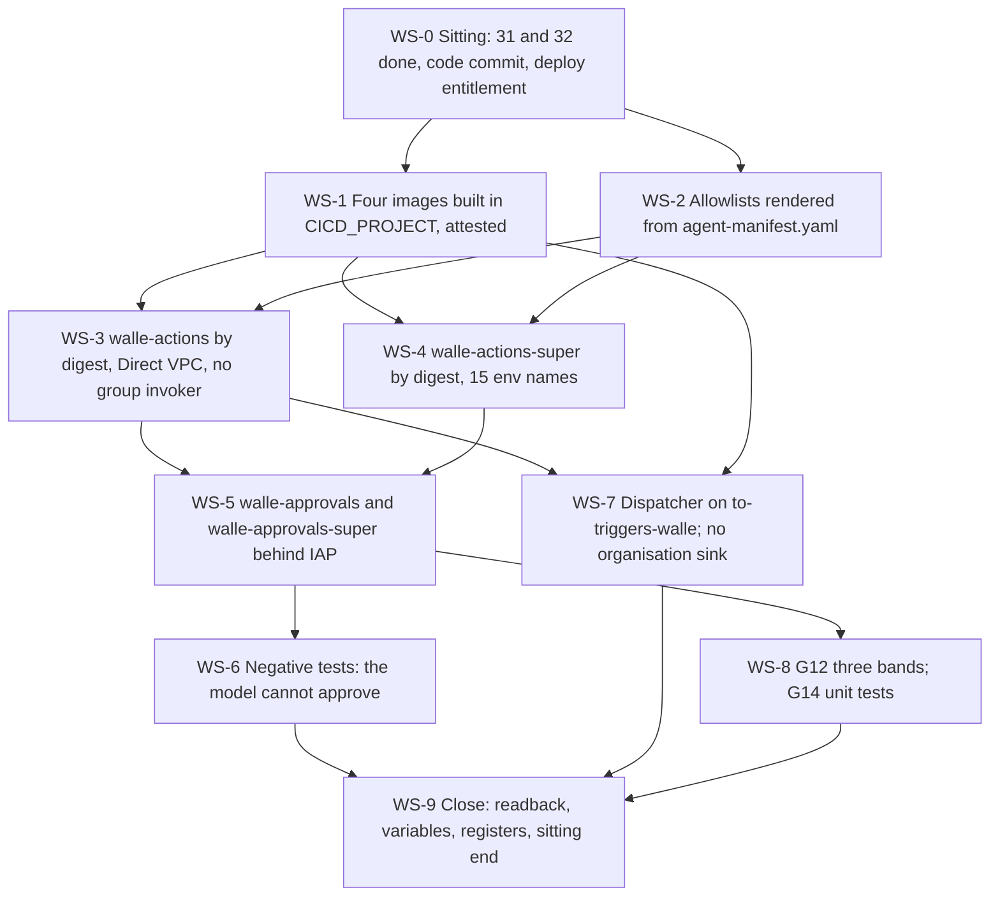

# 33. Wall-E: action services, approval surfaces and the dispatcher

## Status

- Owner: the platform owner
- Last reviewed: 2026-09-15
- Last executed: never
- Stage: review §2 stage 27, the first half — the superseded `wall-e/SETUP.md` Phases 10 and 11, plus the approval-surface phase that page never had (§7.10, S009). Milestone M7. Opens gate lines G12 and G14's unit-test half, and contributes two rows to G19.
- Step prefix: `WS`. Steps: 56. BLOCKED steps: WS-1.1, WS-1.3, WS-1.4, WS-1.5, WS-1.6, WS-1.7, WS-3.2, WS-3.3, WS-3.6, WS-4.1, WS-4.2, WS-4.5, WS-5.3, WS-5.4, WS-5.8, WS-6.3, WS-6.4, WS-7.2, WS-7.5, WS-7.9, WS-8.1, WS-8.2 — every step that needs Wall-E's service code (README §8 B-16). Steps that record `PENDING` rather than `BLOCKED`: WS-2.4 (`eve-controller@` and `mo-analyst@`, made in [36](36-wall-e-joins-to-eve-and-mo.md)), WS-3.4 and WS-4.3 (their invoker bindings), WS-5.9 (their allowlist entries), WS-7.4 (nothing pends; listed for symmetry only where the dispatcher's push identity changes).
- Replaces: `wall-e/SETUP.md` Phase 10 (both services), Phase 11 (dispatcher, trigger feed, log view) and §7.10 (the approval surface, moved from "before Stage 1" to before the grant); the `phase_10_actions`, `phase_10_super`, `phase_11_dispatcher` and `phase_11_sinks` blocks of `wall-e/setup/walle_setup.py`. Neither page is executed.
- Salvaged: Phase 10's argument for a separate action service and for `--ingress=all`, the `^;^` delimiter rule and the reason it may not be `@`, the `AUDIENCE`-after-URL-capture sequence, the foreign-address rule for allowlist entries, the `--timeout=60s` and `--min-instances=0` reasoning, the `/healthz` last-audit-write contract; Phase 11's dispatcher argument (ack first, deterministic trigger id), the dead-letter policy and the second-hop cooldown note, the "inspect the filter, do not count rows" actor-exclusion check; `03-lld.md`'s per-endpoint allowlists for both services and its band-B requester, approver and hold rules; `12-agent-identity.md` §5.3 on what an approval surface asserts.
- Not copied: `gcloud builds submit` in the agent project, with no region, service account or bucket behaviour (S006, S022); a per-project Artifact Registry repository (S006); any deploy without `--binary-authorization=default` and without Direct VPC egress (S006); `group:$OPERATORS` as `run.invoker` on an action service (S095); the organisation sinks `walle-workspace-audit` and `walle-audit-bq` and the interim `walle_workspace_logs` dataset (S094, SD-40); project-level `roles/iam.serviceAccountTokenCreator` for the Pub/Sub service agent (S112); `CONTROL_CALLER_ALLOWLIST` without `walle-operators-caller@` (S106); hand-typed allowlists (S077, topology §3.1); `walle-actions@` as an invoker of its own most execution-capable endpoint (S162); "its environment variable names are the setup script's and are not repeated here" (S021); a `bq ls` verify that expects a date-sharded table (S184); "replay the same Pub/Sub message id twice" with no command (S185); unconditional verifies that read the tenant as the robot (S122).
- Applies decisions (signed in [03](03-decisions-and-people.md) before the step that needs them): SD-01, SD-02, SD-37, SD-38, SD-40, SD-44, SD-48, D2, D3, D10, decision 18 (the control-plane split, decided 2026-09-13), NAMES.
- Closes: S006 (the Wall-E half), S009, S021, S022 (the Wall-E half), S076, S077, S094 (the script half), S095, S106, S112, S122 (the Phases 10 and 11 half), S162, S184, S185. Defers none without an owner (§13).
- Consumes: `WALLE_PROJECT`, `WALLE_PROJECT_NUMBER`, `WALLE_AUDIT_DS`, `SA_ACTIONS`, `SA_ACTIONS_SUPER`, `SA_AGENT`, `SA_DISPATCH`, `SA_OPS_CALLER`, `SA_TASKS`, `WALLE_SECRET_NAMES`, `SINK_TO_TRIGGERS_WALLE`, `ENT_DEPLOY_CREDENTIAL_HOLDER_WALLE`, `ENT_PROJECT_REPAIR_WALLE` ([31](31-wall-e-project-and-data-plane.md)); `REFRESH_TOKEN_VERSION`, `SUPER_REFRESH_TOKEN_VERSION`, `NARROW_CLIENT_SECRET_NAME`, `SUPER_CLIENT_SECRET_NAME` ([32](32-wall-e-consents.md)); `AR_PLATFORM`, `SA_CI_BUILD`, `CICD_PROJECT`, `CORE_PROJECT`, `SA_PLATFORM_DRIFT`, `SA_WALLE_DEPLOYER` ([10](10-core-projects-and-ci-identities.md)); `BINAUTHZ_ATTESTOR`, `KEY_BINAUTHZ` ([11](11-keys-and-validator-custodian.md)); `REGISTER_PATH`, `MANIFEST_SCHEMA_PATH` ([16](16-register-and-shared-registry.md)); `LOGGING_PROJECT`, `PLATFORM_LOGS_DS`, `PLATFORM_LOGS_VIEWS_DS` ([14](14-central-logging-and-billing-export.md)); `ROBOT`, `WALLE_OPERATORS_GROUP`, `WALLE_READERS_GROUP`, `WALLE_PROTECTED_GROUP`, `WALLE_REPO_REMOTE`, `WALLE_REPO_DIR` ([30](30-wall-e-workspace-side.md)); `SA_EVE_VERIFIER` ([24](24-eve-workspace-identity-and-audit-feeds.md)); `SA_EVE_CONSOLE` ([25](25-eve-human-super-admin-detections.md)); `EVE_PROJECT`, `EVE_KEYRING` ([23](23-eve-project-and-evidence-stores.md)); `MO_PROJECT` ([22](22-mo-foundations.md)); `FLD_AGENTS_P_SA_PROD` ([09](09-folders-and-security-command-center.md)); `REGION`, `BQ_LOCATION`, `DOMAIN`, `ORG_ID` ([01](01-prerequisites-and-conventions.md)).
- Produces: `ACTIONS_URL`, `SUPER_ACTIONS_URL`, `DISPATCHER_URL`, `APPROVAL_A_URL`, `APPROVAL_SUPER_URL`, `SA_APPROVAL_A`, `SA_APPROVAL_SUPER`, `WALLE_CODE_COMMIT`; and, as names this file introduces and plan §5 gains, `WALLE_VPC_NETWORK`, `WALLE_RUN_SUBNET`, `GRP_WALLE_APPROVERS_SUPER`, `GRP_WALLE_APPROVERS_A`, `WALLE_ALLOWLIST_FILE`.
- Commands, roles, APIs, flags and console paths checked against Google's documentation on 2026-09-15 (§14). What could not be settled that day is in §15.

## What this part builds

Four Cloud Run services and one push path. At the end of it Wall-E has a credential-holding lane per band, a place where a **human** — never the model, never a service identity — can approve what the lane proposes, and a dispatcher that turns a Workspace admin event into at most one run. None of it can touch the tenant yet: the robot holds no admin role until [38](38-super-admin-gate-and-grant.md), so every verify here that reads the tenant as the robot is tagged **pre-grant: expect 403**, and a 403 there is the step passing (S122).

1. **Four images built in `CICD_PROJECT`** (§1): `walle-actions`, `walle-actions-super`, `walle-dispatcher` and the two approval surfaces, into the shared `AR_PLATFORM` repository, by `SA_CI_BUILD`, with the region, staging-bucket behaviour and build identity that the folder baseline requires, each digest attested with `BINAUTHZ_ATTESTOR`. No build ever runs in `WALLE_PROJECT`, which has neither `cloudbuild` nor `artifactregistry` in its allow-list (S006, S022).
2. **One generated allowlist file** (§2): both services' in-app caller lists rendered from `agent-manifest.yaml`'s `invokers` block by a committed tool, never typed, with every foreign principal written as its full cross-project address and every principal that does not exist yet recorded `PENDING` for [36](36-wall-e-joins-to-eve-and-mo.md) (topology §3.1, SD-44).
3. **`walle-actions`** (§3): band A, deployed **by digest** with `--binary-authorization=default` and Direct VPC egress, holding the narrow client's three secrets, with twenty-three environment variables — the superseded page's nineteen plus the four that make the per-endpoint rules expressible (S009, S077, S162) — and an invoker set that contains **no user and no group** (S095).
4. **`walle-actions-super`** (§4): band B and C, its own service account, its own two secrets pinned to `SUPER_REFRESH_TOKEN_VERSION`, seventeen environment variables — the helper script's thirteen plus the four the approval surfaces and the drift job's halt make necessary (S009, S077) — and a full command block, because the superseded page had none (S021).
5. **The two approval surfaces** (§5): `walle-approvals` for band A and `walle-approvals-super` for band B, each behind Identity-Aware Proxy on Cloud Run, each with its own service account, its own audience group, and `run.invoker` on the action service it approves for. This is the phase `wall-e/SETUP.md` deferred to "before Stage 1" while gate line G14 needed it before the grant (S009).
6. **The negative tests that make "the model cannot approve" a fact** (§6): the agent's principal is refused by IAP on both surfaces, holds `run.invoker` on neither, and an approval whose approver is a service identity, or is the requester, is refused by the service. Re-run in [34](34-wall-e-identity-spike-and-model-armor.md) against the real `AGENT_PRINCIPAL` (SD-48).
7. **The dispatcher and the trigger feed** (§7): `walle-dispatcher` behind the platform's `to-triggers-walle` sink. **No organisation sink is created here, and none exists for Wall-E** (S094, SD-40). Token Creator goes on `walle-dispatcher@` and on nothing else (S112). The BigQuery copy is the platform's partitioned table behind `platform_logs_views.walle_workspace_logs` (S184), and the deduplication check is a real snapshot-and-seek, not a sentence (S185).
8. **G12 and G14's unit-test half** (§8): three bands in code, and the band-B requester and approver rules proven by tests before any live request exists.

What the old text got wrong, and must not come back:

| Old text | Why it fails | Here instead |
|---|---|---|
| `gcloud builds submit ~/Claude/wall-e/action-service --tag …` in `WALLE_PROJECT`, no `--region`, no `--service-account`, no bucket flag (S022) | The build stages to `gs://WALLE_PROJECT_cloudbuild`, a US multi-region bucket that `gcp.resourceLocations=in:eu-locations` refuses with HTTP 412, and runs as a Compute Engine default service account that does not exist while `compute.googleapis.com` is disabled and that gets no Editor under `iam.automaticIamGrantsForDefaultServiceAccounts` | §1: every build runs in `CICD_PROJECT` with `--region`, `--default-buckets-behavior=regional-user-owned-bucket` and `--service-account`, under the build contract proven by [10](10-core-projects-and-ci-identities.md) CP-3.5 |
| `gcloud artifacts repositories create walle` in the agent project, then deploy by tag (S006) | `artifactregistry` and `cloudbuild` are not in `fld-agents-p`'s API allow-list, so `gcp.restrictServiceUsage` refuses the enable; a tag is mutable, and B18 plus CC-3 refuse a service deployed without `--binary-authorization=default` | §1 and §3: one shared repository `AR_PLATFORM` in `CICD_PROJECT`, deploy by `@sha256:` digest with `--binary-authorization=default` |
| No egress flags on any `gcloud run deploy` (S006) | `run.allowedVPCEgress` at `fld-agents-p` admits `private-ranges-only` only; a revision with no Direct VPC egress and no connector is refused, and the error names the constraint rather than the missing subnet | §3.1: the VPC and a `/26` Cloud Run subnet are read or created first; every deploy carries `--network`, `--subnet`, `--vpc-egress=private-ranges-only` and `--network-tags` |
| "Its environment variable names are the setup script's and are not repeated here until both agree" (S021) | No command, no invoker loop, no URL capture and no rollback for `walle-actions-super`; G10, G12 and G13 cannot go green from the page, and the only executable form runs inside `walle deploy`, which also runs Phases 11, 12, 12b and 14 | §4: the full block, with the fifteen names, the invoker set from the manifest, the `AUDIENCE` update and a rollback |
| `group:$OPERATORS` bound as `run.invoker` on `walle-actions` by the helper script, and its verify failing without it (S095) | Every operator could then present a user token to the service directly, bypassing the impersonation path and its IAM Credentials audit trail; a hand-built project gets a permanent `run_invoker_handles` FAIL | §3.4 and §3.5: the invoker set is service accounts only, and WS-3.5 **fails** if any `user:`, `group:` or `domain:` member appears on either service (04 §6.5) |
| `CONTROL_CALLER_ALLOWLIST=${SA_EVE},${SA_EVE_VERIFIER},${OPERATORS}` with a smoke test that mints a token by impersonating `walle-operators-caller@` and expects the halt to be accepted (S106) | The token's verified `email` claim is `walle-operators-caller@…`, which is not on the list, and a service-account email does not match a group address by string comparison; a fail-closed service refuses the halt, so the andon cord has no handle from a terminal | §2 and §3: `SA_OPS_CALLER` is on the control list of both services, the human is identified separately from the IAM Credentials Data Access log, and WS-3.6 includes the negative case (a `walle-dispatcher@` token refused on halt) |
| The `walle-actions` invoker loop and control list omit `platform-drift@CORE_PROJECT` (S077) | The platform reconciliation job cannot halt Wall-E when it finds drift, and 03-lld's halt row is not built. A flat `CONTROL_CALLER_ALLOWLIST` cannot express "halt but not demote", so adding the drift job to it would also give it demote | §2: a second name, `HALT_CALLER_ALLOWLIST`, admits `platform-drift@` to `POST /v1/control/halt` and to nothing else, on both services |
| `walle-actions-super`'s control list is exactly `{eve-controller@, eve-verifier@}` and its verify fails on any extra entry; K4 on the broad credential has no human path (S076) | The most dangerous credential in the system can be revoked by nobody from a terminal, and the approval surfaces and the drift job cannot be admitted even once they exist | §4 and §5: the super service's control list carries `eve-controller@`, `eve-verifier@`, `walle-operators-caller@` and both approval-surface identities; `platform-drift@` sits on the halt-only list; the §5 K4 path is the band-A approval surface, with the terminal path as the recorded break-glass |
| `walle deploy` always creates the organisation sinks `walle-workspace-audit` and `walle-audit-bq` (S094) | Once the platform's `to-triggers-walle` exists, the same event is published twice with two message ids, the dispatcher's dedup key does not collapse them, and every trigger starts two runs; it also recreates sinks the hard-denied list names and the drift job flags | §7.1: `to-triggers-walle` is read and asserted; **nothing is created**; WS-7.10 re-runs [14](14-central-logging-and-billing-export.md) CL-6.6's census and fails on either retired name |
| `gcloud projects add-iam-policy-binding "$PROJECT" --member=…gcp-sa-pubsub… --role=roles/iam.serviceAccountTokenCreator` (S112) | A project-level grant covering `walle-actions@` and `walle-actions-super@` is outside the SA-5 enumeration of permitted Token Creator holders, is a severity-1 drift detection, and CI removal would then break the push subscription | §7.4: the binding is on `walle-dispatcher@` only, and WS-7.4's verify prints nothing at project level |
| `walle-actions@` in the invoker loop, because "the Cloud Tasks worker calls the service back with an OIDC token minted for its own service account" (S162) | The credential holder can release plan items to itself; `/v1/tasks/item` is the most execution-capable path in the system and its allowlist row names `walle-tasks@` | §2 and §3.4: `TASKS_CALLER_ALLOWLIST=${SA_TASKS}`, `walle-tasks@` is the invoker, `walle-actions@` is not in the loop and holds no `serviceAccountUser` on itself |
| Phase 11 Verify 4: `bq ls "${PROJECT}:walle_workspace_logs"` expecting `cloudaudit_googleapis_com_activity` (S184) | Wall-E has no BigQuery log dataset in the platform form, and a sink without `--use-partitioned-tables` writes `…_YYYYMMDD` shards, so the expected name never appears and every later query scans every shard | §7.7: the check is against `platform_logs_views.walle_workspace_logs` over the platform's partitioned table, and WS-7.7 fails on any date-shard in `PLATFORM_LOGS_DS` |
| Phase 11 Verify 5: "Replay the same Pub/Sub message id twice and confirm the second is a no-op" (S185) | Pub/Sub assigns message ids; no command can publish a chosen one, so the check is skipped or written off as done | §7.9: `gcloud pubsub snapshots create`, one real admin change, then `gcloud pubsub subscriptions seek --snapshot`, and the dispatcher's own `dedup` log line for the same message id |
| Phases 12 to 17's verifies written as unconditional pass criteria (S122) | A follower executing in document order hits failing verifies with no marking that the failure is expected before the grant, or grants Super Admin early to make one pass | Every VERIFY in this file carries **pre-grant** or **post-grant**; the post-grant ones are listed in §10 and re-run by [39](39-wall-e-stage-0.md). No verify is ever a reason to make the grant |
| §7.10: the approval surface "does not exist yet", fix "before Stage 1" (S009) | Gate line G14 requires the canonical request hash bound on the IAP surface and one dry-run band-B request **before** the grant; `/v1/generic/{id}/approve` accepts only that surface's service account, so band B has no approval path and operators' halts on the super lane have no carrier | §5: both surfaces are built here, before [38](38-super-admin-gate-and-grant.md), with named service accounts, IAP audiences, and their emails in the generated allowlists |



## Preconditions

- [ ] [31](31-wall-e-project-and-data-plane.md) complete: `WALLE_PROJECT` exists under `fld-agents-p-sa-prod` with the FM-AGENT shape, `walle_audit` carries its nine tables, the topics and the Cloud Tasks queue exist, the six service accounts exist, the five regional secrets exist, `SINK_TO_TRIGGERS_WALLE` is recorded, and `ENT_DEPLOY_CREDENTIAL_HOLDER_WALLE` and `ENT_PROJECT_REPAIR_WALLE` are instantiated.
- [ ] [32](32-wall-e-consents.md) complete: both consents done in one sitting, `REFRESH_TOKEN_VERSION` and `SUPER_REFRESH_TOKEN_VERSION` pinned, the granted scope sets equal to the two committed lists, and no domain-wide delegation client for either OAuth client.
- [ ] [30](30-wall-e-workspace-side.md) complete: `ROBOT` holds **no admin role**, the three groups exist, the floor list is merged.
- [ ] [10](10-core-projects-and-ci-identities.md): `AR_PLATFORM` exists with `SA_CI_BUILD` as its writer, the regional staging bucket is pre-created, and CP-3.5's smoke build passed. [11](11-keys-and-validator-custodian.md): `BINAUTHZ_ATTESTOR` and `KEY_BINAUTHZ` exist and `SA_CI_BUILD` holds `roles/cloudkms.signer` on the key version.
- [ ] [13](13-organisation-policies-deny-and-pab.md): B17, B18 and CC-3 are enforced on `fld-agents-p` and inherited by `fld-agents-p-sa`; B16 and CC-4 are still **held** pending P3's spike, which is why `--ingress=all` is accepted today and recorded (OP-8.4's record names this file).
- [ ] [14](14-central-logging-and-billing-export.md): `LOGGING_PROJECT`, `PLATFORM_LOGS_DS`, the partitioned `to-bigquery` sink and the authorised view `platform_logs_views.walle_workspace_logs` exist; CL-6.6's expected-sink inventory is merged.
- [ ] [16](16-register-and-shared-registry.md): `MANIFEST_SCHEMA_PATH` merged; Wall-E's `agent-manifest.yaml` merged in `WALLE_REPO_REMOTE` with an `invokers` block and a `manifest_sha` that matches the register row of [31](31-wall-e-project-and-data-plane.md).
- [ ] **B-16 (README §8): Wall-E's service code.** `walle-actions`, `walle-actions-super`, the dispatcher and the two approval surfaces, committed in `WALLE_REPO_REMOTE` with green CI, and a commit id to record as `WALLE_CODE_COMMIT`. Without it twenty-two steps here are **BLOCKED**: the whole file is written, checkpointed `BLOCKED`, and resumed at the first step without a `DONE` line when the code lands.
- [ ] A second reviewer for the deploy entitlement who is **not** the Wall-E owner ([12](12-privileged-access-catalogue.md) PA-4.3's rule). If none is appointed, WS-0.3 records one-person mode as a dated deviation with the compensating controls named.
- [ ] Workstation of [01](01-prerequisites-and-conventions.md): `gcloud` (minimum version recorded on the day), `bq`, `jq`, `python3.12`, `git`, `curl`; `~/.platform-env` sourced; `penv_guard` silent. No `gcloud config set project` anywhere in this file.
- [ ] **Not** a precondition: the engine, the agent principal, Model Armor, the gateways or the Gemini Enterprise share. Those are [34](34-wall-e-identity-spike-and-model-armor.md) and [35](35-wall-e-engine-registration-and-gateways.md), and [34](34-wall-e-identity-spike-and-model-armor.md)'s spike calls the services this file deploys.

## People needed

| Role | Does | Present at |
|---|---|---|
| Platform owner | Every build, deploy and binding, under a time-boxed `ENT_DEPLOY_CREDENTIAL_HOLDER_WALLE` grant | every step |
| Deploy second reviewer (security reviewer, or another IT security approver; **never** the Wall-E owner) | Approves each `ent-deploy-credential-holder-walle` grant, and reads the diff of the rendered allowlist file before WS-3.2 | WS-0.3, WS-2.3, WS-5.9 |
| Second human (`SECOND_HUMAN_EMAIL`) | Required reviewer on the `agent-manifest.yaml` `invokers` change and on `WALLE_ALLOWLIST_FILE`; owner of `GRP_WALLE_APPROVERS_SUPER`; runs WS-6.1 and WS-6.2 independently | WS-2.1, WS-5.2, WS-6.1, WS-6.2 |
| Wall-E owner (the platform owner until [03](03-decisions-and-people.md) names another) | Commits the service code and the unit tests of §8; never approves a deploy grant | WS-1.1, WS-8.1, WS-8.2 |
| Second operator (`SECOND_OPERATOR_EMAIL`) | Second member of `GRP_WALLE_APPROVERS_A`, so that a band-A approval never needs the person who requested it | WS-5.2 |
| Platform owner as the `CORE_PROJECT` administrator | Confirms `platform-drift@`'s halt-only entry, since the job's own deployment is BLOCKED on B-02 | WS-2.4, WS-3.4 |

## How to execute this part (S082, SD-37)

The `setup/` procedures are the canonical manual path. `wall-e/setup/walle_setup.py` is a helper, not a path, and every cell in its column reads BLOCKED until B-18 closes.

| Step | Manual path | Helper script | Why the script cannot be used yet |
|---|---|---|---|
| WS-1.* | `gcloud builds submit` in `CICD_PROJECT`, §1 | `build_image` | BLOCKED: `build_image` submits with no region, no build account and the default US staging bucket, in the agent project (S022, S006) |
| WS-2.* | the committed renderer, §2 | none | The script types the allowlists into `env_pairs` (S077, S106) |
| WS-3.* | §3 | `walle deploy` (`phase_10_actions`) | BLOCKED: binds `group:$OPERATORS` as `run.invoker` and fails verify without it (S095); omits `--binary-authorization` and the VPC flags (S006); binds `walle-actions@` to itself (S162) |
| WS-4.* | §4 | `walle deploy` (`phase_10_super`) | BLOCKED: runs only inside `walle deploy`, which also runs Phases 11, 12, 12b and 14; `check_super_service` fails on any control-list entry beyond Eve's two (S076); the image source directory is marked `Assumption` in the script |
| WS-5.* | §5 | none | The script's only IAP code is the egress-gateway extension; `SUPER_EXTRA_INVOKERS` is optional and empty (S009) |
| WS-6.* | §6 | none | — |
| WS-7.* | §7 | `walle deploy` (`phase_11_dispatcher`, `phase_11_sinks`) | BLOCKED: `phase_11_sinks` is called unconditionally and creates two organisation sinks (S094); the Token Creator grant is project-level (S112) |
| WS-8.* | Wall-E's CI, §8 | `walle verify` | BLOCKED: the checks encode the defects above |
| any rollback | the ROLLBACK line of the step | `walle rollback --phase 10\|11` | BLOCKED, and its Phase 10 undo deletes `walle-actions` only, never the super service, the surfaces or the subscription |

## The two action services, side by side

Salvaged from `wall-e/03-lld.md` "GCP resource inventory" and its interface tables, with the corrections the review requires. This table is the source for §2's renderer and for §10's checklist; the service code is the source for nothing in it.

| | `walle-actions` (band A) | `walle-actions-super` (bands B and C) |
|---|---|---|
| Runs as | `SA_ACTIONS` (`walle-actions@`) | `SA_ACTIONS_SUPER` (`walle-actions-super@`) |
| Reads | `walle-oauth-client`, `walle-refresh-token` at `REFRESH_TOKEN_VERSION`, `walle-confirm-hmac` | `walle-super-oauth-client`, `walle-super-refresh-token` at `SUPER_REFRESH_TOKEN_VERSION` |
| Execution endpoint | `POST /v1/execute` | `POST /v1/execute-generic` (band B), `POST /v1/handoff` (band C, executes nothing) |
| Plan endpoints | `POST /v1/plans`, `/v1/plans/{id}/approve`, `/v1/plans/{id}/veto`, `GET /v1/plans/{id}`, `GET /v1/runs/{id}` | `GET /v1/generic/{id}`, `/v1/generic/{id}/approve`, `/v1/generic/{id}/veto` |
| Control endpoints | `/v1/control/halt`, `/v1/control/demote`, `/v1/control/revoke-credential` | `/v1/control/halt`, `/v1/control/revoke-credential`. **No demote**: the lane is permanently L3 and has no ladder |
| Other | `GET /v1/ladder`, `GET /v1/operations`, `POST /v1/tasks/item`, `/v1/internal/*`, `GET /healthz` | `GET /healthz` |
| Invoker set (IAM, service level) | `walle-agent@` (until [34](34-wall-e-identity-spike-and-model-armor.md) replaces it with `AGENT_PRINCIPAL`), `walle-dispatcher@`, `walle-tasks@`, `walle-operators-caller@`, `platform-drift@CORE_PROJECT`, `SA_APPROVAL_A`, and — PENDING until [36](36-wall-e-joins-to-eve-and-mo.md) — `eve-controller@`, `eve-verifier@`, `eve-console@`, `mo-analyst@` | `walle-agent@` (likewise), `walle-operators-caller@`, `platform-drift@CORE_PROJECT`, `SA_APPROVAL_A`, `SA_APPROVAL_SUPER`, and — PENDING — `eve-controller@`, `eve-verifier@` |
| Never an invoker | any `user:`, `group:` or `domain:` member; `mo-metrics@`; `mo-narrator@`; any principal of `GEMINI_PROJECT`; `walle-actions@` itself | as band A, plus `walle-dispatcher@`, `walle-tasks@`, `eve-console@`, every Mo identity |
| Environment names | 23 (§3.2's table) | 17 (§4.1's table) |

## Conventions

Conventions of [01](01-prerequisites-and-conventions.md) apply. Deviation rows are `BD-33-<n>`. Records go to `BUILD_LOG_DIR/records/` as `<date>-WS-<step>-<slug>-v<n>`. Every shell block starts with:

```bash
source ~/.platform-env
penv_guard
R="$BUILD_LOG_DIR/records/$(date -u +%F)-WS"
```

Hands-on: about 6 hours once the code exists (the superseded Phases 10 and 11 were costed at 2 hours and built neither the super service, nor the surfaces, nor the attestations). Elapsed: about 3 days, because two pull requests need a second reviewer, because WS-7.1's sink assertion may need the platform owner's confirmation, and because WS-7.9's replay waits for a real admin event.

**Every VERIFY is tagged.** `pre-grant` means it runs now and its expected result is the one written; where it reads the tenant as the robot, that result is a 403 and a 403 is a pass. `post-grant` means it cannot pass before [38](38-super-admin-gate-and-grant.md) and is listed in §10 for [39](39-wall-e-stage-0.md) to run. No failing pre-grant verify is ever a reason to make the grant early (S122).

## 0. The sitting

### WS-0.1 Open the sitting and check what this file stands on

- **WHO:** Platform owner.
- **WHERE:** Shell.
- **ACTION:**

```bash
checkpoint WS-0.1 START
need WALLE_PROJECT WALLE_PROJECT_NUMBER WALLE_AUDIT_DS SA_ACTIONS SA_ACTIONS_SUPER SA_AGENT SA_DISPATCH SA_OPS_CALLER SA_TASKS SINK_TO_TRIGGERS_WALLE ENT_DEPLOY_CREDENTIAL_HOLDER_WALLE
need REFRESH_TOKEN_VERSION SUPER_REFRESH_TOKEN_VERSION NARROW_CLIENT_SECRET_NAME SUPER_CLIENT_SECRET_NAME
need AR_PLATFORM SA_CI_BUILD CICD_PROJECT CORE_PROJECT SA_PLATFORM_DRIFT BINAUTHZ_ATTESTOR KEY_BINAUTHZ
need LOGGING_PROJECT PLATFORM_LOGS_DS PLATFORM_LOGS_VIEWS_DS ROBOT WALLE_OPERATORS_GROUP WALLE_PROTECTED_GROUP WALLE_REPO_DIR WALLE_REPO_REMOTE REGION DOMAIN
"$PLATFORM_REPO_DIR/tools/decision-need.sh" NAMES D2 D3 D10 SD-01 SD-02 SD-37 SD-38 SD-40 SD-44 SD-48
awk -F'\t' '$2 ~ /^(WD-|WC-|CP-3\.5|KV-|CL-6\.6|CL-7\.1|RG-2\.3)/ {print $2"\t"$3}' "$BUILD_LOG_DIR/checkpoints.tsv" | sort -u | tail -60
```

- **VERIFY:** *pre-grant.* `need` is silent for every name. `decision-need.sh` prints `SIGNED` for each id. Every `WD-` and `WC-` step shows `DONE` or an indexed `BLOCKED`; `CP-3.5`, `CL-6.6`, `CL-7.1` and `RG-2.3` show `DONE`. A `WC-` step that is not `DONE` stops the sitting: without both consents the services have nothing to read and every smoke test is meaningless.
- **ROLLBACK:** Read only.
- **EVIDENCE:** Output as `${R}-0.1-preconditions-v1.txt`; `evidence_add WS-0.1 preconditions E-05 1.4.1 build-log:records/33 "${R}-0.1-preconditions-v1.txt"`.

### WS-0.2 Read the pre-grant rule aloud, and write it into the build log

- **WHO:** Platform owner.
- **WHERE:** Shell.
- **ACTION:** Record, as a build-log line signed by the operator: *"`walle@` holds no admin role. Every read of the tenant as the robot returns 403 until [38](38-super-admin-gate-and-grant.md). A 403 in this file's pre-grant verifies is the step passing. No verify in this file is a reason to make the grant, and no step here assigns a role."* Then list, from §10, the six verifies tagged **post-grant** that [39](39-wall-e-stage-0.md) re-runs.

```bash
checkpoint WS-0.2 START
printf '%s\tWS-0.2\tpre-grant rule recorded; post-grant re-runs: WS-3.6b WS-4.5b WS-5.8b WS-6.3b WS-7.9b WS-8.2b\n' "$(date -u +%FT%TZ)" >> "$BUILD_LOG_DIR/notes.tsv"
```

- **VERIFY:** *pre-grant.* The line exists and names the six re-runs; README §9's re-run index carries the same six with [39](39-wall-e-stage-0.md) as consumer.
- **ROLLBACK:** Not applicable.
- **EVIDENCE:** The build-log line. E-05. TISAX 5.2.

### WS-0.3 Take the deploy grant, or record one-person mode

- **WHO:** Platform owner requests; the deploy second reviewer approves. **Never the Wall-E owner as approver.**
- **WHERE:** Shell.
- **ACTION:** `ENT_DEPLOY_CREDENTIAL_HOLDER_WALLE` grants `roles/run.developer` and `roles/iam.serviceAccountUser` on `WALLE_PROJECT` for one hour ([12](12-privileged-access-catalogue.md) PA-4.3's template). Take a fresh grant at the start of each sitting; never hold a standing role.

```bash
checkpoint WS-0.3 START
gcloud pam grants create --entitlement="$ENT_DEPLOY_CREDENTIAL_HOLDER_WALLE" --requested-duration=3600s --justification="33 WS: deploy walle-actions, walle-actions-super, walle-dispatcher, approval surfaces" --billing-project="$CICD_PROJECT"
gcloud pam grants search --entitlement="$ENT_DEPLOY_CREDENTIAL_HOLDER_WALLE" --caller-relationship=had-created --billing-project="$CICD_PROJECT" --format='table(name,state,requestedDuration)'
```

  If no second reviewer is appointed on the day, stop and write `BD-33-0` in `DEVIATION_REGISTER`: one-person mode, its expiry, and the compensating controls — the second human reads every deploy diff the same day (WS-2.3, WS-5.9), and Eve's configuration-fingerprint alarm covers the services from [36](36-wall-e-joins-to-eve-and-mo.md).
- **VERIFY:** *pre-grant.* The grant state is `APPROVED` (or `ACTIVE`), with an approver who is neither the requester nor the Wall-E owner; `gcloud projects get-iam-policy "$WALLE_PROJECT" --flatten="bindings[].members" --filter="bindings.members:$(gcloud config get-value account)"` shows the two roles **conditioned on the grant** and nothing else — no standing binding.
- **ROLLBACK:** `gcloud pam grants revoke` on the grant name, or let it expire; the entitlement is untouched.
- **EVIDENCE:** The grant record as `${R}-0.3-deploy-grant-v1.json`. E-08. TISAX 4.2.1.

## 1. Four images, built where builds are allowed to run (closes S006, S022)

Every build in this file runs in `CICD_PROJECT`, into `AR_PLATFORM`, as `SA_CI_BUILD`, under the build contract of [10](10-core-projects-and-ci-identities.md) §3. `WALLE_PROJECT` never enables `cloudbuild` or `artifactregistry`: both are supported by `gcp.restrictServiceUsage`, neither is in `fld-agents-p`'s allow-list, and the enable is refused. Nothing is deployed by tag; a tag is mutable and the attestation is on the digest.

### WS-1.1 Record `WALLE_CODE_COMMIT` — BLOCKED

- **WHO:** Wall-E owner commits; platform owner records.
- **WHERE:** Shell, in `WALLE_REPO_DIR`.
- **ACTION:** **BLOCKED.** Needs: the five service trees in `WALLE_REPO_REMOTE` — `action-service/` (band A), `action-service-super/` (bands B and C), `dispatcher/`, `approvals/` (band A surface) and `approvals-super/` — each with a `Dockerfile` and a `cloudbuild.yaml` whose last step signs the attestation, plus the unit tests of §8 and green CI on the merge commit (README §8 B-16). Commit it in: `WALLE_REPO_REMOTE`. Unblocked by: a merged commit with two human approvals and green CI. Gate waiting: G10, G12, G13, G14, and therefore the grant of [38](38-super-admin-gate-and-grant.md) and everything in [34](34-wall-e-identity-spike-and-model-armor.md) to [39](39-wall-e-stage-0.md). Until then: `checkpoint WS-1.1 BLOCKED - - "B-16 Wall-E service code"`. The directory names above are this file's, not an assumption carried from the helper script, whose `action-service-super/` is marked `Assumption` in its own source; whatever the merged tree calls them, WS-1.1 records the five paths and §1's commands use the recorded values. When unblocked:

```bash
checkpoint WS-1.1 START
git -C "$WALLE_REPO_DIR" fetch --all --tags
git -C "$WALLE_REPO_DIR" checkout main && git -C "$WALLE_REPO_DIR" pull --ff-only
penv_set WALLE_CODE_COMMIT "$(git -C "$WALLE_REPO_DIR" rev-parse HEAD)"
for d in action-service action-service-super dispatcher approvals approvals-super; do
  test -f "$WALLE_REPO_DIR/$d/cloudbuild.yaml" && echo "ok $d" || echo "MISSING $d/cloudbuild.yaml"
done
gh api "repos/<git-org>/<wall-e-repo>/commits/${WALLE_CODE_COMMIT}/check-runs" --jq '.check_runs[] | "\(.name) \(.conclusion)"'
```

- **VERIFY:** *pre-grant.* Five `ok` lines. Every check run is `success`. `git log -1 --format='%H %ci'` shows the merge commit, and the pull request that produced it shows **two human approvals** — an approval by a bot user or a service account does not count ([03](03-decisions-and-people.md) DC-9.5).
- **ROLLBACK:** `penv_set --force WALLE_CODE_COMMIT` with a build-log line, only to move forward to a later merged commit; never to an unmerged one.
- **EVIDENCE:** The commit id, the five paths and the check-run list as `${R}-1.1-code-commit-v1.txt`. E-03. TISAX 5.2.

### WS-1.2 Read the build contract back before the first build

- **WHO:** Platform owner.
- **WHERE:** Shell.
- **ACTION:**

```bash
checkpoint WS-1.2 START
gcloud artifacts repositories describe platform --location="$REGION" --project="$CICD_PROJECT" --format='yaml(name,format,mode,kmsKeyName)'
gcloud artifacts repositories get-iam-policy platform --location="$REGION" --project="$CICD_PROJECT" --format='table(bindings.role,bindings.members)'
gcloud storage buckets describe "gs://${CICD_PROJECT}_${REGION}_cloudbuild" --project="$CICD_PROJECT" --format='value(location,storageClass)'
gcloud projects get-iam-policy "$CICD_PROJECT" --flatten="bindings[].members" --filter="bindings.members:${SA_CI_BUILD}" --format='value(bindings.role)' | sort
```

- **VERIFY:** *pre-grant.* The repository is `DOCKER`, `STANDARD_REPOSITORY`, in `REGION`. `SA_CI_BUILD` holds `roles/artifactregistry.writer` **on the repository** and `roles/logging.logWriter` on the project, and no project-level `artifactregistry` role. The regional staging bucket exists in `EUROPE-WEST1` — the name Cloud Build uses under `REGIONAL_USER_OWNED_BUCKET` is `gs://[PROJECT_ID]_[builds/region]_cloudbuild`, and pre-creating it in [10](10-core-projects-and-ci-identities.md) keeps its location ours. `SA_CI_BUILD` holds `roles/cloudkms.signer` on `KEY_BINAUTHZ` (read from the key's own policy in WS-1.7).
- **ROLLBACK:** Read only.
- **EVIDENCE:** Output as `${R}-1.2-build-contract-v1.txt`. E-03. TISAX 5.2.

### WS-1.3 Build `walle-actions` — BLOCKED

- **WHO:** Platform owner.
- **WHERE:** Shell.
- **ACTION:** **BLOCKED** on WS-1.1. When unblocked — one command, with the four flags the superseded page omitted:

```bash
checkpoint WS-1.3 START
need WALLE_CODE_COMMIT
gcloud builds submit "$WALLE_REPO_DIR/action-service" --config="$WALLE_REPO_DIR/action-service/cloudbuild.yaml" --region="$REGION" --default-buckets-behavior=regional-user-owned-bucket --service-account="projects/${CICD_PROJECT}/serviceAccounts/${SA_CI_BUILD}" --substitutions="_COMMIT=${WALLE_CODE_COMMIT},_IMAGE=${AR_PLATFORM}/walle-actions" --project="$CICD_PROJECT"
```

  `--region` matters twice: without it the build runs in `global`, and `--default-buckets-behavior=regional-user-owned-bucket` then has no region to name. Without the bucket flag the source stages to `gs://<project>_cloudbuild/source`, a US multi-region bucket, and `gcp.resourceLocations=in:eu-locations` refuses the create with HTTP 412 before the build starts. Without `--service-account` the build runs as the Compute Engine default service account, which does not exist while `compute.googleapis.com` is disabled and which receives no Editor under `iam.automaticIamGrantsForDefaultServiceAccounts`, so the push to Artifact Registry fails even once the bucket is right.
- **VERIFY:** *pre-grant.* `gcloud builds list --region="$REGION" --project="$CICD_PROJECT" --limit=1 --format='value(status,logUrl)'` shows `SUCCESS`. No object was created outside `REGION`.
- **ROLLBACK:** Delete the pushed version: `gcloud artifacts docker images delete "${AR_PLATFORM}/walle-actions@<digest>" --delete-tags --project="$CICD_PROJECT"`. Nothing is deployed yet.
- **EVIDENCE:** The build id, status and log URL as `${R}-1.3-build-actions-v1.txt`. E-03. TISAX 5.2.

### WS-1.4 Build `walle-actions-super` — BLOCKED (closes S021's build half)

- **WHO:** Platform owner.
- **WHERE:** Shell.
- **ACTION:** **BLOCKED** on WS-1.1. The superseded page gave no build command for this service at all; here it is the same command against the band-B tree.

```bash
checkpoint WS-1.4 START
gcloud builds submit "$WALLE_REPO_DIR/action-service-super" --config="$WALLE_REPO_DIR/action-service-super/cloudbuild.yaml" --region="$REGION" --default-buckets-behavior=regional-user-owned-bucket --service-account="projects/${CICD_PROJECT}/serviceAccounts/${SA_CI_BUILD}" --substitutions="_COMMIT=${WALLE_CODE_COMMIT},_IMAGE=${AR_PLATFORM}/walle-actions-super" --project="$CICD_PROJECT"
```

- **VERIFY:** *pre-grant.* `SUCCESS`, and the image is a **different** repository path from `walle-actions`: two images, two services, two credentials. A build that produced one image for both is stopped here, not at deploy.
- **ROLLBACK:** As WS-1.3, on this image.
- **EVIDENCE:** `${R}-1.4-build-actions-super-v1.txt`. E-03. TISAX 5.2.

### WS-1.5 Build `walle-dispatcher` — BLOCKED

- **WHO:** Platform owner.
- **WHERE:** Shell.
- **ACTION:** **BLOCKED** on WS-1.1.

```bash
checkpoint WS-1.5 START
gcloud builds submit "$WALLE_REPO_DIR/dispatcher" --config="$WALLE_REPO_DIR/dispatcher/cloudbuild.yaml" --region="$REGION" --default-buckets-behavior=regional-user-owned-bucket --service-account="projects/${CICD_PROJECT}/serviceAccounts/${SA_CI_BUILD}" --substitutions="_COMMIT=${WALLE_CODE_COMMIT},_IMAGE=${AR_PLATFORM}/walle-dispatcher" --project="$CICD_PROJECT"
```

- **VERIFY:** *pre-grant.* `SUCCESS`. The superseded page tagged this image `:latest`; nothing here is deployed by tag.
- **ROLLBACK:** As WS-1.3.
- **EVIDENCE:** `${R}-1.5-build-dispatcher-v1.txt`. E-03.

### WS-1.6 Build the two approval surfaces — BLOCKED (closes S009's build half)

- **WHO:** Platform owner.
- **WHERE:** Shell.
- **ACTION:** **BLOCKED** on WS-1.1. Two images, because the two surfaces answer to different audiences and one of them may approve a super-admin write.

```bash
checkpoint WS-1.6 START
gcloud builds submit "$WALLE_REPO_DIR/approvals" --config="$WALLE_REPO_DIR/approvals/cloudbuild.yaml" --region="$REGION" --default-buckets-behavior=regional-user-owned-bucket --service-account="projects/${CICD_PROJECT}/serviceAccounts/${SA_CI_BUILD}" --substitutions="_COMMIT=${WALLE_CODE_COMMIT},_IMAGE=${AR_PLATFORM}/walle-approvals" --project="$CICD_PROJECT"
gcloud builds submit "$WALLE_REPO_DIR/approvals-super" --config="$WALLE_REPO_DIR/approvals-super/cloudbuild.yaml" --region="$REGION" --default-buckets-behavior=regional-user-owned-bucket --service-account="projects/${CICD_PROJECT}/serviceAccounts/${SA_CI_BUILD}" --substitutions="_COMMIT=${WALLE_CODE_COMMIT},_IMAGE=${AR_PLATFORM}/walle-approvals-super" --project="$CICD_PROJECT"
```

- **VERIFY:** *pre-grant.* Both `SUCCESS`. One image per surface; a single image serving both audiences is refused here, because the band-B surface's only caller list entry is its own service account and a shared image would share an identity.
- **ROLLBACK:** As WS-1.3, on each image.
- **EVIDENCE:** `${R}-1.6-build-approvals-v1.txt`. E-03.

### WS-1.7 Attest every digest, and record the five digests — BLOCKED

- **WHO:** Platform owner; the attestation is signed by `SA_CI_BUILD` inside the build, not by a human.
- **WHERE:** Shell.
- **ACTION:** **BLOCKED** on WS-1.3 to WS-1.6. Each `cloudbuild.yaml`'s last step runs, as `SA_CI_BUILD`:

```bash
gcloud beta container binauthz attestations sign-and-create --artifact-url="${_IMAGE}@${_DIGEST}" --attestor="$BINAUTHZ_ATTESTOR" --attestor-project="$CICD_PROJECT" --keyversion="$KEY_BINAUTHZ" --project="$CICD_PROJECT" --validate
```

  `sign-and-create` is on the `beta` track on 2026-09-15; the GA reference page does not exist. `--keyversion` is given fully qualified, as [18](18-model-armor-floor-spikes-and-kill-switch.md) KS-5.1 established. Then capture each digest from the build itself rather than from a tag:

```bash
checkpoint WS-1.7 START
for img in walle-actions walle-actions-super walle-dispatcher walle-approvals walle-approvals-super; do
  b="$(gcloud builds list --region="$REGION" --project="$CICD_PROJECT" --filter="substitutions._IMAGE=${AR_PLATFORM}/${img} AND status=SUCCESS" --sort-by=~createTime --limit=1 --format='value(id)')"
  d="$(gcloud builds describe "$b" --region="$REGION" --project="$CICD_PROJECT" --format='value(results.images[0].digest)')"
  printf '%s\t%s\t%s\n' "$img" "$b" "$d" | tee -a "${R}-1.7-digests-v1.tsv"
  gcloud container binauthz attestations list --attestor="$BINAUTHZ_ATTESTOR" --attestor-project="$CICD_PROJECT" --artifact-url="${AR_PLATFORM}/${img}@${d}" --project="$CICD_PROJECT" --format='value(name)'
done
```

  Cross-check one digest against the registry: `gcloud artifacts docker images list "${AR_PLATFORM}/walle-actions" --include-tags --project="$CICD_PROJECT"` prints the `DIGEST` column for each version. `Assumption:` `results.images[0].digest` is populated because each `cloudbuild.yaml` declares its `images:`; if a build does not declare them, read the digest from the registry listing instead and say so in the record.
- **VERIFY:** *pre-grant.* Five rows in the TSV, five different digests, and one attestation listed per digest. An image with no attestation is not deployed: B18 refuses it at deploy and CC-3 refuses the service definition, and discovering that at `gcloud run deploy` wastes the grant window.
- **ROLLBACK:** An attestation is deleted with `gcloud container binauthz attestations delete`; in practice a wrong image is rebuilt and re-attested, and the wrong digest is deleted from the repository.
- **EVIDENCE:** `${R}-1.7-digests-v1.tsv` and the attestation names. E-03, E-12. TISAX 5.2, 5.2.4.

## 2. The allowlists, generated and never typed (closes S077, S095, S106, S162)

Two different things are often confused here, and the review found both built wrong. **Cloud Run IAM** decides who may reach the service at all, and it is granted per service, not per path. The **in-app caller allowlist** decides which endpoint a caller reaches, keyed on the verified `email` claim of the caller's ID token. Topology §3.1 requires the second to be generated from the manifest's `invokers` block and from nothing else; the superseded page typed it, and the two drifted.

### WS-2.1 Merge the `invokers` block into `agent-manifest.yaml`

- **WHO:** Platform owner writes; the second human is a required reviewer; the security reviewer is code owner of the hard-denied predicates and reviews any change to `exec`.
- **WHERE:** Pull request on `WALLE_REPO_REMOTE`.
- **ACTION:** Add or amend the `invokers` mapping. Keys are endpoint groups; values are principals written with the **variable token** form the schema accepts (`^[a-z][a-z0-9-]*@[A-Za-z0-9_-]+(\.iam\.gserviceaccount\.com)?$`), expanded by WS-2.2's renderer. Nothing here is an agent principal.

```yaml
invokers:
  exec:          [walle-agent@WALLE_PROJECT]                       # /v1/execute, /v1/plans, /v1/operations
  tasks:         [walle-tasks@WALLE_PROJECT]                       # /v1/tasks/item only (S162)
  internal:      [walle-dispatcher@WALLE_PROJECT]                  # /v1/internal/*, including gmail-watch-renew
  approve:       [walle-approvals@WALLE_PROJECT, eve-controller@EVE_PROJECT]
  veto:          [walle-approvals@WALLE_PROJECT, walle-operators-caller@WALLE_PROJECT, eve-controller@EVE_PROJECT]
  control:       [eve-controller@EVE_PROJECT, eve-verifier@EVE_PROJECT, walle-operators-caller@WALLE_PROJECT, walle-operators@DOMAIN]
  halt:          [platform-drift@CORE_PROJECT]                     # halt only, never demote (S077)
  read:          [eve-controller@EVE_PROJECT, eve-verifier@EVE_PROJECT, eve-console@EVE_PROJECT, mo-analyst@MO_PROJECT, walle-operators-caller@WALLE_PROJECT, walle-operators@DOMAIN]
  super_exec:    [walle-agent@WALLE_PROJECT]                       # /v1/execute-generic, /v1/handoff
  super_approve: [walle-approvals-super@WALLE_PROJECT, walle-approvals@WALLE_PROJECT]
  super_veto:    [walle-approvals-super@WALLE_PROJECT, walle-approvals@WALLE_PROJECT]
  super_read:    [walle-approvals-super@WALLE_PROJECT, walle-approvals@WALLE_PROJECT]
  super_control: [eve-controller@EVE_PROJECT, eve-verifier@EVE_PROJECT, walle-operators-caller@WALLE_PROJECT, walle-approvals@WALLE_PROJECT, walle-approvals-super@WALLE_PROJECT]
  super_halt:    [platform-drift@CORE_PROJECT]
```

  Three entries answer findings directly. `walle-operators-caller@` is on `control` and `super_control` because an operator's CLI token carries **that** service account's email, not a member's, and a list without it leaves no human able to halt from a terminal (S106); the human behind the token is identified separately, from the IAM Credentials Data Access log. `platform-drift@CORE_PROJECT` is on `halt` and `super_halt` and on neither `control` list, because `CONTROL_CALLER_ALLOWLIST` is flat and admits halt and demote alike, and the reconciliation job must lower, never demote a ladder (S077). `walle-tasks@` is its own key because `/v1/tasks/item` is the most execution-capable path in the system and `walle-actions@` must not be able to release plan items to itself (S162).
- **VERIFY:** *pre-grant.* CI's R-01 schema rule passes against `MANIFEST_SCHEMA_PATH`; `manifest_sha` is recomputed and matches the register row of [31](31-wall-e-project-and-data-plane.md); the pull request shows two human approvals including the second human. No key holds an entry beginning `walle-agent@` except `exec` and `super_exec`, which CI asserts.
- **ROLLBACK:** Revert the pull request; the services are not deployed from an unmerged manifest.
- **EVIDENCE:** The merge commit and the CI output as `${R}-2.1-manifest-invokers-v1.txt`. E-03, E-06. TISAX 5.2.

### WS-2.2 Commit the renderer

- **WHO:** Platform owner; the deploy second reviewer reviews.
- **WHERE:** Pull request on `PLATFORM_REPO_REMOTE`, path `tools/render-allowlists.py`.
- **ACTION:** The renderer expands the tokens from `~/.platform-env`, refuses what must never appear, and writes one `KEY=value` file that §3 and §4 read. It is committed to the **platform** repository, not to Wall-E's, so that the same tool serves every later agent.

```python
#!/usr/bin/env python3
"""Render in-app caller allowlists from an agent manifest. Platform tool, one per agent run."""
import os, sys, yaml

TOKENS = ("WALLE_PROJECT", "EVE_PROJECT", "MO_PROJECT", "CORE_PROJECT", "CICD_PROJECT", "DOMAIN")
GROUPS = {
    "EXEC_CALLER_ALLOWLIST": "exec", "TASKS_CALLER_ALLOWLIST": "tasks",
    "INTERNAL_CALLER_ALLOWLIST": "internal", "APPROVE_CALLER_ALLOWLIST": "approve",
    "VETO_CALLER_ALLOWLIST": "veto", "CONTROL_CALLER_ALLOWLIST": "control",
    "HALT_CALLER_ALLOWLIST": "halt", "READ_CALLER_ALLOWLIST": "read",
}
SUPER = {
    "EXEC_CALLER_ALLOWLIST": "super_exec", "APPROVE_CALLER_ALLOWLIST": "super_approve",
    "VETO_CALLER_ALLOWLIST": "super_veto", "READ_CALLER_ALLOWLIST": "super_read",
    "CONTROL_CALLER_ALLOWLIST": "super_control", "HALT_CALLER_ALLOWLIST": "super_halt",
}

def expand(p, env):
    local, _, tok = p.partition("@")
    if tok in TOKENS:
        v = env.get(tok) or sys.exit(f"unset token {tok} for {p}")
        return f"{local}@{v}" if tok == "DOMAIN" else f"{local}@{v}.iam.gserviceaccount.com"
    if tok.endswith(".iam.gserviceaccount.com") or "." in tok:
        return p
    sys.exit(f"unknown token in {p}")

def main(manifest, band, out):
    env = os.environ
    m = yaml.safe_load(open(manifest))
    inv = m.get("invokers") or sys.exit("manifest has no invokers block")
    keys = SUPER if band == "super" else GROUPS
    own = f"{env['WALLE_PROJECT']}.iam.gserviceaccount.com"
    lines, principals = [], set()
    for name, key in keys.items():
        vals = [expand(p, env) for p in inv.get(key, [])]
        for v in vals:
            if v.startswith(("group:", "user:", "domain:")):
                sys.exit(f"{v}: an IAM member prefix may not appear in an in-app allowlist")
            if v.endswith(own) and (v.startswith("eve-") or v.startswith("mo-")):
                sys.exit(f"{v}: a foreign identity spelled in the agent's own project")
            if v.startswith("walle-agent@") and key not in ("exec", "super_exec"):
                sys.exit(f"{v}: the agent principal may not appear on {key}")
            if v.startswith("walle-actions@"):
                sys.exit(f"{v}: the credential holder may not call itself")
            principals.add(v)
        lines.append(f"{name}={','.join(vals)}")
    open(out, "w").write("\n".join(lines) + "\n")
    print(f"{len(lines)} lists, {len(principals)} distinct principals -> {out}")

if __name__ == "__main__":
    main(sys.argv[1], sys.argv[2], sys.argv[3])
```

- **VERIFY:** *pre-grant.* Four fixtures under `tools/fixtures/allowlists/` give the expected result: a manifest with `group:` in a list fails; one with `walle-agent@` on `control` fails; one with `eve-controller@WALLE_PROJECT` fails; the good one renders. The pull request shows two human approvals.
- **ROLLBACK:** Revert the pull request.
- **EVIDENCE:** The merge commit and the four fixture outputs as `${R}-2.2-renderer-v1.txt`. E-03. TISAX 5.2.

### WS-2.3 Render both files, and read the diff

- **WHO:** Platform owner renders; the deploy second reviewer reads the diff before WS-3.2.
- **WHERE:** Shell.
- **ACTION:**

```bash
checkpoint WS-2.3 START
python3 -m venv "$BUILD_LOG_DIR/.venv-render" && "$BUILD_LOG_DIR/.venv-render/bin/pip" -q install pyyaml
penv_set WALLE_ALLOWLIST_FILE "$BUILD_LOG_DIR/allowlists"
mkdir -p "$WALLE_ALLOWLIST_FILE"
"$BUILD_LOG_DIR/.venv-render/bin/python" "$PLATFORM_REPO_DIR/tools/render-allowlists.py" "$WALLE_REPO_DIR/agent-manifest.yaml" bandA "$WALLE_ALLOWLIST_FILE/walle-actions.env"
"$BUILD_LOG_DIR/.venv-render/bin/python" "$PLATFORM_REPO_DIR/tools/render-allowlists.py" "$WALLE_REPO_DIR/agent-manifest.yaml" super "$WALLE_ALLOWLIST_FILE/walle-actions-super.env"
cat "$WALLE_ALLOWLIST_FILE/walle-actions.env" "$WALLE_ALLOWLIST_FILE/walle-actions-super.env"
```

- **VERIFY:** *pre-grant.* Eight lines for band A, six for the super service. Every foreign principal is a **full** cross-project address (`…@${EVE_PROJECT}.iam.gserviceaccount.com`, `…@${MO_PROJECT}.iam.gserviceaccount.com`): the allowlist is compared byte for byte against the token's `email` claim, which carries the home project, so a same-named account created in `WALLE_PROJECT` would not match. `CONTROL_CALLER_ALLOWLIST` of both files contains `walle-operators-caller@`; neither `CONTROL` list contains `platform-drift@`; both `HALT` lists contain it and nothing else. No line contains `group:`, `user:` or `walle-actions@`.
- **ROLLBACK:** `rm -f "$WALLE_ALLOWLIST_FILE"/*.env` and re-render; nothing is deployed from an unread file.
- **EVIDENCE:** Both files as `${R}-2.3-allowlists-v1.txt`, with the reviewer's line. E-03, E-06. TISAX 5.2.

### WS-2.4 Check each principal, and record what does not exist yet (SD-44)

- **WHO:** Platform owner.
- **WHERE:** Shell.
- **ACTION:** Wall-E is built before Eve's controller and Mo's analyst exist. A list entry for a principal that does not exist is harmless — the in-app list is a string comparison — but an **IAM binding** for one is refused, so §3.4 and §4.3 skip it and this step records the re-run.

```bash
checkpoint WS-2.4 START
exists_or_pending "serviceAccount:${SA_EVE_VERIFIER}"  WS-2.4 "33 WS-3.4/WS-4.3 run.invoker for eve-verifier@ on both services"
exists_or_pending "serviceAccount:${SA_EVE_CONSOLE}"   WS-2.4 "33 WS-3.4 run.invoker for eve-console@ on walle-actions"
exists_or_pending "serviceAccount:${SA_PLATFORM_DRIFT}" WS-2.4 "33 WS-3.4/WS-4.3 run.invoker for platform-drift@ on both services"
exists_or_pending --pending "serviceAccount:eve-controller@${EVE_PROJECT}.iam.gserviceaccount.com" WS-2.4 "36 WJ: run.invoker for eve-controller@ on both services; created in 36"
exists_or_pending --pending "serviceAccount:mo-analyst@${MO_PROJECT}.iam.gserviceaccount.com"      WS-2.4 "36 WJ: run.invoker for mo-analyst@ on walle-actions; created in 36"
```

- **VERIFY:** *pre-grant.* `eve-verifier@`, `eve-console@` and `platform-drift@` print `EXISTS`. `eve-controller@` and `mo-analyst@` print `PENDING` and appear in `rerun-index.tsv` with [36](36-wall-e-joins-to-eve-and-mo.md) as the consumer. An `UNKNOWN` line stops the step: the check failed for a reason other than absence and must be read, never assumed.
- **ROLLBACK:** Not applicable; a PENDING line is removed only by the step that makes the grant.
- **EVIDENCE:** The five lines as `${R}-2.4-principals-v1.txt`; the re-run index rows. E-06. TISAX 4.2.1.

## 3. `walle-actions`, band A (closes S006's deploy half, S095, S106, S162)

### WS-3.1 The VPC and a Cloud Run subnet large enough

- **WHO:** Platform owner.
- **WHERE:** Shell.
- **ACTION:** `run.allowedVPCEgress` at `fld-agents-p` admits `private-ranges-only`, and Google states that under this constraint every new revision must use Direct VPC egress or a Serverless VPC Access connector. Direct VPC egress needs a network and a subnet in the same region, and the subnet's IPv4 range must be `/26` or larger. The FM-AGENT run of [31](31-wall-e-project-and-data-plane.md) created the project's VPC with a `/28` subnet for the gateway's PSC network attachment; `/28` is **not** usable for Cloud Run, so a second subnet is created here if none exists.

```bash
checkpoint WS-3.1 START
gcloud compute networks list --project="$WALLE_PROJECT" --format='table(name,subnet_mode)'
gcloud compute networks subnets list --project="$WALLE_PROJECT" --filter="region:${REGION}" --format='table(name,ipCidrRange,purpose,privateIpGoogleAccess)'
penv_set WALLE_VPC_NETWORK "$(gcloud compute networks list --project="$WALLE_PROJECT" --format='value(name)' --limit=1)"
gcloud compute networks subnets create walle-run-ew1 --network="$WALLE_VPC_NETWORK" --region="$REGION" --range=10.60.8.0/26 --enable-private-ip-google-access --project="$WALLE_PROJECT"
penv_set WALLE_RUN_SUBNET walle-run-ew1
```

  The range is the one reserved for Wall-E in the topology's address plan; if that plan names another, use it and record the value. Do **not** re-use the gateway's `/28`: Cloud Run scales by taking addresses from the subnet, and a `/28` starves the service silently under load rather than failing at deploy.
- **VERIFY:** *pre-grant.* `gcloud compute networks subnets describe walle-run-ew1 --region="$REGION" --project="$WALLE_PROJECT" --format='value(ipCidrRange,privateIpGoogleAccess)'` prints a `/26` (or larger) and `True`. The gateway's `/28` is still present and untouched. `gcloud compute routers list --project="$WALLE_PROJECT"` — a Cloud NAT is **not** required by this file: with `private-ranges-only`, Cloud Run sends only internal-range traffic through the VPC and Google API calls go direct, which is exactly why the Workspace and Secret Manager calls keep working ([06](../06-gateways-model-armor-perimeter.md) §4.4).
- **ROLLBACK:** `gcloud compute networks subnets delete walle-run-ew1 --region="$REGION" --project="$WALLE_PROJECT"` while no revision uses it.
- **EVIDENCE:** The two listings and the subnet describe as `${R}-3.1-vpc-v1.txt`. `DEVIATION_REGISTER` gains `BD-33-1`: the Cloud Run subnet was added by hand because the module equivalent creates only the gateway subnet; superseded when the factory module gains the row. E-03. TISAX 5.2.

### WS-3.2 Deploy `walle-actions` by digest — BLOCKED

- **WHO:** Platform owner, under the WS-0.3 grant.
- **WHERE:** Shell.
- **ACTION:** **BLOCKED** on WS-1.7. The environment set, once, because a service asserts the name set and not a count:

| Name | Value | Why |
|---|---|---|
| `WORKSPACE_DOMAIN` | `$DOMAIN` | the tenant the robot acts in |
| `ROBOT_ACCOUNT` | `$ROBOT` | the identity every Workspace call is made as |
| `OPERATOR_GROUP` | `$WALLE_OPERATORS_GROUP` | re-checked live through the Directory API on every write |
| `READER_GROUP` | `$WALLE_READERS_GROUP` | read-only questions |
| `PROTECTED_GROUP` | `$WALLE_PROTECTED_GROUP` | the floor list of [30](30-wall-e-workspace-side.md) §6 |
| `SECRET_LOCATION` | `$REGION` | the five secrets are **regional**, not global |
| `REFRESH_TOKEN_SECRET` | `walle-refresh-token` | the narrow client's token, **name only** |
| `REFRESH_TOKEN_VERSION` | `$REFRESH_TOKEN_VERSION` | pinned; a floating `latest` would follow a rotation nobody approved |
| `OAUTH_CLIENT_SECRET` | `$NARROW_CLIENT_SECRET_NAME` | name only |
| `CONFIRM_HMAC_SECRET` | `walle-confirm-hmac` | name only |
| `EVE_PUBLIC_KEY_PEM` | `/app/contracts/eve-public-keys` | the pinned PEM directory baked into the image, the **primary** verification input |
| `EVE_KMS_KEY` | `projects/${EVE_PROJECT}/locations/${REGION}/keyRings/eve/cryptoKeys/eve-approval` | the optional `publicKeyViewer` fallback only; the key version arrives in [41](41-eve-s3-and-s4.md), so this names a key that does not resolve yet and the service must not call it at start-up |
| `AUDIT_DATASET` | `$WALLE_AUDIT_DS` | the nine tables of [31](31-wall-e-project-and-data-plane.md) |
| `TASKS_QUEUE` | `projects/${WALLE_PROJECT}/locations/${REGION}/queues/walle-plan-items` | the queue that releases plan items |
| `EXEC_CALLER_ALLOWLIST` | rendered | `walle-agent@`, replaced by `AGENT_PRINCIPAL` in [34](34-wall-e-identity-spike-and-model-armor.md) |
| `TASKS_CALLER_ALLOWLIST` | rendered | `walle-tasks@` only — S162 |
| `INTERNAL_CALLER_ALLOWLIST` | rendered | `walle-dispatcher@` only; without it the Gmail watch renewal of [39](39-wall-e-stage-0.md) is refused `foreign_actor` and the watch dies after seven days |
| `APPROVE_CALLER_ALLOWLIST` | rendered | the band-A surface and `eve-controller@` — S009 |
| `VETO_CALLER_ALLOWLIST` | rendered | the surface, the operators' caller identity, `eve-controller@` |
| `CONTROL_CALLER_ALLOWLIST` | rendered | halt, demote and revoke-credential; carries `walle-operators-caller@` — S106 |
| `HALT_CALLER_ALLOWLIST` | rendered | `platform-drift@CORE_PROJECT`, halt **only** — S077 |
| `READ_CALLER_ALLOWLIST` | rendered | the GET group; the service then narrows each GET to its row in `03-lld.md` |
| `AUDIENCE` | empty on the first deploy, set in WS-3.3 | the URL does not exist until the service does |

```bash
checkpoint WS-3.2 START
. "$WALLE_ALLOWLIST_FILE/walle-actions.env"
D_ACTIONS="$(awk -F'\t' '$1=="walle-actions"{print $3}' "${R}-1.7-digests-v1.tsv")"
gcloud run deploy walle-actions \
  --image="${AR_PLATFORM}/walle-actions@${D_ACTIONS}" \
  --region="$REGION" --project="$WALLE_PROJECT" \
  --service-account="$SA_ACTIONS" \
  --no-allow-unauthenticated --ingress=all \
  --binary-authorization=default \
  --network="$WALLE_VPC_NETWORK" --subnet="$WALLE_RUN_SUBNET" --vpc-egress=private-ranges-only --network-tags=walle-actions \
  --timeout=60s --min-instances=0 --max-instances=4 --concurrency=8 \
  --set-env-vars="^;^WORKSPACE_DOMAIN=${DOMAIN};ROBOT_ACCOUNT=${ROBOT};OPERATOR_GROUP=${WALLE_OPERATORS_GROUP};READER_GROUP=${WALLE_READERS_GROUP};PROTECTED_GROUP=${WALLE_PROTECTED_GROUP};SECRET_LOCATION=${REGION};REFRESH_TOKEN_SECRET=walle-refresh-token;REFRESH_TOKEN_VERSION=${REFRESH_TOKEN_VERSION};OAUTH_CLIENT_SECRET=${NARROW_CLIENT_SECRET_NAME};CONFIRM_HMAC_SECRET=walle-confirm-hmac;EVE_PUBLIC_KEY_PEM=/app/contracts/eve-public-keys;EVE_KMS_KEY=projects/${EVE_PROJECT}/locations/${REGION}/keyRings/eve/cryptoKeys/eve-approval;AUDIT_DATASET=${WALLE_AUDIT_DS};TASKS_QUEUE=projects/${WALLE_PROJECT}/locations/${REGION}/queues/walle-plan-items;EXEC_CALLER_ALLOWLIST=${EXEC_CALLER_ALLOWLIST};TASKS_CALLER_ALLOWLIST=${TASKS_CALLER_ALLOWLIST};INTERNAL_CALLER_ALLOWLIST=${INTERNAL_CALLER_ALLOWLIST};APPROVE_CALLER_ALLOWLIST=${APPROVE_CALLER_ALLOWLIST};VETO_CALLER_ALLOWLIST=${VETO_CALLER_ALLOWLIST};CONTROL_CALLER_ALLOWLIST=${CONTROL_CALLER_ALLOWLIST};HALT_CALLER_ALLOWLIST=${HALT_CALLER_ALLOWLIST};READ_CALLER_ALLOWLIST=${READ_CALLER_ALLOWLIST};AUDIENCE="
```

  Four notes on the flags, each of which the review or a Google page settles.

  **One `--set-env-vars` flag, with `^;^`.** The `^;^` prefix sets `;` as the delimiter, which several values need because they contain commas. The delimiter may not be `@`: `gcloud topic escaping` requires it to appear in no value, and nine of these values are email addresses, so gcloud would split `ROBOT_ACCOUNT=walle@example.com` at the `@` and abort with `Bad syntax for dict arg`. One flag rather than repeated flags: the Cloud Run page describes repeating the flag as non-destructive, while the gcloud dictionary-flag behaviour for a `--set-*` flag is to replace, and one flag removes the doubt entirely. No name and no value here contains a `;`, and WS-2.2's renderer refuses any entry that ever acquires one.

  **`--binary-authorization=default`.** B18 allows the value `default` on `fld-agents-p`, and CC-3 refuses a service definition whose `run.googleapis.com/binary-authorization` annotation is not `default`. The two fail in different places, which is the point: one at deploy, one at the API. `--breakglass` exists and is never used here; a deploy that needs it is a deploy of an unattested image.

  **`--ingress=all`, not `internal`.** Agent Runtime egresses from a Google-managed tenant project, which Cloud Run treats as external, so internal-only ingress blocks the agent entirely and the symptom is a timeout, not an error. B16 (`internal-and-cloud-load-balancing`) is **held** in [13](13-organisation-policies-deny-and-pab.md) until P3's spike passes; until then IAM is the enforced boundary and the service verifies the ID token's audience. Record the value now so that the spike has a before-state.

  **`--timeout=60s`, `--min-instances=0`.** Sixty seconds makes "loop over 25 items inside the approve request" structurally impossible: approving releases a plan and returns 202, and a Cloud Tasks worker executes the items one at a time. Zero minimum instances means the service is free when idle, which is also why the concurrency test of the denial suite sets `--min-instances=2` for its own run and puts it back.
- **VERIFY:** *pre-grant.* The deploy returns a revision. `gcloud run services describe walle-actions --region="$REGION" --project="$WALLE_PROJECT" --format='yaml(spec.template.metadata.annotations)'` shows `run.googleapis.com/binary-authorization: default`, the VPC network and subnet annotations, and `run.googleapis.com/vpc-access-egress: private-ranges-only`. `--format='value(spec.template.spec.containers[0].image)'` shows an `@sha256:` reference, never a tag.
- **ROLLBACK:** `gcloud run services delete walle-actions --region="$REGION" --project="$WALLE_PROJECT" --quiet`. The credential is untouched; nothing in Workspace has changed.
- **EVIDENCE:** The deploy output and the describe as `${R}-3.2-actions-deploy-v1.txt`. E-03, E-12. TISAX 5.2, 5.2.4.

### WS-3.3 Capture the URL and set `AUDIENCE` — BLOCKED

- **WHO:** Platform owner.
- **WHERE:** Shell.
- **ACTION:** **BLOCKED** on WS-3.2.

```bash
checkpoint WS-3.3 START
penv_set ACTIONS_URL "$(gcloud run services describe walle-actions --region="$REGION" --project="$WALLE_PROJECT" --format='value(status.url)')"
gcloud run services update walle-actions --region="$REGION" --project="$WALLE_PROJECT" --update-env-vars="AUDIENCE=${ACTIONS_URL}"
```

  Do not skip it. `AUDIENCE` expanded to an empty string on the first deploy because the URL did not exist; the smoke test presents a token whose audience is the URL, and a service expecting an empty audience answers `401 bad_audience`.
- **VERIFY:** *pre-grant.* `gcloud run services describe … --format='value(spec.template.spec.containers[0].env)'` lists **twenty-three** names, `AUDIENCE` equal to `$ACTIONS_URL`, `CONTROL_CALLER_ALLOWLIST` containing `eve-verifier@${EVE_PROJECT}.iam.gserviceaccount.com` (the full cross-project address, never `…@${WALLE_PROJECT}…`) and `walle-operators-caller@`, `HALT_CALLER_ALLOWLIST` containing `platform-drift@${CORE_PROJECT}…` and nothing else, `TASKS_CALLER_ALLOWLIST` containing `walle-tasks@` and nothing else, and `EVE_KMS_KEY` starting `projects/${EVE_PROJECT}/`.
- **ROLLBACK:** `gcloud run services update … --update-env-vars="AUDIENCE="` restores the empty value; the revision before the update is still addressable and can be routed back with `--to-revisions`.
- **EVIDENCE:** The env listing as `${R}-3.3-actions-env-v1.txt`. E-03.

### WS-3.4 Bind `run.invoker` — service accounts only

- **WHO:** Platform owner.
- **WHERE:** Shell.
- **ACTION:** Cloud Run IAM is the only gate a caller from another project meets before the in-app allowlist, and it is granted **per service, not per path**: every principal below can reach every endpoint at the transport layer, which is exactly why §2's lists exist and why the denial suite tests each row. The binding is made here, on Wall-E's resource, by Wall-E's owner, never from the other project; the member string is global across the organisation, so no cross-project attachment is involved and `iam.disableCrossProjectServiceAccountUsage` stays enforced.

```bash
checkpoint WS-3.4 START
for SA in "$SA_AGENT" "$SA_DISPATCH" "$SA_TASKS" "$SA_OPS_CALLER" "$SA_PLATFORM_DRIFT" "$SA_EVE_VERIFIER" "$SA_EVE_CONSOLE"; do
  gcloud run services add-iam-policy-binding walle-actions --region="$REGION" --project="$WALLE_PROJECT" --member="serviceAccount:${SA}" --role=roles/run.invoker
done
exists_or_pending --pending "serviceAccount:eve-controller@${EVE_PROJECT}.iam.gserviceaccount.com" WS-3.4 "36 WJ: run.invoker for eve-controller@ on walle-actions"
exists_or_pending --pending "serviceAccount:mo-analyst@${MO_PROJECT}.iam.gserviceaccount.com"      WS-3.4 "36 WJ: run.invoker for mo-analyst@ on walle-actions"
```

  `SA_APPROVAL_A` joins this loop in WS-5.7, once it exists. `walle-actions@` is **not** in the loop and holds no `serviceAccountUser` on itself: the Cloud Tasks worker calls back with an OIDC token minted for `walle-tasks@`, so the credential holder cannot release plan items to itself (S162). No human and no group is in the loop: members of `WALLE_OPERATORS_GROUP` reach the service by impersonating `walle-operators-caller@`, which is the platform rule of [04](../04-identity-and-privileged-access.md) §6.5 and which keeps the human's own identity in the IAM Credentials Data Access log.
- **VERIFY:** *pre-grant.* WS-3.5.
- **ROLLBACK:** `gcloud run services remove-iam-policy-binding walle-actions --region="$REGION" --project="$WALLE_PROJECT" --member=… --role=roles/run.invoker` per principal.
- **EVIDENCE:** The policy after the loop as `${R}-3.4-actions-invokers-v1.json`. E-06. TISAX 4.2.1.

### WS-3.5 Prove no human, group or domain holds `run.invoker` (closes S095)

- **WHO:** Platform owner; the second human re-runs it independently at WS-9.1.
- **WHERE:** Shell.
- **ACTION:**

```bash
checkpoint WS-3.5 START
for S in walle-actions walle-actions-super; do
  gcloud run services get-iam-policy "$S" --region="$REGION" --project="$WALLE_PROJECT" --format=json 2>/dev/null \
    | jq -r --arg s "$S" '.bindings[]? | select(.role=="roles/run.invoker") | .members[] | "\($s)\t\(.)"'
done | tee "${R}-3.5-invoker-members-v1.tsv" | awk -F'\t' '$2 !~ /^serviceAccount:/ {print "FAIL non-service-account invoker: "$0; bad=1} END {exit bad+0}' && echo "invoker set clean"
```

- **VERIFY:** *pre-grant.* `invoker set clean`. Any `user:`, `group:` or `domain:` member is a **failure of this step**, not a note: it removes the Cloud Run IAM layer and the impersonation audit trail, and the platform rule treats any member outside the committed invoker list as drift. The helper script binds `group:$OPERATORS` here and its own verify fails without it; that is one of the reasons its column reads BLOCKED.
- **ROLLBACK:** Remove the offending member, then re-run.
- **EVIDENCE:** `${R}-3.5-invoker-members-v1.tsv`; `evidence_add WS-3.5 invoker-members E-06 4.2.1 build-log:records/33 "${R}-3.5-invoker-members-v1.tsv"`.

### WS-3.6 Band-A smoke test, pre-grant — BLOCKED

- **WHO:** Platform owner.
- **WHERE:** Shell.
- **ACTION:** **BLOCKED** on WS-3.3. `gcloud auth print-identity-token --audiences=` is refused for user credentials — gcloud accepts the flag only for a service account or an impersonation — so the token is minted by impersonating `walle-operators-caller@`, which is what the `serviceAccountTokenCreator` grant of [31](31-wall-e-project-and-data-plane.md) exists for.

```bash
checkpoint WS-3.6 START
curl -s -o /dev/null -w '%{http_code}\n' "${ACTIONS_URL}/v1/ladder"                     # expect 403 from Cloud Run, not from the app
TOKEN="$(gcloud auth print-identity-token --impersonate-service-account="$SA_OPS_CALLER" --audiences="$ACTIONS_URL" --include-email)"
curl -s -H "Authorization: Bearer $TOKEN" "${ACTIONS_URL}/v1/ladder" | head -40
curl -s -H "Authorization: Bearer $TOKEN" "${ACTIONS_URL}/healthz"
curl -s -X POST -H "Authorization: Bearer $TOKEN" -H 'Content-Type: application/json' "${ACTIONS_URL}/v1/control/halt" -d '{"mode":"no_writes","reason":"WS-3.6 smoke"}'
curl -s -X POST -H "Authorization: Bearer $TOKEN" -H 'Content-Type: application/json' "${ACTIONS_URL}/v1/control/halt" -d '{"mode":"clear","reason":"WS-3.6 smoke complete"}'
DTOK="$(gcloud auth print-identity-token --impersonate-service-account="$SA_DISPATCH" --audiences="$ACTIONS_URL" --include-email)"
curl -s -o /dev/null -w '%{http_code}\n' -X POST -H "Authorization: Bearer $DTOK" -H 'Content-Type: application/json' "${ACTIONS_URL}/v1/control/halt" -d '{"mode":"no_writes","reason":"negative"}'   # expect 403
```

  `-H 'Content-Type: application/json'` is not decoration: `curl -d` without it sends `application/x-www-form-urlencoded`, and a JSON-parsing service refuses the body, which reads as an authorisation failure and sends the operator down the wrong diagnosis.
- **VERIFY:** *pre-grant.* The unauthenticated call is `403`. The ladder and `/healthz` answer; `/healthz` carries the timestamp of the last successful audit write, which is the signal Eve halts on when evidence stops flowing rather than when the process dies. **Both halts are ACCEPTED** — that is the andon cord having a handle from a terminal, and it is what the kill-switch timings of §5 of the superseded page measure. The `walle-dispatcher@` halt is **403**: an invoker that is not on the control list is refused in-app. `bq query` over `${WALLE_AUDIT_DS}.control_events` shows two rows naming `walle-operators-caller@` as the caller. *post-grant (WS-3.6b, [39](39-wall-e-stage-0.md)):* the same halt observed from the tenant side, and any endpoint that reads the directory.
- **ROLLBACK:** The second `clear` halt is the rollback; confirm the control document is clear before leaving the step.
- **EVIDENCE:** The transcript with the tokens **redacted** as `${R}-3.6-smoke-v1.txt`; no bearer token is written to a record. E-08, E-12. TISAX 4.2.1.

## 4. `walle-actions-super`, bands B and C (closes S021, S076)

The superseded page described this service in one paragraph and gave no command. Here is the block, and the two additions the review requires: the approval surfaces must be able to call `/v1/generic/{id}/approve`, and `platform-drift@` must be able to halt without being able to do anything else.

### WS-4.1 Deploy `walle-actions-super` by digest — BLOCKED

- **WHO:** Platform owner, under the WS-0.3 grant.
- **WHERE:** Shell.
- **ACTION:** **BLOCKED** on WS-1.7. Seventeen names: the thirteen of `phase_10_super`, plus `APPROVE_CALLER_ALLOWLIST`, `VETO_CALLER_ALLOWLIST` and `READ_CALLER_ALLOWLIST` (without them the approval surfaces cannot approve, veto or read a pending request, and G14 cannot go green — S009) and `HALT_CALLER_ALLOWLIST` (so the reconciliation job halts this lane without gaining `/v1/control/revoke-credential` — S077).

| Name | Value | Note |
|---|---|---|
| `WORKSPACE_DOMAIN` | `$DOMAIN` | |
| `ROBOT_ACCOUNT` | `$ROBOT` | the same robot, the other credential |
| `OPERATOR_GROUP` | `$WALLE_OPERATORS_GROUP` | the requester check for tier `WRITE` |
| `PROTECTED_GROUP` | `$WALLE_PROTECTED_GROUP` | the floor list applies in every lane |
| `SECRET_LOCATION` | `$REGION` | |
| `REFRESH_TOKEN_SECRET` | `walle-super-refresh-token` | the **broad** client's token |
| `REFRESH_TOKEN_VERSION` | `$SUPER_REFRESH_TOKEN_VERSION` | pinned separately from band A's |
| `OAUTH_CLIENT_SECRET` | `$SUPER_CLIENT_SECRET_NAME` | |
| `EVE_PUBLIC_KEY_PEM` | `/app/contracts/eve-public-keys` | |
| `AUDIT_DATASET` | `$WALLE_AUDIT_DS` | one audit dataset, two writers ([31](31-wall-e-project-and-data-plane.md)) |
| `EXEC_CALLER_ALLOWLIST` | rendered | the agent only, on `/v1/execute-generic` and `/v1/handoff` |
| `APPROVE_CALLER_ALLOWLIST` | rendered | `walle-approvals-super@` for tier `SUPER`, `walle-approvals@` for tier `WRITE`. **Never the agent, never Eve** |
| `VETO_CALLER_ALLOWLIST` | rendered | the two surfaces; not Eve — Eve's reach on this service is halt only |
| `READ_CALLER_ALLOWLIST` | rendered | the two surfaces, for `GET /v1/generic/{id}` |
| `CONTROL_CALLER_ALLOWLIST` | rendered | `eve-controller@`, `eve-verifier@`, `walle-operators-caller@`, both surfaces |
| `HALT_CALLER_ALLOWLIST` | rendered | `platform-drift@CORE_PROJECT`, halt only |
| `AUDIENCE` | empty, then WS-4.2 | |

  There is no `TASKS_CALLER_ALLOWLIST`, no `INTERNAL_CALLER_ALLOWLIST` and no ladder or demote endpoint on this service: it has no ladder to lower, no dispatcher path and no queue callback.

```bash
checkpoint WS-4.1 START
. "$WALLE_ALLOWLIST_FILE/walle-actions-super.env"
D_SUPER="$(awk -F'\t' '$1=="walle-actions-super"{print $3}' "${R}-1.7-digests-v1.tsv")"
gcloud run deploy walle-actions-super \
  --image="${AR_PLATFORM}/walle-actions-super@${D_SUPER}" \
  --region="$REGION" --project="$WALLE_PROJECT" \
  --service-account="$SA_ACTIONS_SUPER" \
  --no-allow-unauthenticated --ingress=all \
  --binary-authorization=default \
  --network="$WALLE_VPC_NETWORK" --subnet="$WALLE_RUN_SUBNET" --vpc-egress=private-ranges-only --network-tags=walle-actions-super \
  --timeout=60s --min-instances=0 --max-instances=4 --concurrency=8 \
  --set-env-vars="^;^WORKSPACE_DOMAIN=${DOMAIN};ROBOT_ACCOUNT=${ROBOT};OPERATOR_GROUP=${WALLE_OPERATORS_GROUP};PROTECTED_GROUP=${WALLE_PROTECTED_GROUP};SECRET_LOCATION=${REGION};REFRESH_TOKEN_SECRET=walle-super-refresh-token;REFRESH_TOKEN_VERSION=${SUPER_REFRESH_TOKEN_VERSION};OAUTH_CLIENT_SECRET=${SUPER_CLIENT_SECRET_NAME};EVE_PUBLIC_KEY_PEM=/app/contracts/eve-public-keys;AUDIT_DATASET=${WALLE_AUDIT_DS};EXEC_CALLER_ALLOWLIST=${EXEC_CALLER_ALLOWLIST};APPROVE_CALLER_ALLOWLIST=${APPROVE_CALLER_ALLOWLIST};VETO_CALLER_ALLOWLIST=${VETO_CALLER_ALLOWLIST};READ_CALLER_ALLOWLIST=${READ_CALLER_ALLOWLIST};CONTROL_CALLER_ALLOWLIST=${CONTROL_CALLER_ALLOWLIST};HALT_CALLER_ALLOWLIST=${HALT_CALLER_ALLOWLIST};AUDIENCE="
```

- **VERIFY:** *pre-grant.* A revision exists, with the same three annotations as band A. The image digest differs from band A's.
- **ROLLBACK:** `gcloud run services delete walle-actions-super --region="$REGION" --project="$WALLE_PROJECT" --quiet`.
- **EVIDENCE:** `${R}-4.1-super-deploy-v1.txt`. E-03, E-12. TISAX 5.2, 5.2.4.

### WS-4.2 Capture `SUPER_ACTIONS_URL` and set `AUDIENCE` — BLOCKED

- **WHO:** Platform owner.
- **WHERE:** Shell.
- **ACTION:** **BLOCKED** on WS-4.1.

```bash
checkpoint WS-4.2 START
penv_set SUPER_ACTIONS_URL "$(gcloud run services describe walle-actions-super --region="$REGION" --project="$WALLE_PROJECT" --format='value(status.url)')"
gcloud run services update walle-actions-super --region="$REGION" --project="$WALLE_PROJECT" --update-env-vars="AUDIENCE=${SUPER_ACTIONS_URL}"
```

- **VERIFY:** *pre-grant.* Seventeen names present; `AUDIENCE` equals `$SUPER_ACTIONS_URL`. `SUPER_ACTIONS_URL` is recorded for [36](36-wall-e-joins-to-eve-and-mo.md), whose Eve reconciler needs it in its environment to raise a halt on this lane.
- **ROLLBACK:** As WS-3.3.
- **EVIDENCE:** `${R}-4.2-super-env-v1.txt`. E-03.

### WS-4.3 Bind `run.invoker` on the super service

- **WHO:** Platform owner.
- **WHERE:** Shell.
- **ACTION:**

```bash
checkpoint WS-4.3 START
for SA in "$SA_AGENT" "$SA_OPS_CALLER" "$SA_PLATFORM_DRIFT" "$SA_EVE_VERIFIER"; do
  gcloud run services add-iam-policy-binding walle-actions-super --region="$REGION" --project="$WALLE_PROJECT" --member="serviceAccount:${SA}" --role=roles/run.invoker
done
exists_or_pending --pending "serviceAccount:eve-controller@${EVE_PROJECT}.iam.gserviceaccount.com" WS-4.3 "36 WJ: run.invoker for eve-controller@ on walle-actions-super, halt path only"
```

  `SA_APPROVAL_A` and `SA_APPROVAL_SUPER` join in WS-5.7. `walle-dispatcher@`, `walle-tasks@`, `eve-console@` and every Mo identity are **never** bound here, and the denial suite of [37](37-wall-e-sandbox-rehearsal.md) asserts each refusal.

  `walle-operators-caller@` is bound, against the helper script's explicit exclusion, for one reason the review made concrete: K4 — `POST /v1/control/revoke-credential` — must be pullable on the **broad** credential, the one with no Google-enforced scope ceiling, and the design's primary path for that is the band-A approval surface's button. Keeping the terminal path as well means the drill can be run when the surface itself is the thing that is broken. It is not a human binding: members of `walle-operators@` hold nothing directly and must impersonate the caller account, and the in-app `CONTROL_CALLER_ALLOWLIST` narrows it to halt and revoke-credential. WS-4.5's negative half proves it reaches nothing else. **Open item for the Wall-E owner:** `03-lld.md`'s super endpoint table has no `/v1/control/revoke-credential` row; it must gain one, and §5's K4 row must name this path (S076's remainder, §13).
- **VERIFY:** *pre-grant.* WS-3.5 re-run covers both services and prints `invoker set clean`; the policy lists exactly the four principals plus the two pending lines.
- **ROLLBACK:** `remove-iam-policy-binding` per principal.
- **EVIDENCE:** `${R}-4.3-super-invokers-v1.json`. E-06. TISAX 4.2.1.

### WS-4.4 Prove the two credentials are separated

- **WHO:** Platform owner; the second human reads the output.
- **WHERE:** Shell.
- **ACTION:** The whole point of decision 18's split is that the process holding the broad token is not the process the agent talks to for band A, and that neither can read the other's secret.

```bash
checkpoint WS-4.4 START
for S in walle-oauth-client walle-refresh-token walle-confirm-hmac walle-super-oauth-client walle-super-refresh-token; do
  printf '== %s\n' "$S"
  gcloud secrets get-iam-policy "$S" --location="$REGION" --project="$WALLE_PROJECT" --format='table(bindings.role,bindings.members)'
done | tee "${R}-4.4-secret-iam-v1.txt"
```

- **VERIFY:** *pre-grant.* `walle-actions@` holds `roles/secretmanager.secretAccessor` on the three narrow secrets and on **neither** super secret; `walle-actions-super@` holds it on the two super secrets and on none of the three narrow ones. No human, no group and no other service account holds `secretAccessor` on any of the five. No binding is at project level: each is on the secret. The versions are pinned, so a later version added by anyone does not silently become the one in use.
- **ROLLBACK:** Not applicable; a wrong binding is removed in [31](31-wall-e-project-and-data-plane.md)'s step that made it, and the deviation recorded.
- **EVIDENCE:** `${R}-4.4-secret-iam-v1.txt`; `evidence_add WS-4.4 secret-separation E-08 4.2.1 build-log:records/33 "${R}-4.4-secret-iam-v1.txt"`.

### WS-4.5 Super-lane smoke test, pre-grant — BLOCKED

- **WHO:** Platform owner.
- **WHERE:** Shell.
- **ACTION:** **BLOCKED** on WS-4.2.

```bash
checkpoint WS-4.5 START
curl -s -o /dev/null -w '%{http_code}\n' "${SUPER_ACTIONS_URL}/healthz"                 # expect 403
STOK="$(gcloud auth print-identity-token --impersonate-service-account="$SA_OPS_CALLER" --audiences="$SUPER_ACTIONS_URL" --include-email)"
curl -s -X POST -H "Authorization: Bearer $STOK" -H 'Content-Type: application/json' "${SUPER_ACTIONS_URL}/v1/control/halt" -d '{"mode":"no_writes","reason":"WS-4.5 smoke"}'
curl -s -o /dev/null -w '%{http_code}\n' -X POST -H "Authorization: Bearer $STOK" -H 'Content-Type: application/json' "${SUPER_ACTIONS_URL}/v1/execute-generic" -d '{"api":"admin.directory_v1","method":"users.get"}'   # expect 403
curl -s -X POST -H "Authorization: Bearer $STOK" -H 'Content-Type: application/json' "${SUPER_ACTIONS_URL}/v1/control/halt" -d '{"mode":"clear","reason":"WS-4.5 smoke complete"}'
ATOK="$(gcloud auth print-identity-token --impersonate-service-account="$SA_AGENT" --audiences="$SUPER_ACTIONS_URL" --include-email)"
curl -s -o /dev/null -w '%{http_code}\n' -X POST -H "Authorization: Bearer $ATOK" -H 'Content-Type: application/json' "${SUPER_ACTIONS_URL}/v1/generic/none/approve" -d '{}'   # expect 403 approver_is_agent
```

- **VERIFY:** *pre-grant.* The unauthenticated call is `403`. The operator's halt is **ACCEPTED** and the clear is accepted. The operator's `/v1/execute-generic` is `403`: the caller account reaches the control endpoints and nothing else. The agent's approve is `403` with `approver_is_agent`, a hard invariant that trips the lane's breaker and pages — check that the page arrived and note it in the record, then clear the breaker as the runbook of [37](37-wall-e-sandbox-rehearsal.md) describes. An operator's halt on `walle-actions` also stops this lane, because both services read the same Firestore control document; that is checked in WS-9.1 rather than here, so the two halts are not confused. *post-grant (WS-4.5b, [39](39-wall-e-stage-0.md)):* a band-B request that reaches the live `isAdmin` requester check.
- **ROLLBACK:** The `clear` halt, and the breaker reset.
- **EVIDENCE:** The redacted transcript as `${R}-4.5-super-smoke-v1.txt`. E-08, E-12. TISAX 4.2.1.

## 5. The two approval surfaces (closes S009)

`wall-e/SETUP.md` §7.10 said the approval surface "does not exist yet" and filed the fix under "before Stage 1". That reason is wrong: gate line G14 asks for the canonical request hash **bound on the IAP surface** and one dry-run band-B request, and the gate comes before the grant, which comes before Stage 0. `03-lld.md` makes `/v1/generic/{id}/approve` callable by that surface's service account and by nobody else, and it makes the approval surfaces the carrier of an operator's halt on the super lane. Without them band B exists in code with no human approval path. They are built here.

Two surfaces, not one, because they answer to different audiences and assert different things:

| | `walle-approvals` (band A) | `walle-approvals-super` (band B) |
|---|---|---|
| Approves | a frozen plan on `walle-actions` (`/v1/plans/{id}/approve`), tier `WRITE` requests on `walle-actions-super` | tier `SUPER` requests on `walle-actions-super` |
| Audience | `GRP_WALLE_APPROVERS_A` — members of `walle-operators@` | `GRP_WALLE_APPROVERS_SUPER` — human super admins only, owned by the second human |
| Asserts | one operator, different from the requester | a **different** human super admin from the requester, live-checked `isAdmin` by the action service at approval time |
| Holds | `run.invoker` on both action services; no secret, no Workspace credential, no `actAs` | `run.invoker` on `walle-actions-super`; likewise nothing else |
| Carries | halt and K4 buttons for both lanes | halt for the super lane |

### WS-5.1 Confirm `iap` is admitted in the P-SA folder, then enable it

- **WHO:** Platform owner; a register amendment needs the second human as reviewer.
- **WHERE:** Shell, then a pull request if the row is short.
- **ACTION:** `fld-agents-p-sa-*`'s `gcp.restrictServiceUsage` allow-list holds **exactly** the services Wall-E's register row enumerates, and the folder policy is generated from that row. `iap.googleapis.com` must therefore be in the row before it can be enabled, or the enable is refused with a policy error that reads like a permissions problem.

```bash
checkpoint WS-5.1 START
grep -n 'iap.googleapis.com' "$PLATFORM_REPO_DIR/$REGISTER_PATH/walle.yaml" || echo "MISSING iap in the register row - amend it first"
gcloud org-policies describe gcp.restrictServiceUsage --folder="$FLD_AGENTS_P_SA_PROD" --effective --format='value(spec.rules[].values.allowedValues)' | tr ',' '\n' | grep -c 'iap.googleapis.com'
gcloud services enable iap.googleapis.com --project="$WALLE_PROJECT"
gcloud beta services identity create --service=iap.googleapis.com --project="$WALLE_PROJECT"
```

  `gcloud services identity create` is on the `beta` track on 2026-09-15 — the GA reference is a 404, as [25](25-eve-human-super-admin-detections.md) EH-7.2 recorded. It prints the IAP service agent, `service-${WALLE_PROJECT_NUMBER}@gcp-sa-iap.iam.gserviceaccount.com`, which WS-5.5 binds.
- **VERIFY:** *pre-grant.* The register row names `iap.googleapis.com`; the effective folder policy count is `1`; `gcloud services list --enabled --project="$WALLE_PROJECT" --filter="config.name:iap" --format='value(config.name)'` prints it. A `MISSING` line stops the section until the register amendment is merged and the folder policy regenerated ([16](16-register-and-shared-registry.md), [13](13-organisation-policies-deny-and-pab.md)).
- **ROLLBACK:** `gcloud services disable iap.googleapis.com --project="$WALLE_PROJECT"` while no service is IAP-protected.
- **EVIDENCE:** The three outputs as `${R}-5.1-iap-enabled-v1.txt`. E-03. TISAX 5.2.

### WS-5.2 The two audience groups and the two service accounts

- **WHO:** Platform owner creates the service accounts; a super admin creates the groups; the second human owns `GRP_WALLE_APPROVERS_SUPER`.
- **WHERE:** Admin console (groups), then shell.
- **ACTION:** The groups are added to `CONTROL_GROUPS_FILE` by pull request **first** ([06](06-organisation-bootstrap-and-roster.md) OB-5's rule), then created as security groups, then filled. `GRP_WALLE_APPROVERS_SUPER`'s owner is the second human, not the Wall-E owner: the group that decides who may approve a super-admin write is not administered by the line that requests them.

```bash
checkpoint WS-5.2 START
penv_set GRP_WALLE_APPROVERS_A "walle-approvers@${DOMAIN}"
penv_set GRP_WALLE_APPROVERS_SUPER "walle-approvers-super@${DOMAIN}"
gcloud iam service-accounts create walle-approvals --display-name="Band-A approval surface" --project="$WALLE_PROJECT"
gcloud iam service-accounts create walle-approvals-super --display-name="Band-B approval surface (SUPER)" --project="$WALLE_PROJECT"
penv_set SA_APPROVAL_A "walle-approvals@${WALLE_PROJECT}.iam.gserviceaccount.com"
penv_set SA_APPROVAL_SUPER "walle-approvals-super@${WALLE_PROJECT}.iam.gserviceaccount.com"
gcloud identity groups memberships list --group-email="$GRP_WALLE_APPROVERS_SUPER" --format='value(preferredMemberKey.id,roles.name)'
```

  Membership of `GRP_WALLE_APPROVERS_SUPER` is the two human super admins of the roster and nobody else; membership of `GRP_WALLE_APPROVERS_A` is `walle-operators@`'s members, which is why the second operator is named in §"People needed" — a band-A approval must never need the person who made the request.
- **VERIFY:** *pre-grant.* Both service accounts exist, are keyless (`gcloud iam service-accounts keys list --managed-by=user` prints nothing for each), and hold **no** project role: `gcloud projects get-iam-policy "$WALLE_PROJECT" --flatten="bindings[].members" --filter="bindings.members:walle-approvals"` prints nothing. Both groups exist as **security** groups, are in the merged `CONTROL_GROUPS_FILE`, and `GRP_WALLE_APPROVERS_SUPER` shows the second human as `OWNER` and exactly the roster's super admins as members.
- **ROLLBACK:** `gcloud iam service-accounts delete` for each while no service uses them; the groups are removed by the super admin and the control-group amendment reverted.
- **EVIDENCE:** The memberships and the two addresses as `${R}-5.2-approver-groups-v1.txt`. E-06, E-08. TISAX 4.2.1.

### WS-5.3 Deploy `walle-approvals` behind IAP — BLOCKED

- **WHO:** Platform owner, under the WS-0.3 grant.
- **WHERE:** Shell.
- **ACTION:** **BLOCKED** on WS-1.7. IAP is enabled **directly on the Cloud Run service**: Google's recommended form, which protects the `run.app` endpoint without a load balancer and without its cost. The service is still deployed `--no-allow-unauthenticated`; `--iap` adds the IAP layer in front of it.

```bash
checkpoint WS-5.3 START
D_APPR="$(awk -F'\t' '$1=="walle-approvals"{print $3}' "${R}-1.7-digests-v1.tsv")"
gcloud run deploy walle-approvals \
  --image="${AR_PLATFORM}/walle-approvals@${D_APPR}" \
  --region="$REGION" --project="$WALLE_PROJECT" \
  --service-account="$SA_APPROVAL_A" \
  --no-allow-unauthenticated --iap --ingress=all \
  --binary-authorization=default \
  --network="$WALLE_VPC_NETWORK" --subnet="$WALLE_RUN_SUBNET" --vpc-egress=private-ranges-only --network-tags=walle-approvals \
  --timeout=60s --min-instances=0 --max-instances=2 --concurrency=4 \
  --set-env-vars="^;^ACTIONS_URL=${ACTIONS_URL};SUPER_ACTIONS_URL=${SUPER_ACTIONS_URL};BAND=A;APPROVER_GROUP=${GRP_WALLE_APPROVERS_A};OPERATOR_GROUP=${WALLE_OPERATORS_GROUP};IAP_AUDIENCE=/projects/${WALLE_PROJECT_NUMBER}/locations/${REGION}/services/walle-approvals;AUDIT_DATASET=${WALLE_AUDIT_DS}"
penv_set APPROVAL_A_URL "$(gcloud run services describe walle-approvals --region="$REGION" --project="$WALLE_PROJECT" --format='value(status.url)')"
```

  `IAP_AUDIENCE` is the JWT audience IAP mints for a Cloud Run resource, `/projects/PROJECT_NUMBER/locations/REGION/services/SERVICE_NAME`; the surface verifies the `x-goog-iap-jwt-assertion` header against exactly that string and against Google's IAP public keys, and reads the human's identity from the `sub` and `email` claims rather than from the `x-goog-authenticated-user-*` headers.
- **VERIFY:** *pre-grant.* `gcloud run services describe walle-approvals --region="$REGION" --project="$WALLE_PROJECT" --format='yaml(spec.template.metadata.annotations,status.url)'` shows the binary-authorization and VPC annotations; the service's IAP state is on. The service holds **no** `secretmanager.secretAccessor` anywhere (WS-4.4's listing re-read) — an approval surface that can read the robot's token would defeat the split it exists to enforce.
- **ROLLBACK:** `gcloud run services update walle-approvals --region="$REGION" --project="$WALLE_PROJECT" --no-iap` then delete the service.
- **EVIDENCE:** `${R}-5.3-approvals-a-v1.txt`. E-03, E-12. TISAX 5.2, 5.2.4.

### WS-5.4 Deploy `walle-approvals-super` behind IAP — BLOCKED

- **WHO:** Platform owner.
- **WHERE:** Shell.
- **ACTION:** **BLOCKED** on WS-1.7.

```bash
checkpoint WS-5.4 START
D_APPS="$(awk -F'\t' '$1=="walle-approvals-super"{print $3}' "${R}-1.7-digests-v1.tsv")"
gcloud run deploy walle-approvals-super \
  --image="${AR_PLATFORM}/walle-approvals-super@${D_APPS}" \
  --region="$REGION" --project="$WALLE_PROJECT" \
  --service-account="$SA_APPROVAL_SUPER" \
  --no-allow-unauthenticated --iap --ingress=all \
  --binary-authorization=default \
  --network="$WALLE_VPC_NETWORK" --subnet="$WALLE_RUN_SUBNET" --vpc-egress=private-ranges-only --network-tags=walle-approvals-super \
  --timeout=60s --min-instances=0 --max-instances=2 --concurrency=4 \
  --set-env-vars="^;^SUPER_ACTIONS_URL=${SUPER_ACTIONS_URL};BAND=SUPER;APPROVER_GROUP=${GRP_WALLE_APPROVERS_SUPER};IAP_AUDIENCE=/projects/${WALLE_PROJECT_NUMBER}/locations/${REGION}/services/walle-approvals-super;AUDIT_DATASET=${WALLE_AUDIT_DS}"
penv_set APPROVAL_SUPER_URL "$(gcloud run services describe walle-approvals-super --region="$REGION" --project="$WALLE_PROJECT" --format='value(status.url)')"
```

  It carries no `ACTIONS_URL`: the super surface never touches band A. It carries no `OPERATOR_GROUP`: its approvers are super admins, checked live by the action service, not by the surface.
- **VERIFY:** *pre-grant.* As WS-5.3, for this service.
- **ROLLBACK:** As WS-5.3.
- **EVIDENCE:** `${R}-5.4-approvals-super-v1.txt`. E-03, E-12.

### WS-5.5 Give the IAP service agent `run.invoker` on each surface

- **WHO:** Platform owner.
- **WHERE:** Shell.
- **ACTION:** IAP calls the service on the user's behalf and needs `roles/run.invoker` on it; without the binding every authenticated human gets a 403 that looks like an access-policy problem.

```bash
checkpoint WS-5.5 START
IAP_SA="service-${WALLE_PROJECT_NUMBER}@gcp-sa-iap.iam.gserviceaccount.com"
for S in walle-approvals walle-approvals-super; do
  gcloud run services add-iam-policy-binding "$S" --region="$REGION" --project="$WALLE_PROJECT" --member="serviceAccount:${IAP_SA}" --role=roles/run.invoker
done
```

- **VERIFY:** *pre-grant.* `gcloud run services get-iam-policy walle-approvals-super --region="$REGION" --project="$WALLE_PROJECT"` shows `roles/run.invoker` for the IAP service agent **and for nobody else**. That is the whole invoker set of an approval surface: humans arrive through IAP, and no service account may call it.
- **ROLLBACK:** `remove-iam-policy-binding` for the agent.
- **EVIDENCE:** Both policies as `${R}-5.5-iap-agent-v1.json`. E-06. TISAX 4.2.1.

### WS-5.6 Put the humans on the IAP access policy, and nobody else

- **WHO:** Platform owner for band A; the second human for the super surface.
- **WHERE:** Shell.
- **ACTION:** Access to an IAP-protected resource is `roles/iap.httpsResourceAccessor`, granted on the IAP resource itself, not on the Cloud Run service.

```bash
checkpoint WS-5.6 START
gcloud iap web add-iam-policy-binding --resource-type=cloud-run --service=walle-approvals --region="$REGION" --project="$WALLE_PROJECT" --member="group:${GRP_WALLE_APPROVERS_A}" --role=roles/iap.httpsResourceAccessor
gcloud iap web add-iam-policy-binding --resource-type=cloud-run --service=walle-approvals-super --region="$REGION" --project="$WALLE_PROJECT" --member="group:${GRP_WALLE_APPROVERS_SUPER}" --role=roles/iap.httpsResourceAccessor
gcloud iap web get-iam-policy --resource-type=cloud-run --service=walle-approvals --region="$REGION" --project="$WALLE_PROJECT" --format=json
gcloud iap web get-iam-policy --resource-type=cloud-run --service=walle-approvals-super --region="$REGION" --project="$WALLE_PROJECT" --format=json
```

  A **group** is correct here and a group is wrong on `run.invoker`: IAP authenticates the human and passes the assertion, so the membership is the audience; Cloud Run IAM has no human in it, so a group there would hand every member a direct call path. That is the distinction the helper script lost (S095).
- **VERIFY:** *pre-grant.* Each policy holds exactly one binding: `roles/iap.httpsResourceAccessor` for the one group. No `serviceAccount:` member appears on either — checked again in WS-6.2. No `allUsers` or `allAuthenticatedUsers` on either.
- **ROLLBACK:** `gcloud iap web remove-iam-policy-binding` with the same arguments.
- **EVIDENCE:** Both policies as `${R}-5.6-iap-access-v1.json`; `evidence_add WS-5.6 iap-access E-06 4.2.1 build-log:records/33 "${R}-5.6-iap-access-v1.json"`.

### WS-5.7 Give each surface `run.invoker` on the services it approves for

- **WHO:** Platform owner.
- **WHERE:** Shell.
- **ACTION:**

```bash
checkpoint WS-5.7 START
gcloud run services add-iam-policy-binding walle-actions --region="$REGION" --project="$WALLE_PROJECT" --member="serviceAccount:${SA_APPROVAL_A}" --role=roles/run.invoker
for SA in "$SA_APPROVAL_A" "$SA_APPROVAL_SUPER"; do
  gcloud run services add-iam-policy-binding walle-actions-super --region="$REGION" --project="$WALLE_PROJECT" --member="serviceAccount:${SA}" --role=roles/run.invoker
done
```

  `SA_APPROVAL_A` reaches `walle-actions-super` because tier `WRITE` band-B requests are approved by one operator on the band-A surface; `SA_APPROVAL_SUPER` never reaches `walle-actions`, because band A's approvals are not a super admin's business.
- **VERIFY:** *pre-grant.* WS-3.5 re-run still prints `invoker set clean`; `walle-actions`' policy now carries `SA_APPROVAL_A`, the super service's carries both.
- **ROLLBACK:** `remove-iam-policy-binding` per binding.
- **EVIDENCE:** Both policies as `${R}-5.7-surface-invokers-v1.json`. E-06.

### WS-5.8 The canonical request hash binding — BLOCKED (G14)

- **WHO:** Wall-E owner writes the code; platform owner proves it.
- **WHERE:** Shell, against the deployed surfaces.
- **ACTION:** **BLOCKED** on B-16. The contract the code must meet, written here because G14 is signed against it and because the superseded page left it as a sentence:

  1. The action service, at `/v1/execute-generic`, freezes the request and computes `canonical_request_hash` = SHA-256 over the canonical JSON serialisation of `{request_id, api, version, resource, method, path_params, body, tier, target_ids, pre_state_hash, discovery_revision, requester_email, ticket_ref}` — sorted keys, no whitespace, UTF-8 — and stores it with the request.
  2. The surface reads the request through `GET /v1/generic/{id}` with its own ID token, renders the card with the tier, the pre-state, the hard-denied verdict, `reversible: false`, the `tainted` flag if the chat session was tainted, both humans and the hash, and displays the hash to the approver.
  3. The approver's POST carries `{request_id, canonical_request_hash, approver_sub, approver_email, ticket_ref}`, where `approver_sub` and `approver_email` come from the verified `x-goog-iap-jwt-assertion` claims and from nowhere else — never from a form field, never from a header the browser can set.
  4. The action service **recomputes** the hash from the stored frozen request and refuses on any difference with `a:request_hash_mismatch`; refuses `approver_email == requester_email` with `a:approver_is_requester`; refuses an `approver_email` that is a service identity with `a:approver_is_service_identity`; refuses a missing `ticket_ref` with `a:ticket_missing`; and for tier `SUPER` runs the live, fail-closed `users.get` `isAdmin` check on its own credential for **both** humans, refusing with `a:requester_not_super_admin`.
  5. The approval starts `hold_minutes`; any operator may veto and any halt cancels every pending execution during the hold. At release the worker re-runs the halt check, the hard-denied list against a fresh target resolution, the protected-principal check with a forced refresh, the requester and approver checks and the pre-state read before it consumes the nonce.
  6. Both humans go on the audit row, with the approver's IAP `sub` recorded as a surrogate beside the email.

  Until the code exists: `checkpoint WS-5.8 BLOCKED - - "B-16 approval surfaces and the band-B hash binding"`, and G14 stays red on the checklist of [38](38-super-admin-gate-and-grant.md).
- **VERIFY:** *pre-grant.* The unit tests of WS-8.2 cover items 1, 3 and 4 with fixtures; the first live proof is the band-B dry run on the twin in [37](37-wall-e-sandbox-rehearsal.md), which is G14's second half. *post-grant (WS-5.8b, [39](39-wall-e-stage-0.md)):* one real `SUPER` request with two different human super admins and the hold observed.
- **ROLLBACK:** Not applicable; a failing contract is a code change, never a configuration change.
- **EVIDENCE:** The contract as committed (`WALLE_REPO_REMOTE`, `docs/approval-contract.md`) and its hash in `${R}-5.8-hash-contract-v1.txt`. E-03, E-12. TISAX 6.1.

### WS-5.9 Put the surfaces' emails into the allowlists, and re-deploy both services

- **WHO:** Platform owner; the deploy second reviewer reads the diff.
- **WHERE:** Shell.
- **ACTION:** The manifest already names `walle-approvals@WALLE_PROJECT` and `walle-approvals-super@WALLE_PROJECT` (WS-2.1), so this step is a re-render and a re-deploy, not an edit.

```bash
checkpoint WS-5.9 START
"$BUILD_LOG_DIR/.venv-render/bin/python" "$PLATFORM_REPO_DIR/tools/render-allowlists.py" "$WALLE_REPO_DIR/agent-manifest.yaml" bandA "$WALLE_ALLOWLIST_FILE/walle-actions.env"
"$BUILD_LOG_DIR/.venv-render/bin/python" "$PLATFORM_REPO_DIR/tools/render-allowlists.py" "$WALLE_REPO_DIR/agent-manifest.yaml" super "$WALLE_ALLOWLIST_FILE/walle-actions-super.env"
. "$WALLE_ALLOWLIST_FILE/walle-actions.env"
gcloud run services update walle-actions --region="$REGION" --project="$WALLE_PROJECT" --update-env-vars="^;^APPROVE_CALLER_ALLOWLIST=${APPROVE_CALLER_ALLOWLIST};VETO_CALLER_ALLOWLIST=${VETO_CALLER_ALLOWLIST}"
. "$WALLE_ALLOWLIST_FILE/walle-actions-super.env"
gcloud run services update walle-actions-super --region="$REGION" --project="$WALLE_PROJECT" --update-env-vars="^;^APPROVE_CALLER_ALLOWLIST=${APPROVE_CALLER_ALLOWLIST};VETO_CALLER_ALLOWLIST=${VETO_CALLER_ALLOWLIST};READ_CALLER_ALLOWLIST=${READ_CALLER_ALLOWLIST};CONTROL_CALLER_ALLOWLIST=${CONTROL_CALLER_ALLOWLIST}"
exists_or_pending --pending "serviceAccount:eve-controller@${EVE_PROJECT}.iam.gserviceaccount.com" WS-5.9 "36 WJ: re-render and re-deploy both services once eve-controller@ and mo-analyst@ exist"
```

  `--update-env-vars` is the right verb here and `--set-env-vars` is not: the second would drop every name it does not list, which on this service means the credential names and the audience.
- **VERIFY:** *pre-grant.* Both services' `APPROVE_CALLER_ALLOWLIST` name the surfaces' full addresses; the super service's `CONTROL_CALLER_ALLOWLIST` now holds five entries and `HALT_CALLER_ALLOWLIST` still holds `platform-drift@` alone; the name counts are still twenty-three and seventeen. One `PENDING` line for [36](36-wall-e-joins-to-eve-and-mo.md).
- **ROLLBACK:** Re-run the update with the previous rendered file, which the build log keeps.
- **EVIDENCE:** The diff of the two rendered files and the two env listings as `${R}-5.9-allowlists-updated-v1.txt`, with the reviewer's line. E-03, E-06.

## 6. The model cannot approve (SD-48; re-run in [34](34-wall-e-identity-spike-and-model-armor.md))

Four tests. They are written here and run twice: now, against `walle-agent@`, which is the agent's identity on the service-account fallback; and again in [34](34-wall-e-identity-spike-and-model-armor.md), against `AGENT_PRINCIPAL`, once the identity spike has read the engine's real principal from its ID-token claim. Whichever identity the engine ends up holding, both must fail.

### WS-6.1 The agent's identity is refused by IAP on both surfaces

- **WHO:** Platform owner runs it; the second human re-runs it independently and signs the output.
- **WHERE:** Shell.
- **ACTION:**

```bash
checkpoint WS-6.1 START
ATOK="$(gcloud auth print-identity-token --impersonate-service-account="$SA_AGENT" --audiences="$APPROVAL_SUPER_URL" --include-email)"
curl -s -o /dev/null -w 'super %{http_code}\n' -H "Authorization: Bearer $ATOK" "${APPROVAL_SUPER_URL}/"
ATOK_A="$(gcloud auth print-identity-token --impersonate-service-account="$SA_AGENT" --audiences="$APPROVAL_A_URL" --include-email)"
curl -s -o /dev/null -w 'bandA %{http_code}\n' -H "Authorization: Bearer $ATOK_A" "${APPROVAL_A_URL}/"
curl -s -o /dev/null -w 'anon  %{http_code}\n' "${APPROVAL_SUPER_URL}/"
```

- **VERIFY:** *pre-grant.* All three are `403` (IAP may answer `302` to a sign-in page for a browser `Accept` header; with a bearer token and no HTML accept header the answer is a refusal, and a `200` on any line is a **stop-the-file** failure). The second human's independent run agrees and is signed.
- **ROLLBACK:** Not applicable; a failure here is an incident, not a step to undo.
- **EVIDENCE:** Both runs as `${R}-6.1-agent-refused-by-iap-v1.txt`, countersigned. E-08, E-12. TISAX 4.2.1, 6.1.

### WS-6.2 The agent's identity holds no invoker and no IAP role on either surface

- **WHO:** Platform owner; the second human re-runs.
- **WHERE:** Shell.
- **ACTION:**

```bash
checkpoint WS-6.2 START
for S in walle-approvals walle-approvals-super; do
  gcloud run services get-iam-policy "$S" --region="$REGION" --project="$WALLE_PROJECT" --format=json | jq -r --arg s "$S" '.bindings[]?.members[] | "\($s)\t\(.)"'
  gcloud iap web get-iam-policy --resource-type=cloud-run --service="$S" --region="$REGION" --project="$WALLE_PROJECT" --format=json | jq -r --arg s "$S" '.bindings[]?.members[] | "\($s)-iap\t\(.)"'
done | tee "${R}-6.2-surface-policies-v1.tsv" | grep -E "walle-agent@|walle-actions@|walle-actions-super@|walle-dispatcher@|walle-tasks@" && echo "FAIL: an agent or credential-holder identity is on an approval surface" || echo "no agent identity on either surface"
gcloud policy-intelligence troubleshoot-policy iam --principal-email="$SA_AGENT" --resource="//run.googleapis.com/projects/${WALLE_PROJECT}/locations/${REGION}/services/walle-approvals-super" --permission=run.routes.invoke --format='value(access)'
```

- **VERIFY:** *pre-grant.* `no agent identity on either surface`. Policy Troubleshooter returns `NOT_GRANTED` for the agent on the super surface. The only member of either Cloud Run policy is the IAP service agent; the only member of either IAP policy is the audience group.
- **ROLLBACK:** Remove any offending binding immediately and raise an incident: a credential holder or the agent on an approval surface is the failure this design exists to prevent.
- **EVIDENCE:** `${R}-6.2-surface-policies-v1.tsv` and the troubleshooter output. E-06, E-12. TISAX 4.2.1.

### WS-6.3 An approval whose approver is a service identity is refused — BLOCKED

- **WHO:** Platform owner.
- **WHERE:** Shell.
- **ACTION:** **BLOCKED** on B-16. Two forms, because there are two ways a machine could try. First, directly: a token for `SA_APPROVAL_SUPER` itself, presenting an approval whose `approver_email` is a service account.

```bash
checkpoint WS-6.3 START
STOK="$(gcloud auth print-identity-token --impersonate-service-account="$SA_APPROVAL_SUPER" --audiences="$SUPER_ACTIONS_URL" --include-email)"
curl -s -X POST -H "Authorization: Bearer $STOK" -H 'Content-Type: application/json' "${SUPER_ACTIONS_URL}/v1/generic/${REQ_ID}/approve" \
  -d "{\"request_id\":\"${REQ_ID}\",\"canonical_request_hash\":\"${HASH}\",\"approver_sub\":\"x\",\"approver_email\":\"${SA_AGENT}\",\"ticket_ref\":\"TEST-1\"}"
```

  Second, through the surface: the second human signs in to `walle-approvals-super`, and the surface is asked — in the fixture of WS-8.2 rather than live — to forward a service-account email in place of the IAP claim.
- **VERIFY:** *pre-grant.* The direct call is refused with `a:approver_is_service_identity`, the audit row records the refusal, and the lane's breaker trips. The fixture refuses at the surface before the call is made. `Assumption:` `REQ_ID` and `HASH` come from a band-B request frozen in the sandbox; in production before the grant no band-B request can be created, so this test's live half runs on the twin in [37](37-wall-e-sandbox-rehearsal.md) and its production half is *post-grant* (WS-6.3b).
- **ROLLBACK:** Clear the breaker as [37](37-wall-e-sandbox-rehearsal.md) describes.
- **EVIDENCE:** The transcript and the audit row as `${R}-6.3-service-approver-refused-v1.txt`. E-12. TISAX 6.1.

### WS-6.4 An approval whose approver equals the requester is refused — BLOCKED

- **WHO:** Platform owner; the second human observes.
- **WHERE:** Shell and the surface.
- **ACTION:** **BLOCKED** on B-16. The same call with `approver_email` equal to the request's `requester_email`.
- **VERIFY:** *pre-grant.* Refused with `a:approver_is_requester`; the audit row names both humans and the refusal; for tier `SUPER` the live `isAdmin` check runs on **both** and a non-super-admin approver is refused `a:requester_not_super_admin` before the equality test, so neither test can be satisfied by weakening the other. Live half on the twin ([37](37-wall-e-sandbox-rehearsal.md)); production half *post-grant*.
- **ROLLBACK:** As WS-6.3.
- **EVIDENCE:** `${R}-6.4-self-approval-refused-v1.txt`. E-12. TISAX 6.1.

### WS-6.5 Record the re-run against the real agent principal

- **WHO:** Platform owner.
- **WHERE:** Shell.
- **ACTION:**

```bash
checkpoint WS-6.5 START
printf '%s\t%s\t%s\t%s\t%s\t%s\n' "$(date -u +%F)" WS-6.5 "AGENT_PRINCIPAL" "34 WI: re-run WS-6.1 to WS-6.4 against AGENT_PRINCIPAL and remove walle-agent@ from both services' invoker sets" "PENDING" "identity spike not yet run" >> "$BUILD_LOG_DIR/rerun-index.tsv"
```

- **VERIFY:** *pre-grant.* The row exists and [34](34-wall-e-identity-spike-and-model-armor.md) names it in its own preconditions. Nothing here is complete until that re-run passes: on the Agent Identity path the principal that reaches the services is not `walle-agent@`, and a test that only ever refused `walle-agent@` would prove nothing about the identity the engine actually holds.
- **ROLLBACK:** Not applicable.
- **EVIDENCE:** The re-run row. E-06.

## 7. The dispatcher and the trigger feed (closes S094, S112, S184, S185)

The kill switch must work before the model spends a token, and a trigger must be acknowledged in a second while an agent turn takes minutes. The dispatcher checks the halt flags and the job's daily budget first, acks immediately, and writes a **deterministic trigger id** — the job name plus its scheduled time, or the Pub/Sub message id — transactionally, so a duplicate delivery is a no-op.

**Nothing in this section creates an organisation sink.** The platform's `S-org` and `S-folder` carry the Workspace streams into `LOGGING_PROJECT`; its project sink `to-triggers-walle`, made by the FM-AGENT run of [31](31-wall-e-project-and-data-plane.md) in `LOGGING_PROJECT`, feeds the topic `walle-triggers` in `WALLE_PROJECT`; the BigQuery copy is the authorised view `platform_logs_views.walle_workspace_logs`. The interim fallback of the superseded page — two organisation sinks made by `walle deploy` — is retired: it would put a second publisher on the same topic, and because the dispatcher dedups on the Pub/Sub message id and the two sinks produce two different message ids for the same event, every trigger would start two runs.

### WS-7.1 Assert `to-triggers-walle`, and create nothing (closes S094)

- **WHO:** Platform owner; the `LOGGING_PROJECT` owner confirms if the read is refused.
- **WHERE:** Shell.
- **ACTION:**

```bash
checkpoint WS-7.1 START
gcloud logging sinks describe to-triggers-walle --project="$LOGGING_PROJECT" --format='value(destination,filter,writerIdentity,disabled)'
gcloud logging sinks describe to-triggers-walle --project="$LOGGING_PROJECT" --format='value(filter)' \
  | grep -F "NOT protoPayload.authenticationInfo.principalEmail=\"${ROBOT}\"" || echo 'MISSING ACTOR EXCLUSION - STOP'
gcloud pubsub topics get-iam-policy walle-triggers --project="$WALLE_PROJECT" --format='table(bindings.role,bindings.members)'
```

  **Inspect the filter; do not count rows.** At this point the robot has made no writes and possibly no API calls at all, so a row count returns zero whether or not the exclusion is present and passes identically on a correct sink and on one where the exclusion was silently dropped. That is the defect this check exists to catch. The exclusion is not optional: without it every write Wall-E makes matches the filter, triggers a run, and that run writes again — the design's rule that "a T2 run may not emit an event that starts another T2 run" is true **only** because of this filter.

  The exclusion still leaves a second hop: Wall-E moves a user, Google's own licensing engine reacts, and that event is attributed to the system rather than to the robot. The dispatcher's per-principal 24-hour cooldown and causation depth limit are what catch it, both in Firestore, neither optional.
- **VERIFY:** *pre-grant.* The destination is `pubsub.googleapis.com/projects/${WALLE_PROJECT}/topics/walle-triggers`; the filter names `admin.googleapis.com` and carries the `NOT … principalEmail="walle@…"` exclusion; `disabled` is empty; the sink's writer identity holds `roles/pubsub.publisher` on `walle-triggers` and no other role. A `MISSING ACTOR EXCLUSION` line **stops the section** and is raised with [31](31-wall-e-project-and-data-plane.md)'s owner. No sink is created here, and `gcloud logging sinks create` does not appear anywhere in this file.
- **ROLLBACK:** Not applicable; nothing is changed.
- **EVIDENCE:** The sink description and the topic policy as `${R}-7.1-trigger-sink-v1.txt`. E-06, E-12. TISAX 5.2.

### WS-7.2 Deploy `walle-dispatcher` — BLOCKED

- **WHO:** Platform owner, under the WS-0.3 grant.
- **WHERE:** Shell.
- **ACTION:** **BLOCKED** on WS-1.7.

```bash
checkpoint WS-7.2 START
D_DISP="$(awk -F'\t' '$1=="walle-dispatcher"{print $3}' "${R}-1.7-digests-v1.tsv")"
gcloud run deploy walle-dispatcher \
  --image="${AR_PLATFORM}/walle-dispatcher@${D_DISP}" \
  --region="$REGION" --project="$WALLE_PROJECT" \
  --service-account="$SA_DISPATCH" \
  --no-allow-unauthenticated --ingress=all \
  --binary-authorization=default \
  --network="$WALLE_VPC_NETWORK" --subnet="$WALLE_RUN_SUBNET" --vpc-egress=private-ranges-only --network-tags=walle-dispatcher \
  --timeout=60s --min-instances=0 --max-instances=2 --concurrency=8 \
  --set-env-vars="^;^ACTIONS_URL=${ACTIONS_URL};ROBOT_ACCOUNT=${ROBOT};REGION=${REGION};AUDIT_DATASET=${WALLE_AUDIT_DS}"
penv_set DISPATCHER_URL "$(gcloud run services describe walle-dispatcher --region="$REGION" --project="$WALLE_PROJECT" --format='value(status.url)')"
```

  The dispatcher carries `ACTIONS_URL` and **not** `SUPER_ACTIONS_URL`: it never reaches the broad credential, and the super service's allowlists refuse it in any case.
- **VERIFY:** *pre-grant.* A revision exists with the binary-authorization and VPC annotations; the image is a digest; `DISPATCHER_URL` is recorded.
- **ROLLBACK:** `gcloud run services delete walle-dispatcher --region="$REGION" --project="$WALLE_PROJECT" --quiet`.
- **EVIDENCE:** `${R}-7.2-dispatcher-v1.txt`. E-03, E-12.

### WS-7.3 Bind `run.invoker` on the dispatcher

- **WHO:** Platform owner.
- **WHERE:** Shell.
- **ACTION:** Bind it **immediately**, or nothing can ever call it. The dispatcher is deployed `--no-allow-unauthenticated` and §3's loop bound principals on `walle-actions` only; without this binding the push subscription below, the four Cloud Scheduler jobs of [39](39-wall-e-stage-0.md) and the inbox push all get 403, the subscription drains into the dead-letter topic after five attempts, and the verify shows **no dispatcher log line at all** — which reads exactly like the internal-ingress symptom and sends the operator down the wrong diagnosis.

```bash
checkpoint WS-7.3 START
for SA in "$SA_DISPATCH" "$SA_OPS_CALLER"; do
  gcloud run services add-iam-policy-binding walle-dispatcher --region="$REGION" --project="$WALLE_PROJECT" --member="serviceAccount:${SA}" --role=roles/run.invoker
done
```

- **VERIFY:** *pre-grant.* The policy holds exactly those two service accounts, no user, no group. `walle-agent@` is **not** on it: the agent never calls the dispatcher, the dispatcher calls the agent.
- **ROLLBACK:** `remove-iam-policy-binding` per principal.
- **EVIDENCE:** `${R}-7.3-dispatcher-invokers-v1.json`. E-06.

### WS-7.4 Token Creator on `walle-dispatcher@` only (closes S112)

- **WHO:** Platform owner.
- **WHERE:** Shell.
- **ACTION:** Creating a push subscription with `--push-auth-service-account` needs the Pub/Sub service agent to be able to mint tokens for **that** account. Google's own example binds at project level, and the pricing of that convenience is a standing path from the Pub/Sub service agent to `walle-actions@` and `walle-actions-super@`, the two accounts that read the robot's refresh tokens. The platform's SA-5 rule enumerates the only permitted Token Creator holders and treats any grant outside it as severity-1 drift, which CI then removes — breaking the push subscription. So the binding goes on the service account.

```bash
checkpoint WS-7.4 START
PUBSUB_SA="service-${WALLE_PROJECT_NUMBER}@gcp-sa-pubsub.iam.gserviceaccount.com"
gcloud iam service-accounts add-iam-policy-binding "$SA_DISPATCH" --project="$WALLE_PROJECT" --member="serviceAccount:${PUBSUB_SA}" --role=roles/iam.serviceAccountTokenCreator
gcloud projects get-iam-policy "$WALLE_PROJECT" --flatten="bindings[].members" --filter="bindings.role:roles/iam.serviceAccountTokenCreator" --format='value(bindings.members)'
```

  One honest caveat, from the review's verdict: Google grants `roles/pubsub.serviceAgent` to the Pub/Sub service agent at project level by default, and that role includes `iam.serviceAccounts.getOpenIdToken`, so the capability the project-level grant would have added largely exists already. Removing the explicit grant does not remove that residual, and this step does not pretend it does. What it does remove is a grant that the SA-5 enumeration does not permit and that drift would flag and delete; the residual is recorded in §15 as an accepted, documented risk, mitigated by the fact that creating or changing a push subscription naming another account needs `iam.serviceAccounts.actAs` on that account.
- **VERIFY:** *pre-grant.* The last command **prints nothing**: no project-level Token Creator binding exists. `gcloud iam service-accounts get-iam-policy "$SA_DISPATCH" --project="$WALLE_PROJECT"` shows the Pub/Sub service agent with `roles/iam.serviceAccountTokenCreator` and no other member.
- **ROLLBACK:** `gcloud iam service-accounts remove-iam-policy-binding "$SA_DISPATCH" …`; the subscription then fails to be created or updated, which is the intended coupling.
- **EVIDENCE:** Both outputs as `${R}-7.4-token-creator-v1.txt`; `evidence_add WS-7.4 token-creator E-06 4.2.1 build-log:records/33 "${R}-7.4-token-creator-v1.txt"`.

### WS-7.5 The push subscription and its dead letter — BLOCKED

- **WHO:** Platform owner.
- **WHERE:** Shell.
- **ACTION:** **BLOCKED** on WS-7.2 (the endpoint must exist).

```bash
checkpoint WS-7.5 START
gcloud pubsub subscriptions create walle-triggers-push --topic=walle-triggers --project="$WALLE_PROJECT" \
  --push-endpoint="${DISPATCHER_URL}/events" \
  --push-auth-service-account="$SA_DISPATCH" \
  --ack-deadline=10 \
  --dead-letter-topic=walle-dead-letter --max-delivery-attempts=5
gcloud pubsub subscriptions create walle-dead-letter-hold --topic=walle-dead-letter --project="$WALLE_PROJECT"
PUBSUB_SA="service-${WALLE_PROJECT_NUMBER}@gcp-sa-pubsub.iam.gserviceaccount.com"
gcloud pubsub topics add-iam-policy-binding walle-dead-letter --project="$WALLE_PROJECT" --member="serviceAccount:${PUBSUB_SA}" --role=roles/pubsub.publisher
gcloud pubsub subscriptions add-iam-policy-binding walle-triggers-push --project="$WALLE_PROJECT" --member="serviceAccount:${PUBSUB_SA}" --role=roles/pubsub.subscriber
```

  The dead-letter topic exists from [31](31-wall-e-project-and-data-plane.md); `walle-dead-letter-hold` is a pull subscription that exists only so that dead-lettered messages are retained rather than dropped, and it is read by a human during an incident, never by a service.
- **VERIFY:** *pre-grant.* `gcloud pubsub subscriptions describe walle-triggers-push --project="$WALLE_PROJECT" --format='yaml(pushConfig,deadLetterPolicy,ackDeadlineSeconds)'` shows the endpoint, the OIDC service account `walle-dispatcher@`, five delivery attempts and the dead-letter topic.
- **ROLLBACK:** `gcloud pubsub subscriptions delete walle-triggers-push --project="$WALLE_PROJECT" --quiet` (and `walle-dead-letter-hold`). The sink and the topic are untouched.
- **EVIDENCE:** `${R}-7.5-subscription-v1.txt`. E-03, E-12.

### WS-7.6 One real admin event, and the dispatcher drops it

- **WHO:** Platform owner, as himself (**not** as the robot).
- **WHERE:** Admin console, then shell.
- **ACTION:** Make a trivial admin change — renaming a test group in `SANDBOX_OU`'s scope, never touching a real principal — and watch what the dispatcher does with it.

```bash
checkpoint WS-7.6 START
gcloud run services logs read walle-dispatcher --region="$REGION" --project="$WALLE_PROJECT" --limit=50 | grep -i 'trigger\|dropped\|dedup\|halt'
```

- **VERIFY:** *pre-grant.* Within a minute the dispatcher logs the event and **drops** it, because no playbook is enabled. A dropped event is the pass; a started run at this stage is a stop-the-file failure, because no playbook should be enabled before Stage 0. The log line carries the deterministic trigger id.
- **ROLLBACK:** Rename the test group back; the rename is itself an admin event and will appear in the same feed.
- **EVIDENCE:** The log extract and the change reference as `${R}-7.6-trigger-dropped-v1.txt`. E-12. TISAX 6.1.

### WS-7.7 The BigQuery copy is the platform's partitioned table (closes S184)

- **WHO:** Platform owner.
- **WHERE:** Shell.
- **ACTION:**

```bash
checkpoint WS-7.7 START
bq query --use_legacy_sql=false --project_id="$LOGGING_PROJECT" \
  'SELECT COUNT(*) AS n FROM `'"$LOGGING_PROJECT"'.'"$PLATFORM_LOGS_VIEWS_DS"'.walle_workspace_logs` WHERE timestamp > TIMESTAMP_SUB(CURRENT_TIMESTAMP(), INTERVAL 1 HOUR)'
bq show --format=prettyjson "${LOGGING_PROJECT}:${PLATFORM_LOGS_DS}.cloudaudit_googleapis_com_activity" | jq '{timePartitioning, type}'
bq ls --max_results=1000 "${LOGGING_PROJECT}:${PLATFORM_LOGS_DS}" | grep -E 'cloudaudit_googleapis_com_activity_[0-9]{8}' && echo "FAIL date-sharded tables present" || echo "partitioned, no shards"
bq ls "${WALLE_PROJECT}:" | grep -x 'walle_workspace_logs' && echo "FAIL interim dataset exists" || echo "no interim dataset"
```

- **VERIFY:** *pre-grant.* The count over the view is non-zero after WS-7.6's change. The base table shows `timePartitioning` and is a `TABLE`, not a date-shard: a sink created without `--use-partitioned-tables` writes `cloudaudit_googleapis_com_activity_YYYYMMDD`, the expected name never appears, and every later reconciliation query scans every shard. `partitioned, no shards` and `no interim dataset`. A `FAIL` line is raised with [14](14-central-logging-and-billing-export.md)'s owner and stops this step, not the section.
- **ROLLBACK:** Not applicable; nothing is created here.
- **EVIDENCE:** The four outputs as `${R}-7.7-partitioned-v1.txt`. E-06, E-12.

### WS-7.8 The behavioural half of the actor exclusion, deferred with its consumer

- **WHO:** Platform owner.
- **WHERE:** Shell.
- **ACTION:** The filter check of WS-7.1 is the static half. The behavioural half — generate one robot-attributed admin event, confirm it appears in the organisation log and that the dispatcher logged **no** trigger for it — cannot run before the robot can make an admin event, which needs the grant. Record it rather than fake it.

```bash
checkpoint WS-7.8 START
printf '%s\t%s\t%s\t%s\t%s\t%s\n' "$(date -u +%F)" WS-7.8 "actor-exclusion behavioural half" "37 WR denial test 48 on the twin; 39 S0 post-grant on production" "PENDING" "robot cannot make an admin event pre-grant" >> "$BUILD_LOG_DIR/rerun-index.tsv"
```

- **VERIFY:** *pre-grant.* The row exists, with [37](37-wall-e-sandbox-rehearsal.md) and [39](39-wall-e-stage-0.md) as consumers. *post-grant:* one robot-attributed event on a synthetic account in `SANDBOX_OU`, present in the log and **absent** from the dispatcher's trigger lines, and exactly one recorded actor-exclusion event, no more.
- **ROLLBACK:** Not applicable.
- **EVIDENCE:** The re-run row. E-06.

### WS-7.9 Prove deduplication with a snapshot and a seek (closes S185) — BLOCKED

- **WHO:** Platform owner.
- **WHERE:** Shell.
- **ACTION:** **BLOCKED** on WS-7.2. Pub/Sub assigns message ids, so no command can publish a chosen one, and "replay the same message id twice" is not executable as written. A snapshot and a seek redeliver the **same** message with the same id, which is exactly the test.

```bash
checkpoint WS-7.9 START
gcloud pubsub snapshots create walle-dedup --subscription=walle-triggers-push --project="$WALLE_PROJECT"
# make one admin change as yourself, as in WS-7.6, and wait for the dispatcher line
gcloud run services logs read walle-dispatcher --region="$REGION" --project="$WALLE_PROJECT" --limit=20 | grep -i 'trigger'
gcloud pubsub subscriptions seek walle-triggers-push --snapshot=walle-dedup --project="$WALLE_PROJECT"
sleep 60
gcloud run services logs read walle-dispatcher --region="$REGION" --project="$WALLE_PROJECT" --limit=20 | grep -i 'dedup'
gcloud pubsub snapshots delete walle-dedup --project="$WALLE_PROJECT"
```

  `seek` resets the subscription's backlog to the snapshot, so messages acknowledged after the snapshot are marked unacknowledged and delivered again.
- **VERIFY:** *pre-grant.* The first read shows one `trigger` line with a message id; after the seek the dispatcher logs `dedup` for **the same message id** and starts nothing. The snapshot is deleted afterwards — a snapshot left behind holds the subscription's backlog and eventually costs storage and confuses the next incident. *post-grant (WS-7.9b):* the same replay with a playbook enabled, in [39](39-wall-e-stage-0.md).
- **ROLLBACK:** `gcloud pubsub subscriptions seek walle-triggers-push --time="$(date -u +%FT%TZ)" --project="$WALLE_PROJECT"` marks everything before now acknowledged, returning the subscription to a clean backlog; then delete the snapshot.
- **EVIDENCE:** Both log extracts with the message id as `${R}-7.9-dedup-v1.txt`. E-12. TISAX 6.1.

### WS-7.10 Re-run the organisation-sink census (closes S094's verification half)

- **WHO:** Platform owner.
- **WHERE:** Shell.
- **ACTION:**

```bash
checkpoint WS-7.10 START
gcloud logging sinks list --organization="$ORG_ID" --format='table(name,destination,disabled)' | tee "${R}-7.10-org-sinks-v1.txt"
grep -E 'walle-workspace-audit|walle-audit-bq' "${R}-7.10-org-sinks-v1.txt" && echo "FAIL a retired Wall-E organisation sink exists" || echo "no Wall-E organisation sink"
gcloud logging sinks list --project="$WALLE_PROJECT" --format='table(name,destination)'
```

- **VERIFY:** *pre-grant.* `no Wall-E organisation sink`. The organisation list matches the expected-sink inventory of [14](14-central-logging-and-billing-export.md) CL-6.6 exactly — `S-org`, `billing-account-audit` and Eve's `eve-workspace-audit`, and nothing else. `WALLE_PROJECT` holds no sink of its own. A retired name found here means the helper script was run, and the sitting stops until it is deleted and the run is recorded as an incident.
- **ROLLBACK:** `gcloud logging sinks delete <name> --organization="$ORG_ID"` for a retired sink, with the incident note.
- **EVIDENCE:** `${R}-7.10-org-sinks-v1.txt`; `evidence_add WS-7.10 org-sink-census E-06 5.2 build-log:records/33 "${R}-7.10-org-sinks-v1.txt"`.

## 8. G12 and G14's unit-test half

### WS-8.1 G12: three bands in code — BLOCKED

- **WHO:** Wall-E owner; platform owner records the CI output.
- **WHERE:** Wall-E's CI, on `WALLE_CODE_COMMIT`.
- **ACTION:** **BLOCKED** on B-16. The CI job asserts, on every commit: `walle-actions` exposes `/v1/execute` and no `/v1/execute-generic` and no `/v1/handoff`; `walle-actions-super` exposes `/v1/execute-generic` and `/v1/handoff` and no `/v1/plans`, no `/v1/control/demote` and no `/v1/ladder`; neither `SUPER` nor `WRITE-generic` appears in any `playbook.uses`; the three lanes call the same hard-denied library before anything else they do; no fault-injection or test-mode path is reachable in either admitted image, and the CI-only stub caller that stands in for `eve-controller@` exists in the test suite only.
- **VERIFY:** *pre-grant.* The CI job is green on `WALLE_CODE_COMMIT` and its output is attached to the gate checklist as G12's evidence.
- **ROLLBACK:** Not applicable.
- **EVIDENCE:** The CI output as `${R}-8.1-g12-v1.txt`. E-03, E-12. TISAX 6.1.

### WS-8.2 G14: the band-B requester and approver rules as unit tests — BLOCKED

- **WHO:** Wall-E owner writes; the security reviewer is code owner of the method table and the hard-denied predicates and reviews the tests.
- **WHERE:** Wall-E's CI.
- **ACTION:** **BLOCKED** on B-16. Fixtures, each with its expected refusal code:

| Fixture | Expected |
|---|---|
| tier `SUPER`, requester whose live `users.get` returns `isAdmin: false` | `a:requester_not_super_admin`, fail-closed — a read that errors is also a refusal |
| tier `SUPER`, approver equals requester | `a:approver_is_requester` |
| approver email is a service account | `a:approver_is_service_identity` |
| approval body's hash differs from the recomputed hash | `a:request_hash_mismatch` |
| `ticket_ref` absent on tier `SUPER` | `a:ticket_missing` |
| trigger class not `chat` | `a:generic_trigger_not_chat` |
| the requester or the approver is `walle@` | `p:escalation_denied`, severity-1 page |
| no pre-state read defined, approver has not accepted it | `a:no_pre_state` |
| pre-state changed between freeze and release | `a:state_changed`, skipped and reported |
| first call on `/v1/execute-generic` | `approval_required`, **never** `ok` |

- **VERIFY:** *pre-grant.* Every fixture gives its expected code; the suite is green on `WALLE_CODE_COMMIT`. This is G14's first half; the second half is one dry-run band-B request on the twin in [37](37-wall-e-sandbox-rehearsal.md). *post-grant (WS-8.2b):* the same rules exercised by a real `SUPER` request in [39](39-wall-e-stage-0.md).
- **ROLLBACK:** Not applicable.
- **EVIDENCE:** The suite output as `${R}-8.2-g14-units-v1.txt`. E-03, E-12. TISAX 6.1, 6.3.

### WS-8.3 Record both gate lines against their evidence

- **WHO:** Platform owner.
- **WHERE:** Shell, the gate checklist file.
- **ACTION:** Write the G12 and G14 rows into the gate checklist that [38](38-super-admin-gate-and-grant.md) parses: line, evidence path, date, signer, and — for G14 — the explicit note that the line is **half green** until the twin's dry run in [37](37-wall-e-sandbox-rehearsal.md) supplies the second piece. A half-green line is recorded as red.
- **VERIFY:** *pre-grant.* The checklist parses (or, until the parser of [16](16-register-and-shared-registry.md) exists, the security reviewer and the second human sign the manual parse), and G14 reads red with its missing half named.
- **ROLLBACK:** Not applicable.
- **EVIDENCE:** The two rows. E-05. TISAX 6.1.

## 9. Close

### WS-9.1 Read both services back, in full, with the second human

- **WHO:** Platform owner; the second human runs the same block independently and signs.
- **WHERE:** Shell.
- **ACTION:**

```bash
checkpoint WS-9.1 START
for S in walle-actions walle-actions-super walle-dispatcher walle-approvals walle-approvals-super; do
  printf '\n===== %s\n' "$S"
  gcloud run services describe "$S" --region="$REGION" --project="$WALLE_PROJECT" \
    --format='yaml(spec.template.spec.serviceAccountName,spec.template.spec.containers[0].image,spec.template.spec.containers[0].env,spec.template.metadata.annotations,status.url)'
  gcloud run services get-iam-policy "$S" --region="$REGION" --project="$WALLE_PROJECT" --format='table(bindings.role,bindings.members)'
done | tee "${R}-9.1-services-readback-v1.txt"
gcloud asset search-all-iam-policies --scope="projects/${WALLE_PROJECT}" --query="policy:roles/iam.serviceAccountTokenCreator" --format='value(resource,policy.bindings.members)'
```

- **VERIFY:** *pre-grant.* Every service runs as its own account; every image is an `@sha256:` digest; every service carries `run.googleapis.com/binary-authorization: default` and the VPC annotations; `walle-actions` has twenty-three environment names and `walle-actions-super` seventeen; no environment value is a secret **value** — only secret names and pinned version numbers; the only Token Creator binding in the project is the Pub/Sub service agent on `walle-dispatcher@`; no `user:`, `group:` or `domain:` member holds `run.invoker` anywhere. The second human's independent run agrees, and any difference between the two runs happened during this sitting and is an incident.
- **ROLLBACK:** Not applicable.
- **EVIDENCE:** `${R}-9.1-services-readback-v1.txt`, countersigned; `evidence_add WS-9.1 services-readback E-03 5.2 build-log:records/33 "${R}-9.1-services-readback-v1.txt"`.

### WS-9.2 Check the produced variables

- **WHO:** Platform owner.
- **WHERE:** Shell.
- **ACTION:**

```bash
checkpoint WS-9.2 START
need ACTIONS_URL SUPER_ACTIONS_URL DISPATCHER_URL APPROVAL_A_URL APPROVAL_SUPER_URL SA_APPROVAL_A SA_APPROVAL_SUPER WALLE_CODE_COMMIT WALLE_VPC_NETWORK WALLE_RUN_SUBNET GRP_WALLE_APPROVERS_A GRP_WALLE_APPROVERS_SUPER WALLE_ALLOWLIST_FILE
grep -c 'WS-' "$BUILD_LOG_DIR/rerun-index.tsv"
```

- **VERIFY:** *pre-grant.* `need` is silent for the thirteen names. `penv_set` refused any value that looked like a credential, so no URL, address or commit id carries one. The re-run count equals the number of `PENDING` lines actually recorded (WS-2.4 two, WS-3.4 two, WS-4.3 one, WS-5.9 one, WS-6.5 one, WS-7.8 one).
- **ROLLBACK:** Not applicable.
- **EVIDENCE:** Output as `${R}-9.2-variables-v1.txt`. E-05.

### WS-9.3 Registers, deviations and the re-run points

- **WHO:** Platform owner.
- **WHERE:** Shell.
- **ACTION:**
  1. `evidence_add` one row per record of this part that is not already registered.
  2. Confirm `DEVIATION_REGISTER` carries every `BD-33-n` opened: `BD-33-0` (one-person deploy mode, only if no second reviewer was appointed), `BD-33-1` (the Cloud Run subnet added by hand), `BD-33-2` (`--ingress=all` recorded while B16 is held, with P3's spike as the closing condition), `BD-33-3` (`walle-operators-caller@` bound on `walle-actions-super` against the helper script's exclusion, with the `03-lld.md` amendment as the closing condition).
  3. Confirm the re-run rows exist for: `eve-controller@` and `mo-analyst@` invokers and allowlists ([36](36-wall-e-joins-to-eve-and-mo.md)); `AGENT_PRINCIPAL` negative tests and the removal of `walle-agent@` from both invoker sets ([34](34-wall-e-identity-spike-and-model-armor.md)); the actor-exclusion behavioural half ([37](37-wall-e-sandbox-rehearsal.md), [39](39-wall-e-stage-0.md)); the six post-grant verifies of WS-0.2.
  4. Add the two new variable names of this file (`WALLE_VPC_NETWORK`, `WALLE_RUN_SUBNET`) and the three new resource names (`GRP_WALLE_APPROVERS_A`, `GRP_WALLE_APPROVERS_SUPER`, `WALLE_ALLOWLIST_FILE`) to the variables table the plan fixes, as an amendment note in the build log, so that [34](34-wall-e-identity-spike-and-model-armor.md) to [39](39-wall-e-stage-0.md) use the same names.
- **VERIFY:** *pre-grant.* `grep -c 'BD-33-' "$DEVIATION_REGISTER"` equals the number opened; the evidence register has a row for every `${R}-*` file; the re-run index carries eight `WS-` rows.
- **ROLLBACK:** Not applicable.
- **EVIDENCE:** The three counts as `${R}-9.3-registers-v1.txt`. E-05. TISAX 5.2.

### WS-9.4 End the sitting

- **WHO:** Platform owner.
- **WHERE:** Shell.
- **ACTION:**

```bash
checkpoint WS-9.4 START
gcloud pam grants search --entitlement="$ENT_DEPLOY_CREDENTIAL_HOLDER_WALLE" --caller-relationship=had-created --billing-project="$CICD_PROJECT" --format='table(name,state)'
sitting_end
```

  If a grant is still `ACTIVE`, revoke it rather than waiting for the hour: the next sitting takes a fresh one, and a live `run.developer` on a P-SA project overnight is exactly the standing privilege the catalogue exists to remove.
- **VERIFY:** *pre-grant.* No grant is `ACTIVE`. `SITTING-END OK`: no credentialed account, no ADC file, no operator token cache. No bearer token was written to any record in §3, §4 or §6.
- **ROLLBACK:** Not applicable.
- **EVIDENCE:** The grant list and the `sitting_end` output as `${R}-9.4-sitting-end-v1.txt`. E-05. TISAX 4.1.2.

## 10. Verification checklist for the whole part

Every line is proven by a step's VERIFY, not by memory. A line that cannot be proven while B-16 is open is marked **BLOCKED** and carried to the gate, never assumed.

- [ ] [31](31-wall-e-project-and-data-plane.md) and [32](32-wall-e-consents.md) were complete before the first command, and the pre-grant rule is in the build log with its six post-grant re-runs named (WS-0.1, WS-0.2).
- [ ] Every deploy ran under a time-boxed `ent-deploy-credential-holder-walle` grant approved by someone who is neither the requester nor the Wall-E owner, or one-person mode is recorded as `BD-33-0` with its compensating controls (WS-0.3).
- [ ] Five images were built **in `CICD_PROJECT`**, into `AR_PLATFORM`, as `SA_CI_BUILD`, with `--region`, `--default-buckets-behavior=regional-user-owned-bucket` and `--service-account`; no build ran in `WALLE_PROJECT` and no per-project registry exists (WS-1.2 to WS-1.6). **BLOCKED on B-16.**
- [ ] Each of the five digests carries an attestation from `BINAUTHZ_ATTESTOR`, and every deploy in this file names a digest, never a tag (WS-1.7, WS-9.1). **BLOCKED on B-16.**
- [ ] Both allowlist files were **rendered** from `agent-manifest.yaml` by the committed tool, contain no `group:`, `user:` or `domain:` entry, no agent principal outside `exec`/`super_exec`, and no foreign identity spelled in Wall-E's own project (WS-2.2, WS-2.3).
- [ ] `CONTROL_CALLER_ALLOWLIST` of both services carries `walle-operators-caller@`; `HALT_CALLER_ALLOWLIST` of both carries `platform-drift@CORE_PROJECT` and nothing else; `TASKS_CALLER_ALLOWLIST` carries `walle-tasks@` and nothing else (WS-3.3, WS-4.2, WS-5.9).
- [ ] Every principal that does not exist yet is `PENDING` in the re-run index with [36](36-wall-e-joins-to-eve-and-mo.md) named, and no grant was attempted for one (WS-2.4, WS-3.4, WS-4.3, WS-5.9).
- [ ] A Cloud Run subnet of `/26` or larger exists with Private Google Access, separate from the gateway's `/28`, and `BD-33-1` records why it was made by hand (WS-3.1).
- [ ] `walle-actions` and `walle-actions-super` are deployed by digest with `--binary-authorization=default`, `--network`, `--subnet`, `--vpc-egress=private-ranges-only` and `--no-allow-unauthenticated`; `--ingress=all` is recorded with `BD-33-2` naming P3's spike (WS-3.2, WS-4.1). **BLOCKED on B-16.**
- [ ] The environment name counts are twenty-three and seventeen, `AUDIENCE` equals each service's own URL, and no environment value holds a secret (WS-3.3, WS-4.2, WS-9.1). **BLOCKED on B-16.**
- [ ] No `user:`, `group:` or `domain:` member holds `run.invoker` on any of the five services (WS-3.5, WS-9.1).
- [ ] `walle-actions@` is not an invoker of its own service and holds no `serviceAccountUser` on itself; `walle-tasks@` is the queue's OIDC identity (WS-3.4).
- [ ] An operator's halt through `walle-operators-caller@` is **accepted** on both services and a `walle-dispatcher@` token is refused on halt (WS-3.6, WS-4.5). **BLOCKED on B-16.**
- [ ] `walle-actions@` can read only the three narrow secrets and `walle-actions-super@` only the two super secrets; no human, group or other service account holds `secretAccessor` on any of the five; all bindings are secret-level (WS-4.4).
- [ ] Both approval surfaces exist behind IAP with their own service accounts, their own audience groups, the IAP service agent as their only invoker, and one `roles/iap.httpsResourceAccessor` binding each (WS-5.3 to WS-5.6). **BLOCKED on B-16.**
- [ ] `GRP_WALLE_APPROVERS_SUPER` is owned by the second human and holds only the roster's human super admins; both groups are in the merged `CONTROL_GROUPS_FILE` (WS-5.2).
- [ ] Each surface holds `run.invoker` only on the services it approves for, and holds no secret access (WS-5.3, WS-5.7).
- [ ] The canonical-request-hash contract is committed and its unit tests are green; G14 is recorded **red** until the twin's dry run supplies its second half (WS-5.8, WS-8.2, WS-8.3). **BLOCKED on B-16.**
- [ ] The agent's identity is refused by IAP on both surfaces, holds no invoker and no IAP role on either, and Policy Troubleshooter returns `NOT_GRANTED`; both checks were run independently by the second human (WS-6.1, WS-6.2).
- [ ] An approval whose approver is a service identity, or equals the requester, is refused with its own code; the re-run against `AGENT_PRINCIPAL` is in the index for [34](34-wall-e-identity-spike-and-model-armor.md) (WS-6.3, WS-6.4, WS-6.5). **BLOCKED on B-16** for the live half.
- [ ] `to-triggers-walle` was **read and asserted**, its actor exclusion inspected as a filter rather than counted as rows, and **no sink was created**; the organisation census shows no Wall-E sink and `WALLE_PROJECT` holds none (WS-7.1, WS-7.10).
- [ ] The dispatcher is deployed by digest, its invokers are two service accounts, and the only Token Creator binding in the project is the Pub/Sub service agent on `walle-dispatcher@` — the project-level query prints nothing (WS-7.2, WS-7.3, WS-7.4). **BLOCKED on B-16** for the deploy.
- [ ] The push subscription has the OIDC identity `walle-dispatcher@`, five delivery attempts and the dead-letter topic, with a hold subscription on it (WS-7.5). **BLOCKED on B-16.**
- [ ] One real admin event was logged and **dropped**; the BigQuery copy is the platform's partitioned table with no date-shards and no interim `walle_workspace_logs` dataset (WS-7.6, WS-7.7).
- [ ] Deduplication was proven by snapshot and seek on the same message id, and the snapshot was deleted (WS-7.9). **BLOCKED on B-16.**
- [ ] G12's CI assertion is green on `WALLE_CODE_COMMIT` and both gate rows are written with their evidence (WS-8.1, WS-8.3). **BLOCKED on B-16.**
- [ ] The five services were read back in full by two people, every record is in the evidence register, every deviation in `DEVIATION_REGISTER`, every PENDING in the re-run index, and the sitting ended with no live grant and no credential (WS-9.1 to WS-9.4).

**Post-grant re-runs, for [39](39-wall-e-stage-0.md):** WS-3.6b (band-A control path against the live tenant), WS-4.5b (a band-B request reaching the live `isAdmin` check), WS-5.8b (one real `SUPER` approval with two different humans and the hold observed), WS-6.3b and WS-6.4b (the two refusals in production), WS-7.8 (the actor-exclusion behavioural half), WS-7.9b (deduplication with a playbook enabled), WS-8.2b (the band-B rules exercised by a real request).

## 11. What the next files need from this part

| Name | Consumer | Used for |
|---|---|---|
| `ACTIONS_URL` | [34](34-wall-e-identity-spike-and-model-armor.md), [35](35-wall-e-engine-registration-and-gateways.md), [36](36-wall-e-joins-to-eve-and-mo.md), [37](37-wall-e-sandbox-rehearsal.md), [39](39-wall-e-stage-0.md) | the spike calls the pre-grant service; the agent's tool base URL; Eve's and Mo's reads; the denial suite; Stage 0 |
| `SUPER_ACTIONS_URL` | [36](36-wall-e-joins-to-eve-and-mo.md), [37](37-wall-e-sandbox-rehearsal.md), [39](39-wall-e-stage-0.md) | Eve's reconciler environment, so its halt reaches the super lane; the band-B dry run; K4 |
| `DISPATCHER_URL` | [39](39-wall-e-stage-0.md) | the four Cloud Scheduler jobs and the Gmail inbox push of Phase 16 |
| `APPROVAL_A_URL`, `APPROVAL_SUPER_URL` | [37](37-wall-e-sandbox-rehearsal.md), [38](38-super-admin-gate-and-grant.md), [39](39-wall-e-stage-0.md) | the twin's dry-run approval (G14); the gate record; the first real approval |
| `SA_APPROVAL_A`, `SA_APPROVAL_SUPER` | [34](34-wall-e-identity-spike-and-model-armor.md), [36](36-wall-e-joins-to-eve-and-mo.md), [37](37-wall-e-sandbox-rehearsal.md) | the verify that the agent principal reaches neither; the re-rendered allowlists; the twin's surfaces |
| `WALLE_CODE_COMMIT` | [34](34-wall-e-identity-spike-and-model-armor.md), [35](35-wall-e-engine-registration-and-gateways.md), [37](37-wall-e-sandbox-rehearsal.md), [39](39-wall-e-stage-0.md) | the commit the engine's `extra_packages` and the twin's images are built from; the fingerprint the ladder's v1 object cites |
| `WALLE_VPC_NETWORK`, `WALLE_RUN_SUBNET` | [34](34-wall-e-identity-spike-and-model-armor.md), [35](35-wall-e-engine-registration-and-gateways.md), [37](37-wall-e-sandbox-rehearsal.md) | the spike's stand-in service; the gateway's connectivity template; the twin's deploys |
| `GRP_WALLE_APPROVERS_A`, `GRP_WALLE_APPROVERS_SUPER` | [37](37-wall-e-sandbox-rehearsal.md), [38](38-super-admin-gate-and-grant.md) | the sandbox super admins as requesters and approvers; the gate's two-person evidence |
| `WALLE_ALLOWLIST_FILE` and the renderer | [34](34-wall-e-identity-spike-and-model-armor.md), [36](36-wall-e-joins-to-eve-and-mo.md), [37](37-wall-e-sandbox-rehearsal.md) | every later change to an allowlist is a re-render, never an edit |
| The eight `PENDING` rows | [34](34-wall-e-identity-spike-and-model-armor.md), [36](36-wall-e-joins-to-eve-and-mo.md), [37](37-wall-e-sandbox-rehearsal.md), [39](39-wall-e-stage-0.md) | the re-run index is the contract between this file and the ones that finish its bindings |

[34](34-wall-e-identity-spike-and-model-armor.md) starts as soon as §3 and §4 are `DONE`: its spike calls the pre-grant `walle-actions` and needs no approval surface. [35](35-wall-e-engine-registration-and-gateways.md) additionally needs `TIER_C_RECORD` from [20](20-gemini-enterprise-gateway-and-tier-c-gate.md).

## 12. Findings this file closes

| Id | What the review found | Closed by |
|---|---|---|
| S006 | Eve's and Wall-E's runbooks build in their own projects, deploy without `--binary-authorization=default` and without Direct VPC egress, against folder allow-lists that carry neither `cloudbuild` nor `artifactregistry` | §1: every build in `CICD_PROJECT` into `AR_PLATFORM`; §3.1: the VPC and a `/26` subnet; WS-3.2, WS-4.1, WS-5.3, WS-5.4, WS-7.2: `--binary-authorization=default`, `--network`, `--subnet`, `--vpc-egress=private-ranges-only` on every deploy, read back in WS-9.1. The Eve half was closed by [25](25-eve-human-super-admin-detections.md); the platform half by [10](10-core-projects-and-ci-identities.md) |
| S009 | No phase builds `walle-approvals-super` or the band-A surface, while G14 needs the canonical request hash bound on the IAP surface before the grant | §5 builds both, with named service accounts, audience groups, IAP access policies and invokers; WS-5.8 states the hash-binding contract and WS-8.2 tests it; WS-8.3 records G14 as half green until the twin's dry run |
| S021 | `walle-actions-super` is described in prose with no build, deploy, IAM or URL-capture command | §4: the full block, the seventeen names with their values and reasons, the invoker loop, the `AUDIENCE` update, the smoke test and the rollback |
| S022 | `gcloud builds submit` with no region, no build account and the default US staging bucket | WS-1.3 to WS-1.6: `--region`, `--default-buckets-behavior=regional-user-owned-bucket`, `--service-account`, `--project="$CICD_PROJECT"`, against the contract WS-1.2 reads back |
| S076 | The super service admits neither `platform-drift@` nor an approval surface on halt, and `walle-operators-caller@` has no invoker, so K4 on the broad credential cannot be pulled | WS-2.1's `super_control` and `super_halt` keys; WS-4.3 binds `walle-operators-caller@` with `BD-33-3` and the reason; WS-5.7 binds both surfaces; WS-4.5 proves the halt is accepted and that the caller account reaches nothing else. The remaining `03-lld.md` amendment is in §13 with its owner |
| S077 | `platform-drift@CORE_PROJECT` holds no invoker on `walle-actions` and is not on its halt row; the list is hand-typed | `HALT_CALLER_ALLOWLIST` as a separate name, rendered from the manifest's `halt` key, so the drift job halts and cannot demote; WS-3.4 binds it; WS-2.2's renderer makes typing impossible |
| S094 | `walle deploy` always creates two organisation sinks, doubling every trigger | §7's opening statement; WS-7.1 asserts and creates nothing; WS-7.10's census fails on either retired name; the helper script stays BLOCKED under SD-37, which is where the script half of this finding ends |
| S095 | `group:$OPERATORS` bound as `run.invoker`, with the script's verify failing without it | WS-3.4's loop is service accounts only; WS-3.5 **fails** on any `user:`, `group:` or `domain:` member on either service; WS-2.2's renderer refuses an IAM member prefix in an allowlist; WS-5.6 shows where a group **is** correct — the IAP audience |
| S106 | `CONTROL_CALLER_ALLOWLIST` omits `walle-operators-caller@` while the smoke test mints a token as it | WS-2.1 puts it on `control` and `super_control`; WS-3.6 and WS-4.5 prove the halt is accepted, with `-H 'Content-Type: application/json'` on both curls and a negative case for `walle-dispatcher@` |
| S112 | Project-level Token Creator for the Pub/Sub service agent | WS-7.4 binds it on `SA_DISPATCH` only and verifies that the project-level query prints nothing; the residual default `pubsub.serviceAgent` capability is recorded honestly in §15 rather than papered over |
| S122 | Phases 12 to 17's verifies are written as unconditional pass criteria with no pre-grant marking | Every VERIFY carries **pre-grant** or **post-grant**; WS-0.2 writes the rule into the build log; §10 lists the eight post-grant re-runs for [39](39-wall-e-stage-0.md); no verify is a reason to grant |
| S162 | `walle-actions@` invokes its own most execution-capable endpoint | `TASKS_CALLER_ALLOWLIST=${SA_TASKS}` as its own name; WS-3.4 binds `walle-tasks@` and not `walle-actions@`; WS-9.1 re-reads that no self `serviceAccountUser` exists |
| S184 | The Phase 11 verify expects a table name that a sink without `--use-partitioned-tables` never produces | WS-7.7 queries the platform's authorised view, reads `timePartitioning` on the base table, and **fails** on any `…_YYYYMMDD` shard or on an interim `walle_workspace_logs` dataset |
| S185 | "Replay the same Pub/Sub message id twice" with no command | WS-7.9: `snapshots create`, a real admin change, `subscriptions seek --snapshot`, the `dedup` line for the same message id, and the snapshot deleted afterwards |

## 13. Findings deferred, and steps BLOCKED

No finding in this file's scope is deferred. Twenty-two steps are **BLOCKED**, which is a different thing: the procedure is written, the code it calls does not exist, each has an owner and a gate, and each has an interim control.

| Step | Blocked on | Owner | Gate that waits | Interim control |
|---|---|---|---|---|
| WS-1.1, WS-1.3 to WS-1.7 | B-16: the five service trees with their `cloudbuild.yaml` files | Wall-E owner | G10, G12, G13, G14; the grant | The build contract is proven by [10](10-core-projects-and-ci-identities.md) CP-3.5's smoke build, so only the source is missing |
| WS-3.2, WS-3.3, WS-3.6 | B-16: `walle-actions` | Wall-E owner | G10, G12 | The allowlists, the VPC, the invoker rule and the secret separation are all built and proven without the image |
| WS-4.1, WS-4.2, WS-4.5 | B-16: `walle-actions-super` | Wall-E owner | G10, G12, G13 | As above; the seventeen names and their values are fixed here, so the deploy is a paste when the image lands |
| WS-5.3, WS-5.4, WS-5.8 | B-16: the two surfaces and the hash binding | Wall-E owner | G14 | The service accounts, the groups, the IAP enablement and the access policies exist first, so the deploy adds only the image |
| WS-6.3, WS-6.4 | B-16: the refusal codes | Wall-E owner | G14; SD-48 | WS-6.1 and WS-6.2 already prove the agent reaches neither surface at the IAM and IAP layers, which is the structural half |
| WS-7.2, WS-7.5, WS-7.9 | B-16: the dispatcher | Wall-E owner | G10 | `to-triggers-walle` is asserted and the census is clean, so the feed is correct before anything consumes it |
| WS-8.1, WS-8.2 | B-16: the CI assertions and fixtures | Wall-E owner; security reviewer reviews | G12, G14 | WS-8.3 records both lines **red** with the missing evidence named, so the gate cannot go green by omission |

Two open items belong to other owners and are carried, not closed here:

| Item | Owner | Where it must land |
|---|---|---|
| `03-lld.md`'s `walle-actions-super` endpoint table has no `/v1/control/revoke-credential` row, and §5's K4 row names a path that did not exist; WS-4.3 builds the path and records `BD-33-3` | Wall-E owner | `wall-e/03-lld.md` and the kill-switch drill table, before [37](37-wall-e-sandbox-rehearsal.md)'s K4 drill |
| `eve-verifier@` is on the deployed read list and on topology §3 row 3's read paths but on none of `03-lld.md`'s GET rows; the service applies `03`'s rows, so a verifier read fails closed with 403 | Wall-E owner, with the Eve owner | `wall-e/03-lld.md`, before [36](36-wall-e-joins-to-eve-and-mo.md) wires Eve's reads |

## 14. What was checked on 2026-09-15

| Fact | Source |
|---|---|
| `gcloud run deploy` flags `--binary-authorization=POLICY` ("must be set to 'default'"), `--breakglass=JUSTIFICATION`, `--network`, `--subnet`, `--vpc-egress` (`all`, `all-traffic`, `private-ranges-only`), `--network-tags`, `--ingress` (`all`, `internal`, `internal-and-cloud-load-balancing`), `--iap`, `--no-allow-unauthenticated`, `--set-env-vars`, `--set-secrets`, `--service-account`, `--timeout`, `--min-instances`, `--max-instances`, `--concurrency` | [gcloud run deploy](https://docs.cloud.google.com/sdk/gcloud/reference/run/deploy) |
| Direct VPC egress needs `--network` and `--subnet` in the same region and a subnet of `/26` or larger; `private-ranges-only` sends only internal-range traffic through the VPC | [Direct VPC egress](https://docs.cloud.google.com/run/docs/configuring/vpc-direct-vpc) |
| Under `run.allowedVPCEgress` every new revision must use Direct VPC egress or a Serverless VPC Access connector | [VPC Service Controls with Cloud Run](https://docs.cloud.google.com/run/docs/securing/using-vpc-service-controls) |
| The organisation policy is `run.allowedBinaryAuthorizationPolicies` with the value `default`; Cloud Run checks the policy on every new revision | [Require Binary Authorization for Cloud Run](https://docs.cloud.google.com/binary-authorization/docs/run/requiring-binauthz-cloud-run), [Use Binary Authorization](https://docs.cloud.google.com/run/docs/securing/binary-authorization) |
| IAP on Cloud Run directly: `gcloud run deploy … --iap`, the IAP service agent `service-<number>@gcp-sa-iap.iam.gserviceaccount.com` needs `roles/run.invoker`, and users are granted `roles/iap.httpsResourceAccessor` | [Enable IAP for Cloud Run](https://docs.cloud.google.com/run/docs/securing/identity-aware-proxy-cloud-run), [Enabling IAP on Cloud Run](https://docs.cloud.google.com/iap/docs/enabling-cloud-run) |
| `gcloud iap web add-iam-policy-binding` accepts `--resource-type=cloud-run` with `--service` and `--region` | [gcloud iap web add-iam-policy-binding](https://docs.cloud.google.com/sdk/gcloud/reference/iap/web/add-iam-policy-binding) |
| IAP's header is `x-goog-iap-jwt-assertion`; the Cloud Run audience is `/projects/PROJECT_NUMBER/locations/REGION/services/SERVICE_NAME`; identity comes from the `sub` and `email` claims, not the `x-goog-authenticated-user-*` headers | [Getting the user's identity with signed headers](https://docs.cloud.google.com/iap/docs/signed-headers-howto) |
| `gcloud builds submit`: the staging directory defaults to `gs://[PROJECT_ID]_cloudbuild/source`, and to `gs://[PROJECT_ID]_[builds/region]_cloudbuild/source` with `--default-buckets-behavior=REGIONAL_USER_OWNED_BUCKET`; the region defaults to `global` | [gcloud builds submit](https://docs.cloud.google.com/sdk/gcloud/reference/builds/submit) |
| New projects' builds use the Compute Engine default service account unless `--service-account` is given | [Cloud Build service account change](https://docs.cloud.google.com/build/docs/cloud-build-service-account-updates) |
| `gcloud beta container binauthz attestations sign-and-create` with `--artifact-url`, `--attestor`, `--attestor-project` and the `--keyversion*` flags; the GA reference page does not exist | [Create attestations](https://docs.cloud.google.com/binary-authorization/docs/making-attestations) |
| `gcloud artifacts docker images list … --include-tags` prints the `DIGEST` column, a string beginning `sha256:` | [Manage images](https://docs.cloud.google.com/artifact-registry/docs/docker/manage-images) |
| `gcloud logging sinks create --use-partitioned-tables`: "By default, Logging creates dated tables based on the log entries' timestamps" | [gcloud logging sinks create](https://docs.cloud.google.com/sdk/gcloud/reference/logging/sinks/create), [Route logs to BigQuery](https://docs.cloud.google.com/logging/docs/export/bigquery) |
| A push subscription's auth service account needs the Pub/Sub service agent to hold Token Creator on it, or on an ancestor such as the project; `roles/pubsub.serviceAgent`, granted by default, already includes `iam.serviceAccounts.getOpenIdToken` | [Authenticate push subscriptions](https://docs.cloud.google.com/pubsub/docs/authenticate-push-subscriptions), [Pub/Sub IAM roles](https://docs.cloud.google.com/iam/docs/roles-permissions/pubsub) |
| `gcloud pubsub subscriptions seek --snapshot` resets a subscription's backlog to a snapshot, redelivering the same messages | [gcloud pubsub subscriptions seek](https://docs.cloud.google.com/sdk/gcloud/reference/pubsub/subscriptions/seek), [Replay and purge messages](https://docs.cloud.google.com/pubsub/docs/replay-overview) |
| `--set-env-vars` is comma-separated and a value containing commas needs an alternative delimiter set with the `^delimiter^` prefix | [Environment variables in Cloud Run](https://docs.cloud.google.com/run/docs/configuring/services/environment-variables), [gcloud topic escaping](https://docs.cloud.google.com/sdk/gcloud/reference/topic/escaping) |
| `gcloud services identity create` is on the `beta` track | recorded by [25](25-eve-human-super-admin-detections.md) EH-7.2 on 2026-09-15 |

Cited through the design pages and the review verdicts rather than re-read here: Cloud Run ingress values and the Agent Runtime tenant-project egress behaviour ([06](../06-gateways-model-armor-perimeter.md) §8 rows R1 and the `wall-e/01` row); `gcloud auth print-identity-token --audiences` being refused for user credentials; the Cloud Run service-to-service authentication page's silence on cross-project members and the topology's `Assumption:` that an IAM member string is global.

## 15. What could not be settled on 2026-09-15

| Question | Why it is open | Who settles it, and when |
|---|---|---|
| Whether repeating `--set-env-vars` merges or replaces. The Cloud Run page calls the repeated form "non-destructive"; gcloud's dictionary-flag behaviour for a `--set-*` flag is to replace | The two readings differ and no page states the rule for `--set-env-vars` specifically | Avoided rather than settled: this file uses **one** flag with `^;^`, and `--update-env-vars` where a partial change is intended. Confirm on the day with a throwaway service in nonprod ([37](37-wall-e-sandbox-rehearsal.md)) |
| Whether `results.images[0].digest` is populated for every build configuration | It depends on the `images:` field being declared in each `cloudbuild.yaml`, which is B-16's to write | Wall-E owner, at WS-1.1; WS-1.7 gives the registry listing as the fallback and says to record which was used |
| The residual Token Creator capability of the Pub/Sub service agent through the default `roles/pubsub.serviceAgent` | Google grants the role by default and it includes `getOpenIdToken`; removing the explicit project-level grant does not remove it | Recorded as an accepted, documented risk at WS-7.4, mitigated by `actAs` on subscription changes; IT security to confirm the SIEM rule SA-5 does not alarm on the default agent role |
| Whether IAP on Cloud Run answers `403` or `302` to a bearer-token request from a service account | The signed-headers page describes the browser flow; the refusal shape for a non-browser caller is not documented | Observed and recorded at WS-6.1; either is a pass, a `200` is a failure |
| The exact address range for `WALLE_RUN_SUBNET` | The topology's address plan is `*tbd*` for the P-SA folder | Platform owner, before WS-3.1; `10.60.8.0/26` is this file's placeholder and is replaced by the signed plan's value |
| Whether `iap.googleapis.com` is already in Wall-E's register row, and therefore in the P-SA folder's generated allow-list | The row enumerates exactly the services the Wall-E set names, and the set was written before the approval surfaces existed | WS-5.1 checks it and stops the section if it is missing; the amendment is [16](16-register-and-shared-registry.md)'s and [13](13-organisation-policies-deny-and-pab.md)'s |
