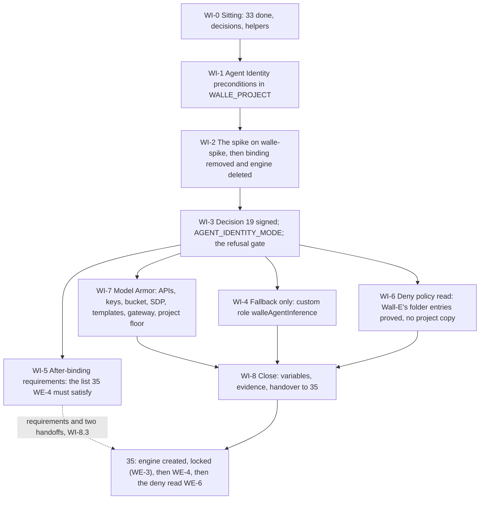

# 34. Wall-E: the identity spike and Model Armor

## Status

- Owner: the platform owner
- Last reviewed: 2026-09-15
- Last executed: never
- Stage: review §2 stage 27 ([../13-setup-procedure-review.md](../13-setup-procedure-review.md) §2), the part of it that must finish **before the engine exists**: `wall-e/SETUP.md` Phase 12b steps 1 to 6 and the whole of Phase 12c. The engine itself, Phase 12b step 7's folder read and Phase 13 are [35](35-wall-e-engine-registration-and-gateways.md).
- Step prefix: `WI`. Steps: 51 (revision of 2026-09-16: §5 no longer carries steps of its own, §6 is three read-only steps run in this file, and the template-conformance check is `WI-7.10b`, placed where it runs). BLOCKED: `WI-2.1`, `WI-2.2`, `WI-2.5`, `WI-2.6`, `WI-7.14` (all B-16: the spike agent, the probe tool and the injection regression suite are Wall-E code that is not committed); `WI-1.5`'s CI half is BLOCKED on the same id while the commands stand alone. **Nothing in this file is executed by [35](35-wall-e-engine-registration-and-gateways.md)**: the after-binding work is owned there as `WE-4.1` to `WE-4.6` and the deny-policy read as `WE-6.1` to `WE-6.3`; §5 here is the requirement list those steps must satisfy, and the two requirements 35 does not yet cover are named handoffs in `WI-8.3`, never `PENDING-35` checkpoints of this file.
- IRREVERSIBLE: `WI-2.9` (the spike engine's delete), `WI-7.3` (the key name `walle-content-logs`), `WI-7.5` (a log bucket's CMEK cannot be changed or removed after creation), `WI-7.7` (the key name `walle-engine-cmek`).
- Replaces: [../../wall-e/SETUP.md](../../wall-e/SETUP.md) Phase 12b steps 1-6 and Phase 12c, and the `spike`, `armor` and `armor --enforce` subcommands of `wall-e/setup/walle_setup.py`. Neither is executed.
- Salvaged: 12b step 1's "enable `agentidentity`, leave `agentidentitycredentials` disabled" and the two key constraints; step 2's three CI assertions; step 3's three-result shape (`12b-a`, `12b-b`, `12b-c`) and the claim-driven allowlist idea; step 5's REST read of `spec.effectiveIdentity`; step 6's "`expressUser` is deliberately absent" argument and the automatic-role dump; 12c's three-screens argument, the RAI filter set, the `MA-Client-Correlation-Id` header, the `filterVersionConfig` recording, the fail-closed extension and `CONTENT_AUTHZ` policy shapes, the "which method does Gemini Enterprise call" question, and the in-process plugin's "not at Stage 0" position; the claim-reading intent of `walle_setup.py` `cmd_spike`.
- Not copied: `exit 1` inside pasted blocks (S187); a CI check against a requirements file the deploy does not use (S188); a spike whose `run.invoker` binding is removed only on rollback (S116); `roles/aiplatform.expressUser` in the baseline grants (S105); `EXEC_CALLER_ALLOWLIST=${SA_AGENT}` left standing on the Agent Identity path (S016, S017 ordering, S117); a project-level deny policy created by default with three unsourced permission names (S017); a folder floor written by an agent procedure and a project floor with integration flags only (S073, S096); `--basic-config-filter-enforcement` on a P-SA template and a response template created twice (S081, S097, S189); `gcloud config set api_endpoint_overrides/modelarmor` as a persistent setting (S118); a content-log bucket without CMEK and an engine without `encryption_spec` (S080); three APIs where Google lists twenty-two (S119); Model Armor service-agent grants before the service agents exist (S174); "the spike failed, so deploy with `SERVICE_ACCOUNT` and carry on with 12c as written" (S026, S120).
- Design built: [../../wall-e/12-agent-identity.md](../../wall-e/12-agent-identity.md) §1.1 to §1.7 (the principal form, immutability, the Cloud Run hop, the gated fallback) and §7 (locking `reasoningEngines.query`); [../04-identity-and-privileged-access.md](../04-identity-and-privileged-access.md) §2.1 and §3 (the deny policy and its verified permission names); [../06-gateways-model-armor-perimeter.md](../06-gateways-model-armor-perimeter.md) §3.2 (floors, P84), §3.3 (the template standard per tier, P85) and §3.4 (floor and template alerts, P86); [../09-supply-chain-secrets-recovery.md](../09-supply-chain-secrets-recovery.md) §2.2 (CMEK per store); [../../wall-e/11-prompt-security.md](../../wall-e/11-prompt-security.md) §4 to §6.
- Decisions applied, each signed in [03](03-decisions-and-people.md) before the step that needs it: SD-01 (bootstrap deviation), SD-22 (deny principal form), SD-37 (manual path), SD-41 (floor precedence and the full project floor), SD-44 (`exists_or_pending`), SD-45 (the order), SD-48 (the model cannot approve); Wall-E decision 19 (the identity) is **taken in this file**, decision 24 (the blocking flips) is only prepared here and taken in [39](39-wall-e-stage-0.md).
- Closes: S015, S016, S017, S026, S073 (Wall-E's half; [18](18-model-armor-floor-spikes-and-kill-switch.md) closed the folder half), S080, S081, S096, S097, S105, S116, S117, S118, S119, S120, S174, S187, S188, S189. Defers none without an owner (§10).
- Consumes: `ACTIONS_URL`, `SUPER_ACTIONS_URL`, `APPROVAL_A_URL`, `APPROVAL_SUPER_URL`, `SA_APPROVAL_A`, `SA_APPROVAL_SUPER`, `WALLE_CODE_COMMIT` ([33](33-wall-e-action-services-and-approval-surfaces.md)); `WALLE_PROJECT`, `WALLE_PROJECT_NUMBER`, `SA_AGENT`, `SA_ACTIONS`, `SA_ACTIONS_SUPER`, `SA_DISPATCH`, `SA_TASKS`, `SA_OPS_CALLER`, `WALLE_AUDIT_DS`, `WALLE_SECRET_NAMES`, `ENT_PROJECT_REPAIR_WALLE`, `ENT_DEPLOY_CREDENTIAL_HOLDER_WALLE` ([31](31-wall-e-project-and-data-plane.md)); `WALLE_REPO_DIR` ([30](30-wall-e-workspace-side.md)); `CONTROL_GROUPS_FILE` ([06](06-organisation-bootstrap-and-roster.md)); `KR_ENGINES`, `KR_LOGGING`, `KMS_PROJECT` ([11](11-keys-and-validator-custodian.md)); `CORE_PROJECT`, `CICD_PROJECT`, `LOGGING_PROJECT` ([10](10-core-projects-and-ci-identities.md)); `FLD_AGENTIC_PLATFORM`, `FLD_AGENTS_P_SA_PROD` ([09](09-folders-and-security-command-center.md)); the PF block and `FLOOR_RECORD` ([18](18-model-armor-floor-spikes-and-kill-switch.md)); `ENT_PLATFORM_POLICY`, `ENT_PROJECT_REPAIR_CORE` ([12](12-privileged-access-catalogue.md)); `DENY_AGENTS_PLATFORM` ([13](13-organisation-policies-deny-and-pab.md), with Wall-E's entries added by [31](31-wall-e-project-and-data-plane.md) `WD-2.3`); SD-41, decision 19's signatories, `SECOND_HUMAN_EMAIL`, NAMES ([03](03-decisions-and-people.md)); `REGION`, `ORG_ID`, `DOMAIN`, `GRP_PLATFORM_SECURITY`, `WALLE_OPERATORS_GROUP` ([01](01-prerequisites-and-conventions.md), [06](06-organisation-bootstrap-and-roster.md), [30](30-wall-e-workspace-side.md)).
- Produces: `AGENT_IDENTITY_MODE`, `SPIKE_PRINCIPAL`, `SPIKE_RECORD`, `AGENT_PRINCIPAL` **on the `SERVICE_ACCOUNT` fallback only** (`WI-3.2` sets it to `serviceAccount:walle-agent@…`; on `AGENT_IDENTITY` it is left unset and [35](35-wall-e-engine-registration-and-gateways.md) `WE-4.1` sets it from the production engine's `spec.effectiveIdentity`, because the spike's principal names an engine this file deletes), `WALLE_ARMOR_TEMPLATES`, `WALLE_CONTENT_LOG_BUCKET`, `KEY_WALLE_CONTENT_LOGS`.
- Variables new against plan §5, handed to README's variable list: `KEY_WALLE_ENGINE_CMEK` (the engine key [35](35-wall-e-engine-registration-and-gateways.md)'s `encryption_spec` names, created here because the key must exist before the engine and nothing else creates it), `SDP_INSPECT_TEMPLATE`, `SDP_DEIDENTIFY_TEMPLATE`, `WALLE_PSA_INSPECT_TEMPLATE`, `WALLE_SPIKE_RECORD_DECISION` (the decision 19 record path).
- Every command, flag, role, API field and console path was read on Google's pages on 2026-09-15, and the ones the setup-procedure review disputed were re-read on 2026-09-16 (§9 "Sources"). Nothing was run against the live organisation while writing. What could not be settled is §11.

## What this part builds

Two things, in one order that cannot be swapped: **the answer to "what identity does the engine run as"**, which is immutable once the engine exists, and **the screen the engine's traffic passes through**, which has to exist before the first prompt is ever sent, because it is also the only record of what the model was shown.

| Built | Where | Variable or record |
|---|---|---|
| Agent Identity's preconditions in the project: `agentidentity.googleapis.com` on, `agentidentitycredentials.googleapis.com` off, the two service-account-key constraints set explicitly, and a custom organisation-policy constraint that denies creating an `AuthProvider` in this project | `WALLE_PROJECT` | `WI-1.1` to `WI-1.4` |
| The spike: a throwaway engine `walle-spike` created with `identity_type=AGENT_IDENTITY`, its principal read back from `spec.effectiveIdentity`, one `run.invoker` binding on the **pre-grant** `walle-actions`, an ID token requested from inside it for the `walle-actions` audience, one `GET /v1/operations` call, the token's claims decoded — then the binding removed and the engine deleted, both as ordinary steps | `WALLE_PROJECT` | `SPIKE_PRINCIPAL`, `SPIKE_RECORD` |
| **Decision 19**, signed: `AGENT_IDENTITY` or `SERVICE_ACCOUNT`, with the raw spike output attached, reviewed by the second human. `AGENT_IDENTITY` is **refused** without a spike record whose verdict is `pass` | decisions record | `AGENT_IDENTITY_MODE`, `WALLE_SPIKE_RECORD_DECISION` |
| On the fallback only: the custom project role `walleAgentInference`, model-call permissions and nothing else, bound to `walle-agent@`; never `roles/aiplatform.user`, never `roles/aiplatform.expressUser` | `WALLE_PROJECT` | `WI-4.1` to `WI-4.4` |
| The **after-binding requirements**: what must be true of the production engine's identity the moment it exists and its two-principal lock is applied. Owned and executed by [35](35-wall-e-engine-registration-and-gateways.md) §4 (`WE-4.1` to `WE-4.6`); §5 here is the requirement list with the mapping to those steps, and the claim the in-app allowlist keys on is settled **once**, in `SPIKE_RECORD` | `WALLE_PROJECT` (by 35) | §5, `WI-8.3` |
| The deny-policy position: the folder policy `deny-agents-platform` is read and Wall-E's two entries on it are proved present; **no project-level deny policy is ever created by this file** — an absent folder policy or a missing entry is a stop that sends the operator back to [31](31-wall-e-project-and-data-plane.md) `WD-2.3` and [13](13-organisation-policies-deny-and-pab.md) `OP-7.4`, because [35](35-wall-e-engine-registration-and-gateways.md) `WE-6.2` refuses any project-level policy | `FLD_AGENTIC_PLATFORM` (read only) | §6 |
| The twenty-two Agent Gateway APIs, minus the two this platform refuses, each omission recorded with a reason | `WALLE_PROJECT` | `WI-7.1`, `WI-7.2` |
| The HSM key `walle-content-logs`, **then** the log bucket `walle-content-logs` created with CMEK, its sink, the `_Default` exclusion, a log view and exactly two reader principals | `KMS_PROJECT`, `WALLE_PROJECT` | `KEY_WALLE_CONTENT_LOGS`, `WALLE_CONTENT_LOG_BUCKET` |
| The HSM key `walle-engine-cmek`, with the Agent Runtime service agent as its sole Encrypter/Decrypter, so that [35](35-wall-e-engine-registration-and-gateways.md)'s `encryption_spec` has a key to name at creation | `KMS_PROJECT` | `KEY_WALLE_ENGINE_CMEK` |
| The fleet's Sensitive Data Protection templates in `CORE_PROJECT` — one inspect, one de-identify — and Wall-E's P-SA response inspect template with the hard-denied vocabulary detectors; `roles/dlp.user` and `roles/dlp.reader` for `WALLE_PROJECT`'s Model Armor service agent on `CORE_PROJECT` | `CORE_PROJECT` | `SDP_INSPECT_TEMPLATE`, `SDP_DEIDENTIFY_TEMPLATE`, `WALLE_PSA_INSPECT_TEMPLATE` |
| The template pair `walle-ingress-prompt` and `walle-ingress-response`, both **advanced** SDP with the de-identify template, both inspect-only, both with the custom 400 error, each created exactly once | `WALLE_PROJECT` | `WALLE_ARMOR_TEMPLATES` |
| The ingress Agent Gateway `walle-ingress`, its fail-closed `CONTENT_AUTHZ` authorisation extension and policy — **on the Agent Identity path only** | `WALLE_PROJECT` | `WI-7.15` |
| The full project floor, by the PF block of [18](18-model-armor-floor-spikes-and-kill-switch.md) with `PF_TIER=P-SA`; the folder floors are read and asserted, never written | `WALLE_PROJECT` | `WI-7.16` |

### Why the order in this file is the whole point

`identity_type` and `agent_gateway_config` are fixed when the engine is created. Google's Agent
Gateway runtime page says so in the sharpest available form: "Updating an existing reasoning
engine to set `agentGatewayConfig` does *not* change its `identity_type`. If the engine was
originally created without `identity_type=AGENT_IDENTITY`, you cannot retroactively make it
eligible for Semantic Governance Policies by patching it." Deleting and recreating the engine
gives it a new id, therefore a new principal, and every resource-level binding on the old
principal dies with it ([../../wall-e/12-agent-identity.md](../../wall-e/12-agent-identity.md) §1.1).

So the identity question is answered **before** the engine is created, on a throwaway engine, and
the answer is a signed decision rather than a default. The superseded runbook said the same thing
and then made it impossible to do: `walle spike` refused to run until `walle-actions` existed,
and the only command that created `walle-actions` also created the production engine with an
immutable identity in the same invocation (S015). This set breaks that deadlock by giving the
action services their own file ([33](33-wall-e-action-services-and-approval-surfaces.md)), the
spike its own file (this one) and the engine its own file
([35](35-wall-e-engine-registration-and-gateways.md)).

### What the old text got wrong, and must not come back

| Old text | Why it fails | Here instead |
|---|---|---|
| `./walle spike` before `./walle deploy`, with no way to deploy the action services alone (S015) | `cmd_spike` dies "walle-actions is not deployed"; `cmd_deploy` runs Phases 10, 11, 12, 12b and 14 in one call, so the only path to a spike creates the production engine first, with an immutable identity, before the spike that is supposed to decide it | [33](33-wall-e-action-services-and-approval-surfaces.md) deploys the services; this file spikes; [35](35-wall-e-engine-registration-and-gateways.md) creates the engine once, with the decided identity. `WI-3.3` **refuses** `AGENT_IDENTITY` when `SPIKE_RECORD` is missing or its verdict is not `pass` |
| `EXEC_CALLER_ALLOWLIST=${SA_AGENT}` at Phase 10 and nothing after 12b (S016, S117) | Under Agent Identity the engine's token carries no `walle-agent@` email, so `/v1/execute` refuses the agent as `foreign_actor`; every smoke check, the Phase 17 denial suite and Stage 0 entry fail for what looks like an application bug. Worse: `--set-env-vars` replaces the whole set, so any re-deploy silently reverts a hand fix | `WI-2.7` records in `SPIKE_RECORD` **which claim** the service reads from the verified token and **what form** its value takes (`claim_form: principal` when it equals the engine's `principal://…` string, `claim_form: opaque` when it does not); [35](35-wall-e-engine-registration-and-gateways.md) `WE-4.3` rewrites the variable on **both** services with `--update-env-vars` from that record (requirement R5 of §5), and `WE-4.4` removes `walle-agent@` from both invoker lists; [33](33-wall-e-action-services-and-approval-surfaces.md) computes the value from `AGENT_IDENTITY_MODE` on every deploy, so a re-run cannot revert it |
| `phase_12b_identity` runs `ensure_deny_policy` before `lock_engine_iam` (S017) | A failed deny create stops the run with the engine created, `expressUser` already granted and the two-principal `walleEngineQuery` lock never applied — the engine is invocable by anyone the project policy lets query it | The lock is the **first** thing [35](35-wall-e-engine-registration-and-gateways.md) does after the create (`WE-3`); its §4 runs after the lock; its §6 (the deny read) runs last. Nothing in this file creates a deny policy, so no deny step can leave an unlocked engine behind |
| A project deny policy created by default, with three permission names the code itself marked unverified (S017) | `roles/iam.denyAdmin` on the organisation is needed for it, and the fleet already has one copy at the folder | `WI-6.1` reads the folder policy and proves Wall-E's two entries on it, which [31](31-wall-e-project-and-data-plane.md) `WD-2.3` added; `WI-6.2` is a **stop**, not a create, when either is absent. The review's earlier fix ("only by explicit flag, only when the folder policy is absent") is superseded on 2026-09-16: a flag-guarded create written in a block that may not `exit` cannot be made inert safely, [35](35-wall-e-engine-registration-and-gateways.md) `WE-6.2` fails the file on any project-level deny policy, and the folder policy is a proven precondition rather than a possibility |
| `walle-agent@` "holds nothing", and 12b's Failed branch sends the builder to "Phase 12 as written" (S026) | Google: a custom service account for a deployed agent "likely needs the *Agent Platform User* role (`roles/aiplatform.user`)". Without a model-call permission every turn is 403. With `roles/aiplatform.user` the agent gains `reasoningEngines.query` on every engine and the two-principal lock is gone | §4: the custom role `walleAgentInference`, model-call permissions only, asserted to contain no `aiplatform.reasoningEngines.*`; `roles/aiplatform.user` and `roles/aiplatform.expressUser` are both forbidden and the assertion in `WI-4.3` says so |
| `roles/aiplatform.expressUser` in `AGENT_BASELINE_ROLES` (S105) | At project level it carries `reasoningEngines.query`, `.create`, `.update` and `.delete`: the agent becomes a caller of its own engine and can change or delete it, while the conferring-role check still passes | §5 R3 names three explicit roles and no fourth, R4 dumps the two automatic roles and fails on a forbidden permission (both handed to 35 as HANDOFF-35-A and -B with an owner); `WI-4.3` here and 35 `WE-3.5` read every project-level role's permission list as JSON and fail on any holder of `aiplatform.reasoningEngines.*` other than the two locked principals |
| Spike step 3 with `$SPIKE_PRINCIPAL` defined nowhere and the engine creation left as prose; the binding removed only on rollback (S116) | `--member=""` makes gcloud fail; a completed spike leaves an extra invoker on the production `walle-actions` that the 12b verify then flags | §2 creates the engine from a named source file, reads the principal back, and removes the binding and the engine as `WI-2.8` and `WI-2.9`, ordinary numbered steps with their own VERIFY |
| "If the spike fails, deploy `SERVICE_ACCOUNT`", with 12c unchanged (S120) | Gateway-mediated Model Armor needs `identity_type=AGENT_IDENTITY`; the gateway binds but screens nothing, so the builder believes a fail-closed screen exists where there is none | `WI-3.4` states the Failed branch in full: no ingress gateway, `WI-7.15` skipped, ingress Model Armor **floor-only and fail-open**, the in-process `ModelArmorPlugin` promoted to mandatory at S0, all recorded on decision 24 |
| `gcloud logging buckets create walle-content-logs` with no CMEK, and an engine config with no `encryption_spec` (S080) | CMEK cannot be added to a log bucket after creation, and retrofitting the engine means recreating it, which changes the principal | `WI-7.3` creates the key, `WI-7.4` grants the Logging CMEK service account on it, `WI-7.5` creates the bucket with `--cmek-kms-key-name`, `WI-7.6` adds the view and its two readers; `WI-7.7` creates `walle-engine-cmek` for [35](35-wall-e-engine-registration-and-gateways.md), bound to the **Agent Runtime** service agent `service-<number>@gcp-sa-aiplatform-re.iam.gserviceaccount.com`, the principal Google's CMEK page names |
| `walle-ingress-prompt` with `--basic-config-filter-enforcement`; `walle-ingress-response` created twice, the second time "instead" (S081, S097, S189) | Basic and advanced SDP are mutually exclusive, the P-SA standard is advanced with a de-identify template, and step 2b as written fails with `ALREADY_EXISTS` because no delete precedes it | §7 creates **one** prompt template and **one** response template, both advanced, both with the de-identify template; `WI-7.10b`, which runs **before** the creates, is the only place a non-conforming existing template is deleted, and it refuses while an extension references it |
| `gcloud config set api_endpoint_overrides/modelarmor "https://modelarmor.googleapis.com/"` (S118) | It persists in the gcloud configuration, so every later regional template call is sent to the global endpoint and fails — including the blocking flip | `WI-0.2` defines `ma_reg` and `ma_glb` as subshell wrappers; nothing in this set writes a persistent endpoint override, and `WI-8.2` asserts the configuration has none |
| Three APIs enabled at 12c, `iap`, `dns` and `compute` only at 13b (S119) | Google lists twenty-two for Agent Gateway, three of them core APIs the ingress import needs before 13b runs | `WI-7.1` enables twenty of the twenty-two before the gateway import; `WI-7.2` records the two omissions (`agentregistry`, P71; `discoveryengine`, decision 42) with a reason each and adds every kept name to the P-SA allow-list check |
| `walle armor` binds `roles/modelarmor.calloutUser` and `roles/modelarmor.user` to service agents that the later deploy is what forces into existence (S174) | `add-iam-policy-binding` rejects a member that does not exist, and the subcommand stops after creating the gateway and before the fail-closed extension | `WI-7.14` runs `gcloud beta services identity create` for each service **first** and treats a still-absent agent as `PENDING` in the re-run index, never as a stop |
| `walle armor` writes the folder floor and a project floor with `--add-integrated-services` only (S073, S096) | The folder floor is IT security's under P84 and a write to it is severity-1 drift; a project floor with no filters and no enforcement means `VERTEX_AI` screens against an empty floor, and Google's rule is that the project floor **overrides** the folder's | `WI-7.16` runs [18](18-model-armor-floor-spikes-and-kill-switch.md)'s PF block with `PF_TIER=P-SA`, the full floor in one command; `WI-7.17` reads the folder floors and fails if either is looser than the tier standard; no step here writes a folder floor |
| `exit 1` inside blocks pasted into a shell held for a week (S187) | A failing check closes the terminal and loses every exported variable | Every assertion in this file ends in `false` or `return 1`, never `exit` |
| `grep -Eq '^google-auth>=2\.45' agent/requirements.txt` while the deploy passes requirements inline (S188) | The check reads a file the deployed engine never resolves | `WI-1.5` asserts that the deploy config **reads** `agent/requirements.txt` and that the file pins `google-auth>=2.45.0`; the assertion fails if the config carries an inline list |



## Preconditions

- [ ] **[33](33-wall-e-action-services-and-approval-surfaces.md) complete**, or its BLOCKED steps indexed in README §8 under B-16. `ACTIONS_URL` and `SUPER_ACTIONS_URL` resolve, both services answer, and their pre-grant verify is recorded: a tenant read returns **403**, which is the expected pre-grant answer and not a fault (`walle@` holds no admin role until [38](38-super-admin-gate-and-grant.md)).
- [ ] The two approval surfaces of [33](33-wall-e-action-services-and-approval-surfaces.md) exist with their negative tests recorded against `walle-agent@`; `APPROVAL_A_URL`, `APPROVAL_SUPER_URL`, `SA_APPROVAL_A` and `SA_APPROVAL_SUPER` are set. Requirement R8 of §5 has [35](35-wall-e-engine-registration-and-gateways.md) `WE-4.5` re-run those tests against the production `AGENT_PRINCIPAL`.
- [ ] [31](31-wall-e-project-and-data-plane.md): `WALLE_PROJECT`, `WALLE_PROJECT_NUMBER`, `SA_AGENT`, `SA_ACTIONS`, `SA_ACTIONS_SUPER`, `WALLE_SECRET_NAMES` (five names), `ENT_PROJECT_REPAIR_WALLE` and `ENT_DEPLOY_CREDENTIAL_HOLDER_WALLE` set; the five secrets exist.
- [ ] [32](32-wall-e-consents.md): the two refresh tokens are in Secret Manager with pinned versions. Nothing in this file reads a secret value, and no step here prints one.
- [ ] [11](11-keys-and-validator-custodian.md): `KR_ENGINES` and `KR_LOGGING` exist in `KMS_PROJECT`, `europe-west1`; `KV-3.1` and `KV-2` are `DONE`.
- [ ] [18](18-model-armor-floor-spikes-and-kill-switch.md): `FLOOR_RECORD` exists, the folder floors are applied, and `model-armor/floors.json` is merged in `PLATFORM_REPO_DIR`. The PF block of `KS-2.9` is the one `WI-7.16` runs; it is not re-derived here.
- [ ] [12](12-privileged-access-catalogue.md): `ENT_PLATFORM_POLICY` exists (`WI-1.3` needs it for the custom constraint), `ENT_PROJECT_REPAIR_CORE` exists (`WI-7.8` enables `dlp.googleapis.com` and creates the fleet templates in `CORE_PROJECT` under it), and `ENT_PROJECT_REPAIR_WALLE` can be granted with the second human as approver.
- [ ] [13](13-organisation-policies-deny-and-pab.md) `OP-7.4` created `deny-agents-platform` at `FLD_AGENTIC_PLATFORM` (`DENY_AGENTS_PLATFORM` set) and [31](31-wall-e-project-and-data-plane.md) `WD-2.3` added Wall-E's two principal entries to rules R1-R5 and R3b (its VERIFY prints `R1,R2,R3,R3b,R4,R5`). `WI-6.1` re-reads both; **this file creates no deny policy** and holds no `roles/iam.denyAdmin`.
- [ ] `dlp.googleapis.com` is on the `fld-platform-core` `gcp.restrictServiceUsage` allow-list of [13](13-organisation-policies-deny-and-pab.md) `OP-2.4`, or its addition is merged as a dated pull request before `WI-7.8`; a refusal at `WI-7.8` goes back to that allow-list, never around it.
- [ ] [03](03-decisions-and-people.md) signed: SD-01, SD-22, SD-37, SD-41, SD-44, SD-45, SD-48, NAMES (the template names, the bucket name, the key names, the SDP template names). **Decision 19 is not a precondition**: it is the output of §3. Decision 42 (the Gemini service agent's grant form) is recorded, because `WI-7.2` cites it for the `discoveryengine` omission.
- [ ] `MODEL_ID` is signed (decision 6, SD-09) **or** recorded as still *tbd*: nothing here calls a model, but `WI-7.16`'s live proof is handed to [35](35-wall-e-engine-registration-and-gateways.md) and that needs it.
- [ ] Workstation of [01](01-prerequisites-and-conventions.md): `gcloud` with the `beta` component, `python3.12`, `jq`, `curl`, `uuidgen`, `git`; `~/.platform-env` sourced; `penv_guard` silent; **no** `api_endpoint_overrides/modelarmor` in the gcloud configuration (`WI-0.2` checks and clears it).
- [ ] The second human is available for one review sitting of about 40 minutes (`WI-3.1`). Decision 19 is not recorded without it.
- [ ] **Not** a precondition: the engine. No step in this file creates, describes or registers the production engine. The only engine it touches is `walle-spike`, which it also deletes.

## People needed

| Role | Does | Present at |
|---|---|---|
| Platform owner | Every step except the review of `WI-3.1`; holds `ENT_PROJECT_REPAIR_WALLE` and `ENT_DEPLOY_CREDENTIAL_HOLDER_WALLE` for the grants and deploys | every step |
| Second human (`SECOND_HUMAN_EMAIL`) | **Reviews the decision 19 record**: reads the raw spike output, checks that the verdict matches it, and co-signs; approves every PAM grant this file requests | `WI-0.1`, `WI-3.1`, `WI-3.2` |
| Security reviewer (B-20), once appointed | Reviews the template pair against the tier standard before `WI-7.11` and `WI-7.12` are merged; approves any delete at `WI-7.10b`; signs the P-SA row of the floor assertion | `WI-7.10`, `WI-7.10b`, `WI-7.17` |
| Wall-E owner (the platform owner until [03](03-decisions-and-people.md) names another) | Commits the spike agent, the probe tool and the regression suite (B-16) | `WI-2.1`, `WI-7.18` |
| Detection desk | Acknowledges the announced floor-write and template-create alerts of [15](15-pager-siem-and-detections.md), which this file fires on purpose | `WI-0.3`, `WI-7.16` |

Hands-on: about 5 hours, of which the spike is 1 to 2 (the superseded Phase 12b costed it at "one
day on a throwaway engine", which is the elapsed figure, not the hands-on one). Elapsed: 2 days,
because decision 19 needs a second human's review sitting and because a Model Armor template
create can be refused by the folder floor and has to be raised, never the floor lowered.

Conventions of [01](01-prerequisites-and-conventions.md) apply. Deviation rows are `BD-34-<n>`.
Records go to `BUILD_LOG_DIR/records/` as `<date>-WI-<step>-<slug>-v<n>`. Every shell block starts
with:

```bash
source ~/.platform-env
penv_guard
R="$BUILD_LOG_DIR/records/$(date -u +%F)-WI"
source "$BUILD_LOG_DIR/wall-e/armor/wi-helpers.sh" 2>/dev/null || true   # absent only before WI-0.2
```

`R` is the **record prefix for today's sitting** and nothing else: no loop in this file assigns
to `R`, and a step that reads a record an **earlier** sitting wrote (`WI-3.1`, `WI-3.2`,
`WI-8.2`) finds it through `wi_latest <step> <slug> <ext>` (defined at `WI-0.2`), which globs the
records directory by step id and slug regardless of the date in the name. A dated prefix used
across midnight is otherwise a silent miss.

## How to execute this part (SD-37)

| Step | Manual path | Helper script | Why the script cannot be used yet |
|---|---|---|---|
| `WI-1.*` | `gcloud services`, `gcloud org-policies`, §1 | `walle deploy` (12b step 1) | BLOCKED: only reachable inside `cmd_deploy`, which also creates the production engine (S015) |
| `WI-2.*` | REST creates and deletes, §2 | `walle spike` | BLOCKED: `cmd_spike` dies unless `walle-actions` is deployed by `cmd_deploy`, and its die message names no phase-only command (S015). Its **claim reading** is the part worth salvaging and is reproduced in `WI-2.7` |
| `WI-3.*` | decisions record, §3 | `agent_identity_mode()` | BLOCKED: it accepts `AGENT_IDENTITY` with no spike file on disk (S015) |
| `WI-4.*` | `gcloud iam roles create`, §4 | none | The script has no fallback-role path; the Failed branch points at "Phase 12 as written" (S026) |
| §5 (no steps) | the requirement list, executed by [35](35-wall-e-engine-registration-and-gateways.md) `WE-4.1` to `WE-4.6` | `phase_12b_identity` | BLOCKED: grants `expressUser` (S105), never rewrites `EXEC_CALLER_ALLOWLIST` (S016), and runs before the engine lock (S017) |
| `WI-6.*` | `gcloud iam policies get` and `list`, read only, §6 | `ensure_deny_policy` | BLOCKED: creates the project policy by default with three unsourced names (S017); no replacement creates one at all |
| `WI-7.*` | §7 | `walle armor`, `walle armor --enforce` | BLOCKED: writes the folder floor unconditionally (S096), creates basic-config templates with no custom error (S097), never implements the SDP step, passes no regional endpoint override (S118), and binds Model Armor roles to service agents that do not yet exist (S174) |

When B-18 closes, only this table changes.

## 0. The sitting

### WI-0.1 Open the sitting and check the gates

- **WHO:** Platform owner; the second human is told the sitting has started (they are needed at `WI-3.1`).
- **WHERE:** Shell, `~/.platform-env` sourced, gcloud configuration `GCLOUD_CONFIG_NAME`.
- **ACTION:**

```bash
checkpoint WI-0.1 START
need WALLE_PROJECT WALLE_PROJECT_NUMBER SA_AGENT SA_ACTIONS SA_ACTIONS_SUPER ACTIONS_URL SUPER_ACTIONS_URL APPROVAL_A_URL APPROVAL_SUPER_URL SA_APPROVAL_A SA_APPROVAL_SUPER WALLE_SECRET_NAMES WALLE_CODE_COMMIT KR_ENGINES KR_LOGGING KMS_PROJECT CORE_PROJECT CICD_PROJECT LOGGING_PROJECT FLD_AGENTIC_PLATFORM FLD_AGENTS_P_SA_PROD ENT_PROJECT_REPAIR_WALLE ENT_DEPLOY_CREDENTIAL_HOLDER_WALLE ENT_PLATFORM_POLICY ENT_PROJECT_REPAIR_CORE DENY_AGENTS_PLATFORM FLOOR_RECORD REGION ORG_ID DOMAIN SECOND_HUMAN_EMAIL GRP_PLATFORM_SECURITY WALLE_OPERATORS_GROUP BUILD_LOG_DIR PLATFORM_REPO_DIR DEVIATION_REGISTER EVIDENCE_REGISTER
"$PLATFORM_REPO_DIR/tools/decision-need.sh" NAMES SD-01 SD-22 SD-37 SD-41 SD-44 SD-45 SD-48
awk -F'\t' '$2 == "WD-2.3" {print $2"\t"$3}' "$BUILD_LOG_DIR/checkpoints.tsv" | tail -1
awk -F'\t' '$2 == "OP-7.4" {print $2"\t"$3}' "$BUILD_LOG_DIR/checkpoints.tsv" | tail -1
awk -F'\t' '$2 ~ /^WS-/ {print $2"\t"$3}' "$BUILD_LOG_DIR/checkpoints.tsv" | sort -u | tail -40
awk -F'\t' '$2 ~ /^WS-/ && $3 == "BLOCKED" {print "33 BLOCKED: "$2}' "$BUILD_LOG_DIR/checkpoints.tsv" | sort -u
test -s "$PLATFORM_REPO_DIR/model-armor/floors.json" && echo "floors.json present"
```

- **VERIFY:** `decision-need.sh` prints `SIGNED` for each id. Every `WS-` step is `DONE`, or every `33 BLOCKED` line printed is already indexed in README §8 under B-16; a `33` line that is not indexed stops the sitting. `WD-2.3	DONE` and `OP-7.4	DONE` are printed (the deny-policy entries `WI-6.1` re-reads exist). `floors.json present`. If `decision-need.sh` prints `SIGNED` for decision 19, **stop**: decision 19 is this file's output, and an existing record means either a repeat run (in which case §2 and §3 are skipped and `WI-3.5` re-reads the record) or somebody decided the identity without a spike.
- **ROLLBACK:** Read only.
- **EVIDENCE:** Output as `${R}-0.1-gates-v1.txt`; `evidence_add WI-0.1 gates E-05 1.4.1 "build-log:records/<file>" "<file>"`.

### WI-0.2 Define this file's helpers, and prove the gcloud configuration carries no endpoint override

The Model Armor endpoint is not the same for templates and for floors: templates are **regional**
and floors are **global** resources. Google's manage-templates page gives the override as
`gcloud config set api_endpoint_overrides/modelarmor "https://modelarmor.LOCATION.rep.googleapis.com/"`,
which writes it into the configuration and leaves it there. Nothing in this set does that (S118).
Each call carries its own override, in a subshell, through one of two wrappers.

- **WHO:** Platform owner.
- **WHERE:** Shell.
- **ACTION:**

```bash
checkpoint WI-0.2 START
WI_DIR="$BUILD_LOG_DIR/wall-e/armor"; mkdir -p "$WI_DIR"
cat > "$WI_DIR/wi-helpers.sh" <<'EOF'
# Model Armor, regional resources (templates): one override per call, never persisted.
ma_reg() { ( export CLOUDSDK_API_ENDPOINT_OVERRIDES_MODELARMOR="https://modelarmor.${REGION}.rep.googleapis.com/"; gcloud "$@" ); }
# Model Armor, global resources (floor settings): the global endpoint, also per call.
ma_glb() { ( export CLOUDSDK_API_ENDPOINT_OVERRIDES_MODELARMOR="https://modelarmor.googleapis.com/"; gcloud "$@" ); }
# One authenticated REST GET against the Agent Platform API in REGION.
re_get() { curl -sS -H "Authorization: Bearer $(gcloud auth print-access-token)" "https://${REGION}-aiplatform.googleapis.com/v1/$1"; }
# A PAM grant, and a wait until it is active.
pam_grant() { gcloud pam grants create --entitlement="$1" --requested-duration="$2" --justification="$3" --additional-email-recipients="$SECOND_HUMAN_EMAIL" --billing-project="$CICD_PROJECT" --format='value(name)'; }
pam_active() { for _i in $(seq 1 60); do [ "$(gcloud pam grants describe "$1" --format='value(state)')" = "ACTIVE" ] && return 0; sleep 10; done; echo "grant not ACTIVE: $1" >&2; return 1; }
# The newest record of a step, by step id and slug, whatever date it was written on.
#   wi_latest 2.5 token-probe json  ->  .../records/<date>-WI-2.5-token-probe-v<n>.json, or nothing
wi_latest() { ls -t "$BUILD_LOG_DIR"/records/*-WI-"$1"-"$2"-v*."$3" 2>/dev/null | head -1; }
# The permission list of a role, one per line. gcloud's value() joins list items with ";" (formats
# topic), so the JSON form is read instead and no separator is load-bearing.
role_perms() { gcloud iam roles describe "$@" --format=json | jq -r '.includedPermissions[]?' | sort; }
EOF
source "$WI_DIR/wi-helpers.sh"
gcloud config get api_endpoint_overrides/modelarmor 2>/dev/null | grep -q . && gcloud config unset api_endpoint_overrides/modelarmor
gcloud config list --format=json | jq -e '.api_endpoint_overrides == null or (.api_endpoint_overrides | has("modelarmor") | not)' >/dev/null && echo "no persistent modelarmor override"
checkpoint WI-0.2 DONE
```

- **VERIFY:** `type ma_reg ma_glb re_get pam_grant pam_active wi_latest role_perms` names seven functions. `no persistent modelarmor override` is printed. `env | grep CLOUDSDK_API_ENDPOINT_OVERRIDES_MODELARMOR` prints nothing outside a wrapper.
- **ROLLBACK:** `rm "$WI_DIR/wi-helpers.sh"`; no cloud state is touched.
- **EVIDENCE:** The helper file and the config listing as `${R}-0.2-helpers-v1`. E-05. TISAX 5.2.6.

### WI-0.3 Tell the people who will see the alerts

- **WHO:** Platform owner.
- **WHERE:** Mail to the detection desk, `GRP_PLATFORM_SECURITY` and `SECOND_HUMAN_EMAIL`.
- **ACTION:** Announce, with the change reference and the window: a reasoning engine named `walle-spike` will be created and deleted in `WALLE_PROJECT` today; Model Armor **template create** events and one **project floor write** on `WALLE_PROJECT` will fire the §3.4 alerts of [../06-gateways-model-armor-perimeter.md](../06-gateways-model-armor-perimeter.md) on purpose; no folder or organisation floor will be written, so a folder-floor alert in this window is a **real** incident and must be treated as one; a `run.invoker` binding will appear on `walle-actions` for a principal nobody has seen before and will be removed the same day. Ask the desk to reply with the alert ids they see.
- **VERIFY:** The mail is sent, its reference recorded, and the desk has acknowledged before `WI-2.4` runs.
- **ROLLBACK:** A correction mail.
- **EVIDENCE:** The mail as `${R}-0.3-announcement-v1`. E-08. TISAX 4.2.1.

## 1. Agent Identity's preconditions in `WALLE_PROJECT`

`wall-e/SETUP.md` Phase 12b steps 1 and 2, kept almost whole. They are cheap, they are reversible,
and none of them commits the identity decision: they make the spike possible and they make the
*wrong* answer impossible to reach by accident later.

### WI-1.1 Enable `agentidentity`, and prove `agentidentitycredentials` is not enabled

The second API is the one that lets an agent exchange its identity for a **third-party**
credential through an auth provider. [../../wall-e/12-agent-identity.md](../../wall-e/12-agent-identity.md)
§2 is categorical: no auth provider exists in this project, ever, because the robot's Workspace
credential is a refresh token held by the action service and never by the reasoning layer.

- **WHO:** Platform owner, inside a grant of `ENT_PROJECT_REPAIR_WALLE`.
- **WHERE:** Shell.
- **ACTION:**

```bash
checkpoint WI-1.1 START
GRANT="$(pam_grant "$ENT_PROJECT_REPAIR_WALLE" 7200s "setup 34 WI-1.1 to WI-1.4: Agent Identity preconditions in WALLE_PROJECT")"; pam_active "$GRANT"
gcloud services enable agentidentity.googleapis.com --project="$WALLE_PROJECT"
gcloud services list --enabled --project="$WALLE_PROJECT" --format='value(config.name)' | grep -c '^agentidentitycredentials\.googleapis\.com$'
```

- **VERIFY:** The `grep -c` prints `0`. `gcloud services list --enabled --project="$WALLE_PROJECT" --format='value(config.name)' | grep '^agentidentity\.googleapis\.com$'` prints the name. A `1` from the first check stops the sitting: an enabled `agentidentitycredentials` in this project is a finding for the security reviewer, not something to disable quietly, because something enabled it.
- **ROLLBACK:** `gcloud services disable agentidentity.googleapis.com --project="$WALLE_PROJECT"` (safe while no engine exists; after `WI-2.2` it would break the spike engine).
- **EVIDENCE:** Both listings as `${R}-1.1-agentidentity-apis-v1.txt`. E-05. TISAX 5.2.6.

### WI-1.2 Set the two service-account-key constraints explicitly, not by inheritance

An inherited constraint is a constraint somebody else can change. These two are set on the
project so that the project's own policy carries them and the daily drift diff has something local
to compare.

- **WHO:** Platform owner, in the same grant.
- **WHERE:** Shell.
- **ACTION:**

```bash
checkpoint WI-1.2 START
for C in iam.managed.disableServiceAccountKeyCreation iam.disableServiceAccountKeyUpload; do
  printf 'name: projects/%s/policies/%s\nspec:\n  rules:\n  - enforce: true\n' "$WALLE_PROJECT" "$C" > "$WI_DIR/policy-${C}.yaml"
  gcloud org-policies set-policy "$WI_DIR/policy-${C}.yaml" --project="$WALLE_PROJECT"
done
```

- **VERIFY:**

```bash
for C in iam.managed.disableServiceAccountKeyCreation iam.disableServiceAccountKeyUpload; do
  gcloud org-policies describe "$C" --project="$WALLE_PROJECT" --format='value(spec.rules[0].enforce,spec.inheritFromParent)'
done
```

  Each line prints `True` for `enforce`. `gcloud iam service-accounts keys create` for `SA_AGENT` is then refused; that negative is **not** run here (it would create a key if the constraint failed) but is part of the denial suite of [37](37-wall-e-sandbox-rehearsal.md) on the twin.
- **ROLLBACK:** `gcloud org-policies delete <constraint> --project="$WALLE_PROJECT"` restores inheritance. Only with the security reviewer's note: the folder policy is stricter in intent, and a deleted project policy hides a later folder change.
- **EVIDENCE:** Both describes as `${R}-1.2-key-constraints-v1.txt`. E-05. TISAX 5.2.6, 1.4.1.

### WI-1.3 Deny the creation of an `AuthProvider` in this project, by custom constraint

"No auth provider here" is otherwise a sentence in a design document. Custom organisation-policy
constraints for `agentidentity.googleapis.com/AuthProvider` have been GA since 2026-08-14
(`Assumption:` carried from [../../wall-e/12-agent-identity.md](../../wall-e/12-agent-identity.md) §2;
re-read on the day and recorded in `WI-8.4` if the resource type has moved).

- **WHO:** Platform owner, under `ENT_PLATFORM_POLICY` — a **custom constraint is an organisation
  resource**, so this step is not inside the project grant.
- **WHERE:** Shell.
- **ACTION:**

```bash
checkpoint WI-1.3 START
PGRANT="$(pam_grant "$ENT_PLATFORM_POLICY" 3600s "setup 34 WI-1.3: custom constraint denying AuthProvider creation")"; pam_active "$PGRANT"
cat > "$WI_DIR/custom-no-authprovider.yaml" <<EOF
name: organizations/${ORG_ID}/customConstraints/custom.agentIdentityNoAuthProvider
resourceTypes:
- agentidentity.googleapis.com/AuthProvider
methodTypes:
- CREATE
- UPDATE
condition: "true"
actionType: DENY
displayName: No agent-identity auth providers on the agentic platform
description: An auth provider lets an agent identity exchange itself for a third-party credential. No agent on this platform holds one; the Workspace credential is a refresh token read by an action service.
EOF
gcloud org-policies set-custom-constraint "$WI_DIR/custom-no-authprovider.yaml"
printf 'name: folders/%s/policies/custom.agentIdentityNoAuthProvider\nspec:\n  rules:\n  - enforce: true\n' "$FLD_AGENTIC_PLATFORM" > "$WI_DIR/policy-no-authprovider.yaml"
gcloud org-policies set-policy "$WI_DIR/policy-no-authprovider.yaml"
gcloud pam grants revoke "$PGRANT" --reason="WI-1.3 done"
```

  It is attached at `FLD_AGENTIC_PLATFORM`, not at the project: every agent on the platform is
  under the same rule, and Eve's and Mo's files inherit it without a step of their own. This is a
  **platform** policy write, so it goes through `ENT_PLATFORM_POLICY` like every other one
  ([13](13-organisation-policies-deny-and-pab.md)), and it is recorded there as an addition made
  by this file.
- **VERIFY:** `gcloud org-policies describe-custom-constraint custom.agentIdentityNoAuthProvider --organization="$ORG_ID"` returns the **constraint** with `actionType: DENY` (the `describe` subcommand reads a *policy*, and no organisation-level policy is set here, so `describe … --organization` would print NOT_FOUND for a constraint that exists); `gcloud org-policies describe custom.agentIdentityNoAuthProvider --folder="$FLD_AGENTIC_PLATFORM" --format='value(spec.rules[0].enforce)'` prints `True` for the folder **policy**. If the resource type is not recognised, the step is **BLOCKED**, recorded as `BD-34-1`, and the absence is carried to the gate checklist of [38](38-super-admin-gate-and-grant.md) as a named gap — it is never silently dropped, because rule R5 of `deny-agents-platform` already denies `agentidentity.googleapis.com/authProviders.create` to agent principals and this constraint is what also stops a **human** doing it.
- **ROLLBACK:** `gcloud org-policies delete custom.agentIdentityNoAuthProvider --folder="$FLD_AGENTIC_PLATFORM"`, then `gcloud org-policies delete-custom-constraint custom.agentIdentityNoAuthProvider --organization="$ORG_ID"`, under the same entitlement.
- **EVIDENCE:** Both describes as `${R}-1.3-no-authprovider-v1.txt`. E-05. TISAX 5.2.6.

### WI-1.4 Record the project's Agent Identity precondition state

- **WHO:** Platform owner.
- **WHERE:** Shell.
- **ACTION:**

```bash
checkpoint WI-1.4 START
{
  echo "# Agent Identity preconditions, $WALLE_PROJECT, $(date -u +%F)"
  echo "## enabled services (agentidentity family)"
  gcloud services list --enabled --project="$WALLE_PROJECT" --format='value(config.name)' | grep '^agentidentity' || echo "(none beyond agentidentity.googleapis.com)"
  echo "## org policies on the project"
  gcloud org-policies list --project="$WALLE_PROJECT" --format='value(constraint)'
  echo "## custom constraint at the folder"
  gcloud org-policies describe-custom-constraint custom.agentIdentityNoAuthProvider --organization="$ORG_ID" --format='value(actionType)' 2>/dev/null || echo "BLOCKED BD-34-1 (constraint)"
  gcloud org-policies describe custom.agentIdentityNoAuthProvider --folder="$FLD_AGENTIC_PLATFORM" --format='value(spec.rules[0].enforce)' 2>/dev/null || echo "BLOCKED BD-34-1 (folder policy)"
} > "${R}-1.4-agent-identity-preconditions-v1.txt"
gcloud pam grants revoke "$GRANT" --reason="WI-1.1 to WI-1.4 done"
gcloud pam grants search --entitlement="$ENT_PROJECT_REPAIR_WALLE" --caller-relationship=had-created --filter="state=ACTIVE" --billing-project="$CICD_PROJECT" --format='value(name)'
checkpoint WI-1.4 DONE
```

- **VERIFY:** The file exists and contains all three sections. The `pam grants search` (the four-flag form: `--entitlement` and `--caller-relationship` are required, and the full entitlement resource name carries the location and scope) prints nothing: no active grant on `ENT_PROJECT_REPAIR_WALLE`.
- **ROLLBACK:** Read only.
- **EVIDENCE:** `evidence_add WI-1.4 agent-identity-preconditions E-05 5.2.6 "build-log:records/<file>" "<file>"`.

### WI-1.5 The deploy configuration in git, and the three assertions CI runs

Phase 12b step 2, with S188's defect removed. The old check read `agent/requirements.txt` while
`deploy.py` passed an inline requirements list, so the check could pass on a repository whose
deployed engine resolved an older `google-auth` and took the unbound-token path silently. The
assertion here is that the deploy configuration **reads the file**, and that the file pins the
version.

- **WHO:** Wall-E owner; the platform owner runs the assertions locally before the merge.
- **WHERE:** `WALLE_REPO_DIR`, on a branch, merged by pull request with the second reviewer.
- **ACTION:**

```bash
checkpoint WI-1.5 START
cd "$WALLE_REPO_DIR"
# 1. the identity is named in the config that the deploy reads, and no service_account key sits beside it
test "$(jq -r '.identity_type' agent/.agent_engine_config.json)" = "AGENT_IDENTITY" || echo "FAIL: identity_type"
jq -e 'has("service_account") | not' agent/.agent_engine_config.json >/dev/null || echo "FAIL: service_account present beside identity_type"
# 2. requirements come from the file the pin lives in, not from an inline list (S188)
grep -Eq 'requirements[^=]*=[^,]*["'\'']agent/requirements\.txt["'\'']' agent/deploy.py || echo "FAIL: deploy.py does not read agent/requirements.txt"
grep -Eq '^google-auth>=2\.45' agent/requirements.txt || echo "FAIL: google-auth pin"
# 3. the opt-out from bound tokens appears nowhere in the package
! grep -rq GOOGLE_API_PREVENT_AGENT_TOKEN_SHARING_FOR_GCP_SERVICES agent/ || echo "FAIL: bound-token opt-out present"
checkpoint WI-1.5 DONE
```

  Google's own Agent Gateway sample sets
  `GOOGLE_API_PREVENT_AGENT_TOKEN_SHARING_FOR_GCP_SERVICES: False` in `env_vars`. Copying that
  sample verbatim removes the property this design adopts Agent Identity for
  ([../../wall-e/12-agent-identity.md](../../wall-e/12-agent-identity.md) §1.3), which is why the
  third assertion greps the whole package and not just the config file.
- **VERIFY:** No `FAIL:` line is printed. The same five assertions run in Wall-E's CI on every
  push to `agent/` — that part is **BLOCKED** on B-16 until the repository has a workflow, and
  until then the platform owner runs them by hand before each deploy and records the output. The
  `BLOCKED` checkpoint line names B-16 and the gate that waits is `WI-3.3`.
- **ROLLBACK:** Revert the branch; nothing is deployed by this step.
- **EVIDENCE:** The assertion output and the merge commit as `${R}-1.5-deploy-config-v1.txt`. E-05, E-11. TISAX 5.2.6, 8.1.1.

## 2. The spike, on a throwaway engine

Three questions, none of them documented, all three of which the design depends on
([../../wall-e/12-agent-identity.md](../../wall-e/12-agent-identity.md) §1.6):

| Id | Question | What a `pass` looks like |
|---|---|---|
| `12b-a` | Does Cloud Run IAM accept `principal://agents.global.org-.../reasoningEngines/<id>` as a `roles/run.invoker` member? | `add-iam-policy-binding` returns a policy containing the member |
| `12b-b` | Can the agent, from inside its own runtime, obtain a Google-signed ID token for the audience `ACTIONS_URL`? | A JWT is returned |
| `12b-c` | What are that token's claims, and does `walle-actions` accept it? | `GET $ACTIONS_URL/v1/operations` returns 200 (or the service's own authenticated error, **not** 401/403), and `sub`, `email` if present, and `aud` are recorded verbatim |

All three run against the **pre-grant** `walle-actions` of
[33](33-wall-e-action-services-and-approval-surfaces.md). `walle@` holds no admin role at this
point, so anything the service does that touches the tenant returns **403**, and that is the
expected answer, not a fault. `/v1/operations` is chosen precisely because it is the service's own
state and needs no tenant call: it separates "the hop works" from "the robot has rights", which
are different questions answered nine files apart.

### WI-2.1 The spike agent source

- **WHO:** Wall-E owner.
- **WHERE:** `WALLE_REPO_DIR`, path `agent/spike/`.
- **ACTION:** **BLOCKED (B-16).** The spike needs three files that do not exist in any committed
  repository: `agent/spike/deploy_spike.py`, which creates one engine with
  `config={"display_name": "walle-spike", "identity_type": types.IdentityType.AGENT_IDENTITY,
  "staging_bucket": ..., "requirements": "agent/spike/requirements.txt", "env_vars":
  {"ACTIONS_URL": ...}}` and **no** `service_account` key and **no**
  `GOOGLE_API_PREVENT_AGENT_TOKEN_SHARING_FOR_GCP_SERVICES`; `agent/spike/probe_identity.py`,
  a single tool that (a) requests an ID token for `target_audience=ACTIONS_URL` by both documented
  routes — `google.oauth2.id_token.fetch_id_token(google.auth.transport.requests.Request(), ACTIONS_URL)`
  and the metadata path `instance/service-accounts/default/identity?audience=<ACTIONS_URL>` —
  recording which route returned a token and which raised, (b) calls
  `GET $ACTIONS_URL/v1/operations` with it, and (c) returns the HTTP status, the response's first
  200 bytes, and the token's **decoded header and payload with every value present**; and
  `agent/spike/requirements.txt` pinning `google-auth>=2.45.0`.
  What it needs: the Wall-E repository at `WALLE_REPO_REMOTE`, a commit whose id is recorded as
  `WALLE_CODE_COMMIT`, and green CI.
  The step records `checkpoint WI-2.1 BLOCKED - - "B-16 spike agent source"` and the README §8 row
  for B-16 gains this file's steps. **Nothing in §2 runs until it closes**, and `WI-3.3` refuses
  `AGENT_IDENTITY` while it is open, so an open B-16 means Wall-E is built on the
  service-account fallback or not at all — which is a decision, taken at `WI-3.2`, not a drift.
- **VERIFY:** `git -C "$WALLE_REPO_DIR" ls-files agent/spike/ | wc -l` prints `3`; the commit is signed and CI is green.
- **ROLLBACK:** n/a.
- **EVIDENCE:** The commit id in the build log. E-11. TISAX 8.1.1.

### WI-2.2 Create the throwaway engine `walle-spike`

- **WHO:** Platform owner, inside a grant of `ENT_DEPLOY_CREDENTIAL_HOLDER_WALLE`, approved by the second reviewer (never the Wall-E owner); in one-person mode the deviation row of [33](33-wall-e-action-services-and-approval-surfaces.md) is re-cited, not re-created.
- **WHERE:** Shell, `WALLE_REPO_DIR`.
- **ACTION:** **BLOCKED with `WI-2.1`.** When it closes:

```bash
checkpoint WI-2.2 START
DGRANT="$(pam_grant "$ENT_DEPLOY_CREDENTIAL_HOLDER_WALLE" 7200s "setup 34 WI-2.2 to WI-2.9: the Agent Identity spike on a throwaway engine")"; pam_active "$DGRANT"
need ACTIONS_URL WALLE_PROJECT REGION
( cd "$WALLE_REPO_DIR" && ACTIONS_URL="$ACTIONS_URL" python3.12 agent/spike/deploy_spike.py --project="$WALLE_PROJECT" --location="$REGION" ) | tee "${R}-2.2-spike-create-v1.txt"
SPIKE_ID="$(grep -Eo 'reasoningEngines/[0-9]+' "${R}-2.2-spike-create-v1.txt" | tail -1 | cut -d/ -f2)"
test -n "$SPIKE_ID" || echo "FAIL: no engine id in the create output"
```

  The id is read from `api_resource.name` in the create output, never typed. `SPIKE_ID` is a
  sitting variable and is deliberately **not** written to `~/.platform-env`: it names a resource
  that this file deletes before it ends.
- **VERIFY:**

```bash
re_get "projects/${WALLE_PROJECT}/locations/${REGION}/reasoningEngines" | jq -r '.reasoningEngines[] | [.name, .displayName, .spec.identityType] | @tsv'
```

  Exactly one entry, display name `walle-spike`. **If a second engine is listed, stop**: there is
  no production engine yet, so a second engine is either an orphan of a failed run (delete it and
  record) or someone else's. This is also the last moment before
  [35](35-wall-e-engine-registration-and-gateways.md) at which "exactly one engine" is trivially
  true, and `WI-2.9` re-asserts "exactly zero" when the spike is gone.
- **ROLLBACK:** `WI-2.9`'s delete, run early.
- **EVIDENCE:** Create output and the list as `${R}-2.2-spike-create-v1.txt`. E-05. TISAX 5.2.6.

### WI-2.3 Read the spike's principal back and record it as `SPIKE_PRINCIPAL`

Never typed by hand. `spec.effectiveIdentity` is the field that says what Google actually gave the
engine, as against what the config asked for.

- **WHO:** Platform owner.
- **WHERE:** Shell.
- **ACTION:**

```bash
checkpoint WI-2.3 START
EFFECTIVE="$(re_get "projects/${WALLE_PROJECT}/locations/${REGION}/reasoningEngines/${SPIKE_ID}" | jq -r '.spec.effectiveIdentity // ""')"
case "$EFFECTIVE" in
  agents.global.org-*) echo "agent identity: $EFFECTIVE" ;;
  principal://agents.global.org-*) echo "agent identity (full principal form): $EFFECTIVE" ;;
  "") echo "FAIL: spec.effectiveIdentity is absent or empty"; false ;;
  *) echo "FAIL: NOT an agent identity: $EFFECTIVE"; false ;;
esac
penv_set SPIKE_PRINCIPAL "principal://agents.global.org-${ORG_ID}.system.id.goog/resources/aiplatform/projects/${WALLE_PROJECT_NUMBER}/locations/${REGION}/reasoningEngines/${SPIKE_ID}"
printf '%s\n' "$EFFECTIVE" > "${R}-2.3-effective-identity-v1.txt"
```

  Every assertion ends in `false`, never `exit 1` (S187): this block is pasted into the shell the
  sitting holds, and an `exit` would close it and lose `SPIKE_ID`, `GRANT` and `DGRANT`.
  The template in `SPIKE_PRINCIPAL` is compared with `EFFECTIVE` by eye in the VERIFY; the
  literal trust domain is recorded **once**, here, and after that no script constructs it.
- **VERIFY:** `EFFECTIVE` begins `agents.global.org-` (or `principal://agents.global.org-`). Read aloud against `SPIKE_PRINCIPAL`: same organisation id, same project **number**, same region, same engine id. Any difference in the trust-domain spelling — Google's pages and the `google-auth` source disagree on the orgless form, and the organisation form is the one used here — is recorded verbatim in `SPIKE_RECORD` and carried to `WI-8.4`, because `AGENT_PRINCIPAL` in §5 is built from the same template.
- **ROLLBACK:** `penv_set SPIKE_PRINCIPAL "" --force` and a build-log line; the variable is retired at `WI-2.9` in any case.
- **EVIDENCE:** `${R}-2.3-effective-identity-v1.txt`. E-05. TISAX 5.2.6.

### WI-2.4 `12b-a`: bind `run.invoker` for the spike principal on `walle-actions`

This is the **first** of the three questions, and it is answered by whether the command succeeds.

- **WHO:** Platform owner, in the deploy grant; the detection desk has acknowledged `WI-0.3`.
- **WHERE:** Shell.
- **ACTION:**

```bash
checkpoint WI-2.4 START
need SPIKE_PRINCIPAL ACTIONS_URL
gcloud run services add-iam-policy-binding walle-actions --region="$REGION" --project="$WALLE_PROJECT" --member="$SPIKE_PRINCIPAL" --role=roles/run.invoker --condition=None 2>&1 | tee "${R}-2.4-spike-invoker-v1.txt"
```

  If the command is refused, `12b-a` is **fail**, and that alone decides decision 19: there is no
  point asking `12b-b`, because a token nobody may present is not a hop. Record the exact error,
  stop §2 at `WI-2.8` (remove nothing, there is nothing to remove) and go to `WI-2.9`.
- **VERIFY:**

```bash
gcloud run services get-iam-policy walle-actions --region="$REGION" --project="$WALLE_PROJECT" --format=json | jq -r '.bindings[] | select(.role=="roles/run.invoker") | .members[]'
```

  The list contains `SPIKE_PRINCIPAL` **and** the members
  [33](33-wall-e-action-services-and-approval-surfaces.md) bound, and nothing else. A group or a
  user in that list is a finding against [33](33-wall-e-action-services-and-approval-surfaces.md)
  (S095) and is raised there, not fixed here.
- **ROLLBACK:** `WI-2.8`, which is an ordinary step and not a rollback (S116).
- **EVIDENCE:** Command output and the policy read as `${R}-2.4-spike-invoker-v1.txt`. E-05. TISAX 5.2.6.

### WI-2.5 `12b-b`: can the agent obtain an ID token for the `walle-actions` audience?

- **WHO:** Platform owner.
- **WHERE:** Shell; the call goes to the spike engine's `streamQuery`.
- **ACTION:** **BLOCKED with `WI-2.1`** (the probe tool is the thing being run). When it closes, one
  `streamQuery` to the spike engine invoking `probe_identity`, with the two routes tried in order
  and both outcomes recorded:

```bash
checkpoint WI-2.5 START
curl -sS -X POST -H "Authorization: Bearer $(gcloud auth print-access-token)" -H "Content-Type: application/json" \
  "https://${REGION}-aiplatform.googleapis.com/v1/projects/${WALLE_PROJECT}/locations/${REGION}/reasoningEngines/${SPIKE_ID}:streamQuery" \
  -d '{"class_method":"probe_identity","input":{"audience":"'"$ACTIONS_URL"'"}}' | tee "${R}-2.5-token-probe-v1.json"
```

- **VERIFY:** The output names, for each of the two routes, either a token (its **header and payload only**, never the signature — `WI-2.7` handles what may be written down) or the exception raised. `12b-b` is `pass` if **either** route returns a token; the record says which, because [35](35-wall-e-engine-registration-and-gateways.md)'s agent code must use that route and no other.
- **ROLLBACK:** None; a read from inside the spike.
- **EVIDENCE:** `${R}-2.5-token-probe-v1.json`, with the signature segment of any token stripped before the file is committed. E-05. TISAX 5.2.6.

### WI-2.6 `12b-c`: call `walle-actions` with it, and read the claims

- **WHO:** Platform owner.
- **WHERE:** Shell.
- **ACTION:** **BLOCKED with `WI-2.1`.** The same `probe_identity` invocation performs the call; this step reads its result.

```bash
checkpoint WI-2.6 START
jq -r '{status: .operations_status, aud: .claims.aud, sub: .claims.sub, email: (.claims.email // "ABSENT"), azp: (.claims.azp // "ABSENT"), iss: .claims.iss, exp_present: (.claims | has("exp"))}' "${R}-2.5-token-probe-v1.json" | tee "${R}-2.6-claims-v1.json"
```

- **VERIFY:** `status` is `200`, or a status the service itself produced after authenticating the caller (for example a 4xx carrying the service's `foreign_actor` body, which proves the token was **accepted by Cloud Run** and refused by the in-app allowlist — that is a `pass` for `12b-c` and is exactly what 35 `WE-4.3` then fixes from `claim_form`). `401` or `403` from Cloud Run's front door is a `fail`. `aud` equals `ACTIONS_URL`. `sub` is present and non-empty. Whether `email` is present is **the** answer the allowlist is written from: an agent identity has no email, so `ABSENT` is expected, and the claim `EXEC_CALLER_ALLOWLIST` must match is then `sub`. Record the exact claim name used, **and compare its value with `SPIKE_PRINCIPAL` character for character**: if they are equal, the claim is the engine's principal string and the production value can be computed from the production `AGENT_PRINCIPAL`; if they differ (an opaque id, a numeric unique id, a form without the `principal://` prefix), the production value **cannot** be known until the production engine mints a token, and [35](35-wall-e-engine-registration-and-gateways.md) `WE-4.3` must read it from a probe on the production engine rather than write `AGENT_PRINCIPAL`. That comparison is `claim_form` in `SPIKE_RECORD`, and it is the one place the question is settled.
- **ROLLBACK:** None.
- **EVIDENCE:** `${R}-2.6-claims-v1.json`. E-05. TISAX 5.2.6.

### WI-2.7 Write `SPIKE_RECORD`

One file, three verdicts, the raw output attached. It is what the second human reads at `WI-3.1`
and what `WI-3.3` refuses to proceed without.

- **WHO:** Platform owner.
- **WHERE:** Shell.
- **ACTION:**

```bash
checkpoint WI-2.7 START
REC="records/$(date -u +%F)-WI-2.7-spike-record-v1.md"
{
  echo "# Agent Identity spike record (setup 34, Wall-E decision 19)"
  echo "- Date: $(date -u +%F). Project: ${WALLE_PROJECT}. Spike engine id: ${SPIKE_ID} (deleted at WI-2.9)."
  echo "- Spike principal: $(printf '%s' "$SPIKE_PRINCIPAL")"
  echo "- Effective identity read back: $(cat "${R}-2.3-effective-identity-v1.txt")"
  echo "- Wall-E code commit: ${WALLE_CODE_COMMIT}. Target service: walle-actions, pre-grant."
  echo "| Id | Question | Verdict | Raw output |"
  echo "|---|---|---|---|"
  echo "| 12b-a | Cloud Run IAM accepts the agent principal as run.invoker | <pass|fail> | records/$(basename "${R}-2.4-spike-invoker-v1.txt") |"
  echo "| 12b-b | An ID token for audience ACTIONS_URL is obtainable from inside the runtime | <pass|fail>, route <fetch_id_token|metadata> | records/$(basename "${R}-2.5-token-probe-v1.json") |"
  echo "| 12b-c | walle-actions accepts it; claims read | <pass|fail>, identity claim <sub|email> | records/$(basename "${R}-2.6-claims-v1.json") |"
  echo "## Verdict"
  echo "verdict: <pass|fail>   # pass only when all three rows are pass"
  echo "## The claim the in-app allowlist is keyed on"
  echo "claim_name: <sub|email>"
  echo "claim_value: <the exact string the SPIKE engine's token carried; it is an identifier, not a secret, and it names the throwaway engine>"
  echo "claim_form: <principal|opaque>   # principal: claim_value == SPIKE_PRINCIPAL, so 35 WE-4.3 writes the production AGENT_PRINCIPAL; opaque: it does not, so 35 WE-4.3 must probe the production engine's token first"
  echo "## Notes"
  echo "- Trust-domain spelling observed, verbatim: <...>"
  echo "- Anything Google's pages did not predict: <...>"
} > "$BUILD_LOG_DIR/$REC"
penv_set SPIKE_RECORD "$REC"
checkpoint WI-2.7 DONE
```

  The claim value is an identifier and goes in the record; it is **not** a secret and does not go
  to Secret Manager. No token, no signature segment and no bearer value is written anywhere by
  this file. **The spike's `claim_value` is never written into a service**: it names the
  throwaway engine. What [35](35-wall-e-engine-registration-and-gateways.md) `WE-4.3` writes into
  `EXEC_CALLER_ALLOWLIST` on both services is decided by `claim_form` — the production
  `AGENT_PRINCIPAL` when `principal`, the production engine's own token claim when `opaque` — and
  the flag form there is `--update-env-vars`, one key, never `--set-env-vars`.
- **VERIFY:** `grep -c '<pass|fail>' "$BUILD_LOG_DIR/$SPIKE_RECORD"` prints `0` after the placeholders are filled in; `grep -E '^verdict: (pass|fail)$' "$BUILD_LOG_DIR/$SPIKE_RECORD"` prints one line; `grep -E '^claim_form: (principal|opaque)$'` prints one line and agrees with the byte comparison of `claim_value` against `SPIKE_PRINCIPAL`; each of the three raw-output files exists and is referenced.
- **ROLLBACK:** Edit the record and re-version it (`-v2`); records are never overwritten in place.
- **EVIDENCE:** `evidence_add WI-2.7 spike-record E-03 1.4.1 "build-log:$REC" "$BUILD_LOG_DIR/$REC"`.

### WI-2.8 Remove the spike's `run.invoker` binding from `walle-actions`

An ordinary numbered step, not a rollback line (S116). The superseded runbook removed it only if
the operator chose to roll back, so a **successful** spike left an extra invoker on the production
action service — which the same phase's own verify then flagged as an unexpected member.

- **WHO:** Platform owner, in the deploy grant.
- **WHERE:** Shell.
- **ACTION:**

```bash
checkpoint WI-2.8 START
gcloud run services remove-iam-policy-binding walle-actions --region="$REGION" --project="$WALLE_PROJECT" --member="$SPIKE_PRINCIPAL" --role=roles/run.invoker --condition=None
```

- **VERIFY:**

```bash
gcloud run services get-iam-policy walle-actions --region="$REGION" --project="$WALLE_PROJECT" --format=json | jq -r '.bindings[] | select(.role=="roles/run.invoker") | .members[]' | grep -F "reasoningEngines/${SPIKE_ID}" && { echo "FAIL: spike binding still present"; false; }
```

  Prints nothing and returns non-zero from `grep`, which is the pass. A **deleted-principal**
  leftover (`deleted:principal://...`) is also a fail: remove it in the same way before
  `WI-2.9` deletes the engine, because after the delete the member string is harder to match.
- **ROLLBACK:** Re-bind with `WI-2.4`'s command; only if §2 is being re-run.
- **EVIDENCE:** The policy read as `${R}-2.8-spike-invoker-removed-v1.txt`. E-05. TISAX 5.2.6.

### WI-2.9 Delete the spike engine, and prove no engine exists

- **WHO:** Platform owner, in the deploy grant.
- **WHERE:** Shell.
- **ACTION:**

```bash
checkpoint WI-2.9 START
curl -sS -X DELETE -H "Authorization: Bearer $(gcloud auth print-access-token)" \
  "https://${REGION}-aiplatform.googleapis.com/v1/projects/${WALLE_PROJECT}/locations/${REGION}/reasoningEngines/${SPIKE_ID}?force=true" | tee "${R}-2.9-spike-delete-v1.json"
```

- **VERIFY:**

```bash
re_get "projects/${WALLE_PROJECT}/locations/${REGION}/reasoningEngines" | jq -r '.reasoningEngines // [] | length'
```

  Prints `0`. [35](35-wall-e-engine-registration-and-gateways.md) begins from zero engines and
  ends with exactly one; if this prints anything but `0`, that file's "exactly one engine" check
  cannot mean what it says.
- **ROLLBACK:** **IRREVERSIBLE.** A deleted engine cannot be restored and a recreated one has a
  different id and therefore a different principal. Confirm before running: `SPIKE_RECORD` exists
  with all three verdicts and the claim filled in; `${R}-2.5` and `${R}-2.6` are committed;
  `WI-2.8` passed. Gate: nothing production depends on this engine — it was created by `WI-2.2`
  in this sitting, it is named `walle-spike`, and its id matches `SPIKE_ID` read from that step's
  own output.
- **EVIDENCE:** Delete response and the empty list as `${R}-2.9-spike-delete-v1.json`; `evidence_add WI-2.9 spike-deleted E-05 5.2.6 "build-log:records/<file>" "<file>"`. Then `gcloud pam grants revoke "$DGRANT" --reason="WI-2.9 done"` and `penv_set SPIKE_PRINCIPAL "<retired: engine deleted $(date -u +%F)>" --force`, so that nothing later binds a principal whose resource no longer exists.

## 3. Decision 19: the identity, signed

The decision is Wall-E's decision 19
([../../wall-e/09-open-decisions.md](../../wall-e/09-open-decisions.md)). It is taken here because
this is the last file before the engine exists, and it is taken **from the spike record**, not
from a preference.

### WI-3.1 The second human reviews the spike record

- **WHO:** Second human (`SECOND_HUMAN_EMAIL`) leads; platform owner answers questions and changes nothing during the sitting.
- **WHERE:** A 40-minute sitting, screen shared, the record and the three raw files open.
- **ACTION:** The second human, not the platform owner, does these five things, in order. The
  three files are opened by `wi_latest 2.4 spike-invoker txt`, `wi_latest 2.5 token-probe json`
  and `wi_latest 2.6 claims json`: this sitting is on a later day than §2 and `${R}` names today.
  1. Opens the `2.4` file and reads whether the binding command succeeded. Marks `12b-a`.
  2. Opens the `2.5` file and reads whether a token was returned, and by which route. Marks `12b-b`.
  3. Opens the `2.6` file and reads the status, `aud`, `sub` and whether `email` is present. Marks `12b-c`, writes `claim_name` and `claim_value` into the record, and sets `claim_form` from their own comparison of `claim_value` with `SPIKE_PRINCIPAL`.
  4. Checks that `aud` **equals** `ACTIONS_URL` character for character. A token minted for another audience is not evidence about this hop.
  5. Checks that the spike engine is gone (`WI-2.9`'s empty list) and that the invoker binding is gone (`WI-2.8`'s output), so that the decision is not being taken while its own test rig is still attached to a production service.
- **VERIFY:** The record's `verdict:` line matches the three rows — `pass` only if all three are `pass` — and is in the second human's handwriting or their signed commit, not the platform owner's. A record whose verdict says `pass` while any row says `fail` stops the sitting and is a finding in its own right.
- **ROLLBACK:** The review can be adjourned; nothing is created by it.
- **EVIDENCE:** The reviewed record as `-v2`, with both signatures; `evidence_add WI-3.1 spike-review E-03 1.4.1 "build-log:<record>" "<file>"`. E-xx: E-03 (decision records), E-05.

### WI-3.2 Sign decision 19 and set `AGENT_IDENTITY_MODE`

- **WHO:** Platform owner signs; the second human co-signs.
- **WHERE:** `PLATFORM_REPO_DIR/decisions/`, by pull request.
- **ACTION:**

```bash
checkpoint WI-3.2 START
need SPIKE_RECORD
V="$(grep -E '^verdict: ' "$BUILD_LOG_DIR/$SPIKE_RECORD" | awk '{print $2}')"
case "$V" in
  pass) penv_set AGENT_IDENTITY_MODE AGENT_IDENTITY ;;
  fail) penv_set AGENT_IDENTITY_MODE SERVICE_ACCOUNT; penv_set AGENT_PRINCIPAL "serviceAccount:${SA_AGENT}" ;;
  *)    echo "FAIL: spike record has no usable verdict"; false ;;
esac
penv_set WALLE_SPIKE_RECORD_DECISION "decisions/$(date -u +%F)-walle-decision-19-agent-identity.md"
```

  `AGENT_PRINCIPAL` is set here **only on the fallback**, where it is a known string. On the
  `AGENT_IDENTITY` path it is deliberately left unset: the production principal names an engine
  that does not exist yet, and [35](35-wall-e-engine-registration-and-gateways.md) `WE-4.1` sets
  it from `spec.effectiveIdentity` and refuses a value equal to `SPIKE_PRINCIPAL`.

  The decision record itself carries: the three verdicts and their raw files; the mode chosen;
  the claim name and value the allowlist will key on; what is **lost** if the mode is
  `SERVICE_ACCOUNT` (bound tokens, the deny-policy form of the invariants, gateway-mediated Model
  Armor, Semantic Governance Policies) and what compensates (§4's custom role, the in-process
  plugin at S0); and the sentence that the mode cannot be changed later without deleting and
  recreating the engine, which is an identity change under the IAM change checklist.
- **VERIFY:** `grep '^export AGENT_IDENTITY_MODE=' ~/.platform-env` prints exactly one line with `AGENT_IDENTITY` or `SERVICE_ACCOUNT`; `"$PLATFORM_REPO_DIR/tools/decision-need.sh" WALLE-19` prints `SIGNED`; the record is merged with two reviewers.
- **ROLLBACK:** A superseding record with a new date and both signatures. `penv_set ... --force` with a build-log line. Only before [35](35-wall-e-engine-registration-and-gateways.md) creates the engine; after that the variable is a description of an immutable fact and changing it is a lie.
- **EVIDENCE:** The merged record; `evidence_add WI-3.2 decision-19 E-03 1.4.1 "repo:$WALLE_SPIKE_RECORD_DECISION"`. E-03, E-05.

### WI-3.3 The refusal gate: `AGENT_IDENTITY` without a passing spike is refused

The single defect S015 leaves behind, if nothing replaces it, is that `AGENT_IDENTITY` is the
**default** and needs no evidence. Here it needs a file.

- **WHO:** Platform owner; the gate is a function [35](35-wall-e-engine-registration-and-gateways.md) calls before the engine create.
- **WHERE:** `BUILD_LOG_DIR/wall-e/armor/wi-helpers.sh`, appended.
- **ACTION:**

```bash
checkpoint WI-3.3 START
cat >> "$WI_DIR/wi-helpers.sh" <<'EOF'
# agent_identity_gate: refuses AGENT_IDENTITY unless a spike record on disk says pass.
# Called by 35 immediately before the engine is created. Returns 1, never exits (S187).
agent_identity_gate() {
  need AGENT_IDENTITY_MODE SPIKE_RECORD BUILD_LOG_DIR || return 1
  case "$AGENT_IDENTITY_MODE" in
    SERVICE_ACCOUNT) echo "gate: SERVICE_ACCOUNT fallback, decision 19 recorded"; return 0 ;;
    AGENT_IDENTITY) : ;;
    *) echo "gate: AGENT_IDENTITY_MODE is neither AGENT_IDENTITY nor SERVICE_ACCOUNT" >&2; return 1 ;;
  esac
  [ -s "$BUILD_LOG_DIR/$SPIKE_RECORD" ] || { echo "gate: no spike record at $SPIKE_RECORD" >&2; return 1; }
  grep -qE '^verdict: pass$' "$BUILD_LOG_DIR/$SPIKE_RECORD" || { echo "gate: spike record verdict is not pass" >&2; return 1; }
  grep -qE '^claim_name: (sub|email)$' "$BUILD_LOG_DIR/$SPIKE_RECORD" || { echo "gate: spike record names no claim for the allowlist" >&2; return 1; }
  grep -qE '^claim_value: .+$' "$BUILD_LOG_DIR/$SPIKE_RECORD" || { echo "gate: spike record has no claim value" >&2; return 1; }
  grep -qE '^claim_form: (principal|opaque)$' "$BUILD_LOG_DIR/$SPIKE_RECORD" || { echo "gate: spike record does not say whether the claim is the principal string (35 WE-4.3 cannot choose its value)" >&2; return 1; }
  echo "gate: AGENT_IDENTITY permitted, spike record $SPIKE_RECORD, claim_form $(grep -E '^claim_form: ' "$BUILD_LOG_DIR/$SPIKE_RECORD" | cut -d' ' -f2)"
}
EOF
source "$WI_DIR/wi-helpers.sh"
agent_identity_gate
```

  There is deliberately **no** override flag. The review's fix allowed one "recorded as a dated
  note"; this set does not, because the only reason to want it is to create the engine before the
  spike, which is the defect. A build that must proceed without a spike sets
  `AGENT_IDENTITY_MODE=SERVICE_ACCOUNT` at `WI-3.2` and takes §4, which is a decision with a
  signature rather than a flag.
- **VERIFY:** `agent_identity_gate` prints a permitted or a fallback line and returns 0. Negative test, run now and recorded: temporarily point `SPIKE_RECORD` at a non-existent path in a subshell and confirm the function prints `gate: no spike record` and returns 1; a second negative with the verdict line edited to `fail` in a copy. Both outputs are kept.
- **ROLLBACK:** Remove the function from the helper file.
- **EVIDENCE:** The three runs as `${R}-3.3-identity-gate-v1.txt`. E-05, E-11. TISAX 5.2.6, 8.1.1.

### WI-3.4 Write the Failed branch into the record, in full

If `AGENT_IDENTITY_MODE` is `SERVICE_ACCOUNT`, six things change, and every one of them has to be
in the decision record before [35](35-wall-e-engine-registration-and-gateways.md) starts. The
superseded runbook's Failed branch said only "Phase 12 as written", which left the builder
constructing an ingress gateway that screens nothing (S120) and an agent that cannot call a model
(S026).

- **WHO:** Platform owner; the second human co-signs the addition.
- **WHERE:** The decision 19 record.
- **ACTION:** Add this table verbatim and fill the right-hand column:

| On `SERVICE_ACCOUNT`, what changes | Where |
|---|---|
| The engine is created with `identity_type: "SERVICE_ACCOUNT"` and `service_account: walle-agent@…`, and the Reasoning Engine service agent is granted `serviceAccountTokenCreator` on `walle-agent@` | [35](35-wall-e-engine-registration-and-gateways.md) |
| `walle-agent@` needs a model-call grant, which it does not have. The custom role `walleAgentInference` of §4 is created and bound: the model-call and managed-session permissions **plus** `logging.logEntries.create` and `serviceusage.services.use`, the two the identity path receives automatically through `roles/aiplatform.agentDefaultAccess` and would otherwise be missing here. **Never** `roles/aiplatform.user` (it carries `reasoningEngines.query` on every engine and destroys the two-principal lock) and **never** `roles/aiplatform.expressUser` | §4, this file |
| `EXEC_CALLER_ALLOWLIST` stays `walle-agent@` on both services; requirement R5 of §5 is satisfied by the value [33](33-wall-e-action-services-and-approval-surfaces.md) deployed, and [35](35-wall-e-engine-registration-and-gateways.md) `WE-4.3` writes `AGENT_PRINCIPAL`, which `WI-3.2` set to that same account | §5; 35 |
| `run.invoker` stays bound to `serviceAccount:walle-agent@…`; requirement R6 of §5 (remove `walle-agent@`) is `N/A`; kill switch K3 removes **that** member | §5; [37](37-wall-e-sandbox-rehearsal.md) |
| **No ingress Agent Gateway.** Google requires `identity_type=AGENT_IDENTITY` together with `agent_gateway_config` for gateway-mediated features; a gateway bound to a service-account engine does not screen. `WI-7.15` is skipped, not attempted | §7 |
| **Ingress Model Armor is then floor-only, and the floor path is fail-open.** The project floor of `WI-7.16` and the templates of §7 remain, and they are detection-grade, not enforcement. The in-process `ModelArmorPlugin` (`block_on_screening_failure` true, `roles/modelarmor.user` for `walle-agent@` on the template project) stops being optional and becomes **mandatory at Stage 0**, and the ladder's write bands are argued from that in decision 24 | §7; [39](39-wall-e-stage-0.md) decision 24 |

- **VERIFY:** On the `AGENT_IDENTITY` path the table is present and marked "not taken, kept for the record". On the `SERVICE_ACCOUNT` path each row names the step that implements it and the step's checkpoint shows `DONE` or `N/A` by the end of `WI-8.1`. The sentence "ingress Model Armor is floor-only and fail-open" appears in the record in those words, and is repeated in [../../wall-e/11-prompt-security.md](../../wall-e/11-prompt-security.md)'s layer table by the same pull request.
- **ROLLBACK:** A superseding record.
- **EVIDENCE:** The record revision; `evidence_add WI-3.4 failed-branch E-03 1.4.1 "repo:$WALLE_SPIKE_RECORD_DECISION"`.

### WI-3.5 Hand the mode to every file that keys on it

- **WHO:** Platform owner.
- **WHERE:** Shell; README's re-run index.
- **ACTION:**

```bash
checkpoint WI-3.5 START
{
  echo "AGENT_IDENTITY_MODE=${AGENT_IDENTITY_MODE} decided $(date -u +%F) from ${SPIKE_RECORD}."
  echo "Keys on it: 33 (EXEC_CALLER_ALLOWLIST computed per mode on every deploy); 34 §4 (fallback role), §7 (WI-7.15 gateway); 35 (engine config, engine lock members, WE-4.1 to WE-4.6 against the requirements of 34 §5, claim_form from SPIKE_RECORD); 36 (Eve and Mo invokers name the agent principal only on AGENT_IDENTITY); 37 (K3 drill member, denial tests 4, 5 and 51); 39 (decision 24 and the in-process plugin)."
} >> "$BUILD_LOG_DIR/registers/rerun-index.md"
git -C "$BUILD_LOG_DIR" add registers/rerun-index.md && git -C "$BUILD_LOG_DIR" commit -q -m "34: AGENT_IDENTITY_MODE handed to the re-run index"
checkpoint WI-3.5 DONE
```

- **VERIFY:** The line is in the index and README §8's cross-reference table names this file as the source of `AGENT_IDENTITY_MODE`. The denial suite of [37](37-wall-e-sandbox-rehearsal.md) reads it rather than naming `walle-agent@` literally (S117).
- **ROLLBACK:** Amend the index entry with a dated correction line.
- **EVIDENCE:** The commit. E-05. TISAX 1.4.1.

## 4. The service-account fallback, if and only if it was chosen

Skip this section entirely when `AGENT_IDENTITY_MODE=AGENT_IDENTITY`; write
`checkpoint WI-4.1 N/A - - "AGENT_IDENTITY chosen"` for each step, so the absence is a recorded
decision rather than an omission.

Google's Agent Runtime setup page: a custom service account for a deployed agent "likely needs the
*Agent Platform User* role (`roles/aiplatform.user`)"; an agent identity instead receives
`roles/aiplatform.agentDefaultAccess`, "which only includes basic project-wide logging and model
calling permissions", and `roles/aiplatform.agentContextEditor`, "which limits an agent to
accessing only their own sessions, memories, and sandboxes". So the fallback path needs a
model-call grant that the superseded runbook never made — and the obvious grant,
`roles/aiplatform.user`, carries `aiplatform.reasoningEngines.query`, which would make the agent a
caller of its own engine and break the two-principal lock the whole design of
[../../wall-e/12-agent-identity.md](../../wall-e/12-agent-identity.md) §7 rests on (S026).

### WI-4.1 Read `roles/aiplatform.user` and choose the permissions by hand

- **WHO:** Platform owner; the security reviewer (B-20) reviews the chosen list before `WI-4.2`.
- **WHERE:** Shell.
- **ACTION:**

```bash
checkpoint WI-4.1 START
role_perms roles/aiplatform.user > "${R}-4.1-aiplatform-user-permissions.txt"
role_perms roles/aiplatform.agentDefaultAccess > "${R}-4.1-agent-default-access-permissions.txt"
grep -E '^aiplatform\.(endpoints|sessions|memories|models)\.' "${R}-4.1-aiplatform-user-permissions.txt"
grep -E '^aiplatform\.reasoningEngines\.' "${R}-4.1-aiplatform-user-permissions.txt"
grep -E '^(logging|serviceusage)\.' "${R}-4.1-agent-default-access-permissions.txt"
```

  `role_perms` reads the role as JSON: gcloud's `value(includedPermissions)` joins the list with
  `;`, not `,`, so the superseded `tr ',' '\n'` produced one long line and every anchored `grep`
  on it was inert.
  The second `grep` is the point: it prints the permissions the custom role must **not** contain.
  The chosen list is the smallest set that lets the ADK app make a model call and keep a managed
  session, taken from the first `grep`'s output and written down with a one-line reason each,
  **plus** the logging and service-usage permissions the third `grep` shows — the identity path
  gets them automatically through `roles/aiplatform.agentDefaultAccess` ("basic project-wide
  logging and model calling permissions"), and a fallback engine without `logging.logEntries.create`
  produces no agent logs, which breaks Stage 0 measurement and Eve's reconciliation. As of
  2026-09-15 the model-call permission is `aiplatform.endpoints.predict`; the session
  permissions are whatever `aiplatform.sessions.*` the first grep shows; the expected extra pair
  is `logging.logEntries.create` and `serviceusage.services.use`. The list is recorded verbatim
  rather than assumed, because both roles' contents change.
- **VERIFY:** The recorded list contains no `aiplatform.reasoningEngines.*` entry and no `*.setIamPolicy` entry, and contains `logging.logEntries.create` and `serviceusage.services.use`. The security reviewer initials the list. This one list is what `WI-4.2`'s VERIFY, the section 18 checklist and the drift job of [16](16-register-and-shared-registry.md) all expect on the fallback: `walle-agent@` holds exactly one role, `walleAgentInference`, and that role holds exactly this list.
- **ROLLBACK:** Read only.
- **EVIDENCE:** `${R}-4.1-aiplatform-user-permissions.txt` and the chosen list as `${R}-4.1-walle-agent-inference-permissions-v1.txt`. E-05. TISAX 5.2.6.

### WI-4.2 Create `walleAgentInference` and bind it to `walle-agent@`

- **WHO:** Platform owner, inside a grant of `ENT_PROJECT_REPAIR_WALLE`.
- **WHERE:** Shell.
- **ACTION:**

```bash
checkpoint WI-4.2 START
GRANT="$(pam_grant "$ENT_PROJECT_REPAIR_WALLE" 3600s "setup 34 WI-4.2: walleAgentInference custom role on the SERVICE_ACCOUNT fallback")"; pam_active "$GRANT"
PERMS="$(paste -sd, "${R}-4.1-walle-agent-inference-permissions-v1.txt")"
gcloud iam roles create walleAgentInference --project="$WALLE_PROJECT" \
  --title="Wall-E agent inference (fallback identity)" \
  --description="Model calls and managed Sessions for walle-agent@ on the decision 19 SERVICE_ACCOUNT fallback. Contains no aiplatform.reasoningEngines.* permission; never replaced by roles/aiplatform.user or roles/aiplatform.expressUser." \
  --permissions="$PERMS" --stage=GA
gcloud projects add-iam-policy-binding "$WALLE_PROJECT" --member="serviceAccount:${SA_AGENT}" --role="projects/${WALLE_PROJECT}/roles/walleAgentInference" --condition=None
gcloud pam grants revoke "$GRANT" --reason="WI-4.2 done"
```

- **VERIFY:**

```bash
role_perms walleAgentInference --project="$WALLE_PROJECT" > "${R}-4.2-walle-agent-inference-perms.txt"
grep -E 'reasoningEngines|setIamPolicy' "${R}-4.2-walle-agent-inference-perms.txt" && { echo "FAIL: forbidden permission in walleAgentInference"; false; }
diff <(sort "${R}-4.1-walle-agent-inference-permissions-v1.txt") "${R}-4.2-walle-agent-inference-perms.txt" || { echo "FAIL: the created role differs from the reviewed list"; false; }
gcloud projects get-iam-policy "$WALLE_PROJECT" --flatten='bindings[].members' --filter="bindings.members:${SA_AGENT}" --format='table(bindings.role)'
```

  The first `grep` prints nothing; the `diff` prints nothing (the role holds exactly the reviewed
  list, logging and service-usage permissions included). The last prints **exactly one** row,
  `projects/<project>/roles/walleAgentInference`. Any `roles/aiplatform.user`,
  `roles/aiplatform.expressUser`, `roles/editor` or `roles/owner` on `walle-agent@` is a stop.
  This replaces the superseded runbook's "`walle-agent@` holds nothing at all" verify, which was
  true and unbuildable: on this path it holds exactly one role, and that is what the Phase 6
  checklist, the section 18 checklist and the drift job must expect from now on.
- **ROLLBACK:** `gcloud projects remove-iam-policy-binding "$WALLE_PROJECT" --member="serviceAccount:${SA_AGENT}" --role="projects/${WALLE_PROJECT}/roles/walleAgentInference" --condition=None`; then `gcloud iam roles delete walleAgentInference --project="$WALLE_PROJECT"` (a deleted custom role is recoverable for 7 days with `gcloud iam roles undelete`).
- **EVIDENCE:** Both reads as `${R}-4.2-walle-agent-inference-v1.txt`; `evidence_add WI-4.2 walle-agent-inference E-05 5.2.6 "build-log:records/<file>" "<file>"`.

### WI-4.3 Prove the role does not confer engine query, before the engine exists

- **WHO:** Platform owner.
- **WHERE:** Shell.
- **ACTION:**

```bash
checkpoint WI-4.3 START
for RL in walleAgentInference; do
  role_perms "$RL" --project="$WALLE_PROJECT" \
    | grep -E 'aiplatform\.reasoningEngines\.(query|create|update|delete|setIamPolicy)' \
    && { echo "$RL confers an engine permission"; false; }
done
gcloud projects get-iam-policy "$WALLE_PROJECT" --format=json | jq -r '.bindings[].role' | sort -u | while read -r RL; do
  case "$RL" in projects/*) role_perms "${RL##*/}" --project="$WALLE_PROJECT";; *) role_perms "$RL";; esac \
    | grep -qE '^aiplatform\.reasoningEngines\.(query|create|update|delete|setIamPolicy)$' && echo "CONFERRING: $RL"
done | tee "${R}-4.3-conferring-roles-v1.txt"
gcloud projects get-iam-policy "$WALLE_PROJECT" --flatten='bindings[].members' --filter='bindings.role:aiplatform' --format='table(bindings.role,bindings.members)'
```

  The loop variable is `RL`, never `R`: `R` is this sitting's record prefix and every EVIDENCE
  path below depends on it.
- **VERIFY:** The first loop prints nothing. `${R}-4.3-conferring-roles-v1.txt` lists every project-level role that carries an engine permission; each is expected (`roles/owner`, `roles/editor`, `roles/aiplatform.admin`, `roles/aiplatform.user`, `roles/aiplatform.expressUser` are the known ones) to be held by **nobody**, which the third listing confirms. The project listing shows no principal holding `roles/aiplatform.user`, `roles/aiplatform.admin`, `roles/aiplatform.expressUser`, `roles/editor` or `roles/owner`; each of those confers `reasoningEngines.query` on every engine in the project and a resource-level policy does not override them. Anything found is removed, or recorded as the named exception of decision 42 with its own line, **before** [35](35-wall-e-engine-registration-and-gateways.md) applies the two-principal lock, because a lock applied over an inherited grant is theatre.
- **ROLLBACK:** Read only.
- **EVIDENCE:** `${R}-4.3-no-engine-conferring-roles-v1.txt`. E-05. TISAX 5.2.6.

### WI-4.4 Record the fallback's standing consequences

- **WHO:** Platform owner; the second human countersigns.
- **WHERE:** The decision 19 record and `DEVIATION_REGISTER`.
- **ACTION:** Add `BD-34-2`: "Wall-E runs on the `SERVICE_ACCOUNT` fallback. Agent Identity is
  deferred hardening. Re-opened when Google documents the Cloud Run ID-token hop for agent
  identities, or at the next engine recreate, whichever is first; a recreate is an identity change
  under the IAM change checklist and needs a new spike." Add the three losses in the record's own
  words: no bound tokens (a lifted token works from anywhere for its lifetime); no principal-set
  deny form for this agent, so rules R1-R5 of `deny-agents-platform` reach it only through the
  **service-account** principal set; and no gateway-mediated screening.
- **VERIFY:** `BD-34-2` is in the register with an owner and a review date; the decision record carries the three losses.
- **ROLLBACK:** n/a; a register row is closed by a closure line, never edited away.
- **EVIDENCE:** `evidence_add WI-4.4 fallback-consequences E-03 1.4.1 "build-log:registers/bootstrap-deviation-register.md"`.

## 5. The after-binding requirements — owned and executed by [35](35-wall-e-engine-registration-and-gateways.md) §4

Revision of 2026-09-16. The first issue of this page wrote nine executable steps here
(`WI-5.1` to `WI-5.9`), to be "run by 35 at a single run point". The run point never existed:
[35](35-wall-e-engine-registration-and-gateways.md) implements the same work under its own ids
(`WE-4.1` to `WE-4.6`), with its own helpers and its own record directory, and the two sets
disagreed on the value written into `EXEC_CALLER_ALLOWLIST`. Two owners of one action is how a
step is skipped or run twice, so from this revision **one file owns each action**: 35 executes,
this section states what must be true and where the value comes from, and `WI-8.3` hands over
the two requirements 35 does not yet cover as named handoffs with an owner. This section has
**no checkpoints of its own**. The order 35 must keep, for S017: engine created (`WE-2.5`), the
two-principal lock applied and asserted (`WE-3`), **then** the requirements below (`WE-4`), then
the deny read (`WE-6`). Nothing below runs while the engine's IAM policy is empty.

| Req | What must be true once the engine exists | Where it comes from | 35 step | Status on 2026-09-16 |
|---|---|---|---|---|
| R1 | `AGENT_PRINCIPAL` is read from the production engine's `spec.effectiveIdentity`, never typed, and differs from `SPIKE_PRINCIPAL` (the spike engine is dead). On the fallback it is `serviceAccount:walle-agent@…`, set at `WI-3.2` | `WI-2.3`'s read-back shape; `WI-3.2` | `WE-4.1` | covered |
| R2 | The engine lock exists **before** any grant: the engine's own IAM policy names exactly the two `geEngineQuery` principals | [../../wall-e/12-agent-identity.md](../../wall-e/12-agent-identity.md) §7 | `WE-3.2` to `WE-3.6`, and `WE-4` is ordered after `WE-3` | covered |
| R3 | Agent Identity path: the agent principal holds the three explicit project roles `roles/serviceusage.serviceUsageConsumer`, `roles/browser`, `roles/logging.logWriter` and **no fourth** — never `roles/aiplatform.expressUser` (S105: at project level it carries `reasoningEngines.create`, `.delete`, `.query` and `.update`, making the agent a caller and editor of its own engine). Fallback: `N/A`; §4's role is what the agent holds | [../../wall-e/12-agent-identity.md](../../wall-e/12-agent-identity.md) §1.4 | none | **HANDOFF-35-A** (`WI-8.3`) |
| R4 | The two automatic roles `roles/aiplatform.agentDefaultAccess` and `roles/aiplatform.agentContextEditor` are dumped with `role_perms` on the day and fail on any `secretmanager.`, `cloudkms.`, `*.setIamPolicy`, `bigquery.tables.(delete\|update)`, `serviceAccounts.(getAccessToken\|actAs\|signJwt\|signBlob)` or `aiplatform.reasoningEngines.(query\|create\|update\|delete\|setIamPolicy)` permission; both dumps are committed so the next build diffs them | Google's Agent Runtime set-up page; §4 quotes it | none | **HANDOFF-35-B** (`WI-8.3`) |
| R5 | `EXEC_CALLER_ALLOWLIST` on **both** action services matches the claim the service reads from the verified token, rewritten with `--update-env-vars` (one key; `--set-env-vars` replaces the set and is what reverted hand fixes). The value is decided by `claim_form` in `SPIKE_RECORD`: `principal` — write the production `AGENT_PRINCIPAL`; `opaque` — probe the production engine's token first and write that claim, never `AGENT_PRINCIPAL`. Fallback: the value [33](33-wall-e-action-services-and-approval-surfaces.md) deployed already names `walle-agent@` | `WI-2.6`, `WI-2.7` | `WE-4.3` — which must read `claim_form` and, on `opaque`, record `PENDING` until the production probe exists; raised against 35 in `WI-8.3` | covered for `principal`; **HANDOFF-35-C** for `opaque` |
| R6 | Agent Identity path: `serviceAccount:walle-agent@…` is removed from `run.invoker` on both action services (S117, S175); K3 of [37](37-wall-e-sandbox-rehearsal.md) then removes `AGENT_PRINCIPAL`, not an account nothing uses | [../../wall-e/12-agent-identity.md](../../wall-e/12-agent-identity.md) §1.5 | `WE-4.4` | covered |
| R7 | The negative checks on `AGENT_PRINCIPAL`: no role on any of the five secrets (`WALLE_SECRET_NAMES` is comma-separated, split with `tr ',' ' '`), no token-creator, `serviceAccountUser` or `workloadIdentityUser` on any service account of the project, no role on `walle-approvals` or `walle-approvals-super`, no project role beyond R3's three, no dataset access on `walle_audit`, and `gcloud asset analyze-iam-policy --identity="$AGENT_PRINCIPAL"` showing no Secret Manager, Firestore write, BigQuery or KMS reach (its acceptance of the `principal://` form is §11) | SD-48; [../../wall-e/06-security-guardrails.md](../../wall-e/06-security-guardrails.md) | `WE-4.5`, `WE-4.6` | covered |
| R8 | [33](33-wall-e-action-services-and-approval-surfaces.md)'s three approval-surface negatives re-run with `AGENT_PRINCIPAL` substituted: IAP refuses the agent's token on both surfaces; the agent holds no role on either; an approval whose approver is a service identity or equals the requester is refused with the service's reason code. A `200` anywhere is a severity-1 finding — a model completed a second-person check | SD-48; Eve's catalogue ([25](25-eve-human-super-admin-detections.md)) raises severity 1 on the same event at run time | `WE-4.5` | covered |
| R9 | The invoker set of `walle-actions` after R6 is `AGENT_PRINCIPAL` plus exactly the members 33 bound, and the authoritative list is [../../wall-e/03-lld.md](../../wall-e/03-lld.md) "GCP resource inventory"; where [../../wall-e/12-agent-identity.md](../../wall-e/12-agent-identity.md) §8.1 step 12's seven-member list differs, the live read decides and the difference is recorded at `WI-8.4` | §11 | `WE-4.2`, `WE-4.4` | covered |

One sentence of the first issue is withdrawn, because [35](35-wall-e-engine-registration-and-gateways.md)
`WE-4.2` read the design and found it wrong: "the agent is never an invoker of
`walle-actions-super`". [../../wall-e/02-identity-and-auth.md](../../wall-e/02-identity-and-auth.md)
gives the agent `run.invoker` on **both** services, band B and C chat endpoints included, and
narrows what it may reach there by the allow-list (R5), the trigger-class rule and the
tier-`SUPER` approval — never by withholding the invoker, which would also break band C. The
spike bound the principal on `walle-actions` only because it proves a binding **shape**, not the
production invoker set.

## 6. The deny-policy position — read here, and read again by [35](35-wall-e-engine-registration-and-gateways.md) `WE-6`

The fleet has **one** deny policy, `deny-agents-platform`, attached at `FLD_AGENTIC_PLATFORM`
by [13](13-organisation-policies-deny-and-pab.md) `OP-7.4` and extended per agent project by the
FM-AGENT run of [31](31-wall-e-project-and-data-plane.md) `WD-2.3`, which added Wall-E's two
principal sets to rules R1-R5 and R3b under `ENT_PLATFORM_POLICY`
([../04-identity-and-privileged-access.md](../04-identity-and-privileged-access.md) §3). **This
file creates no deny policy and holds no `roles/iam.denyAdmin`.** The first issue offered a
signed project-level fallback for the case where the folder policy is absent; it is withdrawn on
2026-09-16 for three reasons that do not depend on each other: the folder policy is a proven
precondition of this file, not a possibility; [35](35-wall-e-engine-registration-and-gateways.md)
`WE-6.2` stops the file on **any** project-level deny policy and cannot tell a signed interim one
from the stale `walle-deny-agents` it hunts; and a flag-guarded create written in a block that may
not `exit` (S187) cannot be made inert — the guard's `||` branch echoed and fell through into the
create, which is the S017 defect under another name. These three steps need no engine and run in
this sitting; 35 `WE-6.1` to `WE-6.3` repeat the read after the engine exists and add the Policy
Troubleshooter proof.

### WI-6.1 Read the folder policy, and prove Wall-E's two entries and no project copy

- **WHO:** Platform owner. Read only; no grant.
- **WHERE:** Shell.
- **ACTION:**

```bash
checkpoint WI-6.1 START
need DENY_AGENTS_PLATFORM FLD_AGENTIC_PLATFORM WALLE_PROJECT WALLE_PROJECT_NUMBER ORG_ID
AP_FOLDER="cloudresourcemanager.googleapis.com/folders/$(basename "$FLD_AGENTIC_PLATFORM")"
AP_PROJECT="cloudresourcemanager.googleapis.com/projects/${WALLE_PROJECT}"
if gcloud iam policies get deny-agents-platform --kind=denypolicies --attachment-point="$AP_FOLDER" --format=json > "${R}-6.1-deny-agents-platform-v1.json"; then
  echo "folder policy read"
else
  echo "STOP: deny-agents-platform is absent at the folder, or unreadable; 13 OP-7.4 is the step that creates it. No project copy is made here"; false
fi
AGENTS="principalSet://agents.global.org-${ORG_ID}.system.id.goog/attribute.platformContainer/aiplatform/projects/${WALLE_PROJECT_NUMBER}"
SAS="principalSet://cloudresourcemanager.googleapis.com/projects/${WALLE_PROJECT_NUMBER}/type/ServiceAccount"
jq -r --arg a "$AGENTS" '[.rules[] | select(.denyRule.deniedPrincipals | index($a)) | (.description // "" | split(" ")[0])] | join(",")' "${R}-6.1-deny-agents-platform-v1.json"
jq -r --arg s "$SAS"    '[.rules[] | select(.denyRule.deniedPrincipals | index($s)) | (.description // "" | split(" ")[0])] | join(",")' "${R}-6.1-deny-agents-platform-v1.json"
gcloud iam policies list --kind=denypolicies --attachment-point="$AP_PROJECT" --format='value(name)' | tee "${R}-6.1-project-deny-policies-v1.txt"
```

  The attachment point is written with **plain slashes**, as the `gcloud iam policies get`
  reference's own example does (`cloudresourcemanager.googleapis.com/projects/123`); gcloud
  encodes it. The first issue percent-encoded it, which is not a valid resource path: the `get`
  failed, its error text was redirected into the evidence JSON, and the fallback branch was
  reached on a false "NOT FOUND". The read is now branched on gcloud's exit status and nothing
  but the policy is written to the evidence file. The agent principal-set spelling is SD-22's,
  fixed after the P8 spike of [18](18-model-armor-floor-spikes-and-kill-switch.md); the
  service-account set is the one [31](31-wall-e-project-and-data-plane.md) `WD-2.3` verified.
- **VERIFY:** `folder policy read`. The first `jq` prints `R1,R2,R3,R3b,R4,R5` (the rules whose
  `deniedPrincipals` carry Wall-E's agent principal set) and the second prints the same six for
  the service-account set — the same answer `WD-2.3`'s VERIFY gave. A counted `grep -c` of the
  project number is **not** the check: the number appears once per rule per principal set in the
  JSON, so a correct policy would print `12`, and an operator told to expect `2` would read a
  correct policy as a failure. `${R}-6.1-project-deny-policies-v1.txt` is **empty**: no
  project-level policy, and in particular no pre-2026-09-13 `walle-deny-agents` survives. On the
  `SERVICE_ACCOUNT` fallback only the service-account set reaches the agent, and both sets are
  still expected on the policy because `WD-2.3` emits both per project.
- **ROLLBACK:** Read only.
- **EVIDENCE:** Both files; `evidence_add WI-6.1 deny-folder-entries E-05 5.2.6 "build-log:records/<file>" "<file>"`.

### WI-6.2 What happens when the read fails — a stop, never a project copy

- **WHO:** Platform owner; the platform-policy owner under `ENT_PLATFORM_POLICY` for any repair.
- **WHERE:** Build log; the repair happens in the file that owns the object.
- **ACTION:** No command. Three outcomes of `WI-6.1`, each with one place to go:

| `WI-6.1` printed | Meaning | Where it is fixed |
|---|---|---|
| `STOP: deny-agents-platform is absent` | The folder policy was deleted or never created | [13](13-organisation-policies-deny-and-pab.md) `OP-7.4`, under `ENT_PLATFORM_POLICY`; then [31](31-wall-e-project-and-data-plane.md) `WD-2.3` again for the per-project entries; then `WI-6.1` again |
| Either `jq` prints fewer than six rule ids | Wall-E's entry is missing from a rule, or the principal spelling drifted from SD-22 | [31](31-wall-e-project-and-data-plane.md) `WD-2.3` (FM-AGENT's deny entries, `FM-2.15` of [17](17-factory-module-equivalents-and-tier-r-gate.md)); the drift is a finding against the spelling recorded in [18](18-model-armor-floor-spikes-and-kill-switch.md)'s P8 record |
| The project list is non-empty | A hand-made project deny policy exists | The platform-policy owner deletes it under `ENT_PLATFORM_POLICY` with `gcloud iam policies delete <name> --kind=denypolicies --attachment-point="$AP_PROJECT"`, recorded as a finding (who made it, when); [35](35-wall-e-engine-registration-and-gateways.md) `WE-6.2` fails the file on the same condition, so it is never left "because it denies more" |

  `checkpoint WI-6.2 N/A - - "WI-6.1 passed"` is the normal outcome. The sitting does not
  continue to §7 on any of the three rows: the deny policy is what makes R1-R5 enforcement rather
  than intent, and Model Armor templates screening an agent the deny policy does not reach is the
  order S017 found.
- **VERIFY:** Exactly one checkpoint line for `WI-6.2`: `N/A` with `WI-6.1 passed`, or `BLOCKED` naming the row taken and the repair step.
- **ROLLBACK:** n/a.
- **EVIDENCE:** The checkpoint line. E-05. TISAX 1.4.1.

### WI-6.3 Record the position, for [35](35-wall-e-engine-registration-and-gateways.md) `WE-6`

- **WHO:** Platform owner.
- **WHERE:** Build log and README's re-run index.
- **ACTION:** One line: "folder policy `deny-agents-platform` present at `FLD_AGENTIC_PLATFORM`;
  Wall-E's agent principal set and service-account set on R1, R2, R3, R3b, R4, R5 confirmed on
  <date> from `<record>`; no project-level deny policy exists; `roles/iam.denyAdmin` not held and
  not needed by 34; 35 `WE-6.1` re-reads the same policy and `WE-6.3` proves it with Policy
  Troubleshooter once the engine's principal exists".
- **VERIFY:** The line is in the build log; `grep -c 'walle-deny-agents' "$BUILD_LOG_DIR/checkpoints.tsv"` prints `0` for this file's steps (no interim policy was ever created, so 35 `WE-6.2` has nothing to distinguish).
- **ROLLBACK:** n/a.
- **EVIDENCE:** The commit. E-05. TISAX 1.4.1.

## 7. Model Armor: the APIs, the keys, the stores, the templates, the gateway and the floor

Phase 12c, re-ordered so that nothing that carries content is created before the place its content
is kept, and nothing that screens is created before the thing it screens by.

Three screens with three different guarantees, and the order matters because only one of them is
enforcement:

| Screen | What it covers | Grade | Where |
|---|---|---|---|
| Model Armor on the **ingress Agent Gateway** | `reasoningEngines.streamQuery` — the human front door | **fail-closed**, enforcement; only on `AGENT_IDENTITY` | `WI-7.15` |
| The **project floor** on the agent's `generateContent` calls | the model hop inside the engine | **fail-open**, detection whatever the mode | `WI-7.16` |
| Canonicalisation, fencing and the taint bit inside `walle-actions` | every tool call | enforcement | [33](33-wall-e-action-services-and-approval-surfaces.md) |

Everything starts inspect-only. The blocking flips are decision 24, taken in
[39](39-wall-e-stage-0.md) after Stage 0's numbers, by pull request under the two-reviewer rule.

### WI-7.1 Enable the Agent Gateway APIs — twenty of Google's twenty-two

Google's Agent Gateway set-up page lists twenty-two required APIs in four groups. The superseded
runbook enabled three at 12c and three more at 13b, **after** the ingress import that needs them
(S119). Here they are enabled before the import, in one command, and the two omissions each carry
a reason.

- **WHO:** Platform owner, inside a grant of `ENT_PROJECT_REPAIR_WALLE` (`roles/serviceusage.serviceUsageAdmin`).
- **WHERE:** Shell.
- **ACTION:**

```bash
checkpoint WI-7.1 START
GRANT="$(pam_grant "$ENT_PROJECT_REPAIR_WALLE" 10800s "setup 34 §7: Model Armor, content logs, templates, ingress gateway, project floor")"; pam_active "$GRANT"
cat > "$WI_DIR/agent-gateway-apis.txt" <<'EOF'
compute.googleapis.com
networksecurity.googleapis.com
networkservices.googleapis.com
iam.googleapis.com
iap.googleapis.com
modelarmor.googleapis.com
dns.googleapis.com
logging.googleapis.com
monitoring.googleapis.com
observability.googleapis.com
telemetry.googleapis.com
cloudtrace.googleapis.com
aiplatform.googleapis.com
storage.googleapis.com
apphub.googleapis.com
apptopology.googleapis.com
cloudapiregistry.googleapis.com
notebooks.googleapis.com
texttospeech.googleapis.com
dataform.googleapis.com
EOF
gcloud services enable $(tr '\n' ' ' < "$WI_DIR/agent-gateway-apis.txt") --project="$WALLE_PROJECT"
```

- **VERIFY:**

```bash
gcloud services list --enabled --project="$WALLE_PROJECT" --format='value(config.name)' | sort > "${R}-7.1-enabled.txt"
comm -23 <(sort "$WI_DIR/agent-gateway-apis.txt") "${R}-7.1-enabled.txt"
```

  Prints nothing. A refusal naming `gcp.restrictServiceUsage` means the name is not on the
  `fld-agents-p-sa-prod` allow-list: it is added there by the module equivalent of
  [17](17-factory-module-equivalents-and-tier-r-gate.md) under `ENT_PLATFORM_POLICY`, as a dated
  pull request, and this step re-runs — never by widening the allow-list in passing.
- **ROLLBACK:** `gcloud services disable <api> --project="$WALLE_PROJECT" --force` per name; `--force` because dependent services exist. Disabling `aiplatform` or `logging` after the engine exists breaks it.
- **EVIDENCE:** The enabled list and the empty `comm` as `${R}-7.1-agent-gateway-apis-v1.txt`. E-05. TISAX 5.2.6.

### WI-7.2 Record the two omissions, each with a reason

- **WHO:** Platform owner; the security reviewer initials.
- **WHERE:** Build log.
- **ACTION:** Write both rows:

| Omitted API | Group on Google's page | Why it is not enabled here | What is lost |
|---|---|---|---|
| `agentregistry.googleapis.com` | core | P71 ([../05-registry-and-autonomy-contract.md](../05-registry-and-autonomy-contract.md) §2.2): the platform has **one** shared Agent Registry, in `CORE_PROJECT`; an agent project does not run its own, and `fld-agents-p-sa-prod`'s `gcp.restrictServiceUsage` allow-list refuses it | nothing for ingress: Wall-E's registry entry is made in `CORE_PROJECT` by [35](35-wall-e-engine-registration-and-gateways.md) |
| `discoveryengine.googleapis.com` | Agent Runtime | The Gemini Enterprise app lives in `GEMINI_PROJECT`, not here; enabling it in `WALLE_PROJECT` would create a `service-<WALLE_PROJECT_NUMBER>@gcp-sa-discoveryengine` agent that nothing should have. Decision 42 grants the **Gemini project's** service agent on the engine resource instead | if the cross-project reference is later shown to need a local service agent, decision 42's documented fallback is `roles/discoveryengine.serviceAgent` for `service-<GEMINI_PROJECT_NUMBER>@…`, which is still not this project's own agent |

- **VERIFY:** Both rows are in the build log with the date, and `WI-7.15`'s gateway import succeeds without either. If the import fails naming one of them, the omission is re-opened as a finding against this table rather than fixed by an unrecorded enable.
- **ROLLBACK:** n/a.
- **EVIDENCE:** `${R}-7.2-api-omissions-v1.md`. E-05. TISAX 5.2.6.

### WI-7.3 Create the HSM key `walle-content-logs` — before the bucket

CMEK cannot be added to a log bucket after creation: Google's page says "After a log bucket is
created, you can't reconfigure the log bucket to change or remove CMEK." The bucket holds raw
prompts and personal data, so getting this wrong means deleting and recreating the store
([../09-supply-chain-secrets-recovery.md](../09-supply-chain-secrets-recovery.md) §2.2, SK-7
severity 2). The superseded runbook created the bucket with Google-managed encryption (S080).

- **WHO:** Platform owner, in `KMS_PROJECT` under the key-administration entitlement of [11](11-keys-and-validator-custodian.md).
- **WHERE:** Shell.
- **ACTION:**

```bash
checkpoint WI-7.3 START
need KR_LOGGING KMS_PROJECT
gcloud kms keys create walle-content-logs --keyring=logging --location=europe-west1 --project="$KMS_PROJECT" \
  --purpose=encryption --protection-level=hsm --rotation-period=90d --next-rotation-time="$(date -u -v+90d +%Y-%m-%dT%H:%M:%SZ 2>/dev/null || date -u -d '+90 days' +%Y-%m-%dT%H:%M:%SZ)"
penv_set KEY_WALLE_CONTENT_LOGS "${KR_LOGGING}/cryptoKeys/walle-content-logs"
```

  It is created in the `logging` ring of `KMS_PROJECT`, `europe-west1` — the same ring as
  `platform-logs-europe-west1` — because it is a logging key, and the key's location must match
  the bucket's.
- **VERIFY:** `gcloud kms keys describe walle-content-logs --keyring=logging --location=europe-west1 --project="$KMS_PROJECT" --format='value(name,purpose,versionTemplate.protectionLevel,rotationPeriod)'` prints the name, `ENCRYPT_DECRYPT`, `HSM` and `7776000s`.
- **ROLLBACK:** **IRREVERSIBLE as a name.** A Cloud KMS key cannot be deleted; its versions can be destroyed after the scheduled-for-destruction period, which would make the bucket's contents unreadable. Gate: the signed key-table row `walle-content-logs` in [03](03-decisions-and-people.md), checked in `WI-0.1`.
- **EVIDENCE:** The describe as `${R}-7.3-key-content-logs-v1.txt`; `evidence_add WI-7.3 key-walle-content-logs E-05 5.1.1 "build-log:records/<file>" "<file>"`.

### WI-7.4 Grant the Logging CMEK service account on that key

- **WHO:** Platform owner.
- **WHERE:** Shell.
- **ACTION:**

```bash
checkpoint WI-7.4 START
KSA="$(gcloud logging settings describe --project="$WALLE_PROJECT" --format='value(kmsServiceAccountId)')"
test -n "$KSA" || { echo "FAIL: no kmsServiceAccountId for $WALLE_PROJECT"; false; }
gcloud kms keys add-iam-policy-binding walle-content-logs --keyring=logging --location=europe-west1 --project="$KMS_PROJECT" \
  --member="serviceAccount:${KSA}" --role=roles/cloudkms.cryptoKeyEncrypterDecrypter --condition=None
```

  `kmsServiceAccountId` is the field Google's managed-encryption page names; the account is of the
  form `<name>@gcp-sa-logging.iam.gserviceaccount.com` and is created lazily, so an empty answer
  means it has not been provisioned and the describe is re-run after a minute.
- **VERIFY:** `gcloud kms keys get-iam-policy walle-content-logs --keyring=logging --location=europe-west1 --project="$KMS_PROJECT" --format=json | jq -r '.bindings[] | select(.role=="roles/cloudkms.cryptoKeyEncrypterDecrypter") | .members[]'` prints exactly the one Logging service account and nothing else. No human, no group and no agent principal holds a role on this key.
- **ROLLBACK:** `remove-iam-policy-binding` with the same member — which makes the bucket unwritable, so only before `WI-7.5`.
- **EVIDENCE:** `${R}-7.4-key-binding-v1.txt`. E-05. TISAX 5.1.1.

### WI-7.5 Create the log bucket **with** CMEK, its sink and the `_Default` exclusion

- **WHO:** Platform owner, in the §7 grant.
- **WHERE:** Shell.
- **ACTION:**

```bash
checkpoint WI-7.5 START
FILTER='logName="projects/'"$WALLE_PROJECT"'/logs/modelarmor.googleapis.com%2Fsanitize_operations"'
gcloud logging buckets create walle-content-logs --location="$REGION" --project="$WALLE_PROJECT" \
  --retention-days=30 --cmek-kms-key-name="$KEY_WALLE_CONTENT_LOGS" \
  --description="Wall-E Model Armor sanitize operations: raw prompts and personal data. CMEK walle-content-logs. Readers: walle-operators@ and platform security, through the log view only."
gcloud logging sinks create walle-content-sink \
  "logging.googleapis.com/projects/${WALLE_PROJECT}/locations/${REGION}/buckets/walle-content-logs" \
  --log-filter="$FILTER" --project="$WALLE_PROJECT"
gcloud logging sinks update _Default --add-exclusion="name=walle-content,filter=$FILTER" --project="$WALLE_PROJECT"
penv_set WALLE_CONTENT_LOG_BUCKET "projects/${WALLE_PROJECT}/locations/${REGION}/buckets/walle-content-logs"
```

  The 30-day retention is an `Assumption:` pending the data-protection position of
  [../08-data-logging-retention-sovereignty.md](../08-data-logging-retention-sovereignty.md); the
  DPO signs it before the first sanitize log is produced, which is `WI-7.12`, not here.
  The `_Default` exclusion is what stops the same content being kept a second time, unencrypted by
  this key, in the default bucket.
- **VERIFY:**

```bash
gcloud logging buckets describe walle-content-logs --location="$REGION" --project="$WALLE_PROJECT" --format='value(retentionDays,lifecycleState,cmekSettings.kmsKeyName)'
gcloud logging sinks describe _Default --project="$WALLE_PROJECT" --format=json | jq -r '.exclusions[].name'
```

  The first prints `30 ACTIVE <KEY_WALLE_CONTENT_LOGS>` — an empty third field is a **stop** and
  the bucket is deleted and recreated now, while it is empty, because it cannot be fixed later.
  The second includes `walle-content`.
- **ROLLBACK:** `gcloud logging buckets delete walle-content-logs --location="$REGION" --project="$WALLE_PROJECT"`; a deleted bucket is recoverable for 7 days, after which its contents are gone. `gcloud logging sinks delete walle-content-sink --project="$WALLE_PROJECT"`; `gcloud logging sinks update _Default --remove-exclusions=walle-content --project="$WALLE_PROJECT"`.
- **EVIDENCE:** Both reads as `${R}-7.5-content-log-bucket-v1.txt`; `evidence_add WI-7.5 content-log-bucket E-06 5.2.4 "build-log:records/<file>" "<file>"`.

### WI-7.6 The log view and its exactly two readers

Raw prompts are not read by whoever happens to hold a project role. The bucket is reached through
a view, and the view's `logging.viewAccessor` binding is the whole reader list.

- **WHO:** Platform owner.
- **WHERE:** Shell.
- **ACTION:**

```bash
checkpoint WI-7.6 START
gcloud logging views create walle-sanitize-view --bucket=walle-content-logs --location="$REGION" --project="$WALLE_PROJECT" \
  --log-filter='resource.type="modelarmor.googleapis.com/SanitizeOperation"'
for P in "group:${WALLE_OPERATORS_GROUP}" "group:${GRP_PLATFORM_SECURITY}"; do
  gcloud logging views add-iam-policy-binding walle-sanitize-view --bucket=walle-content-logs --location="$REGION" --project="$WALLE_PROJECT" \
    --member="$P" --role=roles/logging.viewAccessor
done
```

- **VERIFY:**

```bash
gcloud logging views get-iam-policy walle-sanitize-view --bucket=walle-content-logs --location="$REGION" --project="$WALLE_PROJECT" --format=json | jq -r '.bindings[]?.members[]?'
gcloud projects get-iam-policy "$WALLE_PROJECT" --flatten='bindings[].members' --filter='bindings.role=(roles/logging.viewer OR roles/logging.privateLogViewer OR roles/logging.admin OR roles/viewer OR roles/editor OR roles/owner)' --format='table(bindings.role,bindings.members)'
```

  The first prints exactly the two groups. The second prints **nothing**, or only principals the
  register records with a reason: a project-level `logging.viewer` reads every bucket and makes
  the view pointless. This is the gap `wall-e/PREREQUISITES.md` §10 item 21 recorded and never
  closed.
- **ROLLBACK:** `gcloud logging views delete walle-sanitize-view --bucket=walle-content-logs --location="$REGION" --project="$WALLE_PROJECT"`.
- **EVIDENCE:** Both reads as `${R}-7.6-content-log-readers-v1.txt`; `evidence_add WI-7.6 content-log-readers E-06 5.2.4 "build-log:records/<file>" "<file>"`.

### WI-7.7 Create the engine key `walle-engine-cmek`, for [35](35-wall-e-engine-registration-and-gateways.md)

The other half of S080. Agent Runtime takes `encryption_spec.kms_key_name` **at creation**; adding
it later means recreating the engine, which changes the principal and kills every resource-level
binding. Autokey does not cover Agent Runtime, so the key is explicit
([../09-supply-chain-secrets-recovery.md](../09-supply-chain-secrets-recovery.md) §2.2).

- **WHO:** Platform owner, in `KMS_PROJECT`.
- **WHERE:** Shell.
- **ACTION:**

```bash
checkpoint WI-7.7 START
need KR_ENGINES
gcloud kms keys create walle-engine-cmek --keyring=engines --location=europe-west1 --project="$KMS_PROJECT" \
  --purpose=encryption --protection-level=hsm --rotation-period=90d --next-rotation-time="$(date -u -v+90d +%Y-%m-%dT%H:%M:%SZ 2>/dev/null || date -u -d '+90 days' +%Y-%m-%dT%H:%M:%SZ)"
penv_set KEY_WALLE_ENGINE_CMEK "${KR_ENGINES}/cryptoKeys/walle-engine-cmek"
gcloud beta services identity create --service=aiplatform.googleapis.com --project="$WALLE_PROJECT" | tee "${R}-7.7-aiplatform-identity-v1.txt"
RE_AGENT="serviceAccount:service-${WALLE_PROJECT_NUMBER}@gcp-sa-aiplatform-re.iam.gserviceaccount.com"
gcloud kms keys add-iam-policy-binding walle-engine-cmek --keyring=engines --location=europe-west1 --project="$KMS_PROJECT" \
  --member="$RE_AGENT" --role=roles/cloudkms.cryptoKeyEncrypterDecrypter --condition=None 2>&1 | tee "${R}-7.7-key-binding-v1.txt"
grep -qiE 'does not exist|not found' "${R}-7.7-key-binding-v1.txt" \
  && exists_or_pending --pending "$RE_AGENT" WI-7.7 "35 WE-2.1: bind roles/cloudkms.cryptoKeyEncrypterDecrypter on walle-engine-cmek for the Agent Runtime service agent once it is provisioned; the engine create needs it"
```

  **The member is the Agent Runtime service agent, `service-<number>@gcp-sa-aiplatform-re…`**,
  and not `service-<number>@gcp-sa-aiplatform…`: Google's Agent Platform CMEK page grants
  `roles/cloudkms.cryptoKeyEncrypterDecrypter` to the `-re` address, and an engine whose
  `encryption_spec` names a key that address cannot use fails at create in
  [35](35-wall-e-engine-registration-and-gateways.md) `WE-2.5`. The first issue of this page
  bound the `-re`-less agent; 35 `WE-2.1` reads the binding back and raises `BD-35-14` if it
  finds that address, so the two files now name the same principal. The same page pairs the grant
  with `gcloud beta services identity create --service=aiplatform.googleapis.com`, which is run
  **first** because the agent is provisioned lazily and a binding on an unprovisioned agent is
  refused (S174). On the `AGENT_IDENTITY` path the spike deploy of `WI-2.2` has already
  provisioned it; if the binding is still refused because the principal does not exist, the step
  records `PENDING` in the re-run index with 35 `WE-2.1` as the run point, which is the step that
  binds it there, and this file does **not** stop.
- **VERIFY:** The key describes as HSM in `europe-west1`; `gcloud kms keys get-iam-policy walle-engine-cmek --keyring=engines --location=europe-west1 --project="$KMS_PROJECT" --format=json | jq -r '.bindings[] | select(.role=="roles/cloudkms.cryptoKeyEncrypterDecrypter") | .members[]'` prints exactly `serviceAccount:service-<WALLE_PROJECT_NUMBER>@gcp-sa-aiplatform-re.iam.gserviceaccount.com`, or nothing with a `PENDING` line in the re-run index. The `-re`-less address must **not** appear; if it does (an earlier run of the first issue), the key custodian removes it under the key change control of [11](11-keys-and-validator-custodian.md) and the removal is recorded. `KEY_WALLE_ENGINE_CMEK` is set; [35](35-wall-e-engine-registration-and-gateways.md)'s engine config names it in `encryption_spec` and its create is refused by this file's closing checklist if the variable is empty. **This is the key's only creator**: 35 `WE-2.1` asserts `KEY_WALLE_ENGINE_CMEK` equals this name and runs no `kms keys create`.
- **ROLLBACK:** **IRREVERSIBLE as a name**, as `WI-7.3`. Gate: the signed key-table row.
- **EVIDENCE:** Describe, the identity output and the policy as `${R}-7.7-key-engine-cmek-v1.txt`; `evidence_add WI-7.7 key-walle-engine-cmek E-05 5.1.1 "build-log:records/<file>" "<file>"`.

### WI-7.8 The fleet's SDP templates in `CORE_PROJECT`

Nothing else in this set creates them, and the P-SA template standard requires them
([../06-gateways-model-armor-perimeter.md](../06-gateways-model-armor-perimeter.md) §3.3: advanced
SDP with **an inspect template plus a de-identify template**, "so the sanitize-log copy carries
masked names", the templates in `CORE_PROJECT`, same location as the Model Armor template). They
are the platform's, not Wall-E's, so they are created here as a bootstrap deviation `BD-34-4`, to
be superseded by the factory's `platform-core` module (SD-01). They are created **once** for the
fleet; Eve's and Mo's templates will name the same two resources.

- **WHO:** Platform owner, inside a grant of `ENT_PROJECT_REPAIR_CORE` ([12](12-privileged-access-catalogue.md); it carries `serviceusage.serviceUsageAdmin` on `fld-platform-core`), approved by the second human; the security reviewer reviews the infoType list before the merge.
- **WHERE:** Shell.
- **ACTION:** The API is enabled in `CORE_PROJECT` **first** — `WI-7.1` enabled twenty APIs in
  `WALLE_PROJECT` and `dlp.googleapis.com` was not among them, and no earlier file enables it
  there, so the first `curl` of the first issue returned `SERVICE_DISABLED`. Sensitive Data
  Protection has no settled `gcloud` surface for templates, so the REST API is used, which is
  documented; each call records its HTTP status.

```bash
checkpoint WI-7.8 START
CGRANT="$(pam_grant "$ENT_PROJECT_REPAIR_CORE" 3600s "setup 34 WI-7.8 to WI-7.10: fleet SDP templates in CORE_PROJECT and the DLP roles")"; pam_active "$CGRANT"
gcloud services enable dlp.googleapis.com --project="$CORE_PROJECT" 2>&1 | tee "${R}-7.8-dlp-enable-v1.txt"
gcloud services list --enabled --project="$CORE_PROJECT" --format='value(config.name)' | grep -qx 'dlp.googleapis.com' || { echo "STOP: dlp.googleapis.com is not enabled in CORE_PROJECT; a gcp.restrictServiceUsage refusal goes back to 13 OP-2.4's fld-platform-core allow-list"; false; }
# 1. the de-identify template: what masking is applied to the sanitize-log copy
curl -sS -o "${R}-7.8-deid-template.json" -w '%{http_code}\n' -X POST "https://dlp.googleapis.com/v2/projects/${CORE_PROJECT}/locations/${REGION}/deidentifyTemplates" \
  -H "Authorization: Bearer $(gcloud auth print-access-token)" -H "Content-Type: application/json" \
  -d '{"templateId":"fleet-sanitize-log-deid","deidentifyTemplate":{"displayName":"Fleet sanitize-log de-identification","deidentifyConfig":{"infoTypeTransformations":{"transformations":[{"infoTypes":[{"name":"PERSON_NAME"},{"name":"EMAIL_ADDRESS"},{"name":"PHONE_NUMBER"}],"primitiveTransformation":{"replaceWithInfoTypeConfig":{}}},{"infoTypes":[{"name":"CREDIT_CARD_NUMBER"},{"name":"US_SOCIAL_SECURITY_NUMBER"},{"name":"FINANCIAL_ACCOUNT_NUMBER"},{"name":"US_INDIVIDUAL_TAXPAYER_IDENTIFICATION_NUMBER"},{"name":"GCP_CREDENTIALS"},{"name":"GCP_API_KEY"}],"primitiveTransformation":{"replaceWithInfoTypeConfig":{}}}]}}}}' \
  | tee "${R}-7.8-deid-template.status"
penv_set SDP_DEIDENTIFY_TEMPLATE "projects/${CORE_PROJECT}/locations/${REGION}/deidentifyTemplates/fleet-sanitize-log-deid"
# 2. the fleet inspect template: the six basic-mode infoTypes plus every infoType the de-identify template names
curl -sS -o "${R}-7.8-inspect-template.json" -w '%{http_code}\n' -X POST "https://dlp.googleapis.com/v2/projects/${CORE_PROJECT}/locations/${REGION}/inspectTemplates" \
  -H "Authorization: Bearer $(gcloud auth print-access-token)" -H "Content-Type: application/json" \
  -d '{"templateId":"fleet-basic-plus","inspectTemplate":{"displayName":"Fleet advanced-SDP inspect (basic six plus the de-identify set)","inspectConfig":{"infoTypes":[{"name":"CREDIT_CARD_NUMBER"},{"name":"US_SOCIAL_SECURITY_NUMBER"},{"name":"FINANCIAL_ACCOUNT_NUMBER"},{"name":"US_INDIVIDUAL_TAXPAYER_IDENTIFICATION_NUMBER"},{"name":"GCP_CREDENTIALS"},{"name":"GCP_API_KEY"},{"name":"PERSON_NAME"},{"name":"EMAIL_ADDRESS"},{"name":"PHONE_NUMBER"}]}}}' \
  | tee "${R}-7.8-inspect-template.status"
penv_set SDP_INSPECT_TEMPLATE "projects/${CORE_PROJECT}/locations/${REGION}/inspectTemplates/fleet-basic-plus"
test "$(cat "${R}-7.8-deid-template.status")" = 200 -a "$(cat "${R}-7.8-inspect-template.status")" = 200 || { echo "FAIL: a template create did not return 200; read the .json body"; false; }
```

  The six infoTypes basic mode covers are re-listed explicitly: basic and advanced SDP are
  mutually exclusive, so switching to advanced silently drops the credential screen unless they
  are named again ([../06-gateways-model-armor-perimeter.md](../06-gateways-model-armor-perimeter.md)
  §3.3). Every infoType the de-identify template names is also in the inspect template, which is
  Google's own rule for the pair.
- **VERIFY:** Both `.status` files read `200` and no `FAIL:` line is printed; `jq -r .name` on each `.json` body equals the variable set beside it. A `GET` on each returns the same infoType list. `diff` of the two infoType sets shows the inspect template is a superset. `dlp.googleapis.com` is in `CORE_PROJECT`'s enabled list.
- **ROLLBACK:** `curl -X DELETE` on each resource name, while no Model Armor template references them; `gcloud services disable dlp.googleapis.com --project="$CORE_PROJECT"` only when no template remains.
- **EVIDENCE:** Both responses as `${R}-7.8-fleet-sdp-templates-v1`; `BD-34-4` in the deviation register with the `platform-core` module named as its successor; `evidence_add WI-7.8 fleet-sdp-templates E-05 5.2.6 "build-log:records/<file>" "<file>"`.

### WI-7.9 Wall-E's P-SA response inspect template, with the hard-denied vocabulary

The P-SA row of the template standard, and the reason the response template is advanced at all:
custom infoTypes that screen the model's **output** for the exact strings the hard-denied list and
the protected list forbid ([../06-gateways-model-armor-perimeter.md](../06-gateways-model-armor-perimeter.md)
§3.3). Detection-grade, behind the action service's enforcement.

- **WHO:** Platform owner; the values come from the committed lists of [30](30-wall-e-workspace-side.md) and [32](32-wall-e-consents.md), never typed from memory.
- **WHERE:** Shell.
- **ACTION:**

```bash
checkpoint WI-7.9 START
DOMRE="$(printf '%s' "$DOMAIN" | sed 's/\./\\./g')"
HARD="$(jq -c '[.hard_denied_methods[]]' "$WALLE_REPO_DIR/config/operations.json")"
GROUPS="$(jq -c '[.control_groups[] | sub("@.*";"")]' "$PLATFORM_REPO_DIR/$CONTROL_GROUPS_FILE")"
CLIENTS="$(jq -c '[.clients[].display_name]' "$WALLE_REPO_DIR/config/oauth-clients.json")"
python3 - "$CORE_PROJECT" "$REGION" "$DOMRE" "$HARD" "$GROUPS" "$CLIENTS" > "$WI_DIR/walle-psa-inspect.json" <<'PY'
import json, sys
core, region, domre, hard, groups, clients = sys.argv[1:7]
base = ["CREDIT_CARD_NUMBER","US_SOCIAL_SECURITY_NUMBER","FINANCIAL_ACCOUNT_NUMBER",
        "US_INDIVIDUAL_TAXPAYER_IDENTIFICATION_NUMBER","GCP_CREDENTIALS","GCP_API_KEY",
        "PERSON_NAME","EMAIL_ADDRESS","PHONE_NUMBER"]
body = {"templateId":"walle-psa-response-inspect","inspectTemplate":{
  "displayName":"Wall-E P-SA response inspect: basic six, the de-identify set, and the hard-denied vocabulary",
  "inspectConfig":{
    "infoTypes":[{"name":n} for n in base],
    "customInfoTypes":[
      {"infoType":{"name":"WALLE_HARD_DENIED_METHOD"},"dictionary":{"wordList":{"words":json.loads(hard)}}},
      {"infoType":{"name":"WALLE_PROTECTED_IDENTITY"},"regex":{"pattern":f"(walle|eve)@{domre}"}},
      {"infoType":{"name":"WALLE_CONTROL_GROUP"},"dictionary":{"wordList":{"words":json.loads(groups)}}},
      {"infoType":{"name":"WALLE_CONTROL_GROUP_MO"},"regex":{"pattern":"mo-[a-z0-9-]+@"}},
      {"infoType":{"name":"WALLE_OAUTH_CLIENT"},"dictionary":{"wordList":{"words":json.loads(clients)}}}]}}}
json.dump(body, sys.stdout)
PY
curl -sS -X POST "https://dlp.googleapis.com/v2/projects/${CORE_PROJECT}/locations/${REGION}/inspectTemplates" \
  -H "Authorization: Bearer $(gcloud auth print-access-token)" -H "Content-Type: application/json" \
  -d @"$WI_DIR/walle-psa-inspect.json" | tee "${R}-7.9-psa-inspect.json"
penv_set WALLE_PSA_INSPECT_TEMPLATE "projects/${CORE_PROJECT}/locations/${REGION}/inspectTemplates/walle-psa-response-inspect"
```

  The nine predefined infoTypes are the same superset as `WI-7.8`'s, for the same reason: this
  template is what the response Model Armor template will reference in advanced mode, and the same
  de-identify template is attached beside it.
- **VERIFY:** A `GET` on the template shows five custom infoTypes and nine predefined ones. The word lists match the committed files byte for byte: `diff <(jq -r '.inspectTemplate.inspectConfig.customInfoTypes[0].dictionary.wordList.words[]' "$WI_DIR/walle-psa-inspect.json" | sort) <(jq -r '.hard_denied_methods[]' "$WALLE_REPO_DIR/config/operations.json" | sort)` prints nothing. A vocabulary that has drifted from the committed list is a stop: the template would then screen for something the action service does not deny.
- **ROLLBACK:** `curl -X DELETE` on the template, while no Model Armor template references it.
- **EVIDENCE:** The response and the diff as `${R}-7.9-psa-inspect-v1`; `evidence_add WI-7.9 psa-inspect-template E-05 5.2.6 "build-log:records/<file>" "<file>"`.

### WI-7.10 The DLP roles for `WALLE_PROJECT`'s Model Armor service agent on `CORE_PROJECT`

Google's manage-templates page: "If the template resides in a different project, the Model Armor
service agent must be granted the DLP User role (`roles/dlp.user`) and DLP Reader role
(`roles/dlp.reader`) for that project." The templates are in `CORE_PROJECT` and the Model Armor
templates are in `WALLE_PROJECT`, so this grant is not optional.

- **WHO:** Platform owner, in the `ENT_PROJECT_REPAIR_CORE` grant of `WI-7.8` (`CGRANT`).
- **WHERE:** Shell.
- **ACTION:**

```bash
checkpoint WI-7.10 START
gcloud beta services identity create --service=modelarmor.googleapis.com --project="$WALLE_PROJECT" | tee "${R}-7.10-ma-service-agent.txt"
MA_SA="serviceAccount:service-${WALLE_PROJECT_NUMBER}@gcp-sa-modelarmor.iam.gserviceaccount.com"
for RL in roles/dlp.user roles/dlp.reader; do
  gcloud projects add-iam-policy-binding "$CORE_PROJECT" --member="$MA_SA" --role="$RL" --condition=None
done
gcloud pam grants revoke "$CGRANT" --reason="WI-7.8 to WI-7.10 done"
```

  The service agent is forced into existence **before** the binding, as `WI-7.7` does for Agent
  Platform (S174). The email form is read back from the `services identity create` output and
  compared with `MA_SA`; if they differ, the output is authoritative and `MA_SA` is corrected.
- **VERIFY:** `gcloud projects get-iam-policy "$CORE_PROJECT" --flatten='bindings[].members' --filter="bindings.members:${MA_SA}" --format='table(bindings.role)'` prints exactly two rows. `gcloud beta services identity create` printed an email equal to `MA_SA`. If the agent cannot be created — the API was enabled seconds earlier — the step records `PENDING` in the re-run index and is re-run before `WI-7.11`, never skipped.
- **ROLLBACK:** `remove-iam-policy-binding` for both roles. The templates of `WI-7.11` and `WI-7.12` then fail at evaluation time, not at create time, which is why the verify is done before them.
- **EVIDENCE:** The identity output and the policy read as `${R}-7.10-dlp-roles-v1.txt`. E-05. TISAX 5.2.6.

### WI-7.10b Replace a non-conforming template that already exists — before the creates

Renumbered on 2026-09-16 from `WI-7.13`, which was printed **after** the creates it had to
precede, so an operator working in order met `ALREADY_EXISTS` at `WI-7.11` — the S189 failure
the step exists to close — and whose block described and judged a template but never deleted
one. The get-or-create of the superseded script only **warned** when an existing template's
configuration was wrong, so a basic-config response template created by an earlier run would
survive every later run and Stage 0 would be measured on it (S097).

- **WHO:** Platform owner; the security reviewer approves any delete before it is run.
- **WHERE:** Shell. Runs every time, immediately before `WI-7.11`; on a first run it prints two `absent` lines and is `N/A`.
- **ACTION:**

```bash
checkpoint WI-7.10b START
HALT=0
for T in walle-ingress-prompt walle-ingress-response; do
  if ! ma_reg beta model-armor templates describe "$T" --location="$REGION" --project="$WALLE_PROJECT" --format=json > "$WI_DIR/$T.existing.json" 2>/dev/null; then
    echo "$T: absent, nothing to replace"; rm -f "$WI_DIR/$T.existing.json"; continue
  fi
  if jq -e '.filterConfig.sdpSettings.advancedConfig.inspectTemplate != null and .filterConfig.sdpSettings.advancedConfig.deidentifyTemplate != null and .filterConfig.sdpSettings.basicConfig == null and .templateMetadata.logSanitizeOperations == true' "$WI_DIR/$T.existing.json" >/dev/null; then
    echo "$T: conforms, keep"; continue
  fi
  echo "$T: NON-CONFORMING; delete and recreate"
  if gcloud beta service-extensions authz-extensions list --location="$REGION" --project="$WALLE_PROJECT" --format=json 2>/dev/null | grep -qF "templates/$T"; then
    echo "$T is referenced by an authz extension; remove the reference (WI-7.15's rollback order) before deleting"; HALT=1; continue
  fi
  cp "$WI_DIR/$T.existing.json" "${R}-7.10b-${T}-deleted-v1.json"
  ma_reg beta model-armor templates delete "$T" --location="$REGION" --project="$WALLE_PROJECT" --quiet && echo "$T: deleted"
done
test "$HALT" -eq 0 || { echo "STOP: a referenced non-conforming template remains; WI-7.11 and WI-7.12 do not run"; false; }
```

  A non-conforming template is **deleted and recreated**, never updated into shape: an update that
  moves a template from basic to advanced SDP silently changes what is screened, and the record
  of which configuration produced which Stage 0 numbers must be a create with a date. The
  reference check is what stops a delete breaking a fail-closed extension; it sets a flag and
  the loop finishes, then the flag stops the step — a bare `false` inside a `for` body only sets
  an exit status the loop discards. The deleted template's JSON is copied to the records before
  the delete, so it can be recreated from evidence.
- **VERIFY:** Every template printed `absent`, `conforms, keep` or `deleted`; no `STOP:` line. A conforming template is **kept**, and `WI-7.11` or `WI-7.12` is then `N/A` for it with the describe recorded; a deleted one is recreated by those steps.
- **ROLLBACK:** Recreate from `${R}-7.10b-<name>-deleted-v1.json` with `WI-7.11`'s or `WI-7.12`'s command and the old values; the delete itself is not reversible in place.
- **EVIDENCE:** The loop output and any deleted template's JSON as `${R}-7.10b-template-conformance-v1.txt`. E-15. TISAX 5.2.6.

### WI-7.11 The prompt template — advanced SDP, inspect-only, custom error, created once

- **WHO:** Platform owner (`roles/modelarmor.admin` through the §7 grant); the security reviewer reviews the flag set against the tier standard. `WI-7.10b` has just run; a template it kept makes this step `N/A`.
- **WHERE:** Shell.
- **ACTION:**

```bash
checkpoint WI-7.11 START
RAI='[{"filterType":"HATE_SPEECH","confidenceLevel":"MEDIUM_AND_ABOVE"},{"filterType":"HARASSMENT","confidenceLevel":"MEDIUM_AND_ABOVE"},{"filterType":"DANGEROUS","confidenceLevel":"MEDIUM_AND_ABOVE"},{"filterType":"SEXUALLY_EXPLICIT","confidenceLevel":"MEDIUM_AND_ABOVE"}]'
ma_reg beta model-armor templates create walle-ingress-prompt --location="$REGION" --project="$WALLE_PROJECT" \
  --pi-and-jailbreak-filter-settings-enforcement=enabled \
  --pi-and-jailbreak-filter-settings-confidence-level=medium-and-above \
  --malicious-uri-filter-settings-enforcement=enabled \
  --advanced-config-inspect-template="$SDP_INSPECT_TEMPLATE" \
  --advanced-config-deidentify-template="$SDP_DEIDENTIFY_TEMPLATE" \
  --rai-settings-filters="$RAI" \
  --multi-language-detection-enable \
  --template-metadata-enforcement-type=inspect-only \
  --template-metadata-log-sanitize-operations \
  --template-metadata-custom-prompt-safety-error-code=400 \
  --template-metadata-custom-prompt-safety-error-message='Request blocked by content policy'
```

  `gcloud beta`, because `--template-metadata-enforcement-type` is on the beta track and the GA
  track creates blocking templates only. `ma_reg` supplies the regional endpoint override for this
  one call and leaves no trace in the configuration (S118). `--rai-settings-filters` is passed as
  the JSON array: the flag's reference lists both the repeated `confidenceLevel=…,filterType=…`
  form and the `'[{"confidenceLevel": …, "filterType": …}]'` form, Google's manage-templates page
  uses the JSON form with the upper-case enum values `HATE_SPEECH` and `MEDIUM_AND_ABOVE`
  verbatim, and [18](18-model-armor-floor-spikes-and-kill-switch.md) `KS-2.8` created its
  conformance templates the same way — so the two files agree and a parse refusal here would be
  a change on Google's side, recorded at `WI-8.4` (§11 carries the enum-case question). **No** `--basic-config-filter-enforcement`:
  the two SDP modes are mutually exclusive and P-SA is advanced (S081). The custom error code and
  message are set now, although they take effect only once the template blocks, because the
  blocking flip of decision 24 is a template **update** and should change one field, not five.
- **VERIFY:**

```bash
ma_reg beta model-armor templates describe walle-ingress-prompt --location="$REGION" --project="$WALLE_PROJECT" --format=json \
  | jq '{meta: .templateMetadata, pi: .filterConfig.piAndJailbreakFilterSettings, uri: .filterConfig.maliciousUriFilterSettings, sdp: .filterConfig.sdpSettings, rai: ([.filterConfig.raiSettings.raiFilters[]?] | length)}'
```

  `sdp.advancedConfig.inspectTemplate` equals `SDP_INSPECT_TEMPLATE` and
  `sdp.advancedConfig.deidentifyTemplate` equals `SDP_DEIDENTIFY_TEMPLATE`; `sdp.basicConfig` is
  **absent**; `meta.enforcementType` is `INSPECT_ONLY`; `meta.logSanitizeOperations` is `true`;
  `meta.customPromptSafetyErrorCode` is `400`; `rai` is `4`. A create refused by the folder floor
  is recorded verbatim and the **template** is raised to the floor — never the floor lowered
  ([18](18-model-armor-floor-spikes-and-kill-switch.md) owns folder floors).
- **ROLLBACK:** `ma_reg beta model-armor templates delete walle-ingress-prompt --location="$REGION" --project="$WALLE_PROJECT"`, while no authorisation extension references it.
- **EVIDENCE:** The describe as `${R}-7.11-prompt-template-v1.json`; `evidence_add WI-7.11 armor-prompt-template E-15 5.2.6 "build-log:records/<file>" "<file>"`.

### WI-7.12 The response template — advanced SDP with the P-SA inspect template, created once

The superseded runbook created `walle-ingress-response` twice: once in step 2 with basic SDP and
again in step 2b "instead", with no delete between, so following it in order failed with
`ALREADY_EXISTS` (S189). Here there is one create, with the P-SA inspect template.

- **WHO:** Platform owner; the security reviewer reviews.
- **WHERE:** Shell.
- **ACTION:**

```bash
checkpoint WI-7.12 START
ma_reg beta model-armor templates create walle-ingress-response --location="$REGION" --project="$WALLE_PROJECT" \
  --pi-and-jailbreak-filter-settings-enforcement=enabled \
  --pi-and-jailbreak-filter-settings-confidence-level=medium-and-above \
  --malicious-uri-filter-settings-enforcement=enabled \
  --advanced-config-inspect-template="$WALLE_PSA_INSPECT_TEMPLATE" \
  --advanced-config-deidentify-template="$SDP_DEIDENTIFY_TEMPLATE" \
  --rai-settings-filters="$RAI" \
  --multi-language-detection-enable \
  --template-metadata-enforcement-type=inspect-only \
  --template-metadata-log-sanitize-operations \
  --template-metadata-custom-llm-response-safety-error-code=400 \
  --template-metadata-custom-llm-response-safety-error-message='Response blocked by content policy'
penv_set WALLE_ARMOR_TEMPLATES "projects/${WALLE_PROJECT}/locations/${REGION}/templates/walle-ingress-prompt projects/${WALLE_PROJECT}/locations/${REGION}/templates/walle-ingress-response"
```

  On the response template the prompt-injection filter is what catches the model echoing injected
  text, which is the visible symptom of a steered turn; the custom infoTypes are what catch it
  naming a hard-denied method, a protected identity or a control group.
- **VERIFY:** As `WI-7.11`, with `sdp.advancedConfig.inspectTemplate` equal to
  `WALLE_PSA_INSPECT_TEMPLATE` and `meta.customLlmResponseSafetyErrorCode` equal to `400`.
  `WALLE_ARMOR_TEMPLATES` holds two resource names. `ma_reg beta model-armor templates list --location="$REGION" --project="$WALLE_PROJECT" --format='value(name)'`
  prints exactly two.
- **ROLLBACK:** `ma_reg beta model-armor templates delete walle-ingress-response ...`.
- **EVIDENCE:** The describe and the list as `${R}-7.12-response-template-v1.json`; `evidence_add WI-7.12 armor-response-template E-15 5.2.6 "build-log:records/<file>" "<file>"`.

### WI-7.14 The injection regression suite against the prompt template

- **WHO:** Wall-E owner commits the suite; platform owner runs it.
- **WHERE:** Shell.
- **ACTION:** **BLOCKED (B-16):** the suite file
  (`wall-e/11-prompt-security.md` §6's cases, promoted as the platform's suite) is not committed.
  When it closes, one call per case, recording `filterVersionConfig` from every response:

```bash
checkpoint WI-7.14 START
while IFS=$'\t' read -r CASE_ID TEXT EXPECT; do
  curl -sS -X POST "https://modelarmor.${REGION}.rep.googleapis.com/v1/projects/${WALLE_PROJECT}/locations/${REGION}/templates/walle-ingress-prompt:sanitizeUserPrompt" \
    -H "Authorization: Bearer $(gcloud auth print-access-token)" \
    -H "MA-Client-Correlation-Id: $(uuidgen)" -H "Content-Type: application/json" \
    -d "$(jq -nc --arg t "$TEXT" '{userPromptData:{text:$t}}')" \
    | jq -c --arg id "$CASE_ID" --arg e "$EXPECT" '{case:$id, expect:$e, match:.sanitizationResult.filterMatchState, pi:.sanitizationResult.filterResults.pi_and_jailbreak.piAndJailbreakFilterResult.matchState, sdp:.sanitizationResult.filterResults.sdp.sdpFilterResult, version:.sanitizationResult.filterVersionConfig}'
done < "$WALLE_REPO_DIR/tests/injection-suite.tsv" | tee "${R}-7.14-regression-v1.jsonl"
```

- **VERIFY:** Every case's `match` equals its `expect`. Two cases are mandatory and are checked by
  name: a **credential string** still returns `MATCH_FOUND` on the `sdp` filter, which proves the
  switch from basic to advanced did not drop the credential screen; and a **sandbox person name**
  appears **masked** in the corresponding `walle-content-logs` entry, which proves the de-identify
  template is attached and doing something. `filterVersionConfig` is recorded per case: the
  prompt-injection filter moves to v3 on or before 2026-09-25 and v1 and v2 retire on 2026-11-29,
  so detection changes with no configuration change and the Stage 0 numbers must name the version
  they were taken on.
- **ROLLBACK:** Read only.
- **EVIDENCE:** `${R}-7.14-regression-v1.jsonl` and the masked-name log entry as `${R}-7.14-deid-proof-v1.txt`; `evidence_add WI-7.14 armor-regression E-15 5.2.6 "build-log:records/<file>" "<file>"`. Carried to gate line G12 of [38](38-super-admin-gate-and-grant.md).

### WI-7.15 The ingress Agent Gateway, its fail-closed extension and policy

- **WHO:** Platform owner.
- **WHERE:** Shell. **Agent Identity path only.** On the fallback, write
  `checkpoint WI-7.15 N/A - - "SERVICE_ACCOUNT: gateway-mediated Model Armor does not apply (WI-3.4)"`
  and go to `WI-7.16`.
- **ACTION:**

```bash
checkpoint WI-7.15 START
test "$AGENT_IDENTITY_MODE" = AGENT_IDENTITY || { echo "N/A on the fallback"; false; }
gcloud beta services identity create --service=networkservices.googleapis.com --project="$WALLE_PROJECT" | tee "${R}-7.15-networkservices-identity-v1.txt"
gcloud beta services identity create --service=aiplatform.googleapis.com --project="$WALLE_PROJECT" | tee -a "${R}-7.15-networkservices-identity-v1.txt"
RE_AGENT="serviceAccount:service-${WALLE_PROJECT_NUMBER}@gcp-sa-aiplatform-re.iam.gserviceaccount.com"
DEP_AGENT="serviceAccount:service-${WALLE_PROJECT_NUMBER}@gcp-sa-dep.iam.gserviceaccount.com"
: > "${R}-7.15-ma-agent-grants-v1.txt"
for M in "$RE_AGENT" "$DEP_AGENT"; do
  for RL in roles/modelarmor.calloutUser roles/modelarmor.user; do
    gcloud projects add-iam-policy-binding "$WALLE_PROJECT" --member="$M" --role="$RL" --condition=None --format=none 2>&1 | tee -a "${R}-7.15-ma-agent-grants-v1.txt" \
      | grep -qiE 'does not exist|not found' && exists_or_pending --pending "$M" WI-7.15 "35, immediately after WE-2.5 and before WE-3: ${RL} on WALLE_PROJECT for ${M}; the CONTENT_AUTHZ callout has no Model Armor role until this runs"
  done
done
gcloud projects add-iam-policy-binding "$WALLE_PROJECT" --member="$DEP_AGENT" --role=roles/serviceusage.serviceUsageConsumer --condition=None --format=none 2>&1 | tee -a "${R}-7.15-ma-agent-grants-v1.txt" \
  | grep -qiE 'does not exist|not found' && exists_or_pending --pending "$DEP_AGENT" WI-7.15 "35, immediately after WE-2.5 and before WE-3: roles/serviceusage.serviceUsageConsumer on WALLE_PROJECT for ${DEP_AGENT}"
printf 'name: walle-ingress\ngoogleManaged:\n  governedAccessPath: CLIENT_TO_AGENT\n' > "$WI_DIR/walle-ingress.yaml"
gcloud network-services agent-gateways import walle-ingress --source="$WI_DIR/walle-ingress.yaml" --location="$REGION" --project="$WALLE_PROJECT"
cat > "$WI_DIR/walle-ma-ext.yaml" <<EOF
name: walle-ma-content-authz-ext
service: modelarmor.${REGION}.rep.googleapis.com
metadata:
  model_armor_settings: '[{"request_template_id":"projects/${WALLE_PROJECT}/locations/${REGION}/templates/walle-ingress-prompt","response_template_id":"projects/${WALLE_PROJECT}/locations/${REGION}/templates/walle-ingress-response"}]'
failOpen: false
timeout: 1s
EOF
gcloud beta service-extensions authz-extensions import walle-ma-content-authz-ext --source="$WI_DIR/walle-ma-ext.yaml" --location="$REGION" --project="$WALLE_PROJECT"
cat > "$WI_DIR/walle-ma-policy.yaml" <<EOF
name: walle-ma-content-authz-policy
target:
  resources: ["projects/${WALLE_PROJECT}/locations/${REGION}/agentGateways/walle-ingress"]
policyProfile: CONTENT_AUTHZ
action: CUSTOM
customProvider:
  authzExtension:
    resources: ["projects/${WALLE_PROJECT}/locations/${REGION}/authzExtensions/walle-ma-content-authz-ext"]
EOF
gcloud network-security authz-policies import walle-ma-content-authz-policy --source="$WI_DIR/walle-ma-policy.yaml" --location="$REGION" --project="$WALLE_PROJECT"
penv_set WALLE_INGRESS_GATEWAY "projects/${WALLE_PROJECT}/locations/${REGION}/agentGateways/walle-ingress"
```

  `failOpen: false` is the whole point: a Model Armor outage then stops Wall-E, which is the price
  of an enforcement-grade screen. The deprecated `protocols` hint of the superseded file is
  dropped. Google's pages disagree on whether the Service Extensions agent is needed for ingress
  as well as the Reasoning Engine agent; both are granted, the block is proved in
  [35](35-wall-e-engine-registration-and-gateways.md), and whichever grant proves unnecessary is
  then removed and the removal recorded. None of these grants touches `walle-agent@` or
  `walle-actions@`. Both agents are provisioned lazily: the Agent Runtime agent by
  `gcloud beta services identity create --service=aiplatform.googleapis.com` (Google's CMEK
  page), which on the `AGENT_IDENTITY` path the spike deploy of `WI-2.2` has already triggered;
  the Service Extensions agent by the `networkservices` identity call, whose output names the
  address it created and is compared with `DEP_AGENT` (the output is authoritative). A grant
  refused because the member does not exist is recorded with `exists_or_pending --pending`
  (its documented three-argument form: member, step id, what to re-run) as a `PENDING` line in
  the re-run index naming **35, after `WE-2.5` and before `WE-3`** as the run point, never a stop
  (S174). The first issue of this page called `exists_or_pending` with one argument, which is a
  usage error returning 2, so no grant was ever attempted and nothing was recorded; and it left
  a `PENDING` line with no consumer, so the fail-closed `CONTENT_AUTHZ` callout could reach 35
  with a principal holding no Model Armor role. `WI-8.3` now hands the re-run over by name.
- **VERIFY:** `${R}-7.15-ma-agent-grants-v1.txt` shows each of the five bindings either applied or recorded `PENDING` in `rerun-index.tsv` with `WI-7.15` as the step; `gcloud projects get-iam-policy "$WALLE_PROJECT" --flatten='bindings[].members' --filter='bindings.members:gcp-sa-aiplatform-re OR bindings.members:gcp-sa-dep' --format='table(bindings.role,bindings.members)'` lists the applied ones. `gcloud network-services agent-gateways describe walle-ingress --location="$REGION" --project="$WALLE_PROJECT"` returns the gateway; `gcloud network-security authz-policies describe walle-ma-content-authz-policy --location="$REGION" --project="$WALLE_PROJECT" --format=json | jq '{profile:.policyProfile, action:.action, target:.target.resources}'` shows `CONTENT_AUTHZ`, `CUSTOM` and the gateway. **The screen is not proved here**: the proof is one known injection through `streamQuery` producing a `SanitizeOperationLogEntry` with `filterMatchState=MATCH_FOUND` and `labels."modelarmor.googleapis.com/client_name"="AGENT_GATEWAY"` in `walle-content-logs`, which needs the engine, and is a **hard pass condition** of [35](35-wall-e-engine-registration-and-gateways.md) (S120: a gateway that screens nothing must not be able to pass unnoticed).
- **ROLLBACK:** Delete the authorisation policy, then the extension, then the gateway, in that order.
- **EVIDENCE:** The three describes as `${R}-7.15-ingress-gateway-v1.txt`; `evidence_add WI-7.15 ingress-gateway E-15 5.2.6 "build-log:records/<file>" "<file>"`.

### WI-7.16 The project floor — the PF block of [18](18-model-armor-floor-spikes-and-kill-switch.md), `PF_TIER=P-SA`

Google's rule, not the superseded runbook's: **a project floor overrides a conflicting folder
floor**, so "Eve's and Mo's runbooks must not lower it" is held by who may write a project floor
and by a daily compare, never by the hierarchy (S073, SD-41). And a project floor carrying only
`--add-integrated-services=VERTEX_AI` screens `generateContent` against a floor with no filters
and no enforcement.

- **WHO:** Platform owner, in the §7 grant; the detection desk has been told (`WI-0.3`) that one project floor write will fire the §3.4 alert.
- **WHERE:** Shell.
- **ACTION:** Run `KS-2.9`'s PF block, unchanged, with:

```bash
checkpoint WI-7.16 START
PF_PROJECT="$WALLE_PROJECT"; PF_PROJECT_NUMBER="$WALLE_PROJECT_NUMBER"; PF_TIER=P-SA
# then the PF block of 18 KS-2.9, verbatim: it enables the service identity, grants
# roles/modelarmor.user to service-<number>@gcp-sa-aiplatform, and writes the full floor
# (filters, RAI, multi-language, enforcement, VERTEX_AI, INSPECT_AND_BLOCK, Cloud Logging)
# in one gcloud model-armor floorsettings update with the global endpoint override.
```

  `PF_TIER=P-SA` means `--vertex-ai-enforcement-type=INSPECT_AND_BLOCK`, **always**, from the
  start (P84). That is not the same as the template flip: the floor path is fail-open and stays
  detection-grade whatever its mode, and the decision 24 record says so in those words.
  **Two spellings for one thing, stated so a naming difference is not read as a failure:** the
  `gcloud` flag value is `--add-integrated-services=VERTEX_AI` and its rollback
  `--remove-integrated-services=VERTEX_AI`; the REST `FloorSetting` enum that `describe` prints
  back is `integratedServices: ["AI_PLATFORM"]`; and the sanitize log entries the floor writes
  carry the label `client_name="VERTEX_AI"`, which is what 35 `WE-5.4` keys on.
  [18](18-model-armor-floor-spikes-and-kill-switch.md) `KS-2.9` recorded the pair in
  `FLOOR_RECORD` on `canary-r`; the observed pair on `WALLE_PROJECT` is written into
  `FLOOR_RECORD` and `WI-8.4` as well. A `describe` that prints `VERTEX_AI` in
  `integratedServices`, or a flag that accepts `AI_PLATFORM`, is a change on Google's side and is
  recorded, not corrected.
- **VERIFY:** `KS-2.9`'s VERIFY, with `P-SA`'s expectations: `enableFloorSettingEnforcement` true;
  `integratedServices` contains `AI_PLATFORM` (the read-back of the flag value `VERTEX_AI`); `aiPlatformFloorSetting.enableCloudLogging` true and
  `inspectAndBlock` true; prompt-injection and malicious-URI `ENABLED`; four RAI filters; exactly
  one `roles/modelarmor.user` member, the Agent Platform service agent. The **live** proof — a
  violating `generateContent` producing a sanitize entry, or `blockReason` `MODEL_ARMOR` — needs
  `MODEL_ID` and the engine, and is [35](35-wall-e-engine-registration-and-gateways.md)'s first
  model call; `WI-8.3` hands it over as a named run point.
- **ROLLBACK:** `KS-2.9`'s rollback: remove `VERTEX_AI` from the project floor with the global override, re-apply the saved values, remove the `modelarmor.user` binding.
- **EVIDENCE:** The floor describe and the IAM read as `${R}-7.16-project-floor-v1.json`; `evidence_add WI-7.16 project-floor-psa E-05 5.2.6 "build-log:records/<file>" "<file>"`. Closes S073's Wall-E half and X-RQB-08's Wall-E instance.

### WI-7.17 Read the folder floors, and fail if either is looser than the tier standard

No step in this file writes a folder floor. That is [18](18-model-armor-floor-spikes-and-kill-switch.md)'s,
under `ent-folder-admin`, and a write from anywhere else is severity-1 drift (P84, S096).

- **WHO:** Platform owner; the security reviewer signs the P-SA row.
- **WHERE:** Shell.
- **ACTION:**

```bash
checkpoint WI-7.17 START
for F in "$FLD_AGENTIC_PLATFORM" "$FLD_AGENTS_P_SA_PROD"; do
  ma_glb model-armor floorsettings describe --full-uri="folders/${F}/locations/global/floorSetting" --format=json \
    | jq --arg f "$F" '{folder:$f, enforce:.enableFloorSettingEnforcement, pi:.filterConfig.piAndJailbreakFilterSettings, uri:.filterConfig.maliciousUriFilterSettings, rai:([.filterConfig.raiSettings.raiFilters[]?]|length)}'
done | tee "${R}-7.17-folder-floors-v1.json"
jq -e 'select(.pi.filterEnforcement != "ENABLED" or .uri.filterEnforcement != "ENABLED") | length == 0' "${R}-7.17-folder-floors-v1.json" >/dev/null || { echo "FAIL: a folder floor is looser than the tier standard"; false; }
```

- **VERIFY:** Both floors enforce prompt injection at `HIGH` or stricter and malicious URI, with
  enforcement on, and the P-SA folder's RAI list covers the four categories at
  `MEDIUM_AND_ABOVE` or stricter. A looser folder floor is **not** corrected here: it is a
  severity-1 finding to `GRP_PLATFORM_SECURITY` and a stop for the sitting, because the project
  floor `WI-7.16` just wrote overrides it and the discrepancy needs to be understood before Wall-E
  runs. The assertion of "the project floor is not looser than the tier folder's" is the PF
  block's, run at `WI-7.16`; this step is the other side of it.
- **ROLLBACK:** Read only.
- **EVIDENCE:** `${R}-7.17-folder-floors-v1.json`; `evidence_add WI-7.17 folder-floors-read E-05 5.2.6 "build-log:records/<file>" "<file>"`.

### WI-7.18 Record what is deliberately not done at Stage 0

- **WHO:** Platform owner.
- **WHERE:** Build log and the decision 24 preparation note.
- **ACTION:** Three rows, each with the reason and the file that takes it up:

| Not done here | Why | Taken up in |
|---|---|---|
| The blocking flip: `--template-metadata-enforcement-type=inspect-and-block` on both templates | It is argued from Stage 0's false-block rate on the benign corpus, which does not exist yet. The flip is a pull request under the two-reviewer rule, one field per template | [39](39-wall-e-stage-0.md), decision 24 |
| The in-process ADK `ModelArmorPlugin` | On the Agent Identity path it screens nothing the gateway does not already screen on the `streamQuery` path, misses tool results, and adds a blocking call per model turn. On the **fallback** it is the only fail-closed screen and is mandatory (`WI-3.4`) | [39](39-wall-e-stage-0.md) |
| The answer to "which method does Gemini Enterprise call" | Undocumented. It is read from the Agent Runtime request logs during the first operator session. If it is `query` rather than `streamQuery`, the gateway screens nothing on the human front door and the in-process plugin becomes the only screen there | [35](35-wall-e-engine-registration-and-gateways.md) registration, [39](39-wall-e-stage-0.md) first session |

- **VERIFY:** All three rows are in the build log, and each names its file. The third is also a line in the `unverified` list of [35](35-wall-e-engine-registration-and-gateways.md).
- **ROLLBACK:** n/a.
- **EVIDENCE:** `${R}-7.18-not-at-stage-0-v1.md`. E-03, E-15. TISAX 1.4.1.

## 8. Close the part

### WI-8.1 The verification checklist for the whole part

- **WHO:** Platform owner; the second human confirms the rows marked (2H).
- **WHERE:** Shell and the build log.
- **ACTION:** Walk the list. Every row is either `DONE`, `N/A` with a recorded reason, or
  `BLOCKED` with a B-id. Nothing in this file is `PENDING-35`: §5 has no steps and §6 ran here.

| # | Check | Step | Pass |
|---|---|---|---|
| 1 | `agentidentity.googleapis.com` enabled; `agentidentitycredentials.googleapis.com` **not** enabled | `WI-1.1` | grep count `0` |
| 2 | Both service-account-key constraints enforced on the project explicitly | `WI-1.2` | two `True` lines |
| 3 | `custom.agentIdentityNoAuthProvider` exists and is enforced at `FLD_AGENTIC_PLATFORM` | `WI-1.3` | `True`, or `BD-34-1` recorded and carried to G-gate |
| 4 | The deploy config names `AGENT_IDENTITY`, has no `service_account` beside it, reads `agent/requirements.txt`, pins `google-auth>=2.45.0`, and the bound-token opt-out appears nowhere | `WI-1.5` | no `FAIL:` line |
| 5 | The spike ran on a throwaway engine, and that engine is **gone** | `WI-2.2`, `WI-2.9` | engine list length `0` |
| 6 | The spike's `run.invoker` binding on `walle-actions` is **gone**, including any deleted-principal leftover | `WI-2.8` | grep finds nothing |
| 7 | `SPIKE_PRINCIPAL` was read from `spec.effectiveIdentity`, never typed | `WI-2.3` | the recorded value and the template agree |
| 8 | `SPIKE_RECORD` carries three verdicts, the claim name and the claim value, with the raw files attached | `WI-2.7` | one `verdict:` line, no placeholders |
| 9 | (2H) The second human reviewed the record and co-signed decision 19 | `WI-3.1`, `WI-3.2` | two signatures |
| 10 | `AGENT_IDENTITY_MODE` is set and matches the record's verdict | `WI-3.2` | one export line |
| 11 | `agent_identity_gate` refuses `AGENT_IDENTITY` with a missing record and with a `fail` verdict | `WI-3.3` | two recorded negatives |
| 12 | The Failed branch is written out in full, including "ingress Model Armor is floor-only and fail-open" | `WI-3.4` | present in the record |
| 13 | Fallback only: `walleAgentInference` exists, holds exactly the reviewed list (model call, sessions, `logging.logEntries.create`, `serviceusage.services.use`), no `reasoningEngines.*`, and is the **only** role on `walle-agent@` | `WI-4.1` to `WI-4.3` | empty diff; one role row |
| 14 | Fallback only: nobody in the project holds `aiplatform.user`, `.admin`, `.expressUser`, `editor` or `owner` | `WI-4.3` | empty listing |
| 15 | Twenty of the twenty-two Agent Gateway APIs are enabled; the two omissions have written reasons | `WI-7.1`, `WI-7.2` | empty `comm`; two rows |
| 16 | `KEY_WALLE_CONTENT_LOGS` is HSM, `europe-west1`, 90-day rotation; its only member is the Logging CMEK service account | `WI-7.3`, `WI-7.4` | one member |
| 17 | `walle-content-logs` was created **with** `--cmek-kms-key-name`; `cmekSettings.kmsKeyName` is non-empty | `WI-7.5` | key name printed |
| 18 | The sink exists, `_Default` excludes the same filter, the view exists, exactly two `viewAccessor` groups, no project-level log reader | `WI-7.5`, `WI-7.6` | two members; empty listing |
| 19 | `KEY_WALLE_ENGINE_CMEK` exists with the Agent Runtime service agent (`gcp-sa-aiplatform-re`) as its only member, or a `PENDING` line naming 35 `WE-2.1`; the `-re`-less address is absent | `WI-7.7` | one member or one `PENDING` |
| 20 | The fleet SDP inspect and de-identify templates exist in `CORE_PROJECT`; the inspect set is a superset of the de-identify set | `WI-7.8` | empty diff |
| 21 | `WALLE_PSA_INSPECT_TEMPLATE` exists with five custom infoTypes whose word lists equal the committed files | `WI-7.9` | empty diff |
| 22 | The Model Armor service agent of `WALLE_PROJECT` holds `dlp.user` and `dlp.reader` on `CORE_PROJECT` | `WI-7.10` | two rows |
| 23 | Exactly two Model Armor templates in `WALLE_PROJECT`; both advanced SDP with the de-identify template; neither has `basicConfig`; both `INSPECT_ONLY` with `logSanitizeOperations` and a custom 400 error; `WI-7.10b` ran before the creates and printed no `STOP:` | `WI-7.10b`, `WI-7.11`, `WI-7.12` | list length `2`; both describes |
| 24 | The regression suite passes, with the credential case `MATCH_FOUND` and the person-name case **masked** in the bucket; `filterVersionConfig` recorded per case | `WI-7.14` | B-16 until the suite exists |
| 25 | Agent Identity only: the ingress gateway, the `failOpen: false` extension and the `CONTENT_AUTHZ` policy exist; each of the five service-agent grants is applied or `PENDING` in the re-run index with 35 `WE-2.5`/`WE-3` as its run point | `WI-7.15` | three describes; the grants file |
| 26 | The project floor is the full P-SA floor with `INSPECT_AND_BLOCK`, the `VERTEX_AI` integration (read back as `AI_PLATFORM`) and Cloud Logging; exactly one `modelarmor.user` member; the observed spelling pair is in `FLOOR_RECORD` | `WI-7.16` | PF verify |
| 27 | Both folder floors are read and neither is looser than the tier standard; **no** folder floor was written by this file | `WI-7.17` | assertion passes |
| 28 | No persistent `api_endpoint_overrides/modelarmor` in the gcloud configuration | `WI-0.2`, `WI-8.2` | config check |
| 29 | No step printed, pasted or stored a secret value; the only identifiers written down are principals, claims and resource names | all | `WI-8.2` grep |
| 30 | `deny-agents-platform` read at the folder with plain-slash attachment point; both of Wall-E's principal sets on R1, R2, R3, R3b, R4, R5; no project-level deny policy; nothing created | `WI-6.1` to `WI-6.3` | two six-rule lines; empty list |
| 31 | `SPIKE_RECORD` carries `claim_form`, and `WI-8.3`'s handover names HANDOFF-35-A, -B and (on `opaque`) -C with 35's run points | `WI-2.7`, `WI-8.3` | three rows |

- **VERIFY:** Thirty-one rows accounted for. Any row that is neither `DONE`, `N/A` nor `BLOCKED` stops the handover to [35](35-wall-e-engine-registration-and-gateways.md).
- **ROLLBACK:** n/a.
- **EVIDENCE:** The filled checklist as `${R}-8.1-part-checklist-v1.md`; `evidence_add WI-8.1 part-checklist E-05 1.4.1 "build-log:records/<file>" "<file>"`.

### WI-8.2 Prove the sitting left no secret and no persistent override

- **WHO:** Platform owner.
- **WHERE:** Shell.
- **ACTION:**

```bash
checkpoint WI-8.2 START
gcloud config list --format=json | jq -e '.api_endpoint_overrides == null or (.api_endpoint_overrides | has("modelarmor") | not)' >/dev/null && echo "no persistent modelarmor override"
grep -rEl 'ya29\.|-----BEGIN|refresh_token|client_secret' "$BUILD_LOG_DIR/records/" | grep -F "-WI-" && { echo "FAIL: a WI record looks like it holds a credential"; false; }
PROBE="$(wi_latest 2.5 token-probe json)"
if [ -n "$PROBE" ]; then
  grep -oE '[A-Za-z0-9_-]{20,}\.[A-Za-z0-9_-]{20,}\.[A-Za-z0-9_-]{20,}' "$PROBE" | grep -q . && { echo "FAIL: $PROBE holds a three-segment JWT; strip the signature segment and re-version before the commit"; false; }
  echo "token probe checked: $PROBE"
else
  awk -F'\t' '$2 == "WI-2.5" && $3 == "BLOCKED"' "$BUILD_LOG_DIR/checkpoints.tsv" | grep -q . && echo "token probe: WI-2.5 BLOCKED (B-16), no file expected" || { echo "FAIL: no WI-2.5 token-probe record and WI-2.5 is not BLOCKED"; false; }
fi
: > "${R}-8.2-active-grants-v1.txt"
for E in "$ENT_PROJECT_REPAIR_WALLE" "$ENT_DEPLOY_CREDENTIAL_HOLDER_WALLE" "$ENT_PLATFORM_POLICY" "$ENT_PROJECT_REPAIR_CORE"; do
  gcloud pam grants search --entitlement="$E" --caller-relationship=had-created --filter="state=ACTIVE" --billing-project="$CICD_PROJECT" --format='value(name,state)' > "$WI_DIR/grants.tmp" \
    || { echo "STOP: pam grants search failed for $E; an unenumerated grant is not a clean close"; false; }
  cat "$WI_DIR/grants.tmp" >> "${R}-8.2-active-grants-v1.txt"
done
test ! -s "${R}-8.2-active-grants-v1.txt" && echo "no active grants" || { echo "FAIL: active grants remain:"; cat "${R}-8.2-active-grants-v1.txt"; false; }
sitting_end
```

  `gcloud pam grants search` requires `--caller-relationship` **and** `--entitlement`, with the
  location and scope taken from the entitlement's full resource name; the first issue passed only
  `--caller-relationship` and `--page-size`, so the command failed with an argument error and
  the `|| echo "no active grants"` branch printed the exact string the VERIFY looked for without
  enumerating a grant. Now each entitlement this file used is searched in turn, a non-zero exit
  is a stop, and "no active grants" is printed only from an empty result file. The token-probe
  file is found by `wi_latest`, because §2 ran in an earlier sitting than this close and the
  dated `${R}` prefix would miss it; a missing file is a failure unless `WI-2.5` is `BLOCKED`.
- **VERIFY:** `no persistent modelarmor override`. The credential grep finds nothing. `token probe checked` (or the `BLOCKED` line) and no `FAIL:` — the probe file holds header and payload only. `no active grants`. `SITTING-END OK`.
- **ROLLBACK:** n/a.
- **EVIDENCE:** The output as `${R}-8.2-sitting-close-v1.txt`. E-05. TISAX 5.2.6, 1.4.1.

### WI-8.3 What [35](35-wall-e-engine-registration-and-gateways.md) needs from this file

- **WHO:** Platform owner.
- **WHERE:** The build log and README's re-run index.
- **ACTION:** Record the handover, exactly:

| Handed over | Value or step | What [35](35-wall-e-engine-registration-and-gateways.md) does with it |
|---|---|---|
| `AGENT_IDENTITY_MODE` | `AGENT_IDENTITY` or `SERVICE_ACCOUNT` | Chooses the engine config: `identity_type` with no `service_account`, or `SERVICE_ACCOUNT` with `walle-agent@` and the Reasoning Engine service agent's `serviceAccountTokenCreator` |
| `AGENT_PRINCIPAL` | set **only** on the fallback (`serviceAccount:walle-agent@…`); unset on `AGENT_IDENTITY` | `WE-4.1` sets it from the production engine's `spec.effectiveIdentity` and refuses a value equal to `SPIKE_PRINCIPAL` |
| `agent_identity_gate` | a function in `wi-helpers.sh` (35 sources `$BUILD_LOG_DIR/wall-e/armor/wi-helpers.sh` before calling it; nothing else in that file is needed by 35) | Called **before** the create; a non-zero return stops the create |
| `SPIKE_RECORD` | a path; `claim_name`, `claim_value`, **`claim_form`** | Read by the gate. `claim_form` decides `WE-4.3`'s value: `principal` — write `AGENT_PRINCIPAL`; `opaque` — HANDOFF-35-C below |
| `KEY_WALLE_ENGINE_CMEK` | a key resource name, bound to `service-<number>@gcp-sa-aiplatform-re…` | `encryption_spec.kms_key_name` in the engine config, set **at creation**; `WE-2.1` reads the key and its binding back and creates neither |
| `WALLE_INGRESS_GATEWAY` | a gateway resource name, on the Agent Identity path only | `agent_gateway_config.client_to_agent_config.agent_gateway`, set **at creation** alongside `identity_type` |
| `WALLE_ARMOR_TEMPLATES` | two template names | Already referenced by the authorisation extension; [35](35-wall-e-engine-registration-and-gateways.md) changes neither |
| §5 requirements R1-R9 | the table in §5, no steps | Satisfied by `WE-4.1` to `WE-4.6` after `WE-3`'s lock, in that order; the three rows below are what 35 does not yet cover |
| **HANDOFF-35-A** (R3) | three project grants to `AGENT_PRINCIPAL` on the Agent Identity path: `roles/serviceusage.serviceUsageConsumer`, `roles/browser`, `roles/logging.logWriter`; no fourth, never `roles/aiplatform.expressUser` | A step of 35 between `WE-4.2` and `WE-4.5`, so that `WE-4.5`'s "no project role beyond these three" has a defined expected set. Owner: platform owner (35's author). Until it exists, `WE-4.5` is measured against three roles that were never granted and the engine writes no agent logs |
| **HANDOFF-35-B** (R4) | `role_perms roles/aiplatform.agentDefaultAccess` and `role_perms roles/aiplatform.agentContextEditor`, failed on the forbidden-permission patterns of R4, both dumps committed with the date | The same step of 35, before the grants of HANDOFF-35-A. Owner: platform owner. `role_perms` is in `wi-helpers.sh` |
| **HANDOFF-35-C** (R5, only when `claim_form: opaque`) | the production engine's token claim, read from a probe on the production engine (the `probe_identity` tool of `WI-2.1`, B-16) | `WE-4.3` must write that claim, not `AGENT_PRINCIPAL`, and records `PENDING` until the probe has run. Owner: Wall-E owner for the probe, platform owner for the write |
| The five service-agent grants of `WI-7.15` recorded `PENDING` | `roles/modelarmor.calloutUser` and `roles/modelarmor.user` for `gcp-sa-aiplatform-re` and `gcp-sa-dep`, `roles/serviceusage.serviceUsageConsumer` for `gcp-sa-dep`, each a `WI-7.15` row in `rerun-index.tsv` | Run **immediately after `WE-2.5` and before `WE-3`**, from the index rows, before the first `streamQuery`: the fail-closed `CONTENT_AUTHZ` callout has no Model Armor role until then, and the live proof below cannot pass |
| `WI-6.1`'s position | folder policy present, Wall-E's two sets on six rules, no project copy | `WE-6.1` re-reads the same policy; `WE-6.2`'s empty-list check is expected to pass because this file created nothing; `WE-6.3` adds Policy Troubleshooter once the principal exists |
| The live proof of `WI-7.15` | one known injection through `streamQuery` | A **hard pass condition**: an absent `AGENT_GATEWAY` `MATCH_FOUND` entry in `walle-content-logs` fails the file |
| The live proof of `WI-7.16` | the first `generateContent` | A `VERTEX_AI` sanitize entry, or `blockReason` `MODEL_ARMOR`; either proves the floor inspects the model hop |
| The unresolved question of `WI-7.18` row 3 | which method Gemini Enterprise calls | Read from the Agent Runtime request logs and recorded with the date |

- **VERIFY:** The table is in the build log; every variable named in it has a non-empty value in `~/.platform-env` or a recorded `N/A`. `need AGENT_IDENTITY_MODE SPIKE_RECORD KEY_WALLE_ENGINE_CMEK WALLE_ARMOR_TEMPLATES WALLE_CONTENT_LOG_BUCKET KEY_WALLE_CONTENT_LOGS` passes. The three HANDOFF rows and the `WI-7.15` `PENDING` rows are appended to `$BUILD_LOG_DIR/registers/rerun-index.md` under the heading "34 → 35", each with its run point in 35, and the commit id is recorded; [35](35-wall-e-engine-registration-and-gateways.md)'s precondition list is the consumer. A handoff that 35 does not pick up by the end of its `WE-4` is a finding against 35, not a silent gap in this file.
- **ROLLBACK:** n/a.
- **EVIDENCE:** `${R}-8.3-handover-v1.md`; `evidence_add WI-8.3 handover-to-35 E-05 1.4.1 "build-log:records/<file>" "<file>"`.

### WI-8.4 Record what could not be settled on the day

- **WHO:** Platform owner.
- **WHERE:** §11 of this page, re-issued as a dated revision.
- **ACTION:** Write down, with the date and the exact observation: the trust-domain spelling
  observed at `WI-2.3` (35 `WE-4.1` adds the production read); whether the custom constraint
  resource type of `WI-1.3` was recognised; which ID-token route worked at `WI-2.5`; whether
  `email` was present in the claims at `WI-2.6` and what `claim_form` the comparison gave;
  whether the `gcp-sa-aiplatform-re` and `gcp-sa-dep` agents existed at `WI-7.7` and `WI-7.15`
  or went `PENDING`, and which `services identity create` call the `networkservices` output
  showed provisioning `gcp-sa-dep`; whether `--rai-settings-filters` accepted the JSON form with
  upper-case values at `WI-7.11`; and the flag-value / read-back pair the project floor showed at
  `WI-7.16` (`VERTEX_AI` / `AI_PLATFORM` expected). The two questions that need the engine —
  whether `gcloud asset analyze-iam-policy` accepts the `principal://` form and whether the
  Service Extensions agent's Model Armor grants prove necessary — are answered by 35 `WE-4.6`
  and by 35's live proof, and are listed here with "next chance is 35".
- **VERIFY:** Each of the nine has an answer or an explicit "still unknown, next chance is <step in a later file>".
- **ROLLBACK:** n/a.
- **EVIDENCE:** The page revision; `evidence_add WI-8.4 unverified-answers E-05 1.4.1 "wiki:setup/34-wall-e-identity-spike-and-model-armor.md"`.

## 9. Sources

Every one read on 2026-09-15.

| Fact used here | Page |
|---|---|
| Agent identity principal form `principal://TRUST_DOMAIN/resources/SERVICE/RESOURCE_PATH`; organisation trust domain `agents.global.org-ORGANIZATION_ID.system.id.goog`; no email on an agent identity | [Agent Identity overview](https://docs.cloud.google.com/iam/docs/agent-identity-overview) |
| A custom service account for a deployed agent "likely needs the *Agent Platform User* role (`roles/aiplatform.user`)"; an agent identity receives `roles/aiplatform.agentDefaultAccess` ("basic project-wide logging and model calling permissions") and `roles/aiplatform.agentContextEditor` | [Agent Runtime set-up](https://docs.cloud.google.com/gemini-enterprise-agent-platform/build/runtime/setup) |
| "set both `agent_gateway_config` and `identity_type=AGENT_IDENTITY`"; patching `agentGatewayConfig` does **not** change `identity_type` | [Deploy an agent with Agent Gateway](https://docs.cloud.google.com/gemini-enterprise-agent-platform/scale/runtime/agent-gateway-runtime-deploy) |
| The twenty-two required APIs, in four groups; `gcloud network-services agent-gateways import`; `gcloud beta service-extensions authz-extensions import`; `gcloud network-security authz-policies import` | [Set up an Agent Gateway](https://docs.cloud.google.com/gemini-enterprise-agent-platform/govern/gateways/set-up-agent-gateway) |
| `--advanced-config-inspect-template`, `--advanced-config-deidentify-template`, `--basic-config-filter-enforcement` (at most one of the SDP forms), `--template-metadata-enforcement-type=inspect-only\|inspect-and-block`, `--template-metadata-log-sanitize-operations`, `--template-metadata-custom-prompt-safety-error-code/message`, `--template-metadata-custom-llm-response-safety-error-code/message`, `--multi-language-detection-enable`, `--rai-settings-filters`, `--pi-and-jailbreak-filter-settings-*`, `--malicious-uri-filter-settings-enforcement` | [`gcloud beta model-armor templates create`](https://docs.cloud.google.com/sdk/gcloud/reference/beta/model-armor/templates/create) |
| The regional endpoint override `gcloud config set api_endpoint_overrides/modelarmor "https://modelarmor.LOCATION.rep.googleapis.com/"`; `roles/modelarmor.admin` for templates; "If the template resides in a different project, the Model Armor service agent must be granted the DLP User role (`roles/dlp.user`) and DLP Reader role (`roles/dlp.reader`) for that project" | [Manage Model Armor templates](https://docs.cloud.google.com/model-armor/manage-templates) |
| Project floors override conflicting folder floors; floors are `global`; `roles/modelarmor.floorSettingsAdmin`; the global endpoint override for floor commands | [Configure floor settings](https://docs.cloud.google.com/model-armor/configure-floor-settings) |
| `gcloud logging settings describe` returns `kmsServiceAccountId`; `roles/cloudkms.cryptoKeyEncrypterDecrypter` on the key; `gcloud logging buckets create --cmek-kms-key-name`; "After a log bucket is created, you can't reconfigure the log bucket to change or remove CMEK" | [CMEK for Logging storage](https://docs.cloud.google.com/logging/docs/routing/managed-encryption-storage) |
| `roles/iam.denyAdmin` on the organisation; `gcloud iam policies get\|list --kind=denypolicies --attachment-point=`; the attachment point is written with **plain slashes** — the reference's own example is `--attachment-point=cloudresourcemanager.googleapis.com/projects/123` — and gcloud encodes it (the `%2F` form appears only inside the returned policy `name`, which is how [13](13-organisation-policies-deny-and-pab.md) `OP-7.4` records `DENY_AGENTS_PLATFORM`) | [`gcloud iam policies get`](https://docs.cloud.google.com/sdk/gcloud/reference/iam/policies/get), re-read 2026-09-16; [Deny access to principals](https://docs.cloud.google.com/iam/docs/deny-access) |
| `gcloud org-policies describe-custom-constraint CUSTOM_CONSTRAINT --organization=ORGANIZATION_ID` reads a custom constraint; `describe` reads a policy | [`gcloud org-policies describe-custom-constraint`](https://docs.cloud.google.com/sdk/gcloud/reference/org-policies/describe-custom-constraint), re-read 2026-09-16 |
| `gcloud pam grants search` requires `--caller-relationship` (`can-approve`, `had-approved`, `had-created`) and `--entitlement`, with the location and scope taken from the entitlement | [`gcloud pam grants search`](https://docs.cloud.google.com/sdk/gcloud/reference/pam/grants/search), re-read 2026-09-16 |
| The `value()` format joins list items with the `delimiter` attribute, default `;` (so `tr ',' '\n'` on `value(includedPermissions)` yields one line) | [gcloud topic formats](https://docs.cloud.google.com/sdk/gcloud/reference/topic/formats), re-read 2026-09-16 |
| CMEK on Agent Runtime: `roles/cloudkms.cryptoKeyEncrypterDecrypter` for `service-PROJECT_NUMBER@gcp-sa-aiplatform-re.iam.gserviceaccount.com`, provisioned by `gcloud beta services identity create --service=aiplatform.googleapis.com` | [Configure CMEK for Agent Platform](https://docs.cloud.google.com/gemini-enterprise-agent-platform/scale/sandbox/configure-cmek), re-read 2026-09-16 |
| `--rai-settings-filters` accepts the repeated `confidenceLevel=…,filterType=…` form **and** the JSON array `'[{"confidenceLevel": …, "filterType": …}]'`; Google's own example uses the JSON form with `HATE_SPEECH` and `MEDIUM_AND_ABOVE` | [`gcloud beta model-armor templates create`](https://docs.cloud.google.com/sdk/gcloud/reference/beta/model-armor/templates/create) and [Manage Model Armor templates](https://docs.cloud.google.com/model-armor/manage-templates), re-read 2026-09-16 |
| `--organization`/`--folder`/`--project` scope, `--identity`, `--permissions`, `--roles` | [`gcloud asset analyze-iam-policy`](https://docs.cloud.google.com/sdk/gcloud/reference/asset/analyze-iam-policy) |
| The verified deny-policy permission names of R1-R6, and that `reasoningEngines.streamQuery` is not on the supported list | [../04-identity-and-privileged-access.md](../04-identity-and-privileged-access.md) §3, verified 2026-09-13 |
| The template standard per tier, mutual exclusivity of basic and advanced SDP, the six infoTypes to re-list, the de-identify template at W and above, the P-SA custom detectors, the flip rule, the floor hierarchy and its owners | [../06-gateways-model-armor-perimeter.md](../06-gateways-model-armor-perimeter.md) §3.2, §3.3, §3.4 |

## 10. Findings closed and deferred

| Finding | Severity | Where it is closed | How |
|---|---|---|---|
| S015 | blocking | `WI-0.1`, §2, `WI-3.3` | The action services are [33](33-wall-e-action-services-and-approval-surfaces.md)'s, the spike is §2, the engine is [35](35-wall-e-engine-registration-and-gateways.md); `agent_identity_gate` refuses `AGENT_IDENTITY` without a `pass` record, with no override flag |
| S016 | blocking | `WI-2.6`, `WI-2.7`, §5 R5, `WI-8.3` | The claim the allowlist keys on and its form are settled once in `SPIKE_RECORD` (`claim_form`); 35 `WE-4.3` rewrites `EXEC_CALLER_ALLOWLIST` on both services with `--update-env-vars` from it, and on `opaque` is a named handoff (HANDOFF-35-C) rather than a wrong value; [33](33-wall-e-action-services-and-approval-surfaces.md) computes the same value per mode on every deploy, so a re-run cannot revert it; the live accepted-call check is the pass |
| S017 | blocking | §5 R2, §6 | The engine lock is 35 `WE-3`, ordered before `WE-4`'s grants; no deny policy is created by this file at all — `WI-6.1` proves the folder policy and Wall-E's entries (added by [31](31-wall-e-project-and-data-plane.md) `WD-2.3`), `WI-6.2` is a stop with a named repair step, and the flag-guarded project fallback of the first issue is withdrawn |
| S026 | blocking | §4, `WI-3.4` | The fallback gets `walleAgentInference`, model-call permissions only, asserted free of `reasoningEngines.*`; `roles/aiplatform.user` and `expressUser` are forbidden by name; the Phase 6 "holds nothing" verify is replaced by "holds exactly this one role" |
| S073 | major | `WI-7.16`, `WI-7.17` | Google's precedence rule is stated; the project floor is the full PF block at `P-SA` with `INSPECT_AND_BLOCK`; folder floors are read and asserted, never written ([18](18-model-armor-floor-spikes-and-kill-switch.md) closed the folder half) |
| S080 | major | `WI-7.3` to `WI-7.7` | Key first, bucket with `--cmek-kms-key-name`, view and exactly two readers; `walle-engine-cmek` created here for [35](35-wall-e-engine-registration-and-gateways.md)'s `encryption_spec` at creation |
| S081 | major | `WI-7.8`, `WI-7.11`, `WI-7.12`, `WI-7.14` | Both templates advanced with the fleet de-identify template; the maker of the fleet SDP templates is named (this file, `BD-34-4`, superseded by `platform-core`); the DLP roles are granted; the masked-name and credential regression cases are mandatory |
| S096 | major | `WI-7.16`, `WI-7.17` | No folder floor write anywhere in this file; the project floor is written once, announced, and alerted on purpose |
| S097 | major | `WI-7.10b`, `WI-7.11`, `WI-7.12` | The custom error flags are on both templates; the P-SA inspect template is built from the committed lists; a non-conforming existing template is **deleted and recreated** by `WI-7.10b`, which runs before the creates and contains the delete, never warned about |
| S105 | major | §5 R3, R4, `WI-4.3`, HANDOFF-35-A/B | `expressUser` is absent by name with Google's permission list quoted; the conferring-role check reads every bound role's permission list as JSON (`role_perms`) instead of a hard-coded list, here at `WI-4.3` and in 35 `WE-3.5`; the three baseline grants and the automatic-role dump are named handoffs with an owner until 35 carries them |
| S116 | major | `WI-2.1` to `WI-2.9` | The spike is executable: a named source file, an engine create, a principal read back, the binding and the delete as ordinary numbered steps with their own VERIFY |
| S117 | major | §5 R5, R6, `WI-3.5` | The allowlist is rewritten on both services and `walle-agent@` is removed from both invoker lists by 35 `WE-4.3` and `WE-4.4` against this file's requirements; K3 and denial tests 4, 5 and 51 read `AGENT_IDENTITY_MODE` rather than naming an account |
| S118 | major | `WI-0.2`, `WI-8.2` | `ma_reg` and `ma_glb` carry the override per call in a subshell; nothing persistent is written, and the close proves it |
| S119 | major | `WI-7.1`, `WI-7.2` | Twenty of the twenty-two enabled before the import; the two omissions carry written reasons and a named fallback; a `restrictServiceUsage` refusal goes back to the allow-list, not around it |
| S120 | major | `WI-3.4`, `WI-7.15` | The Failed branch says the gateway does not apply, `WI-7.15` is skipped, ingress is floor-only and fail-open, and the plugin becomes mandatory; the `AGENT_GATEWAY` `MATCH_FOUND` entry is a hard pass condition in [35](35-wall-e-engine-registration-and-gateways.md) |
| S174 | minor | `WI-7.7`, `WI-7.10`, `WI-7.15`, `WI-8.3` | `gcloud beta services identity create` before every service-agent grant; a still-absent agent is `PENDING` in the re-run index through `exists_or_pending --pending` (its three-argument form), never a stop, and every `PENDING` row has a named run point in 35 |
| S187 | minor | every block | No `exit` in any pasted block; assertions end in `false` or `return 1`, and `agent_identity_gate` returns rather than exits |
| S188 | minor | `WI-1.5` | The assertion is that the deploy config **reads** `agent/requirements.txt`, and that the file carries the pin; an inline requirements list fails the check |
| S189 | minor | `WI-7.10b`, `WI-7.12` | One create per template; the only delete is `WI-7.10b`'s, it runs before the creates, and it refuses while an extension references the template |

Deferred with an owner (the 2026-09-16 revision): three requirements of §5 and the `PENDING`
service-agent grants of `WI-7.15` are handed to [35](35-wall-e-engine-registration-and-gateways.md)
as named run points in `WI-8.3` (HANDOFF-35-A, -B, -C and the `WI-7.15` rows), because they
need the production engine and 35 owns every step after the create. The two findings of the
review that asked for a change **in 35** — the `WE-4.3` value on `opaque`, and a step carrying
the baseline grants and the automatic-role dump — are raised there through those rows and are
not closed by this file. Two things are **BLOCKED** rather than deferred, because they wait on
code with a named owner and a named gate:

| Blocked | B-id | Owner | What closes it | What waits |
|---|---|---|---|---|
| The spike agent, the probe tool and the spike requirements file (`WI-2.1`, `WI-2.2`, `WI-2.5`, `WI-2.6`) | B-16 | Wall-E owner | Three files committed at `WALLE_REPO_REMOTE` with green CI and a recorded `WALLE_CODE_COMMIT` | Decision 19 can only be `SERVICE_ACCOUNT` while it is open, because `agent_identity_gate` needs a `pass` record |
| The injection regression suite (`WI-7.14`) | B-16 | Wall-E owner | `tests/injection-suite.tsv` committed | Gate line G12 of [38](38-super-admin-gate-and-grant.md); Stage 0's numbers |

## 11. Unverified on 2026-09-15

| Item | Why it could not be settled | Where the answer comes from |
|---|---|---|
| Whether Cloud Run IAM accepts `principal://agents.global.…/reasoningEngines/<id>` as a `run.invoker` member | Google's Cloud Run service-to-service page documents service accounts as callers and nothing else; the two research passes of [../../wall-e/12-agent-identity.md](../../wall-e/12-agent-identity.md) §1.6 disagreed | `WI-2.4`, which is `12b-a` and is the reason the spike exists |
| Whether an Agent Identity agent can obtain an ID token with a custom audience, and by which route | The own-authority documentation covers access tokens only; `compute_engine.IDTokenCredentials` has no agent-identity handling in `google-auth` at main | `WI-2.5`, `12b-b` |
| What claims that token carries, whether `email` is present, and whether the identity claim's value **is** the principal string | Undocumented | `WI-2.6`, `12b-c`; the answer is `claim_form` in `SPIKE_RECORD` and decides what 35 `WE-4.3` writes |
| Whether `gcloud asset analyze-iam-policy --identity` accepts the `principal://` form | The reference lists `principal://` among the accepted forms without an example | 35 `WE-4.6` (§5 R7); the six policy-side checks stand alone if it does not |
| Which `services identity create --service=` call provisions the Service Extensions agent `gcp-sa-dep`, and whether the Agent Runtime agent `gcp-sa-aiplatform-re` exists in a project whose only engine was deleted | Google's CMEK page pairs the `-re` address with `--service=aiplatform.googleapis.com`; no page read names the call for `gcp-sa-dep` | `WI-7.7` and `WI-7.15`: the identity outputs are recorded, a refused binding goes `PENDING` with 35's run point, `WI-8.4` records the answer |
| Whether the custom-constraint resource type `agentidentity.googleapis.com/AuthProvider` is recognised | Carried as an `Assumption:` from [../../wall-e/12-agent-identity.md](../../wall-e/12-agent-identity.md) §2 (GA 2026-08-14), not re-read on a live organisation | `WI-1.3`; `BD-34-1` if it is not |
| Whether the `gcloud` Model Armor flags take upper-case or lower-case enum values consistently across `templates create` (lower-case in the reference) and `floorsettings update` (upper-case in [18](18-model-armor-floor-spikes-and-kill-switch.md)) | The two references spell them differently and neither says the other is wrong | `WI-7.11` and `WI-7.16`; the accepted spelling is recorded in `FLOOR_RECORD` and here |
| Whether the Service Extensions service agent (`gcp-sa-dep`) needs the Model Armor roles for **ingress**, in addition to the Reasoning Engine agent | Google's configure page assigns ingress to the Reasoning Engine agent; the delegate-authorization page and the ingress codelab also grant the Service Extensions agent | `WI-7.15`: both are granted, the block is proved in [35](35-wall-e-engine-registration-and-gateways.md), and the unnecessary grant is then removed and recorded |
| Whether a `REQUEST_AUTHZ` policy delegating to IAP can be paired with the `CONTENT_AUTHZ` policy on this gateway | The set-up page recommends the pairing; the gateway overview says IAP is not supported during ingress | [35](35-wall-e-engine-registration-and-gateways.md). Either way it is **not** counted as a gate on who may call the engine: that stays `aiplatform.reasoningEngines.query`, locked to two principals |
| Whether Sensitive Data Protection has a stable `gcloud` surface for inspect and de-identify templates | The search on 2026-09-15 found references to `gcloud dlp inspect-templates create` but no reference page; the REST v2 API is documented | `WI-7.8`, `WI-7.9` use REST; a `gcloud` form replaces them only once its reference page is read |
| Which authoritative `run.invoker` member list is current — [../../wall-e/03-lld.md](../../wall-e/03-lld.md)'s inventory or [../../wall-e/12-agent-identity.md](../../wall-e/12-agent-identity.md) §8.1's seven-member list | The two disagree and neither has been read back from a live policy | 35 `WE-4.4`'s policy read decides it (§5 R9); the difference is recorded in `WI-8.4` |
