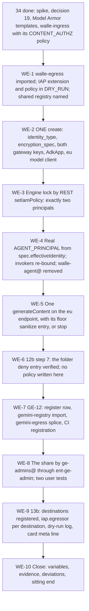

# 35. Wall-E: the engine, registration and gateways

## Status

- Owner: the platform owner
- Last reviewed: 2026-09-15
- Last executed: never
- Stage: review §2 stage 27, its last three limbs — the superseded `wall-e/SETUP.md` Phase 12 (the engine and its lock), Phase 12b step 7 (the folder deny entry), Phase 13 (rewritten as the platform's **GE-12** admission) and Phase 13b (the egress gateway against the shared registry). [34](34-wall-e-identity-spike-and-model-armor.md) holds the rest of stage 27's tail.
- Step prefix: `WE`. Steps: 61. BLOCKED steps: WE-2.3 and WE-2.4 (the agent package and `deploy.py` with the `eu` model client, B-16), WE-2.5 (the create, which waits on both) and WE-5.3 (the smoke client's endpoint print, B-16). Steps that record `PENDING` rather than `BLOCKED`: WE-3.7 (decision 42, answered at WE-8.3), WE-7.6 (`art_49_registration` while the row carries `pending`) and WE-9.4 (the internal load-balancer hostname, which does not exist before spike P3-1). Steps a human performs under PAM because the CI job does not exist yet (B-03), each a `BD-35-<n>` row rather than a block: WE-7.3, WE-7.4, WE-9.3, WE-9.6. `BD-35-14` is raised only if [34](34-wall-e-identity-spike-and-model-armor.md) WI-7.7 bound the wrong Agent Platform service agent to the engine key (WE-2.1).
- Replaces: `wall-e/SETUP.md` Phases 12, 13 and 13b, the Phase 12b step 7 block, and the `deploy`, `register` and `registry` subcommands of `wall-e/setup/walle_setup.py`. Neither page is executed.
- Salvaged: Phase 12's argument that the two-principal lock is what makes the asserted end-user email trustworthy, and its list of the two principals with the `GEMINI_PROJECT_NUMBER` warning; Phase 12's four engine properties (`min_instances`, sessions, Memory Bank off, Code Execution off) and the "redeploy is `update`, never `create`" rule; the REST calls `walle_setup.py` already uses in place of the non-existent `gcloud ai reasoning-engines` group (S024); Phase 13's description-as-routing-prompt argument and its "do not attach a data store" rule; Phase 13b's egress reasoning (default-deny for the reasoning layer, the deliberate absences) and its essential-endpoint list.
- Not copied: `gcloud beta ai reasoning-engines set-iam-policy / get-iam-policy / list / delete` (S024 — the command group does not exist); the two-deploy order that creates the engine before the identity and gateway decisions (S025); the raw ADK agent passed to `create` and `extra_packages` that cannot match the import path (S115); `ENGINE_ID` pasted from a full resource name (S115); `--filter=bindings.role:aiplatform` as the inherited-caller check (S190); the console-first Phase 13 with a standing `agentspaceAdmin` share (S056, X-GE-22); "eu or global" as an acceptable app location (X-GE-13); `registries: … "$PROJECT"` and the local `agent-registry services create` path (S057); the two IAP YAML files that exist nowhere (S074); the wildcard `principalSet://…/*` deny fallback and the persistent `gcloud config set api_endpoint_overrides` (S072, S090); `walle-agent@` left as an invoker on the identity path (S175); read verifies whose expected pre-ladder result is not stated (S121); a second `gcloud kms keys create walle-engine-cmek` (the key has one creator, [34](34-wall-e-identity-spike-and-model-armor.md) WI-7.7, and WE-2.1 reads it back); `exit` inside a block pasted into a shell held for a week (every assertion calls `stop`); `gcloud iap web set-iam-policy` with no saved baseline (the whole policy is replaced, so WE-7.3 and WE-9.3 read first and add one binding); an `endpoints list` read-back of a `services create` write; a negative check whose loop can pass because the resource name is wrong, the value is comma-separated or `--location` is missing (WE-4.5).
- Applies decisions (signed in [03](03-decisions-and-people.md) before the step that needs them): SD-01, SD-02, SD-09, SD-19, SD-22, SD-37, SD-41, SD-44, SD-45, SD-48, D8 (`eu` only), decision 6 (the model pin), decision 19 (the identity), decision 42 / P56 (the engine-scoped role), P71 (the shared registry), P81 (dry run then enforce), NAMES.
- Closes: S024, S025, S056, S057, S072 (the verification half; [13](13-organisation-policies-deny-and-pab.md) and [17](17-factory-module-equivalents-and-tier-r-gate.md) hold the writing half), S074, S075, S090 (the Wall-E half), S115, S121 (the Phase 12 and 13 half; [39](39-wall-e-stage-0.md) re-runs the reads), S175, S190, X-GE-13 (the Wall-E half), X-GE-22, X-RQB-01 (the Wall-E half; Mo-11 is [40](40-mo-after-stage-0.md)). Defers none without an owner (§14).
- Consumes: `AGENT_IDENTITY_MODE`, `AGENT_PRINCIPAL` (fallback only), `SPIKE_PRINCIPAL`, `SPIKE_RECORD`, `WALLE_ARMOR_TEMPLATES`, `WALLE_CONTENT_LOG_BUCKET`, `KEY_WALLE_CONTENT_LOGS`, `KEY_WALLE_ENGINE_CMEK` (created by WI-7.7, read back at WE-2.1) ([34](34-wall-e-identity-spike-and-model-armor.md)); `ACTIONS_URL`, `SUPER_ACTIONS_URL`, `DISPATCHER_URL`, `APPROVAL_A_URL`, `APPROVAL_SUPER_URL`, `WALLE_CODE_COMMIT` ([33](33-wall-e-action-services-and-approval-surfaces.md)); `WALLE_PROJECT`, `WALLE_PROJECT_NUMBER`, `SA_AGENT`, `SA_DISPATCH`, `SA_ACTIONS`, `SA_ACTIONS_SUPER`, `WALLE_AUDIT_DS` ([31](31-wall-e-project-and-data-plane.md)); `WALLE_REPO_DIR`, `WALLE_REPO_REMOTE`, `WALLE_OPERATORS_GROUP`, `WALLE_READERS_GROUP`, `SANDBOX_OU` ([30](30-wall-e-workspace-side.md)); `MODEL_ID` (03), `MODEL_LOCATION`, `REGION`, `GE_LOCATION`, `BQ_LOCATION`, `ORG_ID` ([01](01-prerequisites-and-conventions.md)); `AGENT_REGISTRY`, `REGISTER_PATH`, `MANIFEST_SCHEMA_PATH` ([16](16-register-and-shared-registry.md)); `GE_EGRESS_GATEWAY`, `GE_REGISTRY`, `TIER_C_RECORD` ([20](20-gemini-enterprise-gateway-and-tier-c-gate.md)); `GEMINI_PROJECT`, `GEMINI_PROJECT_NUMBER`, `GEMINI_APP_ID`, `GEMINI_APP_LOCATION` ([05](05-gemini-enterprise-inventory.md)); `GRP_GE_ADMINS`, `GRP_GE_USERS` ([06](06-organisation-bootstrap-and-roster.md)); `DENY_AGENTS_PLATFORM` ([13](13-organisation-policies-deny-and-pab.md)); `FLD_AGENTIC_PLATFORM` ([09](09-folders-and-security-command-center.md)); `KR_ENGINES` ([11](11-keys-and-validator-custodian.md)); `ENT_GE_ADMIN`, `ENT_PLATFORM_POLICY` ([12](12-privileged-access-catalogue.md)); `ENT_DEPLOY_CREDENTIAL_HOLDER_WALLE` ([31](31-wall-e-project-and-data-plane.md)); `SA_WALLE_DEPLOYER`, `AR_PLATFORM`, `CICD_PROJECT`, `CORE_PROJECT`, `KMS_PROJECT` ([10](10-core-projects-and-ci-identities.md)); `ROBOT` ([30](30-wall-e-workspace-side.md)); `SA_TASKS`, `WALLE_SECRET_NAMES` ([31](31-wall-e-project-and-data-plane.md)); `FLD_AGENTS_P_SA_PROD` ([09](09-folders-and-security-command-center.md)); `SECOND_HUMAN_EMAIL`, `SECURITY_REVIEWER_EMAIL` ([03](03-decisions-and-people.md)); `PLATFORM_REPO_DIR`, `BUILD_LOG_DIR`, `DEVIATION_REGISTER`, `EVIDENCE_REGISTER`, `DRILL_CALENDAR` ([01](01-prerequisites-and-conventions.md)).
- Produces: `ENGINE_ID`, `ENGINE`, `WALLE_EGRESS_GATEWAY`, `WALLE_INGRESS_GATEWAY`, `WALLE_REGISTRY_ENTRY`; and, on the `AGENT_IDENTITY` path, the **real** `AGENT_PRINCIPAL` (§4 — the spike's principal named the throwaway engine and dies with it), `ROLE_GE_ENGINE_QUERY`, `WALLE_EGRESS_DESTINATIONS`, `ENGINE_LOCK_RECORD`, `MODEL_PROOF_RECORD`, `GE12_RECORD`. **Not** `KEY_WALLE_ENGINE_CMEK`: [34](34-wall-e-identity-spike-and-model-armor.md) WI-7.7 is the key's only creator, and WE-2.1 reads it back (a KMS key name and its protection level are permanent, so two creators would let whichever ran first decide both).
- Commands, roles, APIs, constraints and console paths checked against Google's documentation on 2026-09-15 (§15). What could not be settled that day is listed in §16.

## What this part builds

The last three objects between Wall-E's code and a human being able to talk to it, and the lock that makes the conversation trustworthy.

1. **`walle-egress`** (§1): Wall-E's own Agent-to-Anywhere gateway in `WALLE_PROJECT`, with its IAP authorisation extension and policy in **dry run**, resolving the **shared** Agent Registry in `CORE_PROJECT` (P71). It is built **before** the engine, because the engine's outbound binding is a create-time field and a gateway that does not exist cannot be named (S075).
2. **`walle-ingress` recorded** (§1.6): [34](34-wall-e-identity-spike-and-model-armor.md) built it with the Model Armor `CONTENT_AUTHZ` policy; here it is read back and its name pinned, so that both keys of `agent_gateway_config` are known before the one `create` call.
3. **The engine, created once** (§2): `identity_type` from decision 19, `encryption_spec` with `walle-engine-cmek` from `KR_ENGINES`, `agent_gateway_config` carrying **both** `client_to_agent_config` and `agent_to_anywhere_config`, the ADK agent wrapped in `AdkApp`, `extra_packages` aligned with the import path, the model client built in code on the **`eu`** multi-region endpoint with the pinned `MODEL_ID`, `env_vars` holding no secret and no `GOOGLE_CLOUD_LOCATION`, and `ENGINE_ID` taken from the last segment of `api_resource.name` (S025, S075, S115, X-RQB-01, SD-09).
4. **The two-principal lock, by REST, immediately** (§3): `geEngineQuery` bound on the engine to exactly the tenant app's Discovery Engine service agent and the dispatcher, through `POST …:setIamPolicy` on the regional Agent Runtime endpoint, because **there is no `gcloud ai reasoning-engines` command group** (S024). Conferring roles are then hunted two ways: by reading each bound role's `includedPermissions`, and by `gcloud asset analyze-iam-policy` on the engine's full resource name (S190).
5. **The real agent principal, and the invoker clean-up** (§4): on the `AGENT_IDENTITY` path the principal contains the engine id, so it can only be known now. It is read from `spec.effectiveIdentity`, bound as `run.invoker` on both action services, added to both allow-lists — and `walle-agent@`'s invoker binding is **removed** (S175). The negative tests of [33](33-wall-e-action-services-and-approval-surfaces.md) and [34](34-wall-e-identity-spike-and-model-armor.md) are re-run against it.
6. **One `generateContent` on the `eu` endpoint, with its floor sanitize entry** (§5): the single check that decision 6's pin is actually served where the code calls it, that `europe-west1` returns 404 for the same model as expected, and that the project floor sees the call. If either half fails, **stop**: nothing downstream of a model that does not answer is worth building (X-RQB-01).
7. **The folder deny entry, verified** (§6): `deny-agents-platform` at `fld-agentic-platform` must already carry this project's two entries in the **documented** principal form (SD-22), no project-level copy may survive, and Policy Troubleshooter proves the exception principals — with the limitation that Policy Troubleshooter accepts no agent-identity principal, so the agent's own denial is proven by a live refused call instead (S072, S090).
8. **GE-12, the admission** (§7 and §8): the register row's `publish_to_gemini: true` and `audience_groups`, the endpoint imported into `gemini-registry` and spliced into `gemini-egress`'s policy, the registration into the app by the CI identity on the **`eu`** host, the share performed by a `ge-admins@` member **through `ent-ge-admin`** with the role the dialog names, and two user tests — one by an operator, one by a colleague holding no `discoveryengine` role (S056, X-GE-13, X-GE-22, SD-19).
9. **13b: the egress allow-list** (§9): the destinations registered in the shared registry, one `roles/iap.egressor` binding per destination for the agent principal, the dry-run log read, and the registry card's `meta:` first line compared against the merged register row's SHA (S057, S074).

What the old text got wrong, and must not come back:

| Old text | Why it fails | Here instead |
|---|---|---|
| `gcloud beta ai reasoning-engines set-iam-policy / get-iam-policy / list / delete` (S024) | The command group does not exist in GA, beta or alpha; every call answers `Invalid choice: 'reasoning-engines'`. The lock is not applied, the "exactly one engine" check cannot run, and the rollback cannot run. `walle_setup.py` already says so and uses REST; SETUP contradicted its own script | §3 and §10: `POST …:setIamPolicy`, `POST …:getIamPolicy`, `GET …/reasoningEngines`, `DELETE …/reasoningEngines/ID` on `https://europe-west1-aiplatform.googleapis.com/v1/…`, each with `Authorization: Bearer $(gcloud auth print-access-token)` |
| Phase 12 deploys the engine with `service_account` and no gateway; Phase 12b then says `identity_type` "cannot be patched"; Phase 12c step 5 names a gateway created in a later step (S025) | Followed in order, the production engine is created with the wrong identity and no gateway, its IAM is locked, `ENGINE_ID` is recorded — and 12b/12c then require a recreate: new id, new principal, every resource-level binding lost, an orphan engine holding the inherited project policy | The sequence is stated at the top of this file and is one order: 34, then §1 (both gateways exist), then **one** `create` in §2 with identity, encryption, both gateway keys and the model client. The service-account form is kept only as decision 19's recorded failure branch |
| `client.agent_engines.create(agent=root_agent, …)` with `extra_packages: ["./walle_agent"]`, run from `~/Claude/wall-e`, then `export ENGINE_ID="<the id printed>"` (S115) | Google's documented surface wraps the ADK agent in `AdkApp` first; the raw agent may deploy without the `stream_query` surface Gemini Enterprise calls. `extra_packages` and the `from walle_agent.agent import root_agent` import cannot both resolve from the same directory. `deploy.py` prints the **full resource name**, so pasting it doubles the path in `ENGINE` and in every REST URL | WE-2.3: `app = agent_engines.AdkApp(agent=root_agent)`; `extra_packages: ["./agent/walle_agent"]` with `PYTHONPATH=agent` and the run from `WALLE_REPO_DIR`; the script prints `remote.api_resource.name` **and** `…rsplit('/',1)[-1]`, and WE-2.6 sets `ENGINE_ID` from the second and rebuilds `ENGINE` itself |
| No step anywhere sets `agent_to_anywhere_config`; 13b builds `walle-egress` after the engine (S075) | The gateway and its default-deny allow-list exist and govern nothing: the engine's outbound traffic never traverses them, the dry-run-to-enforced flip changes nothing, and PR3 ("your egress is default-deny") is not delivered for the super-admin agent | §1 runs before §2; WE-2.4 sets both `client_to_agent_config` and `agent_to_anywhere_config`; WE-2.8 reads `spec.deploymentSpec.agentGatewayConfig` back and fails if either key is absent |
| `registries: - //agentregistry.googleapis.com/projects/%s/… "$PROJECT"` with a note saying `CORE_PROJECT`, plus local `agent-registry services create` (S057) | `agentregistry.googleapis.com` is not in the P-SA folder's `gcp.restrictServiceUsage` allow-list, so a registry in `WALLE_PROJECT` cannot exist; the gateway then resolves nothing and every destination is unregistered | WE-1.3 writes `${CORE_PROJECT}` from the variable, never from `$PROJECT`; WE-1.2 proves `agentregistry` is **not** enabled in `WALLE_PROJECT` and that the attempt is refused; every `services create` runs `--project="$CORE_PROJECT"` under the factory identity's grant |
| 13b imports `iap-request-authz-extension.yaml` and `iap-request-authz-policy.yaml`, and binds `${AGENT_PRINCIPAL}` (S074) | Neither file is written anywhere, so both imports fail with file-not-found; on the service-account branch `AGENT_PRINCIPAL` is unset, giving `members: [""]` and an invalid policy | WE-1.4 and WE-1.5 write both YAML files inline into `WALLE_REPO_DIR/gateway/` and commit them; WE-9.3 starts with `need AGENT_PRINCIPAL` and refuses an empty value |
| Phase 13: console **Add agent**, then **User permissions** shared with `$OPERATORS`, by the builder holding standing app-administrator rights (S056, X-GE-22) | A hand-made console object the reconciliation job reports as unmatched; a share made with standing rights; no `gemini-registry` import and no `gemini-egress` entry, so once GE-11 enforces, Wall-E is refused (498) or the tenant gateway is left in dry run to make the check pass; the share dialog also needs a **role** chosen, and a group member works only if its members hold `agentspaceUser` and a licence | §7 and §8: the register row first, then CI's registration on the `eu` host, then the share by a `ge-admins@` member through `ent-ge-admin` with the role recorded in GG-2.7, after proving every audience member reaches the app through `ge-users@`'s app-level `agentspaceUser` binding |
| "Phase 13 assumes the location is `eu` or `global`"; only a `us` app stops the build (X-GE-13) | A `global` app binds only a `us-central1` gateway, so `gemini-egress` in `europe-west1` cannot be bound; CMEK is unsupported for global apps; EU residency of prompts is not given. The platform baseline (GE-0) stops on `global` as well as `us` | WE-0.3: `GEMINI_APP_LOCATION` must be exactly `eu`; anything else **stops the file** and opens a decision record for a new `eu` app. WE-7.4's registration command refuses a non-`eu` app before it calls anything |
| Phase 12 verify 2 "a read works" and Phase 13 verify "a correct answer" (S121) | The ladder is written in Phase 14; before it exists the service fails closed and every request, reads included, is denied `control_plane_unavailable`. The checks cannot pass when run in order, and a builder cannot tell a defect from the expected state | WE-5.4 and WE-8.3 state the expected pre-ladder result explicitly — `decision=denied`, `denial_reason=control_plane_unavailable`, with an audit row whose `principal_id` is the human's email — and name [39](39-wall-e-stage-0.md) as the file that re-runs them after the ladder exists |
| Phase 12 verify 6: `--filter=bindings.role:aiplatform` "to show nothing inherited can invoke the engine" (S190) | `roles/owner` and `roles/editor` carry `aiplatform.reasoningEngines.query` and do not match the filter; folder and organisation bindings are not shown at all. The check prints nothing while inherited callers exist | WE-3.5 reads every role bound at project, folder and organisation level and greps its `includedPermissions`; WE-3.6 runs `gcloud asset analyze-iam-policy --organization` on the engine's full resource name with `--permissions=aiplatform.reasoningEngines.query --expand-groups --expand-roles` and expects exactly the two principals |
| 12b step 7's manual fallback: `principalSet://agents.global.org-${ORG_ID}.system.id.goog/*` with three permission names "never checked against the supported list", in a runbook that says it "needs no `roles/iam.denyAdmin`" (S072, S090) | The principal form is undocumented, the permission names unverified, and the step contradicts itself two lines apart. Following it either fails at create or attaches a policy that denies nothing | §6 **creates no deny policy**. It verifies the folder policy [13](13-organisation-policies-deny-and-pab.md) and [17](17-factory-module-equivalents-and-tier-r-gate.md) wrote, in SD-22's documented `principal://…/resources/aiplatform/projects/${WALLE_PROJECT_NUMBER}` form, and any repair is a change request to the platform-policy owner under `ent-platform-policy` |
| `walle-agent@` keeps `run.invoker` on both action services on the identity path (S175) | An unused service account holds invoker rights on the super-admin action services; anyone later granted `actAs` or token-creator on it reaches `/v1/execute-generic`'s IAM gate. The manual 12b verify reads the extra member as drift | WE-4.4 removes it from both services in `AGENT_IDENTITY` mode and WE-4.6 fails if it is still a member; the allow-list generator keys on `AGENT_PRINCIPAL`, and `walle-agent@` stays a member **only** in `SERVICE_ACCOUNT` mode |

## The one sequence (S025)

This is the order. It is not negotiable, because three fields of the engine are create-time only.



Three fields cannot be patched onto an existing engine, so all three are decided before the single `create`:

| Field | Why it is create-time | Decided by |
|---|---|---|
| `identity_type` | "Updating an existing reasoning engine to set `agentGatewayConfig` does *not* change its `identity_type`. If the engine was originally created without `identity_type=AGENT_IDENTITY`, you cannot retroactively make it eligible" | decision 19, recorded in [34](34-wall-e-identity-spike-and-model-armor.md) as `AGENT_IDENTITY_MODE` |
| `encryption_spec.kms_key_name` | "The key is immutable when you create the instance. To use a different key, you need to create a new instance" | the key table of [03](03-decisions-and-people.md); the key ring is `KR_ENGINES` in `europe-west1` ([11](11-keys-and-validator-custodian.md)) |
| `agent_gateway_config` | A `PATCH` of `spec.deploymentSpec.agentGatewayConfig` is documented, but it does not confer identity eligibility, and the gateway must exist when it is named | §1, which therefore runs first |

A recreate is not a redeploy. It produces a new engine id, hence a **new agent principal**, and every resource-level binding made against the old principal dies with it: the `geEngineQuery` policy, both `run.invoker` bindings, every `iap.egressor` binding, the in-app allow-list row and the app's registration. Treat a recreate as an identity change under the IAM change checklist of [../04-identity-and-privileged-access.md](../04-identity-and-privileged-access.md) §8.5, and re-run §3 to §9 in full.

## Preconditions

- [ ] [34](34-wall-e-identity-spike-and-model-armor.md) complete: `SPIKE_RECORD` signed, `AGENT_IDENTITY_MODE` set to `AGENT_IDENTITY` or `SERVICE_ACCOUNT`, the throwaway spike engine **deleted**, `WALLE_ARMOR_TEMPLATES` created in `europe-west1`, `WALLE_CONTENT_LOG_BUCKET` created with `KEY_WALLE_CONTENT_LOGS`, the project floor carrying `VERTEX_AI` with Cloud Logging on, and `walle-ingress` with its `CONTENT_AUTHZ` policy in place. **WI-7.7 done:** `walle-engine-cmek` created at HSM protection level in `europe-west1` and `KEY_WALLE_ENGINE_CMEK` set. WE-2.1 reads it back and creates no key; if WI-7.7 has not run, WE-2.1 stops and the key is created there, under the signed key table, never here.
- [ ] **[20](20-gemini-enterprise-gateway-and-tier-c-gate.md): `TIER_C_RECORD` exists and is signed.** Wall-E is the first agent to be admitted through a gateway that must already be proven on the tenant's own app. If `TIER_C_RECORD` records the compensating control of GG-2.9 instead of a bound gateway, this file's §7 and §9 run against that record's amended precondition, and WE-0.4 stops until the amendment is read.
- [ ] [33](33-wall-e-action-services-and-approval-surfaces.md): both action services deployed by digest, both approval surfaces live, the dispatcher live, and the negative tests recorded (the model cannot approve). `WALLE_CODE_COMMIT` set.
- [ ] [31](31-wall-e-project-and-data-plane.md): `WALLE_PROJECT` exists under `fld-agents-p-sa-prod` with the FM-AGENT run recorded, `geEngineQuery` created in the project by that run, the nine audit tables present, and the P-SA register row merged with `gate_checklist: pending`.
- [ ] [16](16-register-and-shared-registry.md): `AGENT_REGISTRY` set and empty or holding only earlier agents; `REGISTER_PATH` and `MANIFEST_SCHEMA_PATH` in `PLATFORM_REPO_DIR`; `factory-apply@` the only standing `agentregistry.admin`.
- [ ] [13](13-organisation-policies-deny-and-pab.md): `DENY_AGENTS_PLATFORM` exists at `fld-agentic-platform`; [17](17-factory-module-equivalents-and-tier-r-gate.md)'s FM-AGENT run has added `WALLE_PROJECT_NUMBER`'s two entries under `ENT_PLATFORM_POLICY`. If it has not, WE-6.1 stops and raises the change request; this file writes no deny policy.
- [ ] [11](11-keys-and-validator-custodian.md): `KR_ENGINES` exists in `europe-west1` (single-region; multi-region, dual-region and global keys are **not** supported for this CMEK).
- [ ] [03](03-decisions-and-people.md) signed: **decision 6 / SD-09** with `MODEL_ID` set to a GA model served on the `eu` multi-region endpoint whose retirement date is at least six months after the planned Stage 1; D8 read as `eu` only; decision 19's record; decision 42 / P56; SD-02, SD-19, SD-22, SD-37, SD-41, SD-44, SD-45, SD-48; NAMES (the engine display name, the gateway names, the registry entry id `wall-e`). `tools/decision-need.sh` prints `SIGNED` for each.
- [ ] [12](12-privileged-access-catalogue.md): `ENT_GE_ADMIN` (activate without approvals at Tier C, requester `ge-admins@`, 1 hour, justification required — SD-19), `ENT_PLATFORM_POLICY`, and `ENT_DEPLOY_CREDENTIAL_HOLDER_WALLE` from [31](31-wall-e-project-and-data-plane.md).
- [ ] [30](30-wall-e-workspace-side.md): `WALLE_OPERATORS_GROUP`, `WALLE_READERS_GROUP` and `SANDBOX_OU` exist; every member of `WALLE_OPERATORS_GROUP` also holds a Gemini Enterprise licence **assigned** for location `eu` and is a member of `GRP_GE_USERS`. WE-8.1 proves it and refuses the share otherwise (X-GE-22).
- [ ] Workstation of [01](01-prerequisites-and-conventions.md): `gcloud`, `bq`, `jq`, `yq`, `curl`, `python3.12` with a virtual environment able to install `google-cloud-aiplatform`, `git`; `~/.platform-env` sourced; `penv_guard` silent; a clean browser profile per account.
- [ ] **Not** a precondition: Phase 14's ladder. It does not exist yet, and every read verify in this file states so (S121).

## People needed

| Role | Does | Present at |
|---|---|---|
| Platform owner, as `sa-1-admin@` | Every shell step; the gateway imports; the engine create; the REST lock; the deny verification; the registry work | every step except WE-8.2 and WE-8.4 |
| A `ge-admins@` member, acting **through `ent-ge-admin`** | The share of the agent to `WALLE_OPERATORS_GROUP` in the app's **User permissions** tab, with the role the dialog names; the grant is activated, used and left to expire (SD-19) | WE-8.2 |
| A colleague holding **no** `discoveryengine` role and outside `WALLE_OPERATORS_GROUP` and `WALLE_READERS_GROUP` | Opens the app and confirms the agent is not visible; an app administrator cannot perform this test, because `agentspaceAdmin` sees every agent (X-GE-22) | WE-8.4 |
| An operator inside `WALLE_OPERATORS_GROUP`, licensed and in `GRP_GE_USERS` | Asks one directory question and one write request in the app; confirms the audit row carries **their own** email | WE-8.3 |
| Second human (`SECOND_HUMAN_EMAIL`) | Countersigns `ENGINE_LOCK_RECORD` (the two-principal list is the control that makes the asserted end-user email trustworthy) and `MODEL_PROOF_RECORD`; reviews the register-row pull request | WE-3.4, WE-5.4, WE-7.2 |
| Security reviewer (`SECURITY_REVIEWER_EMAIL`), once appointed (B-20) | Second reviewer on the register-row pull request and on the manifest's `egress:` list, which is what §9's allow-list is generated from | WE-7.2, WE-9.2 |
| Platform-policy owner, through `ENT_PLATFORM_POLICY` | Only if WE-6.1 finds the folder deny entry missing or malformed: adds or repairs it. Nothing in this file writes a policy above the project | WE-6.1 (on failure only) |
| Wall-E owner | Owns the agent package, `deploy.py` and the smoke client; every BLOCKED step waits on them (B-16) | WE-2.3, WE-5.2 |

Hands-on: about 6 hours of shell and console work when the code exists (the superseded Phases 12, 13 and 13b were costed at 3 hours and contained neither the gateway ordering, nor the model proof, nor the GE-12 admission, nor the deny verification). Elapsed: about 3 business days, because the registry import and the `gemini-egress` policy regeneration run through CI with two human reviewers, the share needs a second person's calendar, and WE-9.5 reads at least 24 hours of dry-run IAP decisions before the destination list is called complete.

Conventions of [01](01-prerequisites-and-conventions.md) apply. Deviation rows are `BD-35-<n>`. Records go to `BUILD_LOG_DIR/records/` as `<date>-WE-<step>-<slug>-v<n>`. Every shell block assumes the sitting of §0 has been opened.

## How to execute this part (S082, SD-37)

The `setup/` procedures are the canonical manual path. `wall-e/setup/walle_setup.py` is a helper, not a path, until B-18 closes.

| Step | Manual path | Helper script | Why the script cannot be used yet |
|---|---|---|---|
| WE-1.* | `gcloud network-services`, `gcloud beta service-extensions`, `gcloud network-security`, §1 | `walle registry` | BLOCKED: the subcommand writes `registries` from `$PROJECT` (S057) and imports two YAML files that exist nowhere (S074) |
| WE-2.* | `python agent/deploy.py`, §2 | `walle deploy` | BLOCKED: `deploy` passes the raw ADK agent, sets neither gateway key nor `encryption_spec`, and exports `ENGINE_ID` from a full resource name (S025, S075, S115) |
| WE-3.* | `curl` against the regional Agent Runtime REST API, §3 | `walle deploy` (lock half) | The script's REST calls are **correct in shape** (S024 salvage) but use `v1beta1` and run inside the same subcommand as the broken deploy; §3 uses `v1` and stands alone |
| WE-4.* | `gcloud run services add/remove-iam-policy-binding`, §4 | `walle spike` step 6b | BLOCKED: it never removes `walle-agent@` on the identity path (S175) |
| WE-5.* | `curl` to `aiplatform.eu.rep.googleapis.com`, §5 | none | — |
| WE-6.* | `gcloud iam policies get`, `gcloud policy-troubleshoot iam`, §6 | none | The script has no deny-policy read |
| WE-7.*, WE-8.* | CI job plus `ge_call` on the `eu` host, and the console for the share, §7 and §8 | `walle register` | BLOCKED: `cmd_register` does not refuse a non-`eu` app (X-GE-13) and drives the console path (S056) |
| WE-9.* | `gcloud agent-registry services`, `gcloud iap web get-iam-policy` then `add-iam-policy-binding` (never `set-iam-policy`, which replaces the whole policy), §9 | `walle registry` | BLOCKED as above |
| any rollback | the ROLLBACK line of the step | `walle rollback --phase 12` | BLOCKED, and `--phase` has no entry for 13 or 13b |

## 0. The sitting

#### WE-0.1 Open the sitting and prove the inputs

- **WHO:** platform owner. Solo.
- **WHERE:** shell.
- **ACTION:**
```bash
source ~/.platform-env
penv_guard
need WALLE_PROJECT WALLE_PROJECT_NUMBER REGION ORG_ID CORE_PROJECT CICD_PROJECT
need GEMINI_PROJECT GEMINI_PROJECT_NUMBER GEMINI_APP_ID GEMINI_APP_LOCATION
need MODEL_ID MODEL_LOCATION AGENT_REGISTRY GE_EGRESS_GATEWAY GE_REGISTRY TIER_C_RECORD
need DENY_AGENTS_PLATFORM FLD_AGENTIC_PLATFORM KR_ENGINES ENT_GE_ADMIN ENT_PLATFORM_POLICY
need ACTIONS_URL SUPER_ACTIONS_URL DISPATCHER_URL SA_AGENT SA_DISPATCH SA_ACTIONS SA_ACTIONS_SUPER
need AGENT_IDENTITY_MODE WALLE_ARMOR_TEMPLATES WALLE_REPO_DIR SA_WALLE_DEPLOYER
need WALLE_OPERATORS_GROUP WALLE_READERS_GROUP GRP_GE_ADMINS GRP_GE_USERS SANDBOX_OU
gcloud auth list --filter=status:ACTIVE --format='value(account)'
checkpoint "SITTING-$(date -u +%Y%m%d%H%M)" START - - "35 engine, registration, gateways"
```
- **VERIFY:** `penv_guard` silent; every `need` returns 0 with no `*tbd*`; the active account is `SA_1_ADMIN`; `AGENT_IDENTITY_MODE` prints exactly `AGENT_IDENTITY` or `SERVICE_ACCOUNT`.
- **ROLLBACK:** none needed.
- **EVIDENCE:** checkpoint line. E-xx: none. TISAX: 4.1.2.

#### WE-0.2 Working directory and helpers

- **WHO:** platform owner. Solo.
- **WHERE:** shell.
- **ACTION:** [19](19-gemini-enterprise-import-and-baseline.md)'s helpers (`ge_file`, `ge_call`, `pam_grant`, `pam_active`, `ma_eu`) are reused for everything touching `GEMINI_PROJECT`; this file adds an Agent Runtime REST caller, because there is no `gcloud ai reasoning-engines` group (S024), and the two stop helpers that keep a failed assertion from killing the sitting.
```bash
source "$BUILD_LOG_DIR/ge-baseline/ge-helpers.sh"
WE_DIR="$BUILD_LOG_DIR/walle-engine"; mkdir -p "$WE_DIR/restricted" "$BUILD_LOG_DIR/records"
grep -qxF 'walle-engine/restricted/' "$BUILD_LOG_DIR/.gitignore" || printf '%s\n' 'walle-engine/restricted/' >> "$BUILD_LOG_DIR/.gitignore"
cat > "$WE_DIR/we-helpers.sh" <<'EOF'
WE_DIR="$BUILD_LOG_DIR/walle-engine"
WE_DATE="$(date -u +%F)"
# The regional Agent Runtime host. The region is part of the HOST, never a query parameter.
AR_HOST="https://${REGION}-aiplatform.googleapis.com/v1"
AR_ENGINES="${AR_HOST}/projects/${WALLE_PROJECT}/locations/${REGION}/reasoningEngines"
we_file() { local d="$WE_DIR" n=1; [ "${4-}" = restricted ] && d="$WE_DIR/restricted"; while [ -e "$d/${WE_DATE}-$1-$2-v${n}.$3" ]; do n=$((n+1)); done; printf '%s\n' "$d/${WE_DATE}-$1-$2-v${n}.$3"; }
we_latest() { ls -t "$WE_DIR"/*-"$1"-v*."$2" 2>/dev/null | head -1; }
ar_call() { local m="$1" u="$2" b="${3-}"; if [ -n "$b" ]; then curl -sS --fail-with-body -X "$m" -H "Authorization: Bearer $(gcloud auth print-access-token)" -H "Content-Type: application/json" -H "X-Goog-User-Project: ${WALLE_PROJECT}" --data-binary @"$b" "$u"; else curl -sS --fail-with-body -X "$m" -H "Authorization: Bearer $(gcloud auth print-access-token)" -H "X-Goog-User-Project: ${WALLE_PROJECT}" "$u"; fi; }
# A failed assertion must NOT close a shell that holds an ACTIVE PAM grant, ENGINE_ID and
# AR_ENGINES for a week. stop() records and returns 1; we_guard() refuses every later
# mutation until the operator has fixed the cause and reset the counter by hand.
WE_STOPS=0
stop() { WE_STOPS=$((WE_STOPS+1)); printf 'STOP %s: %s\n' "$1" "${2-}" >&2; checkpoint "$1" STOP - - "${2-}"; return 1; }
we_guard() { [ "${WE_STOPS:-0}" -eq 0 ] || { printf 'REFUSING: %s STOP line(s) recorded in this sitting. Fix the cause, then reset with WE_STOPS=0 and a build-log line.\n' "$WE_STOPS" >&2; return 1; }; }
EOF
source "$WE_DIR/we-helpers.sh"
checkpoint WE-0.2 DONE
```
  `Assumption:` `X-Goog-User-Project` is accepted on the Agent Runtime endpoint as it is on Discovery Engine; it is harmless if ignored, and it makes the quota project explicit while no gcloud default project exists.

  **No block in this file ends an assertion with `exit`.** [34](34-wall-e-identity-spike-and-model-armor.md) closes S187 with the rule, and it applies here with more force: this sitting holds `GRANT`, `ENGINE_ID`, `ENGINE_FULL`, `AR_ENGINES` and an ACTIVE PAM grant, and a failed check at WE-2.8 or WE-3.1 that closed the terminal would leave the engine created, the grant live and §3's two-principal lock not yet applied — the engine invocable by whatever the project policy allows. Every assertion therefore calls `stop`, and every mutation that must not run after one is chained behind `we_guard &&`.
- **VERIFY:** `type ge_call pam_grant pam_active ma_eu we_file we_latest ar_call stop we_guard` names nine functions; `echo "$AR_ENGINES"` ends in `/locations/europe-west1/reasoningEngines` and contains `$WALLE_PROJECT` once only; `we_guard` returns 0 and `echo $?` prints `0`; `grep -c 'exit 1' <this file's runnable blocks>` prints `0`.
- **ROLLBACK:** none needed. On resume: `source ~/.platform-env; source "$BUILD_LOG_DIR/ge-baseline/ge-helpers.sh"; source "$BUILD_LOG_DIR/walle-engine/we-helpers.sh"`.
- **EVIDENCE:** none. E-xx: none. TISAX: none.

#### WE-0.3 Stop unless the Gemini Enterprise app is `eu` (X-GE-13)

- **WHO:** platform owner. Solo.
- **WHERE:** shell.
- **ACTION:**
```bash
test "$GEMINI_APP_LOCATION" = eu || stop WE-0.3 "GEMINI_APP_LOCATION=${GEMINI_APP_LOCATION}; D8 admits eu only"
test "$GE_LOCATION" = eu || stop WE-0.3 "GE_LOCATION must be eu"
we_guard && ge_call GET "https://eu-discoveryengine.googleapis.com/v1/projects/${GEMINI_PROJECT}/locations/eu/collections/default_collection/engines/${GEMINI_APP_ID}" | jq '{name, displayName, agentGatewaySetting, associatedAgentRegistry}' | tee "$(we_file WE-0.3 app-state json)"
checkpoint WE-0.3 DONE
```
  A `global` or `us` app stops the build and opens a decision record for a new `eu` app (chat history and data stores do not move). It is not an "or": a `global` app binds only a `us-central1` gateway, so `gemini-egress` in `europe-west1` cannot be bound to it; CMEK is unsupported for global apps; and the app-side Model Armor template would have to be global. An `eu` app fronts agents in `europe-*` regions, which is what `WALLE_PROJECT`'s `europe-west1` engine is.
- **VERIFY:** no `STOP`; the GET returns 200 on the `eu` host; `agentGatewaySetting.defaultEgressAgentGateway.name` equals `GE_EGRESS_GATEWAY` (the binding of [20](20-gemini-enterprise-gateway-and-tier-c-gate.md) GG-5.3) or the file's `TIER_C_RECORD` amendment is read at WE-0.4.
- **ROLLBACK:** none — this is a read.
- **EVIDENCE:** the app-state file; `evidence_add WE-0.3 ge-app-location-eu E-03 4.1.3 "build-log:walle-engine/<file>" "$(we_latest app-state json)"`.

#### WE-0.4 Read `TIER_C_RECORD` and take its amendment, if any

- **WHO:** platform owner. Solo.
- **WHERE:** shell.
- **ACTION:**
```bash
sed -n '1,80p' "$TIER_C_RECORD" | tee "$(we_file WE-0.4 tier-c-head md)"
grep -Ei 'compensating control|GG-2\.9|amend' "$TIER_C_RECORD" && echo "READ THE AMENDMENT BEFORE SECTION 7 AND 9" || echo "gateway bound; sections 7 and 9 run as written"
checkpoint WE-0.4 DONE
```
- **VERIFY:** `TIER_C_RECORD` is signed by the platform owner and the second human; either the "gateway bound" line prints, or the amendment is transcribed into the build log with the two sections it changes named.
- **ROLLBACK:** none — this is a read.
- **EVIDENCE:** the head file. E-xx: E-03. TISAX: 4.1.3.

#### WE-0.5 Read the before state of everything this file will touch

- **WHO:** platform owner. Solo.
- **WHERE:** shell.
- **ACTION:**
```bash
ar_call GET "$AR_ENGINES" | tee "$(we_file WE-0.5 engines-before json)"
gcloud network-services agent-gateways list --location="$REGION" --project="$WALLE_PROJECT" --format='table(name,googleManaged.governedAccessPath)' | tee "$(we_file WE-0.5 gateways-before txt)"
gcloud beta service-extensions authz-extensions list --location="$REGION" --project="$WALLE_PROJECT" --format='table(name)' | tee -a "$(we_latest gateways-before txt)"
gcloud network-security authz-policies list --location="$REGION" --project="$WALLE_PROJECT" --format='table(name,action)' | tee -a "$(we_latest gateways-before txt)"
gcloud agent-registry services list --location="$REGION" --project="$CORE_PROJECT" --format='table(name,displayName)' | tee "$(we_file WE-0.5 shared-registry-before txt)"
gcloud services list --enabled --project="$WALLE_PROJECT" --format='value(config.name)' | sort | tee "$(we_file WE-0.5 services-before txt)"
gcloud projects get-iam-policy "$WALLE_PROJECT" --format=json | tee "$(we_file WE-0.5 project-iam-before json)"
gcloud org-policies describe iam.managed.disableAccessPolicyBinding --project="$WALLE_PROJECT" --effective --format=json | tee "$(we_file WE-0.5 access-policy-binding-effective json)"
checkpoint WE-0.5 DONE
```
- **VERIFY:** `engines-before` lists **no** engine (`34`'s throwaway spike engine was deleted; a survivor is `BD-35-1` and is deleted before §2, because §3's lock is applied to one id only); `walle-ingress` is present and `walle-egress` is not; `agentregistry.googleapis.com` is **absent** from `services-before`; the effective `iam.managed.disableAccessPolicyBinding` value is recorded, because a binding cannot be created while it is enforced and lifting it propagates for up to 15 minutes.
- **ROLLBACK:** none — these are reads.
- **EVIDENCE:** all six files; `evidence_add WE-0.5 before-state E-05 4.1.3 "build-log:walle-engine/" "$(we_latest engines-before json)"`.

## 1. `walle-egress`, before the engine exists (S075, S057, S074)

The gateway is built first for one reason: `agent_to_anywhere_config.agent_gateway` is set at engine creation, and naming a gateway that does not exist fails the `create`. The access policy that makes it useful needs the agent principal, which does not exist until the engine does — so the policy is written in §9, and the gateway is created here with its extension and policy in **dry run**, which denies nothing and logs everything.

One egress gateway and one ingress gateway per project and region; every Agent Runtime agent in that project and region binds to the same pair. `WALLE_PROJECT` holds exactly one engine, so the pair is Wall-E's alone.

#### WE-1.1 Activate the deploy entitlement and confirm the APIs

- **WHO:** platform owner through `ENT_DEPLOY_CREDENTIAL_HOLDER_WALLE`, approved by the second reviewer (never the Wall-E owner) once appointed; otherwise recorded one-person mode with a `BD-35-2` row.
- **WHERE:** shell.
- **ACTION:**
```bash
GRANT="$(pam_grant "$ENT_DEPLOY_CREDENTIAL_HOLDER_WALLE" 7200s "setup 35 gateway and engine")"; pam_active "$GRANT"
gcloud services enable networkservices.googleapis.com networksecurity.googleapis.com iap.googleapis.com dns.googleapis.com compute.googleapis.com --project="$WALLE_PROJECT"
gcloud services list --enabled --project="$WALLE_PROJECT" --format='value(config.name)' | grep -E '^(networkservices|networksecurity|iap|dns|compute|aiplatform|agentidentity|modelarmor)\.googleapis\.com$' | sort | tee "$(we_file WE-1.1 services-after txt)"
checkpoint WE-1.1 DONE "$GRANT"
```
  **The enable command adds five services and no more.** The grep that follows it reads **eight** names, because three more — `aiplatform`, `agentidentity` and `modelarmor` — were enabled earlier, by [31](31-wall-e-project-and-data-plane.md) and [34](34-wall-e-identity-spike-and-model-armor.md). `agentregistry.googleapis.com` is **not** enabled here on either count: the shared registry lives in `CORE_PROJECT` (P71) and the API is absent from the P-SA folder's `gcp.restrictServiceUsage` allow-list, so the enable would be refused anyway. WE-1.2 proves that on purpose.
- **VERIFY:** **eight** names print — the five enabled by the command above plus `aiplatform`, `agentidentity` and `modelarmor` from [31](31-wall-e-project-and-data-plane.md) and [34](34-wall-e-identity-spike-and-model-armor.md). Fewer than eight means a precondition file did not finish: compare the printed set against the eight and run the missing file's enable step before continuing, rather than enabling the gap by hand here. `agentregistry` does not appear; `pam_active` printed `ACTIVE`.
- **ROLLBACK:** `gcloud services disable networkservices.googleapis.com networksecurity.googleapis.com iap.googleapis.com --project="$WALLE_PROJECT" --force` (only before any gateway exists); revoke the grant with `gcloud pam grants revoke "$GRANT" --reason="rollback WE-1.1"`.
- **EVIDENCE:** the services file; `evidence_add WE-1.1 walle-gateway-apis E-05 4.1.3 "build-log:walle-engine/<file>" "$(we_latest services-after txt)"`.

#### WE-1.2 Prove that a local registry cannot exist (S057)

- **WHO:** platform owner. Solo.
- **WHERE:** shell.
- **ACTION:** The superseded text created a registry in the agent project and then pointed the gateway at it. The tier folder forbids the API. Record the refusal rather than assuming it.
```bash
gcloud services enable agentregistry.googleapis.com --project="$WALLE_PROJECT" 2>&1 | tee "$(we_file WE-1.2 agentregistry-refused txt)" || true
grep -Eqi 'restrictServiceUsage|constraint|denied|not allowed' "$(we_latest agentregistry-refused txt)" || echo "UNEXPECTED: the enable was NOT refused - STOP and read 13 OP-5"
gcloud services list --enabled --project="$WALLE_PROJECT" --format='value(config.name)' | grep -c '^agentregistry\.googleapis\.com$' || true
checkpoint WE-1.2 DONE
```
- **VERIFY:** the output carries the policy refusal; the `grep -c` prints `0`. An enable that **succeeds** is a folder-policy defect: stop, and raise it against [13](13-organisation-policies-deny-and-pab.md) OP-5 before continuing, because the whole shared-registry design rests on this refusal.
- **ROLLBACK:** if the enable somehow succeeded, `gcloud services disable agentregistry.googleapis.com --project="$WALLE_PROJECT" --force` and record `BD-35-3`.
- **EVIDENCE:** the refusal file; `evidence_add WE-1.2 local-registry-refused E-05 4.2.1 "build-log:walle-engine/<file>" "$(we_latest agentregistry-refused txt)"`.

#### WE-1.3 Write and import the `walle-egress` gateway

- **WHO:** platform owner under the WE-1.1 grant. Solo.
- **WHERE:** shell; files committed to `WALLE_REPO_DIR/gateway/`.
- **ACTION:** The `registries` URI names `CORE_PROJECT` from the variable, never `$PROJECT` (S057). Google's page: "Destinations in a different project than the gateway must be registered with the Agent Registry in the gateway project. Such destinations are only valid for Runtime agents in Agent-to-Anywhere mode." Whether a gateway may name a registry in **another** project is P71's open point; the platform's answer is that it must, because the fleet has one registry. WE-9.5 is where a refusal would show, and the fallback is named there.
```bash
mkdir -p "$WALLE_REPO_DIR/gateway"
cat > "$WALLE_REPO_DIR/gateway/walle-egress.yaml" <<EOF
name: walle-egress
googleManaged:
  governedAccessPath: AGENT_TO_ANYWHERE
registries:
  - //agentregistry.googleapis.com/projects/${CORE_PROJECT}/locations/${REGION}
EOF
grep -F "projects/${CORE_PROJECT}/locations/${REGION}" "$WALLE_REPO_DIR/gateway/walle-egress.yaml" || stop WE-1.3 "registry URI is not CORE_PROJECT"
grep -qF "projects/${WALLE_PROJECT}/" "$WALLE_REPO_DIR/gateway/walle-egress.yaml" && stop WE-1.3 "the agent project appears in the registry URI"
we_guard && gcloud network-services agent-gateways import walle-egress --source="$WALLE_REPO_DIR/gateway/walle-egress.yaml" --location="$REGION" --project="$WALLE_PROJECT"
gcloud network-services agent-gateways describe walle-egress --location="$REGION" --project="$WALLE_PROJECT" --format=yaml | tee "$(we_file WE-1.3 walle-egress-describe yaml)"
penv_set WALLE_EGRESS_GATEWAY "projects/${WALLE_PROJECT}/locations/${REGION}/agentGateways/walle-egress"
git -C "$WALLE_REPO_DIR" add gateway/walle-egress.yaml && git -C "$WALLE_REPO_DIR" commit -q -m "gateway: walle-egress against the shared registry in CORE_PROJECT ($(date -u +%F))"
checkpoint WE-1.3 DONE
```
  The `protocols:` field of Google's sample is a deprecated hint and is omitted: Wall-E's destinations are HTTP-JSON, not MCP.
- **VERIFY:** `gcloud network-services agent-gateways describe walle-egress --location="$REGION" --project="$WALLE_PROJECT" --format='value(googleManaged.governedAccessPath,registries)'` prints `AGENT_TO_ANYWHERE` and a registry URI containing `projects/${CORE_PROJECT}`; the describe output contains **no** `projects/${WALLE_PROJECT}` inside `registries`.
- **ROLLBACK:** `gcloud network-services agent-gateways delete walle-egress --location="$REGION" --project="$WALLE_PROJECT"` — possible only while no engine names it, which is why this step runs before §2 and its rollback window closes at WE-2.6.
- **EVIDENCE:** the describe file and the committed YAML; `evidence_add WE-1.3 walle-egress E-05 4.2.1 "build-log:walle-engine/<file>" "$(we_latest walle-egress-describe yaml)"`.

#### WE-1.4 Write and import the IAP authorisation extension, in `DRY_RUN`

- **WHO:** platform owner under the WE-1.1 grant. Solo.
- **WHERE:** shell.
- **ACTION:** The file the superseded text imported without ever writing it (S074). `failOpen: false` is Google's own sample value and is kept: a gateway that fails open is not a control.
```bash
cat > "$WALLE_REPO_DIR/gateway/walle-egress-iap-authz-extension.yaml" <<'EOF'
name: walle-egress-iap-authz
service: iap.googleapis.com
failOpen: false
timeout: 1s
metadata:
  iapPolicyVersion: "V2"
  iamEnforcementMode: "DRY_RUN"
EOF
gcloud beta service-extensions authz-extensions import walle-egress-iap-authz --source="$WALLE_REPO_DIR/gateway/walle-egress-iap-authz-extension.yaml" --location="$REGION" --project="$WALLE_PROJECT"
gcloud beta service-extensions authz-extensions describe walle-egress-iap-authz --location="$REGION" --project="$WALLE_PROJECT" --format=yaml | tee "$(we_file WE-1.4 iap-authz-extension yaml)"
git -C "$WALLE_REPO_DIR" add gateway/walle-egress-iap-authz-extension.yaml && git -C "$WALLE_REPO_DIR" commit -q -m "gateway: egress IAP authz extension, dry run ($(date -u +%F))"
checkpoint WE-1.4 DONE
```
- **VERIFY:** `--format='value(metadata.iamEnforcementMode,failOpen)'` prints `DRY_RUN` and `False`. Enforcement is the flip of [39](39-wall-e-stage-0.md), after 30 days of dry-run log, and only on the two questions of §16.
- **ROLLBACK:** `gcloud beta service-extensions authz-extensions delete walle-egress-iap-authz --location="$REGION" --project="$WALLE_PROJECT"` (after WE-1.5's policy is deleted).
- **EVIDENCE:** the describe file; `evidence_add WE-1.4 egress-iap-extension E-05 4.2.1 "build-log:walle-engine/<file>" "$(we_latest iap-authz-extension yaml)"`.

#### WE-1.5 Write and import the authorisation policy

- **WHO:** platform owner under the WE-1.1 grant. Solo.
- **WHERE:** shell.
- **ACTION:** `policyProfile: REQUEST_AUTHZ` — the request-authorisation profile that delegates to IAP. The `CONTENT_AUTHZ` profile is Model Armor's and belongs to the **ingress** gateway, which [34](34-wall-e-identity-spike-and-model-armor.md) built; Model Armor on an egress gateway would screen none of Wall-E's REST traffic and is deliberately absent.
```bash
cat > "$WALLE_REPO_DIR/gateway/walle-egress-authz-policy.yaml" <<EOF
name: walle-egress-authz-policy
target:
  resources:
    - "projects/${WALLE_PROJECT}/locations/${REGION}/agentGateways/walle-egress"
policyProfile: REQUEST_AUTHZ
action: CUSTOM
customProvider:
  authzExtension:
    resources:
      - "projects/${WALLE_PROJECT}/locations/${REGION}/authzExtensions/walle-egress-iap-authz"
EOF
gcloud network-security authz-policies import walle-egress-authz-policy --source="$WALLE_REPO_DIR/gateway/walle-egress-authz-policy.yaml" --location="$REGION" --project="$WALLE_PROJECT"
gcloud network-security authz-policies describe walle-egress-authz-policy --location="$REGION" --project="$WALLE_PROJECT" --format=yaml | tee "$(we_file WE-1.5 egress-authz-policy yaml)"
git -C "$WALLE_REPO_DIR" add gateway/walle-egress-authz-policy.yaml && git -C "$WALLE_REPO_DIR" commit -q -m "gateway: egress authz policy ($(date -u +%F))"
checkpoint WE-1.5 DONE
```
- **VERIFY:** `--format='value(action,policyProfile,target.resources)'` prints `CUSTOM`, `REQUEST_AUTHZ` and the `walle-egress` resource.
- **ROLLBACK:** `gcloud network-security authz-policies delete walle-egress-authz-policy --location="$REGION" --project="$WALLE_PROJECT"`.
- **EVIDENCE:** the describe file; `evidence_add WE-1.5 egress-authz-policy E-05 4.2.1 "build-log:walle-engine/<file>" "$(we_latest egress-authz-policy yaml)"`.

#### WE-1.6 Read back `walle-ingress` and pin its name

- **WHO:** platform owner. Solo.
- **WHERE:** shell.
- **ACTION:** [34](34-wall-e-identity-spike-and-model-armor.md) created the ingress gateway with the Model Armor `CONTENT_AUTHZ` policy. It is read back here, because the engine names it in the same `create` call as the egress gateway and a wrong or missing name is only visible now.
```bash
gcloud network-services agent-gateways describe walle-ingress --location="$REGION" --project="$WALLE_PROJECT" --format=yaml | tee "$(we_file WE-1.6 walle-ingress-describe yaml)"
gcloud network-security authz-policies list --location="$REGION" --project="$WALLE_PROJECT" --format='value(name,policyProfile,action)' | tee "$(we_file WE-1.6 authz-policies txt)"
grep -q 'CONTENT_AUTHZ' "$(we_latest authz-policies txt)" || stop WE-1.6 "no CONTENT_AUTHZ policy; 34 WI-12c is incomplete"
we_guard && penv_set WALLE_INGRESS_GATEWAY "projects/${WALLE_PROJECT}/locations/${REGION}/agentGateways/walle-ingress"
checkpoint WE-1.6 DONE
```
  If [34](34-wall-e-identity-spike-and-model-armor.md) ended before 12c step 3 — for example because the Model Armor templates were still being replaced — create `walle-ingress` here from 34's committed YAML, record `BD-35-4`, and do not proceed to §2 until its `CONTENT_AUTHZ` policy exists: an engine bound to an ingress gateway with no content policy is screened by nothing, and rebinding costs a recreate.
- **VERIFY:** both gateways list; `WALLE_INGRESS_GATEWAY` and `WALLE_EGRESS_GATEWAY` are set and differ; exactly one `CONTENT_AUTHZ` and one `REQUEST_AUTHZ` policy exist in the project.
- **ROLLBACK:** none — this is a read (or, in the `BD-35-4` case, the delete of WE-1.3's shape).
- **EVIDENCE:** both files; `evidence_add WE-1.6 walle-ingress E-05 4.2.1 "build-log:walle-engine/<file>" "$(we_latest walle-ingress-describe yaml)"`.

#### WE-1.7 Record what the gateway will never be allowed to reach

- **WHO:** platform owner. Solo; the security reviewer countersigns the list at WE-9.2.
- **WHERE:** shell; `WALLE_REPO_DIR/gateway/egress-destinations.yaml`.
- **ACTION:** The allow-list is generated from the manifest, not typed at the console (`[../06-gateways-model-armor-perimeter.md](../06-gateways-model-armor-perimeter.md)` §2.2). This step writes the **negative** half, which is the control: the hostnames that must never appear, so that WE-9.6's assertion has something to fail against.
```bash
cat > "$WALLE_REPO_DIR/gateway/egress-forbidden.yaml" <<'EOF'
# Hostnames that may never appear in walle-egress's registered destinations or its
# access policy. CI fails the manifest if any of these is added. The absence is the control.
forbidden:
  - secretmanager.googleapis.com
  - firestore.googleapis.com
  - bigquery.googleapis.com
  - bigquerystorage.googleapis.com
  - admin.googleapis.com
  - cloudidentity.googleapis.com
  - gmail.googleapis.com
  - www.googleapis.com
  - oauth2.googleapis.com
  - cloudkms.googleapis.com
reason: >
  "The agent can read no secret" gains its second enforcement point here. Every Workspace
  write goes through walle-actions, which re-checks group membership and the ladder; no
  agent-to-Workspace path exists. Another agent's action service is equally forbidden.
EOF
git -C "$WALLE_REPO_DIR" add gateway/egress-forbidden.yaml && git -C "$WALLE_REPO_DIR" commit -q -m "gateway: the forbidden egress list ($(date -u +%F))"
checkpoint WE-1.7 DONE
```
- **VERIFY:** the file is committed; `yq '.forbidden | length'` prints 10.
- **ROLLBACK:** revert the commit.
- **EVIDENCE:** the commit sha; `evidence_add WE-1.7 egress-forbidden E-05 4.2.1 "walle-repo:gateway/egress-forbidden.yaml" -`.

## 2. The engine, created once (S025, S075, S115, X-RQB-01)

Everything decided so far arrives in one `create` call. There is no second chance: `identity_type`, `encryption_spec` and the gateway binding are create-time, and a recreate produces a new principal that voids every resource-level grant made against the old one.

#### WE-2.1 The staging bucket, and the CMEK key **read back** (not created here)

- **WHO:** platform owner under the WE-1.1 grant. Solo.
- **WHERE:** shell.
- **ACTION:** `staging_bucket` is required by `agent_engines.create`; with none set the deploy fails, and an auto-created default bucket would not be pinned to `europe-west1`. Only **single-region** keys are supported for this CMEK, which is why `KR_ENGINES` is in `europe-west1` and not in a `europe` multi-region ring.

  **`walle-engine-cmek` has exactly one creator, and it is not this file.** [34](34-wall-e-identity-spike-and-model-armor.md) **WI-7.7** creates it, at HSM protection level, in `europe-west1`, under the signed key table of [03](03-decisions-and-people.md), and sets `KEY_WALLE_ENGINE_CMEK`. A KMS key name is permanent and its protection level is fixed at create, so two creates in two files would let whichever ran first silently decide the protection level of a key nobody can rename. This step therefore **reads the key back** and asserts what the engine needs, exactly as WE-1.6 reads `walle-ingress` back rather than re-creating it.

  One correction belongs here, because only this file needs the key to work. The service agent that encrypts an Agent Runtime engine is the **Reasoning Engine** service agent, `service-<number>@gcp-sa-aiplatform-re.iam.gserviceaccount.com` — `gcloud beta services identity create --service=aiplatform.googleapis.com` is what forces it into existence, and it is a different principal from `service-<number>@gcp-sa-aiplatform.iam.gserviceaccount.com`. If WI-7.7 bound the `-re`-less address, the `create` of WE-2.5 fails on the key. The binding is added here, under the change control of the key custodian, and the surplus binding is a named handoff, never a silent removal.
```bash
need KEY_WALLE_ENGINE_CMEK KR_ENGINES KMS_PROJECT
test "$KEY_WALLE_ENGINE_CMEK" = "${KR_ENGINES}/cryptoKeys/walle-engine-cmek" || stop WE-2.1 "KEY_WALLE_ENGINE_CMEK is not 34 WI-7.7's key; do not create a second key here"
gcloud kms keys describe walle-engine-cmek --keyring="$(basename "$KR_ENGINES")" --location="$REGION" --project="$KMS_PROJECT" --format=yaml | tee "$(we_file WE-2.1 key-describe yaml)"
K="$(we_latest key-describe yaml)"
grep -q 'purpose: ENCRYPT_DECRYPT' "$K" || stop WE-2.1 "the key purpose is not ENCRYPT_DECRYPT"
grep -q 'protectionLevel: HSM' "$K" || stop WE-2.1 "the key is not HSM as 34 WI-7.7 created it; a protection level cannot be changed after create"
grep -q 'state: ENABLED' "$K" || stop WE-2.1 "the key's primary version is not ENABLED"
gcloud beta services identity create --service=aiplatform.googleapis.com --project="$WALLE_PROJECT" | tee "$(we_file WE-2.1 reasoning-engine-service-agent txt)"
gcloud kms keys get-iam-policy walle-engine-cmek --keyring="$(basename "$KR_ENGINES")" --location="$REGION" --project="$KMS_PROJECT" --format=json | tee "$(we_file WE-2.1 key-policy-before json)"
grep -qF "service-${WALLE_PROJECT_NUMBER}@gcp-sa-aiplatform-re.iam.gserviceaccount.com" "$(we_latest key-policy-before json)" \
  || { echo "BD-35-14: 34 WI-7.7 did not bind the Reasoning Engine service agent; binding it here"; we_guard && gcloud kms keys add-iam-policy-binding walle-engine-cmek --keyring="$(basename "$KR_ENGINES")" --location="$REGION" --project="$KMS_PROJECT" --member="serviceAccount:service-${WALLE_PROJECT_NUMBER}@gcp-sa-aiplatform-re.iam.gserviceaccount.com" --role=roles/cloudkms.cryptoKeyEncrypterDecrypter --condition=None --format=none; }
gcloud kms keys get-iam-policy walle-engine-cmek --keyring="$(basename "$KR_ENGINES")" --location="$REGION" --project="$KMS_PROJECT" --format=json | tee "$(we_file WE-2.1 key-policy-after json)"
we_guard && { gcloud storage buckets create "gs://${WALLE_PROJECT}-agent-staging" --project="$WALLE_PROJECT" --location="$REGION" --uniform-bucket-level-access --public-access-prevention 2>&1 | tee "$(we_file WE-2.1 staging-bucket txt)"; grep -qi 'already exists' "$(we_latest staging-bucket txt)" && echo "the staging bucket already existed; its location and access settings are re-read below"; }
gcloud storage buckets describe "gs://${WALLE_PROJECT}-agent-staging" --format='value(location,uniformBucketLevelAccess.enabled,publicAccessPrevention,defaultKmsKeyName)' | tee -a "$(we_latest staging-bucket txt)"
checkpoint WE-2.1 DONE
```
- **VERIFY:** no `STOP`; the key describes as `HSM` in `europe-west1` with `purpose: ENCRYPT_DECRYPT` and `primary.state: ENABLED`, and `KEY_WALLE_ENGINE_CMEK` is the value [34](34-wall-e-identity-spike-and-model-armor.md) WI-7.7 set — this file never runs `gcloud kms keys create`; `key-policy-after` lists `service-${WALLE_PROJECT_NUMBER}@gcp-sa-aiplatform-re.iam.gserviceaccount.com` with `roles/cloudkms.cryptoKeyEncrypterDecrypter`; the bucket is `EUROPE-WEST1` with uniform access and public access prevented. **Handoff, not a silent fix:** if `key-policy-after` also lists the `-re`-less `service-${WALLE_PROJECT_NUMBER}@gcp-sa-aiplatform.iam.gserviceaccount.com`, that member is 34 WI-7.7's wrong address. Raise it against [34](34-wall-e-identity-spike-and-model-armor.md) WI-7.7 — whose ACTION must bind the `-re` agent and whose VERIFY line "`get-iam-policy` prints exactly the one Agent Platform service agent" must name it — and have the key custodian remove the surplus member under the key change control of [11](11-keys-and-validator-custodian.md). Nothing in this file removes a KMS binding.
- **ROLLBACK:** the bucket can be deleted while empty. The key is not created here, so there is nothing to undo; the binding added under `BD-35-14` is removed with `gcloud kms keys remove-iam-policy-binding` and the same member. **A KMS key cannot be deleted**, only its versions destroyed after the scheduled period, and the key name is permanent — the name is gated on the signed key table of [03](03-decisions-and-people.md) and consumed, not chosen, here.
- **EVIDENCE:** the describe, both policy reads and the bucket file; `evidence_add WE-2.1 engine-cmek-readback-and-staging E-09 4.2.3 "build-log:walle-engine/<file>" "$(we_latest key-describe yaml)"`.

#### WE-2.2 Let Agent Runtime run the agent as `walle-agent@` — fallback path only

- **WHO:** platform owner under the WE-1.1 grant. Solo.
- **WHERE:** shell.
- **ACTION:** Run **only** when `AGENT_IDENTITY_MODE=SERVICE_ACCOUNT`. Deploying under a custom service account requires the Agent Runtime service agent to hold `roles/iam.serviceAccountTokenCreator` on that account; without it `create()` fails with a permission error on `walle-agent@`. On the `AGENT_IDENTITY` path there is no service account to impersonate and this grant must **not** exist.
```bash
if [ "$AGENT_IDENTITY_MODE" = SERVICE_ACCOUNT ]; then
  gcloud iam service-accounts add-iam-policy-binding "$SA_AGENT" --project="$WALLE_PROJECT" --member="serviceAccount:service-${WALLE_PROJECT_NUMBER}@gcp-sa-aiplatform-re.iam.gserviceaccount.com" --role=roles/iam.serviceAccountTokenCreator --condition=None --format=none
else
  gcloud iam service-accounts get-iam-policy "$SA_AGENT" --project="$WALLE_PROJECT" --format=json | jq -e '[.bindings[]? | select(.role=="roles/iam.serviceAccountTokenCreator")] | length == 0' >/dev/null || stop WE-2.2 "token-creator on walle-agent@ exists on the AGENT_IDENTITY path"
fi
gcloud iam service-accounts get-iam-policy "$SA_AGENT" --project="$WALLE_PROJECT" --format=json | tee "$(we_file WE-2.2 sa-agent-policy json)"
checkpoint WE-2.2 DONE - - "mode=$AGENT_IDENTITY_MODE"
```
  This grant lets Agent Runtime run **as** `walle-agent@`. It grants nothing **to** `walle-agent@`, so the "reads no secret" property proven in [31](31-wall-e-project-and-data-plane.md) is untouched.
- **VERIFY:** on the fallback path exactly one `serviceAccountTokenCreator` member, the Agent Runtime service agent, and no human; on the identity path the policy has no `serviceAccountTokenCreator` binding at all.
- **ROLLBACK:** `gcloud iam service-accounts remove-iam-policy-binding "$SA_AGENT" --project="$WALLE_PROJECT" --member=… --role=roles/iam.serviceAccountTokenCreator`.
- **EVIDENCE:** the policy file; `evidence_add WE-2.2 agent-runtime-actas E-05 4.1.3 "build-log:walle-engine/<file>" "$(we_latest sa-agent-policy json)"`.

#### WE-2.3 The agent package and its `eu` model client — **BLOCKED** (B-16, X-RQB-01)

- **WHO:** Wall-E owner writes and commits; platform owner reads the committed state. Second human reviews the model pin against decision 6.
- **WHERE:** `WALLE_REPO_DIR`.
- **ACTION:** **BLOCKED until the agent package is committed on `WALLE_REPO_REMOTE` under two-reviewer merge and CI is green.** What it must contain, and what CI must assert:

| Requirement | Why | CI assertion |
|---|---|---|
| The package lives at `agent/walle_agent/` and is imported as `from walle_agent.agent import root_agent` with `PYTHONPATH=agent` | `extra_packages` and the import must resolve from the same root; the superseded text had `./walle_agent` while importing `walle_agent` from a directory one level up, so exactly one of the two always failed (S115) | the deploy job runs `PYTHONPATH=agent python -c 'import walle_agent.agent'` before `create` |
| The model client is built **in code** with `location="eu"` and `MODEL_ID` from the environment, and `GOOGLE_CLOUD_LOCATION` is never read and never set | `europe-west1` serves only the Gemini 2.5 family, all retiring 2026-10-20; every GA successor is served on `global`, `us` and `eu` only. The engine itself must stay in `europe-west1` for residency, so the *model client* alone moves to `eu`. Setting `GOOGLE_CLOUD_LOCATION` in `env_vars` would move **every** Vertex call the runtime makes, Sessions included (X-RQB-01, SD-09) | a grep for `GOOGLE_CLOUD_LOCATION` anywhere under `agent/` fails the build; a grep for a `genai.Client(` or `vertexai.Client(` with no explicit `location=` fails the build |
| The pin is read from one place, `agent/model_pin.txt`, whose value equals the register row's `model_pin` | one pin, one source; the re-pin procedure of [42](42-gates-drills-and-evidence.md) edits one file | CI compares the file to the merged row and refuses a pin whose published retirement date is within 90 days |
| `google-adk` and `google-cloud-aiplatform` pinned to exact versions; `google-auth>=2.45.0`; `GOOGLE_API_PREVENT_AGENT_TOKEN_SHARING_FOR_GCP_SERVICES` absent from the whole tree | `google-auth` 2.45 is the version that binds tokens to the runtime certificate; Google's own gateway sample sets the opt-out variable to `False`, which the platform forbids fleet-wide | `! grep -rq GOOGLE_API_PREVENT_AGENT_TOKEN_SHARING_FOR_GCP_SERVICES agent/` |
| Every caller of the engine, and the agent's own tool layer, uses `stream_query`; `query` and `async_query` are forbidden | the ingress gateway in Client-to-Agent mode governs `query` and `streamQuery`, and the Model Armor screen is the only enforcement-grade prompt screen on the human front door | CI greps the dispatcher and the agent for `\.query\(` and `async_query` |
| Tools are generated from `walle-actions`' `/v1/operations`, never hand-written | a hand-written list drifts from the catalogue, loses `dry_run`, and the drift is invisible | the generated list's hash is committed and compared at deploy |

  The model client's exact shape depends on whether ADK 2.8 accepts a pre-configured `google.genai.Client`. The committed code therefore carries **one** of two forms, whichever the Wall-E owner's build proves, and records which in `SPIKE_RECORD`'s successor `agent/model-client-note.md`:
```python
# agent/walle_agent/model.py — form A, preferred: an explicit client, no ambient location
import os
from google import genai
from google.adk.models import Gemini

MODEL_ID = open(os.path.join(os.path.dirname(__file__), "..", "model_pin.txt")).read().strip()

_client = genai.Client(
    vertexai=True,
    project=os.environ["WALLE_PROJECT"],
    location="eu",              # the model endpoint only; the engine stays in europe-west1
)
model = Gemini(model=MODEL_ID, client=_client)
```
```python
# form B, the fallback if the constructor refuses `client=`: scope the variable to this module's
# import, never to the engine's env_vars, and assert it is unset in the process environment first.
import os
assert "GOOGLE_CLOUD_LOCATION" not in os.environ, "the engine must not carry an ambient location"
os.environ["GOOGLE_CLOUD_LOCATION"] = "eu"
os.environ["GOOGLE_GENAI_USE_VERTEXAI"] = "true"
from google.adk.models import Gemini      # noqa: E402
```
- **VERIFY:** `checkpoint WE-2.3 BLOCKED - - "needs B-16 agent package with the eu model client"` until the commit exists; then `git -C "$WALLE_REPO_DIR" log -1 --format=%H agent/` equals `WALLE_CODE_COMMIT`'s successor recorded in the build log, CI is green, and `grep -rc GOOGLE_CLOUD_LOCATION "$WALLE_REPO_DIR/agent" | grep -v ':0$'` prints nothing except `model.py` on form B.
- **ROLLBACK:** not applicable — nothing is deployed by this step.
- **EVIDENCE:** the commit sha and the CI run URL; `evidence_add WE-2.3 agent-package-eu-model E-02 4.1.3 "walle-repo:agent/" -`.

#### WE-2.4 `deploy.py`, with the whole final configuration — **BLOCKED** (B-16)

- **WHO:** Wall-E owner writes; platform owner reviews before running.
- **WHERE:** `WALLE_REPO_DIR/agent/deploy.py`.
- **ACTION:** **BLOCKED with WE-2.3.** The file, in full, so that no field is decided at the keyboard:
```python
# agent/deploy.py — one create, every create-time field present.
import json, os
import vertexai
from vertexai import agent_engines, types
from walle_agent.agent import root_agent          # PYTHONPATH=agent

PROJECT  = os.environ["WALLE_PROJECT"]
REGION   = os.environ["REGION"]                    # europe-west1, the engine's home
MODE     = os.environ["AGENT_IDENTITY_MODE"]       # AGENT_IDENTITY | SERVICE_ACCOUNT
INGRESS  = os.environ["WALLE_INGRESS_GATEWAY"]
EGRESS   = os.environ["WALLE_EGRESS_GATEWAY"]
KEY      = os.environ["KEY_WALLE_ENGINE_CMEK"]

client = vertexai.Client(project=PROJECT, location=REGION)
app = agent_engines.AdkApp(agent=root_agent)       # the documented wrapper (S115)

config = {
    "staging_bucket": f"gs://{PROJECT}-agent-staging",
    "display_name": "wall-e",
    "description": "Workspace administration agent. Reads only at Stage 0.",
    "requirements": [l.strip() for l in open("agent/requirements.txt") if l.strip()],
    "extra_packages": ["./agent/walle_agent"],     # matches the import root (S115)
    "min_instances": 0,
    "encryption_spec": {"kms_key_name": KEY},
    "agent_gateway_config": {
        "client_to_agent_config":  {"agent_gateway": INGRESS},
        "agent_to_anywhere_config": {"agent_gateway": EGRESS},
    },
    "env_vars": {
        # No secret, no credential, no GOOGLE_CLOUD_LOCATION. Only endpoints and telemetry.
        "ACTIONS_URL": os.environ["ACTIONS_URL"],
        "GOOGLE_CLOUD_AGENT_ENGINE_ENABLE_TELEMETRY": "true",
        "OTEL_SEMCONV_STABILITY_OPT_IN": "gen_ai_latest_experimental",
        "OTEL_INSTRUMENTATION_GENAI_CAPTURE_MESSAGE_CONTENT": "EVENT_ONLY",
        "ADK_CAPTURE_MESSAGE_CONTENT_IN_SPANS": "false",
    },
}
if MODE == "AGENT_IDENTITY":
    config["identity_type"] = types.IdentityType.AGENT_IDENTITY
else:                                              # decision 19's recorded failure branch
    config["service_account"] = os.environ["SA_AGENT"]

remote = client.agent_engines.create(agent=app, config=config)
name = remote.api_resource.name                    # projects/<number>/locations/…/reasoningEngines/<id>
print(json.dumps({"name": name, "engine_id": name.rsplit("/", 1)[-1]}))
```
  `ADK_CAPTURE_MESSAGE_CONTENT_IN_SPANS` defaults **on** and would put tool arguments and responses — which carry employee data — into Cloud Trace; it is set to `false` deliberately. Binding to a gateway costs three things a security reviewer must see and sign in `SPIKE_RECORD`: no Security Command Center Agent Engine Threat Detection, no VPC Service Controls, and no engine revisions (so promotion is a Binary Authorization attestation, never a revision).
- **VERIFY:** `python -c "import ast,sys; ast.parse(open('agent/deploy.py').read())"` passes; a reviewer confirms by eye that `env_vars` holds no value that is a secret, a token or a location, that both gateway keys are present, and that `identity_type` and `service_account` are mutually exclusive.
- **ROLLBACK:** not applicable — nothing is deployed by this step.
- **EVIDENCE:** the committed file; `evidence_add WE-2.4 deploy-config E-02 4.1.3 "walle-repo:agent/deploy.py" -`.

#### WE-2.5 Run the create — **IRREVERSIBLE in practice**

- **WHO:** platform owner under the WE-1.1 grant, with the second human present. **BLOCKED until WE-2.3 and WE-2.4 exist.**
- **WHERE:** shell, from `WALLE_REPO_DIR`.
- **ACTION:**
```bash
cd "$WALLE_REPO_DIR"
ar_call GET "$AR_ENGINES" | jq -e '(.reasoningEngines // []) | length == 0' >/dev/null || stop WE-2.5 "an engine already exists; delete it (WE-10.2) before creating"
we_guard || echo "REFUSING the create while a STOP stands"
we_guard && python3 -m venv .venv && . .venv/bin/activate && pip install -q -r agent/requirements.txt
we_guard && PYTHONPATH=agent MODEL_ID="$MODEL_ID" python agent/deploy.py | tee "$(we_file WE-2.5 create-output json)"
deactivate
checkpoint WE-2.5 DONE "$SECOND_HUMAN_EMAIL" "$(we_latest create-output json)"
```
- **VERIFY:** the output is one JSON object with `name` and `engine_id`; `engine_id` contains no `/`.
- **ROLLBACK:** **IRREVERSIBLE in practice.** The engine can be deleted (`DELETE "${AR_ENGINES}/${ENGINE_ID}"`, WE-10.2), but a recreate produces a **new** id and, on the identity path, a **new principal**, voiding the lock of §3, both `run.invoker` bindings, every `iap.egressor` binding of §9, the app registration of §7 and the allow-list rows. Before running, confirm: decision 6 signed with a pin whose retirement is more than six months out; decision 19's record present; both gateway names set; the key created; `AGENT_IDENTITY_MODE` correct. A recreate is an identity change under [../04-identity-and-privileged-access.md](../04-identity-and-privileged-access.md) §8.5.
- **EVIDENCE:** the create output; `evidence_add WE-2.5 engine-create E-02 4.1.3 "build-log:walle-engine/<file>" "$(we_latest create-output json)"`.

#### WE-2.6 Export `ENGINE_ID` from the **last segment**, and build `ENGINE` here (S115)

- **WHO:** platform owner. Solo.
- **WHERE:** shell.
- **ACTION:**
```bash
ENGINE_FULL="$(jq -r .name "$(we_latest create-output json)")"
penv_set ENGINE_ID "$(jq -r .engine_id "$(we_latest create-output json)")"
case "$ENGINE_ID" in */*) stop WE-2.6 "ENGINE_ID holds a path, not an id";; "") stop WE-2.6 "ENGINE_ID is empty";; esac
we_guard && penv_set ENGINE "projects/${WALLE_PROJECT}/locations/${REGION}/reasoningEngines/${ENGINE_ID}"
printf 'api_resource.name (project NUMBER form, as returned): %s\nENGINE (project ID form, used in gcloud and the app): %s\n' "$ENGINE_FULL" "$ENGINE" | tee "$(we_file WE-2.6 engine-names txt)"
checkpoint WE-2.6 DONE
```
  Google returns `api_resource.name` with the project **number**; `ENGINE` is written with the project **id** because that is the form the Gemini Enterprise registration field and the `gcloud` surfaces take. Both are recorded, and §3 and §9 use the number form where the principal string demands it. Pasting the whole returned name into `ENGINE_ID` — what the superseded text told the builder to do — produces a doubled path in every REST URL.
- **VERIFY:** `echo "$ENGINE"` has exactly four `/`-separated pairs and ends with `$ENGINE_ID`; `ar_call GET "${AR_ENGINES}/${ENGINE_ID}" | jq -r .name` returns the number form.
- **ROLLBACK:** `penv_set --force ENGINE_ID ""` and `penv_set --force ENGINE ""` with a build-log line, only alongside WE-10.2's delete.
- **EVIDENCE:** the names file; `evidence_add WE-2.6 engine-names E-02 4.1.3 "build-log:walle-engine/<file>" "$(we_latest engine-names txt)"`.

#### WE-2.7 The four engine properties, read back

- **WHO:** platform owner. Solo.
- **WHERE:** shell.
- **ACTION:**
```bash
ar_call GET "${AR_ENGINES}/${ENGINE_ID}" | tee "$(we_file WE-2.7 engine-get json)" | jq '{name, displayName, description, encryptionSpec, identity: .spec.effectiveIdentity, gateway: .spec.deploymentSpec.agentGatewayConfig, env: (.spec.deploymentSpec.env // .spec.deploymentSpec.envVars)}'
checkpoint WE-2.7 DONE
```

| Property | Expected | Why |
|---|---|---|
| `min_instances` | `0` | `min_instances: 1` bills around the clock for an agent that is idle most of the day |
| Sessions | managed, EU; **Memory Bank off** | an administration agent must not accumulate long-term memories about employees, and the data-protection assessment stays simple |
| Code Execution | **off** | it has no EU at-rest residency, and Wall-E must not run arbitrary code |
| `encryptionSpec.kmsKeyName` | `KEY_WALLE_ENGINE_CMEK` | the key is immutable; a wrong key here costs a recreate |

- **VERIFY:** `encryptionSpec.kmsKeyName` equals `$KEY_WALLE_ENGINE_CMEK`; Memory Bank and Code Execution do not appear as enabled; `displayName` is `wall-e`. The console cross-read is Gemini Enterprise Agent Platform > **Agent Runtime** > **Deployments** > the engine, where the **Identity** column shows the principal WE-4.1 reads.
- **ROLLBACK:** none — this is a read.
- **EVIDENCE:** the GET file; `evidence_add WE-2.7 engine-properties E-02 4.1.3 "build-log:walle-engine/<file>" "$(we_latest engine-get json)"`.

#### WE-2.8 Both gateway keys present, and `env_vars` clean (the file's first VERIFY line)

- **WHO:** platform owner. Solo.
- **WHERE:** shell.
- **ACTION:**
```bash
G="$(we_latest engine-get json)"
jq -e '.spec.deploymentSpec.agentGatewayConfig.clientToAgentConfig.agentGateway | endswith("/agentGateways/walle-ingress")' "$G" >/dev/null || stop WE-2.8 "no ingress binding"
jq -e '.spec.deploymentSpec.agentGatewayConfig.agentToAnywhereConfig.agentGateway | endswith("/agentGateways/walle-egress")' "$G" >/dev/null || stop WE-2.8 "no egress binding (S075)"
jq -r '(.spec.deploymentSpec.env // .spec.deploymentSpec.envVars // []) | to_entries? // map({key:.name,value:.value}) | .[] | "\(.key)=\(.value)"' "$G" | tee "$(we_file WE-2.8 engine-envvars txt)"
grep -qi 'GOOGLE_CLOUD_LOCATION' "$(we_latest engine-envvars txt)" && stop WE-2.8 "GOOGLE_CLOUD_LOCATION is set on the engine (X-RQB-01)"
grep -Eqi 'token|secret|password|refresh|client_secret|BEGIN (RSA|EC|PRIVATE)' "$(we_latest engine-envvars txt)" && stop WE-2.8 "a secret-looking value is in env_vars"
grep -qi 'GOOGLE_API_PREVENT_AGENT_TOKEN_SHARING_FOR_GCP_SERVICES' "$(we_latest engine-envvars txt)" && stop WE-2.8 "the token-sharing opt-out is present"
checkpoint WE-2.8 DONE
```
- **VERIFY:** no `STOP` prints; the env list holds exactly the five names of WE-2.4 and nothing else. An absent egress key means the engine's outbound traffic bypasses `walle-egress` entirely and §9 would govern nothing — the exact defect S075 names.
- **ROLLBACK:** an absent **ingress** key can be patched (`PATCH …?updateMask=spec.deploymentSpec.agentGatewayConfig`), but the patch does not confer identity eligibility, so on the `AGENT_IDENTITY` path a missing key means the engine was created wrong: delete and recreate rather than patch, and record `BD-35-5`.
- **EVIDENCE:** the env-vars file; `evidence_add WE-2.8 engine-gateways-and-env E-05 4.2.1 "build-log:walle-engine/<file>" "$(we_latest engine-envvars txt)"`.

## 3. The two-principal engine lock, by REST, immediately (S024, S190)

This is what makes the asserted end-user email trustworthy. Gemini Enterprise passes the signed-in user's email as `user_id`, which surfaces in ADK as the session user id. That email is **asserted by the calling service, not cryptographically bound to the user**. It is trustworthy exactly to the extent that only trusted callers can invoke the agent — so the lock is applied in the same sitting as the create, before anything else touches the engine.

**There is no `gcloud ai reasoning-engines` command group** — not under `gcloud ai`, `gcloud beta ai` or `gcloud alpha ai`. Every such call answers `Invalid choice: 'reasoning-engines'`. The four calls below are the REST methods the resource does publish.

| Old command (S024) | Replacement |
|---|---|
| `gcloud beta ai reasoning-engines set-iam-policy "$ENGINE_ID" --region=… file.json` | `POST ${AR_ENGINES}/${ENGINE_ID}:setIamPolicy` with body `{"policy": …}` |
| `gcloud beta ai reasoning-engines get-iam-policy "$ENGINE_ID" --region=…` | `POST ${AR_ENGINES}/${ENGINE_ID}:getIamPolicy` |
| `gcloud beta ai reasoning-engines list --region=…` | `GET ${AR_ENGINES}` |
| `gcloud beta ai reasoning-engines delete "$ENGINE_ID" --region=…` | `DELETE ${AR_ENGINES}/${ENGINE_ID}` |

`walle_setup.py` already reached the same conclusion and calls the same endpoints; it uses `v1beta1`, this file uses `v1`, which is where the resource and its IAM methods are documented. If a `v1` call answers `404` on the method (not on the resource), record `BD-35-6` and repeat on `v1beta1`, noting the date.

#### WE-3.1 Confirm the custom role and the two principals

- **WHO:** platform owner. Solo.
- **WHERE:** shell.
- **ACTION:** There is **no predefined role** `roles/aiplatform.reasoningEngineUser`. `setIamPolicy` with a non-existent role fails `INVALID_ARGUMENT`, and the engine then silently keeps whatever it inherits from the project — the lock simply absent. The custom role `geEngineQuery` was created in the project by [17](17-factory-module-equivalents-and-tier-r-gate.md)'s FM-AGENT run (P56, P142); this file binds it, it does not create it.
```bash
gcloud iam roles describe geEngineQuery --project="$WALLE_PROJECT" --format=yaml | tee "$(we_file WE-3.1 ge-engine-query-role yaml)"
jq -n --arg r "projects/${WALLE_PROJECT}/roles/geEngineQuery" '$r' >/dev/null
gcloud iam roles describe geEngineQuery --project="$WALLE_PROJECT" --format='value(includedPermissions)' | tr ',' '\n' | sort | tee "$(we_file WE-3.1 role-permissions txt)"
test "$(wc -l < "$(we_latest role-permissions txt)")" -eq 1 || stop WE-3.1 "geEngineQuery holds more than one permission"
grep -qx 'aiplatform.reasoningEngines.query' "$(we_latest role-permissions txt)" || stop WE-3.1 "wrong permission"
we_guard && penv_set ROLE_GE_ENGINE_QUERY "projects/${WALLE_PROJECT}/roles/geEngineQuery"
gcloud projects describe "$GEMINI_PROJECT" --format='value(projectNumber)' | tee "$(we_file WE-3.1 gemini-project-number txt)"
test "$(cat "$(we_latest gemini-project-number txt)")" = "$GEMINI_PROJECT_NUMBER" || stop WE-3.1 "GEMINI_PROJECT_NUMBER is stale"
checkpoint WE-3.1 DONE
```
  **Not Wall-E's project number.** The caller is the **app** project's Discovery Engine service agent, `service-${GEMINI_PROJECT_NUMBER}@gcp-sa-discoveryengine.iam.gserviceaccount.com`. Binding `service-${WALLE_PROJECT_NUMBER}@gcp-sa-discoveryengine…` grants a principal that will never call and leaves the real caller refused. The service agent is created lazily in the **app's** project; confirm its exact address on `GEMINI_PROJECT`'s IAM page with "Include Google-provided role grants" enabled. It does not appear on `WALLE_PROJECT`'s IAM page until bound, because it is another project's principal.
- **VERIFY:** the role exists with exactly `aiplatform.reasoningEngines.query` and stage `GA`; `GEMINI_PROJECT_NUMBER` matches what Resource Manager returns today.
- **ROLLBACK:** none — reads only.
- **EVIDENCE:** both files; `evidence_add WE-3.1 ge-engine-query-role E-05 4.1.3 "build-log:walle-engine/<file>" "$(we_latest ge-engine-query-role yaml)"`.

#### WE-3.2 Apply the policy — exactly two members, no other role

- **WHO:** platform owner under the WE-1.1 grant, second human present.
- **WHERE:** shell.
- **ACTION:**
```bash
P="$(we_file WE-3.2 engine-policy json)"
jq -n --arg role "$ROLE_GE_ENGINE_QUERY" \
  --arg ge "serviceAccount:service-${GEMINI_PROJECT_NUMBER}@gcp-sa-discoveryengine.iam.gserviceaccount.com" \
  --arg disp "serviceAccount:${SA_DISPATCH}" \
  '{policy:{bindings:[{role:$role, members:[$ge,$disp]}]}}' > "$P"
jq -e '.policy.bindings | length == 1 and (.[0].members | length == 2)' "$P" >/dev/null
ar_call POST "${AR_ENGINES}/${ENGINE_ID}:setIamPolicy" "$P" | tee "$(we_file WE-3.2 setiampolicy-response json)"
checkpoint WE-3.2 DONE "$SECOND_HUMAN_EMAIL"
```

| Principal | Address | Why |
|---|---|---|
| The tenant app's Discovery Engine service agent, **from the app project** | `service-${GEMINI_PROJECT_NUMBER}@gcp-sa-discoveryengine.iam.gserviceaccount.com` | the human front door; Google's cross-project page names the **app** project's service agent |
| The dispatcher | `${SA_DISPATCH}` (same project) | the trigger path, which carries no asserted human at all |

  **No Eve identity is on the engine.** A query principal asserts `user_id`; Eve verifying Wall-E through the thing it verifies is not verification. Eve reaches Wall-E only through `walle-actions` ([33](33-wall-e-action-services-and-approval-surfaces.md), joined in [36](36-wall-e-joins-to-eve-and-mo.md)); `../../project-topology.md` records the absence as an anti-grant. A binding for `eve-controller@` here is a defect, and WE-3.3 fails on it.
- **VERIFY:** the response is HTTP 200 and echoes one binding with two members.
- **ROLLBACK:** re-`POST` a policy with `{"policy":{"bindings":[]}}`, which leaves the engine with only what it inherits from the project — an **open** engine, so this rollback is taken only alongside WE-10.2's delete.
- **EVIDENCE:** the request and response; `evidence_add WE-3.2 engine-iam-set E-05 4.2.1 "build-log:walle-engine/<file>" "$P"`.

#### WE-3.3 Read the policy back

- **WHO:** platform owner. Solo.
- **WHERE:** shell.
- **ACTION:**
```bash
ar_call POST "${AR_ENGINES}/${ENGINE_ID}:getIamPolicy" | tee "$(we_file WE-3.3 engine-policy-readback json)" | jq '.bindings'
R="$(we_latest engine-policy-readback json)"
jq -e --arg role "$ROLE_GE_ENGINE_QUERY" '(.bindings | length) == 1 and (.bindings[0].role == $role) and (.bindings[0].members | length) == 2' "$R" >/dev/null || stop WE-3.3 "the engine policy is not the two-principal lock"
jq -r '.bindings[].members[]' "$R" | grep -Ei 'eve|mo-|walle-agent|user:|group:|allUsers|allAuthenticatedUsers' && stop WE-3.3 "a forbidden member is on the engine"
checkpoint WE-3.3 DONE
```
- **VERIFY:** exactly one binding, exactly two members, both `serviceAccount:`; no human, no group, no Eve or Mo identity, no `allUsers`.
- **ROLLBACK:** re-apply WE-3.2's file.
- **EVIDENCE:** the read-back; `evidence_add WE-3.3 engine-iam-readback E-05 4.2.1 "build-log:walle-engine/<file>" "$R"`.

#### WE-3.4 Exactly one engine exists, and `ENGINE_LOCK_RECORD`

- **WHO:** platform owner; second human countersigns.
- **WHERE:** shell.
- **ACTION:**
```bash
ar_call GET "$AR_ENGINES" | tee "$(we_file WE-3.4 engines-after json)" | jq -r '(.reasoningEngines // []) | .[] | "\(.name)\t\(.displayName)"'
ar_call GET "$AR_ENGINES" | jq -e '(.reasoningEngines // []) | length == 1' >/dev/null || stop WE-3.4 "not exactly one engine; the lock was applied to one id only"
L="$BUILD_LOG_DIR/records/$(date -u +%F)-WE-3.4-engine-lock-record-v1.md"
{ printf '# Engine lock record\n\n- Engine: %s\n- Created: %s\n- identity_type: %s\n- CMEK: %s\n- Ingress: %s\n- Egress: %s\n\n| Principal | Role | Why |\n|---|---|---|\n' "$ENGINE" "$(date -u +%F)" "$AGENT_IDENTITY_MODE" "$KEY_WALLE_ENGINE_CMEK" "$WALLE_INGRESS_GATEWAY" "$WALLE_EGRESS_GATEWAY"
  printf '| service-%s@gcp-sa-discoveryengine.iam.gserviceaccount.com | %s | the tenant app, the human front door |\n' "$GEMINI_PROJECT_NUMBER" "$ROLE_GE_ENGINE_QUERY"
  printf '| %s | %s | the dispatcher, the trigger path |\n\nAny third member is a severity 1 finding. Signatures: platform owner, second human.\n' "$SA_DISPATCH" "$ROLE_GE_ENGINE_QUERY"; } > "$L"
penv_set ENGINE_LOCK_RECORD "$L"
checkpoint WE-3.4 DONE "$SECOND_HUMAN_EMAIL" "$L"
```
- **VERIFY:** the list holds one engine, whose `name` ends in `$ENGINE_ID`; the record carries both signatures (the second human's by reply mail saved to `EVIDENCE_INTERIM_LOCATION`). An orphan engine is deleted immediately with `DELETE "${AR_ENGINES}/<orphan id>"`: the lock was applied to one id only, and an orphan keeps whatever the project grants.
- **ROLLBACK:** none — this is a read plus a record.
- **EVIDENCE:** `evidence_add WE-3.4 engine-lock-record E-05 4.2.1 "build-log:records/<file>" "$L"`.

#### WE-3.5 Hunt the conferring roles by included permissions (S190)

- **WHO:** platform owner. Solo.
- **WHERE:** shell.
- **ACTION:** `--filter=bindings.role:aiplatform` misses `roles/owner` and `roles/editor`, which both carry `aiplatform.reasoningEngines.query`, and misses folder and organisation bindings entirely. Read every role actually bound, at every level, and ask each role what it includes.
```bash
{ gcloud projects get-iam-policy "$WALLE_PROJECT" --format='value(bindings.role)' | tr ';' '\n'
  gcloud resource-manager folders get-iam-policy "$(basename "${FLD_AGENTS_P_SA_PROD:-$FLD_AGENTIC_PLATFORM}")" --format='value(bindings.role)' | tr ';' '\n'
  gcloud organizations get-iam-policy "$ORG_ID" --format='value(bindings.role)' | tr ';' '\n'; } | sort -u | grep -v '^$' > "$(we_file WE-3.5 roles-bound txt)"
: > "$(we_file WE-3.5 conferring-roles txt)"
while read -r R; do
  case "$R" in projects/*) D="gcloud iam roles describe $(basename "$R") --project=$WALLE_PROJECT";; organizations/*) D="gcloud iam roles describe $(basename "$R") --organization=$ORG_ID";; *) D="gcloud iam roles describe $R";; esac
  $D --format='value(includedPermissions)' 2>/dev/null | tr ',' '\n' | grep -qx 'aiplatform.reasoningEngines.query' && printf '%s\n' "$R" >> "$(we_latest conferring-roles txt)"
done < "$(we_latest roles-bound txt)"
cat "$(we_latest conferring-roles txt)"
checkpoint WE-3.5 DONE
```
- **VERIFY:** the conferring list holds only `projects/${WALLE_PROJECT}/roles/geEngineQuery`. Any other entry — `roles/owner`, `roles/editor`, `roles/aiplatform.user`, `roles/aiplatform.admin`, `roles/discoveryengine.serviceAgent` — names a principal that can invoke the engine regardless of the resource policy, because a resource-level policy does not override an inherited one. Each is either removed (the creator's Owner should already be gone, [31](31-wall-e-project-and-data-plane.md)) or recorded on the gate checklist of [38](38-super-admin-gate-and-grant.md) as a named exception with its holder.
- **ROLLBACK:** none — reads only.
- **EVIDENCE:** both files; `evidence_add WE-3.5 conferring-roles E-05 4.2.1 "build-log:walle-engine/<file>" "$(we_latest conferring-roles txt)"`.

#### WE-3.6 Hunt them again with `analyze-iam-policy` (S190)

- **WHO:** platform owner, holding `roles/cloudasset.viewer` at the organisation. Solo.
- **WHERE:** shell.
- **ACTION:** Exactly one scope flag is allowed, and it must be the organisation, because a folder or organisation binding is precisely what WE-3.5's project read cannot see.
```bash
FRN="//aiplatform.googleapis.com/projects/${WALLE_PROJECT_NUMBER}/locations/${REGION}/reasoningEngines/${ENGINE_ID}"
gcloud asset analyze-iam-policy --organization="$ORG_ID" --full-resource-name="$FRN" --permissions='aiplatform.reasoningEngines.query' --expand-groups --expand-roles --format=json 2>&1 | tee "$(we_file WE-3.6 analyze-engine json)"
jq -r '[.mainAnalysis.analysisResults[]?.iamBinding.members[]?] | unique | .[]' "$(we_latest analyze-engine json)" 2>/dev/null | tee "$(we_file WE-3.6 effective-query-principals txt)"
checkpoint WE-3.6 DONE
```
- **VERIFY:** the effective principal list is exactly the two of WE-3.2. If the command answers that the resource type is not supported by Cloud Asset Inventory, record `BD-35-7`, keep WE-3.5 as the control, and add the question to §16 — do **not** treat an unsupported resource type as a clean result.
- **ROLLBACK:** none — reads only.
- **EVIDENCE:** both files; `evidence_add WE-3.6 analyze-engine-query E-05 4.2.1 "build-log:walle-engine/<file>" "$(we_latest effective-query-principals txt)"`.

#### WE-3.7 Decision 42 / P56: does the engine-scoped role suffice cross-project?

- **WHO:** platform owner. Solo.
- **WHERE:** shell; the answer is only known after §7's registration and §8's first query.
- **ACTION:** Record the question now, answer it at WE-8.3, and never apply the fallback pre-emptively. Google documents only the project-level `roles/discoveryengine.serviceAgent` on the agent project for the cross-project case; that role also carries `reasoningEngines.create`, `delete` and `update`, which is the difference between "the front door can ask" and "the front door can replace".
```bash
printf '| Question | Answer | Evidence | Date |\n|---|---|---|---|\n| Does geEngineQuery alone admit the app cross-project? | pending | | |\n' > "$(we_file WE-3.7 decision42 md)"
gcloud projects get-iam-policy "$WALLE_PROJECT" --flatten='bindings[].members' --filter='bindings.role:discoveryengine' --format='table(bindings.role,bindings.members)' | tee "$(we_file WE-3.7 discoveryengine-project-bindings txt)"
checkpoint WE-3.7 PENDING - "$(we_latest decision42 md)" "answered at WE-8.3"
```
- **VERIFY:** no `discoveryengine` role is bound at project level today. A `service-${WALLE_PROJECT_NUMBER}@gcp-sa-discoveryengine` member is a defect on either branch: the caller is the **app's** service agent.
- **ROLLBACK:** not applicable.
- **EVIDENCE:** the two files; `evidence_add WE-3.7 decision-42-open E-05 4.1.3 "build-log:walle-engine/<file>" "$(we_latest discoveryengine-project-bindings txt)"`.

## 4. The real agent principal, and the invoker clean-up (S175)

On the `AGENT_IDENTITY` path the principal string contains the engine id, so it could not exist before §2. [34](34-wall-e-identity-spike-and-model-armor.md) proved the **shape** of the claim on a throwaway engine and recorded `SPIKE_PRINCIPAL`; that principal named the throwaway engine and died with it. This section resolves the production principal and re-runs every binding and negative test that depends on it.

#### WE-4.1 Read `spec.effectiveIdentity` and set `AGENT_PRINCIPAL`

- **WHO:** platform owner. Solo.
- **WHERE:** shell; console cross-read at Agent Runtime > **Deployments** > the engine > **Identity**.
- **ACTION:**
```bash
EID="$(jq -r '.spec.effectiveIdentity // empty' "$(we_latest engine-get json)")"
if [ "$AGENT_IDENTITY_MODE" = AGENT_IDENTITY ]; then
  case "$EID" in principal://agents.global.org-${ORG_ID}.system.id.goog/resources/aiplatform/projects/${WALLE_PROJECT_NUMBER}/locations/${REGION}/reasoningEngines/${ENGINE_ID}) : ;; *) stop WE-4.1 "effectiveIdentity is '$EID', not the documented form";; esac
  we_guard && penv_set --force AGENT_PRINCIPAL "$EID"
else
  penv_set --force AGENT_PRINCIPAL "serviceAccount:${SA_AGENT}"
fi
printf 'SPIKE_PRINCIPAL (throwaway, dead): %s\nAGENT_PRINCIPAL (production): %s\n' "${SPIKE_PRINCIPAL:-none}" "$AGENT_PRINCIPAL" | tee "$(we_file WE-4.1 agent-principal txt)"
test "${SPIKE_PRINCIPAL:-}" != "$AGENT_PRINCIPAL" || stop WE-4.1 "the spike engine was not deleted"
checkpoint WE-4.1 DONE
```
  The documented form is `principal://agents.global.org-ORGANIZATION_ID.system.id.goog/resources/aiplatform/projects/PROJECT_NUMBER/locations/LOCATION/reasoningEngines/AGENT_ENGINE_ID` — Wall-E's **own** project number, correctly: the engine is Wall-E's, and it is the app that is foreign. `penv_set --force` is used because [34](34-wall-e-identity-spike-and-model-armor.md) may have written the spike value; the build log records the change with both values.
- **VERIFY:** `AGENT_PRINCIPAL` matches the documented form exactly, carries `WALLE_PROJECT_NUMBER` and `ENGINE_ID`, and differs from `SPIKE_PRINCIPAL`; the console Identity column shows the same string.
- **ROLLBACK:** `penv_set --force AGENT_PRINCIPAL ""` alongside WE-10.2.
- **EVIDENCE:** the principal file; `evidence_add WE-4.1 agent-principal E-05 4.1.3 "build-log:walle-engine/<file>" "$(we_latest agent-principal txt)"`.

#### WE-4.2 Bind `run.invoker` on both action services to the real principal

- **WHO:** platform owner under the WE-1.1 grant. Solo.
- **WHERE:** shell.
- **ACTION:** **The invariant, stated once, because three files were found disagreeing about it.** The agent principal is an invoker of **both** action services. That is the design: `../../wall-e/02-identity-and-auth.md` gives the agent "**Yes**, on `walle-actions` (execute and plan endpoints) and on `walle-actions-super` (band B and C endpoints, chat only)" and its `walle-actions-super@` row lists `run.invoker` as "held by the agent's identity" alongside the band-B approval surface, `eve-controller@`, `eve-verifier@` and `platform-drift@`. [33](33-wall-e-action-services-and-approval-surfaces.md) **WS-4.3** already bound `SA_AGENT` on `walle-actions-super` for that reason. What the agent may *reach* on the super lane is narrowed by `EXEC_CALLER_ALLOWLIST` (WE-4.3), by the trigger-class rule that only a human in chat may originate a band-B request, and by the tier-`SUPER` approval of a second human super admin — never by withholding `run.invoker`, which would also break band C.

  This step therefore rebinds on both services, replacing the placeholder identity with the production principal.
```bash
need AGENT_PRINCIPAL
for S in walle-actions walle-actions-super; do
  gcloud run services get-iam-policy "$S" --region="$REGION" --project="$WALLE_PROJECT" --format=json > "$(we_file WE-4.2 "$S-invoker-before" json)" || stop WE-4.2 "cannot read $S's policy"
  grep -qF "serviceAccount:${SA_AGENT}" "$(we_latest "$S-invoker-before" json)" || echo "NOTE: $S did not carry walle-agent@ as invoker; 33 WS-4.2/WS-4.3 is the step that binds it"
  we_guard && gcloud run services add-iam-policy-binding "$S" --region="$REGION" --project="$WALLE_PROJECT" --member="$AGENT_PRINCIPAL" --role=roles/run.invoker --condition=None --format=none
done
checkpoint WE-4.2 DONE
```
  The `member=` form for an agent identity is the `principal://…` string itself, which is what [34](34-wall-e-identity-spike-and-model-armor.md)'s spike proved `run.invoker` accepts. If the binding is refused here on the production principal although the spike passed, stop: the spike's conclusion did not transfer and decision 19 must be re-opened, not worked around.
- **VERIFY:** `gcloud run services get-iam-policy <svc> --region="$REGION" --project="$WALLE_PROJECT" --format=json | jq -r '.bindings[]|select(.role=="roles/run.invoker").members[]'` lists `$AGENT_PRINCIPAL` on **both** services.

  **Two handoffs, because two other files currently contradict the invariant and this file may not edit them.** Neither is a reason to change what WE-4.2 binds; both are raised before [36](36-wall-e-joins-to-eve-and-mo.md) runs, and [36](36-wall-e-joins-to-eve-and-mo.md) WJ-5.6 fails permanently until the second is fixed:

  | Where | What it says today | What it must say |
  |---|---|---|
  | [34](34-wall-e-identity-spike-and-model-armor.md) WI-5.5 | "it is never an invoker of `walle-actions-super`", and a VERIFY asserting `walle-actions-super`'s policy does **not** list the principal | the spike principal is bound on `walle-actions` only **because the spike proves a binding shape, not the production invoker set**; the sentence about `walle-actions-super` is deleted, since 33 WS-4.3 binds `SA_AGENT` there and WE-4.2 rebinds it to the production principal |
  | [36](36-wall-e-joins-to-eve-and-mo.md) WJ-5.6 | `expected/invokers.tsv` carries no agent-principal row on either service, and the VERIFY calls "the agent principal" an extra member and a stop | two rows added — `walle-actions	${AGENT_PRINCIPAL}` and `walle-actions-super	${AGENT_PRINCIPAL}` — and "the agent principal" struck from the stop list; otherwise the committed-expected diff can never match and [37](37-wall-e-sandbox-rehearsal.md)'s denial suite and [39](39-wall-e-stage-0.md)'s Stage 0 check inherit a broken baseline |

- **ROLLBACK:** `gcloud run services remove-iam-policy-binding … --member="$AGENT_PRINCIPAL" --role=roles/run.invoker` on both, checked against the saved before policies.
- **EVIDENCE:** the before policies and the after read; `evidence_add WE-4.2 agent-invoker E-05 4.2.1 "build-log:walle-engine/<file>" "$(we_latest walle-actions-invoker-before json)"`.

#### WE-4.3 Update both in-app caller allow-lists

- **WHO:** platform owner, deploying through `ENT_DEPLOY_CREDENTIAL_HOLDER_WALLE`. Solo.
- **WHERE:** shell.
- **ACTION:** The allow-list is the second gate behind IAM; it keys on **whatever claim the spike showed**, never on an email, because an agent identity has none. The lists are generated from `agent-manifest.yaml` and applied by redeploying both services with the new `EXEC_CALLER_ALLOWLIST` value; no image is rebuilt, so the digest and its attestation are unchanged.
```bash
yq -i '.callers.exec = [strenv(AGENT_PRINCIPAL)]' "$WALLE_REPO_DIR/config/agent-manifest.yaml"
git -C "$WALLE_REPO_DIR" add config/agent-manifest.yaml && git -C "$WALLE_REPO_DIR" commit -q -m "manifest: exec caller is the production agent principal ($(date -u +%F))"
for S in walle-actions walle-actions-super; do
  gcloud run services update "$S" --region="$REGION" --project="$WALLE_PROJECT" --update-env-vars="EXEC_CALLER_ALLOWLIST=${AGENT_PRINCIPAL}" --format=none
  gcloud run services describe "$S" --region="$REGION" --project="$WALLE_PROJECT" --format='value(spec.template.spec.containers[0].env)' | tee -a "$(we_file WE-4.3 allowlist-after txt)"
done
checkpoint WE-4.3 DONE
```
- **VERIFY:** both services carry `EXEC_CALLER_ALLOWLIST` equal to `$AGENT_PRINCIPAL` and nothing else; the manifest commit is on `main` under two-reviewer merge; the running revisions' image digests are unchanged from [33](33-wall-e-action-services-and-approval-surfaces.md).
- **ROLLBACK:** `gcloud run services update … --update-env-vars="EXEC_CALLER_ALLOWLIST=<previous>"` and revert the manifest commit.
- **EVIDENCE:** the after file; `evidence_add WE-4.3 exec-allowlist E-05 4.2.1 "build-log:walle-engine/<file>" "$(we_latest allowlist-after txt)"`.

#### WE-4.4 Remove `walle-agent@`'s invoker binding (S175)

- **WHO:** platform owner under the WE-1.1 grant. Solo.
- **WHERE:** shell.
- **ACTION:** Run **only** on the `AGENT_IDENTITY` path. [33](33-wall-e-action-services-and-approval-surfaces.md) bound `walle-agent@` as invoker so that something could call the services before the principal existed. It is now an unused service account holding invoker rights on the **super-admin** action services: anyone later granted `actAs` or token-creator on it reaches `/v1/execute-generic`'s IAM gate.
```bash
if [ "$AGENT_IDENTITY_MODE" = AGENT_IDENTITY ]; then
  for S in walle-actions walle-actions-super; do
    gcloud run services remove-iam-policy-binding "$S" --region="$REGION" --project="$WALLE_PROJECT" --member="serviceAccount:${SA_AGENT}" --role=roles/run.invoker --format=none
  done
  printf 'AGENT_IDENTITY: walle-agent@ removed as run.invoker on both services (S175)\n' | tee "$(we_file WE-4.4 agent-sa-invoker-removed txt)"
else
  printf 'SERVICE_ACCOUNT mode: walle-agent@ IS the agent principal and keeps run.invoker\n' | tee "$(we_file WE-4.4 agent-sa-invoker-removed txt)"
fi
checkpoint WE-4.4 DONE
```
- **VERIFY:** on the identity path neither service lists `serviceAccount:${SA_AGENT}` under `roles/run.invoker`; the drift job's expected-principal file is updated in the same commit so the removal is not later reported as drift.
- **ROLLBACK:** re-add the binding — but only with a written reason, because its presence is the finding.
- **EVIDENCE:** the file; `evidence_add WE-4.4 walle-agent-invoker-removed E-05 4.2.1 "build-log:walle-engine/<file>" "$(we_latest agent-sa-invoker-removed txt)"`.

#### WE-4.5 Re-run the "the model cannot approve" negative tests against the real principal

- **WHO:** platform owner. Solo.
- **WHERE:** shell.
- **ACTION:** [33](33-wall-e-action-services-and-approval-surfaces.md) ran these against `walle-agent@` and [34](34-wall-e-identity-spike-and-model-armor.md) against `SPIKE_PRINCIPAL`. Neither is the principal that will run.

  Three things this block gets right that a negative check has to get right, because a negative check that errors looks exactly like a negative check that passes:

  - The band-A approval surface is **`walle-approvals`**, not `walle-approvals-a`. [33](33-wall-e-action-services-and-approval-surfaces.md) WS-5.1 creates the service account `walle-approvals@`, WS-5.3 deploys the service `walle-approvals`, and [34](34-wall-e-identity-spike-and-model-armor.md) WI-5.8 loops the same two names. A loop over a service that does not exist makes `get-iam-policy` fail, `jq` print nothing and `grep` match nothing — and the one check that proves the model cannot reach the band-A approval surface would report a pass while proving nothing.
  - `WALLE_SECRET_NAMES` is **comma-separated** ([31](31-wall-e-project-and-data-plane.md) WD-6.1 sets `walle-oauth-client,walle-refresh-token,walle-confirm-hmac,walle-super-oauth-client,walle-super-refresh-token`). Unquoted word-splitting yields one iteration over the whole comma string, and the same vacuous pass. It is split with `tr ',' ' '`, as [31](31-wall-e-project-and-data-plane.md) and [36](36-wall-e-joins-to-eve-and-mo.md) WJ-6.1 do.
  - Wall-E's five secrets are **regional**, so every Secret Manager command needs `--location`. Without it the secret is not found and the check passes on an error.

  A non-zero `gcloud` exit therefore stops the step rather than falling through: `set -o pipefail` is set, each read is guarded, and the loop counts what it actually read.
```bash
set -o pipefail
SEEN=0
for S in walle-approvals walle-approvals-super; do
  A="$(gcloud run services get-iam-policy "$S" --region="$REGION" --project="$WALLE_PROJECT" --format=json)" || { stop WE-4.5 "cannot read $S's IAM policy; this is not a clean negative"; continue; }
  SEEN=$((SEEN+1))
  printf '%s' "$A" | jq -r '.bindings[]?.members[]?' | grep -F "$AGENT_PRINCIPAL" && stop WE-4.5 "the agent principal reaches $S"
done
test "$SEEN" -eq 2 || stop WE-4.5 "read $SEEN of 2 approval surfaces; both must be read for the check to mean anything"
gcloud iap settings get --project="$WALLE_PROJECT" --resource-type=cloud-run --service=walle-approvals-super --region="$REGION" --format=yaml | tee "$(we_file WE-4.5 iap-super yaml)" || stop WE-4.5 "cannot read walle-approvals-super's IAP settings"
SEC_SEEN=0
for SEC in $(printf '%s' "$WALLE_SECRET_NAMES" | tr ',' ' '); do
  A="$(gcloud secrets get-iam-policy "$SEC" --location="$REGION" --project="$WALLE_PROJECT" --format=json)" || { stop WE-4.5 "cannot read the policy of regional secret $SEC; this is not a clean negative"; continue; }
  SEC_SEEN=$((SEC_SEEN+1))
  printf '%s' "$A" | jq -r '.bindings[]?.members[]?' | grep -F "$AGENT_PRINCIPAL" && stop WE-4.5 "the agent principal can read secret $SEC"
done
test "$SEC_SEEN" -eq 5 || stop WE-4.5 "read $SEC_SEEN of 5 secrets; WALLE_SECRET_NAMES is comma-separated and must split into five names"
for SA in "$SA_ACTIONS" "$SA_ACTIONS_SUPER" "$SA_DISPATCH" "$SA_AGENT"; do
  A="$(gcloud iam service-accounts get-iam-policy "$SA" --project="$WALLE_PROJECT" --format=json)" || { stop WE-4.5 "cannot read $SA's policy"; continue; }
  printf '%s' "$A" | jq -r '.bindings[]?|select(.role=="roles/iam.serviceAccountTokenCreator" or .role=="roles/iam.serviceAccountUser").members[]?' | grep -F "$AGENT_PRINCIPAL" && stop WE-4.5 "the agent principal can impersonate $SA"
done
set +o pipefail
checkpoint WE-4.5 DONE
```
- **VERIFY:** no `STOP` prints, **and** the two counters print their full values — `SEEN=2` and `SEC_SEEN=5`. A silent loop is the failure mode this step exists to avoid: the agent principal holds no `secretAccessor` on **any of the five** secrets, no token-creator or `actAs` on any service account, and no invoker or IAP access on **either** approval surface, `walle-approvals` and `walle-approvals-super`. This is the file's **second** required VERIFY line and the operational form of "the model holds no credential and cannot approve" (SD-48).

  **Handoff:** [34](34-wall-e-identity-spike-and-model-armor.md) WI-5.8's secret loop has the same comma-splitting defect (`for S in $WALLE_SECRET_NAMES`) and must be corrected to the `tr ',' ' '` form before that file's negative half means anything; raise it there, and do not rely on WI-5.8 having proven the secret negatives.
- **ROLLBACK:** not applicable — a failure is removed at the binding that caused it, not rolled back here.
- **EVIDENCE:** the outputs and both counter values; `evidence_add WE-4.5 agent-principal-negatives E-05 4.2.1 "build-log:walle-engine/<file>" "$(we_latest iap-super yaml)"`.

#### WE-4.6 The same question asked by `analyze-iam-policy`

- **WHO:** platform owner. Solo.
- **WHERE:** shell.
- **ACTION:** Policy Troubleshooter cannot be used here: its `--principal-email` accepts "a user, a single service account, or a service account principal set" and **no agent identity**. `analyze-iam-policy` takes an `--identity` of any supported principal form, so it is the instrument for the identity path.
```bash
gcloud asset analyze-iam-policy --organization="$ORG_ID" --identity="$AGENT_PRINCIPAL" --expand-resources --format=json 2>&1 | tee "$(we_file WE-4.6 analyze-agent-identity json)"
jq -r '[.mainAnalysis.analysisResults[]?.iamBinding.role] | unique | .[]' "$(we_latest analyze-agent-identity json)" 2>/dev/null | tee "$(we_file WE-4.6 agent-effective-roles txt)"
grep -Ei 'secretmanager|cloudkms|datastore|firestore|bigquery|iam\.serviceAccount(TokenCreator|User)|iap' "$(we_latest agent-effective-roles txt)" && stop WE-4.6 "a forbidden role reaches the agent principal"
checkpoint WE-4.6 DONE
```
- **VERIFY:** the effective role list is exactly `roles/run.invoker` (twice, once per service) plus whatever narrow model-call role decision 19's fallback branch created (`walleAgentInference`, never `roles/aiplatform.user`); nothing matching the grep. If the command cannot resolve an agent-identity `--identity`, record `BD-35-8`, keep WE-4.5 as the control and add the row to §16.
- **ROLLBACK:** none — reads only.
- **EVIDENCE:** both files; `evidence_add WE-4.6 agent-effective-permissions E-05 4.2.1 "build-log:walle-engine/<file>" "$(we_latest agent-effective-roles txt)"`.

## 5. One model call on the `eu` endpoint, or stop (X-RQB-01, SD-09)

Decision 6 pins a model. Nothing so far has proved that the pin is served where the code calls it. This section proves it once, in both directions, and records the answer — because a pin that 404s is discovered either here, in five minutes, or during Stage 0, in an incident.

#### WE-5.1 Read the pin and its retirement date on the day

- **WHO:** platform owner. Solo.
- **WHERE:** browser (the model's Agent Platform page) and shell.
- **ACTION:**
```bash
need MODEL_ID MODEL_LOCATION
test "$MODEL_LOCATION" = eu || stop WE-5.1 "MODEL_LOCATION must be eu"
case "$MODEL_ID" in gemini-2.5-*|gemini-2-5-*) stop WE-5.1 "the Gemini 2.5 family retires 2026-10-20; decision 6 must not pin it";; esac
test "$(cat "$WALLE_REPO_DIR/agent/model_pin.txt" 2>/dev/null)" = "$MODEL_ID" || stop WE-5.1 "the committed pin and MODEL_ID differ"
checkpoint WE-5.1 DONE
```
  Then, by hand, on the model's own Agent Platform page (not the Gemini Enterprise locations page, which covers the **app**, not the engine's model calls): record today's values of **Launch stage**, **Retirement date**, the **ML processing** locations and the **Standard PayGo** availability row into the build log. The pin is refused if the retirement date is within 90 days (CI enforces it once B-03 lands; until then this reading is the control). On 2026-09-15 the candidate is `gemini-3.5-flash`: GA, served on `global`, `us` and `eu`, retirement "May 19, 2027 or later".
- **VERIFY:** no `STOP`; the four recorded values are in the build log with today's date; `MODEL_ID` is not a 2.5 model and is listed on the **European Union multi-region (`eu`)** column.
- **ROLLBACK:** none — reads only.
- **EVIDENCE:** the build-log entry; `evidence_add WE-5.1 model-pin-reading E-02 4.1.3 "build-log:walle-engine/" -`.

#### WE-5.2 One `generateContent` on the `eu` multi-region endpoint

- **WHO:** platform owner. Solo. (The equivalent call **from the engine's own identity** is WE-5.3 and is **BLOCKED** on B-16.)
- **WHERE:** shell.
- **ACTION:**
```bash
B="$(we_file WE-5.2 request json)"; jq -n '{contents:[{role:"user",parts:[{text:"Reply with the single word: ok"}]}]}' > "$B"
curl -sS --fail-with-body -X POST -H "Authorization: Bearer $(gcloud auth print-access-token)" -H "Content-Type: application/json" -H "X-Goog-User-Project: ${WALLE_PROJECT}" --data-binary @"$B" \
  "https://aiplatform.eu.rep.googleapis.com/v1/projects/${WALLE_PROJECT}/locations/eu/publishers/google/models/${MODEL_ID}:generateContent" | tee "$(we_file WE-5.2 eu-generatecontent json)"
curl -sS -o "$(we_file WE-5.2 europe-west1-expected-404 json)" -w '%{http_code}\n' -X POST -H "Authorization: Bearer $(gcloud auth print-access-token)" -H "Content-Type: application/json" --data-binary @"$B" \
  "https://${REGION}-aiplatform.googleapis.com/v1/projects/${WALLE_PROJECT}/locations/${REGION}/publishers/google/models/${MODEL_ID}:generateContent" | tee "$(we_file WE-5.2 europe-west1-status txt)"
checkpoint WE-5.2 DONE
```
- **VERIFY:** the `eu` call returns 200 with a `candidates[0].content` body. The `europe-west1` call returns **404** (or `400` naming the model as unavailable) and that is **recorded as expected**, not treated as a defect: it is the evidence that the code's explicit `eu` client is doing something. A 200 from `europe-west1` means the pin is a 2.5 model and WE-5.1 should have stopped. A 429 on the `eu` call is a throughput answer, not a failure: record the organisation's Standard PayGo tier, confirm the agent retries with exponential backoff, and re-run.
- **ROLLBACK:** none — a model call writes nothing.
- **EVIDENCE:** all three files; `evidence_add WE-5.2 eu-model-call E-02 4.1.3 "build-log:walle-engine/<file>" "$(we_latest eu-generatecontent json)"`.

#### WE-5.3 The same call from the engine — **BLOCKED** (B-16)

- **WHO:** Wall-E owner's smoke client, run by the platform owner.
- **WHERE:** shell.
- **ACTION:** **BLOCKED until `agent/smoke.py` exists.** It must: resolve the tool list from `walle-actions`' `/v1/operations` and compare the count to the catalogue; call the engine through `stream_query` with a `traceparent` header; and print the model endpoint the client actually resolved, so that "the client is on `eu`" is observed rather than believed.
```bash
# when B-16 closes:
# PYTHONPATH=agent python agent/smoke.py --check-tools --actions-url="$ACTIONS_URL"
#   expect: tools=N, catalogue=N, match
# PYTHONPATH=agent python agent/smoke.py --print-model-endpoint
#   expect: https://aiplatform.eu.rep.googleapis.com/... and the pinned MODEL_ID
checkpoint WE-5.3 BLOCKED - - "needs B-16 smoke client"
```
- **VERIFY:** when unblocked, the printed endpoint host is `aiplatform.eu.rep.googleapis.com` and the model is `$MODEL_ID`; the tool count matches the catalogue exactly.
- **ROLLBACK:** not applicable.
- **EVIDENCE:** the smoke output when it exists.

#### WE-5.4 The floor sanitize entry, and `MODEL_PROOF_RECORD`

- **WHO:** platform owner; second human countersigns.
- **WHERE:** shell.
- **ACTION:** [34](34-wall-e-identity-spike-and-model-armor.md) put `VERTEX_AI` into the project floor with Cloud Logging on (SD-41). A `generateContent` that the floor did not see is a floor that is not screening the agent's model calls.
```bash
gcloud logging read 'jsonPayload."@type"="type.googleapis.com/google.cloud.modelarmor.logging.v1.SanitizeOperationLogEntry" AND labels."modelarmor.googleapis.com/client_name"="VERTEX_AI"' --project="$WALLE_PROJECT" --freshness=1h --limit=5 --format=json | tee "$(we_file WE-5.4 floor-sanitize-entries json)"
jq -e 'length >= 1' "$(we_latest floor-sanitize-entries json)" >/dev/null || stop WE-5.4 "no VERTEX_AI sanitize entry for the eu call; the floor is not screening the model path"
M="$BUILD_LOG_DIR/records/$(date -u +%F)-WE-5.4-model-proof-record-v1.md"
{ printf '# Model proof (decision 6 / SD-09)\n\n- Pin: %s\n- Endpoint called: https://aiplatform.eu.rep.googleapis.com/v1/.../locations/eu\n- europe-west1 result: recorded 404, expected\n- Launch stage / retirement / ML processing / Standard PayGo: see WE-5.1\n- VERTEX_AI floor sanitize entry: present\n- Signatures: platform owner, second human\n' "$MODEL_ID"; } > "$M"
penv_set MODEL_PROOF_RECORD "$M"
checkpoint WE-5.4 DONE "$SECOND_HUMAN_EMAIL" "$M"
```
  **If either half fails, stop.** A pin that does not answer on `eu`, or a floor that does not see the call, is not a thing to note and continue past: every later verify in this file and in [37](37-wall-e-sandbox-rehearsal.md), [38](38-super-admin-gate-and-grant.md) and [39](39-wall-e-stage-0.md) assumes a model that answers and a floor that watches.
- **VERIFY:** at least one `SanitizeOperationLogEntry` with `client_name=VERTEX_AI` inside the hour; the record signed by both. Whether the floor screens calls to a **multi-region** endpoint as it does regional ones is an open question of §16; an absent entry is investigated there before it is called a defect, but the file still stops.
- **ROLLBACK:** none — reads and a record.
- **EVIDENCE:** `evidence_add WE-5.4 model-proof-record E-02 4.1.3 "build-log:records/<file>" "$M"`. TISAX 4.1.3, 4.2.1.

## 6. Phase 12b step 7: the folder deny entry, verified (S072, S090)

**This file creates no deny policy and needs no `roles/iam.denyAdmin`.** The fleet has one copy, `deny-agents-platform`, attached at `fld-agentic-platform`, managed only under `ENT_PLATFORM_POLICY` by the platform-policy owner. [17](17-factory-module-equivalents-and-tier-r-gate.md)'s FM-AGENT run for `WALLE_PROJECT` added this project's entries. What happens here is verification, and a change request if verification fails.

#### WE-6.1 The project's two entries are present, in the documented form

- **WHO:** platform owner. Solo; the platform-policy owner is called only on failure.
- **WHERE:** shell.
- **ACTION:** SD-22 settled the principal form. Google's principals overview lists Deny among the policy types that "don't support sets of agent identities" and gives, for all agents in a project, `principal://agents.global.org-ORG_ID.system.id.goog/resources/aiplatform/projects/PROJECT_NUMBER`; the principal-identifiers page still shows `principalSet://…/attribute.platformContainer/…` in its deny table. The two pages conflict; the platform writes the `principal://` form and proves it with a denied call.
```bash
AP="cloudresourcemanager.googleapis.com/folders/$(basename "$FLD_AGENTIC_PLATFORM")"
gcloud iam policies get deny-agents-platform --attachment-point="$AP" --kind=denypolicies --format=json | tee "$(we_file WE-6.1 deny-agents-platform json)"
D="$(we_latest deny-agents-platform json)"
grep -F "principal://agents.global.org-${ORG_ID}.system.id.goog/resources/aiplatform/projects/${WALLE_PROJECT_NUMBER}" "$D" || stop WE-6.1 "no agent entry for this project"
grep -F "principalSet://cloudresourcemanager.googleapis.com/projects/${WALLE_PROJECT_NUMBER}/type/ServiceAccount" "$D" || stop WE-6.1 "no service-account entry for this project"
jq -r '.rules[] | select((.denyRule.exceptionPrincipals // []) | length > 0) | .denyRule.exceptionPrincipals[]' "$D" | sort -u | tee "$(we_file WE-6.1 exception-principals txt)"
grep -qF "serviceAccount:${SA_ACTIONS}" "$(we_latest exception-principals txt)" || echo "WARN: walle-actions@ is not an exception principal on R1"
grep -qF "serviceAccount:${SA_ACTIONS_SUPER}" "$(we_latest exception-principals txt)" || echo "WARN: walle-actions-super@ is not an exception principal on R1"
checkpoint WE-6.1 DONE
```
- **VERIFY:** both entries print, in the documented form and with `WALLE_PROJECT_NUMBER` (never the project id); the exception list holds exactly the two action-service accounts for rule R1 and no other principal of this project. On any `STOP`, halt and raise a change request to the platform-policy owner: it is executed under `ENT_PLATFORM_POLICY` with the previous state saved first, never from this file.
- **ROLLBACK:** none — reads only.
- **EVIDENCE:** both files; `evidence_add WE-6.1 folder-deny-entry E-05 4.2.1 "build-log:walle-engine/<file>" "$D"`.

#### WE-6.2 No project-level copy survives

- **WHO:** platform owner. Solo.
- **WHERE:** shell.
- **ACTION:**
```bash
gcloud iam policies list --kind=denypolicies --attachment-point="cloudresourcemanager.googleapis.com/projects/${WALLE_PROJECT}" --format='value(name)' | tee "$(we_file WE-6.2 project-deny-policies txt)"
test ! -s "$(we_latest project-deny-policies txt)" || stop WE-6.2 "a project-level deny policy exists (the pre-2026-09-13 walle-deny-agents); it is removed under ENT_PLATFORM_POLICY"
checkpoint WE-6.2 DONE
```
- **VERIFY:** the list is empty. A leftover `walle-deny-agents` is removed by the platform-policy owner through PAM, with a `BD-35-9` row; it is never edited or left in place "because it denies more".
- **ROLLBACK:** none — a read.
- **EVIDENCE:** the file; `evidence_add WE-6.2 no-project-deny E-05 4.2.1 "build-log:walle-engine/<file>" "$(we_latest project-deny-policies txt)"`.

#### WE-6.3 Policy Troubleshooter, within what it can answer

- **WHO:** platform owner, holding `roles/iam.securityReviewer` at the organisation (or the security reviewer runs it). Solo.
- **WHERE:** shell.
- **ACTION:** Policy Troubleshooter's `--principal-email` accepts a user, a single service account or a service account principal set — **not an agent identity**. So the agent's own denial cannot be proven this way, and the step splits in two: the troubleshooter proves the *exception* principals behave as intended, and a live refused call proves the agent's denial.
```bash
RES="//cloudresourcemanager.googleapis.com/projects/${WALLE_PROJECT}"
gcloud policy-troubleshoot iam "$RES" --principal-email="$SA_ACTIONS" --permission=secretmanager.versions.access --format=json | tee "$(we_file WE-6.3 troubleshoot-actions json)"
gcloud policy-troubleshoot iam "$RES" --principal-email="$SA_TASKS" --permission=secretmanager.versions.access --format=json | tee "$(we_file WE-6.3 troubleshoot-tasks json)"
gcloud policy-troubleshoot iam "$RES" --principal-email="$SA_DISPATCH" --permission=aiplatform.reasoningEngines.setIamPolicy --format=json | tee "$(we_file WE-6.3 troubleshoot-dispatch json)"
checkpoint WE-6.3 DONE
```

| Principal | Permission | Expected | Why |
|---|---|---|---|
| `walle-actions@` | `secretmanager.versions.access` | **granted** (it is an exception principal on R1 and holds `secretAccessor` on its own secrets) | the exception is what lets the action service read the tokens it needs |
| `walle-tasks@` | `secretmanager.versions.access` | **denied**, with the folder deny rule named in the result | every non-excepted service account in the project is covered by the `type/ServiceAccount` entry |
| `walle-dispatcher@` | `aiplatform.reasoningEngines.setIamPolicy` | **denied** | nothing inside the project may rewrite the engine lock |

  The agent-identity half: after the app registration of §7, ask Wall-E to perform an operation whose family is denied at R1 and confirm the refusal appears in `walle_audit.actions` with no Workspace change. That test lives in [37](37-wall-e-sandbox-rehearsal.md)'s denial suite on the twin, where a mutating attempt is safe; here only the read-side refusal is exercised.
- **VERIFY:** each result matches the table; every `denied` result names a deny rule, not merely "no binding" — an absent binding is not the deny policy working. If Policy Troubleshooter answers `Unknown` because the caller cannot read the organisation's policies, re-run as the security reviewer.
- **ROLLBACK:** none — reads only.
- **EVIDENCE:** the three files; `evidence_add WE-6.3 deny-troubleshoot E-05 4.2.1 "build-log:walle-engine/<file>" "$(we_latest troubleshoot-tasks json)"`.

## 7. Phase 13 rewritten as GE-12: the admission (S056, X-GE-13)

The superseded Phase 13 was a console sitting: **Add agent**, fill three fields, share with a group. What the platform requires instead is an **admission**: the register row says the agent may be published and to whom, CI does the four writes that follow from the row, and a `ge-admins@` member performs the one write CI cannot (the share, because `discoveryengine.editor` lacks `agents.setIamPolicy`). The console path survives only as a dated exception with a reconciliation entry.

GE-12, for one agent, is five things:

| # | What | Actor |
|---|---|---|
| 1 | `geEngineQuery` bound on the engine to the app's service agent | `walle-deployer@` (done in §3) |
| 2 | The engine's endpoint imported into `gemini-registry` and spliced into `gemini-egress`'s generated access policy | CI, in `GEMINI_PROJECT` |
| 3 | Registration into the app by exact engine path, with the description written as a routing prompt carrying the Art. 50 line | CI (`editor` holds `agents.create` and `agents.update`) |
| 4 | The share to the audience group, with a role chosen in the dialog | a `ge-admins@` member through `ENT_GE_ADMIN` |
| 5 | The SPIFFE check recorded, and the denial suite: a colleague outside the group does not see the agent; the audit row names the human | platform owner and two colleagues |

#### WE-7.1 The register row gains `publish_to_gemini` and its audience

- **WHO:** platform owner raises the pull request; second human and security reviewer review and merge.
- **WHERE:** `PLATFORM_REPO_DIR`, `REGISTER_PATH`.
- **ACTION:** [31](31-wall-e-project-and-data-plane.md) merged the row with `gate_checklist: pending` and `privilege: super_admin_pending` (SD-02). This amendment adds the publication fields and the engine facts now that they exist.
```bash
cd "$PLATFORM_REPO_DIR" && git switch -c "we-$(date -u +%F)-walle-publish"
yq -i '(.agents[] | select(.agent_id=="wall-e" and .env=="prod")) |= (
    .publish_to_gemini = true |
    .audience_groups = [strenv(WALLE_OPERATORS_GROUP)] |
    .model_pin = strenv(MODEL_ID) |
    .gateway_id = strenv(WALLE_EGRESS_GATEWAY) |
    .principal = strenv(AGENT_PRINCIPAL) |
    .armor_template = strenv(WALLE_ARMOR_TEMPLATES) )' "$REGISTER_PATH"
yq '.agents[] | select(.agent_id=="wall-e" and .env=="prod")' "$REGISTER_PATH" | tee "$(we_file WE-7.1 register-row yaml)"
git add "$REGISTER_PATH" && git commit -q -m "register: wall-e prod publishes to Gemini Enterprise, audience walle-operators@ ($(date -u +%F))"
checkpoint WE-7.1 DONE
```

| Field | Value | Rule it must satisfy |
|---|---|---|
| `publish_to_gemini` | `true` | Tier X rows pin it `false`; a P-SA row may publish |
| `audience_groups` | `[walle-operators@]` only | above Tier C the list may not contain the tenant-wide group; `walle-readers@` is a **later, deliberate** widening, not part of this change |
| `model_pin` | `MODEL_ID` | equals `agent/model_pin.txt` (WE-5.1) |
| `gateway_id` | `WALLE_EGRESS_GATEWAY` | the reconciliation job compares it to the engine's `agentGatewayConfig` |
| `principal` | `AGENT_PRINCIPAL` | the `principal://…` string of WE-4.1 |
| `art_49_registration` | `pending` until the EU database identifier exists | a row with `pending` **cannot** carry `status: prod`; the row stays `pilot` until [39](39-wall-e-stage-0.md), and WE-7.6 records this as `PENDING`, not `BLOCKED` |

- **VERIFY:** `check-jsonschema --schemafile "$MANIFEST_SCHEMA_PATH"` passes on the amended register; the row's `verifier` is `eve` and `verifier_owner` is `eve-owners@`, whose owner is outside Wall-E's administration line; CI's tier rules pass.
- **ROLLBACK:** close the pull request; no resource changes.
- **EVIDENCE:** the row file and the merge commit; `evidence_add WE-7.1 register-row-publish E-01 4.1.1 "platform-repo:<register path>" "$(we_latest register-row yaml)"`.

#### WE-7.2 Merge under two human reviewers

- **WHO:** second human and security reviewer (B-20) review; platform owner merges. A service account's or bot user's approval does not count.
- **WHERE:** the git host.
- **ACTION:** Open the pull request, request both reviewers, and merge only with two human approvals. The same pull request carries WE-9.2's `egress:` list, so the security reviewer sees the publication and the outbound allow-list in one diff — which is the point: they are the two halves of "who may reach Wall-E" and "what Wall-E may reach".
- **VERIFY:** the merge commit lists two distinct human approvers; branch protection shows no administrator bypass; the merged row is what WE-7.1 wrote (`git show` the file at the merge commit).
- **ROLLBACK:** revert the merge commit; CI's next run withdraws the registration and the egress entry.
- **EVIDENCE:** the pull-request URL and merge sha; `evidence_add WE-7.2 register-merge E-01 4.1.1 "git:<pr url>" -`.

#### WE-7.3 CI imports the endpoint into `gemini-registry` and regenerates `gemini-egress`'s policy

- **WHO:** the CI identity in `GEMINI_PROJECT`; platform owner verifies. **PENDING on the CI job (B-03) — the manual equivalent below runs under `ENT_GE_ADMIN` and is recorded as `BD-35-10` until the job exists.**
- **WHERE:** shell.
- **ACTION:** Wall-E's engine is a destination the tenant app must be allowed to reach. `gemini-egress` is default-deny; a registered agent that is not in its access policy is refused with `498` the moment GE-11 enforces.
```bash
GRANT="$(pam_grant "$ENT_GE_ADMIN" 3600s "setup 35 GE-12 for wall-e")"; pam_active "$GRANT"
gcloud agent-registry services list --project="$GEMINI_PROJECT" --location="$REGION" --format='table(name,displayName)' | tee "$(we_file WE-7.3 gemini-registry-before txt)"
we_guard && gcloud agent-registry services create wall-e-engine --project="$GEMINI_PROJECT" --location="$REGION" \
  --display-name="wall-e engine" --endpoint-spec-type=no-spec \
  --interfaces="url=https://${REGION}-aiplatform.googleapis.com/v1/${ENGINE},protocolBinding=http-json"
gcloud agent-registry services list --project="$GEMINI_PROJECT" --location="$REGION" --format='table(name,displayName)' | tee "$(we_file WE-7.3 gemini-registry-after txt)"
gcloud iap web get-iam-policy --project="$GEMINI_PROJECT" --resource-type=agent-registry --region="$REGION" --endpoint=wall-e-engine --format=json > "$(we_file WE-7.3 gemini-egress-iap-before json)" || stop WE-7.3 "cannot read the wall-e-engine endpoint's IAP policy; do not write over a policy that was never read"
we_guard && gcloud iap web add-iam-policy-binding --project="$GEMINI_PROJECT" --resource-type=agent-registry --region="$REGION" --endpoint=wall-e-engine \
  --member="serviceAccount:service-${GEMINI_PROJECT_NUMBER}@gcp-sa-discoveryengine.iam.gserviceaccount.com" --role=roles/iap.egressor --format=none
gcloud iap web get-iam-policy --project="$GEMINI_PROJECT" --resource-type=agent-registry --region="$REGION" --endpoint=wall-e-engine --format=json | tee "$(we_file WE-7.3 gemini-egress-iap-after json)"
gcloud pam grants revoke "$GRANT" --reason="WE-7.3 done"
checkpoint WE-7.3 DONE "$GRANT"
```
  Two things the superseded shape got wrong and this one does not. The registry resource is `services`, not `endpoints` — Google's registration page documents `gcloud agent-registry services create ENDPOINT_NAME --project --location --display-name --endpoint-spec-type --interfaces` and nothing named `endpoints list`, so the read-back must use the same noun as the write or it reads a resource that does not exist. And `gcloud iap web set-iam-policy` **replaces the whole policy** of the resource it is given: `gemini-egress`'s endpoint policies are live from [20](20-gemini-enterprise-gateway-and-tier-c-gate.md), so a blind rewrite would drop whatever the tenant app already carries, and the rollback below would have nothing saved to restore. The baseline is read first and the one member is added with `add-iam-policy-binding`. Every command takes `--location`/`--region` from `$REGION`, never a typed `europe-west1`, so a region change cannot split the registry between two locations.
- **VERIFY:** `gcloud agent-registry services list --project="$GEMINI_PROJECT" --location="$REGION" --format='table(name,displayName)'` shows the `wall-e-engine` entry, and `gcloud agent-registry services describe wall-e-engine --project="$GEMINI_PROJECT" --location="$REGION"` shows the engine URL ending in `reasoningEngines/${ENGINE_ID}`; `gemini-egress-iap-after` differs from `gemini-egress-iap-before` by exactly one member, the app's Discovery Engine service agent under `roles/iap.egressor`, and by nothing else. The entry is **in `GEMINI_PROJECT`'s** registry, which is the gateway's own project, so no cross-project registry question arises here.
- **ROLLBACK:** `gcloud iap web remove-iam-policy-binding --project="$GEMINI_PROJECT" --resource-type=agent-registry --region="$REGION" --endpoint=wall-e-engine --member="serviceAccount:service-${GEMINI_PROJECT_NUMBER}@gcp-sa-discoveryengine.iam.gserviceaccount.com" --role=roles/iap.egressor`, checked afterwards against the saved `<date>-WE-7.3-gemini-egress-iap-before-v1.json`; then `gcloud agent-registry services delete wall-e-engine --project="$GEMINI_PROJECT" --location="$REGION"`. This is also the **first emergency lever** of [../03-gemini-enterprise-environment.md](../03-gemini-enterprise-environment.md) §10: removing the engine from `gemini-egress`'s policy cuts the front door in seconds — which is why the baseline file exists before the lever is ever pulled, and why the lever is a binding removal and never an empty `set-iam-policy`.
- **EVIDENCE:** the two registry listings and the two IAP policy reads; `evidence_add WE-7.3 gemini-registry-and-egress E-03 4.2.1 "build-log:walle-engine/<file>" "$(we_latest gemini-egress-iap-after json)"`.

#### WE-7.4 Register the agent in the app, by API, on the `eu` host — **BLOCKED** (B-16, B-03) with a manual equivalent

- **WHO:** the CI identity (`walle-deployer@` through the registration job); until B-03, the platform owner under `ENT_GE_ADMIN`, recorded as `BD-35-11`.
- **WHERE:** shell.
- **ACTION:** The registration is a POST to the app's `agents` collection on the **`eu`** regional host. The command refuses a non-`eu` app before it calls anything (X-GE-13) — the check `cmd_register` never had.
```bash
test "$GEMINI_APP_LOCATION" = eu || stop WE-7.4 "refusing to register into a non-eu app"
we_guard && GRANT="$(pam_grant "$ENT_GE_ADMIN" 3600s "setup 35 register wall-e")" && pam_active "$GRANT"
B="$(we_file WE-7.4 agent-create-body json)"
jq -n --arg dn "Wall-E" --arg eng "$ENGINE" --arg desc "$(cat "$WALLE_REPO_DIR/config/gemini-agent-description.txt")" \
  '{displayName:$dn, description:$desc, adkAgentDefinition:{provisionedReasoningEngine:{reasoningEngine:$eng}}}' > "$B"
we_guard && ge_call POST "https://eu-discoveryengine.googleapis.com/v1alpha/projects/${GEMINI_PROJECT}/locations/eu/collections/default_collection/engines/${GEMINI_APP_ID}/assistants/default_assistant/agents" "$B" | tee "$(we_file WE-7.4 agent-create-response json)"
we_guard && penv_set WALLE_REGISTRY_ENTRY "$(jq -r .name "$(we_latest agent-create-response json)")"
gcloud pam grants revoke "$GRANT" --reason="WE-7.4 done"
checkpoint WE-7.4 DONE "$GRANT"
```
  `Assumption:` the request body's field for an Agent Runtime agent is `adkAgentDefinition.provisionedReasoningEngine.reasoningEngine`; the page documents the console fields and the POST path but not the full body shape. Read the response's echoed body and correct the committed template on the day; a `400` naming a field is the answer, not a failure.

  **The description is a routing prompt, not documentation.** It decides when Gemini Enterprise hands a conversation to Wall-E, so it is written defensively, committed, and reviewed like code. It must also carry the Art. 50 disclosure line, because the register row's `ai_act_class` requires it:

> Answers questions about the Google Workspace directory: users, groups, organisational units, licences, admin-role holders, sign-in activity and audit reports. You are interacting with an AI system. Does not send mail on your behalf, does not change any user or group, and cannot suspend accounts. For anything outside Workspace administration, do not route here.

- **VERIFY:** the response carries a `name` under the app's `agents` collection; `WALLE_REGISTRY_ENTRY` is set; a GET of the same collection lists exactly one Wall-E agent. **No data store is attached** — Wall-E's data comes from the action service, live; a data store would be a second, stale, unaudited source. Confirm by reading the created agent and finding no data-store reference.
- **ROLLBACK:** `ge_call DELETE "$WALLE_REGISTRY_ENTRY"` — documented as DELETE on the agent path. The engine still exists but has no human front door.
- **EVIDENCE:** body and response; `evidence_add WE-7.4 app-registration E-03 4.1.3 "build-log:walle-engine/<file>" "$(we_latest agent-create-response json)"`.

#### WE-7.5 The SPIFFE check, and the drift equality

- **WHO:** platform owner. Solo.
- **WHERE:** console — Gemini Enterprise > the app > **Agents** > **Wall-E** > details; and shell.
- **ACTION:**
```bash
ge_call GET "$WALLE_REGISTRY_ENTRY" | tee "$(we_file WE-7.5 registered-agent json)" | jq '{name, displayName, adkAgentDefinition}'
grep -F "$ENGINE_ID" "$(we_latest registered-agent json)" || stop WE-7.5 "the registration does not name this engine"
printf 'drift rule: the identity shown on the Agent details page MUST equal AGENT_PRINCIPAL (%s)\n' "$AGENT_PRINCIPAL" | tee "$(we_file WE-7.5 drift-rule txt)"
checkpoint WE-7.5 DONE
```
- **VERIFY:** the registered resource path ends in `reasoningEngines/${ENGINE_ID}`; the identity shown on the details page in `GEMINI_PROJECT` equals `AGENT_PRINCIPAL` (which carries **Wall-E's** project number, correctly — the engine is Wall-E's). The equality is added to the daily drift job's expected state in the same commit as WE-4.4's update.
- **ROLLBACK:** none — a read.
- **EVIDENCE:** both files; `evidence_add WE-7.5 spiffe-equality E-05 4.2.1 "build-log:walle-engine/<file>" "$(we_latest registered-agent json)"`.

#### WE-7.6 `art_49_registration` stays `pending` — recorded, not blocked

- **WHO:** platform owner. Solo.
- **WHERE:** shell.
- **ACTION:**
```bash
yq '.agents[] | select(.agent_id=="wall-e" and .env=="prod") | {status, art_49_registration, ai_act_class, art_6_4_assessment}' "$REGISTER_PATH" | tee "$(we_file WE-7.6 ai-act-fields yaml)"
checkpoint WE-7.6 PENDING - "$(we_latest ai-act-fields yaml)" "art_49_registration pending; status stays pilot until 39"
```
- **VERIFY:** `status` is `pilot`, not `prod`; `art_6_4_assessment` points at a dated assessment in [../10-eu-ai-act.md](../10-eu-ai-act.md); the PENDING line is in README's re-run index with [39](39-wall-e-stage-0.md) as the consumer.
- **ROLLBACK:** not applicable.
- **EVIDENCE:** the fields file; `evidence_add WE-7.6 art-49-pending E-10 4.1.1 "platform-repo:<register path>" "$(we_latest ai-act-fields yaml)"`.

## 8. The share, and the two user tests (X-GE-22)

Sharing is the one GE-12 write CI cannot make: `discoveryengine.editor` holds `agents.create` and `agents.update` but **not** `agents.setIamPolicy`. It is performed by a `ge-admins@` member through `ENT_GE_ADMIN` (activate without approvals at Tier C, 1 hour, justification required — SD-19), and it is refused until every member of the audience can actually reach the app.

#### WE-8.1 Prove the audience can reach the app at all, before sharing

- **WHO:** platform owner. Solo.
- **WHERE:** shell and the Admin console's licence view.
- **ACTION:** The share dialog's **Group** member type "works only if its members include the correct IAM role", and the platform grants `agentspaceUser` at **app level** to `ge-users@` only. An operator who is not in `ge-users@` passes every check up to the share and then cannot open the app, with nothing in the verify to explain it.
```bash
ge_call GET "https://eu-discoveryengine.googleapis.com/v1/projects/${GEMINI_PROJECT}/locations/eu/collections/default_collection/engines/${GEMINI_APP_ID}:getIamPolicy" | tee "$(we_file WE-8.1 app-iam json)" \
 | jq -e --arg g "group:${GRP_GE_USERS}" '[.bindings[]|select(.role=="roles/discoveryengine.agentspaceUser")|.members[]]|index($g) != null' >/dev/null || stop WE-8.1 "ge-users@ is not bound agentspaceUser at app level"
gcloud identity groups memberships list --group-email="$WALLE_OPERATORS_GROUP" --format='value(preferredMemberKey.id)' | tee "$(we_file WE-8.1 operators txt)"
while read -r M; do
  gcloud identity groups memberships check-transitive-membership --group-email="$GRP_GE_USERS" --member-email="$M" --format='value(hasMembership)' | grep -qx True || echo "STOP: $M is not in ge-users@"
done < "$(we_latest operators txt)"
checkpoint WE-8.1 DONE
```
  Then, in the Admin console, confirm that each operator's Gemini Enterprise licence is **ASSIGNED** for location `eu` (a procured-but-unassigned licence looks identical in the group listing and fails at the app). Record the count read on screen.
- **VERIFY:** no `STOP`; every operator is a transitive member of `ge-users@` and holds an assigned licence. A failure here is fixed by group membership and licence assignment, never by widening the app-level binding.
- **ROLLBACK:** none — reads only.
- **EVIDENCE:** both files and the licence count; `evidence_add WE-8.1 audience-reachability E-03 4.1.3 "build-log:walle-engine/<file>" "$(we_latest app-iam json)"`.

#### WE-8.2 The share, by a `ge-admins@` member through `ENT_GE_ADMIN`

- **WHO:** a `ge-admins@` member (not necessarily the platform owner), acting under a PAM grant. The platform owner observes and records.
- **WHERE:** console — Gemini Enterprise > the app > **Agents** > **Wall-E** > **User permissions** tab.
- **ACTION:**
  1. Activate the grant: `gcloud pam grants create --entitlement="$ENT_GE_ADMIN" --requested-duration=3600s --justification="setup 35 WE-8.2 share wall-e to walle-operators@"`, and confirm `ACTIVE`.
  2. In the **User permissions** tab, add member type **Group**, value `walle-operators@`, and choose in the **Assign role** field the role whose display name [20](20-gemini-enterprise-gateway-and-tier-c-gate.md) GG-2.7 recorded as mapping to `roles/discoveryengine.agentspaceUser`. Sharing supports Google Groups, so this is one entry — **but a role must be chosen**; a member added without a role does nothing, which is the failure the superseded one-line instruction produced.
  3. Do **not** share with `walle-readers@`. That group exists so reporting can be widened later to people who may ask "what changed last week" without being able to cause any write. Widening it is a separate, deliberate act needing both the group membership and a new share, and a register-row amendment to `audience_groups`.
  4. Do **not** use member type **All users**.
  5. Let the grant expire; do not revoke early unless the sitting ends.
- **VERIFY:** the tab lists exactly one entry, `walle-operators@`, with the recorded role; `ge_call GET "${WALLE_REGISTRY_ENTRY}:getIamPolicy"` (or the console read-back, if the method is absent) shows the same single member. The audit row for the share names the `ge-admins@` member, not a standing administrator, and a PAM grant covers its timestamp.
- **ROLLBACK:** remove the entry from **User permissions**. This is the fastest emergency lever after the `gemini-egress` policy removal of WE-7.3.
- **EVIDENCE:** a screenshot of the tab and the PAM grant id; `evidence_add WE-8.2 agent-share E-03 4.1.3 "build-log:records/<file>" -`. TISAX 4.1.3, 4.2.1.

#### WE-8.3 The operator's test: the answer, the audit row, and decision 42 (S121, S056)

- **WHO:** an operator inside `WALLE_OPERATORS_GROUP`; platform owner reads the audit.
- **WHERE:** the Gemini Enterprise web app, in the operator's own browser profile; shell for the audit read.
- **ACTION:** The operator asks two things and reports what they see.
  1. A directory question about a `SANDBOX_OU` account — the only targets a production verification step may name.
  2. "Suspend `<that same sandbox account>`."
```bash
bq query --use_legacy_sql=false --location="$BQ_LOCATION" \
"SELECT ts, principal_type, principal_id, operation, decision, denial_reason, level
 FROM \`${WALLE_PROJECT}.${WALLE_AUDIT_DS}.actions\` ORDER BY ts DESC LIMIT 20" | tee "$(we_file WE-8.3 audit-rows txt)"
gcloud logging read "protoPayload.serviceName=\"admin.googleapis.com\" AND protoPayload.authenticationInfo.principalEmail=\"${ROBOT}\"" --organization="$ORG_ID" --freshness=1h --limit=5 | tee "$(we_file WE-8.3 workspace-writes txt)"
checkpoint WE-8.3 DONE
```

| Check | Expected **now**, before the ladder exists | Expected after [39](39-wall-e-stage-0.md) |
|---|---|---|
| The directory question | **Denied**, `decision=denied`, `denial_reason=control_plane_unavailable`. Phase 14's ladder does not exist, the action service fails closed, and absent levels read as L0. This is the correct result, not a defect (S121) | a correct answer |
| `principal_id` on that row | **the operator's own email**, `principal_type=human` | unchanged |
| The suspend request | Denied, same reason now; `level_off` once the ladder exists. **No Workspace change either way** | denied, `level_off` |
| The Workspace admin audit log for the window | **no rows at all** for `walle@`. The admin audit log records changes only and never reads, so any row here is a write | unchanged |

- **VERIFY:** the operator got a **response** from Wall-E (a denial is a response; a "you do not have access" or a routing failure is not); `principal_id` is the operator's email. If `principal_id` is empty or is a service account, **stop**: the identity is not reaching the policy engine and the operator check in the action service has nothing to verify. And the decision-42 answer: if the query was served with only the engine-scoped `geEngineQuery` binding, write `PASS` into WE-3.7's file and leave no project-level `discoveryengine` role. If the query was refused with a permission error naming the app's service agent, record the exact error, apply Google's documented `roles/discoveryengine.serviceAgent` on `WALLE_PROJECT` as the topology's single named project-level exception, add the mutation detection (an alert on `reasoningEngines.update`/`delete` by that principal), and re-test at every engine redeploy so it is removed the day Google's behaviour changes.
- **ROLLBACK:** none — a read-only conversation. If a Workspace change **did** occur, that is a severity 1 finding: halt through K0 and stop the file.
- **EVIDENCE:** both files and the operator's written report; `evidence_add WE-8.3 operator-test E-03 4.1.3 "build-log:walle-engine/<file>" "$(we_latest audit-rows txt)"`.

#### WE-8.4 The colleague's test: the agent is not visible (X-GE-22)

- **WHO:** a colleague who is **not** in `walle-operators@` or `walle-readers@` and holds **no** `discoveryengine` administrator role. The platform owner may not perform this test.
- **WHERE:** the Gemini Enterprise web app, in the colleague's own profile.
- **ACTION:** The colleague opens the app, lists the available agents, and reports whether Wall-E appears. They then try the same directory question and report the result.
```bash
read -r -p "colleague's email (not in walle-operators@ or walle-readers@): " COLLEAGUE
gcloud projects get-iam-policy "$GEMINI_PROJECT" --flatten='bindings[].members' --filter="bindings.members:${COLLEAGUE}" --format='table(bindings.role)' | tee "$(we_file WE-8.4 colleague-roles txt)"
gcloud identity groups memberships check-transitive-membership --group-email="$WALLE_OPERATORS_GROUP" --member-email="$COLLEAGUE" --format='value(hasMembership)' | grep -qx False || stop WE-8.4 "INVALID TEST: the colleague is in walle-operators@"
grep -Ei 'agentspaceAdmin|discoveryengine\.(admin|editor|viewer)' "$(we_latest colleague-roles txt)" && stop WE-8.4 "INVALID TEST: the colleague holds a discoveryengine role; find another person"
checkpoint WE-8.4 DONE
```
  "Do not see it at all" is observable **only** if the colleague is not an app administrator: `agentspaceAdmin` sees every agent regardless of the share, so a test run by an administrator passes vacuously and proves nothing. The role check above is the precondition of the test, not decoration.
- **VERIFY:** the colleague's role list is empty of `discoveryengine` roles; Wall-E does not appear in their agent list; the directory question is answered by the app's general assistant, not routed to Wall-E. Record their written confirmation with a timestamp.
- **ROLLBACK:** none.
- **EVIDENCE:** the role list and the written confirmation; `evidence_add WE-8.4 negative-share-test E-03 4.2.1 "build-log:records/<file>" "$(we_latest colleague-roles txt)"`.

#### WE-8.5 Write `GE12_RECORD`

- **WHO:** platform owner. Solo; the second human reads it.
- **WHERE:** shell.
- **ACTION:**
```bash
G="$BUILD_LOG_DIR/records/$(date -u +%F)-WE-8.5-ge12-record-v1.md"
{ printf '# GE-12 admission: wall-e\n\n| Limb | Actor | Evidence | Result |\n|---|---|---|---|\n'
  printf '| geEngineQuery on the engine | walle-deployer@ / platform owner | %s | two principals |\n' "$ENGINE_LOCK_RECORD"
  printf '| gemini-registry import and gemini-egress entry | ge-admins@ via PAM (CI when B-03 lands) | WE-7.3 | done |\n'
  printf '| Registration in the app (eu host) | ge-admins@ via PAM (CI when B-03 lands) | %s | %s |\n' "$(we_latest agent-create-response json)" "$WALLE_REGISTRY_ENTRY"
  printf '| Share to %s with the recorded role | ge-admins@ member via ENT_GE_ADMIN | WE-8.2 | one entry |\n' "$WALLE_OPERATORS_GROUP"
  printf '| SPIFFE equality | platform owner | WE-7.5 | equal |\n'
  printf '| Operator test | operator | WE-8.3 | denied, control_plane_unavailable, principal_id = operator |\n'
  printf '| Colleague test | colleague with no discoveryengine role | WE-8.4 | agent not visible |\n'
  printf '| Decision 42 | platform owner | WE-3.7 | see the file |\n'; } > "$G"
penv_set GE12_RECORD "$G"
checkpoint WE-8.5 DONE - "$G"
```
- **VERIFY:** no empty Result cell; the record is linked from `TIER_C_RECORD`'s successor list and from the gate checklist of [38](38-super-admin-gate-and-grant.md).
- **ROLLBACK:** none.
- **EVIDENCE:** `evidence_add WE-8.5 ge12-record E-03 4.1.1 "build-log:records/<file>" "$G"`.

## 9. Phase 13b: the egress allow-list against the shared registry (S057, S074, S075)

Everything unregistered is denied. The gateway of §1 resolves the **shared** registry in `CORE_PROJECT`; the destinations are registered there, and one `roles/iap.egressor` binding per destination admits the agent principal. Nothing here is typed at a console: the list is generated from the manifest, and a policy written by hand outside CI is a drift finding from the Cloud Asset Inventory feed.

#### WE-9.1 Lift `iam.managed.disableAccessPolicyBinding` if it is enforced

- **WHO:** platform owner; the constraint is a **project** value here, set by the factory input, so no folder write is needed. If it is inherited and enforced above the project, the change is the platform-policy owner's under `ENT_PLATFORM_POLICY` (S090).
- **WHERE:** shell.
- **ACTION:**
```bash
gcloud org-policies describe iam.managed.disableAccessPolicyBinding --project="$WALLE_PROJECT" --effective --format=json | tee "$(we_file WE-9.1 access-policy-binding-before json)"
jq -r '.spec.rules[]?.enforce // .rules[]?.enforce' "$(we_latest access-policy-binding-before json)" | tee "$(we_file WE-9.1 enforced txt)"
# If enforced at project level (a factory input with a named reason), set the project exception:
# printf 'name: projects/%s/policies/iam.managed.disableAccessPolicyBinding\nspec:\n  rules:\n  - enforce: false\n' "$WALLE_PROJECT" > "$WE_DIR/apb-off.yaml"
# gcloud org-policies set-policy "$WE_DIR/apb-off.yaml" --project="$WALLE_PROJECT"
checkpoint WE-9.1 DONE
```
  The set-up page spells the constraint `constraints/iam.managed.disableAccessPolicyBindings` and the constraints reference spells it `iam.managed.disableAccessPolicyBinding`; the reference is authoritative and the spelling is confirmed by the describe above. Lifting it propagates in up to **15 minutes**: WE-9.3 waits.
- **VERIFY:** the effective value is `false` at `WALLE_PROJECT` before WE-9.3 runs; the before file records what it was, so WE-10.4 can restore it.
- **ROLLBACK:** re-apply the before policy, or delete the project-level exception so the inherited value returns.
- **EVIDENCE:** both files; `evidence_add WE-9.1 access-policy-binding E-05 4.2.1 "build-log:walle-engine/<file>" "$(we_latest access-policy-binding-before json)"`.

#### WE-9.2 The destination list, generated from the manifest

- **WHO:** platform owner generates; security reviewer reviews in the WE-7.2 pull request.
- **WHERE:** `WALLE_REPO_DIR/config/agent-manifest.yaml` and `gateway/egress-destinations.yaml`.
- **ACTION:** Hostname matching is **exact** and wildcards are unsupported, so the list is explicit and maintained by the platform. The essential-endpoint set is one versioned local in `CORE_PROJECT`, spliced in; when Google adds an essential endpoint, one change fixes the fleet.

| Class | Entries | Why |
|---|---|---|
| The action service | `ACTIONS_URL`'s `run.app` hostname, registered as an endpoint in the shared registry; replaced by the internal load-balancer hostname after spike P3-1 (`PENDING`, WE-9.4) | the one write path |
| Essential platform endpoints | `aiplatform.googleapis.com`, `${REGION}-aiplatform.googleapis.com`, `${REGION}-aiplatform.mtls.googleapis.com`, `aiplatform.${REGION}.rep.googleapis.com`, **`aiplatform.eu.rep.googleapis.com`** (the model client's endpoint — absent from the superseded list and the reason a correct `eu` client would still fail), `agentregistry.googleapis.com`, `logging.googleapis.com`, `telemetry.googleapis.com`, `cloudtrace.googleapis.com`, `monitoring.googleapis.com`, `cloudresourcemanager.googleapis.com`, `iamcredentials.googleapis.com`, and the engine's Sessions URI | without them every invocation fails with `498` |
| Manifest `egress:` hostnames | none at Stage 0 | Wall-E has no MCP server and no third-party read API |
| **Never** | the ten hostnames of WE-1.7 | the absence is the control |

```bash
yq -i '.egress.destinations = ["'"$(printf '%s' "${ACTIONS_URL#https://}")"'","aiplatform.googleapis.com","'"${REGION}"'-aiplatform.googleapis.com","'"${REGION}"'-aiplatform.mtls.googleapis.com","aiplatform.'"${REGION}"'.rep.googleapis.com","aiplatform.eu.rep.googleapis.com","agentregistry.googleapis.com","logging.googleapis.com","telemetry.googleapis.com","cloudtrace.googleapis.com","monitoring.googleapis.com","cloudresourcemanager.googleapis.com","iamcredentials.googleapis.com"]' "$WALLE_REPO_DIR/config/agent-manifest.yaml"
yq '.egress.destinations[]' "$WALLE_REPO_DIR/config/agent-manifest.yaml" | sort > "$(we_file WE-9.2 destinations txt)"
comm -12 "$(we_latest destinations txt)" <(yq '.forbidden[]' "$WALLE_REPO_DIR/gateway/egress-forbidden.yaml" | sort) | tee "$(we_file WE-9.2 forbidden-overlap txt)"
test ! -s "$(we_latest forbidden-overlap txt)" || stop WE-9.2 "a forbidden hostname is in the destination list"
we_guard && penv_set WALLE_EGRESS_DESTINATIONS "$(we_latest destinations txt)"
checkpoint WE-9.2 DONE
```
- **VERIFY:** the overlap file is empty; the list contains `aiplatform.eu.rep.googleapis.com`; the manifest change is in the WE-7.2 pull request with two human approvals.
- **ROLLBACK:** revert the manifest commit and regenerate.
- **EVIDENCE:** both files; `evidence_add WE-9.2 egress-destinations E-05 4.2.1 "walle-repo:config/agent-manifest.yaml" "$(we_latest destinations txt)"`.

#### WE-9.3 Register the destinations in the shared registry and bind `iap.egressor`

- **WHO:** platform owner under a `factory-apply@`-equivalent grant on `CORE_PROJECT` (the only standing `agentregistry.admin`), recorded as `BD-35-12` until the factory exists. Solo.
- **WHERE:** shell.
- **ACTION:**
```bash
need AGENT_PRINCIPAL
[ -n "$AGENT_PRINCIPAL" ] || stop WE-9.3 "AGENT_PRINCIPAL is empty; the policy would read members: [\"\"]"
we_guard && gcloud agent-registry services create walle-actions --project="$CORE_PROJECT" --location="$REGION" --display-name="walle-actions" --endpoint-spec-type=no-spec --interfaces="url=${ACTIONS_URL},protocolBinding=http-json"
while read -r H; do
  N="$(printf '%s' "$H" | tr '.' '-' )"
  we_guard && gcloud agent-registry services create "$N" --project="$CORE_PROJECT" --location="$REGION" --display-name="$H" --endpoint-spec-type=no-spec --interfaces="url=https://${H},protocolBinding=http-json" 2>&1 | tee -a "$(we_file WE-9.3 register-destinations txt)" || true
done < <(grep -v "^${ACTIONS_URL#https://}$" "$WALLE_EGRESS_DESTINATIONS")
# One binding added per endpoint, never a whole-policy rewrite; the before state is saved first
# so the ROLLBACK has a file to go back to rather than a remembered shape.
for N in walle-actions $(sed 's/\./-/g' "$WALLE_EGRESS_DESTINATIONS" | grep -v "^$(printf '%s' "${ACTIONS_URL#https://}" | tr '.' '-')$"); do
  gcloud iap web get-iam-policy --project="$CORE_PROJECT" --resource-type=agent-registry --region="$REGION" --endpoint="$N" --format=json > "$(we_file WE-9.3 "$N-iap-before" json)" || stop WE-9.3 "cannot read the IAP policy of $N; do not write over a policy that was never read"
  we_guard && gcloud iap web add-iam-policy-binding --project="$CORE_PROJECT" --resource-type=agent-registry --region="$REGION" --endpoint="$N" --member="$AGENT_PRINCIPAL" --role=roles/iap.egressor --format=none
  gcloud iap web get-iam-policy --project="$CORE_PROJECT" --resource-type=agent-registry --region="$REGION" --endpoint="$N" --format=json > "$(we_file WE-9.3 "$N-iap-after" json)"
done
checkpoint WE-9.3 DONE
```
  Every `services create` names `--project="$CORE_PROJECT"`. The variable is never `$PROJECT`, and `WALLE_PROJECT` never appears: a registry cannot exist there (WE-1.2). The engine's Sessions URI is added once WE-9.5's dry-run log names it, rather than guessed.

  `gcloud iap web set-iam-policy` **replaces the resource's whole policy** with the file it is given, so a step that writes one without reading the old one first silently drops any binding somebody else made and leaves its own rollback with nothing to restore. `add-iam-policy-binding` adds the one member the step intends, and the `-iap-before` file is the baseline the ROLLBACK names.
- **VERIFY:** `gcloud agent-registry services list --project="$CORE_PROJECT" --location="$REGION"` lists every destination; each `-iap-after` file differs from its `-iap-before` file by exactly one member, `$AGENT_PRINCIPAL` under `roles/iap.egressor`, and by nothing else (`diff <(jq -S . before) <(jq -S . after)`); `gcloud iap web get-iam-policy --project="$CORE_PROJECT" --resource-type=agent-registry --region="$REGION" --endpoint=walle-actions` shows `$AGENT_PRINCIPAL` with `roles/iap.egressor` and no member this file did not add.
- **ROLLBACK:** `gcloud iap web remove-iam-policy-binding --project="$CORE_PROJECT" --resource-type=agent-registry --region="$REGION" --endpoint=<name> --member="$AGENT_PRINCIPAL" --role=roles/iap.egressor` per endpoint, checked against that endpoint's `<date>-WE-9.3-<name>-iap-before-v1.json`; then `gcloud agent-registry services delete <name> --project="$CORE_PROJECT" --location="$REGION"` per entry. Never `set-iam-policy` with an empty policy: that also removes bindings this file did not make.
- **EVIDENCE:** both files; `evidence_add WE-9.3 egress-registrations E-05 4.2.1 "build-log:walle-engine/<file>" "$P"`.

#### WE-9.4 The internal load-balancer hostname — `PENDING` on spike P3-1

- **WHO:** platform owner. Solo.
- **WHERE:** shell.
- **ACTION:**
```bash
printf 'PENDING: the walle-actions destination is the run.app hostname until spike P3-1 stands up the internal load balancer behind a PSC network attachment with Cloud DNS peering. Re-run WE-9.2 and WE-9.3 then; a gateway VPC egress setting cannot be edited in place, so that change RECREATES walle-egress and therefore the engine binding.\n' | tee "$(we_file WE-9.4 lb-pending txt)"
checkpoint WE-9.4 PENDING - "$(we_latest lb-pending txt)" "spike P3-1; recorded in README re-run index"
```
- **VERIFY:** the PENDING line is in README's re-run index naming this file and [37](37-wall-e-sandbox-rehearsal.md) (which rehearses the change on the twin first). That a gateway recreate cascades into an engine recreate is the reason this is a **planned** change and not an opportunistic one.
- **ROLLBACK:** not applicable.
- **EVIDENCE:** the note; `evidence_add WE-9.4 lb-destination-pending E-05 4.2.1 "build-log:walle-engine/<file>" "$(we_latest lb-pending txt)"`.

#### WE-9.5 Read at least 24 hours of dry-run decisions

- **WHO:** platform owner. Solo.
- **WHERE:** shell.
- **ACTION:** Dry run denies nothing and logs every decision, which is the only honest inventory of what an ADK agent actually calls.
```bash
gcloud logging read 'protoPayload.serviceName="iap.googleapis.com" OR jsonPayload.gateway="walle-egress"' --project="$WALLE_PROJECT" --freshness=24h --limit=500 --format=json | tee "$(we_file WE-9.5 egress-dryrun json)"
jq -r '[.[] | (.jsonPayload.destination // .protoPayload.resourceName // empty)] | unique | .[]' "$(we_latest egress-dryrun json)" 2>/dev/null | sort | tee "$(we_file WE-9.5 seen-destinations txt)"
comm -13 "$WALLE_EGRESS_DESTINATIONS" "$(we_latest seen-destinations txt)" | tee "$(we_file WE-9.5 unexpected-destinations txt)"
printf '| DR-35-1 | walle-egress dry-run review: destinations seen vs the manifest | day 7 and day 30 after %s | platform owner | - | 35 | %s | | | 39 (the enforce flip) |\n' "$(date -u +%F)" "$(date -u -v+7d +%F)" >> "$DRILL_CALENDAR"
checkpoint WE-9.5 DONE
```
- **VERIFY:** every destination seen is either in the manifest, or is given a manifest entry by pull request, or is recorded for removal. A destination that appears in the log and not in the manifest is a finding **against the manifest**, never a reason to widen production silently. If the log is empty although WE-8.3's conversation happened, the engine's traffic is not traversing the gateway: re-read `spec.deploymentSpec.agentGatewayConfig.agentToAnywhereConfig` (WE-2.8) before concluding anything, and if it is present, record `BD-35-13` and raise the cross-project-registry question of §16 — the likeliest cause is a registry the gateway cannot resolve.
- **ROLLBACK:** none — reads only.
- **EVIDENCE:** all three files; `evidence_add WE-9.5 egress-dryrun-review E-05 4.2.1 "build-log:walle-engine/<file>" "$(we_latest seen-destinations txt)"`.

#### WE-9.6 The card's `meta:` first line equals the merged row (S057)

- **WHO:** platform owner; CI takes it over when B-03 lands.
- **WHERE:** shell.
- **ACTION:** A registry entry has no labels field, so the platform's metadata rule puts a fixed first line in the entry's `description`: `meta: agent_id=… tier=… owner=… risk_class=… ai_act_class=… tisax_class=… status=… register_sha=<12 hex>`, then a blank line, then the human description. `register_sha` is the SHA-256 of the merged row, so "card ≠ row" is one string comparison.
```bash
ROW_SHA="$(yq -o=json '.agents[] | select(.agent_id=="wall-e" and .env=="prod")' "$REGISTER_PATH" | jq -S -c . | shasum -a 256 | cut -c1-12)"
META="meta: agent_id=wall-e tier=P-SA owner=$(yq -r '.agents[]|select(.agent_id=="wall-e" and .env=="prod").owner_group' "$REGISTER_PATH") risk_class=SUPER ai_act_class=$(yq -r '.agents[]|select(.agent_id=="wall-e" and .env=="prod").ai_act_class' "$REGISTER_PATH") tisax_class=$(yq -r '.agents[]|select(.agent_id=="wall-e" and .env=="prod").tisax_class' "$REGISTER_PATH") status=$(yq -r '.agents[]|select(.agent_id=="wall-e" and .env=="prod").status' "$REGISTER_PATH") register_sha=${ROW_SHA}"
gcloud agent-registry services update walle-actions --project="$CORE_PROJECT" --location="$REGION" --description="$(printf '%s\n\nWall-E'"'"'s action service: the one write path from the agent to Workspace.' "$META")" 2>&1 | tee "$(we_file WE-9.6 card-update txt)" || echo "PENDING: services update may not accept --description; record and use the create-time description on the next run"
gcloud agent-registry services describe walle-actions --project="$CORE_PROJECT" --location="$REGION" --format='value(description)' | head -1 | tee "$(we_file WE-9.6 card-meta-line txt)"
grep -qF "register_sha=${ROW_SHA}" "$(we_latest card-meta-line txt)" || stop WE-9.6 "the card meta line does not match the merged row"
checkpoint WE-9.6 DONE
```
  `agent-card.json` itself — the A2A card — is **not** registered. It is committed next to `ladder.yaml` and validated in CI (no skill id naming a write, an approval or a control operation; no internal hostname anywhere in the file), and it is registered only in the same change that stands up an A2A interface, which is not before Stage 3. Never add a "Custom agent via A2A" registration in Gemini Enterprise: it is 0.3-only and bypasses the gateway.
- **VERIFY:** the first line of the entry's description is the `meta:` line and its `register_sha` equals the SHA of the merged row; the description's second line is blank. If the entry was rewritten by anyone but CI, that is a severity 2 write alert before it is a drift row.
- **ROLLBACK:** re-apply the previous description.
- **EVIDENCE:** both files; `evidence_add WE-9.6 card-meta-line E-01 4.1.1 "build-log:walle-engine/<file>" "$(we_latest card-meta-line txt)"`.

#### WE-9.7 The registry write alert is the platform's, on `CORE_PROJECT`

- **WHO:** platform owner. Solo.
- **WHERE:** shell.
- **ACTION:** [16](16-register-and-shared-registry.md) RG-5 built the alert and proved it with a drill write. This step confirms that today's writes fired it, so that the alert's coverage includes this file's registrations.
```bash
gcloud logging read 'protoPayload.serviceName="agentregistry.googleapis.com" AND protoPayload.methodName:("Create" OR "Update" OR "Delete")' --project="$CORE_PROJECT" --freshness=2h --format='value(timestamp,protoPayload.methodName,protoPayload.authenticationInfo.principalEmail,protoPayload.resourceName)' | tee "$(we_file WE-9.7 registry-writes txt)"
checkpoint WE-9.7 DONE
```
- **VERIFY:** every write of WE-9.3 and WE-9.6 appears with the platform owner's PAM-granted identity as the principal; the alert notification arrived on the platform channel. A write by any other principal in the window is investigated before the sitting closes.
- **ROLLBACK:** none — a read.
- **EVIDENCE:** the file; `evidence_add WE-9.7 registry-write-alert E-07 4.2.1 "build-log:walle-engine/<file>" "$(we_latest registry-writes txt)"`.

## 10. Close

#### WE-10.1 Variables, deviations and the re-run index

- **WHO:** platform owner. Solo.
- **WHERE:** shell.
- **ACTION:**
```bash
grep -E '^export (ENGINE_ID|ENGINE|WALLE_EGRESS_GATEWAY|WALLE_INGRESS_GATEWAY|WALLE_REGISTRY_ENTRY|AGENT_PRINCIPAL|KEY_WALLE_ENGINE_CMEK|ROLE_GE_ENGINE_QUERY|WALLE_EGRESS_DESTINATIONS|ENGINE_LOCK_RECORD|MODEL_PROOF_RECORD|GE12_RECORD)=' ~/.platform-env | tee "$(we_file WE-10.1 variables txt)"
grep -c '^| .* | WE-' "$DEVIATION_REGISTER" || true
grep -n 'WE-3.7\|WE-7.6\|WE-9.4' "$BUILD_LOG_DIR"/checkpoints.tsv | grep PENDING | tee "$(we_file WE-10.1 pending txt)"
grep -P '\tSTOP\t' "$BUILD_LOG_DIR"/checkpoints.tsv | tee "$(we_file WE-10.1 stops txt)"
test ! -s "$(we_latest stops txt)" || echo "STOP lines stand: each one is dispositioned in the build log before the sitting closes"
test "${WE_STOPS:-0}" -eq 0 || echo "WE_STOPS=${WE_STOPS}: the sitting is not clean"
checkpoint WE-10.1 DONE
```
- **VERIFY:** all ten variables this file produces are set and non-empty (`KEY_WALLE_ENGINE_CMEK` is [34](34-wall-e-identity-spike-and-model-armor.md)'s and is only read back here), and `AGENT_PRINCIPAL` is set in both modes; `WE_STOPS` is `0` and no `STOP` checkpoint line stands undispositioned; every `BD-35-<n>` row raised in this file is in `DEVIATION_REGISTER` with a module, inputs, the checker output, a date and an approver; the three `PENDING` lines are in README's re-run index with their consumers named.
- **ROLLBACK:** none.
- **EVIDENCE:** both files; `evidence_add WE-10.1 variables-and-deviations E-05 4.1.3 "build-log:walle-engine/<file>" "$(we_latest variables txt)"`.

#### WE-10.2 The rollback path, written down before it is needed

- **WHO:** platform owner. Solo; the second human is present if it is ever run.
- **WHERE:** shell.
- **ACTION:** Not run at the end of a successful sitting. Recorded here so that the order is known in advance, because it is the reverse of §1 to §9 and getting it wrong leaves an orphan engine holding the inherited project policy.
```bash
# 1. Unshare in the app (fastest lever, seconds)               console: User permissions tab
# 2. Remove the engine from gemini-egress's access policy       WE-7.3 rollback
# 3. Delete the app registration                                ge_call DELETE "$WALLE_REGISTRY_ENTRY"
# 4. Empty the engine's IAM policy                              ar_call POST "${AR_ENGINES}/${ENGINE_ID}:setIamPolicy" <empty>
# 5. Delete the engine                                          ar_call DELETE "${AR_ENGINES}/${ENGINE_ID}"
# 6. Remove the iap.egressor bindings and the registry entries   WE-9.3 rollback, in CORE_PROJECT
# 7. Delete the authz policy, then the extension, then walle-egress (that order; a gateway named by an engine cannot be deleted)
# 8. Restore iam.managed.disableAccessPolicyBinding              WE-9.1 rollback
# 9. penv_set --force the eleven variables to "" with a build-log line
checkpoint WE-10.2 N/A - - "rollback order recorded, not run"
```
  Kill switches never depend on any of this. K0 in the action service remains the halt, and the operator andon cord is off the gateway path by design.
- **VERIFY:** the block is in the build log with today's date, and [37](37-wall-e-sandbox-rehearsal.md) rehearses steps 1 to 7 on the twin before they are ever needed in production.
- **ROLLBACK:** not applicable.
- **EVIDENCE:** the build-log entry. E-xx: E-05. TISAX: 4.2.1.

#### WE-10.3 End the sitting

- **WHO:** platform owner. Solo.
- **WHERE:** shell.
- **ACTION:**
```bash
gcloud pam grants search --caller-relationship=had-created --project="$WALLE_PROJECT" --location=global --format='value(name,state)' | grep -i active | tee "$(we_file WE-10.3 open-grants txt)" || true
test ! -s "$(we_latest open-grants txt)" || echo "revoke each ACTIVE grant before leaving"
rm -rf "$WALLE_REPO_DIR/.venv"
gcloud auth revoke --all
checkpoint "SITTING-$(date -u +%Y%m%d%H%M)" DONE - - "35 complete"
```
- **VERIFY:** no ACTIVE PAM grant remains; no credential is cached on the workstation; every step of this file has a checkpoint line with `DONE`, `BLOCKED`, `PENDING` or `N/A`, and no step is missing one. A `STOP` line is not a close state: any step whose last line is `STOP` is re-run or dispositioned in the build log before the sitting ends, and `WE_STOPS` is `0` (WE-10.1).
- **ROLLBACK:** none.
- **EVIDENCE:** the grants file and the checkpoint tail; `evidence_add WE-10.3 sitting-close E-05 4.1.2 "build-log:checkpoints.tsv" -`.

## 11. Verification checklist for the whole part

- [ ] The sequence was followed: gateways before the engine, one `create`, the lock in the same sitting (WE-1.3, WE-1.6, WE-2.5, WE-3.2).
- [ ] `GEMINI_APP_LOCATION` is `eu`; the registration command refuses anything else (WE-0.3, WE-7.4).
- [ ] `walle-egress` exists with `governedAccessPath: AGENT_TO_ANYWHERE` and a `registries` URI naming **`CORE_PROJECT`**, never the agent project; a local registry was proven impossible (WE-1.2, WE-1.3).
- [ ] The IAP authorisation extension is `DRY_RUN` with `failOpen: false`; its policy is `REQUEST_AUTHZ`, `CUSTOM`, targeting `walle-egress` (WE-1.4, WE-1.5).
- [ ] `walle-ingress` exists with a `CONTENT_AUTHZ` policy; both gateway names are pinned before the create (WE-1.6).
- [ ] `walle-engine-cmek` was **read back**, not created here: HSM, `europe-west1`, `ENCRYPT_DECRYPT`, `ENABLED`, with `service-<number>@gcp-sa-aiplatform-re.iam.gserviceaccount.com` holding `cryptoKeyEncrypterDecrypter`; any surplus member is raised against [34](34-wall-e-identity-spike-and-model-armor.md) WI-7.7 (WE-2.1).
- [ ] Exactly **one** engine exists, with `encryptionSpec.kmsKeyName` = `KEY_WALLE_ENGINE_CMEK`, `min_instances: 0`, Memory Bank and Code Execution off (WE-2.7, WE-3.4).
- [ ] **`spec.deploymentSpec.agentGatewayConfig` carries both `clientToAgentConfig` and `agentToAnywhereConfig`** (WE-2.8).
- [ ] **The engine's `env_vars` carry no secret value and no `GOOGLE_CLOUD_LOCATION`**, and no token-sharing opt-out (WE-2.8).
- [ ] `ENGINE_ID` is an id, not a path; `ENGINE` was rebuilt locally from it (WE-2.6).
- [ ] The engine's IAM policy holds exactly one binding, `geEngineQuery`, with exactly two service-account members and no Eve, Mo, human, group or `allUsers` member (WE-3.3).
- [ ] No role bound at project, folder or organisation level confers `aiplatform.reasoningEngines.query` except `geEngineQuery`, checked by `includedPermissions` **and** by `analyze-iam-policy` (WE-3.5, WE-3.6).
- [ ] `AGENT_PRINCIPAL` is the **production** engine's `spec.effectiveIdentity`, differs from `SPIKE_PRINCIPAL`, and matches the documented form (WE-4.1).
- [ ] Both action services admit `AGENT_PRINCIPAL` as `run.invoker` and carry it in `EXEC_CALLER_ALLOWLIST`; on the identity path `walle-agent@` is **no longer** an invoker on either (WE-4.2, WE-4.3, WE-4.4).
- [ ] **The agent principal's effective permissions include no secret access, no key use, no impersonation, no BigQuery or Firestore write, and no access to either approval surface** — proven by a loop that read **two** surfaces named `walle-approvals` and `walle-approvals-super` and **five** regional secrets split from the comma-separated `WALLE_SECRET_NAMES` with `--location`, with both counters printed and every non-zero `gcloud` exit stopping the step (WE-4.5, WE-4.6).
- [ ] No runnable block in this file ends an assertion with `exit`; every one calls `stop`, and every mutation that must not follow a STOP is chained behind `we_guard &&` (WE-0.2).
- [ ] Every `iap web` write was preceded by a saved `get-iam-policy` baseline and made with `add-iam-policy-binding`, never `set-iam-policy`; each after-read differs from its before-read by exactly the one intended member (WE-7.3, WE-9.3).
- [ ] One `generateContent` on `https://aiplatform.eu.rep.googleapis.com/v1/.../locations/eu` succeeded with the pinned `MODEL_ID`; the same call to `europe-west1` returned 404 and is recorded as expected; a `VERTEX_AI` floor sanitize entry exists for it; `MODEL_PROOF_RECORD` is signed by two (WE-5.2, WE-5.4).
- [ ] `MODEL_ID` is not a Gemini 2.5 model, is GA on the `eu` multi-region endpoint, and its retirement date is more than 90 days out, read on the day (WE-5.1).
- [ ] `deny-agents-platform` carries this project's **two** entries in SD-22's documented principal form; no project-level deny policy survives; the exception principals behave as the table says under Policy Troubleshooter (WE-6.1, WE-6.2, WE-6.3).
- [ ] The register row carries `publish_to_gemini: true`, `audience_groups: [walle-operators@]`, the model pin, the gateway id and the principal, merged by **two human** reviewers (WE-7.1, WE-7.2).
- [ ] The engine endpoint is in `gemini-registry` and in `gemini-egress`'s access policy; the app registration names the exact engine path; no data store is attached; the description carries the Art. 50 line (WE-7.3, WE-7.4).
- [ ] The identity shown on the Agent details page equals `AGENT_PRINCIPAL`, and that equality is in the drift job's expected state (WE-7.5).
- [ ] Every member of `walle-operators@` is a transitive member of `ge-users@` with an assigned `eu` licence **before** the share; the share is one Group entry with a role chosen, made by a `ge-admins@` member through `ENT_GE_ADMIN` (WE-8.1, WE-8.2).
- [ ] The operator's test returned a response with `principal_id` = their own email, and the pre-ladder denial reason `control_plane_unavailable` is recorded as **expected**; no Workspace row for `walle@` in the window (WE-8.3).
- [ ] A colleague holding **no** `discoveryengine` role and outside both groups does not see the agent (WE-8.4).
- [ ] Decision 42 is answered in WE-3.7's file: `PASS` with no project-level `discoveryengine` role, or the documented fallback applied as a dated named exception with a mutation detection (WE-8.3).
- [ ] Every egress destination is registered in the shared registry in `CORE_PROJECT` with one `iap.egressor` binding for `AGENT_PRINCIPAL`; none of the ten forbidden hostnames appears; `aiplatform.eu.rep.googleapis.com` does (WE-9.2, WE-9.3).
- [ ] At least 24 hours of dry-run decisions were read, every unexpected destination dispositioned, and DR-35-1 is in `DRILL_CALENDAR` for day 7 and day 30 (WE-9.5).
- [ ] The shared-registry card's first description line is the `meta:` line and its `register_sha` equals the merged row's SHA; `agent-card.json` is **not** registered (WE-9.6).
- [ ] The registry write alert fired on this file's writes (WE-9.7).
- [ ] `ENGINE_LOCK_RECORD`, `MODEL_PROOF_RECORD` and `GE12_RECORD` exist and are signed; every deviation is in `DEVIATION_REGISTER`; every PENDING is in the re-run index; no PAM grant and no credential is left open (WE-3.4, WE-5.4, WE-8.5, WE-10.1, WE-10.3).

## 12. What the next files need from this part

| Name | Consumer | Used for |
|---|---|---|
| `ENGINE_ID`, `ENGINE` | [36](36-wall-e-joins-to-eve-and-mo.md), [37](37-wall-e-sandbox-rehearsal.md), [38](38-super-admin-gate-and-grant.md), [39](39-wall-e-stage-0.md) | Eve's and Mo's expected-state files; the twin's mirror engine; the gate's engine-lock line; Stage 0's "no creator Owner on the engine" re-verify |
| `AGENT_PRINCIPAL` (the real one) | [36](36-wall-e-joins-to-eve-and-mo.md), [37](37-wall-e-sandbox-rehearsal.md), [39](39-wall-e-stage-0.md), [41](41-eve-s3-and-s4.md) | Eve's IAM-policy check over the five secrets and the approval surfaces; the denial suite's principal; the drift job's SPIFFE equality; Eve's rule that no model principal appears on an approval |
| `WALLE_EGRESS_GATEWAY`, `WALLE_INGRESS_GATEWAY` | [37](37-wall-e-sandbox-rehearsal.md), [39](39-wall-e-stage-0.md) | the twin's gateway pair; the dry-run-to-enforced flip at day 30 and the K0 re-drill through the gateway path |
| `WALLE_EGRESS_DESTINATIONS` and `gateway/egress-forbidden.yaml` | [37](37-wall-e-sandbox-rehearsal.md), [40](40-mo-after-stage-0.md), [42](42-gates-drills-and-evidence.md) | denial tests against unregistered hosts; the fleet's essential-endpoint local; the quarterly review |
| `WALLE_REGISTRY_ENTRY` | [38](38-super-admin-gate-and-grant.md), [39](39-wall-e-stage-0.md), [42](42-gates-drills-and-evidence.md) | the unshare lever in the incident runbook; GE-11's enforcement once Wall-E's row is admitted; the revoke path |
| `ENGINE_LOCK_RECORD` | [38](38-super-admin-gate-and-grant.md), [39](39-wall-e-stage-0.md) | gate line G12; Stage 0's re-read of the engine policy with no creator Owner |
| `MODEL_PROOF_RECORD` | [38](38-super-admin-gate-and-grant.md), [40](40-mo-after-stage-0.md), [42](42-gates-drills-and-evidence.md) | the supplier row for the model; Mo-11's same-endpoint requirement; the re-pin procedure and its 90-day CI rule |
| `GE12_RECORD` | [38](38-super-admin-gate-and-grant.md), [42](42-gates-drills-and-evidence.md) | the Tier C-to-P-SA admission evidence; the quarterly review of published agents |
| `KEY_WALLE_ENGINE_CMEK` (created by [34](34-wall-e-identity-spike-and-model-armor.md) WI-7.7; **read back**, and its Reasoning Engine service-agent binding proven, at WE-2.1) | [42](42-gates-drills-and-evidence.md) | the key table and the rotation calendar |
| The merged register row with `publish_to_gemini` | [36](36-wall-e-joins-to-eve-and-mo.md), [39](39-wall-e-stage-0.md) | the reconciliation job's expected published set; GE-11's "admitted row" precondition |

[36](36-wall-e-joins-to-eve-and-mo.md) may start as soon as WE-4.4 is done; it does not wait for §9's 24-hour dry-run window. [38](38-super-admin-gate-and-grant.md) waits for `GE12_RECORD` and `ENGINE_LOCK_RECORD`; [39](39-wall-e-stage-0.md) waits for the day-30 dry-run review as well.

## 13. Findings this file closes

| Id | What the review found | Closed by |
|---|---|---|
| S024 | Four `gcloud beta ai reasoning-engines` calls that no gcloud version has; the lock, the "exactly one engine" check and the rollback all fail; the only fallback is a sentence with no URL | §3's table and WE-3.2, WE-3.3, WE-3.4 and WE-10.2: `POST …:setIamPolicy`, `POST …:getIamPolicy`, `GET …/reasoningEngines`, `DELETE …/reasoningEngines/ID` on `https://${REGION}-aiplatform.googleapis.com/v1/…`, with the `v1beta1` fallback and its `BD-35-6` row |
| S025 | The engine is created before the identity and gateway decisions, forcing a recreate that loses every resource-level binding | "The one sequence" at the top, with the three create-time fields tabulated; WE-2.5 refuses to run while an engine exists; the service-account form is decision 19's recorded failure branch only |
| S056 | Phase 13 is a console sitting with a standing-rights share, no `gemini-registry` import, no `gemini-egress` entry, and the role name `walleEngineQuery` differing from the platform's | §7 is GE-12's five limbs with actors; WE-7.1 and WE-7.2 merge the row first; WE-7.3 imports and splices; WE-7.4 registers by API on the `eu` host; WE-8.2 shares through `ENT_GE_ADMIN`; §3 uses `geEngineQuery` throughout |
| S057 | `registries: … "$PROJECT"` while the note says `CORE_PROJECT`, plus local registry commands; the card's `meta:` line never written | WE-1.2 proves a local registry cannot exist; WE-1.3 writes `${CORE_PROJECT}` and fails on the agent project's own name; WE-9.3 registers in `CORE_PROJECT`; WE-9.6 asserts the card's first line against the merged row's SHA |
| S072 | A wildcard deny principal set, three unverified permission names, and "needs no `denyAdmin`" two lines above a fallback that needs it | §6 creates no policy. WE-6.1 verifies the folder policy's two entries in SD-22's documented form; WE-6.2 refuses a surviving project copy; WE-6.3 proves the exceptions with Policy Troubleshooter and names its agent-identity limitation |
| S074 | Neither path executable: the platform form reads resources nobody made, the fallback needs a CI identity no phase creates, two IAP YAML files exist nowhere, `AGENT_PRINCIPAL` unset gives `members: [""]`, the registry entry id is system-assigned | WE-1.4 and WE-1.5 write both YAML files inline and commit them; WE-9.3 guards on a non-empty `AGENT_PRINCIPAL`; every registry step names `CORE_PROJECT` and the entry id used is the one `services create` was given; the platform owner acts under a recorded grant where CI does not yet exist (`BD-35-10` to `BD-35-12`) |
| S075 | No step sets `agent_to_anywhere_config`; the gateway is built after the engine | §1 runs before §2 by the sequence at the top; WE-2.4 sets both keys; WE-2.8 fails the file if either is absent; WE-9.5 treats an empty dry-run log as evidence of an unbound engine, not of quiet traffic |
| S090 | Folder and policy writes typed by one person with no PAM grant, no saved previous state, no dry run; a persistent `gcloud config set api_endpoint_overrides` | This file writes nothing above the project. WE-9.1 saves the before state and touches only the project-level constraint; any folder change is a change request under `ENT_PLATFORM_POLICY`; no endpoint override is set persistently anywhere (the `ma_eu` helper of [19](19-gemini-enterprise-import-and-baseline.md) scopes it per command) |
| S115 | The raw ADK agent passed to `create`; `extra_packages` that cannot match the import path; `ENGINE_ID` pasted from a full resource name | WE-2.3's table and WE-2.4's `deploy.py`: `AdkApp(agent=root_agent)`, `extra_packages: ["./agent/walle_agent"]` with `PYTHONPATH=agent`, and a printed `{"name": …, "engine_id": name.rsplit('/',1)[-1]}`; WE-2.6 refuses an `ENGINE_ID` containing `/` |
| S121 | Read checks that cannot pass before Phase 14 and give no expected result, so a defect and the expected state look identical | WE-8.3's two-column table states the pre-ladder and post-ladder expectations explicitly; WE-5.4 and WE-8.5 record which was observed; [39](39-wall-e-stage-0.md) re-runs both reads after the ladder exists |
| S175 | `walle-agent@` keeps `run.invoker` on both services on the identity path | WE-4.4 removes it in `AGENT_IDENTITY` mode and keeps it only in `SERVICE_ACCOUNT` mode; WE-4.6 fails on any residue; the drift job's expected-principal file is updated in the same commit |
| S190 | `--filter=bindings.role:aiplatform` misses `owner`, `editor` and every inherited binding | WE-3.5 reads every bound role at three levels and greps `includedPermissions`; WE-3.6 runs `analyze-iam-policy` on the engine's full resource name and expects exactly the two principals, with `BD-35-7` if the asset type is unsupported |
| X-GE-13 | "eu or global" accepted; only a `us` app stops the build | WE-0.3 stops on anything but `eu`, with the reasons (a global app binds a `us-central1` gateway; no CMEK; no EU prompt residency); WE-7.4 re-checks before it calls anything, which is the check `cmd_register` lacked |
| X-GE-22 | The share instruction omits the role, and a group share works only if members hold `agentspaceUser` and a licence; the negative test is meaningless if run by an administrator | WE-8.1 proves `ge-users@`'s app-level `agentspaceUser` binding and every operator's transitive membership and assigned `eu` licence before the share; WE-8.2 names the **Assign role** field and the recorded role; WE-8.4 refuses to accept a tester holding any `discoveryengine` role |
| X-RQB-01 | No procedure names the model or the endpoint; `europe-west1` serves only the retiring 2.5 family; every GA successor is on `global`/`us`/`eu` | WE-2.3's table puts the client's `location="eu"` in code and bans `GOOGLE_CLOUD_LOCATION` from `env_vars`; WE-2.8 fails on it; WE-5.1 refuses a 2.5 pin and reads the retirement row on the day; WE-5.2 proves the `eu` call and records the `europe-west1` 404 as expected; WE-5.4 requires the floor sanitize entry and stops otherwise; WE-9.2 adds `aiplatform.eu.rep.googleapis.com` to the egress list, without which a correct client would still fail with `498` |

## 14. Findings deferred, with a reason and an owner

None. Every finding in this file's scope is closed above. Four steps are **BLOCKED** and three record **PENDING**; both are different from a deferral — the procedure is written, and each names an owner and the gate that waits.

| Step | Blocked or pending on | Owner | Gate that waits | Interim control |
|---|---|---|---|---|
| WE-2.3, WE-2.4 (the agent package and `deploy.py`) | B-16 | Wall-E owner | everything from [36](36-wall-e-joins-to-eve-and-mo.md) onward | the requirement tables are written and reviewable now; CI rules are specified so the code arrives with its checks |
| WE-2.5 (the create) | WE-2.3 and WE-2.4 | Wall-E owner; platform owner runs it | G12, the P-SA gate | none needed: nothing exists to misconfigure |
| WE-5.3 (the smoke client's endpoint print) | B-16 | Wall-E owner | none directly | WE-5.2 proves the endpoint from the shell; the code path is proven when the client exists |
| WE-3.7 `PENDING` (decision 42) | the first real query, WE-8.3 | platform owner | the gate's engine-lock line | the engine-scoped role is applied and nothing project-level is; the fallback is never pre-applied |
| WE-7.6 `PENDING` (`art_49_registration`) | the EU database identifier | platform owner with legal | `status: prod`, which [39](39-wall-e-stage-0.md) sets | the row stays `pilot`; CI refuses `prod` with `pending` |
| WE-9.4 `PENDING` (the internal load-balancer destination) | spike P3-1 | platform owner | none; it is a later improvement | the `run.app` hostname is registered explicitly, so the "unregistered host" contradiction never applies |
| WE-7.3, WE-7.4, WE-9.3, WE-9.6 run by a human under PAM | B-03 (the CI registration job) | platform owner | none; the writes are identical | each is a `BD-35-<n>` entry in `DEVIATION_REGISTER`, superseded when CI takes the writes over, and the registry write alert (WE-9.7) shows who actually wrote |

### Corrections this file raises against its neighbours

Four defects found in this file's scope are **caused** in a file this one may not edit. Each is closed here by a read-back, a precondition or a named handoff, and each must also be fixed at its source before the file that depends on it runs. None is a deferral: the owner and the consuming gate are named, and the check that would catch a regression is in this file.

| Raised against | What is wrong there | What this file does instead | Who fixes it, and before what |
|---|---|---|---|
| [34](34-wall-e-identity-spike-and-model-armor.md) WI-7.7 | A second `gcloud kms keys create walle-engine-cmek` existed here as well, with a different protection level (software vs HSM) and a different service-agent address; a KMS key name and protection level are permanent, so whichever file ran first decided both silently | WE-2.1 creates nothing. It reads the key back, asserts HSM / `europe-west1` / `ENCRYPT_DECRYPT` / `ENABLED`, and adds the Reasoning Engine service agent binding under `BD-35-14` if WI-7.7 bound the wrong address | Platform owner with the key custodian ([11](11-keys-and-validator-custodian.md)), before WE-2.5 — the `create` fails on the key otherwise. WI-7.7's ACTION must bind `service-<number>@gcp-sa-aiplatform-re…` and its VERIFY must name that address |
| [34](34-wall-e-identity-spike-and-model-armor.md) WI-5.5 | "It is never an invoker of `walle-actions-super`", contradicting `../../wall-e/02-identity-and-auth.md` and [33](33-wall-e-action-services-and-approval-surfaces.md) WS-4.3, which binds `SA_AGENT` there | WE-4.2 binds both services and states the invariant with its sources; the narrowing of the super lane is the allow-list, the trigger class and the band-B approval, never a withheld `run.invoker` | Wall-E owner and platform owner, before [36](36-wall-e-joins-to-eve-and-mo.md) |
| [36](36-wall-e-joins-to-eve-and-mo.md) WJ-5.6 | `expected/invokers.tsv` carries no agent-principal row and the VERIFY calls the agent principal a stop, so the committed-expected diff can never match once WE-4.2 has run | WE-4.2's handoff table gives the two rows to add and the sentence to strike | Platform owner, in the same pull request as WJ-5.2's manifest change, before [37](37-wall-e-sandbox-rehearsal.md)'s denial suite and [39](39-wall-e-stage-0.md)'s Stage 0 check |
| [34](34-wall-e-identity-spike-and-model-armor.md) WI-5.8 | `for S in $WALLE_SECRET_NAMES` splits a comma-separated value on spaces, so the secret negatives run once over one non-existent name and pass vacuously | WE-4.5 splits with `tr ',' ' '`, passes `--location`, and counts that it read five | Platform owner, before the gate reads WI-5.8's negative half as evidence |

## 15. Sources checked on 2026-09-15

Agent Runtime and the engine: [REST Resource: projects.locations.reasoningEngines](https://docs.cloud.google.com/gemini-enterprise-agent-platform/reference/rest/v1/projects.locations.reasoningEngines) (methods `create`, `delete`, `get`, `list`, `patch`, `query`, `streamQuery`, `asyncQuery`, `getIamPolicy`, `setIamPolicy`, `testIamPermissions`; fields `name`, `displayName`, `description`, `spec`, `encryptionSpec`); [Deploy an agent with Agent Gateway](https://docs.cloud.google.com/gemini-enterprise-agent-platform/scale/runtime/agent-gateway-runtime-deploy) ("A single Runtime instance can bind to both an Agent-to-Anywhere (egress) gateway and a Client-to-Agent (ingress) gateway simultaneously"; "All Agent Runtime agents deployed within that same project and region must bind to the same specific egress and ingress Agent Gateway instances"; "An Agent Gateway can't be bound to Runtime Reasoning Engines created before April 29, 2026"; no revisions, no VPC Service Controls, no SCC Agent Engine Threat Detection; `updateMask=spec.deploymentSpec.agentGatewayConfig`; "Updating an existing reasoning engine to set `agentGatewayConfig` does *not* change its `identity_type`"); [Quickstart: deploy an ADK agent](https://docs.cloud.google.com/gemini-enterprise-agent-platform/build/runtime/quickstart-adk) (`agent_engines.AdkApp(agent=agent)` then `client.agent_engines.create(agent=app, config={…})`); [Class AgentEngineConfig](https://docs.cloud.google.com/python/docs/reference/vertexai/latest/vertexai._genai.types.AgentEngineConfig) (`staging_bucket`, `requirements`, `extra_packages`, `display_name`, `description`, `service_account`, `env_vars`, `encryption_spec`, `min_instances`, `max_instances`, `identity_type`, `agent_gateway_config`, `build_options`, `container_concurrency`, `labels`, `psc_interface_config`, `resource_limits`); [CMEK for the Agent Platform](https://docs.cloud.google.com/gemini-enterprise-agent-platform/machine-learning/general/cmek) (`encryptionSpec.kmsKeyName`; single-region keys only; the key is immutable after create).

Agent Identity: [Agent Identity on Agent Runtime](https://docs.cloud.google.com/gemini-enterprise-agent-platform/scale/runtime/agent-identity) (`principal://agents.global.org-ORGANIZATION_ID.system.id.goog/resources/aiplatform/projects/PROJECT_NUMBER/locations/LOCATION/reasoningEngines/AGENT_ENGINE_ID`; `principalSet://…/attribute.platformContainer/aiplatform/projects/PROJECT_NUMBER`; `principalSet://…/attribute.platform/aiplatform`; `spec.effectiveIdentity`, the REST GET and the console **Deployments** > **Identity** column; "use the proper wrapper class for your Agent Framework"); [Agent identity overview](https://docs.cloud.google.com/iam/docs/agent-identity-overview) (the same single-agent form, and the Gemini Enterprise `resources/discoveryengine/…` form).

Gateways and the registry: [Set up an Agent Gateway](https://docs.cloud.google.com/gemini-enterprise-agent-platform/govern/gateways/set-up-agent-gateway) (gateway YAML with `googleManaged.governedAccessPath: AGENT_TO_ANYWHERE` and `registries` URI forms; "Destinations in a different project than the gateway must be registered with the Agent Registry in the gateway project"; the authz-extension YAML with `service: iap.googleapis.com`, `failOpen: false`, `timeout: 1s`, `metadata.iapPolicyVersion: "V2"`, `metadata.iamEnforcementMode: "DRY_RUN"`; the authz-policy YAML with `policyProfile: REQUEST_AUTHZ`, `action: CUSTOM`; `gcloud network-services agent-gateways import`, `gcloud beta service-extensions authz-extensions import`, `gcloud network-security authz-policies import`; `iap.resources.egressViaIAP`; `constraints/iam.managed.disableAccessPolicyBindings`); [projects.locations.agentGateways](https://docs.cloud.google.com/service-mesh/docs/reference/network-services/rest/v1alpha1/projects.locations.agentGateways) (`GovernedAccessPath`; registries "limited to project-scoped registries" — the sentence §16 records as unresolved against P71); [Agent Registry manual registration](https://docs.cloud.google.com/agent-registry/manual-registration), [register endpoints](https://docs.cloud.google.com/agent-registry/register-endpoints) (the only documented noun is `gcloud agent-registry services`: `services create ENDPOINT_NAME --project --location --display-name --endpoint-spec-type=no-spec --interfaces="url=…,protocolBinding=…"`; **no `endpoints list` subcommand is documented**, which is why every read-back in this file uses `services list` / `services describe` — re-checked 2026-09-15), [roles and permissions](https://docs.cloud.google.com/agent-registry/roles-permissions) (project-level roles only; no `getIamPolicy` on the registry resource).

IAP IAM on a registry endpoint: [gcloud iap web set-iam-policy](https://docs.cloud.google.com/sdk/gcloud/reference/iap/web/set-iam-policy) ("replaces the existing IAM policy for an IAP IAM resource" — the whole policy, unless an `etag` is supplied; `--resource-type` takes `app-engine`, `backend-services`, `forwarding-rule`, `cloud-run` or `agent-registry`; `--region` is required for regional Cloud Run and backend services; `--endpoint` names the agent-registry entry and is mutually exclusive with `--agent` and `--mcp-server`), and its companions `gcloud iap web get-iam-policy`, `add-iam-policy-binding` and `remove-iam-policy-binding`, which this file uses in place of `set-iam-policy` so that no policy is ever rewritten wholesale (WE-7.3, WE-9.3).

Secret Manager, regional secrets: [gcloud secrets get-iam-policy](https://docs.cloud.google.com/sdk/gcloud/reference/secrets/get-iam-policy) (`SECRET [--location=LOCATION]`; a regional secret is not found without `--location`, and a not-found error prints no members, which reads as a clean negative — WE-4.5) and [regional secrets overview](https://docs.cloud.google.com/secret-manager/docs/regional-secrets-overview).

Service agents: [gcloud beta services identity create](https://docs.cloud.google.com/sdk/gcloud/reference/beta/services/identity/create) and [Set up the environment](https://docs.cloud.google.com/gemini-enterprise-agent-platform/build/runtime/setup) (`--service=aiplatform.googleapis.com` generates the **Reasoning Engine** service agent, `service-PROJECT_NUMBER@gcp-sa-aiplatform-re.iam.gserviceaccount.com`; it is provisioned lazily at deploy time, so it is forced into existence before any role is granted to it, and it is a **different** principal from `service-PROJECT_NUMBER@gcp-sa-aiplatform.iam.gserviceaccount.com`). The CMEK page grants that agent `roles/cloudkms.cryptoKeyEncrypterDecrypter` on the engine key (WE-2.1).

Gemini Enterprise: [Register and manage ADK agents hosted on Agent Runtime](https://docs.cloud.google.com/gemini/enterprise/docs/register-and-manage-an-adk-agent) (console path **Agents** > **Add agent** > **Custom agent via Agent Runtime**; resource path `projects/PROJECT_ID/locations/LOCATION/reasoningEngines/RESOURCE_ID`; the description "is used by an LLM to determine whether to invoke your agent"; POST and PATCH on `…/engines/APP_ID/assistants/default_assistant/agents`; "`eu` apps: any region starting with `europe-`"); [Share custom agents](https://docs.cloud.google.com/gemini/enterprise/docs/share-custom-agents) (**User permissions** tab; member types User, Group, Principal, Workforce identity pool, All users; "select a role in the **Assign role** field"; "For this member type to function, you must include the correct IAM role"); [Configure cross-project ADK agent access](https://docs.cloud.google.com/gemini/enterprise/docs/configure-cross-project-adk-agents) (`service-PROJECT_NUMBER@gcp-sa-discoveryengine.iam.gserviceaccount.com` of the **app's** project, `roles/discoveryengine.serviceAgent` on the agent project; no engine-level alternative documented); [Data residency](https://docs.cloud.google.com/gemini/enterprise/docs/locations) ("replace `discoveryengine` with `eu-discoveryengine` … and `global` with `eu`"); [IAM roles for apps](https://docs.cloud.google.com/gemini/enterprise/docs/iam-policy-for-apps) and [CMEK](https://docs.cloud.google.com/gemini/enterprise/docs/cmek) ("You must use US or EU multi-region apps or data stores (not global ones)").

Models and endpoints: [Deployments and endpoints](https://docs.cloud.google.com/vertex-ai/generative-ai/docs/learn/locations) (the EU multi-region endpoint `aiplatform.eu.rep.googleapis.com`, the `https://aiplatform.eu.rep.googleapis.com/v1/projects/PROJECT_ID/locations/eu/publishers/…/models/MODEL:generateContent` form, and "Don't use the global endpoint if you have ML processing requirements"; Private Google Access is not supported for multi-region endpoints); the pinned model's own Agent Platform model page for **Launch stage**, **Retirement date**, **ML processing** and **Standard PayGo** (read again on the pin date, WE-5.1); [Standard PayGo](https://docs.cloud.google.com/gemini-enterprise-agent-platform/models/standard-paygo) (organisation-level usage tiers; 429 semantics).

IAM: [gcloud asset analyze-iam-policy](https://docs.cloud.google.com/sdk/gcloud/reference/asset/analyze-iam-policy) (exactly one of `--organization`, `--folder`, `--project`; `--full-resource-name`, `--identity`, `--permissions`, `--expand-groups`, `--expand-resources`, `--expand-roles`); [gcloud policy-troubleshoot iam](https://docs.cloud.google.com/sdk/gcloud/reference/policy-troubleshoot/iam) (`RESOURCE --permission --principal-email`); [Troubleshoot IAM permissions](https://docs.cloud.google.com/policy-intelligence/docs/troubleshoot-access) ("must refer to a user, a single service account, or a service account principal set. Other types of principals … are not supported"); [Troubleshoot deny policies](https://docs.cloud.google.com/iam/docs/troubleshooting-deny) (`roles/iam.securityReviewer` to read organisation policies); [IAM principals overview](https://docs.cloud.google.com/iam/docs/principals-overview) and [principal identifiers](https://docs.cloud.google.com/iam/docs/principal-identifiers) (the deny-policy conflict SD-22 settles); [Agent Platform IAM roles](https://docs.cloud.google.com/vertex-ai/docs/general/access-control) (there is no `roles/aiplatform.reasoningEngineUser`; `roles/editor` carries `aiplatform.reasoningEngines.query`).

Cited through other files and not re-read here: `gcloud run services add/remove-iam-policy-binding` and `update --update-env-vars` ([33](33-wall-e-action-services-and-approval-surfaces.md)); `gcloud pam grants create/describe/revoke` ([12](12-privileged-access-catalogue.md), [19](19-gemini-enterprise-import-and-baseline.md)); `gcloud iam policies get/list --kind=denypolicies` ([13](13-organisation-policies-deny-and-pab.md)); `gcloud kms keys describe`, `get-iam-policy`, `add-iam-policy-binding` and `remove-iam-policy-binding` — the `create` itself is [34](34-wall-e-identity-spike-and-model-armor.md) WI-7.7's and is not run here ([11](11-keys-and-validator-custodian.md)); `gcloud identity groups memberships check-transitive-membership` ([20](20-gemini-enterprise-gateway-and-tier-c-gate.md)); Model Armor floor settings and the `SanitizeOperationLogEntry` shape ([18](18-model-armor-floor-spikes-and-kill-switch.md), [34](34-wall-e-identity-spike-and-model-armor.md)).

## 16. Unverified on 2026-09-15, and what closes each

| Statement | Why it is not settled | What closes it |
|---|---|---|
| Whether an Agent Gateway may name a registry in **another project** (`CORE_PROJECT`) | The set-up page says destinations in a different project "must be registered with the Agent Registry in the gateway project", and the v1alpha reference says registries are "limited to project-scoped registries"; P71 nevertheless puts one registry in `CORE_PROJECT` for the whole fleet | WE-9.5's dry-run log on the day: destinations resolving means it works. If nothing resolves, `BD-35-13` and P71's recorded fallback — a per-project working-set registry, which needs `agentregistry.googleapis.com` added to the P-SA folder's `gcp.restrictServiceUsage` allow-list by a dated decision record (`REGISTRY_LOCAL_FALLBACK_DECISION`) and a change to [13](13-organisation-policies-deny-and-pab.md) |
| Whether ADK 2.8 accepts a pre-configured `google.genai.Client` on its `Gemini` model class (WE-2.3 form A) | The upstream feature request exists and the documented surface is the environment variable; the constructor argument is reported but not documented | The Wall-E owner's build (B-16). Form B is the recorded fallback and still keeps `GOOGLE_CLOUD_LOCATION` out of the engine's `env_vars`, which is the property that matters |
| Whether Model Armor floor settings screen `generateContent` calls made to the **`eu` multi-region** endpoint as they do regional ones | The floor-settings page describes the project-level `VERTEX_AI` integration without distinguishing endpoint kinds | WE-5.4 on the day. No sanitize entry means either the floor does not see multi-region calls or the floor is misconfigured; the file stops either way, and the answer is recorded against SD-41 |
| The exact request body field for registering an Agent Runtime agent into the app (`adkAgentDefinition.provisionedReasoningEngine.reasoningEngine`) | The page documents the console fields and the POST path; the body shape is not published | WE-7.4's first call: a `400` naming a field is the answer, and the committed template is corrected the same day |
| The display name of the role to choose in the share dialog's **Assign role** field | Google's page says a role must be chosen but does not list the names | [20](20-gemini-enterprise-gateway-and-tier-c-gate.md) GG-2.7 recorded them on the throwaway app; WE-8.2 uses that recording, and re-records if the dialog has changed |
| Whether `gcloud asset analyze-iam-policy` supports `aiplatform.googleapis.com/ReasoningEngine` as a full resource name, and an agent-identity `--identity` | Cloud Asset Inventory's supported-asset-type list did not name the resource on the day | WE-3.6 and WE-4.6 on the day; an unsupported answer becomes `BD-35-7` / `BD-35-8`, and WE-3.5 and WE-4.5 remain the controls |
| Whether the engine's IAM policy read-back (`:getIamPolicy`) reports an `etag` that a concurrent writer would invalidate | The REST reference documents the method but the example body is not shown | WE-3.3's first run: if an `etag` is returned, WE-3.2 is amended to send it, and the amendment is recorded |
| Whether the gateway forwards the agent's own `Authorization` bearer token untouched to `walle-actions` | Undocumented; the in-app caller allow-list depends on it | [39](39-wall-e-stage-0.md)'s enforce flip is gated on it, together with the ID-token question of [34](34-wall-e-identity-spike-and-model-armor.md)'s spike; until both are answered the extension stays `DRY_RUN` and the decision record says so |
| Whether `v1` or `v1beta1` is the served version of the engine IAM methods on the regional host | The reference documents `v1`; `walle_setup.py` calls `v1beta1` | WE-3.2 on the day; a `404` on the method (not the resource) makes `BD-35-6` and the call repeats on `v1beta1` |
| Whether `gcloud agent-registry services update` accepts `--description` | The reference documents `create`, `delete` and `list` fully; `update`'s flag set was not read | WE-9.6 on the day; if it does not, the `meta:` line is set at create time and the entry is recreated when the row's SHA changes |

## Related

- [README.md](README.md) — the order, the BLOCKED index (B-16, B-03, B-18), the re-run index and the gate map
- [01-prerequisites-and-conventions.md](01-prerequisites-and-conventions.md) — step format, helpers, the variables file, the evidence conventions
- [03-decisions-and-people.md](03-decisions-and-people.md) — decision 6 (the model pin), decision 19, decision 42 / P56, D8, NAMES
- [16-register-and-shared-registry.md](16-register-and-shared-registry.md) — `AGENT_REGISTRY`, the register schema, the registry write alert
- [20-gemini-enterprise-gateway-and-tier-c-gate.md](20-gemini-enterprise-gateway-and-tier-c-gate.md) — `TIER_C_RECORD`, `GE_EGRESS_GATEWAY`, `GE_REGISTRY`, the recorded **Assign role** names
- [31-wall-e-project-and-data-plane.md](31-wall-e-project-and-data-plane.md) — the register row, `geEngineQuery`'s creation, the audit dataset
- [33-wall-e-action-services-and-approval-surfaces.md](33-wall-e-action-services-and-approval-surfaces.md) — the services this engine may call, and the surfaces it may not
- [34-wall-e-identity-spike-and-model-armor.md](34-wall-e-identity-spike-and-model-armor.md) — decision 19, `walle-ingress`, the templates and the project floor
- [36-wall-e-joins-to-eve-and-mo.md](36-wall-e-joins-to-eve-and-mo.md) — the next file
- [38-super-admin-gate-and-grant.md](38-super-admin-gate-and-grant.md) — where `ENGINE_LOCK_RECORD`, `MODEL_PROOF_RECORD` and `GE12_RECORD` are read
- [39-wall-e-stage-0.md](39-wall-e-stage-0.md) — the re-run of the read verifies after the ladder, GE-11's enforcement, the dry-run-to-enforced flip
- [../03-gemini-enterprise-environment.md](../03-gemini-enterprise-environment.md) — §10 the lifecycle and the emergency levers, §16 GE-12
- [../05-registry-and-autonomy-contract.md](../05-registry-and-autonomy-contract.md) — §2.2 the shared registry, §3.1 the card's `meta:` line, §3.2 the mandatory fields
- [../06-gateways-model-armor-perimeter.md](../06-gateways-model-armor-perimeter.md) — §2.1 the gateway rule, §2.2 the generated allow-list, §2.3 the `streamQuery` rule
- [../04-identity-and-privileged-access.md](../04-identity-and-privileged-access.md) — §3 the folder deny policy, §8.5 the IAM change checklist
- [../../project-topology.md](../../project-topology.md) — row 1 (the cross-project grant), row 13 (Eve is not on the engine), decision 42
- [../../wall-e/12-agent-identity.md](../../wall-e/12-agent-identity.md) — §7 the design of the engine lock
- [../../wall-e/13-agent-interconnection.md](../../wall-e/13-agent-interconnection.md) — §3.5 the card, §7.4 the egress policy shape, §7.6 the essential endpoints
- [../../wall-e/SETUP.md](../../wall-e/SETUP.md) — superseded; Phases 12, 13 and 13b are replaced by this file
