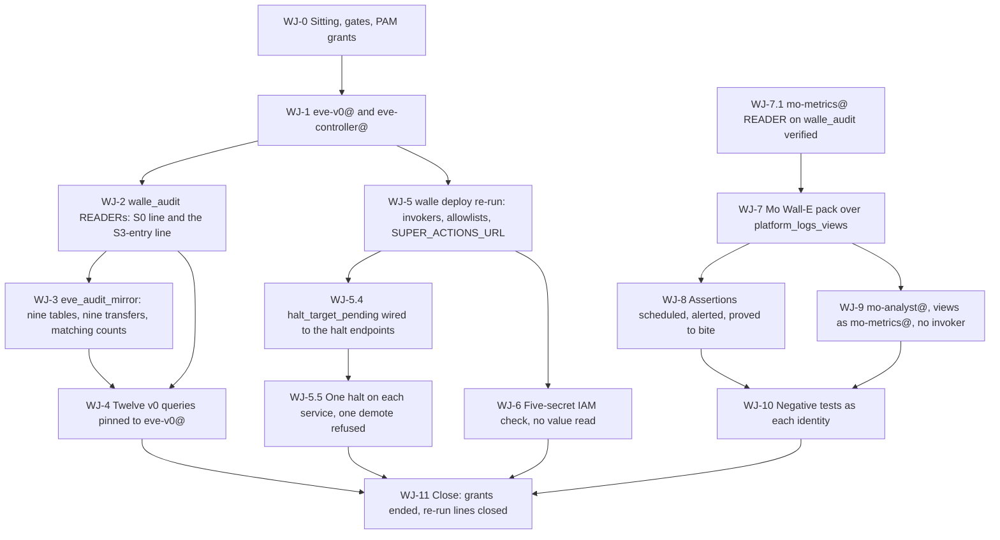

# 36. Joining Eve and Mo to Wall-E

## Status

- Owner: the platform owner
- Last reviewed: 2026-09-15
- Last executed: never
- Stage: review §2 stage 24 (Eve S0 over `walle_audit`), stage 25 (the Wall-E half of the superseded Mo-4 and Mo-5), stage 31 (Mo-6), and **every cross-file re-run point** that was recorded PENDING while Wall-E's data plane and services did not exist. It is the seam file: nothing new of Wall-E's is built here, and nothing of Eve's or Mo's is designed here. What is done here is the joining, in the one order that works.
- Step prefix: `WJ`. Steps: 54. BLOCKED steps: WJ-3.2 (Wall-E's nine `walle_audit` table schemas, **B-22**, the row [31](31-wall-e-project-and-data-plane.md) WD-4.5 opened and WD-11.2 asks README to carry; B-16 is the service code, a different artefact and a different commit, and it blocks §5's deploy re-run instead); WJ-4.1, WJ-4.2, WJ-4.3, WJ-4.4 (Eve's twelve v0 SQL files and `thresholds.yaml`, README B-09); WJ-5.3 and WJ-5.4 (Eve's reconciler image and catalogue, README B-08 and B-09); WJ-7.2, WJ-7.4, WJ-8.1, WJ-8.2 (Mo's Wall-E-pack SQL and assertion files, README B-14); WJ-9.2 (Mo's view definitions, B-14). Steps that record `PENDING` rather than `BLOCKED`: WJ-3.6 (row 18, `mo-metrics@` on the mirror, at S4); WJ-4.6 (metric 7, empty until Eve's S3 harness); WJ-9.4 (the deny-improvers confirmation, if the policy at `fld-agentic-platform` names principals one by one).
- Replaces: Phases 2, 3, 4 and 5 of [../../eve/07-build-runbook.md](../../eve/07-build-runbook.md); the Wall-E half of Phase 9's cross-project paragraph and of Phase 10's `CONTROL_CALLER_ALLOWLIST`; the Wall-E half of Phase Mo-4, the whole of Phase Mo-5 and the whole of Phase Mo-6 of [../../mo/07-build-runbook.md](../../mo/07-build-runbook.md); the foreign-grant blocks of Phases 7 and 10 of [../../wall-e/SETUP.md](../../wall-e/SETUP.md). None of those pages is executed.
- Salvaged: Eve Phase 2's argument for a pinned service account and for `roles/iam.serviceAccountUser` on the **account resource** rather than `roles/iam.serviceAccountTokenCreator`; Phase 2's dataset-level-never-project-level rule and its negative check; Phase 3's mirror intent (an off-project copy that survives a `walle_audit` teardown) and its partitioning; Phase 4's off-the-hour schedule and its reason; Phase 5's **absence** alert and its three-hour duration; Mo-4's `create_metric` shape, the `:07` minute and the three query rules; Mo-5's assertion list and the daily snapshot; Mo-6's authorised-view argument (a view holds its own authorisation, so no view is ever authorised on `walle_audit`), the surrogate-key design, and its MD-2 and MD-13 negatives; topology §7.1's re-run rows for Phases 7 and 10.
- Not copied: `SELECT * FROM walle_audit.actions` into one mirror table, "repeat for each of the six tables" (S058); `c.get('serviceAccountName','<<HUMAN CREDENTIALS>>')` and `grep -c '":00"'` as the pinning and schedule checks (S131, S148); metric 10 as a BigQuery query over Firestore (S029); metrics 9 and 11 reading a source no Eve identity may read (S029); the reconciler and gate environments with no `walle-actions-super` address (S128); `A5` joined on `run_id, item_index` against an aggregate table and `A7`'s undeclared alias `t` (S045); assertions run once by hand and never again (S145); `__WALLE_PROJECT__` sent verbatim to the Data Transfer Service (S149); `<walle-project-id>.walle_workspace_logs` as Mo's source (S062); `roles/run.invoker` for `mo-analyst@` on `walle-actions` (S063, SD-24); `WRITER` on the views dataset with the views made by a human (S155); `gcloud auth print-access-token --impersonate-service-account` against `walle-actions@`, `walle-dispatcher@`, `walle-agent@` and `eve-controller@` (S007); `print-identity-token` without `--include-email` (S146); "exactly the four foreign identities" on `walle-actions` alone (S161); the three-secret Eve check (S199); an MD-9b grep with `GEMINI_PROJECT` never exported and only `userByEmail` entries inspected (S211).
- Applies decisions (signed in 03 before the step that needs them): SD-01, SD-10, SD-24, SD-33, SD-37, SD-43, SD-44, SD-45, NAMES, E-9, E-12, M-1, M-5, P30, decision 43, decision 44, decision 48, decision 51.
- Closes: S007, S029 (the S0-query half; the reconciler half is 25), S045, S058, S062 (the query half; the foundation half is 22), S063 (with 03), S070 (the Eve and Mo half; the Wall-E-side half is 31 and README), S107 (the S3-entry half; the Phase 7 half is 31), S128, S131, S145, S146, S148, S149, S155 (the view-creation half; the grant half is 22), S161, S199, S211. Defers none without an owner (§13).
- Consumes: `MO_PROJECT`, `SA_MO_METRICS`, `MO_METRICS_DS`, `MO_ARCHIVE_DS`, `MO_PRIVATE_DS`, `MO_VIEWS_DS`, `MO_INPUTS_COMMIT`, `ENT_PROJECT_REPAIR_MO`, `ENT_DEPLOY_CREDENTIAL_HOLDER_MO` (22); `EVE_PROJECT`, `EVE_DS`, `EVE_WS_LOGS_DS`, `EVE_WS_REPORTS_DS`, `EVE_SCHEMAS_COMMIT`, `EVE_KEYRING`, `EVE_EVIDENCE_KEY_EU`, `ENT_PROJECT_REPAIR_EVE`, `ENT_DEPLOY_CREDENTIAL_HOLDER_EVE` (23); `SA_EVE_VERIFIER`, `EVE_ROBOT` ([24](24-eve-workspace-identity-and-audit-feeds.md)); `SA_EVE_CONSOLE`, `EVE_CONFIG_REPO`, `EVE_RECONCILER_IMAGE`, `EVE_JOB_DETECT`, `EVE_JOB_REPORTS_POLL`, `EVE_JOB_ROSTER`, `EVE_JOB_HEARTBEAT`, `EVE_CODE_COMMIT`, `EVE_CONFIG_COMMIT` ([25](25-eve-human-super-admin-detections.md); re-pinned here by WJ-4.1 with `penv_set --force`); `SA_EVE_EXPORT`, `NOTIF_CH_EVE_EMAIL_SECOND_HUMAN` ([26](26-eve-reporting-and-witness-export.md)); `WALLE_PROJECT`, `WALLE_AUDIT_DS`, `SA_ACTIONS`, `SA_ACTIONS_SUPER`, `SA_DISPATCH`, `SA_AGENT`, `SA_OPS_CALLER`, `WALLE_SECRET_NAMES`, `ENT_PROJECT_REPAIR_WALLE`, `ENT_DEPLOY_CREDENTIAL_HOLDER_WALLE` ([31](31-wall-e-project-and-data-plane.md)); `WALLE_REPO_DIR`, `WALLE_REPO_REMOTE` ([30](30-wall-e-workspace-side.md)); `ACTIONS_URL`, `SUPER_ACTIONS_URL`, `WALLE_CODE_COMMIT` (33); `LOGGING_PROJECT`, `PLATFORM_LOGS_VIEWS_DS` ([14](14-central-logging-and-billing-export.md)); `NOTIF_CH_EMAIL_CORE` ([15](15-pager-siem-and-detections.md)); `SA_PLATFORM_DRIFT`, `CICD_PROJECT`, `CORE_PROJECT`, `AR_PLATFORM` ([10](10-core-projects-and-ci-identities.md)); `SA_VALIDATOR_CUSTODIAN`, `VALIDATOR_PROJECT` ([11](11-keys-and-validator-custodian.md)); `DENY_IMPROVERS`, and `FLD_AGENTIC_PLATFORM` as its attachment point ([13](13-organisation-policies-deny-and-pab.md) OP-7.6, [09](09-folders-and-security-command-center.md)); `GEMINI_PROJECT`, `GEMINI_PROJECT_NUMBER` ([05](05-gemini-enterprise-inventory.md)); `SECOND_HUMAN_EMAIL`, `SECOND_OPERATOR_EMAIL`, `MO_OWNER_EMAIL` ([03](03-decisions-and-people.md)); `REGION`, `BQ_LOCATION` ([01](01-prerequisites-and-conventions.md)). Every one of them is in WJ-0.1's `need` list: a variable used by a step and absent from that list is the failure mode of an empty `--default_kms_key=` or an empty notification channel, which fail silently rather than loudly.
- Produces: `SA_EVE_V0`, `SA_EVE` (`eve-controller@`), `EVE_MIRROR_DS`, `SA_MO_ANALYST`, `MO_WALLE_PACK_CONFIGS`; and four new names handed to README's variable list — `EVE_V0_CONFIGS` (the twelve v0 transfer-config resource names), `EVE_MIRROR_CONFIGS` (the nine mirror transfer-config resource names), `MO_ASSERT_CONFIG` (the assertion config of WJ-8.2) and `MO_VIEWS_CONFIG` (the views-DDL config of WJ-9.2), each recorded because a later file deletes or re-pins them by name and a `bq rm` loop over a whole location would take the others with it.
- Commands checked against Google's documentation on 2026-09-15 (§14). What could not be settled that day is listed in §13.

## What this part builds

Until this file runs, three components exist side by side and none reads the others. Eve watches human super admins and has no way to see what the robot does; Mo measures nothing of Wall-E's; Wall-E's audit store has readers recorded as PENDING and its services have no caller but its own operators. This file makes the three joins, and it makes them in the only order that does not loop: **identities first, then reads, then the computation over the reads, then — last — the one write path any of them gets, which is Eve's halt.**

1. **Eve's two remaining identities** (§1): `eve-v0@`, which runs the evidence queries, and `eve-controller@`, which is the approval-point limb and the second halter. Both are keyless; neither holds a role in `WALLE_PROJECT` at project level, ever.
2. **The `walle_audit` reads** (§2). 31 granted only the S0 principals and wrote every other line into the re-run index (SD-44). Here the index is closed: `eve-v0@`'s `READER` is made, and the two S3-entry entries are made as their own step with their own verify, which is what S107 asked for — not quietly inside a Phase 7 loop that ran months earlier.
3. **The mirror, one table per source table** (§3): `eve_audit_mirror` with nine tables and **nine** transfer configs, because `walle_audit` has nine tables and a `SELECT *` from nine different schemas into one table does not run (S058). The verify compares the mirror's table count and each table's row count against the source.
4. **Eve v0's twelve queries** (§4), pinned to `eve-v0@`, off the hour, with metric 10 redefined as a BigQuery-only query and metrics 9 and 11 reading a source Eve is actually granted (S029), and with the pinning proved by `ownerInfo` rather than by a field that does not exist (S131).
5. **The halt path** (§5): the Wall-E deploy re-run that gives Eve's two identities `run.invoker` on `walle-actions` and, halt-endpoint only, on `walle-actions-super`; `SUPER_ACTIONS_URL` in the reconciler's environment (S128); and the catalogue's `halt_target_pending` replaced by real endpoints, with one halt proved on each service and a demote refused on the super lane.
6. **The five-secret check** (§6): no Eve identity may read any of Wall-E's five regional secrets, and the check reads the **IAM policy**, never a value (S199).
7. **Mo's Wall-E pack** (§7): the metric queries that need `walle_audit`, reading the Workspace logs through `platform_logs_views.walle_workspace_logs` from the first day so that nothing has to be re-pointed when the interim dataset goes (S062), with one templating convention and a verify that finds a leftover token (S149).
8. **Mo's assertions, running for ever** (§8): A5 over grades and actions, A7 with its alias declared, A9 guarded on the column it needs, created as a scheduled config with an alert on failed runs — because an assertion run once by hand is a comment (S045, S145).
9. **Mo-6** (§9): `mo-analyst@`, the authorised views **created as `mo-metrics@`** so the `WRITER` grant has a purpose and a table can never sit in the views dataset (S155), and **no** `run.invoker` on `walle-actions` at all: Mo reads plan hashes from `walle_audit.plans`, topology row 8 is retired, and MD-3 becomes a denial test (SD-24, S063).
10. **A negative-test harness that can actually be run** (§10): BigQuery jobs executed as each identity, or `testIamPermissions` and Policy Troubleshooter for the accounts no human may impersonate, and `--include-email` on every identity token (S007, S146, S161, S211).

What the superseded text got wrong, and must not come back:

| Old text | Why it fails | Here instead |
|---|---|---|
| `INSERT INTO eve.walle_audit_mirror SELECT * FROM walle_audit.actions`, "repeat for each of the six `walle_audit` tables" (Eve Phase 3) | `walle_audit` has nine tables, not six, and `generic_requests` — the band-B super-admin lane — is never named; a `SELECT *` from nine different schemas into one table fails outright (S058) | §3: dataset `eve_audit_mirror`, one table per source table from Wall-E's own committed schemas, nine transfer configs, and a verify comparing table counts and row counts |
| `c.get('serviceAccountName','<<HUMAN CREDENTIALS>>')` over `bq ls --transfer_config`, asserted by CI (Eve Phase 4 check 1; Mo-4 verify) | `serviceAccountName` is a create and patch **request parameter**, not a field of the `TransferConfig` resource, so every row prints the placeholder however the config was made; the CI assertion fails permanently or is disabled (S131, S148) | WJ-3.4, WJ-4.5 and WJ-7.5 loop over config **names** with `bq show --transfer_config` and read `ownerInfo.email`, the output-only field the reference says is "populated only for `transferConfigs.get` requests" |
| `bq ls --transfer_config … \| grep -c '":00"'` as the off-the-hour check (Eve Phase 4 check 2) | No schedule string (`every 1 hours from 00:07 to 23:59`, `every day 01:00`) ever contains `":00"`; the check always prints 0 and proves nothing (S131) | WJ-3.4 tests each `schedule` string with a regular expression over the **minute field**, and fails on `:00` or on a missing minute |
| Metric 10 as a scheduled query over `walle_audit.config_versions` **and Firestore `drills/{date}`** (Eve Phase 4) | BigQuery cannot read Firestore, and no Eve identity holds a Firestore grant (topology row 12, decision 44); the config would be accepted and fail on every run (S029) | WJ-4.2: metric 10 reads `walle_audit.config_versions` only; drill timings reach it because Wall-E exports them into that table, and the step refuses the SQL if it names Firestore |
| Metrics 9 and 11 joining "Workspace admin events" at S0 (Eve Phase 4) | Before Eve's own sink the only copy was Wall-E's interim dataset, on which no Eve identity holds a grant (S029) | WJ-4.3: both read `eve_workspace_logs` (24) and `platform_logs_views.walle_workspace_logs` (row 40, granted to `eve-verifier@` in 14), and the step names which of the two each query uses |
| `eve-reconciler` and `eve-gate` environments with `ACTIONS_URL` and no super address (Eve Phase 10, 11) | Every super-admin-lane halt — `reconciliation_gap`, the tenant-integrity rules, `log_pipeline_silent` — reaches only `walle-actions`; the band-B and band-C lane keeps running during an incident, and topology row 27's grant has no caller (S128) | WJ-5.3 sets `SUPER_ACTIONS_URL` in the four reconciler jobs; WJ-5.5 proves a halt accepted on **both** services as `eve-verifier@` and a demote **refused** on the super lane |
| `A5`: `agg_precision_cell a LEFT JOIN walle_audit.grades g USING (run_id, item_index)` (Mo-5) | The aggregate's rows are keyed by cell and `as_of_hour`, so the join fails at analysis and A6 to A9 never execute; and the contract's A5 is "every grades row joins to an actions row", both tables in `walle_audit` (S045) | WJ-8.1: A5 is `grades` LEFT JOIN `actions` in `walle_audit`, with the join key read from the committed schemas, not assumed |
| `A7`: `REGEXP_CONTAINS(TO_JSON_STRING(t), …)` with no `AS t` (Mo-5) | `Unrecognized name: t`; the script stops there (S045) | WJ-8.1: `FROM \`…scorecard\` AS t`, and a CI check that every `TO_JSON_STRING(x)` has a declared alias `x` |
| `A9` over `ladder_events.decided_block_id` with no guard (Mo-5) | The column does not exist until Wall-E's change 2 lands; the multi-statement script dies rather than reporting `not_computable` (S045) | WJ-8.1: A9 is guarded on `INFORMATION_SCHEMA.COLUMNS`, and reports `not_computable` when the column is absent |
| "runs after every scheduled query; a failure pages and freezes promotions" — with one interactive `bq query` as the only command (Mo-5) | Nothing runs again after the sitting; no ordering, no alert, nothing writes the freeze (S145) | WJ-8.2 creates `mo-assertions` at `:37` pinned to `mo-metrics@`; WJ-8.3 alerts on failed transfer runs; WJ-8.4 proves an assertion fails the job |
| `sed s/__WALLE_PROJECT__/…/` in Mo-5 against "the project id is templated in at commit time" in Mo-4 | Two conventions: if tokens are committed, `create_metric` sends `__WALLE_PROJECT__` to the service, the config is accepted and every run fails "Not found: Project `__WALLE_PROJECT__`" — silently (S149) | WJ-7.2 fixes **one** convention: tokens are committed, `create_metric` substitutes them, and the verify greps the submitted `params` for a leftover `__[A-Z_]*__` |
| `<walle-project-id>.walle_workspace_logs.<table>` in Mo's metric 9 and 9b (Mo-4) | That dataset is interim and is deleted before Wall-E's Stage 1; the transfer then fails hourly with no alert (S062) | WJ-7.3: `${LOGGING_PROJECT}.${PLATFORM_LOGS_VIEWS_DS}.walle_workspace_logs` from the first day; the step refuses any SQL naming the retired dataset |
| `grant_dataset "$MO_PROJECT" walle_metrics_views WRITER "$SA_MO_METRICS"` with the views created by the human (Mo-6) | The grant is unused; `dataEditor` lets the identity that reads raw audit rows create a **table** of free text in the dataset `mo-analyst@` reads at dataset level, and the `LIKE 'v_%'` check never sees it (S155) | WJ-9.2 creates the views through a transfer config running as `mo-metrics@`, so the grant is the mechanism; WJ-9.3 fails on any object in that dataset whose `table_type` is not `VIEW` |
| `roles/run.invoker` for `mo-analyst@` on `walle-actions` (Mo-6) | `deny-improvers` forbids a `run.invoker` binding on any credential holder from an improver principal; once it applies, the plan-hash recompute and MD-3's positive leg get 403 (S063) | WJ-9.4: no binding at all. Mo reads plan hashes from `walle_audit.plans`; topology row 8 is retired; MD-3 expects refusal (SD-24) |
| `TOKEN=$(gcloud auth print-access-token --impersonate-service-account="$SA_MO_ANALYST")`, and the same against `walle-actions@`, `walle-dispatcher@`, `walle-agent@`, `eve-controller@` (Mo-6, MD-9) | No step grants the human `serviceAccountTokenCreator`, and Owner does not include it, so every call returns an empty bearer and 401 — neither the expected 200 nor 403. On the Wall-E and Eve accounts the grant is forbidden outright and is itself a severity 1 finding (S007) | §10: a time-boxed PAM grant of `serviceAccountTokenCreator` on the **`mo-*` accounts only**, recorded and withdrawn in the same step; for the credential holders, `testIamPermissions` and Policy Troubleshooter, and the live legs delegated to Wall-E's own suite (37) and Eve's (41) |
| `gcloud auth print-identity-token --impersonate-service-account=… --audiences=…` with no `--include-email` (Mo-6 `call_actions`) | The token carries no verified `email` claim, the allowlists are keyed on it, so the positive leg 403s and the negative "passes" for the wrong reason (S146) | WJ-10.3: `--include-email` on every identity token, and the decoded claim printed once before any 403 is read |
| "`run.invoker` on `walle-actions` lists exactly the four foreign identities" (SETUP Phase 15 verify 3) | `walle-actions-super` is never read, so row 27's two Eve identities and a stray invoker on the super lane go unseen; and `platform-drift@` (row 36) is on both services (S161) | WJ-5.6 reads **both** services and compares against one committed expected set — rows 3, 27 and 36, and nothing else |
| Eve's secret check over three names (Eve Phase 9 verify 1) | Wall-E has five; the two missing are the broad Super Admin client's, the most damaging credential an Eve identity could hold (S199) | WJ-6.1 loops over all five from `WALLE_SECRET_NAMES`, reads each regional secret's IAM policy with `--location`, and never reads a version |



## Preconditions

- [ ] 31 complete: `WALLE_PROJECT`, `WALLE_AUDIT_DS`, `SA_ACTIONS`, `SA_ACTIONS_SUPER`, `SA_DISPATCH`, `SA_AGENT`, `SA_OPS_CALLER`, `WALLE_SECRET_NAMES` set; the nine `walle_audit` tables exist (WD-4.5 done) and `PLATFORM_REPO_DIR/walle/AUDIT_TABLES` is committed, or WJ-3.2 and §4 are BLOCKED on B-22; `ENT_PROJECT_REPAIR_WALLE` and `ENT_DEPLOY_CREDENTIAL_HOLDER_WALLE` `AVAILABLE`; WD-8's PENDING lines present in `BUILD_LOG_DIR/rerun-index.tsv`.
- [ ] 33 complete: `ACTIONS_URL`, `SUPER_ACTIONS_URL` set; `WALLE_CODE_COMMIT` set **by 33 WS-1.1, which is its single owner** — this file never sets it, and [32](32-wall-e-consents.md)'s opportunistic `penv_set WALLE_CODE_COMMIT` is withdrawn by that file's own fix, so no second write at a different value can be refused unnoticed; both action services deployed by digest; the allowlists generated from `config/agent-manifest.yaml` and no group or user invoker on either service.
- [ ] [30](30-wall-e-workspace-side.md): `WALLE_REPO_DIR` is a working clone of `WALLE_REPO_REMOTE` on this workstation, on `main`, clean — §3 and §5 read committed files from it and §5 pushes a branch from it, exactly as 32, 33 and 35 do. A throwaway `mktemp -d` clone is not used for anything this file must push.
- [ ] 23 complete: `EVE_PROJECT`, `EVE_DS`, `EVE_WS_LOGS_DS`, `EVE_WS_REPORTS_DS` set; `ENT_PROJECT_REPAIR_EVE` and `ENT_DEPLOY_CREDENTIAL_HOLDER_EVE` `AVAILABLE` with the second human as approver.
- [ ] [24](24-eve-workspace-identity-and-audit-feeds.md) and [25](25-eve-human-super-admin-detections.md): `SA_EVE_VERIFIER`, `SA_EVE_CONSOLE`, `EVE_CONFIG_REPO`, `EVE_RECONCILER_IMAGE`, the four job names and `EVE_CODE_COMMIT` set, or WJ-5.3 and WJ-5.4 are BLOCKED on B-08; EH-4.6's two PENDING lines present in the re-run index.
- [ ] [26](26-eve-reporting-and-witness-export.md): `EVE_FIRST_RUN_RECORD` exists, so Eve already reports to a recipient outside the administration line before it gains a write path into Wall-E.
- [ ] [22](22-mo-foundations.md): `MO_PROJECT`, `SA_MO_METRICS`, the four `MO_*_DS` datasets and `MO_INPUTS_COMMIT` set, or §7 to §9 are BLOCKED on B-14; MO-10.2's PENDING line present.
- [ ] [14](14-central-logging-and-billing-export.md): `PLATFORM_LOGS_VIEWS_DS` holds the authorised view `walle_workspace_logs`, and row 40's `READER` is made for **both** `mo-metrics@` and `eve-verifier@` (CL-7.3 re-run closed). §7 does not start otherwise.
- [ ] [11](11-keys-and-validator-custodian.md): `SA_VALIDATOR_CUSTODIAN` set, or row 21's verify in WJ-2.5 records PENDING against B-13.
- [ ] [05](05-gemini-enterprise-inventory.md): `GEMINI_PROJECT` and `GEMINI_PROJECT_NUMBER` set — WJ-10.5 needs both, and their absence is the whole of S211.
- [ ] [03](03-decisions-and-people.md) signed: NAMES, SD-10, SD-24, SD-33, SD-43, SD-44, SD-45, M-1, M-5, P30, decision 43, decision 44, decision 48, decision 51. `tools/decision-need.sh` prints `SIGNED` for each.
- [ ] [13](13-organisation-policies-deny-and-pab.md): `DENY_IMPROVERS` set, and its attachment point is `fld-agentic-platform` — OP-7.6 creates and reads the policy there, not at `fld-improvers`, and a `gcloud iam policies describe` against the wrong attachment point returns `NOT_FOUND`, which WJ-9.4 must not read as "no deny". `FLD_AGENTIC_PLATFORM` is set ([09](09-folders-and-security-command-center.md)).
- [ ] [15](15-pager-siem-and-detections.md) part A: `NOTIF_CH_EMAIL_CORE` set and the channel verified, so WJ-8.3's policy names a channel a human reads. An empty channel list creates a policy that alerts nobody, which is the failure WJ-8.3 exists to prevent.
- [ ] [23](23-eve-project-and-evidence-stores.md): `EVE_EVIDENCE_KEY_EU` (the `europe` multi-region key of EP-3.6) and `EVE_KEYRING` (the `europe-west1` ring of EP-3.3) set. WJ-3.1 refuses to create the mirror dataset without the first; WJ-1.2's negative key check needs the second.
- [ ] Workstation of [01](01-prerequisites-and-conventions.md): gcloud with `alpha` and `beta`, `bq`, `jq`, `python3.12`, `git`; `~/.platform-env` sourced; `penv_guard` silent.
- [ ] **Not** a precondition: the super-admin grant. Everything here is pre-grant. Wall-E's robot holds no Workspace role, every tenant read from `walle-actions` returns 403, and that is the expected state in every verify below.
- [ ] **Not** a precondition: Eve's S3 or S4 entry. `eve-gate`, the signing key and the receipts dataset are file 41; `eve-controller@` is created here because the deploy re-run must name it once, not twice.

## People needed

| Role | Does | Present at |
|---|---|---|
| Platform owner (as `sa-1-admin@`) | Performs every step; requests every grant | every step |
| Second human (`SECOND_HUMAN_EMAIL`; Eve owner of record) | **Approves `ENT_PROJECT_REPAIR_EVE` and `ENT_DEPLOY_CREDENTIAL_HOLDER_EVE`** for every Eve-side step; reviews and merges the `eve/config` change that replaces `halt_target_pending`; witnesses the first halt and the refused demote | WJ-0.3, WJ-5.4, WJ-5.5, WJ-11.1 |
| Second reviewer for Wall-E deploys (never the Wall-E owner) | Approves `ENT_DEPLOY_CREDENTIAL_HOLDER_WALLE` for the deploy re-run of §5; if unappointed, one-person mode is recorded exactly as 33 records it | WJ-5.1, WJ-5.2 |
| Mo owner (`MO_OWNER_EMAIL`) | Performs §7, §8, §9 and §10's Mo legs; requests the two Mo grants | §7 to §10 |
| Second operator (`SECOND_OPERATOR_EMAIL`) | Reviews the Wall-E-pack SQL commit against the three query rules; reviews the assertion file | WJ-7.2, WJ-8.1 |
| Validator custodian (`VALIDATOR_CUSTODIAN_EMAIL`) | Confirms row 21 once named | WJ-2.5 |

Hands-on: about 2 days (Eve's side one, Mo's side one). Elapsed: about 1 week, because §5's deploy re-run and §5.4's `eve/config` merge are each a reviewed pull request and an approval cycle. While B-08, B-09, B-14 or B-22 stand, the blocked steps wait with no fixed date and the rest of the file still runs; B-16, the service code, is a precondition of the whole file through 33 rather than a block on one step here.

Conventions of [01](01-prerequisites-and-conventions.md) apply, §8.1 for every access-array edit. Deviation rows are `BD-36-<n>`. Records go to `BUILD_LOG_DIR/records/` as `<date>-WJ-<step>-<slug>-v<n>`. Every shell block starts with:

```bash
source ~/.platform-env
penv_guard
R="$BUILD_LOG_DIR/records/$(date -u +%F)-WJ"
jwt_claims () {   # jwt_claims <token> — prints the decoded payload, loudly on failure
  local P
  P="$(printf '%s' "$1" | cut -d. -f2 | tr '_-' '/+')"          # base64url -> base64
  case $(( ${#P} % 4 )) in 2) P="${P}==";; 3) P="${P}=";; esac  # a JWT payload carries no padding
  printf '%s' "$P" | base64 -d | jq '{email, email_verified, aud, exp}'
}
```

`jwt_claims` is defined once, here, because two steps read an identity token's claims and both must read them the same way. A JWT payload is base64url **without padding**; `base64 -d` on both BSD and GNU rejects input whose length is not a multiple of four, so an unpadded payload — most of them — fails to decode. The superseded lines swallowed that failure with `2>/dev/null` and piped nothing into `jq`, so the `email` and `email_verified` check printed nothing at all while the operator read the status codes below it as if the claim had been confirmed. There is no `2>/dev/null` here: a decode that fails is a harness failure and must be seen (S146).

## 0. The sitting

### WJ-0.1 Open the sitting and check every gate

- **WHO:** Platform owner; the Mo owner repeats it before §7.
- **WHERE:** Shell, `~/.platform-env` sourced, gcloud configuration `GCLOUD_CONFIG_NAME`, signed in as `sa-1-admin@`.
- **ACTION:**

```bash
checkpoint WJ-0.1 START
need ORG_ID REGION BQ_LOCATION BUILD_LOG_DIR PLATFORM_REPO_DIR DEVIATION_REGISTER EVIDENCE_REGISTER WALLE_PROJECT WALLE_AUDIT_DS SA_ACTIONS SA_ACTIONS_SUPER SA_DISPATCH SA_AGENT SA_OPS_CALLER ACTIONS_URL SUPER_ACTIONS_URL WALLE_CODE_COMMIT WALLE_REPO_DIR WALLE_REPO_REMOTE EVE_PROJECT EVE_DS SA_EVE_VERIFIER SA_EVE_CONSOLE SA_EVE_EXPORT EVE_KEYRING EVE_EVIDENCE_KEY_EU MO_PROJECT SA_MO_METRICS MO_METRICS_DS MO_ARCHIVE_DS MO_VIEWS_DS MO_PRIVATE_DS LOGGING_PROJECT PLATFORM_LOGS_VIEWS_DS NOTIF_CH_EMAIL_CORE CICD_PROJECT CORE_PROJECT SA_PLATFORM_DRIFT DENY_IMPROVERS FLD_AGENTIC_PLATFORM GEMINI_PROJECT GEMINI_PROJECT_NUMBER SECOND_HUMAN_EMAIL SECOND_OPERATOR_EMAIL MO_OWNER_EMAIL
"$PLATFORM_REPO_DIR/tools/decision-need.sh" NAMES SD-10 SD-24 SD-33 SD-43 SD-44 SD-45 M-1 M-5 P30
test -z "$(gcloud config get project 2>/dev/null)" && echo "no default project"
case "$EVE_EVIDENCE_KEY_EU" in */locations/europe/keyRings/*) echo "kms key is a europe multi-region key";; *) echo "STOP: EVE_EVIDENCE_KEY_EU is not a europe multi-region key: $EVE_EVIDENCE_KEY_EU";; esac
bq --project_id="$WALLE_PROJECT" ls --format=json "${WALLE_PROJECT}:${WALLE_AUDIT_DS}" | jq -r '[.[] | select(.type=="TABLE") | .tableReference.tableId] | sort | join(" ")'
gcloud run services describe walle-actions --project="$WALLE_PROJECT" --region="$REGION" --format='value(status.url)'
gcloud run services describe walle-actions-super --project="$WALLE_PROJECT" --region="$REGION" --format='value(status.url)'
git -C "$WALLE_REPO_DIR" status --porcelain | head; git -C "$WALLE_REPO_DIR" rev-parse --abbrev-ref HEAD
```

- **VERIFY:** `decision-need.sh` prints `SIGNED` for each id. `no default project`. `need` prints nothing: an unset variable stops the sitting here rather than becoming an empty flag value later — an empty `--default_kms_key=` (WJ-3.1), an empty `--keyring=` (WJ-1.2) or an empty notification channel (WJ-8.3) are all accepted by their commands and all produce the wrong resource silently. `kms key is a europe multi-region key`. The `walle_audit` listing prints exactly `actions approvals config_versions generic_requests grades ladder_events plans runs verifications` — nine names; six, or a missing `generic_requests`, is 31's WD-4.5 unfinished and §3 and §4 stay BLOCKED on B-22. Both service URLs print and equal `ACTIONS_URL` and `SUPER_ACTIONS_URL`; a mismatch means 33 was re-deployed and the variables are stale, which is a stop because §5 writes those URLs into Eve's environment. `WALLE_REPO_DIR` is clean and on `main`.
- **ROLLBACK:** Read only.
- **EVIDENCE:** The output as `${R}-0.1-gates-v1.txt`; `evidence_add WJ-0.1 join-gates E-05 1.4.1 build-log:records/<file> <file>`. E-05. TISAX 1.4.1.

### WJ-0.2 Record which blocked inputs stand today

- **WHO:** Platform owner.
- **WHERE:** Shell; `BUILD_LOG_DIR`.
- **ACTION:** Four bodies of code decide how much of this file runs. Record the state once, at the start, so no step discovers it mid-sitting. Two of the four are **paths** and two are **variables**, and they are tested on their own terms: a path is `PRESENT` only if it exists on disk, a variable only if it is non-empty. The superseded one-line test chained `[ -e … ] || [ … != unset ]`, which reported `PRESENT` for a defaulted `/nonexistent/…` path — the literal string is not `unset`, so the second test passed — and the step then recorded nothing while WJ-3.2 and §4 proceeded as if the code existed.

```bash
{
  for P in "B-22 walle_audit schemas:${WALLE_REPO_DIR:-/nonexistent}/schemas" "B-09 eve v0 sql:${EVE_CONFIG_DIR:-/nonexistent}/sql"; do
    if [ -d "${P#*:}" ] && [ -n "$(ls -A "${P#*:}" 2>/dev/null)" ]; then S=PRESENT; else S=BLOCKED; fi
    printf '%s\t%s\t%s\n' "${P%%:*}" "$S" "${P#*:}"
  done
  for V in B-08:EVE_RECONCILER_IMAGE B-14:MO_INPUTS_COMMIT; do
    N="${V#*:}"; X="$(printenv "$N" 2>/dev/null || true)"
    if [ -n "$X" ] && [ "$X" != unset ] && [ "$X" != '*tbd*' ]; then S=PRESENT; else S=BLOCKED; fi
    printf '%s\t%s\t%s\n' "${V%%:*}" "$S" "$N"
  done
} | tee "${R}-0.2-blocked-v1.tsv"
# WALLE_REPO_DIR is 30's clone of WALLE_REPO_REMOTE; EVE_CONFIG_DIR is a sitting value naming this
# workstation's clone of EVE_CONFIG_REPO (25) — set it before this step or the B-09 line reads BLOCKED.
awk -F'\t' '$2=="BLOCKED"{n++} END{print (n+0) " blocked inputs to copy into the B-index"}' "${R}-0.2-blocked-v1.tsv"
```

- **VERIFY:** Four lines, each naming the block, its state and the path or variable that decided it. Every `BLOCKED` line is copied into README's B-index against this file with the step ids it holds (WJ-3.2 for B-22; §4 and WJ-5.4 for B-09; WJ-5.3 for B-08; §7 to §9 for B-14). The count line is copied into the sitting record. A step whose input is `BLOCKED` writes `checkpoint <id> BLOCKED` and nothing else; it is never approximated by hand. A `PRESENT` line whose third field is a `/nonexistent/…` path is impossible with this test and is the defect it replaces — if one ever appears, the loop has been edited and the step is re-run as written.
- **ROLLBACK:** Read only.
- **EVIDENCE:** The TSV as `${R}-0.2-blocked-v1.tsv`. E-05. TISAX 1.4.1.

### WJ-0.3 Open the Eve-side grant, approved by the second human

- **WHO:** Platform owner requests; **the second human approves**. The platform owner may not approve his own request and PAM refuses it in any case.
- **WHERE:** Shell.
- **ACTION:** Every Eve-side write in this file happens inside a time-boxed grant. The standing `actAs` on Eve's accounts was removed in 25 (S143) and is not restored here: the right to attach `eve-v0@` to a transfer config comes from `ENT_DEPLOY_CREDENTIAL_HOLDER_EVE`'s `roles/iam.serviceAccountUser` for the length of the grant, and goes when the grant ends.

```bash
source "$PLATFORM_REPO_DIR/pam/tools/pam.sh"
g_eve="$(pam_request "$ENT_PROJECT_REPAIR_EVE" "setup-36 sections 1-4: eve-v0@, eve-controller@, the walle_audit mirror and the v0 queries")"; echo "$g_eve"
g_eve_dep="$(pam_request "$ENT_DEPLOY_CREDENTIAL_HOLDER_EVE" "setup-36 sections 3-5: attach eve-v0@ to transfer configs; redeploy the reconciler jobs" 7200)"; echo "$g_eve_dep"
gcloud pam grants search --entitlement="$ENT_PROJECT_REPAIR_EVE" --location=global --project="$EVE_PROJECT" --caller-relationship=had-created --format='table(name,state,requestedDuration)'
```

- **VERIFY:** Both grants read `ACTIVE`, each with its approver recorded as the second human. A grant that self-approved is a fault in 12's entitlement and stops the file.
- **ROLLBACK:** `gcloud pam grants revoke` on either grant; nothing in this section survives without it.
- **EVIDENCE:** The grant names, approver and durations as `${R}-0.3-grants-v1.txt`; `evidence_add WJ-0.3 eve-grants E-08 4.2.1 build-log:records/<file> <file>`. E-08. TISAX 4.2.1.

### WJ-0.4 Read the re-run index and list what this file must close

- **WHO:** Platform owner.
- **WHERE:** Shell.
- **ACTION:** This file exists because four earlier files could not finish a grant. Read their lines rather than trusting this page's memory of them.

```bash
grep -E $'\t(WD-8\\.[0-9]|EH-4\\.6|MQ-4\\.1|MO-10\\.2)\t' "$BUILD_LOG_DIR/rerun-index.tsv" | tee "${R}-0.4-rerun-v1.tsv"
wc -l < "${R}-0.4-rerun-v1.tsv"
```

- **VERIFY:** The list holds, at least: 31's `eve-v0@` PENDING on `walle_audit`; 31's S3-entry lines; 25's two halt lines; 29's three `not_computable` lines; 22's MO-10.2 line. Each is closed by a named step of this file (§12's table maps them). A line in the index with no step here is a gap and stops the sitting until §12 is amended by a reviewed change.
- **ROLLBACK:** Read only; the index is append-only, and a line is closed by its VERIFY, never by deletion.
- **EVIDENCE:** The TSV as `${R}-0.4-rerun-v1.tsv`. E-05. TISAX 1.4.1.

## 1. Eve's two remaining identities

### WJ-1.1 Create `eve-v0@`

- **WHO:** Platform owner, inside `g_eve`.
- **WHERE:** Shell.
- **ACTION:** A BigQuery scheduled query runs "with the credentials associated with the client" unless a service account is named ([Scheduling queries](https://docs.cloud.google.com/bigquery/docs/scheduling-queries)). An evidence series that runs as the person who administers Wall-E is not independent, and it dies when that person leaves — which is the whole argument for this account, kept verbatim from Eve Phase 2.

```bash
gcloud iam service-accounts create eve-v0 --project="$EVE_PROJECT" --display-name="Eve v0 evidence queries" --description="Runs the twelve v0 scheduled queries and the nine walle_audit mirror transfers. No key, no console, no role in WALLE_PROJECT."
penv_set SA_EVE_V0 "eve-v0@${EVE_PROJECT}.iam.gserviceaccount.com"
gcloud projects add-iam-policy-binding "$EVE_PROJECT" --member="serviceAccount:${SA_EVE_V0}" --role=roles/bigquery.jobUser --condition=None
```

  `roles/bigquery.jobUser` is granted **at home**, in `EVE_PROJECT`: query jobs are created in the project that runs them and are billed there, "regardless of where the data is stored" ([Run a query](https://docs.cloud.google.com/bigquery/docs/running-queries)). Nothing in this step touches `WALLE_PROJECT`.
- **VERIFY:**

```bash
gcloud iam service-accounts describe "$SA_EVE_V0" --project="$EVE_PROJECT" --format='value(email,disabled)'
gcloud iam service-accounts keys list --iam-account="$SA_EVE_V0" --project="$EVE_PROJECT" --managed-by=user --format='value(name)'
gcloud projects get-iam-policy "$EVE_PROJECT" --flatten='bindings[].members' --filter="bindings.members:${SA_EVE_V0}" --format='value(bindings.role)'
```

  The email, `False` for disabled, **no** user-managed key, and exactly one role: `roles/bigquery.jobUser`. Any second role is removed before the next step.
- **ROLLBACK:** `gcloud iam service-accounts delete "$SA_EVE_V0" --project="$EVE_PROJECT"`; then `penv_set --force SA_EVE_V0 ""`. Safe while no transfer config names it; after §3 and §4 the configs must be deleted first, or they fail on every run.
- **EVIDENCE:** The three outputs as `${R}-1.1-eve-v0-v1.txt`; `evidence_add WJ-1.1 eve-v0 E-08 4.2.1 build-log:records/<file> <file>`. E-08. TISAX 4.2.1.

### WJ-1.2 Create `eve-controller@`

- **WHO:** Platform owner, inside `g_eve`.
- **WHERE:** Shell.
- **ACTION:** Two runtime identities, not one, and the split is the point: the process that parses attacker-writable strings out of Google's audit log — display names, group names, OU descriptions — must not be the process that can reach the signing key. `eve-verifier@` (24) runs the reconciler; `eve-controller@` runs `eve-gate` from S4 and holds the halt at the approval point. The signing role is **not** granted here: the key does not exist until 41.

```bash
gcloud iam service-accounts create eve-controller --project="$EVE_PROJECT" --display-name="Eve controller" --description="Approval-point limb and second halter. No signer role before file 41."
penv_set SA_EVE "eve-controller@${EVE_PROJECT}.iam.gserviceaccount.com"
gcloud projects add-iam-policy-binding "$EVE_PROJECT" --member="serviceAccount:${SA_EVE}" --role=roles/bigquery.jobUser --condition=None
```

- **VERIFY:** As WJ-1.1, for `SA_EVE`: one role, no key, not disabled. Additionally `need EVE_KEYRING` passes and `gcloud kms keys list --keyring="$EVE_KEYRING" --format='value(name)' | grep -c eve-approval` prints `0` — the key is 41's, and a signer identity that already has a key to sign with at this point is a fault in 23. `EVE_KEYRING` is the **full resource path** 23 EP-3.3 recorded (`projects/…/locations/europe-west1/keyRings/eve`), so it carries its own project and location and neither `--project` nor `--location` is passed; an empty `--keyring=` would make the command fail rather than print a misleading `0`, which is why `need` runs first.
- **ROLLBACK:** `gcloud iam service-accounts delete "$SA_EVE" --project="$EVE_PROJECT"`. Nothing depends on it until §5's deploy re-run names it.
- **EVIDENCE:** The outputs as `${R}-1.2-eve-controller-v1.txt`. E-08. TISAX 4.2.1.

### WJ-1.3 Prove that neither identity holds anything in `WALLE_PROJECT`

- **WHO:** Platform owner.
- **WHERE:** Shell.
- **ACTION:** E-12 is settled by removal: **no project-level role for any Eve identity exists in `WALLE_PROJECT`**, at any stage, and this is the check that is re-run for ever.

```bash
for M in "$SA_EVE_V0" "$SA_EVE" "$SA_EVE_VERIFIER" "$SA_EVE_CONSOLE" "$SA_EVE_EXPORT"; do
  printf '%s\t' "$M"
  gcloud projects get-iam-policy "$WALLE_PROJECT" --flatten='bindings[].members' --filter="bindings.members:${M}" --format='value(bindings.role)' | paste -sd, - | sed 's/^$/NONE/'
done | tee "${R}-1.3-no-project-roles-v1.tsv"
```

- **VERIFY:** Five lines, every one ending `NONE`. Anything else is removed in the same sitting and recorded; a project-level `roles/bigquery.dataViewer` in Wall-E's project is a lateral path into it, which is exactly what the dataset-level grants of §2 exist to avoid.
- **ROLLBACK:** Read only.
- **EVIDENCE:** The TSV as `${R}-1.3-no-project-roles-v1.tsv`; `evidence_add WJ-1.3 eve-no-walle-roles E-09 4.2.1 build-log:records/<file> <file>`. E-09. TISAX 4.2.1, 1.4.1.

### WJ-1.4 The attach right, inside the grant and never standing

- **WHO:** Platform owner, inside `g_eve_dep`.
- **WHERE:** Shell.
- **ACTION:** BigQuery names the role outright: "`iam.serviceAccountUser` to assign a service account to a scheduled query" ([Scheduling queries](https://docs.cloud.google.com/bigquery/docs/scheduling-queries)). `roles/iam.serviceAccountTokenCreator` is **not** the alternative and is worse than nothing: it carries `getAccessToken`, `getOpenIdToken`, `signBlob`, `signJwt` and `implicitDelegation` and not `actAs` ([Service account permissions](https://docs.cloud.google.com/iam/docs/service-account-permissions)), so it would leave a standing impersonation path into the evidence identity for a human who only ever needed to point a config at it.

```bash
gcloud iam service-accounts get-iam-policy "$SA_EVE_V0" --project="$EVE_PROJECT" --format=json | jq -r '.bindings[]? | [.role, (.members | join(","))] | @tsv'
gcloud pam grants search --entitlement="$ENT_DEPLOY_CREDENTIAL_HOLDER_EVE" --location=global --project="$EVE_PROJECT" --caller-relationship=had-created --format='value(state)' | head -1
```

- **VERIFY:** The account's own policy carries **no standing** `roles/iam.serviceAccountUser` for any human; the grant is `ACTIVE`, and the `actAs` right comes from it. If a standing binding is found, it is removed here and the removal is recorded as a 25 EH-5.5 regression.
- **ROLLBACK:** Nothing is created; the grant expires on its own, and §11 revokes it early.
- **EVIDENCE:** Both outputs as `${R}-1.4-attach-right-v1.txt`. E-08. TISAX 4.2.1.

## 2. The `walle_audit` reads

### WJ-2.1 The access-array helper, and the pre-read

- **WHO:** Platform owner, inside a grant of `ENT_PROJECT_REPAIR_WALLE`.
- **WHERE:** Shell.
- **ACTION:** `bq add-iam-policy-binding` acts on tables, views and connections — **not on datasets** — so a dataset grant is an edit of the dataset's own `access` array, read, changed and written back. 01 §8.1 is the pattern: `mktemp -d`, the etag compared immediately before the write, `unique` so a re-run does not duplicate, and a read-back diff.

```bash
g_walle="$(pam_request "$ENT_PROJECT_REPAIR_WALLE" "setup-36 section 2: dataset READER entries on walle_audit for Eve's identities")"; echo "$g_walle"
wa_reader () {   # wa_reader <member email>
  local W; W="$(mktemp -d)"
  bq --project_id="$WALLE_PROJECT" show --format=prettyjson "${WALLE_PROJECT}:${WALLE_AUDIT_DS}" > "$W/before.json" || { echo "STOP: cannot read walle_audit"; return 1; }
  jq --argjson add "[{\"role\":\"READER\",\"userByEmail\":\"$1\"}]" '.access = ((.access + $add) | unique)' "$W/before.json" > "$W/after.json"
  jq -S '.access | sort_by(tostring)' "$W/after.json" > "$W/expected.json"
  [ "$(bq --project_id="$WALLE_PROJECT" show --format=prettyjson "${WALLE_PROJECT}:${WALLE_AUDIT_DS}" | jq -r .etag)" = "$(jq -r .etag "$W/before.json")" ] || { echo "STOP: walle_audit changed since it was read"; return 1; }
  bq --project_id="$WALLE_PROJECT" update --source "$W/after.json" "${WALLE_PROJECT}:${WALLE_AUDIT_DS}" || return 1
  bq --project_id="$WALLE_PROJECT" show --format=prettyjson "${WALLE_PROJECT}:${WALLE_AUDIT_DS}" | jq -S '.access | sort_by(tostring)' | diff "$W/expected.json" - && echo "ACCESS MATCHES for $1"
  cp "$W/before.json" "${R}-2-before-$(echo "$1" | cut -d@ -f1).json"; rm -rf "$W"
}
bq --project_id="$WALLE_PROJECT" show --format=prettyjson "${WALLE_PROJECT}:${WALLE_AUDIT_DS}" | jq -r '.access[] | [.role, (.userByEmail // .groupByEmail // .specialGroup // .domain // .iamMember // "view")] | @tsv' | tee "${R}-2.1-access-before-v1.tsv"
```

- **VERIFY:** The pre-read shows 31's state: two `WRITER` entries (`walle-actions@` and `walle-actions-super@` through `walleAuditWriter`), the `OWNER` entries the module made, `mo-metrics@` as `READER` (row 6), `eve-export@` as `READER` (row 34) if it existed at 31, the validator custodian if named — and **no** Eve identity. A third `WRITER` here is a 31 WD-7.2 regression and stops this section.
- **ROLLBACK:** The helper writes nothing yet; `gcloud pam grants revoke` ends the grant.
- **EVIDENCE:** The pre-read as `${R}-2.1-access-before-v1.tsv`. E-09. TISAX 4.2.1.

### WJ-2.2 `eve-v0@` `READER` on `walle_audit` — the S0 line 31 left PENDING

- **WHO:** Platform owner, inside `g_walle`.
- **WHERE:** Shell.
- **ACTION:** Topology row 4 gives `eve-v0@` a dataset-level `READER` at **S0**. 31's WD-8.2 could not make it because the account did not exist; the account exists as of WJ-1.1.

```bash
need SA_EVE_V0
wa_reader "$SA_EVE_V0"
```

- **VERIFY:**

```bash
bq --project_id="$WALLE_PROJECT" show --format=prettyjson "${WALLE_PROJECT}:${WALLE_AUDIT_DS}" | jq -r --arg m "$SA_EVE_V0" '.access[] | select(.userByEmail == $m) | .role'
```

  Exactly one line, `READER`. No `WRITER`, no `OWNER`; two lines means the `unique` de-duplication failed and the array is repaired before anything else. The re-run index line for WD-8.2 is closed by this VERIFY, not by the checkpoint.
- **ROLLBACK:** Re-run `wa_reader`'s read-change-write with a `del` of the entry instead of an append, through the same etag check. Removing it stops every v0 query and the mirror; do it only with the Eve owner informed.
- **EVIDENCE:** The `before.json`, the `ACCESS MATCHES` line and the verify as `${R}-2.2-eve-v0-reader-v1.txt`; `evidence_add WJ-2.2 row4-s0 E-09 4.2.1 build-log:records/<file> <file>`. E-09. TISAX 4.2.1.

### WJ-2.3 The S3-entry entries, made as their own step (S107)

- **WHO:** Platform owner, inside `g_walle`; the second human is told which two principals gain the read and why.
- **WHERE:** Shell.
- **ACTION:** The superseded Phase 7 granted `eve-controller@` and `eve-verifier@` the same `READER` in the same loop as the S0 principals, with the comment `# S3 entry` and nothing enforcing it — least privilege out of order, and invisible (S107). They are granted here, in a step of their own, with the reason written at the step: **`eve-verifier@` reconciles robot actions against the Workspace record from this file onward, and `eve-controller@` must be able to read the plan a halt is raised about.** Neither gains anything else, and the entry is `READER`, never `WRITER`.

```bash
need SA_EVE SA_EVE_VERIFIER
wa_reader "$SA_EVE_VERIFIER"
wa_reader "$SA_EVE"
```

- **VERIFY:**

```bash
bq --project_id="$WALLE_PROJECT" show --format=prettyjson "${WALLE_PROJECT}:${WALLE_AUDIT_DS}" | jq -r '[.access[] | select(.role=="READER") | .userByEmail] | sort | join("\n")' | tee "${R}-2.3-readers-v1.txt"
```

  The reader list is exactly: `eve-v0@`, `eve-controller@`, `eve-verifier@`, `mo-metrics@`, `eve-export@`, and the validator custodian if named. `eve-console@` is **not** on it and never is: the console reads Eve's own datasets, not Wall-E's. Any other member is investigated before the sitting continues.
- **ROLLBACK:** As WJ-2.2, per member.
- **EVIDENCE:** The reader list as `${R}-2.3-readers-v1.txt`; `evidence_add WJ-2.3 row4-s3 E-09 4.2.1 build-log:records/<file> <file>`. E-09. TISAX 4.2.1.

### WJ-2.4 Prove the read works, and prove the write does not

- **WHO:** Platform owner; the query legs run **as the identities**, not as the human (see §10's rule).
- **WHERE:** Shell.
- **ACTION:** A grant that is never exercised is an assumption. The positive leg is run by a one-off transfer run created in §3 and §4; the negative leg is read from IAM, because a write attempt by an Eve identity against an audit store is not a test anyone should run against production.

```bash
for M in "$SA_EVE_V0" "$SA_EVE" "$SA_EVE_VERIFIER"; do
  printf '%s\t' "$M"
  gcloud beta policy-intelligence troubleshoot-policy iam "//bigquery.googleapis.com/projects/${WALLE_PROJECT}/datasets/${WALLE_AUDIT_DS}" --principal-email="$M" --permission=bigquery.tables.updateData --billing-project="$CORE_PROJECT" --format='value(overallAccessState)'
done | tee "${R}-2.4-no-write-v1.tsv"
```

- **VERIFY:** Every line reads `NOT_GRANTED` (or the page's equivalent negative state, recorded verbatim). `GRANTED` on `bigquery.tables.updateData` for any Eve identity means a `WRITER` entry slipped in and is removed immediately. **Recorded limit:** no Google page confirms that Policy Troubleshooter evaluates BigQuery **dataset access entries** for a service account, so a `NOT_GRANTED` here is corroborated by WJ-2.3's array read, which is authoritative; §13 carries the question (it is 22's MO-10.1 question too).
- **ROLLBACK:** Read only.
- **EVIDENCE:** The TSV as `${R}-2.4-no-write-v1.tsv`. E-09. TISAX 4.2.1.

### WJ-2.5 Verify the three entries 31 made, and close row 21 or record it PENDING

- **WHO:** Platform owner; the Mo owner confirms row 6; the validator custodian confirms row 21 once named.
- **WHERE:** Shell.
- **ACTION:** Row 6 (`mo-metrics@`) was granted directly in 31 because the account existed from 22; rows 34 (`eve-export@`) and 21 (the custodian) were granted if they existed. §7 must not start on an assumption about row 6.

```bash
for M in "$SA_MO_METRICS" "$SA_EVE_EXPORT" "${SA_VALIDATOR_CUSTODIAN:-unnamed}"; do
  printf '%s\t' "$M"
  bq --project_id="$WALLE_PROJECT" show --format=prettyjson "${WALLE_PROJECT}:${WALLE_AUDIT_DS}" | jq -r --arg m "$M" '[.access[] | select(.userByEmail == $m) | .role] | if length == 0 then "ABSENT" else join(",") end'
done | tee "${R}-2.5-rows-6-34-21-v1.tsv"
[ "${SA_VALIDATOR_CUSTODIAN:-}" = "" ] && exists_or_pending --pending "serviceAccount:validator custodian (B-13)" WJ-2.5 "31 WD-8.3 re-run: READER on walle_audit for the custodian once named; then 40's recompute"
```

- **VERIFY:** `mo-metrics@` reads `READER` — if it reads `ABSENT`, §7 does not start and 31's WD-8.1 is re-run first. `eve-export@` reads `READER`. The custodian reads `READER` or the PENDING line is written against B-13. A row reading anything other than `READER` is a stop.
- **ROLLBACK:** Read only; the PENDING line is append-only.
- **EVIDENCE:** The TSV as `${R}-2.5-rows-6-34-21-v1.tsv`; `evidence_add WJ-2.5 audit-readers E-09 4.2.1 build-log:records/<file> <file>`. E-09. TISAX 4.2.1.

## 3. The mirror: one table per source table

### WJ-3.1 Create `eve_audit_mirror`

- **WHO:** Platform owner, inside `g_eve`.
- **WHERE:** Shell.
- **ACTION:** The mirror is the reason that deleting `walle_audit` — by teardown, by a dataset recreate, or by an attacker — does not destroy Eve's evidence. It lives in a dataset of its own, not in `eve`, because dataset-level `READER` covers every table in a dataset and Mo is given the mirror at S4 (topology row 18, decision 51) without being given Eve's own findings.

```bash
need EVE_PROJECT BQ_LOCATION EVE_EVIDENCE_KEY_EU
case "$EVE_EVIDENCE_KEY_EU" in */locations/europe/keyRings/*) : ;; *) echo "STOP: EVE_EVIDENCE_KEY_EU is empty or not a europe multi-region key"; false;; esac
penv_set EVE_MIRROR_DS eve_audit_mirror
bq --project_id="$EVE_PROJECT" --location="$BQ_LOCATION" mk --dataset --description="Off-project copy of walle_audit, one table per source table (topology row 18, decision 51). Append-only by convention; row tampering is detected, not prevented (SD-43)." --default_kms_key="$EVE_EVIDENCE_KEY_EU" "${EVE_PROJECT}:${EVE_MIRROR_DS}"
```

  The key is `EVE_EVIDENCE_KEY_EU`, from the `europe` multi-region ring, because an `EU` multi-region dataset needs a key from a `europe` multi-region key ring (SD-47, 23). `EVE_EVIDENCE_KEY` — the `europe-west1` key — protects the bucket only and is refused here. The two lines above the `mk` are not decoration: `--default_kms_key=` with an empty value is accepted, and the dataset is then created with Google-managed encryption. That is not repairable in place — a dataset's default key governs the tables created after it, and WJ-3.2 creates nine tables in the next step — so the only fix is to drop the empty dataset before any table exists and create it again.
- **VERIFY:** A hard assertion, run **before** WJ-3.2 creates a single table:

```bash
bq --project_id="$EVE_PROJECT" show --format=prettyjson "${EVE_PROJECT}:${EVE_MIRROR_DS}" | jq -e '
  (.location == "EU") and
  (.defaultEncryptionConfiguration.kmsKeyName // "" | test("/locations/europe/keyRings/.*/cryptoKeys/eve-evidence-eu$"))' \
  && echo "MIRROR DATASET IS EU AND CMEK" || echo "STOP: mirror dataset has no europe CMEK — drop it and re-run WJ-3.1"
bq --project_id="$EVE_PROJECT" show --format=prettyjson "${EVE_PROJECT}:${EVE_MIRROR_DS}" | jq '[.access[] | {role, who: (.userByEmail // .specialGroup // "view")}]'
```

  `MIRROR DATASET IS EU AND CMEK`, and an access array with Eve's owners and `eve-v0@` as `WRITER` only after WJ-3.2. A missing or empty `defaultEncryptionConfiguration.kmsKeyName` is **fatal here**, not a note: the step's whole argument is that the off-project evidence copy is under Eve's own key, and a Google-managed dataset cannot be retrofitted onto tables already created. **IRREVERSIBLE as a name:** a BigQuery dataset cannot be renamed, and `eve_audit_mirror` is written into decision 51, topology row 18 and Mo's S4 SQL. The gate is the signed NAMES record of 03.
- **ROLLBACK:** `bq --project_id="$EVE_PROJECT" rm -r -f -d "${EVE_PROJECT}:${EVE_MIRROR_DS}"` **only while empty**. After the first transfer run the dataset holds the only off-project copy of that day's audit rows: deleting it then needs the export of 26 confirmed present and a dated decision record, exactly as 31's WD-10.1 guard demands for `walle_audit` itself.
- **EVIDENCE:** The dataset read-back and the `MIRROR DATASET IS EU AND CMEK` line as `${R}-3.1-mirror-ds-v1.json`; `evidence_add WJ-3.1 mirror-dataset E-07 1.3.1 build-log:records/<file> <file>`. E-07. TISAX 1.3.1.

### WJ-3.2 Create nine mirror tables from Wall-E's committed schemas — **BLOCKED on B-22**

- **WHO:** Platform owner, inside `g_eve`.
- **WHERE:** Shell, in `WALLE_REPO_DIR` — 30's working clone of `WALLE_REPO_REMOTE`, the same clone 32, 33 and 35 read.
- **ACTION:** > **BLOCKED**: Needs Wall-E's nine `walle_audit` schema files `schemas/<table>.json` at `WALLE_REPO_REMOTE`, the same files 31's WD-4.5 used, at the commit WD-4.5 recorded as `WALLE_SCHEMAS_COMMIT` (**B-22**, opened by 31; README's row is added by 31 WD-11.2). Until then: `checkpoint WJ-3.2 BLOCKED - - "needs walle_audit schemas (B-22)"`.

  When unblocked. One mirror table per source table, with the **source schema**, because a `SELECT *` from nine different schemas into one table does not run and because `generic_requests` — the band-B super-admin lane, the rows that carry both humans and the Discovery revision — must have a column for every field it has (S058). The mirror keeps the source partitioning so a day-window transfer prunes.

```bash
need EVE_PROJECT EVE_MIRROR_DS WALLE_PROJECT WALLE_AUDIT_DS WALLE_REPO_DIR PLATFORM_REPO_DIR
git -C "$WALLE_REPO_DIR" fetch --quiet origin
# 31 WD-4.5 stamps the schemas commit into every walle_audit table description ("… (schemas <sha>)"),
# so it is read back from the source itself rather than retyped; a sitting value, not a plan variable.
WALLE_SCHEMAS_COMMIT="$(bq --project_id="$WALLE_PROJECT" show --format=prettyjson "${WALLE_PROJECT}:${WALLE_AUDIT_DS}.actions" | jq -r '.description // ""' | sed -n 's/.*schemas \([0-9a-f]\{7,40\}\).*/\1/p')"
need WALLE_SCHEMAS_COMMIT
T36="$(mktemp -d)"; git -C "$WALLE_REPO_DIR" archive "$WALLE_SCHEMAS_COMMIT" schemas | tar -x -C "$T36"
SRC="$(bq --project_id="$WALLE_PROJECT" ls --format=json "${WALLE_PROJECT}:${WALLE_AUDIT_DS}" | jq -r '.[] | select(.type=="TABLE") | .tableReference.tableId' | sort)"
echo "$SRC" | wc -l
diff <(printf '%s\n' $SRC) <(sort "$PLATFORM_REPO_DIR/walle/AUDIT_TABLES") && echo "SOURCE TABLE SET MATCHES THE COMMITTED LIST"
for T in $SRC; do
  test -s "$T36/schemas/${T}.json" || { echo "BLOCKED 36/WJ-3.2: schemas/${T}.json (B-22)"; break; }
  bq --project_id="$EVE_PROJECT" mk --table --time_partitioning_field=ts --time_partitioning_type=DAY --description="Mirror of ${WALLE_PROJECT}.${WALLE_AUDIT_DS}.${T} at schemas commit ${WALLE_SCHEMAS_COMMIT}" "${EVE_PROJECT}:${EVE_MIRROR_DS}.${T}" "$T36/schemas/${T}.json" || { echo "STOP at ${T}: read the error before re-running"; break; }
done
```

  The file names are `schemas/<table>.json`, exactly as 31 WD-4.5 created the source tables from them, and the commit is `WALLE_SCHEMAS_COMMIT` — the schemas are a **different artefact and a different commit** from `WALLE_CODE_COMMIT`, which is the service code (B-16). Mirroring the source from a different commit than the source itself was built from is how a column silently goes missing. `$T36` is a throwaway extraction of that one directory: nothing in this file is ever committed or pushed from it, and §5 uses `WALLE_REPO_DIR` directly for anything that must reach the remote.

  No `--time_partitioning_expiration` on the mirror. The source expires on Wall-E's own schedule; an expiry here would delete the off-project copy that exists precisely because the source can vanish. Retention is the bucket's job (26's export) and the witness's.
- **VERIFY:**

```bash
bq --project_id="$EVE_PROJECT" ls --format=json "${EVE_PROJECT}:${EVE_MIRROR_DS}" | jq -r '[.[] | select(.type=="TABLE") | .tableReference.tableId] | sort | join(" ")'
diff <(bq --project_id="$EVE_PROJECT" ls --format=json "${EVE_PROJECT}:${EVE_MIRROR_DS}" | jq -r '[.[].tableReference.tableId] | sort | .[]') <(bq --project_id="$WALLE_PROJECT" ls --format=json "${WALLE_PROJECT}:${WALLE_AUDIT_DS}" | jq -r '[.[] | select(.type=="TABLE") | .tableReference.tableId] | sort | .[]') && echo "MIRROR TABLE SET MATCHES SOURCE"
```

  `MIRROR TABLE SET MATCHES SOURCE`, with nine names including `generic_requests`. This diff is the verify S058 asked for, and it is re-run whenever Wall-E adds a table.
- **ROLLBACK:** `bq --project_id="$EVE_PROJECT" rm -f -t "${EVE_PROJECT}:${EVE_MIRROR_DS}.<table>"` while empty only.
- **EVIDENCE:** The listing and the diff result as `${R}-3.2-mirror-tables-v1.txt`. E-07. TISAX 1.3.1.

### WJ-3.3 Nine transfer configs, one per source table

- **WHO:** Platform owner, inside `g_eve` and `g_eve_dep`.
- **WHERE:** Shell.
- **ACTION:** Each config copies one table's previous-day partition and refuses to copy a day it has already copied, so a double fire writes nothing. The schedules are spread across the minutes of the hour and none is on the hour: queries "running exactly on the hour (for example, 09:00) might trigger multiple times, which can cause unintended results like data duplication from INSERT operations" ([Scheduling queries](https://docs.cloud.google.com/bigquery/docs/scheduling-queries)).

```bash
mirror_cfg () {   # mirror_cfg <table> <minute>
  local Q
  Q="INSERT INTO \`${EVE_PROJECT}.${EVE_MIRROR_DS}.$1\` SELECT s.* FROM \`${WALLE_PROJECT}.${WALLE_AUDIT_DS}.$1\` AS s WHERE DATE(s.ts) = DATE_SUB(@run_date, INTERVAL 1 DAY) AND NOT EXISTS (SELECT 1 FROM \`${EVE_PROJECT}.${EVE_MIRROR_DS}.$1\` AS m WHERE DATE(m.ts) = DATE_SUB(@run_date, INTERVAL 1 DAY))"
  bq mk --transfer_config --project_id="$EVE_PROJECT" --location="$BQ_LOCATION" --target_dataset="$EVE_MIRROR_DS" --data_source=scheduled_query --display_name="eve-mirror-$1" --service_account_name="$SA_EVE_V0" --schedule="every day 01:$2" --params="$(jq -n --arg q "$Q" '{query:$q}')"
}
mirror_cfg actions 03; mirror_cfg runs 08; mirror_cfg plans 13; mirror_cfg approvals 18; mirror_cfg verifications 23
mirror_cfg config_versions 28; mirror_cfg ladder_events 33; mirror_cfg grades 38; mirror_cfg generic_requests 43
penv_set EVE_MIRROR_CONFIGS "$(bq ls --transfer_config --transfer_location="$BQ_LOCATION" --project_id="$EVE_PROJECT" --format=json | jq -r '[.[] | select(.displayName | startswith("eve-mirror-")) | .name] | join(",")')"
```

  `@run_date` is the run's date parameter, so a backfill copies the day it is asked for rather than yesterday. `--target_dataset` is required even for a query whose destination is named in the SQL, and it is `EVE_MIRROR_DS`, in the same project as the config, as the page requires.
- **VERIFY:** `echo "$EVE_MIRROR_CONFIGS" | tr ',' '\n' | wc -l` prints `9`. `bq ls --transfer_config --transfer_location="$BQ_LOCATION" --project_id="$EVE_PROJECT" --format=json | jq -r '.[] | select(.displayName|startswith("eve-mirror-")) | [.displayName,.schedule] | @tsv'` prints nine rows with nine different minutes, none `:00`.
- **ROLLBACK:** `bq rm -f --transfer_config "<one name from EVE_MIRROR_CONFIGS>"`, one at a time. Never a loop over every config in the location: §4's twelve and 29's four live there too.
- **EVIDENCE:** The listing as `${R}-3.3-mirror-configs-v1.tsv`; `evidence_add WJ-3.3 mirror-configs E-05 5.3.1 build-log:records/<file> <file>`. E-05. TISAX 5.3.1.

### WJ-3.4 Prove the pinning with `ownerInfo`, and the minute with the schedule string (S131)

- **WHO:** Platform owner.
- **WHERE:** Shell.
- **ACTION:** `serviceAccountName` is a parameter of the create and patch requests, not a field of the `TransferConfig` resource, so reading it from a **list** prints the placeholder for every row however the config was made; the field that shows the identity is `ownerInfo`, output-only and "populated only for `transferConfigs.get` requests" ([TransferConfig reference](https://docs.cloud.google.com/bigquery/docs/reference/datatransfer/rest/v1/projects.locations.transferConfigs)). `bq show --transfer_config` is a get. The old `grep -c '":00"'` matched a string no schedule ever contains; the minute is read from the `schedule` field itself.

```bash
need EVE_MIRROR_CONFIGS SA_EVE_V0
echo "$EVE_MIRROR_CONFIGS" | tr ',' '\n' | while read -r C; do
  bq show --format=prettyjson --transfer_config "$C" | jq -r '[.displayName, (.ownerInfo.email // "NO OWNERINFO"), .schedule] | @tsv'
done | tee "${R}-3.4-ownerinfo-v1.tsv"
awk -F'\t' -v sa="$SA_EVE_V0" '$2 != sa {print "STOP not pinned: " $0; bad=1} $3 ~ /:00([^0-9]|$)/ || $3 !~ /:[0-9][0-9]/ {print "STOP schedule on the hour or unreadable: " $0; bad=1} END {exit bad+0}' "${R}-3.4-ownerinfo-v1.tsv" && echo "NINE CONFIGS PINNED AND OFF THE HOUR"
```

- **VERIFY:** `NINE CONFIGS PINNED AND OFF THE HOUR`. A human address is the audit-independence defect this step exists to find; the fix is `bq update --transfer_config --update_credentials --service_account_name="$SA_EVE_V0" "<name>"`, then re-run this check and record both outputs. `NO OWNERINFO` is never read as "pinned": re-read the reference at the step and record what was seen.
- **ROLLBACK:** Read only.
- **EVIDENCE:** The TSV as `${R}-3.4-ownerinfo-v1.tsv`; `evidence_add WJ-3.4 mirror-pinning E-09 4.2.1 build-log:records/<file> <file>`. E-09. TISAX 4.2.1, 1.4.1.

### WJ-3.5 Run the nine once, and compare the counts (S058)

- **WHO:** Platform owner.
- **WHERE:** Shell.
- **ACTION:** Do not wait for 01:03. Start one run per config for yesterday, then compare the mirror's per-table count with the source's for the same day. This is also the first proof that `eve-v0@`'s `READER` of WJ-2.2 actually reads.

```bash
D="$(date -u -v-1d +%Y-%m-%d 2>/dev/null || date -u -d yesterday +%Y-%m-%d)"
echo "$EVE_MIRROR_CONFIGS" | tr ',' '\n' | while read -r C; do bq mk --transfer_run --run_time="${D}T01:00:00Z" "$C"; done
sleep 300
echo "$EVE_MIRROR_CONFIGS" | tr ',' '\n' | while read -r C; do bq ls --transfer_run --run_attempt=LATEST --max_results=1 "$C" --format=json | jq -r --arg c "$C" '.[] | [$c, .state, (.errorStatus.message // "-")] | @tsv'; done | tee "${R}-3.5-runs-v1.tsv"
for T in actions runs plans approvals verifications config_versions ladder_events grades generic_requests; do
  printf '%s\t' "$T"
  bq --project_id="$EVE_PROJECT" query --use_legacy_sql=false --location="$BQ_LOCATION" --format=csv "SELECT (SELECT COUNT(*) FROM \`${WALLE_PROJECT}.${WALLE_AUDIT_DS}.${T}\` WHERE DATE(ts)=DATE('${D}')) AS src, (SELECT COUNT(*) FROM \`${EVE_PROJECT}.${EVE_MIRROR_DS}.${T}\` WHERE DATE(ts)=DATE('${D}')) AS mir" | tail -1
done | tee "${R}-3.5-counts-v1.tsv"
```

- **VERIFY:** Nine runs `SUCCEEDED`. Every count line has `src` equal to `mir`. A table with `src` zero and `mir` zero is fine and expected before the robot does anything; a table where they differ is a stop, and the difference is read before any re-run — a `PERMISSION_DENIED` on one table and not the others means the `READER` is on the dataset but a table-level condition intervenes, which would be a 31 fault. The count query runs **as the platform owner** and is billed to `EVE_PROJECT`; it is a read of both sides and proves nothing about `eve-v0@` on its own, which is why the run states are read first.
- **ROLLBACK:** Rows written by a wrong run are deleted only with the Eve owner's agreement and a dated line, because `eve-v0@` holds no `tables.delete` and the deletion would be a human DML against an evidence store — itself a severity 1 detection in 25.
- **EVIDENCE:** Both TSVs as `${R}-3.5-runs-v1.tsv` and `${R}-3.5-counts-v1.tsv`; `evidence_add WJ-3.5 mirror-parity E-09 1.4.1 build-log:records/<file> <file>`. E-09, E-12. TISAX 1.4.1.

### WJ-3.6 Record the S4 reader of the mirror as PENDING

- **WHO:** Platform owner.
- **WHERE:** Shell; the re-run index.
- **ACTION:** Topology row 18 gives `mo-metrics@` a dataset-level `READER` on the mirror **from S4**, so that Mo reads a copy Wall-E's deployers cannot rewrite. S4 is file 41. Nothing is granted here.

```bash
exists_or_pending --pending "dataset:${EVE_MIRROR_DS} reader mo-metrics@ (row 18, S4)" WJ-3.6 "41: grant mo-metrics@ READER on eve_audit_mirror and re-point Mo's SQL from walle_audit to the mirror (M-5)"
grep -c $'\tWJ-3.6\t' "$BUILD_LOG_DIR/rerun-index.tsv"
```

- **VERIFY:** `1`. The mirror's access array carries **no** `MO_PROJECT` member today: `bq --project_id="$EVE_PROJECT" show --format=prettyjson "${EVE_PROJECT}:${EVE_MIRROR_DS}" | jq -r '[.access[] | .userByEmail // empty] | map(select(test("@'"${MO_PROJECT}"'"))) | length'` prints `0`.
- **ROLLBACK:** Append-only.
- **EVIDENCE:** The index line as `${R}-3.6-row18-pending-v1.txt`. E-05. TISAX 1.5.1.

## 4. Eve v0's twelve queries over `walle_audit`

### WJ-4.1 The inputs gate — **BLOCKED on B-09**

- **WHO:** Platform owner; the second human has already reviewed the merge in `EVE_CONFIG_REPO`.
- **WHERE:** Shell, a clean checkout of `EVE_CONFIG_REPO`.
- **ACTION:** > **BLOCKED**: Needs twelve SQL files and `thresholds.yaml` merged in `EVE_CONFIG_REPO` (README B-09). The superseded Phase 4 printed one `bq mk` for `m01` and said "one per metric" over files that do not exist; the series could not be created at all (S029). Until then: `checkpoint WJ-4.1 BLOCKED - - "needs eve v0 sql and thresholds.yaml (B-09)"`.

  When unblocked. The query hash stamped on every `findings` row must be reproducible from a committed artefact, so nothing is inlined in a heredoc here.

```bash
T36E="$(mktemp -d)"; git clone "$EVE_CONFIG_REPO" "$T36E/cfg" && git -C "$T36E/cfg" rev-parse HEAD   # a full clone: WJ-5.4 pushes a branch from it, and some servers refuse a push from a shallow clone
OLD_EVE_CONFIG_COMMIT="${EVE_CONFIG_COMMIT:-unset}"
penv_set --force EVE_CONFIG_COMMIT "$(git -C "$T36E/cfg" rev-parse HEAD)"
printf 'EVE_CONFIG_COMMIT moved %s -> %s (36 WJ-4.1)\n' "$OLD_EVE_CONFIG_COMMIT" "$EVE_CONFIG_COMMIT"
ls "$T36E/cfg/sql" | grep -Ec '^m(0[1-9]|1[0-2])_.*\.sql$'
test -s "$T36E/cfg/thresholds.yaml" && python3.12 -c "import yaml,sys; d=yaml.safe_load(open(sys.argv[1])); print(len(d['metrics']))" "$T36E/cfg/thresholds.yaml"
```

  `--force` is not optional and is not a shortcut. [29](29-mo-eve-quality-pack.md) MQ-1.1 already set `EVE_CONFIG_COMMIT` to that day's `origin/main`; this file runs weeks later, after B-09's SQL has landed, so the value here is **necessarily different**. A plain `penv_set` refuses a different value and returns 1 (01 §on `penv_set`: "REFUSED: … a different value needs `--force` and a build-log line"), the variable would keep 29's stale commit, and every line below — including this step's EVIDENCE — would record a commit the configs were not built from. `--force` writes the old and new values to `BUILD_LOG_DIR/variables-changes.tsv`, which is the record of the move.
- **VERIFY:** `12` SQL files named `m01_` to `m12_`, and `thresholds.yaml` with twelve metric entries. Eleven files, or a threshold set that does not cover every metric, is BLOCKED, not a partial build: a metric with no threshold produces a row with no verdict, and a promotion argued from it is argued from nothing. `penv_set --force` printed `set EVE_CONFIG_COMMIT` (never `REFUSED`), the `moved` line shows 29's value on the left, and `grep EVE_CONFIG_COMMIT "$BUILD_LOG_DIR/variables-changes.tsv" | tail -1` shows the same pair with today's timestamp.
- **ROLLBACK:** Read only on the repository. The variable is moved back only by another `penv_set --force`, with its own build-log line; 29's Eve-pack configs are unaffected either way, because they carry their own pinned SQL.
- **EVIDENCE:** The counts, the `moved` line and the `variables-changes.tsv` row as `${R}-4.1-inputs-v1.txt`. E-05. TISAX 5.3.1.

### WJ-4.2 Metric 10 is a BigQuery query, not a Firestore read — **BLOCKED with WJ-4.1**

- **WHO:** Platform owner; Eve owner authored the file.
- **WHERE:** Shell.
- **ACTION:** The superseded metric 10 read "`walle_audit.config_versions`, Firestore `drills/{date}`". A BigQuery scheduled query runs GoogleSQL over BigQuery only; it cannot read Firestore, and no Eve identity holds a Firestore grant (topology row 12, decision 44). The config would have been accepted and every run would have failed (S029). Drill timings reach BigQuery because **Wall-E exports them into `walle_audit.config_versions`** — that is the fix the review named, and it is Wall-E's committed behaviour, checked here rather than assumed.

```bash
grep -nEi 'firestore|firestore\.googleapis|datastore' "$T36E/cfg/sql/m10_"*.sql && { echo "STOP: metric 10 still names Firestore"; false; } || echo "m10 is BigQuery-only"
bq --project_id="$EVE_PROJECT" query --use_legacy_sql=false --location="$BQ_LOCATION" --format=csv "SELECT COUNT(*) AS drill_rows FROM \`${WALLE_PROJECT}.${WALLE_AUDIT_DS}.config_versions\` WHERE kind = 'drill'"
```

- **VERIFY:** `m10 is BigQuery-only`. The `drill_rows` count runs without error — zero rows before the first drill is correct and expected; an error naming `config_versions` means 31's table set is wrong. `Assumption:` the drill rows carry `kind = 'drill'`; the committed SQL's own predicate is authoritative and this probe is adjusted to match it at the step, never the other way round.
- **ROLLBACK:** Read only; a wrong metric 10 is fixed by a reviewed change in `EVE_CONFIG_REPO`, never by an edit to a live transfer config's `params`.
- **EVIDENCE:** Both outputs as `${R}-4.2-m10-v1.txt`. E-09. TISAX 1.4.1.

### WJ-4.3 Metrics 9 and 11 read a source Eve is granted — **BLOCKED with WJ-4.1**

- **WHO:** Platform owner.
- **WHERE:** Shell.
- **ACTION:** Metric 9 (audit completeness) and metric 11 (two-direction reconciliation) join the robot's audit rows to Google's admin events. The superseded text said "Workspace admin events" with no source Eve could read at S0 (S029). There are now exactly two sources, both granted: Eve's own `eve_workspace_logs` (24, the six-stream sink) and the authorised view `platform_logs_views.walle_workspace_logs` in `LOGGING_PROJECT` (row 40, granted to `eve-verifier@` in 14). The retired `walle_workspace_logs` dataset in `WALLE_PROJECT` is named in neither.

```bash
grep -nE "${WALLE_PROJECT//./\\.}\.walle_workspace_logs" "$T36E/cfg/sql/"*.sql && { echo "STOP: a v0 query names the retired interim dataset"; false; } || echo "no retired dataset reference"
grep -lE "${EVE_PROJECT//./\\.}\.${EVE_WS_LOGS_DS}|${LOGGING_PROJECT//./\\.}\.${PLATFORM_LOGS_VIEWS_DS}\.walle_workspace_logs" "$T36E/cfg/sql/m09_"*.sql "$T36E/cfg/sql/m11_"*.sql
```

- **VERIFY:** `no retired dataset reference`, and both `m09` and `m11` are listed as naming one of the two permitted sources. A query naming neither is BLOCKED back to the Eve owner. Which of the two each uses is recorded in the evidence file, because metric 11 compares the two **directions** and needs the copy Eve does not own on one side.
- **ROLLBACK:** Read only.
- **EVIDENCE:** The grep outputs and the source of each of the two queries as `${R}-4.3-m09-m11-v1.txt`; `evidence_add WJ-4.3 v0-sources E-09 1.4.1 build-log:records/<file> <file>`. E-09. TISAX 1.4.1.

### WJ-4.4 Create the twelve configs — **BLOCKED with WJ-4.1**

- **WHO:** Platform owner, inside `g_eve` and `g_eve_dep`.
- **WHERE:** Shell.
- **ACTION:** One config per file, pinned, off the hour, with a spread of minutes so twelve queries do not start together.

```bash
v0_cfg () {   # v0_cfg <file> <minute>
  bq mk --transfer_config --project_id="$EVE_PROJECT" --location="$BQ_LOCATION" --target_dataset="$EVE_DS" --data_source=scheduled_query --display_name="eve-v0-$(basename "$1" .sql)" --service_account_name="$SA_EVE_V0" --schedule="every 1 hours from 00:$2 to 23:59" --params="$(jq -n --arg q "$(cat "$1")" '{query:$q}')"
}
M=5; for F in "$T36E"/cfg/sql/m*.sql; do v0_cfg "$F" "$(printf '%02d' "$M")"; M=$((M+4)); [ "$M" -ge 60 ] && M=$((M-55)); done
penv_set EVE_V0_CONFIGS "$(bq ls --transfer_config --transfer_location="$BQ_LOCATION" --project_id="$EVE_PROJECT" --format=json | jq -r '[.[] | select(.displayName | startswith("eve-v0-m")) | .name] | join(",")')"
```

- **VERIFY:** `echo "$EVE_V0_CONFIGS" | tr ',' '\n' | wc -l` prints `12`. Every display name is `eve-v0-m01…` to `eve-v0-m12…`. `EVE_V0_CONFIGS` is recorded so 41 and 42 can re-pin or retire a named config without a loop that would take the nine mirror configs with it.
- **ROLLBACK:** `bq rm -f --transfer_config "<one name from EVE_V0_CONFIGS>"`. The `findings` rows already written stay: they are evidence and are not deleted on a rollback.
- **EVIDENCE:** The listing as `${R}-4.4-v0-configs-v1.tsv`. E-05. TISAX 5.3.1.

### WJ-4.5 `ownerInfo` over all twenty-one configs

- **WHO:** Platform owner.
- **WHERE:** Shell.
- **ACTION:** The same get-based check as WJ-3.4, now over the twelve v0 configs **and** the nine mirror configs, because one unpinned config anywhere in `EVE_PROJECT` is the defect (S131).

```bash
{ echo "$EVE_MIRROR_CONFIGS"; echo "$EVE_V0_CONFIGS"; } | tr ',' '\n' | grep -v '^$' | while read -r C; do bq show --format=prettyjson --transfer_config "$C" | jq -r '[.displayName, (.ownerInfo.email // "NO OWNERINFO"), .schedule] | @tsv'; done | tee "${R}-4.5-ownerinfo-v1.tsv"
awk -F'\t' -v sa="$SA_EVE_V0" 'BEGIN{n=0} {n++; if ($2 != sa) {print "STOP not pinned: " $0; bad=1}; if ($3 ~ /:00([^0-9]|$)/) {print "STOP on the hour: " $0; bad=1}} END{print n " configs checked"; exit bad+0}' "${R}-4.5-ownerinfo-v1.tsv"
```

- **VERIFY:** `21 configs checked` and no `STOP`. This is the check the superseded CI assertion could never pass, and it is the one CI runs from here on: the assertion is the `awk` exit status, not a grep for a field name.
- **ROLLBACK:** Read only.
- **EVIDENCE:** The TSV as `${R}-4.5-ownerinfo-v1.tsv`; `evidence_add WJ-4.5 v0-pinning E-09 4.2.1 build-log:records/<file> <file>`. E-09. TISAX 4.2.1.

### WJ-4.6 First run, the findings read-back, and the absence alert re-pointed

- **WHO:** Platform owner.
- **WHERE:** Shell.
- **ACTION:** Start one run of each v0 config, read `eve.findings` back by metric, and confirm that 25's absence alert covers the new series. The absence alert is an **absence** alert, not a threshold alert, because a query that stops running produces no bad row: it produces no row at all, and a threshold policy on a missing series fires nothing.

```bash
echo "$EVE_V0_CONFIGS" | tr ',' '\n' | while read -r C; do bq mk --transfer_run --run_time="$(date -u +%Y-%m-%dT%H:%M:%SZ)" "$C"; done
sleep 300
bq --project_id="$EVE_PROJECT" query --use_legacy_sql=false --location="$BQ_LOCATION" "SELECT metric, COUNT(*) AS n, MAX(ts) AS newest FROM \`${EVE_PROJECT}.${EVE_DS}.findings\` GROUP BY metric ORDER BY metric"
gcloud monitoring policies list --project="$EVE_PROJECT" --filter='displayName:"metric series stopped"' --format='value(name,conditions[0].conditionAbsent.duration)'
```

- **VERIFY:** Twelve metric names. Metric 7 (Eve post-hoc latency) is expected to be **zero** until Eve's S3 harness runs in 41; that is recorded as PENDING here, not treated as a failure. One absence policy exists with a `10800s` duration — three hours on an hourly series is two missed runs. If 25 created it against `eve_v0_transfer_runs` and the log-based metric is scoped to this project's `bigquery_dts_config` resource, the twelve new configs are already covered and the step records that; if not, the policy is amended by a reviewed change in 25's file, never patched here.
- **ROLLBACK:** The rows are evidence and stay. A wrong query is corrected by a reviewed change and a new config; the superseded rows keep their query hash, which is how the correction is auditable.
- **EVIDENCE:** The read-back and the policy line as `${R}-4.6-first-run-v1.txt`; `evidence_add WJ-4.6 v0-first-run E-09 1.4.1 build-log:records/<file> <file>`; `exists_or_pending --pending "metric m07" WJ-4.6 "41: metric 7 populated once Eve's post-hoc verdicts exist"`. E-09, E-12. TISAX 1.4.1.

## 5. The halt path: invokers, allowlists and `SUPER_ACTIONS_URL`

The order in this section matters and is stated once: **the binding, then the allowlist, then the address in Eve's environment, then the catalogue change, then one real halt.** A catalogue that names a halt endpoint before the binding exists produces a rule that fails at the moment it is needed, which is worse than the `halt_target_pending` it replaces.

None of §5's steps carries a `BLOCKED` marker of its own, and that is deliberate: what §5 needs is not new code but two **deployed** services and one merged manifest change, which is 33's work. If 33 is itself unfinished on B-16, §5 waits on the file-level precondition above — it does not half-run. The only step-level blocks in §5 are WJ-5.3 (B-08, Eve's reconciler image) and WJ-5.4 (B-09, Eve's catalogue), and neither of those touches Wall-E's side. Everything §5 reads from a repository, it reads from `WALLE_REPO_DIR` and `T36E`, never from WJ-3.2's `$T36`.

### WJ-5.1 The invoker bindings on both services

- **WHO:** Platform owner, inside a grant of `ENT_DEPLOY_CREDENTIAL_HOLDER_WALLE` **approved by the second reviewer, never by the Wall-E owner**; if that reviewer is unappointed, one-person mode is recorded exactly as 33 records it.
- **WHERE:** Shell.
- **ACTION:** `roles/run.invoker` is granted per **service**, not per path ([Managing access](https://docs.cloud.google.com/run/docs/securing/managing-access)). What keeps Eve out of `POST /v1/execute` is the per-endpoint allowlist inside the service, keyed on the verified identity-token email — which is WJ-5.2. Topology row 3 gives `eve-controller@`, `eve-verifier@` and `eve-console@` the invoker on `walle-actions`; row 27 gives `eve-controller@` and `eve-verifier@` the invoker on `walle-actions-super`, **halt path only**. `eve-v0@` gets neither: it is a BigQuery identity and calls no service.

```bash
g_wdep="$(pam_request "$ENT_DEPLOY_CREDENTIAL_HOLDER_WALLE" "setup-36 section 5: Eve's invokers and allowlists on walle-actions and walle-actions-super")"; echo "$g_wdep"
for M in "$SA_EVE" "$SA_EVE_VERIFIER" "$SA_EVE_CONSOLE"; do
  gcloud run services add-iam-policy-binding walle-actions --project="$WALLE_PROJECT" --region="$REGION" --member="serviceAccount:${M}" --role=roles/run.invoker
done
for M in "$SA_EVE" "$SA_EVE_VERIFIER"; do
  gcloud run services add-iam-policy-binding walle-actions-super --project="$WALLE_PROJECT" --region="$REGION" --member="serviceAccount:${M}" --role=roles/run.invoker
done
```

- **VERIFY:** WJ-5.6 reads both policies against one committed expected set. Immediately here: `gcloud run services get-iam-policy walle-actions-super --project="$WALLE_PROJECT" --region="$REGION" --format=json | jq -r '.bindings[] | select(.role=="roles/run.invoker") | .members[]' | sort` lists `eve-controller@`, `eve-verifier@` and `platform-drift@` and **not** `eve-console@`: the console has no business on the super lane at all.
- **ROLLBACK:** `gcloud run services remove-iam-policy-binding` per member and service. Removing `eve-verifier@`'s binding on `walle-actions-super` disables every super-lane halt, so it is done only with the Eve owner and the second human informed, and it is itself a severity 1 Eve detection.
- **EVIDENCE:** Both policies as `${R}-5.1-invokers-v1.json`; `evidence_add WJ-5.1 rows-3-27 E-08 4.2.1 build-log:records/<file> <file>`. E-08. TISAX 4.2.1.

### WJ-5.2 The allowlists, regenerated from the manifest

- **WHO:** Platform owner, inside `g_wdep`; the change to `config/agent-manifest.yaml` is a reviewed pull request first.
- **WHERE:** `WALLE_REPO_REMOTE`, then the shell **in `WALLE_REPO_DIR`** — 30's working clone, which is where 33 and 35 read and commit the manifest. §5 does not use WJ-3.2's `$T36`: that is a throwaway extraction of `schemas/` only, it is empty while B-22 stands, and a `--depth 1` extraction has no branch to push.
- **ACTION:** 33 generates the three allowlists from `config/agent-manifest.yaml` and never by hand, because `gcloud run services update --update-env-vars` replaces the whole value of a key and an out-of-band edit would clobber whatever else the service stores alongside. The manifest gains, in one reviewed change:

| List | Gains | On which service | Never |
|---|---|---|---|
| `CONTROL_CALLER_ALLOWLIST` | `eve-controller@`, `eve-verifier@` (the operators group stays) | `walle-actions` | `eve-console@`, `mo-analyst@`, any agent principal |
| the halt-only control list | `eve-controller@`, `eve-verifier@` | `walle-actions-super` | anything else; no approve, veto or demote entry for either |
| the read-endpoint list | `eve-console@` (`GET /v1/plans`, `GET /v1/ladder`) | `walle-actions` | `mo-analyst@` — SD-24 removes it, and §9 says why |

```bash
need WALLE_REPO_DIR WALLE_ALLOWLIST_FILE PLATFORM_REPO_DIR BUILD_LOG_DIR
MANIFEST="$WALLE_REPO_DIR/config/agent-manifest.yaml"
test -s "$MANIFEST" || { echo "STOP: no config/agent-manifest.yaml in WALLE_REPO_DIR — resolve the path against 33 WS-2.3 before continuing"; false; }
git -C "$WALLE_REPO_DIR" fetch --quiet origin && git -C "$WALLE_REPO_DIR" checkout main && git -C "$WALLE_REPO_DIR" pull --ff-only
git -C "$WALLE_REPO_DIR" log -1 --format='%H %s' -- config/agent-manifest.yaml
git -C "$WALLE_REPO_DIR" diff --stat HEAD~1 -- config/agent-manifest.yaml
python3.12 -c "import yaml,sys; m=yaml.safe_load(open(sys.argv[1])); a=m['allowlists']; print('control:', a['control']); print('halt:', a['halt']); print('read:', a['read'])" "$MANIFEST"
"$BUILD_LOG_DIR/.venv-render/bin/python" "$PLATFORM_REPO_DIR/tools/render-allowlists.py" "$MANIFEST" bandA "$WALLE_ALLOWLIST_FILE/walle-actions.env"
"$BUILD_LOG_DIR/.venv-render/bin/python" "$PLATFORM_REPO_DIR/tools/render-allowlists.py" "$MANIFEST" super "$WALLE_ALLOWLIST_FILE/walle-actions-super.env"
set -a; . "$WALLE_ALLOWLIST_FILE/walle-actions.env"; set +a
gcloud run services update walle-actions --region="$REGION" --project="$WALLE_PROJECT" --update-env-vars="^;^CONTROL_CALLER_ALLOWLIST=${CONTROL_CALLER_ALLOWLIST};HALT_CALLER_ALLOWLIST=${HALT_CALLER_ALLOWLIST};READ_CALLER_ALLOWLIST=${READ_CALLER_ALLOWLIST}"
set -a; . "$WALLE_ALLOWLIST_FILE/walle-actions-super.env"; set +a
gcloud run services update walle-actions-super --region="$REGION" --project="$WALLE_PROJECT" --update-env-vars="^;^CONTROL_CALLER_ALLOWLIST=${CONTROL_CALLER_ALLOWLIST};HALT_CALLER_ALLOWLIST=${HALT_CALLER_ALLOWLIST}"
```

  This is 33's own mechanism re-run, not a new one: the committed renderer of WS-2.2 reads the merged manifest and writes the two `.env` files, and `gcloud run services update --update-env-vars` with the `^;^` delimiter replaces only the named keys — the same flag and the same delimiter WS-5.3 uses, because several values contain commas and `@` may not be the delimiter when nine values are email addresses. No allowlist value is ever typed at the shell. The image is not rebuilt and the digest is not changed; if the service code itself has moved, that is 33's step, not this one. The operators group entry stays in the control list. If the service treats the variable as exhaustive — the fail-closed reading, and the only safe one — then Eve alone means no human can halt or demote, and every kill-switch timing becomes unmeasurable; that is denial test 52 in 37.
- **VERIFY:**

```bash
for S in walle-actions walle-actions-super; do
  printf '== %s\n' "$S"
  gcloud run services describe "$S" --project="$WALLE_PROJECT" --region="$REGION" --format='value(spec.template.spec.containers[0].env)' | tr ';' '\n' | grep -E 'ALLOWLIST'
done | tee "${R}-5.2-allowlists-v1.txt"
grep -c "mo-analyst@${MO_PROJECT}" "${R}-5.2-allowlists-v1.txt" || true
```

  `walle-actions`'s control list holds the two Eve identities and the operators; its read list holds `eve-console@`. `walle-actions-super`'s control list holds the two Eve identities and no other. `mo-analyst@` appears **zero** times on either service (SD-24). A group or a user address in any list is a stop: the lists are service-account emails and the operators group entry the design names, and nothing else.
- **ROLLBACK:** `gcloud run services update-traffic <service> --to-revisions=<the revision before this update>=100`, which restores the previous allowlist values with the previous revision; then revert the manifest change by a pull request and re-render. The image digest is untouched by this step, so no rebuild is involved either way.
- **EVIDENCE:** The env read as `${R}-5.2-allowlists-v1.txt`; `evidence_add WJ-5.2 allowlists E-08 4.2.1 build-log:records/<file> <file>`. E-08. TISAX 4.2.1.

### WJ-5.3 `SUPER_ACTIONS_URL` in the reconciler environment — **BLOCKED on B-08** (S128)

- **WHO:** Platform owner, inside `g_eve_dep`.
- **WHERE:** Shell.
- **ACTION:** > **BLOCKED**: Needs `EVE_RECONCILER_IMAGE` from 25 EH-3.4 (README B-08). Until then: `checkpoint WJ-5.3 BLOCKED - - "needs eve reconciler image (B-08)"`.

  When unblocked. Eve's reconciler limb raises every super-admin-lane halt — `reconciliation_gap` over all streams, the tenant-integrity rules, `log_pipeline_silent` — as `eve-verifier@`. With `ACTIONS_URL` alone in the environment those halts reach only `walle-actions`, the band-B and band-C lane keeps running during an incident, and row 27's grant has no caller (S128). Both addresses go in, on all four jobs, in one pass so no job is left half-configured.

```bash
need EVE_RECONCILER_IMAGE ACTIONS_URL SUPER_ACTIONS_URL SA_EVE_VERIFIER
ADD="ACTIONS_URL=${ACTIONS_URL},SUPER_ACTIONS_URL=${SUPER_ACTIONS_URL},WALLE_PROJECT=${WALLE_PROJECT},WALLE_AUDIT_DS=${WALLE_AUDIT_DS},EVE_MIRROR_DS=${EVE_MIRROR_DS}"
for J in eve-reports-poll eve-roster-check eve-detect eve-heartbeat; do
  gcloud run jobs update "$J" --project="$EVE_PROJECT" --region="$REGION" --image="$EVE_RECONCILER_IMAGE" --update-env-vars="^,^${ADD}"
done
```

  `--update-env-vars` adds and replaces the named keys and leaves the rest, unlike `--set-env-vars`, which replaces the whole set; the `^,^` delimiter prefix keeps the URLs' own characters safe. No secret value is added: the jobs still carry only the secret **name** and pinned version (25 EH-4.1).
- **VERIFY:**

```bash
for J in eve-reports-poll eve-roster-check eve-detect eve-heartbeat; do
  printf '%s\t' "$J"
  gcloud run jobs describe "$J" --project="$EVE_PROJECT" --region="$REGION" --format=json | jq -r '[.spec.template.spec.template.spec.containers[0].env[] | select(.name=="SUPER_ACTIONS_URL") | .value] | join(",") | if . == "" then "MISSING" else . end'
done
gcloud run jobs describe eve-detect --project="$EVE_PROJECT" --region="$REGION" --format=json | jq -r '.spec.template.spec.template.spec.containers[0].env[] | select(.value != null) | select(.value | test("^[A-Za-z0-9+/=]{40,}$")) | .name'
```

  Four jobs, each printing the super URL, none `MISSING`. The second read prints nothing: a long opaque value in an environment variable is how a secret gets into a job description, and the check exists to find it.
- **ROLLBACK:** `gcloud run jobs update "$J" --remove-env-vars=SUPER_ACTIONS_URL`, which returns Eve to halting one lane only — recorded as a deliberate reduction, never left implicit.
- **EVIDENCE:** Both outputs as `${R}-5.3-super-url-v1.txt`; `evidence_add WJ-5.3 super-actions-url E-08 1.4.1 build-log:records/<file> <file>`. E-08. TISAX 1.4.1.

### WJ-5.4 Wire `halt_target_pending` to the halt endpoints — **BLOCKED on B-09**

- **WHO:** Platform owner prepares; **the second human reviews and merges** the `eve/config` change, as for every `eve/config` merge.
- **WHERE:** `EVE_CONFIG_REPO`, then the shell.
- **ACTION:** > **BLOCKED**: Needs the detection catalogue and `thresholds.yaml` of 25 EH-2.2 and EH-2.3 (README B-09). Until then: `checkpoint WJ-5.4 BLOCKED - - "needs eve/config catalogue (B-09)"`.

  When unblocked. 25 deployed eighteen rules whose `default_action.halt` is the literal `halt_target_pending`, because no halt endpoint existed, and wrote two lines into the re-run index saying so (EH-4.6). Here `thresholds.yaml`'s `reporting.halt_target` becomes the two real endpoints and the catalogue's default becomes `halt`, in one reviewed pull request.

```bash
need EVE_CONFIG_COMMIT
test -s "$T36E/cfg/thresholds.yaml" && test -s "$T36E/cfg/detections/catalogue.yaml" || { echo "STOP: T36E is not the eve/config checkout of WJ-4.1"; false; }
git -C "$T36E/cfg" checkout -b wire-halt-targets
python3.12 - "$T36E/cfg/thresholds.yaml" <<'PY'
import pathlib, sys, yaml
p = pathlib.Path(sys.argv[1]); d = yaml.safe_load(p.read_text())
d.setdefault('reporting', {})['halt_target'] = {
    'catalogue_lane': '${ACTIONS_URL}/v1/control/halt',
    'super_lane': '${SUPER_ACTIONS_URL}/v1/control/halt'}
p.write_text(yaml.safe_dump(d, sort_keys=False))
print('wrote', p)
PY
python3.12 - "$T36E/cfg/detections/catalogue.yaml" <<'PY'
import pathlib, re, sys
p = pathlib.Path(sys.argv[1]); s = p.read_text()
s2, n = re.subn(r'(?m)^(\s*)halt: halt_target_pending$', r'\1halt: halt', s)
p.write_text(s2); print('rules rewired:', n)
PY
grep -c 'halt_target_pending' "$T36E/cfg/detections/catalogue.yaml" "$T36E/cfg/thresholds.yaml"
git -C "$T36E/cfg" commit -am "eve/config: wire halt targets to both action services (setup 36 WJ-5.4)" && git -C "$T36E/cfg" push -u origin wire-halt-targets
```

  Both edits take the file **path as an argument** and both paths are inside the checkout. The superseded block opened `pathlib.Path('thresholds.yaml')` relative to whatever directory the sitting happened to be in, so `thresholds.yaml` in the branch was never touched: `git commit -am` carried only the catalogue edit, the merged pull request left `reporting.halt_target` unset while the catalogue default had already flipped from `halt_target_pending` to `halt`, and Eve's eighteen rules would then attempt a halt against an unresolved target. The catalogue edit is Python rather than `sed -i`, because `sed -i ''` is BSD-only and `sed -i` without an argument is GNU-only — the same portability trap the `date -u -v… || date -u -d…` fallbacks elsewhere in this file avoid — and because `rules rewired:` gives a count the VERIFY can read. The URLs are the **environment variables' names** in the committed file, expanded by the reconciler from WJ-5.3's environment, so the committed configuration carries no project-specific address and the twin reads the twin's.
- **VERIFY:** `rules rewired:` equals the number of halting rules 25 deployed (eighteen); `grep -c` prints `0` for both files **inside the checkout**; the pull request shows the second human as approver and no service-account approval. After the merge, read the merged files, not the working copy:

```bash
git -C "$T36E/cfg" fetch --quiet origin && git -C "$T36E/cfg" checkout main && git -C "$T36E/cfg" pull --ff-only
python3.12 -c "import yaml,sys; d=yaml.safe_load(open(sys.argv[1])); print(d['reporting']['halt_target'])" "$T36E/cfg/thresholds.yaml"
grep -c 'halt_target_pending' "$T36E/cfg/detections/catalogue.yaml" "$T36E/cfg/thresholds.yaml"
```

  Both lanes print, and both counts are `0`. The eighteen rules still have their fixtures (25 EH-2.3's CI check): a rule that lost its fixture in this edit is refused by CI.
- **ROLLBACK:** A reverting pull request returns both files to `halt_target_pending`, which is a safe state — Eve pages severity 1 and halts nothing — and is recorded as such.
- **EVIDENCE:** The merge commit, the `rules rewired:` count and the two post-merge greps as `${R}-5.4-halt-wired-v1.txt`; `evidence_add WJ-5.4 halt-targets E-04 1.5.1 platform-repo:eve-config `. E-04, E-12. TISAX 1.5.1.

### WJ-5.5 One halt accepted on each service, one demote refused (S128)

- **WHO:** Platform owner runs the calls; **the second human witnesses**; the second operator confirms the halt was seen where operators read it.
- **WHERE:** Shell. Pre-grant: the robot holds no Workspace role, so the halt changes no tenant state — it changes Wall-E's own posture, which is exactly what is being tested.
- **ACTION:** A grant, an allowlist entry and an address are three assumptions until one call is made. Two positives and one negative, all as `eve-verifier@` — the identity that raises reconciler-limb halts — using a time-boxed token-creator grant on **Eve's** account, which §10's rule permits, and withdrawing it in the same step.

```bash
g_imp="$(pam_request "$ENT_DEPLOY_CREDENTIAL_HOLDER_EVE" "setup-36 WJ-5.5: one halt on each action service as eve-verifier@, witnessed" 1800)"; echo "$g_imp"
TOK_A="$(gcloud auth print-identity-token --impersonate-service-account="$SA_EVE_VERIFIER" --include-email --audiences="$ACTIONS_URL")"
jwt_claims "$TOK_A" | tee "${R}-5.5-claim-a.json"
curl -s -o "${R}-5.5-halt-a.json" -w '%{http_code}\n' -X POST -H "Authorization: Bearer ${TOK_A}" -H 'Content-Type: application/json' "${ACTIONS_URL}/v1/control/halt" -d '{"reason":"setup-36 WJ-5.5 witnessed halt test","scope":"catalogue"}'
TOK_S="$(gcloud auth print-identity-token --impersonate-service-account="$SA_EVE_VERIFIER" --include-email --audiences="$SUPER_ACTIONS_URL")"
jwt_claims "$TOK_S" | tee "${R}-5.5-claim-super.json"
curl -s -o "${R}-5.5-halt-super.json" -w '%{http_code}\n' -X POST -H "Authorization: Bearer ${TOK_S}" -H 'Content-Type: application/json' "${SUPER_ACTIONS_URL}/v1/control/halt" -d '{"reason":"setup-36 WJ-5.5 witnessed halt test","scope":"super"}'
curl -s -o "${R}-5.5-demote-super.json" -w '%{http_code}\n' -X POST -H "Authorization: Bearer ${TOK_S}" -H 'Content-Type: application/json' "${SUPER_ACTIONS_URL}/v1/control/demote" -d '{"to_level":0}'
gcloud pam grants revoke "$g_imp" --reason="WJ-5.5 complete"
```

- **VERIFY:** Each `jwt_claims` call **prints a JSON object** — an empty print, or a `base64: invalid input`, is a harness failure and the step stops there rather than reading the codes below. The decoded claim carries `email` equal to `eve-verifier@`, `email_verified: true` and `aud` equal to the service being called — without `--include-email` there is no email claim and the allowlists, keyed on it, refuse every call (S146). Then: `200` on `walle-actions`'s halt; `200` on `walle-actions-super`'s halt; **`403` on the super demote**, because halt lowers only and the verifier holds no approve, veto or demote endpoint on that service. A `403` on either halt means the allowlist or the binding is wrong; a `200` on the demote is a severity 1 finding and stops the file. Both halts are then lifted through the operators' own path, and `walle_audit` shows one `generic_requests` or control row per call with `eve-verifier@` as the caller. The grant is `REVOKED` at the end of the step.
- **ROLLBACK:** Lift both halts through the operator path, never by re-deploying the services. The audit rows stay.
- **EVIDENCE:** The three response bodies, the three status codes, the decoded claim and the lift record as `${R}-5.5-halt-proof-v1`; `evidence_add WJ-5.5 halt-both-lanes E-12 1.5.1 build-log:records/<file> <file>`. E-08, E-12. TISAX 1.5.1, 4.2.1.

### WJ-5.6 The invoker set on **both** services, against one expected list (S161)

- **WHO:** Platform owner.
- **WHERE:** Shell; the expected set is a committed file, not a sentence in a runbook.
- **ACTION:** The superseded verify read `walle-actions` only and said "exactly the four foreign identities", which contradicts row 36 (`platform-drift@` on both services for `/v1/control/halt`) and never looks at the super lane at all (S161).

```bash
need WALLE_REPO_DIR SA_EVE SA_EVE_VERIFIER SA_EVE_CONSOLE SA_OPS_CALLER SA_PLATFORM_DRIFT
git -C "$WALLE_REPO_DIR" checkout main && git -C "$WALLE_REPO_DIR" pull --ff-only && git -C "$WALLE_REPO_DIR" checkout -b expected-invokers
mkdir -p "$WALLE_REPO_DIR/expected"
cat > "$WALLE_REPO_DIR/expected/invokers.tsv" <<EOF
walle-actions	serviceAccount:${SA_EVE}
walle-actions	serviceAccount:${SA_EVE_VERIFIER}
walle-actions	serviceAccount:${SA_EVE_CONSOLE}
walle-actions	serviceAccount:${SA_OPS_CALLER}
walle-actions	serviceAccount:${SA_PLATFORM_DRIFT}
walle-actions-super	serviceAccount:${SA_EVE}
walle-actions-super	serviceAccount:${SA_EVE_VERIFIER}
walle-actions-super	serviceAccount:${SA_OPS_CALLER}
walle-actions-super	serviceAccount:${SA_PLATFORM_DRIFT}
EOF
for S in walle-actions walle-actions-super; do
  gcloud run services get-iam-policy "$S" --project="$WALLE_PROJECT" --region="$REGION" --format=json | jq -r --arg s "$S" '.bindings[]? | select(.role=="roles/run.invoker") | .members[] | [$s, .] | @tsv'
done | sort > "${R}-5.6-actual.tsv"
sort "$WALLE_REPO_DIR/expected/invokers.tsv" | diff - "${R}-5.6-actual.tsv" && echo "INVOKER SETS MATCH ROWS 3, 27 AND 36"
git -C "$WALLE_REPO_DIR" add expected/invokers.tsv
git -C "$WALLE_REPO_DIR" commit -q -m "expected: the run.invoker set of both action services, topology rows 3, 27 and 36 (setup 36 WJ-5.6)"
git -C "$WALLE_REPO_DIR" push -u origin expected-invokers
```

  The file is written, checked against the live policies, **then committed on a branch and pushed** from `WALLE_REPO_DIR`, and merged by the same reviewer as WJ-5.2's manifest change — a file that exists only in a sitting directory is not a committed expected set, and 37's denial suite and 39's Stage 0 check read it from the remote. The emails are expanded at write time, so the file carries the production spellings rather than variable names; that is what makes it diffable in a twin shell, where the mapping substitutes the twin's own.

- **VERIFY:** `INVOKER SETS MATCH ROWS 3, 27 AND 36`. Any extra member — a group, a user, `mo-analyst@`, the agent principal — is a stop and is removed before §7 begins. Then `git -C "$WALLE_REPO_DIR" log origin/expected-invokers -1 --stat` shows the pushed commit carrying `expected/invokers.tsv`, and the pull request is merged with the same reviewer as WJ-5.2 before this step is recorded `DONE`: 37 and 39 read the merged file, not this sitting's copy.
- **ROLLBACK:** The live policies are untouched by this step. A wrong expected file is corrected by another reviewed change; `git -C "$WALLE_REPO_DIR" checkout main && git -C "$WALLE_REPO_DIR" branch -D expected-invokers` discards an unpushed attempt.
- **EVIDENCE:** The expected file, the actual TSV and the diff result as `${R}-5.6-invokers-v1`; `evidence_add WJ-5.6 invoker-set E-09 4.2.1 build-log:records/<file> <file>`. E-09. TISAX 4.2.1.

## 6. Eve and Wall-E's five secrets

### WJ-6.1 No Eve identity can read any of the five (S199)

- **WHO:** Platform owner; re-run for ever by the drift job.
- **WHERE:** Shell.
- **ACTION:** Wall-E has **five** regional secrets: the narrow client and its refresh token, the confirm HMAC, and the broad Super Admin client and its refresh token. The superseded Eve check read three and missed the two that matter most — the broad client is the most damaging credential an Eve identity could hold (S199). The check reads each secret's **IAM policy**; it never reads a version, and no step of this file ever prints a payload. Regional secrets are not found without `--location`, and an error that printed nothing used to read as "no grant" (S151), so the loop fails loudly.

```bash
set -o pipefail
need WALLE_SECRET_NAMES REGION WALLE_PROJECT
for S in $(echo "$WALLE_SECRET_NAMES" | tr ',' ' '); do
  printf '== %s\n' "$S"
  gcloud secrets get-iam-policy "$S" --location="$REGION" --project="$WALLE_PROJECT" --format=json || { echo "STOP: cannot read the policy of $S"; break; }
done | tee "${R}-6.1-secret-policies-v1.txt"
grep -oE '[a-z0-9-]+@'"${EVE_PROJECT}"'\.iam\.gserviceaccount\.com' "${R}-6.1-secret-policies-v1.txt" | sort -u | sed 's/^/EVE PRINCIPAL ON A WALLE SECRET: /'
```

- **VERIFY:** Five `==` blocks, one per name. The `grep` prints **nothing**: no `@${EVE_PROJECT}` principal appears in any of the five policies. The accessor lists are exactly `walle-actions@` on the three narrow secrets and `walle-actions-super@` on the two super secrets, which is 31's WD-6.2 re-verified from the other side. A line printed by the `grep` is a severity 1 finding, removed in the same sitting, and reported to the second human because it would mean an Eve identity could mint a Super Admin token.
- **ROLLBACK:** Read only.
- **EVIDENCE:** The policies (which contain no payload) as `${R}-6.1-secret-policies-v1.txt`; `evidence_add WJ-6.1 five-secrets E-09 4.2.1 build-log:records/<file> <file>`. E-09. TISAX 4.2.1, 1.5.1.

## 7. Mo's Wall-E pack

### WJ-7.1 Verify row 6 before anything is created

- **WHO:** Mo owner.
- **WHERE:** Shell.
- **ACTION:** Mo's pack reads `walle_audit`. The `READER` was granted in 31 (WD-8.1) because `mo-metrics@` existed from 22. §7 does not start on the assumption; the superseded Mo-2 hand-off said "do not start Mo-4 until the Mo-2 verify shows `mo-metrics@` `READER` on `walle_audit`", and that instruction is kept and made executable (S070).

```bash
bq --project_id="$WALLE_PROJECT" show --format=prettyjson "${WALLE_PROJECT}:${WALLE_AUDIT_DS}" | jq -r --arg m "$SA_MO_METRICS" '[.access[] | select(.userByEmail == $m) | .role] | join(",")'
bq --project_id="$LOGGING_PROJECT" show --format=prettyjson "${LOGGING_PROJECT}:${PLATFORM_LOGS_VIEWS_DS}" | jq -r --arg m "$SA_MO_METRICS" '[.access[] | select(.userByEmail == $m) | .role] | join(",")'
gcloud projects get-iam-policy "$WALLE_PROJECT" --flatten='bindings[].members' --filter="bindings.members:${SA_MO_METRICS}" --format='value(bindings.role)' | sed 's/^$/NONE/'
```

- **VERIFY:** `READER` on `walle_audit` (row 6); `READER` on `platform_logs_views` (row 40); `NONE` at project level in `WALLE_PROJECT`. Any `ABSENT` sends the Mo owner back to 31 or 14 with the row number, and §7 stops; that refusal is the point of the step.
- **ROLLBACK:** Read only.
- **EVIDENCE:** The three outputs as `${R}-7.1-row6-v1.txt`; this closes 22's MO-10.2 line for row 6. E-09. TISAX 4.2.1.

### WJ-7.2 The inputs gate and **one** templating convention — **BLOCKED on B-14** (S149)

- **WHO:** Mo owner; the second operator reviews the commit against the three query rules.
- **WHERE:** Shell, a clean checkout of `MO_INPUTS_COMMIT`.
- **ACTION:** > **BLOCKED**: Needs Mo's Wall-E-pack SQL at `MO_INPUTS_COMMIT` (README B-14). Until then: `checkpoint WJ-7.2 BLOCKED - - "needs mo Wall-E pack sql (B-14)"`.

  When unblocked. The superseded pages carried two incompatible conventions: Mo-4 said the project id is templated in **at commit time**, Mo-5 said the committed copy carries `__WALLE_PROJECT__` and CI templates it. If both are believed, `create_metric` sends `__WALLE_PROJECT__` to the Data Transfer Service, the config is accepted, and every hourly run fails `Not found: Project __WALLE_PROJECT__` — silently, because nothing alerted on a failed run (S149). One convention is fixed here and written into the file: **tokens are committed; `create_metric` substitutes them; the verify greps the submitted `params` for a leftover token.**

The convention needs a **closed vocabulary**, stated once here so that the input gate and the substituter of WJ-7.4 cannot drift apart. These nine tokens, and no others, may appear in any file `create_metric` submits — the metric queries, `assertions.sql` and `create_views.sql` alike:

| Token | Substituted with | Used by |
|---|---|---|
| `__WALLE_PROJECT__` | `WALLE_PROJECT` | every query reading `walle_audit` |
| `__WALLE_AUDIT_DS__` | `WALLE_AUDIT_DS` | the same |
| `__LOGGING_PROJECT__` | `LOGGING_PROJECT` | metrics 9 and 9b |
| `__PLATFORM_LOGS_VIEWS_DS__` | `PLATFORM_LOGS_VIEWS_DS` | metrics 9 and 9b |
| `__MO_PROJECT__` | `MO_PROJECT` | every write and every view |
| `__MO_METRICS_DS__` | `MO_METRICS_DS` | every aggregate write |
| `__MO_VIEWS_DS__` | `MO_VIEWS_DS` | `create_views.sql` (WJ-9.2) |
| `__MO_PRIVATE_DS__` | `MO_PRIVATE_DS` | the surrogate `MERGE` (WJ-9.5) |
| `__MO_ARCHIVE_DS__` | `MO_ARCHIVE_DS` | the daily snapshot |

A tenth token added to a committed file without a line in this table and a `-e` in WJ-7.4's `sed` is caught by the leftover-token guard — the guard fires, `create_metric` returns 1, and no config is created — which is the intended failure, loud and at create time. The input gate below therefore checks the committed files against **this** list.

```bash
T36M="$(mktemp -d)"; git -C "$PLATFORM_REPO_DIR" archive "$MO_INPUTS_COMMIT" mo | tar -x -C "$T36M"
ls "$T36M/mo/config/metrics" | grep -c '\.sql$'
grep -rlE '__(WALLE_PROJECT|WALLE_AUDIT_DS|LOGGING_PROJECT|PLATFORM_LOGS_VIEWS_DS|MO_PROJECT|MO_METRICS_DS|MO_VIEWS_DS|MO_PRIVATE_DS|MO_ARCHIVE_DS)__' "$T36M/mo/config/metrics" "$T36M/mo/config/views" | wc -l
grep -rhoE '__[A-Z_]+__' "$T36M/mo/config/metrics" "$T36M/mo/config/views" | sort -u \
  | grep -vxE '__(WALLE_PROJECT|WALLE_AUDIT_DS|LOGGING_PROJECT|PLATFORM_LOGS_VIEWS_DS|MO_PROJECT|MO_METRICS_DS|MO_VIEWS_DS|MO_PRIVATE_DS|MO_ARCHIVE_DS)__' \
  && { echo "STOP: a committed file uses a token outside the closed vocabulary"; false; } || echo "every token is in the closed vocabulary"
grep -rn 'TO_JSON_STRING(' "$T36M/mo/config/metrics" | grep -v 'AS t' || echo "every TO_JSON_STRING has a declared alias"
```

- **VERIFY:** The file count matches 22's MO-5.1 list for the Wall-E pack. Every file that reads another project's data carries a `__TOKEN__` and none carries a literal project id — a literal id is a stop, because a rename would then be a silent wrong-project read rather than one reviewed edit. `every token is in the closed vocabulary`: a token outside the nine is a stop here, at the gate, and not at WJ-7.4 where it would surface only as `STOP: leftover token` with no clue which token. The `TO_JSON_STRING` line is the S045 check kept at the input gate as well as in §8.
- **ROLLBACK:** Read only.
- **EVIDENCE:** The counts and the vocabulary line as `${R}-7.2-inputs-v1.txt`. E-05. TISAX 5.3.1.

### WJ-7.3 The logs source is the authorised view, from the first day (S062)

- **WHO:** Mo owner.
- **WHERE:** Shell.
- **ACTION:** `walle_workspace_logs` as a dataset in `WALLE_PROJECT` is interim and is deleted before Wall-E's Stage 1; the reconciliation copy is the authorised view `platform_logs_views.walle_workspace_logs` in `LOGGING_PROJECT` (P104, row 40). A pack committed against the interim dataset would fail hourly from the day it goes, with no alert (S062). Metric 9 and 9b are pointed at the view **before the first config is created**, not re-pointed later.

```bash
grep -rnE '\.walle_workspace_logs' "$T36M/mo/config/metrics" | grep -v '__LOGGING_PROJECT__\.__PLATFORM_LOGS_VIEWS_DS__\.walle_workspace_logs' && { echo "STOP: a pack query names the retired dataset"; false; } || echo "logs source is the authorised view only"
grep -rl '__LOGGING_PROJECT__' "$T36M/mo/config/metrics" | sed 's|.*/||' | sort
```

- **VERIFY:** `logs source is the authorised view only`, and the second list names `audit_completeness.sql` and `uncatalogued_admin_events.sql` (metrics 9 and 9b) and no other file. `LOGGING_PROJECT` and `PLATFORM_LOGS_VIEWS_DS` are exported by `~/.platform-env` — the superseded env block never exported `LOGGING_PROJECT` at all, and `${LOGGING_PROJECT}` expanding empty is how the wrong-dataset failure stayed invisible.
- **ROLLBACK:** Read only.
- **EVIDENCE:** Both outputs as `${R}-7.3-logs-source-v1.txt`; `evidence_add WJ-7.3 mo-logs-source E-09 1.4.1 build-log:records/<file> <file>`. E-09. TISAX 1.4.1.

### WJ-7.4 Create the Wall-E pack, pinned to `mo-metrics@` — **BLOCKED with WJ-7.2**

- **WHO:** Mo owner, inside grants of `ENT_PROJECT_REPAIR_MO` and `ENT_DEPLOY_CREDENTIAL_HOLDER_MO`.
- **WHERE:** Shell.
- **ACTION:** A scheduled query calls no model, has no network egress and cannot be prompted: the identity that reads raw per-person audit rows is structurally incapable of talking to anything, which is the IAM seam Mo's design rests on. `:07` past the hour for the same duplication reason as §3, and every write is a `MERGE` keyed on `(agent_id, as_of_hour, cell, fingerprint_sha)`, so a double fire is a no-op.

```bash
g_mo="$(pam_request "$ENT_PROJECT_REPAIR_MO" "setup-36 section 7: Mo's Wall-E pack")"; echo "$g_mo"
g_modep="$(pam_request "$ENT_DEPLOY_CREDENTIAL_HOLDER_MO" "setup-36 section 7: pin the Wall-E pack to mo-metrics@" 3600)"; echo "$g_modep"
create_metric () {   # create_metric <name> <sql-file> <minute>
  local P; P="$(mktemp)"
  need WALLE_PROJECT WALLE_AUDIT_DS LOGGING_PROJECT PLATFORM_LOGS_VIEWS_DS MO_PROJECT MO_METRICS_DS MO_VIEWS_DS MO_PRIVATE_DS MO_ARCHIVE_DS || { rm -f "$P"; return 1; }
  sed -e "s/__WALLE_PROJECT__/${WALLE_PROJECT}/g" -e "s/__WALLE_AUDIT_DS__/${WALLE_AUDIT_DS}/g" -e "s/__LOGGING_PROJECT__/${LOGGING_PROJECT}/g" -e "s/__PLATFORM_LOGS_VIEWS_DS__/${PLATFORM_LOGS_VIEWS_DS}/g" -e "s/__MO_PROJECT__/${MO_PROJECT}/g" -e "s/__MO_METRICS_DS__/${MO_METRICS_DS}/g" -e "s/__MO_VIEWS_DS__/${MO_VIEWS_DS}/g" -e "s/__MO_PRIVATE_DS__/${MO_PRIVATE_DS}/g" -e "s/__MO_ARCHIVE_DS__/${MO_ARCHIVE_DS}/g" "$2" > "$P"
  grep -qE '__[A-Z_]+__' "$P" && { echo "STOP: leftover token in $2:"; grep -ohE '__[A-Z_]+__' "$P" | sort -u; rm -f "$P"; return 1; }
  bq mk --transfer_config --project_id="$MO_PROJECT" --location="$BQ_LOCATION" --target_dataset="$MO_METRICS_DS" --data_source=scheduled_query --display_name="mo-metric-$1" --service_account_name="$SA_MO_METRICS" --schedule="every 60 mins from 00:$3 to 23:$3" --params="$(jq -n --arg q "$(cat "$P")" '{query:$q}')"
  rm -f "$P"
}
for N in precision-cell verification-cell reliability-playbook invalid-params-cell invariant-denials breaker-trips audit-completeness drill-freshness approval-latency eve-latency sample-coverage capability-gap cost-attribution scorecard uncatalogued-admin-events; do
  create_metric "$N" "$T36M/mo/config/metrics/$(echo "$N" | tr '-' '_').sql" 07 || break
done
penv_set MO_WALLE_PACK_CONFIGS "$(bq ls --transfer_config --transfer_location="$BQ_LOCATION" --project_id="$MO_PROJECT" --format=json | jq -r '[.[] | select(.displayName | startswith("mo-metric-")) | select((.displayName | startswith("mo-metric-eve-")) | not) | .name] | join(",")')"
```

  The nine `-e` expressions are exactly WJ-7.2's closed vocabulary, and `create_metric` is used by three steps — the pack here, the assertion config of WJ-8.2 and the views DDL of WJ-9.2 — so a token any one of them needs must be in the list. `__MO_VIEWS_DS__`, `__MO_PRIVATE_DS__` and `__MO_ARCHIVE_DS__` are in it for that reason: `create_views.sql` names the views dataset in every `CREATE OR REPLACE VIEW`, the surrogate `MERGE` names the private dataset, and the daily snapshot names the archive. Without them the leftover-token guard would fire on every run of those steps, `create_metric` would return 1, and **no views config would ever be created** — the guard doing its job against a substituter that was one convention short. The guard now prints the offending tokens rather than only the file, so the fix is one line rather than a hunt.

  `toil-baseline-load` is **not** in the list: the toil baseline is loaded by an explicit `bq load` on merge in 22 (S150), and a scheduled query cannot read git. The Eve-pack configs of [29](29-mo-eve-quality-pack.md) are excluded from `MO_WALLE_PACK_CONFIGS` by the `eve-` prefix filter, so a rollback here never deletes them.
- **VERIFY:** `echo "$MO_WALLE_PACK_CONFIGS" | tr ',' '\n' | wc -l` prints `15`. No `STOP: leftover token` line appeared. `bq ls --transfer_config --transfer_location="$BQ_LOCATION" --project_id="$MO_PROJECT" --format=json | jq -r '.[].displayName' | sort` shows the fifteen Wall-E-pack names, 29's four `mo-metric-eve-*` names, and nothing else.
- **ROLLBACK:** `bq rm -f --transfer_config "<one name from MO_WALLE_PACK_CONFIGS>"`, one at a time. **Never** the superseded Mo-4 loop over every config in the location, which would delete 29's Eve pack and §8's assertion config with it.
- **EVIDENCE:** The listing as `${R}-7.4-walle-pack-v1.tsv`; `evidence_add WJ-7.4 mo-walle-pack E-05 5.3.1 build-log:records/<file> <file>`. E-05. TISAX 5.3.1.

### WJ-7.5 `ownerInfo` over the Wall-E pack (S148)

- **WHO:** Mo owner.
- **WHERE:** Shell.
- **ACTION:** The same get-based check as §3 and §4, now in `MO_PROJECT`. A row reading a human's address is the audit-independence defect the phase exists to prevent; the superseded verify told the operator to "delete and recreate it", which changes nothing because the field it read never shows the identity.

```bash
echo "$MO_WALLE_PACK_CONFIGS" | tr ',' '\n' | while read -r C; do bq show --format=prettyjson --transfer_config "$C" | jq -r '[.displayName, (.ownerInfo.email // "NO OWNERINFO"), .schedule] | @tsv'; done | tee "${R}-7.5-ownerinfo-v1.tsv"
awk -F'\t' -v sa="$SA_MO_METRICS" 'BEGIN{n=0} {n++; if ($2 != sa) {print "STOP not pinned: " $0; bad=1}; if ($3 ~ /:00([^0-9]|$)/) {print "STOP on the hour: " $0; bad=1}} END{print n " configs checked"; exit bad+0}' "${R}-7.5-ownerinfo-v1.tsv"
```

- **VERIFY:** `15 configs checked` and no `STOP`. The repair, if needed, is `bq update --transfer_config --update_credentials --service_account_name="$SA_MO_METRICS" "<name>"`, then this check again, with both outputs recorded.
- **ROLLBACK:** Read only.
- **EVIDENCE:** The TSV as `${R}-7.5-ownerinfo-v1.tsv`; `evidence_add WJ-7.5 mo-pack-pinning E-09 4.2.1 build-log:records/<file> <file>`. E-09. TISAX 4.2.1.

### WJ-7.6 Run once, and read the verdicts back honestly

- **WHO:** Mo owner.
- **WHERE:** Shell.
- **ACTION:**

```bash
echo "$MO_WALLE_PACK_CONFIGS" | tr ',' '\n' | while read -r C; do bq mk --transfer_run --run_time="$(date -u +%Y-%m-%dT%H:%M:%SZ)" "$C"; done
sleep 300
echo "$MO_WALLE_PACK_CONFIGS" | tr ',' '\n' | while read -r C; do bq ls --transfer_run --run_attempt=LATEST --max_results=1 "$C" --format=json | jq -r --arg c "$C" '.[] | [$c, .state, (.errorStatus.message // "-")] | @tsv'; done | tee "${R}-7.6-runs-v1.tsv"
bq --project_id="$MO_PROJECT" query --use_legacy_sql=false --location="$BQ_LOCATION" "SELECT verdict, COUNT(*) AS n, MAX(as_of) AS watermark, ARRAY_TO_STRING(ANY_VALUE(reasons), ',') AS example_reasons FROM \`${MO_PROJECT}.${MO_METRICS_DS}.scorecard\` WHERE agent_id = 'walle' GROUP BY verdict"
```

- **VERIFY:** Every run `SUCCEEDED`, or a `FAILED` whose message is read and recorded rather than retried. Every scorecard row reads `insufficient_data` at this point: the write budget is zero, no sample approaches 35, and a `ready` row here means the floor is not wired and is a stop. The reason arrays include `sample_below_floor`, and `no_second_grader` on every `WRITE_HIGH` cell while M-4 is open — that block being visible for months before it bites at S2 is the point of reporting from S0.
- **ROLLBACK:** The rows are recomputable; a wrong run is superseded by the next `MERGE` on the same key. Nothing is deleted by hand.
- **EVIDENCE:** Both outputs as `${R}-7.6-first-run-v1.txt`; `evidence_add WJ-7.6 mo-pack-first-run E-09 1.4.1 build-log:records/<file> <file>`. E-09. TISAX 1.4.1.

## 8. The assertions, rewritten and running for ever

### WJ-8.1 A5, A7 and A9 corrected in the committed file — **BLOCKED on B-14** (S045)

- **WHO:** Mo owner authors; **the second operator reviews**; two human approvals merge it.
- **WHERE:** `PLATFORM_REPO_DIR`, `mo/config/metrics/assertions.sql`.
- **ACTION:** > **BLOCKED**: Needs `mo/config/metrics/assertions.sql` at `MO_INPUTS_COMMIT` (README B-14). Until then: `checkpoint WJ-8.1 BLOCKED - - "needs mo assertions.sql (B-14)"`.

  When unblocked. A multi-statement script stops at the first failing statement, so a defect in A5 meant A6 to A9 never ran at all. Three corrections, each with its reason:

| Assertion | What was written | Why it fails | What the file must carry |
|---|---|---|---|
| A5 | `agg_precision_cell a LEFT JOIN walle_audit.grades g USING (run_id, item_index)` | The aggregate's rows are keyed by cell and `as_of_hour`; the join fails at analysis. And the contract's A5 is "every grades row joins to an actions row", both tables in `walle_audit` | `FROM walle_audit.grades g LEFT JOIN walle_audit.actions a USING (run_id, item_index) WHERE a.run_id IS NULL`, with the join key read from the committed schemas |
| A7 | `REGEXP_CONTAINS(TO_JSON_STRING(t), …)` with no `AS t` | `Unrecognized name: t` | `FROM \`…scorecard\` AS t` |
| A9 | `ladder_events … decided_block_id` unguarded | The column does not exist until Wall-E's change 2; the script dies instead of reporting | Guarded on `INFORMATION_SCHEMA.COLUMNS`; reports `not_computable` when the column is absent |

```bash
A="$T36M/mo/config/metrics/assertions.sql"
test -s "$A" || { echo "BLOCKED 36/WJ-8.1: assertions.sql (B-14)"; false; }
grep -q 'walle_audit.grades` g' "$A" && grep -q 'walle_audit.actions` a' "$A" || { echo "STOP: A5 is not grades LEFT JOIN actions"; false; }
grep -q 'agg_precision_cell a LEFT JOIN' "$A" && { echo "STOP: A5 still joins the aggregate table"; false; } || true
grep -n 'TO_JSON_STRING(' "$A" | grep -qv 'AS t' && { echo "STOP: TO_JSON_STRING with no declared alias"; false; } || true
grep -q "INFORMATION_SCHEMA.COLUMNS" "$A" || { echo "STOP: A9 is not guarded on decided_block_id"; false; }
python3.12 -c "
import re,sys
s=open(sys.argv[1]).read()
print('assertions:', len(re.findall(r'^\s*ASSERT\b', s, re.M)))
print('named:', len(re.findall(r'\bAS\s+\'', s)))
" "$A"
```

  The guarded A9 reads, in the committed file:

```sql
-- A9, guarded: a retired block can never fire a second demotion
ASSERT (
  SELECT CASE WHEN (SELECT COUNT(*) FROM `__WALLE_PROJECT__.__WALLE_AUDIT_DS__.INFORMATION_SCHEMA.COLUMNS`
                    WHERE table_name = 'ladder_events' AND column_name = 'decided_block_id') = 0
              THEN 0
              ELSE (SELECT COUNT(*) FROM (
                      SELECT family, trigger, decided_block_id
                      FROM `__WALLE_PROJECT__.__WALLE_AUDIT_DS__.ladder_events`
                      WHERE origin = 'breaker' AND to_level < from_level
                      GROUP BY family, trigger, decided_block_id
                      HAVING COUNT(*) > 1))
         END
) = 0 AS 'a cell carries two demotion rows attributable to the same decided block';
```

  When the column is absent the assertion passes trivially and the pack's own `computability` column reports `not_computable` for the A9-dependent cells — the same restrictive behaviour every other `ladder_events` dependency has, and no cell is reported ready.
- **VERIFY:** No `STOP` line; ten `ASSERT` statements, every one with a named message (`AS '…'`), because an unnamed assertion failure is unreadable in a transfer-run error. The merge shows two human approvals and no service-account approval.
- **ROLLBACK:** A reverting pull request. Removing an assertion to unblock something is a regression, not a rollback: if one must come out, the same change freezes promotions in `gates.yaml`.
- **EVIDENCE:** The checks and the merge commit as `${R}-8.1-assertions-v1.txt`; `evidence_add WJ-8.1 assertions-corrected E-04 5.3.1 platform-repo:mo/config/metrics `. E-04. TISAX 5.3.1.

### WJ-8.2 The assertions as a scheduled config — **BLOCKED with WJ-8.1** (S145)

- **WHO:** Mo owner, inside `g_mo` and `g_modep`.
- **WHERE:** Shell.
- **ACTION:** The superseded Mo-5 said the assertions "run after every scheduled query" and "a failure pages and freezes promotions", and gave one interactive `bq query` as the only command: after the sitting they never ran again (S145). BigQuery scheduled queries are independent transfer configs with no dependency ordering, so "after" is bought with a later minute, not with an ordering feature that does not exist.

```bash
create_metric assertions "$T36M/mo/config/metrics/assertions.sql" 37
penv_set MO_ASSERT_CONFIG "$(bq ls --transfer_config --transfer_location="$BQ_LOCATION" --project_id="$MO_PROJECT" --format=json | jq -r '.[] | select(.displayName=="mo-metric-assertions") | .name')"
bq show --format=prettyjson --transfer_config "$MO_ASSERT_CONFIG" | jq -r '[.displayName, (.ownerInfo.email // "NO OWNERINFO"), .schedule] | @tsv'
penv_set --force MO_WALLE_PACK_CONFIGS "$(bq ls --transfer_config --transfer_location="$BQ_LOCATION" --project_id="$MO_PROJECT" --format=json | jq -r '[.[] | select(.displayName | startswith("mo-metric-")) | select((.displayName | startswith("mo-metric-eve-")) | not) | .name] | join(",")')"
echo "$MO_WALLE_PACK_CONFIGS" | tr ',' '\n' | wc -l
```

  `:37` is half an hour behind the pack's `:07`, so the assertions run over rows the pack has written. `ASSERT` fails the job, the job fails the transfer run, and WJ-8.3 turns that into a page. The listing that set `MO_WALLE_PACK_CONFIGS` at WJ-7.4 ran when fifteen configs existed and is **re-run here**, with `--force` and its build-log line, because WJ-7.5 iterates that variable and nothing else: an assertion config absent from it is an assertion config whose pinning the standing check never re-verifies. The same re-run happens again at WJ-9.2 when the views-DDL config is created.
- **VERIFY:** `MO_ASSERT_CONFIG` is one resource name; the `ownerInfo` line names `mo-metrics@`; the schedule is `every 60 mins from 00:37 to 23:37`. The re-populated `MO_WALLE_PACK_CONFIGS` holds **sixteen** names (fifteen plus this one), and re-running WJ-7.5's loop unchanged now prints `16 configs checked` with no `STOP`. After WJ-9.2 it holds seventeen and the same loop prints `17 configs checked`; that is the number the standing check expects from then on, and §12 records it.
- **ROLLBACK:** `bq rm -f --transfer_config "$MO_ASSERT_CONFIG"`, then `penv_set --force MO_WALLE_PACK_CONFIGS` from the same listing so the variable and the live set do not diverge, and in the same change freeze promotions in `gates.yaml` — an unasserted pack is not a pack that may be promoted from.
- **EVIDENCE:** The `ownerInfo` line, the count and the `variables-changes.tsv` row for `MO_WALLE_PACK_CONFIGS` as `${R}-8.2-assert-config-v1.txt`. E-05. TISAX 5.3.1.

### WJ-8.3 An alert on failed transfer runs

- **WHO:** Mo owner.
- **WHERE:** Shell.
- **ACTION:** A failing assertion that nobody hears is the same as no assertion. The final status of each scheduled execution is carried by `bigquerydatatransfer.googleapis.com/transfer_config/completed_runs` on resource type `bigquery_dts_config`, with the outcome in the `completion_state` label ([Set up alerts with scheduled queries](https://docs.cloud.google.com/bigquery/docs/create-alert-scheduled-query)). The alert covers **every** config in `MO_PROJECT`, not only the assertion one, because a silently failing metric query is the failure mode S149 described.

```bash
cat > "${R}-8.3-policy.json" <<'JSON'
{
  "displayName": "Mo: a scheduled query run failed",
  "combiner": "OR",
  "conditions": [{
    "displayName": "failed transfer run in the last 30 minutes",
    "conditionThreshold": {
      "filter": "metric.type=\"bigquerydatatransfer.googleapis.com/transfer_config/completed_runs\" AND resource.type=\"bigquery_dts_config\" AND metric.labels.completion_state!=\"SUCCEEDED\"",
      "comparison": "COMPARISON_GT",
      "thresholdValue": 0,
      "duration": "0s",
      "aggregations": [{"alignmentPeriod": "1800s", "perSeriesAligner": "ALIGN_SUM"}]
    }
  }],
  "notificationChannels": []
}
JSON
jq --arg ch "$NOTIF_CH_EMAIL_CORE" '.notificationChannels = [$ch]' "${R}-8.3-policy.json" > "${R}-8.3-policy-final.json"
gcloud monitoring policies create --project="$MO_PROJECT" --policy-from-file="${R}-8.3-policy-final.json"
```

- **VERIFY:** The policy exists and names a channel the Mo owner actually reads. Then **see it fire**: point a scratch copy of the assertion SQL at a non-existent dataset, run it once, and wait.

```bash
bq --project_id="$MO_PROJECT" query --use_legacy_sql=false --location="$BQ_LOCATION" 'ASSERT (SELECT COUNT(*) FROM `'"${MO_PROJECT}"'.no_such_dataset.nothing`) = 0 AS "deliberate failure"'; echo "exit=$?"
```

  `exit` non-zero. Record the observed delay between the failed run and the notification: the page warns alert delay can reach 45 minutes, so the recorded number is the detection latency Mo's freeze actually has, and an alert nobody has seen fire is an assumption. `Assumption:` the label value for a failure is `FAILED`; the exact enumeration is read from the metric's own label values on the day and the filter is corrected to match — the filter above is written as "not `SUCCEEDED`" so that a differently spelled failure state still fires.
- **ROLLBACK:** `gcloud monitoring policies delete <policy> --project="$MO_PROJECT"`.
- **EVIDENCE:** The policy, the deliberate failure and the observed delay as `${R}-8.3-alert-v1.txt`; `evidence_add WJ-8.3 assert-alert E-12 1.5.1 build-log:records/<file> <file>`. E-12. TISAX 1.5.1.

### WJ-8.4 Prove an assertion bites

- **WHO:** Mo owner; the second operator reads the result.
- **WHERE:** Shell, a scratch dataset in `MO_PROJECT`.
- **ACTION:** Testing an assertion by reading it is not testing it. Insert a row that violates one — `verdict = 'ready'` with `n_decided = 34` — into a scratch copy and confirm the **job fails**.

```bash
bq --project_id="$MO_PROJECT" --location="$BQ_LOCATION" mk --dataset --default_table_expiration=3600 "${MO_PROJECT}:mo_assert_scratch" || true
bq --project_id="$MO_PROJECT" query --use_legacy_sql=false --location="$BQ_LOCATION" "CREATE OR REPLACE TABLE \`${MO_PROJECT}.mo_assert_scratch.scorecard\` AS SELECT 'walle' AS agent_id, 'ready' AS verdict, 34 AS n_decided"
bq --project_id="$MO_PROJECT" query --use_legacy_sql=false --location="$BQ_LOCATION" "ASSERT (SELECT COUNT(*) FROM \`${MO_PROJECT}.mo_assert_scratch.scorecard\` WHERE verdict = 'ready' AND n_decided < 35) = 0 AS 'ready with n_decided below the floor of 35'"; echo "exit=$?"
bq --project_id="$MO_PROJECT" rm -r -f -d "${MO_PROJECT}:mo_assert_scratch"
```

- **VERIFY:** `exit` non-zero, with the named message in the error. `exit=0` means the assertion form is wrong and §8 stops. The scratch dataset is removed in the same step and carries a one-hour default table expiry so a forgotten one cannot linger.
- **ROLLBACK:** The scratch dataset is deleted by the step itself.
- **EVIDENCE:** The failing output as `${R}-8.4-assert-bites-v1.txt`; `evidence_add WJ-8.4 assert-negative E-09 5.3.1 build-log:records/<file> <file>`. E-09. TISAX 5.3.1.

## 9. Mo-6: `mo-analyst@`, the views, and the invoker that is not granted

### WJ-9.1 Create `mo-analyst@` and its two reads

- **WHO:** Mo owner, inside `g_mo`.
- **WHERE:** Shell.
- **ACTION:** `mo-analyst@` is T1: it reads computed aggregates and nothing raw. Two dataset `READER` entries, and they are the only two.

```bash
gcloud iam service-accounts create mo-analyst --project="$MO_PROJECT" --display-name="Mo T1 reporter" --description="Reads computed aggregates only. No invoker anywhere. No read of walle_audit or the private dataset."
penv_set SA_MO_ANALYST "mo-analyst@${MO_PROJECT}.iam.gserviceaccount.com"
gcloud projects add-iam-policy-binding "$MO_PROJECT" --member="serviceAccount:${SA_MO_ANALYST}" --role=roles/bigquery.jobUser --condition=None
mo_reader () {   # mo_reader <dataset> <member>
  local W; W="$(mktemp -d)"
  bq --project_id="$MO_PROJECT" show --format=prettyjson "${MO_PROJECT}:$1" > "$W/before.json" || return 1
  jq --argjson add "[{\"role\":\"READER\",\"userByEmail\":\"$2\"}]" '.access = ((.access + $add) | unique)' "$W/before.json" > "$W/after.json"
  jq -S '.access | sort_by(tostring)' "$W/after.json" > "$W/expected.json"
  [ "$(bq --project_id="$MO_PROJECT" show --format=prettyjson "${MO_PROJECT}:$1" | jq -r .etag)" = "$(jq -r .etag "$W/before.json")" ] || { echo "STOP: $1 changed since it was read"; return 1; }
  bq --project_id="$MO_PROJECT" update --source "$W/after.json" "${MO_PROJECT}:$1" || return 1
  bq --project_id="$MO_PROJECT" show --format=prettyjson "${MO_PROJECT}:$1" | jq -S '.access | sort_by(tostring)' | diff "$W/expected.json" - && echo "ACCESS MATCHES $1"
  rm -rf "$W"
}
mo_reader "$MO_VIEWS_DS" "$SA_MO_ANALYST"
mo_reader "$MO_ARCHIVE_DS" "$SA_MO_ANALYST"
```

  The reader is on the **views** dataset and the archive, never on `MO_METRICS_DS` itself and never on `MO_PRIVATE_DS`: the surrogate mapping lives in the private dataset, and the whole claim that a surrogate cannot be joined back to an email rests on `mo-analyst@` being unable to read it.
- **VERIFY:** Two `ACCESS MATCHES` lines. `gcloud projects get-iam-policy "$MO_PROJECT" --flatten='bindings[].members' --filter="bindings.members:${SA_MO_ANALYST}" --format='value(bindings.role)'` prints exactly `roles/bigquery.jobUser`. `bq --project_id="$MO_PROJECT" show --format=prettyjson "${MO_PROJECT}:${MO_PRIVATE_DS}" | jq '[.access[] | select(.userByEmail=="'"$SA_MO_ANALYST"'")] | length'` prints `0`.
- **ROLLBACK:** `gcloud iam service-accounts delete "$SA_MO_ANALYST" --project="$MO_PROJECT"` and remove both entries. Note that deleting the account leaves any `MO_PRINCIPAL` reference naming an account that no longer exists.
- **EVIDENCE:** The outputs as `${R}-9.1-mo-analyst-v1.txt`; `evidence_add WJ-9.1 mo-analyst E-08 4.2.1 build-log:records/<file> <file>`. E-08. TISAX 4.2.1.

### WJ-9.2 Create the views **as `mo-metrics@`** — **BLOCKED on B-14** (S155)

- **WHO:** Mo owner, inside `g_mo` and `g_modep`.
- **WHERE:** Shell.
- **ACTION:** > **BLOCKED**: Needs the committed view definitions at `MO_INPUTS_COMMIT` (README B-14). Until then: `checkpoint WJ-9.2 BLOCKED - - "needs mo view definitions (B-14)"`.

  When unblocked. 22 kept the `WRITER` entry for `mo-metrics@` on `MO_VIEWS_DS` **because this step uses it**: the views are created by a transfer config running as `mo-metrics@`, so the grant is the mechanism rather than an unused binding that merely widens what the raw-row reader could do (S155). A view holds **its own** authorisation, not the caller's, which is why no view is ever authorised on `walle_audit`: one redefined to select `params_redacted` would hand raw free text to whoever may read it.

```bash
V="$T36M/mo/config/views/create_views.sql"
test -s "$V" || { echo "BLOCKED 36/WJ-9.2: config/views/create_views.sql (B-14)"; false; }
grep -qE "CREATE OR REPLACE VIEW \`__MO_PROJECT__\.__MO_VIEWS_DS__\." "$V" || { echo "STOP: the views are not created in the views dataset"; false; }
grep -qiE 'walle_audit' "$V" && { echo "STOP: a view reads the raw audit dataset"; false; } || true
create_metric views-ddl "$V" 02
penv_set MO_VIEWS_CONFIG "$(bq ls --transfer_config --transfer_location="$BQ_LOCATION" --project_id="$MO_PROJECT" --format=json | jq -r '.[] | select(.displayName=="mo-metric-views-ddl") | .name')"
bq mk --transfer_run --run_time="$(date -u +%Y-%m-%dT%H:%M:%SZ)" "$MO_VIEWS_CONFIG"
penv_set --force MO_WALLE_PACK_CONFIGS "$(bq ls --transfer_config --transfer_location="$BQ_LOCATION" --project_id="$MO_PROJECT" --format=json | jq -r '[.[] | select(.displayName | startswith("mo-metric-")) | select((.displayName | startswith("mo-metric-eve-")) | not) | .name] | join(",")')"
echo "$MO_WALLE_PACK_CONFIGS" | tr ',' '\n' | wc -l
```

  `create_metric` substitutes `__MO_VIEWS_DS__` along with the other eight tokens of WJ-7.2's closed vocabulary — the DDL names the views dataset in every `CREATE OR REPLACE VIEW`, so without that substitution the leftover-token guard fires, `create_metric` returns 1 and no views config is created at all. `MO_VIEWS_CONFIG` is recorded because 40 and 42 re-pin or retire it by name, and `MO_WALLE_PACK_CONFIGS` is re-populated with `--force` so WJ-7.5's standing pinning check covers seventeen configs rather than the fifteen that existed when it was first set.

  The DDL config runs at `:02`, before the pack, so a schema change lands before the queries that read through it. It is a `CREATE OR REPLACE VIEW` over `MO_METRICS_DS.scorecard` and the aggregates, selecting ids, hashes, closed enums, counts, timestamps and surrogate keys only — no `params_redacted`, no `result_summary`, no display name, no group name, no Google error string, no principal email.
- **VERIFY:** The run `SUCCEEDED`, and the views exist and were created by the service account:

```bash
bq --project_id="$MO_PROJECT" query --use_legacy_sql=false --location="$BQ_LOCATION" "SELECT table_name, table_type FROM \`${MO_PROJECT}.${MO_VIEWS_DS}.INFORMATION_SCHEMA.TABLES\` ORDER BY table_name"
```

  Every row's `table_type` is `VIEW`. This is the check S155 asked for and it replaces the `LIKE 'v_%'` filter, which ignored any object not named `v_%` — a table of raw free text in the views dataset used to pass Mo-6 and MD-1 untouched. No `STOP: leftover token` line appeared; `MO_WALLE_PACK_CONFIGS` now holds **seventeen** names, and WJ-7.5's loop re-run over it prints `17 configs checked` with no `STOP`, which is the count the standing check expects from here on.
- **ROLLBACK:** `bq rm -f -t "${MO_PROJECT}:${MO_VIEWS_DS}.<view>"` and `bq rm -f --transfer_config "$MO_VIEWS_CONFIG"`, then `penv_set --force MO_WALLE_PACK_CONFIGS` from the same listing so the variable matches the live set. The view definitions are changed only by a reviewed pull request.
- **EVIDENCE:** The run state and the `table_type` listing as `${R}-9.2-views-v1.txt`; `evidence_add WJ-9.2 views-as-mo-metrics E-09 1.3.1 build-log:records/<file> <file>`. E-09. TISAX 1.3.1.

### WJ-9.3 Authorise each view on its source dataset, and prove nothing is authorised on `walle_audit`

- **WHO:** Mo owner, inside `g_mo`.
- **WHERE:** Shell.
- **ACTION:** An authorised view "must be a different dataset than the dataset used in the source query" ([Authorized views](https://docs.cloud.google.com/bigquery/docs/authorized-views)), so a view defined in `MO_METRICS_DS` over `MO_METRICS_DS.scorecard` would not be an authorised view and the whole boundary would be decoration. The entry is written on the **source** dataset, one `{"view": {projectId, datasetId, tableId}}` per view, with `projectId` always `MO_PROJECT`.

```bash
for V in $(bq --project_id="$MO_PROJECT" query --use_legacy_sql=false --format=csv --location="$BQ_LOCATION" "SELECT table_name FROM \`${MO_PROJECT}.${MO_VIEWS_DS}.INFORMATION_SCHEMA.TABLES\` WHERE table_type='VIEW'" | tail -n +2); do
  W="$(mktemp -d)"
  bq --project_id="$MO_PROJECT" show --format=prettyjson "${MO_PROJECT}:${MO_METRICS_DS}" > "$W/before.json" || break
  jq --arg p "$MO_PROJECT" --arg d "$MO_VIEWS_DS" --arg t "$V" '.access = ((.access + [{"view":{"projectId":$p,"datasetId":$d,"tableId":$t}}]) | unique)' "$W/before.json" > "$W/after.json"
  [ "$(bq --project_id="$MO_PROJECT" show --format=prettyjson "${MO_PROJECT}:${MO_METRICS_DS}" | jq -r .etag)" = "$(jq -r .etag "$W/before.json")" ] && bq --project_id="$MO_PROJECT" update --source "$W/after.json" "${MO_PROJECT}:${MO_METRICS_DS}" || echo "STOP on $V"
  rm -rf "$W"
done
bq --project_id="$WALLE_PROJECT" show --format=prettyjson "${WALLE_PROJECT}:${WALLE_AUDIT_DS}" | jq -r --arg m "$MO_PROJECT" '[.access[] | select(.view != null) | select(.view.projectId == $m)] | length'
bq --project_id="$MO_PROJECT" query --use_legacy_sql=false --location="$BQ_LOCATION" "SELECT column_name FROM \`${MO_PROJECT}.${MO_VIEWS_DS}.INFORMATION_SCHEMA.COLUMNS\` WHERE column_name IN ('params_redacted','result_summary','content_flags','principal','primary_email','group_key','error_message')"
```

- **VERIFY:** One `view` entry per view on `MO_METRICS_DS`. The `walle_audit` read prints `0` — a cross-project authorised view on the raw evidence would be an escalation path and is the reason that line is never written (topology row 9). The free-text column query returns **zero rows**, over every column of every view rather than only those named `v_%`.
- **ROLLBACK:** Remove the `view` entries through the same read-change-write, then drop the views.
- **EVIDENCE:** The three outputs as `${R}-9.3-authorised-views-v1.txt`; `evidence_add WJ-9.3 authorised-views E-09 4.2.1 build-log:records/<file> <file>`. E-09. TISAX 4.2.1.

### WJ-9.4 **No** `run.invoker` for `mo-analyst@` (SD-24, S063)

- **WHO:** Mo owner; the platform owner confirms the folder policy.
- **WHERE:** Shell.
- **ACTION:** `deny-improvers` — attached at `fld-agentic-platform`, with the improver folders in its `deniedPrincipals` (13 OP-7.6) — forbids a `run.invoker`-bearing binding on any credential holder from any principal under `fld-improvers`, and `walle-actions` reads the refresh token. The superseded Mo-6 granted `mo-analyst@` that invoker anyway: once the deny applies, the plan-hash recompute and MD-3's positive leg get 403, and the two documents cannot both be executed (S063). SD-24 resolves it by removal, not by an exception: **Mo reads plan hashes from `walle_audit.plans`**, topology row 8 is retired, and MD-3 becomes a denial test that expects refusal. Nothing is granted in this step; the step exists to prove the absence and to confirm the deny covers the new account.

```bash
gcloud run services get-iam-policy walle-actions --project="$WALLE_PROJECT" --region="$REGION" --format=json | jq -r --arg m "serviceAccount:${SA_MO_ANALYST}" '[.bindings[]? | select(.members[]? == $m)] | length'
gcloud beta policy-intelligence troubleshoot-policy iam "//run.googleapis.com/projects/${WALLE_PROJECT}/locations/${REGION}/services/walle-actions" --principal-email="$SA_MO_ANALYST" --permission=run.routes.invoke --billing-project="$CORE_PROJECT" --format='value(overallAccessState,denyAccessState)'
need DENY_IMPROVERS FLD_AGENTIC_PLATFORM
gcloud iam policies get deny-improvers --attachment-point="cloudresourcemanager.googleapis.com/folders/${FLD_AGENTIC_PLATFORM}" --kind=denypolicies --format=json | jq -r '.rules[].denyRule | {denied: .deniedPermissions, principals: .deniedPrincipals, except: .exceptionPrincipals}'
grep -rn 'plan_hash' "$T36M/mo/config/metrics" | grep -c 'walle_audit.plans'
```

- **VERIFY:** `0` bindings for `mo-analyst@` on `walle-actions`. The deny policy read **prints rules**: `deny-improvers` is attached at `fld-agentic-platform` (13 OP-7.6 creates it there, and its `deniedPrincipals` name the improver folders), so a read against `fld-improvers` returns `NOT_FOUND` and must never be recorded as "no deny found". Policy Troubleshooter reports the access as not granted, and `denyAccessState` as denied if the deny policy names the principal set the account falls into. The deny policy's principals are read and recorded: if it names principals **one by one** rather than by principal set, `mo-analyst@` is added to it by a reviewed change in 13 and the PENDING line below is written; if it covers the improver project by set, nothing is needed and that is recorded. At least one committed query reads `walle_audit.plans` for the plan hash, which is the replacement for the call.

```bash
exists_or_pending --pending "deny-improvers coverage of mo-analyst@" WJ-9.4 "13: if deny-improvers names principals individually, add mo-analyst@ by reviewed change; 22 MO-10.2 re-run"
```

- **ROLLBACK:** Nothing was granted. If a future decision restores the call, it needs an amendment to SD-24 and to decision 48, and the exception is service-wide because IAM cannot scope a binding to a path.
- **EVIDENCE:** The four outputs as `${R}-9.4-no-invoker-v1.txt`; `evidence_add WJ-9.4 sd24-no-invoker E-09 4.2.1 build-log:records/<file> <file>`. E-09. TISAX 4.2.1.

### WJ-9.5 The surrogate mapping stays unreadable

- **WHO:** Mo owner.
- **WHERE:** Shell.
- **ACTION:** `MO_PRIVATE_DS.principal_surrogates` holds a monotone integer per distinct principal, populated by a `MERGE` inside the pack — never by T1, which can read neither the raw rows it would need nor the mapping. The agent-facing views carry `principal_surrogate INT64` and never `principal`. This keeps "the same subject recurs", which is a real signal, while destroying identity.

```bash
bq --project_id="$MO_PROJECT" show --format=prettyjson "${MO_PROJECT}:${MO_PRIVATE_DS}" | jq -r '[.access[] | {role, who: (.userByEmail // .groupByEmail // .specialGroup // .domain // .iamMember // "view")}]'
bq --project_id="$MO_PROJECT" show --format=prettyjson "${MO_PROJECT}:${MO_PRIVATE_DS}" | jq '[.access[] | select(.specialGroup != "projectOwners")] | length'
```

- **VERIFY:** The second read prints `1` — exactly one principal, `mo-metrics@`, after the `projectOwners` special group is excluded. The listing shows **every** entry type, not only `userByEmail`: a `groupByEmail`, `domain`, `specialGroup` or `iamMember` reader on the private dataset would have passed the superseded MD-9b and MD-13 unseen (S211).
- **ROLLBACK:** Read only.
- **EVIDENCE:** Both outputs as `${R}-9.5-private-access-v1.txt`; `evidence_add WJ-9.5 surrogate-mapping E-09 4.2.1 build-log:records/<file> <file>`. E-09. TISAX 4.2.1, 1.3.1.

## 10. The negative tests, run as the identities

### WJ-10.1 The harness rule: who may be impersonated, and who may not (S007)

- **WHO:** Platform owner and Mo owner; the second human reads the rule before §10 runs.
- **WHERE:** This page, and the committed test harness.
- **ACTION:** The superseded suites minted tokens with `gcloud auth print-access-token --impersonate-service-account` against `mo-narrator@`, `mo-analyst@`, `mo-metrics@`, **`walle-actions@`, `walle-dispatcher@`, `walle-agent@` and `eve-controller@`**. No step grants the human `roles/iam.serviceAccountTokenCreator` on any of them, and project Owner does not include it — "you need to add this permission even if you have the Owner role" ([Service account impersonation](https://docs.cloud.google.com/docs/authentication/use-service-account-impersonation)). Every call therefore returned an empty bearer and 401, which is neither the expected 200 nor the expected 403, so the suite proved nothing. Worse, on the credential holders the grant is forbidden outright and any human token-creator on them is itself a severity 1 drift finding (S007). The rule this file fixes:

| Identity | How it is tested here | Never |
|---|---|---|
| `mo-analyst@`, `mo-metrics@` | A **time-boxed** PAM grant of `roles/iam.serviceAccountTokenCreator` on that account only, requested with a justification, exercised, and revoked inside the same step; the grant window is recorded | A standing binding |
| `eve-v0@`, `eve-verifier@` | Through `ENT_DEPLOY_CREDENTIAL_HOLDER_EVE`, the same way, and only for the halt proof of WJ-5.5 | A standing binding; any use outside a witnessed step |
| `walle-actions@`, `walle-actions-super@`, `walle-dispatcher@`, `walle-agent@`, `eve-controller@` | **Never impersonated.** `testIamPermissions` on the resource, Policy Troubleshooter for the principal, and the live legs delegated to Wall-E's own denial suite (37) and Eve's (41) | A human token on a credential holder, under any justification |
| Any HTTP leg | `gcloud auth print-identity-token --impersonate-service-account=… --include-email --audiences=…`, with the claim decoded by `jwt_claims` — base64url padded, no `2>/dev/null` — and printed once before any status code is read | A token with no `email` claim: the allowlists are keyed on it and a 403 would be meaningless (S146). A decode that prints nothing and is read as a pass |
| Any REST body | Built with `jq -nc --arg` and sent with `--data-binary @file` | A hand-written JSON string with shell-escaped backticks: it yields `400 parseError`, which tests nothing |
| Any status code | `400`, `401` and an empty bearer are **harness failures**, never a pass | Reading 400 or 401 as "correctly refused" |

- **VERIFY:** The rule is committed alongside the harness in `PLATFORM_REPO_DIR/mo/tests/README.md` and in Wall-E's `tests/`, and CI refuses a test file that names an impersonation of any account in row 3 of the table above: `grep -rlE "impersonate-service-account=[\"']?\\\$?(SA_ACTIONS|SA_ACTIONS_SUPER|SA_DISPATCH|SA_AGENT|SA_EVE)\b" tests/` returns nothing.
- **ROLLBACK:** Not applicable; this is a rule, not a change.
- **EVIDENCE:** The committed rule as `${R}-10.1-harness-rule-v1.md`; `evidence_add WJ-10.1 harness-rule E-04 4.2.1 platform-repo:mo/tests `. E-04. TISAX 4.2.1.

### WJ-10.2 MD-2 and MD-13 as BigQuery jobs run as `mo-analyst@`

- **WHO:** Mo owner, inside a time-boxed token-creator grant on `mo-analyst@` only.
- **WHERE:** Shell.
- **ACTION:** Jobs are submitted to `MO_PROJECT` — the principal's home, where its `jobUser` is — and Wall-E's table is named fully qualified, because a bare `walle_audit.actions` would resolve in `MO_PROJECT`, fail as not-found, and prove nothing about access.

```bash
g_tok="$(pam_request "$ENT_DEPLOY_CREDENTIAL_HOLDER_MO" "setup-36 WJ-10.2: token-creator on mo-analyst@ for the denial suite" 1800)"; echo "$g_tok"
TOKEN="$(gcloud auth print-access-token --impersonate-service-account="$SA_MO_ANALYST")"
[ -n "$TOKEN" ] || { echo "STOP: empty bearer — the token-creator grant is not active (WJ-10.1)"; false; }
q () {   # q <query> <output file> — the body is built by jq, never by string interpolation
  jq -nc --arg query "$1" '{query:$query, useLegacySql:false}' > "${2%.json}.req.json"
  curl -s -o "$2" -w '%{http_code}\n' -X POST -H "Authorization: Bearer ${TOKEN}" -H 'Content-Type: application/json' \
    "https://bigquery.googleapis.com/bigquery/v2/projects/${MO_PROJECT}/queries" --data-binary @"${2%.json}.req.json"
}
q "SELECT COUNT(*) FROM \`${WALLE_PROJECT}.${WALLE_AUDIT_DS}.actions\`" "${R}-10.2-md2.json"
q "SELECT COUNT(*) FROM \`${MO_PROJECT}.${MO_PRIVATE_DS}.principal_surrogates\`" "${R}-10.2-md13.json"
q "SELECT COUNT(*) FROM \`${MO_PROJECT}.${MO_VIEWS_DS}.v_cell_public\`" "${R}-10.2-positive.json"
jq -r '.error.status // .error.errors[0].reason // "no error object"' "${R}-10.2-md2.json" "${R}-10.2-md13.json"
gcloud pam grants revoke "$g_tok" --reason="WJ-10.2 complete"
```

  The body is built with `jq -nc --arg`, which escapes the query for JSON, and the table names are written with **plain backticks** inside a double-quoted shell string. The superseded helper interpolated the query into a hand-written JSON string and escaped the backticks for the shell, so the JSON string value contained a backslash followed by a backtick — not a valid JSON escape — and BigQuery answered `400 parseError`, not the `403 accessDenied` the test needs. A 400 tells the operator nothing about access, and MD-2 and MD-13 are the whole claim that `mo-analyst@` cannot read raw audit rows or the surrogate mapping. `--data-binary @file` keeps the body off the command line as well, so a long query cannot be mangled by the shell.
- **VERIFY:** MD-2 is `403` and its body's status reads `PERMISSION_DENIED`/`accessDenied` — **not** `404 notFound`, which would mean the table name was wrong and the test proved nothing, and **not `400`**, which means the request body was malformed and nothing about access was tested at all. MD-13 is `403 accessDenied`; that is the whole of the claim that a surrogate cannot be joined back to an email. The positive leg is `200` with a row count: without it, two 403s could both be the token being empty. `400`, `401` or an empty bearer anywhere is a **harness failure**, never a pass (WJ-10.1), and the step is repaired and re-run rather than recorded. The grant reads `REVOKED` at the end.
- **ROLLBACK:** Read-only queries; the grant is revoked by the step.
- **EVIDENCE:** The three bodies and status codes as `${R}-10.2-md-v1`; `evidence_add WJ-10.2 md2-md13 E-09 4.2.1 build-log:records/<file> <file>`. E-09. TISAX 4.2.1.

### WJ-10.3 MD-3 and MD-4 expect refusal (SD-24), with `--include-email` (S146)

- **WHO:** Mo owner, inside the same kind of time-boxed grant.
- **WHERE:** Shell.
- **ACTION:** Under SD-24 `mo-analyst@` has no invoker on `walle-actions` at all, so **both** legs are refusals and the old "paired positive `GET /v1/runs/{id}`" no longer exists on this service. The pairing that keeps the test honest is now the claim check: if the token carried no verified email the 403 would be meaningless, so the claim is decoded and printed first.

```bash
g_tok2="$(pam_request "$ENT_DEPLOY_CREDENTIAL_HOLDER_MO" "setup-36 WJ-10.3: identity token for mo-analyst@ MD-3 and MD-4" 1800)"; echo "$g_tok2"
IDT="$(gcloud auth print-identity-token --impersonate-service-account="$SA_MO_ANALYST" --include-email --audiences="$ACTIONS_URL")"
jwt_claims "$IDT" | tee "${R}-10.3-claim.json"
for P in /v1/runs/none /v1/plans/none /v1/ladder /v1/control/demote; do
  printf '%s\t' "$P"
  curl -s -o /dev/null -w '%{http_code}\n' -H "Authorization: Bearer ${IDT}" "${ACTIONS_URL}${P}"
done | tee "${R}-10.3-md3-md4-v1.tsv"
gcloud pam grants revoke "$g_tok2" --reason="WJ-10.3 complete"
```

- **VERIFY:** `jwt_claims` **prints an object** — a silent empty print is the padding failure the helper exists to prevent, and it would leave every status code below uninterpretable — and that object shows `email` = `mo-analyst@…` and `email_verified: true`. Without `--include-email` there is no email claim at all and every line below would be a false pass (S146). Then **every** path returns `403`: `mo-analyst@` holds no `run.invoker`, so Cloud Run refuses before the allowlist is consulted. MD-3's replacement positive is in WJ-10.2's third query and in WJ-9.4's `walle_audit.plans` check, not here. A `200` on any path means a binding exists that SD-24 forbids and is removed in the same sitting.
- **ROLLBACK:** Read-only calls; the grant is revoked by the step.
- **EVIDENCE:** The claim and the TSV as `${R}-10.3-md3-md4-v1`; `evidence_add WJ-10.3 md3-md4 E-09 4.2.1 build-log:records/<file> <file>`. E-09. TISAX 4.2.1.

### WJ-10.4 The accounts no human may impersonate

- **WHO:** Platform owner.
- **WHERE:** Shell.
- **ACTION:** For the credential holders the question "can this principal do X" is answered from IAM, not by holding its token. Two independent reads, because either alone can mislead: `testIamPermissions` asks the resource, Policy Troubleshooter explains the policy.

```bash
for M in "$SA_ACTIONS" "$SA_ACTIONS_SUPER" "$SA_DISPATCH" "$SA_AGENT" "$SA_EVE"; do
  printf '%s\t' "$M"
  gcloud beta policy-intelligence troubleshoot-policy iam "//bigquery.googleapis.com/projects/${MO_PROJECT}/datasets/${MO_METRICS_DS}" --principal-email="$M" --permission=bigquery.tables.getData --billing-project="$CORE_PROJECT" --format='value(overallAccessState)'
done | tee "${R}-10.4-mo-closed-v1.tsv"
curl -s -X POST -H "Authorization: Bearer $(gcloud auth print-access-token)" -H 'Content-Type: application/json' "https://bigquery.googleapis.com/bigquery/v2/projects/${WALLE_PROJECT}/datasets/${WALLE_AUDIT_DS}/tables/actions/testIamPermissions" -d '{"permissions":["bigquery.tables.getData","bigquery.tables.updateData","bigquery.tables.delete"]}' | jq .
for M in "$SA_ACTIONS" "$SA_ACTIONS_SUPER" "$SA_DISPATCH" "$SA_AGENT"; do
  printf '%s\t' "$M"
  gcloud iam service-accounts get-iam-policy "$M" --project="$WALLE_PROJECT" --format=json | jq -r '[.bindings[]? | select(.role=="roles/iam.serviceAccountTokenCreator") | .members[]] | if length == 0 then "NO TOKEN CREATOR" else join(",") end'
done | tee "${R}-10.4-no-token-creator-v1.tsv"
```

- **VERIFY:** Every enforcement identity is not granted on Mo's datasets — MD-9's claim, now made without impersonating anything. `testIamPermissions` run as the **human** returns whatever the human holds and is recorded as such: it is the resource-side read, and its value here is that `bigquery.tables.delete` is absent even for the operator inside a repair grant. Every Wall-E account prints `NO TOKEN CREATOR`, or the member is named and removed the same day — a human token-creator on `walle-actions@` is the finding S007 warned about, not a convenience.
- **ROLLBACK:** Read only.
- **EVIDENCE:** The three outputs as `${R}-10.4-closed-v1`; `evidence_add WJ-10.4 md9-without-impersonation E-09 4.2.1 build-log:records/<file> <file>`. E-09. TISAX 4.2.1.

### WJ-10.5 MD-9b with the Gemini principals named and every entry type inspected (S211)

- **WHO:** Mo owner.
- **WHERE:** Shell.
- **ACTION:** The superseded MD-9b asserted that no member from `GEMINI_PROJECT` and no `service-${GEMINI_PROJECT_NUMBER}@gcp-sa-discoveryengine` principal appears in Mo's policy — with neither variable exported and neither string in the grep, and with only `userByEmail` dataset entries inspected (S211). Both are exported by `~/.platform-env` from 05, and every entry type is read.

```bash
need GEMINI_PROJECT GEMINI_PROJECT_NUMBER
gcloud projects get-iam-policy "$MO_PROJECT" --format=json | jq -r '.bindings[]? | .members[]' | sort -u > "${R}-10.5-members.txt"
grep -E "@${GEMINI_PROJECT}\.iam|service-${GEMINI_PROJECT_NUMBER}@gcp-sa-discoveryengine|@${WALLE_PROJECT}\.iam|@${EVE_PROJECT}\.iam" "${R}-10.5-members.txt" && { echo "STOP: a foreign enforcement principal holds a project role in MO_PROJECT"; false; } || echo "no foreign enforcement principal in MO_PROJECT"
for D in "$MO_METRICS_DS" "$MO_ARCHIVE_DS" "$MO_PRIVATE_DS" "$MO_VIEWS_DS"; do
  printf '== %s\n' "$D"
  bq --project_id="$MO_PROJECT" show --format=prettyjson "${MO_PROJECT}:$D" | jq -r '.access[] | [.role, (.userByEmail // .groupByEmail // .specialGroup // .domain // .iamMember // ("view:" + (.view.datasetId // "?") + "." + (.view.tableId // "?")))] | @tsv'
done | tee "${R}-10.5-dataset-access-v1.txt"
```

- **VERIFY:** `no foreign enforcement principal in MO_PROJECT`. The four dataset listings show every entry type: a `groupByEmail`, `domain`, `specialGroup` or `iamMember` reader that the old `userByEmail`-only print would have hidden is visible here and is investigated. `MO_PRIVATE_DS` shows exactly `mo-metrics@` plus `projectOwners` (WJ-9.5). `MO_VIEWS_DS` shows `mo-analyst@` as `READER` and `mo-metrics@` as `WRITER`, the latter being what WJ-9.2 uses.
- **ROLLBACK:** Read only.
- **EVIDENCE:** Both outputs as `${R}-10.5-md9b-v1`; `evidence_add WJ-10.5 md9b E-09 4.2.1 build-log:records/<file> <file>`. E-09. TISAX 4.2.1.

## 11. Close

### WJ-11.1 End every grant and record the deviation rows

- **WHO:** Platform owner and Mo owner; the second human confirms the Eve-side grants are closed.
- **WHERE:** Shell; `DEVIATION_REGISTER`.
- **ACTION:**

```bash
for G in "$g_eve" "$g_eve_dep" "$g_walle" "$g_wdep" "$g_mo" "$g_modep"; do [ -n "${G:-}" ] && gcloud pam grants revoke "$G" --reason="setup 36 complete"; done
gcloud pam grants search --caller-relationship=had-created --location=global --project="$EVE_PROJECT" --format='table(name,state)'
gcloud pam grants search --caller-relationship=had-created --location=global --project="$WALLE_PROJECT" --format='table(name,state)'
printf '%s\t36\tWJ\t%s\t%s\t%s\t%s\n' "$(date -u +%F)" "cross-project joins made by hand; the factory's control_invokers[], read_invokers[] and audit_readers[] inputs supersede sections 2 and 5" "$(basename "${R}-5.6-invokers-v1.tsv")" "$SECOND_HUMAN_EMAIL" "ENT_DEPLOY_CREDENTIAL_HOLDER_WALLE" >> "$DEVIATION_REGISTER"
```

- **VERIFY:** No grant in either project reads `ACTIVE` for this sitting. The deviation row names what the factory will supersede: the grants of §2 and §5 are `audit_readers[]`, `control_invokers[]` and `read_invokers[]` manifest inputs once B-01 exists, applied in the module's privileged phase; until then they are hand-made and recorded (SD-01).
- **ROLLBACK:** Not applicable; the register is append-only.
- **EVIDENCE:** The grant listings and the register line as `${R}-11.1-close-v1.txt`; `evidence_add WJ-11.1 grants-closed E-08 4.2.1 build-log:records/<file> <file>`. E-08. TISAX 4.2.1.

### WJ-11.2 Record what this file produced, and close its re-run lines

- **WHO:** Platform owner.
- **WHERE:** Shell.
- **ACTION:**

```bash
for V in SA_EVE_V0 SA_EVE EVE_MIRROR_DS EVE_MIRROR_CONFIGS EVE_V0_CONFIGS EVE_CONFIG_COMMIT SA_MO_ANALYST MO_WALLE_PACK_CONFIGS MO_ASSERT_CONFIG MO_VIEWS_CONFIG; do printf '%s=%s\n' "$V" "$(printenv "$V")"; done | tee "${R}-11.2-produced-v1.txt"
grep -E $'\t(WD-8\\.[0-9]|EH-4\\.6|MO-10\\.2)\t' "$BUILD_LOG_DIR/rerun-index.tsv" | wc -l
grep -E $'\t(EVE_CONFIG_COMMIT|MO_WALLE_PACK_CONFIGS)\t' "$BUILD_LOG_DIR/variables-changes.tsv" | tee -a "${R}-11.2-produced-v1.txt"
```

- **VERIFY:** Ten names, none empty except where its section is BLOCKED — and `MO_WALLE_PACK_CONFIGS` holds seventeen names once §8 and §9 have run, not the fifteen WJ-7.4 first set. The `variables-changes.tsv` rows show each `--force` move with its old and new value: `EVE_CONFIG_COMMIT` from 29's commit to this file's, and `MO_WALLE_PACK_CONFIGS` twice (at WJ-8.2 and WJ-9.2). A forced write with no row there means `BUILD_LOG_DIR` was unset when it ran, which `penv_set` refuses, so the row is the proof the write happened at all. Each empty name is listed in README's B-index against the step that will set it. Every re-run line this file was written to close has its closing step's VERIFY recorded in the build log (§12's table); a line still open is named in the hand-over to 37 rather than left in the index unexplained.
- **ROLLBACK:** Read only.
- **EVIDENCE:** The variable listing as `${R}-11.2-produced-v1.txt`. E-05. TISAX 1.4.1.

## 12. Verification checklist for the whole part

Every line is a record in the build log with a date and the step that produced it. A `SKIP` is a `FAIL` unless the step is BLOCKED and the block is in README's B-index.

- [ ] **Identities.** `eve-v0@` and `eve-controller@` exist, keyless, one role each (`bigquery.jobUser` at home). `mo-analyst@` exists with `jobUser` and two dataset `READER` entries and nothing else (WJ-1.1, WJ-1.2, WJ-9.1).
- [ ] **No project role in `WALLE_PROJECT`** for any of the five Eve identities or for `mo-metrics@` and `mo-analyst@` (WJ-1.3, WJ-7.1).
- [ ] **Row 4 complete.** `walle_audit`'s reader list is exactly `eve-v0@`, `eve-controller@`, `eve-verifier@`, `mo-metrics@`, `eve-export@`, and the custodian if named; no Eve identity holds `updateData` (WJ-2.2, WJ-2.3, WJ-2.4, WJ-2.5).
- [ ] **The mirror matches the source.** `eve_audit_mirror` was created with a non-empty `europe` multi-region CMEK **before** its first table; it holds one table per `walle_audit` table, nine including `generic_requests`, built from `schemas/<table>.json` at the same `WALLE_SCHEMAS_COMMIT` the source was; the table-set diff is empty; each table's day count equals the source's (WJ-3.1, WJ-3.2, WJ-3.5).
- [ ] **Twenty-one Eve transfer configs pinned.** `ownerInfo.email` is `eve-v0@` on all nine mirror and twelve v0 configs; no schedule minute is `:00` (WJ-3.4, WJ-4.5).
- [ ] **The v0 series is honest.** Metric 10 names no Firestore source; metrics 9 and 11 read `eve_workspace_logs` or `platform_logs_views.walle_workspace_logs` and never the retired dataset; twelve metric names appear in `eve.findings`, with metric 7 empty and recorded PENDING (WJ-4.2, WJ-4.3, WJ-4.6).
- [ ] **The halt path works on both lanes.** Invoker sets on both services match the expected file, which is **committed and pushed from `WALLE_REPO_DIR` and merged** (rows 3, 27, 36) and nothing else; `SUPER_ACTIONS_URL` is in all four reconciler jobs; one halt accepted on each service as `eve-verifier@` and the super demote refused `403`; `halt_target_pending` appears nowhere in `eve/config` (WJ-5.1 to WJ-5.6).
- [ ] **No Eve principal on any of Wall-E's five secrets**, read from the five regional IAM policies, with no version read (WJ-6.1).
- [ ] **Mo's Wall-E pack runs.** Fifteen configs pinned to `mo-metrics@` at `:07`, every token in WJ-7.2's closed vocabulary and no leftover `__TOKEN__` in any submitted `params`, the logs source is the authorised view, every scorecard row `insufficient_data` (WJ-7.2 to WJ-7.6).
- [ ] **The assertions run and bite.** A5 is `grades` LEFT JOIN `actions`, A7's alias is declared, A9 is guarded; `mo-metric-assertions` exists at `:37` pinned; the failed-run alert has been seen to fire on a channel a human reads (`NOTIF_CH_EMAIL_CORE`, non-empty); a deliberate violation fails the job (WJ-8.1 to WJ-8.4).
- [ ] **The pinning check covers what exists.** `MO_WALLE_PACK_CONFIGS` was re-populated with `penv_set --force` after WJ-8.2 and again after WJ-9.2, and WJ-7.5's loop over it prints `17 configs checked` with no `STOP` (WJ-8.2, WJ-9.2).
- [ ] **Mo-6 is an IAM fact.** Every object in `MO_VIEWS_DS` has `table_type` `VIEW`; the views were created by `mo-metrics@`; no `view` entry with `projectId = MO_PROJECT` exists on `walle_audit`; no free-text column appears in any view; `mo-analyst@` holds **no** `run.invoker` anywhere (WJ-9.2 to WJ-9.5).
- [ ] **The negative suite is executable.** No test impersonates a credential holder; every identity token's claims were decoded by `jwt_claims` and **printed**, carrying a verified `email`; every REST body was built with `jq`; MD-2, MD-13, MD-3 and MD-4 return `403` and the positive leg returns `200`; no `400` and no `401` anywhere; `GEMINI_PROJECT` and `GEMINI_PROJECT_NUMBER` are in the MD-9b grep and every dataset entry type is inspected (WJ-10.1 to WJ-10.5).
- [ ] **Grants closed, deviation recorded, produced variables written** (WJ-11.1, WJ-11.2).

Re-run lines this file closes, and where:

| Line opened in | What it asked for | Closed by |
|---|---|---|
| 31 WD-8.2 | `eve-v0@` `READER` on `walle_audit` once the account exists | WJ-2.2 |
| 31 WD-8.3 | the S3-entry readers; the custodian if named | WJ-2.3; WJ-2.5 (or re-recorded PENDING against B-13) |
| [25](25-eve-human-super-admin-detections.md) EH-4.6 (both lines) | `halt_target_pending` replaced; `run.invoker` for `eve-verifier@` on `walle-actions-super` | WJ-5.1, WJ-5.4, WJ-5.5 |
| 33 | Eve's and Mo's invokers and allowlists, recorded PENDING at deploy time | WJ-5.1, WJ-5.2, WJ-5.6 |
| [22](22-mo-foundations.md) MO-10.2 | grants other files make: row 6 and row 40 for `mo-metrics@` | WJ-7.1 (verified, not re-granted) |
| [29](29-mo-eve-quality-pack.md) MQ-4.1 | E2, E5, E7 and E9 recomputed once `mo-metrics@` reads `walle_audit` | WJ-7.6's run makes them computable; 29's MQ-3.6 is re-run after this file |

Re-run lines this file **opens**, for later files:

| Opened here | What it asks for | Where it closes |
|---|---|---|
| WJ-3.6 | `mo-metrics@` `READER` on `eve_audit_mirror` (row 18) and Mo's SQL re-pointed to the mirror | 41, then 40's recompute |
| WJ-4.6 | metric 7 populated once Eve's post-hoc verdicts exist | 41 |
| WJ-9.4 | `deny-improvers` amended if it names principals one by one | 13, with 22's MO-10.2 re-run |

## What the next file needs from this one

37 (the sandbox rehearsal on the twin) runs everything of 31 to 35 against `WALLE_TWIN_PROJECT` inside `twin_shell`, and it needs from here:

- `SA_EVE_V0`, `SA_EVE`, `EVE_MIRROR_DS` and `SA_MO_ANALYST` as **names**, so that the twin's equivalents are made by `twin_shell`'s mapping rather than invented, and so the denial suite's `HARD_DENIED` list carries the production spellings it must refuse.
- The committed `expected/invokers.tsv` of WJ-5.6 — merged into `WALLE_REPO_REMOTE` on the `expected-invokers` branch, so 37 reads it from the remote — which the twin's denial suite diffs against the twin's own policies, and which 39's Stage 0 check reads unchanged.
- WJ-5.5's halt proof: 37's K-drills assume a working halt on both lanes and measure its **timing**; they do not re-establish that it works.
- WJ-10.1's harness rule, which is what lets 37's suite run at all without a human token on a credential holder.

38 (the gate) needs the evidence of WJ-5.5, WJ-5.6 and WJ-6.1 for G12 and G15, and the `ownerInfo` records of WJ-3.4, WJ-4.5 and WJ-7.5 as the audit-independence evidence behind G19's measurement rows.

41 (Eve S3 and S4) needs `SA_EVE`, the mirror dataset and `EVE_CONFIG_COMMIT`, and it opens the mirror to `mo-metrics@` under row 18.

## 13. What could not be settled on 2026-09-15

| Question | Why it matters here | Who settles it, and when |
|---|---|---|
| Whether `gcloud policy-intelligence troubleshoot-policy iam` evaluates BigQuery **dataset access entries** for a service account | WJ-2.4 and WJ-10.4 read it; if it does not, a `NOT_GRANTED` is uninformative and only the array read of WJ-2.3 is authoritative | Platform owner, on the day; it is 22's MO-10.1 question and both files record the same answer |
| The exact `completion_state` label values of `transfer_config/completed_runs` | WJ-8.3's filter is written as "not `SUCCEEDED`" so that any spelling of a failure fires; a positive-list filter would silently miss one | Mo owner, at WJ-8.3, by reading the metric's label values after the deliberate failure |
| Whether Wall-E's `config_versions` really carries drill timings, and under which predicate | WJ-4.2's metric 10 depends on it; the committed SQL's predicate is authoritative and the probe is adjusted to it | Eve owner and Wall-E owner, at WJ-4.2 |
| Whether `deny-improvers` names improver principals by set or one by one | WJ-9.4's PENDING line; if one by one, `mo-analyst@` must be added by a reviewed change in 13 | Platform owner, at WJ-9.4 |
| Whether `bq mk --transfer_config` accepts `@run_date` in a `scheduled_query` `params.query` for a manual `--transfer_run` backfill exactly as for a scheduled run | WJ-3.3's idempotent day window and WJ-3.5's manual runs | Platform owner, at WJ-3.5, by reading the run's own `runTime` against the rows written |

Nothing in this file is deferred without an owner. Two findings are closed jointly with another file and say so in §15.

## 14. Google pages read on 2026-09-15

[Scheduling queries](https://docs.cloud.google.com/bigquery/docs/scheduling-queries) (the service-account parameter, `iam.serviceAccountUser`, the on-the-hour duplication warning, the destination-project rule, cross-project references); [BigQuery Data Transfer `TransferConfig` reference](https://docs.cloud.google.com/bigquery/docs/reference/datatransfer/rest/v1/projects.locations.transferConfigs) (`ownerInfo` output-only and populated on get only; `serviceAccountName` a request parameter); [Set up alerts with scheduled queries](https://docs.cloud.google.com/bigquery/docs/create-alert-scheduled-query) (`bigquerydatatransfer.googleapis.com/transfer_config/completed_runs`, resource type `bigquery_dts_config`, `completion_state`, the alert-delay warning); [Run a query](https://docs.cloud.google.com/bigquery/docs/running-queries) (the job project is billed regardless of where the data is); [Control access to resources with IAM](https://docs.cloud.google.com/bigquery/docs/control-access-to-resources-iam) (dataset access array; `bq add-iam-policy-binding` does not act on datasets); [Authorized views](https://docs.cloud.google.com/bigquery/docs/authorized-views) (the view must be in a different dataset from its source; the access entry form); [BigQuery access control](https://docs.cloud.google.com/bigquery/docs/access-control) (`dataEditor` includes `tables.create` and `updateData`; no insert-only permission); [Managing access to Cloud Run services](https://docs.cloud.google.com/run/docs/securing/managing-access) (`gcloud run services add-iam-policy-binding`, per-service `roles/run.invoker`); [Authenticating service-to-service](https://docs.cloud.google.com/run/docs/authenticating/service-to-service); [gcloud auth print-identity-token](https://docs.cloud.google.com/sdk/gcloud/reference/auth/print-identity-token) (`--include-email` adds the `email` and `email_verified` claims for impersonated service accounts); [Use service account impersonation](https://docs.cloud.google.com/docs/authentication/use-service-account-impersonation) ("you need to add this permission even if you have the Owner role"); [Service account permissions](https://docs.cloud.google.com/iam/docs/service-account-permissions) (`serviceAccountUser` carries `actAs`; `serviceAccountTokenCreator` does not); [Policy Troubleshooter: troubleshoot access](https://docs.cloud.google.com/policy-intelligence/docs/troubleshoot-access) and [gcloud policy-intelligence troubleshoot-policy iam](https://docs.cloud.google.com/sdk/gcloud/reference/policy-intelligence/troubleshoot-policy/iam) (the `beta` form adds principal access boundaries); [Secret Manager regional secrets](https://docs.cloud.google.com/secret-manager/docs/regional-secrets-overview) (`--location` on every command); [gcloud run jobs update](https://docs.cloud.google.com/sdk/gcloud/reference/run/jobs/update) (`--update-env-vars` replaces only the named keys); [gcloud pam grants create](https://docs.cloud.google.com/sdk/gcloud/reference/pam/grants/create), [search](https://docs.cloud.google.com/sdk/gcloud/reference/pam/grants/search) and [Withdraw PAM grants](https://docs.cloud.google.com/iam/docs/pam-withdraw-grants); [BigQuery customer-managed encryption keys](https://docs.cloud.google.com/bigquery/docs/customer-managed-encryption) (an `EU` dataset needs a key from a `europe` multi-region ring; SD-47).

Design pages this file executes: [../../project-topology.md](../../project-topology.md) §3 rows 3, 4, 6, 8 (retired), 9, 18, 21, 27, 28, 34, 36, 40 and §7.1 to §7.3; [../01-hld.md](../01-hld.md) §13 and §18 items 2 and 25; [../../eve/03-lld.md](../../eve/03-lld.md) §9, §13, §14; [../../mo/03-metrics-contract.md](../../mo/03-metrics-contract.md) §6, §7.3, §16; [../../mo/02-identity-and-access.md](../../mo/02-identity-and-access.md) §6; [../../wall-e/03-lld.md](../../wall-e/03-lld.md); [../02-landing-zone-and-tiers.md](../02-landing-zone-and-tiers.md) §2.2 and §3.3 (`deny-improvers`); [../04-identity-and-privileged-access.md](../04-identity-and-privileged-access.md) SA-5, SA-6, §6.5; [../08-data-logging-retention-sovereignty.md](../08-data-logging-retention-sovereignty.md) §3.2, §5.4.

## 15. Findings this file closes

| Id | Severity | State | How |
|---|---|---|---|
| S007 | blocking | Closed | WJ-10.1 fixes the harness rule: `mo-*` accounts only, through a time-boxed PAM grant recorded and revoked in the step (WJ-10.2, WJ-10.3); `walle-actions@`, `walle-actions-super@`, `walle-dispatcher@`, `walle-agent@` and `eve-controller@` are never impersonated and are tested through `testIamPermissions` and Policy Troubleshooter (WJ-10.4), with the live legs delegated to 37 and 41; `401` is a harness failure, never a pass |
| S029 | blocking | Closed (the S0-query half; 25 closed the reconciler half) | WJ-4.1 gates on the twelve committed SQL files and `thresholds.yaml` and is BLOCKED without them; WJ-4.4 creates one config per file rather than showing `m01` and saying "one per metric"; WJ-4.2 makes metric 10 BigQuery-only over `config_versions`; WJ-4.3 points metrics 9 and 11 at `eve_workspace_logs` and `platform_logs_views.walle_workspace_logs`, both granted |
| S045 | blocking | Closed | WJ-8.1: A5 is `walle_audit.grades` LEFT JOIN `walle_audit.actions`, the contract's invariant, not the aggregate join that fails at analysis; A7 declares `AS t`; A9 is guarded on `INFORMATION_SCHEMA.COLUMNS` and reports `not_computable`; the input gate refuses any `TO_JSON_STRING` without a declared alias |
| S058 | major | Closed | WJ-3.1 to WJ-3.5: one mirror table per source table in `eve_audit_mirror`, built from Wall-E's own schemas, nine transfer configs including `generic_requests`, a table-set diff against the source and a per-table row-count comparison |
| S062 | major | Closed (the query half; 22 closed the foundation half) | WJ-7.3 refuses any pack query naming the retired `walle_workspace_logs` dataset and requires `${LOGGING_PROJECT}.${PLATFORM_LOGS_VIEWS_DS}.walle_workspace_logs`; both variables are exported by `~/.platform-env`; WJ-7.1 verifies row 40 before §7 starts |
| S063 | major | Closed (with 03, which signs SD-24) | WJ-9.4 grants no `run.invoker` at all, proves the absence on the service policy and through Policy Troubleshooter, reads `deny-improvers` to confirm coverage, and checks that a committed query reads `walle_audit.plans` for the plan hash; MD-3 and MD-4 expect refusal (WJ-10.3) |
| S070 | major | Closed (the Eve and Mo half; 31 and README hold the Wall-E side) | The interleaving is this file: identities (§1), then the `walle_audit` readers (§2), then the mirror and the queries (§3, §4), then the deploy re-run with invokers and allowlists (§5); WJ-7.1 makes Mo's start conditional on row 6 actually existing, and WJ-0.4 reads the PENDING lines rather than trusting memory |
| S107 | major | Closed (the S3-entry half; 31 holds the Phase 7 half) | WJ-2.3 makes the `eve-controller@` and `eve-verifier@` entries in a step of their own, with its own verify and its own reason, instead of inside a Phase 7 loop marked `# S3 entry`; WJ-2.2 is the S0 line; each foreign grant was wrapped in `exists_or_pending` at 31 and is closed by a VERIFY here |
| S128 | major | Closed | WJ-5.3 puts `SUPER_ACTIONS_URL` in all four reconciler jobs; WJ-5.1 makes row 27's bindings; WJ-5.4 replaces `halt_target_pending`; WJ-5.5 is the verify the review asked for — a halt accepted on `walle-actions-super` by `eve-verifier@` and a demote refused |
| S131 | major | Closed | WJ-3.4 and WJ-4.5 read `ownerInfo.email` through `bq show --transfer_config` (a get) instead of a `serviceAccountName` field that does not exist, and test the minute in the `schedule` string instead of grepping for `":00"`, which no schedule contains |
| S145 | major | Closed | WJ-8.2 creates `mo-metric-assertions` at `:37`, pinned; WJ-8.3 alerts on any non-`SUCCEEDED` transfer run and the alert is seen to fire; WJ-8.4 proves an assertion fails the job; the rollback states that removing an assertion freezes promotions in the same change |
| S146 | major | Closed | Every identity token in this file uses `--include-email`, and the decoded `email` and `email_verified` claims are printed before any status code is read (WJ-5.5, WJ-10.3). The decode is the one `jwt_claims` helper of the conventions block: a JWT payload is base64url **without padding**, so the padding is restored before `base64 -d` and no `2>/dev/null` hides a failure — the superseded one-liner decoded nothing for most tokens and printed nothing, which read as a pass. `400`, `401` and an empty bearer are harness failures |
| S148 | major | Closed | WJ-7.5 loops over config names with `bq show --transfer_config` and asserts `ownerInfo.email` is `mo-metrics@`; the repair is `--update_credentials`, not the delete-and-recreate the old text advised |
| S149 | major | Closed | WJ-7.2 fixes one convention — tokens committed, substituted at create time — and states the **closed vocabulary** of nine tokens once, so the input gate and `create_metric`'s `sed` cannot drift apart; `create_metric` substitutes all nine (the views, private and archive datasets included, which the first draft omitted so that WJ-9.2 could never create a config at all) and refuses to submit a file with a leftover `__[A-Z_]+__` token, printing which token; WJ-8.3's alert makes a wrong-project failure audible rather than silent |
| S155 | major | Closed (the view-creation half; 22 closed the grant half) | WJ-9.2 creates the views through a transfer config running as `mo-metrics@`, so the `WRITER` grant is the mechanism; WJ-9.3 asserts `table_type = 'VIEW'` for every object in the views dataset and zero free-text columns over **all** views, not only those named `v_%` |
| S161 | minor | Closed | WJ-5.6 reads the invoker policy of `walle-actions` **and** `walle-actions-super` and diffs both against one committed expected file covering topology rows 3, 27 and 36 — including `platform-drift@` — with anything else a stop |
| S199 | minor | Closed | WJ-6.1 loops over all five names in `WALLE_SECRET_NAMES`, reads each regional secret's IAM policy with `--location`, and fails loudly on a read error; the check reads policies, never a version |
| S211 | minor | Closed | WJ-10.5 needs `GEMINI_PROJECT` and `GEMINI_PROJECT_NUMBER`, greps for both the project suffix and the `gcp-sa-discoveryengine` service agent, and prints every dataset access entry type; WJ-9.5 asserts exactly one principal on `MO_PRIVATE_DS` after excluding `projectOwners` |

## Related

- [README](README.md) — the order, the BLOCKED index and the re-run index this file closes and opens.
- [31](31-wall-e-project-and-data-plane.md) — the dataset and the PENDING readers §2 completes.
- [25](25-eve-human-super-admin-detections.md) — the jobs and the catalogue §5 rewires.
- [29](29-mo-eve-quality-pack.md) — Mo's Eve pack, whose `not_computable` cells §7 makes computable.
- [22](22-mo-foundations.md) — Mo's datasets, identity and build-inputs gate.
- [../13-setup-procedure-review.md](../13-setup-procedure-review.md) — the review this file answers.


