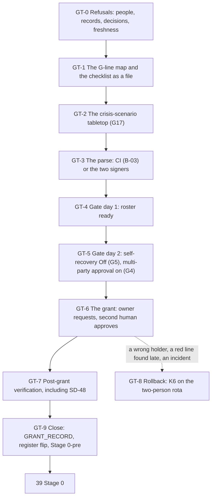

# 38. The super-admin gate and the grant

## Status

- Owner: the platform owner
- Last reviewed: 2026-09-16
- Last executed: never
- Stage: review §2 stages 33 and 34, re-cut. It closes the **P-SA tier gate** and the **Stage 0-pre** milestone, and makes the one assignment the whole design is built around: Workspace Super Admin on `ROBOT`. It does **not** reach Stage 0; that is [39](39-wall-e-stage-0.md).
- Revised 2026-09-16 against the second-round review of this file, with Google's pages re-read that day: the super-admin roster proof (`GT-4.2`, `GT-7.1`) no longer relies on `includeIndirectRoleAssignments` without `userKey`, which Google states returns direct assignments only — it now reads one `roleAssignments.list` per named principal **and** expands every group that holds an admin role; the impersonation check of `GT-4.7` is taken by `gcloud asset analyze-iam-policy` over the organisation, so an inherited project- or folder-level `serviceAccountTokenCreator` binding is counted; the SD-48 entitlement sweep of `GT-7.6` loops over every scope the catalogue of [12](12-privileged-access-catalogue.md) uses, not the organisation alone; `GT-7.7` carries the real Admin console path of the domain-wide delegation page; and the Cloud Logging spelling of the assignment and approval events is observed **before** gate day (`GT-1.8`) and read broadly first on the day (`GT-7.2`), so a no-result is never mistaken for a dead pipeline. Pinned observed spellings: `ADMIN_EVENT_ASSIGN_ROLE_LOGGING` = *tbd*, `ADMIN_EVENT_MPA_APPROVAL_LOGGING` = *tbd* (filled by `GT-1.8` as a dated revision of this line).
- Step prefix: `GT`. Steps: 61. **BLOCKED:** `GT-3.2` only (the CI parse of the gate checklist, `B-03`), and nothing waits on it: the signed manual parse `GT-3.3` is the standing fallback under SD-36, and the grant is refused on either path while any line lacks a date, a signer and a fresh record. **IRREVERSIBLE-class:** `GT-6.5` and `GT-6.6` (the request and its approval). The role can be removed — that is K6, §8 — but a tenant-wide Super Admin that has existed for a minute has existed: every token minted in that minute stays valid, and no rollback un-mints them.
- Replaces: [../../wall-e/SETUP.md](../../wall-e/SETUP.md) Phase 2 in full, and the `walle workspace` manual block M2C. Neither is executed again.
- Salvaged: Phase 2's gate table (G1-G18), its four grant steps, its verify table and its K6 rollback; [../11-tisax.md](../11-tisax.md) §6.3's thirteen compensations, their grades and their owners, and its "how it fails" rule; [../../eve/05-stages.md](../../eve/05-stages.md)'s G-1 to G-7; Phase 2's two strongest sentences — **the robot is never an approver** and **do not sign into the Admin console as the robot**.
- Not copied: the gate as a reason to refuse project creation (S008, SD-02); a grant gated on a file existing (S092); `G1-G11` as the gate's extent (S092); `G1-G18` as its extent (S085, SD-36); the tenant-wide self-recovery and multi-party approval rows sitting in Phase 3, before a second admin account exists (S012, SD-30); a gate-day path that resets the robot's password and signs in as the robot (S014); G-4's "rows for `walle@`'s shadow runs" (S039, SD-03); a `Stage 0` promised by a procedure that stops at the gate (S010, SD-36); "eu or global" anywhere near G21 (X-GE-13, SD-21).
- Applies decisions (signed in [03](03-decisions-and-people.md) before the step that needs them): P33 and its TISAX deviation and risk row R-01, P29 (the two lists), P28 (the EU AI Act position), P66, P68, P102, P137, decision 29, D13 read as **G1-G21**; SD-01, SD-02, SD-03, SD-04, SD-30, SD-36, SD-37, SD-38, SD-42, SD-44, SD-48.
- Closes: S008, S010, S012, S014, S039, S085, S092, S122, X-GE-13, X-ORG-05, X-ORG-14. Defers five items, each with an owner and a file (§13).
- Consumes: every earlier record, through the G-line map of §1; `EVE_H_LIVE_RECORD` ([28](28-eve-independent-proof-and-sandbox-drills.md)); `DENIALS_RECORD`, `K6_DRILL_RECORD`, `K7_PSA_DRILL_RECORD`, `BANDB_DRYRUN_RECORD`, `RESTORE_DRILL_RECORD`, `PENTEST_RECORD` ([37](37-wall-e-sandbox-rehearsal.md)); `TIER_C_RECORD` ([20](20-gemini-enterprise-gateway-and-tier-c-gate.md)); `TIER_R_RECORD` ([17](17-factory-module-equivalents-and-tier-r-gate.md)); `ROSTER_FILE`, `CONTROL_GROUPS_FILE`, `SA_1_ADMIN`, `SA_2_ADMIN` ([06](06-organisation-bootstrap-and-roster.md)); `ROBOT`, `WALLE_PROTECTED_GROUP`, `WALLE_OPERATORS_GROUP` ([30](30-wall-e-workspace-side.md)); `SA_ACTIONS`, `SA_ACTIONS_SUPER` ([31](31-wall-e-project-and-data-plane.md)); `WALLE_CODE_COMMIT` ([33](33-wall-e-action-services-and-approval-surfaces.md)); the twin's three multi-party approval answers and its measured password-reset repair cost ([37](37-wall-e-sandbox-rehearsal.md) `WR-2.5`, `WR-2.7`); `SA_VALIDATOR_CUSTODIAN`, `BINAUTHZ_ATTESTOR` ([11](11-keys-and-validator-custodian.md)); `GEMINI_APP_LOCATION` ([05](05-gemini-enterprise-inventory.md)); `WITNESS_ADMIN_1_EMAIL`, `WITNESS_ADMIN_2_EMAIL`, `SECOND_HUMAN_EMAIL` and `people.yaml` ([03](03-decisions-and-people.md)); `EVE_ROBOT` ([24](24-eve-workspace-identity-and-audit-feeds.md)); `EVE_PROOF_T0` ([28](28-eve-independent-proof-and-sandbox-drills.md)); `pam/index.tsv` and `CICD_PROJECT` ([12](12-privileged-access-catalogue.md), [10](10-core-projects-and-ci-identities.md)); every `FLD_*` ([09](09-folders-and-security-command-center.md)); `SANDBOX_ORG_ID` and the two sandbox super admins ([21](21-sandbox-tenant-and-nonprod-foundation.md), [03](03-decisions-and-people.md)); the domain-wide delegation inventory `<date>-OB-1.4-dwd-clients-v1` ([06](06-organisation-bootstrap-and-roster.md)); `GRP_PLATFORM_APPROVERS` ([06](06-organisation-bootstrap-and-roster.md)).
- Produces: `GATE_CHECKLIST_RECORD`, `GRANT_RECORD`, `TABLETOP_RECORD`; `ADMIN_EVENT_ASSIGN_ROLE_LOGGING` and `ADMIN_EVENT_MPA_APPROVAL_LOGGING` (`GT-1.8`, the observed Cloud Logging spellings, handed to [39](39-wall-e-stage-0.md) `S0-1.1` and [25](25-eve-human-super-admin-detections.md) as a re-run line); the merged `gate_checklist` with all twenty-one lines green; the register row flipped to `privilege: super_admin`; **Stage 0-pre closed**; the grant.
- Commands, flags, roles, APIs, constraints and console paths checked against Google's documentation on 2026-09-15 (§15). What could not be settled that day is in §14.

## What this part builds

Nothing is built here. One role is assigned, and everything else in the file exists to make that assignment either refusable or reversible.

The design's own words for why: a service account can hold any admin role **except** Super Admin, so the holder has to be a user account; and Super Admin has no organisational-unit scope, so nothing inside Workspace narrows it. The moment it lands on `ROBOT`, a leaked token or an interactive login is a tenant compromise with a path into the Cloud organisation. That is why [../01-hld.md](../01-hld.md) §0.4 calls it "a gate with its own checklist, not a runbook phase".

What this file does, in order:

| # | Thing | Where it ends up |
|---|---|---|
| 1 | The G-line map: every line of the gate against the file that produces its record and the person who signs it | §1, and README's copy |
| 2 | The `gate_checklist` in the register, G1 to G21, each line with `status`, `date`, `signer` and `record` | `register/walle.yaml`, merged |
| 3 | The crisis-scenario tabletop, run **before** the gate closes | `TABLETOP_RECORD` (G17) |
| 4 | The parse: by CI when `B-03` exists, otherwise by the security reviewer and the second human, who sign it | `GATE_CHECKLIST_RECORD` |
| 5 | The roster-ready check: two admin accounts, two keys each, sealed codes, a rehearsed recovery | `${R}-4.*` |
| 6 | Super-admin self-recovery **Off** at the top OU and at every child OU and configuration group | G5 green |
| 7 | Multi-party approval **on** for every covered setting, console and API, including role management | G4 green |
| 8 | The grant: the platform owner requests, the second human approves from `SA_2_ADMIN`, the robot never approves | `GRANT_RECORD` |
| 9 | The post-grant verification list, including the three things SD-48 needs recorded | §7 |
| 10 | Stage 0-pre closed; the register row flipped; the hand-over to [39](39-wall-e-stage-0.md) | §9 |

### Two milestones, not one (SD-36, S010)

The old runbook promised "from nothing to Stage 0, by hand" and no written procedure reached it. The set replaces that with two:

- **Stage 0-pre** — everything reachable before the grant. Files [01](01-prerequisites-and-conventions.md) to [37](37-wall-e-sandbox-rehearsal.md), plus §§1 to 6 of this file. It closes at `GT-9.3`.
- **Stage 0** — the post-grant production phases, the strict checklist and the decision record. That is [39](39-wall-e-stage-0.md), and it is a different sitting.

Between them sits this file's §7: a post-grant verification section whose single rule is the one the review asked for — **no failing verify is ever a reason to make the grant** (S122). Every check that needs the role is here or in [39](39-wall-e-stage-0.md), tagged post-grant; every check that could have been made before it already was.

### What the gate protects, and what it does not (SD-02, S008)

The old text let the gate refuse the register row, and the register row gated project creation, and project creation gated the services whose evidence the gate needed. It could not close. SD-02 splits it:

| The gate refuses | The gate does not refuse |
|---|---|
| The Workspace Super Admin assignment to `ROBOT` (`GT-6.5`, `GT-6.6`) | `WALLE_PROJECT` and every pre-grant deployment ([31](31-wall-e-project-and-data-plane.md) to [36](36-wall-e-joins-to-eve-and-mo.md)) |
| The Stage 0 decision record ([39](39-wall-e-stage-0.md)) | The `env=prod` P-SA register row, which merges with `privilege: super_admin_pending` and every checklist line `pending` |
| The flip of that row to `privilege: super_admin` (`GT-9.2`) | The `env=nonprod` P-SA twin row, which carries no checklist at all (X-ORG-13) |

So by the time this file opens, the project, the services, the consents, the engine, the gateways, the twin and the drills all exist. Only the role is missing.

### Who may refuse, and why it is a person

The enforceable refusal is not CI. The assignment happens in the Admin console, and no continuous-integration job can stop a super admin from clicking it. The enforceable gate is **the second human's multi-party approval**, given only against a merged, parsed checklist that he has read himself. CI's parse (when `B-03` lands) makes his reading cheaper; it does not replace it. That is SD-36's revision-2 correction and it is why §3 has two paths and §6 has two people.



Conventions of [01](01-prerequisites-and-conventions.md) apply to every step: `checkpoint <id> START` before ACTION and `checkpoint <id> DONE <witness> <evidence>` after VERIFY; records named `<date>-<step>-<slug>-v<n>` under `BUILD_LOG_DIR/records/`, scans in `EVIDENCE_INTERIM_LOCATION`, each registered with `evidence_add`. Deviation rows use ids `BD-38-<n>`. Every `gcloud` call passes `--project`, `--organization` or `--folder`; there is no default project. Every shell block in this file, unless the step says otherwise, starts as:

```bash
source ~/.platform-env
penv_guard
R="$BUILD_LOG_DIR/records/$(date -u +%F)-GT"
```

## Preconditions

- [ ] [37](37-wall-e-sandbox-rehearsal.md) complete: `checkpoints.tsv` shows `DONE` for its closing step, and `DENIALS_RECORD`, `K6_DRILL_RECORD`, `K7_PSA_DRILL_RECORD`, `BANDB_DRYRUN_RECORD`, `RESTORE_DRILL_RECORD` and `PENTEST_RECORD` are set and their files exist.
- [ ] [28](28-eve-independent-proof-and-sandbox-drills.md) complete: `EVE_H_LIVE_RECORD` exists. Eve has been watching the human super admins — including the platform owner — since before Wall-E's first project, and the second human has proved detection himself on a seeded action he chose the window for. **The grant does not open while Eve is not live**, because Eve is the primary control the deviation is written against ([../11-tisax.md](../11-tisax.md) §6.3 row 5).
- [ ] [20](20-gemini-enterprise-gateway-and-tier-c-gate.md) complete: `TIER_C_RECORD` exists (G21), and `GEMINI_APP_LOCATION` is `eu` (X-GE-13, SD-21).
- [ ] [17](17-factory-module-equivalents-and-tier-r-gate.md) complete: `TIER_R_RECORD` exists.
- [ ] [36](36-wall-e-joins-to-eve-and-mo.md) complete: Eve's mirror of `walle_audit`, `eve-controller@`'s halt wiring and Mo's Wall-E pack exist, so the detections the deviation leans on have data the day the role lands.
- [ ] [03](03-decisions-and-people.md): **P33** signed by all three signatories (platform owner decides, security reviewer signs the TISAX deviation, ISMS enters R-01 in the risk register); **P29** both lists signed; **P28** the EU AI Act intended-purpose statement signed with legal; the DPIA started and the works-council information given, both dated; the tabletop date and the penetration-test window recorded.
- [ ] `B-20` cleared: the **security reviewer is appointed and named**. He signs the TISAX deviation and half the parse; the platform owner may sign neither.
- [ ] `B-21` cleared: **five named humans**, or four with a dated ISMS exception (SD-04, X-ORG-05) — platform owner, second human, two witness administrators who hold no tenant super-admin role, and the security reviewer. The incident commander, validator custodian, blind grader and second operator may be the same people as long as [11](11-keys-and-validator-custodian.md) §7.1's forbidden pairs hold.
- [ ] `ROSTER_FILE` merged on the default branch with the second human's approval, and matching the live tenant at the last check.
- [ ] Two admin accounts, `SA_1_ADMIN` and `SA_2_ADMIN`, each with **two** registered security keys and sealed, witnessed backup codes; a support-assisted recovery rehearsal recorded (`GT-4.4`).
- [ ] `WORKSPACE_EDITION` is Enterprise Standard or higher, or another edition Google lists as eligible for multi-party approval on the day (`GT-0.4`). Without it, G4 cannot be green and the grant does not happen.
- [ ] The sandbox tenant is still live ([21](21-sandbox-tenant-and-nonprod-foundation.md)), so an event name or a console path can be confirmed there before it is trusted in production. Decision 29 reads "before the super-admin grant", not "before Stage 1" (X-ORG-14): if the sandbox were only bought now, G10, G11, G14 and G-7 would all be open and this file would not have opened.
- [ ] Two sittings booked: **the tabletop** (half a day, run by the incident commander) and **the gate day** (90 minutes, the platform owner and the second human together for its whole length, both on their own workstations and their own browser profiles). The detection desk is told the window in advance and staffed through it.
- [ ] A change ticket raised, whose id every announcement and every alert acknowledgement quotes.
- [ ] [06](06-organisation-bootstrap-and-roster.md) `OB-1.4`'s domain-wide delegation inventory `<date>-OB-1.4-dwd-clients-v1` is in `EVIDENCE_INTERIM_LOCATION` with client name, client ID and scopes per row — `GT-7.7` compares against it row by row and has no other baseline.
- [ ] [12](12-privileged-access-catalogue.md) complete: `pam/index.tsv` on `main` names every entitlement with its scope kind and id, and `CICD_PROJECT` is set — `GT-7.6` loops over those scopes; [31](31-wall-e-project-and-data-plane.md) `FM-2.17` has set `ENT_PROJECT_REPAIR_WALLE` and `ENT_DEPLOY_CREDENTIAL_HOLDER_WALLE`.
- [ ] [03](03-decisions-and-people.md) has set `WITNESS_ADMIN_1_EMAIL` and `WITNESS_ADMIN_2_EMAIL`, [24](24-eve-workspace-identity-and-audit-feeds.md) has set `EVE_ROBOT`, and [28](28-eve-independent-proof-and-sandbox-drills.md) has set `EVE_PROOF_T0` — `GT-4.2` reads one role assignment per named principal and `GT-1.8` reads the seeded window.
- [ ] `GT-1.8` is run **before** the gate day is booked, so both pinned event spellings exist when `GT-7.2` needs them; a gate day opened with `ADMIN_EVENT_ASSIGN_ROLE_LOGGING` unset is rebooked.

## People needed

| Role | Does | Present at |
|---|---|---|
| Platform owner | Assembles the checklist, runs §§1, 4, 5 and the request in `GT-6.5`; signs nothing that gates his own request | all of it |
| Second human (`SA_2_ADMIN`, outside the Wall-E line) | Half the parse; witnesses roster-ready; **approves the grant** under multi-party approval; co-signs `GRANT_RECORD` | §3 to §9 |
| Security reviewer | Half the parse; signs the TISAX deviation (already, in [03](03-decisions-and-people.md)); signs `GATE_CHECKLIST_RECORD` | §3, §9 |
| ISMS | Confirms R-01 is in the risk register and that P137's people count is met or excepted; signs `GATE_CHECKLIST_RECORD` | §0, §9 |
| Incident commander (IT security) | **Runs** the tabletop — never the platform owner, who is a participant; signs `TABLETOP_RECORD` | §2 |
| Detection desk (MDR) | Acknowledges SA-02 and SA-06 against the ticket, within target | §6, §7 |
| Second operator | Confirms receipt of the announcement on the operators channel | §6 |
| DPO, legal, HR / employee representatives | Participate in the tabletop where the scenario reaches them | §2 |
| Witness administrators | Receive the custody, tabletop and grant records; confirm the push landed | §2, §9 |
| Wall-E owner, Eve owner, Gemini Enterprise administrator | Tabletop participants; Eve owner confirms SI-09 is live before `GT-6.5` | §2, §5 |

Nobody signs their own gate. The platform owner requests and never approves; the second human approves and never requests; the robot does neither, now or ever.

## Facts this file relies on, read on 2026-09-15

| Fact | Source | Consequence here |
|---|---|---|
| "You can assign any prebuilt or custom role **except Super Admin** to a service account" | Workspace admin help, *Assign specific admin roles* | The holder is a user account, `ROBOT`, with a licence and a mailbox — which is why §7 checks a login stream that should stay empty |
| Admin roles are assigned at Menu → **Account → Admin roles** → the role → **Assign admin**, or from Menu → Directory → Users → the user → **Admin roles and privileges** | Workspace admin help, *Assign specific admin roles* | `GT-6.5`'s two equivalent console paths |
| Multi-party approval is supported on **Enterprise Standard and Enterprise Plus; Education Standard and Education Plus; Enterprise Essentials Plus**, and needs **two or more super admin accounts** | Workspace admin help, *Multi-party approval for sensitive actions*; Workspace Updates 2024-04 | `GT-0.4`'s edition check; G4 is unreachable below it, and P66's "edition eligibility *tbd*" is answered on the day |
| It is turned on at Menu → **Security → Authentication → Multi-party approval settings**; requests are reviewed at Menu → **Security → Authentication → Multi-party approval requests** | Workspace admin help, *Multi-party approval for sensitive actions* | `GT-5.4` and `GT-6.6` |
| Covered: security settings (2SV, account recovery, session control, Advanced Protection, login challenges, passwordless, **domain-wide delegation**, SSO, Context-Aware Access), API access to security settings, domain settings, Calendar, Groups, Vault exports, and **role management — both the Admin console UI and the API** | Workspace admin help, *Multi-party approval for sensitive actions*; Workspace Updates 2024-08 (domain-wide delegation) | G4's "every covered setting, console and API"; the grant itself is a role-management action, so the approval is not bolted on — it is how the assignment is made |
| Since June 2025 super admins can **delegate** approval with a multi-party approval role, and an approver needs both the reviewer and the requester privilege for the action | Workspace Updates 2025-06, *More granular controls for multi-party approvals* | SD-48 is real: once `ROBOT` holds Super Admin it has the requester privilege for role management, so `GT-5.6` and `GT-7.6` record that **no multi-party approval role is delegated to it** and that Eve pages on any approval whose actor is a service identity |
| Super-admin self-recovery is at Menu → **Security → Authentication → Account recovery → Super admin account recovery**, checkbox "**Allow super admins to recover their account**"; it applies to the top organisational unit, or to a child organisational unit or a **configuration group** | Workspace admin help, *Allow super administrators to recover their password* | G5 is not one click: `GT-5.2` does the top OU, `GT-5.3` walks every child OU and every configuration group, because either can re-enable it |
| With self-recovery off, a super admin who loses access is recovered by **another super admin** or by Google support | same page; *Super administrator best practices* | The roster-ready check of §4 is a precondition, not paperwork (S012). Two accounts, two keys each, sealed codes, and a rehearsed support path |
| `ASSIGN_ROLE` is an Admin audit event of the delegated-admin settings set, with parameters `ROLE_NAME`, `USER_EMAIL` and `ORG_UNIT_NAME`; sibling events `UNASSIGN_ROLE`, `CREATE_ROLE`, `ADD_PRIVILEGE`, `REMOVE_PRIVILEGE` | Admin SDK Reports API, *Admin audit activity events — delegated admin settings* | `GT-7.2` reads it by name from the Reports API |
| `GET https://admin.googleapis.com/admin/directory/v1/customer/{customer}/roleassignments`, with `userKey` ("the primary email address, alias email address, or unique user or group ID"), `roleId` and `includeIndirectRoleAssignments`; scope `admin.directory.rolemanagement.readonly`. **"You must specify `userKey` or the indirect role assignments will not be included."** A `RoleAssignment` carries `assignedTo` and `assigneeType` (`USER` or `GROUP`) | Directory API, `roleAssignments.list` and the `RoleAssignment` resource | `GT-4.2` and `GT-7.1` therefore read **one call per named principal** with `userKey` set, and separately expand every `GROUP` assignee of the customer-wide list; a customer-wide call with the flag and no `userKey` is not a read of group-conferred roles and is not made |
| `GET https://admin.googleapis.com/admin/directory/v1/groups/{groupKey}/members` with `includeDerivedMembership=true` lists a group's members including indirect ones; `maxResults` at most 200; scope `admin.directory.group.member.readonly` | Directory API, `members.list` | `GT-4.2` step 2 expands each admin-role-holding group to the people it confers the role on |
| `gcloud asset analyze-iam-policy (--folder \| --organization \| --project) --full-resource-name --permissions --expand-groups --output-group-edges` answers "who holds this permission on this resource", counting inherited bindings; `--expand-groups` expands groups to members, `--output-group-edges` outputs the membership relationships | Cloud Asset Inventory, `analyze-iam-policy` reference | `GT-4.7` asks it, for each credential-holder service account, who can mint its tokens — the same instrument [39](39-wall-e-stage-0.md) `S0-2.3` uses for the engine. A per-service-account `get-iam-policy` cannot see a project- or folder-level `serviceAccountTokenCreator`, `serviceAccountUser` or `editor` binding and is not used for that claim |
| `gcloud pam entitlements list --location=LOCATION` with exactly one of `--folder`, `--organization`, `--project` lists the entitlements of **that one scope** | gcloud reference, `pam entitlements list` | `GT-7.6` loops the call over the organisation, every platform folder and every project that carries an entitlement in [12](12-privileged-access-catalogue.md)'s `pam/index.tsv`, plus `WALLE_PROJECT`; an organisation-only call would miss the folder- and project-scoped entitlements, including the per-project `ENT_PROJECT_REPAIR_*` and `ENT_DEPLOY_CREDENTIAL_HOLDER_*` pairs |
| The domain-wide delegation list is at Menu → **Security → Access and data control → API controls → Manage Domain Wide Delegation** | Workspace admin help, *Control API access with domain-wide delegation* | `GT-7.7`'s path — the same page [06](06-organisation-bootstrap-and-roster.md) `OB-1.4` inventoried, so the two lists compare row by row |
| Google's Cloud Logging samples for Workspace carry **lowercase snake_case** event names in `protoPayload.metadata.event[].eventName` (`2sv_disable`, `password_edit`, `login_success`) while the Reports API appendix spells the same class of event in upper snake case (`ASSIGN_ROLE`); the documented filter form is `protoPayload.metadata.event.eventName="…"` | Cloud Logging, *Login audit log samples*; *Configure Workspace audit logs*; Reports API appendix, delegated admin settings | The Cloud Logging spelling of `ASSIGN_ROLE` is **not** assumed: `GT-1.8` observes it before gate day and pins it; `GT-7.2` reads the window with no `eventName` predicate first and narrows second |
| `users.list` with `query=isAdmin=true`, `viewType=admin_view`, `projection=full` returns the super administrators | Directory API, *Search for users* | `GT-4.2`, `GT-7.1`; the same call Eve's roster check makes from its own credential |
| Workspace admin events reach Cloud Logging at organisation scope with `protoPayload.serviceName="admin.googleapis.com"`; the Workspace event name is in `protoPayload.metadata.event[].eventName` and the parameters in `protoPayload.metadata.event[].parameter[]` | Google Cloud, *Audit logs for Google Workspace* | `GT-7.2`'s second, independent read — the one a tenant-side actor cannot edit. The filter matches on `logName:"organizations/$ORG_ID/logs/"` and the service name rather than on a spelled-out audit-log id, as [30](30-wall-e-workspace-side.md) does; §14 records why |
| `POST https://admin.googleapis.com/admin/directory/v1/users/{userKey}/makeAdmin`, body `{"status": false}`, scope `admin.directory.user` | Directory API, `users.makeAdmin` | K6 in §8; the same method SA-02 watches for |
| The tabletop cadence rule: one **before the super-admin grant**, run by IT security, never by the platform owner; the crisis scenario is RB-01/RB-02 combined — the abused super-admin robot credential | [../07-monitoring-detection-incident-response.md](../07-monitoring-detection-incident-response.md) §13, decision P102 | §2 runs it here; [42](42-gates-drills-and-evidence.md) only schedules the recurrence |

## 0. The refusals, before anything is assembled

### GT-0.1 Open the file and read the inputs

- **WHO:** Platform owner.
- **WHERE:** Shell, `~/.platform-env` sourced.
- **ACTION:**

```bash
checkpoint GT-0.1 START
need ROBOT SA_1_ADMIN SA_2_ADMIN SECOND_HUMAN_EMAIL SECURITY_REVIEWER_EMAIL INCIDENT_COMMANDER_EMAIL \
     DOMAIN DIRECTORY_CUSTOMER_ID ORG_ID WORKSPACE_EDITION WALLE_PROJECT WALLE_PROTECTED_GROUP \
     WALLE_OPERATORS_GROUP ROSTER_FILE CONTROL_GROUPS_FILE PLATFORM_REPO_DIR BUILD_LOG_DIR \
     DEVIATION_REGISTER EVIDENCE_REGISTER DRILL_CALENDAR EVIDENCE_INTERIM_LOCATION \
     WITNESS_ADMIN_1_EMAIL WITNESS_ADMIN_2_EMAIL EVE_ROBOT EVE_PROOF_T0 CICD_PROJECT REGION \
     SANDBOX_ORG_ID GRP_PLATFORM_APPROVERS SA_ACTIONS SA_ACTIONS_SUPER WALLE_CODE_COMMIT
test -s "$PLATFORM_REPO_DIR/pam/index.tsv" && echo "PAM INDEX PRESENT"
ls -1 "$EVIDENCE_INTERIM_LOCATION"/*-OB-1.4-dwd-clients-v* 2>/dev/null | tail -n 1
need EVE_H_LIVE_RECORD TIER_R_RECORD TIER_C_RECORD PENTEST_RECORD DENIALS_RECORD \
     K6_DRILL_RECORD K7_PSA_DRILL_RECORD BANDB_DRYRUN_RECORD RESTORE_DRILL_RECORD
awk -F'\t' '$3 == "BLOCKED" {print $2"\t"$7}' "$BUILD_LOG_DIR/checkpoints.tsv" | sort -u
awk -F'\t' '$2 ~ /^(WW|WD|WC|WS|WI|WE|WJ|WR|EV)-/ && $3 == "DONE" {n[substr($2,1,2)]++} END {for (p in n) print p, n[p]}' "$BUILD_LOG_DIR/checkpoints.tsv"
```

- **VERIFY:** `need` is silent for both lines; `PAM INDEX PRESENT` prints and one `OB-1.4` inventory path is listed (if `EVIDENCE_INTERIM_LOCATION` is a shared-drive id rather than a mounted path, confirm the file by eye in the drive and say so in the record). The `BLOCKED` list contains nothing that this file's G lines depend on — `B-03` may appear (it is handled in §3); `B-16`, `B-08` and `B-09` may **not**, because `EVE_H_LIVE_RECORD` and `DENIALS_RECORD` cannot exist while they do. Every prefix from `WW` to `EV` shows a `DONE` count.
- **ROLLBACK:** Read only.
- **EVIDENCE:** `${R}-0.1-inputs-v1.txt`; `evidence_add GT-0.1 inputs E-05 1.4.1 build-log:records/<file> <file>`.

### GT-0.2 Refuse without the signed decisions (S092)

- **WHO:** Platform owner; the second human opens each record himself rather than taking the exit code on trust.
- **WHERE:** Shell; `PLATFORM_REPO_DIR/decisions/`.
- **ACTION:** The old runbook's script offered the grant "as soon as `SUPER_ADMIN_GRANT_DECISION` names any existing file". A file existing is not a decision. Every id below has a signed, dated record with the signatories the row demands.

```bash
"$PLATFORM_REPO_DIR/tools/decision-need.sh" P33 P29 P28 P66 P68 P102 P137 D13 \
    SD-02 SD-03 SD-04 SD-30 SD-36 SD-42 SD-48 DECISION-29
"$PLATFORM_REPO_DIR/tools/decision-check.sh" P33
grep -c 'security reviewer' "$(ls -1 "$PLATFORM_REPO_DIR"/decisions/*-wall-e-holds-super-admin.md | tail -n 1)"
ls -1 "$PLATFORM_REPO_DIR"/decisions/*-tisax-deviation*.md "$PLATFORM_REPO_DIR"/risk/R-01*.md
```

- **VERIFY:** `decision-need.sh` exits `0` for every id. `decision-check.sh` prints `OK` for P33 with **three** signatures — platform owner, security reviewer, ISMS — and the security reviewer is not the platform owner. The TISAX deviation record and risk row R-01 both exist and are dated. **D13 reads `G1-G21`**; a record still saying `G1-G11` or `G1-G18` is superseded here before anything else happens (S092, S085).
- **ROLLBACK:** Read only. A missing signature is not worked around; the gate day is rebooked.
- **EVIDENCE:** `${R}-0.2-decisions-v1.txt` listing each record's path, date and signature count. E-01, E-03. TISAX 1.4.1, 5.2.1.

### GT-0.3 Count the people (X-ORG-05, P137, SD-04)

- **WHO:** ISMS confirms; platform owner records.
- **WHERE:** `PLATFORM_REPO_DIR/identity/people.yaml` and the ISMS record.
- **ACTION:** The review found that G3, Eve's G-1 and the witness's own exclusion rule could not all be true at once: the witness excludes any administrator who is a tenant super admin, and the second human is one. SD-04 settled it, and the count changed. Five named humans, not four:

| # | Person | Rule |
|---|---|---|
| 1 | Platform owner | holds `SA_1_ADMIN`; subject of Eve's monitoring; approves nothing on his own requests |
| 2 | Second human | holds `SA_2_ADMIN`; owner of `GRP_EVE_OWNERS`; required reviewer on `eve/config`; **owner of record** of the witness with a non-administrator witness account, not a witness administrator |
| 3 | Witness administrator 1 | IT security; **no** tenant super-admin role, no Wall-E group |
| 4 | Witness administrator 2 | as above; the two are each other's only recovery path |
| 5 | Security reviewer | signs the deviation and half the parse; not the platform owner |

  Four are acceptable **only** with a dated ISMS exception naming which role is doubled, for how long and what compensates. Write it, or write the fifth name.

- **VERIFY:** `people.yaml` names all five with dates, or names four plus an exception record whose `until` is in the future. The two witness administrators appear in **no** super-admin role assignment (the per-`userKey` reads of `GT-4.2` for `WITNESS_ADMIN_1_EMAIL` and `WITNESS_ADMIN_2_EMAIL` are the proof — a customer-wide read cannot see a role conferred through a group), and the second human appears in no witness administrator role. G-1 is then signable as written: "second human named; two witness administrators who are not tenant super admins".
- **ROLLBACK:** Read only. Without five names or the exception, `B-21` is still open and the gate day is not booked.
- **EVIDENCE:** `${R}-0.3-people-v1.txt` and the ISMS record reference. E-13. TISAX 1.2.1, 1.4.1.

### GT-0.4 Check the edition against multi-party approval (P66)

- **WHO:** Platform owner.
- **WHERE:** Admin console → Menu → **Billing → Subscriptions**; then Menu → **Security → Authentication**.
- **ACTION:** Read the subscription's edition and compare it with Google's eligibility list (Enterprise Standard, Enterprise Plus, Education Standard, Education Plus, Enterprise Essentials Plus, on 2026-09-15). Then open Security → Authentication and record whether **Multi-party approval settings** is present in the menu; an eligible edition that does not show the page is a support case, not an improvisation.
- **VERIFY:** `WORKSPACE_EDITION` is on the list **and** the settings page is visible. If it is not on the list, stop: G4 cannot be green, the grant does not happen, and the platform owner opens a decision record on the edition. P66's "edition eligibility *tbd*" is answered here, and the answer is written into the decision record rather than left in a runbook comment.
- **ROLLBACK:** Read only.
- **EVIDENCE:** `${R}-0.4-edition-v1.txt` plus a screenshot of the Authentication menu to `EVIDENCE_INTERIM_LOCATION`. E-05. TISAX 1.3.1.

### GT-0.5 Read the rule about verifies aloud (S122)

- **WHO:** Platform owner and second human together.
- **WHERE:** This page.
- **ACTION:** Three sentences, read before the checklist is assembled, because the failure mode they prevent is the most human one in the set:

  1. Every check in files [30](30-wall-e-workspace-side.md) to [36](36-wall-e-joins-to-eve-and-mo.md) that reads the production tenant as the robot is **expected to return 403** before the grant. That is the design working, not a fault.
  2. No failing verify anywhere is a reason to make the grant. If a check cannot pass without Super Admin, it belongs in §7 or in [39](39-wall-e-stage-0.md), and it is listed there.
  3. Nobody signs into the Admin console as `ROBOT` to check anything, before or after. For a super admin such a check proves nothing, and after [32](32-wall-e-consents.md) an interactive login is an incident that fires SA-04.
- **VERIFY:** Both people initial the record. The build log carries the line.
- **ROLLBACK:** —
- **EVIDENCE:** `${R}-0.5-verify-rule-v1.txt`. E-05. TISAX 5.1.1.

### GT-0.6 Refuse the old script path (S014, SD-37)

- **WHO:** Platform owner.
- **WHERE:** This page; `wall-e/setup/walle_setup.py` is not run.
- **ACTION:** The helper script reached the grant only by re-running `walle workspace`, which has no "already done" skip and walks M0, M1, M2A, M2B, M3 and M4 first. M1 resets the robot's password — which invalidates **both** refresh tokens once Gmail scopes are granted — and M2A signs in as the robot, which [30](30-wall-e-workspace-side.md) defines as an incident. On gate day that path takes Wall-E down and fires SA-04 before the role is even requested.

  The rule for this file: **the grant is a separate act with its own steps.** No password is reset. No robot sign-in happens. If the script is ever repaired, the repaired form is a `grant-gate` subcommand that runs only the 2SV check, the recovery-contact check, the roster precondition and the assignment, and it is adopted under SD-37 by a new decision record, not by a runbook sentence.

  [37](37-wall-e-sandbox-rehearsal.md) `WR-2.7` proved the cost on the twin rather than asserting it: a password reset after the consent returned `invalid_grant` on **both** services, and the repair took two people and the measured elapsed time recorded there. Read that number aloud. It is the reason this step exists.

- **VERIFY:** `grep -rn "walle workspace" "$R"*` returns nothing for this sitting; the record states the refusal, quotes the twin's measured repair cost, and names `B-18` as the open item.
- **ROLLBACK:** —
- **EVIDENCE:** `${R}-0.6-script-refusal-v1.txt`. E-05. TISAX 5.2.1.

## 1. The G-line map and the checklist as a file

### GT-1.1 Write the G-line map

- **WHO:** Platform owner; second human reads it against README's copy.
- **WHERE:** `PLATFORM_REPO_DIR/register/gate/walle-gate-map.md`.
- **ACTION:** Every line of the gate, the file that produces its record, the variable or path that **is** the record, and who signs the line. This table is the one README §7 mirrors; when the two disagree, this one is corrected first and README follows.

| Line | In short | Producing file | Record | Signer |
|---|---|---|---|---|
| G1 | Eve's observe-and-report layer live and drilled; the witness receives the heartbeat | [28](28-eve-independent-proof-and-sandbox-drills.md), with [27](27-witness-grants-and-alarms.md) | `EVE_H_LIVE_RECORD` | Eve owner (second human) |
| G2 | SIEM with 24x7 acknowledgement, SA-01 to SA-09 and SG-01 to SG-07, each with a passing fixture | [15](15-pager-siem-and-detections.md) part B | `SIEM_RULE_EXPORT` | IT security |
| G3 | Exactly two human super admins on separate admin accounts with keys; the robot never the only and never a recovery one | [06](06-organisation-bootstrap-and-roster.md), re-checked here | `ROSTER_FILE` + `${R}-4.2` | security reviewer |
| G4 | Multi-party approval on for every covered setting, console and API, including role management | **this file**, `GT-5.4` | `${R}-5.4` | platform owner; second human witnesses |
| G5 | Super-admin self-recovery Off at the top OU and at every child OU and configuration group | **this file**, `GT-5.2`, `GT-5.3` | `${R}-5.3` | platform owner; second human witnesses |
| G6 | The hygiene set complete on the robot's service OU | [30](30-wall-e-workspace-side.md) | `${R30}-hygiene` | platform owner |
| G7 | The two lists signed (P29); P33 signed by all three; the TISAX deviation and risk row R-01 | [03](03-decisions-and-people.md) | the decision records | security reviewer; ISMS |
| G8 | Penetration test with no open critical or high; DPIA started; works council informed | [37](37-wall-e-sandbox-rehearsal.md) for the test; [03](03-decisions-and-people.md) for the other two | `PENTEST_RECORD`; the DPIA and works-council records | IT security; DPO; HR and legal |
| G9 | Perimeter decision (P3 spike) taken and ingress drift-checked; Access Approval on `WALLE_PROJECT`; PAM with a second reviewer on the deploy grant | [18](18-model-armor-floor-spikes-and-kill-switch.md) (spike), [31](31-wall-e-project-and-data-plane.md) (Access Approval), [12](12-privileged-access-catalogue.md) (entitlements) | the spike record; the Access Approval enrolment; `ENT_DEPLOY_CREDENTIAL_HOLDER_WALLE` | platform owner; security reviewer |
| G10 | Both action services deployed with the two lists and the hard invariants; the denial suite passing on the twin | [37](37-wall-e-sandbox-rehearsal.md) | `DENIALS_RECORD` | Wall-E owner |
| G11 | K6 drilled on the twin robot, drill younger than 30 days; the K5/K6 rota of two humans recorded in the witness | [37](37-wall-e-sandbox-rehearsal.md) | `K6_DRILL_RECORD` | platform owner; second human |
| G12 | Three bands in code: `walle-actions` exposes `/v1/execute` only; `walle-actions-super` exposes `/v1/execute-generic` and `/v1/handoff` | [33](33-wall-e-action-services-and-approval-surfaces.md) (unit tests) and [16](16-register-and-shared-registry.md) (CI) | the CI job output at `WALLE_CODE_COMMIT` | Wall-E owner |
| G13 | Two credentials, two services; Internal and In production in production, External and Trusted on the twin; `cloud-platform` in neither | [32](32-wall-e-consents.md) and [37](37-wall-e-sandbox-rehearsal.md) | `WALLE_CLIENTS_FILE`, the two `authorize` events | Wall-E owner |
| G14 | Band-B requester rule: fail-closed `isAdmin` check for `SUPER`, approver ≠ requester, canonical request hash bound on the approval surface | [33](33-wall-e-action-services-and-approval-surfaces.md) (unit tests) and [37](37-wall-e-sandbox-rehearsal.md) (one dry run) | `BANDB_DRYRUN_RECORD` | Wall-E owner |
| G15 | Permanent ceiling: `SUPER` rows L3 two-person, other triggers L0, in code | [33](33-wall-e-action-services-and-approval-surfaces.md) and [16](16-register-and-shared-registry.md) | the CI assertion output | Wall-E owner |
| G16 | EU AI Act position (P28): the intended-purpose statement signed with legal | [03](03-decisions-and-people.md) | the `#wall-e` entry of [../10-eu-ai-act.md](../10-eu-ai-act.md) | legal |
| G17 | The crisis-scenario tabletop run | **this file**, §2 | `TABLETOP_RECORD` | incident commander |
| G18 | Hardware-key custody witnessed (SK-8); the records are in the witness | [08](08-witness-organisation.md) records step, fed by [06](06-organisation-bootstrap-and-roster.md), [24](24-eve-workspace-identity-and-audit-feeds.md), [30](30-wall-e-workspace-side.md) | the custody records in `WITNESS_BUCKET` | security reviewer |
| G19 | Tier W rows green: restore drill, Binary Authorization pipeline, validator custodian named with an identity, platform verifier, security reviewer, second operator, blind grader | [11](11-keys-and-validator-custodian.md), [03](03-decisions-and-people.md), [10](10-core-projects-and-ci-identities.md), [33](33-wall-e-action-services-and-approval-surfaces.md), [37](37-wall-e-sandbox-rehearsal.md) | `RESTORE_DRILL_RECORD`, `BINAUTHZ_ATTESTOR`, `SA_VALIDATOR_CUSTODIAN`, `people.yaml` | security reviewer; ISMS |
| G20 | K7 drill on `fld-agents-p-sa-nonprod` younger than 30 days | [37](37-wall-e-sandbox-rehearsal.md); first drill in [18](18-model-armor-floor-spikes-and-kill-switch.md) | `K7_PSA_DRILL_RECORD` | platform owner; second human |
| G21 | Tier C gate closed; the app's location is `eu` | [20](20-gemini-enterprise-gateway-and-tier-c-gate.md) | `TIER_C_RECORD` | platform owner; security reviewer |

  Eve's own lines sit **under G1**, as its evidence, not as register keys — the register's `gate_checklist` key set is `G1` to `G21` and nothing else ([16](16-register-and-shared-registry.md) `RG-3.1`). The parse of §3 reads both tables:

| Eve line | In short | Producing file | Record |
|---|---|---|---|
| G-1 | The second human named: owner of `GRP_EVE_OWNERS`, required reviewer on `eve/config`, owner of record of the witness | [03](03-decisions-and-people.md) and [06](06-organisation-bootstrap-and-roster.md) | `people.yaml`; the group export; CODEOWNERS |
| G-2 | The witness exists, the first push landed, and the absence alarm fired on a withheld push | [27](27-witness-grants-and-alarms.md) and [28](28-eve-independent-proof-and-sandbox-drills.md) | `WITNESS_WITHHOLD_RECORD` |
| G-3 | `eve@` onboarded with the widened read set fixed **before** consent; `eve@` is not a super admin | [24](24-eve-workspace-identity-and-audit-feeds.md) | the ten-scope check; `users.get isAdmin false` |
| G-4 | The six-stream sink and the Reports poll by actor running, with lag budgets, on the evidence SD-03 allows | [28](28-eve-independent-proof-and-sandbox-drills.md) (production half), [37](37-wall-e-sandbox-rehearsal.md) (twin robot event), [32](32-wall-e-consents.md) (the robot's consent login) | `EVE_PROOF_RECORD` |
| G-5 | Reconciliation over every stream, the tenant-integrity rules, the roster check and the evidence heartbeat live | [28](28-eve-independent-proof-and-sandbox-drills.md) | `SANDBOX_DRILL_RECORD` |
| G-6 | The reporting contract live on both routes, including the sole-recipient rule | [28](28-eve-independent-proof-and-sandbox-drills.md), with [26](26-eve-reporting-and-witness-export.md) | the severity-1 drill page |
| G-7 | The whole layer exercised end to end on the sandbox tenant before the grant | [28](28-eve-independent-proof-and-sandbox-drills.md) | the dated drill record in the witness |

- **VERIFY:** Twenty-one G rows and seven G- rows; every "Producing file" link resolves from this directory; no row's record column says *tbd*.
- **ROLLBACK:** A wrong row is corrected by pull request before the checklist is written, never after a line is signed.
- **EVIDENCE:** The merged file as `<date>-GT-1.1-gate-map-v1`. E-05, E-13. TISAX 6.3, 1.4.1.

### GT-1.2 Note what the map replaces, and why G4 and G5 moved (SD-30, S012)

- **WHO:** Platform owner; second human.
- **WHERE:** The record.
- **ACTION:** Two of the twenty-one lines are produced by this file and by nothing before it, and the reason is worth writing down where the operator will read it.

  The old runbook applied super-admin self-recovery **Off** at the top organisational unit and multi-party approval **on** tenant-wide in Phase 3 — a phase explicitly allowed to run early, while "the four owner groups are one person" and before a second admin account existed. With self-recovery off and one super admin, a lost key is recoverable only through Google support. With multi-party approval on and one super admin, every covered change afterwards waits for an approver who does not exist: the rest of the hardening, Eve's customer-scoped role assignment, and — the part that matters most — **K6 itself**, the removal of the robot's Super Admin, which is a role-management change.

  So both are gate-day steps, here, after the roster-ready check of §4. Neither [06](06-organisation-bootstrap-and-roster.md) nor [30](30-wall-e-workspace-side.md) sets them, and both say so.

- **VERIFY:** The record states the move and cites SD-30. `grep -n "self-recovery" 06-organisation-bootstrap-and-roster.md 30-wall-e-workspace-side.md` shows each page deferring to this one.
- **ROLLBACK:** —
- **EVIDENCE:** `${R}-1.2-g4-g5-move-v1.txt`. E-05. TISAX 6.3.

### GT-1.3 Fix the freshness rules

- **WHO:** Platform owner; security reviewer approves the table.
- **WHERE:** `register/gate/walle-gate-map.md`, appended.
- **ACTION:** A dated, signed line is not enough for evidence that decays. These are the rules the parse enforces (S085, `04 §9.6`):

| Line | Freshness rule | Why |
|---|---|---|
| G11 | `K6_DRILL_RECORD` dated within **30 days** of the grant date | The rota's reachability is what is being proved, and a rota changes |
| G20 | `K7_PSA_DRILL_RECORD` dated within **30 days** of the grant date | `04 §9.6`: CI refuses any P-SA promotion citing a K7 drill older than 30 days |
| G10 | `DENIALS_RECORD` produced against the **current** `WALLE_CODE_COMMIT` | A denial suite that passed against an older build proves nothing about the deployed one |
| G14 | `BANDB_DRYRUN_RECORD` against the same commit | same |
| G2 | The SIEM rule export dated within **90 days**, with every fixture passing on that export | Rules drift with the platform |
| G8 | `PENTEST_RECORD` with **no open critical or high finding** on the day, not on the report date | A finding closed on paper is re-read |
| G1, G-1 to G-7 | `EVE_H_LIVE_RECORD` current: Eve has produced a heartbeat within the last hour and the witness alarm has not fired unexplained | Eve is the primary control; a silent Eve is not a green G1 |
| Every other line | Dated, signed, and the record file present and readable by both parsers | |

- **VERIFY:** The table is merged. Each rule is expressible as a check the §3 parse can run; none says "recent".
- **ROLLBACK:** By pull request, with the security reviewer's approval.
- **EVIDENCE:** `<date>-GT-1.3-freshness-v1`. E-05. TISAX 6.3.

### GT-1.4 Write G-4's evidence as SD-03 settled it (S039)

- **WHO:** Eve owner (second human); platform owner records.
- **WHERE:** The map's Eve table, expanded.
- **ACTION:** The old G-4 asked for "rows in `eve_workspace_reports` for `walle@`'s shadow runs". That could never be green: shadow runs need the grant, the grant needs G-4, and the admin audit log records **changes only**, so a shadow run leaves no row even after the grant. SD-03 replaces it with three pieces of evidence that all exist before the grant:

  1. A seeded admin change by a **human** super admin on the production tenant, from the second human's independent proof ([28](28-eve-independent-proof-and-sandbox-drills.md)), present in **both** `eve_workspace_logs` and `eve_workspace_reports` inside the lag budget.
  2. A seeded admin change by the sandbox **twin robot**, present in the non-production Eve datasets ([37](37-wall-e-sandbox-rehearsal.md)).
  3. The production robot's **consent login event** in the login stream ([32](32-wall-e-consents.md)).

  The `walle@` admin-change rows move to the post-grant verification in [39](39-wall-e-stage-0.md), where they can exist. Eve's own Phase 7 check 4 is split the same way: a pre-grant half (login events and the human test change) and a post-grant half.

- **VERIFY:** All three records are named in the map with their paths, and each opens. The map states in one line that no `walle@` admin-change row is expected before the grant, so an empty result is not a failure here.
- **ROLLBACK:** —
- **EVIDENCE:** `${R}-1.4-g4-evidence-v1.txt`. E-05, E-08. TISAX 6.3, 5.1.1.

### GT-1.5 Write the checklist into the register row

- **WHO:** Platform owner opens the pull request; it merges under §3's parse, not here.
- **WHERE:** Branch `gt-1-gate-checklist`, `register/walle.yaml`.
- **ACTION:** The `env=prod` row already exists with `privilege: super_admin_pending` and every line `pending` (SD-02, merged in [31](31-wall-e-project-and-data-plane.md)). This pull request fills the twenty-one lines. `privilege` stays `super_admin_pending`: it flips only after the grant, at `GT-9.2`.

```bash
need PLATFORM_REPO_DIR
w=$(mktemp -d); git clone "$PLATFORM_REPO_REMOTE" "$w/r"; git -C "$w/r" checkout -b gt-1-gate-checklist
"$HOME/platform/venv-register/bin/python" - "$w/r/register/walle.yaml" <<'PY'
import sys, yaml
p = sys.argv[1]; d = yaml.safe_load(open(p))
row = [r for r in d["rows"] if r.get("env") == "prod"][0]
for n in range(1, 22):
    row.setdefault("gate_checklist", {}).setdefault(f"G{n}", {})
    row["gate_checklist"][f"G{n}"].update({"status": "pending", "date": None, "signer": None, "record": None})
yaml.safe_dump(d, open(p, "w"), sort_keys=False)
PY
```

  Then each line is filled by hand from the map — `status: green`, `date`, `signer` (an email from `people.yaml`) and `record` (a repository-relative path that exists). A line whose record lives outside the repository (the witness bucket, `EVIDENCE_INTERIM_LOCATION`) carries the locator **and** a sha256 of the copy filed in the build log, so the parse can open something.

- **VERIFY:** `check-jsonschema --schemafile register/schema/register.schema.json register/walle.yaml` passes; twenty-one keys `G1`..`G21`; no `null`; `privilege` still `super_admin_pending`; the fixture `fail-psa-prod-no-checklist.yaml` still fails.
- **ROLLBACK:** Close the branch. Nothing is live until §3 merges it.
- **EVIDENCE:** The branch name and the diff as `${R}-1.5-checklist-branch-v1.txt`. E-13. TISAX 6.3.

### GT-1.6 Assert G21 is `eu`, not "eu or global" (X-GE-13, SD-21)

- **WHO:** Platform owner.
- **WHERE:** Shell.
- **ACTION:** The old Wall-E pages accepted a Gemini Enterprise app in "eu or global" and stopped only on `us`, while the platform baseline stopped on `global` too. A global app binds only a `us-central1` gateway, cannot use CMEK, and gives no EU residency of prompts. G21 is therefore not just "Tier C closed" — it is "Tier C closed **and** the app is `eu`".

```bash
need GEMINI_APP_LOCATION TIER_C_RECORD
test "$GEMINI_APP_LOCATION" = "eu" && echo "G21 LOCATION OK" || { echo "STOP: app location is $GEMINI_APP_LOCATION"; exit 1; }
test -f "$PLATFORM_REPO_DIR/$TIER_C_RECORD" && echo "TIER C RECORD PRESENT"
```

- **VERIFY:** Both lines print. If the location is anything but `eu`, the gate stops and a decision record is opened for a new `eu` app; the build does not continue with a global one.
- **ROLLBACK:** Read only.
- **EVIDENCE:** `${R}-1.6-g21-v1.txt`. E-05. TISAX 6.3, 8.2.1.

### GT-1.7 Read the twin's three answers about multi-party approval

- **WHO:** Platform owner reads; second human confirms each answer against the screenshot or response body [37](37-wall-e-sandbox-rehearsal.md) filed.
- **WHERE:** `${R37}-2.5-mpa-answers-v1.md` and `sandbox/sandbox.yaml`'s `p40_notes`.
- **ACTION:** Three things about multi-party approval are undocumented by Google and were asked of the sandbox tenant on purpose, months before the production gate day, so that nothing here is discovered at the console. Read all three and write what they change:

| Question asked on the twin | If the answer is | Then in this file |
|---|---|---|
| Is `users.makeAdmin` through the **API** covered by multi-party approval, or only the Admin console? | covered | `GT-5.4`'s API column is a real control and `GT-8.2`'s API form of K6 is a two-person act |
| | not covered | **The API is the hole.** `GT-5.4` records it; the grant is still made in the console under approval, but the deny policies and `HARD_DENIED` must already refuse `makeAdmin` from every platform identity ([37](37-wall-e-sandbox-rehearsal.md) denial suite), and G4's line states the residual in words |
| Once the robot is a super admin, does it become an **eligible approver**? | yes | SD-48 is live and `GT-5.6` and `GT-7.6` are mandatory, not belt-and-braces |
| | no | The statements are still recorded, because Google can change it and nothing warns you when it does |
| Does the robot **count** towards the "two or more super admins" the feature requires? | yes | Say so in the record: the feature would survive the loss of a human admin account with one human and the robot left, and that state is a severity 1, not a configuration |
| | no | The feature needs two humans, which G3 already guarantees |

- **VERIFY:** All three answers are in the record with their evidence, dated before today. A missing answer sends the question back to the sandbox before the gate day, not to a guess on the day.
- **ROLLBACK:** Read only.
- **EVIDENCE:** `${R}-1.7-mpa-answers-v1.txt` quoting the three answers and what each changed here. E-05, E-13. TISAX 6.3, 1.2.3.

### GT-1.8 Observe the Cloud Logging spelling of the assignment and approval events, before gate day

- **WHO:** Second human reads the production row; a sandbox super admin performs the sandbox assignment; platform owner records.
- **WHERE:** Shell (production organisation sink, read only); the sandbox tenant and the sandbox organisation sink.
- **ACTION:** The Reports API spells the assignment event `ASSIGN_ROLE`. Google's Cloud Logging samples for Workspace spell their event names in lowercase snake case (`2sv_disable`, `password_edit`). Which spelling the organisation sink carries for a role assignment, and which event a multi-party approval writes, is settled **here**, weeks before the sitting, so that `GT-7.2` on grant day narrows on an observed value and never has to decide whether an empty result is a casing mismatch or a dead pipeline. Two observations:

  1. **Production, already generated.** [28](28-eve-independent-proof-and-sandbox-drills.md) `EV-2.4` printed a raw `cloudaudit_googleapis_com_activity` row for a seeded human super-admin action, one of which is a role assignment (seeded action 1). Read the assignment row's `event[0].eventName` from `EVE_H_LIVE_RECORD`'s evidence, or re-read the organisation sink for that window with no `eventName` predicate:

```bash
need ORG_ID EVE_PROOF_T0
gcloud logging read 'logName:"organizations/'"$ORG_ID"'/logs/" AND protoPayload.serviceName="admin.googleapis.com" AND timestamp>="'"$EVE_PROOF_T0"'"' \
  --organization="$ORG_ID" --limit=50 --order=asc \
  --format="value(timestamp,protoPayload.authenticationInfo.principalEmail,protoPayload.metadata.event.eventName,protoPayload.metadata.event.parameter)" \
  | tee "${R}-1.8-production-spelling-v1.txt"
```

  2. **Sandbox, generated now.** In the sandbox tenant, where multi-party approval is on since [37](37-wall-e-sandbox-rehearsal.md) `WR-2.5`, sandbox super admin 1 requests a delegated-admin role on a synthetic sandbox account and sandbox super admin 2 approves it; then the assignment is reversed the same way. Read the sandbox organisation sink for the window with no `eventName` predicate and record every event name returned, the actor of each and its parameters:

```bash
need SANDBOX_ORG_ID
gcloud logging read 'logName:"organizations/'"$SANDBOX_ORG_ID"'/logs/" AND protoPayload.serviceName="admin.googleapis.com"' \
  --organization="$SANDBOX_ORG_ID" --freshness=2h --limit=50 --order=asc \
  --format="value(timestamp,protoPayload.authenticationInfo.principalEmail,protoPayload.metadata.event.eventName,protoPayload.metadata.event.parameter)" \
  | tee "${R}-1.8-sandbox-spelling-v1.txt"
```

  Then pin what was seen, once, so every later filter in this file uses the observed value and not a guess:

```bash
penv_set ADMIN_EVENT_ASSIGN_ROLE_LOGGING "<the assignment event name exactly as the sink returned it>"
penv_set ADMIN_EVENT_MPA_APPROVAL_LOGGING "<the approval event name exactly as the sink returned it, or NONE_OBSERVED>"
```

  Write both values into this file's Status line ("Pinned observed spellings") as a dated revision, and into the sources of [25](25-eve-human-super-admin-detections.md)'s rule catalogue through its owner (a re-run line; this file edits no other page).

- **VERIFY:** The production read shows the seeded assignment with an actor of `SA_1_ADMIN` and an `eventName` recorded verbatim. The sandbox read shows the assignment, its reversal and — if the approval writes its own admin event — the approval, with the approver as actor. `ADMIN_EVENT_ASSIGN_ROLE_LOGGING` is set to a non-empty value that matches the production row character for character; `ADMIN_EVENT_MPA_APPROVAL_LOGGING` is set to an observed value or to `NONE_OBSERVED`, in which case `GT-7.2` proves the approver from the request page and the Reports API only, and §14 says so. If the Reports API spelling and the Cloud Logging spelling differ, both are recorded and the difference is stated as a fact, not a defect.
- **ROLLBACK:** Read only in production. The sandbox assignment is reversed inside the step; the synthetic account holds no role afterwards (`roleAssignments.list` with `userKey` = the synthetic account returns nothing).
- **EVIDENCE:** Both outputs and the two pinned values as `${R}-1.8-event-spelling-v1.txt`. E-08. TISAX 5.1.1, 6.3.

## 2. The crisis-scenario tabletop (G17)

Run **before** the gate closes, in its own half-day, by IT security. [42](42-gates-drills-and-evidence.md) only schedules the recurrence; the pre-grant exercise is this one.

### GT-2.1 Book it and name the scenario

- **WHO:** Incident commander runs it; the platform owner is a participant and runs nothing.
- **WHERE:** Calendar; `DRILL_CALENDAR`.
- **ACTION:** P102 fixes the scenario: **RB-01 and RB-02 combined — the abused super-admin robot credential**, a leaked token used outside the services and an interactive login on the robot account. Participants: incident commander; the on-duty human super admin and the second human (both halves of the K5/K6 rota); the platform owner; the Wall-E owner; the detection desk; the security reviewer; the DPO; legal; communications and HR; employee representatives where §12.3 requires them; the Gemini Enterprise administrator, because the scenario touches the tenant app.

```bash
need DRILL_CALENDAR INCIDENT_COMMANDER_EMAIL
printf '| %s | GT-2 | tabletop RB-01+RB-02 | %s | pre-grant (G17) | quarterly thereafter |\n' \
  "$(date -u +%F)" "$INCIDENT_COMMANDER_EMAIL" >> "$DRILL_CALENDAR"
```

- **VERIFY:** The calendar row exists; every named participant has accepted; the platform owner's entry says "participant".
- **ROLLBACK:** Reschedule; the row is superseded, not deleted.
- **EVIDENCE:** `${R}-2.1-tabletop-booking-v1.txt`. E-11. TISAX 7.1.1.

### GT-2.2 Run it, against the clock

- **WHO:** Incident commander.
- **WHERE:** A room, with the runbooks open and the real consoles reachable but not used.
- **ACTION:** Exercise, in this order, with wall-clock timings recorded against the targets of [../07-monitoring-detection-incident-response.md](../07-monitoring-detection-incident-response.md) §9.2: page → acknowledge → declare → contain → notify → resume. Inside it, four things are actually done rather than described:

  1. The "one request end to end" queries are run for real, and the elapsed time recorded (budget: 30 minutes for all four; that budget is itself an `Assumption:` and the tabletop is where it is tested).
  2. The K5/K6 rota is **rung out of hours**, on the numbers in `oncall.yaml`, and whoever answers says out loud what they would do.
  3. The regulatory assessments are walked with the actual forms — the DPO's breach assessment and, where the scenario reaches it, legal's Article 73 form.
  4. Every participant is asked the RB-04 question: *is there a lever you could not pull?* An unpullable lever is a finding, not an anecdote.

- **VERIFY:** Every acknowledgement and containment target met, or a dated action with an owner to meet it. No participant found a lever they could not pull. The queries finished inside the budget, or the budget is changed by a decision record.
- **ROLLBACK:** A tabletop that fails its pass criteria is **not** a green G17. It is re-run after the actions close; the gate day moves.
- **EVIDENCE:** `TABLETOP_RECORD` (below). E-11, E-12. TISAX 7.1.1, 7.2.1.

### GT-2.3 Write `TABLETOP_RECORD`

- **WHO:** Incident commander writes and signs; the second human counter-signs that he was present for the rota test.
- **WHERE:** `evidence/tabletops/<date>/` in the build log, pushed to the witness.
- **ACTION:**

```bash
penv_set TABLETOP_RECORD "evidence/tabletops/$(date -u +%F)/tabletop.md"
install -d "$BUILD_LOG_DIR/$(dirname "$TABLETOP_RECORD")"
```

  The record holds: the scenario, the participants with roles, the timings against each target, the findings, the actions with owners and dates, and a decision record reference where a target or a runbook changed. Actions go to `backlog.md`. The copy reaches `WITNESS_BUCKET` the same day, through the witness administrators — the tenant cannot write there directly.

- **VERIFY:** `TABLETOP_RECORD` is set, the file exists and names every required section; the witness administrators confirm the object landed and is retention-bound; `evidence_add` recorded it.
- **ROLLBACK:** A record found wrong is superseded by a new dated record; the witness copy is never overwritten (the bucket is retention-locked).
- **EVIDENCE:** `TABLETOP_RECORD` itself; `evidence_add GT-2.3 tabletop E-11 7.1.1 witness:evidence/tabletops/<date>/`. G17's line in the checklist points here.

### GT-2.4 Fill G17's line

- **WHO:** Platform owner edits the branch; the incident commander is the signer named on the line.
- **WHERE:** Branch `gt-1-gate-checklist`.
- **ACTION:** `G17.status: green`, `date` the tabletop date, `signer` the incident commander's address, `record` the `TABLETOP_RECORD` path.
- **VERIFY:** The schema still passes; the record path opens from a clean clone.
- **ROLLBACK:** Revert the line to `pending`.
- **EVIDENCE:** In the branch diff. E-11. TISAX 7.1.1.

## 3. The parse: CI, or two signers

### GT-3.1 Fill the remaining twenty lines from the map

- **WHO:** Platform owner, from the records only — never from memory.
- **WHERE:** Branch `gt-1-gate-checklist`.
- **ACTION:** For each of G1 to G21 other than G17: open the record named in the map, read the date and the signature out of it, and write those values into the line. A line whose record cannot be opened stays `pending`. A line whose record exists but is unsigned stays `pending`. There is no third state.

  G4 and G5 stay `pending` here: they are produced on gate day, in §5, and their lines are filled in `GT-5.7`, after the settings are actually applied. The parse therefore runs twice — once now over nineteen lines, once on gate day over twenty-one.

- **VERIFY:** Nineteen lines green with a date, a signer and an openable record; G4 and G5 `pending` with a note naming `GT-5.7`; `privilege` unchanged.
- **ROLLBACK:** Close the branch.
- **EVIDENCE:** `${R}-3.1-nineteen-lines-v1.txt` listing each line, its record path and its sha256. E-13. TISAX 6.3.

### GT-3.2 The CI parse — **BLOCKED on `B-03`**

- **WHO:** CI, on the pull request; the second human reads its output.
- **WHERE:** The git host.
- **ACTION:** **BLOCKED**: Needs: the register CI rules R-01 to R-12 with the **G1-G21 gate-checklist parser** — schema validity, every line `green` with a date, a signer drawn from `people.yaml` and a `record` path that exists in the tree; the freshness rules of `GT-1.3` evaluated against the pull request's merge date; PSA1 counting only `env=prod` rows; P1 gating only the production Super Admin assignment and the Stage 0 record; approvals by service accounts or bot users never counted. Commit it in: `PLATFORM_REPO_REMOTE`, `ci/register/`, with the workflow of [16](16-register-and-shared-registry.md) `RG-3.3`. Unblocked by: `REGISTER_CI_COMMIT`. Gate waiting: **none is held** — `GT-3.3` is the standing control under SD-36 and the deviation `BD-38-1`. Until then: `checkpoint GT-3.2 BLOCKED - - "B-03 gate-checklist parser"`.
- **VERIFY:** Once unblocked: the check named `register/gate-checklist` reports `success` on the pull request, and the negative fixtures of `RG-3.5` — a P-SA prod row flipped to `super_admin` with G20 at 35 days, a line with no signer — still report `failure`.
- **ROLLBACK:** —
- **EVIDENCE:** The check run URL, when it exists. E-13. TISAX 6.3, 5.2.1.

### GT-3.3 The signed manual parse (SD-36)

- **WHO:** **The security reviewer and the second human, separately.** The platform owner never signs this and is not in the room for either reading.
- **WHERE:** The pull request page; a clean clone of `main` plus the branch.
- **ACTION:** This is the control in force while `GT-3.2` is BLOCKED, and it is the same control [16](16-register-and-shared-registry.md) `RG-3.6` describes. Each signer, independently:

  1. Runs the reading aid, which prints every line with its age in days and whether its record file exists. It prints; it decides nothing.
  2. **Opens each record.** Twenty-one files. Not the paths — the files.
  3. Checks each against `GT-1.3`'s freshness rule.
  4. Writes `decisions/register-parses/<date>-pr<number>-parse.md`: line by line, `pass`, `fail` or `n/a`, with the reason, and a plain statement of which lines they could not verify themselves.

```bash
"$HOME/platform/venv-register/bin/python" - "$PLATFORM_REPO_DIR" <<'PY'
import sys, glob, yaml, datetime, os
root = sys.argv[1]; today = datetime.date.today()
fresh = {"G11": 30, "G20": 30, "G2": 90}
for f in sorted(glob.glob(f"{root}/register/walle.yaml")):
    d = yaml.safe_load(open(f))
    for r in d.get("rows", []):
        if r.get("env") != "prod": continue
        print(f"{d['agent_id']} env=prod tier={r['tier']} privilege={r.get('privilege')}")
        for g, l in sorted((r.get("gate_checklist") or {}).items(), key=lambda x: int(x[0][1:])):
            age = (today - datetime.date.fromisoformat(str(l["date"]))).days if l.get("date") else None
            exists = os.path.exists(os.path.join(root, l["record"])) if l.get("record") else False
            stale = (g in fresh and age is not None and age > fresh[g])
            print(f"  {g:<4} {l['status']:<8} date={l.get('date')} age={age} signer={l.get('signer')} record={exists} stale={stale}")
PY
gh pr view <number> --repo "$repo" --json reviews,author --jq '.author.login, (.reviews[] | [.author.login, .state] | @tsv)'
```

- **VERIFY:** Two parse files exist, one per signer, each naming every line with a result. Both say `pass` on every line. `tools/decision-check.sh` prints `OK` for both. A parse by one person, or by the platform owner, is refused at review and the pull request does not merge. **Any line lacking a date, a signer or a fresh record means the parse fails and the grant is refused** — on this path exactly as on the CI path (S092).
- **ROLLBACK:** A parse found wrong is superseded by a new parse file; anything merged on its strength is reverted by pull request.
- **EVIDENCE:** Both parse files as `<date>-GT-3.3-parse-pr<number>-v1` (append-only). E-03, E-13. TISAX 5.2.1, 6.3.

### GT-3.4 Merge the nineteen-line checklist

- **WHO:** Two human approvals: the security reviewer and the second human. Service-account and bot approvals do not count.
- **WHERE:** The git host.
- **ACTION:** Merge `gt-1-gate-checklist`. The row is still `super_admin_pending`; nothing in the tenant has changed.
- **VERIFY:** `git -C "$PLATFORM_REPO_DIR" pull && grep -c 'green' register/walle.yaml` shows nineteen; `gh pr view <number> --json mergedBy,reviews` shows two human approvals, neither by the platform owner.
- **ROLLBACK:** A reverting pull request under the same two approvals.
- **EVIDENCE:** The merge commit as `<date>-GT-3.4-checklist-merged-v1`. E-13. TISAX 6.3.

### GT-3.5 Write `GATE_CHECKLIST_RECORD`

- **WHO:** Platform owner writes; **security reviewer and ISMS sign**; the second human's parse is attached.
- **WHERE:** `PLATFORM_REPO_DIR/decisions/<date>-psa-gate-checklist.md`.
- **ACTION:**

```bash
penv_set GATE_CHECKLIST_RECORD "decisions/$(date -u +%F)-psa-gate-checklist.md"
```

  The record states: the twenty-one lines and their signers; the seven Eve lines and theirs; the two parses; which path was used (CI or manual) and, if manual, the deviation `BD-38-1`; the freshness table with each line's age on the day; the people count of `GT-0.3`; and one sentence naming what is **not** covered — that the assignment is made in a console no CI can refuse, and that the enforceable gate is therefore the second human's approval in `GT-6.6`.

- **VERIFY:** `tools/decision-check.sh GATE_CHECKLIST_RECORD` prints `OK` with the security reviewer's and the ISMS's signatures; the file names both parse files by path; the deviation row exists if the manual path was used.
- **ROLLBACK:** Superseded by a new dated record; the old one is never edited.
- **EVIDENCE:** `GATE_CHECKLIST_RECORD`; `evidence_add GT-3.5 gate-checklist E-13 6.3 "build-log:decisions/..."`. Also copied to the witness.

## 4. Gate day, part one: roster ready

Everything from here happens in one 90-minute sitting with both people present. `GT-4.1` opens it.

### GT-4.1 Open the sitting

- **WHO:** Platform owner; second human present from this step.
- **WHERE:** Shell; both on their own workstations.
- **ACTION:**

```bash
checkpoint GT-4.1 START
need GATE_CHECKLIST_RECORD TABLETOP_RECORD ROBOT SA_1_ADMIN SA_2_ADMIN
test -f "$PLATFORM_REPO_DIR/$GATE_CHECKLIST_RECORD" && echo "CHECKLIST RECORD PRESENT"
python3 - <<'PY'
import datetime, os, sys
# the grant date must be inside the freshness windows read at GT-3.3
PY
gcloud logging read 'logName:"organizations/'"$ORG_ID"'/logs/" AND protoPayload.serviceName="admin.googleapis.com"' \
  --organization="$ORG_ID" --freshness=1h --limit=3 --format="table(timestamp,protoPayload.metadata.event.eventName)"
```

- **VERIFY:** The record is present. The organisation log query returns rows, or returns nothing with an explanation — the pipeline being alive is what is being checked, not the content. Eve has produced a heartbeat inside the last hour (checked on Eve's own dashboard by the second human, not by the platform owner).
- **ROLLBACK:** The sitting can be abandoned at any point up to `GT-6.5` with nothing to undo except the two settings of §5, which have their own rollbacks.
- **EVIDENCE:** `${R}-4.1-sitting-open-v1.txt`. E-05. TISAX 5.1.1.

### GT-4.2 Prove the roster: exactly two human super admins (G3)

- **WHO:** Platform owner runs; second human reads the JSON himself.
- **WHERE:** APIs Explorer, signed in as `SA_1_ADMIN` in its own browser profile; the shell for the comparison only.
- **ACTION:** Three reads, not two. A customer-wide `roleAssignments.list` with `includeIndirectRoleAssignments = true` and no `userKey` returns **direct assignments only** — Google's reference says "You must specify `userKey` or the indirect role assignments will not be included" — so a Super Admin conferred through a group membership would be invisible to the read this line was signed on. The reads below see it twice over.

  1. **`users.list`** with `customer` = `DIRECTORY_CUSTOMER_ID`, `query` = `isAdmin=true`, `viewType` = `admin_view`, `projection` = `full`, `maxResults` = 500. Save as `<date>-GT-4.2-users-isAdmin.json`.
  2. **The customer-wide direct list, with its groups expanded.** `roleAssignments.list` with `customer` = `DIRECTORY_CUSTOMER_ID` and **no** `includeIndirectRoleAssignments`, paging with `pageToken`. Save as `<date>-GT-4.2-roleassignments-direct.json`. Also `roles.list` with `customer` = `DIRECTORY_CUSTOMER_ID`, saved as `<date>-GT-4.2-roles.json`, so a `roleId` can be read back to its `Role`, whose documented `isSuperAdminRole` field is `true` for the super-admin role. For **every** row whose `assigneeType` is `GROUP`, run `members.list` with `groupKey` = that row's `assignedTo` and `includeDerivedMembership` = `true`, saved as `<date>-GT-4.2-group-<assignedTo>.json`. A group holding any admin role is itself a finding to record; a group holding Super Admin stops the sitting.
  3. **One `roleAssignments.list` per named principal**, with `userKey` = the principal and `includeIndirectRoleAssignments` = `true`, saved as `<date>-GT-4.2-ra-<email>.json`. The named set is printed by the first command below: every `accounts[].email` and `expected_later[].email` in `ROSTER_FILE`, both witness administrators, the second human's daily account, the platform owner's daily account as named in `people.yaml`, `ROBOT` and `EVE_ROBOT`. This is the read that answers "does this person hold Super Admin by any route". *Assumption:* `people.yaml` carries each person's daily tenant address under `people[].daily_email`, as [03](03-decisions-and-people.md) `DC-2` writes it; if the key differs, read the two daily addresses from the file by eye and add them to the list rather than skipping them.

```bash
need ROSTER_FILE WITNESS_ADMIN_1_EMAIL WITNESS_ADMIN_2_EMAIL SECOND_HUMAN_EMAIL ROBOT EVE_ROBOT SA_1_ADMIN SA_2_ADMIN
python3 - "$PLATFORM_REPO_DIR/$ROSTER_FILE" "$PLATFORM_REPO_DIR/identity/people.yaml" <<'PY'
import json, sys, yaml, os
roster = json.load(open(sys.argv[1])); people = yaml.safe_load(open(sys.argv[2]))
named = {a["email"] for a in roster.get("accounts", [])} | {a["email"] for a in roster.get("expected_later", [])}
named |= {os.environ[k] for k in ("WITNESS_ADMIN_1_EMAIL", "WITNESS_ADMIN_2_EMAIL", "SECOND_HUMAN_EMAIL", "ROBOT", "EVE_ROBOT")}
named |= {p["daily_email"] for p in people.get("people", []) if p.get("daily_email")}
print(len(named), "userKey reads to make, one each:"); [print("  ", e) for e in sorted(named)]
PY
```

  After the reads are saved, the comparison — which reads only files, never the tenant:

```bash
D="$BUILD_LOG_DIR/records"; T="$(date -u +%F)"
python3 - "$PLATFORM_REPO_DIR/$ROSTER_FILE" "$D" "$T" <<'PY'
import json, sys, glob, os
roster = json.load(open(sys.argv[1])); D, T = sys.argv[2], sys.argv[3]
J = lambda p: json.load(open(p))
expected = {a["email"] for a in roster["accounts"] if a["kind"] == "human_super_admin"}
users = J(f"{D}/{T}-GT-4.2-users-isAdmin.json").get("users", [])
by_id = {u["id"]: u["primaryEmail"] for u in users}
sa_role_ids = {r["roleId"] for r in J(f"{D}/{T}-GT-4.2-roles.json").get("items", []) if r.get("isSuperAdminRole")}
assert sa_role_ids, "roles.list shows no role with isSuperAdminRole true: the export is incomplete or unpaged"
holders_users = {u["primaryEmail"] for u in users if u.get("isAdmin")}
holders_direct, groups_with_admin_roles, holders_via_group = set(), set(), set()
for ra in J(f"{D}/{T}-GT-4.2-roleassignments-direct.json").get("items", []):
    if ra.get("assigneeType", "").upper() == "GROUP":
        groups_with_admin_roles.add(ra["assignedTo"])
        if ra["roleId"] in sa_role_ids:
            for m in J(f"{D}/{T}-GT-4.2-group-{ra['assignedTo']}.json").get("members", []):
                holders_via_group.add(m.get("email", m.get("id")))
    elif ra["roleId"] in sa_role_ids:
        holders_direct.add(by_id.get(ra["assignedTo"], ra["assignedTo"]))
holders_named = set()
for p in glob.glob(f"{D}/{T}-GT-4.2-ra-*.json"):
    email = os.path.basename(p)[len(f"{T}-GT-4.2-ra-"):-5]
    if any(ra["roleId"] in sa_role_ids for ra in J(p).get("items", [])): holders_named.add(email)
actual = holders_users | holders_direct | holders_via_group | holders_named
print("expected            :", sorted(expected))
print("users.list isAdmin  :", sorted(holders_users))
print("direct assignments  :", sorted(holders_direct))
print("groups with any role:", sorted(groups_with_admin_roles))
print("via group (SA)      :", sorted(holders_via_group))
print("per-userKey (SA)    :", sorted(holders_named))
print("MATCH" if expected == actual else "DIFF: " + str(sorted(expected ^ actual)))
PY
```

- **VERIFY:** `MATCH`, and the union is exactly `{SA_1_ADMIN, SA_2_ADMIN}` — two, no more, by **every** route: `users.list`, the direct list, the expanded groups and the per-`userKey` reads all agree. `groups with any role` is empty, or every group it names is recorded with its role and its members and none of them is Super Admin. `ROBOT` is **not** a holder (its per-`userKey` file has no items). `EVE_ROBOT` is not a holder and `users.get` on it shows `isAdmin false`. Neither witness administrator's per-`userKey` file contains a Super Admin assignment (G-1, X-ORG-05). No daily account is a holder. The record states that the per-principal form was used **because** the customer-wide flag without `userKey` does not return indirect assignments. Any holder beyond the two is either a G3 hand-over exception with an `until` in the future, in which case the grant does not proceed today, or an incident.
- **ROLLBACK:** Read only. A difference stops the sitting; the roster or the tenant is corrected in [06](06-organisation-bootstrap-and-roster.md) and the sitting is rebooked.
- **EVIDENCE:** Every JSON file (users, roles, the direct list, one per expanded group, one per named principal) and the comparison as `${R}-4.2-roster-v1.txt`. E-05, E-13. TISAX 1.2.1, 6.3.

### GT-4.3 Prove two keys each, and the sealed codes

- **WHO:** Platform owner for his own account; second human for his; each looks at the other's page over a shared screen so neither self-attests.
- **WHERE:** Admin console → Menu → **Directory → Users** → the account → **Security**.
- **ACTION:** By eye, for `SA_1_ADMIN` and then `SA_2_ADMIN`: 2-Step Verification **on**, method **security key**, and **two** keys registered with distinct names and serials matching the key inventory. Then confirm the sealed backup-code envelope for each account: present, sealed, initialled by the custodian and the witness, and with its custody record already in the witness bucket (G18).

  Two keys each is the number: one in use, one in the safe. A single key on either account makes the loss of that key a Google-support recovery on a tenant where self-recovery is about to be turned off.

- **VERIFY:** Four keys across the two accounts; two sealed envelopes; four custody records in `WITNESS_BUCKET` (two key custody, two code custody), confirmed by a witness administrator over the call. `users.list` output from `GT-4.2` shows `isEnrolledIn2Sv` and `isEnforcedIn2Sv` true for both.
- **ROLLBACK:** Read only. A missing key is enrolled before §5, or the sitting is rebooked.
- **EVIDENCE:** `${R}-4.3-keys-v1.txt` (serial references, never serial numbers in the variables file) and the custody record ids. E-09. TISAX 1.2.3, 4.1.2.

### GT-4.4 Rehearse the recovery, before removing the self-recovery path

- **WHO:** Second human leads; platform owner participates.
- **WHERE:** Admin console, and Google support's documented path.
- **ACTION:** With self-recovery about to be turned off, there are exactly two ways back for a locked-out super admin: **another super admin resets the password**, or **Google's support-assisted recovery through domain ownership**. Both are rehearsed, not read:

  1. The second human resets a password for a throwaway delegated-admin account from `SA_2_ADMIN` and confirms the account can sign in, then deletes the throwaway. This proves the first path with the real people and the real consoles.
  2. The support-assisted path is walked to the point of raising the case: who holds the domain's DNS, which TXT record would be added, which support contract covers it, and how long Google states it takes. Nothing is submitted.
  3. Both paths are written into the record with the names and phone numbers that would be used at 03:00.

- **VERIFY:** The throwaway reset worked and the account was deleted. The support path names a real contract, a real DNS holder and a real contact. The record is signed by both.
- **ROLLBACK:** The throwaway account is deleted in the same step; nothing else changed.
- **EVIDENCE:** `${R}-4.4-recovery-rehearsal-v1.txt`. E-09, E-12. TISAX 1.2.3, 7.2.1.

### GT-4.5 Confirm no covered change is in flight

- **WHO:** Platform owner; second human witnesses.
- **WHERE:** Admin console; the build log.
- **ACTION:** Once multi-party approval goes on in `GT-5.4`, every covered change afterwards needs an approver. Before that switch, confirm nothing is half-done that would be trapped by it: `eve@`'s custom role is assigned ([24](24-eve-workspace-identity-and-audit-feeds.md)), `factory-groups@` holds Groups Admin ([10](10-core-projects-and-ci-identities.md)), the robot's OU hygiene is complete ([30](30-wall-e-workspace-side.md)), and no security setting is mid-change.

```bash
awk -F'\t' '$3 == "PENDING" {print $2"\t"$7}' "$BUILD_LOG_DIR/checkpoints.tsv" | grep -E '(EW|CP|WW)-' || echo "NO PENDING WORKSPACE CHANGES"
```

- **VERIFY:** `NO PENDING WORKSPACE CHANGES`, or every listed `PENDING` line is a cross-project IAM grant rather than a Workspace setting. The second human confirms `eve@`'s role assignment by eye in the Admin roles page.
- **ROLLBACK:** Read only.
- **EVIDENCE:** `${R}-4.5-nothing-in-flight-v1.txt`. E-05. TISAX 5.1.1.

### GT-4.6 Announce the window

- **WHO:** Platform owner.
- **WHERE:** The operators channel, the second human, and the detection desk.
- **ACTION:** One message, quoting the change ticket, to `WALLE_OPERATORS_GROUP`, the second human and the desk: the window, what will change (self-recovery off; multi-party approval on; the Super Admin assignment), which alerts are expected (SA-02, SA-06, and SA-03 for the two posture settings), and that each expected alert must be **acknowledged against this ticket** rather than suppressed. An expected alert that is quietly ignored trains the desk to ignore the real one.
- **VERIFY:** The desk acknowledges the announcement and confirms it is staffed for the window; the second operator confirms receipt on the operators channel.
- **ROLLBACK:** A cancellation message on the same channels, with the reason.
- **EVIDENCE:** `${R}-4.6-announcement-v1.txt` with the ticket id and the acknowledgements. E-12. TISAX 7.2.1.

### GT-4.7 The two production re-checks [37](37-wall-e-sandbox-rehearsal.md) handed over

- **WHO:** Platform owner runs; second human reads the output.
- **WHERE:** Shell.
- **ACTION:** The twin proved two things about itself that only have value if they are also true of production on the day the role lands. [37](37-wall-e-sandbox-rehearsal.md) named both as re-run lines into this file.

  1. **No human can act as the credential holders.** If a person can impersonate `walle-actions@` or `walle-actions-super@`, the two-credential split is decoration and the robot's Super Admin is one `gcloud` away from a human.
  2. **The deployed digest is the attested one.** The twin's rehearsal is only evidence for G10 and G14 if production runs the same image.

  The first question is asked of the **organisation**, not of the two accounts' own policies. A `gcloud iam service-accounts get-iam-policy` read returns the resource-level policy only; a `roles/iam.serviceAccountTokenCreator`, `roles/iam.serviceAccountUser` or `roles/editor` binding on `WALLE_PROJECT`, on `fld-agents-p-sa-prod` or on the organisation confers the same ability on every service account beneath it and never appears in that read. `gcloud asset analyze-iam-policy` counts inherited bindings and expands groups, which is why [39](39-wall-e-stage-0.md) `S0-2.3` already uses it for the engine.

```bash
need ORG_ID WALLE_PROJECT SA_ACTIONS SA_ACTIONS_SUPER WALLE_CODE_COMMIT REGION
for sa in "$SA_ACTIONS" "$SA_ACTIONS_SUPER"; do
  gcloud asset analyze-iam-policy --organization="$ORG_ID" \
    --full-resource-name="//iam.googleapis.com/projects/$WALLE_PROJECT/serviceAccounts/$sa" \
    --permissions='iam.serviceAccounts.getAccessToken,iam.serviceAccounts.actAs,iam.serviceAccounts.signBlob,iam.serviceAccounts.signJwt,iam.serviceAccounts.implicitDelegation' \
    --expand-groups --output-group-edges --format=json > "${R}-4.7-who-can-mint-${sa%%@*}-v1.json"
done
python3 - "$R" "$SA_ACTIONS" "$SA_ACTIONS_SUPER" <<'PY'
import json, sys
R = sys.argv[1]
for sa in sys.argv[2:]:
    d = json.load(open(f"{R}-4.7-who-can-mint-{sa.split('@')[0]}-v1.json"))
    main = d.get("mainAnalysis", d)
    ids, where = set(), set()
    for r in main.get("analysisResults", []):
        where.add(r.get("attachedResourceFullName", "?"))
        for i in r.get("identityList", {}).get("identities", []): ids.add(i["name"])
        for m in r.get("iamBinding", {}).get("members", []): ids.add(m)
    humans = sorted(i for i in ids if i.startswith(("user:", "group:", "domain:", "allUsers", "allAuthenticatedUsers")))
    print(f"== {sa}\n   bindings found at: {sorted(where)}\n   identities: {sorted(ids)}\n   fullyExplored: {main.get('fullyExplored')}")
    print("   STOP: human or group can mint/act as this account: " + str(humans) if humans else "   NO HUMAN CAN MINT OR ACT AS THIS ACCOUNT")
PY
gcloud run services describe walle-actions --region="$REGION" --project="$WALLE_PROJECT" --format="value(spec.template.spec.containers[0].image)"
gcloud run services describe walle-actions-super --region="$REGION" --project="$WALLE_PROJECT" --format="value(spec.template.spec.containers[0].image)"
```

- **VERIFY:** `NO HUMAN CAN MINT OR ACT AS THIS ACCOUNT` for both, with `fullyExplored: True`: the identity set returned for the five permissions contains no `user:`, no `group:` (groups are expanded, so a group with human members shows its members), no `domain:` and no `allUsers`/`allAuthenticatedUsers` — at **any** level the analysis names, the service account's own policy, `WALLE_PROJECT`, its folders or the organisation. The only identities allowed are the service accounts [31](31-wall-e-project-and-data-plane.md) and [33](33-wall-e-action-services-and-approval-surfaces.md) gave the deploy path, each named in the record with the level of its binding. A `fullyExplored: False` result is re-run with `--execution-timeout` raised and is not accepted as a pass. Both deployed images are digest-pinned (`@sha256:`), both carry a Binary Authorization attestation, and both correspond to `WALLE_CODE_COMMIT` — the commit the twin rehearsed against and the one `DENIALS_RECORD` and `BANDB_DRYRUN_RECORD` were produced from. A digest mismatch makes G10 and G14 stale under `GT-1.3` and the grant does not proceed.
- **ROLLBACK:** Read only. A human or group binding is removed **at the level the analysis names** before §5 and recorded as a finding against [31](31-wall-e-project-and-data-plane.md) (project or service-account level), [09](09-folders-and-security-command-center.md) (folder level) or [12](12-privileged-access-catalogue.md)'s standing-role sweep (organisation level); a digest mismatch sends the gate day back behind a re-run of [37](37-wall-e-sandbox-rehearsal.md)'s denial suite.
- **EVIDENCE:** `${R}-4.7-production-recheck-v1.txt`. E-05, E-13. TISAX 6.3, 5.2.1.

## 5. Gate day, part two: the two tenant-wide settings

Order matters. Self-recovery goes **off first**, while it can still be changed without an approval; multi-party approval goes on second, and from that moment every covered change — including K6 — is a two-person act.

### GT-5.1 Read the order rule aloud

- **WHO:** Both.
- **WHERE:** This page.
- **ACTION:** Account recovery is itself a covered setting. If multi-party approval goes on first, turning self-recovery off becomes an approval request — survivable with two admins, but it puts an approval in the queue immediately before the one that matters, and the two are easy to confuse in the requests list. So: `GT-5.2`, `GT-5.3`, then `GT-5.4`. If the order is inverted by accident, neither setting is wrong; the record says which order was used and why.
- **VERIFY:** Both initial the record.
- **ROLLBACK:** —
- **EVIDENCE:** `${R}-5.1-order-v1.txt`. E-05. TISAX 5.1.1.

### GT-5.2 Super-admin self-recovery Off at the top organisational unit (G5)

- **WHO:** Platform owner from `SA_1_ADMIN`; **second human present and witnessing**.
- **WHERE:** Admin console → Menu → **Security → Authentication → Account recovery** → **Super admin account recovery**, with the **top organisational unit** selected.
- **ACTION:** Uncheck **Allow super admins to recover their account**. Save. Read the confirmation back.

  This is what `GT-4.3` and `GT-4.4` were for: from now on a super admin who loses a key is recovered by the other super admin or by Google support, and both paths have been rehearsed within the hour.

- **VERIFY:** The page shows the checkbox clear with the top OU selected, and the "inherited" state is what child OUs will show unless overridden. Screenshot to `EVIDENCE_INTERIM_LOCATION`. The admin log carries the setting-change event; SA-03 fires and the desk acknowledges it against the ticket.
- **ROLLBACK:** Re-check the box at the same path. Reversible, and it stays reversible only until `GT-5.4` — afterwards the re-check is itself an approval request.
- **EVIDENCE:** `${R}-5.2-selfrecovery-top-v1.txt` and the screenshot. E-09. TISAX 1.2.3, 6.3.

### GT-5.3 Off at every child organisational unit and configuration group (G5)

- **WHO:** Platform owner; second human reads the list and ticks it off.
- **WHERE:** The same page, one organisational unit at a time, then the configuration groups.
- **ACTION:** The setting can be overridden at a child organisational unit **or a configuration group**, so "off at the top" is not the same as "off". Walk them all:

  1. List every organisational unit: Menu → Directory → **Organizational units**, exported.
  2. For each, open Account recovery → Super admin account recovery and read whether the value is inherited or overridden. Any override that re-enables recovery is cleared.
  3. List every configuration group (Menu → Directory → **Groups**, filtered to groups used as configuration groups) and do the same.
  4. Record the count checked, not a claim.

```bash
need DIRECTORY_CUSTOMER_ID
# the organisational-unit list is exported from the APIs Explorer (orgunits.list, type=all)
python3 - "$BUILD_LOG_DIR/records/$(date -u +%F)-GT-5.3-orgunits.json" <<'PY'
import json, sys
d = json.load(open(sys.argv[1]))
ous = [o["orgUnitPath"] for o in d.get("organizationUnits", [])]
print(len(ous), "organisational units to check")
for p in sorted(ous): print("  [ ]", p)
PY
```

- **VERIFY:** Every organisational unit and every configuration group is on the list with a tick, and none re-enables recovery. The count in the record equals the count in the export. Eve's drift check ([25](25-eve-human-super-admin-detections.md)) reports the same state on its next pass — that pass, not this reading, is what keeps G5 green afterwards.
- **ROLLBACK:** Restore any override that was cleared, per organisational unit; the record names each one changed.
- **EVIDENCE:** The export, the ticked list and the drift-check output as `${R}-5.3-selfrecovery-all-v1.txt`. G5's line points here. E-09. TISAX 1.2.3, 6.3.

### GT-5.4 Multi-party approval on for every covered setting (G4)

- **WHO:** Platform owner from `SA_1_ADMIN`; **second human present and witnessing**.
- **WHERE:** Admin console → Menu → **Security → Authentication → Multi-party approval settings**.
- **ACTION:** Turn it on, and then turn it on for **each covered category**, console and API, reading each toggle by eye and writing down its state. On 2026-09-15 the categories are: security settings (2SV, account recovery, session control, Advanced Protection, login challenges, passwordless, domain-wide delegation, SSO, Context-Aware Access); API access to security settings; domain settings; Calendar settings; Groups settings; Vault exports; and **role management, both the Admin console and the API**.

  Role management is the one this file exists for. Without it the grant is a single click by a single person.

  *Assumption:* the exact labels and their grouping differ by edition and change with the console. Read what the page shows, record it, and where a label does not match this list say so in the record rather than ticking the nearest one.

- **VERIFY:** Every toggle on the page is on, and the record lists each by its label with its state. The API column is on wherever the page offers one separately — "separate multi-party approvals protect sensitive actions performed through public API calls" is Google's own wording, and an approval that covers the console but not the API is a gate with a door beside it. Screenshot the whole page.
- **ROLLBACK:** Turning a category off is itself a covered change and needs an approval. Record that before saving, so nobody discovers it at 02:00.
- **EVIDENCE:** `${R}-5.4-mpa-settings-v1.txt` and the screenshot. G4's line points here. E-09. TISAX 1.2.3, 6.3.

### GT-5.5 Prove the approval loop works, on something harmless

- **WHO:** Platform owner requests; second human approves from `SA_2_ADMIN`.
- **WHERE:** Admin console; the requests page at Menu → **Security → Authentication → Multi-party approval requests**.
- **ACTION:** The grant must not be the first multi-party approval this tenant has ever processed. Rehearse on a change that costs nothing: on a test organisational unit with no live users, change a session-control value, let the request appear, approve it from the other account, confirm it applied, then request and approve the reversal.

  While doing it, record four facts that Google's help did not settle on 2026-09-15 and that matter at 02:00:

  1. Where the request appears for the approver, and whether an email arrives.
  2. How long a pending request lives before it expires (*Assumption:* 72 hours; **confirm on the day** and write the observed value).
  3. Whether the requester can see, and cannot approve, their own request.
  4. Which admin log event the approval writes in **this** tenant's organisation sink, and under which `eventName` — compared with the value `GT-1.8` already pinned from the sandbox as `ADMIN_EVENT_MPA_APPROVAL_LOGGING`. Read the sink for the rehearsal's window with no `eventName` predicate, exactly as `GT-1.8` did, and record what came back. This is a confirmation of a value observed weeks ago, not a discovery on grant day; a production spelling that differs from the pinned one is recorded, and the pinned variable is corrected with `penv_set --force` and a build-log line before `GT-7.2` uses it.

- **VERIFY:** The rehearsal change applied only after the second human approved; the platform owner could not approve his own request; the reversal also needed an approval; all four facts are written down with the values observed, not the values expected; fact 4 states whether the production spelling equals `ADMIN_EVENT_MPA_APPROVAL_LOGGING`.
- **ROLLBACK:** The reversal is part of the step. If the reversal request cannot be approved, the test organisational unit stays changed and the record says so — which is itself the finding.
- **EVIDENCE:** `${R}-5.5-mpa-rehearsal-v1.txt` with the four observed facts. E-09, E-12. TISAX 1.2.3, 7.1.1.

### GT-5.6 Record that no approval role is delegated to a machine (SD-48)

- **WHO:** Platform owner reads; second human and Eve owner confirm.
- **WHERE:** Admin console → Menu → **Account → Admin roles**; Eve's rule list.
- **ACTION:** Since June 2025 a super admin can **delegate** approval with a multi-party approval role, and an approver needs both the reviewer and the requester privilege for the action. Once `ROBOT` holds Super Admin it has the requester privilege for role management, so it is an eligible approver unless something says otherwise. Three things are recorded here, before the grant, not after:

  1. **No multi-party approval role is delegated to `ROBOT`**, and none is delegated to any service identity. List the multi-party approval role's assignees and confirm they are named humans from `people.yaml`.
  2. **Eve's rule SI-09 is live**: "multi-party approval or super-admin self-recovery settings changed, or an approval action whose actor is a service identity" — severity 1. The Eve owner confirms it is deployed and has a passing fixture, and that the fixture uses a service-identity actor.
  3. **No approval API is in use.** Google exposes approvals in the Admin console on 2026-09-15 and the design assumes that. Check whether an approval API now exists; if it does, it joins `HARD_DENIED` and the denial suite in [37](37-wall-e-sandbox-rehearsal.md), and the gate does not close until that re-run passes.

- **VERIFY:** The multi-party approval role's assignee list contains only named humans and does not contain `ROBOT` or any `@*.gserviceaccount.com` principal. The Eve owner shows SI-09's rule id and its fixture result. The approval-API check is written down with the date and what was searched; if one exists, `GT-5.6` records a **STOP** and the re-run line into [37](37-wall-e-sandbox-rehearsal.md).
- **ROLLBACK:** Any delegated approval role found on a machine is removed immediately, as an incident, and the grant does not proceed in this sitting.
- **EVIDENCE:** `${R}-5.6-sd48-v1.txt`. E-09, E-13. TISAX 1.2.3, 6.3. Re-checked after the grant at `GT-7.6`.

### GT-5.7 Fill G4 and G5, parse again, merge

- **WHO:** Platform owner opens; the security reviewer and the second human parse and approve.
- **WHERE:** Branch `gt-5-g4-g5`.
- **ACTION:** Set `G4` and `G5` green with today's date, the platform owner as signer and the second human as witness, and the records `${R}-5.4` and `${R}-5.3`. The parse of `GT-3.2` or `GT-3.3` runs again over all twenty-one lines — nineteen already read, two new — and both signers sign the second parse. `privilege` is still `super_admin_pending`.
- **VERIFY:** Twenty-one lines green; two parse files for this pull request; two human approvals; `privilege: super_admin_pending`. The schema fixture `fail-psa-prod-no-checklist.yaml` still fails.
- **ROLLBACK:** Revert; both settings stay applied (they are good regardless of the grant), and the record says so.
- **EVIDENCE:** The merge commit as `<date>-GT-5.7-checklist-complete-v1`; `GATE_CHECKLIST_RECORD` is amended by a superseding version naming this merge. E-13. TISAX 6.3.

## 6. The grant

### GT-6.1 The last read before the door opens

- **WHO:** Both, together, out loud.
- **WHERE:** Shell and the pull request page.
- **ACTION:**

```bash
need GATE_CHECKLIST_RECORD TABLETOP_RECORD K6_DRILL_RECORD K7_PSA_DRILL_RECORD DENIALS_RECORD PENTEST_RECORD
python3 - "$PLATFORM_REPO_DIR/register/walle.yaml" <<'PY'
import yaml, sys, datetime, os
d = yaml.safe_load(open(sys.argv[1])); today = datetime.date.today()
row = [r for r in d["rows"] if r.get("env") == "prod"][0]
bad = []
for g, l in row["gate_checklist"].items():
    if l.get("status") != "green" or not l.get("date") or not l.get("signer") or not l.get("record"): bad.append(g)
for g, days in (("G11", 30), ("G20", 30), ("G2", 90)):
    age = (today - datetime.date.fromisoformat(str(row["gate_checklist"][g]["date"]))).days
    if age > days: bad.append(f"{g}(stale {age}d)")
print("REFUSE:", bad) if bad else print("TWENTY-ONE GREEN, ALL FRESH")
print("privilege:", row.get("privilege"))
PY
```

- **VERIFY:** `TWENTY-ONE GREEN, ALL FRESH`, and `privilege: super_admin_pending`. Anything else and the sitting ends here — **the settings of §5 stay, the grant does not happen**, and the stale line is refreshed before a new gate day. This is the check that the old script replaced with "does a file exist" (S092).
- **ROLLBACK:** Read only.
- **EVIDENCE:** `${R}-6.1-final-parse-v1.txt`. E-13. TISAX 6.3.

### GT-6.2 The robot is on the floor list and protected

- **WHO:** Platform owner; second human reads the membership.
- **WHERE:** Shell; Admin console → Directory → Groups.
- **ACTION:** [30](30-wall-e-workspace-side.md) should have done this. Confirm rather than assume: `ROBOT` is in `WALLE_PROTECTED_GROUP` and on the committed floor list, so anything targeting the robot itself is hard-denied in every lane, by its own N7 rule.

```bash
need ROBOT WALLE_PROTECTED_GROUP
gcloud identity groups memberships list --group-email="$WALLE_PROTECTED_GROUP" --format="value(preferredMemberKey.id)" | grep -Fx "$ROBOT" && echo "ROBOT PROTECTED"
grep -Fx "$ROBOT" "$PLATFORM_REPO_DIR/config/floor-list.txt" && echo "ROBOT ON FLOOR LIST"
```

- **VERIFY:** Both lines print. The floor list's committed hash matches the one the deployed services assert ([33](33-wall-e-action-services-and-approval-surfaces.md)); a floor list the services do not actually hold is not a control.
- **ROLLBACK:** Read only. A missing membership is added and the services are re-checked before `GT-6.5`.
- **EVIDENCE:** `${R}-6.2-floor-v1.txt`. E-05. TISAX 6.3.

### GT-6.3 Announce the grant itself

- **WHO:** Platform owner.
- **WHERE:** `WALLE_OPERATORS_GROUP`, the second human, the detection desk.
- **ACTION:** A second message, minutes before the request, quoting the same ticket: the assignment is about to be made; **SA-02 and SA-06 will fire by design**; both are to be acknowledged against the ticket and neither is to be suppressed. The desk confirms it is watching now, not later.
- **VERIFY:** The desk answers before the request is made. Silence from the desk stops the step: the point of the announcement is a live human on the other end.
- **ROLLBACK:** A stand-down message.
- **EVIDENCE:** `${R}-6.3-grant-announcement-v1.txt`. E-12. TISAX 7.2.1.

### GT-6.4 Merge the roster change, with a short expectation window

- **WHO:** Platform owner opens; **second human reviews and approves** (he is the code owner of `ROSTER_FILE`).
- **WHERE:** Branch `gt-6-roster-walle`.
- **ACTION:** Eve diffs the live tenant against `ROSTER_FILE` in both directions. Merging the change after the grant would make Eve page `role_assignment_added`; merging it long before would make Eve page `role_assignment_missing`. So it merges **now**, minutes before the request, with a bounded exception:

  1. Move `ROBOT`'s row from `expected_later[]` into `accounts[]`, `kind: robot`, `workspace_roles: ["Super Admin"]`.
  2. Add an `exceptions[]` line: `role_assignment_missing` on `ROBOT` is expected until `<now + 2 hours>`, with this ticket id as its reason.
  3. Keep `eve@` as it is: a read-only role holder, `kind: robot_non_admin`, `isAdmin false`.

- **VERIFY:** The pull request carries the second human's approval and nobody else's as code owner. Eve's next roster pass reports the difference as **expected**, not as a page — the second human confirms this on Eve's own output before `GT-6.5`. The exception's `until` is two hours away, not a day.
- **ROLLBACK:** Revert the merge; the exception expires on its own either way, and an expired exception with the role still missing is a page, which is the behaviour wanted.
- **EVIDENCE:** The merge commit and Eve's pass output as `${R}-6.4-roster-merged-v1.txt`. E-13. TISAX 6.3, 1.2.1.

### GT-6.5 Request Super Admin for `ROBOT` — **IRREVERSIBLE-class**

- **WHO:** **Platform owner requests. He does not approve.**
- **WHERE:** Admin console, signed in as `SA_1_ADMIN` in its own browser profile: Menu → **Account → Admin roles** → **Super Admin** → **Assign admin** → `ROBOT`. (The equivalent path, Menu → Directory → Users → `ROBOT` → **Admin roles and privileges** → Super Admin, reaches the same place; use one, record which.)
- **ACTION:** With multi-party approval on for role management, saving the assignment creates a **request**, not an assignment. Read the confirmation dialog and record its exact wording before confirming. Then stop: the role is not held until `GT-6.6`.

  Nothing else happens in this step. No password is reset. No sign-in as the robot. No second role. No custom role. The old script's gate-day path did all three and took Wall-E down before the role existed (S014).

- **VERIFY:** The Admin roles page shows the assignment as **pending approval**, not as assigned; `roleAssignments.list` filtered by `userKey` = `ROBOT` still returns **nothing**; the approver sees the request in his own console at `GT-6.6`.
- **ROLLBACK:** Withdraw the request from the requests page before it is approved — that is the last cheap moment. **IRREVERSIBLE-class after `GT-6.6`:** the role can be removed (K6, §8) but tokens minted while it was held stay valid until they expire, and the tenant's audit record of the grant is permanent. Gated on: the signed **P33** record with its three signatures, the **TISAX deviation** and risk row R-01, and **every G line** green and fresh at `GT-6.1`.
- **EVIDENCE:** `${R}-6.5-request-v1.txt` with the console path used, the dialog wording and the timestamp; a screenshot of the pending state to `EVIDENCE_INTERIM_LOCATION`. E-09, E-13. TISAX 1.2.3, 6.3.

### GT-6.6 Approve it, from `SA_2_ADMIN` — **IRREVERSIBLE-class**

- **WHO:** **The second human, and nobody else.** Not the platform owner. Not the robot. Not a delegated approver.
- **WHERE:** Admin console signed in as `SA_2_ADMIN`, in the second human's own browser profile on his own workstation: Menu → **Security → Authentication → Multi-party approval requests**.
- **ACTION:** Before approving, the second human re-reads three things on his own screen: the merged `gate_checklist` with twenty-one green lines; his own parse file from `GT-3.3`; and the request's own details — the role (Super Admin), the target (`ROBOT`), the requester (`SA_1_ADMIN`). Then he approves.

  This is the enforceable gate. CI cannot refuse an Admin console click; a person can. If anything he reads does not match what he parsed, he declines the request and says so out loud, and the sitting ends.

- **VERIFY:** The request shows **approved** with his address as approver; the Admin roles page now lists `ROBOT` under Super Admin; `roleAssignments.list` with `userKey` = `ROBOT` returns exactly one assignment, the Super Admin role, and no other.
- **ROLLBACK:** K6 (§8), which is itself a two-person role change. **IRREVERSIBLE-class as an event:** the grant happened and is recorded forever, whatever happens next. Gated on: `GT-6.1`'s twenty-one green lines and his own reading.
- **EVIDENCE:** `${R}-6.6-approval-v1.txt` with the approver, the timestamp and the request id; a screenshot of the approved request. E-09, E-13. TISAX 1.2.3, 6.3. This record is half of `GRANT_RECORD`.

### GT-6.7 No second role, now or later

- **WHO:** Platform owner; second human reads.
- **WHERE:** Admin console → Account → Admin roles.
- **ACTION:** Do **not** create `Wall-E — Reader` or `Wall-E — Operator (Stage 1)`. Both were retired on 2026-09-13 when P33 reversed the design; neither is made for Wall-E again. If a pre-2026-09-13 build left either definition or an assignment on `ROBOT`, delete the assignment first and then the definition, so the robot holds exactly one role. `Eve — Verifier`, Eve's read-only custom role, is untouched: it belongs to `eve@` and [24](24-eve-workspace-identity-and-audit-feeds.md) made it.
- **VERIFY:** `roleAssignments.list` for `ROBOT` returns one row. A search of the roles list finds no `Wall-E —` role, or finds it unassigned and then deleted in this step.
- **ROLLBACK:** A deleted custom role is re-creatable from its committed definition; none is wanted.
- **EVIDENCE:** `${R}-6.7-one-role-v1.txt`. E-13. TISAX 6.3.

## 7. Post-grant verification

Everything below needs the role and could not have been checked before. None of it is a reason the grant was made; all of it is a reason it can stay (S122).

### GT-7.1 The roster is exactly three, plus one read-only holder

- **WHO:** Platform owner runs; second human reads.
- **WHERE:** APIs Explorer as `SA_1_ADMIN`; the shell for the comparison.
- **ACTION:** Re-run **all three** reads of `GT-4.2` — `users.list`, the customer-wide direct list with every `GROUP` assignee expanded through `members.list`, and one `roleAssignments.list` with `userKey` per named principal — saving the files under the `GT-7.1` prefix, and run the same comparison with `expected` now read as `human_super_admin` **plus** `kind: robot` rows whose `workspace_roles` contain `Super Admin`, against the roster merged in `GT-6.4`. A fourth super admin is the severity-1 case this step exists to catch, and a group-conferred one is the case a customer-wide read without `userKey` cannot see; the per-principal reads are therefore not optional here either.
- **VERIFY:** The union of every route is **exactly three**: `SA_1_ADMIN`, `SA_2_ADMIN`, `ROBOT` — `users.list`, the direct list, the expanded groups and the per-`userKey` reads agree. `ROBOT`'s per-`userKey` file holds exactly one assignment, Super Admin, `scopeType` `CUSTOMER`. `EVE_ROBOT` is **not** a holder and `users.get` on it shows `isAdmin false` — it holds `Eve — Verifier`, a read-only custom role, and nothing more. No group holds Super Admin. No fourth account. No witness administrator. The `MATCH` line prints against the roster.
- **ROLLBACK:** A fourth super admin is severity 1 and K6 is considered immediately.
- **EVIDENCE:** Every JSON file of the three reads and the comparison as `${R}-7.1-roster-post-v1.txt`. E-13. TISAX 1.2.1, 6.3.

### GT-7.2 The `ASSIGN_ROLE` event, with its approver

- **WHO:** Platform owner.
- **WHERE:** APIs Explorer (Reports API) **and** the shell (Cloud Logging) — two independent reads.
- **ACTION:**

  1. Reports API: `activities.list` with `userKey` = `all`, `applicationName` = `admin`, `eventName` = `ASSIGN_ROLE`, over today. Read the `ROLE_NAME`, `USER_EMAIL` and `ORG_UNIT_NAME` parameters and the actor. (`ASSIGN_ROLE` is the Reports API's own spelling and is documented there.)
  2. Cloud Logging, from the organisation sink, which a tenant-side actor cannot edit. **The broad read is primary**: the sitting's whole admin-event window, with **no** `eventName` predicate, so that what the sink actually carries is seen before anything is filtered. Only then is the read narrowed on the spelling `GT-1.8` pinned:

```bash
need ORG_ID ROBOT SA_1_ADMIN SA_2_ADMIN ADMIN_EVENT_ASSIGN_ROLE_LOGGING ADMIN_EVENT_MPA_APPROVAL_LOGGING
# 1. broad: every admin event of the sitting, no eventName predicate; this is the read that must return rows
gcloud logging read 'logName:"organizations/'"$ORG_ID"'/logs/" AND protoPayload.serviceName="admin.googleapis.com"' \
  --organization="$ORG_ID" --freshness=3h --limit=200 --order=asc \
  --format="json(timestamp,protoPayload.authenticationInfo.principalEmail,protoPayload.metadata.event)" \
  > "$BUILD_LOG_DIR/records/$(date -u +%F)-GT-7.2-admin-window.json"
python3 - "$BUILD_LOG_DIR/records/$(date -u +%F)-GT-7.2-admin-window.json" "$ROBOT" <<'PY'
import json, sys
rows = json.load(open(sys.argv[1])); robot = sys.argv[2]
print(len(rows), "admin events in the window; distinct eventName spellings:")
for n in sorted({e.get("eventName") for r in rows for e in (r.get("protoPayload", {}).get("metadata", {}).get("event") or [])}): print("  ", n)
print("rows naming the robot in a parameter:")
for r in rows:
    for e in (r.get("protoPayload", {}).get("metadata", {}).get("event") or []):
        if any(str(p.get("value", "")) == robot for p in (e.get("parameter") or [])):
            print("  ", r["timestamp"], r["protoPayload"]["authenticationInfo"]["principalEmail"], e.get("eventName"), e.get("parameter"))
PY
# 2. narrow, on the pinned spellings only after the broad read has shown them
gcloud logging read 'logName:"organizations/'"$ORG_ID"'/logs/" AND protoPayload.serviceName="admin.googleapis.com" AND protoPayload.metadata.event.eventName="'"$ADMIN_EVENT_ASSIGN_ROLE_LOGGING"'"' \
  --organization="$ORG_ID" --freshness=3h --limit=10 --order=asc \
  --format="json(timestamp,protoPayload.authenticationInfo.principalEmail,protoPayload.metadata.event)" \
  > "$BUILD_LOG_DIR/records/$(date -u +%F)-GT-7.2-assign-role.json"
test "$ADMIN_EVENT_MPA_APPROVAL_LOGGING" != "NONE_OBSERVED" && gcloud logging read 'logName:"organizations/'"$ORG_ID"'/logs/" AND protoPayload.serviceName="admin.googleapis.com" AND protoPayload.metadata.event.eventName="'"$ADMIN_EVENT_MPA_APPROVAL_LOGGING"'"' \
  --organization="$ORG_ID" --freshness=3h --limit=10 --order=asc \
  --format="json(timestamp,protoPayload.authenticationInfo.principalEmail,protoPayload.metadata.event)" \
  > "$BUILD_LOG_DIR/records/$(date -u +%F)-GT-7.2-approval.json"
```

  The broad read returning **no rows at all** is a pipeline finding — the same window contains at least the §5 setting changes and `GT-5.5`'s rehearsal — and is worked as one, on the spot, with the desk; it is never read as "the event has a different name". The broad read returning rows but none naming `ROBOT` in a parameter is a lag question first (Admin log events reach the sink in minutes; wait ten and re-run) and a finding second. An assignment row whose `eventName` differs from `ADMIN_EVENT_ASSIGN_ROLE_LOGGING` is recorded with both spellings, the pinned variable is corrected with `penv_set --force` and a build-log line, and this file's Status line is revised the same day.

- **VERIFY:** The broad read lists the window's events and prints one row naming `ROBOT` whose `eventName` is the assignment event, actor `SA_1_ADMIN`, with the role parameter reading Super Admin. The narrowed read returns that same row and no other. One approval event with actor `SA_2_ADMIN` — from the narrowed read where `ADMIN_EVENT_MPA_APPROVAL_LOGGING` is observed, otherwise from the Reports API `activities.list` over the same window and the approved request on the requests page, in which case the record says the Cloud Logging half of the approver proof is partial (§14). Both the assignment and, where it exists, the approval are present in **both** reads; a Reports API row with no Cloud Logging counterpart, or the reverse, is a pipeline finding recorded the same day. The approver in the log is the person who approved in the room.
- **ROLLBACK:** Read only.
- **EVIDENCE:** The Reports API response, the broad window file with its printed spelling list, and the narrowed files, as `${R}-7.2-assign-role-v1.txt`. E-08, E-13. TISAX 6.3, 5.1.1.

### GT-7.3 SA-02 and SA-06 fired, and were acknowledged

- **WHO:** Detection desk acknowledges; platform owner records; second human confirms.
- **WHERE:** The SIEM; the paging service.
- **ACTION:** SA-02 watches any admin-role creation or assignment by `walle@` and any `users.makeAdmin` by anyone. SA-06 is the daily roster diff, `role_assignment_added` in this direction. Both fire by design here. Confirm each in the SIEM with its rule id, confirm the desk acknowledged it **against the ticket of `GT-4.6`**, and record the acknowledgement time against the target.

  An expected alert closed with no reference to the ticket is recorded as a finding, because that is how a desk learns to close the real one.

- **VERIFY:** Both alerts present, both acknowledged inside target, both quoting the ticket. SA-03 also fired for the two posture settings of §5 and was acknowledged.
- **ROLLBACK:** Read only. A rule that did **not** fire is a severity-2 finding on G2 and is fixed before [39](39-wall-e-stage-0.md) opens.
- **EVIDENCE:** `${R}-7.3-alerts-v1.txt` with rule ids, times and the ticket id. E-12. TISAX 7.1.1, 7.2.1.

### GT-7.4 Eve's roster check is green, and the exception is closed

- **WHO:** **Second human**, from Eve's own output, not from the platform owner's screen.
- **WHERE:** Eve's console and the paging service.
- **ACTION:** Wait for Eve's next roster pass. It should now see `ROBOT` with Super Admin and the roster expecting it — no diff in either direction. Then remove the `exceptions[]` line added in `GT-6.4` by pull request, so the tenant and the file agree without a waiver.
- **VERIFY:** Eve's pass reports no roster difference. The exception line is removed and merged with the second human's approval. Eve did not page. The self-integrity rules ([25](25-eve-human-super-admin-detections.md)) report no change to Eve's own configuration during the sitting, and the witness heartbeat's configuration fingerprint is unchanged.
- **ROLLBACK:** If Eve pages, the page is worked as a real one; the grant is not assumed innocent because it was expected.
- **EVIDENCE:** `${R}-7.4-eve-roster-v1.txt`, written by the second human. E-08, E-13. TISAX 6.3.

### GT-7.5 No robot console sign-in

- **WHO:** Platform owner; second operator confirms the mailed rule.
- **WHERE:** Shell; the login stream.
- **ACTION:** The robot has a Super Admin role and a mailbox and has never signed in interactively. That must still be true after the grant.

```bash
need ORG_ID ROBOT
gcloud logging read 'logName:"organizations/'"$ORG_ID"'/logs/" AND protoPayload.serviceName="login.googleapis.com" AND protoPayload.authenticationInfo.principalEmail="'"$ROBOT"'"' \
  --organization="$ORG_ID" --freshness=1d --limit=20 --format="value(timestamp,protoPayload.metadata.event.eventName)"
```

- **VERIFY:** The only login event for `ROBOT` in the tenant's whole history is the consent login of [32](32-wall-e-consents.md), and nothing today. SA-04 did not fire. The interim activity rule mailed nobody about `ROBOT`.
- **ROLLBACK:** A login event today is an incident: K6 first, questions second.
- **EVIDENCE:** `${R}-7.5-no-login-v1.txt`. E-08. TISAX 6.3, 7.1.1.

### GT-7.6 The three SD-48 statements, after the fact

- **WHO:** Platform owner reads; second human and Eve owner confirm.
- **WHERE:** Admin console; Eve's rule list.
- **ACTION:** `GT-5.6` recorded these before the grant, when `ROBOT` was not yet eligible. Now it is, so they are recorded again:

  1. **No Multi-party approval role is delegated to `ROBOT`**, and none to any service identity. The role's assignee list is read again and contains only named humans.
  2. **Eve's SI-09 is live** and its fixture passes with a service-identity actor: any approval action whose actor is `walle@` or any service identity is severity 1.
  3. **`ROBOT` appears in no approver list** anywhere: not on the multi-party approval role, not in `platform-approvers@`, not on any PAM entitlement's approver list, not on the band-B approval surface's audience.

  `gcloud pam entitlements list` lists **one scope** per call — `--location` plus exactly one of `--organization`, `--folder`, `--project` — so an organisation-only call sees only the five organisation entitlements of [12](12-privileged-access-catalogue.md) and none of the folder- or project-scoped ones, which is where the per-project `ENT_PROJECT_REPAIR_*` and `ENT_DEPLOY_CREDENTIAL_HOLDER_*` pairs live. The loop below reads every scope `pam/index.tsv` names (columns `id kind ident alt var file`, written by [12](12-privileged-access-catalogue.md) `PA-2.1`), plus `WALLE_PROJECT`, which [31](31-wall-e-project-and-data-plane.md) `FM-2.17` instantiated after the index was written, plus every `FLD_*` folder of [09](09-folders-and-security-command-center.md) whether or not the index names it today.

```bash
need ROBOT ORG_ID WALLE_PROJECT CICD_PROJECT GRP_PLATFORM_APPROVERS PLATFORM_REPO_DIR
OUT="${R}-7.6-entitlements-all-scopes-v1.json"; : > "$OUT"
scopes="$(printf 'organizations\t%s\n' "$ORG_ID"; printf 'projects\t%s\n' "$WALLE_PROJECT"
  grep -E '^FLD_[A-Z_]+=' ~/.platform-env | cut -d= -f2 | tr -d '"' | sed 's/^/folders\t/'
  tail -n +2 "$PLATFORM_REPO_DIR/pam/index.tsv" | cut -f2,3)"
printf '%s\n' "$scopes" | sort -u | while IFS="$(printf '\t')" read -r kind ident; do
  case "$kind" in organizations) f="--organization=$ident";; folders) f="--folder=$ident";; projects) f="--project=$ident";; *) echo "UNKNOWN SCOPE KIND $kind"; exit 1;; esac
  echo "== $kind/$ident"
  gcloud pam entitlements list --location=global $f --billing-project="$CICD_PROJECT" --format=json >> "$OUT" || { echo "STOP: list failed for $kind/$ident"; exit 1; }
done
printf '%s\n' "$scopes" | sort -u | wc -l
grep -c '"name": "' "$OUT"
grep -F "$ROBOT" "$OUT" && echo "STOP: robot on an entitlement" || echo "ROBOT ON NO ENTITLEMENT AT ANY SCOPE"
gcloud identity groups memberships list --group-email="$GRP_PLATFORM_APPROVERS" --format="value(preferredMemberKey.id)" | grep -Fx "$ROBOT" && echo "STOP" || echo "ROBOT NOT AN APPROVER GROUP MEMBER"
```

- **VERIFY:** All three statements hold, each with its own output. The scope count printed equals the number of `== kind/ident` headers (no scope was skipped), every list call succeeded, and the entitlement count in the file is at least the row count of `pam/index.tsv` plus the two Wall-E entitlements; `ROBOT ON NO ENTITLEMENT AT ANY SCOPE` — the robot's address appears in no `approvalWorkflow`, no `eligibleUsers` and no `additionalNotificationTargets` at the organisation, on any folder or on any project. Any one of them false is severity 1 and K6 is pulled while it is corrected — a robot that can complete a second-person check is the design's single worst failure, because every other control assumes two people.
- **ROLLBACK:** Remove the delegation or the membership immediately; the removal is itself a covered change and needs the second human.
- **EVIDENCE:** `${R}-7.6-sd48-post-v1.txt`. E-09, E-13. TISAX 1.2.3, 6.3.

### GT-7.7 No domain-wide delegation client exists

- **WHO:** Platform owner; second human reads the list.
- **WHERE:** Admin console → Menu → **Security → Access and data control → API controls → Manage Domain Wide Delegation** (the page needs a super administrator; it is the same page [06](06-organisation-bootstrap-and-roster.md) `OB-1.4` inventoried, so the two lists compare row by row).
- **ACTION:** Domain-wide delegation would let a service identity act as any user in the tenant without that user's consent. The design never uses it, and the robot's reach is meant to be exactly its own consented scopes plus its own Workspace role. Read the whole list — client name, client ID and scopes, the same three columns `OB-1.4` recorded — and compare it, row by row, against `<date>-OB-1.4-dwd-clients-v1` in `EVIDENCE_INTERIM_LOCATION`, the inventory [06](06-organisation-bootstrap-and-roster.md) took before anything was built.
- **VERIFY:** The page opens at that path (an operator who cannot find it stops and asks the second human; "list not found" is not a result). Neither Wall-E client id appears. Neither does `EVE_ROBOT`'s. The list equals `OB-1.4`'s inventory row for row — same client IDs, same scopes — with no additions during the whole build. If an entry has appeared, it is reported and investigated — never used, whatever it claims to be for. Adding one is itself a multi-party-approval-covered action from `GT-5.4`, so an addition without an approval record is a severity 1.
- **ROLLBACK:** Read only; an unexpected entry is an incident, not a cleanup.
- **EVIDENCE:** `${R}-7.7-no-dwd-v1.txt` and a screenshot. E-09, E-13. TISAX 6.3, 1.2.3.

### GT-7.8 The two settings survived the grant

- **WHO:** Platform owner; second human witnesses.
- **WHERE:** Admin console, the two pages of §5.
- **ACTION:** Read both back: super admin account recovery still unchecked at the top organisational unit; multi-party approval still on for every category including role management. A grant that quietly changed either would be the most interesting thing in the log.
- **VERIFY:** Both unchanged. Eve's drift check agrees on its next pass. The screenshots match the ones from `GT-5.2` and `GT-5.4`.
- **ROLLBACK:** Restore, as an incident, with the approval each restoration now needs.
- **EVIDENCE:** `${R}-7.8-settings-hold-v1.txt`. E-09. TISAX 1.2.3.

### GT-7.9 What is deliberately not tested here

- **WHO:** Platform owner writes; second human counter-signs.
- **WHERE:** The record.
- **ACTION:** Name the checks that need the role but belong to the next sitting, so nobody improvises them tonight with a fresh Super Admin in hand:

| Check | Why not here | Where |
|---|---|---|
| `users.list` as the robot, and the licence probe | Production reads as the robot are [39](39-wall-e-stage-0.md)'s Phase 9 verify, in daylight with the operators watching | [39](39-wall-e-stage-0.md) |
| The shadow run and the ladder v1 publish | Stage 0 work, after the Stage 0 record | [39](39-wall-e-stage-0.md) |
| `walle@` rows in `eve_workspace_reports` | They cannot exist until the robot makes an admin change, which is post-Stage-0 (SD-03) | [39](39-wall-e-stage-0.md), Eve's post-grant check 4 |
| The non-mutating denial suite in production, K0-K5 | [37](37-wall-e-sandbox-rehearsal.md) proved the mutating half on the twin; production runs the non-mutating half with a `no_writes` halt | [39](39-wall-e-stage-0.md) |
| GE-11 enforced | Only once Wall-E's row is admitted | [39](39-wall-e-stage-0.md) |

- **VERIFY:** The table is in the record and both signed it. No item on it was attempted today.
- **ROLLBACK:** —
- **EVIDENCE:** `${R}-7.9-deferred-checks-v1.txt`. E-05. TISAX 5.1.1.

## 8. Rollback: K6 on the two-person rota

### GT-8.1 When K6 is pulled

- **WHO:** The on-duty human super admin, with the other half of the rota.
- **WHERE:** This page and `oncall.yaml`.
- **ACTION:** K6 removes Super Admin from `ROBOT`. It is the switch that survives a token already minted: issued tokens stay valid, but every call needing an admin privilege fails from that moment. It is pulled when any of these is true, and the deviation's own text is the authority — the role exists only while its compensations do:

  - Row 5, 6 or 11 of [../11-tisax.md](../11-tisax.md) §6.3 red at all (detection, account hygiene, the second human's independence).
  - Any two rows red at once.
  - A fourth super admin appears (`GT-7.1`).
  - A login event for `ROBOT` (`GT-7.5`).
  - `ROBOT` found on any approver surface (`GT-7.6`).
  - A domain-wide delegation client serving either client id (`GT-7.7`).

- **VERIFY:** The list is in `oncall.yaml` and both halves of the rota have read it.
- **ROLLBACK:** —
- **EVIDENCE:** `${R}-8.1-k6-triggers-v1.txt`. E-12. TISAX 7.1.1.

### GT-8.2 Pull K6

- **WHO:** One human super admin requests; **the other approves** — K6 is a role-management change and multi-party approval covers it from `GT-5.4` onwards.
- **WHERE:** Admin console → Directory → Users → `ROBOT` → **Admin roles and privileges** → unassign; or the API.
- **ACTION:** Announce first, on the same channels as `GT-6.3`, because removing the robot's Super Admin is `role_assignment_missing`, a paging class: Eve will page in the other direction and the desk must know it is deliberate.

```bash
# API form, from an admin account's credential, never the robot's
# POST https://admin.googleapis.com/admin/directory/v1/users/{ROBOT}/makeAdmin  {"status": false}
```

  The twin rehearsed this ([37](37-wall-e-sandbox-rehearsal.md) `K6_DRILL_RECORD`), including the one thing that matters under multi-party approval: **that the removal is not blocked for hours waiting for an approver.** If the twin showed it could be, the rota's second name is on call for K6 specifically, and that is written in `oncall.yaml`.

- **VERIFY:** `roleAssignments.list` for `ROBOT` returns nothing; the next robot call needing an admin privilege fails; `UNASSIGN_ROLE` appears in both log reads; the account still exists as a licensed, unprivileged user.
- **ROLLBACK:** Re-granting is this file from `GT-6.1`, with a fresh parse. There is no shortcut back.
- **EVIDENCE:** `${R}-8.2-k6-v1.txt` and the drill-calendar row. E-09, E-12. TISAX 7.1.1, 1.2.3.

### GT-8.3 What K6 does not undo

- **WHO:** Platform owner records.
- **WHERE:** The record.
- **ACTION:** Three things, written down so nobody believes the switch is a time machine:

  1. **Tokens already minted stay valid** until they expire. K6 stops new privileged calls; it does not recall old ones. K4 and K5 (the credential switches) are the answer to a leaked token, and they are [39](39-wall-e-stage-0.md)'s and [37](37-wall-e-sandbox-rehearsal.md)'s.
  2. **Anything the role already did stays done.** K6 is containment, not repair; repair is the incident runbook's.
  3. **The audit record is permanent.** The grant happened, and the EU AI Act technical documentation and the TISAX evidence register both record it as having happened, whatever followed.

- **VERIFY:** The three sentences are in `GRANT_RECORD`.
- **ROLLBACK:** —
- **EVIDENCE:** In `GRANT_RECORD`. E-13. TISAX 6.3.

## 9. Close

### GT-9.1 Write `GRANT_RECORD`

- **WHO:** Platform owner writes; **second human co-signs**; security reviewer and ISMS countersign.
- **WHERE:** `PLATFORM_REPO_DIR/decisions/<date>-wall-e-super-admin-granted.md`.
- **ACTION:**

```bash
penv_set GRANT_RECORD "decisions/$(date -u +%F)-wall-e-super-admin-granted.md"
```

  It holds: the date and time of the request and of the approval; the requester and the approver by name and account; the console path used; the request id; the twenty-one green lines with their dates, signers and record paths; the parse path and which path was used; `TABLETOP_RECORD`; the two settings applied in §5 with their evidence; the three SD-48 statements from `GT-7.6`; the domain-wide delegation statement from `GT-7.7`; the alerts fired and their acknowledgements; and the three sentences of `GT-8.3`. No secret value, no token, no backup code, no serial number.

- **VERIFY:** `tools/decision-check.sh GRANT_RECORD` prints `OK` with four signatures and none of them the robot's. A copy reaches `WITNESS_BUCKET` the same day through the witness administrators.
- **ROLLBACK:** Superseded by a dated record; never edited.
- **EVIDENCE:** `GRANT_RECORD`; `evidence_add GT-9.1 grant E-13 6.3 "build-log:decisions/..."`. E-01, E-09, E-13. TISAX 6.3, 1.2.3.

### GT-9.2 Flip the register row to `privilege: super_admin`

- **WHO:** Platform owner opens; security reviewer and second human approve; the parse runs once more.
- **WHERE:** Branch `gt-9-privilege`.
- **ACTION:** The schema allows `privilege: super_admin` only when all twenty-one lines are green (SD-02). This is the record that the grant happened, made after it happened, so the register never claims a role that is not held.
- **VERIFY:** The schema passes; CI (or the manual parse) accepts; the negative fixture — `super_admin` with G20 at 35 days — still fails; `mergeStateStatus` is clean and two human approvals are present, neither the platform owner's.
- **ROLLBACK:** Revert to `super_admin_pending` if K6 is pulled; the row and the tenant must never disagree.
- **EVIDENCE:** The merge commit as `<date>-GT-9.2-privilege-v1`. E-13. TISAX 6.3.

### GT-9.3 Close Stage 0-pre

- **WHO:** Platform owner; second human co-signs.
- **WHERE:** `PLATFORM_REPO_DIR/decisions/<date>-stage-0-pre.md`.
- **ACTION:** State plainly what is now true and what is not:

  - **True:** every file from [01](01-prerequisites-and-conventions.md) to this one is complete or has its BLOCKED steps indexed; the P-SA gate is closed; the role is held; Eve has been watching the human super admins since before Wall-E existed and is watching the robot now.
  - **Not true:** Wall-E is **not** at Stage 0. It has made no action, holds no admitted registry row at `super_admin` for the purposes of GE-11, and every write family is still unexercised. That is [39](39-wall-e-stage-0.md), and it is a separate decision with its own record.

- **VERIFY:** The record exists, is signed by both, and says in one sentence that the build does **not** reach Stage 0 in this file (S010).
- **ROLLBACK:** Superseded.
- **EVIDENCE:** `<date>-GT-9.3-stage-0-pre-v1`. E-13. TISAX 6.3.

### GT-9.4 Deviation rows, drill rows and re-run lines

- **WHO:** Platform owner.
- **WHERE:** `DEVIATION_REGISTER`, `DRILL_CALENDAR`, README §9.
- **ACTION:**

```bash
need DEVIATION_REGISTER DRILL_CALENDAR
printf '| BD-38-1 | %s | gate checklist parsed by two signers, not CI (B-03 open) | GT-3.3 | superseded when REGISTER_CI_COMMIT lands | %s |\n' \
  "$(date -u +%F)" "$SECURITY_REVIEWER_EMAIL" >> "$DEVIATION_REGISTER"
printf '| %s | GT-2 | tabletop RB-01+RB-02 | %s | done (G17) | next: quarterly, scheduled in 42 |\n' \
  "$(date -u +%F)" "$INCIDENT_COMMANDER_EMAIL" >> "$DRILL_CALENDAR"
```

  Re-run lines to confirm in README §9: `ROSTER_FILE` updated with `ROBOT` as Super Admin (this file, `GT-6.4`); the interim Admin console activity rule of [06](06-organisation-bootstrap-and-roster.md) already retired by the second human after `EVE_H_LIVE_RECORD`; the quarterly tabletop and the K6 and K7 drill recurrences owned by [42](42-gates-drills-and-evidence.md); Eve's `SA-05` client-id list, added in [25](25-eve-human-super-admin-detections.md) against [32](32-wall-e-consents.md)'s `PENDING` line, confirmed present at `GT-7.6`.

- **VERIFY:** Both rows exist; README §9 holds the four lines; `BD-38-1` names its supersession condition.
- **ROLLBACK:** A wrong row is superseded by a dated line, never deleted.
- **EVIDENCE:** Both files, committed. E-13. TISAX 6.3, 7.1.1.

### GT-9.5 End the sitting

- **WHO:** Both.
- **WHERE:** Shell; the safe.
- **ACTION:**

```bash
sitting_end
checkpoint GT-9.5 DONE "$SECOND_HUMAN_EMAIL" "${R}-9.1-grant-record"
```

  Keys back in the safe on a signed line. Both browser profiles signed out. The change ticket closed with the record paths quoted.

- **VERIFY:** `SITTING-END OK`; the checkpoint line is committed; the desk confirms the window is closed.
- **ROLLBACK:** —
- **EVIDENCE:** `${R}-9.5-sitting-end-v1.txt`. E-05. TISAX 5.1.1.

## 10. What to confirm before each irreversible step

| Step | Irreversible because | Confirm first |
|---|---|---|
| `GT-5.2`, `GT-5.3` | Reversible as a setting, but from `GT-5.4` onwards the reversal itself needs an approval | Two admin accounts with two keys each (`GT-4.3`); sealed codes; **both** recovery paths rehearsed within the hour (`GT-4.4`) |
| `GT-5.4` | Every covered change afterwards, including K6, is a two-person act; turning a category back off is itself covered | `GT-0.4`'s edition check; `GT-4.5`'s "nothing in flight"; `GT-5.5` booked immediately after so the first real approval is not the grant |
| `GT-6.5` | The request can be withdrawn, but the role assignment it leads to is a tenant-wide privilege with no organisational-unit scope | `GT-6.1` prints `TWENTY-ONE GREEN, ALL FRESH`; P33 signed by three; the TISAX deviation and R-01; the roster merged with its two-hour exception; the desk answering live |
| `GT-6.6` | The grant happened and is recorded forever; tokens minted while the role is held stay valid after K6 | The second human has re-read the merged checklist and his own parse **on his own screen**; the request names Super Admin, `ROBOT` and `SA_1_ADMIN`; he is signed in as `SA_2_ADMIN` and not as anyone else |
| `GT-9.2` | The register then asserts a held super-admin privilege; the admission gate reads it | `GRANT_RECORD` signed; `GT-7.1` shows exactly three super admins; nothing from §7 open |

## 11. Verification checklist for the whole part

- [ ] Five named humans, or four with a dated ISMS exception whose `until` is in the future (`GT-0.3`).
- [ ] `WORKSPACE_EDITION` is on Google's multi-party approval eligibility list and the settings page is visible (`GT-0.4`).
- [ ] P33 signed by three signatories, the security reviewer not being the platform owner; the TISAX deviation and risk row R-01 exist; D13 reads `G1-G21` (`GT-0.2`).
- [ ] The G-line map is merged, has twenty-one G rows and seven G- rows, and every "producing file" link resolves (`GT-1.1`).
- [ ] The freshness table is merged and every rule is checkable (`GT-1.3`); G-4's evidence is SD-03's three pieces, not `walle@` shadow runs (`GT-1.4`).
- [ ] G21 asserts `GEMINI_APP_LOCATION` = `eu`, not "eu or global" (`GT-1.6`).
- [ ] The twin's three multi-party approval answers are read, dated before today, and what each changes here is written down (`GT-1.7`).
- [ ] The Cloud Logging spellings of the assignment event and the approval event were observed on the production seeded window and on the sandbox **before** gate day and pinned as `ADMIN_EVENT_ASSIGN_ROLE_LOGGING` and `ADMIN_EVENT_MPA_APPROVAL_LOGGING` (`GT-1.8`).
- [ ] `gcloud asset analyze-iam-policy` over the organisation shows no human, group, domain or public identity able to mint or act as `SA_ACTIONS` or `SA_ACTIONS_SUPER` at any level, `fullyExplored` true, and both deployed images are digest-pinned, attested and equal to `WALLE_CODE_COMMIT` (`GT-4.7`).
- [ ] `TABLETOP_RECORD` exists, the incident commander ran it, the platform owner participated, the rota was rung out of hours, and every pass criterion is met or has a dated action (`GT-2.2`, `GT-2.3`).
- [ ] Two independent parses exist per pull request, by the security reviewer and the second human; the platform owner signed neither (`GT-3.3`).
- [ ] `GATE_CHECKLIST_RECORD` is signed by the security reviewer and the ISMS and names both parses (`GT-3.5`).
- [ ] The super-admin set was read by every route — `users.list isAdmin=true`, the customer-wide direct `roleAssignments.list` with every `GROUP` assignee expanded through `members.list`, and one `roleAssignments.list` with `userKey` per named principal (the roster, both witness administrators, both daily accounts, `ROBOT`, `EVE_ROBOT`) — and every route agreed on exactly `SA_1_ADMIN` and `SA_2_ADMIN` before the grant and exactly those plus `ROBOT` after it; no group holds Super Admin (`GT-4.2`, `GT-7.1`).
- [ ] Four security keys across the two admin accounts; two sealed backup-code envelopes; four custody records confirmed in the witness (`GT-4.3`).
- [ ] Both recovery paths rehearsed and written with the names and numbers that would be used at 03:00 (`GT-4.4`).
- [ ] Super admin account recovery is off at the top organisational unit **and** at every child organisational unit and configuration group, with the count recorded (`GT-5.2`, `GT-5.3`).
- [ ] Multi-party approval is on for every covered category, console and API, each read by its label (`GT-5.4`), and the loop was rehearsed on a harmless change with the four unknowns observed (`GT-5.5`).
- [ ] No multi-party approval role is delegated to `ROBOT` or to any service identity, before and after the grant; Eve's SI-09 is live with a service-identity fixture; no approval API is in use; `ROBOT` appears on no PAM entitlement at the organisation, on any folder or on any project — every scope of `pam/index.tsv`, every `FLD_*` and `WALLE_PROJECT` listed, none skipped (`GT-5.6`, `GT-7.6`).
- [ ] `GT-6.1` printed `TWENTY-ONE GREEN, ALL FRESH` with `privilege: super_admin_pending`.
- [ ] `ROBOT` is in `WALLE_PROTECTED_GROUP` and on the floor list whose hash the deployed services assert (`GT-6.2`).
- [ ] The grant was requested by the platform owner and approved by the second human from `SA_2_ADMIN`; the robot approved nothing (`GT-6.5`, `GT-6.6`).
- [ ] `ROBOT` holds exactly one role; no `Wall-E —` custom role exists or is assigned (`GT-6.7`).
- [ ] The broad Cloud Logging read of the sitting's window returned rows, the assignment row for `ROBOT` carries the pinned spelling with actor `SA_1_ADMIN`, and the assignment (and the approval, where its event is observed) is present in **both** the Reports API and the organisation's Cloud Logging sink, with the right actors (`GT-7.2`).
- [ ] SA-02, SA-06 and SA-03 fired and were acknowledged against the ticket, inside target (`GT-7.3`).
- [ ] Eve's roster check is green, the two-hour exception is removed, and Eve's configuration fingerprint is unchanged (`GT-7.4`).
- [ ] No login event for `ROBOT` today; the only one in the tenant's history is the consent login (`GT-7.5`).
- [ ] The domain-wide delegation page was opened at Security → Access and data control → API controls → Manage Domain Wide Delegation, no platform client exists, and the list equals [06](06-organisation-bootstrap-and-roster.md) `OB-1.4`'s inventory row for row (`GT-7.7`).
- [ ] Both §5 settings survived the grant unchanged (`GT-7.8`).
- [ ] `GRANT_RECORD` is signed by four people, holds no secret value, and is copied to the witness (`GT-9.1`).
- [ ] The register row reads `privilege: super_admin` and the negative fixtures still fail (`GT-9.2`).
- [ ] The Stage 0-pre record says in one sentence that Wall-E is **not** at Stage 0 (`GT-9.3`).
- [ ] `BD-38-1` and the tabletop drill row exist; README §9's four re-run lines are present (`GT-9.4`).
- [ ] `sitting_end` printed OK; keys are back in the safe on a signed line (`GT-9.5`).

## 12. What the next file needs from this one

| Needed by | What | Name |
|---|---|---|
| [39](39-wall-e-stage-0.md) | That the role is held, and by whom, with the approver — the precondition of every production read as the robot | `GRANT_RECORD` |
| [39](39-wall-e-stage-0.md) | The twenty-one green lines, to re-verify at the Stage 0 record rather than re-assemble | `GATE_CHECKLIST_RECORD`, `register/walle.yaml` at `privilege: super_admin` |
| [39](39-wall-e-stage-0.md) | The list of checks deliberately deferred to it, so none is improvised on gate night | `${R}-7.9` |
| [39](39-wall-e-stage-0.md) | The SD-48 statements to re-assert after Stage 0, when the robot begins to act | `${R}-7.6` |
| [39](39-wall-e-stage-0.md) | The post-grant half of Eve's check 4 (`walle@` rows), which only becomes possible after the first robot admin change | SD-03; `GT-1.4` |
| [39](39-wall-e-stage-0.md), [25](25-eve-human-super-admin-detections.md) | The observed Cloud Logging spelling of the assignment and approval events, so `S0-1.1`'s filter and Eve's rule predicates use the value the sink returns, not the Reports API's | `ADMIN_EVENT_ASSIGN_ROLE_LOGGING`, `ADMIN_EVENT_MPA_APPROVAL_LOGGING` (`GT-1.8`) |
| [41](41-eve-s3-and-s4.md) | That no model and no single human produces an approval — this file's precedent for the Eve-side rule | `${R}-7.6`, SI-09 |
| [42](42-gates-drills-and-evidence.md) | The P-SA gate record, the tabletop record and the drill rows, for the gate register and the recurrence calendar | `GATE_CHECKLIST_RECORD`, `TABLETOP_RECORD`, `DRILL_CALENDAR` |
| [42](42-gates-drills-and-evidence.md) | `BD-38-1`, to close when `B-03` lands | `DEVIATION_REGISTER` |
| [16](16-register-and-shared-registry.md) | The two parse files as the worked example the CI rules must reproduce | `decisions/register-parses/` |

## 13. Review findings this file closes

| Id | Severity | Closed by |
|---|---|---|
| S008 | blocking | `GT-1.1`'s map and the "what the gate protects" table state SD-02's split explicitly: the gate refuses only the Super Admin assignment (`GT-6.5`, `GT-6.6`), the Stage 0 record ([39](39-wall-e-stage-0.md)) and the `privilege` flip (`GT-9.2`) — never project creation, never a pre-grant deployment, never the `env=nonprod` twin row. The checklist merges with `super_admin_pending` at `GT-3.4`, so the circle is cut at the point the review named |
| S010 | blocking | `GT-1.1` gives every G line an owner, a producing file, a record and a signer, so no line is "no procedure yet"; the two-milestone split is stated in "What this part builds" and closed at `GT-9.3`, which says in one sentence that this file does **not** reach Stage 0; the missing procedures the review listed (sandbox twin, approval surface, SIEM fixtures) now exist as [21](21-sandbox-tenant-and-nonprod-foundation.md), [33](33-wall-e-action-services-and-approval-surfaces.md), [37](37-wall-e-sandbox-rehearsal.md) and [15](15-pager-siem-and-detections.md) and are named in the map |
| S012 | blocking | Both tenant-wide settings move out of the early hardening phase into §5 of this file (SD-30), behind the roster-ready check of §4: two admin accounts (`GT-4.2`), two keys each and sealed codes (`GT-4.3`), **both** recovery paths rehearsed (`GT-4.4`), the second human present throughout. `GT-4.5` proves nothing covered is in flight, `GT-5.1` fixes the order, and `GT-5.5` proves the approval loop on a harmless change before the grant uses it. `GT-1.2` records why, so the rows cannot drift back into [06](06-organisation-bootstrap-and-roster.md) or [30](30-wall-e-workspace-side.md) |
| S014 | blocking | `GT-0.6` refuses the `walle workspace` path outright and states the rule: the grant is a separate act. `GT-6.5` is its own step with its own console path, resets no password, and signs in as nobody but `SA_1_ADMIN`; `GT-0.5` rule 3 and `GT-7.5` make a robot sign-in an incident rather than a verification. The repaired-script form is named as a `grant-gate` subcommand adopted only by a new decision record under SD-37 (`B-18` stays open, and nothing waits on it) |
| S039 | blocking | `GT-1.4` writes G-4's evidence as SD-03 settled it: a seeded human admin change from [28](28-eve-independent-proof-and-sandbox-drills.md), a seeded twin-robot change from [37](37-wall-e-sandbox-rehearsal.md), and the robot's consent login from [32](32-wall-e-consents.md) — all pre-grant. The `walle@` rows move to [39](39-wall-e-stage-0.md), and the map says an empty `walle@` result is expected here, not a failure |
| S085 | major | G19 and G20 exist as lines in `GT-1.1` with their producing files and records, and G19 enumerates the Tier W rows the review listed. `GT-1.3` makes the K7 and K6 thirty-day rules machine-checkable, and `GT-6.1` refuses the grant on a stale line. `GT-0.1` proves `TIER_R_RECORD` and `TIER_C_RECORD` exist before anything is assembled |
| S092 | major | D13 is checked to read `G1-G21` at `GT-0.2` and a record saying `G1-G11` or `G1-G18` is superseded there. The grant is gated on twenty-one dated, signed lines with openable records and fresh evidence (`GT-6.1`), never on a file's existence; the parse is by CI when `B-03` lands (`GT-3.2`) and otherwise by two named signers who are not the requester (`GT-3.3`), and refuses on either path |
| S122 | major | `GT-0.5` states the three rules before anything is assembled: pre-grant 403s are the design working; no failing verify is a reason to grant; nobody signs in as the robot. §7 is the post-grant verification section the review asked for, and `GT-7.9` lists by name every check that belongs to [39](39-wall-e-stage-0.md) instead, so none is improvised in the grant sitting |
| X-GE-13 | major | `GT-1.6` makes G21 assert `GEMINI_APP_LOCATION` = `eu` and stop on anything else, with the reasons stated (a global app binds only a `us-central1` gateway, cannot use CMEK, and gives no EU residency). "eu or global" appears nowhere; the file's "not copied" list names it |
| X-ORG-05 | blocking | `GT-0.3` writes SD-04's rule as a table of five named humans: the two witness administrators are IT security people holding no tenant super-admin role, and the second human is the witness's **owner of record** with a non-administrator witness account while keeping `SA_2_ADMIN`. `GT-4.2` proves neither witness administrator appears in the super-admin export, so G3, G-1 and the witness exclusion are all signable at once. Four humans are allowed only with a dated ISMS exception |
| X-ORG-14 | major | The preconditions read decision 29 as "before the super-admin grant", and the file's own dependency chain proves it: the sandbox exists from [21](21-sandbox-tenant-and-nonprod-foundation.md), the twin and its drills from [37](37-wall-e-sandbox-rehearsal.md), and G10, G11, G14 and G-7 are green in `GT-3.1` **before** this sitting. `GT-0.1` refuses to open while any of their records is missing, which is the enforcement the review asked for |

Second-round findings on this file, closed on 2026-09-16:

| Finding (location) | Severity | Closed by |
|---|---|---|
| `roleAssignments.list` with `includeIndirectRoleAssignments` and no `userKey` returns direct assignments only, so a group-conferred Super Admin was invisible to G3 (`GT-4.2`, `GT-7.1`) | blocking | `GT-4.2` reads one `roleAssignments.list` per named principal with `userKey` **and** expands every `GROUP` assignee of the direct list through `members.list`; the comparison unions every route and the record states why; `GT-7.1` re-runs all three reads; the facts table quotes Google's sentence |
| "Apps & integrations → Domain-wide delegation" is not a console path (`GT-7.7`) | major | `GT-7.7` uses Security → Access and data control → API controls → Manage Domain Wide Delegation, names it as `OB-1.4`'s page, and compares row for row against that record, which is now a precondition |
| A per-service-account `get-iam-policy` cannot support "no human can act as the credential holders" (`GT-4.7`) | major | `GT-4.7` asks `gcloud asset analyze-iam-policy` over the organisation, for five impersonation permissions, with groups expanded, and passes only on an identity set with no human, group, domain or public member and `fullyExplored` true; the rollback names the level to fix |
| `gcloud pam entitlements list --organization` sees organisation entitlements only, while SD-48 asserts "no entitlement" (`GT-7.6`) | major | `GT-7.6` loops every scope of `pam/index.tsv`, every `FLD_*` folder and `WALLE_PROJECT`, counts scopes against headers, and greps the union; §14's doubt about the flag set is withdrawn as settled |
| `eventName="ASSIGN_ROLE"` casing in Cloud Logging is unverified and the no-result re-run was conditional (`GT-7.2`, §14) | major | New `GT-1.8` observes the spelling on the production seeded window and on the sandbox before gate day and pins it; `GT-5.5` fact 4 confirms it; `GT-7.2` reads broadly first and narrows on the pinned value; the Status line carries the pinned values as a dated revision |

**Deferred, with an owner:**

| Item | Why deferred | Owner | Where |
|---|---|---|---|
| `walle@` rows in `eve_workspace_reports` (the old G-4 wording) | They cannot exist until the robot makes an admin change, which is post-Stage-0 (SD-03) | Eve owner | [39](39-wall-e-stage-0.md), Eve's post-grant check 4 |
| The licence probe and `users.list` as the robot | Only meaningful after the grant, and they belong to the Stage 0 sitting in daylight | Platform owner | [39](39-wall-e-stage-0.md) |
| GE-11 enforced | Waits until Wall-E's row is admitted to the registry | Platform owner | [39](39-wall-e-stage-0.md) |
| The quarterly tabletop recurrence, and the recurring K6 and K7 drills | This file runs the pre-grant exercise; the calendar is a standing concern | Incident commander; platform owner | [42](42-gates-drills-and-evidence.md), from the `DRILL_CALENDAR` rows of `GT-9.4` |
| A standing drift check on the multi-party approval categories and on self-recovery at every organisational unit | Eve's drift pass covers self-recovery today; the category-by-category read is by eye until the drift job exists (`B-02`) | Platform owner; Eve owner | [16](16-register-and-shared-registry.md) drift job; [25](25-eve-human-super-admin-detections.md) SI-09 covers the change event meanwhile |

## 14. What could not be verified on 2026-09-15

- **How long a pending multi-party approval request lives.** Google's help does not state an expiry; secondary sources say 72 hours. `GT-5.5` observes it on the rehearsal and writes the observed value; nothing in this file depends on a number, only on the approval arriving in the same sitting.
- **Which admin log event a multi-party approval writes, and under what `eventName`.** Not documented on either the Reports API appendix or the help page. `GT-1.8` generates one on the **sandbox tenant before gate day** and reads its organisation sink with no `eventName` predicate; the observed value, or `NONE_OBSERVED`, is pinned as `ADMIN_EVENT_MPA_APPROVAL_LOGGING`, `GT-5.5` confirms it on production's rehearsal and `GT-7.2` narrows on it. Where no approval event exists, the approver's identity is proved by the request page, the Reports API and the two people in the room, and the Cloud Logging half of that proof is recorded as partial.
- **The exact audit-log id under which Workspace admin events land at organisation scope.** Google's page gives the organisation-scoped log-name pattern for Admin Activity but the rendered id differs between the general Cloud Audit Logs pages and the Workspace page. `GT-7.2` therefore filters on `logName:"organizations/$ORG_ID/logs/"` plus `protoPayload.serviceName="admin.googleapis.com"`, which matches whichever id is in use, and records the id actually returned.
- **Whether the Workspace `eventName` in Cloud Logging matches the Reports API spelling.** The Reports API uses `ASSIGN_ROLE`; Google's Cloud Logging samples for Workspace carry lowercase snake-case names (`2sv_disable`, `password_edit`), and no page read on 2026-09-15 or 2026-09-16 shows a role-assignment entry as it lands in the sink. The question is therefore **not left to grant day**: `GT-1.8` reads the seeded assignment of [28](28-eve-independent-proof-and-sandbox-drills.md) from the production sink with no `eventName` predicate and pins the spelling as `ADMIN_EVENT_ASSIGN_ROLE_LOGGING`; `GT-7.2` reads the whole window broadly first and narrows on the pinned value second, so an empty narrowed read can only mean the pinned value is wrong, which the broad read shows directly, and an empty broad read is a pipeline finding and nothing else. The pinned value is written into this file's Status line as a dated revision (*tbd* until `GT-1.8` runs).
- **The exact labels and grouping of the multi-party approval categories for this edition.** They differ by edition and change with the console. `GT-5.4` reads what the page shows, records each label, and says where a label does not match this file's list rather than ticking the nearest one.
- **Whether a configuration group can be enumerated exhaustively from the Admin console.** `GT-5.3` walks the Groups list filtered to configuration groups and records the count; if the console offers no such filter on the day, the record says so and the check falls back to every group used in a settings override, listed from the settings pages themselves.
- **Whether Google exposes an approval API.** None found on 2026-09-15. `GT-5.6` checks again on the day; if one exists, it joins `HARD_DENIED` and the denial suite in [37](37-wall-e-sandbox-rehearsal.md) before the gate closes.
- **Whether a multi-party approval role can be listed by API rather than by eye.** `GT-5.6` and `GT-7.6` read the role's assignee list in the Admin console; the `roles.list` export of `GT-4.2` is kept so that, if the role appears there with a documented name, the read can be repeated from the file.

Settled on 2026-09-16 and no longer open: `gcloud pam entitlements list` takes `--location` plus exactly one of `--folder`, `--organization`, `--project` — the combination `GT-7.6` uses at every scope is the documented one, and the earlier note that it might not be is withdrawn.

## 15. Sources read on 2026-09-15

- Multi-party approval for sensitive actions (editions, console paths, covered categories including role management, API coverage): https://knowledge.workspace.google.com/admin/security/multi-party-approval-for-sensitive-actions
- Multi-party approvals announcement (two or more super admins; review at Security → Multi-party approval): https://workspaceupdates.googleblog.com/2024/04/multi-party-approvals-for-sensitive-admin-actions.html
- Multi-party approvals extended to domain-wide delegation actions: https://workspaceupdates.googleblog.com/2024/08/multi-party-approvals-for-domain-wide-delegation-actions.html
- More granular controls for multi-party approvals (per-action selection; separate API settings; the delegable multi-party approval role; reviewer **and** requester privileges needed): https://workspaceupdates.googleblog.com/2025/06/more-granular-controls-for-multi-party-approvals-for-sensitive-admin-actions.html
- Allow super administrators to recover their password (Security → Authentication → Account recovery → Super admin account recovery; "Allow super admins to recover their account"; top organisational unit, child organisational unit or configuration group): https://knowledge.workspace.google.com/admin/users/allow-super-administrators-to-recover-their-password
- Assign specific admin roles (Account → Admin roles → Assign admin; "any prebuilt or custom role **except Super Admin**" to a service account): https://knowledge.workspace.google.com/admin/users/assign-specific-admin-roles
- Admin audit activity events, delegated admin settings (`ASSIGN_ROLE`, `UNASSIGN_ROLE`, `CREATE_ROLE`, `ADD_PRIVILEGE`, `REMOVE_PRIVILEGE`; parameters `ROLE_NAME`, `USER_EMAIL`, `ORG_UNIT_NAME`): https://developers.google.com/workspace/admin/reports/v1/appendix/activity/admin-delegated-admin-settings
- Directory API `roleAssignments.list` (customer path parameter, `userKey`, `roleId`, `includeIndirectRoleAssignments`, `admin.directory.rolemanagement.readonly`): https://developers.google.com/workspace/admin/directory/reference/rest/v1/roleAssignments/list
- Directory API `users.list` and *Search for users* (`isAdmin=true`, `viewType=admin_view`): https://developers.google.com/workspace/admin/directory/reference/rest/v1/users/list and https://developers.google.com/workspace/admin/directory/v1/guides/search-users
- Audit logs for Google Workspace in Cloud Logging (`admin.googleapis.com`; `protoPayload.metadata.event[].eventName` and `.parameter[]`; organisation-scoped log names): https://docs.cloud.google.com/logging/docs/audit/gsuite-audit-logging
- Super administrator best practices (recovery by another super admin or Google support): https://docs.cloud.google.com/resource-manager/docs/super-admin-best-practices
- `gcloud logging read` (`--organization`, `--freshness`, `--limit`, `--order` asc/desc, `--format`): https://docs.cloud.google.com/sdk/gcloud/reference/logging/read

Read on 2026-09-16 for the revision of that date:

- Directory API `roleAssignments.list` — "You must specify `userKey` or the indirect role assignments will not be included"; `userKey` accepts a user or group id or email: https://developers.google.com/workspace/admin/directory/reference/rest/v1/roleAssignments/list
- Directory API `RoleAssignment` resource (`assignedTo`, `assigneeType` `USER` or `GROUP`, `scopeType`): https://developers.google.com/workspace/admin/directory/reference/rest/v1/roleAssignments
- Directory API `Role` resource (`isSuperAdminRole`, `isSystemRole`): https://developers.google.com/workspace/admin/directory/reference/rest/v1/roles
- Directory API `members.list` (`includeDerivedMembership`, `maxResults` ≤ 200, scope `admin.directory.group.member.readonly`): https://developers.google.com/workspace/admin/directory/reference/rest/v1/members/list
- Control API access with domain-wide delegation (Menu → Security → Access and data control → API controls → Manage Domain Wide Delegation): https://knowledge.workspace.google.com/admin/apps/control-api-access-with-domain-wide-delegation
- `gcloud asset analyze-iam-policy` (`--organization | --folder | --project`, `--full-resource-name`, `--permissions`, `--expand-groups`, `--output-group-edges`, `--execution-timeout`): https://docs.cloud.google.com/sdk/gcloud/reference/asset/analyze-iam-policy
- `gcloud iam service-accounts get-iam-policy` returns the service account's own policy only: https://docs.cloud.google.com/sdk/gcloud/reference/iam/service-accounts/get-iam-policy
- `gcloud pam entitlements list` (`--location` required; exactly one of `--folder`, `--organization`, `--project`): https://docs.cloud.google.com/sdk/gcloud/reference/pam/entitlements/list
- Workspace login audit log samples in Cloud Logging (`eventName` values `2sv_disable`, `password_edit`, `login_success`; path `protoPayload.metadata.event[].eventName`): https://docs.cloud.google.com/logging/docs/audit/gsuite-login-samples
- Configure Workspace audit logs (`protoPayload.metadata.event.eventName="password_edit"` sample filter; organisation-scoped log names): https://docs.cloud.google.com/logging/docs/audit/configure-gsuite-audit-logs
