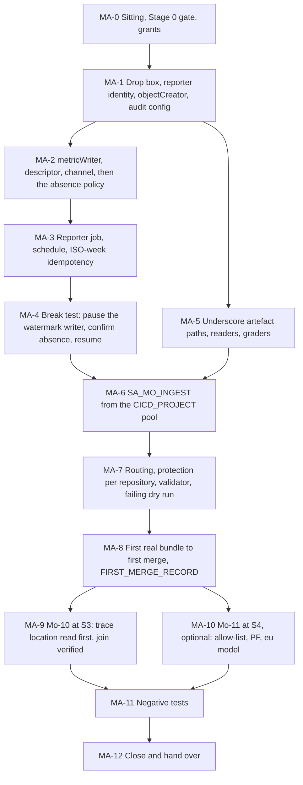

# 40. Mo after Stage 0: reporter, graders, first merged proposal and later stages

## Status

- Owner: the platform owner
- Last reviewed: 2026-09-15
- Last executed: never
- Stage: review §2 stage 37 (Mo-7 and Mo-8, at S1) and stage 39 (Mo-9, at the S2 exit), with Mo-10 (S3) and Mo-11 (S4, optional) as later sections of the same file. Nothing here may start before `STAGE0_RECORD` ([39](39-wall-e-stage-0.md)) exists: every artefact Mo publishes from here on describes a robot that is running, and the first merged proposal is the event that makes a promotion citable.
- Step prefix: `MA`. Steps: 70. BLOCKED steps: 21 — MA-2.3, MA-2.8, MA-3.1, MA-3.2, MA-3.3, MA-3.6, MA-3.7 (Mo's watermark writer and reporter images, README **B-15**); MA-7.2 (the ingestion workflow, **B-15**); MA-7.6, MA-7.7 and MA-7.8 (the validator image and its recompute check, **B-15**'s validator half, owned by the validator custodian's line, and **B-13** while the custodian is unnamed); MA-8.1 to MA-8.7 (the first bundle and its merge, which need all of the above); MA-10.6, MA-10.7 and MA-10.8 (the narrator image, **B-15**). Steps that record `PENDING` rather than `BLOCKED`: MA-6.1 (if the signed M-7 record puts the ingestion workflow in a repository other than the platform repository, a second provider in `CICD_PROJECT` is needed first); MA-9.2 to MA-9.4 (the Spans link, when MA-9.1 reads a `_Trace` location that cannot be joined); MA-2.6 and MA-2.7 (if the entitlement amendment of MA-2.5 has not been applied). Steps that may be recorded `N/A` for ever: all of §10, which M-8 makes optional.
- Replaces: Phases Mo-7, Mo-8, Mo-9, Mo-10 and Mo-11 of [../../mo/07-build-runbook.md](../../mo/07-build-runbook.md), and the Mo-12 tests that belong to those phases (MD-5, MD-6, MD-7, MD-8, MD-14 and the drop-box half of MD-15). That page is not executed. Mo-12's identity and dataset negatives that do not depend on this file's resources stay with [36](36-wall-e-joins-to-eve-and-mo.md).
- Salvaged: Mo-7's "a job, not a service" argument and its 168-hour ceiling; the OAuth-not-OIDC rule for a `*.googleapis.com` Scheduler target; the absence-before-threshold argument ("a threshold-only policy is silent exactly when the metric stops being written") and the 24-hour watermark number that the validator also enforces; Mo-7's deploy-by-digest rule; Mo-8's four human acts and the reason each one is a human's; Mo-9's `objectCreator`-and-nothing-more argument, its path allow-list, its "the gate cannot be part of what it gates" rule, its two-reviewer and admin-bypass rule, and its "a validator that has only ever passed has not been tested" dry run; Mo-10's "the link is created once, by a human holding `roles/observability.editor`, and never by Mo" and its deprecation note on Trace sinks to BigQuery; Mo-11's "it is legitimate never to execute this phase", its "deliberately not a reasoning engine" argument, its CI lint list and its paired MD-1.
- Not copied: the drop box created in Mo-9 after a Mo-7 verify that needs it (S153); `--location="$BQ_LOCATION"` and the global name `gs://mo-proposals` for that bucket (S210); `--member="<ci-ingestion-principal>"` as a literal placeholder and a Workload Identity pool "in `MO_PROJECT`" (S046); an absence policy on a metric with no descriptor, no writer and no notification channel, and `projects/${MO_PROJECT}/notificationChannels/<CHANNEL_ID>` pasted by hand (S152); a break test that pauses "the four hourly metric transfer configs" with no pause command and resumes the Scheduler job instead (S152); idempotency keyed on the `X-CloudScheduler-ScheduleTime` header, which a Cloud Run job's container never sees (S209); "the wiki sync excludes `platform/wall-e/mo/**`", which it does not (S064); one ingestion allow-list and one branch protection covering two repositories (S206); "WRITER … carries `bigquery.datasets.update`" (S207); "Merge the `auditConfigs` block … never overwrite the bindings" with no command (S213); `gcloud services enable aiplatform.googleapis.com` before the `fld-improvers` allow-list admits it (S065); "the folder's Model Armor floor applies to these calls" (X-RQB-08); `MODEL_ID=<pinned-model-id>` with "available in `europe-west1`" (X-RQB-01); `gcloud storage buckets delete` as a rollback with no emptiness check; `grant_dataset` with a fixed `/tmp` file and no etag (01 §8.1).
- Applies decisions (signed in [03](03-decisions-and-people.md) before the step that needs them): SD-01, SD-09, SD-24, SD-33 (with the drop-box name corrected by S210, §1.1), SD-34, SD-38, SD-39, SD-41, SD-44, SD-45, NAMES, M-1, M-3, M-7, M-8, M-11, P22, P30, P36, P40, decision 6, decision 35, decision 37, decision 50.
- Closes: S046, S064, S065, S152, S153, S154, S206, S207, S209, S210, S213, X-RQB-01 (the Mo-11 half; the Wall-E half is [35](35-wall-e-engine-registration-and-gateways.md)), X-RQB-08 (the `MO_PROJECT` application of PF; the rule itself is [18](18-model-armor-floor-spikes-and-kill-switch.md) KS-2.9). Defers none without an owner (§14).
- Consumes: `MO_PROJECT`, `MO_PROJECT_NUMBER`, `SA_MO_METRICS`, `MO_METRICS_DS`, `MO_ARCHIVE_DS`, `MO_PRIVATE_DS`, `MO_VIEWS_DS`, `MO_INPUTS_COMMIT`, `ENT_PROJECT_REPAIR_MO`, `ENT_DEPLOY_CREDENTIAL_HOLDER_MO` ([22](22-mo-foundations.md)); `MO_EVE_PACK_CONFIGS` and MQ-4.2's advisory limit ([29](29-mo-eve-quality-pack.md)); `SA_MO_ANALYST`, `MO_WALLE_PACK_CONFIGS`, `MO_ASSERT_CONFIG`, `EVE_MIRROR_DS` ([36](36-wall-e-joins-to-eve-and-mo.md)); `WIF_POOL`, `WIF_PROVIDER`, `CICD_PROJECT`, `CICD_PROJECT_NUMBER`, `SA_CI_BUILD`, `AR_PLATFORM`, `SA_WALLE_DEPLOYER` ([10](10-core-projects-and-ci-identities.md)); `SA_VALIDATOR_CUSTODIAN`, `VALIDATOR_PROJECT`, `GRADES_EVE_DS`, `ROLE_GRADER_INSERT`, `BINAUTHZ_ATTESTOR`, `KEY_BINAUTHZ` ([11](11-keys-and-validator-custodian.md)); `MODEL_ID`, `MO_OWNER_EMAIL`, `VALIDATOR_CUSTODIAN_EMAIL`, `BLIND_GRADER_EMAIL`, `SECOND_HUMAN_EMAIL`, `SECURITY_REVIEWER_EMAIL`, `SECOND_OPERATOR_EMAIL`, `GIT_HOST`, `GIT_OIDC_ISSUER`, `PLATFORM_REPO_REMOTE` ([03](03-decisions-and-people.md)); `WALLE_PROJECT`, `WALLE_AUDIT_DS` ([31](31-wall-e-project-and-data-plane.md)); `WALLE_REPO_REMOTE`, `WALLE_REPO_DIR`, `WALLE_OPERATORS_GROUP` ([30](30-wall-e-workspace-side.md)); `EVE_CONFIG_REPO`, `EVE_PROJECT`, `EVE_QUALITY_DS` ([23](23-eve-project-and-evidence-stores.md), [25](25-eve-human-super-admin-detections.md)); `STAGE0_RECORD` ([39](39-wall-e-stage-0.md)); `FLOOR_RECORD` and the PF procedure ([18](18-model-armor-floor-spikes-and-kill-switch.md) KS-2.9); `REGISTER_PATH` ([16](16-register-and-shared-registry.md)); `REGION`, `BQ_LOCATION`, `MODEL_LOCATION`, `BUSINESS_TZ` ([01](01-prerequisites-and-conventions.md)).
- Produces: `MO_PROPOSALS`, `SA_MO_REPORTER`, `SA_MO_INGEST`, `SA_MO_NARRATOR`, `FIRST_MERGE_RECORD`.
- Nine names are new against plan §5 and are handed to README's variable list, each because a later file or a rollback names the thing: `MO_REPO_REMOTE` and `MO_REPO_DIR` (Mo's code repository, which README B-15 names only in prose), `MO_CODE_COMMIT` (the commit the reporter, watermark writer, ingestion workflow and narrator images are built from), `WIKI_REPO_REMOTE` and `WIKI_REPO_DIR` (the wiki repository that holds Mo's artefacts — see the note under §5), `NOTIF_CH_MO_FRESHNESS` (the freshness channel in `MO_PROJECT`, which no other file creates), `MO_TRACE_LOCATION` (the location MA-9.1 reads, which decides whether Mo-10 runs at all), `MO_SPANS_DS` (the linked dataset's id, which is also its BigQuery dataset name) and `MO_VALIDATOR_IMAGE` (the digest the custodian deploys, recorded because the merge record cites it).
- Commands checked against Google's documentation on 2026-09-15 (§16). What could not be settled that day is in §15.

## What this part builds

Stage 0 has been recorded. Wall-E runs in shadow, Eve watches the human super admins, and Mo has datasets, an identity and queries but **no way to say anything to anyone**. This file gives Mo a mouth and then, carefully, a hand that is not its own.

1. **The drop box, before the job that writes into it** (§1). `MO_PROPOSALS` is created in `europe-west1` with a project-prefixed name, versioning, a 90-day lifecycle and a single writer principal holding `roles/storage.objectCreator` and nothing else. Data Access audit logging for Cloud Storage in `MO_PROJECT` is added by the same scripted `auditConfigs` merge that [14](14-central-logging-and-billing-export.md) CL-8.3 uses, so the bindings are never touched.
2. **The freshness control, built in the order that makes it a control** (§2): the writer identity, `roles/monitoring.metricWriter`, the metric descriptor, the notification channel, and only then the policy whose second condition is an **absence** condition. A policy created before the descriptor and the channel is either refused or permanently firing, which is the same as no policy at all.
3. **The reporter** (§3): a Cloud Run job, not a service, deployed by digest from `AR_PLATFORM`, scheduled weekly with an OAuth token, idempotent on the ISO week inside the object name rather than on a header the container never sees.
4. **The break test** (§4): the watermark writer's own scheduler job is paused, the absence condition is confirmed to fire, and the same job is resumed. The threshold branch is not tested, because the threshold branch is the branch that already works.
5. **The artefact paths, the readers and the graders** (§5): three underscore-prefixed directories in the wiki repository, which the Drive sync skips by construction, proved offline with the sync module's own `local_pages()`; the reader list until decision 35; and the grader list, which decides whose grades count.
6. **The way a bundle becomes a pull request** (§6, §7): one CI ingestion identity, federated from the **`CICD_PROJECT`** pool — the platform has exactly one CI Workload Identity pool and Mo does not get a second — with a routing table that sends each path prefix to the repository that owns it, branch protection on **each** of those repositories, a validator owned outside all of them, and a deliberately failing dry run before anything real is proposed.
7. **The first merged proposal** (§8): one real bundle for one cell the scorecard reports ready, one pull request, one validator pass with its recompute output attached, two named human reviewers who are not the playbook's owner, one merge, one ladder deploy through the pipeline, and `FIRST_MERGE_RECORD`. This is the event the whole of Mo exists for, and it is the event that makes a promotion citable.
8. **Mo-10 at S3** (§9): the linked Spans dataset, but only after the `_Trace` bucket's location is read. A linked dataset in `europe-west1` cannot be joined to `walle_audit` in the `EU` multi-region without global queries, which need `bigquery.jobs.createGlobalQuery` — a permission only BigQuery Admin carries — and `mo-metrics@` will never hold BigQuery Admin. The step reads first and says so.
9. **Mo-11 at S4, optional** (§10): the narrator, gated on the dated `fld-improvers` allow-list pull request, with the **project** Model Armor floor that actually screens `generateContent`, a model pinned on the `eu` multi-region endpoint, and one sanitize log entry proved live.
10. **The negatives** (§11): no Mo identity can push to, approve on or merge in the platform, Wall-E or `eve/config` repositories; none can write the ladder or the register; and the validator's pass is necessary, never sufficient.

What the old text got wrong, and must not come back:

| Old text | Why it fails | Here instead |
|---|---|---|
| Mo-7 verifies that `platform/wall-e/mo/scorecard.md` exists, while the drop box, the `objectCreator` binding and the CI ingestion are all created in Mo-9 (S153) | At S1 the reporter has no git credential by design and nowhere to put an object; the Mo-7 verify cannot pass and the S1 cost report and stop-or-continue document are never produced | §1 creates the bucket and the binding **before** §3 creates the job; MA-3.7's verify reads the objects in `MO_PROPOSALS`, and §5's reader list says how a human sees them before ingestion exists |
| `gcloud storage buckets create "$MO_PROPOSALS" --location="$BQ_LOCATION"` with `MO_PROPOSALS=gs://mo-proposals` (S210) | The drop box lands in the `EU` multi-region while 08 S19 records it in `europe-west1`; and bucket names are global, so `mo-proposals` may already be another customer's | MA-1.1 fixes `MO_PROPOSALS=gs://${MO_PROJECT}-mo-proposals` as an amendment to SD-33's example, with the NAMES fallback rule; MA-1.2 passes `--location="$REGION"` |
| `--member="<ci-ingestion-principal>"`, with the identity "tbd with the git host … through a Workload Identity Federation pool in `MO_PROJECT`" (S046) | A literal placeholder is an invalid member and the binding fails; a second pool contradicts 02 §3.4, where `CICD_PROJECT` hosts the one CI pool with providers constrained at `fld-platform-core` | §6: `SA_MO_INGEST` is a service account in `CICD_PROJECT` impersonated from `WIF_POOL` by a principal set narrowed to the agent repositories; no pool is created in `MO_PROJECT`, and MA-11.1 proves none exists |
| An absence policy on `custom.googleapis.com/mo/metrics_watermark_age_hours` with `projects/${MO_PROJECT}/notificationChannels/<CHANNEL_ID>` "from the list above" (S152) | No writer holds `metricWriter`, so the descriptor never exists and the policy is refused or fires for ever from hour two; `channels list` in `MO_PROJECT` is empty, so there is no id to paste | §2 in order: MA-2.2 grant, MA-2.1 descriptor, MA-2.5 channel (`NOTIF_CH_MO_FRESHNESS`), MA-2.6 policy built from the channel's resource name, MA-2.7 a first data point before the policy is trusted |
| "`mo-reporter` is idempotent on job name plus the `X-CloudScheduler-ScheduleTime` header" (S209) | Scheduler calls the Cloud Run Admin API `jobs:run` with an empty body; its HTTP headers never reach the job's container, so that key does not exist and a duplicate fire writes a duplicate bundle | MA-3.6: the key is the ISO week computed inside the job, in the object name `mo-bundle-<agent_id>-<YYYY-Www>.json`, which `objectCreator` refuses to overwrite; MA-1.7 proves the refusal |
| "The wiki sync excludes `platform/wall-e/mo/**` and `platform/eve/mo/**`" (S064) | The sync has no path-exclusion list: it skips `CLAUDE.md` and directories whose names start with `.` or `_`. Artefacts under `platform/wall-e/mo/` are pushed to Drive on the next `wiki push`, widening the reader set over data derived from personal data | §5: the directories are `platform/wall-e/_mo/`, `platform/eve/_mo/` and `platform/<agent>/_mo/`; MA-5.2 proves the exclusion offline from the sync module itself, with no Drive credential |
| One ingestion allow-list and branch protection on "the config repository" (S206) | `config/**` lives in `WALLE_REPO_REMOTE`, `eve/config/**` in `EVE_CONFIG_REPO` and the artefacts in the wiki repository; a single protection leaves an `eve_threshold_loosen` mergeable by one reviewer who is the ladder owner | MA-7.1's routing table names the repository per prefix; MA-7.3, MA-7.4 and MA-7.5 set protection on each, with the second human and the security reviewer as code owners on `eve/config` |
| "Merge the `auditConfigs` block into `MO_PROJECT`'s IAM policy … never overwrite the bindings", with no command (S213) | A hand edit of a whole project IAM policy is one paste away from removing every binding in `MO_PROJECT`, including the operator's own | MA-1.6 uses [14](14-central-logging-and-billing-export.md) CL-8.3's exact merge: `get-iam-policy` to a `mktemp` file, a `jq` merge of `auditConfigs` only, a diff that must show nothing outside `auditConfigs`, `set-iam-policy` with the fetched etag, and a read-back |
| "WRITER is the dataset-level form of `roles/bigquery.dataEditor`, and the account additionally needs `bigquery.datasets.get` and `bigquery.datasets.update` … both of which WRITER carries" (S207) | `roles/bigquery.dataEditor` does not include `bigquery.datasets.update`; harmless for DML and DDL configs, fatal for any config later given `--target_dataset` | MA-7.7's note: every Mo transfer config stays DML or DDL with no `--target_dataset`; a config that needs one gets a custom dataset-level role, never WRITER |
| `gcloud services enable aiplatform.googleapis.com --project="$MO_PROJECT"` as "the one API `MO_PROJECT` enables late" (S065) | `fld-improvers` runs `gcp.restrictServiceUsage` in allow-list mode; `aiplatform` and `modelarmor` are added only at S4 by a dated pull request, so the enable is refused | MA-10.2 is a precondition step: the dated pull request is merged and the effective policy is read back before MA-10.3 runs |
| "The folder's Model Armor floor applies to these calls" (X-RQB-08) | Template conformance is defined at organisation and folder level; inline enforcement on `generateContent` is configured **only at the project level**, and needs `roles/modelarmor.user` for the Agent Platform service agent | MA-10.5 runs PF ([18](18-model-armor-floor-spikes-and-kill-switch.md) KS-2.9) on `MO_PROJECT`; MA-10.7 proves one `VERTEX_AI` sanitize entry from a narrator dry run |
| `MODEL_ID=<pinned-model-id>`, "must be available in `europe-west1`" (X-RQB-01) | On 2026-09-15 `europe-west1` serves only the Gemini 2.5 family, all retiring 2026-10-20; every GA successor is served on `global` and the `us`/`eu` multi-regions | MA-10.6 passes `MODEL_LOCATION=eu` and `MODEL_ID` from the signed decision 6 record; the job stays in `europe-west1`; MA-10.1's entry check refuses a pin retiring within 90 days |
| `gcloud beta observability buckets datasets links create … --location="$REGION"` then a join against `walle_audit` (S154) | With `_Trace` in `europe-west1` and `walle_audit` in `EU`, the join is a global query: it needs `bigquery.jobs.createGlobalQuery`, carried only by BigQuery Admin, which `mo-metrics@` must never hold | MA-9.1 reads the bucket's location **before** anything is created and routes on the answer; MA-9.4 runs the real join, not a span count |



## Preconditions

- [ ] [39](39-wall-e-stage-0.md): `STAGE0_RECORD` exists and is co-signed. Nothing in this file runs before it, and an entry to S1 that is not recorded there is not an entry to S1.
- [ ] [22](22-mo-foundations.md) complete: `MO_PROJECT`, `MO_PROJECT_NUMBER`, `SA_MO_METRICS`, the four `MO_*_DS` datasets in `EU`, `MO_INPUTS_COMMIT` set (or the steps that read `gates.yaml` are BLOCKED on **B-14**), `ENT_PROJECT_REPAIR_MO` and `ENT_DEPLOY_CREDENTIAL_HOLDER_MO` `AVAILABLE`.
- [ ] [36](36-wall-e-joins-to-eve-and-mo.md) complete for Mo's half: `SA_MO_ANALYST` exists, `MO_WALLE_PACK_CONFIGS` run and are pinned, `MO_ASSERT_CONFIG` runs daily, and the scorecard has at least four ISO weeks of rows. A scorecard with no history cannot report a cell ready, and §8 has nothing to propose.
- [ ] [29](29-mo-eve-quality-pack.md): `MO_EVE_PACK_CONFIGS` exist, and MQ-4.2's dated advisory limit is on file. While the validator custodian holds no `READER` on `eve_quality`, the only Eve bundle type ingestion accepts is `eve_incident_note` (MA-7.1).
- [ ] [11](11-keys-and-validator-custodian.md): `VALIDATOR_PROJECT` exists; `SA_VALIDATOR_CUSTODIAN` and `GRADES_EVE_DS` set, or §7 records `PENDING` against **B-13** and §8 cannot start.
- [ ] [10](10-core-projects-and-ci-identities.md): `WIF_POOL` is `wif-factory` in `CICD_PROJECT`, `WIF_PROVIDER` is set, `AR_PLATFORM` exists with `SA_CI_BUILD` as its writer, and CP-3.5's regional smoke build passed.
- [ ] [03](03-decisions-and-people.md) signed: NAMES (with `MO_PROPOSALS`'s corrected form, §1.1), M-1, M-3, M-7 (the CI ingestion principal and its home), M-11, P22, P30, P36, decision 6 (`MODEL_ID`, needed only by §10), decision 35 (the artefact reader set), decision 37 (the custodian's project), decision 50. `MO_OWNER_EMAIL`, `VALIDATOR_CUSTODIAN_EMAIL` and `BLIND_GRADER_EMAIL` are real addresses, not `*tbd*`.
- [ ] **B-15** (README §8): Mo's reporter, watermark writer, ingestion workflow, validator and narrator, committed in `MO_REPO_REMOTE` with green CI and a commit id to record as `MO_CODE_COMMIT`. Without it seventeen steps here are BLOCKED; the file is still run end to end, checkpointed, and resumed at the first step without a `DONE` line.
- [ ] Workstation of [01](01-prerequisites-and-conventions.md): `gcloud` **563.0.0 or later** (MA-9.2 needs it) with `alpha` and `beta`, `bq`, `jq`, `curl`, `python3.12`, `git`, and the git host's CLI; `~/.platform-env` sourced; `penv_guard` silent.
- [ ] **Not** a precondition: `EVE_KEY_VERSION` or anything in [41](41-eve-s3-and-s4.md). Eve's S4 limb and Mo's S4 narrator are independent; neither waits on the other.

## People needed

| Role | Does | Present at |
|---|---|---|
| Mo owner (`MO_OWNER_EMAIL`) | Performs §1 to §5, §6, §8's bundle, §9's verify and §10; requests the two Mo grants | throughout |
| Platform owner (as `sa-1-admin@`) | Performs MA-1.6 (the project `auditConfigs` merge, which needs `projectIamAdmin`), MA-6.3 (the pool binding in `CICD_PROJECT`) and MA-9.2 (the `_Trace` link in `WALLE_PROJECT`, `roles/observability.editor`) | MA-1.6, MA-6.3, MA-9.2 |
| Validator custodian (`VALIDATOR_CUSTODIAN_EMAIL`, the security reviewer's line) | Owns and deploys the validator, holds its read access, runs the recompute check, and is the only person who may change what the gate enforces | MA-7.6, MA-7.7, MA-7.8, MA-8.4 |
| Second human (`SECOND_HUMAN_EMAIL`) | Approves the `ENT_PROJECT_REPAIR_MO` grant; is a required reviewer and code owner on `EVE_CONFIG_REPO`; is one of the two reviewers at MA-8.5 unless they authored the playbook | MA-0.3, MA-7.4, MA-8.5 |
| Security reviewer (`SECURITY_REVIEWER_EMAIL`) | Code owner on `eve/config/thresholds.yaml`; reviews the routing table and the branch-protection settings; co-signs `FIRST_MERGE_RECORD` | MA-7.1, MA-7.4, MA-8.7 |
| Second operator (`SECOND_OPERATOR_EMAIL`) | Reviews `MO_CODE_COMMIT` against §3's and §7's contract as first reviewer; reads the break-test incident | MA-3.1, MA-4.2 |
| Blind grader (`BLIND_GRADER_EMAIL`) | Named on the grader list; grades the cell §8 proposes, without seeing the proposal | MA-5.4, MA-8.1 |
| Two human reviewers (named at MA-8.5, neither the playbook's `owner:`, neither a Mo identity) | Approve the first merged proposal | MA-8.5, MA-8.6 |

Hands-on: about three days for §1 to §5, two for §6 and §7 (three of which belong to the custodian, not to Mo's budget), one for §8. Elapsed: 10 to 14 weeks after Stage 0, because §8 cannot run before the S2 exit and S1 has to be lived through. §9 and §10 are later stages with their own entry records.

Conventions of [01](01-prerequisites-and-conventions.md) apply to every step: `checkpoint <id> START` before ACTION, `checkpoint <id> DONE <witness> <evidence>` after VERIFY; records named `<date>-<step>-<slug>-v<n>` under `BUILD_LOG_DIR/records/`, each registered with `evidence_add`. Deviation rows are `BD-40-<n>`. With no default project, every gcloud call passes `--project`, `--folder` or `--organization`. Every shell block starts with:

```bash
source ~/.platform-env
penv_guard
R="$BUILD_LOG_DIR/records/$(date -u +%F)-MA"
```

Dataset `access` entries are added with one helper, defined once per sitting, which is [01](01-prerequisites-and-conventions.md) §8.1's BigQuery pattern and nothing more: its own `mktemp -d`, the etag compared immediately before the write, `unique` so a re-run adds nothing twice, and a read-back diff. It is the same shape as [22](22-mo-foundations.md)'s `mo_ds_access` and [29](29-mo-eve-quality-pack.md)'s `eq_access`; it is written out here because this file adds entries to datasets in two projects.

```bash
mo_ds_add() {   # mo_ds_add PROJECT DATASET ROLE MEMBER_EMAIL
  [ $# -eq 4 ] || { echo "usage: mo_ds_add PROJECT DATASET ROLE MEMBER_EMAIL" >&2; return 2; }
  W="$(mktemp -d)" || return 1
  bq --project_id="$1" show --format=prettyjson "${1}:${2}" > "$W/before.json" || { echo "STOP: read failed" >&2; rm -rf "$W"; return 1; }
  jq --arg r "$3" --arg m "$4" '.access = ((.access + [{"role":$r,"userByEmail":$m}]) | unique)' "$W/before.json" > "$W/after.json" || { rm -rf "$W"; return 1; }
  jq -S '.access | sort_by(tostring)' "$W/after.json" > "$W/expected.json"
  if [ "$(bq --project_id="$1" show --format=prettyjson "${1}:${2}" | jq -r .etag)" = "$(jq -r .etag "$W/before.json")" ]; then
    bq --project_id="$1" update --source "$W/after.json" "${1}:${2}" || { echo "STOP: update failed" >&2; rm -rf "$W"; return 1; }
  else
    echo "STOP: ${1}:${2} changed since it was read" >&2; rm -rf "$W"; return 1
  fi
  bq --project_id="$1" show --format=prettyjson "${1}:${2}" | jq -S '.access | sort_by(tostring)' | diff "$W/expected.json" - && echo "ACCESS MATCHES ${1}:${2} $3 $4"
  cp "$W/before.json" "${R}-dsaccess-${2}-before-$(date -u +%H%M%S).json"; rm -rf "$W"
}
```

## 0. The sitting

### MA-0.1 Open the sitting and check the gates

- **WHO:** Mo owner.
- **WHERE:** Shell, `~/.platform-env` sourced, gcloud configuration `GCLOUD_CONFIG_NAME`.
- **ACTION:**

```bash
checkpoint MA-0.1 START
need ORG_ID REGION BQ_LOCATION MO_PROJECT MO_PROJECT_NUMBER SA_MO_METRICS SA_MO_ANALYST MO_METRICS_DS MO_ARCHIVE_DS MO_PRIVATE_DS MO_VIEWS_DS CICD_PROJECT CICD_PROJECT_NUMBER WIF_POOL AR_PLATFORM SA_CI_BUILD PLATFORM_REPO_DIR BUILD_LOG_DIR DEVIATION_REGISTER EVIDENCE_REGISTER MO_OWNER_EMAIL SECOND_HUMAN_EMAIL STAGE0_RECORD
"$PLATFORM_REPO_DIR/tools/decision-need.sh" NAMES M-1 M-3 M-7 M-11 P22 P30 P36 SD-33 SD-44 SD-45
test -s "$BUILD_LOG_DIR/$STAGE0_RECORD" && head -5 "$BUILD_LOG_DIR/$STAGE0_RECORD"
bq --project_id="$MO_PROJECT" query --use_legacy_sql=false --format=csv "SELECT COUNT(DISTINCT iso_week) AS weeks, MAX(window_end) AS latest FROM \`${MO_PROJECT}.${MO_METRICS_DS}.scorecard\`"
test -z "$(gcloud config get project 2>/dev/null)" && echo "no default project"
```

- **VERIFY:** `decision-need.sh` prints `SIGNED` for each id. The Stage 0 record's first lines show the co-signature and a date. The scorecard query returns `weeks >= 4` and a `latest` no older than eight days: fewer weeks means [36](36-wall-e-joins-to-eve-and-mo.md)'s pack has not run long enough, and §8 has nothing to propose — §1 to §7 may still be built. `no default project`. Anything else: stop.
- **ROLLBACK:** Read only.
- **EVIDENCE:** Output as `${R}-0.1-gates-v1.txt`; `evidence_add MA-0.1 gates E-05 1.4.1 build-log:records/<file> <file>`. E-05. TISAX 1.4.1.

### MA-0.2 Record which blocked inputs stand today

- **WHO:** Mo owner.
- **WHERE:** Shell; the build log.
- **ACTION:** This file has three independent blockers and they fail in different places. Record each before any write, so a half-run sitting resumes at the right step.

```bash
checkpoint MA-0.2 START
printf 'B-13 validator custodian\t%s\n' "${SA_VALIDATOR_CUSTODIAN:-tbd}"
printf 'B-14 mo inputs\t%s\n' "${MO_INPUTS_COMMIT:-tbd}"
printf 'B-15 mo code\t%s\n' "${MO_CODE_COMMIT:-tbd}"
if [ -n "${MO_REPO_DIR:-}" ] && [ -d "$MO_REPO_DIR" ]; then
  git -C "$MO_REPO_DIR" ls-tree -r --name-only "${MO_CODE_COMMIT:-origin/main}" | grep -E '^(reporter|watermark|ingestion|validator|narrator)/' | sed 's#/.*##' | sort -u
else
  echo "B-15: MO_REPO_DIR is not set; nothing in sections 2, 3, 7, 8 or 10 can be built"
fi
```

- **VERIFY:** Three blocker lines with a value or `tbd`, and a list of the five component directories present at `MO_CODE_COMMIT`. `tbd` for B-15 makes MA-2.3, MA-3.1 to MA-3.3, MA-3.6, MA-3.7, MA-7.2, MA-7.6, §8 and MA-10.6 BLOCKED, and nothing in §1, §5, §6 or §9. `tbd` for B-13 makes MA-7.6 to MA-7.8 and §8 BLOCKED, because a gate with no owner is not a gate.
- **ROLLBACK:** Read only.
- **EVIDENCE:** The listing as `${R}-0.2-blockers-v1.txt`. E-05. TISAX 1.4.1.

### MA-0.3 Open the two Mo grants

- **WHO:** Mo owner requests; **approver: the second human**.
- **WHERE:** Shell; the second human's console.
- **ACTION:** Every write into `MO_PROJECT` in §1 to §3 is inside one grant of `ENT_PROJECT_REPAIR_MO`; the Cloud Run and Scheduler deploys are inside `ENT_DEPLOY_CREDENTIAL_HOLDER_MO`. The Mo owner holds no standing role that edits `MO_PROJECT`, and [36](36-wall-e-joins-to-eve-and-mo.md)'s drift check depends on that staying true.

```bash
source "$PLATFORM_REPO_DIR/pam/tools/pam.sh"
g_mo="$(pam_request "$ENT_PROJECT_REPAIR_MO" "setup-40 MA-1 to MA-3: drop box, freshness control, reporter")"; echo "$g_mo"
g_dep="$(pam_request "$ENT_DEPLOY_CREDENTIAL_HOLDER_MO" "setup-40 MA-2.3, MA-3.3, MA-3.5: Cloud Run jobs and their schedules")"; echo "$g_dep"
```

- **VERIFY:** Two grant names ending `/grants/<id>`; `gcloud pam grants describe "$g_mo" --location=global --project="$MO_PROJECT" --billing-project="$CICD_PROJECT" --format='value(state,requestedDuration)'` prints `ACTIVE`. The approval is recorded against the second human's own account.
- **ROLLBACK:** `pam_revoke "$g_mo"`, `pam_revoke "$g_dep"`; both expire on their own duration.
- **EVIDENCE:** Grant names and states as `${R}-0.3-grants-v1.txt`. E-05. TISAX 4.1.1.

## 1. Mo-7: the drop box, before the job that writes into it (closes S153, S210, S213)

The drop box exists so that **Mo holds no git credential at any phase**. Mo drops an object; CI, under an identity that is not Mo's, turns it into a pull request. The superseded runbook built it in Mo-9, three months after the Mo-7 verify that reads it. It is built here, first.

### MA-1.1 Fix the drop box's name, and record the amendment to SD-33

- **WHO:** Mo owner writes; **the security reviewer approves the amendment** in the NAMES record.
- **WHERE:** Pull request on `PLATFORM_REPO_REMOTE`; then the shell.
- **ACTION:** SD-33's resolution spells the drop box `gs://mo-proposals`. Cloud Storage bucket names are global across every Google Cloud customer, so that name may already be taken, and the create would fail with no fallback. Amend the NAMES record to `gs://<MO_PROJECT>-mo-proposals`, which cannot collide, and record the amendment as the same kind of dated correction 08 S19 already carries for the location.

```bash
checkpoint MA-1.1 START
need MO_PROJECT
penv_set MO_PROPOSALS "gs://${MO_PROJECT}-mo-proposals"
grep -n 'mo-proposals' "$PLATFORM_REPO_DIR/names/names.md"
```

- **VERIFY:** `need MO_PROPOSALS` passes. The NAMES record's line reads `gs://<project id>-mo-proposals` with the dated amendment and the finding id `S210` beside it. Topology row 182 and `mo/04-artefacts-and-proposals.md` §3.7 are listed in the same pull request as pages to correct.
- **ROLLBACK:** `git revert` the amendment before MA-1.2 runs. After the bucket exists the name is permanent: a bucket cannot be renamed.
- **EVIDENCE:** The merge commit and the `penv_set` line as `${R}-1.1-drop-box-name-v1.txt`. E-05. TISAX 1.4.1.

### MA-1.2 Create the bucket in `europe-west1`

- **WHO:** Mo owner, inside `g_mo`.
- **WHERE:** Shell.
- **ACTION:** `--location="$REGION"`, not `BQ_LOCATION`: 08 §S19 records the drop box in `europe-west1`, and the bucket holds no BigQuery data that would want the multi-region.

```bash
checkpoint MA-1.2 START
need MO_PROPOSALS MO_PROJECT REGION
gcloud storage buckets create "$MO_PROPOSALS" --project="$MO_PROJECT" --location="$REGION" --uniform-bucket-level-access --public-access-prevention --default-storage-class=STANDARD --soft-delete-duration=30d
```

- **VERIFY:**

```bash
gcloud storage buckets describe "$MO_PROPOSALS" --project="$MO_PROJECT" --format="yaml(name,location,uniform_bucket_level_access,public_access_prevention,default_storage_class,soft_delete_policy)"
```

  `location: EUROPE-WEST1`; uniform bucket-level access enabled; public access prevention `enforced`; soft delete 30 days. A create refused with `already exists` means the name is taken by another customer even with the project prefix, which is only possible if the project id itself is reused: stop, and apply the NAMES record's fallback rule rather than inventing a name at the keyboard.
- **ROLLBACK:** `gcloud storage buckets delete "$MO_PROPOSALS" --project="$MO_PROJECT"` — **only while the bucket is empty**; `gcloud storage ls "$MO_PROPOSALS/**" | head` must print nothing first. A bucket holding bundles is evidence, and deleting it destroys the only attributable record of what Mo proposed.
- **EVIDENCE:** The describe output as `${R}-1.2-bucket-v1.yaml`. E-05, E-06. TISAX 7.1 (residency), 5.2.4.

### MA-1.3 Versioning and the 90-day lifecycle

- **WHO:** Mo owner, inside `g_mo`.
- **WHERE:** Shell.
- **ACTION:** Versioning is not a create-time flag; it is set on update (10 CP-2.1 established the same pattern for the state bucket). Versioning matters here for a reason the old text did not give: `objectCreator` cannot overwrite a live object, so a duplicate write is refused, and versioning means an accidental deletion by an administrator is still recoverable for 90 days.

```bash
checkpoint MA-1.3 START
gcloud storage buckets update "$MO_PROPOSALS" --project="$MO_PROJECT" --versioning
LC="$(mktemp)"
cat > "$LC" <<'JSON'
{"rule":[{"action":{"type":"Delete"},"condition":{"age":90,"isLive":false}},
         {"action":{"type":"Delete"},"condition":{"age":90,"isLive":true}}]}
JSON
gcloud storage buckets update "$MO_PROPOSALS" --project="$MO_PROJECT" --lifecycle-file="$LC"
rm -f "$LC"
```

- **VERIFY:** `gcloud storage buckets describe "$MO_PROPOSALS" --project="$MO_PROJECT" --format="yaml(versioning,lifecycle)"` shows versioning enabled and exactly two rules, both `Delete` at age 90, one for live and one for non-current objects. Ninety days is longer than the longest window a bundle's evidence may cite, and shorter than the retention the evidence bucket holds: the bundle that matters has been merged and recorded in git long before it expires here.
- **ROLLBACK:** `gcloud storage buckets update "$MO_PROPOSALS" --project="$MO_PROJECT" --no-versioning --clear-lifecycle`.
- **EVIDENCE:** The describe output as `${R}-1.3-lifecycle-v1.yaml`. E-06. TISAX 5.2.4.

### MA-1.4 Create the reporter identity

- **WHO:** Mo owner, inside `g_mo`.
- **WHERE:** Shell.
- **ACTION:** The reporter is a **third** Mo identity, not `mo-analyst@` wearing another hat. `mo-analyst@` computes; the reporter writes objects. Separating them means the drop-box binding names a principal that can do nothing else, and that MD-8's refusals are about the writer alone.

```bash
checkpoint MA-1.4 START
gcloud iam service-accounts create mo-reporter --project="$MO_PROJECT" --display-name="Mo T1 reporter. Renders artefacts and drops bundles. Computes nothing, grades nothing, merges nothing."
penv_set SA_MO_REPORTER "mo-reporter@${MO_PROJECT}.iam.gserviceaccount.com"
gcloud projects add-iam-policy-binding "$MO_PROJECT" --member="serviceAccount:${SA_MO_REPORTER}" --role=roles/bigquery.jobUser --condition=None
mo_ds_add "$MO_PROJECT" "$MO_VIEWS_DS" READER "$SA_MO_REPORTER"
```

- **VERIFY:**

```bash
gcloud iam service-accounts describe "$SA_MO_REPORTER" --project="$MO_PROJECT" --format='value(email,disabled)'
gcloud projects get-iam-policy "$MO_PROJECT" --flatten='bindings[].members' --filter="bindings.members:${SA_MO_REPORTER}" --format='value(bindings.role)'
for DS in "$MO_METRICS_DS" "$MO_ARCHIVE_DS" "$MO_PRIVATE_DS"; do bq --project_id="$MO_PROJECT" show --format=prettyjson "${MO_PROJECT}:${DS}" | jq -r --arg m "$SA_MO_REPORTER" '[.access[] | select(.userByEmail == $m)] | length'; done
```

  The account exists and is not disabled. Its **only** project-level role is `roles/bigquery.jobUser`. The three counts are `0`, `0`, `0`: the reporter reads the authorised views and nothing underneath them, which is the whole point of [36](36-wall-e-joins-to-eve-and-mo.md)'s view layer. `mo_ds_add` is the sitting helper above: 01 §8.1's access-array pattern, with the etag compared immediately before the write and a read-back diff, and it printed `ACCESS MATCHES`.
- **ROLLBACK:** Remove the `READER` entry by repeating the helper's pattern with it deleted, remove the `jobUser` binding, then `gcloud iam service-accounts delete "$SA_MO_REPORTER" --project="$MO_PROJECT"`. A deleted service account's address is unusable for 30 days.
- **EVIDENCE:** The three outputs as `${R}-1.4-reporter-identity-v1.txt`. E-05. TISAX 4.1.1.

### MA-1.5 Bind `objectCreator`, and nothing more

- **WHO:** Mo owner, inside `g_mo`.
- **WHERE:** Shell.
- **ACTION:** `roles/storage.objectCreator` "allows users to create objects" and "does not give permission to view, delete, or overwrite objects". That is the entire security argument of the drop box, and adding any wider role to this binding silently retires it.

```bash
checkpoint MA-1.5 START
gcloud storage buckets add-iam-policy-binding "$MO_PROPOSALS" --project="$MO_PROJECT" --member="serviceAccount:${SA_MO_REPORTER}" --role=roles/storage.objectCreator
```

- **VERIFY:**

```bash
gcloud storage buckets get-iam-policy "$MO_PROPOSALS" --project="$MO_PROJECT" --format=json | jq '[.bindings[] | {role, members}]'
```

  Exactly one binding whose member list contains `SA_MO_REPORTER`, with role `roles/storage.objectCreator`. No `roles/storage.objectAdmin`, no `roles/storage.admin`, no `allUsers`, no `allAuthenticatedUsers`, and — until MA-6.4 — no reader at all. Project-level storage roles would defeat this: MA-1.4's verify already proved the reporter holds none.
- **ROLLBACK:** `gcloud storage buckets remove-iam-policy-binding "$MO_PROPOSALS" --project="$MO_PROJECT" --member="serviceAccount:${SA_MO_REPORTER}" --role=roles/storage.objectCreator`. The reporter then renders artefacts it cannot deliver, which is visible within a week.
- **EVIDENCE:** The policy as `${R}-1.5-bucket-iam-v1.json`. E-05. TISAX 4.1.1.

### MA-1.6 Data Access logging for Cloud Storage in `MO_PROJECT`, by scripted merge (closes S213)

- **WHO:** Platform owner under the `ENT_PROJECT_REPAIR_MO` grant (`roles/resourcemanager.projectIamAdmin`); **the second human witnesses the diff** before `set-iam-policy` runs.
- **WHERE:** Shell.
- **ACTION:** Bundle writes must be attributable, and the bucket is in `MO_PROJECT`, so `MO_PROJECT` configures the logs itself; nothing is inherited from Wall-E's project, and `mo/06-failure-modes.md` relies on the row. `DATA_READ` is included so that the ingestion identity's reads are attributable too. First add the wanted block to the committed file, then apply it with [14](14-central-logging-and-billing-export.md) CL-8.3's merge — never a hand-edited whole policy.

```bash
checkpoint MA-1.6 START
need PLATFORM_REPO_DIR MO_PROJECT BUILD_LOG_DIR
jq '.MO_PROJECT = [{"service":"storage.googleapis.com","auditLogConfigs":[{"logType":"DATA_READ"},{"logType":"DATA_WRITE"}]}]' "$PLATFORM_REPO_DIR/logging/audit-config-projects.json" > "$PLATFORM_REPO_DIR/logging/audit-config-projects.json.new"
mv "$PLATFORM_REPO_DIR/logging/audit-config-projects.json.new" "$PLATFORM_REPO_DIR/logging/audit-config-projects.json"
```

  Merge that as a reviewed pull request, then apply it:

```bash
P0="$(mktemp)"; P1="$(mktemp)"; WANT="$(mktemp)"
jq --arg k MO_PROJECT '{auditConfigs: .[$k]}' "$PLATFORM_REPO_DIR/logging/audit-config-projects.json" > "$WANT"
gcloud projects get-iam-policy "$MO_PROJECT" --format=json > "$P0"
jq '[.auditConfigs[]?.auditLogConfigs[]? | select(has("exemptedMembers"))]' "$P0"
jq --slurpfile want "$WANT" '.auditConfigs = ([(.auditConfigs // [])[], $want[0].auditConfigs[]] | group_by(.service) | map({service: .[0].service, auditLogConfigs: ([.[].auditLogConfigs[]] | unique_by(.logType))}))' "$P0" > "$P1"
diff <(jq -S . "$P0") <(jq -S . "$P1")
cp "$P0" "${R}-1.6-mo-policy-before.json"
gcloud projects set-iam-policy "$MO_PROJECT" "$P1" --format="value(etag)"
rm -f "$P0" "$P1" "$WANT"
```

- **VERIFY:** The exemptions query printed `[]` — an existing exemption is a finding for the second human, not something to merge past. The `diff` shows changes **only** inside `auditConfigs`; if a single `bindings` line appears, stop and start again from `get-iam-policy`. `set-iam-policy` printed a new etag; a concurrent change makes it fail on the stale etag, which is the protection this shape buys. Read back:

```bash
gcloud projects get-iam-policy "$MO_PROJECT" --format=json | jq -e '[.auditConfigs[] | select(.service=="storage.googleapis.com") | .auditLogConfigs[].logType] | sort == ["DATA_READ","DATA_WRITE"]'
```

  prints `true`.
- **ROLLBACK:** Fetch the policy again (new etag), set `.auditConfigs` to the saved before-file's value with `jq --slurpfile old "${R}-1.6-mo-policy-before.json" '.auditConfigs = ($old[0].auditConfigs // [])'`, diff, `set-iam-policy`. Removing it is itself an Admin Activity entry that [15](15-pager-siem-and-detections.md)'s rule and Eve ([25](25-eve-human-super-admin-detections.md)) report.
- **EVIDENCE:** The diff, the before file and the read-back as `${R}-1.6-audit-config-v1.txt`. E-06. TISAX 5.2.4.

### MA-1.7 Prove the three refusals `objectCreator` buys (MD-8)

- **WHO:** Mo owner.
- **WHERE:** Shell.
- **ACTION:** Write an object as the reporter, then try to overwrite it, read it and delete it. All three must fail, and a test that has only ever succeeded proves nothing. Impersonation follows [36](36-wall-e-joins-to-eve-and-mo.md) §10's rule, not the superseded runbook's: the Mo owner holds no `roles/iam.serviceAccountTokenCreator` standing, so the step opens a time-boxed grant on the **`mo-*` accounts only**, records it, and withdraws it in the same step (S007).

```bash
checkpoint MA-1.7 START
gcloud iam service-accounts add-iam-policy-binding "$SA_MO_REPORTER" --project="$MO_PROJECT" --member="user:${MO_OWNER_EMAIL}" --role=roles/iam.serviceAccountTokenCreator --condition=None
T="$(mktemp)"; printf '{"probe":"MA-1.7","ts":"%s"}\n' "$(date -u +%FT%TZ)" > "$T"
O="${MO_PROPOSALS}/probe/ma-1-7-$(date -u +%Y-W%V).json"
imp() { gcloud storage "$@" --impersonate-service-account="$SA_MO_REPORTER"; }
imp cp "$T" "$O"; echo "write exit=$?"
imp cp "$T" "$O"; echo "overwrite exit=$?"
imp cat "$O" >/dev/null; echo "read exit=$?"
imp rm "$O"; echo "delete exit=$?"
rm -f "$T"
gcloud iam service-accounts remove-iam-policy-binding "$SA_MO_REPORTER" --project="$MO_PROJECT" --member="user:${MO_OWNER_EMAIL}" --role=roles/iam.serviceAccountTokenCreator --condition=None
```

- **VERIFY:** `write exit=0`; `overwrite`, `read` and `delete` each non-zero with `403` and `storage.objects.delete`, `storage.objects.get` or `storage.objects.create` on an existing object named in the message. A `404` instead of a `403` on the read means the object was not written — fix the harness, not the assertion. Record the four exit codes. Then remove the probe object as the Mo owner (who holds no bucket role either, so this needs the grant): `gcloud storage rm "$O" --project="$MO_PROJECT"`.
  Then confirm the token-creator binding is gone: `gcloud iam service-accounts get-iam-policy "$SA_MO_REPORTER" --project="$MO_PROJECT" --format=json | jq '.bindings'` prints no `serviceAccountTokenCreator` entry. A step that leaves it standing has quietly given a human the reporter's identity for ever.
- **ROLLBACK:** None needed; the probe object is deleted by the operator, and the deletion is in the Data Access log MA-1.6 just switched on, which is itself the proof that MA-1.6 works. If the removal at the end of the block failed, run it again before closing the sitting.
- **EVIDENCE:** The four exit codes, one `403` message and the empty token-creator policy as `${R}-1.7-md8-v1.txt`. E-12. TISAX 4.1.1, 5.2.4.

## 2. Mo-7: the freshness control, built in the order that makes it one (closes S152)

Mo's absence must be strictly more restrictive than its presence, and the detection of that absence must not depend on Mo publishing a liveness signal. A threshold-only policy is silent exactly when the metric stops being written. That argument survives from the superseded runbook; what does not survive is the order it was written in. A policy on a metric type with no descriptor is refused, or — worse — accepted, with its absence condition firing permanently from hour two, so that the one alert Mo has is ignored by everyone within a fortnight.

The order here is: **writer identity, then permission, then descriptor, then a data point, then the channel, then the policy.** Each step's verify is the precondition of the next.

The 24-hour number is the same one the validator enforces in §7: a watermark older than 24 hours makes the validator refuse **every** promotion. That is what makes this a control rather than a dashboard.

### MA-2.1 Grant the writer identity `roles/monitoring.metricWriter`

- **WHO:** Mo owner, inside `g_mo`.
- **WHERE:** Shell.
- **ACTION:** The watermark writer is `SA_MO_REPORTER` — the same identity, a different job. It is not `mo-metrics@` (which must hold nothing outside BigQuery) and not `mo-analyst@` (whose grants are read surfaces, audited as such in [36](36-wall-e-joins-to-eve-and-mo.md) WJ-9).

```bash
checkpoint MA-2.1 START
need MO_PROJECT SA_MO_REPORTER
gcloud projects add-iam-policy-binding "$MO_PROJECT" --member="serviceAccount:${SA_MO_REPORTER}" --role=roles/monitoring.metricWriter --condition=None
```

- **VERIFY:**

```bash
gcloud projects get-iam-policy "$MO_PROJECT" --flatten='bindings[].members' --filter="bindings.members:${SA_MO_REPORTER}" --format='value(bindings.role)' | sort
```

  Exactly two roles: `roles/bigquery.jobUser` and `roles/monitoring.metricWriter`. `metricWriter` is write-only access to metrics and carries `monitoring.metricDescriptors.create` and `monitoring.timeSeries.create`, which is why MA-2.2 can create the descriptor as this identity and why nothing here needs `roles/monitoring.admin`.
- **ROLLBACK:** `gcloud projects remove-iam-policy-binding "$MO_PROJECT" --member="serviceAccount:${SA_MO_REPORTER}" --role=roles/monitoring.metricWriter --condition=None`. The metric stops being written, and within two hours the absence condition of MA-2.7 fires — which is the intended behaviour, not a side effect.
- **EVIDENCE:** The role list as `${R}-2.1-metricwriter-v1.txt`. E-05. TISAX 4.1.1.

### MA-2.2 Create the metric descriptor

- **WHO:** Mo owner, inside a time-boxed `serviceAccountTokenCreator` grant on `SA_MO_REPORTER` (the MA-1.7 pattern).
- **WHERE:** Shell.
- **ACTION:** There is no `gcloud` command that creates a user-defined metric descriptor; Google's own instructions are the Monitoring API's `projects.metricDescriptors.create`. Creating it explicitly, rather than letting the first `timeSeries.create` create it implicitly, fixes the value type, the unit and the labels before anything depends on them — and it is what makes the policy in MA-2.7 creatable at all.

```bash
checkpoint MA-2.2 START
gcloud iam service-accounts add-iam-policy-binding "$SA_MO_REPORTER" --project="$MO_PROJECT" --member="user:${MO_OWNER_EMAIL}" --role=roles/iam.serviceAccountTokenCreator --condition=None
D="$(mktemp)"
cat > "$D" <<'JSON'
{
  "type": "custom.googleapis.com/mo/metrics_watermark_age_hours",
  "metricKind": "GAUGE",
  "valueType": "DOUBLE",
  "unit": "h",
  "displayName": "Mo metrics watermark age",
  "description": "Hours between the write time and the newest window_end in the scorecard. Written hourly by the mo-watermark job. Absence means Mo's measurement pipeline has stopped.",
  "labels": [
    {"key": "dataset", "valueType": "STRING", "description": "the dataset the watermark was read from"},
    {"key": "agent_id", "valueType": "STRING", "description": "the agent the watermark is for"}
  ]
}
JSON
curl -s -X POST -H "Authorization: Bearer $(gcloud auth print-access-token --impersonate-service-account="$SA_MO_REPORTER")" -H 'Content-Type: application/json' "https://monitoring.googleapis.com/v3/projects/${MO_PROJECT}/metricDescriptors" -d @"$D" | tee "${R}-2.2-descriptor-v1.json"
rm -f "$D"
gcloud iam service-accounts remove-iam-policy-binding "$SA_MO_REPORTER" --project="$MO_PROJECT" --member="user:${MO_OWNER_EMAIL}" --role=roles/iam.serviceAccountTokenCreator --condition=None
```

- **VERIFY:** The response carries `"name": "projects/<MO_PROJECT>/metricDescriptors/custom.googleapis.com/mo/metrics_watermark_age_hours"`, `"metricKind": "GAUGE"`, `"valueType": "DOUBLE"` and both labels. Read it back independently:

```bash
gcloud monitoring metrics-descriptors list --project="$MO_PROJECT" --filter='metric.type="custom.googleapis.com/mo/metrics_watermark_age_hours"' --format='value(type,metricKind,valueType)' 2>/dev/null || curl -s -H "Authorization: Bearer $(gcloud auth print-access-token)" "https://monitoring.googleapis.com/v3/projects/${MO_PROJECT}/metricDescriptors/custom.googleapis.com%2Fmo%2Fmetrics_watermark_age_hours" | jq '{type, metricKind, valueType, unit}'
```

  *Assumption:* the `gcloud monitoring metrics-descriptors` group does not exist on 2026-09-15 (its reference page returns 404), so the `curl` fallback is the path that runs; the `||` is kept so that a later gcloud release is used automatically. The token-creator binding is gone again.
- **ROLLBACK:** `curl -s -X DELETE -H "Authorization: Bearer $(gcloud auth print-access-token)" "https://monitoring.googleapis.com/v3/projects/${MO_PROJECT}/metricDescriptors/custom.googleapis.com%2Fmo%2Fmetrics_watermark_age_hours"`. **Deleting a descriptor deletes its time-series data**; do it only before MA-2.8 has written a point, and never to "fix" a label, which is a new descriptor under a new type.
- **EVIDENCE:** `${R}-2.2-descriptor-v1.json` and the read-back. E-05, E-08. TISAX 5.2.6.

### MA-2.3 Build and deploy the watermark writer — BLOCKED on B-15

- **WHO:** Mo owner, inside `g_dep`.
- **WHERE:** Shell.
- **ACTION:** **BLOCKED.** Needs: a `watermark/` tree in `MO_REPO_REMOTE` with a `Dockerfile` and a `cloudbuild.yaml`, committed at `MO_CODE_COMMIT` with green CI. What it does is one paragraph long and must not grow: read `MAX(window_end)` per `agent_id` from `${MO_PROJECT}.${MO_VIEWS_DS}`'s freshness view, compute the age in hours, and write one `timeSeries.create` point per `agent_id` on the `global` monitored resource. It computes nothing else, writes nothing to BigQuery, and holds no bucket role. Unblocked by: a merged commit with two human approvals and green CI. Until then: `checkpoint MA-2.3 BLOCKED - - "B-15 mo watermark writer"`.

  When unblocked:

```bash
checkpoint MA-2.3 START
need MO_CODE_COMMIT AR_PLATFORM SA_CI_BUILD CICD_PROJECT REGION MO_REPO_DIR
gcloud builds submit "$MO_REPO_DIR/watermark" --config="$MO_REPO_DIR/watermark/cloudbuild.yaml" --region="$REGION" --default-buckets-behavior=regional-user-owned-bucket --service-account="projects/${CICD_PROJECT}/serviceAccounts/${SA_CI_BUILD}" --substitutions="_COMMIT=${MO_CODE_COMMIT},_IMAGE=${AR_PLATFORM}/mo-watermark" --project="$CICD_PROJECT"
b="$(gcloud builds list --region="$REGION" --project="$CICD_PROJECT" --filter="substitutions._IMAGE=${AR_PLATFORM}/mo-watermark AND status=SUCCESS" --sort-by=~createTime --limit=1 --format='value(id)')"
d="$(gcloud builds describe "$b" --region="$REGION" --project="$CICD_PROJECT" --format='value(results.images[0].digest)')"
gcloud run jobs create mo-watermark --project="$MO_PROJECT" --region="$REGION" --image="${AR_PLATFORM}/mo-watermark@${d}" --service-account="$SA_MO_REPORTER" --task-timeout=300s --max-retries=1 --tasks=1 --binary-authorization=default --set-env-vars="MO_PROJECT=${MO_PROJECT},MO_VIEWS_DS=${MO_VIEWS_DS},BQ_LOCATION=${BQ_LOCATION}"
```

  **By digest, never by a mutable tag.** A tag can be moved after review; a digest cannot. The same rule applies to the reporter (MA-3.3), the validator (MA-7.6) and the narrator (MA-10.6).
- **VERIFY:** `gcloud run jobs describe mo-watermark --region="$REGION" --project="$MO_PROJECT" --format='value(template.template.containers[0].image,template.template.serviceAccount,template.template.maxRetries)'` shows an `@sha256:` image, `SA_MO_REPORTER`, and `1`. Builds run in `CICD_PROJECT`, never in `MO_PROJECT`, which has neither `cloudbuild` nor `artifactregistry` in `fld-improvers`'s allow-list.
- **ROLLBACK:** `gcloud run jobs delete mo-watermark --region="$REGION" --project="$MO_PROJECT" --quiet`. The metric stops; the absence condition fires; the validator refuses every promotion. That cascade is the design working, and it is why the rollback needs a decision, not a keystroke.
- **EVIDENCE:** Build id, digest and job description as `${R}-2.3-watermark-job-v1.txt`. E-03, E-05. TISAX 5.2.

### MA-2.4 Schedule the watermark writer hourly, and prove the Scheduler service agent (closes S209's service-agent half)

- **WHO:** Mo owner, inside `g_dep`.
- **WHERE:** Shell.
- **ACTION:** The target is `run.googleapis.com`, a `*.googleapis.com` host, so it takes an **OAuth** token and not OIDC: OIDC is used except for Google APIs on `*.googleapis.com`, which expect an OAuth token.

```bash
checkpoint MA-2.4 START
need MO_PROJECT MO_PROJECT_NUMBER REGION SA_MO_REPORTER BUSINESS_TZ
gcloud run jobs add-iam-policy-binding mo-watermark --region="$REGION" --project="$MO_PROJECT" --member="serviceAccount:${SA_MO_REPORTER}" --role=roles/run.invoker
gcloud scheduler jobs create http mo-watermark-hourly --project="$MO_PROJECT" --location="$REGION" --schedule="13 * * * *" --time-zone="$BUSINESS_TZ" --uri="https://run.googleapis.com/v2/projects/${MO_PROJECT}/locations/${REGION}/jobs/mo-watermark:run" --http-method=POST --oauth-service-account-email="$SA_MO_REPORTER" --attempt-deadline=180s --max-retry-attempts=2
```

- **VERIFY:**

```bash
gcloud scheduler jobs describe mo-watermark-hourly --location="$REGION" --project="$MO_PROJECT" --format='yaml(state,schedule,timeZone,httpTarget.uri,httpTarget.oauthToken.serviceAccountEmail,retryConfig)'
gcloud projects get-iam-policy "$MO_PROJECT" --flatten='bindings[].members' --filter="bindings.members:gcp-sa-cloudscheduler" --format='value(bindings.role,bindings.members)'
```

  State `ENABLED`; the minute is `13`, not `0` — the hour boundary is where every other job in the platform fires; the token is an `oauthToken` with `SA_MO_REPORTER`. The second command must print `roles/cloudscheduler.serviceAgent` against `service-${MO_PROJECT_NUMBER}@gcp-sa-cloudscheduler.iam.gserviceaccount.com`. Without it "authentication will fail regardless of your service account permissions", and the failure looks like a permission problem on the invoker, which is where hours go. This is **`MO_PROJECT`'s** service agent and never Wall-E's number. If the binding is missing, the Cloud Scheduler API has not finished provisioning the agent: run `gcloud beta services identity create --service=cloudscheduler.googleapis.com --project="$MO_PROJECT"` and check again.
- **ROLLBACK:** `gcloud scheduler jobs delete mo-watermark-hourly --location="$REGION" --project="$MO_PROJECT" --quiet`, then remove the `run.invoker` binding.
- **EVIDENCE:** Both outputs as `${R}-2.4-watermark-schedule-v1.txt`. E-05. TISAX 5.2.

### MA-2.5 Amend the Mo repair entitlement so a human can create the policy

- **WHO:** Mo owner writes; **approver: the second human**; the platform owner applies the catalogue change under `ENT_PAM_CATALOGUE_ORG`.
- **WHERE:** Pull request on `PLATFORM_REPO_REMOTE`; then the shell.
- **ACTION:** [12](12-privileged-access-catalogue.md)'s `ent-project-repair` bundle carries no monitoring role: `roles/monitoring.admin` is in `CORE_EXTRA`, which belongs to `ent-project-repair-core` only. Creating a notification channel needs `roles/monitoring.notificationChannelEditor` and creating a policy needs `roles/monitoring.alertPolicyEditor`; `roles/monitoring.editor` carries both. Amend the Mo entitlement the way [23](23-eve-project-and-evidence-stores.md) EP-1.5 amended Eve's, with the reason written into the template's `justification` map, then re-render and re-apply the catalogue.

```bash
checkpoint MA-2.5 START
git -C "$PLATFORM_REPO_DIR" switch main && git -C "$PLATFORM_REPO_DIR" pull --ff-only
git -C "$PLATFORM_REPO_DIR" switch -c ma-2-repair-template-imp
python3.12 - <<'PY'
import json, pathlib
p = pathlib.Path("pam/templates/ent-project-repair.template.json")
t = json.loads(p.read_text())
o = t.setdefault("tier_overrides", {}).setdefault("IMP", {"add_roles": [], "remove_roles": [], "reasons": {}})
o["add_roles"] = sorted(set(o.get("add_roles", []) + ["roles/monitoring.editor"]))
o["reasons"]["roles/monitoring.editor"] = "setup 40 MA-2.6 and MA-2.7: create the freshness channels and the threshold-and-absence policy in MO_PROJECT; the agent repair bundle carries no monitoring role and monitoring.admin belongs to ent-project-repair-core only"
p.write_text(json.dumps(t, indent=2, sort_keys=True) + "\n")
PY
python3.12 "$PLATFORM_REPO_DIR/pam/generate.py" --template ent-project-repair --agent mo --tier IMP --project-variable MO_PROJECT --approver "user:${SECOND_HUMAN_EMAIL}" --requester "group:mo-owners@${DOMAIN}"
jq -r '[.privilegedAccess.gcpIamAccess.roleBindings[].role] | sort | join("\n")' "$PLATFORM_REPO_DIR/pam/entitlements/ent-project-repair-mo.json"
git -C "$PLATFORM_REPO_DIR" add pam/templates/ent-project-repair.template.json pam/entitlements/ent-project-repair-mo.json
```

  Merge that as a reviewed pull request, then re-apply the catalogue per [12](12-privileged-access-catalogue.md) PA-4.*, and request a fresh grant of `ENT_PROJECT_REPAIR_MO` — the one held since MA-0.3 carries the old role set.
- **VERIFY:** The rendered role list contains `roles/monitoring.editor` and is otherwise unchanged from the agent bundle. `gcloud pam entitlements describe "${ENT_PROJECT_REPAIR_MO##*/}" --project="$MO_PROJECT" --location=global --billing-project="$CICD_PROJECT" --format='value(privilegedAccess.gcpIamAccess.roleBindings[].role)'` lists it. 12's `CATALOGUE ZERO DIFF` check passes. The new grant is `ACTIVE`.
- **ROLLBACK:** Revert the pull request and re-apply; the role disappears at the next grant. MA-2.6 and MA-2.7 then record `PENDING` against this step rather than being attempted with an Owner.
- **EVIDENCE:** The entitlement's role list and the zero-diff output as `${R}-2.5-entitlement-amend-v1.txt`. E-05. TISAX 4.1.1.

### MA-2.6 Create the freshness notification channel in `MO_PROJECT`

- **WHO:** Mo owner, inside the amended grant.
- **WHERE:** Shell.
- **ACTION:** No channel exists in `MO_PROJECT`: Wall-E's on-call channel lives in `WALLE_PROJECT` and a policy may only name channels in its own project. Two channels are created, because the two audiences are different: Mo's owner needs to know the pipeline stopped, and `walle-operators@` needs to know that no promotion can be argued this week.

```bash
checkpoint MA-2.6 START
need MO_PROJECT MO_OWNER_EMAIL WALLE_OPERATORS_GROUP
ch1="$(gcloud beta monitoring channels create --project="$MO_PROJECT" --display-name="Mo owner (freshness)" --type=email --channel-labels="email_address=${MO_OWNER_EMAIL}" --description="setup 40 MA-2.6: Mo metrics freshness and absence" --format='value(name)')"
ch2="$(gcloud beta monitoring channels create --project="$MO_PROJECT" --display-name="Wall-E operators (Mo freshness)" --type=email --channel-labels="email_address=${WALLE_OPERATORS_GROUP}" --description="setup 40 MA-2.6: a stale watermark blocks every promotion" --format='value(name)')"
penv_set NOTIF_CH_MO_FRESHNESS "${ch1},${ch2}"
```

- **VERIFY:**

```bash
gcloud beta monitoring channels list --project="$MO_PROJECT" --format='value(name,type,displayName,enabled,labels.email_address)'
```

  Exactly two channels, both `email`, both enabled, with the two addresses. `need NOTIF_CH_MO_FRESHNESS` passes and the value holds two full resource names, so MA-2.7 never pastes an id by hand. An email channel needs no verification step; a key-bearing pager channel would, and Mo does not page — [15](15-pager-siem-and-detections.md) owns paging, and a stale Mo watermark is not a severity 1.
- **ROLLBACK:** `gcloud beta monitoring channels delete "$ch1" --project="$MO_PROJECT"` (and `$ch2`), **after** MA-2.7's policy has been deleted or updated to drop them; a policy referring to a deleted channel silently notifies nobody.
- **EVIDENCE:** The channel list as `${R}-2.6-channels-v1.txt`. E-05, E-08. TISAX 5.2.6.

### MA-2.7 Create the policy: a threshold branch and an absence branch

- **WHO:** Mo owner, inside the amended grant.
- **WHERE:** Shell.
- **ACTION:** The policy is generated from `NOTIF_CH_MO_FRESHNESS`, never typed. `evaluationMissingData: EVALUATION_MISSING_DATA_ACTIVE` on the threshold branch makes a gap count against the threshold; the second, `conditionAbsent`, branch is what catches a writer that has stopped altogether.

```bash
checkpoint MA-2.7 START
need MO_PROJECT NOTIF_CH_MO_FRESHNESS
POL="$(mktemp)"
python3 - "$NOTIF_CH_MO_FRESHNESS" > "$POL" <<'PY'
import json, sys
chans = [c for c in sys.argv[1].split(",") if c]
print(json.dumps({
  "displayName": "Mo metrics watermark stale or absent",
  "combiner": "OR",
  "conditions": [
    {"displayName": "watermark older than 24 h",
     "conditionThreshold": {
       "filter": 'metric.type="custom.googleapis.com/mo/metrics_watermark_age_hours"',
       "comparison": "COMPARISON_GT", "thresholdValue": 24, "duration": "1800s",
       "evaluationMissingData": "EVALUATION_MISSING_DATA_ACTIVE",
       "aggregations": [{"alignmentPeriod": "1800s", "perSeriesAligner": "ALIGN_MAX"}]}},
    {"displayName": "watermark metric absent: the writer has stopped",
     "conditionAbsent": {
       "filter": 'metric.type="custom.googleapis.com/mo/metrics_watermark_age_hours"',
       "duration": "7200s",
       "aggregations": [{"alignmentPeriod": "1800s", "perSeriesAligner": "ALIGN_MAX"}]}}],
  "notificationChannels": chans,
  "documentation": {"mimeType": "text/markdown",
    "content": "Mo's watermark is stale or absent. No promotion may be argued while this is open: the validator refuses every bundle whose cited snapshot is more than 24 hours old (setup 40 MA-7.7). Runbook: mo/06-failure-modes.md."}}, indent=1))
PY
gcloud monitoring policies create --project="$MO_PROJECT" --policy-from-file="$POL"
rm -f "$POL"
```

- **VERIFY:**

```bash
gcloud monitoring policies list --project="$MO_PROJECT" --format=json | jq '[.[] | {displayName, enabled, conditions: [.conditions[] | {displayName, kind: (if .conditionAbsent then "absent" else "threshold" end)}], channels: (.notificationChannels | length)}]'
```

  One policy, enabled, with **two** conditions — one `threshold` and one `absent` — and two channels. A policy with one condition is the failure this step exists to prevent. The absence duration is two hours: the writer fires hourly, so two missed hours is unambiguous, and it is well inside the 23.5-hour ceiling a metric-absence condition allows (SD-07's constraint, recorded in [08](08-witness-organisation.md)).
- **ROLLBACK:** `gcloud monitoring policies delete <name> --project="$MO_PROJECT"`. Deleting it does not degrade anything that enforces — the validator still refuses a stale snapshot — but nobody learns that the pipeline stopped until a promotion is refused, which may be weeks.
- **EVIDENCE:** The policy JSON as `${R}-2.7-policy-v1.json`. E-05, E-08. TISAX 5.2.6.

### MA-2.8 Prove a first data point, and that the policy is not already open

- **WHO:** Mo owner; **the second operator reads the result independently**.
- **WHERE:** Shell; Cloud Monitoring console, `MO_PROJECT` > Alerting > Incidents.
- **ACTION:** **BLOCKED on MA-2.3 while B-15 stands.** When unblocked, run the writer once by hand and read the series back.

```bash
checkpoint MA-2.8 START
gcloud run jobs execute mo-watermark --region="$REGION" --project="$MO_PROJECT" --wait
END="$(date -u +%FT%TZ)"; START="$(date -u -v-2H +%FT%TZ 2>/dev/null || date -u -d '2 hours ago' +%FT%TZ)"
curl -s -G -H "Authorization: Bearer $(gcloud auth print-access-token)" "https://monitoring.googleapis.com/v3/projects/${MO_PROJECT}/timeSeries" --data-urlencode 'filter=metric.type="custom.googleapis.com/mo/metrics_watermark_age_hours"' --data-urlencode "interval.startTime=${START}" --data-urlencode "interval.endTime=${END}" | jq '[.timeSeries[]? | {labels: .metric.labels, points: [.points[] | {t: .interval.endTime, v: .value.doubleValue}]}]'
```

- **VERIFY:** At least one time series with at least one point, a `doubleValue` below 24, and the two labels populated. Then, in the console, **Incidents** shows no open incident for the policy: a policy that is already firing on the day it is created has been built in the wrong order, and MA-2.2 to MA-2.7 are re-run rather than the incident silenced. The second operator confirms both readings from their own account.
- **ROLLBACK:** None; reading a time series changes nothing.
- **EVIDENCE:** The time-series JSON and a console screenshot of the empty incident list as `${R}-2.8-first-point-v1` (screenshot to `EVIDENCE_INTERIM_LOCATION` per SD-38). E-08. TISAX 5.2.6.

## 3. Mo-7: the reporter, its schedule and its idempotency (closes S153, S209)

**A job, not a service.** Mo's workload is batch-shaped. A Cloud Run service caps one request at 60 minutes; a job task runs far longer. Nothing in Mo is request-shaped, and pretending otherwise would inherit a ceiling for no gain.

### MA-3.1 Build the reporter image — BLOCKED on B-15

- **WHO:** Mo owner; **the second operator reviews `MO_CODE_COMMIT` first**.
- **WHERE:** Shell.
- **ACTION:** **BLOCKED.** Needs: a `reporter/` tree in `MO_REPO_REMOTE` with a `Dockerfile` and a `cloudbuild.yaml` whose last step signs the attestation, at `MO_CODE_COMMIT`, with green CI and the lints of MA-3.6. Unblocked by: a merged commit with two human approvals. Until then: `checkpoint MA-3.1 BLOCKED - - "B-15 mo reporter"`.

  When unblocked:

```bash
checkpoint MA-3.1 START
gcloud builds submit "$MO_REPO_DIR/reporter" --config="$MO_REPO_DIR/reporter/cloudbuild.yaml" --region="$REGION" --default-buckets-behavior=regional-user-owned-bucket --service-account="projects/${CICD_PROJECT}/serviceAccounts/${SA_CI_BUILD}" --substitutions="_COMMIT=${MO_CODE_COMMIT},_IMAGE=${AR_PLATFORM}/mo-reporter" --project="$CICD_PROJECT"
```

  `--region` matters twice: without it the build runs in `global`, and `--default-buckets-behavior=regional-user-owned-bucket` then has no region to name. Without the bucket flag the source stages to a US multi-region bucket and `gcp.resourceLocations=in:eu-locations` refuses the create with HTTP 412 before the build starts.
- **VERIFY:** `gcloud builds list --region="$REGION" --project="$CICD_PROJECT" --limit=1 --format='value(status,logUrl)'` shows `SUCCESS`, and no object was created outside `REGION`.
- **ROLLBACK:** `gcloud artifacts docker images delete "${AR_PLATFORM}/mo-reporter@<digest>" --delete-tags --project="$CICD_PROJECT"`. Nothing is deployed yet.
- **EVIDENCE:** Build id, status and log URL as `${R}-3.1-build-reporter-v1.txt`. E-03. TISAX 5.2.

### MA-3.2 Record and attest the digests — BLOCKED on MA-3.1

- **WHO:** Mo owner; the attestation is signed by `SA_CI_BUILD` inside the build, never by a human.
- **WHERE:** Shell.
- **ACTION:** **BLOCKED.** When unblocked, capture each digest from the build rather than from a tag, and confirm an attestation exists for each.

```bash
checkpoint MA-3.2 START
for img in mo-watermark mo-reporter; do
  b="$(gcloud builds list --region="$REGION" --project="$CICD_PROJECT" --filter="substitutions._IMAGE=${AR_PLATFORM}/${img} AND status=SUCCESS" --sort-by=~createTime --limit=1 --format='value(id)')"
  d="$(gcloud builds describe "$b" --region="$REGION" --project="$CICD_PROJECT" --format='value(results.images[0].digest)')"
  printf '%s\t%s\t%s\n' "$img" "$b" "$d" | tee -a "${R}-3.2-digests-v1.tsv"
  gcloud container binauthz attestations list --attestor="$BINAUTHZ_ATTESTOR" --attestor-project="$CICD_PROJECT" --artifact-url="${AR_PLATFORM}/${img}@${d}" --project="$CICD_PROJECT" --format='value(name)'
done
```

- **VERIFY:** Two rows, two different digests, one attestation listed per digest. An image with no attestation is not deployed: B18 refuses it at deploy, and discovering that at `gcloud run jobs create` wastes the grant window.
- **ROLLBACK:** A wrong image is rebuilt and re-attested; the wrong digest is deleted from the repository.
- **EVIDENCE:** `${R}-3.2-digests-v1.tsv` and the attestation names. E-03, E-12. TISAX 5.2, 5.2.4.

### MA-3.3 Create the `mo-reporter` job — BLOCKED on MA-3.2

- **WHO:** Mo owner, inside `g_dep`.
- **WHERE:** Shell.
- **ACTION:** **BLOCKED.** When unblocked:

```bash
checkpoint MA-3.3 START
need MO_PROPOSALS MO_VIEWS_DS MO_INPUTS_COMMIT
d="$(awk -F'\t' '$1=="mo-reporter"{print $3}' "${R}-3.2-digests-v1.tsv")"
gcloud run jobs create mo-reporter --project="$MO_PROJECT" --region="$REGION" --image="${AR_PLATFORM}/mo-reporter@${d}" --service-account="$SA_MO_REPORTER" --task-timeout=3600s --max-retries=1 --tasks=1 --binary-authorization=default --set-env-vars="MO_PROJECT=${MO_PROJECT},MO_VIEWS_DS=${MO_VIEWS_DS},BQ_LOCATION=${BQ_LOCATION},MO_PROPOSALS=${MO_PROPOSALS},GATES_PATH=config/metrics/gates.yaml,GATES_COMMIT=${MO_INPUTS_COMMIT}"
```

  The reporter's BigQuery jobs run in `MO_PROJECT`, where its `jobUser` is. There is **no** `ACTIONS_URL`: SD-24 retired Mo's `run.invoker` on `walle-actions`, so the reporter calls no Wall-E service at all and reads plan hashes from `walle_audit.plans` through the view layer. There is **no** `WALLE_PROJECT` either — every table the reporter reads is one of Mo's own authorised views, fully qualified inside the view definition.
- **VERIFY:** `gcloud run jobs describe mo-reporter --region="$REGION" --project="$MO_PROJECT" --format='yaml(template.template.containers[0].image,template.template.containers[0].env,template.template.serviceAccount,template.template.timeout)'` shows an `@sha256:` image, the six environment variables and no `ACTIONS_URL`. Then confirm the reporter cannot reach Wall-E even if a later image tried: `gcloud run services get-iam-policy walle-actions --region="$REGION" --project="$WALLE_PROJECT" --format=json | jq -e --arg m "serviceAccount:${SA_MO_REPORTER}" '[.bindings[]?.members[]? | select(. == $m)] | length == 0'` prints `true`.
- **ROLLBACK:** `gcloud run jobs delete mo-reporter --region="$REGION" --project="$MO_PROJECT" --quiet`. Deleting the reporter degrades nothing that enforces: the artefacts go stale and say so — `ladder-state.md` carries the watermark — and no promotion can cite a stale one.
- **EVIDENCE:** The job description as `${R}-3.3-reporter-job-v1.yaml`. E-03, E-05. TISAX 5.2.

### MA-3.4 Grant the invoker on the job resource

- **WHO:** Mo owner, inside `g_dep`.
- **WHERE:** Shell.
- **ACTION:** `run.invoker` is needed **on the job**, which is a different resource from any service. The reporter invokes itself: the Scheduler mints an OAuth token for `SA_MO_REPORTER`, and that identity must be an invoker of `mo-reporter`.

```bash
checkpoint MA-3.4 START
gcloud run jobs add-iam-policy-binding mo-reporter --region="$REGION" --project="$MO_PROJECT" --member="serviceAccount:${SA_MO_REPORTER}" --role=roles/run.invoker
```

- **VERIFY:** `gcloud run jobs get-iam-policy mo-reporter --region="$REGION" --project="$MO_PROJECT" --format=json | jq '[.bindings[] | {role, members}]'` shows exactly one binding, `roles/run.invoker`, with one member. No human and no group is an invoker: a job a human can fire by hand outside the schedule produces a bundle nobody expected.
- **ROLLBACK:** `gcloud run jobs remove-iam-policy-binding mo-reporter --region="$REGION" --project="$MO_PROJECT" --member="serviceAccount:${SA_MO_REPORTER}" --role=roles/run.invoker`.
- **EVIDENCE:** The policy as `${R}-3.4-reporter-invoker-v1.json`. E-05. TISAX 4.1.1.

### MA-3.5 Schedule the reporter weekly

- **WHO:** Mo owner, inside `g_dep`.
- **WHERE:** Shell.
- **ACTION:**

```bash
checkpoint MA-3.5 START
gcloud scheduler jobs create http mo-reporter-weekly --project="$MO_PROJECT" --location="$REGION" --schedule="0 6 * * 1" --time-zone="$BUSINESS_TZ" --uri="https://run.googleapis.com/v2/projects/${MO_PROJECT}/locations/${REGION}/jobs/mo-reporter:run" --http-method=POST --oauth-service-account-email="$SA_MO_REPORTER" --attempt-deadline=180s --max-retry-attempts=2
```

  Monday 06:00 in `BUSINESS_TZ`, so the digest is in `walle-operators@`'s inbox by 08:00. `--attempt-deadline=180s` is the deadline for the **API call that starts the job**, not for the job: the call returns as soon as the execution is created, and a job that runs for an hour is unaffected.
- **VERIFY:** `gcloud scheduler jobs describe mo-reporter-weekly --location="$REGION" --project="$MO_PROJECT" --format='yaml(state,schedule,timeZone,httpTarget.uri,httpTarget.oauthToken.serviceAccountEmail)'` shows `ENABLED`, `0 6 * * 1`, the `:run` URI and the OAuth token. There is no `oidcToken` block: an OIDC token on a `*.googleapis.com` target is rejected.
- **ROLLBACK:** `gcloud scheduler jobs delete mo-reporter-weekly --location="$REGION" --project="$MO_PROJECT" --quiet`.
- **EVIDENCE:** The description as `${R}-3.5-reporter-schedule-v1.yaml`. E-05. TISAX 5.2.

### MA-3.6 The idempotency contract, keyed on the ISO week (closes S209)

- **WHO:** Mo owner; the second operator confirms the lint exists in CI.
- **WHERE:** `MO_REPO_REMOTE`; then the shell.
- **ACTION:** **BLOCKED on B-15 for the lint.** Cloud Scheduler is at-least-once: only a single instance of a job should run at any time, but in rare cases more than one may, so the handler must be idempotent. The superseded runbook keyed that on the `X-CloudScheduler-ScheduleTime` header. Scheduler calls the Cloud Run Admin API `jobs:run` with an OAuth token and an empty body; **its HTTP headers never reach the job's container**, so that key does not exist and a duplicate fire writes a duplicate bundle.

  The key is computed inside the job and lands in the object name:

```
<MO_PROPOSALS>/bundles/mo-bundle-<agent_id>-<YYYY-Www>.json
```

  where `<YYYY-Www>` is the ISO week of `window_end`, not of the run time — so a re-run on Tuesday for last week's window produces the same name. `roles/storage.objectCreator` refuses to overwrite an existing object, which MA-1.7 already proved, so the second fire fails at the write and the job exits non-zero without having written anything else. CI lints, as build failures and not warnings:

  - the object name is built from `window_end`'s ISO week and from no clock reading;
  - no code path reads `X-CloudScheduler-ScheduleTime` or any request header;
  - the writer treats HTTP 412 or 403 on the create as "already delivered", logs it once and exits 0, and treats any other error as a failure;
  - deploy by digest, never by a mutable tag.
- **VERIFY:** Fire the same execution twice and read the result:

```bash
gcloud run jobs execute mo-reporter --region="$REGION" --project="$MO_PROJECT" --wait
gcloud run jobs execute mo-reporter --region="$REGION" --project="$MO_PROJECT" --wait
gcloud storage ls "${MO_PROPOSALS}/bundles/" --project="$MO_PROJECT"
```

  Exactly one object per `agent_id` for the current ISO week, after two executions. Both executions report `succeededCount: 1`. If two objects appear, the key is wrong and the step fails: a duplicate bundle becomes a duplicate pull request, and two pull requests proposing the same raise are how a two-reviewer rule gets worn down.
- **ROLLBACK:** None: this is a contract and a test, not a resource.
- **EVIDENCE:** The two execution results and the single-object listing as `${R}-3.6-idempotency-v1.txt`. E-12. TISAX 5.2.

### MA-3.7 The first real run, and where the S1 artefacts are (closes S153)

- **WHO:** Mo owner; `walle-operators@` reads.
- **WHERE:** Shell.
- **ACTION:** **BLOCKED on MA-3.3.** The superseded Mo-7 verified that `platform/wall-e/mo/scorecard.md` and `cost-YYYY-MM.md` exist in a repository Mo cannot write to, three months before the ingestion that would put them there. At S1 they exist as **objects in the drop box**, and humans read them from there.

```bash
checkpoint MA-3.7 START
gcloud run jobs execute mo-reporter --region="$REGION" --project="$MO_PROJECT" --wait
gcloud run jobs executions list --job=mo-reporter --region="$REGION" --project="$MO_PROJECT" --format='value(name,status.succeededCount,status.failedCount)'
gcloud storage ls -r "${MO_PROPOSALS}/**" --project="$MO_PROJECT"
gcloud storage cat "${MO_PROPOSALS}/artefacts/$(date -u +%Y-W%V)/scorecard.md" --project="$MO_PROJECT" | head -40
```

- **VERIFY:** `succeededCount: 1`, `failedCount: 0`. The listing shows, for the current ISO week: `artefacts/<YYYY-Www>/scorecard.md`, `artefacts/<YYYY-Www>/cost-<YYYY-MM>.md`, `artefacts/<YYYY-Www>/ladder-state.md` and the S1 stop-or-continue document. Read the scorecard by eye against three rules that a machine cannot yet check (MA-5.4's lint does it from §7 onwards): it is aggregate-only; it carries no per-person identifier and no email-shaped string; and no group-by cell has a count between 1 and 4. Any breach stops the step and is a data-protection incident, not a formatting bug.
- **ROLLBACK:** The objects cannot be deleted by Mo and are deleted by the operator only with a recorded reason; the lifecycle rule removes them at 90 days.
- **EVIDENCE:** The execution result, the listing and the first 40 lines of the scorecard as `${R}-3.7-first-artefacts-v1.txt`. E-04, E-08. TISAX 5.2.6.

## 4. Mo-7: break it on purpose, the way it actually breaks (closes S152's test half)

The superseded test paused "the four hourly metric transfer configs", of which there are about sixteen and none of which writes the watermark, gave no pause command, and then resumed the **Scheduler** job instead of the transfers. It could not have worked. The absence condition is driven by one thing — the `mo-watermark` job's hourly fire — so that is the thing to stop.

Do not test this by pushing the value above 24. That only proves the comparison works, and the comparison is the branch that already works.

### MA-4.1 Pause the watermark writer's schedule

- **WHO:** Mo owner; **announce it to `walle-operators@` first**, so that the incident is not chased as a real one.
- **WHERE:** Shell.
- **ACTION:**

```bash
checkpoint MA-4.1 START
date -u +%FT%TZ | tee "${R}-4.1-pause-time-v1.txt"
gcloud scheduler jobs pause mo-watermark-hourly --location="$REGION" --project="$MO_PROJECT"
gcloud scheduler jobs describe mo-watermark-hourly --location="$REGION" --project="$MO_PROJECT" --format='value(state)'
```

  Nothing else is paused. In particular the **metric transfer configs are left running**: the point is to prove that the alert fires when the *watermark writer* stops, even while everything else in Mo looks healthy. That is the failure the design is afraid of — a silent measurement pipeline that still reports numbers.
- **VERIFY:** `state` prints `PAUSED`, and the pause time is recorded. `gcloud scheduler jobs list --location="$REGION" --project="$MO_PROJECT" --format='value(name,state)'` shows `mo-reporter-weekly` still `ENABLED`.
- **ROLLBACK:** MA-4.3 resumes it. If the sitting is abandoned, resume it immediately: a paused watermark writer is an unmonitored Mo.
- **EVIDENCE:** The pause time and both states as `${R}-4.1-pause-v1.txt`. E-12. TISAX 5.2.6.

### MA-4.2 Confirm the absence condition fires within the window

- **WHO:** Mo owner watches; **the second operator confirms from their own account and from the notification they received**.
- **WHERE:** Cloud Monitoring console, `MO_PROJECT` > Alerting > Incidents; the two mailboxes of MA-2.6.
- **ACTION:** Wait. The absence duration is 7200 seconds, so the incident is expected between two and three hours after the last written point — not after the pause, which is a different clock. Record both times.

```bash
gcloud alpha monitoring policies list --project="$MO_PROJECT" --format='value(name,displayName)'
```

  Incidents are read in the console; there is no stable `gcloud` surface for listing them on 2026-09-15, and a console screenshot with the account name visible is the evidence.
- **VERIFY:** One open incident against "Mo metrics watermark stale or absent", whose condition is the **absent** one and not the threshold one. Both channels of MA-2.6 received an email. The second operator states, in their own words and from their own screen, the incident's start time and which condition opened it. If the threshold condition opened instead, the writer is still writing from somewhere — find out what else holds `metricWriter` (MA-2.1's verify lists it) before going further.
- **ROLLBACK:** None; this is an observation.
- **EVIDENCE:** Console screenshot to `EVIDENCE_INTERIM_LOCATION`, plus the two confirmation lines, as `<date>-MA-4.2-absence-fired-v1`. `evidence_add MA-4.2 absence-fired E-08 5.2.6 ...`. E-08, E-12. TISAX 5.2.6.

### MA-4.3 Resume the same job, and record the drill

- **WHO:** Mo owner.
- **WHERE:** Shell; `DRILL_CALENDAR`.
- **ACTION:**

```bash
checkpoint MA-4.3 START
gcloud scheduler jobs resume mo-watermark-hourly --location="$REGION" --project="$MO_PROJECT"
gcloud scheduler jobs run    mo-watermark-hourly --location="$REGION" --project="$MO_PROJECT"
gcloud scheduler jobs describe mo-watermark-hourly --location="$REGION" --project="$MO_PROJECT" --format='value(state,lastAttemptTime,status)'
```

  Then add the drill to `DRILL_CALENDAR` so [42](42-gates-drills-and-evidence.md) reviews it: **Mo freshness absence drill**, owner the Mo owner, cadence twice a year and after any change to the watermark writer, last result this date.
- **VERIFY:** `state: ENABLED`; a `lastAttemptTime` within the last minute; the incident closes on its own within one alignment period once a point is written again. The drill calendar has one new row.
- **ROLLBACK:** None.
- **EVIDENCE:** The resume output and the drill row as `${R}-4.3-resume-v1.txt`. E-08, E-12. TISAX 5.2.6, 1.6.1.

## 5. Mo-8: artefact paths, readers and the grader list (closes S064)

No cloud resource. Four things a human does, and the reason each one is a human's.

**A note on where these live.** Mo's artefacts are wiki pages, so this is the one file in the set that writes to the wiki working copy; plan §5's "nothing is written there by a procedure" is amended here, by this file, for these three directories only, and every write is a reviewed pull request on `WIKI_REPO_REMOTE`. Two names are set for it, `WIKI_REPO_REMOTE` and `WIKI_REPO_DIR`, because §7's routing table and §11's negative tests both name the repository.

### MA-5.1 Create the artefact directories, underscore-prefixed

- **WHO:** Mo owner writes; **the second human reviews**, because this is the step that decides who can read numbers derived from personal data.
- **WHERE:** Pull request on `WIKI_REPO_REMOTE`.
- **ACTION:** The wiki's Drive sync has **no path-exclusion list**. It skips files named `CLAUDE.md` and any page whose path contains a **directory** whose name begins with `.` or `_`; underscore-prefixed *files* are content and do sync. So the exclusion is bought by naming the directories, not by configuring anything:

| Artefact | Path |
|---|---|
| Wall-E's scorecard, cost report, stage documents | `platform/wall-e/_mo/` |
| Wall-E's ladder state | `platform/wall-e/_mo/ladder-state.md` |
| Eve's quality artefacts | `platform/eve/_mo/` |
| One per high-risk system, for its Art. 72 plan | `platform/<agent>/_mo/art72-plan.md` |

```bash
checkpoint MA-5.1 START
need WIKI_REPO_DIR
mkdir -p "$WIKI_REPO_DIR/platform/wall-e/_mo" "$WIKI_REPO_DIR/platform/eve/_mo"
printf '# Ladder state\n\n## Status\n\n- Owner: the platform owner\n- Last reviewed: %s\n- Generated by Mo as a pull request; never pushed. Watermark: none yet.\n' "$(date -u +%F)" > "$WIKI_REPO_DIR/platform/wall-e/_mo/ladder-state.md"
git -C "$WIKI_REPO_DIR" add platform/wall-e/_mo platform/eve/_mo
```

  Then open the pull request. `mo-reporter` regenerates these **as a pull request**, never as a push — Mo holds no git credential, at any phase.
- **VERIFY:** The merge commit exists; `git -C "$WIKI_REPO_DIR" ls-files 'platform/*/_mo/*'` lists the seeded files; `git -C "$WIKI_REPO_DIR" ls-files 'platform/*/mo/*'` lists **nothing** — a directory named `mo` without the underscore is the bug this step exists to prevent, and a leftover one is deleted in the same pull request.
- **ROLLBACK:** Revert the commit. There is no rollback worth the name for a widened reader set: a reader set that was widened and then narrowed is still a reader set that was widened. That asymmetry is why MA-5.2 runs before any artefact is committed.
- **EVIDENCE:** The merge commit and both `ls-files` outputs as `${R}-5.1-artefact-paths-v1.txt`. E-04, E-07. TISAX 5.2.4, 8.1.

### MA-5.2 Prove the sync exclusion offline, before any artefact exists (closes S064)

- **WHO:** Mo owner; **the second human witnesses the output**.
- **WHERE:** Shell, in `WIKI_REPO_DIR`.
- **ACTION:** `wiki push` has no `--dry-run` flag and `wiki status` needs a Drive credential, so neither is the verify. The sync module's own page-discovery function is the authority on what would be pushed, and it can be called offline with no credential at all. Seed a canary page under each directory first, so the check is proved able to fail.

```bash
checkpoint MA-5.2 START
need WIKI_REPO_DIR
printf '# Canary\n\nMA-5.2 canary; delete after the check.\n' > "$WIKI_REPO_DIR/platform/wall-e/_mo/_canary.md"
printf '# Canary\n\nMA-5.2 canary; delete after the check.\n' > "$WIKI_REPO_DIR/platform/eve/_mo/_canary.md"
printf '# Canary\n\nMA-5.2 negative canary; MUST be listed.\n' > "$WIKI_REPO_DIR/platform/wall-e/_mo-negative-canary.md"
"$WIKI_REPO_DIR/_sync/.venv/bin/python" - "$WIKI_REPO_DIR" <<'PY'
import sys, pathlib, importlib.util
root = pathlib.Path(sys.argv[1])
spec = importlib.util.spec_from_file_location("wiki_sync", root / "_sync" / "wiki_sync.py")
m = importlib.util.module_from_spec(spec); spec.loader.exec_module(m)
pages = [str(p.relative_to(root)) for p in m.local_pages()]
print("would push under an _mo directory:", sum(1 for p in pages if "/_mo/" in p))
print("would push the negative canary  :", sum(1 for p in pages if p.endswith("_mo-negative-canary.md")))
PY
rm -f "$WIKI_REPO_DIR/platform/wall-e/_mo/_canary.md" "$WIKI_REPO_DIR/platform/eve/_mo/_canary.md" "$WIKI_REPO_DIR/platform/wall-e/_mo-negative-canary.md"
```

- **VERIFY:** The first number is **0** and the second is **1**. The second number is what makes the check honest: a discovery function that returned nothing at all would also print 0 for the first, and would prove only that the script was broken. If the first number is not 0, **stop**: do not commit an artefact, and treat it as a change to the sync module that needs its own pull request and `_sync/wiki selftest`.
- **ROLLBACK:** The canaries are deleted by the block itself; confirm with `git -C "$WIKI_REPO_DIR" status --porcelain` printing nothing.
- **EVIDENCE:** The two numbers and the module's own `skip()` docstring as `${R}-5.2-sync-exclusion-v1.txt`. E-07. TISAX 8.1.

### MA-5.3 Set and record the reader list

- **WHO:** Mo owner writes; **the second human approves**; the DPO is informed.
- **WHERE:** Pull request on `WIKI_REPO_REMOTE`; the decisions record.
- **ACTION:** Until decision 35 lands, the readers are `walle-operators@` and the ladder owner only, and **no Mo artefact is synced to Drive** (M-3). Before ingestion exists — that is, for the whole of S1 — humans read the artefacts as **objects in `MO_PROPOSALS`**, which needs one more binding and only one:

```bash
checkpoint MA-5.3 START
need MO_PROPOSALS WALLE_OPERATORS_GROUP
gcloud storage buckets add-iam-policy-binding "$MO_PROPOSALS" --project="$MO_PROJECT" --member="group:${WALLE_OPERATORS_GROUP}" --role=roles/storage.objectViewer
printf '| decision 35 | reader set for Mo artefacts | open | walle-operators@ and the ladder owner; no Drive sync (M-3) | %s |\n' "$(date -u +%F)" >> "$PLATFORM_REPO_DIR/decisions/open.md"
```

- **VERIFY:** The bucket policy holds exactly three bindings: `objectCreator` for `SA_MO_REPORTER`, `objectViewer` for `group:${WALLE_OPERATORS_GROUP}`, and (after MA-6.4) `objectViewer` for `SA_MO_INGEST`. No `allUsers`. The wiki pull request records, in the artefact directories' `README`, that these pages are not on Drive and why. The decisions record carries the open line with today's date.
- **ROLLBACK:** `gcloud storage buckets remove-iam-policy-binding "$MO_PROPOSALS" --project="$MO_PROJECT" --member="group:${WALLE_OPERATORS_GROUP}" --role=roles/storage.objectViewer`.
- **EVIDENCE:** The bucket policy and the decisions line as `${R}-5.3-readers-v1.txt`. E-04, E-07. TISAX 8.1.

### MA-5.4 Commit the grader list

- **WHO:** Mo owner writes; **the second human and the security reviewer are code owners of the file**.
- **WHERE:** Pull request on `WALLE_REPO_REMOTE`, at `config/metrics/graders.yaml`, under `config/ladder.yaml`'s reviewers.
- **ACTION:** The grader list decides whose grades count, so it is a two-person artefact and it holds **human principals only**. A grade from a principal not on the list, or from the author of the playbook version under test, is **excluded and counted** in `grades_excluded` — excluded silently is the same as accepted.

```yaml
# config/metrics/graders.yaml
version: 1
graders:
  - email: <SECOND_OPERATOR_EMAIL>
    roles: [operator]
  - email: <BLIND_GRADER_EMAIL>
    roles: [blind]
  - email: <SECURITY_REVIEWER_EMAIL>
    roles: [security]
rules:
  exclude_playbook_author: true          # a grade from the playbook version's owner: never counts
  write_high_second_grade_not_owner: true # a WRITE_HIGH cell's second grade comes from someone other than owner:
  service_accounts_forbidden: true        # no member matching .*\.iam\.gserviceaccount\.com
```

- **VERIFY:**

```bash
python3 -c "import sys,yaml,re; d=yaml.safe_load(open(sys.argv[1])); m=[g['email'] for g in d['graders']]; assert not any(re.search(r'\.iam\.gserviceaccount\.com$', e) for e in m), 'service account on the grader list'; assert len(set(m))==len(m), 'duplicate grader'; print(len(m),'graders')" "$WALLE_REPO_DIR/config/metrics/graders.yaml"
```

  At least three graders, no duplicates, no service account, and at least one human who is not the playbook owner for every cell the scorecard can report ready. The same check runs in CI on `WALLE_REPO_REMOTE`, so a later edit cannot add `mo-analyst@` to the list.
- **ROLLBACK:** Revert the pull request; grades already recorded keep the exclusion decision that was in force when they were taken, which is why the file is versioned and its `version` is cited in every bundle.
- **EVIDENCE:** The merge commit and the check output as `${R}-5.4-graders-v1.txt`. E-04, E-09. TISAX 1.6.1.

### MA-5.5 Record Mo as a processor in the data-protection assessment

- **WHO:** Mo owner; **the DPO (`DPO_CONTACT`) records it**; the second human confirms.
- **WHERE:** The data-protection assessment; the decisions record.
- **ACTION:** T0 reads per-person rows. `wall-e/ARCHITECTURE.md` weakness 11 claims Mo's reads are aggregated per organisational unit; that claim is **wrong**, it is change 11 of `mo/08-open-decisions.md`, and the false version must not be inherited into the assessment. Record: what Mo reads (per-person rows through `walle_audit` views), what it publishes (aggregates with a minimum cell size of 5 and surrogate keys), where the mapping lives (`MO_PRIVATE_DS`, one WRITER and no reader), how long artefacts live (90 days in the drop box, indefinitely in git once merged), and who reads them (MA-5.3's list).
- **VERIFY:** The assessment names Mo, cites `MO_PRIVATE_DS` and the minimum cell size, and does **not** contain the phrase "aggregated per organisational unit". The DPO's signature and date are on it. `ARCHITECTURE.md` weakness 11 has a correction note pointing at this record.
- **ROLLBACK:** None: a recorded assessment is amended, never withdrawn.
- **EVIDENCE:** The signed assessment page reference as `<date>-MA-5.5-mo-processor-v1` in `EVIDENCE_INTERIM_LOCATION`. E-07, E-09. TISAX 8.1.

---

**After Stage 1.** Everything below happens against a dated stage decision record. §6 to §8 are the **S2 exit**; §9 is S3; §10 is S4 and optional.

---

## 6. Mo-9: the CI ingestion identity, from the one pool the platform has (closes S046)

**This section is the precondition for the first promotion that cites Mo**, not an improvement to add later. Until the validator recomputes, nothing Mo says may be load-bearing.

One bucket, so that Mo holds no git credential: Mo drops a bundle and CI, under a bot identity that is **not** Mo, turns it into a pull request. The superseded runbook left that identity as the literal string `<ci-ingestion-principal>` and put its Workload Identity pool "in `MO_PROJECT`". Both are wrong: a literal placeholder is an invalid member and the binding fails outright, and 02 §3.4 gives the platform exactly one CI pool, `wif-factory` in `CICD_PROJECT`, whose providers are constrained at `fld-platform-core`.

### MA-6.1 Close M-7 and decision 50 before anything is created

- **WHO:** Mo owner drafts; **the security reviewer and the second human sign**; the platform owner records.
- **WHERE:** The decisions record in `PLATFORM_REPO_REMOTE`.
- **ACTION:** The record answers four questions and nothing else, and until it is signed this whole section is **BLOCKED on a decision, not on code**:

| Question | The answer this file assumes, to be confirmed or replaced by the record |
|---|---|
| Where does the ingestion workflow run? | In `PLATFORM_REPO_REMOTE`, on `main`, on a schedule. That repository already has a Workload Identity provider pinned to its numeric id and to `refs/heads/main` ([10](10-core-projects-and-ci-identities.md) CP-4.3), so no new provider and no second pool is needed. |
| What Google identity does it use? | `SA_MO_INGEST`, a service account in `CICD_PROJECT`, impersonated through `WIF_POOL`. It is never a Mo identity, and it is never `SA_FACTORY_APPLY`: the factory applies infrastructure, and an identity that can do both could apply a proposal it had just opened. |
| What can its **git** credential do? | Open a pull request on `WALLE_REPO_REMOTE`, `EVE_CONFIG_REPO` and `WIKI_REPO_REMOTE`. It may not push to a protected branch, approve a pull request, dismiss a review, merge, or change branch protection. On GitHub that is a GitHub App installation with `contents: write` and `pull_requests: write` and no `administration` permission; on GitLab, a project access token with `Developer` and no `Maintainer`. It is **not** a human's personal token. |
| What happens when the identity is unavailable? | Bundles accumulate in the drop box and expire at 90 days. Nothing is lost that matters: the numbers are in BigQuery and the bundle is re-derivable at its pinned commit. Ingestion is not a store of record. |

- **VERIFY:** `"$PLATFORM_REPO_DIR/tools/decision-need.sh" M-7 M-11 "decision 50"` prints `SIGNED` for each. The record names the git bot by its exact identifier on `GIT_HOST` and lists the three repositories. If the answer to the first question is a repository other than the platform repository, **stop**: MA-6.3's principal set must then be re-derived from that repository's numeric id, and a second provider is created in `CICD_PROJECT` — never in `MO_PROJECT`.
- **ROLLBACK:** A signed decision is superseded, not reverted.
- **EVIDENCE:** The signed record's path and the `decision-need.sh` output as `${R}-6.1-m7-decision-v1.txt`. E-05. TISAX 1.4.1.

### MA-6.2 Create `SA_MO_INGEST` in `CICD_PROJECT`

- **WHO:** Platform owner under `ENT_PROJECT_REPAIR_CORE`.
- **WHERE:** Shell.
- **ACTION:**

```bash
checkpoint MA-6.2 START
need CICD_PROJECT
gcloud iam service-accounts create mo-ingest --project="$CICD_PROJECT" --display-name="Mo bundle ingestion. Reads the drop box and opens pull requests. Writes nothing in MO_PROJECT, approves nothing, merges nothing."
penv_set SA_MO_INGEST "mo-ingest@${CICD_PROJECT}.iam.gserviceaccount.com"
```

- **VERIFY:** `gcloud iam service-accounts describe "$SA_MO_INGEST" --project="$CICD_PROJECT" --format='value(email,disabled)'`; and `gcloud projects get-iam-policy "$CICD_PROJECT" --flatten='bindings[].members' --filter="bindings.members:${SA_MO_INGEST}" --format='value(bindings.role)'` prints **nothing**: the ingestion identity holds no project-level role anywhere, only the three resource-level grants of MA-6.4.
- **ROLLBACK:** `gcloud iam service-accounts delete "$SA_MO_INGEST" --project="$CICD_PROJECT" --quiet`; the address is unusable for 30 days afterwards.
- **EVIDENCE:** Both outputs as `${R}-6.2-ingest-identity-v1.txt`. E-05. TISAX 4.1.1.

### MA-6.3 Bind the principal set from `WIF_POOL` — no pool in `MO_PROJECT`

- **WHO:** Platform owner under `ENT_PROJECT_REPAIR_CORE`.
- **WHERE:** Shell.
- **ACTION:** GitHub form (GitLab: `attribute.project_id` in place of `attribute.repository_id`, per [10](10-core-projects-and-ci-identities.md) CP-5.1's note):

```bash
checkpoint MA-6.3 START
need CICD_PROJECT CICD_PROJECT_NUMBER WIF_POOL WIF_REPO_ID SA_MO_INGEST
gcloud iam service-accounts add-iam-policy-binding "$SA_MO_INGEST" --project="$CICD_PROJECT" --role="roles/iam.workloadIdentityUser" --member="principalSet://iam.googleapis.com/projects/${CICD_PROJECT_NUMBER}/locations/global/workloadIdentityPools/${WIF_POOL}/attribute.repository_id/${WIF_REPO_ID}"
```

  The provider's attribute condition already refuses every other repository, owner and branch; the principal set narrows the grant to the same repository id a second time, so that adding a second provider later cannot silently widen this account.
- **VERIFY:**

```bash
gcloud iam service-accounts get-iam-policy "$SA_MO_INGEST" --project="$CICD_PROJECT" --format=json | jq '[.bindings[] | {role, members}]'
gcloud iam workload-identity-pools list --location=global --project="$MO_PROJECT" --format='value(name)'
gcloud iam workload-identity-pools list --location=global --project="$CICD_PROJECT" --format='value(name,state)'
```

  One binding, `roles/iam.workloadIdentityUser`, one `principalSet://` member carrying `CICD_PROJECT_NUMBER`. The second command prints **nothing**: there is no pool in `MO_PROJECT`, and there never will be. The third prints exactly `wif-factory`, `ACTIVE`. No `roles/iam.serviceAccountTokenCreator` and no key: `gcloud iam service-accounts keys list --iam-account="$SA_MO_INGEST" --managed-by=user --project="$CICD_PROJECT"` is empty.
- **ROLLBACK:** `gcloud iam service-accounts remove-iam-policy-binding "$SA_MO_INGEST" --project="$CICD_PROJECT" --role="roles/iam.workloadIdentityUser" --member="principalSet://..."`. Ingestion stops; bundles accumulate and expire.
- **EVIDENCE:** The three outputs as `${R}-6.3-ingest-wif-v1.txt`. E-05. TISAX 4.1.1, 4.1.2.

### MA-6.4 The three reads the ingestion identity needs, and no fourth

- **WHO:** Mo owner, inside `g_mo` (the bucket and the dataset entries are in `MO_PROJECT`).
- **WHERE:** Shell.
- **ACTION:** Ingestion reads the bundle, and it checks two things about the bundle before CI ever starts: that the cited `snapshot_name` exists, and that the cited `scorecard_sha256` is one `mo-metrics@` published. Both are metadata reads, so `roles/bigquery.metadataViewer` at dataset level is the right grant and `dataViewer` is not — ingestion must never be able to read the numbers it is checking the hash of.

```bash
checkpoint MA-6.4 START
need MO_PROPOSALS SA_MO_INGEST MO_ARCHIVE_DS MO_METRICS_DS
gcloud storage buckets add-iam-policy-binding "$MO_PROPOSALS" --project="$MO_PROJECT" --member="serviceAccount:${SA_MO_INGEST}" --role=roles/storage.objectViewer
mo_ds_add "$MO_PROJECT" "$MO_ARCHIVE_DS" roles/bigquery.metadataViewer "$SA_MO_INGEST"
mo_ds_add "$MO_PROJECT" "$MO_METRICS_DS" roles/bigquery.metadataViewer "$SA_MO_INGEST"
```

  *Assumption:* a BigQuery dataset `access` array accepts `roles/bigquery.metadataViewer` as an entry role; `mo_ds_add` passes the role through unchanged and reads it back, so a refusal or a normalisation shows in its diff rather than passing silently. If the BigQuery access array refuses that role at dataset level, fall back to a project-level `roles/bigquery.metadataViewer` **on `MO_PROJECT` only**, record it as `BD-40-1`, and add it to MA-11.1's enumeration so the widening is visible.
- **VERIFY:**

```bash
gcloud storage buckets get-iam-policy "$MO_PROPOSALS" --project="$MO_PROJECT" --format=json | jq '[.bindings[] | {role, members}]'
for DS in "$MO_ARCHIVE_DS" "$MO_METRICS_DS" "$MO_PRIVATE_DS" "$MO_VIEWS_DS"; do printf '%s\t' "$DS"; bq --project_id="$MO_PROJECT" show --format=prettyjson "${MO_PROJECT}:${DS}" | jq -r --arg m "$SA_MO_INGEST" '[.access[] | select((.userByEmail // .iamMember // "") | test($m)) | .role] | join(",") // "-"'; done
```

  The bucket has three bindings and no more. The dataset loop prints a metadata-viewer role for the archive and metrics datasets and **nothing** for `MO_PRIVATE_DS` and `MO_VIEWS_DS`: ingestion has no business near the surrogate mapping, and no business reading the views a bundle's evidence is drawn from.
- **ROLLBACK:** Remove the bucket binding, and both dataset entries by repeating the helper's pattern with the entries deleted instead of added. Ingestion then rejects every bundle at the snapshot check, which fails closed.
- **EVIDENCE:** Both outputs as `${R}-6.4-ingest-reads-v1.txt`. E-05. TISAX 4.1.1.

### MA-6.5 Prove the ingestion identity is not a Mo identity

- **WHO:** Mo owner; the second operator reads.
- **WHERE:** Shell.
- **ACTION:**

```bash
checkpoint MA-6.5 START
gcloud projects get-iam-policy "$MO_PROJECT" --flatten='bindings[].members' --filter="bindings.members:${SA_MO_INGEST}" --format='value(bindings.role)'
gcloud projects get-iam-policy "$MO_PROJECT" --flatten='bindings[].members' --format='value(bindings.members)' | grep -E "@${CICD_PROJECT}\.iam\.gserviceaccount\.com" || echo "no CICD_PROJECT identity at project level in MO_PROJECT"
gcloud run jobs get-iam-policy mo-reporter --region="$REGION" --project="$MO_PROJECT" --format=json | jq -e --arg m "serviceAccount:${SA_MO_INGEST}" '[.bindings[]?.members[]? | select(. == $m)] | length == 0'
```

- **VERIFY:** The first command prints nothing. The second prints the fallback line, or — if `BD-40-1` was taken in MA-6.4 — exactly one role, `roles/bigquery.metadataViewer`, and nothing else. The third prints `true`: ingestion cannot run Mo's jobs, so it cannot manufacture the bundle it then ingests.
- **ROLLBACK:** Read only.
- **EVIDENCE:** The three outputs as `${R}-6.5-ingest-negatives-v1.txt`. E-12. TISAX 4.1.1.

## 7. Mo-9: routing, protection per repository, and the gate (closes S046, S206, S207)

Roughly three of this section's days belong to the **validator custodian**, not to Mo's budget. The validator is owned outside every repository it gates — the gate cannot be part of what it gates — and it is deployed by image digest.

### MA-7.1 The routing table and the path allow-list, per repository

- **WHO:** Mo owner writes; **the security reviewer and the second human review**.
- **WHERE:** Pull request on `PLATFORM_REPO_REMOTE`, at `mo/ingestion-routes.yaml`.
- **ACTION:** The superseded runbook had one allow-list mixing `config/*` and `eve/config/*` paths, and set branch protection on "the config repository" as though there were one. There are three, with three different owners. A bundle whose diff touches anything outside the table is rejected **at ingestion, before CI**, and never becomes a pull request.

| Path prefix | Repository | Required reviewers | Proposal types allowed |
|---|---|---|---|
| `config/ladder.yaml` | `WALLE_REPO_REMOTE` | two humans, one the code owner; above L3 one is the security reviewer and the other is not the agent owner (register rule R-09) | `ladder_raise`, `ladder_lower` |
| `config/playbooks/**`, `config/prompts/**`, `config/catalogue/**` | `WALLE_REPO_REMOTE` | two humans, neither the author | `playbook_edit`, `prompt_edit`, `catalogue_note` |
| `eve/config/thresholds.yaml`, `eve/config/seeded_faults/**` | `EVE_CONFIG_REPO` | **the second human and the security reviewer**, as code owners (04 §8.5); never the ladder owner alone | `eve_threshold_loosen`, `eve_threshold_tighten`, `eve_seeded_fault_add` |
| `platform/wall-e/_mo/**`, `platform/eve/_mo/**`, `platform/<agent>/_mo/art72-plan.md` | `WIKI_REPO_REMOTE` | one human; artefacts state facts, they do not change behaviour | `artefact` |
| anything else, including `ladder/<agent_id>/ladder.yaml`, the ceiling module, the policy chain, the catalogue's risk tiers, the validator, `eve/config/predicates/**`, `ceilings.py`, `reasons.yaml`, `oncall.yaml`, `eve_authority` | **none** | — | rejected at ingestion |

  `ladder/<agent_id>/ladder.yaml` in the platform repository is the **published** ladder, written only by `SA_WALLE_DEPLOYER` through the pipeline (SD-34). A bundle that touches it is rejected, and MA-11.2 proves the rejection.

  While the validator custodian holds no `READER` on `eve_quality` ([29](29-mo-eve-quality-pack.md) MQ-2.3, P30), ingestion refuses **every** Eve proposal type except `eve_incident_note`: a number about Eve that the gate cannot re-derive may not gate anything. That limit is dated in MQ-4.2 and is inherited here, not rediscovered.
- **VERIFY:** The merge commit exists. `python3 -c "import yaml,sys; d=yaml.safe_load(open(sys.argv[1])); pre=[r['prefix'] for r in d['routes']]; assert len(set(pre))==len(pre); assert all(r['repo'] in ('WALLE_REPO_REMOTE','EVE_CONFIG_REPO','WIKI_REPO_REMOTE') for r in d['routes']); print(len(pre),'routes')" "$PLATFORM_REPO_DIR/mo/ingestion-routes.yaml"` prints four or more routes with no duplicate prefix and no repository outside the three. The security reviewer's approval is on the pull request.
- **ROLLBACK:** Revert the pull request; ingestion then has no routes and rejects everything, which fails closed.
- **EVIDENCE:** The merge commit and the check output as `${R}-7.1-routes-v1.txt`. E-04, E-05. TISAX 1.6.1.

### MA-7.2 The ingestion workflow — BLOCKED on B-15

- **WHO:** Mo owner writes; **the second human and the security reviewer review**; it runs as `SA_MO_INGEST`.
- **WHERE:** `PLATFORM_REPO_REMOTE`.
- **ACTION:** **BLOCKED.** Needs: a workflow at `.github/workflows/mo-ingest.yml` (or the GitLab equivalent) in `PLATFORM_REPO_REMOTE`, authenticating through `WIF_PROVIDER` to `SA_MO_INGEST`, committed at `MO_CODE_COMMIT` with green CI. Unblocked by: a merged commit with two human approvals. Until then: `checkpoint MA-7.2 BLOCKED - - "B-15 mo ingestion workflow"`.

  What it must do, in this order, refusing at the first failure and never opening a pull request afterwards:

  1. List `${MO_PROPOSALS}/bundles/` and read each object once. An object it has already ingested is skipped by name.
  2. Validate the bundle against a **closed** schema: an unknown key is a rejection, not a warning.
  3. Check the declared `proposal_type` is in the closed set the route allows (`mo/04-artefacts-and-proposals.md` §3.5).
  4. Check every path in the diff against MA-7.1's table and pick the repository from it. A diff spanning two repositories is rejected: one bundle, one repository, one pull request.
  5. Check the cited `snapshot_name` exists and the cited `scorecard_sha256` is one `mo-metrics@` published, using only the metadata reads of MA-6.4.
  6. Check the cited `seed` is the one the per-week seed file records for `week(window_end)`. A seed drawn afresh proves only that the bundle agrees with itself.
  7. Strip any `narrative` field. T2's prose never enters an evidence block.
  8. Open **one** pull request, as the git bot, with the bundle attached and the object's generation number in the body, and never push to a branch anyone protects.
- **VERIFY:** When unblocked, MA-7.8's failing dry run is the verify; a workflow that has only ever passed has not been tested.
- **ROLLBACK:** Disable the workflow. Bundles accumulate and expire at 90 days; the programme goes back to arguing promotions from hand-run queries, which is where S0 started and is a working fallback.
- **EVIDENCE:** The workflow's merge commit and the first run's log URL as `${R}-7.2-ingestion-v1.txt`. E-03, E-05. TISAX 5.2.

### MA-7.3 Branch protection on `WALLE_REPO_REMOTE`, re-checked

- **WHO:** Mo owner reads; **the second human confirms**; the Wall-E owner changes it if it is wrong.
- **WHERE:** `GIT_HOST`.
- **ACTION:** [30](30-wall-e-workspace-side.md) WW-1.3 and WW-1.4 set this repository's protection, and WW-1.6 left the required status checks BLOCKED. Here the checks exist: the validator (MA-7.6) and the ingestion schema check join `required_status_checks.contexts`. Two distinct authenticated reviewers, neither the author, and **administrator bypass disabled and audited**. The validator reports the setting it observes and cannot enforce it; a repository where an administrator can bypass protection turns the two-reviewer rule into decoration.

```bash
checkpoint MA-7.3 START
wrepo="$(printf '%s' "$WALLE_REPO_REMOTE" | sed -E 's#^https://github.com/##; s#\.git$##')"
gh api "repos/${wrepo}/branches/main/protection" --jq '{reviews: .required_pull_request_reviews, checks: .required_status_checks.contexts, enforce_admins: .enforce_admins.enabled, linear: .required_linear_history.enabled, force: .allow_force_pushes.enabled, deletions: .allow_deletions.enabled}'
```

- **VERIFY:** `required_approving_review_count` at least 2; `require_code_owner_reviews` true; `dismiss_stale_reviews` true; `enforce_admins.enabled` **true**; `allow_force_pushes` and `allow_deletions` false; `contexts` contains the validator's check name. Anything else is a finding for the second human before MA-8.3 opens a real pull request, not a note for later.
- **ROLLBACK:** Not this file's to change; a correction is a Wall-E-owner change with its own record.
- **EVIDENCE:** The JSON as `${R}-7.3-walle-protection-v1.json`. E-05, E-12. TISAX 5.2.4.

### MA-7.4 Branch protection and code owners on `EVE_CONFIG_REPO` (closes S206)

- **WHO:** **The second human performs**, as owner of Eve's configuration; the security reviewer confirms; the Mo owner reads the result only.
- **WHERE:** `GIT_HOST`.
- **ACTION:** `eve/config` is a separate repository with different reviewers from Wall-E's. Without this step an `eve_threshold_loosen` could merge with one reviewer who is the ladder owner — that is, the person whose promotions Eve's thresholds constrain could loosen them.

```
# CODEOWNERS in EVE_CONFIG_REPO
/thresholds.yaml        <SECOND_HUMAN_EMAIL> <SECURITY_REVIEWER_EMAIL>
/seeded_faults/         <SECOND_HUMAN_EMAIL> <SECURITY_REVIEWER_EMAIL>
/predicates/            <SECURITY_REVIEWER_EMAIL>
```

```bash
checkpoint MA-7.4 START
erepo="$(printf '%s' "$EVE_CONFIG_REPO" | sed -E 's#^https://github.com/##; s#\.git$##')"
gh api "repos/${erepo}/branches/main/protection" --jq '{reviews: .required_pull_request_reviews, checks: .required_status_checks.contexts, enforce_admins: .enforce_admins.enabled}'
gh api "repos/${erepo}/contents/CODEOWNERS" --jq '.content' | base64 -d
```

- **VERIFY:** Two approvals required, code-owner review required, administrator bypass disabled, the validator's check in `contexts`, and a CODEOWNERS file naming the second human and the security reviewer on `thresholds.yaml` and `seeded_faults/`. The ladder owner is **not** a code owner of either path. `predicates/` is code-owned by the security reviewer and is on MA-7.1's rejected list, so no Mo bundle can reach it at all.
- **ROLLBACK:** The second human's to reverse; a loosened protection on this repository is a severity 1 finding for Eve's own detections ([25](25-eve-human-super-admin-detections.md)).
- **EVIDENCE:** Both outputs as `${R}-7.4-eve-config-protection-v1.txt`. E-05, E-12. TISAX 5.2.4.

### MA-7.5 Branch protection on `WIKI_REPO_REMOTE`

- **WHO:** Mo owner; the second human confirms.
- **WHERE:** `GIT_HOST`.
- **ACTION:** The artefact repository is protected too, at a lower bar: one approval, no force push, no administrator bypass on the `platform/*/_mo/` paths. An artefact states a fact; it does not change behaviour. What must not happen is a **push** that changes an artefact after it has been cited in a merged proposal.

```bash
checkpoint MA-7.5 START
krepo="$(printf '%s' "$WIKI_REPO_REMOTE" | sed -E 's#^https://github.com/##; s#\.git$##')"
gh api "repos/${krepo}/branches/main/protection" --jq '{reviews: .required_pull_request_reviews.required_approving_review_count, enforce_admins: .enforce_admins.enabled, force: .allow_force_pushes.enabled}'
```

- **VERIFY:** At least one required approval; `enforce_admins` true; `allow_force_pushes` false. The git bot of MA-6.1 appears in the repository's collaborator list with pull-request permission only: `gh api "repos/${krepo}/collaborators" --jq '[.[] | {login, permissions}]'` shows no `admin: true` for it.
- **ROLLBACK:** Reversible by the repository's owner with a recorded reason.
- **EVIDENCE:** Both outputs as `${R}-7.5-wiki-protection-v1.txt`. E-05. TISAX 5.2.4.

### MA-7.6 Deploy the validator, owned outside everything it gates — BLOCKED on B-13 and B-15

- **WHO:** **The validator custodian** (`VALIDATOR_CUSTODIAN_EMAIL`, in the security reviewer's line). The Mo owner performs nothing in this step and holds nothing in `VALIDATOR_PROJECT`.
- **WHERE:** `VALIDATOR_PROJECT`; `GIT_HOST`.
- **ACTION:** **BLOCKED** while `SA_VALIDATOR_CUSTODIAN` is unset (B-13) or the validator's code is uncommitted (B-15's validator half). Until then: `checkpoint MA-7.6 BLOCKED - - "B-13 custodian; B-15 validator"`, and §8 cannot start.

  When unblocked, the custodian builds and deploys by digest, as a required check on all three repositories, implementing every gate of `mo/04-artefacts-and-proposals.md` §3.4 — which is the authoritative list, with each gate's source and its refusal text.

```bash
checkpoint MA-7.6 START
need SA_VALIDATOR_CUSTODIAN VALIDATOR_PROJECT
gcloud run deploy mo-validator --project="$VALIDATOR_PROJECT" --region="$REGION" --image="${AR_PLATFORM}/mo-validator@<digest>" --service-account="$SA_VALIDATOR_CUSTODIAN" --no-allow-unauthenticated --binary-authorization=default --ingress=internal-and-cloud-load-balancing
penv_set MO_VALIDATOR_IMAGE "${AR_PLATFORM}/mo-validator@<digest>"
```

- **VERIFY:** The service runs as `SA_VALIDATOR_CUSTODIAN` in `VALIDATOR_PROJECT`, by digest, with no unauthenticated access. Then the containment fact that makes it a gate: `gcloud projects get-iam-policy "$MO_PROJECT" --flatten='bindings[].members' --filter="bindings.members:${SA_VALIDATOR_CUSTODIAN}" --format='value(bindings.role)'` prints **nothing**, and each Mo dataset's access array holds no entry for it. The validator holds no binding of any kind in `MO_PROJECT` (topology row 21) — denial tests MD-9 and MD-9b, re-run in MA-11.4.
- **ROLLBACK:** `gcloud run services delete mo-validator --region="$REGION" --project="$VALIDATOR_PROJECT" --quiet`, and remove the required check. Rolling this back makes every Mo number advisory again.
- **EVIDENCE:** The service description and the two negative outputs as `${R}-7.6-validator-v1.txt`. E-03, E-05, E-12. TISAX 1.6.1, 5.2.

### MA-7.7 The validator's reads, its recompute check, and the transfer-config rule (closes S207)

- **WHO:** **The validator custodian.**
- **WHERE:** Shell, in `VALIDATOR_PROJECT`.
- **ACTION:** **BLOCKED with MA-7.6.** The validator needs four reads and no more:

| Read | Grant | Made by |
|---|---|---|
| `${WALLE_PROJECT}:${WALLE_AUDIT_DS}` | dataset-level `READER` | Wall-E's owner, [31](31-wall-e-project-and-data-plane.md) (topology row 21) |
| `${EVE_PROJECT}:${EVE_QUALITY_DS}` | dataset-level `READER` | Eve's owner, [29](29-mo-eve-quality-pack.md) MQ-2.3 (P30) |
| `${VALIDATOR_PROJECT}:${GRADES_EVE_DS}` | its own project | [11](11-keys-and-validator-custodian.md) |
| its own query jobs | `roles/bigquery.jobUser` **in `VALIDATOR_PROJECT`** | [11](11-keys-and-validator-custodian.md) |

  plus read-only access to the **merge history of all three repositories**, so that the 30-day cross rule — an `eve_threshold_loosen` within 30 days of a promote — has data to evaluate. That is a git-host read token on `WALLE_REPO_REMOTE`, `EVE_CONFIG_REPO` and `PLATFORM_REPO_REMOTE`, held by the custodian and by nobody else.

  The recompute check: for each `evidence_block` value the bundle cites, re-run the SQL **at the bundle's pinned commit** against the cited snapshot, and refuse the merge when the recomputed value differs. A forged promotion has to be *true* to pass.

  **The transfer-config rule, corrected.** `roles/bigquery.dataEditor` — the dataset-level `WRITER` — does **not** include `bigquery.datasets.update`. That is harmless for every Mo config as built, because all of them are DML or DDL with no `--target_dataset`; it is fatal for any config later given one. The rule the custodian enforces in review: a Mo transfer config either has no `--target_dataset`, or its identity holds a custom dataset-level role carrying `bigquery.datasets.update`. `WRITER` is never cited as covering it.
- **VERIFY:**

```bash
bq --project_id="$VALIDATOR_PROJECT" query --use_legacy_sql=false --format=csv "SELECT COUNT(*) FROM \`${WALLE_PROJECT}.${WALLE_AUDIT_DS}.actions\` WHERE ts > TIMESTAMP_SUB(CURRENT_TIMESTAMP(), INTERVAL 7 DAY)"
bq ls --transfer_config --transfer_location="$BQ_LOCATION" --project_id="$MO_PROJECT" --format=prettyjson | jq -r '.[] | select(.params.destination_table_name_template != null) | .name'
```

  The first query runs as the custodian from their own project and returns rows: a `403` means row 21 was never made and §8 cannot proceed. The second prints **nothing**: no Mo transfer config has a destination-table template, so S207's failure mode does not exist today, and the rule above keeps it that way.
- **ROLLBACK:** The custodian's grants are removed by their makers; the merge-history token is revoked by the custodian.
- **EVIDENCE:** Both outputs and the four-grant table, confirmed by the custodian, as `${R}-7.7-validator-reads-v1.txt`. E-05, E-09. TISAX 1.6.1.

### MA-7.8 The failing dry run: MD-5, MD-6, MD-7, MD-14 (closes S046's test half)

- **WHO:** Mo owner assembles; **the validator custodian reads the refusals**.
- **WHERE:** Shell.
- **ACTION:** **BLOCKED with MA-7.2 and MA-7.6.** Four bundles are assembled by hand and dropped. Each must be refused, and the refusal must name the reason.

| Test | The bundle | Expected |
|---|---|---|
| MD-5 | its diff touches the ceiling module; repeat for the policy chain, the catalogue's risk tiers, the validator itself, and `ladder/<agent_id>/ladder.yaml` | **Rejected at ingestion, before CI.** No pull request is created |
| MD-6 | cites a `scorecard_sha256` that `mo-metrics@` never published; repeat with a `snapshot_name` that does not exist | **Rejected at ingestion** |
| MD-14 | cites a `seed` the per-week seed file does not record for `week(window_end)` | **Rejected at ingestion** |
| MD-7 | well-formed, for a cell the scorecard reports `not_ready`, with one `evidence_block` value altered by one | **A pull request opens and the validator check fails**, naming the recomputed value and the cited value |

```bash
checkpoint MA-7.8 START
for t in md5-ceiling md5-ladder md6-hash md6-snapshot md14-seed md7-altered; do
  gcloud storage cp "$MO_REPO_DIR/testdata/bundles/${t}.json" "${MO_PROPOSALS}/bundles/mo-bundle-test-${t}-$(date -u +%Y-W%V).json" --impersonate-service-account="$SA_MO_REPORTER"
done
```

- **VERIFY:** Five ingestion refusals, each in the workflow's log with the rule that refused it and with **no** pull request created; one pull request, whose validator check is **red** with the recomputed and cited values printed. A validator that has only ever passed has not been tested, and this is the step that tests it. Close the MD-7 pull request without merging, and record the six outcomes.
- **ROLLBACK:** Delete the test bundles as the operator; close the test pull request. The refusals stay in the log, which is the evidence.
- **EVIDENCE:** The six outcomes and the validator's failure text as `${R}-7.8-denial-dry-run-v1.txt`. E-12. TISAX 1.6.1, 5.2.6.

## 8. Mo-9: the first real bundle, and the first merge (closes S046's "first real proposal" half)

Everything before this section is machinery. This is the event the machinery exists for, and it is the event that makes a promotion citable. It is run once, deliberately, with the people in the room, and its record is cited by every promotion afterwards.

### MA-8.1 Choose the cell, and prove the scorecard reports it ready

- **WHO:** Mo owner; **the blind grader's grades must already be in**, taken without sight of any proposal.
- **WHERE:** Shell.
- **ACTION:** **BLOCKED with §7.** The cell is chosen by the scorecard, not by the Mo owner: the first proposal is whichever cell reports `ready` first, and if none does, the answer is that nothing is promoted this quarter. Choosing a cell and then looking for evidence is the failure mode the whole design is built against.

```bash
checkpoint MA-8.1 START
bq --project_id="$MO_PROJECT" query --use_legacy_sql=false --format=prettyjson "SELECT agent_id, cell, verdict, n_decided, wilson_lower, grades_excluded, snapshot_name, scorecard_sha256, window_end FROM \`${MO_PROJECT}.${MO_VIEWS_DS}.v_cell_public\` WHERE verdict = 'ready' ORDER BY window_end DESC" | tee "${R}-8.1-ready-cells-v1.json"
```

- **VERIFY:** At least one row with `verdict = 'ready'`. Read three things by eye before going further: `n_decided` is at or above the floor `gates.yaml` sets (the floor and the gate are one decision — a `ready` verdict with `n_decided` below the floor means the assertion of MA-11.4's MD-11 is not running); `grades_excluded` is a number the Mo owner can explain, cell by cell; and `window_end` is within the last eight days. No rows: **stop**, record `checkpoint MA-8.1 N/A - - "no ready cell this cycle"`, and return at the next scorecard. That is a legitimate outcome and it is recorded, not worked around.
- **ROLLBACK:** Read only.
- **EVIDENCE:** `${R}-8.1-ready-cells-v1.json`. E-04, E-09. TISAX 1.6.1.

### MA-8.2 Let the reporter assemble the bundle; do not write one by hand

- **WHO:** Mo owner.
- **WHERE:** Shell.
- **ACTION:** **BLOCKED with §7.** The reporter assembles the bundle, and no human edits it. A hand-edited bundle would pass the validator only if it were true, but it would also break the one property the record needs: that the proposal was derived, not composed.

```bash
checkpoint MA-8.2 START
gcloud run jobs execute mo-reporter --region="$REGION" --project="$MO_PROJECT" --wait
gcloud storage ls "${MO_PROPOSALS}/bundles/" --project="$MO_PROJECT"
gcloud storage cat "${MO_PROPOSALS}/bundles/mo-bundle-<agent_id>-$(date -u +%Y-W%V).json" --project="$MO_PROJECT" | jq '{proposal_type, target_path, snapshot_name, scorecard_sha256, seed, evidence_block: (.evidence_block | keys), narrative: (has("narrative"))}'
```

- **VERIFY:** One bundle object for the ISO week. Its `proposal_type` is in the closed set for its route; `target_path` matches exactly one prefix in MA-7.1's table; `snapshot_name`, `scorecard_sha256` and `seed` are present; `evidence_block` lists the keys the cell's gate needs; `narrative` is `false` or absent — at S2 the narrator does not exist, and when it does (§10) its prose never enters an evidence block.
- **ROLLBACK:** The object cannot be retracted by Mo (`objectCreator` refuses deletes, MA-1.7). A wrong bundle is superseded by the next week's, and the ingestion refusal or the closed pull request is the record of what happened.
- **EVIDENCE:** The listing and the bundle's header fields as `${R}-8.2-first-bundle-v1.txt`. E-04, E-09. TISAX 1.6.1.

### MA-8.3 The pull request opens, on the repository the route names

- **WHO:** The ingestion workflow, as `SA_MO_INGEST` and the git bot; the Mo owner reads.
- **WHERE:** `GIT_HOST`.
- **ACTION:** **BLOCKED with §7.** Nothing is performed here: the step is a wait and a read, and it is a step because the thing being observed is the boundary between a machine that proposes and humans who decide.

```bash
checkpoint MA-8.3 START
wrepo="$(printf '%s' "$WALLE_REPO_REMOTE" | sed -E 's#^https://github.com/##; s#\.git$##')"
gh pr list --repo "$wrepo" --state open --json number,title,author,headRefName,files --jq '.[] | select(.author.login | test("mo-ingest|bot")) | {number, title, author: .author.login, branch: .headRefName, files: [.files[].path]}'
```

- **VERIFY:** Exactly one open pull request from the git bot. Its author is the bot, **not** a human and **not** any `mo-*` identity. Its file list is inside one route's prefixes. It carries the bundle and the object's generation number in the body. And, the point of the whole arrangement: `gh pr view <n> --repo "$wrepo" --json reviews --jq '.reviews'` is empty — the bot opened it and approved nothing.
- **ROLLBACK:** Close the pull request. Closing is not merging, and a closed proposal is a recorded outcome.
- **EVIDENCE:** The pull request URL, its author and file list as `${R}-8.3-first-pr-v1.txt`. E-04, E-12. TISAX 1.6.1.

### MA-8.4 The validator passes, with its recompute output attached

- **WHO:** **The validator custodian** reads and confirms; nobody re-runs it on their own workstation.
- **WHERE:** `GIT_HOST`; `VALIDATOR_PROJECT`.
- **ACTION:** **BLOCKED with §7.** The check runs on its own. What the custodian confirms is that the **recompute output** is attached to the check and that its numbers match the bundle's `evidence_block` exactly.

```bash
checkpoint MA-8.4 START
gh pr checks <n> --repo "$wrepo" --json name,state,link --jq '.[] | {name, state, link}'
```

- **VERIFY:** The validator's check is `SUCCESS`. Its output names, for each `evidence_block` key: the SQL file and the commit it was re-run at, the snapshot it was run against, the recomputed value, and the cited value — identical. It also states the watermark age at check time, which must be under 24 hours; a stale watermark refuses every promotion, and that is the same 24-hour number MA-2.7's policy watches. The custodian writes one line confirming they read the output and not merely the green tick.
- **ROLLBACK:** None; a check is an observation.
- **EVIDENCE:** The check output as `${R}-8.4-validator-pass-v1.txt`, with the custodian's confirmation line. E-09, E-12. TISAX 1.6.1.

### MA-8.5 Two named human reviewers approve

- **WHO:** **Two humans, named on the pull request**, neither the playbook version's `owner:`, neither a Mo identity, neither the ingestion bot. For a cell above L3, one is the security reviewer and the other is not the agent owner (register rule R-09).
- **WHERE:** `GIT_HOST`.
- **ACTION:** **BLOCKED with §7.** Each reviewer states, in their own review comment, three things: which cell is being raised and from what to what; which evidence they read (not which check was green); and why the raise is safe if the evidence is wrong. The third is the one that matters, and a review that does not answer it is not an approval.

```bash
checkpoint MA-8.5 START
gh pr view <n> --repo "$wrepo" --json reviews,author --jq '{author: .author.login, reviews: [.reviews[] | {user: .author.login, state: .state, submittedAt: .submittedAt}]}'
```

- **VERIFY:** Two `APPROVED` reviews from two distinct human accounts, both after the last commit on the branch (a stale approval is dismissed by MA-7.3's `dismiss_stale_reviews`). Neither reviewer is the playbook's `owner:`, which the bundle records and MA-5.4's rules enforce in the grade count. Neither account matches `.*\.iam\.gserviceaccount\.com` or the bot's login. If only one human is available, **stop**: waiting is the correct behaviour, and a one-reviewer merge with an administrator bypass is precisely what MA-7.3 checked for.
- **ROLLBACK:** A review is dismissed by the repository's rules, not by this file.
- **EVIDENCE:** The review list with the two names and timestamps as `${R}-8.5-two-reviewers-v1.json`. E-09, E-12. TISAX 1.6.1, 4.1.1.

### MA-8.6 Merge, and let the ladder deploy through the pipeline

- **WHO:** One of the two reviewers merges; **no Mo identity and no administrator bypass**.
- **WHERE:** `GIT_HOST`; then the shell.
- **ACTION:** **BLOCKED with §7.** After the merge, the published ladder is written by `SA_WALLE_DEPLOYER` through the pipeline (SD-34) — never by a human at the keyboard and never by Mo.

```bash
checkpoint MA-8.6 START
gh pr merge <n> --repo "$wrepo" --squash --delete-branch
git -C "$PLATFORM_REPO_DIR" fetch --quiet && git -C "$PLATFORM_REPO_DIR" log --oneline -3 -- "ladder/"
gcloud storage cat "gs://<ladder object>/ladder-v<n>.yaml" --project="$CICD_PROJECT" | head -20
```

- **VERIFY:** The merge commit exists and its author is a human. The published ladder object's `source_commit` equals the merge commit, and the pipeline run that published it ran as `SA_WALLE_DEPLOYER`. [39](39-wall-e-stage-0.md)'s ladder check — the published object's commit equals a merged commit with two human approvals, and any level above the merged value is a severity 1 — is re-run now and passes against the new value. If the published object's commit is anything else, **halt the fleet**: something wrote the ladder outside the pipeline.
- **ROLLBACK:** A merged raise is reversed by a **lowering** pull request, which needs no raise conditions but still needs the branch protection: humans raise, machines lower, and nobody force-pushes. Reverting the merge commit without publishing a new ladder object leaves the published ladder above the merged value, which is the severity 1 above.
- **EVIDENCE:** Merge commit, ladder object header and the pipeline run's identity as `${R}-8.6-merge-and-deploy-v1.txt`. E-09, E-12. TISAX 1.6.1.

### MA-8.7 Write `FIRST_MERGE_RECORD`

- **WHO:** Mo owner writes; **the security reviewer and the second human co-sign**.
- **WHERE:** `BUILD_LOG_DIR`; `EVIDENCE_REGISTER`.
- **ACTION:** **BLOCKED with §7.**

```bash
checkpoint MA-8.7 START
REC="records/$(date -u +%F)-MA-8.7-first-merge-v1.md"
{
  echo "# Mo's first merged proposal (setup 40)"
  echo "- Date: $(date -u +%F). Stage: S2 exit."
  echo "- Cell and raise: <agent_id> <cell> L<from> to L<to>."
  echo "- Bundle object and generation: <object>#<generation>."
  echo "- Snapshot: <snapshot_name>. Scorecard hash: <scorecard_sha256>. Seed: <seed>. Window end: <window_end>."
  echo "- n_decided: <n>. Wilson lower bound: <w>. Grades excluded: <k>, reasons: <reasons>."
  echo "- Graders: <emails>, graders.yaml version <v>. Blind grader: <email>."
  echo "- Repository and pull request: <repo>#<n>. Merge commit: <sha>."
  echo "- Validator image: ${MO_VALIDATOR_IMAGE}. Recompute output: records/<file>."
  echo "- Reviewers: <email 1>, <email 2>. Neither is the playbook owner <email>."
  echo "- Published ladder object: <path>, source_commit <sha>, published by ${SA_WALLE_DEPLOYER}."
  echo "- Denial suite re-run: MA-11.4, <date>, all expected."
  echo "- Advisory limit in force: <MQ-4.2 line, or 'lifted on <date> by P30'>."
  echo "- Co-signatures: Mo owner, security reviewer, second human."
} > "$BUILD_LOG_DIR/$REC"
penv_set FIRST_MERGE_RECORD "$REC"
evidence_add MA-8.7 first-merge E-09 1.6.1 "build-log:$REC" "$BUILD_LOG_DIR/$REC"
```

- **VERIFY:** `need FIRST_MERGE_RECORD` passes; no field is left as `<...>`; the three signatures are present with dates; `evidence_add` printed a row id. Every promotion after this one cites this record by name, and [42](42-gates-drills-and-evidence.md) reads it as the S2-exit evidence.
- **ROLLBACK:** None: the record describes something that happened.
- **EVIDENCE:** The record itself, registered. E-09, E-04. TISAX 1.6.1, 5.2.4.

## 9. Mo-10 (S3): the linked Spans dataset, with the location read first (closes S154)

Staged to S3 because M38 binds `strong` and names Mo specifically. **The link is created once, by a human holding `roles/observability.editor`, and never by Mo.** Mo holds that role at no stage. Cloud Trace sinks to BigQuery have been deprecated since 2026-02-18 and are deliberately not designed around; the linked dataset is the supported route. `gcloud` 563.0.0 or later is required.

### MA-9.1 Read the `_Trace` bucket's location before creating anything

- **WHO:** Mo owner reads; the Wall-E owner confirms.
- **WHERE:** Shell.
- **ACTION:** This step decides whether the rest of §9 runs at all, and it is the step the superseded runbook did not have.

```bash
checkpoint MA-9.1 START
need WALLE_PROJECT REGION BQ_LOCATION WALLE_AUDIT_DS
for L in "$REGION" eu; do printf '%s\t' "$L"; gcloud beta observability buckets describe _Trace --location="$L" --project="$WALLE_PROJECT" --format='value(name)' 2>&1 | head -1; done
bq --project_id="$WALLE_PROJECT" show --format=prettyjson "${WALLE_PROJECT}:${WALLE_AUDIT_DS}" | jq -r '.location'
```

- **VERIFY:** Exactly one of the two lines names a bucket; record which, and `penv_set MO_TRACE_LOCATION <that location>`. The second command prints `EU`. Then route:

| `MO_TRACE_LOCATION` | What happens |
|---|---|
| `eu` | §9 runs: MA-9.2 creates the link with `--location=eu`, and the join in MA-9.4 is an ordinary same-location join |
| `europe-west1` (the value [10](10-core-projects-and-ci-identities.md) CP-1.8 and [17](17-factory-module-equivalents-and-tier-r-gate.md) FM set under SD-17) | **§9 stops.** A linked dataset in `europe-west1` and `walle_audit` in the `EU` multi-region are different locations, and a single-region location does not match a multi-region one even when it sits inside it. The join becomes a **global query**, which needs `enable_global_queries_execution` and `enable_global_queries_data_access` set with `ALTER PROJECT` and the permission `bigquery.jobs.createGlobalQuery`, carried by **BigQuery Admin only**. `mo-metrics@` will never hold BigQuery Admin (M-1), so the three trace-derived metrics — token spend, tool-call counts and per-invocation latency — are **not computable**, and are labelled so in the scorecard beside the `not_computable` cells of [29](29-mo-eve-quality-pack.md) §4. Nothing else changes and no cell's verdict depends on them |
| neither | The `_Trace` bucket does not exist in `WALLE_PROJECT`. Stop and finish [17](17-factory-module-equivalents-and-tier-r-gate.md)'s `_Trace` row for that project; a `links create` against a missing bucket fails with not-found |

  When the answer is `europe-west1`, raise the correction where it belongs rather than working around it here: a dated pull request on SD-17 and on [17](17-factory-module-equivalents-and-tier-r-gate.md)'s run spec, so that **the next** agent project whose traces Mo must join gets `_Trace` in `eu` at creation. An observability bucket's location cannot be changed afterwards, and a project holds at most one `_Trace`, so this is not fixable for `WALLE_PROJECT` without recreating the project.
- **ROLLBACK:** Read only.
- **EVIDENCE:** Both outputs, the recorded `MO_TRACE_LOCATION` and the routing decision as `${R}-9.1-trace-location-v1.txt`. E-05, E-08. TISAX 7.1.

### MA-9.2 Create the link — only when `MO_TRACE_LOCATION` is `eu`

- **WHO:** **Wall-E's owner**, holding `roles/observability.editor` on `WALLE_PROJECT`. The Mo owner performs nothing in this step.
- **WHERE:** Shell, in `WALLE_PROJECT`.
- **ACTION:** `PENDING` when MA-9.1 routed to the second row; record it in the re-run index against a future `_Trace` in `eu`, and skip to §10.

```bash
checkpoint MA-9.2 START
need MO_TRACE_LOCATION WALLE_PROJECT
gcloud beta observability buckets datasets links create "projects/${WALLE_PROJECT}/locations/${MO_TRACE_LOCATION}/buckets/_Trace/datasets/Spans/links/walle_spans" --bucket=_Trace --dataset=Spans --location="$MO_TRACE_LOCATION" --project="$WALLE_PROJECT" --description="setup 40 MA-9.2: Mo's cost and latency metrics"
penv_set MO_SPANS_DS "walle_spans"
```

  The link id becomes the BigQuery dataset name, so `walle_spans` must be unique in `WALLE_PROJECT` and may hold only letters, digits and underscores. This initiates a long-running operation, and the audit log records both the request and the completion.
- **VERIFY:** `gcloud beta observability buckets datasets links list --bucket=_Trace --dataset=Spans --location="$MO_TRACE_LOCATION" --project="$WALLE_PROJECT" --format='value(name,lifecycleState)'` shows `walle_spans` active, and `bq ls --format=prettyjson "${WALLE_PROJECT}:${MO_SPANS_DS}" | jq -r '.[].tableReference.tableId'` lists `_AllSpans`.
- **ROLLBACK:** `gcloud beta observability buckets datasets links delete "projects/${WALLE_PROJECT}/locations/${MO_TRACE_LOCATION}/buckets/_Trace/datasets/Spans/links/walle_spans" --location="$MO_TRACE_LOCATION" --project="$WALLE_PROJECT"`. The three metrics become uncomputable again; nothing else changes.
- **EVIDENCE:** The link listing and the table list as `${R}-9.2-spans-link-v1.txt`. E-05, E-08. TISAX 7.1.

### MA-9.3 Grant `mo-metrics@` the read, at dataset level only

- **WHO:** Wall-E's owner, the same way [36](36-wall-e-joins-to-eve-and-mo.md) WJ-2 made the `walle_audit` entries.
- **WHERE:** Shell.
- **ACTION:** `PENDING` with MA-9.2. **SPIKE:** it is not established that a linked observability dataset's access array accepts a foreign dataset-level entry (M-11 (b), topology decision 49). Run the grant; if `bq update` refuses it, **stop** and record the refusal: Mo forgoes the three metrics, and a Wall-E-side copy job into `MO_PROJECT` is refused because it would give a Wall-E identity a write into Mo's project.

```bash
checkpoint MA-9.3 START
mo_ds_add "$WALLE_PROJECT" "$MO_SPANS_DS" READER "$SA_MO_METRICS"
```

  This widens `mo-metrics@`'s read surface by one dataset of trace data and is an **S3-only** row in `mo/02-identity-and-access.md` §2.1; it is not part of the S0 grant set and is not re-granted by any earlier file.
- **VERIFY:** `bq show --format=prettyjson "${WALLE_PROJECT}:${MO_SPANS_DS}" | jq '[.access[] | {role, who: (.userByEmail // .iamMember // .specialGroup // "view")}]'` shows one `READER` entry for `SA_MO_METRICS` and no other foreign principal. `mo-analyst@`, `mo-reporter@` and (later) `mo-narrator@` are **not** on it.
- **ROLLBACK:** Remove the entry by repeating the helper's pattern with the entry deleted instead of added, then read back.
- **EVIDENCE:** The access array as `${R}-9.3-spans-reader-v1.json`. E-05. TISAX 4.1.1.

### MA-9.4 Verify the join, not the count (closes S154's verify half)

- **WHO:** Mo owner.
- **WHERE:** Shell.
- **ACTION:** `PENDING` with MA-9.2. The superseded verify counted spans, which proves the link exists and nothing about whether the data is usable. What Mo needs is the **join**: `_AllSpans` to `walle_audit.runs` on `trace_id`, and through `runs` to `invocation_id`.

```bash
checkpoint MA-9.4 START
bq query --use_legacy_sql=false --project_id="$MO_PROJECT" --format=prettyjson "
SELECT COUNT(*) AS joined_rows,
       COUNT(DISTINCT r.invocation_id) AS invocations,
       MIN(s.start_time) AS earliest
FROM \`${WALLE_PROJECT}.${MO_SPANS_DS}._AllSpans\` s
JOIN \`${WALLE_PROJECT}.${WALLE_AUDIT_DS}.runs\` r
  ON s.trace_id = r.trace_id
WHERE s.start_time > TIMESTAMP_SUB(CURRENT_TIMESTAMP(), INTERVAL 1 DAY)"
```

- **VERIFY:** `joined_rows` greater than zero and `invocations` greater than zero, with the job submitted in `MO_PROJECT` as the Mo owner and then, separately, as `mo-metrics@` through the [36](36-wall-e-joins-to-eve-and-mo.md) §10 harness. A `Not found: Dataset` or a location error means MA-9.1 routed wrongly and §9 must stop. A `joined_rows` of zero with a non-zero span count means `trace_id` is not populated in `runs`, which is a Wall-E finding, not a Mo one.
- **ROLLBACK:** Read only.
- **EVIDENCE:** The query result as `${R}-9.4-spans-join-v1.json`. E-08. TISAX 1.6.1.

## 10. Mo-11 (S4, optional): `mo-narrator@` (closes S065, X-RQB-01, X-RQB-08)

**It is legitimate never to execute this section.** Cutting T2 entirely is a defensible reading of this design: denying the narrator every free-text string is what makes it safe and also makes its prose thin. The decision is recorded on the S4 entry record (M-8), and `checkpoint MA-10.1 N/A - - "T2 not built, S4 entry record <path>"` is a complete and final answer.

Deliberately **not** a reasoning engine: an Agent Runtime engine would buy an immutable `identity_type=AGENT_IDENTITY` and a `discoveryengine.serviceAgent` blast radius (M52) that a Cloud Run job calling `generateContent` does not have.

### MA-10.1 The S4 entry record, and the model pin

- **WHO:** Mo owner drafts; **the security reviewer and the second human sign**.
- **WHERE:** The decisions record.
- **ACTION:** The record answers M-8 (build T2 or not) and, if yes, carries `MODEL_ID` from decision 6 with three facts read on the day, not remembered:

```bash
checkpoint MA-10.1 START
need MODEL_ID MODEL_LOCATION
"$PLATFORM_REPO_DIR/tools/decision-need.sh" "decision 6" M-8 SD-09
printf 'MODEL_ID=%s MODEL_LOCATION=%s\n' "$MODEL_ID" "$MODEL_LOCATION"
```

- **VERIFY:** `MODEL_LOCATION` is `eu`, never `europe-west1` and never `global`. The model's own page, read today, shows: the `eu` multi-region in its availability row; a retirement date at least **six months** after planned Stage 1, and in any case more than 90 days away — CI refuses a pin retiring within 90 days (SD-09); and ML processing in the EU, because the global endpoint gives no control over where processing happens and would falsify DL-7.3 and the supplier file. The organisation's Standard PayGo tier is read from the dashboard and recorded, rather than assumed. On 2026-09-15 the candidate that satisfies all three is `gemini-3.5-flash`; `europe-west1` served only the Gemini 2.5 family, every member of which retires on 2026-10-20.
- **ROLLBACK:** A signed record is superseded by a re-pin, whose procedure is [42](42-gates-drills-and-evidence.md)'s.
- **EVIDENCE:** The record path, the three read facts and the tier as `${R}-10.1-s4-entry-v1.txt`. E-05, E-03. TISAX 5.2.6.

### MA-10.2 The `fld-improvers` allow-list pull request must already be merged (closes S065)

- **WHO:** Platform owner merges the allow-list change; Mo owner verifies the effective policy.
- **WHERE:** Pull request on `PLATFORM_REPO_REMOTE`; then the shell.
- **ACTION:** `fld-improvers` runs `gcp.restrictServiceUsage` in allow-list mode, and `aiplatform` and `modelarmor` are added only at S4 by a dated pull request. Run before it merges, the enable in MA-10.3 is refused by organisation policy, and the refusal looks like a permission problem on the operator.

```bash
checkpoint MA-10.2 START
gcloud org-policies describe gcp.restrictServiceUsage --project="$MO_PROJECT" --effective --format=json | jq -r '.spec.rules[].values.allowedValues[]?' | grep -E 'aiplatform|modelarmor' || echo "NOT ALLOWED YET: stop, the S4 allow-list pull request has not merged or has not propagated"
```

- **VERIFY:** Both `aiplatform.googleapis.com` and `modelarmor.googleapis.com` appear in the **effective** policy for `MO_PROJECT`. The dated pull request is named in the S4 entry record. If the `NOT ALLOWED YET` line prints, stop: policy propagation is not instant, and re-reading in ten minutes is the correct response, not enabling with an Owner.
- **ROLLBACK:** Reverting the allow-list pull request disables the section; the two services must then be disabled first, in the reverse of MA-10.8's rollback.
- **EVIDENCE:** The effective-policy extract as `${R}-10.2-allowlist-v1.txt`. E-05. TISAX 5.2.4.

### MA-10.3 Enable the two APIs and create the Agent Platform service agent

- **WHO:** Mo owner, inside `g_mo`.
- **WHERE:** Shell.
- **ACTION:**

```bash
checkpoint MA-10.3 START
gcloud services enable aiplatform.googleapis.com modelarmor.googleapis.com --project="$MO_PROJECT"
gcloud beta services identity create --service=aiplatform.googleapis.com --project="$MO_PROJECT"
```

  The service-identity call is what makes `service-${MO_PROJECT_NUMBER}@gcp-sa-aiplatform.iam.gserviceaccount.com` exist **before** MA-10.5 tries to bind a role to it; `add-iam-policy-binding` rejects a member that does not exist, and that is how the superseded Wall-E text stopped half way (S174).
- **VERIFY:** `gcloud services list --enabled --project="$MO_PROJECT" --filter="config.name=(aiplatform.googleapis.com OR modelarmor.googleapis.com)" --format='value(config.name)'` lists both; `gcloud iam service-accounts describe "service-${MO_PROJECT_NUMBER}@gcp-sa-aiplatform.iam.gserviceaccount.com" --project="$MO_PROJECT" --format='value(email)' 2>&1 | head -1` names the agent (service agents are not always listable, so a describe that returns the address is the check).
- **ROLLBACK:** `gcloud services disable aiplatform.googleapis.com modelarmor.googleapis.com --project="$MO_PROJECT"` — after MA-10.8's rollback has removed the job and the floor.
- **EVIDENCE:** Both outputs as `${R}-10.3-apis-v1.txt`. E-05. TISAX 5.2.4.

### MA-10.4 Create `mo-narrator@` and give it two grants

- **WHO:** Mo owner, inside `g_mo`.
- **WHERE:** Shell.
- **ACTION:**

```bash
checkpoint MA-10.4 START
gcloud iam service-accounts create mo-narrator --project="$MO_PROJECT" --display-name="Mo T2, prose only. Computes nothing, selects nothing, grades nothing."
penv_set SA_MO_NARRATOR "mo-narrator@${MO_PROJECT}.iam.gserviceaccount.com"
gcloud projects add-iam-policy-binding "$MO_PROJECT" --member="serviceAccount:${SA_MO_NARRATOR}" --role=roles/aiplatform.user --condition=None
gcloud projects add-iam-policy-binding "$MO_PROJECT" --member="serviceAccount:${SA_MO_NARRATOR}" --role=roles/bigquery.jobUser --condition=None
mo_ds_add "$MO_PROJECT" "$MO_VIEWS_DS" READER "$SA_MO_NARRATOR"
```

  `aiplatform.user` in `MO_PROJECT`, where the job runs; nothing in `WALLE_PROJECT`, and no engine anywhere. The dataset grant is on the **dataset that contains the authorised views**, which is what Google requires of the querying principal: a table-level binding on a view alone leaves the query failing on the underlying table. Never on `MO_METRICS_DS`, never on `MO_ARCHIVE_DS`, never on `MO_PRIVATE_DS`, never on `walle_audit`.
- **VERIFY:** `gcloud projects get-iam-policy "$MO_PROJECT" --flatten='bindings[].members' --filter="bindings.members:${SA_MO_NARRATOR}" --format='value(bindings.role)' | sort` prints exactly `roles/aiplatform.user` and `roles/bigquery.jobUser`. The dataset loop of MA-1.4's shape prints `0` for the other three datasets.
- **ROLLBACK:** Remove both bindings and the dataset entry, then `gcloud iam service-accounts delete "$SA_MO_NARRATOR" --project="$MO_PROJECT" --quiet`.
- **EVIDENCE:** The role list and the dataset counts as `${R}-10.4-narrator-identity-v1.txt`. E-05. TISAX 4.1.1.

### MA-10.5 Run PF on `MO_PROJECT` — the project floor, not the folder's (closes X-RQB-08)

- **WHO:** Mo owner, inside `g_mo`.
- **WHERE:** Shell.
- **ACTION:** [18](18-model-armor-floor-spikes-and-kill-switch.md) KS-2.10 names `MO_PROJECT` at S4 as a PF re-run point. Run **PF exactly as KS-2.9 defines it** — the full floor, never the integration flags alone — with `PF_PROJECT="$MO_PROJECT"`, `PF_PROJECT_NUMBER="$MO_PROJECT_NUMBER"` and `PF_TIER=R` (`fld-improvers` is a Tier R folder), which yields `--vertex-ai-enforcement-type=INSPECT_ONLY`.

  The sentence this replaces is "the folder's Model Armor floor applies to these calls". It does not. Template conformance is defined at the organisation and folder levels; **inline enforcement is configured at the project level**, and Google's integration page says to set floor settings only at the project level and to grant the Model Armor User role to the Agent Platform service account. Without both, the narrator's prompts and responses reach the model unscreened while the tier model records them as screened.
- **VERIFY:** KS-2.9's verify, against `MO_PROJECT`: `enforce: true`; `integrated` contains `AI_PLATFORM`; `ai.enableCloudLogging: true` and `ai.inspectOnly: true`; PI and URI `ENABLED`; four RAI filters; exactly one `roles/modelarmor.user` member, `serviceAccount:service-${MO_PROJECT_NUMBER}@gcp-sa-aiplatform.iam.gserviceaccount.com`. Record the run against `FLOOR_RECORD`'s "PF due" line so [42](42-gates-drills-and-evidence.md) sees it closed.
- **ROLLBACK:** KS-2.9's rollback, against `MO_PROJECT`.
- **EVIDENCE:** The describe and IAM outputs as `${R}-10.5-pf-mo-v1.txt`. E-05. TISAX 5.2.6.

### MA-10.6 Build and deploy the narrator — BLOCKED on B-15

- **WHO:** Mo owner, inside `g_dep`.
- **WHERE:** Shell.
- **ACTION:** **BLOCKED.** Needs a `narrator/` tree at `MO_CODE_COMMIT`. When unblocked, build as in MA-3.1 and deploy by digest:

```bash
checkpoint MA-10.6 START
gcloud run jobs create mo-narrator --project="$MO_PROJECT" --region="$REGION" --image="${AR_PLATFORM}/mo-narrator@<digest>" --service-account="$SA_MO_NARRATOR" --task-timeout=900s --max-retries=1 --tasks=1 --binary-authorization=default --set-env-vars="MO_PROJECT=${MO_PROJECT},REGION=${REGION},MO_VIEWS_DS=${MO_VIEWS_DS},MODEL_LOCATION=${MODEL_LOCATION},MODEL_ID=${MODEL_ID}"
```

  The job stays in `europe-west1`; the **model client** is built with location `eu` in the code, from `MODEL_LOCATION`. `GOOGLE_CLOUD_LOCATION` is never set here and never in an engine's `env_vars`: Agent Runtime reserves it, and a client that inherits the ambient location calls `europe-west1`, where no GA model will be served after 2026-10-20.

  CI lints the package, and these are build failures, not warnings:

  - no import of `skill_registry`, `SkillToolset`, `McpToolset` or `RemoteA2aAgent`;
  - `ADK_CAPTURE_MESSAGE_CONTENT_IN_SPANS` absent or false;
  - no fault-injection or test-mode path reachable in an admitted image;
  - deploy by digest, never a mutable tag;
  - an import test banning `google.genai`, `vertexai` and `google.adk` from **T0's and T1's** packages specifically — T2 may import them, T0 and T1 may not, and that asymmetry is the deterministic boundary expressed as a lint;
  - the model client is constructed with an explicit location, never from the ambient environment, and the pin's retirement date is more than 90 days away.
- **VERIFY:** `gcloud run jobs describe mo-narrator --region="$REGION" --project="$MO_PROJECT" --format='yaml(template.template.containers[0].image,template.template.containers[0].env,template.template.serviceAccount)'` shows an `@sha256:` image, `MODEL_LOCATION=eu`, the pinned `MODEL_ID`, no `GOOGLE_CLOUD_LOCATION`, and `SA_MO_NARRATOR`.
- **ROLLBACK:** `gcloud run jobs delete mo-narrator --region="$REGION" --project="$MO_PROJECT" --quiet`. Every artefact still renders; the prose paragraphs are absent. Nothing that gates changes, because nothing T2 writes ever entered an evidence block.
- **EVIDENCE:** The job description as `${R}-10.6-narrator-job-v1.yaml`. E-03, E-05. TISAX 5.2.

### MA-10.7 Prove one sanitize entry, live — BLOCKED on MA-10.6

- **WHO:** Mo owner; the security reviewer reads the log entry.
- **WHERE:** Shell.
- **ACTION:** **BLOCKED.** A floor that has never screened a call is a configuration, not a control. Run the narrator once in dry-run mode over a fixture whose input carries a known injection string, then find the entry.

```bash
checkpoint MA-10.7 START
gcloud run jobs execute mo-narrator --region="$REGION" --project="$MO_PROJECT" --args=--dry-run,--fixture=injection --wait
gcloud logging read 'protoPayload.serviceName="modelarmor.googleapis.com" OR jsonPayload.@type=~"SanitizeOperationLogEntry"' --project="$MO_PROJECT" --freshness=1h --limit=5 --format=json | jq '[.[] | {ts: .timestamp, name: .logName, verdict: (.jsonPayload.sanitizationResult.filterMatchState // .jsonPayload.filterMatchState)}]'
```

- **VERIFY:** At least one sanitize entry for the `VERTEX_AI` integration within the last hour, with a match state of `MATCH_FOUND`. Under `INSPECT_ONLY` the call still succeeds and the entry is the whole of the evidence; under `INSPECT_AND_BLOCK` the response would also carry `blockReason: MODEL_ARMOR`. **No entry at all** means the integration is not active for this project: re-run MA-10.5 and check `integratedServices` before concluding anything about the model.
- **ROLLBACK:** None; a log entry is a fact.
- **EVIDENCE:** The log entry as `${R}-10.7-sanitize-v1.json`. E-05, E-12. TISAX 5.2.6.

### MA-10.8 MD-1, paired, and the output contract — BLOCKED on MA-10.6

- **WHO:** Mo owner, through the [36](36-wall-e-joins-to-eve-and-mo.md) §10 harness.
- **WHERE:** Shell.
- **ACTION:** **BLOCKED.** MD-1 must be able to fail in both directions. A negative-only test passes identically whether the authorised-view boundary works or does not exist.

| Leg | Query, job submitted in `MO_PROJECT` | Expected |
|---|---|---|
| (a) | `SELECT COUNT(*) FROM \`${MO_PROJECT}.${MO_VIEWS_DS}.v_cell_public\`` | **200**, rows returned |
| (b) | `SELECT COUNT(*) FROM \`${MO_PROJECT}.${MO_METRICS_DS}.scorecard\`` — the whole table, not the view | **403 accessDenied** |
| (b) | `SELECT COUNT(*) FROM \`${MO_PROJECT}.${MO_PRIVATE_DS}.principal_surrogates\`` | **403 accessDenied** |
| (b) | `SELECT params_redacted FROM \`${WALLE_PROJECT}.${WALLE_AUDIT_DS}.actions\` LIMIT 1` | **403 accessDenied**, not 404 |

- **VERIFY:** One 200 and three 403s, every time. A 404 on the last leg means the table was named unqualified and the test proved nothing. Then the output contract: the narrator's block is closed-schema; any `mo_schema_violation` is counted; and **any occurrence disables the renderer until a human reviews it**. A malformed or steered output must be loud, not silently dropped — confirm by feeding the fixture that violates the schema and finding the renderer disabled.
- **ROLLBACK:** None.
- **EVIDENCE:** The four status codes and the renderer-disabled proof as `${R}-10.8-md1-v1.txt`. E-12. TISAX 1.6.1.

## 11. The negative tests: what no Mo identity can do

These run at the end of this file and again before every promotion, for ever. They append to the suite of [36](36-wall-e-joins-to-eve-and-mo.md) §10 and use its harness — BigQuery jobs submitted in the identity's **home** project, fully qualified table names, `--include-email` on every identity token, and a time-boxed `serviceAccountTokenCreator` grant on the `mo-*` accounts only, withdrawn in the same step.

### MA-11.1 No Mo identity can reach a repository, and no pool exists in `MO_PROJECT`

- **WHO:** Mo owner; **the second operator repeats the git-host half from their own account**.
- **WHERE:** Shell; `GIT_HOST`.
- **ACTION:**

```bash
checkpoint MA-11.1 START
for repo in "$PLATFORM_REPO_REMOTE" "$WALLE_REPO_REMOTE" "$EVE_CONFIG_REPO" "$WIKI_REPO_REMOTE"; do
  r="$(printf '%s' "$repo" | sed -E 's#^https://github.com/##; s#\.git$##')"
  echo "== $r"
  gh api "repos/${r}/collaborators" --jq '[.[] | select(.login | test("mo-|narrator|reporter|analyst|metrics")) | {login, permissions}]'
  gh api "repos/${r}/actions/secrets" --jq '[.secrets[].name]' 2>/dev/null || true
done
gcloud iam workload-identity-pools list --location=global --project="$MO_PROJECT" --format='value(name)'
for SA in "$SA_MO_METRICS" "$SA_MO_ANALYST" "$SA_MO_REPORTER" "${SA_MO_NARRATOR:-none}"; do
  [ "$SA" = none ] && continue
  gcloud iam service-accounts keys list --iam-account="$SA" --managed-by=user --project="$MO_PROJECT" --format='value(name)'
done
```

- **VERIFY:** No collaborator on any of the four repositories matches a Mo name — no push, no approve, no merge, and no membership at all. No pool in `MO_PROJECT`. No user-managed key on any Mo identity: a key is the one way a Mo identity could become a git actor, and there is none. The second operator confirms the collaborator lists independently, because a repository's own administrator can read them and change them in the same session.
- **ROLLBACK:** Read only.
- **EVIDENCE:** All outputs as `${R}-11.1-no-repo-access-v1.txt`. E-12. TISAX 4.1.1, 1.6.1.

### MA-11.2 No Mo identity can write the ladder or the register

- **WHO:** Mo owner.
- **WHERE:** Shell.
- **ACTION:** Two objects, two mechanisms, two proofs. The **published ladder** is written only by `SA_WALLE_DEPLOYER` through the pipeline (SD-34); the **register** is written only by merged pull requests on `PLATFORM_REPO_REMOTE` ([16](16-register-and-shared-registry.md)).

```bash
checkpoint MA-11.2 START
gcloud storage buckets get-iam-policy "<ladder bucket>" --project="$CICD_PROJECT" --format=json | jq --arg p "$MO_PROJECT" '[.bindings[] | {role, members: [.members[] | select(test($p))]}] | map(select(.members | length > 0))'
gcloud policy-troubleshoot iam "//storage.googleapis.com/projects/_/buckets/<ladder bucket>" --principal-email="$SA_MO_REPORTER" --permission=storage.objects.create --format='value(access)'
gcloud policy-troubleshoot iam "//cloudresourcemanager.googleapis.com/projects/${CICD_PROJECT}" --principal-email="$SA_MO_ANALYST" --permission=storage.objects.create --format='value(access)'
```

  Then the drop-box half: a bundle whose diff touches `ladder/<agent_id>/ladder.yaml` is one of MA-7.8's MD-5 cases and is rejected at ingestion. Re-run that one case here, so the two halves — no write path and no proposal path — are proved in the same sitting.
- **VERIFY:** The first command prints `[]`. Both troubleshooter calls print `NOT_GRANTED`. The re-run MD-5 case is rejected at ingestion with the rule named. Policy Troubleshooter is used rather than a live write because a live write that succeeded would have written the ladder.
- **ROLLBACK:** Read only.
- **EVIDENCE:** The three outputs and the MD-5 refusal as `${R}-11.2-no-ladder-no-register-v1.txt`. E-12. TISAX 1.6.1.

### MA-11.3 The validator's pass is necessary, never sufficient

- **WHO:** Mo owner; **the validator custodian confirms**.
- **WHERE:** `GIT_HOST`.
- **ACTION:** A green validator must not be mergeable on its own. Prove it by trying, on a scratch branch of `WALLE_REPO_REMOTE`, with no human approval:

```bash
checkpoint MA-11.3 START
gh pr merge <scratch pr> --repo "$wrepo" --squash 2>&1 | tee "${R}-11.3-merge-refused-v1.txt"
gh api "repos/${wrepo}/branches/main/protection" --jq '{count: .required_pull_request_reviews.required_approving_review_count, codeowners: .required_pull_request_reviews.require_code_owner_reviews, enforce_admins: .enforce_admins.enabled}'
```

  Then the converse, which matters just as much: **two approvals with a red validator must also be unmergeable.** Approve the MD-7 pull request of MA-7.8 twice and try to merge it.
- **VERIFY:** The first merge is refused for want of approvals; the second is refused for the failing required check. Both refusals are recorded. `enforce_admins` is `true`, so the person running this test cannot bypass either refusal — which is the thing being tested, not the merge. Close both scratch pull requests without merging.
- **ROLLBACK:** Close the scratch pull requests; delete the scratch branches.
- **EVIDENCE:** Both refusal messages and the protection JSON as `${R}-11.3-necessary-not-sufficient-v1.txt`. E-12. TISAX 1.6.1.

### MA-11.4 Re-run the Mo denial suite and record it

- **WHO:** Mo owner.
- **WHERE:** Shell, through [36](36-wall-e-joins-to-eve-and-mo.md) §10's harness.
- **ACTION:** The full suite, with this file's tests in it. The identity and dataset negatives (MD-1, MD-2, MD-9, MD-9b, MD-10, MD-13, MD-15) belong to [36](36-wall-e-joins-to-eve-and-mo.md); the drop-box and ingestion negatives (MD-5, MD-6, MD-7, MD-8, MD-14) belong here; MD-3, MD-4 and MD-11 are re-run unchanged.

| # | Test | Expected | Where it is defined |
|---|---|---|---|
| MD-1 | narrator paired read: views succeed, raw tables and `walle_audit` refused | 200 then three 403 | MA-10.8 |
| MD-3 | `mo-analyst@` calls `POST /v1/control/demote` on `walle-actions` | **403** — SD-24 retired the `run.invoker` binding, so the refusal is at Cloud Run IAM, not in the app allow-list | [36](36-wall-e-joins-to-eve-and-mo.md) WJ-9.4 |
| MD-5 | a bundle touching the ceiling module, the policy chain, the risk tiers, the validator, or the published ladder | rejected at ingestion, no pull request | MA-7.8, MA-11.2 |
| MD-6 | a bundle citing an unpublished `scorecard_sha256` or a missing `snapshot_name` | rejected at ingestion | MA-7.8 |
| MD-7 | a bundle whose `evidence_block` differs from the recompute | merge refused by the validator, values printed | MA-7.8 |
| MD-8 | the reporter overwrites, reads and deletes its own object | fails three times | MA-1.7 |
| MD-11 | a scorecard row with `verdict='ready'` and `n_decided` below the floor, in a scratch copy | the assertion job **fails** | [36](36-wall-e-joins-to-eve-and-mo.md) WJ-8 |
| MD-12 | a published artefact searched for an email-shaped string and for any group-by cell of 1 to 4 | zero matches, twice | MA-3.7, automated here |
| MD-14 | a bundle citing an unanchored `seed` | rejected at ingestion | MA-7.8 |

```bash
checkpoint MA-11.4 START
"$MO_REPO_DIR/tests/denial-suite.sh" --record "${R}-11.4-denial-suite-v1.tsv"
```

- **VERIFY:** Every row's outcome is the expected one. A promotion whose denial suite has not been run is not a promotion, and `FIRST_MERGE_RECORD` cites the date and the outcomes. Record the date, the commit, the image digests and every test's outcome, committed.
- **ROLLBACK:** None.
- **EVIDENCE:** `${R}-11.4-denial-suite-v1.tsv`, registered. E-12. TISAX 1.6.1, 5.2.6.

## 12. Close

### MA-12.1 Close part 40 and hand over

- **WHO:** Mo owner; **the second human and the security reviewer co-sign** the S2-exit half.
- **WHERE:** Shell; the build log; README's re-run and BLOCKED indexes.
- **ACTION:**

```bash
checkpoint MA-12.1 START
for V in MO_PROPOSALS SA_MO_REPORTER SA_MO_INGEST NOTIF_CH_MO_FRESHNESS MO_REPO_REMOTE MO_REPO_DIR WIKI_REPO_REMOTE WIKI_REPO_DIR; do printf '%s=%s\n' "$V" "$(printenv "$V")"; done
for V in MO_CODE_COMMIT MO_VALIDATOR_IMAGE FIRST_MERGE_RECORD MO_TRACE_LOCATION MO_SPANS_DS SA_MO_NARRATOR; do printf '%s=%s\n' "$V" "$(printenv "$V" || echo '*tbd*')"; done
grep -c '	MA-' "$BUILD_LOG_DIR/checkpoints.tsv"
awk -F'\t' '$3=="BLOCKED" && $2 ~ /^MA-/ {print $2"\t"$7}' "$BUILD_LOG_DIR/checkpoints.tsv"
pam_revoke "$g_mo"; pam_revoke "$g_dep"
sitting_end
```

- **VERIFY:** The eight always-set names have values. The six conditional names are set or `*tbd*` with a `BLOCKED` or `PENDING` checkpoint explaining each. The BLOCKED list matches README's B-13 and B-15 rows, and every one of them names what it needs and who owns it. Both grants are revoked and `sitting_end` prints `SITTING-END OK`.
- **ROLLBACK:** Not applicable.
- **EVIDENCE:** The variable dump and the BLOCKED list as `${R}-12.1-close-v1.txt`, registered. E-05. TISAX 1.4.1.

What the next files need from this one:

| File | Needs | From |
|---|---|---|
| [41](41-eve-s3-and-s4.md) | Nothing. Eve's S4 limb and Mo's S4 narrator are independent; neither waits on the other. Stated here so that a reader does not invent an ordering | — |
| [42](42-gates-drills-and-evidence.md) | `FIRST_MERGE_RECORD` as the S2-exit gate evidence; the **Mo freshness absence drill** row in `DRILL_CALENDAR`; the PF closure on `MO_PROJECT` against `FLOOR_RECORD`'s "PF due" line; the re-pin procedure this file's MA-10.1 depends on; `BD-40-*` deviation rows to review | MA-8.7, MA-4.3, MA-10.5, MA-6.4 |
| [16](16-register-and-shared-registry.md)'s rules, re-read | R-09's counting is what MA-8.5 relies on; the register's ladder rule is what MA-11.2 proves | MA-8.5, MA-11.2 |
| Every promotion after the first | The routing table, the validator digest, the grader list version and the denial-suite date, each cited by name in the bundle | MA-7.1, MA-7.6, MA-5.4, MA-11.4 |
| [17](17-factory-module-equivalents-and-tier-r-gate.md) and SD-17, as a correction | `_Trace` in `eu` for any future agent project whose traces Mo must join to `walle_audit` — raised as a dated pull request by MA-9.1 when the answer is `europe-west1` | MA-9.1 |
| README's variable list | `MO_REPO_REMOTE`, `MO_REPO_DIR`, `MO_CODE_COMMIT`, `WIKI_REPO_REMOTE`, `WIKI_REPO_DIR`, `NOTIF_CH_MO_FRESHNESS`, `MO_TRACE_LOCATION`, `MO_SPANS_DS`, `MO_VALIDATOR_IMAGE`; and `MO_PROPOSALS`'s corrected value form | Status, MA-1.1 |

## 13. Verification checklist for part 40

- [ ] `MO_PROPOSALS` is `gs://<MO_PROJECT>-mo-proposals`, in `europe-west1`, uniform bucket-level access, public access prevention enforced, versioning on, two lifecycle rules at 90 days (MA-1.1, MA-1.2, MA-1.3).
- [ ] The bucket policy has exactly three bindings: `objectCreator` for `SA_MO_REPORTER`, `objectViewer` for `walle-operators@`, `objectViewer` for `SA_MO_INGEST` (MA-1.5, MA-5.3, MA-6.4).
- [ ] `MO_PROJECT`'s `auditConfigs` carry `storage.googleapis.com` with `DATA_READ` and `DATA_WRITE`, applied by the CL-8.3 merge with an unchanged `bindings` diff (MA-1.6).
- [ ] MD-8 recorded: the reporter writes once and cannot overwrite, read or delete (MA-1.7).
- [ ] `SA_MO_REPORTER` holds exactly `roles/bigquery.jobUser` and `roles/monitoring.metricWriter`, plus `READER` on `MO_VIEWS_DS` and nothing on the other three datasets (MA-1.4, MA-2.1).
- [ ] The metric descriptor exists with `GAUGE`, `DOUBLE`, unit `h` and both labels; one data point has been written; no incident was open on the day the policy was created (MA-2.2, MA-2.8).
- [ ] `NOTIF_CH_MO_FRESHNESS` holds two enabled email channels in `MO_PROJECT`; the policy has **two** conditions, one threshold and one `conditionAbsent` at 7200 s, and both channels (MA-2.6, MA-2.7).
- [ ] The break test is recorded: the **watermark writer's** scheduler job was paused, the **absence** condition fired, the same job was resumed, and the drill is in `DRILL_CALENDAR` (MA-4.1 to MA-4.3).
- [ ] `mo-reporter` and `mo-watermark` are jobs, deployed by digest with `--binary-authorization=default`, scheduled with an **OAuth** token, with `roles/cloudscheduler.serviceAgent` proved on `MO_PROJECT`'s Scheduler service agent (MA-2.4, MA-3.3, MA-3.5).
- [ ] Two executions of the reporter leave one object per `agent_id` per ISO week (MA-3.6).
- [ ] Artefact directories are `platform/*/_mo/`; the offline sync check prints 0 for `_mo` pages and 1 for the negative canary; `git ls-files 'platform/*/mo/*'` is empty (MA-5.1, MA-5.2).
- [ ] `graders.yaml` is merged, holds no service account, no duplicate, and at least one human who is not the playbook owner; the CI check runs on `WALLE_REPO_REMOTE` (MA-5.4).
- [ ] The DPO has recorded Mo as a processor, without the "aggregated per organisational unit" claim (MA-5.5).
- [ ] `SA_MO_INGEST` lives in `CICD_PROJECT`, is federated from `wif-factory` by a `principalSet` narrowed to the repository id, holds no project-level role, no key, and no pool exists in `MO_PROJECT` (MA-6.2, MA-6.3, MA-6.5).
- [ ] The routing table names one repository per prefix, with `ladder/<agent_id>/ladder.yaml` and Eve's gating layer on the rejected list (MA-7.1).
- [ ] Branch protection: two approvals and code-owner review on `WALLE_REPO_REMOTE`; the second human **and** the security reviewer as code owners on `EVE_CONFIG_REPO`'s `thresholds.yaml` and `seeded_faults/`; `enforce_admins` true on all three repositories (MA-7.3, MA-7.4, MA-7.5).
- [ ] The validator runs in `VALIDATOR_PROJECT` as `SA_VALIDATOR_CUSTODIAN`, by digest, holds **no** binding in `MO_PROJECT`, and holds read-only merge history on all three repositories (MA-7.6, MA-7.7).
- [ ] No Mo transfer config has a destination-table template, so S207's failure mode does not exist (MA-7.7).
- [ ] The failing dry run is recorded: five ingestion refusals and one red validator check with the recomputed and cited values (MA-7.8).
- [ ] `FIRST_MERGE_RECORD` exists, co-signed, with no `<...>` field, naming the cell, the bundle, the snapshot, the hash, the seed, the graders, the reviewers, the merge commit, the published ladder object and the denial-suite date (MA-8.7).
- [ ] `MO_TRACE_LOCATION` is recorded, and §9 either ran with `eu` and a verified join, or stopped with the three metrics labelled `not_computable` and a correction raised against SD-17 (MA-9.1).
- [ ] §10 is `N/A` by the S4 entry record, or: the allow-list is effective, `MODEL_LOCATION=eu` with a pin more than 90 days from retirement, PF run on `MO_PROJECT` with `AI_PLATFORM` and one `modelarmor.user` member, one live sanitize entry, and MD-1 paired (MA-10.1 to MA-10.8).
- [ ] No Mo identity is a collaborator on any of the four repositories; neither the ladder nor the register is writable by any of them; a green validator alone does not merge and two approvals with a red validator do not merge (MA-11.1 to MA-11.3).
- [ ] The denial suite has been re-run and recorded on the same date as the first merge (MA-11.4).
- [ ] Both PAM grants revoked; `sitting_end` OK; every BLOCKED step names what it needs and who owns it (MA-12.1).

## 14. Findings closed and deferred

| Finding | Severity | State | How |
|---|---|---|---|
| S046 | blocking | Closed | The CI ingestion principal is named and created: `SA_MO_INGEST` in `CICD_PROJECT`, federated from `WIF_POOL` by a `principalSet` narrowed to the repository id (MA-6.2, MA-6.3); **no pool in `MO_PROJECT`**, proved empty (MA-6.3, MA-11.1). Its three reads are made with the right grants and the right narrowness (MA-6.4). The ingestion workflow has a specification, an owner and a BLOCKED line naming B-15 (MA-7.2). Branch protection is set per repository (MA-7.3 to MA-7.5), the validator is deployed and its reads made (MA-7.6, MA-7.7), and the "first real proposal" the fix asked for is §8 end to end, from the ready cell to `FIRST_MERGE_RECORD` (MA-8.1 to MA-8.7), with the denial suite re-run (MA-11.4). Artifact Registry needs no cross-project grant at all: Mo's images are built by `SA_CI_BUILD` into the shared `AR_PLATFORM`, as Wall-E's are (MA-3.1). The custodian identity and `VALIDATOR_PROJECT` are named as prerequisites created by [11](11-keys-and-validator-custodian.md) |
| S064 | major | Closed | The artefact directories are underscore-prefixed (`platform/wall-e/_mo/`, `platform/eve/_mo/`, `platform/<agent>/_mo/`), which the sync skips by construction rather than by configuration (MA-5.1). The verify is the sync module's own `local_pages()` called offline with no Drive credential, with a negative canary that proves the check can fail (MA-5.2) — `wiki push` has no `--dry-run` and `wiki status` needs a credential, so neither could have been the verify. The routing table and the ingestion allow-list use the underscore paths (MA-7.1) |
| S065 | major | Closed | MA-10.2 is a precondition step of its own: the dated `fld-improvers` allow-list pull request must be merged and the **effective** policy on `MO_PROJECT` must list `aiplatform` and `modelarmor` before MA-10.3 enables anything, with the `NOT ALLOWED YET` branch written out |
| S152 | major | Closed | The order is fixed and each step's verify is the next step's precondition: `metricWriter` (MA-2.1), the descriptor by `projects.metricDescriptors.create` because no gcloud command exists (MA-2.2), the writer job (MA-2.3) and its hourly schedule (MA-2.4), the entitlement amendment that lets a human create monitoring resources at all (MA-2.5), two channels in `MO_PROJECT` recorded as `NOTIF_CH_MO_FRESHNESS` (MA-2.6), then the policy generated from them with a threshold **and** an absence branch (MA-2.7), then a first data point and a check that no incident is already open (MA-2.8). The break test pauses the **watermark writer's** scheduler job, waits the absence duration, confirms the absent condition and resumes that same job (MA-4.1 to MA-4.3) |
| S153 | major | Closed | The drop box, the reporter identity and the `objectCreator` binding are §1, before the job of §3. MA-3.7's verify reads the objects in `MO_PROPOSALS` — the S1 artefacts are objects, not wiki pages — and MA-5.3 says how humans read them before ingestion exists, with one `objectViewer` binding for `walle-operators@`. The image is built in `CICD_PROJECT` into `AR_PLATFORM`, so no `tbd` Artifact Registry identity blocks it |
| S154 | major | Closed | MA-9.1 reads the `_Trace` bucket's location **first** and routes on the answer, with the arithmetic written out: a single-region location does not match a multi-region one, so a `europe-west1` link and an `EU` `walle_audit` make a global query, which needs `bigquery.jobs.createGlobalQuery` — BigQuery Admin only — and `mo-metrics@` never holds it. `eu` is a supported observability bucket location, so the correction is raised against SD-17 and [17](17-factory-module-equivalents-and-tier-r-gate.md) for future projects, and this project's three trace metrics are labelled `not_computable`. MA-9.4 runs the real join, not a span count |
| S206 | minor | Closed | MA-7.1's routing table names the repository per path prefix, and `eve/config/**` routes to `EVE_CONFIG_REPO`. MA-7.4 is performed by the second human and sets CODEOWNERS with the second human **and** the security reviewer on `thresholds.yaml` and `seeded_faults/`, with the ladder owner excluded. MA-7.7 gives the validator read-only merge history on all three repositories, so the 30-day cross rule has data. MD tests for a one-reviewer loosen and a red-validator merge are MA-11.3 |
| S207 | minor | Closed | The false sentence is in "Not copied". MA-7.7 states the rule the custodian enforces — a Mo transfer config either has no `--target_dataset` or its identity holds a custom dataset-level role carrying `bigquery.datasets.update`, and `WRITER` is never cited as covering it — with a check that prints nothing today |
| S209 | minor | Closed | MA-3.6 keys idempotency on the ISO week of `window_end` inside the object name, which `objectCreator` refuses to overwrite (proved in MA-1.7), with CI lints that refuse a header read or a clock reading, and a two-execution test. MA-2.4's verify reads the `gcp-sa-cloudscheduler` binding and says what to do when it is missing |
| S210 | minor | Closed | MA-1.1 amends the NAMES record to `gs://<MO_PROJECT>-mo-proposals` with the security reviewer's approval and the fallback rule, and names topology row 182 and `mo/04` §3.7 as pages to correct in the same pull request. MA-1.2 creates it with `--location="$REGION"`, matching 08 S19 |
| S213 | minor | Closed | MA-1.6 uses [14](14-central-logging-and-billing-export.md) CL-8.3's exact merge: the wanted block committed first, `get-iam-policy` to a `mktemp` file, an exemption check that stops the step, a `jq` merge of `auditConfigs` only, a diff that must not touch `bindings`, `set-iam-policy` with the fetched etag, a saved before-file and a read-back that returns `true` |
| X-RQB-01 | blocking (Mo half: major) | Closed for Mo-11 | MA-10.1 requires decision 6 signed, `MODEL_LOCATION=eu`, and three facts read on the day: the `eu` multi-region in the model's availability row, a retirement date more than 90 days away and at least six months past planned Stage 1, and EU ML processing. MA-10.6 passes `MODEL_LOCATION` and `MODEL_ID` to a job that stays in `europe-west1`, never sets `GOOGLE_CLOUD_LOCATION`, and is lint-gated against a client built from the ambient location. The Wall-E half is [35](35-wall-e-engine-registration-and-gateways.md); the re-pin procedure is [42](42-gates-drills-and-evidence.md) |
| X-RQB-08 | major | Closed for `MO_PROJECT` | MA-10.5 runs PF ([18](18-model-armor-floor-spikes-and-kill-switch.md) KS-2.9) on `MO_PROJECT` — the full project floor, `AI_PLATFORM`, Vertex AI Cloud Logging, `INSPECT_ONLY` for Tier R — after MA-10.3 has created the Agent Platform service agent so the `roles/modelarmor.user` binding cannot fail on a missing member. The false sentence is in "Not copied". MA-10.7 proves one live `VERTEX_AI` sanitize entry with `MATCH_FOUND`, which KS-2.9 named as this file's re-run point. The Eve advisor project follows the advisor-path deferral of plan §7 |

Deferred: none without an owner. Three things this file does **not** close, each with its owner and its file:

| Not closed here | Owner | Where |
|---|---|---|
| The Eve advisor path (`EVE_ADVISOR_PROJECT`, its project floor and its `modelarmor.user` grant) | Eve owner; P34 and P19 | plan §7's deferral table; not [41](41-eve-s3-and-s4.md), which is the gate limb |
| The 30-day cross rule's **detection catalogue** entry, as opposed to the data it needs | security reviewer | [15](15-pager-siem-and-detections.md); MA-7.7 supplies the merge history it reads |
| Wall-E's `_Trace` in `eu`, which cannot be fixed for `WALLE_PROJECT` | platform owner | a dated correction to SD-17 and [17](17-factory-module-equivalents-and-tier-r-gate.md), raised by MA-9.1 |

## 15. What could not be settled on 2026-09-15

- Whether a **linked observability dataset's access array accepts a foreign dataset-level entry** (MA-9.3). M-11 (b) and topology decision 49 leave it open; Google's linked-dataset page does not say. The step is written to run the grant and stop on refusal, with the consequence stated (Mo forgoes three metrics; a Wall-E-side copy into `MO_PROJECT` is refused on principle, not on capability).
- Whether **`bq update --source` accepts the dataset-level form of `roles/bigquery.metadataViewer`** in an access array (MA-6.4). The fallback — a project-level `roles/bigquery.metadataViewer` on `MO_PROJECT` only, recorded as `BD-40-1` and added to MA-11.1's enumeration — is written into the step.
- Whether `gcloud` gains a `monitoring metrics-descriptors` command group (MA-2.2). On 2026-09-15 its reference page returns 404 and the API call is the documented route; the `||` in the verify uses a later gcloud release automatically.
- The **exact incident-listing surface** for MA-4.2. There is no stable `gcloud` command for open incidents on 2026-09-15, so the evidence is a console screenshot with the account name visible, per SD-38.
- Whether `results.images[0].digest` is populated for Mo's builds (MA-3.2). It is, when each `cloudbuild.yaml` declares its `images:`; if a build does not, the digest is read from `gcloud artifacts docker images list` and the record says so.
- The **maximum task timeout** for a Cloud Run job. Google's reference does not state one on the page read; 3600 s for the reporter and 300 s for the watermark writer are well inside anything plausible, and the reporter's timeout is a decision to revisit if a run is ever cut.
- Whether the organisation's **Standard PayGo tier** is high enough for the narrator's weekly burst (MA-10.1). The tier follows 30-day spend and is read from the dashboard on the day, not assumed; throttling returns 429 and the client retries with exponential backoff, so a throttled call is not recorded as a failed run.

## 16. Sources checked on 2026-09-15

Read on 2026-09-15: [gcloud storage buckets create](https://docs.cloud.google.com/sdk/gcloud/reference/storage/buckets/create) (no versioning flag at create; `--location`, `--uniform-bucket-level-access`, `--public-access-prevention`, `--soft-delete-duration`, `--lifecycle-file`); [gcloud storage buckets update](https://docs.cloud.google.com/sdk/gcloud/reference/storage/buckets/update); [Bucket naming](https://docs.cloud.google.com/storage/docs/buckets#naming) (names are globally unique); [IAM roles for Cloud Storage](https://docs.cloud.google.com/storage/docs/access-control/iam-roles) (`objectCreator` "does not give permission to view, delete, or overwrite objects"); [Creating custom metrics](https://docs.cloud.google.com/monitoring/custom-metrics/creating-metrics) (`projects.metricDescriptors.create`, then `projects.timeSeries.create`; `GAUGE`/`CUMULATIVE`, `BOOL`/`INT64`/`DOUBLE`/`DISTRIBUTION`); [Monitoring access control](https://docs.cloud.google.com/monitoring/access-control) (`roles/monitoring.metricWriter` carries `monitoring.metricDescriptors.create` and `monitoring.timeSeries.create`; `roles/monitoring.alertPolicyEditor` and `roles/monitoring.notificationChannelEditor`); [gcloud beta monitoring channels create](https://docs.cloud.google.com/sdk/gcloud/reference/beta/monitoring/channels/create) (`--type`, `--channel-labels`, `--display-name`, `--description`, `--[no-]enabled`); [gcloud monitoring policies create](https://docs.cloud.google.com/sdk/gcloud/reference/monitoring/policies/create); [Alerting policies in JSON or YAML](https://docs.cloud.google.com/monitoring/alerts/policies-in-json) (`conditionThreshold`, `conditionAbsent`, `evaluationMissingData`); [gcloud run jobs create](https://docs.cloud.google.com/sdk/gcloud/reference/run/jobs/create) (`--image`, `--region`, `--service-account`, `--task-timeout` in duration form with seconds as the default unit, `--max-retries`, `--tasks`, `--set-env-vars`, `--binary-authorization`); [gcloud run jobs execute](https://docs.cloud.google.com/sdk/gcloud/reference/run/jobs/execute); [Run jobs on a schedule](https://docs.cloud.google.com/run/docs/execute/jobs-on-schedule) (`https://run.googleapis.com/v2/projects/.../jobs/JOB:run`, OAuth token, empty body, `roles/run.invoker` on the job, the Scheduler service agent's `roles/cloudscheduler.serviceAgent`); [projects.locations.jobs.run](https://docs.cloud.google.com/run/docs/reference/rest/v2/projects.locations.jobs/run); [gcloud scheduler jobs create http](https://docs.cloud.google.com/sdk/gcloud/reference/scheduler/jobs/create/http); [gcloud scheduler jobs pause](https://docs.cloud.google.com/sdk/gcloud/reference/scheduler/jobs/pause) and [resume](https://docs.cloud.google.com/sdk/gcloud/reference/scheduler/jobs/resume) (`--location`); [gcloud beta observability buckets describe](https://docs.cloud.google.com/sdk/gcloud/reference/beta/observability/buckets/describe); [gcloud beta observability buckets datasets links create](https://docs.cloud.google.com/sdk/gcloud/reference/beta/observability/buckets/datasets/links/create) (`--bucket`, `--dataset`, `--location`, `--async`, `--description`); [Query a linked dataset](https://docs.cloud.google.com/trace/docs/analytics-query-linked-dataset) (gcloud 563.0.0 or later; `roles/observability.editor`; the link id becomes the BigQuery dataset name); [Observability bucket locations](https://docs.cloud.google.com/stackdriver/docs/observability/observability-bucket-locations) (`eu` and `us` multi-regions, `europe-west1` among the regions); [BigQuery locations](https://docs.cloud.google.com/bigquery/docs/locations) ("Single-region locations don't match multi-region locations, even where the single-region location is contained within the multi-region location"); [Global queries](https://docs.cloud.google.com/bigquery/docs/global-queries) (`ALTER PROJECT ... enable_global_queries_execution` and `..._data_access`; `bigquery.jobs.createGlobalQuery` is in BigQuery Admin only; not supported with regional endpoints or Assured Workloads); [Copying datasets](https://docs.cloud.google.com/bigquery/docs/copying-datasets) (`cross_region_copy`; BigQuery Admin on the destination; external tables cannot be copied); [BigQuery IAM roles](https://docs.cloud.google.com/bigquery/docs/access-control) (`dataEditor`'s permission list, without `bigquery.datasets.update`); [Model Armor and Agent Platform integration](https://docs.cloud.google.com/model-armor/model-armor-vertex-integration) ("set floor settings only at the project level"; `roles/modelarmor.user` for `service-PROJECT_NUMBER@gcp-sa-aiplatform.iam.gserviceaccount.com`; the endpoint override; fail-open conditions; `INSPECT_AND_BLOCK` still reports configuration errors); [gcloud model-armor floorsettings update](https://docs.cloud.google.com/sdk/gcloud/reference/model-armor/floorsettings/update) (`--full-uri`, `--add-integrated-services`, `--vertex-ai-enforcement-type`, `--[no-]enable-vertex-ai-cloud-logging`); [gcloud beta services identity create](https://docs.cloud.google.com/sdk/gcloud/reference/beta/services/identity/create); [Workload Identity Federation with deployment pipelines](https://docs.cloud.google.com/iam/docs/workload-identity-federation-with-deployment-pipelines) (the `principalSet://` form and `roles/iam.workloadIdentityUser`); [gcloud org-policies describe](https://docs.cloud.google.com/sdk/gcloud/reference/org-policies/describe) (`--effective`); [Agent Platform locations](https://docs.cloud.google.com/gemini-enterprise-agent-platform/resources/locations) ("Don't use the global endpoint if you have ML processing requirements"; `europe-west1` carries only the Gemini 2.5 family); [gemini-3.5-flash](https://docs.cloud.google.com/gemini-enterprise-agent-platform/models/gemini/3-5-flash) and [gemini-2.5-pro](https://docs.cloud.google.com/gemini-enterprise-agent-platform/models/gemini/2-5-pro) (availability, Standard PayGo and retirement rows); [Deploy an agent](https://docs.cloud.google.com/gemini-enterprise-agent-platform/scale/runtime/deploy-an-agent) ("You shouldn't set the following environment variables: … `GOOGLE_CLOUD_LOCATION`"); [Standard PayGo](https://docs.cloud.google.com/gemini-enterprise-agent-platform/models/standard-paygo) (organisation-level tiers; 429 and exponential backoff). Read in the wiki's own tree on 2026-09-15: `wiki/_sync/wiki_sync.py` lines 62 and 168-179 (`EXCLUDE_FILES = {"CLAUDE.md"}`; `skip()` returns true for any path part before the last that starts with `.` or `_`) and its `main()` subcommands (`auth`, `push`, `pull`, `status`, `open`, `selftest`, `reconcile`; `--force` only, no `--dry-run`). Cited through the design pages and earlier files of this set, not re-read here: Cloud Build's `--region`, `--service-account` and `--default-buckets-behavior` contract ([10](10-core-projects-and-ci-identities.md) §3, [33](33-wall-e-action-services-and-approval-surfaces.md) §1); `gcloud beta container binauthz attestations sign-and-create` ([33](33-wall-e-action-services-and-approval-surfaces.md) WS-1.7); PAM grant commands ([12](12-privileged-access-catalogue.md)); Policy Troubleshooter ([36](36-wall-e-joins-to-eve-and-mo.md) §10); the `auditConfigs` merge shape ([14](14-central-logging-and-billing-export.md) CL-8.2, CL-8.3).

## Related

- **Setup set:** [README](README.md) (order, BLOCKED index B-13 and B-15, re-run index, variable list); [01 Prerequisites and conventions](01-prerequisites-and-conventions.md); [03 Decisions and people](03-decisions-and-people.md); [10 Core projects and CI identities](10-core-projects-and-ci-identities.md); [11 Keys and the validator custodian](11-keys-and-validator-custodian.md); [12 PAM catalogue](12-privileged-access-catalogue.md); [14 Central logging](14-central-logging-and-billing-export.md); [15 Paging and detections](15-pager-siem-and-detections.md); [16 Register and shared registry](16-register-and-shared-registry.md); [17 Factory module equivalents and Tier R](17-factory-module-equivalents-and-tier-r-gate.md); [18 Model Armor floor and kill switch](18-model-armor-floor-spikes-and-kill-switch.md); [22 Mo foundations](22-mo-foundations.md); [23 Eve project and stores](23-eve-project-and-evidence-stores.md); [25 Eve detections](25-eve-human-super-admin-detections.md); [29 Mo Eve quality pack](29-mo-eve-quality-pack.md); [30 Wall-E Workspace side](30-wall-e-workspace-side.md); [31 Wall-E project and data plane](31-wall-e-project-and-data-plane.md); [33 Wall-E action services](33-wall-e-action-services-and-approval-surfaces.md); [35 Engine, registration and gateways](35-wall-e-engine-registration-and-gateways.md); [36 Joining Eve and Mo to Wall-E](36-wall-e-joins-to-eve-and-mo.md); [39 Wall-E Stage 0](39-wall-e-stage-0.md); [41 Eve S3 and S4](41-eve-s3-and-s4.md); [42 Gates, drills and evidence](42-gates-drills-and-evidence.md).
- **Design:** [../01-hld.md](../01-hld.md); [../02-landing-zone-and-tiers.md](../02-landing-zone-and-tiers.md); [../05-registry-and-autonomy-contract.md](../05-registry-and-autonomy-contract.md); [../06-gateways-model-armor-perimeter.md](../06-gateways-model-armor-perimeter.md); [../08-data-logging-retention-sovereignty.md](../08-data-logging-retention-sovereignty.md); [../10-eu-ai-act.md](../10-eu-ai-act.md); [../11-tisax.md](../11-tisax.md); [../13-setup-procedure-review.md](../13-setup-procedure-review.md); [../../project-topology.md](../../project-topology.md).
- **Mo:** [../../mo/01-hld.md](../../mo/01-hld.md); [../../mo/02-identity-and-access.md](../../mo/02-identity-and-access.md); [../../mo/04-artefacts-and-proposals.md](../../mo/04-artefacts-and-proposals.md); [../../mo/05-staging.md](../../mo/05-staging.md); [../../mo/06-failure-modes.md](../../mo/06-failure-modes.md); [../../mo/07-build-runbook.md](../../mo/07-build-runbook.md) (superseded by this file for Mo-7 to Mo-11); [../../mo/08-open-decisions.md](../../mo/08-open-decisions.md).
- **Wall-E and Eve:** [../../wall-e/05-autonomy-ladder.md](../../wall-e/05-autonomy-ladder.md); [../../wall-e/09-open-decisions.md](../../wall-e/09-open-decisions.md); [../../eve/07-build-runbook.md](../../eve/07-build-runbook.md).
