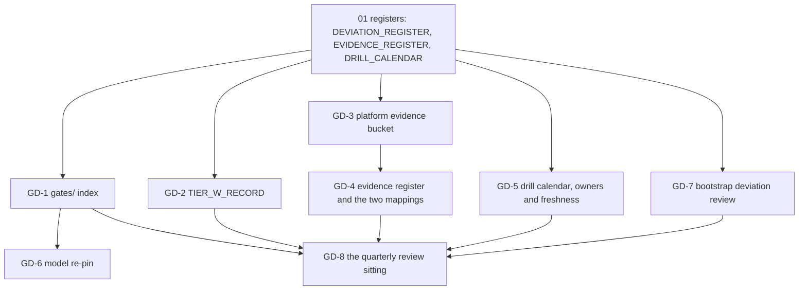

# 42. Gates, drills and the evidence register

## Status

- Owner: the platform owner
- Last reviewed: 2026-09-15
- Part 42 of the setup set. Entry point: [README.md](README.md). Conventions, helpers and the
  step format: [01-prerequisites-and-conventions.md](01-prerequisites-and-conventions.md).
- What this part is: the **standing** half of the set. Files 01 to 41 each produce gate lines,
  evidence records, drill rows and bootstrap deviations as a side effect of building something.
  This file is where those four things are consolidated, given a home that outlives the build,
  given a freshness rule, and reviewed on a calendar. It builds one gate index, one evidence
  bucket, one evidence register with its two compliance mappings, one drill calendar with owners
  and last results, the model re-pin procedure and the quarterly review sitting.
- **No earlier file waits on this one.** Every register it consolidates is created in
  [01](01-prerequisites-and-conventions.md) (`DEVIATION_REGISTER`, `EVIDENCE_REGISTER`,
  `DRILL_CALENDAR`) precisely so that 02 to 41 can append without a forward dependency. The only
  thing 42 hands backwards is a **path**: `gates/` in the platform repository, which
  [15](15-pager-siem-and-detections.md) PS-8.10 and [38](38-super-admin-gate-and-grant.md)
  already name as "as 42 keeps it".
- Two consequences of that rule, stated here because a first reading suggests the opposite:
  - **`TIER_W_RECORD` is not a grant-day input.** [38](38-super-admin-gate-and-grant.md) §3's
    G19 row cites `RESTORE_DRILL_RECORD`, `BINAUTHZ_ATTESTOR`, `SA_VALIDATOR_CUSTODIAN` and
    `people.yaml` from [11](11-keys-and-validator-custodian.md), [03](03-decisions-and-people.md),
    [10](10-core-projects-and-ci-identities.md),
    [33](33-wall-e-action-services-and-approval-surfaces.md) and
    [37](37-wall-e-sandbox-rehearsal.md), and 38 can parse them without this file. What GD-2
    writes is the **standing** Tier W gate record: the same rows, collected once, dated and
    signed, so that **every promotion after the grant** reads one record instead of re-walking
    five files. If GD-2's sitting happens to have run before the gate day, 38's G19 parse may
    cite `TIER_W_RECORD` as the single consolidating record; if it has not, 38 cites its five
    records and is not blocked. Neither reading waits on the other. GD-2.3 corrects README §7's
    "Closed in" cell, which today reads as if 38 waited on 42.
  - **The platform evidence bucket is created here, so the copy is a back-fill.**
    [01](01-prerequisites-and-conventions.md) §7.1, README §4 and `EVIDENCE_REGISTER`'s
    "Copied to evidence bucket" column all say the copy happens "after 14"; no file between 14
    and 41 makes an object store, so that column is empty for every record made before GD-3.1.
    GD-3.4 copies the whole backlog, in the form the register itself prescribes ("a copy made
    later is a new row with the same record id and the copy columns filled"), and GD-3.6 amends
    01 §7.1 and README §4 and §9 to say so. Until GD-3.1 has run, an empty copy column is
    **correct**, not a missed step, and no earlier file is at fault for it.
- Applies decisions: SD-01 (hand work as a dated deviation, superseded by the factory), SD-09
  (the model pin and the 90-day retirement refusal), SD-27 (paper custody plus a same-day scan),
  SD-36 (the enforceable gate; the signed manual parse while CI does not exist), SD-38 (where
  evidence lives), P11, P13 (retention), P102 (tabletop cadence), P130 (the stage snapshot tag).
- Closes review findings **S052** (the K7 recurrence and its gate row), **S067** (evidence with
  a defined home and an E-xx and TISAX id), **S085** (the Tier W gate record, which no other
  file owns), **S126** (the standing production K2 drill, reversibly) and **S127** (the standing
  production K4 restore, on both services). Detail in [§9](#9-findings-this-file-closes).
- Not copied from the superseded runbooks: "build log" as a place name with no path (S067);
  a drill list that stops at K6 (S052); `detach` as the K2 drill (S126); a K4 restore that names
  one service (S127); a gate checklist that reads only the TISAX §6.3 rows (S085); drill records
  kept only in a wiki page, which nothing can read at promotion time.
- Produces: `GATES_DIR`, `TIER_W_RECORD`, `PLATFORM_EVIDENCE_BUCKET`, `RECORD_RETENTION_DAYS`,
  `EVIDENCE_PACK_DIR`, `REVIEW_RECORD_DIR`. These six names are new and are handed to README's
  variable list; the set's plan allots 42 no variables because its scope was written before the
  platform evidence bucket was found to have no creating file (see
  [§3.1](#31-a-gap-this-file-closes)).
- Consumes: every file's EVIDENCE lines; `DEVIATION_REGISTER`, `EVIDENCE_REGISTER`,
  `DRILL_CALENDAR`, `checkpoints.tsv`, `rerun-index.tsv` ([01](01-prerequisites-and-conventions.md));
  `TIER_R_RECORD` ([17](17-factory-module-equivalents-and-tier-r-gate.md)); `TIER_C_RECORD`
  ([20](20-gemini-enterprise-gateway-and-tier-c-gate.md)); `GATE_CHECKLIST_RECORD`,
  `GRANT_RECORD`, `TABLETOP_RECORD` ([38](38-super-admin-gate-and-grant.md)); `STAGE0_RECORD`
  ([39](39-wall-e-stage-0.md)); the drill records of [18](18-model-armor-floor-spikes-and-kill-switch.md),
  [28](28-eve-independent-proof-and-sandbox-drills.md) and [37](37-wall-e-sandbox-rehearsal.md).

---

## 0. What this part builds, and what must be true first

### 0.1 In one paragraph

Six things. **One gate index** in the platform repository, holding the Tier C, Tier R, Tier W,
P-SA and Stage 0 records with the evidence each cites and the age at which each line goes stale.
**One standing Tier W gate record**, written here because no file owns the Tier W line as a
line — 38 parses its five sources for the grant day, and every promotion after it reads this
record instead (S085). **One platform evidence bucket**, created here because 01 §7.1 and
README §4 both promise one "after 14" and no file makes it, which makes the copy a back-fill
and GD-3.6 the step that says so on the pages that promise it (S067). **One evidence register**, every row
carrying an EU AI Act E-xx id and a TISAX control id, with the two export shapes an assessor
asks for. **One drill calendar**, every row with an owner, a cadence, a last result and a next
due date, including the K7 recurrence the review found missing (S052) and the corrected K2 and
K4 production procedures (S126, S127). **One quarterly review sitting** that walks all five and
the bootstrap deviation register, and either closes a deviation or re-dates it in writing.



### 0.2 Preconditions

This part is opened in **three** sittings, far apart, and then quarterly. The split is by what
each section needs, not by convenience.

| Sitting | Sections | Opens when | Why not earlier or later |
|---|---|---|---|
| **A — the home** | §1, §3, §4 | [14](14-central-logging-and-billing-export.md) is done | The evidence backlog is already large by then and reconstructing it later is exactly what an AL3 assessor rejects (S067). Nothing in §1, §3 or §4 needs a gate record to exist |
| **B — the Tier W record** | §2 | [37](37-wall-e-sandbox-rehearsal.md) is done, so every row of GD-2.1 has a record | Its ten inputs come from 03, 10, 11, 16, 18, 28 and 37, all of which precede [38](38-super-admin-gate-and-grant.md). Run it in the week before 38's gate day if the diary allows, so the G19 parse has one record to cite instead of five; run it immediately after the grant if it does not. **38 is not blocked either way** (see §Status and §2.1) |
| **C — the standing half** | §5 to §8 | [38](38-super-admin-gate-and-grant.md) is signed | §5's cadences are production cadences and §8's agenda reads §5's results |

Sitting A:

- [ ] [01](01-prerequisites-and-conventions.md) complete: `~/.platform-env` holds
      `BUILD_LOG_DIR`, `PLATFORM_REPO_DIR`, `EVIDENCE_INTERIM_LOCATION`, `DEVIATION_REGISTER`,
      `EVIDENCE_REGISTER`, `DRILL_CALENDAR`, `REGION`; `penv_guard` is silent.
- [ ] [03](03-decisions-and-people.md) DC-5.1: the NAMES record **amended** with the platform
      evidence bucket's name (GD-3.1 is **IRREVERSIBLE** as a name and refuses to run without
      it). `SECURITY_REVIEWER_EMAIL`, `SECOND_HUMAN_EMAIL` and `INCIDENT_COMMANDER_EMAIL` set.
- [ ] [03](03-decisions-and-people.md) DC-4.8: **P13 signed**, and its record **amended with a
      `RECORD_RETENTION_DAYS` value for the `record` class**. DC-4.8 as written extracts only
      `EVIDENCE_RETENTION_DAYS` and `IDENTITY_RETENTION_DAYS`, which are *log* bucket values;
      no file in the set yet asks P13 for the record class. GD-3.1 reads it with
      `tools/decision-value.sh P13 RECORD_RETENTION_DAYS` and **stops** when the key is absent
      or not an integer. Precondition check, before the sitting:
      `"$PLATFORM_REPO_DIR/tools/decision-need.sh" P13` prints `SIGNED` **and**
      `"$PLATFORM_REPO_DIR/tools/decision-value.sh" P13 RECORD_RETENTION_DAYS` prints digits.
- [ ] [10](10-core-projects-and-ci-identities.md): `LOGGING_PROJECT` exists and is billed.
- [ ] [11](11-keys-and-validator-custodian.md) KV-2.2: `KEY_PLATFORM_LOGS` exists in
      `KR_LOGGING` and is the **full resource name**
      `projects/<KMS_PROJECT>/locations/europe-west1/keyRings/logging/cryptoKeys/platform-logs-europe-west1`
      (KV-2.2 sets it that way; GD-3.1 asserts the shape before using it unscoped).
- [ ] [12](12-privileged-access-catalogue.md): `ENT_PROJECT_REPAIR_CORE` exists, because every
      IAM change in `LOGGING_PROJECT` from here on is made through it, not standing.
- [ ] [14](14-central-logging-and-billing-export.md) complete through CL-10.3, so the log
      buckets, their retention and their locks are already recorded and this file only copies
      records. CL-2.5's reading of what a locked bucket still allows is the rehearsal for GD-3.2.
- [ ] `GRP_PLATFORM_OWNERS` and `GRP_PLATFORM_SECURITY` exist
      ([06](06-organisation-bootstrap-and-roster.md) OB-5.2).

Sitting B adds:

- [ ] The ten rows of [GD-2.1](#gd-21-collect-the-tier-w-rows) each have a record: 03, 10, 11,
      16 RG-10.1, 09 FS-4.1, 17 FM-2.7, 18 KS-7, 28 and 37 all have a `DONE` checkpoint.
- [ ] `TIER_R_RECORD` ([17](17-factory-module-equivalents-and-tier-r-gate.md)) and
      `TIER_C_RECORD` ([20](20-gemini-enterprise-gateway-and-tier-c-gate.md)) exist and parse,
      so GD-1.4 can file them beside the Tier W record.

Sitting C adds:

- [ ] `GATE_CHECKLIST_RECORD`, `GRANT_RECORD`, `TABLETOP_RECORD`
      ([38](38-super-admin-gate-and-grant.md)) and `STAGE0_RECORD`
      ([39](39-wall-e-stage-0.md)) exist.
- [ ] The witness holds its `drills/`, `custody/` and `rota/` backlog
      ([08](08-witness-organisation.md) WO-3.3, repeatable).

GD-1.4 and GD-3.4 are **repeatable**: they are run once at their own sitting and again at each
later sitting for the records made since.

### 0.3 People

| Role | What they do here | Steps |
|---|---|---|
| Platform owner | Keeps the file. Creates the bucket and the index, consolidates the registers, chairs nothing — he is a participant in the review, not its chair. **Can add a record to the evidence bucket and cannot read one back, list the store or overwrite anything** (GD-3.3), which is the control that makes his own copies checkable by someone else | GD-1 to GD-7 |
| Security reviewer (`SECURITY_REVIEWER_EMAIL`) | **Chairs the quarterly review.** Signs `TIER_W_RECORD`, the deviation closures and the quarterly record. Owns the judgement on whether a stale line is a finding or an acceptance. **Runs every check on the evidence bucket that needs a read**, because the platform owner's binding cannot list or get an object (GD-3.3) | GD-2.3, GD-3.4 (VERIFY), GD-7.3, GD-8.2 |
| Second human (`SECOND_HUMAN_EMAIL`) | **Owns the Eve proof rows** (DR-28-1 to DR-28-3). Countersigns the evidence bucket's lock. Copies the scans and signed documents into the evidence bucket, and the custody, rota and drill scans a witness administrator hands her, under `GRP_PLATFORM_SECURITY`'s objectCreator binding. Is the only person who may record a blind-proof result | GD-3.2, GD-3.4, GD-3.5, GD-5.6, GD-5.7 |
| Witness administrators | Own the witness records: the `drills/`, `custody/` and `rota/` prefixes, the quarterly separation re-check and the recovery-design review. **Hold no role in the tenant, including none on the platform evidence bucket**; the evidence-bucket copy of a custody record is made by the second human from the scan they hand her | GD-3.3 (by absence), GD-4.5, GD-5.7, GD-8.3 |
| Incident commander (`INCIDENT_COMMANDER_EMAIL`) | Runs the tabletop and signs its record; owns the SIEM fixture replay row jointly with IT security. Holds the only **individual** binding on the evidence bucket, because the records he writes are his and he is in neither platform group | GD-3.3, GD-5.10, GD-5.11 |
| ISMS | Receives the TISAX §13 evidence pack; holds training and competence records the register points at | GD-4.4 |
| Billing administrator | Nothing here. Named only so that the quarterly review's cost line has an owner | — |

*Assumption:* the AI compliance owner named by [10-eu-ai-act.md](../10-eu-ai-act.md) §4.1 is the
security reviewer until [03](03-decisions-and-people.md) names someone else. Every step that
says "AI compliance owner" reads that name from `people.yaml`, never from this page.

---

## 1. The gate index

### 1.1 Why a directory and not a page

A gate line is read twice: once by a human at a sitting, and once by CI at a promotion. A wiki
page serves the first and not the second. [15](15-pager-siem-and-detections.md) PS-8.10 and
[38](38-super-admin-gate-and-grant.md) already write their records into `gates/` in the platform
repository on the strength of this file keeping it, so `gates/` is the home, under the same
two-reviewer branch protection as the register, and this page is its description.

### GD-1.1 Create `gates/`, its index and its record schema

- **WHO:** Platform owner. The security reviewer is a required reviewer on the merge (CODEOWNERS).
- **WHERE:** Shell, `~/.platform-env` sourced, in `PLATFORM_REPO_DIR`.
- **ACTION:**

```bash
need PLATFORM_REPO_DIR BUILD_LOG_DIR
mkdir -p "$PLATFORM_REPO_DIR/gates"
penv_set GATES_DIR "gates"
cat > "$PLATFORM_REPO_DIR/gates/README.md" <<'GATES'
# Gate records

One file per gate line, named `<gate-id>-<YYYY-MM-DD>.md`, never overwritten; a re-verification
is a new file with a later date and a `supersedes:` line. The index below is generated by
`tools/gate-index.sh` and is the only summary; a gate is green when its newest file is signed,
dated and inside its freshness window (see `freshness.tsv`).

A gate whose window is `commit` is green only against **one** deployed commit. Its record must
carry a `commit:` field holding that commit; the generator compares it with the commit passed on
the command line and prints `RED` on a mismatch, `MISSING` when the field is absent.

Gate ids: TIER-C, TIER-R, TIER-W, G1..G21 (the P-SA checklist), G-1..G-7 (the Eve-H lines),
STAGE-0.
GATES
cat > "$PLATFORM_REPO_DIR/gates/record.template.md" <<'TPL'
---
gate: <gate id>
date: <YYYY-MM-DD>
verified_by: <email>
countersigned_by: <email or ->
supersedes: <file name or ->
freshness_days: <integer, none, or commit>
commit: <the deployed commit this record was verified against, or ->
evidence:
  - record_id: <date>-<step>-<slug>-v<n>
    location: <location form of EVIDENCE_REGISTER>
    e_id: <E-xx or ->
    tisax: <control id or ->
result: PASS | FAIL | PASS-WITH-ACTION
actions:
  - what: <text>
    owner: <email>
    due: <YYYY-MM-DD>
---

## What was checked

## What was seen

## Why this is the evidence and not a statement
TPL
git -C "$PLATFORM_REPO_DIR" add gates
git -C "$PLATFORM_REPO_DIR" commit -m "gates: directory, index README and record template (setup 42 GD-1.1)"
checkpoint GD-1.1 DONE - "repo:gates/README.md"
```

- **VERIFY:** `ls "$PLATFORM_REPO_DIR/gates"` lists both files; the pull request carries the
  security reviewer's approval and a second human reviewer's; `git -C "$PLATFORM_REPO_DIR" log
  --oneline -- gates` shows the merge, not a direct push to `main`.
- **ROLLBACK:** Revert the merge commit. Nothing reads `gates/` until GD-1.3.
- **EVIDENCE:** `evidence_add GD-1.1 gates-directory E-05 1.1.1 "repo:gates/README.md@<commit>"`.

### GD-1.2 The freshness table

- **WHO:** Platform owner writes it; the security reviewer signs it.
- **WHERE:** `PLATFORM_REPO_DIR`, merged by pull request.
- **ACTION:** [38](38-super-admin-gate-and-grant.md) §4 already fixes six freshness rules for the
  grant day. They are re-stated here as a machine-readable file because after the grant they
  apply at **every** promotion, not once. A gate with no window is green until something changes
  it; a gate with a numeric window goes amber at 80 % of the window and red past it.

  **`commit` is not a time window.** G10 and G14 are green only against the deployed
  `WALLE_CODE_COMMIT`, and age says nothing about that: a record written this morning against a
  superseded commit is red, and one written six months ago against the still-deployed commit is
  green. GD-1.3's generator therefore takes the deployed commit as its second argument and
  compares it with the record's `commit:` field; run without that argument it prints **AMBER**
  for every `commit` row, which is the instruction to the reviewer to make the comparison by
  hand and write the result into the sitting's note. Nothing prints `GREEN` for a `commit` row
  on age alone — the defect that let a record citing a superseded commit read green.

```bash
need PLATFORM_REPO_DIR GATES_DIR
cat > "$PLATFORM_REPO_DIR/$GATES_DIR/freshness.tsv" <<'FRESH'
gate	freshness_days	why	source
TIER-R	none	Structural: the factory, folder baseline, central logging and shared registry either exist or do not	01-hld §0.4 R line
TIER-C	none	Structural; the dry-run review that feeds it has its own row (DR-20-1)	20 GG-8.2
TIER-W	none	Structural, except the restore-drill line, which carries its own window below	01-hld §0.4 W line
G2	90	Detection rules drift with the platform; the fixture pass must be on the current export	38 §4
G8	none	Read on the day: no open critical or high finding, not the report date	38 §4
G10	commit	The denial suite must have run against the deployed WALLE_CODE_COMMIT; the record's commit: field is compared with the deployed commit, and AMBER means the comparison was not made	38 §4
G11	30	K6 proves rota reachability, and a rota changes	38 §4; SETUP §5
G14	commit	Same commit rule as G10; same comparison and same AMBER	38 §4
G17	90	Tabletop quarterly (P102)	07 §13
G19-restore	180	A restore drill older than half a year proves a procedure, not a system	02 W8; §5.9 below
G20	30	CI refuses any P-SA promotion citing a K7 drill older than 30 days	04 §9.6
G1	1	Eve must have produced a heartbeat within the last hour and no unexplained witness alarm	38 §4
G-1	none	Structural: the second human named and in place
G-2	90	The withheld-push alarm is the only proof the witness is not decorative
G-3	180	The role and scope set are re-read half-yearly (24 EW-10.1)
G-4	30	The blind proof is monthly (DR-28-1)
G-5	30	With DR-28-1
G-6	90	Route drill quarterly (DR-26-2)
G-7	90	The end-to-end sandbox exercise, with the tabletop
STAGE-0	none	A stage record is a point in time; a later stage supersedes it
FRESH
git -C "$PLATFORM_REPO_DIR" add "$GATES_DIR/freshness.tsv"
git -C "$PLATFORM_REPO_DIR" commit -m "gates: freshness windows (setup 42 GD-1.2)"
checkpoint GD-1.2 DONE "$SECURITY_REVIEWER_EMAIL" "repo:gates/freshness.tsv"
```

- **VERIFY:** `awk -F'\t' 'NR>1 && NF<3 {print "BAD ROW " NR}' "$PLATFORM_REPO_DIR/$GATES_DIR/freshness.tsv"`
  prints nothing. Every id in the file appears in [38](38-super-admin-gate-and-grant.md) §3's
  table or in §1.1 above; `comm` the two lists and show no id only in one.
- **ROLLBACK:** Revert the merge; §4's windows in 38 still stand for the grant day.
- **EVIDENCE:** `evidence_add GD-1.2 gate-freshness E-05 1.1.2 "repo:gates/freshness.tsv@<commit>"`.

### GD-1.3 The index generator and the first index

- **WHO:** Platform owner.
- **WHERE:** Shell in `PLATFORM_REPO_DIR`.
- **ACTION:** No CI exists to run this on a schedule (`B-03`); it is run by hand at each
  quarterly review and before every promotion sitting, and that is recorded as a `DEV` row in
  `DEVIATION_REGISTER` by GD-7.1.

```bash
need PLATFORM_REPO_DIR GATES_DIR
cat > "$PLATFORM_REPO_DIR/tools/gate-index.sh" <<'SH'
#!/bin/sh
# Prints one line per gate: id, newest record, date, result, age, verdict, note.
# usage: gate-index.sh <gates dir> [deployed commit]
# Without the deployed commit, a gate whose window is "commit" prints AMBER: age never
# decides it, and the comparison that does was not made.
set -eu
G="${1:?usage: gate-index.sh <gates dir> [deployed commit]}"
DEPLOYED="${2-}"
today=$(date -u +%s)
printf 'gate\trecord\tdate\tresult\tage_days\tverdict\tnote\n'
awk -F'\t' 'NR>1 {print $1"\t"$2}' "$G/freshness.tsv" | while IFS="$(printf '\t')" read -r gate window; do
  newest=$(ls -1 "$G"/"$gate"-*.md 2>/dev/null | sort | tail -n 1 || true)
  if [ -z "$newest" ]; then printf '%s\t-\t-\t-\t-\tMISSING\t-\n' "$gate"; continue; fi
  d=$(awk -F': *' '/^date:/{print $2; exit}' "$newest")
  r=$(awk -F': *' '/^result:/{print $2; exit}' "$newest")
  c=$(awk -F': *' '/^commit:/{print $2; exit}' "$newest")
  s=$(date -u -j -f %Y-%m-%d "$d" +%s 2>/dev/null || date -u -d "$d" +%s)
  age=$(( (today - s) / 86400 ))
  note=-
  case "$window" in
    none) v=$( [ "$r" = FAIL ] && echo RED || echo GREEN ) ;;
    commit)
      if [ "$r" = FAIL ]; then v=RED; note=result-fail
      elif [ -z "$c" ] || [ "$c" = "-" ]; then v=MISSING; note=no-commit-field
      elif [ -z "$DEPLOYED" ]; then v=AMBER; note="compare ${c} by hand"
      elif [ "$c" != "$DEPLOYED" ]; then v=RED; note="record ${c} deployed ${DEPLOYED}"
      else v=GREEN; note="$c"; fi ;;
    *) if [ "$r" = FAIL ]; then v=RED
       elif [ "$age" -gt "$window" ]; then v=RED
       elif [ "$age" -gt $(( window * 8 / 10 )) ]; then v=AMBER
       else v=GREEN; fi ;;
  esac
  printf '%s\t%s\t%s\t%s\t%s\t%s\t%s\n' "$gate" "$(basename "$newest")" "$d" "$r" "$age" "$v" "$note"
done
SH
chmod +x "$PLATFORM_REPO_DIR/tools/gate-index.sh"
"$PLATFORM_REPO_DIR/tools/gate-index.sh" "$PLATFORM_REPO_DIR/$GATES_DIR" "${WALLE_CODE_COMMIT-}" | tee "$BUILD_LOG_DIR/records/$(date -u +%F)-GD-1.3-gate-index-v1.tsv"
```

- **VERIFY:** The output has one row per row of `freshness.tsv`. Before any record exists every
  verdict is `MISSING`, which is the correct first reading and is kept as the baseline. The
  `date -u -j -f` form is the BSD one and the `date -u -d` fallback the GNU one, so the script
  runs on the operator's macOS workstation and in a Linux runner unchanged.

  **Prove the `commit` branch before anything relies on it**, because GD-5.2's G20 reading,
  GD-8.1's first agenda item and the S052 deferral all rest on this generator being what makes a
  gate mechanical. Write a throwaway `gates/G10-1970-01-01.md` carrying `result: PASS` and
  `commit: deadbeef`, then run the script four times and record the four verdicts: with
  `deadbeef` as the second argument → `GREEN`; with `cafe` → `RED`; with no second argument →
  `AMBER`; with the `commit:` line deleted → `MISSING`. Delete the throwaway afterwards.
  `WALLE_CODE_COMMIT` is set by
  [33](33-wall-e-action-services-and-approval-surfaces.md) WS-1.1, its single owner: until that
  file has run the expansion is empty, every `commit` row reads `AMBER`, and the reviewer makes
  the comparison by hand against the deployed revision and writes it into the sitting's note.
  **No `commit` row ever reads `GREEN` on age alone.**
- **ROLLBACK:** Delete the script; nothing depends on it yet.
- **EVIDENCE:** The first index as `<date>-GD-1.3-gate-index-v1`. E-xx: E-05. TISAX: 1.1.1, 1.5.1.

### GD-1.4 File the records that already exist

- **WHO:** Platform owner; the security reviewer checks each one against its producing step.
- **WHERE:** `PLATFORM_REPO_DIR/gates`.
- **ACTION:** Copy each existing gate record into `gates/` **under its gate id**, keeping the
  original where its producing file put it. A gate record is a pointer to evidence, never a copy
  of it.

| Gate | Record | Produced by | Filed as |
|---|---|---|---|
| TIER-R | `TIER_R_RECORD` | [17](17-factory-module-equivalents-and-tier-r-gate.md) FM-10 | `TIER-R-<date>.md` |
| TIER-C | `TIER_C_RECORD` | [20](20-gemini-enterprise-gateway-and-tier-c-gate.md) GG-8.2 | `TIER-C-<date>.md` |
| TIER-W | `TIER_W_RECORD` | **GD-2 of this file** | `TIER-W-<date>.md` |
| G2 | The G2 record | [15](15-pager-siem-and-detections.md) PS-8.10 | `G2-<date>.md` |
| G1..G21 | `GATE_CHECKLIST_RECORD` split per line | [38](38-super-admin-gate-and-grant.md) GT-3.5 | `G<n>-<date>.md` |
| G-1..G-7 | `EVE_H_LIVE_RECORD` and the per-line records | [28](28-eve-independent-proof-and-sandbox-drills.md) | `G-<n>-<date>.md` |
| STAGE-0 | `STAGE0_RECORD` | [39](39-wall-e-stage-0.md) | `STAGE-0-<date>.md` |

  Splitting `GATE_CHECKLIST_RECORD` into twenty-one files is deliberate: the checklist is signed
  once, but the lines expire at different rates (GD-1.2), and a single file cannot be half stale.
  The split files carry `supersedes: -` and cite the checklist record as their evidence row.

- **VERIFY:** `tools/gate-index.sh` prints no `MISSING` for any gate whose producing file has a
  `DONE` checkpoint. Any gate still `MISSING` is listed in the sitting's note with the file it
  waits on.
- **ROLLBACK:** Revert the merge; the original records are untouched.
- **EVIDENCE:** The merge commit; `evidence_add GD-1.4 gate-index-first-fill E-05 6.3 "repo:gates@<commit>"`.

---

## 2. The Tier W gate record (S085)

### 2.1 Why this record exists here

[01-hld.md](../01-hld.md) §0.4 sets three tier lines. R and C have a producing file each. The
**W line** — the autonomy contract, the platform verifier, the validator custodian, the nonprod
folder, one restore drill, the Binary Authorization pipeline, the second operator, the security
reviewer and the blind grader — has its items spread over
[03](03-decisions-and-people.md), [10](10-core-projects-and-ci-identities.md),
[11](11-keys-and-validator-custodian.md), [16](16-register-and-shared-registry.md),
[33](33-wall-e-action-services-and-approval-surfaces.md) and
[37](37-wall-e-sandbox-rehearsal.md), and no file collects them. The review found the
consequence: the P-SA grant can be signed G1 to G18 green while the W line is red, because the
old G list mapped one-to-one onto the TISAX §6.3 rows and those rows contain no W item (S085).

**Who writes it, and when — the circularity removed.** [38](38-super-admin-gate-and-grant.md)
§3's G19 row now exists and names its own sources (`RESTORE_DRILL_RECORD`, `BINAUTHZ_ATTESTOR`,
`SA_VALIDATOR_CUSTODIAN`, `people.yaml`, from 11, 03, 10, 33 and 37). 38 therefore closes the
grant day on its own parse and **does not wait on 42**. What GD-2 writes is the standing record:
the same ten rows, collected once, dated, signed by two people and filed under a gate id, so
that the *next* promotion — and the one after — reads one signed record with a freshness rule
rather than repeating a five-file walk that nobody will repeat faithfully. Sitting B runs it in
the week before the gate day when the diary allows, in which case 38's G19 parse cites it as its
single consolidating record; otherwise it runs immediately after the grant. GD-2.3 corrects
README §7's "Closed in" cell, which reads today as if 38 waited on rows 42 had not yet written.

*Correction carried from the review's verdict:* the platform verifier is **not** a Wall-E
artefact ([05-registry-and-autonomy-contract.md](../05-registry-and-autonomy-contract.md) P79
forbids a Tier P agent naming `platform-verifier`; Eve is Wall-E's verifier). G19 therefore
checks that the **platform's** W line is open, not that Wall-E has a verifier of its own.

### GD-2.1 Collect the Tier W rows

- **WHO:** Platform owner collects; the security reviewer verifies each cell independently.
- **WHERE:** Shell; the platform repository and the build log.
- **ACTION:** Fill one row per item. A cell is filled from a **record**, never from memory.

| W item | Evidence to cite | Producing step | Freshness |
|---|---|---|---|
| Autonomy contract exists and CI enforces it | `REGISTER_PATH`, `MANIFEST_SCHEMA_PATH`, the R-01 to R-12 rule outputs | [16](16-register-and-shared-registry.md) RG-10.1 | none |
| Platform verifier live (Eve-H) | `EVE_H_LIVE_RECORD` | [28](28-eve-independent-proof-and-sandbox-drills.md) | 1 day (G1) |
| Validator custodian named **with an identity** | `VALIDATOR_CUSTODIAN_EMAIL` in `people.yaml`; `SA_VALIDATOR_CUSTODIAN` | [03](03-decisions-and-people.md), [11](11-keys-and-validator-custodian.md) KV-6 | none |
| Nonprod folder exists per tier | `FLD_*_NONPROD` ids in `folders.yaml` | [09](09-folders-and-security-command-center.md) FS-4.1 | none |
| One restore drill done | `RESTORE_DRILL_RECORD` | [37](37-wall-e-sandbox-rehearsal.md) | 180 days |
| Binary Authorization pipeline live | `BINAUTHZ_ATTESTOR`, `KEY_BINAUTHZ`, one attested image | [11](11-keys-and-validator-custodian.md), [17](17-factory-module-equivalents-and-tier-r-gate.md) FM-2.7 | none |
| Second operator named | `SECOND_OPERATOR_EMAIL` in `people.yaml` | [03](03-decisions-and-people.md) | none |
| Security reviewer named | `SECURITY_REVIEWER_EMAIL` in `people.yaml` | [03](03-decisions-and-people.md) | none |
| Blind grader named | `BLIND_GRADER_EMAIL` in `people.yaml`; `ROLE_GRADER_INSERT` | [03](03-decisions-and-people.md), [11](11-keys-and-validator-custodian.md) | none |
| K7 drilled on every nonprod tier folder | `K7_PSA_DRILL_RECORD` and the four sibling records | [18](18-model-armor-floor-spikes-and-kill-switch.md) KS-7 | 30 days |

```bash
need PLATFORM_REPO_DIR GATES_DIR BUILD_LOG_DIR
for v in VALIDATOR_CUSTODIAN_EMAIL SECOND_OPERATOR_EMAIL SECURITY_REVIEWER_EMAIL BLIND_GRADER_EMAIL SA_VALIDATOR_CUSTODIAN BINAUTHZ_ATTESTOR RESTORE_DRILL_RECORD K7_PSA_DRILL_RECORD EVE_H_LIVE_RECORD; do
  need "$v" || echo "TIER W NOT OPEN: $v"
done
```

- **VERIFY:** The loop prints nothing. A printed name is a red W line and the record is written
  `result: FAIL` with that name in `actions`, never left unwritten — an absent record and a
  failing record are different states and the index must be able to tell them apart.
- **ROLLBACK:** None; a read.
- **EVIDENCE:** The loop output as `<date>-GD-2.1-tier-w-inputs-v1`. E-xx: E-05. TISAX: 6.3.

### GD-2.2 Write `TIER_W_RECORD`

- **WHO:** Platform owner writes; **the security reviewer and the ISMS both sign**, as they do
  for the P-SA checklist. Two signatures, because this record is the only thing standing between
  a red W line and a green grant.
- **WHERE:** `PLATFORM_REPO_DIR`, merged by pull request.
- **ACTION:**

```bash
need PLATFORM_REPO_DIR GATES_DIR
R="$GATES_DIR/TIER-W-$(date -u +%F).md"
cp "$PLATFORM_REPO_DIR/$GATES_DIR/record.template.md" "$PLATFORM_REPO_DIR/$R"
# fill: gate: TIER-W; one evidence entry per row of GD-2.1; result; freshness_days: none
penv_set TIER_W_RECORD "$R"
git -C "$PLATFORM_REPO_DIR" add "$R"
git -C "$PLATFORM_REPO_DIR" commit -m "gates: Tier W record (setup 42 GD-2.2; closes S085)"
checkpoint GD-2.2 DONE "$SECURITY_REVIEWER_EMAIL" "repo:$R"
```

- **VERIFY:** `need TIER_W_RECORD` returns 0; the file has ten `evidence:` entries, one per row
  of GD-2.1; `tools/gate-index.sh` prints `TIER-W … GREEN`; both signatures are in the merge.
  When Sitting B has run before the gate day, [38](38-super-admin-gate-and-grant.md) GT-3.4's
  G19 line resolves to this path; when it has not, G19 resolves to 38's own five records and
  `tools/gate-index.sh` prints `TIER-W … MISSING` until this step runs, which is the honest
  reading and not a gate failure.
- **ROLLBACK:** Revert the merge. `TIER-W` returns to `MISSING` in the index, and every
  promotion **after** the grant re-walks the five source files until the record is rewritten.
  The grant itself is unaffected: it was signed on 38's parse.
- **EVIDENCE:** `evidence_add GD-2.2 tier-w-record E-05 6.3 "repo:$R@<commit>"`; copied to the
  witness with the other gate records at GD-4.5.

### GD-2.3 Hand G19 and G20 to the gate

- **WHO:** Platform owner; the security reviewer confirms.
- **WHERE:** README's re-run index and [38](38-super-admin-gate-and-grant.md)'s inputs.
- **ACTION:** Three edits to README, then one read of the register schema.

  1. Two lines in README §9's re-run index: "`TIER_W_RECORD` written or re-dated (42 GD-2.2) →
     re-read 38 GT-3.4 G19" and "a new K7 P-SA drill record (42 GD-5.2) → re-read 38 GT-3.4 G20".
  2. **Correct README §7's gate table.** Its G19 row reads "Tier W rows (G19) | rows in 42,
     parsed in 38", which asserts a dependency that does not exist and cannot: 38 runs first.
     It becomes "**grant day:** parsed in 38 from 11, 03, 10, 33, 37; **standing:** consolidated
     into `TIER_W_RECORD` by 42 GD-2.2 and read at every later promotion". README §3.1 item 9
     ("No earlier file waits on it") is then true as written and stays.
  3. Add `TIER_W_RECORD`, `GATES_DIR`, `PLATFORM_EVIDENCE_BUCKET`, `RECORD_RETENTION_DAYS`,
     `EVIDENCE_PACK_DIR` and `REVIEW_RECORD_DIR` to README §5's variable list, with 42 as the
     producing file.

  Then confirm that [16](16-register-and-shared-registry.md)'s schema treats G19 and G20 as two
  of the twenty-one `gate_checklist` lines, so an `env=prod` P-SA row cannot reach
  `privilege: super_admin` without them.

- **VERIFY:** `grep -c 'g19\|g20' "$PLATFORM_REPO_DIR/register/schema/"*.json` returns at least
  one match per id; `grep -n 'G19\|G20' README.md` finds the re-run lines and the corrected §7
  row; `grep -n 'rows in 42, parsed in 38' README.md` finds **nothing**;
  `grep -c 'TIER_W_RECORD\|PLATFORM_EVIDENCE_BUCKET' README.md` is at least 2.
- **ROLLBACK:** Revert the README edit; the gate's own text in 38 still names both G19 and G20,
  and the grant day is unaffected.
- **EVIDENCE:** The two commits. E-xx: E-05. TISAX: 6.3.

---

## 3. The platform evidence bucket

### 3.1 A gap this file closes

[01](01-prerequisites-and-conventions.md) §7.1 sends text records, scans and decision records to
"the platform evidence bucket, after 14". README §4 repeats it. [14](14-central-logging-and-billing-export.md)
creates `LOG_BUCKET_EVIDENCE` and `LOG_BUCKET_IDENTITY`, which are **Cloud Logging** buckets and
hold log entries, not files. No file in the set creates an object store for records. That is the
unrepaired half of S067: records made from day one would sit in a git repository and a shared
drive with no retention, no lock and no second copy, which is the state the review calls
reconstructed-afterwards. GD-3 creates it.

**So the copy is a back-fill, and the three pages that promise otherwise are corrected here.**
Between 14 and this sitting, twenty-eight files each write an EVIDENCE line saying the record is
copied to a bucket that does not exist, and `EVIDENCE_REGISTER`'s "Copied to evidence bucket"
column ([01](01-prerequisites-and-conventions.md) PR-4.2's row shape) cannot be filled for any
of them. Two facts follow and both are written down rather than left to be discovered at an
assessment. First, **an empty copy column on a record dated before GD-3.1 is correct**: the
reviewer checking that column reads it against GD-3.1's date, not against the record's date.
Second, **GD-3.4 is the back-fill** — it copies every record made since PR-1.1 — and **GD-3.6**
amends 01 §7.1, README §4 and README §9 to say so, so that the promise and the procedure agree.
The alternative — creating the bucket in [14](14-central-logging-and-billing-export.md), where
`LOGGING_PROJECT`, `KEY_PLATFORM_LOGS` and the second human for the lock are already in the room
— is the better shape and is recorded as an improvement for the next revision of the set; it is
not taken now because 14 is signed and a locked bucket is not a thing to add to a signed file
late. *Assumption:* the set is revised as a whole at the first quarterly review, which is where
that move belongs.

It lives in `LOGGING_PROJECT`, beside the log buckets, for one reason and against one cost.
**For:** the evidence stores belong together, and `LOGGING_PROJECT` already carries the
retention decision, the lock witness and the Data Access audit configuration.
**Against:** locking a retention policy "automatically applies a lien on the project"
(Cloud Storage Bucket Lock, read 2026-09-16), so `LOGGING_PROJECT` can no longer be deleted
while the bucket lives. That is written into the record as an accepted consequence, not
discovered later.

### GD-3.1 Create the bucket — **IRREVERSIBLE (the name and the location)**

- **WHO:** Platform owner under `ENT_PROJECT_REPAIR_CORE`.
- **WHERE:** Shell, `~/.platform-env` sourced.
- **Gated on:** the **NAMES amendment** signed in [03](03-decisions-and-people.md) DC-5.1 giving
  this bucket's name, and **P13** for `RECORD_RETENTION_DAYS`. A bucket name is global and
  permanent for the life of the bucket; a bucket's location cannot be changed after creation.
  Confirm before running: the amendment is merged; `EVIDENCE_RETENTION_DAYS` and
  `RECORD_RETENTION_DAYS` are integers, not `*tbd*`; `REGION` is `europe-west1`.
- **ACTION:**

```bash
checkpoint GD-3.1 START "$SECOND_HUMAN_EMAIL" - "create the platform evidence bucket"
need LOGGING_PROJECT REGION KEY_PLATFORM_LOGS PLATFORM_REPO_DIR
"$PLATFORM_REPO_DIR/tools/decision-need.sh" NAMES P13
case "$KEY_PLATFORM_LOGS" in projects/*/locations/*/keyRings/*/cryptoKeys/*) ;; *) echo "STOP: KEY_PLATFORM_LOGS is not a full resource name (11 KV-2.2)" >&2; false;; esac
RECORD_RETENTION_DAYS_READ=$("$PLATFORM_REPO_DIR/tools/decision-value.sh" P13 RECORD_RETENTION_DAYS)
case "$RECORD_RETENTION_DAYS_READ" in ''|*[!0-9]*) echo "STOP: P13 has no integer RECORD_RETENTION_DAYS; amend the record (03 DC-4.8) before this sitting" >&2; false;; esac
[ "$RECORD_RETENTION_DAYS_READ" -ge 400 ] && [ "$RECORD_RETENTION_DAYS_READ" -le 3650 ] || { echo "STOP: record value outside 400..3650" >&2; false; }
penv_set PLATFORM_EVIDENCE_BUCKET "gs://${LOGGING_PROJECT}-platform-evidence"
penv_set RECORD_RETENTION_DAYS "$RECORD_RETENTION_DAYS_READ"
SA_GCS=$(gcloud storage service-agent --project="$LOGGING_PROJECT")
gcloud kms keys add-iam-policy-binding "$KEY_PLATFORM_LOGS" --member="serviceAccount:${SA_GCS}" --role=roles/cloudkms.cryptoKeyEncrypterDecrypter
gcloud storage buckets create "$PLATFORM_EVIDENCE_BUCKET" --project="$LOGGING_PROJECT" --location="$REGION" --default-storage-class=STANDARD --uniform-bucket-level-access --public-access-prevention --default-encryption-key="$KEY_PLATFORM_LOGS" --soft-delete-duration=30d
gcloud storage buckets update "$PLATFORM_EVIDENCE_BUCKET" --versioning
checkpoint GD-3.1 DONE "$SECOND_HUMAN_EMAIL" - "$PLATFORM_EVIDENCE_BUCKET"
```

  Four things about that fence, each of which was wrong or missing in the first draft.
  **`checkpoint … START` is its first line**, so the two acts that precede the create — the
  variables and the KMS binding — are inside the checkpointed window rather than outside it.
  **`RECORD_RETENTION_DAYS` is read, never typed.** A literal placeholder assigned inside a
  runnable fence would be pasted straight through to GD-3.2's `--retention-period`, which is a
  value that cannot be reduced once locked; the `case` assertion refuses anything but digits and
  the range assertion refuses a number that is obviously not a ten-year record class. The same
  two assertions are repeated as the first lines of GD-3.2. **A printed `STOP:` ends the
  sitting.** As everywhere in this set (compare [14](14-central-logging-and-billing-export.md)
  CL-10.1), an assertion prints and returns non-zero rather than exiting the operator's shell,
  so the operator reads each line's output before pasting the next; the two steps of §3 are the
  two where that habit is the difference between a mistake and a permanent one. **The KMS call carries no
  `--keyring`, `--location` or `--project` on purpose, and the `case` above is what makes that
  safe.** [11](11-keys-and-validator-custodian.md) KV-2.2 sets `KEY_PLATFORM_LOGS` to the full
  resource name `projects/<KMS_PROJECT>/locations/europe-west1/keyRings/logging/cryptoKeys/platform-logs-europe-west1`,
  and the reference says the positional `KEY` may be "a fully qualified identifier", with
  `--keyring` and `--location` needed only when it is not — so the scope is in the value, and
  adding the flags as well risks a conflict rather than removing one. The `case` refuses any
  value that is not that shape, which is the only way this call can go to the wrong key. This is
  the one gcloud call in the file whose scope is carried by its argument instead of its flags,
  and it says so here so that the set's convention is not quietly broken.

  Flags read on 2026-09-16 from the `gcloud storage buckets create` reference: `--location`,
  `--default-storage-class`, `--uniform-bucket-level-access`, `--public-access-prevention`,
  `--default-encryption-key`, `--soft-delete-duration`, `--retention-period` and
  `--enable-per-object-retention`. **Versioning is not a create flag** and is set with
  `buckets update --versioning`, exactly as [10](10-core-projects-and-ci-identities.md) CP-3.1
  found for the state bucket. `--enable-per-object-retention` is **not** set: it cannot be
  disabled afterwards, and the bucket-level policy of GD-3.2 is the control this file needs.

  `RECORD_RETENTION_DAYS` is P13's `record` class, which
  [08-data-logging-retention-sovereignty.md](../08-data-logging-retention-sovereignty.md) R11 and
  [11-tisax.md](../11-tisax.md) §13 both put at ten years. The procedure takes the signed number,
  whatever it is, and `need` refuses `*tbd*`. It is set separately from
  `EVIDENCE_RETENTION_DAYS`, which is the **log** bucket value of
  [14](14-central-logging-and-billing-export.md): a log entry and a signed record are different
  classes and locking them to one number would either over-keep logs or under-keep records.

- **VERIFY:**

```bash
gcloud storage buckets describe "$PLATFORM_EVIDENCE_BUCKET" --format=yaml | tee "$BUILD_LOG_DIR/records/$(date -u +%F)-GD-3.1-evidence-bucket-v1.yaml"
gcloud storage buckets describe "$PLATFORM_EVIDENCE_BUCKET" --format="value(location,default_storage_class,uniform_bucket_level_access,public_access_prevention)"
```

  **The projection keys are snake_case.** `gcloud storage buckets describe` is the storage
  surface, whose resource keys are `location`, `default_storage_class`,
  `uniform_bucket_level_access`, `public_access_prevention`, `retention_policy` — the forms
  Google's own pages use (`--format="default(uniform_bucket_level_access)"`,
  `--format="default(public_access_prevention)"`, `--format="default(retention_policy)"`, all
  read 2026-09-16). A camelCase projection such as `uniformBucketLevelAccess.enabled` does not
  fail: it renders **empty**, and an empty column is indistinguishable from a control that is
  off. That is why the first line dumps the whole record and the second asserts only keys the
  documentation confirms.

  The second line prints `EUROPE-WEST1 STANDARD True enforced`. Read from the YAML dump, by eye
  and into the record: versioning is enabled, the default encryption key is `KEY_PLATFORM_LOGS`,
  and the soft-delete policy is 30 days. Their exact key names are read **from the dump** rather
  than asserted blind, because this file has not verified them against a documented example;
  write the three key names as they appear into the record, so the next sitting can assert them.
  Any location but `EUROPE-WEST1`: stop; a bucket's location cannot be changed, so it is deleted
  while empty and unlocked and re-created.

  **GD-3.2 does not run until this VERIFY has been recorded**, because the lock is irreversible
  and an unresolved projection is exactly how a bucket in the wrong location gets locked.
- **ROLLBACK:** `gcloud storage buckets delete "$PLATFORM_EVIDENCE_BUCKET"` **while it is empty
  and unlocked only**. After GD-3.2's lock, deletion is impossible until every object has met
  its retention period.
- **EVIDENCE:** The describe output as `<date>-GD-3.1-evidence-bucket-v1`, signed by the second
  human. E-xx: E-05. TISAX: 5.2.4, 8.1 (the store inventory row).

### GD-3.2 Set the retention period, then lock it — **IRREVERSIBLE**

- **WHO:** Platform owner runs; **the second human is present and countersigns**, as at
  [14](14-central-logging-and-billing-export.md) CL-10.2.
- **WHERE:** Shell.
- **Gated on:** `tools/decision-need.sh P13` prints `SIGNED` **and** the record carries an
  integer `RECORD_RETENTION_DAYS` for the `record` class; GD-3.1 has a `DONE` checkpoint and its
  VERIFY is recorded with the bucket's location read from a resolved projection; the four checks
  below are run and written into the record. The first two are asserted in the fence itself and
  the step refuses to continue without them.
- **ACTION:** Two steps on purpose. Set, read back, wait one sitting, then lock. A locked policy
  "cannot be removed from the bucket" and its period "cannot be decreased"
  (Use and lock retention policies, read 2026-09-16), and locking "automatically applies a lien
  on the project".

```bash
need PLATFORM_EVIDENCE_BUCKET RECORD_RETENTION_DAYS PLATFORM_REPO_DIR
case "$RECORD_RETENTION_DAYS" in ''|*[!0-9]*) echo "STOP: RECORD_RETENTION_DAYS is not an integer" >&2; false;; esac
[ "$RECORD_RETENTION_DAYS" = "$("$PLATFORM_REPO_DIR/tools/decision-value.sh" P13 RECORD_RETENTION_DAYS)" ] || { echo "STOP: the variable differs from the signed P13 value" >&2; false; }
gcloud storage buckets update "$PLATFORM_EVIDENCE_BUCKET" --retention-period="P${RECORD_RETENTION_DAYS}D"
gcloud storage buckets describe "$PLATFORM_EVIDENCE_BUCKET" --format="default(retention_policy)"
```

  `--retention-period` takes an ISO-8601 duration — the reference's own example is
  `--retention-period=P1Y1M1DT5S` — so `P${RECORD_RETENTION_DAYS}D` is the right shape and an
  unresolved placeholder would be sent verbatim to a bucket that is about to be locked. The two
  assertions above are the same two GD-3.1 ran, repeated here rather than trusted, because the
  variables file is edited between the two sittings and the second command cannot be undone.

  Then, **at a separate sitting**, after the four checks below are written into the record:

```bash
need PLATFORM_EVIDENCE_BUCKET RECORD_RETENTION_DAYS PLATFORM_REPO_DIR
case "$RECORD_RETENTION_DAYS" in ''|*[!0-9]*) echo "STOP: RECORD_RETENTION_DAYS is not an integer" >&2; false;; esac
"$PLATFORM_REPO_DIR/tools/decision-need.sh" P13
grep -q "GD-3.1.*DONE" "$BUILD_LOG_DIR/checkpoints.tsv" || { echo "STOP: GD-3.1 has no DONE line" >&2; false; }
gcloud storage buckets describe "$PLATFORM_EVIDENCE_BUCKET" --format="default(location,retention_policy)"
checkpoint GD-3.2 START "$SECOND_HUMAN_EMAIL" - "lock retention at ${RECORD_RETENTION_DAYS} days"
gcloud storage buckets update "$PLATFORM_EVIDENCE_BUCKET" --lock-retention-period
```

  The `describe` immediately before the lock is not decoration: it is the last chance to see the
  location and the period with resolved keys, and the second human reads both aloud before the
  next line is run.

  The four checks, each written into the record before the lock: (1) the value equals the signed
  P13 value for the `record` class; (2) no test object is in the bucket that would be held for
  ten years for nothing; (3) the project's deletion lien consequence is accepted in writing by
  the security reviewer; (4) the key `KEY_PLATFORM_LOGS` has no destroy scheduled — a destroyed
  key over a locked bucket makes objects that cannot be deleted and cannot be read, the failure
  [23](23-eve-project-and-evidence-stores.md) §3 names for Eve's bucket.

- **VERIFY:**

```bash
gcloud storage buckets describe "$PLATFORM_EVIDENCE_BUCKET" --format="default(retention_policy)" | tee "$BUILD_LOG_DIR/records/$(date -u +%F)-GD-3.2-evidence-bucket-locked-v1.txt"
gcloud storage buckets update "$PLATFORM_EVIDENCE_BUCKET" --retention-period=P1D 2>&1 | tee -a "$BUILD_LOG_DIR/records/$(date -u +%F)-GD-3.2-evidence-bucket-locked-v1.txt"
```

  The `retention_policy` block shows the policy **locked** and its period equal to
  `RECORD_RETENTION_DAYS × 86400` seconds. Read the two values out of the printed block rather
  than through a sub-key projection: `retention_policy` is the documented key
  (`--format="default(retention_policy)"`, read 2026-09-16) and its members render inside it,
  whereas a camelCase `retentionPolicy.isLocked` renders empty and an empty value reads as
  "not locked" to a tired reviewer. The second command must be **refused**; its error text is
  part of the record. A refusal that does not come is a failed control, not a lucky escape, and
  it means the lock did not take.
- **ROLLBACK:** **IRREVERSIBLE.** Nothing undoes a locked retention policy. Before running,
  confirm the four checks and the signed P13 record.
- **EVIDENCE:** Both describes and the refused change as `<date>-GD-3.2-evidence-bucket-locked-v1`,
  signed by both. E-xx: E-06. TISAX: 5.2.4.

### GD-3.3 Access: who writes, who reads, nobody deletes

- **WHO:** Platform owner under `ENT_PROJECT_REPAIR_CORE`; the security reviewer confirms the
  resulting policy.
- **WHERE:** Shell.
- **ACTION:** Four bindings and no fifth. Every principal named in GD-3.5's copy table appears
  here or is stated not to hold one, because a copy rule that names a writer with no binding is
  a rule nobody can follow.

| Principal | Role | Why |
|---|---|---|
| `GRP_PLATFORM_OWNERS` | `roles/storage.objectCreator` | May add a record; **cannot** overwrite, delete or read back, which is what makes "never overwritten" a control and not a habit. The role "does not give permission to view, delete, or overwrite objects" (IAM roles for Cloud Storage, read 2026-09-16) |
| `GRP_PLATFORM_SECURITY` | `roles/storage.objectViewer` | The security reviewer and the ISMS read the pack, and run every VERIFY in this file that needs `storage.objects.list` or `storage.objects.get` — which `objectCreator` does not carry |
| `GRP_PLATFORM_SECURITY` | `roles/storage.objectCreator` | The **second human** is in this group and writes the scans and signed documents of GD-3.5's second row. Reading and writing together is not a weakening: neither role carries `storage.objects.delete`, so she can no more remove or overwrite a record than the owner can |
| `user:${INCIDENT_COMMANDER_EMAIL}` | `roles/storage.objectCreator` | Writes the tabletop and incident records of GD-3.5's last row (GD-5.10). He is in neither group, so without this binding the row he owns cannot be performed |
| Witness administrators | **none, deliberately** | They write to `WITNESS_BUCKET` in the witness organisation and to nothing in the tenant. GD-3.5's third row is therefore performed by the **second human** from the scan a witness administrator hands her, which keeps `DR-42-1`'s separation ("no tenant principal holds a role in the witness organisation") symmetrical and keeps the witness copy the one the tenant cannot touch |
| `SA_EVE_EXPORT` | none | Eve exports to **its own** locked bucket and to the witness; it holds nothing here, so a compromised Eve cannot write the platform's record of itself |

```bash
need PLATFORM_EVIDENCE_BUCKET GRP_PLATFORM_OWNERS GRP_PLATFORM_SECURITY INCIDENT_COMMANDER_EMAIL
gcloud storage buckets add-iam-policy-binding "$PLATFORM_EVIDENCE_BUCKET" --member="group:${GRP_PLATFORM_OWNERS}" --role=roles/storage.objectCreator
gcloud storage buckets add-iam-policy-binding "$PLATFORM_EVIDENCE_BUCKET" --member="group:${GRP_PLATFORM_SECURITY}" --role=roles/storage.objectViewer
gcloud storage buckets add-iam-policy-binding "$PLATFORM_EVIDENCE_BUCKET" --member="group:${GRP_PLATFORM_SECURITY}" --role=roles/storage.objectCreator
gcloud storage buckets add-iam-policy-binding "$PLATFORM_EVIDENCE_BUCKET" --member="user:${INCIDENT_COMMANDER_EMAIL}" --role=roles/storage.objectCreator
gcloud storage buckets get-iam-policy "$PLATFORM_EVIDENCE_BUCKET" --format=json | tee "$BUILD_LOG_DIR/records/$(date -u +%F)-GD-3.3-evidence-bucket-iam-v1.json"
```

  Confirm before running that `SECOND_HUMAN_EMAIL` really is a member of `GRP_PLATFORM_SECURITY`
  ([06](06-organisation-bootstrap-and-roster.md) OB-5.2 puts her there as a control-group
  member): `gcloud identity groups memberships list --group-email="$GRP_PLATFORM_SECURITY"`
  lists her. If she is not, the third binding goes to `user:${SECOND_HUMAN_EMAIL}` instead and
  the reason is written into the record.

- **VERIFY:** The policy has exactly four bindings besides inherited project roles. No principal
  holds `roles/storage.admin`, `objectAdmin`, `legacyBucketOwner` or any role carrying
  `storage.objects.delete` at bucket level — that absence is what makes the store append-only.
  No `eve-*`, `mo-*` or `walle-*` service account appears, and no witness principal appears.
  Then prove the two halves of the owner's binding, as a member of `GRP_PLATFORM_OWNERS`:
  `gcloud storage cat` on a known object **fails** (no read-back), and a second
  `gcloud storage cp` of a file over an existing object **fails** (no overwrite). Both refusals
  go into the record; a refusal that does not come is a failed control.
- **ROLLBACK:** `remove-iam-policy-binding` with the same member and role.
- **EVIDENCE:** The policy JSON and the two refusals as `<date>-GD-3.3-evidence-bucket-iam-v1`.
  E-xx: none. TISAX: 4.1.3, 4.2.1.

### GD-3.4 Copy the backlog

- **WHO:** Platform owner copies text records; the **second human** copies the scans, because
  `EVIDENCE_INTERIM_LOCATION` is hers ([01](01-prerequisites-and-conventions.md) PR-4.4). **The
  VERIFY is run by a member of `GRP_PLATFORM_SECURITY`** — usually the security reviewer —
  because it lists and describes objects and the platform owner's `objectCreator` binding
  carries neither `storage.objects.list` nor `storage.objects.get` (GD-3.3).
- **WHERE:** Shell; the shared drive in a browser.
- **Repeatable.** Run once at Sitting A for everything made between PR-1.1 and that day, and
  again at Sitting B, Sitting C and each quarterly review for the records made since. The
  `already copied` skip below makes a re-run cheap and safe.
- **ACTION:** Every record made between PR-1.1 and today. The SHA-256 already in
  `EVIDENCE_REGISTER` is carried into the object's custom metadata so that a later copy can be
  checked without the register. Idempotency comes from the register, **not** from the bucket: a
  record already carrying a copy row is skipped without any call to Cloud Storage.

```bash
need PLATFORM_EVIDENCE_BUCKET BUILD_LOG_DIR EVIDENCE_REGISTER
cd "$BUILD_LOG_DIR"
L="$BUILD_LOG_DIR/records/$(date -u +%F)-GD-3.4-backlog-copy-v1.txt"
awk -F' *\\| *' '/^\| 20/ && $2 != "" {print $2"\t"$8"\t"$10}' "$EVIDENCE_REGISTER" | while IFS="$(printf '\t')" read -r rid sha copied; do
  case "$copied" in ''|'-') ;; *) echo "ALREADY COPIED $rid $copied"; continue;; esac
  f=$(ls -1 records/"$rid"* 2>/dev/null | head -n 1); [ -n "$f" ] || { echo "NO FILE $rid"; continue; }
  [ "$sha" = "-" ] || [ "$sha" = "$(shasum -a 256 "$f" | cut -d' ' -f1)" ] || { echo "SHA MISMATCH $rid"; continue; }
  obj="${PLATFORM_EVIDENCE_BUCKET}/records/${rid}$(echo "$f" | sed 's/.*\(\.[a-z]*\)$/\1/')"
  gcloud storage cp --custom-metadata="sha256=${sha},record_id=${rid}" "$f" "$obj" && printf 'COPIED\t%s\t%s\n' "$rid" "$obj"
done | tee "$L"
```

  Three corrections to the first draft, each of which made this fence unrunnable as written.

  **The SHA-256 is column 8, not column 7.** `EVIDENCE_REGISTER`'s row is
  `| Record id | Date | Step | E-xx | TISAX | Location | SHA-256 | Recorded by | Copied to
  evidence bucket | Copied to witness |` ([01](01-prerequisites-and-conventions.md) PR-4.2), so
  with `-F' *\\| *'` the record id is `$2`, the **location** `$7`, the **hash** `$8` and the copy
  column `$10`. The draft read `$7` into `sha`, which compared a location string with a hash and
  would have printed `SHA MISMATCH` for every row. The row filter is `/^\| 20/`, the same one
  GD-4.1 uses, rather than `NR>2`, so a header or a note line cannot become a record id.

  **`--no-clobber` is gone.** It has to know whether the destination object exists, which is
  `storage.objects.get`, and the platform owner holds `objectCreator` alone — the role that
  "does not give permission to view, delete, or overwrite objects". The skip is done from the
  register's copy column instead, which needs no permission on the bucket at all. Overwrite
  protection does not depend on the flag: `objectCreator` cannot overwrite a live object, so a
  stray second copy of the same record id **fails** rather than replacing anything, and that
  failure appears in `$L`.

  **`SHA MISMATCH` is a severity 2 finding**, not a retry — a record whose bytes changed after it
  was registered is either a correction that should have been `v<n+1>` or tampering. `NO FILE`
  is the same: the register cites a record nobody can produce.

  Then close the loop in the register, in the form the register itself prescribes ("a copy made
  later is a new row with the same record id and the copy columns filled"): for each `COPIED`
  line, append a row by hand with that record id, its original date, step, E-xx, TISAX, location
  and hash, and the object path in the "Copied to evidence bucket" column. `evidence_add` is not
  used for this — it mints a new `v<n>` id and writes `-` in both copy columns.

- **VERIFY:** Run by a member of `GRP_PLATFORM_SECURITY`:

```bash
gcloud storage ls "${PLATFORM_EVIDENCE_BUCKET}/records/" | wc -l
grep -c '^COPIED' "$L"; grep -c 'SHA MISMATCH\|NO FILE' "$L"
gcloud storage objects describe "${PLATFORM_EVIDENCE_BUCKET}/records/<one record id>.<ext>" --format=yaml
```

  The object count equals the number of register rows whose location begins `build-log:` and
  whose copy column is filled. The log contains no `SHA MISMATCH` and no `NO FILE`. Spot-check
  three objects: the `sha256` custom metadata equals the register's column for the same record
  id. The platform owner does **not** run these three commands and must not be given a role that
  would let him — if he can list the store he can tell which record is missing from it, which is
  the first move of quietly not copying one.
- **ROLLBACK:** None after the lock of GD-3.2 — an object cannot be deleted before its retention
  period. This is why the SHA check runs **before** the copy and not after.
- **EVIDENCE:** The copy log as `<date>-GD-3.4-backlog-copy-v1`, plus the security reviewer's
  three readings. E-xx: E-05. TISAX: 1.5.1, 5.2.4.

### GD-3.5 The standing copy rule

- **WHO:** Whoever made the record, the same day.
- **WHERE:** The step's own sitting.
- **ACTION:** From this step on, the record's copy is made the same day and the two trailing
  columns are filled. `evidence_add` writes `-` in both, so the filling is a **second row with
  the same record id and the copy columns filled**, appended by hand — the form
  [01](01-prerequisites-and-conventions.md) PR-4.2's register header already prescribes, because
  the register is never edited. The rule per kind is
  [01](01-prerequisites-and-conventions.md) §7.1's table, with two changes: "Platform evidence
  bucket" now names a real object store, and the third row's writer is corrected, because the
  witness administrators hold no binding on that bucket (GD-3.3) and are not going to be given
  one.

| Kind | Home | Copy | Who copies | Binding that lets them (GD-3.3) |
|---|---|---|---|---|
| Text records, exports, command outputs | build log `records/` | `${PLATFORM_EVIDENCE_BUCKET}/records/` same day | the step's operator | `GRP_PLATFORM_OWNERS` objectCreator |
| Scans, signed documents | `EVIDENCE_INTERIM_LOCATION` | `${PLATFORM_EVIDENCE_BUCKET}/records/` same day, PDF | the second human | `GRP_PLATFORM_SECURITY` objectCreator |
| Custody, rota, drill records | paper in the safe plus a same-day scan | `WITNESS_BUCKET` `custody/`, `rota/`, `drills/` by a witness administrator ([08](08-witness-organisation.md) WO-3.3); **and** the evidence bucket, from the scan she is handed | witness administrator for the witness copy; **the second human** for the evidence-bucket copy | `GRP_PLATFORM_SECURITY` objectCreator; the witness administrators deliberately hold none |
| Decision records | `decisions/` in the platform repository | `${PLATFORM_EVIDENCE_BUCKET}/decisions/` at each quarterly review | platform owner | `GRP_PLATFORM_OWNERS` objectCreator |
| Gate records | `gates/` in the platform repository | `${PLATFORM_EVIDENCE_BUCKET}/gates/` by the platform owner; the witness copy by a witness administrator (GD-4.5) | platform owner; witness administrator | `GRP_PLATFORM_OWNERS` objectCreator |
| Tabletop and incident records | the case system | `${PLATFORM_EVIDENCE_BUCKET}/evidence/incidents/`, `…/evidence/tabletops/<date>/` | incident commander | `user:${INCIDENT_COMMANDER_EMAIL}` objectCreator |

  A writer with no binding is a rule nobody can follow, so the last column is not decoration: at
  each quarterly review it is read against GD-3.3's policy JSON, and a row whose writer has lost
  a binding is a finding before it is a missing record.

- **VERIFY:** At the next quarterly review, over `EVIDENCE_REGISTER`, no record id **dated after
  GD-3.1's date** and more than seven days old lacks a copy row with the "Copied to evidence
  bucket" cell filled. A record that is legitimately not copied carries `n/a` **with a reason**
  in that cell, never blank. A record dated **before** GD-3.1 is out of this check's scope: it
  belongs to GD-3.4's back-fill, which the same sitting reads separately.

```bash
awk -F' *\\| *' -v cut="<GD-3.1's date>" '/^\| 20/ && $3 > cut {seen[$2]=1; if ($10 != "-" && $10 != "") done[$2]=1} END {for (r in seen) if (!(r in done)) print "UNCOPIED " r}' "$EVIDENCE_REGISTER"
```

- **ROLLBACK:** None; a rule.
- **EVIDENCE:** The amended §7.1 table committed with GD-3.6's merge, and the `UNCOPIED` output
  at each review. E-xx: E-05. TISAX: 1.5.1.

### GD-3.6 Correct the three pages that promise a copy this file only now makes

- **WHO:** Platform owner; the security reviewer approves the merge.
- **WHERE:** `PLATFORM_REPO_DIR`, merged by pull request, at the end of Sitting A.
- **ACTION:** Three edits, so that the promise and the procedure agree and an assessor reading
  01 does not conclude that twenty-eight files skipped a step.

  1. **[01](01-prerequisites-and-conventions.md) §7.1**, the "Platform evidence bucket | After
     14" row: it becomes "Created by 42 GD-3.1; every record made before that date is copied by
     42 GD-3.4 as a back-fill, and its copy row carries GD-3.4's date, not the record's".
  2. **README §4, "Evidence"**: "both are copied to the platform evidence bucket after 14"
     becomes "both are copied to the platform evidence bucket, which 42 GD-3.1 creates; records
     made before that date are back-filled by 42 GD-3.4".
  3. **README §9, the re-run index**: a new row, "the platform evidence bucket is created (42
     GD-3.1) → run 42 GD-3.4 for the whole backlog, then again at each later sitting for the
     records made since".

- **VERIFY:** `grep -n 'After 14' 01-prerequisites-and-conventions.md` and
  `grep -n 'copied to the platform evidence bucket after 14' README.md` both find **nothing**;
  `grep -c 'GD-3.4' README.md 01-prerequisites-and-conventions.md` is at least 1 in each. The
  merge carries the security reviewer's approval.
- **ROLLBACK:** Revert the merge. The bucket and the back-fill are unaffected; only the two
  pages go back to promising something no file does.
- **EVIDENCE:** The merge commit as `<date>-GD-3.6-evidence-home-corrections-v1`. E-xx: E-05.
  TISAX: 1.5.1.

---

## 4. The evidence register and its two mappings (S067)

### GD-4.1 Consolidate

- **WHO:** Platform owner.
- **WHERE:** Shell.
- **ACTION:** The register has been appended to by forty files. Consolidation is four checks, not
  a rewrite; the file is append-only and nothing here edits a row.

```bash
need EVIDENCE_REGISTER BUILD_LOG_DIR
R="$BUILD_LOG_DIR/records/$(date -u +%F)-GD-4.1-register-consolidation-v1.txt"
W=$(mktemp -d)
{
  echo "# rows"; grep -c '^| 20' "$EVIDENCE_REGISTER"
  echo "# duplicate record ids"; awk -F' *\\| *' '/^\| 20/{print $2}' "$EVIDENCE_REGISTER" | sort | uniq -d
  echo "# rows with no E-xx and no TISAX id"; awk -F' *\\| *' '/^\| 20/ && $5=="-" && $6=="-" {print $2}' "$EVIDENCE_REGISTER"
  echo "# rows with no SHA-256 and a file-shaped location"; awk -F' *\\| *' '/^\| 20/ && $8=="-" && $7 ~ /^(build-log|repo|bucket|witness):/ {print $2}' "$EVIDENCE_REGISTER"
  echo "# steps with a DONE checkpoint and no evidence row"
  awk -F'\t' '$3=="DONE"{print $2}' "$BUILD_LOG_DIR/checkpoints.tsv" | sort -u > "$W/steps.done"
  awk -F' *\\| *' '/^\| 20/{print $4}' "$EVIDENCE_REGISTER" | sort -u > "$W/steps.ev"
  comm -23 "$W/steps.done" "$W/steps.ev"
  echo "# steps whose newest checkpoint is BLOCKED or PENDING (not missing records)"
  awk -F'\t' '$3=="BLOCKED" || $3=="PENDING"{s[$2]=$3} END {for (k in s) print k"\t"s[k]}' "$BUILD_LOG_DIR/checkpoints.tsv" | sort
} | tee "$R"
rm -r "$W"
```

  Two corrections to the first draft of section 5. **The state column is filtered.**
  `checkpoints.tsv` is `utc_timestamp step_id status operator witness evidence note`
  ([01](01-prerequisites-and-conventions.md) PR-2.4), so `$2` is the step and `$3` the state.
  `cut -f2` took the step id from **every** row — `START`, `BLOCKED`, `PENDING`, `N/A` and
  `ROLLED-BACK` alike — so every correctly-BLOCKED step in the whole set was listed as a missing
  record, and the reviewer was told to open an action against a step that was rightly never run.
  The filter is `$3=="DONE"`, the same form [40](40-mo-after-stage-0.md) MA-12.1 already uses.
  **The two intermediate files are in the step's own `mktemp -d`**, not `/tmp/steps.done`, so two
  operators preparing the same review do not overwrite each other's halves and read the
  difference as a finding. Section 6 is new: it prints the BLOCKED and PENDING steps as their own
  list, so that the thing section 5 used to conflate is still visible — as a state, not as a gap.

- **VERIFY:** Sections 2, 3 and 4 are empty. Section 5 lists only steps whose EVIDENCE line says
  "none" on purpose (reads, N/A steps); every other name in it is a **missing record** and opens
  an action with an owner and a date in the quarterly record. Cross-read section 5 against
  section 6: a step appearing in both means a step that reached `DONE` after a `BLOCKED` and then
  produced no record, which is a missing record and not a blocked step. A duplicate record id is
  a versioning error: the later record should have been `v<n+1>`.
- **ROLLBACK:** None; reads only.
- **EVIDENCE:** `<date>-GD-4.1-register-consolidation-v1`. E-xx: E-05. TISAX: 1.5.1.

### GD-4.2 The EU AI Act mapping: every E-xx has a producer

- **WHO:** Platform owner; the AI compliance owner signs.
- **WHERE:** Shell and the wiki, read-only.
- **ACTION:** [10-eu-ai-act.md](../10-eu-ai-act.md) §5 lists E-01 to E-15 with a producer, a
  cadence and a retention. This step proves each has at least one **real** row, and names the
  step that produces it from now on.

| E-xx | What the setup set produces for it | Producing steps | Cadence after Stage 0 |
|---|---|---|---|
| E-01 | Art. 6(4) assessments per system | [03](03-decisions-and-people.md) DC-3 | annual; on each §3.1.6 trigger |
| E-02 | Art. 49 registration id and Annex VIII fields | [03](03-decisions-and-people.md); [16](16-register-and-shared-registry.md) register row | quarterly check (GD-8) |
| E-03 | Promotion records with the residual-risk statement | [38](38-super-admin-gate-and-grant.md), [39](39-wall-e-stage-0.md); every later promotion | per promotion |
| E-04 | Testing data and fixtures with the bias note | [22](22-mo-foundations.md) golden fixtures; [29](29-mo-eve-quality-pack.md) | per metric-pack version |
| E-05 | **Stage snapshot tag and bundle, Annex IV index** | GD-4.4 below; [39](39-wall-e-stage-0.md) | per stage |
| E-06 | Art. 12 logs, daily export with manifest, witness copy | [14](14-central-logging-and-billing-export.md), [26](26-eve-reporting-and-witness-export.md) | continuous |
| E-07 | Instructions for use; scorecard history | [03](03-decisions-and-people.md); [40](40-mo-after-stage-0.md) | per stage; daily |
| E-08 | **Drill records K0-K7, custody, oversight roster** | §5 of this file; [08](08-witness-organisation.md) | per drill |
| E-09 | Post-market monitoring artefacts | [40](40-mo-after-stage-0.md) | weekly, monthly |
| E-10 | Incidents, tabletops, Art. 73 assessments | GD-5.10; the case system | per case; quarterly |
| E-11 | Supplier file; **model pin documentation per `model_pin`** | [04](04-purchases-and-lead-times.md); §6 of this file | per pin; annual |
| E-12 | Worker information pack; D7 letter | [03](03-decisions-and-people.md) | before Stage 1; per request |
| E-13 | Art. 4 briefing content and attendance | [03](03-decisions-and-people.md); ISMS | per stage transition |
| E-14 | Only if `high_risk`: Annex VI record | not produced; the classification is not high-risk | on classification change |
| E-15 | Art. 50 blocks; CI content tests | [16](16-register-and-shared-registry.md); [33](33-wall-e-action-services-and-approval-surfaces.md) | per deploy |

```bash
for e in E-01 E-02 E-03 E-04 E-05 E-06 E-07 E-08 E-09 E-10 E-11 E-12 E-13 E-15; do
  printf '%s\t%s\n' "$e" "$(grep -c "| $e |" "$EVIDENCE_REGISTER")"
done
```

- **VERIFY:** Every id but E-14 has a count of at least 1. **A count of 0 for E-01, E-02, E-05,
  E-07, E-12 or E-13 blocks the stage it belongs to** — [10-eu-ai-act.md](../10-eu-ai-act.md) §5's
  own rule, applied here and not merely quoted. E-14's 0 is correct and is stated in the record
  with the classification that makes it so.
- **ROLLBACK:** None; a read and a signature.
- **EVIDENCE:** The counts and the table as `<date>-GD-4.2-eu-ai-act-mapping-v1`, signed by the
  AI compliance owner. E-xx: E-05. TISAX: 7.1.1.

### GD-4.3 The TISAX §13 pack

- **WHO:** Platform owner exports; ISMS receives.
- **WHERE:** Shell.
- **ACTION:** [11-tisax.md](../11-tisax.md) §13 lists what the assessor is handed per control
  group, "assembled from the evidence bucket and git by one export job the platform owner runs
  before the assessment and after every internal audit". That job does not exist
  (`B-03` family: no CI). It is run by hand, and that is a `DEV` row in `DEVIATION_REGISTER`.

```bash
need PLATFORM_EVIDENCE_BUCKET BUILD_LOG_DIR PLATFORM_REPO_DIR
penv_set EVIDENCE_PACK_DIR "$BUILD_LOG_DIR/packs"
D="$EVIDENCE_PACK_DIR/tisax-$(date -u +%F)"; mkdir -p "$D"
for g in 1.1 1.2 1.3 1.4 1.5 1.6 2.1 3.1 4.1 4.2 5.1 5.2 5.3 6.1 7.1; do
  mkdir -p "$D/$g"
  awk -F' *\\| *' -v g="$g" '/^\| 20/ && index($6, g)==1 {print $2"\t"$7}' "$EVIDENCE_REGISTER" > "$D/$g/index.tsv"
done
find "$D" -name index.tsv -size -2c -print   # groups with no evidence at all
```

- **VERIFY:** No group prints from the `find`. A group with an empty index is a gap in the
  mapping, not an empty control: every group of §13 has at least one artefact this set produces.
  Cross-check three groups by hand against §13's Artefacts column — 3.1 (hardware-key custody),
  4.1-4.2 (IAM exports and the roster) and 5.2 (drills, restore, penetration test) — and record
  the three readings.
- **ROLLBACK:** `rm -r "$D"`; the pack is derived, never a source.
- **EVIDENCE:** The pack's top-level index and the three hand cross-checks as
  `<date>-GD-4.3-tisax-pack-v1`. E-xx: none. TISAX: 1.1.1 (the pack itself), 1.5.1.

### GD-4.4 The stage snapshot tag, by hand (E-05) — **partly BLOCKED on `B-03`**

- **WHO:** Platform owner tags; the second human verifies the tag points at the merged commit.
- **WHERE:** `PLATFORM_REPO_DIR`.
- **ACTION:** [10-eu-ai-act.md](../10-eu-ai-act.md) §4.3 (P130) says CI tags
  `compliance/<agent>/S<n>/<date>` before a stage opens, and "no tag, and the stage does not
  open". The review found that nothing creates it and no hand build has CI (S067).

  > **BLOCKED** for the automatic half on `B-03` (the platform CI that tags and freezes the
  > Annex IV bundle does not exist). It needs: a workflow in the platform repository, running as
  > the `CICD_PROJECT` WIF identity, that on a stage-record merge creates an annotated tag and
  > writes the bundle manifest. Until it is committed, the tag is made by hand under this step
  > and recorded as a `DEV` row; the gate that waits is every stage opening after Stage 0.

```bash
need PLATFORM_REPO_DIR STAGE0_RECORD
STAGE_TAG="compliance/wall-e/S0/$(date -u +%F)"
STAGE_COMMIT=$(git -C "$PLATFORM_REPO_DIR" log -n 1 --format=%H -- "$STAGE0_RECORD")
case "$STAGE_COMMIT" in ''|*[!0-9a-f]*) echo "STOP: no merge commit found for $STAGE0_RECORD" >&2; false;; esac
git -C "$PLATFORM_REPO_DIR" tag -a "$STAGE_TAG" -m "Stage 0 snapshot; record: ${STAGE0_RECORD}; index: compliance/annex-iv/$(date -u +%F).md" "$STAGE_COMMIT"
git -C "$PLATFORM_REPO_DIR" push origin "$STAGE_TAG"
```

  The commit is **read** from the stage record's own history, not typed: a placeholder such as
  `<merged commit>` left in a runnable fence is either a shell error or, worse, a tag on the
  wrong commit, and this tag is what the next stage's opening is checked against.

  The Annex IV index beside it is a file, `compliance/annex-iv/<date>.md`, listing for each
  Annex IV heading the document or record that answers it and its path — the crosswalk of
  [10-eu-ai-act.md](../10-eu-ai-act.md) §4.3, filled with the real paths this set produced.

- **VERIFY:** `git tag --list 'compliance/*'` shows the tag; `git rev-list -n1 <tag>` equals the
  merge commit of the stage record; the Annex IV index has no heading whose path is `*tbd*`.
- **ROLLBACK:** `git tag -d` and a force-delete on the remote, **only** while the stage has not
  opened. A tag that a stage opened on is evidence and stays.
- **EVIDENCE:** The tag name and the index path as `<date>-GD-4.4-stage-tag-v1`; a `DEV` row in
  `DEVIATION_REGISTER` for the hand-made tag. E-xx: E-05. TISAX: 5.2.1.

### GD-4.5 The witness copy of the gate and drill records

- **WHO:** A witness administrator uploads; the other checks the manifest. The platform owner
  hands over files and nothing else.
- **WHERE:** The witness organisation ([08](08-witness-organisation.md) WO-3.3, repeatable).
- **ACTION:** Gate records, drill records, custody and rota records go to `WITNESS_BUCKET` under
  `drills/`, `custody/`, `rota/` and a new `gates/` prefix, the same day they are made. The
  platform owner **cannot** write there, by design: it is the copy he cannot quietly amend.
- **VERIFY:** `gcloud storage ls "${WITNESS_BUCKET}/gates/"` (run by a witness administrator)
  lists one object per file in `gates/`; the manifest's SHA-256 values match
  `EVIDENCE_REGISTER`'s column for the same record ids.
- **ROLLBACK:** None: the witness bucket's retention policy is locked
  ([08](08-witness-organisation.md) WO-2.17). A wrong upload is superseded by a `v<n+1>`, never
  deleted.
- **EVIDENCE:** The witness manifest as `<date>-GD-4.5-witness-gates-v1` in the witness.
  E-xx: E-08. TISAX: 1.5.1, 5.2.6.

---

## 5. The drill calendar

### 5.1 What the calendar is for

CI refuses a promotion citing a stale drill ([04-identity-and-privileged-access.md](../04-identity-and-privileged-access.md)
§9.6). That only works if the drill date is somewhere a machine can read it, which is why every
drill's date lands in `DRILL_CALENDAR` and in the register, and its record in the witness. A
drill that happened and was recorded only in a wiki page has not happened, for gate purposes.

### GD-5.1 Consolidate the calendar

- **WHO:** Platform owner.
- **WHERE:** Shell.
- **ACTION:** [01](01-prerequisites-and-conventions.md) PR-4.3 laid nine skeleton rows; files 15,
  16, 18, 19, 20, 26, 27, 28 and 37 appended their own. Consolidation fills the four columns the
  opening files could not: **owner today**, **last result**, **next due**, **the gate it feeds**.

```bash
need DRILL_CALENDAR
awk -F' *\\| *' '/^\| DR-/ { if ($9=="" || $9=="*tbd*") print $2" no next-due"; if ($8=="") print $2" no record yet" }' "$DRILL_CALENDAR"
grep -c '^| DR-' "$DRILL_CALENDAR"
```

- **VERIFY:** The count is at least 25 (`DR-06-1`, `DR-15-1` to `DR-15-3`, `DR-16-1`,
  `DR-18-1` to `DR-18-5`, `DR-19-1`, `DR-20-1`, `DR-20-2`, `DR-26-1` to `DR-26-3`, `DR-27-1`,
  `DR-28-1` to `DR-28-3`, `DR-37-1` to `DR-37-4`, `DR-38-1`, plus this file's `DR-42-*`). Every
  `no next-due` is either filled at this sitting or carries a reason and an owner.
- **ROLLBACK:** None; reads.
- **EVIDENCE:** The output as `<date>-GD-5.1-calendar-consolidation-v1`. E-xx: E-08. TISAX: 5.2.6.

### GD-5.2 K7, monthly, per nonprod tier folder (S052)

- **WHO:** Platform owner pulls; **the second human is present for every enforced drill**.
- **WHERE:** Shell, under `ENT_K7_HUMAN` or through the `k7-executor` job under `ENT_K7_EXECUTOR`.
- **ACTION:** [18](18-model-armor-floor-spikes-and-kill-switch.md) builds the job, the four
  committed lever files, the entitlements, `CANARY_R_PROJECT` and runs the first drill. The
  **recurrence** is this row, and it is what the review found absent everywhere (S052): the fleet
  kill switch is a Tier P precondition and the old gate list stopped at K6.

| Row | What | Cadence | Feeds |
|---|---|---|---|
| `DR-18-1` | Job path, dry run then enforced, on **each** nonprod tier folder including `fld-agents-p-sa-nonprod`; lever times recorded per [04](../04-identity-and-privileged-access.md) §9.6 | **monthly** | **G20** (younger than 30 days at any P-SA promotion) |
| `DR-18-2` | Human path from a managed device: the `ent-k7-human` pair and the `k7/` files applied by hand, under 15 minutes | quarterly | 04 §9.6 |
| `DR-18-3` | SIEM path: a synthetic severity-1 event reaches the job, under 10 minutes | quarterly, with the tabletop | 07 §6.5 |
| `DR-18-4` | `KF-3` alone in production on `fld-agents-r-prod`, in a change window, no run lost | quarterly | 04 §9.6 |
| `DR-18-5` | `KF-1` in production on `fld-agents-r-prod`, dry run then five minutes enforced, announced | semi-annual; **never on P-SA production** | 04 §9.6 |

  Two standing rules. **Pull K4 before K7** on Wall-E's services: `KF-1` refuses every Cloud Run
  invocation in the folder, so after K7 the K4 endpoint is unreachable. And **`CANARY_R_PROJECT`
  is not retired** while `DR-18-1` runs: [17](17-factory-module-equivalents-and-tier-r-gate.md)'s
  `FM-REVOKE` names it as the first expected use, and the quarterly review decides that, not a
  tidy-up.

- **VERIFY:** `tools/gate-index.sh` prints `G20 … GREEN` with an age under 30. The lever times
  in the newest `DR-18-1` record meet §9.6's pass criteria (`KF-1` under 60 s, end to end under
  5 minutes). A month with no record is a **red G20**, which stops every P-SA promotion; that is
  the control working, and the review record says so rather than back-dating.
- **ROLLBACK:** Each lever's own rollback, in [18](18-model-armor-floor-spikes-and-kill-switch.md)
  KS-6. The drill is not finished until the folder is proven back to normal.
- **EVIDENCE:** `K7_PSA_DRILL_RECORD` and the four siblings, in the witness `drills/`.
  E-xx: E-08. TISAX: 5.2.6.

### GD-5.3 K0 to K3 in production, monthly

- **WHO:** Platform owner; anyone may pull K0 and K1 (the andon cord) without approval; K3 opens
  an incident.
- **WHERE:** Production, announced to `WALLE_OPERATORS_GROUP` first.
- **ACTION:** The cadence table, reconciled across [01-hld.md](../01-hld.md) §11.2,
  [wall-e/02-identity-and-auth.md](../../wall-e/02-identity-and-auth.md) and the twin rehearsal:

| Switch | Where | Cadence | Record |
|---|---|---|---|
| K0 halt writes | production | monthly | seconds from the halt call to the first `denied: halted`; target under 60 s |
| K1 demote one family | production | monthly | seconds to effect; `override_epoch` increments and appears on later audit rows |
| K2 stop the triggers | production | monthly, **reversibly** (GD-5.4) | no run starts in the next scheduled window; the backlog is delivered on restore |
| K3 cut the agent's path | production | monthly | about a minute for IAM to propagate, measured |
| K4, K5 | production | **at commissioning and after a real credential incident only** | each consumes the credential; budget 45 minutes and the hardware key |
| K5, K6 | the sandbox twin robot | quarterly, on the two-person rota | never on production |
| K0 to K4 | the twin (`DR-37-4`) | monthly, with the production K0 to K3 | the twin is where a switch may be broken |
| K7 | nonprod tier folders | monthly (GD-5.2) | lever times |

  Whether the quarterly twin K5/K6 record satisfies a gate row asking for a drill "younger than
  30 days" alongside the monthly production K0 to K3 record was **unverified** in the superseded
  runbook. It is settled here: **G11 reads `K6_DRILL_RECORD` with a 30-day window**
  ([38](38-super-admin-gate-and-grant.md) §4), so the twin K6 drill runs **monthly** in the 30
  days before any P-SA promotion and quarterly otherwise. The quarterly cadence is the floor,
  not the gate.

- **VERIFY:** Each monthly record carries five measured numbers, the operator's name, whether
  the halt state was **cleared** afterwards, and the surprise field. A drill that leaves writes
  halted is an outage on Monday, so the clearance line is not optional.
- **ROLLBACK:** The restore list of GD-5.5, in reverse order, then one shadow run.
- **EVIDENCE:** The drill record in the witness `drills/`. E-xx: E-08. TISAX: 5.2.6.

### GD-5.4 K2 in production: stop the triggers **reversibly** (S126)

- **WHO:** Platform owner.
- **WHERE:** Shell, production names.
- **ACTION:** The superseded runbook drilled K2 by **detaching** the push subscriptions. A
  detached subscription cannot be reattached and its retained messages are deleted
  (Pub/Sub, *Detach subscriptions*: "You can't retrieve these messages from the subscription or
  reattach the subscription to a topic"). After one monthly drill both triggers would be
  permanently dead and nothing would alarm, because the Gmail watch metric keeps being emitted by
  the renewal job — the "dead trigger looks like a quiet week" failure the design fears. Push is
  stopped reversibly instead, by moving the subscriptions to pull.

```bash
need WALLE_PROJECT REGION DISPATCHER_URL SA_DISPATCH
gcloud scheduler jobs pause walle-nightly --location="$REGION" --project="$WALLE_PROJECT"
gcloud pubsub subscriptions modify-push-config walle-triggers-push --push-endpoint="" --project="$WALLE_PROJECT"
gcloud pubsub subscriptions modify-push-config walle-inbox-push   --push-endpoint="" --project="$WALLE_PROJECT"
```

  Restore, in the same sitting:

```bash
gcloud pubsub subscriptions modify-push-config walle-triggers-push \
  --push-endpoint="${DISPATCHER_URL}/events" --push-auth-service-account="$SA_DISPATCH" --project="$WALLE_PROJECT"
gcloud pubsub subscriptions modify-push-config walle-inbox-push \
  --push-endpoint="${DISPATCHER_URL}/inbox" --push-auth-service-account="$SA_DISPATCH" --project="$WALLE_PROJECT"
gcloud scheduler jobs resume walle-nightly --location="$REGION" --project="$WALLE_PROJECT"
```

  Three rules that the old text left out and that a monthly drill will otherwise break.
  **`walle-gmail-watch-renew` is never paused** — it is the one job that must always run.
  **Playbook schedulers stay paused** at Stage 0; "resume the schedulers" means the jobs the
  drill paused and no others, so the pause list is written into the record before the drill.
  And **detach is reserved for a real incident**; if it is ever used, the restore needs a
  `gcloud pubsub subscriptions delete` before the create, because a detached subscription still
  exists by name.

- **VERIFY:** During the drill `gcloud pubsub subscriptions describe walle-triggers-push
  --project="$WALLE_PROJECT"` shows no `pushConfig.pushEndpoint`; after the restore it shows the
  original endpoint **and** `oidcToken.serviceAccountEmail` equal to `SA_DISPATCH`. No run starts
  in the next scheduled window. The queued backlog is delivered after the restore and the
  dispatcher's message-id dedup absorbs it, proving nothing was lost. The switch to pull takes
  several minutes to take effect, so the timing starts when the describe first shows it empty,
  not when the command returns.
- **ROLLBACK:** The restore block above; it is part of the step.
- **EVIDENCE:** Both describes, before and after, as `<date>-GD-5.4-k2-v1`. E-xx: E-08. TISAX: 1.4.1.
- **Carried caveat:** whether the installed `gcloud` accepts an empty `--push-endpoint` is
  rehearsed once on a throwaway subscription before the first production drill
  ([37](37-wall-e-sandbox-rehearsal.md) §11); the gcloud reference marks the flag required and
  does not document an empty value, while the API's `modifyPushConfig` is unambiguous ("an empty
  `pushConfig` indicates that the Pub/Sub system should stop pushing messages … and allow
  messages to be pulled"). If gcloud refuses it, the drill uses the REST call and the record says so.

### GD-5.5 K4 and K5 in production: revoke, and restore **both** services (S127)

- **WHO:** Platform owner; the second human available; the two-person rota for K5.
- **WHERE:** Shell, production names.
- **ACTION:** K4 revokes on **both** `walle-actions` and `walle-actions-super` — one holds the
  narrow client's token, the other the broad. Revocation happens at Google and kills the grant,
  not just the stored copy, so both services are afterwards pinned to a version whose grant is
  dead. The superseded restore re-pinned `walle-actions` only, and the symptom of forgetting the
  second is an `invalid_grant` that matches no documented cause (S127).

```bash
need WALLE_PROJECT REGION
# after re-running Phase 9 in full; each bootstrap prints its new version number
penv_set --force REFRESH_TOKEN_VERSION "<the number the narrow consent printed>"
penv_set --force SUPER_REFRESH_TOKEN_VERSION "<the number the broad consent printed>"
gcloud run services update walle-actions --region="$REGION" --project="$WALLE_PROJECT" \
  --update-env-vars="REFRESH_TOKEN_VERSION=${REFRESH_TOKEN_VERSION}"
gcloud run services update walle-actions-super --region="$REGION" --project="$WALLE_PROJECT" \
  --update-env-vars="REFRESH_TOKEN_VERSION=${SUPER_REFRESH_TOKEN_VERSION}"
```

  **The service's variable is `REFRESH_TOKEN_VERSION` in both services**; only the value differs.
  `SUPER_REFRESH_TOKEN_VERSION` is the shell and configuration key, never an environment variable
  on the revision. Setting a variable by that name on `walle-actions-super` would add an unused
  value and leave the stale pin in place — the mistake the review's own suggested fix made and
  its verdict corrected.

  **The warm-instance check is the point of K4.** Disabling a secret version stops future
  refreshes only; an access token already in hand stays valid for up to an hour. A Workspace read
  attempted from a warm instance immediately after the revocation must fail. If it succeeds, a
  cached token was measured, not a kill switch, and that is recorded as the finding it is.

- **VERIFY:** Before the restore, both services fail their next Workspace call. After it,
  `gcloud run services describe` shows the **new** number on **both**, and neither configuration
  contains the string `latest`. One shadow run completes end to end. The pin check fails when a
  service pins anything but the newest `ENABLED` version of its token secret, so a pin to a
  revoked-but-enabled version is caught rather than passing.
- **ROLLBACK:** The restore above. **IRREVERSIBLE in kind**: the credential is consumed. Before
  pulling, confirm the hardware key is to hand, 45 minutes are free, and the drill is announced —
  K4 and K5 fire the robot login alert by design, and the alert is recorded against the drill id
  so the one detection control that matters is not trained to be ignored.
- **EVIDENCE:** Timeline lines and both describes (version numbers only, never a token) as
  `<date>-GD-5.5-k4-v1`. E-xx: E-08. TISAX: 1.4.1, 5.1.

### GD-5.6 The second human's blind Eve proof

- **WHO:** **The second human leads and verifies.** The platform owner performs the seeded action
  and nothing else; a witness administrator records.
- **WHERE:** Production, per [28](28-eve-independent-proof-and-sandbox-drills.md).
- **ACTION:** Row `DR-28-1`: **monthly, and after every `eve/config` merge**, without exception.
  The monthly cadence is the review's `Assumption:`; the after-every-change trigger is not, and
  it is the one that matters — the person Eve monitors is the person who can change Eve's
  configuration, so a configuration change with no fresh blind proof is a silent hole.
  Rows `DR-28-2` (the anti-silencing drill: a declared change by the platform owner is reported
  without his help) and `DR-28-3` (the withheld witness push, GD-5.7) run beside it.
- **VERIFY:** The proof record names the seeded action, the time Eve reported it, the route it
  took, and the recipient — and the recipient is **not** the person the report is about. The
  platform owner's name appears once, as the performer of the seeded action. `tools/gate-index.sh`
  prints `G-4 … GREEN` with an age under 30.
- **ROLLBACK:** None; the seeded action is chosen to be reversible by its own step in 28.
- **EVIDENCE:** `EVE_PROOF_RECORD` in the witness `drills/`, recorded by a witness administrator.
  E-xx: E-08. TISAX: 5.2.6, 1.4.1.

### GD-5.7 The witness withheld-push drill

- **WHO:** The second human withholds; the witness administrators confirm the alarm.
- **WHERE:** Production Eve export path and the witness.
- **ACTION:** Row `DR-28-3`, quarterly after its first run: hold one scheduled push and prove the
  absence alarm fires. The two windows are the corrected ones — a 90-minute absence policy on the
  hourly heartbeat and 84,600 seconds (the documented maximum, 23.5 hours) on the six-hourly
  export, because a metric-absence condition cannot be given 26 hours.
- **VERIFY:** The alarm fires inside its window and reaches **both** witness administrators and
  the second human; the platform owner receives nothing. `G-2` is green with an age under 90.
- **ROLLBACK:** Release the withheld push; confirm the backlog lands and the alarm closes.
- **EVIDENCE:** `WITNESS_WITHHOLD_RECORD` in the witness. E-xx: E-08. TISAX: 1.6.1.

### GD-5.8 Break-glass, quarterly, alternating accounts

- **WHO:** The custodian of the envelope opens it; a witness from the other administration line
  is present.
- **WHERE:** The safe and the Admin console.
- **ACTION:** Row `DR-06-1`: open one envelope, sign in, **activate nothing**, re-seal, and
  alternate accounts so that `BRK_GCP_1` and `BRK_GCP_2` are each proven twice a year. The
  re-seal is a new custody record, uploaded to the witness the same day.
- **VERIFY:** The sign-in appears in the Login audit log and in the interim Admin console
  activity rule (or, after [28](28-eve-independent-proof-and-sandbox-drills.md), in Eve's
  detection) within its lag budget; the re-sealed envelope's custody record names two people;
  no role was activated, which the Admin Activity log confirms by absence.
- **ROLLBACK:** None; the envelope is re-sealed as part of the step. A break-glass account that
  cannot sign in is a severity 1 finding, not a retry.
- **EVIDENCE:** The custody record, paper plus a same-day scan, then the witness `custody/`.
  E-xx: E-08. TISAX: 3.1.1, 4.1.2.

### GD-5.9 The restore drill

- **WHO:** Platform owner; the security reviewer verifies the restored data, not the procedure.
- **WHERE:** The twin, never production.
- **ACTION:** Row `DR-37-2`, repeated **every 180 days** (the Tier W freshness window of GD-1.2)
  and after any change to the backup configuration. The twin is not torn down after the gate
  precisely so this drill has a home: every promotion runs the denial suite against it
  (`DR-37-3`), K5 and K6 are drilled there, and the Firestore restore is repeated there.
- **VERIFY:** The restored data is read by the security reviewer and compared with a known row
  set — a restore that completes without a read proves the button, not the backup. The elapsed
  time is recorded against the recovery objective.
- **ROLLBACK:** The twin is reset; production is untouched.
- **EVIDENCE:** `RESTORE_DRILL_RECORD`, superseded by a `v<n+1>` each time. E-xx: E-08.
  TISAX: 5.2.9.

### GD-5.10 The tabletop

- **WHO:** **The incident commander runs it. Never the platform owner, who is a participant.**
- **WHERE:** Wherever the participants are; the record goes to the evidence bucket.
- **ACTION:** Row `DR-38-1`, per [07-monitoring-detection-incident-response.md](../07-monitoring-detection-incident-response.md)
  §13 (P102): **quarterly** until the platform has run Tier P for four consecutive quarters with
  no severity-1 incident caused by a control gap, then semi-annual; one before Stage 1 of the
  first Tier W agent and one before the super-admin grant, both gate rows. The crisis scenario —
  the abused super-admin robot credential, RB-01 and RB-02 combined — runs at least once a year
  and is the pre-grant exercise; RB-04, self-silencing, runs in the first year. What is exercised
  is the human chain (page, acknowledge, declare, contain, notify, resume), the four
  "one request end to end" queries with wall-clock timings, the K5/K6 rota's reachability out of
  hours, the regulatory assessments on the actual forms, and the decision record to resume.
- **VERIFY:** Pass criteria: every acknowledgement and containment target met, or a dated action
  to meet it with an owner; **no participant discovered a lever they could not pull**; the four
  queries completed inside the time budget (`Assumption:` 30 minutes for all four). Actions are
  promoted to `backlog.md`; a changed target or runbook produces a decision record.
- **ROLLBACK:** None; an exercise.
- **EVIDENCE:** `TABLETOP_RECORD` at `${PLATFORM_EVIDENCE_BUCKET}/evidence/tabletops/<date>/`:
  scenario, participants, timings against §9.2's targets, findings, actions with owners and
  dates. E-xx: E-10. TISAX: 1.6.2, 1.6.3.

### GD-5.11 The SIEM fixture replay

- **WHO:** IT security; the security reviewer reads the result.
- **WHERE:** The SIEM.
- **ACTION:** Every rule SA-01 to SA-09 and SG-01 to SG-07 has a fixture. Replay the whole set
  **quarterly** and after any rule change, on the **current** export — a fixture that passed
  against an older rule set proves nothing about today's. A rule that has not fired in 180 days
  with no fixture change is a dead rule and is reviewed, not deleted.
- **VERIFY:** Every fixture passes on the export dated within 90 days (the `G2` window). Each
  miss is a finding with an owner. The two-evaluator check runs beside it: SA-\* rules firing in
  the SIEM against the same tenant-integrity rule in Eve's reconciler, per event, every
  divergence explained.
- **ROLLBACK:** None; a replay against fixtures.
- **EVIDENCE:** The rule export and the per-rule results as `<date>-GD-5.11-siem-replay-v1`;
  the `G2` gate record is re-dated from it. E-xx: E-08. TISAX: 5.2.6.

### GD-5.12 The standing reads other files handed over

- **WHO:** As named per row.
- **WHERE:** Per row.
- **ACTION:** Nine files end by handing 42 a recurring read. They are one table so that no one of
  them is forgotten, and each is a row of `DRILL_CALENDAR` with a `DR-42-*` id.

| Id | Read | Cadence | Owner | From |
|---|---|---|---|---|
| `DR-42-1` | Witness separation re-check: neither witness administrator is a tenant super admin, the platform owner, the second human or the second operator; no tenant principal holds a role in the witness organisation | quarterly | a witness administrator | [08](08-witness-organisation.md) §0 |
| `DR-42-2` | The witness recovery design and the lock states (`isLocked` on the witness bucket) | quarterly | witness administrators | [08](08-witness-organisation.md) WO-3.5 |
| `DR-42-3` | HSM quota headroom: peak usage from Cloud Monitoring at least 1,000 QPM below the `europe` limit | quarterly | platform owner | [11](11-keys-and-validator-custodian.md) KV-4.4 |
| `DR-42-4` | Key rotation records: class B keys annually; no `cryptoKeyVersions.destroy` on a key over a locked bucket | quarterly | platform owner | [11](11-keys-and-validator-custodian.md), [23](23-eve-project-and-evidence-stores.md) §3 |
| `DR-42-5` | The B21 negative test on the KMS deny rules | monthly | platform owner | [13](13-organisation-policies-deny-and-pab.md) OP-5.5 |
| `DR-42-6` | The quarterly access review: PAM entitlements and grant logs, the no-approval register, the committed roster against the console | quarterly | security reviewer | [12](12-privileged-access-catalogue.md), [07](07-billing-account.md) BA-7.1 |
| `DR-42-7` | The Gemini Enterprise baseline re-read until the drift job exists (`DR-19-1`) | quarterly | platform owner | [19](19-gemini-enterprise-import-and-baseline.md) GE-8.3 |
| `DR-42-8` | The sandbox tenant read and the monthly sink export | quarterly and monthly | sandbox super admins | [21](21-sandbox-tenant-and-nonprod-foundation.md) SB-9.1 |
| `DR-42-9` | Eve's sink read, the six-monthly role and scope re-read, and key B re-custody | quarterly and half-yearly | second human | [24](24-eve-workspace-identity-and-audit-feeds.md) EW-10.1 |
| `DR-42-10` | The witness weekly billing reading, the monthly constraint and grant re-read, the after-every-merge fingerprint drill | as stated | witness administrators | [27](27-witness-grants-and-alarms.md) WG-4.2 |

- **VERIFY:** Every row has a next-due date and an owner who is a real name in `people.yaml`. A
  row whose owner is `*tbd*` is not a calendar entry, it is a wish.
- **ROLLBACK:** None.
- **EVIDENCE:** The ten rows committed to `DRILL_CALENDAR`. E-xx: E-08. TISAX: 1.5.1.

### GD-5.13 The missed-drill rule

- **WHO:** Security reviewer decides; platform owner records.
- **WHERE:** The quarterly record.
- **ACTION:** A missed drill is never back-dated and never quietly re-scheduled. Three outcomes
  only: **run it now**, and the gate goes green on the real date; **accept the gap** in writing,
  with the security reviewer's signature, the risk register row it opens and a date to close it;
  or **stop the thing the drill gates** — a red G20 stops P-SA promotions, a red G11 stops the
  grant, a red G-4 means Eve's monitoring is unproven for the month and the second human says so
  in the report.
- **VERIFY:** No `DRILL_CALENDAR` row has a next-due date in the past with no record and no
  acceptance. The check is one `awk` at every review sitting.
- **ROLLBACK:** None; a rule.
- **EVIDENCE:** The acceptance record where one was signed. E-xx: E-08. TISAX: 1.4.1.

---

## 6. The model re-pin

### GD-6.1 The retirement read

- **WHO:** Platform owner; the security reviewer reads the result.
- **WHERE:** Shell and Google's model pages.
- **ACTION:** `register/models.yaml` ([16](16-register-and-shared-registry.md) RG-6) holds one
  row per model and location with `retirement_date`, `source`, `read_on` and `read_by`. Google
  publishes retirement dates on the model pages and the release notes and **no API serves them**,
  so a human re-reads each row **quarterly** and writes a new `read_on`.

```bash
need PLATFORM_REPO_DIR MODEL_ID
grep -A6 "model_id: \"${MODEL_ID}\"" "$PLATFORM_REPO_DIR/register/models.yaml"
```

- **VERIFY:** Every row's `read_on` is inside 90 days. For `MODEL_ID` on `eu`, the published
  retirement date is more than 90 days ahead. A row inside 90 days triggers GD-6.2 **now**, not
  at the next review: CI rule R-06 refuses any register row or manifest whose `model_pin` has a
  retirement date less than 90 days after the merge date, so a pin left too long stops every
  merge, including the one that would fix it.
- **ROLLBACK:** None; a read.
- **EVIDENCE:** The rows read, with the page URLs and the retrieval date, as
  `<date>-GD-6.1-model-retirement-read-v1`. E-xx: E-11. TISAX: 1.3.3, 6.1.1.

### GD-6.2 Re-pin

- **WHO:** Platform owner proposes; two human reviewers merge; the security reviewer is one.
- **WHERE:** The platform repository and the agent repository.
- **ACTION:** The pin lives in exactly one file per agent, `agent/model_pin.txt`, whose value
  equals the merged register row's `model_pin`. A re-pin is therefore four edits and no more:

  1. Add the successor's row to `register/models.yaml`: model id, location `eu`, the published
     retirement date, the page URL, today, the reader's name.
  2. Amend the signed decision 6 / SD-09 record with a superseding record naming the new pin and
     the same acceptance tests — GA on the `eu` multi-region endpoint, retirement at least six
     months after the planned stage date, not a Gemini 2.5 model.
  3. Change `model_pin` on the agent's register row.
  4. Change `agent/model_pin.txt` and redeploy.

  Two invariants the re-pin must not break. The model client is built **in code** with
  `location="eu"`; `GOOGLE_CLOUD_LOCATION` is never set in the engine's `env_vars`, because that
  would move every Vertex call the runtime makes, Sessions included. And the engine itself stays
  in `europe-west1` for residency — only the *model client* is on `eu`.

- **VERIFY:** CI's R-06 passes on the new row and fails on a fixture pinning a retiring model
  (`r06-gemini-2-5-flash` is kept as the refusal fixture). A `grep` for `GOOGLE_CLOUD_LOCATION`
  anywhere under `agent/` finds nothing. `agent/model_pin.txt` equals the merged row. One live
  call on the `eu` endpoint succeeds after the redeploy, as
  [35](35-wall-e-engine-registration-and-gateways.md) WE-6 verifies at first registration.
- **ROLLBACK:** Revert the four changes and redeploy the previous pin, **while the previous model
  is still served**. Past its retirement date there is no rollback, which is why GD-6.1 is
  quarterly and not annual.
- **EVIDENCE:** The superseding decision record, the merge commit and the post-deploy call as
  `<date>-GD-6.2-re-pin-v1`. E-xx: E-11, E-05. TISAX: 1.3.3, 5.2.1.

### GD-6.3 The emergency re-pin

- **WHO:** Platform owner; the security reviewer approves out of band.
- **WHERE:** As GD-6.2.
- **ACTION:** When a retirement is announced with less than 90 days' notice, R-06 refuses the
  merge that fixes it. The escape is **not** to weaken R-06. It is a dated exception record
  signed by the security reviewer, naming the rule, the model, the announced date and an expiry,
  merged as a `DEV` row in `DEVIATION_REGISTER`, with CI reading the exception file rather than
  the rule being changed. The exception expires with the re-pin.
- **VERIFY:** The exception file names exactly one model id and one date; R-06 still refuses
  every other retiring pin, proven with the fixture.
- **ROLLBACK:** Delete the exception once the successor's pin is merged; confirm R-06 refuses the
  old pin again.
- **EVIDENCE:** The exception record and the fixture run. E-xx: E-11. TISAX: 1.4.1.

---

## 7. The bootstrap deviation register review

### GD-7.1 Walk every row

- **WHO:** Platform owner presents; **the security reviewer decides each row**.
- **WHERE:** The quarterly sitting.
- **ACTION:** `DEVIATION_REGISTER` holds three kinds. `MOD` rows (a factory module performed by
  hand), `EXC` rows (a dated standing exception) and `DEV` rows (anything else dated). By the end
  of the build there are about seventy-five, from `BD-09-1` to `BD-38-1`. Each gets one of four
  verdicts, and no row leaves the sitting without one:

| Verdict | What it means | What is written |
|---|---|---|
| **Superseded** | The factory now owns the resource: a `terraform import` and an **empty plan** prove it | A Closures row with the import commit and the plan output path, and the step id that verified it |
| **Withdrawn** | The exception was removed (the Owner, the standing role, the interim route) | A Closures row naming the withdrawing step |
| **Re-dated** | Still needed; a new expiry, a named owner and the reason | The row is **not edited**; a new row supersedes it and cites it |
| **Escalated** | Overdue with no plan | A risk register row and an action with an owner and a date |

```bash
need DEVIATION_REGISTER
awk -F' *\\| *' '/^\| BD-/ && $14 ~ /open/ {print $2"\t"$13}' "$DEVIATION_REGISTER"   # id and expiry, open rows
awk -F' *\\| *' '/^\| BD-/ && $14 ~ /open/ && $13 < strftime("%Y-%m-%d") {print "OVERDUE "$2}' "$DEVIATION_REGISTER"
```

- **VERIFY:** Every open row appears in the sitting's record with one of the four verdicts. The
  `OVERDUE` list is empty, or every entry has an escalation row. The register itself is unedited:
  `git diff` on it shows only appended lines.
- **ROLLBACK:** None; the register is append-only by construction.
- **EVIDENCE:** The two outputs and the verdict list as `<date>-GD-7.1-deviation-review-v1`,
  signed by the security reviewer. E-xx: E-03, E-05. TISAX: 1.4.1, 5.2.1.

### GD-7.2 The supersession proof — **BLOCKED on `B-01`**

- **WHO:** Platform owner runs; the security reviewer reads the plan output.
- **WHERE:** `CICD_PROJECT` runner, against `TF_STATE_BUCKET`.
- **ACTION:**

  > **BLOCKED** on `B-01` (the factory's Terraform modules do not exist). It needs: the
  > `platform-core`, `agent` and `tenant-app` modules committed to the platform repository with
  > their variable contracts, and a state backend in `TF_STATE_BUCKET`. The gate that waits is
  > the **Tier W close-out** of GD-7.3: a `MOD` row cannot be closed as superseded until an import
  > and an empty plan exist for it.

  When unblocked, per row: `terraform import` the resource into the module's address, then
  `terraform plan`, and keep the plan output as the evidence. **An empty plan is the proof.** A
  plan with changes means the hand-built resource and the module disagree, and the row stays open
  with the difference recorded — that difference is the value of having built by hand against a
  written contract, and it is not to be silently applied.

- **VERIFY:** `terraform plan` prints `No changes.` for the imported address; the plan output is
  in the evidence bucket and its record id is in the Closures row.
- **ROLLBACK:** `terraform state rm` the imported address; the row returns to open. No Google
  resource is touched by an import or a rollback of one.
- **EVIDENCE:** The import and plan outputs as `<date>-GD-7.2-import-<id>-v1`. E-xx: E-05.
  TISAX: 5.2.1.

### GD-7.3 The Tier W close-out

- **WHO:** Security reviewer.
- **WHERE:** The sitting.
- **ACTION:** [01](01-prerequisites-and-conventions.md) PR-4.1 sets the deadline: every `MOD` row
  is "closed or re-dated **at the Tier W gate at the latest**". At the sitting that signs or
  re-dates `TIER_W_RECORD`, every `MOD` row is either superseded (GD-7.2) or carries a re-dating
  signed by the security reviewer with a named owner and a date. A `MOD` row that is neither is a
  red Tier W line, and `TIER_W_RECORD` is written `result: PASS-WITH-ACTION` or `FAIL`
  accordingly — never `PASS` with an open unexplained row.
- **VERIFY:** The count of open `MOD` rows with no re-dating is zero, or each is in
  `TIER_W_RECORD`'s `actions` list.
- **ROLLBACK:** None.
- **EVIDENCE:** The re-dated rows and the Tier W record version. E-xx: E-05. TISAX: 1.4.1, 6.3.

---

## 8. The quarterly review

### GD-8.1 The sitting

- **WHO:** **The security reviewer chairs.** Present: platform owner, second human, incident
  commander, ISMS. The witness administrators join for their rows (GD-8.3). Half a day.
- **WHERE:** Wherever; every input is a file.
- **ACTION:** One agenda, in this order, because each item feeds the next:

  1. **Gates** — `tools/gate-index.sh`. Every `AMBER` has a date to go green; every `RED` has an
     owner and a consequence stated (what is stopped, not what is planned).
  2. **Drills** — `DRILL_CALENDAR`. Missed rows take GD-5.13's three outcomes.
  3. **Evidence** — GD-4.1's five checks; the E-xx counts of GD-4.2; the uncopied-row check of
     GD-3.5.
  4. **Deviations** — GD-7.1's verdicts.
  5. **Model** — GD-6.1's retirement read.
  6. **Standing reads** — the ten `DR-42-*` rows, each with its last result.
  7. **People** — `people.yaml` against reality: has anyone left, has a pair become forbidden
     ([11](11-keys-and-validator-custodian.md) §7.1), is the K5/K6 rota still two reachable people.
  8. **Cost** — the billing export's quarter against the budget, so that a runaway job is found
     by someone other than the person who deployed it.

- **VERIFY:** The record carries a decision for every item, not a note. An item with no decision
  is carried to the next sitting **with its date**, so that a thing carried four times is visibly
  carried four times.
- **ROLLBACK:** None.
- **EVIDENCE:** `REVIEW_RECORD_DIR/<date>-quarterly-review.md`, signed by the chair, copied to the
  evidence bucket and the witness. E-xx: E-08, E-10. TISAX: 1.5.1 (internal audit and management
  review), 1.1.2.

### GD-8.2 Set the review up

- **WHO:** Platform owner.
- **WHERE:** Shell.
- **ACTION:**

```bash
need BUILD_LOG_DIR PLATFORM_REPO_DIR
penv_set REVIEW_RECORD_DIR "$PLATFORM_REPO_DIR/reviews"
mkdir -p "$REVIEW_RECORD_DIR"
printf '| DR-42-11 | Quarterly review of gates, drills, evidence, deviations, model pin, people and cost | quarterly | security reviewer chairs | platform owner, second human, incident commander, ISMS | 42 | %s | | | every gate; E-08, E-10 |\n' "$(date -u -v+3m +%Y-%m-%d 2>/dev/null || date -u -d '+3 months' +%Y-%m-%d)" >> "$DRILL_CALENDAR"
git -C "$BUILD_LOG_DIR" add "$DRILL_CALENDAR" && git -C "$BUILD_LOG_DIR" commit -m "registers: quarterly review row DR-42-11 (setup 42 GD-8.2)"
checkpoint GD-8.2 DONE "$SECURITY_REVIEWER_EMAIL" "build-log:registers/drill-calendar.md"
```

- **VERIFY:** `grep -c '^| DR-42-11 |' "$DRILL_CALENDAR"` prints `1` with a next-due date one
  quarter out. The `date -u -v+3m` form is BSD and the `date -u -d` fallback GNU, so the line
  works on the operator's workstation and on a runner.
- **ROLLBACK:** `git -C "$BUILD_LOG_DIR" revert HEAD`.
- **EVIDENCE:** The commit. E-xx: E-08. TISAX: 1.5.1.

### GD-8.3 The witness's own quarterly item

- **WHO:** The two witness administrators; the second human attends as owner of record.
- **WHERE:** The witness organisation, from the witness administrators' own workstations.
- **ACTION:** The witness is reviewed **in the witness**, by people who are not the platform
  owner, and its result is handed to the sitting as a statement, not as console access. Four
  readings: the separation check (`DR-42-1`); the lock states on the witness bucket and the
  record objects (`DR-42-2`); the alarms' history, including any alarm that fired and was closed
  without an explanation; and the recovery design — who can reset whom, and whether
  support-assisted recovery through domain ownership is still the only other path.
- **VERIFY:** The statement names the four readings and is signed by both witness administrators.
  The platform owner holds no role in the witness and did not read anything there, which the
  witness's own Admin Activity log shows by absence.
- **ROLLBACK:** None; reads.
- **EVIDENCE:** The signed statement in the witness `rota/`, its record id in
  `EVIDENCE_REGISTER` with location `witness:`. E-xx: E-08. TISAX: 1.5.1, 4.1.3.

---

## Verification checklist for the whole part

Sitting A:

- [ ] `gates/` exists in the platform repository with `README.md`, `record.template.md` (with its
      `commit:` field) and `freshness.tsv`, merged with two human approvals (GD-1.1, GD-1.2).
- [ ] `tools/gate-index.sh` runs and prints one row per gate, with `MISSING` only for gates whose
      producing file has no `DONE` checkpoint (GD-1.3, GD-1.4), **and its `commit` branch is
      proven with the four throwaway readings** — `GREEN` on a match, `RED` on a mismatch,
      `AMBER` with no deployed commit given, `MISSING` with no `commit:` field (GD-1.3).
- [ ] `PLATFORM_EVIDENCE_BUCKET` exists in `LOGGING_PROJECT`, `europe-west1`, uniform access,
      public access prevented, CMEK `KEY_PLATFORM_LOGS`, versioning on, soft delete 30 days
      (GD-3.1) — each read from a **snake_case** projection (`location`,
      `default_storage_class`, `uniform_bucket_level_access`, `public_access_prevention`) or
      from the recorded YAML dump, never from a camelCase projection that renders empty.
- [ ] `RECORD_RETENTION_DAYS` was **read** from the signed P13 record and asserted to be an
      integer in range before either write; the same assertion ran again inside GD-3.2 (GD-3.1,
      GD-3.2).
- [ ] Its retention policy is **locked** at `RECORD_RETENTION_DAYS` (read from
      `default(retention_policy)`), the attempted reduction was refused and recorded, and the
      project's deletion lien is accepted in writing (GD-3.2).
- [ ] Exactly four bucket-level bindings: owners create, security read **and** create, the
      incident commander creates, nobody deletes, no witness principal (GD-3.3). The owner's
      read-back and overwrite refusals are both recorded.
- [ ] The backlog is copied with SHA-256 custom metadata — taken from column **8** of the
      register, not column 7 — with no `SHA MISMATCH` and no `NO FILE`, its VERIFY run by a
      member of `GRP_PLATFORM_SECURITY` (GD-3.4); the standing copy rule names a binding for
      every writer (GD-3.5); 01 §7.1, README §4 and README §9 say the copy is a back-fill
      (GD-3.6).
- [ ] `EVIDENCE_REGISTER` has no duplicate record id, no row without both an E-xx and a TISAX id,
      no file-shaped location without a SHA-256, and no `DONE` step without a record other than
      deliberate reads — the last read from `$3=="DONE"` only, so that BLOCKED and PENDING steps
      are listed as states in section 6 and never as missing records (GD-4.1). **S067 closed.**
- [ ] Every E-xx but E-14 has a count of at least 1; E-01, E-02, E-05, E-07, E-12 and E-13 are
      each present, since a zero blocks the stage they belong to (GD-4.2).
- [ ] The TISAX §13 pack exports with no empty control group, and three groups are cross-checked
      by hand (GD-4.3).
- [ ] The stage snapshot tag exists for every opened stage, with its Annex IV index and no `*tbd*`
      path; the hand-made tag is a `DEV` row (GD-4.4, **BLOCKED** on `B-03` for the automatic half).
- [ ] The witness holds the gate and drill records, with a manifest whose hashes match the
      register (GD-4.5).

Sitting B, before or just after 38's gate day:

- [ ] `TIER_W_RECORD` is set, has ten evidence entries, and is signed by the security reviewer
      **and** the ISMS (GD-2.2). README §7's G19 cell names 38 for the grant day and 42 for the
      standing record; `grep 'rows in 42, parsed in 38' README.md` finds nothing (GD-2.3).
      **S085 closed.**
- [ ] The Tier R, Tier C and Tier W records are filed in `gates/` under their gate ids and
      `tools/gate-index.sh` shows no `MISSING` for them (GD-1.4).

Sitting C and every quarter:

- [ ] `DRILL_CALENDAR` has at least 25 rows, every one with an owner in `people.yaml`, a cadence,
      a last result and a next due date (GD-5.1, GD-5.12).
- [ ] `DR-18-1` ran this month on **every** nonprod tier folder including
      `fld-agents-p-sa-nonprod`, with lever times meeting §9.6; G20 is green with an age under 30
      (GD-5.2). **S052 closed.**
- [ ] The production K2 drill used `modify-push-config`, both subscriptions carry their endpoint
      and push auth account again, `walle-gmail-watch-renew` was never paused, and the playbook
      schedulers stayed paused (GD-5.4). **S126 closed.**
- [ ] The K4 restore re-pinned **both** services under the variable `REFRESH_TOKEN_VERSION`,
      neither configuration contains `latest`, and the warm-instance read failed as it must
      (GD-5.5). **S127 closed.**
- [ ] The second human's blind proof ran this month and after every `eve/config` merge; the
      recipient was never the subject (GD-5.6). G-4 green, age under 30.
- [ ] The withheld-push drill fired inside its window and reached both witness administrators and
      the second human, and nobody else (GD-5.7).
- [ ] Break-glass alternated accounts this quarter; nothing was activated; the re-seal is a new
      custody record in the witness (GD-5.8).
- [ ] The restore drill is younger than 180 days and its restored data was **read**, not merely
      restored (GD-5.9).
- [ ] The tabletop ran this quarter under the incident commander, with the platform owner as a
      participant; no participant found a lever they could not pull (GD-5.10).
- [ ] Every SIEM fixture passes on an export younger than 90 days; dead rules are listed and
      reviewed (GD-5.11).
- [ ] No calendar row is past due with no record and no signed acceptance (GD-5.13).
- [ ] `models.yaml` rows are all read within 90 days, and `MODEL_ID`'s retirement is more than 90
      days ahead (GD-6.1).
- [ ] Every open `DEVIATION_REGISTER` row has one of the four verdicts; no `OVERDUE` row without
      an escalation; the register shows only appended lines (GD-7.1).
- [ ] At the Tier W sitting, no `MOD` row is open without a signed re-dating (GD-7.3).
- [ ] The quarterly record exists, signed by the chair, with a decision on all eight agenda items
      and dates on anything carried (GD-8.1, GD-8.2); the witness's own four readings are in it,
      signed by both witness administrators (GD-8.3).

---

## What the next files need from this part

**Nothing, by construction.** 42 is the last file and no earlier file waits on it: the three
registers it consolidates are created in [01](01-prerequisites-and-conventions.md), and `gates/`
is a path, not a prerequisite — [15](15-pager-siem-and-detections.md) PS-8.10 and
[38](38-super-admin-gate-and-grant.md) write into it whether or not this file has run.

The one place that reads as an exception is `TIER_W_RECORD`, and it is not one:
[38](38-super-admin-gate-and-grant.md) §3's G19 row cites five records from 11, 03, 10, 33 and
37 and closes the grant day without this file. Sitting B is scheduled before the gate day when
the diary allows, purely so that the parse has one record to read instead of five; when it is
not, 38 proceeds and Sitting B follows. README §7's "Closed in" cell is corrected at GD-2.3 to
say both halves, and README §3.1 item 9 stays as written.

What **later work** takes from it:

| Consumer | Takes | From |
|---|---|---|
| [38](38-super-admin-gate-and-grant.md), **re-read at every promotion after the grant** (never on the grant day itself, which 38 closes from its own five sources) | `TIER_W_RECORD` for G19; the K7 record's age for G20; the freshness windows and the `commit` comparison | GD-2.2, GD-5.2, GD-1.2, GD-1.3 |
| Every future agent's Tier gate | The gate record format, the freshness table and the index generator | GD-1.1 to GD-1.3 |
| The factory, when it exists | The `MOD` rows to import and prove empty | GD-7.2 |
| The TISAX assessment | The §13 pack and the evidence bucket paths | GD-4.3, GD-3.4 |
| The EU AI Act technical documentation | The E-xx mapping, the stage tags and the Annex IV index | GD-4.2, GD-4.4 |
| README's variable list | `GATES_DIR`, `TIER_W_RECORD`, `PLATFORM_EVIDENCE_BUCKET`, `RECORD_RETENTION_DAYS`, `EVIDENCE_PACK_DIR`, `REVIEW_RECORD_DIR` | §Status |

---

## 9. Findings this file closes

| Id | Severity | How it is closed here |
|---|---|---|
| S052 | major | The K7 recurrence has a home: GD-5.2 makes `DR-18-1` a **monthly** drill on every nonprod tier folder including `fld-agents-p-sa-nonprod`, with the four sibling rows at their own cadences; GD-1.2 gives G20 a 30-day window; GD-2.1 makes "K7 drilled on every nonprod tier folder" a Tier W row, so the fleet kill switch cannot be absent at the grant. The build half is [18](18-model-armor-floor-spikes-and-kill-switch.md); the drill half at the gate is [37](37-wall-e-sandbox-rehearsal.md). |
| S067 | major | Evidence has a home and a mapping: GD-3.1 to GD-3.3 create the platform evidence bucket the set promised and no file made, locked and access-split, with `RECORD_RETENTION_DAYS` read from the signed P13 record and asserted an integer before either write, and with a binding for every writer GD-3.5 names; GD-3.4 back-fills the whole backlog with hashes and GD-3.6 corrects 01 §7.1 and README §4 and §9 so the promise and the procedure agree; GD-3.5 fixes the standing copy rule per kind; GD-4.1 proves no record lacks an E-xx and a TISAX id; GD-4.2 proves every E-xx has a producer and applies §5's own blocking rule; GD-4.3 exports the TISAX §13 pack; GD-4.4 makes the E-05 stage tag and the Annex IV index, by hand and as a dated deviation while CI does not exist. The per-step half is [01](01-prerequisites-and-conventions.md) §7 and every file's EVIDENCE line. |
| S085 | major | GD-2 writes `TIER_W_RECORD`, the **standing** Tier W gate record no producing file owned, with one evidence citation per row of [01-hld.md](../01-hld.md) §0.4's W line, signed by the security reviewer and the ISMS; GD-2.3 confirms the register schema treats G19 and G20 as two of the twenty-one checklist lines. The order is made non-circular: [38](38-super-admin-gate-and-grant.md) §3's G19 row closes the grant day from its own five sources (11, 03, 10, 33, 37) and never waits on 42, and GD-2.3 corrects README §7's "Closed in" cell, which read as if it did. The verdict's correction is applied: G19 checks the **platform's** verifier (Eve-H), not a Wall-E one. |
| S126 | major | GD-5.4 makes the **standing production** K2 drill reversible — `modify-push-config` to an empty endpoint, restored with the endpoint and the push auth service account — with detach reserved for a real incident and the delete-before-create rule for that case; and it adds the two rules the old text omitted: `walle-gmail-watch-renew` is never paused, and "resume the schedulers" means the drill's own pause list, not the playbook jobs that stay paused at Stage 0. The twin half is [37](37-wall-e-sandbox-rehearsal.md) WR-8.4. |
| S127 | major | GD-5.5's restore re-exports **both** version numbers and updates **both** services, under the variable name the services actually read (`REFRESH_TOKEN_VERSION` in each; `SUPER_REFRESH_TOKEN_VERSION` is the shell key), with the pin check failing on anything but the newest `ENABLED` version and the warm-instance read as the measurement that matters. The twin half is [37](37-wall-e-sandbox-rehearsal.md) WR-8.6. |

### Deferred, with a reason and an owner

| Id | What is deferred | Reason | Owner |
|---|---|---|---|
| S067 (part) | The **automatic** stage snapshot tag and the frozen Annex IV bundle | No platform CI exists (`B-03`); a tag made by a workflow cannot be written before the workflow is committed. GD-4.4 produces the tag by hand and records a `DEV` row, so no stage opens without one | Platform owner, through the CI of [16](16-register-and-shared-registry.md) |
| S052 (part) | The **CI refusal** of a P-SA promotion citing a K7 drill older than 30 days | The refusal is a register CI rule; the rule's code is `B-03`. Until it runs, G20 is read by the signed manual parse (SD-36) at every promotion sitting, which GD-1.3's index makes mechanical | Platform owner and security reviewer |
| — | Table-level narrowing of the witness appender role so `eve-export@` cannot insert into `integrity_alerts` and `rp5_repage` | [27](27-witness-grants-and-alarms.md) WG-3.12 left it open for 42. The residual is that a compromised export identity can add noise, never remove a row; narrowing needs table-level grants and a change to Eve's export code, neither of which a standing review can make | Witness administrators with the Eve owner, at the first quarterly review after S4 |

---

## 10. Sources

Read on 2026-09-16 for this file:

- [gcloud storage buckets create](https://docs.cloud.google.com/sdk/gcloud/reference/storage/buckets/create) —
  `--location`, `--default-storage-class`, `--uniform-bucket-level-access`,
  `--public-access-prevention`, `--default-encryption-key`, `--soft-delete-duration`,
  `--retention-period` ("Objects added to the bucket cannot be deleted until they've been stored
  for the specified length of time"), `--enable-per-object-retention`; **no versioning flag at
  create**.
- [gcloud storage buckets update](https://docs.cloud.google.com/sdk/gcloud/reference/storage/buckets/update) —
  `--versioning`; `--retention-period` ("Minimum retention period for objects stored in the
  bucket, for example `--retention-period=P1Y1M1DT5S`"), so the value is an ISO-8601 duration
  and `P<days>D` is the form this file uses; `--lock-retention-period` ("Locks an unlocked
  retention policy on the buckets. Caution: A locked retention policy cannot be removed from a
  bucket or reduced in duration"); `--soft-delete-duration` ("Duration to retain soft-deleted
  objects. For example, '2w1d' is two weeks and one day").
- [Use and lock retention policies](https://docs.cloud.google.com/storage/docs/using-bucket-lock) —
  "Locking a bucket is an irreversible action"; the policy cannot be removed and the period
  cannot be decreased. The documented read-back is
  `--format="default(retention_policy)"` — a **snake_case** key.
- [Use uniform bucket-level access](https://docs.cloud.google.com/storage/docs/using-uniform-bucket-level-access) —
  the documented check is `gcloud storage buckets describe gs://BUCKET_NAME
  --format="default(uniform_bucket_level_access)"`, returning `uniform_bucket_level_access: true`.
- [Use public access prevention](https://docs.cloud.google.com/storage/docs/using-public-access-prevention) —
  `--format="default(public_access_prevention)"`, returning `inherited` or `enforced`. These two
  pages and the one above are why every projection in §3 is snake_case: a camelCase key on this
  surface renders empty rather than failing, and an empty column reads as a control that is off.
- [IAM roles for Cloud Storage](https://docs.cloud.google.com/storage/docs/access-control/iam-roles) —
  `roles/storage.objectCreator` "Allows users to create objects. Does not give permission to
  view, delete, or overwrite objects" (`storage.objects.create`, no `get`, no `list`, no
  `delete`); `roles/storage.objectViewer` carries `storage.objects.get` and
  `storage.objects.list`. This is why GD-3.4's VERIFY is run by `GRP_PLATFORM_SECURITY` and why
  `--no-clobber` was removed from its copy.
- [gcloud kms keys add-iam-policy-binding](https://docs.cloud.google.com/sdk/gcloud/reference/kms/keys/add-iam-policy-binding) —
  the positional `KEY` is the "ID of the key or fully qualified identifier"; `--keyring` and
  `--location` are needed only when it is not fully qualified. `KEY_PLATFORM_LOGS` is fully
  qualified ([11](11-keys-and-validator-custodian.md) KV-2.2), which GD-3.1 asserts.
- [Bucket Lock](https://docs.cloud.google.com/storage/docs/bucket-lock) — locking applies a lien
  on the containing project, blocking `resourcemanager.projects.delete`.
- [Detach subscriptions](https://docs.cloud.google.com/pubsub/docs/detach-subscriptions) —
  "You can't retrieve these messages from the subscription or reattach the subscription to a
  topic"; retained messages are deleted.
- [projects.subscriptions.modifyPushConfig](https://docs.cloud.google.com/pubsub/docs/reference/rest/v1/projects.subscriptions/modifyPushConfig) —
  "An empty `pushConfig` indicates that the Pub/Sub system should stop pushing messages from the
  given subscription and allow messages to be pulled and acknowledged".
- [gcloud pubsub subscriptions modify-push-config](https://docs.cloud.google.com/sdk/gcloud/reference/pubsub/subscriptions/modify-push-config).

- [gcloud storage cp](https://docs.cloud.google.com/sdk/gcloud/reference/storage/cp) —
  `--no-clobber` "Do not overwrite existing files or objects at the destination. Skipped items
  will be printed", which requires reading the destination; `--custom-metadata` "Sets custom
  metadata on objects".

Relied on through the files that verified them on 2026-09-15 and not re-read here:
`gcloud storage buckets
add-iam-policy-binding` and `get-iam-policy`, `gcloud storage service-agent`,
`gcloud kms keys add-iam-policy-binding`, `gcloud run services update --update-env-vars`,
`gcloud scheduler jobs pause|resume`, `gcloud quotas info list`, `gcloud pam grants create`
([08](08-witness-organisation.md), [10](10-core-projects-and-ci-identities.md),
[11](11-keys-and-validator-custodian.md), [12](12-privileged-access-catalogue.md),
[23](23-eve-project-and-evidence-stores.md), [37](37-wall-e-sandbox-rehearsal.md)).

Design pages this file implements: [01-hld.md](../01-hld.md) §0.4, §11.2, §11.4, §13.1;
[04-identity-and-privileged-access.md](../04-identity-and-privileged-access.md) §8.3, §9.2-§9.6;
[07-monitoring-detection-incident-response.md](../07-monitoring-detection-incident-response.md)
§13, §14; [08-data-logging-retention-sovereignty.md](../08-data-logging-retention-sovereignty.md)
§5.5, R11; [10-eu-ai-act.md](../10-eu-ai-act.md) §4.3, §5;
[11-tisax.md](../11-tisax.md) §5, §6.3, §13; the review
[13-setup-procedure-review.md](../13-setup-procedure-review.md).

## Related

- Entry point: [README.md](README.md). Conventions and the three registers:
  [01-prerequisites-and-conventions.md](01-prerequisites-and-conventions.md).
- Gate producers: [17](17-factory-module-equivalents-and-tier-r-gate.md) (Tier R),
  [20](20-gemini-enterprise-gateway-and-tier-c-gate.md) (Tier C),
  [15](15-pager-siem-and-detections.md) (G2), [28](28-eve-independent-proof-and-sandbox-drills.md)
  (G-1 to G-7), [38](38-super-admin-gate-and-grant.md) (G1 to G21),
  [39](39-wall-e-stage-0.md) (Stage 0).
- Drill producers: [18](18-model-armor-floor-spikes-and-kill-switch.md) (K7),
  [26](26-eve-reporting-and-witness-export.md) and
  [27](27-witness-grants-and-alarms.md) (the witness rows),
  [28](28-eve-independent-proof-and-sandbox-drills.md) (the Eve proofs),
  [37](37-wall-e-sandbox-rehearsal.md) (K0 to K6, the restore drill).
- Evidence homes: [08](08-witness-organisation.md) (the witness),
  [14](14-central-logging-and-billing-export.md) (the log buckets),
  [23](23-eve-project-and-evidence-stores.md) (Eve's locked bucket).
