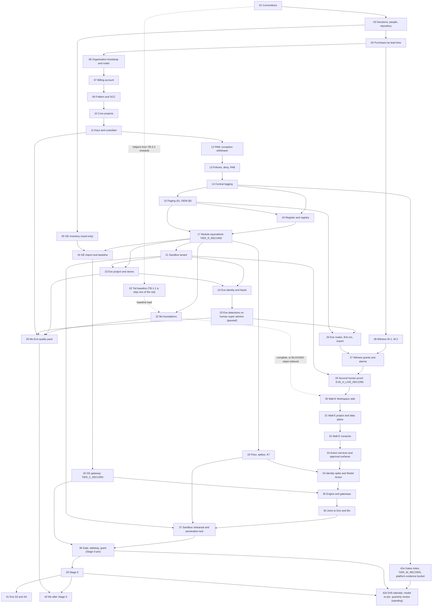

# 0. Setup procedures for the agentic platform, Mo, Eve and Wall-E

## Status
- Owner: the platform owner
- Last reviewed: 2026-09-17
- What this is: the one entry point to the human-executed setup procedures in this folder, files
  [01](01-prerequisites-and-conventions.md) to [42](42-gates-drills-and-evidence.md). It gives
  the reading and execution order, who must be present, time estimates, the resume rule, the
  step-prefix index, the variable register, the index of BLOCKED steps, the cross-file re-run
  index, the gate map and the sign-off tracker for decisions SD-01 to SD-48. **No step is
  executed from this page.**
- Answers: [../13-setup-procedure-review.md](../13-setup-procedure-review.md) (review of
  2026-09-15), its §2 master order, §3 M2 and its fix plan item 4. This page closes S066, S068,
  S069 and S070 (§11).
- Maturity: written 2026-09-15, revision 2 (after the critique of the same day), **revision 3 on
  2026-09-16**. Never executed. Nothing in the set is built.
- What revision 3 changed, and why: files 22 to 42 were written on 2026-09-16, after revisions 1
  and 2 of this page. Every index here is now **derived from the files as written**, not from the
  set's plan: §3.2's Who column from each file's own People table, its time cells from each file's
  own estimate line, §3.3's edges from each file's `Consumes:` line, §5's prefix table and variable
  register from each file's Status block and `penv_set` calls, §6 from the same People tables, §8
  and §9 at step-id granularity, and §11 from each file's own "Findings closed"/"Findings
  deferred" section read against [../13-setup-procedure-review.md](../13-setup-procedure-review.md)
  §4. 42 is split into its two sittings. Where a file and this page disagree from now on, **the
  file is right and this page is corrected** (§12).
- Maintained by: the platform owner, under the amendment rule of §12. Every role reads §1 to §6
  of this page and [01](01-prerequisites-and-conventions.md) before their first sitting.

**A proof-of-value set exists (added 2026-09-16).** [../pov/README.md](../pov/README.md) is a
small, human-executed set of nine files for the platform owner, the operator, the second person
and one engineer who must show the platform and the three agents working in weeks rather than
quarters, with no long-lead purchase. It is Track A only: it runs on the production tenant at Tier
C, R and W (plus at most one optional Tier P row on a synthetic organisational unit), and grants
Super Admin to no agent. Its doer is a separate agent, so `walle`, `WALLE_PROJECT` and
`walle_audit` stay reserved for this set (PV-D-08). Every name, schema, folder and variable it
creates is this set's own, so this set continues from it rather than replacing it: the hand-over is
[../pov/09-the-demonstration-deviations-and-the-hand-over.md](../pov/09-the-demonstration-deviations-and-the-hand-over.md),
where each POV deviation PV-D-01 to PV-D-16 names the file here that unwinds it. **This set alone
owns the super-admin grant** ([38](38-super-admin-gate-and-grant.md)), the sandbox twin, the
witness organisation and every P-SA gate; nothing the POV produces is evidence for them. This page
is otherwise unchanged by the POV.

## 1. What the set builds, and what it replaces

The set takes an existing Workspace tenant, its Cloud organisation and its live Gemini
Enterprise app to the following, in the owner's order of 2026-09-15:
1. **The agentic platform**: the organisation bootstrap, the folder tree, core projects, keys,
   PAM, policies, central logging, paging, the register, hand-made factory module equivalents,
   the Tier R gate, K7, then the Gemini Enterprise baseline and the Tier C gate.
2. **Mo and Eve**, as one block. Eve's first half (Eve-H) monitors every human super admin from
   its first run, before Wall-E exists. It reports to a human outside the administration line,
   copies the evidence to the witness organisation, and is proven by that second human on a
   seeded super-admin action (file 28). Mo's foundations run alongside it.
3. **Wall-E**, from its Workspace side to the super-admin grant and Stage 0, with the halves of
   Eve and Mo that need Wall-E joined in file 36.
4. **After Stage 0**: Mo's first merged proposal (40), Eve S3 and S4 (41), and the standing gate,
   drill and evidence records (42).

It replaces four pages. A review found them broken, so they are no longer followed:

| Replaced page | State from 2026-09-15 | What was salvaged, and where |
|---|---|---|
| [../../wall-e/SETUP.md](../../wall-e/SETUP.md) | Superseded. Its line 20 no longer calls it standalone: no procedure in this programme can be run on its own (S066) | Phases 1, 3, 4, 5 go to 30; 6 to 8 to 31; 9 to 32; 10 and 11 to 33; 12b and 12c to 34; 12, 13 and 13b to 35; the Phase 2 gate to 38; 14 to 18 to 39; §4 and §5 to 37 and 42; §0.4 durations to §3.2 below |
| [../../wall-e/PREREQUISITES.md](../../wall-e/PREREQUISITES.md) | Superseded | The people, tools and artefact tables go to 01; the decision table to 03; the purchase rows to 04 |
| [../../eve/07-build-runbook.md](../../eve/07-build-runbook.md) | Superseded | Phase 1 verifies and Phases 3 and 9 go to 23; 7 and 8 to 24; 9 grants and 10 to 25; 10b to 26 to 29; 2 to 5 to 36; 11 and 12 to 41 |
| [../../mo/07-build-runbook.md](../../mo/07-build-runbook.md) | Superseded | Mo-0 goes to 02; Mo-1 to Mo-3 to 22; the Eve pack of Mo-4 to 29; Mo-4 to Mo-6 (Wall-E pack) to 36; Mo-7 to Mo-11 to 40 |

[../../wall-e/setup/walle_setup.py](../../wall-e/setup/walle_setup.py) is a **helper only**, under
decision SD-37. The manual steps in files 30 to 39 are canonical. A subcommand may replace a
manual step only after its listed defects are fixed and its self-test has a live read-only
mode. Until then, every step that cites it is BLOCKED for the script and gives the manual
commands. It runs only inside `walle_shell` (01).

Standing constraints that every file keeps, and that no step may loosen:
- no domain-wide delegation, ever (checked in 01, 06, 25, 32, 38);
- the model holds no credential and cannot approve, and no service identity is ever the second
  person (SD-48; tested in 33, 34, 35, 37, 38);
- humans raise autonomy, machines lower it (16, 39, 41);
- no model produces an Eve approval (41);
- Mo acts only through a merged pull request with two human reviewers (16, 40).

## 2. How to use this page

- **Read before the first sitting.** Find your role in §6. Read §1 to §6 here, then
  [01](01-prerequisites-and-conventions.md), then each file your role appears in.
- **Work file by file, in the order of §3.** A file starts only when every file it depends on
  in §3.3 has a checkpoint line on its last step. The exceptions are the parallel sittings of
  §3.4 and steps listed in §8 as BLOCKED. §3.3's edges are derived from the files' own
  `Consumes:` lines; if a file names an input this page's graph does not draw, **the file wins**
  and §12 applies.
- **Before any IRREVERSIBLE step,** check its gate in §10 (signed decisions) and in the step
  itself (checked prerequisites).
- **When an identity or record appears, open §9** and run what it lists before you close the
  sitting.
- **Do not skip a file because its design page looks sufficient.** The design pages
  ([../01-hld.md](../01-hld.md) to [../12-open-decisions.md](../12-open-decisions.md),
  [../../project-topology.md](../../project-topology.md)) say what to build. These files say how,
  in what order, and who does it.

## 3. The order

### 3.1 Blocks

1. **Day one (01 to 05).** Conventions; the toil baseline, which cannot be taken later; decisions,
   people and the platform repository; purchases by lead time; the read-only Gemini Enterprise
   inventory.

   **The first act of the programme is `TB-1.1`, not `PR-1.1`.** [02](02-toil-baseline.md) says
   so in its own Status ("It starts on day one, before any other step of the set") and in its
   preconditions ("do not wait for file 01 to start them"). In order, on day one:
   1. `TB-1.1` and `TB-1.2` — rank the three admin tasks by 90-day volume and sign the D12
      record. **Paper is acceptable**: no tool, no variable and no repository is needed, and 02
      TB-4.1 allows a local commit later. Same day, ask HR the works-council question that 02's
      preconditions carry (see §3.4).
   2. **[01](01-prerequisites-and-conventions.md) in full** — tools, `~/.platform-env`, the
      helpers, the registers, the evidence convention.
   3. `TB-2.1` and `TB-2.2` — the recording sheet and the recorders' briefing, **before**
      `TOIL_START_DATE`. From `TB-3.2` onwards 02 uses 01's helpers, which is the only direction
      the dependency runs.
2. **Organisation (06 to 08).** Roster, break-glass and removal of the organisation-creation
   defaults. Then billing, so its roles go to `sa-1-admin@`. The witness organisation runs in
   parallel, performed by IT security.
3. **Tier R (09 to 18).** Folders and SCC; core projects; keys; PAM, which withdraws the bootstrap
   exception; policies; logging; paging; register; module equivalents and the Tier R record;
   floor, spikes and K7.
4. **Tier C (19, 20).** After Tier R (SD-13). It runs in parallel with 21 to 29 and must close
   before 35.
5. **Sandbox (21).** Before Eve, because nonprod Eve (24, 25, 28) and the Wall-E twin (37) need a
   tenant.
6. **Mo and Eve (22, 23 to 28, 29).** One block, run in parallel. Eve-H never waits on Mo. It ends
   with `EVE_H_LIVE_RECORD` (28).
7. **Wall-E (30 to 39).** Starts only on `EVE_H_LIVE_RECORD`, with 22 complete or its BLOCKED
   steps in §8. It runs up to the gate, the two-person grant (38) and Stage 0 (39).
8. **After Stage 0 (40, 41).** Mo's reporter, graders and first merged proposal; Eve S3 and S4.
9. **Standing (42), in two sittings that are weeks apart.**
   - **42 sitting 1 (§1 to §4: GD-1 to GD-4) runs as soon as [14](14-central-logging-and-billing-export.md)
     is done** — not at the end. 42 §0.2 fixes this and gives its own preconditions: 01, 03 with
     P13 signed, 10, 11, 12, 14. It creates `GATES_DIR`, `TIER_W_RECORD` and, above all,
     `PLATFORM_EVIDENCE_BUCKET`, which is the destination 01 §7.1 and §4 of this page both promise
     "after 14" and which no other file makes. Run later, every Tier R, Tier C and Eve record has
     been written with nowhere to be copied to, and the backlog is reconstructed — which is what
     an AL3 assessor refuses (S067).
   - **42 sitting 2 (§5 to §8: GD-5 to GD-8) runs once [38](38-super-admin-gate-and-grant.md) is
     signed**, and quarterly thereafter. It consolidates the drill calendar, the model re-pin and
     the quarterly review of records that files 01 to 41 fill.
   - No earlier file waits on **sitting 2**. Files 15 PS-8.10 and 38 already name `gates/` as "as
     42 keeps it", and that path exists from sitting 1.

### 3.2 The file table

Stages are those of review §2. Times are per file:
- **Hands-on** is keyboard and sitting time, summed over the people named.
- **Elapsed** includes waits that cannot be compressed.

**Where each cell comes from.** The Hands-on and Elapsed cells are **taken from the file's own
estimate line or Sittings table** wherever the file carries one; those cells are marked *(file)*.
Revision 2 of this page carried the plan's estimates instead, and six of them contradicted the
file — all six in the direction that under-books other people's diaries. Cells marked
*(plan)* are files that carry no estimate of their own; they stay the plan author's assumption
and are corrected from the build log after the first sitting. The Wall-E figures the superseded
[SETUP §0.4](../../wall-e/SETUP.md#04-how-long-each-phase-takes) gave are kept in brackets only
where the file itself quotes them, because each file records what that phase did **not** include.

**The Who column is derived from each file's own "People" or "People needed" table**, not from
the plan. 42 GD-8 re-checks the two against each other at the quarterly review (§12). A name in
this column is a person whose diary must be booked before the sitting opens; a missing person is
a `BLOCKED` checkpoint line, never a substitution (§6).

| # | File | Review §2 stage | Opens or produces | Who must be present | Hands-on | Elapsed |
|---|---|---|---|---|---|---|
| 0 | README (this page) | entry point | the order, indexes, tracker | nobody; read by every role | — | — |
| 01 | [01-prerequisites-and-conventions.md](01-prerequisites-and-conventions.md) | supports all (M2) | variables file, build log, registers | platform owner (every step but PR-4.4); second human **asynchronously**: PR-4.4 creates the interim evidence location, PR-6.1 reviews §2 and signs the evidence convention. Not a joint sitting | 1 day *(plan)* | 2 days *(plan)* |
| 02 | [02-toil-baseline.md](02-toil-baseline.md) | 2 | `TOIL_BASELINE_FILE` | platform owner; toil recorders (daily, four weeks); second operator TB-4.3 and TB-5.1; a second reviewer who did not author, per `metrics/` CODEOWNERS (*Assumption:* the second human until 03 names one) | **set-up TB-1 and TB-2: 0.5 to 1 day** (TB-1.1 is a 90-day volume ranking with exports; TB-1.2 a signed record; TB-2.1 a three-tab validated sheet; TB-2.2 a briefing with every recorder). Then 30 min a week for four weeks, and 0.5 day for TB-4 and TB-5 | **4 consecutive ISO weeks**, starting the first Monday **after the HR works-council answer** (§3.4). The answer's own lead time is *tbd* and is the milestone's driver |
| 03 | [03-decisions-and-people.md](03-decisions-and-people.md) | 1 | signed decisions, named people, `PLATFORM_REPO_REMOTE` | platform owner drafts and runs every step; per row: second human (co-signs SD-10 to SD-12 and the Eve rows), IT security lead, security reviewer, ISMS, DPO, legal, HR or works council, finance with the billing administrator, incident commander, Mo owner, both witness administrators. Only DC-4.4 is a sitting, with the second human | 3 to 5 days *(plan)* | days to weeks (the real critical path) *(plan)* |
| 04 | [04-purchases-and-lead-times.md](04-purchases-and-lead-times.md) | 3 | items in hand, key inventory | platform owner; procurement; finance (billing administrator and finance approver); IT security; **both witness administrators** register the witness domain; the second human confirms PU-2.7 unaided; key custodians sign PU-4.2 with an other-line witness | 1 to 2 days *(plan)* | weeks; SIEM and MDR months *(plan)* |
| 05 | [05-gemini-enterprise-inventory.md](05-gemini-enterprise-inventory.md) | 4 | dated GE inventory | platform owner alone, signed in with the account that holds the Gemini Enterprise admin role today | **about 3 h in one sitting**, plus 15 min for GI-9.4 *(file)* | one day, then the GI-9.4 re-check on or after 2026-09-23 *(file)* |
| 06 | [06-organisation-bootstrap-and-roster.md](06-organisation-bootstrap-and-roster.md) | 6 | first privileged principals, `ROSTER_FILE` | platform owner; **second human** for keys, backup codes, break-glass and the roster merge; **an other-line witness per envelope**; a second pull-request approver (second operator, security reviewer or incident commander); each super admin reduced under G3 (OB-2.13); the owners of the organisation-level roles found in OB-3.4; the vault administrator (OB-4.3) | 2 days *(plan)* | **two sittings of about one day each, at least eight calendar days apart** — a new security key can take up to 7 days to work at sign-in *(file)* |
| 07 | [07-billing-account.md](07-billing-account.md) | 5 | `BILLING_ACCOUNT_ID`, quota request | billing administrator (finance) performs; platform owner records and verifies; second human receives the detection output and reviews its pull request (BA-4.1, BA-4.3) — **not** a witness | 2 h *(plan)* | 2 to 5 business days *(plan)* |
| 08 | [08-witness-organisation.md](08-witness-organisation.md) | 7 | witness tenant, project, records home | **two witness administrators**; **second human for all of W-1**, for both locks and for WO-2.18; the key custodian and other-line witness of each earlier record at WO-3.2; **platform owner performs nothing and holds no witness account** | 2 to 3 days *(file)* | 2 to 6 weeks — billing route, support subscription, and the up-to-7-day key wait *(file)* |
| 09 | [09-folders-and-security-command-center.md](09-folders-and-security-command-center.md) | 8, 9 | folder ids, SCC Premium eu | platform owner as `sa-1-admin@`; IT security (the P11 signatory) confirms payer and residency and activates or witnesses SCC (FS-7, 1 to 2 h); `register/folders.yaml` CODEOWNERS review FS-4.2, asynchronously | **about 1 day** *(file)* | 1 to 3 days, plus a first SCC scan of up to 24 h *(file)* |
| 10 | [10-core-projects-and-ci-identities.md](10-core-projects-and-ci-identities.md) | 10 | five core projects, CI identities | platform owner; **second human** witnesses the Groups Admin assignment and its verify, reviews `ROSTER_FILE`, reads `BD-10-6` before leaving (CP-7.1 to CP-7.4, CP-8.2); billing administrator CP-5.6 (and CP-1.4 on refusal only) | **1.5 days** *(file)* | 2 to 3 days *(file)* |
| 11 | [11-keys-and-validator-custodian.md](11-keys-and-validator-custodian.md) | 10, M8 | key rings, custodian identity | platform owner; second human reviews KV-7.1 and approves the §8 grant if §8 runs after 12; **security reviewer** takes `VALIDATOR_PROJECT` and signs the SD-43 limit (KV-8.1, KV-8.5, KV-8.12); **validator custodian** confirms the identity and its grants (KV-8.1, KV-8.3, KV-8.8) | 1 day *(plan)* | 1 day; §8 (KV-8.1 to KV-8.12) waits on B-13 and B-20 *(plan)* |
| 12 | [12-privileged-access-catalogue.md](12-privileged-access-catalogue.md) | 11 | PAM catalogue; exception withdrawn | platform owner requests and never approves; **second human** reviews the catalogue, approves every test grant, confirms each notification mail and witnesses PA-9.2 and PA-9.3; security reviewer is the second approver at PA-4.7 and PA-8.1 (BLOCKED until PPL-SR is signed) | 2 days *(plan)* | 2 to 4 days *(plan)* |
| 13 | [13-organisation-policies-deny-and-pab.md](13-organisation-policies-deny-and-pab.md) | 12 | folder baseline, deny, PAB | platform owner authors and applies, never approves; the `ENT_PLATFORM_POLICY` approver (second human, plus the security reviewer once appointed) is on call at OP-0.2 of every sitting; second human also approves OP-5.1; required reviewers merge OP-2.6, OP-7.2 and OP-8.2 | **about 2.5 days**: day 0 (§0 to §3), day 1 (§4, §5, §7), day 2 (§6), day 14+ (§8, §9) *(file)* | **about 3 weeks** (the 14-day dry runs, nonprod first) *(file)* |
| 14 | [14-central-logging-and-billing-export.md](14-central-logging-and-billing-export.md) | 13 | central logging, billing export | platform owner; **second human present for each lock**, approves `ENT_ORG_SINK` and reads the seeded proofs (the monitored subject does not prove his own evidence path); a super admin turns sharing on at CL-1.3; the organisation's Cloud Logging owner at CL-1.1, CL-1.4 to CL-1.6; billing administrator at CL-6.4, CL-9.2, CL-9.3 | **about 2 days** *(file)* | **3 to 5 days** — Workspace logs can take 24 h; the locks wait on P13 *(file)* |
| 15 | [15-pager-siem-and-detections.md](15-pager-siem-and-detections.md) | 28 (A pulled forward), 9 tail | paging, subject-report escalation, SCC route; part B G2 | IT security paging administrator (never the platform owner); IT security SCC administrator; platform owner; **second human** confirms every test page; incident commander signs the escalation record; security reviewer once appointed (sole recipient on `PAGER_SUBJECT_SH_SERVICE_NAME`); part B adds the MDR desk lead and, optionally, a sandbox super admin | **A: 1 working day spread over about a week. B: 3 to 5 days once the contract exists** *(file)* | A: about a week (a business-hours and an out-of-hours acknowledgement test, and a merge). B: **months** (P10) *(file)* |
| 16 | [16-register-and-shared-registry.md](16-register-and-shared-registry.md) | 14 | register CI, shared registry | platform owner; **second human** approves the two grants, reviews `/identity/`, `/.github/` and (while no security reviewer exists) `/ci/`, `/contract/`, `/register/schema/`, co-signs every manual parse; **security reviewer** reviews the CI rules and signs the row-36 exception; **second operator** gives the single approval in RG-4.3's negative test | **about 2 days** *(file)* | 3 to 5 days (reviews and the drill) *(file)* |
| 17 | [17-factory-module-equivalents-and-tier-r-gate.md](17-factory-module-equivalents-and-tier-r-gate.md) | 15 | FM procedures, `TIER_R_RECORD` | platform owner performs every FM run; **second human** approves `ENT_BOOTSTRAP_MODULE_*` and `ENT_FACTORY_SINGLETON_CTL_*` and reviews `TIER_R_RECORD`; **security reviewer** is the second named approver of a P-SA production run; a second branch-protection reviewer; billing administrator after `BOOTSTRAP_BILLING_EXPIRY`; the paging-service administrator at FM-2.13 when 15's channel carries a key | **2 to 3 days for this file's own sittings**, plus about half a day per later FM run *(file)* | **about one week** for this file; each FM run adds its approval waits *(file)* |
| 18 | [18-model-armor-floor-spikes-and-kill-switch.md](18-model-armor-floor-spikes-and-kill-switch.md) | 16 | floors, spikes, K7 first drill | platform owner; **second human** approves three entitlements, reviews `k7/`, **is present for the enforced drill** and co-signs the lift; security reviewer once named signs the P-SA floor content and the drill record; the IT security desk acknowledges the announced drill; IT security's organisation floor owner at KS-2.2 | **3 to 4 days** *(file)* | **1 to 2 weeks** (register merge, approvals, the drill window) *(file)* |
| 19 | [19-gemini-enterprise-import-and-baseline.md](19-gemini-enterprise-import-and-baseline.md) | 17, 18 | app moved and baselined | platform owner via `ent-ge-admin`; the entitlements' approver on call for six grants; **a non-admin colleague** for five user tests; **DPO** signs GE-6.2 and GE-6.10; the data-store owners at GE-4.1; the IT security desk through the window; two operator volunteers at GE-6.8 | **3 to 4 days** *(file)* | **2 to 3 weeks** — the 14-day dry run, the notice period, the DPO turnaround *(file)* |
| 20 | [20-gemini-enterprise-gateway-and-tier-c-gate.md](20-gemini-enterprise-gateway-and-tier-c-gate.md) | 19, 20 | gateway, `TIER_C_RECORD` | platform owner via `ent-ge-admin`; **second human** approves two entitlements and confirms the GG-7.3 and GG-7.4 test pages; the non-admin colleague named in 19; the IT security SCC administrator raises the test finding; the paging administrator if the channel carries a key; the communications contact sends the five-business-day notice; the IT security desk | **3 days** *(file)* | **1 to 2 weeks** to `TIER_C_RECORD`. GG-5.8's 30-day dry-run review continues afterwards and is 39's input, not a Tier C condition *(file)* |
| 21 | [21-sandbox-tenant-and-nonprod-foundation.md](21-sandbox-tenant-and-nonprod-foundation.md) | 32 (tenant half) | sandbox tenant, nonprod rows | **two sandbox super admins** (neither is the platform owner, neither is the second human); **second human** witnesses every key enrolment and envelope and approves two entitlements; platform owner performs Parts 7 and 8 only; security reviewer co-signs SB-8.4 if appointed; IT security's SIEM owner at SB-6.7; a witness administrator uploads custody records the same day | **2 days over four sittings** *(file)* | **1 to 4 weeks** — DNS up to 72 h, the 7-day key wait, the 24-h log wait, the policy review *(file)* |
| 22 | [22-mo-foundations.md](22-mo-foundations.md) | 22, 25 (Mo-1 to Mo-3) | `MO_PROJECT`, datasets, `mo-metrics@` | Mo owner; platform owner where he is not the Mo owner (MO-1.2, MO-2.2); **second human for three PAM approvals and the schema code-owner review** (MO-1.1, MO-1.3, MO-2.2, MO-6.1); **second operator** reviews every input commit (MO-4.1, MO-4.2, MO-5.3); a second pull-request reviewer; **billing administrator** for FM-2.5 and FM-2.10 if `BOOTSTRAP_BILLING_EXPIRY` has passed | **about 2 days** *(file)* | **about 1 week** once the inputs exist *(file)* |
| 23 | [23-eve-project-and-evidence-stores.md](23-eve-project-and-evidence-stores.md) | 22, 24, 30 (Eve-H 1) | `EVE_PROJECT`, keys, datasets, locked bucket | platform owner; **second human** approves every Eve grant and **is physically present and countersigns the retention lock (EP-7.8)**; **second operator** reviews the schema inputs (EP-5.1, EP-5.2); **security reviewer** reviews the two custom roles and ratifies SD-43's limit (EP-6.1, EP-6.4); billing administrator after `BOOTSTRAP_BILLING_EXPIRY` | **about 2.5 days across two sittings** — the lock is the last command of its sitting *(file)* | **about 1 week** (reviews, two approvers' availability, the second human's presence) *(file)* |
| 24 | [24-eve-workspace-identity-and-audit-feeds.md](24-eve-workspace-identity-and-audit-feeds.md) | 30 (Eve-H 2) | `eve@`, sink, consent, `eve-verifier@` | platform owner; **second human present for the whole of EW-3 and EW-4**, holds `eve@` key A and **performs the consent sign-in (EW-6.2)**; **security reviewer — or, until appointed, the incident commander, in person — takes key B and countersigns the custody record** (EW-3.5, EW-4.3, EW-10.2); **both sandbox super admins** (1 performs EW-2 and EW-9, 2 reads every change back); **DPO confirms the SD-11 record at EW-0.2 before any feed is created**; a second pull-request reviewer | **about 2.5 days over four sittings** *(file)* | **1 to 3 weeks** — the 7-day key wait, 24 h of logs on each organisation, reviews, and the date B-10 lands *(file)* |
| 25 | [25-eve-human-super-admin-detections.md](25-eve-human-super-admin-detections.md) | 30 (G-4, G-5) | detections deployed paused | platform owner (a **subject** of what he builds: every elevation is approved by another person); **second human** approves every PAM grant on `EVE_PROJECT` and is required reviewer on **every** `eve/config` merge; **DPO holds the SD-11 record (EH-0.2) and no job is deployed before it**; Eve owner; second operator as second reviewer where the second human authored | **about 3 days once the code exists** *(file)* | **about 2 weeks** (the DPO record, the config reviews, EH-6.4's 24-h observation) *(file)* |
| 26 | [26-eve-reporting-and-witness-export.md](26-eve-reporting-and-witness-export.md) | 30 (G-6) | routes, `eve-export@`, `EVE_FIRST_RUN_RECORD` | platform owner; **second human confirms every test page alone**, from his own phone and mailbox, and co-signs `EVE_FIRST_RUN_RECORD`; **IT security paging administrator** creates the three integrations and loads the routing keys (ER-3.1 — the platform owner never sees a key); **incident commander** signs the routing record and takes the level-2 page; security reviewer once appointed; a second pull-request reviewer | **about 2 days** *(file)* | **3 to 5 days** (reviews, the paging sitting, three route tests in and out of hours) *(file)* |
| 27 | [27-witness-grants-and-alarms.md](27-witness-grants-and-alarms.md) | 29 (G-2) | witness grants, absence alarms | **two witness administrators** perform every witness step; **second human** approves WG-2.1 and **confirms every alarm test himself before anyone tells him it was sent**; **platform owner hands over two service-account addresses and performs only WG-2.1 to WG-2.4, in the tenant, under a grant the second human approves**; incident commander is named in the route 2 and RP-5 documentation | **about 1.5 days**: two witness sittings of about half a day each, plus one tenant sitting of about an hour *(file)* | **2 to 3 days**, set by the wait for the first heartbeat (one hour after WG-2.2, longer while B-08 stands) *(file)* |
| 28 | [28-eve-independent-proof-and-sandbox-drills.md](28-eve-independent-proof-and-sandbox-drills.md) | 30, 32 (Eve) | `EVE_H_LIVE_RECORD` | **second human leads the whole file** and signs the record; platform owner creates the fixtures and performs the one seeded action, verifies nothing; **witness administrator 1** runs every witness query and uploads every drill record, **witness administrator 2** confirms on a second device; **both sandbox super admins** seed §6; incident commander confirms the escalation and co-signs G-6; security reviewer once named countersigns | **about 3 days spread over 2 to 4 weeks** — the blind window must be genuinely unannounced *(file)* | **3 to 4 weeks** from EV-0.1 to `EVE_H_LIVE_RECORD` *(file)* |
| 29 | [29-mo-eve-quality-pack.md](29-mo-eve-quality-pack.md) | 30 (10b step 5), 25 (Eve pack) | Eve quality metrics | platform owner performs Eve's side inside a grant **the second human approves**; **second human** also reviews and merges the view definitions and confirms MQ-1.5 and MQ-2.4; **Mo owner** performs §3 and §4; **second operator** reviews the Eve-pack SQL as first reviewer (MQ-3.1); **validator custodian** confirms row 29 and the pack's re-derivability (MQ-2.3, MQ-4.2) | **about 1 day**: half for Eve's side, half for Mo's *(file)* | **1 to 2 days** once the inputs exist; indefinite while B-07, B-09, B-13 or B-14 stand *(file)* |
| 30 | [30-wall-e-workspace-side.md](30-wall-e-workspace-side.md) | 21 | `walle@`, groups, hardening | platform owner; **second human takes key B into custody** and reviews the control-group, roster and CODEOWNERS changes; **second operator** confirms both activity-rule test alerts with their latency; **a witness from the other administration line** countersigns each custody record; a witness administrator uploads them the same day; the organisation's Cloud Logging owner runs WW-9.2; incident commander or security reviewer is the second recipient at WW-8.3 | **about 3 h** of console and shell work *(file)* — the superseded Phases 1, 3, 4 and 5 were costed at 2 h and included neither the repository, nor the roster entry, nor the witnessed custody | **about 1 day**: WW-8.4's alert may take 24 h, and two pull requests need a second reviewer *(file)* |
| 31 | [31-wall-e-project-and-data-plane.md](31-wall-e-project-and-data-plane.md) | 22, 23 | `WALLE_PROJECT`, data plane | platform owner; **security reviewer is the first named approver** of `ENT_FACTORY_SINGLETON_PSA_PROD` and code owner of the row, manifest and schema amendment; **second human is the second named approver** and approves the repair grants; **second operator** reviews the schema-file commit list and the guard tool; billing administrator after expiry; **Mo owner** confirms `SA_MO_METRICS` before WD-8.1. If either approver's name is `*tbd*`, the file does not start (WD-0.2) | **about 2 days** *(file)* | **about 1 week**: two pull-request cycles, two approval cycles, the Access Approval enrolment *(file)* |
| 32 | [32-wall-e-consents.md](32-wall-e-consents.md) | 26 (G13) | tokens in Secret Manager | exactly two people and nobody else — platform owner (key A) operates; **second human (key B, IT security) witnesses the whole sitting**, countersigns each attestation, reads WC-7.2's proof on her own workstation and co-signs `CONSENT_SITTING_RECORD`. No screen share | **about 2 h in one sitting** (Phase 9 measured 75 min), **plus 30 min the next morning** for WC-7.2 *(file)* | one sitting, then the next morning — OAuth token log events lag by a couple of hours *(file)* |
| 33 | [33-wall-e-action-services-and-approval-surfaces.md](33-wall-e-action-services-and-approval-surfaces.md) | 27, M7 | action services, approval surfaces | platform owner builds under a time-boxed grant; **a deploy second reviewer (security reviewer or another IT security approver, never the Wall-E owner)** approves each deploy grant and reads the rendered allowlist diff; **second human** reviews the `invokers` change and `WALLE_ALLOWLIST_FILE`, owns `GRP_WALLE_APPROVERS_SUPER` and runs WS-6.1 and WS-6.2 independently; Wall-E owner commits the code; **second operator** is the second member of `GRP_WALLE_APPROVERS_A` | **about 6 h once the code exists** *(file)* — the superseded Phases 10 and 11 were costed at 2 h and built neither the super service, nor the surfaces, nor the attestations | **about 3 days**: two pull requests need a second reviewer, and WS-7.9's replay waits for a real admin event *(file)* |
| 34 | [34-wall-e-identity-spike-and-model-armor.md](34-wall-e-identity-spike-and-model-armor.md) | 27 | `AGENT_IDENTITY_MODE`, templates | platform owner; **second human reads the raw spike output, checks the verdict against it and co-signs the decision 19 record** (WI-0.1, WI-3.1, WI-3.2, WI-6.2), and approves both PAM grants; security reviewer once appointed reviews the template pair (WI-7.10, WI-7.17); Wall-E owner commits the spike agent and suite; the detection desk acknowledges the announced floor-write and template-create alerts | **about 5 h**, of which the spike is 1 to 2 *(file)* | 1 to 2 days *(plan)* |
| 35 | [35-wall-e-engine-registration-and-gateways.md](35-wall-e-engine-registration-and-gateways.md) | 27 | engine, registration, gateways | platform owner; **a `ge-admins@` member through `ent-ge-admin`** performs the share (WE-8.2); **a colleague holding no `discoveryengine` role** confirms the agent is invisible (WE-8.4 — an app administrator cannot do this test); **an operator inside `WALLE_OPERATORS_GROUP`** runs WE-8.3; **second human** countersigns `ENGINE_LOCK_RECORD` and `MODEL_PROOF_RECORD`; security reviewer once appointed reviews the register row and the `egress:` list; the platform-policy owner only if WE-6.1 fails; Wall-E owner owns the package | **about 6 h when the code exists** *(file)* — the superseded Phases 12, 13 and 13b were costed at 3 h and contained neither the gateway ordering, nor the model proof, nor the GE-12 admission | **about 3 business days**: two CI reviews, a second person's calendar, and ≥ 24 h of dry-run IAP decisions before WE-9.5 *(file)* |
| 36 | [36-wall-e-joins-to-eve-and-mo.md](36-wall-e-joins-to-eve-and-mo.md) | 24, 25, 31 | Eve-W S0, Mo Wall-E pack, `mo-analyst@` | platform owner; **second human approves every Eve-side grant**, merges the `halt_target_pending` replacement and **witnesses the first halt and the refused demote**; a second Wall-E deploy reviewer (never the Wall-E owner); **Mo owner** performs §7 to §10; **second operator** reviews the Wall-E-pack SQL and the assertion file; **validator custodian** confirms row 21 (WJ-2.5) | **about 2 days**: one for Eve's side, one for Mo's *(file)* | **about 1 week** — §5's deploy re-run and §5.4's config merge are each a reviewed pull request and an approval cycle *(file)* |
| 37 | [37-wall-e-sandbox-rehearsal.md](37-wall-e-sandbox-rehearsal.md) | 32 (G8, G10, G11, G14, G20) | drill records, `PENTEST_RECORD` | platform owner; **both sandbox super admins** (1 requests, 2 approves and pulls K6 — neither is the platform owner or the second human); **second human** witnesses K6 and the enforced K7 drill and countersigns three drill records; **IT security / test lead** owns the penetration-test window and signs `PENTEST_RECORD`; security reviewer once named signs the G10 and G19 lines | **about 31 h over nine sittings** *(file)* | **about four weeks**, most of it waiting on the penetration test and on `B-16` *(file)* |
| 38 | [38-super-admin-gate-and-grant.md](38-super-admin-gate-and-grant.md) | 33, 34 | P-SA gate, Stage 0-pre, the grant | platform owner requests and signs nothing that gates his own request; **second human approves the grant** and does half the parse; **security reviewer** does the other half and signs `GATE_CHECKLIST_RECORD`; **ISMS** signs it too; **incident commander runs the tabletop** (never the platform owner); the MDR desk; second operator; DPO, legal and HR or employee representatives in the tabletop; witness administrators receive the records; Wall-E, Eve and Gemini Enterprise owners attend the tabletop | **the tabletop: half a day. The gate day: 90 minutes with both people present throughout.** Assembly of the checklist: about 1.5 days *(file)* | the P-SA gate: **weeks to months** *(plan)* |
| 39 | [39-wall-e-stage-0.md](39-wall-e-stage-0.md) | 35, 36 | `STAGE0_RECORD` | platform owner; **second human present for K5**, co-signs `STAGE0_RECORD`, approves the grants, code owner of `/ladder/`; **second operator** reads the Gmail alert page and one shadow report; security reviewer signs the manual ladder-provenance parse; a `ge-admins@` member performs GE-11's enforce; a colleague with no `discoveryengine` role runs the front-door test; the Eve owner reviews the roster config change; the incident commander is the named severity-1 recipient | **about 25 h over eight sittings** *(file)* | **about eight working days** — the audit lag, the absence drill and the K4/K5 restore *(file)* |
| 40 | [40-mo-after-stage-0.md](40-mo-after-stage-0.md) | 37, 39 | `FIRST_MERGE_RECORD` | Mo owner; platform owner for MA-1.6, MA-6.3 and MA-9.2; **validator custodian** owns and deploys the validator and is the only person who may change what the gate enforces; **second human** approves the Mo grant, is code owner on `EVE_CONFIG_REPO` and one of the two reviewers at MA-8.5; **security reviewer** is code owner on `thresholds.yaml` and co-signs `FIRST_MERGE_RECORD`; second operator; **blind grader**; **two human reviewers at MA-8.5, neither the playbook's owner and neither a Mo identity** | **about 6 days: three for §1 to §5, two for §6 and §7 (three of which are the custodian's, not Mo's budget), one for §8** *(file)* | **10 to 14 weeks after Stage 0** — §8 cannot run before the S2 exit and S1 has to be lived through *(file)* |
| 41 | [41-eve-s3-and-s4.md](41-eve-s3-and-s4.md) | 40 | Eve S3 and S4 entry | **Eve owner (the second human) owns the file**, approves every grant, merges every config change and signs all three records; platform owner builds under PAM and approves nothing; **security reviewer** signs the S3 exit gate and countersigns E3-4.2 and E3-4.3; blind grader supplies the agreement figure; **Wall-E owner** merges the pinned-PEM pull request; incident commander witnesses the live halt and demote; Mo owner confirms the S4 carve-out; witness administrators receive the three records; second operator confirms the halt was seen | **about 2 days across three sittings**: S3 entry half a day, the S3 exit gate two hours, S4 entry a full day *(file)* | **weeks apart and never merged**: at least thirty days of S3 running between entry and the exit gate, on top of the S3 floor *(file)* |
| 42a | [42-gates-drills-and-evidence.md](42-gates-drills-and-evidence.md) §1 to §4 (GD-1 to GD-4) | all gates (evidence half) | `GATES_DIR`, `TIER_W_RECORD`, **`PLATFORM_EVIDENCE_BUCKET`**, `RECORD_RETENTION_DAYS`, `EVIDENCE_PACK_DIR` | platform owner creates the bucket and the index; **security reviewer signs `TIER_W_RECORD`**; **second human confirms the bucket's lock (GD-3.4)**; witness administrators own the witness prefixes (GD-4.5); ISMS receives the TISAX §13 pack | 1 day *(plan)* | 1 to 2 days *(plan)*. **Runs as soon as 14 is `DONE`** (42 §0.2), not at the end |
| 42b | [42-gates-drills-and-evidence.md](42-gates-drills-and-evidence.md) §5 to §8 (GD-5 to GD-8) | standing | drill calendar, model re-pin, quarterly review record | platform owner; **security reviewer chairs the quarterly review**; **second human owns the Eve proof rows DR-28-1 to DR-28-3 and is the only person who may record a blind-proof result**; witness administrators; incident commander runs the tabletop and owns the SIEM fixture replay row | 0.5 day a quarter plus drills *(plan)* | standing, from the signature of 38 *(file)* |

### 3.3 Dependency diagram

An arrow means "the later file consumes something the earlier file produces". The dotted arrows
are conditions, not waits. Revision 2 removed two edges: 22 to 23 (Eve-H never waits for Mo)
and 29 to 30 (Wall-E never waits for Mo's Eve pack). 20 precedes 35.

**Revision 3 re-derived the whole graph mechanically from the files' own `Consumes:` lines**, and
added six edges that were missing. §2 makes this page binding ("a file starts only when every
file it depends on in §3.3 has a checkpoint line on its last step"), so an absent edge is a
licence to start a file too early:

| Added edge | The file's own words |
|---|---|
| `A21 --> A23` | 23's `Consumes:` names "`EVE_TWIN_PROJECT` and `register/drafts/eve.nonprod.yaml` (21)", and its preconditions add `SANDBOX_CUSTOMER_ID`, `SANDBOX_ORG_ID`, `SANDBOX_DOMAIN` |
| `A25 --> A29` | 29's `Consumes:` names `EVE_CONFIG_REPO` (25), which MQ-1.1 clones as `EVE_CONFIG_DIR`; without it 29's entry gate cannot open |
| `A18 --> A34` | 34's `Consumes:` names "the PF block and `FLOOR_RECORD` ([18](18-model-armor-floor-spikes-and-kill-switch.md))"; `WI-7.16` runs the PF block 18 KS-2.9 writes, and `model-armor/floors.json` is 18's file |
| `A21 --> A37` | the whole twin rehearsal runs in the sandbox tenant: 37's `Consumes:` opens with `SANDBOX_DOMAIN`, `SANDBOX_CUSTOMER_ID`, `SANDBOX_ORG_ID`, `SANDBOX_OPERATORS_GROUP`, `WALLE_TWIN_PROJECT` and two drafts (21) |
| `A15 --> A16` | 16 RG-5.6 and RG-5.7 consume `NOTIF_CH_PAGER_CORE` and `NOTIF_CH_EMAIL_CORE` from 15 part A (15 records the pair as a re-run line against 16) |
| `A14 --> A42a` | 42 §0.2: "Sitting 1 (§1 to §4) runs as soon as 14 is done"; its preconditions are 01, 03 (P13), 10, 11, 12, 14 — not 39 |



### 3.4 Parallel sittings and the critical path

The following sittings run side by side. Each still needs its own inputs.

| Parallel lane | Runs alongside | Condition |
|---|---|---|
| 02 toil baseline | everything, from day one (TB-1.1 and TB-1.2 first; recording from the first Monday **after the HR answer**) | recording weeks cannot be recovered; the load is a re-run in 22 |
| 05 GE inventory | 01 to 04, from week one | read-only; finished before 19 |
| 08 witness W-1, W-2 | 06 to 18, from week one | once P14 is signed (03) and the domain is bought (04); records before W-2 stay on paper with a same-day scan (SD-27) |
| 19, 20 Tier C | 21 to 29 | 20 closes before 35 and before 38 (G21) |
| 22 Mo foundations, 29 Mo Eve pack | 23 to 28 | a BLOCKED Mo input never holds Eve-H; 29 may finish after 30 starts. 29 also needs `EVE_CONFIG_REPO` from 25 |
| 15 part B SIEM | 16 to 37 | only G2 and Tier P wait on it. **Part A is not a parallel lane**: 16 RG-5.6 and RG-5.7 consume its two channels |
| 42a evidence half | 15 to 41 | opens as soon as 14 is `DONE`; nothing downstream waits on it, but every EVIDENCE line from 15 onwards has no destination until it exists |

**The dated precondition the toil milestone hangs on.** 02's preconditions carry a day-one HR
question: whether the works council must be consulted before staff record their own task time.
02's assumption is that pseudonymous, aggregated self-recording used only for a programme cost
figure needs no consultation; **if HR says otherwise, TB-3.1 waits for that consultation**, whose
lead time is *tbd*. [01](01-prerequisites-and-conventions.md) §3.1 row **P-11** costs the related
D7 letter at "months". The question is therefore tracked as a dated precondition of its own:

| Precondition | Asked by | Answered by | Recorded in | Sets |
|---|---|---|---|---|
| Works-council consultation needed before self-recorded task time? | Platform owner, day one | HR or the works-council contact (03 people row `HR`); DPO informed through the D7 letter (01 P-11) | 02 TB-1.2's decision record; the answer's date is the value | `TOIL_START_DATE` = the **first Monday after the answer**, not a fixed date |

Assumption: the critical path below uses the estimates of §3.2, one platform owner, and people
available when named. Every date is an earliest date, not a commitment.

| Milestone | Record | Earliest | What bounds it |
|---|---|---|---|
| HR works-council answer | the dated line in 02 TB-1.2's record | *tbd* | HR's own turnaround. Revision 2 assumed it away and fixed `TOIL_START_DATE` at Monday 2026-09-21, which would have required TB-1.1, TB-1.2, TB-2.1 and TB-2.2 to close within three working days of 2026-09-16 |
| Toil baseline complete | `TOIL_BASELINE_FILE` merged | **four full ISO weeks after `TOIL_START_DATE`, plus the TB-4 and TB-5 review** | four consecutive ISO weeks from the Monday after the HR answer (02's `TOIL_START_DATE` is a Monday), then the second operator's review and a two-approval merge |
| Decisions and people signed | 03 records | 2026-09-29 to 2026-10-27 | other people's time; the D7 answer |
| Tier R open | `TIER_R_RECORD` (17) | 2026-11-10 to 2026-12-08 | about 25 hands-on days in 06 to 17, plus 13's 14-day dry runs |
| Tier C open | `TIER_C_RECORD` (20) | 2026-12-08 to 2027-01-19 | change windows and the GE-9 spike |
| Eve-H live | `EVE_H_LIVE_RECORD` (28) | 2026-12-22 to 2027-01-19, *tbd* on Eve code | Eve's code and schemas committed (36 to 45 engineer-days per brief/29), the SD-11 DPO record, the witness |
| Pre-grant Wall-E built | `PENTEST_RECORD` (37) | 2027-02-02 to 2027-03-16, *tbd* on Wall-E code | Wall-E service code; the penetration test window; decision 6 signed before 35 |
| The grant | `GRANT_RECORD` (38) | *tbd*; not before 2027-03 | the longest of G2 (SIEM and MDR contract, months), G8, G11 and G20 freshness, five named humans (SD-04) |
| Stage 0 | `STAGE0_RECORD` (39) | 1 to 2 weeks after the grant | K0 to K5 on production |
| Mo's first merge | `FIRST_MERGE_RECORD` (40) | 13 to 18 weeks after Stage 0 | stage floors S0, S1, S2 (brief/29) |
| Eve's first enforcing window | S3 entry record (41) | 6 to 8 weeks after S2 exit | S3 floor |

The model pin (decision 6, 03) is re-read on the day it is signed and closed before 35. No step
uses a Gemini 2.5 model. The review dates their retirement from 2026-10-16.

## 4. Working in sittings, and resuming

**A sitting** is one continuous working session. It is bounded by the people it needs (§3.2
"Who must be present") and ends at a step boundary. Each sitting:
1. starts from a clean shell with `~/.platform-env` sourced and the dedicated gcloud configuration
   of 01, which has no default project;
2. names every person present in the build log;
3. ends with the credential clean-up of 01.

**The checkpoint rule.** Every step writes checkpoint lines to the build log in `BUILD_LOG_DIR`.
It writes one when it starts and one when its VERIFY passes. Nothing is ticked on someone's word.
01 fixes the exact format. It carries at least these fields:

```text
<UTC timestamp> <step id> <START|DONE|BLOCKED|PENDING|ROLLED-BACK|N/A> <operator> <witness or -> <evidence path or ->
```

**The resume rule.** After any interruption (quota, a cut session, an absent approver):
1. Restart at the first step, in file order, that has no `DONE` line.
2. A step with `START` and no `DONE` is not re-run blindly. Run its VERIFY first. If VERIFY passes,
   write `DONE` with a note. If it fails, follow the step's ROLLBACK, then re-run the step.
3. For an **IRREVERSIBLE** step with `START` and no `DONE`, never re-run. Read the resource's
   state, record it, and ask the step's named approver before going on. A second project id, key
   ring or lock cannot be undone.

   **The standing fallback approver.** About a third of the roughly 95 explicitly IRREVERSIBLE
   steps in the set name no approver and no witness in their WHO line — 11 KV-2.1, KV-2.2,
   KV-3.1, KV-4.1, KV-4.2, KV-5.1 and KV-5.2 (key rings and HSM keys whose names can never be
   reused), 10 CP-1.1 (a project id), 23 EP-3.3 to EP-3.6, 31 WD-4.3 and WD-4.4 (the Firestore
   location and `walle_audit`), 34 WI-7.3 and WI-7.7, 17 FM-2.3, 22 MO-6.3, 36 WJ-3.1, 09 FS-5.1
   (the tag keys), 18 KS-1.3 and 37 WR-1.3 (project ids) among them. An operator interrupted at
   03:00 on one of those has nobody to ask, so this rule names one:

   > **Ask the second human, unless the step names another.** Where the irreversible thing is
   > **key material** — a key ring, a key, a key version, a client secret, an exported PEM — ask
   > the **security reviewer** and, until that person is appointed, the **incident commander**
   > (README B-20, and the interim-custody rule of 24). The fallback approver never re-runs the
   > step on the operator's word: he reads the resource's state himself and records what he read.

   The fallback is in §6's role table so it can be found without reading this paragraph. Nothing
   here lets a fallback approver stand in for a **named** approver: a step whose WHO names a
   person and that person is absent is a `BLOCKED` checkpoint line, never a substitution (§6).
4. `BLOCKED` and `PENDING` lines do not count as `DONE`. A later step that consumes their output
   stays unrun. The exceptions are the conditions of §3.3 and §8.
5. A changed variable value is written only with `penv_set --force` and a build-log line (01).

**Evidence.** Every step ends with an EVIDENCE line. Records follow SD-38:
- **Text records** go to the build-log repository under the step id.
- **Scans and signed documents** go the same day to `EVIDENCE_INTERIM_LOCATION`.
- **Copies:** both are copied to `PLATFORM_EVIDENCE_BUCKET` after 14. That bucket is created by
  **42 sitting 1, GD-3.1 to GD-3.4**, which is why §3.1 block 9 orders 42a straight after 14 and
  not at the end: until GD-3 has run, this rule has no destination. Custody, rota and drill
  records go to the witness from W-2 (08).
- **Register and names:** `EVIDENCE_REGISTER` (01) maps each line to the E-xx id of
  [../10-eu-ai-act.md](../10-eu-ai-act.md) §5 and the control id of
  [../11-tisax.md](../11-tisax.md) §13. Records are named `<date>-<step-id>-<record>-v<n>` and
  never overwritten.

## 5. The variables file and the step format

**Variables.** There is one file, `~/.platform-env`. 01 creates it, and it is never committed.
- **Names:** every variable has one name, one setting file and **one setting step**. §5.2 below
  is that register, derived from the `penv_set` calls of files 01 to 42. Revision 2 said only
  that "the list is fixed by the set's plan and repeated in 01", and at least sixteen files add
  names the plan never had; those names had no home and could not be looked up.
- **No secrets:** no variable holds one. Secrets are piped into Secret Manager, and only secret
  names and version numbers are recorded.
- **Helpers (defined in 01):**
  - `penv_set` writes a value once;
  - `need` fails a step on an empty or `*tbd*` input;
  - `exists_or_pending` prints PENDING for a foreign principal that does not exist yet and records
    it for §9 (SD-44);
  - `twin_shell` maps production names to the nonprod twin names;
  - `walle_shell` exports `PROJECT` for the helper script only.
- **Retired names** that must not reappear: `PROJECT` outside `walle_shell`, `FOLDER_ID`,
  `BILLING`, `CUSTOMER_ID=my_customer` in policies, `SA_WALLE_CI`, `walle_metrics*`,
  `LOGS_DATASET`, and `EVE_EVIDENCE_KEY` for datasets.
- **Witness identifiers:** the witness administrators keep their own copy of the witness section.

**Step format.** Every step in 01 to 42 has these fields:

| Field | Content |
|---|---|
| Id | file prefix and number, for example `OB-3.4`. **The prefix index is §5.1 below** — it is here, not in 01, because `checkpoints.tsv`, `rerun-index.tsv` and every cross-file citation use bare ids |
| WHO | the role that performs it, and any witness or approver who must be present |
| WHERE | the console path, or "shell, `~/.platform-env` sourced" |
| ACTION | commands in bash fences, one command per line of effect, each checked against Google's documentation on the day the file was written |
| VERIFY | a check whose output proves the step worked |
| ROLLBACK | the undo, or **IRREVERSIBLE** in bold with what to confirm first and the signed decision or checked prerequisite that gates it |
| EVIDENCE | what is recorded, where, its E-xx id and its TISAX control id |

A step whose code does not exist yet reads **BLOCKED**. It names the code, the repository and
commit it needs, and the gate that waits. Every BLOCKED step is listed in §8.

### 5.1 Step-prefix index

Every file declares its own prefix in its Status block, but the checkpoint log, the re-run index
and every cross-file citation use bare ids. This is the one place that turns `EH-3.4` or `WJ-9.4`
back into a file. [01](01-prerequisites-and-conventions.md) §1 points here rather than repeating
it. 42 GD-8 re-reads this table at the quarterly review against the files' Status blocks (§12).

**Add the prefix as a column of the checkpoint line** wherever the build log is read months later;
the line of §4 already has room for it after the step id.

| Prefix | File | Prefix | File | Prefix | File |
|---|---|---|---|---|---|
| `PR` | 01 prerequisites and conventions | `FS` | 09 folders and SCC | `EP` | 23 Eve project and stores |
| `TB` | 02 toil baseline | `CP` | 10 core projects and CI identities | `EW` | 24 Eve identity and audit feeds |
| `DC` | 03 decisions and people | `KV` | 11 keys and validator custodian | `EH` | 25 Eve human super-admin detections |
| `PU` | 04 purchases and lead times | `PA` | 12 privileged access catalogue | `ER` | 26 Eve reporting and witness export |
| `GI` | 05 Gemini Enterprise inventory | `OP` | 13 organisation policies, deny, PAB | `WG` | 27 witness grants and alarms |
| `OB` | 06 organisation bootstrap and roster | `CL` | 14 central logging and billing export | `EV` | 28 Eve independent proof and drills |
| `BA` | 07 billing account | `PS` | 15 pager, SIEM and detections | `MQ` | 29 Mo Eve quality pack |
| `WO` | 08 witness organisation | `RG` | 16 register and shared registry | `WW` | 30 Wall-E Workspace side |
| `FM` | 17 factory module equivalents, Tier R | `WD` | 31 Wall-E project and data plane | `WR` | 37 Wall-E sandbox rehearsal |
| `KS` | 18 Model Armor floor, spikes, K7 | `WC` | 32 Wall-E consents | `GT` | 38 super-admin gate and grant |
| `GE` | 19 GE import and baseline | `WS` | 33 action services and approval surfaces | `S0` | 39 Wall-E Stage 0 |
| `GG` | 20 GE gateway and Tier C gate | `WI` | 34 identity spike and Model Armor | `MA` | 40 Mo after Stage 0 |
| `SB` | 21 sandbox tenant and nonprod | `WE` | 35 engine registration and gateways | `E3` | 41 Eve S3 and S4 |
| `MO` | 22 Mo foundations | `WJ` | 36 Wall-E joins to Eve and Mo | `GD` | 42 gates, drills and evidence |

Two prefixes read alike and are not: `GE` is file 19's steps, while `GE-4`, `GE-11`, `GE-12` in
prose are the design's Gemini Enterprise gate lines; and 05's `GI-0` is not 19's `GE-0`.

### 5.2 Variable register

One row per name in `~/.platform-env`, with the file and step that sets it. Names are set once,
by `penv_set`; a changed value needs `penv_set --force` and a build-log line (§4 resume rule 5).
A name whose step is BLOCKED stays `*tbd*` and every `need` on it fails the consuming step —
that is the design, not a fault. Where a file sets a name in more than one place (a twin pass, a
re-run), the **first** setting step is given.

Derived from the `penv_set` calls of files 01 to 42 on 2026-09-16. 42 GD-8 re-derives it at the
quarterly review (§12).

| Name | Set in | Step | What it holds |
|---|---|---|---|
| `ACTIONS_URL` | 33 | WS-3.3 | band-A action service URL |
| `ADMIN_OU` | 06 | OB-2.1 | the admin accounts' organisational unit |
| `AGENT_IDENTITY_MODE` | 34 | WI-3.2 | `AGENT_IDENTITY` or the fallback, from the spike |
| `AGENT_PRINCIPAL` | 34 form, **35 value** | WI-5.1, run by 35 | the engine's principal; on the `AGENT_IDENTITY` path it contains the engine id, so it exists only after 35 (§9) |
| `AGENT_REGISTRY` | 16 | RG-5.1 | the shared agent registry path |
| `ANTI_SILENCING_RECORD` | 28 | EV-5.6 | record of the declared-change drill |
| `APPROVAL_A_URL` | 33 | WS-5.3 | band-A approval surface URL |
| `APPROVAL_SUPER_URL` | 33 | WS-5.4 | bands B and C approval surface URL |
| `AR_PLATFORM` | 10 | CP-2.3 | the platform Artifact Registry repository |
| `BANDB_DRYRUN_RECORD` | 37 | WR-9.3 | G14's band-B dry-run record |
| `BILLING_ACCOUNT_ID` | 07 | BA-1.1 | the dedicated EUR billing account |
| `BILLING_ADMIN_EMAIL` | 03 | DC-2.7 | the billing administrator (finance) |
| `BILLING_CURRENCY` | 07 | BA-1.3 | the billing account's currency |
| `BILLING_EXPORT_DS` | 14 | CL-9.1 | the billing export dataset |
| `BINAUTHZ_ATTESTOR` | 11 | KV-5.4 | the vulnerability-gated attestor |
| `BINAUTHZ_ATTESTOR_PROMOTED` | 11 | KV-5.4 | the promotion attestor |
| `BLIND_GRADER_EMAIL` | 03 | DC-2.4 | the blind grader |
| `BOOTSTRAP_BILLING_EXPIRY` | 07 | BA-2.1 | the date the billing bootstrap exception ends |
| `BOOTSTRAP_EXCEPTION_EXPIRY` | 06 | OB-3.2 | the date the organisation bootstrap exception ends |
| `BQ_LOCATION` | 01 | PR-2.3 | the BigQuery multi-region (`EU`) |
| `BREAK_GLASS_OU` | 06 | OB-4.1 | the break-glass organisational unit |
| `BRK_GCP_1`, `BRK_GCP_2` | 06 | OB-4.3 | the two break-glass accounts |
| `BUILD_LOG_DIR` | 01 | PR-2.3 | the build-log repository's local path |
| `BUSINESS_HOURS`, `BUSINESS_TZ` | 03 | DC-7.1 | the acknowledgement window and its time zone |
| `CANARY_R_PROJECT`, `CANARY_R_PROJECT_NUMBER` | 18 | KS-1.4 | the Tier R canary project (**IRREVERSIBLE** id, KS-1.3) |
| `CONSENT_SITTING_RECORD` | 32 | WC-6.4 | the two-person consent sitting record |
| `CONTROL_GROUPS_FILE` | 06 | OB-5.2 | the committed control-group inventory |
| `DENIALS_RECORD` | 37 | WR-6.4 | G10's denial-suite record |
| `DENY_AGENTS_PLATFORM` | 13 | OP-7.4 | the agent deny policy |
| `DENY_CORE_AGENTS` | 13 | OP-7.5 | the core-project agent deny policy |
| `DENY_IMPROVERS` | 13 | OP-7.6 | the improver deny policy |
| `DENY_SA_FORM` | 18 | KS-3.2 | the principal form deny policies use (SD-22) |
| `DEVIATION_REGISTER` | 01 | PR-2.3 | the bootstrap deviation register |
| `DIRECTORY_CUSTOMER_ID` | 01 | PR-2.6 | the tenant's customer id |
| `DISPATCHER_URL` | 33 | WS-7.2 | the dispatcher's URL |
| `DOMAIN` | 01 | PR-2.6 | the primary domain |
| `DPO_CONTACT` | 03 | DC-3.1 | the data protection officer |
| `DRIFT_JOB` | 16 | RG-8.1 | the drift job's resource name (B-02) |
| `DRILL_CALENDAR` | 01 | PR-2.3 | the drill calendar |
| `ENGINE`, `ENGINE_ID` | 35 | WE-2.6 | the reasoning engine and its id |
| `ENGINE_LOCK_RECORD` | 35 | WE-3.4 | the two-principal lock record |
| `ENT_BOOTSTRAP_MODULE_IMPROVERS_PROD` / `_NONPROD`, `ENT_BOOTSTRAP_MODULE_R_NONPROD` | 12 | PA-4.8 | the per-folder bootstrap module entitlements (SD-46) |
| `ENT_DEPLOY_CREDENTIAL_HOLDER_TEMPLATE` | 12 | PA-2.1 | the deploy template's path |
| `ENT_DEPLOY_CREDENTIAL_HOLDER_CORE` | 12 | PA-4.3 | the proven core instance, needed by 18's K7 job |
| `ENT_DEPLOY_CREDENTIAL_HOLDER_CANARY_R` | 18 | KS-1.4 | the canary instance |
| `ENT_FACTORY_SINGLETON_CTL_PROD` / `_NONPROD` | 12 | PA-4.6 | the controller-folder singleton entitlements |
| `ENT_FACTORY_SINGLETON_PSA_NONPROD` | 12 | PA-4.5 | the nonprod P-SA singleton |
| `ENT_FACTORY_SINGLETON_PSA_PROD` | 12 | PA-4.7 | the production P-SA singleton — **deferred until PPL-SR is signed** (§11, B-20) |
| `ENT_FOLDER_ADMIN` | 12 | PA-4.1 | the folder-admin entitlement |
| `ENT_GE_ADMIN` | 12 | PA-5.1 | Gemini Enterprise administration (SD-19) |
| `ENT_K7_HUMAN`, `ENT_K7_HUMAN_SCHEDULER` | 12 | PA-3.4 | the human K7 pair, activated together |
| `ENT_K7_EXECUTOR`, `ENT_K7_EXECUTOR_SCHEDULER` | 12 | PA-3.5 | the executor K7 pair |
| `ENT_ORG_SINK` | 12 | PA-3.3 | the organisation-sink entitlement (approved, SD-18) |
| `ENT_PAM_CATALOGUE_ORG` | 12 | PA-3.6 | the organisation-level PAM catalogue entitlement |
| `ENT_PLATFORM_POLICY` | 12 | PA-3.1 | the organisation-policy entitlement |
| `ENT_PROJECT_MOVE_SRC`, `ENT_PROJECT_MOVE_DST` | 12 | PA-5.2 | the two halves of a project move |
| `ENT_PROJECT_REPAIR_TEMPLATE` | 12 | PA-2.1 | the repair template's path |
| `ENT_PROJECT_REPAIR_CORE` | 12 | PA-4.2 | the proven core repair instance |
| `ENT_PROJECT_REPAIR_CANARY_R` | 18 | KS-1.4 | the canary repair instance |
| `ENT_PROJECT_REPAIR_GEMINI` | 17 | FM-6.2 | the Gemini project's repair instance |
| `ENT_PROJECT_REPAIR_TENANT_APP` | 19 | GE-2.3 | the tenant app's repair instance |
| `ENT_SECRET_READ` | 12 | PA-4.4 | the secret-read entitlement |
| `ENT_WITNESS_EXPORT_REPAIR` | 12 | PA-4.9 | the witness-export repair entitlement |
| `EVE_CODE_COMMIT` | 25 | EH-0.3 | Eve's code commit (B-08) |
| `EVE_CONFIG_COMMIT`, `EVE_CONFIG_DIR` | 29 | MQ-1.1 | the local clone of `EVE_CONFIG_REPO` and the commit read |
| `EVE_CONFIG_REPO` | 25 | EH-2.1 | Eve's configuration repository (remote) |
| `EVE_CONSOLE_URL` | 25 | EH-7.3 | the Eve console's URL |
| `EVE_EVIDENCE_BUCKET` | 23 | EP-7.1 | the locked Eve evidence bucket (SD-23) |
| `EVE_EVIDENCE_KEY`, `EVE_KEYRING` | 23 | EP-3.3, EP-3.4 | `eve` ring and key in `europe-west1`, for the bucket |
| `EVE_EVIDENCE_KEY_EU`, `EVE_KEYRING_EU` | 23 | EP-3.5, EP-3.6 | `eve-eu` ring and key in `europe`, for the `EU` datasets (SD-47) |
| `EVE_FIRST_RUN_RECORD` | 26 | ER-7.3 | Eve's first-run record |
| `EVE_GATE_URL` | 41 | E3-6.3 | `eve-gate`'s URL; stays `*tbd*` while B-19 stands |
| `EVE_H_LIVE_RECORD` | 28 | EV-8.2 | the record that opens Wall-E (G1) |
| `EVE_INCIDENTS_TABLE`, `EVE_PAGES_TABLE`, `EVE_REPORTS_TABLE` | 26 | ER-1.2 to ER-1.4 | the three reporting tables |
| `EVE_JOB_REPORTS_POLL`, `EVE_JOB_ROSTER`, `EVE_JOB_DETECT`, `EVE_JOB_HEARTBEAT` | 25 | EH-4.1 to EH-4.4 | the four paused jobs |
| `EVE_JOB_EXPORT`, `EVE_JOB_HEARTBEAT_PUSH` | 26 | ER-4.4, ER-4.5 | the witness export and heartbeat jobs |
| `EVE_KEY_VERSION` | 41 | E3-4.3 | the signing key version (**IRREVERSIBLE**-class) |
| `EVE_MIRROR_DS`, `EVE_MIRROR_CONFIGS` | 36 | WJ-3.1, WJ-3.3 | the mirror dataset and its nine transfer configs |
| `EVE_OAUTH_CLIENT_SECRET_NAME`, `EVE_REFRESH_TOKEN_SECRET_NAME` | 24 | EW-5.2 | Secret Manager **names**, never values |
| `EVE_PROJECT`, `EVE_TWIN_PROJECT` | 01 declares, **23 creates** | PR-2.5, EP-2.2 | Eve's production and twin projects |
| `EVE_PROOF_ROLE`, `EVE_PROOF_OU`, `EVE_PROOF_ACCOUNT` | 28 | EV-1.2 | the blind-proof fixtures |
| `EVE_PROOF_RECORD` | 28 | EV-2.10 | the seeded-action proof record |
| `EVE_QUALITY_DS`, `EVE_DS`, `EVE_WS_LOGS_DS`, `EVE_WS_REPORTS_DS` | 23 | §4 (EP-4.x) | Eve's four datasets |
| `EVE_RECEIPTS_DS` | 41 | E3-7.1 | the S4 receipts dataset |
| `EVE_RECONCILER_IMAGE` | 25 | EH-3.4 | the pinned reconciler digest (B-08) |
| `EVE_ROBOT`, `EVE_ROLE_NAME` | 24 | EW-3.1, EW-4.3 | `eve@` and its custom role (E-16 privilege set) |
| `EVE_ROUTING_FILE` | 26 | ER-2.2 | the reporting contract's routing file |
| `EVE_SCHEMAS_COMMIT` | 23 | EP-5.2 | the commit holding Eve's nine schema files (**B-07**) |
| `EVE_SCOPES_COMMIT` | 24 | EW-0.4 | the committed scope list |
| `EVE_SINK`, `EVE_TWIN_SINK` | 24 | EW-1.5, EW-2.5 | the six-stream sinks on both organisations |
| `EVE_STAGING_OU`, `SERVICE_IDENTITY_OU` | 24 | EW-3.1, EW-3.2 | the OUs `eve@` passes through (SD-32) |
| `EVE_TOKEN_VERSION`, `EVE_TWIN_TOKEN_VERSION` | 24 | EW-6.3, EW-9.6 | secret **version numbers**, never tokens |
| `EVE_TWIN_ROBOT` | 24 | EW-9.1 | the sandbox twin robot |
| `EVE_V0_CONFIGS` | 36 | WJ-4.4 | Eve's twelve v0 transfer-config names |
| `EVE_WITNESS_PROJECT`, `EVE_WITNESS_PROJECT_NUMBER` | 08 | WO-2.1 | the witness project |
| `EVIDENCE_INTERIM_LOCATION` | 01 | PR-4.4 | the interim evidence home (created by the second human) |
| `EVIDENCE_PACK_DIR` | 42 | GD-4.3 | the assessor export directory |
| `EVIDENCE_REGISTER` | 01 | PR-2.3 | the evidence register with its E-xx and TISAX mappings |
| `EVIDENCE_RETENTION_DAYS`, `IDENTITY_RETENTION_DAYS` | 03 | DC-4.8 | P13's retention values; integers, never `*tbd*`, or §4 and §7 of 23 refuse |
| `FIRST_MERGE_RECORD` | 40 | MA-8.7 | Mo's first merged proposal |
| `FLD_AGENTIC_PLATFORM` and the folder ids | 09 | FS-1.1 | the folder tree |
| `FLOOR_RECORD` | 18 | KS-2.10 | the Model Armor floor record and the PF block 34 runs |
| `GATES_DIR` | 42 | GD-1.1 | `gates/` in the platform repository |
| `GATE_CHECKLIST_RECORD` | 38 | GT-3.5 | the parsed gate checklist |
| `GCLOUD_CONFIG_NAME` | 01 | PR-2.3 | the dedicated gcloud configuration, with no default project |
| `GE12_RECORD` | 35 | WE-8.5 | the GE-12 admission record |
| `GEMINI_APP_ID`, `GEMINI_APP_LOCATION` | 05 | GI-2.1 | the live app and its location (`eu` only, SD-21) |
| `GEMINI_PROJECT`, `GEMINI_PROJECT_NUMBER` | 05 | GI-1.2 | the app's project |
| `GE_ACCESS_POLICY` | 20 | GG-3.4 | the Gemini Enterprise access policy |
| `GE_ARMOR_TEMPLATE` | 19 | GE-7.2 | the app's Model Armor template |
| `GE_AUTHZ_EXTENSION` | 20 | GG-3.2 | the authorisation extension |
| `GE_CURRENT_PARENT` | 05 | GI-1.4 | the app's parent before the move |
| `GE_EDITION` | 05 | GI-2.3 | the licensed edition |
| `GE_EGRESS_GATEWAY`, `GE_REGISTRY` | 20 | GG-3.1 | the egress gateway and the registry |
| `GE_INVENTORY_DIR` | 05 | GI-0.2 | the dated inventory's directory |
| `GE_LOCATION` | 01 | PR-2.3 | the Gemini Enterprise location |
| `GE_RETENTION_CURRENT_DAYS` | 05 | GI-3.2 | the app's retention as found |
| `GE_SPIKE_RECORD` | 20 | GG-0.4 | the GE-9 spike record |
| `GE_THROWAWAY_APP_ID` | 19 | GE-4.5 | the throwaway app used for the egress test |
| `GG_SPIKE_ENGINE` | 20 | GG-2.1 | the spike engine used for the `agents.create` test |
| `GIT_HOST`, `GIT_OIDC_ISSUER` | 03 | DC-4.3 | the git host and its OIDC issuer (SD-14) |
| `GMAIL_PROBE_JOB` | 39 | S0-6.3 | the Gmail watch probe job |
| `GRADES_EVE_DS` | 11 | KV-8.7 | the grader dataset in `VALIDATOR_PROJECT` |
| `GRANT_RECORD` | 38 | GT-9.1 | the super-admin grant record |
| `GRP_*` (`PLATFORM_OWNERS`, `PLATFORM_SECURITY`, `PLATFORM_APPROVERS`, `PLATFORM_READERS`, `GCP_ORG_ADMINS`, `GE_ADMINS`, `GE_USERS`, `EVE_OWNERS`) | 06 | OB-5.2 | the control groups |
| `GRP_EVE_CONSOLE_READERS` | 25 | EH-7.1 | the Eve console readers |
| `GRP_WALLE_APPROVERS_A`, `GRP_WALLE_APPROVERS_SUPER` | 33 | WS-5.2 | the two approver groups |
| `HARD_DENIED_FILE`, `HARD_DENIED_SHA` | 37 | WR-5.1 | the hard-denied list and its hash |
| `INCIDENT_COMMANDER_EMAIL` | 03 | DC-2.2 | the incident commander (IT security, not a tenant super admin) |
| `K05_DRILL_RECORD` | 39 | S0-8.5 | the production K0 to K5 drill record |
| `K6_DRILL_RECORD` | 37 | WR-8.9 | G11's K6 record; under 30 days at the grant |
| `K7_FIRST_DRILL_RECORD` | 18 | KS-6.5 | the first enforced K7 drill |
| `K7_JOB`, `K7_POLICY_DIR` | 18 | KS-5.2, KS-4.1 | the K7 job (B-04) and its policy files; 15 PS-8.9 re-runs against `K7_JOB` |
| `K7_PSA_DRILL_RECORD` | 37 | WR-10.4 | G20's drill on `fld-agents-p-sa-nonprod` |
| `KEY_BINAUTHZ`, `KEY_BINAUTHZ_PROMOTED`, `KR_SUPPLY_CHAIN` | 11 | KV-5.1, KV-5.2 | the supply-chain key ring (**IRREVERSIBLE** name) and the two Binary Authorization signing keys |
| `KEY_GEMINI_CMEK`, `KR_GEMINI` | 11 | KV-4.1, KV-4.2 | the Gemini key ring and key |
| `KEY_PLATFORM_LOGS`, `KR_LOGGING` | 11 | KV-2.1, KV-2.2 | the logging key ring and key (**IRREVERSIBLE** names) |
| `KEY_WALLE_CONTENT_LOGS` | 34 | WI-7.3 | the content-log key (**IRREVERSIBLE** name) |
| `KEY_WALLE_ENGINE_CMEK` | 34 | WI-7.7 | the engine key 35's `encryption_spec` names (**IRREVERSIBLE** name) |
| `KR_ENGINES` | 11 | KV-3.1 | the engines key ring (**IRREVERSIBLE** name) |
| `LOG_BUCKET_EVIDENCE`, `LOG_BUCKET_IDENTITY` | 14 | CL-2.3, CL-2.4 | the two locked log buckets |
| `MANIFEST_SCHEMA_PATH`, `REGISTER_PATH` | 16 | RG-2.6 | the register and manifest schemas |
| `MODEL_ID` | 03 | DC-8.3 | the pinned model (decision 6, SD-09) |
| `MODEL_LOCATION` | 01 | PR-2.3 | the `eu` model endpoint |
| `MODEL_PROOF_RECORD` | 35 | WE-5.4 | the live model proof |
| `MO_ASSERT_CONFIG` | 36 | WJ-8.2 | Mo's assertion transfer config |
| `MO_CODE_COMMIT`, `MO_REPO_REMOTE`, `MO_REPO_DIR` | 40 | MA-1.1 area | Mo's code repository and commit (B-15) |
| `MO_EVE_PACK_CONFIGS` | 29 | MQ-3.3 | Mo's Eve-pack transfer configs |
| `MO_INPUTS_COMMIT` | 22 | MO-5.2 | the build-inputs gate's commit (B-14) |
| `MO_OWNER_EMAIL` | 03 | DC-2.7 | the Mo owner |
| `MO_PROPOSALS` | 40 | MA-1.1 | the proposals table |
| `MO_SPANS_DS`, `MO_TRACE_LOCATION` | 40 | MA-9.1, MA-9.2 | the `_Trace` location and the linked dataset |
| `MO_TWIN_PROJECT` | 22 | MO-2.4 | Mo's twin (PENDING while P40 is unsigned) |
| `MO_VALIDATOR_IMAGE` | 40 | MA-7.6 | the validator digest the custodian deploys |
| `MO_WALLE_PACK_CONFIGS` | 36 | WJ-7.4 | Mo's Wall-E-pack transfer configs |
| `NARROW_CLIENT_ID`, `SUPER_CLIENT_ID`, `WALLE_CLIENTS_FILE` | 32 | WC-3.7 | the two OAuth client ids and the committed client file |
| `NARROW_CLIENT_SECRET_NAME`, `SUPER_CLIENT_SECRET_NAME`, `REFRESH_TOKEN_SECRET_NAME`, `SUPER_REFRESH_TOKEN_SECRET_NAME` | 32 | WC-0.3 | Secret Manager **names**, fixed before the sitting |
| `NOTIF_CH_PAGER_CORE`, `NOTIF_CH_PAGER_LOGGING`, `NOTIF_CH_EMAIL_CORE`, `NOTIF_CH_EMAIL_LOGGING`, `NOTIF_CH_SMS_SECOND_HUMAN`, `NOTIF_CH_SMS_SECOND_HUMAN_LOGGING` | 15 part A | PS-4.3 to PS-4.6 | the core notification channels; 16 RG-5.6 and RG-5.7 consume the first two |
| `NOTIF_CH_PAGER_GEMINI`, `NOTIF_CH_EMAIL_GEMINI` | 20 | GG-7.1 | the Gemini project's channels |
| `NOTIF_CH_EVE_EMAIL_SECOND_HUMAN`, `NOTIF_CH_EVE_SMS_SECOND_HUMAN` | 26 | ER-3.2, ER-3.3 | Eve's route-1 channels |
| `NOTIF_CH_EVE_TWIN_EMAIL` | 28 | EV-6.1 | the twin's channel |
| `NOTIF_CH_MO_FRESHNESS` | 40 | MA-2.6 | Mo's freshness channel |
| `ONCALL_FILE` | 15 | PS-3.2 | the on-call roster file |
| `ORG_ID`, `OWNER_DAILY_ACCOUNT`, `NAME`, `WORKSPACE_EDITION` | 01 | PR-2.6 | the organisation and the operator's own identifiers |
| `PAB_AGENTS`, `PAB_CORE_CI` | 13 | OP-7.8, OP-7.9 | the principal access boundaries |
| `PAB_AGENTS_P_SA` | 31 | WD-2.2 | the P-SA boundary |
| `PAGER_SERVICE_NAME` | 04 | PU-2.6 | the platform paging service |
| `PAGER_SUBJECT_SERVICE_NAME` | 04 | PU-2.7 | the subject-report escalation (the platform owner holds no role on it) |
| `PAGER_SUBJECT_SH_SERVICE_NAME` | 15 | PS-2.4 | the escalation for reports **about the second human**; sole recipient is the security reviewer, the incident commander until then (B-12) |
| `PENTEST_RECORD` | 37 | WR-12.4 | G8's penetration-test record |
| `PILOT_OU` | 30 | WW-7.3 | the pilot population (PENDING while D3 is `*tbd*`) |
| `PLATFORM_ENV_FILE`, `PLATFORM_REPO_DIR`, `WIKI_DIR` | 01 | PR-2.3 | the variables file and the two local repositories |
| `PLATFORM_EVIDENCE_BUCKET`, `RECORD_RETENTION_DAYS` | 42 | GD-3.1 | the evidence bucket §4 promises "after 14", and its retention |
| `PLATFORM_LOGS_DS`, `PLATFORM_LOGS_VIEWS_DS` | 14 | CL-4.2, CL-4.3 | the log dataset and the authorised-view dataset |
| `PLATFORM_REPO_REMOTE` | 03 | DC-9.5 | the platform repository's remote (SD-14) |
| `RECONCILE_JOB` | 16 | RG-8.1 | the reconciliation job (B-02) |
| `REFRESH_TOKEN_VERSION`, `SUPER_REFRESH_TOKEN_VERSION` | 32 | WC-5.3 | secret **version numbers** |
| `REGION` | 01 | PR-2.3 | the default region |
| `RESTORE_DRILL_RECORD` | 37 | WR-11.4 | K4's restore drill |
| `REVIEW_RECORD_DIR` | 42 | GD-8.2 | the quarterly review records |
| `ROBOT` | 30 | WW-3.2 | `walle@` |
| `ROLE_GE_ENGINE_QUERY` | 35 | WE-3.1 | the engine-query custom role |
| `ROLE_GRADER_INSERT` | 11 | KV-8.4 | the grader insert role |
| `ROLE_WALLE_AUDIT_WRITER` | 31 | WD-7.1 | the audit writer custom role |
| `ROSTER_FILE` | 06 | OB-5.1 | the committed super-admin roster; re-run in 10, 24, 30, 38 (§9) |
| `SANDBOX_CUSTOMER_ID`, `SANDBOX_DOMAIN` | 01 declares, **21 sets** | PR-2.5, SB-1.x | the sandbox tenant |
| `SANDBOX_DRILL_RECORD` | 28 | EV-6.6 | the sandbox drill record |
| `SANDBOX_OPERATORS_GROUP` | 21 | SB-4.3 | the sandbox operators group (**IRREVERSIBLE** security label) |
| `SANDBOX_ORG_ID` | 21 | SB-6.2 | the sandbox Cloud organisation (**IRREVERSIBLE**: SB-6.1 accepts the terms) |
| `SANDBOX_OU` | 30 | WW-7.1 | the sandbox OU in the production tenant |
| `SANDBOX_SA_1_EMAIL`, `SANDBOX_SA_2_EMAIL` | 03 | DC-2.6 | the two sandbox super admins |
| `SA_1_ADMIN`, `SA_2_ADMIN` | 06 | OB-2.4, OB-2.5 | the two human admin accounts (G3) |
| `SA_ACTIONS`, `SA_ACTIONS_SUPER`, `SA_AGENT`, `SA_DISPATCH`, `SA_OPS_CALLER`, `SA_TASKS` | 31 | WD-2.5 | Wall-E's service identities |
| `SA_APPROVAL_A`, `SA_APPROVAL_SUPER` | 33 | WS-5.2 | the approval-surface identities |
| `SA_CI_BUILD` | 10 | CP-3.1 | the CI build identity |
| `SA_EVE`, `SA_EVE_V0` | 36 | WJ-1.1, WJ-1.2 | `eve-controller@` and `eve-v0@` |
| `SA_EVE_CONSOLE` | 25 | EH-1.1 | the Eve console identity |
| `SA_EVE_EXPORT` | 26 | ER-4.1 | `eve-export@` (created in 23 EP-2.2, recorded here) |
| `SA_EVE_VERIFIER` | 24 | EW-7.1 | `eve-verifier@` |
| `SA_FACTORY_APPLY`, `SA_FACTORY_GROUPS` | 10 | CP-5.1, CP-5.4 | the factory identities; 07 BA-3.1 re-runs on the first |
| `SA_K7_EXECUTOR`, `SA_PLATFORM_DRIFT` | 10 | CP-6.1 | the K7 executor and the drift identity |
| `SA_MO_ANALYST` | 36 | WJ-9.1 | `mo-analyst@` (no `run.invoker`, SD-24) |
| `SA_MO_INGEST`, `SA_MO_NARRATOR`, `SA_MO_REPORTER` | 40 | MA-6.2, MA-10.4, MA-1.4 | Mo's post-Stage-0 identities |
| `SA_MO_METRICS` | 22 | MO-3.1 | `mo-metrics@` |
| `SA_VALIDATOR_CUSTODIAN` | 11 | KV-8.2 | the validator custodian identity (B-13) |
| `SA_WALLE_DEPLOYER` | 10 | CP-5.5 | the ladder publisher (SD-34); 23 EP-7.6 refuses a placeholder |
| `SCC_BILLING_MODEL`, `SIEM_KIND` | 03 | DC-4.5 | the SCC pricing mode and the SIEM choice |
| `SCC_NOTIFICATION_CONFIG`, `SCC_TOPIC` | 15 | PS-6.3, PS-6.1 | the SCC route |
| `SCC_ROUTE_TEST_SOURCE` | 15 | PS-6.6 | the SCC source that raises the route-test finding (G21 reads its result) |
| `SCC_TIER` | 09 | FS-7.5 | the activated SCC tier |
| `SCOPES_NARROW_FILE`, `SCOPES_SUPER_FILE`, `SCOPES_NARROW_SHA`, `SCOPES_SUPER_SHA` | 32 | WC-1.2 | the two scope files and their hashes |
| `SDP_INSPECT_TEMPLATE`, `SDP_DEIDENTIFY_TEMPLATE`, `WALLE_PSA_INSPECT_TEMPLATE` | 34 | WI-7.8, WI-7.9 | the Sensitive Data Protection templates |
| `SECOND_HUMAN_EMAIL` | 03 | DC-2.1 | the second human (IT security), owner of `eve-owners@` |
| `SECOND_HUMAN_WITNESS_ACCOUNT` | 08 | WO-1.8 | his witness-side account |
| `SECOND_OPERATOR_EMAIL` | 03 | DC-2.4 | the second operator |
| `SECURITY_REVIEWER_EMAIL` | 03 | DC-2.3 | the security reviewer (B-20) |
| `SEEDED_ACTION_LIST` | 28 | EV-1.1 | the candidate seeded actions for the blind proof |
| `SIEM_INGEST_PRINCIPAL` | 15 part B | PS-7.2 | the SIEM's ingestion identity; 18 re-runs its `run.invoker` on `K7_JOB` |
| `SINK_S_ORG`, `SINK_S_FOLDER` | 14 | CL-6.2, CL-6.3 | the two central sinks (SD-40: no interim or agent organisation sinks) |
| `SINK_TO_TRIGGERS_WALLE`, `SINK_TWIN_TRIGGERS_WALLE` | 31, 37 | WD-2.6, WR-4.7 | the trigger sinks |
| `SPIKE_P3_RECORD`, `SPIKE_P4_RECORD`, `SPIKE_P8_RECORD`, `SPIKE_P71_RECORD` | 18 | KS-3.7 | the four nonprod spike records |
| `SPIKE_PRINCIPAL`, `SPIKE_RECORD` | 34 | WI-2.3, WI-2.7 | the throwaway engine's principal and the decision 19 record. **`SPIKE_PRINCIPAL` dies with the throwaway engine** and is never the production principal |
| `STAGE0_CHECKLIST_A`, `STAGE0_CHECKLIST_B`, `STAGE0_RECORD` | 39 | S0-11.1, S0-13.5, S0-12.3 | the two checklists and the append-only record |
| `SUPER_ACTIONS_URL` | 33 | WS-4.2 | the bands B and C service URL |
| `TABLETOP_RECORD` | 38 | GT-2.3 | G17's tabletop record |
| `TAG_KEY_ENV`, `TAG_KEY_TIER`, `TAG_KEY_TISAX` | 09 | FS-5.1 | the three tag keys (**IRREVERSIBLE** names) |
| `TF_STATE_BUCKET` | 10 | CP-2.1 | the Terraform state bucket the factory will use |
| `TIER_C_RECORD` | 20 | GG-8.2 | the Tier C gate record (G21) |
| `TIER_R_RECORD` | 17 | FM-10.3 | the Tier R gate record |
| `TIER_W_RECORD` | 42 | GD-2.2 | the Tier W gate record (G19; no other file owns it) |
| `TOIL_BASELINE_FILE`, `TOIL_START_DATE`, `TOIL_TASKS` | 02 | TB-1.2 | the baseline file, its first Monday and the three tasks |
| `VALIDATOR_CUSTODIAN_EMAIL` | 03 | DC-2.3 | the validator custodian (B-13) |
| `VALIDATOR_PROJECT` | 11 | KV-8.x | the custodian's project, owned by the security reviewer |
| `WALLE_ALLOWLIST_FILE` | 33 | WS-2.3 | the rendered caller allowlist |
| `WALLE_ARMOR_TEMPLATES` | 34 | WI-7.12 | Wall-E's Model Armor templates |
| `WALLE_AUDIT_DS` | 31 | WD-2.4 | `walle_audit` (**IRREVERSIBLE**, WD-4.4) |
| `WALLE_CODE_COMMIT` | 32 | WC-0.5 | Wall-E's service-code commit (B-16) |
| `WALLE_CONTENT_LOG_BUCKET` | 34 | WI-7.5 | the content-log bucket |
| `WALLE_EGRESS_DESTINATIONS`, `WALLE_EGRESS_GATEWAY` | 35 | WE-9.2, WE-1.3 | the egress allow-list and gateway |
| `WALLE_INGRESS_GATEWAY` | 34 | WI-7.15 | the ingress gateway |
| `WALLE_LADDER_PATH`, `WALLE_LADDER_SHA`, `WALLE_LADDER_COMMIT` | 39 | S0-4.1 | the published ladder, its hash and its commit |
| `WALLE_OPERATORS_GROUP`, `WALLE_READERS_GROUP`, `WALLE_PROTECTED_GROUP` | 30 | WW-2.5 | Wall-E's three groups |
| `WALLE_PROJECT` | 01 declares, **31 creates** | PR-2.5, WD-2.3 | Wall-E's project |
| `WALLE_REGISTRY_ENTRY` | 35 | WE-7.4 | the registry entry |
| `WALLE_REPO_DIR`, `WALLE_REPO_REMOTE` | 30 | WW-1.1, WW-1.5 | Wall-E's repository |
| `WALLE_RUN_SUBNET`, `WALLE_VPC_NETWORK` | 33 | WS-3.1 | the Cloud Run network |
| `WALLE_SECRET_NAMES` | 31 | WD-6.1 | the five secret **names** (versions are added in 32) |
| `WALLE_SPIKE_RECORD_DECISION` | 34 | WI-3.2 | the decision 19 record's path |
| `WALLE_TWIN_PROJECT` | 01 declares, **37 creates** | PR-2.5, WR-1.3 | the twin project (**IRREVERSIBLE** id) |
| `WALLE_TWIN_*` (project number, robot, client ids, token versions, service URLs, engine, denial test) | 37 | WR-1.4 to WR-5.3 | the twin's names, kept apart from production by `twin_shell` |
| `WIF_POOL`, `WIF_PROVIDER` | 10 | CP-4.2, CP-4.3 | the workload identity federation pool and provider |
| `WIKI_REPO_REMOTE`, `WIKI_REPO_DIR` | 40 | MA-1.1 area | the wiki repository holding Mo's artefacts |
| `WITNESS_ADMIN_1_EMAIL`, `WITNESS_ADMIN_2_EMAIL` | 03 | DC-2.5 | the two witness administrators (SD-04) |
| `WITNESS_ALERT_HEARTBEAT`, `_EXPORT`, `_INCIDENT`, `_FINGERPRINT`, `_BILLING` | 27 | WG-3.5 to WG-3.10 | the five absence and integrity alarms |
| `WITNESS_APPENDER_ROLE` | 27 | WG-1.5 | the five-permission create-only role (no delete, no rewrite) |
| `WITNESS_BILLING_ACCOUNT_ID` | 08 | WO-1.12 | the witness billing account (SD-28) |
| `WITNESS_BUCKET`, `WITNESS_MIRROR_DS`, `WITNESS_HEARTBEAT_TABLE` | 08 | WO-2.11, WO-2.8, WO-2.9 | the witness records home |
| `WITNESS_CUSTOMER_ID`, `WITNESS_ORG_ID` | 08 | WO-1.10 | the witness tenant and organisation |
| `WITNESS_DOMAIN` | 04 | PU-2.4 | the witness domain, registered by the witness administrators alone |
| `WITNESS_EMAIL_CHANNEL`, `WITNESS_SMS_CHANNEL` | 08, 27 | WO-2.4, WG-3.4 | the witness notification channels |
| `WITNESS_INTEGRITY_SA` | 27 | WG-3.1 | the witness-side integrity identity |
| `WITNESS_SA_1`, `WITNESS_SA_2` | 08 | WO-1.4, WO-1.6 | the two witness accounts |
| `WITNESS_WITHHOLD_RECORD` | 28 | EV-4.5 | the withheld-push drill record (G-2's last line) |

## 6. Who must be present (S069)

Every role reads this page and 01 before their first sitting. Nobody performs a step alone if
the step's WHO names a second person. A missing person is recorded as a BLOCKED checkpoint
line, never replaced by the platform owner.

**Both tables below are derived from the same source — each file's own "People" or "People
needed" table — and from §3.2's Who column, which is derived from it too.** Revision 2 built the
table from the plan and the list by hand, and they disagreed: the second human's row omitted 40
and 42 while the list below named 40; the security reviewer's row omitted 29; the incident
commander's row omitted 28. 42 GD-8 re-checks all three against the files at the quarterly
review (§12).

| Role | Files where the role must be present or sign | Never also |
|---|---|---|
| Platform owner (`sa-1-admin@`) | performs or requests in 01 to 07, 09 to 26, 27 (hands over two service-account addresses; performs WG-2.1 to WG-2.4 only), 28 (fixtures and the one seeded action; verifies nothing), 29 to 41, 42 (keeps the file; a participant in the quarterly review, never its chair). **Performs nothing in 08** | approver of his own grants; administrator or responder on the subject-report escalation; custodian of `eve@`'s keys; witness administrator; chair of the quarterly review |
| Second human (IT security, `sa-2-admin@`, owner of `eve-owners@`) | 01 (asynchronously), 03, 04 (PU-2.7), 06, 07 (BA-4.1, BA-4.3), 08 (all of W-1, both locks, WO-2.18), 10, 11 (KV-7.1), 12, 13, 14, 15, 16, 17, 18, 20, 21, 22, 23 to 29, 30, 31, 32, 33, 34, 35, 36, 37, 38 (**approves the grant**), 39, 40 (MA-0.3, MA-7.4, one of the two reviewers at MA-8.5), 41 (**Eve owner: owns the file**), 42 (**owns the Eve proof rows DR-28-1 to DR-28-3; the only person who may record a blind-proof result**) | witness administrator; member of any Wall-E group; requester of the grant he approves |
| Security reviewer | 03, 11 (takes `VALIDATOR_PROJECT`), 12, 13, 16, 17, 18, 21, 23 (EP-6.1, EP-6.4), 24 (key B once appointed), 26 (**recipient of reports about the second human**), 29 (ratifies through 23's SD-43 limit and the Eve-pack review line), 31 (**first named approver**), 33 (or another IT security approver as deploy second reviewer), 34, 35, 37, 38, 39, 40, 41, 42 (**chairs the quarterly review**) | Wall-E owner; Mo's CI operator; platform owner |
| Incident commander (IT security, not a tenant super admin) | 03, 15, 24 (interim key custodian, **in person**), 26 (interim recipient; signs the routing record), 28 (EV-2.3, EV-9.3: confirms the escalation, co-signs G-6), 30 (WW-8.3 second recipient), 38 (**runs the tabletop**), 39 (named severity-1 recipient), 41 (witnesses the live halt), 42 (runs the tabletop; owns the SIEM fixture replay row) | tenant super admin; platform owner |
| Second operator | 02 (TB-4.3, TB-5.1), 16 (RG-4.3), 22 (MO-4.1, MO-4.2, MO-5.3), 23 (EP-5.1, EP-5.2), 25 (EH-2.2 to EH-2.5), 26 (second pull-request reviewer), 29 (MQ-3.1), 30 (WW-6.3, WW-8.4, WW-8.5), 31 (WD-4.5, WD-10.1), 33 (`GRP_WALLE_APPROVERS_A`), 36 (WJ-7.2, WJ-8.1), 38 (§6), 39 (S0-4.3, S0-6.4), 40 (MA-3.1, MA-4.2), 41 (§2). **Not in 32**: that sitting is exactly two people | approver of a request he raised; witness administrator |
| Validator custodian | 11 (KV-8.1, KV-8.3, KV-8.8), 29 (MQ-2.3, MQ-4.2), 31 (WD-8.x row 21, via 36 WJ-2.5), 36 (WJ-2.5), 40 (owns and deploys the validator) | Mo owner |
| Blind grader | 40 (MA-5.4, MA-8.1), 41 (§3: supplies the agreement figure) | playbook owner |
| Two witness administrators (IT security) | 08, 21 (same-day custody uploads), 27, 28 (run the witness queries; countersign), 30 (WW-4.4 upload), 38 (receive the records), 41 (§10), 42 (own the witness prefixes and the quarterly separation re-check) | tenant super admin; platform owner; second human; second operator |
| Two sandbox super admins | 21, 24 (**both**: 1 performs EW-2 and EW-9, 2 reads every change back at EW-2.7, EW-9.2, EW-9.4), 28 (§6 sandbox events, both), 37 (**both**: 1 requests, 2 approves and pulls K6) | the platform owner; the second human |
| Billing administrator (finance) | 04, 07, 10, 14, 17 (FM-2.5, FM-2.10 after `BOOTSTRAP_BILLING_EXPIRY`), 22 (MO-2.2), 23 (EP-2.2, EP-2.4), 31 (WD-2.3), 42 (named for the cost line only) | `SA_1_ADMIN`; `SA_2_ADMIN`; `OWNER_DAILY_ACCOUNT` |
| DPO | 03 (D7, SD-11, P13, P52), 19 (GE-6.2 logging setting, GE-6.10 notice), **24 (EW-0.2: confirms the SD-11 record before any feed is created)**, 25 (EH-0.2: holds the record; no job is deployed before it), 38 (tabletop) | — |
| ISMS | 03 (names people, signs deviations and the count), 38 (signs `GATE_CHECKLIST_RECORD`), 42 (receives the TISAX §13 pack) | — |
| Legal, works council or HR | 02 (the day-one works-council question), 03 (D7 answer, G16), 38 (tabletop) | — |
| Mo owner | 22, 29 (§3, §4), 31 (WD-8.1), 36 (§7 to §10), 40, 41 (§7) | validator custodian; Eve's second reviewer |
| Wall-E owner | 33 (commits the code), 34 (WI-2.1, WI-7.18), 35 (WE-2.3, WE-5.2), 38 (tabletop), 41 (§4, §9: the pinned-PEM pull request) | approver of a deploy grant; security reviewer |
| A non-admin colleague (no `discoveryengine` role) | 19 (five tests), 20 (GG-2.8, GG-5.5), 35 (WE-8.4), 39 (S0-3.2, S0-3.5) | holder of `discoveryengine` roles; member of `WALLE_OPERATORS_GROUP` or `WALLE_READERS_GROUP` |
| An operator inside `WALLE_OPERATORS_GROUP` | 35 (WE-8.3: asks one question and one write request, and confirms the audit row carries their own email) | — |
| A `ge-admins@` member, through `ent-ge-admin` | 35 (WE-8.2 share), 39 (S0-3.3, S0-3.4: GE-11 enforce and rollback) | — |
| IT security paging administrator | 15 (builds every escalation; the platform owner never handles a key), 17 (FM-2.13 where the channel carries a key), 20 (GG-7.1), 26 (ER-3.1) | platform owner |
| IT security SCC administrator | 09 (named in the record), 15 (PS-6.x), 20 (GG-7.4) | — |
| IT security (P11 signatory / organisation floor owner / SIEM owner / test lead) | 04, 09 (FS-7), 15, 18 (KS-2.2), 21 (SB-6.7), 37 (owns the penetration-test window and signs `PENTEST_RECORD`) | — |
| MDR desk lead | 15 part B (PS-8.7), 38 (§6, §7) | — |
| The detection desk | 18 (KS-6.1, KS-6.3), 19, 20, 34 (WI-0.3, WI-7.16), 38 (acknowledges announced alerts) | — |
| The organisation's Cloud Logging owner | 14 (CL-1.1, CL-1.4 to CL-1.6), 30 (WW-9.2) | — |
| Vault administrator | 06 (OB-4.3) | — |
| Toil recorders | 02 (daily, four weeks) | — |
| Procurement | 04 | — |
| Gemini Enterprise communications contact | 20 (GG-4.4, the five-business-day notice) | — |
| **Standing fallback approver for an interrupted IRREVERSIBLE step** (§4 resume rule 3) | any file, when the step's WHO names no approver: **the second human**, or the **security reviewer** where the irreversible thing is key material — the **incident commander** until a security reviewer is appointed (B-20) | a substitute for a **named** approver; a re-runner of the step on the operator's word |

Sittings that cannot start without two or more people (the derived view of the table above — a
row here means the sitting does not open, not that a step is merely reviewed later):
- **06:** key enrolment and envelopes — platform owner, second human, an other-line witness per envelope.
- **08:** the whole of W-1, and both locks — two witness administrators and the second human, **without** the platform owner.
- **12:** approver test grants — platform owner requests, second human approves.
- **14:** CL-6 (the seeded proofs, read by the second human) and CL-10 (the locks).
- **18:** the enforced K7 drill and lift — second human present; the IT security desk acknowledges.
- **21:** every key enrolment and envelope — two sandbox super admins with the second human as the other-line witness.
- **23:** the retention lock (EP-7.8) — second human physically present, countersigning, as the last command of the sitting.
- **24:** `eve@` creation and the consent (EW-3, EW-4, EW-6.2) — second human throughout, plus the security reviewer or, until appointed, the incident commander **in person** for key B; both sandbox super admins for the twin; the DPO before EW-0.2.
- **27:** the witness grants and every alarm test — two witness administrators; the second human confirms each alarm himself.
- **28:** the proof — second human leads; witness administrators 1 and 2; both sandbox super admins for §6.
- **30:** key B and the custody sealing — second human plus an other-line witness.
- **31:** the P-SA production entitlement — security reviewer and second human as the two named approvers.
- **32:** the consent — exactly two people, no screen share.
- **33:** WS-6.1 and WS-6.2 — the second human runs them independently of the builder.
- **34:** WI-3.1 and WI-3.2 — the second human reads the raw spike output before the verdict is signed.
- **35:** WE-8.2, WE-8.3 and WE-8.4 — three different people who are not the platform owner.
- **36:** WJ-5.5 and WJ-11.1 — the second human witnesses the first halt and the refused demote.
- **37:** K6, K7 and the band-B approvals — both sandbox super admins and the second human.
- **38:** the tabletop (incident commander) and the gate day (platform owner and second human together for its whole 90 minutes).
- **39:** K5 and the Stage 0 record — second human present and co-signing.
- **40:** the merge (MA-8.5) — two human reviewers, neither the playbook's owner and neither a Mo identity.
- **41:** the S3 exit gate — Eve owner, security reviewer and blind grader; and E3-2.4, witnessed by the incident commander.
- **42b:** the quarterly review — chaired by the security reviewer, with the second human and the witness administrators.

## 7. Gates, milestones and the G-line map

| Gate or milestone | Record | Closed in | Refused unless |
|---|---|---|---|
| Tier R open (under the bootstrap deviation) | `TIER_R_RECORD` | 17 | module equivalents, folder baseline, central logging and shared registry each carry evidence |
| Tier C gate (G21) | `TIER_C_RECORD` | 20 | SCC findings routed with a test finding; the gateway binding proven with a user test (SD-13) |
| Eve's first run | `EVE_FIRST_RUN_RECORD` | 26 | route 1 to the second human tested; schedules were paused until then |
| Eve-H live | `EVE_H_LIVE_RECORD` | 28 | the organisation exception is withdrawn (12), break-glass envelopes are sealed (06), witness alarms have seen data (27), and the second human's proof passed |
| Tier W rows (G19) | `TIER_W_RECORD`, written in **42 GD-2.2** (sitting 1, after 14) and parsed in 38 | 42, fed by 11, 03, 10, 33, 37 | restore drill, Binary Authorization pipeline, validator custodian, security reviewer, second operator and blind grader, each dated. No other file owns this record (S085) |
| P-SA gate and Stage 0-pre | `GATE_CHECKLIST_RECORD` | 38 | every G line has a date, a signer and a fresh record, parsed by CI or by the security reviewer and the second human (SD-36) |
| The grant | `GRANT_RECORD` | 38 | the second human's multi-party approval is given against the merged, parsed checklist; the robot never approves (SD-48) |
| Stage 0 | `STAGE0_RECORD` | 39 | strict verify (SKIP is FAIL); the grant re-verified |

The G-line map below is also kept in 38. When the two disagree, 38 is corrected and this table
follows.

| Line | In short | Producing file and record |
|---|---|---|
| G1 | Eve's observe-and-report layer live and drilled; witness receives the heartbeat | 28 (`EVE_H_LIVE_RECORD`), with 27 |
| G2 | SIEM with 24x7 acknowledgement, SA-01 to SA-09 and SG-01 to SG-07 with fixtures | 15 part B |
| G3 | Exactly two human super admins on separate admin accounts with keys | 06 (roster), re-checked in 38 |
| G4 | Multi-party approval on for every covered setting | 38 (gate day, SD-30) |
| G5 | Super-admin self-recovery Off at every OU and configuration group | 38 (gate day, SD-30) |
| G6 | Hygiene set on the robot's OU | 30 |
| G7 | The two lists and the P33 record signed; TISAX deviation and risk row | 03 |
| G8 | Penetration test with no open critical or high; DPIA started; works council informed | 37 (`PENTEST_RECORD`); 03 for DPIA and works council |
| G9 | Perimeter decision (P3 spike), Access Approval on `WALLE_PROJECT`, PAM second reviewer on deploy | 18 (P3), 31 (Access Approval), 12 (entitlements) |
| G10 | Both action services with the lists; denial suite passing on the twin | 37 (`DENIALS_RECORD`) |
| G11 | K6 drilled on the twin robot, under 30 days old at the grant | 37 (`K6_DRILL_RECORD`) |
| G12 | Three bands in code | 33 and 16 (CI) |
| G13 | Two clients, two services, Internal in production, External and Trusted on the twin | 32 and 37 |
| G14 | Band-B requester rule; one dry-run band-B request | 33 and 37 (`BANDB_DRYRUN_RECORD`) |
| G15 | Permanent ceiling in code | 33 and 16 |
| G16 | EU AI Act intended-purpose statement signed | 03 |
| G17 | Crisis-scenario tabletop run | 38 (`TABLETOP_RECORD`) |
| G18 | Hardware-key custody witnessed, records in the witness | 08 (records step), fed by 06, 24, 30 |
| G19 | Tier W rows | 11, 03, 10, 33, 37 |
| G20 | K7 drill on fld-agents-p-sa-nonprod younger than 30 days | 37 (`K7_PSA_DRILL_RECORD`), first drill in 18 |
| G21 | Tier C gate closed | 20 (`TIER_C_RECORD`) |
| G-1 | Second human named, owner of `eve-owners@`, required reviewer on eve/config | 03 and 06 |
| G-2 | Witness exists; first push landed; absence alarm fires on a withheld push | 27 and 28 |
| G-3 | `eve@` onboarded, not a super admin, exactly the E-16 privilege set | 24 |
| G-4 | Six-stream sink and Reports poll by actor running (SD-03) | 28 (production half); 37 (twin robot event); 32 (robot consent login); walle@ rows post-grant in 39 |
| G-5 | Reconciliation, tenant-integrity rules, roster check, heartbeat | 28 |
| G-6 | Reporting contract live on both routes | 28, with 26 |
| G-7 | The drill on the sandbox tenant | 28 |

## 8. BLOCKED index

A step is BLOCKED when the code, person or contract it needs does not exist. Each file lists
its BLOCKED step ids at the step and in its own status block. This index names what each
needs and what waits on it. A BLOCKED step has a `BLOCKED` checkpoint line and is re-run when
its row here is cleared.

**Rows are at step-id granularity**, because about fifteen files VERIFY against this index by
name — 18 KS-1.5 reads "README's BLOCKED index row B-04 lists '18 KS-1.5 canary engine'", 22
MO-10.x reads "row B-14 lists MO-6.5, MO-7.5 and MO-7.6", 23 EP-9.x reads "row B-07 lists EP-5.3,
EP-6.2 and EP-6.3", 24 EW-10.x reads "`B-10` with this file's five steps", 31 WD-11.2 reads
"README's BLOCKED index carries `B-22`". Revision 2 named files, not steps, so each of those
verifies failed as written. **`B-22` is new**, opened by 31 WD-4.5 for Wall-E's nine
`walle_audit` schema files, which are not `B-16`'s service code. Rows are re-derived from the
files' Status blocks; adding one is §12's amendment.

| # | Missing | Kind | Steps BLOCKED, by file | Must land in | Owner | What waits |
|---|---|---|---|---|---|---|
| B-01 | Terraform factory modules | code | **17** FM-0.2, FM-6.5, FM-8.6, FM-11.1, FM-11.2, FM-11.3 (hand equivalents run instead, SD-01); **12** PA-8.5; **19** GE-2.6; **42** GD-7's supersession rows | factory repository *tbd*, empty plan after `terraform import` | platform owner | Tier W expiry of the deviation register |
| B-02 | Drift job, reconciliation job, Data Access canary | code | **14** CL-8.5; **16** RG-8.2, RG-8.3; **10** CP-6.2 (with B-04); **20** GG-7.6; **21** SB-7.6; **24** EW-2.8 (PENDING, not BLOCKED) | `PLATFORM_REPO_REMOTE` | platform owner | drift evidence for G3, G19 |
| B-03 | Register CI rules, gate-checklist parser, bot-approval and ladder-raise rules | code | **16** RG-3.3, RG-3.4, RG-3.5, RG-9.2; **21** SB-8.5; **30** WW-1.6 (with B-16); **38** GT-3.2; **39** S0-4.4, S0-4.5; **35** WE-7.3, WE-7.4, WE-9.3, WE-9.6 run by hand as `BD-35-<n>` rows rather than blocking; **42** GD-4.4's automatic tag (deferred, §11) | `PLATFORM_REPO_REMOTE` | platform owner; security reviewer reviews | nothing is held: the signed manual parse of 16 RG-3.6 is the standing fallback (SD-36) |
| B-04 | `k7-executor` image, the canary and spike engine sources, the P3 stand-in | code | **18** KS-1.5 (canary engine), KS-3.3 and KS-3.6 (spike engine, P3 stand-in; KS-3.6 also waits on an `ent-bootstrap-module` entitlement for `fld-agents-w-nonprod` that 12 does not create), KS-5.1, KS-5.2, KS-5.3, KS-6.6; **10** CP-6.2; **37** WR-10.3 (18's human path is run instead and is what G20 reads) | `PLATFORM_REPO_REMOTE`, image in `AR_PLATFORM` | platform owner | G20 |
| B-05 | H-2 SIEM canary, H-3 synthetic SCC finding, SCC notifier | code | **15** PS-6.10, PS-6.11, PS-8.6 | `PLATFORM_REPO_REMOTE` | platform owner; IT security | G2 evidence |
| B-06 | SIEM contract (P10) and SA-01..SA-09, SG-01..SG-07 as code with fixtures | contract and code | **15** part B in full: PS-7.1 to PS-8.10, of which PS-8.2 to PS-8.4 need the rule code and **PS-8.9 needs `K7_JOB` from 18 KS-5.2** (§9); **15** PS-2.6 (the paging audit forwarder) is IT security's own code and blocks with them | IT security rule repository | IT security | G2; Tier P |
| B-07 | Eve: nine schema files | code | **23** EP-5.2 (first run), EP-5.3, EP-6.2, EP-6.3; **08** WO-2.10 (the mirror tables); **26** ER-5.4; **27** WG-3.9; **29** MQ-1.1, MQ-1.3 | Eve repository, `EVE_SCHEMAS_COMMIT` | Eve owner | 24 to 28; 08's mirror; 27's RP-5 re-page |
| B-08 | Eve: reconciler (Reports poll, roster check, detections, H-1, credential check), eve-console, export and heartbeat jobs, self-integrity rules, configuration fingerprint | code | **25** EH-3.1, EH-3.2, EH-3.4, EH-4.1 to EH-4.5, EH-5.2 to EH-5.5, EH-6.1, EH-6.4, EH-7.3 to EH-7.5, EH-8.2, EH-9.1 to EH-9.3; **26** ER-4.4, ER-4.5, ER-4.6, ER-4.7, ER-7.1, ER-7.2, ER-7.3; **27** WG-2.2, WG-2.3; **28** EV-5.3, EV-6.2, EV-6.3, EV-6.4; **36** WJ-5.3, WJ-5.4; **39** S0-10.2 | Eve repository, `EVE_CODE_COMMIT` with green CI | Eve owner | `EVE_FIRST_RUN_RECORD`, `EVE_H_LIVE_RECORD`, all of Wall-E |
| B-09 | Eve: SQL files, `thresholds.yaml`, detection catalogue, the twelve seeded-fault fixtures | code | **25** (the configuration half of the ids above); **28** EV-6.2 to EV-6.4 (with B-08); **29** MQ-1.1, MQ-1.3; **36** WJ-4.1, WJ-4.2, WJ-4.3, WJ-4.4; **41** E3-3.2 and E3-3.3 **refuse** rather than block | `EVE_CONFIG_REPO` and Eve repository | Eve owner | 25 deploy; 29; 36 v0 queries; 41's S3 exit |
| B-10 | Eve: consent command (prints the URL, checks userinfo and granted scopes, writes to Secret Manager) | code | **24** EW-6.1, EW-6.2, EW-6.3, EW-6.5, EW-8.1, EW-9.5, EW-9.6 | Eve repository | Eve owner | 25 onwards |
| B-11 | DPO record for monitoring named administrators (SD-11) | decision | **25** EH-0.2, **and through it the whole file**: no Eve job is deployed and no poll by actor is scheduled before that record exists | decisions record (03) | DPO; platform owner | Eve-H |
| B-12 | Recipient of reports about the second human: security reviewer, or incident commander until appointed | person | **26** ER-0.2, and through it the whole file | 03 people record | platform owner | Eve's first run |
| B-13 | Validator custodian named | person | **11** KV-8.1 to KV-8.12; **29** MQ-2.3 (row 29, PENDING); **31** row 21 through 36 WJ-2.5; **40** MA-7.6, MA-7.7, MA-7.8 (with B-15) | 03 people record | security reviewer's line | G19; 40 |
| B-14 | Mo: 20 schemas, 19 SQL files, `gates.yaml`, UDFs, fixtures | code | **22** MO-5.2 (the gate itself, while `MO_INPUTS_COMMIT` is `*tbd*`), MO-6.5, MO-7.5, MO-7.6; **29** MQ-3.1, MQ-3.2, MQ-3.3, MQ-3.5; **36** WJ-7.2, WJ-7.4, WJ-8.1, WJ-8.2, WJ-9.2 | Mo repository, `MO_INPUTS_COMMIT` (file count checked) | Mo owner | 29, 36, 40; **not** Eve-H; **30 may start with these indexed** (30's precondition names MO-6.5, MO-7.5, MO-7.6 by id) |
| B-15 | Mo: reporter, watermark writer, ingestion workflow, validator, narrator image | code | **40** MA-2.3, MA-2.8, MA-3.1, MA-3.2, MA-3.3, MA-3.6, MA-3.7, MA-7.2, MA-7.6, MA-7.7, MA-7.8, MA-8.1 to MA-8.7, MA-10.6, MA-10.7, MA-10.8 | `MO_REPO_REMOTE`, `MO_CODE_COMMIT` | Mo owner (validator half: the validator custodian) | `FIRST_MERGE_RECORD` |
| B-16 | Wall-E: walle-actions, walle-actions-super, dispatcher, approval surfaces, agent code with the eu model client | code | **33** WS-1.1, WS-1.3 to WS-1.7, WS-3.2, WS-3.3, WS-3.6, WS-4.1, WS-4.2, WS-4.5, WS-5.3, WS-5.4, WS-5.8, WS-6.3, WS-6.4, WS-7.2, WS-7.5, WS-7.9, WS-8.1, WS-8.2; **30** WW-1.6, WW-6.4; **32** WC-7.4 (carried into 33 as a re-run line); **34** WI-2.1, WI-2.2, WI-2.5, WI-2.6, WI-7.14 and WI-1.5's CI half; **35** WE-2.3, WE-2.4, WE-2.5, WE-5.3; **37** WR-4.2 to WR-4.6, WR-4.8, WR-6.3 to WR-6.5, WR-7.2, WR-8.2 to WR-8.6, WR-9.2, WR-11.3; **39** S0-1.2, S0-1.3, S0-2.1, S0-4.1, S0-4.2, S0-6.2, S0-6.3, S0-7.2, S0-7.3, S0-7.4, S0-8.2, S0-8.3, S0-8.4, S0-9.3, S0-13.2 | `WALLE_REPO_REMOTE`, `WALLE_CODE_COMMIT` | Wall-E owner | 34 to 39. **No manual path replaces B-16**: without it Stage 0 is not reached |
| B-17 | Wall-E: consent bootstrap with `--scopes-file` and granted-scope comparison | code | **32** WC-2.2, WC-2.3, WC-4.3, WC-5.2 — **and the sitting does not open until B-17 is `DONE`**; **37** WR-3.4, WR-3.5 (the twin consents) | `WALLE_REPO_REMOTE` | Wall-E owner | G13; 33 onwards |
| B-18 | `walle_setup.py` fixes and live read-only self-test (SD-37) | code | the script path only in 30 to 39; **39** S0-12.2 (`verify --strict` and `stage0`), with the manual table of S0-12.1 standing in. Manual steps are not held | `WALLE_REPO_REMOTE` | Wall-E owner | nothing: manual path applies |
| B-19 | Eve: `eve-gate` entrypoint, the signing path, the gate end-to-end test, the key-destruction guard tool | code | **41** E3-6.1, E3-6.2, E3-6.3, E3-6.4, E3-6.5, E3-8.2, E3-8.3, E3-9.2, E3-9.4 | Eve repository | Eve owner | S4 entry |
| B-20 | Security reviewer appointed (PPL-SR signed, `SECURITY_REVIEWER_EMAIL` set) | person | **12** PA-4.7 (`ENT_FACTORY_SINGLETON_PSA_PROD`, **deferred**, §11) and PA-8.1; **31** ordered after the appointment (WD-0.2 refuses a `*tbd*` approver); **35** WE-7.2, WE-9.2 second review; **38** the signature; **39** S0-4.6, S0-12.1 | 03 people record | ISMS | 31 onwards; the grant |
| B-21 | Five named humans, or four with a dated ISMS exception (SD-04) | person | **38** GT-0's people refusal; without it the gate day is not booked | 03 people record | ISMS | the grant |
| **B-22** | **Wall-E: nine `walle_audit` table schemas** (`actions`, `runs`, `plans`, `approvals`, `verifications`, `config_versions`, `ladder_events`, `grades`, `generic_requests`), whose columns are Wall-E's LLD "Storage" section. **Distinct from B-16's service code** | code | **31** WD-4.5 (opens this row); **36** WJ-3.2 (the mirror's nine tables) | `WALLE_REPO_REMOTE` | Wall-E owner | 36's mirror; Eve's v0 and mirror transfers; Mo's Wall-E pack |

## 9. Re-run index

These are what to re-run, in which file, when a later identity, person or record appears. A
foreign grant attempted early prints PENDING through `exists_or_pending`. The build log then
holds the live PENDING list, and this table is the planned list. A re-run is closed by its
VERIFY, never by the original step's checkpoint.

**Rows carry step ids**, because files verify against this index by step: 24 EW-1.9, EW-2.8,
EW-3.9, EW-4.6 and EW-8.4 each read "README §9 lists it against file 39 / 16 / 30"; 08 WO-3.5
asks for three named lines; 15 asks for `K7_JOB` against PS-8.9; 20 for GG-7.6; 23 for EP-6.2;
31 for WD-5.2, WD-5.4, WD-6.3, WD-8.2, WD-8.3 and WD-9.2. Revision 2 named files only.

**`rerun-index.tsv` in `BUILD_LOG_DIR` is the live list; this table is the planned one.** Where a
file's closing step writes lines into `rerun-index.tsv` that are too many to repeat here — 13
OP-9.2's twenty-one lines, 18 KS-7.2's thirteen, 17 FM-10.x's six, 10 CP-8.x's five — this table
carries the row that a *later* file's VERIFY reads, and names the writing step so the rest can be
found. A line in `rerun-index.tsv` that is not here is not wrong; a line here that is not there
is an unopened re-run and stops the closing step.

| When this appears | Made in | Re-run or make | In file | Verified by |
|---|---|---|---|---|
| `factory-apply@` | 10 CP-5.1 | Billing Account User and Costs Manager on `BILLING_ACCOUNT_ID` (billing administrator) | 07 **BA-3.1** (PENDING until then) | 07 BA-3.1 verify |
| `factory-groups@` gets Groups Admin | 10 | `ROSTER_FILE` update, second human reviews | 06 file, change made in 10 | roster merge; Eve's roster check from 25 |
| `walle-deployer@` | 10 | objectCreator on `ladder/` of `EVE_EVIDENCE_BUCKET`, **before** the retention lock | 23 | 23 verify; lock refused otherwise |
| Validator custodian identity and its human owner | 11, named in 03 | custodian part of 11; eve_quality READER (row 29) | 11, 29 | 29 verify |
| Validator custodian | 11 | `walle_audit` READER (row 21) | 31 | 31 testIamPermissions; 36 |
| Security reviewer appointed | 03 | `ENT_FACTORY_SINGLETON_PSA_PROD`; second approver on `ENT_ORG_SINK`; second approver in 13; validator project ownership | 12, 13, 11 | one-grant tests |
| Security reviewer appointed | 03 | re-custody of `eve@`'s second key from the incident commander, witnessed; switch the recipient of reports about the second human | 24, 26 | custody record in the witness; recipient-set CI assertion |
| `mo-metrics@` | 22 | log view viewAccessor and `platform_logs_views` READER (row 40), PENDING at 14 | 14 | 14 verify, re-run |
| `mo-metrics@` | 22 | eve_quality READER (row 28), made once both exist | 29 | 29 verify |
| `mo-metrics@` | 22 | `walle_audit` READER (row 6), granted directly | 31 | 36 verifies |
| Toil baseline four weeks complete | 02 | `bq load` of `TOIL_BASELINE_FILE`, no expiry, archive copy | 22 | 22 verify |
| Sandbox customer id | 21 | member constraint on nonprod folders holding twin components | 13 policy, change made in 21 | first real sandbox grant |
| `eve-verifier@` | 24 | log view viewAccessor, PENDING at 14 | 14 | 14 verify, re-run |
| `eve@` gets its read-only role | 24 | `ROSTER_FILE` update, second human reviews | 06 file, change made in 24 | Eve's roster check |
| `eve-export@` | 26 | W-3: allowedMemberSubjects, rows 32 and 33, negative tests (the platform owner hands over the email only) | 27 | 27 negative tests |
| W-3 grants made | 27 | **witness push resume**: enable the push disabled in 26; first heartbeat and backlog since `EVE_FIRST_RUN_RECORD` | 27 (tenant-side, under `ENT_PROJECT_REPAIR_EVE` approved by the second human) | heartbeat row in `WITNESS_HEARTBEAT_TABLE` |
| `eve-export@` | 26 | `walle_audit` READER (row 34) | 31 | 31 verify |
| `EVE_H_LIVE_RECORD` | 28 | the second human decides whether 06's interim Admin console activity rule is retired (recommended: kept). **Never removed before 28** | 06 rule, decision in 28 | build-log line signed by the second human |
| `walle@` created, no admin role | 30 | `ROSTER_FILE` update as an expected account with no role | 06 file, change made in 30 | Eve's roster diff stays quiet; any role on `walle@` pages |
| Eve and Mo invokers for the action services | 33 (PENDING) | `walle deploy` re-run with Eve's control and halt invokers and allowlists | 36 | 36 verify |
| `AGENT_PRINCIPAL` | **35 WE-4.1** (34's `WI-5.1` as run there) — **not 34.** On the `AGENT_IDENTITY` path the principal string contains the engine id, so it cannot exist before 35 §2. What 34 recorded was `SPIKE_PRINCIPAL`, which named the throwaway engine and died with it | `run.invoker` on both action services (WE-4.2); `EXEC_CALLER_ALLOWLIST` on both (WE-4.3); remove `walle-agent@`'s invoker binding (WE-4.4); **re-run 33's negative approval-surface tests against the real principal** (WE-4.5) | **35** §4 (34 §5 and §6, `WI-5.1` to `WI-5.9` and `WI-6.1` to `WI-6.3`, are written in 34 and executed in 35) | 35 WE-4.5 and WE-4.6 |
| `SPIKE_PRINCIPAL` | 34 WI-2.3 | **nothing.** It is a throwaway. 37's denial suite reads `AGENT_IDENTITY_MODE`, never a literal principal (S117) | — | 34 WI-3.2's record |
| `NOTIF_CH_PAGER_CORE`, `NOTIF_CH_EMAIL_CORE` | 15 part A PS-4.3, PS-4.5 | the register CI's two notification channels | **16 RG-5.6, RG-5.7** | 16 RG-5.7 verify |
| `K7_JOB` | 18 KS-5.2 (PENDING while B-04 stands) | `run.invoker` for `SIEM_INGEST_PRINCIPAL` on the K7 job | **15 part B PS-8.9**, and the one-grant test in 18 | 18 one-grant test; 15 PS-8.9 |
| `EVE_SCHEMAS_COMMIT` set | 23 EP-5.2 | the witness mirror's nine tables | **08 WO-2.10**; then **27 WG-3.9** (the RP-5 re-page) | 08 WO-2.10 verify; 27 WG-3.9 |
| P13 signed | 03 | the two witness retention locks, in order | **08 WO-2.16, then WO-2.17** | 08's lock read-backs |
| Any custody, rota or drill record made in 06, 10, 21, 24, 27, 28, 30, 37, 38, 39, 42 | those files | upload to the witness **the same day**, by a witness administrator | **08 WO-3.3** (repeatable) | the object in `WITNESS_BUCKET` |
| `ROSTER_FILE` amended by a later file | 06 OB-5.1 | second human reviews each amendment: 10 (`factory-groups@`), 24 (`eve@`), 30 (`walle@`, no role), 38 (`walle@` Super Admin) | 06's file; the change in 10, 24, 30, 38 | Eve's roster check (25 onwards); SIEM rule SA-06 |
| Drift inventory job exists | B-02 | the sink-drift inventory Eve's `UpdateSink`/`DeleteSink` rule stands in for | **24 EW-2.8** against **16** | 24 EW-2.8's PENDING line closed |
| `walle-protected@` | 30 WW-2.5 | the floor-list entry for `eve@`, PENDING at 24 | **24 EW-3.9** against **30** | 39 verifies `eve@` is in the floor list before Stage 0 |
| Security reviewer's signature on the committed privilege list | 03 (B-20) | the signature, or the recorded PENDING line | **24 EW-4.6** | the signature in the pull request |
| A later `eve@` scope or role question | 24 EW-1.9 | the audit query re-run against production | **24 EW-1.9 against 39** | 39's verification list names `EW-1.9` |
| `GG-7.6` (the Gemini drift check) | 20 | the drift job's Gemini leg | **20 GG-7.6** under **B-02** | 20's closing checklist |
| Wall-E's nine `walle_audit` schemas | B-22 | the tables, then the mirror | **31 WD-4.5**, then **36 WJ-3.2** | 31 WD-11.2; 36 mirror counts |
| `run.invoker` for `walle-tasks@` | 31 WD-5.2, WD-5.4 (PENDING) | the binding, once the services exist | **33** | 33 verify |
| The five Wall-E secret **versions** | 31 WD-6.3 (PENDING) | added by the consent sitting | **32** | 32 WC-6.x |
| The pinned PEM files | 31 WD-9.2 (PENDING) | arrive at S4 | **41** §4 | 41 E3-4.3 |
| Table-level writer bindings on `findings`, `incidents`, `pages` | 23 EP-6.2, EP-6.3 (BLOCKED on B-07) | the two custom roles bound table by table, and the negative proof | **23**, when `EVE_SCHEMAS_COMMIT` is set | 23 EP-6.3's negative proof |
| Mo's grants made elsewhere | 22 MO-10.2 (PENDING) | 14 CL-7.3's dataset READER; 29's `eve_quality` READER; 31's `walle_audit` READER row 6; 36's `mo-analyst@` entry | **14, 29, 31, 36** | each file's own verify; 22 MO-10.2 closes last |
| `WALLE_PROJECT` exists | 31 | Mo's sweep over it | **22 MO-9.3** (PENDING until then) | 22 MO-9.3 re-run |
| `TIER_W_RECORD` written or re-dated | **42 GD-2.2** | 38's G19 lines are re-read against it | **38** | 38 GT-3's parse |
| `eve-v0@` | 36 | `walle_audit` READER at S0, PENDING at 31 | 36 | 36 mirror counts |
| `eve-controller@`, `eve-console@` | 25, 36 | invokers, allowlists, `SUPER_ACTIONS_URL` in the reconciler; `halt_target_pending` rules wired to halts | 36 | 36 verify |
| `mo-analyst@` | 36 | no run.invoker on walle-actions (SD-24); views created as `mo-metrics@`; MD-3 expects refusal; confirm deny-improvers covers it, and re-run 22's entry if it lists accounts one by one | 36, 22 | BigQuery jobs as each identity |
| SIEM ingestion principal | 15 part B | invoker on the K7 job | 18 | 18 one-grant test |
| `walle@` gets Super Admin | 38 | `ROSTER_FILE` update, second human reviews; Eve's rule on approvals by `walle@` confirmed live | 06 file, change made in 38 | Eve's roster check green (39) |
| Grant made | 38 | Eve post-grant check 4 (walle@ rows); GE-11 enforce once Wall-E's row is admitted | 39 | 39 verify |
| Drill ages at the grant date | 37 | K6 repeated if it would be over 30 days old; K7 on fld-agents-p-sa-nonprod under 30 days | 37 | G11, G20 |
| Any eve/config merge | 25 | the second human's blind proof and the drill after the change | 28 (`DRILL_CALENDAR`) | drill record in the witness |
| Factory exists | B-01 | `terraform import` then an empty plan per deviation entry; delete `ENT_BOOTSTRAP_MODULE_*` | 17, 42 | empty plan |

Exceptions that end on a date are re-checked at every sitting after their end:
- `BOOTSTRAP_EXCEPTION_EXPIRY` (06): withdrawn in 12, with the creator's Owner on the five core
  projects.
- `BOOTSTRAP_BILLING_EXPIRY` (07).
- The bootstrap deviation register (01, SD-01): closes at the Tier W gate.

## 10. Decision sign-off tracker

Decisions SD-01 to SD-48 are taken by these procedures and await the owner's signature. They are
recorded append-only as 03 prescribes. The table gives each decision's short name, the files it
gates, the first file that may not start until it is signed, and extra signatories beyond the
platform owner. On 2026-09-15 every row is **pending**. The Signed column is filled with the
record's date and path when signed. Wall-E D rows, Eve E rows, Mo M rows and platform P rows are
tracked in 03.

| Id | Decision | Gates files | First file refused until signed | Also signs | Signed |
|---|---|---|---|---|---|
| SD-01 | Bootstrap deviation from the factory; dated exception | 06, 09 to 12, 17, 18, 22, 23, 31, 42 | 06 | security reviewer when appointed | pending |
| SD-02 | Super-admin gate split; nonprod P-SA rows merge | 16, 31, 37, 38 | 16 | — | pending |
| SD-03 | G-4 evidence from three sources | 24, 28, 32, 37, 39 | 24 | Eve owner | pending |
| SD-04 | Witness administrators are not tenant super admins; five humans | 01, 03, 08, 27, 38 | 08 | ISMS | pending |
| SD-05 | Twin OAuth clients External, In production, Trusted | 21, 24, 37 | 21 | — | pending |
| SD-06 | Sandbox organisation logging | 15, 21, 24, 37 | 21 | — | pending |
| SD-07 | Hourly heartbeat, sub-daily export, absence windows | 26, 27 | 26 | IT security | pending |
| SD-08 | Severity 1 routes: paging service, witness backstop | 15, 26, 27 | 15 | incident commander | pending |
| SD-09 | Model pinned on the eu endpoint | 03, 35, 40, 42 | 35 | — | pending |
| SD-10 | Eve-H before Wall-E; Eve-W after | 23 to 28, 36, 41 | 23 | **second human** | pending |
| SD-11 | Monitoring named administrators: DPO record | 03, 24, 25 | 24 | **second human**; DPO | pending |
| SD-12 | The monitored administrator installs Eve: independence measures | 06, 12, 15, 23 to 28, 30 | 06 | **second human** | pending |
| SD-13 | Tier C after Tier R | 19, 20 | 19 | — | pending |
| SD-14 | Git host decided and repository created before Tier R | 03, 10, 16 | 10 | — | pending |
| SD-15 | SCC Premium payer and activation before location policy | 04, 09, 13 | 09 | IT security; finance | pending |
| SD-16 | Dedicated EUR billing account | 07, 10, 14 | 07 | finance | pending |
| SD-17 | Observability location; no Logging folder default | 09, 10, 17 | 09 | — | pending |
| SD-18 | Makers for rows 36, 40, 41, 44; `ent-org-sink` with approval; group makers | 06, 10, 12, 14, 16 | 06 | — | pending |
| SD-19 | Gemini Enterprise administration through `ent-ge-admin` | 12, 19, 20 | 12 | — | pending |
| SD-20 | Live-app safety of the GE baseline | 05, 19, 20 | 19 | DPO (logging setting) | pending |
| SD-21 | App location eu only | 05, 35, 38 | 05 | — | pending |
| SD-22 | Deny-policy principal form | 13, 17, 18, 35 | 13 | — | pending |
| SD-23 | Eve evidence bucket in europe-west1 | 23 | 23 | — | pending |
| SD-24 | No run.invoker for `mo-analyst@` | 36 | 36 | Mo owner | pending |
| SD-25 | Sandbox customer id on nonprod twin folders | 21, 24, 37 | 21 | — | pending |
| SD-26 | Drill split between sandbox and witness | 28 | 28 | Eve owner | pending |
| SD-27 | Custody records on paper until W-2 | 06, 08, 38 | 06 | IT security | pending |
| SD-28 | Witness billing, support, domain, member constraint | 04, 08, 27 | 04 | IT security | pending |
| SD-29 | Sandbox before the grant; edition and seats | 03, 04, 21 | 04 | — | pending |
| SD-30 | Self-recovery Off and multi-party approval on gate day | 06, 30, 38 | 06 | — | pending |
| SD-31 | Eve's gating decisions before its consent | 24 | 24 | Eve owner | pending |
| SD-32 | `eve@` created only in 24, via a staging OU | 24, 30 | 24 | — | pending |
| SD-33 | Mo's agent-neutral dataset names | 22 | 22 (IRREVERSIBLE names) | Mo owner | pending |
| SD-34 | Ladder publisher `walle-deployer@` | 10, 16, 23, 39 | 10 | — | pending |
| SD-35 | Mutating tests on the twin only | 37, 39 | 37 | — | pending |
| SD-36 | Two milestones; G1-G21; enforceable gate | 16, 31, 37, 38, 39 | 16 | security reviewer | pending |
| SD-37 | Manual path canonical; script as helper | 01, 30 to 39 | 30 | — | pending |
| SD-38 | Evidence home during the build | 01 and every EVIDENCE line | 01 | second human (evidence convention) | pending |
| SD-39 | Toil baseline in the platform repository from day one | 02, 22 | 02 | — | pending |
| SD-40 | No interim or agent organisation sinks | 14, 31, 33, 39 | 14 | — | pending |
| SD-41 | Model Armor floor precedence | 18, 34, 40 | 18 | — | pending |
| SD-42 | Singleton entitlement approvers | 12, 31, 37 | 12 | — | pending |
| SD-43 | Eve stores: detect row tampering; accepted limit | 11, 23, 25, 26, 27, 31 | 11 | security reviewer (accepted limit) | pending |
| SD-44 | `exists_or_pending` and the re-run index | 01, 31, 36, this page | 01 | — | pending |
| SD-45 | The owner's order against review §2 | this page and every file | 01 | — | pending |
| SD-46 | `ent-bootstrap-module` per non-singleton folder | 12, 18, 22 | 12 | second human (approver) | pending |
| SD-47 | Second Eve key ring eve-eu for EU datasets | 03, 23 | 23 (IRREVERSIBLE ring names) | — | pending |
| SD-48 | The robot is never a multi-party approver | 25, 37, 38, 39 | 25 | — | pending |

SD-01, SD-37, SD-38, SD-44 and SD-45 are applied as pending from 01, which consumes no later
file. Their signatures are recorded in 03 before 06 starts.

## 11. Review findings

**Closed by this page:**

| Id | Severity | What the review found | How this page closes it |
|---|---|---|---|
| S066 | major | No single entry point and no master sequence across four interleaved procedures; SETUP l.20 claimed to be standalone | This page is the entry point (§1 to §3). SETUP l.20 no longer claims to be standalone and points here. The four replaced pages are marked superseded with a link here, and the runbook index links here. |
| S068 | minor (partial) | No end-to-end critical path; no per-phase hands-on and elapsed times for Eve, Mo and GE | §3.2 gives Who, hands-on and elapsed cells for every file, including Eve (23 to 29, 36, 41), Mo (22, 29, 40) and GE (05, 19, 20). Revision 3 takes each cell from the **file's own** estimate line, marks the rest *(plan)*, and splits 02's cell into set-up, weekly and assembly. §3.4 gives the critical path, now hung on the dated HR answer rather than on a fixed Monday |
| S069 | major | Steps the owner cannot do alone are not marked | §3.2's Who column, §6's role table and the two-person sitting list — all three derived in revision 3 from the files' own People tables, so they can no longer disagree, and re-checked at 42 GD-8 (§12). Every step's WHO field names the witness or approver (step format, §5 and 01). §4 resume rule 3 names a standing fallback approver for an interrupted IRREVERSIBLE step whose WHO names none |
| S070 | major | The interleaving of the runbooks is not stated; foreign grants have no PENDING handling on the manual path | §3.3 and §9 state the interleaving and every re-run. Revision 3 re-derived §3.3 from the files' `Consumes:` lines (six missing edges) and put §8 and §9 at step-id granularity, which is what fifteen files' VERIFY lines read. The command half, `exists_or_pending`, is defined in 01 and used in 14, 31 and 36 (SD-44) |

**Deferred by this page:** none.

**Across the set: 169 of the 175 standing findings are closed outright; 6 are closed in part and
carry an explicit deferral; none is open.** The review's standing set is 53 blocking and 122
major (§4.1 to §4.6 of the review), and every one of the 175 has a closing row in a file's own
findings table. Revision 2 of this page said "None is deferred", which was wrong: six findings
have a named half that waits on a person, a signature or committed CI code, and each file says so
in its own "Findings deferred" section. An operator, the second human or an assessor reading this
single entry point would otherwise conclude that these six are fully executed.

| Id | Sev. | The half that is deferred | Why | Owner | Where it lands |
|---|---|---|---|---|---|
| S011 | blocking | `ENT_FACTORY_SINGLETON_PSA_PROD`, the **production** P-SA singleton entitlement. The nonprod half (12 PA-4.5) is closed | The entitlement is written with its two approvers and its read-back, but cannot be created until the production P-SA lane reviewer **PPL-SR** is appointed and signed (B-20) | ISMS appoints; the platform owner runs the step | **12 PA-4.7**, recorded in 12's "Findings closed and deferred". 31 is ordered after it, and WD-0.2 refuses a `*tbd*` approver |
| S048 | major | Row 44 — the **Sensitive Data Protection discovery configurations** at `fld-agentic-platform`. Rows 36, 40 and 41 are closed (16 RG-7.1 to RG-7.5, and 14) | No PAM entitlement carries the Organization Administrator or Security Admin role Google requires; the SDP pricing mode is unsigned; the reconcile job has no code | Platform owner, with IT security and finance for the pricing decision and the second human for the entitlement amendment | **16 RG-7.6** and **17 FM-8.6** (BLOCKED). Either before the Tier R record, or listed there as a BLOCKED Tier R item |
| S052 | major | The **CI refusal** of a P-SA promotion that cites a K7 drill older than 30 days. The K7 build, entitlements, drills and the gate line are closed in 18 and 42 | The refusal is register CI code (**B-03**), which does not exist. Until it runs, G20 is read by the signed manual parse (SD-36) at every promotion sitting, made mechanical by 42 GD-1.3 | Platform owner with the security reviewer | **42** §"Deferred, with a reason and an owner"; the rule itself in the register CI of **16** |
| S067 | major | The **automatic stage snapshot tag** and the frozen Annex IV bundle. The snapshot and the bundle are produced | A tag made by a workflow cannot be written before the workflow is committed (**B-03**). GD-4.4 produces the tag by hand and records a `DEV` row, so no stage opens without one | Platform owner, through the CI of 16 | **42 GD-4.4** |
| S100 | major | The **production behavioural half** of the actor exclusion — an event generated by the production robot, observed not to loop. The structural half is closed | It cannot be produced at Stage 0 without a write, and SD-35 forbids production mutating fixtures. The twin `check48` record stands as proof | Wall-E owner, after the first real band-B write | **39** §"Findings deferred"; the standing proof is **37**'s twin `check48-<date>.json` |
| X-GE-10 | major | **Conditionally**: the third-party egress refusal, *if* GE-4.7 records "not provable". The `enforcedProjects` forms and the refused provisions are closed | Proving the refusal needs a third-party form that reaches the create call without a supplier credential | Platform owner | **19 GE-4.7**. Re-tested in the first pull request that adds a third-party source, which must show a refusal before the allowance |

Two things this table is not. It is **not** the BLOCKED index: code that does not exist is not
deferred, its steps are BLOCKED and §8 lists them. And it is **not** the design deferral below.

**One design item is deferred with a reason and an owner:** the Eve advisor path (review M10;
topology rows 30 and 31). It waits until P34 and P19 are signed. The owner is the Eve owner with
the security reviewer, and legal for P19. A file `43-eve-advisor-path.md` will be written then.
Eve-H and the control path do not depend on it.

## 12. Amending this page

About fifteen steps across the set **write into this page** — 13 OP-9.2, 10 CP-8.x, 17 FM-10.x,
18 KS-7.2, 21 SB-9.1, 24 EW-10.x, 27 WG-4.2, 28 EV-9.x, 31 WD-11.2, 37 WR-12.x, 38 GT-9.4, 39
S0-14.x, 40 MA-11.x, 41 E3-10.x and 42 GD-2.x each add a BLOCKED row, a re-run line or a variable
name — and several VERIFY that the line arrived. Revision 2 said only "Maintained by: the platform
owner", with no procedure, so those verifies had nothing to check against. The rule:

| Question | Answer |
|---|---|
| Who amends it | The **platform owner**, as the author of the step that needs the amendment, or a witness administrator for a witness row. Never silently: an amendment is a change, not a note |
| In which repository | The **wiki repository** (`WIKI_DIR`), the same pull request as the step's other wiki edits. This page is not in `PLATFORM_REPO_DIR` and holds no secret and no value — only names, ids and order |
| Under what review | One reviewer who did not author the change. For a row that changes **who must be present** (§3.2, §6), an **order** (§3.1, §3.3) or a **gate** (§7, §10), the reviewer is the **second human**. For a B-row or a re-run row, any second reviewer named by CODEOWNERS |
| What evidence it leaves | The merge commit id in the build log under the amending step's id, and an `evidence_add` line. The step's VERIFY then reads this page and passes — that is the point of the amendment |
| When the whole page is re-derived | At **42 GD-8**, the quarterly review. The chair re-derives §3.2's Who column, §3.3's edges, §5.1, §5.2, §6, §8 and §9 from the files' Status blocks, `Consumes:` lines, People tables and `penv_set` calls, and records any disagreement as a finding against **this page**, not against the file |
| Who wins on a disagreement | **The file.** This page is an index; the file is the procedure |

*Assumption:* 42 §8's quarterly review sitting is where the re-derivation lands; if 42 numbers
that step differently, the step id is corrected here in the same pull request, not the rule.

## Related

- [../13-setup-procedure-review.md](../13-setup-procedure-review.md): the review this set answers
- [../01-hld.md](../01-hld.md) §0.4: the tier gates
- [../11-tisax.md](../11-tisax.md) §6.3: the checklist the gate reads
- [../12-open-decisions.md](../12-open-decisions.md): P1 to P143
- [../../project-topology.md](../../project-topology.md): projects and cross-project grants
- [../../eve/05-stages.md](../../eve/05-stages.md): Eve's G-1 to G-7
