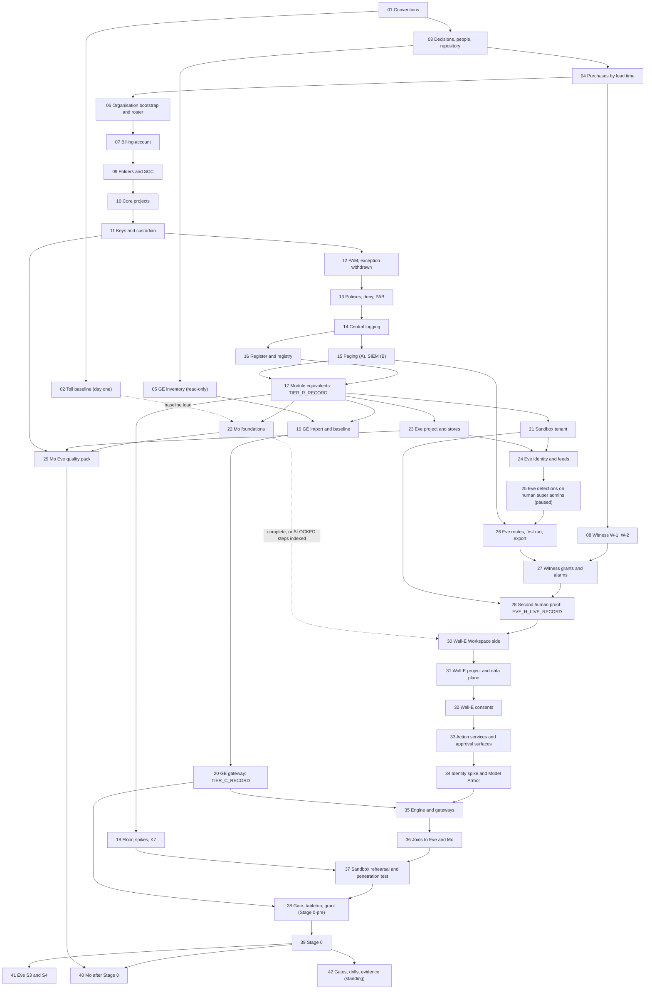

# 0. Setup procedures for the agentic platform, Mo, Eve and Wall-E

## Status
- Owner: the platform owner
- Last reviewed: 2026-09-15
- What this is: the one entry point to the human-executed setup procedures in this folder, files
  [01](01-prerequisites-and-conventions.md) to [42](42-gates-drills-and-evidence.md). It gives
  the reading and execution order, who must be present, time estimates, the resume rule, the
  index of BLOCKED steps, the cross-file re-run index, the gate map and the sign-off tracker for
  decisions SD-01 to SD-48. **No step is executed from this page.**
- Answers: [../13-setup-procedure-review.md](../13-setup-procedure-review.md) (review of
  2026-09-15), its §2 master order, §3 M2 and its fix plan item 4. This page closes S066, S068,
  S069 and S070 (§11).
- Maturity: written 2026-09-15, revision 2 (after the critique of the same day). Never executed.
  Nothing in the set is built.
- Maintained by: the platform owner. Every role reads §1 to §6 of this page and
  [01](01-prerequisites-and-conventions.md) before their first sitting.

## 1. What the set builds, and what it replaces

The set takes an existing Workspace tenant, its Cloud organisation and its live Gemini
Enterprise app to the following, in the owner's order of 2026-09-15:
1. **The agentic platform**: the organisation bootstrap, the folder tree, core projects, keys,
   PAM, policies, central logging, paging, the register, hand-made factory module equivalents,
   the Tier R gate, K7, then the Gemini Enterprise baseline and the Tier C gate.
2. **Mo and Eve**, as one block. Eve's first half (Eve-H) monitors every human super admin from
   its first run, before Wall-E exists. It reports to a human outside the administration line,
   copies the evidence to the witness organisation, and is proven by that second human on a
   seeded super-admin action (file 28). Mo's foundations run alongside it.
3. **Wall-E**, from its Workspace side to the super-admin grant and Stage 0, with the halves of
   Eve and Mo that need Wall-E joined in file 36.
4. **After Stage 0**: Mo's first merged proposal (40), Eve S3 and S4 (41), and the standing gate,
   drill and evidence records (42).

It replaces four pages. A review found them broken, so they are no longer followed:

| Replaced page | State from 2026-09-15 | What was salvaged, and where |
|---|---|---|
| [../../wall-e/SETUP.md](../../wall-e/SETUP.md) | Superseded. Its line 20 no longer calls it standalone: no procedure in this programme can be run on its own (S066) | Phases 1, 3, 4, 5 go to 30; 6 to 8 to 31; 9 to 32; 10 and 11 to 33; 12b and 12c to 34; 12, 13 and 13b to 35; the Phase 2 gate to 38; 14 to 18 to 39; §4 and §5 to 37 and 42; §0.4 durations to §3.2 below |
| [../../wall-e/PREREQUISITES.md](../../wall-e/PREREQUISITES.md) | Superseded | The people, tools and artefact tables go to 01; the decision table to 03; the purchase rows to 04 |
| [../../eve/07-build-runbook.md](../../eve/07-build-runbook.md) | Superseded | Phase 1 verifies and Phases 3 and 9 go to 23; 7 and 8 to 24; 9 grants and 10 to 25; 10b to 26 to 29; 2 to 5 to 36; 11 and 12 to 41 |
| [../../mo/07-build-runbook.md](../../mo/07-build-runbook.md) | Superseded | Mo-0 goes to 02; Mo-1 to Mo-3 to 22; the Eve pack of Mo-4 to 29; Mo-4 to Mo-6 (Wall-E pack) to 36; Mo-7 to Mo-11 to 40 |

[../../wall-e/setup/walle_setup.py](../../wall-e/setup/walle_setup.py) is a **helper only**, under
decision SD-37. The manual steps in files 30 to 39 are canonical. A subcommand may replace a
manual step only after its listed defects are fixed and its self-test has a live read-only
mode. Until then, every step that cites it is BLOCKED for the script and gives the manual
commands. It runs only inside `walle_shell` (01).

Standing constraints that every file keeps, and that no step may loosen:
- no domain-wide delegation, ever (checked in 01, 06, 25, 32, 38);
- the model holds no credential and cannot approve, and no service identity is ever the second
  person (SD-48; tested in 33, 34, 35, 37, 38);
- humans raise autonomy, machines lower it (16, 39, 41);
- no model produces an Eve approval (41);
- Mo acts only through a merged pull request with two human reviewers (16, 40).

## 2. How to use this page

- **Read before the first sitting.** Find your role in §6. Read §1 to §6 here, then
  [01](01-prerequisites-and-conventions.md), then each file your role appears in.
- **Work file by file, in the order of §3.** A file starts only when every file it depends on
  in §3.3 has a checkpoint line on its last step. The exceptions are the parallel sittings of
  §3.4 and steps listed in §8 as BLOCKED.
- **Before any IRREVERSIBLE step,** check its gate in §10 (signed decisions) and in the step
  itself (checked prerequisites).
- **When an identity or record appears, open §9** and run what it lists before you close the
  sitting.
- **Do not skip a file because its design page looks sufficient.** The design pages
  ([../01-hld.md](../01-hld.md) to [../12-open-decisions.md](../12-open-decisions.md),
  [../../project-topology.md](../../project-topology.md)) say what to build. These files say how,
  in what order, and who does it.

## 3. The order

### 3.1 Blocks

1. **Day one (01 to 05).** Conventions; the toil baseline, which cannot be taken later; decisions,
   people and the platform repository; purchases by lead time; the read-only Gemini Enterprise
   inventory.
2. **Organisation (06 to 08).** Roster, break-glass and removal of the organisation-creation
   defaults. Then billing, so its roles go to `sa-1-admin@`. The witness organisation runs in
   parallel, performed by IT security.
3. **Tier R (09 to 18).** Folders and SCC; core projects; keys; PAM, which withdraws the bootstrap
   exception; policies; logging; paging; register; module equivalents and the Tier R record;
   floor, spikes and K7.
4. **Tier C (19, 20).** After Tier R (SD-13). It runs in parallel with 21 to 29 and must close
   before 35.
5. **Sandbox (21).** Before Eve, because nonprod Eve (24, 25, 28) and the Wall-E twin (37) need a
   tenant.
6. **Mo and Eve (22, 23 to 28, 29).** One block, run in parallel. Eve-H never waits on Mo. It ends
   with `EVE_H_LIVE_RECORD` (28).
7. **Wall-E (30 to 39).** Starts only on `EVE_H_LIVE_RECORD`, with 22 complete or its BLOCKED
   steps in §8. It runs up to the gate, the two-person grant (38) and Stage 0 (39).
8. **After Stage 0 (40, 41).** Mo's reporter, graders and first merged proposal; Eve S3 and S4.
9. **Standing (42).** Consolidates records that files 01 to 41 fill. No earlier file waits on it.

### 3.2 The file table

Stages are those of review §2. Times are per file:
- **Hands-on** is keyboard and sitting time, summed over the people named.
- **Elapsed** includes waits that cannot be compressed.

Figures come from [SETUP §0.4](../../wall-e/SETUP.md#04-how-long-each-phase-takes) for Wall-E,
from eve/07 l.801 ("a full working day for phases 8 to 10"), from mo/07 l.19 ("roughly a day a
week") and l.1705 (Mo-9, about 3 days for the custodian), and from
[../brief/29-roadmap-and-cost.md](../brief/29-roadmap-and-cost.md). Assumption: every other cell
is an estimate by the plan's author, to be corrected from the build log after each sitting.

| # | File | Review §2 stage | Opens or produces | Who must be present | Hands-on | Elapsed |
|---|---|---|---|---|---|---|
| 0 | README (this page) | entry point | the order, indexes, tracker | nobody; read by every role | — | — |
| 01 | [01-prerequisites-and-conventions.md](01-prerequisites-and-conventions.md) | supports all (M2) | variables file, build log, registers | platform owner; second human reviews roles and signs the evidence convention | 1 day | 2 days |
| 02 | [02-toil-baseline.md](02-toil-baseline.md) | 2 | `TOIL_BASELINE_FILE` | platform owner; task recorders; second operator reviews | 2 h, then 30 min a week | **4 consecutive weeks, from day one** |
| 03 | [03-decisions-and-people.md](03-decisions-and-people.md) | 1 | signed decisions, named people, `PLATFORM_REPO_REMOTE` | platform owner; signatories per row; second human co-signs SD-10 to SD-12 | 3 to 5 days | days to weeks (the real critical path) |
| 04 | [04-purchases-and-lead-times.md](04-purchases-and-lead-times.md) | 3 | items in hand, key inventory | platform owner; procurement; finance approver; IT security | 1 to 2 days | weeks; SIEM and MDR months |
| 05 | [05-gemini-enterprise-inventory.md](05-gemini-enterprise-inventory.md) | 4 | dated GE inventory | platform owner alone | 1 day | 2 days; re-check Context-Aware Access by 2026-09-23 |
| 06 | [06-organisation-bootstrap-and-roster.md](06-organisation-bootstrap-and-roster.md) | 6 | first privileged principals, `ROSTER_FILE` | platform owner; **second human** for keys, backup codes, break-glass and roster merge; an other-line witness per envelope | 2 days | 1 to 2 weeks |
| 07 | [07-billing-account.md](07-billing-account.md) | 5 | `BILLING_ACCOUNT_ID`, quota request | billing administrator; platform owner verifies | 2 h | 2 to 5 business days |
| 08 | [08-witness-organisation.md](08-witness-organisation.md) | 7 | witness tenant, project, records home | **two witness administrators**; second human at W-1; platform owner absent | 2 to 3 days | 2 to 6 weeks (domain, tenant, billing, support) |
| 09 | [09-folders-and-security-command-center.md](09-folders-and-security-command-center.md) | 8, 9 | folder ids, SCC Premium eu | platform owner; IT security confirms or witnesses SCC activation | 1 day | 1 to 3 days |
| 10 | [10-core-projects-and-ci-identities.md](10-core-projects-and-ci-identities.md) | 10 | five core projects, CI identities | platform owner; billing administrator; **second human** witnesses Groups Admin | 1.5 days | 2 to 3 days |
| 11 | [11-keys-and-validator-custodian.md](11-keys-and-validator-custodian.md) | 10, M8 | key rings, custodian identity | platform owner; security reviewer takes the validator project | 1 day | 1 day; custodian part waits on naming |
| 12 | [12-privileged-access-catalogue.md](12-privileged-access-catalogue.md) | 11 | PAM catalogue; exception withdrawn | platform owner; **second human** approves test grants | 2 days | 2 to 4 days |
| 13 | [13-organisation-policies-deny-and-pab.md](13-organisation-policies-deny-and-pab.md) | 12 | folder baseline, deny, PAB | platform owner; security reviewer where appointed | 2 to 3 days | about 3 weeks (14-day dry runs, nonprod first) |
| 14 | [14-central-logging-and-billing-export.md](14-central-logging-and-billing-export.md) | 13 | central logging, billing export | platform owner; a super admin; billing administrator; **a second person per lock** | 2 days | 3 to 5 days (Workspace logs up to 24 h) |
| 15 | [15-pager-siem-and-detections.md](15-pager-siem-and-detections.md) | 28 (A pulled forward), 9 tail | paging, subject-report escalation, SCC route; part B G2 | IT security; platform owner; **second human** confirms pages; incident commander signs | A 1 day; B 3 to 5 days | A days; B months (P10) |
| 16 | [16-register-and-shared-registry.md](16-register-and-shared-registry.md) | 14 | register CI, shared registry | platform owner; security reviewer reviews; second human reviews control groups | 2 days | 3 to 5 days |
| 17 | [17-factory-module-equivalents-and-tier-r-gate.md](17-factory-module-equivalents-and-tier-r-gate.md) | 15 | FM procedures, `TIER_R_RECORD` | platform owner; approvers per entitlement | 2 to 3 days | 1 week |
| 18 | [18-model-armor-floor-spikes-and-kill-switch.md](18-model-armor-floor-spikes-and-kill-switch.md) | 16 | floors, spikes, K7 first drill | platform owner; **second human** for the enforced drill and lift | 3 to 4 days | 1 to 2 weeks |
| 19 | [19-gemini-enterprise-import-and-baseline.md](19-gemini-enterprise-import-and-baseline.md) | 17, 18 | app moved and baselined | platform owner via ent-ge-admin; a non-admin colleague; DPO signature | 3 to 4 days | 2 to 3 weeks (change windows, notices) |
| 20 | [20-gemini-enterprise-gateway-and-tier-c-gate.md](20-gemini-enterprise-gateway-and-tier-c-gate.md) | 19, 20 | gateway, `TIER_C_RECORD` | platform owner via ent-ge-admin; a non-admin colleague | 2 to 3 days | 1 to 2 weeks (spike) |
| 21 | [21-sandbox-tenant-and-nonprod-foundation.md](21-sandbox-tenant-and-nonprod-foundation.md) | 32 (tenant half) | sandbox tenant, nonprod rows | **two sandbox super admins**; platform owner; second human for keys | 2 days | 1 to 4 weeks (purchase, domain) |
| 22 | [22-mo-foundations.md](22-mo-foundations.md) | 22, 25 (Mo-1 to Mo-3) | `MO_PROJECT`, datasets, `mo-metrics@` | Mo owner; second operator reviews inputs | 2 days | 1 week once inputs exist |
| 23 | [23-eve-project-and-evidence-stores.md](23-eve-project-and-evidence-stores.md) | 22, 24, 30 (Eve-H 1) | `EVE_PROJECT`, keys, datasets, locked bucket | platform owner; **second human** approves PAM and witnesses the lock | 1.5 days | 2 to 3 days |
| 24 | [24-eve-workspace-identity-and-audit-feeds.md](24-eve-workspace-identity-and-audit-feeds.md) | 30 (Eve-H 2) | `eve@`, sink, consent, `eve-verifier@` | platform owner; **second human** present and performs the consent; a sandbox super admin | 1 full day with the second human | 3 days (logs up to 24 h) |
| 25 | [25-eve-human-super-admin-detections.md](25-eve-human-super-admin-detections.md) | 30 (G-4, G-5) | detections deployed paused | platform owner; **second human** approves PAM and every eve/config merge | 2 to 3 days | 1 week once code exists |
| 26 | [26-eve-reporting-and-witness-export.md](26-eve-reporting-and-witness-export.md) | 30 (G-6) | routes, `eve-export@`, `EVE_FIRST_RUN_RECORD` | platform owner; **second human** confirms test pages; incident commander signs routing | 2 days | 3 to 5 days |
| 27 | [27-witness-grants-and-alarms.md](27-witness-grants-and-alarms.md) | 29 (G-2) | witness grants, absence alarms | **two witness administrators**; second human confirms alarms; platform owner hands over one email | 1 day | 2 to 3 days (first heartbeat) |
| 28 | [28-eve-independent-proof-and-sandbox-drills.md](28-eve-independent-proof-and-sandbox-drills.md) | 30, 32 (Eve) | `EVE_H_LIVE_RECORD` | **second human leads**; platform owner seeds only; a sandbox super admin; a witness administrator records | 1 day across four people | 1 to 2 weeks (unannounced window) |
| 29 | [29-mo-eve-quality-pack.md](29-mo-eve-quality-pack.md) | 30 (10b step 5), 25 (Eve pack) | Eve quality metrics | Eve side via PAM approved by the second human; Mo owner | 0.5 to 1 day | 1 to 2 days |
| 30 | [30-wall-e-workspace-side.md](30-wall-e-workspace-side.md) | 21 | `walle@`, groups, hardening | platform owner; **second human** for key B; second operator confirms alerts | 3 h (SETUP 1, 3, 4, 5 total 2 h) | 1 day (first alert up to 24 h) |
| 31 | [31-wall-e-project-and-data-plane.md](31-wall-e-project-and-data-plane.md) | 22, 23 | `WALLE_PROJECT`, data plane | platform owner; **two named approvers** (security reviewer, second human) | 1 day (SETUP 6 to 8: 1 h 45) | 2 to 3 days |
| 32 | [32-wall-e-consents.md](32-wall-e-consents.md) | 26 (G13) | tokens in Secret Manager | platform owner; **second human** witnesses and holds key B | 2 h (SETUP 9: 75 min) | 1 sitting |
| 33 | [33-wall-e-action-services-and-approval-surfaces.md](33-wall-e-action-services-and-approval-surfaces.md) | 27, M7 | action services, approval surfaces | platform owner; second reviewer approves deploy grants | 1 to 2 days (SETUP 10, 11: 1 h 30 plus surfaces) | 2 to 3 days once code exists |
| 34 | [34-wall-e-identity-spike-and-model-armor.md](34-wall-e-identity-spike-and-model-armor.md) | 27 | `AGENT_IDENTITY_MODE`, templates | platform owner; second human reviews the decision 19 record | 1 day (SETUP 12b, 12c: 3 h) | 1 to 2 days (one-day spike) |
| 35 | [35-wall-e-engine-registration-and-gateways.md](35-wall-e-engine-registration-and-gateways.md) | 27 | engine, registration, gateways | platform owner; ge-admins@ member; a colleague without discoveryengine roles | 0.5 to 1 day (SETUP 12, 13, 13b: 2 h 15) | 1 to 2 days, plus spikes |
| 36 | [36-wall-e-joins-to-eve-and-mo.md](36-wall-e-joins-to-eve-and-mo.md) | 24, 25, 31 | Eve-W S0, Mo Wall-E pack, `mo-analyst@` | platform owner; second human approves Eve-side PAM | 2 days | about 1 week (first transfers) |
| 37 | [37-wall-e-sandbox-rehearsal.md](37-wall-e-sandbox-rehearsal.md) | 32 (G8, G10, G11, G14, G20) | drill records, `PENTEST_RECORD` | platform owner; **two sandbox super admins**; **second human** for K6 and K7; IT security for the penetration test | 4 to 6 days (SETUP 17: 1 to 2 days) | 2 to 4 weeks (test window) |
| 38 | [38-super-admin-gate-and-grant.md](38-super-admin-gate-and-grant.md) | 33, 34 | P-SA gate, Stage 0-pre, the grant | platform owner requests; **second human approves**; security reviewer and ISMS sign; the desk | 2 days (grant 60 min) | the P-SA gate: weeks to months |
| 39 | [39-wall-e-stage-0.md](39-wall-e-stage-0.md) | 35, 36 | `STAGE0_RECORD` | platform owner; **second human** for K5 and co-signature; second operator | 2 to 3 days (SETUP 14 to 18) | about 1 week |
| 40 | [40-mo-after-stage-0.md](40-mo-after-stage-0.md) | 37, 39 | `FIRST_MERGE_RECORD` | Mo owner; validator custodian; **two human reviewers** | about a day a week; Mo-9 about 3 custodian days | stage floors S1 and S2: 10 to 14 weeks after Stage 0 |
| 41 | [41-eve-s3-and-s4.md](41-eve-s3-and-s4.md) | 40 | Eve S3 and S4 entry | Eve owner (second human); security reviewer; platform owner builds | 3 to 4 days | at S3 entry (floor 6 to 8 weeks after S2) |
| 42 | [42-gates-drills-and-evidence.md](42-gates-drills-and-evidence.md) | all gates | consolidated records | platform owner; security reviewer quarterly; second human; witness administrators | 0.5 day a quarter plus drills | standing |

### 3.3 Dependency diagram

An arrow means "the later file consumes something the earlier file produces". The dotted arrows
are conditions, not waits. Revision 2 removed two edges: 22 to 23 (Eve-H never waits for Mo)
and 29 to 30 (Wall-E never waits for Mo's Eve pack). 20 precedes 35.



### 3.4 Parallel sittings and the critical path

The following sittings run side by side. Each still needs its own inputs.

| Parallel lane | Runs alongside | Condition |
|---|---|---|
| 02 toil baseline | everything, from day one (2026-09-15; recording from the next Monday) | recording weeks cannot be recovered; the load is a re-run in 22 |
| 05 GE inventory | 01 to 04, from week one | read-only; finished before 19 |
| 08 witness W-1, W-2 | 06 to 18, from week one | once P14 is signed (03) and the domain is bought (04); records before W-2 stay on paper with a same-day scan (SD-27) |
| 19, 20 Tier C | 21 to 29 | 20 closes before 35 and before 38 (G21) |
| 22 Mo foundations, 29 Mo Eve pack | 23 to 28 | a BLOCKED Mo input never holds Eve-H; 29 may finish after 30 starts |
| 15 part B SIEM | 16 to 37 | only G2 and Tier P wait on it |

Assumption: the critical path below uses the estimates of §3.2, one platform owner, and people
available when named. Every date is an earliest date, not a commitment.

| Milestone | Record | Earliest | What bounds it |
|---|---|---|---|
| Toil baseline complete | `TOIL_BASELINE_FILE` merged | 2026-10-18 | four consecutive ISO weeks from Monday 2026-09-21 (02's `TOIL_START_DATE` is a Monday) |
| Decisions and people signed | 03 records | 2026-09-29 to 2026-10-27 | other people's time; the D7 answer |
| Tier R open | `TIER_R_RECORD` (17) | 2026-11-10 to 2026-12-08 | about 25 hands-on days in 06 to 17, plus 13's 14-day dry runs |
| Tier C open | `TIER_C_RECORD` (20) | 2026-12-08 to 2027-01-19 | change windows and the GE-9 spike |
| Eve-H live | `EVE_H_LIVE_RECORD` (28) | 2026-12-22 to 2027-01-19, *tbd* on Eve code | Eve's code and schemas committed (36 to 45 engineer-days per brief/29), the SD-11 DPO record, the witness |
| Pre-grant Wall-E built | `PENTEST_RECORD` (37) | 2027-02-02 to 2027-03-16, *tbd* on Wall-E code | Wall-E service code; the penetration test window; decision 6 signed before 35 |
| The grant | `GRANT_RECORD` (38) | *tbd*; not before 2027-03 | the longest of G2 (SIEM and MDR contract, months), G8, G11 and G20 freshness, five named humans (SD-04) |
| Stage 0 | `STAGE0_RECORD` (39) | 1 to 2 weeks after the grant | K0 to K5 on production |
| Mo's first merge | `FIRST_MERGE_RECORD` (40) | 13 to 18 weeks after Stage 0 | stage floors S0, S1, S2 (brief/29) |
| Eve's first enforcing window | S3 entry record (41) | 6 to 8 weeks after S2 exit | S3 floor |

The model pin (decision 6, 03) is re-read on the day it is signed and closed before 35. No step
uses a Gemini 2.5 model. The review dates their retirement from 2026-10-16.

## 4. Working in sittings, and resuming

**A sitting** is one continuous working session. It is bounded by the people it needs (§3.2
"Who must be present") and ends at a step boundary. Each sitting:
1. starts from a clean shell with `~/.platform-env` sourced and the dedicated gcloud configuration
   of 01, which has no default project;
2. names every person present in the build log;
3. ends with the credential clean-up of 01.

**The checkpoint rule.** Every step writes checkpoint lines to the build log in `BUILD_LOG_DIR`.
It writes one when it starts and one when its VERIFY passes. Nothing is ticked on someone's word.
01 fixes the exact format. It carries at least these fields:

```text
<UTC timestamp> <step id> <START|DONE|BLOCKED|PENDING|ROLLED-BACK|N/A> <operator> <witness or -> <evidence path or ->
```

**The resume rule.** After any interruption (quota, a cut session, an absent approver):
1. Restart at the first step, in file order, that has no `DONE` line.
2. A step with `START` and no `DONE` is not re-run blindly. Run its VERIFY first. If VERIFY passes,
   write `DONE` with a note. If it fails, follow the step's ROLLBACK, then re-run the step.
3. For an **IRREVERSIBLE** step with `START` and no `DONE`, never re-run. Read the resource's
   state, record it, and ask the step's named approver before going on. A second project id, key
   ring or lock cannot be undone.
4. `BLOCKED` and `PENDING` lines do not count as `DONE`. A later step that consumes their output
   stays unrun. The exceptions are the conditions of §3.3 and §8.
5. A changed variable value is written only with `penv_set --force` and a build-log line (01).

**Evidence.** Every step ends with an EVIDENCE line. Records follow SD-38:
- **Text records** go to the build-log repository under the step id.
- **Scans and signed documents** go the same day to `EVIDENCE_INTERIM_LOCATION`.
- **Copies:** both are copied to the platform evidence bucket after 14. Custody, rota and drill
  records go to the witness from W-2 (08).
- **Register and names:** `EVIDENCE_REGISTER` (01) maps each line to the E-xx id of
  [../10-eu-ai-act.md](../10-eu-ai-act.md) §5 and the control id of
  [../11-tisax.md](../11-tisax.md) §13. Records are named `<date>-<step-id>-<record>-v<n>` and
  never overwritten.

## 5. The variables file and the step format

**Variables.** There is one file, `~/.platform-env`. 01 creates it, and it is never committed.
- **Names:** every variable has one name and one setting file. The list is fixed by the set's
  plan and repeated in 01.
- **No secrets:** no variable holds one. Secrets are piped into Secret Manager, and only secret
  names and version numbers are recorded.
- **Helpers (defined in 01):**
  - `penv_set` writes a value once;
  - `need` fails a step on an empty or `*tbd*` input;
  - `exists_or_pending` prints PENDING for a foreign principal that does not exist yet and records
    it for §9 (SD-44);
  - `twin_shell` maps production names to the nonprod twin names;
  - `walle_shell` exports `PROJECT` for the helper script only.
- **Retired names** that must not reappear: `PROJECT` outside `walle_shell`, `FOLDER_ID`,
  `BILLING`, `CUSTOMER_ID=my_customer` in policies, `SA_WALLE_CI`, `walle_metrics*`,
  `LOGS_DATASET`, and `EVE_EVIDENCE_KEY` for datasets.
- **Witness identifiers:** the witness administrators keep their own copy of the witness section.

**Step format.** Every step in 01 to 42 has these fields:

| Field | Content |
|---|---|
| Id | file prefix and number, for example `OB-3.4` (prefixes are listed in 01) |
| WHO | the role that performs it, and any witness or approver who must be present |
| WHERE | the console path, or "shell, `~/.platform-env` sourced" |
| ACTION | commands in bash fences, one command per line of effect, each checked against Google's documentation on the day the file was written |
| VERIFY | a check whose output proves the step worked |
| ROLLBACK | the undo, or **IRREVERSIBLE** in bold with what to confirm first and the signed decision or checked prerequisite that gates it |
| EVIDENCE | what is recorded, where, its E-xx id and its TISAX control id |

A step whose code does not exist yet reads **BLOCKED**. It names the code, the repository and
commit it needs, and the gate that waits. Every BLOCKED step is listed in §8.

## 6. Who must be present (S069)

Every role reads this page and 01 before their first sitting. Nobody performs a step alone if
the step's WHO names a second person. A missing person is recorded as a BLOCKED checkpoint
line, never replaced by the platform owner.

| Role | Files where the role must be present or sign | Never also |
|---|---|---|
| Platform owner (`sa-1-admin@`) | performs or requests in 01 to 07, 09 to 26, 27 (hands over one email; enables the push), 28 (seeded action only), 29 to 42 | approver of his own grants; administrator or responder on the subject-report escalation; custodian of `eve@`'s keys; witness administrator |
| Second human (IT security, `sa-2-admin@`, owner of `eve-owners@`) | 01, 03, 06, 10, 12, 14, 15, 16, 18, 21, 23 to 29, 30, 31, 32, 36, 37, 38 (approves the grant), 39, 41 (Eve owner) | witness administrator; member of any Wall-E group |
| Security reviewer | 03, 11, 12, 13, 16, 24 (key custodian once appointed), 26 (recipient of reports about the second human), 31, 38, 41, 42 | Wall-E owner |
| Incident commander (IT security, not a tenant super admin) | 03, 15, 24 (interim key custodian), 26 (interim recipient, routing signature), 42 | tenant super admin |
| Second operator | 02, 22, 30, 39 | — |
| Validator custodian | 11, 29, 40 | Mo owner |
| Blind grader | 40 | playbook owner |
| Two witness administrators (IT security) | 08, 27, 28 (records), 42 | tenant super admin; platform owner; second human; second operator |
| Two sandbox super admins | 21, 24 (twin sink), 28 (sandbox events), 37 | — |
| Billing administrator (finance) | 07, 10, 14 | — |
| DPO | 03 (D7, SD-11), 19 (logging setting), 24 and 25 (precondition record) | — |
| ISMS, legal, works council or HR | 03, 38 (ISMS signs; legal for G16) | — |
| Mo owner | 22, 29, 40 | validator custodian |
| A non-admin colleague | 19, 20, 35 (user tests) | holder of discoveryengine roles |
| Toil recorders | 02 | — |
| The desk | 38 (acknowledges announced alerts) | — |

Sittings that cannot start without two or more people:
- **06:** key enrolment and envelopes.
- **12:** approver test grants.
- **14:** locks.
- **18:** the enforced K7 drill and lift.
- **23:** the retention lock.
- **24:** `eve@` creation and consent.
- **27:** the witness grants.
- **28:** the proof.
- **30:** key B.
- **31:** the P-SA production entitlement.
- **32:** the consent.
- **37:** K6, K7 and approvals.
- **38:** the grant.
- **39:** K5 and the Stage 0 record.
- **40:** the merge.

## 7. Gates, milestones and the G-line map

| Gate or milestone | Record | Closed in | Refused unless |
|---|---|---|---|
| Tier R open (under the bootstrap deviation) | `TIER_R_RECORD` | 17 | module equivalents, folder baseline, central logging and shared registry each carry evidence |
| Tier C gate (G21) | `TIER_C_RECORD` | 20 | SCC findings routed with a test finding; the gateway binding proven with a user test (SD-13) |
| Eve's first run | `EVE_FIRST_RUN_RECORD` | 26 | route 1 to the second human tested; schedules were paused until then |
| Eve-H live | `EVE_H_LIVE_RECORD` | 28 | the organisation exception is withdrawn (12), break-glass envelopes are sealed (06), witness alarms have seen data (27), and the second human's proof passed |
| Tier W rows (G19) | rows in 42, parsed in 38 | 11, 03, 10, 33, 37 | restore drill, Binary Authorization pipeline, validator custodian, security reviewer, second operator and blind grader, each dated |
| P-SA gate and Stage 0-pre | `GATE_CHECKLIST_RECORD` | 38 | every G line has a date, a signer and a fresh record, parsed by CI or by the security reviewer and the second human (SD-36) |
| The grant | `GRANT_RECORD` | 38 | the second human's multi-party approval is given against the merged, parsed checklist; the robot never approves (SD-48) |
| Stage 0 | `STAGE0_RECORD` | 39 | strict verify (SKIP is FAIL); the grant re-verified |

The G-line map below is also kept in 38. When the two disagree, 38 is corrected and this table
follows.

| Line | In short | Producing file and record |
|---|---|---|
| G1 | Eve's observe-and-report layer live and drilled; witness receives the heartbeat | 28 (`EVE_H_LIVE_RECORD`), with 27 |
| G2 | SIEM with 24x7 acknowledgement, SA-01 to SA-09 and SG-01 to SG-07 with fixtures | 15 part B |
| G3 | Exactly two human super admins on separate admin accounts with keys | 06 (roster), re-checked in 38 |
| G4 | Multi-party approval on for every covered setting | 38 (gate day, SD-30) |
| G5 | Super-admin self-recovery Off at every OU and configuration group | 38 (gate day, SD-30) |
| G6 | Hygiene set on the robot's OU | 30 |
| G7 | The two lists and the P33 record signed; TISAX deviation and risk row | 03 |
| G8 | Penetration test with no open critical or high; DPIA started; works council informed | 37 (`PENTEST_RECORD`); 03 for DPIA and works council |
| G9 | Perimeter decision (P3 spike), Access Approval on `WALLE_PROJECT`, PAM second reviewer on deploy | 18 (P3), 31 (Access Approval), 12 (entitlements) |
| G10 | Both action services with the lists; denial suite passing on the twin | 37 (`DENIALS_RECORD`) |
| G11 | K6 drilled on the twin robot, under 30 days old at the grant | 37 (`K6_DRILL_RECORD`) |
| G12 | Three bands in code | 33 and 16 (CI) |
| G13 | Two clients, two services, Internal in production, External and Trusted on the twin | 32 and 37 |
| G14 | Band-B requester rule; one dry-run band-B request | 33 and 37 (`BANDB_DRYRUN_RECORD`) |
| G15 | Permanent ceiling in code | 33 and 16 |
| G16 | EU AI Act intended-purpose statement signed | 03 |
| G17 | Crisis-scenario tabletop run | 38 (`TABLETOP_RECORD`) |
| G18 | Hardware-key custody witnessed, records in the witness | 08 (records step), fed by 06, 24, 30 |
| G19 | Tier W rows | 11, 03, 10, 33, 37 |
| G20 | K7 drill on fld-agents-p-sa-nonprod younger than 30 days | 37 (`K7_PSA_DRILL_RECORD`), first drill in 18 |
| G21 | Tier C gate closed | 20 (`TIER_C_RECORD`) |
| G-1 | Second human named, owner of `eve-owners@`, required reviewer on eve/config | 03 and 06 |
| G-2 | Witness exists; first push landed; absence alarm fires on a withheld push | 27 and 28 |
| G-3 | `eve@` onboarded, not a super admin, exactly the E-16 privilege set | 24 |
| G-4 | Six-stream sink and Reports poll by actor running (SD-03) | 28 (production half); 37 (twin robot event); 32 (robot consent login); walle@ rows post-grant in 39 |
| G-5 | Reconciliation, tenant-integrity rules, roster check, heartbeat | 28 |
| G-6 | Reporting contract live on both routes | 28, with 26 |
| G-7 | The drill on the sandbox tenant | 28 |

## 8. BLOCKED index

A step is BLOCKED when the code, person or contract it needs does not exist. Each file lists
its BLOCKED step ids at the step and in its own status block. This index names what each
needs and what waits on it. A BLOCKED step has a `BLOCKED` checkpoint line and is re-run when
its row here is cleared.

| # | Missing | Kind | Files and parts BLOCKED | Must land in | Owner | What waits |
|---|---|---|---|---|---|---|
| B-01 | Terraform factory modules | code | 17 automation (hand equivalents run instead, SD-01); 42 supersession | factory repository *tbd*, empty plan after `terraform import` | platform owner | Tier W expiry of the deviation register |
| B-02 | Drift job, reconciliation job, Data Access canary | code | 14 canary; 16 jobs | `PLATFORM_REPO_REMOTE` | platform owner | drift evidence for G3, G19 |
| B-03 | Register CI rules, gate-checklist parser, bot-approval and ladder-raise rules | code | 16; 38 and 39 parse (signed manual parse by the security reviewer and the second human meanwhile) | `PLATFORM_REPO_REMOTE` | platform owner; security reviewer reviews | nothing is held: the fallback applies |
| B-04 | `k7-executor` image | code | 18 build and drills; 37 G20 | `PLATFORM_REPO_REMOTE`, image in `AR_PLATFORM` | platform owner | G20 |
| B-05 | H-2 SIEM canary, H-3 synthetic SCC finding | code | 15 | `PLATFORM_REPO_REMOTE` | platform owner; IT security | G2 evidence |
| B-06 | SIEM contract (P10) and SA-01..SA-09, SG-01..SG-07 as code with fixtures | contract and code | 15 part B; SIEM principal re-run on K7 (§9) | IT security rule repository | IT security | G2; Tier P |
| B-07 | Eve: nine schema files | code | 23 tables | Eve repository, `EVE_SCHEMAS_COMMIT` | Eve owner | 24 to 28 |
| B-08 | Eve: reconciler (Reports poll, roster check, detections, H-1, credential check), eve-console, export and heartbeat jobs, self-integrity rules, configuration fingerprint | code | 25, 26, 27 (fingerprint alarm) | Eve repository, `EVE_CODE_COMMIT` with green CI | Eve owner | `EVE_FIRST_RUN_RECORD`, `EVE_H_LIVE_RECORD`, all of Wall-E |
| B-09 | Eve: SQL files, `thresholds.yaml`, detection catalogue | code | 25, 29, 36 | `EVE_CONFIG_REPO` and Eve repository | Eve owner | 25 deploy; 29; 36 v0 queries |
| B-10 | Eve: consent command (prints the URL, checks userinfo and granted scopes, writes to Secret Manager) | code | 24 consent sitting | Eve repository | Eve owner | 25 onwards |
| B-11 | DPO record for monitoring named administrators (SD-11) | decision | 25 reconciler and poll jobs | decisions record (03) | DPO; platform owner | Eve-H |
| B-12 | Recipient of reports about the second human: security reviewer, or incident commander until appointed | person | 26 whole file | 03 people record | platform owner | Eve's first run |
| B-13 | Validator custodian named | person | 11 custodian part; 29 row 29; 31 row 21 | 03 people record | security reviewer's line | G19; 40 |
| B-14 | Mo: 20 schemas, 19 SQL files, `gates.yaml`, UDFs, fixtures | code | 22 build-inputs gate; 29 queries; 36 Wall-E pack | Mo repository, `MO_INPUTS_COMMIT` (file count checked) | Mo owner | 29, 36, 40; **not** Eve-H; Wall-E may start with these indexed |
| B-15 | Mo: reporter, watermark writer, ingestion workflow, narrator image | code | 40 | Mo repository | Mo owner | `FIRST_MERGE_RECORD` |
| B-16 | Wall-E: walle-actions, walle-actions-super, dispatcher, approval surfaces, agent code with the eu model client | code | 33, 35 (and 34's spike against pre-grant services) | `WALLE_REPO_REMOTE`, `WALLE_CODE_COMMIT` | Wall-E owner | 34 to 39 |
| B-17 | Wall-E: consent bootstrap with `--scopes-file` and granted-scope comparison | code | 32 | `WALLE_REPO_REMOTE` | Wall-E owner | G13; 33 onwards |
| B-18 | `walle_setup.py` fixes and live read-only self-test (SD-37) | code | the script path only in 30 to 39; manual steps are not held | `WALLE_REPO_REMOTE` | Wall-E owner | nothing: manual path applies |
| B-19 | Eve: eve-gate, signing and key-destroy guard tools | code | 41 | Eve repository | Eve owner | S4 entry |
| B-20 | Security reviewer appointed | person | 12 `ENT_FACTORY_SINGLETON_PSA_PROD`; 31 (ordered after appointment); 38 signature | 03 people record | ISMS | 31 onwards; the grant |
| B-21 | Five named humans, or four with a dated ISMS exception (SD-04) | person | 38 | 03 people record | ISMS | the grant |

## 9. Re-run index

These are what to re-run, in which file, when a later identity, person or record appears. A
foreign grant attempted early prints PENDING through `exists_or_pending`. The build log then
holds the live PENDING list, and this table is the planned list. A re-run is closed by its
VERIFY, never by the original step's checkpoint.

| When this appears | Made in | Re-run or make | In file | Verified by |
|---|---|---|---|---|
| `factory-apply@` | 10 | Billing Account User and Costs Manager on `BILLING_ACCOUNT_ID` (billing administrator) | 07 (re-run from 10) | 07 verify |
| `factory-groups@` gets Groups Admin | 10 | `ROSTER_FILE` update, second human reviews | 06 file, change made in 10 | roster merge; Eve's roster check from 25 |
| `walle-deployer@` | 10 | objectCreator on `ladder/` of `EVE_EVIDENCE_BUCKET`, **before** the retention lock | 23 | 23 verify; lock refused otherwise |
| Validator custodian identity and its human owner | 11, named in 03 | custodian part of 11; eve_quality READER (row 29) | 11, 29 | 29 verify |
| Validator custodian | 11 | `walle_audit` READER (row 21) | 31 | 31 testIamPermissions; 36 |
| Security reviewer appointed | 03 | `ENT_FACTORY_SINGLETON_PSA_PROD`; second approver on `ENT_ORG_SINK`; second approver in 13; validator project ownership | 12, 13, 11 | one-grant tests |
| Security reviewer appointed | 03 | re-custody of `eve@`'s second key from the incident commander, witnessed; switch the recipient of reports about the second human | 24, 26 | custody record in the witness; recipient-set CI assertion |
| `mo-metrics@` | 22 | log view viewAccessor and `platform_logs_views` READER (row 40), PENDING at 14 | 14 | 14 verify, re-run |
| `mo-metrics@` | 22 | eve_quality READER (row 28), made once both exist | 29 | 29 verify |
| `mo-metrics@` | 22 | `walle_audit` READER (row 6), granted directly | 31 | 36 verifies |
| Toil baseline four weeks complete | 02 | `bq load` of `TOIL_BASELINE_FILE`, no expiry, archive copy | 22 | 22 verify |
| Sandbox customer id | 21 | member constraint on nonprod folders holding twin components | 13 policy, change made in 21 | first real sandbox grant |
| `eve-verifier@` | 24 | log view viewAccessor, PENDING at 14 | 14 | 14 verify, re-run |
| `eve@` gets its read-only role | 24 | `ROSTER_FILE` update, second human reviews | 06 file, change made in 24 | Eve's roster check |
| `eve-export@` | 26 | W-3: allowedMemberSubjects, rows 32 and 33, negative tests (the platform owner hands over the email only) | 27 | 27 negative tests |
| W-3 grants made | 27 | **witness push resume**: enable the push disabled in 26; first heartbeat and backlog since `EVE_FIRST_RUN_RECORD` | 27 (tenant-side, under `ENT_PROJECT_REPAIR_EVE` approved by the second human) | heartbeat row in `WITNESS_HEARTBEAT_TABLE` |
| `eve-export@` | 26 | `walle_audit` READER (row 34) | 31 | 31 verify |
| `EVE_H_LIVE_RECORD` | 28 | the second human decides whether 06's interim Admin console activity rule is retired (recommended: kept). **Never removed before 28** | 06 rule, decision in 28 | build-log line signed by the second human |
| `walle@` created, no admin role | 30 | `ROSTER_FILE` update as an expected account with no role | 06 file, change made in 30 | Eve's roster diff stays quiet; any role on `walle@` pages |
| Eve and Mo invokers for the action services | 33 (PENDING) | `walle deploy` re-run with Eve's control and halt invokers and allowlists | 36 | 36 verify |
| `AGENT_PRINCIPAL` | 34 | `EXEC_CALLER_ALLOWLIST` on both services; 33's negative approval-surface tests against the agent principal | 34 | 34 verify |
| `eve-v0@` | 36 | `walle_audit` READER at S0, PENDING at 31 | 36 | 36 mirror counts |
| `eve-controller@`, `eve-console@` | 25, 36 | invokers, allowlists, `SUPER_ACTIONS_URL` in the reconciler; `halt_target_pending` rules wired to halts | 36 | 36 verify |
| `mo-analyst@` | 36 | no run.invoker on walle-actions (SD-24); views created as `mo-metrics@`; MD-3 expects refusal; confirm deny-improvers covers it, and re-run 22's entry if it lists accounts one by one | 36, 22 | BigQuery jobs as each identity |
| SIEM ingestion principal | 15 part B | invoker on the K7 job | 18 | 18 one-grant test |
| `walle@` gets Super Admin | 38 | `ROSTER_FILE` update, second human reviews; Eve's rule on approvals by `walle@` confirmed live | 06 file, change made in 38 | Eve's roster check green (39) |
| Grant made | 38 | Eve post-grant check 4 (walle@ rows); GE-11 enforce once Wall-E's row is admitted | 39 | 39 verify |
| Drill ages at the grant date | 37 | K6 repeated if it would be over 30 days old; K7 on fld-agents-p-sa-nonprod under 30 days | 37 | G11, G20 |
| Any eve/config merge | 25 | the second human's blind proof and the drill after the change | 28 (`DRILL_CALENDAR`) | drill record in the witness |
| Factory exists | B-01 | `terraform import` then an empty plan per deviation entry; delete `ENT_BOOTSTRAP_MODULE_*` | 17, 42 | empty plan |

Exceptions that end on a date are re-checked at every sitting after their end:
- `BOOTSTRAP_EXCEPTION_EXPIRY` (06): withdrawn in 12, with the creator's Owner on the five core
  projects.
- `BOOTSTRAP_BILLING_EXPIRY` (07).
- The bootstrap deviation register (01, SD-01): closes at the Tier W gate.

## 10. Decision sign-off tracker

Decisions SD-01 to SD-48 are taken by these procedures and await the owner's signature. They are
recorded append-only as 03 prescribes. The table gives each decision's short name, the files it
gates, the first file that may not start until it is signed, and extra signatories beyond the
platform owner. On 2026-09-15 every row is **pending**. The Signed column is filled with the
record's date and path when signed. Wall-E D rows, Eve E rows, Mo M rows and platform P rows are
tracked in 03.

| Id | Decision | Gates files | First file refused until signed | Also signs | Signed |
|---|---|---|---|---|---|
| SD-01 | Bootstrap deviation from the factory; dated exception | 06, 09 to 12, 17, 18, 22, 23, 31, 42 | 06 | security reviewer when appointed | pending |
| SD-02 | Super-admin gate split; nonprod P-SA rows merge | 16, 31, 37, 38 | 16 | — | pending |
| SD-03 | G-4 evidence from three sources | 24, 28, 32, 37, 39 | 24 | Eve owner | pending |
| SD-04 | Witness administrators are not tenant super admins; five humans | 01, 03, 08, 27, 38 | 08 | ISMS | pending |
| SD-05 | Twin OAuth clients External, In production, Trusted | 21, 24, 37 | 21 | — | pending |
| SD-06 | Sandbox organisation logging | 15, 21, 24, 37 | 21 | — | pending |
| SD-07 | Hourly heartbeat, sub-daily export, absence windows | 26, 27 | 26 | IT security | pending |
| SD-08 | Severity 1 routes: paging service, witness backstop | 15, 26, 27 | 15 | incident commander | pending |
| SD-09 | Model pinned on the eu endpoint | 03, 35, 40, 42 | 35 | — | pending |
| SD-10 | Eve-H before Wall-E; Eve-W after | 23 to 28, 36, 41 | 23 | **second human** | pending |
| SD-11 | Monitoring named administrators: DPO record | 03, 24, 25 | 24 | **second human**; DPO | pending |
| SD-12 | The monitored administrator installs Eve: independence measures | 06, 12, 15, 23 to 28, 30 | 06 | **second human** | pending |
| SD-13 | Tier C after Tier R | 19, 20 | 19 | — | pending |
| SD-14 | Git host decided and repository created before Tier R | 03, 10, 16 | 10 | — | pending |
| SD-15 | SCC Premium payer and activation before location policy | 04, 09, 13 | 09 | IT security; finance | pending |
| SD-16 | Dedicated EUR billing account | 07, 10, 14 | 07 | finance | pending |
| SD-17 | Observability location; no Logging folder default | 09, 10, 17 | 09 | — | pending |
| SD-18 | Makers for rows 36, 40, 41, 44; `ent-org-sink` with approval; group makers | 06, 10, 12, 14, 16 | 06 | — | pending |
| SD-19 | Gemini Enterprise administration through `ent-ge-admin` | 12, 19, 20 | 12 | — | pending |
| SD-20 | Live-app safety of the GE baseline | 05, 19, 20 | 19 | DPO (logging setting) | pending |
| SD-21 | App location eu only | 05, 35, 38 | 05 | — | pending |
| SD-22 | Deny-policy principal form | 13, 17, 18, 35 | 13 | — | pending |
| SD-23 | Eve evidence bucket in europe-west1 | 23 | 23 | — | pending |
| SD-24 | No run.invoker for `mo-analyst@` | 36 | 36 | Mo owner | pending |
| SD-25 | Sandbox customer id on nonprod twin folders | 21, 24, 37 | 21 | — | pending |
| SD-26 | Drill split between sandbox and witness | 28 | 28 | Eve owner | pending |
| SD-27 | Custody records on paper until W-2 | 06, 08, 38 | 06 | IT security | pending |
| SD-28 | Witness billing, support, domain, member constraint | 04, 08, 27 | 04 | IT security | pending |
| SD-29 | Sandbox before the grant; edition and seats | 03, 04, 21 | 04 | — | pending |
| SD-30 | Self-recovery Off and multi-party approval on gate day | 06, 30, 38 | 06 | — | pending |
| SD-31 | Eve's gating decisions before its consent | 24 | 24 | Eve owner | pending |
| SD-32 | `eve@` created only in 24, via a staging OU | 24, 30 | 24 | — | pending |
| SD-33 | Mo's agent-neutral dataset names | 22 | 22 (IRREVERSIBLE names) | Mo owner | pending |
| SD-34 | Ladder publisher `walle-deployer@` | 10, 16, 23, 39 | 10 | — | pending |
| SD-35 | Mutating tests on the twin only | 37, 39 | 37 | — | pending |
| SD-36 | Two milestones; G1-G21; enforceable gate | 16, 31, 37, 38, 39 | 16 | security reviewer | pending |
| SD-37 | Manual path canonical; script as helper | 01, 30 to 39 | 30 | — | pending |
| SD-38 | Evidence home during the build | 01 and every EVIDENCE line | 01 | second human (evidence convention) | pending |
| SD-39 | Toil baseline in the platform repository from day one | 02, 22 | 02 | — | pending |
| SD-40 | No interim or agent organisation sinks | 14, 31, 33, 39 | 14 | — | pending |
| SD-41 | Model Armor floor precedence | 18, 34, 40 | 18 | — | pending |
| SD-42 | Singleton entitlement approvers | 12, 31, 37 | 12 | — | pending |
| SD-43 | Eve stores: detect row tampering; accepted limit | 11, 23, 25, 26, 27, 31 | 11 | security reviewer (accepted limit) | pending |
| SD-44 | `exists_or_pending` and the re-run index | 01, 31, 36, this page | 01 | — | pending |
| SD-45 | The owner's order against review §2 | this page and every file | 01 | — | pending |
| SD-46 | `ent-bootstrap-module` per non-singleton folder | 12, 18, 22 | 12 | second human (approver) | pending |
| SD-47 | Second Eve key ring eve-eu for EU datasets | 03, 23 | 23 (IRREVERSIBLE ring names) | — | pending |
| SD-48 | The robot is never a multi-party approver | 25, 37, 38, 39 | 25 | — | pending |

SD-01, SD-37, SD-38, SD-44 and SD-45 are applied as pending from 01, which consumes no later
file. Their signatures are recorded in 03 before 06 starts.

## 11. Review findings

**Closed by this page:**

| Id | Severity | What the review found | How this page closes it |
|---|---|---|---|
| S066 | major | No single entry point and no master sequence across four interleaved procedures; SETUP l.20 claimed to be standalone | This page is the entry point (§1 to §3). SETUP l.20 no longer claims to be standalone and points here. The four replaced pages are marked superseded with a link here, and the runbook index links here. |
| S068 | minor (partial) | No end-to-end critical path; no per-phase hands-on and elapsed times for Eve, Mo and GE | §3.2 gives Who, hands-on and elapsed cells for every file, including Eve (23 to 29, 36, 41), Mo (22, 29, 40) and GE (05, 19, 20). §3.4 gives the critical path with earliest dates, marked as assumptions |
| S069 | major | Steps the owner cannot do alone are not marked | §3.2's Who column, §6's role table and the two-person sitting list. Every step's WHO field names the witness or approver (step format, §5 and 01) |
| S070 | major | The interleaving of the runbooks is not stated; foreign grants have no PENDING handling on the manual path | §3.3 and §9 state the interleaving and every re-run. The command half, `exists_or_pending`, is defined in 01 and used in 14, 31 and 36 (SD-44) |

**Deferred by this page:** none.

**Across the set:** all 175 standing blocking and major findings of the review (53 blocking, 122
major) are assigned to closing files 01 to 42. None is deferred. One design item is deferred
with a reason and an owner: the Eve advisor path (review M10; topology rows 30 and 31). It waits
until P34 and P19 are signed. The owner is the Eve owner with the security reviewer, and legal
for P19. A file `43-eve-advisor-path.md` will be written then. Eve-H and the control path do not
depend on it. Code that does not exist is not deferred: its steps are BLOCKED (§8).

## Related

- [../13-setup-procedure-review.md](../13-setup-procedure-review.md): the review this set answers
- [../01-hld.md](../01-hld.md) §0.4: the tier gates
- [../11-tisax.md](../11-tisax.md) §6.3: the checklist the gate reads
- [../12-open-decisions.md](../12-open-decisions.md): P1 to P143
- [../../project-topology.md](../../project-topology.md): projects and cross-project grants
- [../../eve/05-stages.md](../../eve/05-stages.md): Eve's G-1 to G-7
