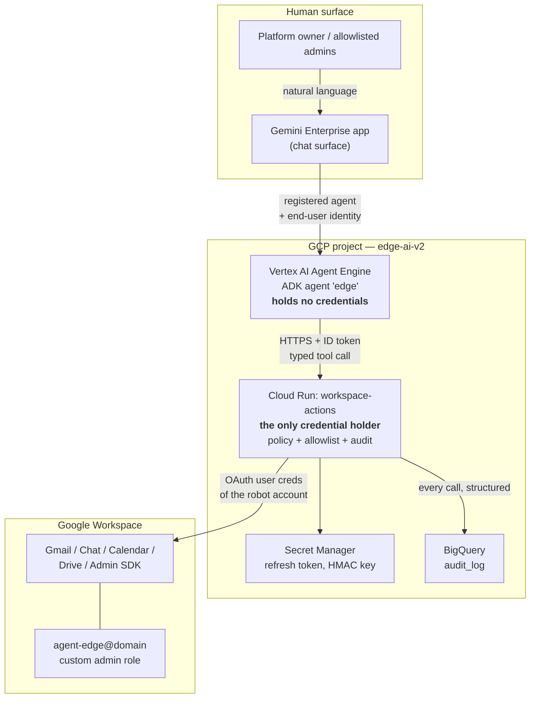

# 1. High-level design

## Status
- Owner: the platform owner
- Last reviewed: 2026-09-05

## Design intent

1. One Workspace identity (`agent-edge@<domain>`) with admin rights, which **no human
   ever signs into interactively** after bootstrap.
2. The only way to make that identity do anything is to ask an agent, in Gemini Enterprise.
3. The execution engine is a **GCP project** — that is where the code, the credentials,
   the policy and the audit trail live. Gemini Enterprise is only the front door.
4. **No domain-wide delegation.** Not for the service account, not via a Marketplace app.

## Component map

## The four trust boundaries

| # | Boundary | Enforced by | What it stops |
|---|---|---|---|
| 1 | Human → Gemini Enterprise | Workspace SSO + agent-level access control | Non-allowlisted staff reaching the agent at all |
| 2 | Agent Engine → Cloud Run | Cloud Run IAM (`roles/run.invoker`), ID-token verification | Anything but the agent's service account calling the action service |
| 3 | LLM → credential | Architecture: the token lives only in Cloud Run, never in the model context | Prompt injection exfiltrating the admin credential |
| 4 | Requested action → executed action | Policy engine: operation allowlist, risk tiers, confirmation tokens | The model inventing a destructive Directory call and it just running |

Boundary 3 is the important one. **The reasoning layer never holds the admin credential.**
The agent can only name an operation from a fixed catalogue and supply parameters;
deterministic Python decides whether that is permitted and executes it. A prompt
injection in an inbound email can at worst attempt an allowlisted operation, which is
then subject to the policy engine and the audit log.

## Why a separate action service instead of calling Workspace APIs from the agent

Putting the Workspace SDK calls inside the ADK agent would be fewer moving parts, and it
is the wrong trade here:

- The refresh token would sit in the same process as the LLM loop, so any tool that can
  read the environment or files becomes a credential-exfiltration path.
- The agent is an LLM: its tool arguments are generated text. Between "generated text"
  and "an Admin SDK call that suspends a user" there must be a deterministic gate that
  the model cannot talk its way past.
- Audit, rate-limit, idempotency and dry-run belong in one place, not scattered across
  tool functions.

Cost of the split: one extra hop (~50–150 ms) and one more deployable. Worth it for an
identity that can administer the tenant.

## Layer responsibilities

| Layer | Owns | Explicitly does not own |
|---|---|---|
| Gemini Enterprise | Presentation, end-user auth, conversation history | Any credential, any policy |
| ADK agent (Agent Engine) | Intent → operation selection, parameter extraction, clarification, summarising results | Credentials, authorisation decisions, direct API access |
| Cloud Run action service | Credentials, authorisation, allowlist, confirmation, execution, audit | Natural language, conversation |
| Workspace | The actual effect | — |

## Non-goals

- Acting as any user other than the robot account. Impossible by construction without
  DWD — this is intended, not a limitation to work around.
- Replacing the Admin console for bulk or emergency operations.
- Autonomous operation with no human in the loop for destructive actions. See
  [06-security-guardrails.md](06-security-guardrails.md).
