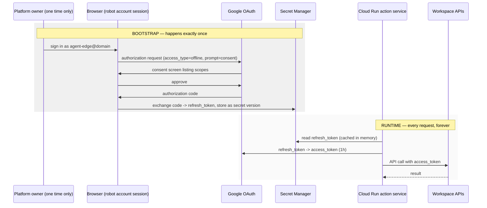

# 2. Identity & authorisation — acting as the robot user without DWD

## Status
- Owner: the platform owner
- Last reviewed: 2026-09-05

This is the core of the design. Read it before anything else.

## The problem

Workspace APIs authorise against a *user*. A GCP service account is not a Workspace user.
The normal bridge is **domain-wide delegation** — the tenant grants a service account the
right to impersonate users. That is excluded here, and for a good reason: DWD is a
tenant-wide capability scoped only by OAuth scopes, so a compromised service account key
can act as *anyone*, including super admins.

Without DWD, a service account cannot become a Workspace user. So we do not try.

## The solution: OAuth 2.0 user credentials for the robot account

The robot account authorises our OAuth client **once**, interactively, granting offline
access. Google returns a **refresh token**. That refresh token is the platform's
permanent proof that the robot user consented. It goes into Secret Manager and is used
to mint short-lived access tokens forever after.



### Properties

| Property | Value |
|---|---|
| Scope of power | Exactly one identity: the robot account. Cannot impersonate anyone else. |
| Revocation | Robot account's Security page, or Admin console → revoke the OAuth token. Instant, total kill switch. |
| Rotation | Re-run bootstrap, add a new secret version. Old version disabled. |
| Blast radius if the token leaks | Everything the robot account can do. Mitigated by boundary 2/3/4 and the custom admin role — see below. |

## The one unavoidable human interaction

You said no human should interact with the robot account. **Exactly one interactive
sign-in is unavoidable**: the OAuth consent that produces the refresh token. There is no
way to obtain user credentials for an account without that account consenting, and the
alternatives (DWD, a Marketplace app installed domain-wide) are the thing you ruled out.

Practical shape of that one event:

1. The platform owner sets a password on `agent-edge@domain`, in a password manager.
2. Signs in **in a clean browser profile** (not his own session) and completes consent.
3. Immediately afterwards, the account is locked down (below) and never signed into again.

Budget one 15-minute window for this, and repeat it only on credential rotation.

## Locking down the robot account after bootstrap

Once the refresh token exists, the account should be hostile to interactive use:

| Control | Where | Setting |
|---|---|---|
| 2-step verification | Admin console → Security → 2SV | Enforced, hardware key only. The key goes in a safe. |
| Password | — | Long random, in the corporate password vault, not in the wiki. |
| Login challenges | Own OU with restrictive session policy | Session length short; no "remember device". |
| Less secure app access | Off | — |
| Recovery options | None set | Removes a social-engineering path. |
| Own OU | `/Automation/Service Identities` | Lets you apply all of the above without touching real users. |
| Alerting | Admin console → Alert center / Reports | Alert on any *interactive* login to this account. After bootstrap, an interactive login is by definition an incident. |

That last row is the highest-value control in this table. Set it up.

## Admin rights: use a custom role, not Super Admin

The account needs admin rights, but "admin rights" should mean the narrowest set that
covers your intended operations.

**Do not make it a Super Admin.** A super admin can alter security policy, grant DWD
(the thing you are avoiding), and escalate. If an injection ever reaches an allowlisted
Directory call, the difference between a custom role and Super Admin is the difference
between an incident and a breach.

Create `Agent — Workspace Operator` under Admin console → Account → Admin roles, with
only the privileges your operation catalogue actually needs. Starting point:

| Privilege group | Grant | For |
|---|---|---|
| Users → Read | yes | look up a user |
| Users → Update (limited fields) | decide | rename, change org unit |
| Users → Create / Delete / Suspend | **decide deliberately** | onboarding/offboarding flows |
| Groups → Read | yes | membership queries |
| Groups → Update | decide | add/remove members |
| Organisational units → Read | yes | context |
| Reports → Audit read | yes | "who did what" questions |
| Security settings | **no** | never |
| Domain settings | **no** | never |
| Admin role management | **no** | prevents self-escalation |

The "decide" rows are in [07-open-decisions.md](07-open-decisions.md).

## OAuth client configuration

| Item | Value | Why |
|---|---|---|
| Consent screen user type | **Internal** | Critical. External apps in Testing status expire refresh tokens after 7 days. Internal apps in a Workspace org do not, and skip Google verification. |
| Client type (bootstrap) | Desktop app | Simplest loopback flow for the one-time consent. |
| Publishing status | In production / Internal | — |
| Admin console API controls | Mark this client ID **Trusted** under Security → Access and data control → API controls → App access control | Prevents a future org-wide scope restriction from silently killing the agent. |

### Scopes

Request the minimum for the operations you enable. Full candidate set:

```
https://www.googleapis.com/auth/gmail.modify
https://www.googleapis.com/auth/gmail.send
https://www.googleapis.com/auth/chat.messages
https://www.googleapis.com/auth/chat.spaces
https://www.googleapis.com/auth/calendar
https://www.googleapis.com/auth/drive
https://www.googleapis.com/auth/admin.directory.user
https://www.googleapis.com/auth/admin.directory.group
https://www.googleapis.com/auth/admin.directory.orgunit.readonly
https://www.googleapis.com/auth/admin.reports.audit.readonly
```

Scopes are granted at consent time. **Adding a scope later means re-running the bootstrap
consent** — so decide the set before you run it, and err slightly wide on read scopes,
narrow on write scopes.

Gmail scopes are "restricted" in Google's classification. For an **Internal** app this
does not require Google verification, but your own Workspace API controls may still
block it until the client is marked trusted — do that in the same sitting.

## What about the end user's identity?

The robot does the acting, but you still need to know *who asked*, for authorisation and
audit. Gemini Enterprise authenticates the human and propagates that identity to the
registered agent; the agent passes it to the action service as an `actor` field, and the
service:

- checks the actor is in the allowlisted group before permitting write operations,
- records the actor on every audit row.

> **Verify in console:** the exact mechanism and field name by which Gemini Enterprise
> surfaces the end-user identity to an Agent Engine agent has changed across releases.
> Confirm it during build and update this section. Until confirmed, treat `actor` as
> untrusted and enforce the allowlist on the Gemini Enterprise agent-access side too.

## Rejected alternatives

| Alternative | Why not |
|---|---|
| Service account + domain-wide delegation | Excluded by requirement. Also: tenant-wide impersonation scoped only by OAuth scopes. |
| Private Workspace Marketplace app | Installs domain-wide and uses DWD underneath. Same objection. |
| Service account as a Chat app identity | Works for Chat only; no path to Gmail or Admin SDK. Possible *addition* later for Chat-native UX, not a substitute. |
| Gemini Enterprise "Authorizations" (agent acts as the end user) | Acts as the *requesting* user, not the robot admin. Wrong identity for admin operations, and would make every user's own privileges the ceiling. Reconsider only if you later want per-user actions. |
