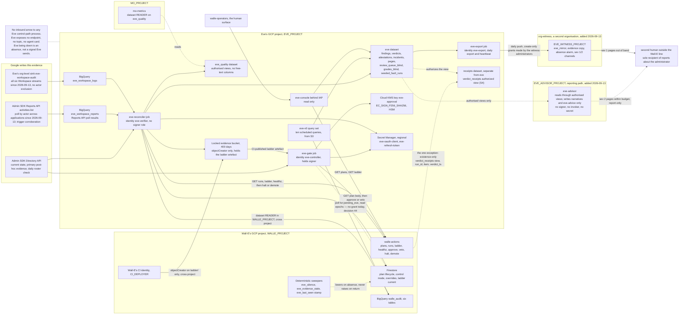

# 1. High-level design

## Status
- Owner: the platform owner
- Last reviewed: 2026-09-13
- **Objective restated 2026-09-13; see the platform HLD**
  ([../agentic-platform/01-hld.md](../agentic-platform/01-hld.md) §13.2; this page carries §18
  items 11–15 and 17; owner the Eve owner, gate the super-admin grant for items 11–16 and
  Wall-E's Stage 1 for item 17, P143). Wall-E now holds Super Admin (P33). What changes here:
  structural choice 1 is rewritten as **detective inside the organisation, structural through
  the witness**; Eve has **two paths** (control path unchanged; `eve-advisor` reporting path,
  report-only by construction); the evidence perimeter, detection catalogue, roster check,
  evidence heartbeat and reporting contract are added to the component table; the model-free
  control path is recorded as a compliance invariant; `eve-approval` is HSM. The rest of the
  page — the five recomputations, the two authorities on opposite schedules, the second
  predicate implementation — is not overturned.

## Thesis

Eve is a body of SQL, two deterministic Cloud Run jobs, a console and a key, living in its
own GCP project, whose only privileged act is a Cloud KMS `EC_SIGN_P256_SHA256` signature
over a hash it computed itself.

It acquires its two authorities on opposite schedules because they point in opposite
directions. Halting and demoting can only ever make less happen, so Eve gets them the
moment it is a program at all, at S3 entry. Signing can make more happen, so Eve gets the
key only at S4 entry, after a twelve-fault exercise it must pass at 100 %. Before that,
"Eve v0" is ten BigQuery scheduled queries pinned to their own service account and read by
a human, and nothing else exists — no robot account, no token, no key, no allowlist entry.

Eve treats everything `walle-actions` says as a **claim**, and recomputes five things from
sources Wall-E cannot write: the plan hash, the per-item pre-state, the effective level,
the trigger's corroboration, and the typed predicate — the last implemented a second time
and differentially tested. It exposes no inbound decision endpoint, speaks no agent
protocol, and contains no model client, so "Eve is down" is an **absence**, which is the
only alert shape that catches it, and no LLM loop can produce an Eve signature because the
process cannot reach a model and its identity could not authenticate to one. Everything
Eve does not do is done by a deterministic sweeper inside `walle-actions` that can lower on
Eve's absence and has no code path that raises on Eve's return.

**Added 2026-09-13: two paths, and a robot that is a super admin** (platform HLD §13.2).
Everything above describes Eve's **control path** — `eve-gate`, `eve-reconciler`,
`eve-console`, the key, in `EVE_PROJECT` — and it stands. Beside it sits a **reporting
path**, `eve-advisor` in its own project `EVE_ADVISOR_PROJECT` under `fld-controllers`, which
may reason about what the control path found and is report-only by construction (P34). And
the thing Eve watches is no longer a narrowly privileged robot behind a fixed catalogue:
`walle@` holds Super Admin (P33), so Eve's reconciler limb watches **every** robot-attributed
event in every ingested Workspace stream, not only catalogued plans, runs a detection
catalogue and a daily super-admin roster check, and pushes its evidence, incidents and
heartbeat daily to a **witness organisation** outside the tenant's reach. The paragraphs
below that assumed the narrow robot carry dated qualifications where they appear.

The honest reading of the cost is seven to nine engineer-weeks of Eve, spread across two
stage transitions six to eight weeks apart, under €50 a month on GCP plus one Workspace
licence, and about half an hour a week of human time. The design says plainly that **L3
with human approval is a legitimate permanent end state**: none of this should be built
until an L3→L4 promotion can state in numbers how much approval burden it avoids.

**Qualified 2026-09-13.** That stop rule now governs the **gate layer** (key, `eve-gate`,
envelope, second predicate implementation) only. The **observe-and-report layer** — the
six-stream sink, the Reports API poll by actor, the tenant-integrity rules, `eve.incidents`,
paging and the witness mirror — is a precondition of Wall-E's super-admin grant (platform HLD
§0.4 P line, §13.2) and is built and drilled before it, whatever the ladder stage; see
[05-stages.md](05-stages.md). "Before S3 entry nothing else exists — no robot account, no
token" above is therefore true only of a Wall-E that has not been granted Super Admin.

## What Eve is not

Three negatives do more work in this design than any of the positives.

- **Eve is not an agent.** It has no agent card that anyone calls, no A2A surface, no
  Pub/Sub push subscription, no HTTP endpoint of any kind. It is a client everywhere. The
  safety interlock between the controller and the doer is plain authenticated REST, in one
  direction, and can therefore never run through a conversation.
- **Eve is not a service inside Wall-E's project.** Its key, its secrets, its dataset, its
  evidence bucket and its identities live in a project of its own — `EVE_PROJECT`, one of
  the four under `FOLDER_ID` in [../project-topology.md](../project-topology.md) — whose
  IAM policy contains no Wall-E deployer at project level, and in which the only Wall-E
  principals are three resource-level grants (topology decision 48). While Eve's key lives in Wall-E's project, a project owner there can grant
  themselves `roles/cloudkms.signer` and mint an Eve approval, and the only control on that
  is a daily drift row — a detective control on the single artefact the whole controller
  role rests on. **Qualified 2026-09-13:** that boundary is structural against Wall-E's
  project principals and deployers; against Wall-E's super-admin credential it is detective
  (structural choice 1 below).
- **Eve's authority path is not a model.** No approve/refuse decision, no halt, demote or
  veto, and no signature over any of them, is produced by a language model — required by
  [C12](../wall-e/14-hld-challenge.md) and [decision 34](../wall-e/09-open-decisions.md), and
  enforced here by mechanical checks rather than by a paragraph of policy. Eve's control path
  is a program, and the word "judgement" does not appear in its specification. **Rewritten
  2026-09-13** (was: "Eve is not a model … the word 'judgement' does not appear in its
  specification"): the objective asks Eve to report anything wrong, and the platform HLD §13.2
  gives Eve a separate **reporting path** that may reason (P34) — `eve-advisor`, report-only
  by construction, whose output is read by humans and by no gate. Decision 34 stands for
  approve, halt, demote and veto.

## The shape on one page

Every solid arrow leaving Eve's project is a call Eve makes; nothing calls Eve's control
path. The three Google-written sources enter Eve's project directly, not by way of Wall-E. The single
dashed arrow from Wall-E into Eve's project is `walle-actions` reading an authorized view —
in the receipts dataset, separate from `eve` because an authorized view cannot live in its
source dataset (topology decision 48) — that exposes
`(run_id, item, verdict_ts)` and nothing else, so the service can check that evidence
arrived and can never branch on what it says — recorded as [E-17](09-open-decisions.md)
and re-argued at S4 entry. Every arrow that crosses the two subgraphs is a grant **on the
resource it points at**, never a project-level role in the other project; the complete
list, with who makes each grant, is [../project-topology.md](../project-topology.md) §3.
**Rewritten 2026-09-13** (was: "`GEMINI_PROJECT` and `MO_PROJECT` are absent from this
diagram on purpose: no Eve identity holds anything in either, and nothing in either reaches
Eve.")
(platform HLD §13.3, §18 item 25): `GEMINI_PROJECT` is still absent — no Eve identity holds
anything there. `MO_PROJECT` is drawn, because one Mo read now reaches Eve's data:
`mo-metrics@` holds dataset-level `READER` on `eve_quality`, made by Eve's runbook, as does
the validator custodian (P30). Nothing Mo writes is read by Eve, and Mo is never Eve's grader.
Two projects the 2026-09-13 platform HLD adds are drawn as well: `EVE_ADVISOR_PROJECT` (the
reporting path, whose arrows are dashed because nothing in it reaches a verdict) and the
witness organisation's `EVE_WITNESS_PROJECT`, the only destination outside the tenant's
organisation; its grants to `eve-export@` are made by the witness administrators on witness
resources.

## Components

| Component | Runs on | Identity | Does | Never does | Exists from |
|---|---|---|---|---|---|
| **Eve v0 query set** | BigQuery Data Transfer Service scheduled queries, transfer configs owned by Eve's project, reading `walle_audit` cross-project (dataset-level `READER` in `WALLE_PROJECT`, granted by Wall-E's runbook, CC-22; jobs run in `EVE_PROJECT`), writing `eve.findings`. Twelve transfer configs: the ten [05](../wall-e/05-autonomy-ladder.md) §8 metrics — which include hard-invariant denials (with the T0-human `protected_principal` exclusion) and audit completeness — plus two of Eve's own, two-direction reconciliation and config/ladder drift. The query list is in [07-build-runbook.md](07-build-runbook.md) Phase 4. Scheduled **off the hour** — a query at exactly hh:00 can double-trigger. | `eve-v0@<eve-project>`, pinned on every transfer config with `--service_account_name`. The default is the creating user's credentials, and an evidence series that runs as the person who administers Wall-E is not independent, and dies when they leave. | Computes every ladder metric on a 30-day rolling window, hourly, each result with its threshold, verdict and query hash. A human reads them weekly. | Approve, halt, demote, hold any Workspace credential, write to Wall-E's project. | **S0**, and it is the whole of Eve through S2. |
| **`eve` dataset and the `walle_audit` mirror** | BigQuery, EU, in Eve's project. Tables `findings`, `verdicts`, `attestations`, `review_queue`, `review_queue_blind` (view), `grades_blind`, `pages`, `walle_audit_mirror`. The `verdict_receipts` authorized view lives in a **separate** dataset of `EVE_PROJECT` (name *tbd*, topology decision 48), because an authorized view cannot sit in its source dataset. DAY-partitioned, 400-day expiry. One daily scheduled copy appends yesterday's `walle_audit` partitions. | Owned by Eve's project. Wall-E's deployers hold no IAM here. | Holds Eve's entire output and the off-project evidence copy [decision 31](../wall-e/09-open-decisions.md) and the C11 residual ask for. The mirror is append-only and outside Wall-E's teardown blast radius. Added 2026-09-13: `incidents` and `seeded_fault_runs` ([03-lld.md](03-lld.md) §9), and the Mo-readable subset moves behind the `eve_quality` dataset (row below). | Accept a write from any Wall-E principal. Hold Workspace payloads beyond ids, counts and hashes. | `findings` and the mirror at **S0**; `incidents` and `pages` with the observe-and-report layer, **before the super-admin grant** (2026-09-13); the rest at **S3 entry**. |
| **`eve_workspace_logs`** | BigQuery dataset in Eve's project, fed by a **third, Eve-owned organisation-level sink** `eve-workspace-audit`, `--include-children`, `--use-partitioned-tables`, filter `protoPayload.serviceName="admin.googleapis.com"`, **no actor exclusion**. **Widened 2026-09-13** (platform HLD §13.2; [../agentic-platform/08-data-logging-retention-sovereignty.md](../agentic-platform/08-data-logging-retention-sovereignty.md) §3.2): the filter covers **all six** Cloud Logging Workspace streams — admin, enterprise groups, login, OAuth token, SAML, Access Transparency — still with no actor exclusion, and the sink is kept independent of the platform's aggregated sinks by design; OAuth token, SAML and Access Transparency are edition-conditional (tenant edition *tbd*). The exact filter is in [07-build-runbook.md](07-build-runbook.md) Phase 7. Verified 2026-09-12: an aggregated org sink may route to a destination in another project, its writer identity needing `roles/bigquery.dataEditor` there ([aggregated sinks](https://docs.cloud.google.com/logging/docs/export/aggregated_sinks)); and a BigQuery sink writes **date-sharded** tables unless `--use-partitioned-tables` is given ([route logs to BigQuery](https://docs.cloud.google.com/logging/docs/export/bigquery)), with the dataset's `--default_partition_expiration` set to 400 days **before** the sink first writes, because it binds only tables created after it ([updating datasets](https://docs.cloud.google.com/bigquery/docs/updating-datasets)). | Sink writer identity, `dataEditor` on this dataset only. | Eve's independent record of what the robot actually did. Eve reconciles against **this** copy, never `walle_workspace_logs` in Wall-E's project. Its rows are the object of heartbeat H-1: no rows for 60 minutes in business hours (240 outside) is the halt reason `log_pipeline_silent`. | Carry an actor exclusion. Live in Wall-E's project. Be merged into the platform's aggregated sink. | **S2** — early, deliberately, so Eve's first enforcing window has months of history rather than zero rows — and in any case **before the super-admin grant** (2026-09-13). |
| **`eve-reconciler`** | Cloud Run **job** in Eve's project, europe-west1, four task entrypoints on Cloud Scheduler: post-hoc every 5 min, reconciliation and drift hourly, deep pass every 6 h, daily pass. Four scheduler jobs invoke the one Cloud Run job with a different entrypoint argument ([07-build-runbook.md](07-build-runbook.md) Phase 10). Triggered with an **OAuth** token to `run.googleapis.com` (OIDC is wrong for a `*.googleapis.com` target). Idempotency key = job name + the constant `X-CloudScheduler-ScheduleTime` header. | `eve-verifier@<eve-project>`. Holds **no** `cloudkms.signer`. | Post-hoc verification of L5 writes; two-direction reconciliation; config, ladder, epoch and Google-contract drift; daily operator-list reconciliation against `roleAssignments.list`; the blind sample draw; attestation bundles; the monthly refresh-token **exchange** that resets Google's six-month clock. Calls halt and demote on a declared threshold. **Added 2026-09-13** (platform HLD §13.1 item 5, §13.2): the Reports API poll by actor; reconciliation of **every robot-attributed event in every ingested stream** against `walle_audit` and the band-B audit rows, a miss being `reconciliation_gap` and a halt; the **detection catalogue** (reconciler limb only, never the gate limb); the **daily super-admin roster check** (`roleAssignments.list`, `users.list` `isAdmin`, diffed against the committed roster); the **evidence heartbeat** (`log_pipeline_silent` on silence, paging on `invalid_grant`); writing `eve.incidents` and `eve.pages` under the reporting contract. | Sign anything. Write to Wall-E's project. Grade an item a human is due to grade blind. Expose any endpoint. Read anything `eve-advisor` writes. | **S3 entry** for the gate-layer duties; the observe-and-report duties **before the super-admin grant** (2026-09-13). |
| **`eve-gate`** | A fourth entrypoint of the same image, deployed as its own Cloud Run job, every 2 minutes. Polls Firestore `plans/{id}` for `state == pending_eve`, then fetches the body from `GET /v1/plans/{id}`. | `eve-controller@<eve-project>`, plus `roles/cloudkms.signer` on `eve-approval`. | The five recomputations, the per-item accept/reject vector, the signature, `POST .../approve`, and `POST .../veto` when a threshold fires after signing. | Sign over a hash the service reported. Take input from any agent protocol. Approve a cell whose `eve_authority` is advisory, or one whose hold window elapsed during an outage. Approve when its own re-read is inconclusive — it refuses, and refusal means the item waits. | **S4 entry**, after the seeded-fault exercise passes at 100 %. |
| **`eve-console`** | Cloud Run service in Eve's project, fronted by Identity-Aware Proxy, `walle-operators@` only. **Changed 2026-09-13** (platform HLD §13.2): the IAP audience becomes a dedicated group (name *tbd*) whose membership change is a severity-1 rule (SA-09 of [../agentic-platform/07-monitoring-detection-incident-response.md](../agentic-platform/07-monitoring-detection-incident-response.md) §6.2). Mobile-legible: the point is that a holiday-adjacent administrator can read it on a phone. | `eve-console@<eve-project>`, read-only: `dataViewer` on `eve`, `objectViewer` on the attestation bucket, `run.invoker` on `walle-actions` for `GET /v1/plans` and `GET /v1/ladder` only. | Four views — the live queue with each plan's age and deadline; the blind sampled review rendered from an allowlisted column set; ladder state beside Eve's drift findings; attestation bundles, one link per promotion. Writes grades to `eve.grades_blind` (grades of Wall-E's plans). Never writes `grades_eve`, the grades of Eve's own verdicts, which the platform approval surface writes (2026-09-13, platform HLD §13.3). | Approve, veto, halt or demote. Render Eve's verdict on a review page. Hold a Workspace credential. | **S3 entry.** The blind-review view must exist before the S3 exit gate, not before S4. |
| **Eve's Workspace robot** | `eve@<domain>` in `/Automation/Service Identities`. Custom admin role `Eve — Verifier`, customer-scoped, **read privileges only, no write privilege at any stage, ever**. Hardware-key-only 2SV with its own key in the safe, separately labelled; no recovery options; short session; its own login activity rule on actor `eve@`. Member of `walle-protected@` and of the committed floor list. | Its own consented refresh token from a **new, separate Desktop OAuth client** marked Trusted in the same sitting. No domain-wide delegation. | Eve's independent view of the tenant. Scopes frozen at consent: `admin.directory.{user,group,orgunit,rolemanagement}.readonly`, `admin.reports.{audit,usage}.readonly`, `openid`, `userinfo.email`. **`apps.licensing` is dropped** per [C13](../wall-e/14-hld-challenge.md). **Widened 2026-09-13, before the consent (E-16):** plus domain and customer settings read, every Reports application the poll reads, still **no content scope**; the set is in [02-identity-and-auth.md](02-identity-and-auth.md). | Write anything to Workspace. Hold a licence-management privilege. Be impersonated. Be a super admin, ever. | **Moved 2026-09-13: in one sitting before the super-admin grant**, with the observe-and-report layer. Was: "S3 entry — not Stage 0. The reason is the six-month unused-token expiry and the scope freeze, not the cost of repeating consent"; the daily Reports poll now exercises the token continuously, and the scope freeze is why the widened set is fixed first. |
| **Eve's secrets** | Secret Manager, regional (europe-west1), **in Eve's project**: `eve-oauth-client`, `eve-refresh-token`. Version pinned by `EVE_TOKEN_VERSION`, never `versions/latest`. | `roles/secretmanager.secretAccessor` to `eve-controller@` and `eve-verifier@` only. | Holds Eve's Workspace credential where `walle-actions@` cannot be granted access even by mistake, because it has no principal in that project. Values never recorded in the wiki. | Be readable by any Wall-E principal. Sit in Wall-E's project. | **S3 entry.** |
| **`eve-approval` KMS key and the PEM archive** | Key ring `eve`, key `eve-approval`, ASYMMETRIC_SIGN / `EC_SIGN_P256_SHA256`, europe-west1, **in Eve's project**, **HSM protection level** (added 2026-09-13: platform HLD §8 and P118, `constraints/cloudkms.allowedProtectionLevels = HSM` at the folder; created with `--protection-level=hsm`). Each version's PEM exported at creation, **before first use**, to `gs://<eve-project>-eve-evidence/keys/` — the `keys/` prefix of the **locked** evidence bucket, not a separate bucket — **and** committed to `contracts/eve-public-keys/<version>.pem` in Wall-E's repo under `ladder.yaml`'s CODEOWNERS. | `roles/cloudkms.signer` to `eve-controller@`. `walle-actions@<WALLE_PROJECT>` holds `roles/cloudkms.publicKeyViewer` on this one key in `EVE_PROJECT` — key-level, cross-project, fallback path only — and nothing more; never `signerVerifier` or `cryptoOperator`, both of which carry `useToSign`. Data Access audit logging on `AsymmetricSign`. | Produces the only signature that can authorise an L4 execution. The envelope names the full key-version resource name, because a KMS signature carries no version identifier of its own. | Live in Wall-E's project. Rotate automatically — verified 2026-09-12: Cloud KMS states that "Automatic rotation isn't supported for asymmetric signing or asymmetric encryption keys" ([key rotation](https://docs.cloud.google.com/kms/docs/rotate-key)), so rotation is a dated manual procedure, annually and on suspicion, with a 30-day overlap. Be **destroyed** inside the 400-day evidence horizon; old versions are disabled. | **S4 entry.** |
| **Evidence bucket** | `gs://<eve-project>-eve-evidence`, EU, **locked** retention policy of 400 days. A locked policy cannot be removed or shortened and objects cannot be deleted or replaced before expiry even by a project owner; locking applies a lien preventing project deletion. | `eve-verifier@` holds `roles/storage.objectCreator` — create only, no delete, no overwrite. | Attestation bundles, daily reconciliation extracts, archived PEMs, CI-published ladder artefacts. Added 2026-09-13: the daily newline-JSON export with SHA-256 manifests under `exports/`, written by `eve-export@` (P107). | Have its retention shortened. Be the destination of a sink Wall-E's project owners control. | **S3 entry.** |
| **`eve/config`** | Eve's own git repository, separate from Wall-E's: `thresholds.yaml`, `reasons.yaml` (the closed reason vocabulary), `predicates/` (Eve's second implementation of the typed predicates), `ceilings.py` (Eve's own compiled ceiling table), `oncall.yaml`, `seeded_faults/`, and — added 2026-09-13 — the versioned **detection catalogue** beside `reasons.yaml` and the committed super-admin **roster** file. Required reviewers: the ladder owner and the security reviewer of [decision 37](../wall-e/09-open-decisions.md); since 2026-09-13 also the second human outside the Wall-E line (platform HLD §13.2). Validated by a CI JSON-Schema check owned **outside** the repository, exactly as `ladder.yaml`'s is. | Human-merged only. Neither Eve identity has a write path. | Every halt, demote, veto and refuse is a named threshold with a reason code. `eve_config_version` is stamped on every verdict row, every control call and every attestation. | Live in Wall-E's repository, where one pull request could widen Wall-E and loosen Eve together. Be merged by one human at S4+. | **S3 entry**; a stub schema and the CI assertions exist from Eve's first commit, and `thresholds.yaml`'s numbers are stubbed at S0 so v0 and the controller read the same values. |
| **CI-published ladder artefact** | `gs://<eve-project>-eve-evidence/ladder/<config_version>.yaml` plus its git sha, written append-only by Wall-E's CI identity (`CI_DEPLOYER` of `WALLE_PROJECT`, `objectCreator` under an IAM Condition on the `ladder/` prefix — a bucket-level, cross-project grant made by Eve's owner) into Eve's locked bucket. | Wall-E's CI identity, create-only. | Replaces "Eve reads `ladder.yaml` in git": Eve needs no git credential, and the config it compares against — and re-derives effective levels from — cannot be rewritten by Wall-E's deployers. | Be writable by `walle-actions@` or by a deployer. | **S3 entry.** |
| **Two sweepers and one stamp in `walle-actions`** (Wall-E's side of this design) | Deterministic code in the action service, no Eve involvement. A 1-minute internal tick plus request-path evaluation. | `walle-actions@`, writing `config_versions` rows with origin `breaker`. | `eve_silence`: any plan at `pending_eve` for more than four business hours sets `no_autonomous` and writes an incident note. `eve_evidence_stale`: any executed L5 item with no row in the `verdict_receipts` view (receipts dataset, separate from `eve`, decision 48) after 60 minutes freezes promotions, and after four hours drops that cell to L4. `eve_last_seen`: stamped **passively** from any successfully authenticated Eve call, published as a metric with a Cloud Monitoring **absence** policy alerting at 15 minutes, and the source of Eve's S4 availability figure. | Raise anything, ever, on Eve's return. Treat the presence of an Eve row as permission — it only ever checks that evidence arrived. Read the content of a verdict. | Code from the **first commit** (the timers extend the existing L3 TTL sweeper); the `verdict_receipts` read is wired at **S4 entry**. |
| **CI-only stub caller** | Wall-E's test suite. | A test-only principal standing in for `eve-controller@`. | Exercises all eight [08](../wall-e/08-team-eve-mo.md) interfaces from commit one and proves denial tests 4, 5, 6 and 52, including Eve refused 403 on `POST /v1/execute` and an operator token accepted on halt. | Exist in any admitted image or deployed environment. There is no fault-injection or test-mode path reachable in a deployed Eve or Wall-E image; the seeded-fault exercise uses a separate sandbox deployment and dataset. | **S0**, in code only. This is the whole of what [decision 36](../wall-e/09-open-decisions.md) leaves at Stage 0. |
| **`eve-advisor`** — the reporting path | **Rewritten 2026-09-13** (platform HLD §13.2). A Cloud Run job in `EVE_ADVISOR_PROJECT`, a project of its own under `fld-controllers`, separate from `GEMINI_PROJECT`, `WALLE_PROJECT`, `EVE_PROJECT` and `MO_PROJECT`. Reads `eve.*`, `eve_workspace_logs` and the report tables **through authorised views with no free-text columns** (dataset-level `READER` on the authorised-view dataset in `EVE_PROJECT`, never on the source datasets); writes only `eve.incidents.narrative` and `eve.advice`, through a dedicated dataset `eve_advice` in `EVE_PROJECT` on which it holds `dataEditor` and nothing else — both grants made by Eve's runbook (§18 item 25). `aiplatform` is allowed in its project and denied in `EVE_PROJECT` by the project-level `restrictServiceUsage` denylist. | `eve-advisor@`, holding by construction no `cloudkms.signer`, no `run.invoker` on any action service, no `secretAccessor` on any secret, no write to `eve/config`. | Narrates what the deterministic findings describe and names what no rule covers, for a human; pages at **severity 2 only**, inside the page budget, citing the deterministic finding that triggered it. A human who agrees with it halts or demotes through the existing human path, or tightens Eve's rules by a human-merged `thresholds.yaml` change. It produces no finding about a named human without the deterministic rule that triggered it until P19 is answered. Its model pin is re-qualified on every change before it may page again (P123). | Produce a signature, a halt, a demotion, a veto, or **any input to one**: nothing it writes is read by `eve-gate`, `eve-reconciler`, `walle-actions` or `walle-actions-super`. Corrected 2026-09-13: the earlier "one-directional wire by which the verifier may raise a refusal" is withdrawn — no wire exists, and one would put a model output on the authority path. The prohibition is IAM, not code discipline. | Was: "**Never**, on current evidence. Adding one is a decision record." **Reopened 2026-09-13 by that decision record**: platform register row P34 (*proposed*; file `decisions/2026-09-13-eve-reporting-path-may-reason.md`, owner the Eve owner with the security reviewer), gate the `eve-advisor` build; paging rights and any registration wait on its AI Act class (P19, legal). |
| **`eve_workspace_reports`** (added 2026-09-13) | BigQuery dataset in Eve's project, fed by `eve-reconciler`'s **Reports API poll by actor** (`activities.list` for `walle@`, `eve@` and every super admin) across applications `admin`, `login`, `token`, `saml`, `groups`, `groups_enterprise`, `user_accounts`, `rules`, `context_aware_access`, `gcp`, `drive`, `vault`, `takeout`, `admin_data_action`, `data_studio` and the rest of the documented list, with per-application lag budgets in `thresholds.yaml`. Verified 2026-09-13: every name above is an allowed `applicationName`, the scope is `admin.reports.audit.readonly`, and `userKey` accepts a primary email ([activities.list](https://developers.google.com/workspace/admin/reports/reference/rest/v1/activities/list)). | `eve-verifier@`, with `eve@`'s token. | The second evidence route, **independent of the "Share data with Google Cloud services" switch** that can darken the sink, and the only Eve route for applications Cloud Logging never receives (Drive, Vault, Takeout, Data Studio…). | Read content: it reads activity metadata only. | **Before the super-admin grant.** |
| **Detection catalogue** (added 2026-09-13) | Versioned, human-merged file set in `eve/config` beside `reasons.yaml`, evaluated in the **reconciler limb only**. Tenant-integrity rules at severity 1 (actor `walle@`; targets `eve@`, Eve's role, super-admin assignments, DWD, 2SV, audit sharing, API controls, the operator groups) mirroring the SIEM's SA-01…SA-09 of [../agentic-platform/07-monitoring-detection-incident-response.md](../agentic-platform/07-monitoring-detection-incident-response.md) §6.2, so that two independent evaluators exist; writes in streams outside catalogue families at severity 1; volume, time-of-day and target-population baselines at severity 2–3, calibrated at S2; prompt-to-action divergence against the signed human assertion of [decision 14](../wall-e/09-open-decisions.md). | `eve-verifier@`. | Detects misbehaviour across every stream rather than verifying catalogued plans only; reports on **human prompts** as well as robot actions, because under Super Admin the operator prompting is the escalation. The misbehaviour taxonomy and its coverage map are Mo's first Eve artefact. | Run in the gate limb. Carry a rule no human merged. | **Before the super-admin grant** (tenant-integrity set); baselines after S2 calibration. |
| **Reporting contract: `eve.incidents`, `eve.pages`, `oncall.yaml`** (added 2026-09-13) | `eve.incidents` Eve-owned, DAY-partitioned, 400 days; `eve.pages` gains recipient, channel, delivery result and acknowledgement; `oncall.yaml` gains a primary, a secondary outside the Wall-E line and per-severity timeouts. Severities, channels, recipients and targets are the table in [03-lld.md](03-lld.md) §15. | written by `eve-reconciler`; narratives by `eve-advisor` through `eve_advice`. | Every severity-1 and -2 page goes to the second human outside the Wall-E line in parallel with the desk; **reports about the administrator's own actions go out of band from the witness to the second human as sole recipient**. Linked both ways to the one incident record in the SIEM's case system (P100). | Page the person the report is about as its only recipient. | **Before the super-admin grant.** |
| **`eve_quality` dataset** (added 2026-09-13) | BigQuery dataset in Eve's project holding authorised views, no free-text columns, over `findings`, `verdicts`, `attestations`, `pages`, `incidents` minus narrative and `seeded_fault_runs`. | Dataset-level `READER` to `mo-metrics@MO_PROJECT` and to the validator custodian (P30), both made by **Eve's runbook**; no binding in `MO_PROJECT`. | Mo measures Eve's quality from it; the custodian re-derives the numbers. Never `grades_blind` or `review_queue_blind`. Eve reads nothing Mo writes. | Carry a free-text column. | **Wall-E's Stage 1.** |
| **`eve-export@` and the daily export** (added 2026-09-13) | Cloud Run job in `EVE_PROJECT`, identity `eve-export@`, dataset-level `READER` on `eve.*`, `storage.objectViewer` on Eve's locked bucket, `objectCreator` on its `exports/` prefix, and dataset-level `READER` on `walle_audit` made by Wall-E's runbook (P107). | `eve-export@` — one identity per duty: never the reconciler, never the gate. | Daily newline-JSON export with SHA-256 manifests of yesterday's `walle_audit.*`, `eve.findings`, `eve.verdicts`, `eve.incidents` and `eve.pages` into `exports/` of the locked bucket, then the **push** of that export and a heartbeat row into the witness. | Delete or overwrite anything. Hold any grant in the witness beyond the two create-only ones. | **Before the super-admin grant** (the witness push); the evidence-bucket export by Stage 1. |
| **The witness, `org-witness` / `EVE_WITNESS_PROJECT`** (added 2026-09-13) | A second organisation on a separate, minimal Cloud Identity tenant (`Assumption:` Cloud Identity Free on a distinct domain; P14), two super admins from IT security outside the Wall-E line; one project, one bucket with a retention lock, one dataset `eve_mirror`, a few Cloud Monitoring notification channels. | No witness principal holds any grant in the tenant's organisation; `eve-export@` holds `roles/bigquery.dataEditor` on `eve_mirror` and `roles/storage.objectCreator` on the witness bucket, made by the witness administrators. | The daily append-only copy of Eve's evidence and incidents, the K5 rota records, the sev 1/2 channels to individuals (SMS, mobile app, PagerDuty/webhook), and the **absence alarm on Eve's heartbeat and on Google's feed**. Access Approval and Access Transparency on the project. | Approve, halt or execute anything. | **A gate item of the super-admin grant.** |

Principals and the grants behind this table are in
[02-identity-and-auth.md](02-identity-and-auth.md); how a verdict is produced is
[03-lld.md](03-lld.md); what exists at each stage is [05-stages.md](05-stages.md).

## The five structural choices

### 1. Eve's independence: detective inside the organisation, structural through the witness

**Rewritten 2026-09-13** (platform HLD §13.2, "Trust root — the witness"; §18 item 11). The
title of this choice was "Eve gets its own GCP project", and the argument below it — kept,
because every sentence of it is still true against the principal it names — was that the
project boundary makes Eve's key, secrets, dataset and evidence structurally unreachable. It
was written for a Wall-E whose robot held a narrow custom role. On 2026-09-13 the robot holds
**Super Admin** (P33), and that changes what the boundary is a boundary *against*.

**The trust root.** A Workspace super admin can grant itself Organization Administrator on
the tenant's GCP organisation and is its point of contact for recovery (Google's pages say
"can grant" and "point of contact in case of recovery issues"; `Assumption:` the standing
recovery right, verified or refuted before the grant). `walle@`'s credential can also make a
user an admin, suspend `eve@`, revoke Eve's token, remove Eve's role, switch off "Share data
with Google Cloud services" and re-filter the organisation sinks. Nothing inside the tenant's
organisation is therefore structurally out of a super admin's reach, and `EVE_PROJECT` is
inside it.

**So Eve's independence has two parts, graded as the platform HLD grades every control:**

| Part | What it covers | Grade | Against whom |
|---|---|---|---|
| The project boundary (the argument below) | Eve's key, secrets, dataset, evidence bucket and config are in `EVE_PROJECT`; no Wall-E deployer holds a project-level role there or on the folder; three resource-level carve-outs | **enforcement** | Wall-E's project owners, deployers and service identities |
| The same boundary, against the super-admin credential | a super admin who reaches Organization Administrator can redeploy `eve-gate`, re-grant the key, delete `EVE_PROJECT` | **detection only**, through the SIEM's super-admin set (SA-*, SG-*), Eve's own tenant-integrity rules and the absence alarms | `walle@` and any human super admin |
| **The witness organisation**, `org-witness` | the daily append-only mirror of `eve.findings`, `eve.verdicts`, `eve.incidents`, `eve.pages` and the evidence bucket copy; the K5 rota records; the severity 1/2 channels to individuals; the absence alarm on Eve's heartbeat and on Google's feed | **enforcement** (outside the tenant: its two super admins are from IT security, outside the Wall-E line, and no witness principal holds any grant in the tenant's organisation) | everyone in the tenant, including its super admins |

The honest statement, carried in every attestation: **Eve's control path stays in the
tenant's organisation and its independence there is detective, not structural**. The witness
sees the deletion of `EVE_PROJECT` within fifteen minutes and the absence of evidence; it
does not see the forgery of an approval. The only mechanism that stops a super admin who
reaches Organization Administrator from forging an approval or undoing a kill is relocating
Eve's control path to the witness — recorded as the end state, dated now, built when IT
security operates the witness (P15), with no standing cross-organisation
`orgpolicy.policyAdmin`. The witness is deliberately one project, one bucket, one dataset and
a few channels so that cost is never the reason to defer it; it is a **gate item of the
super-admin grant** (platform HLD §0.4), as is the second human outside the Wall-E line who
owns `eve-owners@` and administers the witness.

What follows is the original argument for the project boundary. It stands for Wall-E's
project principals.

Wall-E's runbook before 2026-09-13 fixed `SA_EVE = eve-controller@${PROJECT}` — Eve
inside Wall-E's project. That is the choice this design reversed, and it was the most
expensive one to reverse later. Since 2026-09-13 the four-project topology
([../project-topology.md](../project-topology.md)) places Eve in `EVE_PROJECT`, one of
four projects under `FOLDER_ID`; Wall-E's `PROJECT` names Wall-E's own project only
(`WALLE_PROJECT` everywhere outside Wall-E's script and runbook).

While Eve's key lives in Wall-E's project, a project owner there can grant themselves
`roles/cloudkms.signer` and mint an Eve approval. The only control on that is a daily
drift row: a detective control on the one artefact the entire controller role rests on.
The same argument applies to Eve's secrets, to its dataset and to its evidence bucket —
all of which sit inside the blast radius of Wall-E's own teardown. The set already
requires the evidence copy to move at S3, as the C11 residual, so half the boundary is
asked for anyway.

With the boundary in place, three statements stop being IAM hygiene and become structural:
Wall-E's deployers appear nowhere in Eve's IAM policy; `walle-actions@` cannot be granted
access to Eve's secrets even by mistake, because it has no principal in that project; and
`walle-actions@` cannot hold a signing role on Eve's key, because the key is not in its
project. Query jobs run in Eve's project, so Eve's BigQuery cost and job creation never
touch Wall-E's either.

Two honest caveats. [E-1](09-open-decisions.md) was answered yes on 2026-09-13; the
single-project variant is kept here only as the record of what would have been lost. Had
the answer been no, that variant still works and offline pinned-PEM verification still
prevents key substitution — but "`walle-actions@` must never mint an Eve approval" reverts
to a policy assertion checked daily. And **the project boundary is only as real as the org chart**: with one
administrator, ownership of Eve's project is notional. The target is an `eve-owners@`
group containing IT security and not Wall-E's deployers. It is recorded here, in writing,
that the boundary is notional until [decision 11](../wall-e/09-open-decisions.md)'s second
human exists, so that nobody later reads the project-boundary diagram (four projects
under one folder) as proof of a separation of duties that no rota supports. The folder
adds one condition the diagram does not show: roles bound on `FOLDER_ID` are inherited by
all four projects, so the boundary also requires that no Wall-E deployer holds a role on
`FOLDER_ID` — Eve's daily drift job reads the folder policy as well as the project's. Making that second person a hard build prerequisite was
considered and rejected: blocking Eve's build on an organisational change would leave the
tenant with no controller at all. **Qualified 2026-09-13:** that rejection stands for Eve's
*build* (Eve v0 and the observe-and-report layer can start with one administrator), but the
second human outside the Wall-E administration line is a **precondition of the super-admin
grant** (platform HLD §0.3, §0.4, §13.2; [E-2](09-open-decisions.md) reopened as blocking for
the grant), and "the four owner groups are one person" expires on the grant date.

### 2. No inbound surface

Eve exposes nothing over the network that takes a decision. No HTTP decision endpoint, no
Pub/Sub push subscription, no A2A surface, no agent card, no agent protocol of any kind.
Eve is a client everywhere.

This removes an attack class outright, and it makes it structurally impossible for a
safety interlock to run through a conversation. It also fixes the shape of the only alert
that matters: if Eve cannot be called, Eve's failure cannot be reported by Eve, so "Eve is
down" has to be detected as an **absence**, which is the alert shape that actually catches
a wedged process.

Two things were rejected to keep this true.

- **A heartbeat endpoint** (`POST /v1/control/heartbeat`) amends a contract described as
  fixed, and a liveness signal Eve publishes cannot prove Eve is alive — a wedged Eve that
  still heartbeats keeps autonomy alive. It is replaced by an absence shape: `eve_last_seen`
  stamped **passively** by `walle-actions` from any successfully authenticated
  `eve-controller@` or `eve-verifier@` call, with no new endpoint and nothing Eve can
  assert, plus two timers that key on missing work rather than on reported health.
- **A `walle-events` subscription.** The only latency-sensitive duty is L5 post-hoc
  verification within 60 minutes, and a 5-minute poll of the day-partitioned `actions`
  table meets that twelvefold; default-stream writes are queryable immediately. Beyond the
  cost argument, a topic Wall-E publishes to is a channel Wall-E controls, and Eve's whole
  premise is that Wall-E's statements are claims. The topic's schema is recorded as the
  obligation of whoever later asks for it, most likely Mo — see [E-20](09-open-decisions.md).

The same reasoning picks Cloud Run **jobs** over a resident service. A `min-instances=1`
signer service costs €30–45 a month to gate nothing before S4, and a single instance
restart is a coverage gap. Jobs on a schedule cost near nothing, have no ingress, and a
job task may run up to 168 hours where a service request is capped at 60 minutes (verified
2026-09-12: [Cloud Run task timeout](https://docs.cloud.google.com/run/docs/configuring/task-timeout),
[request timeout](https://docs.cloud.google.com/run/docs/configuring/request-timeout)).

### 3. Deterministic by absence, not by discipline

"Eve contains no model" is worth nothing as a sentence in a design document. It is worth
something as a build that fails when the sentence stops being true.

The two enforcements that actually bind are absences, not rules: the dependency is not in
the image, and the permission is not in the IAM policy. The signature cannot be produced
by a model because the process cannot reach one, and Eve's identity could not authenticate
to a model endpoint if it could. Everything else in [the deterministic boundary](#the-deterministic-boundary)
is a useful regression guard on top of those two.

The advisory model is named here so that the door stays visibly shut rather than blank.
`eve-advisor` is not built. If it is ever built, it is a job in a project of its own,
separate from `GEMINI_PROJECT`, `WALLE_PROJECT`, `EVE_PROJECT` and `MO_PROJECT`, holding by
construction no signer role, no invoker on `walle-actions` and no access to Eve's secrets,
and wired so that it can only ever turn an accept into a refuse. There is no path by which
an advisory flag causes an acceptance or weakens a refusal, and the prohibition is IAM
rather than code discipline.

**Qualified 2026-09-13** (platform HLD §13.2, CP5; P34). The door is now opened, for
reporting only, and the paragraph above is history in two places. First, `eve-advisor` is the
**reporting path** in `EVE_ADVISOR_PROJECT`, decided in principle by P34. Second, the wire
"so that it can only ever turn an accept into a refuse" is **withdrawn**: the platform HLD
corrected an earlier draft that said the path "can raise a refusal through the existing
wire", because no wire, grant or reader existed for it and any one that did would put a
model output on the authority path. The reporting path is **report-only by construction**:
it writes narratives and `eve.advice`, pages at severity 2 inside the budget, and nothing it
writes is read by `eve-gate`, `eve-reconciler` or either Wall-E action service — the gate
reads `eve.*` control tables and `eve/config`, never `eve.advice`.

What stays, and is now stronger:

- **Deterministic by absence on the control path**, with a Google-enforced absence added: a
  **project-level** `gcp.restrictServiceUsage` denylist on `aiplatform.googleapis.com` for
  `EVE_PROJECT` itself — project level, not on `fld-controllers`, because the sibling
  reporting project needs the API — drift-checked, beside the image CI check (platform HLD
  CP5, §3.1).
- **A compliance invariant.** A model-free control path is outside the AI Act's Art. 3(1)
  AI-system definition ("based on the rules defined solely by natural persons to
  automatically execute operations") and serves as an Art. 14 oversight measure; the
  register row carries `ai_act_class: not_ai_system` with the determination in
  [../agentic-platform/10-eu-ai-act.md](../agentic-platform/10-eu-ai-act.md) §3.2. A model
  client entering the control path, or `eve-advisor` gaining any input to the gate, voids the
  determination, suspends the row and is a reclassification trigger (same page, §3.1.6). The
  safety reason and the compliance reason are the same invariant.

### 4. Two authorities on opposite schedules

Eve has exactly two authorities and they arrive at different stages, because they point in
opposite directions.

**Halting and demoting** can only ever make less happen. Eve gets them at S3 entry, the
moment it is a program at all — live for the invariant class immediately, with rate-based
triggers observe-only until their thresholds are calibrated at S2 on measured data.
**Signing** can make more happen. Eve gets the key at S4 entry, after the twelve seeded
faults are caught at 100 % and both negative controls stay silent.

This is the split recorded as [E-6](09-open-decisions.md), and it exists because two
requirements in the inherited set cannot both hold literally: Eve is described as
observe-mode through Stage 3, and Eve is required to fail closed in every direction. Taken
literally together, the only component watching Google's log would be forbidden to act on
what it sees. The split resolves it by direction rather than by date, and names the cost:
a buggy Eve can halt the programme during the stage the programme is trying to prove
itself. That cost is accepted because halting is the direction one human can undo in
seconds.

The bias within those authorities is stated precisely, because "bias toward halting when
uncertain" would make a degraded Eve the outage. [08](../wall-e/08-team-eve-mo.md) item 5's
"its own judgement" is void **for halting**. Qualified 2026-09-13 (platform HLD §13.2): item 5
narrows to the reporting path's *reporting*, never to a halt — reporting is not halting, and
the reporting path may describe what no threshold names while holding no authority. Two
rules, both carried in `thresholds.yaml`:

- every unresolved comparison **at the approval point resolves to refuse** — the plan
  waits for a human, costing minutes;
- **halting is reserved for the closed invariant-trigger list** and is therefore never
  discretionary.

A degraded Eve that halts turns every hiccup into an outage. A degraded Eve that refuses
costs an operator an approval. Refusing costs an approval; halting costs the programme.

One field carries both halves of that switch. Two separate per-cell flags — an `eve_gate`
observe/enforce flag **and** an `eve_authority` demotion target — were considered and
rejected, because two fields that must always agree drift. `eve_authority: advisory |
binding`, absent reading as advisory, is the observe/enforce switch, the fail-closed
default and the demotion target when an Eve approval is overturned
([E-4](09-open-decisions.md)).

Demotion granularity follows the contract rather than the prose: `demote` takes one
`(family, trigger)` cell, so a tenant-wide condition is one call per cell, each with its
own reason and audit row, and a genuinely tenant-wide condition uses `halt`, which is
atomic. The millisecond-wide seam between per-cell calls is named rather than papered over
— [E-8](09-open-decisions.md).

### 5. The second predicate implementation

This is the single largest line in the build, six engineer-days, and the one not to cut.

Eve implements the typed `expects` predicate of
[decision 32](../wall-e/09-open-decisions.md) a **second time**, from the same typed spec,
and CI differential-tests it against Wall-E's implementation over generated cases, with no
credential involved. Without it, Eve would re-run Wall-E's own predicate code, and the
verification-success metric that unlocks L4 and L5 would be measuring itself. This is what
[C52](../wall-e/14-hld-challenge.md) asks for, and it is the reason this design was chosen
over the alternatives.

The same argument applies to the ceiling table. Eve compiles its **own**, from the
CI-published ladder artefact, so that it can independently re-derive the effective level of
every item and catch a plan claiming a level the ladder does not grant. Recomputing the
hash and re-reading pre-state catches a lying plan body; only an independent level
re-derivation catches a lying **policy chain**.

The limit of this choice is written down rather than narrowed away: a second
implementation is not a second author. See
[What this design does not close](#what-this-design-does-not-close), limit 4.

**Noted 2026-09-13: the platform's Tier W weakening does not apply to Eve.** The platform
HLD §12.4 generalises Eve's shape into a **platform verifier** for Tier W agents whose
predicates are compiled from the same manifest the agent uses, and records that this
**weakens the "second implementation" property**, accepted for Tier W with four
compensations (P79). That weakening is a Tier W acceptance and does not reach Eve: Tier P and
the P-SA singleton keep a dedicated, hand-written Eve, and this choice — a second
implementation written from the typed spec and differentially tested — stands unweakened for
Wall-E.

## The deterministic boundary

Every decision on Eve's control path is code (narrowed 2026-09-13 from "Every Eve decision":
the boundary below binds the `eve-gate`, `eve-reconciler` and `eve-console` images and the
`eve-controller@`, `eve-verifier@` and `eve-console@` identities in `EVE_PROJECT`; the
report-only `eve-advisor` in `EVE_ADVISOR_PROJECT` is outside it by construction and holds
nothing the boundary protects). The verdict is a pure function of six inputs: the plan body
from `GET /v1/plans/{id}`, Eve's own Workspace reads, rows from BigQuery and Firestore, the
CI-published ladder artefact, Eve's compiled ceiling table, and `thresholds.yaml`. The
boundary is enforced five ways, all mechanical — the first two are what actually bind.

1. **Dependency absence.** Eve's image lockfile is scanned in CI against a denylist —
   `google-cloud-aiplatform`, `google-genai`, `vertexai`, `google-adk`, `anthropic`,
   `openai`, `langchain*` — and the build fails on a hit; a runtime import test asserts the
   same. The signature cannot be produced by a model because the process cannot reach one.
2. **Permission absence.** Neither Eve identity holds any `aiplatform.*` permission.
   `reasoningEngines.query` is removed per [C10](../wall-e/14-hld-challenge.md), leaving two
   query principals on Wall-E's engine in `WALLE_PROJECT`: the Gemini project's Discovery
   Engine service agent,
   `service-<GEMINI_PROJECT_NUMBER>@gcp-sa-discoveryengine.iam.gserviceaccount.com` (the
   **app** project's number, not Wall-E's), and `walle-dispatcher@`. Whether the
   engine-scoped custom role suffices for that cross-project agent is Wall-E's spike
   (topology decision 42). CI asserts the IAM policy. There is consequently no
   Eve `streamQuery` caller for [06](../wall-e/06-security-guardrails.md)'s CI grep to
   police; the grep stays as a regression guard and finds nothing, which is the correct
   steady state.
3. **Call-graph confinement.** `sign_envelope()` is reachable from exactly one function,
   `verdict_for_plan()`, and a CI call-graph test fails if any other caller appears. The
   KMS client is constructed in one module importing nothing outside the standard library
   and the KMS SDK. Separately, only the `eve-gate` entrypoint's identity holds `signer`.
4. **Replayability.** Every verdict row carries its input hashes and a `replay_bundle` id,
   and a golden-replay test recomputes archived verdicts offline and requires bit-identical
   output. A non-deterministic verdict fails the build.
5. **Typed inputs and a closed vocabulary.** `decide(plan, prestate, ladder, ceilings,
   thresholds) -> Verdict` takes and returns typed structs; no free text crosses it. Eve may
   emit only a reason code from `reasons.yaml`, and a verdict carrying an unknown code is
   rejected before signing.
6. **Service absence at the project** (added 2026-09-13, platform HLD CP5). A project-level
   `gcp.restrictServiceUsage` denylist on `aiplatform.googleapis.com` for `EVE_PROJECT`,
   drift-checked, so the API cannot be enabled in the project by anyone short of an
   organisation-policy administrator — and a change to it is severity 1 (SG-04 of
   [../agentic-platform/07-monitoring-detection-incident-response.md](../agentic-platform/07-monitoring-detection-incident-response.md)
   §6.3). Enforcement 2 remains the identity-level absence; this is the project-level one.
7. **No input from the reporting path** (added 2026-09-13). No control-path identity holds a
   read on `eve_advice`, and a CI assertion on the dataset access lists fails if one appears;
   the gate reads `eve.*` control tables and `eve/config` only.

The closed reason vocabulary is Eve's own, defined in [03-lld.md](03-lld.md) and nowhere
else; it does not touch [03](../wall-e/03-lld.md)'s denial reasons, which stay Wall-E's.

## What this design does not close

Five limits on Eve's independence. Each is carried in every attestation bundle for an
affected cell, so that a promotion decision reads them rather than inherits them.

1. **Eve reads the plan from the service it is checking.** Recomputing the hash, re-reading
   every target, re-deriving the level and corroborating the trigger means a lie must be
   consistent across four surfaces to survive — a real narrowing. It does not close the
   "shows plan A, executes plan B" case, which is bounded at one batch detected in under
   half an hour. Closing it needs a second credential holder or an independent plan feed
   ([decision 29](../wall-e/09-open-decisions.md)), and should be reopened before any
   `WRITE_HIGH` cell goes to L4.
2. **Google's log proves the robot acted, never who asked.** Human attribution for T0 chat
   rests on `walle_audit`, written by the component under audit. IAP and KMS Data Access
   logs recover the L3 and L4 cases; the chat case is unrecovered. This is a requirement
   placed on [decision 14](../wall-e/09-open-decisions.md): whichever approval surface wins
   must emit a signed human assertion Eve can verify independently, or the gap is permanent.
3. **F7 licence verification is event-only** and cannot be made state-aware without a
   write-capable privilege, which is forbidden forever. Eve's role carries no License
   Management privilege and `apps.licensing` is dropped, so F7 verdicts are
   `verified_partial` with reason `licence_event_only`.
4. **Eve's predicate is a second implementation, not a second author.** The differential
   test catches divergence from Wall-E's version; it does not catch both being wrong the
   same way because both were written from the same spec by the same person. The only real
   check is the blind human sample, which needs a grader who is not the ladder owner.
5. **Eve's independence from Wall-E is structural; its independence from the ladder owner
   is not.** The same human may write `thresholds.yaml`, approve the pull request that sets
   `eve_authority: binding`, and grade the blind sample. [Decision 37](../wall-e/09-open-decisions.md)'s
   second reviewer and [decision 11](../wall-e/09-open-decisions.md)'s second grader are the
   load-bearing assumptions under every independence claim in this design.

**Added 2026-09-13: the declared limits of watching a super admin** (platform HLD §13.2).
Carried in every attestation beside the five above, not renumbered into them:

- **Independence inside the organisation is detective.** Structural choice 1: a super admin
  who reaches Organization Administrator can redeploy `eve-gate`; the witness sees deletion and
  absence, not forgery. The end state that closes it is P15.
- **"Anything wrong" ends where enumeration ends.** The detection catalogue and reconciliation
  find what a rule names; the reporting path may describe the rest, report-only. A misbehaviour
  no rule names and no human reads is not caught.
- **The "records nothing" list.** Customer Takeout by a super admin, Admin console user-data
  views, Vault searches without export (`Assumption:` per capability, each verified or
  refuted before the grant) leave no event in any stream Eve reads; they are declared, not
  hidden, and are the input to band C's watch ([03-lld.md](03-lld.md) §13).
- **Settings state Eve cannot read.** The Cloud Identity Policy API — the API that reads
  security and API-controls settings — is usable only by a super administrator (verified
  2026-09-13, [Policy API overview](https://docs.cloud.google.com/identity/docs/concepts/overview-policies)),
  and Eve is never one. Eve therefore sees those settings change through their admin events
  (tenant-integrity rules) and never reads their current state; the state reads are the
  platform's ([../agentic-platform/04-identity-and-privileged-access.md](../agentic-platform/04-identity-and-privileged-access.md)
  ID-11).

The bounded risks — a compromised Eve, a lying `walle-actions`, an Eve that is wrong in
either direction — are in [06-failure-modes.md](06-failure-modes.md) with their containment
steps and their residuals.

## Cost

**Build.**

| Piece | Days | Notes |
|---|---|---|
| Eve v0 at S0 | 4–6 | Project, service account, two dataset grants, ten pinned scheduled queries, the daily mirror, one absence alert |
| Wall-E's side of this design | ~5 | Sweepers, `eve_authority`, `items_hash`, the new denial reason, pinned-PEM verification, the blind view. Scheduled with Wall-E, not with Eve — see [08-contract-changes.md](08-contract-changes.md) |
| Eve v1 at S3 entry | 20–24 | Workspace bootstrap and consent 0.5; job scaffold, scheduling and config 2; two-direction reconciliation with per-application lag budgets 4; the second predicate implementation plus differential test 6; the independent ceiling table 1.5; `thresholds.yaml`, `reasons.yaml` and Eve's CI gates 3; drift including Google-side contract drift and the operator-list reconciliation 2; observe-mode verdicts and blind-grading pipeline 2; `eve-console` 2; runbook, denial tests and the seeded-fault harness 3 |
| Eve v2 at S4 entry | 12–15 | Key, PEM archive, `eve-gate`, the two-phase envelope, the Wall-E-side wiring |

Eve's own three lines are 36–45 engineer-days, **seven to nine engineer-weeks**; with
Wall-E's five days it is 41–50 days, **roughly eight to ten**. It falls across two stage
transitions six to eight weeks apart, so no sprint carries more than about three weeks.
The six-day predicate line is the largest single item and the one not to cut, for the
reason given in structural choice 5.

**Run.** `Assumption:` orders of magnitude, to be confirmed in the console. Two Cloud Run
jobs on schedules and one scale-to-zero console: single-digit to low-tens of euros a month.
BigQuery scanning day-partitioned tables at pilot volume: well under a gigabyte a day. KMS:
one key, a few hundred signatures a month, cents. Locked bucket at 400 days: under a euro.
Eve's own GCP project, one of the four under `FOLDER_ID`: no charge. **Under €50 a month on GCP, plus one Workspace licence for
`eve@<domain>`** — the largest recurring line, and what buys the independent read. Cost
grows with rows, not with autonomy.

**Added 2026-09-13.** The objective adds lines this table does not price: the
observe-and-report layer built before the grant, `eve-advisor` and its model cost, the
witness organisation (one more tenant, two more hardware keys, a second supplier line), the
Reports API poll and the wider sink's ingestion. Amounts are *tbd* (platform HLD §0.5); the
witness is paid by IT security.

**Human, which for a one-person team matters more.** Eve v0: 30 minutes a week reading
findings. From S1: the blind sample at `max(10 %, 5 items/week)`, five to fifteen items,
about 20 minutes. From S3: a monthly K0 drill and a rollback drill, a quarterly threshold
review, and the holiday ritual. **Under half an hour a week in steady state**, which has to
stay true or Eve will be ignored rather than used. Qualified 2026-09-13: that number is the
ladder owner's; the second human outside the Wall-E line now carries parallel receipt of
every severity 1/2 page, sole receipt of reports about the administrator, the `eve/config`
review and the witness administration — a platform role, not a favour (platform HLD §0.3).

**The conclusion this cost supports.** L3 with human approval is a legitimate permanent end
state. Eve exists to make L4 and L5 safe, not to make them inevitable, and none of the
above should be spent until an L3→L4 promotion can state in numbers how much approval
burden it avoids.
