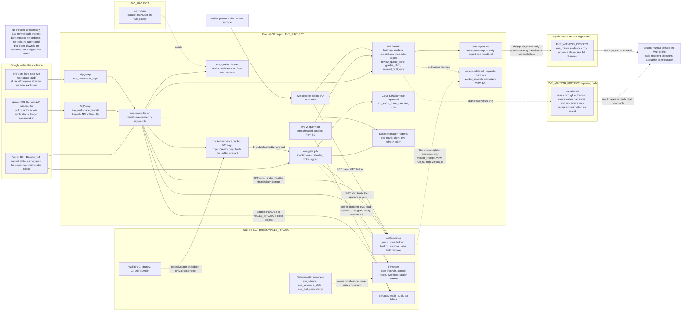

# 1. High-level design

## Status
- Owner: the platform owner
- Last reviewed: 2026-09-15
- 2026-09-15: scope widened at the owner's request — Eve monitors every human super admin from
  its first run, before Wall-E exists ([below](#scope-from-the-first-run-the-human-super-admins-2026-09-15);
  P153–P155).
- 2026-09-13: objective restated for a super-admin Wall-E (P33) — see the platform HLD
  ([../agentic-platform/01-hld.md](../agentic-platform/01-hld.md) §13.2, §18 items 11–15 and 17;
  owners and gates P143).

## Thesis

Eve is a body of SQL, two deterministic Cloud Run jobs, a console and a key, living in its
own GCP project, whose only privileged act is a Cloud KMS `EC_SIGN_P256_SHA256` signature
over a hash it computed itself.

It acquires its two authorities on opposite schedules because they point in opposite
directions. Halting and demoting can only ever make less happen, so Eve gets them the
moment it is a program at all, at S3 entry. Signing can make more happen, so Eve gets the
key only at S4 entry, after a twelve-fault exercise it must pass at 100 %. Before that,
"Eve v0" is ten BigQuery scheduled queries pinned to their own service account and read by
a human, and nothing else exists — no robot account, no token, no key, no allowlist entry.

Eve treats everything `walle-actions` says as a **claim**, and recomputes five things from
sources Wall-E cannot write: the plan hash, the per-item pre-state, the effective level,
the trigger's corroboration, and the typed predicate — the last implemented a second time
and differentially tested. It exposes no inbound decision endpoint, speaks no agent
protocol, and contains no model client, so "Eve is down" is an **absence**, which is the
only alert shape that catches it, and no LLM loop can produce an Eve signature because the
process cannot reach a model and its identity could not authenticate to one. Everything
Eve does not do is done by a deterministic sweeper inside `walle-actions` that can lower on
Eve's absence and has no code path that raises on Eve's return.

**Two paths, and a robot that is a super admin** (platform HLD §13.2).
Everything above describes Eve's **control path** — `eve-gate`, `eve-reconciler`,
`eve-console`, the key, in `EVE_PROJECT` — and it stands. Beside it sits a **reporting
path**, `eve-advisor` in its own project `EVE_ADVISOR_PROJECT` under `fld-controllers`, which
may reason about what the control path found and is report-only by construction (P34). And
the thing Eve watches is no longer a narrowly privileged robot behind a fixed catalogue:
`walle@` holds Super Admin (P33), so Eve's reconciler limb watches **every** robot-attributed
event in every ingested Workspace stream, not only catalogued plans, runs a detection
catalogue and a daily super-admin roster check, and pushes its evidence, incidents and
heartbeat daily to a **witness organisation** outside the tenant's reach.

The honest reading of the cost is seven to nine engineer-weeks of Eve, spread across two
stage transitions six to eight weeks apart, under €50 a month on GCP plus one Workspace
licence, and about half an hour a week of human time. The design says plainly that **L3
with human approval is a legitimate permanent end state**: none of this should be built
until an L3→L4 promotion can state in numbers how much approval burden it avoids.

That stop rule governs the **gate layer** (key, `eve-gate`, envelope, second predicate
implementation) only. The **observe-and-report layer** — the
six-stream sink, the Reports API poll by actor, the tenant-integrity rules, `eve.incidents`,
paging and the witness mirror — is a precondition of Wall-E's super-admin grant (platform HLD
§0.4 P line, §13.2) and is built and drilled before it, whatever the ladder stage; see
[05-stages.md](05-stages.md). "Before S3 entry nothing else exists — no robot account, no
token" above is therefore true only of a Wall-E that has not been granted Super Admin.

## Scope from the first run: the human super admins (2026-09-15)

On 2026-09-15 the owner asked that Eve monitor every human super admin from the day it runs,
before Wall-E exists. That widens the observe-and-report layer's subject, not its shape: the
six-stream sink, the Reports API poll by actor, the roster check, the detection catalogue and
the reporting contract are the ones above; the actor they watch is **every account on the
committed super-admin roster and every live admin-role holder**, the platform owner who installs
Eve included, and `walle@` joins that set only when it exists. From the first run:

- **Subjects.** The poll retrieves every application with `userKey=all`; the catalogue's actor
  sets are the roster, delegated administrators, break-glass accounts, live admin-role holders
  and unrostered accounts, so a freshly created admin is matched, not missed.
- **Detections.** The tenant-integrity rules `SA-01`…`SA-10` with the actor widened from
  `walle@` to any watched human, and the self-integrity rules `SI-01`…`SI-13`, which are what a
  monitored administrator would have to touch to silence Eve. Their canonical home is
  [03-lld.md §14](03-lld.md#14-the-detection-catalogue-the-roster-check-and-the-evidence-heartbeat);
  the committed form is [setup 25 EH-2.3](../agentic-platform/setup/25-eve-human-super-admin-detections.md#eh-23-the-detection-catalogue-sa-01sa-10-with-actor--any-roster-human-and-si-01si-13).
- **No halt target yet.** Before Wall-E's action services exist there is nothing to halt, so
  every halting rule pages severity 1 and records `halt_target_pending`
  ([setup 25 EH-4.6](../agentic-platform/setup/25-eve-human-super-admin-detections.md#eh-46-record-that-no-halt-target-exists-yet));
  the halt call joins at [setup 36](../agentic-platform/setup/36-wall-e-joins-to-eve-and-mo.md).
- **Reports leave the administration line.** A finding whose subject is a human with authority
  over the platform goes to the second human only — the sole-recipient rule of
  [03-lld.md §15](03-lld.md#15-the-reporting-contract) — in minutes by the organisation-owned
  paging service and, as a backstop, by an incident-mode push to the witness organisation, where
  a copy of every finding and page and the hourly heartbeat land and the absence alarms live
  ([setup 26](../agentic-platform/setup/26-eve-reporting-and-witness-export.md), [setup 27](../agentic-platform/setup/27-witness-grants-and-alarms.md);
  P150, P151). Who receives a report about the second human is decided before the routing is
  merged ([setup 26 ER-0.2](../agentic-platform/setup/26-eve-reporting-and-witness-export.md#er-02-the-b-12-gate-who-receives-a-report-about-the-second-human)).
- **The monitored administrator installs Eve**, so Eve's independence from him is proven, not
  assumed: `eve-owners@` is owned by the second human; `EVE_PROJECT` and every later elevation
  on it are approved by the second human, never the platform owner; `eve/config` requires the
  second human's review; the platform owner holds no standing role that can edit Eve; and the
  second human **independently proves detection on a seeded super-admin action** — the page on
  their own device, the `eve_workspace_logs`, `eve_workspace_reports`, `eve.incidents` and
  `eve.pages` rows and the witness copy — before `EVE_H_LIVE_RECORD` is signed
  ([setup 28](../agentic-platform/setup/28-eve-independent-proof-and-sandbox-drills.md) §2–§3; P155). A configuration
  change that pauses a detection is itself reported (the anti-silencing drill, setup 28 §5).
- **It is employee monitoring.** The reconciler and poll jobs stay BLOCKED until a DPO record
  covers monitoring of administrator accounts and works-council information is given where
  required ([setup 25 EH-0.2](../agentic-platform/setup/25-eve-human-super-admin-detections.md#eh-02-the-sd-11-gate-the-dpo-record-for-monitoring-named-administrators); P154).

The build order is Eve-H ([setup 23–28](../agentic-platform/setup/README.md#3-the-order)), then Wall-E, so the "before
S3 entry nothing else exists" line of the thesis is true only of the gate layer. Two corrections
the procedures made to the components table: the evidence bucket is in `europe-west1`, not the
EU multi-region (P166), and the ladder artefact is published by `walle-deployer@` in
`CICD_PROJECT`, not by a `WALLE_PROJECT` CI identity (P177). The decisions are P153–P155 in
[../agentic-platform/12-open-decisions.md §6a](../agentic-platform/12-open-decisions.md#6a-proposed-by-the-setup-procedures-p144p191).

## What Eve is not

Three negatives do more work in this design than any of the positives; three more bound
what the first three leave open.

- **Eve is not an agent.** It has no agent card that anyone calls, no A2A surface, no
  Pub/Sub push subscription, no HTTP endpoint of any kind. It is a client everywhere. The
  safety interlock between the controller and the doer is plain authenticated REST, in one
  direction, and can therefore never run through a conversation. This removes an attack
  class and makes "Eve is down" an absence rather than a silence nobody notices
  ([structural choice 2](#2-no-inbound-surface)).
- **Eve is not a service inside Wall-E's project.** Its key, its secrets, its dataset, its
  evidence bucket and its identities live in a project of its own — `EVE_PROJECT`, one of
  the four under `FOLDER_ID` in [../project-topology.md](../project-topology.md) — whose
  IAM policy contains no Wall-E deployer at project level, and in which the only Wall-E
  principals are three resource-level grants (topology decision 48); no Wall-E deployer holds
  a role on the folder either, and the config repository is Eve's own. All of it sits outside
  Wall-E's teardown blast radius ([E-1](09-open-decisions.md), answered yes on 2026-09-13).
  While Eve's key lives in Wall-E's project, a project owner there can grant
  themselves `roles/cloudkms.signer` and mint an Eve approval, and the only control on that
  is a daily drift row — a detective control on the single artefact the whole controller
  role rests on. That boundary is structural against Wall-E's project principals and
  deployers; against Wall-E's super-admin credential (P33) it is detective (structural
  choice 1 below).
- **Eve's authority path is not a model.** No approve/refuse decision, no halt, demote or
  veto, and no signature over any of them, is produced by a language model — required by
  [C12](../wall-e/14-hld-challenge.md) and [decision 34](../wall-e/09-open-decisions.md), and
  enforced here by mechanical checks rather than by a paragraph of policy: no model client in
  the control-path image, no `aiplatform.*` permission on either runtime identity,
  `reasoningEngines.query` removed per [C10](../wall-e/14-hld-challenge.md), and a
  project-level `restrictServiceUsage` denylist on `aiplatform.googleapis.com` for
  `EVE_PROJECT` ([structural choice 3](#3-deterministic-by-absence-not-by-discipline)). A
  signature cannot be produced by a model the process cannot reach. Eve's control path
  is a program, and the word "judgement" does not appear in its specification. Until
  2026-09-13 this negative read "Eve is not a model"; since then the objective asks Eve to
  report anything wrong, and the platform HLD §13.2 gives Eve a separate **reporting path**
  that may reason (P34) — `eve-advisor`, report-only by construction, whose output is read by
  humans and by no gate. Decision 34 stands for approve, halt, demote and veto.
- **Eve is not sufficient.** An Eve signature is necessary, never sufficient:
  `walle-actions` re-runs its full policy chain, per item, after verifying the signature
  offline against a pinned PEM. That bounds the compromised-Eve case to the blast radius of
  cells already marked `eve_authority: binding`.
- **Eve is not its own grader.** Eve's verdicts never feed the precision metric; a blind
  human sample, drawn from S1 and rendered without Eve's verdict columns, is the only input
  to precision at L4 and L5. Eve's own verdicts are graded in a separate `grades_eve`
  written by the platform approval surface, never by `eve-console`, and Mo — which improves
  Eve — is never Eve's grader (platform HLD §13.3). Otherwise the controller both decides and
  grades, and the metric that unlocks autonomy measures itself.
- **Eve is not a Workspace writer, at any stage, ever, and never a super admin.** The custom
  role `Eve — Verifier` carries read privileges only, and there is no domain-wide delegation
  anywhere. Its read privilege and scope set are widened before the one-sitting consent to
  watch a super admin (E-16), still with **no content scope**
  ([02-identity-and-auth.md](02-identity-and-auth.md)). Wall-E's action services are the only
  holders of a Workspace write credential, and the objective requires Eve to control without
  super admin.

## The shape on one page

Every solid arrow leaving Eve's project is a call Eve makes; nothing calls Eve's control
path. The three Google-written sources enter Eve's project directly, not by way of Wall-E. The single
dashed arrow from Wall-E into Eve's project is `walle-actions` reading an authorized view —
in the receipts dataset, separate from `eve` because an authorized view cannot live in its
source dataset (topology decision 48) — that exposes
`(run_id, item, verdict_ts)` and nothing else, so the service can check that evidence
arrived and can never branch on what it says — recorded as [E-17](09-open-decisions.md)
and re-argued at S4 entry. Every arrow that crosses the two subgraphs is a grant **on the
resource it points at**, never a project-level role in the other project; the complete
list, with who makes each grant, is [../project-topology.md](../project-topology.md) §3.
`GEMINI_PROJECT` is absent — no Eve identity holds anything there. `MO_PROJECT` is drawn,
because one Mo read reaches Eve's data (platform HLD §13.3, §18 item 25): `mo-metrics@` holds
dataset-level `READER` on `eve_quality`, made by Eve's runbook, as does the validator custodian
(P30). Nothing Mo writes is read by Eve, and Mo is never Eve's grader. Two further projects are
drawn: `EVE_ADVISOR_PROJECT` (the reporting path, whose arrows are dashed because nothing in it
reaches a verdict) and the witness organisation's `EVE_WITNESS_PROJECT`, the only destination
outside the tenant's organisation; its grants to `eve-export@` are made by the witness
administrators on witness resources.

## Components

| Component | Runs on | Identity | Does | Never does | Exists from |
|---|---|---|---|---|---|
| **Eve v0 query set** | BigQuery Data Transfer Service scheduled queries, transfer configs owned by Eve's project, reading `walle_audit` cross-project (dataset-level `READER` in `WALLE_PROJECT`, granted by Wall-E's runbook, CC-22; jobs run in `EVE_PROJECT`), writing `eve.findings`. Twelve transfer configs: the ten [05](../wall-e/05-autonomy-ladder.md) §8 metrics — which include hard-invariant denials (with the T0-human `protected_principal` exclusion) and audit completeness — plus two of Eve's own, two-direction reconciliation and config/ladder drift. The query list is in [07-build-runbook.md](07-build-runbook.md) Phase 4. Scheduled **off the hour** — a query at exactly hh:00 can double-trigger. | `eve-v0@<eve-project>`, pinned on every transfer config with `--service_account_name`. The default is the creating user's credentials, and an evidence series that runs as the person who administers Wall-E is not independent, and dies when they leave. | Computes every ladder metric on a 30-day rolling window, hourly, each result with its threshold, verdict and query hash. A human reads them weekly. | Approve, halt, demote, hold any Workspace credential, write to Wall-E's project. | **S0**, and it is the whole of Eve through S2. |
| **`eve` dataset and the `walle_audit` mirror** | BigQuery, EU, in Eve's project. Tables `findings`, `verdicts`, `attestations`, `review_queue`, `review_queue_blind` (view), `grades_blind`, `pages`, `walle_audit_mirror`. The `verdict_receipts` authorized view lives in a **separate** dataset of `EVE_PROJECT` (name *tbd*, topology decision 48), because an authorized view cannot sit in its source dataset. DAY-partitioned, 400-day expiry. One daily scheduled copy appends yesterday's `walle_audit` partitions. | Owned by Eve's project. Wall-E's deployers hold no IAM here. | Holds Eve's entire output and the off-project evidence copy [decision 31](../wall-e/09-open-decisions.md) and the C11 residual ask for. The mirror is append-only and outside Wall-E's teardown blast radius. It also holds `incidents` and `seeded_fault_runs` ([03-lld.md](03-lld.md) §9); the Mo-readable subset sits behind the `eve_quality` dataset (row below). | Accept a write from any Wall-E principal. Hold Workspace payloads beyond ids, counts and hashes. | `findings` and the mirror at **S0**; `incidents` and `pages` with the observe-and-report layer, **before the super-admin grant**; the rest at **S3 entry**. |
| **`eve_workspace_logs`** | BigQuery dataset in `EVE_PROJECT`, fed by Eve's own organisation-level sink `eve-workspace-audit` over all six Cloud Logging Workspace streams. | Sink writer identity, `dataEditor` on this dataset only. | Eve's independent record of what the robot actually did, reconciled instead of `walle_workspace_logs` and watched by heartbeat H-1; the sink is specified in [03-lld.md §13](03-lld.md#13-the-evidence-perimeter-for-a-super-admin-wall-e). | Carry an actor exclusion. Live in Wall-E's project. Be merged into the platform's aggregated sink. | **S2** — so Eve's first enforcing window has history — and in any case **before the super-admin grant**. |
| **`eve-reconciler`** | Cloud Run **job** in Eve's project, europe-west1, four task entrypoints on Cloud Scheduler: post-hoc every 5 min, reconciliation and drift hourly, deep pass every 6 h, daily pass. Four scheduler jobs invoke the one Cloud Run job with a different entrypoint argument ([07-build-runbook.md](07-build-runbook.md) Phase 10). Triggered with an **OAuth** token to `run.googleapis.com` (OIDC is wrong for a `*.googleapis.com` target). Idempotency key = job name + the constant `X-CloudScheduler-ScheduleTime` header. | `eve-verifier@<eve-project>`. Holds **no** `cloudkms.signer`. | Post-hoc verification of L5 writes; two-direction reconciliation; config, ladder, epoch and Google-contract drift; daily operator-list reconciliation against `roleAssignments.list`; the blind sample draw; attestation bundles; the monthly refresh-token **exchange** that resets Google's six-month clock. Calls halt and demote on a declared threshold. Under a super-admin Wall-E (platform HLD §13.1 item 5, §13.2) it also runs the Reports API poll by actor; reconciliation of **every robot-attributed event in every ingested stream** against `walle_audit` and the band-B audit rows, a miss being `reconciliation_gap` and a halt; the **detection catalogue** (reconciler limb only, never the gate limb); the **daily super-admin roster check** (`roleAssignments.list`, `users.list` `isAdmin`, diffed against the committed roster); the **evidence heartbeat** (`log_pipeline_silent` on silence, paging on `invalid_grant`); writing `eve.incidents` and `eve.pages` under the reporting contract. | Sign anything. Write to Wall-E's project. Grade an item a human is due to grade blind. Expose any endpoint. Read anything `eve-advisor` writes. | **S3 entry** for the gate-layer duties; the observe-and-report duties **before the super-admin grant**. |
| **`eve-gate`** | A fourth entrypoint of the same image, deployed as its own Cloud Run job, every 2 minutes. Polls Firestore `plans/{id}` for `state == pending_eve`, then fetches the body from `GET /v1/plans/{id}`. | `eve-controller@<eve-project>`, plus `roles/cloudkms.signer` on `eve-approval`. | The five recomputations, the per-item accept/reject vector, the signature, `POST .../approve`, and `POST .../veto` when a threshold fires after signing. | Sign over a hash the service reported. Take input from any agent protocol. Approve a cell whose `eve_authority` is advisory, or one whose hold window elapsed during an outage. Approve when its own re-read is inconclusive — it refuses, and refusal means the item waits. | **S4 entry**, after the seeded-fault exercise passes at 100 %. |
| **`eve-console`** | Cloud Run service in Eve's project, fronted by Identity-Aware Proxy for a dedicated audience group (name *tbd*, in place of `walle-operators@`; platform HLD §13.2) whose membership change is a severity-1 rule (SA-09 of [../agentic-platform/07-monitoring-detection-incident-response.md](../agentic-platform/07-monitoring-detection-incident-response.md) §6.2). Mobile-legible: the point is that a holiday-adjacent administrator can read it on a phone. | `eve-console@<eve-project>`, read-only: `dataViewer` on `eve`, `objectViewer` on the attestation bucket, `run.invoker` on `walle-actions` for `GET /v1/plans` and `GET /v1/ladder` only. | Four views — the live queue with each plan's age and deadline; the blind sampled review rendered from an allowlisted column set; ladder state beside Eve's drift findings; attestation bundles, one link per promotion. Writes grades to `eve.grades_blind` (grades of Wall-E's plans). Never writes `grades_eve`, the grades of Eve's own verdicts, which the platform approval surface writes (platform HLD §13.3). | Approve, veto, halt or demote. Render Eve's verdict on a review page. Hold a Workspace credential. | **S3 entry.** The blind-review view must exist before the S3 exit gate, not before S4. |
| **Eve's Workspace robot** | `eve@<domain>`, custom admin role `Eve — Verifier`, read privileges only. | Its own consented refresh token from a separate Trusted Desktop OAuth client; no domain-wide delegation. | Eve's independent, read-only view of the tenant; the role, its hardening, the ten-scope set and the dropped `apps.licensing` are in [02-identity-and-auth.md](02-identity-and-auth.md#eves-workspace-robot). | Write anything to Workspace. Be impersonated. Be a super admin, ever. | In one sitting with the observe-and-report layer, **before the super-admin grant**, with the widened read set fixed first (E-16). |
| **Eve's secrets** | Secret Manager, regional (europe-west1), **in Eve's project**: `eve-oauth-client`, `eve-refresh-token`. Version pinned by `EVE_TOKEN_VERSION`, never `versions/latest`. | `roles/secretmanager.secretAccessor` to `eve-controller@` and `eve-verifier@` only. | Holds Eve's Workspace credential where `walle-actions@` cannot be granted access even by mistake, because it has no principal in that project. Values never recorded in the wiki. | Be readable by any Wall-E principal. Sit in Wall-E's project. | **S3 entry.** |
| **`eve-approval` KMS key and the PEM archive** | Cloud KMS key `eve-approval`, `EC_SIGN_P256_SHA256`, HSM, in `EVE_PROJECT`. | `roles/cloudkms.signer` to `eve-controller@` only. | Produces the only signature that can authorise an L4 execution; its properties, the PEM archive and the manual rotation are in [02-identity-and-auth.md](02-identity-and-auth.md#the-signing-key). | Live in Wall-E's project. Rotate automatically. Be destroyed inside the 400-day evidence horizon. | **S4 entry.** |
| **Evidence bucket** | `gs://<eve-project>-eve-evidence`, `europe-west1` (P166, corrected 2026-09-15), **locked** retention policy of 400 days. A locked policy cannot be removed or shortened and objects cannot be deleted or replaced before expiry even by a project owner; locking applies a lien preventing project deletion. | `eve-verifier@` holds `roles/storage.objectCreator` — create only, no delete, no overwrite. | Attestation bundles, daily reconciliation extracts, archived PEMs, CI-published ladder artefacts, and the daily newline-JSON export with SHA-256 manifests under `exports/`, written by `eve-export@` (P107). | Have its retention shortened. Be the destination of a sink Wall-E's project owners control. | **S3 entry.** |
| **`eve/config`** | Eve's own git repository, separate from Wall-E's: thresholds, the closed reason vocabulary, the second predicate implementation, the compiled ceiling table, `oncall.yaml`, the seeded faults, the detection catalogue and the super-admin roster, as listed in [07-build-runbook.md Phase 10](07-build-runbook.md#phase-10--eveconfig-eve-reconciler-eve-console-and-the-fixtures) and [Phase 10b](07-build-runbook.md#phase-10b--the-observe-and-report-layer-before-the-super-admin-grant). | Human-merged only. Neither Eve identity has a write path. | Every halt, demote, veto and refuse is a named threshold with a reason code, and `eve_config_version` is stamped on every verdict row, control call and attestation. | Live in Wall-E's repository, where one pull request could widen Wall-E and loosen Eve together. Be merged by one human at S4+. | **S3 entry**; a stub schema and the CI assertions exist from Eve's first commit, and `thresholds.yaml`'s numbers are stubbed at S0 so v0 and the controller read the same values. |
| **CI-published ladder artefact** | `gs://<eve-project>-eve-evidence/ladder/<config_version>.yaml` plus its git sha, written append-only by Wall-E's CI identity (`CI_DEPLOYER` of `WALLE_PROJECT`, `objectCreator` under an IAM Condition on the `ladder/` prefix — a bucket-level, cross-project grant made by Eve's owner) into Eve's locked bucket. | Wall-E's CI identity, create-only. | Replaces "Eve reads `ladder.yaml` in git": Eve needs no git credential, and the config it compares against — and re-derives effective levels from — cannot be rewritten by Wall-E's deployers. | Be writable by `walle-actions@` or by a deployer. | **S3 entry.** |
| **Two sweepers and one stamp in `walle-actions`** (Wall-E's side of this design) | Deterministic code in the action service, no Eve involvement. | `walle-actions@`. | `eve_silence`, `eve_evidence_stale` and the passive `eve_last_seen` stamp lower autonomy on Eve's absence; conditions, thresholds and properties are in [08-contract-changes.md §3](08-contract-changes.md#3-wall-es-side-of-this-design). | Raise anything, ever, on Eve's return. Read the content of a verdict. | Code from the **first commit**; the `verdict_receipts` read is wired at **S4 entry**. |
| **CI-only stub caller** | Wall-E's test suite. | A test-only principal standing in for `eve-controller@`. | Exercises all eight [08](../wall-e/08-team-eve-mo.md) interfaces from commit one and proves denial tests 4, 5, 6 and 52, including Eve refused 403 on `POST /v1/execute` and an operator token accepted on halt. | Exist in any admitted image or deployed environment. There is no fault-injection or test-mode path reachable in a deployed Eve or Wall-E image; the seeded-fault exercise uses a separate sandbox deployment and dataset. | **S0**, in code only. This is the whole of what [decision 36](../wall-e/09-open-decisions.md) leaves at Stage 0. |
| **`eve-advisor`** — the reporting path | A Cloud Run job in `EVE_ADVISOR_PROJECT`. | `eve-advisor@`, holding no signer, no invoker, no secret. | Narrates findings and names what no rule covers for a human, report-only by construction, as defined in [structural choice 3](#3-deterministic-by-absence-not-by-discipline). | Produce a signature, a halt, a demotion, a veto, or any input to one. | Gated by P34 (*proposed*) and, for paging rights, by its AI Act class (P19). |
| **`eve_workspace_reports`** | BigQuery dataset in `EVE_PROJECT`, fed by `eve-reconciler`'s Reports API poll by actor. | `eve-verifier@`, with `eve@`'s token. | The second evidence route, independent of the "Share data with Google Cloud services" switch, specified in [03-lld.md §13](03-lld.md#13-the-evidence-perimeter-for-a-super-admin-wall-e). | Read content: it reads activity metadata only. | **Before the super-admin grant.** |
| **Detection catalogue** | Versioned, human-merged rule file set in `eve/config`, evaluated in the **reconciler limb only**. | `eve-verifier@`. | Detects misbehaviour across every stream and reports on human prompts as well as robot actions; its classes are in [03-lld.md §14](03-lld.md#14-the-detection-catalogue-the-roster-check-and-the-evidence-heartbeat). | Run in the gate limb. Carry a rule no human merged. | **Before the super-admin grant** (tenant-integrity set); baselines after S2 calibration. |
| **Reporting contract: `eve.incidents`, `eve.pages`, `oncall.yaml`** | Eve-owned tables and the rota file. | Written by `eve-reconciler`; narratives by `eve-advisor` through `eve_advice`. | Severities, channels, recipients, targets and the sole-recipient rule are in [03-lld.md §15](03-lld.md#15-the-reporting-contract). | Page the person the report is about as its only recipient. | **Before the super-admin grant.** |
| **`eve_quality` dataset** | BigQuery dataset in Eve's project holding authorised views, no free-text columns, over `findings`, `verdicts`, `attestations`, `pages`, `incidents` minus narrative and `seeded_fault_runs`. | Dataset-level `READER` to `mo-metrics@MO_PROJECT` and to the validator custodian (P30), both made by **Eve's runbook**; no binding in `MO_PROJECT`. | Mo measures Eve's quality from it; the custodian re-derives the numbers. Never `grades_blind` or `review_queue_blind`. Eve reads nothing Mo writes. | Carry a free-text column. | **Wall-E's Stage 1.** |
| **`eve-export@` and the daily export** | Cloud Run job in `EVE_PROJECT`. | `eve-export@` — one identity per duty: never the reconciler, never the gate. | Exports yesterday's audit and Eve tables with SHA-256 manifests into the locked bucket and pushes them with a heartbeat row to the witness, as specified in [../agentic-platform/08-data-logging-retention-sovereignty.md §5.4](../agentic-platform/08-data-logging-retention-sovereignty.md#54-the-daily-export-to-the-evidence-bucket-closes-decision-31). | Delete or overwrite anything. Hold any grant in the witness beyond the two create-only ones. | **Before the super-admin grant** (the witness push); the evidence-bucket export by Stage 1. |
| **The witness, `org-witness` / `EVE_WITNESS_PROJECT`** | A second organisation on a separate, minimal Cloud Identity tenant. | No witness principal holds any grant in the tenant's organisation. | The daily append-only copy of Eve's evidence and incidents, the severity 1/2 channels and the absence alarm, specified in [structural choice 1](#1-eves-independence-detective-inside-the-organisation-structural-through-the-witness). | Approve, halt or execute anything. | **A gate item of the super-admin grant.** |

Principals and the grants behind this table are in
[02-identity-and-auth.md](02-identity-and-auth.md); how a verdict is produced is
[03-lld.md](03-lld.md); what exists at each stage is [05-stages.md](05-stages.md).

## The five structural choices

### 1. Eve's independence: detective inside the organisation, structural through the witness

Until 2026-09-13 this choice was "Eve gets its own GCP project": the project boundary makes
Eve's key, secrets, dataset and evidence structurally unreachable from Wall-E's project. Since
the robot holds **Super Admin** (P33), that boundary no longer holds against every principal
that matters (platform HLD §13.2, "Trust root — the witness"; §18 item 11).

**The trust root.** A Workspace super admin can grant itself Organization Administrator on
the tenant's GCP organisation and is its point of contact for recovery (Google's pages say
"can grant" and "point of contact in case of recovery issues"; `Assumption:` the standing
recovery right, verified or refuted before the grant). `walle@`'s credential can also make a
user an admin, suspend `eve@`, revoke Eve's token, remove Eve's role, switch off "Share data
with Google Cloud services" and re-filter the organisation sinks. Nothing inside the tenant's
organisation is therefore structurally out of a super admin's reach, and `EVE_PROJECT` is
inside it.

**So Eve's independence has two parts, graded as the platform HLD grades every control:**

| Part | What it covers | Grade | Against whom |
|---|---|---|---|
| The project boundary (the argument below) | Eve's key, secrets, dataset, evidence bucket and config are in `EVE_PROJECT`; no Wall-E deployer holds a project-level role there or on the folder; three resource-level carve-outs | **enforcement** | Wall-E's project owners, deployers and service identities |
| The same boundary, against the super-admin credential | a super admin who reaches Organization Administrator can redeploy `eve-gate`, re-grant the key, delete `EVE_PROJECT` | **detection only**, through the SIEM's super-admin set (SA-*, SG-*), Eve's own tenant-integrity rules and the absence alarms | `walle@` and any human super admin |
| **The witness organisation**, `org-witness` | the daily append-only mirror of `eve.findings`, `eve.verdicts`, `eve.incidents`, `eve.pages` and the evidence bucket copy; the K5 rota records; the severity 1/2 channels to individuals; the absence alarm on Eve's heartbeat and on Google's feed | **enforcement** (outside the tenant: its two super admins are from IT security, outside the Wall-E line, and no witness principal holds any grant in the tenant's organisation) | everyone in the tenant, including its super admins |

The honest statement, carried in every attestation: **Eve's control path stays in the
tenant's organisation and its independence there is detective, not structural**. The witness
sees the deletion of `EVE_PROJECT` within fifteen minutes and the absence of evidence; it
does not see the forgery of an approval. The only mechanism that stops a super admin who
reaches Organization Administrator from forging an approval or undoing a kill is relocating
Eve's control path to the witness — recorded as the end state, dated now, built when IT
security operates the witness (P15), with no standing cross-organisation
`orgpolicy.policyAdmin`. The witness is deliberately one project, one bucket, one dataset and
a few channels so that cost is never the reason to defer it; it is a **gate item of the
super-admin grant** (platform HLD §0.4), as is the second human outside the Wall-E line who
owns `eve-owners@` and administers the witness — a platform role defined in
[../agentic-platform/11-tisax.md §7.1](../agentic-platform/11-tisax.md#71-the-roles).

**The witness, specified.** A same-organisation, detective-only witness is where Stages 0–2
live, and is written down as such; a second organisation is the precondition of the
super-admin grant. Google's pages do not call a super admin's reach into the GCP organisation
"irrevocable", and neither does this page.

| Aspect | Definition |
|---|---|
| Organisation | `org-witness`, a second organisation on a separate, minimal Cloud Identity tenant (`Assumption:` Cloud Identity Free on a distinct domain; the edition and whether the platform's billing account may fund a project there are P14). Its two super admins are from IT security, outside the Wall-E administration line. Placement: [../project-topology.md](../project-topology.md) §2. |
| Contents of `EVE_WITNESS_PROJECT` | the daily append-only export of `eve.findings`, `eve.verdicts`, `eve.incidents`, `eve.pages` and the evidence bucket copy; a copy of `eve.incidents`; the K5 rota records; the severity 1/2 Cloud Monitoring notification channels to individuals (SMS, mobile app, PagerDuty/webhook); the absence alarm; Access Approval and Access Transparency on the project. Nothing in it can approve, halt or execute. |
| Direction | a **push**, not a pull by a witness identity. One Eve identity, `eve-export@EVE_PROJECT`, a Cloud Run job in `EVE_PROJECT` holding dataset-level `READER` on `eve.*` and `storage.objectViewer` on Eve's locked bucket at home, writes the export and a heartbeat row. |
| Witness-side grants | exactly two resource-level grants to `eve-export@`: `roles/bigquery.dataEditor` on the witness dataset `eve_mirror` and `roles/storage.objectCreator` on the witness bucket (create-only; the bucket has a retention lock, so a compromised `eve-export@` can add rows and objects but cannot delete or rewrite what is already there). Both are made by the witness administrators on witness resources. **No witness principal holds any grant in the tenant's organisation**, so the tenant's `iam.allowedPolicyMemberDomains` needs no witness exception; the witness's own constraint lists the tenant's customer id for `eve-export@` only. Rows 32–33 of [../project-topology.md](../project-topology.md). |
| Absence alarm | a Cloud Monitoring policy in the witness on the heartbeat table, covering **Eve's heartbeat and Google's feed**: no `eve_workspace_logs` rows for 60 minutes in business hours (the same number as the platform HLD §7.3 and H-1 of [../agentic-platform/07-monitoring-detection-incident-response.md](../agentic-platform/07-monitoring-detection-incident-response.md) §7) pages. The heartbeat table and windows are [03-lld.md](03-lld.md) §14. |
| Cost | one more tenant, two more hardware keys, a second ENX and supplier line — deliberately one project, one bucket, one dataset and a few channels owned by IT security, costing hours rather than a second platform. |
| What it does not see | the forgery of an approval. It sees the deletion of `EVE_PROJECT` within fifteen minutes and the absence of evidence. |

**The end state, recorded as a dated decision (P15).** When IT security operates the
witness, Eve's **control path** — gate, HSM key, console — relocates there, and the
cross-organisation grants become an enumerated list with their stated costs: two SCC Premium
activations, two org-policy sets, an `allowedPolicyMemberDomains` exception on each side,
`run.invoker` for `walle-actions@` on `eve-gate` across organisations and Eve's halt calls
back, and a spike on whether VPC-SC ingress and egress rules can name projects and identities
in another organisation. That relocation is the only mechanism that stops a super admin who
reaches Organization Administrator from forging an approval or undoing a kill. It is the
destination, not a year-one precondition, and it carries **no standing cross-organisation
`orgpolicy.policyAdmin`** — the kill plane stays in `CORE_PROJECT` behind PAM.

**The project boundary, against Wall-E's project principals.** Eve's key, secrets, dataset,
evidence bucket and config sit in `EVE_PROJECT`, one of four projects under `FOLDER_ID`, so
`walle-actions@` and Wall-E's deployers have no principal from which to re-grant the signer
role, read Eve's secrets or reach Eve's evidence, and no Wall-E deployer may hold a role on the
folder either. The boundary is only as real as the org chart: with one administrator it is
notional, and Eve's build (Eve v0 and the observe-and-report layer) does not wait for a second
person, but the second human outside the Wall-E administration line is a precondition of the
super-admin grant ([E-2](09-open-decisions.md) reopened). The full argument, the rejected
single-project variant (E-1) and who owns the project are in
[02-identity-and-auth.md](02-identity-and-auth.md#why-eve-gets-its-own-gcp-project).

### 2. No inbound surface

Eve exposes nothing over the network that takes a decision. No HTTP decision endpoint, no
Pub/Sub push subscription, no A2A surface, no agent card, no agent protocol of any kind.
Eve is a client everywhere.

This removes an attack class outright, and it makes it structurally impossible for a
safety interlock to run through a conversation. It also fixes the shape of the only alert
that matters: if Eve cannot be called, Eve's failure cannot be reported by Eve, so "Eve is
down" has to be detected as an **absence**, which is the alert shape that actually catches
a wedged process.

Two things were rejected to keep this true.

- **A heartbeat endpoint** (`POST /v1/control/heartbeat`) amends a contract described as
  fixed, and a liveness signal Eve publishes cannot prove Eve is alive — a wedged Eve that
  still heartbeats keeps autonomy alive. It is replaced by an absence shape: `eve_last_seen`
  stamped **passively** by `walle-actions` from any successfully authenticated
  `eve-controller@` or `eve-verifier@` call, with no new endpoint and nothing Eve can
  assert, plus two timers that key on missing work rather than on reported health.
- **A `walle-events` subscription.** The only latency-sensitive duty is L5 post-hoc
  verification within 60 minutes, and a 5-minute poll of the day-partitioned `actions`
  table meets that twelvefold; default-stream writes are queryable immediately. Beyond the
  cost argument, a topic Wall-E publishes to is a channel Wall-E controls, and Eve's whole
  premise is that Wall-E's statements are claims. The topic's schema is recorded as the
  obligation of whoever later asks for it, most likely Mo — see [E-20](09-open-decisions.md).

The same reasoning picks Cloud Run **jobs** over a resident service. A `min-instances=1`
signer service costs €30–45 a month to gate nothing before S4, and a single instance
restart is a coverage gap. Jobs on a schedule cost near nothing, have no ingress, and a
job task may run up to 168 hours where a service request is capped at 60 minutes (verified
2026-09-12: [Cloud Run task timeout](https://docs.cloud.google.com/run/docs/configuring/task-timeout),
[request timeout](https://docs.cloud.google.com/run/docs/configuring/request-timeout)).

### 3. Deterministic by absence, not by discipline

"Eve contains no model" is worth nothing as a sentence in a design document. It is worth
something as a build that fails when the sentence stops being true.

The two enforcements that actually bind are absences, not rules: the dependency is not in
the image, and the permission is not in the IAM policy. The signature cannot be produced
by a model because the process cannot reach one, and Eve's identity could not authenticate
to a model endpoint if it could. Everything else in [the deterministic boundary](#the-deterministic-boundary)
is a useful regression guard on top of those two.

Until 2026-09-13 the advisory model was a door kept visibly shut: `eve-advisor` was not built,
and if built it would be wired so that it could only ever turn an accept into a refuse. P34
opens the door for reporting only (platform HLD §13.2, CP5): `eve-advisor` is the **reporting
path** in `EVE_ADVISOR_PROJECT`, and the refuse wire is withdrawn, because no wire, grant or
reader exists for it and any one that did would put a model output on the authority path. The
reporting path is **report-only by construction**: it writes narratives and `eve.advice`, pages
at severity 2 inside the budget, and nothing it writes is read by `eve-gate`, `eve-reconciler`
or either Wall-E action service — the gate reads `eve.*` control tables and `eve/config`, never
`eve.advice`.

What stays, and is now stronger:

- **Deterministic by absence on the control path**, with a Google-enforced absence added: a
  **project-level** `gcp.restrictServiceUsage` denylist on `aiplatform.googleapis.com` for
  `EVE_PROJECT` itself — project level, not on `fld-controllers`, because the sibling
  reporting project needs the API — drift-checked, beside the image CI check (platform HLD
  CP5, §3.1).
- **A compliance invariant.** A model-free control path is not an AI system under Art. 3(1)
  and serves as an Art. 14 oversight measure; a model client entering the control path, or
  `eve-advisor` gaining any input to the gate, voids that determination. The determination, its
  register row and its reclassification trigger are in
  [../agentic-platform/10-eu-ai-act.md §3.2](../agentic-platform/10-eu-ai-act.md#32-eve-control-path--not-an-ai-system-as-an-invariant-eve).
  The safety reason and the compliance reason are the same invariant.

**The two paths, defined.** The control path is `eve-gate`, `eve-reconciler` and
`eve-console` in `EVE_PROJECT` with the HSM key `eve-approval`; approve, veto, halt and demote
travel over plain authenticated REST; there is no model client in the image (CI-checked) and
`aiplatform` is denied by the project-level denylist above; decision 34 stands for approve,
halt, demote and veto. The reporting path is defined here:

| Aspect | `eve-advisor`, the reporting path |
|---|---|
| Runs | a Cloud Run job in `EVE_ADVISOR_PROJECT`, a project of its own under `fld-controllers`, separate from `GEMINI_PROJECT`, `WALLE_PROJECT`, `EVE_PROJECT` and `MO_PROJECT`; `aiplatform` is allowed there and denied in `EVE_PROJECT`. Identity `eve-advisor@`. |
| Reads | `eve.*`, `eve_workspace_logs` and the report tables, **only through authorised views with no free-text columns** — dataset-level `READER` on the authorised-view dataset in `EVE_PROJECT`, never on the source datasets. |
| Writes | only `eve.incidents.narrative` and `eve.advice`, through the dedicated dataset `eve_advice` in `EVE_PROJECT`, on which it holds `dataEditor` and nothing else. Both grants are made by Eve's runbook (platform HLD §18 item 25). |
| Holds, by construction | no `cloudkms.signer`, no `run.invoker` on any action service, no `secretAccessor` on any secret, no write to `eve/config`. |
| May do | narrate what the deterministic findings describe and name what no rule covers, for a human; page at **severity 2 only**, inside the page budget, citing the deterministic finding that triggered it. A human who agrees with a "wrong accept" finding halts or demotes through the existing human path, and tightens Eve's rules through a human-merged `thresholds.yaml` change (Mo's `eve_threshold_tighten` proposal type). |
| May not do | produce a signature, a halt, a demotion, a veto, or **any input to one**, and it cannot raise a refusal: no wire, grant or reader exists for that. Nothing it writes is read by `eve-gate`, `eve-reconciler`, `walle-actions` or `walle-actions-super` — the gate reads `eve.*` control tables and `eve/config`, never `eve.advice` — so no model output enters a verdict. The prohibition is IAM, not code discipline. It produces no finding about a named human without the deterministic rule that triggered it until P19 is answered. |
| Model pin | re-qualified on every change before it may page again: a pin change resets its paging thresholds and re-runs the seeded-fault set (P123; [03-lld.md](03-lld.md) §15). |
| Decision | platform register row **P34** (*proposed*), file [2026-09-13-eve-reporting-path-may-reason.md](../../decisions/2026-09-13-eve-reporting-path-may-reason.md), owner the Eve owner with the security reviewer, gate the `eve-advisor` build; paging rights and any registration wait on its AI Act class (P19, legal). It reopens the settled "No model anywhere in Eve v1 or v2" row ([09-open-decisions.md](09-open-decisions.md); [../wall-e/14-hld-challenge.md](../wall-e/14-hld-challenge.md) "An LLM Eve — Rejected") on the objective's new evidence: "anything wrong" cannot be enumerated in a closed vocabulary, and the reporting path is where the enumeration ends. [../wall-e/08-team-eve-mo.md](../wall-e/08-team-eve-mo.md) item 5 ("halting, on its own judgement") narrows to the reporting path's *reporting*, not to a halt (structural choice 4). |

### 4. Two authorities on opposite schedules

Eve has exactly two authorities and they arrive at different stages, because they point in
opposite directions.

**Halting and demoting** can only ever make less happen. Eve gets them at S3 entry, the
moment it is a program at all — live for the invariant class immediately, with rate-based
triggers observe-only until their thresholds are calibrated at S2 on measured data.
**Signing** can make more happen. Eve gets the key at S4 entry, after the twelve seeded
faults are caught at 100 % and both negative controls stay silent.

This is the split recorded as [E-6](09-open-decisions.md), and it exists because two
requirements in the inherited set cannot both hold literally: Eve is described as
observe-mode through Stage 3, and Eve is required to fail closed in every direction. Taken
literally together, the only component watching Google's log would be forbidden to act on
what it sees. The split resolves it by direction rather than by date, and names the cost:
a buggy Eve can halt the programme during the stage the programme is trying to prove
itself. That cost is accepted because halting is the direction one human can undo in
seconds.

The bias within those authorities is stated precisely, because "bias toward halting when
uncertain" would make a degraded Eve the outage. [08](../wall-e/08-team-eve-mo.md) item 5's
"its own judgement" is void **for halting**. Under the platform HLD §13.2, item 5
narrows to the reporting path's *reporting*, never to a halt — reporting is not halting, and
the reporting path may describe what no threshold names while holding no authority. Two
rules, both carried in `thresholds.yaml`:

- every unresolved comparison **at the approval point resolves to refuse** — the plan
  waits for a human, costing minutes;
- **halting is reserved for the closed invariant-trigger list** and is therefore never
  discretionary.

A degraded Eve that halts turns every hiccup into an outage. A degraded Eve that refuses
costs an operator an approval. Refusing costs an approval; halting costs the programme.

One field carries both halves of that switch. Two separate per-cell flags — an `eve_gate`
observe/enforce flag **and** an `eve_authority` demotion target — were considered and
rejected, because two fields that must always agree drift. `eve_authority: advisory |
binding`, absent reading as advisory, is the observe/enforce switch, the fail-closed
default and the demotion target when an Eve approval is overturned
([E-4](09-open-decisions.md)).

Demotion granularity follows the contract rather than the prose: `demote` takes one
`(family, trigger)` cell, so a tenant-wide condition is one call per cell, each with its
own reason and audit row, and a genuinely tenant-wide condition uses `halt`, which is
atomic. The millisecond-wide seam between per-cell calls is named rather than papered over
— [E-8](09-open-decisions.md).

### 5. The second predicate implementation

Eve implements the typed `expects` predicate of [decision 32](../wall-e/09-open-decisions.md)
a **second time** from the same typed spec, differentially tested in CI against Wall-E's, and
compiles its own ceiling table from the CI-published ladder artefact, because otherwise the
verification-success metric that unlocks L4 and L5 would measure itself and a lying policy
chain would go uncaught ([C52](../wall-e/14-hld-challenge.md)). It is the single largest line in
the build, six engineer-days, the one not to cut and the reason this design was chosen over the
alternatives, and the platform's Tier W weakening of the property (P79) does not apply to Eve. A
second implementation is not a second author (limit 4 in
[06-failure-modes.md](06-failure-modes.md#five-named-limits-on-eves-independence)); the detail
is [03-lld.md §3.5](03-lld.md#35-the-typed-predicate-implemented-a-second-time).

## The deterministic boundary

Every decision on Eve's control path is code. The boundary below binds the `eve-gate`,
`eve-reconciler` and `eve-console` images and the `eve-controller@`, `eve-verifier@` and `eve-console@` identities in `EVE_PROJECT`; the
report-only `eve-advisor` in `EVE_ADVISOR_PROJECT` is outside it by construction and holds
nothing the boundary protects. The verdict is a pure function of six inputs: the plan body
from `GET /v1/plans/{id}`, Eve's own Workspace reads, rows from BigQuery and Firestore, the
CI-published ladder artefact, Eve's compiled ceiling table, and `thresholds.yaml`. The
boundary is enforced seven ways, all mechanical — the first two are what actually bind.

1. **Dependency absence.** Eve's image lockfile is scanned in CI against a denylist —
   `google-cloud-aiplatform`, `google-genai`, `vertexai`, `google-adk`, `anthropic`,
   `openai`, `langchain*` — and the build fails on a hit; a runtime import test asserts the
   same. The signature cannot be produced by a model because the process cannot reach one.
2. **Permission absence.** Neither Eve identity holds any `aiplatform.*` permission.
   `reasoningEngines.query` is removed per [C10](../wall-e/14-hld-challenge.md), leaving two
   query principals on Wall-E's engine in `WALLE_PROJECT`: the Gemini project's Discovery
   Engine service agent,
   `service-<GEMINI_PROJECT_NUMBER>@gcp-sa-discoveryengine.iam.gserviceaccount.com` (the
   **app** project's number, not Wall-E's), and `walle-dispatcher@`. Whether the
   engine-scoped custom role suffices for that cross-project agent is Wall-E's spike
   (topology decision 42). CI asserts the IAM policy. There is consequently no
   Eve `streamQuery` caller for [06](../wall-e/06-security-guardrails.md)'s CI grep to
   police; the grep stays as a regression guard and finds nothing, which is the correct
   steady state.
3. **Call-graph confinement.** `sign_envelope()` is reachable from exactly one function,
   `verdict_for_plan()`, and a CI call-graph test fails if any other caller appears. The
   KMS client is constructed in one module importing nothing outside the standard library
   and the KMS SDK. Separately, only the `eve-gate` entrypoint's identity holds `signer`.
4. **Replayability.** Every verdict row carries its input hashes and a `replay_bundle` id,
   and a golden-replay test recomputes archived verdicts offline and requires bit-identical
   output. A non-deterministic verdict fails the build.
5. **Typed inputs and a closed vocabulary.** `decide(plan, prestate, ladder, ceilings,
   thresholds) -> Verdict` takes and returns typed structs; no free text crosses it. Eve may
   emit only a reason code from `reasons.yaml`, and a verdict carrying an unknown code is
   rejected before signing.
6. **Service absence at the project** (platform HLD CP5). A project-level
   `gcp.restrictServiceUsage` denylist on `aiplatform.googleapis.com` for `EVE_PROJECT`,
   drift-checked, so the API cannot be enabled in the project by anyone short of an
   organisation-policy administrator — and a change to it is severity 1 (SG-04 of
   [../agentic-platform/07-monitoring-detection-incident-response.md](../agentic-platform/07-monitoring-detection-incident-response.md)
   §6.3). Enforcement 2 remains the identity-level absence; this is the project-level one.
7. **No input from the reporting path** (P34). No control-path identity holds a
   read on `eve_advice`, and a CI assertion on the dataset access lists fails if one appears;
   the gate reads `eve.*` control tables and `eve/config` only.

The closed reason vocabulary is Eve's own, defined in [03-lld.md](03-lld.md) and nowhere
else; it does not touch [03](../wall-e/03-lld.md)'s denial reasons, which stay Wall-E's.

## What this design does not close

Eve's independence has five named limits — it reads the plan from the service it is checking,
Google's log never proves who asked, F7 licence verification is event-only, its predicate is a
second implementation but not a second author, and its independence from the ladder owner is
not structural — plus the declared limits of watching a super admin: detective independence
inside the organisation, detection that ends where enumeration ends, the "records nothing" list
and settings state Eve cannot read. Each is carried in every attestation bundle for an affected
cell, so that a promotion decision reads them rather than inherits them. They are stated in
full in [06-failure-modes.md](06-failure-modes.md#five-named-limits-on-eves-independence) and
[its super-admin section](06-failure-modes.md#the-declared-limits-of-watching-a-super-admin),
beside the bounded risks — a compromised Eve, a lying `walle-actions`, an Eve that is wrong in
either direction — and their containment.

## Cost

**Build.**

| Piece | Days | Notes |
|---|---|---|
| Eve v0 at S0 | 4–6 | Project, service account, two dataset grants, ten pinned scheduled queries, the daily mirror, one absence alert |
| Wall-E's side of this design | ~5 | Sweepers, `eve_authority`, `items_hash`, the new denial reason, pinned-PEM verification, the blind view. Scheduled with Wall-E, not with Eve — see [08-contract-changes.md](08-contract-changes.md) |
| Eve v1 at S3 entry | 20–24 | Workspace bootstrap and consent 0.5; job scaffold, scheduling and config 2; two-direction reconciliation with per-application lag budgets 4; the second predicate implementation plus differential test 6; the independent ceiling table 1.5; `thresholds.yaml`, `reasons.yaml` and Eve's CI gates 3; drift including Google-side contract drift and the operator-list reconciliation 2; observe-mode verdicts and blind-grading pipeline 2; `eve-console` 2; runbook, denial tests and the seeded-fault harness 3 |
| Eve v2 at S4 entry | 12–15 | Key, PEM archive, `eve-gate`, the two-phase envelope, the Wall-E-side wiring |

Eve's own three lines are 36–45 engineer-days, **seven to nine engineer-weeks**; with
Wall-E's five days it is 41–50 days, **roughly eight to ten**. It falls across two stage
transitions six to eight weeks apart, so no sprint carries more than about three weeks.
The six-day predicate line is the largest single item and the one not to cut, for the
reason given in structural choice 5.

**Run.** `Assumption:` orders of magnitude, to be confirmed in the console. Two Cloud Run
jobs on schedules and one scale-to-zero console: single-digit to low-tens of euros a month.
BigQuery scanning day-partitioned tables at pilot volume: well under a gigabyte a day. KMS:
one key, a few hundred signatures a month, cents. Locked bucket at 400 days: under a euro.
Eve's own GCP project, one of the four under `FOLDER_ID`: no charge. **Under €50 a month on GCP, plus one Workspace licence for
`eve@<domain>`** — the largest recurring line, and what buys the independent read. Cost
grows with rows, not with autonomy.

**Not yet priced.** The objective adds lines this table does not price: the
observe-and-report layer built before the grant, `eve-advisor` and its model cost, the
witness organisation (one more tenant, two more hardware keys, a second supplier line), the
Reports API poll and the wider sink's ingestion. Amounts are *tbd* (platform HLD §0.5); the
witness is paid by IT security.

**Human, which for a one-person team matters more.** Eve v0: 30 minutes a week reading
findings. From S1: the blind sample at `max(10 %, 5 items/week)`, five to fifteen items,
about 20 minutes. From S3: a monthly K0 drill and a rollback drill, a quarterly threshold
review, and the holiday ritual. **Under half an hour a week in steady state**, which has to
stay true or Eve will be ignored rather than used. That number is the ladder owner's; the second human outside the Wall-E line now carries parallel receipt of
every severity 1/2 page, sole receipt of reports about the administrator, the `eve/config`
review and the witness administration — a platform role, not a favour (platform HLD §0.3).

**The conclusion this cost supports.** L3 with human approval is a legitimate permanent end
state. Eve exists to make L4 and L5 safe, not to make them inevitable, and none of the
above should be spent until an L3→L4 promotion can state in numbers how much approval
burden it avoids.
