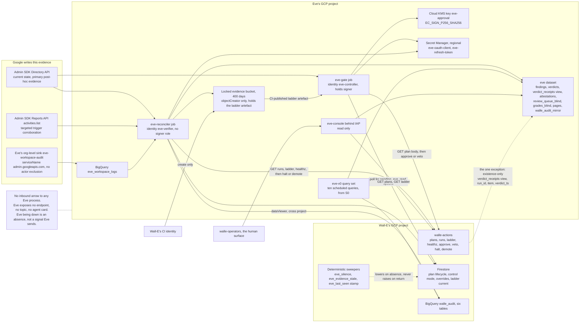

# 1. High-level design

## Status
- Owner: the platform owner
- Last reviewed: 2026-09-12

## Thesis

Eve is a body of SQL, two deterministic Cloud Run jobs, a console and a key, living in its
own GCP project, whose only privileged act is a Cloud KMS `EC_SIGN_P256_SHA256` signature
over a hash it computed itself.

It acquires its two authorities on opposite schedules because they point in opposite
directions. Halting and demoting can only ever make less happen, so Eve gets them the
moment it is a program at all, at S3 entry. Signing can make more happen, so Eve gets the
key only at S4 entry, after a twelve-fault exercise it must pass at 100 %. Before that,
"Eve v0" is ten BigQuery scheduled queries pinned to their own service account and read by
a human, and nothing else exists — no robot account, no token, no key, no allowlist entry.

Eve treats everything `walle-actions` says as a **claim**, and recomputes five things from
sources Wall-E cannot write: the plan hash, the per-item pre-state, the effective level,
the trigger's corroboration, and the typed predicate — the last implemented a second time
and differentially tested. It exposes no inbound decision endpoint, speaks no agent
protocol, and contains no model client, so "Eve is down" is an **absence**, which is the
only alert shape that catches it, and no LLM loop can produce an Eve signature because the
process cannot reach a model and its identity could not authenticate to one. Everything
Eve does not do is done by a deterministic sweeper inside `walle-actions` that can lower on
Eve's absence and has no code path that raises on Eve's return.

The honest reading of the cost is seven to nine engineer-weeks of Eve, spread across two
stage transitions six to eight weeks apart, under €50 a month on GCP plus one Workspace
licence, and about half an hour a week of human time. The design says plainly that **L3
with human approval is a legitimate permanent end state**: none of this should be built
until an L3→L4 promotion can state in numbers how much approval burden it avoids.

## What Eve is not

Three negatives do more work in this design than any of the positives.

- **Eve is not an agent.** It has no agent card that anyone calls, no A2A surface, no
  Pub/Sub push subscription, no HTTP endpoint of any kind. It is a client everywhere. The
  safety interlock between the controller and the doer is plain authenticated REST, in one
  direction, and can therefore never run through a conversation.
- **Eve is not a service inside Wall-E's project.** Its key, its secrets, its dataset, its
  evidence bucket and its identities live in a project whose IAM policy contains no Wall-E
  deployer. While Eve's key lives in Wall-E's project, a project owner there can grant
  themselves `roles/cloudkms.signer` and mint an Eve approval, and the only control on that
  is a daily drift row — a detective control on the single artefact the whole controller
  role rests on.
- **Eve is not a model.** No approve/refuse decision, and no signature over one, is
  produced by a language model — required by [C12](../wall-e/14-hld-challenge.md) and
  [decision 34](../wall-e/09-open-decisions.md), and enforced here by five mechanical
  checks rather than by a paragraph of policy. Eve is a program, and the word "judgement"
  does not appear in its specification.

## The shape on one page

Every solid arrow leaving Eve's project is a call Eve makes; nothing calls Eve. The three
Google-written sources enter Eve's project directly, not by way of Wall-E. The single
dashed arrow into Eve's dataset is `walle-actions` reading an authorized view that exposes
`(run_id, item, verdict_ts)` and nothing else, so the service can check that evidence
arrived and can never branch on what it says — recorded as [E-17](09-open-decisions.md)
and re-argued at S4 entry.

## Components

| Component | Runs on | Identity | Does | Never does | Exists from |
|---|---|---|---|---|---|
| **Eve v0 query set** | BigQuery Data Transfer Service scheduled queries, transfer configs owned by Eve's project, reading `walle_audit` cross-project, writing `eve.findings`. Twelve transfer configs: the ten [05](../wall-e/05-autonomy-ladder.md) §8 metrics — which include hard-invariant denials (with the T0-human `protected_principal` exclusion) and audit completeness — plus two of Eve's own, two-direction reconciliation and config/ladder drift. The query list is in [07-build-runbook.md](07-build-runbook.md) Phase 4. Scheduled **off the hour** — a query at exactly hh:00 can double-trigger. | `eve-v0@<eve-project>`, pinned on every transfer config with `--service_account_name`. The default is the creating user's credentials, and an evidence series that runs as the person who administers Wall-E is not independent, and dies when they leave. | Computes every ladder metric on a 30-day rolling window, hourly, each result with its threshold, verdict and query hash. A human reads them weekly. | Approve, halt, demote, hold any Workspace credential, write to Wall-E's project. | **S0**, and it is the whole of Eve through S2. |
| **`eve` dataset and the `walle_audit` mirror** | BigQuery, EU, in Eve's project. Tables `findings`, `verdicts`, `verdict_receipts` (view), `attestations`, `review_queue`, `review_queue_blind` (view), `grades_blind`, `pages`, `walle_audit_mirror`. DAY-partitioned, 400-day expiry. One daily scheduled copy appends yesterday's `walle_audit` partitions. | Owned by Eve's project. Wall-E's deployers hold no IAM here. | Holds Eve's entire output and the off-project evidence copy [decision 31](../wall-e/09-open-decisions.md) and the C11 residual ask for. The mirror is append-only and outside Wall-E's teardown blast radius. | Accept a write from any Wall-E principal. Hold Workspace payloads beyond ids, counts and hashes. | `findings` and the mirror at **S0**; the rest at **S3 entry**. |
| **`eve_workspace_logs`** | BigQuery dataset in Eve's project, fed by a **third, Eve-owned organisation-level sink** `eve-workspace-audit`, `--include-children`, `--use-partitioned-tables`, filter `protoPayload.serviceName="admin.googleapis.com"`, **no actor exclusion**. Verified 2026-09-12: an aggregated org sink may route to a destination in another project, its writer identity needing `roles/bigquery.dataEditor` there ([aggregated sinks](https://docs.cloud.google.com/logging/docs/export/aggregated_sinks)); and a BigQuery sink writes **date-sharded** tables unless `--use-partitioned-tables` is given ([route logs to BigQuery](https://docs.cloud.google.com/logging/docs/export/bigquery)), with the dataset's `--default_partition_expiration` set to 400 days **before** the sink first writes, because it binds only tables created after it ([updating datasets](https://docs.cloud.google.com/bigquery/docs/updating-datasets)). | Sink writer identity, `dataEditor` on this dataset only. | Eve's independent record of what the robot actually did. Eve reconciles against **this** copy, never `walle_workspace_logs` in Wall-E's project. | Carry an actor exclusion. Live in Wall-E's project. | **S2** — early, deliberately, so Eve's first enforcing window has months of history rather than zero rows. |
| **`eve-reconciler`** | Cloud Run **job** in Eve's project, europe-west1, four task entrypoints on Cloud Scheduler: post-hoc every 5 min, reconciliation and drift hourly, deep pass every 6 h, daily pass. Four scheduler jobs invoke the one Cloud Run job with a different entrypoint argument ([07-build-runbook.md](07-build-runbook.md) Phase 10). Triggered with an **OAuth** token to `run.googleapis.com` (OIDC is wrong for a `*.googleapis.com` target). Idempotency key = job name + the constant `X-CloudScheduler-ScheduleTime` header. | `eve-verifier@<eve-project>`. Holds **no** `cloudkms.signer`. | Post-hoc verification of L5 writes; two-direction reconciliation; config, ladder, epoch and Google-contract drift; daily operator-list reconciliation against `roleAssignments.list`; the blind sample draw; attestation bundles; the monthly refresh-token **exchange** that resets Google's six-month clock. Calls halt and demote on a declared threshold. | Sign anything. Write to Wall-E's project. Grade an item a human is due to grade blind. Expose any endpoint. | **S3 entry.** |
| **`eve-gate`** | A fourth entrypoint of the same image, deployed as its own Cloud Run job, every 2 minutes. Polls Firestore `plans/{id}` for `state == pending_eve`, then fetches the body from `GET /v1/plans/{id}`. | `eve-controller@<eve-project>`, plus `roles/cloudkms.signer` on `eve-approval`. | The five recomputations, the per-item accept/reject vector, the signature, `POST .../approve`, and `POST .../veto` when a threshold fires after signing. | Sign over a hash the service reported. Take input from any agent protocol. Approve a cell whose `eve_authority` is advisory, or one whose hold window elapsed during an outage. Approve when its own re-read is inconclusive — it refuses, and refusal means the item waits. | **S4 entry**, after the seeded-fault exercise passes at 100 %. |
| **`eve-console`** | Cloud Run service in Eve's project, fronted by Identity-Aware Proxy, `walle-operators@` only. Mobile-legible: the point is that a holiday-adjacent administrator can read it on a phone. | `eve-console@<eve-project>`, read-only: `dataViewer` on `eve`, `objectViewer` on the attestation bucket, `run.invoker` on `walle-actions` for `GET /v1/plans` and `GET /v1/ladder` only. | Four views — the live queue with each plan's age and deadline; the blind sampled review rendered from an allowlisted column set; ladder state beside Eve's drift findings; attestation bundles, one link per promotion. Writes grades to `eve.grades_blind`. | Approve, veto, halt or demote. Render Eve's verdict on a review page. Hold a Workspace credential. | **S3 entry.** The blind-review view must exist before the S3 exit gate, not before S4. |
| **Eve's Workspace robot** | `eve@<domain>` in `/Automation/Service Identities`. Custom admin role `Eve — Verifier`, customer-scoped, **read privileges only, no write privilege at any stage, ever**. Hardware-key-only 2SV with its own key in the safe, separately labelled; no recovery options; short session; its own login activity rule on actor `eve@`. Member of `walle-protected@` and of the committed floor list. | Its own consented refresh token from a **new, separate Desktop OAuth client** marked Trusted in the same sitting. No domain-wide delegation. | Eve's independent view of the tenant. Scopes frozen at consent: `admin.directory.{user,group,orgunit,rolemanagement}.readonly`, `admin.reports.{audit,usage}.readonly`, `openid`, `userinfo.email`. **`apps.licensing` is dropped** per [C13](../wall-e/14-hld-challenge.md). | Write anything to Workspace. Hold a licence-management privilege. Be impersonated. | **S3 entry** — not Stage 0. The reason is the six-month unused-token expiry and the scope freeze, not the cost of repeating consent. |
| **Eve's secrets** | Secret Manager, regional (europe-west1), **in Eve's project**: `eve-oauth-client`, `eve-refresh-token`. Version pinned by `EVE_TOKEN_VERSION`, never `versions/latest`. | `roles/secretmanager.secretAccessor` to `eve-controller@` and `eve-verifier@` only. | Holds Eve's Workspace credential where `walle-actions@` cannot be granted access even by mistake, because it has no principal in that project. Values never recorded in the wiki. | Be readable by any Wall-E principal. Sit in Wall-E's project. | **S3 entry.** |
| **`eve-approval` KMS key and the PEM archive** | Key ring `eve`, key `eve-approval`, ASYMMETRIC_SIGN / `EC_SIGN_P256_SHA256`, europe-west1, **in Eve's project**. Each version's PEM exported at creation, **before first use**, to `gs://<eve-project>-eve-evidence/keys/` — the `keys/` prefix of the **locked** evidence bucket, not a separate bucket — **and** committed to `contracts/eve-public-keys/<version>.pem` in Wall-E's repo under `ladder.yaml`'s CODEOWNERS. | `roles/cloudkms.signer` to `eve-controller@`. `walle-actions@` holds `roles/cloudkms.publicKeyViewer` cross-project and nothing more — never `signerVerifier` or `cryptoOperator`, both of which carry `useToSign`. Data Access audit logging on `AsymmetricSign`. | Produces the only signature that can authorise an L4 execution. The envelope names the full key-version resource name, because a KMS signature carries no version identifier of its own. | Live in Wall-E's project. Rotate automatically — verified 2026-09-12: Cloud KMS states that "Automatic rotation isn't supported for asymmetric signing or asymmetric encryption keys" ([key rotation](https://docs.cloud.google.com/kms/docs/rotate-key)), so rotation is a dated manual procedure, annually and on suspicion, with a 30-day overlap. Be **destroyed** inside the 400-day evidence horizon; old versions are disabled. | **S4 entry.** |
| **Evidence bucket** | `gs://<eve-project>-eve-evidence`, EU, **locked** retention policy of 400 days. A locked policy cannot be removed or shortened and objects cannot be deleted or replaced before expiry even by a project owner; locking applies a lien preventing project deletion. | `eve-verifier@` holds `roles/storage.objectCreator` — create only, no delete, no overwrite. | Attestation bundles, daily reconciliation extracts, archived PEMs, CI-published ladder artefacts. | Have its retention shortened. Be the destination of a sink Wall-E's project owners control. | **S3 entry.** |
| **`eve/config`** | Eve's own git repository, separate from Wall-E's: `thresholds.yaml`, `reasons.yaml` (the closed reason vocabulary), `predicates/` (Eve's second implementation of the typed predicates), `ceilings.py` (Eve's own compiled ceiling table), `oncall.yaml`, `seeded_faults/`. Required reviewers: the ladder owner and the security reviewer of [decision 37](../wall-e/09-open-decisions.md). Validated by a CI JSON-Schema check owned **outside** the repository, exactly as `ladder.yaml`'s is. | Human-merged only. Neither Eve identity has a write path. | Every halt, demote, veto and refuse is a named threshold with a reason code. `eve_config_version` is stamped on every verdict row, every control call and every attestation. | Live in Wall-E's repository, where one pull request could widen Wall-E and loosen Eve together. Be merged by one human at S4+. | **S3 entry**; a stub schema and the CI assertions exist from Eve's first commit, and `thresholds.yaml`'s numbers are stubbed at S0 so v0 and the controller read the same values. |
| **CI-published ladder artefact** | `gs://<eve-project>-eve-evidence/ladder/<config_version>.yaml` plus its git sha, written append-only by Wall-E's CI identity (`objectCreator`) into Eve's locked bucket. | Wall-E's CI identity, create-only. | Replaces "Eve reads `ladder.yaml` in git": Eve needs no git credential, and the config it compares against — and re-derives effective levels from — cannot be rewritten by Wall-E's deployers. | Be writable by `walle-actions@` or by a deployer. | **S3 entry.** |
| **Two sweepers and one stamp in `walle-actions`** (Wall-E's side of this design) | Deterministic code in the action service, no Eve involvement. A 1-minute internal tick plus request-path evaluation. | `walle-actions@`, writing `config_versions` rows with origin `breaker`. | `eve_silence`: any plan at `pending_eve` for more than four business hours sets `no_autonomous` and writes an incident note. `eve_evidence_stale`: any executed L5 item with no row in `eve.verdict_receipts` after 60 minutes freezes promotions, and after four hours drops that cell to L4. `eve_last_seen`: stamped **passively** from any successfully authenticated Eve call, published as a metric with a Cloud Monitoring **absence** policy alerting at 15 minutes, and the source of Eve's S4 availability figure. | Raise anything, ever, on Eve's return. Treat the presence of an Eve row as permission — it only ever checks that evidence arrived. Read the content of a verdict. | Code from the **first commit** (the timers extend the existing L3 TTL sweeper); the `verdict_receipts` read is wired at **S4 entry**. |
| **CI-only stub caller** | Wall-E's test suite. | A test-only principal standing in for `eve-controller@`. | Exercises all eight [08](../wall-e/08-team-eve-mo.md) interfaces from commit one and proves denial tests 4, 5, 6 and 52, including Eve refused 403 on `POST /v1/execute` and an operator token accepted on halt. | Exist in any admitted image or deployed environment. There is no fault-injection or test-mode path reachable in a deployed Eve or Wall-E image; the seeded-fault exercise uses a separate sandbox deployment and dataset. | **S0**, in code only. This is the whole of what [decision 36](../wall-e/09-open-decisions.md) leaves at Stage 0. |
| **`eve-advisor`** | Not built. Recorded so the slot is named and stays empty. If ever built: a Cloud Run job in a **third** project reading `eve.*` and writing only `eve.advice`. | `eve-advisor@`, holding by construction no `cloudkms.signer`, no `run.invoker` on `walle-actions`, no `secretAccessor` on Eve's secrets. | Nothing in v1 or v2. If built: commentary a human reads in the digest, and at S5 at the earliest a one-directional wire by which the verifier may **raise** a refusal it would otherwise not make. There is no path by which an advisory flag causes an acceptance or reduces a refusal. | Produce a signature, a halt, a demotion, a veto, or any input to one. The prohibition is IAM, not code discipline. | **Never**, on current evidence. Adding one is a decision record, not an implementation detail. |

Principals and the grants behind this table are in
[02-identity-and-auth.md](02-identity-and-auth.md); how a verdict is produced is
[03-lld.md](03-lld.md); what exists at each stage is [05-stages.md](05-stages.md).

## The five structural choices

### 1. Eve gets its own GCP project

The runbook as written fixes `SA_EVE = eve-controller@${PROJECT}` — Eve inside Wall-E's
project. That is the choice this design reverses, and it is the most expensive one to
reverse later.

While Eve's key lives in Wall-E's project, a project owner there can grant themselves
`roles/cloudkms.signer` and mint an Eve approval. The only control on that is a daily
drift row: a detective control on the one artefact the entire controller role rests on.
The same argument applies to Eve's secrets, to its dataset and to its evidence bucket —
all of which sit inside the blast radius of Wall-E's own teardown. The set already
requires the evidence copy to move at S3, as the C11 residual, so half the boundary is
asked for anyway.

With the boundary in place, three statements stop being IAM hygiene and become structural:
Wall-E's deployers appear nowhere in Eve's IAM policy; `walle-actions@` cannot be granted
access to Eve's secrets even by mistake, because it has no principal in that project; and
`walle-actions@` cannot hold a signing role on Eve's key, because the key is not in its
project. Query jobs run in Eve's project, so Eve's BigQuery cost and job creation never
touch Wall-E's either.

Two honest caveats. If the answer to [E-1](09-open-decisions.md) is no, the single-project
variant still works and offline pinned-PEM verification still prevents key substitution —
but "`walle-actions@` must never mint an Eve approval" reverts to a policy assertion
checked daily. And **the project boundary is only as real as the org chart**: with one
administrator, ownership of Eve's project is notional. The target is an `eve-owners@`
group containing IT security and not Wall-E's deployers. It is recorded here, in writing,
that the boundary is notional until [decision 11](../wall-e/09-open-decisions.md)'s second
human exists, so that nobody later reads the two-project diagram as proof of a separation
of duties that no rota supports. Making that second person a hard build prerequisite was
considered and rejected: blocking Eve's build on an organisational change would leave the
tenant with no controller at all.

### 2. No inbound surface

Eve exposes nothing over the network that takes a decision. No HTTP decision endpoint, no
Pub/Sub push subscription, no A2A surface, no agent card, no agent protocol of any kind.
Eve is a client everywhere.

This removes an attack class outright, and it makes it structurally impossible for a
safety interlock to run through a conversation. It also fixes the shape of the only alert
that matters: if Eve cannot be called, Eve's failure cannot be reported by Eve, so "Eve is
down" has to be detected as an **absence**, which is the alert shape that actually catches
a wedged process.

Two things were rejected to keep this true.

- **A heartbeat endpoint** (`POST /v1/control/heartbeat`) amends a contract described as
  fixed, and a liveness signal Eve publishes cannot prove Eve is alive — a wedged Eve that
  still heartbeats keeps autonomy alive. It is replaced by an absence shape: `eve_last_seen`
  stamped **passively** by `walle-actions` from any successfully authenticated
  `eve-controller@` or `eve-verifier@` call, with no new endpoint and nothing Eve can
  assert, plus two timers that key on missing work rather than on reported health.
- **A `walle-events` subscription.** The only latency-sensitive duty is L5 post-hoc
  verification within 60 minutes, and a 5-minute poll of the day-partitioned `actions`
  table meets that twelvefold; default-stream writes are queryable immediately. Beyond the
  cost argument, a topic Wall-E publishes to is a channel Wall-E controls, and Eve's whole
  premise is that Wall-E's statements are claims. The topic's schema is recorded as the
  obligation of whoever later asks for it, most likely Mo — see [E-20](09-open-decisions.md).

The same reasoning picks Cloud Run **jobs** over a resident service. A `min-instances=1`
signer service costs €30–45 a month to gate nothing before S4, and a single instance
restart is a coverage gap. Jobs on a schedule cost near nothing, have no ingress, and a
job task may run up to 168 hours where a service request is capped at 60 minutes (verified
2026-09-12: [Cloud Run task timeout](https://docs.cloud.google.com/run/docs/configuring/task-timeout),
[request timeout](https://docs.cloud.google.com/run/docs/configuring/request-timeout)).

### 3. Deterministic by absence, not by discipline

"Eve contains no model" is worth nothing as a sentence in a design document. It is worth
something as a build that fails when the sentence stops being true.

The two enforcements that actually bind are absences, not rules: the dependency is not in
the image, and the permission is not in the IAM policy. The signature cannot be produced
by a model because the process cannot reach one, and Eve's identity could not authenticate
to a model endpoint if it could. Everything else in [the deterministic boundary](#the-deterministic-boundary)
is a useful regression guard on top of those two.

The advisory model is named here so that the door stays visibly shut rather than blank.
`eve-advisor` is not built. If it is ever built, it is a job in a third project, holding by
construction no signer role, no invoker on `walle-actions` and no access to Eve's secrets,
and wired so that it can only ever turn an accept into a refuse. There is no path by which
an advisory flag causes an acceptance or weakens a refusal, and the prohibition is IAM
rather than code discipline.

### 4. Two authorities on opposite schedules

Eve has exactly two authorities and they arrive at different stages, because they point in
opposite directions.

**Halting and demoting** can only ever make less happen. Eve gets them at S3 entry, the
moment it is a program at all — live for the invariant class immediately, with rate-based
triggers observe-only until their thresholds are calibrated at S2 on measured data.
**Signing** can make more happen. Eve gets the key at S4 entry, after the twelve seeded
faults are caught at 100 % and both negative controls stay silent.

This is the split recorded as [E-6](09-open-decisions.md), and it exists because two
requirements in the inherited set cannot both hold literally: Eve is described as
observe-mode through Stage 3, and Eve is required to fail closed in every direction. Taken
literally together, the only component watching Google's log would be forbidden to act on
what it sees. The split resolves it by direction rather than by date, and names the cost:
a buggy Eve can halt the programme during the stage the programme is trying to prove
itself. That cost is accepted because halting is the direction one human can undo in
seconds.

The bias within those authorities is stated precisely, because "bias toward halting when
uncertain" would make a degraded Eve the outage. [08](../wall-e/08-team-eve-mo.md) item 5's
"its own judgement" is void. Two rules, both carried in `thresholds.yaml`:

- every unresolved comparison **at the approval point resolves to refuse** — the plan
  waits for a human, costing minutes;
- **halting is reserved for the closed invariant-trigger list** and is therefore never
  discretionary.

A degraded Eve that halts turns every hiccup into an outage. A degraded Eve that refuses
costs an operator an approval. Refusing costs an approval; halting costs the programme.

One field carries both halves of that switch. Two separate per-cell flags — an `eve_gate`
observe/enforce flag **and** an `eve_authority` demotion target — were considered and
rejected, because two fields that must always agree drift. `eve_authority: advisory |
binding`, absent reading as advisory, is the observe/enforce switch, the fail-closed
default and the demotion target when an Eve approval is overturned
([E-4](09-open-decisions.md)).

Demotion granularity follows the contract rather than the prose: `demote` takes one
`(family, trigger)` cell, so a tenant-wide condition is one call per cell, each with its
own reason and audit row, and a genuinely tenant-wide condition uses `halt`, which is
atomic. The millisecond-wide seam between per-cell calls is named rather than papered over
— [E-8](09-open-decisions.md).

### 5. The second predicate implementation

This is the single largest line in the build, six engineer-days, and the one not to cut.

Eve implements the typed `expects` predicate of
[decision 32](../wall-e/09-open-decisions.md) a **second time**, from the same typed spec,
and CI differential-tests it against Wall-E's implementation over generated cases, with no
credential involved. Without it, Eve would re-run Wall-E's own predicate code, and the
verification-success metric that unlocks L4 and L5 would be measuring itself. This is what
[C52](../wall-e/14-hld-challenge.md) asks for, and it is the reason this design was chosen
over the alternatives.

The same argument applies to the ceiling table. Eve compiles its **own**, from the
CI-published ladder artefact, so that it can independently re-derive the effective level of
every item and catch a plan claiming a level the ladder does not grant. Recomputing the
hash and re-reading pre-state catches a lying plan body; only an independent level
re-derivation catches a lying **policy chain**.

The limit of this choice is written down rather than narrowed away: a second
implementation is not a second author. See
[What this design does not close](#what-this-design-does-not-close), limit 4.

## The deterministic boundary

Every Eve decision is code. The verdict is a pure function of six inputs: the plan body
from `GET /v1/plans/{id}`, Eve's own Workspace reads, rows from BigQuery and Firestore, the
CI-published ladder artefact, Eve's compiled ceiling table, and `thresholds.yaml`. The
boundary is enforced five ways, all mechanical — the first two are what actually bind.

1. **Dependency absence.** Eve's image lockfile is scanned in CI against a denylist —
   `google-cloud-aiplatform`, `google-genai`, `vertexai`, `google-adk`, `anthropic`,
   `openai`, `langchain*` — and the build fails on a hit; a runtime import test asserts the
   same. The signature cannot be produced by a model because the process cannot reach one.
2. **Permission absence.** Neither Eve identity holds any `aiplatform.*` permission.
   `reasoningEngines.query` is removed per [C10](../wall-e/14-hld-challenge.md), leaving two
   query principals on Wall-E's engine. CI asserts the IAM policy. There is consequently no
   Eve `streamQuery` caller for [06](../wall-e/06-security-guardrails.md)'s CI grep to
   police; the grep stays as a regression guard and finds nothing, which is the correct
   steady state.
3. **Call-graph confinement.** `sign_envelope()` is reachable from exactly one function,
   `verdict_for_plan()`, and a CI call-graph test fails if any other caller appears. The
   KMS client is constructed in one module importing nothing outside the standard library
   and the KMS SDK. Separately, only the `eve-gate` entrypoint's identity holds `signer`.
4. **Replayability.** Every verdict row carries its input hashes and a `replay_bundle` id,
   and a golden-replay test recomputes archived verdicts offline and requires bit-identical
   output. A non-deterministic verdict fails the build.
5. **Typed inputs and a closed vocabulary.** `decide(plan, prestate, ladder, ceilings,
   thresholds) -> Verdict` takes and returns typed structs; no free text crosses it. Eve may
   emit only a reason code from `reasons.yaml`, and a verdict carrying an unknown code is
   rejected before signing.

The closed reason vocabulary is Eve's own, defined in [03-lld.md](03-lld.md) and nowhere
else; it does not touch [03](../wall-e/03-lld.md)'s denial reasons, which stay Wall-E's.

## What this design does not close

Five limits on Eve's independence. Each is carried in every attestation bundle for an
affected cell, so that a promotion decision reads them rather than inherits them.

1. **Eve reads the plan from the service it is checking.** Recomputing the hash, re-reading
   every target, re-deriving the level and corroborating the trigger means a lie must be
   consistent across four surfaces to survive — a real narrowing. It does not close the
   "shows plan A, executes plan B" case, which is bounded at one batch detected in under
   half an hour. Closing it needs a second credential holder or an independent plan feed
   ([decision 29](../wall-e/09-open-decisions.md)), and should be reopened before any
   `WRITE_HIGH` cell goes to L4.
2. **Google's log proves the robot acted, never who asked.** Human attribution for T0 chat
   rests on `walle_audit`, written by the component under audit. IAP and KMS Data Access
   logs recover the L3 and L4 cases; the chat case is unrecovered. This is a requirement
   placed on [decision 14](../wall-e/09-open-decisions.md): whichever approval surface wins
   must emit a signed human assertion Eve can verify independently, or the gap is permanent.
3. **F7 licence verification is event-only** and cannot be made state-aware without a
   write-capable privilege, which is forbidden forever. Eve's role carries no License
   Management privilege and `apps.licensing` is dropped, so F7 verdicts are
   `verified_partial` with reason `licence_event_only`.
4. **Eve's predicate is a second implementation, not a second author.** The differential
   test catches divergence from Wall-E's version; it does not catch both being wrong the
   same way because both were written from the same spec by the same person. The only real
   check is the blind human sample, which needs a grader who is not the ladder owner.
5. **Eve's independence from Wall-E is structural; its independence from the ladder owner
   is not.** The same human may write `thresholds.yaml`, approve the pull request that sets
   `eve_authority: binding`, and grade the blind sample. [Decision 37](../wall-e/09-open-decisions.md)'s
   second reviewer and [decision 11](../wall-e/09-open-decisions.md)'s second grader are the
   load-bearing assumptions under every independence claim in this design.

The bounded risks — a compromised Eve, a lying `walle-actions`, an Eve that is wrong in
either direction — are in [06-failure-modes.md](06-failure-modes.md) with their containment
steps and their residuals.

## Cost

**Build.**

| Piece | Days | Notes |
|---|---|---|
| Eve v0 at S0 | 4–6 | Project, service account, two dataset grants, ten pinned scheduled queries, the daily mirror, one absence alert |
| Wall-E's side of this design | ~5 | Sweepers, `eve_authority`, `items_hash`, the new denial reason, pinned-PEM verification, the blind view. Scheduled with Wall-E, not with Eve — see [08-contract-changes.md](08-contract-changes.md) |
| Eve v1 at S3 entry | 20–24 | Workspace bootstrap and consent 0.5; job scaffold, scheduling and config 2; two-direction reconciliation with per-application lag budgets 4; the second predicate implementation plus differential test 6; the independent ceiling table 1.5; `thresholds.yaml`, `reasons.yaml` and Eve's CI gates 3; drift including Google-side contract drift and the operator-list reconciliation 2; observe-mode verdicts and blind-grading pipeline 2; `eve-console` 2; runbook, denial tests and the seeded-fault harness 3 |
| Eve v2 at S4 entry | 12–15 | Key, PEM archive, `eve-gate`, the two-phase envelope, the Wall-E-side wiring |

Eve's own three lines are 36–45 engineer-days, **seven to nine engineer-weeks**; with
Wall-E's five days it is 41–50 days, **roughly eight to ten**. It falls across two stage
transitions six to eight weeks apart, so no sprint carries more than about three weeks.
The six-day predicate line is the largest single item and the one not to cut, for the
reason given in structural choice 5.

**Run.** `Assumption:` orders of magnitude, to be confirmed in the console. Two Cloud Run
jobs on schedules and one scale-to-zero console: single-digit to low-tens of euros a month.
BigQuery scanning day-partitioned tables at pilot volume: well under a gigabyte a day. KMS:
one key, a few hundred signatures a month, cents. Locked bucket at 400 days: under a euro.
A second GCP project: no charge. **Under €50 a month on GCP, plus one Workspace licence for
`eve@<domain>`** — the largest recurring line, and what buys the independent read. Cost
grows with rows, not with autonomy.

**Human, which for a one-person team matters more.** Eve v0: 30 minutes a week reading
findings. From S1: the blind sample at `max(10 %, 5 items/week)`, five to fifteen items,
about 20 minutes. From S3: a monthly K0 drill and a rollback drill, a quarterly threshold
review, and the holiday ritual. **Under half an hour a week in steady state**, which has to
stay true or Eve will be ignored rather than used.

**The conclusion this cost supports.** L3 with human approval is a legitimate permanent end
state. Eve exists to make L4 and L5 safe, not to make them inevitable, and none of the
above should be spent until an L3→L4 promotion can state in numbers how much approval
burden it avoids.
