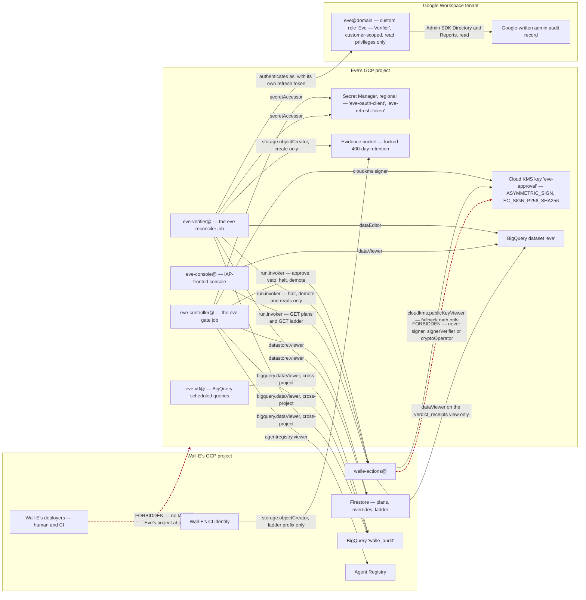

# 2. Identities, credentials and the key

## Status
- Owner: the platform owner
- Last reviewed: 2026-09-12

Every principal Eve involves, what it holds, and why each boundary is where it is. The
short version: Eve holds exactly one privileged capability — a Cloud KMS
`EC_SIGN_P256_SHA256` signature over a hash it computed itself — and everything else in
this document exists to make sure that capability cannot be reached from anywhere else,
including from inside Wall-E's project.

Read [01-hld.md](01-hld.md) first for what Eve is. This page assumes it.

## The identity table

| Principal | Kind | Where | Holds | May call | Must never |
|---|---|---|---|---|---|
| `eve-v0@<eve-project>` | GCP service account | Eve's project | `bigquery.dataViewer` on `walle_audit` (dataset-level, cross-project); `dataEditor` on `eve` | Nothing | Hold a Workspace credential, a key, or any endpoint access |
| `eve-controller@<eve-project>` | GCP service account, attached to the `eve-gate` job | Eve's project | `cloudkms.signer` on `eve-approval`; `secretAccessor` on Eve's two secrets; `run.invoker` on `walle-actions`; `datastore.viewer` and `agentregistry.viewer` in Wall-E's project; `bigquery.dataViewer` on `walle_audit`; `bigquery.jobUser` **in Eve's own project** | `GET /v1/plans`, `GET /v1/runs`, `GET /v1/ladder`, `GET /healthz`, approve, veto, halt, demote | Execute any Workspace operation. Raise any level, clear an override, change a ceiling. Read any Wall-E secret or signing key. Hold **any** `aiplatform.*` permission, in particular `reasoningEngines.query`. |
| `eve-verifier@<eve-project>` | GCP service account, attached to the `eve-reconciler` job | Eve's project | Everything `eve-controller@` holds **except `cloudkms.signer`**; plus `storage.objectCreator` on the evidence bucket | The control and read endpoints; never approve | Sign. The process that parses attacker-writable strings out of Google's audit log must not be able to reach the key. |
| `eve-console@<eve-project>` | GCP service account | Eve's project | `dataViewer` on `eve`; `objectViewer` on the attestation bucket; `run.invoker` on `walle-actions` | `GET /v1/plans`, `GET /v1/ladder` | Approve, veto, halt, demote. Hold a Workspace credential. |
| `eve@<domain>` | Workspace user | Workspace, `/Automation/Service Identities` | Custom role `Eve — Verifier`, customer-scoped, read privileges only; eight read-only OAuth scopes; own hardware key; member of `walle-protected@` | Admin SDK Directory and Reports, read | Hold any write privilege at any stage, ever. Be impersonated — there is no domain-wide delegation anywhere. |
| Wall-E's CI identity | CI | Wall-E's project | `storage.objectCreator` on Eve's evidence bucket, ladder-artefact prefix only | Publish a ladder artefact | Overwrite or delete an artefact. Hold any other permission in Eve's project. |
| `walle-actions@` | GCP service account | Wall-E's project | `cloudkms.publicKeyViewer` on `eve-approval` (fallback only); `bigquery.dataViewer` on the `eve.verdict_receipts` **view** only | Nothing of Eve's beyond those two reads | Hold `signer`, `signerVerifier` or `cryptoOperator` on Eve's key — impossible, since the key is not in its project. Read a verdict's content; the view exposes `(run_id, item, verdict_ts)` and nothing else. |
| Wall-E's deployers | Human plus CI | Wall-E's project | **No IAM in Eve's project at all** | — | Appear in Eve's project's IAM policy. Asserted daily by Eve's own drift job and, in the opposite direction, by Wall-E's. |

Nothing in this table exists at Stage 0 except `eve-v0@`. See
[05-stages.md](05-stages.md) for what is deliberately absent and when each principal is
created; the ordered steps are in [07-build-runbook.md](07-build-runbook.md).

## The map



The two dotted red edges are the two grants this design exists to make impossible rather
than merely forbidden. Both are structural: the key is not in Wall-E's project, so no
project owner there can grant themselves `useToSign` on it, and Wall-E's deployers hold no
role in Eve's project at all, so there is nothing for them to escalate from.

Note what the diagram does **not** contain: any edge pointing into Eve. Eve exposes no
inbound decision surface — no HTTP endpoint, no Pub/Sub push subscription, no agent card,
no agent protocol. Eve is a client everywhere. That is argued in [01-hld.md](01-hld.md);
its consequence here is that Eve's identities are only ever *callers*, so there is no
inbound credential to protect, rotate or have stolen.

## Why Eve gets its own GCP project

This is the largest single change from the runbook as written, where
`SA_EVE = eve-controller@${PROJECT}` and the signing key sits on Wall-E's key ring.

While Eve's key lives in Wall-E's project, a project owner there can grant themselves
`roles/cloudkms.signer` on `eve-approval` and mint an Eve approval. The design's only
control against that is a daily drift row — a detective control on the one artefact the
entire controller role rests on. Wall-E's own review reached the same place from the other
side: [C11](../wall-e/14-hld-challenge.md) was refuted on the ground that Eve's trust root
belongs to Eve's design and to [decision 18](../wall-e/09-open-decisions.md), not to the
HLD, and the residual it left says moving Eve's evidence copy out of Wall-E's reach becomes
a requirement at S3. This design pays that debt in one move rather than two.

The project boundary buys four things that IAM hygiene inside one project cannot:

1. **The signing key cannot be re-granted.** Not "is not granted" — cannot be, because
   `walle-actions@` and Wall-E's deployers have no principal in the project the key lives
   in.
2. **Eve's secrets cannot be read by mistake.** The Phase 15 cross-check that sweeps both
   secret sets in both directions still runs and still prints nothing, but it is now
   confirming a property the topology already guarantees.
3. **Eve's evidence leaves Wall-E's teardown blast radius.** `walle_audit` and
   `walle_workspace_logs` are inside it; Eve's mirror, its own log sink and its locked
   bucket are not. This is what [decision 31](../wall-e/09-open-decisions.md) and C11's
   residual ask for.
4. **The forbidden edges become drawable.** A reviewer can check the claim by reading one
   IAM policy, not by reasoning about seventeen role bindings.

**If the answer turns out to be no**, the single-project variant still works: offline
pinned-PEM verification still prevents key substitution, and the denial tests still pass.
What is lost is the guarantee — "`walle-actions@` must never mint an Eve approval" reverts
to IAM hygiene plus a daily drift row. That is decision **E-1** in
[09-open-decisions.md](09-open-decisions.md), due before Eve onboarding, with the dataset
half due before Stage 1.

### Who owns the project

The boundary is only as real as the org chart, and with one administrator it is notional.
The target is an `eve-owners@` group containing IT security and **not** Wall-E's deployers.

Making a second human on that group a hard build prerequisite was considered and rejected:
blocking Eve's build on an organisational change would leave the tenant with no controller
at all. So the boundary is built now, and the fact that it is notional until
[decision 11](../wall-e/09-open-decisions.md)'s second human exists is written down here
rather than narrowed away. Folding Eve back into Wall-E's project "for now" is pre-refused.
This is decision **E-2**, due before S4, and it is the largest open risk in the set.

## Two runtime identities, not one

`eve-controller@` signs. `eve-verifier@` reconciles. They run different Cloud Run jobs from
the same image and differ by exactly one role.

The reason is the input each one handles. `eve-reconciler` parses strings that an attacker
can write — display names, group descriptions, event parameters out of Google's audit log,
plan bodies. `eve-gate` produces the only signature that can authorise an L4 execution. A
parsing bug in the first must not be a path to the second, so the process that reads
attacker-writable text **does not hold `cloudkms.signer` at all**. Containment costs one
extra service account and one extra job deployment.

`eve-console@` is a third, read-only identity. It holds `dataViewer` on the `eve` dataset,
`objectViewer` on the attestation bucket, and `run.invoker` on `walle-actions` for
`GET /v1/plans` and `GET /v1/ladder` only. The console renders the queue, the blind review,
ladder drift and attestations for `walle-operators@` behind Identity-Aware Proxy. It can
approve nothing, veto nothing, halt nothing and demote nothing, and it holds no Workspace
credential.

`eve-v0@` is the fourth and the oldest: the service account every BigQuery scheduled query
is pinned to. It holds two dataset grants and calls nothing.

## Eve's Workspace robot

`eve@<domain>` is Eve's independent view of the tenant. It exists so that Eve does not
verify Wall-E's work through Wall-E's credential — if it did, a compromised Wall-E path
could make the world look however it wants to the verifier.

| Control | Setting | Why |
|---|---|---|
| Org unit | `/Automation/Service Identities`, the same OU as Wall-E's robot | Every setting below applies without touching real users |
| Admin role | Custom role `Eve — Verifier`, **customer-scoped**, read privileges only | Customer scope is required: Reports privileges cannot be OU-scoped, and Eve's whole value is tenant-wide reads |
| Role privileges | Users read, Groups read, Organisational units read, Admin roles read, Reports audit read, Reports usage read | Resolved against the tenant with `privileges.list` — Google publishes no complete catalogue, so the console labels are not to be trusted |
| Write privileges | **None, at any stage, forever** | The role does not grow with the ladder the way Wall-E's does. This is the one privilege table in the set with no future column |
| 2-step verification | Enforced, **hardware key only**, its own key in the same safe, separately labelled | A shared key would make the two robots one identity in practice |
| Recovery options | None | Removes the social-engineering path |
| Password | Long, random, in the corporate vault, never in the wiki | — |
| Session length | Short, no "remember device" | — |
| Login activity rule | Its own rule, actor `eve@<domain>`, unfiltered event type, action = email to the platform owner and `walle-operators@`, severity high | After bootstrap, an interactive login to this account is by definition an incident |
| Protected-principal membership | Member of `walle-protected@`, and written into the committed floor list | Wall-E can never target Eve's account with a write; the floor list makes a silent truncation of the protected set a loud refusal |
| Licence | One spare Workspace licence | The largest recurring cost line in the whole design, and what buys the independent read |

A privilege and a scope are different things, and the distinction matters twice below: a
**consented OAuth scope grants nothing without the corresponding admin privilege**. Eve's
role carries no write privilege, so even a scope granted in error would authorise nothing.

### The scopes, and the one that was dropped

Scopes are frozen at consent. Adding one later means re-running the bootstrap, so the whole
set is decided before the first consent.

```
https://www.googleapis.com/auth/admin.directory.user.readonly
https://www.googleapis.com/auth/admin.directory.group.readonly
https://www.googleapis.com/auth/admin.directory.orgunit.readonly
https://www.googleapis.com/auth/admin.directory.rolemanagement.readonly
https://www.googleapis.com/auth/admin.reports.audit.readonly
https://www.googleapis.com/auth/admin.reports.usage.readonly
https://www.googleapis.com/auth/userinfo.email
openid
```

Eight scopes, all read-only.

- `admin.directory.rolemanagement.readonly` is required, not optional: Eve reconciles the
  operator list against `roleAssignments.list` daily, and cannot classify which groups
  carry an admin role without it.
- `userinfo.email` and `openid` are what let Eve's bootstrap verify that the consenting
  account really is `eve@<domain>` and not the operator running the bootstrap.
- `cloud-platform` is **never** requested, for the same reason as on Wall-E's robot: it
  would bind a Workspace credential to the organisation's GCP session-control policy.
- No Gmail, Chat, Calendar or Drive scope is requested. Eve has no reason to read content
  and every reason not to be able to.

**`apps.licensing` is dropped**, per [C13](../wall-e/14-hld-challenge.md). The runbook and
`walle_setup.py` still carry it at the time of writing; that edit is listed in
[08-contract-changes.md](08-contract-changes.md). The consequences are real and permanent,
and they are not narrowed away:

- Eve verifies licence changes (family F7) **only** from Google-written licence events in
  the admin audit log, never from current state.
- Such verifications are recorded `verified_partial` with reason `licence_event_only`.
- This is a declared, permanent limit on Eve's independence for F7 at L4, carried in every
  F7 attestation bundle.
- F7 at L4 therefore takes a **20 % blind sample** rather than the standard rate, and any
  F7 `unverifiable` is a hard stop rather than a budgeted 2 %.
- Whether licence privileges are `isOuScopable` is **unverified**. If the check comes back
  negative, the honest recommendation is that F7 stays at L3.

The alternative — granting Eve the License Management privilege so it could read
assignments — is refused outright: License Management is a single undivided privilege with
no read-only half, so it would hand the controller that "never acts on Workspace" the
ability to assign and revoke licences. A named gap in verification is the cheaper defect.

### The OAuth client

A **new, separate Desktop OAuth client**, never Wall-E's, marked **Trusted** in Admin
console → Security → API controls in the same sitting as the consent.

| Item | Value | Why |
|---|---|---|
| Consent screen user type | Internal | An external app in Testing is issued a refresh token expiring in 7 days ([Google OAuth 2.0](https://developers.google.com/identity/protocols/oauth2), verified 2026-09-12) |
| Publishing status | In production | Same reason; the cost of being wrong is a dead verifier every week |
| Client type | Desktop app | Simplest loopback flow for a one-time consent |
| API controls | Client id marked Trusted, same sitting | Stops a later org-wide scope restriction from silently killing Eve |
| Reuse | Never. One client, one token | Google invalidates the oldest silently past 100 live refresh tokens per account per client id (same source) |

Sharing Wall-E's client would make the two credentials share a failure mode and a
revocation: revoking Wall-E's client access would take Eve down with it, which is precisely
the coupling this design is built to avoid.

### The six-month clock, and when consent happens

Google invalidates a refresh token that **has not been used for six months**
([Google OAuth 2.0](https://developers.google.com/identity/protocols/oauth2), verified
2026-09-12), and a successful token *exchange* — not an API call — resets the clock.

That single fact is why Eve's credential is minted at **S3 entry** and not at Stage 0. The
S0–S2 floors total 13–18 weeks, under six months, so a Stage-0 token does not certainly
die; it dies if the stages overrun or if Eve's build lags S3 entry, both of which are
plausible for a design with no date. The alternative — keeping a dormant tenant-wide admin
read credential warm with a monthly refresh for a consumer that does not exist — is worse.
The second reason is the scope freeze: consenting at Stage 0 freezes a scope set decided
before the verifier was designed. Neither reason is "the cost of repeating consent", which
is what the runbook says today and which is
[decision 36](../wall-e/09-open-decisions.md)'s to correct.

Once Eve exists, `eve-reconciler` performs a **monthly token exchange** for the express
purpose of resetting that clock, and alerts on failure. `invalid_grant` is a paging
incident, never a retryable error: it means Eve's credential is gone and only a human
re-bootstrap brings it back.

Two further causes from Google's list are read precisely here:

- **Password change** invalidates a refresh token where Gmail scopes are granted. Eve's
  token carries no Gmail scope, so `Assumption:` a password rotation on `eve@` does not
  invalidate it. This is a reading of Google's wording, not a tested fact; the rotation
  runbook re-bootstraps anyway rather than relying on it.
- **An admin restricting a requested service in API controls** is what the Trusted marking
  prevents.

### Whether any of this survives decision 26

[Decision 26](../wall-e/09-open-decisions.md) asks whether the admin principal can be a
**keyless service account holding the custom role with no domain-wide delegation**. Google
documents that any role except Super Admin can be assigned to a service account without
DWD. If that covers Directory and Reports for a read-only role, then Eve's robot user, its
password, its recovery path, its hardware key, its consent, its frozen scope set, its
six-month clock and its stealable refresh token **all disappear**, and this entire section
is replaced by one IAM binding.

So the credential chapter is re-examined before onboarding rather than built as specified.
That is decision **E-16**, and it is the one place in this document where the right answer
may be to delete most of it.

## Eve's secrets

Two secrets, both **regional** (`europe-west1`), both **in Eve's project**. Values are
never recorded in this wiki or anywhere else outside Secret Manager.

| Secret | Purpose | Readable by |
|---|---|---|
| `eve-oauth-client` | Eve's OAuth client id and secret | `eve-controller@`, `eve-verifier@`, and the bootstrap operator once |
| `eve-refresh-token` | Eve's Workspace credential | `eve-controller@`, `eve-verifier@` |

- **Regional, not global with user-managed replication.** A regional secret keeps the data
  in the location at rest, in use and in transit. User-managed replication pins only the
  payload at rest while the secret itself remains a global resource; automatic replication
  stores payloads worldwide and contradicts the residency position outright.
- **The version number is pinned.** The runtime reads `.../versions/<EVE_TOKEN_VERSION>`,
  never `.../versions/latest`. `latest` resolves to the newest *enabled* version, so
  disabling a compromised newest version would silently fall back to the previous, still
  valid token — and the credential kill switch would do nothing. Rotation is an explicit
  config change and a deploy.
- **`walle-actions@` cannot be granted access to these by mistake**, because it has no
  principal in Eve's project at all. The equivalent assertion inside one project is a
  policy sweep that has to keep being run.

## The signing key

| Property | Value | Note |
|---|---|---|
| Location | Key ring `eve`, key `eve-approval`, `europe-west1`, **in Eve's project** | The runbook today creates it on Wall-E's `walle` ring; see [08-contract-changes.md](08-contract-changes.md) |
| Purpose and algorithm | `ASYMMETRIC_SIGN` / `EC_SIGN_P256_SHA256` | Reads back exactly that way from `gcloud kms keys describe`; it is a Stage-0 exit assertion in Wall-E's runbook |
| Signing role | `roles/cloudkms.signer` to `eve-controller@` **only** | Exactly `cloudkms.cryptoKeyVersions.useToSign` plus three read permissions ([Cloud KMS permissions and roles](https://docs.cloud.google.com/kms/docs/reference/permissions-and-roles), verified 2026-09-12) |
| Verification role | `roles/cloudkms.publicKeyViewer` to `walle-actions@`, cross-project, and nothing more | Carries `cryptoKeyVersions.viewPublicKey` and **no** signing permission (same source) |
| Roles that must never appear on `walle-actions@` | `roles/cloudkms.signerVerifier`, `roles/cloudkms.cryptoOperator` | Both carry `useToSign` (same source). A project- or key-ring-level grant of either is a build failure: it could mint an Eve approval |
| Audit | Data Access audit logging enabled on `AsymmetricSign` | The only independent record that a signature was produced, and by whom |
| Signature format | DER-encoded EC signature; responses carry optional CRC32C checksums | [Create and validate signatures](https://docs.cloud.google.com/kms/docs/create-validate-signatures), verified 2026-09-12 |
| Key version in the signature | **None.** "Signatures do not identify the key version used" | Which is why the envelope must name the full key-version resource name itself, and why the `approvals` row carries `eve_key_version` ([C48](../wall-e/14-hld-challenge.md)) |

The envelope contract — domain tag, canonicalisation, the full signed field list including
`items_hash` and the key-version resource name — is in [03-lld.md](03-lld.md). This page
covers only the key itself.

### The PEM archive, in two places, before first use

Every key version's public key is exported **at creation, before the version is ever used
to sign**, to two independent places:

1. `gs://<eve-project>-eve-evidence/keys/`, the `keys/` prefix of Eve's **locked** evidence
   bucket, in Eve's project.
2. `contracts/eve-public-keys/<version>.pem`, committed in **Wall-E's** repository under
   the same CODEOWNERS entry that protects `ladder.yaml`.

The second copy is what makes offline verification the **primary** path in
`walle-actions`: the service verifies an approval against a PEM pinned in its own image,
and falls back to a live `getPublicKey` only if the pinned copy is missing. That ordering
is strictly stronger than a live fetch, for three reasons:

- **No IAM grant inside Wall-E's project can substitute a key.** A live fetch trusts
  whatever KMS returns for a resource name; a pinned PEM trusts what two reviewers merged.
- **A KMS outage does not stop verification.** With a live fetch, every L4 execution stops
  when KMS is unreachable. With a pinned PEM, only signing stops.
- **A destroyed key version never orphans a stored approval.** Cloud KMS documents a
  default 30-day scheduled-destruction window with restore-to-disabled inside it
  ([Destroy and restore key versions](https://docs.cloud.google.com/kms/docs/destroy-restore),
  verified 2026-09-12), but whether a destroyed version's public key stays retrievable is
  *not documented on that page*. The archive removes the question.

The stored signature plus the archived PEM is the only artefact that proves
`walle-actions` did not mint the approval itself. Teardown therefore checks the export
exists before it will offer `--destroy-key-versions`.

### Rotation is manual, dated, and never destructive

**Verified 2026-09-12: Cloud KMS does not support automatic rotation for asymmetric signing
keys** — "Automatic rotation isn't supported for asymmetric signing or asymmetric
encryption keys" ([Rotate a key](https://docs.cloud.google.com/kms/docs/rotate-key)). There
is no rotation schedule to set and no schedule to forget to set. Rotation is therefore a
written procedure with a date on it:

| Element | Rule |
|---|---|
| Cadence | Annually, and immediately on any suspicion of compromise |
| Overlap | 30 days. `walle-actions` accepts both versions for the overlap window, keyed on the `eve_key_version` in each envelope |
| New version | Its PEM exported to both places **before first use**, exactly as for the first version |
| Old version | **Disabled, never destroyed**, inside the 400-day evidence horizon |
| Containment use | Disabling the current version is half of the compromised-Eve containment step; revoking `run.invoker` is the other half |

Disable-never-destroy is not caution for its own sake: an attestation cites a window, and a
promotion decision made on the strength of an approval signed eleven months ago must stay
verifiable for as long as the evidence horizon says it does. Destroying a version inside
that horizon would retroactively make past approvals unverifiable — which is
[C48](../wall-e/14-hld-challenge.md)'s defect, reintroduced by operations instead of by
design.

## Grants in Wall-E's project, and one that does not exist yet

| Grant | Level | Held by | Note |
|---|---|---|---|
| `roles/run.invoker` on `walle-actions` | Service | `eve-controller@`, `eve-verifier@`, `eve-console@` | Per *service*, not per path — see the allowlist below |
| `roles/datastore.viewer` | Project | `eve-controller@`, `eve-verifier@` | How Eve discovers work, with no topic and no endpoint |
| `roles/agentregistry.viewer` | Project | `eve-controller@`, `eve-verifier@` | Resolve once at startup and assert the card matches Eve's committed URL |
| `roles/bigquery.dataViewer` on the `walle_audit` **dataset** | Dataset | `eve-v0@`, `eve-controller@`, `eve-verifier@` | **This grant does not exist in the runbook today.** Never project-level `dataViewer`, which would be a lateral path into Wall-E's project |
| `roles/bigquery.jobUser` | Project, **Eve's own** | `eve-v0@`, `eve-controller@`, `eve-verifier@` | Query jobs run and are billed in Eve's project, so no job-creation right is needed in Wall-E's |

The whole shared data plane described in
[../wall-e/08-team-eve-mo.md](../wall-e/08-team-eve-mo.md) is unbuilt: `add_dataset_access`
is called twice in the setup code and neither call is for Eve. Specifying that grant is
decision **E-9**, due at S3 entry.

There is a wording conflict to settle while doing it. Wall-E's set says Eve's only
project-level role in Wall-E's project is `datastore.viewer`, and separately grants
`agentregistry.viewer`. Both are read-only, both are in the runbook, and the two wordings
cannot both be literally satisfied. The reworded invariant is: **no project-level role in
Wall-E's project beyond the two named read-only roles, and no write role**. That is
decision **E-12**.

### The control-caller allowlist

`run.invoker` is granted per service, not per path, so IAM alone cannot express "Eve may
halt but may not execute". The exclusion is an in-app allowlist on `walle-actions`, keyed
on the verified identity token:

```
CONTROL_CALLER_ALLOWLIST="${SA_EVE},${SA_EVE_VERIFIER},${OPERATORS}"
```

Three properties of that line matter:

1. `${SA_EVE_VERIFIER}` is new. `eve-reconciler` must be able to halt and demote without
   holding the signing role, so it needs its own allowlist entry.
2. `${OPERATORS}` must be present. An allowlist holding Eve alone leaves **no human able to
   halt**, which the build asserts as a failure.
3. The allowlist entry is created at **S3 entry**, not Stage 0 — there is nothing for an
   allowlisted principal to call before Eve exists, and an allowlisted principal with no
   consumer is a standing invitation.

The denial tests that police this are exercised from commit one by a **CI-only stub
caller** standing in for `eve-controller@`: Wall-E's agent denied on `/v1/control/demote`
(403) and on approve (`approver_is_agent`, hard invariant, breaker trips), Eve denied 403
on `POST /v1/execute`, and an operator token **accepted** on halt. That stub exists in the
test suite only. There is no fault-injection or test-mode path reachable in any admitted
image, on either side; the seeded-fault exercise uses a separate sandbox deployment and
dataset.

## Why neither Eve identity can reach a model

No language model may produce an Eve approval. That is
[decision 34](../wall-e/09-open-decisions.md) and
[C12](../wall-e/14-hld-challenge.md), and at the identity layer it is enforced by absence
rather than by policy:

- **Neither `eve-controller@` nor `eve-verifier@` holds any `aiplatform.*` permission.** In
  particular `aiplatform.reasoningEngines.query` is removed from `eve-controller@` per
  [C10](../wall-e/14-hld-challenge.md), leaving exactly two query principals on Wall-E's
  engine: the Discovery Engine service agent and `walle-dispatcher@`. CI asserts the
  resulting IAM policy.
- Consequently there is no Eve `streamQuery` caller for
  [../wall-e/06-security-guardrails.md](../wall-e/06-security-guardrails.md)'s CI grep to
  police. The grep stays as a regression guard and finds nothing, which is the correct
  steady state.
- The complementary half — that Eve's *image* cannot reach a model, by dependency denylist
  and call-graph confinement — is in [01-hld.md](01-hld.md).

An Eve signature cannot be produced by an LLM loop because the process cannot reach a model
and its identity could not authenticate to one if it could.

### Egress

`Assumption:` until Agent Gateway availability in `europe-west1` is confirmed, Eve's egress
control is VPC Service Controls plus a host allowlist: `walle-actions`,
`admin.googleapis.com`, `cloudkms.googleapis.com`, `secretmanager.googleapis.com`,
`bigquery.googleapis.com`, `firestore.googleapis.com`, `storage.googleapis.com`.
`aiplatform.googleapis.com` is deliberately never registered. Agent Gateway availability in
that region is **unverified** and stays so; this is decision **E-19**, due before S4.

## The two properties re-verified after every IAM change

In both directions, and mechanically:

1. **`eve-controller@` and `eve-verifier@` appear on no Wall-E secret.**
2. **`walle-actions@` appears on no Eve secret and holds no signing role on Eve's key.**

The project boundary makes both structural rather than the result of a policy sweep, and
the existing cross-check that sweeps both secret sets still runs and still prints nothing.
A daily drift job in Eve's project asserts that no Wall-E deployer appears in Eve's IAM
policy; Wall-E's own drift job asserts the same property from the other side, including
three rows added by [C11](../wall-e/14-hld-challenge.md)'s residual — `cloudkms.signer` on
`eve-approval`, the accessors of `eve-refresh-token`, and the evidence dataset's IAM.

Neither Eve identity has a write path into `eve/config`, either. Thresholds, the reason
vocabulary, Eve's second predicate implementation and its compiled ceiling table are
human-merged only, in a repository separate from Wall-E's, validated by a CI check owned
outside that repository. A single pull request cannot widen Wall-E and loosen Eve together.

## There is no domain-wide delegation anywhere

Not for Wall-E, not for Eve, not for Mo, at any stage. `eve@<domain>` holds its own
consented refresh token and is never impersonated by anything. Mo holds no credential at
all.

This is worth restating in Eve's set rather than inheriting it, because Eve is exactly the
place where DWD would look attractive: a verifier that has to read the whole tenant is the
textbook argument for a delegated service account. The answer is the same as for Wall-E —
DWD is a tenant-wide capability scoped only by OAuth scopes, so a compromised delegate can
act as anyone, including a super admin — with one addition specific to Eve. A delegated Eve
could impersonate the *robot*, and a verifier that can act as the thing it verifies is not
a verifier.

## Where this is checked

| Property | Checked by | When |
|---|---|---|
| Every scheduled query is pinned to `eve-v0@` with `--service_account_name` | CI assertion | Every build. The default is the creating user's credentials ([BigQuery scheduled queries](https://docs.cloud.google.com/bigquery/docs/scheduling-queries), verified 2026-09-12), and an evidence series that runs as the person who administers Wall-E is not independent — and dies when they leave |
| `eve@` holds no privilege outside the read allowlist | `walle verify` | Every run |
| Eve's credential can read and cannot write | Token verification against `users.list` (success) and `users.update` (403) | Onboarding, and after every rotation |
| `eve-approval` is `ASYMMETRIC_SIGN` / `EC_SIGN_P256_SHA256` and `walle-actions@` holds only `publicKeyViewer` | Stage-0 exit checklist, then CI | Continuously |
| A PEM exists for every key version | Teardown guard, before `--destroy-key-versions` is offered | Teardown |
| No Wall-E deployer appears in Eve's project IAM policy | Eve's daily drift job | Daily |
| No `aiplatform.*` permission on either Eve identity | CI IAM-policy assertion | Every build |

The verification commands themselves are in [07-build-runbook.md](07-build-runbook.md);
what happens when one of these checks fires is in
[06-failure-modes.md](06-failure-modes.md).

## Related

- [01-hld.md](01-hld.md) — what Eve is, the five structural choices, the deterministic boundary
- [03-lld.md](03-lld.md) — the envelope contract and what the signature covers
- [05-stages.md](05-stages.md) — when each identity, secret and key comes into existence
- [08-contract-changes.md](08-contract-changes.md) — the edits this page forces on Wall-E's runbook and setup code
- [09-open-decisions.md](09-open-decisions.md) — E-1, E-2, E-9, E-12, E-16, E-19
- [../wall-e/02-identity-and-auth.md](../wall-e/02-identity-and-auth.md) — Wall-E's equivalent, and the source of the no-DWD argument
- [../wall-e/08-team-eve-mo.md](../wall-e/08-team-eve-mo.md) — the contract between the three agents
