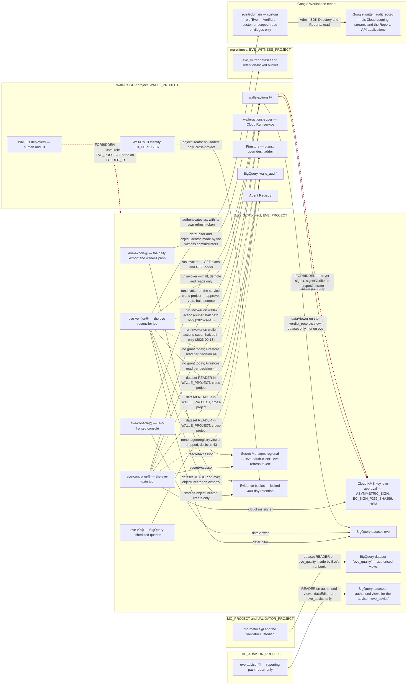

# 2. Identities, credentials and the key

## Status
- Owner: the platform owner
- Last reviewed: 2026-09-13
- **Objective restated 2026-09-13; see the platform HLD**
  ([../agentic-platform/01-hld.md](../agentic-platform/01-hld.md) §13.2–§13.3; this page carries
  §18 items 13 and 17; owner the Eve owner, gates the super-admin grant and Wall-E's Stage 1,
  P143). Wall-E holds Super Admin (P33). On this page: `eve@`'s read privilege and scope set are
  widened before the one-sitting consent (E-16), still with no content scope; E-16 is reworded
  now that decision 26 is closed for Wall-E by fact; two identities are added (`eve-export@`,
  `eve-advisor@`); the Mo grant row gains dataset-level `READER` on `eve_quality` for
  `mo-metrics@` and the validator custodian, made by Eve's runbook; `eve-controller@` gains
  `run.invoker` on `walle-actions-super` for the halt path (and, decided the same day,
  `eve-verifier@`, which raises the reconciler's halts — topology row 27); `eve-approval` is HSM; E-2 is
  reopened as blocking for the grant. `eve@` stays a read-only role, **never Super Admin**.

Every principal Eve involves, what it holds, and why each boundary is where it is. The
short version: Eve holds exactly one privileged capability — a Cloud KMS
`EC_SIGN_P256_SHA256` signature over a hash it computed itself — and everything else in
this document exists to make sure that capability cannot be reached from anywhere else,
including from inside Wall-E's project.

Read [01-hld.md](01-hld.md) first for what Eve is. This page assumes it. Placement — which
of the four projects each resource lives in, and the exact form of every grant that crosses
a project — is fixed by [../project-topology.md](../project-topology.md) (2026-09-13); this
page names the grants Eve holds and makes, and points there for the full table.

## The identity table

| Principal | Kind | Where | Holds | May call | Must never |
|---|---|---|---|---|---|
| `eve-v0@<eve-project>` | GCP service account | `EVE_PROJECT` | `bigquery.dataViewer` on `walle_audit` (dataset-level `READER` in `WALLE_PROJECT`, made by Wall-E's runbook, CC-22); `dataEditor` on `eve`; `bigquery.jobUser` in `EVE_PROJECT` | Nothing | Hold a Workspace credential, a key, or any endpoint access |
| `eve-controller@<eve-project>` | GCP service account, attached to the `eve-gate` job | `EVE_PROJECT` | `cloudkms.signer` on `eve-approval`; `secretAccessor` on Eve's two secrets; `run.invoker` on the `walle-actions` service in `WALLE_PROJECT` (service-level, made by Wall-E's runbook); **no project-level role in `WALLE_PROJECT`** — `EVE_PROJECT_ROLES` in Wall-E's script is empty since 2026-09-13, `agentregistry.viewer` is dropped (topology decision 43) and `datastore.viewer` is not granted: Eve reads plans through `GET /v1/plans/{id}` with `run.invoker`, and the Firestore discovery read of `plans/{id}` at `state == pending_eve` is **absent until topology decision 44 lands** — either `datastore.viewer` under an IAM Condition scoped to Wall-E's `(default)` database ([Firestore IAM](https://docs.cloud.google.com/firestore/docs/security/iam), expression unverified) or the list endpoint of CC-33. `bigquery.dataViewer` on `walle_audit` (dataset-level, `WALLE_PROJECT`, Wall-E's runbook); `bigquery.jobUser` **in Eve's own project** | `GET /v1/plans`, `GET /v1/runs`, `GET /v1/ladder`, `GET /healthz`, approve, veto, halt, demote. Added 2026-09-13 (platform HLD §18 item 25): `roles/run.invoker` on the Cloud Run service `walle-actions-super` in `WALLE_PROJECT`, service-level, **halt path only** — the in-app control list of that service carries no other endpoint for it; made by Wall-E's runbook | Execute any Workspace operation. Raise any level, clear an override, change a ceiling. Read any Wall-E secret or signing key. Hold **any** `aiplatform.*` permission, in particular `reasoningEngines.query`. |
| `eve-verifier@<eve-project>` | GCP service account, attached to the `eve-reconciler` job | `EVE_PROJECT` | Everything `eve-controller@` holds **except `cloudkms.signer`**; plus `storage.objectCreator` on the evidence bucket | The control and read endpoints; never approve | Sign. The process that parses attacker-writable strings out of Google's audit log must not be able to reach the key. |
| `eve-console@<eve-project>` | GCP service account | `EVE_PROJECT` | `dataViewer` on `eve`; `objectViewer` on the attestation bucket; `run.invoker` on `walle-actions` in `WALLE_PROJECT` (service-level, Wall-E's runbook; its paths come from the read-endpoint allowlist, not the control list). Its human audience behind IAP becomes a dedicated group (name *tbd*) whose membership change is severity 1 (2026-09-13, SA-09) | `GET /v1/plans`, `GET /v1/ladder` | Approve, veto, halt, demote. Hold a Workspace credential. Write `grades_eve`. |
| `eve-export@<eve-project>` (added 2026-09-13, platform HLD §13.2, P107) | GCP service account, attached to the export job | `EVE_PROJECT` | dataset-level `READER` on `eve`; `storage.objectViewer` on Eve's locked bucket and `storage.objectCreator` on its `exports/` prefix (IAM Condition, create-only); dataset-level `READER` on `walle_audit` in `WALLE_PROJECT`, made by Wall-E's runbook; in the witness organisation exactly two resource-level grants made by the witness administrators — `roles/bigquery.dataEditor` on `eve_mirror` and `roles/storage.objectCreator` on the witness bucket | Nothing on any action service | Reconcile, sign, halt. Delete or overwrite anything. Hold any other grant outside `EVE_PROJECT`. One identity per duty: the exporter is never the reconciler |
| `eve-advisor@<eve-advisor-project>` (added 2026-09-13, platform HLD §13.2, P34) | GCP service account, the reporting path | `EVE_ADVISOR_PROJECT` | dataset-level `READER` on the authorised-view dataset in `EVE_PROJECT` that fronts `eve.*`, `eve_workspace_logs` and the report tables (never on the source datasets); `roles/bigquery.dataEditor` on the dataset `eve_advice` in `EVE_PROJECT` only; both made by Eve's runbook; the model permissions of its own project | Nothing on any action service | Hold `cloudkms.signer`, `run.invoker`, `secretAccessor` or any write to `eve/config`. Be read by `eve-gate`, `eve-reconciler`, `walle-actions` or `walle-actions-super` |
| `eve@<domain>` | Workspace user | Workspace, `/Automation/Service Identities` | Custom role `Eve — Verifier`, customer-scoped, read privileges only; read-only OAuth scopes — eight as first designed, ten after the widening of 2026-09-13 (below); own hardware key; member of `walle-protected@` | Admin SDK Directory and Reports, read | Hold any write privilege at any stage, ever. Be a super admin, ever. Be impersonated — there is no domain-wide delegation anywhere. |
| Wall-E's CI identity (`CI_DEPLOYER` in Wall-E's config) | CI | `WALLE_PROJECT` | `storage.objectCreator` on Eve's evidence bucket in `EVE_PROJECT`, under an IAM Condition on the `ladder/` prefix — bucket-level, made by Eve's owner; carve-out 3 of topology decision 48 | Publish a ladder artefact | Overwrite or delete an artefact. Hold any other permission in Eve's project. |
| `walle-actions@` | GCP service account | `WALLE_PROJECT` | `cloudkms.publicKeyViewer` on the one key `eve-approval` in `EVE_PROJECT` (key-level, fallback only; carve-out 1 of decision 48); `bigquery.dataViewer` on the authorized view `verdict_receipts`, which lives in its own dataset in `EVE_PROJECT` (name *tbd*, decision 48), authorized on the `eve` dataset — **no access to `eve` itself** (carve-out 2). Query jobs for that read run in `WALLE_PROJECT` under `walle-actions@`'s existing `jobUser` there | Nothing of Eve's beyond those two reads | Hold `signer`, `signerVerifier` or `cryptoOperator` on Eve's key — impossible, since the key is not in its project. Read a verdict's content; the view exposes `(run_id, item, verdict_ts)` and nothing else. |
| Wall-E's deployers | Human plus CI | `WALLE_PROJECT` | **No project-level role in `EVE_PROJECT`, and none on `FOLDER_ID`.** Exactly three resource-level grants to Wall-E principals exist in `EVE_PROJECT`: CI `objectCreator` on the `ladder/` prefix of the evidence bucket; `walle-actions@` `publicKeyViewer` on `eve-approval` (fallback only); `walle-actions@` `dataViewer` on the `verdict_receipts` authorized view. A fourth Wall-E grant is a drift failure. A **second carve-out list**, for Mo, has exactly one entry: `mo-metrics@${MO_PROJECT}` dataset-level `READER` on the mirror's dataset, from S4, made by Eve's owner (topology row 18, decision 51) — a Mo principal at S4 is expected, not flagged; any other Mo principal, or the same one before S4 or on any other resource, is a drift failure. **Extended 2026-09-13** (platform HLD §13.3, §18 items 17 and 25): the Mo list gains a second entry, `mo-metrics@${MO_PROJECT}` dataset-level `READER` on `eve_quality`, made by **Eve's runbook** from Wall-E's Stage 1, with no binding in `MO_PROJECT`; the validator custodian holds the same grant (P30). The full expected foreign set is in "The two properties re-verified" below | — | Appear in `EVE_PROJECT`'s or `FOLDER_ID`'s IAM policy. Asserted daily by Eve's own drift job; Wall-E's drift job asserts the mirror image from inside `WALLE_PROJECT` only (topology decision 46). |

Nothing in this table exists at Stage 0 except `eve-v0@`. See
[05-stages.md](05-stages.md) for what is deliberately absent and when each principal is
created; the ordered steps are in [07-build-runbook.md](07-build-runbook.md).

## The map



The two dotted red edges are the two grants this design exists to make impossible rather
than merely forbidden. The six edges added after them on 2026-09-13 are the cross-boundary
grants the platform HLD adds (§18 item 25): the halt path onto `walle-actions-super`, the
export and witness push, the reporting path's view and write, and Mo's and the custodian's
quality read. Both are structural: the key is not in Wall-E's project, so no
project owner there can grant themselves `useToSign` on it, and Wall-E's deployers hold no
project-level role in Eve's project or on its folder, so there is nothing for them to
escalate from — the three resource-level grants that do exist are create-only,
view-public-key-only and read-one-view-only, and each is a row in
[../project-topology.md](../project-topology.md) §3 (rows 14, 15, 16).

Note what the diagram does **not** contain: any edge pointing into Eve. Eve exposes no
inbound decision surface — no HTTP endpoint, no Pub/Sub push subscription, no agent card,
no agent protocol. Eve is a client everywhere. That is argued in [01-hld.md](01-hld.md);
its consequence here is that Eve's identities are only ever *callers*, so there is no
inbound credential to protect, rotate or have stolen.

## Why Eve gets its own GCP project

This is the largest single change from Wall-E's runbook before 2026-09-13, where
`SA_EVE = eve-controller@${PROJECT}` and the signing key sat on Wall-E's key ring. Since
2026-09-13 `SA_EVE` in Wall-E's script is `eve-controller@${EVE_PROJECT}`, and Eve's project
is one of four under `FOLDER_ID` ([../project-topology.md](../project-topology.md)).

While Eve's key lives in Wall-E's project, a project owner there can grant themselves
`roles/cloudkms.signer` on `eve-approval` and mint an Eve approval. The design's only
control against that is a daily drift row — a detective control on the one artefact the
entire controller role rests on. Wall-E's own review reached the same place from the other
side: [C11](../wall-e/14-hld-challenge.md) was refuted on the ground that Eve's trust root
belongs to Eve's design and to [decision 18](../wall-e/09-open-decisions.md), not to the
HLD, and the residual it left says moving Eve's evidence copy out of Wall-E's reach becomes
a requirement at S3. This design pays that debt in one move rather than two.

The project boundary buys four things that IAM hygiene inside one project cannot:

1. **The signing key cannot be re-granted.** Not "is not granted" — cannot be, because
   `walle-actions@` and Wall-E's deployers have no principal in the project the key lives
   in.
2. **Eve's secrets cannot be read by mistake.** The cross-check that sweeps both secret
   sets in both directions still runs and still prints nothing, but it is now confirming a
   property the topology already guarantees. Sweeping Eve's secret IAM needs
   `secretmanager.secrets.getIamPolicy` in `EVE_PROJECT`, which no Wall-E principal holds,
   so the two-project sweep is run by the human operator who owns all four projects
   ([07-build-runbook.md](07-build-runbook.md) Phase 9 check 1); Wall-E's script asserts
   only the half visible in `WALLE_PROJECT`.
3. **Eve's evidence leaves Wall-E's teardown blast radius.** `walle_audit` and
   `walle_workspace_logs` are inside it; Eve's mirror, its own log sink and its locked
   bucket are not. This is what [decision 31](../wall-e/09-open-decisions.md) and C11's
   residual ask for.
4. **The forbidden edges become drawable.** A reviewer can check the claim by reading one
   IAM policy, not by reasoning about seventeen role bindings.

**Qualified 2026-09-13** (platform HLD §13.2). All four are structural against Wall-E's
project principals and deployers. Against Wall-E's **super-admin** credential (P33), which
can grant itself Organization Administrator on the tenant's organisation, they are
**detective**: a super admin who reaches that role can re-grant the key or redeploy the gate,
and what sees it is the SIEM's super-admin set, Eve's tenant-integrity rules and the absence
alarms. The structural part of Eve's independence is the witness organisation; see
[01-hld.md](01-hld.md) structural choice 1.

**E-1 was answered yes on 2026-09-13**; the paragraph that follows is kept as the record
of the rejected variant. Had the answer been no, the single-project variant still works:
offline pinned-PEM verification still prevents key substitution, and the denial tests still
pass. What is lost is the guarantee — "`walle-actions@` must never mint an Eve approval"
reverts to IAM hygiene plus a daily drift row. That was decision **E-1** in
[09-open-decisions.md](09-open-decisions.md); the decision file is *tbd*.

### Who owns the project

The boundary is only as real as the org chart, and with one administrator it is notional.
The target is an `eve-owners@` group containing IT security and **not** Wall-E's deployers,
bound at `EVE_PROJECT` level. The folder adds a consequence: all four projects sit under
`FOLDER_ID`, whose IAM policy is inherited by `EVE_PROJECT`, so no Wall-E deployer group may
hold a role on `FOLDER_ID` either, or the boundary is inherited away. Eve's daily drift job
reads both policies — the project's and the folder's — because a project-level read does
not show inherited bindings.

Making a second human on that group a hard build prerequisite was considered and rejected:
blocking Eve's build on an organisational change would leave the tenant with no controller
at all. So the boundary is built now, and the fact that it is notional until
[decision 11](../wall-e/09-open-decisions.md)'s second human exists is written down here
rather than narrowed away. Folding Eve back into Wall-E's project "for now" is pre-refused.
This is decision **E-2**, due before S4, and it is the largest open risk in the set.

**Reopened 2026-09-13 as blocking for the super-admin grant** (platform HLD §0.3, §0.4,
§13.2; P1, P14, P98, P137; topology decision 52 reopened with it). The owner of `eve-owners@`
is a **second human outside the Wall-E administration line** (IT security), named before the
grant: administrator of the witness organisation, required reviewer on `eve/config`, parallel
recipient of every severity 1/2 page and sole recipient of reports about the administrator's
own actions. Eve's *build* still does not wait for that person; the grant does.

## Two runtime identities, not one

`eve-controller@` signs. `eve-verifier@` reconciles. They run different Cloud Run jobs from
the same image and differ by exactly one role.

The reason is the input each one handles. `eve-reconciler` parses strings that an attacker
can write — display names, group descriptions, event parameters out of Google's audit log,
plan bodies. `eve-gate` produces the only signature that can authorise an L4 execution. A
parsing bug in the first must not be a path to the second, so the process that reads
attacker-writable text **does not hold `cloudkms.signer` at all**. Containment costs one
extra service account and one extra job deployment.

`eve-console@` is a third, read-only identity. It holds `dataViewer` on the `eve` dataset,
`objectViewer` on the attestation bucket, and `run.invoker` on `walle-actions` for
`GET /v1/plans` and `GET /v1/ladder` only. The console renders the queue, the blind review,
ladder drift and attestations for `walle-operators@` behind Identity-Aware Proxy. It can
approve nothing, veto nothing, halt nothing and demote nothing, and it holds no Workspace
credential.

`eve-v0@` is the fourth and the oldest: the service account every BigQuery scheduled query
is pinned to. It holds two dataset grants and calls nothing.

## Eve's Workspace robot

`eve@<domain>` is Eve's independent view of the tenant. It exists so that Eve does not
verify Wall-E's work through Wall-E's credential — if it did, a compromised Wall-E path
could make the world look however it wants to the verifier.

| Control | Setting | Why |
|---|---|---|
| Org unit | `/Automation/Service Identities`, the same OU as Wall-E's robot | Every setting below applies without touching real users |
| Admin role | Custom role `Eve — Verifier`, **customer-scoped**, read privileges only | Customer scope is required: Reports privileges cannot be OU-scoped, and Eve's whole value is tenant-wide reads |
| Role privileges | Users read, Groups read, Organisational units read, Admin roles read, Reports audit read, Reports usage read. **Widened 2026-09-13, before the consent (E-16; platform HLD §13.2):** plus read of domain settings and customer settings, and every Reports application the poll reads; security and API-controls state only where an API exists that a non-super-admin can read (none found — see the scopes below); no content privilege | Resolved against the tenant with `privileges.list` — Google publishes no complete catalogue, so the console labels are not to be trusted (`privileges.list` verified 2026-09-13: `GET …/customer/{customer}/roles/ALL/privileges`, scope `admin.directory.rolemanagement.readonly`, [privileges.list](https://developers.google.com/workspace/admin/directory/reference/rest/v1/privileges/list)). The exact privilege names are *tbd* until that call is run on the tenant |
| Write privileges | **None, at any stage, forever** | The role does not grow with the ladder the way Wall-E's does. This is the one privilege table in the set with no future column |
| Super Admin | **Never** — required by the objective of 2026-09-13 ("She won't have super admin access") | Eve controls a super-admin robot without being one; its reach is read-only and it acts only through the control endpoints |
| 2-step verification | Enforced, **hardware key only**, its own key in the same safe, separately labelled | A shared key would make the two robots one identity in practice |
| Recovery options | None | Removes the social-engineering path |
| Password | Long, random, in the corporate vault, never in the wiki | — |
| Session length | Short, no "remember device" | — |
| Login activity rule | Its own rule, actor `eve@<domain>`, unfiltered event type, action = email to the platform owner and `walle-operators@`, severity high. Added 2026-09-13: also severity 1 in the SIEM (SA-04) and in Eve's tenant-integrity rules, paging the second human | After bootstrap, an interactive login to this account is by definition an incident |
| Protected-principal membership | Member of `walle-protected@`, and written into the committed floor list | Wall-E can never target Eve's account with a write; the floor list makes a silent truncation of the protected set a loud refusal |
| Licence | One spare Workspace licence | The largest recurring cost line in the whole design, and what buys the independent read |

A privilege and a scope are different things, and the distinction matters twice below: a
**consented OAuth scope grants nothing without the corresponding admin privilege**. Eve's
role carries no write privilege, so even a scope granted in error would authorise nothing.

### The scopes, and the one that was dropped

Scopes are frozen at consent. Adding one later means re-running the bootstrap, so the whole
set is decided before the first consent.

```
https://www.googleapis.com/auth/admin.directory.user.readonly
https://www.googleapis.com/auth/admin.directory.group.readonly
https://www.googleapis.com/auth/admin.directory.orgunit.readonly
https://www.googleapis.com/auth/admin.directory.rolemanagement.readonly
https://www.googleapis.com/auth/admin.reports.audit.readonly
https://www.googleapis.com/auth/admin.reports.usage.readonly
https://www.googleapis.com/auth/userinfo.email
openid
```

Eight scopes, all read-only.

**Widened 2026-09-13, before the one-sitting consent (E-16; platform HLD §13.2).** Two scopes
are added, so the consented set is **ten**, all read-only:

```
https://www.googleapis.com/auth/admin.directory.domain.readonly
https://www.googleapis.com/auth/admin.directory.customer.readonly
```

Both verified 2026-09-13 in the Directory API scope list
([authorizing](https://developers.google.com/workspace/admin/directory/v1/guides/authorizing)).
They let the roster and tenant-integrity checks read domain and customer settings — a domain
added by band B, a customer-level change — as state, not only as events. Three things are
deliberately **not** added:

- **No Reports scope beyond `admin.reports.audit.readonly`.** The Reports API poll by actor
  across `admin`, `login`, `token`, `saml`, `groups`, `groups_enterprise`, `user_accounts`,
  `rules`, `context_aware_access`, `gcp`, `drive`, `vault`, `takeout`, `admin_data_action`,
  `data_studio` and the other documented applications uses that one scope (verified
  2026-09-13, [activities.list](https://developers.google.com/workspace/admin/reports/reference/rest/v1/activities/list)).
  Drive, Vault or Takeout *activity* is metadata about who touched what, not content.
- **No Cloud Identity Policy API scope.** The Policy API reads security and API-controls
  settings, but "only a super administrator can use" it (verified 2026-09-13,
  [Policy API overview](https://docs.cloud.google.com/identity/docs/concepts/overview-policies)),
  and Eve is never a super admin. Eve sees those settings **change** through their admin
  events and never reads their current state; that limit is declared in
  [01-hld.md](01-hld.md) "What this design does not close".
- **No device or Chrome management scope.** `Assumption:` context-aware-access policy changes
  are observed through the `context_aware_access` and `admin` Reports applications; a
  read-only API for access-level state readable by a non-super-admin is not identified this
  pass and is *tbd*.

The rule that decides the rest stands: **no content scope** — the objective needs metadata
about who touched what, not the content.

- `admin.directory.rolemanagement.readonly` is required, not optional: Eve reconciles the
  operator list against `roleAssignments.list` daily, and cannot classify which groups
  carry an admin role without it.
- `userinfo.email` and `openid` are what let Eve's bootstrap verify that the consenting
  account really is `eve@<domain>` and not the operator running the bootstrap.
- `cloud-platform` is **never** requested, for the same reason as on Wall-E's robot: it
  would bind a Workspace credential to the organisation's GCP session-control policy.
- No Gmail, Chat, Calendar or Drive scope is requested. Eve has no reason to read content
  and every reason not to be able to.

**`apps.licensing` is dropped**, per [C13](../wall-e/14-hld-challenge.md). The runbook and
`walle_setup.py` still carry it at the time of writing; that edit is listed in
[08-contract-changes.md](08-contract-changes.md). The consequences are real and permanent,
and they are not narrowed away:

- Eve verifies licence changes (family F7) **only** from Google-written licence events in
  the admin audit log, never from current state.
- Such verifications are recorded `verified_partial` with reason `licence_event_only`.
- This is a declared, permanent limit on Eve's independence for F7 at L4, carried in every
  F7 attestation bundle.
- F7 at L4 therefore takes a **20 % blind sample** rather than the standard rate, and any
  F7 `unverifiable` is a hard stop rather than a budgeted 2 %.
- Whether licence privileges are `isOuScopable` is **unverified**. If the check comes back
  negative, the honest recommendation is that F7 stays at L3.

The alternative — granting Eve the License Management privilege so it could read
assignments — is refused outright: License Management is a single undivided privilege with
no read-only half, so it would hand the controller that "never acts on Workspace" the
ability to assign and revoke licences. A named gap in verification is the cheaper defect.

### The OAuth client

A **new, separate Desktop OAuth client**, never Wall-E's, marked **Trusted** in Admin
console → Security → API controls in the same sitting as the consent.

| Item | Value | Why |
|---|---|---|
| Consent screen user type | Internal | An external app in Testing is issued a refresh token expiring in 7 days ([Google OAuth 2.0](https://developers.google.com/identity/protocols/oauth2), verified 2026-09-12) |
| Publishing status | In production | Same reason; the cost of being wrong is a dead verifier every week |
| Client type | Desktop app | Simplest loopback flow for a one-time consent |
| API controls | Client id marked Trusted, same sitting | Stops a later org-wide scope restriction from silently killing Eve |
| Reuse | Never. One client, one token | Google invalidates the oldest silently past 100 live refresh tokens per account per client id (same source) |

Sharing Wall-E's client would make the two credentials share a failure mode and a
revocation: revoking Wall-E's client access would take Eve down with it, which is precisely
the coupling this design is built to avoid.

### The six-month clock, and when consent happens

Google invalidates a refresh token that **has not been used for six months**
([Google OAuth 2.0](https://developers.google.com/identity/protocols/oauth2), verified
2026-09-12), and a successful token *exchange* — not an API call — resets the clock.

That single fact is why Eve's credential is minted at **S3 entry** and not at Stage 0. The
S0–S2 floors total 13–18 weeks, under six months, so a Stage-0 token does not certainly
die; it dies if the stages overrun or if Eve's build lags S3 entry, both of which are
plausible for a design with no date. The alternative — keeping a dormant tenant-wide admin
read credential warm with a monthly refresh for a consumer that does not exist — is worse.
The second reason is the scope freeze: consenting at Stage 0 freezes a scope set decided
before the verifier was designed. Neither reason is "the cost of repeating consent", which
is what the runbook says today and which is
[decision 36](../wall-e/09-open-decisions.md)'s to correct.

Once Eve exists, `eve-reconciler` performs a **monthly token exchange** for the express
purpose of resetting that clock, and alerts on failure. `invalid_grant` is a paging
incident, never a retryable error: it means Eve's credential is gone and only a human
re-bootstrap brings it back.

Two further causes from Google's list are read precisely here:

- **Password change** invalidates a refresh token where Gmail scopes are granted. Eve's
  token carries no Gmail scope, so `Assumption:` a password rotation on `eve@` does not
  invalidate it. This is a reading of Google's wording, not a tested fact; the rotation
  runbook re-bootstraps anyway rather than relying on it.
- **An admin restricting a requested service in API controls** is what the Trusted marking
  prevents.

### Whether any of this survives decision 26

**Reworded 2026-09-13.** [Decision 26](../wall-e/09-open-decisions.md) is **closed for
Wall-E by fact** (platform decision P33): a service account can hold any Workspace admin role
except Super Admin, so Wall-E's super-admin principal is a user account. The question
survives **for Eve only**, as E-16, because Eve's role is a read-only custom role, which a
service account can hold. Its gate moves with the consent: before the one-sitting consent,
which is now before the super-admin grant; and it must be answered together with the widened
privilege and scope set above. What follows is the original framing.

[Decision 26](../wall-e/09-open-decisions.md) asks whether the admin principal can be a
**keyless service account holding the custom role with no domain-wide delegation**. Google
documents that any role except Super Admin can be assigned to a service account without
DWD. If that covers Directory and Reports for a read-only role, then Eve's robot user, its
password, its recovery path, its hardware key, its consent, its frozen scope set, its
six-month clock and its stealable refresh token **all disappear**, and this entire section
is replaced by one IAM binding.

So the credential chapter is re-examined before onboarding rather than built as specified.
That is decision **E-16**, and it is the one place in this document where the right answer
may be to delete most of it.

## Eve's secrets

Two secrets, both **regional** (`europe-west1`), both **in Eve's project**. Values are
never recorded in this wiki or anywhere else outside Secret Manager.

| Secret | Purpose | Readable by |
|---|---|---|
| `eve-oauth-client` | Eve's OAuth client id and secret | `eve-controller@`, `eve-verifier@`, and the bootstrap operator once |
| `eve-refresh-token` | Eve's Workspace credential | `eve-controller@`, `eve-verifier@` |

- **Regional, not global with user-managed replication.** A regional secret keeps the data
  in the location at rest, in use and in transit. User-managed replication pins only the
  payload at rest while the secret itself remains a global resource; automatic replication
  stores payloads worldwide and contradicts the residency position outright.
- **The version number is pinned.** The runtime reads `.../versions/<EVE_TOKEN_VERSION>`,
  never `.../versions/latest`. `latest` resolves to the newest *enabled* version, so
  disabling a compromised newest version would silently fall back to the previous, still
  valid token — and the credential kill switch would do nothing. Rotation is an explicit
  config change and a deploy.
- **`walle-actions@` cannot be granted access to these by mistake**, because it has no
  principal in Eve's project at all. The equivalent assertion inside one project is a
  policy sweep that has to keep being run.

## The signing key

| Property | Value | Note |
|---|---|---|
| Location | Key ring `eve`, key `eve-approval`, `europe-west1`, **in `EVE_PROJECT`** | Wall-E's runbook before 2026-09-13 created it on Wall-E's `walle` ring in `${PROJECT}`; since 2026-09-13 it is ring `eve` in `EVE_PROJECT` ([../project-topology.md](../project-topology.md) §2); see [08-contract-changes.md](08-contract-changes.md) |
| Purpose and algorithm | `ASYMMETRIC_SIGN` / `EC_SIGN_P256_SHA256` | Reads back exactly that way from `gcloud kms keys describe`; it is a Stage-0 exit assertion in Wall-E's runbook |
| Protection level (added 2026-09-13) | **`HSM`** | Platform HLD §8 ("approval-authority keys … HSM protection level") and P118 (`constraints/cloudkms.allowedProtectionLevels = HSM` at `fld-agentic-platform`). Created with `gcloud kms keys create … --protection-level=hsm`; allowed values `software`, `hsm`, `hsm-single-tenant`, `external`, `external-vpc`, default `software` (verified 2026-09-13, [gcloud kms keys create](https://docs.cloud.google.com/sdk/gcloud/reference/kms/keys/create)). A software key would be refused by the folder constraint |
| Signing role | `roles/cloudkms.signer` to `eve-controller@` **only** | Exactly `cloudkms.cryptoKeyVersions.useToSign` plus three read permissions ([Cloud KMS permissions and roles](https://docs.cloud.google.com/kms/docs/reference/permissions-and-roles), verified 2026-09-12) |
| Verification role | `roles/cloudkms.publicKeyViewer` to `walle-actions@<WALLE_PROJECT>`, bound **on this one key** in `EVE_PROJECT` — cross-project, fallback path only — and nothing more; the pinned PEM is the primary path and needs no cross-project KMS grant at all | Carries `cryptoKeyVersions.viewPublicKey` and **no** signing permission (same source) |
| Roles that must never appear on `walle-actions@` | `roles/cloudkms.signerVerifier`, `roles/cloudkms.cryptoOperator` | Both carry `useToSign` (same source). A project- or key-ring-level grant of either is a build failure: it could mint an Eve approval |
| Audit | Data Access audit logging enabled on `AsymmetricSign` | The only independent record that a signature was produced, and by whom |
| Signature format | DER-encoded EC signature; responses carry optional CRC32C checksums | [Create and validate signatures](https://docs.cloud.google.com/kms/docs/create-validate-signatures), verified 2026-09-12 |
| Key version in the signature | **None.** "Signatures do not identify the key version used" | Which is why the envelope must name the full key-version resource name itself, and why the `approvals` row carries `eve_key_version` ([C48](../wall-e/14-hld-challenge.md)) |

The envelope contract — domain tag, canonicalisation, the full signed field list including
`items_hash` and the key-version resource name — is in [03-lld.md](03-lld.md). This page
covers only the key itself.

### The PEM archive, in two places, before first use

Every key version's public key is exported **at creation, before the version is ever used
to sign**, to two independent places:

1. `gs://<eve-project>-eve-evidence/keys/`, the `keys/` prefix of Eve's **locked** evidence
   bucket, in Eve's project.
2. `contracts/eve-public-keys/<version>.pem`, committed in **Wall-E's** repository under
   the same CODEOWNERS entry that protects `ladder.yaml`.

The second copy is what makes offline verification the **primary** path in
`walle-actions`: the service verifies an approval against a PEM pinned in its own image,
and falls back to a live `getPublicKey` only if the pinned copy is missing. That ordering
is strictly stronger than a live fetch, for three reasons:

- **No IAM grant inside Wall-E's project can substitute a key.** A live fetch trusts
  whatever KMS returns for a resource name; a pinned PEM trusts what two reviewers merged.
- **A KMS outage does not stop verification.** With a live fetch, every L4 execution stops
  when KMS is unreachable. With a pinned PEM, only signing stops.
- **A destroyed key version never orphans a stored approval.** Cloud KMS documents a
  default 30-day scheduled-destruction window with restore-to-disabled inside it
  ([Destroy and restore key versions](https://docs.cloud.google.com/kms/docs/destroy-restore),
  verified 2026-09-12), but whether a destroyed version's public key stays retrievable is
  *not documented on that page*. The archive removes the question.

The stored signature plus the archived PEM is the only artefact that proves
`walle-actions` did not mint the approval itself. Teardown therefore checks the export
exists before it will offer `--destroy-key-versions`.

### Rotation is manual, dated, and never destructive

**Verified 2026-09-12: Cloud KMS does not support automatic rotation for asymmetric signing
keys** — "Automatic rotation isn't supported for asymmetric signing or asymmetric
encryption keys" ([Rotate a key](https://docs.cloud.google.com/kms/docs/rotate-key)). There
is no rotation schedule to set and no schedule to forget to set. Rotation is therefore a
written procedure with a date on it:

| Element | Rule |
|---|---|
| Cadence | Annually, and immediately on any suspicion of compromise |
| Overlap | 30 days. `walle-actions` accepts both versions for the overlap window, keyed on the `eve_key_version` in each envelope |
| New version | Its PEM exported to both places **before first use**, exactly as for the first version |
| Old version | **Disabled, never destroyed**, inside the 400-day evidence horizon |
| Containment use | Disabling the current version is half of the compromised-Eve containment step; revoking `run.invoker` is the other half |

Disable-never-destroy is not caution for its own sake: an attestation cites a window, and a
promotion decision made on the strength of an approval signed eleven months ago must stay
verifiable for as long as the evidence horizon says it does. Destroying a version inside
that horizon would retroactively make past approvals unverifiable — which is
[C48](../wall-e/14-hld-challenge.md)'s defect, reintroduced by operations instead of by
design.

## Grants in `WALLE_PROJECT`, made by Wall-E's runbook

Every grant below sits on a resource in `WALLE_PROJECT` and is made **by Wall-E's runbook**
(`walle_setup.py`, config keys `EVE_PROJECT`, `SA_EVE`, `SA_EVE_VERIFIER`, `SA_EVE_CONSOLE`),
against Eve's full `…@${EVE_PROJECT}.iam.gserviceaccount.com` emails. Eve's runbook
requests and verifies them; it never makes them. The complete cross-project table is
[../project-topology.md](../project-topology.md) §3.

| Grant | Level | Held by | Made by | Note |
|---|---|---|---|---|
| `roles/run.invoker` on `walle-actions` | Service | `eve-controller@`, `eve-verifier@`, `eve-console@` (`EVE_PROJECT`) | Wall-E's runbook, Phase 10 loop | Per *service*, not per path — see the allowlist below. This list is not exhaustive for the service: `mo-analyst@<MO_PROJECT>` also holds `run.invoker` on `walle-actions`, for the two read endpoints only (Mo's set, topology row 8) |
| `roles/run.invoker` on `walle-actions-super` (added 2026-09-13) | Service | `eve-controller@`; `eve-verifier@` (added the same day) | Wall-E's runbook (platform HLD §18 item 25) | **Halt path only**: the in-app control list of `walle-actions-super` carries no other endpoint for it. Open for the reconcile pass: page 07 §7 has `eve-reconciler` (identity `eve-verifier@`) set `halt_all` on both lanes for `log_pipeline_silent`, while item 25 names `eve-controller@` only — which identity holds this grant is *tbd*. **Decided 2026-09-13 (review-findings pass): both `eve-controller@` and `eve-verifier@` hold this grant, halt path only** ([../project-topology.md](../project-topology.md) row 27). The reconciler limb (`eve-verifier@`) raises every super-admin-lane halt of §14 of [03-lld.md](03-lld.md) (`reconciliation_gap`, the tenant-integrity rules, `log_pipeline_silent`); `eve-gate` (`eve-controller@`) keeps it for halts it raises at the approval point. Routing reconciler halts through `eve-gate` was rejected: it would put the parser of attacker-writable log strings next to the signer. |
| `roles/bigquery.dataViewer` on the `walle_audit` dataset (added 2026-09-13) | Dataset | `eve-export@` | Wall-E's runbook (P107; a new topology §3 row) | The daily export's one read in `WALLE_PROJECT` |
| `roles/datastore.viewer` | — | **nobody** | Not made. `EVE_PROJECT_ROLES` in Wall-E's script is `()` since 2026-09-13 (CC-26 superseded); SETUP Phase 6 refuses the line | Was the E-12 exception through which `eve-gate` discovered work. **No Firestore read exists today**; the replacement is topology decision 44 — the same role under an IAM Condition scoped to Wall-E's `(default)` database (expression unverified), or the list endpoint of CC-33. Eve's discovery path is blocked at S3 entry until one lands |
| `roles/agentregistry.viewer` | — | **nobody** | Not made. Dropped by Wall-E's Phase 13b and `registry` (topology decision 43) | No resource-level form exists and no Eve duty needs it: Eve holds Wall-E's committed endpoint URL in `eve/config` and asserts the card from `GET /healthz` or not at all |
| `roles/bigquery.dataViewer` on the `walle_audit` **dataset** | Dataset | `eve-v0@`, `eve-controller@`, `eve-verifier@` | Wall-E's runbook (CC-22, `add_dataset_access` keyed on `EVE_PROJECT`), provided since 2026-09-13; `eve-v0@` at S0, the other two at S3 entry | Never project-level `dataViewer`, which would be a lateral path into Wall-E's project |
| `roles/bigquery.jobUser` | Project, **`EVE_PROJECT`** — not a crossing | `eve-v0@`, `eve-controller@`, `eve-verifier@` | Eve's runbook | Query jobs run and are billed in Eve's project, so no job-creation right is needed in Wall-E's |

The whole shared data plane described in
[../wall-e/08-team-eve-mo.md](../wall-e/08-team-eve-mo.md) was unbuilt as of 2026-09-12:
`add_dataset_access` was called twice in the setup code and neither call was for Eve. After
the 2026-09-13 edit Wall-E's script calls `add_dataset_access` for Eve's three identities
(`@EVE_PROJECT`) and for Mo's metrics identity (`@MO_PROJECT`). Specifying that grant is
decision **E-9**, due at S3 entry.

The wording conflict E-12 recorded — Wall-E's set saying Eve's only project-level role in
Wall-E's project was `datastore.viewer` while separately granting `agentregistry.viewer` —
is settled by removal, not by rewording: since 2026-09-13 Wall-E's runbook, script and
self-test grant **neither**, and the invariant is **no project-level role in
`WALLE_PROJECT` at all** (topology row 26). The exception list is empty. The only possible
future entry is decision 44's resource-scoped form for Firestore, and it is named there
before it is granted. That is decision **E-12** as reworded.

### The control-caller allowlist

`run.invoker` is granted per service, not per path, so IAM alone cannot express "Eve may
halt but may not execute". The exclusion is an in-app allowlist on `walle-actions`, keyed
on the verified identity token:

```
CONTROL_CALLER_ALLOWLIST="${SA_EVE},${SA_EVE_VERIFIER},${OPERATORS}"
```

The three entries are cross-project emails —
`eve-controller@${EVE_PROJECT}.iam.gserviceaccount.com`,
`eve-verifier@${EVE_PROJECT}.iam.gserviceaccount.com` and the operators group — and the
line is Wall-E's configuration, set and asserted by Wall-E's runbook (CC-30). It is the
**control-caller** list. The **read-endpoint** allowlist is a separate list: it carries
`eve-console@${EVE_PROJECT}…` for `GET /v1/plans` and `GET /v1/ladder` and
`mo-analyst@<MO_PROJECT>` for `GET /v1/plans` and `GET /v1/runs` only, and never admits any
principal to approve, veto, halt, demote or execute.

Three properties of that line matter:

1. `${SA_EVE_VERIFIER}` is new. `eve-reconciler` must be able to halt and demote without
   holding the signing role, so it needs its own allowlist entry.
2. `${OPERATORS}` must be present. An allowlist holding Eve alone leaves **no human able to
   halt**, which the build asserts as a failure.
3. The allowlist entry is created at **S3 entry**, not Stage 0 — there is nothing for an
   allowlisted principal to call before Eve exists, and an allowlisted principal with no
   consumer is a standing invitation.

The denial tests that police this are exercised from commit one by a **CI-only stub
caller** standing in for `eve-controller@`: Wall-E's agent denied on `/v1/control/demote`
(403) and on approve (`approver_is_agent`, hard invariant, breaker trips), Eve denied 403
on `POST /v1/execute`, and an operator token **accepted** on halt. That stub exists in the
test suite only. There is no fault-injection or test-mode path reachable in any admitted
image, on either side; the seeded-fault exercise uses a separate sandbox deployment and
dataset.

## Grants Eve's runbook makes to principals outside `EVE_PROJECT` (added 2026-09-13)

The mirror image of the table above: grants **on Eve's resources** to foreign principals,
each made by Eve's runbook ([07-build-runbook.md](07-build-runbook.md)) and each a row the
platform HLD §18 item 25 adds to [../project-topology.md](../project-topology.md) §3.

| Grant | Level | Held by | Made by | Gate | Note |
|---|---|---|---|---|---|
| `READER` on `eve_quality` | Dataset | `mo-metrics@MO_PROJECT` | Eve's runbook | Wall-E's Stage 1 | Authorised views, no free-text columns; never `grades_blind` or `review_queue_blind`; **no binding in `MO_PROJECT`**. Mo reads; Eve reads nothing Mo writes; Mo is never Eve's grader (platform HLD §13.3) |
| `READER` on `eve_quality` | Dataset | the validator custodian (`VALIDATOR_PROJECT`) | Eve's runbook | Wall-E's Stage 1; until it lands, Eve-targeting bundles are advisory `incident_note` only (P30) | Re-derives every Eve metric a promotion or a Mo proposal cites |
| — on `eve_grades` (`grades_eve`), `VALIDATOR_PROJECT` (added 2026-09-13, review-findings pass) | Dataset | **no Eve identity** | the validator custodian, not Eve's runbook | Wall-E's Stage 1 | Proposed location ([09-open-decisions.md](09-open-decisions.md) E-21; [../project-topology.md](../project-topology.md) rows 45–46): the approval surface's grading identity writes it insert-only, `mo-metrics@` reads it; Eve neither reads nor writes the grades of its own verdicts |
| `READER` on the mirror's dataset | Dataset | `mo-metrics@MO_PROJECT` | Eve's owner | S4 | Unchanged (topology row 18, decision 51) |
| `READER` on the authorised-view dataset fronting `eve.*`, `eve_workspace_logs` and the report tables (name *tbd*) | Dataset | `eve-advisor@EVE_ADVISOR_PROJECT` | Eve's runbook | the `eve-advisor` build (P34, P19) | Never on the source datasets |
| `roles/bigquery.dataEditor` on `eve_advice` | Dataset | `eve-advisor@EVE_ADVISOR_PROJECT` | Eve's runbook | the `eve-advisor` build | The only write the reporting path holds; no control-path identity reads this dataset |
| `objectCreator` on `ladder/`; `publicKeyViewer` on `eve-approval`; `dataViewer` on the receipts dataset | as above | Wall-E principals | Eve's owner | S3 / S4 | The three carve-outs of topology decision 48, unchanged |

Two grants cross the other way, **out of the tenant's organisation**, and are made by the
witness administrators on witness resources, never by Eve's runbook: `eve-export@` →
`roles/bigquery.dataEditor` on `eve_mirror` and `roles/storage.objectCreator` on the
retention-locked witness bucket in `EVE_WITNESS_PROJECT`. No witness principal holds any grant
in the tenant's organisation, so `iam.allowedPolicyMemberDomains` in the tenant needs no
witness exception (platform HLD §13.2, §3.3).

## Why neither Eve identity can reach a model

No language model may produce an Eve approval. That is
[decision 34](../wall-e/09-open-decisions.md) and
[C12](../wall-e/14-hld-challenge.md), and at the identity layer it is enforced by absence
rather than by policy:

- **Neither `eve-controller@` nor `eve-verifier@` holds any `aiplatform.*` permission.** In
  particular `aiplatform.reasoningEngines.query` is removed from `eve-controller@` per
  [C10](../wall-e/14-hld-challenge.md), leaving exactly two query principals on Wall-E's
  engine in `WALLE_PROJECT`: the Gemini project's Discovery Engine service agent,
  `service-<GEMINI_PROJECT_NUMBER>@gcp-sa-discoveryengine.iam.gserviceaccount.com` —
  derived from `GEMINI_PROJECT`'s number, not Wall-E's — and `walle-dispatcher@`. Whether the
  engine-resource custom role `walleEngineQuery` suffices for that cross-project agent is a
  Wall-E spike (topology decision 42); `roles/discoveryengine.serviceAgent` on
  `WALLE_PROJECT` is the documented fallback. CI asserts the resulting IAM policy either
  way.
- Consequently there is no Eve `streamQuery` caller for
  [../wall-e/06-security-guardrails.md](../wall-e/06-security-guardrails.md)'s CI grep to
  police. The grep stays as a regression guard and finds nothing, which is the correct
  steady state.
- The complementary half — that Eve's *image* cannot reach a model, by dependency denylist
  and call-graph confinement — is in [01-hld.md](01-hld.md).

An Eve signature cannot be produced by an LLM loop because the process cannot reach a model
and its identity could not authenticate to one if it could.

**Added 2026-09-13.** The section stays true for the two runtime identities and gains a
project-level absence: a `gcp.restrictServiceUsage` denylist on `aiplatform.googleapis.com`
set on `EVE_PROJECT` itself (platform HLD CP5). `eve-advisor@` in `EVE_ADVISOR_PROJECT` may
reach a model (P34) and is outside this section by construction: it holds no signer, no
invoker and no secret, and nothing it writes is read by either runtime identity.

### Egress

`Assumption:` until Agent Gateway availability in `europe-west1` is confirmed, Eve's egress
control is VPC Service Controls plus a host allowlist: `walle-actions`,
`admin.googleapis.com`, `cloudkms.googleapis.com`, `secretmanager.googleapis.com`,
`bigquery.googleapis.com`, `firestore.googleapis.com`, `storage.googleapis.com`.
`aiplatform.googleapis.com` is deliberately never registered. Agent Gateway availability in
that region is **unverified** and stays so; this is decision **E-19**, due before S4.
**Closed 2026-09-13 by platform decision P3** (perimeter model by two spikes, with P81 and
P89): the gateway-or-perimeter question is now the platform's, and `run.allowedIngress` and
the controller folder's policies follow it; until P3's spikes pass, the host allowlist above
is Eve's interim and `aiplatform.googleapis.com` stays unregistered.

## The two properties re-verified after every IAM change

In both directions, and mechanically:

1. **`eve-controller@` and `eve-verifier@` appear on no Wall-E secret.**
2. **`walle-actions@` appears on no Eve secret and holds no signing role on Eve's key.**

The project boundary makes both structural rather than the result of a policy sweep, and
the existing cross-check that sweeps both secret sets still runs and still prints nothing —
run by the human operator, because it reads secret policies in both projects.

**Who asserts what, decided 2026-09-13 (topology decision 46).** Wall-E's drift job cannot
read a key policy, a secret policy or a dataset policy in `EVE_PROJECT` without a read grant
there, and the narrowest such grant — `roles/iam.securityReviewer` on `EVE_PROJECT`,
project-level — is exactly what CC-29 and the topology's one rule forbid. A dedicated
Wall-E drift identity carrying that role, carved out of CC-29, was considered and refused.
So:

- **Eve's own daily drift job in `EVE_PROJECT`**, and the Eve owner running
  [07-build-runbook.md](07-build-runbook.md) Phase 9's checks, assert the Eve-side rows:
  `cloudkms.signer` on `eve-approval` held by `eve-controller@` alone, the accessors of
  `eve-refresh-token`, the `eve` dataset's IAM, and that no Wall-E deployer appears in
  `EVE_PROJECT`'s IAM policy nor in `FOLDER_ID`'s — enumerating exactly the three
  resource-level carve-outs and failing on a fourth. These are the three rows
  [C11](../wall-e/14-hld-challenge.md)'s residual added; they move from Wall-E's job to
  Eve's. **Extended 2026-09-13** (platform HLD §4.7, §18 item 25): the drift job's expected
  set of foreign principals in `EVE_PROJECT` is enumerated rather than capped at three — the
  three Wall-E carve-outs; `mo-metrics@` on the mirror's dataset from S4 and on `eve_quality`;
  the validator custodian on `eve_quality`; `eve-advisor@` on its view dataset and on
  `eve_advice`; `platform-drift@CORE_PROJECT`'s folder-level `roles/iam.securityReviewer`,
  inherited (the named exception to decision 48); `factory-apply@CICD_PROJECT` **only while a
  matching approved `ent-factory-singleton` PAM grant is active** (P142); and the Sensitive Data
  Protection discovery service agent (P108). Any principal outside that set fails, as a fourth
  Wall-E principal did.
- **Wall-E's drift job** asserts only what is visible in `WALLE_PROJECT`: `walle-actions@`
  holds no KMS signing role anywhere in its own policy, the pinned PEM set matches
  `contracts/eve-public-keys/`, no Eve or Mo identity holds a write role or any
  project-level role beyond the E-12 exceptions, and the allowlists carry the expected
  foreign emails.

Neither Eve identity has a write path into `eve/config`, either. Thresholds, the reason
vocabulary, Eve's second predicate implementation and its compiled ceiling table are
human-merged only, in a repository separate from Wall-E's, validated by a CI check owned
outside that repository. A single pull request cannot widen Wall-E and loosen Eve together.

## There is no domain-wide delegation anywhere

Not for Wall-E, not for Eve, not for Mo, at any stage. `eve@<domain>` holds its own
consented refresh token and is never impersonated by anything. Mo holds no Workspace
credential at all; its GCP identities (`mo-metrics@`, `mo-analyst@`, `mo-narrator@`) live in
`MO_PROJECT`, and none of them holds anything in `EVE_PROJECT` — narrowed 2026-09-13: except
`mo-metrics@`'s two dataset-level reads (the mirror from S4, `eve_quality` from Wall-E's
Stage 1), neither of which is a credential, a write or a project-level role.

This is worth restating in Eve's set rather than inheriting it, because Eve is exactly the
place where DWD would look attractive: a verifier that has to read the whole tenant is the
textbook argument for a delegated service account. The answer is the same as for Wall-E —
DWD is a tenant-wide capability scoped only by OAuth scopes, so a compromised delegate can
act as anyone, including a super admin — with one addition specific to Eve. A delegated Eve
could impersonate the *robot*, and a verifier that can act as the thing it verifies is not
a verifier.

## Where this is checked

| Property | Checked by | When |
|---|---|---|
| Every scheduled query is pinned to `eve-v0@` with `--service_account_name` | CI assertion | Every build. The default is the creating user's credentials ([BigQuery scheduled queries](https://docs.cloud.google.com/bigquery/docs/scheduling-queries), verified 2026-09-12), and an evidence series that runs as the person who administers Wall-E is not independent — and dies when they leave |
| `eve@` holds no privilege outside the read allowlist | `walle verify` | Every run |
| Eve's credential can read and cannot write | Token verification against `users.list` (success) and `users.update` (403) | Onboarding, and after every rotation |
| `eve-approval` is `ASYMMETRIC_SIGN` / `EC_SIGN_P256_SHA256` and `walle-actions@` holds only `publicKeyViewer` | Stage-0 exit checklist, then CI | Continuously |
| A PEM exists for every key version | Teardown guard, before `--destroy-key-versions` is offered | Teardown |
| No Wall-E deployer appears in `EVE_PROJECT`'s IAM policy nor in `FOLDER_ID`'s (inherited bindings are invisible to a project-level read), and no Wall-E principal holds anything in `EVE_PROJECT` beyond the three resource-level carve-outs | Eve's daily drift job | Daily |
| No `aiplatform.*` permission on either Eve identity | CI IAM-policy assertion | Every build |
| `aiplatform.googleapis.com` denied on `EVE_PROJECT` by a project-level `restrictServiceUsage` denylist (added 2026-09-13) | Eve's drift job; SG-04 in the SIEM | Daily; on change |
| `eve-approval` protection level is `HSM` (added 2026-09-13) | Phase 11 verify; the folder constraint refuses anything else | At creation; drift daily |
| `eve@`'s consented scope set equals the ten-scope set exactly, no content scope, `apps.licensing` absent; `eve@` is not a super admin (added 2026-09-13) | Phase 8 token verification; Eve's roster check (`users.list` `isAdmin`) | Onboarding; daily |
| No control-path identity holds a read on `eve_advice`; `eve-advisor@` holds nothing but its two dataset grants (added 2026-09-13) | CI assertion on the dataset access lists; Eve's drift job | Every build; daily |

The verification commands themselves are in [07-build-runbook.md](07-build-runbook.md);
what happens when one of these checks fires is in
[06-failure-modes.md](06-failure-modes.md).

## Related

- [01-hld.md](01-hld.md) — what Eve is, the five structural choices, the deterministic boundary
- [03-lld.md](03-lld.md) — the envelope contract and what the signature covers
- [05-stages.md](05-stages.md) — when each identity, secret and key comes into existence
- [08-contract-changes.md](08-contract-changes.md) — the edits this page forces on Wall-E's runbook and setup code
- [09-open-decisions.md](09-open-decisions.md) — E-1 (answered), E-2, E-9, E-12, E-16, E-19
- [../agentic-platform/01-hld.md](../agentic-platform/01-hld.md) §13.2–§13.3 — the two paths, the witness, `eve_quality` (2026-09-13)
- [../project-topology.md](../project-topology.md) — the four projects, every cross-project grant, and decisions 42–52
- [../wall-e/02-identity-and-auth.md](../wall-e/02-identity-and-auth.md) — Wall-E's equivalent, and the source of the no-DWD argument
- [../wall-e/08-team-eve-mo.md](../wall-e/08-team-eve-mo.md) — the contract between the three agents
