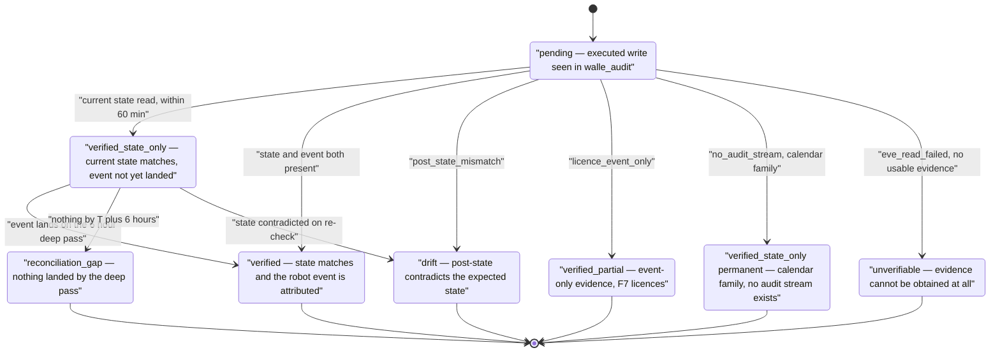

# 4. Flows

## Status
- Owner: the platform owner
- Last reviewed: 2026-09-13

Seven things Eve actually does, end to end. Every one of them is a client-side loop: Eve
polls, reads, recomputes and either signs, writes a row, or calls a control endpoint. Eve
exposes nothing over the network that takes a decision, so none of these flows starts with
someone calling Eve — see [01-hld.md](01-hld.md). The components, identities and schedules
referenced here are defined in [01-hld.md](01-hld.md) and [02-identity-and-auth.md](02-identity-and-auth.md);
the recomputations, the envelope and the reason vocabulary in [03-lld.md](03-lld.md); what
exists at each stage in [05-stages.md](05-stages.md).

| # | Flow | Trigger | Runs as | Exists from |
|---|---|---|---|---|
| 1 | Pre-approval at L4 | `eve-gate`, every 2 minutes | `eve-controller@` | S4 entry |
| 2 | Post-hoc verification at L5 | `eve-reconciler` post-hoc task, every 5 minutes; deep pass every 6 hours | `eve-verifier@` | S3 entry (observe), enforcing at S4 |
| 3 | Two-direction reconciliation | `eve-reconciler` hourly, plus a daily pass | `eve-verifier@` | S0 as SQL, S3 entry as a job |
| 4 | Drift — config, ladder, epoch, Google contract, operator list | `eve-reconciler` hourly; operator list daily | `eve-verifier@` | S0 as SQL, S3 entry as a job |
| 5 | Halt and demote | Any flow above crossing a declared threshold | `eve-verifier@`, or `eve-controller@` for a veto | S3 entry, invariant class only |
| 6 | Attestation | A promotion request; bundles assembled on the daily pass | `eve-verifier@` assembles | S3 entry |
| 7 | Blind sample draw and grading | `eve-reconciler` daily draw; a human grades in `eve-console` | `eve-verifier@` draws, a human grades | The sample from S1, Eve's draw from S3 entry |

One duty of `eve-reconciler` is not a flow and is recorded here so it is not lost: the
**monthly refresh-token exchange** that resets Google's six-month unused-token clock. It
runs on the daily pass as `eve-verifier@`, never from `eve-gate`, and an `invalid_grant` is
a paging incident rather than a retryable error — see
[02-identity-and-auth.md](02-identity-and-auth.md).

Two rules run through all seven and are stated once here rather than repeated in each.

**At the approval point the conservative act is refuse, not halt.** Every unresolved
comparison in flow 1 resolves to a refusal: the plan waits for a human and the cost is
minutes of approval latency. Halting is reserved for the closed invariant-trigger list in
`thresholds.yaml` and is therefore never discretionary. A degraded Eve that halts turns
every hiccup into an outage; a degraded Eve that refuses costs an operator an approval.
This is an amendment to [../wall-e/08-team-eve-mo.md](../wall-e/08-team-eve-mo.md) item 5,
whose "on its own judgement" is void under C12 of
[../wall-e/14-hld-challenge.md](../wall-e/14-hld-challenge.md); it is recorded as decision
E-7 in [09-open-decisions.md](09-open-decisions.md).

**No flow has a path that raises anything.** There is no raise endpoint on
`walle-actions` at all, Eve holds no permission to clear an override or change a ceiling,
and no code path anywhere in Eve lifts a level, restores autonomy, or clears a halt on
Eve's return. Only a human does those.

---

## Flow 1 — Pre-approval at L4

| | |
|---|---|
| **Trigger** | `eve-gate`, a Cloud Run job on Cloud Scheduler every 2 minutes, invoked with an **OAuth** token because the target is `run.googleapis.com` ([Cloud Scheduler — authentication with HTTP targets](https://docs.cloud.google.com/scheduler/docs/http-target-auth), verified 2026-09-12). Idempotency key is the job name plus the constant `X-CloudScheduler-ScheduleTime` header, which stays the same across retries ([Cloud Scheduler — create and configure jobs](https://docs.cloud.google.com/scheduler/docs/creating), verified 2026-09-12). Overlapping executions are skipped by Cloud Scheduler, and the handler is idempotent regardless. |
| **Discovery** | Firestore `plans/{id}` where `state == pending_eve`, strongly consistent, never cached — **with no grant behind it today.** The project-level `roles/datastore.viewer` of the 2026-09-12 design is not granted by Wall-E's runbook (SETUP Phase 6, `EVE_PROJECT_ROLES = ()`), so this row is blocked until topology decision 44 lands, in one of two forms: (a) the same role under an IAM Condition scoped to Wall-E's `(default)` database, if the spike binds — then Eve still finds work by looking, with no topic, no subscription and no endpoint; (b) `GET /v1/plans?state=pending_eve` on `walle-actions`, a list endpoint recorded as CC-33 in [08-contract-changes.md](08-contract-changes.md) and not slipped in — then discovery is one more authenticated read under `run.invoker`, and every returned id is still fetched through `GET /v1/plans/{id}` as a claim. Either way, never a project-level role. |
| **Inputs** | `GET /v1/plans/{id}` (**a claim**); Eve's own Workspace reads through `eve@<domain>`; the CI-published ladder artefact in Eve's locked bucket; Eve's compiled ceiling table; `thresholds.yaml` and `reasons.yaml` from `eve/config`; Firestore `control/mode`, `overrides/{family}/{trigger}`, `ladder/current`; `eve_workspace_logs` for T2 trigger corroboration. |
| **Outputs** | A per-item accept/reject vector; a KMS signature over an envelope Eve built; `POST /v1/plans/{id}/approve`; one `eve.verdicts` row per item with its input hashes, `eve_config_version`, the epochs read and a `replay_bundle` id. |
| **Reason codes** | The pre-approval class, every one of which maps to **refuse**: `plan_hash_mismatch`, `pre_state_mismatch`, `predicate_unmet`, `level_overclaim`, `config_version_unknown`, `ceilings_sha_mismatch`, `target_protected`, `target_out_of_scope`, `rollback_absent`, `item_count_over_cap`, `trigger_uncorroborated`, `plan_expired`, `eve_read_failed`, `canonicalisation_failed`, `eve_config_stale`. |
| **Failure branch** | Refusal. The item waits for a human, expires on Wall-E's own TTL, and `walle-actions`' `eve_silence` sweeper sets `no_autonomous` if any plan sits at `pending_eve` for more than four business hours. Nothing falls through to execute. |

### The order of the pass

1. **Read the plan and treat it as a claim.** The reported `plan_hash` is discarded on
   arrival. Eve recomputes it over the RFC 8785 canonical JSON of the frozen body, SHA-256.
2. **Re-read pre-state** for every item with Eve's own credential, against the Admin SDK
   Directory API. Current state, not an audit event — see flow 2 for why that distinction
   matters, and it matters here too.
3. **Re-derive the effective level independently**, from the CI-published ladder artefact
   and Eve's own compiled ceiling table. This is the recomputation that catches a lying
   *policy chain* rather than a lying plan body: a plan claiming L4 for a cell the ladder
   puts at L2 is `level_overclaim`, and no amount of hash recomputation would have found it.
4. **Compare `ceilings_sha`** against the running service's.
5. **Run the typed predicate** — Eve's own second implementation of `expects`, written from
   the same typed spec as Wall-E's and differentially tested against it in CI over generated
   cases, with no credential. Without a second implementation the verification-success metric
   that unlocks L4 and L5 would be measuring itself, which is what C52 of
   [../wall-e/14-hld-challenge.md](../wall-e/14-hld-challenge.md) asks the design to answer.
6. **Check the item-level invariants**: protected-principal membership, OU allowlist, item
   count against the cap, rollback plan present, plan not expired.
7. **Corroborate the trigger** for any T2 item, against Google's own copy in
   `eve_workspace_logs` — the BigQuery row by `insertId`, or `activities.list` by a unique
   qualifier. An uncorroborated trigger is `trigger_uncorroborated` **plus** `no_autonomous`
   for that trigger class. This is what stops Eve co-signing a laundered suspension.
8. **Check `eve_authority` for the cell.** Advisory, or absent, means Eve does not sign.
   Absent reads as advisory, which is the fail-closed default.
9. **Re-fetch the plan body and re-assert the hash** immediately before signing. A body
   that moved between step 1 and here is `plan_hash_mismatch`.
10. **Sign**, and post the approval with the per-item vector.

Steps 1, 2, 3, 4 and 5 are the five recomputations. A `walle-actions` that lies to Eve has
to lie consistently across four surfaces — its own plan body, Google's directory, the CI
artefact and its own reported ceilings hash — to get past them.

### The signature and the vector

The envelope, its domain tag, its canonicalisation and its full signed field list are in
[03-lld.md](03-lld.md). Two properties belong to this flow:

- The signed field list includes `items_hash = SHA-256(RFC8785(vector))`. A signature over
  `plan_hash` alone cannot authorise a *subset* of a batch, so without this field a tamperer
  could flip one accept bit outside the signature. This is decision E-3 in
  [09-open-decisions.md](09-open-decisions.md) and an edit Eve forces back on Wall-E's set
  ([08-contract-changes.md](08-contract-changes.md)).
- The envelope names the **full KMS key-version resource name**, because a Cloud KMS
  signature carries no identifier of the key version that produced it ([Cloud KMS — create
  and validate signatures](https://docs.cloud.google.com/kms/docs/create-validate-signatures),
  verified 2026-09-12). `walle-actions` verifies offline against the pinned PEM archived at
  key creation; Cloud KMS `getPublicKey` is the fallback path only.

Items Eve rejects become `skipped_by_operator` with `approver_type: eve`, rather than a new
outcome state — [../wall-e/03-lld.md](../wall-e/03-lld.md)'s vocabulary is closed, and
separating Eve's rejections from a human's is a column, not a state (decision E-11).

### The hold window, the veto, and holds longer than 30 minutes

Once the approval lands, `walle-actions` opens the hold window configured for that cell and
notifies operators. Any operator may veto with one click; **the veto wins unconditionally**,
the run is cancelled, both sides are notified, an incident note is written, and the item
enters the blind sample pool at the next draw regardless of rate, because a veto is the
strongest available signal about Eve's precision (flow 7).

Eve may also veto after signing, when a threshold fires in the window between signature and
execution — `POST /v1/plans/{id}/veto`, from `eve-controller@`. Eve never resumes a plan
whose hold window elapsed during an Eve outage: that plan is expired, not pending.

Where a cell's `hold_minutes` exceeds **30**, the approval is two-phase: `envelope_gate` at
freeze opens the hold window, and `envelope_release` — re-verified against freshly re-read
pre-state, with a **15-minute** TTL — is required at release. A two-hour-old assertion
about a directory is not evidence about that directory now. The case this was written for
arrives at S5, when F5 reaches L4 with a two-hour hold. Cells at 30 minutes or below use a
single `envelope_gate` envelope whose expiry must outlast the hold window; that expiry is a
`thresholds.yaml` row and is *tbd*. The field list and both phases are in
[03-lld.md](03-lld.md) section 5.5.

Envelope `issued_at` and expiry are checked with a ±120-second tolerance. Beyond that the
approval is refused as `bad_approval` rather than silently accepted or silently expired.

```mermaid
sequenceDiagram
    autonumber
    participant SCH as "Cloud Scheduler"
    participant GATE as "eve-gate"
    participant FS as "Firestore plans"
    participant CR as "walle-actions"
    participant WS as "Admin SDK, as eve@"
    participant ART as "Ladder artefact and ceilings"
    participant KMS as "Cloud KMS eve-approval"
    participant OP as "Operator"

    SCH->>GATE: "run job, every 2 minutes, OAuth"
    GATE->>FS: "discover plans at pending_eve (grant absent; decision 44)"
    FS-->>GATE: "plan ids, strongly consistent"
    GATE->>CR: "GET /v1/plans/{id}"
    CR-->>GATE: "frozen body, claimed hash, claimed level"
    GATE->>GATE: "discard claimed hash, recompute over RFC 8785 JCS"
    GATE->>WS: "re-read pre-state for every item"
    WS-->>GATE: "current state, written by Google"
    GATE->>ART: "re-derive effective level, compare ceilings_sha"
    ART-->>GATE: "level the ladder actually grants"
    GATE->>GATE: "second predicate implementation, typed in and typed out"
    GATE->>GATE: "protected, scope, cap, rollback, expiry, trigger corroboration"
    alt "any comparison unresolved or contradicted"
        GATE->>GATE: "refuse with a reason code, write eve.verdicts"
        Note over GATE,CR: "The item waits for a human. Nothing falls through."
    else "all comparisons resolve and the cell is binding"
        GATE->>CR: "GET /v1/plans/{id} again"
        CR-->>GATE: "body re-fetched"
        GATE->>GATE: "re-assert hash has not moved"
        GATE->>KMS: "AsymmetricSign over the envelope digest"
        KMS-->>GATE: "DER signature, no key version inside it"
        GATE->>CR: "POST /v1/plans/{id}/approve with per-item vector"
        CR->>CR: "verify offline against pinned PEM, re-run full policy chain per item"
        CR-->>OP: "hold window open, executing unless vetoed"
        alt "an operator vetoes"
            OP->>CR: "POST /v1/plans/{id}/veto"
            CR-->>GATE: "run cancelled"
            Note over OP,GATE: "Veto wins unconditionally. Item joins the blind pool."
        else "a threshold fires before release"
            GATE->>CR: "POST /v1/plans/{id}/veto"
        else "hold expires"
            CR->>CR: "re-read pre-state, execute, verify"
        end
    end
```

**Eve's signature is necessary, never sufficient.** `walle-actions` re-runs its full policy
chain per item after verifying the signature, re-reads pre-state per item at execution, and
applies the daily budget, the per-principal cooldown and the hold window regardless of what
Eve said. That is what bounds the compromised-Eve case in
[06-failure-modes.md](06-failure-modes.md).

---

## Flow 2 — Post-hoc verification at L5

| | |
|---|---|
| **Trigger** | `eve-reconciler` post-hoc task every 5 minutes, polling the DAY-partitioned `actions` table for executed writes. Deep pass every 6 hours. No Pub/Sub subscription at any stage: the only latency-sensitive duty is the 60-minute L5 window, and a 5-minute poll meets it twelvefold. Default-stream writes are queryable immediately ([BigQuery Storage Write API](https://docs.cloud.google.com/bigquery/docs/write-api), verified 2026-09-12), so polling is not a lagging channel. |
| **Inputs** | `walle_audit.{actions,runs,verifications}` as the **subject**; Eve's Workspace reads and `eve_workspace_logs` as the **evidence**; `GET /v1/runs/{id}` as a claim. |
| **Outputs** | One `eve.verdicts` row per item; a row visible to `walle-actions` through the existence-only `verdict_receipts` view in the receipts dataset (`${EVE_RECEIPTS_DS}`, separate from `eve`; topology decision 48), exposing `(run_id, item, verdict_ts)` and nothing more. |
| **Reason codes** | `post_state_mismatch`, `unverified_within_sla`, `audit_row_missing`, `admin_event_unmatched`, `licence_event_only`, `no_audit_stream`, `verification_deferred_lag` — the last two of which are explicitly **not** failures. |
| **Failure branch** | `post_state_mismatch` and `admin_event_unmatched` past the lag budget halt writes. Separately and independently of Eve, `walle-actions`' `eve_evidence_stale` sweeper freezes promotions when an executed L5 item has no verdict receipt after 60 minutes, and drops that cell to L4 after four hours. That sweeper keys on **absence**; it never reads a verdict's content. |

### The primary-evidence split

The naive reading of "verify within 60 minutes" is "find the audit event within 60 minutes",
and it does not survive contact with Google's documented lag. Admin log events are near real
time, a couple of minutes. The **Groups and Calendar applications** are reported at **tens of
minutes and can go up to a couple of hours** ([Workspace — data retention and lag times](https://knowledge.workspace.google.com/admin/reports/data-retention-and-lag-times),
verified 2026-09-12). A write verified against the audit event alone would be reported
`unverifiable` for no better reason than that Google had not finished writing its own log.

**That slower figure is not the lag of the stream Eve reads, and saying so precisely is
what keeps the budgets honest.** Eve's sink filter is
`protoPayload.serviceName="admin.googleapis.com"` and nothing else, so `eve_workspace_logs`
carries the Admin audit log alone. Two consequences, both verified 2026-09-12:

- **Group-member writes are Admin events.** Wall-E's F3 adds and removes go through the
  Directory API, which records `ADD_GROUP_MEMBER` and `REMOVE_GROUP_MEMBER` as
  `GROUP_SETTINGS` events under `applicationName=admin` ([Admin group settings
  events](https://developers.google.com/workspace/admin/reports/v1/appendix/activity/admin-group-settings)).
  They arrive on the Admin stream's clock, which is why `thresholds.yaml` gives `groups` the
  same budget as `admin` rather than the Groups application's slower published figure. The genuine
  Enterprise Groups Audit stream (`cloudidentity.googleapis.com`) is a *different* log,
  outside Eve's filter, and member-initiated changes made in the Groups application itself
  would only appear there.
- **Calendar has no Cloud Logging audit stream at all.** Only Access Transparency, Admin
  Audit, Enterprise Groups Audit, Login Audit, OAuth Token Audit and SAML Audit export to
  Cloud Logging ([Workspace audit
  logs](https://docs.cloud.google.com/logging/docs/audit/gsuite-audit-logging)). So there is
  no `calendar` lag budget, because no wait could ever end.

**Option, not taken: widening the filter.** Adding
`OR protoPayload.serviceName="cloudidentity.googleapis.com"` would pick up member-initiated
Groups changes. It is recorded here and declined for now on two grounds: that stream is
Workspace-edition-gated, and — the deciding one — a filter widened later does not backfill,
so every row between sink creation and the change is permanently absent, exactly the
property [07-build-runbook.md](07-build-runbook.md)'s half-fail table warns about for the
actor exclusion. If it is ever wanted it must go in at **Phase 7 creation time**, with the
edition dependency recorded in [../wall-e/PREREQUISITES.md](../wall-e/PREREQUISITES.md).

So the evidence is split by what each source actually proves:

| Evidence | What it proves | When it is read | Clock |
|---|---|---|---|
| **Current state**, Admin SDK Directory, as `eve@<domain>` | That the write happened and the object is now in the expected state | Immediately, on the 5-minute pass | The 60-minute SLA is measured on **this** check, and is therefore always meetable |
| **The admin event**, from Eve's own org-level sink into `eve_workspace_logs` | **Attribution** — that the robot account, not a human, made the change | When it lands, on the Admin audit log's clock — the only stream in the dataset | `Assumption:` 15 minutes, for both the `admin` and the `groups` budget in `thresholds.yaml`, because group-member writes are Admin events. No calendar budget exists |
| **No evidence at all**, for the calendar family | Nothing. There is no Calendar audit stream to read | Never | Calendar-family verification is permanently `verified_state_only`, a named declared limit — never escalated to `reconciliation_gap` |

A verdict at T+60 minutes with state confirmed and no event yet is `verified_state_only`
with `verification_deferred_lag`, which is a wait, not a fault. The 6-hour deep pass upgrades
it to `verified` when the event lands. If nothing has landed by T+6 hours it escalates to
`reconciliation_gap`. A slow log is a wait; a missing event is still caught.

The one exception is the family for which no stream exists. A calendar-family item is
`verified_state_only` with `no_audit_stream` from the first pass and **stays there**: no
deep-pass upgrade, and no T+6h escalation, because escalating would be reporting a gap in a
log Google does not write. It is dead config today — F2b's ceiling is L2, which has no
autonomous execution path to verify — and it is written down now so that it is a declared
limit rather than a surprise the first time the cell moves.

The same split answers the F7 licence case from the other direction. Eve's role carries no
License Management privilege and `apps.licensing` is dropped from its scopes per C13, so Eve
cannot read licence state at all. F7 is verified from Google-written licence events only and
recorded `verified_partial` with `licence_event_only` — a declared, permanent limit on
independence, carried in every F7 attestation. F7 at L4 therefore takes a **20 % blind
sample** rather than the standard rate, and any F7 `unverifiable` is a hard stop rather than
a budgeted 2 %. If the `isOuScopable` check on licence privileges comes back negative, the
honest recommendation is that F7 stays at L3.

`WRITE_HIGH` never reaches L5 on any trigger at any stage, so this flow only ever covers
reversible `WRITE_LOW` and `READ`. Pre-approval is permanently the `WRITE_HIGH` mechanism.

### Verdict lifecycle



`verified_state_only` is the only non-terminal verdict — with one exception, the
calendar-family branch, where it is terminal because no event will ever land.
`verification_deferred_lag` and `no_audit_stream` are the only reason codes in the set that
are not defects. The first exists so that the answer to "Google's log is late" is a wait
rather than a false alarm — and so that an over-eager Eve that reports lag as failure is
caught by negative control N1 at the S3 exit gate ([05-stages.md](05-stages.md)). The second
exists so that the answer to "Google writes no log for this at all" is a declared limit
rather than a six-hour wait ending in a `reconciliation_gap` against a stream that does not
exist. Neither is discretionary: both are decided by the family, in code.

---

## Flow 3 — Two-direction reconciliation

| | |
|---|---|
| **Trigger** | `eve-reconciler` hourly, plus a daily pass that writes an extract to the locked evidence bucket. Runs as SQL in Eve v0 from S0, as a job task from S3 entry. |
| **Inputs** | `eve_workspace_logs` — Eve's **own** organisation-level admin-log sink into Eve's project, `--include-children`, `--use-partitioned-tables`, filter `protoPayload.serviceName="admin.googleapis.com"`, **no actor exclusion**. One DAY-partitioned `cloudaudit_googleapis_com_activity` table with a 400-day partition expiry, not the date-sharded series Logging would write by default. An aggregated organisation sink may route to a BigQuery dataset in another project, its writer identity needing `roles/bigquery.dataEditor` there (verified 2026-09-12, [Aggregated sinks](https://docs.cloud.google.com/logging/docs/export/aggregated_sinks)). Against it: `walle_audit.{actions,runs,plans,approvals,verifications}`, joined on `run_id` and the ADK `invocation_id`. |
| **Outputs** | The audit-completeness series in `eve.findings`, reported with **Wilson interval bounds rather than point estimates**; a daily extract in the evidence bucket; `eve.walle_audit_mirror`, the daily append-only off-project copy. |
| **Reason codes** | `audit_row_missing` (an event with no row), `admin_event_unmatched` (a row with no event past its lag budget), `reconciliation_gap`. |
| **Failure branch** | A gap in **either** direction halts writes with `no_writes` until reconciled. Target is 100 % audit completeness. |

Two things about this flow are deliberate and both are about who owns the evidence.

**Eve reconciles against its own copy of Google's log, never `walle_workspace_logs`.**
Wall-E's copy sits inside Wall-E's teardown blast radius; deleting it would make an audit
completeness metric computed from it perfect. Eve's sink is created at **S2**, early and on
purpose, so that Eve's first enforcing window has months of history rather than zero rows.
The standing check that Wall-E's own copy still carries no actor exclusion is drift
detection pointed at Wall-E (flow 4), and it needs a grant Eve does not hold today: the sink
filter is an organisation resource, and the dataset is in `WALLE_PROJECT`. Topology decision
47 gives it a form — dataset-level `READER` on `walle_workspace_logs` for `eve-verifier@`,
made by Wall-E's runbook, and a data-level comparison of robot-actor admin events per day
against Eve's own copy, a persistent deficit being the finding. Until that grant lands the
check is not run.

**Reconciliation is keyed on events attributable to the robot.** A human doing the same work
in the Admin console is legitimate and expected: Eve sees a human-attributable event and a
robot-attributable gap of zero, which is the correct reading. What this flow can never do is
prove *who asked*. Google's log names the robot, never the requesting human (C43), so human
attribution for T0 chat rests on `walle_audit`, written by the component under audit. IAP and
KMS Data Access logs recover the L3 and L4 cases; the chat case is unrecovered, and that is
limit 2 of the five named limits in [06-failure-modes.md](06-failure-modes.md).

---

## Flow 4 — Drift

| | |
|---|---|
| **Trigger** | `eve-reconciler` hourly for config, ladder, epoch and Google-contract drift; daily for the operator-list reconciliation. Runs as SQL in Eve v0 from S0; the Google-side contract check is added at S2. |
| **Inputs** | The CI-published ladder artefact at `gs://<eve-project>-eve-evidence/ladder/<config_version>.yaml` plus its git sha; Firestore `ladder/current`, `control/mode`, `overrides/{family}/{trigger}` with `halt_epoch`, `override_epoch` and `eve_authority`; `GET /v1/ladder`; `GET /healthz`; `walle_audit.config_versions`; a committed privilege- and event-name snapshot; `roleAssignments.list` through `eve@<domain>`; the Agent Registry entry through `roles/agentregistry.viewer` (project-level in `WALLE_PROJECT`, pending topology decision 43); `EVE_PROJECT`'s and `FOLDER_ID`'s IAM policies — `WALLE_PROJECT`'s is asserted by Wall-E's own drift job, since reading it needs `resourcemanager.projects.getIamPolicy` there, which no Eve identity holds. |
| **Outputs** | Drift findings in `eve.findings`; the ladder-drift view in `eve-console`; halt or demote calls through flow 5. |
| **Reason codes** | `ladder_drift`, `config_version_unknown`, `ceilings_sha_mismatch`, `epoch_regression`, `control_plane_divergence`, `google_contract_drift`, `audit_claim_divergence`, `registry_mismatch`. |
| **Failure branch** | Per code, and all in the halt-or-demote direction. Rate-based triggers stay observe-only until their thresholds are calibrated at S2; the invariant class is live from S3 entry. |

Five distinct comparisons share one pass:

1. **Config drift.** A `config_version` on a plan or an audit row that is not in the
   artefact store is `config_version_unknown`; a `ceilings_sha` that differs from the running
   service's is `ceilings_sha_mismatch`. Eve compares against the **CI-published artefact**,
   not against `ladder.yaml` in git — which means Eve needs no git credential, and the config
   it re-derives levels from cannot be rewritten by Wall-E's deployers. The artefact is
   written append-only by Wall-E's CI identity (`CI_DEPLOYER`, `WALLE_PROJECT`), which holds
   `objectCreator` on that prefix of Eve's locked bucket and nothing else — one of the three
   resource-level grants to Wall-E principals in `EVE_PROJECT`.
2. **Ladder drift.** Firestore's effective level for a cell against the artefact's:
   `ladder_drift`. This is seeded fault 11.
3. **Epoch regression.** `halt_epoch`, `override_epoch` and `eve_authority_epoch` are read
   strongly consistently and compared against the BigQuery high-water mark. A regression is
   `epoch_regression` and halts writes. Every verdict stamps the epochs it read, so a later
   query can prove that no Eve decision used a stale view. A control plane **restored from
   backup** is treated as evidence of nothing: Eve reads halts, overrides and breaker
   demotions as `walle_audit` rows, and refuses every approval with `control_plane_divergence`
   while Firestore and BigQuery diverge. A restore never clears the andon cord in Eve's view.
4. **Google-side contract drift.** The privilege names and admin-event names the playbook
   `trigger` fields key on, diffed against a committed snapshot: `google_contract_drift`.
   This is the loud-failure blind spot that decision 40 of
   [../wall-e/09-open-decisions.md](../wall-e/09-open-decisions.md) opens; Eve is where it
   is measured.
5. **Operator-list reconciliation**, daily, against `roleAssignments.list`. The committed
   operator list — each operator's admin role, families and OU reach — is reconciled against
   what Google says they actually hold, which is the mechanism decision 28 asks for.

Two more assertions ride along, both cheap and both structural:

- **`/healthz` against the table.** A fresh `/healthz` reporting a recent successful audit
  write, over a `walle_audit` whose `max(ts)` is stale, is `audit_claim_divergence` and halts
  writes. This is seeded fault 12, and it is the reason `/healthz` reports the last
  successful audit write at all.
- **The Agent Registry card.** Eve resolves the registry entry once at startup and asserts
  `supportedInterfaces[].url` equals its committed value. A mismatch is `registry_mismatch`:
  Eve **stops its own pass** and alerts. It never follows the card. Eve stopping is itself
  safe, because Wall-E's absence sweepers take over within four business hours.
- **The IAM boundary, both directions — each half read by the principal that can read
  it** (topology decision 46). Eve's drift job asserts daily, from inside `EVE_PROJECT`,
  that no Wall-E deployer appears in `EVE_PROJECT`'s IAM policy nor in `FOLDER_ID`'s, that
  `walle-actions@` appears on no Eve secret and holds no signing role on Eve's key, and that
  the only Wall-E principals in `EVE_PROJECT` are the three resource-level carve-outs.
  Wall-E's drift job asserts the mirror image from inside `WALLE_PROJECT`: that
  `eve-controller@` and `eve-verifier@` appear on no Wall-E secret and hold no write or
  project-level role beyond the E-12 exceptions. Neither job reads the other's project.

---

## Flow 5 — Halt and demote

| | |
|---|---|
| **Trigger** | A declared threshold in `thresholds.yaml` crossed by flow 2, 3 or 4. There is no discretionary halt: every control call site is parameterised by a row of `thresholds.yaml` and carries a code from `reasons.yaml`. |
| **Inputs** | The finding that fired, its threshold row, the epochs read, `oncall.yaml`. |
| **Outputs** | `POST /v1/control/halt {mode, reason}` or `POST /v1/control/demote {family, trigger, to_level, reason}`, one call per cell; a `config_versions` audit row per call; a notification to `walle-operators@`; a row in `eve.pages` if it paged. |
| **Reason codes** | The control-plane class: `control_plane_divergence`, `audit_claim_divergence`, `ladder_drift`, `epoch_regression`, `google_contract_drift`, `reconciliation_gap`, `evidence_stalled`, `eve_key_unavailable`, `disagreement_rate`, `false_refusal_rate`, `registry_mismatch`, `no_operator_window`. |
| **Failure branch** | If the control call itself fails, the condition persists and Wall-E's own absence sweepers act on it independently of Eve — which is the point of making them absence-shaped. |

**One call per cell, and the seam named rather than denied.**
[../wall-e/05-autonomy-ladder.md](../wall-e/05-autonomy-ladder.md) §6 says Eve may lower "to
any level, including halt", but the `demote` contract takes exactly one `(family, trigger)`.
Eve therefore issues one call per cell, each with its own reason and its own audit row.
There is a millisecond-wide window in which some cells are demoted and others are not, and
naming it is better than claiming an atomicity the contract does not provide. A genuinely
tenant-wide condition uses `halt`, which **is** atomic (decision E-8).

**Halting and demoting are live from S3 entry, for the invariant class only.** They point in
the safe direction — they can only ever make less happen — so Eve gets them the moment it is
a program at all, months before it gets a signing key. Rate-based triggers stay observe-only
until their thresholds are calibrated at S2 on measured data. The cost of this reading is
stated plainly: a buggy Eve can halt the programme during the stage the programme is trying
to prove itself in. The alternative was worse, because it would forbid the only component
watching Google's log from acting on what it sees (decision E-6).

**Nothing here clears.** Eve returning from an outage clears no halt, restores no level and
resumes no plan. Only an operator clears `no_autonomous`, and that is one authenticated call
with no decision record, because clearing a halt is not raising a level.

### The three rate-based demotions

| Condition | Action | Notes |
|---|---|---|
| Eve wrong in the refusing direction | That cell's `eve_authority` drops to **advisory**, origin `breaker`, reason `false_refusal_rate` | Per cell, 30-day rolling, floor of ≥ 35 paired observations: fires when the Wilson 95 % lower bound of the false-refusal rate exceeds 0.05. This is *lowering*, so a machine may do it. Raising it back is a human decision with a root cause. |
| Eve wrong in the approving direction | The family goes to **L0**, not one level down; `eve_authority` for that family goes to advisory with `eve_authority_epoch` bumped | Severity 2. A wrong autonomous write has a zero error budget. Both agents are demoted. Five business days at the lower level, a written root cause, a fresh decision record. `walle-actions` reads the override strongly consistently, records the envelope with `effect: advisory` and returns `approval_required` with `required_from: human`. |
| Persistent disagreement with human verdicts | `disagreement_rate` | Invariant-class disagreements are exempt from rate gating — one is enough. |

### The no-operator window

`oncall.yaml` in `eve/config` declares coverage. Forty-eight hours before an uncovered
period Eve warns in the digest; at the start of it Eve sets `no_autonomous` with reason
`no_operator_window`. Chat-triggered work keeps working for whoever is covering; scheduled
and event writes stop. Only a returning human clears it.

Halt rather than demotion, deliberately: a demotion above L3 needs two humans to undo, which
a solo administrator returning from holiday does not have. Halting is the blunt instrument
one person can reverse in seconds, and that asymmetry is the whole argument.

### The monthly K0 drill

From S5, monthly: a K0 halt (`{mode: no_writes}`) issued from Eve, timed, and the result
written into Firestore `drills/{date}`. Drill freshness is one of the ten ladder metrics —
stale, and CI refuses every promotion. A second monthly drill has Eve **propose** a rollback
and a human execute it, which is the standing demonstration that Eve proposes and never acts.

---

## Flow 6 — Attestation

| | |
|---|---|
| **Trigger** | A promotion request. Bundles are assembled on `eve-reconciler`'s daily pass so that the evidence exists before anyone asks for it. |
| **Inputs** | `eve.findings` — the ten [../wall-e/05-autonomy-ladder.md](../wall-e/05-autonomy-ladder.md) §8 metric series with measured value, threshold, window and query hash; `eve.verdicts`; `eve.grades_blind`; the observed approvers on the decision file; the named limits on Eve's independence that apply to that cell. |
| **Outputs** | One row in `eve.attestations` and one immutable object in the locked evidence bucket. A promotion cites **one URL**. |
| **Reason codes** | None. An attestation is not a verdict; it states what was measured, over what window, with what limits. |
| **Failure branch** | Eve attests; it never promotes, and it cannot act on its own attestation. A criterion Eve cannot measure from its own sources is reported with its limit named rather than omitted or estimated — that is what the named-limits list is for. An attestation citing a window that predates the retention floor is not verifiable, which is why decision E-14 wants the floor **and** the ceiling answered before Stage 1. |

The bundle is dated, deterministic and content-addressed. It contains every exit criterion
for that cell with its measured value, window and query hash; the observed decision-file
approvers, so that "two distinct authenticated approving reviewers, neither the author" is
an observation rather than an assertion; and every named limit on Eve's independence that
applies to the cell — for F7 that means the licence-verification hole appears in every
bundle, permanently.

`Assumption:` the attestation signature is produced by `eve-controller@` under the separate
domain tag `eve-attestation/1`, because that is the only identity holding
`roles/cloudkms.signer`, while the bundle itself is assembled by `eve-verifier@`. Two
consequences follow and are recorded rather than smoothed over. First, attestations produced
between S3 entry and S4 entry carry **no signature at all**, because the `eve-approval` key
does not exist until S4 entry — they are dated, deterministic and stored in a bucket with a
locked 400-day retention policy, which is the durability guarantee available at that stage.
Second, the signing-path confinement in [03-lld.md](03-lld.md) has to admit exactly one
second caller of the KMS client, under a different domain tag, and the CI call-graph test has
to be written to allow that one and no other. If that is judged to weaken the confinement
argument, the alternative is that attestations are never KMS-signed and rely on the locked
bucket alone; that trade belongs in [09-open-decisions.md](09-open-decisions.md) rather than
in a silent implementation choice.

The bucket is the reason this works at all: `gs://<eve-project>-eve-evidence`, EU, with a
**locked** retention policy of 400 days. A locked policy cannot be removed or shortened,
objects cannot be deleted or replaced before expiry even by a project owner, and locking
applies a lien that prevents the project being deleted. `eve-verifier@` holds
`roles/storage.objectCreator` — create only, no delete, no overwrite. A promotion that cites
one URL is citing something nobody, including Eve, can quietly change afterwards.

---

## Flow 7 — The blind sample

| | |
|---|---|
| **Trigger** | The sample itself starts at **S1**, before Eve exists. From S3 entry `eve-reconciler` makes the draw on its daily pass; a human grades in `eve-console`. |
| **Rate** | `max(10 %, 5 items/week)` of executing items. F7 at L4 takes **20 %**. A vetoed plan enters the pool at the next draw regardless of rate. |
| **Inputs** | Executed and executing items from `walle_audit`; at S1, grades written write-ahead to `walle_audit.grades`. |
| **Outputs** | `eve.review_queue`, rendered to the grader through `eve.review_queue_blind`; grades into `eve.grades_blind`. From S4 entry this is the **only** input to L4 and L5 precision. |
| **Reason codes** | None. A grade is `correct`, `wrong` or `unsure`, and `unsure` counts as wrong. |
| **Failure branch** | Eve never grades an item a human is due to grade blind, and `eve-console` never renders Eve's verdict on a review page. If the grader is the same person who wrote `thresholds.yaml` and approved the pull request that set `eve_authority: binding`, the sample is blind in form only — see below. |

**Blindness is structural for refusals and enforced for accepts.** Eve's verdicts never
enter Wall-E's project at all, so an item Eve refused cannot leak its verdict into the
grading surface. For accepts the blindness rests on `eve.review_queue_blind` being an
authorized view whose verdict and reason columns are **absent by construction**, not hidden
by the console, plus a CI test asserting the allowlisted column set. A BigQuery view is not a
grading surface; the console is, and it is mobile-legible on purpose, because a bound nobody
can act on from a phone is not a bound.

**Why this flow exists at S1 and not S4.** It is the thing that will later grade Eve. It has
to be running, with real rows and a real habit behind it, before the component it grades
exists — otherwise the first month of L4 is graded by a process nobody has ever run. It is
also the only bound on the compromised-Eve risk: a compromised Eve can write false verdict
receipts and suppress the evidence-stale sweeper, which is precisely why the sweeper is
absence-only and why the blind sample, not Eve, is the precision input.

**The load-bearing assumption.** Eve's independence from Wall-E is structural — separate
project, separate credential, separate key, no shared IAM. Its independence from the ladder
owner is not. The same human may write `thresholds.yaml`, approve the pull request that sets
a cell to `eve_authority: binding`, and grade the blind sample — and, until topology
decision 52's owner groups exist, holds all four projects. Decision 11's second grader
and decision 37's second reviewer in
[../wall-e/09-open-decisions.md](../wall-e/09-open-decisions.md) are what this design rests
on, and E-13 in [09-open-decisions.md](09-open-decisions.md) puts the grader's name at S3,
not S4: no `WRITE_HIGH` cell reaches `eve_authority: binding` without one.

---

## What none of these flows do

Stated here because a flow document is where someone would look for them.

- **No flow raises a level, clears an override, changes a ceiling or resumes a halt.** Eve
  holds no permission to do any of it and `walle-actions` exposes no endpoint for the first
  three.
- **No flow executes a Workspace write.** `eve@<domain>` holds read privileges only, at
  every stage, forever, and there is no domain-wide delegation anywhere in this design.
- **No flow passes through a model.** Neither Eve identity holds any `aiplatform.*`
  permission, the image lockfile is CI-scanned against a denylist of model SDKs, and a
  runtime import test asserts the same. The signature cannot be produced by a language model
  because the process cannot reach one and its identity could not authenticate to one.
- **No flow speaks an agent protocol.** Every call in every diagram above is plain
  authenticated REST or a Google API. A safety interlock that runs through a conversation is
  not an interlock.
- **No flow starts with an inbound request to Eve.** Which is why "Eve is down" is an
  absence, detected by Wall-E's own sweepers and by a Cloud Monitoring absence policy on the
  passively stamped `eve_last_seen` metric — never by a liveness signal Eve publishes about
  itself.
