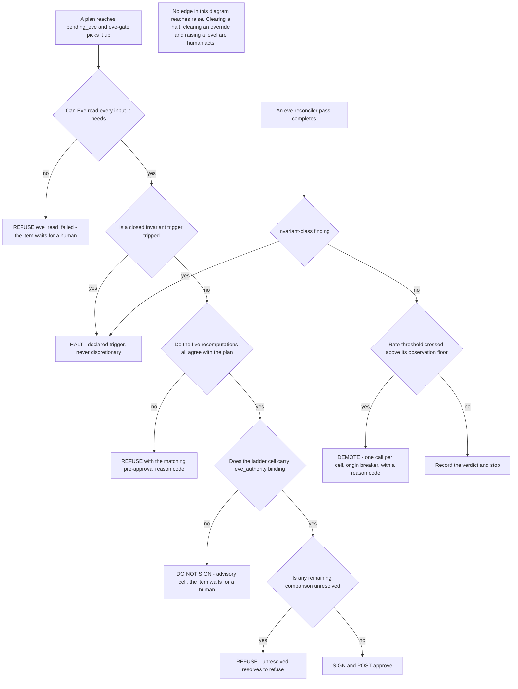

# 6. Failure modes and the limits of independence

## Status
- Owner: the platform owner
- Last reviewed: 2026-09-12

This page states what happens when each part of Eve is wrong, missing or hostile, and what
this design does **not** close. It is the page a security reviewer should read first, and
the page to argue with.

Two sentences carry the whole shape. [08](../wall-e/08-team-eve-mo.md) item 7 requires Eve
to fail closed in every direction — "Eve must never be a thing whose absence lets more
happen" — and this design meets that requirement with mechanisms that live **outside Eve**,
because a component cannot be relied on to notice its own absence. Everything Eve does not
do when it is broken is done by two deterministic sweepers and one passive stamp inside
`walle-actions`, none of which has a code path that raises anything on Eve's return.

The second sentence is the bias, and it is deliberately not the one
[08](../wall-e/08-team-eve-mo.md) item 5 asks for. Item 5's "halting, on its own judgement,
with a documented bias toward halting when uncertain" is void under
[C12](../wall-e/14-hld-challenge.md) — Eve has no judgement, it has thresholds — and a
literal bias toward halting would make a degraded Eve the outage. Two rules replace it, both
rows of `thresholds.yaml`:

- **At the approval point, every unresolved comparison resolves to refuse.** The plan waits
  for a human. That costs an operator an approval and costs the requester minutes.
- **Halting is reserved for the closed invariant-trigger list and is never discretionary.**
  A degraded Eve that halts turns every hiccup into a programme-level outage; a degraded Eve
  that refuses costs an approval.

The amendment is recorded as E-7 in [09-open-decisions.md](09-open-decisions.md) and as an
edit back onto the contract in [08-contract-changes.md](08-contract-changes.md).

## The fail-closed decision tree

Four terminal outcomes, and no edge that reaches "raise". Eve holds no raise path at all —
not in code, not in IAM, not in the contract ([05](../wall-e/05-autonomy-ladder.md) §6:
"Eve — Raise — **Never**").

The gate limb and the reconciler limb are different processes with different identities:
`eve-controller@` runs the gate and holds `roles/cloudkms.signer`; `eve-verifier@` runs the
reconciler and does not. The process that parses attacker-writable strings out of Google's
audit log cannot reach the key. See [02-identity-and-auth.md](02-identity-and-auth.md).

## The failure-mode table

| Scenario | Behaviour |
|---|---|
| **Eve is down** — the job fails, billing lapses, the credential expires, the scheduler stops | Nothing degrades open. Plans sit at `pending_eve` and never fall through. `walle-actions`' own `eve_silence` sweeper sets `no_autonomous` after four business hours, origin `breaker`, with an incident note. Any executed L5 item with no row in `eve.verdict_receipts` after 60 minutes freezes promotions; after four hours that cell drops to L4. The `eve_last_seen` absence alert pages at 15 minutes. **Eve returning clears nothing** — only an operator clears `no_autonomous`. |
| **Eve is degraded but alive** — stale config, BigQuery unreachable, token near expiry | The gate stops signing; it does not halt. Individual plans are refused with `eve_read_failed` or `eve_config_stale`, which costs an operator an approval rather than costing the programme a level. The same four-hour timer still runs, because it keys on missing work rather than on reported health. |
| **Eve is uncertain about one plan** | Ordered rule. Cannot read what is needed → refuse `eve_read_failed`. A read contradicts the plan → refuse `pre_state_mismatch` and raise a ticket. Otherwise sign. Eve never halts on uncertainty about a single plan. |
| **Eve is wrong in the refusing direction** | Items wait and expire; nothing executes wrongly. Approval latency and the disagreement counter rise. Per cell, 30-day rolling, floor of at least 35 paired observations: if the Wilson 95 % lower bound of the false-refusal rate exceeds 0.05, that cell's `eve_authority` drops to advisory automatically, origin `breaker`, reason `false_refusal_rate`. That is a lowering, so a machine may do it. Raising it back is a human decision with a root cause. |
| **Eve is wrong in the approving direction** | Severity 2 under [05](../wall-e/05-autonomy-ladder.md) §9. The family goes to **L0**, not one level down — a wrong autonomous write has a zero error budget. `eve_authority` for that family goes to advisory with `eve_authority_epoch` bumped; `walle-actions` reads the override strongly consistently, records the envelope with `effect: advisory` and returns `approval_required` with `required_from: human`. **Both agents are demoted.** Five business days at the lower level, a written root cause and a fresh decision record before re-raising, per the ratchet in [05](../wall-e/05-autonomy-ladder.md) §6. Detection rests on three things and no others: the hold window, the operator veto, and the blind sample. |
| **Eve is compromised** | Bounded and accepted; the bound, the containment and the residual are in the next section. |
| **`walle-actions` is compromised and lies to Eve** | Five recomputations catch it before signature — the plan hash, the per-item pre-state, the **independent level re-derivation**, the `ceilings_sha` comparison, and the protected/scope checks. The surviving case is a service that shows Eve plan A and executes plan B. It is bounded by the create-only frozen-plan collection and by post-hoc reconciliation against Eve's **own** copy of Google's log, which catches the substitution within one reconciler tick plus admin-event lag — roughly 10–25 minutes — at which point `admin_event_unmatched` or `post_state_mismatch` halts writes. The residual is one batch, detected in under half an hour, on operations reversible by construction. |
| **Eve's signature is invalid, or an approval arrives from an identity not in the operators group** | Denied with `bad_approval` or `approver_is_agent`, a hard invariant; the breaker trips; it pages as an impersonation attempt. The `approvals` row carries `eve_key_version`, so verification survives key destruction against the archived PEM — and the stored signature plus that PEM is the only artefact proving `walle-actions` did not mint the approval itself ([C48](../wall-e/14-hld-challenge.md)). |
| **An operator vetoes a plan Eve approved** | Veto wins, unconditionally. The run is cancelled, both are notified, an incident note is written, and the item enters the blind sample pool at the next draw regardless of rate — a veto is the strongest available signal about Eve's precision. |
| **Google's audit event has not landed** | Never reported as `unverifiable` for lag alone. **Current state is the primary evidence** and is read immediately, so the 60-minute SLA is measured on the state check and is always meetable. The audit event is the *attribution* evidence, on a per-application clock. `Assumption:` lag budgets of 15 minutes for admin events and 3 hours for Groups and Calendar. A verdict at T+60 min is `verified_state_only`, upgraded to `verified` when the event lands on the 6-hour deep pass, and escalated to `reconciliation_gap` only if nothing has landed by T+6 h. A slow log is a wait; a missing event is still caught. |
| **Eve cannot verify a licence change** | Eve's role carries no License Management privilege and `apps.licensing` is dropped ([C13](../wall-e/14-hld-challenge.md)), so F7 is verified from Google-written licence events and recorded `verified_partial` with reason `licence_event_only`. This is a declared, permanent limit on independence for F7 at L4, carried in every F7 attestation. F7 at L4 takes a **20 %** blind sample rather than the standard rate, and any F7 `unverifiable` is a hard stop rather than a budgeted 2 %. If the `isOuScopable` check on licence privileges comes back negative, the honest recommendation is that F7 stays at L3. |
| **A T2 trigger is forged or replayed** | Eve refuses any event-triggered item whose trigger cannot be corroborated against Google's own copy — the BigQuery row by `insertId`, or `activities.list` by a unique qualifier — with `trigger_uncorroborated`, plus `no_autonomous` for that trigger class. This is what stops Eve co-signing a laundered suspension. |
| **Reconciliation finds a gap in either direction** | Halts writes (`no_writes`) until reconciled. Target 100 % audit completeness, computed from **Eve's own** log copy, so deleting `walle_workspace_logs` in Wall-E's project does not silently make the metric perfect. |
| **The control plane is restored from backup** | Eve treats a restore as evidence of nothing. It reads halts, overrides and breaker demotions as `walle_audit` rows, compares Firestore's epochs against the BigQuery high-water mark, and refuses every approval with `control_plane_divergence` while they diverge. A restore never clears the andon cord in Eve's view, and Eve never resumes a plan whose hold window elapsed during an outage — it is expired. |
| **An epoch regresses** | `epoch_regression`, halt writes. Every verdict stamps the epochs it read, so a later query can prove no Eve decision used a stale view. |
| **The Agent Registry card no longer matches Eve's committed URL** | Eve stops its own pass and alerts. It never follows the card. Eve stopping is itself safe, because the sweepers take over within four business hours. |
| **Eve's clock drifts** | Envelope `issued_at` and expiry are checked with a ±120-second tolerance; beyond that the approval is refused as `bad_approval` rather than silently accepted or silently expired. |
| **Eve becomes the noise** | Every page is recorded in `eve.pages`. More than three pages in a week from one reason code raises a ticket titled `threshold suspect: <code>`, and the fix is a pull request against `thresholds.yaml`. An alert that trains its one reader to ignore it is a defect in Eve, and is treated as one. |
| **The sole administrator is on holiday** | `oncall.yaml` declares coverage. See the no-operator window below. |
| **A scheduled query silently inherits a departing human's credentials** | Cannot happen: every transfer config is created with an explicit `--service_account_name`, and CI asserts it. BigQuery scheduled queries otherwise default to the creating user's credentials (verified 2026-09-12, [Scheduling queries](https://docs.cloud.google.com/bigquery/docs/scheduling-queries)), and an evidence series that runs as the person who administers Wall-E is not independent and dies when they leave. |
| **A human bypasses all three agents and uses the Admin console** | Legitimate and expected. Eve sees a human-attributable event and a robot-attributable gap of zero, which is correct; reconciliation is keyed on events attributable to the robot. |
| **All three agents are unavailable** | Nothing happens. That is the correct outcome, and the one the whole design is arranged to make the default. |

## When Eve is compromised

This is the risk the design accepts rather than removes, so it is written out rather than
summarised.

**What the attacker gets.**

- **The safe direction, freely.** Halt and demote. An attacker holding Eve can deny service
  to the programme. This is deliberate: those two authorities exist precisely so that
  something can make less happen, and an attacker using them is indistinguishable from a
  cautious Eve. The cost is an outage a human clears in seconds.
- **Signing, but only inside an existing envelope.** The attacker may sign for cells that
  already carry `eve_authority: binding`, within that level's blast radius, for at most the
  envelope TTL, and still subject to the hold window, any operator's veto, the daily budget,
  the per-principal cooldown, the per-item policy re-run and the per-item pre-state re-read
  performed by `walle-actions`.

**Eve's signature is necessary, never sufficient.** `walle-actions` re-runs its full policy
chain per item after verifying the signature. A signature does not bypass the ceilings, the
protected-principal list, the OU allowlist, the budgets or the invariant checks.

**What the attacker cannot do**, because none of it is reachable from either Eve identity:
raise a level, clear an override, change a ceiling, execute any Workspace operation, read
any Wall-E secret, write to `walle_audit`, alter `thresholds.yaml`, or flip `eve_authority`.
The last three are structural: `thresholds.yaml` and `eve_authority` are human-merged
configuration in repositories neither Eve identity can write to, and Eve has no principal
that can write Wall-E's audit dataset.

**Detection.** More than three Eve-originated demotions in one hour is itself severity 2 and
pages — the same rule [05](../wall-e/05-autonomy-ladder.md) §8 already applies to automatic
demotions. Beyond that, detection of a compromised Eve rests on the blind human sample and
the operator veto, not on Eve.

**Containment, in order:**

1. **Revoke `roles/run.invoker`** on `walle-actions` from `eve-controller@` and
   `eve-verifier@`. Every L4 step then stalls closed — plans stay at `pending_eve`, the
   `eve_silence` sweeper sets `no_autonomous` after four business hours, and nothing
   executes.
2. **Disable the current `eve-approval` key version.** Disable, never destroy: destruction
   inside the 400-day evidence horizon would make past approvals unverifiable. The archived
   PEM still verifies every stored signature.
3. Treat the window as severity 2 and work the ratchet in
   [05](../wall-e/05-autonomy-ladder.md) §6: five business days at the lower level, a written
   root cause, a fresh decision record.

**The named residual.** A compromised Eve can **write false verdict receipts** into
`eve.verdict_receipts` and thereby suppress the `eve_evidence_stale` sweeper, which is the
mechanism that would otherwise drop an unverified L5 cell to L4. Two things follow, and both
are design choices rather than accidents:

- that sweeper is **absence-only** — it checks that a receipt arrived and can never branch on
  what the receipt says, because the authorized view exposes `(run_id, item, verdict_ts)`
  and nothing else; and
- the **blind sample, not Eve, is the precision input** at L4 and L5, per
  [C16](../wall-e/14-hld-challenge.md).

The blind sample is therefore the only real bound on this risk, which is why it starts at
**S1** — before Eve exists — at `max(10 %, 5 items/week)`, graded without sight of any
machine verdict, and why E-13 in [09-open-decisions.md](09-open-decisions.md) makes naming a
second grader a condition of S3 exit rather than an S4 nicety. Keeping the read at all is
E-17, to be re-argued at S4 entry.

## The disagreement threshold

Eve and the human graders will disagree. The rule for what that costs is a single row of
`thresholds.yaml`, and it is asymmetric on purpose, because the two directions have
different prices.

What every consequence below moves is one field: `eve_authority`, per ladder cell, values
`advisory | binding`, **absent reading as advisory**. It is the observe/enforce switch and
the demotion target at once, an override may only ever lower it, and an Eve signature for
an advisory cell is refused by `walle-actions` with the denial reason
`eve_authority_advisory` — which is Wall-E's denial vocabulary, not Eve's
([08-contract-changes.md](08-contract-changes.md) CC-4 and CC-6).

| Direction | Gate | Automatic consequence |
|---|---|---|
| **Eve refuses where a human would have accepted** (false refusal) | Per cell, 30-day rolling window, floor of at least **35 paired observations**. Fires when the **Wilson 95 % lower bound** of the false-refusal rate exceeds **0.05**. | That cell's `eve_authority` drops to `advisory`, origin `breaker`, reason `false_refusal_rate`. Approvals go back to humans; nothing executes that would not have executed anyway. |
| **Eve accepts where a human would have refused** | **No rate gate at all.** The error budget for a wrong autonomous write is zero ([05](../wall-e/05-autonomy-ladder.md) §8). | Severity 2: the family to L0, `eve_authority` to advisory with `eve_authority_epoch` bumped, both agents demoted, root cause and decision record. |
| **Invariant-class disagreement**, either direction | **Exempt from rate gating — one is enough.** | Handled as the invariant it is, not averaged into a rate. It is also a regression finding against the seeded-fault suite in [05-stages.md](05-stages.md), which the S3 exit gate requires at **100 %**, not at a percentage. |

Three reasons for the shape:

- **Wilson, not a point estimate.** At a floor of 35 observations a point estimate swings
  wildly; the design publishes Wilson interval bounds rather than point estimates everywhere
  it reports a rate, including in `eve.findings`. Firing on the *lower* bound means the gate
  fires only when the evidence supports the claim, not when the sample is merely small and
  unlucky.
- **Only the lowering direction is automatic.** Dropping a cell to advisory is a lowering,
  and [05](../wall-e/05-autonomy-ladder.md) §6 lets a machine lower. Restoring `binding`
  is a human decision with a root cause, a pull request and two distinct authenticated
  approving reviewers.
- **Agreement is informational, not a gate.** [C12](../wall-e/14-hld-challenge.md) raised the
  seeded-fault requirement to 100 % and made the agreement rate informational. A 95 %
  agreement rate is not a meaningful gate for a deterministic checker: either it computes the
  predicate correctly or it does not, and the seeded faults are what test that.

The control-plane reason codes `disagreement_rate` and `false_refusal_rate` both map to
demote, never to halt. Nothing about a disagreement rate is an invariant.

## The page budget and the paging conditions

Eve is read by one person. An alert that trains its one reader to ignore it is a defect in
Eve, so Eve's own noise is measured and gated like any other metric: every page is written to
`eve.pages`, `eve-console` shows the page count against budget, and more than three pages in
a week from one reason code raises a ticket titled `threshold suspect: <code>` whose fix is a
pull request against `thresholds.yaml`.

The design declares a page budget and **six** paging conditions; everything else Eve emits is
a ticket or a line in the daily digest. The budget number itself is *tbd* — it is one of the
`thresholds.yaml` numbers E-18 defers to S2 calibration on measured data. Four of the six
conditions are named by this design:

| # | Condition | Owner | Note |
|---|---|---|---|
| 1 | `eve_last_seen` absent for 15 minutes | `walle-actions` / Cloud Monitoring | A Cloud Monitoring **absence** policy on the passively stamped metric, not a threshold on a metric Eve publishes about itself. A threshold-only policy is silent exactly when the metric stops being written (verified 2026-09-12, [Alerting policies in depth](https://docs.cloud.google.com/monitoring/alerts/concepts-indepth)). |
| 2 | An invalid Eve signature, or an approval from an identity not in `walle-operators@` — `bad_approval`, `approver_is_agent` | `walle-actions` | Hard invariant, breaker trips, paged as an impersonation attempt. |
| 3 | More than three Eve-originated demotions in one hour | `eve-reconciler` finding, raised by the ladder | Severity 2. |
| 4 | An Eve approval later overturned | `walle-actions` / operator | Severity 2 in [05](../wall-e/05-autonomy-ladder.md) §9. `Assumption:` a severity 2 pages; the severity table states the automatic response and the follow-up, not the notification channel. |
| 5–6 | *tbd* | — | Fixed with the rest of `thresholds.yaml` at S2 calibration (E-18). Recording the two empty slots is deliberate: a budget with unnamed members is not a budget. |

Everything else — drift findings, `verified_partial` verdicts, deferred-lag re-checks,
ordinary refusals, the daily reconciliation extract — is a ticket or the digest. In
particular, a **refusal is not a page**. The whole point of resolving the unresolved to
refuse is that it costs an approval, and an approval is a queue item, not an interruption.

## The no-operator window

The one thing a solo administrator's controller cannot do is cover a holiday, and this is the
part of the design most likely to be quietly dropped, so it is written as a mechanism.

`oncall.yaml`, in Eve's own configuration repository, declares coverage. Then:

1. **48 hours before an uncovered period**, Eve warns in the daily digest.
2. **At the start of the uncovered period**, Eve sets `no_autonomous` with reason
   `no_operator_window`. Chat-triggered work keeps working for whoever is covering, because a
   human is present in that path by construction; scheduled and event-triggered writes stop.
3. **Only a returning human clears it** — one authenticated call to the control endpoint, no
   decision record, because clearing a halt is not raising a level.

**Halt rather than demote, deliberately.** A demotion above L3 needs two humans to undo
([05](../wall-e/05-autonomy-ladder.md) §6), which a solo administrator returning from holiday
does not have; the programme would stay demoted until a second person could be found. A halt
is reversible by one human in seconds. The blunt instrument is the right one here precisely
because the team is one person — which is also why E-2 and E-13 in
[09-open-decisions.md](09-open-decisions.md) treat a second human as the largest open risk in
the design rather than as an organisational nicety.

## Five named limits on Eve's independence

These are carried in every attestation bundle for an affected cell, and stated here rather
than narrowed away. Each one is a place where an honest reviewer should push.

1. **Eve reads the plan from the service it is checking.** Recomputing the hash, re-reading
   every target with its own credential, re-deriving the effective level from the
   CI-published ladder artefact and its own compiled ceiling table, and corroborating the
   trigger against Google's own log means a lie must be consistent across four surfaces to
   survive. That is a real narrowing, and it is not a closure. It does not close the "shows
   plan A, executes plan B" case, which is bounded at one batch detected in under half an
   hour on reversible operations. Closing it needs a second credential holder or an
   independent plan feed ([decision 29](../wall-e/09-open-decisions.md)), and that should be
   reopened before any `WRITE_HIGH` cell goes to L4.
2. **Google's log proves the robot acted; it never proves who asked**
   ([C43](../wall-e/14-hld-challenge.md)). Human attribution for a T0 chat request rests on
   `walle_audit`, written by the component under audit. IAP access logs and KMS Data Access
   logs recover the L3 and L4 cases — an operator approving through the console, a signature
   request against the key — but the chat case is unrecovered. This is a requirement placed on
   [decision 14](../wall-e/09-open-decisions.md): whichever approval surface wins must emit a
   signed human assertion Eve can verify independently, or the gap is permanent.
3. **F7 licence verification is event-only.** It cannot be made state-aware without a
   write-capable privilege, which is forbidden forever. The consequences are in the
   failure-mode table: `verified_partial`, a 20 % blind sample, `unverifiable` as a hard stop,
   and a recommendation that F7 stays at L3 if licence privileges turn out not to be OU
   scopable.
4. **Eve's predicate is a second implementation, not a second author.** The differential test
   in CI catches divergence between Eve's `expects` predicate and Wall-E's. It does not catch
   both being wrong the same way because both were written from the same typed spec by the
   same person. The only real check on that is the blind human sample, which needs a grader
   who is not the ladder owner.
5. **Eve's independence from Wall-E is structural; its independence from the ladder owner is
   not.** The project boundary, the separate key, the separate credential and the separate
   repository make Wall-E unable to influence Eve. None of them stops the same human writing
   `thresholds.yaml`, approving the pull request that sets `eve_authority: binding`, and
   grading the blind sample. [Decision 37](../wall-e/09-open-decisions.md)'s second reviewer
   and [decision 11](../wall-e/09-open-decisions.md)'s second grader are the load-bearing
   assumptions under every independence claim in this design.

Limits 4 and 5 are the two that a reviewer should weigh hardest, because they are the two
that a well-built Eve cannot fix. They are organisational, and they are open.

## Related pages

- [01-hld.md](01-hld.md) — the structural choices these failure modes follow from, and the
  same five limits stated as "what this design does not close".
- [03-lld.md](03-lld.md) — the five recomputations, the envelope, and the closed reason
  vocabulary each row above cites.
- [04-flows.md](04-flows.md) — the flows whose failure branches these are.
- [05-stages.md](05-stages.md) — the twelve seeded faults and two negative controls, and what
  Eve is trusted with at each stage.
- [09-open-decisions.md](09-open-decisions.md) — E-2, E-5, E-6, E-7, E-13, E-17 and E-18,
  which this page depends on and does not settle. E-5 is the one that owns the two absence
  sweepers and the passive `eve_last_seen` stamp described at the top of this page.
- [../wall-e/08-team-eve-mo.md](../wall-e/08-team-eve-mo.md) — the contract, including item 5
  (amended here) and item 7 (met here).
- [../wall-e/05-autonomy-ladder.md](../wall-e/05-autonomy-ladder.md) §6, §8 and §9 — who may
  lower, the metrics, and the severity table.
