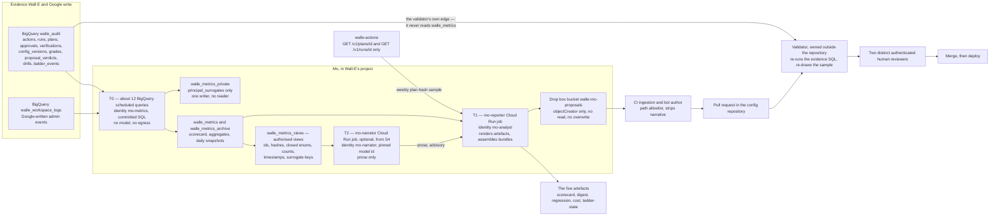

# 1. What Mo is

## Status
- Owner: the platform owner
- Last reviewed: 2026-09-12

## Thesis

Mo is a body of committed SQL, one deterministic Cloud Run job, a bucket and — optionally,
late, and never load-bearing — one model. It is built backwards from five artefacts a human
reads, and its organising property is a single sentence: **every number and every selection
Mo publishes is re-derivable from `walle_audit` alone, and the gate re-derives it rather
than believing it.**

A promotion pull request carries a re-executable evidence block — the metric, the value, the
exact SQL at a pinned commit, the window, the fingerprint, the sample size, the sample seed —
and the external validator, owned outside the configuration repository and unreachable by
Mo, runs that SQL itself against `walle_audit` and refuses the merge if one value differs.
It re-draws the blind grading sample from a seed published after the week closed. That one
decision is what licenses a model in Mo at all: a compromised or hallucinating Mo can write
a persuasive paragraph and cannot produce a false number that survives CI.

The code/model boundary is then made an **IAM boundary** rather than a coding convention.
The identity that reads raw audit rows runs committed SQL inside BigQuery with no network
egress and no model; the identity that carries a model reads only computed aggregates
through authorised views that expose no free-text column. No attacker-writable string ever
reaches a model context, so [06](../wall-e/06-security-guardrails.md) N5's canonicalisation
requirement is satisfied by there being nothing to canonicalise.

Mo holds no credential and no secret of any kind. It drops proposal bundles in a bucket that
CI turns into a pull request under a bot identity that is not Mo, so the one component in
the team that could forge a plausible promotion does not exist. And Mo's absence is made
strictly restrictive: a metrics watermark older than 24 hours makes the validator refuse
every promotion, which is the mirror of Eve failing closed.

## What Mo is not

Four negatives carry more of this design than any of the positives.

- **Mo is not callable.** It serves no REST API, publishes no Pub/Sub event, serves no A2A
  endpoint and no agent card, exposes no MCP server, and is not callable by Wall-E, by Eve
  or by a human through any channel. There is no path by which anything reaches Mo to ask it
  for a decision, which means there is no path by which anything steers one.
- **Mo is not a decider.** Nothing Mo emits is an approval, a signature, a level, a halt, a
  sample or a gate input. Mo can neither raise nor lower a level. The raise path is a human
  merge of a pull request whose numbers a validator reproduced; the lower path belongs to
  Eve, to an operator and to the action service's own breakers, none of which read anything
  Mo writes.
- **Mo is not a credential holder.** No Workspace credential, no Secret Manager grant
  anywhere, no git credential, no key. Its three service accounts are workload identities
  with BigQuery reads and, for one of them, object-create on one bucket.
- **Mo is not mostly a model.** A model appears in exactly one place, from S4, and writes
  prose about numbers it did not compute and inputs it cannot select. Building it is
  optional and it is legitimate never to build it.

## The five artefacts, built backwards

The design starts from what a human reads and ends at the SQL, not the other way round. If
an artefact would not change a decision someone actually takes, the pipeline behind it is
not built.

| Artefact | Path | Schedule and audience | What it carries | Exists from |
|---|---|---|---|---|
| Promotion-readiness scorecard | `platform/wall-e/mo/scorecard.md` | The view is per `as_of_hour`, the snapshot daily, the page regenerated on the weekly reporter run, to the ladder owner | The human face of `walle_metrics.scorecard`, per cell, aggregate only, minimum cell size 5 | S2 |
| Weekly digest | `platform/wall-e/mo/digest-YYYY-Www.md` | Monday 08:00 Europe/Paris, to `walle-operators@` | What changed, what is frozen and why, the grading worklist, plan-hash recomputation results, and the standing footnote that Google's log proves the robot acted and never who asked | S2 |
| Regression explanation | `platform/wall-e/mo/regression-<cell>-<date>.md` | On a change point, to the ladder owner | The fingerprint diff naming every field that moved, before/after values with the Newcombe 95 % difference interval, and prose beside them | S2 |
| Cost report | `platform/wall-e/mo/cost-YYYY-MM.md` | Monthly, into decision 38's stop-or-continue review | Cost per operation and per playbook, infrastructure lines, **human operating hours**, approval burden in hours, the capability-gap demand ranking, and toil saved against operating cost | S1 |
| Ladder state | `platform/wall-e/ladder-state.md` | *tbd* — read at the weekly review, by the ladder owner | Current matrix, active overrides, config version, last drill date, the freshness watermark and a per-cell readiness column. Regenerated **as a pull request**, never pushed | S2 |

[05](../wall-e/05-autonomy-ladder.md) §10 already names `platform/wall-e/ladder-state.md`
and says Mo owns regenerating it once Mo exists; until then it is a scheduled query pasted
in weekly. Nothing in that sentence changes here except that the regeneration arrives as a
pull request rather than a push.

`Assumption:` the artefact paths above are the ones the drop box's path allowlist is written
against and are kept verbatim from the skeleton. This design set itself lives at
`platform/mo/`, beside Eve's, which is a different question from where Mo's generated pages
are published.

A sixth output is not an artefact but a contract: the **proposal bundle**, described field
by field in [04-artefacts-and-proposals.md](04-artefacts-and-proposals.md).

## The three tiers, and the seam between them

Three service accounts, each strictly weaker than the last. The seam between them is an IAM
boundary, not a coding convention, which is the whole reason the boundary is worth anything.

| Tier | Identity | Sees | Carries a model | Can reach |
|---|---|---|---|---|
| **T0 — the metric queries** | `mo-metrics@${PROJECT}.iam.gserviceaccount.com` | Raw `walle_audit` and `walle_workspace_logs` rows, per person | No | BigQuery only. No network egress at all |
| **T1 — `mo-reporter`** | `mo-analyst@${PROJECT}.iam.gserviceaccount.com` | Computed aggregates in `walle_metrics` only — never `walle_audit` | No | BigQuery, two read endpoints on `walle-actions`, one bucket |
| **T2 — `mo-narrator`**, optional | `mo-narrator@${PROJECT}.iam.gserviceaccount.com` | The agent-facing authorised views in `walle_metrics_views` only — ids, hashes, closed enums, counts, timestamps, surrogate keys | Yes, a pinned model id | BigQuery views and the Vertex AI `generateContent` API. Nothing else |

The identity that reads raw per-person rows cannot be prompted, because a BigQuery scheduled
query has no inbound surface and no egress. The identity that carries a model cannot select
a fact it would need to fabricate a number, because the authorised views do not carry one.
The full grant lists, the column allowlist, the surrogate-key scheme and the containment
assertion are in [02-identity-and-access.md](02-identity-and-access.md).

## Components

All in Wall-E's project, `${PROJECT}`, region `europe-west1`, BigQuery location `EU`.

| Component | Runs on | Does | Never does | Exists from |
|---|---|---|---|---|
| **T0 — the metric queries** (`config/metrics/*.sql`) | ~12 BigQuery **scheduled queries** on the BigQuery Data Transfer Service, pinned to a service account with `--service_account_name`. Scheduled at **:07 past the hour**, never on the hour — Google warns that queries "running exactly on the hour (for example, 09:00) might trigger multiple times" ([scheduling queries](https://docs.cloud.google.com/bigquery/docs/scheduling-queries), verified 2026-09-12). Each is a `MERGE` keyed on `(as_of_hour, cell, fingerprint_sha)`, so a double fire is a no-op | Computes every number and every selection: the ten [05](../wall-e/05-autonomy-ladder.md) §8 metrics, the Wilson bounds, the `unsure` rate, dwell, ratchet state, sample counts against the floor, double-grade coverage and agreement, the fingerprint register, the blind-sample draw, the capability-gap ranking, cost, and the `verdict` itself — a SQL `CASE` over those columns. Writes `walle_metrics` and the daily snapshot | Calls no model. Has no network egress — a scheduled query cannot be prompted. Touches no Firestore, no Workspace, no action service, no Secret Manager, no git. Selects no free-text column: `params_redacted`, `result_summary` and error text are excluded by the query text and by CI review | **S0** — this *is* the "Eve v0" step [05](../wall-e/05-autonomy-ladder.md) §8 forbids skipping, and there is no later handover because there is no later replacement |
| **The authorised-view layer** | BigQuery authorised views defined in their **own dataset**, `walle_metrics_views`, over `walle_metrics.scorecard`, and registered on `walle_metrics`'s access list — never on `walle_audit`'s. Google requires the view to sit in "a different dataset than the dataset used in the source query", and a view carries **its own** authorization, so a view authorized on `walle_audit` would be an escalation path rather than a boundary. Verified 2026-09-12: principals "can view the data you share and run queries on it, but they can't access the source dataset directly" ([authorized views](https://docs.cloud.google.com/bigquery/docs/authorized-views)) | Exposes ids, hashes, closed enums, counts, timestamps and **surrogate keys** only. Every string it returns is drawn from a closed vocabulary defined in [03](../wall-e/03-lld.md) | Returns no `params_redacted`, no `result_summary`, no `content_flags` free text, no display name, no group name, no Google error string, no principal email. An attacker-writable string never reaches Mo's rendering or model layer at all | **S1**, when anything other than T0 reads the data |
| **T1 — `mo-reporter`** | Cloud Run **job** in `europe-west1` — a job, not a service: batch-shaped, and a service caps one request at 60 minutes while a job task runs to 168 hours. Triggered by Cloud Scheduler with an **OAuth** token against `run.googleapis.com/…/jobs:run`, a `*.googleapis.com` target. Idempotent on job name plus `X-CloudScheduler-ScheduleTime` | Renders the five artefacts from `walle_metrics`; calls `GET /v1/plans/{id}` and `GET /v1/runs/{id}` on a weekly sample to recompute `plan_hash` under RFC 8785 canonical JSON / SHA-256 and confirm the audit row agrees with the frozen plan; assembles proposal bundles and writes them to the drop box | Never merges, pushes, approves, halts, demotes, vetoes or writes config. Holds **no git credential**. Never calls `/v1/ladder`, `/v1/control/*`, `/approve` or `/veto` — no IAM, no allowlist entry, no code path. No Workspace credential, no Firestore, no Pub/Sub subscription, no `RemoteA2aAgent`, no `McpToolset` | **S1** for the cost report and the S1 stop-or-continue document; the full artefact set at **S2** |
| **The proposal drop box** | Cloud Storage bucket `walle-mo-proposals`, EU, object versioning on, 90-day lifecycle, uniform bucket-level access | Receives one bundle per object — `{diff, evidence_block, decision_record_draft, narrative}`. CI ingests it and opens the pull request as a bot account that is not Mo | Accepts no diff outside the path allowlist `config/ladder.yaml`, `config/playbooks/**`, `config/prompts/**`, `config/catalogue/**`, `platform/wall-e/mo/**`, `platform/wall-e/ladder-state.md`. A bundle touching the ceiling module, the policy chain, the catalogue's risk tiers or the validator is rejected **at ingestion, before CI**, so [05](../wall-e/05-autonomy-ladder.md) §10's "the gate cannot be part of what it gates" is enforced twice | **S2 exit** |
| **The validator's recompute check** | A required CI check in the configuration repository, owned outside it per [05](../wall-e/05-autonomy-ladder.md) §10, run by the validator custodian ([decision 37](../wall-e/09-open-decisions.md)), deployed **by image digest** | Re-executes the evidence block's SQL at its pinned commit against `walle_audit` and refuses the merge if any value differs; re-draws the blind sample from the published seed and refuses if it differs; enforces every §10 gate, the two-distinct-authenticated-reviewer rule, and the ≤ 24 h watermark | Never trusts a number Mo asserts, never reads `walle_metrics`, never accepts prose as evidence — the `narrative` field is **stripped before validation** | **S2 exit**. The §10 ladder gates themselves exist from S0 for Wall-E's own promotions |
| **T2 — `mo-narrator`** (optional) | Cloud Run job calling the Vertex AI `generateContent` API with a pinned model id in `europe-west1`. Deliberately **not** a reasoning engine | Writes the sentences around numbers it did not compute: the regression narrative, the digest's opening paragraph, the framing beside the computed "Why worth it" figure. Swapping the pinned model id is the whole of the model-family comparison [08](../wall-e/08-team-eve-mo.md) invites | Computes nothing, selects nothing, ranks nothing, grades nothing. Its output never enters the evidence block. It cannot see a free-text string, because the views do not carry one | **S4**, and it is legitimate never to build it |
| **The freshness absence alert** | Cloud Monitoring policy on the `walle_metrics` watermark, written as `EVALUATION_MISSING_DATA_ACTIVE` | Pages when Mo stops producing. A threshold-only policy is silent exactly when the metric stops being written | Never depends on Mo publishing its own liveness signal. Never demotes anything | **S1** |
| **`walle_metrics` / `walle_metrics_archive` / `walle_metrics_private` / `walle_metrics_views`** | BigQuery, EU. `walle_metrics` partitioned on `as_of`, expiry matched to the retention floor. `walle_metrics_private` holds the `principal_surrogates` mapping **alone**, with one WRITER and no reader, because dataset-level `READER` on `walle_metrics` would otherwise make every surrogate reversible; `walle_metrics_views` holds the agent-facing views and no tables. `walle_metrics_archive` holds one daily `CREATE SNAPSHOT TABLE … OPTIONS(expiration_timestamp=…)` per day — the citable object a promotion points at | Holds every computed number | Is read by **nothing in Wall-E's enforcement path** — not the action service, the dispatcher, the ladder deploy tool, Eve or the CI gate validator. Carries no email-shaped string and no group-by cell with a count of 1–4 | **S0** |
| **The toil baseline** | `config/metrics/toil_baseline.csv`, committed by humans, loaded into `walle_metrics` by a scheduled query | Four weeks of measured baseline toil for the top three admin tasks, plus monthly human operating hours — the denominator [decision 38](../wall-e/09-open-decisions.md) requires | Is never estimated by Mo, never inferred from audit rows, never edited outside a pull request | **Before Phase 1.** The only part of Mo that must exist before Wall-E does |
| **The blind grading surface** (a dependency, not part of Mo) | Whatever the approval surface turns out to be ([decision 14](../wall-e/09-open-decisions.md)), writing write-ahead to `walle_audit.grades` | Produces the `max(10 %, 5 items/week)` blind sample, graded without seeing Eve's verdict | Never graded by an agent; never by the playbook owner alone for a `WRITE_HIGH` cell | **S2** for shadow and proposal grades; the blind sample from **S3** |

## The shape on one page

The validator's edge runs to `walle_audit`, not to anything Mo wrote. That is the whole
diagram in one line: Mo's numbers are reproduced from the source, never believed.

### The edges that are deliberately absent

Drawn as a table rather than as dashed arrows, because an absent edge is a design decision
with a reason, not a weaker kind of arrow.

| Edge that does not exist | Why not |
|---|---|
| `walle-events` Pub/Sub → Mo | C30/E26/B3. Mo's tightest need is hourly and default-stream writes are queryable immediately, so no duty needs a subscription. The `PS --> MO` edge leaves the map and [08](../wall-e/08-team-eve-mo.md)'s shared-data-plane row is corrected |
| Firestore → Mo | Everything Mo needs is write-ahead in BigQuery per C46. Reading Firestore would put Mo inside the control plane's read surface for no artefact's sake |
| Mo → `GET /v1/ladder` | Mo is not on that allowlist row in [ARCHITECTURE](../wall-e/ARCHITECTURE.md) §7.5, and `ladder.yaml` in git already says what the level should be |
| Mo → `POST /v1/control/*`, `/approve`, `/veto` | No IAM, no allowlist entry, no code path. The action service's per-endpoint allowlist is tested per row |
| Mo → git | Mo holds no git credential. The bucket is the only way out |
| Mo → Workspace | No robot account, no token, no scope, at any stage, ever |
| Mo → Secret Manager | Mo holds no secret of any kind, so there is nothing to read |
| Anything → Mo | Mo exposes no endpoint, no topic, no agent card, no MCP server. Mo being down is an absence, not a signal Mo sends |
| Wall-E's memory → Mo, or a question put to Wall-E about itself | E45/M50. Neither Eve nor Mo reads Wall-E's memory or asks Wall-E about itself |
| Restricted content-log bucket → Mo | Mo is not on [decision 25](../wall-e/09-open-decisions.md)'s reader list |
| `walle_metrics` → any enforcement identity | The containment assertion, tested as a denial-suite row: not the action service, the dispatcher, the ladder deploy tool, Eve, or the CI gate validator |

## What Mo reads

| Surface | What Mo takes from it | Notes |
|---|---|---|
| `walle_audit.actions` | Every metric; the fingerprint register; invalid-parameter rate; hard-invariant denials; cost attribution keys; `capability_gap` rows | Partitioned on `ts`, clustered on `operation`. Every query is written to prune to the window. The column list Mo may key on is M40's, verbatim |
| `walle_audit.runs` | Terminal state and run reliability; `tokens`, `cost`, budget consumed; `trace_id` from the dispatcher's `traceparent` | The direct half of cost, and the join to Model Armor findings |
| `walle_audit.plans` | `plan_hash`, `rollback_hash`, per-item pre-state | Used for the weekly plan/audit agreement check only, never for a metric |
| `walle_audit.approvals` | Approval latency p50; the **per-item accept/reject vector bound to `plan_hash`**; `skipped_by_operator` counts; the approval-burden hours behind "Why worth it" | Batch precision comes from the vector. A whole-plan approval is never counted as N accepts — that is exactly C16's inflation |
| `walle_audit.verifications` | `verified` ÷ executed writes; any `drift`; `unverifiable` rate | |
| `walle_audit.config_versions` | Config drift; the deployed-versus-declared comparison | Dwell and the ratchet come from `ladder_events`, not from here |
| `walle_audit.grades` · `proposal_verdicts` · `drills` | Plan precision, double-grade agreement, drill freshness | **Required new write-ahead tables** per C46/M60/E28. Mo reads no Firestore |
| `walle_audit.ladder_events` | Dwell elapsed, dwell-clock restart, the five-business-day ratchet, two-demotions-in-90-days, more than three demotions in an hour, the E35 false-positive review | **Required new table.** See [08-open-decisions.md](08-open-decisions.md) |
| `walle_workspace_logs` | Audit completeness, through the saved view joining Google's org-level admin events to `walle_audit` requester and approver | Queried from **BigQuery**, never from org-level Cloud Logging, whose `_Default` bucket is fixed at 30 days for organisations |
| The injection regression suite rows in `walle_audit` | Attribution of a detection change to a template, a filter version, a prompt hash, a model id or an ADK version | |
| The linked **Spans** dataset `_AllSpans` and Model Armor sanitize logs | Token spend, tool-call counts and latency per invocation; `MATCH_FOUND` rows with filter name and confidence | Joined on `invocation_id` and, through `runs`, on `trace_id`. The link is created once by a human or CI holding `roles/observability.editor` — never by Mo. **Cloud Trace sinks to BigQuery are deprecated since 2026-02-18 and are not designed around.** Staged to S3 |
| Cloud Billing export | The shared-infrastructure half of cost | Not currently provisioned; a build task. Attributed pro rata by run count and **labelled an allocation, not a measurement** |
| `GET /v1/plans/{id}`, `GET /v1/runs/{id}` on `walle-actions`, as `mo-analyst@` | Weekly sample only: recompute `plan_hash` under RFC 8785 canonical JSON / SHA-256 and confirm the audit row agrees with the frozen plan | **The only two endpoints Mo may call**, and the only thing BigQuery cannot tell Mo. No metric depends on them, so the endpoints being down degrades nothing |
| git, read-only | `config/ladder.yaml`, `config/playbooks/**`, `config/prompts/**`, `config/metrics/**`, `wiki/decisions/**`, `platform/wall-e/incidents/**`, `config/metrics/toil_baseline.csv` | `ladder.yaml` is what the level *should* be |
| Vertex AI `generateContent`, pinned model id | T2 only, prose only | |

## What Mo publishes, and the fact that none of it is callable

The published surfaces are `walle_metrics.scorecard`, the daily
`walle_metrics_archive.scorecard_YYYYMMDD` snapshot, sixteen supporting aggregates — each the
sole source for one figure, ten of them for one of the ten
[05](../wall-e/05-autonomy-ladder.md) §8 metrics —
`walle_metrics.grading_worklist`, the five artefacts above, the
proposal bundle contract, the published blind-sample draw algorithm, and
`config/metrics/gates.yaml`. Each is specified in
[04-artefacts-and-proposals.md](04-artefacts-and-proposals.md), and the arithmetic behind
them in [03-metrics-contract.md](03-metrics-contract.md).

**Nothing callable.** Mo serves no REST API, publishes no Pub/Sub event, serves no A2A
endpoint and no agent card, exposes no MCP server, and is not callable by Wall-E or Eve
through any channel. There is no path by which anything reaches Mo to ask it for a decision.

## The deterministic boundary, and how it is enforced

**The rule, in one sentence:** every number and every selection that can move a level is
computed by committed SQL; the model may only read those numbers and write prose about them.

Code decides all of: the precision ratio and which grades are admissible; the Wilson lower
and upper bounds; the sample floor; the dwell arithmetic; the ratchet clock; the drill
freshness check; every [05](../wall-e/05-autonomy-ladder.md) §8 threshold; blind sample
membership; double-grade coverage and agreement; the fingerprint scoping; cost allocation;
the capability-gap ranking; the suppression rule; and the `ready` / `not_ready` /
`insufficient_data` verdict with its reason array. A model appears in exactly one place, from
S4, and writes prose.

Six mechanisms hold that boundary, in descending order of how much they should be trusted.

1. **The model cannot see the data.** `mo-narrator@` has `dataViewer` on the agent-facing
   views and nothing else. Only `mo-metrics@` — no model, no egress, no interactive caller —
   touches `walle_audit`. A model cannot recompute a metric whose inputs it cannot select.
2. **The model cannot see a free string.** The authorised views return ids, hashes, closed
   enums, counts, timestamps and surrogate keys. M69's canonicalisation requirement is met by
   there being nothing to canonicalise, which is stronger than sanitising on the way past and
   closes the injected-audit-row path into Mo's prose.
3. **The gate recomputes.** The validator re-executes the evidence block's SQL at its pinned
   commit against `walle_audit` and refuses any merge whose numbers differ, and re-draws the
   blind sample from the published seed. Mo's numbers are never believed; they are reproduced.
4. **Evidence is hash-bound.** A bundle must cite a `scorecard_sha256` that `mo-metrics@`
   published and a snapshot that exists. A bundle citing a hash that was never published is
   rejected at ingestion, before the recompute even runs.
5. **Prose is stripped before validation**, and the `narrative` block is rendered into the
   pull-request body under a fixed heading — "Mo's reading — advisory, not evidence; CI
   ignores this block". The reason array is a **set union**, so a model contribution is
   monotone-restrictive: there is a code path to add a `not_ready` reason and none to remove
   one.
6. **CI lints the package.** No import of `skill_registry`, `SkillToolset`, `McpToolset` or
   `RemoteA2aAgent`; `ADK_CAPTURE_MESSAGE_CONTENT_IN_SPANS` absent or false; no
   fault-injection or test-mode path reachable in an admitted image; deploy by digest, never
   a mutable tag; and an import test banning `google.genai`, `vertexai` and `google.adk` from
   T0's and T1's packages specifically.

**The negative form of [decision 34](../wall-e/09-open-decisions.md) is what licenses a model
in Mo at all:** nothing Mo emits is an approval, a signature, a level, a halt, a sample or a
gate input. The moment any artefact of Mo's became load-bearing without recomputation, that
licence would be void — which is why the validator's recompute check is a **precondition for
the first promotion that cites Mo**, not an improvement to add later.

**The one place the split is imperfect, stated rather than hidden.** T1 calls
`GET /v1/plans/{id}`, whose response carries per-item pre-state. The reduction to counts and
the `plan_hash` recomputation happen in T1's own deterministic code before anything could
reach a model, and T2 has no access to that response at all — but that is a process boundary
inside T1, not an IAM boundary.

## The drop box, and why Mo holds no credential

The obvious design gives Mo a git credential — a GitHub App installation, a deploy key — so
it can open its own pull requests. That is the one component whose compromise produces a
plausible promotion pull request, and it contradicts the plain reading of
[08](../wall-e/08-team-eve-mo.md) item 6, "never hold a credential". So it is not built.

Instead `mo-analyst@` holds `roles/storage.objectCreator` on one bucket and writes a bundle
object. CI picks the object up, checks it against the path allowlist, strips `narrative`, and
opens the pull request as a bot account that is not Mo. Three properties follow:

- Mo cannot push, merge, approve or re-open. It cannot even read back what it wrote:
  `roles/storage.objectCreator` "allows users to create objects" and "does not give
  permission to view, delete, or overwrite objects" ([IAM roles for Cloud
  Storage](https://docs.cloud.google.com/storage/docs/access-control/iam-roles), verified
  2026-09-12). A duplicate write therefore **fails** rather than silently replacing a bundle.
- The blast radius of a compromised Mo is bounded by path before CI ever runs: the ceiling
  module, the policy chain, the catalogue's risk tiers and the validator are unreachable from
  the drop box, which is [05](../wall-e/05-autonomy-ladder.md) §10's "the gate cannot be part
  of what it gates" enforced a second time, at ingestion.
- The numbers in a bundle are recomputed by an identity Mo cannot reach, so a forged
  promotion has to be **true** to pass.

The cost of this is one bucket. The residual, stated here and again in
[06-failure-modes.md](06-failure-modes.md), is a truthful-but-tendentious argument that two
tired humans rubber-stamp — [06](../wall-e/06-security-guardrails.md)'s accepted risk,
narrowed from "any change" to "a change whose numbers are true".

## What was deliberately cut, and why

| Cut | Why |
|---|---|
| A Pub/Sub subscription on `walle-events` | C30/E26/B3. Mo's tightest need is hourly; default-stream writes are queryable immediately. The subscription buys latency nothing needs and puts Mo on a push surface |
| Firestore reads | Everything Mo needs is write-ahead in BigQuery per C46. Reading Firestore would put Mo inside the control plane's read surface for no artefact's sake |
| `GET /v1/ladder` | Mo is not on that allowlist row per M72, and git already carries what the level should be |
| A second GCP project and an Agent Runtime reasoning engine for Mo | Real and available in `europe-west1`, and disproportionate. It buys an immutable `identity_type=AGENT_IDENTITY` and a `discoveryengine.serviceAgent` blast-radius problem (M52) that a Cloud Run job calling `generateContent` does not have. Both obligations bind unchanged the moment anyone builds an engine, and that is recorded rather than pre-empted |
| An operator question-answering channel on `streamQuery` | Mo exposes nothing callable. A conversational surface adds a principal-type question (E3) and a Gemini Enterprise conversation-retention question for a convenience |
| A Cloud Run publisher holding a git credential | The drop box removes the credential from Mo entirely at the cost of one bucket. See above |
| A Dataform repository for the metric SQL | [05](../wall-e/05-autonomy-ladder.md) §8 names BigQuery scheduled queries, and they are verified end to end including the service-account pin. Dataform adds a product, a repository region that must match the dataset's processing region, and a service-agent `actAs` relationship, for versioning and assertions that git plus one assertion query already give. Kept as an open decision to revisit if the metric SQL passes ~15 files |
| An **independently written second implementation** of the gate arithmetic in the validator | It catches arithmetic error, which re-running the same SQL cannot. It also doubles the build, and its failure mode — a false block on a legitimate promotion — creates pressure to make the validator agree with Mo, which destroys the independence the whole scheme rests on. Golden fixtures against C18's published constants, the assertion queries and the S2 back-test cover the same ground at a fraction of the cost. The residual is stated in [06-failure-modes.md](06-failure-modes.md) rather than engineered away |

Two things were considered for cutting and kept. `roles/agentregistry.viewer` stays because
M47 binds `strong`, the grant is already built in Phase 13b and it is read-only on a
registry; the scorecard records it as granted-and-unused, and `MO_PRINCIPAL` is **resolved**
to `serviceAccount:mo-analyst@${PROJECT}.iam.gserviceaccount.com` rather than deleted, which
settles [PREREQUISITES](../wall-e/PREREQUISITES.md) items 11 and 13 with no code change. The
linked Spans dataset stays because M38 binds `strong` and names Mo specifically; it is staged
to S3, with the one-off link created by a human holding `roles/observability.editor`, never
by Mo.

## The separation rules, as they apply to Mo

[08](../wall-e/08-team-eve-mo.md) states three rules for the team. Restated here in Mo's
terms, because a rule that is not restated is a rule that is not tested.

| Rule | What it means for Mo | The mechanism, not the promise |
|---|---|---|
| **No agent both decides and acts** | Mo proposes and does neither. It has no write path to Workspace, to Firestore, to configuration or to the ladder | No Workspace credential exists. No git credential exists. The action-service allowlist gives Mo two read endpoints and 403s everything else, tested per row |
| **No agent grades its own work** | Mo does not grade Wall-E's plans — humans do, blind, on a sample Mo cannot choose. Mo does not grade Mo either: the validator reproduces its numbers from a source Mo cannot write | Sample membership is a hash over a seed CI publishes **after the week closes** into an append-only per-week file, and ingestion refuses a bundle citing any other seed. The validator reads `walle_audit`, never `walle_metrics` |
| **Only humans loosen anything** | Mo cannot raise a level, and — unlike Eve — it cannot lower one either. Every raise is a human merge with a dated decision record and two named humans above L3 | Mo emits an object in a bucket. Everything between that object and a deployed configuration is CI, a validator and humans |

Two further constraints from the same document hold unchanged: Mo reads neither Wall-E's
memory nor asks Wall-E questions about itself, and the safety interlocks between agents are
plain authenticated REST rather than agent-to-agent messages — a rule Mo satisfies trivially,
by holding no interlock at all.

One correction to that contract is required and recorded in
[08-open-decisions.md](08-open-decisions.md): [08](../wall-e/08-team-eve-mo.md)'s identities
table and its item 6 say Mo must "never call the action service", while its own interfaces
table and [ARCHITECTURE](../wall-e/ARCHITECTURE.md) §7.5 both list `mo-analyst@` on
`GET /v1/plans/{id}` and `GET /v1/runs/{id}`. The correct statement is **the two read
endpoints only** (C39/E24/M2, decided and not landed).

## Mo proposes; it neither decides nor acts

Mo cannot raise a level. Mo cannot lower a level. It has no halt, no veto, no approval, no
signature and no deploy. The strongest thing it can do is put an object in a bucket that
argues, with reproducible numbers, that a human should change something — and the weakest
thing that stops it is a single human declining to merge.

This does not change with time. There is no version of Mo whose output is not a proposal,
and no stage at which Mo's verdict becomes the gate: at S3 and S4 the thing that gates a
promotion is the validator's recomputation, not Mo's `ready`. **Mo never accumulates
authority with age.** That is deliberate, and it is the trade that pays for the model: the
one agent that may use a model freely is the one whose ceiling never rises.

The mirror of that is Mo's absence. Nothing rises when Mo is down — no bundle can be
assembled, and the validator refuses every promotion whose watermark is older than 24 hours —
and nothing degrades in the other direction, because every [05](../wall-e/05-autonomy-ladder.md)
§8 breach that demotes or halts is enforced by the action service's breakers, by Eve and by
CI, none of which read anything Mo writes. **Mo's absence is strictly more restrictive than
its presence**, which is the same property Eve has, arrived at from the other side.

## Where the rest of this is written

| Document | What it settles |
|---|---|
| [README.md](README.md) | The index, the reading order, and the one-paragraph claim |
| [02-identity-and-access.md](02-identity-and-access.md) | The three identities, their exact grants, the authorised-view column allowlist, the surrogate keys, the containment assertion and its denial-suite row |
| [03-metrics-contract.md](03-metrics-contract.md) | The arithmetic: gates, `gates.yaml`, Wilson and Newcombe, the golden fixtures, the assertion queries, the ten §8 metrics, dwell and the ratchet, grading rules, attribution, freshness |
| [04-artefacts-and-proposals.md](04-artefacts-and-proposals.md) | The five artefacts in detail, the grading chapter, the proposal bundle contract, the closed proposal type set, CI ingestion and the validator's checks |
| [05-staging.md](05-staging.md) | What exists at each stage, Mo's acceptance test, and the cost and effort tables including the weekly human hour |
| [06-failure-modes.md](06-failure-modes.md) | What happens when each piece is wrong, absent or hostile, and the unsoftened residual list |
| [07-build-runbook.md](07-build-runbook.md) | The two new SETUP phases, their commands, verify blocks, rollbacks and denial tests |
| [08-open-decisions.md](08-open-decisions.md) | The open decisions, and the changes Mo forces on Wall-E's set |
