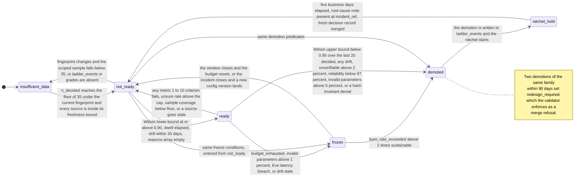

# 3. The metrics contract

## Status
- Owner: the platform owner
- Last reviewed: 2026-09-12
- Scope: the arithmetic Mo computes, in enough detail that the CI validator and an auditor
  read the same thing and get the same numbers. Everything on this page is computed by
  committed SQL in `config/metrics/*.sql`, parameterised by `config/metrics/gates.yaml`, and
  re-executable by anyone holding read on `walle_audit`.
- Companion pages: [README.md](README.md), [01-hld.md](01-hld.md),
  [02-identity-and-access.md](02-identity-and-access.md),
  [04-artefacts-and-proposals.md](04-artefacts-and-proposals.md),
  [05-staging.md](05-staging.md), [06-failure-modes.md](06-failure-modes.md),
  [07-build-runbook.md](07-build-runbook.md), [08-open-decisions.md](08-open-decisions.md).
- Binding upstream: [05-autonomy-ladder.md](../wall-e/05-autonomy-ladder.md) §§6–10,
  [14-hld-challenge.md](../wall-e/14-hld-challenge.md) C15, C16, C17, C18,
  [03-lld.md](../wall-e/03-lld.md) for the closed denial vocabulary and the audit schema, and
  [08-team-eve-mo.md](../wall-e/08-team-eve-mo.md) for the team contract.

---

## 1. The rule this page exists to make checkable

**Every number and every selection that can move a level is computed by committed SQL; a
model may only read those numbers and write prose about them.**

Code decides all of: the precision ratio and which grades are admissible; the Wilson lower
and upper bounds; the sample floor; the dwell arithmetic; the ratchet clock; the drill
freshness check; every [05](../wall-e/05-autonomy-ladder.md) §8 threshold; blind-sample
membership; double-grade coverage and agreement; the fingerprint scoping; cost allocation;
the capability-gap ranking; the suppression rule; and the `ready` / `not_ready` /
`insufficient_data` verdict with its reason array. A model appears in exactly one place, from
S4, and writes prose. That split is enforced as an IAM boundary, not a coding convention —
see [02-identity-and-access.md](02-identity-and-access.md).

The organising property of the whole design applies to every figure defined below: **it is
re-derivable from `walle_audit` alone, and the gate re-derives it rather than believing it.**
A promotion pull request carries the metric, the value, the exact SQL at a pinned commit, the
window, the fingerprint, the sample size and the sample seed; the validator runs that SQL
itself and refuses the merge if one value differs. Mo's numbers are never trusted. They are
reproduced.

Two consequences for how this page must be read:

- Where the design document states a constant, the constant is the **test oracle**. The
  golden fixtures in [§5](#5-golden-fixtures--the-design-document-is-the-test-oracle) are
  hand-computed from [14](../wall-e/14-hld-challenge.md) C18's published values, and CI fails
  if the implementation disagrees with this page. Code drifting from design breaks the build.
- Where a number was chosen rather than measured, it is marked `Assumption:` and carries an
  open decision. Nothing here is a measured organisational fact.

---

## 2. `config/metrics/gates.yaml` — the full parameter list

Every threshold below lives in one committed file so that the validator, an auditor and Mo
read the same numbers, and so that changing a threshold costs a reviewed pull request of its
own. Per M29 and provisional change 13 in [08-open-decisions.md](08-open-decisions.md), a
pull request that touches `gates.yaml` **may not also touch** `config/ladder.yaml`: the
measurement is now part of the gate, so a metric change cannot promote anything in the same
breath.

| Parameter | Value | Source |
|---|---|---|
| `z` | `1.959964` | Two-sided 95 %, fixed so the fixtures reproduce exactly |
| `promote_lower_bound` | `0.90` | [14](../wall-e/14-hld-challenge.md) C18 |
| `demote_upper_bound` | `0.95` | C18 |
| `drop_to_l1_upper_bound` | `0.90` | C18 |
| `graded_floor` | `35` | C18 — the floor and the gate are one decision, not two |
| `unsure_cap` | `0.10` | `Assumption:` — this design chose it. Provisional decision 51 |
| `blind_sample_rate` | `max(10 %, 5 items/week)` | C16 |
| `double_grade_coverage` | `0.20` | C17, `WRITE_HIGH` cells |
| `min_reporting_cell_size` | `5` | `Assumption:` — decision 35 inside decision 8 is unanswered |
| `business_calendar` | `Europe/Paris`, Mon–Fri | `Assumption:` — decision 15. Provisional decision 51 |
| `freshness_bounds` | per source, see [§12](#12-freshness-bounds-and-window-clamping) | This design |
| `retention_floor_days` | *tbd* — decision 17 | Every window is clamped to it; Mo cannot choose the number |

Two things deliberately **not** in `gates.yaml`:

- The **dwell durations and the ratchet length**. Their values are taken verbatim from
  [05](../wall-e/05-autonomy-ladder.md) §6 and reproduced in
  [§9](#9-dwell-the-ratchet-and-the-one-notch-rule). Whether they should live in `gates.yaml`
  or in `config/ladder.yaml` is *tbd*; this contract reads them from §6 and the scorecard
  names the file it read.
- **T2's pinned model id**, which belongs to the narrator's deploy config beside
  `gates.yaml`, never to the gate parameterisation. Provisional decision 49.

---

## 3. The two interval functions

Both are BigQuery UDFs committed beside the metric SQL, covered by the fixtures in
[§5](#5-golden-fixtures--the-design-document-is-the-test-oracle), and used nowhere else.

### 3.1 Wilson score interval

For `x` admissible accepts out of `n` decided items, with `p = x / n` and `z = 1.959964`:

```
centre = (p + z^2 / (2n)) / (1 + z^2 / n)
half   = (z / (1 + z^2 / n)) * sqrt( p * (1 - p) / n + z^2 / (4 * n^2) )

wilson_lower = centre - half
wilson_upper = centre + half
```

The Wilson interval is used rather than the normal approximation because it does not
degenerate at `p = 1`, which is the case that decides every early promotion: a flawless
sample still has a lower bound below 1, and how far below is exactly what C18 turned into a
sample floor.

### 3.2 Newcombe difference interval

Used only for regression attribution — the change in precision either side of a fingerprint
boundary — and never as a gate. With Wilson intervals `(l1, u1)` for the later window and
`(l2, u2)` for the earlier one, and observed proportions `p1`, `p2`:

```
diff        = p1 - p2
diff_lower  = diff - sqrt( (p1 - l1)^2 + (u2 - p2)^2 )
diff_upper  = diff + sqrt( (u1 - p1)^2 + (p2 - l2)^2 )
```

Reported at 95 %. It appears in `agg_regression_attribution` and in the regression artefact,
labelled as an interval on a difference between two observational windows, never as a causal
estimate. See [§11](#11-attribution-the-fingerprint-and-the-scoping-rule).

---

## 4. The gates

[14](../wall-e/14-hld-challenge.md) C18 replaced [05](../wall-e/05-autonomy-ladder.md) §8's
point thresholds with interval gates and hysteresis, because point thresholds on 20–30 items
promote a truly-90 % playbook about one window in five and demote a truly-95 % one about one
window in four — and with the ratchet plus "two demotions in 90 days force a redesign", noise
alone would push good playbooks into redesign.

| Rule | Form |
|---|---|
| Promote | Wilson 95 % **lower** bound of plan precision at or above `0.90` |
| Demote one level | Wilson 95 % **upper** bound below `0.95` over the last 20 decided — 3 or more wrong |
| Drop to L1 | Wilson 95 % **upper** bound below `0.90` — 5 or more wrong in 20 |
| Precision denominator | `accept / (accept + reject)`. `unsure` is **excluded** from the ratio and reported separately, capped at `0.10` (`Assumption:`); above the cap the cell is `not_ready` regardless of precision |
| Sample floor | `n_decided >= 35`, enforced in the verdict **and** in an assertion query that fails the run if a `ready` row with `n_decided < 35` is ever written |
| Hysteresis | The band between `0.90` and `0.95`, plus the ratchet in [§9](#9-dwell-the-ratchet-and-the-one-notch-rule) |

**The floor and the gate are one decision.** At `n = 30` even a flawless record gives a
Wilson lower bound of `0.8865`, below `0.90` — so adopting the interval gate without moving
the floor would make no cell promotable at all, while the ratchet still fired. `35` is the
smallest perfect sample that clears `0.90`; a sample admitting even one wrong item does not
clear it until `53`. Whoever sets the gate at `0.90` is also choosing how long a family must
run before it can ever be promoted, which is why both numbers sit in the same file and move
in the same pull request.

**`unsure` is excluded, not counted wrong.** [04](../wall-e/04-flows.md) Flow B counted
`unsure` as wrong, which turns grader hesitation into demotion pressure. It is excluded from
the ratio, reported as `unsure_rate`, and capped: a cell that cannot make up its mind about
more than a tenth of its items is not ready, and that is stated as its own reason rather than
smuggled into precision.

---

## 5. Golden fixtures — the design document is the test oracle

Hand-computed from the constants [14](../wall-e/14-hld-challenge.md) C18 published, and
re-derived independently during the judging of this design. CI fails if any implementation
value differs. This is the only control that bites on the failure the validator structurally
cannot catch — the validator re-runs the same committed SQL and would inherit the same
arithmetic defect.

| Case | Bound | Expected | Consequence |
|---|---|---|---|
| 30/30 | lower | `0.8865` | below `0.90` — not promotable, which is why the floor moved |
| 35/35 | lower | `0.9011` | the smallest perfect sample that promotes |
| 39/40 | lower | `0.8712` | one wrong at `n = 40` does not promote |
| 52/53 | lower | `0.9006` | the smallest sample admitting one wrong that promotes |
| 18/20, 2 wrong | upper | `0.9721` | does **not** demote |
| 17/20, 3 wrong | upper | `0.9476` | demotes one level |
| 16/20, 4 wrong | upper | `0.9193` | does **not** drop to L1 |
| 15/20, 5 wrong | upper | `0.8881` | drops to L1 |

Also fixtured, because the verdict and the arithmetic are separate code paths and both can be
wrong:

- a synthetic cell at **34/34** must report `not_ready` with reason `sample_below_floor`;
- the same cell at **35/35** must report `ready`;
- a cell with **three wrong in its last twenty** must report a demote verdict.

These three are criterion 4 of Mo's acceptance test in [05-staging.md](05-staging.md).

---

## 6. Assertion queries

Invariants that hold regardless of whether the arithmetic is right. They run after every
scheduled query; a failure pages and freezes promotions. They are the second of the four
controls on Mo's own arithmetic, and the only one that keeps working when the fixtures and
the SQL share a misunderstanding.

| # | Assertion | What it catches |
|---|---|---|
| A1 | `n_decided + n_unsure = n_graded` for every cell | A grade silently dropped by a join, or `unsure` double-counted |
| A2 | `precision` is within `[0, 1]` | A denominator of zero, or accepts leaking in from another window |
| A3 | No row with `verdict = ready` and `n_decided < 35` | The floor being bypassed in the verdict `CASE` |
| A4 | No row with `verdict = ready` and dwell unsatisfied, or a drill older than 30 days | The two gates that live outside the precision arithmetic |
| A5 | Every `grades` row joins to an `actions` row | Grades for items that never ran — a fabricated or mis-keyed sample |
| A6 | A batch approval never contributes more accepts than its per-item vector has entries | C16's inflation, reintroduced by a join |
| A7 | No published row carries an email-shaped string | The suppression rule, [§14](#14-the-suppression-rule) |
| A8 | No published group-by cell has a count between 1 and 4 | Re-identification by small cell |

A1–A6 are correctness assertions; A7 and A8 are disclosure assertions and are the mechanism
behind [§14](#14-the-suppression-rule). All eight are failures of the run, not warnings: a
metrics run that cannot assert its own output does not publish it, and the watermark then
ages, which is itself restrictive — see [06-failure-modes.md](06-failure-modes.md).

---

## 7. The ten metrics the ladder is argued from

Thirty-day rolling window, evaluated hourly, clamped to the retention floor. Definitions and
thresholds are [05](../wall-e/05-autonomy-ladder.md) §8's, reproduced here with the exact
form Mo computes and the aggregate view that is the sole source for each. Where this page
says something §8 does not, it is called out in the last column.

| # | Metric | How Mo computes it | Target | Breach → | Sole source |
|---|---|---|---|---|---|
| 1 | **Hard-invariant denials** | Count of `actions` rows whose `denial_reason` is one of the ten invariant codes in [03](../wall-e/03-lld.md), from **autonomous** runs only, with `protected_principal` arising from a **human chat request** excluded | **0** | Any one: family to L0 synchronously, incident | `agg_invariant_denials` |
| 2 | **Plan precision** | `accept / (accept + reject)` over admissible grades scoped to the current fingerprint, with the Wilson bounds of [§4](#4-the-gates) | Wilson lower at or above `0.90` to promote | Upper below `0.95` over the last 20 decided: one level down. Upper below `0.90`: L1 | `agg_precision_cell` |
| 3 | **Verification success** | `verified / executed writes` from `verifications` | ≥ 99.5 % | Any `drift`: one level down **plus an incident**. `unverifiable` above 2 %: one level down | `agg_verification_cell` |
| 4 | **Breaker trips** | Distinct `error_class` values within a run, **excluding no-ops** | — | 2 or more distinct classes aborts the run. More than 3 automatic demotions in an hour is itself **severity 2**, counted from `ladder_events` | `agg_breaker_trips` |
| 5 | **Invalid parameters** | Share of autonomous steps denied `invalid_parameters` | < 1 % | Above 1 %: promotions frozen. Above 5 %: one level down | `agg_invalid_params_cell` |
| 6 | **Run reliability** | Runs reaching a terminal state within budget, from `runs` | ≥ 99 % | Below 97 %: `no_autonomous` for that playbook | `agg_reliability_playbook` |
| 7 | **Eve post-hoc latency** | p99 time from an L5 write to Eve's independent verification | ≤ 60 min p99 | Breach: promotions frozen. Above 4 h: L5 cells drop to L4 | `agg_eve_latency` |
| 8 | **Approval latency** | p50 human time-to-verdict, in **business hours** on the `Europe/Paris` calendar | p50 < 4 business hours | **Blocks stage exit.** Excluded from every promotion and demotion predicate | `agg_approval_latency` |
| 9 | **Audit completeness** | Workspace admin-audit events by the robot, from `walle_workspace_logs`, with a matching `walle_audit` row | 100 % | Below 100 %: halt writes until reconciled | `agg_audit_completeness` |
| 10 | **Drill freshness** | Days since the last kill-switch drill, from the write-ahead `drills` table | ≤ 30 days | Stale: CI refuses **every** promotion | `agg_drill_freshness` |

Those ten `agg_*` views are ten of the **sixteen** supporting aggregates. The other six carry
figures that are reported but never gate, and each is likewise the sole source for one thing:
`agg_sample_coverage` ([§13.3](#133-coverage-is-itself-a-metric)),
`agg_regression_attribution` ([§11.3](#113-what-attribution-may-and-may-not-say)),
`agg_cost_operation` and `agg_cost_playbook` (the cost report's two cost axes),
`agg_value_toil` (toil saved against the committed baseline) and `agg_capability_gap` (the
demand ranking, empty until the `capability_gap` enum lands — change 7). The twelve metric
queries of [07-build-runbook.md](07-build-runbook.md) Phase Mo-4 populate these sixteen; the
`scorecard` `MERGE` reads them and computes no aggregate of its own.

Notes the implementation must carry, each of which is a place where a plain reading of §8
would produce the wrong number:

- **Metric 1's closed list is exactly ten codes** — `operation_not_allowed`,
  `protected_principal`, `protection_incomplete`, `bad_approval`, `approval_already_used`,
  `approver_is_agent`, `level_bypass`, `control_plane_unavailable`, `selection_not_declared`,
  `ou_destination_not_allowed` — taken from [03](../wall-e/03-lld.md)'s denial vocabulary and
  nowhere else. `protected_principal` from human chat is the control working correctly, is an
  audit row and nothing else, and counting it would halt the programme for asking a question.
- **Metric 4 needs a column that does not exist.** [05](../wall-e/05-autonomy-ladder.md) §8
  says an operation whose desired state already held is a no-op, "recorded and excluded", and
  no column records it. Until `actions.noop BOOL NOT NULL` lands — change 4 in
  [08-open-decisions.md](08-open-decisions.md) — breaker-trip counts carry
  `noop_exclusion_unavailable` and are used in **no verdict**. `error_class` is the wrong home
  for it: a no-op is not an error.
- **Metric 7 is not computable before S4**, because Eve does not verify before then. It
  reports `not_applicable` in every earlier stage and is **never** reported as passing. A
  metric that reads green because its subject does not exist is worse than a blank.
- **Metric 8 never demotes and never promotes.** It measures how long humans took, which is a
  fact about the rota, not about Wall-E's judgement. It blocks stage exit, appears in the
  digest and in the cost report as **waiting time, not effort**, and is absent from the
  scorecard's reason array by construction.
- **Metric 9 is queried from BigQuery**, through the saved view joining Google's org-level
  admin events to `walle_audit` requester and approver — never from org-level Cloud Logging,
  whose `_Default` bucket is fixed at 30 days for organisations. It also carries the standing
  footnote that Google's log proves the robot acted and never who asked
  ([14](../wall-e/14-hld-challenge.md) C43): the human attribution comes from Wall-E's own
  rows, and that half is not independently checkable.

---

## 8. Error-budget semantics

**A wrong autonomous write is an incident and a demotion with zero budget, never
consumption.** There is no allowance to spend. The three metrics that behave like classic
error budgets are precision, verification and reliability, and their states are computed
columns on the scorecard rather than prose in a review:

| State | Condition | Effect |
|---|---|---|
| `budget_exhausted` | The window's allowance for precision, verification or reliability is spent | Promotions frozen for the **rest of the window**; the cell reports `not_ready` |
| `burn_rate_exceeded` | Burn rate above **2×** the sustainable rate for the window | **One level down** |
| `redesign_required` | `demotions_90d >= 2` on the same family | The scorecard reports it and the validator enforces it as a **merge refusal**: the playbook is redesigned before re-entry |

`redesign_required` is the one error-budget state the validator acts on directly, because it
is a fact about `ladder_events` rows rather than about an arithmetic result, and because
[14](../wall-e/14-hld-challenge.md) C18's whole argument is that noise must not be allowed to
push a good playbook into redesign — so the count that triggers it has to be auditable from
rows anyone can re-read.

---

## 9. Dwell, the ratchet and the one-notch rule

All three are computed from `walle_audit.ladder_events`, a table that does not exist yet.
Until it does, the dwell column reads `not_computable` and **no cell is reported ready** —
see [06-failure-modes.md](06-failure-modes.md) and change 2 in
[08-open-decisions.md](08-open-decisions.md). Automatic demotions deliberately write no
decision file and `config_versions` is not stated to gain a row for them, so there is no
other source.

### 9.1 Dwell

| Transition | Minimum dwell |
|---|---|
| L1 → L2 | 2 weeks |
| L2 → L3 | 2 weeks |
| L3 → L4 | 4 weeks |
| L4 → L5 | 6 weeks |

### 9.2 The stricter reading, and why

[05](../wall-e/05-autonomy-ladder.md) §6 says the dwell clock restarts after any demotion **of
that family**. [05](../wall-e/05-autonomy-ladder.md) §3 and R3 say each trigger class climbs
**independently**. The two pull apart when a family is demoted on one trigger while another
trigger's clock is running: §6 read literally restarts both, R3 read literally restarts
neither but the demoted one.

**This design takes the stricter reading: a demotion on any trigger restarts dwell for the
family on every trigger**, and the scorecard names the `ladder_events` row that reset the
clock, so the decision is visible rather than inferred. The reason is that the thing a
demotion tells you about is the *playbook and its platform*, which the trigger classes share;
the independence in R3 is about how autonomy is earned, not about how evidence of a defect is
scoped. The cost of being wrong in this direction is a slower promotion. The cost of being
wrong in the other is a cell that climbs on a trigger while the same code is failing on
another.

### 9.3 The ratchet

After **any automatic demotion**, all three of the following before re-raising:

1. **Five business days** at the lower level, on the `Europe/Paris` calendar in
   `gates.yaml`.
2. A **root-cause incident note that exists in git** at the path
   `ladder_events.incident_ref` names — the validator checks the file is there, not that it is
   good.
3. A **fresh decision record**.

**There is no false-positive exception.** A demotion later judged false does not shorten the
hold and is not silently absorbed: it sets `review_verdict = false_positive` with a named
reviewer and a `review_ref`, and Mo publishes a **breaker false-positive rate** from those
rows. When that rate rises, the finding is about Eve or about the metric, and Mo's pull
request targets the **metric definition** or opens an Eve finding — never the ladder. That is
the whole of E35's review path, and it is why the review verdict is a column rather than a
conversation.

### 9.4 One notch

- Above L3: **one notch at a time**, with minimum dwell at each level. No skipping.
- At or below L3: a level may be skipped **only** when the scorecard cites the covering
  evidence from another trigger class, by fingerprint and sample size. L1 and L2 never
  execute, so skipping them risks nothing — but the citation is what makes that claim
  checkable.
- **A new operation enters at L0 whatever the stage.** "We are at S4, so the new thing is
  autonomous" has no code path.

---

## 10. Grading rules

Grades are the only human-produced input to the whole contract, and the only one Mo cannot
reconstruct if it is missing. They arrive write-ahead in `walle_audit.grades` from the
approval surface; Mo reads no Firestore.

| Rule | Form | Why |
|---|---|---|
| Grader identity | The grader must appear on a **committed list of human principals** | An agent grading Wall-E's work breaks [08](../wall-e/08-team-eve-mo.md) rule 2 |
| Non-human grade | **Excluded and counted** in `grades_excluded`, with the reason | Silent exclusion is indistinguishable from a missing grade |
| Self-grading | A grade from the **author of the playbook version under test** is excluded and counted | C17: rule 2 was applied only to agents; this is its human counterpart |
| Blindness | Grades with `blind = FALSE` or `saw_eve_verdict = TRUE` are **excluded from L4/L5 precision** and counted | Unblinding makes a cell **less** promotable, never more — the incentive has to point that way |
| Double-grading | For a `WRITE_HIGH` cell, the second grade must come from someone other than the `owner:` recorded in the playbook file, at **≥ 20 % coverage** | C17 |
| Below coverage | The cell reports `no_second_grader` and **can never pass L2** — reported from **S0** | The block is visible for months before it bites, rather than discovered at S3 |
| Disagreement | Where two grades disagree and **no adjudication row exists, the item counts as wrong** | Otherwise double-grading becomes a rubber stamp: the cheapest way to clear a disagreement would be to ignore it |
| Agreement reporting | Raw agreement **and Gwet's AC1** are reported and may be cited. **Cohen's κ is reported and never gated on** | At a base rate near 95 %, κ collapses towards zero on samples that are in fact excellent, and gating on it would demote good playbooks |

`grades_excluded` carries a count **and a reason breakdown** on every scorecard row. A cell
whose sample is mostly exclusions is not a cell with a small sample; it is a cell with a
broken grading process, and the two must be distinguishable at a glance.

**The second grader does not exist yet.** C17 makes 20 % blind double-grading a condition for
a `WRITE_HIGH` cell to pass **L2**, which happens at S2, while decision 11b puts the second
person at S3. Mo cannot supply a person; it reports `no_second_grader` from S0 and surfaces
the conflict rather than resolving it. Provisional decision 45 in
[08-open-decisions.md](08-open-decisions.md).

---

## 11. Attribution: the fingerprint and the scoping rule

### 11.1 The fingerprint

`fingerprint_sha` is computed over the full tuple:

| Field | On the `actions` row today |
|---|---|
| `playbook_version` | yes |
| `selection_hash` | **no** — change 5 |
| `prompt_hash` | yes |
| `model_id` | yes |
| `catalogue_version` | yes |
| `adk_version` | **no** — change 5 |
| `ma_filter_version` (Model Armor filter version) | **no** — change 5 |
| `engine_resource` | **no** — change 5 |
| `ceilings_sha` | yes |
| `config_version` | yes |

Six of the ten are on the row today. Until the other four land, `fingerprint_sha` is computed
over the available subset and the scorecard labels attribution `partial_fingerprint`, so no
promotion can quietly cite evidence whose platform boundary was never recorded.

Where `model_id` is empty because a T1/T2 playbook runs deterministically
([decision 32](../wall-e/09-open-decisions.md)), the field is recorded as the string `none`
rather than `NULL`, attribution falls back to `playbook_version` and `selection_hash`, and the
scorecard says so. `NULL` would silently merge deterministic and model-driven runs into one
cell.

### 11.2 The scoping rule

**The promotion sample is scoped to the current fingerprint.** Evidence earned under a
different one does not count. This closes C15's gaming path — prove 95 % on a narrow
selection, then widen the selection and keep the level — at the **measurement layer** rather
than only at CI, which means it holds even for a change CI did not classify as material.

It is correct and it is brutal. When the fingerprint moves, the sample resets, `n` falls below
35, and the scorecard reports `not_ready` with a reason naming the old fingerprint, the new
one and the surviving sample size. At a realistic prompt- and model-change cadence this can
make L4 unreachable in practice. That is an honest answer rather than a defect, and it forces
a decision the set has not taken, so **Mo publishes both counts from S2**: the strict count,
and the count under a proposed *material* subset of the tuple — `selection_hash`,
`prompt_hash`, `model_id`. The choice is then made on data rather than on frustration.
Provisional decision 43; the default is **strict**, because that is what C15 binds, and a
coarser subset needs its own decision record and the security reviewer.

### 11.3 What attribution may and may not say

- The unit of change is **the whole tuple**. The regression artefact names exactly which
  fields moved together.
- The difference in precision across the boundary is reported with the **Newcombe 95 %
  interval** of [§3.2](#32-newcombe-difference-interval).
- The wording is **"coincides with"**, never "caused by". Deploys are not randomised, nothing
  is controlled, and several fields usually move at once.
- With **fewer than 12 decided items on either side**, it reports `insufficient_data` and
  nothing else.
- **Attribution never gates.** No promotion, demotion, freeze or verdict reads it. It exists
  to tell a human where to look.

---

## 12. Freshness bounds and window clamping

Each cell carries `max_ts_seen` **per source**, and each source has its own bound, because
they have genuinely different lags.

| Source | Breach bound | Basis |
|---|---|---|
| `walle_audit.actions` | older than **2 h** | Default-stream writes are queryable immediately; 2 h means the pipeline stopped |
| Workspace admin events | older than **6 h** | Google documents admin-log lag as a couple of minutes and group events as tens of minutes up to a couple of hours; 6 h is beyond the documented worst case |
| `walle_audit.grades` | older than **7 days** | The grading cycle is weekly |
| Billing export | older than **48 h** | Cost is a reporting input, not a gate |

Any breach sets `stale_evidence` and the cell is `not_ready`. A stale source never produces a
stale *pass*: the direction of failure is always restrictive.

**Window clamping.** Every window is clamped to the effective retention floor read from
`gates.yaml`, and **a clamped window is flagged rather than reported as if it were full**. A
30-day metric computed over 11 surviving days is a different number with the same name, and
the scorecard says which it is. This is also what makes a teardown-and-recreate of
`walle_audit` loud instead of quiet: the window discontinuity is flagged and every cell falls
below the floor at once. Mo does not solve evidence durability — decision 31's off-project
copy does — but Mo refuses to paper over it.

---

## 13. The blind sample and the seed protocol

The blind sampled review is `max(10 %, 5 items/week)` of executing items and is the **only**
admissible input to precision at L4 and L5. Its integrity rests entirely on nobody being able
to choose or anticipate which items are reviewed.

### 13.1 The draw, published

Order the executed items in the cell for that week and take the first
`max(10 %, 5 items/week)` of them:

```
ORDER BY FARM_FINGERPRINT(CONCAT(week_seed, cell, run_id, CAST(item_index AS STRING)))
LIMIT  GREATEST(CEIL(0.10 * n), 5)
```

`GREATEST` is the BigQuery spelling of the `max(CEIL(0.10 * n), 5)` in `gates.yaml`'s
`blind_sample_rate`. [04-artefacts-and-proposals.md](04-artefacts-and-proposals.md) §2.2
carries the identical two lines; the validator's re-draw executes them unchanged.

### 13.2 The seed protocol

- `week_seed` is generated and committed by **CI, after the week has closed**.
- It is therefore unknown at plan-freeze time, so no run can be shaped around whether it will
  be reviewed.
- **Nobody chooses the draw — including Mo.** Mo computes it; it does not select it.
- The validator **re-draws the sample from the published seed** and refuses the merge if the
  membership differs from the evidence block. An auditor can re-draw it years later from the
  seed, the SQL and the archived snapshot.

**Unresolved: Eve's set claims the draw as well.**
[`../eve/04-flows.md`](../eve/04-flows.md) flow 7 has `eve-reconciler` draw the sample
**daily**, as `eve-verifier@`, from S3 entry, with a human grading in `eve-console`;
[`../eve/05-stages.md`](../eve/05-stages.md) starts the blind sampled review at **S1**. This
page has T0 compute a **weekly** draw from a seed CI publishes after the week closes, with
the blind sample from **S3** ([05-staging.md](05-staging.md)), and with nobody — Eve, Mo or a
human — choosing it. The two are not variants of one rule: a daily draw by an enforcing
identity is choosable by that identity, which is the property this design spends the seed
protocol to remove, and it would make Eve a partial author of the evidence Eve is later
graded against. The conflict is named here rather than resolved, because resolving it changes
Eve's flows and Eve's stage table, which are not this set's to edit. Until it is settled in a
dated decision record, the draw in this contract is the one the validator re-executes, and
any Eve-drawn sample is a different sample with a different name.

### 13.3 Coverage is itself a metric

Achieved coverage against `max(10 %, 5 items/week)` is a first-class column. A miss sets
`sample_coverage_below_floor` and the cell is `not_ready`. This is the control on the quiet
failure that would otherwise be invisible: a team under time pressure grading five items
instead of twenty and the numbers still looking fine because the denominator shrank with the
numerator.

The honest cost, stated here because it belongs beside the rule that creates it: at an S4
volume of roughly 200 executing items a week, this is ~20 items to grade, plus ~4
double-graded for `WRITE_HIGH`, plus adjudication — on the order of **one hour a week,
indefinitely, from a named human who is not the playbook owner**, plus a second grader who
does not yet exist. It cannot be automated, cannot be sampled more thinly without the cell
going `not_ready`, and cannot be delegated to a model without destroying the thing it
measures.

---

## 14. The suppression rule

Mo's published artefacts have a **wider reader set than `walle_audit`**, which is why
suppression is a mechanism here and not a promise.

- **Minimum reporting cell size 5** (`Assumption:`, decision 35). No published group-by cell
  may have a count between 1 and 4; assertion A8 fails the run if one is written.
- **No email-shaped string** in any published row; assertion A7 fails the run if one appears.
- The agent-facing authorised views return **ids, hashes, closed enums, counts, timestamps and
  surrogate keys** only — never `params_redacted`, `result_summary`, `content_flags` free
  text, a display name, a group name, a Google error string or a principal email.
- Recurrence of a subject is preserved by **surrogate keys** (`principal_surrogates`, a
  monotone integer per distinct principal) rather than by omitting the column, so "the same
  subject recurs" survives while identity does not.
- The grading worklist names `run_id#item_index` and family only — opaque ids, which is also
  what keeps the sample blind.

**Mo is nonetheless inside the personal-data perimeter.** T0 reads per-person rows, and Mo
belongs in the data-protection assessment as a processor.
[ARCHITECTURE](../wall-e/ARCHITECTURE.md) weakness 11's claim that Mo's reads are aggregated
per organisational unit is **wrong at the pipeline layer and should be corrected rather than
inherited**. Provisional decisions 44 and change 11 in
[08-open-decisions.md](08-open-decisions.md).

---

## 15. The readiness state machine

One cell — one `(family, trigger, fingerprint_sha)` — moves through exactly these states. Every
transition is a computed `CASE` over the columns defined above, and the label names the rule
that fires it.



`ready` is a statement about evidence, never an action. Nothing in Wall-E's enforcement path
reads this column: the action service's breakers, Eve and CI enforce every §8 breach that
demotes or halts, and none of them reads anything Mo writes. Promotion still requires a human
to open a pull request, the validator to recompute the numbers, and two distinct
authenticated reviewers at L4 and L5.

---

## 16. The `scorecard` row

One row per `(family, trigger, fingerprint_sha, as_of_hour)` in `walle_metrics.scorecard`,
snapshotted daily into `walle_metrics_archive.scorecard_YYYYMMDD` — the dated, citable object
a decision file points at and an auditor replays against.

`Assumption:` the BigQuery types below, and the value enumerations given for `ratchet_state`
and `error_budget_state`, are this page's rendering of columns the design names without
enumerating; the **column list** is the contract. Only `reasons ARRAY<STRING>` and its closed
enum come from the design itself.

| Column | Type | Meaning |
|---|---|---|
| `as_of` | `DATE` | **The partitioning column** of every table in `walle_metrics`, including this one. The day `as_of_hour` falls in |
| `as_of_hour` | `TIMESTAMP` | The hour the row was computed for; the `MERGE` key with `cell` and `fingerprint_sha` |
| `family`, `trigger` | `STRING` | The cell, per R1 |
| `fingerprint_sha` | `STRING` | [§11.1](#111-the-fingerprint); `partial_fingerprint` flag if the four missing columns have not landed |
| `current_level`, `target_level` | `STRING` | Deployed level from `ladder_events`; what `ladder.yaml` says it should be |
| `dwell_elapsed`, `dwell_required` | `INTERVAL` | [§9.1](#91-dwell); `not_computable` until `ladder_events` exists |
| `dwell_satisfied` | `BOOL` | `dwell_elapsed >= dwell_required`. The column assertion A4 reads, so the gate is one named field rather than a re-derivation |
| `dwell_reset_event` | `STRING` | The `ladder_events` row that restarted the clock, per the stricter reading |
| `days_since_last_demotion` | `INT64` | Feeds the ratchet and `demotions_90d` |
| `ratchet_state` | `STRING` | `clear` / `hold` / `hold_missing_incident_note` |
| One column per §8 criterion | mixed | Each carries **measured value, threshold and pass/fail** — never a bare boolean |
| `n_graded`, `n_decided`, `n_unsure` | `INT64` | A1 asserts `n_decided + n_unsure = n_graded` |
| `unsure_rate` | `FLOAT64` | Reported separately; above `0.10` the cell is `not_ready` |
| `precision_ratio` | `FLOAT64` | `accept / (accept + reject)` over admissible grades, [§4](#4-the-gates). Assertion A2 bounds it to `[0, 1]` |
| `wilson_lower`, `wilson_upper` | `FLOAT64` | [§3.1](#31-wilson-score-interval) |
| `drill_age_days` | `INT64` | Days since the last kill-switch drill, metric 10. Assertion A4 reads it |
| `cell_count` | `INT64` | The number of distinct subjects behind the row. Assertion A8 fails the run if it is between 1 and 4 — [§14](#14-the-suppression-rule) |
| `sample_coverage_achieved`, `sample_coverage_required` | `FLOAT64` | [§13.3](#133-coverage-is-itself-a-metric) |
| `double_grade_coverage`, `raw_agreement`, `gwet_ac1`, `cohen_kappa` | `FLOAT64` | κ is reported and never gated |
| `grades_excluded` | `INT64` + reason breakdown | [§10](#10-grading-rules) |
| `error_budget_state` | `STRING` | `ok` / `budget_exhausted` / `burn_rate_exceeded` / `redesign_required` |
| `freeze_state` | `STRING` | Whether promotions are frozen and why |
| `ceiling` | `STRING` | The code ceiling for the cell, from [05](../wall-e/05-autonomy-ladder.md) §4 |
| `one_notch_eligible` | `BOOL` | With the covering-evidence citation when a skip at or below L3 is claimed |
| `max_ts_seen` per source | `TIMESTAMP` | [§12](#12-freshness-bounds-and-window-clamping) |
| `window_start`, `window_end`, `window_clamped` | `TIMESTAMP`, `BOOL` | A clamped window is flagged, never reported as full |
| `verdict` | `STRING` | `ready` / `not_ready` / `insufficient_data` |
| `reasons` | `ARRAY<STRING>` | Closed enum, [§16.1](#161-the-closed-reason-enum) |

### 16.1 The closed reason enum

The reason array is a **set union**, which is what makes any model contribution
monotone-restrictive: there is a code path to **add** a `not_ready` reason and none to remove
one. An unrecognised value is a `mo_schema_violation`, which disables the renderer until a
human reviews it.

`Assumption:` the strings marked ◇ are this page's names for rules the design states without
naming a token. They are fixed here so the validator and the renderer agree, and changing one
is a `gates.yaml`-class pull request.

| Reason | Fires when |
|---|---|
| `sample_below_floor` | `n_decided < 35` under the current fingerprint |
| `precision_lower_bound_below_gate` ◇ | Wilson lower bound below `0.90` |
| `unsure_rate_above_cap` ◇ | `unsure_rate` above `0.10` |
| `sample_coverage_below_floor` | Achieved blind coverage below `max(10 %, 5/week)` |
| `no_second_grader` | `WRITE_HIGH` cell below 20 % blind double-grading — blocks L2 |
| `dwell_not_satisfied` ◇ | Dwell elapsed shorter than required for the next notch |
| `ratchet_hold` ◇ | Inside the five-business-day hold, or the incident note is missing |
| `redesign_required` | Two demotions of the same family within 90 days |
| `budget_exhausted` | Error budget spent for the window |
| `burn_rate_exceeded` ◇ | Burn rate above 2× sustainable |
| `drill_stale` ◇ | Last kill-switch drill older than 30 days |
| `invariant_denial_present` ◇ | Any hard-invariant denial from an autonomous run in the window |
| `verification_drift` ◇ | Any `drift` in the window |
| `unverifiable_above_cap` ◇ | `unverifiable` above 2 % |
| `invalid_parameters_above_gate` ◇ | Above 1 % frozen, above 5 % demoting |
| `reliability_below_gate` ◇ | Run reliability below 97 % |
| `eve_latency_breach` ◇ | Eve post-hoc latency above 60 min p99, from S4 only |
| `audit_incomplete` ◇ | Audit completeness below 100 % |
| `stale_evidence` | Any source outside its freshness bound |
| `window_clamped` ◇ | The window was clamped to the retention floor |
| `fingerprint_reset` ◇ | The sample reset because the fingerprint changed; carries old and new and the surviving `n` |
| `partial_fingerprint` | Attribution computed over fewer than ten fingerprint fields |
| `noop_exclusion_unavailable` | `actions.noop` does not exist, so breaker-trip counts are unusable |
| `not_computable` | A required table — `grades`, `proposal_verdicts`, `drills`, `ladder_events` — is absent |
| `not_applicable` | The metric's subject does not exist yet at this stage. **Never** rendered as passing |

**Approval latency has no reason code.** It blocks stage exit and appears in the digest and
the cost report; it is deliberately absent from this enum so that no cell can ever be held
back, or pushed forward, by how long a human took to answer.

---

## 17. What this contract does not decide

| Open | Where it bites | Provisional decision |
|---|---|---|
| The retention floor (decision 17) | Every window clamp in [§12](#12-freshness-bounds-and-window-clamping) | 46 |
| Strict fingerprint scoping versus a material subset | [§11.2](#112-the-scoping-rule); may make L4 unreachable | 43 |
| The pilot OU account count (decision 5) | The floor of 35 and a 30-day window may never both be satisfiable for a low-volume family | 47 |
| Who the second grader is, and when | [§10](#10-grading-rules); blocks `WRITE_HIGH` at L2 from S2 | 45 |
| The `unsure` cap of `0.10` and the `Europe/Paris` business-day calendar | [§2](#2-configmetricsgatesyaml--the-full-parameter-list) | 51 |
| Minimum reporting cell size 5, and who may read `walle_metrics` | [§14](#14-the-suppression-rule) | 44 |

Numbering is **provisional**: [09-open-decisions.md](../wall-e/09-open-decisions.md) currently
ends at decision 41 and Eve's set may claim the next numbers. See
[08-open-decisions.md](08-open-decisions.md).
