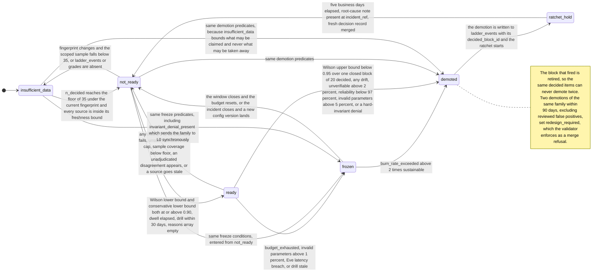

# 3. The metrics contract

## Status
- Owner: the platform owner
- Last reviewed: 2026-09-13
- Objective restated 2026-09-13; see the platform HLD
  ([../agentic-platform/01-hld.md](../agentic-platform/01-hld.md) §13.3, §11.1, §18 item 21).
  §7 now carries the **metric pack per tier** (§7.1), audit completeness as the **headline
  Wall-E metric** with the uncatalogued-event count (§7.2), and the **Eve quality pack** with
  its source rule as assertion A10 (§7.3). Wall-E's arithmetic below is unchanged.
- Scope: the arithmetic Mo computes, in enough detail that the CI validator and an auditor
  read the same thing and get the same numbers. Everything on this page is computed by
  committed SQL in `config/metrics/*.sql`, parameterised by `config/metrics/gates.yaml`, and
  re-executable by anyone holding dataset-level read on `${WALLE_PROJECT}.walle_audit` and
  `bigquery.jobs.create` in a project of their own — never a project-level role in
  `WALLE_PROJECT`. Mo's own SQL runs in `MO_PROJECT` and names Wall-E's tables fully
  qualified ([`../project-topology.md`](../project-topology.md)). Since 2026-09-13 the Eve
  quality pack (§7.3) is re-executable by anyone holding dataset-level read on
  `${EVE_PROJECT}.eve_quality` as well — the validator custodian once P30 lands.
- Companion pages: [README.md](README.md), [01-hld.md](01-hld.md),
  [02-identity-and-access.md](02-identity-and-access.md),
  [04-artefacts-and-proposals.md](04-artefacts-and-proposals.md),
  [05-staging.md](05-staging.md), [06-failure-modes.md](06-failure-modes.md),
  [07-build-runbook.md](07-build-runbook.md), [08-open-decisions.md](08-open-decisions.md).
- Binding upstream: [05-autonomy-ladder.md](../wall-e/05-autonomy-ladder.md) §§6–10,
  [14-hld-challenge.md](../wall-e/14-hld-challenge.md) C15, C16, C17, C18,
  [03-lld.md](../wall-e/03-lld.md) for the closed denial vocabulary and the audit schema, and
  [08-team-eve-mo.md](../wall-e/08-team-eve-mo.md) for the team contract.

---

## 1. The rule this page exists to make checkable

**Every number and every selection that can move a level is computed by committed SQL; a
model may only read those numbers and write prose about them.**

Code decides all of: the precision ratio and which grades are admissible; the Wilson lower
and upper bounds; the sample floor; the dwell arithmetic; the ratchet clock; the drill
freshness check; every [05](../wall-e/05-autonomy-ladder.md) §8 threshold; blind-sample
membership; double-grade coverage and agreement; the fingerprint scoping; cost allocation;
the capability-gap ranking; the suppression rule; and the `ready` / `not_ready` /
`insufficient_data` verdict with its reason array. A model appears in exactly one place, from
S4, and writes prose. That split is enforced as an IAM boundary, not a coding convention —
see [02-identity-and-access.md](02-identity-and-access.md).

The organising property of the whole design applies to every figure defined below: **it is
re-derivable from `walle_audit` alone, and the gate re-derives it rather than believing it.**
Qualified 2026-09-13 (platform HLD §13.3): that holds for Wall-E's pack. A figure in the Eve
quality pack is re-derivable from `eve_quality` and Wall-E's `walle_audit`, under the source
rule of §7.3, and the gate re-derives it only once the custodian's `READER` on `eve_quality`
exists (P30); until then it is reported, never cited as evidence.
A promotion pull request carries the metric, the value, the exact SQL at a pinned commit, the
window, the fingerprint, the sample size and the sample seed; the validator runs that SQL
itself and refuses the merge if one value differs. Mo's numbers are never trusted. They are
reproduced.

Two consequences for how this page must be read:

- Where the design document states a constant, the constant is the **test oracle**. The
  golden fixtures in [§5](#5-golden-fixtures--the-design-document-is-the-test-oracle) are
  hand-computed from [14](../wall-e/14-hld-challenge.md) C18's published values, and CI fails
  if the implementation disagrees with this page. Code drifting from design breaks the build.
- Where a number was chosen rather than measured, it is marked `Assumption:` and carries an
  open decision. Nothing here is a measured organisational fact.

---

## 2. `config/metrics/gates.yaml` — the full parameter list

Every threshold below lives in one committed file so that the validator, an auditor and Mo
read the same numbers, and so that changing a threshold costs a reviewed pull request of its
own. Per M29 and provisional change 13 in [08-open-decisions.md](08-open-decisions.md), a
pull request that touches `gates.yaml` **may not also touch** `config/ladder.yaml`: the
measurement is now part of the gate, so a metric change cannot promote anything in the same
breath.

| Parameter | Value | Source |
|---|---|---|
| `z` | `1.959964` | Two-sided 95 %, fixed so the fixtures reproduce exactly |
| `promote_lower_bound` | `0.90` | [14](../wall-e/14-hld-challenge.md) C18 |
| `demote_upper_bound` | `0.95` | C18 |
| `drop_to_l1_upper_bound` | `0.90` | C18 |
| `graded_floor` | `35` | C18 — the floor and the gate are one decision, not two |
| `unsure_cap` | `0.10` | `Assumption:` — this design chose it. Provisional decision 51 |
| `blind_sample_rate` | `max(10 %, 5 items/week)` | C16 |
| `double_grade_coverage` | `0.20` | C17, `WRITE_HIGH` cells |
| `min_reporting_cell_size` | `5` | `Assumption:` — decision 35 inside decision 8 is unanswered |
| `business_calendar` | `Europe/Paris`, Mon–Fri | `Assumption:` — decision 15. Provisional decision 51 |
| `freshness_bounds` | per source, see [§12](#12-freshness-bounds-and-window-clamping) | This design |
| `retention_floor_days` | *tbd* — decision 17 | Every window is clamped to it; Mo cannot choose the number |

Three things deliberately **not** in `gates.yaml`:

- The **dwell durations and the ratchet length**. Their values are taken verbatim from
  [05](../wall-e/05-autonomy-ladder.md) §6 and reproduced in
  [§9](#9-dwell-the-ratchet-and-the-one-notch-rule). Whether they should live in `gates.yaml`
  or in `config/ladder.yaml` is *tbd*; this contract reads them from §6 and the scorecard
  names the file it read.
- **T2's pinned model id**, which belongs to the narrator's deploy config beside
  `gates.yaml`, never to the gate parameterisation. Provisional decision 49.
- **The demote gate's evaluation unit and cadence** — [§4](#4-the-gates)'s disjoint blocks of
  20 decided items, once per closed grading week, with retirement. A `demote_eval_cadence`
  parameter in `gates.yaml` would be read by Mo and by nothing that enforces: the demote
  predicate is executed by the action service's breakers and by Eve, and neither reads anything
  Mo writes ([§15](#15-the-readiness-state-machine)). The rule has to land in
  [05](../wall-e/05-autonomy-ladder.md) §8 itself — change 18 in
  [08-open-decisions.md](08-open-decisions.md) — and is reproduced here. Until it does, this
  contract and the enforcing components compute **different** demote predicates, and that
  divergence is a reported fact rather than a silent one.

---

## 3. The two interval functions

Both are BigQuery UDFs committed beside the metric SQL, covered by the fixtures in
[§5](#5-golden-fixtures--the-design-document-is-the-test-oracle), and used nowhere else.

**Where they live, and how the validator gets them.** The persistent routines live in
`${MO_PROJECT}.walle_metrics`. Evidence SQL that the validator re-executes from another
project cannot resolve a bare `walle_metrics.wilson_lower`, and must not need a routine
read in `MO_PROJECT` — the validator holds no binding of any kind there
([02-identity-and-access.md](02-identity-and-access.md) §5). So the rule is: **every
committed evidence SQL declares the two functions as `CREATE TEMP FUNCTION` from the same
committed text** that Mo-3 installs as the persistent routines, and CI asserts the two texts
are byte-identical. The persistent routines are a convenience for Mo's own scheduled queries;
the temp declaration is what makes the evidence block self-contained across a project
boundary. Decided 2026-09-13; the runbook's Mo-3 carries the same note.

### 3.1 Wilson score interval

For `x` admissible accepts out of `n` decided items, with `p = x / n` and `z = 1.959964`:

```
centre = (p + z^2 / (2n)) / (1 + z^2 / n)
half   = (z / (1 + z^2 / n)) * sqrt( p * (1 - p) / n + z^2 / (4 * n^2) )

wilson_lower = centre - half
wilson_upper = centre + half
```

The Wilson interval is used rather than the normal approximation because it does not
degenerate at `p = 1`, which is the case that decides every early promotion: a flawless
sample still has a lower bound below 1, and how far below is exactly what C18 turned into a
sample floor.

**Out of domain is `NULL`, never a number.** Both UDFs guard
`IF(n = 0 OR k < 0 OR k > n, NULL, …)`. A pair outside the domain is a defect upstream — a
join that let accepts leak in from another window, a negative count from a subtraction — and
returning a plausible-looking float for it hides the defect behind a bound. Assertion A2
bounds `precision` to `[0, 1]` and says nothing about the interval columns, so the guard is
the only thing standing between an impossible `(k, n)` and a published bound.

### 3.2 Newcombe difference interval

Used only for regression attribution — the change in precision either side of a fingerprint
boundary — and never as a gate. With Wilson intervals `(l1, u1)` for the later window and
`(l2, u2)` for the earlier one, and observed proportions `p1`, `p2`:

```
diff        = p1 - p2
diff_lower  = diff - sqrt( (p1 - l1)^2 + (u2 - p2)^2 )
diff_upper  = diff + sqrt( (u1 - p1)^2 + (p2 - l2)^2 )
```

Reported at 95 %. It appears in `agg_regression_attribution` and in the regression artefact,
labelled as an interval on a difference between two observational windows, never as a causal
estimate. See [§11](#11-attribution-the-fingerprint-and-the-scoping-rule).

---

## 4. The gates

[14](../wall-e/14-hld-challenge.md) C18 replaced [05](../wall-e/05-autonomy-ladder.md) §8's
point thresholds with interval gates and hysteresis, because point thresholds on 20–30 items
promote a truly-90 % playbook about one window in five and demote a truly-95 % one about one
window in four — and with the ratchet plus "two demotions in 90 days force a redesign", noise
alone would push good playbooks into redesign.

| Rule | Form |
|---|---|
| Promote | Wilson 95 % **lower** bound of plan precision at or above `0.90`, **and** `wilson_lower_conservative` at or above `0.90` |
| Demote one level | Wilson 95 % **upper** bound below `0.95` over **one closed block of 20 decided** — 3 or more wrong |
| Drop to L1 | Wilson 95 % **upper** bound below `0.90` over the same block — 5 or more wrong in 20 |
| Demote evaluation unit | **Disjoint blocks of 20 decided items**, evaluated **once per closed grading week**, never a sliding window and never hourly. A demotion **retires** the block that triggered it |
| Demote denominator scope | **Not** scoped to the fingerprint — see [§11.2](#112-the-scoping-rule) |
| Precision denominator | `accept / (accept + reject)`. `unsure` is **excluded** from the ratio and reported separately, capped at `0.10` (`Assumption:`); above the cap the cell is `not_ready` regardless of precision |
| Conservative denominator | `precision_ratio_conservative = accept / (accept + reject + unsure)`, with `wilson_lower_conservative`. Gates the **promote** side only |
| Sample floor | `n_decided >= 35`, enforced in the verdict **and** in an assertion query that fails the run if a `ready` row with `n_decided < 35` is ever written |
| Promotion sample window | **Accumulating, not calendar**: decided items accumulate under one fingerprint until `n` reaches 35, bounded only by `retention_floor_days`. The 30-day rolling window of [§7](#7-the-ten-metrics-the-ladder-is-argued-from) governs the nine rate metrics, not this one |
| Hysteresis | The band between `0.90` and `0.95`, plus the ratchet in [§9](#9-dwell-the-ratchet-and-the-one-notch-rule) |

**The floor and the gate are one decision.** At `n = 30` even a flawless record gives a
Wilson lower bound of `0.8865`, below `0.90` — so adopting the interval gate without moving
the floor would make no cell promotable at all, while the ratchet still fired. `35` is the
smallest perfect sample that clears `0.90`; a sample admitting even one wrong item does not
clear it until `53`. Whoever sets the gate at `0.90` is also choosing how long a family must
run before it can ever be promoted, which is why both numbers sit in the same file and move
in the same pull request.

**The demote gate is evaluated on disjoint blocks, and a demotion retires its block.**
[14](../wall-e/14-hld-challenge.md) C18's argument is stated *per window*: a truly-95 %
playbook trips the 20-item demote predicate in about 26 % of windows under §8's point
threshold, and C18's interval form reduces that to about 7.5 % per evaluation. That reduction
survives only if each set of 20 decided items is tested **once**. Re-testing an overlapping
window on every new grade multiplies the evaluations without adding evidence, and returns the
rate C18 was written to remove. So:

- the last-20 predicate is evaluated over **disjoint blocks** of 20 decided items, in arrival
  order, **once per closed grading week** — not hourly, and not over a sliding window;
- a block that triggers a demotion is **retired**: its decided items can never contribute to a
  second demotion, on re-entry from the ratchet or at any later evaluation;
- assertion **A9** in [§6](#6-assertion-queries) is the mechanism, and it needs
  `ladder_events.decided_block_id` — change 2 in
  [08-open-decisions.md](08-open-decisions.md).

Retirement is the part that must not be dropped. Without it, [§15](#15-the-readiness-state-machine)'s
`DM → RH → NR` path re-fires deterministically rather than statistically: at a per-cell blind
rate of 5 decided items a week, the five-business-day hold adds about five items, the same
three errors are still inside the trailing twenty, and the cell demotes a second time on
re-entry. `demotions_90d` reaches 2 and `redesign_required` fires as a merge refusal, from a
single cluster of three errors and with no noise argument involved at all.

**The residual false-demotion budget, at the volume this design actually has.** With
retirement in place the exposure is about `0.075` per closed block. At the per-cell blind rate
of `max(10 %, 5 items/week)` — **5 decided items a week for every cell at pilot volume**, not
the programme-wide figure in [§13.3](#133-coverage-is-itself-a-metric) — a block closes about
every four weeks, so a cell sees roughly 3.25 blocks in 90 days. That is about a **22 %**
chance of one false demotion in 90 days and about a **2–3 %** chance of two. The second number
is the one that matters, because two is what sets `redesign_required`, and
[§8](#8-error-budget-semantics) removes reviewed false positives from that count so the
compounding does not run unattended.

**`unsure` is excluded from the demote side, not counted wrong — and the asymmetry is
deliberate.** [04](../wall-e/04-flows.md) Flow B counted `unsure` as wrong, which turns grader
hesitation into demotion pressure; C18's remedy is to take it out of the ratio and report it
separately, capped. That remedy is about **demotion**. Applied to the promote side it biases
upward: `precision_ratio` becomes an estimate conditional on the grader being sure, and items
a grader could not decide are, on any reasonable model of grading, likelier to be wrong than
items they could. So the promote gate additionally clears `wilson_lower_conservative`, the
Wilson lower bound of `accept / (accept + reject + unsure)`. A future reader must not
"simplify" this back to symmetry: **the primary ratio excludes `unsure`, the promote gate
also clears the conservative one, and the demote gate reads the primary ratio alone.**

Worked, because the gap is wide enough to matter on its own: 35 accepts with 3 `unsure` gives
`unsure_rate = 0.0789`, under the cap so no reason fires; `n_decided = 35`, exactly the floor;
`wilson_lower(35, 35) = 0.9011`, so the cell reads `ready`. Under the conservative assignment
the record is 35/38 and `wilson_lower(35, 38) = 0.7921`. Without the second bound the gate
certifies "at least 90 % with 95 % confidence" for a cell whose worst case is 79 %, with no
dishonesty anywhere in the chain. The `0.10` cap bounds that bias and is set exactly wide
enough for it to bite, because the promote gate needs a *perfect* sample at `n = 35` and
excluding the doubtful items is what makes a sample perfect.

**What the interval covers, and what it does not.** Both Wilson bounds are **sampling-error**
intervals that treat the recorded grade as ground truth. They do not cover grader error, and
nothing in this contract does: `raw_agreement` and Gwet's AC1 in [§10](#10-grading-rules)
*measure* grader disagreement and are not incorporated into any bound. A cell's true
uncertainty is wider than its interval by that amount, and no increase in sample size closes
the difference.

---

## 5. Golden fixtures — the design document is the test oracle

Hand-computed from the constants [14](../wall-e/14-hld-challenge.md) C18 published, and
re-derived independently during the judging of this design. CI fails if any implementation
value differs. This is the only control that bites on the failure the validator structurally
cannot catch — the validator re-runs the same committed SQL and would inherit the same
arithmetic defect.

**The oracle must not travel with the code it tests.** The fixture table is committed at its
own path, `config/metrics/fixtures/wilson.sql`, and
[04-artefacts-and-proposals.md](04-artefacts-and-proposals.md) §3.4 lists
`config/metrics/fixtures/**` as a change-13 group **distinct from** `config/metrics/*.sql`, so
one pull request cannot change a UDF and its expected values together. Each constant carries a
comment citing [14](../wall-e/14-hld-challenge.md) C18 as its source. CI does **not** parse
this wiki page: a build that reads a document is brittle machinery, and the separation of
groups is what makes the oracle an independent control rather than a restatement.

| Case | Bound | Expected | Consequence |
|---|---|---|---|
| 30/30 | lower | `0.8865` | below `0.90` — not promotable, which is why the floor moved |
| 35/35 | lower | `0.9011` | the smallest perfect sample that promotes |
| 39/40 | lower | `0.8712` | one wrong at `n = 40` does not promote |
| 52/53 | lower | `0.9006` | the smallest sample admitting one wrong that promotes |
| 18/20, 2 wrong | upper | `0.9721` | does **not** demote |
| 17/20, 3 wrong | upper | `0.9476` | demotes one level |
| 16/20, 4 wrong | upper | `0.9193` | does **not** drop to L1 |
| 15/20, 5 wrong | upper | `0.8881` | drops to L1 |
| 35/38 conservative | lower | `0.7921` | 35 accepts with 3 `unsure` does **not** clear the conservative gate |

Two more, added because [06-failure-modes.md](06-failure-modes.md) §3.1 names them as the
residuals for which nobody has independent intuition, and a residual that is fixtured is no
longer only carried:

| Case | What is fixtured | Expected |
|---|---|---|
| Newcombe difference | One hand-computed `(p1, l1, u1)` / `(p2, l2, u2)` pair, from [§3.2](#32-newcombe-difference-interval) | `diff_lower` and `diff_upper` to four places, *tbd* until the pair is hand-computed and committed |
| Business days | One `Europe/Paris` five-business-day count spanning a French public holiday | The ratchet release date, *tbd* until the holiday and the span are chosen and committed |

Also fixtured, because the verdict and the arithmetic are separate code paths and both can be
wrong:

- a synthetic cell at **34/34** must report `not_ready` with reason `sample_below_floor`;
- the same cell at **35/35** must report `ready`;
- a cell with **three wrong in a closed block of twenty** must report a demote verdict;
- **the same cell must not demote again** on a later evaluation whose trailing twenty items
  still contain those same three wrong — the block was retired, so the second evaluation has
  no eligible block and the cell reports no demote verdict;
- a cell at **35 accepts with 3 `unsure`** (`unsure_rate = 0.0789`, under the cap) must report
  `not_ready` with reason `precision_lower_bound_below_gate_conservative`, **not** `ready`;
- the cap boundary at **3/38** (`0.0789`, no reason) and **4/38** (`0.1053`, fires
  `unsure_rate_above_cap`).

These are criterion 4 of Mo's acceptance test in [05-staging.md](05-staging.md). The
re-fire case is the one that catches the loop C18's thresholds alone do not close, and it is a
deterministic two-evaluation fixture rather than a simulation: a Monte Carlo over a thousand
synthetic cells would be out of proportion to a one-administrator pilot and would not catch
this at all, because the failure is structural rather than statistical.

---

## 6. Assertion queries

Invariants that hold regardless of whether the arithmetic is right. They run after every
scheduled query; a failure pages and freezes promotions. They are the second of the four
controls on Mo's own arithmetic, and the only one that keeps working when the fixtures and
the SQL share a misunderstanding.

| # | Assertion | What it catches |
|---|---|---|
| A1 | `n_decided + n_unsure = n_graded` for every cell | A grade silently dropped by a join, or `unsure` double-counted |
| A2 | `precision` is within `[0, 1]` | A denominator of zero, or accepts leaking in from another window |
| A3 | No row with `verdict = ready` and `n_decided < 35` | The floor being bypassed in the verdict `CASE` |
| A4 | No row with `verdict = ready` and dwell unsatisfied, or a drill older than 30 days | The two gates that live outside the precision arithmetic |
| A5 | Every `grades` row joins to an `actions` row — a cross-project join, both tables in `${WALLE_PROJECT}.walle_audit`, run from `MO_PROJECT` | Grades for items that never ran — a fabricated or mis-keyed sample |
| A6 | A batch approval never contributes more accepts than its per-item vector has entries | C16's inflation, reintroduced by a join |
| A7 | No published row carries an email-shaped string | The suppression rule, [§14](#14-the-suppression-rule) |
| A8 | No published group-by cell has a count between 1 and 4 | Re-identification by small cell |
| A9 | No cell carries more than one `ladder_events` demotion row attributable to the same `decided_block_id` | A retired block firing a second demotion — [§4](#4-the-gates)'s `DM → RH → NR` loop |
| A10 (added 2026-09-13) | **The source rule.** No published Eve-pack value marked `evidence_eligible` has a lineage that lacks every independent source — `grades_eve`, `seeded_fault_runs`, golden-replay results, Wall-E's `eve_last_seen` — and in particular none computed from `eve.verdicts` alone ([§7.3](#73-the-eve-quality-pack)) | A number about Eve that only Eve's own live process vouches for, cited as if independent |
| A11 (added 2026-09-13) | **The differential check.** For each of the ten metrics and window, Mo's `scorecard` value is diffed against Eve v0's `eve.findings` (read through `eve_quality`); a difference sets `metric_divergence` on the Eve scorecard | Two independently pinned computations of the same metric disagreeing — the second implementation [01-hld.md](01-hld.md) declined to build, obtained from Eve's v0 (platform HLD §13.3) |

A1–A6, A9 and A10 are correctness assertions; A7 and A8 are disclosure assertions and are the
mechanism behind [§14](#14-the-suppression-rule). All ten are failures of the run, not
warnings — except A11, which is a reporting assertion: a divergence is an **Eve finding** and
a flag on the Eve scorecard, never a failed run, because either side may be the one that is
wrong: a metrics run that cannot assert its own output does not publish it, and the watermark then
ages, which is itself restrictive — see [06-failure-modes.md](06-failure-modes.md).

---

## 7. The ten metrics the ladder is argued from

Restructured 2026-09-13 (platform HLD §13.3, §11.1): the ten metrics below are **Wall-E's
pack**, the first instance of a per-agent metric pack. §7.1 says which pack each tier gets,
§7.2 is Wall-E's pack with audit completeness as its headline, and §7.3 is the Eve quality
pack. Every row of every pack is keyed on `agent_id`, because there is one Mo per platform.

### 7.1 The metric pack per tier

The tier model is the platform's ([../agentic-platform/01-hld.md](../agentic-platform/01-hld.md)
§11.1; [../agentic-platform/05-registry-and-autonomy-contract.md](../agentic-platform/05-registry-and-autonomy-contract.md)
§9.8). Mo reads the platform `audit.schema`, so any agent that implements it gets the pack its
tier names; a pack is a per-agent `gates.yaml` and a set of committed metric SQL, validated by
the one platform validator against golden fixtures per pack.

| Tier | Pack | Grading hour | Human cost (platform HLD §11.1) |
|---|---|---|---|
| **C** classical | cost, reliability | none | 0 |
| **R** read tools | + Model Armor `MATCH_FOUND` rate, drift, freshness | none | ≈ 0.5 h/month |
| **W** write agents | + the full pack: a ladder pack in the shape of §7.2, blind grading, the gates of §4 | `max(10 %, 5 items/week)` per cell | ≈ 1 h/week per agent from a named human who is not the playbook owner, + approvals; the Tier W cap by grading capacity is P25 |
| **P** privileged (P-SA: Wall-E) | + the Eve quality pack of §7.3 for the agent's verifier | as W | ≈ 3 h/week + bought desk + a second super admin on the rota |
| **X** AGI-class | + evaluation gates (research-grade) | undefined | undefined |

Two notes. The platform's "≈ 1 h/week" is a per-agent planning figure; for Wall-E at S4
volume this page computes **at least two hours a week** of blind grading
([§13.3](#133-coverage-is-itself-a-metric)), and the larger number is the one Wall-E's cost
report carries. And a pack is chosen by the register's `tier`, never by Mo: Mo cannot move an
agent to a lighter pack.

### 7.2 Wall-E's pack — the ten metrics, audit completeness first

**Audit completeness is the headline Wall-E metric** (platform HLD §13.3, dated 2026-09-13).
With Wall-E holding Super Admin the tenant no longer refuses an out-of-role call, enforcement
sits in the action service alone, and the one number that sees an action outside the
catalogue and outside band B is the join of Google's admin log to Wall-E's own rows. It is
printed first on the scorecard and in the digest, together with metric **9b**, the separate
count of robot admin events that match **no** catalogue operation and **no** band-B operation.
The table keeps its numbering so every existing reference holds.

Thirty-day rolling window, evaluated hourly, clamped to the retention floor. Definitions and
thresholds are [05](../wall-e/05-autonomy-ladder.md) §8's, reproduced here with the exact
form Mo computes and the aggregate view that is the sole source for each. Where this page
says something §8 does not, it is called out in the last column.

**Two exceptions to that window and that cadence, both on metric 2, both in
[§4](#4-the-gates).** The *demote* predicate is evaluated over disjoint blocks of 20 decided
items once per closed grading week, never hourly over a sliding window; and the *promotion*
sample accumulates to `n = 35` under one fingerprint rather than expiring after 30 days. The
other nine metrics are rates, and a rate over a rolling window evaluated hourly is the right
shape for all of them.

| # | Metric | How Mo computes it | Target | Breach → | Sole source |
|---|---|---|---|---|---|
| 1 | **Hard-invariant denials** | Count of `actions` rows whose `denial_reason` is one of the ten invariant codes in [03](../wall-e/03-lld.md), from **autonomous** runs only, with `protected_principal` arising from a **human chat request** excluded | **0** | Any one: family to L0 synchronously, incident | `agg_invariant_denials` |
| 2 | **Plan precision** | `accept / (accept + reject)` over admissible grades, with the Wilson bounds of [§4](#4-the-gates). The **promote** side is scoped to the current fingerprint and accumulates to `n = 35`; the **demote** side is not fingerprint-scoped and reads closed blocks of 20 decided | Wilson lower **and** `wilson_lower_conservative` at or above `0.90` to promote | Upper below `0.95` over a closed block of 20 decided: one level down. Upper below `0.90`: L1. The block is retired on firing | `agg_precision_cell` |
| 3 | **Verification success** | `verified / executed writes` from `verifications` | ≥ 99.5 % | Any `drift`: one level down **plus an incident**. `unverifiable` above 2 %: one level down | `agg_verification_cell` |
| 4 | **Breaker trips** | Distinct `error_class` values within a run, **excluding no-ops** | — | 2 or more distinct classes aborts the run. More than 3 automatic demotions in an hour is itself **severity 2**, counted from `ladder_events` | `agg_breaker_trips` |
| 5 | **Invalid parameters** | Share of autonomous steps denied `invalid_parameters` | < 1 % | Above 1 %: promotions frozen. Above 5 %: one level down | `agg_invalid_params_cell` |
| 6 | **Run reliability** | Runs reaching a terminal state within budget, from `runs` | ≥ 99 % | Below 97 %: `no_autonomous` for that playbook | `agg_reliability_playbook` |
| 7 | **Eve post-hoc latency** | p99 time from an L5 write to Eve's independent verification | ≤ 60 min p99 | Breach: promotions frozen. Above 4 h: L5 cells drop to L4 | `agg_eve_latency` |
| 8 | **Approval latency** | p50 human time-to-verdict, in **business hours** on the `Europe/Paris` calendar | p50 < 4 business hours | **Blocks stage exit.** Excluded from every promotion and demotion predicate | `agg_approval_latency` |
| 9 | **Audit completeness — the headline** | Workspace admin-audit events by the robot, from `${WALLE_PROJECT}.walle_workspace_logs`, with a matching `${WALLE_PROJECT}.walle_audit` row — a cross-project join under two dataset-level `READER`s. *Qualified 2026-09-13 (P104, P107, topology row 40): the events side is the view `${LOGGING_PROJECT}.platform_logs_views.walle_workspace_logs`, read under `READER` on `platform_logs_views` made by the factory* | 100 % | Below 100 %: halt writes until reconciled | `agg_audit_completeness` |
| 9b | **Uncatalogued robot admin events** (added 2026-09-13) | Count of admin-audit events whose actor is the robot account and which match **no** band-A catalogue `actions` row and **no** band-B `/v1/execute-generic` audit row (the band-B row carries both humans and the Discovery revision, platform HLD §13.1), across every admin event type — including `DELEGATED_ADMIN_SETTINGS` (for example `ASSIGN_ROLE`) and `SECURITY_SETTINGS` | **0** | Any one: **severity 1** — halted and paged by Eve's reconciler and the SIEM's super-admin detection set (platform HLD §13.2), never by Mo; Mo reports it first | `agg_uncatalogued_admin_events` ◇ |
| 10 | **Drill freshness** | Days since the last kill-switch drill, from the write-ahead `drills` table | ≤ 30 days | Stale: CI refuses **every** promotion | `agg_drill_freshness` |

Those ten `agg_*` views are ten of the **sixteen** supporting aggregates. The other six carry
figures that are reported but never gate, and each is likewise the sole source for one thing:
`agg_sample_coverage` ([§13.3](#133-coverage-is-itself-a-metric)),
`agg_regression_attribution` ([§11.3](#113-what-attribution-may-and-may-not-say)),
`agg_cost_operation` and `agg_cost_playbook` (the cost report's two cost axes),
`agg_value_toil` (toil saved against the committed baseline) and `agg_capability_gap` (the
demand ranking, empty until the `capability_gap` enum lands — change 7). The twelve metric
queries of [07-build-runbook.md](07-build-runbook.md) Phase Mo-4 populate these sixteen; the
`scorecard` `MERGE` reads them and computes no aggregate of its own.

Notes the implementation must carry, each of which is a place where a plain reading of §8
would produce the wrong number:

- **Metric 9b is reported, not enforced, by Mo.** The halt on an uncatalogued write belongs to
  Eve and the SIEM, which read Google's streams themselves; Mo's count is the measurement over
  the window and the trend, and a count above zero is also an entry on the coverage map
  ([04-artefacts-and-proposals.md](04-artefacts-and-proposals.md) §1.6). The admin log records
  role assignments as `ASSIGN_ROLE` under type `DELEGATED_ADMIN_SETTINGS` and security changes
  under type `SECURITY_SETTINGS`, both under `applicationName=admin`
  ([Delegated admin settings events](https://developers.google.com/workspace/admin/reports/v1/appendix/activity/admin-delegated-admin-settings),
  [Security settings events](https://developers.google.com/workspace/admin/reports/v1/appendix/activity/admin-security-settings),
  both verified 2026-09-13). `Assumption:` `walle_workspace_logs` carries every admin event type
  for the robot actor; which streams Eve's sink and the evidence lake hold is Eve's set's and
  the platform's (platform HLD §18 item 13). `agg_uncatalogued_admin_events` is a seventeenth
  aggregate of Wall-E's pack; "sixteen" elsewhere in this set predates it.
- **Metric 1's closed list is exactly ten codes** — `operation_not_allowed`,
  `protected_principal`, `protection_incomplete`, `bad_approval`, `approval_already_used`,
  `approver_is_agent`, `level_bypass`, `control_plane_unavailable`, `selection_not_declared`,
  `ou_destination_not_allowed` — taken from [03](../wall-e/03-lld.md)'s denial vocabulary and
  nowhere else. Qualified 2026-09-13: with a super-admin robot, `ou_destination_not_allowed` and
  `protected_principal` are enforced by the action service's code, not by Google refusing an
  out-of-role call (platform HLD "What this reverses"); the hard-denied-list and band-B codes
  Wall-E's `03` gains (platform HLD §18 item 2) join this list when they land, by a
  `gates.yaml`-class pull request. `protected_principal` from human chat is the control working correctly, is an
  audit row and nothing else, and counting it would halt the programme for asking a question.
- **Metric 4 needs a column that does not exist.** [05](../wall-e/05-autonomy-ladder.md) §8
  says an operation whose desired state already held is a no-op, "recorded and excluded", and
  no column records it. Until `actions.noop BOOL NOT NULL` lands — change 4 in
  [08-open-decisions.md](08-open-decisions.md) — breaker-trip counts carry
  `noop_exclusion_unavailable` and are used in **no verdict**. `error_class` is the wrong home
  for it: a no-op is not an error.
- **Metric 7 is not computable before S4**, because Eve does not verify before then. It
  reports `not_applicable` in every earlier stage and is **never** reported as passing. A
  metric that reads green because its subject does not exist is worse than a blank.
- **Metric 8 never demotes and never promotes.** It measures how long humans took, which is a
  fact about the rota, not about Wall-E's judgement. It blocks stage exit, appears in the
  digest and in the cost report as **waiting time, not effort**, and is absent from the
  scorecard's reason array by construction.
- **Metric 9 is queried from BigQuery**, through the saved view joining Google's org-level
  admin events to `walle_audit` requester and approver — Wall-E's view, in `WALLE_PROJECT`,
  which `mo-metrics@${MO_PROJECT}` reads through its dataset-level `READER` on both
  underlying datasets, from a job in `MO_PROJECT` — never from org-level Cloud Logging,
  whose `_Default` bucket is fixed at 30 days for organisations. It also carries the standing
  footnote that Google's log proves the robot acted and never who asked
  ([14](../wall-e/14-hld-challenge.md) C43): the human attribution comes from Wall-E's own
  rows, and that half is not independently checkable.
- **Metric 7 is Wall-E's ladder gate, not an Eve quality metric.** It says how late Eve's
  post-hoc verification is for Wall-E's L5 cells; whether Eve's verdicts are *right* is §7.3.

### 7.3 The Eve quality pack

Added 2026-09-13 (platform HLD §13.3; the gaps are in `.agent-work/review/mo-both-agents.md`,
outside the wiki). The pack for Eve as Wall-E's Tier P verifier. Each row is keyed
`agent_id = eve` and, where it is per cell, on the Wall-E `(family, trigger)` cell the verdict
was about — the cell the 30-day cross rule of
[04-artefacts-and-proposals.md](04-artefacts-and-proposals.md) §3.6 is written against
(`Assumption:` that keying). Computed by T0 as `mo-metrics@`, from `eve_quality` in
`EVE_PROJECT` and from `walle_audit`, under the dataset-level `READER`s in
[02-identity-and-access.md](02-identity-and-access.md) §2.1. Nothing in this pack is read by
Eve: **Eve keeps its own fast drop to advisory on its own number**, and Mo reports any
divergence between its number and Eve's as an Eve finding.

| # | Metric | How Mo computes it | Independent source (the source rule) | Target | Breach → | Sole source |
|---|---|---|---|---|---|---|
| E1 | **False-refusal rate** | Eve refusals a human grader marked wrong ÷ Eve refusals graded, with the Wilson lower and upper bounds of [§3.1](#31-wilson-score-interval) (the same UDFs, the same `z`) | `grades_eve`, joined to `eve_quality.verdicts` | Eve's own disagreement threshold in `thresholds.yaml` ([../eve/06-failure-modes.md](../eve/06-failure-modes.md)); Mo uses the same number, not its own | Mo reports; a Mo bound over Eve's threshold while Eve has not dropped to advisory is an Eve finding (`eve_incident_note`) | `agg_eve_false_refusal` ◇ |
| E2 | **Wrong-accept count** | Eve approvals a human grader or an operator veto found wrong, per cell and window. A count, not a rate | `grades_eve`; Wall-E's `ladder_events` and veto rows | **0** | Each one is severity 2 by Wall-E's §9 table, enforced elsewhere; Mo reports the count and the trend | `agg_eve_wrong_accept` ◇ |
| E3 | **Agreement** | Raw agreement and Gwet's AC1 between Eve's verdict and the human grade; Cohen's κ reported and never gated, as [§10](#10-grading-rules) | `grades_eve` | *tbd* — reported, not gated | — | `agg_eve_agreement` ◇ |
| E4 | **Pages versus budget** | Pages per reason code per week against the page budget | `eve_quality.pages`, marked `self_reported` (below) | The budget in `thresholds.yaml`, *tbd* (E-18) | Above budget: an `eve_threshold_tighten` or `eve_incident_note` proposal, never a loosening on this number alone | `agg_eve_pages` ◇ |
| E5 | **Time-to-verdict** | p50 and p99 from plan freeze to Eve's verdict | plan freeze from `walle_audit.plans`; verdict time from `eve_quality.verdicts` | *tbd* | Reported | `agg_eve_time_to_verdict` ◇ |
| E6 | **Time-to-acknowledge** | p50 and p99 from page to human acknowledgement, per severity | `eve_quality.pages` acknowledgement columns, marked `self_reported` until corroborated by the pager's record | Per the severity-to-channel table (platform HLD §13.2) | Reported; `not_computable` until the acknowledgement columns land (platform HLD §18 item 15) | `agg_eve_time_to_ack` ◇ |
| E7 | **Availability** | Share of the window in which Wall-E's passive stamp saw Eve | Wall-E's `eve_last_seen` in `walle_audit` — never Eve's own heartbeat | *tbd* | Reported | `agg_eve_availability` ◇ |
| E8 | **Seeded-fault catch** | Faults caught ÷ faults injected at the last run, per `eve_config_version`; the negative controls reported separately | `eve_quality.seeded_fault_runs` (monthly and on every `eve_config_version` change) | All faults caught, no negative control fired | A missed fault is an Eve finding and a coverage-map entry | `agg_eve_seeded_faults` ◇ |
| E9 | **`metric_divergence`** | Assertion A11 over the ten metrics against Eve v0's `eve.findings` | Mo's own `walle_audit` computation | none | An Eve finding | `agg_eve_divergence` ◇ |

**The source rule, as an assertion query (A10).** Numbers about Eve come from `grades_eve`,
`seeded_fault_runs`, golden-replay results and Wall-E's passive `eve_last_seen` — **never from
`eve.verdicts` alone**, because a compromised Eve writes false receipts and a Mo that scored
self-reported verdicts would be scoring Eve's own account of itself. This page's rendering of
the rule (`Assumption:` the column names): every Eve-pack row carries `source_tables
ARRAY<STRING>`, stamped by the committed SQL and checked by CI review against the SQL's `FROM`
clauses, and `evidence_eligible BOOL`; a row whose sources include none of the four
independent ones is `self_reported`, is shown on the Eve scorecard with that label, and can
never be `evidence_eligible`.

```sql
-- A10: the source rule. Runs after every Eve-pack query; ASSERT fails the job.
ASSERT (
  SELECT COUNT(*) FROM `walle_metrics.eve_scorecard`
  WHERE agent_id = 'eve'
    AND evidence_eligible
    AND NOT EXISTS (
      SELECT 1 FROM UNNEST(source_tables) t
      WHERE REGEXP_CONTAINS(t, r'(^|\.)(grades_eve|seeded_fault_runs|golden_replay_results)$')
         OR t LIKE '%.walle_audit.%')
) = 0 AS 'an evidence-eligible number about Eve has no independent source';
```

`walle_metrics.eve_scorecard` and `golden_replay_results` are ◇ names this page fixes; the
dataset takes its agent-neutral name before Stage 0
([04-artefacts-and-proposals.md](04-artefacts-and-proposals.md) §3.7). The stamp is only as
good as CI review of the query text. A stronger form reads the job metadata instead —
`INFORMATION_SCHEMA.JOBS_BY_USER.referenced_tables`, the tables a non-cached query job actually
referenced, which needs `bigquery.jobs.list` on `MO_PROJECT`
([JOBS_BY_USER view](https://docs.cloud.google.com/bigquery/docs/information-schema-jobs-by-user),
verified 2026-09-13); `mo-metrics@` holds only `jobUser` today, so that form is *tbd* with its
grant.

**What this pack is not.** Mo is **not Eve's grader**: humans grade Eve's verdicts into
`grades_eve`, written by the platform approval surface and not by `eve-console`, on a blind
sample the approval surface draws. Mo does not set `eve_authority`, does not lower Eve and does
not read `grades_blind` or `review_queue_blind`. Until the validator custodian holds `READER`
on `eve_quality` (P30), every figure here is reported and none is cited as evidence: Eve bundles
are advisory `eve_incident_note` only, stated in their heading. Golden fixtures for E1's bounds
and E5/E6's percentiles join `config/metrics/fixtures/**` before P30's gate opens.

---

## 8. Error-budget semantics

**A wrong autonomous write is an incident and a demotion with zero budget, never
consumption.** There is no allowance to spend. The three metrics that behave like classic
error budgets are precision, verification and reliability, and their states are computed
columns on the scorecard rather than prose in a review:

| State | Condition | Effect |
|---|---|---|
| `budget_exhausted` | The window's allowance for precision, verification or reliability is spent | Promotions frozen for the **rest of the window**; the cell reports `not_ready` |
| `burn_rate_exceeded` | Burn rate above **2×** the sustainable rate for the window | **One level down** |
| `redesign_required` | `demotions_90d >= 2` on the same family, counting only demotions whose [§9.3](#93-the-ratchet) `review_verdict` is **not** `false_positive` | The scorecard reports it and the validator enforces it as a **merge refusal**: the playbook is redesigned before re-entry |

`redesign_required` is the one error-budget state the validator acts on directly, because it
is a fact about `ladder_events` rows rather than about an arithmetic result, and because
[14](../wall-e/14-hld-challenge.md) C18's whole argument is that noise must not be allowed to
push a good playbook into redesign — so the count that triggers it has to be auditable from
rows anyone can re-read.

**Why reviewed false positives leave the count.** [§4](#4-the-gates)'s block rule and its
retirement remove the re-fire loop, and they leave a residual of about `0.075` per closed
block, which compounds against a threshold of two. Excluding a demotion that a **named human**
set to `review_verdict = false_positive` with a `review_ref` is what stops that compounding
running unattended. It is **not** the false-positive exception [§9.3](#93-the-ratchet)
refuses: the hold still runs in full, the incident note must still exist in git, the fresh
decision record is still required, and the demotion row stays in `ladder_events` forever. The
only thing the verdict changes is whether that row also counts towards a merge refusal months
later. The control on over-use is the one already built: Mo publishes the **breaker
false-positive rate** from exactly these rows, so a reviewer who marks everything false makes
that visible on the scorecard and in the digest rather than quiet.

---

## 9. Dwell, the ratchet and the one-notch rule

All three are computed from `${WALLE_PROJECT}.walle_audit.ladder_events`, read
cross-project, a table that does not exist yet.
Until it does, the dwell column reads `not_computable` and **no cell is reported ready** —
see [06-failure-modes.md](06-failure-modes.md) and change 2 in
[08-open-decisions.md](08-open-decisions.md). Automatic demotions deliberately write no
decision file and `config_versions` is not stated to gain a row for them, so there is no
other source.

### 9.1 Dwell

| Transition | Minimum dwell |
|---|---|
| L1 → L2 | 2 weeks |
| L2 → L3 | 2 weeks |
| L3 → L4 | 4 weeks |
| L4 → L5 | 6 weeks |

### 9.2 The stricter reading, and why

[05](../wall-e/05-autonomy-ladder.md) §6 says the dwell clock restarts after any demotion **of
that family**. [05](../wall-e/05-autonomy-ladder.md) §3 and R3 say each trigger class climbs
**independently**. The two pull apart when a family is demoted on one trigger while another
trigger's clock is running: §6 read literally restarts both, R3 read literally restarts
neither but the demoted one.

**This design takes the stricter reading: a demotion on any trigger restarts dwell for the
family on every trigger**, and the scorecard names the `ladder_events` row that reset the
clock, so the decision is visible rather than inferred. The reason is that the thing a
demotion tells you about is the *playbook and its platform*, which the trigger classes share;
the independence in R3 is about how autonomy is earned, not about how evidence of a defect is
scoped. The cost of being wrong in this direction is a slower promotion. The cost of being
wrong in the other is a cell that climbs on a trigger while the same code is failing on
another.

### 9.3 The ratchet

After **any automatic demotion**, all three of the following before re-raising:

1. **Five business days** at the lower level, on the `Europe/Paris` calendar in
   `gates.yaml`.
2. A **root-cause incident note that exists in git** at the path
   `ladder_events.incident_ref` names — the validator checks the file is there, not that it is
   good.
3. A **fresh decision record**.

**There is no false-positive exception.** A demotion later judged false does not shorten the
hold and is not silently absorbed: it sets `review_verdict = false_positive` with a named
reviewer and a `review_ref`, and Mo publishes a **breaker false-positive rate** from those
rows. When that rate rises, the finding is about Eve or about the metric, and Mo's pull
request targets the **metric definition** or opens an Eve finding — never the ladder.
Qualified 2026-09-13: Mo may now also propose an Eve threshold change — an
`eve_threshold_tighten`, or an `eve_threshold_loosen` under its two-reviewer, cooling and
30-day rules ([04-artefacts-and-proposals.md](04-artefacts-and-proposals.md) §3.6) — and it is
still never a ladder change. That is
the whole of E35's review path, and it is why the review verdict is a column rather than a
conversation.

The one thing the verdict does change is the `demotions_90d` count that sets
`redesign_required` ([§8](#8-error-budget-semantics)). That is a different quantity from the
hold: the hold is what happens *now*, to a cell whose behaviour is in question, and it applies
whatever anyone later concludes; `demotions_90d` is a claim *about a pattern*, and a demotion a
named human has found to be false is not evidence of one. Nothing else about the ratchet moves,
and a `false_positive` verdict on a demotion that has not yet served its five business days
releases nothing early.

### 9.4 One notch

- Above L3: **one notch at a time**, with minimum dwell at each level. No skipping.
- At or below L3: a level may be skipped **only** when the scorecard cites the covering
  evidence from another trigger class, by fingerprint and sample size. L1 and L2 never
  execute, so skipping them risks nothing — but the citation is what makes that claim
  checkable.
- **A new operation enters at L0 whatever the stage.** "We are at S4, so the new thing is
  autonomous" has no code path.

---

## 10. Grading rules

Grades are the only human-produced input to the whole contract, and the only one Mo cannot
reconstruct if it is missing. They arrive write-ahead in `${WALLE_PROJECT}.walle_audit.grades`
from the approval surface, and Mo reads them cross-project; Mo reads no Firestore.

| Rule | Form | Why |
|---|---|---|
| Grader identity | The grader must appear on a **committed list of human principals** | An agent grading Wall-E's work breaks [08](../wall-e/08-team-eve-mo.md) rule 2 |
| Non-human grade | **Excluded and counted** in `grades_excluded`, with the reason | Silent exclusion is indistinguishable from a missing grade |
| Self-grading | A grade from the **author of the playbook version under test** is excluded and counted | C17: rule 2 was applied only to agents; this is its human counterpart |
| Blindness | Grades with `blind = FALSE` or `saw_eve_verdict = TRUE` are **excluded from L4/L5 precision** and counted | Unblinding makes a cell **less** promotable, never more — the incentive has to point that way |
| Double-grading | For a `WRITE_HIGH` cell, the second grade must come from someone other than the `owner:` recorded in the playbook file, at **≥ 20 % coverage** | C17 |
| Below coverage | The cell reports `no_second_grader` and **can never pass L2** — reported from **S0** | The block is visible for months before it bites, rather than discovered at S3 |
| Coverage stability | Double-grade coverage is **held at a fixed rate for the duration of a promotion window**, and `double_grade_coverage` is carried in the evidence block ([04-artefacts-and-proposals.md](04-artefacts-and-proposals.md) §3.1) so the validator refuses a bundle whose coverage moved mid-window | A precision figure earned at one coverage is not comparable with one earned at another |
| Disagreement | Where two grades disagree and **no adjudication row exists, the cell is `not_ready` with reason `disagreement_unadjudicated`** until the adjudication row lands | Blocking rather than punitive — strictly more restrictive than counting the item wrong, and it does not distort the ratio |
| Agreement reporting | Raw agreement **and Gwet's AC1** are reported and may be cited. **Cohen's κ is reported and never gated on** | At a base rate near 95 %, κ collapses towards zero on samples that are in fact excellent, and gating on it would demote good playbooks |
| Stratified counts | The **count and the wrong-count are reported separately** for the double-graded and the single-graded stratum. No Wilson interval and no Newcombe comparison is published per stratum | The measurement difference is visible; an interval on a seven-item stratum carries no information |

`grades_excluded` carries a count **and a reason breakdown** on every scorecard row. A cell
whose sample is mostly exclusions is not a cell with a small sample; it is a cell with a
broken grading process, and the two must be distinguishable at a glance.

**Why an unadjudicated disagreement blocks rather than counts wrong, and why that is
stricter.** The rule it replaces was written against a real failure: if an unresolved
disagreement simply vanished, the cheapest way to clear one would be to ignore it, and
double-grading would become a rubber stamp that only ever adds accepts. That reasoning stands
and this rule serves it **harder** — an unadjudicated disagreement now stops the cell
altogether rather than costing it one item. Nothing about it is a relaxation, and it must not
be read as one.

What counting it wrong did instead was distort the number. Double-grading changes the
measurement process for 20 % of the sample and leaves it alone for the other 80 %, and the two
processes have different error rates in the same direction: a double-graded item was counted
wrong if **either** grader rejected it *or* if the two disagreed with nobody adjudicating,
while a single-graded item was wrong only if its one grader rejected. `precision_ratio` then
mixed two estimators in a proportion that was a free parameter of the cell — measured
precision **fell as double-grade coverage rose**, which penalises the control that makes the
measurement trustworthy, and precision was comparable neither between two cells at different
coverage nor within one cell as its coverage moved. It also moved the floor: the promote gate
needs a perfect sample up to `n = 52`, so one unadjudicated disagreement among the ~7
double-graded items in a 35-item sample raised the required sample from 35 to 53 — eighteen
more graded items, which at 5 a week is weeks. Adjudication throughput, not Wall-E's
behaviour, became the binding constraint on promotion, and the cheapest responses available
were to adjudicate fast rather than correctly, or to pin coverage at the floor. Blocking on
the missing row removes all of that and keeps the incentive pointing the right way.

**The second grader does not exist yet.** C17 makes 20 % blind double-grading a condition for
a `WRITE_HIGH` cell to pass **L2**, which happens at S2, while decision 11b puts the second
person at S3. Mo cannot supply a person; it reports `no_second_grader` from S0 and surfaces
the conflict rather than resolving it. Provisional decision 45 in
[08-open-decisions.md](08-open-decisions.md).

---

## 11. Attribution: the fingerprint and the scoping rule

### 11.1 The fingerprint

`fingerprint_sha` is computed over the full tuple:

| Field | On the `actions` row today |
|---|---|
| `playbook_version` | yes |
| `selection_hash` | **no** — change 5 |
| `prompt_hash` | yes |
| `model_id` | yes |
| `catalogue_version` | yes |
| `adk_version` | **no** — change 5 |
| `ma_filter_version` (Model Armor filter version) | **no** — change 5 |
| `engine_resource` | **no** — change 5 |
| `ceilings_sha` | yes |
| `config_version` | yes |

Six of the ten are on the row today. Until the other four land, `fingerprint_sha` is computed
over the available subset and the scorecard labels attribution `partial_fingerprint`, so no
promotion can quietly cite evidence whose platform boundary was never recorded.

Where `model_id` is empty because a T1/T2 playbook runs deterministically
([decision 32](../wall-e/09-open-decisions.md)), the field is recorded as the string `none`
rather than `NULL`, attribution falls back to `playbook_version` and `selection_hash`, and the
scorecard says so. `NULL` would silently merge deterministic and model-driven runs into one
cell.

### 11.2 The scoping rule

**The promotion sample is scoped to the current fingerprint. The demotion denominator is
not.** The scoping is deliberately asymmetric, and both halves point the same way: a
fingerprint change bounds what a cell may **claim** and never what may be **taken away** from
it.

| Side | Fingerprint-scoped? | Consequence of a fingerprint change |
|---|---|---|
| Promotion sample | **Yes** | The sample resets; `n` falls below 35; the cell reports `not_ready` with `fingerprint_reset` |
| Demotion denominator | **No** | Demotion evidence carries across the change and ages out only by time, or by [§4](#4-the-gates)'s block rule |

Evidence earned under a different fingerprint does not count towards a promotion. This closes
C15's gaming path — prove 95 % on a narrow selection, then widen the selection and keep the
level — at the **measurement layer** rather than only at CI, which means it holds even for a
change CI did not classify as material.

**Why the demotion side must not be scoped.** Scoped both ways, a fingerprint bump empties the
demotion denominator, and the design hands an operator a documented, allowlisted lever for
emptying it: `prompt_change` is one of Mo's own eight proposal types
([04-artefacts-and-proposals.md](04-artefacts-and-proposals.md) §3.5), available from S2, and
bumping `prompt_hash` creates a fresh cell with no history. The arithmetic of the escape is not
marginal — `wilson_upper(4, 5) = 0.9637` and `wilson_upper(8, 9) = 0.9801`, both above the
`0.95` demote threshold — so a cell running at 80 % precision cannot demote for as long as
someone keeps editing the prompt. Unscoped, the opposite reading has its own cost: a cell whose
defect has just been fixed carries its predecessor's errors for the rest of the block. That
cost is bounded by the block rule and it fails restrictively, which the gaming path does not.

The gaming path is closed a second time at CI rather than only here, and with machinery this
design already owns: [04-artefacts-and-proposals.md](04-artefacts-and-proposals.md) §3.4's
C15 gate is extended to cover `config/prompts/**`, so a prompt change serving a cell above L2
needs a linked decision record and re-runs the canary at its current level or lower. A
fingerprint change therefore lowers or holds a level and never clears accumulated demotion
pressure.

It is correct and it is brutal. When the fingerprint moves, the sample resets, `n` falls below
35, and the scorecard reports `not_ready` with a reason naming the old fingerprint, the new
one and the surviving sample size. At a realistic prompt- and model-change cadence this can
make L4 unreachable in practice. That is an honest answer rather than a defect, and it forces
a decision the set has not taken, so **Mo publishes both counts from S2**: the strict count,
and the count under a proposed *material* subset of the tuple — `selection_hash`,
`prompt_hash`, `model_id`. The choice is then made on data rather than on frustration.
Provisional decision 43; the default is **strict**, because that is what C15 binds, and a
coarser subset needs its own decision record and the security reviewer.

### 11.3 What attribution may and may not say

- The unit of change is **the whole tuple**. The regression artefact names exactly which
  fields moved together.
- The difference in precision across the boundary is reported with the **Newcombe 95 %
  interval** of [§3.2](#32-newcombe-difference-interval).
- The wording is **"coincides with"**, never "caused by". Deploys are not randomised, nothing
  is controlled, and several fields usually move at once.
- With **fewer than 12 decided items on either side**, it reports `insufficient_data` and
  nothing else.
- **Attribution never gates.** No promotion, demotion, freeze or verdict reads it. It exists
  to tell a human where to look.

---

## 12. Freshness bounds and window clamping

Each cell carries `max_ts_seen` **per source**, and each source has its own bound, because
they have genuinely different lags.

| Source | Breach bound | Basis |
|---|---|---|
| `${WALLE_PROJECT}.walle_audit.actions` | older than **2 h** | Default-stream writes are queryable immediately; 2 h means the pipeline stopped |
| Workspace admin events | older than **6 h** | Google documents admin-log lag as a couple of minutes and group events as tens of minutes up to a couple of hours; 6 h is beyond the documented worst case |
| `walle_audit.grades` | older than **7 days** | The grading cycle is weekly |
| Billing export | older than **48 h** | Cost is a reporting input, not a gate. The export spans the four projects; where its dataset lives is *tbd* |

Any breach sets `stale_evidence` and the cell is `not_ready`. A stale source never produces a
stale *pass*: the direction of failure is always restrictive.

**Window clamping.** Every window is clamped to the effective retention floor read from
`gates.yaml`, and **a clamped window is flagged rather than reported as if it were full**. A
30-day metric computed over 11 surviving days is a different number with the same name, and
the scorecard says which it is. This is also what makes a teardown-and-recreate of
`walle_audit` loud instead of quiet: the window discontinuity is flagged and every cell falls
below the floor at once. Mo does not solve evidence durability — decision 31's off-project
copy does — but Mo refuses to paper over it. That copy is a further location: when Mo reads
it at S4 that is one more cross-project, dataset-level `READER` for `mo-metrics@${MO_PROJECT}`
into whichever project decision 31 names — not `MO_PROJECT` ([`../project-topology.md`](../project-topology.md)
recommends Eve's `walle_audit_mirror` in `EVE_PROJECT`, decision 51).

---

## 13. The blind sample and the seed protocol

The blind sampled review is `max(10 %, 5 items/week)` of executing items and is the **only**
admissible input to precision at L4 and L5. Its integrity rests entirely on nobody being able
to choose or anticipate which items are reviewed.

**The rate is per cell, not per programme.** `GREATEST(CEIL(0.10 * n), 5)` in
[§13.1](#131-the-draw-published) is evaluated over the executed items **in one
`(family, trigger)` cell** for that week, so every live cell carries its own floor of five
graded items a week. That is the number [§4](#4-the-gates)'s block arithmetic and
[§13.3](#133-coverage-is-itself-a-metric)'s cost line are computed from, and it is the reason
the accumulating promotion window exists: below about 50 executing items a week in a single
cell the floor binds, the cell yields 5 decided items a week whatever its volume, and a
30-day calendar window would cap it at about 21 — permanently under the floor of 35, however
long the cell ran perfectly.

### 13.1 The draw, published

Order the executed items in the cell for that week and take the first
`max(10 %, 5 items/week)` of them:

```
ORDER BY FARM_FINGERPRINT(CONCAT(week_seed, cell, run_id, CAST(item_index AS STRING)))
LIMIT  GREATEST(CEIL(0.10 * n), 5)
```

`GREATEST` is the BigQuery spelling of the `max(CEIL(0.10 * n), 5)` in `gates.yaml`'s
`blind_sample_rate`. [04-artefacts-and-proposals.md](04-artefacts-and-proposals.md) §2.2
carries the identical two lines; the validator's re-draw executes them unchanged.

### 13.2 The seed protocol

- `week_seed` is generated and committed by **CI, after the week has closed**, into an
  **append-only per-week seed file in the configuration repository** — one entry per week,
  written only by the CI job. A commit that rewrites an existing week's entry is not a
  correction; it is itself the detectable event.
- It is therefore unknown at plan-freeze time, so no run can be shaped around whether it will
  be reviewed.
- **Nobody chooses the draw — including Mo.** Mo computes it; it does not select it.
- The validator **re-draws the sample from the published seed** and refuses the merge if the
  membership differs from the evidence block. An auditor can re-draw it years later from the
  seed, the SQL and the archived snapshot.
- The seed carried in a bundle is **anchored** the way `scorecard_sha256` is anchored:
  ingestion refuses a bundle whose `evidence_block.seed` is not the seed the week file records
  for `week(window_end)` ([04-artefacts-and-proposals.md](04-artefacts-and-proposals.md)
  §3.3). Without that check the validator's re-draw proves only that a bundle is internally
  consistent with whatever seed it carries, because both sides of the comparison descend from
  that one value.
- The protocol is **in force from S3 entry**, when the sampler starts running — not from S4.
  A stage of sampling on an unspecified seed would produce grades nobody can re-draw, and
  those are the grades L4 is later argued from. See [05-staging.md](05-staging.md).

`FARM_FINGERPRINT` is a keyless public hash, so whoever runs the CI job can compute the
resulting membership offline for any candidate seed before committing one, and a discarded
candidate leaves no artefact. The append-only file makes the committed seed attributable and
its replacement visible; it does not make the first choice unpredictable to the person making
it. That residual is carried in [06-failure-modes.md](06-failure-modes.md) §5 rather than
engineered away: a commitment-and-reveal scheme, or an Eve signature over the seed, is out of
proportion to a one-administrator pilot, and the Eve option would drag the enforcing identity
back into authoring the evidence it is graded against.

**Unresolved: Eve's set claims the draw as well.**
[`../eve/04-flows.md`](../eve/04-flows.md) flow 7 has `eve-reconciler` draw the sample
**daily**, as `eve-verifier@`, from S3 entry, with a human grading in `eve-console`;
[`../eve/05-stages.md`](../eve/05-stages.md) starts the blind sampled review at **S1**. This
page has T0 compute a **weekly** draw from a seed CI publishes after the week closes, with
the blind sample from **S3** ([05-staging.md](05-staging.md)), and with nobody — Eve, Mo or a
human — choosing it. The two are not variants of one rule: a daily draw by an enforcing
identity is choosable by that identity, which is the property this design spends the seed
protocol to remove, and it would make Eve a partial author of the evidence Eve is later
graded against. The conflict is named here rather than resolved, because resolving it changes
Eve's flows and Eve's stage table, which are not this set's to edit. Until it is settled in a
dated decision record, the draw in this contract is the one the validator re-executes, and
any Eve-drawn sample is a different sample with a different name.

### 13.3 Coverage is itself a metric

Achieved coverage against `max(10 %, 5 items/week)` is a first-class column. A miss sets
`sample_coverage_below_floor` and the cell is `not_ready`. This is the control on the quiet
failure that would otherwise be invisible: a team under time pressure grading two items
instead of the cell's five, and the numbers still looking fine because the denominator shrank
with the numerator.

The honest cost, stated here because it belongs beside the rule that creates it, and computed
**per cell** because that is how the floor is computed. At an S4 volume of roughly 200
executing items a week across the whole programme, [05](../wall-e/05-autonomy-ladder.md) §7's
S4 row lights up eight or more live `(family, trigger)` cells — F3, F4 and F7 on scheduled,
F2 and F3 on event, F1 and writes on inbox, plus chat — so a cell carries roughly 25 executing
items a week and the `5 items/week` floor binds in every one of them. The programme therefore
grades **at least 40 items a week, not about 20**: eight cells at the floor, plus 20 % of
those double-graded for `WRITE_HIGH`, plus adjudication.

That is at least **two hours a week, indefinitely, from a named human who is not the playbook
owner**, plus a second grader who does not yet exist — at least twice the "one hour a week"
this design carried while the floor was read as a programme-wide number. It cannot be
automated, cannot be sampled more thinly without the cell going `not_ready`, and cannot be
delegated to a model without destroying the thing it measures.

**And the promotion floor is reachable only because the window accumulates.** Five decided
items a week reaches `n = 35` in seven weeks, against a four-week `L3 → L4` dwell — so the
sample, not the dwell, is the binding clock, and it is visible as one: the scorecard carries
`window_length_days` and `weeks_to_promotable` ([§16](#16-the-scorecard-row)) so a long
accumulation reads as a long accumulation rather than as ordinary caution. Raising the blind
rate to 100 % in promotion mode would reach the floor faster and is **not adopted**: at ~25
executing items a week across ~8 cells it means grading the entire S4 volume by hand, several
hundred per cent above the human constraint this design already identifies as binding.

---

## 14. The suppression rule

Mo's published artefacts have a **wider reader set than `walle_audit`**, which is why
suppression is a mechanism here and not a promise.

- **Minimum reporting cell size 5** (`Assumption:`, decision 35). No published group-by cell
  may have a count between 1 and 4; assertion A8 fails the run if one is written.
- **No email-shaped string** in any published row; assertion A7 fails the run if one appears.
- The agent-facing authorised views return **ids, hashes, closed enums, counts, timestamps and
  surrogate keys** only — never `params_redacted`, `result_summary`, `content_flags` free
  text, a display name, a group name, a Google error string or a principal email.
- Recurrence of a subject is preserved by **surrogate keys** (`principal_surrogates`, a
  monotone integer per distinct principal) rather than by omitting the column, so "the same
  subject recurs" survives while identity does not.
- The grading worklist names `run_id#item_index` and family only — opaque ids, which is also
  what keeps the sample blind.

**Mo is nonetheless inside the personal-data perimeter.** T0 reads per-person rows, and Mo
belongs in the data-protection assessment as a processor.
[ARCHITECTURE](../wall-e/ARCHITECTURE.md) weakness 11's claim that Mo's reads are aggregated
per organisational unit is **wrong at the pipeline layer and should be corrected rather than
inherited**. Provisional decisions 44 and change 11 in
[08-open-decisions.md](08-open-decisions.md).

---

## 15. The readiness state machine

One cell — one `(family, trigger, fingerprint_sha)` — moves through exactly these states. Every
transition is a computed `CASE` over the columns defined above, and the label names the rule
that fires it.



Three properties of this diagram are load-bearing and easy to lose in an edit.

- **`insufficient_data` is not a shelter.** A cell pushed into `ID` by a fingerprint change, or
  by a missing `ladder_events` or `grades` table, still demotes and still freezes on every
  predicate that applies. `ID` bounds what a cell may **claim**; it never bounds what may be
  **taken away** from it. Without the `ID → DM` and `ID → FR` edges, a fingerprint bump would
  park a failing cell in a state with no drawn path to `demoted` — including for
  `invariant_denial_present`, which [§7](#7-the-ten-metrics-the-ladder-is-argued-from) metric 1
  says sends the family to L0 **synchronously**.
- **`RH → NR → DM` cannot re-fire on the same evidence.** The retired block is what makes the
  loop terminate; see [§4](#4-the-gates).
- **Nothing here is an action.** Every state is a statement about evidence, and the next
  paragraph is why that matters.

`ready` is a statement about evidence, never an action. Nothing in Wall-E's enforcement path
reads this column: the action service's breakers, Eve and CI enforce every §8 breach that
demotes or halts, and none of them reads anything Mo writes. Promotion still requires a human
to open a pull request, the validator to recompute the numbers, and two distinct
authenticated reviewers at L4 and L5.

---

## 16. The `scorecard` row

One row per `(agent_id, family, trigger, fingerprint_sha, as_of_hour)` — `agent_id` added
2026-09-13, one Mo per platform — in
`${MO_PROJECT}.walle_metrics.scorecard`, snapshotted daily into
`${MO_PROJECT}.walle_metrics_archive.scorecard_YYYYMMDD` — the dated, citable object a
decision file points at and an auditor replays against. The citable object is
project-qualified in every evidence block.

`Assumption:` the BigQuery types below, and the value enumerations given for `ratchet_state`
and `error_budget_state`, are this page's rendering of columns the design names without
enumerating; the **column list** is the contract. Only `reasons ARRAY<STRING>` and its closed
enum come from the design itself.

| Column | Type | Meaning |
|---|---|---|
| `as_of` | `DATE` | **The partitioning column** of every table in `walle_metrics`, including this one. The day `as_of_hour` falls in |
| `as_of_hour` | `TIMESTAMP` | The hour the row was computed for; the `MERGE` key with `cell` and `fingerprint_sha` |
| `agent_id` | `STRING` | Added 2026-09-13. The register's immutable id (platform `audit.schema`); part of the `MERGE` key and of every cell, so two agents' packs never share a row |
| `family`, `trigger` | `STRING` | The cell, per R1 |
| `fingerprint_sha` | `STRING` | [§11.1](#111-the-fingerprint); `partial_fingerprint` flag if the four missing columns have not landed |
| `current_level`, `target_level` | `STRING` | Deployed level from `ladder_events`; what `ladder.yaml` says it should be |
| `dwell_elapsed`, `dwell_required` | `INTERVAL` | [§9.1](#91-dwell); `not_computable` until `ladder_events` exists |
| `dwell_satisfied` | `BOOL` | `dwell_elapsed >= dwell_required`. The column assertion A4 reads, so the gate is one named field rather than a re-derivation |
| `dwell_reset_event` | `STRING` | The `ladder_events` row that restarted the clock, per the stricter reading |
| `days_since_last_demotion` | `INT64` | Feeds the ratchet and `demotions_90d` |
| `ratchet_state` | `STRING` | `clear` / `hold` / `hold_missing_incident_note` |
| One column per §8 criterion | mixed | Each carries **measured value, threshold and pass/fail** — never a bare boolean |
| `n_graded`, `n_decided`, `n_unsure` | `INT64` | A1 asserts `n_decided + n_unsure = n_graded` |
| `unsure_rate` | `FLOAT64` | Reported separately; above `0.10` the cell is `not_ready` |
| `precision_ratio` | `FLOAT64` | `accept / (accept + reject)` over admissible grades, [§4](#4-the-gates). Assertion A2 bounds it to `[0, 1]`. The **demote** side reads this one |
| `precision_ratio_conservative` | `FLOAT64` | `accept / (accept + reject + unsure)`, [§4](#4-the-gates). Reported always; gates the **promote** side only |
| `wilson_lower`, `wilson_upper` | `FLOAT64` | [§3.1](#31-wilson-score-interval). `NULL` where `(k, n)` is out of domain |
| `wilson_lower_conservative` | `FLOAT64` | The lower bound of `precision_ratio_conservative`. The promote gate clears `0.90` on **both** |
| `decided_block_id`, `blocks_closed` | `STRING`, `INT64` | The open block's identifier and how many have closed for this cell, [§4](#4-the-gates). A9 reads the first |
| `window_length_days` | `INT64` | How long the promotion sample has been accumulating, so a long accumulation is visible rather than hidden |
| `weeks_to_promotable` | `INT64` | `ceil((35 - n_decided) / blind_items_per_week)`. `NULL` once the floor is met |
| `n_double_graded`, `n_double_graded_wrong`, `n_single_graded`, `n_single_graded_wrong` | `INT64` | The two strata, [§10](#10-grading-rules). Counts only — no interval is published per stratum |
| `drill_age_days` | `INT64` | Days since the last kill-switch drill, metric 10. Assertion A4 reads it |
| `cell_count` | `INT64` | The number of distinct subjects behind the row. Assertion A8 fails the run if it is between 1 and 4 — [§14](#14-the-suppression-rule) |
| `sample_coverage_achieved`, `sample_coverage_required` | `FLOAT64` | [§13.3](#133-coverage-is-itself-a-metric) |
| `double_grade_coverage`, `raw_agreement`, `gwet_ac1`, `cohen_kappa` | `FLOAT64` | κ is reported and never gated |
| `grades_excluded` | `INT64` + reason breakdown | [§10](#10-grading-rules) |
| `error_budget_state` | `STRING` | `ok` / `budget_exhausted` / `burn_rate_exceeded` / `redesign_required` |
| `freeze_state` | `STRING` | Whether promotions are frozen and why |
| `ceiling` | `STRING` | The code ceiling for the cell, from [05](../wall-e/05-autonomy-ladder.md) §4 |
| `one_notch_eligible` | `BOOL` | With the covering-evidence citation when a skip at or below L3 is claimed |
| `max_ts_seen` per source | `TIMESTAMP` | [§12](#12-freshness-bounds-and-window-clamping) |
| `window_start`, `window_end`, `window_clamped` | `TIMESTAMP`, `BOOL` | A clamped window is flagged, never reported as full |
| `verdict` | `STRING` | `ready` / `not_ready` / `insufficient_data` |
| `reasons` | `ARRAY<STRING>` | Closed enum, [§16.1](#161-the-closed-reason-enum) |

### 16.1 The closed reason enum

The reason array is a **set union**, which is what makes any model contribution
monotone-restrictive: there is a code path to **add** a `not_ready` reason and none to remove
one. An unrecognised value is a `mo_schema_violation`, which disables the renderer until a
human reviews it.

`Assumption:` the strings marked ◇ are this page's names for rules the design states without
naming a token. They are fixed here so the validator and the renderer agree, and changing one
is a `gates.yaml`-class pull request.

| Reason | Fires when |
|---|---|
| `sample_below_floor` | `n_decided < 35` under the current fingerprint, accumulated since the fingerprint took effect and bounded by `retention_floor_days` — never over a 30-day calendar window |
| `floor_unreachable_at_current_volume` ◇ | `weeks_to_promotable` exceeds the surviving retention window, so the floor cannot be reached under this fingerprint at this cell's blind rate. A **structurally closed** gate, reported as such rather than as ordinary caution |
| `precision_lower_bound_below_gate` ◇ | Wilson lower bound below `0.90` |
| `precision_lower_bound_below_gate_conservative` ◇ | `wilson_lower_conservative` below `0.90` — the promote gate's second bound, [§4](#4-the-gates) |
| `unsure_rate_above_cap` ◇ | `unsure_rate` above `0.10` |
| `sample_coverage_below_floor` | Achieved blind coverage below `max(10 %, 5/week)` for this cell |
| `no_second_grader` | `WRITE_HIGH` cell below 20 % blind double-grading — blocks L2 |
| `disagreement_unadjudicated` ◇ | Two grades disagree and no adjudication row exists. Clears when the row lands, [§10](#10-grading-rules) |
| `dwell_not_satisfied` ◇ | Dwell elapsed shorter than required for the next notch |
| `ratchet_hold` ◇ | Inside the five-business-day hold, or the incident note is missing |
| `redesign_required` | Two demotions of the same family within 90 days |
| `budget_exhausted` | Error budget spent for the window |
| `burn_rate_exceeded` ◇ | Burn rate above 2× sustainable |
| `drill_stale` ◇ | Last kill-switch drill older than 30 days |
| `invariant_denial_present` ◇ | Any hard-invariant denial from an autonomous run in the window |
| `verification_drift` ◇ | Any `drift` in the window |
| `unverifiable_above_cap` ◇ | `unverifiable` above 2 % |
| `invalid_parameters_above_gate` ◇ | Above 1 % frozen, above 5 % demoting |
| `reliability_below_gate` ◇ | Run reliability below 97 % |
| `eve_latency_breach` ◇ | Eve post-hoc latency above 60 min p99, from S4 only |
| `audit_incomplete` ◇ | Audit completeness below 100 % |
| `uncatalogued_admin_event_present` ◇ (added 2026-09-13) | Metric 9b above zero in the window |
| `stale_evidence` | Any source outside its freshness bound |
| `window_clamped` ◇ | The window was clamped to the retention floor |
| `fingerprint_reset` ◇ | The sample reset because the fingerprint changed; carries old and new and the surviving `n` |
| `partial_fingerprint` | Attribution computed over fewer than ten fingerprint fields |
| `noop_exclusion_unavailable` | `actions.noop` does not exist, so breaker-trip counts are unusable |
| `not_computable` | A required table — `grades`, `proposal_verdicts`, `drills`, `ladder_events` — is absent |
| `not_applicable` | The metric's subject does not exist yet at this stage. **Never** rendered as passing |

**Approval latency has no reason code.** It blocks stage exit and appears in the digest and
the cost report; it is deliberately absent from this enum so that no cell can ever be held
back, or pushed forward, by how long a human took to answer.

---

## 17. What this contract does not decide

| Open | Where it bites | Provisional decision |
|---|---|---|
| The retention floor (decision 17) | Every window clamp in [§12](#12-freshness-bounds-and-window-clamping) | 46 |
| Strict fingerprint scoping versus a material subset | [§11.2](#112-the-scoping-rule); may make L4 unreachable on the **promotion** side. The demotion denominator is unscoped either way | 43 |
| The pilot OU account count (decision 5) | The floor of 35 against a per-cell blind rate of 5 decided items a week. At that rate the sample reaches the floor in **seven weeks**, so the promotion window must accumulate rather than expire — which makes decision 17's `retention_floor_days` and decision 31's off-project copy **hard prerequisites for L4**, not merely a clamp on it. The copy's project is not `MO_PROJECT`, and Mo's S4 read of it is one more cross-project dataset-level `READER`. Neither number is filled in here | 47, with 46 |
| Who the second grader is, and when | [§10](#10-grading-rules); blocks `WRITE_HIGH` at L2 from S2 | 45 |
| The `unsure` cap of `0.10` and the `Europe/Paris` business-day calendar | [§2](#2-configmetricsgatesyaml--the-full-parameter-list) | 51 |
| Minimum reporting cell size 5, and who may read `walle_metrics` | [§14](#14-the-suppression-rule) | 44 |

Numbering is **provisional**: [09-open-decisions.md](../wall-e/09-open-decisions.md) currently
ends at decision 41, and 42–52 are claimed by [`../project-topology.md`](../project-topology.md)
§8; platform decisions continue as P1.. (qualified 2026-09-13). See
[08-open-decisions.md](08-open-decisions.md).
