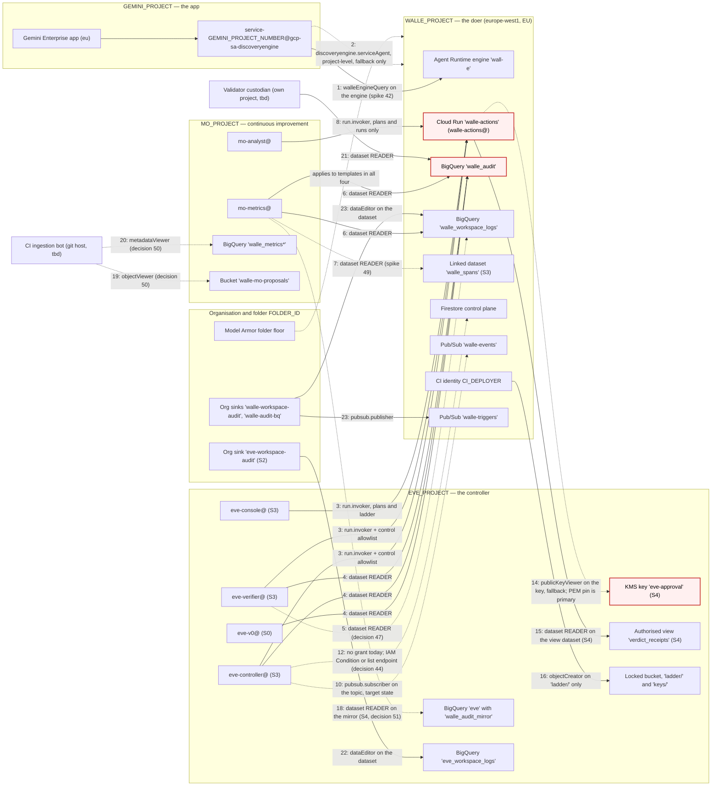

# Project topology — Gemini Enterprise, Wall-E, Eve, Mo

## Status
- Owner: the platform owner
- Last reviewed: 2026-09-13
- Maturity: design, decided 2026-09-13; nothing is built. This page is the **single
  authority** for where each resource of the three agents lives and how every grant crosses
  a project boundary. Every other page points here rather than restating it.

This is a **placement and least-privilege change**, not a redesign. The architecture, the
five trust boundaries, the autonomy ladder, the no-DWD rule, every decision in
[wall-e/09-open-decisions.md](wall-e/09-open-decisions.md) and
[wall-e/14-hld-challenge.md](wall-e/14-hld-challenge.md), the contract in
[wall-e/08-team-eve-mo.md](wall-e/08-team-eve-mo.md), and Eve's and Mo's designs beyond
placement are unchanged. What changes is which project each identity, key, secret, dataset,
bucket, topic, service and job sits in, and the exact form of each grant that crosses.

Read first: [wall-e/01-hld.md](wall-e/01-hld.md),
[wall-e/02-identity-and-auth.md](wall-e/02-identity-and-auth.md),
[wall-e/ARCHITECTURE.md](wall-e/ARCHITECTURE.md) §4,
[eve/02-identity-and-auth.md](eve/02-identity-and-auth.md),
[mo/02-identity-and-access.md](mo/02-identity-and-access.md).

**The one rule.** A principal in one project reaches a resource in another project only
through a grant **on that resource** — a Cloud Run service, a BigQuery dataset, a Pub/Sub
topic, a Cloud KMS key, a Cloud Storage bucket, a reasoning engine — never through a
project-level role in the other project. Where a Google product offers no resource-level
form, the grant is either dropped or recorded below as a **named exception** with its reason
and its decision number. Two grants in the sets as written on 2026-09-12 broke the rule
(§3 rows 11 and 12); on 2026-09-13 Wall-E's runbook, script and self-test stopped making
both, so **no project-level role for any Eve or Mo identity exists in `WALLE_PROJECT`
today**. Row 11 is dropped for good (decision 43). Row 12 has **no replacement yet**:
until decision 44 lands, `eve-gate`'s Firestore discovery has no grant behind it, and Eve's
pages say so rather than describing a grant Wall-E refuses to make. One grant breaks Eve's
stricter "no Wall-E IAM in Eve's project at all" invariant (row 16, with rows 14 and 15),
and one may have to break the rule (row 2). None is left implicit.

---

## 1. Why four projects

### 1.1 What one project lets happen today

The sets as written on 2026-09-12 put everything in Wall-E's project: Eve's identities, key
and secrets (Wall-E [SETUP.md](wall-e/SETUP.md) Phases 6, 8 and 15), Mo's identities and
datasets (Mo [07-build-runbook.md](mo/07-build-runbook.md) says "all three live in Wall-E's
project"), and the Gemini Enterprise service agent derived from **Wall-E's** project number
(SETUP Phase 12). Eve's own set already refused that placement
([eve/09-open-decisions.md](eve/09-open-decisions.md) E-1); this page extends the same
argument to Mo and to the app. Inside one project, these project-level grants each reach
across an agent's boundary — not by a bug, but because that is what a project-level role is:

| Project-level role in Wall-E's project | Who holds it today | What it reaches that belongs to another agent |
|---|---|---|
| `roles/owner` (the creator, SETUP Phase 6) and anyone who can edit the project IAM policy | the platform owner; later `walle-owners@` | Can grant themselves `roles/cloudkms.signer` on `eve-approval` and **mint an Eve approval**; can grant `secretmanager.secretAccessor` on `eve-refresh-token` and **read Eve's Workspace credential**; can delete `walle_audit` rows through a `dataEditor` grant despite the insert-only role; can read `walle_metrics_private.principal_surrogates` and reverse every surrogate. All of Eve's and Mo's invariants become "nobody did it", checked by a daily drift row. |
| `roles/run.developer` + `iam.serviceAccountUser` on `walle-actions@` (deployers, CI) | `CI_DEPLOYER` | Redeploys the credential holder. Unchanged by this page — it is Wall-E's largest control and stays in Wall-E's project — but in one project the same deployers also stood inside the project that held Eve's key. |
| `roles/datastore.viewer` (SETUP Phase 6, `EVE_PROJECT_ROLES`) | `eve-controller@` | Every Firestore document in the project, not only `plans/{id}`. Legitimate use, project-wide reach. §3 row 12. |
| `roles/agentregistry.viewer` (SETUP Phase 13b) | `eve-controller@`, `MO_PRINCIPAL` | Read-only, project-wide, and unused by any duty. §3 row 11. |
| `roles/bigquery.jobUser` for Mo and Eve queries (Mo 07 Phase Mo-2) | `mo-metrics@`, `mo-analyst@` | Harmless by itself, but it puts Mo's query cost, quota and job history inside Wall-E's project, and any later project-level `dataViewer` "for convenience" reaches `walle_audit`, `walle_metrics_private` and Eve's tables at once. |
| `roles/aiplatform.user` for `mo-narrator@` (Mo 02 §2.3) | `mo-narrator@` (S4) | `generateContent` in Wall-E's project — the one identity in the team that carries a model, sharing a project with the engine whose `reasoningEngines.query` is locked to three principals. |
| Discovery Engine service agent built from `PROJECT_NUMBER` | Gemini Enterprise | Wrong principal if the app lives elsewhere ([wall-e/12-agent-identity.md](wall-e/12-agent-identity.md) line 44 already records the assumption that it does). The number must be the **app** project's. |

Separate projects turn each of those from a policy that must keep being swept into a
structure: `walle-actions@` **has no principal** in the project that holds Eve's key, so
there is nothing to escalate from; Mo's surrogate mapping is in a project where no Wall-E or
Eve identity exists; the Gemini app's administrators hold nothing in Wall-E's project.

### 1.2 What a compromise of each project reaches, afterwards

"Compromise" means an attacker holding project-owner rights, or any identity in that project.

| Project compromised | Can reach | Cannot reach |
|---|---|---|
| `GEMINI_PROJECT` | The front door: which humans see Wall-E, and the `user_id` the app asserts when it calls the engine — so T0 requests in a real operator's name, up to the T0 ceiling of the ladder, and the conversation history. This is boundary 1 and the same class as [C10](wall-e/14-hld-challenge.md#c10--eves-streamquery-channel-can-assert-any-operators-identity-stands); the write-path re-check of `walle-operators@` membership through the Directory API is what bounds it, and it was already true in one project. | The robot credential, the control endpoints (the service agent is not on any allowlist), Eve's key, Eve's or Mo's evidence, any Wall-E secret, the Agent Registry entry (it lives in `WALLE_PROJECT`). |
| `WALLE_PROJECT` | Everything Wall-E itself can do: the robot's refresh token and therefore the custom admin role's full reach (K4/K5 are the answer); the Firestore control plane (halts, overrides, counters); `walle_audit` and `walle_workspace_logs` (deletion or rewrite); the engine's IAM policy; the in-app allowlists through a redeploy. | **An Eve approval** — the key is not here and no principal here can be granted `useToSign` on it; Eve's Workspace credential; Eve's `walle_audit_mirror`, `eve_workspace_logs` and locked bucket (the independent record survives); Mo's scorecard archive; the organisation-level sinks' definitions (organisation resources) — only their destinations. |
| `EVE_PROJECT` | Mint L4 approvals inside the current level's blast radius, bounded by hold windows, vetoes, caps and the fact that no Eve identity can raise a level; halt and demote at will (a denial of service, undone by an operator in seconds); read the tenant through `eve@` (read-only, no licence privilege); write false `verdict_receipts`; read `walle_audit`. | Execute any Workspace write (`eve@` holds no write privilege and `walle-actions` refuses Eve on `/v1/execute`); read any Wall-E secret; raise a level; touch anything of Mo's. Revoking Eve's three `run.invoker` bindings and disabling the key version is the containment, exactly as [eve/06-failure-modes.md](eve/06-failure-modes.md) says. |
| `MO_PROJECT` | Publish false numbers into datasets nothing that enforces reads; drop bundles into the drop box that CI turns into pull requests a human merges and the validator recomputes from `walle_audit`; read raw per-person rows of `walle_audit` as `mo-metrics@` (the disclosure risk in [mo/06-failure-modes.md](mo/06-failure-modes.md)); call the two read endpoints. | Approve, veto, halt, demote or execute; read any secret or key; write `walle_audit`, Firestore or the ladder; reach the engine or any Eve resource. |

### 1.3 What teardown of each project destroys

| Project deleted | Destroyed | Survives, and what to do first |
|---|---|---|
| `GEMINI_PROJECT` | The app, its conversation history, the registration of Wall-E as a custom agent, the share to `walle-operators@`. | Everything of Wall-E's. Wall-E's engine simply has no human front door. Nothing to delete first. |
| `WALLE_PROJECT` | The engine, both Cloud Run services, Firestore, `walle_audit`, `walle_workspace_logs`, `walle_spans`, the four topics, the queue, the three secrets, the OAuth client, `walle-content-logs`, the staging bucket, the custom roles. | Eve's mirror of `walle_audit`, `eve_workspace_logs`, Eve's locked bucket with the PEM archive and the ladder artefacts, Mo's scorecard archive. **Delete the two organisation-level sinks `walle-workspace-audit` and `walle-audit-bq` first**, or they keep exporting to a destination that no longer exists (SETUP Phase 6 rollback). The OAuth grant survives; revoke it as in SETUP Phase 9. |
| `EVE_PROJECT` | The key (past approvals stay verifiable only against the PEM pinned in Wall-E's repository — which is why the pin is the primary path), Eve's secrets, `eve`, `eve_workspace_logs`, the jobs and console. The **locked** evidence bucket carries a lien that blocks project deletion until its 400-day retention has elapsed, by design. | `walle_audit` and Wall-E's control plane. **Delete the organisation-level sink `eve-workspace-audit` first.** Approvals already executed keep their `eve_key_version` and signature in `walle_audit.approvals`. |
| `MO_PROJECT` | The scorecard, the sixteen aggregates, the archive, the surrogate mapping, the drop box, the transfer configs. | The evidence. A promotion record cites `snapshot_name` and `scorecard_sha256`, and the validator recomputes from `walle_audit`, so a cited decision stays reproducible without the archive. Nothing outside the project to delete. |

### 1.4 The cost

- **Every crossing is explicit.** §3 has 26 rows where one project had none. Each is a
  runbook step **in the resource's project**, made by that project's owner, and each is a
  row in a drift job.
- **Four budgets** (`gcloud billing budgets create --filter-projects=projects/<id>`, one per
  project) instead of one, and four project IAM policies, four API-enablement lists, four
  organisation-policy checks and four owner groups — notional while one person holds them
  all, which is [E-2](eve/09-open-decisions.md) generalised (decision 52).
- **BigQuery bills the querying project.** Eve's and Mo's jobs run and are paid for in their
  own projects; Wall-E's project pays only storage. That is the intended separation, and it
  is also why `roles/bigquery.jobUser` is never granted cross-project.
- **More setup**: three `gcloud projects create --folder=$FOLDER_ID`, one per agent, plus
  the Gemini project's own short list; `walle_setup.py` gains four config keys and must make
  its Eve and Mo grants against foreign principals; Mo's runbook gains a project phase it
  does not have today.
- **Two spikes** this topology cannot avoid: whether the engine-scoped custom role suffices
  for the Gemini service agent across projects (decision 42), and whether Firestore's
  database-scoped IAM Condition replaces Eve's project-level `datastore.viewer` (decision 44).

---

## 2. The four projects

All four sit under the folder `FOLDER_ID` (§5), in `europe-west1`, with BigQuery in `EU`.
`Assumption:` the Gemini Enterprise app already exists in a project of its own —
[gemini-enterprise.md](gemini-enterprise.md) records that project as *tbd*, and decision 52
asks whether it is that project and whether it is moved under the folder.

| Project | Variable | Hosts — every identity, key, secret, dataset, bucket, topic, service, job | Must never host | Region | Who creates it, which runbook phase |
|---|---|---|---|---|---|
| **Gemini Enterprise app** | `GEMINI_PROJECT`, `GEMINI_PROJECT_NUMBER` | The Gemini Enterprise app (`projects/$GEMINI_PROJECT/locations/$GEMINI_APP_LOCATION/collections/default_collection/engines/$GEMINI_APP_ID`); its Discovery Engine service agent `service-${GEMINI_PROJECT_NUMBER}@gcp-sa-discoveryengine.iam.gserviceaccount.com`; the app's own agent identity; the registration of Wall-E as a custom agent (SETUP Phase 13) and its User-permissions share to `walle-operators@`; the console Model Armor setting for the app; `discoveryengine.googleapis.com`. | Any Wall-E, Eve or Mo identity, secret, key, dataset or bucket. Wall-E's engine. The Agent Registry entry (it is in `WALLE_PROJECT`, SETUP Phase 13b). Any Workspace credential. | App location `eu` (or `global`), per SETUP §1.1 D8 | `Assumption:` exists already, owned by the Gemini Enterprise administrators. Its short list is §7.4. |
| **Wall-E** — the doer | `WALLE_PROJECT`, `WALLE_PROJECT_NUMBER` (inside Wall-E's own script and runbook: `PROJECT`, `PROJECT_NUMBER`, §6) | Identities `walle-actions@`, `walle-dispatcher@`, `walle-tasks@`, `walle-operators-caller@`, `walle-agent@` (fallback only) or the Agent Identity principal, `CI_DEPLOYER`; regional secrets `walle-oauth-client`, `walle-refresh-token`, `walle-confirm-hmac`; Wall-E's OAuth client and consent screen; Firestore `(default)`; datasets `walle_audit`, `walle_workspace_logs`, linked `walle_spans` (S3); topics `walle-events`, `walle-triggers`, `walle-inbox`, `walle-dead-letter`; Cloud Tasks queue `walle-plan-items`; Cloud Run `walle-actions` and `walle-dispatcher`; the Agent Runtime engine `wall-e`; Agent Registry (`europe-west1`), the egress gateway `walle-egress` and the ingress gateway; Model Armor templates and the project floor; log bucket `walle-content-logs`; bucket `${WALLE_PROJECT}-agent-staging`; Artifact Registry `walle`; Scheduler jobs `walle-<playbook>` and `walle-gmail-watch-renew`; custom roles `walleEngineQuery`, `walleAuditWriter`; the destinations of the organisation sinks `walle-workspace-audit` and `walle-audit-bq`. | Eve's key, secrets, mirror, jobs or console. Any Mo dataset, identity or the drop box. The Gemini app. `eve-controller@` (SETUP Phase 6 creates it here today — it moves). | `europe-west1`, BigQuery `EU` | the platform owner, SETUP Phase 6 — `gcloud projects create "$PROJECT" --folder="$FOLDER_ID"` replaces `--organization` |
| **Eve** — the controller | `EVE_PROJECT`, `EVE_PROJECT_NUMBER` | Identities `eve-v0@`, `eve-controller@`, `eve-verifier@`, `eve-console@`; KMS ring `eve`, key `eve-approval`; regional secrets `eve-oauth-client`, `eve-refresh-token`; Eve's own OAuth client and consent screen (the "Eve — Verifier" role's consent); datasets `eve` (with `walle_audit_mirror` until S4, when the mirror moves to a dataset of its own — `Assumption:` `eve_mirror`, name *tbd*, decision 51, Eve 07 Phase 11 — so that row 18's dataset-level `READER` covers nothing of Eve's), `eve_workspace_logs`, and the authorised-view dataset for `verdict_receipts` (name *tbd*, decision 48); bucket `gs://${EVE_PROJECT}-eve-evidence` (locked, with `keys/` and `ladder/`); Cloud Run jobs `eve-reconciler`, `eve-gate`, service `eve-console` behind IAP with its service agent `service-${EVE_PROJECT_NUMBER}@gcp-sa-iap.iam.gserviceaccount.com`; the twelve Eve v0 transfer configs; the Scheduler jobs; Artifact Registry `EVE_AR`; the destination of the organisation sink `eve-workspace-audit`. | `aiplatform.googleapis.com`, ever. Any Wall-E secret or Wall-E principal beyond the three carve-outs of decision 48. Wall-E's audit tables. Any Mo resource. | `europe-west1`, BigQuery `EU` | the platform owner (target `eve-owners@`, E-2), [eve/07-build-runbook.md](eve/07-build-runbook.md) Phase 1, at S0 — add `--folder="$FOLDER_ID"` |
| **Mo** — continuous improvement | `MO_PROJECT`, `MO_PROJECT_NUMBER` | Identities `mo-metrics@`, `mo-analyst@`, `mo-narrator@` (S4, optional); datasets `walle_metrics`, `walle_metrics_archive`, `walle_metrics_private`, `walle_metrics_views`; the ~12 metric transfer configs and the assertion queries; bucket `walle-mo-proposals` (the drop box); Cloud Run job `mo-reporter` and, at S4, `mo-narrator`; the Scheduler jobs; Artifact Registry `mo`; `aiplatform.googleapis.com` enabled at S4 only, for `generateContent` against a pinned model id. | Any credential, secret or key. `walle_audit` or any copy of it. Firestore. Any `run.invoker` for an enforcement identity. Any reader on `walle_metrics_private` other than `mo-metrics@`. | `europe-west1`, BigQuery `EU` | the platform owner (target `mo-owners@`), [mo/07-build-runbook.md](mo/07-build-runbook.md) — a new Phase Mo-0b before Mo-1, at S0 (§7.3) |

**Outside the four, deliberately.** The **M0 host project** holding the operator's OAuth
client for `./walle workspace` ([wall-e/PREREQUISITES.md](wall-e/PREREQUISITES.md) §5.1) is a
pre-existing project and never the robot's; the **validator custodian's project** (decision
37) is the custodian's own and *tbd*; the **git host** is external; the two organisation
levels above the folder hold the three organisation-level sinks (`walle-workspace-audit`,
`walle-audit-bq`, `eve-workspace-audit`; `walle-content-sink` is project-level, SETUP Phase
12c) and the folder floor. The Workspace tenant is not a GCP project at all.

---

## 3. Cross-project grants

The complete table. **Level** is the resource the binding sits on. "Made by" is the
runbook that makes it, always in the resource's project. Rows marked **anti-grant** record an
absence that a drift job or denial test asserts. Verification dates are 2026-09-12 (Eve's and
Mo's sets) and 2026-09-13 (this page).

| # | Principal | Home | Resource | Resource project | Role, and level | Why | Verified (source) |
|---|---|---|---|---|---|---|---|
| 1 | `service-${GEMINI_PROJECT_NUMBER}@gcp-sa-discoveryengine.iam.gserviceaccount.com` | `GEMINI_PROJECT` | `projects/${WALLE_PROJECT}/locations/europe-west1/reasoningEngines/${ENGINE_ID}` | `WALLE_PROJECT` | `projects/${WALLE_PROJECT}/roles/walleEngineQuery` (`aiplatform.reasoningEngines.query` only), bound **on the engine** with `gcloud beta ai reasoning-engines set-iam-policy` (SETUP Phase 12). **Preferred; spike, decision 42.** Made by Wall-E's runbook. | The app fronts an Agent Runtime agent in another project; the caller is the **app** project's service agent, so the number is `GEMINI_PROJECT_NUMBER`, never `PROJECT_NUMBER`. Location: an `eu` app fronts `europe-*` agents, a `global` app any region (SETUP §1.1 D8; verified 2026-09-13 by the owner). | Principal and project number: [Configure cross-project ADK agent access](https://docs.cloud.google.com/gemini/enterprise/docs/configure-cross-project-adk-agents). Engine-scoped custom role: Google's "share an agent" guidance as recorded in SETUP Phase 12. **Whether the engine-scoped role alone suffices cross-project is unverified.** |
| 2 | the same service agent | `GEMINI_PROJECT` | project `WALLE_PROJECT` | `WALLE_PROJECT` | `roles/discoveryengine.serviceAgent`, **project-level — fallback only**, applied only if row 1 fails registration or the first query, and then recorded as the topology's one named project-level exception under decision 42. | Google's documented grant: the role is granted in the **agent** project, at project level, to the **app** project's service agent. It carries `reasoningEngines.create/delete/update` as well as `query`, which is why it is the fallback and not the default. | [Configure cross-project ADK agent access](https://docs.cloud.google.com/gemini/enterprise/docs/configure-cross-project-adk-agents) — "go to the project where the ADK agent is hosted … IAM & Admin > IAM … Discovery Engine Service Agent (`roles/discoveryengine.serviceAgent`)". |
| 3 | `eve-controller@${EVE_PROJECT}`, `eve-verifier@${EVE_PROJECT}`, `eve-console@${EVE_PROJECT}` | `EVE_PROJECT` | Cloud Run service `walle-actions`, `europe-west1` | `WALLE_PROJECT` | `roles/run.invoker`, **service-level** (`gcloud run services add-iam-policy-binding walle-actions --project=$WALLE_PROJECT`), made by Wall-E's runbook (Phase 10 loop, `SA_EVE` now foreign). Paths are narrowed by the in-app lists: `CONTROL_CALLER_ALLOWLIST=${SA_EVE},${SA_EVE_VERIFIER},${OPERATORS}` (controller, verifier) and the read-endpoint list (console: `GET /v1/plans`, `GET /v1/ladder`). | Approve, veto, halt, demote, `/healthz`, `/v1/ladder`, `/v1/plans`, `/v1/runs` — plain authenticated REST, never an agent protocol ([08](wall-e/08-team-eve-mo.md)). Cloud Run IAM is per service, not per path; the allowlist is the path control and the denial suite tests it. | Role on the receiving service to the caller's service account: [Authenticating service-to-service](https://docs.cloud.google.com/run/docs/authenticating/service-to-service). The page gives no cross-project sentence; `Assumption:` an IAM member string is global, which [Restricting identities by domain](https://docs.cloud.google.com/resource-manager/docs/organization-policy/restricting-domains) supports ("all service accounts … in any project in the organization" are allowed members). This is a **binding**, not an attachment, so `iam.disableCrossProjectServiceAccountUsage` stays enforced (§5). |
| 4 | `eve-v0@`, `eve-controller@`, `eve-verifier@` (`EVE_PROJECT`) | `EVE_PROJECT` | BigQuery dataset `walle_audit` (`EU`) | `WALLE_PROJECT` | Dataset access entry `{"role":"READER","userByEmail":…}` (= `roles/bigquery.dataViewer`), **dataset-level** via `bq show` / `bq update --source`, never project-level. `roles/bigquery.jobUser` in **`EVE_PROJECT`** (home, not a crossing). Made by Wall-E's runbook (CC-22), `add_dataset_access` keyed on `EVE_PROJECT`; `eve-v0@` at S0, the other two at S3 entry. | Eve v0's twelve scheduled queries, the daily `walle_audit_mirror`, post-hoc verification, reconciliation and drift read the audit tables. Jobs run and are billed in Eve's project. | `bigquery.jobs.create` on the querying project "regardless of where the data is stored", `tables.getData` on the referenced tables, querying project billed: [Run a query](https://docs.cloud.google.com/bigquery/docs/running-queries). Access array: [Control access to resources with IAM](https://docs.cloud.google.com/bigquery/docs/control-access-to-resources-iam). |
| 5 | `eve-verifier@${EVE_PROJECT}` | `EVE_PROJECT` | BigQuery dataset `walle_workspace_logs` | `WALLE_PROJECT` | Dataset-level `READER` — **proposed, decision 47**; no grant exists in either set today. | Eve's pages assert on every pass that Wall-E's copy carries no actor exclusion, and no grant supports the read. Reading the organisation sink's filter would need organisation-level `logging.viewer`, refused. | Mechanic as row 4. The claim it serves: [eve/03-lld.md](eve/03-lld.md), [eve/08-contract-changes.md](eve/08-contract-changes.md). |
| 6 | `mo-metrics@${MO_PROJECT}` | `MO_PROJECT` | BigQuery datasets `walle_audit` and `walle_workspace_logs` | `WALLE_PROJECT` | Dataset-level `READER` on each; `roles/bigquery.jobUser` in **`MO_PROJECT`**. Made by Wall-E's runbook at Mo's Stage-0 phase, `add_dataset_access` keyed on `MO_PROJECT`. | T0 computes every metric from the raw audit tables; metric 9 (audit completeness) joins Google's admin events to `walle_audit` rows. Scheduled queries run and are billed in Mo's project. | [Run a query](https://docs.cloud.google.com/bigquery/docs/running-queries); scheduled queries "can reference tables from different projects and different datasets": [Scheduling queries](https://docs.cloud.google.com/bigquery/docs/scheduling-queries). |
| 7 | `mo-metrics@${MO_PROJECT}` | `MO_PROJECT` | Linked observability dataset `walle_spans` (`_AllSpans`) | `WALLE_PROJECT` (`Assumption:` the `_Trace` bucket is the engine's) | Dataset-level `READER`, **S3 only**, after a human holding `roles/observability.editor` in `WALLE_PROJECT` creates the link (Mo-10). **Spike, decision 49.** | Token spend, tool-call counts, per-invocation latency joined on `invocation_id` and `trace_id` (M38). | **Unverified** — whether a linked dataset's access array accepts a foreign dataset-level entry. |
| 8 | `mo-analyst@${MO_PROJECT}` | `MO_PROJECT` | Cloud Run service `walle-actions` | `WALLE_PROJECT` | `roles/run.invoker`, service-level, made by Wall-E's runbook (Phase 10 loop gains `MO_PRINCIPAL`); the **read-endpoint allowlist** must carry this full email for `GET /v1/plans/{id}` and `GET /v1/runs/{id}` only — never the control list. MD-3 and MD-4 test the refusal cross-project. | Weekly `plan_hash` recomputation on a sample. The only thing BigQuery cannot tell Mo. | As row 3. |
| 9 | Mo's authorised views `${MO_PROJECT}.walle_metrics_views.<view>` (view entries, not identities) | `MO_PROJECT` | Source datasets `walle_audit`, `walle_workspace_logs` | `WALLE_PROJECT` | **None — anti-grant.** No `{"view": {...}}` entry naming a Mo view is ever added to a Wall-E dataset's access array. Mo's views read `walle_metrics.scorecard` and are authorised on `walle_metrics` **inside `MO_PROJECT`** (§4). | A view runs with its own authorisation, and `mo-metrics@` can `CREATE OR REPLACE` it; a view authorised on `walle_audit` could be redefined to select `params_redacted` and would hand raw free text to any reader of the view dataset. [mo/02-identity-and-access.md](mo/02-identity-and-access.md) §3 makes the absence a control; Mo-6's verify step checks it. The cross-project authorised-view form exists but is not used. | [Authorized views](https://docs.cloud.google.com/bigquery/docs/authorized-views): view in a different dataset than its source; same regional location; the querying principal needs `dataViewer` on the view's dataset and nothing on the source. The page does not state a cross-project case; none is needed here. |
| 10 | `eve-controller@`, `eve-verifier@` (`EVE_PROJECT`), and any Mo identity | `EVE_PROJECT`, `MO_PROJECT` | Pub/Sub topic `walle-events` | `WALLE_PROJECT` | **Target state only, no grant at Stage 0** ([C30](wall-e/14-hld-challenge.md#c30--the-walle-events-topic-has-no-consumer-bigquery-does-not-already-serve-stands)). The form, when a consumer names a duty: subscription created in the consumer's project (`pubsub.subscriptions.create` there) and `roles/pubsub.subscriber` bound **on the topic** (it carries `pubsub.topics.attachSubscription`). Decision 45. | SETUP Phase 7 says "Eve and Mo subscribe"; with separate projects that is a cross-project subscription, and both Eve's and Mo's sets decline it today. | [Create a subscription](https://docs.cloud.google.com/pubsub/docs/create-subscription): "you must have `pubsub.subscriptions.create` permission on the project in which you are creating the subscription, and `pubsub.topics.attachSubscription` permission on the topic". Role contents and per-resource grants: [Access control](https://docs.cloud.google.com/pubsub/docs/access-control). |
| 11 | `eve-controller@`, `eve-verifier@` (`EVE_PROJECT`), `MO_PRINCIPAL` (`mo-analyst@${MO_PROJECT}`) | `EVE_PROJECT`, `MO_PROJECT` | Agent Registry, `projects/${WALLE_PROJECT}/locations/europe-west1` | `WALLE_PROJECT` | `roles/agentregistry.viewer`, **project-level — breaks the rule.** Granted by SETUP Phase 13b, `walle_setup.py` `registry`, Eve 07 Phase 9 and Mo-6. **Recommendation: drop** (decision 43). | Neither needs it: Eve asserts the card's URL against a committed value it can hold in `eve/config`; Mo never converses with Wall-E. The registry v1 API has no `getIamPolicy`/`setIamPolicy` and its four roles are project-level ([13](wall-e/13-agent-interconnection.md) §2.2). | [Agent Registry roles and permissions](https://docs.cloud.google.com/agent-registry/roles-permissions) lists the four roles and no sub-project level. |
| 12 | `eve-controller@`, `eve-verifier@` (`EVE_PROJECT`) | `EVE_PROJECT` | Firestore `(default)` — Wall-E's control plane | `WALLE_PROJECT` | **None today.** `roles/datastore.viewer` was project-level in the sets as written on 2026-09-12 (SETUP Phase 6, `EVE_PROJECT_ROLES`; Eve 07 Phase 9; Eve's E-12 exception) and **broke the rule**; since 2026-09-13 SETUP Phase 6, `walle_setup.py` (`EVE_PROJECT_ROLES = ()`) and the self-test refuse it, and Eve's pages record the read as absent. Narrowest replacement: the same role under an **IAM Condition scoped to the database resource**, expression unverified; or a list endpoint on `walle-actions` (`GET /v1/plans?state=pending_eve`, Eve's CC-33). Decision 44. Until it lands, `eve-gate` has no Firestore read and its discovery path is blocked at S3 entry. | `eve-gate` polls `plans/{id}` for `state == pending_eve`; `eve-reconciler` reads epochs and drills. Firestore has no dataset-style resource IAM; Google documents database-scoped conditions. | [Firestore IAM](https://docs.cloud.google.com/firestore/native/docs/security/iam): "To learn how to configure IAM Conditions for access to one or more databases, see Configure database access conditions" — that page was not retrieved; the condition expression stays **unverified**. |
| 13 | `eve-controller@${EVE_PROJECT}` | `EVE_PROJECT` | `reasoningEngines/${ENGINE_ID}` | `WALLE_PROJECT` | **None — anti-grant.** `walleEngineQuery` is removed from `eve-controller@` per [C10](wall-e/14-hld-challenge.md#c10--eves-streamquery-channel-can-assert-any-operators-identity-stands); Eve's set asserts no `aiplatform.*` permission on any Eve identity. Two query principals remain: row 1 and `walle-dispatcher@` (same project). SETUP Phase 12's third member is deleted. | A query principal asserts `user_id`; Eve verifying through the agent is Eve verifying through the thing it verifies. | [eve/02-identity-and-auth.md](eve/02-identity-and-auth.md) "Why neither Eve identity can reach a model"; CI asserts the engine policy. |
| 14 | `walle-actions@${WALLE_PROJECT}` | `WALLE_PROJECT` | Cloud KMS CryptoKey `eve-approval`, ring `eve`, `europe-west1` | `EVE_PROJECT` | **None by default.** Verification uses the PEM pinned per key version in Wall-E's repository (`contracts/eve-public-keys/<version>.pem`). Optional fallback: `roles/cloudkms.publicKeyViewer` **on that one CryptoKey** (`gcloud kms keys add-iam-policy-binding … --project=$EVE_PROJECT`), made by Eve's owner (Eve 07 Phase 11). Never ring- or project-level; never `signerVerifier` or `cryptoOperator`. Carve-out 1 of decision 48. | Wall-E must verify `EC_SIGN_P256_SHA256` approvals and must be unable to sign. `publicKeyViewer` carries only `cryptoKeyVersions.viewPublicKey`. | [Cloud KMS permissions and roles](https://docs.cloud.google.com/kms/docs/reference/permissions-and-roles): `publicKeyViewer` = `viewPublicKey` (+ location/project reads), lowest grantable level **CryptoKey**; `signerVerifier` and `cryptoOperator` both carry `useToSign`. |
| 15 | `walle-actions@${WALLE_PROJECT}` | `WALLE_PROJECT` | Authorised view `verdict_receipts` (`run_id`, `item`, `verdict_ts`) in a dataset **separate from `eve`** (name *tbd*), authorised on dataset `eve` | `EVE_PROJECT` | Dataset-level `READER` on the **view's dataset** only, from S4 (E-17). Made by Eve's owner. Carve-out 2 of decision 48. | The `eve_evidence_stale` sweeper checks that a receipt exists; it must never branch on content. Eve's pages place the view inside `eve`, which Google forbids for an authorised view — the separate dataset is decision 48's second question. | [Authorized views](https://docs.cloud.google.com/bigquery/docs/authorized-views): different dataset from the source, same location, `dataViewer` on the view's dataset and nothing on the source. |
| 16 | Wall-E's CI identity (`CI_DEPLOYER`, per SETUP; Eve's pages say "Wall-E's CI identity") | `WALLE_PROJECT` | Bucket `gs://${EVE_PROJECT}-eve-evidence`, objects under `ladder/` | `EVE_PROJECT` | `roles/storage.objectCreator` with the IAM Condition `resource.name.startsWith("projects/_/buckets/${EVE_PROJECT}-eve-evidence/objects/ladder/")` (Eve 07 Phase 9). Create-only, prefix-only, bucket-level. Made by Eve's owner. Carve-out 3 of decision 48. | Publishes the ladder artefact append-only so Eve compares against a config Wall-E's deployers cannot rewrite, without Eve holding a git credential. | `resource.name` conditions on Cloud Storage objects: [Overview of IAM Conditions](https://docs.cloud.google.com/iam/docs/conditions-overview); the bucket-binding form: [Add a conditional role binding](https://docs.cloud.google.com/storage/docs/samples/storage-add-bucket-conditional-iam-binding). `objectCreator` cannot view, delete or overwrite: [Cloud Storage IAM roles](https://docs.cloud.google.com/storage/docs/access-control/iam-roles). |
| 17 | Wall-E's daily drift job (`walle-actions@`, or an identity Eve's pages leave unnamed) | `WALLE_PROJECT` | IAM policies of key `eve-approval`, secret `eve-refresh-token`, dataset `eve`, and project `EVE_PROJECT` | `EVE_PROJECT` | **None** — the narrowest read would be `roles/iam.securityReviewer` on `EVE_PROJECT`, project-level, which the rule and CC-29 forbid. Decision 46: reassign those assertions to Eve's own drift job and the Eve owner. | [eve/02-identity-and-auth.md](eve/02-identity-and-auth.md) lines 483–486 and [eve/07-build-runbook.md](eve/07-build-runbook.md) say Wall-E's job asserts Eve-side properties it cannot read. | Not applicable (absence). |
| 18 | `mo-metrics@${MO_PROJECT}` | `MO_PROJECT` | Decision 31's off-project evidence copy of `walle_audit` — recommended: Eve's `walle_audit_mirror`, moved at S4 into a dataset of its own (`Assumption:` `eve_mirror`, name *tbd*) | `EVE_PROJECT` (decision 51) | Dataset-level `READER` on the mirror's dataset, from **S4**, made by Eve's owner (Eve 07 Phase 11, step 5). A Mo principal in Eve's project: the one entry of a second carve-out list, which Eve 02 and Eve 07 Phase 12 now name. `Assumption:` the mirror carries only the columns Mo reads; `eve` holds Eve's own tables, so the mirror moves to its own dataset first, because dataset-level `READER` covers every table. | From S4 Mo reads the copy rather than the live dataset so Wall-E's deployers cannot rewrite the evidence Mo argues from ([M-5](mo/08-open-decisions.md)). | Mechanic as row 4. Whether the mirror satisfies decision 31 is decision 51. |
| 19 | CI ingestion identity — the bot that opens pull requests (identity and home *tbd*, M-7) | External / *tbd* | Bucket `walle-mo-proposals` | `MO_PROJECT` | `Assumption:` `roles/storage.objectViewer`, **bucket-level**; if the git host federates, the Workload Identity Federation pool lives in `MO_PROJECT`. Decision 50. | CI ingests one bundle at a time from the drop box. Mo's design names `mo-analyst@`'s `objectCreator` and not the reader. | **Unverified** — mechanic is an ordinary bucket binding; the identity is the open part. |
| 20 | CI ingestion identity | External / *tbd* | Dataset `walle_metrics_archive` (metadata: `snapshot_name` exists) and the published `scorecard_sha256` register | `MO_PROJECT` | `Assumption:` `roles/bigquery.metadataViewer`, dataset-level. Must not extend to the validator, which holds nothing in `MO_PROJECT` (MD-9). Decision 50. | Ingestion refuses a bundle whose snapshot does not exist or whose hash was never published (MD-6); across a project boundary that check needs a named, metadata-only route. | **Unverified** — proposed M-11 (c) in Mo's set. |
| 21 | The validator custodian's identity (decision 37) | The custodian's own project, *tbd* | Dataset `walle_audit` | `WALLE_PROJECT` | Dataset-level `READER`; `roles/bigquery.jobUser` in the custodian's project. **No binding of any kind in `MO_PROJECT`** (MD-9). Made by Wall-E's runbook. | Re-executes the evidence SQL at its pinned commit and re-draws the blind sample. A validator that read `walle_metrics` would check Mo against Mo. | [Run a query](https://docs.cloud.google.com/bigquery/docs/running-queries) — the job-project / data-project split. |
| 22 | Writer identity of the organisation sink `eve-workspace-audit` (Google-managed) | Organisation | Dataset `eve_workspace_logs` | `EVE_PROJECT` | `roles/bigquery.dataEditor`, dataset-level, made by Eve 07 Phase 7. | Eve's independent Google-written record of what the robot did, with **no actor exclusion**, outside Wall-E's teardown reach. | [Aggregated sinks](https://docs.cloud.google.com/logging/docs/export/aggregated_sinks): the destination "can be in any organization"; the writer identity needs Data Editor on a BigQuery destination. |
| 23 | Writer identities of the organisation sinks `walle-workspace-audit` and `walle-audit-bq` | Organisation | Topic `walle-triggers`; dataset `walle_workspace_logs` | `WALLE_PROJECT` | `roles/pubsub.publisher` on the topic; `roles/bigquery.dataEditor` dataset-level (SETUP Phase 11.3). Already designed; listed so the organisation → Wall-E direction is complete. | The T2 trigger stream (with the robot excluded) and the reconciliation copy (with nothing excluded). `dataEditor` includes `tables.deleteData`, which is why the sink never points at `walle_audit`. | As row 22. |
| 24 | Every enforcement identity: `walle-actions@`, `walle-dispatcher@`, `walle-tasks@`, the agent principal, the ladder deploy tool (`WALLE_PROJECT`); every Eve identity (`EVE_PROJECT`); the validator; the Gemini service agent (`GEMINI_PROJECT`) | `WALLE_PROJECT`, `EVE_PROJECT`, `GEMINI_PROJECT` | Project `MO_PROJECT` and its four datasets | `MO_PROJECT` | **None — anti-grant**, asserted by MD-9 and by a check that `MO_PROJECT`'s IAM policy names no principal from the other three projects. | No byte Mo writes is read by anything that enforces ([M-1](mo/08-open-decisions.md)). The project boundary makes it checkable on one policy. | Not applicable (absence). |
| 25 | Any Wall-E principal beyond rows 14, 15 and 16, and any Wall-E deployer | `WALLE_PROJECT` | Project `EVE_PROJECT` | `EVE_PROJECT` | **None — anti-grant**, asserted daily by Eve's drift job (CC-29 reworded per decision 48). | Eve's invariant: `walle-actions@` cannot mint an approval and cannot read Eve's credential, structurally. | Not applicable (absence). |
| 26 | Any Eve or Mo identity beyond rows 3–8 and 10 | `EVE_PROJECT`, `MO_PROJECT` | Project `WALLE_PROJECT` — any **project-level** role | `WALLE_PROJECT` | **None — anti-grant**, once rows 11 and 12 are resolved. Asserted by Wall-E's drift job and by `./walle verify`. | The rule of this page. `roles/bigquery.jobUser`, `datastore.viewer`, `agentregistry.viewer` and any `dataViewer` at project level in Wall-E's project are lateral paths into every dataset and document there. | Not applicable (absence). |

**Human grants that cross a project.** Not agents, listed so nobody re-derives them from
the wrong project:

| Human principal | Resource | Role, level | Why | Source |
|---|---|---|---|---|
| Whoever creates `EVE_PROJECT`, `MO_PROJECT` (and `WALLE_PROJECT`) | Folder `FOLDER_ID` | `roles/resourcemanager.projectCreator` on the folder | `gcloud projects create … --folder="$FOLDER_ID"`; `--folder` and `--organization` are alternatives, and nothing moves a project afterwards. | [gcloud projects create](https://docs.cloud.google.com/sdk/gcloud/reference/projects/create) — "`--folder`: ID for the folder to use as a parent". |
| `OPERATOR_EMAIL` (the person running `./walle register`) | Project `GEMINI_PROJECT` | `roles/discoveryengine.viewer`, project-level | The script reads the app's location (D8) with the operator's own token; without it the check warns and the M8 verifier returns SKIP ([PREREQUISITES](wall-e/PREREQUISITES.md) §6.2). A human, read-only, in a project that holds nothing of Wall-E's. | PREREQUISITES §6.2. |
| `walle-operators@` | Cloud Run service `eve-console` | `roles/iap.httpsResourceAccessor` on the IAP resource; the same-project IAP service agent `service-${EVE_PROJECT_NUMBER}@gcp-sa-iap` holds `run.invoker` | Eve's console for humans. The service agent's number is **Eve's**, not Wall-E's. | [IAP for Cloud Run](https://docs.cloud.google.com/run/docs/securing/identity-aware-proxy-cloud-run). |
| `walle-operators@` (through `walle-operators-caller@`) | Cloud Run service `walle-actions` | `run.invoker` | Same project as Wall-E — crosses nothing; listed because the same group also crosses into Eve's console. | SETUP Phase 10. |

### 3.1 Notes the table cannot hold

- **Row 1 is the spike this page cannot close.** Google documents only the project-level
  role for the cross-project case. The design's engine-scoped custom role is narrower and
  is what SETUP Phase 12 already builds; whether the service agent's cross-project call
  succeeds with it alone is answered by attempting the Phase 13 registration and the first
  query with only row 1 in place. Row 2 is applied only on failure, and then the exception
  is written down — decision 42.
- **Rows 11, 12 and 16 were the three places the sets broke the rule on 2026-09-12.** 11 is
  dropped and 12 is no longer granted (Wall-E's set, 2026-09-13); 12's replacement is
  narrowed or re-routed by decision 44, and nothing is granted meanwhile; 16 is not a
  project-level role at all — it is
  a Wall-E principal in Eve's project, which Eve's invariant forbids in absolute terms, and
  the invariant is reworded to a three-entry carve-out (decision 48) rather than quietly
  ignored.
- **The allowlists are not IAM, and they now carry foreign emails.** `EXEC_CALLER_ALLOWLIST`
  stays Wall-E-only. `CONTROL_CALLER_ALLOWLIST` carries `eve-controller@${EVE_PROJECT}…`,
  `eve-verifier@${EVE_PROJECT}…` and `${OPERATORS}`. The read-endpoint list carries
  `eve-console@${EVE_PROJECT}…` (plans, ladder) and `mo-analyst@${MO_PROJECT}…` (plans,
  runs). Eve's pages describe `run.invoker` holders as if exhaustive; Mo's addition means
  the wording must distinguish the control list from the read list.
- **BigQuery: the job runs where the principal lives.** Every cross-project read above is
  a dataset-level `READER` in the data project plus `jobUser` in the reader's own project.
  No `jobUser` is ever granted cross-project, and no project-level `dataViewer` anywhere.
- **API enablement in both projects.** Google's general rule for a service account reaching
  a resource in another project is that the resource's API is usually enabled in both
  ([Service accounts overview](https://docs.cloud.google.com/iam/docs/service-account-overview)).
  Eve's project therefore enables `bigquery` and `run` (it does); Mo's enables `bigquery`,
  `run` and `storage`; **neither ever enables `aiplatform`** for that reason — Eve's rule
  stands, and Mo's `aiplatform` is for `generateContent` at S4, not for the engine.

---

## 4. What crosses nothing

Interactions that start and end inside one project, so no row above applies and the
existing runbooks stand as written:

| Project | Stays inside |
|---|---|
| `GEMINI_PROJECT` | Workspace SSO into the app; the per-agent share to `walle-operators@`; the app's own Model Armor console setting; the app's agent identity. |
| `WALLE_PROJECT` | The whole request path: dispatcher → engine (`walle-dispatcher@` holds `walleEngineQuery` on the engine, same project), engine → `walle-actions` (the agent principal's `run.invoker` and `EXEC_CALLER_ALLOWLIST`), `walle-tasks@` → the worker endpoint, `walle-actions@` → Secret Manager, Firestore, `walle_audit` (`walleAuditWriter`, insert-only), Pub/Sub, Cloud Tasks; the Agent Registry entry and the egress gateway; Model Armor templates and the ingress gateway; the operators' `run.invoker`; the Gmail watch on `walle-inbox`; the linked `walle_spans` dataset's creation. |
| `EVE_PROJECT` | `eve-controller@` → `cloudkms.signer` on `eve-approval`; both runtime identities → `secretAccessor` on Eve's two secrets; `eve-v0@` → `eve` (`dataEditor`) and the daily mirror copy job; `eve-verifier@` → `objectCreator` on the evidence bucket; `eve-console@` → `dataViewer` on `eve`; the four Scheduler jobs → the two Cloud Run jobs; IAP → `eve-console`; the `verdict_receipts` view authorised on `eve`; `eve@<domain>`'s consent and its OAuth client. |
| `MO_PROJECT` | `mo-metrics@` → `WRITER` on the four Mo datasets and the `MERGE` into `principal_surrogates`; `mo-analyst@` → `READER` on `walle_metrics` and `walle_metrics_archive`, `objectCreator` on the drop box, `run.invoker` on the `mo-reporter` job; the views in `walle_metrics_views` authorised on `walle_metrics` (**never** on a Wall-E dataset, row 9); `mo-narrator@` → `READER` on `walle_metrics_views` and `aiplatform.user` for `generateContent` (S4). |

Two things that look like crossings and are not: **the pinned PEM** (a file in Wall-E's
repository, so `walle-actions` verifies Eve's signature with no grant at all), and
**`ladder.yaml` in git** (Mo reads it from the repository, not from any project).

---

## 5. Folder, organisation policies and the floor

**One folder.** All four projects are children of `FOLDER_ID`, which already exists in
Wall-E's config (`walle.env.example`, `./walle armor`) for the Model Armor conformance floor.
`gcloud projects create` takes `--folder` **or** `--organization`; SETUP Phase 6 and Eve 07
Phase 1 must use `--folder="$FOLDER_ID"`, and Mo's new project phase the same. A project
parented straight to the organisation inherits nothing from the folder floor
([PREREQUISITES](wall-e/PREREQUISITES.md) §10 item 20), and `gcloud beta projects move` is
the repair. `Assumption:` the folder is dedicated to this platform; if it holds unrelated
projects, the floor and the policies below still apply to them.

**Organisation policy constraints**, checked per project once it exists
([PREREQUISITES](wall-e/PREREQUISITES.md) §4.2 gives the commands):

| Constraint | What it must allow, and where |
|---|---|
| `constraints/iam.allowedPolicyMemberDomains` (domain-restricted sharing) | With the organisation's customer id allowed, "all service accounts … in any project in the organization" and "all service agents associated with resources in your organization" are eligible members — so every cross-project row in §3 that names an `…@<project>.iam.gserviceaccount.com` principal is admissible without an exception. Exceptions may still be needed for Google-managed accounts outside the organisation: `gmail-api-push@system.gserviceaccount.com` (Wall-E, Phase 16) and, per Google's own list, Logging sink writer identities of the `@gcp-sa-logging` form — check each of the three organisation sinks' writer identities. The `gmail-api-push@` exception is a domain-restricted-sharing exception, not a sink. Source: [Restricting identities by domain](https://docs.cloud.google.com/resource-manager/docs/organization-policy/restricting-domains). |
| `constraints/gcp.resourceLocations` | `europe-west1`, the `EU` BigQuery multi-region and `global` (floor settings) for the three agent projects; additionally `eu` (the app's multi-region) for `GEMINI_PROJECT`. Agent Registry enforces it at write time. |
| `constraints/iam.disableCrossProjectServiceAccountUsage` | **Stays enforced everywhere.** Nothing in this topology *attaches* a service account from one project to a resource in another; every crossing is a binding of a foreign member on a resource, which the constraint does not govern. Source: [Attach service accounts](https://docs.cloud.google.com/iam/docs/attach-service-accounts) — the constraint "controls whether you can attach a service account to a resource in another project. It is enforced by default." |
| `constraints/iam.managed.disableAccessPolicyBinding` | Lifted on `WALLE_PROJECT` only, before Phase 13b binds `roles/iap.egressor`. Enforced on the other three. |
| `iam.managed.disableServiceAccountKeyCreation`, `iam.disableServiceAccountKeyUpload` | Enforced on all four. No agent identity ever has a key file. |
| VPC Service Controls | No perimeter around `WALLE_PROJECT` (Agent Gateway access policies do not support it). Eve's egress control names VPC Service Controls plus a host allowlist ([E-19](eve/09-open-decisions.md)); a perimeter around `EVE_PROJECT` alone is now possible without touching Wall-E's, but it must carry egress rules for Eve's reads of `walle_audit` and calls to `walle-actions`. `Assumption:` that is E-19's problem to solve, not this page's; recorded here so the two projects' network postures are not assumed identical. |

**The Model Armor floor.** Floor settings exist at organisation, folder and project level;
folder-level settings "apply only to projects that are inside that specific folder", and
where they conflict "the settings lower in the resource hierarchy take precedence"
([Configure floor settings](https://docs.cloud.google.com/model-armor/configure-floor-settings)).
So: the folder floor (prompt-injection at HIGH or stricter, malicious URL enabled) binds all
four projects' templates; Wall-E's project floor (SETUP Phase 12c step 7) is stricter and
wins there; Mo's project inherits the folder floor for `mo-narrator@`'s `generateContent`
calls at S4, which is a benefit Mo's set did not have inside Wall-E's project; Eve's
project never enables `aiplatform` and the floor is moot; the Gemini project's app keeps
the console's own Model Armor setting, which does not cover custom agents — Wall-E's
screening lives at Wall-E's ingress gateway and floor, unchanged.

---

## 6. Names

| Canonical variable | Meaning | Where it is used |
|---|---|---|
| `GEMINI_PROJECT`, `GEMINI_PROJECT_NUMBER` | The Gemini Enterprise app's project and number | Wall-E's SETUP §1.7 and `walle.env.example` (new keys); SETUP Phase 12 lock-down (row 1); `./walle register` (already addresses the app by `GEMINI_APP_ID` and `GEMINI_APP_LOCATION`, now under `GEMINI_PROJECT`) |
| `WALLE_PROJECT`, `WALLE_PROJECT_NUMBER` | Wall-E's project and number, **as named from Eve's and Mo's sets and from this page** | Eve 07 and Mo 07 shell blocks; the wiki |
| `PROJECT`, `PROJECT_NUMBER` | **Wall-E's own project and number, inside Wall-E's script and runbook only.** `PROJECT` is Wall-E's project; `WALLE_PROJECT` elsewhere. Documented once, here, and once in SETUP §1.6; the three other Wall-E pages that keep `$PROJECT` in their command blocks carry the same one-line note at their top. Not renamed: `walle_setup.py` reads `PROJECT` in every subcommand and a rename would touch ~7,950 lines for no safety gain. | `walle_setup.py`, `walle.env.example`, SETUP.md; also [wall-e/07-build-runbook.md](wall-e/07-build-runbook.md), [wall-e/PREREQUISITES.md](wall-e/PREREQUISITES.md) and [wall-e/12-agent-identity.md](wall-e/12-agent-identity.md), each with the note |
| `EVE_PROJECT`, `EVE_PROJECT_NUMBER` | Eve's project and number | Eve 07 (already); Wall-E's SETUP and script (new keys, for rows 3, 4, 5 and the allowlists) |
| `MO_PROJECT`, `MO_PROJECT_NUMBER` | Mo's project and number | Mo 07 (new — today it reuses `PROJECT`); Wall-E's SETUP and script (new keys, for rows 6, 8 and the read allowlist; `MO_PRINCIPAL` resolves to `serviceAccount:mo-analyst@${MO_PROJECT}.iam.gserviceaccount.com`) |
| `FOLDER_ID` | The one folder | Already in `walle.env.example`; gains a `<folder-id>` row in SETUP §1.6 and an export in §1.7 (PREREQUISITES §10 item 30); Eve 07 and Mo 07 shell blocks |

Derived addresses that change, and the forms to retire:

| Retire | Use |
|---|---|
| `SA_EVE="eve-controller@${PROJECT}.iam.gserviceaccount.com"` (SETUP §1.7, Mo 07) | `SA_EVE="eve-controller@${EVE_PROJECT}.iam.gserviceaccount.com"`, plus `SA_EVE_VERIFIER`, `SA_EVE_CONSOLE`, `SA_EVE_V0` on `EVE_PROJECT` |
| `SA_MO_METRICS`, `SA_MO_ANALYST`, `SA_MO_NARRATOR` on `${PROJECT}` (Mo 07 §"Set these once per shell") | the same names on `${MO_PROJECT}` |
| `service-${PROJECT_NUMBER}@gcp-sa-discoveryengine.iam.gserviceaccount.com` (SETUP Phase 12) | `service-${GEMINI_PROJECT_NUMBER}@gcp-sa-discoveryengine.iam.gserviceaccount.com` |
| `EVE_KMS_KEY=projects/${PROJECT}/locations/${REGION}/keyRings/walle/cryptoKeys/eve-approval` (SETUP Phase 10 env) | `projects/${EVE_PROJECT}/locations/${REGION}/keyRings/eve/cryptoKeys/eve-approval` — and only on the fallback path; the pinned PEM is primary |
| `${PROJECT}:walle_metrics*` (Mo 07 Phase Mo-1) | `${MO_PROJECT}:walle_metrics*` |
| `gs://walle-mo-proposals` in `PROJECT` | the same bucket name, created in `MO_PROJECT` (bucket names are global; the project is the owner) |

---

## 7. Which runbook creates what

A grant on a resource is made from the **resource's** project by that project's runbook,
against the foreign principal's full email. That is the ordering rule for everything below.

### 7.1 Wall-E — [SETUP.md](wall-e/SETUP.md) and `setup/walle_setup.py`

| Phase | Creates in `WALLE_PROJECT` | Cross-project grants it makes (on Wall-E's resources) | What it no longer does |
|---|---|---|---|
| 6 | The project (`--folder="$FOLDER_ID"`), APIs, `walle-actions@`, `walle-agent@` (fallback), `walle-dispatcher@`, `walle-tasks@`, `walle-operators-caller@`, staging bucket, budget | — | Create `eve-controller@`. Grant `datastore.viewer` to any Eve identity (`EVE_PROJECT_ROLES` becomes empty or a database-scoped condition, decision 44). |
| 7 | Firestore, `walle_audit`, `walle_workspace_logs`, the four topics, the queue | Dataset `READER` on `walle_audit` for `eve-v0@${EVE_PROJECT}` (S0, CC-22) and for `mo-metrics@${MO_PROJECT}` on `walle_audit` and `walle_workspace_logs` (Mo's Stage-0 phase); `READER` on `walle_audit` for `eve-controller@`, `eve-verifier@` at S3 entry and for the validator custodian's identity; `READER` on `walle_workspace_logs` for `eve-verifier@` if decision 47 lands. `add_dataset_access` gains a project argument. | Create any `walle_metrics*` dataset (Mo-1 creates them in `MO_PROJECT`). Say "Eve and Mo subscribe" to `walle-events` (target state, row 10). |
| 8 | `walle-confirm-hmac`, `walle-oauth-client`, `walle-refresh-token` (regional), `walleAuditWriter` | — | Create key ring `walle` or key `eve-approval`, or bind `SA_EVE` as signer (`ensure_kms()` moves to Eve's project per CC-29; the script's assertion that `walle-actions@` holds only `publicKeyViewer` becomes a cross-project check on the fallback binding, or an assertion of absence). |
| 10 | `walle-actions` | `run.invoker` for `eve-controller@`, `eve-verifier@`, `eve-console@` (`EVE_PROJECT`) and `mo-analyst@` (`MO_PROJECT`); `CONTROL_CALLER_ALLOWLIST` and the read-endpoint list with the foreign emails; `EVE_KMS_KEY` pointing at Eve's project on the fallback path | Bind `SA_EVE` in its old `${PROJECT}` spelling. |
| 11 | `walle-dispatcher`, the two organisation sinks and their writer grants (row 23) | — | — |
| 12 | The engine; `walleEngineQuery`; the engine policy with **two** members: `service-${GEMINI_PROJECT_NUMBER}@gcp-sa-discoveryengine…` (row 1) and `walle-dispatcher@` | Row 1. Row 2 only on the failure branch of decision 42, with the exception recorded. | Bind `eve-controller@` on the engine (C10, row 13). |
| 13 | — (the registration is made **in** `GEMINI_PROJECT`'s app, by an operator holding `discoveryengine.viewer` there and the app's admin rights) | — | — |
| 13b | Agent Registry entry, egress gateway, `agentregistry.admin` to `CI_DEPLOYER` | **None** — the `agentregistry.viewer` grants to `SA_EVE` and `MO_PRINCIPAL` are removed (decision 43); `MO_PRINCIPAL` stays a config key only if some other subcommand needs it | Grant a project-level role to any foreign principal. |
| 15 | — | — | **Moves entirely to Eve's runbook** (Phases 8 and 9): Eve's robot, OAuth client, consent, secrets. Decision 36 already wanted it out of Stage 0. |
| 17 | Denial suite | Cross-project rows: Eve refused on `/v1/execute`; `mo-analyst@` refused on `/v1/control/demote` and `/v1/ladder` (MD-3, MD-4); every enforcement identity refused on `walle_metrics` (MD-9, now against `MO_PROJECT`); no project-level binding in `WALLE_PROJECT` for any `@${EVE_PROJECT}` or `@${MO_PROJECT}` principal (row 26). | — |

New config keys: `GEMINI_PROJECT`, `GEMINI_PROJECT_NUMBER`, `EVE_PROJECT`, `MO_PROJECT`;
`FOLDER_ID` becomes required for `gcp` (Phase 6) as well as `armor`. `validate_config`
refuses a `<placeholder>` in any of them.

### 7.2 Eve — [eve/07-build-runbook.md](eve/07-build-runbook.md)

| Phase | Creates in `EVE_PROJECT` | Cross-project grants it makes (on Eve's resources, to Wall-E or Mo principals) | Change from the page as written |
|---|---|---|---|
| 1 (S0) | The project, `--folder="$FOLDER_ID"`; `bigquery`, `bigquerydatatransfer`, `logging`, `monitoring` | — | Add the folder flag; the "no `walle-actions@` in this policy" assertion becomes row 25 |
| 2–5 (S0) | `eve-v0@`, `eve` dataset, the mirror, the twelve transfer configs, the absence alert | — (the `walle_audit` READER is made by Wall-E's runbook, row 4) | — |
| 7 (S2) | `eve_workspace_logs`; the organisation sink `eve-workspace-audit` (an organisation resource) | Row 22 (the sink's writer identity into Eve's dataset) | — |
| 8–9 (S3 entry) | `eve-controller@`, `eve-verifier@`, `eve-console@`; Eve's OAuth client and consent; the two secrets; the locked bucket | Row 16 (`CI_DEPLOYER` → `ladder/` prefix). **Removes** the `datastore.viewer` and `agentregistry.viewer` loop against `$PROJECT` (rows 11, 12); the `run.invoker` and `walle_audit` grants are requested from Wall-E's runbook, not made here. | Phase 9's "cross-project grants, run against Wall-E's project" block is deleted; those are Wall-E's steps. E-12 is reworded per decisions 43 and 44. |
| 10 (S3 entry) | `eve/config`, `eve-reconciler`, `eve-console`, IAP | — | Decision 47's data-level check replaces the sink-filter assertion |
| 11 (S4 entry) | Ring `eve`, key `eve-approval`, the PEM export, `eve-gate`; the `verdict_receipts` view dataset (name *tbd*) | Row 14 (fallback `publicKeyViewer`, optional), row 15 (`walle-actions@` → the view dataset), row 18 (`mo-metrics@` → the mirror, S4) | The view leaves the `eve` dataset (decision 48) |
| 12 | Teardown guard, denial suite | Row 25 asserted daily; the three carve-outs enumerated | CC-29's "no Wall-E principal at all" becomes "none beyond rows 14–16" |

### 7.3 Mo — [mo/07-build-runbook.md](mo/07-build-runbook.md)

| Phase | Creates in `MO_PROJECT` | Cross-project grants it makes (on Mo's resources) | Change from the page as written |
|---|---|---|---|
| **Mo-0b (new, S0)** | The project, `--folder="$FOLDER_ID"`; `bigquery`, `bigquerydatatransfer`, `run`, `storage`, `cloudscheduler`, `artifactregistry`, `logging`, `monitoring`; a budget | — | Mo's runbook has no project step today; `PROJECT` in its shell block becomes `MO_PROJECT`, with `WALLE_PROJECT` for Wall-E's resources |
| Mo-1 | The four datasets, `EU` | — | `${PROJECT}:` → `${MO_PROJECT}:` |
| Mo-2 | `mo-metrics@`; `jobUser` **here**; `WRITER` on the four datasets | — (the two `READER` entries on Wall-E's datasets are made by Wall-E's runbook, row 6) | The `grant_dataset walle_audit …` and `walle_workspace_logs` lines move to Wall-E's Stage-0 Mo phase; the secret sweep loops over both projects' secrets |
| Mo-6 | `mo-analyst@`; `READER` on `walle_metrics`, `walle_metrics_archive`; the authorised views on `walle_metrics` | — (the `run.invoker` on `walle-actions` is Wall-E's step, row 8) | Delete the `agentregistry.viewer` binding (decision 43) |
| Mo-9 (S2 exit) | The drop box; CI ingestion | Rows 19 and 20 (the CI identity) | Decision 50 names the identity |
| Mo-10 (S3) | — | — (row 7 is a grant on Wall-E's linked dataset, made by Wall-E's owner) | Decision 49's spike |
| Mo-11 (S4) | `mo-narrator@`; `aiplatform` enabled; `aiplatform.user` **here** | — | The folder floor applies (§5) |
| Mo-12 | Denial tests | MD-9 asserts row 24 against `MO_PROJECT`'s policy; MD-2/3/4 run cross-project | — |

### 7.4 The Gemini project's own short list

1. Record `GEMINI_PROJECT` and `GEMINI_PROJECT_NUMBER` (`gcloud projects describe`), and
   the app's location (D8) — before Wall-E's Phase 6.
2. Confirm whether the project sits under `FOLDER_ID` or is moved there (decision 52), and
   that `gcp.resourceLocations` allows `eu`.
3. Grant `roles/discoveryengine.viewer` on `GEMINI_PROJECT` to `OPERATOR_EMAIL` for
   `./walle register`.
4. Phase 13, run in the app: register Wall-E by its full engine path in `WALLE_PROJECT`,
   no data store, share to `walle-operators@` only.
5. Nothing else. No Wall-E, Eve or Mo identity, secret, dataset or role is created here, and
   no principal from this project appears in any other project's IAM policy except the
   service agent of row 1 (and row 2 on the fallback).

---

## 8. Open decisions this topology adds

Numbered to continue [wall-e/09-open-decisions.md](wall-e/09-open-decisions.md), which ends
at 41. Mo's set labelled its own decisions 42–51 provisionally and states that "any further
Wall-E decision taken before [the merge] displaces them"
([mo/08-open-decisions.md](mo/08-open-decisions.md) "Numbering"); these decisions, taken
2026-09-13 at platform level, do so — Mo's rows keep their set-local `M-1`…`M-10` index and
are renumbered when the lists merge. The answers go in `../decisions/` as dated files, as
for every other decision.

| # | Decision | Why | Recommendation | Gate |
|---|---|---|---|---|
| **42** | **Does the engine-scoped custom role `walleEngineQuery`, bound on the engine to `service-${GEMINI_PROJECT_NUMBER}@gcp-sa-discoveryengine…`, suffice for a Gemini Enterprise app in another project — or is Google's documented project-level `roles/discoveryengine.serviceAgent` on `WALLE_PROJECT` required?** | Google documents only the project-level grant for the cross-project case; the design's grant is narrower and is what makes the three-principal (now two-principal) lock real. The project-level role also carries `reasoningEngines.create/delete/update`. | Spike: apply row 1 only, run Phase 13's registration and one query. On success, row 1 is the grant. On failure, apply row 2, record it as the topology's single named project-level exception with the failing error, and re-test at each engine redeploy so it is removed the day Google's behaviour changes. | SETUP Phase 12 lock-down, before Phase 13 |
| **43** | **Drop `roles/agentregistry.viewer` for Eve and Mo in `WALLE_PROJECT`.** | Project-level only — the registry v1 API has no resource IAM — so it is the one grant with no resource-level form; and no duty of Eve's or Mo's needs it. Mo's set kept it as "granted-and-unused" to avoid a script edit; Eve's E-12 reworded its exception around it. | Drop it: SETUP Phase 13b, `walle_setup.py` `registry` (and `MO_PRINCIPAL` if nothing else uses it), Eve 07 Phase 9, Mo-6, PREREQUISITES §6.2. Eve holds Wall-E's committed endpoint URL in `eve/config` and asserts the card against it from `GET /healthz` or not at all. If a duty ever needs registry search, it is a named exception with its reason, never a default. | Before SETUP Phase 13b and Eve 07 Phase 9 |
| **44** | **Replace Eve's project-level `roles/datastore.viewer` in `WALLE_PROJECT`.** | `eve-gate` discovers work by polling `plans/{id}` and `eve-reconciler` reads epochs and drills; a project-level role reaches every document in Wall-E's control plane. Firestore documents IAM Conditions scoped to a database; the expression is unverified. | (a) Spike, one hour: `datastore.viewer` under an IAM Condition on the `(default)` database resource; if it binds and reads, that is resource-level in substance and is the grant. (b) If not, a list endpoint on `walle-actions` (`GET /v1/plans?state=pending_eve`) — a change to the 08 contract, recorded as a contract-change row, not slipped in. (c) Never: keep the project-level role silently. `EVE_PROJECT_ROLES` in `walle_setup.py` changes accordingly. **Status 2026-09-13:** `EVE_PROJECT_ROLES` is empty and SETUP Phase 6 refuses the line; nothing is granted; Eve's 03, 04 and 07 record the read as absent, and (b) is drafted as Eve's CC-33 pending this decision. | Before Eve 07 Phase 9 (S3 entry); the spike any time after Phase 7 |
| **45** | **`walle-events` cross-project subscriptions: when, and in whose project.** | C30 made the topic target state; both Eve's and Mo's sets decline a subscription. With separate projects a future subscription is a cross-project one with a documented form (row 10). | No grant until a consumer names a duty BigQuery cannot serve. Then: the subscription lives in the consumer's project, `roles/pubsub.subscriber` is bound on the topic only, and the schema obligation (E-20) is the consumer's. | With the design that first asks for the topic |
| **46** | **Who asserts the Eve-side properties Wall-E's drift job cannot read?** | Eve's pages have Wall-E's drift job asserting `cloudkms.signer` on `eve-approval`, the accessors of `eve-refresh-token` and the evidence dataset's IAM — reads in `EVE_PROJECT` that only a project-level `iam.securityReviewer` would give, which rows 17 and 25 forbid. | Reassign those rows to Eve's own daily drift job and to the Eve owner's review; Wall-E's drift job asserts only what it can read at home: that no Wall-E principal holds any KMS role anywhere in its own policy, and that the pinned PEM set matches `contracts/eve-public-keys/`. | Before Eve 07 Phase 10 |
| **47** | **How Eve checks that Wall-E's `walle_workspace_logs` copy carries no actor exclusion.** | Four Eve pages assert it on every pass; no grant supports the read. The sink filter is an organisation resource. | Dataset-level `READER` on `walle_workspace_logs` for `eve-verifier@` (row 5) and a data-level check: robot-actor admin events per day in `eve_workspace_logs` versus `walle_workspace_logs`; a persistent deficit is the finding. Or drop the claim from the four pages. | Eve 07 Phase 9 |
| **48** | **The carve-out list in `EVE_PROJECT`, and the `verdict_receipts` view dataset.** | Eve's invariant reads "no Wall-E IAM in Eve's project at all", and three of Eve's own grants break it: `walle-actions@` `publicKeyViewer` on the key (fallback), `walle-actions@` `READER` on the `verdict_receipts` view dataset (S4), `CI_DEPLOYER` `objectCreator` on `ladder/`. Separately, an authorised view cannot live in its source dataset, and Eve's pages put `verdict_receipts` inside `eve`. | Reword the invariant and CC-29 to "no Wall-E principal beyond rows 14, 15 and 16; none project-level; no write beyond create-only on one prefix". Name the view dataset (`Assumption:` `eve_receipts`) and authorise the view on `eve`. Eve's drift job enumerates exactly those three and fails on a fourth. | Before Eve 07 Phase 9; the dataset name before Phase 10 |
| **49** | **Can `mo-metrics@${MO_PROJECT}` be granted dataset-level `READER` on Wall-E's linked `walle_spans` dataset?** | Linked observability datasets are Google-managed; whether their access array accepts a foreign dataset-level entry is unverified (M-11). | Spike at Mo-10. If it fails, Mo forgoes the three cost and latency metrics (Mo-10's rollback already says nothing else changes); a Wall-E-side copy job into `MO_PROJECT` is refused because it would give a Wall-E identity a write into Mo's project. | S3 (Mo-10) |
| **50** | **The CI ingestion identity, its home, and its two reads in `MO_PROJECT`.** | CI opens the pull requests so that Mo holds no git credential; with the drop box and archive in `MO_PROJECT`, the bot's reads (rows 19, 20) cross a project boundary and are not written down. | Name the identity with the git host (M-7). Bucket-level `objectViewer` on the drop box and dataset-level `metadataViewer` on `walle_metrics_archive`, through a Workload Identity Federation pool in `MO_PROJECT` if the host federates. Nothing for the validator, which holds nothing in `MO_PROJECT`. | Before Mo-9 (S2 exit) |
| **51** | **Which project holds decision 31's off-project evidence copy?** | Decision 31 asks for an off-project copy of `walle_audit` at Stage 1; Eve's `walle_audit_mirror` in `EVE_PROJECT` already is one (append-only, outside Wall-E's teardown, from S0); Mo wants to read the copy from S4 (M-5). | The mirror **is** the copy — no fifth project. Mo's S4 read is dataset-level `READER` for `mo-metrics@` on the mirror's dataset in `EVE_PROJECT` (row 18), which needs the mirror in a dataset of its own if `eve` also holds Eve's verdict tables. The retention floor (decision 17) is set as a minimum and a maximum before Stage 1, as Eve's and Mo's sets both require. | Before Stage 1 (the copy); before S4 (Mo's read) |
| **52** | **Ownership, budgets and the Gemini project's identity.** | Four projects need four owner groups and four budgets; with one administrator the boundary is notional (E-2 said so for Eve). And [gemini-enterprise.md](gemini-enterprise.md) records the app's project as *tbd*: whether `GEMINI_PROJECT` is that existing project, and whether it moves under `FOLDER_ID`, is unrecorded. | Target `walle-owners@`, `eve-owners@` (IT security, not Wall-E's deployers), `mo-owners@`, and the Gemini Enterprise administrators as they are; record in writing that the four are one person until decision 11's second human exists, and pre-refuse folding any project back "for now". Budgets: `walle-stage-0` 200 EUR as today, `Assumption:` 50 EUR each for Eve and Mo at S0, adjusted after one measured cycle. The Gemini project: confirm its id and number, move it under the folder only if the Gemini Enterprise administrators agree, otherwise record it as the one project outside the folder and outside the floor. | Ownership before S4; the Gemini facts and the folder question before SETUP Phase 6 |

---

## 9. The four projects and every cross-project edge

Solid edges are grants that exist at Stage 0 or at the stage marked. Dashed edges are
fallback, target state or spike. Anti-grants are not drawn — they are rows 9, 13, 17, 24,
25 and 26 of §3.

---

## Related

- [gcp-projects.md](gcp-projects.md) — the inventory row for each of the four projects
- [wall-e/08-team-eve-mo.md](wall-e/08-team-eve-mo.md) — the contract the grants implement
- [wall-e/09-open-decisions.md](wall-e/09-open-decisions.md) — decisions 1–41; 42–52 are §8 here
- [wall-e/14-hld-challenge.md](wall-e/14-hld-challenge.md) — C10 and C30, which remove two edges
- [wall-e/SETUP.md](wall-e/SETUP.md), [wall-e/PREREQUISITES.md](wall-e/PREREQUISITES.md) — Wall-E's runbook and its folder, org-policy and Gemini-project rows
- [eve/02-identity-and-auth.md](eve/02-identity-and-auth.md), [eve/07-build-runbook.md](eve/07-build-runbook.md), [eve/08-contract-changes.md](eve/08-contract-changes.md) — Eve's project, key, secrets and carve-outs
- [mo/02-identity-and-access.md](mo/02-identity-and-access.md), [mo/07-build-runbook.md](mo/07-build-runbook.md), [mo/08-open-decisions.md](mo/08-open-decisions.md) — Mo's identities, datasets and the containment assertion
- [gemini-enterprise.md](gemini-enterprise.md) — the app and its project, still *tbd*
