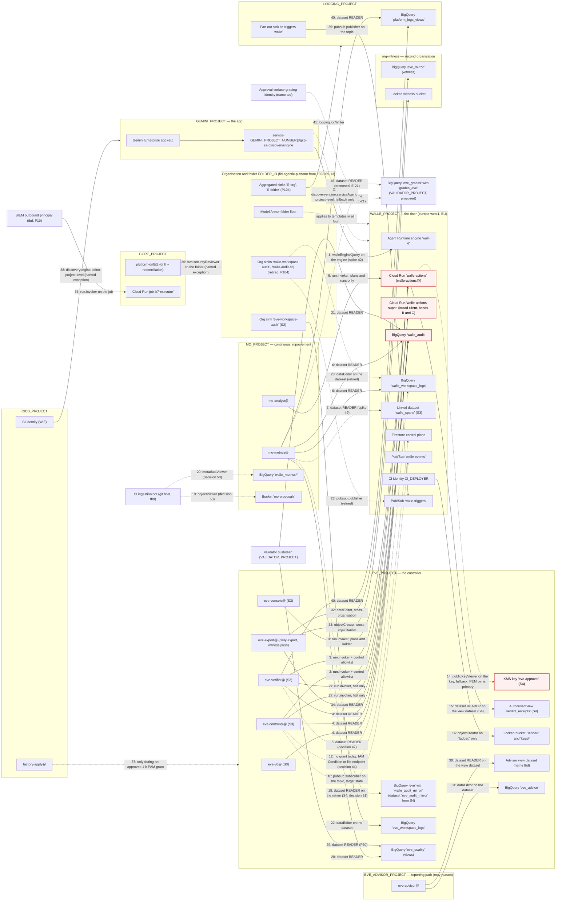

# Project topology — Gemini Enterprise, Wall-E, Eve, Mo

## Status
- Owner: the platform owner
- Last reviewed: 2026-09-14
- Maturity: design, decided 2026-09-13; nothing is built. This page is the **single authority**
  for where each platform project and each agent resource lives and how every grant crosses a
  project boundary (platform HLD [§3](agentic-platform/01-hld.md#3-the-landing-zone) and §18
  item 25); the folder tree is
  [02 §2](agentic-platform/02-landing-zone-and-tiers.md#2-the-folder-tree-every-folder-named), and
  the factory turns §3's rows into module inputs keyed on `<agent>_PROJECT`
  ([02 §3.3](agentic-platform/02-landing-zone-and-tiers.md#33-the-three-modules-and-the-topology-rows-they-consume)).

This is a **placement and least-privilege change**, not a redesign. The architecture, the
five trust boundaries, the autonomy ladder, the no-DWD rule, every decision in
[wall-e/09-open-decisions.md](wall-e/09-open-decisions.md) and
[wall-e/14-hld-challenge.md](wall-e/14-hld-challenge.md), the contract in
[wall-e/08-team-eve-mo.md](wall-e/08-team-eve-mo.md), and Eve's and Mo's designs beyond
placement are unchanged. What changes is which project each identity, key, secret, dataset,
bucket, topic, service and job sits in, and the exact form of each grant that crosses.

**Reversed 2026-09-13** (platform HLD "What this reverses and what it costs", §13; decision
records [../decisions/2026-09-13-wall-e-holds-super-admin.md](../decisions/2026-09-13-wall-e-holds-super-admin.md)
and [../decisions/2026-09-13-eve-reporting-path-may-reason.md](../decisions/2026-09-13-eve-reporting-path-may-reason.md)):
the sentence above no longer holds unchanged. Wall-E's robot holds Super Admin (P33), so a
project boundary no longer bounds the robot's credential; Eve gains a report-only reasoning
path in a project of its own (`EVE_ADVISOR_PROJECT`, P34) and a witness project in a second
organisation; Mo measures Eve as well as Wall-E. Placement of what this page already listed is
unchanged except where a row below carries a dated line; the additions are §2's new rows and
§3 rows 27–46.

Read first: [wall-e/01-hld.md](wall-e/01-hld.md),
[wall-e/02-identity-and-auth.md](wall-e/02-identity-and-auth.md),
[wall-e/ARCHITECTURE.md](wall-e/ARCHITECTURE.md) §4,
[eve/02-identity-and-auth.md](eve/02-identity-and-auth.md),
[mo/02-identity-and-access.md](mo/02-identity-and-access.md).

**The one rule** — a principal in one project reaches a resource in another project only through
a grant on that resource, never through a project-level role — and its complete list of named
exceptions are [§3.1](#31-notes-the-table-cannot-hold).

---

## 1. Why four projects

The argument below is for **one project per agent — a pattern, not a
count of four**. Every agent from Tier R up gets a factory-made project in its tier folder
(Tier C agents have none); Eve's reporting path adds a fifth agent-set project, the platform
adds five core projects, and the witness project lives in a second organisation (§2). The
reasons in §1.1 hold for each; the numbers in §1.4 multiply.

**Forced by Google, not chosen.** Two Google facts, re-read on 2026-09-13, make one project per
agent the only safe shape:

1. "All Agent Runtime agents deployed within that same project and region must bind to the same
   specific egress and ingress Agent Gateway instances" — the Agent Gateway runtime deploy page
   ([agent-gateway-runtime-deploy](https://docs.cloud.google.com/gemini-enterprise-agent-platform/scale/runtime/agent-gateway-runtime-deploy),
   updated 2026-09-08). Two agents in one project share one egress allow-list, so one agent's
   `egress:` hostnames become the other's.
2. `roles/discoveryengine.serviceAgent`, the documented cross-project grant for the tenant app,
   is **project-wide** over every engine and carries create/update/delete (§3 row 2). The
   platform avoids it with an engine-scoped custom role (decision 42), but the fallback, if ever
   needed, must touch one agent only.

Add the quota argument (Model Armor's 1,200 QPM sanitize quota is per project, platform HLD
§0.5) and the teardown argument (platform HLD D10: deleting the project removes the agent and
nothing else), and the pattern is settled. The cost is hundreds of projects; Resource Manager's
limits — 10 folder levels, 300 child folders per parent, an adjustable project quota — make that
routine, and the CreateProject rate limit ("costs 10 requests per second" of the API quota) is
irrelevant at the factory's pace
([Resource Manager limits](https://docs.cloud.google.com/resource-manager/docs/limits), updated
2026-09-09; [agentic-platform/02-landing-zone-and-tiers.md](agentic-platform/02-landing-zone-and-tiers.md) §2.1).

### 1.1 What one project lets happen today

The sets as written on 2026-09-12 put everything in Wall-E's project: Eve's identities, key
and secrets (Wall-E [SETUP.md](wall-e/SETUP.md) Phases 6, 8 and 15), Mo's identities and
datasets (Mo [07-build-runbook.md](mo/07-build-runbook.md) says "all three live in Wall-E's
project"), and the Gemini Enterprise service agent derived from **Wall-E's** project number
(SETUP Phase 12). Eve's own set already refused that placement
([eve/09-open-decisions.md](eve/09-open-decisions.md) E-1); this page extends the same
argument to Mo and to the app. Inside one project, these project-level grants each reach
across an agent's boundary — not by a bug, but because that is what a project-level role is:

| Project-level role in Wall-E's project | Who holds it today | What it reaches that belongs to another agent |
|---|---|---|
| `roles/owner` (the creator, SETUP Phase 6) and anyone who can edit the project IAM policy | The platform owner; later `walle-owners@` | Can grant themselves `roles/cloudkms.signer` on `eve-approval` and **mint an Eve approval**; can grant `secretmanager.secretAccessor` on `eve-refresh-token` and **read Eve's Workspace credential**; can delete `walle_audit` rows through a `dataEditor` grant despite the insert-only role; can read `walle_metrics_private.principal_surrogates` and reverse every surrogate. All of Eve's and Mo's invariants become "nobody did it", checked by a daily drift row. |
| `roles/run.developer` + `iam.serviceAccountUser` on `walle-actions@` (deployers, CI) | `CI_DEPLOYER` | Redeploys the credential holder. Unchanged by this page — it is Wall-E's largest control and stays in Wall-E's project — but in one project the same deployers also stood inside the project that held Eve's key. |
| `roles/datastore.viewer` (SETUP Phase 6, `EVE_PROJECT_ROLES`) | `eve-controller@` | Every Firestore document in the project, not only `plans/{id}`. Legitimate use, project-wide reach. §3 row 12. |
| `roles/agentregistry.viewer` (SETUP Phase 13b) | `eve-controller@`, `MO_PRINCIPAL` | Read-only, project-wide, and unused by any duty. §3 row 11. |
| `roles/bigquery.jobUser` for Mo and Eve queries (Mo 07 Phase Mo-2) | `mo-metrics@`, `mo-analyst@` | Harmless by itself, but it puts Mo's query cost, quota and job history inside Wall-E's project, and any later project-level `dataViewer` "for convenience" reaches `walle_audit`, `walle_metrics_private` and Eve's tables at once. |
| `roles/aiplatform.user` for `mo-narrator@` (Mo 02 §2.3) | `mo-narrator@` (S4) | `generateContent` in Wall-E's project — the one identity in the team that carries a model, sharing a project with the engine whose `reasoningEngines.query` is locked to three principals. |
| Discovery Engine service agent built from `PROJECT_NUMBER` | Gemini Enterprise | Wrong principal if the app lives elsewhere ([wall-e/12-agent-identity.md](wall-e/12-agent-identity.md) line 44 already records the assumption that it does). The number must be the **app** project's. |

Separate projects turn each of those from a policy that must keep being swept into a
structure: `walle-actions@` **has no principal** in the project that holds Eve's key, so
there is nothing to escalate from; Mo's surrogate mapping is in a project where no Wall-E or
Eve identity exists; the Gemini app's administrators hold nothing in Wall-E's project.

### 1.2 What a compromise of each project reaches, afterwards

"Compromise" means an attacker holding project-owner rights, or any identity in that project.

| Project compromised | Can reach | Cannot reach |
|---|---|---|
| `GEMINI_PROJECT` | The front door: which humans see Wall-E, and the `user_id` the app asserts when it calls the engine — so T0 requests in a real operator's name, up to the T0 ceiling of the ladder, and the conversation history. This is boundary 1 and the same class as [C10](wall-e/14-hld-challenge.md#c10--eves-streamquery-channel-can-assert-any-operators-identity-stands); the write-path re-check of `walle-operators@` membership through the Directory API is what bounds it, and it was already true in one project. | The robot credential, the control endpoints (the service agent is not on any allowlist), Eve's key, Eve's or Mo's evidence, any Wall-E secret, the Agent Registry entry (it lives in `WALLE_PROJECT`). 2026-09-13: the entry lives in the shared registry in `CORE_PROJECT` (P71); the app project additionally hosts `gemini-egress`, so a compromise can also admit an unregistered engine to the front door until the drift job sees the policy change (HLD §2.1). |
| `WALLE_PROJECT` | Everything Wall-E itself can do: the robot's refresh tokens and therefore the super-admin role's full reach — see the Tier P-SA row below; the answer is K5, K6 and K7 on a human rota (platform HLD §13.1 item 7); the Firestore control plane (halts, overrides, counters); `walle_audit` and `walle_workspace_logs` (deletion or rewrite); the engine's IAM policy; the in-app allowlists through a redeploy. | **An Eve approval** — the key is not here and no principal here can be granted `useToSign` on it; Eve's Workspace credential; Eve's `walle_audit_mirror`, `eve_workspace_logs` and locked bucket (the independent record survives); Mo's scorecard archive; the organisation-level sinks' definitions (organisation resources) — only their destinations. This column holds against `WALLE_PROJECT`'s IAM only. Anyone who uses the robot's super-admin credential from this project reaches all of it (next row). |
| **Tier P-SA — the robot's credential** (platform HLD §13.1): a leaked `walle@` refresh token of either OAuth client, an interactive login on `walle@`, or a compromised `walle-actions-super` | A **tenant compromise**: every super-admin action in Workspace within the consented scopes of the stolen client, including suspending `eve@`, revoking Eve's token, removing Eve's role, switching off "Share data with Google Cloud services" and re-filtering organisation sinks; and, through the power to grant Organization Administrator on the GCP organisation, a path into every project of the platform, `EVE_PROJECT` and its key included — so an approval can be forged or a kill undone once that path is taken. The narrow client keeps a Google-enforced scope ceiling for everything unattended; the broad client does not. Bounded by custody, scope split, detection latency and K6. | What has already left the organisation: the daily export and heartbeat in `EVE_WITNESS_PROJECT`, the witness's severity 1/2 channels and absence alarm, the K5 rota records (the witness's super admins are not the tenant's); objects already written to locked evidence buckets (retention lock: no delete, no overwrite, no shortening). Eve's detection of the takeover is minute-latency, not prevention; the end state that removes the approval-forgery path is P15. |
| `EVE_PROJECT` | Mint L4 approvals inside the current level's blast radius, bounded by hold windows, vetoes, caps and the fact that no Eve identity can raise a level; halt and demote at will (a denial of service, undone by an operator in seconds); read the tenant through `eve@` (read-only, no licence privilege); write false `verdict_receipts`; read `walle_audit`. | Execute any Workspace write (`eve@` holds no write privilege and `walle-actions` refuses Eve on `/v1/execute`); read any Wall-E secret; raise a level; touch anything of Mo's. Revoking Eve's three `run.invoker` bindings and disabling the key version is the containment, exactly as [eve/06-failure-modes.md](eve/06-failure-modes.md) says. Also halt `walle-actions-super` (row 27, halt only — a denial of service); `eve-export@` can add rows and objects to the witness stores but cannot delete or rewrite them (rows 32–33); Mo's `eve_quality` read (row 28) lets a compromise feed Mo false Eve numbers, which the source rule (numbers about Eve come from `grades_eve`, seeded-fault runs and Wall-E's `eve_last_seen`, never from `eve.verdicts` alone) is there to catch. |
| `MO_PROJECT` | Publish false numbers into datasets nothing that enforces reads; drop bundles into the drop box that CI turns into pull requests a human merges and the validator recomputes from `walle_audit`; read raw per-person rows of `walle_audit` as `mo-metrics@` (the disclosure risk in [mo/06-failure-modes.md](mo/06-failure-modes.md)); call the two read endpoints. | Approve, veto, halt, demote or execute; read any secret or key; write `walle_audit`, Firestore or the ladder; reach the engine or any Eve resource. The one Eve resource it reaches is `eve_quality`, read through authorised views (row 28); nothing Mo writes is read by Eve. |
| `EVE_ADVISOR_PROJECT` (P34) | Write false narratives into `eve.incidents.narrative` and `eve.advice` (row 31); page at severity 2 within the page budget; read `eve.*`, `eve_workspace_logs` and the report tables through authorised views with no free-text columns (row 30). | Approve, veto, halt, demote or execute — it holds no signer, no `run.invoker`, no secret; change a verdict — nothing it writes is read by `eve-gate`, `eve-reconciler`, `walle-actions` or `walle-actions-super`; write `eve/config`; page at severity 1; read any source dataset. |
| `EVE_WITNESS_PROJECT` in `org-witness` (HLD §13.2) | Only through the witness organisation's own super admins (IT security, outside the Wall-E line): suppress the severity 1/2 channels and the absence alarm; read the mirrored evidence. | Anything in the tenant's organisation: no witness principal holds any grant there. It cannot approve, halt or execute. |

### 1.3 What teardown of each project destroys

| Project deleted | Destroyed | Survives, and what to do first |
|---|---|---|
| `GEMINI_PROJECT` | The app, its conversation history, the registration of Wall-E as a custom agent, the share to `walle-operators@`. | Everything of Wall-E's. Wall-E's engine simply has no human front door. Nothing to delete first. |
| `WALLE_PROJECT` | The engine, both Cloud Run services, Firestore, `walle_audit`, `walle_workspace_logs`, `walle_spans`, the four topics, the queue, the three secrets, the OAuth client, `walle-content-logs`, the staging bucket, the custom roles. The custom roles are the project's custom IAM roles (`walleEngineQuery`, `walleAuditWriter`), not a Workspace admin role — **Super Admin on `walle@` survives the teardown of every project**; the OAuth clients are two (`walle-actions` narrow, `walle-actions-super` broad) with their secrets. | Eve's mirror of `walle_audit`, `eve_workspace_logs`, Eve's locked bucket with the PEM archive and the ladder artefacts, Mo's scorecard archive. **Delete the two organisation-level sinks `walle-workspace-audit` and `walle-audit-bq` first**, or they keep exporting to a destination that no longer exists (SETUP Phase 6 rollback). The OAuth grant survives; revoke it as in SETUP Phase 9. Superseded 2026-09-13: the two organisation sinks are not built (P104 re-homes them as `LOGGING_PROJECT` fan-out sinks; delete `to-triggers-walle` first instead); the evidence has already left through the daily export (P107); **first pull K6** (a human super admin removes Super Admin from `walle@`) and revoke both OAuth grants — deleting the project removes neither. |
| `EVE_PROJECT` | The key (past approvals stay verifiable only against the PEM pinned in Wall-E's repository — which is why the pin is the primary path), Eve's secrets, `eve`, `eve_workspace_logs`, the jobs and console. The **locked** evidence bucket carries a lien that blocks project deletion until its 400-day retention has elapsed, by design. | `walle_audit` and Wall-E's control plane. **Delete the organisation-level sink `eve-workspace-audit` first.** Approvals already executed keep their `eve_key_version` and signature in `walle_audit.approvals`. |
| `EVE_ADVISOR_PROJECT` | `eve-advisor`, its identity and its model configuration. | Everything of Eve's control path; the narratives already written in `eve_advice` (in `EVE_PROJECT`). Nothing outside the project to delete first; remove rows 30–31 from Eve's runbook state. |
| `EVE_WITNESS_PROJECT` | The out-of-organisation evidence copy, the channels, the rota records. The locked bucket's lien blocks deletion until retention elapses, by the witness's own design (`Assumption:` the witness bucket's retention equals Eve's 400 days). | Everything in the tenant's organisation. A deletion is exactly the silence the tenant side cannot see — hence the severity-1 rule on Eve's side when a push fails (P97 H-4). Revoke rows 32–33 on the witness side. |
| `MO_PROJECT` | The scorecard, the sixteen aggregates, the archive, the surrogate mapping, the drop box, the transfer configs. | The evidence. A promotion record cites `snapshot_name` and `scorecard_sha256`, and the validator recomputes from `walle_audit`, so a cited decision stays reproducible without the archive. Nothing outside the project to delete. |

### 1.4 The cost

- **Every crossing is explicit.** §3 has 26 rows where one project had none. Each is a
  runbook step **in the resource's project**, made by that project's owner, and each is a
  row in a drift job.
- **Four budgets** (`gcloud billing budgets create --filter-projects=projects/<id>`, one per
  project) instead of one, and four project IAM policies, four API-enablement lists, four
  organisation-policy checks and four owner groups — notional while one person holds them
  all, which is [E-2](eve/09-open-decisions.md) generalised (decision 52).
- **BigQuery bills the querying project.** Eve's and Mo's jobs run and are paid for in their
  own projects; Wall-E's project pays only storage. That is the intended separation, and it
  is also why `roles/bigquery.jobUser` is never granted cross-project.
- **More setup**: three `gcloud projects create --folder=$FOLDER_ID`, one per agent, plus
  the Gemini project's own short list; `walle_setup.py` gains four config keys and must make
  its Eve and Mo grants against foreign principals; Mo's runbook gains a project phase it
  does not have today.
- **Multiplied, 2026-09-13.** Budgets, IAM policies, API lists and owner groups are per
  project at every scale; the factory makes them and the drift job checks them, so the cost is
  a register row per agent, not a runbook (P35, P39; amounts stay P31). "Four owner groups are
  one person" is not recorded as permanent: it **expires on the super-admin grant date**
  (platform HLD §0.4). §3 now has 46 rows, 45–46 proposed.
- **Two spikes** this topology cannot avoid: whether the engine-scoped custom role suffices
  for the Gemini service agent across projects (decision 42), and whether Firestore's
  database-scoped IAM Condition replaces Eve's project-level `datastore.viewer` (decision 44).

---

## 2. The four projects

All four sit under the folder `FOLDER_ID` (§5), in `europe-west1`, with BigQuery in `EU`.
`Assumption:` the Gemini Enterprise app already exists in a project of its own —
[gemini-enterprise.md](gemini-enterprise.md) records that project as *tbd*, and decision 52
asks whether it is that project and whether it is moved under the folder.

**Placement re-cut 2026-09-13** (platform HLD §3.1, §3.2): `FOLDER_ID` becomes
`fld-agentic-platform`, and each project sits in the folder of its tier or role —
`GEMINI_PROJECT` under `fld-gemini-enterprise` (imported in place, decision 52 below),
`WALLE_PROJECT` under `fld-agents-p-sa`, `EVE_PROJECT` and `EVE_ADVISOR_PROJECT` under
`fld-controllers`, `MO_PROJECT` under `fld-improvers`, `KMS_PROJECT` with the other core
projects under `fld-platform-core`; `EVE_WITNESS_PROJECT` is outside the organisation. Every
project is created by the factory (P35), not by the runbook phase named in the last column —
`WALLE_PROJECT` and `EVE_PROJECT` end to end under an approved one-hour PAM grant (P142). The
five core projects `CORE_PROJECT`, `LOGGING_PROJECT`, `CICD_PROJECT`, `VALIDATOR_PROJECT` and
`KMS_PROJECT` are rows of the table below, as are the nonprod twins; the folder each sits in and
its policy additions are the platform HLD §3.1.

Every project in the table is **planned, not existing**, as of 2026-09-14. Project ids are
*tbd* (Wall-E's is decision D1 in [wall-e/SETUP.md](wall-e/SETUP.md) §1.1); the billing account
of every project is *tbd*, and whether the platform's billing account may fund the witness is
P14. `EVE_ADVISOR_PROJECT` is not built until P34 is signed and P19 answered.

| Project | Variable | Hosts — every identity, key, secret, dataset, bucket, topic, service, job | Must never host | Region | Who creates it, which runbook phase |
|---|---|---|---|---|---|
| **Gemini Enterprise app** | `GEMINI_PROJECT`, `GEMINI_PROJECT_NUMBER` | The Gemini Enterprise app (`projects/$GEMINI_PROJECT/locations/$GEMINI_APP_LOCATION/collections/default_collection/engines/$GEMINI_APP_ID`); its Discovery Engine service agent `service-${GEMINI_PROJECT_NUMBER}@gcp-sa-discoveryengine.iam.gserviceaccount.com`; the app's own agent identity; the registration of Wall-E as a custom agent (SETUP Phase 13) and its User-permissions share to `walle-operators@`; the console Model Armor setting for the app; `discoveryengine.googleapis.com`. 2026-09-13: the front door for every human-facing agent of the platform, not only Wall-E (platform HLD §2.1). | Any Wall-E, Eve or Mo identity, secret, key, dataset or bucket. Wall-E's engine. The Agent Registry entry (it is in `WALLE_PROJECT`, SETUP Phase 13b). Any Workspace credential. 2026-09-13: the entry is in `CORE_PROJECT` (P71); `aiplatform` is not in the folder's allow-list, so no engine can be created here; the one foreign principal is the CI identity of `CICD_PROJECT` (row 38). | App location `eu` (or `global`), per SETUP §1.1 D8. 2026-09-13: `eu`; `global` only as a dated exception (HLD §2.1) | `Assumption:` exists already, owned by the Gemini Enterprise administrators. Its short list is §7.4. 2026-09-13: imported in place by the factory's `tenant-app` module; also hosts `gemini-egress`, `gemini-registry` (`europe-west1`) and the console Model Armor template `ge-console-standard` ([agentic-platform/03-gemini-enterprise-environment.md](agentic-platform/03-gemini-enterprise-environment.md) §3). |
| **Wall-E** — the doer | `WALLE_PROJECT`, `WALLE_PROJECT_NUMBER` (inside Wall-E's own script and runbook: `PROJECT`, `PROJECT_NUMBER`, §6) | Identities `walle-actions@`, `walle-dispatcher@`, `walle-tasks@`, `walle-operators-caller@`, `walle-agent@` (fallback only) or the Agent Identity principal, `CI_DEPLOYER`; regional secrets `walle-oauth-client`, `walle-refresh-token`, `walle-confirm-hmac`; Wall-E's OAuth client and consent screen; Firestore `(default)`; datasets `walle_audit`, `walle_workspace_logs`, linked `walle_spans` (S3); topics `walle-events`, `walle-triggers`, `walle-inbox`, `walle-dead-letter`; Cloud Tasks queue `walle-plan-items`; Cloud Run `walle-actions` and `walle-dispatcher`; the Agent Runtime engine `wall-e`; Agent Registry (`europe-west1`), the egress gateway `walle-egress` and the ingress gateway; Model Armor templates and the project floor; log bucket `walle-content-logs`; bucket `${WALLE_PROJECT}-agent-staging`; Artifact Registry `walle`; Scheduler jobs `walle-<playbook>` and `walle-gmail-watch-renew`; custom roles `walleEngineQuery`, `walleAuditWriter`; the destinations of the organisation sinks `walle-workspace-audit` and `walle-audit-bq`. **Platform additions (HLD §13.1):** Cloud Run `walle-actions-super` with its own service account, its own secret and the broad OAuth client (band B `/v1/execute-generic`, band C `/v1/handoff`); `walle-actions` keeps the narrow client; the account `walle@` itself is a Workspace user with Super Admin, not a project resource. **Moved out 2026-09-13:** the Agent Registry (to `CORE_PROJECT`, P71); the organisation sinks' destinations (`walle_workspace_logs` becomes the authorised view `platform_logs_views.walle_workspace_logs` in `LOGGING_PROJECT`, P104); `walle-triggers` is fed by `to-triggers-walle` (row 39). | Eve's key, secrets, mirror, jobs or console. Any Mo dataset, identity or the drop box. The Gemini app. `eve-controller@` (SETUP Phase 6 creates it here today — it moves). A local Agent Registry (P71). Any organisation-level IAM role for `walle@` (drift row, HLD §13.1 item 5). | `europe-west1`, BigQuery `EU` | The platform owner, SETUP Phase 6 — `gcloud projects create "$PROJECT" --folder="$FOLDER_ID"` replaces `--organization`. 2026-09-13: the factory's `agent-project` module under `fld-agents-p-sa`, applied under `ent-factory-singleton` (P142); SETUP Phase 6 becomes a factory call |
| **Eve** — the controller | `EVE_PROJECT`, `EVE_PROJECT_NUMBER` | Identities `eve-v0@`, `eve-controller@`, `eve-verifier@`, `eve-console@`; KMS ring `eve`, key `eve-approval`; regional secrets `eve-oauth-client`, `eve-refresh-token`; Eve's own OAuth client and consent screen (the "Eve — Verifier" role's consent); datasets `eve` (with `walle_audit_mirror` until S4, when the mirror moves to a dataset of its own, `eve_audit_mirror` — distinct from the witness's `eve_mirror` (row 32); decision 51, Eve 07 Phase 11 — so that row 18's dataset-level `READER` covers nothing of Eve's), `eve_workspace_logs`, and the authorised-view dataset for `verdict_receipts` (name *tbd*, decision 48); bucket `gs://${EVE_PROJECT}-eve-evidence` (locked, with `keys/` and `ladder/`); Cloud Run jobs `eve-reconciler`, `eve-gate`, service `eve-console` behind IAP with its service agent `service-${EVE_PROJECT_NUMBER}@gcp-sa-iap.iam.gserviceaccount.com`; the twelve Eve v0 transfer configs; the Scheduler jobs; Artifact Registry `EVE_AR`; the destination of the organisation sink `eve-workspace-audit`. | `aiplatform.googleapis.com`, ever. Any Wall-E secret or Wall-E principal beyond the three carve-outs of decision 48. Wall-E's audit tables. Any Mo resource. 2026-09-13: "never enabled" is enforced by a **project-level** `gcp.restrictServiceUsage` denylist on `EVE_PROJECT` itself, not on `fld-controllers` (whose other child needs the API); the carve-out list gains the dated platform exceptions of rows 36–37 and the SDP service agent (row 44); Mo's only presence is row 28. **Platform additions (HLD §13.2, §13.3):** identity `eve-export@` (Cloud Run job: daily export into `exports/` of the locked bucket, then the witness push and heartbeat, P107); dataset `eve_quality` (`findings`, `verdicts`, `attestations`, `pages`, `incidents` minus narrative, `seeded_fault_runs`, with authorised views, HLD §13.3); dataset `eve_advice` (written by `eve-advisor@`, row 31); the authorised-view dataset `eve-advisor@` reads (name *tbd*, row 30); tables `eve.incidents` and `eve.pages` (HLD §13.2); `eve-approval` at HSM protection level (P118); the organisation sink `eve-workspace-audit` widened to all six Workspace streams. | `europe-west1`, BigQuery `EU` | The platform owner (target `eve-owners@`, E-2), [eve/07-build-runbook.md](eve/07-build-runbook.md) Phase 1, at S0 — add `--folder="$FOLDER_ID"`. 2026-09-13: the factory's `verifier-project` module under `fld-controllers`, applied under `ent-factory-singleton` (P142); `eve-owners@` owned by the second human outside the Wall-E line |
| **Eve reporting path** (HLD §13.2, P34) | `EVE_ADVISOR_PROJECT` | Identity `eve-advisor@`; the `eve-advisor` service and its model configuration (Model Armor under the controllers' tier floor, P84); `aiplatform.googleapis.com` allowed here only; `roles/bigquery.jobUser` for its own queries. | Any signer, `run.invoker` on any service, secret, write to `eve/config`, reader on a source dataset of `EVE_PROJECT`. | `europe-west1`, BigQuery `EU` (`Assumption:` as `EVE_PROJECT`) | The factory under `fld-controllers`; owner the Eve owner; not built until P34 is signed and P19 answered |
| **Mo** — continuous improvement | `MO_PROJECT`, `MO_PROJECT_NUMBER` | Identities `mo-metrics@`, `mo-analyst@`, `mo-narrator@` (S4, optional); datasets `walle_metrics`, `walle_metrics_archive`, `walle_metrics_private`, `walle_metrics_views`; the ~12 metric transfer configs and the assertion queries; bucket `mo-proposals` (the drop box; renamed 2026-09-13 from `walle-mo-proposals`, agent-neutral, platform HLD §18 item 22); Cloud Run job `mo-reporter` and, at S4, `mo-narrator`; the Scheduler jobs; Artifact Registry `mo`; `aiplatform.googleapis.com` enabled at S4 only, for `generateContent` against a pinned model id. | Any credential, secret or key. `walle_audit` or any copy of it. Firestore. Any `run.invoker` for an enforcement identity. Any reader on `walle_metrics_private` other than `mo-metrics@`. 2026-09-13: any binding for the validator custodian (P30's read is on `eve_quality` in `EVE_PROJECT`, row 29). | `europe-west1`, BigQuery `EU` | The platform owner (target `mo-owners@`), [mo/07-build-runbook.md](mo/07-build-runbook.md) — a new Phase Mo-0b before Mo-1, at S0 (§7.3). 2026-09-13: the factory's `improver-project` module under `fld-improvers`; one Mo per platform keyed on `agent_id`; dataset and bucket names agent-neutral (`mo-proposals`) before Stage 0 (HLD §13.3) |
| **Key project** (P118) | `KMS_PROJECT` | Autokey key project: engine CMEK keys, the platform-logs key; keys and nothing else. Its own `restrictServiceUsage` allow-list is `cloudkms` only. | Any identity, dataset, bucket or service of any agent. Eve's `eve-approval` and `eve-evidence` keys, which stay explicit in `EVE_PROJECT` for independence ([agentic-platform/08-data-logging-retention-sovereignty.md](agentic-platform/08-data-logging-retention-sovereignty.md) §9). | `europe-west1`; HSM | The factory's `platform-core` module under `fld-platform-core`; platform owner |
| **Platform core** (platform HLD §3.1) | `CORE_PROJECT` | The register of record (git) and the shared Agent Registry (`europe-west1`, P71; App Hub enabled here); the dataset `platform_registry` (row 36); the evidence lake; the ladder-state page (behind IAP); the reconciliation job and the platform drift job, both run as `platform-drift@` (P73); the fleet-kill Cloud Run job `k7-executor` and its identity `k7-executor@` (row 35); the Data Access canary job; its one secret `platform-pager-key` (a dated factory input, `secretmanager` enabled on this project alone — [agentic-platform/09-supply-chain-secrets-recovery.md](agentic-platform/09-supply-chain-secrets-recovery.md) §2.4). | Any agent principal, bound or existing (the deny policy `deny-core-agents` once P8 proves the principal forms; [agentic-platform/02-landing-zone-and-tiers.md](agentic-platform/02-landing-zone-and-tiers.md) §2.3). Any secret other than `platform-pager-key`. A second Agent Registry for agents (the one other registry is `GEMINI_PROJECT`'s `gemini-registry`). | `europe-west1`, BigQuery `EU` | The factory's `platform-core` module under `fld-platform-core`, applied by the platform owner through PAM; the five core projects are made once |
| **Central logging** (platform HLD §3.1, P104) | `LOGGING_PROJECT` | The destination of the two aggregated sinks `S-org` and `S-folder` (row 41); the fan-out sinks `to-evidence-bucket`, `to-identity-bucket`, `to-bigquery` and `to-triggers-<agent>` (row 39); the locked EU log buckets; the dataset `platform_logs` and the authorised-view dataset `platform_logs_views` (row 40); the log views; the billing export and the Pub/Sub topic `budget-events`; the service-agent container of the Sensitive Data Protection discovery scan (row 44). | Any agent principal. Any secret. | `europe-west1`, BigQuery `EU` | As `CORE_PROJECT` |
| **CI/CD** (platform HLD §3.1, P142) | `CICD_PROJECT` | Cloud Build; the shared Artifact Registry with one repository `agents/<agent>` per agent (row 43); SLSA provenance; the three Binary Authorization attestors `built-by-cloud-build`, `vuln-gated` and `promoted-to-prod` with their Container Analysis notes (row 42) and the KMS ring `supply-chain` holding the two non-Google attestor keys; the Workload Identity Federation pool for CI (provider limited to the git host's issuer); Terraform state; `factory-apply@` (row 37) and the CI identity (row 38). | Any agent principal. Any secret — the CI identity has none to read. | `europe-west1` | As `CORE_PROJECT` |
| **Validator** (platform HLD §3.1, §12.4) | `VALIDATOR_PROJECT` | The validator custodian (the security reviewer) and its identity (rows 21, 29); the contract validator; the platform verifier's golden fixtures; dataset `eve_grades` with table `grades_eve` (rows 45–46, proposed, E-21). | Any agent principal. Any write by a Mo identity (row 46 is a read). | `europe-west1`, BigQuery `EU` | As `CORE_PROJECT`; replaces "the validator custodian's own project, *tbd*" (decision 37) |
| **Witness** (HLD §13.2) | `EVE_WITNESS_PROJECT` in organisation `org-witness` | The evidence mirror: BigQuery dataset `eve_mirror` (the daily append-only export of `eve.findings`, `eve.verdicts`, `eve.incidents`, `eve.pages`; Eve's own in-tenant mirror in `EVE_PROJECT` is the differently named `eve_audit_mirror`, decision 51) and a locked bucket (name *tbd*) with the evidence bucket copy; a copy of `eve.incidents`; the K5 rota records; break-glass key-custody records (P69); the severity 1/2 Cloud Monitoring notification channels to individuals; the absence alarm on Eve's heartbeat and on Google's feed; Access Approval and Access Transparency. | Anything that can approve, halt or execute. Any grant to a principal of the tenant's organisation other than rows 32–33. Any administrator who is a tenant super admin. | EU (`Assumption:`, with P14) | The witness's two super admins (IT security, outside the Wall-E line); domain, Cloud Identity edition and billing linkage are P14; a precondition of the super-admin grant |
| **Nonprod twins** (P40) | per agent, the prod project's manifest with `env=nonprod` (naming: [agentic-platform/02-landing-zone-and-tiers.md](agentic-platform/02-landing-zone-and-tiers.md) §3.6) | A nonprod project per agent: **optional at Tier R, mandatory from Tier W** and for controllers and improvers (`fld-controllers-nonprod`, `fld-improvers-nonprod`, `fld-agents-p-sa-nonprod`); secrets named `<agent>-<purpose>-nonprod`, bootstrapped against the sandbox tenant (Tier P) or a nonprod system of record (Tier W). Tier P / P-SA nonprod acts against a **sandbox Workspace tenant**, never an OU of production (Super Admin cannot be OU-scoped). | Any production credential — a prod-tenant client id in a nonprod project is severity 1. An entry in the tenant gateway's access policy (`gemini-egress` never lists a nonprod engine). | as prod | The factory, under the `-nonprod` folder of each tier or role; `iam.allowedPolicyMemberDomains` there includes the sandbox tenant ([agentic-platform/02-landing-zone-and-tiers.md](agentic-platform/02-landing-zone-and-tiers.md) §3.5) |

**Outside the four, deliberately.** The **M0 host project** holding the operator's OAuth
client for `./walle workspace` ([wall-e/PREREQUISITES.md](wall-e/PREREQUISITES.md) §5.1) is a
pre-existing project and never the robot's; the **validator custodian's project** (decision
37) is the custodian's own and *tbd*; the **git host** is external; the two organisation
levels above the folder hold the three organisation-level sinks (`walle-workspace-audit`,
`walle-audit-bq`, `eve-workspace-audit`; `walle-content-sink` is project-level, SETUP Phase
12c) and the folder floor. The Workspace tenant is not a GCP project at all.
Since 2026-09-13: the validator custodian's project is `VALIDATOR_PROJECT` under
`fld-platform-core`; the three organisation-level sinks become P104's two aggregated sinks
(`S-org`, `S-folder`) into `LOGGING_PROJECT` plus Eve's independent `eve-workspace-audit`; the
floor hierarchy is P84's (§5); the witness project is the one project outside the organisation.

---

## 3. Cross-project grants

The complete table. **Level** is the resource the binding sits on. "Made by" is the
runbook that makes it, always in the resource's project. Rows marked **anti-grant** record an
absence that a drift job or denial test asserts. Verification dates are 2026-09-12 (Eve's and
Mo's sets) and 2026-09-13 (this page).

**Platform rows.** Rows 27–46 are the cross-project reaches the platform HLD and its detailed
pages add (platform HLD §18 item 25), each with its level and maker; existing rows the platform
changes carry a dated sentence in their role cell. Where the
factory makes a binding, the §3 row is the shape and
[agentic-platform/02-landing-zone-and-tiers.md](agentic-platform/02-landing-zone-and-tiers.md)
§3.3 is the module input; credential-path bindings (`run.invoker` on an action service,
secret-level accessor, key-level use) are applied in the factory's privileged phase by a human
through PAM (P142). Owner of every platform row: the platform owner (the Wall-E owner signs
for Wall-E's rows); gate: before the factory's first run (Tier R) unless the row says otherwise.

**Completeness rule.** Every cross-project grant and every topology edit the platform adds —
`platform-drift@`, `factory-apply@`, `k7-executor@`, the SIEM's outbound identity, the validator's
reads, `eve-export@`'s witness pushes, and any later one — is a row of this table or a named
exception in §3.1; nothing crosses a project on the strength of a sentence on another page.

**What exists today.** Nothing is built (Status), so no row of the table exists yet. Mo's set
records "exists today: no" for every Mo grant it lists (rows 6–8, 28 and 40), and the retired `agentregistry.viewer` grant of row 11 must stay "no"
([mo/02-identity-and-access.md](mo/02-identity-and-access.md) §2).

| # | Principal | Home | Resource | Resource project | Role, and level | Why | Verified (source) |
|---|---|---|---|---|---|---|---|
| 1 | `service-${GEMINI_PROJECT_NUMBER}@gcp-sa-discoveryengine.iam.gserviceaccount.com` | `GEMINI_PROJECT` | `projects/${WALLE_PROJECT}/locations/europe-west1/reasoningEngines/${ENGINE_ID}` | `WALLE_PROJECT` | `projects/${WALLE_PROJECT}/roles/walleEngineQuery` (`aiplatform.reasoningEngines.query` only), bound **on the engine** with `gcloud beta ai reasoning-engines set-iam-policy` (SETUP Phase 12). **Preferred; spike, decision 42.** Made by Wall-E's runbook. **2026-09-13:** generalised to every agent project as the custom role `geEngineQuery` bound on the engine by the agent project's `<agent>-deployer@` (P56, P142; [02](agentic-platform/02-landing-zone-and-tiers.md) §3.3); row 2 is never made by the factory, only as a dated exception. | The app fronts an Agent Runtime agent in another project; the caller is the **app** project's service agent, so the number is `GEMINI_PROJECT_NUMBER`, never `PROJECT_NUMBER`. Location: an `eu` app fronts `europe-*` agents, a `global` app any region (SETUP §1.1 D8; verified 2026-09-13 by the owner). | Principal and project number: [Configure cross-project ADK agent access](https://docs.cloud.google.com/gemini/enterprise/docs/configure-cross-project-adk-agents). Engine-scoped custom role: Google's "share an agent" guidance as recorded in SETUP Phase 12. **Whether the engine-scoped role alone suffices cross-project is unverified.** |
| 2 | the same service agent | `GEMINI_PROJECT` | project `WALLE_PROJECT` | `WALLE_PROJECT` | `roles/discoveryengine.serviceAgent`, **project-level — fallback only**, applied only if row 1 fails registration or the first query, and then recorded as the topology's one named project-level exception under decision 42. | Google's documented grant: the role is granted in the **agent** project, at project level, to the **app** project's service agent. It carries `reasoningEngines.create/delete/update` as well as `query`, which is why it is the fallback and not the default. | [Configure cross-project ADK agent access](https://docs.cloud.google.com/gemini/enterprise/docs/configure-cross-project-adk-agents) — "go to the project where the ADK agent is hosted … IAM & Admin > IAM … Discovery Engine Service Agent (`roles/discoveryengine.serviceAgent`)". |
| 3 | `eve-controller@${EVE_PROJECT}`, `eve-verifier@${EVE_PROJECT}`, `eve-console@${EVE_PROJECT}` | `EVE_PROJECT` | Cloud Run service `walle-actions`, `europe-west1` | `WALLE_PROJECT` | `roles/run.invoker`, **service-level** (`gcloud run services add-iam-policy-binding walle-actions --project=$WALLE_PROJECT`), made by Wall-E's runbook (Phase 10 loop, `SA_EVE` now foreign). Paths are narrowed by the in-app lists: `CONTROL_CALLER_ALLOWLIST=${SA_EVE},${SA_EVE_VERIFIER},${OPERATORS}` (controller, verifier) and the read-endpoint list (console: `GET /v1/plans`, `GET /v1/ladder`). **2026-09-13:** split into two factory inputs — `control_invokers[]` (`eve-controller@`, `eve-verifier@`; the in-app `CONTROL_CALLER_ALLOWLIST` generated from it and nothing else) and `read_invokers[]` (`eve-console@`; the read-endpoint allow-list, never the control list) — both applied in the factory's privileged phase through PAM (P142). | Approve, veto, halt, demote, `/healthz`, `/v1/ladder`, `/v1/plans`, `/v1/runs` — plain authenticated REST, never an agent protocol ([08](wall-e/08-team-eve-mo.md)). Cloud Run IAM is per service, not per path; the allowlist is the path control and the denial suite tests it. | Role on the receiving service to the caller's service account: [Authenticating service-to-service](https://docs.cloud.google.com/run/docs/authenticating/service-to-service). The page gives no cross-project sentence; `Assumption:` an IAM member string is global, which [Restricting identities by domain](https://docs.cloud.google.com/resource-manager/docs/organization-policy/restricting-domains) supports ("all service accounts … in any project in the organization" are allowed members). This is a **binding**, not an attachment, so `iam.disableCrossProjectServiceAccountUsage` stays enforced (§5). |
| 4 | `eve-v0@`, `eve-controller@`, `eve-verifier@` (`EVE_PROJECT`) | `EVE_PROJECT` | BigQuery dataset `walle_audit` (`EU`) | `WALLE_PROJECT` | Dataset access entry `{"role":"READER","userByEmail":…}` (= `roles/bigquery.dataViewer`), **dataset-level** via `bq show` / `bq update --source`, never project-level. `roles/bigquery.jobUser` in **`EVE_PROJECT`** (home, not a crossing). Made by Wall-E's runbook (CC-22), `add_dataset_access` keyed on `EVE_PROJECT`; `eve-v0@` at S0, the other two at S3 entry. Specifying the grant is Eve's decision E-9, due at S3 entry. | Eve v0's twelve scheduled queries, the daily `walle_audit_mirror`, post-hoc verification, reconciliation and drift read the audit tables. Jobs run and are billed in Eve's project. | `bigquery.jobs.create` on the querying project "regardless of where the data is stored", `tables.getData` on the referenced tables, querying project billed: [Run a query](https://docs.cloud.google.com/bigquery/docs/running-queries). Access array: [Control access to resources with IAM](https://docs.cloud.google.com/bigquery/docs/control-access-to-resources-iam). |
| 5 | `eve-verifier@${EVE_PROJECT}` | `EVE_PROJECT` | BigQuery dataset `walle_workspace_logs` | `WALLE_PROJECT` | Dataset-level `READER` — **proposed, decision 47**; no grant exists in either set today. **2026-09-13:** the read target moves: `walle_workspace_logs` becomes the authorised view `platform_logs_views.walle_workspace_logs` in `LOGGING_PROJECT`, and this row's grant is row 40 (P104, P107). | Eve's pages assert on every pass that Wall-E's copy carries no actor exclusion, and no grant supports the read. Reading the organisation sink's filter would need organisation-level `logging.viewer`, refused. | Mechanic as row 4. The claim it serves: [eve/03-lld.md](eve/03-lld.md), [eve/08-contract-changes.md](eve/08-contract-changes.md). |
| 6 | `mo-metrics@${MO_PROJECT}` | `MO_PROJECT` | BigQuery datasets `walle_audit` and `walle_workspace_logs` | `WALLE_PROJECT` | Dataset-level `READER` on each; `roles/bigquery.jobUser` in **`MO_PROJECT`**. Made by Wall-E's runbook at Mo's Stage-0 phase, `add_dataset_access` keyed on `MO_PROJECT`. **2026-09-13:** the `walle_audit` half stands (`audit_readers[]`); the `walle_workspace_logs` half becomes row 40 on `platform_logs_views` in `LOGGING_PROJECT` (P104). | T0 computes every metric from the raw audit tables; metric 9 (audit completeness) joins Google's admin events to `walle_audit` rows. Scheduled queries run and are billed in Mo's project. | [Run a query](https://docs.cloud.google.com/bigquery/docs/running-queries); scheduled queries "can reference tables from different projects and different datasets": [Scheduling queries](https://docs.cloud.google.com/bigquery/docs/scheduling-queries). |
| 7 | `mo-metrics@${MO_PROJECT}` | `MO_PROJECT` | Linked observability dataset `walle_spans` (`_AllSpans`) | `WALLE_PROJECT` (`Assumption:` the `_Trace` bucket is the engine's) | Dataset-level `READER`, **S3 only**, after a human holding `roles/observability.editor` in `WALLE_PROJECT` creates the link (Mo-10). **Spike, decision 49.** | Token spend, tool-call counts, per-invocation latency joined on `invocation_id` and `trace_id` (M38). | **Unverified** — whether a linked dataset's access array accepts a foreign dataset-level entry. |
| 8 | `mo-analyst@${MO_PROJECT}` | `MO_PROJECT` | Cloud Run service `walle-actions` | `WALLE_PROJECT` | `roles/run.invoker`, service-level, made by Wall-E's runbook (Phase 10 loop gains `MO_PRINCIPAL`); the **read-endpoint allowlist** must carry this full email for `GET /v1/plans/{id}` and `GET /v1/runs/{id}` only — never the control list. MD-3 and MD-4 test the refusal cross-project. **2026-09-13:** a `read_invokers[]` input, applied in the privileged phase (P142); the denial suite asserts refusal on `/v1/control/*`. | Weekly `plan_hash` recomputation on a sample. The only thing BigQuery cannot tell Mo. | As row 3. |
| 9 | Mo's authorised views `${MO_PROJECT}.walle_metrics_views.<view>` (view entries, not identities) | `MO_PROJECT` | Source datasets `walle_audit`, `walle_workspace_logs` | `WALLE_PROJECT` | **None — anti-grant.** No `{"view": {...}}` entry naming a Mo view is ever added to a Wall-E dataset's access array. Mo's views read `walle_metrics.scorecard` and are authorised on `walle_metrics` **inside `MO_PROJECT`** (§4). | A view runs with its own authorisation, and `mo-metrics@` can `CREATE OR REPLACE` it; a view authorised on `walle_audit` could be redefined to select `params_redacted` and would hand raw free text to any reader of the view dataset. [mo/02-identity-and-access.md](mo/02-identity-and-access.md) §3 makes the absence a control; Mo-6's verify step checks it. The cross-project authorised-view form exists but is not used. | [Authorized views](https://docs.cloud.google.com/bigquery/docs/authorized-views): view in a different dataset than its source; same regional location; the querying principal needs `dataViewer` on the view's dataset and nothing on the source. The page does not state a cross-project case; none is needed here. |
| 10 | `eve-controller@`, `eve-verifier@` (`EVE_PROJECT`), and any Mo identity | `EVE_PROJECT`, `MO_PROJECT` | Pub/Sub topic `walle-events` | `WALLE_PROJECT` | **Target state only, no grant at Stage 0** ([C30](wall-e/14-hld-challenge.md#c30--the-walle-events-topic-has-no-consumer-bigquery-does-not-already-serve-stands)). The form, when a consumer names a duty: subscription created in the consumer's project (`pubsub.subscriptions.create` there) and `roles/pubsub.subscriber` bound **on the topic** (it carries `pubsub.topics.attachSubscription`). Decision 45. | SETUP Phase 7 says "Eve and Mo subscribe"; with separate projects that is a cross-project subscription, and both Eve's and Mo's sets decline it today. | [Create a subscription](https://docs.cloud.google.com/pubsub/docs/create-subscription): "you must have `pubsub.subscriptions.create` permission on the project in which you are creating the subscription, and `pubsub.topics.attachSubscription` permission on the topic". Role contents and per-resource grants: [Access control](https://docs.cloud.google.com/pubsub/docs/access-control). |
| 11 | `eve-controller@`, `eve-verifier@` (`EVE_PROJECT`), `MO_PRINCIPAL` (`mo-analyst@${MO_PROJECT}`) | `EVE_PROJECT`, `MO_PROJECT` | Agent Registry, `projects/${WALLE_PROJECT}/locations/europe-west1` | `WALLE_PROJECT` | `roles/agentregistry.viewer`, **project-level — breaks the rule.** Granted by SETUP Phase 13b, `walle_setup.py` `registry`, Eve 07 Phase 9 and Mo-6. **Recommendation: drop** (decision 43). **2026-09-13:** moot as well as dropped — the Agent Registry moves to the shared registry in `CORE_PROJECT` and `agentregistry.googleapis.com` is absent from every tier folder's allow-list (P71); the one platform principal holding `agentregistry.viewer` is `platform-drift@` on `CORE_PROJECT` (row 36). | Neither needs it: Eve asserts the card's URL against a committed value it can hold in `eve/config`; Mo never converses with Wall-E. The registry v1 API has no `getIamPolicy`/`setIamPolicy` and its four roles are project-level ([13](wall-e/13-agent-interconnection.md) §2.2). | [Agent Registry roles and permissions](https://docs.cloud.google.com/agent-registry/roles-permissions) lists the four roles and no sub-project level. |
| 12 | `eve-controller@`, `eve-verifier@` (`EVE_PROJECT`) | `EVE_PROJECT` | Firestore `(default)` — Wall-E's control plane | `WALLE_PROJECT` | **None today.** `roles/datastore.viewer` was project-level in the sets as written on 2026-09-12 (SETUP Phase 6, `EVE_PROJECT_ROLES`; Eve 07 Phase 9; Eve's E-12 exception) and **broke the rule**; since 2026-09-13 SETUP Phase 6, `walle_setup.py` (`EVE_PROJECT_ROLES = ()`) and the self-test refuse it, and Eve's pages record the read as absent. Narrowest replacement: the same role under an **IAM Condition scoped to the database resource**, expression unverified; or a list endpoint on `walle-actions` (`GET /v1/plans?state=pending_eve`, Eve's CC-33). Decision 44. Until it lands, `eve-gate` has no Firestore read and its discovery path is blocked at S3 entry. | `eve-gate` polls `plans/{id}` for `state == pending_eve`; `eve-reconciler` reads epochs and drills. Firestore has no dataset-style resource IAM; Google documents database-scoped conditions. | [Firestore IAM](https://docs.cloud.google.com/firestore/native/docs/security/iam): "To learn how to configure IAM Conditions for access to one or more databases, see Configure database access conditions" — that page was not retrieved; the condition expression stays **unverified**. |
| 13 | `eve-controller@${EVE_PROJECT}` | `EVE_PROJECT` | `reasoningEngines/${ENGINE_ID}` | `WALLE_PROJECT` | **None — anti-grant.** `walleEngineQuery` is removed from `eve-controller@` per [C10](wall-e/14-hld-challenge.md#c10--eves-streamquery-channel-can-assert-any-operators-identity-stands); Eve's set asserts no `aiplatform.*` permission on any Eve identity. Two query principals remain: row 1 and `walle-dispatcher@` (same project). SETUP Phase 12's third member is deleted. | A query principal asserts `user_id`; Eve verifying through the agent is Eve verifying through the thing it verifies. | [eve/02-identity-and-auth.md](eve/02-identity-and-auth.md) "Why neither Eve identity can reach a model"; CI asserts the engine policy. |
| 14 | `walle-actions@${WALLE_PROJECT}` | `WALLE_PROJECT` | Cloud KMS CryptoKey `eve-approval`, ring `eve`, `europe-west1` | `EVE_PROJECT` | **None by default.** Verification uses the PEM pinned per key version in Wall-E's repository (`contracts/eve-public-keys/<version>.pem`). Optional fallback: `roles/cloudkms.publicKeyViewer` **on that one CryptoKey** (`gcloud kms keys add-iam-policy-binding … --project=$EVE_PROJECT`), made by Eve's owner (Eve 07 Phase 11). Never ring- or project-level; never `signerVerifier` or `cryptoOperator`. Carve-out 1 of decision 48. | Wall-E must verify `EC_SIGN_P256_SHA256` approvals and must be unable to sign. `publicKeyViewer` carries only `cryptoKeyVersions.viewPublicKey`. | [Cloud KMS permissions and roles](https://docs.cloud.google.com/kms/docs/reference/permissions-and-roles): `publicKeyViewer` = `viewPublicKey` (+ location/project reads), lowest grantable level **CryptoKey**; `signerVerifier` and `cryptoOperator` both carry `useToSign`. |
| 15 | `walle-actions@${WALLE_PROJECT}` | `WALLE_PROJECT` | Authorised view `verdict_receipts` (`run_id`, `item`, `verdict_ts`) in a dataset **separate from `eve`** (name *tbd*), authorised on dataset `eve` | `EVE_PROJECT` | Dataset-level `READER` on the **view's dataset** only, from S4 (E-17). Made by Eve's owner. Carve-out 2 of decision 48. | The `eve_evidence_stale` sweeper checks that a receipt exists; it must never branch on content. Eve's pages place the view inside `eve`, which Google forbids for an authorised view — the separate dataset is decision 48's second question. | [Authorized views](https://docs.cloud.google.com/bigquery/docs/authorized-views): different dataset from the source, same location, `dataViewer` on the view's dataset and nothing on the source. |
| 16 | Wall-E's CI identity (`CI_DEPLOYER`, per SETUP; Eve's pages say "Wall-E's CI identity") | `WALLE_PROJECT` | Bucket `gs://${EVE_PROJECT}-eve-evidence`, objects under `ladder/` | `EVE_PROJECT` | `roles/storage.objectCreator` with the IAM Condition `resource.name.startsWith("projects/_/buckets/${EVE_PROJECT}-eve-evidence/objects/ladder/")` (Eve 07 Phase 9). Create-only, prefix-only, bucket-level. Made by Eve's owner. Carve-out 3 of decision 48. **2026-09-13:** the principal is the agent project's deploy identity `<agent>-deployer@` of `WALLE_PROJECT` (P142 retires one CI-project deployer for all); still carve-out 3. | Publishes the ladder artefact append-only so Eve compares against a config Wall-E's deployers cannot rewrite, without Eve holding a git credential. | `resource.name` conditions on Cloud Storage objects: [Overview of IAM Conditions](https://docs.cloud.google.com/iam/docs/conditions-overview); the bucket-binding form: [Add a conditional role binding](https://docs.cloud.google.com/storage/docs/samples/storage-add-bucket-conditional-iam-binding). `objectCreator` cannot view, delete or overwrite: [Cloud Storage IAM roles](https://docs.cloud.google.com/storage/docs/access-control/iam-roles). |
| 17 | Wall-E's daily drift job (`walle-actions@`, or an identity Eve's pages leave unnamed) | `WALLE_PROJECT` | IAM policies of key `eve-approval`, secret `eve-refresh-token`, dataset `eve`, and project `EVE_PROJECT` | `EVE_PROJECT` | **None** — the narrowest read would be `roles/iam.securityReviewer` on `EVE_PROJECT`, project-level, which the rule and CC-29 forbid. Decision 46: reassign those assertions to Eve's own drift job and the Eve owner. **2026-09-13:** decision 46 is closed by the platform drift job `platform-drift@CORE_PROJECT` (HLD §4.7, P73), which holds `roles/iam.securityReviewer` at `fld-agentic-platform` — row 36, the named folder-level exception; Wall-E's drift job still holds nothing in `EVE_PROJECT`. | [eve/02-identity-and-auth.md](eve/02-identity-and-auth.md) lines 483–486 and [eve/07-build-runbook.md](eve/07-build-runbook.md) say Wall-E's job asserts Eve-side properties it cannot read. | Not applicable (absence). |
| 18 | `mo-metrics@${MO_PROJECT}` | `MO_PROJECT` | Decision 31's off-project evidence copy of `walle_audit` — recommended: Eve's `walle_audit_mirror`, moved at S4 into a dataset of its own (`eve_audit_mirror`, decision 51) | `EVE_PROJECT` (decision 51) | Dataset-level `READER` on the mirror's dataset, from **S4**, made by Eve's owner (Eve 07 Phase 11, step 5). A Mo principal in Eve's project: the one entry of a second carve-out list, which Eve 02 and Eve 07 Phase 12 now name. `Assumption:` the mirror carries only the columns Mo reads; `eve` holds Eve's own tables, so the mirror moves to its own dataset first, because dataset-level `READER` covers every table. **2026-09-13:** decision 51 closed by P107 — the mirror is `eve_audit_mirror` in `EVE_PROJECT` (queryable copy; name per decision 51), the daily JSONL export is the immutable copy, the witness the out-of-organisation copy. | From S4 Mo reads the copy rather than the live dataset so Wall-E's deployers cannot rewrite the evidence Mo argues from ([M-5](mo/08-open-decisions.md)). | Mechanic as row 4. Whether the mirror satisfies decision 31 is decision 51. |
| 19 | CI ingestion identity — the bot that opens pull requests (identity and home *tbd*, M-7) | External / *tbd* | Bucket `mo-proposals` (renamed 2026-09-13 from `walle-mo-proposals`, platform HLD §18 item 22) | `MO_PROJECT` | `Assumption:` `roles/storage.objectViewer`, **bucket-level**; if the git host federates, the Workload Identity Federation pool lives in `MO_PROJECT`. Decision 50. | CI ingests one bundle at a time from the drop box. Mo's design names `mo-analyst@`'s `objectCreator` and not the reader. | **Unverified** — mechanic is an ordinary bucket binding; the identity is the open part. |
| 20 | CI ingestion identity | External / *tbd* | Dataset `walle_metrics_archive` (metadata: `snapshot_name` exists) and the published `scorecard_sha256` register | `MO_PROJECT` | `Assumption:` `roles/bigquery.metadataViewer`, dataset-level. Must not extend to the validator, which holds nothing in `MO_PROJECT` (MD-9). Decision 50. | Ingestion refuses a bundle whose snapshot does not exist or whose hash was never published (MD-6); across a project boundary that check needs a named, metadata-only route. | **Unverified** — proposed M-11 (c) in Mo's set. |
| 21 | The validator custodian's identity (decision 37) | The custodian's own project, *tbd* | Dataset `walle_audit` | `WALLE_PROJECT` | Dataset-level `READER`; `roles/bigquery.jobUser` in the custodian's project. **No binding of any kind in `MO_PROJECT`** (MD-9). Made by Wall-E's runbook. **2026-09-13:** the custodian's home is `VALIDATOR_PROJECT` under `fld-platform-core`; it also reads `eve_quality` (row 29). | Re-executes the evidence SQL at its pinned commit and re-draws the blind sample. A validator that read `walle_metrics` would check Mo against Mo. | [Run a query](https://docs.cloud.google.com/bigquery/docs/running-queries) — the job-project / data-project split. |
| 22 | Writer identity of the organisation sink `eve-workspace-audit` (Google-managed) | Organisation | Dataset `eve_workspace_logs` | `EVE_PROJECT` | `roles/bigquery.dataEditor`, dataset-level, made by Eve 07 Phase 7. **2026-09-13:** kept, the one organisation-level sink outside the aggregated pair, its filter widened to all six Workspace streams (admin, enterprise groups, login, OAuth token, SAML, access transparency) with no actor exclusion (HLD §13.2; P104); the dataset and the writer identity's `dataEditor` are made by the factory's `verifier-project` module. | Eve's independent Google-written record of what the robot did, with **no actor exclusion**, outside Wall-E's teardown reach. | [Aggregated sinks](https://docs.cloud.google.com/logging/docs/export/aggregated_sinks): the destination "can be in any organization"; the writer identity needs Data Editor on a BigQuery destination. |
| 23 | Writer identities of the organisation sinks `walle-workspace-audit` and `walle-audit-bq` | Organisation | Topic `walle-triggers`; dataset `walle_workspace_logs` | `WALLE_PROJECT` | `roles/pubsub.publisher` on the topic; `roles/bigquery.dataEditor` dataset-level (SETUP Phase 11.3). Already designed; listed so the organisation → Wall-E direction is complete. **Retired 2026-09-13 (P104):** Wall-E's two organisation sinks are deleted and re-homed — the trigger stream becomes `to-triggers-walle` in `LOGGING_PROJECT` (row 39), the reconciliation copy becomes the authorised view of row 40 over `platform_logs`, fed by `S-org` and `S-folder` (row 41). Gate: before Wall-E's Stage 1. | The T2 trigger stream (with the robot excluded) and the reconciliation copy (with nothing excluded). `dataEditor` includes `tables.deleteData`, which is why the sink never points at `walle_audit`. | As row 22. |
| 24 | Every enforcement identity: `walle-actions@`, `walle-dispatcher@`, `walle-tasks@`, the agent principal, the ladder deploy tool (`WALLE_PROJECT`); every Eve identity (`EVE_PROJECT`); the validator; the Gemini service agent (`GEMINI_PROJECT`) | `WALLE_PROJECT`, `EVE_PROJECT`, `GEMINI_PROJECT` | Project `MO_PROJECT` and its four datasets | `MO_PROJECT` | **None — anti-grant**, asserted by MD-9 and by a check that `MO_PROJECT`'s IAM policy names no principal from the other three projects. **2026-09-13:** the Eve identities include `eve-export@` and `eve-advisor@`; the validator custodian is in `VALIDATOR_PROJECT`; folder-inherited platform principals (row 36) are the named exceptions and are listed in the check's expected set. | No byte Mo writes is read by anything that enforces ([M-1](mo/08-open-decisions.md)). The project boundary makes it checkable on one policy. | Not applicable (absence). |
| 25 | Any Wall-E principal beyond rows 14, 15 and 16, and any Wall-E deployer | `WALLE_PROJECT` | Project `EVE_PROJECT` | `EVE_PROJECT` | **None — anti-grant**, asserted daily by Eve's drift job (CC-29 reworded per decision 48). **2026-09-13:** the expected set also carries, as dated named exceptions on decision 48, the folder-inherited platform principals (row 36), `factory-apply@` only while an approved `ent-factory-singleton` grant is active (row 37), and the SDP discovery service agent (row 44); a fifth foreign principal still fails. | Eve's invariant: `walle-actions@` cannot mint an approval and cannot read Eve's credential, structurally. | Not applicable (absence). |
| 26 | Any Eve or Mo identity beyond rows 3–8 and 10 | `EVE_PROJECT`, `MO_PROJECT` | Project `WALLE_PROJECT` — any **project-level** role | `WALLE_PROJECT` | **None — anti-grant.** Rows 11 and 12 are no longer granted (Wall-E's runbook, script and self-test refuse both since 2026-09-13), so the exception list is empty; the only possible future entry is decision 44's resource-scoped Firestore form, named there before it is granted (Eve's E-12 as reworded). Asserted by Wall-E's drift job and by `./walle verify`. **2026-09-13:** "beyond rows 3–8 and 10" reads "beyond rows 3–8, 10, 27 and 34" (both resource-level); the platform's folder-inherited principals (rows 36–37) are the named exceptions. | The rule of this page. `roles/bigquery.jobUser`, `datastore.viewer`, `agentregistry.viewer` and any `dataViewer` at project level in Wall-E's project are lateral paths into every dataset and document there. | Not applicable (absence). |
| 27 | `eve-controller@${EVE_PROJECT}`; since 2026-09-13 also `eve-verifier@${EVE_PROJECT}` | `EVE_PROJECT` | Cloud Run service `walle-actions-super`, `europe-west1` | `WALLE_PROJECT` | `roles/run.invoker`, **service-level**, **halt path only**: the in-app control list of `walle-actions-super` carries this principal for `/v1/control/halt` and no other endpoint. Made by Wall-E's runbook (a `control_invokers[]` entry applied in the factory's privileged phase through PAM, P142). Gate: the super-admin grant. **Extended 2026-09-13: `eve-verifier@${EVE_PROJECT}` holds the same grant, halt path only.** Eve's halts on the super-admin lane — `reconciliation_gap` over every stream, the tenant-integrity rules, `log_pipeline_silent` — are raised by the reconciler limb, which runs as `eve-verifier@` ([eve/03-lld.md](eve/03-lld.md) §14); routing them through `eve-gate` would put the parser of attacker-writable log strings in the process that holds the signer. Halt lowers only, so the verifier holding it keeps "machines lower"; it holds no approve, veto or demote endpoint on this service. | Eve halts both lanes, not only the catalogue lane (HLD §13 diagram); approvals, vetoes and demotions have no meaning on a permanently-L3 lane approved by humans. | As row 3. |
| 28 | `mo-metrics@${MO_PROJECT}` | `MO_PROJECT` | BigQuery dataset `eve_quality` (`findings`, `verdicts`, `attestations`, `pages`, `incidents` minus narrative, `seeded_fault_runs`), read through authorised views with no free-text columns | `EVE_PROJECT` | Dataset-level `READER` on `eve_quality` only; `roles/bigquery.jobUser` in **`MO_PROJECT`**. Never `grades_blind` or `review_queue_blind`; never any other `eve*` dataset. Made by **Eve's runbook**. Basis: HLD §13.3. Gate: Wall-E's Stage 1. `Assumption:` `eve_quality` is `EU`, like every Mo dataset — a cross-location join fails outright — confirmed by Mo-2's verify block. | Mo improves Eve as well as Wall-E: detection quality, time-to-report, false-refusal Wilson bounds. Eve reads nothing Mo writes; the "no `userByEmail` entry for `mo-metrics@` on `eve` — ever" check narrows to the non-quality datasets. | Mechanic as row 4; view shape as row 15 ([Authorized views](https://docs.cloud.google.com/bigquery/docs/authorized-views)). |
| 29 | The validator custodian's identity (decision 37) | `VALIDATOR_PROJECT` | BigQuery dataset `eve_quality` | `EVE_PROJECT` | Dataset-level `READER`; `roles/bigquery.jobUser` in `VALIDATOR_PROJECT`. **No binding in `MO_PROJECT`.** Made by **Eve's runbook** (P30). Gate: Eve proposals beyond `incident_note`. | The gate re-derives the Eve quality pack Mo publishes; until this row exists, Eve-targeting bundles are advisory `incident_note` only. | Mechanic as row 21. |
| 30 | `eve-advisor@${EVE_ADVISOR_PROJECT}` | `EVE_ADVISOR_PROJECT` | The authorised-view dataset (name *tbd*) that fronts `eve.*`, `eve_workspace_logs` and the report tables, with no free-text columns | `EVE_PROJECT` | Dataset-level `READER` on the **view dataset only — never on the source datasets**; `roles/bigquery.jobUser` in `EVE_ADVISOR_PROJECT`. Made by **Eve's runbook**. Basis: HLD §13.2, P34. Gate: the `eve-advisor` build. | The reporting path reasons over Eve's findings and the Workspace streams to describe what the catalogue cannot enumerate. | [Authorized views](https://docs.cloud.google.com/bigquery/docs/authorized-views): the querying principal needs `dataViewer` on the view's dataset and nothing on the source; same location. |
| 31 | `eve-advisor@${EVE_ADVISOR_PROJECT}` | `EVE_ADVISOR_PROJECT` | Dedicated dataset `eve_advice` (carries `eve.incidents.narrative` and `eve.advice`) | `EVE_PROJECT` | `roles/bigquery.dataEditor` **on dataset `eve_advice` only**. Made by **Eve's runbook**. Basis: HLD §13.2, P34. Gate: the `eve-advisor` build. | Report-only by construction: nothing `eve-gate`, `eve-reconciler`, `walle-actions` or `walle-actions-super` reads is in `eve_advice` — the gate reads `eve.*` control tables and `eve/config`, never `eve.advice`. The absence of any reader of `eve_advice` among those identities is asserted by Eve's drift job (`Assumption:` mechanism; the HLD states the property, not the check). | Dataset-level role mechanic: [Control access to resources with IAM](https://docs.cloud.google.com/bigquery/docs/control-access-to-resources-iam). |
| 32 | `eve-export@${EVE_PROJECT}` | `EVE_PROJECT` | BigQuery dataset `eve_mirror` (the witness's; Eve's own in-tenant mirror is `eve_audit_mirror`, decision 51) | `EVE_WITNESS_PROJECT`, **organisation `org-witness`** | `roles/bigquery.dataEditor` on that dataset only. Made by **the witness administrators**, on witness resources. One of the **only two cross-organisation grants** (HLD §13.2). The witness's `iam.allowedPolicyMemberDomains` lists the tenant's customer id for this principal only; the tenant's constraint needs no witness exception. Gate: the super-admin grant. | The mirror is a **push**: the daily append-only export of `eve.findings`, `eve.verdicts`, `eve.incidents`, `eve.pages` and the heartbeat row the absence alarm watches. No witness principal holds any grant in the tenant's organisation. | Mechanic as row 4 across organisations; `Assumption:` a foreign-organisation service account is an admissible member once the witness's domain restriction lists the tenant ([Restricting identities by domain](https://docs.cloud.google.com/resource-manager/docs/organization-policy/restricting-domains)); edition and billing are P14. |
| 33 | `eve-export@${EVE_PROJECT}` | `EVE_PROJECT` | The witness bucket (name *tbd*), retention-locked | `EVE_WITNESS_PROJECT`, organisation `org-witness` | `roles/storage.objectCreator`, bucket-level, create-only. Made by **the witness administrators**. The second of the two cross-organisation grants. Gate: the super-admin grant. | Copy of Eve's evidence bucket objects; a compromised `eve-export@` can add objects but cannot delete or rewrite what is there. | `objectCreator` cannot view, delete or overwrite: [Cloud Storage IAM roles](https://docs.cloud.google.com/storage/docs/access-control/iam-roles). |
| 34 | `eve-export@${EVE_PROJECT}` | `EVE_PROJECT` | BigQuery dataset `walle_audit` | `WALLE_PROJECT` | Dataset-level `READER` (an `audit_readers[]` entry); `roles/bigquery.jobUser` in `EVE_PROJECT`. Made by **Wall-E's runbook**. Basis: [agentic-platform/08-data-logging-retention-sovereignty.md](agentic-platform/08-data-logging-retention-sovereignty.md) §5.4, P107. Gate: Wall-E's Stage 1. | The daily newline-JSON export of `walle_audit.*` with SHA-256 manifests into `exports/` of Eve's locked bucket, the Art. 12 log's immutable copy; one identity per duty (the exporter is not the reconciler). | Mechanic as row 4. |
| 35 | The SIEM's outbound principal — the SecOps webhook or the organisation SIEM's service account, *tbd* with P10 | the SIEM (outside the platform folder) | Cloud Run job `k7-executor`, `europe-west1` | `CORE_PROJECT` | `roles/run.invoker`, **resource-level on the job**. Made by **the platform owner through PAM**. Only the auto-K7 subset of rules calls it (SG-01..SG-04, PL-02), over plain authenticated REST. Basis: HLD §11.4, §18 item 25. Gate: the super-admin grant (Tier P). To confirm at the first drill: `run.invoker` carries `run.jobs.run` but not `run.jobs.runWithOverrides`; if the SIEM passes `{scope, case_id, dry_run}` as execution overrides, the role on the job is `roles/run.jobsExecutorWithOverrides` instead ([agentic-platform/04-identity-and-privileged-access.md](agentic-platform/04-identity-and-privileged-access.md) §9 owns the job's interface). | The fleet kill must be reachable by a severity-1 rule at 03:00 without a model and without a standing organisation-level role; the job activates its own 30-minute PAM grant. | [Cloud Run IAM roles](https://docs.cloud.google.com/run/docs/reference/iam/roles), read 2026-09-13: `roles/run.invoker` = `run.instances.invoke`, `run.jobs.run`, `run.routes.invoke`, lowest level service, job or instance; `roles/run.jobsExecutorWithOverrides` adds `run.jobs.runWithOverrides`. |
| 36 | The platform drift job `platform-drift@${CORE_PROJECT}` | `CORE_PROJECT` | Folder `fld-agentic-platform` (**inherited into every project below it, `EVE_PROJECT` included**) | the folder | `roles/iam.securityReviewer`, **folder-level — the named exception** to the one rule (D7) and to decision 48's three-carve-out cap, together with the folder deny policy, the PAB and the K7 job's PAM entitlement. **Extended 2026-09-13 (P73)**, the same principal running the reconciliation schedule: `roles/cloudasset.viewer` on the folder, `roles/agentregistry.viewer` on `CORE_PROJECT`, `roles/bigquery.jobUser` and dataset-level `WRITER` on `platform_registry`, per-service `run.invoker` on each Tier W+ agent's action service for `/v1/control/halt` (resource-level, generated from each manifest), and `roles/securitycenter.findingsViewer` at the organisation — the `cloudasset.viewer` and `findingsViewer` role names **unverified** ([agentic-platform/05-registry-and-autonomy-contract.md](agentic-platform/05-registry-and-autonomy-contract.md) §6.3). Made by the platform owner in the factory's `platform-core` module (`Assumption:` module), the security reviewer signing the exception. Recorded as a dated line on decision 48 and on row 17; added to Eve's drift job's expected set so a fifth foreign principal still fails. | "What exists and who may reach it" across hundreds of projects needs one reader of every IAM policy; a second folder-level principal for inventory would be a second exception for the same duty. | Folder-level inheritance: "IAM roles granted on a folder resource are inherited by all project and folder resources in that folder" — [Resource hierarchy](https://docs.cloud.google.com/resource-manager/docs/cloud-platform-resource-hierarchy), read 2026-09-13; role names as the recording page states them. |
| 37 | `factory-apply@${CICD_PROJECT}` | `CICD_PROJECT` | Projects under `fld-controllers-*` and `fld-agents-p-sa-*` (`EVE_PROJECT`, `EVE_ADVISOR_PROJECT`, `WALLE_PROJECT`) | `EVE_PROJECT`, `WALLE_PROJECT` | **No standing role.** Present only during an approved one-hour `ent-factory-singleton` PAM grant, requested by `factory-apply@` and approved by a human. Made by **the platform owner** (the PAM entitlement). Recorded as a dated, time-boxed exception on decision 48; Eve's drift job accepts it only while a matching approved grant is active in the PAM audit log, so a standing binding still fails as a fifth foreign principal. Deny rule R6 denies it every secret-read, key-use and impersonation permission. Basis: P142. Gate: before the first controller project is applied (Tier W). | An unconditioned folder-level `projectIamAdmin` inherited into `WALLE_PROJECT` could bind itself the super-admin secret. | [agentic-platform/12-open-decisions.md](agentic-platform/12-open-decisions.md) P142 (the PAM and `modifiedGrantsByRole` facts are sourced on the recording pages). |
| 38 | The CI identity of `CICD_PROJECT` (via Workload Identity Federation) | `CICD_PROJECT` | Project `GEMINI_PROJECT` | `GEMINI_PROJECT` | `roles/discoveryengine.editor`, **standing, project-level — the one foreign principal in the app project**, a named exception to the one rule. Made by the factory's `tenant-app` module (`Assumption:` maker; the recording page names the grant, not its maker). Basis: P49. | Imports endpoints into `gemini-registry`, writes the gateway access policy, registers agents in the app; `editor` lacks `discoveryengine.agents.setIamPolicy`, so sharing stays a PAM act by `ge-admins@`. | [agentic-platform/03-gemini-enterprise-environment.md](agentic-platform/03-gemini-enterprise-environment.md) §4 (verified 2026-09-13 there). |
| 39 | Writer identities of the `LOGGING_PROJECT` project sinks `to-triggers-<agent>` | `LOGGING_PROJECT` | Topic `<agent>-triggers` (for Wall-E `walle-triggers`) | the agent project (`WALLE_PROJECT`) | `roles/pubsub.publisher` on the topic. Made by the factory's `agent-project` module. Replaces row 23's trigger half. Basis: P104. Gate: before Wall-E's Stage 1. | The T2 trigger stream, same filter and the same robot exclusion as before, without an organisation-level `logging.configWriter` in any agent runbook. | [agentic-platform/08-data-logging-retention-sovereignty.md](agentic-platform/08-data-logging-retention-sovereignty.md) §3.2. |
| 40 | `mo-metrics@${MO_PROJECT}`, `eve-verifier@${EVE_PROJECT}` | `MO_PROJECT`, `EVE_PROJECT` | Dataset `platform_logs_views` (holds the authorised view `walle_workspace_logs` over `platform_logs`, filtered to `admin.googleapis.com`) | `LOGGING_PROJECT` | Dataset-level `READER`; `jobUser` at home. Made by the factory's `platform-core` module (`Assumption:` module; the dataset is in `LOGGING_PROJECT`). Replaces the `walle_workspace_logs` half of rows 5 and 6; decision 47's data-level check reads the same view. Basis: P104, P107. Gate: before Wall-E's Stage 1. | Mo's metric 9 and Eve's no-actor-exclusion check keep their input without a Wall-E-owned organisation sink. Queried from BigQuery, never from organisation-level Cloud Logging, whose `_Default` bucket is fixed at 30 days for organisations. | [agentic-platform/08-data-logging-retention-sovereignty.md](agentic-platform/08-data-logging-retention-sovereignty.md) §3.2; view mechanic as row 30. |
| 41 | Writer identities of the aggregated sinks `S-org` (organisation, no children) and `S-folder` (`fld-agentic-platform`, children, intercepting) | Organisation; folder | Project `LOGGING_PROJECT` (project destination) | `LOGGING_PROJECT` | `roles/logging.logWriter` on `LOGGING_PROJECT`, as the recording page specifies for a project destination; `to-bigquery`'s writer holds `dataEditor` dataset-level on `platform_logs` only. Made by the factory's `platform-core` module. Replaces rows 22–23's per-agent organisation sinks (row 22 kept beside it). Basis: P104. | Evidence the judged thing cannot forge or silence (CP6) is two sinks and a locked bucket; N organisation sinks would be N `configWriter` grants to review. | [agentic-platform/08-data-logging-retention-sovereignty.md](agentic-platform/08-data-logging-retention-sovereignty.md) §3.2. |
| 42 | Each agent project's Binary Authorization service agent `service-<AGENT_PROJECT_NUMBER>@gcp-sa-binaryauthorization.iam.gserviceaccount.com` | the agent project | The three attestors in `CICD_PROJECT` and their Container Analysis notes | `CICD_PROJECT` | `roles/binaryauthorization.attestorsVerifier` on each attestor; `roles/containeranalysis.notes.occurrences.viewer` on their notes; resource-level. Made by the factory. Basis: P115. Gate: Tier W. | Admission of attested images only, verified from the project that runs them. | https://docs.cloud.google.com/binary-authorization/docs/multi-project-setup-cli (read 2026-09-03 by the recording page, [agentic-platform/09-supply-chain-secrets-recovery.md](agentic-platform/09-supply-chain-secrets-recovery.md) §1). |
| 43 | Agent Runtime's service agent of each Tier W+ agent project (exact form *tbd*) | the agent project | Artifact Registry repository `agents/<agent>` | `CICD_PROJECT` | An Artifact Registry reader grant on that repository only, never project-wide. **Unverified** — service-agent form and cross-project repository acceptance *tbd*; fallback a per-agent-project remote repository upstreamed to `CICD_PROJECT`. Made by the factory. Basis: P116. Gate: Tier W. | Engines from Tier W up deploy from the attested container image by digest. | [agentic-platform/09-supply-chain-secrets-recovery.md](agentic-platform/09-supply-chain-secrets-recovery.md) §1 (the page did not render the relevant section on 2026-09-13). |
| 44 | The Sensitive Data Protection discovery service agent (service-agent container `LOGGING_PROJECT`) | `LOGGING_PROJECT` | BigQuery and Cloud Storage across `fld-agentic-platform`, `EVE_PROJECT` included | the folder | Discovery scan configured **at the folder**; the reads it needs are Google's grants to the SDP service agent (role *tbd* — verify before the factory run). A **named foreign principal in Eve's drift job's expected set**. Made by the platform owner (P108). Gate: Tier R. | Declared-versus-discovered data classes (TISAX 1.3.2); `secret`-class stores excluded by register label. | [agentic-platform/08-data-logging-retention-sovereignty.md](agentic-platform/08-data-logging-retention-sovereignty.md) §6.1. |
| 45 | The approval surface's grading identity (service account name *tbd*, the surface that renders Eve's verdicts blind to a human grader and draws the sample) | the approval surface's project (per agent, P46; `WALLE_PROJECT` for Wall-E) | BigQuery dataset `eve_grades` (table `grades_eve`) | `VALIDATOR_PROJECT` | An insert-only custom role at **dataset level** on `eve_grades` (the `walleAuditWriter` shape: `bigquery.tables.updateData` and `getData` only, no delete); `jobUser` at home. Made by **the validator custodian** (security reviewer) on the custodian's resources. **Proposed 2026-09-13, `Assumption:` until [eve/09-open-decisions.md](eve/09-open-decisions.md) E-21 is signed.** No Eve, Mo or Wall-E enforcement identity writes it. Gate: before any Eve quality number is marked evidence-eligible (Wall-E's Stage 1). | Numbers about Eve must survive a compromised Eve (the source rule, Mo A10), so the grades cannot live in `EVE_PROJECT`; Eve's verdicts never enter Wall-E's project, so not there; Mo is never Eve's grader, so not `MO_PROJECT`. `VALIDATOR_PROJECT` already re-derives the Eve pack. | Mechanic as row 21 (dataset access entry); the insert-only role has the shape of Wall-E's `walleAuditWriter`. |
| 46 | `mo-metrics@${MO_PROJECT}` | `MO_PROJECT` | BigQuery dataset `eve_grades` (table `grades_eve`) | `VALIDATOR_PROJECT` | Dataset-level `READER` on `eve_grades` only; `roles/bigquery.jobUser` in **`MO_PROJECT`**. Made by **the validator custodian**. The custodian reads it at home (no crossing). **Proposed 2026-09-13, with row 45 (E-21).** Gate: Wall-E's Stage 1. | Mo's E1–E3 and assertion A10 read `grades_eve`; without this row they have no granted source. Mo gains no write in `VALIDATOR_PROJECT`, so the validator's independence from Mo holds. | Mechanic as row 21. |

**Human grants that cross a project.** Not agents, listed so nobody re-derives them from
the wrong project:

| Human principal | Resource | Role, level | Why | Source |
|---|---|---|---|---|
| Whoever creates `EVE_PROJECT`, `MO_PROJECT` (and `WALLE_PROJECT`) | Folder `FOLDER_ID` | `roles/resourcemanager.projectCreator` on the folder | `gcloud projects create … --folder="$FOLDER_ID"`; `--folder` and `--organization` are alternatives, and nothing moves a project afterwards. **2026-09-13:** `roles/resourcemanager.projectCreator` goes to `factory-apply@` only; no human holds it ([02](agentic-platform/02-landing-zone-and-tiers.md) §3.3). | [gcloud projects create](https://docs.cloud.google.com/sdk/gcloud/reference/projects/create) — "`--folder`: ID for the folder to use as a parent". |
| `OPERATOR_EMAIL` (the person running `./walle register`) | Project `GEMINI_PROJECT` | `roles/discoveryengine.viewer`, project-level | The script reads the app's location (D8) with the operator's own token; without it the check warns and the M8 verifier returns SKIP ([PREREQUISITES](wall-e/PREREQUISITES.md) §6.2). A human, read-only, in a project that holds nothing of Wall-E's. **Superseded 2026-09-13:** dropped; the standing group `ge-readers@` holds `roles/discoveryengine.viewer` and the factory reads the app location as CI ([03](agentic-platform/03-gemini-enterprise-environment.md) §4). | PREREQUISITES §6.2. |
| `walle-operators@` | Cloud Run service `eve-console` | `roles/iap.httpsResourceAccessor` on the IAP resource; the same-project IAP service agent `service-${EVE_PROJECT_NUMBER}@gcp-sa-iap` holds `run.invoker` | Eve's console for humans. The service agent's number is **Eve's**, not Wall-E's. | [IAP for Cloud Run](https://docs.cloud.google.com/run/docs/securing/identity-aware-proxy-cloud-run). |
| `walle-operators@` (through `walle-operators-caller@`) | Cloud Run service `walle-actions` | `run.invoker` | Same project as Wall-E — crosses nothing; listed because the same group also crosses into Eve's console. | SETUP Phase 10. |
| Break-glass accounts `brk-gcp-1@`, `brk-gcp-2@`, members of `gcp-organization-admins@` only | The GCP organisation | `roles/resourcemanager.organizationAdmin` and `roles/privilegedaccessmanager.admin`, **standing, organisation-level** — the only standing organisation-level human roles. Made by the platform owner with the second human as cross-line key custodian (`Assumption:` maker; P69 names the owners) | PAM cannot bootstrap itself; sealed hardware keys, sign-in = severity 1, quarterly drill; never Workspace admins, never PAM approvers | [agentic-platform/04-identity-and-privileged-access.md](agentic-platform/04-identity-and-privileged-access.md) §7 (P69) |

### 3.1 Notes the table cannot hold

- **The one rule.** A principal in one project reaches a resource in another project only
  through a grant **on that resource** — a Cloud Run service or job, a BigQuery dataset, a
  Pub/Sub topic, a Cloud KMS key, a Cloud Storage bucket, a reasoning engine — never through a
  project-level role in the other project (platform HLD D7). Where a Google product offers no
  resource-level form, the grant is either dropped or recorded as a **named exception** with its
  reason and its decision number; anti-grants are asserted by the drift job. None is left
  implicit.
- **The named exceptions, complete.** Each is enumerated with its level and maker, dated on
  decision 48 and listed in Eve's drift job's expected set, so a fifth foreign principal still
  fails:

  | Exception | Level | Maker | Row or record |
  |---|---|---|---|
  | `platform-drift@${CORE_PROJECT}` — `roles/iam.securityReviewer`, with P73's reconciliation roles | folder `fld-agentic-platform`, inherited into every project below it, `EVE_PROJECT` included | platform owner, the security reviewer signing | row 36 |
  | `factory-apply@${CICD_PROJECT}` — present only during an approved one-hour `ent-factory-singleton` PAM grant | the projects under `fld-controllers-*` and `fld-agents-p-sa-*` | platform owner (the PAM entitlement) | row 37 |
  | The folder deny policy `deny-agents-platform` and the Principal Access Boundary `pab-agents` bindings | folder, inherited | platform owner through `ent-platform-policy` (deny and PAB administration are organisation-level only) | [agentic-platform/04-identity-and-privileged-access.md](agentic-platform/04-identity-and-privileged-access.md) §3, §4, §5 |
  | The K7 job's PAM entitlements `ent-k7-executor` (30 min, requested by `k7-executor@`) and `ent-k7-human` | organisation (org policy, deny, PAB) and `fld-agentic-platform` (Scheduler) | platform owner | [agentic-platform/04-identity-and-privileged-access.md](agentic-platform/04-identity-and-privileged-access.md) §9; row 35 is the SIEM's invoke grant on the job |
  | The CI identity's `roles/discoveryengine.editor` on `GEMINI_PROJECT` (CI discovery writes and reads) | project, standing | the factory's `tenant-app` module (`Assumption:` maker) | row 38, P49 |
  | The Sensitive Data Protection discovery service agent | folder scan, reads by Google's grants | platform owner | row 44, P108 |
  | Row 2, `roles/discoveryengine.serviceAgent` on `WALLE_PROJECT` — only if decision 42's spike fails | project | Wall-E's runbook, with the failing error recorded | row 2, decision 42 |

  **Why the platform's principals are acceptable exceptions to decision 48's three-carve-out
  cap** (platform HLD §4.7, dated 2026-09-13): the principal is the platform's, not any agent's;
  it holds a read-only role (or, for `factory-apply@`, no standing role at all); it lives in a
  folder where no agent principal exists; and it is itself on Eve's anti-grant list — Eve's own
  drift job asserts that nothing but these platform principals and the three Wall-E carve-outs
  (rows 14–16) appears in `EVE_PROJECT`. They are platform principals, not Wall-E principals, and
  do not count against the three carve-outs. The deny policy's own one named exception, rule R6,
  runs the other way: it denies `factory-apply@` every secret-read, key-use and impersonation
  permission ([agentic-platform/04-identity-and-privileged-access.md](agentic-platform/04-identity-and-privileged-access.md) §3).
- **Row 1 is the spike this page cannot close.** Google documents only the project-level
  role for the cross-project case. The design's engine-scoped custom role is narrower and
  is what SETUP Phase 12 already builds; whether the service agent's cross-project call
  succeeds with it alone is answered by attempting the Phase 13 registration and the first
  query with only row 1 in place. Row 2 is applied only on failure, and then the exception
  is written down — decision 42.
- **Rows 11, 12 and 16 were the three places the sets broke the rule on 2026-09-12.** 11 is
  dropped and 12 is no longer granted (Wall-E's set, 2026-09-13); 12's replacement is
  narrowed or re-routed by decision 44, and nothing is granted meanwhile; 16 is not a
  project-level role at all — it is
  a Wall-E principal in Eve's project, which Eve's invariant forbids in absolute terms, and
  the invariant is reworded to a three-entry carve-out (decision 48) rather than quietly
  ignored.
- **The allowlists are not IAM.** Each action service narrows `run.invoker` per endpoint with an
  in-app allowlist generated from the manifest's `control_invokers[]` and `read_invokers[]`,
  never typed — the control list, the read-endpoint list and `walle-actions-super`'s halt-only
  list, with who is on each, are [wall-e/03-lld.md](wall-e/03-lld.md#gcp-resource-inventory).
- **Cross-organisation grants are exactly two.** Rows 32 and 33 are made
  in the witness organisation by its administrators, for one tenant principal; no witness
  principal appears in the tenant's organisation. The end state P15 (Eve's control path
  relocated to the witness) would enumerate more, each with its cost, and is not a year-one
  precondition.
- **A super-admin credential ignores this table.** Every row bounds a
  service account or a group; none bounds `walle@`, which can reach Organization
  Administrator. The rows keep an *uncompromised* Wall-E from reaching Eve's key or evidence;
  a compromised credential is §1.2's Tier P-SA row, answered by detection and the witness.
- **BigQuery: the job runs where the principal lives.** Every cross-project read above is
  a dataset-level `READER` in the data project plus `jobUser` in the reader's own project.
  No `jobUser` is ever granted cross-project, and no project-level `dataViewer` anywhere.
- **API enablement in both projects.** Google's general rule for a service account reaching
  a resource in another project is that the resource's API is usually enabled in both
  ([Service accounts overview](https://docs.cloud.google.com/iam/docs/service-account-overview)).
  Eve's project therefore enables `bigquery` and `run` (it does); Mo's enables `bigquery`,
  `run` and `storage`; **neither ever enables `aiplatform`** for that reason — Eve's rule
  stands, and Mo's `aiplatform` is for `generateContent` at S4, not for the engine.

---

## 4. What crosses nothing

Interactions that start and end inside one project, so no row above applies and the
existing runbooks stand as written:

| Project | Stays inside |
|---|---|
| `GEMINI_PROJECT` | Workspace SSO into the app; the per-agent share to `walle-operators@`; the app's own Model Armor console setting; the app's agent identity. |
| `WALLE_PROJECT` | The whole request path: dispatcher → engine (`walle-dispatcher@` holds `walleEngineQuery` on the engine, same project), engine → `walle-actions` (the agent principal's `run.invoker` and `EXEC_CALLER_ALLOWLIST`), `walle-tasks@` → the worker endpoint, `walle-actions@` → Secret Manager, Firestore, `walle_audit` (`walleAuditWriter`, insert-only), Pub/Sub, Cloud Tasks; the Agent Registry entry and the egress gateway (2026-09-13: the registry entry leaves the project for the shared registry in `CORE_PROJECT`, written by `factory-apply@`, P71, so it becomes a crossing made by the factory, not a home interaction); Model Armor templates and the ingress gateway; `walle-actions-super@` → its own secret, the broad OAuth client's; the policy chain's hard-denied check on both services; the operators' `run.invoker`; the Gmail watch on `walle-inbox`; the linked `walle_spans` dataset's creation. |
| `EVE_PROJECT` | `eve-controller@` → `cloudkms.signer` on `eve-approval`; both runtime identities → `secretAccessor` on Eve's two secrets; `eve-v0@` → `eve` (`dataEditor`) and the daily mirror copy job; `eve-verifier@` → `objectCreator` on the evidence bucket; `eve-console@` → `dataViewer` on `eve`; the four Scheduler jobs → the two Cloud Run jobs; IAP → `eve-console`; the `verdict_receipts` view authorised on `eve`; `eve@<domain>`'s consent and its OAuth client. |
| `MO_PROJECT` | `mo-metrics@` → `WRITER` on the four Mo datasets and the `MERGE` into `principal_surrogates`; `mo-analyst@` → `READER` on `walle_metrics` and `walle_metrics_archive`, `objectCreator` on the drop box, `run.invoker` on the `mo-reporter` job; the views in `walle_metrics_views` authorised on `walle_metrics` (**never** on a Wall-E dataset, row 9); `mo-narrator@` → `READER` on `walle_metrics_views` and `aiplatform.user` for `generateContent` (S4). |
| `EVE_PROJECT` — platform additions (HLD §13.2, §13.3) | `eve-export@` → dataset-level `READER` on `eve.*` and `storage.objectViewer` on Eve's locked bucket, and `roles/storage.objectCreator` on `exports/` of that bucket under the condition `resource.name.startsWith(".../objects/exports/")` (create-only, the form of row 16); `eve-gate` → halt on both Wall-E lanes is rows 3 and 27, not a home grant; the authorised views over `eve_quality` and over the advisor's view dataset authorised on their sources inside `EVE_PROJECT`; `eve-console`'s IAP audience is a group whose membership change is a severity-1 rule (HLD §13.2). |
| `EVE_ADVISOR_PROJECT` | `eve-advisor@` → `roles/bigquery.jobUser` and the model API in its own project; nothing else at home. |
| `EVE_WITNESS_PROJECT` (organisation `org-witness`) | The absence alarm (a Cloud Monitoring policy on the heartbeat table the export writes), the severity 1/2 notification channels, Access Approval and Access Transparency, the K5 rota records — all administered by the witness's own super admins. |

Two things that look like crossings and are not: **the pinned PEM** (a file in Wall-E's
repository, so `walle-actions` verifies Eve's signature with no grant at all), and
**`ladder.yaml` in git** (Mo reads it from the repository, not from any project).

---

## 5. Folder, organisation policies and the floor

This section's first cut of 2026-09-13 — one folder `FOLDER_ID` for the four projects and a
per-project constraint checklist — is superseded by the platform folder tree
([02 §2](agentic-platform/02-landing-zone-and-tiers.md#2-the-folder-tree-every-folder-named)) and
the organisation-policy baseline at `fld-agentic-platform`
([02 §4.1](agentic-platform/02-landing-zone-and-tiers.md#41-the-baseline-every-constraint-by-exact-name),
with the service allow-lists of
[§4.2](agentic-platform/02-landing-zone-and-tiers.md#42-gcprestrictserviceusage-per-folder--the-allow-lists);
P41). Organisation-policy administration, and so the kill plane's org-policy lever, is a PAM
entitlement at the organisation
([04](agentic-platform/04-identity-and-privileged-access.md) §5); the Model Armor floor
hierarchy is [06 §3.2](agentic-platform/06-gateways-model-armor-perimeter.md#32-the-floor-hierarchy),
and the perimeter that replaced the first cut's VPC Service Controls row is
[06 §4](agentic-platform/06-gateways-model-armor-perimeter.md#4-the-perimeter) (P3, P90).

Three points of the first cut are this topology's own and stay here:

- **Crossings are bindings, not attachments.** `constraints/iam.disableCrossProjectServiceAccountUsage`
  stays enforced everywhere (B6): nothing in this topology *attaches* a service account from one
  project to a resource in another; every crossing in §3 is a binding of a foreign member on a
  resource, which the constraint does not govern. Source:
  [Attach service accounts](https://docs.cloud.google.com/iam/docs/attach-service-accounts) — the
  constraint "controls whether you can attach a service account to a resource in another
  project. It is enforced by default."
- **Parentage.** `gcloud projects create` takes `--folder` **or** `--organization`; a project
  parented outside its folder inherits nothing from the folder's floor and policies, and
  `gcloud beta projects move` is the repair
  ([PREREQUISITES](wall-e/PREREQUISITES.md) §10 item 20).
- **The floor per project.** Mo's project inherits the folder floor for `mo-narrator@`'s
  `generateContent` calls at S4; Eve's project never enables `aiplatform`, so the floor is moot
  there; the Gemini app's console Model Armor setting does not cover custom agents, whose
  screening is at each agent's ingress gateway and project floor.

---

## 6. Names

| Canonical variable | Meaning | Where it is used |
|---|---|---|
| `GEMINI_PROJECT`, `GEMINI_PROJECT_NUMBER` | The Gemini Enterprise app's project and number | Wall-E's SETUP §1.7 and `walle.env.example` (new keys); SETUP Phase 12 lock-down (row 1); `./walle register` (already addresses the app by `GEMINI_APP_ID` and `GEMINI_APP_LOCATION`, now under `GEMINI_PROJECT`) |
| `WALLE_PROJECT`, `WALLE_PROJECT_NUMBER` | Wall-E's project and number, **as named from Eve's and Mo's sets and from this page** | Eve 07 and Mo 07 shell blocks; the wiki |
| `PROJECT`, `PROJECT_NUMBER` | **Wall-E's own project and number, inside Wall-E's script and runbook only.** `PROJECT` is Wall-E's project; `WALLE_PROJECT` elsewhere. Documented once, here, and once in SETUP §1.6; the three other Wall-E pages that keep `$PROJECT` in their command blocks carry the same one-line note at their top. Not renamed: `walle_setup.py` reads `PROJECT` in every subcommand and a rename would touch ~7,950 lines for no safety gain. | `walle_setup.py`, `walle.env.example`, SETUP.md; also [wall-e/07-build-runbook.md](wall-e/07-build-runbook.md), [wall-e/PREREQUISITES.md](wall-e/PREREQUISITES.md) and [wall-e/12-agent-identity.md](wall-e/12-agent-identity.md), each with the note |
| `EVE_PROJECT`, `EVE_PROJECT_NUMBER` | Eve's project and number | Eve 07 (already); Wall-E's SETUP and script (new keys, for rows 3, 4, 5 and the allowlists) |
| `MO_PROJECT`, `MO_PROJECT_NUMBER` | Mo's project and number | Mo 07 (new — today it reuses `PROJECT`); Wall-E's SETUP and script (new keys, for rows 6, 8 and the read allowlist; `MO_PRINCIPAL` resolves to `serviceAccount:mo-analyst@${MO_PROJECT}.iam.gserviceaccount.com`) |
| `FOLDER_ID` | The one folder | Already in `walle.env.example`; gains a `<folder-id>` row in SETUP §1.6 and an export in §1.7 (PREREQUISITES §10 item 30); Eve 07 and Mo 07 shell blocks. 2026-09-13: becomes `fld-agentic-platform`; each project's parent is its tier or role folder (§2) |
| `EVE_ADVISOR_PROJECT` | Eve's reporting-path project | Eve's runbook (rows 30–31); the factory |
| `EVE_WITNESS_PROJECT` | The witness project in `org-witness` | Eve's runbook (the export job's targets, rows 32–33); the witness runbook |
| `CORE_PROJECT`, `LOGGING_PROJECT`, `CICD_PROJECT`, `VALIDATOR_PROJECT`, `KMS_PROJECT` | The five core projects under `fld-platform-core` (platform HLD §3.1) | rows 29, 35–44; the factory |

Derived addresses that change, and the forms to retire:

| Retire | Use |
|---|---|
| `SA_EVE="eve-controller@${PROJECT}.iam.gserviceaccount.com"` (SETUP §1.7, Mo 07) | `SA_EVE="eve-controller@${EVE_PROJECT}.iam.gserviceaccount.com"`, plus `SA_EVE_VERIFIER`, `SA_EVE_CONSOLE`, `SA_EVE_V0` on `EVE_PROJECT` |
| `SA_MO_METRICS`, `SA_MO_ANALYST`, `SA_MO_NARRATOR` on `${PROJECT}` (Mo 07 §"Set these once per shell") | the same names on `${MO_PROJECT}` |
| `service-${PROJECT_NUMBER}@gcp-sa-discoveryengine.iam.gserviceaccount.com` (SETUP Phase 12) | `service-${GEMINI_PROJECT_NUMBER}@gcp-sa-discoveryengine.iam.gserviceaccount.com` |
| `EVE_KMS_KEY=projects/${PROJECT}/locations/${REGION}/keyRings/walle/cryptoKeys/eve-approval` (SETUP Phase 10 env) | `projects/${EVE_PROJECT}/locations/${REGION}/keyRings/eve/cryptoKeys/eve-approval` — and only on the fallback path; the pinned PEM is primary |
| `${PROJECT}:walle_metrics*` (Mo 07 Phase Mo-1) | `${MO_PROJECT}:walle_metrics*` |
| `gs://walle-mo-proposals` in `PROJECT` | the same bucket name, created in `MO_PROJECT` (bucket names are global; the project is the owner). **Renamed 2026-09-13:** `gs://mo-proposals`, agent-neutral before Stage 0 (platform HLD §18 item 22; [mo/04-artefacts-and-proposals.md](mo/04-artefacts-and-proposals.md) §3.7) |

---

## 7. Which runbook creates what

A grant on a resource is made from the **resource's** project by that project's runbook,
against the foreign principal's full email. That is the ordering rule for everything below.

**2026-09-13 (platform HLD §3.2, §18 items 5 and 25):** the ordering rule stands, but the
"runbook" that makes a project is now a factory call — Wall-E SETUP Phase 6, Eve 07 Phase 1 and
Mo-0b each become one — and credential-path bindings are applied in the factory's privileged
phase through PAM (P142). `walle_setup.py` keeps only the Workspace-side phases. The tables below
keep the grants each phase makes, with dated lines where a phase changes; what each phase
creates is the runbook's own, linked from the phase column. §7.5 and §7.6 list who makes the
platform rows.

### 7.1 Wall-E — [SETUP.md](wall-e/SETUP.md) and `setup/walle_setup.py`

| Phase (what it creates: SETUP) | Cross-project grants it makes (on Wall-E's resources) | What it no longer does |
|---|---|---|
| [6](wall-e/SETUP.md#phase-6--gcp-project-apis-service-accounts) | — | Create `eve-controller@`. Grant `datastore.viewer` to any Eve identity (`EVE_PROJECT_ROLES` becomes empty or a database-scoped condition, decision 44). |
| [7](wall-e/SETUP.md#phase-7--firestore-bigquery-pubsub-cloud-tasks) | Dataset `READER` on `walle_audit` for `eve-v0@${EVE_PROJECT}` (S0, CC-22) and for `mo-metrics@${MO_PROJECT}` on `walle_audit` and `walle_workspace_logs` (Mo's Stage-0 phase); `READER` on `walle_audit` for `eve-controller@`, `eve-verifier@` at S3 entry and for the validator custodian's identity; `READER` on `walle_workspace_logs` for `eve-verifier@` if decision 47 lands. `add_dataset_access` gains a project argument. | Create any `walle_metrics*` dataset (Mo-1 creates them in `MO_PROJECT`). Say "Eve and Mo subscribe" to `walle-events` (target state, row 10). |
| [8](wall-e/SETUP.md#phase-8--regional-secrets-insert-only-audit-role-and-eves-public-key-pin) | — | Create key ring `walle` or key `eve-approval`, or bind `SA_EVE` as signer (`ensure_kms()` moves to Eve's project per CC-29; the script's assertion that `walle-actions@` holds only `publicKeyViewer` becomes a cross-project check on the fallback binding, or an assertion of absence). |
| [10](wall-e/SETUP.md#phase-10--the-action-service) | `run.invoker` for `eve-controller@`, `eve-verifier@`, `eve-console@` (`EVE_PROJECT`) and `mo-analyst@` (`MO_PROJECT`); 2026-09-13: `eve-controller@` and `eve-verifier@` on `walle-actions-super` for halt only (row 27); dataset `READER` on `walle_audit` for `eve-export@` (row 34); all as `control_invokers[]` / `read_invokers[]` / `audit_readers[]` in the privileged phase; `CONTROL_CALLER_ALLOWLIST` and the read-endpoint list with the foreign emails; `EVE_KMS_KEY` pointing at Eve's project on the fallback path | Bind `SA_EVE` in its old `${PROJECT}` spelling. |
| [11](wall-e/SETUP.md#phase-11--the-dispatcher-the-trigger-feed-and-the-log-view) | — | 2026-09-13: no organisation sink — row 23 retired, replaced by rows 39–41 made by the factory in `LOGGING_PROJECT` (P104); gate before Stage 1 |
| [12](wall-e/SETUP.md#phase-12--the-agent-on-agent-runtime) | Row 1. Row 2 only on the failure branch of decision 42, with the exception recorded. | Bind `eve-controller@` on the engine (C10, row 13). |
| [13](wall-e/SETUP.md#phase-13--register-and-share-in-gemini-enterprise) | — | — |
| [13b](wall-e/SETUP.md#phase-13b--agent-registry-and-the-egress-gateway-in-dry-run) | **None** — the `agentregistry.viewer` grants to `SA_EVE` and `MO_PRINCIPAL` are removed (decision 43); `MO_PRINCIPAL` stays a config key only if some other subcommand needs it | Grant a project-level role to any foreign principal. |
| [15](wall-e/SETUP.md#phase-15--retired-on-2026-09-13-the-collected-cross-project-verify) | — | **Moves entirely to Eve's runbook** (Phases 8 and 9): Eve's robot, OAuth client, consent, secrets. Decision 36 already wanted it out of Stage 0. |
| [17](wall-e/SETUP.md#phase-17--run-the-denial-suite-and-the-kill-switch-drill) | Cross-project rows: Eve refused on `/v1/execute`; `mo-analyst@` refused on `/v1/control/demote` and `/v1/ladder` (MD-3, MD-4); every enforcement identity refused on `walle_metrics` (MD-9, now against `MO_PROJECT`); no project-level binding in `WALLE_PROJECT` for any `@${EVE_PROJECT}` or `@${MO_PROJECT}` principal (row 26). | — |

New config keys: `GEMINI_PROJECT`, `GEMINI_PROJECT_NUMBER`, `EVE_PROJECT`, `MO_PROJECT`;
`FOLDER_ID` becomes required for `gcp` (Phase 6) as well as `armor`. `validate_config`
refuses a `<placeholder>` in any of them.

### 7.2 Eve — [eve/07-build-runbook.md](eve/07-build-runbook.md)

| Phase (what it creates: Eve 07) | Cross-project grants it makes (on Eve's resources, to Wall-E or Mo principals) | Change from the page as written |
|---|---|---|
| [1 (S0)](eve/07-build-runbook.md#phase-1--eves-gcp-project) | — | Add the folder flag; the "no `walle-actions@` in this policy" assertion becomes row 25 |
| [2–5 (S0)](eve/07-build-runbook.md#phase-2--eve-v0-and-the-two-dataset-grants) | — (the `walle_audit` READER is made by Wall-E's runbook, row 4) | — |
| [7 (S2)](eve/07-build-runbook.md#phase-7--eves-organisation-level-admin-log-sink) | Row 22 (the sink's writer identity into Eve's dataset) | — |
| [8–9 (S3 entry)](eve/07-build-runbook.md#phase-8--the-workspace-half) | Row 16 (`CI_DEPLOYER` → `ladder/` prefix). **Removes** the `datastore.viewer` and `agentregistry.viewer` loop against `$PROJECT` (rows 11, 12); the `run.invoker` and `walle_audit` grants are requested from Wall-E's runbook, not made here. | Phase 9's "cross-project grants, run against Wall-E's project" block is deleted; those are Wall-E's steps. E-12 is reworded per decisions 43 and 44. |
| [10 (S3 entry)](eve/07-build-runbook.md#phase-10--eveconfig-eve-reconciler-eve-console-and-the-fixtures) | — | Decision 47's data-level check replaces the sink-filter assertion |
| [11 (S4 entry)](eve/07-build-runbook.md#phase-11--the-key-the-pem-eve-gate-and-wall-es-edits) | Row 14 (fallback `publicKeyViewer`, optional), row 15 (`walle-actions@` → the view dataset), row 18 (`mo-metrics@` → the mirror, S4) | The view leaves the `eve` dataset (decision 48) |
| [12](eve/07-build-runbook.md#phase-12--the-teardown-guard-and-the-denial-suite) | Row 25 asserted daily; the three carve-outs enumerated | CC-29's "no Wall-E principal at all" becomes "none beyond rows 14–16" |
| [10b (HLD §13.2, §13.3; before the super-admin grant)](eve/07-build-runbook.md#phase-10b--the-observe-and-report-layer-before-the-super-admin-grant) | Row 28 (`mo-metrics@` → `eve_quality`), row 29 (validator custodian → `eve_quality`, P30), rows 30–31 (`eve-advisor@`); rows 32–33 are **requested from** the witness administrators, not made here | Phase 9 check 2's "no `userByEmail` entry for `mo-metrics@` on `eve` — ever" narrows to the non-quality datasets; `eve-approval` at HSM protection level |

### 7.3 Mo — [mo/07-build-runbook.md](mo/07-build-runbook.md)

| Phase (what it creates: Mo 07) | Cross-project grants it makes (on Mo's resources) | Change from the page as written |
|---|---|---|
| [Mo-1 step 0, the project (S0; "Mo-0b")](mo/07-build-runbook.md#phase-mo-1--step-0-the-project-new) | — | Mo's runbook has no project step today; `PROJECT` in its shell block becomes `MO_PROJECT`, with `WALLE_PROJECT` for Wall-E's resources |
| [Mo-1, the datasets](mo/07-build-runbook.md#phase-mo-1--the-four-mo-datasets-new) | — | `${PROJECT}:` → `${MO_PROJECT}:` |
| [Mo-2](mo/07-build-runbook.md#phase-mo-2--mo-metrics-and-its-grants-new) | — (the two `READER` entries on Wall-E's datasets are made by Wall-E's runbook, row 6) | The `grant_dataset walle_audit …` and `walle_workspace_logs` lines move to Wall-E's Stage-0 Mo phase; the secret sweep loops over both projects' secrets |
| [Mo-6](mo/07-build-runbook.md#phase-mo-6--mo-analyst-the-authorised-views-and-the-surrogate-keys-new) | — (the `run.invoker` on `walle-actions` is Wall-E's step, row 8) | Delete the `agentregistry.viewer` binding (decision 43) |
| [Mo-9 (S2 exit)](mo/07-build-runbook.md#phase-mo-9--the-drop-box-ci-ingestion-and-the-validators-recompute-check-s2-exit) | Rows 19 and 20 (the CI identity) | Decision 50 names the identity |
| [Mo-10 (S3)](mo/07-build-runbook.md#phase-mo-10--the-linked-spans-dataset-s3) | — (row 7 is a grant on Wall-E's linked dataset, made by Wall-E's owner) | Decision 49's spike |
| [Mo-11 (S4)](mo/07-build-runbook.md#phase-mo-11--mo-narrator-s4-optional) | — | The folder floor applies (§5) |
| [Mo-12](mo/07-build-runbook.md#phase-mo-12--the-denial-tests-authored-from-mos-side) | MD-9 asserts row 24 against `MO_PROJECT`'s policy; MD-2/3/4 run cross-project | — |

### 7.4 The Gemini project's own short list

1. Record `GEMINI_PROJECT` and `GEMINI_PROJECT_NUMBER` (`gcloud projects describe`), and
   the app's location (D8) — before Wall-E's Phase 6.
2. Confirm whether the project sits under `FOLDER_ID` or is moved there (decision 52), and
   that `gcp.resourceLocations` allows `eu`.
3. Grant `roles/discoveryengine.viewer` on `GEMINI_PROJECT` to `OPERATOR_EMAIL` for
   `./walle register`.
4. Phase 13, run in the app: register Wall-E by its full engine path in `WALLE_PROJECT`,
   no data store, share to `walle-operators@` only.
5. Nothing else. No Wall-E, Eve or Mo identity, secret, dataset or role is created here, and
   no principal from this project appears in any other project's IAM policy except the
   service agent of row 1 (and row 2 on the fallback).

Superseded 2026-09-13: the app project is imported by the factory's `tenant-app` module
(decision 52 below), so steps 1–2 are its import and change window; step 3 is replaced by
`ge-readers@`; step 4's registration is made by the CI identity (row 38) and the share by
`ge-admins@` through PAM; "nothing else" no longer holds — the project also hosts `gemini-egress`,
`gemini-registry` and `ge-console-standard`
([agentic-platform/03-gemini-enterprise-environment.md](agentic-platform/03-gemini-enterprise-environment.md) §3, §16).

### 7.5 The witness administrators

| Step | Makes, in `EVE_WITNESS_PROJECT` (organisation `org-witness`) | Grants to a tenant principal |
|---|---|---|
| W-1 | The organisation on a separate Cloud Identity tenant (P14: domain, edition, billing *tbd*); two super admins from IT security outside the Wall-E line, hardware keys | — |
| W-2 | The project; the dataset `eve_mirror`; the retention-locked bucket; Access Approval and Access Transparency | — |
| W-3 | The witness's `iam.allowedPolicyMemberDomains` listing the tenant's customer id for `eve-export@` only | Row 32 (`dataEditor` on `eve_mirror`), row 33 (`objectCreator` on the bucket) |
| W-4 | The severity 1/2 notification channels to individuals; the absence alarm on the heartbeat table; the K5 rota records | — |

Gate: the super-admin grant. Owner: IT security (the second human is one of the two
administrators).

### 7.6 The platform owner and the factory

Which module makes rows 1–26 as factory inputs is
[02 §3.3](agentic-platform/02-landing-zone-and-tiers.md#33-the-three-modules-and-the-topology-rows-they-consume).
The makers of the platform rows that table does not map:

| Made by | Rows |
|---|---|
| Factory `agent-project` module (routine phase; the credential-path half in the privileged phase through PAM, P142) | 34 as a manifest input (`audit_readers[]`); 39; 42; 43 |
| Factory `platform-core` module | 36 (with the security reviewer's signature), 40, 41, 44 (`Assumption:` module for 36, 40 and 44) |
| Factory `tenant-app` module | 38 (`Assumption:` maker) |
| Platform owner through PAM | 35 (the SIEM principal's invoker on `k7-executor`); 37 (the `ent-factory-singleton` entitlement) |

---

## 8. Open decisions this topology adds

Numbered to continue [wall-e/09-open-decisions.md](wall-e/09-open-decisions.md), which ends
at 41. Mo's decisions are cited by their set-local `M-n` index
([mo/08-open-decisions.md](mo/08-open-decisions.md) "Numbering"), so 42–52 here are these and
no others. The answers go in `../decisions/` as dated files, as for every other decision.

| # | Decision | Why | Recommendation | Gate |
|---|---|---|---|---|
| **42** | **Does the engine-scoped custom role `walleEngineQuery`, bound on the engine to `service-${GEMINI_PROJECT_NUMBER}@gcp-sa-discoveryengine…`, suffice for a Gemini Enterprise app in another project — or is Google's documented project-level `roles/discoveryengine.serviceAgent` on `WALLE_PROJECT` required?** | Google documents only the project-level grant for the cross-project case; the design's grant is narrower and is what makes the three-principal (now two-principal) lock real. The project-level role also carries `reasoningEngines.create/delete/update`. | Spike: apply row 1 only, run Phase 13's registration and one query. On success, row 1 is the grant. On failure, apply row 2, record it as the topology's single named project-level exception with the failing error, and re-test at each engine redeploy so it is removed the day Google's behaviour changes. **2026-09-13:** generalised to every agent project (P56: custom role `geEngineQuery`, bound by `<agent>-deployer@`); the project-level fallback stays a dated per-project exception on the register row ([03](agentic-platform/03-gemini-enterprise-environment.md) §10). | SETUP Phase 12 lock-down, before Phase 13 |
| **43** | **Drop `roles/agentregistry.viewer` for Eve and Mo in `WALLE_PROJECT`.** | Project-level only — the registry v1 API has no resource IAM — so it is the one grant with no resource-level form; and no duty of Eve's or Mo's needs it. Mo's set kept it as "granted-and-unused" to avoid a script edit; Eve's E-12 reworded its exception around it. | Drop it: SETUP Phase 13b, `walle_setup.py` `registry` (and `MO_PRINCIPAL` if nothing else uses it), Eve 07 Phase 9, Mo-6, PREREQUISITES §6.2. Eve holds Wall-E's committed endpoint URL in `eve/config` and asserts the card against it from `GET /healthz` or not at all. If a duty ever needs registry search, it is a named exception with its reason, never a default. **2026-09-13:** superseded in shape by P71 — one shared Agent Registry in `CORE_PROJECT`, no registry in any agent project; no agent principal holds `agentregistry.viewer`; `platform-drift@` holds it on `CORE_PROJECT` (row 36) and `eve-owners@` humans may. | Before SETUP Phase 13b and Eve 07 Phase 9 |
| **44** | **Replace Eve's project-level `roles/datastore.viewer` in `WALLE_PROJECT`.** | `eve-gate` discovers work by polling `plans/{id}` and `eve-reconciler` reads epochs and drills; a project-level role reaches every document in Wall-E's control plane. Firestore documents IAM Conditions scoped to a database; the expression is unverified. | (a) Spike, one hour: `datastore.viewer` under an IAM Condition on the `(default)` database resource; if it binds and reads, that is resource-level in substance and is the grant. (b) If not, a list endpoint on `walle-actions` (`GET /v1/plans?state=pending_eve`) — a change to the 08 contract, recorded as a contract-change row, not slipped in. (c) Never: keep the project-level role silently. `EVE_PROJECT_ROLES` in `walle_setup.py` changes accordingly. **Status 2026-09-13:** `EVE_PROJECT_ROLES` is empty and SETUP Phase 6 refuses the line; nothing is granted; Eve's 03, 04 and 07 record the read as absent, and (b) is drafted as Eve's CC-33 pending this decision. | Before Eve 07 Phase 9 (S3 entry); the spike any time after Phase 7 |
| **45** | **`walle-events` cross-project subscriptions: when, and in whose project.** | C30 made the topic target state; both Eve's and Mo's sets decline a subscription. With separate projects a future subscription is a cross-project one with a documented form (row 10). | No grant until a consumer names a duty BigQuery cannot serve. Then: the subscription lives in the consumer's project, `roles/pubsub.subscriber` is bound on the topic only, and the schema obligation (E-20) is the consumer's. | With the design that first asks for the topic |
| **46** | **Who asserts the Eve-side properties Wall-E's drift job cannot read?** | Eve's pages have Wall-E's drift job asserting `cloudkms.signer` on `eve-approval`, the accessors of `eve-refresh-token` and the evidence dataset's IAM — reads in `EVE_PROJECT` that only a project-level `iam.securityReviewer` would give, which rows 17 and 25 forbid. | Reassign those rows to Eve's own daily drift job and to the Eve owner's review; Wall-E's drift job asserts only what it can read at home: that no Wall-E principal holds any KMS role anywhere in its own policy, and that the pinned PEM set matches `contracts/eve-public-keys/`. **2026-09-13:** closed by the platform drift job `platform-drift@CORE_PROJECT` (HLD §4.7, P73), whose folder-level `iam.securityReviewer` is the named exception of row 36; Eve's own drift job keeps the Eve-side assertions. | Before Eve 07 Phase 10 |
| **47** | **How Eve checks that Wall-E's `walle_workspace_logs` copy carries no actor exclusion.** | Four Eve pages assert it on every pass; no grant supports the read. The sink filter is an organisation resource. | Dataset-level `READER` on `walle_workspace_logs` for `eve-verifier@` (row 5) and a data-level check: robot-actor admin events per day in `eve_workspace_logs` versus `walle_workspace_logs`; a persistent deficit is the finding. Or drop the claim from the four pages. **2026-09-13:** the check reads the authorised view `platform_logs_views.walle_workspace_logs` in `LOGGING_PROJECT` (row 40), not a Wall-E dataset (P104, P107). | Eve 07 Phase 9 |
| **48** | **The carve-out list in `EVE_PROJECT`, and the `verdict_receipts` view dataset.** | Eve's invariant reads "no Wall-E IAM in Eve's project at all", and three of Eve's own grants break it: `walle-actions@` `publicKeyViewer` on the key (fallback), `walle-actions@` `READER` on the `verdict_receipts` view dataset (S4), `CI_DEPLOYER` `objectCreator` on `ladder/`. Separately, an authorised view cannot live in its source dataset, and Eve's pages put `verdict_receipts` inside `eve`. | Reword the invariant and CC-29 to "no Wall-E principal beyond rows 14, 15 and 16; none project-level; no write beyond create-only on one prefix". Name the view dataset (`Assumption:` `eve_receipts`) and authorise the view on `eve`. Eve's drift job enumerates exactly those three and fails on a fourth. **Dated exceptions, 2026-09-13** (platform HLD D7, §18 item 25): (1) `platform-drift@CORE_PROJECT` holds `roles/iam.securityReviewer` on `fld-agentic-platform`, inherited into `EVE_PROJECT`, with P73's reconciliation roles (row 36); (2) the folder deny policy, the PAB bindings and the K7 job's PAM entitlement reach `EVE_PROJECT` by inheritance; (3) `factory-apply@CICD_PROJECT` appears in `EVE_PROJECT` only during an approved one-hour `ent-factory-singleton` grant (row 37, P142); (4) the SDP discovery service agent is a named foreign principal (row 44, P108). These are platform principals, not Wall-E principals, and do not count against the three Wall-E carve-outs; Eve's drift job enumerates them and fails on a fifth foreign principal or on row 37 outside an active grant. Owner: platform owner; the security reviewer signs. Gate: before the first controller project is applied. | Before Eve 07 Phase 9; the dataset name before Phase 10 |
| **49** | **Can `mo-metrics@${MO_PROJECT}` be granted dataset-level `READER` on Wall-E's linked `walle_spans` dataset?** | Linked observability datasets are Google-managed; whether their access array accepts a foreign dataset-level entry is unverified (M-11). | Spike at Mo-10. If it fails, Mo forgoes the three cost and latency metrics (Mo-10's rollback already says nothing else changes); a Wall-E-side copy job into `MO_PROJECT` is refused because it would give a Wall-E identity a write into Mo's project. | S3 (Mo-10) |
| **50** | **The CI ingestion identity, its home, and its two reads in `MO_PROJECT`.** | CI opens the pull requests so that Mo holds no git credential; with the drop box and archive in `MO_PROJECT`, the bot's reads (rows 19, 20) cross a project boundary and are not written down. | Name the identity with the git host (M-7). Bucket-level `objectViewer` on the drop box and dataset-level `metadataViewer` on `walle_metrics_archive`, through a Workload Identity Federation pool in `MO_PROJECT` if the host federates. Nothing for the validator, which holds nothing in `MO_PROJECT`. | Before Mo-9 (S2 exit) |
| **51** | **Which project holds decision 31's off-project evidence copy?** | Decision 31 asks for an off-project copy of `walle_audit` at Stage 1; Eve's `walle_audit_mirror` in `EVE_PROJECT` already is one (append-only, outside Wall-E's teardown, from S0); Mo wants to read the copy from S4 (M-5). | The mirror **is** the copy — no fifth project. Mo's S4 read is dataset-level `READER` for `mo-metrics@` on the mirror's dataset in `EVE_PROJECT` (row 18), which needs the mirror in a dataset of its own if `eve` also holds Eve's verdict tables. The retention floor (decision 17) is set as a minimum and a maximum before Stage 1, as Eve's and Mo's sets both require. **2026-09-13:** closed by P107 — the mirror (`eve_mirror` in `EVE_PROJECT`) is the queryable copy, the daily JSONL export with SHA-256 manifests into `exports/` of Eve's locked bucket is the immutable copy, the witness is the out-of-organisation copy ([08](agentic-platform/08-data-logging-retention-sovereignty.md) §5.4). **Renamed 2026-09-13:** Eve's in-tenant mirror dataset is `eve_audit_mirror`, not `eve_mirror`; `eve_mirror` is only the witness's dataset in `EVE_WITNESS_PROJECT` (row 32, platform HLD §13.2), so no grant can land on the wrong one by name. | Before Stage 1 (the copy); before S4 (Mo's read) |
| **52** | **Ownership, budgets and the Gemini project's identity.** | Four projects need four owner groups and four budgets; with one administrator the boundary is notional (E-2 said so for Eve). And [gemini-enterprise.md](gemini-enterprise.md) records the app's project as *tbd*: whether `GEMINI_PROJECT` is that existing project, and whether it moves under `FOLDER_ID`, is unrecorded. | Target `walle-owners@`, `eve-owners@` (IT security, not Wall-E's deployers), `mo-owners@`, and the Gemini Enterprise administrators as they are; record in writing that the four are one person until decision 11's second human exists, and pre-refuse folding any project back "for now". Budgets: `walle-stage-0` 200 EUR as today, `Assumption:` 50 EUR each for Eve and Mo at S0, adjusted after one measured cycle. The Gemini project: confirm its id and number, move it under the folder only if the Gemini Enterprise administrators agree, otherwise record it as the one project outside the folder and outside the floor. **Rewritten 2026-09-13** (platform HLD §2.1; the recommendation above stays as the record): **the app project is a platform project, imported in place** — the factory's first `tenant-app` run imports the existing project into the module's state and moves it under `fld-gemini-enterprise` in a dated change window with the Gemini Enterprise administrators' agreement, exit on the drift job's zero diff; if they refuse, it stays outside the folder as the one recorded exception with the floor, deny policy, `discoveryengine` Data Access config and sink re-applied at project level and a review date. The reason for departing from "move only if they agree, otherwise outside" is that `gemini-egress` makes the app project a publication enforcement point. Ownership: per-agent owner groups generalise (`<agent>-owners@`, P65); `eve-owners@` is owned by the second human outside the Wall-E line; "the four are one person" **expires on the super-admin grant date** (HLD §0.4), no longer "until decision 11's second human exists". Eve's independence inside the tenant's organisation is **detective, not structural**: a super admin can reach Organization Administrator and so every project here; what is structural is what leaves the organisation — the witness (HLD §13.2). E-2 and this decision are reopened as blocking for the grant (HLD §18 item 18). | Ownership before S4; the Gemini facts and the folder question before SETUP Phase 6 |

---

## 9. The four projects and every cross-project edge

Solid edges are grants that exist at Stage 0 or at the stage marked. Dashed edges are
fallback, target state or spike. Anti-grants are not drawn — they are rows 9, 13, 17, 24,
25 and 26 of §3.

The diagram includes Eve's reporting-path project, the witness organisation, the core projects
the platform rows cross into, `walle-actions-super` and rows 27–41 (platform HLD §18 item 25);
the proposed rows 45–46 and row 23's retired Wall-E organisation sinks (P104) are drawn dashed.
Rows 42–44 (Binary Authorization, Artifact Registry and SDP service agents, one per agent
project) are left to the table.
`KMS_PROJECT` has no drawn edge: the key-use grants from its keys to each project's service
agents are made per resource when Autokey provisions a key (`Assumption:` Autokey makes that
grant; to verify at the first factory run, P118) and are not yet enumerated as rows — *tbd*.

---

## Related

- [gcp-projects.md](gcp-projects.md) — the digest of the platform's projects
- [wall-e/08-team-eve-mo.md](wall-e/08-team-eve-mo.md) — the contract the grants implement
- [wall-e/09-open-decisions.md](wall-e/09-open-decisions.md) — decisions 1–41; 42–52 are §8 here
- [wall-e/14-hld-challenge.md](wall-e/14-hld-challenge.md) — C10 and C30, which remove two edges
- [wall-e/SETUP.md](wall-e/SETUP.md), [wall-e/PREREQUISITES.md](wall-e/PREREQUISITES.md) — Wall-E's runbook and its folder, org-policy and Gemini-project rows
- [eve/02-identity-and-auth.md](eve/02-identity-and-auth.md), [eve/07-build-runbook.md](eve/07-build-runbook.md), [eve/08-contract-changes.md](eve/08-contract-changes.md) — Eve's project, key, secrets and carve-outs
- [mo/02-identity-and-access.md](mo/02-identity-and-access.md), [mo/07-build-runbook.md](mo/07-build-runbook.md), [mo/08-open-decisions.md](mo/08-open-decisions.md) — Mo's identities, datasets and the containment assertion
- [gemini-enterprise.md](gemini-enterprise.md) — the app and its project, still *tbd*
- [agentic-platform/01-hld.md](agentic-platform/01-hld.md) — the platform HLD: §3 the folder tree and factory, §13 the three agents, §18 item 25 the platform rows this page carries
- [agentic-platform/02-landing-zone-and-tiers.md](agentic-platform/02-landing-zone-and-tiers.md) — §3.3 the §3 rows as factory inputs; §4 the organisation-policy baseline
- [agentic-platform/12-open-decisions.md](agentic-platform/12-open-decisions.md) — the platform register P1–P143 that dates rows here
- [../decisions/2026-09-13-wall-e-holds-super-admin.md](../decisions/2026-09-13-wall-e-holds-super-admin.md), [../decisions/2026-09-13-eve-reporting-path-may-reason.md](../decisions/2026-09-13-eve-reporting-path-may-reason.md) — the two decision records that change this page's premise
