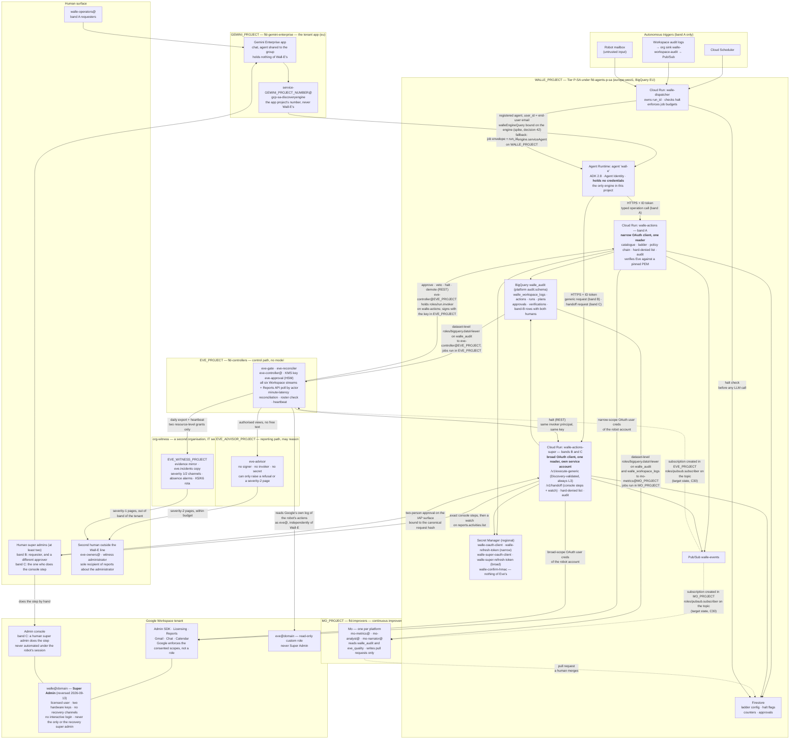

# 1. High-level design

## Status
- Owner: the platform owner
- Last reviewed: 2026-09-13
- **Premise changed 2026-09-13: Wall-E holds Super Admin on a dedicated user account.** The
  narrow, OU-scoped custom role this page was designed around is gone; the objective of
  2026-09-13 and the platform HLD at
  [../agentic-platform/01-hld.md](../agentic-platform/01-hld.md) are now the parent design and
  the authority for every control this page names. Every reversal below is marked with that date.
  What the objective does not touch — the credential split, the dispatcher, the ladder's shape,
  the five boundaries as a list — is kept as written on 2026-09-07/08.
- Placement updated on 2026-09-13 to the four-project topology (`GEMINI_PROJECT`,
  `WALLE_PROJECT`, `EVE_PROJECT`, `MO_PROJECT`, all under `FOLDER_ID`).
  [../project-topology.md](../project-topology.md) is the authority for where each resource lives
  and how every grant crosses. Since the platform HLD, `FOLDER_ID` is `fld-agentic-platform` and
  the four projects sit in tier folders under it (§"Where Wall-E sits on the platform"); the
  grant rows themselves are unchanged.
- Challenged on 2026-09-11 by eleven independent reviewer lenses. Verdict: the architecture
  is the correct path; three blocking gaps and a set of document corrections stand, and the
  edits they call for are **not yet applied to this page**. See
  [14-hld-challenge.md](14-hld-challenge.md). One of its verdicts is overturned by the objective:
  C35 ("generic Admin SDK proxy — rejected") is re-argued below as band B, and verdict reason 4
  ("super-admin-only APIs are unreachable whatever sits in front of them") no longer holds.

## Where Wall-E sits on the platform

Written 2026-09-13. Before this date Wall-E's set *was* the platform; the platform HLD now sits
above it and this page is the design of one tenant of that platform.

| Question | Answer | Where it is decided |
|---|---|---|
| Which tier | **P-SA, the super-admin singleton** — the one agent on the platform that may hold `privilege: super_admin`; CI fails a second such register row while this one is not `retired` | [platform HLD §11.3](../agentic-platform/01-hld.md), §11.1 column "P privileged" |
| Which folder | `WALLE_PROJECT` under `fld-agents-p-sa`, a child of `fld-agents-p`, with stricter organisation policies than the platform floor, its own Model Armor floor (hard-denied vocabulary detectors) and its own kill-plane binding | platform HLD §3.1 |
| The other three projects | `GEMINI_PROJECT` under `fld-gemini-enterprise` (the tenant app, a platform project — topology decision 52 re-read); `EVE_PROJECT` under `fld-controllers`; `MO_PROJECT` under `fld-improvers`. Two projects this page never had: `EVE_ADVISOR_PROJECT` (Eve's reporting path) and `EVE_WITNESS_PROJECT` in a second organisation. None of them holds anything of Wall-E's | platform HLD §3.1, §13.2; [../project-topology.md](../project-topology.md) |
| What the platform enforces for Wall-E, so this page does not | Agent Identity, gateway binding, the folder deny policy and Principal Access Boundary, the organisation-policy baseline, the monitoring baseline, the audit and ladder schemas, the admission gate, the fleet kill switch K7, Privileged Access Manager on every deploy grant, the SIEM-hosted super-admin detection set | platform HLD §3–§7, §11.4 |
| What stays Wall-E's own code | The catalogue, the policy chain and its hard invariants, the ladder config, the playbooks, the prompt, the two lanes of the action service, verification by re-read | this page and [03-lld.md](03-lld.md) |
| When Super Admin is granted | Not at a runbook phase: **at the platform's tier gate**, on the day every row of the P line is green — Eve's observe-and-report layer live and drilled, the witness organisation, a SIEM with 24x7 acknowledgement, two human super admins with the robot never the recovery one, the penetration test, the signed deviation, the two lists signed, the perimeter decision taken | platform HLD §0.4 |
| Trust boundaries | This page's five boundaries are the platform's B1–B5; B6 (peer agents) and B7 (agent ↔ platform) are inherited from the platform and not restated here | platform HLD §15 |
| Decision numbering | Wall-E's decisions 1–52 keep their numbers; platform decisions continue as P1… in platform HLD §17. The ones this page changes are listed at the end | [09-open-decisions.md](09-open-decisions.md) |

## Design intent

1. **Reversed 2026-09-13.** One Workspace identity — a **dedicated, licensed user account**
   `walle@<domain>` (name tbd, [decision 2](09-open-decisions.md)) — holds **Super Admin**, and no
   human ever signs into it after the one-time bootstrap. The earlier text read "holds a narrow
   custom admin role"; the objective overturns it and the owner has decided it, so it is not
   re-argued here. Two Google facts fix the consequences (verified 2026-09-13, sources at the end
   of this page): a service account can hold any Workspace admin role **except** Super Admin, so
   the account is a user account and decision 26 closes for Wall-E by fact; and Super Admin
   **cannot be limited to an organisational unit or subset by privilege**, so nothing in
   Workspace narrows what the credential can do. The consequences this page now carries:
   - **Workspace stops enforcing anything.** The design had two enforcement points; it has one.
     The consented OAuth scope set is the only Google-enforced ceiling left. Every control that
     read "not in the role" — the OU allow-list, never-list rows N1 and N2, "the role grows with
     the ladder", the credential-leak bound, the `SAFE_USER_FIELDS` split — is now enforced by
     code in the action service, the component under audit.
   - **The blast radius is the tenant, and a path into the GCP organisation.** A leaked token or
     an interactive login is a tenant compromise; through the console's power to grant
     Organization Administrator, or through a `cloud-platform` token, it reaches every project in
     the organisation including `EVE_PROJECT` and `MO_PROJECT` (`Assumption:` on the exact console
     mechanism; Google documents the grant). The perimeter is token custody, key custody, the
     scope split and detection latency — nothing else.
   - **Eve's independence inside the organisation is detective, not structural.** The credential
     can `users.makeAdmin`, suspend `eve@`, revoke Eve's token, remove Eve's role and switch off
     audit-log sharing. Only code and detection stop it; what leaves the organisation (evidence,
     incident record, pager, in `EVE_WITNESS_PROJECT`) is what stays structurally out of reach.
   - **Least privilege becomes a signed deviation**, not a property shown by an enumerated role.
   - **Detection is the primary control** for this agent, and this page says so instead of
     pretending the catalogue still is.
   What compensates is §"The controls that replace role scoping" below; the full graded table is
   [platform HLD §13.1](../agentic-platform/01-hld.md).
2. That identity does nothing except through the **action service**, which is the only place a
   Workspace credential exists and the only place authorisation is decided. **Since 2026-09-13
   the action service is two Cloud Run services on one account**: `walle-actions` reads the
   narrow OAuth client and serves the catalogue; `walle-actions-super` reads the broad client and
   serves the generic and handoff lanes. Two clients, two refresh tokens, two secrets, two
   readers, one robot user; `cloud-platform` in neither, checked in CI. This is decision 18
   (control-plane split) forced from "before Stage 4" to now, because the narrow client is the
   one Google-enforced ceiling that survives for anything unattended.
3. **The reasoning layer never holds a credential and never decides what is allowed.** It can
   name an operation from the catalogue and supply parameters (band A), or — qualified
   2026-09-13 — compose a generic Admin SDK request that deterministic code validates against a
   pinned Discovery document and always hands to two humans (band B). It cannot approve, cannot
   raise a level, and cannot reach the Admin console. Deterministic Python decides the rest.
4. **Autonomy is data, not code.** Each (operation family, trigger class) pair carries a level in
   a versioned config the service reads at runtime. Promotion is a pull request plus a dated
   decision record; demotion is an API call that takes effect in seconds. Added 2026-09-13: two
   rows are **code, not config** — `SUPER` (chat L3 with a two-person rule, every other trigger
   L0) and `WRITE-generic` (chat L3, others L0) — and CI asserts that neither ever appears in a
   playbook's `uses`.
5. **No domain-wide delegation.** Not for a service account, not through a Marketplace app, not
   as an exception for one API. Where an API requires DWD, that API is out of scope — see the
   Alert Center note below. Since 2026-09-13 this is also what keeps the objective's Eve
   possible: a super admin can *grant* DWD in the console, so granting it is on the hard-denied
   list and any DWD change is a severity-1 detection.
6. **Added 2026-09-13. Super-admin-class work never climbs above human approval.** Stated in the
   same sentence as the older ceiling: `WRITE_HIGH` never reaches L5 on any trigger, and no
   super-admin-class operation is ever autonomous on any trigger, at any stage. Both are
   permanent ceilings, not stages not yet reached.

## Component map

Four projects under one folder — since 2026-09-13 a *pattern the platform's factory produces*,
not a count, and each project sits in its tier folder (§"Where Wall-E sits on the platform").
Solid cross-project edges are resource-level grants that exist at Stage 0 or at the stage
marked; dashed ones are target state or a fallback. The complete list, with the level of every
binding, is [../project-topology.md](../project-topology.md) §3. The witness organisation and
Eve's reporting path are shown because Wall-E's detective controls run there; nothing of
Wall-E's is granted in either.

### The three action bands

Written 2026-09-13. "Any super-admin action on a human's prompt" is delivered as three lanes,
not as breadth in the catalogue. The band is a property of the *operation requested*, decided
by code before anything runs; the reasoning layer cannot choose a lane. [Platform HLD
§13.1](../agentic-platform/01-hld.md) holds the same table with its grading; decision 27 is
re-cut from "whether" to "which lane".

| Band | What | Lane and credential | Autonomy | Who asks, who approves |
|---|---|---|---|---|
| **A** — catalogued autonomous work | The typed catalogue on the ladder (families F1–F10 and what grows into it); the **declared intended purpose** of the system | `walle-actions` `/v1/execute`, narrow OAuth client. Policy chain, pre-state predicate, inverse, taint, protected principals, verify-by-re-read, Eve at L4 — all unchanged | The only band that can ever climb. `WRITE_HIGH` never L5 | Requester in `walle-operators@` (re-checked live); approvals per the ladder level; second operator at L3 |
| **B** — uncatalogued super-admin work | A generic Admin SDK request `(api, version, resource, method, path_params, body)`, schema-validated with `extra=forbid` against the **pinned Google Discovery document** for that API; the method mapped to `READ` / `WRITE` / `SUPER` by a committed table (anything touching admin roles, security, domains, billing, OAuth or API controls is `SUPER`); pre-state captured by the matching `get`/`list`, or the request refused `no_pre_state` unless the approver accepts that explicitly; no inverse, so treated as irreversible; the taint bit and every hard-denied row apply; never in any playbook's `uses` (CI asserts); the full canonical request, the Discovery revision and both humans on the audit row | `walle-actions-super` `/v1/execute-generic`, broad OAuth client, its own service account and secret, its own audit rows. C35's rejection is re-argued: this lane loses the inverse, the pre-state predicate and the taint declaration, and needs none of them because it is never above L3 | **Permanently L3.** Trigger class `chat` only (`principal.type == human`); every other trigger L0, in code. `SUPER` carries the two-person rule | `WRITE`: requester in `walle-operators@`, one approver. `SUPER`: requester must be a **human super admin** (live `users.get isAdmin` through the narrow token, fail-closed), approver a **different human super admin**, a change-ticket reference and a `hold_minutes` window before execution for the veto surface — the answer to decision 28 for this lane |
| **C** — console-only work | Everything the Admin console can do and no API can write. Defined by fact, not by list: the Cloud Identity Policy API mutates only DLP rules, DLP detectors and provisioning settings (verified); DWD authorisation is console-only. So: DWD, 2SV enforcement and methods, sign-in challenges, password policy, session control, API controls and app trust, Marketplace, data regions, Gmail routing, Drive/Meet/Calendar tenant settings, billing, super-admin self-recovery, other admins' backup codes, the Transfer tool, account deletion | `walle-actions-super` `/v1/handoff`: returns the exact console steps to the requesting human super admin, opens a watch on `reports.activities.list` for the matching admin event, and reports `verified` or `not seen within N hours` | None. Nothing executes | The human does it. **No browser-driving or computer-use automation of the Admin console under the robot's session, ever** — "an interactive login is an incident" is the one control that survives Super Admin, and it stays an incident |

### The controls that replace role scoping

Written 2026-09-13. The role used to be the second gate. These four are what the design has
instead, each graded the way the platform grades everything (enforcement: the action is
refused; detection: it happens and something independent sees it within a stated latency).

| Control | What it is now | Grade |
|---|---|---|
| **The never-list, re-ratified as hard denies in code** (decision 4 re-opened as P29, owner-signed) | Two lists. *Hard-denied in every lane*, denial reasons `self_modification_denied` / `escalation_denied` / `posture_change_denied` / `irreversible_denied` / `money_denied`, breaker trip, severity 1: anything targeting `walle@`, its OU, `eve@`, Eve's role, the control groups (`walle-operators@`, `walle-protected@`, `eve-owners@`, `ge-admins@`, `platform-approvers@`, the `mo-*` groups), the two OAuth clients, the activity rules that alert on the robot, "Share data with Google Cloud services", the SecOps export setting, the organisation sinks; `users.makeAdmin` and any `roleAssignments.insert` of Super Admin or of a role carrying admin-role management; `users.delete` of any admin; other admins' security settings and backup codes; DWD. The robot is on the committed floor list and is a protected principal under its own N7 rule. *Reachable only through band B at tier `SUPER`*: everything else on the old never-list of [06](06-security-guardrails.md) — OU create/rename/move, user delete of non-admins, group delete, admin-role create or assign below Super Admin, domain add, data transfer, licence purchases where an API exists. N1 and N2 stop reading "not in the custom role" and become hard invariants tested by the denial suite | enforcement (code) |
| **Requester and approver entitlement, as the whole story** | With a super admin behind the account, membership of `walle-operators@` would otherwise grant every operator the robot's whole reach — privilege escalation by proxy, not a feature. Band A keeps the committed operator list (decision 28's first form, reconciled daily against `roleAssignments.list`). Band B tier `SUPER` makes the deferred live check 5b mandatory and fail-closed: requester a human super admin, approver a different human super admin, both recorded on the audit row, the approval bound to the canonical request hash on the IAP surface | enforcement (code) |
| **The two-person rule for the privileged tier** | No single human can make the robot do super-admin-class work: requester ≠ approver, both human super admins, a ticket reference, a hold window. Every raise of any ladder level already needs a second human; band B has no ladder to raise. The platform's RACI ([platform HLD §0.3](../agentic-platform/01-hld.md)) makes the second super admin a role that must exist before the grant, and "the four owner groups are one person" expires on the grant date | enforcement (code) plus organisational |
| **Eve's minute-latency reconciliation against Google's own log** — the detective control | Every event attributed to `walle@` in every stream Eve ingests (all six Cloud Logging Workspace streams, plus the Reports API polled by actor) must match a `walle_audit` row or a band-B audit row within five minutes; a miss is a `reconciliation_gap`, a halt, and a severity-1 page from the witness. Plus a daily super-admin roster check from Eve's own credential (`roleAssignments.list`, `users.list isAdmin`) diffed against the committed roster, an evidence heartbeat that pages when `admin.googleapis.com` events stop or Eve's token returns `invalid_grant`, and the SIEM-hosted severity-1 set of [platform HLD §7.3](../agentic-platform/01-hld.md) owned by IT security and hosted outside `WALLE_PROJECT`. Google writes the log; Wall-E cannot edit it; a super admin can switch off the sharing, which is exactly what the absence alarm is for | detection, minute latency, with absence alarms — and stated as the **primary** control for this tier |

Around them, the account hygiene Google decides for you (hardware-key-only 2SV, self-recovery
off tenant-wide, no recovery channels, short session on the OU, at least two human super admins,
K6), the perimeter (`walle-actions` and `walle-actions-super` never internet-reachable), and
Privileged Access Manager on the deploy grant are preconditions of the grant, not "before S1"
items. They are listed once, in [platform HLD §13.1](../agentic-platform/01-hld.md), and not
repeated here.

## The five trust boundaries

There are five. The fifth exists because of autonomy, and it is the one this whole design
set exists to make real. Updated 2026-09-13: boundary 3 gains the scope split, boundary 4 loses
Workspace role scoping as an enforcement point and gains the two lanes. On the platform these
are B1–B5; B6 and B7 are inherited ([platform HLD §15](../agentic-platform/01-hld.md)).

| # | Boundary | Enforced by | What it stops |
|---|---|---|---|
| 1 | Human → Gemini Enterprise | Workspace SSO; the agent is shared only with `walle-operators@` on its User permissions tab. The app lives in `GEMINI_PROJECT`, holds nothing of Wall-E's, and the share is made on the app in that project. Since 2026-09-13 the app's egress to the engine goes through `gemini-egress`, whose access policy is generated from the platform register | Non-allowlisted staff reaching Wall-E at all |
| 2 | Agent → action service | Cloud Run IAM (`run.invoker`), ID-token verification **with audience**, caller service-account allowlist. `run.invoker` on `walle-actions` is a service-level binding in `WALLE_PROJECT`, and two of its holders are identities homed in other projects — `eve-controller@EVE_PROJECT` and `mo-analyst@MO_PROJECT` — so the per-endpoint allowlist lists cross-project service-account emails, compared byte for byte. Since 2026-09-13 `walle-actions-super` has its own `run.invoker` set: the agent's identity and `eve-controller@` (halt only); never Mo | Anything but Wall-E's own identity calling the action service |
| 3 | LLM → credential | Architecture: the refresh tokens exist only inside the two action services, never in the model's process or context. Since 2026-09-13 the **scope split** is part of this boundary: the narrow client's consented scopes are the only Google-enforced ceiling on anything unattended, and `cloud-platform` is in neither client | Prompt injection exfiltrating an admin credential — now a super-admin credential |
| 4 | Requested action → executed action | **Reversed 2026-09-13.** Was: policy engine *plus* Workspace refusing anything outside the role and the pilot OU. Now: the policy engine alone — catalogue allowlist, typed parameters, protected principals including the robot itself, the OU allow-list in code, budgets, and the hard-denied list as invariants; **two lanes** (band A through `walle-actions`, band B through `walle-actions-super` with Discovery validation and the two-person rule) and one handoff (band C, nothing executes). Google no longer refuses at its end; the scope set is the last Google-side ceiling and it is boundary 3's | The model inventing a destructive call and it simply running — and, new, any single human making the robot do super-admin-class work alone |
| 5 | **Permitted action → autonomously executed action** | **Autonomy ladder: per-(family, trigger) level, approval tokens the service mints and a human or Eve releases, hold windows, breakers.** Since 2026-09-13 the `SUPER` and `WRITE-generic` rows are fixed in code at chat L3 / others L0, so this boundary is permanent, not climbable, for band B | **An operation that is legitimate on request being taken unattended before it has earned the right** — and, for super-admin-class work, ever |

Boundary 5 is the one autonomy adds. Boundaries 1–4 answer "may this action happen at all". Boundary
5 answers "may it happen *without a human watching*, right now, at this level of proven
reliability". They are separate questions and the design keeps them separate: risk tier is
a static property of an operation, autonomy level is a mutable property of how it is being
invoked. What boundary 4 lost on 2026-09-13 is not replaced by any boundary; it is replaced by
detection, which is why the reconciliation row above is called the primary control.

## The request path, end to end

**Band A, on request (trigger class T0).** Operator types in Gemini Enterprise → the app, in
`GEMINI_PROJECT`, invokes the registered agent in `WALLE_PROJECT` as its own service agent,
passing the operator's email as `user_id` → the ADK agent
picks operations from the catalogue and calls `walle-actions` with an ID token → the
action service validates, checks the operator is in the group, looks up the level for
(family, T0), executes or returns a confirmation requirement → audit row → answer. Unchanged.

**Band A, unattended (T1 scheduled, T2 event, T3 inbox).** Cloud Scheduler or a Pub/Sub message
reaches the dispatcher → the dispatcher checks the halt flags and the job's daily budget
*before spending a token*, opens a `run_id`, and calls the agent with a structured job
envelope → the agent runs the named playbook, producing a **plan** of explicit targets →
the action service freezes the plan, captures pre-state, and applies the level: shadow,
proposal, human approval, Eve approval plus hold, or straight execution → execute →
**verify by re-reading** → report to the operators and to Pub/Sub. Unchanged. This is the only
path with an autonomous branch; bands B and C have no dispatcher entry and no playbook.

**Band B, on request only (added 2026-09-13).** A human super admin asks for something the
catalogue does not have → the ADK agent composes a generic request `(api, version, resource,
method, path_params, body)` and calls `walle-actions-super` with an ID token → the service
checks the caller identity, checks the requester is a human super admin (live, fail-closed),
validates the body against the pinned Discovery document, maps the method to its tier, runs the
hard-denied list and the taint check, captures pre-state by the matching `get` or refuses
`no_pre_state` → for `WRITE` mints an approval for one operator; for `SUPER` mints a two-person
approval that a **different** human super admin releases on the IAP surface, bound to the
canonical request hash, with a ticket reference, then holds for `hold_minutes` so Eve or any
operator can veto → executes once with the broad token → verifies by re-reading the same
resource → audit row carrying the canonical request, the Discovery revision and both humans →
answer. Eve's reconciler expects the matching admin event within five minutes.

**Band C, handoff-and-verify (added 2026-09-13).** The request names something no API writes →
`walle-actions-super` `/v1/handoff` returns the exact console steps to the requesting human
super admin and records the handoff → opens a watch on `reports.activities.list` for the
matching admin event (the Reports application per route is committed beside Eve's "records
nothing" list) → the human does the step in the Admin console under their own account → the
watch reports `verified`, or `not seen within N hours`, and the audit row closes either way. The
robot's session never touches the console.

## Why a dispatcher in front of the agent

A purely on-request agent has no autonomous path, so it needs no dispatcher. Adding one is
not ceremony:

- **The kill switch must work before the model runs.** A halt that is only checked by the
  action service still lets every scheduled run spend tokens and produce a plan. The
  dispatcher checks it first, so halting is free and instant.
- **Run identity has to exist before the agent speaks.** `run_id`, playbook version,
  config version and budget are facts about the run, not outputs of it. The LLM must not
  be the thing that invents them.
- **A trigger must be acknowledged in a second; an agent turn takes minutes.** Cloud
  Scheduler's attempt deadline defaults to three minutes and caps at thirty, and a
  Pub/Sub push subscription's ack deadline is far shorter. A synchronous call to the
  agent blows through both, so the trigger is recorded as failed and **retried**, and
  the same run happens twice. The dispatcher acks immediately and hands the work to a
  queue, with a deterministic trigger id — the job name plus its scheduled time, or the
  Pub/Sub message id — written transactionally so a duplicate delivery is a no-op.

  (Cloud Scheduler *can* call the agent directly: it supports OAuth tokens precisely for
  `*.googleapis.com` targets. An earlier draft claimed it could not. That was wrong, and
  it was the weakest of the three reasons for having a dispatcher. The two above stand.)

The dispatcher reaches `walle-actions` only. It has no route to `walle-actions-super`, by IAM,
so no trigger class other than a human in chat can ever originate a band-B request.

## Why the action service stays separate from the agent

These reasons hold for a purely on-request agent, are more true under autonomy, and on
2026-09-13 stopped being a matter of degree: the credential behind the service is now a
super-admin credential, and the service is the **only** gate in front of it.

- The refresh token would otherwise sit in the same process as the LLM loop, so any tool
  that can read the environment becomes an exfiltration path. Before 2026-09-13 an exfiltrated
  token was bounded by a narrow role and a pilot OU; now it is the tenant and a path into the
  GCP organisation. The separation is what makes "the model never holds a credential" a fact
  about process boundaries and IAM, not a promise about prompts.
- Tool arguments are generated text. Between generated text and an Admin SDK call that
  suspends a user there must be a gate the model cannot talk its way past. With Super Admin
  that same generated text could name `users.makeAdmin`, `roleAssignments.insert` or a change
  to another administrator's security settings, and Google would execute it. The hard-denied
  list lives in the gate, not in the prompt, for this reason.
- Audit, budgets, idempotency, dry-run, pre-state capture and the ladder belong in one
  place. Scattered across tool functions they would each be one refactor away from being
  bypassed. Since 2026-09-13 that "one place" is two services with one policy library, because
  the scope split needs two readers: putting the broad client in the same process as the
  catalogue would make the narrow client's ceiling decorative.
- Eve's minute-latency reconciliation works only because every legitimate action leaves a
  write-ahead audit row *before* the API call. A tool function that calls Google directly has no
  such row, and the first thing Eve would see is a `reconciliation_gap` — which is the correct
  outcome, and the reason the agent's gateway allow-list names the two action services and no
  `*.googleapis.com` Admin SDK host.

Cost of the split: one hop, roughly 50–150 ms, twice for band B. For an identity that can
administer the tenant — and now can administer everything in it — that is not a trade worth
reconsidering.

## Layer responsibilities

| Layer | Owns | Explicitly does not own |
|---|---|---|
| Gemini Enterprise (in `GEMINI_PROJECT`) | Presentation, end-user authentication, conversation history, the `StreamAssist` Data Access log that names the human | Any credential, any policy decision, anything of Wall-E's |
| Dispatcher | Trigger handling, run creation, halt check, per-job budgets — band A only | Workspace access, authorisation of individual operations, any route to `walle-actions-super` |
| ADK agent (Agent Runtime) | Intent → operation selection or generic-request composition, parameter extraction, clarification, narrating results | Credentials, authorisation, the autonomy level, the choice of lane, direct API access, the Admin console |
| `walle-actions` (band A) | The narrow credential, the catalogue, the ladder, authorisation, execution, verification, audit, the hard-denied list | Natural language; the broad credential |
| `walle-actions-super` (bands B and C; added 2026-09-13) | The broad credential, Discovery validation, the tier table, the two-person approval, pre-state by `get`, the handoff and its watch, audit; the same hard-denied list from the same library | Natural language; the ladder (it has none); any trigger but a human in chat; the narrow credential |
| Eve control path (in `EVE_PROJECT`) | Approving, verifying independently, reconciling every stream at minute latency, the roster check, halting, demoting | Executing anything, raising a level, any model |
| Eve reporting path (in `EVE_ADVISOR_PROJECT`; added 2026-09-13) | Narrating incidents, severity-2 pages within budget, raising a refusal | Approvals, signatures, halts, vetoes, any secret, any invoker |
| Mo (in `MO_PROJECT`) | Measuring Wall-E and Eve, proposing | Any write path to config or Workspace; grading Eve |
| Workspace | The actual effect — and, since 2026-09-13, **no refusal**: Google enforces the consented scopes and nothing else | — |

## Corrections carried in from research (2026-09-07/08)

Each row pairs a common assumption with the verified fact, as of September 2026. Sources are
listed in [09-open-decisions.md](09-open-decisions.md).

| Item | Common assumption | Verified fact (September 2026) |
|---|---|---|
| Region | europe-west1 "subject to Agent Engine availability" | **Confirmed available.** Agent Runtime, Sessions and Memory Bank are GA in europe-west1 with EU at-rest residency. Decision closed. |
| Product name | "Vertex AI Agent Engine" | Now **Agent Runtime**, part of Gemini Enterprise Agent Platform. API resource is still `reasoningEngines`. |
| Deployment SDK | `vertexai.agent_engines.create()` | Deprecated since Vertex AI SDK v1.112.0. Use `vertexai.Client(project, location).agent_engines.create(...)`. |
| End-user identity | "unverified, treat `actor` as untrusted" | Gemini Enterprise passes the **user's email as `user_id`**. It is asserted by the Discovery Engine service agent, not cryptographically bound to the user, so the action service still re-checks group membership. Lock `aiplatform.reasoningEngines.query` down to the smallest set of principals: first `service-GEMINI_PROJECT_NUMBER@gcp-sa-discoveryengine.iam.gserviceaccount.com` — the **app** project's number, never Wall-E's — bound on the engine from `GEMINI_PROJECT`, then `walle-dispatcher@WALLE_PROJECT`. An earlier draft counted `eve-controller@` as a third; [C10](14-hld-challenge.md) removed it and [../project-topology.md](../project-topology.md) §3 row 13 records the absence. |
| Chat API | "may need an app identity" | The robot's **user token is sufficient** to post messages and manage spaces it belongs to. A branded Chat app is optional UX, not a requirement. |
| Alert Center as an event source | not considered | **Requires domain-wide delegation.** Out of scope. Use Workspace audit-log sharing into Cloud Logging instead, which needs no credential at all and gives Eve an independent view. |
| Cloud Run ingress | "internal only" | Agent Runtime egresses from a Google-managed tenant project, which Cloud Run treats as **external** — internal-only ingress blocks it. The fixes are a shared VPC Service Controls perimeter, an internal load balancer in front of Cloud Run, or a Private Service Connect endpoint. A PSC **interface** alone does not help, because `run.app` traffic still bypasses the VPC without private DNS peering, and it also disables the agent's internet egress. **IAM is the enforced boundary** — [decision 9](09-open-decisions.md). Since 2026-09-13 the platform's folder policy `run.allowedIngress = internal-and-cloud-load-balancing` behind an internal load balancer via PSC applies to both action services (platform HLD §8.1, decision P3); IAM stays the boundary that is proven today. |

### Corrections carried in from the review of 2026-09-13

The Google facts the reversal rests on, verified by the walle-super-admin and eve-independence
lenses on 2026-09-13; URLs at the end of this page.

| Item | What the earlier design assumed | Verified fact (2026-09-13) |
|---|---|---|
| Service accounts and Super Admin | Decision 26: the admin half could move to a keyless service account | A service account may hold any prebuilt or custom role **except Super Admin**. Decision 26 is closed for Wall-E by fact; it stays open for Eve as E-16 |
| Scoping Super Admin | The role could be OU-scoped (`scopeType=ORG_UNIT`) so Workspace enforced scope independently of our code | True for custom roles, **false for Super Admin**, which cannot be limited to an OU or subset by privilege. Billing, Domain settings, Groups, Reports and Support privileges cannot be OU-limited even in custom roles |
| Minting super admins | Not in the role, so unreachable | `users.makeAdmin` "makes a user a super administrator" under scope `admin.directory.user`, which the catalogue's narrow client already consents to. Only the hard-denied list stops it |
| Admin 2SV | A hardening choice | Google enforces 2SV on admin accounts; an unenrolled admin loses web access after 30 days. Hardware-key-only is the choice; the enforcement is Google's |
| Super-admin self-recovery | Not considered | A **tenant-wide** setting; must be Off and drift-checked, since a super-admin robot with self-recovery on is a takeover path |
| Writing tenant settings by API | "Any admin action" could be an API call | The Cloud Identity Policy API mutates only DLP rules, DLP detectors and provisioning settings; everything else it reads only. DWD client authorisation is Admin console only. This is what defines band C |
| Reach into the GCP organisation | The four-project topology reasoned about GCP principals only | A Workspace super admin can grant the Organization Administrator role and is the organisation's recovery point of contact. `Assumption:` on irrevocability — Google's pages say "can grant", not "irrevocable" |
| Context-Aware Access on the robot | Could bind the token to the action service's egress | Google's pages are silent on super admins and on user-account API tokens; there is no Admin SDK API entry in the app table. Adopted as detection-plus-friction, `Assumption:` until P7 |

## Non-goals

Rewritten 2026-09-13. Three kinds of "no": what stays permanently human, what may never be
autonomous, and what Wall-E does not do at all.

**Permanently human — Wall-E hands these to a person and never does them itself.**

- Every band-C operation: anything the Admin console can do and no API can write. Wall-E
  returns the steps and verifies the event; a human super admin does the step under their own
  account.
- Approving band B. Requester and approver are two different human super admins, every time,
  with no ladder to climb.
- Raising any autonomy level. Humans raise; Wall-E, Eve, Mo and the breakers only lower.
- Merging anything Mo proposes.
- Pulling K5 (revoke or suspend the robot) and K6 (remove Super Admin from the robot). Both are
  Workspace super-admin acts by a human on a two-person rota paged from the witness; no machine
  holds a Workspace privilege over `walle@` (P16 keeps the door open, nothing is built).

**Never autonomous — a permanent ceiling, code not config, not a stage not yet reached.**

- Super-admin-class work never climbs above human approval: `SUPER` rows are chat L3 with the
  two-person rule and L0 on every other trigger; `WRITE-generic` rows are chat L3 and L0
  elsewhere; neither ever appears in a playbook. Stated in the same sentence as the older
  ceiling: **`WRITE_HIGH` never reaches L5 on any trigger, and no super-admin-class operation is
  ever autonomous on any trigger.**
- Anything Wall-E cannot undo, in band A: irreversible operations are capped at "propose" or
  are not in the catalogue. In band B "no inverse" is the norm, which is one reason band B is
  never above L3.

**Not done at all — in any lane, at any level, whoever asks.**

- Anything on the hard-denied list: targeting the robot, `eve@`, Eve's role, the control
  groups, the two OAuth clients, the activity rules, audit-log sharing, the organisation sinks;
  minting or assigning Super Admin; deleting an admin; other admins' security settings and
  backup codes; DWD. Denied in code with a severity-1 page, whichever human asks and however
  many approve.
- Acting as any user other than the robot account. Impossible without DWD, and intended.
- Automating the Admin console under the robot's session, by browser, computer use or any
  other means. An interactive login on `walle@` is an incident, not a lane.
- Replacing the Admin console for bulk or emergency operations. Band B is one request, one
  approval, one execution; bulk and emergencies stay with human super admins.
- Wall-E administering its own platform. **Rewritten 2026-09-13**: this is no longer true "by
  construction" on the Workspace side — a super admin can reach Gemini Enterprise settings, API
  controls and DWD at Google's end, and only the action service's hard-denied list stops the
  credential from doing so, with Eve's reconciliation and the SIEM set seeing it within minutes
  if the service is bypassed. On the GCP side it still holds by construction for Wall-E's
  *GCP principals*: the IAM and settings of the four projects and their folders, the ladder
  config, the catalogue and the two OAuth clients' secrets are outside every Wall-E service
  account's reach; no Wall-E principal exists in `EVE_PROJECT` beyond the three carve-outs of
  decision 48, none at all in `MO_PROJECT`, `GEMINI_PROJECT`, `EVE_ADVISOR_PROJECT` or the
  witness; the folder deny policy and PAB add the platform's copy. The one path from the
  Workspace account into GCP — an interactive login or a `cloud-platform` token — is closed by
  the no-interactive-login rule (severity 1), witnessed key custody, `cloud-platform` forbidden
  in both clients and CI-checked, and an organisation-level alert on any `SetIamPolicy` by
  `walle@`.

## Decisions this page opens or changes (2026-09-13)

Every decision reference elsewhere on this page keeps its number. These are the ones whose
answer moved; the dated lines in [09-open-decisions.md](09-open-decisions.md) and the platform
register in [platform HLD §17](../agentic-platform/01-hld.md) are where they are recorded.

| Decision | Was | Now |
|---|---|---|
| 3 (OAuth scope list) | one client, fourteen scopes, frozen at consent | two clients on the one account: the narrow list for `walle-actions`, a broad list for `walle-actions-super`; both consented in one sitting; `cloud-platform` in neither; adding a scope re-consents client 2 only. The broad list is itself a super-admin-signed decision |
| 4 (ratify the never-list) | nine absolute rows, unratified | re-opened as **P29**: the two lists of §"The controls that replace role scoping", owner-signed before the grant |
| 18 (split the control plane) | "before Stage 4" | **now** — the scope split needs two readers |
| 26 (keyless service account for the admin half) | blocking spike before Phase 9 | **closed for Wall-E by fact**; stays open for Eve as E-16 |
| 27 (catalogue breadth: bands B and C) | "Wall-E is a narrow operator, not a stand-in for a super admin" | re-cut as "which lane": band A the catalogue, band B the generic lane, band C the handoff |
| 28 (requester entitlement) | committed operator list; live check 5b deferred | band A unchanged; band B tier `SUPER` runs the live check, fail-closed, requester and approver both human super admins and different people |
| 14 (approval surface) | Chat app or IAP page | the IAP surface, bound to the canonical request hash, is the band-B two-person surface; Eve's reporting contract is recorded against the same decision in platform HLD §13.2 |
| C35 in [14](14-hld-challenge.md) | generic Admin SDK proxy rejected | re-argued as band B, never above L3, so the lost inverse, pre-state predicate and taint declaration are not needed |
| New, platform | — | P7 (Context-Aware Access on the robot), P16 (a machine-invocable account stop — none now), P28 (Wall-E's intended purpose: the catalogue plus bands B/C as execution and instructions, signed with legal), P29 (the two lists), P3 (the perimeter, a precondition of the grant), and the dated decision "Wall-E holds Super Admin" itself, superseding 26 for Wall-E, entering the residual in the accepted-risks table of [10](10-adversarial-review.md), signed as a TISAX deviation and as row one of the risk register |

## Sources for the 2026-09-13 corrections

Read on 2026-09-13 by the review lenses; the full list is
[../agentic-platform/00-objective-review.md](../agentic-platform/00-objective-review.md) §8.

- https://knowledge.workspace.google.com/admin/users/assign-specific-admin-roles — any role except Super Admin may be assigned to a service account
- https://knowledge.workspace.google.com/admin/users/administrator-privilege-definitions — privileges that cannot be OU-limited; super-admin-only tasks
- https://developers.google.com/workspace/admin/directory/reference/rest/v1/users/makeAdmin — `users.makeAdmin`, scope `admin.directory.user`
- https://knowledge.workspace.google.com/admin/security/about-2sv-enforcement-for-admins — Google-set 2SV enforcement on admins; 30-day web lockout
- https://knowledge.workspace.google.com/admin/users/allow-super-administrators-to-recover-their-password — tenant-level self-recovery setting
- https://knowledge.workspace.google.com/admin/apps/control-api-access-with-domain-wide-delegation — DWD authorisation is Admin console only
- https://docs.cloud.google.com/identity/docs/concepts/supported-policy-api-settings — Policy API mutate support (DLP rules, detectors, provisioning only)
- https://docs.cloud.google.com/resource-manager/docs/super-admin-best-practices and https://docs.cloud.google.com/resource-manager/docs/creating-managing-organization — a super admin can grant Organization Administrator; recovery point of contact
- https://knowledge.workspace.google.com/admin/security/assign-context-aware-access-levels-to-the-admin-console — the Admin console in the Context-Aware Access app table; silent on super admins
