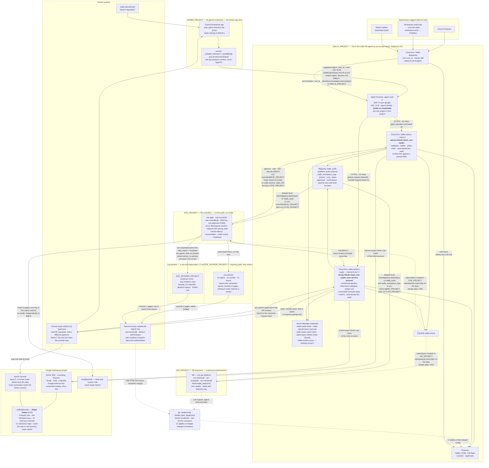

# 1. High-level design

## Status
- Owner: the platform owner
- Last reviewed: 2026-09-14
- **Premise changed 2026-09-13 (P33): Wall-E holds Super Admin on a dedicated user account.** The
  platform HLD at [../agentic-platform/01-hld.md](../agentic-platform/01-hld.md) is the parent
  design and the authority for every control this page names (§18 item 5 lists what it requires
  of this page). The credential split, the dispatcher, the ladder's shape and the five boundaries
  as a list are kept from 2026-09-07/08.
- Placement: [../project-topology.md](../project-topology.md) is the authority for where each
  resource lives; every grant that crosses a project, including those the platform adds (platform
  HLD §18 item 25), is a row of its [§3](../project-topology.md#3-cross-project-grants).
- Challenged on 2026-09-11; the verdict and the changes it calls for are
  [14 Verdict](14-hld-challenge.md#verdict). The objective of 2026-09-13 re-argues C35 ("generic
  Admin SDK proxy — rejected") as band B below and overturns verdict reason 4
  ("super-admin-only APIs are unreachable whatever sits in front of them").

## Where Wall-E sits on the platform

The platform HLD sits above this set, and this page is the design of one tenant of that platform.

| Question | Answer |
|---|---|
| Tier and folder | **P-SA, the super-admin singleton**: `WALLE_PROJECT` under `fld-agents-p-sa-prod` (child of `fld-agents-p-sa`, under `fld-agents-p`). The singleton rule and the controls the platform enforces for the tier are [platform 02 §1.3](../agentic-platform/02-landing-zone-and-tiers.md#13-mandatory-controls-per-tier--what-the-platform-enforces-and-what-the-agents-code-must-carry); the folder tree is platform HLD §3.1 |
| The other projects | `GEMINI_PROJECT`, `EVE_PROJECT`, `EVE_ADVISOR_PROJECT`, `MO_PROJECT` and the witness project in a second organisation hold nothing of Wall-E's; their placement is [../project-topology.md §2](../project-topology.md#2-the-four-projects) |
| What the platform enforces, and what stays Wall-E's own code | The platform: Agent Identity, gateway binding, the folder deny policy and Principal Access Boundary, the organisation-policy baseline, the monitoring baseline, the audit and ladder schemas, the admission gate, the fleet kill switch K7, Privileged Access Manager on every deploy grant, the SIEM-hosted super-admin detection set (platform HLD §3–§7, §11.4). Wall-E: the catalogue, the policy chain and its hard invariants, the ladder config, the playbooks, the prompt, the two lanes of the action service, verification by re-read (this page and [03-lld.md](03-lld.md)) |
| When Super Admin is granted | Not at a runbook phase: at the platform's tier gate, on the day every precondition is green; the checklist is [platform 11 §6.3](../agentic-platform/11-tisax.md#63-compensations-as-preconditions--the-checklist-the-gate-reads) |
| Numbering | Wall-E's decisions 1–52 keep their numbers; platform decisions continue as P1… in platform HLD §17; the ones this page changes are listed at the end ([09-open-decisions.md](09-open-decisions.md)). This page's five trust boundaries are the platform's B1–B5 (platform HLD §15) |

## Design intent

1. **Reversed 2026-09-13 (P33).** One Workspace identity — a **dedicated, licensed user account**
   `walle@<domain>` (name tbd, [decision 2](09-open-decisions.md)) — holds **Super Admin**, and no
   human ever signs into it after the one-time bootstrap. Because a service account cannot hold
   Super Admin and Super Admin cannot be limited to an organisational unit or a subset of
   privileges (verified 2026-09-13, sources at the end of this page), Workspace enforces nothing
   but the consented scopes, the blast radius is the tenant and a path into the GCP organisation
   (`Assumption:` on the exact console mechanism), Eve's independence inside the organisation is
   detective rather than structural, least privilege becomes a signed deviation, and **detection
   is the primary control**. What that reverses and costs is
   [platform HLD "What this reverses and what it costs"](../agentic-platform/01-hld.md#what-this-reverses-and-what-it-costs);
   what compensates is §"The controls that replace role scoping" below.
2. That identity does nothing except through the **action service** — two Cloud Run services on
   one account, the only place a Workspace credential exists and the only place authorisation is
   decided: `walle-actions` reads the narrow OAuth client and serves the catalogue,
   `walle-actions-super` reads the broad client and serves the generic and handoff lanes, with one
   reader per secret and `cloud-platform` in neither. Decision 18 (control-plane split) is due now
   rather than before Stage 4, because the narrow client is the one Google-enforced ceiling that
   survives for anything unattended. The clients are
   [02 §"OAuth client configuration"](02-identity-and-auth.md#oauth-client-configuration); why the
   services stay separate from the agent is
   [below](#why-the-action-service-stays-separate-from-the-agent).
3. **The reasoning layer never holds a credential and never decides what is allowed.** It can
   name an operation from the catalogue and supply parameters (band A), or compose a generic
   Admin SDK request that deterministic code validates against a pinned Discovery document and
   always hands to two humans (band B). It cannot approve, cannot raise a level, and cannot reach
   the Admin console. Deterministic Python decides the rest.
4. **Autonomy is data, not code.** Each (operation family, trigger class) pair carries a level in
   a versioned config the service reads at runtime. Promotion is a pull request plus a dated
   decision record; demotion is an API call that takes effect in seconds. The `SUPER` and
   `WRITE-generic` rows are code, not config, and never appear in a playbook's `uses`
   ([05 §4](05-autonomy-ladder.md#4-ceilings-that-are-code-not-config)).
5. **No domain-wide delegation**, for any agent, at any stage
   ([platform 04 §1](../agentic-platform/04-identity-and-privileged-access.md#1-principles-inherited-stated-once);
   [02 §"Rejected alternatives"](02-identity-and-auth.md#rejected-alternatives)). Where an API
   requires DWD, that API is out of scope — see the Alert Center in
   [09](09-open-decisions.md#verified-since-the-first-draft--these-are-now-closed) — and because a
   super admin can grant DWD in the console, granting it is on the hard-denied list and any DWD
   change is a severity-1 detection.
6. **Super-admin-class work never climbs above human approval**, and `WRITE_HIGH` never reaches
   L5: both are permanent ceilings, not stages not yet reached
   ([05 §4](05-autonomy-ladder.md#4-ceilings-that-are-code-not-config)).

## Component map

Four projects under one folder — a *pattern the platform's factory produces*, not a count, and
each project sits in its tier folder (§"Where Wall-E sits on the platform").
Solid cross-project edges are resource-level grants that exist at Stage 0 or at the stage
marked; dashed ones are target state or a fallback. The complete list, with the level of every
binding, is [../project-topology.md](../project-topology.md) §3. The witness organisation and
Eve's reporting path are shown because Wall-E's detective controls run there; nothing of
Wall-E's is granted in either.

### The three action bands

"Any super-admin action on a human's prompt" is delivered as three lanes, not as breadth in the
catalogue. The band is a property of the *operation requested*, decided by code before anything
runs; the reasoning layer cannot choose a lane. Decision 27 is re-cut from "whether" to "which
lane". The full table — service and endpoint, credential, levels, what executes, and who asks and
who approves — is [03 §"The three bands"](03-lld.md#the-three-bands), with how
each lane is built.

| Band | Lane | Autonomy |
|---|---|---|
| **A** — catalogued autonomous work | `walle-actions`, narrow client | The only band that can ever climb; `WRITE_HIGH` never L5 |
| **B** — uncatalogued super-admin work | `walle-actions-super` `/v1/execute-generic`, broad client | **Permanently L3**, chat only, two humans at tier `SUPER` |
| **C** — console-only work | `walle-actions-super` `/v1/handoff` | None; nothing executes, a human super admin does the step |

### The controls that replace role scoping

The role used to be the second gate. Under Super Admin four controls take its place: the **two
lists** enforced in code in every lane — the
[hard-denied list](03-lld.md#the-hard-denied-list) and the
[tier-`SUPER` two-person list](03-lld.md#the-tier-super-two-person-list)
(decision 4 re-opened as P29, owner-signed); **requester and approver entitlement**, so that
membership of `walle-operators@` is not privilege escalation by proxy; the **two-person rule for
the privileged tier**
([platform 04 §8.5](../agentic-platform/04-identity-and-privileged-access.md#85-the-two-person-rule-for-the-privileged-tier-in-one-table));
and **Eve's minute-latency reconciliation** against Google's own log with the daily roster check
and the evidence heartbeat, stated as the primary control for this tier
([eve/03 §14](../eve/03-lld.md#14-the-detection-catalogue-the-roster-check-and-the-evidence-heartbeat)).
Each is graded, beside the role-scoped control it replaces, in
[02 §"Admin rights: Super Admin, and what that removes"](02-identity-and-auth.md#admin-rights-super-admin-and-what-that-removes).
The account hygiene set ([02](02-identity-and-auth.md#the-account-hygiene-set)), the perimeter
(`walle-actions` and `walle-actions-super` never internet-reachable once P3's engine-reach spike
has passed, IAM-only invoke until then —
[platform 06 §4.3](../agentic-platform/06-gateways-model-armor-perimeter.md#43-credential-holders-are-never-internet-reachable-as-a-folder-rule))
and Privileged Access Manager on the deploy grant are preconditions of the grant, not "before S1"
items ([platform 11 §6.3](../agentic-platform/11-tisax.md#63-compensations-as-preconditions--the-checklist-the-gate-reads)).

## The five trust boundaries

There are five. The fifth exists because of autonomy, and it is the one this whole design
set exists to make real. Under Super Admin (P33), boundary 3 includes the scope split and
boundary 4 has no Workspace role scoping as an enforcement point, only the two lanes. On the
platform these are B1–B5; B6 and B7 are inherited ([platform HLD §15](../agentic-platform/01-hld.md)).

| # | Boundary | Enforced by | What it stops | How it can still fail |
|---|---|---|---|---|
| 1 | Human → Gemini Enterprise | Workspace SSO; the agent is shared only with `walle-operators@` on its User permissions tab. The app lives in `GEMINI_PROJECT`, holds nothing of Wall-E's, and the share is made on the app in that project. The app's egress to the engine goes through `gemini-egress`, whose access policy is generated from the platform register | Non-allowlisted staff reaching Wall-E at all | The end user's email is **asserted** by the caller, not cryptographically bound to the user — which is why boundary 2 must be tight and the action service re-checks group membership on every write |
| 2 | Agent → action service | Cloud Run IAM (`run.invoker`), ID-token verification **with audience**, caller service-account allowlist. `run.invoker` on `walle-actions` is a service-level binding in `WALLE_PROJECT`, and four of its holders are identities homed in other projects — `eve-controller@`, `eve-verifier@` and `eve-console@` from `EVE_PROJECT` (topology §3 row 3) and `mo-analyst@MO_PROJECT` (row 8) — so the per-endpoint allowlist lists cross-project service-account emails, compared byte for byte. `walle-actions-super` has its own `run.invoker` set: the agent's identity, the `walle-approvals-super` surface's own service account, `eve-controller@` and `eve-verifier@` (halt only; `eve-verifier@` raises the reconciler limb's halts; topology row 27) and `platform-drift@CORE_PROJECT` (halt only); never Mo, never a human ([02](02-identity-and-auth.md#principals-and-what-each-may-do)) | Anything but Wall-E's own identity calling the action service | `run.invoker` is granted **per service, not per path**, so IAM alone cannot keep the agent off the control and approval endpoints; the in-app per-endpoint allowlist, keyed on the verified identity claim, does real work. The second service `walle-actions-super` (decision 18) is the stronger version of the same idea for bands B and C; band A's control endpoints still share `walle-actions` with execute |
| 3 | LLM → credential | Architecture: the refresh tokens exist only inside the two action services, never in the model's process or context. The **scope split** is part of this boundary: the narrow client's consented scopes are the only Google-enforced ceiling on anything unattended, and `cloud-platform` is in neither client | Prompt injection exfiltrating an admin credential — now a super-admin credential | Nothing in the model's process is authoritative, so an ADK plugin mirroring the policy is defence in depth and never the boundary |
| 4 | Requested action → executed action | **Reversed 2026-09-13 (P33).** Was: policy engine *plus* Workspace refusing anything outside the role and the pilot OU. Now: the policy engine alone — catalogue allowlist, typed parameters, protected principals including the robot itself, the OU allow-list in code, budgets, and the hard-denied list as invariants; **two lanes** (band A through `walle-actions`, band B through `walle-actions-super` with Discovery validation and the two-person rule) and one handoff (band C, nothing executes). Google no longer refuses at its end; the scope set is the last Google-side ceiling and it is boundary 3's | The model inventing a destructive call and it simply running — and, new, any single human making the robot do super-admin-class work alone | Every control runs in code inside the action service's own process ([ARCHITECTURE.md](ARCHITECTURE.md) §11 weakness 1), and no Google-side refusal backs it, so a bug or a compromised service is caught only by detection |
| 5 | **Permitted action → autonomously executed action** | **Autonomy ladder: per-(family, trigger) level, approval tokens the service mints and a human or Eve releases, hold windows, breakers.** The `SUPER` and `WRITE-generic` rows are fixed in code at chat L3 / others L0, so this boundary is permanent, not climbable, for band B | **An operation that is legitimate on request being taken unattended before it has earned the right** — and, for super-admin-class work, ever | The taint bit depends on the catalogue correctly declaring which returned fields are attacker-writable; a missed field is a silent hole |

Boundary 5 is the one autonomy adds. Boundaries 1–4 answer "may this action happen at all". Boundary
5 answers "may it happen *without a human watching*, right now, at this level of proven
reliability". They are separate questions and the design keeps them separate: risk tier is
a static property of an operation, autonomy level is a mutable property of how it is being
invoked. What boundary 4 lost under Super Admin is not replaced by any boundary; it is replaced by
detection, which is why the reconciliation row above is called the primary control.

## The request path, end to end

**Band A, on request (trigger class T0).** Operator types in Gemini Enterprise → the app, in
`GEMINI_PROJECT`, invokes the registered agent in `WALLE_PROJECT` as its own service agent,
passing the operator's email as `user_id` → the ADK agent
picks operations from the catalogue and calls `walle-actions` with an ID token → the
action service validates, checks the operator is in the group, looks up the level for
(family, T0), executes or returns a confirmation requirement → audit row → answer.

**Band A, unattended (T1 scheduled, T2 event, T3 inbox).** Cloud Scheduler or a Pub/Sub message
reaches the dispatcher → the dispatcher checks the halt flags and the job's daily budget
*before spending a token*, opens a `run_id`, and calls the agent with a structured job
envelope → the agent runs the named playbook, producing a **plan** of explicit targets →
the action service freezes the plan, captures pre-state, and applies the level: shadow,
proposal, human approval, Eve approval plus hold, or straight execution → execute →
**verify by re-reading** → report to the operators and to Pub/Sub. This is the only
path with an autonomous branch; bands B and C have no dispatcher entry and no playbook.

**Band B, on request only.** A human asks in chat for something the catalogue does not have; the
ADK agent composes a generic request `(api, version, resource, method, path_params, body)` and
calls `walle-actions-super`, which validates it against the pinned Discovery document, tiers the
method, runs the hard-denied list, the taint check and the requester rule, captures pre-state and
mints an approval that one approver releases at tier `WRITE`, or a **different** human super admin
at tier `SUPER`, with a ticket reference and a `hold_minutes` window for a veto. The service then
executes once with the broad token, verifies by re-reading the same resource, writes an audit row
carrying the canonical request, the Discovery revision and both humans, and Eve's reconciler
expects the matching admin event within five minutes. The requester and approver rules in full
are [03 §"Band B"](03-lld.md#band-b--the-generic-lane-discovery-pinned).

**Band C, handoff-and-verify.** The request names something no API writes →
`walle-actions-super` `/v1/handoff` returns the exact console steps to the requesting human
super admin and records the handoff → opens a watch on `reports.activities.list` for the
matching admin event (the Reports application per route is committed beside Eve's "records
nothing" list) → the human does the step in the Admin console under their own account → the
watch reports `verified`, or `not seen within N hours`, and the audit row closes either way. The
robot's session never touches the console.

## Why a dispatcher in front of the agent

A purely on-request agent has no autonomous path, so it needs no dispatcher. Adding one is
not ceremony:

- **The kill switch must work before the model runs.** A halt that is only checked by the
  action service still lets every scheduled run spend tokens and produce a plan. The
  dispatcher checks it first, so halting is free and instant.
- **Run identity has to exist before the agent speaks.** `run_id`, playbook version,
  config version and budget are facts about the run, not outputs of it. The LLM must not
  be the thing that invents them.
- **A trigger must be acknowledged in a second; an agent turn takes minutes.** Cloud
  Scheduler's attempt deadline defaults to three minutes and caps at thirty, and a
  Pub/Sub push subscription's ack deadline is far shorter. A synchronous call to the
  agent blows through both, so the trigger is recorded as failed and **retried**, and
  the same run happens twice. The dispatcher acks immediately and hands the work to a
  queue, with a deterministic trigger id — the job name plus its scheduled time, or the
  Pub/Sub message id — written transactionally so a duplicate delivery is a no-op.

  (Cloud Scheduler *can* call the agent directly: it supports OAuth tokens precisely for
  `*.googleapis.com` targets. That is not a reason for the dispatcher; the reasons above are.)

The dispatcher calls the agent and holds `run.invoker` on neither action service
([02](02-identity-and-auth.md#principals-and-what-each-may-do)), and `walle-actions-super` accepts
trigger class `chat` only, so no trigger class other than a human in chat can ever originate a
band-B request.

## Why the action service stays separate from the agent

These reasons hold for a purely on-request agent, are more true under autonomy, and under Super
Admin stop being a matter of degree: the credential behind the service is now a
super-admin credential, and the service is the **only** gate in front of it.

- The refresh token would otherwise sit in the same process as the LLM loop, so any tool
  that can read the environment becomes an exfiltration path. With a narrow role an exfiltrated
  token was bounded by that role and a pilot OU; with Super Admin it is the tenant and a path
  into the GCP organisation. The separation is what makes "the model never holds a credential" a fact
  about process boundaries and IAM, not a promise about prompts.
- Tool arguments are generated text. Between generated text and an Admin SDK call that
  suspends a user there must be a gate the model cannot talk its way past. With Super Admin
  that same generated text could name `users.makeAdmin`, `roleAssignments.insert` or a change
  to another administrator's security settings, and Google would execute it. The hard-denied
  list lives in the gate, not in the prompt, for this reason.
- Audit, budgets, idempotency, dry-run, pre-state capture and the ladder belong in one
  place. Scattered across tool functions they would each be one refactor away from being
  bypassed. That "one place" is two services with one policy library, because
  the scope split needs two readers: putting the broad client in the same process as the
  catalogue would make the narrow client's ceiling decorative.
- Eve's minute-latency reconciliation works only because every legitimate action leaves a
  write-ahead audit row *before* the API call. A tool function that calls Google directly has no
  such row, and the first thing Eve would see is a `reconciliation_gap` — which is the correct
  outcome, and the reason the agent's gateway allow-list names the two action services and no
  `*.googleapis.com` Admin SDK host.

Cost of the split: one hop, roughly 50–150 ms, twice for band B. For an identity that can
administer the tenant — and now can administer everything in it — that is not a trade worth
reconsidering.

## Layer responsibilities

| Layer | Owns | Explicitly does not own |
|---|---|---|
| Gemini Enterprise (in `GEMINI_PROJECT`) | Presentation, end-user authentication, conversation history, the `StreamAssist` Data Access log that names the human | Any credential, any policy decision, anything of Wall-E's |
| Dispatcher | Trigger handling, run creation, halt check, per-job budgets — band A only | Workspace access, authorisation of individual operations, any route to `walle-actions-super` |
| ADK agent (Agent Runtime) | Intent → operation selection or generic-request composition, parameter extraction, clarification, narrating results | Credentials, authorisation, the autonomy level, the choice of lane, direct API access, the Admin console |
| `walle-actions` (band A) | The narrow credential, the catalogue, the ladder, authorisation, execution, verification, audit, the hard-denied list | Natural language; the broad credential |
| `walle-actions-super` (bands B and C) | The broad credential, Discovery validation, the tier table, the two-person approval, pre-state by `get`, the handoff and its watch, audit; the same hard-denied list from the same library | Natural language; the ladder (it has none); any trigger but a human in chat; the narrow credential |
| Eve control path (in `EVE_PROJECT`) | Approving, verifying independently, reconciling every stream at minute latency, the roster check, halting, demoting | Executing anything, raising a level, any model |
| Eve reporting path (in `EVE_ADVISOR_PROJECT`) | Narrating incidents, `eve.advice`, severity-2 pages within budget — report-only; nothing it writes is read by the gate or by either action service (platform HLD §13.2, P34) | Approvals, signatures, halts, vetoes, refusals, any secret, any invoker |
| Mo (in `MO_PROJECT`) | Measuring Wall-E and Eve, proposing | Any write path to config or Workspace; grading Eve |
| Workspace | The actual effect — and, under Super Admin, **no refusal**: Google enforces the consented scopes and nothing else | — |

## Product facts the design rests on

The product facts verified on 2026-09-07/08 — Agent Runtime GA in europe-west1 with EU at-rest
residency, the product name and the current deployment SDK, the end-user email passed as `user_id`
(asserted by the caller, not bound to the user), what the robot's user token can do in the Chat
API, and the Alert Center's need for domain-wide delegation — are closed questions, with their
sources, in [09](09-open-decisions.md#verified-since-the-first-draft--these-are-now-closed); the
two principals allowed to query the engine, and the `walleEngineQuery` lock, are
[12 §7](12-agent-identity.md#7-locking-aiplatformreasoningenginesquery). Cloud Run ingress: Agent
Runtime egresses from a Google-managed tenant project that Cloud Run treats as external, so
internal-only ingress blocks it; IAM-only invoke is the boundary until P3's engine-reach spike
passes, then the folder policy `run.allowedIngress = internal-and-cloud-load-balancing` applies to
both action services ([decision 9](09-open-decisions.md), superseded by P3;
[platform 06 §4.3](../agentic-platform/06-gateways-model-armor-perimeter.md#43-credential-holders-are-never-internet-reachable-as-a-folder-rule)).

### The Google facts behind Super Admin (verified 2026-09-13)

A service account can hold any Workspace admin role except Super Admin, Super Admin cannot be
limited to an organisational unit, and `users.makeAdmin` sits under the narrow client's
`admin.directory.user` scope, so only the hard-denied list stops the robot minting super admins
([platform HLD "What this reverses and what it costs"](../agentic-platform/01-hld.md#what-this-reverses-and-what-it-costs);
[02 §"Workspace privilege facts"](02-identity-and-auth.md#workspace-privilege-facts) and its list-1
scope notes). Google's edition-scoped admin 2SV rollout, the super-admin self-recovery defaults, and
the Context-Aware Access `Assumption:` pending P7 are
[platform 04 §8.2](../agentic-platform/04-identity-and-privileged-access.md#82-session-controls-on-the-privileged-tier);
a super admin's power to grant Organization Administrator, with the `Assumption:` on
irrevocability, is [eve 01 choice 1](../eve/01-hld.md#1-eves-independence-detective-inside-the-organisation-structural-through-the-witness) and the platform HLD's blast-radius row.
The Cloud Identity Policy API's write limits and console-only DWD authorisation, which define band
C, are [03 §"The three bands"](03-lld.md#the-three-bands).

## Non-goals

Three kinds of "no": what stays permanently human, what may never be autonomous, and what Wall-E
does not do at all.

**Permanently human — Wall-E hands these to a person and never does them itself.**

- Every band-C operation: anything the Admin console can do and no API can write. Wall-E
  returns the steps and verifies the event; a human super admin does the step under their own
  account.
- Approving band B. Requester and approver are two different human super admins, every time,
  with no ladder to climb.
- Raising any autonomy level. Humans raise; Wall-E, Eve, Mo and the breakers only lower.
- Merging anything Mo proposes.
- Pulling K5 (revoke or suspend the robot) and K6 (remove Super Admin from the robot). Both are
  Workspace super-admin acts by a human on a two-person rota paged from the witness; no machine
  holds a Workspace privilege over `walle@` (P16 keeps the door open, nothing is built).

**Never autonomous — a permanent ceiling, code not config, not a stage not yet reached.**

- Super-admin-class work (`SUPER` and `WRITE-generic` rows: chat L3, L0 on every other trigger,
  never in a playbook), and `WRITE_HIGH` at L5 on any trigger
  ([05 §4](05-autonomy-ladder.md#4-ceilings-that-are-code-not-config)).
- Anything Wall-E cannot undo, in band A: irreversible operations are capped at "propose" or
  are not in the catalogue. In band B "no inverse" is the norm, which is one reason band B is
  never above L3.

**Not done at all — in any lane, at any level, whoever asks.**

- Anything on the [hard-denied list](03-lld.md#the-hard-denied-list), denied in
  code with a severity-1 page however many humans approve, and refused by the handoff lane rather
  than turned into console steps. What stays out of the catalogue, and the lane each excluded
  category now falls in, is [06 §"Never in the catalogue"](06-security-guardrails.md#never-in-the-catalogue).
- Acting as any user other than the robot account. Impossible without DWD, and intended.
- Automating the Admin console under the robot's session, by browser, computer use or any
  other means. An interactive login on `walle@` is an incident, not a lane.
- Replacing the Admin console for bulk or emergency operations. Band B is one request, one
  approval, one execution; bulk and emergencies stay with human super admins.
- Wall-E administering its own platform. On the Workspace side this is no longer true by
  construction: a super admin can reach Gemini Enterprise settings, API controls and DWD at
  Google's end, and only the hard-denied list, the scope set and detection stop the credential
  (the "Outside Workspace" row of [06](06-security-guardrails.md#never-in-the-catalogue),
  including the severity-1 alert on any `SetIamPolicy` by `walle@`). On the GCP side it still holds
  by construction for Wall-E's GCP principals, which cannot change the IAM or settings of the
  projects and folders, the ladder config, the catalogue or the two OAuth clients' configuration,
  and hold nothing in `EVE_PROJECT` beyond the
  carve-outs of decision 48 and the platform's named folder-level exceptions, and nothing in
  `MO_PROJECT`, `GEMINI_PROJECT`, `EVE_ADVISOR_PROJECT` or the witness
  ([../project-topology.md](../project-topology.md)); the one path from the Workspace account into
  GCP — an interactive login or a `cloud-platform` token — is closed by the no-interactive-login
  rule, witnessed key custody and `cloud-platform` forbidden in both clients, CI-checked.

## Decisions this page opens or changes (2026-09-13)

Every decision reference elsewhere on this page keeps its number. The Super Admin objective moved
decisions 3, 4, 9, 14, 18, 21, 26, 27, 28, 29, 30, 31, 41 and 46, re-argued challenge C35 as band B,
and opened platform rows P3, P7, P16, P28, P29, P33 (Wall-E holds Super Admin) and P34 (Eve's
report-only reasoning path); the was/now of each is
[09 §"Decisions changed by the objective of 2026-09-13"](09-open-decisions.md#decisions-changed-by-the-objective-of-2026-09-13),
and the platform register is [platform HLD §17](../agentic-platform/01-hld.md).

## Sources

Read on 2026-09-13; the full list is
[../agentic-platform/00-objective-review.md](../agentic-platform/00-objective-review.md) §8.

- https://knowledge.workspace.google.com/admin/users/assign-specific-admin-roles — any role except Super Admin may be assigned to a service account
- https://knowledge.workspace.google.com/admin/users/administrator-privilege-definitions — privileges that cannot be OU-limited; super-admin-only tasks
- https://developers.google.com/workspace/admin/directory/reference/rest/v1/users/makeAdmin — `users.makeAdmin`, scope `admin.directory.user`
- https://knowledge.workspace.google.com/admin/security/about-2sv-enforcement-for-admins — gradual, edition-scoped admin 2SV enforcement; 90-/60-day notice; 15-day mobile and 30-day web lockout
- https://knowledge.workspace.google.com/admin/users/allow-super-administrators-to-recover-their-password — self-recovery set per organisational unit or configuration group; On by default for most editions
- https://docs.cloud.google.com/identity/docs/concepts/supported-policy-api-settings — `provisioning.conflicting_accounts_management` mutable in v1beta1 only
- https://pypi.org/project/google-adk/ — 2.9.0 released 2026-09-10
- https://knowledge.workspace.google.com/admin/apps/control-api-access-with-domain-wide-delegation — DWD authorisation is Admin console only
- https://docs.cloud.google.com/identity/docs/concepts/supported-policy-api-settings — Policy API mutate support (DLP rules, detectors, provisioning only)
- https://docs.cloud.google.com/resource-manager/docs/super-admin-best-practices and https://docs.cloud.google.com/resource-manager/docs/creating-managing-organization — a super admin can grant Organization Administrator; recovery point of contact
- https://knowledge.workspace.google.com/admin/security/assign-context-aware-access-levels-to-the-admin-console — the Admin console in the Context-Aware Access app table; silent on super admins
